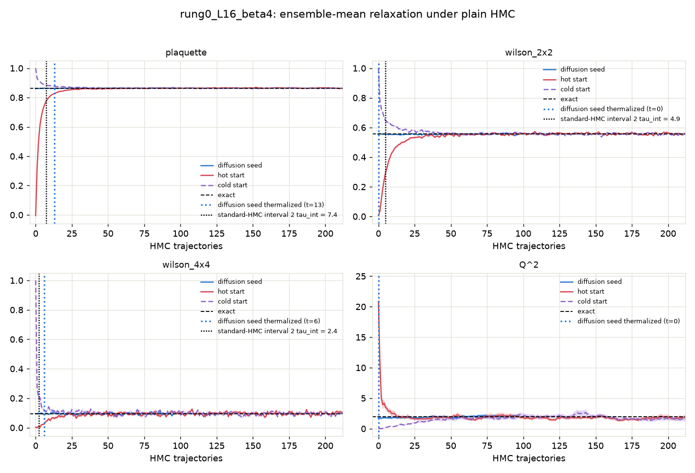
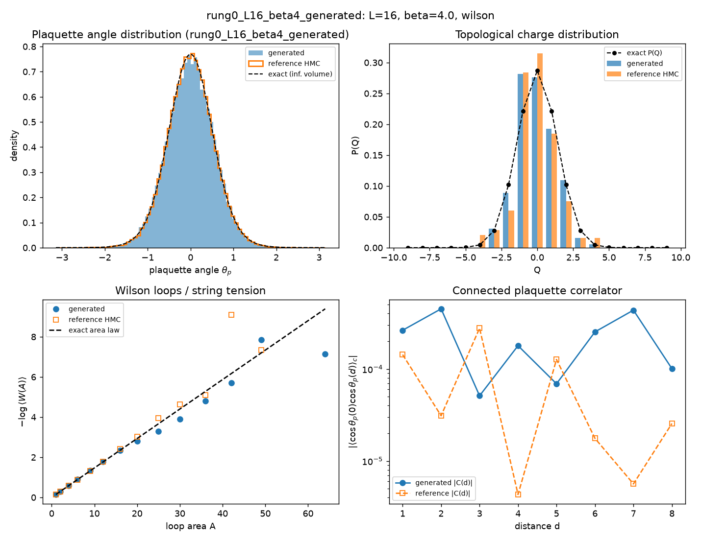
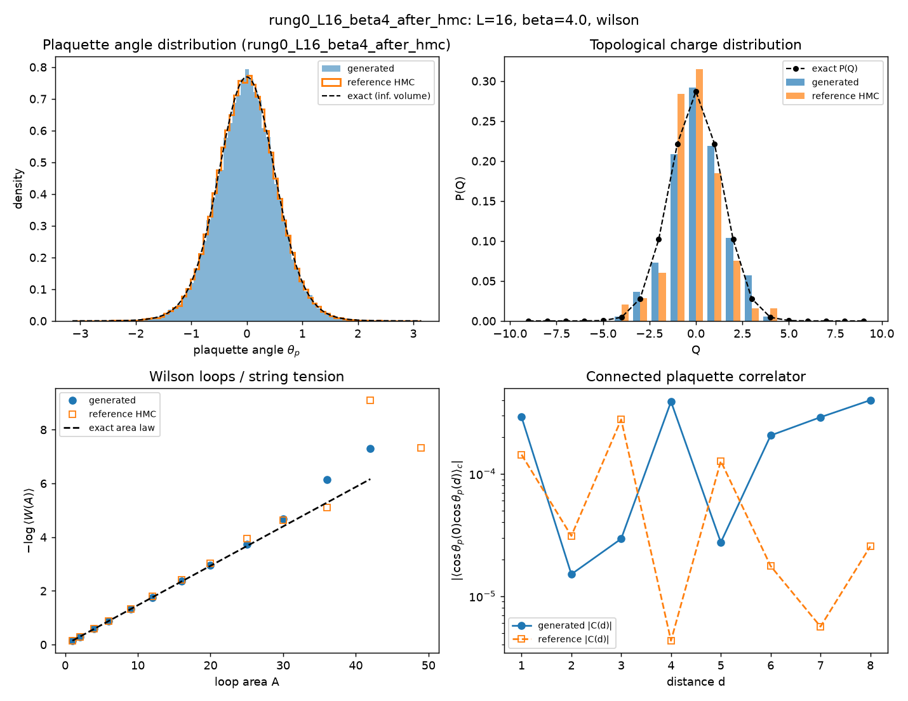
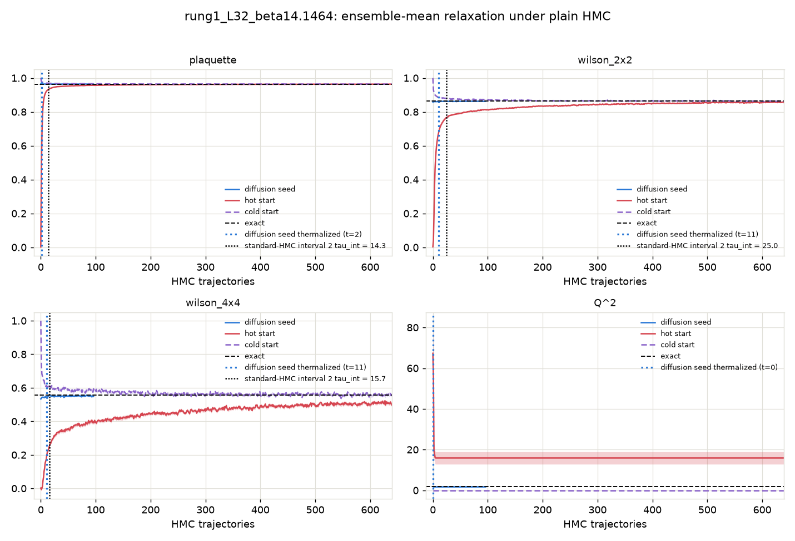
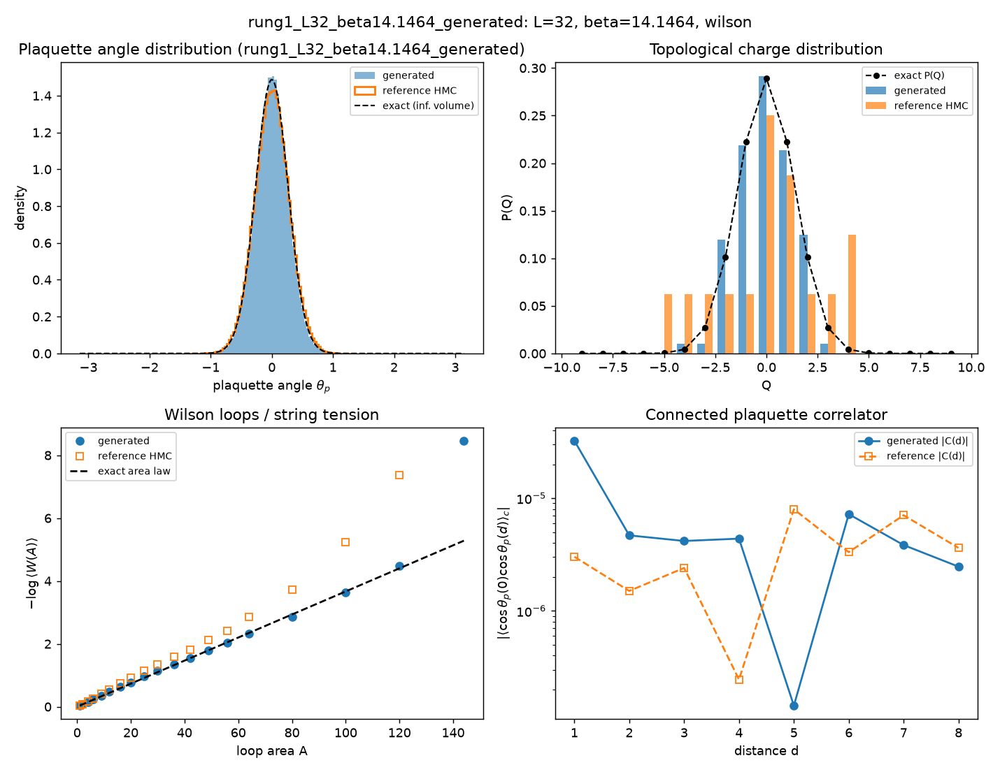
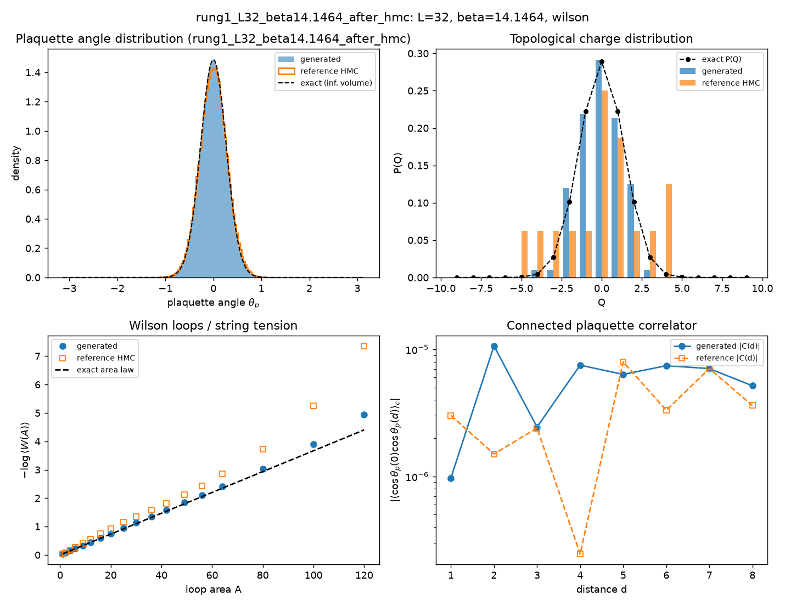
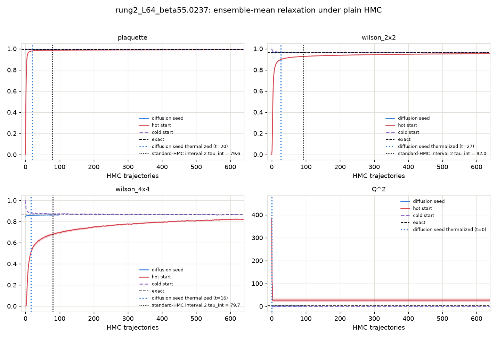
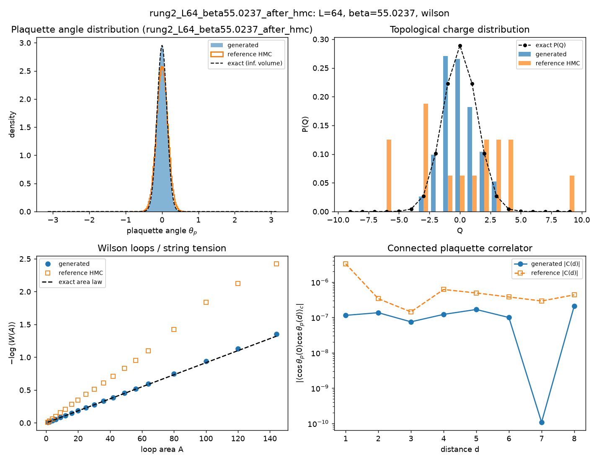

# Diffusion-seeded HMC: thermalization time vs the standard-HMC sampling interval

Action: wilson. All HMC in this report is plain HMC (Omelyan, adapted step size, **no** topological updates).

**Claim.** A raw sample from the conditional-diffusion ladder, used as the starting configuration of an HMC chain, thermalizes within a few tens of trajectories at every coupling. The yardstick is the sampling interval `2 tau_int` -- the trajectories a standard HMC chain needs between two of its own independent configs, i.e. its *marginal* cost per config, charged forever. At the fine rungs the ladder is built for, the ordering is

> t_therm(diffusion seed)  <  2 tau_int(standard HMC)  <  burn-in(fresh chain)

with a margin that grows with beta as standard HMC slides into critical slowing down and topological freezing (11 vs 25 trajectories at beta = 14.15, 27 vs 92 at beta = 55). At the cheapest rung (beta = 4) the seed and the interval are comparable (13 vs 7.4) -- where standard HMC is still efficient there is nothing to win on Wilson-loop observables -- but even there the seed starts in the correct topological sector at t = 0, while the chain's topological interval `2 tau_int(Q)` is ~42 trajectories, several times its Wilson-loop one. The fresh-chain burn-in is standard HMC's one-time entry cost and exceeds the interval everywhere.

## The three starting points

- **Diffusion seed** -- the raw output of the conditional-diffusion ladder at this rung (ancestral sampling + the deterministic coarse-charge transport), with **no** rethermalization sweeps applied: every bit of equilibration the seed needs is measured here, in HMC trajectories.
- **Hot start** -- every link angle drawn uniformly from (-pi, pi]: a completely disordered (infinite-temperature) configuration. The standard way to initialize a fresh HMC chain without prior information.
- **Cold start** -- every link angle set to zero: the perfectly ordered (beta -> infinity) configuration, the other standard initialization.

## Summary

| rung | L | beta | t_therm diffusion seed | standard-HMC interval 2 tau_int | margin (interval - t_therm) | burn-in hot / cold | tau_int(Q) |
|---|---|---|---|---|---|---|---|
| rung0_L16_beta4 | 16 | 4 | 13 | 7.4 | -5.6 traj | 53 / 42 | 20.8 |
| rung1_L32_beta14.1464 | 32 | 14.1464 | 11 | 25.0 | 14.0 traj | never / 186 | frozen (0 tunnelings in 321 x 32 traj) |
| rung2_L64_beta55.0237 | 64 | 55.0237 | 27 | 92.0 | 65.0 traj | never / 625 | frozen (0 tunnelings in 321 x 16 traj) |

t_therm and burn-in are the slowest Wilson-loop observable (plaquette, W(2x2), W(4x4)); topology is stricter still for the fresh chains: their Q^2 **never** reaches the exact value at the two frozen rungs, while the diffusion seed inherits the correct topological sector from the coarse ensemble it was generated from (see the Q^2 panels and per-rung tables below).

Thermalization time `t_therm` = first trajectory at which the ensemble-mean z-score vs the exact value satisfies |z| <= 2 and stays there for 5 consecutive trajectories (t = 0: already thermalized before any HMC). For the diffusion seed, t_therm is computed on a random subsample of chains matched to the baseline chain count so all starts are compared at equal statistical power. `tau_int` is Madras-Sokal, measured on the second half of the hot-start chains, averaged over chains. In the per-rung relaxation figures, the blue dotted vertical line marks where the diffusion seed thermalizes and the black dotted vertical line marks the standard-HMC interval `2 tau_int` for that observable.

## What 'never' means, and where the ground truth comes from

'never' = the ensemble mean was still outside |z| <= 2 of the exact value after the full baseline budget; the per-rung sections quote the z-score it plateaued at. For hot starts at the two large-beta rungs this is not a budget problem but a physical one: a random start freezes into a random topological sector (<Q^2> of order tens), plain HMC can never change Q at these couplings (tunneling is suppressed ~exp(-2 beta)), and the wrong sector biases every Wilson loop by an amount that never decays. Cold starts sit in the single sector Q = 0, so their Wilson loops do eventually converge, but <Q^2> stays pinned at 0 forever.

None of the exact values in this report come from fine-lattice HMC: the ground truth is the character expansion of 2D compact U(1) (`diffusion/lgt/exact.py`), which gives every Wilson loop, P(Q) and chi_top in closed form at finite volume. The diffusion ladder itself is anchored at a cheap coarse rung (L=8, beta ~ 1.35) where HMC mixes well, and transports that ensemble to fine rungs -- which is precisely why it can start chains in regions standard HMC cannot reach.

## rung0_L16_beta4

HMC: step size 0.1000, 10 leapfrog steps, acceptance seed/hot/cold = 0.995/0.995/0.994. Diffusion-seed batch: 192 chains x 96 trajectories (0.65 s/traj for the whole batch); baselines: 64 chains x 640 trajectories.

tau_int (hot-start chains, second half): plaquette = 3.69 +- 0.26, wilson_2x2 = 2.44 +- 0.14, wilson_4x4 = 1.19 +- 0.09. Topology: hot-start HMC L=16 beta=4 -> tau_int(Q) = 20.8.

### Diagnostics: raw diffusion output (before any HMC)

| observable | value | error | exact | z_exact | reference | ref_error | z_ref | ks_p | chi2_p |
|---|---|---|---|---|---|---|---|---|---|
| plaquette | 0.8598 | 0.001218 | 0.8635 | -3.067 | 0.8643 | 0.000538 | -3.4 | 0.0001049 |  |
| wilson_1x1 | 0.8598 | 0.001218 | 0.8635 | -3.067 | 0.8643 | 0.000538 | -3.4 | 0.0001049 |  |
| wilson_1x2 | 0.7401 | 0.001896 | 0.7457 | -2.962 | 0.7475 | 0.001245 | -3.283 | 0.003675 |  |
| wilson_2x2 | 0.5527 | 0.003339 | 0.556 | -0.9945 | 0.5584 | 0.002318 | -1.408 | 0.01764 |  |
| wilson_2x3 | 0.4098 | 0.004407 | 0.4146 | -1.103 | 0.414 | 0.003147 | -0.7932 | 0.1215 |  |
| wilson_3x3 | 0.2618 | 0.006038 | 0.267 | -0.8565 | 0.2671 | 0.004546 | -0.7 | 0.1818 |  |
| wilson_3x4 | 0.1703 | 0.006815 | 0.1719 | -0.2406 | 0.1675 | 0.004284 | 0.3463 | 0.2064 |  |
| wilson_4x4 | 0.09538 | 0.007071 | 0.09558 | -0.02904 | 0.09008 | 0.004552 | 0.6298 | 0.2633 |  |
| wilson_4x5 | 0.06017 | 0.006741 | 0.05315 | 1.042 | 0.04848 | 0.004107 | 1.481 | 0.2633 |  |
| wilson_5x5 | 0.03715 | 0.006011 | 0.02552 | 1.935 | 0.01909 | 0.003582 | 2.581 | 0.04193 |  |
| wilson_5x6 | 0.02025 | 0.00565 | 0.01225 | 1.416 | 0.009674 | 0.002905 | 1.665 | 0.1818 |  |
| wilson_6x6 | 0.008306 | 0.005011 | 0.00508 | 0.6439 | 0.006118 | 0.003684 | 0.3518 | 0.9376 |  |
| wilson_6x7 | 0.003359 | 0.003568 | 0.002106 | 0.351 | 0.0001118 | 0.002541 | 0.7412 | 0.409 |  |
| wilson_7x7 | 0.0003871 | 0.004266 | 0.0007541 | -0.08601 | 0.0006575 | 0.002865 | -0.0526 | 0.9951 |  |
| wilson_7x8 | -0.003145 | 0.005827 | 0.00027 | -0.586 | -0.005573 | 0.002671 | 0.3789 | 0.9376 |  |
| wilson_8x8 | 0.0007889 | 0.004475 | 8.347e-05 | 0.1577 | -0.003129 | 0.002933 | 0.7323 | 0.6425 |  |
| creutz_2 | 0.1419 | 0.004044 | 0.1467 | -1.186 |  |  |  |  |  |
| creutz_3 | 0.1487 | 0.0114 | 0.1467 | 0.172 |  |  |  |  |  |
| creutz_4 | 0.1493 | 0.03208 | 0.1467 | 0.07925 |  |  |  |  |  |
| creutz_5 | 0.02163 | 0.08342 | 0.1467 | -1.5 |  |  |  |  |  |
| creutz_6 | 0.2847 | 0.402 | 0.1467 | 0.3431 |  |  |  |  |  |
| creutz_7 | 1.255 | nan | 0.1467 | nan |  |  |  |  |  |
| Q | -0.07292 | 0.1 | 0 | -0.7289 | -0.1276 | 0.09796 | 0.3906 | 0.9996 |  |
| Q^2 | 1.771 | 0.2274 | 1.934 | -0.7169 | 1.992 | 0.2405 | -0.6688 | 0.9887 |  |
| chi_top ((<Q^2>-<Q>^2)/V) | 0.006897 | 0.0008879 | 0.007554 | -0.7407 | 0.007718 | 0.0008656 | -0.6628 | 3.027e-12 |  |
| Q histogram vs exact P(Q) | 5.423 | nan | 6 | nan |  |  |  |  | 0.4908 |

### Diagnostics: the same configs after 96 HMC trajectories

| observable | value | error | exact | z_exact | reference | ref_error | z_ref | ks_p | chi2_p |
|---|---|---|---|---|---|---|---|---|---|
| plaquette | 0.862 | 0.0006255 | 0.8635 | -2.446 | 0.8643 | 0.000538 | -2.814 | 0.1215 |  |
| wilson_1x1 | 0.862 | 0.0006255 | 0.8635 | -2.446 | 0.8643 | 0.000538 | -2.814 | 0.1215 |  |
| wilson_1x2 | 0.7421 | 0.001472 | 0.7457 | -2.448 | 0.7475 | 0.001245 | -2.819 | 0.01468 |  |
| wilson_2x2 | 0.5532 | 0.003113 | 0.556 | -0.8999 | 0.5584 | 0.002318 | -1.341 | 0.409 |  |
| wilson_2x3 | 0.4145 | 0.004397 | 0.4146 | -0.03519 | 0.414 | 0.003147 | 0.07609 | 0.6425 |  |
| wilson_3x3 | 0.2644 | 0.005201 | 0.267 | -0.5029 | 0.2671 | 0.004546 | -0.3959 | 0.6922 |  |
| wilson_3x4 | 0.1729 | 0.006395 | 0.1719 | 0.1515 | 0.1675 | 0.004284 | 0.701 | 0.8326 |  |
| wilson_4x4 | 0.09409 | 0.006514 | 0.09558 | -0.2299 | 0.09008 | 0.004552 | 0.5039 | 0.9376 |  |
| wilson_4x5 | 0.05263 | 0.005709 | 0.05315 | -0.09006 | 0.04848 | 0.004107 | 0.5905 | 0.8326 |  |
| wilson_5x5 | 0.02369 | 0.005758 | 0.02552 | -0.3178 | 0.01909 | 0.003582 | 0.6781 | 0.3308 |  |
| wilson_5x6 | 0.009339 | 0.005116 | 0.01225 | -0.5694 | 0.009674 | 0.002905 | -0.05696 | 0.9376 |  |
| wilson_6x6 | 0.002132 | 0.005172 | 0.00508 | -0.57 | 0.006118 | 0.003684 | -0.6278 | 0.409 |  |
| wilson_6x7 | 0.0006742 | 0.004353 | 0.002106 | -0.3289 | 0.0001118 | 0.002541 | 0.1116 | 0.8326 |  |
| wilson_7x7 | -0.001296 | 0.003739 | 0.0007541 | -0.5482 | 0.0006575 | 0.002865 | -0.4147 | 0.7883 |  |
| wilson_7x8 | -0.004859 | 0.004138 | 0.00027 | -1.24 | -0.005573 | 0.002671 | 0.145 | 0.7411 |  |
| wilson_8x8 | -0.006999 | 0.002517 | 8.347e-05 | -2.814 | -0.003129 | 0.002933 | -1.002 | 0.8729 |  |
| creutz_2 | 0.1439 | 0.003484 | 0.1467 | -0.8219 |  |  |  |  |  |
| creutz_3 | 0.1609 | 0.01006 | 0.1467 | 1.406 |  |  |  |  |  |
| creutz_4 | 0.1836 | 0.03119 | 0.1467 | 1.182 |  |  |  |  |  |
| creutz_5 | 0.2175 | 0.1391 | 0.1467 | 0.5086 |  |  |  |  |  |
| creutz_6 | 0.5464 | 1.758 | 0.1467 | 0.2274 |  |  |  |  |  |
| Q | 0.1354 | 0.09987 | 0 | 1.356 | -0.1276 | 0.09796 | 1.88 | 0.2064 |  |
| Q^2 | 2.146 | 0.1935 | 1.934 | 1.095 | 1.992 | 0.2405 | 0.4978 | 0.6425 |  |
| chi_top ((<Q^2>-<Q>^2)/V) | 0.008311 | 0.0007776 | 0.007554 | 0.9726 | 0.007718 | 0.0008656 | 0.5089 | 1.137e-11 |  |
| Q histogram vs exact P(Q) | 8.153 | nan | 6 | nan |  |  |  |  | 0.2271 |

## rung1_L32_beta14.1464

HMC: step size 0.0532, 19 leapfrog steps, acceptance seed/hot/cold = 0.995/0.994/0.996. Diffusion-seed batch: 192 chains x 96 trajectories (0.28 s/traj for the whole batch); baselines: 32 chains x 640 trajectories.

tau_int (hot-start chains, second half): plaquette = 7.13 +- 1.01, wilson_2x2 = 12.49 +- 1.75, wilson_4x4 = 7.83 +- 1.33. Topology: hot-start HMC L=32 beta=14.1464 -> **frozen** (no tunneling).

Where 'never' stood at the end: the hot start ended the 640-trajectory budget still at plaquette at |z| ~ 2, wilson_2x2 at |z| ~ 4, wilson_4x4 at |z| ~ 4, Q^2 at |z| ~ 5; the cold start ended the 640-trajectory budget still at Q^2 at |z| ~ 1903997747200.

### Diagnostics: raw diffusion output (before any HMC)

| observable | value | error | exact | z_exact | reference | ref_error | z_ref | ks_p | chi2_p |
|---|---|---|---|---|---|---|---|---|---|
| plaquette | 0.9653 | 9.577e-05 | 0.964 | 13.41 | 0.9614 | 0.0001402 | 22.68 | 0 |  |
| wilson_1x1 | 0.9653 | 9.576e-05 | 0.964 | 13.41 | 0.9614 | 0.0001402 | 22.68 | 0 |  |
| wilson_1x2 | 0.9292 | 0.0001862 | 0.9293 | -0.2521 | 0.9213 | 0.000405 | 17.76 | 0 |  |
| wilson_2x2 | 0.8586 | 0.0004283 | 0.8635 | -11.41 | 0.841 | 0.0009662 | 16.73 | 1.289e-43 |  |
| wilson_2x3 | 0.793 | 0.0007257 | 0.8024 | -12.98 | 0.7659 | 0.001538 | 15.93 | 1.922e-37 |  |
| wilson_3x3 | 0.7028 | 0.00102 | 0.7188 | -15.67 | 0.664 | 0.002141 | 16.39 | 3.382e-30 |  |
| wilson_3x4 | 0.6244 | 0.001653 | 0.6439 | -11.8 | 0.575 | 0.002713 | 15.54 | 1.314e-28 |  |
| wilson_4x4 | 0.5335 | 0.002273 | 0.556 | -9.933 | 0.4744 | 0.00314 | 15.24 | 3.082e-29 |  |
| wilson_4x5 | 0.4586 | 0.002919 | 0.4801 | -7.369 | 0.3947 | 0.003102 | 15 | 9.606e-23 |  |
| wilson_5x5 | 0.3802 | 0.003506 | 0.3997 | -5.544 | 0.3174 | 0.003199 | 13.24 | 1.369e-19 |  |
| wilson_5x6 | 0.321 | 0.004136 | 0.3327 | -2.829 | 0.2589 | 0.002877 | 12.33 | 3.955e-15 |  |
| wilson_6x6 | 0.2611 | 0.00478 | 0.267 | -1.23 | 0.2058 | 0.002737 | 10.04 | 2.694e-11 |  |
| wilson_6x7 | 0.2134 | 0.004637 | 0.2142 | -0.17 | 0.1623 | 0.002752 | 9.479 | 7.368e-09 |  |
| wilson_7x7 | 0.1666 | 0.004878 | 0.1657 | 0.1877 | 0.1204 | 0.003196 | 7.929 | 1.839e-07 |  |
| wilson_7x8 | 0.13 | 0.004757 | 0.1282 | 0.3845 | 0.08863 | 0.003453 | 7.04 | 6.978e-07 |  |
| wilson_8x8 | 0.0968 | 0.004298 | 0.09558 | 0.2838 | 0.05757 | 0.003438 | 7.128 | 1.546e-08 |  |
| wilson_8x10 | 0.05717 | 0.004659 | 0.05315 | 0.8637 | 0.02434 | 0.003404 | 5.69 | 1.825e-06 |  |
| wilson_10x10 | 0.02657 | 0.004386 | 0.02552 | 0.2399 | 0.005284 | 0.002791 | 4.095 | 0.002973 |  |
| wilson_10x12 | 0.0114 | 0.004481 | 0.01225 | -0.189 | 0.0006368 | 0.003192 | 1.957 | 0.04933 |  |
| wilson_12x12 | 0.0002112 | 0.004575 | 0.00508 | -1.064 | -0.001509 | 0.002667 | 0.3248 | 0.8729 |  |
| creutz_2 | 0.04093 | 0.0004452 | 0.03668 | 9.533 |  |  |  |  |  |
| creutz_3 | 0.04125 | 0.0009641 | 0.03668 | 4.738 |  |  |  |  |  |
| creutz_4 | 0.03908 | 0.001721 | 0.03668 | 1.391 |  |  |  |  |  |
| creutz_5 | 0.03631 | 0.00292 | 0.03668 | -0.1286 |  |  |  |  |  |
| creutz_6 | 0.03722 | 0.004903 | 0.03668 | 0.1088 |  |  |  |  |  |
| creutz_7 | 0.04607 | 0.008797 | 0.03668 | 1.067 |  |  |  |  |  |
| creutz_8 | 0.04683 | 0.01567 | 0.03668 | 0.6474 |  |  |  |  |  |
| Q | -0.03646 | 0.093 | 0 | -0.392 | 0.0625 | 0.05149 | -0.9309 | 0.0006097 |  |
| Q^2 | 1.766 | 0.1532 | 1.904 | -0.9034 | 6.438 | 0.1463 | -22.06 | 7.485e-14 |  |
| chi_top ((<Q^2>-<Q>^2)/V) | 0.001723 | 0.0001488 | 0.001859 | -0.9167 | 0.006283 | 0.0001452 | -21.93 | 2.44e-19 |  |
| Q histogram vs exact P(Q) | 5.809 | nan | 6 | nan |  |  |  |  | 0.445 |

### Diagnostics: the same configs after 96 HMC trajectories

| observable | value | error | exact | z_exact | reference | ref_error | z_ref | ks_p | chi2_p |
|---|---|---|---|---|---|---|---|---|---|
| plaquette | 0.964 | 0.0001283 | 0.964 | -0.04562 | 0.9614 | 0.0001402 | 13.48 | 7.637e-41 |  |
| wilson_1x1 | 0.964 | 0.0001283 | 0.964 | -0.0456 | 0.9614 | 0.0001402 | 13.48 | 7.637e-41 |  |
| wilson_1x2 | 0.9288 | 0.000208 | 0.9293 | -2.041 | 0.9213 | 0.000405 | 16.56 | 0 |  |
| wilson_2x2 | 0.8623 | 0.0004217 | 0.8635 | -2.881 | 0.841 | 0.0009662 | 20.25 | 0 |  |
| wilson_2x3 | 0.8003 | 0.0006197 | 0.8024 | -3.403 | 0.7659 | 0.001538 | 20.74 | 0 |  |
| wilson_3x3 | 0.7153 | 0.001246 | 0.7188 | -2.838 | 0.664 | 0.002141 | 20.72 | 0 |  |
| wilson_3x4 | 0.6384 | 0.00169 | 0.6439 | -3.282 | 0.575 | 0.002713 | 19.81 | 0 |  |
| wilson_4x4 | 0.5483 | 0.002099 | 0.556 | -3.665 | 0.4744 | 0.00314 | 19.58 | 3.116e-41 |  |
| wilson_4x5 | 0.4712 | 0.002522 | 0.4801 | -3.546 | 0.3947 | 0.003102 | 19.12 | 1.57e-33 |  |
| wilson_5x5 | 0.3898 | 0.003143 | 0.3997 | -3.144 | 0.3174 | 0.003199 | 16.14 | 4.547e-27 |  |
| wilson_5x6 | 0.3218 | 0.003497 | 0.3327 | -3.103 | 0.2589 | 0.002877 | 13.91 | 2.135e-17 |  |
| wilson_6x6 | 0.2574 | 0.003694 | 0.267 | -2.598 | 0.2058 | 0.002737 | 11.22 | 1.753e-11 |  |
| wilson_6x7 | 0.2049 | 0.003763 | 0.2142 | -2.469 | 0.1623 | 0.002752 | 9.141 | 9.236e-08 |  |
| wilson_7x7 | 0.1577 | 0.003959 | 0.1657 | -2.018 | 0.1204 | 0.003196 | 7.338 | 6.246e-06 |  |
| wilson_7x8 | 0.1217 | 0.003939 | 0.1282 | -1.654 | 0.08863 | 0.003453 | 6.307 | 0.0001766 |  |
| wilson_8x8 | 0.08973 | 0.00407 | 0.09558 | -1.438 | 0.05757 | 0.003438 | 6.037 | 1.513e-05 |  |
| wilson_8x10 | 0.04833 | 0.003727 | 0.05315 | -1.293 | 0.02434 | 0.003404 | 4.752 | 2.679e-05 |  |
| wilson_10x10 | 0.0201 | 0.003998 | 0.02552 | -1.354 | 0.005284 | 0.002791 | 3.04 | 0.01218 |  |
| wilson_10x12 | 0.007199 | 0.004995 | 0.01225 | -1.011 | 0.0006368 | 0.003192 | 1.107 | 0.4972 |  |
| wilson_12x12 | -0.001804 | 0.004921 | 0.00508 | -1.399 | -0.001509 | 0.002667 | -0.05282 | 0.1818 |  |
| creutz_2 | 0.03718 | 0.000402 | 0.03668 | 1.245 |  |  |  |  |  |
| creutz_3 | 0.03776 | 0.0008311 | 0.03668 | 1.298 |  |  |  |  |  |
| creutz_4 | 0.03825 | 0.001552 | 0.03668 | 1.008 |  |  |  |  |  |
| creutz_5 | 0.03804 | 0.00256 | 0.03668 | 0.5284 |  |  |  |  |  |
| creutz_6 | 0.03199 | 0.00493 | 0.03668 | -0.9517 |  |  |  |  |  |
| creutz_7 | 0.03402 | 0.008404 | 0.03668 | -0.3172 |  |  |  |  |  |
| creutz_8 | 0.04498 | 0.01614 | 0.03668 | 0.5143 |  |  |  |  |  |
| Q | -0.03646 | 0.093 | 0 | -0.392 | 0.0625 | 0.05149 | -0.9309 | 0.0006097 |  |
| Q^2 | 1.766 | 0.1532 | 1.904 | -0.9034 | 6.438 | 0.1463 | -22.06 | 7.485e-14 |  |
| chi_top ((<Q^2>-<Q>^2)/V) | 0.001723 | 0.0001488 | 0.001859 | -0.9167 | 0.006283 | 0.0001452 | -21.93 | 2.44e-19 |  |
| Q histogram vs exact P(Q) | 5.809 | nan | 6 | nan |  |  |  |  | 0.445 |

## rung2_L64_beta55.0237

HMC: step size 0.0270, 37 leapfrog steps, acceptance seed/hot/cold = 0.991/0.992/0.991. Diffusion-seed batch: 192 chains x 96 trajectories (2.26 s/traj for the whole batch); baselines: 16 chains x 640 trajectories.

tau_int (hot-start chains, second half): plaquette = 39.79 +- 2.01, wilson_2x2 = 46.02 +- 1.31, wilson_4x4 = 39.85 +- 2.19. Topology: hot-start HMC L=64 beta=55.0237 -> **frozen** (no tunneling).

Where 'never' stood at the end: the hot start ended the 640-trajectory budget still at plaquette at |z| ~ 17, wilson_2x2 at |z| ~ 16, wilson_4x4 at |z| ~ 10, Q^2 at |z| ~ 3; the cold start ended the 640-trajectory budget still at Q^2 at |z| ~ 1903086010368.

### Diagnostics: raw diffusion output (before any HMC)

| observable | value | error | exact | z_exact | reference | ref_error | z_ref | ks_p | chi2_p |
|---|---|---|---|---|---|---|---|---|---|
| plaquette | 0.9911 | 1.884e-05 | 0.9909 | 11.67 | 0.9881 | 5.383e-05 | 53.28 | 0 |  |
| wilson_1x1 | 0.9911 | 1.884e-05 | 0.9909 | 11.67 | 0.9881 | 5.383e-05 | 53.28 | 0 |  |
| wilson_1x2 | 0.9809 | 4.392e-05 | 0.9818 | -20.67 | 0.9737 | 0.0001559 | 44.75 | 0 |  |
| wilson_2x2 | 0.9606 | 9.699e-05 | 0.964 | -35.05 | 0.9402 | 0.0004374 | 45.45 | 0 |  |
| wilson_2x3 | 0.9411 | 0.0001484 | 0.9465 | -35.86 | 0.907 | 0.0007573 | 44.27 | 0 |  |
| wilson_3x3 | 0.9163 | 0.0002648 | 0.9208 | -16.83 | 0.8566 | 0.001242 | 47 | 0 |  |
| wilson_3x4 | 0.8858 | 0.000368 | 0.8958 | -27.2 | 0.8116 | 0.001736 | 41.8 | 0 |  |
| wilson_4x4 | 0.8445 | 0.0004616 | 0.8635 | -41.19 | 0.755 | 0.002344 | 37.47 | 0 |  |
| wilson_4x5 | 0.8058 | 0.000565 | 0.8324 | -47.05 | 0.7054 | 0.002918 | 33.8 | 0 |  |
| wilson_5x5 | 0.7585 | 0.0007349 | 0.7951 | -49.8 | 0.6482 | 0.003544 | 30.47 | 0 |  |
| wilson_5x6 | 0.7297 | 0.0008532 | 0.7595 | -34.95 | 0.5984 | 0.004034 | 31.82 | 0 |  |
| wilson_6x6 | 0.7019 | 0.001164 | 0.7188 | -14.54 | 0.5439 | 0.004484 | 34.1 | 0 |  |
| wilson_6x7 | 0.6671 | 0.001411 | 0.6803 | -9.342 | 0.4916 | 0.004916 | 34.32 | 0 |  |
| wilson_7x7 | 0.6293 | 0.00193 | 0.638 | -4.546 | 0.4363 | 0.00512 | 35.27 | 0 |  |
| wilson_7x8 | 0.5854 | 0.002245 | 0.5984 | -5.787 | 0.3852 | 0.00524 | 35.11 | 0 |  |
| wilson_8x8 | 0.5393 | 0.002565 | 0.556 | -6.505 | 0.3343 | 0.005149 | 35.63 | 0 |  |
| wilson_8x10 | 0.4618 | 0.003353 | 0.4801 | -5.482 | 0.2402 | 0.004598 | 38.94 | 0 |  |
| wilson_10x10 | 0.3828 | 0.004204 | 0.3997 | -4.026 | 0.1587 | 0.003938 | 38.89 | 0 |  |
| wilson_10x12 | 0.3102 | 0.004602 | 0.3327 | -4.886 | 0.1196 | 0.003512 | 32.93 | 0 |  |
| wilson_12x12 | 0.2435 | 0.005032 | 0.267 | -4.673 | 0.0885 | 0.003271 | 25.82 | 0 |  |
| creutz_2 | 0.01063 | 5.872e-05 | 0.009171 | 24.88 |  |  |  |  |  |
| creutz_3 | 0.00628 | 0.0001588 | 0.009171 | -18.21 |  |  |  |  |  |
| creutz_4 | 0.01381 | 0.000208 | 0.009171 | 22.31 |  |  |  |  |  |
| creutz_5 | 0.01365 | 0.0003583 | 0.009171 | 12.49 |  |  |  |  |  |
| creutz_6 | 9.542e-06 | 0.0005404 | 0.009171 | -16.95 |  |  |  |  |  |
| creutz_7 | 0.007715 | 0.0007393 | 0.009171 | -1.969 |  |  |  |  |  |
| creutz_8 | 0.009589 | 0.0009043 | 0.009171 | 0.462 |  |  |  |  |  |
| Q | 0 | 0.07825 | 0 | 0 | -0.5 | 0.1088 | 3.732 | 2.854e-14 |  |
| Q^2 | 1.969 | 0.1536 | 1.903 | 0.4275 | 27.25 | 1.042 | -24.01 | 7.006e-45 |  |
| chi_top ((<Q^2>-<Q>^2)/V) | 0.0004807 | 3.75e-05 | 0.0004646 | 0.4275 | 0.006592 | 0.0002345 | -25.74 | 0 |  |
| Q histogram vs exact P(Q) | 8.105 | nan | 6 | nan |  |  |  |  | 0.2305 |

### Diagnostics: the same configs after 96 HMC trajectories

| observable | value | error | exact | z_exact | reference | ref_error | z_ref | ks_p | chi2_p |
|---|---|---|---|---|---|---|---|---|---|
| plaquette | 0.9909 | 1.66e-05 | 0.9909 | 0.6959 | 0.9881 | 5.383e-05 | 50.25 | 0 |  |
| wilson_1x1 | 0.9909 | 1.66e-05 | 0.9909 | 0.6959 | 0.9881 | 5.383e-05 | 50.24 | 0 |  |
| wilson_1x2 | 0.9818 | 4.334e-05 | 0.9818 | -1.19 | 0.9737 | 0.0001559 | 50.08 | 0 |  |
| wilson_2x2 | 0.9638 | 9.208e-05 | 0.964 | -2.007 | 0.9402 | 0.0004374 | 52.75 | 0 |  |
| wilson_2x3 | 0.9461 | 0.0001634 | 0.9465 | -2.22 | 0.907 | 0.0007573 | 50.5 | 0 |  |
| wilson_3x3 | 0.9203 | 0.0002585 | 0.9208 | -1.708 | 0.8566 | 0.001242 | 50.22 | 0 |  |
| wilson_3x4 | 0.8947 | 0.0003584 | 0.8958 | -2.94 | 0.8116 | 0.001736 | 46.9 | 0 |  |
| wilson_4x4 | 0.8615 | 0.0005206 | 0.8635 | -3.943 | 0.755 | 0.002344 | 44.35 | 0 |  |
| wilson_4x5 | 0.8299 | 0.0007379 | 0.8324 | -3.462 | 0.7054 | 0.002918 | 41.36 | 0 |  |
| wilson_5x5 | 0.7918 | 0.0009738 | 0.7951 | -3.355 | 0.6482 | 0.003544 | 39.08 | 0 |  |
| wilson_5x6 | 0.7569 | 0.001264 | 0.7595 | -2.004 | 0.5984 | 0.004034 | 37.5 | 0 |  |
| wilson_6x6 | 0.7173 | 0.001484 | 0.7188 | -1.01 | 0.5439 | 0.004484 | 36.71 | 0 |  |
| wilson_6x7 | 0.6789 | 0.001744 | 0.6803 | -0.8368 | 0.4916 | 0.004916 | 35.9 | 0 |  |
| wilson_7x7 | 0.6361 | 0.001857 | 0.638 | -1.05 | 0.4363 | 0.00512 | 36.68 | 0 |  |
| wilson_7x8 | 0.5955 | 0.001984 | 0.5984 | -1.463 | 0.3852 | 0.00524 | 37.52 | 0 |  |
| wilson_8x8 | 0.5509 | 0.002068 | 0.556 | -2.461 | 0.3343 | 0.005149 | 39.03 | 0 |  |
| wilson_8x10 | 0.4739 | 0.002375 | 0.4801 | -2.618 | 0.2402 | 0.004598 | 45.17 | 0 |  |
| wilson_10x10 | 0.3914 | 0.002632 | 0.3997 | -3.156 | 0.1587 | 0.003938 | 49.12 | 0 |  |
| wilson_10x12 | 0.3237 | 0.00334 | 0.3327 | -2.688 | 0.1196 | 0.003512 | 42.12 | 0 |  |
| wilson_12x12 | 0.2582 | 0.003715 | 0.267 | -2.363 | 0.0885 | 0.003271 | 34.28 | 0 |  |
| creutz_2 | 0.009246 | 5.386e-05 | 0.009171 | 1.394 |  |  |  |  |  |
| creutz_3 | 0.009076 | 0.0001148 | 0.009171 | -0.8302 |  |  |  |  |  |
| creutz_4 | 0.009677 | 0.0001864 | 0.009171 | 2.716 |  |  |  |  |  |
| creutz_5 | 0.00952 | 0.0003003 | 0.009171 | 1.162 |  |  |  |  |  |
| creutz_6 | 0.008693 | 0.0004296 | 0.009171 | -1.113 |  |  |  |  |  |
| creutz_7 | 0.01002 | 0.0005131 | 0.009171 | 1.66 |  |  |  |  |  |
| creutz_8 | 0.0117 | 0.0007169 | 0.009171 | 3.532 |  |  |  |  |  |
| Q | 0 | 0.07825 | 0 | 0 | -0.5 | 0.1088 | 3.732 | 2.854e-14 |  |
| Q^2 | 1.969 | 0.1536 | 1.903 | 0.4275 | 27.25 | 1.042 | -24.01 | 7.006e-45 |  |
| chi_top ((<Q^2>-<Q>^2)/V) | 0.0004807 | 3.75e-05 | 0.0004646 | 0.4275 | 0.006592 | 0.0002345 | -25.74 | 0 |  |
| Q histogram vs exact P(Q) | 8.105 | nan | 6 | nan |  |  |  |  | 0.2305 |

