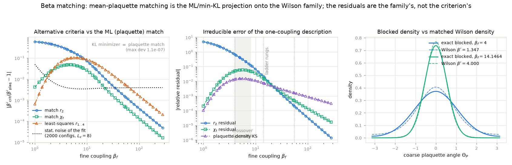

# Beta-matching criterion study

**Question.** `match_coarse_beta` fixes the coarse coupling using only the mean
plaquette. Is that justified, or should more observables enter the match?

**Answer.** Justified, and provably optimal *given the Wilson form of the coarse
action*. The Wilson weight `exp(beta cos theta_p)` is a one-parameter exponential
family with sufficient statistic `sum_p cos theta_p`, so the mean-plaquette match
is exactly the maximum-likelihood fit / minimum-KL projection of the true blocked
theory onto the Wilson family; matching the full plaquette-distribution shape in
the KL sense gives the *same* beta (verified numerically below to ~1e-9). The only
thing a different criterion could buy is a different compromise, and every
alternative sacrifices `r_1` -- i.e. all fundamental Wilson loops, all Creutz
ratios, and the string tension (`<W(A)> = r_1^A`) -- which are the observables the
validation suite is built on.

The *irreducible* error lives in the Wilson family itself: the exact blocked
theory has `r_q -> r_q(beta_f)^4` for every charge q, which no single Wilson
coupling can reproduce. `matching_residuals` reports that error budget exactly.

## Part A: criteria and residuals at the project couplings (exact, no simulation)

| beta_f | beta'(plaq=ML=KL) | beta'(r2) | beta'(chi_t) | beta'(lsq r1-4) | res r2 | res chi_t | KS | plaq damage if r2 | plaq damage if chi_t |
|---|---|---|---|---|---|---|---|---|---|
| 1 | 0.07947 | 0.03252 | 0.07981 | 0.07942 | +4.97e+00 | +2.08e-04 | 1.05e-04 | -5.91e-01 | +4.15e-03 |
| 2 | 0.48810 | 0.25980 | 0.49934 | 0.47790 | +2.43e+00 | +8.23e-03 | 3.41e-03 | -4.57e-01 | +2.17e-02 |
| 4 | 1.34719 | 0.98387 | 1.41092 | 1.22730 | +6.74e-01 | +4.99e-02 | 1.40e-02 | -2.08e-01 | +3.11e-02 |
| 5 | 1.67735 | 1.32729 | 1.75736 | 1.50702 | +4.10e-01 | +5.91e-02 | 1.54e-02 | -1.36e-01 | +2.61e-02 |
| 6.5 | 2.10842 | 1.80003 | 2.19723 | 1.88928 | +2.18e-01 | +5.78e-02 | 1.50e-02 | -7.38e-02 | +1.80e-02 |
| 8 | 2.50039 | 2.23732 | 2.58690 | 2.25686 | +1.26e-01 | +4.87e-02 | 1.35e-02 | -4.17e-02 | +1.19e-02 |
| 14.1464 | 3.99999 | 3.87107 | 4.04967 | 3.76935 | +2.11e-02 | +1.57e-02 | 7.60e-03 | -5.96e-03 | +2.18e-03 |
| 55.0237 | 14.14640 | 14.12695 | 14.15292 | 14.07200 | +2.09e-04 | +4.79e-04 | 1.63e-03 | -5.25e-05 | +1.75e-05 |

Reading the table:

- `beta'(KL)` is omitted because it coincides with the plaquette match at every
  coupling (max relative deviation ~1e-9): *minimizing the distribution-shape*
  *error IS mean-plaquette matching*.
- Adopting the `r_2` or `chi_t` criterion would move the mean plaquette by the
  last two columns -- e.g. -2.1e-1 / +3.1e-2 at beta_f = 4, i.e. hundreds of
  sigma in the validation suite -- while the residual it removes is far smaller.
- At the ladder matches 55.02 -> 14.146 and 14.146 -> 4.0 the residuals of the
  default match are <= 2e-2 (and <= 5e-4 at the finest), well below the
  per-ensemble statistical resolution.
- The chi_t residual **peaks (~6%) in the crossover beta_f ~ 5-6.5** -- exactly
  where the generalization study found its seed-sensitive `<Q^2>` weak spot
  (base beta_c = 2 -> beta_f = 6.105). A Wilson base ensemble at beta_c carries
  ~6% *more* chi_t than the true blocked theory it stands in for, so study-A
  cases in this window inherit a +O(5%) `<Q^2>` systematic unless retherm Q-hops
  fully re-equilibrate P(Q). This is a property of the one-coupling coarse
  action, not of the matching criterion, and cannot be removed by matching
  differently -- only by enlarging the coarse-action family (e.g. a cos(2 theta)
  term) or by re-equilibrating topology after seeding.

## Part B: Monte Carlo cross-check on the stored training ensembles

Blocked characters `<cos(q Theta_P)>` vs the exact finite-volume prediction
`W_q(area 4)` on the fine lattice, and the matched beta under 1- vs 3-character
matching (shift measured against the 1-character fit's bootstrap error):

| beta_f | configs | z(r1) | z(r2) | z(r3) | beta'(1 char) | beta'(3 chars) | shift / stat.err |
|---|---|---|---|---|---|---|---|
| 1 | 448 | -1.0 | -0.8 | -0.5 | 0.0623 +- 0.0091 | 0.0618 | -0.1 |
| 2 | 448 | -0.5 | -0.6 | +0.1 | 0.4793 +- 0.0087 | 0.4672 | -1.4 |
| 4 | 448 | +0.8 | +0.1 | -0.6 | 1.3643 +- 0.0110 | 1.2368 | -11.5 |
| 5 | 448 | +0.6 | +0.2 | +0.7 | 1.6915 +- 0.0105 | 1.5214 | -16.2 |
| 6.5 | 448 | +0.6 | +0.3 | +0.2 | 2.1238 +- 0.0129 | 1.9066 | -16.8 |
| 8 | 448 | -0.1 | +0.0 | +0.2 | 2.4961 +- 0.0165 | 2.2695 | -13.8 |
| 14.1464 | 448 | -0.6 | -0.6 | -0.6 | 3.9681 +- 0.0283 | 3.7692 | -7.0 |
| 55.0237 | 448 | +1.2 | +1.1 | +1.0 | 14.3751 +- 0.0977 | 14.3144 | -0.6 |

The measured characters agree with the exact blocked theory (|z| <~ 2), i.e. the
ensembles themselves contain no information the analytic error budget misses.
Where the 3-character fit shifts beta' by many statistical sigma (small beta_f),
that shift is precisely the family compromise quantified in Part A -- it buys a
smaller r_2 residual at the price of a much larger plaquette/Wilson-loop error,
so the default stays at n_characters = 1.

Figure: (left) alternative criteria converge to the plaquette match as beta_f
grows; dotted line is the statistical noise floor of the ensemble fit. (middle)
irreducible residuals of the one-coupling description; ladder rungs marked, the
shaded band is the crossover where the chi_t residual peaks. (right) exact
blocked plaquette density vs the matched Wilson density at the two coarsest
ladder matches -- the shape mismatch is at the percent level at beta_f = 4 and
invisible at 14.15.