# Diffusion-seeded HMC across the matched beta scan: thermalization time vs the standard-HMC sampling interval

Action: wilson. All HMC in this report is plain HMC (Omelyan, adapted step size, **no** topological updates).

**Why this scan.** At the ladder's upper rungs the fresh-HMC baselines never thermalize at all (topological freezing plus a metastable local-defect state), so the only comparison available there is 'diffusion seed vs a baseline that never arrives'. This report extends the benchmark to every matched coupling pair of the generalization study -- one inverse-RG step L=16 -> L=32 per case -- including fine couplings low enough that hot- and cold-start HMC *does* thermalize within the budget. There the standard chain's own interval `2 tau_int` and its fresh-start burn-in are honest, measurable yardsticks, and the scan shows where the ordering

> t_therm(diffusion seed)  <  2 tau_int(standard HMC)  <  burn-in(fresh chain)

sets in as beta grows and standard HMC slides into critical slowing down and topological freezing.

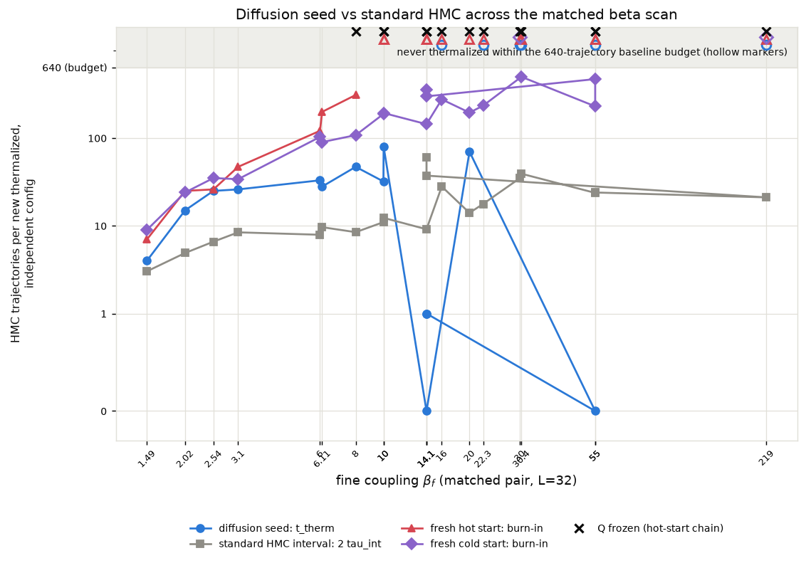

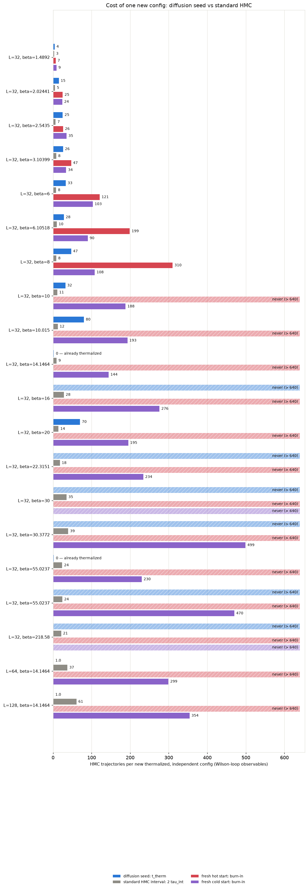

## The three starting points

- **Diffusion seed** -- the raw conditional-diffusion output for this coupling: one inverse-RG step from a direct-HMC base ensemble at the matched coarse coupling (ancestral sampling + the deterministic coarse-charge transport), with **no** rethermalization sweeps applied: every bit of equilibration the seed needs is measured here, in HMC trajectories.
- **Hot start** -- every link angle drawn uniformly from (-pi, pi]: a completely disordered (infinite-temperature) configuration. The standard way to initialize a fresh HMC chain without prior information.
- **Cold start** -- every link angle set to zero: the perfectly ordered (beta -> infinity) configuration, the other standard initialization.

## Summary

| rung | L | beta | t_therm diffusion seed | standard-HMC interval 2 tau_int | margin (interval - t_therm) | burn-in hot / cold | tau_int(Q) |
|---|---|---|---|---|---|---|---|
| A_bc0.25_L32_beta1.4892 | 32 | 1.4892 | 4 | 3.0 | -1.0 traj | 7 / 9 | 1.7 |
| A_bc0.5_L32_beta2.02441 | 32 | 2.02441 | 15 | 4.9 | -10.1 traj | 25 / 24 | 2.5 |
| A_bc0.75_L32_beta2.5435 | 32 | 2.5435 | 25 | 6.6 | -18.4 traj | 26 / 35 | 5.7 |
| A_bc1_L32_beta3.10399 | 32 | 3.10399 | 26 | 8.4 | -17.6 traj | 47 / 34 | 11.6 |
| B_bt6_L32_beta6 | 32 | 6 | 33 | 7.9 | -25.1 traj | 121 / 103 | 38.8 |
| A_bc2_L32_beta6.10518 | 32 | 6.10518 | 28 | 9.6 | -18.4 traj | 199 / 90 | 34.4 |
| B_bc2_bt8_L32_beta8 | 32 | 8 | 47 | 8.5 | -38.5 traj | 310 / 108 | frozen (0 tunnelings in 321 x 32 traj) |
| B_bt10_L32_beta10 | 32 | 10 | 32 | 11.0 | -21.0 traj | never / 188 | frozen (0 tunnelings in 321 x 32 traj) |
| A_bc3_L32_beta10.015 | 32 | 10.015 | 80 | 12.3 | -67.7 traj | never / 193 | frozen (0 tunnelings in 321 x 32 traj) |
| A_bc4_L32_beta14.1464 | 32 | 14.1464 | 0 | 9.1 | 9.1 traj | never / 144 | frozen (0 tunnelings in 321 x 32 traj) |
| B_bt16_L32_beta16 | 32 | 16 | never | 28.0 | -- | never / 276 | frozen (0 tunnelings in 321 x 32 traj) |
| B_bt20_L32_beta20 | 32 | 20 | 70 | 14.0 | -56.0 traj | never / 195 | frozen (0 tunnelings in 321 x 32 traj) |
| A_bc6_L32_beta22.3151 | 32 | 22.3151 | never | 17.8 | -- | never / 234 | frozen (0 tunnelings in 321 x 32 traj) |
| B_bt30_L32_beta30 | 32 | 30 | never | 34.9 | -- | never / never | frozen (0 tunnelings in 321 x 32 traj) |
| A_bc8_L32_beta30.3772 | 32 | 30.3772 | never | 39.2 | -- | never / 499 | frozen (0 tunnelings in 321 x 32 traj) |
| D_bc14.1464_L32_beta55.0237 | 32 | 55.0237 | 0 | 23.7 | 23.7 traj | never / 230 | frozen (0 tunnelings in 321 x 32 traj) |
| B_bt55.0237_L32_beta55.0237 | 32 | 55.0237 | never | 24.0 | -- | never / 470 | frozen (0 tunnelings in 321 x 32 traj) |
| D_bc55.0237_L32_beta218.58 | 32 | 218.58 | never | 21.1 | -- | never / never | frozen (0 tunnelings in 321 x 32 traj) |
| C_L64_L64_beta14.1464 | 64 | 14.1464 | 1 | 37.3 | 36.3 traj | never / 299 | frozen (0 tunnelings in 321 x 16 traj) |
| C_L128_L128_beta14.1464 | 128 | 14.1464 | 1 | 60.8 | 59.8 traj | never / 354 | frozen (0 tunnelings in 321 x 8 traj) |

t_therm and burn-in are the slowest Wilson-loop observable (plaquette, W(2x2), W(4x4)); topology is stricter still for the fresh chains: their Q^2 **never** reaches the exact value at the frozen rungs, while the diffusion seed inherits the correct topological sector from the coarse ensemble it was generated from (see the Q^2 panels and per-rung tables below).

Thermalization time `t_therm` = first trajectory at which the ensemble-mean z-score vs the exact value satisfies |z| <= 2 and stays there for 5 consecutive trajectories (t = 0: already thermalized before any HMC). For the diffusion seed, t_therm is computed on a random subsample of chains matched to the baseline chain count so all starts are compared at equal statistical power. `tau_int` is Madras-Sokal, measured on the second half of the hot-start chains, averaged over chains. In the per-rung relaxation figures, triangles mark each start's t_therm, dashed curves are the exponential fits C + A exp(-t/tau) to the ensemble means (tau quoted per panel), and the right-hand panels track the ensemble mean's distance from the exact value in SEM units -- thermalized means inside the shaded |z| <= 2 band; the dotted vertical line there is the standard-HMC interval `2 tau_int`.

## What 'never' means, and where the ground truth comes from

'never' = the ensemble mean was still outside |z| <= 2 of the exact value after the full baseline budget; the per-rung sections quote the z-score it plateaued at. For hot starts at the large-beta rungs this is not a budget problem but a physical one: a random start freezes into a random topological sector (<Q^2> of order tens), plain HMC can never change Q at these couplings (tunneling is suppressed ~exp(-2 beta)), and the wrong sector biases every Wilson loop by an amount that never decays. Cold starts sit in the single sector Q = 0, so their Wilson loops do eventually converge, but <Q^2> stays pinned at 0 forever.

None of the exact values in this report come from fine-lattice HMC: the ground truth is the character expansion of 2D compact U(1) (`diffusion/lgt/exact.py`), which gives every Wilson loop, P(Q) and chi_top in closed form at finite volume. Each diffusion seed here is one inverse-RG step from a direct-HMC base ensemble at the matched coarse coupling beta_c (L=16), where HMC mixes well -- which is precisely why it can start chains in regions standard HMC cannot reach.

## A_bc0.25_L32_beta1.4892

HMC: step size 0.2000, 5 leapfrog steps, acceptance seed/hot/cold = 0.966/0.970/0.967. Diffusion-seed batch: 128 chains x 96 trajectories (0.12 s/traj for the whole batch); baselines: 32 chains x 640 trajectories.

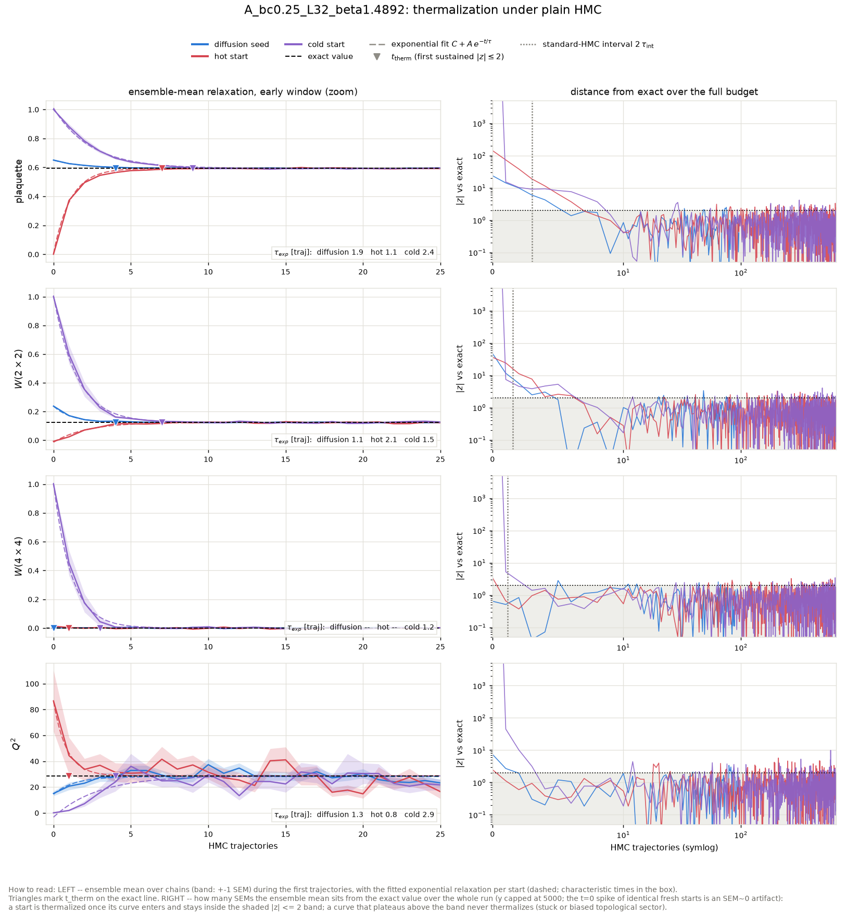

tau_int (hot-start chains, second half): plaquette = 1.51 +- 0.08, wilson_2x2 = 0.77 +- 0.04, wilson_4x4 = 0.57 +- 0.02, wilson_6x6 = 0.56 +- 0.01. Topology: hot-start HMC L=32 beta=1.4892 -> tau_int(Q) = 1.7.

### Diagnostics: raw diffusion output (before any HMC)

| observable | value | error | exact | z_exact | reference | ref_error | z_ref | ks_p | chi2_p |
|---|---|---|---|---|---|---|---|---|---|
| plaquette | 0.6502 | 0.002194 | 0.5935 | 25.88 | 0.5948 | 0.001238 | 22.02 | 0 |  |
| wilson_1x1 | 0.6502 | 0.002194 | 0.5935 | 25.88 | 0.5948 | 0.001238 | 22.02 | 0 |  |
| wilson_1x2 | 0.4308 | 0.003067 | 0.3522 | 25.61 | 0.3522 | 0.002458 | 19.99 | 0 |  |
| wilson_2x2 | 0.2371 | 0.002191 | 0.124 | 51.58 | 0.1241 | 0.001865 | 39.27 | 0 |  |
| wilson_2x3 | 0.1201 | 0.002309 | 0.04368 | 33.11 | 0.04133 | 0.001675 | 27.63 | 0 |  |
| wilson_3x3 | 0.04076 | 0.002196 | 0.00913 | 14.41 | 0.005305 | 0.002005 | 11.93 | 5.284e-22 |  |
| wilson_3x4 | 0.01552 | 0.001648 | 0.001908 | 8.259 | 0.0003275 | 0.002081 | 5.723 | 2.855e-08 |  |
| wilson_4x4 | 0.00157 | 0.001949 | 0.0002367 | 0.684 | 0.0001938 | 0.001787 | 0.5204 | 0.9126 |  |
| wilson_4x5 | -0.0004753 | 0.002013 | 2.936e-05 | -0.2507 | -0.001625 | 0.001631 | 0.444 | 0.4898 |  |
| wilson_5x5 | -0.001682 | 0.001727 | 2.161e-06 | -0.9752 | -0.000249 | 0.001931 | -0.5531 | 0.7163 |  |
| wilson_5x6 | -0.0003837 | 0.001886 | 1.591e-07 | -0.2035 | -0.0005556 | 0.001821 | 0.06554 | 0.9888 |  |
| wilson_6x6 | -7.18e-05 | 0.002162 | 6.948e-09 | -0.03322 | -0.001112 | 0.00174 | 0.3747 | 0.8569 |  |
| wilson_6x7 | -0.001795 | 0.001567 | 3.035e-10 | -1.146 | 0.002636 | 0.001766 | -1.877 | 0.5631 |  |
| wilson_7x7 | 0.001654 | 0.001925 | 7.868e-12 | 0.8594 | 0.0003693 | 0.001605 | 0.5127 | 0.7163 |  |
| wilson_7x8 | 0.0007973 | 0.002277 | 2.04e-13 | 0.3502 | -0.001279 | 0.001893 | 0.7012 | 0.4898 |  |
| wilson_8x8 | -0.003263 | 0.001694 | 3.138e-15 | -1.926 | -0.001451 | 0.00132 | -0.8439 | 0.2522 |  |
| wilson_8x10 | -0.001085 | 0.002642 | 7.426e-19 | -0.4107 | 0.001016 | 0.001793 | -0.6581 | 0.3294 |  |
| wilson_10x10 | 0.0004206 | 0.001708 | 2.18e-23 | 0.2463 | 0.0006406 | 0.001555 | -0.09522 | 0.6011 |  |
| wilson_10x12 | -0.002248 | 0.001956 | 6.4e-28 | -1.149 | -0.003091 | 0.001502 | 0.3418 | 0.8246 |  |
| wilson_12x12 | 0.0002203 | 0.001747 | 2.33e-33 | 0.1261 | -0.001718 | 0.001421 | 0.8605 | 0.5631 |  |
| creutz_2 | 0.1855 | 0.009848 | 0.5218 | -34.15 |  |  |  |  |  |
| creutz_3 | 0.401 | 0.04342 | 0.5218 | -2.781 |  |  |  |  |  |
| creutz_4 | 1.326 | 1.332 | 0.5218 | 0.6035 |  |  |  |  |  |
| Q | 0.7344 | 0.3272 | 0 | 2.245 | -0.4375 | 0.3418 | 2.477 | 0.01957 |  |
| Q^2 | 15 | 1.997 | 28.52 | -6.772 | 27.85 | 2.353 | -4.166 | 0.01957 |  |
| chi_top ((<Q^2>-<Q>^2)/V) | 0.01412 | 0.001823 | 0.02785 | -7.532 | 0.02701 | 0.002264 | -4.435 | 0.0007783 |  |
| Q histogram vs exact P(Q) | 31.13 | nan | 18 | nan |  |  |  |  | 0.02778 |

### Diagnostics: the same configs after 96 HMC trajectories

| observable | value | error | exact | z_exact | reference | ref_error | z_ref | ks_p | chi2_p |
|---|---|---|---|---|---|---|---|---|---|
| plaquette | 0.594 | 0.001739 | 0.5935 | 0.3203 | 0.5948 | 0.001238 | -0.3496 | 0.9126 |  |
| wilson_1x1 | 0.594 | 0.001739 | 0.5935 | 0.3203 | 0.5948 | 0.001238 | -0.3496 | 0.9126 |  |
| wilson_1x2 | 0.3528 | 0.002629 | 0.3522 | 0.2407 | 0.3522 | 0.002458 | 0.174 | 0.2087 |  |
| wilson_2x2 | 0.1232 | 0.002744 | 0.124 | -0.3157 | 0.1241 | 0.001865 | -0.2669 | 0.9353 |  |
| wilson_2x3 | 0.04277 | 0.001749 | 0.04368 | -0.5224 | 0.04133 | 0.001675 | 0.5943 | 0.7901 |  |
| wilson_3x3 | 0.009764 | 0.002346 | 0.00913 | 0.2704 | 0.005305 | 0.002005 | 1.445 | 0.1892 |  |
| wilson_3x4 | 0.001928 | 0.002255 | 0.001908 | 0.008997 | 0.0003275 | 0.002081 | 0.5218 | 0.8246 |  |
| wilson_4x4 | -0.0005143 | 0.001678 | 0.0002367 | -0.4475 | 0.0001938 | 0.001787 | -0.2889 | 0.9693 |  |
| wilson_4x5 | -0.0009443 | 0.001885 | 2.936e-05 | -0.5165 | -0.001625 | 0.001631 | 0.2733 | 0.678 |  |
| wilson_5x5 | 0.0005263 | 0.001864 | 2.161e-06 | 0.2812 | -0.000249 | 0.001931 | 0.2889 | 0.8569 |  |
| wilson_5x6 | -0.00232 | 0.002269 | 1.591e-07 | -1.023 | -0.0005556 | 0.001821 | -0.6066 | 0.3294 |  |
| wilson_6x6 | -0.0006385 | 0.00224 | 6.948e-09 | -0.2851 | -0.001112 | 0.00174 | 0.1668 | 0.7538 |  |
| wilson_6x7 | 0.001219 | 0.001946 | 3.035e-10 | 0.6263 | 0.002636 | 0.001766 | -0.5394 | 0.7538 |  |
| wilson_7x7 | -0.001452 | 0.001593 | 7.868e-12 | -0.9117 | 0.0003693 | 0.001605 | -0.8055 | 0.4548 |  |
| wilson_7x8 | 0.0004976 | 0.001918 | 2.04e-13 | 0.2594 | -0.001279 | 0.001893 | 0.6591 | 0.8246 |  |
| wilson_8x8 | 0.002377 | 0.00189 | 3.138e-15 | 1.258 | -0.001451 | 0.00132 | 1.661 | 0.2087 |  |
| wilson_8x10 | 0.0004264 | 0.001318 | 7.426e-19 | 0.3234 | 0.001016 | 0.001793 | -0.265 | 0.7538 |  |
| wilson_10x10 | 0.001964 | 0.001834 | 2.18e-23 | 1.071 | 0.0006406 | 0.001555 | 0.5505 | 0.7538 |  |
| wilson_10x12 | 0.001938 | 0.001913 | 6.4e-28 | 1.013 | -0.003091 | 0.001502 | 2.068 | 0.1392 |  |
| wilson_12x12 | -0.0005296 | 0.001933 | 2.33e-33 | -0.274 | -0.001718 | 0.001421 | 0.4951 | 0.7538 |  |
| creutz_2 | 0.5315 | 0.01593 | 0.5218 | 0.6062 |  |  |  |  |  |
| creutz_3 | 0.4194 | 0.2009 | 0.5218 | -0.5098 |  |  |  |  |  |
| Q | 0.5938 | 0.3767 | 0 | 1.576 | -0.4375 | 0.3418 | 2.027 | 0.04938 |  |
| Q^2 | 26.36 | 3.411 | 28.52 | -0.6341 | 27.85 | 2.353 | -0.3608 | 0.6011 |  |
| chi_top ((<Q^2>-<Q>^2)/V) | 0.0254 | 0.003425 | 0.02785 | -0.7173 | 0.02701 | 0.002264 | -0.3939 | 0.1122 |  |
| Q histogram vs exact P(Q) | 30.57 | nan | 18 | nan |  |  |  |  | 0.03222 |

## A_bc0.5_L32_beta2.02441

HMC: step size 0.2000, 5 leapfrog steps, acceptance seed/hot/cold = 0.963/0.964/0.962. Diffusion-seed batch: 128 chains x 96 trajectories (0.05 s/traj for the whole batch); baselines: 32 chains x 640 trajectories.

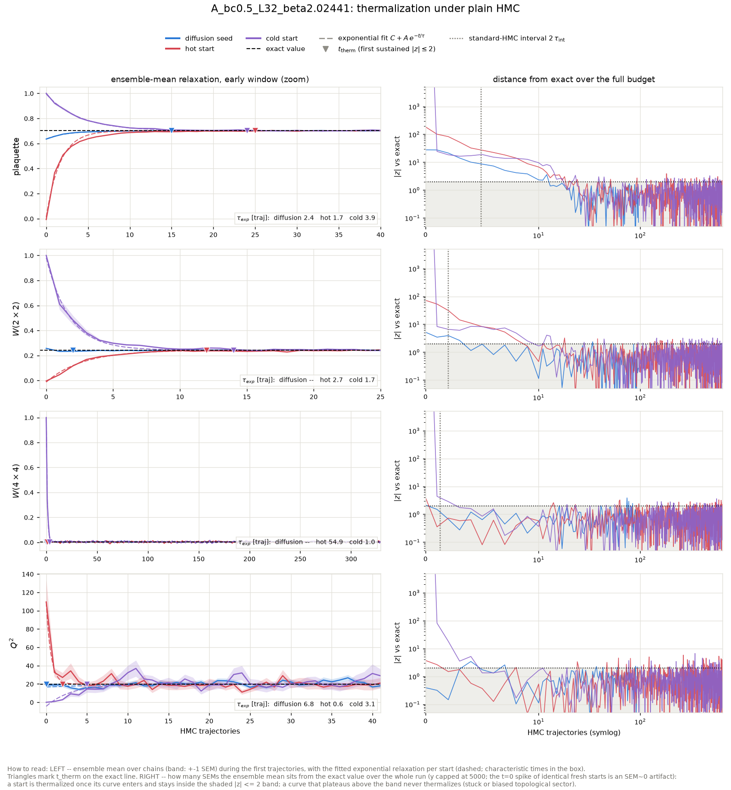

tau_int (hot-start chains, second half): plaquette = 2.45 +- 0.14, wilson_2x2 = 0.99 +- 0.04, wilson_4x4 = 0.62 +- 0.02, wilson_6x6 = 0.58 +- 0.02. Topology: hot-start HMC L=32 beta=2.02441 -> tau_int(Q) = 2.5.

### Diagnostics: raw diffusion output (before any HMC)

| observable | value | error | exact | z_exact | reference | ref_error | z_ref | ks_p | chi2_p |
|---|---|---|---|---|---|---|---|---|---|
| plaquette | 0.6353 | 0.002595 | 0.7017 | -25.59 | 0.7019 | 0.0008797 | -24.3 | 0 |  |
| wilson_1x1 | 0.6353 | 0.002595 | 0.7017 | -25.59 | 0.7019 | 0.0008797 | -24.3 | 0 |  |
| wilson_1x2 | 0.4294 | 0.003679 | 0.4924 | -17.14 | 0.4926 | 0.001604 | -15.75 | 4.624e-43 |  |
| wilson_2x2 | 0.2567 | 0.002869 | 0.2425 | 4.952 | 0.2406 | 0.001965 | 4.618 | 1.616e-05 |  |
| wilson_2x3 | 0.1356 | 0.002737 | 0.1194 | 5.923 | 0.1199 | 0.002269 | 4.426 | 0.0004451 |  |
| wilson_3x3 | 0.04799 | 0.002289 | 0.04127 | 2.935 | 0.03906 | 0.002341 | 2.725 | 0.02248 |  |
| wilson_3x4 | 0.01761 | 0.002144 | 0.01426 | 1.563 | 0.01215 | 0.001815 | 1.942 | 0.389 |  |
| wilson_4x4 | 0.008065 | 0.00248 | 0.003458 | 1.857 | 0.002402 | 0.001851 | 1.83 | 0.1892 |  |
| wilson_4x5 | 0.00287 | 0.002291 | 0.0008386 | 0.8867 | 0.001425 | 0.002112 | 0.4638 | 0.8569 |  |
| wilson_5x5 | -0.0005306 | 0.002097 | 0.0001427 | -0.321 | -0.0008455 | 0.001957 | 0.1097 | 0.9542 |  |
| wilson_5x6 | 0.001327 | 0.002312 | 2.428e-05 | 0.5634 | -9.881e-05 | 0.001841 | 0.4824 | 0.389 |  |
| wilson_6x6 | -0.003454 | 0.002154 | 2.9e-06 | -1.605 | -0.0007191 | 0.001925 | -0.9466 | 0.9126 |  |
| wilson_6x7 | 5.413e-05 | 0.00221 | 3.463e-07 | 0.02434 | -0.0003006 | 0.001982 | 0.1195 | 0.8569 |  |
| wilson_7x7 | 0.001839 | 0.001548 | 2.902e-08 | 1.188 | 0.001083 | 0.001614 | 0.3381 | 0.6395 |  |
| wilson_7x8 | -0.003849 | 0.001721 | 2.432e-09 | -2.237 | -0.001728 | 0.001643 | -0.8915 | 0.2087 |  |
| wilson_8x8 | -0.00126 | 0.00183 | 1.43e-10 | -0.6885 | -0.0004432 | 0.001893 | -0.3102 | 0.8864 |  |
| wilson_8x10 | 0.001347 | 0.001935 | 4.946e-13 | 0.6962 | -0.001078 | 0.001766 | 0.9256 | 0.6011 |  |
| wilson_10x10 | 0.001002 | 0.002473 | 4.147e-16 | 0.4054 | 0.0007502 | 0.001534 | 0.08667 | 0.9353 |  |
| wilson_10x12 | 0.003554 | 0.001733 | 3.478e-19 | 2.051 | 0.001283 | 0.00153 | 0.9819 | 0.1545 |  |
| wilson_12x12 | -0.002114 | 0.001651 | 7.073e-23 | -1.28 | 0.001944 | 0.001599 | -1.766 | 0.1712 |  |
| creutz_2 | 0.1226 | 0.009022 | 0.3542 | -25.67 |  |  |  |  |  |
| creutz_3 | 0.401 | 0.03983 | 0.3542 | 1.176 |  |  |  |  |  |
| creutz_4 | -0.2214 | 0.2772 | 0.3542 | -2.077 |  |  |  |  |  |
| Q | -0.04688 | 0.3268 | 0 | -0.1435 | -0.7917 | 0.2757 | 1.742 | 0.0631 |  |
| Q^2 | 18.75 | 2.101 | 19.51 | -0.3622 | 16.85 | 1.13 | 0.7948 | 0.1122 |  |
| chi_top ((<Q^2>-<Q>^2)/V) | 0.01831 | 0.002049 | 0.01905 | -0.3636 | 0.01585 | 0.001139 | 1.05 | 0.0001679 |  |
| Q histogram vs exact P(Q) | 13.44 | nan | 16 | nan |  |  |  |  | 0.6405 |

### Diagnostics: the same configs after 96 HMC trajectories

| observable | value | error | exact | z_exact | reference | ref_error | z_ref | ks_p | chi2_p |
|---|---|---|---|---|---|---|---|---|---|
| plaquette | 0.7017 | 0.001094 | 0.7017 | -0.06945 | 0.7019 | 0.0008797 | -0.1736 | 0.7163 |  |
| wilson_1x1 | 0.7017 | 0.001094 | 0.7017 | -0.06945 | 0.7019 | 0.0008797 | -0.1736 | 0.7163 |  |
| wilson_1x2 | 0.494 | 0.001443 | 0.4924 | 1.1 | 0.4926 | 0.001604 | 0.6747 | 0.2763 |  |
| wilson_2x2 | 0.2431 | 0.002144 | 0.2425 | 0.3018 | 0.2406 | 0.001965 | 0.8595 | 0.2763 |  |
| wilson_2x3 | 0.1233 | 0.002205 | 0.1194 | 1.772 | 0.1199 | 0.002269 | 1.084 | 0.3294 |  |
| wilson_3x3 | 0.04558 | 0.002357 | 0.04127 | 1.831 | 0.03906 | 0.002341 | 1.962 | 0.08971 |  |
| wilson_3x4 | 0.01688 | 0.002071 | 0.01426 | 1.267 | 0.01215 | 0.001815 | 1.717 | 0.2522 |  |
| wilson_4x4 | 0.006323 | 0.001638 | 0.003458 | 1.749 | 0.002402 | 0.001851 | 1.586 | 0.3021 |  |
| wilson_4x5 | 0.003619 | 0.001907 | 0.0008386 | 1.458 | 0.001425 | 0.002112 | 0.7712 | 0.4898 |  |
| wilson_5x5 | 0.001927 | 0.002528 | 0.0001427 | 0.7058 | -0.0008455 | 0.001957 | 0.8672 | 0.6395 |  |
| wilson_5x6 | 0.004042 | 0.00236 | 2.428e-05 | 1.702 | -9.881e-05 | 0.001841 | 1.383 | 0.03831 |  |
| wilson_6x6 | 0.002563 | 0.00196 | 2.9e-06 | 1.306 | -0.0007191 | 0.001925 | 1.195 | 0.2522 |  |
| wilson_6x7 | 0.0004967 | 0.002555 | 3.463e-07 | 0.1942 | -0.0003006 | 0.001982 | 0.2466 | 0.8246 |  |
| wilson_7x7 | 0.002351 | 0.001709 | 2.902e-08 | 1.376 | 0.001083 | 0.001614 | 0.5392 | 0.6011 |  |
| wilson_7x8 | -0.0006448 | 0.001972 | 2.432e-09 | -0.327 | -0.001728 | 0.001643 | 0.4222 | 0.5259 |  |
| wilson_8x8 | -0.002522 | 0.002411 | 1.43e-10 | -1.046 | -0.0004432 | 0.001893 | -0.6781 | 0.7538 |  |
| wilson_8x10 | -0.002014 | 0.002181 | 4.946e-13 | -0.9237 | -0.001078 | 0.001766 | -0.3338 | 0.9807 |  |
| wilson_10x10 | 0.00272 | 0.001788 | 4.147e-16 | 1.521 | 0.0007502 | 0.001534 | 0.8362 | 0.7901 |  |
| wilson_10x12 | 0.0006172 | 0.002262 | 3.478e-19 | 0.2729 | 0.001283 | 0.00153 | -0.244 | 0.8569 |  |
| wilson_12x12 | 0.00169 | 0.002068 | 7.073e-23 | 0.8175 | 0.001944 | 0.001599 | -0.09687 | 0.9353 |  |
| creutz_2 | 0.3581 | 0.007304 | 0.3542 | 0.5309 |  |  |  |  |  |
| creutz_3 | 0.3164 | 0.04385 | 0.3542 | -0.8608 |  |  |  |  |  |
| creutz_4 | -0.01099 | 0.2914 | 0.3542 | -1.253 |  |  |  |  |  |
| creutz_5 | 0.07241 | 1.33 | 0.3542 | -0.2119 |  |  |  |  |  |
| creutz_6 | 1.196 | 1.274 | 0.3542 | 0.6611 |  |  |  |  |  |
| creutz_7 | -3.195 | nan | 0.3542 | nan |  |  |  |  |  |
| Q | 0.7656 | 0.4202 | 0 | 1.822 | -0.7917 | 0.2757 | 3.099 | 7.394e-05 |  |
| Q^2 | 23.03 | 2.846 | 19.51 | 1.237 | 16.85 | 1.13 | 2.017 | 0.05588 |  |
| chi_top ((<Q^2>-<Q>^2)/V) | 0.02192 | 0.002841 | 0.01905 | 1.009 | 0.01585 | 0.001139 | 1.984 | 3.143e-05 |  |
| Q histogram vs exact P(Q) | 21.54 | nan | 16 | nan |  |  |  |  | 0.1587 |

## A_bc0.75_L32_beta2.5435

HMC: step size 0.2000, 5 leapfrog steps, acceptance seed/hot/cold = 0.966/0.962/0.962. Diffusion-seed batch: 128 chains x 96 trajectories (0.05 s/traj for the whole batch); baselines: 32 chains x 640 trajectories.

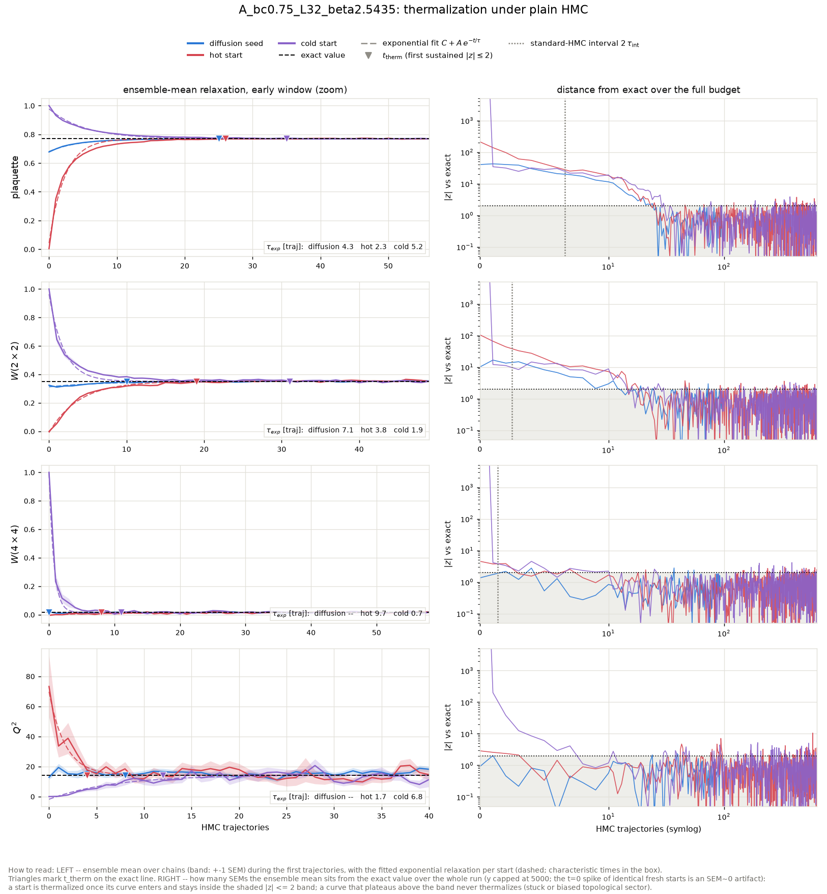

tau_int (hot-start chains, second half): plaquette = 3.30 +- 0.23, wilson_2x2 = 1.23 +- 0.06, wilson_4x4 = 0.68 +- 0.03, wilson_6x6 = 0.59 +- 0.02. Topology: hot-start HMC L=32 beta=2.5435 -> tau_int(Q) = 5.7.

### Diagnostics: raw diffusion output (before any HMC)

| observable | value | error | exact | z_exact | reference | ref_error | z_ref | ks_p | chi2_p |
|---|---|---|---|---|---|---|---|---|---|
| plaquette | 0.6775 | 0.002507 | 0.7696 | -36.75 | 0.7712 | 0.0008441 | -35.42 | 0 |  |
| wilson_1x1 | 0.6775 | 0.002507 | 0.7696 | -36.75 | 0.7712 | 0.0008441 | -35.42 | 0 |  |
| wilson_1x2 | 0.4857 | 0.003044 | 0.5924 | -35.04 | 0.5947 | 0.001239 | -33.16 | 0 |  |
| wilson_2x2 | 0.3232 | 0.003658 | 0.3509 | -7.566 | 0.3548 | 0.001546 | -7.957 | 3.972e-18 |  |
| wilson_2x3 | 0.1881 | 0.003595 | 0.2079 | -5.48 | 0.2096 | 0.001777 | -5.36 | 7.158e-07 |  |
| wilson_3x3 | 0.07832 | 0.00323 | 0.09476 | -5.091 | 0.099 | 0.002295 | -5.219 | 3.143e-05 |  |
| wilson_3x4 | 0.03857 | 0.002166 | 0.0432 | -2.139 | 0.04598 | 0.00207 | -2.475 | 0.1004 |  |
| wilson_4x4 | 0.01835 | 0.00227 | 0.01516 | 1.407 | 0.01636 | 0.002317 | 0.6151 | 0.5631 |  |
| wilson_4x5 | 0.006305 | 0.001751 | 0.005319 | 0.5633 | 0.008872 | 0.001496 | -1.115 | 0.6011 |  |
| wilson_5x5 | -0.002131 | 0.00146 | 0.001436 | -2.444 | 0.004459 | 0.001775 | -2.867 | 0.04354 |  |
| wilson_5x6 | -0.002922 | 0.001857 | 0.0003879 | -1.782 | 0.001126 | 0.001405 | -1.738 | 0.1122 |  |
| wilson_6x6 | 0.001242 | 0.002399 | 8.063e-05 | 0.484 | 0.0006585 | 0.002101 | 0.1829 | 0.3021 |  |
| wilson_6x7 | 0.003672 | 0.001476 | 1.676e-05 | 2.477 | 0.0003578 | 0.002067 | 1.305 | 0.1122 |  |
| wilson_7x7 | -0.002982 | 0.001854 | 2.681e-06 | -1.61 | -5.091e-05 | 0.001535 | -1.218 | 0.1251 |  |
| wilson_7x8 | 0.0007908 | 0.001917 | 4.289e-07 | 0.4123 | -0.0002698 | 0.00133 | 0.4545 | 0.4898 |  |
| wilson_8x8 | 0.002826 | 0.001728 | 5.28e-08 | 1.636 | -3.522e-05 | 0.001573 | 1.224 | 0.4212 |  |
| wilson_8x10 | 0.002692 | 0.002555 | 8.005e-10 | 1.054 | -0.0007483 | 0.001392 | 1.182 | 0.3584 |  |
| wilson_10x10 | 0.001306 | 0.001491 | 4.258e-12 | 0.8761 | 0.0005853 | 0.001744 | 0.3142 | 0.5631 |  |
| wilson_10x12 | -0.0002257 | 0.002468 | 2.265e-14 | -0.09147 | -0.003624 | 0.001567 | 1.163 | 0.4548 |  |
| wilson_12x12 | -0.0008038 | 0.002004 | 4.227e-17 | -0.401 | 0.001042 | 0.001567 | -0.7254 | 0.1545 |  |
| creutz_2 | 0.07442 | 0.00773 | 0.2618 | -24.24 |  |  |  |  |  |
| creutz_3 | 0.3354 | 0.02633 | 0.2618 | 2.793 |  |  |  |  |  |
| creutz_4 | 0.03426 | 0.1224 | 0.2618 | -1.859 |  |  |  |  |  |
| Q | -0.25 | 0.2687 | 0 | -0.9304 | -0.2552 | 0.2417 | 0.01441 | 0.9999 |  |
| Q^2 | 12.83 | 1.673 | 14.25 | -0.8515 | 13.84 | 1.822 | -0.4085 | 0.8864 |  |
| chi_top ((<Q^2>-<Q>^2)/V) | 0.01247 | 0.001627 | 0.01392 | -0.8926 | 0.01345 | 0.001796 | -0.4061 | 0.006985 |  |
| Q histogram vs exact P(Q) | 9.436 | nan | 14 | nan |  |  |  |  | 0.8022 |

### Diagnostics: the same configs after 96 HMC trajectories

| observable | value | error | exact | z_exact | reference | ref_error | z_ref | ks_p | chi2_p |
|---|---|---|---|---|---|---|---|---|---|
| plaquette | 0.7693 | 0.0009667 | 0.7696 | -0.3483 | 0.7712 | 0.0008441 | -1.477 | 0.3294 |  |
| wilson_1x1 | 0.7693 | 0.0009667 | 0.7696 | -0.3483 | 0.7712 | 0.0008441 | -1.477 | 0.3294 |  |
| wilson_1x2 | 0.5899 | 0.001989 | 0.5924 | -1.213 | 0.5947 | 0.001239 | -2.02 | 0.02947 |  |
| wilson_2x2 | 0.3491 | 0.003091 | 0.3509 | -0.5634 | 0.3548 | 0.001546 | -1.64 | 0.07995 |  |
| wilson_2x3 | 0.2054 | 0.003341 | 0.2079 | -0.7363 | 0.2096 | 0.001777 | -1.123 | 0.1892 |  |
| wilson_3x3 | 0.09568 | 0.003456 | 0.09476 | 0.2666 | 0.099 | 0.002295 | -0.7994 | 0.6011 |  |
| wilson_3x4 | 0.04629 | 0.002709 | 0.0432 | 1.139 | 0.04598 | 0.00207 | 0.08942 | 0.7163 |  |
| wilson_4x4 | 0.01699 | 0.002701 | 0.01516 | 0.6778 | 0.01636 | 0.002317 | 0.1778 | 0.6011 |  |
| wilson_4x5 | 0.007237 | 0.002677 | 0.005319 | 0.7165 | 0.008872 | 0.001496 | -0.5332 | 0.3294 |  |
| wilson_5x5 | 0.00399 | 0.003153 | 0.001436 | 0.8099 | 0.004459 | 0.001775 | -0.1296 | 0.389 |  |
| wilson_5x6 | 0.00285 | 0.00251 | 0.0003879 | 0.9808 | 0.001126 | 0.001405 | 0.5992 | 0.7538 |  |
| wilson_6x6 | 0.00322 | 0.002018 | 8.063e-05 | 1.556 | 0.0006585 | 0.002101 | 0.8793 | 0.5631 |  |
| wilson_6x7 | 0.002563 | 0.002118 | 1.676e-05 | 1.202 | 0.0003578 | 0.002067 | 0.7451 | 0.5259 |  |
| wilson_7x7 | -0.003994 | 0.002024 | 2.681e-06 | -1.975 | -5.091e-05 | 0.001535 | -1.552 | 0.1392 |  |
| wilson_7x8 | -0.002364 | 0.0026 | 4.289e-07 | -0.9096 | -0.0002698 | 0.00133 | -0.7172 | 0.6011 |  |
| wilson_8x8 | 0.0001635 | 0.002453 | 5.28e-08 | 0.06663 | -3.522e-05 | 0.001573 | 0.06819 | 0.8569 |  |
| wilson_8x10 | 0.0006721 | 0.001208 | 8.005e-10 | 0.5565 | -0.0007483 | 0.001392 | 0.7706 | 0.7901 |  |
| wilson_10x10 | -0.0008216 | 0.001655 | 4.258e-12 | -0.4965 | 0.0005853 | 0.001744 | -0.5852 | 0.8569 |  |
| wilson_10x12 | 0.0006576 | 0.002827 | 2.265e-14 | 0.2326 | -0.003624 | 0.001567 | 1.325 | 0.0631 |  |
| wilson_12x12 | -0.0005746 | 0.001823 | 4.227e-17 | -0.3151 | 0.001042 | 0.001567 | -0.6723 | 0.6011 |  |
| creutz_2 | 0.2591 | 0.00431 | 0.2618 | -0.6372 |  |  |  |  |  |
| creutz_3 | 0.2333 | 0.01897 | 0.2618 | -1.503 |  |  |  |  |  |
| creutz_4 | 0.2761 | 0.1105 | 0.2618 | 0.1289 |  |  |  |  |  |
| creutz_5 | -0.258 | 0.5559 | 0.2618 | -0.935 |  |  |  |  |  |
| creutz_6 | -0.4585 | 1.272 | 0.2618 | -0.5663 |  |  |  |  |  |
| Q | 0.04688 | 0.3778 | 0 | 0.1241 | -0.2552 | 0.2417 | 0.6736 | 0.5631 |  |
| Q^2 | 15.55 | 1.778 | 14.25 | 0.728 | 13.84 | 1.822 | 0.671 | 0.3584 |  |
| chi_top ((<Q^2>-<Q>^2)/V) | 0.01518 | 0.001743 | 0.01392 | 0.7242 | 0.01345 | 0.001796 | 0.6912 | 0.01957 |  |
| Q histogram vs exact P(Q) | 8.863 | nan | 14 | nan |  |  |  |  | 0.8398 |

## A_bc1_L32_beta3.10399

HMC: step size 0.2000, 5 leapfrog steps, acceptance seed/hot/cold = 0.963/0.961/0.960. Diffusion-seed batch: 128 chains x 96 trajectories (0.06 s/traj for the whole batch); baselines: 32 chains x 640 trajectories.

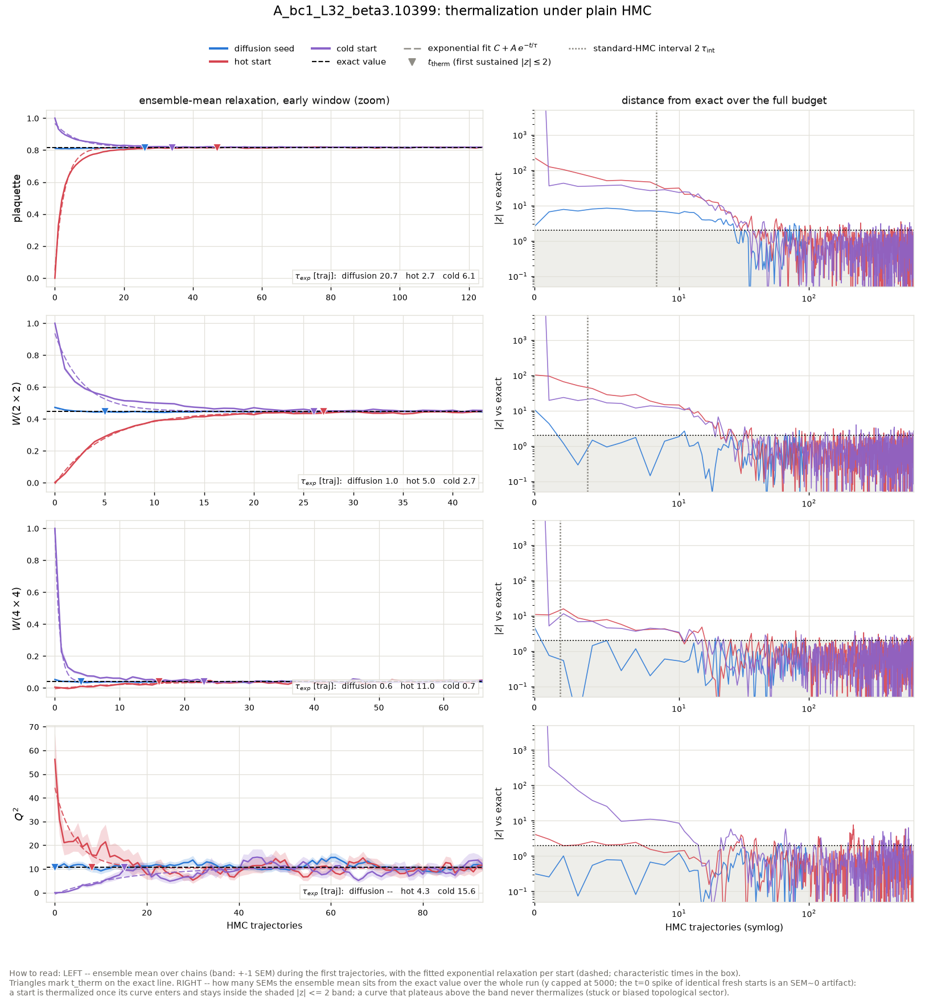

tau_int (hot-start chains, second half): plaquette = 4.21 +- 0.40, wilson_2x2 = 1.84 +- 0.16, wilson_4x4 = 0.88 +- 0.05, wilson_6x6 = 0.58 +- 0.02. Topology: hot-start HMC L=32 beta=3.10399 -> tau_int(Q) = 11.6.

### Diagnostics: raw diffusion output (before any HMC)

| observable | value | error | exact | z_exact | reference | ref_error | z_ref | ks_p | chi2_p |
|---|---|---|---|---|---|---|---|---|---|
| plaquette | 0.8139 | 0.001253 | 0.8174 | -2.765 | 0.8167 | 0.0005787 | -2.001 | 5.543e-07 |  |
| wilson_1x1 | 0.8139 | 0.001253 | 0.8174 | -2.765 | 0.8167 | 0.0005787 | -2.001 | 5.543e-07 |  |
| wilson_1x2 | 0.6639 | 0.002108 | 0.6681 | -2.025 | 0.6667 | 0.001248 | -1.153 | 0.006985 |  |
| wilson_2x2 | 0.4722 | 0.002437 | 0.4464 | 10.59 | 0.4462 | 0.002387 | 7.609 | 6.242e-11 |  |
| wilson_2x3 | 0.3192 | 0.00323 | 0.2982 | 6.498 | 0.2995 | 0.003104 | 4.415 | 0.0004451 |  |
| wilson_3x3 | 0.1728 | 0.003474 | 0.1629 | 2.859 | 0.1662 | 0.003275 | 1.391 | 0.1892 |  |
| wilson_3x4 | 0.09983 | 0.003656 | 0.08895 | 2.976 | 0.09401 | 0.002937 | 1.241 | 0.1892 |  |
| wilson_4x4 | 0.05357 | 0.003126 | 0.03971 | 4.435 | 0.04635 | 0.002315 | 1.855 | 0.1545 |  |
| wilson_4x5 | 0.02607 | 0.003057 | 0.01772 | 2.73 | 0.02331 | 0.001923 | 0.7637 | 0.2087 |  |
| wilson_5x5 | 0.007549 | 0.002435 | 0.006467 | 0.4443 | 0.008977 | 0.001985 | -0.4546 | 0.9807 |  |
| wilson_5x6 | 0.003884 | 0.0021 | 0.00236 | 0.7261 | 0.001769 | 0.001658 | 0.7905 | 0.3584 |  |
| wilson_6x6 | -0.0002364 | 0.002475 | 0.0007038 | -0.3799 | -0.001236 | 0.002333 | 0.2939 | 0.7901 |  |
| wilson_6x7 | -0.002 | 0.002543 | 0.0002099 | -0.8693 | 0.0001348 | 0.001854 | -0.6785 | 0.8864 |  |
| wilson_7x7 | -8.27e-05 | 0.001877 | 5.117e-05 | -0.07132 | -0.0009109 | 0.001672 | 0.3295 | 0.7163 |  |
| wilson_7x8 | 0.002602 | 0.001826 | 1.247e-05 | 1.418 | 0.001308 | 0.00174 | 0.513 | 0.3584 |  |
| wilson_8x8 | 0.001665 | 0.002628 | 2.486e-06 | 0.6324 | 0.001576 | 0.001246 | 0.03064 | 0.7163 |  |
| wilson_8x10 | -0.0005287 | 0.002088 | 9.869e-08 | -0.2532 | 0.001019 | 0.002055 | -0.5284 | 0.7163 |  |
| wilson_10x10 | 0.001701 | 0.001607 | 1.749e-09 | 1.059 | 0.002047 | 0.001322 | -0.1664 | 0.7538 |  |
| wilson_10x12 | 0.003628 | 0.001553 | 3.101e-11 | 2.336 | 0.001053 | 0.001377 | 1.241 | 0.9542 |  |
| wilson_12x12 | -0.0001752 | 0.001808 | 2.453e-13 | -0.09689 | 0.0004341 | 0.001577 | -0.254 | 0.6395 |  |
| creutz_2 | 0.1369 | 0.003686 | 0.2016 | -17.57 |  |  |  |  |  |
| creutz_3 | 0.2223 | 0.01049 | 0.2016 | 1.966 |  |  |  |  |  |
| creutz_4 | 0.07371 | 0.03651 | 0.2016 | -3.504 |  |  |  |  |  |
| creutz_5 | 0.5194 | 0.263 | 0.2016 | 1.208 |  |  |  |  |  |
| Q | 0.2656 | 0.2481 | 0 | 1.071 | 0.1302 | 0.2199 | 0.4085 | 0.7538 |  |
| Q^2 | 11.16 | 1.044 | 10.81 | 0.333 | 10.84 | 1.105 | 0.209 | 0.1251 |  |
| chi_top ((<Q^2>-<Q>^2)/V) | 0.01083 | 0.0009846 | 0.01056 | 0.275 | 0.01057 | 0.001073 | 0.1771 | 0.0006474 |  |
| Q histogram vs exact P(Q) | 20.04 | nan | 12 | nan |  |  |  |  | 0.06626 |

### Diagnostics: the same configs after 96 HMC trajectories

| observable | value | error | exact | z_exact | reference | ref_error | z_ref | ks_p | chi2_p |
|---|---|---|---|---|---|---|---|---|---|
| plaquette | 0.8168 | 0.0005257 | 0.8174 | -1.174 | 0.8167 | 0.0005787 | 0.1086 | 0.9542 |  |
| wilson_1x1 | 0.8168 | 0.0005257 | 0.8174 | -1.174 | 0.8167 | 0.0005787 | 0.1086 | 0.9542 |  |
| wilson_1x2 | 0.6666 | 0.001147 | 0.6681 | -1.341 | 0.6667 | 0.001248 | -0.05571 | 0.7163 |  |
| wilson_2x2 | 0.4446 | 0.00218 | 0.4464 | -0.8139 | 0.4462 | 0.002387 | -0.5018 | 0.3294 |  |
| wilson_2x3 | 0.2955 | 0.002946 | 0.2982 | -0.925 | 0.2995 | 0.003104 | -0.9194 | 0.3294 |  |
| wilson_3x3 | 0.1632 | 0.003274 | 0.1629 | 0.1062 | 0.1662 | 0.003275 | -0.6356 | 0.6011 |  |
| wilson_3x4 | 0.08903 | 0.00302 | 0.08895 | 0.02672 | 0.09401 | 0.002937 | -1.181 | 0.08971 |  |
| wilson_4x4 | 0.041 | 0.003099 | 0.03971 | 0.416 | 0.04635 | 0.002315 | -1.385 | 0.1545 |  |
| wilson_4x5 | 0.01888 | 0.003272 | 0.01772 | 0.3533 | 0.02331 | 0.001923 | -1.168 | 0.1545 |  |
| wilson_5x5 | 0.007879 | 0.002898 | 0.006467 | 0.4872 | 0.008977 | 0.001985 | -0.3124 | 0.9888 |  |
| wilson_5x6 | 0.003436 | 0.00291 | 0.00236 | 0.3698 | 0.001769 | 0.001658 | 0.4976 | 0.6395 |  |
| wilson_6x6 | 0.003474 | 0.002338 | 0.0007038 | 1.185 | -0.001236 | 0.002333 | 1.426 | 0.05588 |  |
| wilson_6x7 | 0.001868 | 0.002441 | 0.0002099 | 0.6792 | 0.0001348 | 0.001854 | 0.5654 | 0.8246 |  |
| wilson_7x7 | -0.003044 | 0.002193 | 5.117e-05 | -1.412 | -0.0009109 | 0.001672 | -0.7736 | 0.7901 |  |
| wilson_7x8 | -0.000938 | 0.002953 | 1.247e-05 | -0.3219 | 0.001308 | 0.00174 | -0.6553 | 0.8569 |  |
| wilson_8x8 | 0.00155 | 0.001897 | 2.486e-06 | 0.8159 | 0.001576 | 0.001246 | -0.01111 | 0.6011 |  |
| wilson_8x10 | 0.006354 | 0.001557 | 9.869e-08 | 4.082 | 0.001019 | 0.002055 | 2.069 | 0.07995 |  |
| wilson_10x10 | 0.003514 | 0.002109 | 1.749e-09 | 1.666 | 0.002047 | 0.001322 | 0.5893 | 0.678 |  |
| wilson_10x12 | -0.0001665 | 0.001508 | 3.101e-11 | -0.1104 | 0.001053 | 0.001377 | -0.5974 | 0.7538 |  |
| wilson_12x12 | 0.0006014 | 0.002257 | 2.453e-13 | 0.2665 | 0.0004341 | 0.001577 | 0.06078 | 0.4212 |  |
| creutz_2 | 0.2018 | 0.003307 | 0.2016 | 0.039 |  |  |  |  |  |
| creutz_3 | 0.1851 | 0.01055 | 0.2016 | -1.564 |  |  |  |  |  |
| creutz_4 | 0.1694 | 0.04814 | 0.2016 | -0.6705 |  |  |  |  |  |
| creutz_5 | 0.09855 | 0.2717 | 0.2016 | -0.3794 |  |  |  |  |  |
| creutz_6 | -0.8411 | 1.163 | 0.2016 | -0.8966 |  |  |  |  |  |
| Q | -0.01562 | 0.3884 | 0 | -0.04023 | 0.1302 | 0.2199 | -0.3268 | 0.9353 |  |
| Q^2 | 12.05 | 1.541 | 10.81 | 0.8035 | 10.84 | 1.105 | 0.6372 | 0.5631 |  |
| chi_top ((<Q^2>-<Q>^2)/V) | 0.01176 | 0.001502 | 0.01056 | 0.8048 | 0.01057 | 0.001073 | 0.648 | 0.01957 |  |
| Q histogram vs exact P(Q) | 9.473 | nan | 12 | nan |  |  |  |  | 0.6621 |

## B_bt6_L32_beta6

HMC: step size 0.1633, 6 leapfrog steps, acceptance seed/hot/cold = 0.975/0.975/0.975. Diffusion-seed batch: 128 chains x 96 trajectories (0.12 s/traj for the whole batch); baselines: 32 chains x 640 trajectories.

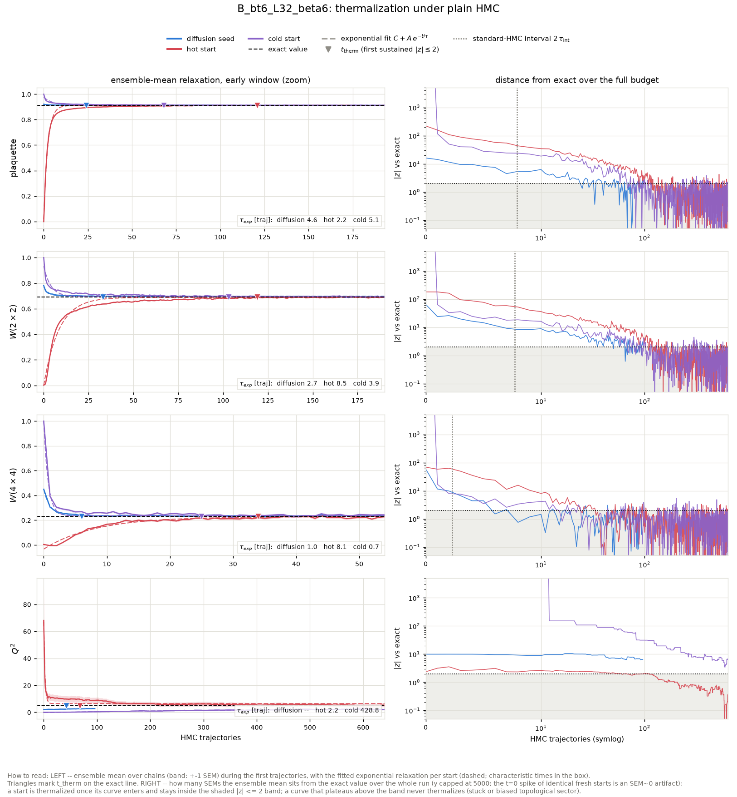

tau_int (hot-start chains, second half): plaquette = 3.95 +- 0.39, wilson_2x2 = 3.85 +- 0.52, wilson_4x4 = 1.14 +- 0.05, wilson_6x6 = 0.86 +- 0.04. Topology: hot-start HMC L=32 beta=6 -> tau_int(Q) = 38.8.

Where 'never' stood at the end: the cold start ended the 640-trajectory budget still at Q^2 at |z| ~ 7.

### Diagnostics: raw diffusion output (before any HMC)

| observable | value | error | exact | z_exact | reference | ref_error | z_ref | ks_p | chi2_p |
|---|---|---|---|---|---|---|---|---|---|
| plaquette | 0.9211 | 0.000502 | 0.9124 | 17.46 | 0.9124 | 0.0003501 | 14.31 | 1.391e-32 |  |
| wilson_1x1 | 0.9211 | 0.000502 | 0.9124 | 17.46 | 0.9124 | 0.0003501 | 14.31 | 1.391e-32 |  |
| wilson_1x2 | 0.8631 | 0.0008428 | 0.8324 | 36.38 | 0.8321 | 0.0006931 | 28.4 | 0 |  |
| wilson_2x2 | 0.7808 | 0.001158 | 0.6929 | 75.93 | 0.6934 | 0.001208 | 52.27 | 0 |  |
| wilson_2x3 | 0.7046 | 0.001403 | 0.5768 | 91.16 | 0.5765 | 0.001929 | 53.74 | 0 |  |
| wilson_3x3 | 0.6062 | 0.002555 | 0.438 | 65.8 | 0.4363 | 0.002632 | 46.32 | 0 |  |
| wilson_3x4 | 0.5291 | 0.003029 | 0.3327 | 64.85 | 0.329 | 0.003332 | 44.42 | 0 |  |
| wilson_4x4 | 0.4501 | 0.003765 | 0.2305 | 58.33 | 0.2264 | 0.003867 | 41.44 | 0 |  |
| wilson_4x5 | 0.3731 | 0.004317 | 0.1597 | 49.42 | 0.1539 | 0.004096 | 36.83 | 0 |  |
| wilson_5x5 | 0.2971 | 0.005012 | 0.101 | 39.14 | 0.09648 | 0.003546 | 32.68 | 0 |  |
| wilson_5x6 | 0.2417 | 0.00555 | 0.06382 | 32.04 | 0.05818 | 0.003404 | 28.18 | 0 |  |
| wilson_6x6 | 0.1915 | 0.005557 | 0.03681 | 27.84 | 0.03418 | 0.003619 | 23.72 | 0 |  |
| wilson_6x7 | 0.1436 | 0.005773 | 0.02123 | 21.19 | 0.01931 | 0.003186 | 18.84 | 2.102e-43 |  |
| wilson_7x7 | 0.1079 | 0.00566 | 0.01117 | 17.1 | 0.008187 | 0.003092 | 15.47 | 2.779e-34 |  |
| wilson_7x8 | 0.08319 | 0.005259 | 0.005879 | 14.7 | 0.001901 | 0.003115 | 13.3 | 1.381e-28 |  |
| wilson_8x8 | 0.06434 | 0.004932 | 0.002822 | 12.47 | -0.002021 | 0.003506 | 10.97 | 1.172e-22 |  |
| wilson_8x10 | 0.03584 | 0.00489 | 0.0006505 | 7.196 | -0.003914 | 0.003163 | 6.826 | 1.664e-10 |  |
| wilson_10x10 | 0.01904 | 0.00373 | 0.0001039 | 5.075 | -0.002986 | 0.002418 | 4.954 | 2.022e-05 |  |
| wilson_10x12 | 0.008916 | 0.003471 | 1.659e-05 | 2.564 | -0.004264 | 0.001863 | 3.346 | 0.00159 |  |
| wilson_12x12 | 0.006925 | 0.002694 | 1.836e-06 | 2.57 | -0.003235 | 0.00226 | 2.89 | 0.002243 |  |
| creutz_2 | 0.03505 | 0.0009936 | 0.09172 | -57.03 |  |  |  |  |  |
| creutz_3 | 0.0479 | 0.001971 | 0.09172 | -22.23 |  |  |  |  |  |
| creutz_4 | 0.02573 | 0.003333 | 0.09172 | -19.8 |  |  |  |  |  |
| creutz_5 | 0.03985 | 0.005477 | 0.09172 | -9.47 |  |  |  |  |  |
| creutz_6 | 0.02608 | 0.008619 | 0.09172 | -7.616 |  |  |  |  |  |
| creutz_7 | -0.002912 | 0.01821 | 0.09172 | -5.196 |  |  |  |  |  |
| creutz_8 | -0.003391 | 0.03103 | 0.09172 | -3.065 |  |  |  |  |  |
| Q | 0.07031 | 0.1218 | 0 | 0.5774 | -0.1354 | 0.1314 | 1.148 | 0.1392 |  |
| Q^2 | 2.086 | 0.2321 | 4.779 | -11.6 | 3.865 | 0.341 | -4.312 | 0.2087 |  |
| chi_top ((<Q^2>-<Q>^2)/V) | 0.002032 | 0.0002337 | 0.004667 | -11.27 | 0.003756 | 0.0003297 | -4.265 | 5.1e-06 |  |
| Q histogram vs exact P(Q) | 24.66 | nan | 8 | nan |  |  |  |  | 0.001776 |

### Diagnostics: the same configs after 96 HMC trajectories

| observable | value | error | exact | z_exact | reference | ref_error | z_ref | ks_p | chi2_p |
|---|---|---|---|---|---|---|---|---|---|
| plaquette | 0.913 | 0.0003671 | 0.9124 | 1.818 | 0.9124 | 0.0003501 | 1.306 | 0.4212 |  |
| wilson_1x1 | 0.913 | 0.0003671 | 0.9124 | 1.818 | 0.9124 | 0.0003501 | 1.306 | 0.4212 |  |
| wilson_1x2 | 0.8337 | 0.0007722 | 0.8324 | 1.663 | 0.8321 | 0.0006931 | 1.553 | 0.3584 |  |
| wilson_2x2 | 0.6964 | 0.001908 | 0.6929 | 1.851 | 0.6934 | 0.001208 | 1.359 | 0.08971 |  |
| wilson_2x3 | 0.5819 | 0.002748 | 0.5768 | 1.876 | 0.5765 | 0.001929 | 1.626 | 0.1892 |  |
| wilson_3x3 | 0.4468 | 0.003886 | 0.438 | 2.259 | 0.4363 | 0.002632 | 2.247 | 0.03364 |  |
| wilson_3x4 | 0.3416 | 0.00485 | 0.3327 | 1.843 | 0.329 | 0.003332 | 2.132 | 0.0631 |  |
| wilson_4x4 | 0.2393 | 0.005154 | 0.2305 | 1.71 | 0.2264 | 0.003867 | 2.001 | 0.005977 |  |
| wilson_4x5 | 0.1674 | 0.005598 | 0.1597 | 1.371 | 0.1539 | 0.004096 | 1.95 | 0.003137 |  |
| wilson_5x5 | 0.1091 | 0.005646 | 0.101 | 1.438 | 0.09648 | 0.003546 | 1.891 | 0.05588 |  |
| wilson_5x6 | 0.06942 | 0.004624 | 0.06382 | 1.211 | 0.05818 | 0.003404 | 1.958 | 0.07995 |  |
| wilson_6x6 | 0.0419 | 0.004679 | 0.03681 | 1.088 | 0.03418 | 0.003619 | 1.305 | 0.4212 |  |
| wilson_6x7 | 0.02458 | 0.0044 | 0.02123 | 0.7622 | 0.01931 | 0.003186 | 0.9703 | 0.5259 |  |
| wilson_7x7 | 0.01602 | 0.003312 | 0.01117 | 1.463 | 0.008187 | 0.003092 | 1.728 | 0.4898 |  |
| wilson_7x8 | 0.009539 | 0.002556 | 0.005879 | 1.432 | 0.001901 | 0.003115 | 1.895 | 0.08971 |  |
| wilson_8x8 | 0.004106 | 0.003097 | 0.002822 | 0.4143 | -0.002021 | 0.003506 | 1.31 | 0.08971 |  |
| wilson_8x10 | 0.0008715 | 0.002129 | 0.0006505 | 0.1038 | -0.003914 | 0.003163 | 1.255 | 0.3021 |  |
| wilson_10x10 | -0.003866 | 0.002675 | 0.0001039 | -1.484 | -0.002986 | 0.002418 | -0.2441 | 0.5631 |  |
| wilson_10x12 | -0.002586 | 0.002556 | 1.659e-05 | -1.018 | -0.004264 | 0.001863 | 0.5306 | 0.5259 |  |
| wilson_12x12 | -0.003331 | 0.00278 | 1.836e-06 | -1.199 | -0.003235 | 0.00226 | -0.02685 | 0.9353 |  |
| creutz_2 | 0.08899 | 0.001232 | 0.09172 | -2.217 |  |  |  |  |  |
| creutz_3 | 0.0846 | 0.003058 | 0.09172 | -2.331 |  |  |  |  |  |
| creutz_4 | 0.08737 | 0.007099 | 0.09172 | -0.6127 |  |  |  |  |  |
| creutz_5 | 0.07067 | 0.01523 | 0.09172 | -1.382 |  |  |  |  |  |
| creutz_6 | 0.05308 | 0.04395 | 0.09172 | -0.8792 |  |  |  |  |  |
| creutz_7 | -0.1047 | 0.1261 | 0.09172 | -1.558 |  |  |  |  |  |
| creutz_8 | 0.3247 | 0.515 | 0.09172 | 0.4524 |  |  |  |  |  |
| Q | 0.05469 | 0.1716 | 0 | 0.3188 | -0.1354 | 0.1314 | 0.8796 | 0.5259 |  |
| Q^2 | 2.758 | 0.2419 | 4.779 | -8.354 | 3.865 | 0.341 | -2.647 | 0.9126 |  |
| chi_top ((<Q^2>-<Q>^2)/V) | 0.00269 | 0.0002456 | 0.004667 | -8.048 | 0.003756 | 0.0003297 | -2.592 | 0.0001679 |  |
| Q histogram vs exact P(Q) | 11.34 | nan | 8 | nan |  |  |  |  | 0.183 |

## A_bc2_L32_beta6.10518

HMC: step size 0.1619, 6 leapfrog steps, acceptance seed/hot/cold = 0.973/0.975/0.975. Diffusion-seed batch: 128 chains x 96 trajectories (0.12 s/traj for the whole batch); baselines: 32 chains x 640 trajectories.

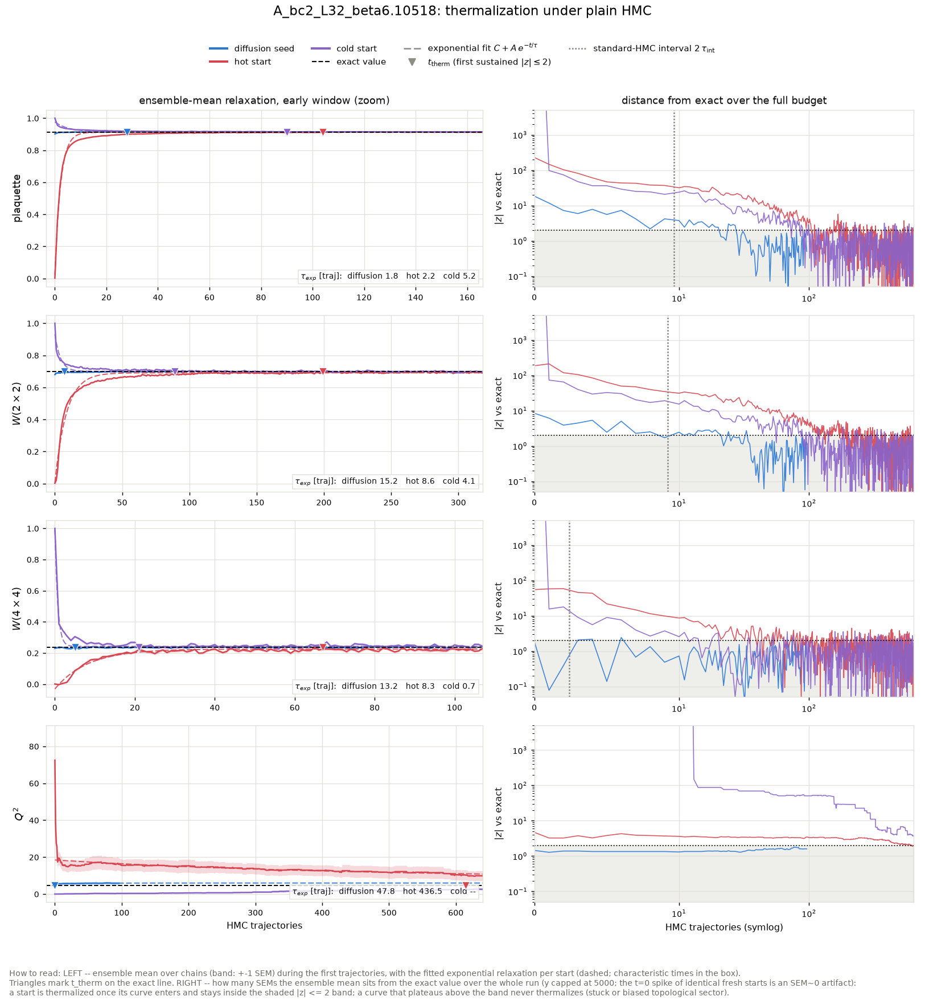

tau_int (hot-start chains, second half): plaquette = 4.82 +- 0.75, wilson_2x2 = 4.61 +- 0.58, wilson_4x4 = 1.20 +- 0.05, wilson_6x6 = 0.89 +- 0.04. Topology: hot-start HMC L=32 beta=6.10518 -> tau_int(Q) = 34.4.

Where 'never' stood at the end: the cold start ended the 640-trajectory budget still at Q^2 at |z| ~ 4.

### Diagnostics: raw diffusion output (before any HMC)

| observable | value | error | exact | z_exact | reference | ref_error | z_ref | ks_p | chi2_p |
|---|---|---|---|---|---|---|---|---|---|
| plaquette | 0.9015 | 0.0007984 | 0.914 | -15.62 | 0.9143 | 0.0001898 | -15.58 | 0 |  |
| wilson_1x1 | 0.9015 | 0.0007984 | 0.914 | -15.62 | 0.9143 | 0.0001898 | -15.58 | 0 |  |
| wilson_1x2 | 0.8158 | 0.001498 | 0.8353 | -13.06 | 0.8361 | 0.0005353 | -12.78 | 3.831e-30 |  |
| wilson_2x2 | 0.6797 | 0.002556 | 0.6978 | -7.079 | 0.6995 | 0.0009961 | -7.234 | 1.632e-11 |  |
| wilson_2x3 | 0.5613 | 0.00315 | 0.5829 | -6.835 | 0.5851 | 0.001632 | -6.704 | 1.505e-09 |  |
| wilson_3x3 | 0.4212 | 0.003832 | 0.445 | -6.202 | 0.4505 | 0.002149 | -6.657 | 5e-08 |  |
| wilson_3x4 | 0.3208 | 0.004335 | 0.3397 | -4.36 | 0.347 | 0.002879 | -5.032 | 7.394e-05 |  |
| wilson_4x4 | 0.2297 | 0.004484 | 0.2371 | -1.646 | 0.2462 | 0.003532 | -2.902 | 0.005977 |  |
| wilson_4x5 | 0.1615 | 0.004358 | 0.1654 | -0.8982 | 0.1734 | 0.003624 | -2.092 | 0.03364 |  |
| wilson_5x5 | 0.101 | 0.003551 | 0.1055 | -1.27 | 0.1111 | 0.003848 | -1.93 | 0.02577 |  |
| wilson_5x6 | 0.06479 | 0.004034 | 0.06728 | -0.6154 | 0.0715 | 0.003732 | -1.221 | 0.1122 |  |
| wilson_6x6 | 0.03877 | 0.003653 | 0.03921 | -0.1223 | 0.04151 | 0.003986 | -0.5077 | 0.4898 |  |
| wilson_6x7 | 0.02142 | 0.003737 | 0.02286 | -0.3844 | 0.0258 | 0.003616 | -0.8426 | 0.4898 |  |
| wilson_7x7 | 0.01088 | 0.003833 | 0.01218 | -0.3375 | 0.01483 | 0.003796 | -0.7319 | 0.04938 |  |
| wilson_7x8 | 0.003996 | 0.004311 | 0.006487 | -0.5777 | 0.007417 | 0.004109 | -0.5745 | 0.1712 |  |
| wilson_8x8 | 0.002912 | 0.002721 | 0.003158 | -0.09035 | 0.006329 | 0.003061 | -0.8343 | 0.1122 |  |
| wilson_8x10 | 0.003936 | 0.002764 | 0.0007487 | 1.153 | 0.005868 | 0.003149 | -0.4611 | 0.4212 |  |
| wilson_10x10 | 0.005504 | 0.002395 | 0.0001238 | 2.246 | -0.001497 | 0.002756 | 1.918 | 0.1545 |  |
| wilson_10x12 | 0.003304 | 0.002035 | 2.049e-05 | 1.613 | -0.002269 | 0.002148 | 1.883 | 0.2763 |  |
| wilson_12x12 | -0.001844 | 0.002046 | 2.365e-06 | -0.9026 | 0.0007953 | 0.001629 | -1.009 | 0.2522 |  |
| creutz_2 | 0.08258 | 0.00159 | 0.08996 | -4.647 |  |  |  |  |  |
| creutz_3 | 0.09584 | 0.003282 | 0.08996 | 1.79 |  |  |  |  |  |
| creutz_4 | 0.06199 | 0.006443 | 0.08996 | -4.342 |  |  |  |  |  |
| creutz_5 | 0.1174 | 0.01597 | 0.08996 | 1.718 |  |  |  |  |  |
| creutz_6 | 0.06994 | 0.05348 | 0.08996 | -0.3746 |  |  |  |  |  |
| creutz_7 | 0.08391 | 0.1675 | 0.08996 | -0.03612 |  |  |  |  |  |
| creutz_8 | -0.6855 | 0.8617 | 0.08996 | -0.8999 |  |  |  |  |  |
| Q | -0.01562 | 0.221 | 0 | -0.07069 | -0.1979 | 0.1063 | 0.7433 | 0.5259 |  |
| Q^2 | 5.656 | 0.7235 | 4.686 | 1.341 | 4.219 | 0.4579 | 1.679 | 0.2763 |  |
| chi_top ((<Q^2>-<Q>^2)/V) | 0.005523 | 0.0007061 | 0.004576 | 1.341 | 0.004082 | 0.0004247 | 1.75 | 0.0005374 |  |
| Q histogram vs exact P(Q) | 6.766 | nan | 8 | nan |  |  |  |  | 0.5621 |

### Diagnostics: the same configs after 96 HMC trajectories

| observable | value | error | exact | z_exact | reference | ref_error | z_ref | ks_p | chi2_p |
|---|---|---|---|---|---|---|---|---|---|
| plaquette | 0.9138 | 0.0002788 | 0.914 | -0.6222 | 0.9143 | 0.0001898 | -1.452 | 0.5259 |  |
| wilson_1x1 | 0.9138 | 0.0002788 | 0.914 | -0.6222 | 0.9143 | 0.0001898 | -1.452 | 0.5259 |  |
| wilson_1x2 | 0.8354 | 0.0007526 | 0.8353 | 0.06441 | 0.8361 | 0.0005353 | -0.7759 | 0.7901 |  |
| wilson_2x2 | 0.6969 | 0.001499 | 0.6978 | -0.5958 | 0.6995 | 0.0009961 | -1.469 | 0.2297 |  |
| wilson_2x3 | 0.5812 | 0.002371 | 0.5829 | -0.6858 | 0.5851 | 0.001632 | -1.348 | 0.3294 |  |
| wilson_3x3 | 0.442 | 0.003349 | 0.445 | -0.9047 | 0.4505 | 0.002149 | -2.139 | 0.04938 |  |
| wilson_3x4 | 0.3356 | 0.003918 | 0.3397 | -1.046 | 0.347 | 0.002879 | -2.34 | 0.03364 |  |
| wilson_4x4 | 0.2335 | 0.004324 | 0.2371 | -0.8171 | 0.2462 | 0.003532 | -2.278 | 0.04354 |  |
| wilson_4x5 | 0.1642 | 0.004328 | 0.1654 | -0.2885 | 0.1734 | 0.003624 | -1.629 | 0.1392 |  |
| wilson_5x5 | 0.1048 | 0.004566 | 0.1055 | -0.1601 | 0.1111 | 0.003848 | -1.059 | 0.2763 |  |
| wilson_5x6 | 0.06692 | 0.004252 | 0.06728 | -0.08469 | 0.0715 | 0.003732 | -0.8108 | 0.2297 |  |
| wilson_6x6 | 0.0395 | 0.003806 | 0.03921 | 0.0762 | 0.04151 | 0.003986 | -0.3643 | 0.9126 |  |
| wilson_6x7 | 0.02426 | 0.003411 | 0.02286 | 0.4115 | 0.0258 | 0.003616 | -0.31 | 0.6395 |  |
| wilson_7x7 | 0.01229 | 0.003116 | 0.01218 | 0.03675 | 0.01483 | 0.003796 | -0.5172 | 0.2087 |  |
| wilson_7x8 | 0.007311 | 0.003212 | 0.006487 | 0.2566 | 0.007417 | 0.004109 | -0.02037 | 0.7163 |  |
| wilson_8x8 | 0.003198 | 0.002712 | 0.003158 | 0.01473 | 0.006329 | 0.003061 | -0.7657 | 0.1892 |  |
| wilson_8x10 | -0.0005814 | 0.002053 | 0.0007487 | -0.6478 | 0.005868 | 0.003149 | -1.715 | 0.08971 |  |
| wilson_10x10 | -0.0008267 | 0.001468 | 0.0001238 | -0.6476 | -0.001497 | 0.002756 | 0.2146 | 0.8246 |  |
| wilson_10x12 | 0.001165 | 0.002187 | 2.049e-05 | 0.5233 | -0.002269 | 0.002148 | 1.12 | 0.4548 |  |
| wilson_12x12 | 0.0008317 | 0.003115 | 2.365e-06 | 0.2663 | 0.0007953 | 0.001629 | 0.01035 | 0.8569 |  |
| creutz_2 | 0.09155 | 0.001341 | 0.08996 | 1.183 |  |  |  |  |  |
| creutz_3 | 0.09249 | 0.003052 | 0.08996 | 0.8278 |  |  |  |  |  |
| creutz_4 | 0.08755 | 0.007071 | 0.08996 | -0.3417 |  |  |  |  |  |
| creutz_5 | 0.09678 | 0.01717 | 0.08996 | 0.3971 |  |  |  |  |  |
| creutz_6 | 0.07881 | 0.04887 | 0.08996 | -0.2282 |  |  |  |  |  |
| creutz_7 | 0.1925 | 0.1439 | 0.08996 | 0.7122 |  |  |  |  |  |
| creutz_8 | 0.3073 | 0.6611 | 0.08996 | 0.3287 |  |  |  |  |  |
| Q | -0.1094 | 0.221 | 0 | -0.495 | -0.1979 | 0.1063 | 0.3611 | 0.9353 |  |
| Q^2 | 5.844 | 0.7475 | 4.686 | 1.549 | 4.219 | 0.4579 | 1.854 | 0.2763 |  |
| chi_top ((<Q^2>-<Q>^2)/V) | 0.005695 | 0.0007268 | 0.004576 | 1.539 | 0.004082 | 0.0004247 | 1.917 | 0.0006474 |  |
| Q histogram vs exact P(Q) | 5.354 | nan | 8 | nan |  |  |  |  | 0.7191 |

## B_bc2_bt8_L32_beta8

HMC: step size 0.1414, 7 leapfrog steps, acceptance seed/hot/cold = 0.976/0.976/0.979. Diffusion-seed batch: 128 chains x 96 trajectories (0.14 s/traj for the whole batch); baselines: 32 chains x 640 trajectories.

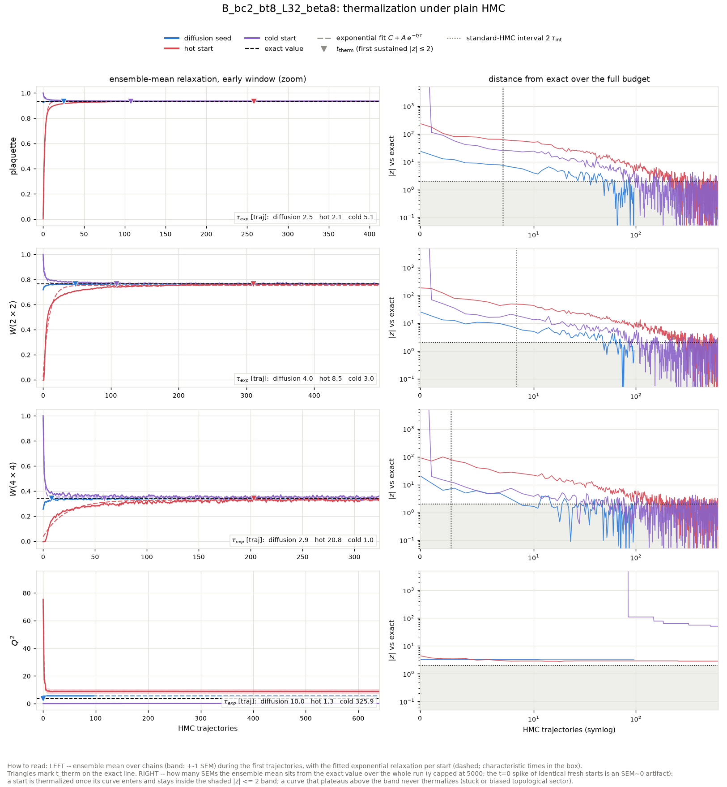

tau_int (hot-start chains, second half): plaquette = 3.64 +- 0.51, wilson_2x2 = 4.23 +- 0.48, wilson_4x4 = 1.35 +- 0.10, wilson_6x6 = 1.06 +- 0.05. Topology: hot-start HMC L=32 beta=8 -> **frozen** (no tunneling).

Where 'never' stood at the end: the hot start ended the 640-trajectory budget still at Q^2 at |z| ~ 3; the cold start ended the 640-trajectory budget still at Q^2 at |z| ~ 51.

### Diagnostics: raw diffusion output (before any HMC)

| observable | value | error | exact | z_exact | reference | ref_error | z_ref | ks_p | chi2_p |
|---|---|---|---|---|---|---|---|---|---|
| plaquette | 0.9241 | 0.0003822 | 0.9352 | -29.2 | 0.9355 | 0.0002413 | -25.32 | 0 |  |
| wilson_1x1 | 0.9241 | 0.0003822 | 0.9352 | -29.2 | 0.9355 | 0.0002413 | -25.32 | 0 |  |
| wilson_1x2 | 0.8488 | 0.0009152 | 0.8747 | -28.29 | 0.8748 | 0.0005504 | -24.38 | 0 |  |
| wilson_2x2 | 0.7175 | 0.001666 | 0.765 | -28.56 | 0.7649 | 0.001109 | -23.68 | 0 |  |
| wilson_2x3 | 0.6014 | 0.002622 | 0.6692 | -25.84 | 0.6685 | 0.001584 | -21.89 | 0 |  |
| wilson_3x3 | 0.4616 | 0.003381 | 0.5474 | -25.37 | 0.5456 | 0.002033 | -21.3 | 4.204e-45 |  |
| wilson_3x4 | 0.3558 | 0.004265 | 0.4478 | -21.58 | 0.4461 | 0.002564 | -18.15 | 1.95e-39 |  |
| wilson_4x4 | 0.2544 | 0.004186 | 0.3426 | -21.07 | 0.3409 | 0.002963 | -16.87 | 4.973e-32 |  |
| wilson_4x5 | 0.1811 | 0.004523 | 0.2621 | -17.91 | 0.2614 | 0.003382 | -14.22 | 4.14e-26 |  |
| wilson_5x5 | 0.117 | 0.00449 | 0.1875 | -15.7 | 0.1868 | 0.003447 | -12.33 | 7.05e-23 |  |
| wilson_5x6 | 0.07734 | 0.004498 | 0.1342 | -12.63 | 0.135 | 0.003342 | -10.29 | 1.48e-17 |  |
| wilson_6x6 | 0.0457 | 0.003912 | 0.08977 | -11.27 | 0.09068 | 0.003162 | -8.942 | 6.895e-13 |  |
| wilson_6x7 | 0.0267 | 0.004265 | 0.06007 | -7.826 | 0.06329 | 0.003018 | -7.004 | 1.615e-08 |  |
| wilson_7x7 | 0.01355 | 0.003941 | 0.03759 | -6.101 | 0.04038 | 0.003116 | -5.339 | 7.394e-05 |  |
| wilson_7x8 | 0.006949 | 0.003758 | 0.02353 | -4.412 | 0.02688 | 0.002735 | -4.288 | 0.002655 |  |
| wilson_8x8 | 0.006471 | 0.0037 | 0.01377 | -1.973 | 0.01533 | 0.002558 | -1.969 | 0.05588 |  |
| wilson_8x10 | 0.002412 | 0.003226 | 0.004717 | -0.7145 | 0.005312 | 0.002436 | -0.7174 | 0.5259 |  |
| wilson_10x10 | 0.0005933 | 0.0039 | 0.001236 | -0.1649 | -0.00109 | 0.002709 | 0.3544 | 0.389 |  |
| wilson_10x12 | -0.0008437 | 0.002686 | 0.000324 | -0.4348 | -3.412e-05 | 0.002816 | -0.208 | 0.389 |  |
| wilson_12x12 | -0.004659 | 0.001924 | 6.496e-05 | -2.456 | 0.0003071 | 0.002247 | -1.679 | 0.1392 |  |
| creutz_2 | 0.08304 | 0.001273 | 0.06696 | 12.63 |  |  |  |  |  |
| creutz_3 | 0.08807 | 0.002386 | 0.06696 | 8.848 |  |  |  |  |  |
| creutz_4 | 0.07504 | 0.006032 | 0.06696 | 1.34 |  |  |  |  |  |
| creutz_5 | 0.09654 | 0.01495 | 0.06696 | 1.979 |  |  |  |  |  |
| creutz_6 | 0.1121 | 0.04107 | 0.06696 | 1.1 |  |  |  |  |  |
| creutz_7 | 0.1406 | 0.1313 | 0.06696 | 0.5608 |  |  |  |  |  |
| creutz_8 | -0.5967 | 0.5085 | 0.06696 | -1.305 |  |  |  |  |  |
| Q | -0.01562 | 0.221 | 0 | -0.07069 | 0.2917 | 0.1041 | -1.258 | 0.1004 |  |
| Q^2 | 5.656 | 0.7235 | 3.48 | 3.008 | 3.344 | 0.3552 | 2.869 | 0.009477 |  |
| chi_top ((<Q^2>-<Q>^2)/V) | 0.005523 | 0.0007061 | 0.003399 | 3.009 | 0.003182 | 0.0003544 | 2.963 | 3.783e-08 |  |
| Q histogram vs exact P(Q) | 14.76 | nan | 8 | nan |  |  |  |  | 0.06399 |

### Diagnostics: the same configs after 96 HMC trajectories

| observable | value | error | exact | z_exact | reference | ref_error | z_ref | ks_p | chi2_p |
|---|---|---|---|---|---|---|---|---|---|
| plaquette | 0.935 | 0.0002284 | 0.9352 | -1.162 | 0.9355 | 0.0002413 | -1.654 | 0.08971 |  |
| wilson_1x1 | 0.935 | 0.0002284 | 0.9352 | -1.162 | 0.9355 | 0.0002413 | -1.654 | 0.08971 |  |
| wilson_1x2 | 0.8741 | 0.0005302 | 0.8747 | -1.095 | 0.8748 | 0.0005504 | -0.9418 | 0.1892 |  |
| wilson_2x2 | 0.7638 | 0.001122 | 0.765 | -1.064 | 0.7649 | 0.001109 | -0.6491 | 0.3584 |  |
| wilson_2x3 | 0.6664 | 0.001702 | 0.6692 | -1.611 | 0.6685 | 0.001584 | -0.8771 | 0.5631 |  |
| wilson_3x3 | 0.5445 | 0.002622 | 0.5474 | -1.09 | 0.5456 | 0.002033 | -0.3339 | 0.7901 |  |
| wilson_3x4 | 0.4419 | 0.003236 | 0.4478 | -1.812 | 0.4461 | 0.002564 | -1.013 | 0.6395 |  |
| wilson_4x4 | 0.3354 | 0.004029 | 0.3426 | -1.782 | 0.3409 | 0.002963 | -1.094 | 0.6395 |  |
| wilson_4x5 | 0.2526 | 0.004697 | 0.2621 | -2.012 | 0.2614 | 0.003382 | -1.512 | 0.389 |  |
| wilson_5x5 | 0.179 | 0.004981 | 0.1875 | -1.709 | 0.1868 | 0.003447 | -1.285 | 0.3294 |  |
| wilson_5x6 | 0.1253 | 0.005463 | 0.1342 | -1.613 | 0.135 | 0.003342 | -1.506 | 0.2522 |  |
| wilson_6x6 | 0.08348 | 0.005341 | 0.08977 | -1.179 | 0.09068 | 0.003162 | -1.16 | 0.2297 |  |
| wilson_6x7 | 0.05646 | 0.005069 | 0.06007 | -0.7133 | 0.06329 | 0.003018 | -1.158 | 0.1251 |  |
| wilson_7x7 | 0.03263 | 0.004142 | 0.03759 | -1.198 | 0.04038 | 0.003116 | -1.494 | 0.2522 |  |
| wilson_7x8 | 0.01865 | 0.003768 | 0.02353 | -1.295 | 0.02688 | 0.002735 | -1.768 | 0.2087 |  |
| wilson_8x8 | 0.006728 | 0.00336 | 0.01377 | -2.096 | 0.01533 | 0.002558 | -2.037 | 0.08971 |  |
| wilson_8x10 | 0.002217 | 0.00374 | 0.004717 | -0.6686 | 0.005312 | 0.002436 | -0.6935 | 0.8246 |  |
| wilson_10x10 | -0.004661 | 0.004057 | 0.001236 | -1.454 | -0.00109 | 0.002709 | -0.7321 | 0.8246 |  |
| wilson_10x12 | -0.004776 | 0.002953 | 0.000324 | -1.727 | -3.412e-05 | 0.002816 | -1.162 | 0.0631 |  |
| wilson_12x12 | -0.005 | 0.002778 | 6.496e-05 | -1.823 | 0.0003071 | 0.002247 | -1.486 | 0.3021 |  |
| creutz_2 | 0.06747 | 0.0009204 | 0.06696 | 0.5621 |  |  |  |  |  |
| creutz_3 | 0.06555 | 0.002333 | 0.06696 | -0.6045 |  |  |  |  |  |
| creutz_4 | 0.067 | 0.004411 | 0.06696 | 0.01043 |  |  |  |  |  |
| creutz_5 | 0.06115 | 0.007971 | 0.06696 | -0.7279 |  |  |  |  |  |
| creutz_6 | 0.05026 | 0.02277 | 0.06696 | -0.7333 |  |  |  |  |  |
| creutz_7 | 0.1571 | 0.06111 | 0.06696 | 1.475 |  |  |  |  |  |
| creutz_8 | 0.4597 | 0.3259 | 0.06696 | 1.205 |  |  |  |  |  |
| Q | -0.007812 | 0.2202 | 0 | -0.03548 | 0.2917 | 0.1041 | -1.229 | 0.1004 |  |
| Q^2 | 5.586 | 0.7149 | 3.48 | 2.945 | 3.344 | 0.3552 | 2.809 | 0.009477 |  |
| chi_top ((<Q^2>-<Q>^2)/V) | 0.005455 | 0.000698 | 0.003399 | 2.946 | 0.003182 | 0.0003544 | 2.903 | 3.783e-08 |  |
| Q histogram vs exact P(Q) | 16.03 | nan | 8 | nan |  |  |  |  | 0.04191 |

## B_bt10_L32_beta10

HMC: step size 0.1265, 8 leapfrog steps, acceptance seed/hot/cold = 0.979/0.980/0.978. Diffusion-seed batch: 128 chains x 96 trajectories (0.15 s/traj for the whole batch); baselines: 32 chains x 640 trajectories.

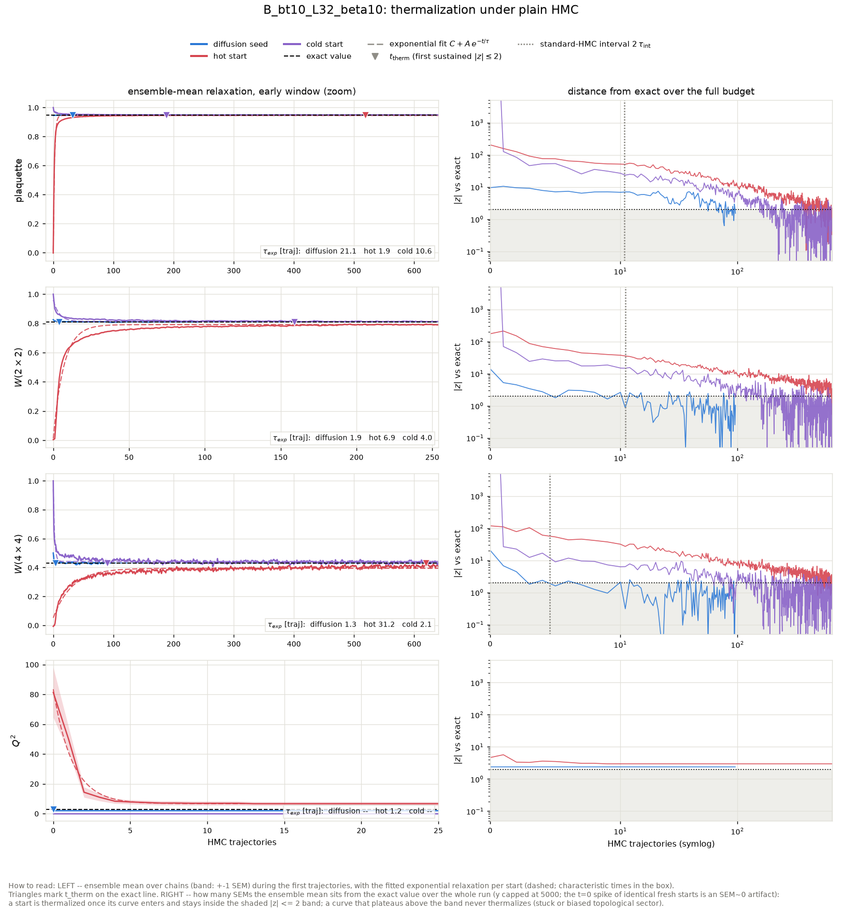

tau_int (hot-start chains, second half): plaquette = 5.41 +- 0.59, wilson_2x2 = 5.51 +- 1.17, wilson_4x4 = 2.29 +- 0.50, wilson_6x6 = 1.05 +- 0.05. Topology: hot-start HMC L=32 beta=10 -> **frozen** (no tunneling).

Where 'never' stood at the end: the hot start ended the 640-trajectory budget still at wilson_2x2 at |z| ~ 2, Q^2 at |z| ~ 3; the cold start ended the 640-trajectory budget still at Q^2 at |z| ~ 2740504231936.

### Diagnostics: raw diffusion output (before any HMC)

| observable | value | error | exact | z_exact | reference | ref_error | z_ref | ks_p | chi2_p |
|---|---|---|---|---|---|---|---|---|---|
| plaquette | 0.945 | 0.0004016 | 0.9486 | -8.996 | 0.9486 | 0.0001855 | -8.255 | 1.61e-14 |  |
| wilson_1x1 | 0.945 | 0.0004016 | 0.9486 | -8.996 | 0.9486 | 0.0001855 | -8.255 | 1.61e-14 |  |
| wilson_1x2 | 0.899 | 0.0006883 | 0.8998 | -1.257 | 0.9001 | 0.000351 | -1.427 | 0.0631 |  |
| wilson_2x2 | 0.8252 | 0.0008506 | 0.8097 | 18.25 | 0.8104 | 0.0006647 | 13.71 | 2.893e-16 |  |
| wilson_2x3 | 0.7564 | 0.001253 | 0.7286 | 22.2 | 0.7306 | 0.0009863 | 16.22 | 6.598e-20 |  |
| wilson_3x3 | 0.6635 | 0.001669 | 0.6219 | 24.92 | 0.6244 | 0.001911 | 15.42 | 6.175e-18 |  |
| wilson_3x4 | 0.5867 | 0.002469 | 0.5309 | 22.6 | 0.5336 | 0.002498 | 15.12 | 7.05e-23 |  |
| wilson_4x4 | 0.5008 | 0.003205 | 0.4299 | 22.13 | 0.4302 | 0.003692 | 14.44 | 2.572e-20 |  |
| wilson_4x5 | 0.4226 | 0.003752 | 0.3481 | 19.87 | 0.3478 | 0.004546 | 12.69 | 1.48e-17 |  |
| wilson_5x5 | 0.345 | 0.004411 | 0.2673 | 17.6 | 0.2659 | 0.005736 | 10.93 | 4.377e-16 |  |
| wilson_5x6 | 0.2802 | 0.004963 | 0.2053 | 15.08 | 0.2041 | 0.006435 | 9.364 | 3.32e-13 |  |
| wilson_6x6 | 0.2243 | 0.005575 | 0.1496 | 13.4 | 0.1477 | 0.007129 | 8.468 | 6.895e-13 |  |
| wilson_6x7 | 0.1729 | 0.005738 | 0.109 | 11.13 | 0.1076 | 0.007049 | 7.181 | 6.242e-11 |  |
| wilson_7x7 | 0.1339 | 0.005399 | 0.07535 | 10.84 | 0.07268 | 0.006977 | 6.939 | 2.042e-09 |  |
| wilson_7x8 | 0.0999 | 0.00525 | 0.05208 | 9.109 | 0.05158 | 0.006533 | 5.765 | 8.674e-08 |  |
| wilson_8x8 | 0.07727 | 0.004524 | 0.03414 | 9.534 | 0.03209 | 0.005711 | 6.202 | 9.223e-07 |  |
| wilson_8x10 | 0.04087 | 0.004507 | 0.01468 | 5.813 | 0.01503 | 0.004689 | 3.974 | 0.00159 |  |
| wilson_10x10 | 0.02049 | 0.004683 | 0.005109 | 3.286 | 0.004644 | 0.003319 | 2.761 | 0.01275 |  |
| wilson_10x12 | 0.01054 | 0.003802 | 0.001778 | 2.305 | -0.001627 | 0.002857 | 2.559 | 0.02947 |  |
| wilson_12x12 | 0.004871 | 0.003928 | 0.0005011 | 1.112 | -0.0031 | 0.003144 | 1.584 | 0.011 |  |
| creutz_2 | 0.03567 | 0.0007284 | 0.05277 | -23.47 |  |  |  |  |  |
| creutz_3 | 0.04398 | 0.001455 | 0.05277 | -6.039 |  |  |  |  |  |
| creutz_4 | 0.03518 | 0.002364 | 0.05277 | -7.441 |  |  |  |  |  |
| creutz_5 | 0.03329 | 0.004514 | 0.05277 | -4.316 |  |  |  |  |  |
| creutz_6 | 0.01454 | 0.007712 | 0.05277 | -4.957 |  |  |  |  |  |
| creutz_7 | -0.004718 | 0.01338 | 0.05277 | -4.296 |  |  |  |  |  |
| creutz_8 | -0.03609 | 0.02287 | 0.05277 | -3.885 |  |  |  |  |  |
| Q | 0.07031 | 0.1218 | 0 | 0.5774 | 0.4271 | 0.0799 | -2.45 | 0.07995 |  |
| Q^2 | 2.086 | 0.2321 | 2.741 | -2.82 | 2.667 | 0.2599 | -1.666 | 0.3584 |  |
| chi_top ((<Q^2>-<Q>^2)/V) | 0.002032 | 0.0002337 | 0.002676 | -2.756 | 0.002426 | 0.0002539 | -1.141 | 1.616e-05 |  |
| Q histogram vs exact P(Q) | 6.258 | nan | 6 | nan |  |  |  |  | 0.3949 |

### Diagnostics: the same configs after 96 HMC trajectories

| observable | value | error | exact | z_exact | reference | ref_error | z_ref | ks_p | chi2_p |
|---|---|---|---|---|---|---|---|---|---|
| plaquette | 0.9483 | 0.0002018 | 0.9486 | -1.491 | 0.9486 | 0.0001855 | -1.24 | 0.1004 |  |
| wilson_1x1 | 0.9483 | 0.0002018 | 0.9486 | -1.491 | 0.9486 | 0.0001855 | -1.24 | 0.1004 |  |
| wilson_1x2 | 0.8996 | 0.0004441 | 0.8998 | -0.5057 | 0.9001 | 0.000351 | -0.8157 | 0.3294 |  |
| wilson_2x2 | 0.8108 | 0.0009376 | 0.8097 | 1.177 | 0.8104 | 0.0006647 | 0.3288 | 0.9693 |  |
| wilson_2x3 | 0.7305 | 0.001461 | 0.7286 | 1.261 | 0.7306 | 0.0009863 | -0.05955 | 0.7901 |  |
| wilson_3x3 | 0.6232 | 0.002136 | 0.6219 | 0.5838 | 0.6244 | 0.001911 | -0.4333 | 0.7901 |  |
| wilson_3x4 | 0.5333 | 0.002576 | 0.5309 | 0.9255 | 0.5336 | 0.002498 | -0.08682 | 0.2522 |  |
| wilson_4x4 | 0.4325 | 0.003514 | 0.4299 | 0.7404 | 0.4302 | 0.003692 | 0.4428 | 0.5631 |  |
| wilson_4x5 | 0.3531 | 0.004378 | 0.3481 | 1.144 | 0.3478 | 0.004546 | 0.8285 | 0.5259 |  |
| wilson_5x5 | 0.2689 | 0.004378 | 0.2673 | 0.3434 | 0.2659 | 0.005736 | 0.408 | 0.6395 |  |
| wilson_5x6 | 0.2088 | 0.004928 | 0.2053 | 0.7087 | 0.2041 | 0.006435 | 0.586 | 0.7538 |  |
| wilson_6x6 | 0.151 | 0.005179 | 0.1496 | 0.2571 | 0.1477 | 0.007129 | 0.3732 | 0.7163 |  |
| wilson_6x7 | 0.1114 | 0.005694 | 0.109 | 0.4116 | 0.1076 | 0.007049 | 0.4129 | 0.9353 |  |
| wilson_7x7 | 0.07695 | 0.005627 | 0.07535 | 0.2842 | 0.07268 | 0.006977 | 0.4757 | 0.8569 |  |
| wilson_7x8 | 0.05638 | 0.005569 | 0.05208 | 0.7732 | 0.05158 | 0.006533 | 0.5598 | 0.8569 |  |
| wilson_8x8 | 0.0397 | 0.005041 | 0.03414 | 1.103 | 0.03209 | 0.005711 | 0.9999 | 0.4548 |  |
| wilson_8x10 | 0.02134 | 0.004976 | 0.01468 | 1.338 | 0.01503 | 0.004689 | 0.9225 | 0.4212 |  |
| wilson_10x10 | 0.01018 | 0.004156 | 0.005109 | 1.22 | 0.004644 | 0.003319 | 1.041 | 0.6395 |  |
| wilson_10x12 | 0.005956 | 0.00351 | 0.001778 | 1.19 | -0.001627 | 0.002857 | 1.676 | 0.389 |  |
| wilson_12x12 | 0.002751 | 0.003094 | 0.0005011 | 0.7273 | -0.0031 | 0.003144 | 1.327 | 0.678 |  |
| creutz_2 | 0.05122 | 0.0007588 | 0.05277 | -2.035 |  |  |  |  |  |
| creutz_3 | 0.05445 | 0.001577 | 0.05277 | 1.068 |  |  |  |  |  |
| creutz_4 | 0.05369 | 0.003492 | 0.05277 | 0.2642 |  |  |  |  |  |
| creutz_5 | 0.0697 | 0.005903 | 0.05277 | 2.869 |  |  |  |  |  |
| creutz_6 | 0.07203 | 0.01221 | 0.05277 | 1.577 |  |  |  |  |  |
| creutz_7 | 0.06544 | 0.02343 | 0.05277 | 0.5408 |  |  |  |  |  |
| creutz_8 | 0.03983 | 0.04474 | 0.05277 | -0.2891 |  |  |  |  |  |
| Q | 0.07031 | 0.1218 | 0 | 0.5774 | 0.4271 | 0.0799 | -2.45 | 0.07995 |  |
| Q^2 | 2.086 | 0.2321 | 2.741 | -2.82 | 2.667 | 0.2599 | -1.666 | 0.3584 |  |
| chi_top ((<Q^2>-<Q>^2)/V) | 0.002032 | 0.0002337 | 0.002676 | -2.756 | 0.002426 | 0.0002539 | -1.141 | 1.616e-05 |  |
| Q histogram vs exact P(Q) | 6.258 | nan | 6 | nan |  |  |  |  | 0.3949 |

## A_bc3_L32_beta10.015

HMC: step size 0.1264, 8 leapfrog steps, acceptance seed/hot/cold = 0.977/0.978/0.979. Diffusion-seed batch: 128 chains x 96 trajectories (0.15 s/traj for the whole batch); baselines: 32 chains x 640 trajectories.

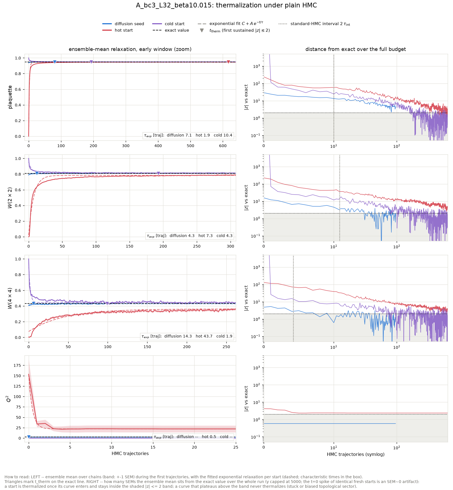

tau_int (hot-start chains, second half): plaquette = 5.00 +- 0.90, wilson_2x2 = 6.16 +- 1.15, wilson_4x4 = 2.11 +- 0.39, wilson_6x6 = 0.86 +- 0.04. Topology: hot-start HMC L=32 beta=10.015 -> **frozen** (no tunneling).

Where 'never' stood at the end: the hot start ended the 640-trajectory budget still at wilson_2x2 at |z| ~ 4, wilson_4x4 at |z| ~ 3, wilson_6x6 at |z| ~ 3, Q^2 at |z| ~ 2; the cold start ended the 640-trajectory budget still at Q^2 at |z| ~ 2736159195136.

### Diagnostics: raw diffusion output (before any HMC)

| observable | value | error | exact | z_exact | reference | ref_error | z_ref | ks_p | chi2_p |
|---|---|---|---|---|---|---|---|---|---|
| plaquette | 0.9368 | 0.000449 | 0.9487 | -26.4 | 0.9486 | 0.0001186 | -25.26 | 0 |  |
| wilson_1x1 | 0.9368 | 0.000449 | 0.9487 | -26.4 | 0.9486 | 0.0001186 | -25.26 | 0 |  |
| wilson_1x2 | 0.8816 | 0.0008773 | 0.9 | -20.92 | 0.9002 | 0.0002491 | -20.33 | 0 |  |
| wilson_2x2 | 0.7885 | 0.001605 | 0.81 | -13.41 | 0.8102 | 0.0005851 | -12.74 | 2.48e-28 |  |
| wilson_2x3 | 0.7046 | 0.00243 | 0.729 | -10.03 | 0.7287 | 0.0009044 | -9.31 | 1.582e-13 |  |
| wilson_3x3 | 0.5926 | 0.003496 | 0.6224 | -8.536 | 0.6216 | 0.001485 | -7.637 | 5.943e-10 |  |
| wilson_3x4 | 0.5047 | 0.004182 | 0.5314 | -6.386 | 0.5292 | 0.002277 | -5.149 | 8.145e-06 |  |
| wilson_4x4 | 0.4083 | 0.005137 | 0.4304 | -4.318 | 0.4289 | 0.002807 | -3.522 | 0.01957 |  |
| wilson_4x5 | 0.3263 | 0.005635 | 0.3486 | -3.957 | 0.3456 | 0.00354 | -2.898 | 0.011 |  |
| wilson_5x5 | 0.2464 | 0.006219 | 0.2679 | -3.458 | 0.265 | 0.003876 | -2.543 | 0.08971 |  |
| wilson_5x6 | 0.1881 | 0.005717 | 0.2059 | -3.105 | 0.2042 | 0.004145 | -2.274 | 0.1392 |  |
| wilson_6x6 | 0.1354 | 0.005711 | 0.1501 | -2.565 | 0.1501 | 0.004018 | -2.109 | 0.04938 |  |
| wilson_6x7 | 0.09516 | 0.005308 | 0.1094 | -2.682 | 0.1104 | 0.004002 | -2.299 | 0.1892 |  |
| wilson_7x7 | 0.06556 | 0.004954 | 0.07566 | -2.039 | 0.07739 | 0.003572 | -1.938 | 0.1545 |  |
| wilson_7x8 | 0.043 | 0.004178 | 0.05232 | -2.232 | 0.05614 | 0.003853 | -2.312 | 0.5259 |  |
| wilson_8x8 | 0.0271 | 0.004471 | 0.03433 | -1.616 | 0.03666 | 0.00362 | -1.662 | 0.6395 |  |
| wilson_8x10 | 0.009625 | 0.004961 | 0.01478 | -1.038 | 0.01927 | 0.004252 | -1.476 | 0.1712 |  |
| wilson_10x10 | 0.0031 | 0.004629 | 0.005151 | -0.4432 | 0.005632 | 0.003721 | -0.4264 | 0.8246 |  |
| wilson_10x12 | 0.001907 | 0.003712 | 0.001796 | 0.02979 | 0.00171 | 0.002494 | 0.04391 | 0.7538 |  |
| wilson_12x12 | 0.002189 | 0.003326 | 0.0005072 | 0.5058 | 8.739e-05 | 0.002521 | 0.5037 | 0.2763 |  |
| creutz_2 | 0.05099 | 0.0009737 | 0.05268 | -1.742 |  |  |  |  |  |
| creutz_3 | 0.06072 | 0.001867 | 0.05268 | 4.302 |  |  |  |  |  |
| creutz_4 | 0.0516 | 0.00339 | 0.05268 | -0.3205 |  |  |  |  |  |
| creutz_5 | 0.05708 | 0.005972 | 0.05268 | 0.7356 |  |  |  |  |  |
| creutz_6 | 0.05873 | 0.01472 | 0.05268 | 0.411 |  |  |  |  |  |
| creutz_7 | 0.01985 | 0.02795 | 0.05268 | -1.175 |  |  |  |  |  |
| creutz_8 | 0.03972 | 0.07176 | 0.05268 | -0.1806 |  |  |  |  |  |
| Q | 0.03906 | 0.1517 | 0 | 0.2574 | -0.1042 | 0.1518 | 0.6672 | 0.9807 |  |
| Q^2 | 2.93 | 0.267 | 2.736 | 0.7247 | 3.406 | 0.25 | -1.303 | 0.9941 |  |
| chi_top ((<Q^2>-<Q>^2)/V) | 0.00286 | 0.0002635 | 0.002672 | 0.7116 | 0.003316 | 0.0002389 | -1.283 | 0.0004451 |  |
| Q histogram vs exact P(Q) | 4.29 | nan | 6 | nan |  |  |  |  | 0.6376 |

### Diagnostics: the same configs after 96 HMC trajectories

| observable | value | error | exact | z_exact | reference | ref_error | z_ref | ks_p | chi2_p |
|---|---|---|---|---|---|---|---|---|---|
| plaquette | 0.9476 | 0.000277 | 0.9487 | -3.765 | 0.9486 | 0.0001186 | -3.054 | 0.004349 |  |
| wilson_1x1 | 0.9476 | 0.000277 | 0.9487 | -3.765 | 0.9486 | 0.0001186 | -3.054 | 0.004349 |  |
| wilson_1x2 | 0.8981 | 0.0005787 | 0.9 | -3.273 | 0.9002 | 0.0002491 | -3.299 | 0.0005374 |  |
| wilson_2x2 | 0.8079 | 0.001193 | 0.81 | -1.724 | 0.8102 | 0.0005851 | -1.728 | 0.1392 |  |
| wilson_2x3 | 0.7261 | 0.001588 | 0.729 | -1.807 | 0.7287 | 0.0009044 | -1.44 | 0.8246 |  |
| wilson_3x3 | 0.6178 | 0.002218 | 0.6224 | -2.089 | 0.6216 | 0.001485 | -1.424 | 0.6395 |  |
| wilson_3x4 | 0.5278 | 0.00243 | 0.5314 | -1.49 | 0.5292 | 0.002277 | -0.4297 | 0.8246 |  |
| wilson_4x4 | 0.4278 | 0.002941 | 0.4304 | -0.8925 | 0.4289 | 0.002807 | -0.2608 | 0.9941 |  |
| wilson_4x5 | 0.3465 | 0.003564 | 0.3486 | -0.6122 | 0.3456 | 0.00354 | 0.1659 | 0.9126 |  |
| wilson_5x5 | 0.2671 | 0.003548 | 0.2679 | -0.2397 | 0.265 | 0.003876 | 0.3847 | 0.8864 |  |
| wilson_5x6 | 0.2071 | 0.004254 | 0.2059 | 0.2825 | 0.2042 | 0.004145 | 0.4877 | 0.9693 |  |
| wilson_6x6 | 0.1505 | 0.004695 | 0.1501 | 0.08854 | 0.1501 | 0.004018 | 0.05442 | 0.9807 |  |
| wilson_6x7 | 0.1059 | 0.005043 | 0.1094 | -0.6903 | 0.1104 | 0.004002 | -0.7037 | 0.8864 |  |
| wilson_7x7 | 0.07204 | 0.005502 | 0.07566 | -0.6567 | 0.07739 | 0.003572 | -0.8153 | 0.8864 |  |
| wilson_7x8 | 0.04512 | 0.005565 | 0.05232 | -1.294 | 0.05614 | 0.003853 | -1.627 | 0.1251 |  |
| wilson_8x8 | 0.0274 | 0.005528 | 0.03433 | -1.253 | 0.03666 | 0.00362 | -1.402 | 0.4898 |  |
| wilson_8x10 | 0.008654 | 0.005131 | 0.01478 | -1.193 | 0.01927 | 0.004252 | -1.593 | 0.6011 |  |
| wilson_10x10 | -0.002517 | 0.003538 | 0.005151 | -2.167 | 0.005632 | 0.003721 | -1.587 | 0.2297 |  |
| wilson_10x12 | -0.006318 | 0.003672 | 0.001796 | -2.21 | 0.00171 | 0.002494 | -1.809 | 0.5259 |  |
| wilson_12x12 | -0.007477 | 0.002662 | 0.0005072 | -3 | 8.739e-05 | 0.002521 | -2.063 | 0.0631 |  |
| creutz_2 | 0.05211 | 0.0008157 | 0.05268 | -0.7012 |  |  |  |  |  |
| creutz_3 | 0.05481 | 0.001564 | 0.05268 | 1.359 |  |  |  |  |  |
| creutz_4 | 0.0526 | 0.00318 | 0.05268 | -0.02625 |  |  |  |  |  |
| creutz_5 | 0.04943 | 0.00546 | 0.05268 | -0.5966 |  |  |  |  |  |
| creutz_6 | 0.06474 | 0.01223 | 0.05268 | 0.9857 |  |  |  |  |  |
| creutz_7 | 0.03418 | 0.0238 | 0.05268 | -0.7777 |  |  |  |  |  |
| creutz_8 | 0.03103 | 0.07104 | 0.05268 | -0.3048 |  |  |  |  |  |
| Q | 0.03906 | 0.1517 | 0 | 0.2574 | -0.1042 | 0.1518 | 0.6672 | 0.9807 |  |
| Q^2 | 2.93 | 0.267 | 2.736 | 0.7247 | 3.406 | 0.25 | -1.303 | 0.9941 |  |
| chi_top ((<Q^2>-<Q>^2)/V) | 0.00286 | 0.0002635 | 0.002672 | 0.7116 | 0.003316 | 0.0002389 | -1.283 | 0.0004451 |  |
| Q histogram vs exact P(Q) | 4.29 | nan | 6 | nan |  |  |  |  | 0.6376 |

## A_bc4_L32_beta14.1464

HMC: step size 0.1063, 9 leapfrog steps, acceptance seed/hot/cold = 0.986/0.985/0.986. Diffusion-seed batch: 128 chains x 96 trajectories (0.18 s/traj for the whole batch); baselines: 32 chains x 640 trajectories.

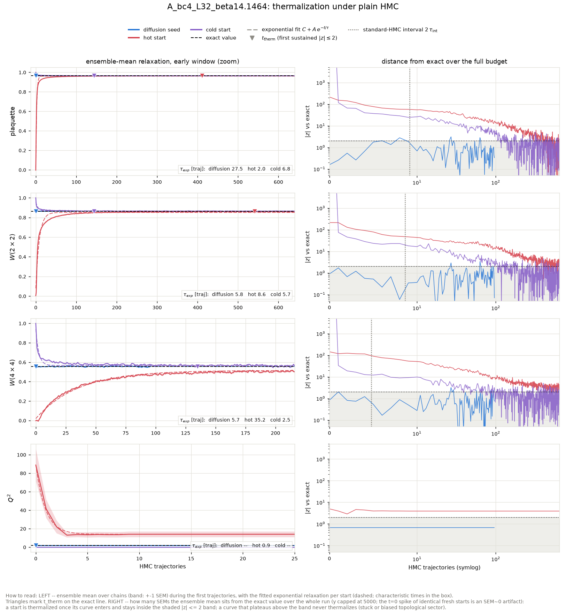

tau_int (hot-start chains, second half): plaquette = 4.57 +- 0.54, wilson_2x2 = 4.32 +- 0.45, wilson_4x4 = 2.38 +- 0.27, wilson_6x6 = 0.86 +- 0.04. Topology: hot-start HMC L=32 beta=14.1464 -> **frozen** (no tunneling).

Where 'never' stood at the end: the hot start ended the 640-trajectory budget still at wilson_4x4 at |z| ~ 3, wilson_6x6 at |z| ~ 3, Q^2 at |z| ~ 4; the cold start ended the 640-trajectory budget still at Q^2 at |z| ~ 1903991324672.

### Diagnostics: raw diffusion output (before any HMC)

| observable | value | error | exact | z_exact | reference | ref_error | z_ref | ks_p | chi2_p |
|---|---|---|---|---|---|---|---|---|---|
| plaquette | 0.964 | 0.000259 | 0.964 | 0.1575 | 0.9643 | 0.0001394 | -0.7882 | 0.017 |  |
| wilson_1x1 | 0.964 | 0.000259 | 0.964 | 0.1575 | 0.9643 | 0.0001394 | -0.7882 | 0.017 |  |
| wilson_1x2 | 0.9294 | 0.0005329 | 0.9293 | 0.1815 | 0.9297 | 0.0002902 | -0.5102 | 0.1122 |  |
| wilson_2x2 | 0.8627 | 0.0009281 | 0.8635 | -0.9286 | 0.8648 | 0.0005656 | -2.005 | 0.1712 |  |
| wilson_2x3 | 0.801 | 0.001499 | 0.8024 | -0.942 | 0.8041 | 0.001006 | -1.698 | 0.3021 |  |
| wilson_3x3 | 0.7153 | 0.001979 | 0.7188 | -1.772 | 0.7215 | 0.001633 | -2.398 | 0.1545 |  |
| wilson_3x4 | 0.6393 | 0.002702 | 0.6439 | -1.7 | 0.6464 | 0.002382 | -1.977 | 0.1251 |  |
| wilson_4x4 | 0.5531 | 0.003406 | 0.556 | -0.8461 | 0.5589 | 0.003229 | -1.216 | 0.389 |  |
| wilson_4x5 | 0.4758 | 0.004547 | 0.4801 | -0.9624 | 0.483 | 0.003787 | -1.224 | 0.3584 |  |
| wilson_5x5 | 0.3961 | 0.005401 | 0.3997 | -0.6606 | 0.4026 | 0.004329 | -0.9329 | 0.6395 |  |
| wilson_5x6 | 0.3272 | 0.006166 | 0.3327 | -0.8859 | 0.3371 | 0.004763 | -1.261 | 0.6011 |  |
| wilson_6x6 | 0.2643 | 0.006819 | 0.267 | -0.3949 | 0.2695 | 0.004692 | -0.6323 | 0.9126 |  |
| wilson_6x7 | 0.2106 | 0.007069 | 0.2142 | -0.5188 | 0.2188 | 0.004882 | -0.9616 | 0.5631 |  |
| wilson_7x7 | 0.1662 | 0.007026 | 0.1657 | 0.07469 | 0.1698 | 0.00535 | -0.4026 | 0.5631 |  |
| wilson_7x8 | 0.1298 | 0.006921 | 0.1282 | 0.2315 | 0.1338 | 0.005268 | -0.4613 | 0.3584 |  |
| wilson_8x8 | 0.09952 | 0.005974 | 0.09558 | 0.6597 | 0.09956 | 0.005676 | -0.004477 | 0.8569 |  |
| wilson_8x10 | 0.05492 | 0.005765 | 0.05315 | 0.3085 | 0.05826 | 0.004829 | -0.4438 | 0.1712 |  |
| wilson_10x10 | 0.0255 | 0.006085 | 0.02552 | -0.003605 | 0.03309 | 0.004208 | -1.027 | 0.389 |  |
| wilson_10x12 | 0.0156 | 0.005336 | 0.01225 | 0.6274 | 0.01664 | 0.004387 | -0.1512 | 0.7901 |  |
| wilson_12x12 | 0.005718 | 0.004195 | 0.00508 | 0.1521 | 0.009305 | 0.005203 | -0.5368 | 0.8569 |  |
| creutz_2 | 0.03785 | 0.0005208 | 0.03668 | 2.236 |  |  |  |  |  |
| creutz_3 | 0.03905 | 0.0009994 | 0.03668 | 2.365 |  |  |  |  |  |
| creutz_4 | 0.03245 | 0.001941 | 0.03668 | -2.182 |  |  |  |  |  |
| creutz_5 | 0.03254 | 0.003096 | 0.03668 | -1.339 |  |  |  |  |  |
| creutz_6 | 0.02268 | 0.005245 | 0.03668 | -2.67 |  |  |  |  |  |
| creutz_7 | 0.009127 | 0.009002 | 0.03668 | -3.061 |  |  |  |  |  |
| creutz_8 | 0.01796 | 0.01649 | 0.03668 | -1.136 |  |  |  |  |  |
| Q | 0.07031 | 0.1218 | 0 | 0.5774 | -0.07292 | 0.1031 | 0.8977 | 0.678 |  |
| Q^2 | 2.086 | 0.2321 | 1.904 | 0.7839 | 1.635 | 0.1596 | 1.599 | 0.8569 |  |
| chi_top ((<Q^2>-<Q>^2)/V) | 0.002032 | 0.0002337 | 0.001859 | 0.7397 | 0.001592 | 0.0001506 | 1.584 | 4.022e-06 |  |
| Q histogram vs exact P(Q) | 2.334 | nan | 6 | nan |  |  |  |  | 0.8866 |

### Diagnostics: the same configs after 96 HMC trajectories

| observable | value | error | exact | z_exact | reference | ref_error | z_ref | ks_p | chi2_p |
|---|---|---|---|---|---|---|---|---|---|
| plaquette | 0.964 | 0.0001225 | 0.964 | 0.395 | 0.9643 | 0.0001394 | -1.208 | 0.2522 |  |
| wilson_1x1 | 0.964 | 0.0001225 | 0.964 | 0.395 | 0.9643 | 0.0001394 | -1.208 | 0.2522 |  |
| wilson_1x2 | 0.9293 | 0.0002947 | 0.9293 | 0.02082 | 0.9297 | 0.0002902 | -0.9674 | 0.2763 |  |
| wilson_2x2 | 0.8636 | 0.0006903 | 0.8635 | 0.07226 | 0.8648 | 0.0005656 | -1.42 | 0.2522 |  |
| wilson_2x3 | 0.8026 | 0.001062 | 0.8024 | 0.1415 | 0.8041 | 0.001006 | -1.028 | 0.5259 |  |
| wilson_3x3 | 0.7193 | 0.001701 | 0.7188 | 0.2749 | 0.7215 | 0.001633 | -0.9236 | 0.6395 |  |
| wilson_3x4 | 0.6451 | 0.002514 | 0.6439 | 0.465 | 0.6464 | 0.002382 | -0.3925 | 0.9807 |  |
| wilson_4x4 | 0.5585 | 0.003489 | 0.556 | 0.7146 | 0.5589 | 0.003229 | -0.06992 | 0.7901 |  |
| wilson_4x5 | 0.484 | 0.004464 | 0.4801 | 0.8622 | 0.483 | 0.003787 | 0.1675 | 0.9807 |  |
| wilson_5x5 | 0.4052 | 0.005424 | 0.3997 | 1.018 | 0.4026 | 0.004329 | 0.3797 | 0.8569 |  |
| wilson_5x6 | 0.3382 | 0.00576 | 0.3327 | 0.9566 | 0.3371 | 0.004763 | 0.1532 | 0.6395 |  |
| wilson_6x6 | 0.2717 | 0.006287 | 0.267 | 0.7451 | 0.2695 | 0.004692 | 0.2732 | 0.8864 |  |
| wilson_6x7 | 0.2175 | 0.006105 | 0.2142 | 0.5374 | 0.2188 | 0.004882 | -0.168 | 0.8569 |  |
| wilson_7x7 | 0.1694 | 0.005604 | 0.1657 | 0.6495 | 0.1698 | 0.00535 | -0.05696 | 0.8246 |  |
| wilson_7x8 | 0.1331 | 0.005631 | 0.1282 | 0.8673 | 0.1338 | 0.005268 | -0.09476 | 0.9972 |  |
| wilson_8x8 | 0.09903 | 0.00529 | 0.09558 | 0.6521 | 0.09956 | 0.005676 | -0.06807 | 0.9126 |  |
| wilson_8x10 | 0.05683 | 0.005274 | 0.05315 | 0.699 | 0.05826 | 0.004829 | -0.1999 | 0.4548 |  |
| wilson_10x10 | 0.03758 | 0.005521 | 0.02552 | 2.184 | 0.03309 | 0.004208 | 0.646 | 0.2087 |  |
| wilson_10x12 | 0.02281 | 0.004817 | 0.01225 | 2.193 | 0.01664 | 0.004387 | 0.947 | 0.5631 |  |
| wilson_12x12 | 0.01507 | 0.005441 | 0.00508 | 1.837 | 0.009305 | 0.005203 | 0.7661 | 0.389 |  |
| creutz_2 | 0.03659 | 0.0004859 | 0.03668 | -0.195 |  |  |  |  |  |
| creutz_3 | 0.03635 | 0.001065 | 0.03668 | -0.3132 |  |  |  |  |  |
| creutz_4 | 0.03519 | 0.001863 | 0.03668 | -0.8033 |  |  |  |  |  |
| creutz_5 | 0.03445 | 0.003747 | 0.03668 | -0.5959 |  |  |  |  |  |
| creutz_6 | 0.03842 | 0.005688 | 0.03668 | 0.3044 |  |  |  |  |  |
| creutz_7 | 0.02796 | 0.01085 | 0.03668 | -0.8038 |  |  |  |  |  |
| creutz_8 | 0.05428 | 0.01919 | 0.03668 | 0.9171 |  |  |  |  |  |
| Q | 0.07031 | 0.1218 | 0 | 0.5774 | -0.07292 | 0.1031 | 0.8977 | 0.678 |  |
| Q^2 | 2.086 | 0.2321 | 1.904 | 0.7839 | 1.635 | 0.1596 | 1.599 | 0.8569 |  |
| chi_top ((<Q^2>-<Q>^2)/V) | 0.002032 | 0.0002337 | 0.001859 | 0.7397 | 0.001592 | 0.0001506 | 1.584 | 4.022e-06 |  |
| Q histogram vs exact P(Q) | 2.334 | nan | 6 | nan |  |  |  |  | 0.8866 |

## B_bt16_L32_beta16

HMC: step size 0.1000, 10 leapfrog steps, acceptance seed/hot/cold = 0.978/0.976/0.978. Diffusion-seed batch: 128 chains x 96 trajectories (0.17 s/traj for the whole batch); baselines: 32 chains x 640 trajectories.

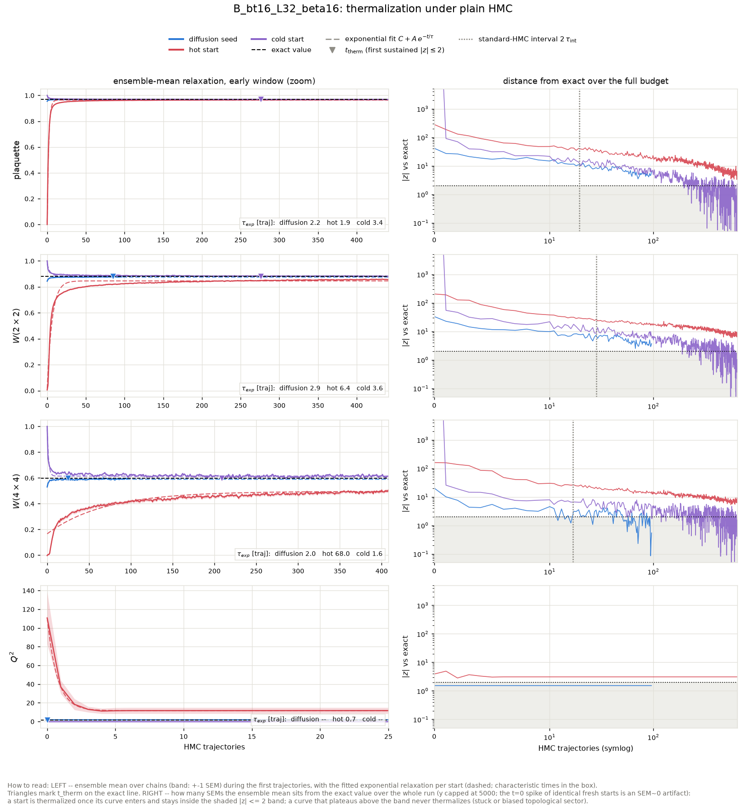

tau_int (hot-start chains, second half): plaquette = 9.62 +- 1.38, wilson_2x2 = 14.02 +- 2.05, wilson_4x4 = 8.42 +- 1.55, wilson_6x6 = 1.18 +- 0.09. Topology: hot-start HMC L=32 beta=16 -> **frozen** (no tunneling).

Where 'never' stood at the end: the hot start ended the 640-trajectory budget still at plaquette at |z| ~ 5, wilson_2x2 at |z| ~ 8, wilson_4x4 at |z| ~ 8, wilson_6x6 at |z| ~ 5, Q^2 at |z| ~ 3; the cold start ended the 640-trajectory budget still at Q^2 at |z| ~ 1675631132672.

### Diagnostics: raw diffusion output (before any HMC)

| observable | value | error | exact | z_exact | reference | ref_error | z_ref | ks_p | chi2_p |
|---|---|---|---|---|---|---|---|---|---|
| plaquette | 0.9545 | 0.0003341 | 0.9682 | -41.09 | 0.9683 | 9.793e-05 | -39.73 | 0 |  |
| wilson_1x1 | 0.9545 | 0.0003341 | 0.9682 | -41.09 | 0.9683 | 9.793e-05 | -39.73 | 0 |  |
| wilson_1x2 | 0.9143 | 0.0007278 | 0.9375 | -31.81 | 0.9377 | 0.0002358 | -30.6 | 0 |  |
| wilson_2x2 | 0.8433 | 0.001294 | 0.8788 | -27.49 | 0.8802 | 0.0004883 | -26.68 | 0 |  |
| wilson_2x3 | 0.7781 | 0.001805 | 0.8239 | -25.35 | 0.8259 | 0.0007559 | -24.43 | 0 |  |
| wilson_3x3 | 0.691 | 0.002326 | 0.7478 | -24.43 | 0.751 | 0.001222 | -22.83 | 0 |  |
| wilson_3x4 | 0.6151 | 0.002789 | 0.6788 | -22.82 | 0.682 | 0.001704 | -20.45 | 1.962e-44 |  |
| wilson_4x4 | 0.5295 | 0.003103 | 0.5965 | -21.6 | 0.6008 | 0.002255 | -18.58 | 1.391e-32 |  |
| wilson_4x5 | 0.452 | 0.004136 | 0.5243 | -17.47 | 0.5287 | 0.002838 | -15.29 | 1.245e-25 |  |
| wilson_5x5 | 0.374 | 0.004686 | 0.4461 | -15.38 | 0.4499 | 0.003562 | -12.9 | 6.598e-20 |  |
| wilson_5x6 | 0.3071 | 0.005986 | 0.3796 | -12.11 | 0.3811 | 0.004178 | -10.13 | 1.09e-14 |  |
| wilson_6x6 | 0.249 | 0.006706 | 0.3127 | -9.509 | 0.311 | 0.004789 | -7.524 | 3.732e-09 |  |
| wilson_6x7 | 0.1955 | 0.007359 | 0.2577 | -8.45 | 0.2522 | 0.004922 | -6.403 | 1.138e-07 |  |
| wilson_7x7 | 0.153 | 0.006939 | 0.2055 | -7.575 | 0.1978 | 0.00483 | -5.298 | 3.143e-05 |  |
| wilson_7x8 | 0.1173 | 0.006978 | 0.164 | -6.683 | 0.1552 | 0.004667 | -4.516 | 0.0004451 |  |
| wilson_8x8 | 0.09031 | 0.006668 | 0.1266 | -5.447 | 0.1167 | 0.004419 | -3.297 | 0.005977 |  |
| wilson_8x10 | 0.04793 | 0.006496 | 0.07554 | -4.251 | 0.06801 | 0.004818 | -2.482 | 0.02248 |  |
| wilson_10x10 | 0.02396 | 0.005767 | 0.03961 | -2.713 | 0.03564 | 0.004175 | -1.641 | 0.1004 |  |
| wilson_10x12 | 0.01237 | 0.004668 | 0.02076 | -1.797 | 0.01489 | 0.004752 | -0.3781 | 0.3021 |  |
| wilson_12x12 | 0.001667 | 0.003748 | 0.009567 | -2.107 | 0.008597 | 0.003994 | -1.265 | 0.02947 |  |
| creutz_2 | 0.03788 | 0.0005485 | 0.03229 | 10.2 |  |  |  |  |  |
| creutz_3 | 0.03837 | 0.00109 | 0.03229 | 5.575 |  |  |  |  |  |
| creutz_4 | 0.03358 | 0.001967 | 0.03229 | 0.657 |  |  |  |  |  |
| creutz_5 | 0.03112 | 0.003428 | 0.03229 | -0.3401 |  |  |  |  |  |
| creutz_6 | 0.01269 | 0.006042 | 0.03229 | -3.243 |  |  |  |  |  |
| creutz_7 | 0.003231 | 0.009874 | 0.03229 | -2.943 |  |  |  |  |  |
| creutz_8 | -0.00367 | 0.01784 | 0.03229 | -2.015 |  |  |  |  |  |
| Q | 0.07031 | 0.1218 | 0 | 0.5774 | -0.2344 | 0.09457 | 1.976 | 0.389 |  |
| Q^2 | 2.086 | 0.2321 | 1.676 | 1.768 | 2.13 | 0.2339 | -0.1343 | 1 |  |
| chi_top ((<Q^2>-<Q>^2)/V) | 0.002032 | 0.0002337 | 0.001636 | 1.694 | 0.002027 | 0.0002099 | 0.01777 | 1.616e-05 |  |
| Q histogram vs exact P(Q) | 3.197 | nan | 6 | nan |  |  |  |  | 0.7837 |

### Diagnostics: the same configs after 96 HMC trajectories

| observable | value | error | exact | z_exact | reference | ref_error | z_ref | ks_p | chi2_p |
|---|---|---|---|---|---|---|---|---|---|
| plaquette | 0.9675 | 9.667e-05 | 0.9682 | -7.159 | 0.9683 | 9.793e-05 | -5.786 | 1.521e-06 |  |
| wilson_1x1 | 0.9675 | 9.667e-05 | 0.9682 | -7.159 | 0.9683 | 9.793e-05 | -5.786 | 1.521e-06 |  |
| wilson_1x2 | 0.9359 | 0.0002819 | 0.9375 | -5.605 | 0.9377 | 0.0002358 | -5.007 | 2.484e-06 |  |
| wilson_2x2 | 0.8763 | 0.0007239 | 0.8788 | -3.467 | 0.8802 | 0.0004883 | -4.403 | 4.842e-05 |  |
| wilson_2x3 | 0.8207 | 0.001288 | 0.8239 | -2.492 | 0.8259 | 0.0007559 | -3.526 | 0.0004451 |  |
| wilson_3x3 | 0.7451 | 0.00204 | 0.7478 | -1.334 | 0.751 | 0.001222 | -2.469 | 0.011 |  |
| wilson_3x4 | 0.6767 | 0.002802 | 0.6788 | -0.7312 | 0.682 | 0.001704 | -1.593 | 0.02947 |  |
| wilson_4x4 | 0.5946 | 0.003545 | 0.5965 | -0.5543 | 0.6008 | 0.002255 | -1.474 | 0.1712 |  |
| wilson_4x5 | 0.5229 | 0.00416 | 0.5243 | -0.3189 | 0.5287 | 0.002838 | -1.15 | 0.3584 |  |
| wilson_5x5 | 0.4449 | 0.004432 | 0.4461 | -0.2737 | 0.4499 | 0.003562 | -0.8876 | 0.4898 |  |
| wilson_5x6 | 0.3786 | 0.004792 | 0.3796 | -0.2097 | 0.3811 | 0.004178 | -0.3888 | 0.8864 |  |
| wilson_6x6 | 0.3136 | 0.0049 | 0.3127 | 0.1696 | 0.311 | 0.004789 | 0.3788 | 0.9807 |  |
| wilson_6x7 | 0.2585 | 0.004638 | 0.2577 | 0.1869 | 0.2522 | 0.004922 | 0.9406 | 0.6011 |  |
| wilson_7x7 | 0.2075 | 0.005256 | 0.2055 | 0.3784 | 0.1978 | 0.00483 | 1.367 | 0.389 |  |
| wilson_7x8 | 0.1658 | 0.004578 | 0.164 | 0.4043 | 0.1552 | 0.004667 | 1.617 | 0.1122 |  |
| wilson_8x8 | 0.127 | 0.005173 | 0.1266 | 0.06964 | 0.1167 | 0.004419 | 1.516 | 0.2297 |  |
| wilson_8x10 | 0.07449 | 0.004995 | 0.07554 | -0.2115 | 0.06801 | 0.004818 | 0.934 | 0.2763 |  |
| wilson_10x10 | 0.03401 | 0.004906 | 0.03961 | -1.14 | 0.03564 | 0.004175 | -0.2522 | 0.6011 |  |
| wilson_10x12 | 0.01176 | 0.005688 | 0.02076 | -1.583 | 0.01489 | 0.004752 | -0.4226 | 0.4548 |  |
| wilson_12x12 | 0.0001466 | 0.006459 | 0.009567 | -1.459 | 0.008597 | 0.003994 | -1.113 | 0.03831 |  |
| creutz_2 | 0.03249 | 0.0004759 | 0.03229 | 0.4225 |  |  |  |  |  |
| creutz_3 | 0.03099 | 0.000937 | 0.03229 | -1.388 |  |  |  |  |  |
| creutz_4 | 0.03319 | 0.001613 | 0.03229 | 0.5591 |  |  |  |  |  |
| creutz_5 | 0.03324 | 0.002835 | 0.03229 | 0.3367 |  |  |  |  |  |
| creutz_6 | 0.02705 | 0.004474 | 0.03229 | -1.17 |  |  |  |  |  |
| creutz_7 | 0.02672 | 0.008464 | 0.03229 | -0.6579 |  |  |  |  |  |
| creutz_8 | 0.04227 | 0.01378 | 0.03229 | 0.7245 |  |  |  |  |  |
| Q | 0.07031 | 0.1218 | 0 | 0.5774 | -0.2344 | 0.09457 | 1.976 | 0.389 |  |
| Q^2 | 2.086 | 0.2321 | 1.676 | 1.768 | 2.13 | 0.2339 | -0.1343 | 1 |  |
| chi_top ((<Q^2>-<Q>^2)/V) | 0.002032 | 0.0002337 | 0.001636 | 1.694 | 0.002027 | 0.0002099 | 0.01777 | 1.616e-05 |  |
| Q histogram vs exact P(Q) | 3.197 | nan | 6 | nan |  |  |  |  | 0.7837 |

## B_bt20_L32_beta20

HMC: step size 0.0894, 11 leapfrog steps, acceptance seed/hot/cold = 0.980/0.983/0.982. Diffusion-seed batch: 128 chains x 96 trajectories (0.19 s/traj for the whole batch); baselines: 32 chains x 640 trajectories.

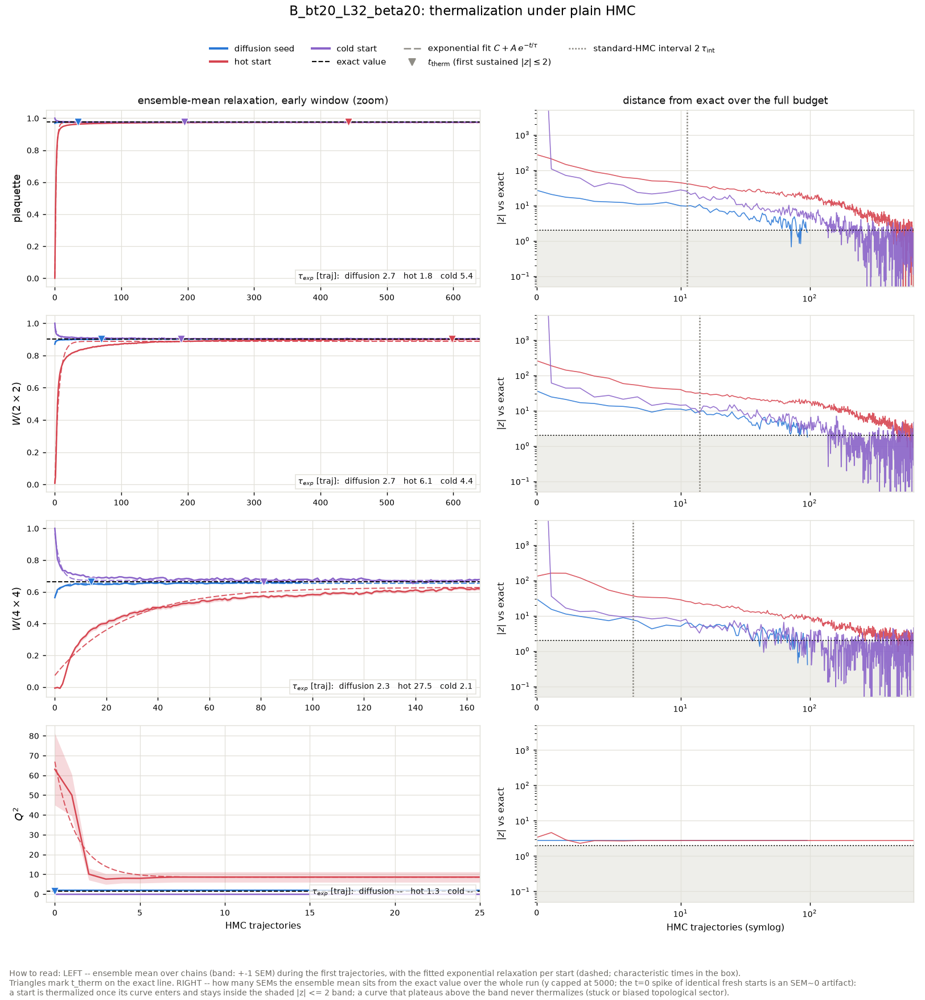

tau_int (hot-start chains, second half): plaquette = 5.59 +- 0.89, wilson_2x2 = 7.02 +- 1.25, wilson_4x4 = 3.35 +- 0.50, wilson_6x6 = 1.06 +- 0.06. Topology: hot-start HMC L=32 beta=20 -> **frozen** (no tunneling).

Where 'never' stood at the end: the hot start ended the 640-trajectory budget still at wilson_4x4 at |z| ~ 2, wilson_6x6 at |z| ~ 3, Q^2 at |z| ~ 3; the cold start ended the 640-trajectory budget still at Q^2 at |z| ~ 1331249283072.

### Diagnostics: raw diffusion output (before any HMC)

| observable | value | error | exact | z_exact | reference | ref_error | z_ref | ks_p | chi2_p |
|---|---|---|---|---|---|---|---|---|---|
| plaquette | 0.9682 | 0.0001893 | 0.9747 | -34.15 | 0.9748 | 8.14e-05 | -31.78 | 0 |  |
| wilson_1x1 | 0.9682 | 0.0001893 | 0.9747 | -34.15 | 0.9748 | 8.14e-05 | -31.78 | 0 |  |
| wilson_1x2 | 0.9355 | 0.0003981 | 0.95 | -36.4 | 0.9497 | 0.000191 | -32.2 | 0 |  |
| wilson_2x2 | 0.8703 | 0.0008021 | 0.9025 | -40.13 | 0.903 | 0.0004684 | -35.22 | 0 |  |
| wilson_2x3 | 0.8103 | 0.001075 | 0.8573 | -43.78 | 0.8578 | 0.0007069 | -36.93 | 0 |  |
| wilson_3x3 | 0.7259 | 0.001486 | 0.7938 | -45.75 | 0.7956 | 0.00127 | -35.68 | 0 |  |
| wilson_3x4 | 0.6512 | 0.002033 | 0.735 | -41.2 | 0.7366 | 0.001633 | -32.74 | 0 |  |
| wilson_4x4 | 0.5633 | 0.002758 | 0.6633 | -36.26 | 0.6666 | 0.002284 | -28.85 | 0 |  |
| wilson_4x5 | 0.4844 | 0.003593 | 0.5986 | -31.78 | 0.6016 | 0.002505 | -26.75 | 0 |  |
| wilson_5x5 | 0.4032 | 0.004318 | 0.5266 | -28.56 | 0.5298 | 0.003021 | -24.01 | 0 |  |
| wilson_5x6 | 0.3341 | 0.005026 | 0.4632 | -25.69 | 0.4655 | 0.00349 | -21.48 | 2.201e-41 |  |
| wilson_6x6 | 0.27 | 0.0056 | 0.3971 | -22.69 | 0.4024 | 0.003842 | -19.49 | 6.026e-37 |  |
| wilson_6x7 | 0.2144 | 0.005916 | 0.3404 | -21.3 | 0.3449 | 0.004299 | -17.85 | 7.314e-33 |  |
| wilson_7x7 | 0.1678 | 0.005771 | 0.2845 | -20.21 | 0.2909 | 0.004652 | -16.6 | 2.48e-28 |  |
| wilson_7x8 | 0.1278 | 0.00574 | 0.2377 | -19.14 | 0.2444 | 0.005224 | -15.02 | 1.083e-24 |  |
| wilson_8x8 | 0.09869 | 0.005156 | 0.1936 | -18.41 | 0.2006 | 0.00572 | -13.23 | 2.282e-17 |  |
| wilson_8x10 | 0.05349 | 0.005498 | 0.1284 | -13.63 | 0.1368 | 0.006275 | -9.992 | 1.09e-14 |  |
| wilson_10x10 | 0.026 | 0.005835 | 0.07687 | -8.718 | 0.08448 | 0.006918 | -6.461 | 3.783e-08 |  |
| wilson_10x12 | 0.01148 | 0.005487 | 0.04602 | -6.295 | 0.05252 | 0.006552 | -4.802 | 1.186e-06 |  |
| wilson_12x12 | 0.006317 | 0.004543 | 0.02486 | -4.082 | 0.03101 | 0.006511 | -3.11 | 0.001117 |  |
| creutz_2 | 0.03789 | 0.0004538 | 0.02566 | 26.96 |  |  |  |  |  |
| creutz_3 | 0.03854 | 0.0008826 | 0.02566 | 14.6 |  |  |  |  |  |
| creutz_4 | 0.03652 | 0.001869 | 0.02566 | 5.814 |  |  |  |  |  |
| creutz_5 | 0.03257 | 0.003018 | 0.02566 | 2.291 |  |  |  |  |  |
| creutz_6 | 0.02459 | 0.00547 | 0.02566 | -0.1955 |  |  |  |  |  |
| creutz_7 | 0.0142 | 0.008812 | 0.02566 | -1.3 |  |  |  |  |  |
| creutz_8 | -0.01348 | 0.01795 | 0.02566 | -2.181 |  |  |  |  |  |
| Q | 0.07031 | 0.1218 | 0 | 0.5774 | 0.05208 | 0.08251 | 0.1239 | 0.7901 |  |
| Q^2 | 2.086 | 0.2321 | 1.331 | 3.252 | 1.094 | 0.09486 | 3.957 | 0.08971 |  |
| chi_top ((<Q^2>-<Q>^2)/V) | 0.002032 | 0.0002337 | 0.0013 | 3.133 | 0.001065 | 9.002e-05 | 3.86 | 2.296e-10 |  |
| Q histogram vs exact P(Q) | 6.283 | nan | 4 | nan |  |  |  |  | 0.179 |

### Diagnostics: the same configs after 96 HMC trajectories

| observable | value | error | exact | z_exact | reference | ref_error | z_ref | ks_p | chi2_p |
|---|---|---|---|---|---|---|---|---|---|
| plaquette | 0.9745 | 8.933e-05 | 0.9747 | -2.025 | 0.9748 | 8.14e-05 | -2.191 | 0.01474 |  |
| wilson_1x1 | 0.9745 | 8.933e-05 | 0.9747 | -2.025 | 0.9748 | 8.14e-05 | -2.191 | 0.01474 |  |
| wilson_1x2 | 0.9493 | 0.0002163 | 0.95 | -2.925 | 0.9497 | 0.000191 | -1.245 | 0.1892 |  |
| wilson_2x2 | 0.9015 | 0.0005057 | 0.9025 | -1.934 | 0.903 | 0.0004684 | -2.186 | 0.1712 |  |
| wilson_2x3 | 0.8562 | 0.00092 | 0.8573 | -1.253 | 0.8578 | 0.0007069 | -1.375 | 0.1392 |  |
| wilson_3x3 | 0.7919 | 0.001573 | 0.7938 | -1.216 | 0.7956 | 0.00127 | -1.822 | 0.05588 |  |
| wilson_3x4 | 0.7335 | 0.002337 | 0.735 | -0.633 | 0.7366 | 0.001633 | -1.082 | 0.3294 |  |
| wilson_4x4 | 0.662 | 0.003148 | 0.6633 | -0.4154 | 0.6666 | 0.002284 | -1.187 | 0.2297 |  |
| wilson_4x5 | 0.5968 | 0.004047 | 0.5986 | -0.4633 | 0.6016 | 0.002505 | -1.021 | 0.7901 |  |
| wilson_5x5 | 0.5226 | 0.00481 | 0.5266 | -0.8329 | 0.5298 | 0.003021 | -1.268 | 0.3294 |  |
| wilson_5x6 | 0.4582 | 0.005611 | 0.4632 | -0.8896 | 0.4655 | 0.00349 | -1.11 | 0.5259 |  |
| wilson_6x6 | 0.3906 | 0.00596 | 0.3971 | -1.091 | 0.4024 | 0.003842 | -1.664 | 0.2297 |  |
| wilson_6x7 | 0.3341 | 0.006338 | 0.3404 | -0.9944 | 0.3449 | 0.004299 | -1.412 | 0.3294 |  |
| wilson_7x7 | 0.2776 | 0.006607 | 0.2845 | -1.04 | 0.2909 | 0.004652 | -1.644 | 0.2087 |  |
| wilson_7x8 | 0.2305 | 0.006482 | 0.2377 | -1.114 | 0.2444 | 0.005224 | -1.676 | 0.4898 |  |
| wilson_8x8 | 0.1853 | 0.006906 | 0.1936 | -1.198 | 0.2006 | 0.00572 | -1.703 | 0.4548 |  |
| wilson_8x10 | 0.1175 | 0.007728 | 0.1284 | -1.412 | 0.1368 | 0.006275 | -1.943 | 0.0711 |  |
| wilson_10x10 | 0.06603 | 0.008811 | 0.07687 | -1.231 | 0.08448 | 0.006918 | -1.647 | 0.1122 |  |
| wilson_10x12 | 0.03895 | 0.008136 | 0.04602 | -0.8694 | 0.05252 | 0.006552 | -1.299 | 0.3584 |  |
| wilson_12x12 | 0.0176 | 0.007964 | 0.02486 | -0.9117 | 0.03101 | 0.006511 | -1.303 | 0.3584 |  |
| creutz_2 | 0.02559 | 0.0003769 | 0.02566 | -0.1667 |  |  |  |  |  |
| creutz_3 | 0.02646 | 0.000783 | 0.02566 | 1.029 |  |  |  |  |  |
| creutz_4 | 0.02601 | 0.001307 | 0.02566 | 0.273 |  |  |  |  |  |
| creutz_5 | 0.02899 | 0.001964 | 0.02566 | 1.699 |  |  |  |  |  |
| creutz_6 | 0.02813 | 0.003119 | 0.02566 | 0.7949 |  |  |  |  |  |
| creutz_7 | 0.02924 | 0.005436 | 0.02566 | 0.6589 |  |  |  |  |  |
| creutz_8 | 0.03205 | 0.009367 | 0.02566 | 0.6827 |  |  |  |  |  |
| Q | 0.07031 | 0.1218 | 0 | 0.5774 | 0.05208 | 0.08251 | 0.1239 | 0.7901 |  |
| Q^2 | 2.086 | 0.2321 | 1.331 | 3.252 | 1.094 | 0.09486 | 3.957 | 0.08971 |  |
| chi_top ((<Q^2>-<Q>^2)/V) | 0.002032 | 0.0002337 | 0.0013 | 3.133 | 0.001065 | 9.002e-05 | 3.86 | 2.296e-10 |  |
| Q histogram vs exact P(Q) | 6.283 | nan | 4 | nan |  |  |  |  | 0.179 |

## A_bc6_L32_beta22.3151

HMC: step size 0.0847, 12 leapfrog steps, acceptance seed/hot/cold = 0.979/0.981/0.984. Diffusion-seed batch: 128 chains x 96 trajectories (0.23 s/traj for the whole batch); baselines: 32 chains x 640 trajectories.

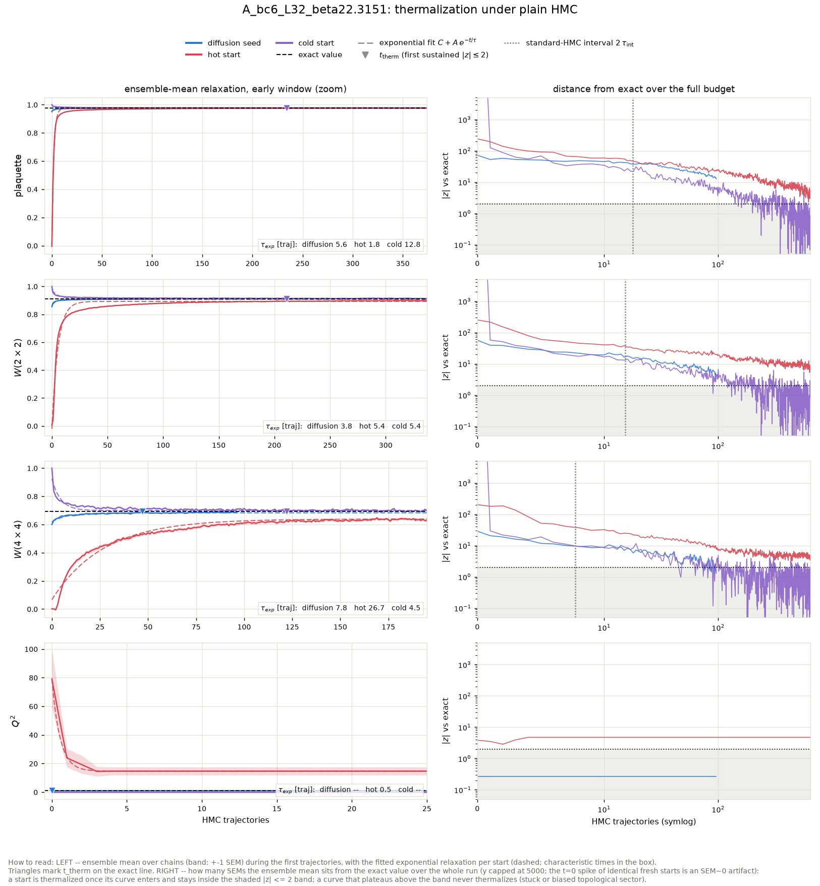

tau_int (hot-start chains, second half): plaquette = 8.88 +- 1.10, wilson_2x2 = 7.64 +- 1.00, wilson_4x4 = 3.85 +- 0.58, wilson_6x6 = 1.24 +- 0.12. Topology: hot-start HMC L=32 beta=22.3151 -> **frozen** (no tunneling).

Where 'never' stood at the end: the hot start ended the 640-trajectory budget still at plaquette at |z| ~ 4, wilson_2x2 at |z| ~ 7, wilson_4x4 at |z| ~ 4, wilson_6x6 at |z| ~ 5, Q^2 at |z| ~ 5; the cold start ended the 640-trajectory budget still at Q^2 at |z| ~ 1189769248768.

### Diagnostics: raw diffusion output (before any HMC)

| observable | value | error | exact | z_exact | reference | ref_error | z_ref | ks_p | chi2_p |
|---|---|---|---|---|---|---|---|---|---|
| plaquette | 0.9505 | 0.0004558 | 0.9773 | -58.94 | 0.9771 | 6.258e-05 | -57.98 | 0 |  |
| wilson_1x1 | 0.9505 | 0.0004558 | 0.9773 | -58.94 | 0.9771 | 6.258e-05 | -57.98 | 0 |  |
| wilson_1x2 | 0.9122 | 0.000782 | 0.9552 | -54.9 | 0.955 | 0.0001446 | -53.79 | 0 |  |
| wilson_2x2 | 0.8541 | 0.001236 | 0.9124 | -47.1 | 0.9118 | 0.0003964 | -44.39 | 0 |  |
| wilson_2x3 | 0.801 | 0.001716 | 0.8715 | -41.05 | 0.8705 | 0.0007065 | -37.42 | 0 |  |
| wilson_3x3 | 0.7288 | 0.002291 | 0.8135 | -36.99 | 0.8119 | 0.001118 | -32.59 | 0 |  |
| wilson_3x4 | 0.6691 | 0.002811 | 0.7594 | -32.15 | 0.7581 | 0.001735 | -26.94 | 0 |  |
| wilson_4x4 | 0.6001 | 0.003645 | 0.6929 | -25.46 | 0.691 | 0.002453 | -20.69 | 0 |  |
| wilson_4x5 | 0.536 | 0.004151 | 0.6322 | -23.18 | 0.6302 | 0.003175 | -18.04 | 4.053e-39 |  |
| wilson_5x5 | 0.4634 | 0.004918 | 0.5637 | -20.39 | 0.5607 | 0.004057 | -15.26 | 2.779e-34 |  |
| wilson_5x6 | 0.4103 | 0.005808 | 0.5026 | -15.9 | 0.4994 | 0.004712 | -11.91 | 8.959e-24 |  |
| wilson_6x6 | 0.354 | 0.006712 | 0.438 | -12.52 | 0.4331 | 0.005531 | -9.103 | 1.254e-16 |  |
| wilson_6x7 | 0.3034 | 0.007626 | 0.3817 | -10.28 | 0.3769 | 0.006189 | -7.486 | 1.16e-11 |  |
| wilson_7x7 | 0.2509 | 0.007493 | 0.3251 | -9.901 | 0.3188 | 0.006756 | -6.727 | 2.764e-09 |  |
| wilson_7x8 | 0.2153 | 0.007744 | 0.2769 | -7.956 | 0.2688 | 0.007177 | -5.065 | 5.1e-06 |  |
| wilson_8x8 | 0.1797 | 0.00802 | 0.2305 | -6.327 | 0.2208 | 0.007311 | -3.782 | 2.524e-05 |  |
| wilson_8x10 | 0.1268 | 0.00768 | 0.1597 | -4.287 | 0.1482 | 0.007828 | -1.953 | 0.02248 |  |
| wilson_10x10 | 0.08445 | 0.00587 | 0.101 | -2.813 | 0.09444 | 0.007242 | -1.072 | 0.07995 |  |
| wilson_10x12 | 0.059 | 0.004911 | 0.06382 | -0.9825 | 0.05584 | 0.006246 | 0.3979 | 0.2522 |  |
| wilson_12x12 | 0.03868 | 0.004726 | 0.03681 | 0.3946 | 0.03103 | 0.005564 | 1.048 | 0.2087 |  |
| creutz_2 | 0.02476 | 0.0006196 | 0.02293 | 2.959 |  |  |  |  |  |
| creutz_3 | 0.03032 | 0.001298 | 0.02293 | 5.697 |  |  |  |  |  |
| creutz_4 | 0.02335 | 0.001802 | 0.02293 | 0.2335 |  |  |  |  |  |
| creutz_5 | 0.03248 | 0.00273 | 0.02293 | 3.499 |  |  |  |  |  |
| creutz_6 | 0.02601 | 0.004777 | 0.02293 | 0.6451 |  |  |  |  |  |
| creutz_7 | 0.03546 | 0.006322 | 0.02293 | 1.982 |  |  |  |  |  |
| creutz_8 | 0.02727 | 0.009854 | 0.02293 | 0.4402 |  |  |  |  |  |
| Q | -0.03906 | 0.08641 | 0 | -0.4521 | -0.03125 | 0.0707 | -0.06998 | 1 |  |
| Q^2 | 1.227 | 0.1851 | 1.19 | 0.1988 | 1.406 | 0.09558 | -0.8627 | 0.9126 |  |
| chi_top ((<Q^2>-<Q>^2)/V) | 0.001196 | 0.0001833 | 0.001162 | 0.1879 | 0.001372 | 9.313e-05 | -0.856 | 4.282e-07 |  |
| Q histogram vs exact P(Q) | 3.75 | nan | 4 | nan |  |  |  |  | 0.4409 |

### Diagnostics: the same configs after 96 HMC trajectories

| observable | value | error | exact | z_exact | reference | ref_error | z_ref | ks_p | chi2_p |
|---|---|---|---|---|---|---|---|---|---|
| plaquette | 0.976 | 0.0001181 | 0.9773 | -11.62 | 0.9771 | 6.258e-05 | -8.832 | 7.462e-14 |  |
| wilson_1x1 | 0.976 | 0.0001181 | 0.9773 | -11.62 | 0.9771 | 6.258e-05 | -8.832 | 7.462e-14 |  |
| wilson_1x2 | 0.9529 | 0.0003312 | 0.9552 | -6.996 | 0.955 | 0.0001446 | -5.998 | 2.764e-09 |  |
| wilson_2x2 | 0.9103 | 0.0006758 | 0.9124 | -3.036 | 0.9118 | 0.0003964 | -1.852 | 0.01275 |  |
| wilson_2x3 | 0.8687 | 0.001091 | 0.8715 | -2.561 | 0.8705 | 0.0007065 | -1.391 | 0.0711 |  |
| wilson_3x3 | 0.8079 | 0.001663 | 0.8135 | -3.375 | 0.8119 | 0.001118 | -1.965 | 0.017 |  |
| wilson_3x4 | 0.7544 | 0.002192 | 0.7594 | -2.284 | 0.7581 | 0.001735 | -1.294 | 0.2297 |  |
| wilson_4x4 | 0.689 | 0.002631 | 0.6929 | -1.486 | 0.691 | 0.002453 | -0.558 | 0.4212 |  |
| wilson_4x5 | 0.6294 | 0.003081 | 0.6322 | -0.9004 | 0.6302 | 0.003175 | -0.194 | 0.6011 |  |
| wilson_5x5 | 0.5595 | 0.003563 | 0.5637 | -1.176 | 0.5607 | 0.004057 | -0.2149 | 0.7163 |  |
| wilson_5x6 | 0.4978 | 0.004112 | 0.5026 | -1.168 | 0.4994 | 0.004712 | -0.2451 | 0.389 |  |
| wilson_6x6 | 0.4311 | 0.004954 | 0.438 | -1.404 | 0.4331 | 0.005531 | -0.278 | 0.4548 |  |
| wilson_6x7 | 0.3779 | 0.00535 | 0.3817 | -0.7193 | 0.3769 | 0.006189 | 0.1218 | 0.5259 |  |
| wilson_7x7 | 0.3235 | 0.006052 | 0.3251 | -0.2583 | 0.3188 | 0.006756 | 0.5243 | 0.3021 |  |
| wilson_7x8 | 0.277 | 0.006526 | 0.2769 | 0.02251 | 0.2688 | 0.007177 | 0.8534 | 0.5631 |  |
| wilson_8x8 | 0.23 | 0.006935 | 0.2305 | -0.07389 | 0.2208 | 0.007311 | 0.9119 | 0.5631 |  |
| wilson_8x10 | 0.1619 | 0.008459 | 0.1597 | 0.2638 | 0.1482 | 0.007828 | 1.192 | 0.2763 |  |
| wilson_10x10 | 0.1045 | 0.009035 | 0.101 | 0.3886 | 0.09444 | 0.007242 | 0.8666 | 0.1712 |  |
| wilson_10x12 | 0.06881 | 0.009411 | 0.06382 | 0.5297 | 0.05584 | 0.006246 | 1.148 | 0.017 |  |
| wilson_12x12 | 0.0456 | 0.009077 | 0.03681 | 0.9679 | 0.03103 | 0.005564 | 1.369 | 0.1392 |  |
| creutz_2 | 0.02173 | 0.0003594 | 0.02293 | -3.345 |  |  |  |  |  |
| creutz_3 | 0.02568 | 0.0007073 | 0.02293 | 3.887 |  |  |  |  |  |
| creutz_4 | 0.02228 | 0.001184 | 0.02293 | -0.5476 |  |  |  |  |  |
| creutz_5 | 0.02725 | 0.001759 | 0.02293 | 2.458 |  |  |  |  |  |
| creutz_6 | 0.02719 | 0.002957 | 0.02293 | 1.441 |  |  |  |  |  |
| creutz_7 | 0.02349 | 0.004977 | 0.02293 | 0.112 |  |  |  |  |  |
| creutz_8 | 0.03104 | 0.007112 | 0.02293 | 1.14 |  |  |  |  |  |
| Q | -0.03906 | 0.08641 | 0 | -0.4521 | -0.03125 | 0.0707 | -0.06998 | 1 |  |
| Q^2 | 1.227 | 0.1851 | 1.19 | 0.1988 | 1.406 | 0.09558 | -0.8627 | 0.9126 |  |
| chi_top ((<Q^2>-<Q>^2)/V) | 0.001196 | 0.0001833 | 0.001162 | 0.1879 | 0.001372 | 9.313e-05 | -0.856 | 4.282e-07 |  |
| Q histogram vs exact P(Q) | 3.75 | nan | 4 | nan |  |  |  |  | 0.4409 |

## B_bt30_L32_beta30

HMC: step size 0.0730, 14 leapfrog steps, acceptance seed/hot/cold = 0.981/0.983/0.982. Diffusion-seed batch: 128 chains x 96 trajectories (0.28 s/traj for the whole batch); baselines: 32 chains x 640 trajectories.

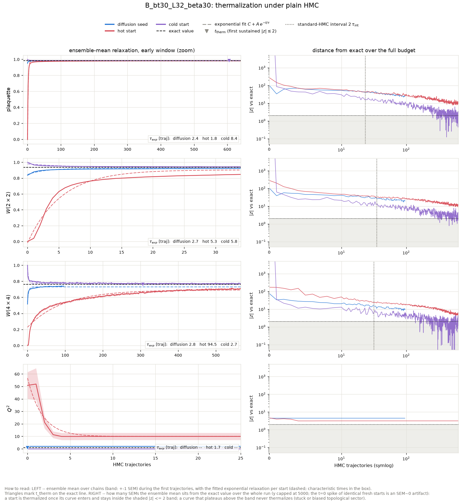

tau_int (hot-start chains, second half): plaquette = 11.66 +- 1.55, wilson_2x2 = 17.43 +- 1.84, wilson_4x4 = 15.82 +- 2.13, wilson_6x6 = 9.78 +- 1.66. Topology: hot-start HMC L=32 beta=30 -> **frozen** (no tunneling).

Where 'never' stood at the end: the hot start ended the 640-trajectory budget still at plaquette at |z| ~ 10, wilson_2x2 at |z| ~ 12, wilson_4x4 at |z| ~ 5, wilson_6x6 at |z| ~ 4, Q^2 at |z| ~ 3; the cold start ended the 640-trajectory budget still at wilson_2x2 at |z| ~ 3, Q^2 at |z| ~ 879566389248.

### Diagnostics: raw diffusion output (before any HMC)

| observable | value | error | exact | z_exact | reference | ref_error | z_ref | ks_p | chi2_p |
|---|---|---|---|---|---|---|---|---|---|
| plaquette | 0.9503 | 0.0003738 | 0.9832 | -88 | 0.9832 | 4.429e-05 | -87.39 | 0 |  |
| wilson_1x1 | 0.9503 | 0.0003738 | 0.9832 | -88 | 0.9832 | 4.429e-05 | -87.39 | 0 |  |
| wilson_1x2 | 0.9081 | 0.0006968 | 0.9667 | -84.1 | 0.9666 | 6.606e-05 | -83.69 | 0 |  |
| wilson_2x2 | 0.8357 | 0.000993 | 0.9344 | -99.42 | 0.9348 | 0.0002129 | -97.54 | 0 |  |
| wilson_2x3 | 0.7689 | 0.001379 | 0.9033 | -97.44 | 0.9035 | 0.0003364 | -94.85 | 0 |  |
| wilson_3x3 | 0.679 | 0.001984 | 0.8585 | -90.47 | 0.8591 | 0.0005646 | -87.29 | 0 |  |
| wilson_3x4 | 0.602 | 0.002277 | 0.8159 | -93.94 | 0.8166 | 0.0007475 | -89.55 | 0 |  |
| wilson_4x4 | 0.516 | 0.002475 | 0.7624 | -99.55 | 0.7622 | 0.001219 | -89.23 | 0 |  |
| wilson_4x5 | 0.4383 | 0.003108 | 0.7124 | -88.2 | 0.7127 | 0.001629 | -78.2 | 0 |  |
| wilson_5x5 | 0.358 | 0.003748 | 0.6545 | -79.11 | 0.6541 | 0.002379 | -66.69 | 0 |  |
| wilson_5x6 | 0.2935 | 0.004504 | 0.6013 | -68.35 | 0.6017 | 0.003102 | -56.36 | 0 |  |
| wilson_6x6 | 0.2348 | 0.00529 | 0.5432 | -58.28 | 0.5439 | 0.004105 | -46.15 | 0 |  |
| wilson_6x7 | 0.1815 | 0.005246 | 0.4906 | -58.93 | 0.4925 | 0.005049 | -42.71 | 0 |  |
| wilson_7x7 | 0.1394 | 0.0053 | 0.4357 | -55.9 | 0.4375 | 0.005923 | -37.5 | 0 |  |
| wilson_7x8 | 0.1035 | 0.005254 | 0.387 | -53.95 | 0.389 | 0.006759 | -33.35 | 0 |  |
| wilson_8x8 | 0.077 | 0.004895 | 0.3379 | -53.3 | 0.3393 | 0.007721 | -28.7 | 0 |  |
| wilson_8x10 | 0.03789 | 0.004042 | 0.2576 | -54.37 | 0.2582 | 0.00899 | -22.35 | 0 |  |
| wilson_10x10 | 0.01722 | 0.004441 | 0.1835 | -37.45 | 0.1851 | 0.01083 | -14.33 | 1.026e-41 |  |
| wilson_10x12 | 0.01155 | 0.003527 | 0.1308 | -33.8 | 0.1289 | 0.01086 | -10.27 | 4.402e-27 |  |
| wilson_12x12 | 0.006413 | 0.0033 | 0.08705 | -24.43 | 0.08874 | 0.01112 | -7.097 | 1.48e-17 |  |
| creutz_2 | 0.03757 | 0.0005932 | 0.01695 | 34.75 |  |  |  |  |  |
| creutz_3 | 0.04112 | 0.001348 | 0.01695 | 17.93 |  |  |  |  |  |
| creutz_4 | 0.03382 | 0.002341 | 0.01695 | 7.203 |  |  |  |  |  |
| creutz_5 | 0.03902 | 0.003859 | 0.01695 | 5.719 |  |  |  |  |  |
| creutz_6 | 0.02441 | 0.007201 | 0.01695 | 1.035 |  |  |  |  |  |
| creutz_7 | 0.005686 | 0.01246 | 0.01695 | -0.904 |  |  |  |  |  |
| creutz_8 | -0.002385 | 0.02266 | 0.01695 | -0.8533 |  |  |  |  |  |
| Q | 0.07031 | 0.1218 | 0 | 0.5774 | -0.02083 | 0.08014 | 0.6252 | 0.389 |  |
| Q^2 | 2.086 | 0.2321 | 0.8796 | 5.198 | 1.01 | 0.09824 | 4.267 | 0.02577 |  |
| chi_top ((<Q^2>-<Q>^2)/V) | 0.002032 | 0.0002337 | 0.000859 | 5.021 | 0.0009863 | 9.671e-05 | 4.136 | 1.203e-10 |  |
| Q histogram vs exact P(Q) | 32.54 | nan | 4 | nan |  |  |  |  | 1.481e-06 |

### Diagnostics: the same configs after 96 HMC trajectories

| observable | value | error | exact | z_exact | reference | ref_error | z_ref | ks_p | chi2_p |
|---|---|---|---|---|---|---|---|---|---|
| plaquette | 0.9814 | 8.248e-05 | 0.9832 | -21.43 | 0.9832 | 4.429e-05 | -18.9 | 0 |  |
| wilson_1x1 | 0.9814 | 8.248e-05 | 0.9832 | -21.43 | 0.9832 | 4.429e-05 | -18.9 | 0 |  |
| wilson_1x2 | 0.9632 | 0.0001988 | 0.9667 | -17.37 | 0.9666 | 6.606e-05 | -16.37 | 5.386e-34 |  |
| wilson_2x2 | 0.9267 | 0.0004311 | 0.9344 | -17.87 | 0.9348 | 0.0002129 | -16.72 | 5.386e-34 |  |
| wilson_2x3 | 0.8928 | 0.0006396 | 0.9033 | -16.41 | 0.9035 | 0.0003364 | -14.89 | 1.507e-23 |  |
| wilson_3x3 | 0.8437 | 0.001029 | 0.8585 | -14.36 | 0.8591 | 0.0005646 | -13.07 | 5.379e-17 |  |
| wilson_3x4 | 0.7986 | 0.001512 | 0.8159 | -11.42 | 0.8166 | 0.0007475 | -10.66 | 1.908e-16 |  |
| wilson_4x4 | 0.7404 | 0.002178 | 0.7624 | -10.12 | 0.7622 | 0.001219 | -8.74 | 2.295e-13 |  |
| wilson_4x5 | 0.6868 | 0.002797 | 0.7124 | -9.158 | 0.7127 | 0.001629 | -7.998 | 2.296e-10 |  |
| wilson_5x5 | 0.6236 | 0.003819 | 0.6545 | -8.097 | 0.6541 | 0.002379 | -6.768 | 8.676e-11 |  |
| wilson_5x6 | 0.568 | 0.004543 | 0.6013 | -7.334 | 0.6017 | 0.003102 | -6.124 | 1.138e-07 |  |
| wilson_6x6 | 0.5054 | 0.005838 | 0.5432 | -6.473 | 0.5439 | 0.004105 | -5.392 | 1.186e-06 |  |
| wilson_6x7 | 0.4476 | 0.006632 | 0.4906 | -6.484 | 0.4925 | 0.005049 | -5.381 | 1.616e-05 |  |
| wilson_7x7 | 0.384 | 0.007566 | 0.4357 | -6.837 | 0.4375 | 0.005923 | -5.566 | 3.165e-06 |  |
| wilson_7x8 | 0.3317 | 0.008452 | 0.387 | -6.54 | 0.389 | 0.006759 | -5.296 | 3.906e-05 |  |
| wilson_8x8 | 0.2788 | 0.00911 | 0.3379 | -6.49 | 0.3393 | 0.007721 | -5.072 | 6.452e-06 |  |
| wilson_8x10 | 0.2084 | 0.01081 | 0.2576 | -4.555 | 0.2582 | 0.00899 | -3.541 | 0.0006474 |  |
| wilson_10x10 | 0.1388 | 0.01006 | 0.1835 | -4.453 | 0.1851 | 0.01083 | -3.132 | 0.0009335 |  |
| wilson_10x12 | 0.08735 | 0.0108 | 0.1308 | -4.02 | 0.1289 | 0.01086 | -2.711 | 0.009477 |  |
| wilson_12x12 | 0.04741 | 0.01025 | 0.08705 | -3.867 | 0.08874 | 0.01112 | -2.733 | 0.011 |  |
| creutz_2 | 0.01988 | 0.0002479 | 0.01695 | 11.8 |  |  |  |  |  |
| creutz_3 | 0.01921 | 0.0005272 | 0.01695 | 4.276 |  |  |  |  |  |
| creutz_4 | 0.02084 | 0.0009844 | 0.01695 | 3.95 |  |  |  |  |  |
| creutz_5 | 0.02144 | 0.00139 | 0.01695 | 3.231 |  |  |  |  |  |
| creutz_6 | 0.02345 | 0.002245 | 0.01695 | 2.895 |  |  |  |  |  |
| creutz_7 | 0.03198 | 0.003443 | 0.01695 | 4.365 |  |  |  |  |  |
| creutz_8 | 0.02741 | 0.005106 | 0.01695 | 2.047 |  |  |  |  |  |
| Q | 0.07031 | 0.1218 | 0 | 0.5774 | -0.02083 | 0.08014 | 0.6252 | 0.389 |  |
| Q^2 | 2.086 | 0.2321 | 0.8796 | 5.198 | 1.01 | 0.09824 | 4.267 | 0.02577 |  |
| chi_top ((<Q^2>-<Q>^2)/V) | 0.002032 | 0.0002337 | 0.000859 | 5.021 | 0.0009863 | 9.671e-05 | 4.136 | 1.203e-10 |  |
| Q histogram vs exact P(Q) | 32.54 | nan | 4 | nan |  |  |  |  | 1.481e-06 |

## A_bc8_L32_beta30.3772

HMC: step size 0.0726, 14 leapfrog steps, acceptance seed/hot/cold = 0.977/0.982/0.983. Diffusion-seed batch: 128 chains x 96 trajectories (0.28 s/traj for the whole batch); baselines: 32 chains x 640 trajectories.

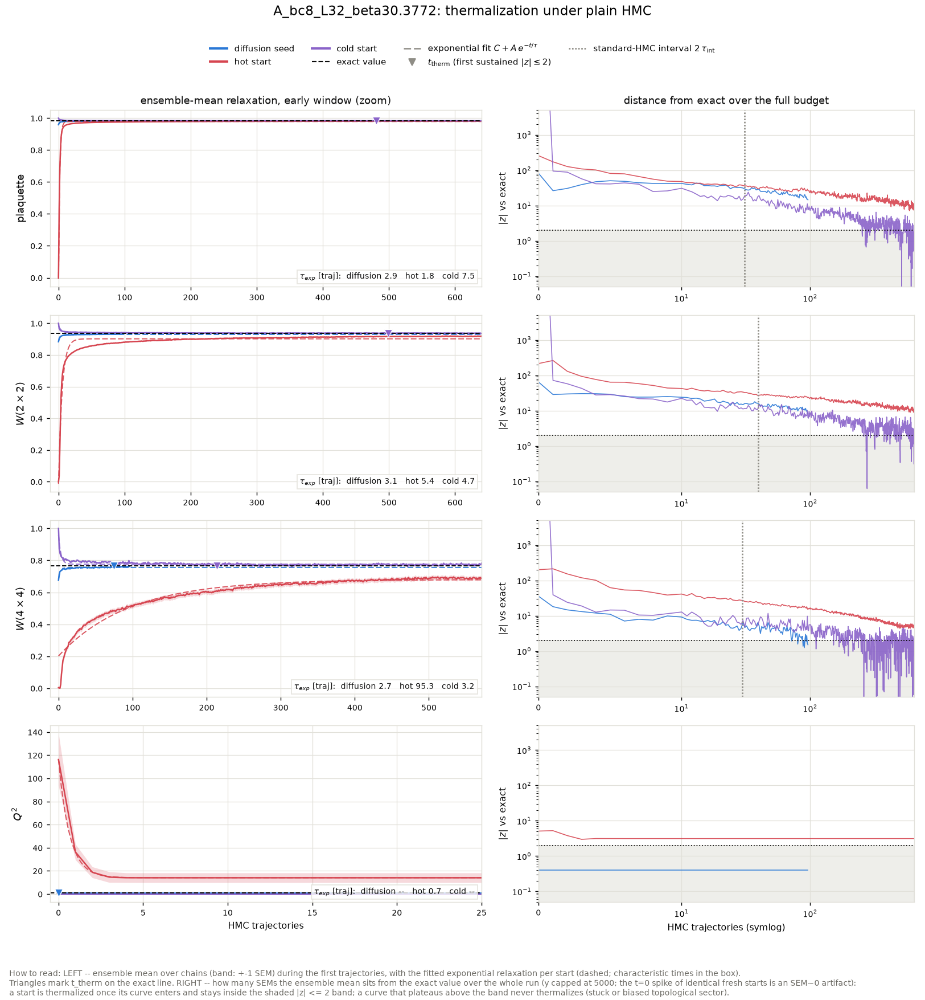

tau_int (hot-start chains, second half): plaquette = 15.44 +- 1.74, wilson_2x2 = 19.62 +- 2.03, wilson_4x4 = 14.85 +- 1.84, wilson_6x6 = 7.98 +- 1.44. Topology: hot-start HMC L=32 beta=30.3772 -> **frozen** (no tunneling).

Where 'never' stood at the end: the hot start ended the 640-trajectory budget still at plaquette at |z| ~ 9, wilson_2x2 at |z| ~ 10, wilson_4x4 at |z| ~ 5, wilson_6x6 at |z| ~ 4, Q^2 at |z| ~ 3; the cold start ended the 640-trajectory budget still at Q^2 at |z| ~ 868455153664.

### Diagnostics: raw diffusion output (before any HMC)

| observable | value | error | exact | z_exact | reference | ref_error | z_ref | ks_p | chi2_p |
|---|---|---|---|---|---|---|---|---|---|
| plaquette | 0.9592 | 0.0002864 | 0.9834 | -84.64 | 0.9835 | 3.853e-05 | -84.19 | 0 |  |
| wilson_1x1 | 0.9592 | 0.0002864 | 0.9834 | -84.64 | 0.9835 | 3.853e-05 | -84.19 | 0 |  |
| wilson_1x2 | 0.9289 | 0.0005122 | 0.9671 | -74.51 | 0.9671 | 8.105e-05 | -73.74 | 0 |  |
| wilson_2x2 | 0.8835 | 0.0008443 | 0.9352 | -61.28 | 0.9353 | 0.0002202 | -59.38 | 0 |  |
| wilson_2x3 | 0.8418 | 0.001102 | 0.9044 | -56.85 | 0.9048 | 0.0004599 | -52.76 | 0 |  |
| wilson_3x3 | 0.7827 | 0.001323 | 0.8601 | -58.57 | 0.8605 | 0.0008424 | -49.62 | 0 |  |
| wilson_3x4 | 0.7336 | 0.001903 | 0.818 | -44.35 | 0.8186 | 0.001269 | -37.14 | 0 |  |
| wilson_4x4 | 0.6756 | 0.002765 | 0.765 | -32.33 | 0.7641 | 0.001745 | -27.06 | 0 |  |
| wilson_4x5 | 0.6204 | 0.003337 | 0.7155 | -28.5 | 0.7147 | 0.002358 | -23.08 | 0 |  |
| wilson_5x5 | 0.5572 | 0.004107 | 0.658 | -24.55 | 0.6563 | 0.003075 | -19.31 | 0 |  |
| wilson_5x6 | 0.5054 | 0.004646 | 0.6052 | -21.48 | 0.6044 | 0.00378 | -16.54 | 4.7e-41 |  |
| wilson_6x6 | 0.4536 | 0.004909 | 0.5474 | -19.11 | 0.5473 | 0.004598 | -13.94 | 3.831e-30 |  |
| wilson_6x7 | 0.3995 | 0.005825 | 0.4951 | -16.4 | 0.4965 | 0.00528 | -12.34 | 4.402e-27 |  |
| wilson_7x7 | 0.3453 | 0.006897 | 0.4403 | -13.78 | 0.4426 | 0.005861 | -10.75 | 3.208e-22 |  |
| wilson_7x8 | 0.3025 | 0.00777 | 0.3916 | -11.47 | 0.3943 | 0.006478 | -9.079 | 2.282e-17 |  |
| wilson_8x8 | 0.2619 | 0.00811 | 0.3426 | -9.944 | 0.3462 | 0.0068 | -7.967 | 3.32e-13 |  |
| wilson_8x10 | 0.1916 | 0.008045 | 0.2621 | -8.761 | 0.2663 | 0.007529 | -6.778 | 1.505e-09 |  |
| wilson_10x10 | 0.1297 | 0.008873 | 0.1875 | -6.514 | 0.1914 | 0.008157 | -5.118 | 2.484e-06 |  |
| wilson_10x12 | 0.08656 | 0.008476 | 0.1342 | -5.616 | 0.1381 | 0.008185 | -4.375 | 3.906e-05 |  |
| wilson_12x12 | 0.0574 | 0.00795 | 0.08978 | -4.073 | 0.09448 | 0.009064 | -3.076 | 0.001334 |  |
| creutz_2 | 0.01808 | 0.0005447 | 0.01674 | 2.459 |  |  |  |  |  |
| creutz_3 | 0.02449 | 0.0008829 | 0.01674 | 8.774 |  |  |  |  |  |
| creutz_4 | 0.01761 | 0.001446 | 0.01674 | 0.6056 |  |  |  |  |  |
| creutz_5 | 0.02215 | 0.001955 | 0.01674 | 2.767 |  |  |  |  |  |
| creutz_6 | 0.01068 | 0.003102 | 0.01674 | -1.954 |  |  |  |  |  |
| creutz_7 | 0.01919 | 0.00427 | 0.01674 | 0.575 |  |  |  |  |  |
| creutz_8 | 0.01182 | 0.007076 | 0.01674 | -0.6949 |  |  |  |  |  |
| Q | 0.1797 | 0.07053 | 0 | 2.548 | 0.09375 | 0.05933 | 0.9324 | 0.9999 |  |
| Q^2 | 0.9141 | 0.1354 | 0.8685 | 0.3369 | 0.8333 | 0.08983 | 0.4969 | 0.9999 |  |
| chi_top ((<Q^2>-<Q>^2)/V) | 0.0008611 | 0.000129 | 0.0008481 | 0.1009 | 0.0008052 | 8.936e-05 | 0.3562 | 5.105e-14 |  |
| Q histogram vs exact P(Q) | 5.306 | nan | 4 | nan |  |  |  |  | 0.2573 |

### Diagnostics: the same configs after 96 HMC trajectories

| observable | value | error | exact | z_exact | reference | ref_error | z_ref | ks_p | chi2_p |
|---|---|---|---|---|---|---|---|---|---|
| plaquette | 0.9823 | 9.545e-05 | 0.9834 | -11.4 | 0.9835 | 3.853e-05 | -11.41 | 1.083e-24 |  |
| wilson_1x1 | 0.9823 | 9.545e-05 | 0.9834 | -11.4 | 0.9835 | 3.853e-05 | -11.41 | 1.083e-24 |  |
| wilson_1x2 | 0.9654 | 0.0001743 | 0.9671 | -9.733 | 0.9671 | 8.105e-05 | -9.208 | 1.582e-13 |  |
| wilson_2x2 | 0.9318 | 0.0004217 | 0.9352 | -8.153 | 0.9353 | 0.0002202 | -7.377 | 1.203e-10 |  |
| wilson_2x3 | 0.9006 | 0.0005656 | 0.9044 | -6.793 | 0.9048 | 0.0004599 | -5.754 | 5.543e-07 |  |
| wilson_3x3 | 0.8562 | 0.000913 | 0.8601 | -4.338 | 0.8605 | 0.0008424 | -3.461 | 0.011 |  |
| wilson_3x4 | 0.8145 | 0.001243 | 0.818 | -2.867 | 0.8186 | 0.001269 | -2.313 | 0.02248 |  |
| wilson_4x4 | 0.7621 | 0.001941 | 0.765 | -1.525 | 0.7641 | 0.001745 | -0.7718 | 0.2763 |  |
| wilson_4x5 | 0.7126 | 0.002553 | 0.7155 | -1.146 | 0.7147 | 0.002358 | -0.6128 | 0.3294 |  |
| wilson_5x5 | 0.6556 | 0.003474 | 0.658 | -0.6899 | 0.6563 | 0.003075 | -0.1367 | 0.6011 |  |
| wilson_5x6 | 0.6034 | 0.004481 | 0.6052 | -0.4082 | 0.6044 | 0.00378 | -0.1812 | 0.5259 |  |
| wilson_6x6 | 0.5475 | 0.005386 | 0.5474 | 0.02665 | 0.5473 | 0.004598 | 0.02451 | 0.5631 |  |
| wilson_6x7 | 0.4918 | 0.006107 | 0.4951 | -0.5404 | 0.4965 | 0.00528 | -0.59 | 0.389 |  |
| wilson_7x7 | 0.4358 | 0.006724 | 0.4403 | -0.6744 | 0.4426 | 0.005861 | -0.7587 | 0.389 |  |
| wilson_7x8 | 0.3843 | 0.007715 | 0.3916 | -0.9517 | 0.3943 | 0.006478 | -0.9973 | 0.08971 |  |
| wilson_8x8 | 0.3341 | 0.008037 | 0.3426 | -1.047 | 0.3462 | 0.0068 | -1.149 | 0.2763 |  |
| wilson_8x10 | 0.2593 | 0.0101 | 0.2621 | -0.2713 | 0.2663 | 0.007529 | -0.5513 | 0.4548 |  |
| wilson_10x10 | 0.1894 | 0.01144 | 0.1875 | 0.1652 | 0.1914 | 0.008157 | -0.1424 | 0.3021 |  |
| wilson_10x12 | 0.1323 | 0.01226 | 0.1342 | -0.1535 | 0.1381 | 0.008185 | -0.3954 | 0.1892 |  |
| wilson_12x12 | 0.08158 | 0.01258 | 0.08978 | -0.6515 | 0.09448 | 0.009064 | -0.8321 | 0.1892 |  |
| creutz_2 | 0.01802 | 0.000265 | 0.01674 | 4.825 |  |  |  |  |  |
| creutz_3 | 0.01652 | 0.0004863 | 0.01674 | -0.4453 |  |  |  |  |  |
| creutz_4 | 0.0165 | 0.000729 | 0.01674 | -0.3282 |  |  |  |  |  |
| creutz_5 | 0.01607 | 0.001209 | 0.01674 | -0.5512 |  |  |  |  |  |
| creutz_6 | 0.01407 | 0.001988 | 0.01674 | -1.342 |  |  |  |  |  |
| creutz_7 | 0.01345 | 0.002887 | 0.01674 | -1.138 |  |  |  |  |  |
| creutz_8 | 0.0141 | 0.004275 | 0.01674 | -0.6172 |  |  |  |  |  |
| Q | 0.1797 | 0.07053 | 0 | 2.548 | 0.09375 | 0.05933 | 0.9324 | 0.9999 |  |
| Q^2 | 0.9141 | 0.1354 | 0.8685 | 0.3369 | 0.8333 | 0.08983 | 0.4969 | 0.9999 |  |
| chi_top ((<Q^2>-<Q>^2)/V) | 0.0008611 | 0.000129 | 0.0008481 | 0.1009 | 0.0008052 | 8.936e-05 | 0.3562 | 5.105e-14 |  |
| Q histogram vs exact P(Q) | 5.306 | nan | 4 | nan |  |  |  |  | 0.2573 |

## D_bc14.1464_L32_beta55.0237

HMC: step size 0.0539, 19 leapfrog steps, acceptance seed/hot/cold = 0.978/0.979/0.977. Diffusion-seed batch: 128 chains x 96 trajectories (0.38 s/traj for the whole batch); baselines: 32 chains x 640 trajectories.

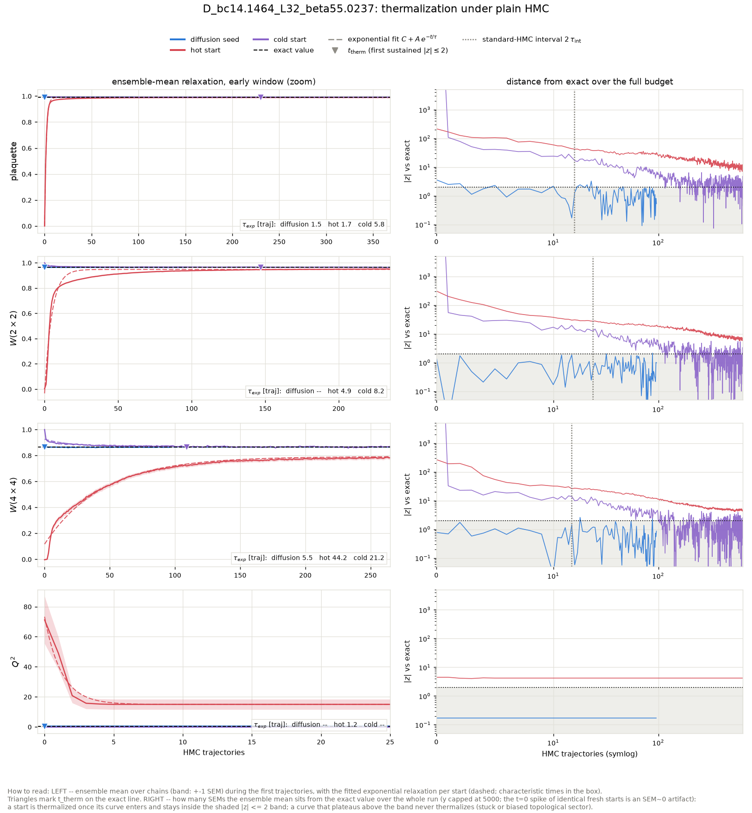

tau_int (hot-start chains, second half): plaquette = 7.95 +- 1.09, wilson_2x2 = 11.86 +- 1.57, wilson_4x4 = 7.49 +- 1.12, wilson_6x6 = 3.71 +- 0.68. Topology: hot-start HMC L=32 beta=55.0237 -> **frozen** (no tunneling).

Where 'never' stood at the end: the hot start ended the 640-trajectory budget still at plaquette at |z| ~ 9, wilson_2x2 at |z| ~ 6, wilson_4x4 at |z| ~ 5, wilson_6x6 at |z| ~ 5, Q^2 at |z| ~ 4; the cold start ended the 640-trajectory budget still at Q^2 at |z| ~ 474280296448.

### Diagnostics: raw diffusion output (before any HMC)

| observable | value | error | exact | z_exact | reference | ref_error | z_ref | ks_p | chi2_p |
|---|---|---|---|---|---|---|---|---|---|
| plaquette | 0.9912 | 7.547e-05 | 0.9909 | 4.921 | 0.9909 | 2.703e-05 | 4.507 | 7.462e-14 |  |
| wilson_1x1 | 0.9912 | 7.547e-05 | 0.9909 | 4.921 | 0.9909 | 2.703e-05 | 4.507 | 7.462e-14 |  |
| wilson_1x2 | 0.9823 | 0.0001189 | 0.9818 | 3.966 | 0.9818 | 5.904e-05 | 3.724 | 2.538e-07 |  |
| wilson_2x2 | 0.9644 | 0.0001792 | 0.964 | 2.294 | 0.9638 | 0.0001521 | 2.413 | 0.02577 |  |
| wilson_2x3 | 0.9471 | 0.0002786 | 0.9465 | 2.348 | 0.9465 | 0.0002251 | 1.704 | 0.1122 |  |
| wilson_3x3 | 0.9214 | 0.0005529 | 0.9208 | 1.213 | 0.921 | 0.0004365 | 0.6194 | 0.5631 |  |
| wilson_3x4 | 0.8965 | 0.0009009 | 0.8958 | 0.7576 | 0.8964 | 0.0005764 | 0.09146 | 0.9353 |  |
| wilson_4x4 | 0.8646 | 0.001348 | 0.8635 | 0.8002 | 0.8644 | 0.0008388 | 0.1389 | 0.9693 |  |
| wilson_4x5 | 0.8333 | 0.001738 | 0.8324 | 0.5104 | 0.8338 | 0.001045 | -0.2382 | 0.8864 |  |
| wilson_5x5 | 0.7959 | 0.00216 | 0.7951 | 0.3809 | 0.7969 | 0.001523 | -0.3482 | 0.9126 |  |
| wilson_5x6 | 0.76 | 0.002459 | 0.7595 | 0.189 | 0.7623 | 0.001953 | -0.7464 | 0.8864 |  |
| wilson_6x6 | 0.7191 | 0.002808 | 0.7188 | 0.09466 | 0.7209 | 0.002568 | -0.4589 | 0.9353 |  |
| wilson_6x7 | 0.6804 | 0.003192 | 0.6804 | 0.002902 | 0.6827 | 0.003195 | -0.5224 | 0.8246 |  |
| wilson_7x7 | 0.6365 | 0.00367 | 0.6381 | -0.4226 | 0.6399 | 0.003671 | -0.6588 | 0.9126 |  |
| wilson_7x8 | 0.5972 | 0.004072 | 0.5984 | -0.3074 | 0.6009 | 0.004341 | -0.6287 | 0.6395 |  |
| wilson_8x8 | 0.5537 | 0.004689 | 0.5561 | -0.5019 | 0.5584 | 0.004749 | -0.6918 | 0.7163 |  |
| wilson_8x10 | 0.4796 | 0.0056 | 0.4802 | -0.113 | 0.4848 | 0.005792 | -0.6498 | 0.4898 |  |
| wilson_10x10 | 0.3966 | 0.006946 | 0.3998 | -0.4609 | 0.4033 | 0.006486 | -0.7044 | 0.678 |  |
| wilson_10x12 | 0.3284 | 0.007883 | 0.3329 | -0.5723 | 0.3379 | 0.006761 | -0.9149 | 0.8246 |  |
| wilson_12x12 | 0.2612 | 0.009375 | 0.2672 | -0.6429 | 0.2703 | 0.006422 | -0.8033 | 0.7901 |  |
| creutz_2 | 0.00933 | 0.000139 | 0.009171 | 1.147 |  |  |  |  |  |
| creutz_3 | 0.009398 | 0.0002586 | 0.00917 | 0.88 |  |  |  |  |  |
| creutz_4 | 0.008716 | 0.0004461 | 0.00917 | -1.016 |  |  |  |  |  |
| creutz_5 | 0.009016 | 0.0006469 | 0.009169 | -0.2361 |  |  |  |  |  |
| creutz_6 | 0.008987 | 0.0008394 | 0.009167 | -0.2152 |  |  |  |  |  |
| creutz_7 | 0.01126 | 0.001099 | 0.009165 | 1.902 |  |  |  |  |  |
| creutz_8 | 0.01165 | 0.001631 | 0.009162 | 1.524 |  |  |  |  |  |
| Q | 0 | 0.05689 | 0 | 0 | 0.06771 | 0.04615 | -0.9242 | 0.9999 |  |
| Q^2 | 0.4844 | 0.05614 | 0.4743 | 0.1798 | 0.526 | 0.04735 | -0.5673 | 1 |  |
| chi_top ((<Q^2>-<Q>^2)/V) | 0.000473 | 5.482e-05 | 0.0004632 | 0.1798 | 0.0005092 | 4.707e-05 | -0.5012 | 7.05e-23 |  |
| Q histogram vs exact P(Q) | 0.1517 | nan | 2 | nan |  |  |  |  | 0.927 |

### Diagnostics: the same configs after 96 HMC trajectories

| observable | value | error | exact | z_exact | reference | ref_error | z_ref | ks_p | chi2_p |
|---|---|---|---|---|---|---|---|---|---|
| plaquette | 0.9909 | 3.861e-05 | 0.9909 | 0.4668 | 0.9909 | 2.703e-05 | 0.1683 | 0.8569 |  |
| wilson_1x1 | 0.9909 | 3.861e-05 | 0.9909 | 0.4668 | 0.9909 | 2.703e-05 | 0.1683 | 0.8569 |  |
| wilson_1x2 | 0.9819 | 8.254e-05 | 0.9818 | 1.454 | 0.9818 | 5.904e-05 | 1.407 | 0.1545 |  |
| wilson_2x2 | 0.9642 | 0.0001935 | 0.964 | 0.9671 | 0.9638 | 0.0001521 | 1.395 | 0.1251 |  |
| wilson_2x3 | 0.9468 | 0.0002803 | 0.9465 | 1.382 | 0.9465 | 0.0002251 | 0.9555 | 0.4548 |  |
| wilson_3x3 | 0.9214 | 0.0004936 | 0.9208 | 1.283 | 0.921 | 0.0004365 | 0.6053 | 0.9126 |  |
| wilson_3x4 | 0.8967 | 0.0006306 | 0.8958 | 1.516 | 0.8964 | 0.0005764 | 0.4349 | 0.7901 |  |
| wilson_4x4 | 0.8646 | 0.001037 | 0.8635 | 1.031 | 0.8644 | 0.0008388 | 0.1583 | 0.9996 |  |
| wilson_4x5 | 0.8337 | 0.001344 | 0.8324 | 0.9367 | 0.8338 | 0.001045 | -0.0651 | 0.9807 |  |
| wilson_5x5 | 0.797 | 0.00203 | 0.7951 | 0.9187 | 0.7969 | 0.001523 | 0.04826 | 0.9941 |  |
| wilson_5x6 | 0.7616 | 0.002459 | 0.7595 | 0.8426 | 0.7623 | 0.001953 | -0.2347 | 0.8864 |  |
| wilson_6x6 | 0.7216 | 0.003275 | 0.7188 | 0.8537 | 0.7209 | 0.002568 | 0.1883 | 0.8569 |  |
| wilson_6x7 | 0.6837 | 0.003805 | 0.6804 | 0.8722 | 0.6827 | 0.003195 | 0.1912 | 0.6011 |  |
| wilson_7x7 | 0.6422 | 0.004667 | 0.6381 | 0.8804 | 0.6399 | 0.003671 | 0.3772 | 0.4548 |  |
| wilson_7x8 | 0.6028 | 0.00533 | 0.5984 | 0.8314 | 0.6009 | 0.004341 | 0.2824 | 0.5259 |  |
| wilson_8x8 | 0.5619 | 0.006215 | 0.5561 | 0.9356 | 0.5584 | 0.004749 | 0.4541 | 0.5259 |  |
| wilson_8x10 | 0.4885 | 0.007572 | 0.4802 | 1.089 | 0.4848 | 0.005792 | 0.3821 | 0.4898 |  |
| wilson_10x10 | 0.4116 | 0.009386 | 0.3998 | 1.258 | 0.4033 | 0.006486 | 0.7284 | 0.4548 |  |
| wilson_10x12 | 0.3434 | 0.01082 | 0.3329 | 0.9706 | 0.3379 | 0.006761 | 0.432 | 0.7163 |  |
| wilson_12x12 | 0.2784 | 0.01204 | 0.2672 | 0.9231 | 0.2703 | 0.006422 | 0.5874 | 0.678 |  |
| creutz_2 | 0.009203 | 0.000134 | 0.009171 | 0.2392 |  |  |  |  |  |
| creutz_3 | 0.009107 | 0.0002762 | 0.00917 | -0.2285 |  |  |  |  |  |
| creutz_4 | 0.009378 | 0.0004733 | 0.00917 | 0.4413 |  |  |  |  |  |
| creutz_5 | 0.008611 | 0.0006587 | 0.009169 | -0.8472 |  |  |  |  |  |
| creutz_6 | 0.008391 | 0.001061 | 0.009167 | -0.7313 |  |  |  |  |  |
| creutz_7 | 0.008597 | 0.001431 | 0.009165 | -0.3972 |  |  |  |  |  |
| creutz_8 | 0.007099 | 0.001868 | 0.009162 | -1.104 |  |  |  |  |  |
| Q | 0 | 0.05689 | 0 | 0 | 0.06771 | 0.04615 | -0.9242 | 0.9999 |  |
| Q^2 | 0.4844 | 0.05614 | 0.4743 | 0.1798 | 0.526 | 0.04735 | -0.5673 | 1 |  |
| chi_top ((<Q^2>-<Q>^2)/V) | 0.000473 | 5.482e-05 | 0.0004632 | 0.1798 | 0.0005092 | 4.707e-05 | -0.5012 | 7.05e-23 |  |
| Q histogram vs exact P(Q) | 0.1517 | nan | 2 | nan |  |  |  |  | 0.927 |

## B_bt55.0237_L32_beta55.0237

HMC: step size 0.0539, 19 leapfrog steps, acceptance seed/hot/cold = 0.974/0.978/0.978. Diffusion-seed batch: 128 chains x 96 trajectories (0.37 s/traj for the whole batch); baselines: 32 chains x 640 trajectories.

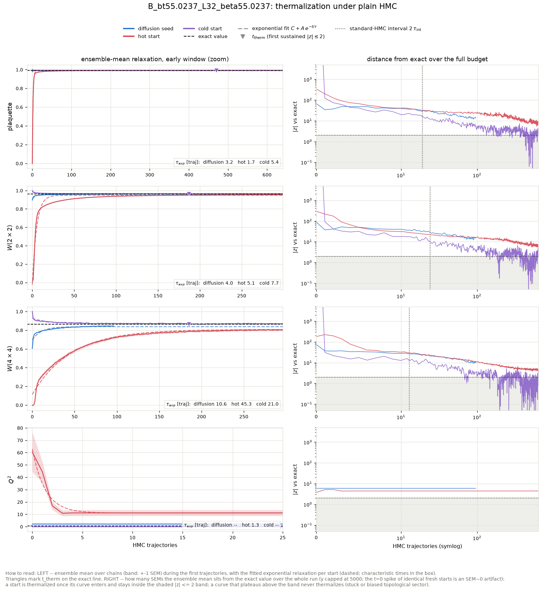

tau_int (hot-start chains, second half): plaquette = 9.49 +- 1.31, wilson_2x2 = 11.98 +- 1.40, wilson_4x4 = 6.43 +- 0.98, wilson_6x6 = 3.99 +- 0.62. Topology: hot-start HMC L=32 beta=55.0237 -> **frozen** (no tunneling).

Where 'never' stood at the end: the hot start ended the 640-trajectory budget still at plaquette at |z| ~ 8, wilson_2x2 at |z| ~ 6, wilson_4x4 at |z| ~ 5, wilson_6x6 at |z| ~ 5, Q^2 at |z| ~ 4; the cold start ended the 640-trajectory budget still at Q^2 at |z| ~ 474280165376.

### Diagnostics: raw diffusion output (before any HMC)

| observable | value | error | exact | z_exact | reference | ref_error | z_ref | ks_p | chi2_p |
|---|---|---|---|---|---|---|---|---|---|
| plaquette | 0.9795 | 0.0001739 | 0.9909 | -65.23 | 0.9909 | 2.703e-05 | -64.51 | 0 |  |
| wilson_1x1 | 0.9795 | 0.0001739 | 0.9909 | -65.23 | 0.9909 | 2.703e-05 | -64.51 | 0 |  |
| wilson_1x2 | 0.9542 | 0.0003927 | 0.9818 | -70.44 | 0.9818 | 5.904e-05 | -69.6 | 0 |  |
| wilson_2x2 | 0.8964 | 0.0007814 | 0.964 | -86.46 | 0.9638 | 0.0001521 | -84.67 | 0 |  |
| wilson_2x3 | 0.842 | 0.001163 | 0.9465 | -89.84 | 0.9465 | 0.0002251 | -88.24 | 0 |  |
| wilson_3x3 | 0.7624 | 0.001636 | 0.9208 | -96.82 | 0.921 | 0.0004365 | -93.68 | 0 |  |
| wilson_3x4 | 0.6906 | 0.002248 | 0.8958 | -91.29 | 0.8964 | 0.0005764 | -88.68 | 0 |  |
| wilson_4x4 | 0.6059 | 0.002887 | 0.8635 | -89.23 | 0.8644 | 0.0008388 | -85.97 | 0 |  |
| wilson_4x5 | 0.5279 | 0.003712 | 0.8324 | -82.02 | 0.8338 | 0.001045 | -79.3 | 0 |  |
| wilson_5x5 | 0.4471 | 0.004729 | 0.7951 | -73.59 | 0.7969 | 0.001523 | -70.4 | 0 |  |
| wilson_5x6 | 0.3754 | 0.005646 | 0.7595 | -68.02 | 0.7623 | 0.001953 | -64.75 | 0 |  |
| wilson_6x6 | 0.3085 | 0.006722 | 0.7188 | -61.05 | 0.7209 | 0.002568 | -57.31 | 0 |  |
| wilson_6x7 | 0.2488 | 0.007183 | 0.6804 | -60.08 | 0.6827 | 0.003195 | -55.2 | 0 |  |
| wilson_7x7 | 0.1981 | 0.007742 | 0.6381 | -56.83 | 0.6399 | 0.003671 | -51.57 | 0 |  |
| wilson_7x8 | 0.1553 | 0.007577 | 0.5984 | -58.48 | 0.6009 | 0.004341 | -51.02 | 0 |  |
| wilson_8x8 | 0.122 | 0.007061 | 0.5561 | -61.47 | 0.5584 | 0.004749 | -51.28 | 0 |  |
| wilson_8x10 | 0.06932 | 0.00639 | 0.4802 | -64.3 | 0.4848 | 0.005792 | -48.18 | 0 |  |
| wilson_10x10 | 0.03527 | 0.006948 | 0.3998 | -52.47 | 0.4033 | 0.006486 | -38.72 | 0 |  |
| wilson_10x12 | 0.01958 | 0.006605 | 0.3329 | -47.44 | 0.3379 | 0.006761 | -33.68 | 0 |  |
| wilson_12x12 | 0.008924 | 0.006022 | 0.2672 | -42.9 | 0.2703 | 0.006422 | -29.7 | 0 |  |
| creutz_2 | 0.03618 | 0.0003454 | 0.009171 | 78.19 |  |  |  |  |  |
| creutz_3 | 0.03668 | 0.00082 | 0.00917 | 33.55 |  |  |  |  |  |
| creutz_4 | 0.03184 | 0.001551 | 0.00917 | 14.62 |  |  |  |  |  |
| creutz_5 | 0.02847 | 0.002715 | 0.009169 | 7.11 |  |  |  |  |  |
| creutz_6 | 0.02178 | 0.004503 | 0.009167 | 2.802 |  |  |  |  |  |
| creutz_7 | 0.01293 | 0.008191 | 0.009165 | 0.4597 |  |  |  |  |  |
| creutz_8 | -0.001855 | 0.01497 | 0.009162 | -0.736 |  |  |  |  |  |
| Q | 0.07031 | 0.1218 | 0 | 0.5774 | 0.06771 | 0.04615 | 0.02 | 0.0631 |  |
| Q^2 | 2.086 | 0.2321 | 0.4743 | 6.944 | 0.526 | 0.04735 | 6.585 | 2.484e-06 |  |
| chi_top ((<Q^2>-<Q>^2)/V) | 0.002032 | 0.0002337 | 0.0004632 | 6.714 | 0.0005092 | 4.707e-05 | 6.389 | 2.529e-23 |  |
| Q histogram vs exact P(Q) | 18.59 | nan | 2 | nan |  |  |  |  | 9.204e-05 |

### Diagnostics: the same configs after 96 HMC trajectories

| observable | value | error | exact | z_exact | reference | ref_error | z_ref | ks_p | chi2_p |
|---|---|---|---|---|---|---|---|---|---|
| plaquette | 0.9903 | 3.126e-05 | 0.9909 | -17.85 | 0.9909 | 2.703e-05 | -13.75 | 3.972e-18 |  |
| wilson_1x1 | 0.9903 | 3.126e-05 | 0.9909 | -17.85 | 0.9909 | 2.703e-05 | -13.75 | 3.972e-18 |  |
| wilson_1x2 | 0.9804 | 0.0001005 | 0.9818 | -14.63 | 0.9818 | 5.904e-05 | -12.42 | 1.04e-18 |  |
| wilson_2x2 | 0.9603 | 0.0002946 | 0.964 | -12.59 | 0.9638 | 0.0001521 | -10.71 | 9.912e-21 |  |
| wilson_2x3 | 0.9405 | 0.0004717 | 0.9465 | -12.6 | 0.9465 | 0.0002251 | -11.45 | 8.678e-22 |  |
| wilson_3x3 | 0.9112 | 0.0009517 | 0.9208 | -10.08 | 0.921 | 0.0004365 | -9.389 | 1.052e-19 |  |
| wilson_3x4 | 0.8825 | 0.001336 | 0.8958 | -9.922 | 0.8964 | 0.0005764 | -9.512 | 3.508e-17 |  |
| wilson_4x4 | 0.8452 | 0.002109 | 0.8635 | -8.713 | 0.8644 | 0.0008388 | -8.474 | 7.36e-15 |  |
| wilson_4x5 | 0.8085 | 0.002758 | 0.8324 | -8.671 | 0.8338 | 0.001045 | -8.572 | 7.462e-14 |  |
| wilson_5x5 | 0.7641 | 0.003576 | 0.7951 | -8.668 | 0.7969 | 0.001523 | -8.423 | 6.895e-13 |  |
| wilson_5x6 | 0.7227 | 0.004393 | 0.7595 | -8.37 | 0.7623 | 0.001953 | -8.232 | 8.222e-12 |  |
| wilson_6x6 | 0.6749 | 0.005626 | 0.7188 | -7.818 | 0.7209 | 0.002568 | -7.437 | 1.615e-08 |  |
| wilson_6x7 | 0.6297 | 0.006584 | 0.6804 | -7.695 | 0.6827 | 0.003195 | -7.246 | 3.783e-08 |  |
| wilson_7x7 | 0.5788 | 0.00793 | 0.6381 | -7.475 | 0.6399 | 0.003671 | -6.998 | 3.165e-06 |  |
| wilson_7x8 | 0.5308 | 0.008882 | 0.5984 | -7.607 | 0.6009 | 0.004341 | -7.086 | 9.223e-07 |  |
| wilson_8x8 | 0.4788 | 0.01009 | 0.5561 | -7.663 | 0.5584 | 0.004749 | -7.137 | 5.1e-06 |  |
| wilson_8x10 | 0.3903 | 0.01221 | 0.4802 | -7.368 | 0.4848 | 0.005792 | -6.997 | 3.165e-06 |  |
| wilson_10x10 | 0.2962 | 0.01432 | 0.3998 | -7.241 | 0.4033 | 0.006486 | -6.818 | 0.0001119 |  |
| wilson_10x12 | 0.2224 | 0.01473 | 0.3329 | -7.5 | 0.3379 | 0.006761 | -7.125 | 0.0006474 |  |
| wilson_12x12 | 0.1547 | 0.01386 | 0.2672 | -8.118 | 0.2703 | 0.006422 | -7.569 | 0.0003034 |  |
| creutz_2 | 0.01059 | 0.0001511 | 0.009171 | 9.383 |  |  |  |  |  |
| creutz_3 | 0.01091 | 0.0003373 | 0.00917 | 5.144 |  |  |  |  |  |
| creutz_4 | 0.01133 | 0.0005013 | 0.00917 | 4.313 |  |  |  |  |  |
| creutz_5 | 0.01214 | 0.0008295 | 0.009169 | 3.586 |  |  |  |  |  |
| creutz_6 | 0.01282 | 0.001363 | 0.009167 | 2.678 |  |  |  |  |  |
| creutz_7 | 0.01505 | 0.001915 | 0.009165 | 3.071 |  |  |  |  |  |
| creutz_8 | 0.01681 | 0.0027 | 0.009162 | 2.832 |  |  |  |  |  |
| Q | 0.07031 | 0.1218 | 0 | 0.5774 | 0.06771 | 0.04615 | 0.02 | 0.0631 |  |
| Q^2 | 2.086 | 0.2321 | 0.4743 | 6.944 | 0.526 | 0.04735 | 6.585 | 2.484e-06 |  |
| chi_top ((<Q^2>-<Q>^2)/V) | 0.002032 | 0.0002337 | 0.0004632 | 6.714 | 0.0005092 | 4.707e-05 | 6.389 | 2.529e-23 |  |
| Q histogram vs exact P(Q) | 18.59 | nan | 2 | nan |  |  |  |  | 9.204e-05 |

## D_bc55.0237_L32_beta218.58

HMC: step size 0.0271, 37 leapfrog steps, acceptance seed/hot/cold = 0.897/0.963/0.976. Diffusion-seed batch: 128 chains x 96 trajectories (0.73 s/traj for the whole batch); baselines: 32 chains x 640 trajectories.

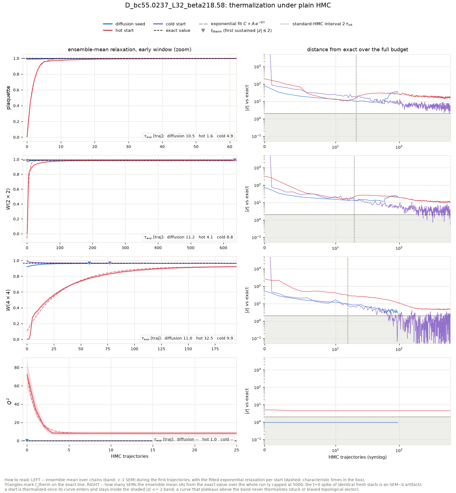

tau_int (hot-start chains, second half): plaquette = 10.54 +- 0.96, wilson_2x2 = 9.78 +- 1.30, wilson_4x4 = 7.78 +- 0.75, wilson_6x6 = 8.76 +- 0.87. Topology: hot-start HMC L=32 beta=218.58 -> **frozen** (no tunneling).

Where 'never' stood at the end: the hot start ended the 640-trajectory budget still at plaquette at |z| ~ 16, wilson_2x2 at |z| ~ 10, wilson_4x4 at |z| ~ 5, wilson_6x6 at |z| ~ 5, Q^2 at |z| ~ 5; the cold start ended the 640-trajectory budget still at plaquette at |z| ~ 4, Q^2 at |z| ~ 29010771968.

### Diagnostics: raw diffusion output (before any HMC)

| observable | value | error | exact | z_exact | reference | ref_error | z_ref | ks_p |
|---|---|---|---|---|---|---|---|---|
| plaquette | 0.9871 | 0.0001324 | 0.9977 | -79.78 | 0.9977 | 7.705e-06 | -79.76 | 0 |
| wilson_1x1 | 0.9871 | 0.0001324 | 0.9977 | -79.78 | 0.9977 | 7.705e-06 | -79.76 | 0 |
| wilson_1x2 | 0.978 | 0.0002202 | 0.9954 | -79.05 | 0.9955 | 1.563e-05 | -79.06 | 0 |
| wilson_2x2 | 0.9671 | 0.0002996 | 0.9909 | -79.38 | 0.991 | 3.765e-05 | -79.06 | 0 |
| wilson_2x3 | 0.9565 | 0.000367 | 0.9864 | -81.53 | 0.9865 | 6.139e-05 | -80.65 | 0 |
| wilson_3x3 | 0.9442 | 0.0005147 | 0.9797 | -68.91 | 0.9799 | 8.848e-05 | -68.21 | 0 |
| wilson_3x4 | 0.9326 | 0.0005431 | 0.9731 | -74.49 | 0.9732 | 0.0001162 | -73.06 | 0 |
| wilson_4x4 | 0.9201 | 0.000556 | 0.9644 | -79.64 | 0.9646 | 0.0001617 | -76.77 | 0 |
| wilson_4x5 | 0.9052 | 0.0007312 | 0.9558 | -69.23 | 0.9559 | 0.0002461 | -65.75 | 0 |
| wilson_5x5 | 0.889 | 0.001013 | 0.9453 | -55.61 | 0.9453 | 0.000377 | -52.1 | 0 |
| wilson_5x6 | 0.8755 | 0.001252 | 0.935 | -47.52 | 0.935 | 0.0005198 | -43.9 | 0 |
| wilson_6x6 | 0.8607 | 0.001388 | 0.9228 | -44.75 | 0.9231 | 0.0007562 | -39.46 | 0 |
| wilson_6x7 | 0.8424 | 0.001748 | 0.9109 | -39.19 | 0.9115 | 0.001025 | -34.07 | 0 |
| wilson_7x7 | 0.8233 | 0.002295 | 0.8974 | -32.29 | 0.8985 | 0.001333 | -28.36 | 0 |
| wilson_7x8 | 0.8077 | 0.0027 | 0.8842 | -28.32 | 0.8856 | 0.0017 | -24.4 | 0 |
| wilson_8x8 | 0.791 | 0.003259 | 0.8696 | -24.09 | 0.872 | 0.002125 | -20.82 | 0 |
| wilson_8x10 | 0.7554 | 0.004464 | 0.8415 | -19.31 | 0.8457 | 0.002874 | -17.02 | 4.204e-45 |
| wilson_10x10 | 0.7144 | 0.005796 | 0.8088 | -16.29 | 0.8165 | 0.004096 | -14.4 | 1.95e-39 |
| wilson_10x12 | 0.6753 | 0.007243 | 0.7785 | -14.25 | 0.7889 | 0.0051 | -12.83 | 2.422e-36 |
| wilson_12x12 | 0.6351 | 0.008837 | 0.745 | -12.43 | 0.7606 | 0.006549 | -11.41 | 2.337e-29 |
| creutz_2 | 0.001934 | 0.0001619 | 0.002278 | -2.12 |  |  |  |  |
| creutz_3 | 0.00181 | 0.0002822 | 0.00225 | -1.559 |  |  |  |  |
| creutz_4 | 0.001152 | 0.0003592 | 0.00221 | -2.945 |  |  |  |  |
| creutz_5 | 0.001741 | 0.0004847 | 0.002155 | -0.855 |  |  |  |  |
| creutz_6 | 0.001714 | 0.0006318 | 0.002087 | -0.5904 |  |  |  |  |
| creutz_7 | 0.001471 | 0.0008104 | 0.002005 | -0.6592 |  |  |  |  |
| creutz_8 | 0.001835 | 0.0008364 | 0.001907 | -0.08633 |  |  |  |  |
| Q | -0.01562 | 0.01614 | 0 | -0.9683 | 0 | 0.007255 | -0.8831 | 1 |
| Q^2 | 0.04688 | 0.02098 | 0.02901 | 0.8516 | 0.01042 | 0.006882 | 1.651 | 0.9999 |
| chi_top ((<Q^2>-<Q>^2)/V) | 4.554e-05 | 2.036e-05 | 2.833e-05 | 0.845 | 1.017e-05 | 6.721e-06 | 1.649 | 0 |

### Diagnostics: the same configs after 96 HMC trajectories

| observable | value | error | exact | z_exact | reference | ref_error | z_ref | ks_p |
|---|---|---|---|---|---|---|---|---|
| plaquette | 0.9971 | 1.422e-05 | 0.9977 | -44.07 | 0.9977 | 7.705e-06 | -39.71 | 0 |
| wilson_1x1 | 0.9971 | 1.422e-05 | 0.9977 | -44.07 | 0.9977 | 7.705e-06 | -39.71 | 0 |
| wilson_1x2 | 0.9943 | 3.486e-05 | 0.9954 | -31.31 | 0.9955 | 1.563e-05 | -29.78 | 0 |
| wilson_2x2 | 0.989 | 6.82e-05 | 0.9909 | -28.15 | 0.991 | 3.765e-05 | -25.81 | 0 |
| wilson_2x3 | 0.9842 | 0.0001075 | 0.9864 | -20.15 | 0.9865 | 6.139e-05 | -18.22 | 2.635e-32 |
| wilson_3x3 | 0.9776 | 0.0001891 | 0.9797 | -11.3 | 0.9799 | 8.848e-05 | -10.99 | 3.484e-14 |
| wilson_3x4 | 0.9714 | 0.0002776 | 0.9731 | -6.242 | 0.9732 | 0.0001162 | -6.166 | 6.452e-06 |
| wilson_4x4 | 0.9633 | 0.0004371 | 0.9644 | -2.541 | 0.9646 | 0.0001617 | -2.746 | 0.009477 |
| wilson_4x5 | 0.9546 | 0.0006277 | 0.9558 | -1.897 | 0.9559 | 0.0002461 | -1.926 | 0.003697 |
| wilson_5x5 | 0.9445 | 0.0008765 | 0.9453 | -0.9502 | 0.9453 | 0.000377 | -0.8605 | 0.017 |
| wilson_5x6 | 0.9334 | 0.001174 | 0.935 | -1.338 | 0.935 | 0.0005198 | -1.24 | 0.011 |
| wilson_6x6 | 0.9207 | 0.001552 | 0.9228 | -1.371 | 0.9231 | 0.0007562 | -1.387 | 0.03364 |
| wilson_6x7 | 0.9084 | 0.001973 | 0.9109 | -1.259 | 0.9115 | 0.001025 | -1.361 | 0.03831 |
| wilson_7x7 | 0.8949 | 0.002465 | 0.8974 | -1.004 | 0.8985 | 0.001333 | -1.294 | 0.1545 |
| wilson_7x8 | 0.8821 | 0.002952 | 0.8842 | -0.7147 | 0.8856 | 0.0017 | -1.03 | 0.2087 |
| wilson_8x8 | 0.868 | 0.003581 | 0.8696 | -0.4244 | 0.872 | 0.002125 | -0.9612 | 0.3021 |
| wilson_8x10 | 0.8399 | 0.004786 | 0.8415 | -0.3447 | 0.8457 | 0.002874 | -1.04 | 0.3021 |
| wilson_10x10 | 0.8071 | 0.0065 | 0.8088 | -0.2617 | 0.8165 | 0.004096 | -1.228 | 0.2763 |
| wilson_10x12 | 0.7752 | 0.007805 | 0.7785 | -0.4162 | 0.7889 | 0.0051 | -1.47 | 0.1892 |
| wilson_12x12 | 0.7394 | 0.009674 | 0.745 | -0.5802 | 0.7606 | 0.006549 | -1.816 | 0.02947 |
| creutz_2 | 0.002651 | 4.514e-05 | 0.002278 | 8.275 |  |  |  |  |
| creutz_3 | 0.001978 | 7.566e-05 | 0.00225 | -3.603 |  |  |  |  |
| creutz_4 | 0.001981 | 0.0001393 | 0.00221 | -1.645 |  |  |  |  |
| creutz_5 | 0.001696 | 0.0001831 | 0.002155 | -2.508 |  |  |  |  |
| creutz_6 | 0.001915 | 0.000241 | 0.002087 | -0.7135 |  |  |  |  |
| creutz_7 | 0.001611 | 0.0003541 | 0.002005 | -1.111 |  |  |  |  |
| creutz_8 | 0.00164 | 0.0004605 | 0.001907 | -0.5811 |  |  |  |  |
| Q | -0.01562 | 0.01614 | 0 | -0.9683 | 0 | 0.007255 | -0.8831 | 1 |
| Q^2 | 0.04688 | 0.02098 | 0.02901 | 0.8516 | 0.01042 | 0.006882 | 1.651 | 0.9999 |
| chi_top ((<Q^2>-<Q>^2)/V) | 4.554e-05 | 2.036e-05 | 2.833e-05 | 0.845 | 1.017e-05 | 6.721e-06 | 1.649 | 0 |

## C_L64_L64_beta14.1464

HMC: step size 0.1063, 9 leapfrog steps, acceptance seed/hot/cold = 0.971/0.970/0.972. Diffusion-seed batch: 96 chains x 96 trajectories (0.40 s/traj for the whole batch); baselines: 16 chains x 640 trajectories.

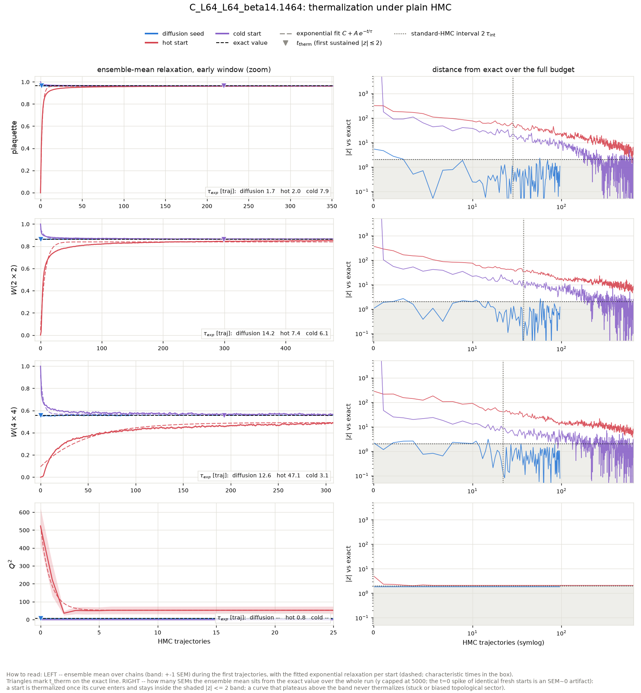

tau_int (hot-start chains, second half): plaquette = 14.25 +- 2.20, wilson_2x2 = 18.65 +- 2.60, wilson_4x4 = 11.04 +- 2.00, wilson_6x6 = 1.30 +- 0.07. Topology: hot-start HMC L=64 beta=14.1464 -> **frozen** (no tunneling).

Where 'never' stood at the end: the hot start ended the 640-trajectory budget still at plaquette at |z| ~ 5, wilson_2x2 at |z| ~ 7, wilson_4x4 at |z| ~ 6, Q^2 at |z| ~ 2; the cold start ended the 640-trajectory budget still at Q^2 at |z| ~ 7615990988800.

### Diagnostics: raw diffusion output (before any HMC)

| observable | value | error | exact | z_exact | reference | ref_error | z_ref | ks_p | chi2_p |
|---|---|---|---|---|---|---|---|---|---|
| plaquette | 0.9632 | 0.0001588 | 0.964 | -5.172 | 0.9639 | 7.655e-05 | -4.136 | 1.804e-07 |  |
| wilson_1x1 | 0.9632 | 0.0001588 | 0.964 | -5.172 | 0.9639 | 7.655e-05 | -4.136 | 1.804e-07 |  |
| wilson_1x2 | 0.9277 | 0.0003213 | 0.9293 | -4.91 | 0.9291 | 0.0001611 | -3.833 | 7.916e-05 |  |
| wilson_2x2 | 0.863 | 0.0005294 | 0.8635 | -1.052 | 0.8634 | 0.0003306 | -0.6336 | 0.6776 |  |
| wilson_2x3 | 0.7994 | 0.0007936 | 0.8024 | -3.801 | 0.8018 | 0.00047 | -2.572 | 0.04631 |  |
| wilson_3x3 | 0.711 | 0.001306 | 0.7188 | -5.998 | 0.7184 | 0.0007832 | -4.86 | 7.916e-05 |  |
| wilson_3x4 | 0.6358 | 0.001723 | 0.6439 | -4.688 | 0.6433 | 0.001095 | -3.683 | 0.002857 |  |
| wilson_4x4 | 0.551 | 0.00193 | 0.556 | -2.581 | 0.5562 | 0.001295 | -2.203 | 0.09853 |  |
| wilson_4x5 | 0.4708 | 0.002214 | 0.4801 | -4.198 | 0.4808 | 0.001583 | -3.659 | 0.004802 |  |
| wilson_5x5 | 0.3856 | 0.002614 | 0.3997 | -5.388 | 0.4007 | 0.001432 | -5.068 | 0.002857 |  |
| wilson_5x6 | 0.321 | 0.003051 | 0.3327 | -3.82 | 0.3334 | 0.001607 | -3.578 | 0.04631 |  |
| wilson_6x6 | 0.2586 | 0.003194 | 0.267 | -2.634 | 0.2669 | 0.001605 | -2.346 | 0.1391 |  |
| wilson_6x7 | 0.2045 | 0.003443 | 0.2142 | -2.815 | 0.2138 | 0.001879 | -2.36 | 0.06828 |  |
| wilson_7x7 | 0.1523 | 0.003737 | 0.1657 | -3.59 | 0.1646 | 0.00196 | -2.917 | 0.04631 |  |
| wilson_7x8 | 0.1169 | 0.004066 | 0.1282 | -2.782 | 0.1265 | 0.001995 | -2.133 | 0.26 |  |
| wilson_8x8 | 0.08669 | 0.004252 | 0.09558 | -2.092 | 0.09523 | 0.001983 | -1.82 | 0.26 |  |
| wilson_8x10 | 0.04573 | 0.003815 | 0.05315 | -1.943 | 0.05148 | 0.002556 | -1.25 | 0.1923 |  |
| wilson_10x10 | 0.01844 | 0.003559 | 0.02552 | -1.989 | 0.03057 | 0.002558 | -2.768 | 0.1391 |  |
| wilson_10x12 | 0.008486 | 0.002457 | 0.01225 | -1.533 | 0.01528 | 0.002839 | -1.809 | 0.26 |  |
| wilson_12x12 | 0.004225 | 0.002218 | 0.00508 | -0.3854 | 0.00836 | 0.002836 | -1.149 | 0.4432 |  |
| creutz_2 | 0.03478 | 0.0003208 | 0.03668 | -5.926 |  |  |  |  |  |
| creutz_3 | 0.04075 | 0.0007121 | 0.03668 | 5.709 |  |  |  |  |  |
| creutz_4 | 0.0314 | 0.001209 | 0.03668 | -4.375 |  |  |  |  |  |
| creutz_5 | 0.04246 | 0.002317 | 0.03668 | 2.491 |  |  |  |  |  |
| creutz_6 | 0.03326 | 0.003735 | 0.03668 | -0.9181 |  |  |  |  |  |
| creutz_7 | 0.06057 | 0.007292 | 0.03668 | 3.276 |  |  |  |  |  |
| creutz_8 | 0.03406 | 0.01225 | 0.03668 | -0.2138 |  |  |  |  |  |
| Q | 0.4167 | 0.1657 | 0 | 2.515 | 0.25 | 0.3158 | 0.4674 | 0.7956 |  |
| Q^2 | 5.729 | 1.016 | 7.616 | -1.857 | 9.583 | 1.569 | -2.062 | 0.3436 |  |
| chi_top ((<Q^2>-<Q>^2)/V) | 0.001356 | 0.0002403 | 0.001859 | -2.094 | 0.002324 | 0.0003851 | -2.133 | 0.0009463 |  |
| Q histogram vs exact P(Q) | 8.321 | nan | 10 | nan |  |  |  |  | 0.5975 |

### Diagnostics: the same configs after 96 HMC trajectories

| observable | value | error | exact | z_exact | reference | ref_error | z_ref | ks_p | chi2_p |
|---|---|---|---|---|---|---|---|---|---|
| plaquette | 0.9639 | 8.578e-05 | 0.964 | -1.004 | 0.9639 | 7.655e-05 | 0.05255 | 0.5566 |  |
| wilson_1x1 | 0.9639 | 8.578e-05 | 0.964 | -1.004 | 0.9639 | 7.655e-05 | 0.05255 | 0.5566 |  |
| wilson_1x2 | 0.9289 | 0.0002043 | 0.9293 | -1.538 | 0.9291 | 0.0001611 | -0.4407 | 0.5566 |  |
| wilson_2x2 | 0.8629 | 0.0005357 | 0.8635 | -1.136 | 0.8634 | 0.0003306 | -0.7107 | 0.3436 |  |
| wilson_2x3 | 0.8016 | 0.0008444 | 0.8024 | -0.9473 | 0.8018 | 0.00047 | -0.1604 | 0.7956 |  |
| wilson_3x3 | 0.7181 | 0.001337 | 0.7188 | -0.5203 | 0.7184 | 0.0007832 | -0.17 | 0.5566 |  |
| wilson_3x4 | 0.6434 | 0.001738 | 0.6439 | -0.2649 | 0.6433 | 0.001095 | 0.04781 | 0.6776 |  |
| wilson_4x4 | 0.5559 | 0.002356 | 0.556 | -0.07189 | 0.5562 | 0.001295 | -0.1145 | 0.6776 |  |
| wilson_4x5 | 0.4808 | 0.002487 | 0.4801 | 0.2619 | 0.4808 | 0.001583 | -0.004478 | 0.6776 |  |
| wilson_5x5 | 0.4016 | 0.002948 | 0.3997 | 0.6453 | 0.4007 | 0.001432 | 0.2687 | 0.6776 |  |
| wilson_5x6 | 0.3357 | 0.002961 | 0.3327 | 0.9972 | 0.3334 | 0.001607 | 0.6737 | 0.6776 |  |
| wilson_6x6 | 0.2708 | 0.003465 | 0.267 | 1.106 | 0.2669 | 0.001605 | 1.011 | 0.7956 |  |
| wilson_6x7 | 0.2188 | 0.003452 | 0.2142 | 1.327 | 0.2138 | 0.001879 | 1.276 | 0.26 |  |
| wilson_7x7 | 0.1703 | 0.003961 | 0.1657 | 1.164 | 0.1646 | 0.00196 | 1.295 | 0.3436 |  |
| wilson_7x8 | 0.1326 | 0.003965 | 0.1282 | 1.125 | 0.1265 | 0.001995 | 1.377 | 0.4432 |  |
| wilson_8x8 | 0.1003 | 0.0042 | 0.09558 | 1.124 | 0.09523 | 0.001983 | 1.092 | 0.7956 |  |
| wilson_8x10 | 0.05734 | 0.004005 | 0.05315 | 1.048 | 0.05148 | 0.002556 | 1.235 | 0.6776 |  |
| wilson_10x10 | 0.02852 | 0.00373 | 0.02552 | 0.8047 | 0.03057 | 0.002558 | -0.4541 | 0.7956 |  |
| wilson_10x12 | 0.01226 | 0.003237 | 0.01225 | 0.003889 | 0.01528 | 0.002839 | -0.6999 | 0.5566 |  |
| wilson_12x12 | 0.00639 | 0.003268 | 0.00508 | 0.4009 | 0.00836 | 0.002836 | -0.4552 | 0.5566 |  |
| creutz_2 | 0.0368 | 0.0003053 | 0.03668 | 0.3863 |  |  |  |  |  |
| creutz_3 | 0.03636 | 0.0006058 | 0.03668 | -0.5309 |  |  |  |  |  |
| creutz_4 | 0.03653 | 0.001181 | 0.03668 | -0.1336 |  |  |  |  |  |
| creutz_5 | 0.03495 | 0.001835 | 0.03668 | -0.9442 |  |  |  |  |  |
| creutz_6 | 0.03536 | 0.003136 | 0.03668 | -0.4226 |  |  |  |  |  |
| creutz_7 | 0.0373 | 0.006298 | 0.03668 | 0.0985 |  |  |  |  |  |
| creutz_8 | 0.02946 | 0.01066 | 0.03668 | -0.6774 |  |  |  |  |  |
| Q | 0.4167 | 0.1657 | 0 | 2.515 | 0.25 | 0.3158 | 0.4674 | 0.7956 |  |
| Q^2 | 5.729 | 1.016 | 7.616 | -1.857 | 9.583 | 1.569 | -2.062 | 0.3436 |  |
| chi_top ((<Q^2>-<Q>^2)/V) | 0.001356 | 0.0002403 | 0.001859 | -2.094 | 0.002324 | 0.0003851 | -2.133 | 0.0009463 |  |
| Q histogram vs exact P(Q) | 8.321 | nan | 10 | nan |  |  |  |  | 0.5975 |

## C_L128_L128_beta14.1464

HMC: step size 0.1063, 9 leapfrog steps, acceptance seed/hot/cold = 0.942/0.939/0.944. Diffusion-seed batch: 64 chains x 96 trajectories (1.00 s/traj for the whole batch); baselines: 8 chains x 640 trajectories.

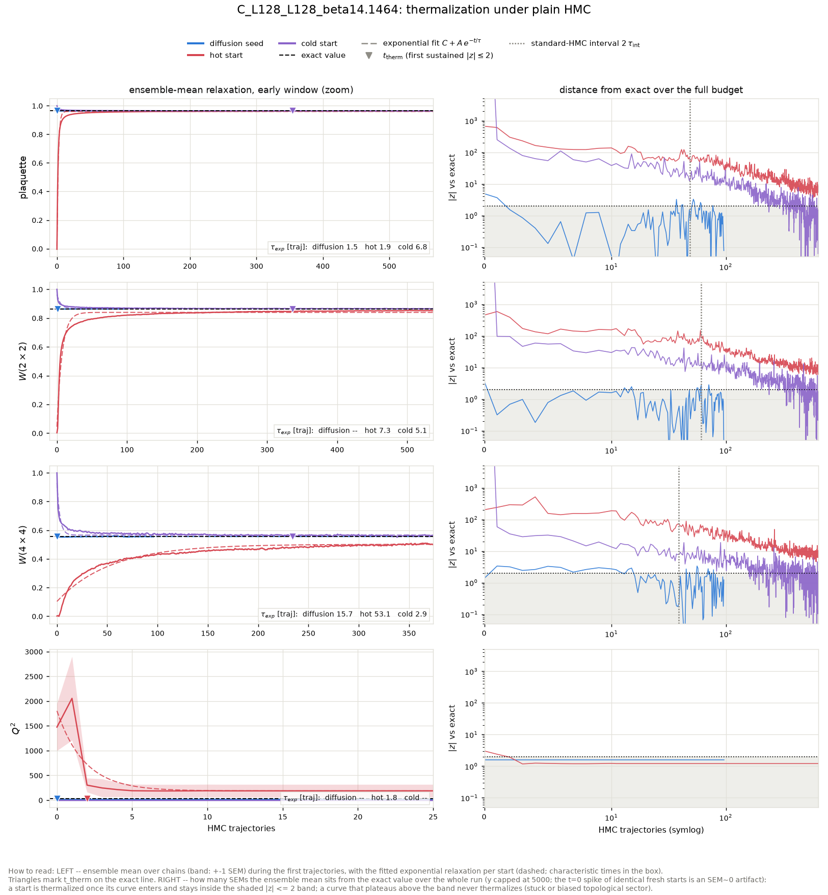

tau_int (hot-start chains, second half): plaquette = 24.20 +- 3.40, wilson_2x2 = 30.39 +- 3.63, wilson_4x4 = 19.38 +- 2.69, wilson_6x6 = 1.36 +- 0.16. Topology: hot-start HMC L=128 beta=14.1464 -> **frozen** (no tunneling).

Where 'never' stood at the end: the hot start ended the 640-trajectory budget still at plaquette at |z| ~ 7, wilson_2x2 at |z| ~ 9, wilson_4x4 at |z| ~ 8; the cold start ended the 640-trajectory budget still at Q^2 at |z| ~ 30463963955200.

### Diagnostics: raw diffusion output (before any HMC)

| observable | value | error | exact | z_exact | reference | ref_error | z_ref | ks_p | chi2_p |
|---|---|---|---|---|---|---|---|---|---|
| plaquette | 0.9635 | 8.71e-05 | 0.964 | -5.747 | 0.9641 | 4.481e-05 | -6.456 | 1.73e-05 |  |
| wilson_1x1 | 0.9635 | 8.71e-05 | 0.964 | -5.747 | 0.9641 | 4.481e-05 | -6.456 | 1.73e-05 |  |
| wilson_1x2 | 0.9285 | 0.0001509 | 0.9293 | -4.938 | 0.9297 | 0.0001346 | -5.661 | 9.563e-05 |  |
| wilson_2x2 | 0.8646 | 0.0002402 | 0.8635 | 4.375 | 0.8643 | 0.0002498 | 0.6514 | 0.7036 |  |
| wilson_2x3 | 0.8021 | 0.0003679 | 0.8024 | -0.9715 | 0.8035 | 0.0004455 | -2.459 | 0.03624 |  |
| wilson_3x3 | 0.7138 | 0.0005471 | 0.7188 | -9.205 | 0.7196 | 0.0006359 | -6.926 | 1.288e-08 |  |
| wilson_3x4 | 0.6388 | 0.0007196 | 0.6439 | -7.087 | 0.645 | 0.0009003 | -5.376 | 1.234e-07 |  |
| wilson_4x4 | 0.5544 | 0.001007 | 0.556 | -1.646 | 0.5569 | 0.001152 | -1.675 | 0.05917 |  |
| wilson_4x5 | 0.4747 | 0.00124 | 0.4801 | -4.38 | 0.4809 | 0.001523 | -3.175 | 0.02148 |  |
| wilson_5x5 | 0.39 | 0.001637 | 0.3997 | -5.886 | 0.399 | 0.001817 | -3.653 | 0.0004567 |  |
| wilson_5x6 | 0.3242 | 0.001796 | 0.3327 | -4.724 | 0.3312 | 0.002046 | -2.569 | 0.02148 |  |
| wilson_6x6 | 0.2621 | 0.002089 | 0.267 | -2.344 | 0.2638 | 0.00212 | -0.5758 | 0.8426 |  |
| wilson_6x7 | 0.2061 | 0.002272 | 0.2142 | -3.57 | 0.2111 | 0.00223 | -1.555 | 0.1429 |  |
| wilson_7x7 | 0.155 | 0.002297 | 0.1657 | -4.647 | 0.1615 | 0.002313 | -1.986 | 0.1429 |  |
| wilson_7x8 | 0.1203 | 0.002231 | 0.1282 | -3.55 | 0.1247 | 0.002349 | -1.366 | 0.418 |  |
| wilson_8x8 | 0.08885 | 0.002301 | 0.09558 | -2.925 | 0.09141 | 0.002124 | -0.8156 | 0.418 |  |
| wilson_8x10 | 0.04697 | 0.002015 | 0.05315 | -3.065 | 0.04985 | 0.001882 | -1.044 | 0.418 |  |
| wilson_10x10 | 0.01915 | 0.001543 | 0.02552 | -4.128 | 0.02302 | 0.001614 | -1.734 | 0.1429 |  |
| wilson_10x12 | 0.008494 | 0.001573 | 0.01225 | -2.389 | 0.009312 | 0.001628 | -0.3615 | 0.9908 |  |
| wilson_12x12 | 0.002469 | 0.001958 | 0.00508 | -1.333 | 0.004616 | 0.001801 | -0.8071 | 0.5551 |  |
| creutz_2 | 0.03438 | 0.0002106 | 0.03668 | -10.92 |  |  |  |  |  |
| creutz_3 | 0.04161 | 0.0004554 | 0.03668 | 10.81 |  |  |  |  |  |
| creutz_4 | 0.0308 | 0.0007679 | 0.03668 | -7.664 |  |  |  |  |  |
| creutz_5 | 0.04132 | 0.0009999 | 0.03668 | 4.632 |  |  |  |  |  |
| creutz_6 | 0.02793 | 0.001687 | 0.03668 | -5.19 |  |  |  |  |  |
| creutz_7 | 0.04459 | 0.003773 | 0.03668 | 2.096 |  |  |  |  |  |
| creutz_8 | 0.04867 | 0.007665 | 0.03668 | 1.564 |  |  |  |  |  |
| Q | 1.328 | 0.4365 | 0 | 3.043 | 0.9688 | 0.5729 | 0.4989 | 0.7036 |  |
| Q^2 | 23.77 | 4.757 | 30.46 | -1.408 | 27.22 | 5.051 | -0.4977 | 0.9908 |  |
| chi_top ((<Q^2>-<Q>^2)/V) | 0.001343 | 0.0002976 | 0.001859 | -1.735 | 0.001604 | 0.000281 | -0.638 | 0.3027 |  |
| Q histogram vs exact P(Q) | 13.52 | nan | 14 | nan |  |  |  |  | 0.4857 |

### Diagnostics: the same configs after 96 HMC trajectories

| observable | value | error | exact | z_exact | reference | ref_error | z_ref | ks_p | chi2_p |
|---|---|---|---|---|---|---|---|---|---|
| plaquette | 0.964 | 3.886e-05 | 0.964 | -0.101 | 0.9641 | 4.481e-05 | -2.289 | 0.3027 |  |
| wilson_1x1 | 0.964 | 3.886e-05 | 0.964 | -0.101 | 0.9641 | 4.481e-05 | -2.289 | 0.3027 |  |
| wilson_1x2 | 0.9293 | 0.0001161 | 0.9293 | 0.3201 | 0.9297 | 0.0001346 | -2.039 | 0.05917 |  |
| wilson_2x2 | 0.8635 | 0.0002108 | 0.8635 | -0.0386 | 0.8643 | 0.0002498 | -2.549 | 0.05917 |  |
| wilson_2x3 | 0.8024 | 0.0003901 | 0.8024 | -0.1761 | 0.8035 | 0.0004455 | -1.912 | 0.05917 |  |
| wilson_3x3 | 0.7181 | 0.000652 | 0.7188 | -1.134 | 0.7196 | 0.0006359 | -1.662 | 0.03624 |  |
| wilson_3x4 | 0.6428 | 0.001002 | 0.6439 | -1.053 | 0.645 | 0.0009003 | -1.597 | 0.02148 |  |
| wilson_4x4 | 0.5543 | 0.001357 | 0.556 | -1.287 | 0.5569 | 0.001152 | -1.49 | 0.1429 |  |
| wilson_4x5 | 0.4783 | 0.001748 | 0.4801 | -1.077 | 0.4809 | 0.001523 | -1.159 | 0.3027 |  |
| wilson_5x5 | 0.3971 | 0.002126 | 0.3997 | -1.231 | 0.399 | 0.001817 | -0.6855 | 0.7036 |  |
| wilson_5x6 | 0.3304 | 0.002455 | 0.3327 | -0.9265 | 0.3312 | 0.002046 | -0.2455 | 0.944 |  |
| wilson_6x6 | 0.2639 | 0.002726 | 0.267 | -1.116 | 0.2638 | 0.00212 | 0.04103 | 0.9908 |  |
| wilson_6x7 | 0.2111 | 0.002788 | 0.2142 | -1.113 | 0.2111 | 0.00223 | 0.01527 | 0.8426 |  |
| wilson_7x7 | 0.1631 | 0.003106 | 0.1657 | -0.8545 | 0.1615 | 0.002313 | 0.3993 | 0.7036 |  |
| wilson_7x8 | 0.1257 | 0.003099 | 0.1282 | -0.7965 | 0.1247 | 0.002349 | 0.2641 | 0.9908 |  |
| wilson_8x8 | 0.09459 | 0.003215 | 0.09558 | -0.3071 | 0.09141 | 0.002124 | 0.8271 | 0.7036 |  |
| wilson_8x10 | 0.05392 | 0.002902 | 0.05315 | 0.2672 | 0.04985 | 0.001882 | 1.177 | 0.5551 |  |
| wilson_10x10 | 0.02571 | 0.002172 | 0.02552 | 0.08988 | 0.02302 | 0.001614 | 0.9954 | 0.3027 |  |
| wilson_10x12 | 0.01212 | 0.001779 | 0.01225 | -0.07601 | 0.009312 | 0.001628 | 1.163 | 0.3027 |  |
| wilson_12x12 | 0.003242 | 0.001946 | 0.00508 | -0.9445 | 0.004616 | 0.001801 | -0.5183 | 0.5551 |  |
| creutz_2 | 0.03678 | 0.0001749 | 0.03668 | 0.5344 |  |  |  |  |  |
| creutz_3 | 0.03755 | 0.000417 | 0.03668 | 2.08 |  |  |  |  |  |
| creutz_4 | 0.03758 | 0.0007603 | 0.03668 | 1.177 |  |  |  |  |  |
| creutz_5 | 0.03855 | 0.001161 | 0.03668 | 1.604 |  |  |  |  |  |
| creutz_6 | 0.04099 | 0.002051 | 0.03668 | 2.099 |  |  |  |  |  |
| creutz_7 | 0.03511 | 0.003711 | 0.03668 | -0.4251 |  |  |  |  |  |
| creutz_8 | 0.02433 | 0.005845 | 0.03668 | -2.114 |  |  |  |  |  |
| Q | 1.328 | 0.4365 | 0 | 3.043 | 0.9688 | 0.5729 | 0.4989 | 0.7036 |  |
| Q^2 | 23.77 | 4.757 | 30.46 | -1.408 | 27.22 | 5.051 | -0.4977 | 0.9908 |  |
| chi_top ((<Q^2>-<Q>^2)/V) | 0.001343 | 0.0002976 | 0.001859 | -1.735 | 0.001604 | 0.000281 | -0.638 | 0.3027 |  |
| Q histogram vs exact P(Q) | 13.52 | nan | 14 | nan |  |  |  |  | 0.4857 |
