# Diffusion-seeded HMC across the matched beta scan: thermalization time vs the standard-HMC sampling interval

Action: wilson. All HMC in this report is plain HMC (Omelyan, adapted step size, **no** topological updates).

**Why this scan.** At the ladder's upper rungs the fresh-HMC baselines never thermalize at all (topological freezing plus a metastable local-defect state), so the only comparison available there is 'diffusion seed vs a baseline that never arrives'. This report extends the benchmark to every matched coupling pair of the generalization study -- one inverse-RG step L=16 -> L=32 per case -- including fine couplings low enough that hot- and cold-start HMC *does* thermalize within the budget. There the standard chain's own interval `2 tau_int` and its fresh-start burn-in are honest, measurable yardsticks, and the scan shows where the ordering

> t_therm(diffusion seed)  <  2 tau_int(standard HMC)  <  burn-in(fresh chain)

sets in as beta grows and standard HMC slides into critical slowing down and topological freezing.

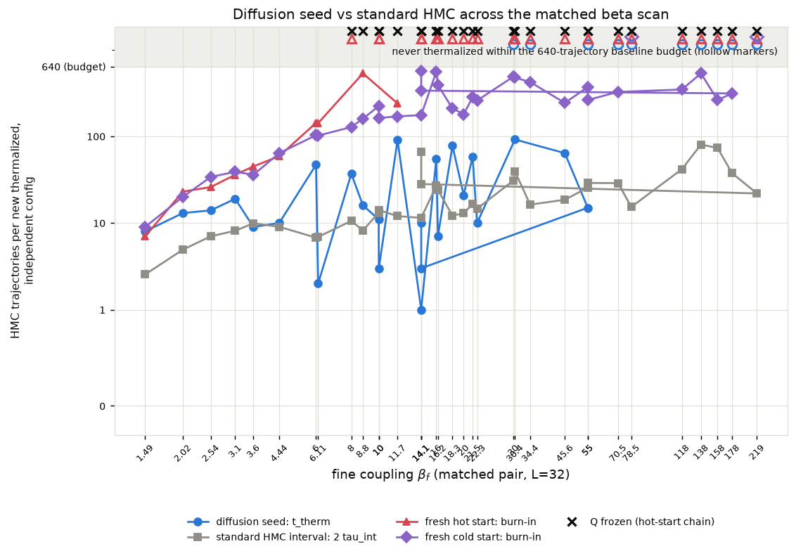

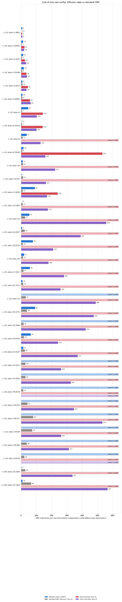

## The three starting points

- **Diffusion seed** -- the raw conditional-diffusion output for this coupling: one inverse-RG step from a direct-HMC base ensemble at the matched coarse coupling (ancestral sampling + the deterministic coarse-charge transport), with **no** rethermalization sweeps applied: every bit of equilibration the seed needs is measured here, in HMC trajectories.
- **Hot start** -- every link angle drawn uniformly from (-pi, pi]: a completely disordered (infinite-temperature) configuration. The standard way to initialize a fresh HMC chain without prior information.
- **Cold start** -- every link angle set to zero: the perfectly ordered (beta -> infinity) configuration, the other standard initialization.

## Summary

| rung | L | beta | t_therm diffusion seed | standard-HMC interval 2 tau_int | margin (interval - t_therm) | burn-in hot / cold | tau_int(Q) |
|---|---|---|---|---|---|---|---|
| A_bc0.25_L32_beta1.4892 | 32 | 1.4892 | 8 | 2.5 | -5.5 traj | 7 / 9 | 1.6 |
| A_bc0.5_L32_beta2.02441 | 32 | 2.02441 | 13 | 4.9 | -8.1 traj | 23 / 20 | 3.0 |
| A_bc0.75_L32_beta2.5435 | 32 | 2.5435 | 14 | 7.0 | -7.0 traj | 26 / 34 | 5.9 |
| A_bc1_L32_beta3.10399 | 32 | 3.10399 | 19 | 8.1 | -10.9 traj | 36 / 39 | 12.5 |
| E_bc1.2_L32_beta3.6012 | 32 | 3.6012 | 9 | 9.9 | 0.9 traj | 45 / 36 | 17.0 |
| A_bc1.5_L32_beta4.44493 | 32 | 4.44493 | 10 | 9.0 | -1.0 traj | 59 / 64 | 23.4 |
| B_bt6_L32_beta6 | 32 | 6 | 47 | 6.8 | -40.2 traj | 143 / 103 | 38.7 |
| A_bc2_L32_beta6.10518 | 32 | 6.10518 | 2 | 6.9 | 4.9 traj | 142 / 102 | 32.6 |
| B_bc2_bt8_L32_beta8 | 32 | 8 | 37 | 10.6 | -26.4 traj | never / 128 | frozen (1 tunnelings in 321 x 32 traj) |
| E_bc2.7_L32_beta8.79549 | 32 | 8.79549 | 16 | 8.2 | -7.8 traj | 533 / 160 | frozen (0 tunnelings in 321 x 32 traj) |
| B_bt10_L32_beta10 | 32 | 10 | 11 | 13.1 | 2.1 traj | never / 223 | frozen (0 tunnelings in 321 x 32 traj) |
| A_bc3_L32_beta10.015 | 32 | 10.015 | 3 | 14.1 | 11.1 traj | never / 163 | frozen (0 tunnelings in 321 x 32 traj) |
| E_bc3.4_L32_beta11.6638 | 32 | 11.6638 | 91 | 12.0 | -79.0 traj | 240 / 170 | frozen (0 tunnelings in 321 x 32 traj) |
| A_bc4_L32_beta14.1464 | 32 | 14.1464 | 1 | 11.4 | 10.4 traj | never / 176 | frozen (0 tunnelings in 321 x 32 traj) |
| B_bt16_L32_beta16 | 32 | 16 | 55 | 26.9 | -28.1 traj | never / 558 | frozen (0 tunnelings in 321 x 32 traj) |
| E_bc4.5_L32_beta16.2057 | 32 | 16.2057 | 7 | 24.1 | 17.1 traj | never / 391 | frozen (0 tunnelings in 321 x 32 traj) |
| A_bc5_L32_beta18.2524 | 32 | 18.2524 | 78 | 12.1 | -65.9 traj | never / 210 | frozen (0 tunnelings in 321 x 32 traj) |
| B_bt20_L32_beta20 | 32 | 20 | 21 | 13.0 | -8.0 traj | never / 180 | frozen (0 tunnelings in 321 x 32 traj) |
| E_bc5.8_L32_beta21.5051 | 32 | 21.5051 | 58 | 16.5 | -41.5 traj | never / 282 | frozen (0 tunnelings in 321 x 32 traj) |
| A_bc6_L32_beta22.3151 | 32 | 22.3151 | 10 | 14.6 | 4.6 traj | never / 259 | frozen (0 tunnelings in 321 x 32 traj) |
| B_bt30_L32_beta30 | 32 | 30 | never | 30.9 | -- | never / 489 | frozen (0 tunnelings in 321 x 32 traj) |
| A_bc8_L32_beta30.3772 | 32 | 30.3772 | 92 | 39.4 | -52.6 traj | never / 476 | frozen (0 tunnelings in 321 x 32 traj) |
| E_bc9_L32_beta34.3944 | 32 | 34.3944 | never | 16.3 | -- | never / 424 | frozen (0 tunnelings in 321 x 32 traj) |
| E_bc11.8_L32_beta45.6238 | 32 | 45.6238 | 64 | 18.5 | -45.5 traj | never / 243 | frozen (0 tunnelings in 321 x 32 traj) |
| D_bc14.1464_L32_beta55.0237 | 32 | 55.0237 | 15 | 25.6 | 10.6 traj | never / 371 | frozen (0 tunnelings in 321 x 32 traj) |
| B_bt55.0237_L32_beta55.0237 | 32 | 55.0237 | never | 29.0 | -- | never / 263 | frozen (0 tunnelings in 321 x 32 traj) |
| E_bc18_L32_beta70.4526 | 32 | 70.4526 | never | 28.8 | -- | never / 326 | frozen (0 tunnelings in 321 x 32 traj) |
| D_bc20_L32_beta78.4578 | 32 | 78.4578 | never | 15.3 | -- | never / never | frozen (0 tunnelings in 321 x 32 traj) |
| D_bc30_L32_beta118.473 | 32 | 118.473 | never | 41.7 | -- | never / 347 | frozen (0 tunnelings in 321 x 32 traj) |
| E_bc35_L32_beta138.477 | 32 | 138.477 | never | 80.4 | -- | never / 533 | frozen (0 tunnelings in 321 x 32 traj) |
| D_bc40_L32_beta158.48 | 32 | 158.48 | never | 73.5 | -- | never / 263 | frozen (0 tunnelings in 321 x 32 traj) |
| E_bc45_L32_beta178.482 | 32 | 178.482 | never | 37.5 | -- | never / 313 | frozen (0 tunnelings in 321 x 32 traj) |
| D_bc55.0237_L32_beta218.58 | 32 | 218.58 | never | 21.9 | -- | never / never | frozen (0 tunnelings in 321 x 32 traj) |
| C_L64_L64_beta14.1464 | 64 | 14.1464 | 3 | 28.2 | 25.2 traj | never / 337 | frozen (0 tunnelings in 321 x 16 traj) |
| C_L128_L128_beta14.1464 | 128 | 14.1464 | 10 | 66.5 | 56.5 traj | never / 567 | frozen (0 tunnelings in 321 x 8 traj) |

t_therm and burn-in are the slowest Wilson-loop observable (plaquette, W(2x2), W(4x4)); topology is stricter still for the fresh chains: their Q^2 **never** reaches the exact value at the frozen rungs, while the diffusion seed inherits the correct topological sector from the coarse ensemble it was generated from (see the Q^2 panels and per-rung tables below).

Thermalization time `t_therm` = first trajectory at which the ensemble-mean z-score vs the exact value satisfies |z| <= 2 and stays there for 5 consecutive trajectories (t = 0: already thermalized before any HMC). For the diffusion seed, t_therm is computed on a random subsample of chains matched to the baseline chain count so all starts are compared at equal statistical power. `tau_int` is Madras-Sokal, measured on the second half of the hot-start chains, averaged over chains. In the per-rung relaxation figures, triangles mark each start's t_therm, dashed curves are the exponential fits C + A exp(-t/tau) to the ensemble means (tau quoted per panel), and the right-hand panels track the ensemble mean's distance from the exact value in SEM units -- thermalized means inside the shaded |z| <= 2 band; the dotted vertical line there is the standard-HMC interval `2 tau_int`.

## What 'never' means, and where the ground truth comes from

'never' = the ensemble mean was still outside |z| <= 2 of the exact value after the full baseline budget; the per-rung sections quote the z-score it plateaued at. For hot starts at the large-beta rungs this is not a budget problem but a physical one: a random start freezes into a random topological sector (<Q^2> of order tens), plain HMC can never change Q at these couplings (tunneling is suppressed ~exp(-2 beta)), and the wrong sector biases every Wilson loop by an amount that never decays. Cold starts sit in the single sector Q = 0, so their Wilson loops do eventually converge, but <Q^2> stays pinned at 0 forever.

None of the exact values in this report come from fine-lattice HMC: the ground truth is the character expansion of 2D compact U(1) (`diffusion/lgt/exact.py`), which gives every Wilson loop, P(Q) and chi_top in closed form at finite volume. Each diffusion seed here is one inverse-RG step from a direct-HMC base ensemble at the matched coarse coupling beta_c (L=16), where HMC mixes well -- which is precisely why it can start chains in regions standard HMC cannot reach.

## A_bc0.25_L32_beta1.4892

HMC: step size 0.2000, 5 leapfrog steps, acceptance seed/hot/cold = 0.968/0.970/0.966. Diffusion-seed batch: 128 chains x 96 trajectories (0.12 s/traj for the whole batch); baselines: 32 chains x 640 trajectories.

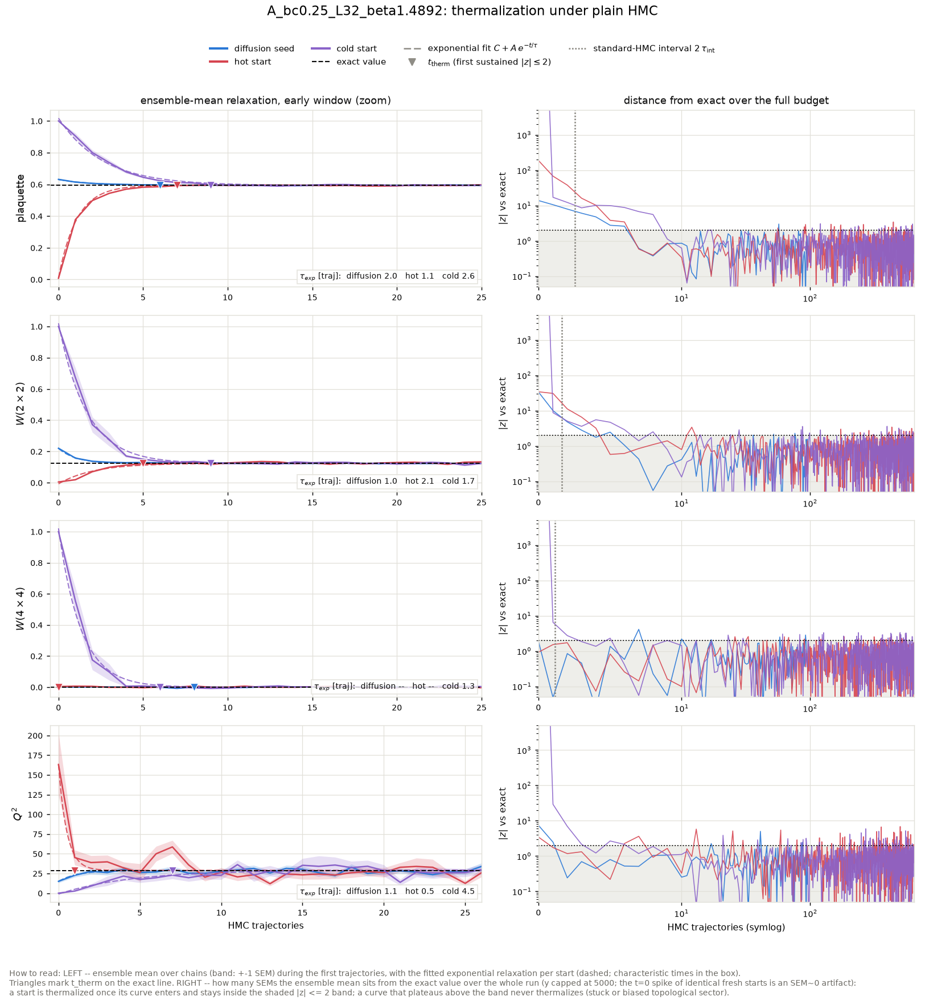

tau_int (hot-start chains, second half): plaquette = 1.27 +- 0.06, wilson_2x2 = 0.81 +- 0.03, wilson_4x4 = 0.57 +- 0.03, wilson_6x6 = 0.55 +- 0.01. Topology: hot-start HMC L=32 beta=1.4892 -> tau_int(Q) = 1.6.

### Diagnostics: raw diffusion output (before any HMC)

| observable | value | error | exact | z_exact | reference | ref_error | z_ref | ks_p | chi2_p |
|---|---|---|---|---|---|---|---|---|---|
| plaquette | 0.6313 | 0.00316 | 0.5935 | 11.96 | 0.5948 | 0.001238 | 10.76 | 4.14e-26 |  |
| wilson_1x1 | 0.6313 | 0.00316 | 0.5935 | 11.96 | 0.5948 | 0.001238 | 10.76 | 4.14e-26 |  |
| wilson_1x2 | 0.4118 | 0.003391 | 0.3522 | 17.58 | 0.3522 | 0.002458 | 14.23 | 2e-33 |  |
| wilson_2x2 | 0.2204 | 0.002116 | 0.124 | 45.53 | 0.1241 | 0.001865 | 34.15 | 0 |  |
| wilson_2x3 | 0.1045 | 0.001878 | 0.04368 | 32.39 | 0.04133 | 0.001675 | 25.1 | 2.102e-43 |  |
| wilson_3x3 | 0.03145 | 0.001832 | 0.00913 | 12.18 | 0.005305 | 0.002005 | 9.626 | 5.105e-14 |  |
| wilson_3x4 | 0.01197 | 0.001812 | 0.001908 | 5.554 | 0.0003275 | 0.002081 | 4.22 | 0.001334 |  |
| wilson_4x4 | 0.003642 | 0.002014 | 0.0002367 | 1.691 | 0.0001938 | 0.001787 | 1.281 | 0.1712 |  |
| wilson_4x5 | 0.002599 | 0.002115 | 2.936e-05 | 1.215 | -0.001625 | 0.001631 | 1.582 | 0.04938 |  |
| wilson_5x5 | 0.00339 | 0.00139 | 2.161e-06 | 2.437 | -0.000249 | 0.001931 | 1.529 | 0.07995 |  |
| wilson_5x6 | -0.002734 | 0.002065 | 1.591e-07 | -1.324 | -0.0005556 | 0.001821 | -0.7913 | 0.5631 |  |
| wilson_6x6 | 0.0004541 | 0.002051 | 6.948e-09 | 0.2214 | -0.001112 | 0.00174 | 0.5822 | 0.4212 |  |
| wilson_6x7 | -0.003411 | 0.001516 | 3.035e-10 | -2.25 | 0.002636 | 0.001766 | -2.598 | 0.1122 |  |
| wilson_7x7 | -0.0001443 | 0.001761 | 7.868e-12 | -0.08192 | 0.0003693 | 0.001605 | -0.2155 | 0.5631 |  |
| wilson_7x8 | 0.002858 | 0.002247 | 2.04e-13 | 1.272 | -0.001279 | 0.001893 | 1.408 | 0.2763 |  |
| wilson_8x8 | -0.001081 | 0.001877 | 3.138e-15 | -0.5761 | -0.001451 | 0.00132 | 0.1612 | 0.7538 |  |
| wilson_8x10 | 0.0004287 | 0.001985 | 7.426e-19 | 0.216 | 0.001016 | 0.001793 | -0.2197 | 0.4212 |  |
| wilson_10x10 | -0.001256 | 0.002054 | 2.18e-23 | -0.6116 | 0.0006406 | 0.001555 | -0.7362 | 0.5259 |  |
| wilson_10x12 | -0.0005764 | 0.001868 | 6.4e-28 | -0.3086 | -0.003091 | 0.001502 | 1.049 | 0.6011 |  |
| wilson_12x12 | 0.003615 | 0.002276 | 2.33e-33 | 1.588 | -0.001718 | 0.001421 | 1.987 | 0.2087 |  |
| creutz_2 | 0.198 | 0.01133 | 0.5218 | -28.57 |  |  |  |  |  |
| creutz_3 | 0.4547 | 0.06081 | 0.5218 | -1.104 |  |  |  |  |  |
| creutz_4 | 0.2237 | 0.601 | 0.5218 | -0.496 |  |  |  |  |  |
| creutz_5 | -0.6033 | 1.313 | 0.5218 | -0.8568 |  |  |  |  |  |
| Q | 0.7344 | 0.3272 | 0 | 2.245 | -0.4375 | 0.3418 | 2.477 | 0.01957 |  |
| Q^2 | 15 | 1.997 | 28.52 | -6.772 | 27.85 | 2.353 | -4.166 | 0.01957 |  |
| chi_top ((<Q^2>-<Q>^2)/V) | 0.01412 | 0.001823 | 0.02785 | -7.532 | 0.02701 | 0.002264 | -4.435 | 0.0007783 |  |
| Q histogram vs exact P(Q) | 31.13 | nan | 18 | nan |  |  |  |  | 0.02778 |

### Diagnostics: the same configs after 96 HMC trajectories

| observable | value | error | exact | z_exact | reference | ref_error | z_ref | ks_p | chi2_p |
|---|---|---|---|---|---|---|---|---|---|
| plaquette | 0.5941 | 0.001161 | 0.5935 | 0.5319 | 0.5948 | 0.001238 | -0.4042 | 0.6011 |  |
| wilson_1x1 | 0.5941 | 0.001161 | 0.5935 | 0.5319 | 0.5948 | 0.001238 | -0.4042 | 0.6011 |  |
| wilson_1x2 | 0.3528 | 0.002053 | 0.3522 | 0.2993 | 0.3522 | 0.002458 | 0.1898 | 0.3294 |  |
| wilson_2x2 | 0.1225 | 0.00257 | 0.124 | -0.6035 | 0.1241 | 0.001865 | -0.4945 | 0.3294 |  |
| wilson_2x3 | 0.04345 | 0.002086 | 0.04368 | -0.1109 | 0.04133 | 0.001675 | 0.7931 | 0.6011 |  |
| wilson_3x3 | 0.009676 | 0.002581 | 0.00913 | 0.2116 | 0.005305 | 0.002005 | 1.337 | 0.1892 |  |
| wilson_3x4 | 0.002587 | 0.002025 | 0.001908 | 0.3353 | 0.0003275 | 0.002081 | 0.7783 | 0.678 |  |
| wilson_4x4 | 0.0007169 | 0.00169 | 0.0002367 | 0.2842 | 0.0001938 | 0.001787 | 0.2127 | 0.7901 |  |
| wilson_4x5 | -0.00116 | 0.002235 | 2.936e-05 | -0.532 | -0.001625 | 0.001631 | 0.1683 | 0.7538 |  |
| wilson_5x5 | -0.0003373 | 0.001768 | 2.161e-06 | -0.192 | -0.000249 | 0.001931 | -0.03374 | 0.678 |  |
| wilson_5x6 | -0.0008027 | 0.002545 | 1.591e-07 | -0.3155 | -0.0005556 | 0.001821 | -0.07897 | 0.9888 |  |
| wilson_6x6 | 0.0004555 | 0.002412 | 6.948e-09 | 0.1889 | -0.001112 | 0.00174 | 0.527 | 0.7163 |  |
| wilson_6x7 | 0.0008722 | 0.001654 | 3.035e-10 | 0.5274 | 0.002636 | 0.001766 | -0.7292 | 0.9126 |  |
| wilson_7x7 | -0.001554 | 0.002044 | 7.868e-12 | -0.7604 | 0.0003693 | 0.001605 | -0.7401 | 0.2297 |  |
| wilson_7x8 | -0.0007997 | 0.002086 | 2.04e-13 | -0.3833 | -0.001279 | 0.001893 | 0.17 | 0.5631 |  |
| wilson_8x8 | 0.003343 | 0.001907 | 3.138e-15 | 1.753 | -0.001451 | 0.00132 | 2.067 | 0.08971 |  |
| wilson_8x10 | -2.785e-05 | 0.001923 | 7.426e-19 | -0.01448 | 0.001016 | 0.001793 | -0.3971 | 0.6011 |  |
| wilson_10x10 | -0.0005917 | 0.001654 | 2.18e-23 | -0.3576 | 0.0006406 | 0.001555 | -0.5427 | 0.8569 |  |
| wilson_10x12 | -0.0006183 | 0.002054 | 6.4e-28 | -0.3011 | -0.003091 | 0.001502 | 0.9718 | 0.1545 |  |
| wilson_12x12 | 0.0001321 | 0.00223 | 2.33e-33 | 0.05922 | -0.001718 | 0.001421 | 0.6994 | 0.9807 |  |
| creutz_2 | 0.5368 | 0.01487 | 0.5218 | 1.01 |  |  |  |  |  |
| creutz_3 | 0.4657 | 0.1878 | 0.5218 | -0.2988 |  |  |  |  |  |
| creutz_4 | -0.03581 | 2.864 | 0.5218 | -0.1947 |  |  |  |  |  |
| Q | 0.3984 | 0.4931 | 0 | 0.808 | -0.4375 | 0.3418 | 1.393 | 0.1392 |  |
| Q^2 | 34.13 | 4.807 | 28.52 | 1.167 | 27.85 | 2.353 | 1.173 | 0.9972 |  |
| chi_top ((<Q^2>-<Q>^2)/V) | 0.03318 | 0.004727 | 0.02785 | 1.126 | 0.02701 | 0.002264 | 1.176 | 0.4898 |  |
| Q histogram vs exact P(Q) | 17.79 | nan | 18 | nan |  |  |  |  | 0.4695 |

## A_bc0.5_L32_beta2.02441

HMC: step size 0.2000, 5 leapfrog steps, acceptance seed/hot/cold = 0.963/0.964/0.963. Diffusion-seed batch: 128 chains x 96 trajectories (0.12 s/traj for the whole batch); baselines: 32 chains x 640 trajectories.

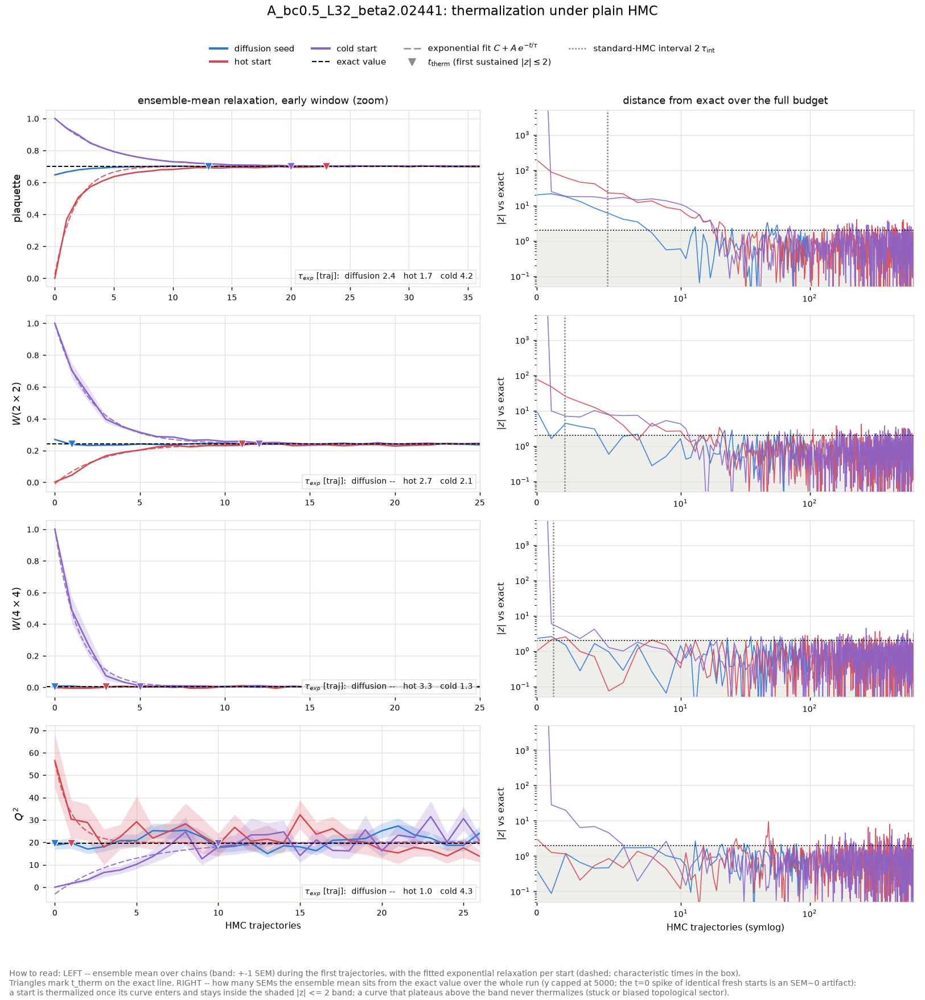

tau_int (hot-start chains, second half): plaquette = 2.46 +- 0.18, wilson_2x2 = 0.96 +- 0.03, wilson_4x4 = 0.57 +- 0.01, wilson_6x6 = 0.54 +- 0.01. Topology: hot-start HMC L=32 beta=2.02441 -> tau_int(Q) = 3.0.

### Diagnostics: raw diffusion output (before any HMC)

| observable | value | error | exact | z_exact | reference | ref_error | z_ref | ks_p | chi2_p |
|---|---|---|---|---|---|---|---|---|---|
| plaquette | 0.6473 | 0.003321 | 0.7017 | -16.4 | 0.7019 | 0.0008797 | -15.9 | 0 |  |
| wilson_1x1 | 0.6473 | 0.003321 | 0.7017 | -16.4 | 0.7019 | 0.0008797 | -15.9 | 0 |  |
| wilson_1x2 | 0.4423 | 0.004522 | 0.4924 | -11.09 | 0.4926 | 0.001604 | -10.47 | 2.48e-28 |  |
| wilson_2x2 | 0.2691 | 0.003121 | 0.2425 | 8.531 | 0.2406 | 0.001965 | 7.722 | 8.222e-12 |  |
| wilson_2x3 | 0.1421 | 0.00295 | 0.1194 | 7.686 | 0.1199 | 0.002269 | 5.964 | 1.521e-06 |  |
| wilson_3x3 | 0.05269 | 0.002647 | 0.04127 | 4.316 | 0.03906 | 0.002341 | 3.857 | 0.001334 |  |
| wilson_3x4 | 0.02444 | 0.002063 | 0.01426 | 4.933 | 0.01215 | 0.001815 | 4.47 | 0.009477 |  |
| wilson_4x4 | 0.00899 | 0.002545 | 0.003458 | 2.174 | 0.002402 | 0.001851 | 2.094 | 0.04354 |  |
| wilson_4x5 | 0.001157 | 0.002287 | 0.0008386 | 0.1393 | 0.001425 | 0.002112 | -0.08594 | 0.8246 |  |
| wilson_5x5 | -0.001908 | 0.002289 | 0.0001427 | -0.8958 | -0.0008455 | 0.001957 | -0.3527 | 0.9126 |  |
| wilson_5x6 | -0.0002308 | 0.00242 | 2.428e-05 | -0.1054 | -9.881e-05 | 0.001841 | -0.04342 | 0.8569 |  |
| wilson_6x6 | -0.001605 | 0.001666 | 2.9e-06 | -0.9652 | -0.0007191 | 0.001925 | -0.348 | 0.9353 |  |
| wilson_6x7 | -0.001109 | 0.001758 | 3.463e-07 | -0.6311 | -0.0003006 | 0.001982 | -0.3053 | 0.8864 |  |
| wilson_7x7 | -0.002347 | 0.002093 | 2.902e-08 | -1.122 | 0.001083 | 0.001614 | -1.298 | 0.4548 |  |
| wilson_7x8 | -0.000847 | 0.002362 | 2.432e-09 | -0.3586 | -0.001728 | 0.001643 | 0.3063 | 0.7901 |  |
| wilson_8x8 | 0.0007986 | 0.002836 | 1.43e-10 | 0.2816 | -0.0004432 | 0.001893 | 0.3642 | 0.7163 |  |
| wilson_8x10 | 0.002194 | 0.002132 | 4.946e-13 | 1.029 | -0.001078 | 0.001766 | 1.182 | 0.3584 |  |
| wilson_10x10 | -0.005109 | 0.001716 | 4.147e-16 | -2.978 | 0.0007502 | 0.001534 | -2.546 | 0.005977 |  |
| wilson_10x12 | 0.0007318 | 0.001882 | 3.478e-19 | 0.3889 | 0.001283 | 0.00153 | -0.2274 | 0.5631 |  |
| wilson_12x12 | -0.005173 | 0.001721 | 7.073e-23 | -3.005 | 0.001944 | 0.001599 | -3.029 | 0.005104 |  |
| creutz_2 | 0.1161 | 0.009107 | 0.3542 | -26.15 |  |  |  |  |  |
| creutz_3 | 0.3533 | 0.04269 | 0.3542 | -0.02061 |  |  |  |  |  |
| creutz_4 | 0.2319 | 0.265 | 0.3542 | -0.4615 |  |  |  |  |  |
| Q | -0.04688 | 0.3268 | 0 | -0.1435 | -0.7917 | 0.2757 | 1.742 | 0.0631 |  |
| Q^2 | 18.75 | 2.101 | 19.51 | -0.3622 | 16.85 | 1.13 | 0.7948 | 0.1122 |  |
| chi_top ((<Q^2>-<Q>^2)/V) | 0.01831 | 0.002049 | 0.01905 | -0.3636 | 0.01585 | 0.001139 | 1.05 | 0.0001679 |  |
| Q histogram vs exact P(Q) | 13.44 | nan | 16 | nan |  |  |  |  | 0.6405 |

### Diagnostics: the same configs after 96 HMC trajectories

| observable | value | error | exact | z_exact | reference | ref_error | z_ref | ks_p | chi2_p |
|---|---|---|---|---|---|---|---|---|---|
| plaquette | 0.7021 | 0.0009514 | 0.7017 | 0.3355 | 0.7019 | 0.0008797 | 0.1169 | 0.8864 |  |
| wilson_1x1 | 0.7021 | 0.0009514 | 0.7017 | 0.3355 | 0.7019 | 0.0008797 | 0.1169 | 0.8864 |  |
| wilson_1x2 | 0.4927 | 0.001977 | 0.4924 | 0.1064 | 0.4926 | 0.001604 | 0.03104 | 0.7163 |  |
| wilson_2x2 | 0.2415 | 0.002123 | 0.2425 | -0.4759 | 0.2406 | 0.001965 | 0.2913 | 0.9542 |  |
| wilson_2x3 | 0.1184 | 0.00241 | 0.1194 | -0.4097 | 0.1199 | 0.002269 | -0.4426 | 0.2297 |  |
| wilson_3x3 | 0.03911 | 0.002567 | 0.04127 | -0.8389 | 0.03906 | 0.002341 | 0.01426 | 0.9693 |  |
| wilson_3x4 | 0.01503 | 0.002355 | 0.01426 | 0.3265 | 0.01215 | 0.001815 | 0.9668 | 0.8569 |  |
| wilson_4x4 | 0.004032 | 0.00273 | 0.003458 | 0.2104 | 0.002402 | 0.001851 | 0.4943 | 0.678 |  |
| wilson_4x5 | 0.0002853 | 0.002282 | 0.0008386 | -0.2425 | 0.001425 | 0.002112 | -0.3665 | 0.678 |  |
| wilson_5x5 | -0.0001412 | 0.002093 | 0.0001427 | -0.1357 | -0.0008455 | 0.001957 | 0.2458 | 0.4548 |  |
| wilson_5x6 | -0.0009643 | 0.002396 | 2.428e-05 | -0.4125 | -9.881e-05 | 0.001841 | -0.2864 | 0.9126 |  |
| wilson_6x6 | 0.0007523 | 0.001994 | 2.9e-06 | 0.3758 | -0.0007191 | 0.001925 | 0.5308 | 0.4212 |  |
| wilson_6x7 | -0.004325 | 0.001534 | 3.463e-07 | -2.82 | -0.0003006 | 0.001982 | -1.606 | 0.2087 |  |
| wilson_7x7 | -0.001722 | 0.001705 | 2.902e-08 | -1.01 | 0.001083 | 0.001614 | -1.195 | 0.8569 |  |
| wilson_7x8 | -0.0005504 | 0.001784 | 2.432e-09 | -0.3085 | -0.001728 | 0.001643 | 0.4857 | 0.9888 |  |
| wilson_8x8 | -0.001093 | 0.002157 | 1.43e-10 | -0.5068 | -0.0004432 | 0.001893 | -0.2265 | 0.678 |  |
| wilson_8x10 | -0.001099 | 0.001818 | 4.946e-13 | -0.6046 | -0.001078 | 0.001766 | -0.008406 | 0.7163 |  |
| wilson_10x10 | 0.002312 | 0.001528 | 4.147e-16 | 1.513 | 0.0007502 | 0.001534 | 0.7212 | 0.8246 |  |
| wilson_10x12 | -0.0001994 | 0.002326 | 3.478e-19 | -0.0857 | 0.001283 | 0.00153 | -0.5325 | 0.2087 |  |
| wilson_12x12 | -0.001767 | 0.002088 | 7.073e-23 | -0.8461 | 0.001944 | 0.001599 | -1.411 | 0.02577 |  |
| creutz_2 | 0.3588 | 0.007913 | 0.3542 | 0.5781 |  |  |  |  |  |
| creutz_3 | 0.3953 | 0.04696 | 0.3542 | 0.8765 |  |  |  |  |  |
| creutz_4 | 0.3591 | 0.5008 | 0.3542 | 0.009898 |  |  |  |  |  |
| Q | -0.1172 | 0.3408 | 0 | -0.3439 | -0.7917 | 0.2757 | 1.539 | 0.2297 |  |
| Q^2 | 21.32 | 2.016 | 19.51 | 0.8977 | 16.85 | 1.13 | 1.933 | 0.03831 |  |
| chi_top ((<Q^2>-<Q>^2)/V) | 0.02081 | 0.001992 | 0.01905 | 0.8805 | 0.01585 | 0.001139 | 2.162 | 0.0001679 |  |
| Q histogram vs exact P(Q) | 12.41 | nan | 16 | nan |  |  |  |  | 0.7156 |

## A_bc0.75_L32_beta2.5435

HMC: step size 0.2000, 5 leapfrog steps, acceptance seed/hot/cold = 0.963/0.962/0.961. Diffusion-seed batch: 128 chains x 96 trajectories (0.12 s/traj for the whole batch); baselines: 32 chains x 640 trajectories.

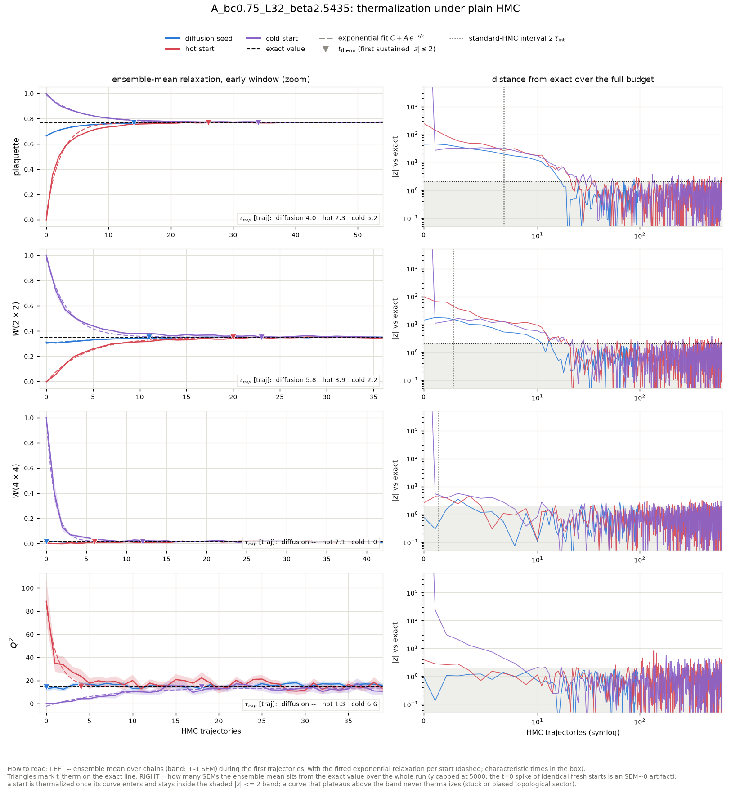

tau_int (hot-start chains, second half): plaquette = 3.51 +- 0.29, wilson_2x2 = 1.31 +- 0.07, wilson_4x4 = 0.66 +- 0.03, wilson_6x6 = 0.55 +- 0.01. Topology: hot-start HMC L=32 beta=2.5435 -> tau_int(Q) = 5.9.

### Diagnostics: raw diffusion output (before any HMC)

| observable | value | error | exact | z_exact | reference | ref_error | z_ref | ks_p | chi2_p |
|---|---|---|---|---|---|---|---|---|---|
| plaquette | 0.6623 | 0.00248 | 0.7696 | -43.3 | 0.7712 | 0.0008441 | -41.58 | 0 |  |
| wilson_1x1 | 0.6623 | 0.00248 | 0.7696 | -43.3 | 0.7712 | 0.0008441 | -41.58 | 0 |  |
| wilson_1x2 | 0.4668 | 0.003175 | 0.5924 | -39.55 | 0.5947 | 0.001239 | -37.52 | 0 |  |
| wilson_2x2 | 0.3121 | 0.003004 | 0.3509 | -12.9 | 0.3548 | 0.001546 | -12.63 | 1.421e-21 |  |
| wilson_2x3 | 0.178 | 0.00355 | 0.2079 | -8.413 | 0.2096 | 0.001777 | -7.974 | 9.899e-13 |  |
| wilson_3x3 | 0.07294 | 0.00284 | 0.09476 | -7.682 | 0.099 | 0.002295 | -7.135 | 2.855e-08 |  |
| wilson_3x4 | 0.0386 | 0.002395 | 0.0432 | -1.92 | 0.04598 | 0.00207 | -2.331 | 0.006985 |  |
| wilson_4x4 | 0.01714 | 0.002738 | 0.01516 | 0.7248 | 0.01636 | 0.002317 | 0.2192 | 0.9807 |  |
| wilson_4x5 | 0.005508 | 0.002131 | 0.005319 | 0.08882 | 0.008872 | 0.001496 | -1.292 | 0.678 |  |
| wilson_5x5 | 0.0005954 | 0.002404 | 0.001436 | -0.3498 | 0.004459 | 0.001775 | -1.293 | 0.1251 |  |
| wilson_5x6 | -0.003631 | 0.002583 | 0.0003879 | -1.556 | 0.001126 | 0.001405 | -1.617 | 0.2763 |  |
| wilson_6x6 | -0.003801 | 0.002123 | 8.063e-05 | -1.828 | 0.0006585 | 0.002101 | -1.493 | 0.2297 |  |
| wilson_6x7 | -0.001807 | 0.002105 | 1.676e-05 | -0.8662 | 0.0003578 | 0.002067 | -0.7337 | 0.3021 |  |
| wilson_7x7 | -2.472e-05 | 0.002106 | 2.681e-06 | -0.01301 | -5.091e-05 | 0.001535 | 0.01005 | 0.8864 |  |
| wilson_7x8 | -0.001218 | 0.002147 | 4.289e-07 | -0.5675 | -0.0002698 | 0.00133 | -0.3755 | 0.6011 |  |
| wilson_8x8 | 0.002394 | 0.001628 | 5.28e-08 | 1.47 | -3.522e-05 | 0.001573 | 1.073 | 0.4548 |  |
| wilson_8x10 | 0.002207 | 0.001624 | 8.005e-10 | 1.359 | -0.0007483 | 0.001392 | 1.381 | 0.1004 |  |
| wilson_10x10 | 0.003379 | 0.001814 | 4.258e-12 | 1.863 | 0.0005853 | 0.001744 | 1.11 | 0.3584 |  |
| wilson_10x12 | -0.004238 | 0.002137 | 2.265e-14 | -1.984 | -0.003624 | 0.001567 | -0.2318 | 0.9126 |  |
| wilson_12x12 | -0.001332 | 0.001822 | 4.227e-17 | -0.7309 | 0.001042 | 0.001567 | -0.9876 | 0.4548 |  |
| creutz_2 | 0.05262 | 0.007865 | 0.2618 | -26.6 |  |  |  |  |  |
| creutz_3 | 0.3302 | 0.02559 | 0.2618 | 2.671 |  |  |  |  |  |
| creutz_4 | 0.1754 | 0.1258 | 0.2618 | -0.6871 |  |  |  |  |  |
| creutz_5 | 1.089 | nan | 0.2618 | nan |  |  |  |  |  |
| Q | -0.25 | 0.2687 | 0 | -0.9304 | -0.2552 | 0.2417 | 0.01441 | 0.9999 |  |
| Q^2 | 12.83 | 1.673 | 14.25 | -0.8515 | 13.84 | 1.822 | -0.4085 | 0.8864 |  |
| chi_top ((<Q^2>-<Q>^2)/V) | 0.01247 | 0.001627 | 0.01392 | -0.8926 | 0.01345 | 0.001796 | -0.4061 | 0.006985 |  |
| Q histogram vs exact P(Q) | 9.436 | nan | 14 | nan |  |  |  |  | 0.8022 |

### Diagnostics: the same configs after 96 HMC trajectories

| observable | value | error | exact | z_exact | reference | ref_error | z_ref | ks_p | chi2_p |
|---|---|---|---|---|---|---|---|---|---|
| plaquette | 0.7688 | 0.0008704 | 0.7696 | -0.997 | 0.7712 | 0.0008441 | -2.001 | 0.1545 |  |
| wilson_1x1 | 0.7688 | 0.0008704 | 0.7696 | -0.997 | 0.7712 | 0.0008441 | -2.001 | 0.1545 |  |
| wilson_1x2 | 0.5917 | 0.001777 | 0.5924 | -0.3431 | 0.5947 | 0.001239 | -1.352 | 0.3584 |  |
| wilson_2x2 | 0.3495 | 0.00222 | 0.3509 | -0.625 | 0.3548 | 0.001546 | -1.964 | 0.3294 |  |
| wilson_2x3 | 0.2099 | 0.0027 | 0.2079 | 0.7698 | 0.2096 | 0.001777 | 0.08924 | 0.5631 |  |
| wilson_3x3 | 0.09672 | 0.00231 | 0.09476 | 0.8487 | 0.099 | 0.002295 | -0.6993 | 0.7538 |  |
| wilson_3x4 | 0.04711 | 0.002353 | 0.0432 | 1.663 | 0.04598 | 0.00207 | 0.3614 | 0.7163 |  |
| wilson_4x4 | 0.02057 | 0.002009 | 0.01516 | 2.695 | 0.01636 | 0.002317 | 1.375 | 0.04354 |  |
| wilson_4x5 | 0.01065 | 0.002225 | 0.005319 | 2.397 | 0.008872 | 0.001496 | 0.6638 | 0.389 |  |
| wilson_5x5 | 0.003656 | 0.002377 | 0.001436 | 0.9337 | 0.004459 | 0.001775 | -0.2707 | 0.9353 |  |
| wilson_5x6 | 0.002693 | 0.001577 | 0.0003879 | 1.462 | 0.001126 | 0.001405 | 0.7419 | 0.678 |  |
| wilson_6x6 | 9.903e-05 | 0.001494 | 8.063e-05 | 0.01232 | 0.0006585 | 0.002101 | -0.217 | 0.9542 |  |
| wilson_6x7 | 0.001734 | 0.001841 | 1.676e-05 | 0.9326 | 0.0003578 | 0.002067 | 0.497 | 0.7901 |  |
| wilson_7x7 | -0.001835 | 0.00185 | 2.681e-06 | -0.9932 | -5.091e-05 | 0.001535 | -0.742 | 0.2522 |  |
| wilson_7x8 | -0.0004565 | 0.001794 | 4.289e-07 | -0.2547 | -0.0002698 | 0.00133 | -0.08358 | 0.9941 |  |
| wilson_8x8 | 0.0004698 | 0.00157 | 5.28e-08 | 0.2993 | -3.522e-05 | 0.001573 | 0.2273 | 0.9807 |  |
| wilson_8x10 | 6.969e-05 | 0.002183 | 8.005e-10 | 0.03193 | -0.0007483 | 0.001392 | 0.3159 | 0.5631 |  |
| wilson_10x10 | 0.001209 | 0.002218 | 4.258e-12 | 0.5453 | 0.0005853 | 0.001744 | 0.2211 | 0.9542 |  |
| wilson_10x12 | 0.0002241 | 0.001269 | 2.265e-14 | 0.1766 | -0.003624 | 0.001567 | 1.908 | 0.2297 |  |
| wilson_12x12 | 0.0001793 | 0.001243 | 4.227e-17 | 0.1442 | 0.001042 | 0.001567 | -0.4312 | 0.4898 |  |
| creutz_2 | 0.2649 | 0.004528 | 0.2618 | 0.6691 |  |  |  |  |  |
| creutz_3 | 0.2652 | 0.01721 | 0.2618 | 0.1965 |  |  |  |  |  |
| creutz_4 | 0.1094 | 0.09298 | 0.2618 | -1.64 |  |  |  |  |  |
| creutz_5 | 0.4112 | 0.5272 | 0.2618 | 0.2833 |  |  |  |  |  |
| creutz_6 | 2.997 | nan | 0.2618 | nan |  |  |  |  |  |
| Q | -0.4297 | 0.264 | 0 | -1.628 | -0.2552 | 0.2417 | -0.4875 | 0.9972 |  |
| Q^2 | 12.49 | 1.265 | 14.25 | -1.391 | 13.84 | 1.822 | -0.6069 | 0.7538 |  |
| chi_top ((<Q^2>-<Q>^2)/V) | 0.01202 | 0.001214 | 0.01392 | -1.565 | 0.01345 | 0.001796 | -0.6603 | 0.05588 |  |
| Q histogram vs exact P(Q) | 14.11 | nan | 14 | nan |  |  |  |  | 0.4417 |

## A_bc1_L32_beta3.10399

HMC: step size 0.2000, 5 leapfrog steps, acceptance seed/hot/cold = 0.960/0.964/0.959. Diffusion-seed batch: 128 chains x 96 trajectories (0.12 s/traj for the whole batch); baselines: 32 chains x 640 trajectories.

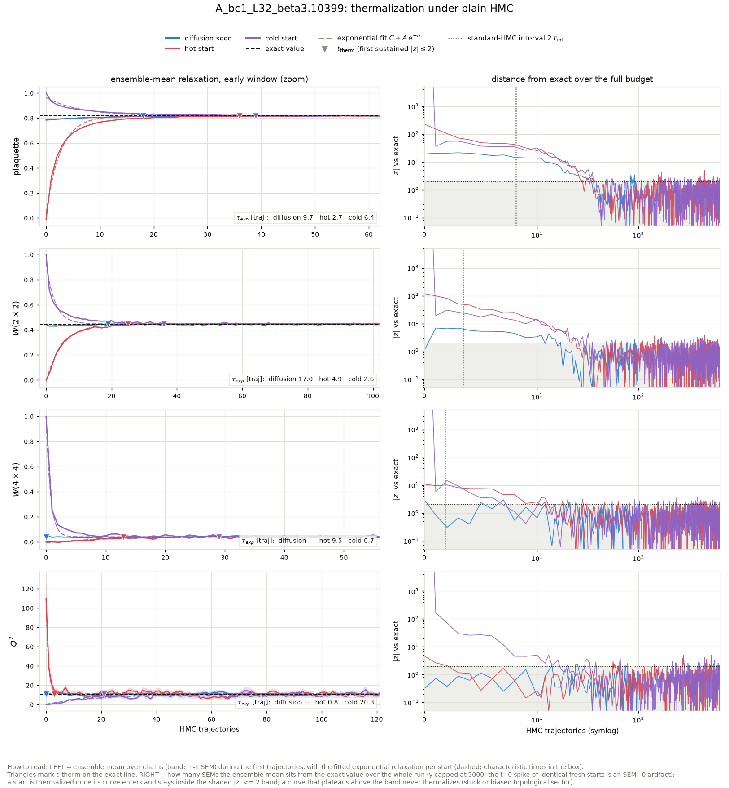

tau_int (hot-start chains, second half): plaquette = 4.06 +- 0.35, wilson_2x2 = 1.72 +- 0.14, wilson_4x4 = 0.91 +- 0.05, wilson_6x6 = 0.58 +- 0.02. Topology: hot-start HMC L=32 beta=3.10399 -> tau_int(Q) = 12.5.

### Diagnostics: raw diffusion output (before any HMC)

| observable | value | error | exact | z_exact | reference | ref_error | z_ref | ks_p | chi2_p |
|---|---|---|---|---|---|---|---|---|---|
| plaquette | 0.7841 | 0.001901 | 0.8174 | -17.49 | 0.8167 | 0.0005787 | -16.38 | 0 |  |
| wilson_1x1 | 0.7841 | 0.001901 | 0.8174 | -17.49 | 0.8167 | 0.0005787 | -16.38 | 0 |  |
| wilson_1x2 | 0.6235 | 0.003148 | 0.6681 | -14.16 | 0.6667 | 0.001248 | -12.74 | 7.247e-38 |  |
| wilson_2x2 | 0.4435 | 0.002605 | 0.4464 | -1.113 | 0.4462 | 0.002387 | -0.7776 | 0.3294 |  |
| wilson_2x3 | 0.2958 | 0.003456 | 0.2982 | -0.7198 | 0.2995 | 0.003104 | -0.7959 | 0.4212 |  |
| wilson_3x3 | 0.1561 | 0.003964 | 0.1629 | -1.718 | 0.1662 | 0.003275 | -1.964 | 0.03364 |  |
| wilson_3x4 | 0.09101 | 0.003861 | 0.08895 | 0.5333 | 0.09401 | 0.002937 | -0.6179 | 0.389 |  |
| wilson_4x4 | 0.04846 | 0.003666 | 0.03971 | 2.388 | 0.04635 | 0.002315 | 0.4859 | 0.1892 |  |
| wilson_4x5 | 0.02356 | 0.003093 | 0.01772 | 1.888 | 0.02331 | 0.001923 | 0.06887 | 0.8569 |  |
| wilson_5x5 | 0.006944 | 0.002349 | 0.006467 | 0.2032 | 0.008977 | 0.001985 | -0.6609 | 0.7163 |  |
| wilson_5x6 | 6.42e-05 | 0.001693 | 0.00236 | -1.356 | 0.001769 | 0.001658 | -0.7195 | 0.6011 |  |
| wilson_6x6 | -0.001698 | 0.001758 | 0.0007038 | -1.366 | -0.001236 | 0.002333 | -0.1582 | 0.4548 |  |
| wilson_6x7 | -0.0006312 | 0.001896 | 0.0002099 | -0.4436 | 0.0001348 | 0.001854 | -0.2888 | 0.6395 |  |
| wilson_7x7 | 0.001115 | 0.001872 | 5.117e-05 | 0.568 | -0.0009109 | 0.001672 | 0.807 | 0.3584 |  |
| wilson_7x8 | 0.0004125 | 0.001481 | 1.247e-05 | 0.2701 | 0.001308 | 0.00174 | -0.3919 | 0.4212 |  |
| wilson_8x8 | 0.0008912 | 0.002 | 2.486e-06 | 0.4444 | 0.001576 | 0.001246 | -0.2905 | 0.8246 |  |
| wilson_8x10 | 0.001465 | 0.001507 | 9.869e-08 | 0.9718 | 0.001019 | 0.002055 | 0.1749 | 0.6395 |  |
| wilson_10x10 | -0.0008006 | 0.001715 | 1.749e-09 | -0.4669 | 0.002047 | 0.001322 | -1.315 | 0.2522 |  |
| wilson_10x12 | -0.001028 | 0.002089 | 3.101e-11 | -0.4919 | 0.001053 | 0.001377 | -0.8316 | 0.4548 |  |
| wilson_12x12 | -0.002583 | 0.001906 | 2.453e-13 | -1.355 | 0.0004341 | 0.001577 | -1.22 | 0.678 |  |
| creutz_2 | 0.1116 | 0.005031 | 0.2016 | -17.91 |  |  |  |  |  |
| creutz_3 | 0.2341 | 0.01122 | 0.2016 | 2.894 |  |  |  |  |  |
| creutz_4 | 0.0909 | 0.04204 | 0.2016 | -2.634 |  |  |  |  |  |
| creutz_5 | 0.5008 | 0.2552 | 0.2016 | 1.172 |  |  |  |  |  |
| creutz_8 | -1.764 | 14.03 | 0.2016 | -0.1401 |  |  |  |  |  |
| Q | 0.2656 | 0.2481 | 0 | 1.071 | 0.1302 | 0.2199 | 0.4085 | 0.7538 |  |
| Q^2 | 11.16 | 1.044 | 10.81 | 0.333 | 10.84 | 1.105 | 0.209 | 0.1251 |  |
| chi_top ((<Q^2>-<Q>^2)/V) | 0.01083 | 0.0009846 | 0.01056 | 0.275 | 0.01057 | 0.001073 | 0.1771 | 0.0006474 |  |
| Q histogram vs exact P(Q) | 20.04 | nan | 12 | nan |  |  |  |  | 0.06626 |

### Diagnostics: the same configs after 96 HMC trajectories

| observable | value | error | exact | z_exact | reference | ref_error | z_ref | ks_p | chi2_p |
|---|---|---|---|---|---|---|---|---|---|
| plaquette | 0.8181 | 0.001037 | 0.8174 | 0.6577 | 0.8167 | 0.0005787 | 1.166 | 0.4548 |  |
| wilson_1x1 | 0.8181 | 0.001037 | 0.8174 | 0.6577 | 0.8167 | 0.0005787 | 1.166 | 0.4548 |  |
| wilson_1x2 | 0.6679 | 0.001792 | 0.6681 | -0.09765 | 0.6667 | 0.001248 | 0.5809 | 0.6011 |  |
| wilson_2x2 | 0.4465 | 0.002634 | 0.4464 | 0.054 | 0.4462 | 0.002387 | 0.08284 | 0.8569 |  |
| wilson_2x3 | 0.2996 | 0.003113 | 0.2982 | 0.447 | 0.2995 | 0.003104 | 0.04135 | 0.8864 |  |
| wilson_3x3 | 0.167 | 0.003547 | 0.1629 | 1.176 | 0.1662 | 0.003275 | 0.182 | 0.7163 |  |
| wilson_3x4 | 0.0957 | 0.003614 | 0.08895 | 1.868 | 0.09401 | 0.002937 | 0.3639 | 0.9972 |  |
| wilson_4x4 | 0.04488 | 0.003582 | 0.03971 | 1.444 | 0.04635 | 0.002315 | -0.3456 | 0.4898 |  |
| wilson_4x5 | 0.02209 | 0.002888 | 0.01772 | 1.512 | 0.02331 | 0.001923 | -0.3522 | 0.7901 |  |
| wilson_5x5 | 0.007448 | 0.002131 | 0.006467 | 0.4601 | 0.008977 | 0.001985 | -0.525 | 0.9126 |  |
| wilson_5x6 | 0.006549 | 0.002093 | 0.00236 | 2.001 | 0.001769 | 0.001658 | 1.79 | 0.08971 |  |
| wilson_6x6 | 0.001405 | 0.002205 | 0.0007038 | 0.318 | -0.001236 | 0.002333 | 0.8226 | 0.4548 |  |
| wilson_6x7 | -0.001176 | 0.002743 | 0.0002099 | -0.5053 | 0.0001348 | 0.001854 | -0.396 | 0.8569 |  |
| wilson_7x7 | -0.0009249 | 0.002012 | 5.117e-05 | -0.485 | -0.0009109 | 0.001672 | -0.005339 | 0.9693 |  |
| wilson_7x8 | -0.0006265 | 0.001244 | 1.247e-05 | -0.5135 | 0.001308 | 0.00174 | -0.9044 | 0.9693 |  |
| wilson_8x8 | -0.002812 | 0.001494 | 2.486e-06 | -1.884 | 0.001576 | 0.001246 | -2.256 | 0.05588 |  |
| wilson_8x10 | 0.001604 | 0.002892 | 9.869e-08 | 0.5546 | 0.001019 | 0.002055 | 0.1647 | 0.9693 |  |
| wilson_10x10 | -0.001347 | 0.002467 | 1.749e-09 | -0.5461 | 0.002047 | 0.001322 | -1.213 | 0.6011 |  |
| wilson_10x12 | 0.007426 | 0.001736 | 3.101e-11 | 4.278 | 0.001053 | 0.001377 | 2.876 | 0.0631 |  |
| wilson_12x12 | 0.002166 | 0.001301 | 2.453e-13 | 1.665 | 0.0004341 | 0.001577 | 0.8471 | 0.4212 |  |
| creutz_2 | 0.2 | 0.003076 | 0.2016 | -0.5451 |  |  |  |  |  |
| creutz_3 | 0.1854 | 0.01068 | 0.2016 | -1.525 |  |  |  |  |  |
| creutz_4 | 0.2002 | 0.0408 | 0.2016 | -0.03452 |  |  |  |  |  |
| creutz_5 | 0.3786 | 0.2714 | 0.2016 | 0.6518 |  |  |  |  |  |
| creutz_6 | 1.411 | 1.618 | 0.2016 | 0.7473 |  |  |  |  |  |
| Q | 0.1406 | 0.2362 | 0 | 0.5954 | 0.1302 | 0.2199 | 0.03228 | 0.9888 |  |
| Q^2 | 10.8 | 1.329 | 10.81 | -0.008739 | 10.84 | 1.105 | -0.02411 | 0.8246 |  |
| chi_top ((<Q^2>-<Q>^2)/V) | 0.01052 | 0.001272 | 0.01056 | -0.0241 | 0.01057 | 0.001073 | -0.02611 | 0.008145 |  |
| Q histogram vs exact P(Q) | 8.919 | nan | 12 | nan |  |  |  |  | 0.7098 |

## E_bc1.2_L32_beta3.6012

HMC: step size 0.2000, 5 leapfrog steps, acceptance seed/hot/cold = 0.962/0.964/0.962. Diffusion-seed batch: 128 chains x 96 trajectories (0.05 s/traj for the whole batch); baselines: 32 chains x 640 trajectories.

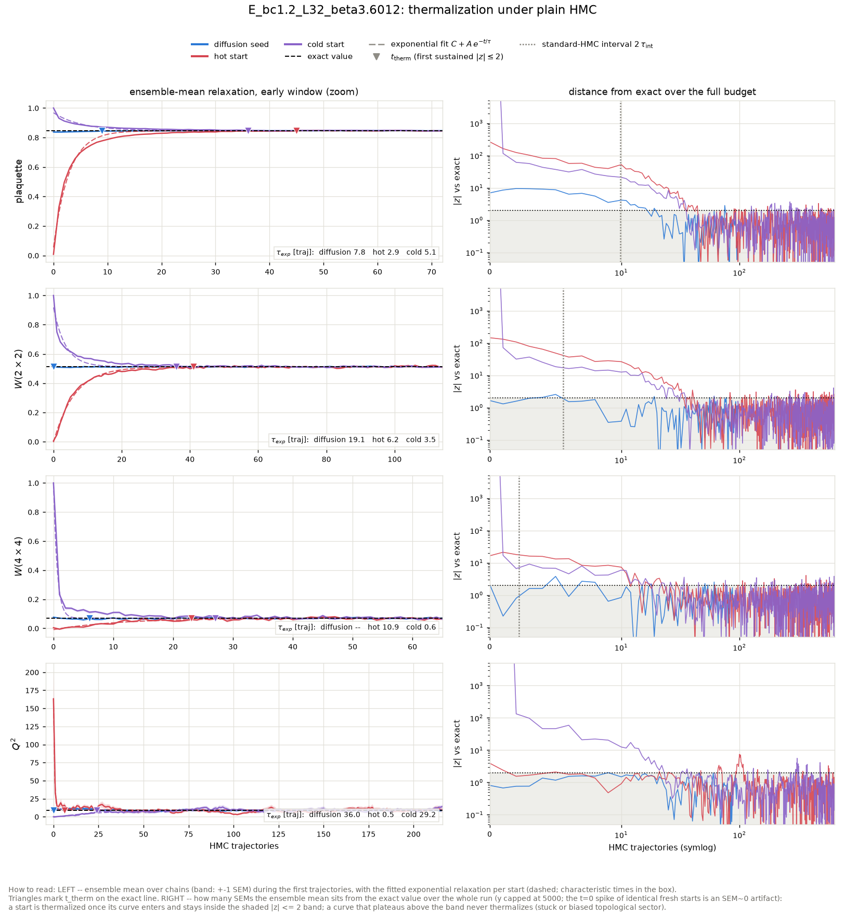

tau_int (hot-start chains, second half): plaquette = 4.96 +- 0.41, wilson_2x2 = 2.79 +- 0.27, wilson_4x4 = 1.11 +- 0.06, wilson_6x6 = 0.58 +- 0.01. Topology: hot-start HMC L=32 beta=3.6012 -> tau_int(Q) = 17.0.

### Diagnostics: raw diffusion output (before any HMC)

| observable | value | error | exact | z_exact | reference | ref_error | z_ref | ks_p | chi2_p |
|---|---|---|---|---|---|---|---|---|---|
| plaquette | 0.8373 | 0.001623 | 0.8462 | -5.517 | 0.8463 | 0.0003874 | -5.43 | 3.16e-10 |  |
| wilson_1x1 | 0.8373 | 0.001623 | 0.8462 | -5.517 | 0.8463 | 0.0003874 | -5.43 | 3.16e-10 |  |
| wilson_1x2 | 0.7009 | 0.002703 | 0.7161 | -5.612 | 0.7162 | 0.0008025 | -5.428 | 2.855e-08 |  |
| wilson_2x2 | 0.5171 | 0.003153 | 0.5128 | 1.372 | 0.5137 | 0.001718 | 0.958 | 0.389 |  |
| wilson_2x3 | 0.3704 | 0.003302 | 0.3672 | 0.9722 | 0.3685 | 0.002204 | 0.4879 | 0.7163 |  |
| wilson_3x3 | 0.2165 | 0.003366 | 0.2225 | -1.777 | 0.2236 | 0.002907 | -1.596 | 0.05588 |  |
| wilson_3x4 | 0.1356 | 0.003246 | 0.1348 | 0.2257 | 0.138 | 0.002983 | -0.547 | 0.6395 |  |
| wilson_4x4 | 0.07634 | 0.002678 | 0.06914 | 2.688 | 0.07279 | 0.002786 | 0.9187 | 0.7901 |  |
| wilson_4x5 | 0.0399 | 0.00328 | 0.03545 | 1.357 | 0.03951 | 0.002368 | 0.09746 | 0.8864 |  |
| wilson_5x5 | 0.02016 | 0.003546 | 0.01538 | 1.346 | 0.01732 | 0.002186 | 0.6813 | 0.7901 |  |
| wilson_5x6 | 0.01063 | 0.002674 | 0.006676 | 1.477 | 0.007357 | 0.00197 | 0.9844 | 0.6395 |  |
| wilson_6x6 | 0.006118 | 0.001594 | 0.002451 | 2.3 | 0.0004098 | 0.002014 | 2.222 | 0.08971 |  |
| wilson_6x7 | 0.001957 | 0.00206 | 0.0009001 | 0.5129 | -0.000592 | 0.002396 | 0.8066 | 0.5259 |  |
| wilson_7x7 | 0.003284 | 0.002292 | 0.0002797 | 1.311 | -0.0001792 | 0.002403 | 1.043 | 0.3294 |  |
| wilson_7x8 | -0.002575 | 0.001738 | 8.691e-05 | -1.532 | -0.001172 | 0.001882 | -0.5477 | 0.2297 |  |
| wilson_8x8 | -0.0008866 | 0.001893 | 2.285e-05 | -0.4805 | -0.001396 | 0.001659 | 0.2024 | 0.9693 |  |
| wilson_8x10 | 0.001673 | 0.002072 | 1.58e-06 | 0.8063 | -0.001665 | 0.00208 | 1.137 | 0.678 |  |
| wilson_10x10 | -0.0003331 | 0.002129 | 5.602e-08 | -0.1564 | -0.003042 | 0.001414 | 1.06 | 0.6011 |  |
| wilson_10x12 | -0.000814 | 0.001809 | 1.986e-09 | -0.45 | -0.001659 | 0.001865 | 0.3252 | 0.7538 |  |
| wilson_12x12 | 0.003133 | 0.002284 | 3.611e-11 | 1.371 | 0.002849 | 0.001558 | 0.1025 | 0.678 |  |
| creutz_2 | 0.1264 | 0.003649 | 0.167 | -11.12 |  |  |  |  |  |
| creutz_3 | 0.2032 | 0.008302 | 0.167 | 4.368 |  |  |  |  |  |
| creutz_4 | 0.106 | 0.02791 | 0.167 | -2.183 |  |  |  |  |  |
| creutz_5 | 0.03413 | 0.1048 | 0.167 | -1.268 |  |  |  |  |  |
| creutz_6 | -0.08803 | 0.3714 | 0.167 | -0.6867 |  |  |  |  |  |
| creutz_7 | -1.658 | 1.829 | 0.167 | -0.9978 |  |  |  |  |  |
| Q | 0.3672 | 0.2824 | 0 | 1.3 | -0.349 | 0.1436 | 2.26 | 0.02577 |  |
| Q^2 | 9.867 | 1.135 | 8.856 | 0.8908 | 9.922 | 0.8755 | -0.03815 | 0.1251 |  |
| chi_top ((<Q^2>-<Q>^2)/V) | 0.009504 | 0.001044 | 0.008648 | 0.8203 | 0.00957 | 0.0008743 | -0.04859 | 0.0003679 |  |
| Q histogram vs exact P(Q) | 8.264 | nan | 12 | nan |  |  |  |  | 0.7642 |

### Diagnostics: the same configs after 96 HMC trajectories

| observable | value | error | exact | z_exact | reference | ref_error | z_ref | ks_p | chi2_p |
|---|---|---|---|---|---|---|---|---|---|
| plaquette | 0.8463 | 0.0004973 | 0.8462 | 0.2531 | 0.8463 | 0.0003874 | 0.02998 | 0.8569 |  |
| wilson_1x1 | 0.8463 | 0.0004973 | 0.8462 | 0.2531 | 0.8463 | 0.0003874 | 0.02998 | 0.8569 |  |
| wilson_1x2 | 0.7158 | 0.001199 | 0.7161 | -0.2414 | 0.7162 | 0.0008025 | -0.2949 | 0.9126 |  |
| wilson_2x2 | 0.512 | 0.002294 | 0.5128 | -0.3427 | 0.5137 | 0.001718 | -0.5836 | 0.9542 |  |
| wilson_2x3 | 0.3665 | 0.002995 | 0.3672 | -0.2299 | 0.3685 | 0.002204 | -0.5276 | 0.8246 |  |
| wilson_3x3 | 0.222 | 0.003487 | 0.2225 | -0.1371 | 0.2236 | 0.002907 | -0.3514 | 0.8246 |  |
| wilson_3x4 | 0.1342 | 0.003788 | 0.1348 | -0.1662 | 0.138 | 0.002983 | -0.7827 | 0.3584 |  |
| wilson_4x4 | 0.06668 | 0.003149 | 0.06914 | -0.7823 | 0.07279 | 0.002786 | -1.453 | 0.3584 |  |
| wilson_4x5 | 0.03394 | 0.002637 | 0.03545 | -0.5725 | 0.03951 | 0.002368 | -1.57 | 0.4898 |  |
| wilson_5x5 | 0.01466 | 0.002722 | 0.01538 | -0.2649 | 0.01732 | 0.002186 | -0.761 | 0.7901 |  |
| wilson_5x6 | 0.006171 | 0.002558 | 0.006676 | -0.1975 | 0.007357 | 0.00197 | -0.3674 | 0.9693 |  |
| wilson_6x6 | 0.001182 | 0.002206 | 0.002451 | -0.5755 | 0.0004098 | 0.002014 | 0.2585 | 0.9353 |  |
| wilson_6x7 | -0.0009411 | 0.002379 | 0.0009001 | -0.774 | -0.000592 | 0.002396 | -0.1034 | 0.8569 |  |
| wilson_7x7 | -0.003354 | 0.001823 | 0.0002797 | -1.993 | -0.0001792 | 0.002403 | -1.052 | 0.5631 |  |
| wilson_7x8 | -0.004598 | 0.001708 | 8.691e-05 | -2.743 | -0.001172 | 0.001882 | -1.348 | 0.1712 |  |
| wilson_8x8 | 0.0009328 | 0.00183 | 2.285e-05 | 0.4973 | -0.001396 | 0.001659 | 0.9428 | 0.3584 |  |
| wilson_8x10 | 0.0008963 | 0.001443 | 1.58e-06 | 0.6203 | -0.001665 | 0.00208 | 1.012 | 0.7538 |  |
| wilson_10x10 | -0.002032 | 0.002595 | 5.602e-08 | -0.7832 | -0.003042 | 0.001414 | 0.3415 | 0.7538 |  |
| wilson_10x12 | 0.0002964 | 0.002054 | 1.986e-09 | 0.1443 | -0.001659 | 0.001865 | 0.7046 | 0.4212 |  |
| wilson_12x12 | -0.0005697 | 0.002556 | 3.611e-11 | -0.2229 | 0.002849 | 0.001558 | -1.142 | 0.1122 |  |
| creutz_2 | 0.1676 | 0.002639 | 0.167 | 0.2184 |  |  |  |  |  |
| creutz_3 | 0.1669 | 0.007578 | 0.167 | -0.009079 |  |  |  |  |  |
| creutz_4 | 0.196 | 0.02404 | 0.167 | 1.209 |  |  |  |  |  |
| creutz_5 | 0.1642 | 0.139 | 0.167 | -0.01969 |  |  |  |  |  |
| creutz_6 | 0.7871 | 1.775 | 0.167 | 0.3493 |  |  |  |  |  |
| Q | -0.1016 | 0.2352 | 0 | -0.4318 | -0.349 | 0.1436 | 0.8977 | 0.4212 |  |
| Q^2 | 8.148 | 1.025 | 8.856 | -0.6903 | 9.922 | 0.8755 | -1.316 | 0.9353 |  |
| chi_top ((<Q^2>-<Q>^2)/V) | 0.007947 | 0.0009959 | 0.008648 | -0.7038 | 0.00957 | 0.0008743 | -1.225 | 0.006985 |  |
| Q histogram vs exact P(Q) | 16.75 | nan | 12 | nan |  |  |  |  | 0.1594 |

## A_bc1.5_L32_beta4.44493

HMC: step size 0.1897, 5 leapfrog steps, acceptance seed/hot/cold = 0.964/0.966/0.962. Diffusion-seed batch: 128 chains x 96 trajectories (0.12 s/traj for the whole batch); baselines: 32 chains x 640 trajectories.

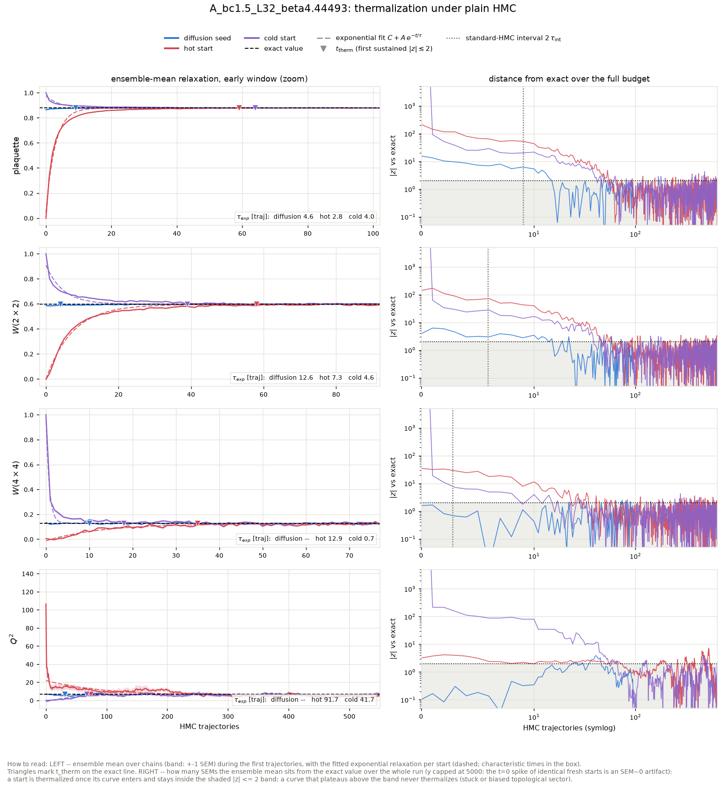

tau_int (hot-start chains, second half): plaquette = 4.52 +- 0.49, wilson_2x2 = 2.94 +- 0.35, wilson_4x4 = 1.39 +- 0.08, wilson_6x6 = 0.71 +- 0.03. Topology: hot-start HMC L=32 beta=4.44493 -> tau_int(Q) = 23.4.

### Diagnostics: raw diffusion output (before any HMC)

| observable | value | error | exact | z_exact | reference | ref_error | z_ref | ks_p | chi2_p |
|---|---|---|---|---|---|---|---|---|---|
| plaquette | 0.864 | 0.001039 | 0.8787 | -14.17 | 0.8784 | 0.000309 | -13.31 | 2e-33 |  |
| wilson_1x1 | 0.864 | 0.001039 | 0.8787 | -14.17 | 0.8784 | 0.000309 | -13.31 | 2e-33 |  |
| wilson_1x2 | 0.7504 | 0.002004 | 0.7721 | -10.84 | 0.7717 | 0.000713 | -10.02 | 4.195e-19 |  |
| wilson_2x2 | 0.5867 | 0.002703 | 0.5961 | -3.479 | 0.5953 | 0.001405 | -2.83 | 0.006985 |  |
| wilson_2x3 | 0.4496 | 0.003427 | 0.4603 | -3.119 | 0.4593 | 0.001788 | -2.524 | 0.004349 |  |
| wilson_3x3 | 0.3022 | 0.003389 | 0.3123 | -2.984 | 0.3134 | 0.002825 | -2.555 | 0.03364 |  |
| wilson_3x4 | 0.2071 | 0.0036 | 0.2119 | -1.313 | 0.2146 | 0.00375 | -1.441 | 0.1122 |  |
| wilson_4x4 | 0.1323 | 0.002855 | 0.1263 | 2.096 | 0.1293 | 0.00391 | 0.6093 | 0.6395 |  |
| wilson_4x5 | 0.0781 | 0.00298 | 0.07529 | 0.9435 | 0.08031 | 0.003584 | -0.4744 | 0.5631 |  |
| wilson_5x5 | 0.04188 | 0.00284 | 0.03944 | 0.8617 | 0.04332 | 0.003036 | -0.3457 | 0.6011 |  |
| wilson_5x6 | 0.02097 | 0.002822 | 0.02066 | 0.1097 | 0.02549 | 0.002479 | -1.205 | 0.4898 |  |
| wilson_6x6 | 0.009259 | 0.002632 | 0.009508 | -0.09446 | 0.01475 | 0.002347 | -1.558 | 0.01275 |  |
| wilson_6x7 | 0.00198 | 0.002209 | 0.004376 | -1.085 | 0.007128 | 0.002285 | -1.62 | 0.3584 |  |
| wilson_7x7 | -0.001273 | 0.002981 | 0.00177 | -1.021 | 0.003979 | 0.001934 | -1.478 | 0.0631 |  |
| wilson_7x8 | -0.0008474 | 0.002776 | 0.0007158 | -0.5631 | 0.001205 | 0.001546 | -0.6458 | 0.3584 |  |
| wilson_8x8 | 0.0008145 | 0.003586 | 0.0002544 | 0.1562 | -0.002753 | 0.001441 | 0.923 | 0.4548 |  |
| wilson_8x10 | 0.003843 | 0.002239 | 3.213e-05 | 1.702 | -0.0007767 | 0.001928 | 1.564 | 0.1712 |  |
| wilson_10x10 | -0.000681 | 0.002233 | 2.419e-06 | -0.306 | 0.0001487 | 0.001678 | -0.297 | 0.9353 |  |
| wilson_10x12 | -0.002103 | 0.00217 | 1.821e-07 | -0.9693 | 0.003922 | 0.001524 | -2.273 | 0.003697 |  |
| wilson_12x12 | 0.001394 | 0.001903 | 8.173e-09 | 0.7322 | -0.0008532 | 0.00187 | 0.8422 | 0.389 |  |
| creutz_2 | 0.105 | 0.002406 | 0.1293 | -10.09 |  |  |  |  |  |
| creutz_3 | 0.1311 | 0.004626 | 0.1293 | 0.392 |  |  |  |  |  |
| creutz_4 | 0.07082 | 0.01444 | 0.1293 | -4.05 |  |  |  |  |  |
| creutz_5 | 0.09616 | 0.04309 | 0.1293 | -0.7696 |  |  |  |  |  |
| creutz_6 | 0.1254 | 0.2294 | 0.1293 | -0.01719 |  |  |  |  |  |
| Q | 0.3594 | 0.2323 | 0 | 1.547 | -0.5208 | 0.1322 | 3.293 | 0.003137 |  |
| Q^2 | 6.859 | 0.5638 | 6.786 | 0.1303 | 5.969 | 0.6047 | 1.077 | 0.3584 |  |
| chi_top ((<Q^2>-<Q>^2)/V) | 0.006572 | 0.0005397 | 0.006627 | -0.1007 | 0.005564 | 0.0006204 | 1.226 | 0.002243 |  |
| Q histogram vs exact P(Q) | 18.67 | nan | 10 | nan |  |  |  |  | 0.04462 |

### Diagnostics: the same configs after 96 HMC trajectories

| observable | value | error | exact | z_exact | reference | ref_error | z_ref | ks_p | chi2_p |
|---|---|---|---|---|---|---|---|---|---|
| plaquette | 0.8785 | 0.0004452 | 0.8787 | -0.5117 | 0.8784 | 0.000309 | 0.1205 | 0.2763 |  |
| wilson_1x1 | 0.8785 | 0.0004452 | 0.8787 | -0.5117 | 0.8784 | 0.000309 | 0.1205 | 0.2763 |  |
| wilson_1x2 | 0.7726 | 0.0009638 | 0.7721 | 0.4868 | 0.7717 | 0.000713 | 0.7252 | 0.5631 |  |
| wilson_2x2 | 0.5975 | 0.001429 | 0.5961 | 0.9579 | 0.5953 | 0.001405 | 1.074 | 0.3294 |  |
| wilson_2x3 | 0.4621 | 0.002277 | 0.4603 | 0.7973 | 0.4593 | 0.001788 | 0.9499 | 0.8246 |  |
| wilson_3x3 | 0.316 | 0.002802 | 0.3123 | 1.319 | 0.3134 | 0.002825 | 0.6379 | 0.6011 |  |
| wilson_3x4 | 0.2156 | 0.003417 | 0.2119 | 1.084 | 0.2146 | 0.00375 | 0.1851 | 0.9693 |  |
| wilson_4x4 | 0.1298 | 0.003393 | 0.1263 | 1.038 | 0.1293 | 0.00391 | 0.09427 | 0.8569 |  |
| wilson_4x5 | 0.07685 | 0.004066 | 0.07529 | 0.3855 | 0.08031 | 0.003584 | -0.6376 | 0.4898 |  |
| wilson_5x5 | 0.03756 | 0.003702 | 0.03944 | -0.508 | 0.04332 | 0.003036 | -1.204 | 0.1545 |  |
| wilson_5x6 | 0.01786 | 0.00356 | 0.02066 | -0.787 | 0.02549 | 0.002479 | -1.761 | 0.1712 |  |
| wilson_6x6 | 0.006675 | 0.002832 | 0.009508 | -1 | 0.01475 | 0.002347 | -2.196 | 0.1712 |  |
| wilson_6x7 | 0.00346 | 0.002695 | 0.004376 | -0.34 | 0.007128 | 0.002285 | -1.038 | 0.5259 |  |
| wilson_7x7 | 0.001334 | 0.001666 | 0.00177 | -0.2618 | 0.003979 | 0.001934 | -1.036 | 0.1712 |  |
| wilson_7x8 | 0.00289 | 0.001923 | 0.0007158 | 1.131 | 0.001205 | 0.001546 | 0.6831 | 0.7538 |  |
| wilson_8x8 | 0.003739 | 0.002418 | 0.0002544 | 1.441 | -0.002753 | 0.001441 | 2.306 | 0.2087 |  |
| wilson_8x10 | -0.0003636 | 0.002294 | 3.213e-05 | -0.1725 | -0.0007767 | 0.001928 | 0.1379 | 0.9941 |  |
| wilson_10x10 | -0.0007061 | 0.002065 | 2.419e-06 | -0.3431 | 0.0001487 | 0.001678 | -0.3212 | 0.9353 |  |
| wilson_10x12 | -0.003598 | 0.002192 | 1.821e-07 | -1.641 | 0.003922 | 0.001524 | -2.817 | 0.006985 |  |
| wilson_12x12 | -0.002931 | 0.001955 | 8.173e-09 | -1.499 | -0.0008532 | 0.00187 | -0.7682 | 0.389 |  |
| creutz_2 | 0.1285 | 0.002016 | 0.1293 | -0.4065 |  |  |  |  |  |
| creutz_3 | 0.1231 | 0.004873 | 0.1293 | -1.27 |  |  |  |  |  |
| creutz_4 | 0.1247 | 0.01381 | 0.1293 | -0.3337 |  |  |  |  |  |
| creutz_5 | 0.1919 | 0.05285 | 0.1293 | 1.184 |  |  |  |  |  |
| creutz_6 | 0.2403 | 0.28 | 0.1293 | 0.3964 |  |  |  |  |  |
| creutz_7 | 0.296 | 1.496 | 0.1293 | 0.1114 |  |  |  |  |  |
| creutz_8 | 0.5158 | 1.601 | 0.1293 | 0.2414 |  |  |  |  |  |
| Q | 0.1094 | 0.2319 | 0 | 0.4716 | -0.5208 | 0.1322 | 2.361 | 0.1712 |  |
| Q^2 | 6.688 | 0.7058 | 6.786 | -0.1394 | 5.969 | 0.6047 | 0.7733 | 0.9989 |  |
| chi_top ((<Q^2>-<Q>^2)/V) | 0.006519 | 0.0007055 | 0.006627 | -0.1527 | 0.005564 | 0.0006204 | 1.017 | 0.004349 |  |
| Q histogram vs exact P(Q) | 5.288 | nan | 10 | nan |  |  |  |  | 0.8711 |

## B_bt6_L32_beta6

HMC: step size 0.1633, 6 leapfrog steps, acceptance seed/hot/cold = 0.972/0.974/0.975. Diffusion-seed batch: 128 chains x 96 trajectories (0.14 s/traj for the whole batch); baselines: 32 chains x 640 trajectories.

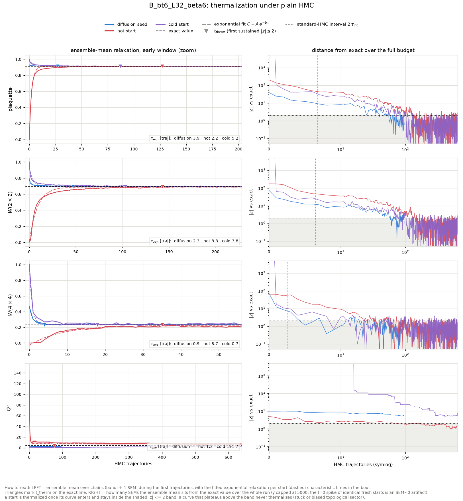

tau_int (hot-start chains, second half): plaquette = 3.39 +- 0.35, wilson_2x2 = 3.21 +- 0.30, wilson_4x4 = 1.30 +- 0.07, wilson_6x6 = 0.92 +- 0.05. Topology: hot-start HMC L=32 beta=6 -> tau_int(Q) = 38.7.

Where 'never' stood at the end: the cold start ended the 640-trajectory budget still at Q^2 at |z| ~ 6.

### Diagnostics: raw diffusion output (before any HMC)

| observable | value | error | exact | z_exact | reference | ref_error | z_ref | ks_p | chi2_p |
|---|---|---|---|---|---|---|---|---|---|
| plaquette | 0.9285 | 0.0004168 | 0.9124 | 38.65 | 0.9124 | 0.0003501 | 29.58 | 0 |  |
| wilson_1x1 | 0.9285 | 0.0004168 | 0.9124 | 38.65 | 0.9124 | 0.0003501 | 29.58 | 0 |  |
| wilson_1x2 | 0.8707 | 0.000798 | 0.8324 | 47.94 | 0.8321 | 0.0006931 | 36.51 | 0 |  |
| wilson_2x2 | 0.7899 | 0.001146 | 0.6929 | 84.67 | 0.6934 | 0.001208 | 58 | 0 |  |
| wilson_2x3 | 0.7158 | 0.00181 | 0.5768 | 76.83 | 0.5765 | 0.001929 | 52.68 | 0 |  |
| wilson_3x3 | 0.6218 | 0.002545 | 0.438 | 72.23 | 0.4363 | 0.002632 | 50.69 | 0 |  |
| wilson_3x4 | 0.5462 | 0.003125 | 0.3327 | 68.35 | 0.329 | 0.003332 | 47.55 | 0 |  |
| wilson_4x4 | 0.4654 | 0.002803 | 0.2305 | 83.83 | 0.2264 | 0.003867 | 50.05 | 0 |  |
| wilson_4x5 | 0.3863 | 0.00341 | 0.1597 | 66.46 | 0.1539 | 0.004096 | 43.62 | 0 |  |
| wilson_5x5 | 0.3117 | 0.003727 | 0.101 | 56.53 | 0.09648 | 0.003546 | 41.83 | 0 |  |
| wilson_5x6 | 0.2538 | 0.004176 | 0.06382 | 45.51 | 0.05818 | 0.003404 | 36.32 | 0 |  |
| wilson_6x6 | 0.201 | 0.00482 | 0.03681 | 34.07 | 0.03418 | 0.003619 | 27.68 | 0 |  |
| wilson_6x7 | 0.1541 | 0.005341 | 0.02123 | 24.88 | 0.01931 | 0.003186 | 21.68 | 0 |  |
| wilson_7x7 | 0.1144 | 0.004786 | 0.01117 | 21.56 | 0.008187 | 0.003092 | 18.64 | 2.102e-43 |  |
| wilson_7x8 | 0.08679 | 0.005062 | 0.005879 | 15.99 | 0.001901 | 0.003115 | 14.28 | 2.635e-32 |  |
| wilson_8x8 | 0.0672 | 0.004746 | 0.002822 | 13.56 | -0.002021 | 0.003506 | 11.73 | 3.135e-24 |  |
| wilson_8x10 | 0.03639 | 0.003857 | 0.0006505 | 9.265 | -0.003914 | 0.003163 | 8.079 | 3.484e-14 |  |
| wilson_10x10 | 0.01526 | 0.004336 | 0.0001039 | 3.496 | -0.002986 | 0.002418 | 3.676 | 5.99e-05 |  |
| wilson_10x12 | 0.007417 | 0.003746 | 1.659e-05 | 1.976 | -0.004264 | 0.001863 | 2.792 | 0.0002496 |  |
| wilson_12x12 | -0.002032 | 0.003028 | 1.836e-06 | -0.6719 | -0.003235 | 0.00226 | 0.3184 | 0.3021 |  |
| creutz_2 | 0.03301 | 0.001065 | 0.09172 | -55.15 |  |  |  |  |  |
| creutz_3 | 0.04221 | 0.001782 | 0.09172 | -27.78 |  |  |  |  |  |
| creutz_4 | 0.03046 | 0.003448 | 0.09172 | -17.77 |  |  |  |  |  |
| creutz_5 | 0.02846 | 0.005361 | 0.09172 | -11.8 |  |  |  |  |  |
| creutz_6 | 0.02808 | 0.008925 | 0.09172 | -7.13 |  |  |  |  |  |
| creutz_7 | 0.03247 | 0.01585 | 0.09172 | -3.739 |  |  |  |  |  |
| creutz_8 | -0.02004 | 0.03157 | 0.09172 | -3.539 |  |  |  |  |  |
| Q | 0.07031 | 0.1218 | 0 | 0.5774 | -0.1354 | 0.1314 | 1.148 | 0.1392 |  |
| Q^2 | 2.086 | 0.2321 | 4.779 | -11.6 | 3.865 | 0.341 | -4.312 | 0.2087 |  |
| chi_top ((<Q^2>-<Q>^2)/V) | 0.002032 | 0.0002337 | 0.004667 | -11.27 | 0.003756 | 0.0003297 | -4.265 | 5.1e-06 |  |
| Q histogram vs exact P(Q) | 24.66 | nan | 8 | nan |  |  |  |  | 0.001776 |

### Diagnostics: the same configs after 96 HMC trajectories

| observable | value | error | exact | z_exact | reference | ref_error | z_ref | ks_p | chi2_p |
|---|---|---|---|---|---|---|---|---|---|
| plaquette | 0.9126 | 0.0003321 | 0.9124 | 0.649 | 0.9124 | 0.0003501 | 0.436 | 0.9693 |  |
| wilson_1x1 | 0.9126 | 0.0003321 | 0.9124 | 0.649 | 0.9124 | 0.0003501 | 0.436 | 0.9693 |  |
| wilson_1x2 | 0.833 | 0.0008167 | 0.8324 | 0.7624 | 0.8321 | 0.0006931 | 0.8872 | 0.4212 |  |
| wilson_2x2 | 0.6948 | 0.001815 | 0.6929 | 1.055 | 0.6934 | 0.001208 | 0.6657 | 0.9807 |  |
| wilson_2x3 | 0.5798 | 0.00292 | 0.5768 | 1.052 | 0.5765 | 0.001929 | 0.9642 | 0.5631 |  |
| wilson_3x3 | 0.4428 | 0.003911 | 0.438 | 1.218 | 0.4363 | 0.002632 | 1.385 | 0.3021 |  |
| wilson_3x4 | 0.3372 | 0.00456 | 0.3327 | 0.9887 | 0.329 | 0.003332 | 1.438 | 0.07995 |  |
| wilson_4x4 | 0.2354 | 0.00443 | 0.2305 | 1.113 | 0.2264 | 0.003867 | 1.532 | 0.2522 |  |
| wilson_4x5 | 0.1652 | 0.004318 | 0.1597 | 1.281 | 0.1539 | 0.004096 | 1.912 | 0.04354 |  |
| wilson_5x5 | 0.1056 | 0.004098 | 0.101 | 1.134 | 0.09648 | 0.003546 | 1.685 | 0.1251 |  |
| wilson_5x6 | 0.06959 | 0.004286 | 0.06382 | 1.345 | 0.05818 | 0.003404 | 2.085 | 0.1892 |  |
| wilson_6x6 | 0.03874 | 0.004409 | 0.03681 | 0.438 | 0.03418 | 0.003619 | 0.7998 | 0.7901 |  |
| wilson_6x7 | 0.02391 | 0.003656 | 0.02123 | 0.733 | 0.01931 | 0.003186 | 0.948 | 0.5259 |  |
| wilson_7x7 | 0.01172 | 0.003197 | 0.01117 | 0.1701 | 0.008187 | 0.003092 | 0.7935 | 0.8569 |  |
| wilson_7x8 | 0.006107 | 0.002963 | 0.005879 | 0.07692 | 0.001901 | 0.003115 | 0.9783 | 0.1392 |  |
| wilson_8x8 | 0.001765 | 0.003189 | 0.002822 | -0.3315 | -0.002021 | 0.003506 | 0.7989 | 0.6011 |  |
| wilson_8x10 | 0.001176 | 0.004063 | 0.0006505 | 0.1292 | -0.003914 | 0.003163 | 0.9885 | 0.1892 |  |
| wilson_10x10 | -0.00718 | 0.00245 | 0.0001039 | -2.972 | -0.002986 | 0.002418 | -1.218 | 0.4548 |  |
| wilson_10x12 | 0.0001532 | 0.002071 | 1.659e-05 | 0.06593 | -0.004264 | 0.001863 | 1.585 | 0.02248 |  |
| wilson_12x12 | -0.003973 | 0.00331 | 1.836e-06 | -1.201 | -0.003235 | 0.00226 | -0.1842 | 0.8246 |  |
| creutz_2 | 0.09022 | 0.001295 | 0.09172 | -1.157 |  |  |  |  |  |
| creutz_3 | 0.08877 | 0.002639 | 0.09172 | -1.118 |  |  |  |  |  |
| creutz_4 | 0.08666 | 0.006216 | 0.09172 | -0.814 |  |  |  |  |  |
| creutz_5 | 0.09365 | 0.01705 | 0.09172 | 0.1131 |  |  |  |  |  |
| creutz_6 | 0.1686 | 0.05103 | 0.09172 | 1.507 |  |  |  |  |  |
| creutz_7 | 0.2308 | 0.1594 | 0.09172 | 0.8724 |  |  |  |  |  |
| creutz_8 | 0.5895 | 1.295 | 0.09172 | 0.3845 |  |  |  |  |  |
| Q | 0.1016 | 0.1638 | 0 | 0.62 | -0.1354 | 0.1314 | 1.128 | 0.1892 |  |
| Q^2 | 2.711 | 0.3668 | 4.779 | -5.638 | 3.865 | 0.341 | -2.304 | 0.678 |  |
| chi_top ((<Q^2>-<Q>^2)/V) | 0.002637 | 0.0003737 | 0.004667 | -5.43 | 0.003756 | 0.0003297 | -2.245 | 0.0001119 |  |
| Q histogram vs exact P(Q) | 17.93 | nan | 8 | nan |  |  |  |  | 0.02177 |

## A_bc2_L32_beta6.10518

HMC: step size 0.1619, 6 leapfrog steps, acceptance seed/hot/cold = 0.976/0.977/0.974. Diffusion-seed batch: 128 chains x 96 trajectories (0.14 s/traj for the whole batch); baselines: 32 chains x 640 trajectories.

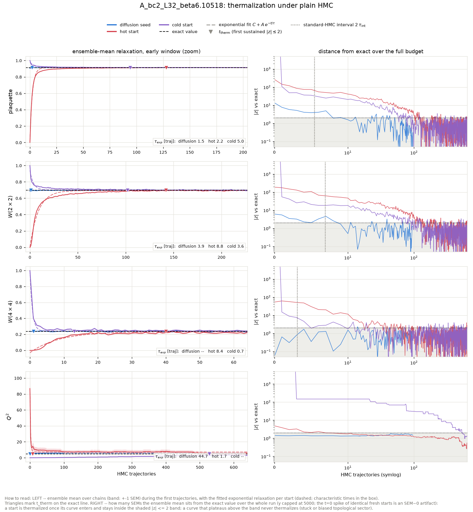

tau_int (hot-start chains, second half): plaquette = 2.71 +- 0.24, wilson_2x2 = 3.46 +- 0.38, wilson_4x4 = 1.55 +- 0.38, wilson_6x6 = 0.94 +- 0.06. Topology: hot-start HMC L=32 beta=6.10518 -> tau_int(Q) = 32.6.

### Diagnostics: raw diffusion output (before any HMC)

| observable | value | error | exact | z_exact | reference | ref_error | z_ref | ks_p | chi2_p |
|---|---|---|---|---|---|---|---|---|---|
| plaquette | 0.905 | 0.00063 | 0.914 | -14.2 | 0.9143 | 0.0001898 | -14.08 | 4.973e-32 |  |
| wilson_1x1 | 0.905 | 0.00063 | 0.914 | -14.2 | 0.9143 | 0.0001898 | -14.08 | 4.973e-32 |  |
| wilson_1x2 | 0.8203 | 0.001258 | 0.8353 | -11.92 | 0.8361 | 0.0005353 | -11.53 | 8.959e-24 |  |
| wilson_2x2 | 0.685 | 0.002207 | 0.6978 | -5.787 | 0.6995 | 0.0009961 | -5.998 | 2.484e-06 |  |
| wilson_2x3 | 0.5687 | 0.003137 | 0.5829 | -4.504 | 0.5851 | 0.001632 | -4.632 | 1.186e-06 |  |
| wilson_3x3 | 0.4307 | 0.004328 | 0.445 | -3.311 | 0.4505 | 0.002149 | -4.1 | 7.394e-05 |  |
| wilson_3x4 | 0.3293 | 0.004924 | 0.3397 | -2.117 | 0.347 | 0.002879 | -3.104 | 0.005104 |  |
| wilson_4x4 | 0.2368 | 0.005159 | 0.2371 | -0.05031 | 0.2462 | 0.003532 | -1.51 | 0.2087 |  |
| wilson_4x5 | 0.1688 | 0.005269 | 0.1654 | 0.6385 | 0.1734 | 0.003624 | -0.7162 | 0.6011 |  |
| wilson_5x5 | 0.1095 | 0.004858 | 0.1055 | 0.823 | 0.1111 | 0.003848 | -0.2574 | 0.389 |  |
| wilson_5x6 | 0.07321 | 0.004517 | 0.06728 | 1.313 | 0.0715 | 0.003732 | 0.2907 | 0.9126 |  |
| wilson_6x6 | 0.04621 | 0.003942 | 0.03921 | 1.774 | 0.04151 | 0.003986 | 0.8373 | 0.4898 |  |
| wilson_6x7 | 0.02938 | 0.003911 | 0.02286 | 1.668 | 0.0258 | 0.003616 | 0.6716 | 0.8864 |  |
| wilson_7x7 | 0.016 | 0.00394 | 0.01218 | 0.9715 | 0.01483 | 0.003796 | 0.2145 | 0.2522 |  |
| wilson_7x8 | 0.009501 | 0.003602 | 0.006487 | 0.8367 | 0.007417 | 0.004109 | 0.3813 | 0.7538 |  |
| wilson_8x8 | 0.004224 | 0.003294 | 0.003158 | 0.3236 | 0.006329 | 0.003061 | -0.4682 | 0.4898 |  |
| wilson_8x10 | 0.002184 | 0.002773 | 0.0007487 | 0.5177 | 0.005868 | 0.003149 | -0.8778 | 0.3021 |  |
| wilson_10x10 | -0.0005295 | 0.002755 | 0.0001238 | -0.2372 | -0.001497 | 0.002756 | 0.2482 | 0.4548 |  |
| wilson_10x12 | 0.0003148 | 0.002348 | 2.049e-05 | 0.1254 | -0.002269 | 0.002148 | 0.8119 | 0.678 |  |
| wilson_12x12 | -0.003632 | 0.002951 | 2.365e-06 | -1.232 | 0.0007953 | 0.001629 | -1.313 | 0.4212 |  |
| creutz_2 | 0.08205 | 0.001584 | 0.08996 | -4.995 |  |  |  |  |  |
| creutz_3 | 0.0921 | 0.003456 | 0.08996 | 0.6189 |  |  |  |  |  |
| creutz_4 | 0.06147 | 0.006878 | 0.08996 | -4.143 |  |  |  |  |  |
| creutz_5 | 0.09414 | 0.01623 | 0.08996 | 0.2572 |  |  |  |  |  |
| creutz_6 | 0.05764 | 0.04097 | 0.08996 | -0.7891 |  |  |  |  |  |
| creutz_7 | 0.1546 | 0.1309 | 0.08996 | 0.4943 |  |  |  |  |  |
| creutz_8 | 0.289 | 0.4381 | 0.08996 | 0.4543 |  |  |  |  |  |
| Q | -0.01562 | 0.221 | 0 | -0.07069 | -0.1979 | 0.1063 | 0.7433 | 0.5259 |  |
| Q^2 | 5.656 | 0.7235 | 4.686 | 1.341 | 4.219 | 0.4579 | 1.679 | 0.2763 |  |
| chi_top ((<Q^2>-<Q>^2)/V) | 0.005523 | 0.0007061 | 0.004576 | 1.341 | 0.004082 | 0.0004247 | 1.75 | 0.0005374 |  |
| Q histogram vs exact P(Q) | 6.766 | nan | 8 | nan |  |  |  |  | 0.5621 |

### Diagnostics: the same configs after 96 HMC trajectories

| observable | value | error | exact | z_exact | reference | ref_error | z_ref | ks_p | chi2_p |
|---|---|---|---|---|---|---|---|---|---|
| plaquette | 0.9138 | 0.0003557 | 0.914 | -0.3203 | 0.9143 | 0.0001898 | -1.067 | 0.1545 |  |
| wilson_1x1 | 0.9138 | 0.0003557 | 0.914 | -0.3203 | 0.9143 | 0.0001898 | -1.067 | 0.1545 |  |
| wilson_1x2 | 0.8351 | 0.0006634 | 0.8353 | -0.3625 | 0.8361 | 0.0005353 | -1.18 | 0.5259 |  |
| wilson_2x2 | 0.6958 | 0.0009038 | 0.6978 | -2.2 | 0.6995 | 0.0009961 | -2.78 | 0.2522 |  |
| wilson_2x3 | 0.5799 | 0.0009926 | 0.5829 | -3.005 | 0.5851 | 0.001632 | -2.741 | 0.3294 |  |
| wilson_3x3 | 0.4393 | 0.001387 | 0.445 | -4.123 | 0.4505 | 0.002149 | -4.378 | 0.008145 |  |
| wilson_3x4 | 0.3337 | 0.001871 | 0.3397 | -3.206 | 0.347 | 0.002879 | -3.868 | 0.01957 |  |
| wilson_4x4 | 0.2297 | 0.002585 | 0.2371 | -2.845 | 0.2462 | 0.003532 | -3.778 | 0.0006474 |  |
| wilson_4x5 | 0.1596 | 0.002806 | 0.1654 | -2.062 | 0.1734 | 0.003624 | -2.996 | 0.009477 |  |
| wilson_5x5 | 0.1 | 0.003667 | 0.1055 | -1.492 | 0.1111 | 0.003848 | -2.081 | 0.005104 |  |
| wilson_5x6 | 0.06218 | 0.003283 | 0.06728 | -1.552 | 0.0715 | 0.003732 | -1.875 | 0.009477 |  |
| wilson_6x6 | 0.03588 | 0.003293 | 0.03921 | -1.013 | 0.04151 | 0.003986 | -1.09 | 0.3294 |  |
| wilson_6x7 | 0.01833 | 0.002783 | 0.02286 | -1.626 | 0.0258 | 0.003616 | -1.637 | 0.2763 |  |
| wilson_7x7 | 0.008513 | 0.003166 | 0.01218 | -1.157 | 0.01483 | 0.003796 | -1.278 | 0.1545 |  |
| wilson_7x8 | 0.006072 | 0.002608 | 0.006487 | -0.1588 | 0.007417 | 0.004109 | -0.2763 | 0.9542 |  |
| wilson_8x8 | 0.001573 | 0.002886 | 0.003158 | -0.5492 | 0.006329 | 0.003061 | -1.131 | 0.1712 |  |
| wilson_8x10 | 0.001703 | 0.003298 | 0.0007487 | 0.2893 | 0.005868 | 0.003149 | -0.9133 | 0.678 |  |
| wilson_10x10 | 0.004188 | 0.003059 | 0.0001238 | 1.329 | -0.001497 | 0.002756 | 1.381 | 0.4898 |  |
| wilson_10x12 | 0.002895 | 0.002143 | 2.049e-05 | 1.341 | -0.002269 | 0.002148 | 1.702 | 0.1712 |  |
| wilson_12x12 | 0.002696 | 0.002789 | 2.365e-06 | 0.9659 | 0.0007953 | 0.001629 | 0.5885 | 0.678 |  |
| creutz_2 | 0.09237 | 0.001315 | 0.08996 | 1.827 |  |  |  |  |  |
| creutz_3 | 0.09549 | 0.002473 | 0.08996 | 2.235 |  |  |  |  |  |
| creutz_4 | 0.09878 | 0.006626 | 0.08996 | 1.33 |  |  |  |  |  |
| creutz_5 | 0.1035 | 0.01934 | 0.08996 | 0.7008 |  |  |  |  |  |
| creutz_6 | 0.07468 | 0.05407 | 0.08996 | -0.2827 |  |  |  |  |  |
| creutz_7 | 0.09547 | 0.2291 | 0.08996 | 0.024 |  |  |  |  |  |
| creutz_8 | 1.013 | 1.47 | 0.08996 | 0.6279 |  |  |  |  |  |
| Q | 0 | 0.2104 | 0 | 0 | -0.1979 | 0.1063 | 0.8395 | 0.6395 |  |
| Q^2 | 5.703 | 0.6815 | 4.686 | 1.492 | 4.219 | 0.4579 | 1.808 | 0.5631 |  |
| chi_top ((<Q^2>-<Q>^2)/V) | 0.005569 | 0.0006655 | 0.004576 | 1.492 | 0.004082 | 0.0004247 | 1.885 | 0.0005374 |  |
| Q histogram vs exact P(Q) | 13.71 | nan | 8 | nan |  |  |  |  | 0.08977 |

## B_bc2_bt8_L32_beta8

HMC: step size 0.1414, 7 leapfrog steps, acceptance seed/hot/cold = 0.975/0.975/0.975. Diffusion-seed batch: 128 chains x 96 trajectories (0.15 s/traj for the whole batch); baselines: 32 chains x 640 trajectories.

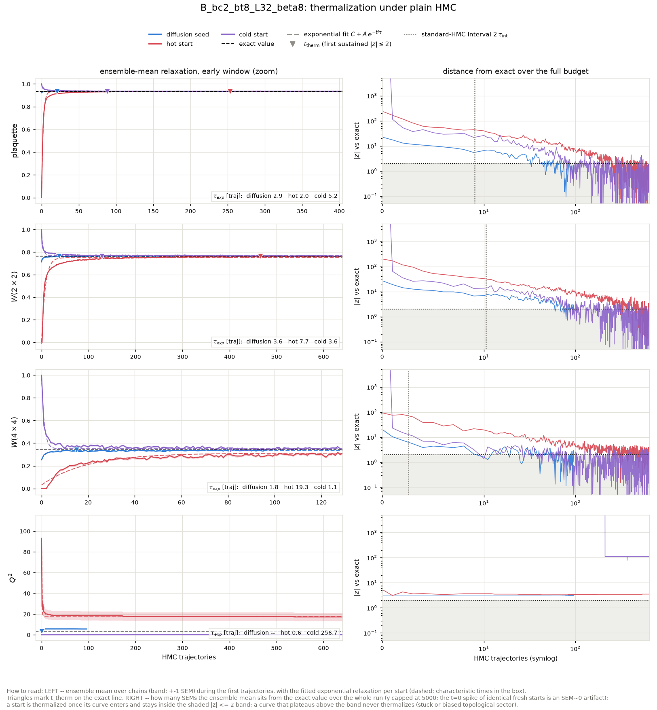

tau_int (hot-start chains, second half): plaquette = 4.54 +- 0.86, wilson_2x2 = 5.28 +- 0.87, wilson_4x4 = 1.28 +- 0.08, wilson_6x6 = 0.85 +- 0.04. Topology: hot-start HMC L=32 beta=8 -> **frozen** (no tunneling).

Where 'never' stood at the end: the hot start ended the 640-trajectory budget still at wilson_4x4 at |z| ~ 3, Q^2 at |z| ~ 4; the cold start ended the 640-trajectory budget still at Q^2 at |z| ~ 110.

### Diagnostics: raw diffusion output (before any HMC)

| observable | value | error | exact | z_exact | reference | ref_error | z_ref | ks_p | chi2_p |
|---|---|---|---|---|---|---|---|---|---|
| plaquette | 0.9231 | 0.0006227 | 0.9352 | -19.49 | 0.9355 | 0.0002413 | -18.6 | 0 |  |
| wilson_1x1 | 0.9231 | 0.0006227 | 0.9352 | -19.49 | 0.9355 | 0.0002413 | -18.6 | 0 |  |
| wilson_1x2 | 0.8473 | 0.001078 | 0.8747 | -25.35 | 0.8748 | 0.0005504 | -22.69 | 0 |  |
| wilson_2x2 | 0.7129 | 0.001993 | 0.765 | -26.14 | 0.7649 | 0.001109 | -22.76 | 0 |  |
| wilson_2x3 | 0.5986 | 0.002696 | 0.6692 | -26.17 | 0.6685 | 0.001584 | -22.34 | 0 |  |
| wilson_3x3 | 0.4583 | 0.003553 | 0.5474 | -25.08 | 0.5456 | 0.002033 | -21.34 | 0 |  |
| wilson_3x4 | 0.3534 | 0.003848 | 0.4478 | -24.52 | 0.4461 | 0.002564 | -20.04 | 0 |  |
| wilson_4x4 | 0.2533 | 0.004287 | 0.3426 | -20.82 | 0.3409 | 0.002963 | -16.8 | 2.635e-32 |  |
| wilson_4x5 | 0.1796 | 0.004831 | 0.2621 | -17.07 | 0.2614 | 0.003382 | -13.86 | 6.337e-25 |  |
| wilson_5x5 | 0.1159 | 0.004961 | 0.1875 | -14.44 | 0.1868 | 0.003447 | -11.74 | 3.775e-21 |  |
| wilson_5x6 | 0.07765 | 0.005558 | 0.1342 | -10.17 | 0.135 | 0.003342 | -8.841 | 4.377e-16 |  |
| wilson_6x6 | 0.04527 | 0.005343 | 0.08977 | -8.331 | 0.09068 | 0.003162 | -7.315 | 2.025e-12 |  |
| wilson_6x7 | 0.02473 | 0.004768 | 0.06007 | -7.413 | 0.06329 | 0.003018 | -6.834 | 1.946e-06 |  |
| wilson_7x7 | 0.01182 | 0.004607 | 0.03759 | -5.596 | 0.04038 | 0.003116 | -5.135 | 0.0001372 |  |
| wilson_7x8 | 0.004812 | 0.004337 | 0.02353 | -4.315 | 0.02688 | 0.002735 | -4.303 | 0.0001119 |  |
| wilson_8x8 | 0.003589 | 0.003863 | 0.01377 | -2.635 | 0.01533 | 0.002558 | -2.534 | 0.017 |  |
| wilson_8x10 | 0.003527 | 0.0023 | 0.004717 | -0.5174 | 0.005312 | 0.002436 | -0.5328 | 0.3584 |  |
| wilson_10x10 | 0.0005958 | 0.00329 | 0.001236 | -0.1946 | -0.00109 | 0.002709 | 0.3955 | 0.7163 |  |
| wilson_10x12 | -0.001693 | 0.003161 | 0.000324 | -0.6381 | -3.412e-05 | 0.002816 | -0.3919 | 0.389 |  |
| wilson_12x12 | -0.004334 | 0.002324 | 6.496e-05 | -1.893 | 0.0003071 | 0.002247 | -1.436 | 0.2297 |  |
| creutz_2 | 0.08706 | 0.001242 | 0.06696 | 16.18 |  |  |  |  |  |
| creutz_3 | 0.09227 | 0.002977 | 0.06696 | 8.503 |  |  |  |  |  |
| creutz_4 | 0.07325 | 0.005917 | 0.06696 | 1.064 |  |  |  |  |  |
| creutz_5 | 0.0948 | 0.01498 | 0.06696 | 1.859 |  |  |  |  |  |
| creutz_6 | 0.1396 | 0.04193 | 0.06696 | 1.732 |  |  |  |  |  |
| creutz_7 | 0.134 | 0.1619 | 0.06696 | 0.414 |  |  |  |  |  |
| creutz_8 | -0.605 | 0.6514 | 0.06696 | -1.031 |  |  |  |  |  |
| Q | -0.01562 | 0.221 | 0 | -0.07069 | 0.2917 | 0.1041 | -1.258 | 0.1004 |  |
| Q^2 | 5.656 | 0.7235 | 3.48 | 3.008 | 3.344 | 0.3552 | 2.869 | 0.009477 |  |
| chi_top ((<Q^2>-<Q>^2)/V) | 0.005523 | 0.0007061 | 0.003399 | 3.009 | 0.003182 | 0.0003544 | 2.963 | 3.783e-08 |  |
| Q histogram vs exact P(Q) | 14.76 | nan | 8 | nan |  |  |  |  | 0.06399 |

### Diagnostics: the same configs after 96 HMC trajectories

| observable | value | error | exact | z_exact | reference | ref_error | z_ref | ks_p | chi2_p |
|---|---|---|---|---|---|---|---|---|---|
| plaquette | 0.9352 | 0.0002186 | 0.9352 | -0.2964 | 0.9355 | 0.0002413 | -1.072 | 0.7163 |  |
| wilson_1x1 | 0.9352 | 0.0002186 | 0.9352 | -0.2964 | 0.9355 | 0.0002413 | -1.072 | 0.7163 |  |
| wilson_1x2 | 0.8746 | 0.0005184 | 0.8747 | -0.1139 | 0.8748 | 0.0005504 | -0.2621 | 0.678 |  |
| wilson_2x2 | 0.7636 | 0.0009991 | 0.765 | -1.455 | 0.7649 | 0.001109 | -0.8598 | 0.389 |  |
| wilson_2x3 | 0.6671 | 0.001481 | 0.6692 | -1.414 | 0.6685 | 0.001584 | -0.6421 | 0.678 |  |
| wilson_3x3 | 0.5441 | 0.002397 | 0.5474 | -1.386 | 0.5456 | 0.002033 | -0.4995 | 0.9542 |  |
| wilson_3x4 | 0.4436 | 0.003057 | 0.4478 | -1.367 | 0.4461 | 0.002564 | -0.6249 | 0.9807 |  |
| wilson_4x4 | 0.3383 | 0.003797 | 0.3426 | -1.111 | 0.3409 | 0.002963 | -0.5214 | 0.9972 |  |
| wilson_4x5 | 0.2554 | 0.00428 | 0.2621 | -1.548 | 0.2614 | 0.003382 | -1.087 | 0.5631 |  |
| wilson_5x5 | 0.1822 | 0.004208 | 0.1875 | -1.261 | 0.1868 | 0.003447 | -0.8417 | 0.5631 |  |
| wilson_5x6 | 0.128 | 0.004634 | 0.1342 | -1.323 | 0.135 | 0.003342 | -1.219 | 0.5631 |  |
| wilson_6x6 | 0.08632 | 0.004506 | 0.08977 | -0.7671 | 0.09068 | 0.003162 | -0.7919 | 0.6011 |  |
| wilson_6x7 | 0.05778 | 0.004172 | 0.06007 | -0.5492 | 0.06329 | 0.003018 | -1.07 | 0.4898 |  |
| wilson_7x7 | 0.03656 | 0.004527 | 0.03759 | -0.2281 | 0.04038 | 0.003116 | -0.6942 | 0.6011 |  |
| wilson_7x8 | 0.02277 | 0.004311 | 0.02353 | -0.1763 | 0.02688 | 0.002735 | -0.8048 | 0.7901 |  |
| wilson_8x8 | 0.01666 | 0.003918 | 0.01377 | 0.7383 | 0.01533 | 0.002558 | 0.285 | 0.8864 |  |
| wilson_8x10 | 0.008763 | 0.004008 | 0.004717 | 1.009 | 0.005312 | 0.002436 | 0.7359 | 0.9693 |  |
| wilson_10x10 | 0.003023 | 0.002943 | 0.001236 | 0.6073 | -0.00109 | 0.002709 | 1.028 | 0.9126 |  |
| wilson_10x12 | -0.002037 | 0.003294 | 0.000324 | -0.7169 | -3.412e-05 | 0.002816 | -0.4623 | 0.4212 |  |
| wilson_12x12 | 0.0001948 | 0.00329 | 6.496e-05 | 0.03947 | 0.0003071 | 0.002247 | -0.02818 | 0.7163 |  |
| creutz_2 | 0.06879 | 0.0008746 | 0.06696 | 2.099 |  |  |  |  |  |
| creutz_3 | 0.06867 | 0.001819 | 0.06696 | 0.9439 |  |  |  |  |  |
| creutz_4 | 0.06668 | 0.003988 | 0.06696 | -0.06878 |  |  |  |  |  |
| creutz_5 | 0.05685 | 0.008078 | 0.06696 | -1.252 |  |  |  |  |  |
| creutz_6 | 0.04136 | 0.02242 | 0.06696 | -1.142 |  |  |  |  |  |
| creutz_7 | 0.05631 | 0.05551 | 0.06696 | -0.1919 |  |  |  |  |  |
| creutz_8 | -0.1615 | 0.1336 | 0.06696 | -1.711 |  |  |  |  |  |
| Q | -0.02344 | 0.2195 | 0 | -0.1068 | 0.2917 | 0.1041 | -1.297 | 0.1392 |  |
| Q^2 | 5.586 | 0.7281 | 3.48 | 2.892 | 3.344 | 0.3552 | 2.768 | 0.01474 |  |
| chi_top ((<Q^2>-<Q>^2)/V) | 0.005454 | 0.0007106 | 0.003399 | 2.893 | 0.003182 | 0.0003544 | 2.862 | 8.674e-08 |  |
| Q histogram vs exact P(Q) | 13.46 | nan | 8 | nan |  |  |  |  | 0.09703 |

## E_bc2.7_L32_beta8.79549

HMC: step size 0.1349, 7 leapfrog steps, acceptance seed/hot/cold = 0.978/0.976/0.978. Diffusion-seed batch: 128 chains x 96 trajectories (0.08 s/traj for the whole batch); baselines: 32 chains x 640 trajectories.

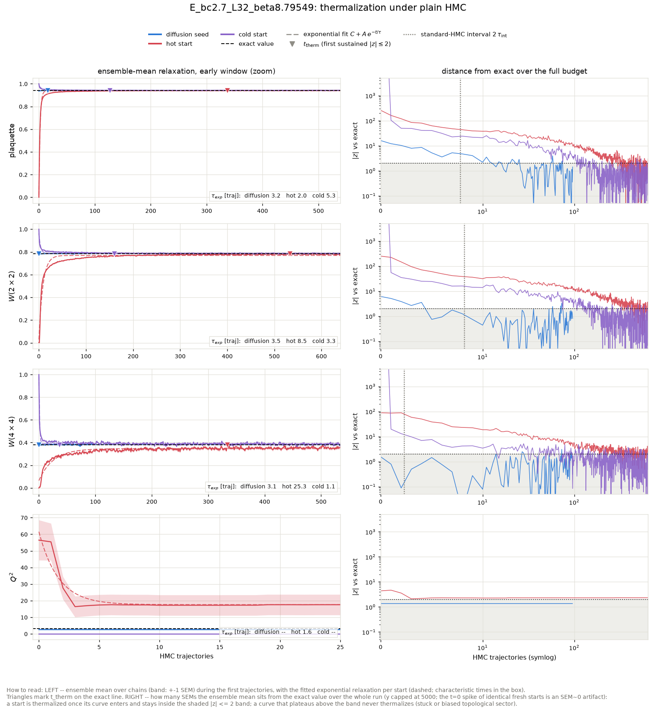

tau_int (hot-start chains, second half): plaquette = 3.89 +- 0.43, wilson_2x2 = 4.11 +- 0.60, wilson_4x4 = 1.14 +- 0.06, wilson_6x6 = 1.00 +- 0.05. Topology: hot-start HMC L=32 beta=8.79549 -> **frozen** (no tunneling).

Where 'never' stood at the end: the hot start ended the 640-trajectory budget still at Q^2 at |z| ~ 2; the cold start ended the 640-trajectory budget still at Q^2 at |z| ~ 3142489473024.

### Diagnostics: raw diffusion output (before any HMC)

| observable | value | error | exact | z_exact | reference | ref_error | z_ref | ks_p | chi2_p |
|---|---|---|---|---|---|---|---|---|---|
| plaquette | 0.9356 | 0.0003502 | 0.9413 | -16.25 | 0.9414 | 0.0002078 | -14.22 | 1.283e-29 |  |
| wilson_1x1 | 0.9356 | 0.0003502 | 0.9413 | -16.25 | 0.9414 | 0.0002078 | -14.22 | 1.283e-29 |  |
| wilson_1x2 | 0.8767 | 0.0008739 | 0.8861 | -10.67 | 0.8864 | 0.000418 | -9.998 | 1.942e-22 |  |
| wilson_2x2 | 0.7763 | 0.001477 | 0.7851 | -5.978 | 0.7859 | 0.000953 | -5.496 | 1.289e-05 |  |
| wilson_2x3 | 0.6833 | 0.002298 | 0.6957 | -5.384 | 0.6969 | 0.001602 | -4.86 | 1.616e-05 |  |
| wilson_3x3 | 0.5682 | 0.003229 | 0.5802 | -3.719 | 0.5824 | 0.002199 | -3.63 | 0.0002049 |  |
| wilson_3x4 | 0.471 | 0.004134 | 0.4839 | -3.134 | 0.486 | 0.003123 | -2.893 | 0.00159 |  |
| wilson_4x4 | 0.3729 | 0.004915 | 0.3799 | -1.428 | 0.3803 | 0.003851 | -1.187 | 0.01275 |  |
| wilson_4x5 | 0.2914 | 0.005335 | 0.2983 | -1.293 | 0.2983 | 0.004217 | -1.018 | 0.3294 |  |
| wilson_5x5 | 0.2172 | 0.005473 | 0.2204 | -0.5908 | 0.2197 | 0.003998 | -0.3727 | 0.5631 |  |
| wilson_5x6 | 0.1587 | 0.005122 | 0.1629 | -0.8259 | 0.1628 | 0.004022 | -0.6258 | 0.4212 |  |
| wilson_6x6 | 0.113 | 0.004813 | 0.1133 | -0.07279 | 0.1133 | 0.003859 | -0.0503 | 0.8246 |  |
| wilson_6x7 | 0.08195 | 0.004567 | 0.07884 | 0.6808 | 0.08086 | 0.003907 | 0.1814 | 0.8246 |  |
| wilson_7x7 | 0.05564 | 0.004456 | 0.05163 | 0.9015 | 0.05268 | 0.003519 | 0.5219 | 0.8864 |  |
| wilson_7x8 | 0.04056 | 0.004382 | 0.03381 | 1.541 | 0.03733 | 0.003483 | 0.5765 | 0.2522 |  |
| wilson_8x8 | 0.02757 | 0.004281 | 0.02084 | 1.572 | 0.02271 | 0.003349 | 0.8929 | 0.3584 |  |
| wilson_8x10 | 0.01196 | 0.00349 | 0.007917 | 1.159 | 0.01145 | 0.003642 | 0.1018 | 0.4898 |  |
| wilson_10x10 | 0.004733 | 0.00369 | 0.002362 | 0.6425 | 0.003096 | 0.003259 | 0.3325 | 0.4548 |  |
| wilson_10x12 | 0.004959 | 0.002425 | 0.0007045 | 1.755 | 0.001191 | 0.002748 | 1.028 | 0.4898 |  |
| wilson_12x12 | 0.001692 | 0.002307 | 0.000165 | 0.662 | 0.001963 | 0.001938 | -0.08965 | 0.7538 |  |
| creutz_2 | 0.05669 | 0.0009555 | 0.06048 | -3.966 |  |  |  |  |  |
| creutz_3 | 0.05682 | 0.001918 | 0.06048 | -1.912 |  |  |  |  |  |
| creutz_4 | 0.04577 | 0.003827 | 0.06048 | -3.845 |  |  |  |  |  |
| creutz_5 | 0.04711 | 0.008299 | 0.06048 | -1.612 |  |  |  |  |  |
| creutz_6 | 0.02574 | 0.01703 | 0.06048 | -2.04 |  |  |  |  |  |
| creutz_7 | 0.066 | 0.03663 | 0.06048 | 0.1507 |  |  |  |  |  |
| creutz_8 | 0.07006 | 0.07464 | 0.06048 | 0.1282 |  |  |  |  |  |
| Q | -0.0625 | 0.09836 | 0 | -0.6354 | 0.06771 | 0.1365 | -0.7741 | 0.8864 |  |
| Q^2 | 2.656 | 0.3722 | 3.142 | -1.306 | 2.911 | 0.3073 | -0.5288 | 0.9542 |  |
| chi_top ((<Q^2>-<Q>^2)/V) | 0.00259 | 0.0003599 | 0.003069 | -1.33 | 0.002839 | 0.0002937 | -0.535 | 0.0002049 |  |
| Q histogram vs exact P(Q) | 4.533 | nan | 8 | nan |  |  |  |  | 0.8061 |

### Diagnostics: the same configs after 96 HMC trajectories

| observable | value | error | exact | z_exact | reference | ref_error | z_ref | ks_p | chi2_p |
|---|---|---|---|---|---|---|---|---|---|
| plaquette | 0.941 | 0.0002263 | 0.9413 | -1.355 | 0.9414 | 0.0002078 | -1.326 | 0.1251 |  |
| wilson_1x1 | 0.941 | 0.0002263 | 0.9413 | -1.355 | 0.9414 | 0.0002078 | -1.326 | 0.1251 |  |
| wilson_1x2 | 0.8856 | 0.0004934 | 0.8861 | -0.9947 | 0.8864 | 0.000418 | -1.317 | 0.2763 |  |
| wilson_2x2 | 0.786 | 0.001072 | 0.7851 | 0.8285 | 0.7859 | 0.000953 | 0.03904 | 0.6395 |  |
| wilson_2x3 | 0.6957 | 0.001381 | 0.6957 | 0.01494 | 0.6969 | 0.001602 | -0.5776 | 0.5631 |  |
| wilson_3x3 | 0.5809 | 0.002365 | 0.5802 | 0.3027 | 0.5824 | 0.002199 | -0.451 | 0.6395 |  |
| wilson_3x4 | 0.4841 | 0.003122 | 0.4839 | 0.0644 | 0.486 | 0.003123 | -0.4142 | 0.2522 |  |
| wilson_4x4 | 0.3812 | 0.004054 | 0.3799 | 0.3077 | 0.3803 | 0.003851 | 0.1531 | 0.7901 |  |
| wilson_4x5 | 0.2994 | 0.004677 | 0.2983 | 0.2362 | 0.2983 | 0.004217 | 0.1717 | 0.2087 |  |
| wilson_5x5 | 0.2244 | 0.004919 | 0.2204 | 0.7945 | 0.2197 | 0.003998 | 0.7281 | 0.4212 |  |
| wilson_5x6 | 0.1684 | 0.005047 | 0.1629 | 1.091 | 0.1628 | 0.004022 | 0.8772 | 0.3021 |  |
| wilson_6x6 | 0.1184 | 0.004699 | 0.1133 | 1.087 | 0.1133 | 0.003859 | 0.8467 | 0.389 |  |
| wilson_6x7 | 0.08586 | 0.004571 | 0.07884 | 1.535 | 0.08086 | 0.003907 | 0.8312 | 0.1545 |  |
| wilson_7x7 | 0.05749 | 0.004338 | 0.05163 | 1.353 | 0.05268 | 0.003519 | 0.8618 | 0.2087 |  |
| wilson_7x8 | 0.03894 | 0.003822 | 0.03381 | 1.343 | 0.03733 | 0.003483 | 0.3105 | 0.5631 |  |
| wilson_8x8 | 0.0229 | 0.003704 | 0.02084 | 0.5555 | 0.02271 | 0.003349 | 0.03652 | 0.8246 |  |
| wilson_8x10 | 0.00847 | 0.00418 | 0.007917 | 0.1322 | 0.01145 | 0.003642 | -0.5372 | 0.4898 |  |
| wilson_10x10 | -0.00032 | 0.004354 | 0.002362 | -0.6159 | 0.003096 | 0.003259 | -0.6281 | 0.8569 |  |
| wilson_10x12 | -0.0003938 | 0.003667 | 0.0007045 | -0.2995 | 0.001191 | 0.002748 | -0.3458 | 0.8569 |  |
| wilson_12x12 | -0.002126 | 0.003826 | 0.000165 | -0.5989 | 0.001963 | 0.001938 | -0.9534 | 0.7163 |  |
| creutz_2 | 0.05857 | 0.000794 | 0.06048 | -2.409 |  |  |  |  |  |
| creutz_3 | 0.05818 | 0.001935 | 0.06048 | -1.191 |  |  |  |  |  |
| creutz_4 | 0.0568 | 0.003803 | 0.06048 | -0.9677 |  |  |  |  |  |
| creutz_5 | 0.04702 | 0.007231 | 0.06048 | -1.862 |  |  |  |  |  |
| creutz_6 | 0.06531 | 0.01509 | 0.06048 | 0.3199 |  |  |  |  |  |
| creutz_7 | 0.07927 | 0.03391 | 0.06048 | 0.554 |  |  |  |  |  |
| creutz_8 | 0.1414 | 0.07825 | 0.06048 | 1.034 |  |  |  |  |  |
| Q | -0.0625 | 0.09836 | 0 | -0.6354 | 0.06771 | 0.1365 | -0.7741 | 0.8864 |  |
| Q^2 | 2.656 | 0.3722 | 3.142 | -1.306 | 2.911 | 0.3073 | -0.5288 | 0.9542 |  |
| chi_top ((<Q^2>-<Q>^2)/V) | 0.00259 | 0.0003599 | 0.003069 | -1.33 | 0.002839 | 0.0002937 | -0.535 | 0.0002049 |  |
| Q histogram vs exact P(Q) | 4.533 | nan | 8 | nan |  |  |  |  | 0.8061 |

## B_bt10_L32_beta10

HMC: step size 0.1265, 8 leapfrog steps, acceptance seed/hot/cold = 0.980/0.978/0.979. Diffusion-seed batch: 128 chains x 96 trajectories (0.16 s/traj for the whole batch); baselines: 32 chains x 640 trajectories.

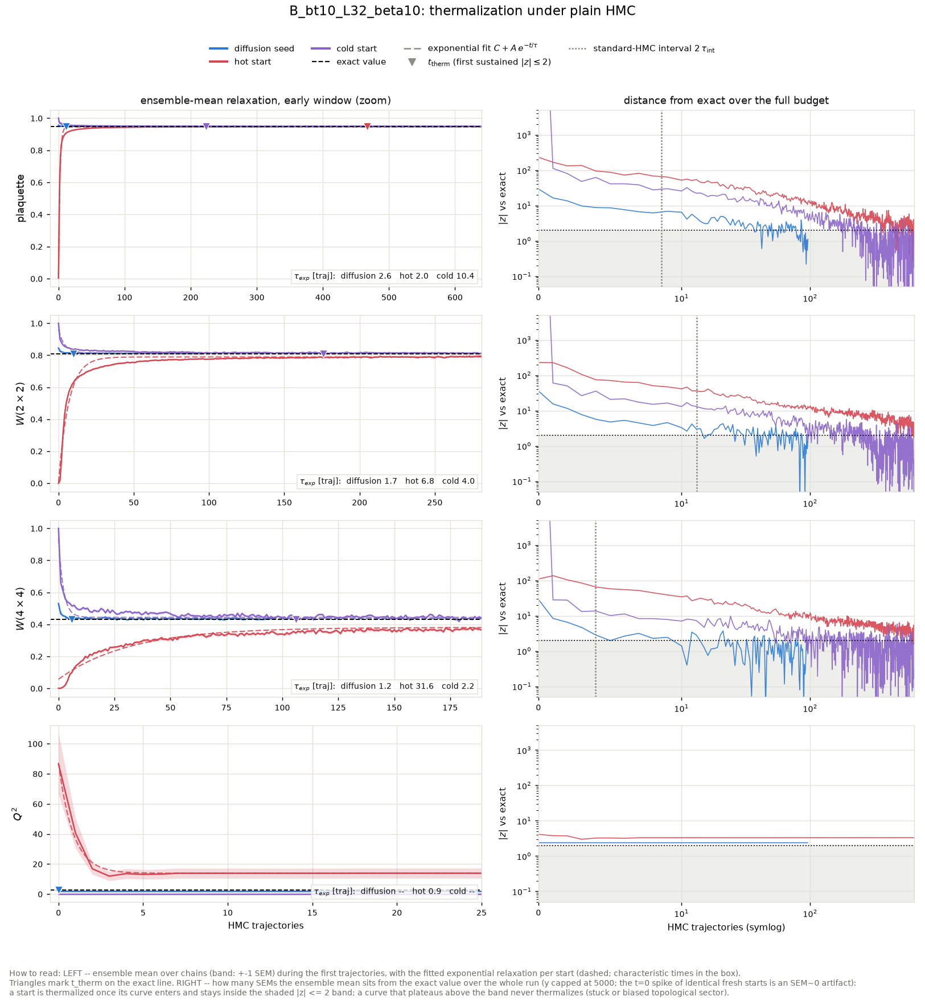

tau_int (hot-start chains, second half): plaquette = 4.29 +- 0.50, wilson_2x2 = 6.57 +- 0.87, wilson_4x4 = 1.99 +- 0.19, wilson_6x6 = 0.95 +- 0.07. Topology: hot-start HMC L=32 beta=10 -> **frozen** (no tunneling).

Where 'never' stood at the end: the hot start ended the 640-trajectory budget still at wilson_2x2 at |z| ~ 4, wilson_4x4 at |z| ~ 4, Q^2 at |z| ~ 3; the cold start ended the 640-trajectory budget still at Q^2 at |z| ~ 2740504231936.

### Diagnostics: raw diffusion output (before any HMC)

| observable | value | error | exact | z_exact | reference | ref_error | z_ref | ks_p | chi2_p |
|---|---|---|---|---|---|---|---|---|---|
| plaquette | 0.9561 | 0.0002992 | 0.9486 | 25.11 | 0.9486 | 0.0001855 | 21.23 | 0 |  |
| wilson_1x1 | 0.9561 | 0.0002992 | 0.9486 | 25.11 | 0.9486 | 0.0001855 | 21.23 | 0 |  |
| wilson_1x2 | 0.9158 | 0.0005942 | 0.8998 | 26.85 | 0.9001 | 0.000351 | 22.77 | 0 |  |
| wilson_2x2 | 0.8447 | 0.001087 | 0.8097 | 32.19 | 0.8104 | 0.0006647 | 26.89 | 0 |  |
| wilson_2x3 | 0.7802 | 0.001672 | 0.7286 | 30.82 | 0.7306 | 0.0009863 | 25.54 | 0 |  |
| wilson_3x3 | 0.6931 | 0.002321 | 0.6219 | 30.65 | 0.6244 | 0.001911 | 22.83 | 0 |  |
| wilson_3x4 | 0.6172 | 0.003098 | 0.5309 | 27.86 | 0.5336 | 0.002498 | 21.01 | 9.529e-44 |  |
| wilson_4x4 | 0.53 | 0.003996 | 0.4299 | 25.05 | 0.4302 | 0.003692 | 18.34 | 3.547e-38 |  |
| wilson_4x5 | 0.4539 | 0.005246 | 0.3481 | 20.18 | 0.3478 | 0.004546 | 15.28 | 6.083e-31 |  |
| wilson_5x5 | 0.3777 | 0.006488 | 0.2673 | 17 | 0.2659 | 0.005736 | 12.91 | 7.024e-30 |  |
| wilson_5x6 | 0.3107 | 0.007235 | 0.2053 | 14.55 | 0.2041 | 0.006435 | 11.01 | 2.529e-23 |  |
| wilson_6x6 | 0.2508 | 0.007754 | 0.1496 | 13.05 | 0.1477 | 0.007129 | 9.789 | 2.572e-20 |  |
| wilson_6x7 | 0.199 | 0.007774 | 0.109 | 11.57 | 0.1076 | 0.007049 | 8.704 | 2.893e-16 |  |
| wilson_7x7 | 0.1562 | 0.007906 | 0.07535 | 10.22 | 0.07268 | 0.006977 | 7.918 | 5.105e-14 |  |
| wilson_7x8 | 0.1179 | 0.007617 | 0.05208 | 8.64 | 0.05158 | 0.006533 | 6.608 | 4.339e-10 |  |
| wilson_8x8 | 0.0908 | 0.006589 | 0.03414 | 8.599 | 0.03209 | 0.005711 | 6.734 | 2.15e-08 |  |
| wilson_8x10 | 0.0489 | 0.006065 | 0.01468 | 5.642 | 0.01503 | 0.004689 | 4.418 | 0.0002049 |  |
| wilson_10x10 | 0.0281 | 0.005251 | 0.005109 | 4.379 | 0.004644 | 0.003319 | 3.776 | 0.002243 |  |
| wilson_10x12 | 0.01374 | 0.005056 | 0.001778 | 2.365 | -0.001627 | 0.002857 | 2.646 | 0.05588 |  |
| wilson_12x12 | 0.009904 | 0.00448 | 0.0005011 | 2.099 | -0.0031 | 0.003144 | 2.376 | 0.01474 |  |
| creutz_2 | 0.03772 | 0.0005985 | 0.05277 | -25.14 |  |  |  |  |  |
| creutz_3 | 0.03888 | 0.001198 | 0.05277 | -11.6 |  |  |  |  |  |
| creutz_4 | 0.03637 | 0.002002 | 0.05277 | -8.191 |  |  |  |  |  |
| creutz_5 | 0.02902 | 0.003651 | 0.05277 | -6.504 |  |  |  |  |  |
| creutz_6 | 0.01877 | 0.006583 | 0.05277 | -5.164 |  |  |  |  |  |
| creutz_7 | 0.01069 | 0.01131 | 0.05277 | -3.72 |  |  |  |  |  |
| creutz_8 | -0.02024 | 0.02045 | 0.05277 | -3.57 |  |  |  |  |  |
| Q | 0.07031 | 0.1218 | 0 | 0.5774 | 0.4271 | 0.0799 | -2.45 | 0.07995 |  |
| Q^2 | 2.086 | 0.2321 | 2.741 | -2.82 | 2.667 | 0.2599 | -1.666 | 0.3584 |  |
| chi_top ((<Q^2>-<Q>^2)/V) | 0.002032 | 0.0002337 | 0.002676 | -2.756 | 0.002426 | 0.0002539 | -1.141 | 1.616e-05 |  |
| Q histogram vs exact P(Q) | 6.258 | nan | 6 | nan |  |  |  |  | 0.3949 |

### Diagnostics: the same configs after 96 HMC trajectories

| observable | value | error | exact | z_exact | reference | ref_error | z_ref | ks_p | chi2_p |
|---|---|---|---|---|---|---|---|---|---|
| plaquette | 0.9488 | 0.0001713 | 0.9486 | 1.327 | 0.9486 | 0.0001855 | 0.7462 | 0.3584 |  |
| wilson_1x1 | 0.9488 | 0.0001713 | 0.9486 | 1.327 | 0.9486 | 0.0001855 | 0.7462 | 0.3584 |  |
| wilson_1x2 | 0.9005 | 0.0003334 | 0.8998 | 1.908 | 0.9001 | 0.000351 | 0.8244 | 0.7901 |  |
| wilson_2x2 | 0.811 | 0.0009516 | 0.8097 | 1.374 | 0.8104 | 0.0006647 | 0.5013 | 0.7538 |  |
| wilson_2x3 | 0.7313 | 0.0014 | 0.7286 | 1.934 | 0.7306 | 0.0009863 | 0.4448 | 0.6011 |  |
| wilson_3x3 | 0.6251 | 0.002084 | 0.6219 | 1.539 | 0.6244 | 0.001911 | 0.2544 | 0.7901 |  |
| wilson_3x4 | 0.5355 | 0.002655 | 0.5309 | 1.725 | 0.5336 | 0.002498 | 0.5174 | 0.8246 |  |
| wilson_4x4 | 0.4332 | 0.003496 | 0.4299 | 0.9537 | 0.4302 | 0.003692 | 0.5879 | 0.5631 |  |
| wilson_4x5 | 0.3496 | 0.00454 | 0.3481 | 0.3451 | 0.3478 | 0.004546 | 0.2782 | 0.6011 |  |
| wilson_5x5 | 0.2679 | 0.005142 | 0.2673 | 0.1097 | 0.2659 | 0.005736 | 0.2603 | 0.8246 |  |
| wilson_5x6 | 0.2053 | 0.005655 | 0.2053 | -0.01224 | 0.2041 | 0.006435 | 0.1387 | 0.7901 |  |
| wilson_6x6 | 0.1483 | 0.006537 | 0.1496 | -0.2044 | 0.1477 | 0.007129 | 0.06424 | 0.8246 |  |
| wilson_6x7 | 0.1085 | 0.00638 | 0.109 | -0.07961 | 0.1076 | 0.007049 | 0.09362 | 0.9807 |  |
| wilson_7x7 | 0.07521 | 0.006037 | 0.07535 | -0.02259 | 0.07268 | 0.006977 | 0.274 | 0.9126 |  |
| wilson_7x8 | 0.05597 | 0.005594 | 0.05208 | 0.696 | 0.05158 | 0.006533 | 0.5108 | 0.8864 |  |
| wilson_8x8 | 0.03807 | 0.005301 | 0.03414 | 0.741 | 0.03209 | 0.005711 | 0.7683 | 0.8864 |  |
| wilson_8x10 | 0.01702 | 0.004112 | 0.01468 | 0.5686 | 0.01503 | 0.004689 | 0.3183 | 0.6011 |  |
| wilson_10x10 | 0.00348 | 0.004206 | 0.005109 | -0.3872 | 0.004644 | 0.003319 | -0.2173 | 0.9989 |  |
| wilson_10x12 | -0.002667 | 0.004333 | 0.001778 | -1.026 | -0.001627 | 0.002857 | -0.2003 | 0.6395 |  |
| wilson_12x12 | -0.007076 | 0.003528 | 0.0005011 | -2.148 | -0.0031 | 0.003144 | -0.8414 | 0.4212 |  |
| creutz_2 | 0.05233 | 0.0007669 | 0.05277 | -0.5737 |  |  |  |  |  |
| creutz_3 | 0.05343 | 0.001665 | 0.05277 | 0.398 |  |  |  |  |  |
| creutz_4 | 0.05708 | 0.003066 | 0.05277 | 1.408 |  |  |  |  |  |
| creutz_5 | 0.05192 | 0.005785 | 0.05277 | -0.1474 |  |  |  |  |  |
| creutz_6 | 0.05895 | 0.01191 | 0.05277 | 0.5194 |  |  |  |  |  |
| creutz_7 | 0.05421 | 0.02146 | 0.05277 | 0.06712 |  |  |  |  |  |
| creutz_8 | 0.08988 | 0.05053 | 0.05277 | 0.7345 |  |  |  |  |  |
| Q | 0.07031 | 0.1218 | 0 | 0.5774 | 0.4271 | 0.0799 | -2.45 | 0.07995 |  |
| Q^2 | 2.086 | 0.2321 | 2.741 | -2.82 | 2.667 | 0.2599 | -1.666 | 0.3584 |  |
| chi_top ((<Q^2>-<Q>^2)/V) | 0.002032 | 0.0002337 | 0.002676 | -2.756 | 0.002426 | 0.0002539 | -1.141 | 1.616e-05 |  |
| Q histogram vs exact P(Q) | 6.258 | nan | 6 | nan |  |  |  |  | 0.3949 |

## A_bc3_L32_beta10.015

HMC: step size 0.1264, 8 leapfrog steps, acceptance seed/hot/cold = 0.978/0.979/0.978. Diffusion-seed batch: 128 chains x 96 trajectories (0.17 s/traj for the whole batch); baselines: 32 chains x 640 trajectories.

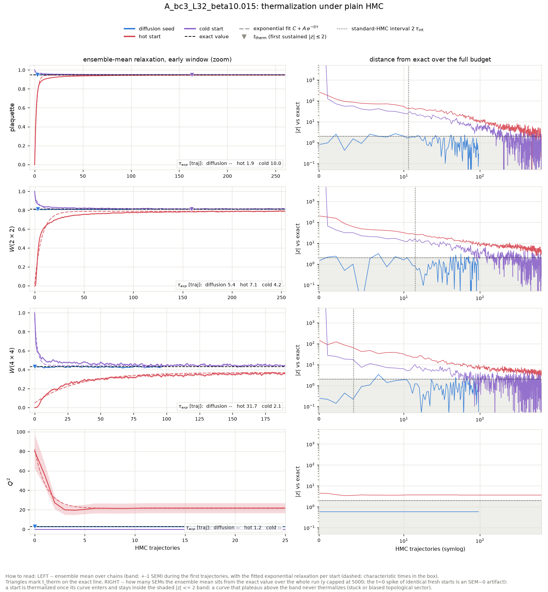

tau_int (hot-start chains, second half): plaquette = 5.75 +- 0.93, wilson_2x2 = 7.04 +- 1.06, wilson_4x4 = 2.02 +- 0.20, wilson_6x6 = 0.90 +- 0.05. Topology: hot-start HMC L=32 beta=10.015 -> **frozen** (no tunneling).

Where 'never' stood at the end: the hot start ended the 640-trajectory budget still at plaquette at |z| ~ 2, wilson_2x2 at |z| ~ 4, wilson_4x4 at |z| ~ 4, wilson_6x6 at |z| ~ 3, Q^2 at |z| ~ 4; the cold start ended the 640-trajectory budget still at Q^2 at |z| ~ 2736159195136.

### Diagnostics: raw diffusion output (before any HMC)

| observable | value | error | exact | z_exact | reference | ref_error | z_ref | ks_p | chi2_p |
|---|---|---|---|---|---|---|---|---|---|
| plaquette | 0.9484 | 0.00025 | 0.9487 | -1.049 | 0.9486 | 0.0001186 | -0.5054 | 0.005977 |  |
| wilson_1x1 | 0.9484 | 0.00025 | 0.9487 | -1.049 | 0.9486 | 0.0001186 | -0.5054 | 0.005977 |  |
| wilson_1x2 | 0.8991 | 0.0006897 | 0.9 | -1.307 | 0.9002 | 0.0002491 | -1.48 | 0.02577 |  |
| wilson_2x2 | 0.808 | 0.001155 | 0.81 | -1.715 | 0.8102 | 0.0005851 | -1.715 | 0.0631 |  |
| wilson_2x3 | 0.7266 | 0.001978 | 0.729 | -1.202 | 0.7287 | 0.0009044 | -0.9837 | 0.3021 |  |
| wilson_3x3 | 0.6188 | 0.003021 | 0.6224 | -1.183 | 0.6216 | 0.001485 | -0.815 | 0.3294 |  |
| wilson_3x4 | 0.5284 | 0.003821 | 0.5314 | -0.7864 | 0.5292 | 0.002277 | -0.1833 | 0.5259 |  |
| wilson_4x4 | 0.4316 | 0.004301 | 0.4304 | 0.2726 | 0.4289 | 0.002807 | 0.533 | 0.2522 |  |
| wilson_4x5 | 0.35 | 0.004778 | 0.3486 | 0.2805 | 0.3456 | 0.00354 | 0.7324 | 0.1251 |  |
| wilson_5x5 | 0.2729 | 0.004764 | 0.2679 | 1.051 | 0.265 | 0.003876 | 1.283 | 0.4212 |  |
| wilson_5x6 | 0.2095 | 0.00456 | 0.2059 | 0.7983 | 0.2042 | 0.004145 | 0.8658 | 0.5631 |  |
| wilson_6x6 | 0.1539 | 0.00469 | 0.1501 | 0.8101 | 0.1501 | 0.004018 | 0.6023 | 0.8569 |  |
| wilson_6x7 | 0.1082 | 0.004392 | 0.1094 | -0.2731 | 0.1104 | 0.004002 | -0.3784 | 0.9807 |  |
| wilson_7x7 | 0.07638 | 0.004456 | 0.07566 | 0.1633 | 0.07739 | 0.003572 | -0.1765 | 0.9126 |  |
| wilson_7x8 | 0.05213 | 0.004345 | 0.05232 | -0.04408 | 0.05614 | 0.003853 | -0.69 | 0.4898 |  |
| wilson_8x8 | 0.03384 | 0.004238 | 0.03433 | -0.1148 | 0.03666 | 0.00362 | -0.5068 | 0.8569 |  |
| wilson_8x10 | 0.01239 | 0.005273 | 0.01478 | -0.4526 | 0.01927 | 0.004252 | -1.015 | 0.3584 |  |
| wilson_10x10 | 0.0007241 | 0.004551 | 0.005151 | -0.9729 | 0.005632 | 0.003721 | -0.835 | 0.678 |  |
| wilson_10x12 | -0.003776 | 0.00383 | 0.001796 | -1.455 | 0.00171 | 0.002494 | -1.2 | 0.389 |  |
| wilson_12x12 | -0.001224 | 0.003762 | 0.0005072 | -0.4603 | 8.739e-05 | 0.002521 | -0.2897 | 0.1004 |  |
| creutz_2 | 0.05341 | 0.0008446 | 0.05268 | 0.8547 |  |  |  |  |  |
| creutz_3 | 0.05436 | 0.001601 | 0.05268 | 1.047 |  |  |  |  |  |
| creutz_4 | 0.04438 | 0.002714 | 0.05268 | -3.059 |  |  |  |  |  |
| creutz_5 | 0.03911 | 0.005352 | 0.05268 | -2.536 |  |  |  |  |  |
| creutz_6 | 0.04422 | 0.01124 | 0.05268 | -0.7538 |  |  |  |  |  |
| creutz_7 | -0.003932 | 0.02449 | 0.05268 | -2.312 |  |  |  |  |  |
| creutz_8 | 0.05006 | 0.06063 | 0.05268 | -0.04326 |  |  |  |  |  |
| Q | 0.03906 | 0.1517 | 0 | 0.2574 | -0.1042 | 0.1518 | 0.6672 | 0.9807 |  |
| Q^2 | 2.93 | 0.267 | 2.736 | 0.7247 | 3.406 | 0.25 | -1.303 | 0.9941 |  |
| chi_top ((<Q^2>-<Q>^2)/V) | 0.00286 | 0.0002635 | 0.002672 | 0.7116 | 0.003316 | 0.0002389 | -1.283 | 0.0004451 |  |
| Q histogram vs exact P(Q) | 4.29 | nan | 6 | nan |  |  |  |  | 0.6376 |

### Diagnostics: the same configs after 96 HMC trajectories

| observable | value | error | exact | z_exact | reference | ref_error | z_ref | ks_p | chi2_p |
|---|---|---|---|---|---|---|---|---|---|
| plaquette | 0.9486 | 0.0002382 | 0.9487 | -0.243 | 0.9486 | 0.0001186 | 0.2425 | 0.8246 |  |
| wilson_1x1 | 0.9486 | 0.0002382 | 0.9487 | -0.243 | 0.9486 | 0.0001186 | 0.2425 | 0.8246 |  |
| wilson_1x2 | 0.9001 | 0.0005745 | 0.9 | 0.2669 | 0.9002 | 0.0002491 | -0.04955 | 0.4898 |  |
| wilson_2x2 | 0.8101 | 0.001095 | 0.81 | 0.1491 | 0.8102 | 0.0005851 | -0.06163 | 0.9353 |  |
| wilson_2x3 | 0.7292 | 0.001792 | 0.729 | 0.1479 | 0.7287 | 0.0009044 | 0.2503 | 0.5259 |  |
| wilson_3x3 | 0.6228 | 0.002603 | 0.6224 | 0.1355 | 0.6216 | 0.001485 | 0.3949 | 0.3584 |  |
| wilson_3x4 | 0.532 | 0.003284 | 0.5314 | 0.184 | 0.5292 | 0.002277 | 0.6991 | 0.1004 |  |
| wilson_4x4 | 0.4306 | 0.003855 | 0.4304 | 0.05318 | 0.4289 | 0.002807 | 0.3711 | 0.3584 |  |
| wilson_4x5 | 0.3475 | 0.004414 | 0.3486 | -0.255 | 0.3456 | 0.00354 | 0.3339 | 0.5259 |  |
| wilson_5x5 | 0.2659 | 0.004834 | 0.2679 | -0.4181 | 0.265 | 0.003876 | 0.1373 | 0.9126 |  |
| wilson_5x6 | 0.2013 | 0.005399 | 0.2059 | -0.8382 | 0.2042 | 0.004145 | -0.4158 | 0.8246 |  |
| wilson_6x6 | 0.1448 | 0.005215 | 0.1501 | -1.012 | 0.1501 | 0.004018 | -0.814 | 0.6395 |  |
| wilson_6x7 | 0.1013 | 0.005251 | 0.1094 | -1.55 | 0.1104 | 0.004002 | -1.392 | 0.7901 |  |
| wilson_7x7 | 0.06989 | 0.005259 | 0.07566 | -1.097 | 0.07739 | 0.003572 | -1.18 | 0.5631 |  |
| wilson_7x8 | 0.04516 | 0.005148 | 0.05232 | -1.391 | 0.05614 | 0.003853 | -1.707 | 0.2087 |  |
| wilson_8x8 | 0.02651 | 0.004812 | 0.03433 | -1.625 | 0.03666 | 0.00362 | -1.687 | 0.1892 |  |
| wilson_8x10 | 0.009703 | 0.003969 | 0.01478 | -1.278 | 0.01927 | 0.004252 | -1.644 | 0.02947 |  |
| wilson_10x10 | 0.005378 | 0.003838 | 0.005151 | 0.05907 | 0.005632 | 0.003721 | -0.04756 | 0.8569 |  |
| wilson_10x12 | 0.003109 | 0.003302 | 0.001796 | 0.3976 | 0.00171 | 0.002494 | 0.338 | 0.9807 |  |
| wilson_12x12 | 0.005996 | 0.002996 | 0.0005072 | 1.832 | 8.739e-05 | 0.002521 | 1.509 | 0.1892 |  |
| creutz_2 | 0.05288 | 0.0007297 | 0.05268 | 0.2743 |  |  |  |  |  |
| creutz_3 | 0.05264 | 0.001633 | 0.05268 | -0.02523 |  |  |  |  |  |
| creutz_4 | 0.05391 | 0.002946 | 0.05268 | 0.4176 |  |  |  |  |  |
| creutz_5 | 0.05331 | 0.005582 | 0.05268 | 0.1129 |  |  |  |  |  |
| creutz_6 | 0.05162 | 0.01112 | 0.05268 | -0.09577 |  |  |  |  |  |
| creutz_7 | 0.01317 | 0.02596 | 0.05268 | -1.522 |  |  |  |  |  |
| creutz_8 | 0.09621 | 0.06387 | 0.05268 | 0.6815 |  |  |  |  |  |
| Q | 0.03906 | 0.1517 | 0 | 0.2574 | -0.1042 | 0.1518 | 0.6672 | 0.9807 |  |
| Q^2 | 2.93 | 0.267 | 2.736 | 0.7247 | 3.406 | 0.25 | -1.303 | 0.9941 |  |
| chi_top ((<Q^2>-<Q>^2)/V) | 0.00286 | 0.0002635 | 0.002672 | 0.7116 | 0.003316 | 0.0002389 | -1.283 | 0.0004451 |  |
| Q histogram vs exact P(Q) | 4.29 | nan | 6 | nan |  |  |  |  | 0.6376 |

## E_bc3.4_L32_beta11.6638

HMC: step size 0.1171, 9 leapfrog steps, acceptance seed/hot/cold = 0.985/0.983/0.983. Diffusion-seed batch: 128 chains x 96 trajectories (0.07 s/traj for the whole batch); baselines: 32 chains x 640 trajectories.

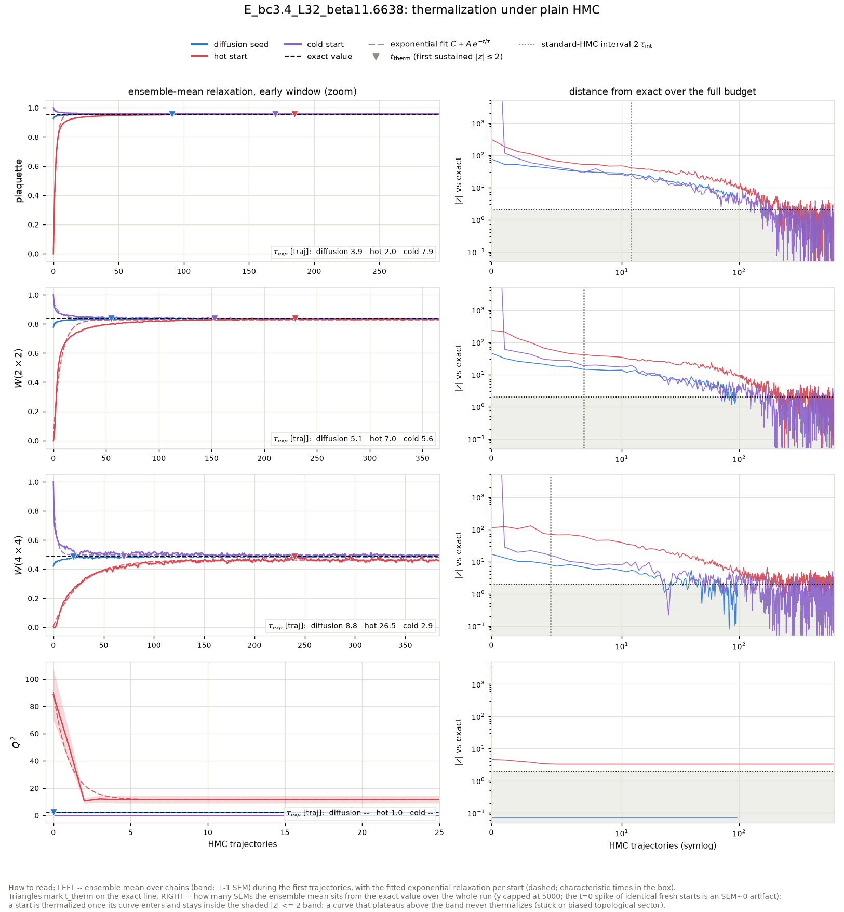

tau_int (hot-start chains, second half): plaquette = 6.01 +- 0.85, wilson_2x2 = 3.54 +- 0.45, wilson_4x4 = 2.26 +- 0.37, wilson_6x6 = 0.94 +- 0.06. Topology: hot-start HMC L=32 beta=11.6638 -> **frozen** (no tunneling).

Where 'never' stood at the end: the hot start ended the 640-trajectory budget still at Q^2 at |z| ~ 3; the cold start ended the 640-trajectory budget still at Q^2 at |z| ~ 2329518014464.

### Diagnostics: raw diffusion output (before any HMC)

| observable | value | error | exact | z_exact | reference | ref_error | z_ref | ks_p | chi2_p |
|---|---|---|---|---|---|---|---|---|---|
| plaquette | 0.9261 | 0.0004522 | 0.9561 | -66.37 | 0.9559 | 0.0001386 | -63.09 | 0 |  |
| wilson_1x1 | 0.9261 | 0.0004522 | 0.9561 | -66.37 | 0.9559 | 0.0001386 | -63.09 | 0 |  |
| wilson_1x2 | 0.8671 | 0.0007964 | 0.9142 | -59.12 | 0.9138 | 0.0002659 | -55.65 | 0 |  |
| wilson_2x2 | 0.7782 | 0.001466 | 0.8357 | -39.23 | 0.8347 | 0.0004393 | -36.94 | 0 |  |
| wilson_2x3 | 0.6968 | 0.00218 | 0.764 | -30.8 | 0.7621 | 0.0009043 | -27.67 | 0 |  |
| wilson_3x3 | 0.5942 | 0.002943 | 0.6678 | -25 | 0.6659 | 0.001512 | -21.68 | 0 |  |
| wilson_3x4 | 0.5099 | 0.003589 | 0.5837 | -20.54 | 0.5811 | 0.00225 | -16.81 | 8.389e-39 |  |
| wilson_4x4 | 0.4207 | 0.004382 | 0.4878 | -15.29 | 0.4857 | 0.002925 | -12.34 | 1.245e-25 |  |
| wilson_4x5 | 0.3447 | 0.00497 | 0.4076 | -12.65 | 0.4045 | 0.003549 | -9.781 | 1.48e-17 |  |
| wilson_5x5 | 0.268 | 0.005452 | 0.3257 | -10.59 | 0.3235 | 0.003744 | -8.393 | 3.32e-13 |  |
| wilson_5x6 | 0.2141 | 0.005659 | 0.2603 | -8.15 | 0.2551 | 0.004093 | -5.873 | 5.1e-06 |  |
| wilson_6x6 | 0.1641 | 0.004992 | 0.1988 | -6.956 | 0.1932 | 0.004397 | -4.375 | 0.0006474 |  |
| wilson_6x7 | 0.1233 | 0.005398 | 0.1519 | -5.289 | 0.1444 | 0.004666 | -2.954 | 0.03831 |  |
| wilson_7x7 | 0.08932 | 0.005484 | 0.111 | -3.945 | 0.1062 | 0.005079 | -2.259 | 0.1122 |  |
| wilson_7x8 | 0.06724 | 0.005879 | 0.08105 | -2.349 | 0.0746 | 0.005295 | -0.93 | 0.6395 |  |
| wilson_8x8 | 0.04831 | 0.005352 | 0.0566 | -1.55 | 0.05156 | 0.004916 | -0.4476 | 0.9693 |  |
| wilson_8x10 | 0.02141 | 0.005394 | 0.02761 | -1.15 | 0.02437 | 0.005169 | -0.3966 | 0.5259 |  |
| wilson_10x10 | 0.008317 | 0.005393 | 0.01125 | -0.5446 | 0.007955 | 0.003943 | 0.05422 | 0.3294 |  |
| wilson_10x12 | 0.001308 | 0.004686 | 0.004588 | -0.6999 | 0.002084 | 0.003642 | -0.1308 | 0.3294 |  |
| wilson_12x12 | 0.001275 | 0.00326 | 0.001563 | -0.08829 | 0.002466 | 0.002998 | -0.2689 | 0.8569 |  |
| creutz_2 | 0.04232 | 0.0009099 | 0.04487 | -2.799 |  |  |  |  |  |
| creutz_3 | 0.04893 | 0.001889 | 0.04487 | 2.149 |  |  |  |  |  |
| creutz_4 | 0.03938 | 0.003399 | 0.04487 | -1.614 |  |  |  |  |  |
| creutz_5 | 0.05255 | 0.006841 | 0.04487 | 1.123 |  |  |  |  |  |
| creutz_6 | 0.04171 | 0.01141 | 0.04487 | -0.2766 |  |  |  |  |  |
| creutz_7 | 0.03731 | 0.01884 | 0.04487 | -0.4012 |  |  |  |  |  |
| creutz_8 | 0.04665 | 0.03462 | 0.04487 | 0.05146 |  |  |  |  |  |
| Q | -0.2734 | 0.1642 | 0 | -1.665 | -0.09375 | 0.1449 | -0.8205 | 0.8246 |  |
| Q^2 | 2.352 | 0.3381 | 2.33 | 0.0652 | 3.417 | 0.3755 | -2.108 | 0.7163 |  |
| chi_top ((<Q^2>-<Q>^2)/V) | 0.002223 | 0.0002881 | 0.002275 | -0.1787 | 0.003328 | 0.0003724 | -2.346 | 0.0001119 |  |
| Q histogram vs exact P(Q) | 3.51 | nan | 6 | nan |  |  |  |  | 0.7427 |

### Diagnostics: the same configs after 96 HMC trajectories

| observable | value | error | exact | z_exact | reference | ref_error | z_ref | ks_p | chi2_p |
|---|---|---|---|---|---|---|---|---|---|
| plaquette | 0.9552 | 0.0002017 | 0.9561 | -4.694 | 0.9559 | 0.0001386 | -3.163 | 0.0001372 |  |
| wilson_1x1 | 0.9552 | 0.0002017 | 0.9561 | -4.694 | 0.9559 | 0.0001386 | -3.163 | 0.0001372 |  |
| wilson_1x2 | 0.9123 | 0.000419 | 0.9142 | -4.361 | 0.9138 | 0.0002659 | -2.967 | 0.04938 |  |
| wilson_2x2 | 0.8333 | 0.000937 | 0.8357 | -2.57 | 0.8347 | 0.0004393 | -1.377 | 0.2522 |  |
| wilson_2x3 | 0.7616 | 0.001526 | 0.764 | -1.572 | 0.7621 | 0.0009043 | -0.3158 | 0.678 |  |
| wilson_3x3 | 0.6673 | 0.002365 | 0.6678 | -0.1773 | 0.6659 | 0.001512 | 0.5051 | 0.9353 |  |
| wilson_3x4 | 0.5823 | 0.003046 | 0.5837 | -0.4509 | 0.5811 | 0.00225 | 0.3002 | 0.9807 |  |
| wilson_4x4 | 0.4846 | 0.003802 | 0.4878 | -0.8458 | 0.4857 | 0.002925 | -0.2476 | 0.4548 |  |
| wilson_4x5 | 0.405 | 0.00432 | 0.4076 | -0.5984 | 0.4045 | 0.003549 | 0.1032 | 0.6011 |  |
| wilson_5x5 | 0.3229 | 0.004726 | 0.3257 | -0.593 | 0.3235 | 0.003744 | -0.09779 | 0.7901 |  |
| wilson_5x6 | 0.2584 | 0.004864 | 0.2603 | -0.3838 | 0.2551 | 0.004093 | 0.5097 | 0.9126 |  |
| wilson_6x6 | 0.1974 | 0.004838 | 0.1988 | -0.2965 | 0.1932 | 0.004397 | 0.6401 | 0.678 |  |
| wilson_6x7 | 0.1489 | 0.004867 | 0.1519 | -0.6108 | 0.1444 | 0.004666 | 0.6672 | 0.3294 |  |
| wilson_7x7 | 0.1072 | 0.005281 | 0.111 | -0.7178 | 0.1062 | 0.005079 | 0.1312 | 0.4548 |  |
| wilson_7x8 | 0.07952 | 0.004927 | 0.08105 | -0.3091 | 0.0746 | 0.005295 | 0.6812 | 0.1892 |  |
| wilson_8x8 | 0.05523 | 0.005274 | 0.0566 | -0.2602 | 0.05156 | 0.004916 | 0.5086 | 0.4212 |  |
| wilson_8x10 | 0.02812 | 0.004469 | 0.02761 | 0.1134 | 0.02437 | 0.005169 | 0.5484 | 0.3294 |  |
| wilson_10x10 | 0.01165 | 0.005037 | 0.01125 | 0.07847 | 0.007955 | 0.003943 | 0.5775 | 0.678 |  |
| wilson_10x12 | 0.008118 | 0.003742 | 0.004588 | 0.9435 | 0.002084 | 0.003642 | 1.156 | 0.2763 |  |
| wilson_12x12 | 0.003942 | 0.003553 | 0.001563 | 0.6696 | 0.002466 | 0.002998 | 0.3175 | 0.9353 |  |
| creutz_2 | 0.04474 | 0.0006166 | 0.04487 | -0.2033 |  |  |  |  |  |
| creutz_3 | 0.0421 | 0.001389 | 0.04487 | -1.998 |  |  |  |  |  |
| creutz_4 | 0.0474 | 0.002615 | 0.04487 | 0.9678 |  |  |  |  |  |
| creutz_5 | 0.0474 | 0.00408 | 0.04487 | 0.6203 |  |  |  |  |  |
| creutz_6 | 0.04636 | 0.008485 | 0.04487 | 0.1756 |  |  |  |  |  |
| creutz_7 | 0.04734 | 0.01612 | 0.04487 | 0.153 |  |  |  |  |  |
| creutz_8 | 0.06624 | 0.0364 | 0.04487 | 0.587 |  |  |  |  |  |
| Q | -0.2734 | 0.1642 | 0 | -1.665 | -0.09375 | 0.1449 | -0.8205 | 0.8246 |  |
| Q^2 | 2.352 | 0.3381 | 2.33 | 0.0652 | 3.417 | 0.3755 | -2.108 | 0.7163 |  |
| chi_top ((<Q^2>-<Q>^2)/V) | 0.002223 | 0.0002881 | 0.002275 | -0.1787 | 0.003328 | 0.0003724 | -2.346 | 0.0001119 |  |
| Q histogram vs exact P(Q) | 3.51 | nan | 6 | nan |  |  |  |  | 0.7427 |

## A_bc4_L32_beta14.1464

HMC: step size 0.1063, 9 leapfrog steps, acceptance seed/hot/cold = 0.985/0.985/0.985. Diffusion-seed batch: 128 chains x 96 trajectories (0.17 s/traj for the whole batch); baselines: 32 chains x 640 trajectories.

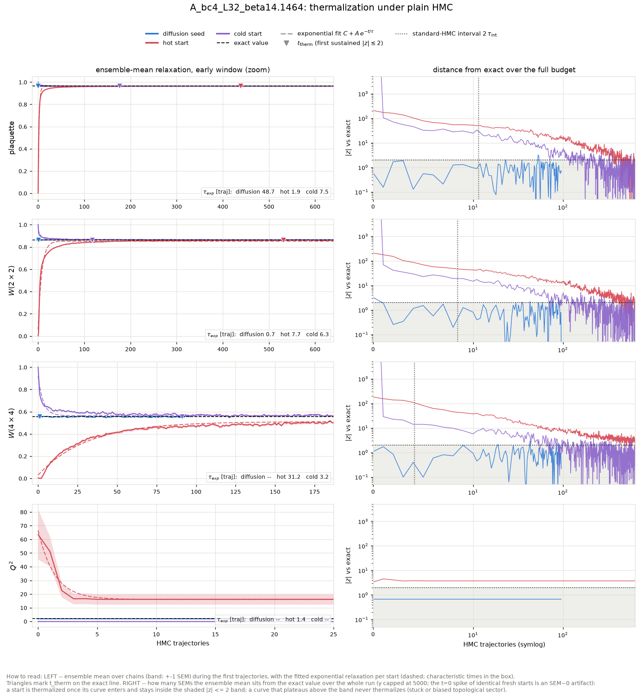

tau_int (hot-start chains, second half): plaquette = 5.72 +- 0.76, wilson_2x2 = 4.21 +- 0.47, wilson_4x4 = 2.06 +- 0.16, wilson_6x6 = 0.81 +- 0.04. Topology: hot-start HMC L=32 beta=14.1464 -> **frozen** (no tunneling).

Where 'never' stood at the end: the hot start ended the 640-trajectory budget still at wilson_4x4 at |z| ~ 3, wilson_6x6 at |z| ~ 3, Q^2 at |z| ~ 4; the cold start ended the 640-trajectory budget still at Q^2 at |z| ~ 1903991324672.

### Diagnostics: raw diffusion output (before any HMC)

| observable | value | error | exact | z_exact | reference | ref_error | z_ref | ks_p | chi2_p |
|---|---|---|---|---|---|---|---|---|---|
| plaquette | 0.9639 | 0.0002139 | 0.964 | -0.5465 | 0.9643 | 0.0001394 | -1.526 | 0.01474 |  |
| wilson_1x1 | 0.9639 | 0.0002139 | 0.964 | -0.5465 | 0.9643 | 0.0001394 | -1.526 | 0.01474 |  |
| wilson_1x2 | 0.9282 | 0.0004693 | 0.9293 | -2.338 | 0.9297 | 0.0002902 | -2.725 | 0.0004451 |  |
| wilson_2x2 | 0.8608 | 0.000971 | 0.8635 | -2.815 | 0.8648 | 0.0005656 | -3.605 | 5.99e-05 |  |
| wilson_2x3 | 0.7987 | 0.00143 | 0.8024 | -2.647 | 0.8041 | 0.001006 | -3.111 | 0.01957 |  |
| wilson_3x3 | 0.7139 | 0.00215 | 0.7188 | -2.296 | 0.7215 | 0.001633 | -2.808 | 0.02947 |  |
| wilson_3x4 | 0.6389 | 0.002932 | 0.6439 | -1.717 | 0.6464 | 0.002382 | -2.002 | 0.1392 |  |
| wilson_4x4 | 0.5522 | 0.003487 | 0.556 | -1.111 | 0.5589 | 0.003229 | -1.41 | 0.389 |  |
| wilson_4x5 | 0.4754 | 0.004348 | 0.4801 | -1.093 | 0.483 | 0.003787 | -1.322 | 0.1892 |  |
| wilson_5x5 | 0.3966 | 0.005166 | 0.3997 | -0.5919 | 0.4026 | 0.004329 | -0.8824 | 0.4212 |  |
| wilson_5x6 | 0.328 | 0.006146 | 0.3327 | -0.7658 | 0.3371 | 0.004763 | -1.167 | 0.3584 |  |
| wilson_6x6 | 0.2641 | 0.006588 | 0.267 | -0.4325 | 0.2695 | 0.004692 | -0.6664 | 0.7163 |  |
| wilson_6x7 | 0.2103 | 0.00681 | 0.2142 | -0.5742 | 0.2188 | 0.004882 | -1.015 | 0.4212 |  |
| wilson_7x7 | 0.1649 | 0.006882 | 0.1657 | -0.1154 | 0.1698 | 0.00535 | -0.5592 | 0.6395 |  |
| wilson_7x8 | 0.126 | 0.006071 | 0.1282 | -0.3608 | 0.1338 | 0.005268 | -0.9709 | 0.4212 |  |
| wilson_8x8 | 0.0996 | 0.005381 | 0.09558 | 0.7465 | 0.09956 | 0.005676 | 0.004942 | 0.9353 |  |
| wilson_8x10 | 0.05394 | 0.005251 | 0.05315 | 0.1511 | 0.05826 | 0.004829 | -0.606 | 0.1712 |  |
| wilson_10x10 | 0.02814 | 0.005495 | 0.02552 | 0.4769 | 0.03309 | 0.004208 | -0.7159 | 0.3021 |  |
| wilson_10x12 | 0.01592 | 0.004634 | 0.01225 | 0.7923 | 0.01664 | 0.004387 | -0.1131 | 0.8569 |  |
| wilson_12x12 | 0.006781 | 0.003762 | 0.00508 | 0.4523 | 0.009305 | 0.005203 | -0.3931 | 0.9542 |  |
| creutz_2 | 0.03761 | 0.0004926 | 0.03668 | 1.885 |  |  |  |  |  |
| creutz_3 | 0.03729 | 0.001034 | 0.03668 | 0.5862 |  |  |  |  |  |
| creutz_4 | 0.03486 | 0.001743 | 0.03668 | -1.045 |  |  |  |  |  |
| creutz_5 | 0.03145 | 0.003081 | 0.03668 | -1.698 |  |  |  |  |  |
| creutz_6 | 0.0266 | 0.005305 | 0.03668 | -1.901 |  |  |  |  |  |
| creutz_7 | 0.01538 | 0.01068 | 0.03668 | -1.995 |  |  |  |  |  |
| creutz_8 | -0.03414 | 0.01925 | 0.03668 | -3.68 |  |  |  |  |  |
| Q | 0.07031 | 0.1218 | 0 | 0.5774 | -0.07292 | 0.1031 | 0.8977 | 0.678 |  |
| Q^2 | 2.086 | 0.2321 | 1.904 | 0.7839 | 1.635 | 0.1596 | 1.599 | 0.8569 |  |
| chi_top ((<Q^2>-<Q>^2)/V) | 0.002032 | 0.0002337 | 0.001859 | 0.7397 | 0.001592 | 0.0001506 | 1.584 | 4.022e-06 |  |
| Q histogram vs exact P(Q) | 2.334 | nan | 6 | nan |  |  |  |  | 0.8866 |

### Diagnostics: the same configs after 96 HMC trajectories

| observable | value | error | exact | z_exact | reference | ref_error | z_ref | ks_p | chi2_p |
|---|---|---|---|---|---|---|---|---|---|
| plaquette | 0.9641 | 0.0001338 | 0.964 | 0.6735 | 0.9643 | 0.0001394 | -0.9449 | 0.2297 |  |
| wilson_1x1 | 0.9641 | 0.0001338 | 0.964 | 0.6735 | 0.9643 | 0.0001394 | -0.9449 | 0.2297 |  |
| wilson_1x2 | 0.9293 | 0.0003326 | 0.9293 | 0.2448 | 0.9297 | 0.0002902 | -0.736 | 0.4548 |  |
| wilson_2x2 | 0.8635 | 0.0007139 | 0.8635 | 0.02463 | 0.8648 | 0.0005656 | -1.427 | 0.6395 |  |
| wilson_2x3 | 0.8026 | 0.001084 | 0.8024 | 0.1567 | 0.8041 | 0.001006 | -1.004 | 0.5631 |  |
| wilson_3x3 | 0.7189 | 0.001976 | 0.7188 | 0.05506 | 0.7215 | 0.001633 | -0.9895 | 0.6011 |  |
| wilson_3x4 | 0.6434 | 0.002667 | 0.6439 | -0.1757 | 0.6464 | 0.002382 | -0.8381 | 0.8569 |  |
| wilson_4x4 | 0.5553 | 0.003849 | 0.556 | -0.1998 | 0.5589 | 0.003229 | -0.7155 | 0.7163 |  |
| wilson_4x5 | 0.4783 | 0.004862 | 0.4801 | -0.3818 | 0.483 | 0.003787 | -0.7666 | 0.3294 |  |
| wilson_5x5 | 0.3956 | 0.005501 | 0.3997 | -0.7441 | 0.4026 | 0.004329 | -0.9975 | 0.7901 |  |
| wilson_5x6 | 0.3267 | 0.006321 | 0.3327 | -0.9497 | 0.3371 | 0.004763 | -1.31 | 0.6011 |  |
| wilson_6x6 | 0.2587 | 0.006421 | 0.267 | -1.284 | 0.2695 | 0.004692 | -1.356 | 0.2763 |  |
| wilson_6x7 | 0.2031 | 0.006657 | 0.2142 | -1.668 | 0.2188 | 0.004882 | -1.902 | 0.03831 |  |
| wilson_7x7 | 0.1527 | 0.006401 | 0.1657 | -2.027 | 0.1698 | 0.00535 | -2.044 | 0.002243 |  |
| wilson_7x8 | 0.1128 | 0.006047 | 0.1282 | -2.55 | 0.1338 | 0.005268 | -2.623 | 7.394e-05 |  |
| wilson_8x8 | 0.08293 | 0.005885 | 0.09558 | -2.149 | 0.09956 | 0.005676 | -2.034 | 0.002243 |  |
| wilson_8x10 | 0.0417 | 0.006749 | 0.05315 | -1.696 | 0.05826 | 0.004829 | -1.996 | 0.02248 |  |
| wilson_10x10 | 0.0167 | 0.006533 | 0.02552 | -1.35 | 0.03309 | 0.004208 | -2.11 | 0.02947 |  |
| wilson_10x12 | 0.009528 | 0.006938 | 0.01225 | -0.3927 | 0.01664 | 0.004387 | -0.867 | 0.1251 |  |
| wilson_12x12 | -0.002185 | 0.006041 | 0.00508 | -1.203 | 0.009305 | 0.005203 | -1.441 | 0.03831 |  |
| creutz_2 | 0.03675 | 0.0005252 | 0.03668 | 0.1169 |  |  |  |  |  |
| creutz_3 | 0.03694 | 0.001181 | 0.03668 | 0.213 |  |  |  |  |  |
| creutz_4 | 0.03646 | 0.002219 | 0.03668 | -0.1005 |  |  |  |  |  |
| creutz_5 | 0.04062 | 0.003273 | 0.03668 | 1.201 |  |  |  |  |  |
| creutz_6 | 0.04193 | 0.005991 | 0.03668 | 0.8753 |  |  |  |  |  |
| creutz_7 | 0.04311 | 0.01207 | 0.03668 | 0.5325 |  |  |  |  |  |
| creutz_8 | 0.003865 | 0.02031 | 0.03668 | -1.616 |  |  |  |  |  |
| Q | 0.07031 | 0.1218 | 0 | 0.5774 | -0.07292 | 0.1031 | 0.8977 | 0.678 |  |
| Q^2 | 2.086 | 0.2321 | 1.904 | 0.7839 | 1.635 | 0.1596 | 1.599 | 0.8569 |  |
| chi_top ((<Q^2>-<Q>^2)/V) | 0.002032 | 0.0002337 | 0.001859 | 0.7397 | 0.001592 | 0.0001506 | 1.584 | 4.022e-06 |  |
| Q histogram vs exact P(Q) | 2.334 | nan | 6 | nan |  |  |  |  | 0.8866 |

## B_bt16_L32_beta16

HMC: step size 0.1000, 10 leapfrog steps, acceptance seed/hot/cold = 0.976/0.977/0.978. Diffusion-seed batch: 128 chains x 96 trajectories (0.28 s/traj for the whole batch); baselines: 32 chains x 640 trajectories.

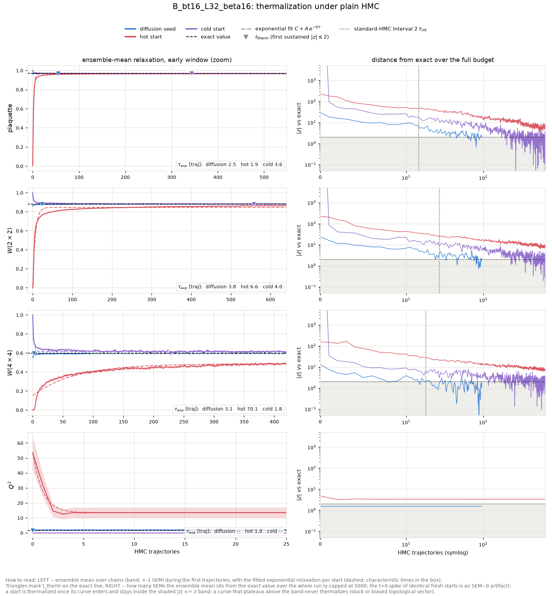

tau_int (hot-start chains, second half): plaquette = 7.24 +- 1.16, wilson_2x2 = 13.46 +- 1.83, wilson_4x4 = 8.95 +- 1.51, wilson_6x6 = 1.02 +- 0.07. Topology: hot-start HMC L=32 beta=16 -> **frozen** (no tunneling).

Where 'never' stood at the end: the hot start ended the 640-trajectory budget still at plaquette at |z| ~ 6, wilson_2x2 at |z| ~ 9, wilson_4x4 at |z| ~ 7, wilson_6x6 at |z| ~ 5, Q^2 at |z| ~ 3; the cold start ended the 640-trajectory budget still at Q^2 at |z| ~ 1675631132672.

### Diagnostics: raw diffusion output (before any HMC)

| observable | value | error | exact | z_exact | reference | ref_error | z_ref | ks_p | chi2_p |
|---|---|---|---|---|---|---|---|---|---|
| plaquette | 0.9617 | 0.0002111 | 0.9682 | -30.79 | 0.9683 | 9.793e-05 | -28.38 | 0 |  |
| wilson_1x1 | 0.9617 | 0.0002111 | 0.9682 | -30.79 | 0.9683 | 9.793e-05 | -28.38 | 0 |  |
| wilson_1x2 | 0.9253 | 0.0004219 | 0.9375 | -28.95 | 0.9377 | 0.0002358 | -25.81 | 0 |  |
| wilson_2x2 | 0.8574 | 0.0009635 | 0.8788 | -22.25 | 0.8802 | 0.0004883 | -21.08 | 0 |  |
| wilson_2x3 | 0.7945 | 0.001275 | 0.8239 | -23.07 | 0.8259 | 0.0007559 | -21.23 | 0 |  |
| wilson_3x3 | 0.7103 | 0.00173 | 0.7478 | -21.66 | 0.751 | 0.001222 | -19.18 | 2.422e-36 |  |
| wilson_3x4 | 0.6355 | 0.002347 | 0.6788 | -18.42 | 0.682 | 0.001704 | -16 | 7.917e-28 |  |
| wilson_4x4 | 0.5503 | 0.003099 | 0.5965 | -14.92 | 0.6008 | 0.002255 | -13.17 | 6.598e-20 |  |
| wilson_4x5 | 0.4743 | 0.004182 | 0.5243 | -11.95 | 0.5287 | 0.002838 | -10.77 | 2.893e-16 |  |
| wilson_5x5 | 0.3967 | 0.004688 | 0.4461 | -10.54 | 0.4499 | 0.003562 | -9.043 | 4.48e-11 |  |
| wilson_5x6 | 0.3283 | 0.00576 | 0.3796 | -8.902 | 0.3811 | 0.004178 | -7.412 | 1.186e-06 |  |
| wilson_6x6 | 0.2656 | 0.006583 | 0.3127 | -7.159 | 0.311 | 0.004789 | -5.573 | 9.107e-05 |  |
| wilson_6x7 | 0.212 | 0.006947 | 0.2577 | -6.569 | 0.2522 | 0.004922 | -4.715 | 0.001334 |  |
| wilson_7x7 | 0.167 | 0.006772 | 0.2055 | -5.686 | 0.1978 | 0.00483 | -3.695 | 0.00159 |  |
| wilson_7x8 | 0.1283 | 0.006412 | 0.164 | -5.557 | 0.1552 | 0.004667 | -3.393 | 0.004349 |  |
| wilson_8x8 | 0.09992 | 0.005958 | 0.1266 | -4.483 | 0.1167 | 0.004419 | -2.26 | 0.05588 |  |
| wilson_8x10 | 0.05639 | 0.005521 | 0.07554 | -3.469 | 0.06801 | 0.004818 | -1.585 | 0.2763 |  |
| wilson_10x10 | 0.02949 | 0.005649 | 0.03961 | -1.79 | 0.03564 | 0.004175 | -0.8749 | 0.2297 |  |
| wilson_10x12 | 0.01644 | 0.005604 | 0.02076 | -0.7717 | 0.01489 | 0.004752 | 0.2105 | 0.8569 |  |
| wilson_12x12 | 0.00874 | 0.004642 | 0.009567 | -0.1781 | 0.008597 | 0.003994 | 0.02325 | 0.4898 |  |
| creutz_2 | 0.03749 | 0.0005086 | 0.03229 | 10.23 |  |  |  |  |  |
| creutz_3 | 0.03568 | 0.001126 | 0.03229 | 3.01 |  |  |  |  |  |
| creutz_4 | 0.03274 | 0.001824 | 0.03229 | 0.2479 |  |  |  |  |  |
| creutz_5 | 0.03002 | 0.003126 | 0.03229 | -0.724 |  |  |  |  |  |
| creutz_6 | 0.02281 | 0.005547 | 0.03229 | -1.709 |  |  |  |  |  |
| creutz_7 | 0.01319 | 0.009808 | 0.03229 | -1.947 |  |  |  |  |  |
| creutz_8 | -0.0134 | 0.01632 | 0.03229 | -2.799 |  |  |  |  |  |
| Q | 0.07031 | 0.1218 | 0 | 0.5774 | -0.2344 | 0.09457 | 1.976 | 0.389 |  |
| Q^2 | 2.086 | 0.2321 | 1.676 | 1.768 | 2.13 | 0.2339 | -0.1343 | 1 |  |
| chi_top ((<Q^2>-<Q>^2)/V) | 0.002032 | 0.0002337 | 0.001636 | 1.694 | 0.002027 | 0.0002099 | 0.01777 | 1.616e-05 |  |
| Q histogram vs exact P(Q) | 3.197 | nan | 6 | nan |  |  |  |  | 0.7837 |

### Diagnostics: the same configs after 96 HMC trajectories

| observable | value | error | exact | z_exact | reference | ref_error | z_ref | ks_p | chi2_p |
|---|---|---|---|---|---|---|---|---|---|
| plaquette | 0.968 | 9.226e-05 | 0.9682 | -2.506 | 0.9683 | 9.793e-05 | -2.493 | 0.0631 |  |
| wilson_1x1 | 0.968 | 9.226e-05 | 0.9682 | -2.506 | 0.9683 | 9.793e-05 | -2.493 | 0.0631 |  |
| wilson_1x2 | 0.937 | 0.0002586 | 0.9375 | -1.732 | 0.9377 | 0.0002358 | -2.023 | 0.1392 |  |
| wilson_2x2 | 0.8775 | 0.0006932 | 0.8788 | -1.983 | 0.8802 | 0.0004883 | -3.196 | 0.011 |  |
| wilson_2x3 | 0.8215 | 0.001199 | 0.8239 | -1.992 | 0.8259 | 0.0007559 | -3.135 | 0.0004451 |  |
| wilson_3x3 | 0.7444 | 0.00195 | 0.7478 | -1.765 | 0.751 | 0.001222 | -2.864 | 0.0009335 |  |
| wilson_3x4 | 0.6744 | 0.00271 | 0.6788 | -1.623 | 0.682 | 0.001704 | -2.365 | 0.005104 |  |
| wilson_4x4 | 0.5906 | 0.003623 | 0.5965 | -1.646 | 0.6008 | 0.002255 | -2.388 | 0.01275 |  |
| wilson_4x5 | 0.5181 | 0.004569 | 0.5243 | -1.343 | 0.5287 | 0.002838 | -1.971 | 0.04354 |  |
| wilson_5x5 | 0.4386 | 0.005471 | 0.4461 | -1.369 | 0.4499 | 0.003562 | -1.735 | 0.008145 |  |
| wilson_5x6 | 0.3726 | 0.006303 | 0.3796 | -1.118 | 0.3811 | 0.004178 | -1.126 | 0.1712 |  |
| wilson_6x6 | 0.3067 | 0.007115 | 0.3127 | -0.8498 | 0.311 | 0.004789 | -0.4993 | 0.4898 |  |
| wilson_6x7 | 0.2523 | 0.007514 | 0.2577 | -0.709 | 0.2522 | 0.004922 | 0.01856 | 0.8569 |  |
| wilson_7x7 | 0.2016 | 0.007635 | 0.2055 | -0.5201 | 0.1978 | 0.00483 | 0.4203 | 0.4212 |  |
| wilson_7x8 | 0.1607 | 0.007596 | 0.164 | -0.4265 | 0.1552 | 0.004667 | 0.6146 | 0.2087 |  |
| wilson_8x8 | 0.1237 | 0.006959 | 0.1266 | -0.4224 | 0.1167 | 0.004419 | 0.8505 | 0.1392 |  |
| wilson_8x10 | 0.07528 | 0.005909 | 0.07554 | -0.04446 | 0.06801 | 0.004818 | 0.9543 | 0.3584 |  |
| wilson_10x10 | 0.03952 | 0.00572 | 0.03961 | -0.01408 | 0.03564 | 0.004175 | 0.5488 | 0.9542 |  |
| wilson_10x12 | 0.022 | 0.005561 | 0.02076 | 0.2226 | 0.01489 | 0.004752 | 0.9719 | 0.5631 |  |
| wilson_12x12 | 0.01411 | 0.00552 | 0.009567 | 0.8224 | 0.008597 | 0.003994 | 0.8086 | 0.7901 |  |
| creutz_2 | 0.03314 | 0.0004556 | 0.03229 | 1.863 |  |  |  |  |  |
| creutz_3 | 0.03266 | 0.0008167 | 0.03229 | 0.4565 |  |  |  |  |  |
| creutz_4 | 0.03395 | 0.001631 | 0.03229 | 1.019 |  |  |  |  |  |
| creutz_5 | 0.03571 | 0.002509 | 0.03229 | 1.365 |  |  |  |  |  |
| creutz_6 | 0.03126 | 0.004833 | 0.03229 | -0.2125 |  |  |  |  |  |
| creutz_7 | 0.02953 | 0.00733 | 0.03229 | -0.3757 |  |  |  |  |  |
| creutz_8 | 0.03537 | 0.01493 | 0.03229 | 0.2064 |  |  |  |  |  |
| Q | 0.07031 | 0.1218 | 0 | 0.5774 | -0.2344 | 0.09457 | 1.976 | 0.389 |  |
| Q^2 | 2.086 | 0.2321 | 1.676 | 1.768 | 2.13 | 0.2339 | -0.1343 | 1 |  |
| chi_top ((<Q^2>-<Q>^2)/V) | 0.002032 | 0.0002337 | 0.001636 | 1.694 | 0.002027 | 0.0002099 | 0.01777 | 1.616e-05 |  |
| Q histogram vs exact P(Q) | 3.197 | nan | 6 | nan |  |  |  |  | 0.7837 |

## E_bc4.5_L32_beta16.2057

HMC: step size 0.0994, 10 leapfrog steps, acceptance seed/hot/cold = 0.979/0.980/0.978. Diffusion-seed batch: 128 chains x 96 trajectories (0.12 s/traj for the whole batch); baselines: 32 chains x 640 trajectories.

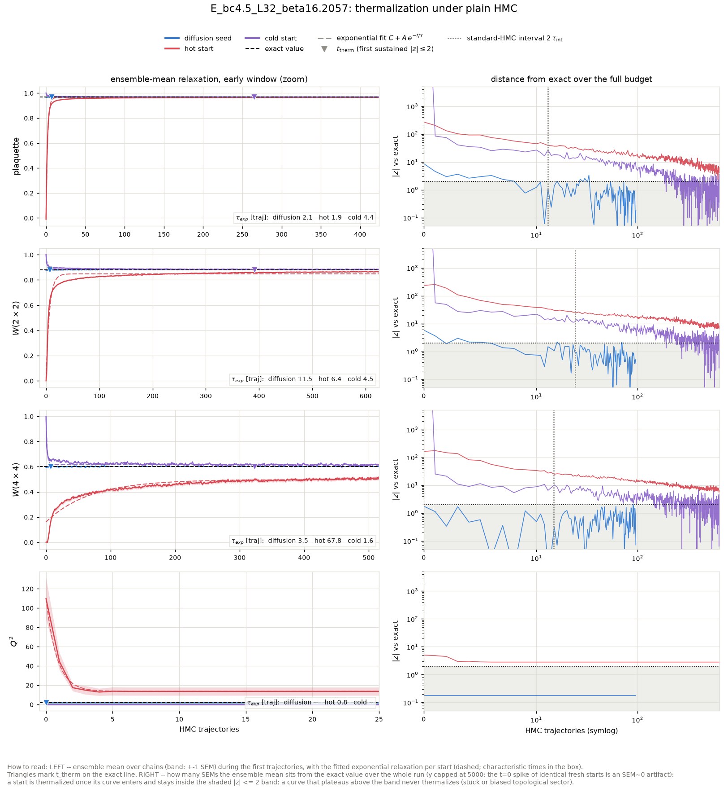

tau_int (hot-start chains, second half): plaquette = 6.46 +- 0.98, wilson_2x2 = 12.05 +- 1.83, wilson_4x4 = 7.43 +- 1.48, wilson_6x6 = 0.98 +- 0.07. Topology: hot-start HMC L=32 beta=16.2057 -> **frozen** (no tunneling).

Where 'never' stood at the end: the hot start ended the 640-trajectory budget still at plaquette at |z| ~ 6, wilson_2x2 at |z| ~ 8, wilson_4x4 at |z| ~ 6, wilson_6x6 at |z| ~ 4, Q^2 at |z| ~ 3; the cold start ended the 640-trajectory budget still at Q^2 at |z| ~ 1653625323520.

### Diagnostics: raw diffusion output (before any HMC)

| observable | value | error | exact | z_exact | reference | ref_error | z_ref | ks_p | chi2_p |
|---|---|---|---|---|---|---|---|---|---|
| plaquette | 0.967 | 0.0001568 | 0.9686 | -10.63 | 0.9689 | 0.0001215 | -9.589 | 2.893e-16 |  |
| wilson_1x1 | 0.967 | 0.0001568 | 0.9686 | -10.63 | 0.9689 | 0.0001215 | -9.589 | 2.893e-16 |  |
| wilson_1x2 | 0.9354 | 0.000329 | 0.9383 | -8.767 | 0.9389 | 0.0002259 | -8.93 | 7.36e-15 |  |
| wilson_2x2 | 0.8756 | 0.0007742 | 0.8803 | -6.092 | 0.8819 | 0.0004272 | -7.143 | 4.79e-13 |  |
| wilson_2x3 | 0.8198 | 0.001172 | 0.826 | -5.275 | 0.8283 | 0.0006681 | -6.275 | 1.107e-09 |  |
| wilson_3x3 | 0.7443 | 0.001742 | 0.7507 | -3.657 | 0.755 | 0.001061 | -5.255 | 1.947e-07 |  |
| wilson_3x4 | 0.6758 | 0.002483 | 0.6822 | -2.583 | 0.687 | 0.00175 | -3.677 | 0.0002496 |  |
| wilson_4x4 | 0.5951 | 0.003291 | 0.6006 | -1.667 | 0.6055 | 0.002254 | -2.592 | 0.0007783 |  |
| wilson_4x5 | 0.5224 | 0.004132 | 0.5287 | -1.52 | 0.5333 | 0.002937 | -2.131 | 0.005977 |  |
| wilson_5x5 | 0.4452 | 0.004671 | 0.4509 | -1.205 | 0.4546 | 0.003265 | -1.64 | 0.03364 |  |
| wilson_5x6 | 0.3788 | 0.005088 | 0.3845 | -1.111 | 0.3866 | 0.003745 | -1.24 | 0.07995 |  |
| wilson_6x6 | 0.3139 | 0.005946 | 0.3176 | -0.6129 | 0.3192 | 0.004082 | -0.7347 | 0.5259 |  |
| wilson_6x7 | 0.2582 | 0.006376 | 0.2623 | -0.6431 | 0.2625 | 0.004529 | -0.5458 | 0.678 |  |
| wilson_7x7 | 0.2061 | 0.007257 | 0.2099 | -0.5154 | 0.2103 | 0.004829 | -0.4747 | 0.8569 |  |
| wilson_7x8 | 0.1634 | 0.007448 | 0.1679 | -0.6019 | 0.1689 | 0.00502 | -0.6086 | 0.7538 |  |
| wilson_8x8 | 0.1253 | 0.007544 | 0.1301 | -0.6343 | 0.1307 | 0.005123 | -0.589 | 0.3584 |  |
| wilson_8x10 | 0.07195 | 0.007211 | 0.07815 | -0.86 | 0.07974 | 0.00472 | -0.9047 | 0.3294 |  |
| wilson_10x10 | 0.03433 | 0.006559 | 0.04132 | -1.065 | 0.04097 | 0.003961 | -0.8665 | 0.1004 |  |
| wilson_10x12 | 0.01469 | 0.006507 | 0.02185 | -1.099 | 0.01927 | 0.00331 | -0.6272 | 0.5259 |  |
| wilson_12x12 | 0.002245 | 0.006069 | 0.01017 | -1.305 | 0.004811 | 0.003369 | -0.3696 | 0.5259 |  |
| creutz_2 | 0.0328 | 0.0005163 | 0.03186 | 1.814 |  |  |  |  |  |
| creutz_3 | 0.03073 | 0.0008781 | 0.03186 | -1.294 |  |  |  |  |  |
| creutz_4 | 0.03067 | 0.001639 | 0.03186 | -0.7299 |  |  |  |  |  |
| creutz_5 | 0.02971 | 0.002707 | 0.03186 | -0.7975 |  |  |  |  |  |
| creutz_6 | 0.02634 | 0.004604 | 0.03186 | -1.2 |  |  |  |  |  |
| creutz_7 | 0.02988 | 0.007777 | 0.03186 | -0.2552 |  |  |  |  |  |
| creutz_8 | 0.03319 | 0.01343 | 0.03186 | 0.09876 |  |  |  |  |  |
| Q | -0.0625 | 0.08863 | 0 | -0.7051 | -0.1302 | 0.07449 | 0.5848 | 0.7163 |  |
| Q^2 | 1.688 | 0.1812 | 1.654 | 0.187 | 1.578 | 0.1684 | 0.4421 | 0.6011 |  |
| chi_top ((<Q^2>-<Q>^2)/V) | 0.001644 | 0.0001775 | 0.001615 | 0.1649 | 0.001525 | 0.0001571 | 0.5044 | 6.754e-09 |  |
| Q histogram vs exact P(Q) | 10.08 | nan | 6 | nan |  |  |  |  | 0.1214 |

### Diagnostics: the same configs after 96 HMC trajectories

| observable | value | error | exact | z_exact | reference | ref_error | z_ref | ks_p | chi2_p |
|---|---|---|---|---|---|---|---|---|---|
| plaquette | 0.9686 | 0.0001358 | 0.9686 | -0.1569 | 0.9689 | 0.0001215 | -1.412 | 0.1892 |  |
| wilson_1x1 | 0.9686 | 0.0001358 | 0.9686 | -0.1569 | 0.9689 | 0.0001215 | -1.412 | 0.1892 |  |
| wilson_1x2 | 0.9382 | 0.0002431 | 0.9383 | -0.2565 | 0.9389 | 0.0002259 | -2.236 | 0.005104 |  |
| wilson_2x2 | 0.8801 | 0.0004825 | 0.8803 | -0.5071 | 0.8819 | 0.0004272 | -2.862 | 0.004349 |  |
| wilson_2x3 | 0.8255 | 0.0006219 | 0.826 | -0.7433 | 0.8283 | 0.0006681 | -3.009 | 0.011 |  |
| wilson_3x3 | 0.75 | 0.0009305 | 0.7507 | -0.682 | 0.755 | 0.001061 | -3.53 | 0.02577 |  |
| wilson_3x4 | 0.6818 | 0.001377 | 0.6822 | -0.3257 | 0.687 | 0.00175 | -2.338 | 0.04938 |  |
| wilson_4x4 | 0.6004 | 0.001809 | 0.6006 | -0.1329 | 0.6055 | 0.002254 | -1.762 | 0.0711 |  |
| wilson_4x5 | 0.5288 | 0.002535 | 0.5287 | 0.02736 | 0.5333 | 0.002937 | -1.148 | 0.2522 |  |
| wilson_5x5 | 0.4515 | 0.003252 | 0.4509 | 0.1879 | 0.4546 | 0.003265 | -0.6745 | 0.7901 |  |
| wilson_5x6 | 0.3863 | 0.003924 | 0.3845 | 0.4641 | 0.3866 | 0.003745 | -0.06587 | 0.7901 |  |
| wilson_6x6 | 0.321 | 0.004661 | 0.3176 | 0.7433 | 0.3192 | 0.004082 | 0.2922 | 0.9353 |  |
| wilson_6x7 | 0.2661 | 0.005365 | 0.2623 | 0.7028 | 0.2625 | 0.004529 | 0.5131 | 0.9542 |  |
| wilson_7x7 | 0.2126 | 0.006127 | 0.2099 | 0.447 | 0.2103 | 0.004829 | 0.3001 | 0.8246 |  |
| wilson_7x8 | 0.1711 | 0.006887 | 0.1679 | 0.4711 | 0.1689 | 0.00502 | 0.2654 | 0.9693 |  |
| wilson_8x8 | 0.1334 | 0.007248 | 0.1301 | 0.4572 | 0.1307 | 0.005123 | 0.3074 | 0.9542 |  |
| wilson_8x10 | 0.08239 | 0.007182 | 0.07815 | 0.5908 | 0.07974 | 0.00472 | 0.3081 | 0.9353 |  |
| wilson_10x10 | 0.04338 | 0.00656 | 0.04132 | 0.3147 | 0.04097 | 0.003961 | 0.3149 | 0.9126 |  |
| wilson_10x12 | 0.02643 | 0.006025 | 0.02185 | 0.7604 | 0.01927 | 0.00331 | 1.041 | 0.4898 |  |
| wilson_12x12 | 0.009461 | 0.004494 | 0.01017 | -0.1574 | 0.004811 | 0.003369 | 0.828 | 0.1892 |  |
| creutz_2 | 0.03203 | 0.0004807 | 0.03186 | 0.3476 |  |  |  |  |  |
| creutz_3 | 0.03187 | 0.0009208 | 0.03186 | 0.004375 |  |  |  |  |  |
| creutz_4 | 0.0318 | 0.00162 | 0.03186 | -0.04246 |  |  |  |  |  |
| creutz_5 | 0.03117 | 0.002723 | 0.03186 | -0.2538 |  |  |  |  |  |
| creutz_6 | 0.02911 | 0.004956 | 0.03186 | -0.5554 |  |  |  |  |  |
| creutz_7 | 0.03659 | 0.007113 | 0.03186 | 0.6648 |  |  |  |  |  |
| creutz_8 | 0.03203 | 0.01217 | 0.03186 | 0.01374 |  |  |  |  |  |
| Q | -0.0625 | 0.08863 | 0 | -0.7051 | -0.1302 | 0.07449 | 0.5848 | 0.7163 |  |
| Q^2 | 1.688 | 0.1812 | 1.654 | 0.187 | 1.578 | 0.1684 | 0.4421 | 0.6011 |  |
| chi_top ((<Q^2>-<Q>^2)/V) | 0.001644 | 0.0001775 | 0.001615 | 0.1649 | 0.001525 | 0.0001571 | 0.5044 | 6.754e-09 |  |
| Q histogram vs exact P(Q) | 10.08 | nan | 6 | nan |  |  |  |  | 0.1214 |

## A_bc5_L32_beta18.2524

HMC: step size 0.0936, 11 leapfrog steps, acceptance seed/hot/cold = 0.980/0.981/0.981. Diffusion-seed batch: 128 chains x 96 trajectories (0.25 s/traj for the whole batch); baselines: 32 chains x 640 trajectories.

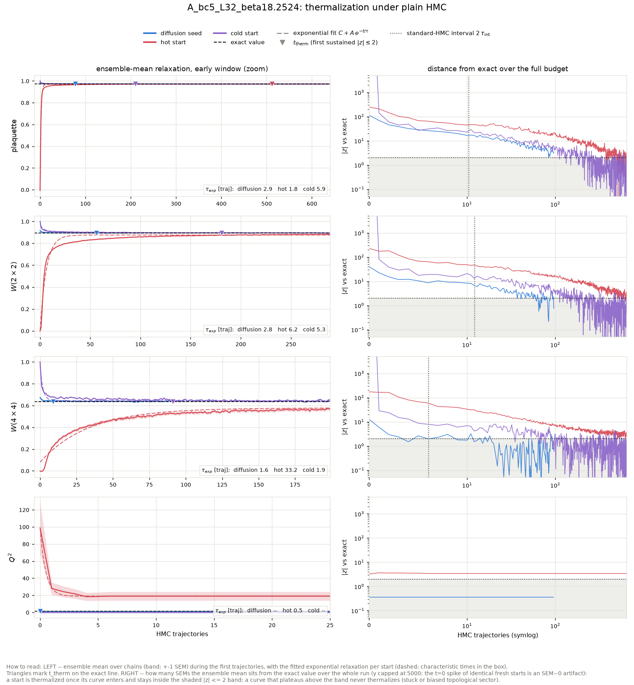

tau_int (hot-start chains, second half): plaquette = 5.21 +- 0.64, wilson_2x2 = 6.07 +- 0.91, wilson_4x4 = 3.01 +- 0.45, wilson_6x6 = 1.06 +- 0.05. Topology: hot-start HMC L=32 beta=18.2524 -> **frozen** (no tunneling).

Where 'never' stood at the end: the hot start ended the 640-trajectory budget still at wilson_2x2 at |z| ~ 3, wilson_4x4 at |z| ~ 3, wilson_6x6 at |z| ~ 3, Q^2 at |z| ~ 3; the cold start ended the 640-trajectory budget still at Q^2 at |z| ~ 1462558916608.

### Diagnostics: raw diffusion output (before any HMC)

| observable | value | error | exact | z_exact | reference | ref_error | z_ref | ks_p | chi2_p |
|---|---|---|---|---|---|---|---|---|---|
| plaquette | 0.9837 | 8.048e-05 | 0.9722 | 143.2 | 0.9721 | 8.748e-05 | 97.7 | 0 |  |
| wilson_1x1 | 0.9837 | 8.048e-05 | 0.9722 | 143.2 | 0.9721 | 8.748e-05 | 97.7 | 0 |  |
| wilson_1x2 | 0.9637 | 0.0002062 | 0.9452 | 89.67 | 0.945 | 0.0002172 | 62.53 | 0 |  |
| wilson_2x2 | 0.9171 | 0.0005177 | 0.8934 | 45.79 | 0.8932 | 0.0004579 | 34.58 | 0 |  |
| wilson_2x3 | 0.8728 | 0.0008486 | 0.8444 | 33.39 | 0.8439 | 0.0007747 | 25.14 | 0 |  |
| wilson_3x3 | 0.8071 | 0.001317 | 0.776 | 23.64 | 0.775 | 0.001198 | 18.01 | 1.083e-24 |  |
| wilson_3x4 | 0.7467 | 0.00173 | 0.713 | 19.47 | 0.7128 | 0.001494 | 14.85 | 2.893e-16 |  |
| wilson_4x4 | 0.673 | 0.002314 | 0.637 | 15.55 | 0.6379 | 0.001978 | 11.52 | 4.48e-11 |  |
| wilson_4x5 | 0.6052 | 0.00306 | 0.5691 | 11.8 | 0.5711 | 0.002196 | 9.061 | 6.593e-08 |  |
| wilson_5x5 | 0.5302 | 0.003765 | 0.4943 | 9.549 | 0.4985 | 0.002714 | 6.831 | 1.947e-07 |  |
| wilson_5x6 | 0.4636 | 0.004937 | 0.4293 | 6.942 | 0.4368 | 0.002936 | 4.669 | 5.99e-05 |  |
| wilson_6x6 | 0.3943 | 0.005638 | 0.3625 | 5.637 | 0.3726 | 0.003308 | 3.318 | 0.006985 |  |
| wilson_6x7 | 0.3325 | 0.006455 | 0.3061 | 4.09 | 0.3188 | 0.00378 | 1.829 | 0.017 |  |
| wilson_7x7 | 0.2725 | 0.007028 | 0.2513 | 3.01 | 0.2667 | 0.004046 | 0.7114 | 0.1712 |  |
| wilson_7x8 | 0.2219 | 0.007332 | 0.2063 | 2.131 | 0.2235 | 0.004259 | -0.1798 | 0.7901 |  |
| wilson_8x8 | 0.1766 | 0.007375 | 0.1647 | 1.618 | 0.1811 | 0.004164 | -0.5333 | 0.7163 |  |
| wilson_8x10 | 0.1086 | 0.007623 | 0.1049 | 0.4833 | 0.1197 | 0.004264 | -1.271 | 0.3021 |  |
| wilson_10x10 | 0.05663 | 0.006851 | 0.0597 | -0.4478 | 0.0728 | 0.004548 | -1.967 | 0.1545 |  |
| wilson_10x12 | 0.02938 | 0.006213 | 0.03397 | -0.7392 | 0.04194 | 0.004967 | -1.58 | 0.1892 |  |
| wilson_12x12 | 0.01216 | 0.005996 | 0.01727 | -0.8528 | 0.02299 | 0.005358 | -1.347 | 0.3021 |  |
| creutz_2 | 0.02897 | 0.0003026 | 0.02818 | 2.58 |  |  |  |  |  |
| creutz_3 | 0.02867 | 0.0006236 | 0.02818 | 0.7804 |  |  |  |  |  |
| creutz_4 | 0.02616 | 0.001208 | 0.02818 | -1.676 |  |  |  |  |  |
| creutz_5 | 0.02606 | 0.002223 | 0.02818 | -0.9551 |  |  |  |  |  |
| creutz_6 | 0.02754 | 0.003466 | 0.02818 | -0.1853 |  |  |  |  |  |
| creutz_7 | 0.0288 | 0.005704 | 0.02818 | 0.1074 |  |  |  |  |  |
| creutz_8 | 0.02344 | 0.009289 | 0.02818 | -0.5108 |  |  |  |  |  |
| Q | 0.02344 | 0.09658 | 0 | 0.2427 | -0.1667 | 0.0623 | 1.654 | 0.9888 |  |
| Q^2 | 1.398 | 0.2066 | 1.463 | -0.3103 | 1.271 | 0.1232 | 0.5304 | 1 |  |
| chi_top ((<Q^2>-<Q>^2)/V) | 0.001365 | 0.0002011 | 0.001428 | -0.314 | 0.001214 | 0.0001176 | 0.649 | 3.783e-08 |  |
| Q histogram vs exact P(Q) | 1.11 | nan | 4 | nan |  |  |  |  | 0.8927 |

### Diagnostics: the same configs after 96 HMC trajectories

| observable | value | error | exact | z_exact | reference | ref_error | z_ref | ks_p | chi2_p |
|---|---|---|---|---|---|---|---|---|---|
| plaquette | 0.9725 | 0.000123 | 0.9722 | 2.513 | 0.9721 | 8.748e-05 | 2.645 | 0.05588 |  |
| wilson_1x1 | 0.9725 | 0.000123 | 0.9722 | 2.513 | 0.9721 | 8.748e-05 | 2.645 | 0.05588 |  |
| wilson_1x2 | 0.9455 | 0.0002922 | 0.9452 | 1.146 | 0.945 | 0.0002172 | 1.574 | 0.3584 |  |
| wilson_2x2 | 0.8938 | 0.0006146 | 0.8934 | 0.6897 | 0.8932 | 0.0004579 | 0.8058 | 0.4548 |  |
| wilson_2x3 | 0.8448 | 0.0009957 | 0.8444 | 0.4058 | 0.8439 | 0.0007747 | 0.7595 | 0.5631 |  |
| wilson_3x3 | 0.7762 | 0.00158 | 0.776 | 0.1423 | 0.775 | 0.001198 | 0.5801 | 0.1545 |  |
| wilson_3x4 | 0.7126 | 0.002229 | 0.713 | -0.212 | 0.7128 | 0.001494 | -0.07533 | 0.5259 |  |
| wilson_4x4 | 0.635 | 0.003483 | 0.637 | -0.5753 | 0.6379 | 0.001978 | -0.7279 | 0.3584 |  |
| wilson_4x5 | 0.5679 | 0.004354 | 0.5691 | -0.2808 | 0.5711 | 0.002196 | -0.6574 | 0.678 |  |
| wilson_5x5 | 0.4924 | 0.005617 | 0.4943 | -0.338 | 0.4985 | 0.002714 | -0.9853 | 0.4898 |  |
| wilson_5x6 | 0.4292 | 0.006527 | 0.4293 | -0.02278 | 0.4368 | 0.002936 | -1.063 | 0.5631 |  |
| wilson_6x6 | 0.3619 | 0.007609 | 0.3625 | -0.08647 | 0.3726 | 0.003308 | -1.296 | 0.4212 |  |
| wilson_6x7 | 0.3067 | 0.008462 | 0.3061 | 0.06247 | 0.3188 | 0.00378 | -1.315 | 0.678 |  |
| wilson_7x7 | 0.2504 | 0.008726 | 0.2513 | -0.101 | 0.2667 | 0.004046 | -1.691 | 0.4898 |  |
| wilson_7x8 | 0.2072 | 0.009077 | 0.2063 | 0.09894 | 0.2235 | 0.004259 | -1.621 | 0.5259 |  |
| wilson_8x8 | 0.1667 | 0.008811 | 0.1647 | 0.2259 | 0.1811 | 0.004164 | -1.484 | 0.4548 |  |
| wilson_8x10 | 0.1063 | 0.008644 | 0.1049 | 0.1663 | 0.1197 | 0.004264 | -1.385 | 0.1712 |  |
| wilson_10x10 | 0.05927 | 0.008398 | 0.0597 | -0.05129 | 0.0728 | 0.004548 | -1.418 | 0.389 |  |
| wilson_10x12 | 0.02889 | 0.006886 | 0.03397 | -0.7387 | 0.04194 | 0.004967 | -1.538 | 0.1545 |  |
| wilson_12x12 | 0.01502 | 0.007003 | 0.01727 | -0.3216 | 0.02299 | 0.005358 | -0.9042 | 0.07995 |  |
| creutz_2 | 0.0281 | 0.0003762 | 0.02818 | -0.222 |  |  |  |  |  |
| creutz_3 | 0.02838 | 0.000806 | 0.02818 | 0.239 |  |  |  |  |  |
| creutz_4 | 0.02972 | 0.001452 | 0.02818 | 1.057 |  |  |  |  |  |
| creutz_5 | 0.03088 | 0.002406 | 0.02818 | 1.121 |  |  |  |  |  |
| creutz_6 | 0.03316 | 0.003476 | 0.02818 | 1.431 |  |  |  |  |  |
| creutz_7 | 0.03697 | 0.005857 | 0.02818 | 1.499 |  |  |  |  |  |
| creutz_8 | 0.02837 | 0.01007 | 0.02818 | 0.01865 |  |  |  |  |  |
| Q | 0.02344 | 0.09658 | 0 | 0.2427 | -0.1667 | 0.0623 | 1.654 | 0.9888 |  |
| Q^2 | 1.398 | 0.2066 | 1.463 | -0.3103 | 1.271 | 0.1232 | 0.5304 | 1 |  |
| chi_top ((<Q^2>-<Q>^2)/V) | 0.001365 | 0.0002011 | 0.001428 | -0.314 | 0.001214 | 0.0001176 | 0.649 | 3.783e-08 |  |
| Q histogram vs exact P(Q) | 1.11 | nan | 4 | nan |  |  |  |  | 0.8927 |

## B_bt20_L32_beta20

HMC: step size 0.0894, 11 leapfrog steps, acceptance seed/hot/cold = 0.983/0.983/0.981. Diffusion-seed batch: 128 chains x 96 trajectories (0.20 s/traj for the whole batch); baselines: 32 chains x 640 trajectories.

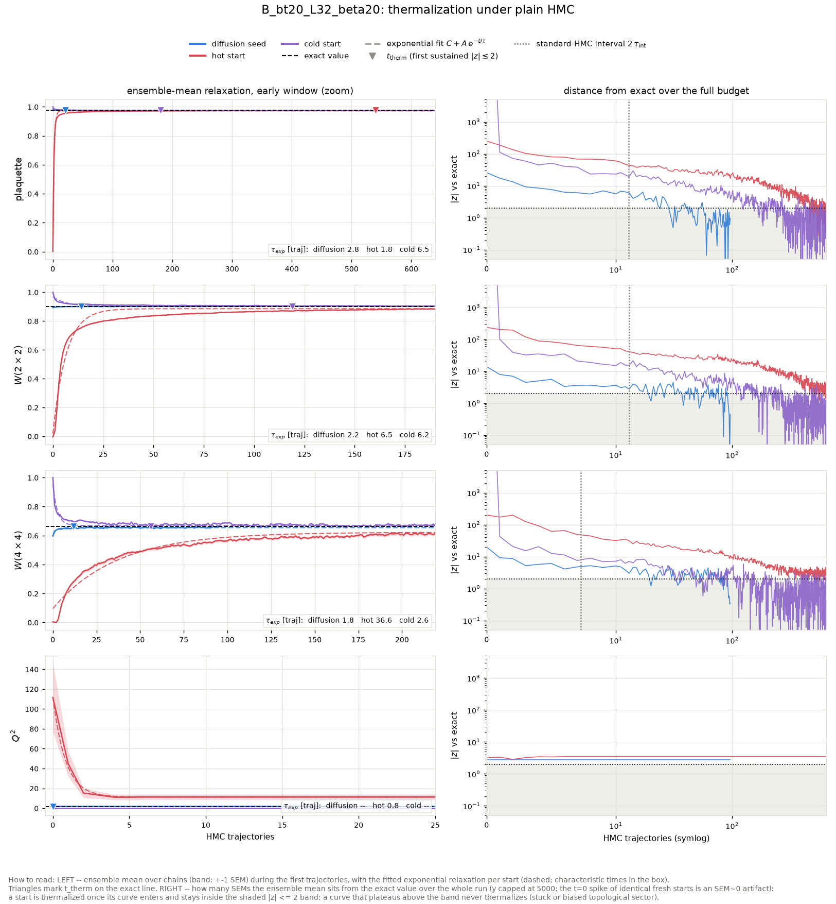

tau_int (hot-start chains, second half): plaquette = 6.44 +- 0.85, wilson_2x2 = 6.50 +- 0.84, wilson_4x4 = 3.64 +- 0.61, wilson_6x6 = 1.12 +- 0.10. Topology: hot-start HMC L=32 beta=20 -> **frozen** (no tunneling).

Where 'never' stood at the end: the hot start ended the 640-trajectory budget still at wilson_2x2 at |z| ~ 3, wilson_4x4 at |z| ~ 3, wilson_6x6 at |z| ~ 4, Q^2 at |z| ~ 3; the cold start ended the 640-trajectory budget still at Q^2 at |z| ~ 1331249283072.

### Diagnostics: raw diffusion output (before any HMC)

| observable | value | error | exact | z_exact | reference | ref_error | z_ref | ks_p | chi2_p |
|---|---|---|---|---|---|---|---|---|---|
| plaquette | 0.9782 | 0.0001502 | 0.9747 | 23.68 | 0.9748 | 8.14e-05 | 20.32 | 0 |  |
| wilson_1x1 | 0.9782 | 0.0001502 | 0.9747 | 23.68 | 0.9748 | 8.14e-05 | 20.32 | 0 |  |
| wilson_1x2 | 0.952 | 0.0003337 | 0.95 | 6.166 | 0.9497 | 0.000191 | 6.063 | 8.676e-11 |  |
| wilson_2x2 | 0.8924 | 0.0007028 | 0.9025 | -14.36 | 0.903 | 0.0004684 | -12.57 | 2.148e-25 |  |
| wilson_2x3 | 0.8364 | 0.001056 | 0.8573 | -19.78 | 0.8578 | 0.0007069 | -16.78 | 7.314e-33 |  |
| wilson_3x3 | 0.755 | 0.001638 | 0.7938 | -23.68 | 0.7956 | 0.00127 | -19.57 | 1.01e-42 |  |
| wilson_3x4 | 0.6826 | 0.002398 | 0.735 | -21.87 | 0.7366 | 0.001633 | -18.63 | 1.95e-39 |  |
| wilson_4x4 | 0.5968 | 0.003085 | 0.6633 | -21.56 | 0.6666 | 0.002284 | -18.19 | 7.247e-38 |  |
| wilson_4x5 | 0.5186 | 0.004169 | 0.5986 | -19.2 | 0.6016 | 0.002505 | -17.07 | 7.312e-35 |  |
| wilson_5x5 | 0.4367 | 0.004859 | 0.5266 | -18.5 | 0.5298 | 0.003021 | -16.27 | 9.351e-32 |  |
| wilson_5x6 | 0.3655 | 0.005673 | 0.4632 | -17.21 | 0.4655 | 0.00349 | -15.02 | 2.48e-28 |  |
| wilson_6x6 | 0.2987 | 0.006308 | 0.3971 | -15.6 | 0.4024 | 0.003842 | -14.04 | 6.337e-25 |  |
| wilson_6x7 | 0.2399 | 0.00679 | 0.3404 | -14.8 | 0.3449 | 0.004299 | -13.07 | 4.126e-20 |  |
| wilson_7x7 | 0.1896 | 0.006943 | 0.2845 | -13.66 | 0.2909 | 0.004652 | -12.12 | 4.377e-16 |  |
| wilson_7x8 | 0.1464 | 0.006975 | 0.2377 | -13.09 | 0.2444 | 0.005224 | -11.25 | 3.33e-15 |  |
| wilson_8x8 | 0.1157 | 0.006455 | 0.1936 | -12.07 | 0.2006 | 0.00572 | -9.842 | 5.814e-12 |  |
| wilson_8x10 | 0.06648 | 0.006534 | 0.1284 | -9.479 | 0.1368 | 0.006275 | -7.768 | 1.107e-09 |  |
| wilson_10x10 | 0.03412 | 0.006947 | 0.07687 | -6.155 | 0.08448 | 0.006918 | -5.137 | 7.158e-07 |  |
| wilson_10x12 | 0.01905 | 0.005575 | 0.04602 | -4.837 | 0.05252 | 0.006552 | -3.89 | 0.0002496 |  |
| wilson_12x12 | 0.008158 | 0.004656 | 0.02486 | -3.588 | 0.03101 | 0.006511 | -2.855 | 0.01474 |  |
| creutz_2 | 0.03759 | 0.0003741 | 0.02566 | 31.89 |  |  |  |  |  |
| creutz_3 | 0.03768 | 0.0008746 | 0.02566 | 13.75 |  |  |  |  |  |
| creutz_4 | 0.03342 | 0.001523 | 0.02566 | 5.098 |  |  |  |  |  |
| creutz_5 | 0.03143 | 0.002589 | 0.02566 | 2.23 |  |  |  |  |  |
| creutz_6 | 0.02404 | 0.004494 | 0.02566 | -0.3594 |  |  |  |  |  |
| creutz_7 | 0.01659 | 0.008018 | 0.02566 | -1.131 |  |  |  |  |  |
| creutz_8 | -0.02285 | 0.01456 | 0.02566 | -3.332 |  |  |  |  |  |
| Q | 0.07031 | 0.1218 | 0 | 0.5774 | 0.05208 | 0.08251 | 0.1239 | 0.7901 |  |
| Q^2 | 2.086 | 0.2321 | 1.331 | 3.252 | 1.094 | 0.09486 | 3.957 | 0.08971 |  |
| chi_top ((<Q^2>-<Q>^2)/V) | 0.002032 | 0.0002337 | 0.0013 | 3.133 | 0.001065 | 9.002e-05 | 3.86 | 2.296e-10 |  |
| Q histogram vs exact P(Q) | 6.283 | nan | 4 | nan |  |  |  |  | 0.179 |

### Diagnostics: the same configs after 96 HMC trajectories

| observable | value | error | exact | z_exact | reference | ref_error | z_ref | ks_p | chi2_p |
|---|---|---|---|---|---|---|---|---|---|
| plaquette | 0.9748 | 0.0001047 | 0.9747 | 0.9291 | 0.9748 | 8.14e-05 | 0.1009 | 0.5631 |  |
| wilson_1x1 | 0.9748 | 0.0001047 | 0.9747 | 0.9291 | 0.9748 | 8.14e-05 | 0.1009 | 0.5631 |  |
| wilson_1x2 | 0.95 | 0.0002503 | 0.95 | 0.2666 | 0.9497 | 0.000191 | 1.081 | 0.7163 |  |
| wilson_2x2 | 0.9022 | 0.0006089 | 0.9025 | -0.3994 | 0.903 | 0.0004684 | -1.005 | 0.4212 |  |
| wilson_2x3 | 0.8566 | 0.0009361 | 0.8573 | -0.7951 | 0.8578 | 0.0007069 | -1.012 | 0.08971 |  |
| wilson_3x3 | 0.7934 | 0.001621 | 0.7938 | -0.2673 | 0.7956 | 0.00127 | -1.07 | 0.4548 |  |
| wilson_3x4 | 0.7339 | 0.002119 | 0.735 | -0.5432 | 0.7366 | 0.001633 | -1.031 | 0.2763 |  |
| wilson_4x4 | 0.6624 | 0.002901 | 0.6633 | -0.3304 | 0.6666 | 0.002284 | -1.156 | 0.2087 |  |
| wilson_4x5 | 0.5965 | 0.00386 | 0.5986 | -0.5623 | 0.6016 | 0.002505 | -1.12 | 0.3021 |  |
| wilson_5x5 | 0.5241 | 0.004721 | 0.5266 | -0.5225 | 0.5298 | 0.003021 | -1.01 | 0.389 |  |
| wilson_5x6 | 0.4592 | 0.005757 | 0.4632 | -0.691 | 0.4655 | 0.00349 | -0.9391 | 0.3294 |  |
| wilson_6x6 | 0.3929 | 0.006104 | 0.3971 | -0.6813 | 0.4024 | 0.003842 | -1.311 | 0.2763 |  |
| wilson_6x7 | 0.335 | 0.006764 | 0.3404 | -0.8037 | 0.3449 | 0.004299 | -1.241 | 0.3021 |  |
| wilson_7x7 | 0.279 | 0.006461 | 0.2845 | -0.8527 | 0.2909 | 0.004652 | -1.498 | 0.2763 |  |
| wilson_7x8 | 0.2318 | 0.007285 | 0.2377 | -0.8165 | 0.2444 | 0.005224 | -1.414 | 0.4898 |  |
| wilson_8x8 | 0.1879 | 0.006972 | 0.1936 | -0.8235 | 0.2006 | 0.00572 | -1.413 | 0.6011 |  |
| wilson_8x10 | 0.1207 | 0.008129 | 0.1284 | -0.9434 | 0.1368 | 0.006275 | -1.568 | 0.1251 |  |
| wilson_10x10 | 0.07126 | 0.006797 | 0.07687 | -0.8267 | 0.08448 | 0.006918 | -1.363 | 0.3021 |  |
| wilson_10x12 | 0.03854 | 0.006435 | 0.04602 | -1.162 | 0.05252 | 0.006552 | -1.522 | 0.2297 |  |
| wilson_12x12 | 0.02273 | 0.006006 | 0.02486 | -0.3545 | 0.03101 | 0.006511 | -0.9342 | 0.9126 |  |
| creutz_2 | 0.02597 | 0.0003815 | 0.02566 | 0.8131 |  |  |  |  |  |
| creutz_3 | 0.02473 | 0.0007078 | 0.02566 | -1.301 |  |  |  |  |  |
| creutz_4 | 0.02451 | 0.001268 | 0.02566 | -0.9005 |  |  |  |  |  |
| creutz_5 | 0.02453 | 0.002161 | 0.02566 | -0.5198 |  |  |  |  |  |
| creutz_6 | 0.02363 | 0.00364 | 0.02566 | -0.5576 |  |  |  |  |  |
| creutz_7 | 0.02355 | 0.006076 | 0.02566 | -0.3471 |  |  |  |  |  |
| creutz_8 | 0.02463 | 0.009462 | 0.02566 | -0.1083 |  |  |  |  |  |
| Q | 0.07031 | 0.1218 | 0 | 0.5774 | 0.05208 | 0.08251 | 0.1239 | 0.7901 |  |
| Q^2 | 2.086 | 0.2321 | 1.331 | 3.252 | 1.094 | 0.09486 | 3.957 | 0.08971 |  |
| chi_top ((<Q^2>-<Q>^2)/V) | 0.002032 | 0.0002337 | 0.0013 | 3.133 | 0.001065 | 9.002e-05 | 3.86 | 2.296e-10 |  |
| Q histogram vs exact P(Q) | 6.283 | nan | 4 | nan |  |  |  |  | 0.179 |

## E_bc5.8_L32_beta21.5051

HMC: step size 0.0863, 12 leapfrog steps, acceptance seed/hot/cold = 0.983/0.983/0.983. Diffusion-seed batch: 128 chains x 96 trajectories (0.11 s/traj for the whole batch); baselines: 32 chains x 640 trajectories.

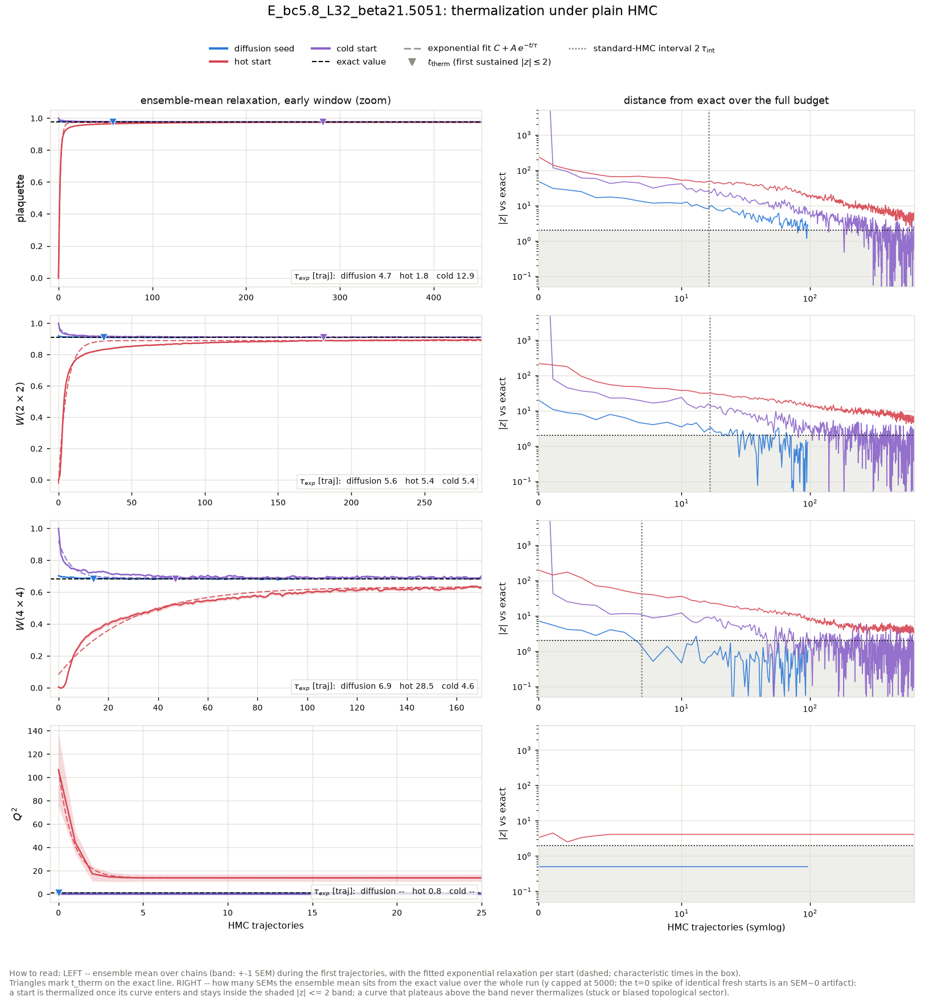

tau_int (hot-start chains, second half): plaquette = 8.15 +- 0.95, wilson_2x2 = 8.26 +- 1.21, wilson_4x4 = 3.59 +- 0.47, wilson_6x6 = 1.39 +- 0.18. Topology: hot-start HMC L=32 beta=21.5051 -> **frozen** (no tunneling).

Where 'never' stood at the end: the hot start ended the 640-trajectory budget still at plaquette at |z| ~ 5, wilson_2x2 at |z| ~ 6, wilson_4x4 at |z| ~ 4, wilson_6x6 at |z| ~ 5, Q^2 at |z| ~ 4; the cold start ended the 640-trajectory budget still at Q^2 at |z| ~ 1235714179072.

### Diagnostics: raw diffusion output (before any HMC)

| observable | value | error | exact | z_exact | reference | ref_error | z_ref | ks_p | chi2_p |
|---|---|---|---|---|---|---|---|---|---|
| plaquette | 0.9815 | 9.341e-05 | 0.9765 | 54.33 | 0.9764 | 6.579e-05 | 44.58 | 0 |  |
| wilson_1x1 | 0.9815 | 9.341e-05 | 0.9765 | 54.33 | 0.9764 | 6.579e-05 | 44.58 | 0 |  |
| wilson_1x2 | 0.9615 | 0.0002034 | 0.9535 | 39.65 | 0.9538 | 0.0001478 | 30.65 | 0 |  |
| wilson_2x2 | 0.92 | 0.0005343 | 0.9091 | 20.32 | 0.9104 | 0.000397 | 14.42 | 1.172e-22 |  |
| wilson_2x3 | 0.8796 | 0.0008805 | 0.8668 | 14.46 | 0.8687 | 0.0006653 | 9.872 | 5.814e-12 |  |
| wilson_3x3 | 0.8222 | 0.001567 | 0.8071 | 9.681 | 0.8091 | 0.000996 | 7.054 | 1.026e-05 |  |
| wilson_3x4 | 0.7683 | 0.002185 | 0.7514 | 7.742 | 0.7546 | 0.001418 | 5.274 | 0.001117 |  |
| wilson_4x4 | 0.7029 | 0.002884 | 0.6831 | 6.838 | 0.6869 | 0.00195 | 4.575 | 0.004349 |  |
| wilson_4x5 | 0.6415 | 0.003729 | 0.6211 | 5.48 | 0.6254 | 0.002521 | 3.572 | 0.01957 |  |
| wilson_5x5 | 0.5713 | 0.004462 | 0.5513 | 4.479 | 0.5569 | 0.003066 | 2.662 | 0.03831 |  |
| wilson_5x6 | 0.5087 | 0.005457 | 0.4895 | 3.525 | 0.496 | 0.003851 | 1.897 | 0.1122 |  |
| wilson_6x6 | 0.4429 | 0.0065 | 0.4243 | 2.858 | 0.4327 | 0.004392 | 1.295 | 0.6395 |  |
| wilson_6x7 | 0.3856 | 0.007333 | 0.3678 | 2.428 | 0.375 | 0.004974 | 1.191 | 0.4898 |  |
| wilson_7x7 | 0.3284 | 0.008154 | 0.3113 | 2.093 | 0.3184 | 0.005407 | 1.018 | 0.5259 |  |
| wilson_7x8 | 0.2801 | 0.008422 | 0.2635 | 1.966 | 0.2689 | 0.005633 | 1.103 | 0.6395 |  |
| wilson_8x8 | 0.2337 | 0.009099 | 0.2178 | 1.752 | 0.2203 | 0.006032 | 1.229 | 0.4548 |  |
| wilson_8x10 | 0.1628 | 0.00897 | 0.1488 | 1.565 | 0.1477 | 0.006198 | 1.391 | 0.5259 |  |
| wilson_10x10 | 0.1033 | 0.009085 | 0.09241 | 1.198 | 0.08779 | 0.006184 | 1.41 | 0.1892 |  |
| wilson_10x12 | 0.06331 | 0.008909 | 0.05739 | 0.6644 | 0.05374 | 0.006546 | 0.8658 | 0.6395 |  |
| wilson_12x12 | 0.03292 | 0.008512 | 0.03241 | 0.06049 | 0.03188 | 0.006324 | 0.09821 | 0.6395 |  |
| creutz_2 | 0.0236 | 0.0002801 | 0.02382 | -0.7579 |  |  |  |  |  |
| creutz_3 | 0.02249 | 0.0005882 | 0.02382 | -2.259 |  |  |  |  |  |
| creutz_4 | 0.02127 | 0.001015 | 0.02382 | -2.507 |  |  |  |  |  |
| creutz_5 | 0.02449 | 0.001806 | 0.02382 | 0.3727 |  |  |  |  |  |
| creutz_6 | 0.02245 | 0.002978 | 0.02382 | -0.457 |  |  |  |  |  |
| creutz_7 | 0.02215 | 0.004687 | 0.02382 | -0.3558 |  |  |  |  |  |
| creutz_8 | 0.0217 | 0.006763 | 0.02382 | -0.3134 |  |  |  |  |  |
| Q | 0.1641 | 0.09788 | 0 | 1.676 | -0.07812 | 0.07702 | 1.944 | 0.4212 |  |
| Q^2 | 1.164 | 0.116 | 1.236 | -0.6179 | 1.359 | 0.1492 | -1.033 | 1 |  |
| chi_top ((<Q^2>-<Q>^2)/V) | 0.00111 | 0.0001153 | 0.001207 | -0.8348 | 0.001322 | 0.000147 | -1.13 | 2.764e-09 |  |
| Q histogram vs exact P(Q) | 4.873 | nan | 4 | nan |  |  |  |  | 0.3006 |

### Diagnostics: the same configs after 96 HMC trajectories

| observable | value | error | exact | z_exact | reference | ref_error | z_ref | ks_p | chi2_p |
|---|---|---|---|---|---|---|---|---|---|
| plaquette | 0.9767 | 9.137e-05 | 0.9765 | 2.557 | 0.9764 | 6.579e-05 | 2.24 | 0.1545 |  |
| wilson_1x1 | 0.9767 | 9.137e-05 | 0.9765 | 2.557 | 0.9764 | 6.579e-05 | 2.24 | 0.1545 |  |
| wilson_1x2 | 0.9539 | 0.0002159 | 0.9535 | 1.927 | 0.9538 | 0.0001478 | 0.2234 | 0.8246 |  |
| wilson_2x2 | 0.9098 | 0.0004053 | 0.9091 | 1.597 | 0.9104 | 0.000397 | -1.081 | 0.2087 |  |
| wilson_2x3 | 0.8676 | 0.0006627 | 0.8668 | 1.178 | 0.8687 | 0.0006653 | -1.123 | 0.4548 |  |
| wilson_3x3 | 0.8086 | 0.001095 | 0.8071 | 1.394 | 0.8091 | 0.000996 | -0.3671 | 0.9693 |  |
| wilson_3x4 | 0.7534 | 0.001672 | 0.7514 | 1.191 | 0.7546 | 0.001418 | -0.5413 | 0.8246 |  |
| wilson_4x4 | 0.6864 | 0.002691 | 0.6831 | 1.192 | 0.6869 | 0.00195 | -0.1759 | 0.4898 |  |
| wilson_4x5 | 0.6245 | 0.003514 | 0.6211 | 0.9879 | 0.6254 | 0.002521 | -0.2039 | 0.6011 |  |
| wilson_5x5 | 0.5562 | 0.004747 | 0.5513 | 1.02 | 0.5569 | 0.003066 | -0.1295 | 0.4898 |  |
| wilson_5x6 | 0.4957 | 0.005592 | 0.4895 | 1.122 | 0.496 | 0.003851 | -0.04276 | 0.6011 |  |
| wilson_6x6 | 0.433 | 0.006554 | 0.4243 | 1.327 | 0.4327 | 0.004392 | 0.03585 | 0.5631 |  |
| wilson_6x7 | 0.3765 | 0.007367 | 0.3678 | 1.188 | 0.375 | 0.004974 | 0.1692 | 0.7163 |  |
| wilson_7x7 | 0.3195 | 0.008399 | 0.3113 | 0.9795 | 0.3184 | 0.005407 | 0.1119 | 0.9126 |  |
| wilson_7x8 | 0.2717 | 0.009139 | 0.2635 | 0.8929 | 0.2689 | 0.005633 | 0.2587 | 0.8569 |  |
| wilson_8x8 | 0.2255 | 0.009482 | 0.2178 | 0.8111 | 0.2203 | 0.006032 | 0.4596 | 0.9353 |  |
| wilson_8x10 | 0.1555 | 0.01051 | 0.1488 | 0.6426 | 0.1477 | 0.006198 | 0.6465 | 0.8864 |  |
| wilson_10x10 | 0.09684 | 0.01023 | 0.09241 | 0.4333 | 0.08779 | 0.006184 | 0.757 | 0.5631 |  |
| wilson_10x12 | 0.05812 | 0.01014 | 0.05739 | 0.07165 | 0.05374 | 0.006546 | 0.3628 | 0.7901 |  |
| wilson_12x12 | 0.03291 | 0.008245 | 0.03241 | 0.06132 | 0.03188 | 0.006324 | 0.09934 | 0.9941 |  |
| creutz_2 | 0.02374 | 0.000329 | 0.02382 | -0.2388 |  |  |  |  |  |
| creutz_3 | 0.02301 | 0.0007244 | 0.02382 | -1.106 |  |  |  |  |  |
| creutz_4 | 0.02253 | 0.001283 | 0.02382 | -0.9996 |  |  |  |  |  |
| creutz_5 | 0.02154 | 0.001946 | 0.02382 | -1.169 |  |  |  |  |  |
| creutz_6 | 0.02025 | 0.002853 | 0.02382 | -1.249 |  |  |  |  |  |
| creutz_7 | 0.02449 | 0.004565 | 0.02382 | 0.1485 |  |  |  |  |  |
| creutz_8 | 0.02402 | 0.007501 | 0.02382 | 0.02793 |  |  |  |  |  |
| Q | 0.1641 | 0.09788 | 0 | 1.676 | -0.07812 | 0.07702 | 1.944 | 0.4212 |  |
| Q^2 | 1.164 | 0.116 | 1.236 | -0.6179 | 1.359 | 0.1492 | -1.033 | 1 |  |
| chi_top ((<Q^2>-<Q>^2)/V) | 0.00111 | 0.0001153 | 0.001207 | -0.8348 | 0.001322 | 0.000147 | -1.13 | 2.764e-09 |  |
| Q histogram vs exact P(Q) | 4.873 | nan | 4 | nan |  |  |  |  | 0.3006 |

## A_bc6_L32_beta22.3151

HMC: step size 0.0847, 12 leapfrog steps, acceptance seed/hot/cold = 0.983/0.984/0.983. Diffusion-seed batch: 128 chains x 96 trajectories (0.22 s/traj for the whole batch); baselines: 32 chains x 640 trajectories.

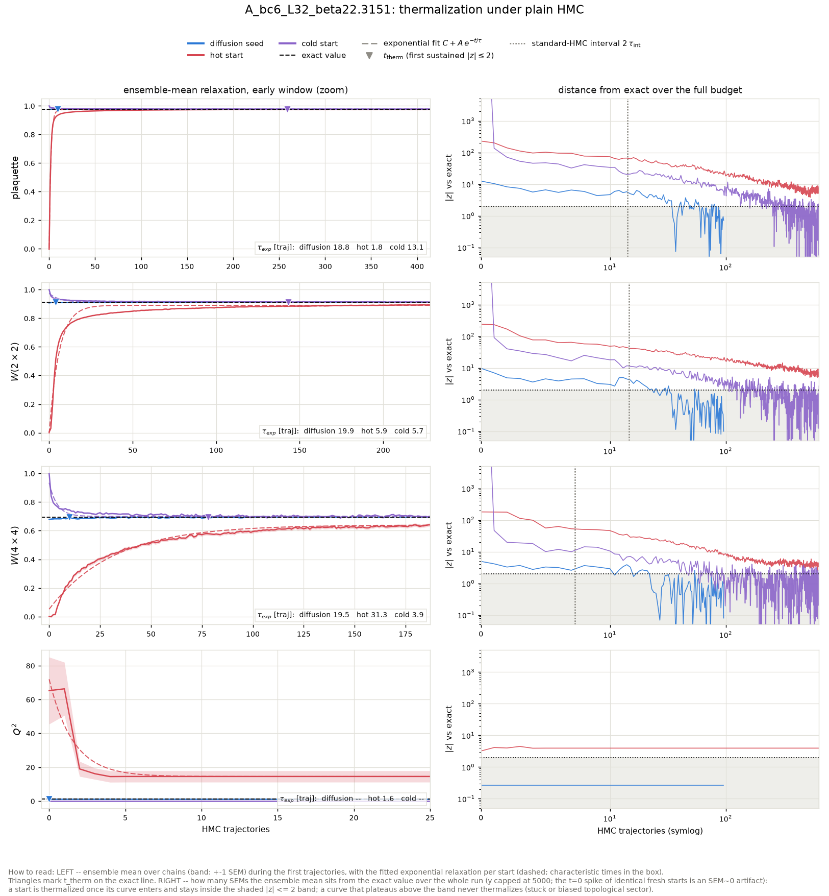

tau_int (hot-start chains, second half): plaquette = 7.13 +- 0.88, wilson_2x2 = 7.32 +- 0.91, wilson_4x4 = 3.64 +- 0.55, wilson_6x6 = 1.25 +- 0.13. Topology: hot-start HMC L=32 beta=22.3151 -> **frozen** (no tunneling).

Where 'never' stood at the end: the hot start ended the 640-trajectory budget still at plaquette at |z| ~ 6, wilson_2x2 at |z| ~ 6, wilson_4x4 at |z| ~ 4, wilson_6x6 at |z| ~ 5, Q^2 at |z| ~ 4; the cold start ended the 640-trajectory budget still at Q^2 at |z| ~ 1189769248768.

### Diagnostics: raw diffusion output (before any HMC)

| observable | value | error | exact | z_exact | reference | ref_error | z_ref | ks_p | chi2_p |
|---|---|---|---|---|---|---|---|---|---|
| plaquette | 0.9759 | 0.0001249 | 0.9773 | -11.32 | 0.9771 | 6.258e-05 | -8.749 | 2.885e-12 |  |
| wilson_1x1 | 0.9759 | 0.0001249 | 0.9773 | -11.32 | 0.9771 | 6.258e-05 | -8.749 | 2.885e-12 |  |
| wilson_1x2 | 0.9521 | 0.000273 | 0.9552 | -11.42 | 0.955 | 0.0001446 | -9.604 | 4.957e-15 |  |
| wilson_2x2 | 0.9072 | 0.0006283 | 0.9124 | -8.146 | 0.9118 | 0.0003964 | -6.081 | 3.783e-08 |  |
| wilson_2x3 | 0.8636 | 0.001047 | 0.8715 | -7.499 | 0.8705 | 0.0007065 | -5.436 | 7.158e-07 |  |
| wilson_3x3 | 0.8033 | 0.001793 | 0.8135 | -5.682 | 0.8119 | 0.001118 | -4.029 | 1.616e-05 |  |
| wilson_3x4 | 0.747 | 0.00249 | 0.7594 | -5 | 0.7581 | 0.001735 | -3.644 | 1.289e-05 |  |
| wilson_4x4 | 0.6787 | 0.003603 | 0.6929 | -3.942 | 0.691 | 0.002453 | -2.821 | 0.0003034 |  |
| wilson_4x5 | 0.6173 | 0.004349 | 0.6322 | -3.425 | 0.6302 | 0.003175 | -2.41 | 0.008145 |  |
| wilson_5x5 | 0.5496 | 0.005502 | 0.5637 | -2.554 | 0.5607 | 0.004057 | -1.612 | 0.03364 |  |
| wilson_5x6 | 0.49 | 0.006439 | 0.5026 | -1.963 | 0.4994 | 0.004712 | -1.175 | 0.1545 |  |
| wilson_6x6 | 0.4255 | 0.007661 | 0.438 | -1.637 | 0.4331 | 0.005531 | -0.8097 | 0.5259 |  |
| wilson_6x7 | 0.374 | 0.00871 | 0.3817 | -0.8824 | 0.3769 | 0.006189 | -0.2659 | 0.678 |  |
| wilson_7x7 | 0.3189 | 0.009722 | 0.3251 | -0.6405 | 0.3188 | 0.006756 | 0.007671 | 0.8569 |  |
| wilson_7x8 | 0.2744 | 0.01004 | 0.2769 | -0.248 | 0.2688 | 0.007177 | 0.4571 | 0.8246 |  |
| wilson_8x8 | 0.231 | 0.01022 | 0.2305 | 0.05195 | 0.2208 | 0.007311 | 0.8145 | 0.3584 |  |
| wilson_8x10 | 0.1666 | 0.009951 | 0.1597 | 0.6944 | 0.1482 | 0.007828 | 1.454 | 0.1251 |  |
| wilson_10x10 | 0.1137 | 0.008285 | 0.101 | 1.536 | 0.09444 | 0.007242 | 1.75 | 0.1545 |  |
| wilson_10x12 | 0.07575 | 0.007077 | 0.06382 | 1.685 | 0.05584 | 0.006246 | 2.11 | 0.0711 |  |
| wilson_12x12 | 0.0433 | 0.006409 | 0.03681 | 1.013 | 0.03103 | 0.005564 | 1.446 | 0.6011 |  |
| creutz_2 | 0.02347 | 0.0003362 | 0.02293 | 1.6 |  |  |  |  |  |
| creutz_3 | 0.02305 | 0.0007051 | 0.02293 | 0.1731 |  |  |  |  |  |
| creutz_4 | 0.02318 | 0.001223 | 0.02293 | 0.2075 |  |  |  |  |  |
| creutz_5 | 0.0212 | 0.001839 | 0.02293 | -0.9437 |  |  |  |  |  |
| creutz_6 | 0.02627 | 0.003012 | 0.02293 | 1.109 |  |  |  |  |  |
| creutz_7 | 0.03064 | 0.004605 | 0.02293 | 1.674 |  |  |  |  |  |
| creutz_8 | 0.0219 | 0.00686 | 0.02293 | -0.1495 |  |  |  |  |  |
| Q | -0.03906 | 0.08641 | 0 | -0.4521 | -0.03125 | 0.0707 | -0.06998 | 1 |  |
| Q^2 | 1.227 | 0.1851 | 1.19 | 0.1988 | 1.406 | 0.09558 | -0.8627 | 0.9126 |  |
| chi_top ((<Q^2>-<Q>^2)/V) | 0.001196 | 0.0001833 | 0.001162 | 0.1879 | 0.001372 | 9.313e-05 | -0.856 | 4.282e-07 |  |
| Q histogram vs exact P(Q) | 3.75 | nan | 4 | nan |  |  |  |  | 0.4409 |

### Diagnostics: the same configs after 96 HMC trajectories

| observable | value | error | exact | z_exact | reference | ref_error | z_ref | ks_p | chi2_p |
|---|---|---|---|---|---|---|---|---|---|
| plaquette | 0.9773 | 0.0001192 | 0.9773 | -0.5237 | 0.9771 | 6.258e-05 | 0.9586 | 0.2522 |  |
| wilson_1x1 | 0.9773 | 0.0001192 | 0.9773 | -0.5237 | 0.9771 | 6.258e-05 | 0.9586 | 0.2522 |  |
| wilson_1x2 | 0.9552 | 0.000212 | 0.9552 | -0.0721 | 0.955 | 0.0001446 | 0.5233 | 0.9126 |  |
| wilson_2x2 | 0.9124 | 0.0005102 | 0.9124 | 0.08739 | 0.9118 | 0.0003964 | 0.9985 | 0.2763 |  |
| wilson_2x3 | 0.8714 | 0.000823 | 0.8715 | -0.05617 | 0.8705 | 0.0007065 | 0.8666 | 0.6011 |  |
| wilson_3x3 | 0.8132 | 0.001376 | 0.8135 | -0.2227 | 0.8119 | 0.001118 | 0.7719 | 0.4898 |  |
| wilson_3x4 | 0.7596 | 0.001912 | 0.7594 | 0.07229 | 0.7581 | 0.001735 | 0.5914 | 0.5259 |  |
| wilson_4x4 | 0.6931 | 0.002472 | 0.6929 | 0.08449 | 0.691 | 0.002453 | 0.6065 | 0.6395 |  |
| wilson_4x5 | 0.6326 | 0.003386 | 0.6322 | 0.1221 | 0.6302 | 0.003175 | 0.5019 | 0.6011 |  |
| wilson_5x5 | 0.5633 | 0.004089 | 0.5637 | -0.08506 | 0.5607 | 0.004057 | 0.4655 | 0.4898 |  |
| wilson_5x6 | 0.5014 | 0.005044 | 0.5026 | -0.2375 | 0.4994 | 0.004712 | 0.3001 | 0.6011 |  |
| wilson_6x6 | 0.4368 | 0.006214 | 0.438 | -0.2033 | 0.4331 | 0.005531 | 0.4359 | 0.4548 |  |
| wilson_6x7 | 0.3802 | 0.006927 | 0.3817 | -0.2213 | 0.3769 | 0.006189 | 0.3566 | 0.678 |  |
| wilson_7x7 | 0.3231 | 0.007874 | 0.3251 | -0.2574 | 0.3188 | 0.006756 | 0.4136 | 0.5259 |  |
| wilson_7x8 | 0.2738 | 0.008642 | 0.2769 | -0.3558 | 0.2688 | 0.007177 | 0.4501 | 0.7163 |  |
| wilson_8x8 | 0.2265 | 0.008905 | 0.2305 | -0.4471 | 0.2208 | 0.007311 | 0.4965 | 0.6011 |  |
| wilson_8x10 | 0.1554 | 0.008692 | 0.1597 | -0.4962 | 0.1482 | 0.007828 | 0.6147 | 0.9126 |  |
| wilson_10x10 | 0.09754 | 0.007998 | 0.101 | -0.4277 | 0.09444 | 0.007242 | 0.2876 | 0.7901 |  |
| wilson_10x12 | 0.0575 | 0.007731 | 0.06382 | -0.8175 | 0.05584 | 0.006246 | 0.1677 | 0.7163 |  |
| wilson_12x12 | 0.03249 | 0.008051 | 0.03681 | -0.537 | 0.03103 | 0.005564 | 0.1494 | 0.7163 |  |
| creutz_2 | 0.02291 | 0.0003489 | 0.02293 | -0.04873 |  |  |  |  |  |
| creutz_3 | 0.02315 | 0.0006224 | 0.02293 | 0.3561 |  |  |  |  |  |
| creutz_4 | 0.02337 | 0.001155 | 0.02293 | 0.3804 |  |  |  |  |  |
| creutz_5 | 0.02455 | 0.001764 | 0.02293 | 0.9205 |  |  |  |  |  |
| creutz_6 | 0.02166 | 0.003215 | 0.02293 | -0.3939 |  |  |  |  |  |
| creutz_7 | 0.02403 | 0.004848 | 0.02293 | 0.226 |  |  |  |  |  |
| creutz_8 | 0.02428 | 0.007222 | 0.02293 | 0.1862 |  |  |  |  |  |
| Q | -0.03906 | 0.08641 | 0 | -0.4521 | -0.03125 | 0.0707 | -0.06998 | 1 |  |
| Q^2 | 1.227 | 0.1851 | 1.19 | 0.1988 | 1.406 | 0.09558 | -0.8627 | 0.9126 |  |
| chi_top ((<Q^2>-<Q>^2)/V) | 0.001196 | 0.0001833 | 0.001162 | 0.1879 | 0.001372 | 9.313e-05 | -0.856 | 4.282e-07 |  |
| Q histogram vs exact P(Q) | 3.75 | nan | 4 | nan |  |  |  |  | 0.4409 |

## B_bt30_L32_beta30

HMC: step size 0.0730, 14 leapfrog steps, acceptance seed/hot/cold = 0.980/0.984/0.982. Diffusion-seed batch: 128 chains x 96 trajectories (0.35 s/traj for the whole batch); baselines: 32 chains x 640 trajectories.

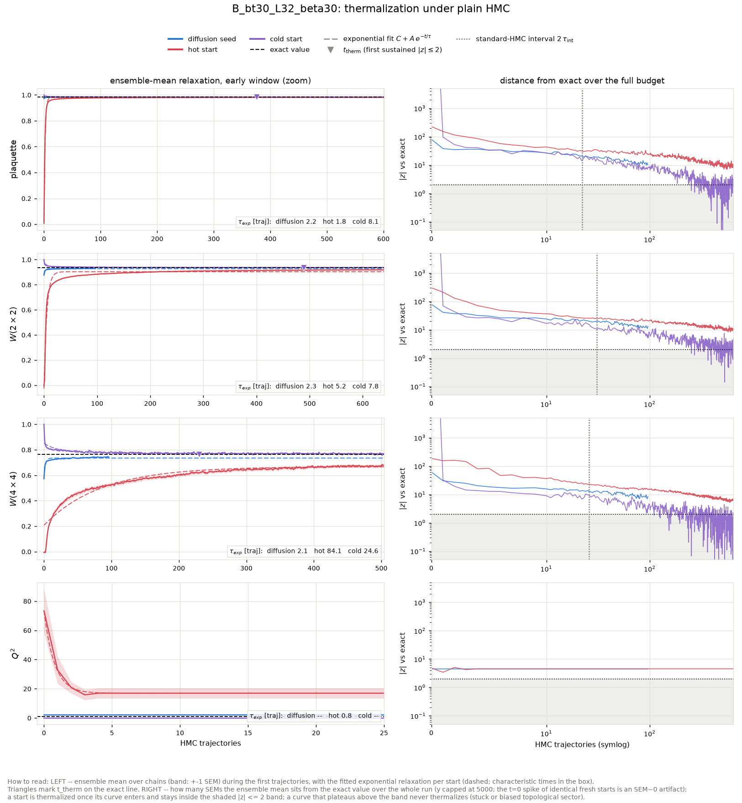

tau_int (hot-start chains, second half): plaquette = 11.05 +- 1.27, wilson_2x2 = 15.45 +- 1.91, wilson_4x4 = 12.91 +- 2.14, wilson_6x6 = 6.72 +- 1.56. Topology: hot-start HMC L=32 beta=30 -> **frozen** (no tunneling).

Where 'never' stood at the end: the hot start ended the 640-trajectory budget still at plaquette at |z| ~ 9, wilson_2x2 at |z| ~ 10, wilson_4x4 at |z| ~ 6, wilson_6x6 at |z| ~ 6, Q^2 at |z| ~ 5; the cold start ended the 640-trajectory budget still at Q^2 at |z| ~ 879566389248.

### Diagnostics: raw diffusion output (before any HMC)

| observable | value | error | exact | z_exact | reference | ref_error | z_ref | ks_p | chi2_p |
|---|---|---|---|---|---|---|---|---|---|
| plaquette | 0.9711 | 0.0001499 | 0.9832 | -80.37 | 0.9832 | 4.429e-05 | -77.09 | 0 |  |
| wilson_1x1 | 0.9711 | 0.0001499 | 0.9832 | -80.37 | 0.9832 | 4.429e-05 | -77.09 | 0 |  |
| wilson_1x2 | 0.94 | 0.0003483 | 0.9667 | -76.49 | 0.9666 | 6.606e-05 | -75.08 | 0 |  |
| wilson_2x2 | 0.876 | 0.0007379 | 0.9344 | -79.13 | 0.9348 | 0.0002129 | -76.46 | 0 |  |
| wilson_2x3 | 0.8168 | 0.001091 | 0.9033 | -79.27 | 0.9035 | 0.0003364 | -75.98 | 0 |  |
| wilson_3x3 | 0.7337 | 0.001371 | 0.8585 | -91.03 | 0.8591 | 0.0005646 | -84.56 | 0 |  |
| wilson_3x4 | 0.6588 | 0.001896 | 0.8159 | -82.88 | 0.8166 | 0.0007475 | -77.45 | 0 |  |
| wilson_4x4 | 0.5718 | 0.002336 | 0.7624 | -81.61 | 0.7622 | 0.001219 | -72.26 | 0 |  |
| wilson_4x5 | 0.4938 | 0.003054 | 0.7124 | -71.6 | 0.7127 | 0.001629 | -63.25 | 0 |  |
| wilson_5x5 | 0.4122 | 0.003959 | 0.6545 | -61.22 | 0.6541 | 0.002379 | -52.37 | 0 |  |
| wilson_5x6 | 0.3423 | 0.004838 | 0.6013 | -53.54 | 0.6017 | 0.003102 | -45.13 | 0 |  |
| wilson_6x6 | 0.278 | 0.005846 | 0.5432 | -45.35 | 0.5439 | 0.004105 | -37.21 | 0 |  |
| wilson_6x7 | 0.2217 | 0.006324 | 0.4906 | -42.53 | 0.4925 | 0.005049 | -33.46 | 0 |  |
| wilson_7x7 | 0.1745 | 0.006503 | 0.4357 | -40.17 | 0.4375 | 0.005923 | -29.9 | 0 |  |
| wilson_7x8 | 0.1346 | 0.00679 | 0.387 | -37.17 | 0.389 | 0.006759 | -26.55 | 0 |  |
| wilson_8x8 | 0.1043 | 0.006667 | 0.3379 | -35.05 | 0.3393 | 0.007721 | -23.05 | 0 |  |
| wilson_8x10 | 0.05528 | 0.006833 | 0.2576 | -29.61 | 0.2582 | 0.00899 | -17.97 | 2.102e-43 |  |
| wilson_10x10 | 0.0232 | 0.006806 | 0.1835 | -23.56 | 0.1851 | 0.01083 | -12.65 | 2.779e-34 |  |
| wilson_10x12 | 0.008111 | 0.006252 | 0.1308 | -19.62 | 0.1289 | 0.01086 | -9.635 | 3.135e-24 |  |
| wilson_12x12 | 0.0009578 | 0.004916 | 0.08705 | -17.51 | 0.08874 | 0.01112 | -7.22 | 8.226e-17 |  |
| creutz_2 | 0.03791 | 0.0003937 | 0.01695 | 53.23 |  |  |  |  |  |
| creutz_3 | 0.03722 | 0.0008366 | 0.01695 | 24.22 |  |  |  |  |  |
| creutz_4 | 0.03384 | 0.001834 | 0.01695 | 9.206 |  |  |  |  |  |
| creutz_5 | 0.03404 | 0.003066 | 0.01695 | 5.572 |  |  |  |  |  |
| creutz_6 | 0.02233 | 0.005165 | 0.01695 | 1.042 |  |  |  |  |  |
| creutz_7 | 0.0129 | 0.009409 | 0.01695 | -0.4304 |  |  |  |  |  |
| creutz_8 | -0.003855 | 0.01627 | 0.01695 | -1.279 |  |  |  |  |  |
| Q | 0.07031 | 0.1218 | 0 | 0.5774 | -0.02083 | 0.08014 | 0.6252 | 0.389 |  |
| Q^2 | 2.086 | 0.2321 | 0.8796 | 5.198 | 1.01 | 0.09824 | 4.267 | 0.02577 |  |
| chi_top ((<Q^2>-<Q>^2)/V) | 0.002032 | 0.0002337 | 0.000859 | 5.021 | 0.0009863 | 9.671e-05 | 4.136 | 1.203e-10 |  |
| Q histogram vs exact P(Q) | 32.54 | nan | 4 | nan |  |  |  |  | 1.481e-06 |

### Diagnostics: the same configs after 96 HMC trajectories

| observable | value | error | exact | z_exact | reference | ref_error | z_ref | ks_p | chi2_p |
|---|---|---|---|---|---|---|---|---|---|
| plaquette | 0.9824 | 6.155e-05 | 0.9832 | -12.04 | 0.9832 | 4.429e-05 | -9.791 | 2.885e-12 |  |
| wilson_1x1 | 0.9824 | 6.155e-05 | 0.9832 | -12.04 | 0.9832 | 4.429e-05 | -9.791 | 2.885e-12 |  |
| wilson_1x2 | 0.9648 | 0.0001453 | 0.9667 | -13.03 | 0.9666 | 6.606e-05 | -11.72 | 9.899e-13 |  |
| wilson_2x2 | 0.9291 | 0.000459 | 0.9344 | -11.61 | 0.9348 | 0.0002129 | -11.19 | 2.653e-19 |  |
| wilson_2x3 | 0.895 | 0.0007153 | 0.9033 | -11.56 | 0.9035 | 0.0003364 | -10.79 | 4.79e-13 |  |
| wilson_3x3 | 0.8464 | 0.001292 | 0.8585 | -9.368 | 0.8591 | 0.0005646 | -8.988 | 3.16e-10 |  |
| wilson_3x4 | 0.8002 | 0.001828 | 0.8159 | -8.591 | 0.8166 | 0.0007475 | -8.307 | 5.943e-10 |  |
| wilson_4x4 | 0.7424 | 0.002456 | 0.7624 | -8.169 | 0.7622 | 0.001219 | -7.237 | 1.211e-08 |  |
| wilson_4x5 | 0.688 | 0.003185 | 0.7124 | -7.671 | 0.7127 | 0.001629 | -6.906 | 1.138e-07 |  |
| wilson_5x5 | 0.6256 | 0.003838 | 0.6545 | -7.53 | 0.6541 | 0.002379 | -6.296 | 2.484e-06 |  |
| wilson_5x6 | 0.5678 | 0.004813 | 0.6013 | -6.961 | 0.6017 | 0.003102 | -5.916 | 9.223e-07 |  |
| wilson_6x6 | 0.5048 | 0.005636 | 0.5432 | -6.811 | 0.5439 | 0.004105 | -5.605 | 2.538e-07 |  |
| wilson_6x7 | 0.4461 | 0.006599 | 0.4906 | -6.743 | 0.4925 | 0.005049 | -5.578 | 5.1e-06 |  |
| wilson_7x7 | 0.3861 | 0.007715 | 0.4357 | -6.434 | 0.4375 | 0.005923 | -5.284 | 3.165e-06 |  |
| wilson_7x8 | 0.3342 | 0.00825 | 0.387 | -6.392 | 0.389 | 0.006759 | -5.136 | 5.1e-06 |  |
| wilson_8x8 | 0.2825 | 0.00906 | 0.3379 | -6.11 | 0.3393 | 0.007721 | -4.772 | 1.289e-05 |  |
| wilson_8x10 | 0.2078 | 0.01002 | 0.2576 | -4.972 | 0.2582 | 0.00899 | -3.742 | 0.0004451 |  |
| wilson_10x10 | 0.138 | 0.01112 | 0.1835 | -4.096 | 0.1851 | 0.01083 | -3.032 | 0.0006474 |  |
| wilson_10x12 | 0.0845 | 0.01169 | 0.1308 | -3.957 | 0.1289 | 0.01086 | -2.78 | 0.003137 |  |
| wilson_12x12 | 0.04457 | 0.0116 | 0.08705 | -3.662 | 0.08874 | 0.01112 | -2.749 | 0.003137 |  |
| creutz_2 | 0.0195 | 0.000251 | 0.01695 | 10.16 |  |  |  |  |  |
| creutz_3 | 0.01848 | 0.0005702 | 0.01695 | 2.671 |  |  |  |  |  |
| creutz_4 | 0.01894 | 0.0008931 | 0.01695 | 2.228 |  |  |  |  |  |
| creutz_5 | 0.01899 | 0.001555 | 0.01695 | 1.31 |  |  |  |  |  |
| creutz_6 | 0.02075 | 0.002329 | 0.01695 | 1.629 |  |  |  |  |  |
| creutz_7 | 0.02104 | 0.003667 | 0.01695 | 1.115 |  |  |  |  |  |
| creutz_8 | 0.02381 | 0.005705 | 0.01695 | 1.203 |  |  |  |  |  |
| Q | 0.07031 | 0.1218 | 0 | 0.5774 | -0.02083 | 0.08014 | 0.6252 | 0.389 |  |
| Q^2 | 2.086 | 0.2321 | 0.8796 | 5.198 | 1.01 | 0.09824 | 4.267 | 0.02577 |  |
| chi_top ((<Q^2>-<Q>^2)/V) | 0.002032 | 0.0002337 | 0.000859 | 5.021 | 0.0009863 | 9.671e-05 | 4.136 | 1.203e-10 |  |
| Q histogram vs exact P(Q) | 32.54 | nan | 4 | nan |  |  |  |  | 1.481e-06 |

## A_bc8_L32_beta30.3772

HMC: step size 0.0726, 14 leapfrog steps, acceptance seed/hot/cold = 0.980/0.982/0.982. Diffusion-seed batch: 128 chains x 96 trajectories (0.25 s/traj for the whole batch); baselines: 32 chains x 640 trajectories.

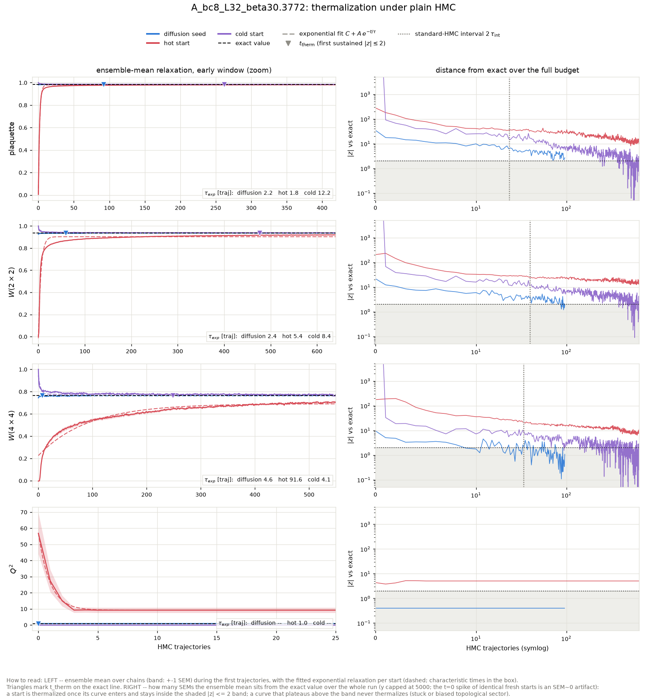

tau_int (hot-start chains, second half): plaquette = 11.62 +- 1.52, wilson_2x2 = 19.70 +- 1.79, wilson_4x4 = 16.86 +- 1.94, wilson_6x6 = 10.44 +- 1.51. Topology: hot-start HMC L=32 beta=30.3772 -> **frozen** (no tunneling).

Where 'never' stood at the end: the hot start ended the 640-trajectory budget still at plaquette at |z| ~ 12, wilson_2x2 at |z| ~ 15, wilson_4x4 at |z| ~ 9, wilson_6x6 at |z| ~ 6, Q^2 at |z| ~ 5; the cold start ended the 640-trajectory budget still at Q^2 at |z| ~ 868455153664.

### Diagnostics: raw diffusion output (before any HMC)

| observable | value | error | exact | z_exact | reference | ref_error | z_ref | ks_p | chi2_p |
|---|---|---|---|---|---|---|---|---|---|
| plaquette | 0.9798 | 0.0001051 | 0.9834 | -34.54 | 0.9835 | 3.853e-05 | -33.2 | 0 |  |
| wilson_1x1 | 0.9798 | 0.0001051 | 0.9834 | -34.54 | 0.9835 | 3.853e-05 | -33.2 | 0 |  |
| wilson_1x2 | 0.9604 | 0.0002395 | 0.9671 | -28 | 0.9671 | 8.105e-05 | -26.82 | 0 |  |
| wilson_2x2 | 0.9251 | 0.0004094 | 0.9352 | -24.85 | 0.9353 | 0.0002202 | -22.04 | 9.992e-41 |  |
| wilson_2x3 | 0.8915 | 0.0006934 | 0.9044 | -18.67 | 0.9048 | 0.0004599 | -15.98 | 7.917e-28 |  |
| wilson_3x3 | 0.8439 | 0.001186 | 0.8601 | -13.7 | 0.8605 | 0.0008424 | -11.4 | 4.195e-19 |  |
| wilson_3x4 | 0.7991 | 0.00176 | 0.818 | -10.73 | 0.8186 | 0.001269 | -8.956 | 1.088e-13 |  |
| wilson_4x4 | 0.7439 | 0.002233 | 0.765 | -9.474 | 0.7641 | 0.001745 | -7.131 | 6.754e-09 |  |
| wilson_4x5 | 0.6917 | 0.002926 | 0.7155 | -8.145 | 0.7147 | 0.002358 | -6.131 | 3.783e-08 |  |
| wilson_5x5 | 0.6332 | 0.003481 | 0.658 | -7.14 | 0.6563 | 0.003075 | -4.971 | 3.906e-05 |  |
| wilson_5x6 | 0.5776 | 0.004421 | 0.6052 | -6.235 | 0.6044 | 0.00378 | -4.607 | 3.165e-06 |  |
| wilson_6x6 | 0.5192 | 0.005259 | 0.5474 | -5.354 | 0.5473 | 0.004598 | -4.026 | 8.145e-06 |  |
| wilson_6x7 | 0.4656 | 0.006411 | 0.4951 | -4.6 | 0.4965 | 0.00528 | -3.727 | 9.107e-05 |  |
| wilson_7x7 | 0.4111 | 0.007246 | 0.4403 | -4.028 | 0.4426 | 0.005861 | -3.371 | 0.0009335 |  |
| wilson_7x8 | 0.363 | 0.008339 | 0.3916 | -3.43 | 0.3943 | 0.006478 | -2.965 | 0.0003679 |  |
| wilson_8x8 | 0.3155 | 0.008986 | 0.3426 | -3.012 | 0.3462 | 0.0068 | -2.729 | 0.006985 |  |
| wilson_8x10 | 0.2351 | 0.01044 | 0.2621 | -2.582 | 0.2663 | 0.007529 | -2.421 | 0.02248 |  |
| wilson_10x10 | 0.1606 | 0.01145 | 0.1875 | -2.353 | 0.1914 | 0.008157 | -2.193 | 0.04354 |  |
| wilson_10x12 | 0.1074 | 0.01075 | 0.1342 | -2.486 | 0.1381 | 0.008185 | -2.27 | 0.05588 |  |
| wilson_12x12 | 0.06726 | 0.009848 | 0.08978 | -2.286 | 0.09448 | 0.009064 | -2.034 | 0.0631 |  |
| creutz_2 | 0.01746 | 0.0002607 | 0.01674 | 2.746 |  |  |  |  |  |
| creutz_3 | 0.01791 | 0.0005556 | 0.01674 | 2.115 |  |  |  |  |  |
| creutz_4 | 0.01713 | 0.0009454 | 0.01674 | 0.4091 |  |  |  |  |  |
| creutz_5 | 0.01553 | 0.00144 | 0.01674 | -0.8389 |  |  |  |  |  |
| creutz_6 | 0.01482 | 0.002119 | 0.01674 | -0.9045 |  |  |  |  |  |
| creutz_7 | 0.0153 | 0.003042 | 0.01674 | -0.4734 |  |  |  |  |  |
| creutz_8 | 0.01594 | 0.003878 | 0.01674 | -0.2053 |  |  |  |  |  |
| Q | 0.1797 | 0.07053 | 0 | 2.548 | 0.09375 | 0.05933 | 0.9324 | 0.9999 |  |
| Q^2 | 0.9141 | 0.1354 | 0.8685 | 0.3369 | 0.8333 | 0.08983 | 0.4969 | 0.9999 |  |
| chi_top ((<Q^2>-<Q>^2)/V) | 0.0008611 | 0.000129 | 0.0008481 | 0.1009 | 0.0008052 | 8.936e-05 | 0.3562 | 5.105e-14 |  |
| Q histogram vs exact P(Q) | 5.306 | nan | 4 | nan |  |  |  |  | 0.2573 |

### Diagnostics: the same configs after 96 HMC trajectories

| observable | value | error | exact | z_exact | reference | ref_error | z_ref | ks_p | chi2_p |
|---|---|---|---|---|---|---|---|---|---|
| plaquette | 0.9832 | 6.256e-05 | 0.9834 | -3.035 | 0.9835 | 3.853e-05 | -3.764 | 0.002655 |  |
| wilson_1x1 | 0.9832 | 6.256e-05 | 0.9834 | -3.035 | 0.9835 | 3.853e-05 | -3.764 | 0.002655 |  |
| wilson_1x2 | 0.9666 | 0.0001731 | 0.9671 | -2.537 | 0.9671 | 8.105e-05 | -2.682 | 0.005977 |  |
| wilson_2x2 | 0.9345 | 0.0003272 | 0.9352 | -2.182 | 0.9353 | 0.0002202 | -1.992 | 0.2297 |  |
| wilson_2x3 | 0.9033 | 0.0005957 | 0.9044 | -1.858 | 0.9048 | 0.0004599 | -1.938 | 0.2522 |  |
| wilson_3x3 | 0.8587 | 0.00096 | 0.8601 | -1.533 | 0.8605 | 0.0008424 | -1.417 | 0.3294 |  |
| wilson_3x4 | 0.816 | 0.001235 | 0.818 | -1.656 | 0.8186 | 0.001269 | -1.463 | 0.5259 |  |
| wilson_4x4 | 0.7624 | 0.002034 | 0.765 | -1.309 | 0.7641 | 0.001745 | -0.6406 | 0.6395 |  |
| wilson_4x5 | 0.7124 | 0.002571 | 0.7155 | -1.186 | 0.7147 | 0.002358 | -0.646 | 0.7901 |  |
| wilson_5x5 | 0.6545 | 0.003584 | 0.658 | -0.9987 | 0.6563 | 0.003075 | -0.3848 | 0.8569 |  |
| wilson_5x6 | 0.6006 | 0.004321 | 0.6052 | -1.059 | 0.6044 | 0.00378 | -0.6635 | 0.8246 |  |
| wilson_6x6 | 0.541 | 0.005793 | 0.5474 | -1.103 | 0.5473 | 0.004598 | -0.8596 | 0.5631 |  |
| wilson_6x7 | 0.4864 | 0.006776 | 0.4951 | -1.286 | 0.4965 | 0.00528 | -1.184 | 0.1251 |  |
| wilson_7x7 | 0.4297 | 0.008038 | 0.4403 | -1.328 | 0.4426 | 0.005861 | -1.297 | 0.2763 |  |
| wilson_7x8 | 0.3789 | 0.008998 | 0.3916 | -1.412 | 0.3943 | 0.006478 | -1.39 | 0.2297 |  |
| wilson_8x8 | 0.3275 | 0.01002 | 0.3426 | -1.508 | 0.3462 | 0.0068 | -1.552 | 0.08971 |  |
| wilson_8x10 | 0.2457 | 0.01173 | 0.2621 | -1.399 | 0.2663 | 0.007529 | -1.479 | 0.1545 |  |
| wilson_10x10 | 0.1718 | 0.01154 | 0.1875 | -1.358 | 0.1914 | 0.008157 | -1.384 | 0.1712 |  |
| wilson_10x12 | 0.1176 | 0.01184 | 0.1342 | -1.401 | 0.1381 | 0.008185 | -1.427 | 0.07995 |  |
| wilson_12x12 | 0.07698 | 0.01149 | 0.08978 | -1.114 | 0.09448 | 0.009064 | -1.196 | 0.04938 |  |
| creutz_2 | 0.01679 | 0.0002464 | 0.01674 | 0.1969 |  |  |  |  |  |
| creutz_3 | 0.01677 | 0.0004894 | 0.01674 | 0.05586 |  |  |  |  |  |
| creutz_4 | 0.01693 | 0.0008919 | 0.01674 | 0.2141 |  |  |  |  |  |
| creutz_5 | 0.01714 | 0.00131 | 0.01674 | 0.3052 |  |  |  |  |  |
| creutz_6 | 0.01875 | 0.002025 | 0.01674 | 0.9945 |  |  |  |  |  |
| creutz_7 | 0.0175 | 0.002941 | 0.01674 | 0.2596 |  |  |  |  |  |
| creutz_8 | 0.02039 | 0.004206 | 0.01674 | 0.867 |  |  |  |  |  |
| Q | 0.1797 | 0.07053 | 0 | 2.548 | 0.09375 | 0.05933 | 0.9324 | 0.9999 |  |
| Q^2 | 0.9141 | 0.1354 | 0.8685 | 0.3369 | 0.8333 | 0.08983 | 0.4969 | 0.9999 |  |
| chi_top ((<Q^2>-<Q>^2)/V) | 0.0008611 | 0.000129 | 0.0008481 | 0.1009 | 0.0008052 | 8.936e-05 | 0.3562 | 5.105e-14 |  |
| Q histogram vs exact P(Q) | 5.306 | nan | 4 | nan |  |  |  |  | 0.2573 |

## E_bc9_L32_beta34.3944

HMC: step size 0.0682, 15 leapfrog steps, acceptance seed/hot/cold = 0.979/0.979/0.979. Diffusion-seed batch: 128 chains x 96 trajectories (0.12 s/traj for the whole batch); baselines: 32 chains x 640 trajectories.

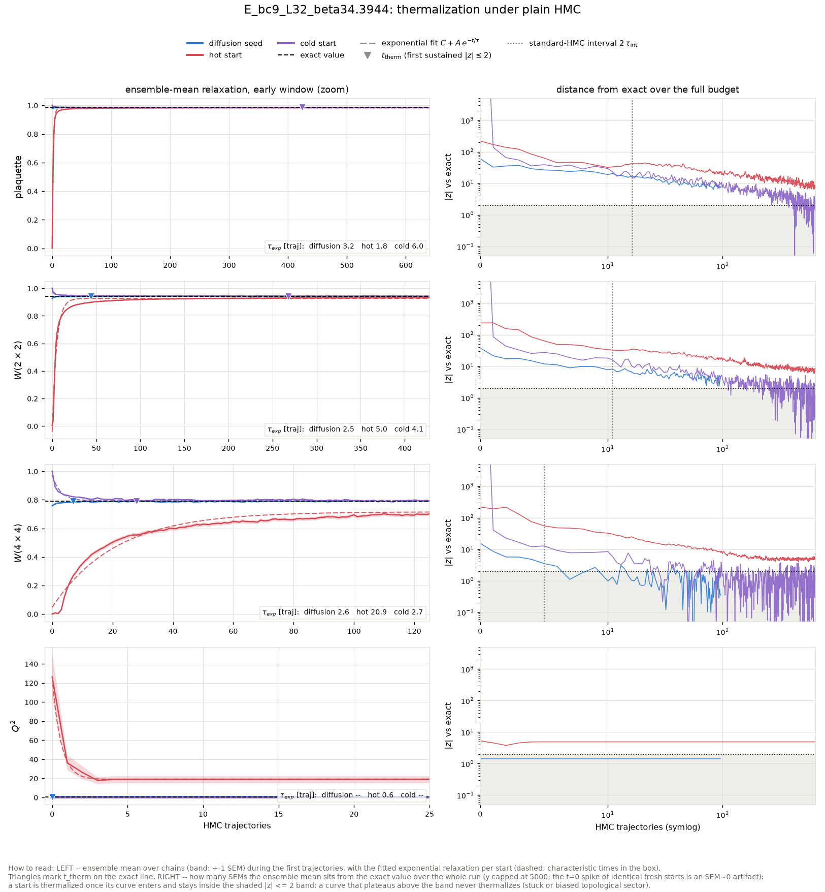

tau_int (hot-start chains, second half): plaquette = 8.15 +- 1.11, wilson_2x2 = 5.45 +- 0.95, wilson_4x4 = 2.50 +- 0.23, wilson_6x6 = 1.39 +- 0.13. Topology: hot-start HMC L=32 beta=34.3944 -> **frozen** (no tunneling).

Where 'never' stood at the end: the hot start ended the 640-trajectory budget still at plaquette at |z| ~ 8, wilson_2x2 at |z| ~ 7, wilson_4x4 at |z| ~ 5, wilson_6x6 at |z| ~ 5, Q^2 at |z| ~ 5; the cold start ended the 640-trajectory budget still at Q^2 at |z| ~ 765454843904.

### Diagnostics: raw diffusion output (before any HMC)

| observable | value | error | exact | z_exact | reference | ref_error | z_ref | ks_p | chi2_p |
|---|---|---|---|---|---|---|---|---|---|
| plaquette | 0.9784 | 0.0001023 | 0.9854 | -68.15 | 0.9854 | 4.157e-05 | -63.64 | 0 |  |
| wilson_1x1 | 0.9784 | 0.0001023 | 0.9854 | -68.15 | 0.9854 | 4.157e-05 | -63.64 | 0 |  |
| wilson_1x2 | 0.9587 | 0.0002205 | 0.9709 | -55.28 | 0.9709 | 0.0001128 | -48.99 | 0 |  |
| wilson_2x2 | 0.9257 | 0.0004596 | 0.9427 | -37.01 | 0.9427 | 0.000268 | -31.99 | 0 |  |
| wilson_2x3 | 0.894 | 0.0008025 | 0.9153 | -26.55 | 0.915 | 0.0004932 | -22.33 | 0 |  |
| wilson_3x3 | 0.8499 | 0.001184 | 0.8756 | -21.74 | 0.8753 | 0.0009217 | -16.95 | 1.729e-38 |  |
| wilson_3x4 | 0.8088 | 0.001578 | 0.8377 | -18.34 | 0.8371 | 0.001317 | -13.79 | 3.696e-25 |  |
| wilson_4x4 | 0.7584 | 0.002199 | 0.7897 | -14.27 | 0.7889 | 0.001997 | -10.3 | 3.972e-18 |  |
| wilson_4x5 | 0.7086 | 0.00259 | 0.7445 | -13.84 | 0.7439 | 0.002631 | -9.562 | 4.957e-15 |  |
| wilson_5x5 | 0.6526 | 0.003102 | 0.6915 | -12.56 | 0.6906 | 0.003311 | -8.39 | 2.025e-12 |  |
| wilson_5x6 | 0.5998 | 0.003782 | 0.6423 | -11.25 | 0.6419 | 0.00392 | -7.733 | 6.242e-11 |  |
| wilson_6x6 | 0.5433 | 0.004368 | 0.5879 | -10.22 | 0.588 | 0.004361 | -7.242 | 1.664e-10 |  |
| wilson_6x7 | 0.4914 | 0.00533 | 0.5381 | -8.766 | 0.5393 | 0.004877 | -6.632 | 8.674e-08 |  |
| wilson_7x7 | 0.4361 | 0.005967 | 0.4853 | -8.246 | 0.4868 | 0.005291 | -6.355 | 7.158e-07 |  |
| wilson_7x8 | 0.3891 | 0.006728 | 0.4377 | -7.223 | 0.4395 | 0.005667 | -5.735 | 1.026e-05 |  |
| wilson_8x8 | 0.3395 | 0.007069 | 0.389 | -6.995 | 0.3904 | 0.006133 | -5.442 | 0.0001679 |  |
| wilson_8x10 | 0.258 | 0.007491 | 0.3072 | -6.56 | 0.3118 | 0.006791 | -5.314 | 2.524e-05 |  |
| wilson_10x10 | 0.1811 | 0.007074 | 0.2287 | -6.721 | 0.2329 | 0.007379 | -5.062 | 0.001334 |  |
| wilson_10x12 | 0.1284 | 0.007211 | 0.1702 | -5.801 | 0.1751 | 0.007361 | -4.527 | 0.009477 |  |
| wilson_12x12 | 0.08355 | 0.006535 | 0.1195 | -5.498 | 0.1211 | 0.007773 | -3.698 | 0.003137 |  |
| creutz_2 | 0.01479 | 0.0002764 | 0.01475 | 0.141 |  |  |  |  |  |
| creutz_3 | 0.01569 | 0.0005821 | 0.01475 | 1.613 |  |  |  |  |  |
| creutz_4 | 0.01483 | 0.0009077 | 0.01475 | 0.08501 |  |  |  |  |  |
| creutz_5 | 0.01457 | 0.00126 | 0.01475 | -0.1491 |  |  |  |  |  |
| creutz_6 | 0.0147 | 0.001942 | 0.01475 | -0.02581 |  |  |  |  |  |
| creutz_7 | 0.01896 | 0.002963 | 0.01475 | 1.42 |  |  |  |  |  |
| creutz_8 | 0.02223 | 0.003807 | 0.01475 | 1.964 |  |  |  |  |  |
| Q | 0.0625 | 0.09824 | 0 | 0.6362 | 0.125 | 0.05224 | -0.5617 | 0.9693 |  |
| Q^2 | 0.9375 | 0.1095 | 0.7655 | 1.571 | 0.6562 | 0.05961 | 2.256 | 0.9126 |  |
| chi_top ((<Q^2>-<Q>^2)/V) | 0.0009117 | 0.0001071 | 0.0007475 | 1.533 | 0.0006256 | 5.583e-05 | 2.368 | 3.32e-13 |  |
| Q histogram vs exact P(Q) | 4.028 | nan | 4 | nan |  |  |  |  | 0.4022 |

### Diagnostics: the same configs after 96 HMC trajectories

| observable | value | error | exact | z_exact | reference | ref_error | z_ref | ks_p | chi2_p |
|---|---|---|---|---|---|---|---|---|---|
| plaquette | 0.9849 | 4.772e-05 | 0.9854 | -9.259 | 0.9854 | 4.157e-05 | -7.848 | 2.538e-07 |  |
| wilson_1x1 | 0.9849 | 4.772e-05 | 0.9854 | -9.259 | 0.9854 | 4.157e-05 | -7.848 | 2.538e-07 |  |
| wilson_1x2 | 0.9701 | 0.0001111 | 0.9709 | -7.509 | 0.9709 | 0.0001128 | -4.908 | 0.0009335 |  |
| wilson_2x2 | 0.9414 | 0.0002854 | 0.9427 | -4.574 | 0.9427 | 0.000268 | -3.365 | 0.003697 |  |
| wilson_2x3 | 0.9138 | 0.0005269 | 0.9153 | -2.84 | 0.915 | 0.0004932 | -1.702 | 0.2522 |  |
| wilson_3x3 | 0.8743 | 0.0008605 | 0.8756 | -1.584 | 0.8753 | 0.0009217 | -0.8427 | 0.3294 |  |
| wilson_3x4 | 0.8365 | 0.001354 | 0.8377 | -0.8959 | 0.8371 | 0.001317 | -0.3302 | 0.3584 |  |
| wilson_4x4 | 0.7891 | 0.001991 | 0.7897 | -0.335 | 0.7889 | 0.001997 | 0.03872 | 0.389 |  |
| wilson_4x5 | 0.7442 | 0.002674 | 0.7445 | -0.1013 | 0.7439 | 0.002631 | 0.07405 | 0.4898 |  |
| wilson_5x5 | 0.6907 | 0.003363 | 0.6915 | -0.2339 | 0.6906 | 0.003311 | 0.02167 | 0.6395 |  |
| wilson_5x6 | 0.6419 | 0.004077 | 0.6423 | -0.1046 | 0.6419 | 0.00392 | -0.003138 | 0.4212 |  |
| wilson_6x6 | 0.5884 | 0.004828 | 0.5879 | 0.09445 | 0.588 | 0.004361 | 0.0615 | 0.1712 |  |
| wilson_6x7 | 0.5389 | 0.005748 | 0.5381 | 0.1385 | 0.5393 | 0.004877 | -0.052 | 0.5631 |  |
| wilson_7x7 | 0.4864 | 0.00648 | 0.4853 | 0.1733 | 0.4868 | 0.005291 | -0.04244 | 0.4212 |  |
| wilson_7x8 | 0.4379 | 0.007526 | 0.4377 | 0.02988 | 0.4395 | 0.005667 | -0.1728 | 0.9693 |  |
| wilson_8x8 | 0.3901 | 0.008211 | 0.389 | 0.1417 | 0.3904 | 0.006133 | -0.03151 | 0.9693 |  |
| wilson_8x10 | 0.3081 | 0.009694 | 0.3072 | 0.09386 | 0.3118 | 0.006791 | -0.3111 | 0.9126 |  |
| wilson_10x10 | 0.2306 | 0.01085 | 0.2287 | 0.1749 | 0.2329 | 0.007379 | -0.1755 | 0.9542 |  |
| wilson_10x12 | 0.1694 | 0.01029 | 0.1702 | -0.08059 | 0.1751 | 0.007361 | -0.4463 | 0.7538 |  |
| wilson_12x12 | 0.1153 | 0.01039 | 0.1195 | -0.4054 | 0.1211 | 0.007773 | -0.4497 | 0.9353 |  |
| creutz_2 | 0.01487 | 0.0002024 | 0.01475 | 0.5691 |  |  |  |  |  |
| creutz_3 | 0.01443 | 0.0004034 | 0.01475 | -0.8141 |  |  |  |  |  |
| creutz_4 | 0.01426 | 0.0007178 | 0.01475 | -0.6894 |  |  |  |  |  |
| creutz_5 | 0.01601 | 0.001088 | 0.01475 | 1.153 |  |  |  |  |  |
| creutz_6 | 0.01379 | 0.001547 | 0.01475 | -0.6245 |  |  |  |  |  |
| creutz_7 | 0.01462 | 0.002241 | 0.01475 | -0.05787 |  |  |  |  |  |
| creutz_8 | 0.01048 | 0.003222 | 0.01475 | -1.326 |  |  |  |  |  |
| Q | 0.0625 | 0.09824 | 0 | 0.6362 | 0.125 | 0.05224 | -0.5617 | 0.9693 |  |
| Q^2 | 0.9375 | 0.1095 | 0.7655 | 1.571 | 0.6562 | 0.05961 | 2.256 | 0.9126 |  |
| chi_top ((<Q^2>-<Q>^2)/V) | 0.0009117 | 0.0001071 | 0.0007475 | 1.533 | 0.0006256 | 5.583e-05 | 2.368 | 3.32e-13 |  |
| Q histogram vs exact P(Q) | 4.028 | nan | 4 | nan |  |  |  |  | 0.4022 |

## E_bc11.8_L32_beta45.6238

HMC: step size 0.0592, 17 leapfrog steps, acceptance seed/hot/cold = 0.981/0.983/0.982. Diffusion-seed batch: 128 chains x 96 trajectories (0.42 s/traj for the whole batch); baselines: 32 chains x 640 trajectories.

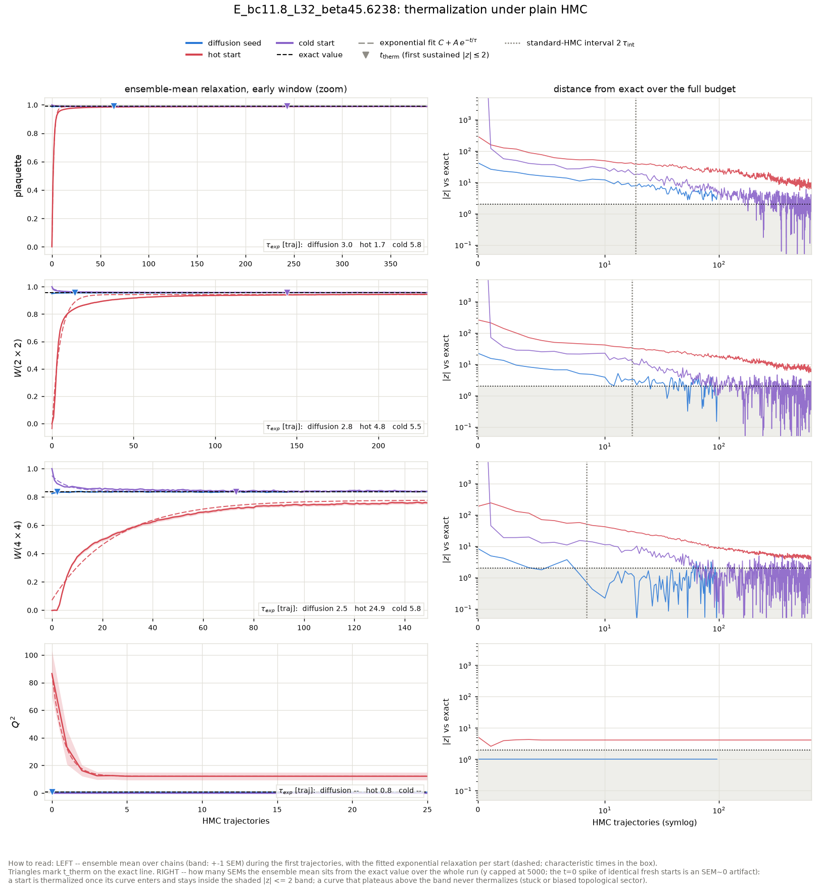

tau_int (hot-start chains, second half): plaquette = 9.27 +- 1.23, wilson_2x2 = 8.62 +- 1.31, wilson_4x4 = 4.27 +- 0.52, wilson_6x6 = 3.20 +- 0.36. Topology: hot-start HMC L=32 beta=45.6238 -> **frozen** (no tunneling).

Where 'never' stood at the end: the hot start ended the 640-trajectory budget still at plaquette at |z| ~ 8, wilson_2x2 at |z| ~ 6, wilson_4x4 at |z| ~ 4, wilson_6x6 at |z| ~ 5, Q^2 at |z| ~ 4; the cold start ended the 640-trajectory budget still at Q^2 at |z| ~ 574600642560.

### Diagnostics: raw diffusion output (before any HMC)

| observable | value | error | exact | z_exact | reference | ref_error | z_ref | ks_p | chi2_p |
|---|---|---|---|---|---|---|---|---|---|
| plaquette | 0.9859 | 6.056e-05 | 0.989 | -50.52 | 0.989 | 3.134e-05 | -45.81 | 0 |  |
| wilson_1x1 | 0.9859 | 6.056e-05 | 0.989 | -50.52 | 0.989 | 3.134e-05 | -45.81 | 0 |  |
| wilson_1x2 | 0.9728 | 0.0001418 | 0.9781 | -37.21 | 0.9781 | 8.577e-05 | -31.89 | 0 |  |
| wilson_2x2 | 0.9492 | 0.0002495 | 0.9566 | -29.82 | 0.9568 | 0.0002615 | -21.12 | 1.962e-44 |  |
| wilson_2x3 | 0.926 | 0.0004214 | 0.9357 | -22.88 | 0.9358 | 0.0004153 | -16.5 | 2.48e-28 |  |
| wilson_3x3 | 0.8935 | 0.000668 | 0.9051 | -17.4 | 0.9055 | 0.0007954 | -11.61 | 3.508e-17 |  |
| wilson_3x4 | 0.8618 | 0.001029 | 0.8755 | -13.27 | 0.8761 | 0.001104 | -9.482 | 2.885e-12 |  |
| wilson_4x4 | 0.8237 | 0.001478 | 0.8375 | -9.359 | 0.8387 | 0.001702 | -6.667 | 4.282e-07 |  |
| wilson_4x5 | 0.7863 | 0.001882 | 0.8012 | -7.921 | 0.8025 | 0.002063 | -5.795 | 2.484e-06 |  |
| wilson_5x5 | 0.7437 | 0.00241 | 0.758 | -5.958 | 0.7595 | 0.002594 | -4.474 | 0.0002049 |  |
| wilson_5x6 | 0.7031 | 0.00305 | 0.7172 | -4.604 | 0.7196 | 0.002964 | -3.88 | 0.009477 |  |
| wilson_6x6 | 0.658 | 0.003884 | 0.671 | -3.365 | 0.674 | 0.003406 | -3.098 | 0.04938 |  |
| wilson_6x7 | 0.6154 | 0.004537 | 0.6279 | -2.748 | 0.6319 | 0.003874 | -2.761 | 0.08971 |  |
| wilson_7x7 | 0.5671 | 0.005212 | 0.581 | -2.659 | 0.5838 | 0.00435 | -2.456 | 0.1251 |  |
| wilson_7x8 | 0.5256 | 0.0059 | 0.5376 | -2.036 | 0.5403 | 0.004792 | -1.936 | 0.3294 |  |
| wilson_8x8 | 0.4804 | 0.00662 | 0.492 | -1.752 | 0.4927 | 0.005344 | -1.441 | 0.3584 |  |
| wilson_8x10 | 0.3996 | 0.008017 | 0.4121 | -1.558 | 0.4119 | 0.006347 | -1.199 | 0.4898 |  |
| wilson_10x10 | 0.3177 | 0.009578 | 0.3302 | -1.302 | 0.3246 | 0.007748 | -0.5552 | 0.4548 |  |
| wilson_10x12 | 0.2534 | 0.01041 | 0.2646 | -1.073 | 0.2572 | 0.008225 | -0.2899 | 0.8569 |  |
| wilson_12x12 | 0.1901 | 0.01199 | 0.2028 | -1.064 | 0.1968 | 0.009249 | -0.4479 | 0.8569 |  |
| creutz_2 | 0.01117 | 0.000188 | 0.01108 | 0.4722 |  |  |  |  |  |
| creutz_3 | 0.0111 | 0.0003764 | 0.01108 | 0.03747 |  |  |  |  |  |
| creutz_4 | 0.009206 | 0.0005975 | 0.01108 | -3.139 |  |  |  |  |  |
| creutz_5 | 0.009294 | 0.0009241 | 0.01108 | -1.934 |  |  |  |  |  |
| creutz_6 | 0.01032 | 0.00123 | 0.01108 | -0.6168 |  |  |  |  |  |
| creutz_7 | 0.01478 | 0.001775 | 0.01108 | 2.082 |  |  |  |  |  |
| creutz_8 | 0.01389 | 0.002207 | 0.01108 | 1.274 |  |  |  |  |  |
| Q | 0 | 0.06316 | 0 | 0 | 0.1042 | 0.06508 | -1.149 | 0.9542 |  |
| Q^2 | 0.6562 | 0.09044 | 0.5746 | 0.9028 | 0.6667 | 0.06089 | -0.09554 | 1 |  |
| chi_top ((<Q^2>-<Q>^2)/V) | 0.0006409 | 8.832e-05 | 0.0005611 | 0.9028 | 0.0006404 | 6.036e-05 | 0.003962 | 8.226e-17 |  |
| Q histogram vs exact P(Q) | 2.713 | nan | 4 | nan |  |  |  |  | 0.6069 |

### Diagnostics: the same configs after 96 HMC trajectories

| observable | value | error | exact | z_exact | reference | ref_error | z_ref | ks_p | chi2_p |
|---|---|---|---|---|---|---|---|---|---|
| plaquette | 0.9888 | 3.865e-05 | 0.989 | -4.484 | 0.989 | 3.134e-05 | -4.766 | 0.005977 |  |
| wilson_1x1 | 0.9888 | 3.865e-05 | 0.989 | -4.484 | 0.989 | 3.134e-05 | -4.766 | 0.005977 |  |
| wilson_1x2 | 0.9779 | 9.603e-05 | 0.9781 | -2.34 | 0.9781 | 8.577e-05 | -1.818 | 0.1004 |  |
| wilson_2x2 | 0.9564 | 0.0001907 | 0.9566 | -1.178 | 0.9568 | 0.0002615 | -1.286 | 0.4212 |  |
| wilson_2x3 | 0.9354 | 0.0003116 | 0.9357 | -0.9274 | 0.9358 | 0.0004153 | -0.7901 | 0.389 |  |
| wilson_3x3 | 0.9046 | 0.0005424 | 0.9051 | -0.799 | 0.9055 | 0.0007954 | -0.907 | 0.1392 |  |
| wilson_3x4 | 0.8746 | 0.0007683 | 0.8755 | -1.126 | 0.8761 | 0.001104 | -1.131 | 0.3584 |  |
| wilson_4x4 | 0.8355 | 0.001072 | 0.8375 | -1.842 | 0.8387 | 0.001702 | -1.576 | 0.1545 |  |
| wilson_4x5 | 0.7989 | 0.001418 | 0.8012 | -1.635 | 0.8025 | 0.002063 | -1.435 | 0.1712 |  |
| wilson_5x5 | 0.7551 | 0.001824 | 0.758 | -1.581 | 0.7595 | 0.002594 | -1.377 | 0.1545 |  |
| wilson_5x6 | 0.7133 | 0.002257 | 0.7172 | -1.7 | 0.7196 | 0.002964 | -1.69 | 0.1712 |  |
| wilson_6x6 | 0.6655 | 0.002603 | 0.671 | -2.132 | 0.674 | 0.003406 | -1.979 | 0.1392 |  |
| wilson_6x7 | 0.6208 | 0.003155 | 0.6279 | -2.229 | 0.6319 | 0.003874 | -2.209 | 0.05588 |  |
| wilson_7x7 | 0.5723 | 0.003612 | 0.581 | -2.422 | 0.5838 | 0.00435 | -2.045 | 0.1712 |  |
| wilson_7x8 | 0.5266 | 0.004281 | 0.5376 | -2.571 | 0.5403 | 0.004792 | -2.134 | 0.1545 |  |
| wilson_8x8 | 0.4792 | 0.005002 | 0.492 | -2.57 | 0.4927 | 0.005344 | -1.846 | 0.3021 |  |
| wilson_8x10 | 0.3935 | 0.006909 | 0.4121 | -2.687 | 0.4119 | 0.006347 | -1.954 | 0.1122 |  |
| wilson_10x10 | 0.3041 | 0.007958 | 0.3302 | -3.284 | 0.3246 | 0.007748 | -1.846 | 0.1892 |  |
| wilson_10x12 | 0.2335 | 0.009883 | 0.2646 | -3.141 | 0.2572 | 0.008225 | -1.845 | 0.2087 |  |
| wilson_12x12 | 0.1675 | 0.01138 | 0.2028 | -3.1 | 0.1968 | 0.009249 | -1.998 | 0.1712 |  |
| creutz_2 | 0.01103 | 0.0001427 | 0.01108 | -0.3455 |  |  |  |  |  |
| creutz_3 | 0.01118 | 0.0002933 | 0.01108 | 0.3273 |  |  |  |  |  |
| creutz_4 | 0.01194 | 0.0005482 | 0.01108 | 1.573 |  |  |  |  |  |
| creutz_5 | 0.01145 | 0.0008813 | 0.01108 | 0.4227 |  |  |  |  |  |
| creutz_6 | 0.01247 | 0.001172 | 0.01108 | 1.181 |  |  |  |  |  |
| creutz_7 | 0.01204 | 0.001832 | 0.01108 | 0.5227 |  |  |  |  |  |
| creutz_8 | 0.01136 | 0.002615 | 0.01108 | 0.1083 |  |  |  |  |  |
| Q | 0 | 0.06316 | 0 | 0 | 0.1042 | 0.06508 | -1.149 | 0.9542 |  |
| Q^2 | 0.6562 | 0.09044 | 0.5746 | 0.9028 | 0.6667 | 0.06089 | -0.09554 | 1 |  |
| chi_top ((<Q^2>-<Q>^2)/V) | 0.0006409 | 8.832e-05 | 0.0005611 | 0.9028 | 0.0006404 | 6.036e-05 | 0.003962 | 8.226e-17 |  |
| Q histogram vs exact P(Q) | 2.713 | nan | 4 | nan |  |  |  |  | 0.6069 |

## D_bc14.1464_L32_beta55.0237

HMC: step size 0.0539, 19 leapfrog steps, acceptance seed/hot/cold = 0.978/0.979/0.979. Diffusion-seed batch: 128 chains x 96 trajectories (0.45 s/traj for the whole batch); baselines: 32 chains x 640 trajectories.

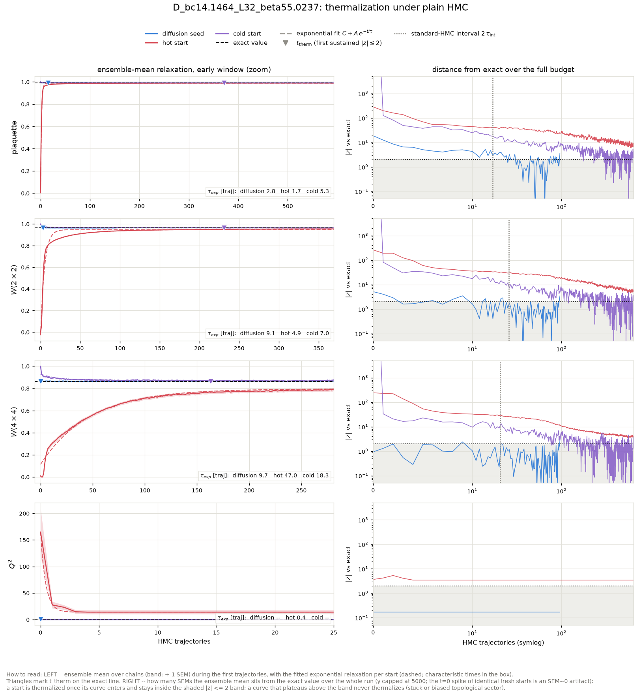

tau_int (hot-start chains, second half): plaquette = 8.47 +- 1.32, wilson_2x2 = 12.81 +- 1.66, wilson_4x4 = 10.22 +- 1.46, wilson_6x6 = 7.17 +- 1.13. Topology: hot-start HMC L=32 beta=55.0237 -> **frozen** (no tunneling).

Where 'never' stood at the end: the hot start ended the 640-trajectory budget still at plaquette at |z| ~ 8, wilson_2x2 at |z| ~ 5, wilson_4x4 at |z| ~ 4, wilson_6x6 at |z| ~ 5, Q^2 at |z| ~ 3; the cold start ended the 640-trajectory budget still at Q^2 at |z| ~ 474280296448.

### Diagnostics: raw diffusion output (before any HMC)

| observable | value | error | exact | z_exact | reference | ref_error | z_ref | ks_p | chi2_p |
|---|---|---|---|---|---|---|---|---|---|
| plaquette | 0.9916 | 3.776e-05 | 0.9909 | 20.59 | 0.9909 | 2.703e-05 | 16.53 | 3.271e-31 |  |
| wilson_1x1 | 0.9916 | 3.776e-05 | 0.9909 | 20.59 | 0.9909 | 2.703e-05 | 16.53 | 3.271e-31 |  |
| wilson_1x2 | 0.9829 | 0.0001053 | 0.9818 | 10.04 | 0.9818 | 5.904e-05 | 8.944 | 8.222e-12 |  |
| wilson_2x2 | 0.9652 | 0.0002298 | 0.964 | 5.296 | 0.9638 | 0.0001521 | 4.983 | 0.001117 |  |
| wilson_2x3 | 0.9478 | 0.0003868 | 0.9465 | 3.384 | 0.9465 | 0.0002251 | 2.827 | 0.01474 |  |
| wilson_3x3 | 0.9222 | 0.0006994 | 0.9208 | 2.049 | 0.921 | 0.0004365 | 1.454 | 0.1251 |  |
| wilson_3x4 | 0.897 | 0.001075 | 0.8958 | 1.082 | 0.8964 | 0.0005764 | 0.4744 | 0.4212 |  |
| wilson_4x4 | 0.8649 | 0.001577 | 0.8635 | 0.848 | 0.8644 | 0.0008388 | 0.2682 | 0.389 |  |
| wilson_4x5 | 0.8331 | 0.002125 | 0.8324 | 0.2998 | 0.8338 | 0.001045 | -0.3095 | 0.4898 |  |
| wilson_5x5 | 0.7956 | 0.002642 | 0.7951 | 0.1688 | 0.7969 | 0.001523 | -0.4254 | 0.8246 |  |
| wilson_5x6 | 0.7591 | 0.003227 | 0.7595 | -0.1212 | 0.7623 | 0.001953 | -0.8484 | 0.8569 |  |
| wilson_6x6 | 0.7175 | 0.003749 | 0.7188 | -0.3636 | 0.7209 | 0.002568 | -0.7427 | 0.7901 |  |
| wilson_6x7 | 0.6789 | 0.004187 | 0.6804 | -0.3427 | 0.6827 | 0.003195 | -0.7221 | 0.8246 |  |
| wilson_7x7 | 0.635 | 0.004794 | 0.6381 | -0.6466 | 0.6399 | 0.003671 | -0.8228 | 0.7163 |  |
| wilson_7x8 | 0.5956 | 0.005223 | 0.5984 | -0.5468 | 0.6009 | 0.004341 | -0.7872 | 0.7163 |  |
| wilson_8x8 | 0.553 | 0.005974 | 0.5561 | -0.5195 | 0.5584 | 0.004749 | -0.7032 | 0.8569 |  |
| wilson_8x10 | 0.479 | 0.006969 | 0.4802 | -0.1762 | 0.4848 | 0.005792 | -0.6434 | 0.7538 |  |
| wilson_10x10 | 0.3967 | 0.008221 | 0.3998 | -0.3755 | 0.4033 | 0.006486 | -0.6284 | 0.9353 |  |
| wilson_10x12 | 0.3273 | 0.009551 | 0.3329 | -0.586 | 0.3379 | 0.006761 | -0.9048 | 0.5259 |  |
| wilson_12x12 | 0.2611 | 0.009905 | 0.2672 | -0.6165 | 0.2703 | 0.006422 | -0.78 | 0.8864 |  |
| creutz_2 | 0.009277 | 0.0001249 | 0.009171 | 0.8487 |  |  |  |  |  |
| creutz_3 | 0.009118 | 0.0002423 | 0.00917 | -0.214 |  |  |  |  |  |
| creutz_4 | 0.008663 | 0.0004484 | 0.00917 | -1.13 |  |  |  |  |  |
| creutz_5 | 0.008591 | 0.0005552 | 0.009169 | -1.041 |  |  |  |  |  |
| creutz_6 | 0.009475 | 0.0008309 | 0.009167 | 0.37 |  |  |  |  |  |
| creutz_7 | 0.01171 | 0.001176 | 0.009165 | 2.163 |  |  |  |  |  |
| creutz_8 | 0.01006 | 0.001643 | 0.009162 | 0.5462 |  |  |  |  |  |
| Q | 0 | 0.05689 | 0 | 0 | 0.06771 | 0.04615 | -0.9242 | 0.9999 |  |
| Q^2 | 0.4844 | 0.05614 | 0.4743 | 0.1798 | 0.526 | 0.04735 | -0.5673 | 1 |  |
| chi_top ((<Q^2>-<Q>^2)/V) | 0.000473 | 5.482e-05 | 0.0004632 | 0.1798 | 0.0005092 | 4.707e-05 | -0.5012 | 7.05e-23 |  |
| Q histogram vs exact P(Q) | 0.1517 | nan | 2 | nan |  |  |  |  | 0.927 |

### Diagnostics: the same configs after 96 HMC trajectories

| observable | value | error | exact | z_exact | reference | ref_error | z_ref | ks_p | chi2_p |
|---|---|---|---|---|---|---|---|---|---|
| plaquette | 0.991 | 3.393e-05 | 0.9909 | 3.538 | 0.9909 | 2.703e-05 | 2.535 | 0.01275 |  |
| wilson_1x1 | 0.991 | 3.393e-05 | 0.9909 | 3.538 | 0.9909 | 2.703e-05 | 2.535 | 0.01275 |  |
| wilson_1x2 | 0.9821 | 7.732e-05 | 0.9818 | 3.004 | 0.9818 | 5.904e-05 | 2.622 | 0.05588 |  |
| wilson_2x2 | 0.9646 | 0.0001974 | 0.964 | 3.25 | 0.9638 | 0.0001521 | 3.201 | 0.002243 |  |
| wilson_2x3 | 0.9475 | 0.0003288 | 0.9465 | 3.285 | 0.9465 | 0.0002251 | 2.601 | 0.01474 |  |
| wilson_3x3 | 0.9227 | 0.0005937 | 0.9208 | 3.155 | 0.921 | 0.0004365 | 2.224 | 0.01957 |  |
| wilson_3x4 | 0.8985 | 0.0008305 | 0.8958 | 3.216 | 0.8964 | 0.0005764 | 2.063 | 0.03831 |  |
| wilson_4x4 | 0.8671 | 0.001311 | 0.8635 | 2.714 | 0.8644 | 0.0008388 | 1.735 | 0.1392 |  |
| wilson_4x5 | 0.8374 | 0.001809 | 0.8324 | 2.721 | 0.8338 | 0.001045 | 1.7 | 0.1004 |  |
| wilson_5x5 | 0.8012 | 0.00256 | 0.7951 | 2.364 | 0.7969 | 0.001523 | 1.447 | 0.0631 |  |
| wilson_5x6 | 0.7667 | 0.003143 | 0.7595 | 2.28 | 0.7623 | 0.001953 | 1.178 | 0.2297 |  |
| wilson_6x6 | 0.7271 | 0.003836 | 0.7188 | 2.158 | 0.7209 | 0.002568 | 1.358 | 0.04938 |  |
| wilson_6x7 | 0.6898 | 0.004418 | 0.6804 | 2.125 | 0.6827 | 0.003195 | 1.288 | 0.07995 |  |
| wilson_7x7 | 0.6494 | 0.00539 | 0.6381 | 2.094 | 0.6399 | 0.003671 | 1.445 | 0.02947 |  |
| wilson_7x8 | 0.611 | 0.006018 | 0.5984 | 2.084 | 0.6009 | 0.004341 | 1.354 | 0.1004 |  |
| wilson_8x8 | 0.5702 | 0.006975 | 0.5561 | 2.021 | 0.5584 | 0.004749 | 1.402 | 0.0711 |  |
| wilson_8x10 | 0.4953 | 0.008299 | 0.4802 | 1.815 | 0.4848 | 0.005792 | 1.033 | 0.1712 |  |
| wilson_10x10 | 0.4162 | 0.009794 | 0.3998 | 1.673 | 0.4033 | 0.006486 | 1.097 | 0.1392 |  |
| wilson_10x12 | 0.3498 | 0.01065 | 0.3329 | 1.589 | 0.3379 | 0.006761 | 0.946 | 0.1004 |  |
| wilson_12x12 | 0.2805 | 0.01209 | 0.2672 | 1.095 | 0.2703 | 0.006422 | 0.7409 | 0.1122 |  |
| creutz_2 | 0.008857 | 0.0001291 | 0.009171 | -2.427 |  |  |  |  |  |
| creutz_3 | 0.008754 | 0.0002867 | 0.00917 | -1.452 |  |  |  |  |  |
| creutz_4 | 0.00898 | 0.000476 | 0.00917 | -0.399 |  |  |  |  |  |
| creutz_5 | 0.009263 | 0.0007043 | 0.009169 | 0.1337 |  |  |  |  |  |
| creutz_6 | 0.008915 | 0.0009497 | 0.009167 | -0.2651 |  |  |  |  |  |
| creutz_7 | 0.007585 | 0.001319 | 0.009165 | -1.198 |  |  |  |  |  |
| creutz_8 | 0.008072 | 0.001697 | 0.009162 | -0.6425 |  |  |  |  |  |
| Q | 0 | 0.05689 | 0 | 0 | 0.06771 | 0.04615 | -0.9242 | 0.9999 |  |
| Q^2 | 0.4844 | 0.05614 | 0.4743 | 0.1798 | 0.526 | 0.04735 | -0.5673 | 1 |  |
| chi_top ((<Q^2>-<Q>^2)/V) | 0.000473 | 5.482e-05 | 0.0004632 | 0.1798 | 0.0005092 | 4.707e-05 | -0.5012 | 7.05e-23 |  |
| Q histogram vs exact P(Q) | 0.1517 | nan | 2 | nan |  |  |  |  | 0.927 |

## B_bt55.0237_L32_beta55.0237

HMC: step size 0.0539, 19 leapfrog steps, acceptance seed/hot/cold = 0.976/0.978/0.977. Diffusion-seed batch: 128 chains x 96 trajectories (0.42 s/traj for the whole batch); baselines: 32 chains x 640 trajectories.

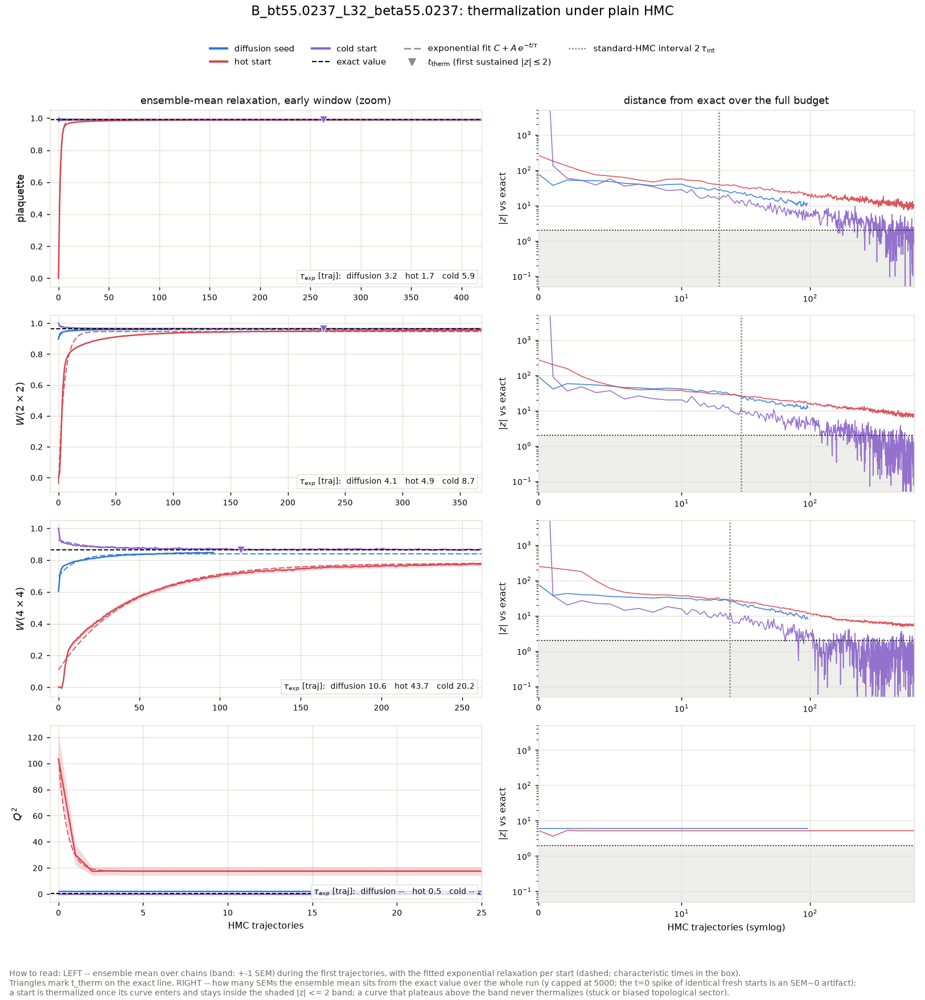

tau_int (hot-start chains, second half): plaquette = 9.72 +- 1.32, wilson_2x2 = 14.51 +- 1.86, wilson_4x4 = 11.78 +- 1.48, wilson_6x6 = 6.80 +- 1.08. Topology: hot-start HMC L=32 beta=55.0237 -> **frozen** (no tunneling).

Where 'never' stood at the end: the hot start ended the 640-trajectory budget still at plaquette at |z| ~ 10, wilson_2x2 at |z| ~ 7, wilson_4x4 at |z| ~ 5, wilson_6x6 at |z| ~ 6, Q^2 at |z| ~ 5; the cold start ended the 640-trajectory budget still at Q^2 at |z| ~ 474280165376.

### Diagnostics: raw diffusion output (before any HMC)

| observable | value | error | exact | z_exact | reference | ref_error | z_ref | ks_p | chi2_p |
|---|---|---|---|---|---|---|---|---|---|
| plaquette | 0.9808 | 0.0001442 | 0.9909 | -69.67 | 0.9909 | 2.703e-05 | -68.55 | 0 |  |
| wilson_1x1 | 0.9808 | 0.0001442 | 0.9909 | -69.67 | 0.9909 | 2.703e-05 | -68.55 | 0 |  |
| wilson_1x2 | 0.956 | 0.0003566 | 0.9818 | -72.56 | 0.9818 | 5.904e-05 | -71.53 | 0 |  |
| wilson_2x2 | 0.8978 | 0.0007735 | 0.964 | -85.58 | 0.9638 | 0.0001521 | -83.77 | 0 |  |
| wilson_2x3 | 0.8433 | 0.001146 | 0.9465 | -89.97 | 0.9465 | 0.0002251 | -88.32 | 0 |  |
| wilson_3x3 | 0.7632 | 0.001638 | 0.9208 | -96.21 | 0.921 | 0.0004365 | -93.1 | 0 |  |
| wilson_3x4 | 0.6912 | 0.002216 | 0.8958 | -92.34 | 0.8964 | 0.0005764 | -89.62 | 0 |  |
| wilson_4x4 | 0.6051 | 0.00293 | 0.8635 | -88.2 | 0.8644 | 0.0008388 | -85.08 | 0 |  |
| wilson_4x5 | 0.5271 | 0.003808 | 0.8324 | -80.18 | 0.8338 | 0.001045 | -77.67 | 0 |  |
| wilson_5x5 | 0.4454 | 0.004781 | 0.7951 | -73.15 | 0.7969 | 0.001523 | -70.05 | 0 |  |
| wilson_5x6 | 0.3734 | 0.005692 | 0.7595 | -67.83 | 0.7623 | 0.001953 | -64.63 | 0 |  |
| wilson_6x6 | 0.3067 | 0.00664 | 0.7188 | -62.06 | 0.7209 | 0.002568 | -58.16 | 0 |  |
| wilson_6x7 | 0.2479 | 0.007043 | 0.6804 | -61.41 | 0.6827 | 0.003195 | -56.23 | 0 |  |
| wilson_7x7 | 0.1971 | 0.007401 | 0.6381 | -59.58 | 0.6399 | 0.003671 | -53.6 | 0 |  |
| wilson_7x8 | 0.1547 | 0.007385 | 0.5984 | -60.08 | 0.6009 | 0.004341 | -52.09 | 0 |  |
| wilson_8x8 | 0.1217 | 0.007061 | 0.5561 | -61.52 | 0.5584 | 0.004749 | -51.32 | 0 |  |
| wilson_8x10 | 0.07085 | 0.007237 | 0.4802 | -56.57 | 0.4848 | 0.005792 | -44.66 | 0 |  |
| wilson_10x10 | 0.03636 | 0.007609 | 0.3998 | -47.77 | 0.4033 | 0.006486 | -36.7 | 0 |  |
| wilson_10x12 | 0.01904 | 0.006541 | 0.3329 | -47.98 | 0.3379 | 0.006761 | -33.9 | 0 |  |
| wilson_12x12 | 0.00783 | 0.005088 | 0.2672 | -50.98 | 0.2703 | 0.006422 | -32.04 | 0 |  |
| creutz_2 | 0.03709 | 0.0003653 | 0.009171 | 76.43 |  |  |  |  |  |
| creutz_3 | 0.03727 | 0.0008469 | 0.00917 | 33.18 |  |  |  |  |  |
| creutz_4 | 0.03388 | 0.001441 | 0.00917 | 17.15 |  |  |  |  |  |
| creutz_5 | 0.03047 | 0.0025 | 0.009169 | 8.52 |  |  |  |  |  |
| creutz_6 | 0.02029 | 0.004025 | 0.009167 | 2.763 |  |  |  |  |  |
| creutz_7 | 0.01589 | 0.007279 | 0.009165 | 0.924 |  |  |  |  |  |
| creutz_8 | -0.002815 | 0.014 | 0.009162 | -0.8554 |  |  |  |  |  |
| Q | 0.07031 | 0.1218 | 0 | 0.5774 | 0.06771 | 0.04615 | 0.02 | 0.0631 |  |
| Q^2 | 2.086 | 0.2321 | 0.4743 | 6.944 | 0.526 | 0.04735 | 6.585 | 2.484e-06 |  |
| chi_top ((<Q^2>-<Q>^2)/V) | 0.002032 | 0.0002337 | 0.0004632 | 6.714 | 0.0005092 | 4.707e-05 | 6.389 | 2.529e-23 |  |
| Q histogram vs exact P(Q) | 18.59 | nan | 2 | nan |  |  |  |  | 9.204e-05 |

### Diagnostics: the same configs after 96 HMC trajectories

| observable | value | error | exact | z_exact | reference | ref_error | z_ref | ks_p | chi2_p |
|---|---|---|---|---|---|---|---|---|---|
| plaquette | 0.9904 | 3.375e-05 | 0.9909 | -12.68 | 0.9909 | 2.703e-05 | -10.13 | 4.101e-12 |  |
| wilson_1x1 | 0.9904 | 3.375e-05 | 0.9909 | -12.68 | 0.9909 | 2.703e-05 | -10.13 | 4.101e-12 |  |
| wilson_1x2 | 0.9807 | 6.536e-05 | 0.9818 | -17.29 | 0.9818 | 5.904e-05 | -12.57 | 4.79e-13 |  |
| wilson_2x2 | 0.9611 | 0.000161 | 0.964 | -18.1 | 0.9638 | 0.0001521 | -12.45 | 5.814e-12 |  |
| wilson_2x3 | 0.9417 | 0.0003498 | 0.9465 | -13.6 | 0.9465 | 0.0002251 | -11.54 | 2.371e-14 |  |
| wilson_3x3 | 0.9133 | 0.0006779 | 0.9208 | -10.96 | 0.921 | 0.0004365 | -9.506 | 2.291e-11 |  |
| wilson_3x4 | 0.8852 | 0.001114 | 0.8958 | -9.523 | 0.8964 | 0.0005764 | -8.923 | 3.208e-11 |  |
| wilson_4x4 | 0.8483 | 0.001744 | 0.8635 | -8.735 | 0.8644 | 0.0008388 | -8.315 | 2.296e-10 |  |
| wilson_4x5 | 0.8119 | 0.00246 | 0.8324 | -8.334 | 0.8338 | 0.001045 | -8.183 | 2.291e-11 |  |
| wilson_5x5 | 0.7679 | 0.003341 | 0.7951 | -8.136 | 0.7969 | 0.001523 | -7.878 | 6.242e-11 |  |
| wilson_5x6 | 0.7263 | 0.004384 | 0.7595 | -7.581 | 0.7623 | 0.001953 | -7.509 | 8.121e-10 |  |
| wilson_6x6 | 0.6783 | 0.00553 | 0.7188 | -7.328 | 0.7209 | 0.002568 | -6.977 | 6.754e-09 |  |
| wilson_6x7 | 0.6319 | 0.006786 | 0.6804 | -7.137 | 0.6827 | 0.003195 | -6.773 | 3.732e-09 |  |
| wilson_7x7 | 0.5804 | 0.008339 | 0.6381 | -6.91 | 0.6399 | 0.003671 | -6.53 | 9.054e-09 |  |
| wilson_7x8 | 0.5303 | 0.009637 | 0.5984 | -7.069 | 0.6009 | 0.004341 | -6.681 | 5e-08 |  |
| wilson_8x8 | 0.4784 | 0.01119 | 0.5561 | -6.944 | 0.5584 | 0.004749 | -6.579 | 8.674e-08 |  |
| wilson_8x10 | 0.3838 | 0.01356 | 0.4802 | -7.115 | 0.4848 | 0.005792 | -6.855 | 3.783e-08 |  |
| wilson_10x10 | 0.289 | 0.01573 | 0.3998 | -7.049 | 0.4033 | 0.006486 | -6.722 | 1.946e-06 |  |
| wilson_10x12 | 0.2056 | 0.01681 | 0.3329 | -7.572 | 0.3379 | 0.006761 | -7.3 | 1.947e-07 |  |
| wilson_12x12 | 0.1389 | 0.01754 | 0.2672 | -7.316 | 0.2703 | 0.006422 | -7.036 | 7.158e-07 |  |
| creutz_2 | 0.01033 | 0.0001468 | 0.009171 | 7.878 |  |  |  |  |  |
| creutz_3 | 0.01023 | 0.0003035 | 0.00917 | 3.483 |  |  |  |  |  |
| creutz_4 | 0.01125 | 0.000513 | 0.00917 | 4.064 |  |  |  |  |  |
| creutz_5 | 0.01188 | 0.0007299 | 0.009169 | 3.716 |  |  |  |  |  |
| creutz_6 | 0.01249 | 0.001156 | 0.009167 | 2.874 |  |  |  |  |  |
| creutz_7 | 0.01415 | 0.001723 | 0.009165 | 2.895 |  |  |  |  |  |
| creutz_8 | 0.01263 | 0.002346 | 0.009162 | 1.48 |  |  |  |  |  |
| Q | 0.07031 | 0.1218 | 0 | 0.5774 | 0.06771 | 0.04615 | 0.02 | 0.0631 |  |
| Q^2 | 2.086 | 0.2321 | 0.4743 | 6.944 | 0.526 | 0.04735 | 6.585 | 2.484e-06 |  |
| chi_top ((<Q^2>-<Q>^2)/V) | 0.002032 | 0.0002337 | 0.0004632 | 6.714 | 0.0005092 | 4.707e-05 | 6.389 | 2.529e-23 |  |
| Q histogram vs exact P(Q) | 18.59 | nan | 2 | nan |  |  |  |  | 9.204e-05 |

## E_bc18_L32_beta70.4526

HMC: step size 0.0477, 21 leapfrog steps, acceptance seed/hot/cold = 0.962/0.973/0.977. Diffusion-seed batch: 128 chains x 96 trajectories (0.46 s/traj for the whole batch); baselines: 32 chains x 640 trajectories.

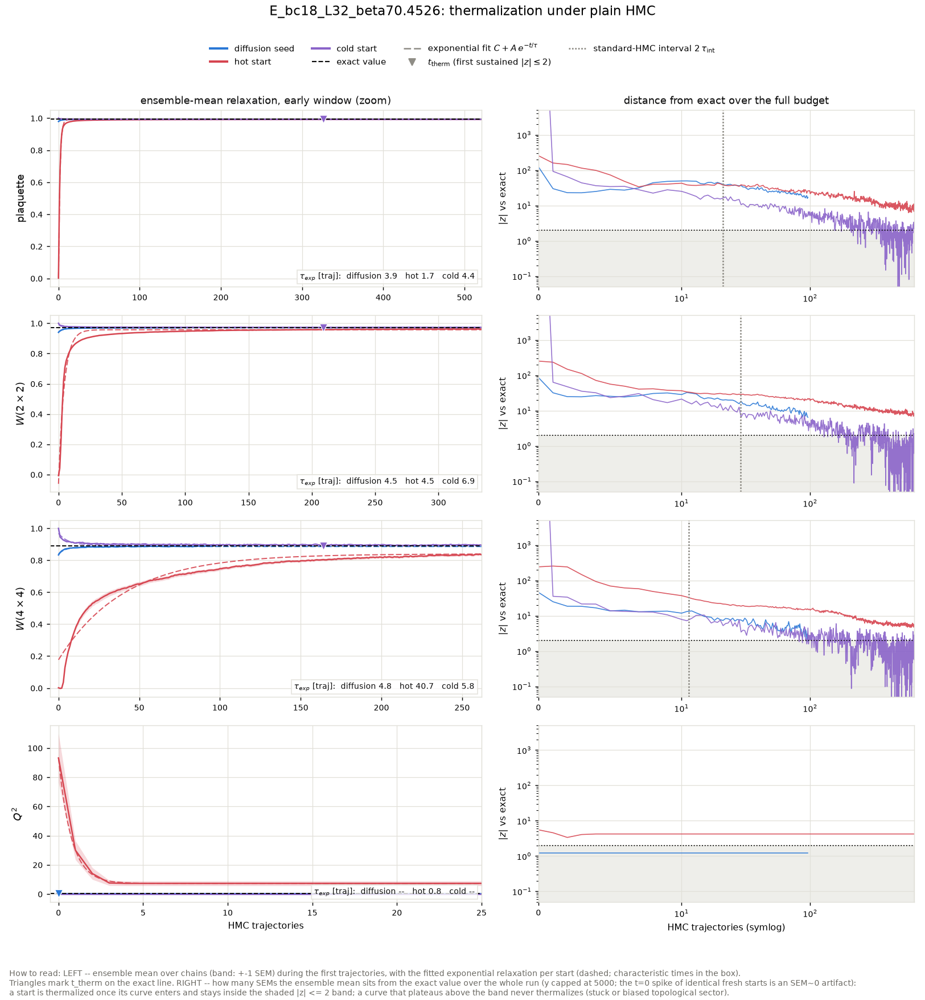

tau_int (hot-start chains, second half): plaquette = 10.49 +- 1.22, wilson_2x2 = 14.42 +- 1.55, wilson_4x4 = 5.66 +- 0.80, wilson_6x6 = 3.79 +- 0.71. Topology: hot-start HMC L=32 beta=70.4526 -> **frozen** (no tunneling).

Where 'never' stood at the end: the hot start ended the 640-trajectory budget still at plaquette at |z| ~ 8, wilson_2x2 at |z| ~ 8, wilson_4x4 at |z| ~ 5, wilson_6x6 at |z| ~ 5, Q^2 at |z| ~ 4; the cold start ended the 640-trajectory budget still at Q^2 at |z| ~ 363637014528.

### Diagnostics: raw diffusion output (before any HMC)

| observable | value | error | exact | z_exact | reference | ref_error | z_ref | ks_p | chi2_p |
|---|---|---|---|---|---|---|---|---|---|
| plaquette | 0.9793 | 0.0001371 | 0.9929 | -98.79 | 0.9929 | 2.811e-05 | -96.85 | 0 |  |
| wilson_1x1 | 0.9793 | 0.0001371 | 0.9929 | -98.79 | 0.9929 | 2.811e-05 | -96.85 | 0 |  |
| wilson_1x2 | 0.9624 | 0.0002839 | 0.9858 | -82.4 | 0.9859 | 5.833e-05 | -80.9 | 0 |  |
| wilson_2x2 | 0.9397 | 0.0003967 | 0.9718 | -81.03 | 0.9718 | 0.0001234 | -77.45 | 0 |  |
| wilson_2x3 | 0.918 | 0.0006243 | 0.958 | -64.11 | 0.9583 | 0.0002335 | -60.48 | 0 |  |
| wilson_3x3 | 0.89 | 0.0007196 | 0.9377 | -66.29 | 0.9378 | 0.0003626 | -59.36 | 0 |  |
| wilson_3x4 | 0.8639 | 0.0009593 | 0.9178 | -56.17 | 0.9186 | 0.0004437 | -51.72 | 0 |  |
| wilson_4x4 | 0.8336 | 0.00127 | 0.892 | -45.95 | 0.8928 | 0.0006108 | -42 | 0 |  |
| wilson_4x5 | 0.8017 | 0.001676 | 0.8668 | -38.9 | 0.8686 | 0.0007519 | -36.44 | 0 |  |
| wilson_5x5 | 0.7631 | 0.002124 | 0.8364 | -34.51 | 0.8378 | 0.0009827 | -31.92 | 0 |  |
| wilson_5x6 | 0.73 | 0.002711 | 0.8071 | -28.43 | 0.8098 | 0.001205 | -26.88 | 0 |  |
| wilson_6x6 | 0.6945 | 0.003195 | 0.7733 | -24.65 | 0.7761 | 0.001529 | -23.05 | 4.624e-43 |  |
| wilson_6x7 | 0.6591 | 0.003871 | 0.7408 | -21.12 | 0.7448 | 0.002031 | -19.6 | 3.547e-38 |  |
| wilson_7x7 | 0.6151 | 0.004445 | 0.7047 | -20.16 | 0.709 | 0.002559 | -18.3 | 3.832e-33 |  |
| wilson_7x8 | 0.5813 | 0.005193 | 0.6704 | -17.16 | 0.6765 | 0.003224 | -15.56 | 2.376e-26 |  |
| wilson_8x8 | 0.5455 | 0.005561 | 0.6333 | -15.78 | 0.6391 | 0.003749 | -13.96 | 1.599e-20 |  |
| wilson_8x10 | 0.4752 | 0.006747 | 0.565 | -13.31 | 0.5766 | 0.00526 | -11.85 | 1.61e-14 |  |
| wilson_10x10 | 0.4038 | 0.008122 | 0.4901 | -10.62 | 0.5001 | 0.006897 | -9.034 | 1.632e-11 |  |
| wilson_10x12 | 0.3449 | 0.00811 | 0.4252 | -9.893 | 0.4379 | 0.009234 | -7.563 | 5e-08 |  |
| wilson_12x12 | 0.2849 | 0.00832 | 0.3587 | -8.861 | 0.3671 | 0.0108 | -6.025 | 9.107e-05 |  |
| creutz_2 | 0.006481 | 0.0002478 | 0.007147 | -2.686 |  |  |  |  |  |
| creutz_3 | 0.007631 | 0.0005414 | 0.007145 | 0.8977 |  |  |  |  |  |
| creutz_4 | 0.005973 | 0.0006778 | 0.007141 | -1.724 |  |  |  |  |  |
| creutz_5 | 0.01014 | 0.00105 | 0.007137 | 2.861 |  |  |  |  |  |
| creutz_6 | 0.005509 | 0.001115 | 0.007131 | -1.455 |  |  |  |  |  |
| creutz_7 | 0.01666 | 0.001626 | 0.007122 | 5.868 |  |  |  |  |  |
| creutz_8 | 0.007057 | 0.002042 | 0.007111 | -0.02608 |  |  |  |  |  |
| Q | 0.01562 | 0.04517 | 0 | 0.3459 | 0.05729 | 0.03698 | -0.7138 | 1 |  |
| Q^2 | 0.3125 | 0.03508 | 0.3636 | -1.458 | 0.3177 | 0.04627 | -0.0897 | 1 |  |
| chi_top ((<Q^2>-<Q>^2)/V) | 0.0003049 | 3.424e-05 | 0.0003551 | -1.466 | 0.0003071 | 4.536e-05 | -0.03729 | 3.729e-35 |  |
| Q histogram vs exact P(Q) | 0.5803 | nan | 2 | nan |  |  |  |  | 0.7481 |

### Diagnostics: the same configs after 96 HMC trajectories

| observable | value | error | exact | z_exact | reference | ref_error | z_ref | ks_p | chi2_p |
|---|---|---|---|---|---|---|---|---|---|
| plaquette | 0.9923 | 2.751e-05 | 0.9929 | -20.8 | 0.9929 | 2.811e-05 | -14.83 | 7.917e-28 |  |
| wilson_1x1 | 0.9923 | 2.751e-05 | 0.9929 | -20.8 | 0.9929 | 2.811e-05 | -14.83 | 7.917e-28 |  |
| wilson_1x2 | 0.9849 | 8.007e-05 | 0.9858 | -10.78 | 0.9859 | 5.833e-05 | -9.265 | 2.371e-14 |  |
| wilson_2x2 | 0.9706 | 0.0002016 | 0.9718 | -5.86 | 0.9718 | 0.0001234 | -5.136 | 3.301e-07 |  |
| wilson_2x3 | 0.9565 | 0.000393 | 0.958 | -3.998 | 0.9583 | 0.0002335 | -4.059 | 4.022e-06 |  |
| wilson_3x3 | 0.9366 | 0.0006034 | 0.9377 | -1.858 | 0.9378 | 0.0003626 | -1.776 | 0.02947 |  |
| wilson_3x4 | 0.9162 | 0.000898 | 0.9178 | -1.778 | 0.9186 | 0.0004437 | -2.369 | 0.05588 |  |
| wilson_4x4 | 0.8899 | 0.001202 | 0.892 | -1.732 | 0.8928 | 0.0006108 | -2.161 | 0.1712 |  |
| wilson_4x5 | 0.8655 | 0.001679 | 0.8668 | -0.7727 | 0.8686 | 0.0007519 | -1.661 | 0.3021 |  |
| wilson_5x5 | 0.8377 | 0.002084 | 0.8364 | 0.5937 | 0.8378 | 0.0009827 | -0.07873 | 0.9807 |  |
| wilson_5x6 | 0.8084 | 0.002662 | 0.8071 | 0.4858 | 0.8098 | 0.001205 | -0.4703 | 0.9126 |  |
| wilson_6x6 | 0.7744 | 0.003329 | 0.7733 | 0.3479 | 0.7761 | 0.001529 | -0.4745 | 0.7538 |  |
| wilson_6x7 | 0.7402 | 0.003992 | 0.7408 | -0.1618 | 0.7448 | 0.002031 | -1.019 | 0.08971 |  |
| wilson_7x7 | 0.702 | 0.004697 | 0.7047 | -0.5824 | 0.709 | 0.002559 | -1.308 | 0.1392 |  |
| wilson_7x8 | 0.6687 | 0.005613 | 0.6704 | -0.3087 | 0.6765 | 0.003224 | -1.202 | 0.1892 |  |
| wilson_8x8 | 0.6333 | 0.006512 | 0.6333 | 0.01377 | 0.6391 | 0.003749 | -0.7692 | 0.3584 |  |
| wilson_8x10 | 0.5664 | 0.008348 | 0.565 | 0.1623 | 0.5766 | 0.00526 | -1.04 | 0.2297 |  |
| wilson_10x10 | 0.4945 | 0.009613 | 0.4901 | 0.4656 | 0.5001 | 0.006897 | -0.467 | 0.1892 |  |
| wilson_10x12 | 0.4278 | 0.01122 | 0.4252 | 0.2322 | 0.4379 | 0.009234 | -0.6947 | 0.3294 |  |
| wilson_12x12 | 0.3601 | 0.01264 | 0.3587 | 0.1153 | 0.3671 | 0.0108 | -0.4173 | 0.6395 |  |
| creutz_2 | 0.007188 | 0.0001021 | 0.007147 | 0.4059 |  |  |  |  |  |
| creutz_3 | 0.006274 | 0.0002072 | 0.007145 | -4.199 |  |  |  |  |  |
| creutz_4 | 0.007192 | 0.0003496 | 0.007141 | 0.1452 |  |  |  |  |  |
| creutz_5 | 0.004998 | 0.0005335 | 0.007137 | -4.008 |  |  |  |  |  |
| creutz_6 | 0.007358 | 0.0007837 | 0.007131 | 0.2902 |  |  |  |  |  |
| creutz_7 | 0.00777 | 0.000981 | 0.007122 | 0.6599 |  |  |  |  |  |
| creutz_8 | 0.005682 | 0.00142 | 0.007111 | -1.006 |  |  |  |  |  |
| Q | 0.01562 | 0.04517 | 0 | 0.3459 | 0.05729 | 0.03698 | -0.7138 | 1 |  |
| Q^2 | 0.3125 | 0.03508 | 0.3636 | -1.458 | 0.3177 | 0.04627 | -0.0897 | 1 |  |
| chi_top ((<Q^2>-<Q>^2)/V) | 0.0003049 | 3.424e-05 | 0.0003551 | -1.466 | 0.0003071 | 4.536e-05 | -0.03729 | 3.729e-35 |  |
| Q histogram vs exact P(Q) | 0.5803 | nan | 2 | nan |  |  |  |  | 0.7481 |

## D_bc20_L32_beta78.4578

HMC: step size 0.0452, 22 leapfrog steps, acceptance seed/hot/cold = 0.952/0.979/0.979. Diffusion-seed batch: 128 chains x 96 trajectories (0.46 s/traj for the whole batch); baselines: 32 chains x 640 trajectories.

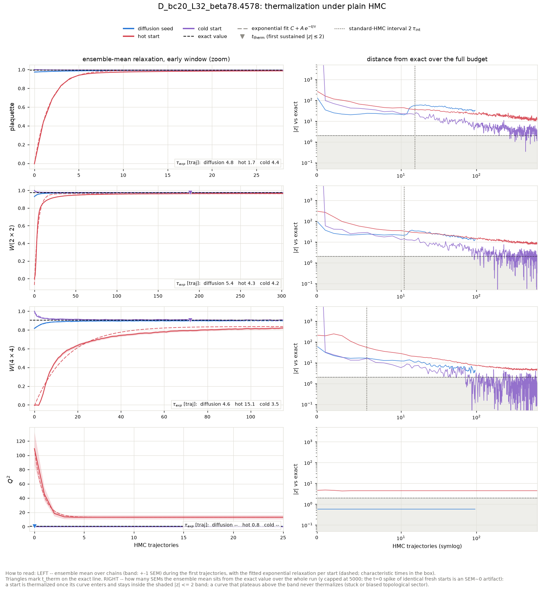

tau_int (hot-start chains, second half): plaquette = 7.66 +- 1.15, wilson_2x2 = 5.51 +- 0.88, wilson_4x4 = 2.95 +- 0.38, wilson_6x6 = 1.89 +- 0.20. Topology: hot-start HMC L=32 beta=78.4578 -> **frozen** (no tunneling).

Where 'never' stood at the end: the hot start ended the 640-trajectory budget still at plaquette at |z| ~ 12, wilson_2x2 at |z| ~ 8, wilson_4x4 at |z| ~ 5, wilson_6x6 at |z| ~ 5, Q^2 at |z| ~ 4; the cold start ended the 640-trajectory budget still at plaquette at |z| ~ 3, Q^2 at |z| ~ 320492732416.

### Diagnostics: raw diffusion output (before any HMC)

| observable | value | error | exact | z_exact | reference | ref_error | z_ref | ks_p | chi2_p |
|---|---|---|---|---|---|---|---|---|---|
| plaquette | 0.9738 | 0.0001535 | 0.9936 | -129 | 0.9937 | 1.641e-05 | -128.6 | 0 |  |
| wilson_1x1 | 0.9738 | 0.0001535 | 0.9936 | -129 | 0.9937 | 1.641e-05 | -128.6 | 0 |  |
| wilson_1x2 | 0.9537 | 0.0003022 | 0.9873 | -111 | 0.9874 | 3.818e-05 | -110.7 | 0 |  |
| wilson_2x2 | 0.9291 | 0.0005449 | 0.9747 | -83.71 | 0.975 | 0.0001289 | -82.07 | 0 |  |
| wilson_2x3 | 0.9043 | 0.0006841 | 0.9623 | -84.76 | 0.9628 | 0.0002313 | -81.07 | 0 |  |
| wilson_3x3 | 0.8737 | 0.0008971 | 0.9439 | -78.23 | 0.9446 | 0.0003863 | -72.55 | 0 |  |
| wilson_3x4 | 0.8459 | 0.001105 | 0.926 | -72.49 | 0.9271 | 0.000568 | -65.4 | 0 |  |
| wilson_4x4 | 0.8157 | 0.001424 | 0.9025 | -60.94 | 0.904 | 0.0008787 | -52.76 | 0 |  |
| wilson_4x5 | 0.7818 | 0.001947 | 0.8797 | -50.27 | 0.8826 | 0.001128 | -44.79 | 0 |  |
| wilson_5x5 | 0.7439 | 0.002316 | 0.852 | -46.65 | 0.8567 | 0.001609 | -39.99 | 0 |  |
| wilson_5x6 | 0.7111 | 0.002865 | 0.8251 | -39.82 | 0.8315 | 0.001991 | -34.52 | 0 |  |
| wilson_6x6 | 0.6793 | 0.003427 | 0.7941 | -33.49 | 0.8023 | 0.002606 | -28.58 | 0 |  |
| wilson_6x7 | 0.6436 | 0.0038 | 0.7642 | -31.74 | 0.7732 | 0.003225 | -26.01 | 0 |  |
| wilson_7x7 | 0.599 | 0.004294 | 0.7307 | -30.69 | 0.7403 | 0.003869 | -24.46 | 0 |  |
| wilson_7x8 | 0.5672 | 0.0048 | 0.6988 | -27.42 | 0.709 | 0.004586 | -21.36 | 0 |  |
| wilson_8x8 | 0.533 | 0.005358 | 0.664 | -24.45 | 0.6747 | 0.005379 | -18.67 | 1.401e-45 |  |
| wilson_8x10 | 0.4659 | 0.006553 | 0.5996 | -20.4 | 0.6124 | 0.007187 | -15.06 | 4.973e-32 |  |
| wilson_10x10 | 0.3938 | 0.00739 | 0.5279 | -18.15 | 0.5433 | 0.008848 | -12.96 | 7.191e-26 |  |
| wilson_10x12 | 0.3341 | 0.007799 | 0.465 | -16.78 | 0.4774 | 0.01063 | -10.87 | 1.04e-18 |  |
| wilson_12x12 | 0.2765 | 0.009272 | 0.3996 | -13.27 | 0.4105 | 0.0121 | -8.788 | 6.895e-13 |  |
| creutz_2 | 0.005327 | 0.0003298 | 0.006412 | -3.291 |  |  |  |  |  |
| creutz_3 | 0.0073 | 0.0005992 | 0.006408 | 1.489 |  |  |  |  |  |
| creutz_4 | 0.003845 | 0.0009003 | 0.006403 | -2.84 |  |  |  |  |  |
| creutz_5 | 0.007241 | 0.001357 | 0.006395 | 0.6238 |  |  |  |  |  |
| creutz_6 | 0.0005315 | 0.001678 | 0.006385 | -3.488 |  |  |  |  |  |
| creutz_7 | 0.01781 | 0.001778 | 0.006371 | 6.43 |  |  |  |  |  |
| creutz_8 | 0.007684 | 0.002532 | 0.006353 | 0.526 |  |  |  |  |  |
| Q | -0.03125 | 0.04098 | 0 | -0.7626 | 0 | 0.03157 | -0.6041 | 1 |  |
| Q^2 | 0.2969 | 0.04578 | 0.3205 | -0.5159 | 0.2604 | 0.0309 | 0.6601 | 0.9999 |  |
| chi_top ((<Q^2>-<Q>^2)/V) | 0.000289 | 4.542e-05 | 0.000313 | -0.5288 | 0.0002543 | 3.017e-05 | 0.6355 | 2.201e-41 |  |
| Q histogram vs exact P(Q) | 0.48 | nan | 2 | nan |  |  |  |  | 0.7866 |

### Diagnostics: the same configs after 96 HMC trajectories

| observable | value | error | exact | z_exact | reference | ref_error | z_ref | ks_p | chi2_p |
|---|---|---|---|---|---|---|---|---|---|
| plaquette | 0.9926 | 2.797e-05 | 0.9936 | -37.17 | 0.9937 | 1.641e-05 | -33.77 | 0 |  |
| wilson_1x1 | 0.9926 | 2.797e-05 | 0.9936 | -37.17 | 0.9937 | 1.641e-05 | -33.77 | 0 |  |
| wilson_1x2 | 0.9856 | 6.466e-05 | 0.9873 | -26.27 | 0.9874 | 3.818e-05 | -24.74 | 0 |  |
| wilson_2x2 | 0.9725 | 0.0001517 | 0.9747 | -14.37 | 0.975 | 0.0001289 | -12.68 | 9.912e-21 |  |
| wilson_2x3 | 0.9593 | 0.0002641 | 0.9623 | -11.3 | 0.9628 | 0.0002313 | -10.1 | 1.418e-12 |  |
| wilson_3x3 | 0.9404 | 0.0005364 | 0.9439 | -6.651 | 0.9446 | 0.0003863 | -6.431 | 9.054e-09 |  |
| wilson_3x4 | 0.9221 | 0.0007877 | 0.926 | -4.946 | 0.9271 | 0.000568 | -5.205 | 6.452e-06 |  |
| wilson_4x4 | 0.8982 | 0.001104 | 0.9025 | -3.907 | 0.904 | 0.0008787 | -4.124 | 0.0009335 |  |
| wilson_4x5 | 0.8738 | 0.001444 | 0.8797 | -4.088 | 0.8826 | 0.001128 | -4.8 | 0.0001119 |  |
| wilson_5x5 | 0.8445 | 0.001838 | 0.852 | -4.038 | 0.8567 | 0.001609 | -4.978 | 4.022e-06 |  |
| wilson_5x6 | 0.8165 | 0.002282 | 0.8251 | -3.765 | 0.8315 | 0.001991 | -4.94 | 3.165e-06 |  |
| wilson_6x6 | 0.7852 | 0.002783 | 0.7941 | -3.199 | 0.8023 | 0.002606 | -4.506 | 2.524e-05 |  |
| wilson_6x7 | 0.7544 | 0.003329 | 0.7642 | -2.933 | 0.7732 | 0.003225 | -4.056 | 0.0002049 |  |
| wilson_7x7 | 0.7194 | 0.003767 | 0.7307 | -2.997 | 0.7403 | 0.003869 | -3.864 | 0.0005374 |  |
| wilson_7x8 | 0.6899 | 0.004382 | 0.6988 | -2.021 | 0.709 | 0.004586 | -3.009 | 0.02248 |  |
| wilson_8x8 | 0.6588 | 0.005019 | 0.664 | -1.035 | 0.6747 | 0.005379 | -2.16 | 0.04354 |  |
| wilson_8x10 | 0.5905 | 0.005947 | 0.5996 | -1.537 | 0.6124 | 0.007187 | -2.356 | 0.07995 |  |
| wilson_10x10 | 0.5136 | 0.007329 | 0.5279 | -1.957 | 0.5433 | 0.008848 | -2.584 | 0.0711 |  |
| wilson_10x12 | 0.457 | 0.008554 | 0.465 | -0.9345 | 0.4774 | 0.01063 | -1.493 | 0.2763 |  |
| wilson_12x12 | 0.4022 | 0.0105 | 0.3996 | 0.2456 | 0.4105 | 0.0121 | -0.5202 | 0.6395 |  |
| creutz_2 | 0.006253 | 0.0001113 | 0.006412 | -1.427 |  |  |  |  |  |
| creutz_3 | 0.00622 | 0.0002168 | 0.006408 | -0.87 |  |  |  |  |  |
| creutz_4 | 0.006548 | 0.0003734 | 0.006403 | 0.3899 |  |  |  |  |  |
| creutz_5 | 0.006468 | 0.0004963 | 0.006395 | 0.148 |  |  |  |  |  |
| creutz_6 | 0.005477 | 0.0007026 | 0.006385 | -1.291 |  |  |  |  |  |
| creutz_7 | 0.007504 | 0.001088 | 0.006371 | 1.041 |  |  |  |  |  |
| creutz_8 | 0.004273 | 0.001445 | 0.006353 | -1.439 |  |  |  |  |  |
| Q | -0.03125 | 0.04098 | 0 | -0.7626 | 0 | 0.03157 | -0.6041 | 1 |  |
| Q^2 | 0.2969 | 0.04578 | 0.3205 | -0.5159 | 0.2604 | 0.0309 | 0.6601 | 0.9999 |  |
| chi_top ((<Q^2>-<Q>^2)/V) | 0.000289 | 4.542e-05 | 0.000313 | -0.5288 | 0.0002543 | 3.017e-05 | 0.6355 | 2.201e-41 |  |
| Q histogram vs exact P(Q) | 0.48 | nan | 2 | nan |  |  |  |  | 0.7866 |

## D_bc30_L32_beta118.473

HMC: step size 0.0367, 27 leapfrog steps, acceptance seed/hot/cold = 0.937/0.974/0.977. Diffusion-seed batch: 128 chains x 96 trajectories (0.60 s/traj for the whole batch); baselines: 32 chains x 640 trajectories.

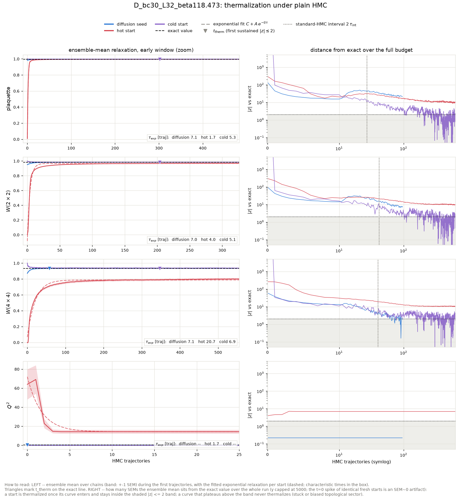

tau_int (hot-start chains, second half): plaquette = 13.50 +- 1.62, wilson_2x2 = 20.87 +- 2.39, wilson_4x4 = 20.02 +- 2.62, wilson_6x6 = 10.67 +- 1.82. Topology: hot-start HMC L=32 beta=118.473 -> **frozen** (no tunneling).

Where 'never' stood at the end: the hot start ended the 640-trajectory budget still at plaquette at |z| ~ 10, wilson_2x2 at |z| ~ 10, wilson_4x4 at |z| ~ 10, wilson_6x6 at |z| ~ 11, Q^2 at |z| ~ 7; the cold start ended the 640-trajectory budget still at Q^2 at |z| ~ 171377917952.

### Diagnostics: raw diffusion output (before any HMC)

| observable | value | error | exact | z_exact | reference | ref_error | z_ref | ks_p | chi2_p |
|---|---|---|---|---|---|---|---|---|---|
| plaquette | 0.9819 | 7.138e-05 | 0.9958 | -193.6 | 0.9958 | 1.23e-05 | -190.7 | 0 |  |
| wilson_1x1 | 0.9819 | 7.138e-05 | 0.9958 | -193.6 | 0.9958 | 1.23e-05 | -190.7 | 0 |  |
| wilson_1x2 | 0.9685 | 0.0001222 | 0.9916 | -188.7 | 0.9916 | 3.012e-05 | -183.4 | 0 |  |
| wilson_2x2 | 0.9507 | 0.0002895 | 0.9832 | -112.2 | 0.9833 | 6.038e-05 | -110.1 | 0 |  |
| wilson_2x3 | 0.9344 | 0.0003638 | 0.9749 | -111.3 | 0.9753 | 8.916e-05 | -109.1 | 0 |  |
| wilson_3x3 | 0.9129 | 0.0005399 | 0.9626 | -92.13 | 0.9633 | 0.0001691 | -89 | 0 |  |
| wilson_3x4 | 0.8944 | 0.0007079 | 0.9505 | -79.3 | 0.9517 | 0.0002331 | -76.88 | 0 |  |
| wilson_4x4 | 0.8715 | 0.000848 | 0.9347 | -74.5 | 0.9365 | 0.0004098 | -69.05 | 0 |  |
| wilson_4x5 | 0.8482 | 0.001193 | 0.9191 | -59.39 | 0.9217 | 0.0005746 | -55.48 | 0 |  |
| wilson_5x5 | 0.8211 | 0.001472 | 0.9 | -53.56 | 0.9033 | 0.0008577 | -48.22 | 0 |  |
| wilson_5x6 | 0.7976 | 0.001851 | 0.8813 | -45.25 | 0.8855 | 0.001116 | -40.68 | 0 |  |
| wilson_6x6 | 0.7722 | 0.002047 | 0.8595 | -42.65 | 0.8646 | 0.001569 | -35.83 | 0 |  |
| wilson_6x7 | 0.7455 | 0.002358 | 0.8383 | -39.34 | 0.8443 | 0.001981 | -32.07 | 0 |  |
| wilson_7x7 | 0.7128 | 0.00287 | 0.8143 | -35.35 | 0.8206 | 0.002513 | -28.25 | 0 |  |
| wilson_7x8 | 0.6871 | 0.003123 | 0.791 | -33.26 | 0.7982 | 0.003026 | -25.55 | 0 |  |
| wilson_8x8 | 0.661 | 0.003657 | 0.7653 | -28.54 | 0.7725 | 0.003654 | -21.57 | 1.01e-42 |  |
| wilson_8x10 | 0.6062 | 0.004623 | 0.7168 | -23.92 | 0.7262 | 0.004895 | -17.82 | 6.026e-37 |  |
| wilson_10x10 | 0.5438 | 0.006351 | 0.6609 | -18.43 | 0.6696 | 0.006534 | -13.8 | 2.337e-29 |  |
| wilson_10x12 | 0.4929 | 0.00792 | 0.6099 | -14.77 | 0.6222 | 0.008378 | -11.21 | 5.284e-22 |  |
| wilson_12x12 | 0.4381 | 0.009494 | 0.5548 | -12.29 | 0.5693 | 0.009953 | -9.542 | 1.48e-17 |  |
| creutz_2 | 0.004728 | 0.0001967 | 0.00423 | 2.531 |  |  |  |  |  |
| creutz_3 | 0.005992 | 0.0004058 | 0.004215 | 4.379 |  |  |  |  |  |
| creutz_4 | 0.00548 | 0.0005532 | 0.004193 | 2.326 |  |  |  |  |  |
| creutz_5 | 0.005349 | 0.000776 | 0.004164 | 1.527 |  |  |  |  |  |
| creutz_6 | 0.003246 | 0.0009598 | 0.004126 | -0.9169 |  |  |  |  |  |
| creutz_7 | 0.00963 | 0.001312 | 0.004078 | 4.233 |  |  |  |  |  |
| creutz_8 | 0.002121 | 0.00166 | 0.004018 | -1.143 |  |  |  |  |  |
| Q | -0.007812 | 0.03351 | 0 | -0.2332 | 0.03125 | 0.02492 | -0.9354 | 0.9888 |  |
| Q^2 | 0.1641 | 0.02575 | 0.1714 | -0.2841 | 0.1042 | 0.02636 | 1.625 | 0.9353 |  |
| chi_top ((<Q^2>-<Q>^2)/V) | 0.0001602 | 2.53e-05 | 0.0001674 | -0.2847 | 0.0001008 | 2.519e-05 | 1.663 | 0 |  |
| Q histogram vs exact P(Q) | 0.08521 | nan | 2 | nan |  |  |  |  | 0.9583 |

### Diagnostics: the same configs after 96 HMC trajectories

| observable | value | error | exact | z_exact | reference | ref_error | z_ref | ks_p | chi2_p |
|---|---|---|---|---|---|---|---|---|---|
| plaquette | 0.9954 | 1.577e-05 | 0.9958 | -25.45 | 0.9958 | 1.23e-05 | -19.57 | 1.729e-38 |  |
| wilson_1x1 | 0.9954 | 1.577e-05 | 0.9958 | -25.45 | 0.9958 | 1.23e-05 | -19.57 | 1.729e-38 |  |
| wilson_1x2 | 0.9909 | 3.856e-05 | 0.9916 | -16.06 | 0.9916 | 3.012e-05 | -13.08 | 2.319e-21 |  |
| wilson_2x2 | 0.9825 | 8.857e-05 | 0.9832 | -8.312 | 0.9833 | 6.038e-05 | -7.73 | 5e-08 |  |
| wilson_2x3 | 0.9736 | 0.0001813 | 0.9749 | -7.212 | 0.9753 | 8.916e-05 | -8.183 | 1.505e-09 |  |
| wilson_3x3 | 0.9603 | 0.0002968 | 0.9626 | -7.86 | 0.9633 | 0.0001691 | -8.632 | 3.783e-08 |  |
| wilson_3x4 | 0.9485 | 0.0005467 | 0.9505 | -3.738 | 0.9517 | 0.0002331 | -5.394 | 0.0001372 |  |
| wilson_4x4 | 0.9333 | 0.000817 | 0.9347 | -1.606 | 0.9365 | 0.0004098 | -3.465 | 0.02248 |  |
| wilson_4x5 | 0.9169 | 0.001228 | 0.9191 | -1.74 | 0.9217 | 0.0005746 | -3.497 | 0.03364 |  |
| wilson_5x5 | 0.8966 | 0.001737 | 0.9 | -1.932 | 0.9033 | 0.0008577 | -3.443 | 0.017 |  |
| wilson_5x6 | 0.8783 | 0.002407 | 0.8813 | -1.277 | 0.8855 | 0.001116 | -2.739 | 0.03831 |  |
| wilson_6x6 | 0.8565 | 0.003124 | 0.8595 | -0.9558 | 0.8646 | 0.001569 | -2.321 | 0.1122 |  |
| wilson_6x7 | 0.8349 | 0.003869 | 0.8383 | -0.8662 | 0.8443 | 0.001981 | -2.146 | 0.1004 |  |
| wilson_7x7 | 0.8098 | 0.00465 | 0.8143 | -0.9666 | 0.8206 | 0.002513 | -2.048 | 0.05588 |  |
| wilson_7x8 | 0.7867 | 0.00558 | 0.791 | -0.7758 | 0.7982 | 0.003026 | -1.818 | 0.1892 |  |
| wilson_8x8 | 0.7608 | 0.006552 | 0.7653 | -0.699 | 0.7725 | 0.003654 | -1.564 | 0.1545 |  |
| wilson_8x10 | 0.7118 | 0.008617 | 0.7168 | -0.5707 | 0.7262 | 0.004895 | -1.447 | 0.08971 |  |
| wilson_10x10 | 0.6559 | 0.01099 | 0.6609 | -0.4491 | 0.6696 | 0.006534 | -1.065 | 0.2522 |  |
| wilson_10x12 | 0.6055 | 0.01347 | 0.6099 | -0.331 | 0.6222 | 0.008378 | -1.051 | 0.2522 |  |
| wilson_12x12 | 0.5502 | 0.01563 | 0.5548 | -0.2935 | 0.5693 | 0.009953 | -1.032 | 0.3021 |  |
| creutz_2 | 0.004133 | 6.253e-05 | 0.00423 | -1.557 |  |  |  |  |  |
| creutz_3 | 0.004707 | 0.0001134 | 0.004215 | 4.336 |  |  |  |  |  |
| creutz_4 | 0.00372 | 0.0002145 | 0.004193 | -2.209 |  |  |  |  |  |
| creutz_5 | 0.004651 | 0.000331 | 0.004164 | 1.472 |  |  |  |  |  |
| creutz_6 | 0.004357 | 0.0004092 | 0.004126 | 0.5652 |  |  |  |  |  |
| creutz_7 | 0.005081 | 0.0005619 | 0.004078 | 1.786 |  |  |  |  |  |
| creutz_8 | 0.004579 | 0.0007654 | 0.004018 | 0.7323 |  |  |  |  |  |
| Q | -0.007812 | 0.03351 | 0 | -0.2332 | 0.03125 | 0.02492 | -0.9354 | 0.9888 |  |
| Q^2 | 0.1641 | 0.02575 | 0.1714 | -0.2841 | 0.1042 | 0.02636 | 1.625 | 0.9353 |  |
| chi_top ((<Q^2>-<Q>^2)/V) | 0.0001602 | 2.53e-05 | 0.0001674 | -0.2847 | 0.0001008 | 2.519e-05 | 1.663 | 0 |  |
| Q histogram vs exact P(Q) | 0.08521 | nan | 2 | nan |  |  |  |  | 0.9583 |

## E_bc35_L32_beta138.477

HMC: step size 0.0340, 29 leapfrog steps, acceptance seed/hot/cold = 0.883/0.973/0.977. Diffusion-seed batch: 128 chains x 96 trajectories (0.62 s/traj for the whole batch); baselines: 32 chains x 640 trajectories.

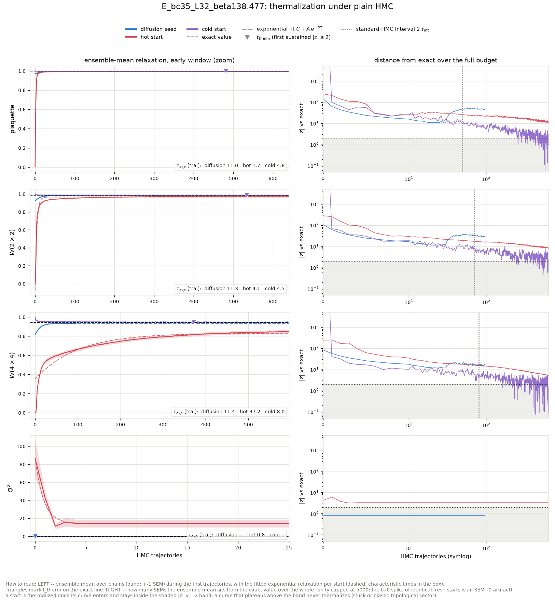

tau_int (hot-start chains, second half): plaquette = 24.68 +- 2.05, wilson_2x2 = 35.21 +- 2.11, wilson_4x4 = 40.19 +- 2.05, wilson_6x6 = 37.82 +- 2.59. Topology: hot-start HMC L=32 beta=138.477 -> **frozen** (no tunneling).

Where 'never' stood at the end: the hot start ended the 640-trajectory budget still at plaquette at |z| ~ 12, wilson_2x2 at |z| ~ 8, wilson_4x4 at |z| ~ 5, wilson_6x6 at |z| ~ 5, Q^2 at |z| ~ 3; the cold start ended the 640-trajectory budget still at Q^2 at |z| ~ 122925113344.

### Diagnostics: raw diffusion output (before any HMC)

| observable | value | error | exact | z_exact | reference | ref_error | z_ref | ks_p | chi2_p |
|---|---|---|---|---|---|---|---|---|---|
| plaquette | 0.969 | 0.0002627 | 0.9964 | -104.1 | 0.9964 | 1.354e-05 | -104.1 | 0 |  |
| wilson_1x1 | 0.969 | 0.0002627 | 0.9964 | -104.1 | 0.9964 | 1.354e-05 | -104.1 | 0 |  |
| wilson_1x2 | 0.9467 | 0.0004852 | 0.9928 | -94.9 | 0.9928 | 3.55e-05 | -94.75 | 0 |  |
| wilson_2x2 | 0.9228 | 0.0006646 | 0.9856 | -94.58 | 0.9858 | 8.989e-05 | -93.92 | 0 |  |
| wilson_2x3 | 0.8996 | 0.0008558 | 0.9785 | -92.22 | 0.9787 | 0.0001615 | -90.84 | 0 |  |
| wilson_3x3 | 0.8685 | 0.001121 | 0.968 | -88.73 | 0.9684 | 0.0002549 | -86.82 | 0 |  |
| wilson_3x4 | 0.845 | 0.00141 | 0.9576 | -79.88 | 0.9579 | 0.0003788 | -77.36 | 0 |  |
| wilson_4x4 | 0.8199 | 0.001655 | 0.944 | -74.95 | 0.9442 | 0.0005091 | -71.79 | 0 |  |
| wilson_4x5 | 0.7899 | 0.001986 | 0.9305 | -70.8 | 0.9305 | 0.0007245 | -66.5 | 0 |  |
| wilson_5x5 | 0.7531 | 0.002454 | 0.9141 | -65.58 | 0.9138 | 0.0009305 | -61.22 | 0 |  |
| wilson_5x6 | 0.7286 | 0.002737 | 0.898 | -61.87 | 0.8976 | 0.001199 | -56.54 | 0 |  |
| wilson_6x6 | 0.7074 | 0.002739 | 0.8791 | -62.67 | 0.8781 | 0.001489 | -54.73 | 0 |  |
| wilson_6x7 | 0.6735 | 0.003258 | 0.8607 | -57.47 | 0.8596 | 0.001869 | -49.55 | 0 |  |
| wilson_7x7 | 0.63 | 0.003949 | 0.8398 | -53.13 | 0.8379 | 0.002266 | -45.67 | 0 |  |
| wilson_7x8 | 0.6075 | 0.004456 | 0.8195 | -47.59 | 0.817 | 0.002773 | -39.92 | 0 |  |
| wilson_8x8 | 0.5836 | 0.004743 | 0.7971 | -45.01 | 0.7936 | 0.00334 | -36.2 | 0 |  |
| wilson_8x10 | 0.5279 | 0.005037 | 0.7544 | -44.96 | 0.749 | 0.004625 | -32.33 | 0 |  |
| wilson_10x10 | 0.4677 | 0.006424 | 0.7049 | -36.93 | 0.696 | 0.005881 | -26.21 | 0 |  |
| wilson_10x12 | 0.4165 | 0.00711 | 0.6595 | -34.19 | 0.6481 | 0.007336 | -22.68 | 1.95e-39 |  |
| wilson_12x12 | 0.3644 | 0.008713 | 0.6099 | -28.18 | 0.596 | 0.008918 | -18.57 | 7.666e-29 |  |
| creutz_2 | 0.002368 | 0.000418 | 0.003613 | -2.979 |  |  |  |  |  |
| creutz_3 | 0.009776 | 0.0007626 | 0.003593 | 8.107 |  |  |  |  |  |
| creutz_4 | 0.002637 | 0.001025 | 0.003564 | -0.9039 |  |  |  |  |  |
| creutz_5 | 0.01048 | 0.001239 | 0.003524 | 5.612 |  |  |  |  |  |
| creutz_6 | -0.003587 | 0.001825 | 0.003474 | -3.87 |  |  |  |  |  |
| creutz_7 | 0.01752 | 0.001968 | 0.003411 | 7.17 |  |  |  |  |  |
| creutz_8 | 0.003676 | 0.002852 | 0.003335 | 0.1196 |  |  |  |  |  |
| Q | -0.03906 | 0.03255 | 0 | -1.2 | -0.03646 | 0.02674 | -0.06182 | 1 |  |
| Q^2 | 0.1484 | 0.02165 | 0.1229 | 1.178 | 0.151 | 0.02242 | -0.08356 | 1 |  |
| chi_top ((<Q^2>-<Q>^2)/V) | 0.0001435 | 2.067e-05 | 0.00012 | 1.133 | 0.0001462 | 2.157e-05 | -0.09154 | 0 |  |
| Q histogram vs exact P(Q) | 2.375 | nan | 2 | nan |  |  |  |  | 0.3051 |

### Diagnostics: the same configs after 96 HMC trajectories

| observable | value | error | exact | z_exact | reference | ref_error | z_ref | ks_p | chi2_p |
|---|---|---|---|---|---|---|---|---|---|
| plaquette | 0.9951 | 3.07e-05 | 0.9964 | -41.78 | 0.9964 | 1.354e-05 | -38.72 | 0 |  |
| wilson_1x1 | 0.9951 | 3.07e-05 | 0.9964 | -41.78 | 0.9964 | 1.354e-05 | -38.72 | 0 |  |
| wilson_1x2 | 0.9905 | 5.29e-05 | 0.9928 | -42.36 | 0.9928 | 3.55e-05 | -35.95 | 0 |  |
| wilson_2x2 | 0.9823 | 9.128e-05 | 0.9856 | -36.77 | 0.9858 | 8.989e-05 | -27.19 | 0 |  |
| wilson_2x3 | 0.9743 | 0.0001636 | 0.9785 | -26.17 | 0.9787 | 0.0001615 | -19.46 | 0 |  |
| wilson_3x3 | 0.9624 | 0.0002897 | 0.968 | -19.27 | 0.9684 | 0.0002549 | -15.37 | 1.752e-31 |  |
| wilson_3x4 | 0.9503 | 0.000445 | 0.9576 | -16.35 | 0.9579 | 0.0003788 | -12.98 | 1.083e-24 |  |
| wilson_4x4 | 0.9337 | 0.0006268 | 0.944 | -16.43 | 0.9442 | 0.0005091 | -13.08 | 3.775e-21 |  |
| wilson_4x5 | 0.9207 | 0.0008552 | 0.9305 | -11.53 | 0.9305 | 0.0007245 | -8.783 | 9.899e-13 |  |
| wilson_5x5 | 0.9057 | 0.001254 | 0.9141 | -6.711 | 0.9138 | 0.0009305 | -5.21 | 1.026e-05 |  |
| wilson_5x6 | 0.8878 | 0.001678 | 0.898 | -6.039 | 0.8976 | 0.001199 | -4.722 | 3.906e-05 |  |
| wilson_6x6 | 0.8662 | 0.002114 | 0.8791 | -6.093 | 0.8781 | 0.001489 | -4.586 | 0.0005374 |  |
| wilson_6x7 | 0.8453 | 0.002665 | 0.8607 | -5.759 | 0.8596 | 0.001869 | -4.376 | 0.0002496 |  |
| wilson_7x7 | 0.8222 | 0.003212 | 0.8398 | -5.481 | 0.8379 | 0.002266 | -4 | 0.002655 |  |
| wilson_7x8 | 0.803 | 0.003906 | 0.8195 | -4.226 | 0.817 | 0.002773 | -2.923 | 0.03364 |  |
| wilson_8x8 | 0.7829 | 0.004712 | 0.7971 | -2.997 | 0.7936 | 0.00334 | -1.847 | 0.1892 |  |
| wilson_8x10 | 0.7349 | 0.006004 | 0.7544 | -3.235 | 0.749 | 0.004625 | -1.848 | 0.1892 |  |
| wilson_10x10 | 0.6827 | 0.007496 | 0.7049 | -2.966 | 0.696 | 0.005881 | -1.393 | 0.4212 |  |
| wilson_10x12 | 0.6323 | 0.008907 | 0.6595 | -3.054 | 0.6481 | 0.007336 | -1.372 | 0.4548 |  |
| wilson_12x12 | 0.582 | 0.01005 | 0.6099 | -2.784 | 0.596 | 0.008918 | -1.043 | 0.7163 |  |
| creutz_2 | 0.003794 | 8.976e-05 | 0.003613 | 2.015 |  |  |  |  |  |
| creutz_3 | 0.00402 | 0.000121 | 0.003593 | 3.527 |  |  |  |  |  |
| creutz_4 | 0.005067 | 0.0002262 | 0.003564 | 6.645 |  |  |  |  |  |
| creutz_5 | 0.002444 | 0.000381 | 0.003524 | -2.835 |  |  |  |  |  |
| creutz_6 | 0.004787 | 0.0003851 | 0.003474 | 3.412 |  |  |  |  |  |
| creutz_7 | 0.003371 | 0.0005068 | 0.003411 | -0.07955 |  |  |  |  |  |
| creutz_8 | 0.001703 | 0.0007298 | 0.003335 | -2.236 |  |  |  |  |  |
| Q | -0.03906 | 0.03255 | 0 | -1.2 | -0.03646 | 0.02674 | -0.06182 | 1 |  |
| Q^2 | 0.1484 | 0.02165 | 0.1229 | 1.178 | 0.151 | 0.02242 | -0.08356 | 1 |  |
| chi_top ((<Q^2>-<Q>^2)/V) | 0.0001435 | 2.067e-05 | 0.00012 | 1.133 | 0.0001462 | 2.157e-05 | -0.09154 | 0 |  |
| Q histogram vs exact P(Q) | 2.375 | nan | 2 | nan |  |  |  |  | 0.3051 |

## D_bc40_L32_beta158.48

HMC: step size 0.0318, 31 leapfrog steps, acceptance seed/hot/cold = 0.894/0.974/0.980. Diffusion-seed batch: 128 chains x 96 trajectories (0.66 s/traj for the whole batch); baselines: 32 chains x 640 trajectories.

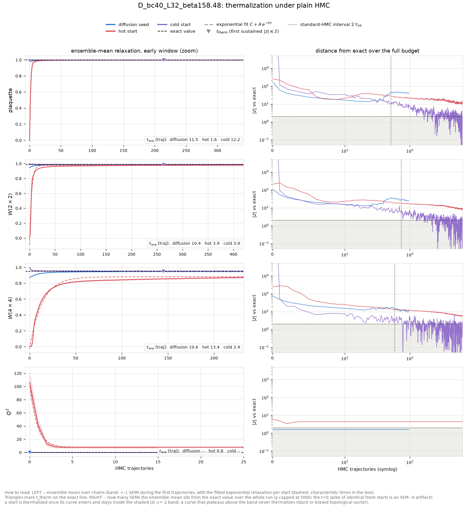

tau_int (hot-start chains, second half): plaquette = 25.32 +- 1.84, wilson_2x2 = 36.73 +- 2.19, wilson_4x4 = 29.01 +- 2.47, wilson_6x6 = 9.06 +- 1.54. Topology: hot-start HMC L=32 beta=158.48 -> **frozen** (no tunneling).

Where 'never' stood at the end: the hot start ended the 640-trajectory budget still at plaquette at |z| ~ 12, wilson_2x2 at |z| ~ 9, wilson_4x4 at |z| ~ 6, wilson_6x6 at |z| ~ 5, Q^2 at |z| ~ 4; the cold start ended the 640-trajectory budget still at Q^2 at |z| ~ 86933716992.

### Diagnostics: raw diffusion output (before any HMC)

| observable | value | error | exact | z_exact | reference | ref_error | z_ref | ks_p | chi2_p |
|---|---|---|---|---|---|---|---|---|---|
| plaquette | 0.9792 | 0.0001043 | 0.9968 | -169.4 | 0.9969 | 7.484e-06 | -169.2 | 0 |  |
| wilson_1x1 | 0.9792 | 0.0001043 | 0.9968 | -169.4 | 0.9969 | 7.484e-06 | -169.2 | 0 |  |
| wilson_1x2 | 0.9638 | 0.0002699 | 0.9937 | -110.9 | 0.9937 | 2.19e-05 | -110.7 | 0 |  |
| wilson_2x2 | 0.947 | 0.0004335 | 0.9874 | -93.26 | 0.9875 | 5.587e-05 | -92.73 | 0 |  |
| wilson_2x3 | 0.9305 | 0.0005379 | 0.9812 | -94.24 | 0.9813 | 0.0001011 | -92.78 | 0 |  |
| wilson_3x3 | 0.9091 | 0.0006636 | 0.972 | -94.79 | 0.9722 | 0.0001779 | -91.74 | 0 |  |
| wilson_3x4 | 0.8913 | 0.0009491 | 0.9629 | -75.47 | 0.9632 | 0.0002749 | -72.74 | 0 |  |
| wilson_4x4 | 0.8721 | 0.001174 | 0.951 | -67.15 | 0.9514 | 0.0004515 | -63.02 | 0 |  |
| wilson_4x5 | 0.8496 | 0.00137 | 0.9392 | -65.44 | 0.94 | 0.0006134 | -60.22 | 0 |  |
| wilson_5x5 | 0.8228 | 0.001661 | 0.9248 | -61.43 | 0.9256 | 0.0009137 | -54.27 | 0 |  |
| wilson_5x6 | 0.8016 | 0.00203 | 0.9106 | -53.69 | 0.9115 | 0.00119 | -46.7 | 0 |  |
| wilson_6x6 | 0.7813 | 0.002426 | 0.894 | -46.47 | 0.8946 | 0.001572 | -39.21 | 0 |  |
| wilson_6x7 | 0.7553 | 0.002797 | 0.8778 | -43.81 | 0.8785 | 0.001917 | -36.34 | 0 |  |
| wilson_7x7 | 0.7236 | 0.003386 | 0.8594 | -40.09 | 0.8603 | 0.002412 | -32.88 | 0 |  |
| wilson_7x8 | 0.7017 | 0.003977 | 0.8414 | -35.13 | 0.8418 | 0.002769 | -28.91 | 0 |  |
| wilson_8x8 | 0.6805 | 0.004446 | 0.8216 | -31.73 | 0.8216 | 0.003365 | -25.3 | 0 |  |
| wilson_8x10 | 0.6299 | 0.005599 | 0.7837 | -27.47 | 0.7828 | 0.004506 | -21.27 | 0 |  |
| wilson_10x10 | 0.5719 | 0.006954 | 0.7397 | -24.12 | 0.7378 | 0.005932 | -18.15 | 1.026e-41 |  |
| wilson_10x12 | 0.524 | 0.007819 | 0.699 | -22.38 | 0.694 | 0.007383 | -15.81 | 2.779e-34 |  |
| wilson_12x12 | 0.4743 | 0.008793 | 0.6544 | -20.49 | 0.6478 | 0.008811 | -13.94 | 4.439e-28 |  |
| creutz_2 | 0.001662 | 0.0002828 | 0.003152 | -5.267 |  |  |  |  |  |
| creutz_3 | 0.005735 | 0.0004702 | 0.003129 | 5.544 |  |  |  |  |  |
| creutz_4 | 0.001922 | 0.0006118 | 0.003094 | -1.916 |  |  |  |  |  |
| creutz_5 | 0.005859 | 0.0008774 | 0.003047 | 3.206 |  |  |  |  |  |
| creutz_6 | -0.0002997 | 0.001076 | 0.002987 | -3.056 |  |  |  |  |  |
| creutz_7 | 0.008959 | 0.001344 | 0.002915 | 4.496 |  |  |  |  |  |
| creutz_8 | 1.239e-05 | 0.00158 | 0.002827 | -1.781 |  |  |  |  |  |
| Q | 0.03906 | 0.02015 | 0 | 1.938 | 0.02083 | 0.02291 | 0.5974 | 1 |  |
| Q^2 | 0.05469 | 0.0179 | 0.08693 | -1.801 | 0.09375 | 0.01492 | -1.676 | 0.9996 |  |
| chi_top ((<Q^2>-<Q>^2)/V) | 5.192e-05 | 1.657e-05 | 8.49e-05 | -1.991 | 9.113e-05 | 1.454e-05 | -1.779 | 0 |  |
| Q histogram vs exact P(Q) | 3.921 | nan | 2 | nan |  |  |  |  | 0.1408 |

### Diagnostics: the same configs after 96 HMC trajectories

| observable | value | error | exact | z_exact | reference | ref_error | z_ref | ks_p | chi2_p |
|---|---|---|---|---|---|---|---|---|---|
| plaquette | 0.996 | 2.124e-05 | 0.9968 | -39.71 | 0.9969 | 7.484e-06 | -38.68 | 0 |  |
| wilson_1x1 | 0.996 | 2.124e-05 | 0.9968 | -39.71 | 0.9969 | 7.484e-06 | -38.68 | 0 |  |
| wilson_1x2 | 0.9921 | 4.347e-05 | 0.9937 | -37.39 | 0.9937 | 2.19e-05 | -34.28 | 0 |  |
| wilson_2x2 | 0.985 | 0.0001058 | 0.9874 | -22.83 | 0.9875 | 5.587e-05 | -21.06 | 0 |  |
| wilson_2x3 | 0.9782 | 0.0001814 | 0.9812 | -16.81 | 0.9813 | 0.0001011 | -15.1 | 5.386e-34 |  |
| wilson_3x3 | 0.9685 | 0.0002984 | 0.972 | -11.96 | 0.9722 | 0.0001779 | -10.65 | 5.284e-22 |  |
| wilson_3x4 | 0.958 | 0.0004024 | 0.9629 | -12.18 | 0.9632 | 0.0002749 | -10.56 | 1.09e-14 |  |
| wilson_4x4 | 0.9447 | 0.0006462 | 0.951 | -9.675 | 0.9514 | 0.0004515 | -8.484 | 4.101e-12 |  |
| wilson_4x5 | 0.9316 | 0.0008895 | 0.9392 | -8.519 | 0.94 | 0.0006134 | -7.704 | 2.296e-10 |  |
| wilson_5x5 | 0.916 | 0.001146 | 0.9248 | -7.674 | 0.9256 | 0.0009137 | -6.58 | 8.121e-10 |  |
| wilson_5x6 | 0.9028 | 0.001398 | 0.9106 | -5.555 | 0.9115 | 0.00119 | -4.725 | 5.543e-07 |  |
| wilson_6x6 | 0.8888 | 0.001784 | 0.894 | -2.889 | 0.8946 | 0.001572 | -2.424 | 0.02248 |  |
| wilson_6x7 | 0.8689 | 0.002152 | 0.8778 | -4.127 | 0.8785 | 0.001917 | -3.314 | 0.00189 |  |
| wilson_7x7 | 0.8452 | 0.002495 | 0.8594 | -5.691 | 0.8603 | 0.002412 | -4.364 | 2.022e-05 |  |
| wilson_7x8 | 0.8284 | 0.002853 | 0.8414 | -4.579 | 0.8418 | 0.002769 | -3.377 | 0.001117 |  |
| wilson_8x8 | 0.8125 | 0.003419 | 0.8216 | -2.666 | 0.8216 | 0.003365 | -1.901 | 0.01957 |  |
| wilson_8x10 | 0.7724 | 0.004446 | 0.7837 | -2.543 | 0.7828 | 0.004506 | -1.638 | 0.03364 |  |
| wilson_10x10 | 0.7252 | 0.005953 | 0.7397 | -2.431 | 0.7378 | 0.005932 | -1.5 | 0.01275 |  |
| wilson_10x12 | 0.6873 | 0.007409 | 0.699 | -1.587 | 0.694 | 0.007383 | -0.6476 | 0.04354 |  |
| wilson_12x12 | 0.6465 | 0.009053 | 0.6544 | -0.8734 | 0.6478 | 0.008811 | -0.1003 | 0.1392 |  |
| creutz_2 | 0.003174 | 5.995e-05 | 0.003152 | 0.3763 |  |  |  |  |  |
| creutz_3 | 0.003035 | 0.0001242 | 0.003129 | -0.7557 |  |  |  |  |  |
| creutz_4 | 0.003162 | 0.0001952 | 0.003094 | 0.3478 |  |  |  |  |  |
| creutz_5 | 0.002996 | 0.0002825 | 0.003047 | -0.1797 |  |  |  |  |  |
| creutz_6 | 0.001191 | 0.0004699 | 0.002987 | -3.822 |  |  |  |  |  |
| creutz_7 | 0.005018 | 0.0006179 | 0.002915 | 3.405 |  |  |  |  |  |
| creutz_8 | -0.0006454 | 0.0007339 | 0.002827 | -4.731 |  |  |  |  |  |
| Q | 0.03906 | 0.02015 | 0 | 1.938 | 0.02083 | 0.02291 | 0.5974 | 1 |  |
| Q^2 | 0.05469 | 0.0179 | 0.08693 | -1.801 | 0.09375 | 0.01492 | -1.676 | 0.9996 |  |
| chi_top ((<Q^2>-<Q>^2)/V) | 5.192e-05 | 1.657e-05 | 8.49e-05 | -1.991 | 9.113e-05 | 1.454e-05 | -1.779 | 0 |  |
| Q histogram vs exact P(Q) | 3.921 | nan | 2 | nan |  |  |  |  | 0.1408 |

## E_bc45_L32_beta178.482

HMC: step size 0.0299, 33 leapfrog steps, acceptance seed/hot/cold = 0.791/0.973/0.978. Diffusion-seed batch: 128 chains x 96 trajectories (0.69 s/traj for the whole batch); baselines: 32 chains x 640 trajectories.

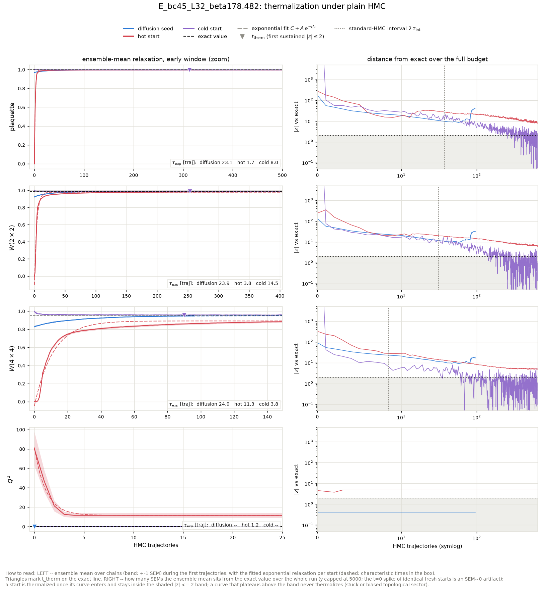

tau_int (hot-start chains, second half): plaquette = 18.77 +- 1.55, wilson_2x2 = 15.67 +- 1.69, wilson_4x4 = 4.23 +- 0.64, wilson_6x6 = 2.89 +- 0.30. Topology: hot-start HMC L=32 beta=178.482 -> **frozen** (no tunneling).

Where 'never' stood at the end: the hot start ended the 640-trajectory budget still at plaquette at |z| ~ 8, wilson_2x2 at |z| ~ 6, wilson_4x4 at |z| ~ 5, wilson_6x6 at |z| ~ 6, Q^2 at |z| ~ 5; the cold start ended the 640-trajectory budget still at Q^2 at |z| ~ 60793004032.

### Diagnostics: raw diffusion output (before any HMC)

| observable | value | error | exact | z_exact | reference | ref_error | z_ref | ks_p | chi2_p |
|---|---|---|---|---|---|---|---|---|---|
| plaquette | 0.969 | 0.0001415 | 0.9972 | -199 | 0.9972 | 9.091e-06 | -198.5 | 0 |  |
| wilson_1x1 | 0.969 | 0.0001415 | 0.9972 | -199 | 0.9972 | 9.091e-06 | -198.5 | 0 |  |
| wilson_1x2 | 0.9468 | 0.0003067 | 0.9944 | -155.1 | 0.9944 | 2.084e-05 | -154.7 | 0 |  |
| wilson_2x2 | 0.9233 | 0.0004547 | 0.9889 | -144.1 | 0.9888 | 4.604e-05 | -143.3 | 0 |  |
| wilson_2x3 | 0.9007 | 0.0006608 | 0.9833 | -125.1 | 0.9833 | 8.636e-05 | -124 | 0 |  |
| wilson_3x3 | 0.8728 | 0.0007777 | 0.9752 | -131.7 | 0.9752 | 0.000162 | -128.9 | 0 |  |
| wilson_3x4 | 0.8504 | 0.001095 | 0.9671 | -106.5 | 0.967 | 0.0002318 | -104.2 | 0 |  |
| wilson_4x4 | 0.8271 | 0.001362 | 0.9564 | -94.98 | 0.9561 | 0.0003554 | -91.65 | 0 |  |
| wilson_4x5 | 0.7984 | 0.001543 | 0.946 | -95.62 | 0.9452 | 0.0004515 | -91.3 | 0 |  |
| wilson_5x5 | 0.7642 | 0.001576 | 0.9331 | -107.2 | 0.932 | 0.0006228 | -99.02 | 0 |  |
| wilson_5x6 | 0.7414 | 0.00183 | 0.9205 | -97.87 | 0.9191 | 0.0007729 | -89.48 | 0 |  |
| wilson_6x6 | 0.7239 | 0.002114 | 0.9057 | -85.98 | 0.9043 | 0.001021 | -76.82 | 0 |  |
| wilson_6x7 | 0.6931 | 0.002702 | 0.8912 | -73.3 | 0.8902 | 0.001265 | -66.04 | 0 |  |
| wilson_7x7 | 0.6509 | 0.0028 | 0.8748 | -79.96 | 0.8732 | 0.001542 | -69.54 | 0 |  |
| wilson_7x8 | 0.6308 | 0.002724 | 0.8588 | -83.68 | 0.8577 | 0.001849 | -68.93 | 0 |  |
| wilson_8x8 | 0.612 | 0.002918 | 0.841 | -78.48 | 0.8398 | 0.002216 | -62.18 | 0 |  |
| wilson_8x10 | 0.5612 | 0.004623 | 0.807 | -53.18 | 0.8066 | 0.003006 | -44.51 | 0 |  |
| wilson_10x10 | 0.5035 | 0.005056 | 0.7675 | -52.21 | 0.7688 | 0.003828 | -41.83 | 0 |  |
| wilson_10x12 | 0.4571 | 0.005373 | 0.7309 | -50.95 | 0.7332 | 0.004739 | -38.54 | 0 |  |
| wilson_12x12 | 0.4099 | 0.005838 | 0.6906 | -48.09 | 0.6914 | 0.005477 | -35.17 | 0 |  |
| creutz_2 | 0.001969 | 0.0004585 | 0.002795 | -1.802 |  |  |  |  |  |
| creutz_3 | 0.006639 | 0.00065 | 0.002769 | 5.954 |  |  |  |  |  |
| creutz_4 | 0.001806 | 0.0008373 | 0.002731 | -1.105 |  |  |  |  |  |
| creutz_5 | 0.008487 | 0.001282 | 0.002679 | 4.529 |  |  |  |  |  |
| creutz_6 | -0.006415 | 0.001538 | 0.002614 | -5.872 |  |  |  |  |  |
| creutz_7 | 0.01948 | 0.001797 | 0.002535 | 9.434 |  |  |  |  |  |
| creutz_8 | -0.001088 | 0.002347 | 0.002441 | -1.504 |  |  |  |  |  |
| Q | -0.02344 | 0.02018 | 0 | -1.161 | 0.005208 | 0.01913 | -1.03 | 1 |  |
| Q^2 | 0.07031 | 0.02161 | 0.06079 | 0.4406 | 0.05729 | 0.01394 | 0.5063 | 1 |  |
| chi_top ((<Q^2>-<Q>^2)/V) | 6.813e-05 | 2.091e-05 | 5.937e-05 | 0.4188 | 5.592e-05 | 1.358e-05 | 0.4895 | 0 |  |
| Q histogram vs exact P(Q) | 1.36 | nan | 2 | nan |  |  |  |  | 0.5065 |

### Diagnostics: the same configs after 96 HMC trajectories

| observable | value | error | exact | z_exact | reference | ref_error | z_ref | ks_p | chi2_p |
|---|---|---|---|---|---|---|---|---|---|
| plaquette | 0.9952 | 3.881e-05 | 0.9972 | -52.47 | 0.9972 | 9.091e-06 | -50.9 | 0 |  |
| wilson_1x1 | 0.9952 | 3.881e-05 | 0.9972 | -52.47 | 0.9972 | 9.091e-06 | -50.9 | 0 |  |
| wilson_1x2 | 0.991 | 7.928e-05 | 0.9944 | -43.14 | 0.9944 | 2.084e-05 | -41.73 | 0 |  |
| wilson_2x2 | 0.984 | 0.0001474 | 0.9889 | -33.24 | 0.9888 | 4.604e-05 | -31.53 | 0 |  |
| wilson_2x3 | 0.9768 | 0.0002356 | 0.9833 | -27.56 | 0.9833 | 8.636e-05 | -25.78 | 0 |  |
| wilson_3x3 | 0.9679 | 0.0002978 | 0.9752 | -24.41 | 0.9752 | 0.000162 | -21.47 | 0 |  |
| wilson_3x4 | 0.9595 | 0.0003669 | 0.9671 | -20.66 | 0.967 | 0.0002318 | -17.27 | 7.917e-28 |  |
| wilson_4x4 | 0.9477 | 0.0004909 | 0.9564 | -17.81 | 0.9561 | 0.0003554 | -13.85 | 8.678e-22 |  |
| wilson_4x5 | 0.9351 | 0.0006346 | 0.946 | -17.2 | 0.9452 | 0.0004515 | -13.03 | 1.04e-18 |  |
| wilson_5x5 | 0.9194 | 0.000799 | 0.9331 | -17.15 | 0.932 | 0.0006228 | -12.42 | 5.379e-17 |  |
| wilson_5x6 | 0.906 | 0.001093 | 0.9205 | -13.27 | 0.9191 | 0.0007729 | -9.819 | 2.885e-12 |  |
| wilson_6x6 | 0.8909 | 0.001446 | 0.9057 | -10.2 | 0.9043 | 0.001021 | -7.524 | 3.16e-10 |  |
| wilson_6x7 | 0.8767 | 0.001743 | 0.8912 | -8.36 | 0.8902 | 0.001265 | -6.288 | 6.754e-09 |  |
| wilson_7x7 | 0.8611 | 0.002096 | 0.8748 | -6.518 | 0.8732 | 0.001542 | -4.638 | 2.484e-06 |  |
| wilson_7x8 | 0.845 | 0.002326 | 0.8588 | -5.929 | 0.8577 | 0.001849 | -4.298 | 1.289e-05 |  |
| wilson_8x8 | 0.826 | 0.002606 | 0.841 | -5.737 | 0.8398 | 0.002216 | -4.036 | 5.99e-05 |  |
| wilson_8x10 | 0.7834 | 0.003545 | 0.807 | -6.668 | 0.8066 | 0.003006 | -4.999 | 1.491e-07 |  |
| wilson_10x10 | 0.7369 | 0.004739 | 0.7675 | -6.45 | 0.7688 | 0.003828 | -5.226 | 5.026e-09 |  |
| wilson_10x12 | 0.7053 | 0.005151 | 0.7309 | -4.963 | 0.7332 | 0.004739 | -3.984 | 3.143e-05 |  |
| wilson_12x12 | 0.6741 | 0.006723 | 0.6906 | -2.468 | 0.6914 | 0.005477 | -2.003 | 0.03364 |  |
| creutz_2 | 0.002914 | 9.933e-05 | 0.002795 | 1.198 |  |  |  |  |  |
| creutz_3 | 0.001961 | 0.0001973 | 0.002769 | -4.1 |  |  |  |  |  |
| creutz_4 | 0.003657 | 0.000239 | 0.002731 | 3.875 |  |  |  |  |  |
| creutz_5 | 0.003445 | 0.0003688 | 0.002679 | 2.077 |  |  |  |  |  |
| creutz_6 | 0.002044 | 0.0005428 | 0.002614 | -1.051 |  |  |  |  |  |
| creutz_7 | 0.001725 | 0.0005948 | 0.002535 | -1.362 |  |  |  |  |  |
| creutz_8 | 0.003738 | 0.0008483 | 0.002441 | 1.529 |  |  |  |  |  |
| Q | -0.02344 | 0.02018 | 0 | -1.161 | 0.005208 | 0.01913 | -1.03 | 1 |  |
| Q^2 | 0.07031 | 0.02161 | 0.06079 | 0.4406 | 0.05729 | 0.01394 | 0.5063 | 1 |  |
| chi_top ((<Q^2>-<Q>^2)/V) | 6.813e-05 | 2.091e-05 | 5.937e-05 | 0.4188 | 5.592e-05 | 1.358e-05 | 0.4895 | 0 |  |
| Q histogram vs exact P(Q) | 1.36 | nan | 2 | nan |  |  |  |  | 0.5065 |

## D_bc55.0237_L32_beta218.58

HMC: step size 0.0271, 37 leapfrog steps, acceptance seed/hot/cold = 0.922/0.969/0.976. Diffusion-seed batch: 128 chains x 96 trajectories (0.76 s/traj for the whole batch); baselines: 32 chains x 640 trajectories.

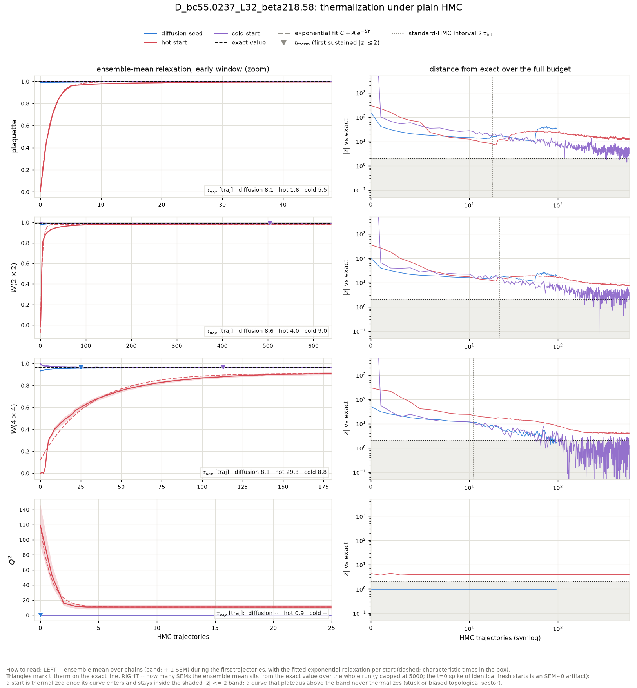

tau_int (hot-start chains, second half): plaquette = 9.04 +- 1.18, wilson_2x2 = 10.96 +- 1.40, wilson_4x4 = 5.51 +- 0.54, wilson_6x6 = 5.87 +- 0.71. Topology: hot-start HMC L=32 beta=218.58 -> **frozen** (no tunneling).

Where 'never' stood at the end: the hot start ended the 640-trajectory budget still at plaquette at |z| ~ 13, wilson_2x2 at |z| ~ 8, wilson_4x4 at |z| ~ 4, wilson_6x6 at |z| ~ 4, Q^2 at |z| ~ 4; the cold start ended the 640-trajectory budget still at plaquette at |z| ~ 4, Q^2 at |z| ~ 29010771968.

### Diagnostics: raw diffusion output (before any HMC)

| observable | value | error | exact | z_exact | reference | ref_error | z_ref | ks_p |
|---|---|---|---|---|---|---|---|---|
| plaquette | 0.9901 | 4.162e-05 | 0.9977 | -183.4 | 0.9977 | 7.705e-06 | -180.7 | 0 |
| wilson_1x1 | 0.9901 | 4.162e-05 | 0.9977 | -183.4 | 0.9977 | 7.705e-06 | -180.7 | 0 |
| wilson_1x2 | 0.9833 | 8.874e-05 | 0.9954 | -136.4 | 0.9955 | 1.563e-05 | -134.8 | 0 |
| wilson_2x2 | 0.9741 | 0.0001453 | 0.9909 | -115.6 | 0.991 | 3.765e-05 | -112.5 | 0 |
| wilson_2x3 | 0.9659 | 0.0002021 | 0.9864 | -101.6 | 0.9865 | 6.139e-05 | -97.64 | 0 |
| wilson_3x3 | 0.9541 | 0.0002244 | 0.9797 | -114.3 | 0.9799 | 8.848e-05 | -107 | 0 |
| wilson_3x4 | 0.9443 | 0.0003216 | 0.9731 | -89.5 | 0.9732 | 0.0001162 | -84.53 | 0 |
| wilson_4x4 | 0.9319 | 0.0004004 | 0.9644 | -81.18 | 0.9646 | 0.0001617 | -75.67 | 0 |
| wilson_4x5 | 0.9194 | 0.0005562 | 0.9558 | -65.48 | 0.9559 | 0.0002461 | -60.05 | 0 |
| wilson_5x5 | 0.9041 | 0.0008132 | 0.9453 | -50.7 | 0.9453 | 0.000377 | -45.98 | 0 |
| wilson_5x6 | 0.8911 | 0.001075 | 0.935 | -40.79 | 0.935 | 0.0005198 | -36.74 | 0 |
| wilson_6x6 | 0.8763 | 0.001443 | 0.9228 | -32.23 | 0.9231 | 0.0007562 | -28.71 | 0 |
| wilson_6x7 | 0.8615 | 0.001761 | 0.9109 | -28.07 | 0.9115 | 0.001025 | -24.52 | 0 |
| wilson_7x7 | 0.8422 | 0.002243 | 0.8974 | -24.61 | 0.8985 | 0.001333 | -21.6 | 0 |
| wilson_7x8 | 0.8272 | 0.002748 | 0.8842 | -20.76 | 0.8856 | 0.0017 | -18.09 | 2.102e-43 |
| wilson_8x8 | 0.8095 | 0.003361 | 0.8696 | -17.88 | 0.872 | 0.002125 | -15.74 | 2.114e-40 |
| wilson_8x10 | 0.7738 | 0.004802 | 0.8415 | -14.1 | 0.8457 | 0.002874 | -12.84 | 1.391e-32 |
| wilson_10x10 | 0.7319 | 0.006608 | 0.8088 | -11.64 | 0.8165 | 0.004096 | -10.89 | 7.748e-27 |
| wilson_10x12 | 0.694 | 0.007764 | 0.7785 | -10.88 | 0.7889 | 0.0051 | -10.22 | 1.083e-24 |
| wilson_12x12 | 0.6497 | 0.009244 | 0.745 | -10.3 | 0.7606 | 0.006549 | -9.784 | 5.284e-22 |
| creutz_2 | 0.002589 | 0.0001119 | 0.002278 | 2.786 |  |  |  |  |
| creutz_3 | 0.003798 | 0.0002101 | 0.00225 | 7.368 |  |  |  |  |
| creutz_4 | 0.00297 | 0.0002805 | 0.00221 | 2.709 |  |  |  |  |
| creutz_5 | 0.003348 | 0.0003391 | 0.002155 | 3.516 |  |  |  |  |
| creutz_6 | 0.002297 | 0.0004965 | 0.002087 | 0.4223 |  |  |  |  |
| creutz_7 | 0.00563 | 0.000559 | 0.002005 | 6.485 |  |  |  |  |
| creutz_8 | 0.00359 | 0.0007421 | 0.001907 | 2.268 |  |  |  |  |
| Q | -0.01562 | 0.01614 | 0 | -0.9683 | 0 | 0.007255 | -0.8831 | 1 |
| Q^2 | 0.04688 | 0.02098 | 0.02901 | 0.8516 | 0.01042 | 0.006882 | 1.651 | 0.9999 |
| chi_top ((<Q^2>-<Q>^2)/V) | 4.554e-05 | 2.036e-05 | 2.833e-05 | 0.845 | 1.017e-05 | 6.721e-06 | 1.649 | 0 |

### Diagnostics: the same configs after 96 HMC trajectories

| observable | value | error | exact | z_exact | reference | ref_error | z_ref | ks_p |
|---|---|---|---|---|---|---|---|---|
| plaquette | 0.9973 | 1.52e-05 | 0.9977 | -28.55 | 0.9977 | 7.705e-06 | -26.38 | 0 |
| wilson_1x1 | 0.9973 | 1.52e-05 | 0.9977 | -28.55 | 0.9977 | 7.705e-06 | -26.38 | 0 |
| wilson_1x2 | 0.9947 | 3.685e-05 | 0.9954 | -18.69 | 0.9955 | 1.563e-05 | -18.36 | 0 |
| wilson_2x2 | 0.9898 | 5.996e-05 | 0.9909 | -19.13 | 0.991 | 3.765e-05 | -17.48 | 3.271e-31 |
| wilson_2x3 | 0.9852 | 0.0001026 | 0.9864 | -11.97 | 0.9865 | 6.139e-05 | -11.02 | 1.61e-14 |
| wilson_3x3 | 0.9784 | 0.0001884 | 0.9797 | -6.878 | 0.9799 | 8.848e-05 | -6.981 | 6.754e-09 |
| wilson_3x4 | 0.9722 | 0.0002409 | 0.9731 | -3.632 | 0.9732 | 0.0001162 | -3.73 | 0.001117 |
| wilson_4x4 | 0.9638 | 0.0003518 | 0.9644 | -1.813 | 0.9646 | 0.0001617 | -2.085 | 0.01474 |
| wilson_4x5 | 0.9551 | 0.000461 | 0.9558 | -1.615 | 0.9559 | 0.0002461 | -1.632 | 0.07995 |
| wilson_5x5 | 0.9446 | 0.0006267 | 0.9453 | -1.161 | 0.9453 | 0.000377 | -0.979 | 0.05588 |
| wilson_5x6 | 0.9333 | 0.0007581 | 0.935 | -2.131 | 0.935 | 0.0005198 | -1.781 | 0.02947 |
| wilson_6x6 | 0.9205 | 0.0009964 | 0.9228 | -2.344 | 0.9231 | 0.0007562 | -2.08 | 0.1712 |
| wilson_6x7 | 0.9079 | 0.001211 | 0.9109 | -2.493 | 0.9115 | 0.001025 | -2.244 | 0.1712 |
| wilson_7x7 | 0.8938 | 0.001572 | 0.8974 | -2.287 | 0.8985 | 0.001333 | -2.303 | 0.1892 |
| wilson_7x8 | 0.8803 | 0.001912 | 0.8842 | -2.062 | 0.8856 | 0.0017 | -2.088 | 0.2297 |
| wilson_8x8 | 0.8658 | 0.002423 | 0.8696 | -1.541 | 0.872 | 0.002125 | -1.929 | 0.3584 |
| wilson_8x10 | 0.835 | 0.003474 | 0.8415 | -1.876 | 0.8457 | 0.002874 | -2.367 | 0.04354 |
| wilson_10x10 | 0.8012 | 0.004875 | 0.8088 | -1.565 | 0.8165 | 0.004096 | -2.413 | 0.04354 |
| wilson_10x12 | 0.7669 | 0.00638 | 0.7785 | -1.818 | 0.7889 | 0.0051 | -2.7 | 0.01474 |
| wilson_12x12 | 0.7294 | 0.008475 | 0.745 | -1.843 | 0.7606 | 0.006549 | -2.915 | 0.001334 |
| creutz_2 | 0.002487 | 3.379e-05 | 0.002278 | 6.192 |  |  |  |  |
| creutz_3 | 0.002241 | 6.565e-05 | 0.00225 | -0.1469 |  |  |  |  |
| creutz_4 | 0.002396 | 0.000112 | 0.00221 | 1.66 |  |  |  |  |
| creutz_5 | 0.002029 | 0.0001883 | 0.002155 | -0.6726 |  |  |  |  |
| creutz_6 | 0.001933 | 0.0002889 | 0.002087 | -0.5346 |  |  |  |  |
| creutz_7 | 0.001913 | 0.0003566 | 0.002005 | -0.2576 |  |  |  |  |
| creutz_8 | 0.00129 | 0.0004608 | 0.001907 | -1.339 |  |  |  |  |
| Q | -0.01562 | 0.01614 | 0 | -0.9683 | 0 | 0.007255 | -0.8831 | 1 |
| Q^2 | 0.04688 | 0.02098 | 0.02901 | 0.8516 | 0.01042 | 0.006882 | 1.651 | 0.9999 |
| chi_top ((<Q^2>-<Q>^2)/V) | 4.554e-05 | 2.036e-05 | 2.833e-05 | 0.845 | 1.017e-05 | 6.721e-06 | 1.649 | 0 |

## C_L64_L64_beta14.1464

HMC: step size 0.1063, 9 leapfrog steps, acceptance seed/hot/cold = 0.973/0.968/0.969. Diffusion-seed batch: 96 chains x 96 trajectories (0.52 s/traj for the whole batch); baselines: 16 chains x 640 trajectories.

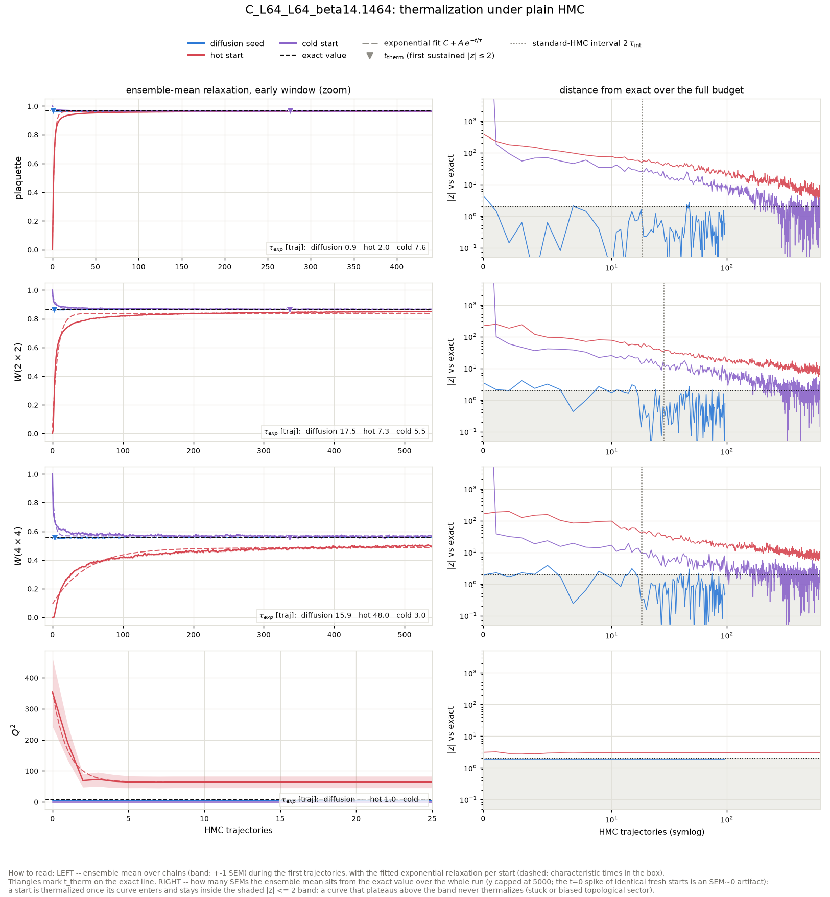

tau_int (hot-start chains, second half): plaquette = 9.14 +- 2.22, wilson_2x2 = 14.09 +- 2.05, wilson_4x4 = 9.12 +- 1.79, wilson_6x6 = 1.29 +- 0.16. Topology: hot-start HMC L=64 beta=14.1464 -> **frozen** (no tunneling).

Where 'never' stood at the end: the hot start ended the 640-trajectory budget still at plaquette at |z| ~ 6, wilson_2x2 at |z| ~ 9, wilson_4x4 at |z| ~ 8, wilson_6x6 at |z| ~ 4, Q^2 at |z| ~ 3; the cold start ended the 640-trajectory budget still at Q^2 at |z| ~ 7615990988800.

### Diagnostics: raw diffusion output (before any HMC)

| observable | value | error | exact | z_exact | reference | ref_error | z_ref | ks_p | chi2_p |
|---|---|---|---|---|---|---|---|---|---|
| plaquette | 0.9635 | 0.0001157 | 0.964 | -4.105 | 0.9639 | 7.655e-05 | -2.76 | 0.04631 |  |
| wilson_1x1 | 0.9635 | 0.0001157 | 0.964 | -4.105 | 0.9639 | 7.655e-05 | -2.76 | 0.04631 |  |
| wilson_1x2 | 0.9276 | 0.0002326 | 0.9293 | -6.976 | 0.9291 | 0.0001611 | -5.029 | 4.574e-06 |  |
| wilson_2x2 | 0.8618 | 0.0005363 | 0.8635 | -3.121 | 0.8634 | 0.0003306 | -2.401 | 0.1391 |  |
| wilson_2x3 | 0.7992 | 0.0008613 | 0.8024 | -3.722 | 0.8018 | 0.00047 | -2.61 | 0.04631 |  |
| wilson_3x3 | 0.7119 | 0.001415 | 0.7188 | -4.9 | 0.7184 | 0.0007832 | -4.02 | 0.0005266 |  |
| wilson_3x4 | 0.6369 | 0.001749 | 0.6439 | -3.981 | 0.6433 | 0.001095 | -3.104 | 0.04631 |  |
| wilson_4x4 | 0.5522 | 0.00234 | 0.556 | -1.64 | 0.5562 | 0.001295 | -1.486 | 0.3436 |  |
| wilson_4x5 | 0.474 | 0.002826 | 0.4801 | -2.163 | 0.4808 | 0.001583 | -2.092 | 0.09853 |  |
| wilson_5x5 | 0.3902 | 0.003252 | 0.3997 | -2.913 | 0.4007 | 0.001432 | -2.954 | 0.09853 |  |
| wilson_5x6 | 0.3252 | 0.003351 | 0.3327 | -2.244 | 0.3334 | 0.001607 | -2.208 | 0.09853 |  |
| wilson_6x6 | 0.2624 | 0.00345 | 0.267 | -1.316 | 0.2669 | 0.001605 | -1.185 | 0.6776 |  |
| wilson_6x7 | 0.2086 | 0.003674 | 0.2142 | -1.524 | 0.2138 | 0.001879 | -1.252 | 0.5566 |  |
| wilson_7x7 | 0.1577 | 0.004138 | 0.1657 | -1.945 | 0.1646 | 0.00196 | -1.515 | 0.3436 |  |
| wilson_7x8 | 0.1227 | 0.004403 | 0.1282 | -1.257 | 0.1265 | 0.001995 | -0.8033 | 0.6776 |  |
| wilson_8x8 | 0.09128 | 0.004412 | 0.09558 | -0.9754 | 0.09523 | 0.001983 | -0.8163 | 0.7956 |  |
| wilson_8x10 | 0.05196 | 0.00372 | 0.05315 | -0.32 | 0.05148 | 0.002556 | 0.1064 | 0.6776 |  |
| wilson_10x10 | 0.02552 | 0.004034 | 0.02552 | 0.001719 | 0.03057 | 0.002558 | -1.057 | 0.3436 |  |
| wilson_10x12 | 0.01273 | 0.003547 | 0.01225 | 0.1343 | 0.01528 | 0.002839 | -0.5612 | 0.6776 |  |
| wilson_12x12 | 0.006604 | 0.002984 | 0.00508 | 0.5108 | 0.00836 | 0.002836 | -0.4264 | 0.1923 |  |
| creutz_2 | 0.03562 | 0.0003715 | 0.03668 | -2.857 |  |  |  |  |  |
| creutz_3 | 0.04031 | 0.0006605 | 0.03668 | 5.487 |  |  |  |  |  |
| creutz_4 | 0.03155 | 0.001226 | 0.03668 | -4.182 |  |  |  |  |  |
| creutz_5 | 0.04198 | 0.002116 | 0.03668 | 2.5 |  |  |  |  |  |
| creutz_6 | 0.0321 | 0.003654 | 0.03668 | -1.256 |  |  |  |  |  |
| creutz_7 | 0.05064 | 0.00646 | 0.03668 | 2.16 |  |  |  |  |  |
| creutz_8 | 0.04428 | 0.01174 | 0.03668 | 0.6473 |  |  |  |  |  |
| Q | 0.4167 | 0.1657 | 0 | 2.515 | 0.25 | 0.3158 | 0.4674 | 0.7956 |  |
| Q^2 | 5.729 | 1.016 | 7.616 | -1.857 | 9.583 | 1.569 | -2.062 | 0.3436 |  |
| chi_top ((<Q^2>-<Q>^2)/V) | 0.001356 | 0.0002403 | 0.001859 | -2.094 | 0.002324 | 0.0003851 | -2.133 | 0.0009463 |  |
| Q histogram vs exact P(Q) | 8.321 | nan | 10 | nan |  |  |  |  | 0.5975 |

### Diagnostics: the same configs after 96 HMC trajectories

| observable | value | error | exact | z_exact | reference | ref_error | z_ref | ks_p | chi2_p |
|---|---|---|---|---|---|---|---|---|---|
| plaquette | 0.9639 | 8.136e-05 | 0.964 | -0.6186 | 0.9639 | 7.655e-05 | 0.3744 | 0.4432 |  |
| wilson_1x1 | 0.9639 | 8.136e-05 | 0.964 | -0.6186 | 0.9639 | 7.655e-05 | 0.3744 | 0.4432 |  |
| wilson_1x2 | 0.9291 | 0.0001724 | 0.9293 | -0.7527 | 0.9291 | 0.0001611 | 0.2964 | 0.6776 |  |
| wilson_2x2 | 0.8632 | 0.0004269 | 0.8635 | -0.8264 | 0.8634 | 0.0003306 | -0.3545 | 0.7956 |  |
| wilson_2x3 | 0.8018 | 0.0008632 | 0.8024 | -0.6911 | 0.8018 | 0.00047 | 0.04927 | 0.7956 |  |
| wilson_3x3 | 0.7178 | 0.001231 | 0.7188 | -0.7947 | 0.7184 | 0.0007832 | -0.3745 | 0.7956 |  |
| wilson_3x4 | 0.6433 | 0.001903 | 0.6439 | -0.3274 | 0.6433 | 0.001095 | -0.02935 | 0.9621 |  |
| wilson_4x4 | 0.555 | 0.002516 | 0.556 | -0.4008 | 0.5562 | 0.001295 | -0.4053 | 0.8952 |  |
| wilson_4x5 | 0.4797 | 0.003025 | 0.4801 | -0.1441 | 0.4808 | 0.001583 | -0.3223 | 0.7956 |  |
| wilson_5x5 | 0.3989 | 0.003604 | 0.3997 | -0.2061 | 0.4007 | 0.001432 | -0.455 | 0.9621 |  |
| wilson_5x6 | 0.3323 | 0.004203 | 0.3327 | -0.08472 | 0.3334 | 0.001607 | -0.231 | 0.9621 |  |
| wilson_6x6 | 0.2664 | 0.004634 | 0.267 | -0.1239 | 0.2669 | 0.001605 | -0.1112 | 0.6776 |  |
| wilson_6x7 | 0.2135 | 0.005033 | 0.2142 | -0.1492 | 0.2138 | 0.001879 | -0.0591 | 0.4432 |  |
| wilson_7x7 | 0.1666 | 0.005035 | 0.1657 | 0.1779 | 0.1646 | 0.00196 | 0.3712 | 0.26 |  |
| wilson_7x8 | 0.1283 | 0.004649 | 0.1282 | 0.01922 | 0.1265 | 0.001995 | 0.3437 | 0.1923 |  |
| wilson_8x8 | 0.09748 | 0.004416 | 0.09558 | 0.4309 | 0.09523 | 0.001983 | 0.4664 | 0.3436 |  |
| wilson_8x10 | 0.05177 | 0.003946 | 0.05315 | -0.3476 | 0.05148 | 0.002556 | 0.06358 | 0.8952 |  |
| wilson_10x10 | 0.02571 | 0.003671 | 0.02552 | 0.05133 | 0.03057 | 0.002558 | -1.088 | 0.5566 |  |
| wilson_10x12 | 0.01158 | 0.003573 | 0.01225 | -0.188 | 0.01528 | 0.002839 | -0.8103 | 0.6776 |  |
| wilson_12x12 | 0.008117 | 0.003215 | 0.00508 | 0.9448 | 0.00836 | 0.002836 | -0.05653 | 0.9925 |  |
| creutz_2 | 0.03687 | 0.0003123 | 0.03668 | 0.5814 |  |  |  |  |  |
| creutz_3 | 0.03697 | 0.0006249 | 0.03668 | 0.4538 |  |  |  |  |  |
| creutz_4 | 0.03793 | 0.001255 | 0.03668 | 0.9899 |  |  |  |  |  |
| creutz_5 | 0.03854 | 0.001897 | 0.03668 | 0.9798 |  |  |  |  |  |
| creutz_6 | 0.03856 | 0.002867 | 0.03668 | 0.6531 |  |  |  |  |  |
| creutz_7 | 0.02642 | 0.005063 | 0.03668 | -2.026 |  |  |  |  |  |
| creutz_8 | 0.01297 | 0.009903 | 0.03668 | -2.394 |  |  |  |  |  |
| Q | 0.4167 | 0.1657 | 0 | 2.515 | 0.25 | 0.3158 | 0.4674 | 0.7956 |  |
| Q^2 | 5.729 | 1.016 | 7.616 | -1.857 | 9.583 | 1.569 | -2.062 | 0.3436 |  |
| chi_top ((<Q^2>-<Q>^2)/V) | 0.001356 | 0.0002403 | 0.001859 | -2.094 | 0.002324 | 0.0003851 | -2.133 | 0.0009463 |  |
| Q histogram vs exact P(Q) | 8.321 | nan | 10 | nan |  |  |  |  | 0.5975 |

## C_L128_L128_beta14.1464

HMC: step size 0.1063, 9 leapfrog steps, acceptance seed/hot/cold = 0.944/0.940/0.940. Diffusion-seed batch: 64 chains x 96 trajectories (0.92 s/traj for the whole batch); baselines: 8 chains x 640 trajectories.

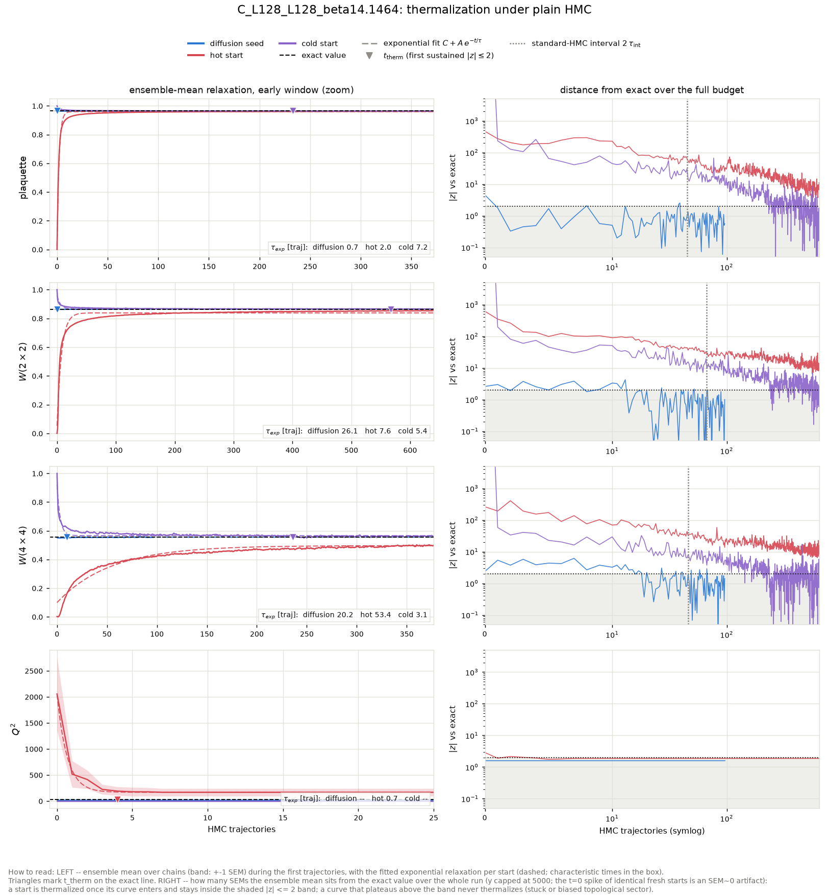

tau_int (hot-start chains, second half): plaquette = 22.67 +- 2.78, wilson_2x2 = 33.24 +- 2.94, wilson_4x4 = 23.15 +- 2.83, wilson_6x6 = 1.46 +- 0.21. Topology: hot-start HMC L=128 beta=14.1464 -> **frozen** (no tunneling).

Where 'never' stood at the end: the hot start ended the 640-trajectory budget still at plaquette at |z| ~ 8, wilson_2x2 at |z| ~ 11, wilson_4x4 at |z| ~ 11; the cold start ended the 640-trajectory budget still at Q^2 at |z| ~ 30463963955200.

### Diagnostics: raw diffusion output (before any HMC)

| observable | value | error | exact | z_exact | reference | ref_error | z_ref | ks_p | chi2_p |
|---|---|---|---|---|---|---|---|---|---|
| plaquette | 0.9636 | 7.427e-05 | 0.964 | -4.767 | 0.9641 | 4.481e-05 | -5.601 | 6.959e-06 |  |
| wilson_1x1 | 0.9636 | 7.427e-05 | 0.964 | -4.767 | 0.9641 | 4.481e-05 | -5.601 | 6.959e-06 |  |
| wilson_1x2 | 0.9279 | 0.0001695 | 0.9293 | -8.1 | 0.9297 | 0.0001346 | -8.189 | 1.132e-09 |  |
| wilson_2x2 | 0.8627 | 0.0002734 | 0.8635 | -3.069 | 0.8643 | 0.0002498 | -4.493 | 0.0004567 |  |
| wilson_2x3 | 0.8001 | 0.0003944 | 0.8024 | -5.986 | 0.8035 | 0.0004455 | -5.755 | 2.694e-06 |  |
| wilson_3x3 | 0.7126 | 0.0006922 | 0.7188 | -8.995 | 0.7196 | 0.0006359 | -7.447 | 8.305e-11 |  |
| wilson_3x4 | 0.6375 | 0.001004 | 0.6439 | -6.34 | 0.645 | 0.0009003 | -5.534 | 1.234e-07 |  |
| wilson_4x4 | 0.5528 | 0.001338 | 0.556 | -2.439 | 0.5569 | 0.001152 | -2.361 | 0.003655 |  |
| wilson_4x5 | 0.4734 | 0.001665 | 0.4801 | -4.03 | 0.4809 | 0.001523 | -3.33 | 0.001892 |  |
| wilson_5x5 | 0.3901 | 0.002049 | 0.3997 | -4.674 | 0.399 | 0.001817 | -3.241 | 0.001892 |  |
| wilson_5x6 | 0.3237 | 0.002272 | 0.3327 | -3.94 | 0.3312 | 0.002046 | -2.44 | 0.006823 |  |
| wilson_6x6 | 0.2603 | 0.002343 | 0.267 | -2.83 | 0.2638 | 0.00212 | -1.092 | 0.5551 |  |
| wilson_6x7 | 0.2044 | 0.002339 | 0.2142 | -4.199 | 0.2111 | 0.00223 | -2.062 | 0.02148 |  |
| wilson_7x7 | 0.1523 | 0.002351 | 0.1657 | -5.7 | 0.1615 | 0.002313 | -2.791 | 0.09349 |  |
| wilson_7x8 | 0.1172 | 0.002336 | 0.1282 | -4.692 | 0.1247 | 0.002349 | -2.253 | 0.05917 |  |
| wilson_8x8 | 0.08567 | 0.002265 | 0.09558 | -4.375 | 0.09141 | 0.002124 | -1.847 | 0.2115 |  |
| wilson_8x10 | 0.04555 | 0.002114 | 0.05315 | -3.593 | 0.04985 | 0.001882 | -1.519 | 0.5551 |  |
| wilson_10x10 | 0.01862 | 0.001876 | 0.02552 | -3.678 | 0.02302 | 0.001614 | -1.778 | 0.3027 |  |
| wilson_10x12 | 0.01011 | 0.001381 | 0.01225 | -1.554 | 0.009312 | 0.001628 | 0.3723 | 0.944 |  |
| wilson_12x12 | 0.006081 | 0.001167 | 0.00508 | 0.8582 | 0.004616 | 0.001801 | 0.6829 | 0.7036 |  |
| creutz_2 | 0.03507 | 0.0002153 | 0.03668 | -7.511 |  |  |  |  |  |
| creutz_3 | 0.04046 | 0.0004333 | 0.03668 | 8.719 |  |  |  |  |  |
| creutz_4 | 0.03139 | 0.0008454 | 0.03668 | -6.258 |  |  |  |  |  |
| creutz_5 | 0.03868 | 0.001255 | 0.03668 | 1.588 |  |  |  |  |  |
| creutz_6 | 0.03155 | 0.002306 | 0.03668 | -2.227 |  |  |  |  |  |
| creutz_7 | 0.05232 | 0.003664 | 0.03668 | 4.266 |  |  |  |  |  |
| creutz_8 | 0.05174 | 0.006369 | 0.03668 | 2.364 |  |  |  |  |  |
| Q | 1.328 | 0.4365 | 0 | 3.043 | 0.9688 | 0.5729 | 0.4989 | 0.7036 |  |
| Q^2 | 23.77 | 4.757 | 30.46 | -1.408 | 27.22 | 5.051 | -0.4977 | 0.9908 |  |
| chi_top ((<Q^2>-<Q>^2)/V) | 0.001343 | 0.0002976 | 0.001859 | -1.735 | 0.001604 | 0.000281 | -0.638 | 0.3027 |  |
| Q histogram vs exact P(Q) | 13.52 | nan | 14 | nan |  |  |  |  | 0.4857 |

### Diagnostics: the same configs after 96 HMC trajectories

| observable | value | error | exact | z_exact | reference | ref_error | z_ref | ks_p | chi2_p |
|---|---|---|---|---|---|---|---|---|---|
| plaquette | 0.964 | 5.159e-05 | 0.964 | -0.578 | 0.9641 | 4.481e-05 | -2.365 | 0.1429 |  |
| wilson_1x1 | 0.964 | 5.159e-05 | 0.964 | -0.578 | 0.9641 | 4.481e-05 | -2.365 | 0.1429 |  |
| wilson_1x2 | 0.9292 | 0.0001269 | 0.9293 | -0.6959 | 0.9297 | 0.0001346 | -2.638 | 0.03624 |  |
| wilson_2x2 | 0.8632 | 0.0003175 | 0.8635 | -0.8907 | 0.8643 | 0.0002498 | -2.742 | 0.006823 |  |
| wilson_2x3 | 0.8019 | 0.0004841 | 0.8024 | -1.055 | 0.8035 | 0.0004455 | -2.393 | 0.03624 |  |
| wilson_3x3 | 0.718 | 0.0007691 | 0.7188 | -1.001 | 0.7196 | 0.0006359 | -1.547 | 0.1429 |  |
| wilson_3x4 | 0.6428 | 0.0009745 | 0.6439 | -1.148 | 0.645 | 0.0009003 | -1.67 | 0.3027 |  |
| wilson_4x4 | 0.5544 | 0.001279 | 0.556 | -1.239 | 0.5569 | 0.001152 | -1.446 | 0.1429 |  |
| wilson_4x5 | 0.4782 | 0.001422 | 0.4801 | -1.369 | 0.4809 | 0.001523 | -1.321 | 0.3027 |  |
| wilson_5x5 | 0.3972 | 0.001775 | 0.3997 | -1.395 | 0.399 | 0.001817 | -0.6992 | 0.7036 |  |
| wilson_5x6 | 0.3299 | 0.001903 | 0.3327 | -1.489 | 0.3312 | 0.002046 | -0.4811 | 0.5551 |  |
| wilson_6x6 | 0.2632 | 0.002026 | 0.267 | -1.843 | 0.2638 | 0.00212 | -0.188 | 0.7036 |  |
| wilson_6x7 | 0.2102 | 0.001892 | 0.2142 | -2.112 | 0.2111 | 0.00223 | -0.2867 | 0.5551 |  |
| wilson_7x7 | 0.1608 | 0.001903 | 0.1657 | -2.584 | 0.1615 | 0.002313 | -0.2398 | 0.8426 |  |
| wilson_7x8 | 0.1237 | 0.001845 | 0.1282 | -2.425 | 0.1247 | 0.002349 | -0.3278 | 0.7036 |  |
| wilson_8x8 | 0.09139 | 0.00191 | 0.09558 | -2.197 | 0.09141 | 0.002124 | -0.007695 | 0.944 |  |
| wilson_8x10 | 0.05058 | 0.001915 | 0.05315 | -1.339 | 0.04985 | 0.001882 | 0.272 | 0.944 |  |
| wilson_10x10 | 0.02265 | 0.001766 | 0.02552 | -1.623 | 0.02302 | 0.001614 | -0.1538 | 0.944 |  |
| wilson_10x12 | 0.01129 | 0.002031 | 0.01225 | -0.4743 | 0.009312 | 0.001628 | 0.7594 | 0.7036 |  |
| wilson_12x12 | 0.004114 | 0.001765 | 0.00508 | -0.547 | 0.004616 | 0.001801 | -0.1989 | 0.5551 |  |
| creutz_2 | 0.03685 | 0.0001609 | 0.03668 | 1.047 |  |  |  |  |  |
| creutz_3 | 0.03681 | 0.0003674 | 0.03668 | 0.3422 |  |  |  |  |  |
| creutz_4 | 0.03713 | 0.000731 | 0.03668 | 0.611 |  |  |  |  |  |
| creutz_5 | 0.03762 | 0.001308 | 0.03668 | 0.7183 |  |  |  |  |  |
| creutz_6 | 0.03987 | 0.001913 | 0.03668 | 1.666 |  |  |  |  |  |
| creutz_7 | 0.04324 | 0.003921 | 0.03668 | 1.673 |  |  |  |  |  |
| creutz_8 | 0.04065 | 0.006396 | 0.03668 | 0.6204 |  |  |  |  |  |
| Q | 1.328 | 0.4365 | 0 | 3.043 | 0.9688 | 0.5729 | 0.4989 | 0.7036 |  |
| Q^2 | 23.77 | 4.757 | 30.46 | -1.408 | 27.22 | 5.051 | -0.4977 | 0.9908 |  |
| chi_top ((<Q^2>-<Q>^2)/V) | 0.001343 | 0.0002976 | 0.001859 | -1.735 | 0.001604 | 0.000281 | -0.638 | 0.3027 |  |
| Q histogram vs exact P(Q) | 13.52 | nan | 14 | nan |  |  |  |  | 0.4857 |
