# Diffusion-seeded HMC across the matched beta scan: thermalization time vs the standard-HMC sampling interval

Action: wilson. All HMC in this report is plain HMC (Omelyan, adapted step size, **no** topological updates).

**Why this scan.** At the ladder's upper rungs the fresh-HMC baselines never thermalize at all (topological freezing plus a metastable local-defect state), so the only comparison available there is 'diffusion seed vs a baseline that never arrives'. This report extends the benchmark to every matched coupling pair of the generalization study -- one inverse-RG step L=16 -> L=32 per case -- including fine couplings low enough that hot- and cold-start HMC *does* thermalize within the budget. There the standard chain's own interval `2 tau_int` and its fresh-start burn-in are honest, measurable yardsticks, and the scan shows where the ordering

> t_therm(diffusion seed)  <  2 tau_int(standard HMC)  <  burn-in(fresh chain)

sets in as beta grows and standard HMC slides into critical slowing down and topological freezing.

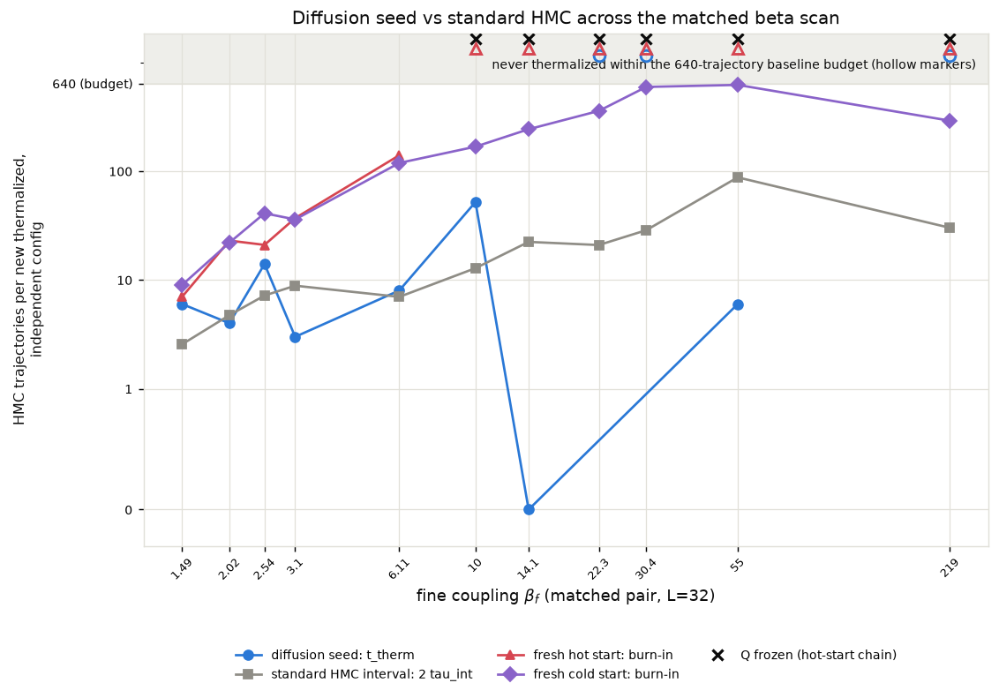

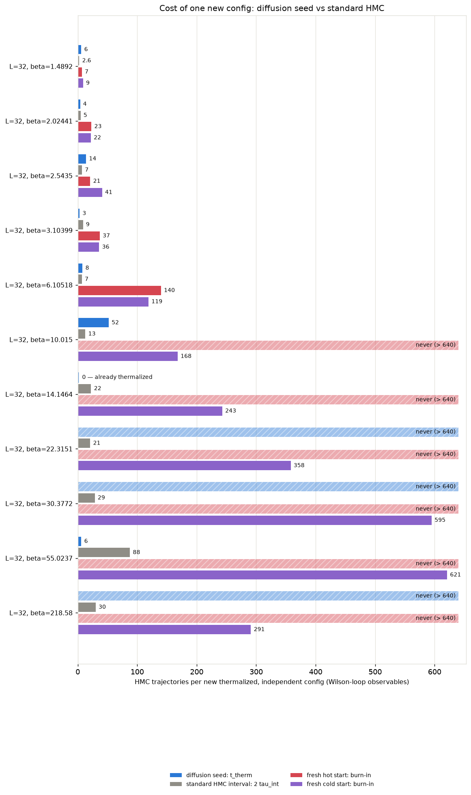

## The three starting points

- **Diffusion seed** -- the raw conditional-diffusion output for this coupling: one inverse-RG step from a direct-HMC base ensemble at the matched coarse coupling (ancestral sampling + the deterministic coarse-charge transport), with **no** rethermalization sweeps applied: every bit of equilibration the seed needs is measured here, in HMC trajectories.
- **Hot start** -- every link angle drawn uniformly from (-pi, pi]: a completely disordered (infinite-temperature) configuration. The standard way to initialize a fresh HMC chain without prior information.
- **Cold start** -- every link angle set to zero: the perfectly ordered (beta -> infinity) configuration, the other standard initialization.

## Summary

| rung | L | beta | t_therm diffusion seed | standard-HMC interval 2 tau_int | margin (interval - t_therm) | burn-in hot / cold | tau_int(Q) |
|---|---|---|---|---|---|---|---|
| A_bc0.25_L32_beta1.4892 | 32 | 1.4892 | 6 | 2.6 | -3.4 traj | 7 / 9 | 1.4 |
| A_bc0.5_L32_beta2.02441 | 32 | 2.02441 | 4 | 4.7 | 0.7 traj | 23 / 22 | 2.9 |
| A_bc0.75_L32_beta2.5435 | 32 | 2.5435 | 14 | 7.2 | -6.8 traj | 21 / 41 | 5.8 |
| A_bc1_L32_beta3.10399 | 32 | 3.10399 | 3 | 8.9 | 5.9 traj | 37 / 36 | 11.3 |
| A_bc2_L32_beta6.10518 | 32 | 6.10518 | 8 | 7.0 | -1.0 traj | 140 / 119 | 41.1 |
| A_bc3_L32_beta10.015 | 32 | 10.015 | 52 | 12.8 | -39.2 traj | never / 168 | frozen (0 tunnelings in 321 x 32 traj) |
| A_bc4_L32_beta14.1464 | 32 | 14.1464 | 0 | 22.4 | 22.4 traj | never / 243 | frozen (0 tunnelings in 321 x 32 traj) |
| A_bc6_L32_beta22.3151 | 32 | 22.3151 | never | 20.9 | -- | never / 358 | frozen (0 tunnelings in 321 x 32 traj) |
| A_bc8_L32_beta30.3772 | 32 | 30.3772 | never | 28.7 | -- | never / 595 | frozen (0 tunnelings in 321 x 32 traj) |
| D_bc14.1464_L32_beta55.0237 | 32 | 55.0237 | 6 | 87.7 | 81.7 traj | never / 621 | frozen (0 tunnelings in 321 x 32 traj) |
| D_bc55.0237_L32_beta218.58 | 32 | 218.58 | never | 30.1 | -- | never / 291 | frozen (0 tunnelings in 321 x 32 traj) |

t_therm and burn-in are the slowest Wilson-loop observable (plaquette, W(2x2), W(4x4)); topology is stricter still for the fresh chains: their Q^2 **never** reaches the exact value at the frozen rungs, while the diffusion seed inherits the correct topological sector from the coarse ensemble it was generated from (see the Q^2 panels and per-rung tables below).

Thermalization time `t_therm` = first trajectory at which the ensemble-mean z-score vs the exact value satisfies |z| <= 2 and stays there for 5 consecutive trajectories (t = 0: already thermalized before any HMC). For the diffusion seed, t_therm is computed on a random subsample of chains matched to the baseline chain count so all starts are compared at equal statistical power. `tau_int` is Madras-Sokal, measured on the second half of the hot-start chains, averaged over chains. In the per-rung relaxation figures, triangles mark each start's t_therm, dashed curves are the exponential fits C + A exp(-t/tau) to the ensemble means (tau quoted per panel), and the right-hand panels track the ensemble mean's distance from the exact value in SEM units -- thermalized means inside the shaded |z| <= 2 band; the dotted vertical line there is the standard-HMC interval `2 tau_int`.

## What 'never' means, and where the ground truth comes from

'never' = the ensemble mean was still outside |z| <= 2 of the exact value after the full baseline budget; the per-rung sections quote the z-score it plateaued at. For hot starts at the large-beta rungs this is not a budget problem but a physical one: a random start freezes into a random topological sector (<Q^2> of order tens), plain HMC can never change Q at these couplings (tunneling is suppressed ~exp(-2 beta)), and the wrong sector biases every Wilson loop by an amount that never decays. Cold starts sit in the single sector Q = 0, so their Wilson loops do eventually converge, but <Q^2> stays pinned at 0 forever.

None of the exact values in this report come from fine-lattice HMC: the ground truth is the character expansion of 2D compact U(1) (`diffusion/lgt/exact.py`), which gives every Wilson loop, P(Q) and chi_top in closed form at finite volume. Each diffusion seed here is one inverse-RG step from a direct-HMC base ensemble at the matched coarse coupling beta_c (L=16), where HMC mixes well -- which is precisely why it can start chains in regions standard HMC cannot reach.

## A_bc0.25_L32_beta1.4892

HMC: step size 0.1000, 10 leapfrog steps, acceptance seed/hot/cold = 0.992/0.993/0.992. Diffusion-seed batch: 128 chains x 96 trajectories (0.14 s/traj for the whole batch); baselines: 32 chains x 640 trajectories.

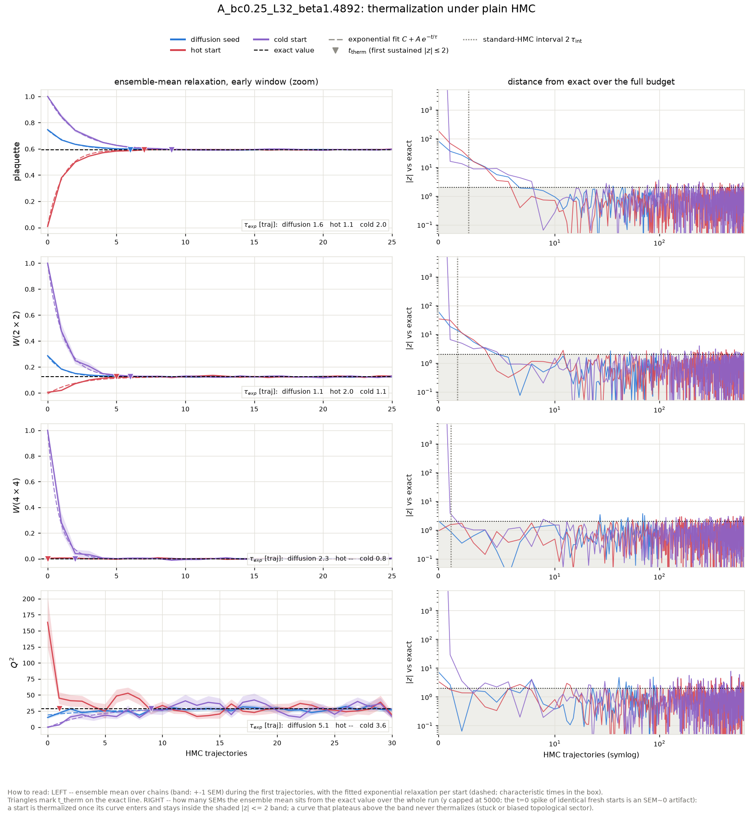

tau_int (hot-start chains, second half): plaquette = 1.28 +- 0.04, wilson_2x2 = 0.81 +- 0.04, wilson_4x4 = 0.52 +- 0.01. Topology: hot-start HMC L=32 beta=1.4892 -> tau_int(Q) = 1.4.

### Diagnostics: raw diffusion output (before any HMC)

| observable | value | error | exact | z_exact | reference | ref_error | z_ref | ks_p | chi2_p |
|---|---|---|---|---|---|---|---|---|---|
| plaquette | 0.7465 | 0.001985 | 0.5935 | 77.1 | 0.5948 | 0.001238 | 64.86 | 0 |  |
| wilson_1x1 | 0.7465 | 0.001985 | 0.5935 | 77.1 | 0.5948 | 0.001238 | 64.86 | 0 |  |
| wilson_1x2 | 0.5435 | 0.00303 | 0.3522 | 63.14 | 0.3522 | 0.002458 | 49.04 | 0 |  |
| wilson_2x2 | 0.2865 | 0.002824 | 0.124 | 57.55 | 0.1241 | 0.001865 | 48.01 | 0 |  |
| wilson_2x3 | 0.141 | 0.002506 | 0.04368 | 38.84 | 0.04133 | 0.001675 | 33.07 | 0 |  |
| wilson_3x3 | 0.0459 | 0.002195 | 0.00913 | 16.75 | 0.005305 | 0.002005 | 13.66 | 1.172e-22 |  |
| wilson_3x4 | 0.01631 | 0.002205 | 0.001908 | 6.53 | 0.0003275 | 0.002081 | 5.271 | 4.282e-07 |  |
| wilson_4x4 | 0.004969 | 0.002271 | 0.0002367 | 2.083 | 0.0001938 | 0.001787 | 1.652 | 0.02577 |  |
| wilson_4x5 | 0.002484 | 0.002725 | 2.936e-05 | 0.9009 | -0.001625 | 0.001631 | 1.294 | 0.3584 |  |
| wilson_5x5 | 4.107e-05 | 0.002541 | 2.161e-06 | 0.01531 | -0.000249 | 0.001931 | 0.09087 | 0.7901 |  |
| wilson_5x6 | 0.0001405 | 0.001351 | 1.591e-07 | 0.1038 | -0.0005556 | 0.001821 | 0.307 | 0.678 |  |
| wilson_6x6 | -0.002975 | 0.002285 | 6.948e-09 | -1.302 | -0.001112 | 0.00174 | -0.649 | 0.4898 |  |
| wilson_6x7 | 0.001072 | 0.002317 | 3.035e-10 | 0.4625 | 0.002636 | 0.001766 | -0.5372 | 0.6011 |  |
| wilson_7x7 | 0.0007281 | 0.002055 | 7.868e-12 | 0.3544 | 0.0003693 | 0.001605 | 0.1376 | 0.8246 |  |
| wilson_7x8 | -0.002667 | 0.001909 | 2.04e-13 | -1.398 | -0.001279 | 0.001893 | -0.5167 | 0.8569 |  |
| wilson_8x8 | -0.0005972 | 0.001787 | 3.138e-15 | -0.3342 | -0.001451 | 0.00132 | 0.3843 | 0.5631 |  |
| wilson_8x10 | 0.001699 | 0.001399 | 7.426e-19 | 1.214 | 0.001016 | 0.001793 | 0.3001 | 0.8569 |  |
| wilson_10x10 | -0.003458 | 0.002099 | 2.18e-23 | -1.648 | 0.0006406 | 0.001555 | -1.569 | 0.389 |  |
| wilson_10x12 | -0.0001016 | 0.001925 | 6.4e-28 | -0.05277 | -0.003091 | 0.001502 | 1.224 | 0.1712 |  |
| wilson_12x12 | 0.001528 | 0.002197 | 2.33e-33 | 0.6954 | -0.001718 | 0.001421 | 1.24 | 0.1545 |  |
| creutz_2 | 0.3229 | 0.007115 | 0.5218 | -27.96 |  |  |  |  |  |
| creutz_3 | 0.4134 | 0.03699 | 0.5218 | -2.931 |  |  |  |  |  |
| creutz_4 | 0.1533 | 0.4126 | 0.5218 | -0.8932 |  |  |  |  |  |
| creutz_5 | 3.409 | nan | 0.5218 | nan |  |  |  |  |  |
| Q | 0.7344 | 0.3272 | 0 | 2.245 | -0.4375 | 0.3418 | 2.477 | 0.01957 |  |
| Q^2 | 15 | 1.997 | 28.52 | -6.772 | 27.85 | 2.353 | -4.166 | 0.01957 |  |
| chi_top ((<Q^2>-<Q>^2)/V) | 0.01412 | 0.001823 | 0.02785 | -7.532 | 0.02701 | 0.002264 | -4.435 | 0.0007783 |  |
| Q histogram vs exact P(Q) | 31.13 | nan | 18 | nan |  |  |  |  | 0.02778 |

### Diagnostics: the same configs after 96 HMC trajectories

| observable | value | error | exact | z_exact | reference | ref_error | z_ref | ks_p | chi2_p |
|---|---|---|---|---|---|---|---|---|---|
| plaquette | 0.5947 | 0.001766 | 0.5935 | 0.7291 | 0.5948 | 0.001238 | -0.007331 | 0.8864 |  |
| wilson_1x1 | 0.5947 | 0.001766 | 0.5935 | 0.7291 | 0.5948 | 0.001238 | -0.007331 | 0.8864 |  |
| wilson_1x2 | 0.3537 | 0.002275 | 0.3522 | 0.6879 | 0.3522 | 0.002458 | 0.4653 | 0.2087 |  |
| wilson_2x2 | 0.1259 | 0.00236 | 0.124 | 0.7784 | 0.1241 | 0.001865 | 0.6043 | 0.389 |  |
| wilson_2x3 | 0.04727 | 0.002431 | 0.04368 | 1.475 | 0.04133 | 0.001675 | 2.012 | 0.5631 |  |
| wilson_3x3 | 0.01381 | 0.001895 | 0.00913 | 2.47 | 0.005305 | 0.002005 | 3.083 | 0.02248 |  |
| wilson_3x4 | 0.00297 | 0.001764 | 0.001908 | 0.6019 | 0.0003275 | 0.002081 | 0.9687 | 0.1251 |  |
| wilson_4x4 | -0.001779 | 0.00186 | 0.0002367 | -1.083 | 0.0001938 | 0.001787 | -0.7648 | 0.6395 |  |
| wilson_4x5 | 0.001895 | 0.001752 | 2.936e-05 | 1.065 | -0.001625 | 0.001631 | 1.471 | 0.1392 |  |
| wilson_5x5 | -0.000829 | 0.001591 | 2.161e-06 | -0.5225 | -0.000249 | 0.001931 | -0.2318 | 0.7901 |  |
| wilson_5x6 | 0.0007502 | 0.001915 | 1.591e-07 | 0.3917 | -0.0005556 | 0.001821 | 0.4942 | 0.678 |  |
| wilson_6x6 | 0.001232 | 0.00176 | 6.948e-09 | 0.7002 | -0.001112 | 0.00174 | 0.947 | 0.1892 |  |
| wilson_6x7 | -0.0007722 | 0.002096 | 3.035e-10 | -0.3684 | 0.002636 | 0.001766 | -1.244 | 0.1712 |  |
| wilson_7x7 | -0.0009591 | 0.002215 | 7.868e-12 | -0.433 | 0.0003693 | 0.001605 | -0.4856 | 0.8569 |  |
| wilson_7x8 | 0.00178 | 0.002124 | 2.04e-13 | 0.8379 | -0.001279 | 0.001893 | 1.075 | 0.04354 |  |
| wilson_8x8 | -0.001163 | 0.001736 | 3.138e-15 | -0.6702 | -0.001451 | 0.00132 | 0.132 | 0.678 |  |
| wilson_8x10 | 0.001211 | 0.002247 | 7.426e-19 | 0.5388 | 0.001016 | 0.001793 | 0.06777 | 0.7538 |  |
| wilson_10x10 | -0.002343 | 0.001788 | 2.18e-23 | -1.311 | 0.0006406 | 0.001555 | -1.259 | 0.4548 |  |
| wilson_10x12 | -0.0005017 | 0.001606 | 6.4e-28 | -0.3124 | -0.003091 | 0.001502 | 1.177 | 0.5259 |  |
| wilson_12x12 | -0.002227 | 0.002198 | 2.33e-33 | -1.013 | -0.001718 | 0.001421 | -0.1947 | 0.9693 |  |
| creutz_2 | 0.5138 | 0.01486 | 0.5218 | -0.5384 |  |  |  |  |  |
| creutz_3 | 0.2509 | 0.1292 | 0.5218 | -2.097 |  |  |  |  |  |
| Q | 0.08594 | 0.4907 | 0 | 0.1751 | -0.4375 | 0.3418 | 0.8753 | 0.5631 |  |
| Q^2 | 26.77 | 3.794 | 28.52 | -0.4609 | 27.85 | 2.353 | -0.2421 | 0.8864 |  |
| chi_top ((<Q^2>-<Q>^2)/V) | 0.02614 | 0.003703 | 0.02785 | -0.4631 | 0.02701 | 0.002264 | -0.2017 | 0.1712 |  |
| Q histogram vs exact P(Q) | 20.68 | nan | 18 | nan |  |  |  |  | 0.296 |

## A_bc0.5_L32_beta2.02441

HMC: step size 0.1000, 10 leapfrog steps, acceptance seed/hot/cold = 0.991/0.990/0.990. Diffusion-seed batch: 128 chains x 96 trajectories (0.24 s/traj for the whole batch); baselines: 32 chains x 640 trajectories.

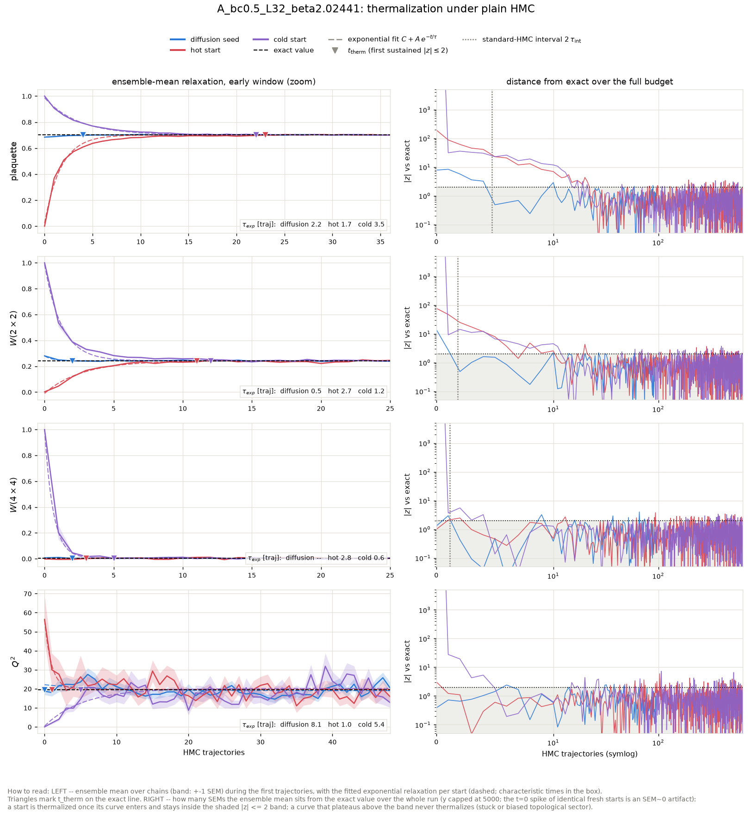

tau_int (hot-start chains, second half): plaquette = 2.37 +- 0.14, wilson_2x2 = 0.91 +- 0.04, wilson_4x4 = 0.56 +- 0.01. Topology: hot-start HMC L=32 beta=2.02441 -> tau_int(Q) = 2.9.

### Diagnostics: raw diffusion output (before any HMC)

| observable | value | error | exact | z_exact | reference | ref_error | z_ref | ks_p | chi2_p |
|---|---|---|---|---|---|---|---|---|---|
| plaquette | 0.6847 | 0.00249 | 0.7017 | -6.859 | 0.7019 | 0.0008797 | -6.531 | 1.61e-14 |  |
| wilson_1x1 | 0.6847 | 0.00249 | 0.7017 | -6.859 | 0.7019 | 0.0008797 | -6.531 | 1.61e-14 |  |
| wilson_1x2 | 0.4807 | 0.003826 | 0.4924 | -3.07 | 0.4926 | 0.001604 | -2.863 | 1.946e-06 |  |
| wilson_2x2 | 0.28 | 0.002655 | 0.2425 | 14.12 | 0.2406 | 0.001965 | 11.91 | 1.63e-18 |  |
| wilson_2x3 | 0.1472 | 0.003258 | 0.1194 | 8.533 | 0.1199 | 0.002269 | 6.882 | 5.026e-09 |  |
| wilson_3x3 | 0.05139 | 0.003377 | 0.04127 | 2.999 | 0.03906 | 0.002341 | 3.001 | 0.008145 |  |
| wilson_3x4 | 0.02065 | 0.002534 | 0.01426 | 2.52 | 0.01215 | 0.001815 | 2.724 | 0.04938 |  |
| wilson_4x4 | 0.006611 | 0.0025 | 0.003458 | 1.261 | 0.002402 | 0.001851 | 1.353 | 0.1004 |  |
| wilson_4x5 | 0.004073 | 0.002492 | 0.0008386 | 1.298 | 0.001425 | 0.002112 | 0.8107 | 0.2763 |  |
| wilson_5x5 | 0.003348 | 0.002408 | 0.0001427 | 1.331 | -0.0008455 | 0.001957 | 1.351 | 0.3584 |  |
| wilson_5x6 | -0.001677 | 0.001651 | 2.428e-05 | -1.031 | -9.881e-05 | 0.001841 | -0.6383 | 0.4212 |  |
| wilson_6x6 | 0.002618 | 0.001806 | 2.9e-06 | 1.448 | -0.0007191 | 0.001925 | 1.264 | 0.1892 |  |
| wilson_6x7 | 0.001498 | 0.001721 | 3.463e-07 | 0.8699 | -0.0003006 | 0.001982 | 0.6851 | 0.3584 |  |
| wilson_7x7 | -0.0005875 | 0.001759 | 2.902e-08 | -0.334 | 0.001083 | 0.001614 | -0.6998 | 0.3584 |  |
| wilson_7x8 | 0.003685 | 0.001584 | 2.432e-09 | 2.326 | -0.001728 | 0.001643 | 2.372 | 0.04938 |  |
| wilson_8x8 | -0.0004453 | 0.001771 | 1.43e-10 | -0.2515 | -0.0004432 | 0.001893 | -0.0007962 | 0.8569 |  |
| wilson_8x10 | -0.002942 | 0.002229 | 4.946e-13 | -1.32 | -0.001078 | 0.001766 | -0.6558 | 0.7163 |  |
| wilson_10x10 | 0.002231 | 0.001619 | 4.147e-16 | 1.377 | 0.0007502 | 0.001534 | 0.6637 | 0.9542 |  |
| wilson_10x12 | 0.002755 | 0.002362 | 3.478e-19 | 1.166 | 0.001283 | 0.00153 | 0.5227 | 0.9693 |  |
| wilson_12x12 | 0.0008739 | 0.001622 | 7.073e-23 | 0.5388 | 0.001944 | 0.001599 | -0.4697 | 0.7901 |  |
| creutz_2 | 0.1868 | 0.008264 | 0.3542 | -20.26 |  |  |  |  |  |
| creutz_3 | 0.4096 | 0.03714 | 0.3542 | 1.491 |  |  |  |  |  |
| creutz_4 | 0.2268 | 0.3232 | 0.3542 | -0.3943 |  |  |  |  |  |
| creutz_5 | -0.2885 | 0.9955 | 0.3542 | -0.6456 |  |  |  |  |  |
| Q | -0.04688 | 0.3268 | 0 | -0.1435 | -0.7917 | 0.2757 | 1.742 | 0.0631 |  |
| Q^2 | 18.75 | 2.101 | 19.51 | -0.3622 | 16.85 | 1.13 | 0.7948 | 0.1122 |  |
| chi_top ((<Q^2>-<Q>^2)/V) | 0.01831 | 0.002049 | 0.01905 | -0.3636 | 0.01585 | 0.001139 | 1.05 | 0.0001679 |  |
| Q histogram vs exact P(Q) | 13.44 | nan | 16 | nan |  |  |  |  | 0.6405 |

### Diagnostics: the same configs after 96 HMC trajectories

| observable | value | error | exact | z_exact | reference | ref_error | z_ref | ks_p | chi2_p |
|---|---|---|---|---|---|---|---|---|---|
| plaquette | 0.702 | 0.00111 | 0.7017 | 0.2728 | 0.7019 | 0.0008797 | 0.0953 | 0.7538 |  |
| wilson_1x1 | 0.702 | 0.00111 | 0.7017 | 0.2728 | 0.7019 | 0.0008797 | 0.0953 | 0.7538 |  |
| wilson_1x2 | 0.4921 | 0.002122 | 0.4924 | -0.1693 | 0.4926 | 0.001604 | -0.1845 | 0.9972 |  |
| wilson_2x2 | 0.2432 | 0.002501 | 0.2425 | 0.2612 | 0.2406 | 0.001965 | 0.788 | 0.389 |  |
| wilson_2x3 | 0.1203 | 0.002257 | 0.1194 | 0.3931 | 0.1199 | 0.002269 | 0.128 | 0.7538 |  |
| wilson_3x3 | 0.04229 | 0.002198 | 0.04127 | 0.4652 | 0.03906 | 0.002341 | 1.005 | 0.0711 |  |
| wilson_3x4 | 0.01474 | 0.002132 | 0.01426 | 0.2257 | 0.01215 | 0.001815 | 0.924 | 0.4898 |  |
| wilson_4x4 | 0.002161 | 0.002794 | 0.003458 | -0.4641 | 0.002402 | 0.001851 | -0.07181 | 0.7538 |  |
| wilson_4x5 | -0.0002458 | 0.002242 | 0.0008386 | -0.4836 | 0.001425 | 0.002112 | -0.5423 | 0.5631 |  |
| wilson_5x5 | -0.0003651 | 0.001904 | 0.0001427 | -0.2667 | -0.0008455 | 0.001957 | 0.1759 | 0.4548 |  |
| wilson_5x6 | 0.0002103 | 0.002145 | 2.428e-05 | 0.0867 | -9.881e-05 | 0.001841 | 0.1093 | 0.3584 |  |
| wilson_6x6 | -0.000882 | 0.002034 | 2.9e-06 | -0.4351 | -0.0007191 | 0.001925 | -0.05818 | 0.9941 |  |
| wilson_6x7 | -0.0004685 | 0.002437 | 3.463e-07 | -0.1924 | -0.0003006 | 0.001982 | -0.05345 | 0.8569 |  |
| wilson_7x7 | -0.001497 | 0.001704 | 2.902e-08 | -0.8787 | 0.001083 | 0.001614 | -1.099 | 0.8864 |  |
| wilson_7x8 | 0.001276 | 0.002132 | 2.432e-09 | 0.5984 | -0.001728 | 0.001643 | 1.116 | 0.4212 |  |
| wilson_8x8 | 0.0003261 | 0.002167 | 1.43e-10 | 0.1504 | -0.0004432 | 0.001893 | 0.2673 | 0.7901 |  |
| wilson_8x10 | -0.002741 | 0.001593 | 4.946e-13 | -1.72 | -0.001078 | 0.001766 | -0.6994 | 0.8246 |  |
| wilson_10x10 | 0.0007435 | 0.002031 | 4.147e-16 | 0.3661 | 0.0007502 | 0.001534 | -0.002628 | 0.9693 |  |
| wilson_10x12 | -0.001828 | 0.001983 | 3.478e-19 | -0.9218 | 0.001283 | 0.00153 | -1.242 | 0.2297 |  |
| wilson_12x12 | 0.00331 | 0.002425 | 7.073e-23 | 1.365 | 0.001944 | 0.001599 | 0.4704 | 0.8864 |  |
| creutz_2 | 0.3496 | 0.007174 | 0.3542 | -0.6386 |  |  |  |  |  |
| creutz_3 | 0.3418 | 0.03949 | 0.3542 | -0.3129 |  |  |  |  |  |
| creutz_4 | 0.8661 | 0.9592 | 0.3542 | 0.5336 |  |  |  |  |  |
| Q | -0.2344 | 0.3042 | 0 | -0.7704 | -0.7917 | 0.2757 | 1.357 | 0.389 |  |
| Q^2 | 19.2 | 2.048 | 19.51 | -0.1502 | 16.85 | 1.13 | 1.004 | 0.9888 |  |
| chi_top ((<Q^2>-<Q>^2)/V) | 0.0187 | 0.002032 | 0.01905 | -0.1743 | 0.01585 | 0.001139 | 1.225 | 0.04354 |  |
| Q histogram vs exact P(Q) | 15.83 | nan | 16 | nan |  |  |  |  | 0.4647 |

## A_bc0.75_L32_beta2.5435

HMC: step size 0.1000, 10 leapfrog steps, acceptance seed/hot/cold = 0.989/0.991/0.989. Diffusion-seed batch: 128 chains x 96 trajectories (0.33 s/traj for the whole batch); baselines: 32 chains x 640 trajectories.

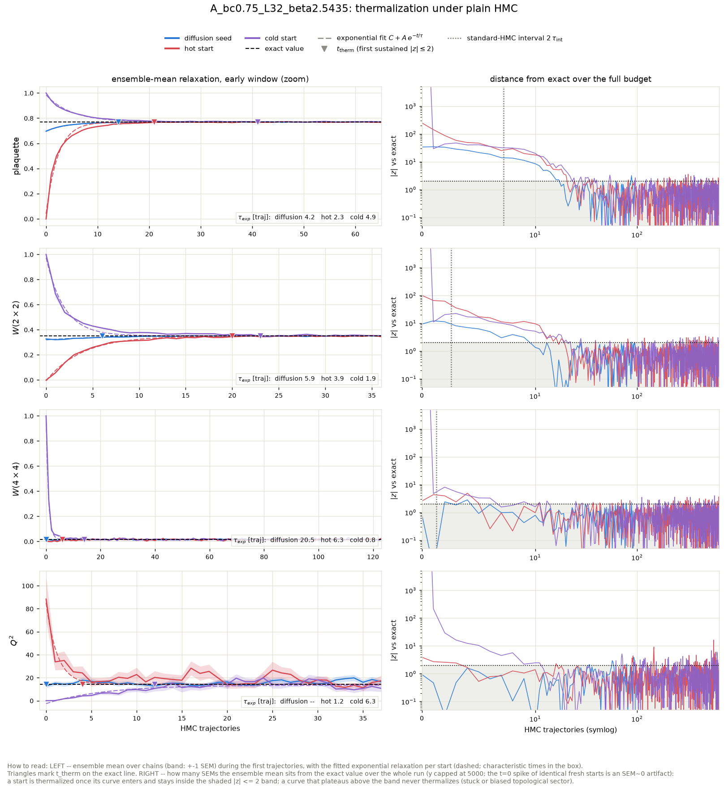

tau_int (hot-start chains, second half): plaquette = 3.59 +- 0.30, wilson_2x2 = 1.28 +- 0.07, wilson_4x4 = 0.62 +- 0.02. Topology: hot-start HMC L=32 beta=2.5435 -> tau_int(Q) = 5.8.

### Diagnostics: raw diffusion output (before any HMC)

| observable | value | error | exact | z_exact | reference | ref_error | z_ref | ks_p | chi2_p |
|---|---|---|---|---|---|---|---|---|---|
| plaquette | 0.696 | 0.00201 | 0.7696 | -36.65 | 0.7712 | 0.0008441 | -34.5 | 0 |  |
| wilson_1x1 | 0.696 | 0.00201 | 0.7696 | -36.65 | 0.7712 | 0.0008441 | -34.5 | 0 |  |
| wilson_1x2 | 0.4994 | 0.003251 | 0.5924 | -28.58 | 0.5947 | 0.001239 | -27.38 | 0 |  |
| wilson_2x2 | 0.3263 | 0.003194 | 0.3509 | -7.697 | 0.3548 | 0.001546 | -8.035 | 8.676e-11 |  |
| wilson_2x3 | 0.1873 | 0.003422 | 0.2079 | -6.019 | 0.2096 | 0.001777 | -5.806 | 8.145e-06 |  |
| wilson_3x3 | 0.07704 | 0.002954 | 0.09476 | -5.998 | 0.099 | 0.002295 | -5.869 | 1.186e-06 |  |
| wilson_3x4 | 0.03669 | 0.002543 | 0.0432 | -2.561 | 0.04598 | 0.00207 | -2.834 | 0.01957 |  |
| wilson_4x4 | 0.017 | 0.002647 | 0.01516 | 0.6966 | 0.01636 | 0.002317 | 0.1836 | 0.4898 |  |
| wilson_4x5 | 0.006585 | 0.001599 | 0.005319 | 0.7916 | 0.008872 | 0.001496 | -1.044 | 0.6011 |  |
| wilson_5x5 | 0.001291 | 0.0014 | 0.001436 | -0.1042 | 0.004459 | 0.001775 | -1.401 | 0.389 |  |
| wilson_5x6 | -0.003852 | 0.002066 | 0.0003879 | -2.053 | 0.001126 | 0.001405 | -1.993 | 0.1122 |  |
| wilson_6x6 | 0.0003643 | 0.002061 | 8.063e-05 | 0.1376 | 0.0006585 | 0.002101 | -0.09995 | 0.5259 |  |
| wilson_6x7 | 0.0003717 | 0.002481 | 1.676e-05 | 0.1431 | 0.0003578 | 0.002067 | 0.004306 | 0.9888 |  |
| wilson_7x7 | -0.001831 | 0.001845 | 2.681e-06 | -0.9942 | -5.091e-05 | 0.001535 | -0.7419 | 0.678 |  |
| wilson_7x8 | -0.003184 | 0.001674 | 4.289e-07 | -1.903 | -0.0002698 | 0.00133 | -1.363 | 0.7538 |  |
| wilson_8x8 | 0.001237 | 0.001746 | 5.28e-08 | 0.7089 | -3.522e-05 | 0.001573 | 0.5416 | 0.4898 |  |
| wilson_8x10 | 0.0002025 | 0.001989 | 8.005e-10 | 0.1018 | -0.0007483 | 0.001392 | 0.3916 | 0.9542 |  |
| wilson_10x10 | 0.001579 | 0.001639 | 4.258e-12 | 0.9634 | 0.0005853 | 0.001744 | 0.4151 | 0.8246 |  |
| wilson_10x12 | -0.003791 | 0.001709 | 2.265e-14 | -2.218 | -0.003624 | 0.001567 | -0.07223 | 0.8246 |  |
| wilson_12x12 | -0.001209 | 0.002247 | 4.227e-17 | -0.5381 | 0.001042 | 0.001567 | -0.8217 | 0.4898 |  |
| creutz_2 | 0.09385 | 0.007872 | 0.2618 | -21.34 |  |  |  |  |  |
| creutz_3 | 0.3328 | 0.02554 | 0.2618 | 2.777 |  |  |  |  |  |
| creutz_4 | 0.0271 | 0.1347 | 0.2618 | -1.743 |  |  |  |  |  |
| creutz_5 | 0.6812 | 1.489 | 0.2618 | 0.2816 |  |  |  |  |  |
| Q | -0.25 | 0.2687 | 0 | -0.9304 | -0.2552 | 0.2417 | 0.01441 | 0.9999 |  |
| Q^2 | 12.83 | 1.673 | 14.25 | -0.8515 | 13.84 | 1.822 | -0.4085 | 0.8864 |  |
| chi_top ((<Q^2>-<Q>^2)/V) | 0.01247 | 0.001627 | 0.01392 | -0.8926 | 0.01345 | 0.001796 | -0.4061 | 0.006985 |  |
| Q histogram vs exact P(Q) | 9.436 | nan | 14 | nan |  |  |  |  | 0.8022 |

### Diagnostics: the same configs after 96 HMC trajectories

| observable | value | error | exact | z_exact | reference | ref_error | z_ref | ks_p | chi2_p |
|---|---|---|---|---|---|---|---|---|---|
| plaquette | 0.7685 | 0.0007348 | 0.7696 | -1.505 | 0.7712 | 0.0008441 | -2.381 | 0.0631 |  |
| wilson_1x1 | 0.7685 | 0.0007348 | 0.7696 | -1.505 | 0.7712 | 0.0008441 | -2.381 | 0.0631 |  |
| wilson_1x2 | 0.5906 | 0.001534 | 0.5924 | -1.124 | 0.5947 | 0.001239 | -2.051 | 0.3021 |  |
| wilson_2x2 | 0.3483 | 0.002162 | 0.3509 | -1.196 | 0.3548 | 0.001546 | -2.45 | 0.08971 |  |
| wilson_2x3 | 0.2078 | 0.00239 | 0.2079 | -0.01879 | 0.2096 | 0.001777 | -0.6162 | 0.6395 |  |
| wilson_3x3 | 0.09468 | 0.002023 | 0.09476 | -0.03783 | 0.099 | 0.002295 | -1.41 | 0.4898 |  |
| wilson_3x4 | 0.04342 | 0.002603 | 0.0432 | 0.08403 | 0.04598 | 0.00207 | -0.7701 | 0.4548 |  |
| wilson_4x4 | 0.01655 | 0.002189 | 0.01516 | 0.6372 | 0.01636 | 0.002317 | 0.0617 | 0.2297 |  |
| wilson_4x5 | 0.008693 | 0.002033 | 0.005319 | 1.66 | 0.008872 | 0.001496 | -0.0711 | 0.8569 |  |
| wilson_5x5 | 0.005371 | 0.002476 | 0.001436 | 1.589 | 0.004459 | 0.001775 | 0.2995 | 0.6011 |  |
| wilson_5x6 | 0.00248 | 0.002043 | 0.0003879 | 1.024 | 0.001126 | 0.001405 | 0.546 | 0.7901 |  |
| wilson_6x6 | 0.0001853 | 0.001612 | 8.063e-05 | 0.06496 | 0.0006585 | 0.002101 | -0.1787 | 0.9126 |  |
| wilson_6x7 | -0.0007747 | 0.002317 | 1.676e-05 | -0.3416 | 0.0003578 | 0.002067 | -0.3647 | 0.9126 |  |
| wilson_7x7 | 0.001382 | 0.002489 | 2.681e-06 | 0.5541 | -5.091e-05 | 0.001535 | 0.49 | 0.5631 |  |
| wilson_7x8 | 0.002714 | 0.002314 | 4.289e-07 | 1.173 | -0.0002698 | 0.00133 | 1.118 | 0.1892 |  |
| wilson_8x8 | -0.003055 | 0.001924 | 5.28e-08 | -1.588 | -3.522e-05 | 0.001573 | -1.215 | 0.5259 |  |
| wilson_8x10 | -0.0008888 | 0.002753 | 8.005e-10 | -0.3228 | -0.0007483 | 0.001392 | -0.04554 | 0.8864 |  |
| wilson_10x10 | -0.002418 | 0.002448 | 4.258e-12 | -0.9878 | 0.0005853 | 0.001744 | -0.9992 | 0.4898 |  |
| wilson_10x12 | -0.003261 | 0.001857 | 2.265e-14 | -1.755 | -0.003624 | 0.001567 | 0.1495 | 0.3584 |  |
| wilson_12x12 | -0.0007133 | 0.001284 | 4.227e-17 | -0.5555 | 0.001042 | 0.001567 | -0.8663 | 0.2087 |  |
| creutz_2 | 0.2648 | 0.004859 | 0.2618 | 0.6191 |  |  |  |  |  |
| creutz_3 | 0.2696 | 0.01743 | 0.2618 | 0.4459 |  |  |  |  |  |
| creutz_4 | 0.1847 | 0.1066 | 0.2618 | -0.7233 |  |  |  |  |  |
| creutz_5 | -0.1627 | 0.4231 | 0.2618 | -1.003 |  |  |  |  |  |
| creutz_6 | 1.821 | nan | 0.2618 | nan |  |  |  |  |  |
| Q | -0.6016 | 0.2999 | 0 | -2.006 | -0.2552 | 0.2417 | -0.8991 | 0.6395 |  |
| Q^2 | 14.23 | 2.011 | 14.25 | -0.01284 | 13.84 | 1.822 | 0.143 | 0.3294 |  |
| chi_top ((<Q^2>-<Q>^2)/V) | 0.01354 | 0.001961 | 0.01392 | -0.193 | 0.01345 | 0.001796 | 0.03351 | 0.006985 |  |
| Q histogram vs exact P(Q) | 8.285 | nan | 14 | nan |  |  |  |  | 0.874 |

## A_bc1_L32_beta3.10399

HMC: step size 0.1000, 10 leapfrog steps, acceptance seed/hot/cold = 0.989/0.990/0.988. Diffusion-seed batch: 128 chains x 96 trajectories (0.21 s/traj for the whole batch); baselines: 32 chains x 640 trajectories.

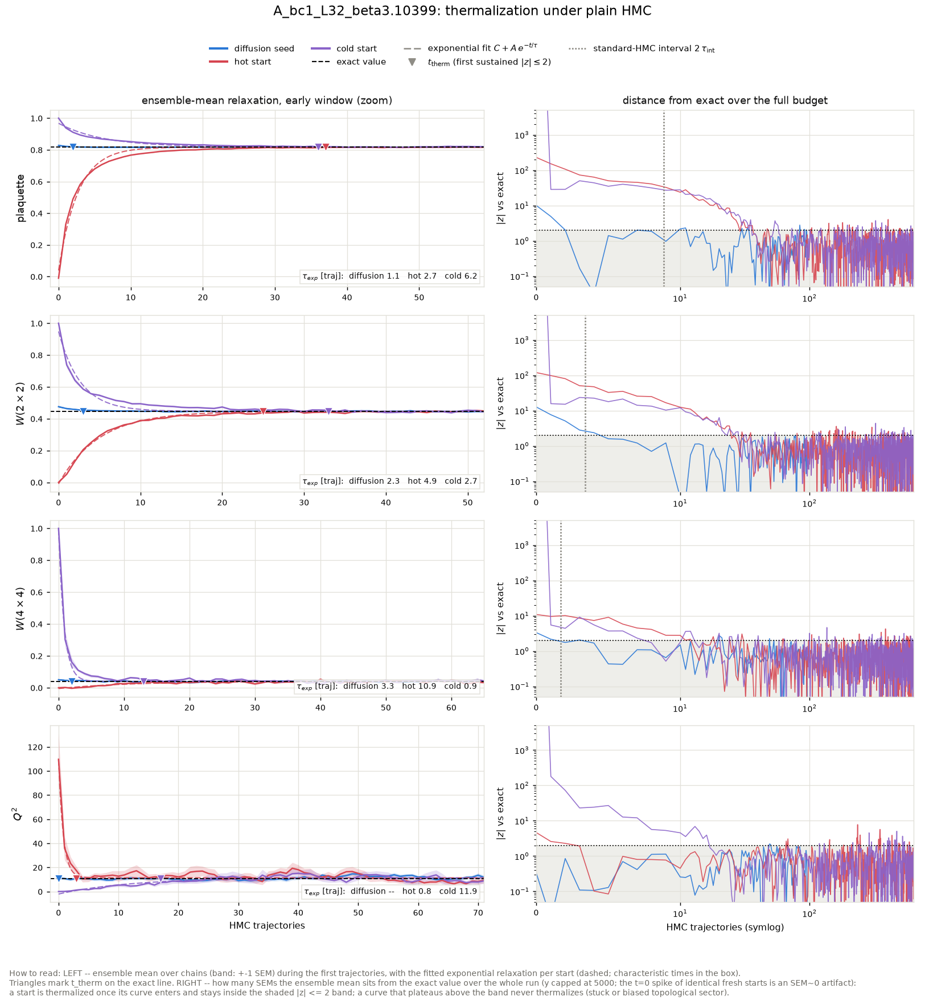

tau_int (hot-start chains, second half): plaquette = 4.43 +- 0.39, wilson_2x2 = 1.69 +- 0.14, wilson_4x4 = 0.84 +- 0.04. Topology: hot-start HMC L=32 beta=3.10399 -> tau_int(Q) = 11.3.

### Diagnostics: raw diffusion output (before any HMC)

| observable | value | error | exact | z_exact | reference | ref_error | z_ref | ks_p | chi2_p |
|---|---|---|---|---|---|---|---|---|---|
| plaquette | 0.8279 | 0.001119 | 0.8174 | 9.407 | 0.8167 | 0.0005787 | 8.913 | 6.613e-19 |  |
| wilson_1x1 | 0.8279 | 0.001119 | 0.8174 | 9.407 | 0.8167 | 0.0005787 | 8.913 | 6.613e-19 |  |
| wilson_1x2 | 0.6824 | 0.001809 | 0.6681 | 7.912 | 0.6667 | 0.001248 | 7.17 | 1.203e-10 |  |
| wilson_2x2 | 0.4756 | 0.002406 | 0.4464 | 12.15 | 0.4462 | 0.002387 | 8.67 | 7.462e-14 |  |
| wilson_2x3 | 0.3221 | 0.003085 | 0.2982 | 7.749 | 0.2995 | 0.003104 | 5.186 | 1.616e-05 |  |
| wilson_3x3 | 0.176 | 0.003622 | 0.1629 | 3.626 | 0.1662 | 0.003275 | 2.016 | 0.02577 |  |
| wilson_3x4 | 0.09876 | 0.003857 | 0.08895 | 2.543 | 0.09401 | 0.002937 | 0.9802 | 0.1122 |  |
| wilson_4x4 | 0.05017 | 0.003822 | 0.03971 | 2.739 | 0.04635 | 0.002315 | 0.8554 | 0.08971 |  |
| wilson_4x5 | 0.02592 | 0.003162 | 0.01772 | 2.593 | 0.02331 | 0.001923 | 0.7054 | 0.3021 |  |
| wilson_5x5 | 0.006443 | 0.002791 | 0.006467 | -0.008626 | 0.008977 | 0.001985 | -0.7398 | 0.8246 |  |
| wilson_5x6 | 0.0007915 | 0.002175 | 0.00236 | -0.7211 | 0.001769 | 0.001658 | -0.3575 | 0.8864 |  |
| wilson_6x6 | 0.001758 | 0.002215 | 0.0007038 | 0.476 | -0.001236 | 0.002333 | 0.9307 | 0.4212 |  |
| wilson_6x7 | -0.0002929 | 0.002538 | 0.0002099 | -0.1981 | 0.0001348 | 0.001854 | -0.1361 | 0.9542 |  |
| wilson_7x7 | -0.0007425 | 0.002655 | 5.117e-05 | -0.299 | -0.0009109 | 0.001672 | 0.05369 | 0.9126 |  |
| wilson_7x8 | -0.0008644 | 0.00197 | 1.247e-05 | -0.4452 | 0.001308 | 0.00174 | -0.8266 | 0.4212 |  |
| wilson_8x8 | 0.001255 | 0.001618 | 2.486e-06 | 0.7743 | 0.001576 | 0.001246 | -0.1568 | 0.2297 |  |
| wilson_8x10 | -0.0005575 | 0.001509 | 9.869e-08 | -0.3695 | 0.001019 | 0.002055 | -0.6186 | 0.2087 |  |
| wilson_10x10 | -0.001332 | 0.002062 | 1.749e-09 | -0.6461 | 0.002047 | 0.001322 | -1.38 | 0.3294 |  |
| wilson_10x12 | 0.001227 | 0.002311 | 3.101e-11 | 0.5309 | 0.001053 | 0.001377 | 0.06458 | 0.7538 |  |
| wilson_12x12 | 0.003691 | 0.001911 | 2.453e-13 | 1.932 | 0.0004341 | 0.001577 | 1.315 | 0.0631 |  |
| creutz_2 | 0.1678 | 0.003202 | 0.2016 | -10.56 |  |  |  |  |  |
| creutz_3 | 0.2149 | 0.009418 | 0.2016 | 1.405 |  |  |  |  |  |
| creutz_4 | 0.0993 | 0.03632 | 0.2016 | -2.818 |  |  |  |  |  |
| creutz_5 | 0.7319 | 0.2905 | 0.2016 | 1.825 |  |  |  |  |  |
| creutz_6 | -2.895 | 6.22 | 0.2016 | -0.4979 |  |  |  |  |  |
| Q | 0.2656 | 0.2481 | 0 | 1.071 | 0.1302 | 0.2199 | 0.4085 | 0.7538 |  |
| Q^2 | 11.16 | 1.044 | 10.81 | 0.333 | 10.84 | 1.105 | 0.209 | 0.1251 |  |
| chi_top ((<Q^2>-<Q>^2)/V) | 0.01083 | 0.0009846 | 0.01056 | 0.275 | 0.01057 | 0.001073 | 0.1771 | 0.0006474 |  |
| Q histogram vs exact P(Q) | 20.04 | nan | 12 | nan |  |  |  |  | 0.06626 |

### Diagnostics: the same configs after 96 HMC trajectories

| observable | value | error | exact | z_exact | reference | ref_error | z_ref | ks_p | chi2_p |
|---|---|---|---|---|---|---|---|---|---|
| plaquette | 0.818 | 0.000814 | 0.8174 | 0.7404 | 0.8167 | 0.0005787 | 1.307 | 0.3584 |  |
| wilson_1x1 | 0.818 | 0.000814 | 0.8174 | 0.7404 | 0.8167 | 0.0005787 | 1.307 | 0.3584 |  |
| wilson_1x2 | 0.6685 | 0.001473 | 0.6681 | 0.2749 | 0.6667 | 0.001248 | 0.9575 | 0.9126 |  |
| wilson_2x2 | 0.4458 | 0.002629 | 0.4464 | -0.2137 | 0.4462 | 0.002387 | -0.1153 | 0.678 |  |
| wilson_2x3 | 0.2978 | 0.003434 | 0.2982 | -0.1318 | 0.2995 | 0.003104 | -0.3591 | 0.7163 |  |
| wilson_3x3 | 0.1629 | 0.003648 | 0.1629 | 0.009165 | 0.1662 | 0.003275 | -0.6645 | 0.3021 |  |
| wilson_3x4 | 0.09007 | 0.003478 | 0.08895 | 0.3222 | 0.09401 | 0.002937 | -0.8646 | 0.5631 |  |
| wilson_4x4 | 0.03981 | 0.002881 | 0.03971 | 0.03521 | 0.04635 | 0.002315 | -1.771 | 0.2087 |  |
| wilson_4x5 | 0.01455 | 0.002492 | 0.01772 | -1.274 | 0.02331 | 0.001923 | -2.784 | 0.01275 |  |
| wilson_5x5 | 0.00508 | 0.002374 | 0.006467 | -0.5844 | 0.008977 | 0.001985 | -1.259 | 0.8246 |  |
| wilson_5x6 | 0.003145 | 0.002642 | 0.00236 | 0.2971 | 0.001769 | 0.001658 | 0.4409 | 0.4212 |  |
| wilson_6x6 | 0.001602 | 0.002092 | 0.0007038 | 0.4294 | -0.001236 | 0.002333 | 0.9056 | 0.6011 |  |
| wilson_6x7 | 0.0002425 | 0.002032 | 0.0002099 | 0.01603 | 0.0001348 | 0.001854 | 0.03914 | 0.8246 |  |
| wilson_7x7 | 0.0004216 | 0.002519 | 5.117e-05 | 0.1471 | -0.0009109 | 0.001672 | 0.4408 | 0.3584 |  |
| wilson_7x8 | 0.002402 | 0.001488 | 1.247e-05 | 1.606 | 0.001308 | 0.00174 | 0.4779 | 0.6011 |  |
| wilson_8x8 | -0.0001877 | 0.001682 | 2.486e-06 | -0.1131 | 0.001576 | 0.001246 | -0.8423 | 0.7901 |  |
| wilson_8x10 | -0.0007446 | 0.002392 | 9.869e-08 | -0.3114 | 0.001019 | 0.002055 | -0.5594 | 0.5631 |  |
| wilson_10x10 | 0.001162 | 0.002127 | 1.749e-09 | 0.5464 | 0.002047 | 0.001322 | -0.3535 | 0.8569 |  |
| wilson_10x12 | -0.0022 | 0.001976 | 3.101e-11 | -1.113 | 0.001053 | 0.001377 | -1.35 | 0.0631 |  |
| wilson_12x12 | 0.00227 | 0.001787 | 2.453e-13 | 1.27 | 0.0004341 | 0.001577 | 0.7703 | 0.4548 |  |
| creutz_2 | 0.2034 | 0.003139 | 0.2016 | 0.5524 |  |  |  |  |  |
| creutz_3 | 0.1997 | 0.009778 | 0.2016 | -0.2029 |  |  |  |  |  |
| creutz_4 | 0.2239 | 0.04499 | 0.2016 | 0.4953 |  |  |  |  |  |
| creutz_5 | 0.04571 | 0.3982 | 0.2016 | -0.3916 |  |  |  |  |  |
| creutz_6 | 0.1949 | 1.306 | 0.2016 | -0.005168 |  |  |  |  |  |
| creutz_7 | -2.441 | nan | 0.2016 | nan |  |  |  |  |  |
| Q | 0.2422 | 0.2945 | 0 | 0.8223 | 0.1302 | 0.2199 | 0.3047 | 0.9353 |  |
| Q^2 | 10.77 | 1.25 | 10.81 | -0.02805 | 10.84 | 1.105 | -0.03903 | 0.389 |  |
| chi_top ((<Q^2>-<Q>^2)/V) | 0.01046 | 0.001249 | 0.01056 | -0.07326 | 0.01057 | 0.001073 | -0.06334 | 0.008145 |  |
| Q histogram vs exact P(Q) | 17.08 | nan | 12 | nan |  |  |  |  | 0.1467 |

## A_bc2_L32_beta6.10518

HMC: step size 0.0809, 12 leapfrog steps, acceptance seed/hot/cold = 0.991/0.991/0.991. Diffusion-seed batch: 128 chains x 96 trajectories (0.17 s/traj for the whole batch); baselines: 32 chains x 640 trajectories.

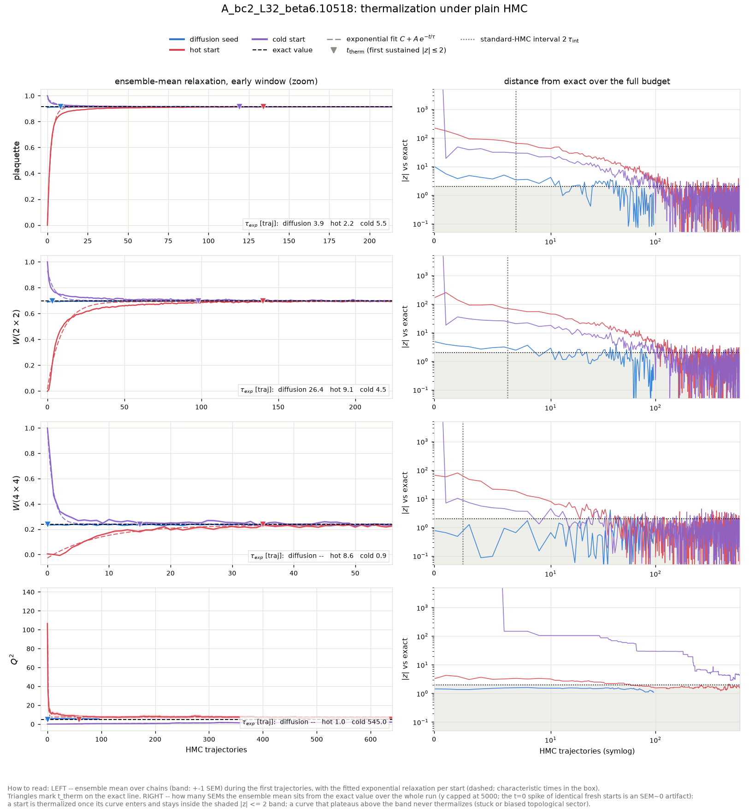

tau_int (hot-start chains, second half): plaquette = 3.49 +- 0.31, wilson_2x2 = 3.14 +- 0.27, wilson_4x4 = 1.22 +- 0.07. Topology: hot-start HMC L=32 beta=6.10518 -> tau_int(Q) = 41.1.

Where 'never' stood at the end: the cold start ended the 640-trajectory budget still at Q^2 at |z| ~ 4.

### Diagnostics: raw diffusion output (before any HMC)

| observable | value | error | exact | z_exact | reference | ref_error | z_ref | ks_p | chi2_p |
|---|---|---|---|---|---|---|---|---|---|
| plaquette | 0.9088 | 0.0005763 | 0.914 | -9.034 | 0.9143 | 0.0001898 | -9.102 | 2.371e-14 |  |
| wilson_1x1 | 0.9088 | 0.0005763 | 0.914 | -9.034 | 0.9143 | 0.0001898 | -9.102 | 2.371e-14 |  |
| wilson_1x2 | 0.8267 | 0.001085 | 0.8353 | -7.943 | 0.8361 | 0.0005353 | -7.756 | 1.632e-11 |  |
| wilson_2x2 | 0.6881 | 0.002281 | 0.6978 | -4.262 | 0.6995 | 0.0009961 | -4.609 | 1.026e-05 |  |
| wilson_2x3 | 0.5707 | 0.00294 | 0.5829 | -4.135 | 0.5851 | 0.001632 | -4.285 | 3.143e-05 |  |
| wilson_3x3 | 0.4336 | 0.00372 | 0.445 | -3.055 | 0.4505 | 0.002149 | -3.921 | 0.003137 |  |
| wilson_3x4 | 0.3297 | 0.004178 | 0.3397 | -2.407 | 0.347 | 0.002879 | -3.417 | 0.003697 |  |
| wilson_4x4 | 0.2339 | 0.004462 | 0.2371 | -0.7195 | 0.2462 | 0.003532 | -2.178 | 0.07995 |  |
| wilson_4x5 | 0.1666 | 0.004616 | 0.1654 | 0.2516 | 0.1734 | 0.003624 | -1.156 | 0.2087 |  |
| wilson_5x5 | 0.1061 | 0.003681 | 0.1055 | 0.1588 | 0.1111 | 0.003848 | -0.9405 | 0.4898 |  |
| wilson_5x6 | 0.06752 | 0.004091 | 0.06728 | 0.06006 | 0.0715 | 0.003732 | -0.719 | 0.2297 |  |
| wilson_6x6 | 0.03992 | 0.003775 | 0.03921 | 0.186 | 0.04151 | 0.003986 | -0.2907 | 0.6395 |  |
| wilson_6x7 | 0.02198 | 0.00398 | 0.02286 | -0.2213 | 0.0258 | 0.003616 | -0.7115 | 0.4548 |  |
| wilson_7x7 | 0.01205 | 0.003922 | 0.01218 | -0.03229 | 0.01483 | 0.003796 | -0.5096 | 0.1392 |  |
| wilson_7x8 | 0.003361 | 0.004487 | 0.006487 | -0.6965 | 0.007417 | 0.004109 | -0.6666 | 0.2297 |  |
| wilson_8x8 | 0.0023 | 0.003021 | 0.003158 | -0.2841 | 0.006329 | 0.003061 | -0.9369 | 0.1251 |  |
| wilson_8x10 | 0.003001 | 0.002893 | 0.0007487 | 0.7785 | 0.005868 | 0.003149 | -0.6705 | 0.7901 |  |
| wilson_10x10 | 0.003391 | 0.003215 | 0.0001238 | 1.016 | -0.001497 | 0.002756 | 1.154 | 0.2297 |  |
| wilson_10x12 | 0.003302 | 0.002104 | 2.049e-05 | 1.56 | -0.002269 | 0.002148 | 1.853 | 0.2297 |  |
| wilson_12x12 | -0.002868 | 0.002247 | 2.365e-06 | -1.277 | 0.0007953 | 0.001629 | -1.32 | 0.02947 |  |
| creutz_2 | 0.08896 | 0.001524 | 0.08996 | -0.6589 |  |  |  |  |  |
| creutz_3 | 0.08771 | 0.002949 | 0.08996 | -0.7631 |  |  |  |  |  |
| creutz_4 | 0.06939 | 0.006018 | 0.08996 | -3.419 |  |  |  |  |  |
| creutz_5 | 0.1121 | 0.01454 | 0.08996 | 1.52 |  |  |  |  |  |
| creutz_6 | 0.07398 | 0.04791 | 0.08996 | -0.3336 |  |  |  |  |  |
| creutz_7 | 0.004076 | 0.1662 | 0.08996 | -0.5169 |  |  |  |  |  |
| creutz_8 | -0.8971 | 1.131 | 0.08996 | -0.8729 |  |  |  |  |  |
| Q | -0.01562 | 0.221 | 0 | -0.07069 | -0.1979 | 0.1063 | 0.7433 | 0.5259 |  |
| Q^2 | 5.656 | 0.7235 | 4.686 | 1.341 | 4.219 | 0.4579 | 1.679 | 0.2763 |  |
| chi_top ((<Q^2>-<Q>^2)/V) | 0.005523 | 0.0007061 | 0.004576 | 1.341 | 0.004082 | 0.0004247 | 1.75 | 0.0005374 |  |
| Q histogram vs exact P(Q) | 6.766 | nan | 8 | nan |  |  |  |  | 0.5621 |

### Diagnostics: the same configs after 96 HMC trajectories

| observable | value | error | exact | z_exact | reference | ref_error | z_ref | ks_p | chi2_p |
|---|---|---|---|---|---|---|---|---|---|
| plaquette | 0.9139 | 0.0003421 | 0.914 | -0.09129 | 0.9143 | 0.0001898 | -0.8885 | 0.4212 |  |
| wilson_1x1 | 0.9139 | 0.0003421 | 0.914 | -0.09129 | 0.9143 | 0.0001898 | -0.8885 | 0.4212 |  |
| wilson_1x2 | 0.8354 | 0.000691 | 0.8353 | 0.1414 | 0.8361 | 0.0005353 | -0.7635 | 0.3294 |  |
| wilson_2x2 | 0.6981 | 0.001257 | 0.6978 | 0.2673 | 0.6995 | 0.0009961 | -0.8819 | 0.3584 |  |
| wilson_2x3 | 0.584 | 0.001898 | 0.5829 | 0.5997 | 0.5851 | 0.001632 | -0.4454 | 0.6395 |  |
| wilson_3x3 | 0.4471 | 0.002786 | 0.445 | 0.7638 | 0.4505 | 0.002149 | -0.9528 | 0.7163 |  |
| wilson_3x4 | 0.3442 | 0.003381 | 0.3397 | 1.32 | 0.347 | 0.002879 | -0.635 | 0.7901 |  |
| wilson_4x4 | 0.2431 | 0.003929 | 0.2371 | 1.525 | 0.2462 | 0.003532 | -0.6039 | 0.6395 |  |
| wilson_4x5 | 0.1711 | 0.004418 | 0.1654 | 1.28 | 0.1734 | 0.003624 | -0.4008 | 0.8864 |  |
| wilson_5x5 | 0.108 | 0.004473 | 0.1055 | 0.5618 | 0.1111 | 0.003848 | -0.5219 | 0.8864 |  |
| wilson_5x6 | 0.06788 | 0.004662 | 0.06728 | 0.1297 | 0.0715 | 0.003732 | -0.6066 | 0.8864 |  |
| wilson_6x6 | 0.0394 | 0.004604 | 0.03921 | 0.04039 | 0.04151 | 0.003986 | -0.3468 | 0.7901 |  |
| wilson_6x7 | 0.02462 | 0.004077 | 0.02286 | 0.4318 | 0.0258 | 0.003616 | -0.2173 | 0.6011 |  |
| wilson_7x7 | 0.01661 | 0.003461 | 0.01218 | 1.28 | 0.01483 | 0.003796 | 0.3457 | 0.6395 |  |
| wilson_7x8 | 0.0118 | 0.00368 | 0.006487 | 1.444 | 0.007417 | 0.004109 | 0.7946 | 0.08971 |  |
| wilson_8x8 | 0.006877 | 0.003391 | 0.003158 | 1.097 | 0.006329 | 0.003061 | 0.1199 | 0.9807 |  |
| wilson_8x10 | 0.001834 | 0.003324 | 0.0007487 | 0.3266 | 0.005868 | 0.003149 | -0.8809 | 0.4548 |  |
| wilson_10x10 | -0.00238 | 0.003157 | 0.0001238 | -0.7931 | -0.001497 | 0.002756 | -0.2108 | 0.8864 |  |
| wilson_10x12 | -0.000707 | 0.002506 | 2.049e-05 | -0.2903 | -0.002269 | 0.002148 | 0.4732 | 0.6395 |  |
| wilson_12x12 | 0.001166 | 0.002791 | 2.365e-06 | 0.4167 | 0.0007953 | 0.001629 | 0.1146 | 0.4548 |  |
| creutz_2 | 0.08975 | 0.001228 | 0.08996 | -0.1737 |  |  |  |  |  |
| creutz_3 | 0.08861 | 0.002807 | 0.08996 | -0.4812 |  |  |  |  |  |
| creutz_4 | 0.08633 | 0.006523 | 0.08996 | -0.5576 |  |  |  |  |  |
| creutz_5 | 0.1087 | 0.01707 | 0.08996 | 1.097 |  |  |  |  |  |
| creutz_6 | 0.07958 | 0.04453 | 0.08996 | -0.2331 |  |  |  |  |  |
| creutz_7 | -0.07664 | 0.1203 | 0.08996 | -1.385 |  |  |  |  |  |
| creutz_8 | 0.1983 | 0.3021 | 0.08996 | 0.3585 |  |  |  |  |  |
| Q | 0.03125 | 0.2213 | 0 | 0.1412 | -0.1979 | 0.1063 | 0.9336 | 0.1892 |  |
| Q^2 | 5.359 | 0.5913 | 4.686 | 1.138 | 4.219 | 0.4579 | 1.525 | 0.07995 |  |
| chi_top ((<Q^2>-<Q>^2)/V) | 0.005233 | 0.0005765 | 0.004576 | 1.139 | 0.004082 | 0.0004247 | 1.608 | 5.99e-05 |  |
| Q histogram vs exact P(Q) | 22.93 | nan | 8 | nan |  |  |  |  | 0.003453 |

## A_bc3_L32_beta10.015

HMC: step size 0.0632, 16 leapfrog steps, acceptance seed/hot/cold = 0.994/0.994/0.994. Diffusion-seed batch: 128 chains x 96 trajectories (0.20 s/traj for the whole batch); baselines: 32 chains x 640 trajectories.

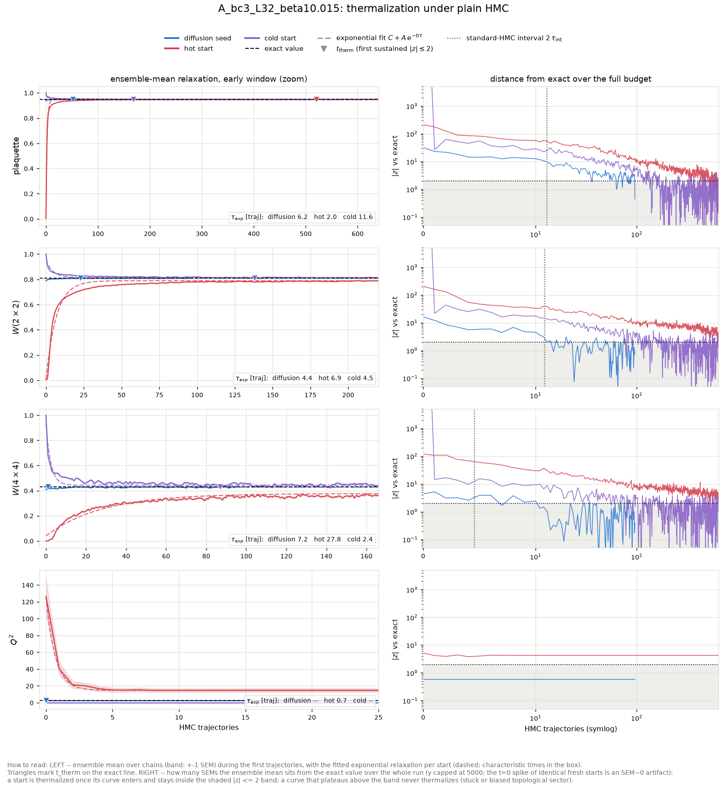

tau_int (hot-start chains, second half): plaquette = 6.42 +- 1.18, wilson_2x2 = 6.08 +- 1.25, wilson_4x4 = 2.26 +- 0.55. Topology: hot-start HMC L=32 beta=10.015 -> **frozen** (no tunneling).

Where 'never' stood at the end: the hot start ended the 640-trajectory budget still at wilson_2x2 at |z| ~ 4, wilson_4x4 at |z| ~ 4, Q^2 at |z| ~ 4; the cold start ended the 640-trajectory budget still at Q^2 at |z| ~ 2736159195136.

### Diagnostics: raw diffusion output (before any HMC)

| observable | value | error | exact | z_exact | reference | ref_error | z_ref | ks_p | chi2_p |
|---|---|---|---|---|---|---|---|---|---|
| plaquette | 0.9385 | 0.0003309 | 0.9487 | -30.85 | 0.9486 | 0.0001186 | -28.69 | 0 |  |
| wilson_1x1 | 0.9385 | 0.0003309 | 0.9487 | -30.85 | 0.9486 | 0.0001186 | -28.69 | 0 |  |
| wilson_1x2 | 0.884 | 0.0007318 | 0.9 | -21.87 | 0.9002 | 0.0002491 | -20.95 | 0 |  |
| wilson_2x2 | 0.7887 | 0.001467 | 0.81 | -14.53 | 0.8102 | 0.0005851 | -13.64 | 1.127e-30 |  |
| wilson_2x3 | 0.706 | 0.00226 | 0.729 | -10.18 | 0.7287 | 0.0009044 | -9.352 | 1.582e-13 |  |
| wilson_3x3 | 0.598 | 0.003323 | 0.6224 | -7.341 | 0.6216 | 0.001485 | -6.474 | 5.543e-07 |  |
| wilson_3x4 | 0.5086 | 0.004055 | 0.5314 | -5.619 | 0.5292 | 0.002277 | -4.429 | 0.0006474 |  |
| wilson_4x4 | 0.4106 | 0.005 | 0.4304 | -3.976 | 0.4289 | 0.002807 | -3.194 | 0.006985 |  |
| wilson_4x5 | 0.3305 | 0.00551 | 0.3486 | -3.289 | 0.3456 | 0.00354 | -2.307 | 0.02248 |  |
| wilson_5x5 | 0.2517 | 0.006151 | 0.2679 | -2.629 | 0.265 | 0.003876 | -1.829 | 0.1712 |  |
| wilson_5x6 | 0.1919 | 0.005661 | 0.2059 | -2.469 | 0.2042 | 0.004145 | -1.75 | 0.3021 |  |
| wilson_6x6 | 0.1376 | 0.005487 | 0.1501 | -2.276 | 0.1501 | 0.004018 | -1.848 | 0.2522 |  |
| wilson_6x7 | 0.09713 | 0.00508 | 0.1094 | -2.414 | 0.1104 | 0.004002 | -2.059 | 0.1004 |  |
| wilson_7x7 | 0.06652 | 0.004773 | 0.07566 | -1.915 | 0.07739 | 0.003572 | -1.824 | 0.07995 |  |
| wilson_7x8 | 0.04422 | 0.004098 | 0.05232 | -1.976 | 0.05614 | 0.003853 | -2.118 | 0.5259 |  |
| wilson_8x8 | 0.02763 | 0.004072 | 0.03433 | -1.645 | 0.03666 | 0.00362 | -1.658 | 0.7538 |  |
| wilson_8x10 | 0.009657 | 0.005057 | 0.01478 | -1.012 | 0.01927 | 0.004252 | -1.455 | 0.1545 |  |
| wilson_10x10 | 0.002555 | 0.005059 | 0.005151 | -0.5133 | 0.005632 | 0.003721 | -0.4901 | 0.389 |  |
| wilson_10x12 | -0.001982 | 0.004125 | 0.001796 | -0.9158 | 0.00171 | 0.002494 | -0.7659 | 0.7901 |  |
| wilson_12x12 | 0.0008213 | 0.003714 | 0.0005072 | 0.08456 | 8.739e-05 | 0.002521 | 0.1635 | 0.4898 |  |
| creutz_2 | 0.05427 | 0.0009266 | 0.05268 | 1.706 |  |  |  |  |  |
| creutz_3 | 0.0552 | 0.001812 | 0.05268 | 1.386 |  |  |  |  |  |
| creutz_4 | 0.05231 | 0.003287 | 0.05268 | -0.115 |  |  |  |  |  |
| creutz_5 | 0.05547 | 0.005809 | 0.05268 | 0.4794 |  |  |  |  |  |
| creutz_6 | 0.06124 | 0.01446 | 0.05268 | 0.5916 |  |  |  |  |  |
| creutz_7 | 0.03056 | 0.02761 | 0.05268 | -0.8014 |  |  |  |  |  |
| creutz_8 | 0.06214 | 0.06688 | 0.05268 | 0.1414 |  |  |  |  |  |
| Q | 0.03906 | 0.1517 | 0 | 0.2574 | -0.1042 | 0.1518 | 0.6672 | 0.9807 |  |
| Q^2 | 2.93 | 0.267 | 2.736 | 0.7247 | 3.406 | 0.25 | -1.303 | 0.9941 |  |
| chi_top ((<Q^2>-<Q>^2)/V) | 0.00286 | 0.0002635 | 0.002672 | 0.7116 | 0.003316 | 0.0002389 | -1.283 | 0.0004451 |  |
| Q histogram vs exact P(Q) | 4.29 | nan | 6 | nan |  |  |  |  | 0.6376 |

### Diagnostics: the same configs after 96 HMC trajectories

| observable | value | error | exact | z_exact | reference | ref_error | z_ref | ks_p | chi2_p |
|---|---|---|---|---|---|---|---|---|---|
| plaquette | 0.9486 | 0.0001634 | 0.9487 | -0.5156 | 0.9486 | 0.0001186 | 0.189 | 0.3294 |  |
| wilson_1x1 | 0.9486 | 0.0001634 | 0.9487 | -0.5156 | 0.9486 | 0.0001186 | 0.189 | 0.3294 |  |
| wilson_1x2 | 0.8998 | 0.0004606 | 0.9 | -0.484 | 0.9002 | 0.0002491 | -0.7778 | 0.7538 |  |
| wilson_2x2 | 0.8107 | 0.001312 | 0.81 | 0.5593 | 0.8102 | 0.0005851 | 0.3437 | 0.6395 |  |
| wilson_2x3 | 0.7302 | 0.001986 | 0.729 | 0.5935 | 0.7287 | 0.0009044 | 0.649 | 0.389 |  |
| wilson_3x3 | 0.6233 | 0.00306 | 0.6224 | 0.2955 | 0.6216 | 0.001485 | 0.5102 | 0.5259 |  |
| wilson_3x4 | 0.5335 | 0.003619 | 0.5314 | 0.5724 | 0.5292 | 0.002277 | 0.9966 | 0.1892 |  |
| wilson_4x4 | 0.4321 | 0.004529 | 0.4304 | 0.3581 | 0.4289 | 0.002807 | 0.5981 | 0.5259 |  |
| wilson_4x5 | 0.3509 | 0.004837 | 0.3486 | 0.4754 | 0.3456 | 0.00354 | 0.8866 | 0.1712 |  |
| wilson_5x5 | 0.2697 | 0.005139 | 0.2679 | 0.354 | 0.265 | 0.003876 | 0.7288 | 0.3021 |  |
| wilson_5x6 | 0.2082 | 0.004819 | 0.2059 | 0.4901 | 0.2042 | 0.004145 | 0.6383 | 0.3021 |  |
| wilson_6x6 | 0.1491 | 0.005261 | 0.1501 | -0.1843 | 0.1501 | 0.004018 | -0.1584 | 0.5631 |  |
| wilson_6x7 | 0.1097 | 0.005269 | 0.1094 | 0.0518 | 0.1104 | 0.004002 | -0.1173 | 0.8246 |  |
| wilson_7x7 | 0.07281 | 0.005003 | 0.07566 | -0.5682 | 0.07739 | 0.003572 | -0.7448 | 0.9126 |  |
| wilson_7x8 | 0.04855 | 0.005355 | 0.05232 | -0.7041 | 0.05614 | 0.003853 | -1.15 | 0.389 |  |
| wilson_8x8 | 0.0287 | 0.004937 | 0.03433 | -1.14 | 0.03666 | 0.00362 | -1.301 | 0.0631 |  |
| wilson_8x10 | 0.007211 | 0.004189 | 0.01478 | -1.806 | 0.01927 | 0.004252 | -2.02 | 0.1392 |  |
| wilson_10x10 | 0.001587 | 0.004081 | 0.005151 | -0.8733 | 0.005632 | 0.003721 | -0.7324 | 0.4548 |  |
| wilson_10x12 | -0.0001532 | 0.003821 | 0.001796 | -0.5102 | 0.00171 | 0.002494 | -0.4084 | 0.9807 |  |
| wilson_12x12 | 0.002142 | 0.003451 | 0.0005072 | 0.4736 | 8.739e-05 | 0.002521 | 0.4807 | 0.9126 |  |
| creutz_2 | 0.05137 | 0.0008142 | 0.05268 | -1.611 |  |  |  |  |  |
| creutz_3 | 0.05356 | 0.001599 | 0.05268 | 0.5467 |  |  |  |  |  |
| creutz_4 | 0.05526 | 0.002938 | 0.05268 | 0.8748 |  |  |  |  |  |
| creutz_5 | 0.05531 | 0.005929 | 0.05268 | 0.442 |  |  |  |  |  |
| creutz_6 | 0.07522 | 0.01156 | 0.05268 | 1.948 |  |  |  |  |  |
| creutz_7 | 0.1024 | 0.02536 | 0.05268 | 1.962 |  |  |  |  |  |
| creutz_8 | 0.1204 | 0.06553 | 0.05268 | 1.034 |  |  |  |  |  |
| Q | 0.03906 | 0.1517 | 0 | 0.2574 | -0.1042 | 0.1518 | 0.6672 | 0.9807 |  |
| Q^2 | 2.93 | 0.267 | 2.736 | 0.7247 | 3.406 | 0.25 | -1.303 | 0.9941 |  |
| chi_top ((<Q^2>-<Q>^2)/V) | 0.00286 | 0.0002635 | 0.002672 | 0.7116 | 0.003316 | 0.0002389 | -1.283 | 0.0004451 |  |
| Q histogram vs exact P(Q) | 4.29 | nan | 6 | nan |  |  |  |  | 0.6376 |

## A_bc4_L32_beta14.1464

HMC: step size 0.0532, 19 leapfrog steps, acceptance seed/hot/cold = 0.996/0.996/0.995. Diffusion-seed batch: 128 chains x 96 trajectories (0.24 s/traj for the whole batch); baselines: 32 chains x 640 trajectories.

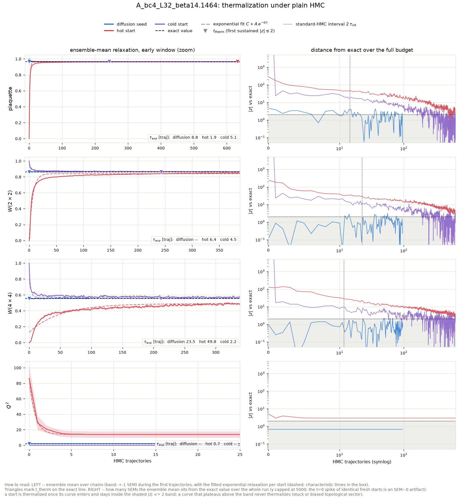

tau_int (hot-start chains, second half): plaquette = 7.20 +- 1.11, wilson_2x2 = 11.19 +- 1.61, wilson_4x4 = 5.80 +- 1.04. Topology: hot-start HMC L=32 beta=14.1464 -> **frozen** (no tunneling).

Where 'never' stood at the end: the hot start ended the 640-trajectory budget still at wilson_2x2 at |z| ~ 3, wilson_4x4 at |z| ~ 3, Q^2 at |z| ~ 3; the cold start ended the 640-trajectory budget still at Q^2 at |z| ~ 1903991324672.

### Diagnostics: raw diffusion output (before any HMC)

| observable | value | error | exact | z_exact | reference | ref_error | z_ref | ks_p | chi2_p |
|---|---|---|---|---|---|---|---|---|---|
| plaquette | 0.9647 | 0.0001645 | 0.964 | 4.629 | 0.9643 | 0.0001394 | 2.267 | 0.005104 |  |
| wilson_1x1 | 0.9647 | 0.0001645 | 0.964 | 4.629 | 0.9643 | 0.0001394 | 2.267 | 0.005104 |  |
| wilson_1x2 | 0.9303 | 0.0003844 | 0.9293 | 2.823 | 0.9297 | 0.0002902 | 1.409 | 0.02248 |  |
| wilson_2x2 | 0.8636 | 0.0007503 | 0.8635 | 0.1251 | 0.8648 | 0.0005656 | -1.302 | 0.7538 |  |
| wilson_2x3 | 0.8023 | 0.001267 | 0.8024 | -0.08976 | 0.8041 | 0.001006 | -1.093 | 0.4548 |  |
| wilson_3x3 | 0.7167 | 0.001705 | 0.7188 | -1.234 | 0.7215 | 0.001633 | -2.012 | 0.1004 |  |
| wilson_3x4 | 0.6402 | 0.002418 | 0.6439 | -1.521 | 0.6464 | 0.002382 | -1.828 | 0.1392 |  |
| wilson_4x4 | 0.5529 | 0.003164 | 0.556 | -0.9781 | 0.5589 | 0.003229 | -1.31 | 0.4548 |  |
| wilson_4x5 | 0.4764 | 0.004312 | 0.4801 | -0.866 | 0.483 | 0.003787 | -1.15 | 0.3584 |  |
| wilson_5x5 | 0.3969 | 0.005217 | 0.3997 | -0.5239 | 0.4026 | 0.004329 | -0.8294 | 0.8246 |  |
| wilson_5x6 | 0.3275 | 0.006048 | 0.3327 | -0.8534 | 0.3371 | 0.004763 | -1.237 | 0.6011 |  |
| wilson_6x6 | 0.2634 | 0.006773 | 0.267 | -0.5331 | 0.2695 | 0.004692 | -0.7466 | 0.8569 |  |
| wilson_6x7 | 0.2102 | 0.007059 | 0.2142 | -0.5727 | 0.2188 | 0.004882 | -1.006 | 0.5631 |  |
| wilson_7x7 | 0.1658 | 0.006989 | 0.1657 | 0.009237 | 0.1698 | 0.00535 | -0.4563 | 0.6011 |  |
| wilson_7x8 | 0.1297 | 0.006954 | 0.1282 | 0.2127 | 0.1338 | 0.005268 | -0.474 | 0.2522 |  |
| wilson_8x8 | 0.0993 | 0.005906 | 0.09558 | 0.6285 | 0.09956 | 0.005676 | -0.03243 | 0.6395 |  |
| wilson_8x10 | 0.05442 | 0.005686 | 0.05315 | 0.2237 | 0.05826 | 0.004829 | -0.5154 | 0.5631 |  |
| wilson_10x10 | 0.02444 | 0.005991 | 0.02552 | -0.1797 | 0.03309 | 0.004208 | -1.182 | 0.3294 |  |
| wilson_10x12 | 0.01423 | 0.005282 | 0.01225 | 0.3736 | 0.01664 | 0.004387 | -0.3524 | 0.678 |  |
| wilson_12x12 | 0.004036 | 0.004402 | 0.00508 | -0.237 | 0.009305 | 0.005203 | -0.7731 | 0.7901 |  |
| creutz_2 | 0.03812 | 0.0005282 | 0.03668 | 2.717 |  |  |  |  |  |
| creutz_3 | 0.03922 | 0.00098 | 0.03668 | 2.593 |  |  |  |  |  |
| creutz_4 | 0.03374 | 0.001962 | 0.03668 | -1.498 |  |  |  |  |  |
| creutz_5 | 0.03351 | 0.003034 | 0.03668 | -1.045 |  |  |  |  |  |
| creutz_6 | 0.02589 | 0.005203 | 0.03668 | -2.074 |  |  |  |  |  |
| creutz_7 | 0.01181 | 0.009284 | 0.03668 | -2.68 |  |  |  |  |  |
| creutz_8 | 0.02114 | 0.01674 | 0.03668 | -0.9287 |  |  |  |  |  |
| Q | 0.07031 | 0.1218 | 0 | 0.5774 | -0.07292 | 0.1031 | 0.8977 | 0.678 |  |
| Q^2 | 2.086 | 0.2321 | 1.904 | 0.7839 | 1.635 | 0.1596 | 1.599 | 0.8569 |  |
| chi_top ((<Q^2>-<Q>^2)/V) | 0.002032 | 0.0002337 | 0.001859 | 0.7397 | 0.001592 | 0.0001506 | 1.584 | 4.022e-06 |  |
| Q histogram vs exact P(Q) | 2.334 | nan | 6 | nan |  |  |  |  | 0.8866 |

### Diagnostics: the same configs after 96 HMC trajectories

| observable | value | error | exact | z_exact | reference | ref_error | z_ref | ks_p | chi2_p |
|---|---|---|---|---|---|---|---|---|---|
| plaquette | 0.964 | 0.0001146 | 0.964 | -0.02209 | 0.9643 | 0.0001394 | -1.525 | 0.2522 |  |
| wilson_1x1 | 0.964 | 0.0001146 | 0.964 | -0.02209 | 0.9643 | 0.0001394 | -1.525 | 0.2522 |  |
| wilson_1x2 | 0.9294 | 0.0001945 | 0.9293 | 0.7386 | 0.9297 | 0.0002902 | -0.7517 | 0.6011 |  |
| wilson_2x2 | 0.8634 | 0.0005953 | 0.8635 | -0.2856 | 0.8648 | 0.0005656 | -1.812 | 0.3584 |  |
| wilson_2x3 | 0.8021 | 0.001085 | 0.8024 | -0.2894 | 0.8041 | 0.001006 | -1.33 | 0.6011 |  |
| wilson_3x3 | 0.7174 | 0.001848 | 0.7188 | -0.7571 | 0.7215 | 0.001633 | -1.64 | 0.1892 |  |
| wilson_3x4 | 0.6419 | 0.002657 | 0.6439 | -0.771 | 0.6464 | 0.002382 | -1.283 | 0.5631 |  |
| wilson_4x4 | 0.5534 | 0.003367 | 0.556 | -0.7673 | 0.5589 | 0.003229 | -1.16 | 0.4898 |  |
| wilson_4x5 | 0.4771 | 0.004429 | 0.4801 | -0.6933 | 0.483 | 0.003787 | -1.019 | 0.3584 |  |
| wilson_5x5 | 0.3948 | 0.004835 | 0.3997 | -1.001 | 0.4026 | 0.004329 | -1.191 | 0.3294 |  |
| wilson_5x6 | 0.3263 | 0.005117 | 0.3327 | -1.257 | 0.3371 | 0.004763 | -1.544 | 0.3021 |  |
| wilson_6x6 | 0.2593 | 0.005211 | 0.267 | -1.469 | 0.2695 | 0.004692 | -1.454 | 0.2522 |  |
| wilson_6x7 | 0.2054 | 0.00535 | 0.2142 | -1.647 | 0.2188 | 0.004882 | -1.851 | 0.1545 |  |
| wilson_7x7 | 0.1566 | 0.005509 | 0.1657 | -1.661 | 0.1698 | 0.00535 | -1.723 | 0.1004 |  |
| wilson_7x8 | 0.1165 | 0.005965 | 0.1282 | -1.953 | 0.1338 | 0.005268 | -2.169 | 0.03364 |  |
| wilson_8x8 | 0.08291 | 0.006453 | 0.09558 | -1.963 | 0.09956 | 0.005676 | -1.937 | 0.2087 |  |
| wilson_8x10 | 0.0412 | 0.005298 | 0.05315 | -2.255 | 0.05826 | 0.004829 | -2.38 | 0.0711 |  |
| wilson_10x10 | 0.01509 | 0.00512 | 0.02552 | -2.036 | 0.03309 | 0.004208 | -2.716 | 0.1004 |  |
| wilson_10x12 | 0.00794 | 0.003953 | 0.01225 | -1.091 | 0.01664 | 0.004387 | -1.474 | 0.0711 |  |
| wilson_12x12 | -0.004794 | 0.004163 | 0.00508 | -2.372 | 0.009305 | 0.005203 | -2.116 | 0.02248 |  |
| creutz_2 | 0.03719 | 0.0005162 | 0.03668 | 0.9855 |  |  |  |  |  |
| creutz_3 | 0.03805 | 0.001013 | 0.03668 | 1.346 |  |  |  |  |  |
| creutz_4 | 0.03692 | 0.00191 | 0.03668 | 0.1229 |  |  |  |  |  |
| creutz_5 | 0.04069 | 0.003375 | 0.03668 | 1.187 |  |  |  |  |  |
| creutz_6 | 0.03892 | 0.005694 | 0.03668 | 0.3932 |  |  |  |  |  |
| creutz_7 | 0.03859 | 0.01072 | 0.03668 | 0.1775 |  |  |  |  |  |
| creutz_8 | 0.04511 | 0.02168 | 0.03668 | 0.3885 |  |  |  |  |  |
| Q | 0.07031 | 0.1218 | 0 | 0.5774 | -0.07292 | 0.1031 | 0.8977 | 0.678 |  |
| Q^2 | 2.086 | 0.2321 | 1.904 | 0.7839 | 1.635 | 0.1596 | 1.599 | 0.8569 |  |
| chi_top ((<Q^2>-<Q>^2)/V) | 0.002032 | 0.0002337 | 0.001859 | 0.7397 | 0.001592 | 0.0001506 | 1.584 | 4.022e-06 |  |
| Q histogram vs exact P(Q) | 2.334 | nan | 6 | nan |  |  |  |  | 0.8866 |

## A_bc6_L32_beta22.3151

HMC: step size 0.0423, 24 leapfrog steps, acceptance seed/hot/cold = 0.997/0.997/0.997. Diffusion-seed batch: 128 chains x 96 trajectories (0.31 s/traj for the whole batch); baselines: 32 chains x 640 trajectories.

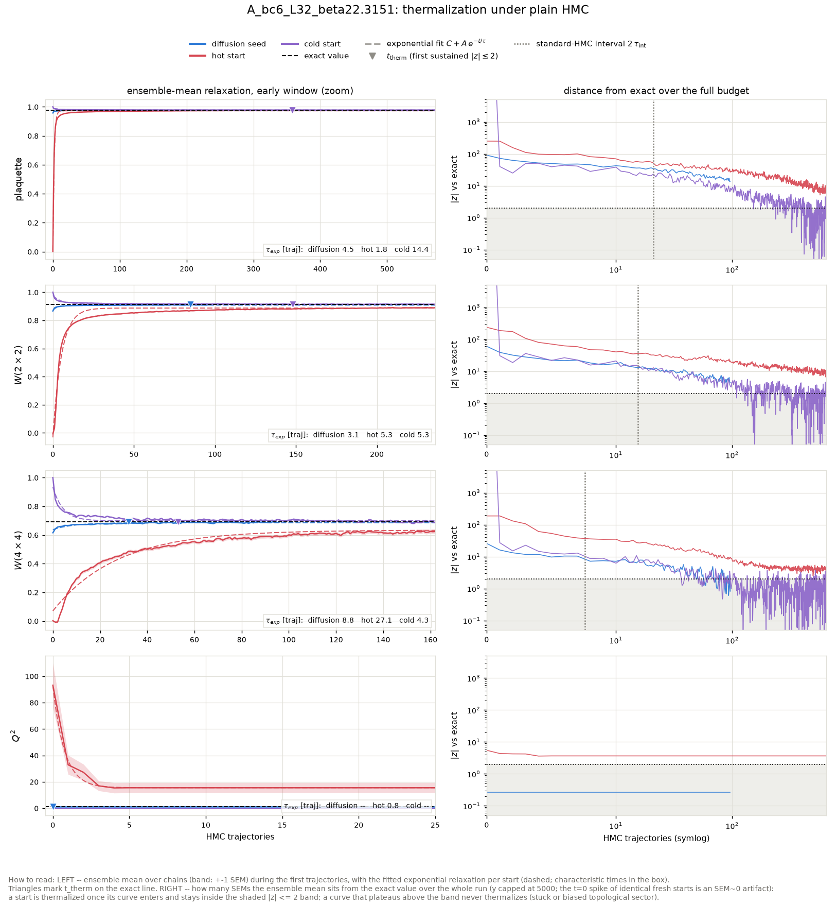

tau_int (hot-start chains, second half): plaquette = 10.47 +- 1.19, wilson_2x2 = 7.69 +- 1.10, wilson_4x4 = 3.80 +- 0.39. Topology: hot-start HMC L=32 beta=22.3151 -> **frozen** (no tunneling).

Where 'never' stood at the end: the hot start ended the 640-trajectory budget still at plaquette at |z| ~ 8, wilson_2x2 at |z| ~ 9, wilson_4x4 at |z| ~ 4, Q^2 at |z| ~ 4; the cold start ended the 640-trajectory budget still at Q^2 at |z| ~ 1189769248768.

### Diagnostics: raw diffusion output (before any HMC)

| observable | value | error | exact | z_exact | reference | ref_error | z_ref | ks_p | chi2_p |
|---|---|---|---|---|---|---|---|---|---|
| plaquette | 0.9575 | 0.0002836 | 0.9773 | -69.99 | 0.9771 | 6.258e-05 | -67.69 | 0 |  |
| wilson_1x1 | 0.9575 | 0.0002836 | 0.9773 | -69.99 | 0.9771 | 6.258e-05 | -67.69 | 0 |  |
| wilson_1x2 | 0.922 | 0.0005055 | 0.9552 | -65.66 | 0.955 | 0.0001446 | -62.84 | 0 |  |
| wilson_2x2 | 0.8666 | 0.0009278 | 0.9124 | -49.36 | 0.9118 | 0.0003964 | -44.8 | 0 |  |
| wilson_2x3 | 0.8149 | 0.001355 | 0.8715 | -41.74 | 0.8705 | 0.0007065 | -36.37 | 0 |  |
| wilson_3x3 | 0.746 | 0.00189 | 0.8135 | -35.71 | 0.8119 | 0.001118 | -29.97 | 0 |  |
| wilson_3x4 | 0.6851 | 0.002409 | 0.7594 | -30.86 | 0.7581 | 0.001735 | -24.57 | 0 |  |
| wilson_4x4 | 0.6151 | 0.003293 | 0.6929 | -23.61 | 0.691 | 0.002453 | -18.47 | 2.199e-42 |  |
| wilson_4x5 | 0.5526 | 0.0039 | 0.6322 | -20.4 | 0.6302 | 0.003175 | -15.44 | 4.973e-32 |  |
| wilson_5x5 | 0.4822 | 0.00491 | 0.5637 | -16.6 | 0.5607 | 0.004057 | -12.33 | 1.846e-24 |  |
| wilson_5x6 | 0.4261 | 0.005896 | 0.5026 | -12.98 | 0.4994 | 0.004712 | -9.707 | 2.653e-19 |  |
| wilson_6x6 | 0.3673 | 0.006861 | 0.438 | -10.31 | 0.4331 | 0.005531 | -7.472 | 2.025e-12 |  |
| wilson_6x7 | 0.3173 | 0.007786 | 0.3817 | -8.279 | 0.3769 | 0.006189 | -5.993 | 6.754e-09 |  |
| wilson_7x7 | 0.2647 | 0.007713 | 0.3251 | -7.838 | 0.3188 | 0.006756 | -5.28 | 1.946e-06 |  |
| wilson_7x8 | 0.2271 | 0.008027 | 0.2769 | -6.209 | 0.2688 | 0.007177 | -3.874 | 0.0001679 |  |
| wilson_8x8 | 0.1904 | 0.008422 | 0.2305 | -4.761 | 0.2208 | 0.007311 | -2.726 | 0.00189 |  |
| wilson_8x10 | 0.1346 | 0.008152 | 0.1597 | -3.075 | 0.1482 | 0.007828 | -1.2 | 0.1392 |  |
| wilson_10x10 | 0.0896 | 0.00657 | 0.101 | -1.73 | 0.09444 | 0.007242 | -0.4949 | 0.4548 |  |
| wilson_10x12 | 0.06229 | 0.005134 | 0.06382 | -0.2983 | 0.05584 | 0.006246 | 0.7984 | 0.3021 |  |
| wilson_12x12 | 0.04197 | 0.00522 | 0.03681 | 0.9879 | 0.03103 | 0.005564 | 1.434 | 0.2297 |  |
| creutz_2 | 0.02422 | 0.0005405 | 0.02293 | 2.391 |  |  |  |  |  |
| creutz_3 | 0.02679 | 0.001187 | 0.02293 | 3.25 |  |  |  |  |  |
| creutz_4 | 0.02247 | 0.001728 | 0.02293 | -0.2655 |  |  |  |  |  |
| creutz_5 | 0.02911 | 0.002537 | 0.02293 | 2.436 |  |  |  |  |  |
| creutz_6 | 0.02492 | 0.004359 | 0.02293 | 0.4571 |  |  |  |  |  |
| creutz_7 | 0.03489 | 0.005994 | 0.02293 | 1.995 |  |  |  |  |  |
| creutz_8 | 0.02294 | 0.009038 | 0.02293 | 0.0007577 |  |  |  |  |  |
| Q | -0.03906 | 0.08641 | 0 | -0.4521 | -0.03125 | 0.0707 | -0.06998 | 1 |  |
| Q^2 | 1.227 | 0.1851 | 1.19 | 0.1988 | 1.406 | 0.09558 | -0.8627 | 0.9126 |  |
| chi_top ((<Q^2>-<Q>^2)/V) | 0.001196 | 0.0001833 | 0.001162 | 0.1879 | 0.001372 | 9.313e-05 | -0.856 | 4.282e-07 |  |
| Q histogram vs exact P(Q) | 3.75 | nan | 4 | nan |  |  |  |  | 0.4409 |

### Diagnostics: the same configs after 96 HMC trajectories

| observable | value | error | exact | z_exact | reference | ref_error | z_ref | ks_p | chi2_p |
|---|---|---|---|---|---|---|---|---|---|
| plaquette | 0.9759 | 0.0001142 | 0.9773 | -12.7 | 0.9771 | 6.258e-05 | -9.671 | 2.295e-13 |  |
| wilson_1x1 | 0.9759 | 0.0001142 | 0.9773 | -12.7 | 0.9771 | 6.258e-05 | -9.671 | 2.295e-13 |  |
| wilson_1x2 | 0.9526 | 0.0002538 | 0.9552 | -10.23 | 0.955 | 0.0001446 | -8.373 | 4.101e-12 |  |
| wilson_2x2 | 0.91 | 0.0005239 | 0.9124 | -4.506 | 0.9118 | 0.0003964 | -2.68 | 0.017 |  |
| wilson_2x3 | 0.8682 | 0.0007762 | 0.8715 | -4.181 | 0.8705 | 0.0007065 | -2.152 | 0.03364 |  |
| wilson_3x3 | 0.8088 | 0.001447 | 0.8135 | -3.271 | 0.8119 | 0.001118 | -1.673 | 0.08971 |  |
| wilson_3x4 | 0.7549 | 0.00191 | 0.7594 | -2.391 | 0.7581 | 0.001735 | -1.231 | 0.1392 |  |
| wilson_4x4 | 0.6905 | 0.002699 | 0.6929 | -0.8675 | 0.691 | 0.002453 | -0.1202 | 0.7163 |  |
| wilson_4x5 | 0.6299 | 0.00337 | 0.6322 | -0.6851 | 0.6302 | 0.003175 | -0.08482 | 0.4898 |  |
| wilson_5x5 | 0.5619 | 0.003904 | 0.5637 | -0.448 | 0.5607 | 0.004057 | 0.2274 | 0.5631 |  |
| wilson_5x6 | 0.5003 | 0.004217 | 0.5026 | -0.5468 | 0.4994 | 0.004712 | 0.1524 | 0.5259 |  |
| wilson_6x6 | 0.4343 | 0.00449 | 0.438 | -0.8359 | 0.4331 | 0.005531 | 0.1597 | 0.389 |  |
| wilson_6x7 | 0.3792 | 0.004879 | 0.3817 | -0.5257 | 0.3769 | 0.006189 | 0.2893 | 0.3584 |  |
| wilson_7x7 | 0.3227 | 0.005025 | 0.3251 | -0.474 | 0.3188 | 0.006756 | 0.4675 | 0.5631 |  |
| wilson_7x8 | 0.2751 | 0.005767 | 0.2769 | -0.3165 | 0.2688 | 0.007177 | 0.6849 | 0.2763 |  |
| wilson_8x8 | 0.2282 | 0.005761 | 0.2305 | -0.3918 | 0.2208 | 0.007311 | 0.7998 | 0.3584 |  |
| wilson_8x10 | 0.1569 | 0.006317 | 0.1597 | -0.4511 | 0.1482 | 0.007828 | 0.8603 | 0.04354 |  |
| wilson_10x10 | 0.09707 | 0.005451 | 0.101 | -0.7138 | 0.09444 | 0.007242 | 0.2905 | 0.3584 |  |
| wilson_10x12 | 0.06057 | 0.004162 | 0.06382 | -0.7821 | 0.05584 | 0.006246 | 0.6303 | 0.5631 |  |
| wilson_12x12 | 0.0334 | 0.004273 | 0.03681 | -0.7983 | 0.03103 | 0.005564 | 0.3384 | 0.4212 |  |
| creutz_2 | 0.02157 | 0.0003514 | 0.02293 | -3.881 |  |  |  |  |  |
| creutz_3 | 0.02389 | 0.000639 | 0.02293 | 1.509 |  |  |  |  |  |
| creutz_4 | 0.02009 | 0.001221 | 0.02293 | -2.325 |  |  |  |  |  |
| creutz_5 | 0.02211 | 0.00198 | 0.02293 | -0.4166 |  |  |  |  |  |
| creutz_6 | 0.02544 | 0.002944 | 0.02293 | 0.8539 |  |  |  |  |  |
| creutz_7 | 0.0254 | 0.004552 | 0.02293 | 0.543 |  |  |  |  |  |
| creutz_8 | 0.0269 | 0.007528 | 0.02293 | 0.5273 |  |  |  |  |  |
| Q | -0.03906 | 0.08641 | 0 | -0.4521 | -0.03125 | 0.0707 | -0.06998 | 1 |  |
| Q^2 | 1.227 | 0.1851 | 1.19 | 0.1988 | 1.406 | 0.09558 | -0.8627 | 0.9126 |  |
| chi_top ((<Q^2>-<Q>^2)/V) | 0.001196 | 0.0001833 | 0.001162 | 0.1879 | 0.001372 | 9.313e-05 | -0.856 | 4.282e-07 |  |
| Q histogram vs exact P(Q) | 3.75 | nan | 4 | nan |  |  |  |  | 0.4409 |

## A_bc8_L32_beta30.3772

HMC: step size 0.0363, 28 leapfrog steps, acceptance seed/hot/cold = 0.998/0.996/0.996. Diffusion-seed batch: 128 chains x 96 trajectories (0.39 s/traj for the whole batch); baselines: 32 chains x 640 trajectories.

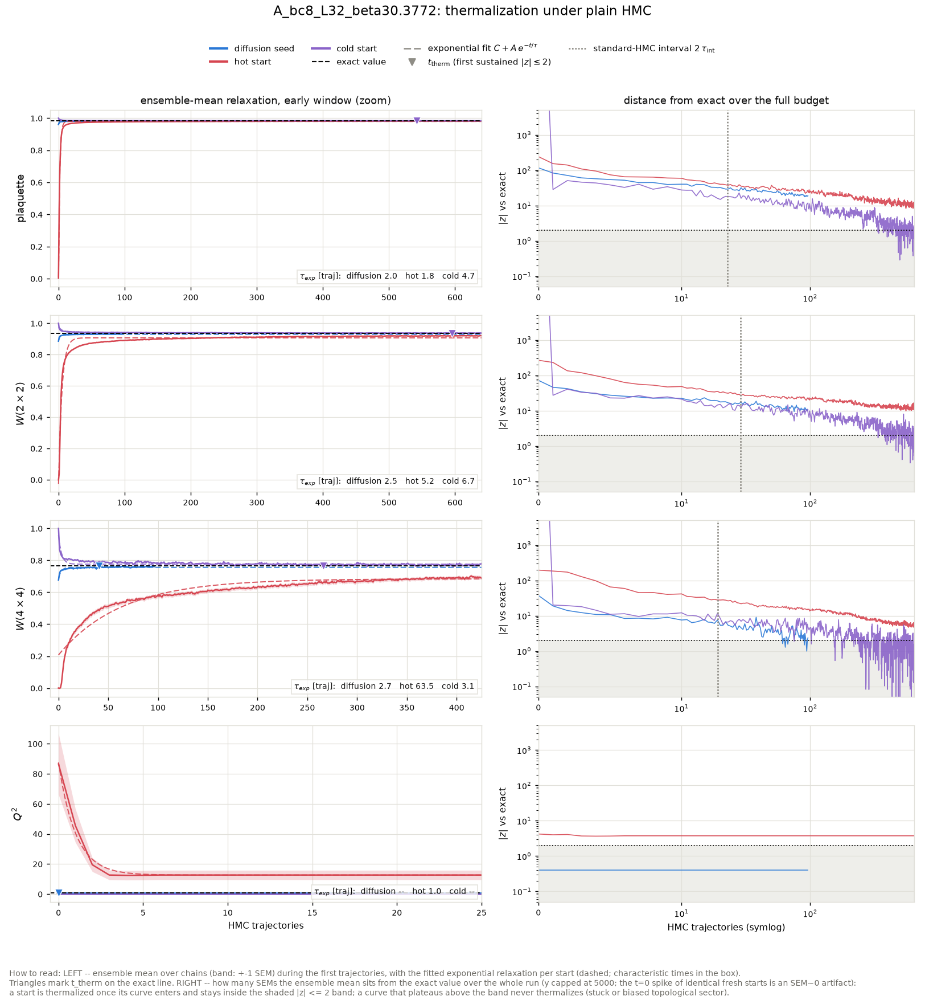

tau_int (hot-start chains, second half): plaquette = 11.32 +- 1.52, wilson_2x2 = 14.33 +- 1.79, wilson_4x4 = 9.51 +- 1.66. Topology: hot-start HMC L=32 beta=30.3772 -> **frozen** (no tunneling).

Where 'never' stood at the end: the hot start ended the 640-trajectory budget still at plaquette at |z| ~ 10, wilson_2x2 at |z| ~ 12, wilson_4x4 at |z| ~ 5, Q^2 at |z| ~ 4; the cold start ended the 640-trajectory budget still at Q^2 at |z| ~ 868455153664.

### Diagnostics: raw diffusion output (before any HMC)

| observable | value | error | exact | z_exact | reference | ref_error | z_ref | ks_p | chi2_p |
|---|---|---|---|---|---|---|---|---|---|
| plaquette | 0.9608 | 0.0002805 | 0.9834 | -80.68 | 0.9835 | 3.853e-05 | -80.23 | 0 |  |
| wilson_1x1 | 0.9608 | 0.0002805 | 0.9834 | -80.68 | 0.9835 | 3.853e-05 | -80.23 | 0 |  |
| wilson_1x2 | 0.9306 | 0.0005091 | 0.9671 | -71.61 | 0.9671 | 8.105e-05 | -70.87 | 0 |  |
| wilson_2x2 | 0.8855 | 0.0008457 | 0.9352 | -58.83 | 0.9353 | 0.0002202 | -57.02 | 0 |  |
| wilson_2x3 | 0.8434 | 0.001111 | 0.9044 | -54.93 | 0.9048 | 0.0004599 | -51.05 | 0 |  |
| wilson_3x3 | 0.7863 | 0.00137 | 0.8601 | -53.93 | 0.8605 | 0.0008424 | -46.15 | 0 |  |
| wilson_3x4 | 0.7358 | 0.001829 | 0.818 | -44.97 | 0.8186 | 0.001269 | -37.2 | 0 |  |
| wilson_4x4 | 0.6762 | 0.002501 | 0.765 | -35.51 | 0.7641 | 0.001745 | -28.82 | 0 |  |
| wilson_4x5 | 0.6227 | 0.003053 | 0.7155 | -30.41 | 0.7147 | 0.002358 | -23.86 | 0 |  |
| wilson_5x5 | 0.5622 | 0.003641 | 0.658 | -26.33 | 0.6563 | 0.003075 | -19.74 | 8.408e-45 |  |
| wilson_5x6 | 0.5089 | 0.004106 | 0.6052 | -23.46 | 0.6044 | 0.00378 | -17.12 | 1.729e-38 |  |
| wilson_6x6 | 0.456 | 0.004362 | 0.5474 | -20.95 | 0.5473 | 0.004598 | -14.41 | 1.283e-29 |  |
| wilson_6x7 | 0.404 | 0.005269 | 0.4951 | -17.29 | 0.4965 | 0.00528 | -12.41 | 1.846e-24 |  |
| wilson_7x7 | 0.3503 | 0.006063 | 0.4403 | -14.85 | 0.4426 | 0.005861 | -10.94 | 1.421e-21 |  |
| wilson_7x8 | 0.3071 | 0.006977 | 0.3916 | -12.11 | 0.3943 | 0.006478 | -9.162 | 6.603e-16 |  |
| wilson_8x8 | 0.2675 | 0.007498 | 0.3426 | -10.01 | 0.3462 | 0.0068 | -7.775 | 2.025e-12 |  |
| wilson_8x10 | 0.197 | 0.007615 | 0.2621 | -8.543 | 0.2663 | 0.007529 | -6.468 | 6.754e-09 |  |
| wilson_10x10 | 0.1349 | 0.008669 | 0.1875 | -6.072 | 0.1914 | 0.008157 | -4.749 | 2.524e-05 |  |
| wilson_10x12 | 0.09221 | 0.008153 | 0.1342 | -5.146 | 0.1381 | 0.008185 | -3.973 | 0.0002049 |  |
| wilson_12x12 | 0.06148 | 0.007817 | 0.08978 | -3.62 | 0.09448 | 0.009064 | -2.757 | 0.005977 |  |
| creutz_2 | 0.01783 | 0.0004917 | 0.01674 | 2.221 |  |  |  |  |  |
| creutz_3 | 0.02149 | 0.0008417 | 0.01674 | 5.649 |  |  |  |  |  |
| creutz_4 | 0.01799 | 0.001381 | 0.01674 | 0.9082 |  |  |  |  |  |
| creutz_5 | 0.01965 | 0.002012 | 0.01674 | 1.448 |  |  |  |  |  |
| creutz_6 | 0.01007 | 0.002804 | 0.01674 | -2.377 |  |  |  |  |  |
| creutz_7 | 0.02133 | 0.004148 | 0.01674 | 1.106 |  |  |  |  |  |
| creutz_8 | 0.006459 | 0.006763 | 0.01674 | -1.52 |  |  |  |  |  |
| Q | 0.1797 | 0.07053 | 0 | 2.548 | 0.09375 | 0.05933 | 0.9324 | 0.9999 |  |
| Q^2 | 0.9141 | 0.1354 | 0.8685 | 0.3369 | 0.8333 | 0.08983 | 0.4969 | 0.9999 |  |
| chi_top ((<Q^2>-<Q>^2)/V) | 0.0008611 | 0.000129 | 0.0008481 | 0.1009 | 0.0008052 | 8.936e-05 | 0.3562 | 5.105e-14 |  |
| Q histogram vs exact P(Q) | 5.306 | nan | 4 | nan |  |  |  |  | 0.2573 |

### Diagnostics: the same configs after 96 HMC trajectories

| observable | value | error | exact | z_exact | reference | ref_error | z_ref | ks_p | chi2_p |
|---|---|---|---|---|---|---|---|---|---|
| plaquette | 0.9821 | 6.709e-05 | 0.9834 | -19.82 | 0.9835 | 3.853e-05 | -18.3 | 3.271e-31 |  |
| wilson_1x1 | 0.9821 | 6.709e-05 | 0.9834 | -19.82 | 0.9835 | 3.853e-05 | -18.3 | 3.271e-31 |  |
| wilson_1x2 | 0.9649 | 0.0001587 | 0.9671 | -13.48 | 0.9671 | 8.105e-05 | -12.42 | 1.63e-18 |  |
| wilson_2x2 | 0.9314 | 0.0003493 | 0.9352 | -10.99 | 0.9353 | 0.0002202 | -9.469 | 2.025e-12 |  |
| wilson_2x3 | 0.9007 | 0.0005888 | 0.9044 | -6.298 | 0.9048 | 0.0004599 | -5.435 | 7.394e-05 |  |
| wilson_3x3 | 0.8559 | 0.0009537 | 0.8601 | -4.439 | 0.8605 | 0.0008424 | -3.593 | 0.01957 |  |
| wilson_3x4 | 0.8141 | 0.00136 | 0.818 | -2.911 | 0.8186 | 0.001269 | -2.422 | 0.1892 |  |
| wilson_4x4 | 0.7602 | 0.001838 | 0.765 | -2.656 | 0.7641 | 0.001745 | -1.553 | 0.3294 |  |
| wilson_4x5 | 0.7094 | 0.002399 | 0.7155 | -2.524 | 0.7147 | 0.002358 | -1.564 | 0.1004 |  |
| wilson_5x5 | 0.6512 | 0.003074 | 0.658 | -2.229 | 0.6563 | 0.003075 | -1.17 | 0.2087 |  |
| wilson_5x6 | 0.5981 | 0.003763 | 0.6052 | -1.886 | 0.6044 | 0.00378 | -1.187 | 0.1712 |  |
| wilson_6x6 | 0.5416 | 0.004697 | 0.5474 | -1.221 | 0.5473 | 0.004598 | -0.8682 | 0.6011 |  |
| wilson_6x7 | 0.4878 | 0.005436 | 0.4951 | -1.341 | 0.4965 | 0.00528 | -1.155 | 0.5259 |  |
| wilson_7x7 | 0.433 | 0.006082 | 0.4403 | -1.198 | 0.4426 | 0.005861 | -1.127 | 0.2297 |  |
| wilson_7x8 | 0.3831 | 0.006709 | 0.3916 | -1.267 | 0.3943 | 0.006478 | -1.202 | 0.1712 |  |
| wilson_8x8 | 0.3329 | 0.007345 | 0.3426 | -1.317 | 0.3462 | 0.0068 | -1.335 | 0.3021 |  |
| wilson_8x10 | 0.2577 | 0.009112 | 0.2621 | -0.4851 | 0.2663 | 0.007529 | -0.7297 | 0.6011 |  |
| wilson_10x10 | 0.1861 | 0.01087 | 0.1875 | -0.1286 | 0.1914 | 0.008157 | -0.3892 | 0.678 |  |
| wilson_10x12 | 0.1347 | 0.01171 | 0.1342 | 0.04333 | 0.1381 | 0.008185 | -0.2408 | 0.5631 |  |
| wilson_12x12 | 0.09154 | 0.01228 | 0.08978 | 0.144 | 0.09448 | 0.009064 | -0.1924 | 0.8569 |  |
| creutz_2 | 0.01777 | 0.0002397 | 0.01674 | 4.321 |  |  |  |  |  |
| creutz_3 | 0.01757 | 0.0005011 | 0.01674 | 1.657 |  |  |  |  |  |
| creutz_4 | 0.01837 | 0.0009427 | 0.01674 | 1.731 |  |  |  |  |  |
| creutz_5 | 0.01661 | 0.001411 | 0.01674 | -0.09108 |  |  |  |  |  |
| creutz_6 | 0.01416 | 0.001913 | 0.01674 | -1.35 |  |  |  |  |  |
| creutz_7 | 0.01429 | 0.002601 | 0.01674 | -0.9422 |  |  |  |  |  |
| creutz_8 | 0.01818 | 0.004417 | 0.01674 | 0.326 |  |  |  |  |  |
| Q | 0.1797 | 0.07053 | 0 | 2.548 | 0.09375 | 0.05933 | 0.9324 | 0.9999 |  |
| Q^2 | 0.9141 | 0.1354 | 0.8685 | 0.3369 | 0.8333 | 0.08983 | 0.4969 | 0.9999 |  |
| chi_top ((<Q^2>-<Q>^2)/V) | 0.0008611 | 0.000129 | 0.0008481 | 0.1009 | 0.0008052 | 8.936e-05 | 0.3562 | 5.105e-14 |  |
| Q histogram vs exact P(Q) | 5.306 | nan | 4 | nan |  |  |  |  | 0.2573 |

## D_bc14.1464_L32_beta55.0237

HMC: step size 0.0270, 37 leapfrog steps, acceptance seed/hot/cold = 0.997/0.997/0.997. Diffusion-seed batch: 128 chains x 96 trajectories (0.47 s/traj for the whole batch); baselines: 32 chains x 640 trajectories.

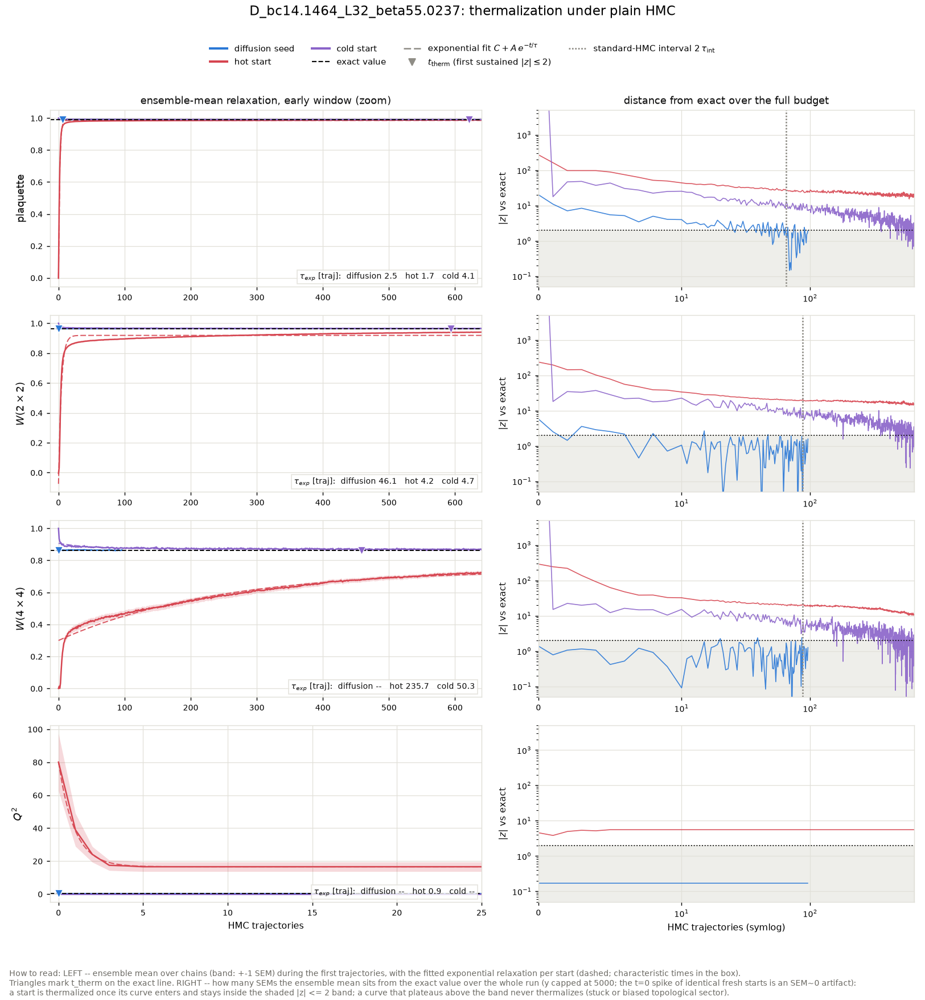

tau_int (hot-start chains, second half): plaquette = 32.34 +- 1.94, wilson_2x2 = 43.83 +- 1.50, wilson_4x4 = 43.86 +- 1.68. Topology: hot-start HMC L=32 beta=55.0237 -> **frozen** (no tunneling).

Where 'never' stood at the end: the hot start ended the 640-trajectory budget still at plaquette at |z| ~ 19, wilson_2x2 at |z| ~ 15, wilson_4x4 at |z| ~ 11, Q^2 at |z| ~ 6; the cold start ended the 640-trajectory budget still at Q^2 at |z| ~ 474280296448.

### Diagnostics: raw diffusion output (before any HMC)

| observable | value | error | exact | z_exact | reference | ref_error | z_ref | ks_p | chi2_p |
|---|---|---|---|---|---|---|---|---|---|
| plaquette | 0.9916 | 3.347e-05 | 0.9909 | 23.22 | 0.9909 | 2.703e-05 | 17.83 | 4.973e-32 |  |
| wilson_1x1 | 0.9916 | 3.347e-05 | 0.9909 | 23.22 | 0.9909 | 2.703e-05 | 17.83 | 4.973e-32 |  |
| wilson_1x2 | 0.9829 | 6.872e-05 | 0.9818 | 16.33 | 0.9818 | 5.904e-05 | 12.64 | 3.484e-14 |  |
| wilson_2x2 | 0.9652 | 0.0001878 | 0.964 | 6.644 | 0.9638 | 0.0001521 | 5.809 | 0.0003034 |  |
| wilson_2x3 | 0.948 | 0.000338 | 0.9465 | 4.42 | 0.9465 | 0.0002251 | 3.571 | 0.01474 |  |
| wilson_3x3 | 0.9224 | 0.0005974 | 0.9208 | 2.764 | 0.921 | 0.0004365 | 1.915 | 0.08971 |  |
| wilson_3x4 | 0.8976 | 0.0009435 | 0.8958 | 1.871 | 0.8964 | 0.0005764 | 1.068 | 0.2763 |  |
| wilson_4x4 | 0.8654 | 0.001393 | 0.8635 | 1.322 | 0.8644 | 0.0008388 | 0.6049 | 0.8569 |  |
| wilson_4x5 | 0.8343 | 0.001759 | 0.8324 | 1.088 | 0.8338 | 0.001045 | 0.2662 | 0.9126 |  |
| wilson_5x5 | 0.7971 | 0.002179 | 0.7951 | 0.8907 | 0.7969 | 0.001523 | 0.07446 | 0.9989 |  |
| wilson_5x6 | 0.7612 | 0.00251 | 0.7595 | 0.6896 | 0.7623 | 0.001953 | -0.339 | 0.9972 |  |
| wilson_6x6 | 0.7195 | 0.002867 | 0.7188 | 0.2432 | 0.7209 | 0.002568 | -0.3415 | 0.9542 |  |
| wilson_6x7 | 0.6814 | 0.003232 | 0.6804 | 0.3295 | 0.6827 | 0.003195 | -0.2869 | 0.9126 |  |
| wilson_7x7 | 0.6373 | 0.00371 | 0.6381 | -0.2149 | 0.6399 | 0.003671 | -0.5108 | 0.9126 |  |
| wilson_7x8 | 0.5981 | 0.004089 | 0.5984 | -0.07578 | 0.6009 | 0.004341 | -0.4695 | 0.9126 |  |
| wilson_8x8 | 0.5548 | 0.004727 | 0.5561 | -0.2754 | 0.5584 | 0.004749 | -0.5321 | 0.7163 |  |
| wilson_8x10 | 0.4811 | 0.005536 | 0.4802 | 0.1479 | 0.4848 | 0.005792 | -0.4722 | 0.4898 |  |
| wilson_10x10 | 0.3976 | 0.006784 | 0.3998 | -0.3335 | 0.4033 | 0.006486 | -0.6132 | 0.8864 |  |
| wilson_10x12 | 0.3294 | 0.007693 | 0.3329 | -0.4513 | 0.3379 | 0.006761 | -0.8263 | 0.7901 |  |
| wilson_12x12 | 0.2622 | 0.00902 | 0.2672 | -0.5588 | 0.2703 | 0.006422 | -0.7353 | 0.7901 |  |
| creutz_2 | 0.009378 | 0.0001333 | 0.009171 | 1.553 |  |  |  |  |  |
| creutz_3 | 0.00924 | 0.0002529 | 0.00917 | 0.2742 |  |  |  |  |  |
| creutz_4 | 0.009185 | 0.0004339 | 0.00917 | 0.0351 |  |  |  |  |  |
| creutz_5 | 0.009195 | 0.0006392 | 0.009169 | 0.04136 |  |  |  |  |  |
| creutz_6 | 0.01031 | 0.0008166 | 0.009167 | 1.402 |  |  |  |  |  |
| creutz_7 | 0.01257 | 0.001083 | 0.009165 | 3.147 |  |  |  |  |  |
| creutz_8 | 0.01172 | 0.001628 | 0.009162 | 1.572 |  |  |  |  |  |
| Q | 0 | 0.05689 | 0 | 0 | 0.06771 | 0.04615 | -0.9242 | 0.9999 |  |
| Q^2 | 0.4844 | 0.05614 | 0.4743 | 0.1798 | 0.526 | 0.04735 | -0.5673 | 1 |  |
| chi_top ((<Q^2>-<Q>^2)/V) | 0.000473 | 5.482e-05 | 0.0004632 | 0.1798 | 0.0005092 | 4.707e-05 | -0.5012 | 7.05e-23 |  |
| Q histogram vs exact P(Q) | 0.1517 | nan | 2 | nan |  |  |  |  | 0.927 |

### Diagnostics: the same configs after 96 HMC trajectories

| observable | value | error | exact | z_exact | reference | ref_error | z_ref | ks_p | chi2_p |
|---|---|---|---|---|---|---|---|---|---|
| plaquette | 0.9909 | 3.547e-05 | 0.9909 | 2.063 | 0.9909 | 2.703e-05 | 1.415 | 0.4212 |  |
| wilson_1x1 | 0.9909 | 3.547e-05 | 0.9909 | 2.063 | 0.9909 | 2.703e-05 | 1.415 | 0.4212 |  |
| wilson_1x2 | 0.982 | 8.183e-05 | 0.9818 | 1.823 | 0.9818 | 5.904e-05 | 1.704 | 0.5631 |  |
| wilson_2x2 | 0.9643 | 0.0002236 | 0.964 | 1.559 | 0.9638 | 0.0001521 | 1.867 | 0.1392 |  |
| wilson_2x3 | 0.9469 | 0.00041 | 0.9465 | 1.015 | 0.9465 | 0.0002251 | 0.7964 | 0.3584 |  |
| wilson_3x3 | 0.9218 | 0.0006833 | 0.9208 | 1.47 | 0.921 | 0.0004365 | 0.9502 | 0.2297 |  |
| wilson_3x4 | 0.8971 | 0.0009913 | 0.8958 | 1.292 | 0.8964 | 0.0005764 | 0.6072 | 0.3294 |  |
| wilson_4x4 | 0.8653 | 0.001389 | 0.8635 | 1.281 | 0.8644 | 0.0008388 | 0.5674 | 0.2763 |  |
| wilson_4x5 | 0.8346 | 0.001969 | 0.8324 | 1.099 | 0.8338 | 0.001045 | 0.3559 | 0.7163 |  |
| wilson_5x5 | 0.7981 | 0.002528 | 0.7951 | 1.185 | 0.7969 | 0.001523 | 0.4248 | 0.9126 |  |
| wilson_5x6 | 0.7624 | 0.003426 | 0.7595 | 0.8613 | 0.7623 | 0.001953 | 0.03607 | 0.8569 |  |
| wilson_6x6 | 0.7225 | 0.004131 | 0.7188 | 0.8911 | 0.7209 | 0.002568 | 0.3432 | 0.7901 |  |
| wilson_6x7 | 0.684 | 0.00522 | 0.6804 | 0.6878 | 0.6827 | 0.003195 | 0.1997 | 0.9353 |  |
| wilson_7x7 | 0.6426 | 0.006101 | 0.6381 | 0.7345 | 0.6399 | 0.003671 | 0.3669 | 0.9542 |  |
| wilson_7x8 | 0.603 | 0.007208 | 0.5984 | 0.6423 | 0.6009 | 0.004341 | 0.2543 | 0.9542 |  |
| wilson_8x8 | 0.5619 | 0.008421 | 0.5561 | 0.6861 | 0.5584 | 0.004749 | 0.3636 | 0.9941 |  |
| wilson_8x10 | 0.4875 | 0.0103 | 0.4802 | 0.7026 | 0.4848 | 0.005792 | 0.2229 | 0.8864 |  |
| wilson_10x10 | 0.4081 | 0.01207 | 0.3998 | 0.6832 | 0.4033 | 0.006486 | 0.3468 | 0.7901 |  |
| wilson_10x12 | 0.3443 | 0.01313 | 0.3329 | 0.8711 | 0.3379 | 0.006761 | 0.4367 | 0.9353 |  |
| wilson_12x12 | 0.2782 | 0.014 | 0.2672 | 0.7861 | 0.2703 | 0.006422 | 0.5131 | 0.8864 |  |
| creutz_2 | 0.009039 | 0.000132 | 0.009171 | -0.9973 |  |  |  |  |  |
| creutz_3 | 0.008598 | 0.0002584 | 0.00917 | -2.216 |  |  |  |  |  |
| creutz_4 | 0.008879 | 0.0004378 | 0.00917 | -0.664 |  |  |  |  |  |
| creutz_5 | 0.00854 | 0.0006768 | 0.009169 | -0.9285 |  |  |  |  |  |
| creutz_6 | 0.008054 | 0.0009845 | 0.009167 | -1.13 |  |  |  |  |  |
| creutz_7 | 0.007586 | 0.001422 | 0.009165 | -1.11 |  |  |  |  |  |
| creutz_8 | 0.007242 | 0.001634 | 0.009162 | -1.175 |  |  |  |  |  |
| Q | 0 | 0.05689 | 0 | 0 | 0.06771 | 0.04615 | -0.9242 | 0.9999 |  |
| Q^2 | 0.4844 | 0.05614 | 0.4743 | 0.1798 | 0.526 | 0.04735 | -0.5673 | 1 |  |
| chi_top ((<Q^2>-<Q>^2)/V) | 0.000473 | 5.482e-05 | 0.0004632 | 0.1798 | 0.0005092 | 4.707e-05 | -0.5012 | 7.05e-23 |  |
| Q histogram vs exact P(Q) | 0.1517 | nan | 2 | nan |  |  |  |  | 0.927 |

## D_bc55.0237_L32_beta218.58

HMC: step size 0.0135, 74 leapfrog steps, acceptance seed/hot/cold = 0.995/0.993/0.993. Diffusion-seed batch: 128 chains x 96 trajectories (0.90 s/traj for the whole batch); baselines: 32 chains x 640 trajectories.

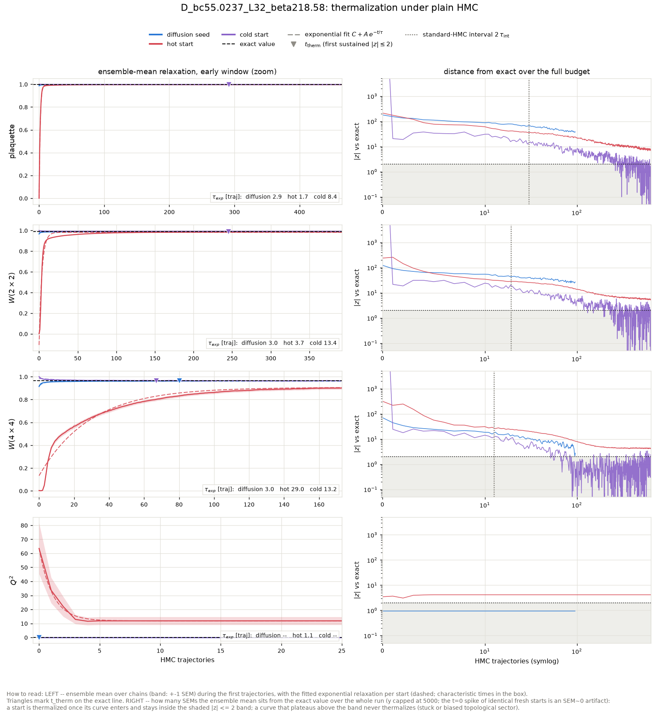

tau_int (hot-start chains, second half): plaquette = 15.07 +- 1.50, wilson_2x2 = 9.65 +- 1.21, wilson_4x4 = 6.30 +- 0.60. Topology: hot-start HMC L=32 beta=218.58 -> **frozen** (no tunneling).

Where 'never' stood at the end: the hot start ended the 640-trajectory budget still at plaquette at |z| ~ 7, wilson_2x2 at |z| ~ 5, wilson_4x4 at |z| ~ 4, Q^2 at |z| ~ 4; the cold start ended the 640-trajectory budget still at Q^2 at |z| ~ 29010771968.

### Diagnostics: raw diffusion output (before any HMC)

| observable | value | error | exact | z_exact | reference | ref_error | z_ref | ks_p |
|---|---|---|---|---|---|---|---|---|
| plaquette | 0.9868 | 5.901e-05 | 0.9977 | -185.1 | 0.9977 | 7.705e-06 | -183.8 | 0 |
| wilson_1x1 | 0.9868 | 5.901e-05 | 0.9977 | -185.1 | 0.9977 | 7.705e-06 | -183.8 | 0 |
| wilson_1x2 | 0.978 | 0.000107 | 0.9954 | -162.8 | 0.9955 | 1.563e-05 | -161.5 | 0 |
| wilson_2x2 | 0.9664 | 0.0001641 | 0.9909 | -149.6 | 0.991 | 3.765e-05 | -146.3 | 0 |
| wilson_2x3 | 0.9558 | 0.0002642 | 0.9864 | -115.9 | 0.9865 | 6.139e-05 | -113.2 | 0 |
| wilson_3x3 | 0.9417 | 0.000369 | 0.9797 | -103 | 0.9799 | 8.848e-05 | -100.6 | 0 |
| wilson_3x4 | 0.9292 | 0.0004701 | 0.9731 | -93.38 | 0.9732 | 0.0001162 | -90.91 | 0 |
| wilson_4x4 | 0.9145 | 0.0006694 | 0.9644 | -74.52 | 0.9646 | 0.0001617 | -72.68 | 0 |
| wilson_4x5 | 0.9003 | 0.0008805 | 0.9558 | -63.1 | 0.9559 | 0.0002461 | -60.89 | 0 |
| wilson_5x5 | 0.8833 | 0.001221 | 0.9453 | -50.75 | 0.9453 | 0.000377 | -48.48 | 0 |
| wilson_5x6 | 0.8686 | 0.001571 | 0.935 | -42.25 | 0.935 | 0.0005198 | -40.12 | 0 |
| wilson_6x6 | 0.8526 | 0.001724 | 0.9228 | -40.7 | 0.9231 | 0.0007562 | -37.41 | 0 |
| wilson_6x7 | 0.8364 | 0.00189 | 0.9109 | -39.42 | 0.9115 | 0.001025 | -34.9 | 0 |
| wilson_7x7 | 0.8156 | 0.002333 | 0.8974 | -35.05 | 0.8985 | 0.001333 | -30.86 | 0 |
| wilson_7x8 | 0.8007 | 0.002594 | 0.8842 | -32.21 | 0.8856 | 0.0017 | -27.39 | 0 |
| wilson_8x8 | 0.7842 | 0.00295 | 0.8696 | -28.93 | 0.872 | 0.002125 | -24.16 | 0 |
| wilson_8x10 | 0.7494 | 0.00402 | 0.8415 | -22.91 | 0.8457 | 0.002874 | -19.48 | 0 |
| wilson_10x10 | 0.7058 | 0.005258 | 0.8088 | -19.6 | 0.8165 | 0.004096 | -16.62 | 4.624e-43 |
| wilson_10x12 | 0.667 | 0.006593 | 0.7785 | -16.9 | 0.7889 | 0.0051 | -14.62 | 8.389e-39 |
| wilson_12x12 | 0.6252 | 0.008083 | 0.745 | -14.81 | 0.7606 | 0.006549 | -13.01 | 3.271e-31 |
| creutz_2 | 0.003073 | 0.000154 | 0.002278 | 5.164 |  |  |  |  |
| creutz_3 | 0.003828 | 0.0002767 | 0.00225 | 5.704 |  |  |  |  |
| creutz_4 | 0.002563 | 0.0003654 | 0.00221 | 0.9679 |  |  |  |  |
| creutz_5 | 0.003267 | 0.0005079 | 0.002155 | 2.188 |  |  |  |  |
| creutz_6 | 0.001667 | 0.0006471 | 0.002087 | -0.6489 |  |  |  |  |
| creutz_7 | 0.005999 | 0.0008217 | 0.002005 | 4.861 |  |  |  |  |
| creutz_8 | 0.002245 | 0.0008994 | 0.001907 | 0.3752 |  |  |  |  |
| Q | -0.01562 | 0.01614 | 0 | -0.9683 | 0 | 0.007255 | -0.8831 | 1 |
| Q^2 | 0.04688 | 0.02098 | 0.02901 | 0.8516 | 0.01042 | 0.006882 | 1.651 | 0.9999 |
| chi_top ((<Q^2>-<Q>^2)/V) | 4.554e-05 | 2.036e-05 | 2.833e-05 | 0.845 | 1.017e-05 | 6.721e-06 | 1.649 | 0 |

### Diagnostics: the same configs after 96 HMC trajectories

| observable | value | error | exact | z_exact | reference | ref_error | z_ref | ks_p |
|---|---|---|---|---|---|---|---|---|
| plaquette | 0.9972 | 1.086e-05 | 0.9977 | -47.21 | 0.9977 | 7.705e-06 | -39.68 | 0 |
| wilson_1x1 | 0.9972 | 1.086e-05 | 0.9977 | -47.21 | 0.9977 | 7.705e-06 | -39.68 | 0 |
| wilson_1x2 | 0.9945 | 2.078e-05 | 0.9954 | -43.7 | 0.9955 | 1.563e-05 | -36.7 | 0 |
| wilson_2x2 | 0.9893 | 4.846e-05 | 0.9909 | -33.12 | 0.991 | 3.765e-05 | -27.64 | 0 |
| wilson_2x3 | 0.9849 | 7.496e-05 | 0.9864 | -20.58 | 0.9865 | 6.139e-05 | -16.84 | 8.959e-24 |
| wilson_3x3 | 0.9784 | 0.0001331 | 0.9797 | -9.796 | 0.9799 | 8.848e-05 | -9.141 | 1.505e-09 |
| wilson_3x4 | 0.9719 | 0.0001996 | 0.9731 | -5.807 | 0.9732 | 0.0001162 | -5.55 | 1.616e-05 |
| wilson_4x4 | 0.9634 | 0.0003337 | 0.9644 | -3.049 | 0.9646 | 0.0001617 | -3.2 | 0.00159 |
| wilson_4x5 | 0.9547 | 0.0004852 | 0.9558 | -2.377 | 0.9559 | 0.0002461 | -2.319 | 0.008145 |
| wilson_5x5 | 0.9447 | 0.0007327 | 0.9453 | -0.8052 | 0.9453 | 0.000377 | -0.7016 | 0.1392 |
| wilson_5x6 | 0.9337 | 0.001002 | 0.935 | -1.243 | 0.935 | 0.0005198 | -1.122 | 0.1122 |
| wilson_6x6 | 0.9208 | 0.001248 | 0.9228 | -1.61 | 0.9231 | 0.0007562 | -1.56 | 0.08971 |
| wilson_6x7 | 0.9087 | 0.001625 | 0.9109 | -1.336 | 0.9115 | 0.001025 | -1.412 | 0.1545 |
| wilson_7x7 | 0.8958 | 0.001975 | 0.8974 | -0.7801 | 0.8985 | 0.001333 | -1.13 | 0.3294 |
| wilson_7x8 | 0.8819 | 0.002451 | 0.8842 | -0.9197 | 0.8856 | 0.0017 | -1.225 | 0.1122 |
| wilson_8x8 | 0.8673 | 0.002858 | 0.8696 | -0.7948 | 0.872 | 0.002125 | -1.335 | 0.1251 |
| wilson_8x10 | 0.8381 | 0.003939 | 0.8415 | -0.8862 | 0.8457 | 0.002874 | -1.568 | 0.2297 |
| wilson_10x10 | 0.8063 | 0.005102 | 0.8088 | -0.4847 | 0.8165 | 0.004096 | -1.56 | 0.1545 |
| wilson_10x12 | 0.773 | 0.006462 | 0.7785 | -0.8491 | 0.7889 | 0.0051 | -1.937 | 0.02947 |
| wilson_12x12 | 0.7389 | 0.007884 | 0.745 | -0.7771 | 0.7606 | 0.006549 | -2.12 | 0.02947 |
| creutz_2 | 0.002588 | 3.76e-05 | 0.002278 | 8.25 |  |  |  |  |
| creutz_3 | 0.002073 | 7.883e-05 | 0.00225 | -2.247 |  |  |  |  |
| creutz_4 | 0.002213 | 0.0001215 | 0.00221 | 0.0275 |  |  |  |  |
| creutz_5 | 0.001421 | 0.0001889 | 0.002155 | -3.888 |  |  |  |  |
| creutz_6 | 0.002226 | 0.0002787 | 0.002087 | 0.4963 |  |  |  |  |
| creutz_7 | 0.001131 | 0.0003157 | 0.002005 | -2.767 |  |  |  |  |
| creutz_8 | 0.001134 | 0.0004461 | 0.001907 | -1.733 |  |  |  |  |
| Q | -0.01562 | 0.01614 | 0 | -0.9683 | 0 | 0.007255 | -0.8831 | 1 |
| Q^2 | 0.04688 | 0.02098 | 0.02901 | 0.8516 | 0.01042 | 0.006882 | 1.651 | 0.9999 |
| chi_top ((<Q^2>-<Q>^2)/V) | 4.554e-05 | 2.036e-05 | 2.833e-05 | 0.845 | 1.017e-05 | 6.721e-06 | 1.649 | 0 |
