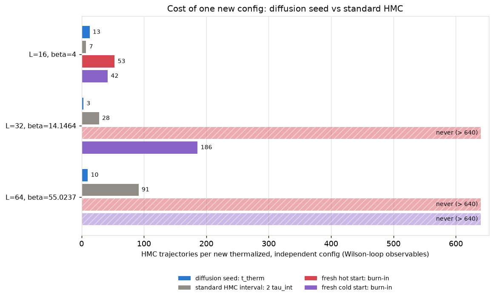
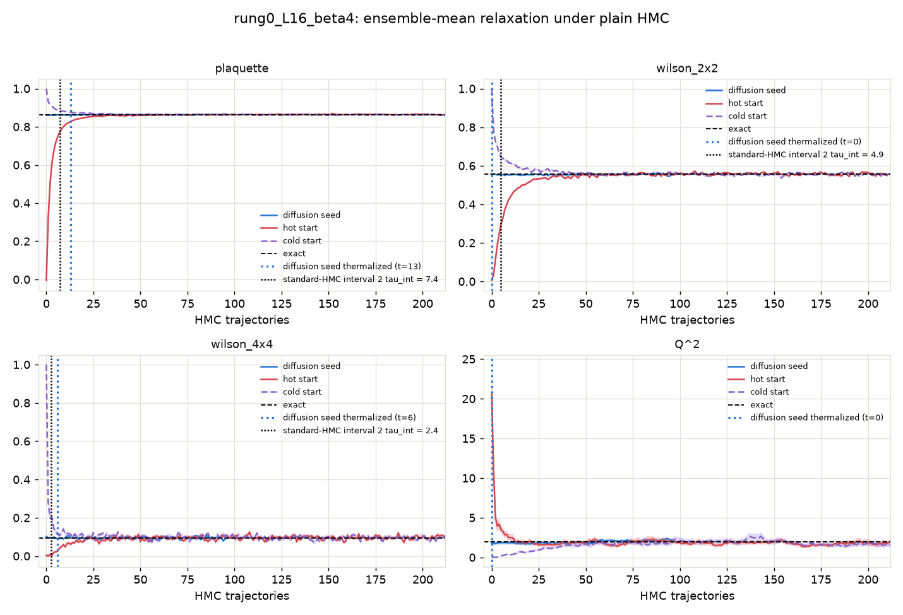
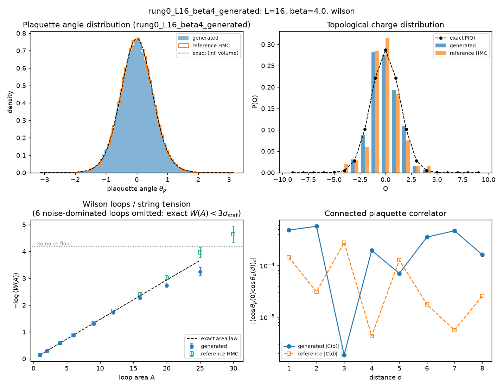
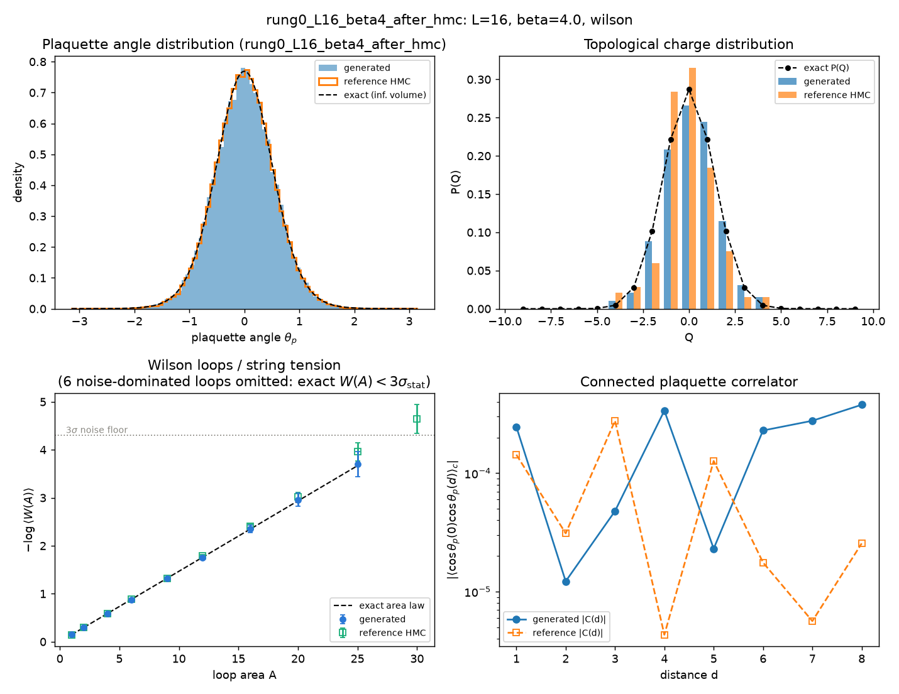
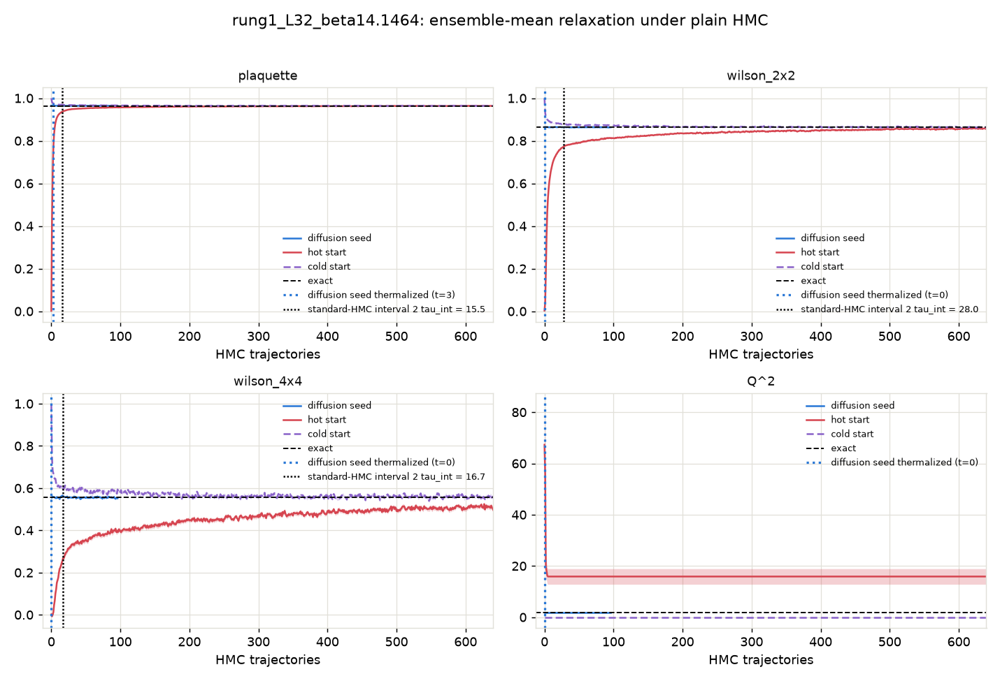
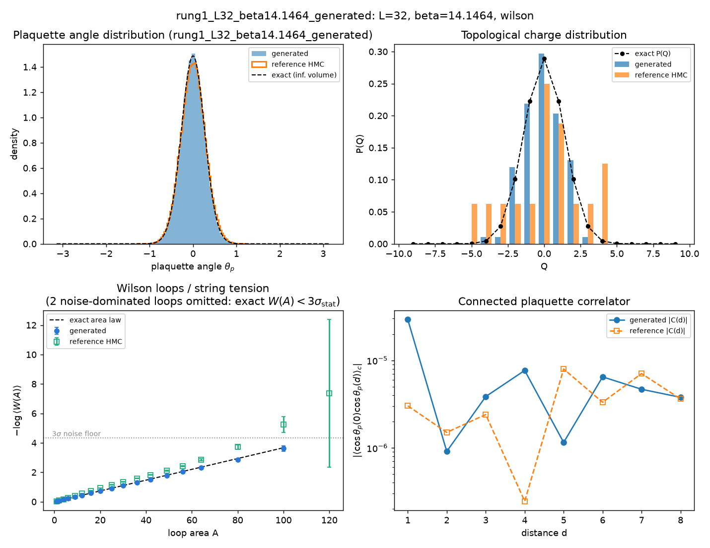
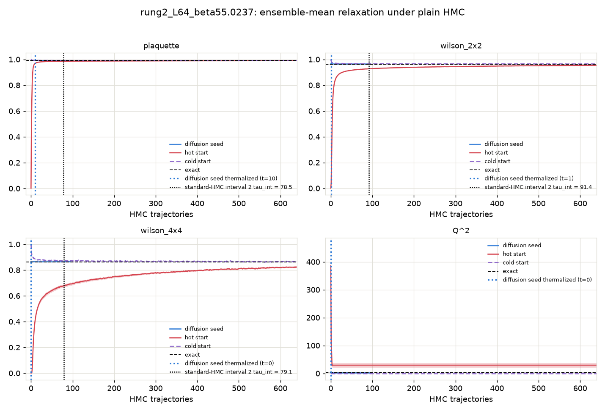
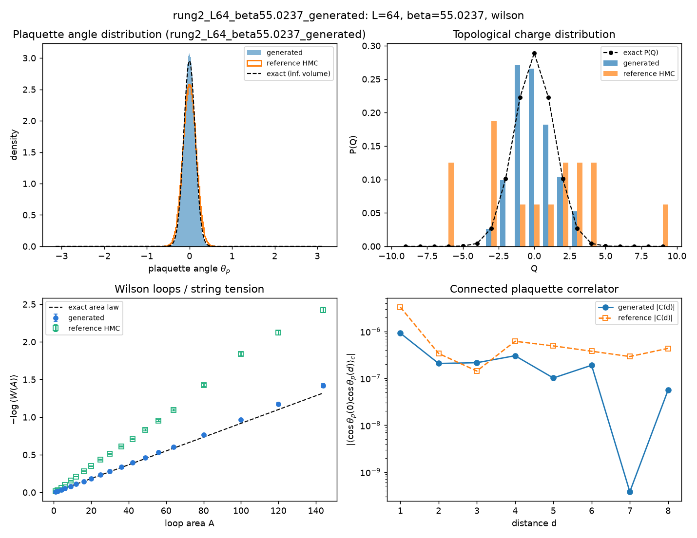
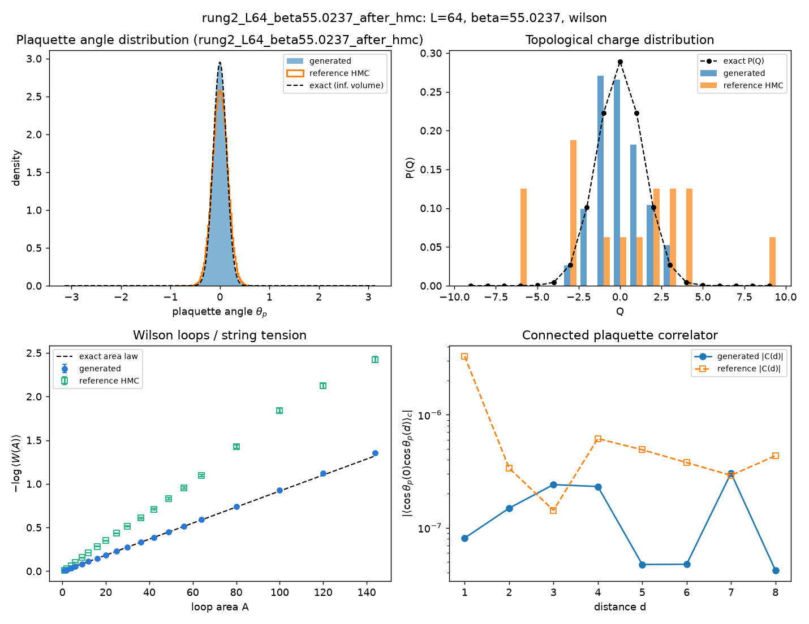

# Diffusion-seeded HMC: thermalization time vs the standard-HMC sampling interval

Action: wilson. All HMC in this report is plain HMC (Omelyan, adapted step size, **no** topological updates).

**Claim.** A raw sample from the conditional-diffusion ladder, used as the starting configuration of an HMC chain, thermalizes within a few tens of trajectories at every coupling. The yardstick is the sampling interval `2 tau_int` -- the trajectories a standard HMC chain needs between two of its own independent configs, i.e. its *marginal* cost per config, charged forever. At the fine rungs the ladder is built for, the ordering is

> t_therm(diffusion seed)  <  2 tau_int(standard HMC)  <  burn-in(fresh chain)

with a margin that grows with beta as standard HMC slides into critical slowing down and topological freezing. At the cheapest rung the seed and the interval are comparable -- where standard HMC is still efficient there is nothing to win on Wilson-loop observables -- but even there the seed starts in the correct topological sector at t = 0, while the chain's topological interval `2 tau_int(Q)` is several times longer than its Wilson-loop one. The fresh-chain burn-in is standard HMC's one-time entry cost and exceeds the interval everywhere.

## The three starting points

- **Diffusion seed** -- the raw output of the conditional-diffusion ladder at this rung (ancestral sampling + the deterministic coarse-charge transport), with **no** rethermalization sweeps applied: every bit of equilibration the seed needs is measured here, in HMC trajectories.
- **Hot start** -- every link angle drawn uniformly from (-pi, pi]: a completely disordered (infinite-temperature) configuration. The standard way to initialize a fresh HMC chain without prior information.
- **Cold start** -- every link angle set to zero: the perfectly ordered (beta -> infinity) configuration, the other standard initialization.

## Summary

| rung | L | beta | t_therm diffusion seed | standard-HMC interval 2 tau_int | margin (interval - t_therm) | burn-in hot / cold | tau_int(Q) |
|---|---|---|---|---|---|---|---|
| rung0_L16_beta4 | 16 | 4 | 13 | 7.4 | -5.6 traj | 53 / 42 | 20.4 |
| rung1_L32_beta14.1464 | 32 | 14.1464 | 3 | 28.0 | 25.0 traj | never / 186 | frozen (0 tunnelings in 321 x 32 traj) |
| rung2_L64_beta55.0237 | 64 | 55.0237 | 10 | 91.4 | 81.4 traj | never / never | frozen (0 tunnelings in 321 x 16 traj) |

t_therm and burn-in are the slowest Wilson-loop observable (plaquette, W(2x2), W(4x4)); topology is stricter still for the fresh chains: their Q^2 **never** reaches the exact value at the frozen rungs, while the diffusion seed inherits the correct topological sector from the coarse ensemble it was generated from (see the Q^2 panels and per-rung tables below).

Thermalization time `t_therm` = first trajectory at which the ensemble-mean z-score vs the exact value satisfies |z| <= 2 and stays there for 5 consecutive trajectories (t = 0: already thermalized before any HMC). For the diffusion seed, t_therm is computed on a random subsample of chains matched to the baseline chain count so all starts are compared at equal statistical power. `tau_int` is Madras-Sokal, measured on the second half of the hot-start chains, averaged over chains. In the per-rung relaxation figures, the blue dotted vertical line marks where the diffusion seed thermalizes and the black dotted vertical line marks the standard-HMC interval `2 tau_int` for that observable.

## What 'never' means, and where the ground truth comes from

'never' = the ensemble mean was still outside |z| <= 2 of the exact value after the full baseline budget; the per-rung sections quote the z-score it plateaued at. For hot starts at the large-beta rungs this is not a budget problem but a physical one: a random start freezes into a random topological sector (<Q^2> of order tens), plain HMC can never change Q at these couplings (tunneling is suppressed ~exp(-2 beta)), and the wrong sector biases every Wilson loop by an amount that never decays. Cold starts sit in the single sector Q = 0, so their Wilson loops do eventually converge, but <Q^2> stays pinned at 0 forever.

None of the exact values in this report come from fine-lattice HMC: the ground truth is the character expansion of 2D compact U(1) (`diffusion/lgt/exact.py`), which gives every Wilson loop, P(Q) and chi_top in closed form at finite volume. The diffusion ladder itself is anchored at a cheap coarse rung (L=8, beta ~ 1.35) where HMC mixes well, and transports that ensemble to fine rungs -- which is precisely why it can start chains in regions standard HMC cannot reach.

## rung0_L16_beta4

HMC: step size 0.1000, 10 leapfrog steps, acceptance seed/hot/cold = 0.995/0.995/0.995. Diffusion-seed batch: 192 chains x 96 trajectories (0.72 s/traj for the whole batch); baselines: 64 chains x 640 trajectories.

tau_int (hot-start chains, second half): plaquette = 3.69 +- 0.26, wilson_2x2 = 2.47 +- 0.15, wilson_4x4 = 1.22 +- 0.10, wilson_6x6 = 0.59 +- 0.01. Topology: hot-start HMC L=16 beta=4 -> tau_int(Q) = 20.4.

### Diagnostics: raw diffusion output (before any HMC)

| observable | value | error | exact | z_exact | reference | ref_error | z_ref | ks_p | chi2_p |
|---|---|---|---|---|---|---|---|---|---|
| plaquette | 0.8609 | 0.001231 | 0.8635 | -2.127 | 0.8643 | 0.000538 | -2.538 | 0.003675 |  |
| wilson_1x1 | 0.8609 | 0.001231 | 0.8635 | -2.127 | 0.8643 | 0.000538 | -2.538 | 0.003675 |  |
| wilson_1x2 | 0.7411 | 0.002008 | 0.7457 | -2.269 | 0.7475 | 0.001245 | -2.703 | 0.005557 |  |
| wilson_2x2 | 0.5564 | 0.003442 | 0.556 | 0.1045 | 0.5584 | 0.002318 | -0.4922 | 0.02997 |  |
| wilson_2x3 | 0.4157 | 0.004229 | 0.4146 | 0.2539 | 0.414 | 0.003147 | 0.3111 | 0.2336 |  |
| wilson_3x3 | 0.2724 | 0.005757 | 0.267 | 0.9513 | 0.2671 | 0.004546 | 0.7303 | 0.05784 |  |
| wilson_3x4 | 0.1789 | 0.006909 | 0.1719 | 1.018 | 0.1675 | 0.004284 | 1.409 | 0.07866 |  |
| wilson_4x4 | 0.1024 | 0.006694 | 0.09558 | 1.014 | 0.09008 | 0.004552 | 1.519 | 0.1215 |  |
| wilson_4x5 | 0.06523 | 0.006235 | 0.05315 | 1.937 | 0.04848 | 0.004107 | 2.243 | 0.06757 |  |
| wilson_5x5 | 0.03899 | 0.005911 | 0.02552 | 2.279 | 0.01909 | 0.003582 | 2.879 | 0.05784 |  |
| wilson_5x6 | 0.02105 | 0.005348 | 0.01225 | 1.645 | 0.009674 | 0.002905 | 1.869 | 0.2064 |  |
| wilson_6x6 | 0.009032 | 0.005088 | 0.00508 | 0.7769 | 0.006118 | 0.003684 | 0.4639 | 0.9775 |  |
| wilson_6x7 | 0.003882 | 0.003558 | 0.002106 | 0.499 | 0.0001118 | 0.002541 | 0.8622 | 0.3308 |  |
| wilson_7x7 | 0.001169 | 0.004313 | 0.0007541 | 0.09614 | 0.0006575 | 0.002865 | 0.09874 | 0.9775 |  |
| wilson_7x8 | -0.002593 | 0.005092 | 0.00027 | -0.5621 | -0.005573 | 0.002671 | 0.5184 | 0.409 |  |
| wilson_8x8 | 0.003927 | 0.004533 | 8.347e-05 | 0.8478 | -0.003129 | 0.002933 | 1.307 | 0.1215 |  |
| creutz_2 | 0.1369 | 0.003848 | 0.1467 | -2.564 |  |  |  |  |  |
| creutz_3 | 0.131 | 0.01104 | 0.1467 | -1.429 |  |  |  |  |  |
| creutz_4 | 0.138 | 0.03001 | 0.1467 | -0.2922 |  |  |  |  |  |
| creutz_5 | 0.0638 | 0.08193 | 0.1467 | -1.012 |  |  |  |  |  |
| creutz_6 | 0.2295 | 0.3714 | 0.1467 | 0.2229 |  |  |  |  |  |
| creutz_7 | 0.3559 | 3.18 | 0.1467 | 0.06577 |  |  |  |  |  |
| Q | -0.07292 | 0.1 | 0 | -0.7289 | -0.1276 | 0.09796 | 0.3906 | 0.9996 |  |
| Q^2 | 1.771 | 0.2274 | 1.934 | -0.7169 | 1.992 | 0.2405 | -0.6688 | 0.9887 |  |
| chi_top ((<Q^2>-<Q>^2)/V) | 0.006897 | 0.0008879 | 0.007554 | -0.7407 | 0.007718 | 0.0008656 | -0.6628 | 3.027e-12 |  |
| Q histogram vs exact P(Q) | 5.423 | nan | 6 | nan |  |  |  |  | 0.4908 |

### Diagnostics: the same configs after 96 HMC trajectories

| observable | value | error | exact | z_exact | reference | ref_error | z_ref | ks_p | chi2_p |
|---|---|---|---|---|---|---|---|---|---|
| plaquette | 0.8623 | 0.0007685 | 0.8635 | -1.63 | 0.8643 | 0.000538 | -2.179 | 0.3686 |  |
| wilson_1x1 | 0.8623 | 0.0007685 | 0.8635 | -1.63 | 0.8643 | 0.000538 | -2.179 | 0.3686 |  |
| wilson_1x2 | 0.7428 | 0.001643 | 0.7457 | -1.726 | 0.7475 | 0.001245 | -2.264 | 0.05784 |  |
| wilson_2x2 | 0.5547 | 0.00336 | 0.556 | -0.3807 | 0.5584 | 0.002318 | -0.9018 | 0.7411 |  |
| wilson_2x3 | 0.4155 | 0.004566 | 0.4146 | 0.1867 | 0.414 | 0.003147 | 0.2558 | 0.6425 |  |
| wilson_3x3 | 0.2658 | 0.005225 | 0.267 | -0.2228 | 0.2671 | 0.004546 | -0.1853 | 0.8729 |  |
| wilson_3x4 | 0.1733 | 0.006959 | 0.1719 | 0.1958 | 0.1675 | 0.004284 | 0.7085 | 0.5444 |  |
| wilson_4x4 | 0.09518 | 0.007346 | 0.09558 | -0.05516 | 0.09008 | 0.004552 | 0.5897 | 0.4972 |  |
| wilson_4x5 | 0.05192 | 0.007176 | 0.05315 | -0.1713 | 0.04848 | 0.004107 | 0.4158 | 0.6922 |  |
| wilson_5x5 | 0.02484 | 0.00652 | 0.02552 | -0.104 | 0.01909 | 0.003582 | 0.7729 | 0.1818 |  |
| wilson_5x6 | 0.0106 | 0.00573 | 0.01225 | -0.2887 | 0.009674 | 0.002905 | 0.1437 | 0.9376 |  |
| wilson_6x6 | 0.004765 | 0.004501 | 0.00508 | -0.07 | 0.006118 | 0.003684 | -0.2327 | 0.7411 |  |
| wilson_6x7 | 0.002346 | 0.004055 | 0.002106 | 0.05918 | 0.0001118 | 0.002541 | 0.4669 | 0.452 |  |
| wilson_7x7 | 0.0032 | 0.004162 | 0.0007541 | 0.5877 | 0.0006575 | 0.002865 | 0.5032 | 0.9376 |  |
| wilson_7x8 | -0.001973 | 0.003631 | 0.00027 | -0.6177 | -0.005573 | 0.002671 | 0.7987 | 0.5444 |  |
| wilson_8x8 | -0.004655 | 0.003152 | 8.347e-05 | -1.504 | -0.003129 | 0.002933 | -0.3546 | 0.9996 |  |
| creutz_2 | 0.1429 | 0.003525 | 0.1467 | -1.098 |  |  |  |  |  |
| creutz_3 | 0.1575 | 0.01009 | 0.1467 | 1.068 |  |  |  |  |  |
| creutz_4 | 0.1711 | 0.0301 | 0.1467 | 0.8109 |  |  |  |  |  |
| creutz_5 | 0.1311 | 0.1248 | 0.1467 | -0.1251 |  |  |  |  |  |
| creutz_6 | -0.05246 | 0.6453 | 0.1467 | -0.3087 |  |  |  |  |  |
| creutz_7 | -1.019 | 2.753 | 0.1467 | -0.4235 |  |  |  |  |  |
| Q | 0.1406 | 0.118 | 0 | 1.191 | -0.1276 | 0.09796 | 1.749 | 0.06757 |  |
| Q^2 | 2.151 | 0.1962 | 1.934 | 1.107 | 1.992 | 0.2405 | 0.5118 | 0.6425 |  |
| chi_top ((<Q^2>-<Q>^2)/V) | 0.008325 | 0.0007716 | 0.007554 | 0.9993 | 0.007718 | 0.0008656 | 0.5234 | 1.137e-11 |  |
| Q histogram vs exact P(Q) | 1.971 | nan | 6 | nan |  |  |  |  | 0.9223 |

## rung1_L32_beta14.1464

HMC: step size 0.0532, 19 leapfrog steps, acceptance seed/hot/cold = 0.995/0.995/0.996. Diffusion-seed batch: 192 chains x 96 trajectories (0.52 s/traj for the whole batch); baselines: 32 chains x 640 trajectories.

tau_int (hot-start chains, second half): plaquette = 7.73 +- 1.00, wilson_2x2 = 14.02 +- 1.83, wilson_4x4 = 8.33 +- 1.45, wilson_6x6 = 0.91 +- 0.06. Topology: hot-start HMC L=32 beta=14.1464 -> **frozen** (no tunneling).

Where 'never' stood at the end: the hot start ended the 640-trajectory budget still at plaquette at |z| ~ 2, wilson_2x2 at |z| ~ 4, wilson_4x4 at |z| ~ 4, wilson_6x6 at |z| ~ 4, Q^2 at |z| ~ 5; the cold start ended the 640-trajectory budget still at Q^2 at |z| ~ 1903997747200.

### Diagnostics: raw diffusion output (before any HMC)

| observable | value | error | exact | z_exact | reference | ref_error | z_ref | ks_p | chi2_p |
|---|---|---|---|---|---|---|---|---|---|
| plaquette | 0.9648 | 0.0001028 | 0.964 | 7.951 | 0.9614 | 0.0001402 | 19.47 | 0 |  |
| wilson_1x1 | 0.9648 | 0.0001028 | 0.964 | 7.951 | 0.9614 | 0.0001402 | 19.47 | 0 |  |
| wilson_1x2 | 0.9302 | 0.0001989 | 0.9293 | 4.846 | 0.9213 | 0.000405 | 19.78 | 0 |  |
| wilson_2x2 | 0.8641 | 0.0004334 | 0.8635 | 1.273 | 0.841 | 0.0009662 | 21.83 | 0 |  |
| wilson_2x3 | 0.8026 | 0.0007438 | 0.8024 | 0.208 | 0.7659 | 0.001538 | 21.46 | 0 |  |
| wilson_3x3 | 0.7178 | 0.001018 | 0.7188 | -0.9717 | 0.664 | 0.002141 | 22.72 | 0 |  |
| wilson_3x4 | 0.643 | 0.001676 | 0.6439 | -0.5338 | 0.575 | 0.002713 | 21.32 | 0 |  |
| wilson_4x4 | 0.5564 | 0.002353 | 0.556 | 0.1504 | 0.4744 | 0.00314 | 20.89 | 0 |  |
| wilson_4x5 | 0.4818 | 0.00302 | 0.4801 | 0.5472 | 0.3947 | 0.003102 | 20.11 | 6.237e-39 |  |
| wilson_5x5 | 0.4031 | 0.003694 | 0.3997 | 0.9216 | 0.3174 | 0.003199 | 17.53 | 1.244e-35 |  |
| wilson_5x6 | 0.3376 | 0.004356 | 0.3327 | 1.121 | 0.2589 | 0.002877 | 15.08 | 1.157e-21 |  |
| wilson_6x6 | 0.2697 | 0.004975 | 0.267 | 0.5494 | 0.2058 | 0.002737 | 11.25 | 6.522e-15 |  |
| wilson_6x7 | 0.2186 | 0.004785 | 0.2142 | 0.9062 | 0.1623 | 0.002752 | 10.19 | 2.177e-10 |  |
| wilson_7x7 | 0.1682 | 0.004956 | 0.1657 | 0.5069 | 0.1204 | 0.003196 | 8.111 | 5.058e-09 |  |
| wilson_7x8 | 0.1316 | 0.004855 | 0.1282 | 0.6996 | 0.08863 | 0.003453 | 7.209 | 1.825e-06 |  |
| wilson_8x8 | 0.09821 | 0.004455 | 0.09558 | 0.5903 | 0.05757 | 0.003438 | 7.223 | 4.569e-08 |  |
| wilson_8x10 | 0.05837 | 0.004845 | 0.05315 | 1.078 | 0.02434 | 0.003404 | 5.746 | 5.028e-07 |  |
| wilson_10x10 | 0.02695 | 0.004632 | 0.02552 | 0.3092 | 0.005284 | 0.002791 | 4.007 | 0.001228 |  |
| wilson_10x12 | 0.01153 | 0.004894 | 0.01225 | -0.1469 | 0.0006368 | 0.003192 | 1.865 | 0.05784 |  |
| wilson_12x12 | 0.000342 | 0.004843 | 0.00508 | -0.9783 | -0.001509 | 0.002667 | 0.3348 | 0.8326 |  |
| creutz_2 | 0.03727 | 0.0004352 | 0.03668 | 1.351 |  |  |  |  |  |
| creutz_3 | 0.03781 | 0.0009033 | 0.03668 | 1.244 |  |  |  |  |  |
| creutz_4 | 0.03464 | 0.00163 | 0.03668 | -1.252 |  |  |  |  |  |
| creutz_5 | 0.03444 | 0.002648 | 0.03668 | -0.8491 |  |  |  |  |  |
| creutz_6 | 0.04716 | 0.004507 | 0.03668 | 2.324 |  |  |  |  |  |
| creutz_7 | 0.05153 | 0.008283 | 0.03668 | 1.792 |  |  |  |  |  |
| creutz_8 | 0.0468 | 0.01513 | 0.03668 | 0.6687 |  |  |  |  |  |
| Q | -0.03646 | 0.09547 | 0 | -0.3819 | 0.0625 | 0.05149 | -0.9123 | 0.0006097 |  |
| Q^2 | 1.776 | 0.1569 | 1.904 | -0.8157 | 6.438 | 0.1463 | -21.73 | 7.485e-14 |  |
| chi_top ((<Q^2>-<Q>^2)/V) | 0.001733 | 0.0001529 | 0.001859 | -0.826 | 0.006283 | 0.0001452 | -21.58 | 2.44e-19 |  |
| Q histogram vs exact P(Q) | 6.621 | nan | 6 | nan |  |  |  |  | 0.3574 |

### Diagnostics: the same configs after 96 HMC trajectories

| observable | value | error | exact | z_exact | reference | ref_error | z_ref | ks_p | chi2_p |
|---|---|---|---|---|---|---|---|---|---|
| plaquette | 0.9641 | 0.000129 | 0.964 | 0.5676 | 0.9614 | 0.0001402 | 13.86 | 3.251e-43 |  |
| wilson_1x1 | 0.9641 | 0.000129 | 0.964 | 0.5676 | 0.9614 | 0.0001402 | 13.86 | 3.251e-43 |  |
| wilson_1x2 | 0.9292 | 0.0002042 | 0.9293 | -0.4021 | 0.9213 | 0.000405 | 17.37 | 0 |  |
| wilson_2x2 | 0.8632 | 0.0004161 | 0.8635 | -0.671 | 0.841 | 0.0009662 | 21.19 | 0 |  |
| wilson_2x3 | 0.8019 | 0.000596 | 0.8024 | -0.9477 | 0.7659 | 0.001538 | 21.79 | 0 |  |
| wilson_3x3 | 0.7174 | 0.001207 | 0.7188 | -1.164 | 0.664 | 0.002141 | 21.75 | 0 |  |
| wilson_3x4 | 0.6411 | 0.001654 | 0.6439 | -1.689 | 0.575 | 0.002713 | 20.8 | 0 |  |
| wilson_4x4 | 0.5519 | 0.002061 | 0.556 | -2.004 | 0.4744 | 0.00314 | 20.63 | 2.803e-45 |  |
| wilson_4x5 | 0.4746 | 0.002494 | 0.4801 | -2.215 | 0.3947 | 0.003102 | 20.07 | 2.82e-35 |  |
| wilson_5x5 | 0.3932 | 0.003078 | 0.3997 | -2.113 | 0.3174 | 0.003199 | 17.06 | 6.378e-29 |  |
| wilson_5x6 | 0.324 | 0.00343 | 0.3327 | -2.525 | 0.2589 | 0.002877 | 14.56 | 2.359e-18 |  |
| wilson_6x6 | 0.2583 | 0.00357 | 0.267 | -2.418 | 0.2058 | 0.002737 | 11.68 | 1.753e-11 |  |
| wilson_6x7 | 0.2049 | 0.003614 | 0.2142 | -2.582 | 0.1623 | 0.002752 | 9.372 | 1.306e-07 |  |
| wilson_7x7 | 0.1574 | 0.003739 | 0.1657 | -2.211 | 0.1204 | 0.003196 | 7.533 | 6.246e-06 |  |
| wilson_7x8 | 0.1212 | 0.003799 | 0.1282 | -1.831 | 0.08863 | 0.003453 | 6.349 | 0.0001766 |  |
| wilson_8x8 | 0.08956 | 0.00386 | 0.09558 | -1.559 | 0.05757 | 0.003438 | 6.19 | 2.679e-05 |  |
| wilson_8x10 | 0.04814 | 0.003616 | 0.05315 | -1.384 | 0.02434 | 0.003404 | 4.792 | 2.017e-05 |  |
| wilson_10x10 | 0.02078 | 0.003852 | 0.02552 | -1.23 | 0.005284 | 0.002791 | 3.258 | 0.008284 |  |
| wilson_10x12 | 0.008221 | 0.004917 | 0.01225 | -0.8199 | 0.0006368 | 0.003192 | 1.294 | 0.2957 |  |
| wilson_12x12 | -0.0005085 | 0.004645 | 0.00508 | -1.203 | -0.001509 | 0.002667 | 0.1867 | 0.409 |  |
| creutz_2 | 0.03675 | 0.0004014 | 0.03668 | 0.1762 |  |  |  |  |  |
| creutz_3 | 0.03755 | 0.0008217 | 0.03668 | 1.06 |  |  |  |  |  |
| creutz_4 | 0.0374 | 0.001536 | 0.03668 | 0.469 |  |  |  |  |  |
| creutz_5 | 0.03741 | 0.002517 | 0.03668 | 0.2878 |  |  |  |  |  |
| creutz_6 | 0.03321 | 0.004824 | 0.03668 | -0.7193 |  |  |  |  |  |
| creutz_7 | 0.03165 | 0.008378 | 0.03668 | -0.6006 |  |  |  |  |  |
| creutz_8 | 0.04132 | 0.01645 | 0.03668 | 0.2817 |  |  |  |  |  |
| Q | -0.03646 | 0.09547 | 0 | -0.3819 | 0.0625 | 0.05149 | -0.9123 | 0.0006097 |  |
| Q^2 | 1.776 | 0.1569 | 1.904 | -0.8157 | 6.438 | 0.1463 | -21.73 | 7.485e-14 |  |
| chi_top ((<Q^2>-<Q>^2)/V) | 0.001733 | 0.0001529 | 0.001859 | -0.826 | 0.006283 | 0.0001452 | -21.58 | 2.44e-19 |  |
| Q histogram vs exact P(Q) | 6.621 | nan | 6 | nan |  |  |  |  | 0.3574 |

## rung2_L64_beta55.0237

HMC: step size 0.0270, 37 leapfrog steps, acceptance seed/hot/cold = 0.992/0.992/0.992. Diffusion-seed batch: 192 chains x 96 trajectories (1.47 s/traj for the whole batch); baselines: 16 chains x 640 trajectories.

tau_int (hot-start chains, second half): plaquette = 39.24 +- 2.22, wilson_2x2 = 45.70 +- 1.36, wilson_4x4 = 39.56 +- 1.92, wilson_6x6 = 27.55 +- 2.97. Topology: hot-start HMC L=64 beta=55.0237 -> **frozen** (no tunneling).

Where 'never' stood at the end: the hot start ended the 640-trajectory budget still at plaquette at |z| ~ 17, wilson_2x2 at |z| ~ 17, wilson_4x4 at |z| ~ 9, wilson_6x6 at |z| ~ 6, Q^2 at |z| ~ 3; the cold start ended the 640-trajectory budget still at plaquette at |z| ~ 4, Q^2 at |z| ~ 1903086010368.

### Diagnostics: raw diffusion output (before any HMC)

| observable | value | error | exact | z_exact | reference | ref_error | z_ref | ks_p | chi2_p |
|---|---|---|---|---|---|---|---|---|---|
| plaquette | 0.9915 | 1.932e-05 | 0.9909 | 34.88 | 0.9881 | 5.383e-05 | 61.07 | 0 |  |
| wilson_1x1 | 0.9915 | 1.932e-05 | 0.9909 | 34.88 | 0.9881 | 5.383e-05 | 61.07 | 0 |  |
| wilson_1x2 | 0.9827 | 4.447e-05 | 0.9818 | 19.46 | 0.9737 | 0.0001559 | 55.65 | 0 |  |
| wilson_2x2 | 0.965 | 8.771e-05 | 0.964 | 11.46 | 0.9402 | 0.0004374 | 55.52 | 0 |  |
| wilson_2x3 | 0.9474 | 0.0001405 | 0.9465 | 6.66 | 0.907 | 0.0007573 | 52.48 | 0 |  |
| wilson_3x3 | 0.9211 | 0.0002265 | 0.9208 | 1.439 | 0.8566 | 0.001242 | 51.07 | 0 |  |
| wilson_3x4 | 0.8959 | 0.0003286 | 0.8958 | 0.2723 | 0.8116 | 0.001736 | 47.7 | 0 |  |
| wilson_4x4 | 0.8636 | 0.000431 | 0.8635 | 0.285 | 0.755 | 0.002344 | 45.59 | 0 |  |
| wilson_4x5 | 0.8317 | 0.0005856 | 0.8324 | -1.293 | 0.7054 | 0.002918 | 42.43 | 0 |  |
| wilson_5x5 | 0.7932 | 0.0008189 | 0.7951 | -2.285 | 0.6482 | 0.003544 | 39.87 | 0 |  |
| wilson_5x6 | 0.7568 | 0.001065 | 0.7595 | -2.531 | 0.5984 | 0.004034 | 37.95 | 0 |  |
| wilson_6x6 | 0.715 | 0.001406 | 0.7188 | -2.735 | 0.5439 | 0.004484 | 36.4 | 0 |  |
| wilson_6x7 | 0.6743 | 0.001739 | 0.6803 | -3.459 | 0.4916 | 0.004916 | 35.04 | 0 |  |
| wilson_7x7 | 0.6296 | 0.00228 | 0.638 | -3.694 | 0.4363 | 0.00512 | 34.49 | 0 |  |
| wilson_7x8 | 0.5882 | 0.002688 | 0.5984 | -3.776 | 0.3852 | 0.00524 | 34.46 | 0 |  |
| wilson_8x8 | 0.5455 | 0.00314 | 0.556 | -3.365 | 0.3343 | 0.005149 | 35 | 0 |  |
| wilson_8x10 | 0.4645 | 0.004049 | 0.4801 | -3.872 | 0.2402 | 0.004598 | 36.61 | 0 |  |
| wilson_10x10 | 0.3801 | 0.004918 | 0.3997 | -3.974 | 0.1587 | 0.003938 | 35.14 | 0 |  |
| wilson_10x12 | 0.3085 | 0.005554 | 0.3327 | -4.364 | 0.1196 | 0.003512 | 28.75 | 0 |  |
| wilson_12x12 | 0.2423 | 0.006219 | 0.267 | -3.959 | 0.0885 | 0.003271 | 21.89 | 0 |  |
| creutz_2 | 0.009212 | 4.944e-05 | 0.009171 | 0.8202 |  |  |  |  |  |
| creutz_3 | 0.009751 | 0.0001198 | 0.009171 | 4.844 |  |  |  |  |  |
| creutz_4 | 0.008875 | 0.000196 | 0.009171 | -1.512 |  |  |  |  |  |
| creutz_5 | 0.009565 | 0.0003005 | 0.009171 | 1.312 |  |  |  |  |  |
| creutz_6 | 0.009778 | 0.0004256 | 0.009171 | 1.425 |  |  |  |  |  |
| creutz_7 | 0.01005 | 0.0006263 | 0.009171 | 1.41 |  |  |  |  |  |
| creutz_8 | 0.007431 | 0.0007661 | 0.009171 | -2.272 |  |  |  |  |  |
| Q | 0 | 0.07825 | 0 | 0 | -0.5 | 0.1088 | 3.732 | 2.854e-14 |  |
| Q^2 | 1.969 | 0.1536 | 1.903 | 0.4275 | 27.25 | 1.042 | -24.01 | 7.006e-45 |  |
| chi_top ((<Q^2>-<Q>^2)/V) | 0.0004807 | 3.75e-05 | 0.0004646 | 0.4275 | 0.006592 | 0.0002345 | -25.74 | 0 |  |
| Q histogram vs exact P(Q) | 8.105 | nan | 6 | nan |  |  |  |  | 0.2305 |

### Diagnostics: the same configs after 96 HMC trajectories

| observable | value | error | exact | z_exact | reference | ref_error | z_ref | ks_p | chi2_p |
|---|---|---|---|---|---|---|---|---|---|
| plaquette | 0.9909 | 1.691e-05 | 0.9909 | 3.211 | 0.9881 | 5.383e-05 | 50.92 | 0 |  |
| wilson_1x1 | 0.9909 | 1.691e-05 | 0.9909 | 3.211 | 0.9881 | 5.383e-05 | 50.92 | 0 |  |
| wilson_1x2 | 0.9819 | 4.357e-05 | 0.9818 | 1.919 | 0.9737 | 0.0001559 | 50.9 | 0 |  |
| wilson_2x2 | 0.9641 | 9.07e-05 | 0.964 | 1.148 | 0.9402 | 0.0004374 | 53.43 | 0 |  |
| wilson_2x3 | 0.9465 | 0.0001595 | 0.9465 | 0.4079 | 0.907 | 0.0007573 | 51.11 | 0 |  |
| wilson_3x3 | 0.9207 | 0.0002498 | 0.9208 | -0.2505 | 0.8566 | 0.001242 | 50.59 | 0 |  |
| wilson_3x4 | 0.8956 | 0.0003334 | 0.8958 | -0.4246 | 0.8116 | 0.001736 | 47.54 | 0 |  |
| wilson_4x4 | 0.8634 | 0.0004961 | 0.8635 | -0.2036 | 0.755 | 0.002344 | 45.26 | 0 |  |
| wilson_4x5 | 0.8325 | 0.000688 | 0.8324 | 0.06259 | 0.7054 | 0.002918 | 42.39 | 0 |  |
| wilson_5x5 | 0.7951 | 0.000923 | 0.7951 | -0.02714 | 0.6482 | 0.003544 | 40.1 | 0 |  |
| wilson_5x6 | 0.7594 | 0.001177 | 0.7595 | -0.05349 | 0.5984 | 0.004034 | 38.31 | 0 |  |
| wilson_6x6 | 0.7184 | 0.00137 | 0.7188 | -0.3253 | 0.5439 | 0.004484 | 37.2 | 0 |  |
| wilson_6x7 | 0.6799 | 0.001615 | 0.6803 | -0.2883 | 0.4916 | 0.004916 | 36.38 | 0 |  |
| wilson_7x7 | 0.6371 | 0.001764 | 0.638 | -0.5438 | 0.4363 | 0.00512 | 37.08 | 0 |  |
| wilson_7x8 | 0.5973 | 0.001912 | 0.5984 | -0.5713 | 0.3852 | 0.00524 | 38.01 | 0 |  |
| wilson_8x8 | 0.5538 | 0.002085 | 0.556 | -1.052 | 0.3343 | 0.005149 | 39.51 | 0 |  |
| wilson_8x10 | 0.4771 | 0.002522 | 0.4801 | -1.191 | 0.2402 | 0.004598 | 45.19 | 0 |  |
| wilson_10x10 | 0.3946 | 0.00296 | 0.3997 | -1.713 | 0.1587 | 0.003938 | 47.88 | 0 |  |
| wilson_10x12 | 0.3256 | 0.003697 | 0.3327 | -1.932 | 0.1196 | 0.003512 | 40.39 | 0 |  |
| wilson_12x12 | 0.2585 | 0.004043 | 0.267 | -2.088 | 0.0885 | 0.003271 | 32.69 | 0 |  |
| creutz_2 | 0.009179 | 5.296e-05 | 0.009171 | 0.1431 |  |  |  |  |  |
| creutz_3 | 0.009268 | 0.0001102 | 0.009171 | 0.8842 |  |  |  |  |  |
| creutz_4 | 0.00904 | 0.0001831 | 0.009171 | -0.7164 |  |  |  |  |  |
| creutz_5 | 0.009423 | 0.0002854 | 0.009171 | 0.8826 |  |  |  |  |  |
| creutz_6 | 0.009657 | 0.0004116 | 0.009171 | 1.181 |  |  |  |  |  |
| creutz_7 | 0.009927 | 0.0004973 | 0.009171 | 1.52 |  |  |  |  |  |
| creutz_8 | 0.01097 | 0.000678 | 0.009171 | 2.655 |  |  |  |  |  |
| Q | 0 | 0.07825 | 0 | 0 | -0.5 | 0.1088 | 3.732 | 2.854e-14 |  |
| Q^2 | 1.969 | 0.1536 | 1.903 | 0.4275 | 27.25 | 1.042 | -24.01 | 7.006e-45 |  |
| chi_top ((<Q^2>-<Q>^2)/V) | 0.0004807 | 3.75e-05 | 0.0004646 | 0.4275 | 0.006592 | 0.0002345 | -25.74 | 0 |  |
| Q histogram vs exact P(Q) | 8.105 | nan | 6 | nan |  |  |  |  | 0.2305 |

