# Diffusion-seeded HMC across the matched beta scan: thermalization time vs the standard-HMC sampling interval

Action: wilson. All HMC in this report is plain HMC (Omelyan, adapted step size, **no** topological updates).

**Why this scan.** At the ladder's upper rungs the fresh-HMC baselines never thermalize at all (topological freezing plus a metastable local-defect state), so the only comparison available there is 'diffusion seed vs a baseline that never arrives'. This report extends the benchmark to every matched coupling pair of the generalization study -- one inverse-RG step L=16 -> L=32 per case -- including fine couplings low enough that hot- and cold-start HMC *does* thermalize within the budget. There the standard chain's own interval `2 tau_int` and its fresh-start burn-in are honest, measurable yardsticks, and the scan shows where the ordering

> t_therm(diffusion seed)  <  2 tau_int(standard HMC)  <  burn-in(fresh chain)

sets in as beta grows and standard HMC slides into critical slowing down and topological freezing.

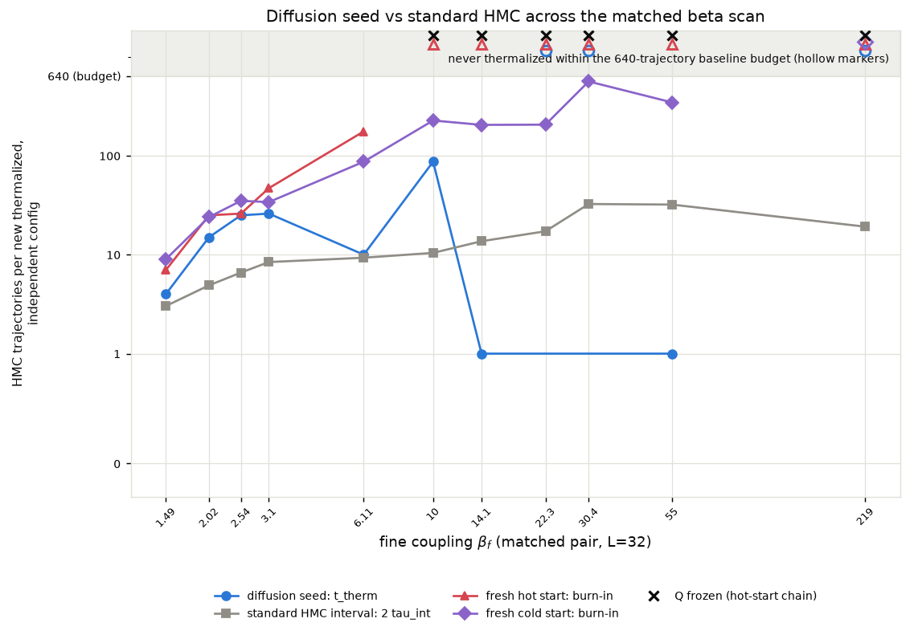

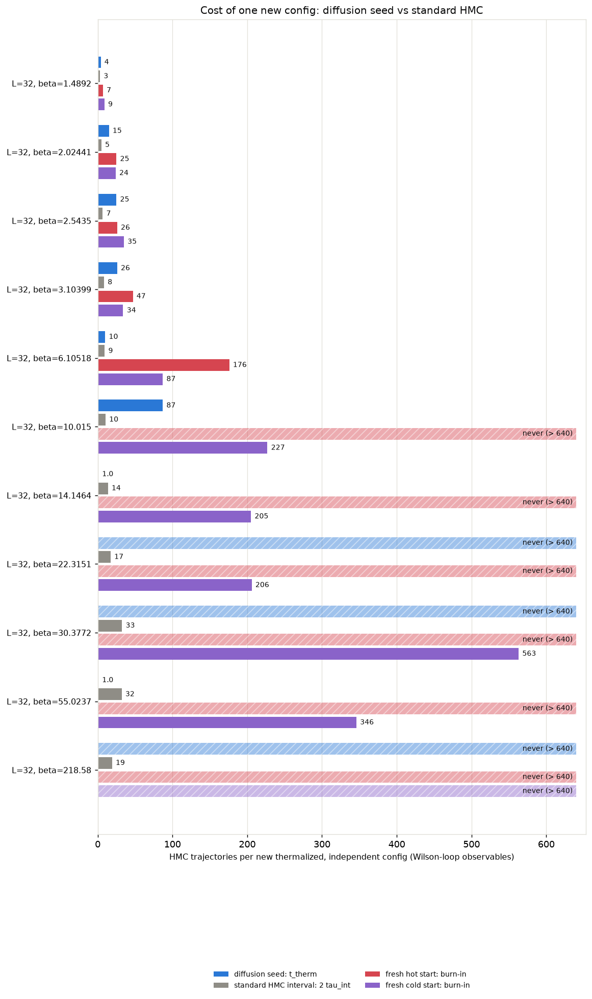

## The three starting points

- **Diffusion seed** -- the raw conditional-diffusion output for this coupling: one inverse-RG step from a direct-HMC base ensemble at the matched coarse coupling (ancestral sampling + the deterministic coarse-charge transport), with **no** rethermalization sweeps applied: every bit of equilibration the seed needs is measured here, in HMC trajectories.
- **Hot start** -- every link angle drawn uniformly from (-pi, pi]: a completely disordered (infinite-temperature) configuration. The standard way to initialize a fresh HMC chain without prior information.
- **Cold start** -- every link angle set to zero: the perfectly ordered (beta -> infinity) configuration, the other standard initialization.

## Summary

| rung | L | beta | t_therm diffusion seed | standard-HMC interval 2 tau_int | margin (interval - t_therm) | burn-in hot / cold | tau_int(Q) |
|---|---|---|---|---|---|---|---|
| A_bc0.25_L32_beta1.4892 | 32 | 1.4892 | 4 | 3.0 | -1.0 traj | 7 / 9 | 1.7 |
| A_bc0.5_L32_beta2.02441 | 32 | 2.02441 | 15 | 4.9 | -10.1 traj | 25 / 24 | 2.5 |
| A_bc0.75_L32_beta2.5435 | 32 | 2.5435 | 25 | 6.6 | -18.4 traj | 26 / 35 | 5.7 |
| A_bc1_L32_beta3.10399 | 32 | 3.10399 | 26 | 8.4 | -17.6 traj | 47 / 34 | 11.6 |
| A_bc2_L32_beta6.10518 | 32 | 6.10518 | 10 | 9.3 | -0.7 traj | 176 / 87 | 35.7 |
| A_bc3_L32_beta10.015 | 32 | 10.015 | 87 | 10.4 | -76.6 traj | never / 227 | frozen (0 tunnelings in 321 x 32 traj) |
| A_bc4_L32_beta14.1464 | 32 | 14.1464 | 1 | 13.7 | 12.7 traj | never / 205 | frozen (0 tunnelings in 321 x 32 traj) |
| A_bc6_L32_beta22.3151 | 32 | 22.3151 | never | 17.2 | -- | never / 206 | frozen (0 tunnelings in 321 x 32 traj) |
| A_bc8_L32_beta30.3772 | 32 | 30.3772 | never | 32.5 | -- | never / 563 | frozen (0 tunnelings in 321 x 32 traj) |
| D_bc14.1464_L32_beta55.0237 | 32 | 55.0237 | 1 | 32.1 | 31.1 traj | never / 346 | frozen (0 tunnelings in 321 x 32 traj) |
| D_bc55.0237_L32_beta218.58 | 32 | 218.58 | never | 19.2 | -- | never / never | frozen (0 tunnelings in 321 x 32 traj) |

t_therm and burn-in are the slowest Wilson-loop observable (plaquette, W(2x2), W(4x4)); topology is stricter still for the fresh chains: their Q^2 **never** reaches the exact value at the frozen rungs, while the diffusion seed inherits the correct topological sector from the coarse ensemble it was generated from (see the Q^2 panels and per-rung tables below).

Thermalization time `t_therm` = first trajectory at which the ensemble-mean z-score vs the exact value satisfies |z| <= 2 and stays there for 5 consecutive trajectories (t = 0: already thermalized before any HMC). For the diffusion seed, t_therm is computed on a random subsample of chains matched to the baseline chain count so all starts are compared at equal statistical power. `tau_int` is Madras-Sokal, measured on the second half of the hot-start chains, averaged over chains. In the per-rung relaxation figures, triangles mark each start's t_therm, dashed curves are the exponential fits C + A exp(-t/tau) to the ensemble means (tau quoted per panel), and the right-hand panels track the ensemble mean's distance from the exact value in SEM units -- thermalized means inside the shaded |z| <= 2 band; the dotted vertical line there is the standard-HMC interval `2 tau_int`.

## What 'never' means, and where the ground truth comes from

'never' = the ensemble mean was still outside |z| <= 2 of the exact value after the full baseline budget; the per-rung sections quote the z-score it plateaued at. For hot starts at the large-beta rungs this is not a budget problem but a physical one: a random start freezes into a random topological sector (<Q^2> of order tens), plain HMC can never change Q at these couplings (tunneling is suppressed ~exp(-2 beta)), and the wrong sector biases every Wilson loop by an amount that never decays. Cold starts sit in the single sector Q = 0, so their Wilson loops do eventually converge, but <Q^2> stays pinned at 0 forever.

None of the exact values in this report come from fine-lattice HMC: the ground truth is the character expansion of 2D compact U(1) (`diffusion/lgt/exact.py`), which gives every Wilson loop, P(Q) and chi_top in closed form at finite volume. Each diffusion seed here is one inverse-RG step from a direct-HMC base ensemble at the matched coarse coupling beta_c (L=16), where HMC mixes well -- which is precisely why it can start chains in regions standard HMC cannot reach.

## A_bc0.25_L32_beta1.4892

HMC: step size 0.2000, 5 leapfrog steps, acceptance seed/hot/cold = 0.966/0.970/0.967. Diffusion-seed batch: 128 chains x 96 trajectories (0.05 s/traj for the whole batch); baselines: 32 chains x 640 trajectories.

tau_int (hot-start chains, second half): plaquette = 1.51 +- 0.08, wilson_2x2 = 0.77 +- 0.04, wilson_4x4 = 0.57 +- 0.02, wilson_6x6 = 0.56 +- 0.01. Topology: hot-start HMC L=32 beta=1.4892 -> tau_int(Q) = 1.7.

### Diagnostics: raw diffusion output (before any HMC)

| observable | value | error | exact | z_exact | reference | ref_error | z_ref | ks_p | chi2_p |
|---|---|---|---|---|---|---|---|---|---|
| plaquette | 0.6502 | 0.002194 | 0.5935 | 25.88 | 0.5948 | 0.001238 | 22.02 | 0 |  |
| wilson_1x1 | 0.6502 | 0.002194 | 0.5935 | 25.88 | 0.5948 | 0.001238 | 22.02 | 0 |  |
| wilson_1x2 | 0.4308 | 0.003067 | 0.3522 | 25.61 | 0.3522 | 0.002458 | 19.99 | 0 |  |
| wilson_2x2 | 0.2371 | 0.002191 | 0.124 | 51.58 | 0.1241 | 0.001865 | 39.27 | 0 |  |
| wilson_2x3 | 0.1201 | 0.002309 | 0.04368 | 33.11 | 0.04133 | 0.001675 | 27.63 | 0 |  |
| wilson_3x3 | 0.04076 | 0.002196 | 0.00913 | 14.41 | 0.005305 | 0.002005 | 11.93 | 5.284e-22 |  |
| wilson_3x4 | 0.01552 | 0.001648 | 0.001908 | 8.259 | 0.0003275 | 0.002081 | 5.723 | 2.855e-08 |  |
| wilson_4x4 | 0.00157 | 0.001949 | 0.0002367 | 0.684 | 0.0001938 | 0.001787 | 0.5204 | 0.9126 |  |
| wilson_4x5 | -0.0004753 | 0.002013 | 2.936e-05 | -0.2507 | -0.001625 | 0.001631 | 0.444 | 0.4898 |  |
| wilson_5x5 | -0.001682 | 0.001727 | 2.161e-06 | -0.9752 | -0.000249 | 0.001931 | -0.5531 | 0.7163 |  |
| wilson_5x6 | -0.0003837 | 0.001886 | 1.591e-07 | -0.2035 | -0.0005556 | 0.001821 | 0.06554 | 0.9888 |  |
| wilson_6x6 | -7.18e-05 | 0.002162 | 6.948e-09 | -0.03322 | -0.001112 | 0.00174 | 0.3747 | 0.8569 |  |
| wilson_6x7 | -0.001795 | 0.001567 | 3.035e-10 | -1.146 | 0.002636 | 0.001766 | -1.877 | 0.5631 |  |
| wilson_7x7 | 0.001654 | 0.001925 | 7.868e-12 | 0.8594 | 0.0003693 | 0.001605 | 0.5127 | 0.7163 |  |
| wilson_7x8 | 0.0007973 | 0.002277 | 2.04e-13 | 0.3502 | -0.001279 | 0.001893 | 0.7012 | 0.4898 |  |
| wilson_8x8 | -0.003263 | 0.001694 | 3.138e-15 | -1.926 | -0.001451 | 0.00132 | -0.8439 | 0.2522 |  |
| wilson_8x10 | -0.001085 | 0.002642 | 7.426e-19 | -0.4107 | 0.001016 | 0.001793 | -0.6581 | 0.3294 |  |
| wilson_10x10 | 0.0004206 | 0.001708 | 2.18e-23 | 0.2463 | 0.0006406 | 0.001555 | -0.09522 | 0.6011 |  |
| wilson_10x12 | -0.002248 | 0.001956 | 6.4e-28 | -1.149 | -0.003091 | 0.001502 | 0.3418 | 0.8246 |  |
| wilson_12x12 | 0.0002203 | 0.001747 | 2.33e-33 | 0.1261 | -0.001718 | 0.001421 | 0.8605 | 0.5631 |  |
| creutz_2 | 0.1855 | 0.009848 | 0.5218 | -34.15 |  |  |  |  |  |
| creutz_3 | 0.401 | 0.04342 | 0.5218 | -2.781 |  |  |  |  |  |
| creutz_4 | 1.326 | 1.332 | 0.5218 | 0.6035 |  |  |  |  |  |
| Q | 0.7344 | 0.3272 | 0 | 2.245 | -0.4375 | 0.3418 | 2.477 | 0.01957 |  |
| Q^2 | 15 | 1.997 | 28.52 | -6.772 | 27.85 | 2.353 | -4.166 | 0.01957 |  |
| chi_top ((<Q^2>-<Q>^2)/V) | 0.01412 | 0.001823 | 0.02785 | -7.532 | 0.02701 | 0.002264 | -4.435 | 0.0007783 |  |
| Q histogram vs exact P(Q) | 31.13 | nan | 18 | nan |  |  |  |  | 0.02778 |

### Diagnostics: the same configs after 96 HMC trajectories

| observable | value | error | exact | z_exact | reference | ref_error | z_ref | ks_p | chi2_p |
|---|---|---|---|---|---|---|---|---|---|
| plaquette | 0.594 | 0.001739 | 0.5935 | 0.3203 | 0.5948 | 0.001238 | -0.3496 | 0.9126 |  |
| wilson_1x1 | 0.594 | 0.001739 | 0.5935 | 0.3203 | 0.5948 | 0.001238 | -0.3496 | 0.9126 |  |
| wilson_1x2 | 0.3528 | 0.002629 | 0.3522 | 0.2407 | 0.3522 | 0.002458 | 0.174 | 0.2087 |  |
| wilson_2x2 | 0.1232 | 0.002744 | 0.124 | -0.3157 | 0.1241 | 0.001865 | -0.2669 | 0.9353 |  |
| wilson_2x3 | 0.04277 | 0.001749 | 0.04368 | -0.5224 | 0.04133 | 0.001675 | 0.5943 | 0.7901 |  |
| wilson_3x3 | 0.009764 | 0.002346 | 0.00913 | 0.2704 | 0.005305 | 0.002005 | 1.445 | 0.1892 |  |
| wilson_3x4 | 0.001928 | 0.002255 | 0.001908 | 0.008997 | 0.0003275 | 0.002081 | 0.5218 | 0.8246 |  |
| wilson_4x4 | -0.0005143 | 0.001678 | 0.0002367 | -0.4475 | 0.0001938 | 0.001787 | -0.2889 | 0.9693 |  |
| wilson_4x5 | -0.0009443 | 0.001885 | 2.936e-05 | -0.5165 | -0.001625 | 0.001631 | 0.2733 | 0.678 |  |
| wilson_5x5 | 0.0005263 | 0.001864 | 2.161e-06 | 0.2812 | -0.000249 | 0.001931 | 0.2889 | 0.8569 |  |
| wilson_5x6 | -0.00232 | 0.002269 | 1.591e-07 | -1.023 | -0.0005556 | 0.001821 | -0.6066 | 0.3294 |  |
| wilson_6x6 | -0.0006385 | 0.00224 | 6.948e-09 | -0.2851 | -0.001112 | 0.00174 | 0.1668 | 0.7538 |  |
| wilson_6x7 | 0.001219 | 0.001946 | 3.035e-10 | 0.6263 | 0.002636 | 0.001766 | -0.5394 | 0.7538 |  |
| wilson_7x7 | -0.001452 | 0.001593 | 7.868e-12 | -0.9117 | 0.0003693 | 0.001605 | -0.8055 | 0.4548 |  |
| wilson_7x8 | 0.0004976 | 0.001918 | 2.04e-13 | 0.2594 | -0.001279 | 0.001893 | 0.6591 | 0.8246 |  |
| wilson_8x8 | 0.002377 | 0.00189 | 3.138e-15 | 1.258 | -0.001451 | 0.00132 | 1.661 | 0.2087 |  |
| wilson_8x10 | 0.0004264 | 0.001318 | 7.426e-19 | 0.3234 | 0.001016 | 0.001793 | -0.265 | 0.7538 |  |
| wilson_10x10 | 0.001964 | 0.001834 | 2.18e-23 | 1.071 | 0.0006406 | 0.001555 | 0.5505 | 0.7538 |  |
| wilson_10x12 | 0.001938 | 0.001913 | 6.4e-28 | 1.013 | -0.003091 | 0.001502 | 2.068 | 0.1392 |  |
| wilson_12x12 | -0.0005296 | 0.001933 | 2.33e-33 | -0.274 | -0.001718 | 0.001421 | 0.4951 | 0.7538 |  |
| creutz_2 | 0.5315 | 0.01593 | 0.5218 | 0.6062 |  |  |  |  |  |
| creutz_3 | 0.4194 | 0.2009 | 0.5218 | -0.5098 |  |  |  |  |  |
| Q | 0.5938 | 0.3767 | 0 | 1.576 | -0.4375 | 0.3418 | 2.027 | 0.04938 |  |
| Q^2 | 26.36 | 3.411 | 28.52 | -0.6341 | 27.85 | 2.353 | -0.3608 | 0.6011 |  |
| chi_top ((<Q^2>-<Q>^2)/V) | 0.0254 | 0.003425 | 0.02785 | -0.7173 | 0.02701 | 0.002264 | -0.3939 | 0.1122 |  |
| Q histogram vs exact P(Q) | 30.57 | nan | 18 | nan |  |  |  |  | 0.03222 |

## A_bc0.5_L32_beta2.02441

HMC: step size 0.2000, 5 leapfrog steps, acceptance seed/hot/cold = 0.963/0.964/0.962. Diffusion-seed batch: 128 chains x 96 trajectories (0.08 s/traj for the whole batch); baselines: 32 chains x 640 trajectories.

tau_int (hot-start chains, second half): plaquette = 2.45 +- 0.14, wilson_2x2 = 0.99 +- 0.04, wilson_4x4 = 0.62 +- 0.02, wilson_6x6 = 0.58 +- 0.02. Topology: hot-start HMC L=32 beta=2.02441 -> tau_int(Q) = 2.5.

### Diagnostics: raw diffusion output (before any HMC)

| observable | value | error | exact | z_exact | reference | ref_error | z_ref | ks_p | chi2_p |
|---|---|---|---|---|---|---|---|---|---|
| plaquette | 0.6353 | 0.002595 | 0.7017 | -25.59 | 0.7019 | 0.0008797 | -24.3 | 0 |  |
| wilson_1x1 | 0.6353 | 0.002595 | 0.7017 | -25.59 | 0.7019 | 0.0008797 | -24.3 | 0 |  |
| wilson_1x2 | 0.4294 | 0.003679 | 0.4924 | -17.14 | 0.4926 | 0.001604 | -15.75 | 4.624e-43 |  |
| wilson_2x2 | 0.2567 | 0.002869 | 0.2425 | 4.952 | 0.2406 | 0.001965 | 4.618 | 1.616e-05 |  |
| wilson_2x3 | 0.1356 | 0.002737 | 0.1194 | 5.923 | 0.1199 | 0.002269 | 4.426 | 0.0004451 |  |
| wilson_3x3 | 0.04799 | 0.002289 | 0.04127 | 2.935 | 0.03906 | 0.002341 | 2.725 | 0.02248 |  |
| wilson_3x4 | 0.01761 | 0.002144 | 0.01426 | 1.563 | 0.01215 | 0.001815 | 1.942 | 0.389 |  |
| wilson_4x4 | 0.008065 | 0.00248 | 0.003458 | 1.857 | 0.002402 | 0.001851 | 1.83 | 0.1892 |  |
| wilson_4x5 | 0.00287 | 0.002291 | 0.0008386 | 0.8867 | 0.001425 | 0.002112 | 0.4638 | 0.8569 |  |
| wilson_5x5 | -0.0005306 | 0.002097 | 0.0001427 | -0.321 | -0.0008455 | 0.001957 | 0.1097 | 0.9542 |  |
| wilson_5x6 | 0.001327 | 0.002312 | 2.428e-05 | 0.5634 | -9.881e-05 | 0.001841 | 0.4824 | 0.389 |  |
| wilson_6x6 | -0.003454 | 0.002154 | 2.9e-06 | -1.605 | -0.0007191 | 0.001925 | -0.9466 | 0.9126 |  |
| wilson_6x7 | 5.413e-05 | 0.00221 | 3.463e-07 | 0.02434 | -0.0003006 | 0.001982 | 0.1195 | 0.8569 |  |
| wilson_7x7 | 0.001839 | 0.001548 | 2.902e-08 | 1.188 | 0.001083 | 0.001614 | 0.3381 | 0.6395 |  |
| wilson_7x8 | -0.003849 | 0.001721 | 2.432e-09 | -2.237 | -0.001728 | 0.001643 | -0.8915 | 0.2087 |  |
| wilson_8x8 | -0.00126 | 0.00183 | 1.43e-10 | -0.6885 | -0.0004432 | 0.001893 | -0.3102 | 0.8864 |  |
| wilson_8x10 | 0.001347 | 0.001935 | 4.946e-13 | 0.6962 | -0.001078 | 0.001766 | 0.9256 | 0.6011 |  |
| wilson_10x10 | 0.001002 | 0.002473 | 4.147e-16 | 0.4054 | 0.0007502 | 0.001534 | 0.08667 | 0.9353 |  |
| wilson_10x12 | 0.003554 | 0.001733 | 3.478e-19 | 2.051 | 0.001283 | 0.00153 | 0.9819 | 0.1545 |  |
| wilson_12x12 | -0.002114 | 0.001651 | 7.073e-23 | -1.28 | 0.001944 | 0.001599 | -1.766 | 0.1712 |  |
| creutz_2 | 0.1226 | 0.009022 | 0.3542 | -25.67 |  |  |  |  |  |
| creutz_3 | 0.401 | 0.03983 | 0.3542 | 1.176 |  |  |  |  |  |
| creutz_4 | -0.2214 | 0.2772 | 0.3542 | -2.077 |  |  |  |  |  |
| Q | -0.04688 | 0.3268 | 0 | -0.1435 | -0.7917 | 0.2757 | 1.742 | 0.0631 |  |
| Q^2 | 18.75 | 2.101 | 19.51 | -0.3622 | 16.85 | 1.13 | 0.7948 | 0.1122 |  |
| chi_top ((<Q^2>-<Q>^2)/V) | 0.01831 | 0.002049 | 0.01905 | -0.3636 | 0.01585 | 0.001139 | 1.05 | 0.0001679 |  |
| Q histogram vs exact P(Q) | 13.44 | nan | 16 | nan |  |  |  |  | 0.6405 |

### Diagnostics: the same configs after 96 HMC trajectories

| observable | value | error | exact | z_exact | reference | ref_error | z_ref | ks_p | chi2_p |
|---|---|---|---|---|---|---|---|---|---|
| plaquette | 0.7017 | 0.001094 | 0.7017 | -0.06945 | 0.7019 | 0.0008797 | -0.1736 | 0.7163 |  |
| wilson_1x1 | 0.7017 | 0.001094 | 0.7017 | -0.06945 | 0.7019 | 0.0008797 | -0.1736 | 0.7163 |  |
| wilson_1x2 | 0.494 | 0.001443 | 0.4924 | 1.1 | 0.4926 | 0.001604 | 0.6747 | 0.2763 |  |
| wilson_2x2 | 0.2431 | 0.002144 | 0.2425 | 0.3018 | 0.2406 | 0.001965 | 0.8595 | 0.2763 |  |
| wilson_2x3 | 0.1233 | 0.002205 | 0.1194 | 1.772 | 0.1199 | 0.002269 | 1.084 | 0.3294 |  |
| wilson_3x3 | 0.04558 | 0.002357 | 0.04127 | 1.831 | 0.03906 | 0.002341 | 1.962 | 0.08971 |  |
| wilson_3x4 | 0.01688 | 0.002071 | 0.01426 | 1.267 | 0.01215 | 0.001815 | 1.717 | 0.2522 |  |
| wilson_4x4 | 0.006323 | 0.001638 | 0.003458 | 1.749 | 0.002402 | 0.001851 | 1.586 | 0.3021 |  |
| wilson_4x5 | 0.003619 | 0.001907 | 0.0008386 | 1.458 | 0.001425 | 0.002112 | 0.7712 | 0.4898 |  |
| wilson_5x5 | 0.001927 | 0.002528 | 0.0001427 | 0.7058 | -0.0008455 | 0.001957 | 0.8672 | 0.6395 |  |
| wilson_5x6 | 0.004042 | 0.00236 | 2.428e-05 | 1.702 | -9.881e-05 | 0.001841 | 1.383 | 0.03831 |  |
| wilson_6x6 | 0.002563 | 0.00196 | 2.9e-06 | 1.306 | -0.0007191 | 0.001925 | 1.195 | 0.2522 |  |
| wilson_6x7 | 0.0004967 | 0.002555 | 3.463e-07 | 0.1942 | -0.0003006 | 0.001982 | 0.2466 | 0.8246 |  |
| wilson_7x7 | 0.002351 | 0.001709 | 2.902e-08 | 1.376 | 0.001083 | 0.001614 | 0.5392 | 0.6011 |  |
| wilson_7x8 | -0.0006448 | 0.001972 | 2.432e-09 | -0.327 | -0.001728 | 0.001643 | 0.4222 | 0.5259 |  |
| wilson_8x8 | -0.002522 | 0.002411 | 1.43e-10 | -1.046 | -0.0004432 | 0.001893 | -0.6781 | 0.7538 |  |
| wilson_8x10 | -0.002014 | 0.002181 | 4.946e-13 | -0.9237 | -0.001078 | 0.001766 | -0.3338 | 0.9807 |  |
| wilson_10x10 | 0.00272 | 0.001788 | 4.147e-16 | 1.521 | 0.0007502 | 0.001534 | 0.8362 | 0.7901 |  |
| wilson_10x12 | 0.0006172 | 0.002262 | 3.478e-19 | 0.2729 | 0.001283 | 0.00153 | -0.244 | 0.8569 |  |
| wilson_12x12 | 0.00169 | 0.002068 | 7.073e-23 | 0.8175 | 0.001944 | 0.001599 | -0.09687 | 0.9353 |  |
| creutz_2 | 0.3581 | 0.007304 | 0.3542 | 0.5309 |  |  |  |  |  |
| creutz_3 | 0.3164 | 0.04385 | 0.3542 | -0.8608 |  |  |  |  |  |
| creutz_4 | -0.01099 | 0.2914 | 0.3542 | -1.253 |  |  |  |  |  |
| creutz_5 | 0.07241 | 1.33 | 0.3542 | -0.2119 |  |  |  |  |  |
| creutz_6 | 1.196 | 1.274 | 0.3542 | 0.6611 |  |  |  |  |  |
| creutz_7 | -3.195 | nan | 0.3542 | nan |  |  |  |  |  |
| Q | 0.7656 | 0.4202 | 0 | 1.822 | -0.7917 | 0.2757 | 3.099 | 7.394e-05 |  |
| Q^2 | 23.03 | 2.846 | 19.51 | 1.237 | 16.85 | 1.13 | 2.017 | 0.05588 |  |
| chi_top ((<Q^2>-<Q>^2)/V) | 0.02192 | 0.002841 | 0.01905 | 1.009 | 0.01585 | 0.001139 | 1.984 | 3.143e-05 |  |
| Q histogram vs exact P(Q) | 21.54 | nan | 16 | nan |  |  |  |  | 0.1587 |

## A_bc0.75_L32_beta2.5435

HMC: step size 0.2000, 5 leapfrog steps, acceptance seed/hot/cold = 0.964/0.962/0.962. Diffusion-seed batch: 128 chains x 96 trajectories (0.17 s/traj for the whole batch); baselines: 32 chains x 640 trajectories.

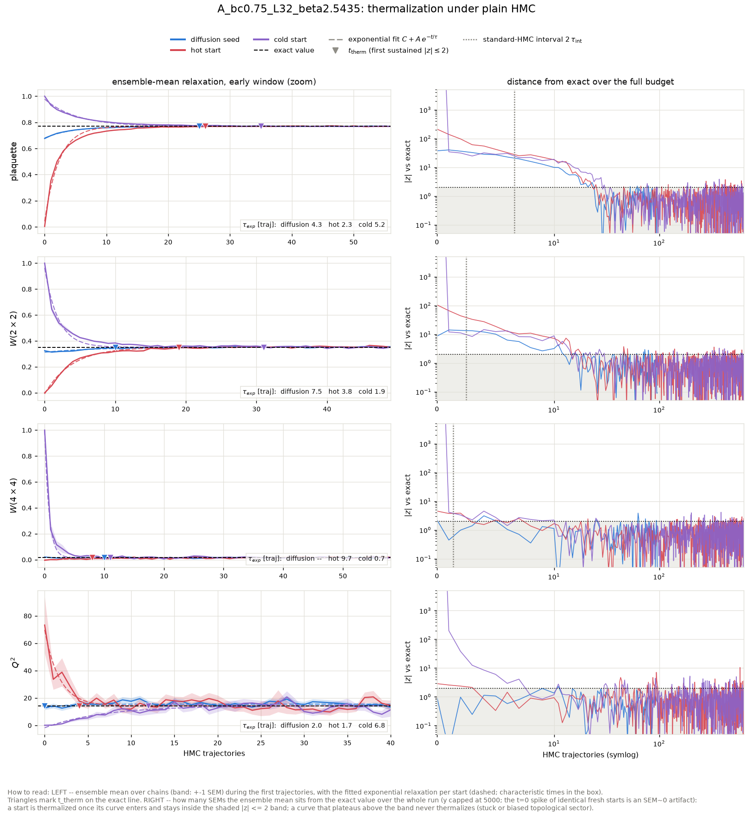

tau_int (hot-start chains, second half): plaquette = 3.30 +- 0.23, wilson_2x2 = 1.23 +- 0.06, wilson_4x4 = 0.68 +- 0.03, wilson_6x6 = 0.59 +- 0.02. Topology: hot-start HMC L=32 beta=2.5435 -> tau_int(Q) = 5.7.

### Diagnostics: raw diffusion output (before any HMC)

| observable | value | error | exact | z_exact | reference | ref_error | z_ref | ks_p | chi2_p |
|---|---|---|---|---|---|---|---|---|---|
| plaquette | 0.6765 | 0.002263 | 0.7696 | -41.17 | 0.7712 | 0.0008441 | -39.22 | 0 |  |
| wilson_1x1 | 0.6765 | 0.002263 | 0.7696 | -41.17 | 0.7712 | 0.0008441 | -39.22 | 0 |  |
| wilson_1x2 | 0.4852 | 0.003122 | 0.5924 | -34.33 | 0.5947 | 0.001239 | -32.6 | 0 |  |
| wilson_2x2 | 0.3236 | 0.003192 | 0.3509 | -8.535 | 0.3548 | 0.001546 | -8.788 | 8.222e-12 |  |
| wilson_2x3 | 0.1888 | 0.003176 | 0.2079 | -6.013 | 0.2096 | 0.001777 | -5.739 | 0.0002049 |  |
| wilson_3x3 | 0.07945 | 0.003137 | 0.09476 | -4.881 | 0.099 | 0.002295 | -5.029 | 1.026e-05 |  |
| wilson_3x4 | 0.04205 | 0.00289 | 0.0432 | -0.3972 | 0.04598 | 0.00207 | -1.105 | 0.04938 |  |
| wilson_4x4 | 0.01994 | 0.002425 | 0.01516 | 1.972 | 0.01636 | 0.002317 | 1.069 | 0.4212 |  |
| wilson_4x5 | 0.008598 | 0.002283 | 0.005319 | 1.436 | 0.008872 | 0.001496 | -0.1005 | 0.7538 |  |
| wilson_5x5 | 0.004876 | 0.002205 | 0.001436 | 1.559 | 0.004459 | 0.001775 | 0.1471 | 0.7901 |  |
| wilson_5x6 | -0.001558 | 0.002175 | 0.0003879 | -0.8944 | 0.001126 | 0.001405 | -1.036 | 0.4548 |  |
| wilson_6x6 | -0.001175 | 0.002341 | 8.063e-05 | -0.5361 | 0.0006585 | 0.002101 | -0.5828 | 0.5631 |  |
| wilson_6x7 | 0.0004351 | 0.002504 | 1.676e-05 | 0.1671 | 0.0003578 | 0.002067 | 0.02382 | 0.9126 |  |
| wilson_7x7 | 0.000102 | 0.002304 | 2.681e-06 | 0.04309 | -5.091e-05 | 0.001535 | 0.05522 | 0.8864 |  |
| wilson_7x8 | 0.0006227 | 0.001958 | 4.289e-07 | 0.3178 | -0.0002698 | 0.00133 | 0.377 | 0.678 |  |
| wilson_8x8 | 0.0004536 | 0.00229 | 5.28e-08 | 0.1981 | -3.522e-05 | 0.001573 | 0.176 | 0.4212 |  |
| wilson_8x10 | 0.003152 | 0.001351 | 8.005e-10 | 2.334 | -0.0007483 | 0.001392 | 2.011 | 0.1392 |  |
| wilson_10x10 | -0.0006905 | 0.002081 | 4.258e-12 | -0.3318 | 0.0005853 | 0.001744 | -0.4699 | 0.8864 |  |
| wilson_10x12 | 0.001156 | 0.00187 | 2.265e-14 | 0.6184 | -0.003624 | 0.001567 | 1.959 | 0.3294 |  |
| wilson_12x12 | 0.001875 | 0.001751 | 4.227e-17 | 1.071 | 0.001042 | 0.001567 | 0.3545 | 0.8864 |  |
| creutz_2 | 0.07258 | 0.007076 | 0.2618 | -26.75 |  |  |  |  |  |
| creutz_3 | 0.3261 | 0.02453 | 0.2618 | 2.622 |  |  |  |  |  |
| creutz_4 | 0.11 | 0.1033 | 0.2618 | -1.469 |  |  |  |  |  |
| creutz_5 | -0.2739 | 0.4946 | 0.2618 | -1.083 |  |  |  |  |  |
| creutz_8 | 2.126 | nan | 0.2618 | nan |  |  |  |  |  |
| Q | -0.25 | 0.2687 | 0 | -0.9304 | -0.2552 | 0.2417 | 0.01441 | 0.9999 |  |
| Q^2 | 12.83 | 1.673 | 14.25 | -0.8515 | 13.84 | 1.822 | -0.4085 | 0.8864 |  |
| chi_top ((<Q^2>-<Q>^2)/V) | 0.01247 | 0.001627 | 0.01392 | -0.8926 | 0.01345 | 0.001796 | -0.4061 | 0.006985 |  |
| Q histogram vs exact P(Q) | 9.436 | nan | 14 | nan |  |  |  |  | 0.8022 |

### Diagnostics: the same configs after 96 HMC trajectories

| observable | value | error | exact | z_exact | reference | ref_error | z_ref | ks_p | chi2_p |
|---|---|---|---|---|---|---|---|---|---|
| plaquette | 0.7699 | 0.0008724 | 0.7696 | 0.2801 | 0.7712 | 0.0008441 | -1.082 | 0.1392 |  |
| wilson_1x1 | 0.7699 | 0.0008724 | 0.7696 | 0.2801 | 0.7712 | 0.0008441 | -1.082 | 0.1392 |  |
| wilson_1x2 | 0.5902 | 0.00191 | 0.5924 | -1.133 | 0.5947 | 0.001239 | -1.97 | 0.3584 |  |
| wilson_2x2 | 0.3507 | 0.002857 | 0.3509 | -0.07263 | 0.3548 | 0.001546 | -1.273 | 0.389 |  |
| wilson_2x3 | 0.2049 | 0.003207 | 0.2079 | -0.9166 | 0.2096 | 0.001777 | -1.29 | 0.4898 |  |
| wilson_3x3 | 0.09438 | 0.003364 | 0.09476 | -0.1131 | 0.099 | 0.002295 | -1.134 | 0.4212 |  |
| wilson_3x4 | 0.04303 | 0.003103 | 0.0432 | -0.05407 | 0.04598 | 0.00207 | -0.7903 | 0.5259 |  |
| wilson_4x4 | 0.01528 | 0.0024 | 0.01516 | 0.04921 | 0.01636 | 0.002317 | -0.3238 | 0.9542 |  |
| wilson_4x5 | 0.005569 | 0.002355 | 0.005319 | 0.106 | 0.008872 | 0.001496 | -1.184 | 0.8246 |  |
| wilson_5x5 | -0.0009713 | 0.001925 | 0.001436 | -1.251 | 0.004459 | 0.001775 | -2.074 | 0.1892 |  |
| wilson_5x6 | 0.001301 | 0.002204 | 0.0003879 | 0.4143 | 0.001126 | 0.001405 | 0.06692 | 0.4212 |  |
| wilson_6x6 | -0.0005188 | 0.002064 | 8.063e-05 | -0.2904 | 0.0006585 | 0.002101 | -0.3997 | 0.9693 |  |
| wilson_6x7 | -0.0009821 | 0.00159 | 1.676e-05 | -0.628 | 0.0003578 | 0.002067 | -0.5137 | 0.8569 |  |
| wilson_7x7 | 0.0009556 | 0.002046 | 2.681e-06 | 0.4657 | -5.091e-05 | 0.001535 | 0.3934 | 0.2087 |  |
| wilson_7x8 | 2.605e-05 | 0.002168 | 4.289e-07 | 0.01182 | -0.0002698 | 0.00133 | 0.1163 | 0.5631 |  |
| wilson_8x8 | 0.00429 | 0.002112 | 5.28e-08 | 2.031 | -3.522e-05 | 0.001573 | 1.643 | 0.1122 |  |
| wilson_8x10 | -0.002245 | 0.001894 | 8.005e-10 | -1.185 | -0.0007483 | 0.001392 | -0.6365 | 0.9353 |  |
| wilson_10x10 | -0.001999 | 0.001503 | 4.258e-12 | -1.33 | 0.0005853 | 0.001744 | -1.122 | 0.5631 |  |
| wilson_10x12 | 0.0006227 | 0.002171 | 2.265e-14 | 0.2869 | -0.003624 | 0.001567 | 1.586 | 0.2297 |  |
| wilson_12x12 | 6.35e-06 | 0.002147 | 4.227e-17 | 0.002957 | 0.001042 | 0.001567 | -0.3895 | 0.678 |  |
| creutz_2 | 0.2548 | 0.004116 | 0.2618 | -1.711 |  |  |  |  |  |
| creutz_3 | 0.238 | 0.02016 | 0.2618 | -1.184 |  |  |  |  |  |
| creutz_4 | 0.2503 | 0.1177 | 0.2618 | -0.09792 |  |  |  |  |  |
| creutz_8 | -8.707 | nan | 0.2618 | nan |  |  |  |  |  |
| Q | 0.1562 | 0.3241 | 0 | 0.4821 | -0.2552 | 0.2417 | 1.018 | 0.3021 |  |
| Q^2 | 15.75 | 2.222 | 14.25 | 0.6739 | 13.84 | 1.822 | 0.6651 | 0.4212 |  |
| chi_top ((<Q^2>-<Q>^2)/V) | 0.01536 | 0.002164 | 0.01392 | 0.6649 | 0.01345 | 0.001796 | 0.6779 | 0.01957 |  |
| Q histogram vs exact P(Q) | 5.27 | nan | 14 | nan |  |  |  |  | 0.9817 |

## A_bc1_L32_beta3.10399

HMC: step size 0.2000, 5 leapfrog steps, acceptance seed/hot/cold = 0.962/0.961/0.960. Diffusion-seed batch: 128 chains x 96 trajectories (0.09 s/traj for the whole batch); baselines: 32 chains x 640 trajectories.

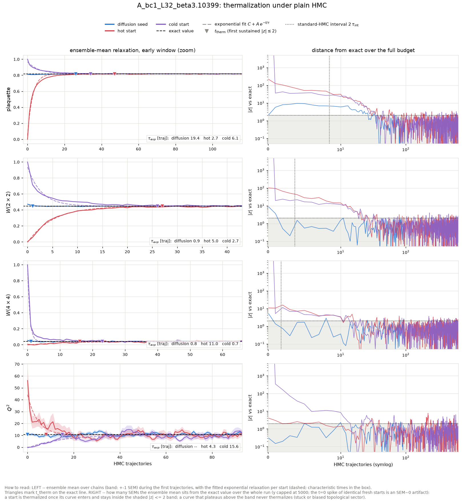

tau_int (hot-start chains, second half): plaquette = 4.21 +- 0.40, wilson_2x2 = 1.84 +- 0.16, wilson_4x4 = 0.88 +- 0.05, wilson_6x6 = 0.58 +- 0.02. Topology: hot-start HMC L=32 beta=3.10399 -> tau_int(Q) = 11.6.

### Diagnostics: raw diffusion output (before any HMC)

| observable | value | error | exact | z_exact | reference | ref_error | z_ref | ks_p | chi2_p |
|---|---|---|---|---|---|---|---|---|---|
| plaquette | 0.8144 | 0.001678 | 0.8174 | -1.79 | 0.8167 | 0.0005787 | -1.296 | 3.906e-05 |  |
| wilson_1x1 | 0.8144 | 0.001678 | 0.8174 | -1.79 | 0.8167 | 0.0005787 | -1.296 | 3.906e-05 |  |
| wilson_1x2 | 0.6635 | 0.002646 | 0.6681 | -1.758 | 0.6667 | 0.001248 | -1.097 | 0.02947 |  |
| wilson_2x2 | 0.4714 | 0.00286 | 0.4464 | 8.738 | 0.4462 | 0.002387 | 6.749 | 5.943e-10 |  |
| wilson_2x3 | 0.3187 | 0.003278 | 0.2982 | 6.252 | 0.2995 | 0.003104 | 4.271 | 0.0002496 |  |
| wilson_3x3 | 0.1758 | 0.003839 | 0.1629 | 3.353 | 0.1662 | 0.003275 | 1.899 | 0.03831 |  |
| wilson_3x4 | 0.102 | 0.003678 | 0.08895 | 3.559 | 0.09401 | 0.002937 | 1.707 | 0.005104 |  |
| wilson_4x4 | 0.05479 | 0.002939 | 0.03971 | 5.133 | 0.04635 | 0.002315 | 2.255 | 0.03364 |  |
| wilson_4x5 | 0.02627 | 0.002863 | 0.01772 | 2.984 | 0.02331 | 0.001923 | 0.8565 | 0.8246 |  |
| wilson_5x5 | 0.01042 | 0.00357 | 0.006467 | 1.108 | 0.008977 | 0.001985 | 0.3545 | 0.2297 |  |
| wilson_5x6 | 0.005769 | 0.002335 | 0.00236 | 1.46 | 0.001769 | 0.001658 | 1.397 | 0.0631 |  |
| wilson_6x6 | 0.0005781 | 0.001973 | 0.0007038 | -0.06371 | -0.001236 | 0.002333 | 0.5937 | 0.5259 |  |
| wilson_6x7 | -0.001403 | 0.001835 | 0.0002099 | -0.879 | 0.0001348 | 0.001854 | -0.5896 | 0.8246 |  |
| wilson_7x7 | -0.0006793 | 0.002037 | 5.117e-05 | -0.3587 | -0.0009109 | 0.001672 | 0.08788 | 0.5259 |  |
| wilson_7x8 | -0.003466 | 0.002538 | 1.247e-05 | -1.37 | 0.001308 | 0.00174 | -1.551 | 0.3021 |  |
| wilson_8x8 | -0.002125 | 0.002082 | 2.486e-06 | -1.022 | 0.001576 | 0.001246 | -1.525 | 0.2763 |  |
| wilson_8x10 | -0.001373 | 0.002196 | 9.869e-08 | -0.6255 | 0.001019 | 0.002055 | -0.7956 | 0.2087 |  |
| wilson_10x10 | -8.894e-05 | 0.001944 | 1.749e-09 | -0.04576 | 0.002047 | 0.001322 | -0.9087 | 0.3294 |  |
| wilson_10x12 | 0.0002996 | 0.002096 | 3.101e-11 | 0.1429 | 0.001053 | 0.001377 | -0.3005 | 0.08971 |  |
| wilson_12x12 | -0.003008 | 0.00201 | 2.453e-13 | -1.497 | 0.0004341 | 0.001577 | -1.347 | 0.5259 |  |
| creutz_2 | 0.1369 | 0.003538 | 0.2016 | -18.3 |  |  |  |  |  |
| creutz_3 | 0.204 | 0.01043 | 0.2016 | 0.2265 |  |  |  |  |  |
| creutz_4 | 0.07819 | 0.03483 | 0.2016 | -3.544 |  |  |  |  |  |
| creutz_5 | 0.189 | 0.2047 | 0.2016 | -0.0616 |  |  |  |  |  |
| creutz_6 | 1.709 | 4.554 | 0.2016 | 0.331 |  |  |  |  |  |
| Q | 0.2656 | 0.2481 | 0 | 1.071 | 0.1302 | 0.2199 | 0.4085 | 0.7538 |  |
| Q^2 | 11.16 | 1.044 | 10.81 | 0.333 | 10.84 | 1.105 | 0.209 | 0.1251 |  |
| chi_top ((<Q^2>-<Q>^2)/V) | 0.01083 | 0.0009846 | 0.01056 | 0.275 | 0.01057 | 0.001073 | 0.1771 | 0.0006474 |  |
| Q histogram vs exact P(Q) | 20.04 | nan | 12 | nan |  |  |  |  | 0.06626 |

### Diagnostics: the same configs after 96 HMC trajectories

| observable | value | error | exact | z_exact | reference | ref_error | z_ref | ks_p | chi2_p |
|---|---|---|---|---|---|---|---|---|---|
| plaquette | 0.8178 | 0.0006187 | 0.8174 | 0.6801 | 0.8167 | 0.0005787 | 1.326 | 0.389 |  |
| wilson_1x1 | 0.8178 | 0.0006187 | 0.8174 | 0.6801 | 0.8167 | 0.0005787 | 1.326 | 0.389 |  |
| wilson_1x2 | 0.6682 | 0.001161 | 0.6681 | 0.02727 | 0.6667 | 0.001248 | 0.8654 | 0.9693 |  |
| wilson_2x2 | 0.4464 | 0.001977 | 0.4464 | -0.006297 | 0.4462 | 0.002387 | 0.04511 | 0.7163 |  |
| wilson_2x3 | 0.2961 | 0.002642 | 0.2982 | -0.7986 | 0.2995 | 0.003104 | -0.8143 | 0.5631 |  |
| wilson_3x3 | 0.1633 | 0.003256 | 0.1629 | 0.1185 | 0.1662 | 0.003275 | -0.6291 | 0.2763 |  |
| wilson_3x4 | 0.08727 | 0.003209 | 0.08895 | -0.5222 | 0.09401 | 0.002937 | -1.548 | 0.1004 |  |
| wilson_4x4 | 0.04003 | 0.002995 | 0.03971 | 0.1073 | 0.04635 | 0.002315 | -1.671 | 0.1251 |  |
| wilson_4x5 | 0.0168 | 0.002487 | 0.01772 | -0.3713 | 0.02331 | 0.001923 | -2.072 | 0.04938 |  |
| wilson_5x5 | 0.005927 | 0.001556 | 0.006467 | -0.3469 | 0.008977 | 0.001985 | -1.209 | 0.7163 |  |
| wilson_5x6 | 0.001078 | 0.001922 | 0.00236 | -0.6669 | 0.001769 | 0.001658 | -0.2724 | 0.3021 |  |
| wilson_6x6 | 0.0005158 | 0.00237 | 0.0007038 | -0.07931 | -0.001236 | 0.002333 | 0.5267 | 0.6395 |  |
| wilson_6x7 | 0.0004851 | 0.00163 | 0.0002099 | 0.1688 | 0.0001348 | 0.001854 | 0.1419 | 0.5631 |  |
| wilson_7x7 | -0.001455 | 0.002093 | 5.117e-05 | -0.7196 | -0.0009109 | 0.001672 | -0.2031 | 0.9126 |  |
| wilson_7x8 | 0.0005118 | 0.002033 | 1.247e-05 | 0.2456 | 0.001308 | 0.00174 | -0.2976 | 0.8864 |  |
| wilson_8x8 | 0.003007 | 0.002095 | 2.486e-06 | 1.435 | 0.001576 | 0.001246 | 0.5875 | 0.8246 |  |
| wilson_8x10 | -0.001259 | 0.002359 | 9.869e-08 | -0.5339 | 0.001019 | 0.002055 | -0.7284 | 0.2763 |  |
| wilson_10x10 | 0.003004 | 0.002539 | 1.749e-09 | 1.183 | 0.002047 | 0.001322 | 0.3343 | 0.9693 |  |
| wilson_10x12 | 0.001669 | 0.002155 | 3.101e-11 | 0.7745 | 0.001053 | 0.001377 | 0.2408 | 0.9126 |  |
| wilson_12x12 | 0.001007 | 0.001971 | 2.453e-13 | 0.5108 | 0.0004341 | 0.001577 | 0.2269 | 0.8864 |  |
| creutz_2 | 0.2012 | 0.003556 | 0.2016 | -0.1102 |  |  |  |  |  |
| creutz_3 | 0.1851 | 0.01059 | 0.2016 | -1.561 |  |  |  |  |  |
| creutz_4 | 0.1532 | 0.04806 | 0.2016 | -1.008 |  |  |  |  |  |
| creutz_5 | 0.1737 | 0.3239 | 0.2016 | -0.08612 |  |  |  |  |  |
| creutz_6 | -0.9679 | 4.52 | 0.2016 | -0.2588 |  |  |  |  |  |
| Q | 0.4844 | 0.416 | 0 | 1.164 | 0.1302 | 0.2199 | 0.7526 | 0.389 |  |
| Q^2 | 12.44 | 1.414 | 10.81 | 1.152 | 10.84 | 1.105 | 0.8909 | 0.1712 |  |
| chi_top ((<Q^2>-<Q>^2)/V) | 0.01192 | 0.001409 | 0.01056 | 0.9668 | 0.01057 | 0.001073 | 0.7618 | 0.003137 |  |
| Q histogram vs exact P(Q) | 14.85 | nan | 12 | nan |  |  |  |  | 0.2498 |

## A_bc2_L32_beta6.10518

HMC: step size 0.1619, 6 leapfrog steps, acceptance seed/hot/cold = 0.971/0.973/0.975. Diffusion-seed batch: 128 chains x 96 trajectories (0.10 s/traj for the whole batch); baselines: 32 chains x 640 trajectories.

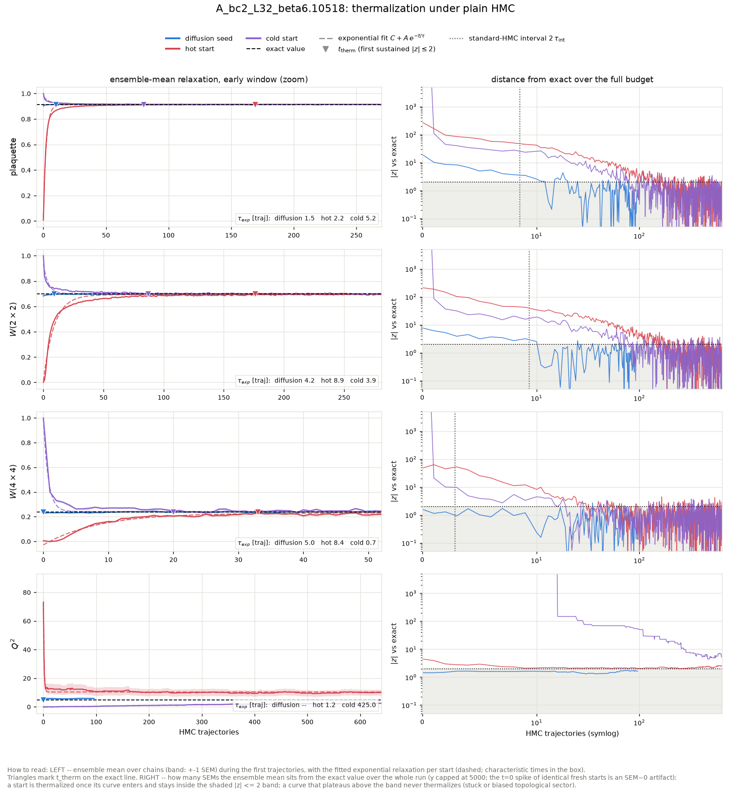

tau_int (hot-start chains, second half): plaquette = 4.26 +- 0.41, wilson_2x2 = 4.66 +- 0.54, wilson_4x4 = 1.42 +- 0.17, wilson_6x6 = 0.95 +- 0.05. Topology: hot-start HMC L=32 beta=6.10518 -> tau_int(Q) = 35.7.

Where 'never' stood at the end: the hot start ended the 640-trajectory budget still at Q^2 at |z| ~ 3; the cold start ended the 640-trajectory budget still at Q^2 at |z| ~ 5.

### Diagnostics: raw diffusion output (before any HMC)

| observable | value | error | exact | z_exact | reference | ref_error | z_ref | ks_p | chi2_p |
|---|---|---|---|---|---|---|---|---|---|
| plaquette | 0.9016 | 0.0005046 | 0.914 | -24.45 | 0.9143 | 0.0001898 | -23.47 | 0 |  |
| wilson_1x1 | 0.9016 | 0.0005046 | 0.914 | -24.45 | 0.9143 | 0.0001898 | -23.47 | 0 |  |
| wilson_1x2 | 0.8164 | 0.0009882 | 0.8353 | -19.12 | 0.8361 | 0.0005353 | -17.49 | 3.729e-35 |  |
| wilson_2x2 | 0.6816 | 0.001849 | 0.6978 | -8.737 | 0.6995 | 0.0009961 | -8.525 | 2.291e-11 |  |
| wilson_2x3 | 0.5627 | 0.00274 | 0.5829 | -7.378 | 0.5851 | 0.001632 | -7.045 | 6.754e-09 |  |
| wilson_3x3 | 0.4227 | 0.003464 | 0.445 | -6.45 | 0.4505 | 0.002149 | -6.825 | 1.947e-07 |  |
| wilson_3x4 | 0.3215 | 0.003948 | 0.3397 | -4.612 | 0.347 | 0.002879 | -5.216 | 1.616e-05 |  |
| wilson_4x4 | 0.2298 | 0.004385 | 0.2371 | -1.667 | 0.2462 | 0.003532 | -2.929 | 0.005977 |  |
| wilson_4x5 | 0.1607 | 0.004929 | 0.1654 | -0.9604 | 0.1734 | 0.003624 | -2.072 | 0.01275 |  |
| wilson_5x5 | 0.1017 | 0.004881 | 0.1055 | -0.7781 | 0.1111 | 0.003848 | -1.511 | 0.04938 |  |
| wilson_5x6 | 0.06891 | 0.004634 | 0.06728 | 0.353 | 0.0715 | 0.003732 | -0.4355 | 0.2763 |  |
| wilson_6x6 | 0.04096 | 0.003886 | 0.03921 | 0.4503 | 0.04151 | 0.003986 | -0.09846 | 0.7538 |  |
| wilson_6x7 | 0.02274 | 0.003535 | 0.02286 | -0.0343 | 0.0258 | 0.003616 | -0.6064 | 0.2522 |  |
| wilson_7x7 | 0.01215 | 0.003811 | 0.01218 | -0.005568 | 0.01483 | 0.003796 | -0.4974 | 0.1545 |  |
| wilson_7x8 | 0.004957 | 0.003535 | 0.006487 | -0.4327 | 0.007417 | 0.004109 | -0.4539 | 0.2763 |  |
| wilson_8x8 | 0.002073 | 0.002294 | 0.003158 | -0.4732 | 0.006329 | 0.003061 | -1.113 | 0.05588 |  |
| wilson_8x10 | 0.001011 | 0.001863 | 0.0007487 | 0.1406 | 0.005868 | 0.003149 | -1.327 | 0.04938 |  |
| wilson_10x10 | -0.001197 | 0.00314 | 0.0001238 | -0.4207 | -0.001497 | 0.002756 | 0.07165 | 0.9353 |  |
| wilson_10x12 | 0.001482 | 0.002788 | 2.049e-05 | 0.5242 | -0.002269 | 0.002148 | 1.066 | 0.678 |  |
| wilson_12x12 | -0.001066 | 0.002046 | 2.365e-06 | -0.5221 | 0.0007953 | 0.001629 | -0.7116 | 0.2763 |  |
| creutz_2 | 0.08122 | 0.001553 | 0.08996 | -5.631 |  |  |  |  |  |
| creutz_3 | 0.09429 | 0.003467 | 0.08996 | 1.247 |  |  |  |  |  |
| creutz_4 | 0.06262 | 0.006586 | 0.08996 | -4.152 |  |  |  |  |  |
| creutz_5 | 0.09988 | 0.01698 | 0.08996 | 0.5842 |  |  |  |  |  |
| creutz_6 | 0.131 | 0.04727 | 0.08996 | 0.8686 |  |  |  |  |  |
| creutz_7 | 0.03741 | 0.1585 | 0.08996 | -0.3316 |  |  |  |  |  |
| creutz_8 | -0.02504 | 0.9511 | 0.08996 | -0.1209 |  |  |  |  |  |
| Q | -0.01562 | 0.221 | 0 | -0.07069 | -0.1979 | 0.1063 | 0.7433 | 0.5259 |  |
| Q^2 | 5.656 | 0.7235 | 4.686 | 1.341 | 4.219 | 0.4579 | 1.679 | 0.2763 |  |
| chi_top ((<Q^2>-<Q>^2)/V) | 0.005523 | 0.0007061 | 0.004576 | 1.341 | 0.004082 | 0.0004247 | 1.75 | 0.0005374 |  |
| Q histogram vs exact P(Q) | 6.766 | nan | 8 | nan |  |  |  |  | 0.5621 |

### Diagnostics: the same configs after 96 HMC trajectories

| observable | value | error | exact | z_exact | reference | ref_error | z_ref | ks_p | chi2_p |
|---|---|---|---|---|---|---|---|---|---|
| plaquette | 0.9138 | 0.0002796 | 0.914 | -0.6245 | 0.9143 | 0.0001898 | -1.453 | 0.4548 |  |
| wilson_1x1 | 0.9138 | 0.0002796 | 0.914 | -0.6245 | 0.9143 | 0.0001898 | -1.453 | 0.4548 |  |
| wilson_1x2 | 0.8354 | 0.0003376 | 0.8353 | 0.2452 | 0.8361 | 0.0005353 | -1.078 | 0.3584 |  |
| wilson_2x2 | 0.6969 | 0.0007932 | 0.6978 | -1.042 | 0.6995 | 0.0009961 | -2.024 | 0.2763 |  |
| wilson_2x3 | 0.5822 | 0.001401 | 0.5829 | -0.4541 | 0.5851 | 0.001632 | -1.343 | 0.2087 |  |
| wilson_3x3 | 0.4428 | 0.001966 | 0.445 | -1.106 | 0.4505 | 0.002149 | -2.628 | 0.03364 |  |
| wilson_3x4 | 0.3363 | 0.002438 | 0.3397 | -1.426 | 0.347 | 0.002879 | -2.852 | 0.0711 |  |
| wilson_4x4 | 0.2325 | 0.003216 | 0.2371 | -1.431 | 0.2462 | 0.003532 | -2.886 | 0.04938 |  |
| wilson_4x5 | 0.159 | 0.003855 | 0.1654 | -1.675 | 0.1734 | 0.003624 | -2.722 | 0.017 |  |
| wilson_5x5 | 0.1014 | 0.004267 | 0.1055 | -0.9691 | 0.1111 | 0.003848 | -1.693 | 0.05588 |  |
| wilson_5x6 | 0.06213 | 0.00433 | 0.06728 | -1.187 | 0.0715 | 0.003732 | -1.639 | 0.01957 |  |
| wilson_6x6 | 0.0364 | 0.003765 | 0.03921 | -0.7463 | 0.04151 | 0.003986 | -0.9315 | 0.1892 |  |
| wilson_6x7 | 0.01937 | 0.003432 | 0.02286 | -1.017 | 0.0258 | 0.003616 | -1.291 | 0.002243 |  |
| wilson_7x7 | 0.008058 | 0.002428 | 0.01218 | -1.696 | 0.01483 | 0.003796 | -1.503 | 0.003697 |  |
| wilson_7x8 | 0.006278 | 0.002873 | 0.006487 | -0.07261 | 0.007417 | 0.004109 | -0.2272 | 0.6395 |  |
| wilson_8x8 | 0.004839 | 0.00341 | 0.003158 | 0.4927 | 0.006329 | 0.003061 | -0.3253 | 0.3584 |  |
| wilson_8x10 | 0.003446 | 0.003511 | 0.0007487 | 0.7684 | 0.005868 | 0.003149 | -0.5134 | 0.7163 |  |
| wilson_10x10 | 0.007483 | 0.003142 | 0.0001238 | 2.342 | -0.001497 | 0.002756 | 2.149 | 0.005104 |  |
| wilson_10x12 | 0.001461 | 0.002474 | 2.049e-05 | 0.5824 | -0.002269 | 0.002148 | 1.138 | 0.678 |  |
| wilson_12x12 | 0.001384 | 0.00311 | 2.365e-06 | 0.4444 | 0.0007953 | 0.001629 | 0.1678 | 0.6395 |  |
| creutz_2 | 0.09154 | 0.001224 | 0.08996 | 1.287 |  |  |  |  |  |
| creutz_3 | 0.09386 | 0.002994 | 0.08996 | 1.302 |  |  |  |  |  |
| creutz_4 | 0.09389 | 0.006675 | 0.08996 | 0.5879 |  |  |  |  |  |
| creutz_5 | 0.06991 | 0.01869 | 0.08996 | -1.073 |  |  |  |  |  |
| creutz_6 | 0.04528 | 0.04976 | 0.08996 | -0.8979 |  |  |  |  |  |
| creutz_7 | 0.2458 | 0.2269 | 0.08996 | 0.6869 |  |  |  |  |  |
| creutz_8 | 0.01083 | 0.445 | 0.08996 | -0.1778 |  |  |  |  |  |
| Q | 0.0625 | 0.2421 | 0 | 0.2581 | -0.1979 | 0.1063 | 0.9848 | 0.4212 |  |
| Q^2 | 5.781 | 0.7627 | 4.686 | 1.436 | 4.219 | 0.4579 | 1.756 | 0.2763 |  |
| chi_top ((<Q^2>-<Q>^2)/V) | 0.005642 | 0.0007459 | 0.004576 | 1.429 | 0.004082 | 0.0004247 | 1.818 | 0.0006474 |  |
| Q histogram vs exact P(Q) | 7.667 | nan | 8 | nan |  |  |  |  | 0.4667 |

## A_bc3_L32_beta10.015

HMC: step size 0.1264, 8 leapfrog steps, acceptance seed/hot/cold = 0.976/0.979/0.981. Diffusion-seed batch: 128 chains x 96 trajectories (0.13 s/traj for the whole batch); baselines: 32 chains x 640 trajectories.

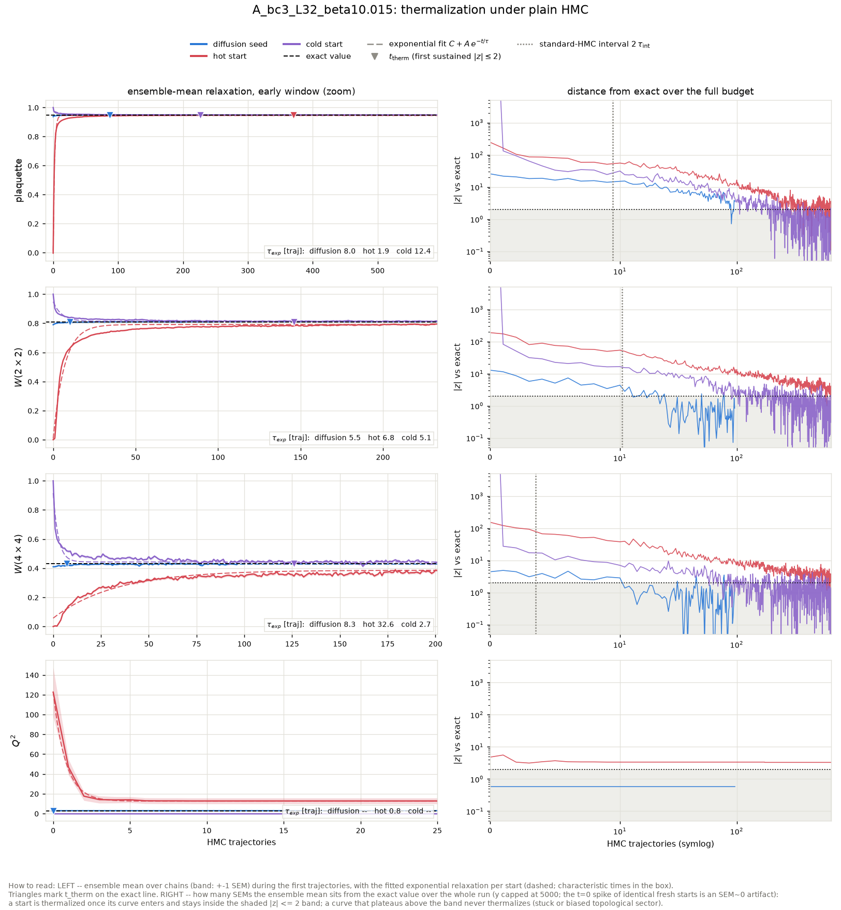

tau_int (hot-start chains, second half): plaquette = 4.73 +- 0.57, wilson_2x2 = 5.21 +- 0.76, wilson_4x4 = 1.75 +- 0.23, wilson_6x6 = 0.84 +- 0.04. Topology: hot-start HMC L=32 beta=10.015 -> **frozen** (no tunneling).

Where 'never' stood at the end: the hot start ended the 640-trajectory budget still at wilson_2x2 at |z| ~ 3, wilson_4x4 at |z| ~ 3, Q^2 at |z| ~ 3; the cold start ended the 640-trajectory budget still at Q^2 at |z| ~ 2736159195136.

### Diagnostics: raw diffusion output (before any HMC)

| observable | value | error | exact | z_exact | reference | ref_error | z_ref | ks_p | chi2_p |
|---|---|---|---|---|---|---|---|---|---|
| plaquette | 0.9372 | 0.0004193 | 0.9487 | -27.34 | 0.9486 | 0.0001186 | -26.03 | 0 |  |
| wilson_1x1 | 0.9372 | 0.0004193 | 0.9487 | -27.34 | 0.9486 | 0.0001186 | -26.03 | 0 |  |
| wilson_1x2 | 0.8825 | 0.0008573 | 0.9 | -20.45 | 0.9002 | 0.0002491 | -19.85 | 0 |  |
| wilson_2x2 | 0.79 | 0.001395 | 0.81 | -14.31 | 0.8102 | 0.0005851 | -13.35 | 2.376e-26 |  |
| wilson_2x3 | 0.7047 | 0.002068 | 0.729 | -11.76 | 0.7287 | 0.0009044 | -10.67 | 6.603e-16 |  |
| wilson_3x3 | 0.5943 | 0.003122 | 0.6224 | -9.009 | 0.6216 | 0.001485 | -7.895 | 5.026e-09 |  |
| wilson_3x4 | 0.5058 | 0.003844 | 0.5314 | -6.665 | 0.5292 | 0.002277 | -5.245 | 2.524e-05 |  |
| wilson_4x4 | 0.4104 | 0.004285 | 0.4304 | -4.671 | 0.4289 | 0.002807 | -3.602 | 0.017 |  |
| wilson_4x5 | 0.3295 | 0.005179 | 0.3486 | -3.701 | 0.3456 | 0.00354 | -2.575 | 0.03831 |  |
| wilson_5x5 | 0.25 | 0.005587 | 0.2679 | -3.206 | 0.265 | 0.003876 | -2.212 | 0.1004 |  |
| wilson_5x6 | 0.1906 | 0.005683 | 0.2059 | -2.681 | 0.2042 | 0.004145 | -1.925 | 0.02947 |  |
| wilson_6x6 | 0.1384 | 0.005235 | 0.1501 | -2.232 | 0.1501 | 0.004018 | -1.783 | 0.07995 |  |
| wilson_6x7 | 0.09844 | 0.005289 | 0.1094 | -2.071 | 0.1104 | 0.004002 | -1.81 | 0.08971 |  |
| wilson_7x7 | 0.06692 | 0.004873 | 0.07566 | -1.792 | 0.07739 | 0.003572 | -1.733 | 0.3294 |  |
| wilson_7x8 | 0.04399 | 0.004796 | 0.05232 | -1.738 | 0.05614 | 0.003853 | -1.975 | 0.1892 |  |
| wilson_8x8 | 0.02791 | 0.005084 | 0.03433 | -1.263 | 0.03666 | 0.00362 | -1.403 | 0.4212 |  |
| wilson_8x10 | 0.01224 | 0.00479 | 0.01478 | -0.5291 | 0.01927 | 0.004252 | -1.097 | 0.3021 |  |
| wilson_10x10 | 0.003912 | 0.004033 | 0.005151 | -0.3074 | 0.005632 | 0.003721 | -0.3136 | 0.4548 |  |
| wilson_10x12 | 0.000134 | 0.003292 | 0.001796 | -0.5048 | 0.00171 | 0.002494 | -0.3816 | 0.7901 |  |
| wilson_12x12 | 0.0004127 | 0.003564 | 0.0005072 | -0.02653 | 8.739e-05 | 0.002521 | 0.07452 | 0.2297 |  |
| creutz_2 | 0.05045 | 0.0009396 | 0.05268 | -2.379 |  |  |  |  |  |
| creutz_3 | 0.05605 | 0.001858 | 0.05268 | 1.811 |  |  |  |  |  |
| creutz_4 | 0.04772 | 0.003262 | 0.05268 | -1.521 |  |  |  |  |  |
| creutz_5 | 0.05639 | 0.006335 | 0.05268 | 0.5856 |  |  |  |  |  |
| creutz_6 | 0.04917 | 0.01181 | 0.05268 | -0.2981 |  |  |  |  |  |
| creutz_7 | 0.04539 | 0.03093 | 0.05268 | -0.2358 |  |  |  |  |  |
| creutz_8 | 0.03531 | 0.07001 | 0.05268 | -0.2481 |  |  |  |  |  |
| Q | 0.03906 | 0.1517 | 0 | 0.2574 | -0.1042 | 0.1518 | 0.6672 | 0.9807 |  |
| Q^2 | 2.93 | 0.267 | 2.736 | 0.7247 | 3.406 | 0.25 | -1.303 | 0.9941 |  |
| chi_top ((<Q^2>-<Q>^2)/V) | 0.00286 | 0.0002635 | 0.002672 | 0.7116 | 0.003316 | 0.0002389 | -1.283 | 0.0004451 |  |
| Q histogram vs exact P(Q) | 4.29 | nan | 6 | nan |  |  |  |  | 0.6376 |

### Diagnostics: the same configs after 96 HMC trajectories

| observable | value | error | exact | z_exact | reference | ref_error | z_ref | ks_p | chi2_p |
|---|---|---|---|---|---|---|---|---|---|
| plaquette | 0.9479 | 0.0002778 | 0.9487 | -2.785 | 0.9486 | 0.0001186 | -2.156 | 0.0631 |  |
| wilson_1x1 | 0.9479 | 0.0002778 | 0.9487 | -2.785 | 0.9486 | 0.0001186 | -2.156 | 0.0631 |  |
| wilson_1x2 | 0.8988 | 0.00059 | 0.9 | -2.086 | 0.9002 | 0.0002491 | -2.209 | 0.04938 |  |
| wilson_2x2 | 0.809 | 0.001279 | 0.81 | -0.7346 | 0.8102 | 0.0005851 | -0.8385 | 0.3294 |  |
| wilson_2x3 | 0.7265 | 0.002155 | 0.729 | -1.166 | 0.7287 | 0.0009044 | -0.9736 | 0.5259 |  |
| wilson_3x3 | 0.6172 | 0.002846 | 0.6224 | -1.827 | 0.6216 | 0.001485 | -1.361 | 0.3021 |  |
| wilson_3x4 | 0.5274 | 0.003821 | 0.5314 | -1.055 | 0.5292 | 0.002277 | -0.4141 | 0.4898 |  |
| wilson_4x4 | 0.4249 | 0.00458 | 0.4304 | -1.217 | 0.4289 | 0.002807 | -0.7464 | 0.2297 |  |
| wilson_4x5 | 0.3424 | 0.005164 | 0.3486 | -1.211 | 0.3456 | 0.00354 | -0.5174 | 0.3584 |  |
| wilson_5x5 | 0.2598 | 0.005708 | 0.2679 | -1.416 | 0.265 | 0.003876 | -0.7554 | 0.2763 |  |
| wilson_5x6 | 0.198 | 0.006192 | 0.2059 | -1.273 | 0.2042 | 0.004145 | -0.8306 | 0.2297 |  |
| wilson_6x6 | 0.1427 | 0.006029 | 0.1501 | -1.215 | 0.1501 | 0.004018 | -1.022 | 0.3584 |  |
| wilson_6x7 | 0.1029 | 0.006006 | 0.1094 | -1.078 | 0.1104 | 0.004002 | -1.042 | 0.389 |  |
| wilson_7x7 | 0.07012 | 0.005101 | 0.07566 | -1.086 | 0.07739 | 0.003572 | -1.168 | 0.1392 |  |
| wilson_7x8 | 0.04949 | 0.005107 | 0.05232 | -0.554 | 0.05614 | 0.003853 | -1.039 | 0.1892 |  |
| wilson_8x8 | 0.033 | 0.004568 | 0.03433 | -0.2914 | 0.03666 | 0.00362 | -0.6295 | 0.678 |  |
| wilson_8x10 | 0.01378 | 0.004324 | 0.01478 | -0.231 | 0.01927 | 0.004252 | -0.9054 | 0.2297 |  |
| wilson_10x10 | 0.004522 | 0.003839 | 0.005151 | -0.164 | 0.005632 | 0.003721 | -0.2078 | 0.6395 |  |
| wilson_10x12 | 0.001061 | 0.004576 | 0.001796 | -0.1605 | 0.00171 | 0.002494 | -0.1245 | 0.8569 |  |
| wilson_12x12 | 0.0006367 | 0.003661 | 0.0005072 | 0.03538 | 8.739e-05 | 0.002521 | 0.1236 | 0.9353 |  |
| creutz_2 | 0.05192 | 0.0007766 | 0.05268 | -0.9789 |  |  |  |  |  |
| creutz_3 | 0.05533 | 0.001576 | 0.05268 | 1.679 |  |  |  |  |  |
| creutz_4 | 0.05888 | 0.002977 | 0.05268 | 2.081 |  |  |  |  |  |
| creutz_5 | 0.06016 | 0.005824 | 0.05268 | 1.283 |  |  |  |  |  |
| creutz_6 | 0.05527 | 0.01153 | 0.05268 | 0.2246 |  |  |  |  |  |
| creutz_7 | 0.0568 | 0.02583 | 0.05268 | 0.1595 |  |  |  |  |  |
| creutz_8 | 0.0571 | 0.06076 | 0.05268 | 0.07273 |  |  |  |  |  |
| Q | 0.03906 | 0.1517 | 0 | 0.2574 | -0.1042 | 0.1518 | 0.6672 | 0.9807 |  |
| Q^2 | 2.93 | 0.267 | 2.736 | 0.7247 | 3.406 | 0.25 | -1.303 | 0.9941 |  |
| chi_top ((<Q^2>-<Q>^2)/V) | 0.00286 | 0.0002635 | 0.002672 | 0.7116 | 0.003316 | 0.0002389 | -1.283 | 0.0004451 |  |
| Q histogram vs exact P(Q) | 4.29 | nan | 6 | nan |  |  |  |  | 0.6376 |

## A_bc4_L32_beta14.1464

HMC: step size 0.1063, 9 leapfrog steps, acceptance seed/hot/cold = 0.987/0.984/0.984. Diffusion-seed batch: 128 chains x 96 trajectories (0.17 s/traj for the whole batch); baselines: 32 chains x 640 trajectories.

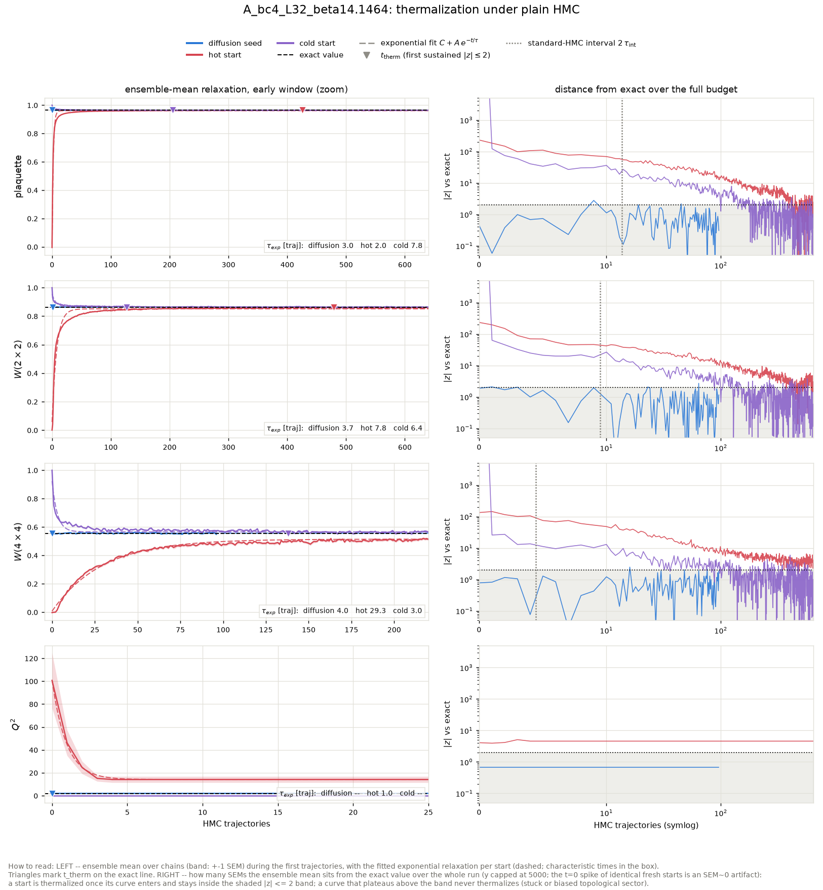

tau_int (hot-start chains, second half): plaquette = 6.84 +- 0.92, wilson_2x2 = 4.75 +- 0.60, wilson_4x4 = 2.22 +- 0.19, wilson_6x6 = 0.87 +- 0.04. Topology: hot-start HMC L=32 beta=14.1464 -> **frozen** (no tunneling).

Where 'never' stood at the end: the hot start ended the 640-trajectory budget still at wilson_4x4 at |z| ~ 4, wilson_6x6 at |z| ~ 4, Q^2 at |z| ~ 5; the cold start ended the 640-trajectory budget still at Q^2 at |z| ~ 1903991324672.

### Diagnostics: raw diffusion output (before any HMC)

| observable | value | error | exact | z_exact | reference | ref_error | z_ref | ks_p | chi2_p |
|---|---|---|---|---|---|---|---|---|---|
| plaquette | 0.9639 | 0.0001935 | 0.964 | -0.5071 | 0.9643 | 0.0001394 | -1.555 | 0.011 |  |
| wilson_1x1 | 0.9639 | 0.0001935 | 0.964 | -0.5071 | 0.9643 | 0.0001394 | -1.555 | 0.011 |  |
| wilson_1x2 | 0.9287 | 0.0004129 | 0.9293 | -1.309 | 0.9297 | 0.0002902 | -1.876 | 0.006985 |  |
| wilson_2x2 | 0.8619 | 0.0007983 | 0.8635 | -2.069 | 0.8648 | 0.0005656 | -3.035 | 0.0711 |  |
| wilson_2x3 | 0.8002 | 0.001285 | 0.8024 | -1.767 | 0.8041 | 0.001006 | -2.404 | 0.1892 |  |
| wilson_3x3 | 0.7148 | 0.001905 | 0.7188 | -2.088 | 0.7215 | 0.001633 | -2.64 | 0.1712 |  |
| wilson_3x4 | 0.6399 | 0.002639 | 0.6439 | -1.499 | 0.6464 | 0.002382 | -1.824 | 0.3584 |  |
| wilson_4x4 | 0.5533 | 0.003026 | 0.556 | -0.8963 | 0.5589 | 0.003229 | -1.251 | 0.3584 |  |
| wilson_4x5 | 0.4764 | 0.003609 | 0.4801 | -1.047 | 0.483 | 0.003787 | -1.271 | 0.389 |  |
| wilson_5x5 | 0.3959 | 0.004279 | 0.3997 | -0.8927 | 0.4026 | 0.004329 | -1.102 | 0.6395 |  |
| wilson_5x6 | 0.3264 | 0.005328 | 0.3327 | -1.187 | 0.3371 | 0.004763 | -1.496 | 0.5631 |  |
| wilson_6x6 | 0.2642 | 0.005859 | 0.267 | -0.4652 | 0.2695 | 0.004692 | -0.7016 | 0.8569 |  |
| wilson_6x7 | 0.2093 | 0.006328 | 0.2142 | -0.7853 | 0.2188 | 0.004882 | -1.197 | 0.5259 |  |
| wilson_7x7 | 0.1639 | 0.006298 | 0.1657 | -0.292 | 0.1698 | 0.00535 | -0.7163 | 0.7163 |  |
| wilson_7x8 | 0.1246 | 0.006568 | 0.1282 | -0.5425 | 0.1338 | 0.005268 | -1.09 | 0.4212 |  |
| wilson_8x8 | 0.09786 | 0.005964 | 0.09558 | 0.3816 | 0.09956 | 0.005676 | -0.2067 | 0.9126 |  |
| wilson_8x10 | 0.05413 | 0.005862 | 0.05315 | 0.1671 | 0.05826 | 0.004829 | -0.5447 | 0.6011 |  |
| wilson_10x10 | 0.0295 | 0.005484 | 0.02552 | 0.7269 | 0.03309 | 0.004208 | -0.5192 | 0.5259 |  |
| wilson_10x12 | 0.01486 | 0.00515 | 0.01225 | 0.5059 | 0.01664 | 0.004387 | -0.2642 | 0.678 |  |
| wilson_12x12 | 0.005709 | 0.004195 | 0.00508 | 0.1499 | 0.009305 | 0.005203 | -0.5381 | 0.4212 |  |
| creutz_2 | 0.03754 | 0.0005338 | 0.03668 | 1.597 |  |  |  |  |  |
| creutz_3 | 0.03848 | 0.001106 | 0.03668 | 1.627 |  |  |  |  |  |
| creutz_4 | 0.0348 | 0.001992 | 0.03668 | -0.9464 |  |  |  |  |  |
| creutz_5 | 0.03537 | 0.003414 | 0.03668 | -0.3863 |  |  |  |  |  |
| creutz_6 | 0.01816 | 0.005376 | 0.03668 | -3.446 |  |  |  |  |  |
| creutz_7 | 0.01117 | 0.009362 | 0.03668 | -2.726 |  |  |  |  |  |
| creutz_8 | -0.03208 | 0.01793 | 0.03668 | -3.835 |  |  |  |  |  |
| Q | 0.07031 | 0.1218 | 0 | 0.5774 | -0.07292 | 0.1031 | 0.8977 | 0.678 |  |
| Q^2 | 2.086 | 0.2321 | 1.904 | 0.7839 | 1.635 | 0.1596 | 1.599 | 0.8569 |  |
| chi_top ((<Q^2>-<Q>^2)/V) | 0.002032 | 0.0002337 | 0.001859 | 0.7397 | 0.001592 | 0.0001506 | 1.584 | 4.022e-06 |  |
| Q histogram vs exact P(Q) | 2.334 | nan | 6 | nan |  |  |  |  | 0.8866 |

### Diagnostics: the same configs after 96 HMC trajectories

| observable | value | error | exact | z_exact | reference | ref_error | z_ref | ks_p | chi2_p |
|---|---|---|---|---|---|---|---|---|---|
| plaquette | 0.9639 | 0.0001108 | 0.964 | -0.4352 | 0.9643 | 0.0001394 | -1.802 | 0.1251 |  |
| wilson_1x1 | 0.9639 | 0.0001108 | 0.964 | -0.4352 | 0.9643 | 0.0001394 | -1.802 | 0.1251 |  |
| wilson_1x2 | 0.929 | 0.0002764 | 0.9293 | -0.7689 | 0.9297 | 0.0002902 | -1.544 | 0.4212 |  |
| wilson_2x2 | 0.8626 | 0.0007001 | 0.8635 | -1.313 | 0.8648 | 0.0005656 | -2.485 | 0.0711 |  |
| wilson_2x3 | 0.8003 | 0.001319 | 0.8024 | -1.582 | 0.8041 | 0.001006 | -2.254 | 0.2522 |  |
| wilson_3x3 | 0.7152 | 0.002332 | 0.7188 | -1.532 | 0.7215 | 0.001633 | -2.184 | 0.3021 |  |
| wilson_3x4 | 0.6385 | 0.003363 | 0.6439 | -1.606 | 0.6464 | 0.002382 | -1.924 | 0.2297 |  |
| wilson_4x4 | 0.5483 | 0.00442 | 0.556 | -1.737 | 0.5589 | 0.003229 | -1.919 | 0.2297 |  |
| wilson_4x5 | 0.4716 | 0.005337 | 0.4801 | -1.604 | 0.483 | 0.003787 | -1.746 | 0.4212 |  |
| wilson_5x5 | 0.3875 | 0.00596 | 0.3997 | -2.036 | 0.4026 | 0.004329 | -2.04 | 0.1892 |  |
| wilson_5x6 | 0.3199 | 0.006424 | 0.3327 | -1.996 | 0.3371 | 0.004763 | -2.149 | 0.0711 |  |
| wilson_6x6 | 0.2537 | 0.006923 | 0.267 | -1.913 | 0.2695 | 0.004692 | -1.887 | 0.05588 |  |
| wilson_6x7 | 0.2004 | 0.006838 | 0.2142 | -2.025 | 0.2188 | 0.004882 | -2.195 | 0.02248 |  |
| wilson_7x7 | 0.1533 | 0.00732 | 0.1657 | -1.694 | 0.1698 | 0.00535 | -1.818 | 0.05588 |  |
| wilson_7x8 | 0.1141 | 0.007246 | 0.1282 | -1.939 | 0.1338 | 0.005268 | -2.195 | 0.02577 |  |
| wilson_8x8 | 0.08416 | 0.007858 | 0.09558 | -1.454 | 0.09956 | 0.005676 | -1.589 | 0.2087 |  |
| wilson_8x10 | 0.0451 | 0.006116 | 0.05315 | -1.316 | 0.05826 | 0.004829 | -1.69 | 0.1251 |  |
| wilson_10x10 | 0.02476 | 0.006104 | 0.02552 | -0.1244 | 0.03309 | 0.004208 | -1.124 | 0.5631 |  |
| wilson_10x12 | 0.01121 | 0.004586 | 0.01225 | -0.2264 | 0.01664 | 0.004387 | -0.8558 | 0.389 |  |
| wilson_12x12 | 0.003441 | 0.004378 | 0.00508 | -0.3743 | 0.009305 | 0.005203 | -0.8624 | 0.4898 |  |
| creutz_2 | 0.03734 | 0.0005634 | 0.03668 | 1.167 |  |  |  |  |  |
| creutz_3 | 0.03752 | 0.001201 | 0.03668 | 0.7001 |  |  |  |  |  |
| creutz_4 | 0.03872 | 0.002093 | 0.03668 | 0.974 |  |  |  |  |  |
| creutz_5 | 0.04544 | 0.003383 | 0.03668 | 2.589 |  |  |  |  |  |
| creutz_6 | 0.03982 | 0.005822 | 0.03668 | 0.5383 |  |  |  |  |  |
| creutz_7 | 0.0317 | 0.01131 | 0.03668 | -0.4404 |  |  |  |  |  |
| creutz_8 | 0.009491 | 0.02209 | 0.03668 | -1.231 |  |  |  |  |  |
| Q | 0.07031 | 0.1218 | 0 | 0.5774 | -0.07292 | 0.1031 | 0.8977 | 0.678 |  |
| Q^2 | 2.086 | 0.2321 | 1.904 | 0.7839 | 1.635 | 0.1596 | 1.599 | 0.8569 |  |
| chi_top ((<Q^2>-<Q>^2)/V) | 0.002032 | 0.0002337 | 0.001859 | 0.7397 | 0.001592 | 0.0001506 | 1.584 | 4.022e-06 |  |
| Q histogram vs exact P(Q) | 2.334 | nan | 6 | nan |  |  |  |  | 0.8866 |

## A_bc6_L32_beta22.3151

HMC: step size 0.0847, 12 leapfrog steps, acceptance seed/hot/cold = 0.981/0.981/0.983. Diffusion-seed batch: 128 chains x 96 trajectories (0.13 s/traj for the whole batch); baselines: 32 chains x 640 trajectories.

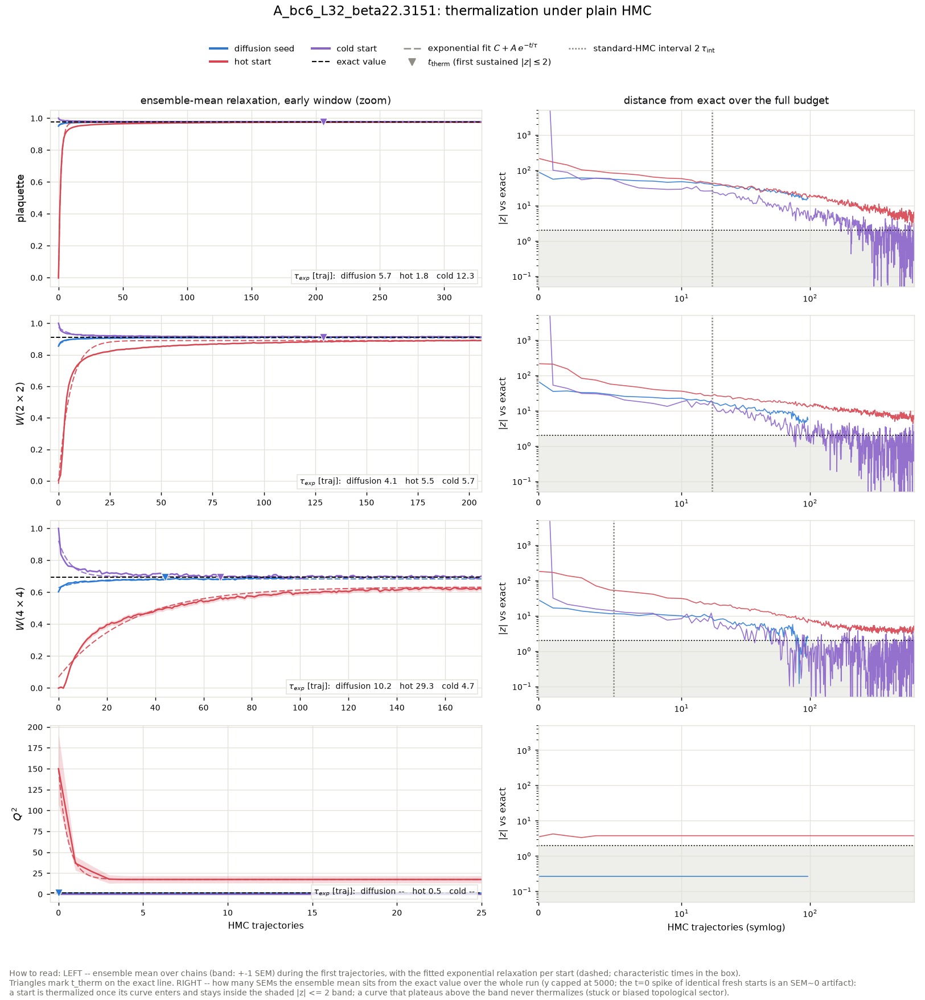

tau_int (hot-start chains, second half): plaquette = 8.60 +- 1.14, wilson_2x2 = 8.62 +- 1.38, wilson_4x4 = 2.62 +- 0.43, wilson_6x6 = 1.06 +- 0.09. Topology: hot-start HMC L=32 beta=22.3151 -> **frozen** (no tunneling).

Where 'never' stood at the end: the hot start ended the 640-trajectory budget still at plaquette at |z| ~ 5, wilson_2x2 at |z| ~ 6, wilson_4x4 at |z| ~ 4, wilson_6x6 at |z| ~ 5, Q^2 at |z| ~ 4; the cold start ended the 640-trajectory budget still at Q^2 at |z| ~ 1189769248768.

### Diagnostics: raw diffusion output (before any HMC)

| observable | value | error | exact | z_exact | reference | ref_error | z_ref | ks_p | chi2_p |
|---|---|---|---|---|---|---|---|---|---|
| plaquette | 0.9502 | 0.0002635 | 0.9773 | -103.2 | 0.9771 | 6.258e-05 | -99.66 | 0 |  |
| wilson_1x1 | 0.9502 | 0.0002635 | 0.9773 | -103.2 | 0.9771 | 6.258e-05 | -99.66 | 0 |  |
| wilson_1x2 | 0.9126 | 0.0004961 | 0.9552 | -85.8 | 0.955 | 0.0001446 | -82.09 | 0 |  |
| wilson_2x2 | 0.855 | 0.0008172 | 0.9124 | -70.2 | 0.9118 | 0.0003964 | -62.5 | 0 |  |
| wilson_2x3 | 0.8017 | 0.001313 | 0.8715 | -53.15 | 0.8705 | 0.0007065 | -46.14 | 0 |  |
| wilson_3x3 | 0.7301 | 0.002022 | 0.8135 | -41.27 | 0.8119 | 0.001118 | -35.39 | 0 |  |
| wilson_3x4 | 0.6713 | 0.002817 | 0.7594 | -31.29 | 0.7581 | 0.001735 | -26.22 | 0 |  |
| wilson_4x4 | 0.6023 | 0.003681 | 0.6929 | -24.61 | 0.691 | 0.002453 | -20.05 | 0 |  |
| wilson_4x5 | 0.5385 | 0.004273 | 0.6322 | -21.92 | 0.6302 | 0.003175 | -17.24 | 3.547e-38 |  |
| wilson_5x5 | 0.4658 | 0.005095 | 0.5637 | -19.22 | 0.5607 | 0.004057 | -14.57 | 3.831e-30 |  |
| wilson_5x6 | 0.4113 | 0.006366 | 0.5026 | -14.34 | 0.4994 | 0.004712 | -11.12 | 5.308e-24 |  |
| wilson_6x6 | 0.3558 | 0.007284 | 0.438 | -11.29 | 0.4331 | 0.005531 | -8.454 | 1.491e-15 |  |
| wilson_6x7 | 0.3031 | 0.007621 | 0.3817 | -10.32 | 0.3769 | 0.006189 | -7.516 | 1.16e-11 |  |
| wilson_7x7 | 0.2522 | 0.008224 | 0.3251 | -8.87 | 0.3188 | 0.006756 | -6.26 | 1.211e-08 |  |
| wilson_7x8 | 0.2172 | 0.008532 | 0.2769 | -6.996 | 0.2688 | 0.007177 | -4.625 | 2.484e-06 |  |
| wilson_8x8 | 0.1815 | 0.008709 | 0.2305 | -5.622 | 0.2208 | 0.007311 | -3.453 | 0.002655 |  |
| wilson_8x10 | 0.1256 | 0.008195 | 0.1597 | -4.161 | 0.1482 | 0.007828 | -1.994 | 0.04354 |  |
| wilson_10x10 | 0.08554 | 0.007326 | 0.101 | -2.104 | 0.09444 | 0.007242 | -0.8632 | 0.4898 |  |
| wilson_10x12 | 0.05982 | 0.005481 | 0.06382 | -0.7307 | 0.05584 | 0.006246 | 0.4791 | 0.4898 |  |
| wilson_12x12 | 0.03458 | 0.005373 | 0.03681 | -0.4144 | 0.03103 | 0.005564 | 0.4601 | 0.389 |  |
| creutz_2 | 0.0249 | 0.0005498 | 0.02293 | 3.585 |  |  |  |  |  |
| creutz_3 | 0.02917 | 0.001113 | 0.02293 | 5.606 |  |  |  |  |  |
| creutz_4 | 0.02451 | 0.001908 | 0.02293 | 0.8305 |  |  |  |  |  |
| creutz_5 | 0.03307 | 0.002685 | 0.02293 | 3.777 |  |  |  |  |  |
| creutz_6 | 0.02065 | 0.004144 | 0.02293 | -0.5511 |  |  |  |  |  |
| creutz_7 | 0.02353 | 0.006401 | 0.02293 | 0.09297 |  |  |  |  |  |
| creutz_8 | 0.03021 | 0.01003 | 0.02293 | 0.7259 |  |  |  |  |  |
| Q | -0.03906 | 0.08641 | 0 | -0.4521 | -0.03125 | 0.0707 | -0.06998 | 1 |  |
| Q^2 | 1.227 | 0.1851 | 1.19 | 0.1988 | 1.406 | 0.09558 | -0.8627 | 0.9126 |  |
| chi_top ((<Q^2>-<Q>^2)/V) | 0.001196 | 0.0001833 | 0.001162 | 0.1879 | 0.001372 | 9.313e-05 | -0.856 | 4.282e-07 |  |
| Q histogram vs exact P(Q) | 3.75 | nan | 4 | nan |  |  |  |  | 0.4409 |

### Diagnostics: the same configs after 96 HMC trajectories

| observable | value | error | exact | z_exact | reference | ref_error | z_ref | ks_p | chi2_p |
|---|---|---|---|---|---|---|---|---|---|
| plaquette | 0.9758 | 8.207e-05 | 0.9773 | -18.67 | 0.9771 | 6.258e-05 | -12.99 | 9.573e-18 |  |
| wilson_1x1 | 0.9758 | 8.207e-05 | 0.9773 | -18.67 | 0.9771 | 6.258e-05 | -12.99 | 9.573e-18 |  |
| wilson_1x2 | 0.9526 | 0.0001615 | 0.9552 | -15.68 | 0.955 | 0.0001446 | -10.99 | 4.101e-12 |  |
| wilson_2x2 | 0.9097 | 0.0004188 | 0.9124 | -6.31 | 0.9118 | 0.0003964 | -3.541 | 0.0007783 |  |
| wilson_2x3 | 0.8672 | 0.0006915 | 0.8715 | -6.149 | 0.8705 | 0.0007065 | -3.303 | 0.008145 |  |
| wilson_3x3 | 0.8063 | 0.001357 | 0.8135 | -5.344 | 0.8119 | 0.001118 | -3.172 | 0.008145 |  |
| wilson_3x4 | 0.752 | 0.002098 | 0.7594 | -3.527 | 0.7581 | 0.001735 | -2.207 | 0.02947 |  |
| wilson_4x4 | 0.6863 | 0.003178 | 0.6929 | -2.073 | 0.691 | 0.002453 | -1.167 | 0.08971 |  |
| wilson_4x5 | 0.6264 | 0.004004 | 0.6322 | -1.434 | 0.6302 | 0.003175 | -0.7486 | 0.3294 |  |
| wilson_5x5 | 0.5568 | 0.005018 | 0.5637 | -1.377 | 0.5607 | 0.004057 | -0.6016 | 0.6011 |  |
| wilson_5x6 | 0.495 | 0.0058 | 0.5026 | -1.316 | 0.4994 | 0.004712 | -0.5839 | 0.4548 |  |
| wilson_6x6 | 0.4288 | 0.006675 | 0.438 | -1.376 | 0.4331 | 0.005531 | -0.4954 | 0.5259 |  |
| wilson_6x7 | 0.375 | 0.007175 | 0.3817 | -0.9302 | 0.3769 | 0.006189 | -0.193 | 0.7163 |  |
| wilson_7x7 | 0.3216 | 0.007727 | 0.3251 | -0.4565 | 0.3188 | 0.006756 | 0.2719 | 0.7901 |  |
| wilson_7x8 | 0.274 | 0.008335 | 0.2769 | -0.3475 | 0.2688 | 0.007177 | 0.4759 | 0.8246 |  |
| wilson_8x8 | 0.229 | 0.008547 | 0.2305 | -0.1747 | 0.2208 | 0.007311 | 0.7299 | 0.5631 |  |
| wilson_8x10 | 0.1622 | 0.008681 | 0.1597 | 0.2892 | 0.1482 | 0.007828 | 1.199 | 0.4898 |  |
| wilson_10x10 | 0.1033 | 0.007455 | 0.101 | 0.3132 | 0.09444 | 0.007242 | 0.8523 | 0.389 |  |
| wilson_10x12 | 0.06452 | 0.007439 | 0.06382 | 0.09425 | 0.05584 | 0.006246 | 0.8944 | 0.2087 |  |
| wilson_12x12 | 0.03428 | 0.006366 | 0.03681 | -0.3972 | 0.03103 | 0.005564 | 0.3852 | 0.8569 |  |
| creutz_2 | 0.02209 | 0.0003479 | 0.02293 | -2.416 |  |  |  |  |  |
| creutz_3 | 0.02501 | 0.0007543 | 0.02293 | 2.751 |  |  |  |  |  |
| creutz_4 | 0.02186 | 0.001225 | 0.02293 | -0.8747 |  |  |  |  |  |
| creutz_5 | 0.02657 | 0.002076 | 0.02293 | 1.753 |  |  |  |  |  |
| creutz_6 | 0.02585 | 0.003049 | 0.02293 | 0.9585 |  |  |  |  |  |
| creutz_7 | 0.01976 | 0.00529 | 0.02293 | -0.6 |  |  |  |  |  |
| creutz_8 | 0.01931 | 0.006632 | 0.02293 | -0.546 |  |  |  |  |  |
| Q | -0.03906 | 0.08641 | 0 | -0.4521 | -0.03125 | 0.0707 | -0.06998 | 1 |  |
| Q^2 | 1.227 | 0.1851 | 1.19 | 0.1988 | 1.406 | 0.09558 | -0.8627 | 0.9126 |  |
| chi_top ((<Q^2>-<Q>^2)/V) | 0.001196 | 0.0001833 | 0.001162 | 0.1879 | 0.001372 | 9.313e-05 | -0.856 | 4.282e-07 |  |
| Q histogram vs exact P(Q) | 3.75 | nan | 4 | nan |  |  |  |  | 0.4409 |

## A_bc8_L32_beta30.3772

HMC: step size 0.0726, 14 leapfrog steps, acceptance seed/hot/cold = 0.976/0.981/0.983. Diffusion-seed batch: 128 chains x 96 trajectories (0.13 s/traj for the whole batch); baselines: 32 chains x 640 trajectories.

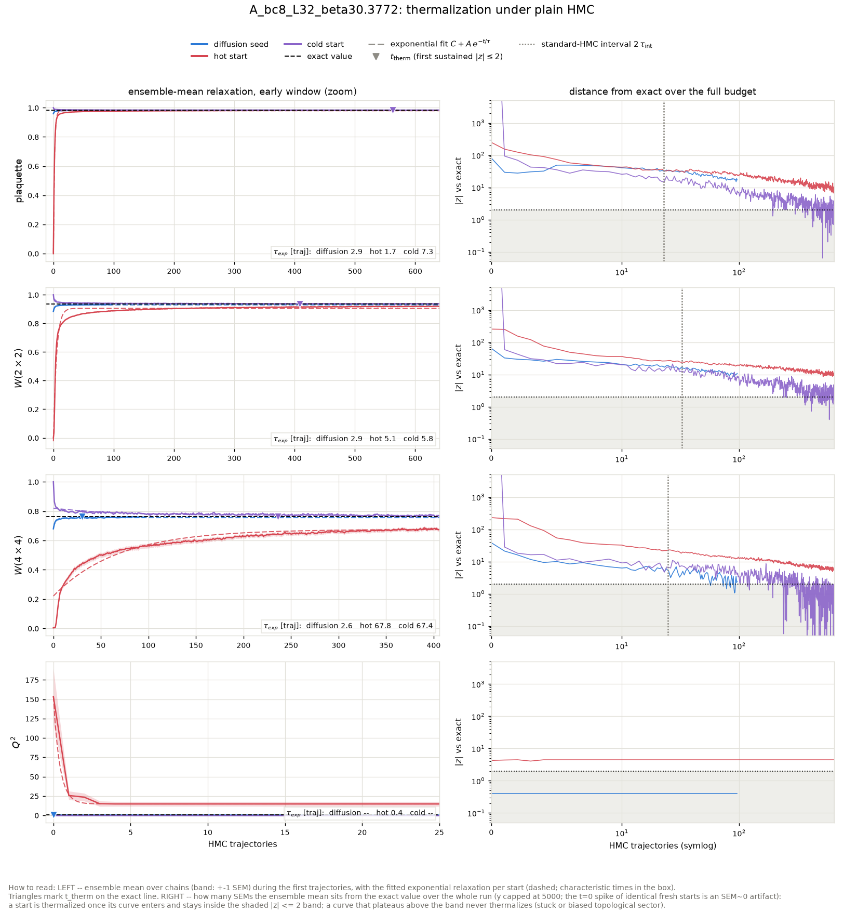

tau_int (hot-start chains, second half): plaquette = 11.32 +- 1.54, wilson_2x2 = 16.25 +- 1.82, wilson_4x4 = 12.38 +- 1.90, wilson_6x6 = 6.20 +- 1.48. Topology: hot-start HMC L=32 beta=30.3772 -> **frozen** (no tunneling).

Where 'never' stood at the end: the hot start ended the 640-trajectory budget still at plaquette at |z| ~ 9, wilson_2x2 at |z| ~ 10, wilson_4x4 at |z| ~ 6, wilson_6x6 at |z| ~ 5, Q^2 at |z| ~ 4; the cold start ended the 640-trajectory budget still at Q^2 at |z| ~ 868455153664.

### Diagnostics: raw diffusion output (before any HMC)

| observable | value | error | exact | z_exact | reference | ref_error | z_ref | ks_p | chi2_p |
|---|---|---|---|---|---|---|---|---|---|
| plaquette | 0.9594 | 0.0002938 | 0.9834 | -81.55 | 0.9835 | 3.853e-05 | -81.15 | 0 |  |
| wilson_1x1 | 0.9594 | 0.0002938 | 0.9834 | -81.55 | 0.9835 | 3.853e-05 | -81.15 | 0 |  |
| wilson_1x2 | 0.9289 | 0.0005005 | 0.9671 | -76.24 | 0.9671 | 8.105e-05 | -75.4 | 0 |  |
| wilson_2x2 | 0.8838 | 0.0007394 | 0.9352 | -69.59 | 0.9353 | 0.0002202 | -66.79 | 0 |  |
| wilson_2x3 | 0.8424 | 0.001126 | 0.9044 | -55.09 | 0.9048 | 0.0004599 | -51.29 | 0 |  |
| wilson_3x3 | 0.7846 | 0.001443 | 0.8601 | -52.38 | 0.8605 | 0.0008424 | -45.44 | 0 |  |
| wilson_3x4 | 0.735 | 0.001939 | 0.818 | -42.8 | 0.8186 | 0.001269 | -36.06 | 0 |  |
| wilson_4x4 | 0.6796 | 0.002402 | 0.765 | -35.59 | 0.7641 | 0.001745 | -28.48 | 0 |  |
| wilson_4x5 | 0.6246 | 0.002985 | 0.7155 | -30.44 | 0.7147 | 0.002358 | -23.68 | 0 |  |
| wilson_5x5 | 0.5607 | 0.003306 | 0.658 | -29.45 | 0.6563 | 0.003075 | -21.18 | 0 |  |
| wilson_5x6 | 0.5075 | 0.004213 | 0.6052 | -23.19 | 0.6044 | 0.00378 | -17.13 | 2.102e-43 |  |
| wilson_6x6 | 0.4559 | 0.004852 | 0.5474 | -18.84 | 0.5473 | 0.004598 | -13.67 | 2.779e-34 |  |
| wilson_6x7 | 0.4024 | 0.00569 | 0.4951 | -16.29 | 0.4965 | 0.00528 | -12.13 | 1.359e-26 |  |
| wilson_7x7 | 0.3497 | 0.006038 | 0.4403 | -15.01 | 0.4426 | 0.005861 | -11.03 | 2.529e-23 |  |
| wilson_7x8 | 0.3083 | 0.006496 | 0.3916 | -12.84 | 0.3943 | 0.006478 | -9.384 | 2.282e-17 |  |
| wilson_8x8 | 0.2695 | 0.006906 | 0.3426 | -10.58 | 0.3462 | 0.0068 | -7.916 | 9.899e-13 |  |
| wilson_8x10 | 0.1981 | 0.00679 | 0.2621 | -9.421 | 0.2663 | 0.007529 | -6.724 | 2.764e-09 |  |
| wilson_10x10 | 0.1351 | 0.007559 | 0.1875 | -6.937 | 0.1914 | 0.008157 | -5.065 | 2.524e-05 |  |
| wilson_10x12 | 0.09064 | 0.006891 | 0.1342 | -6.317 | 0.1381 | 0.008185 | -4.437 | 0.0003034 |  |
| wilson_12x12 | 0.05845 | 0.007011 | 0.08978 | -4.469 | 0.09448 | 0.009064 | -3.145 | 0.001334 |  |
| creutz_2 | 0.01748 | 0.0005293 | 0.01674 | 1.398 |  |  |  |  |  |
| creutz_3 | 0.02316 | 0.0008327 | 0.01674 | 7.711 |  |  |  |  |  |
| creutz_4 | 0.01315 | 0.001366 | 0.01674 | -2.627 |  |  |  |  |  |
| creutz_5 | 0.02376 | 0.002207 | 0.01674 | 3.183 |  |  |  |  |  |
| creutz_6 | 0.007549 | 0.003137 | 0.01674 | -2.93 |  |  |  |  |  |
| creutz_7 | 0.01529 | 0.004 | 0.01674 | -0.3621 |  |  |  |  |  |
| creutz_8 | 0.008111 | 0.006607 | 0.01674 | -1.306 |  |  |  |  |  |
| Q | 0.1797 | 0.07053 | 0 | 2.548 | 0.09375 | 0.05933 | 0.9324 | 0.9999 |  |
| Q^2 | 0.9141 | 0.1354 | 0.8685 | 0.3369 | 0.8333 | 0.08983 | 0.4969 | 0.9999 |  |
| chi_top ((<Q^2>-<Q>^2)/V) | 0.0008611 | 0.000129 | 0.0008481 | 0.1009 | 0.0008052 | 8.936e-05 | 0.3562 | 5.105e-14 |  |
| Q histogram vs exact P(Q) | 5.306 | nan | 4 | nan |  |  |  |  | 0.2573 |

### Diagnostics: the same configs after 96 HMC trajectories

| observable | value | error | exact | z_exact | reference | ref_error | z_ref | ks_p | chi2_p |
|---|---|---|---|---|---|---|---|---|---|
| plaquette | 0.9822 | 6.546e-05 | 0.9834 | -18.67 | 0.9835 | 3.853e-05 | -17.23 | 2.337e-29 |  |
| wilson_1x1 | 0.9822 | 6.546e-05 | 0.9834 | -18.67 | 0.9835 | 3.853e-05 | -17.23 | 2.337e-29 |  |
| wilson_1x2 | 0.9651 | 0.0001435 | 0.9671 | -13.96 | 0.9671 | 8.105e-05 | -12.6 | 2.282e-17 |  |
| wilson_2x2 | 0.931 | 0.0003028 | 0.9352 | -13.87 | 0.9353 | 0.0002202 | -11.41 | 7.36e-15 |  |
| wilson_2x3 | 0.8994 | 0.0004723 | 0.9044 | -10.75 | 0.9048 | 0.0004599 | -8.238 | 2.296e-10 |  |
| wilson_3x3 | 0.8545 | 0.0007072 | 0.8601 | -7.966 | 0.8605 | 0.0008424 | -5.429 | 1.616e-05 |  |
| wilson_3x4 | 0.8121 | 0.001037 | 0.818 | -5.731 | 0.8186 | 0.001269 | -3.96 | 0.005977 |  |
| wilson_4x4 | 0.7594 | 0.001483 | 0.765 | -3.816 | 0.7641 | 0.001745 | -2.059 | 0.3021 |  |
| wilson_4x5 | 0.7087 | 0.002067 | 0.7155 | -3.295 | 0.7147 | 0.002358 | -1.919 | 0.1545 |  |
| wilson_5x5 | 0.6507 | 0.002784 | 0.658 | -2.64 | 0.6563 | 0.003075 | -1.347 | 0.3294 |  |
| wilson_5x6 | 0.5974 | 0.003914 | 0.6052 | -1.996 | 0.6044 | 0.00378 | -1.295 | 0.3294 |  |
| wilson_6x6 | 0.5397 | 0.005014 | 0.5474 | -1.529 | 0.5473 | 0.004598 | -1.123 | 0.4548 |  |
| wilson_6x7 | 0.4839 | 0.005882 | 0.4951 | -1.898 | 0.4965 | 0.00528 | -1.597 | 0.2087 |  |
| wilson_7x7 | 0.426 | 0.006964 | 0.4403 | -2.061 | 0.4426 | 0.005861 | -1.822 | 0.1392 |  |
| wilson_7x8 | 0.3742 | 0.007562 | 0.3916 | -2.303 | 0.3943 | 0.006478 | -2.021 | 0.1392 |  |
| wilson_8x8 | 0.322 | 0.008513 | 0.3426 | -2.416 | 0.3462 | 0.0068 | -2.226 | 0.1122 |  |
| wilson_8x10 | 0.2457 | 0.008503 | 0.2621 | -1.922 | 0.2663 | 0.007529 | -1.809 | 0.1251 |  |
| wilson_10x10 | 0.1706 | 0.009037 | 0.1875 | -1.876 | 0.1914 | 0.008157 | -1.712 | 0.07995 |  |
| wilson_10x12 | 0.116 | 0.008868 | 0.1342 | -2.047 | 0.1381 | 0.008185 | -1.832 | 0.0711 |  |
| wilson_12x12 | 0.07162 | 0.008154 | 0.08978 | -2.227 | 0.09448 | 0.009064 | -1.875 | 0.2763 |  |
| creutz_2 | 0.01834 | 0.0002601 | 0.01674 | 6.141 |  |  |  |  |  |
| creutz_3 | 0.01655 | 0.0005549 | 0.01674 | -0.344 |  |  |  |  |  |
| creutz_4 | 0.01615 | 0.0008835 | 0.01674 | -0.6674 |  |  |  |  |  |
| creutz_5 | 0.01626 | 0.001401 | 0.01674 | -0.3385 |  |  |  |  |  |
| creutz_6 | 0.01609 | 0.002099 | 0.01674 | -0.3101 |  |  |  |  |  |
| creutz_7 | 0.01836 | 0.00309 | 0.01674 | 0.5256 |  |  |  |  |  |
| creutz_8 | 0.02082 | 0.004533 | 0.01674 | 0.9008 |  |  |  |  |  |
| Q | 0.1797 | 0.07053 | 0 | 2.548 | 0.09375 | 0.05933 | 0.9324 | 0.9999 |  |
| Q^2 | 0.9141 | 0.1354 | 0.8685 | 0.3369 | 0.8333 | 0.08983 | 0.4969 | 0.9999 |  |
| chi_top ((<Q^2>-<Q>^2)/V) | 0.0008611 | 0.000129 | 0.0008481 | 0.1009 | 0.0008052 | 8.936e-05 | 0.3562 | 5.105e-14 |  |
| Q histogram vs exact P(Q) | 5.306 | nan | 4 | nan |  |  |  |  | 0.2573 |

## D_bc14.1464_L32_beta55.0237

HMC: step size 0.0539, 19 leapfrog steps, acceptance seed/hot/cold = 0.978/0.979/0.977. Diffusion-seed batch: 128 chains x 96 trajectories (0.27 s/traj for the whole batch); baselines: 32 chains x 640 trajectories.

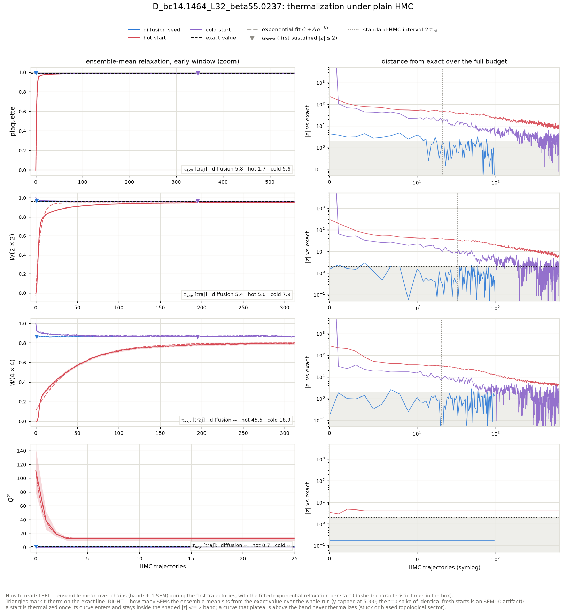

tau_int (hot-start chains, second half): plaquette = 10.62 +- 1.15, wilson_2x2 = 16.04 +- 1.72, wilson_4x4 = 10.11 +- 1.49, wilson_6x6 = 5.24 +- 0.73. Topology: hot-start HMC L=32 beta=55.0237 -> **frozen** (no tunneling).

Where 'never' stood at the end: the hot start ended the 640-trajectory budget still at plaquette at |z| ~ 8, wilson_2x2 at |z| ~ 6, wilson_4x4 at |z| ~ 4, wilson_6x6 at |z| ~ 5, Q^2 at |z| ~ 4; the cold start ended the 640-trajectory budget still at Q^2 at |z| ~ 474280296448.

### Diagnostics: raw diffusion output (before any HMC)

| observable | value | error | exact | z_exact | reference | ref_error | z_ref | ks_p | chi2_p |
|---|---|---|---|---|---|---|---|---|---|
| plaquette | 0.9913 | 0.0001095 | 0.9909 | 4.081 | 0.9909 | 2.703e-05 | 3.872 | 1.254e-16 |  |
| wilson_1x1 | 0.9913 | 0.0001095 | 0.9909 | 4.081 | 0.9909 | 2.703e-05 | 3.872 | 1.254e-16 |  |
| wilson_1x2 | 0.9823 | 0.0001795 | 0.9818 | 2.682 | 0.9818 | 5.904e-05 | 2.669 | 3.783e-08 |  |
| wilson_2x2 | 0.9645 | 0.0003592 | 0.964 | 1.391 | 0.9638 | 0.0001521 | 1.681 | 7.394e-05 |  |
| wilson_2x3 | 0.947 | 0.0005123 | 0.9465 | 1.099 | 0.9465 | 0.0002251 | 0.9282 | 0.05588 |  |
| wilson_3x3 | 0.9213 | 0.0008303 | 0.9208 | 0.6638 | 0.921 | 0.0004365 | 0.338 | 0.3021 |  |
| wilson_3x4 | 0.8958 | 0.001084 | 0.8958 | 0.02313 | 0.8964 | 0.0005764 | -0.4557 | 0.07995 |  |
| wilson_4x4 | 0.8638 | 0.00147 | 0.8635 | 0.1671 | 0.8644 | 0.0008388 | -0.362 | 0.678 |  |
| wilson_4x5 | 0.8323 | 0.001859 | 0.8324 | -0.04255 | 0.8338 | 0.001045 | -0.6796 | 0.4212 |  |
| wilson_5x5 | 0.7948 | 0.002394 | 0.7951 | -0.1493 | 0.7969 | 0.001523 | -0.7403 | 0.8246 |  |
| wilson_5x6 | 0.7584 | 0.002929 | 0.7595 | -0.3708 | 0.7623 | 0.001953 | -1.106 | 0.4548 |  |
| wilson_6x6 | 0.7178 | 0.003449 | 0.7188 | -0.2988 | 0.7209 | 0.002568 | -0.7076 | 0.6395 |  |
| wilson_6x7 | 0.6782 | 0.003957 | 0.6804 | -0.5412 | 0.6827 | 0.003195 | -0.8868 | 0.6011 |  |
| wilson_7x7 | 0.6346 | 0.004494 | 0.6381 | -0.7818 | 0.6399 | 0.003671 | -0.9275 | 0.7538 |  |
| wilson_7x8 | 0.5947 | 0.004987 | 0.5984 | -0.7393 | 0.6009 | 0.004341 | -0.9343 | 0.6395 |  |
| wilson_8x8 | 0.5515 | 0.005689 | 0.5561 | -0.8016 | 0.5584 | 0.004749 | -0.9208 | 0.678 |  |
| wilson_8x10 | 0.4749 | 0.00662 | 0.4802 | -0.8138 | 0.4848 | 0.005792 | -1.136 | 0.5259 |  |
| wilson_10x10 | 0.3924 | 0.007697 | 0.3998 | -0.9659 | 0.4033 | 0.006486 | -1.086 | 0.6395 |  |
| wilson_10x12 | 0.3228 | 0.008524 | 0.3329 | -1.186 | 0.3379 | 0.006761 | -1.388 | 0.7163 |  |
| wilson_12x12 | 0.2556 | 0.009238 | 0.2672 | -1.264 | 0.2703 | 0.006422 | -1.313 | 0.5631 |  |
| creutz_2 | 0.009182 | 0.0001485 | 0.009171 | 0.07815 |  |  |  |  |  |
| creutz_3 | 0.009244 | 0.0002731 | 0.00917 | 0.2683 |  |  |  |  |  |
| creutz_4 | 0.008343 | 0.0004216 | 0.00917 | -1.961 |  |  |  |  |  |
| creutz_5 | 0.009144 | 0.0006083 | 0.009169 | -0.04098 |  |  |  |  |  |
| creutz_6 | 0.00819 | 0.0008852 | 0.009167 | -1.104 |  |  |  |  |  |
| creutz_7 | 0.009816 | 0.001293 | 0.009165 | 0.5038 |  |  |  |  |  |
| creutz_8 | 0.01056 | 0.001604 | 0.009162 | 0.8707 |  |  |  |  |  |
| Q | 0 | 0.05689 | 0 | 0 | 0.06771 | 0.04615 | -0.9242 | 0.9999 |  |
| Q^2 | 0.4844 | 0.05614 | 0.4743 | 0.1798 | 0.526 | 0.04735 | -0.5673 | 1 |  |
| chi_top ((<Q^2>-<Q>^2)/V) | 0.000473 | 5.482e-05 | 0.0004632 | 0.1798 | 0.0005092 | 4.707e-05 | -0.5012 | 7.05e-23 |  |
| Q histogram vs exact P(Q) | 0.1517 | nan | 2 | nan |  |  |  |  | 0.927 |

### Diagnostics: the same configs after 96 HMC trajectories

| observable | value | error | exact | z_exact | reference | ref_error | z_ref | ks_p | chi2_p |
|---|---|---|---|---|---|---|---|---|---|
| plaquette | 0.9909 | 4.183e-05 | 0.9909 | -0.03282 | 0.9909 | 2.703e-05 | -0.2302 | 0.7163 |  |
| wilson_1x1 | 0.9909 | 4.183e-05 | 0.9909 | -0.03282 | 0.9909 | 2.703e-05 | -0.2302 | 0.7163 |  |
| wilson_1x2 | 0.9819 | 7.595e-05 | 0.9818 | 1.532 | 0.9818 | 5.904e-05 | 1.447 | 0.5259 |  |
| wilson_2x2 | 0.9641 | 0.0001866 | 0.964 | 0.4662 | 0.9638 | 0.0001521 | 1.01 | 0.1122 |  |
| wilson_2x3 | 0.9468 | 0.0003023 | 0.9465 | 1.053 | 0.9465 | 0.0002251 | 0.7281 | 0.3021 |  |
| wilson_3x3 | 0.9213 | 0.000488 | 0.9208 | 1.018 | 0.921 | 0.0004365 | 0.4014 | 0.9807 |  |
| wilson_3x4 | 0.8968 | 0.0007894 | 0.8958 | 1.274 | 0.8964 | 0.0005764 | 0.4307 | 0.9542 |  |
| wilson_4x4 | 0.8652 | 0.001212 | 0.8635 | 1.405 | 0.8644 | 0.0008388 | 0.5726 | 0.9888 |  |
| wilson_4x5 | 0.8342 | 0.001749 | 0.8324 | 1.029 | 0.8338 | 0.001045 | 0.2112 | 0.9126 |  |
| wilson_5x5 | 0.798 | 0.002381 | 0.7951 | 1.195 | 0.7969 | 0.001523 | 0.3901 | 0.9542 |  |
| wilson_5x6 | 0.7624 | 0.003127 | 0.7595 | 0.9203 | 0.7623 | 0.001953 | 0.01862 | 0.9693 |  |
| wilson_6x6 | 0.7231 | 0.00388 | 0.7188 | 1.106 | 0.7209 | 0.002568 | 0.4896 | 0.9542 |  |
| wilson_6x7 | 0.6847 | 0.004815 | 0.6804 | 0.8979 | 0.6827 | 0.003195 | 0.3384 | 0.8864 |  |
| wilson_7x7 | 0.6433 | 0.005643 | 0.6381 | 0.9188 | 0.6399 | 0.003671 | 0.4926 | 0.8246 |  |
| wilson_7x8 | 0.6038 | 0.006444 | 0.5984 | 0.841 | 0.6009 | 0.004341 | 0.3769 | 0.8246 |  |
| wilson_8x8 | 0.5621 | 0.007461 | 0.5561 | 0.802 | 0.5584 | 0.004749 | 0.4207 | 0.8569 |  |
| wilson_8x10 | 0.4863 | 0.008857 | 0.4802 | 0.6816 | 0.4848 | 0.005792 | 0.1355 | 0.9807 |  |
| wilson_10x10 | 0.4059 | 0.0108 | 0.3998 | 0.5628 | 0.4033 | 0.006486 | 0.2052 | 0.9353 |  |
| wilson_10x12 | 0.3367 | 0.01298 | 0.3329 | 0.2959 | 0.3379 | 0.006761 | -0.07843 | 0.9693 |  |
| wilson_12x12 | 0.2727 | 0.0145 | 0.2672 | 0.3736 | 0.2703 | 0.006422 | 0.146 | 0.9126 |  |
| creutz_2 | 0.009319 | 0.0001274 | 0.009171 | 1.162 |  |  |  |  |  |
| creutz_3 | 0.009213 | 0.0002423 | 0.00917 | 0.1752 |  |  |  |  |  |
| creutz_4 | 0.008905 | 0.0004003 | 0.00917 | -0.6606 |  |  |  |  |  |
| creutz_5 | 0.007948 | 0.0006597 | 0.009169 | -1.85 |  |  |  |  |  |
| creutz_6 | 0.007208 | 0.0009776 | 0.009167 | -2.004 |  |  |  |  |  |
| creutz_7 | 0.007791 | 0.001332 | 0.009165 | -1.031 |  |  |  |  |  |
| creutz_8 | 0.008396 | 0.001932 | 0.009162 | -0.3968 |  |  |  |  |  |
| Q | 0 | 0.05689 | 0 | 0 | 0.06771 | 0.04615 | -0.9242 | 0.9999 |  |
| Q^2 | 0.4844 | 0.05614 | 0.4743 | 0.1798 | 0.526 | 0.04735 | -0.5673 | 1 |  |
| chi_top ((<Q^2>-<Q>^2)/V) | 0.000473 | 5.482e-05 | 0.0004632 | 0.1798 | 0.0005092 | 4.707e-05 | -0.5012 | 7.05e-23 |  |
| Q histogram vs exact P(Q) | 0.1517 | nan | 2 | nan |  |  |  |  | 0.927 |

## D_bc55.0237_L32_beta218.58

HMC: step size 0.0271, 37 leapfrog steps, acceptance seed/hot/cold = 0.882/0.965/0.975. Diffusion-seed batch: 128 chains x 96 trajectories (0.33 s/traj for the whole batch); baselines: 32 chains x 640 trajectories.

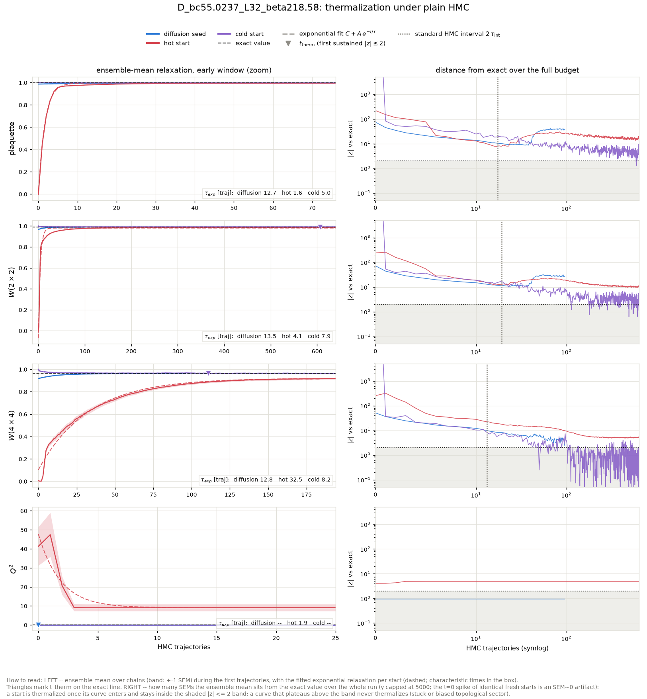

tau_int (hot-start chains, second half): plaquette = 8.72 +- 1.11, wilson_2x2 = 9.59 +- 1.20, wilson_4x4 = 6.63 +- 0.69, wilson_6x6 = 8.07 +- 0.87. Topology: hot-start HMC L=32 beta=218.58 -> **frozen** (no tunneling).

Where 'never' stood at the end: the hot start ended the 640-trajectory budget still at plaquette at |z| ~ 15, wilson_2x2 at |z| ~ 10, wilson_4x4 at |z| ~ 5, wilson_6x6 at |z| ~ 5, Q^2 at |z| ~ 5; the cold start ended the 640-trajectory budget still at plaquette at |z| ~ 4, Q^2 at |z| ~ 29010771968.

### Diagnostics: raw diffusion output (before any HMC)

| observable | value | error | exact | z_exact | reference | ref_error | z_ref | ks_p |
|---|---|---|---|---|---|---|---|---|
| plaquette | 0.9867 | 0.0001576 | 0.9977 | -69.86 | 0.9977 | 7.705e-06 | -69.87 | 0 |
| wilson_1x1 | 0.9867 | 0.0001576 | 0.9977 | -69.86 | 0.9977 | 7.705e-06 | -69.87 | 0 |
| wilson_1x2 | 0.9774 | 0.0002586 | 0.9954 | -69.78 | 0.9955 | 1.563e-05 | -69.83 | 0 |
| wilson_2x2 | 0.9662 | 0.0004098 | 0.9909 | -60.36 | 0.991 | 3.765e-05 | -60.33 | 0 |
| wilson_2x3 | 0.9554 | 0.000567 | 0.9864 | -54.69 | 0.9865 | 6.139e-05 | -54.53 | 0 |
| wilson_3x3 | 0.9429 | 0.0007096 | 0.9797 | -51.92 | 0.9799 | 8.848e-05 | -51.74 | 0 |
| wilson_3x4 | 0.931 | 0.0008852 | 0.9731 | -47.51 | 0.9732 | 0.0001162 | -47.24 | 0 |
| wilson_4x4 | 0.9177 | 0.001062 | 0.9644 | -43.95 | 0.9646 | 0.0001617 | -43.6 | 0 |
| wilson_4x5 | 0.9023 | 0.001212 | 0.9558 | -44.13 | 0.9559 | 0.0002461 | -43.33 | 0 |
| wilson_5x5 | 0.8862 | 0.001466 | 0.9453 | -40.3 | 0.9453 | 0.000377 | -39.02 | 0 |
| wilson_5x6 | 0.8733 | 0.001539 | 0.935 | -40.08 | 0.935 | 0.0005198 | -37.99 | 0 |
| wilson_6x6 | 0.8586 | 0.001839 | 0.9228 | -34.92 | 0.9231 | 0.0007562 | -32.43 | 0 |
| wilson_6x7 | 0.8391 | 0.002267 | 0.9109 | -31.67 | 0.9115 | 0.001025 | -29.07 | 0 |
| wilson_7x7 | 0.82 | 0.00254 | 0.8974 | -30.47 | 0.8985 | 0.001333 | -27.39 | 0 |
| wilson_7x8 | 0.8046 | 0.002961 | 0.8842 | -26.9 | 0.8856 | 0.0017 | -23.74 | 0 |
| wilson_8x8 | 0.7876 | 0.003449 | 0.8696 | -23.76 | 0.872 | 0.002125 | -20.84 | 0 |
| wilson_8x10 | 0.7495 | 0.004209 | 0.8415 | -21.87 | 0.8457 | 0.002874 | -18.88 | 0 |
| wilson_10x10 | 0.7092 | 0.005378 | 0.8088 | -18.53 | 0.8165 | 0.004096 | -15.89 | 2.201e-41 |
| wilson_10x12 | 0.6709 | 0.00675 | 0.7785 | -15.93 | 0.7889 | 0.0051 | -13.95 | 3.832e-33 |
| wilson_12x12 | 0.6293 | 0.007964 | 0.745 | -14.52 | 0.7606 | 0.006549 | -12.73 | 7.666e-29 |
| creutz_2 | 0.002063 | 0.0001664 | 0.002278 | -1.289 |  |  |  |  |
| creutz_3 | 0.001975 | 0.0002719 | 0.00225 | -1.014 |  |  |  |  |
| creutz_4 | 0.001776 | 0.0003489 | 0.00221 | -1.244 |  |  |  |  |
| creutz_5 | 0.001095 | 0.0005319 | 0.002155 | -1.993 |  |  |  |  |
| creutz_6 | 0.002207 | 0.0007225 | 0.002087 | 0.1663 |  |  |  |  |
| creutz_7 | 0.0001453 | 0.0008331 | 0.002005 | -2.232 |  |  |  |  |
| creutz_8 | 0.002308 | 0.00092 | 0.001907 | 0.4358 |  |  |  |  |
| Q | -0.01562 | 0.01614 | 0 | -0.9683 | 0 | 0.007255 | -0.8831 | 1 |
| Q^2 | 0.04688 | 0.02098 | 0.02901 | 0.8516 | 0.01042 | 0.006882 | 1.651 | 0.9999 |
| chi_top ((<Q^2>-<Q>^2)/V) | 4.554e-05 | 2.036e-05 | 2.833e-05 | 0.845 | 1.017e-05 | 6.721e-06 | 1.649 | 0 |

### Diagnostics: the same configs after 96 HMC trajectories

| observable | value | error | exact | z_exact | reference | ref_error | z_ref | ks_p |
|---|---|---|---|---|---|---|---|---|
| plaquette | 0.9971 | 1.923e-05 | 0.9977 | -33.8 | 0.9977 | 7.705e-06 | -32.13 | 0 |
| wilson_1x1 | 0.9971 | 1.923e-05 | 0.9977 | -33.8 | 0.9977 | 7.705e-06 | -32.13 | 0 |
| wilson_1x2 | 0.9943 | 4.43e-05 | 0.9954 | -25.17 | 0.9955 | 1.563e-05 | -24.72 | 0 |
| wilson_2x2 | 0.989 | 9.621e-05 | 0.9909 | -20.15 | 0.991 | 3.765e-05 | -19.64 | 0 |
| wilson_2x3 | 0.9842 | 0.0001267 | 0.9864 | -16.99 | 0.9865 | 6.139e-05 | -15.93 | 2e-33 |
| wilson_3x3 | 0.9776 | 0.0002022 | 0.9797 | -10.48 | 0.9799 | 8.848e-05 | -10.32 | 3.33e-15 |
| wilson_3x4 | 0.9716 | 0.00028 | 0.9731 | -5.521 | 0.9732 | 0.0001162 | -5.504 | 6.452e-06 |
| wilson_4x4 | 0.9635 | 0.0004053 | 0.9644 | -2.223 | 0.9646 | 0.0001617 | -2.453 | 0.002655 |
| wilson_4x5 | 0.955 | 0.000554 | 0.9558 | -1.453 | 0.9559 | 0.0002461 | -1.506 | 0.02577 |
| wilson_5x5 | 0.9447 | 0.0007587 | 0.9453 | -0.8234 | 0.9453 | 0.000377 | -0.7234 | 0.0631 |
| wilson_5x6 | 0.9338 | 0.000942 | 0.935 | -1.183 | 0.935 | 0.0005198 | -1.056 | 0.04354 |
| wilson_6x6 | 0.9209 | 0.001249 | 0.9228 | -1.543 | 0.9231 | 0.0007562 | -1.502 | 0.017 |
| wilson_6x7 | 0.9093 | 0.001504 | 0.9109 | -1.105 | 0.9115 | 0.001025 | -1.211 | 0.08971 |
| wilson_7x7 | 0.8959 | 0.001797 | 0.8974 | -0.8503 | 0.8985 | 0.001333 | -1.197 | 0.1122 |
| wilson_7x8 | 0.8841 | 0.002144 | 0.8842 | -0.0458 | 0.8856 | 0.0017 | -0.5476 | 0.3294 |
| wilson_8x8 | 0.8707 | 0.002462 | 0.8696 | 0.4825 | 0.872 | 0.002125 | -0.398 | 0.4548 |
| wilson_8x10 | 0.8437 | 0.003277 | 0.8415 | 0.6571 | 0.8457 | 0.002874 | -0.4591 | 0.8246 |
| wilson_10x10 | 0.8125 | 0.004252 | 0.8088 | 0.8762 | 0.8165 | 0.004096 | -0.6785 | 0.4548 |
| wilson_10x12 | 0.7806 | 0.005624 | 0.7785 | 0.3738 | 0.7889 | 0.0051 | -1.101 | 0.5259 |
| wilson_12x12 | 0.7444 | 0.006987 | 0.745 | -0.08294 | 0.7606 | 0.006549 | -1.689 | 0.3294 |
| creutz_2 | 0.002646 | 4.138e-05 | 0.002278 | 8.915 |  |  |  |  |
| creutz_3 | 0.002006 | 7.953e-05 | 0.00225 | -3.071 |  |  |  |  |
| creutz_4 | 0.002132 | 0.0001279 | 0.00221 | -0.6116 |  |  |  |  |
| creutz_5 | 0.002066 | 0.0001613 | 0.002155 | -0.5512 |  |  |  |  |
| creutz_6 | 0.002452 | 0.0002521 | 0.002087 | 1.448 |  |  |  |  |
| creutz_7 | 0.002146 | 0.0003216 | 0.002005 | 0.4394 |  |  |  |  |
| creutz_8 | 0.002024 | 0.0004823 | 0.001907 | 0.242 |  |  |  |  |
| Q | -0.01562 | 0.01614 | 0 | -0.9683 | 0 | 0.007255 | -0.8831 | 1 |
| Q^2 | 0.04688 | 0.02098 | 0.02901 | 0.8516 | 0.01042 | 0.006882 | 1.651 | 0.9999 |
| chi_top ((<Q^2>-<Q>^2)/V) | 4.554e-05 | 2.036e-05 | 2.833e-05 | 0.845 | 1.017e-05 | 6.721e-06 | 1.649 | 0 |
