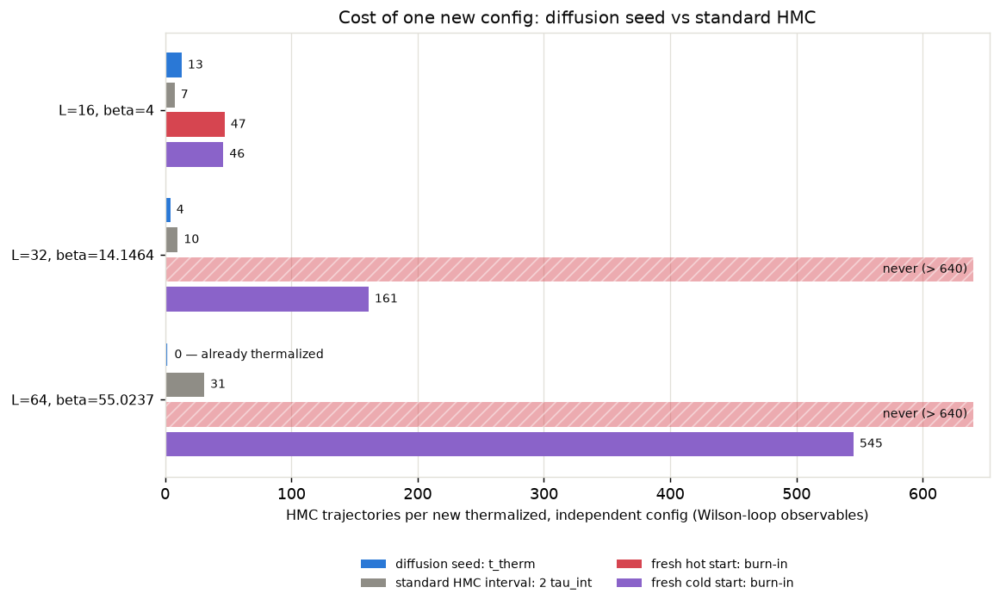
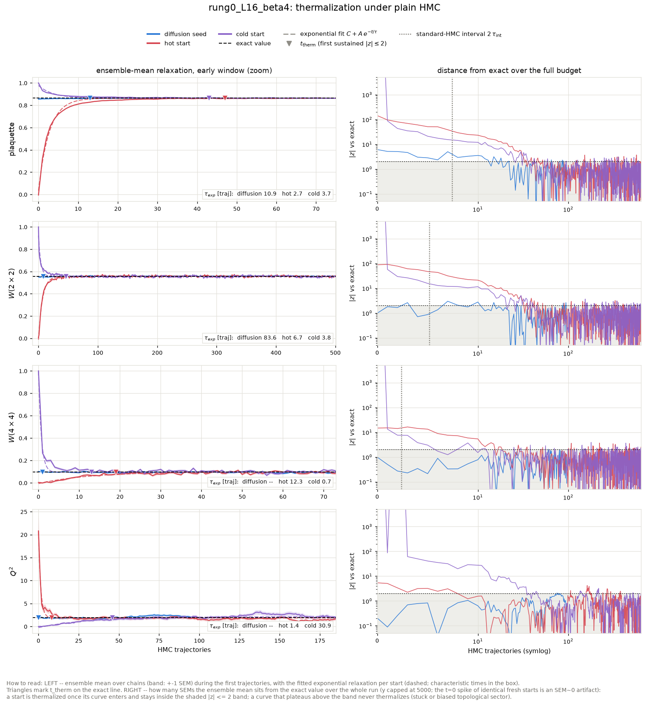
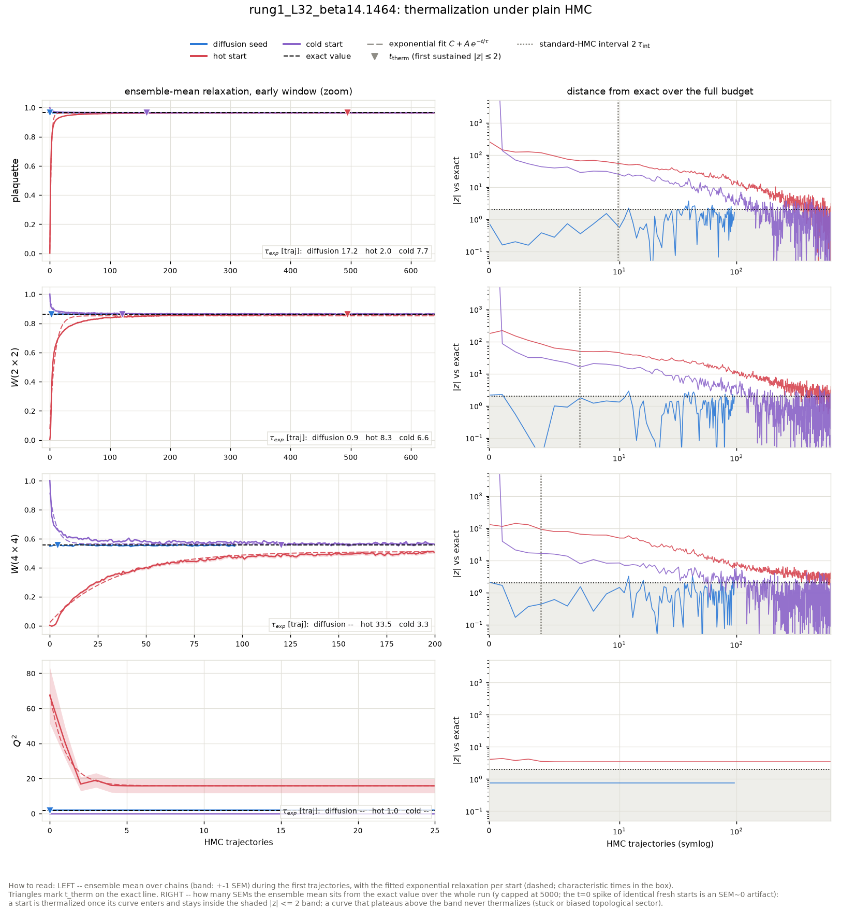
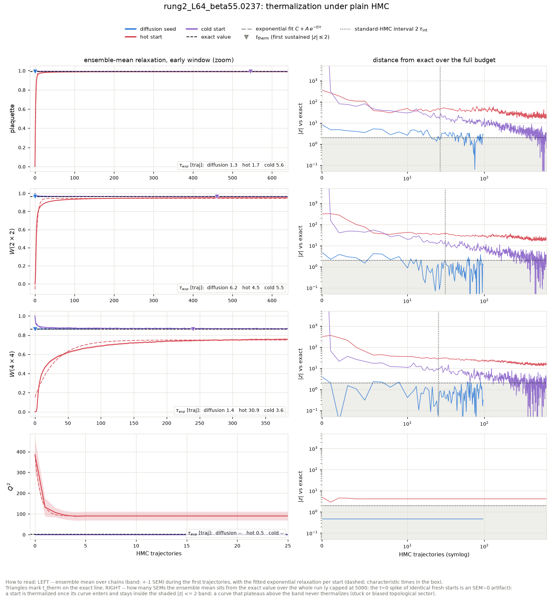

# Diffusion-seeded HMC: thermalization time vs the standard-HMC sampling interval

Action: wilson. All HMC in this report is plain HMC (Omelyan, adapted step size, **no** topological updates).

**Claim.** A raw sample from the conditional-diffusion ladder, used as the starting configuration of an HMC chain, thermalizes within a few tens of trajectories at every coupling. The yardstick is the sampling interval `2 tau_int` -- the trajectories a standard HMC chain needs between two of its own independent configs, i.e. its *marginal* cost per config, charged forever. At the fine rungs the ladder is built for, the ordering is

> t_therm(diffusion seed)  <  2 tau_int(standard HMC)  <  burn-in(fresh chain)

with a margin that grows with beta as standard HMC slides into critical slowing down and topological freezing. At the cheapest rung the seed and the interval are comparable -- where standard HMC is still efficient there is nothing to win on Wilson-loop observables -- but even there the seed starts in the correct topological sector at t = 0, while the chain's topological interval `2 tau_int(Q)` is several times longer than its Wilson-loop one. The fresh-chain burn-in is standard HMC's one-time entry cost and exceeds the interval everywhere.

## The three starting points

- **Diffusion seed** -- the raw output of the conditional-diffusion ladder at this rung (ancestral sampling + the deterministic coarse-charge transport), with **no** rethermalization sweeps applied: every bit of equilibration the seed needs is measured here, in HMC trajectories.
- **Hot start** -- every link angle drawn uniformly from (-pi, pi]: a completely disordered (infinite-temperature) configuration. The standard way to initialize a fresh HMC chain without prior information.
- **Cold start** -- every link angle set to zero: the perfectly ordered (beta -> infinity) configuration, the other standard initialization.

## Summary

| rung | L | beta | t_therm diffusion seed | standard-HMC interval 2 tau_int | margin (interval - t_therm) | burn-in hot / cold | tau_int(Q) |
|---|---|---|---|---|---|---|---|
| rung0_L16_beta4 | 16 | 4 | 13 | 7.4 | -5.6 traj | 47 / 46 | 20.8 |
| rung1_L32_beta14.1464 | 32 | 14.1464 | 4 | 9.9 | 5.9 traj | never / 161 | frozen (0 tunnelings in 321 x 32 traj) |
| rung2_L64_beta55.0237 | 64 | 55.0237 | 0 | 30.8 | 30.8 traj | never / 545 | frozen (0 tunnelings in 321 x 16 traj) |

t_therm and burn-in are the slowest Wilson-loop observable (plaquette, W(2x2), W(4x4)); topology is stricter still for the fresh chains: their Q^2 **never** reaches the exact value at the frozen rungs, while the diffusion seed inherits the correct topological sector from the coarse ensemble it was generated from (see the Q^2 panels and per-rung tables below).

Thermalization time `t_therm` = first trajectory at which the ensemble-mean z-score vs the exact value satisfies |z| <= 2 and stays there for 5 consecutive trajectories (t = 0: already thermalized before any HMC). For the diffusion seed, t_therm is computed on a random subsample of chains matched to the baseline chain count so all starts are compared at equal statistical power. `tau_int` is Madras-Sokal, measured on the second half of the hot-start chains, averaged over chains. In the per-rung relaxation figures, triangles mark each start's t_therm, dashed curves are the exponential fits C + A exp(-t/tau) to the ensemble means (tau quoted per panel), and the right-hand panels track the ensemble mean's distance from the exact value in SEM units -- thermalized means inside the shaded |z| <= 2 band; the dotted vertical line there is the standard-HMC interval `2 tau_int`.

## What 'never' means, and where the ground truth comes from

'never' = the ensemble mean was still outside |z| <= 2 of the exact value after the full baseline budget; the per-rung sections quote the z-score it plateaued at. For hot starts at the large-beta rungs this is not a budget problem but a physical one: a random start freezes into a random topological sector (<Q^2> of order tens), plain HMC can never change Q at these couplings (tunneling is suppressed ~exp(-2 beta)), and the wrong sector biases every Wilson loop by an amount that never decays. Cold starts sit in the single sector Q = 0, so their Wilson loops do eventually converge, but <Q^2> stays pinned at 0 forever.

None of the exact values in this report come from fine-lattice HMC: the ground truth is the character expansion of 2D compact U(1) (`diffusion/lgt/exact.py`), which gives every Wilson loop, P(Q) and chi_top in closed form at finite volume. The diffusion ladder itself is anchored at a cheap coarse rung (L=8, beta ~ 1.35) where HMC mixes well, and transports that ensemble to fine rungs -- which is precisely why it can start chains in regions standard HMC cannot reach.

## rung0_L16_beta4

HMC: step size 0.2000, 5 leapfrog steps, acceptance seed/hot/cold = 0.981/0.981/0.981. Diffusion-seed batch: 192 chains x 96 trajectories (0.08 s/traj for the whole batch); baselines: 64 chains x 640 trajectories.

tau_int (hot-start chains, second half): plaquette = 3.72 +- 0.24, wilson_2x2 = 2.59 +- 0.16, wilson_4x4 = 1.19 +- 0.10, wilson_6x6 = 0.62 +- 0.01. Topology: hot-start HMC L=16 beta=4 -> tau_int(Q) = 20.8.

### Diagnostics: raw diffusion output (before any HMC)

| observable | value | error | exact | z_exact | reference | ref_error | z_ref | ks_p | chi2_p |
|---|---|---|---|---|---|---|---|---|---|
| plaquette | 0.855 | 0.001124 | 0.8635 | -7.553 | 0.8643 | 0.000538 | -7.448 | 6.286e-11 |  |
| wilson_1x1 | 0.855 | 0.001124 | 0.8635 | -7.553 | 0.8643 | 0.000538 | -7.448 | 6.286e-11 |  |
| wilson_1x2 | 0.7328 | 0.002537 | 0.7457 | -5.074 | 0.7475 | 0.001245 | -5.203 | 4.617e-06 |  |
| wilson_2x2 | 0.5521 | 0.003477 | 0.556 | -1.118 | 0.5584 | 0.002318 | -1.505 | 0.1595 |  |
| wilson_2x3 | 0.4133 | 0.004571 | 0.4146 | -0.2828 | 0.414 | 0.003147 | -0.1309 | 0.9775 |  |
| wilson_3x3 | 0.2677 | 0.005608 | 0.267 | 0.1245 | 0.2671 | 0.004546 | 0.08016 | 0.9775 |  |
| wilson_3x4 | 0.1744 | 0.005645 | 0.1719 | 0.4453 | 0.1675 | 0.004284 | 0.9794 | 0.452 |  |
| wilson_4x4 | 0.1011 | 0.006124 | 0.09558 | 0.9089 | 0.09008 | 0.004552 | 1.45 | 0.1215 |  |
| wilson_4x5 | 0.05605 | 0.006399 | 0.05315 | 0.4542 | 0.04848 | 0.004107 | 0.996 | 0.1395 |  |
| wilson_5x5 | 0.0308 | 0.005209 | 0.02552 | 1.015 | 0.01909 | 0.003582 | 1.853 | 0.04933 |  |
| wilson_5x6 | 0.01842 | 0.004896 | 0.01225 | 1.26 | 0.009674 | 0.002905 | 1.536 | 0.2064 |  |
| wilson_6x6 | 0.006345 | 0.004235 | 0.00508 | 0.2988 | 0.006118 | 0.003684 | 0.04039 | 0.9082 |  |
| wilson_6x7 | 0.008001 | 0.003929 | 0.002106 | 1.5 | 0.0001118 | 0.002541 | 1.686 | 0.07866 |  |
| wilson_7x7 | 8.966e-05 | 0.003313 | 0.0007541 | -0.2005 | 0.0006575 | 0.002865 | -0.1296 | 0.8326 |  |
| wilson_7x8 | -0.005017 | 0.00371 | 0.00027 | -1.425 | -0.005573 | 0.002671 | 0.1216 | 0.6425 |  |
| wilson_8x8 | 0.002371 | 0.004537 | 8.347e-05 | 0.5041 | -0.003129 | 0.002933 | 1.018 | 0.452 |  |
| creutz_2 | 0.1288 | 0.003726 | 0.1467 | -4.812 |  |  |  |  |  |
| creutz_3 | 0.1449 | 0.01045 | 0.1467 | -0.1766 |  |  |  |  |  |
| creutz_4 | 0.1166 | 0.02696 | 0.1467 | -1.119 |  |  |  |  |  |
| creutz_5 | 0.008366 | 0.1028 | 0.1467 | -1.346 |  |  |  |  |  |
| creutz_6 | 0.5515 | 0.4547 | 0.1467 | 0.8901 |  |  |  |  |  |
| creutz_7 | 4.723 | nan | 0.1467 | nan |  |  |  |  |  |
| Q | 0.08333 | 0.09644 | 0 | 0.8641 | -0.1276 | 0.09796 | 1.534 | 0.2064 |  |
| Q^2 | 1.885 | 0.2209 | 1.934 | -0.2194 | 1.992 | 0.2405 | -0.327 | 0.7411 |  |
| chi_top ((<Q^2>-<Q>^2)/V) | 0.007338 | 0.0008852 | 0.007554 | -0.2445 | 0.007718 | 0.0008656 | -0.3074 | 9.547e-11 |  |
| Q histogram vs exact P(Q) | 6.242 | nan | 6 | nan |  |  |  |  | 0.3967 |

### Diagnostics: the same configs after 96 HMC trajectories

| observable | value | error | exact | z_exact | reference | ref_error | z_ref | ks_p | chi2_p |
|---|---|---|---|---|---|---|---|---|---|
| plaquette | 0.8625 | 0.0006718 | 0.8635 | -1.524 | 0.8643 | 0.000538 | -2.11 | 0.2064 |  |
| wilson_1x1 | 0.8625 | 0.0006718 | 0.8635 | -1.524 | 0.8643 | 0.000538 | -2.11 | 0.2064 |  |
| wilson_1x2 | 0.7437 | 0.001525 | 0.7457 | -1.32 | 0.7475 | 0.001245 | -1.952 | 0.1595 |  |
| wilson_2x2 | 0.5564 | 0.003 | 0.556 | 0.1124 | 0.5584 | 0.002318 | -0.5446 | 0.7883 |  |
| wilson_2x3 | 0.4174 | 0.004108 | 0.4146 | 0.6825 | 0.414 | 0.003147 | 0.6512 | 0.4972 |  |
| wilson_3x3 | 0.2664 | 0.004498 | 0.267 | -0.1277 | 0.2671 | 0.004546 | -0.1085 | 0.9951 |  |
| wilson_3x4 | 0.1739 | 0.005213 | 0.1719 | 0.3737 | 0.1675 | 0.004284 | 0.9448 | 0.2957 |  |
| wilson_4x4 | 0.09611 | 0.005541 | 0.09558 | 0.09468 | 0.09008 | 0.004552 | 0.8403 | 0.4972 |  |
| wilson_4x5 | 0.05442 | 0.005162 | 0.05315 | 0.2477 | 0.04848 | 0.004107 | 0.9013 | 0.409 |  |
| wilson_5x5 | 0.0268 | 0.005402 | 0.02552 | 0.2365 | 0.01909 | 0.003582 | 1.189 | 0.1055 |  |
| wilson_5x6 | 0.01296 | 0.00473 | 0.01225 | 0.15 | 0.009674 | 0.002905 | 0.5923 | 0.2336 |  |
| wilson_6x6 | 0.004587 | 0.004434 | 0.00508 | -0.1112 | 0.006118 | 0.003684 | -0.2657 | 0.4972 |  |
| wilson_6x7 | 0.004724 | 0.004447 | 0.002106 | 0.5887 | 0.0001118 | 0.002541 | 0.9005 | 0.2957 |  |
| wilson_7x7 | 0.00166 | 0.004466 | 0.0007541 | 0.2028 | 0.0006575 | 0.002865 | 0.1889 | 0.9775 |  |
| wilson_7x8 | -0.001006 | 0.003972 | 0.00027 | -0.3212 | -0.005573 | 0.002671 | 0.9542 | 0.3308 |  |
| wilson_8x8 | -0.001951 | 0.003561 | 8.347e-05 | -0.5714 | -0.003129 | 0.002933 | 0.2552 | 0.593 |  |
| creutz_2 | 0.1419 | 0.003708 | 0.1467 | -1.301 |  |  |  |  |  |
| creutz_3 | 0.1618 | 0.01038 | 0.1467 | 1.447 |  |  |  |  |  |
| creutz_4 | 0.166 | 0.03219 | 0.1467 | 0.597 |  |  |  |  |  |
| creutz_5 | 0.1399 | 0.1156 | 0.1467 | -0.05875 |  |  |  |  |  |
| creutz_6 | 0.3126 | 0.6913 | 0.1467 | 0.2399 |  |  |  |  |  |
| creutz_7 | 1.076 | 2.314 | 0.1467 | 0.4013 |  |  |  |  |  |
| Q | -0.02083 | 0.09131 | 0 | -0.2282 | -0.1276 | 0.09796 | 0.7973 | 0.409 |  |
| Q^2 | 2.01 | 0.1887 | 1.934 | 0.4056 | 1.992 | 0.2405 | 0.05963 | 0.9082 |  |
| chi_top ((<Q^2>-<Q>^2)/V) | 0.007851 | 0.0007353 | 0.007554 | 0.4043 | 0.007718 | 0.0008656 | 0.1172 | 4.912e-13 |  |
| Q histogram vs exact P(Q) | 3.63 | nan | 6 | nan |  |  |  |  | 0.7266 |

## rung1_L32_beta14.1464

HMC: step size 0.1063, 9 leapfrog steps, acceptance seed/hot/cold = 0.984/0.984/0.986. Diffusion-seed batch: 192 chains x 96 trajectories (0.27 s/traj for the whole batch); baselines: 32 chains x 640 trajectories.

tau_int (hot-start chains, second half): plaquette = 4.95 +- 0.72, wilson_2x2 = 3.47 +- 0.41, wilson_4x4 = 1.98 +- 0.27, wilson_6x6 = 0.87 +- 0.06. Topology: hot-start HMC L=32 beta=14.1464 -> **frozen** (no tunneling).

Where 'never' stood at the end: the hot start ended the 640-trajectory budget still at wilson_4x4 at |z| ~ 3, wilson_6x6 at |z| ~ 4, Q^2 at |z| ~ 3; the cold start ended the 640-trajectory budget still at Q^2 at |z| ~ 1903997747200.

### Diagnostics: raw diffusion output (before any HMC)

| observable | value | error | exact | z_exact | reference | ref_error | z_ref | ks_p | chi2_p |
|---|---|---|---|---|---|---|---|---|---|
| plaquette | 0.9638 | 0.0002261 | 0.964 | -0.683 | 0.9614 | 0.0001402 | 9.067 | 5.37e-25 |  |
| wilson_1x1 | 0.9638 | 0.0002261 | 0.964 | -0.683 | 0.9614 | 0.0001402 | 9.067 | 5.37e-25 |  |
| wilson_1x2 | 0.9287 | 0.0004558 | 0.9293 | -1.172 | 0.9213 | 0.000405 | 12.18 | 7.098e-34 |  |
| wilson_2x2 | 0.8617 | 0.0007734 | 0.8635 | -2.319 | 0.841 | 0.0009662 | 16.79 | 0 |  |
| wilson_2x3 | 0.7996 | 0.001285 | 0.8024 | -2.196 | 0.7659 | 0.001538 | 16.81 | 0 |  |
| wilson_3x3 | 0.7136 | 0.001898 | 0.7188 | -2.755 | 0.664 | 0.002141 | 17.34 | 8.184e-43 |  |
| wilson_3x4 | 0.6381 | 0.002433 | 0.6439 | -2.403 | 0.575 | 0.002713 | 17.29 | 1.862e-40 |  |
| wilson_4x4 | 0.549 | 0.00313 | 0.556 | -2.237 | 0.4744 | 0.00314 | 16.83 | 1.429e-34 |  |
| wilson_4x5 | 0.4724 | 0.003376 | 0.4801 | -2.3 | 0.3947 | 0.003102 | 16.93 | 1.604e-30 |  |
| wilson_5x5 | 0.3896 | 0.003896 | 0.3997 | -2.592 | 0.3174 | 0.003199 | 14.31 | 7.156e-21 |  |
| wilson_5x6 | 0.3224 | 0.004146 | 0.3327 | -2.474 | 0.2589 | 0.002877 | 12.6 | 1.933e-13 |  |
| wilson_6x6 | 0.257 | 0.004701 | 0.267 | -2.124 | 0.2058 | 0.002737 | 9.409 | 3.459e-09 |  |
| wilson_6x7 | 0.2048 | 0.004711 | 0.2142 | -1.999 | 0.1623 | 0.002752 | 7.788 | 1.513e-05 |  |
| wilson_7x7 | 0.1564 | 0.005434 | 0.1657 | -1.717 | 0.1204 | 0.003196 | 5.709 | 8.042e-05 |  |
| wilson_7x8 | 0.1187 | 0.005248 | 0.1282 | -1.811 | 0.08863 | 0.003453 | 4.783 | 0.000976 |  |
| wilson_8x8 | 0.08734 | 0.005536 | 0.09558 | -1.489 | 0.05757 | 0.003438 | 4.568 | 0.000976 |  |
| wilson_8x10 | 0.04623 | 0.004329 | 0.05315 | -1.597 | 0.02434 | 0.003404 | 3.975 | 0.01468 |  |
| wilson_10x10 | 0.02036 | 0.003669 | 0.02552 | -1.407 | 0.005284 | 0.002791 | 3.27 | 0.03552 |  |
| wilson_10x12 | 0.008855 | 0.003895 | 0.01225 | -0.8723 | 0.0006368 | 0.003192 | 1.632 | 0.2957 |  |
| wilson_12x12 | 0.002674 | 0.003893 | 0.00508 | -0.6178 | -0.001509 | 0.002667 | 0.8865 | 0.3686 |  |
| creutz_2 | 0.03777 | 0.0004488 | 0.03668 | 2.426 |  |  |  |  |  |
| creutz_3 | 0.03902 | 0.000889 | 0.03668 | 2.624 |  |  |  |  |  |
| creutz_4 | 0.03842 | 0.001678 | 0.03668 | 1.033 |  |  |  |  |  |
| creutz_5 | 0.04233 | 0.002737 | 0.03668 | 2.064 |  |  |  |  |  |
| creutz_6 | 0.03777 | 0.004725 | 0.03668 | 0.2291 |  |  |  |  |  |
| creutz_7 | 0.04288 | 0.008312 | 0.03668 | 0.7459 |  |  |  |  |  |
| creutz_8 | 0.03076 | 0.01646 | 0.03668 | -0.3597 |  |  |  |  |  |
| Q | -0.05208 | 0.1171 | 0 | -0.4449 | 0.0625 | 0.05149 | -0.8959 | 0.00154 |  |
| Q^2 | 2.062 | 0.2147 | 1.904 | 0.7382 | 6.438 | 0.1463 | -16.84 | 1.753e-11 |  |
| chi_top ((<Q^2>-<Q>^2)/V) | 0.002012 | 0.0002077 | 0.001859 | 0.7326 | 0.006283 | 0.0001452 | -16.86 | 1.81e-16 |  |
| Q histogram vs exact P(Q) | 10.9 | nan | 6 | nan |  |  |  |  | 0.09153 |

### Diagnostics: the same configs after 96 HMC trajectories

| observable | value | error | exact | z_exact | reference | ref_error | z_ref | ks_p | chi2_p |
|---|---|---|---|---|---|---|---|---|---|
| plaquette | 0.9638 | 0.0001197 | 0.964 | -1.545 | 0.9614 | 0.0001402 | 12.92 | 1.922e-37 |  |
| wilson_1x1 | 0.9638 | 0.0001197 | 0.964 | -1.545 | 0.9614 | 0.0001402 | 12.92 | 1.922e-37 |  |
| wilson_1x2 | 0.9289 | 0.0001602 | 0.9293 | -2.531 | 0.9213 | 0.000405 | 17.35 | 0 |  |
| wilson_2x2 | 0.8623 | 0.0004916 | 0.8635 | -2.45 | 0.841 | 0.0009662 | 19.71 | 0 |  |
| wilson_2x3 | 0.8007 | 0.0008273 | 0.8024 | -2.11 | 0.7659 | 0.001538 | 19.9 | 0 |  |
| wilson_3x3 | 0.7157 | 0.001441 | 0.7188 | -2.17 | 0.664 | 0.002141 | 20.04 | 0 |  |
| wilson_3x4 | 0.6389 | 0.002056 | 0.6439 | -2.409 | 0.575 | 0.002713 | 18.78 | 0 |  |
| wilson_4x4 | 0.5492 | 0.002545 | 0.556 | -2.671 | 0.4744 | 0.00314 | 18.52 | 7.006e-45 |  |
| wilson_4x5 | 0.471 | 0.003081 | 0.4801 | -2.966 | 0.3947 | 0.003102 | 17.44 | 6.364e-35 |  |
| wilson_5x5 | 0.3888 | 0.003553 | 0.3997 | -3.055 | 0.3174 | 0.003199 | 14.94 | 4.547e-27 |  |
| wilson_5x6 | 0.3206 | 0.003831 | 0.3327 | -3.151 | 0.2589 | 0.002877 | 12.89 | 7.156e-18 |  |
| wilson_6x6 | 0.254 | 0.003636 | 0.267 | -3.576 | 0.2058 | 0.002737 | 10.58 | 4.89e-10 |  |
| wilson_6x7 | 0.2001 | 0.003682 | 0.2142 | -3.837 | 0.1623 | 0.002752 | 8.219 | 1.825e-06 |  |
| wilson_7x7 | 0.1525 | 0.004328 | 0.1657 | -3.06 | 0.1204 | 0.003196 | 5.963 | 0.0006097 |  |
| wilson_7x8 | 0.1144 | 0.005106 | 0.1282 | -2.701 | 0.08863 | 0.003453 | 4.179 | 0.01006 |  |
| wilson_8x8 | 0.08345 | 0.005243 | 0.09558 | -2.313 | 0.05757 | 0.003438 | 4.129 | 0.000293 |  |
| wilson_8x10 | 0.04497 | 0.00597 | 0.05315 | -1.37 | 0.02434 | 0.003404 | 3.002 | 0.004527 |  |
| wilson_10x10 | 0.01988 | 0.005227 | 0.02552 | -1.078 | 0.005284 | 0.002791 | 2.463 | 0.01764 |  |
| wilson_10x12 | 0.009031 | 0.004852 | 0.01225 | -0.6639 | 0.0006368 | 0.003192 | 1.445 | 0.1595 |  |
| wilson_12x12 | 0.003266 | 0.004216 | 0.00508 | -0.4303 | -0.001509 | 0.002667 | 0.9571 | 0.593 |  |
| creutz_2 | 0.0374 | 0.0004359 | 0.03668 | 1.64 |  |  |  |  |  |
| creutz_3 | 0.03809 | 0.0008538 | 0.03668 | 1.642 |  |  |  |  |  |
| creutz_4 | 0.0379 | 0.001536 | 0.03668 | 0.7898 |  |  |  |  |  |
| creutz_5 | 0.03809 | 0.002771 | 0.03668 | 0.506 |  |  |  |  |  |
| creutz_6 | 0.04023 | 0.004995 | 0.03668 | 0.709 |  |  |  |  |  |
| creutz_7 | 0.03344 | 0.009024 | 0.03668 | -0.3593 |  |  |  |  |  |
| creutz_8 | 0.02798 | 0.01712 | 0.03668 | -0.508 |  |  |  |  |  |
| Q | -0.05208 | 0.1171 | 0 | -0.4449 | 0.0625 | 0.05149 | -0.8959 | 0.00154 |  |
| Q^2 | 2.062 | 0.2147 | 1.904 | 0.7382 | 6.438 | 0.1463 | -16.84 | 1.753e-11 |  |
| chi_top ((<Q^2>-<Q>^2)/V) | 0.002012 | 0.0002077 | 0.001859 | 0.7326 | 0.006283 | 0.0001452 | -16.86 | 1.81e-16 |  |
| Q histogram vs exact P(Q) | 10.9 | nan | 6 | nan |  |  |  |  | 0.09153 |

## rung2_L64_beta55.0237

HMC: step size 0.0539, 19 leapfrog steps, acceptance seed/hot/cold = 0.957/0.953/0.953. Diffusion-seed batch: 192 chains x 96 trajectories (1.29 s/traj for the whole batch); baselines: 16 chains x 640 trajectories.

tau_int (hot-start chains, second half): plaquette = 13.21 +- 1.89, wilson_2x2 = 15.41 +- 2.74, wilson_4x4 = 12.56 +- 2.68, wilson_6x6 = 7.54 +- 1.81. Topology: hot-start HMC L=64 beta=55.0237 -> **frozen** (no tunneling).

Where 'never' stood at the end: the hot start ended the 640-trajectory budget still at plaquette at |z| ~ 20, wilson_2x2 at |z| ~ 20, wilson_4x4 at |z| ~ 16, wilson_6x6 at |z| ~ 12, Q^2 at |z| ~ 4; the cold start ended the 640-trajectory budget still at Q^2 at |z| ~ 1903086010368.

### Diagnostics: raw diffusion output (before any HMC)

| observable | value | error | exact | z_exact | reference | ref_error | z_ref | ks_p | chi2_p |
|---|---|---|---|---|---|---|---|---|---|
| plaquette | 0.9912 | 5.526e-05 | 0.9909 | 6.311 | 0.9881 | 5.383e-05 | 41.06 | 0 |  |
| wilson_1x1 | 0.9912 | 5.526e-05 | 0.9909 | 6.311 | 0.9881 | 5.383e-05 | 41.06 | 0 |  |
| wilson_1x2 | 0.9822 | 9.558e-05 | 0.9818 | 3.466 | 0.9737 | 0.0001559 | 46.41 | 0 |  |
| wilson_2x2 | 0.9646 | 0.0001663 | 0.964 | 3.497 | 0.9402 | 0.0004374 | 52.03 | 0 |  |
| wilson_2x3 | 0.9468 | 0.0002528 | 0.9465 | 1.456 | 0.907 | 0.0007573 | 49.92 | 0 |  |
| wilson_3x3 | 0.9195 | 0.0004001 | 0.9208 | -3.193 | 0.8566 | 0.001242 | 48.18 | 0 |  |
| wilson_3x4 | 0.8936 | 0.0005329 | 0.8958 | -4.184 | 0.8116 | 0.001736 | 45.13 | 0 |  |
| wilson_4x4 | 0.8609 | 0.0006936 | 0.8635 | -3.793 | 0.755 | 0.002344 | 43.32 | 0 |  |
| wilson_4x5 | 0.8269 | 0.0009273 | 0.8324 | -5.958 | 0.7054 | 0.002918 | 39.69 | 0 |  |
| wilson_5x5 | 0.7852 | 0.001231 | 0.7951 | -8.016 | 0.6482 | 0.003544 | 36.52 | 0 |  |
| wilson_5x6 | 0.7461 | 0.001593 | 0.7595 | -8.363 | 0.5984 | 0.004034 | 34.06 | 0 |  |
| wilson_6x6 | 0.7026 | 0.001919 | 0.7188 | -8.441 | 0.5439 | 0.004484 | 32.53 | 0 |  |
| wilson_6x7 | 0.6575 | 0.002417 | 0.6803 | -9.435 | 0.4916 | 0.004916 | 30.29 | 0 |  |
| wilson_7x7 | 0.6074 | 0.002893 | 0.638 | -10.57 | 0.4363 | 0.00512 | 29.11 | 0 |  |
| wilson_7x8 | 0.5619 | 0.003378 | 0.5984 | -10.78 | 0.3852 | 0.00524 | 28.35 | 0 |  |
| wilson_8x8 | 0.5147 | 0.003779 | 0.556 | -10.94 | 0.3343 | 0.005149 | 28.23 | 0 |  |
| wilson_8x10 | 0.4259 | 0.004624 | 0.4801 | -11.73 | 0.2402 | 0.004598 | 28.48 | 0 |  |
| wilson_10x10 | 0.3335 | 0.005548 | 0.3997 | -11.93 | 0.1587 | 0.003938 | 25.69 | 0 |  |
| wilson_10x12 | 0.2582 | 0.006053 | 0.3327 | -12.31 | 0.1196 | 0.003512 | 19.8 | 6.237e-39 |  |
| wilson_12x12 | 0.188 | 0.006668 | 0.267 | -11.85 | 0.0885 | 0.003271 | 13.39 | 7.156e-21 |  |
| creutz_2 | 0.008891 | 5.963e-05 | 0.009171 | -4.698 |  |  |  |  |  |
| creutz_3 | 0.01073 | 0.0001244 | 0.009171 | 12.57 |  |  |  |  |  |
| creutz_4 | 0.008626 | 0.0002017 | 0.009171 | -2.702 |  |  |  |  |  |
| creutz_5 | 0.0114 | 0.0003244 | 0.009171 | 6.861 |  |  |  |  |  |
| creutz_6 | 0.009052 | 0.0004065 | 0.009171 | -0.2922 |  |  |  |  |  |
| creutz_7 | 0.01289 | 0.0006215 | 0.009171 | 5.977 |  |  |  |  |  |
| creutz_8 | 0.009997 | 0.0009054 | 0.009171 | 0.9118 |  |  |  |  |  |
| Q | 0.1562 | 0.09682 | 0 | 1.614 | -0.5 | 0.1088 | 4.507 | 1.933e-13 |  |
| Q^2 | 1.823 | 0.195 | 1.903 | -0.4111 | 27.25 | 1.042 | -23.99 | 0 |  |
| chi_top ((<Q^2>-<Q>^2)/V) | 0.0004391 | 4.622e-05 | 0.0004646 | -0.5525 | 0.006592 | 0.0002345 | -25.75 | 0 |  |
| Q histogram vs exact P(Q) | 6.762 | nan | 6 | nan |  |  |  |  | 0.3434 |

### Diagnostics: the same configs after 96 HMC trajectories

| observable | value | error | exact | z_exact | reference | ref_error | z_ref | ks_p | chi2_p |
|---|---|---|---|---|---|---|---|---|---|
| plaquette | 0.9909 | 1.34e-05 | 0.9909 | 2.804 | 0.9881 | 5.383e-05 | 51.49 | 0 |  |
| wilson_1x1 | 0.9909 | 1.34e-05 | 0.9909 | 2.804 | 0.9881 | 5.383e-05 | 51.49 | 0 |  |
| wilson_1x2 | 0.9819 | 4.23e-05 | 0.9818 | 1.436 | 0.9737 | 0.0001559 | 50.86 | 0 |  |
| wilson_2x2 | 0.9641 | 0.0001117 | 0.964 | 0.8566 | 0.9402 | 0.0004374 | 52.85 | 0 |  |
| wilson_2x3 | 0.9465 | 0.0001826 | 0.9465 | 0.3204 | 0.907 | 0.0007573 | 50.76 | 0 |  |
| wilson_3x3 | 0.9208 | 0.0002972 | 0.9208 | -0.08072 | 0.8566 | 0.001242 | 50.21 | 0 |  |
| wilson_3x4 | 0.8956 | 0.0004126 | 0.8958 | -0.3577 | 0.8116 | 0.001736 | 47.1 | 0 |  |
| wilson_4x4 | 0.8634 | 0.0005973 | 0.8635 | -0.2809 | 0.755 | 0.002344 | 44.8 | 0 |  |
| wilson_4x5 | 0.8323 | 0.0008207 | 0.8324 | -0.1944 | 0.7054 | 0.002918 | 41.86 | 0 |  |
| wilson_5x5 | 0.7946 | 0.001111 | 0.7951 | -0.4346 | 0.6482 | 0.003544 | 39.42 | 0 |  |
| wilson_5x6 | 0.7588 | 0.001348 | 0.7595 | -0.4964 | 0.5984 | 0.004034 | 37.7 | 0 |  |
| wilson_6x6 | 0.7176 | 0.001586 | 0.7188 | -0.7737 | 0.5439 | 0.004484 | 36.51 | 0 |  |
| wilson_6x7 | 0.6788 | 0.001797 | 0.6803 | -0.8652 | 0.4916 | 0.004916 | 35.76 | 0 |  |
| wilson_7x7 | 0.6358 | 0.002032 | 0.638 | -1.098 | 0.4363 | 0.00512 | 36.22 | 0 |  |
| wilson_7x8 | 0.5957 | 0.002131 | 0.5984 | -1.243 | 0.3852 | 0.00524 | 37.21 | 0 |  |
| wilson_8x8 | 0.5523 | 0.002256 | 0.556 | -1.648 | 0.3343 | 0.005149 | 38.77 | 0 |  |
| wilson_8x10 | 0.4756 | 0.002462 | 0.4801 | -1.827 | 0.2402 | 0.004598 | 45.15 | 0 |  |
| wilson_10x10 | 0.3937 | 0.002694 | 0.3997 | -2.207 | 0.1587 | 0.003938 | 49.25 | 0 |  |
| wilson_10x12 | 0.3252 | 0.002914 | 0.3327 | -2.58 | 0.1196 | 0.003512 | 45.05 | 0 |  |
| wilson_12x12 | 0.2589 | 0.0031 | 0.267 | -2.596 | 0.0885 | 0.003271 | 37.81 | 0 |  |
| creutz_2 | 0.009158 | 4.994e-05 | 0.009171 | -0.268 |  |  |  |  |  |
| creutz_3 | 0.009221 | 0.0001058 | 0.009171 | 0.4773 |  |  |  |  |  |
| creutz_4 | 0.009062 | 0.0001697 | 0.009171 | -0.6433 |  |  |  |  |  |
| creutz_5 | 0.009589 | 0.0002961 | 0.009171 | 1.413 |  |  |  |  |  |
| creutz_6 | 0.009724 | 0.0003901 | 0.009171 | 1.418 |  |  |  |  |  |
| creutz_7 | 0.009809 | 0.0005333 | 0.009171 | 1.196 |  |  |  |  |  |
| creutz_8 | 0.01051 | 0.0006882 | 0.009171 | 1.942 |  |  |  |  |  |
| Q | 0.1562 | 0.09682 | 0 | 1.614 | -0.5 | 0.1088 | 4.507 | 1.933e-13 |  |
| Q^2 | 1.823 | 0.195 | 1.903 | -0.4111 | 27.25 | 1.042 | -23.99 | 0 |  |
| chi_top ((<Q^2>-<Q>^2)/V) | 0.0004391 | 4.622e-05 | 0.0004646 | -0.5525 | 0.006592 | 0.0002345 | -25.75 | 0 |  |
| Q histogram vs exact P(Q) | 6.762 | nan | 6 | nan |  |  |  |  | 0.3434 |
