# Diffusion-seeded HMC across the matched beta scan: thermalization time vs the standard-HMC sampling interval

Action: wilson. All HMC in this report is plain HMC (Omelyan, adapted step size, **no** topological updates).

**Why this scan.** At the ladder's upper rungs the fresh-HMC baselines never thermalize at all (topological freezing plus a metastable local-defect state), so the only comparison available there is 'diffusion seed vs a baseline that never arrives'. This report extends the benchmark to every matched coupling pair of the generalization study -- one inverse-RG step L=16 -> L=32 per case -- including fine couplings low enough that hot- and cold-start HMC *does* thermalize within the budget. There the standard chain's own interval `2 tau_int` and its fresh-start burn-in are honest, measurable yardsticks, and the scan shows where the ordering

> t_therm(diffusion seed)  <  2 tau_int(standard HMC)  <  burn-in(fresh chain)

sets in as beta grows and standard HMC slides into critical slowing down and topological freezing.

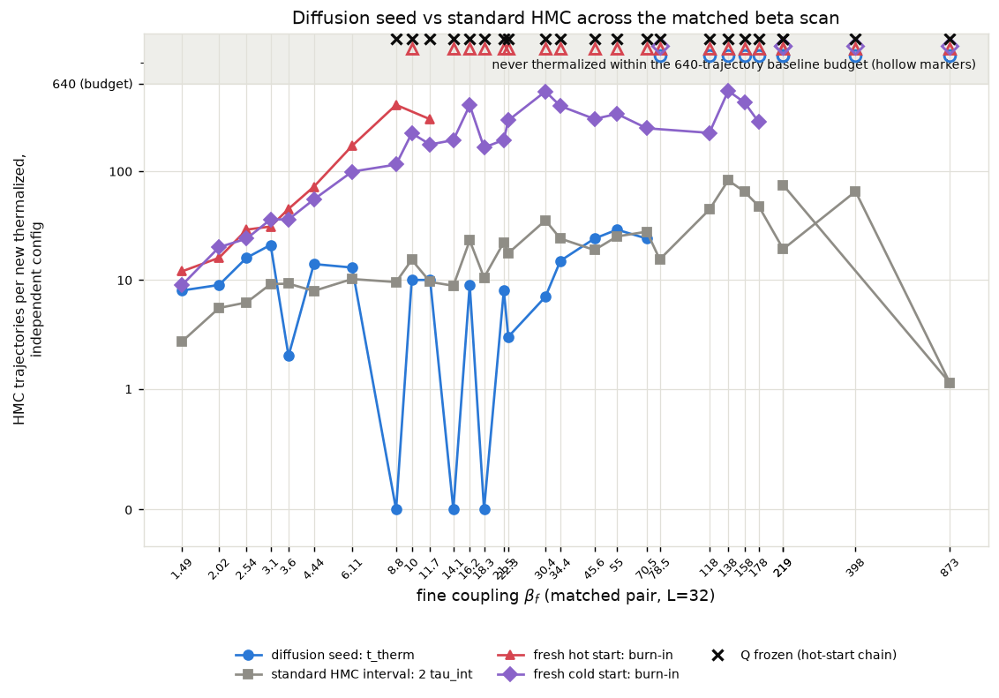

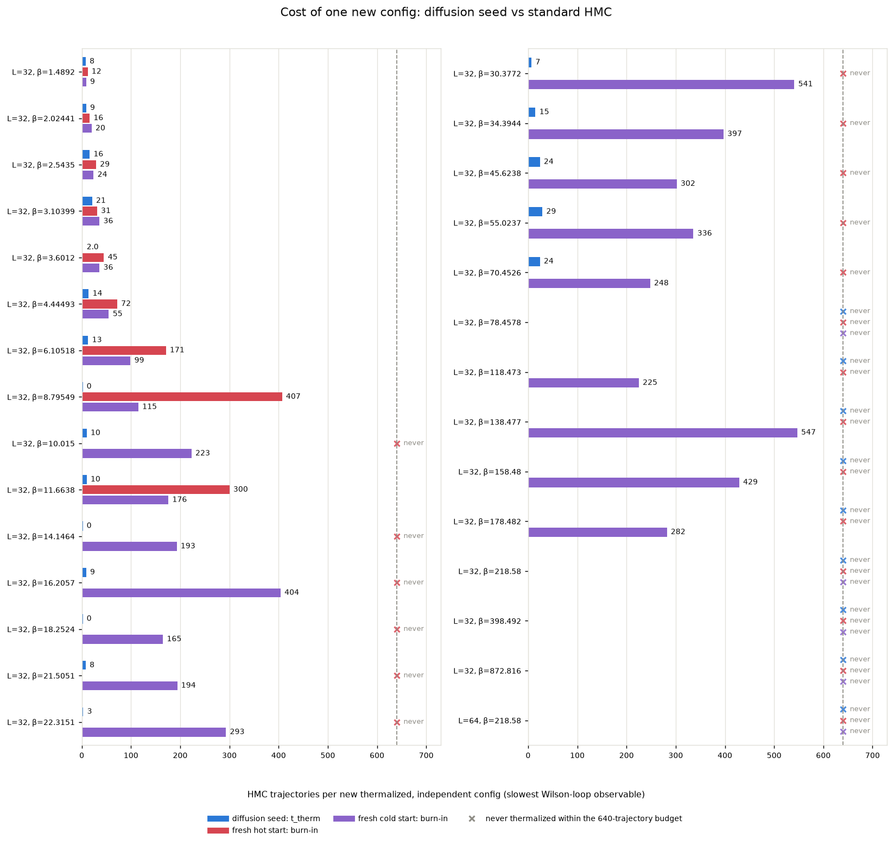

## The three starting points

- **Diffusion seed** -- the raw conditional-diffusion output for this coupling: one inverse-RG step from a direct-HMC base ensemble at the matched coarse coupling (ancestral sampling + the deterministic coarse-charge transport), with **no** rethermalization sweeps applied: every bit of equilibration the seed needs is measured here, in HMC trajectories.
- **Hot start** -- every link angle drawn uniformly from (-pi, pi]: a completely disordered (infinite-temperature) configuration. The standard way to initialize a fresh HMC chain without prior information.
- **Cold start** -- every link angle set to zero: the perfectly ordered (beta -> infinity) configuration, the other standard initialization.

## Summary

| rung | L | beta | t_therm diffusion seed | standard-HMC interval 2 tau_int | margin (interval - t_therm) | burn-in hot / cold | tau_int(Q) |
|---|---|---|---|---|---|---|---|
| A_bc0.25_L32_beta1.4892 | 32 | 1.4892 | 8 | 2.7 | -5.3 traj | 12 / 9 | 1.4 |
| A_bc0.5_L32_beta2.02441 | 32 | 2.02441 | 9 | 5.5 | -3.5 traj | 16 / 20 | 3.2 |
| A_bc0.75_L32_beta2.5435 | 32 | 2.5435 | 16 | 6.2 | -9.8 traj | 29 / 24 | 5.0 |
| A_bc1_L32_beta3.10399 | 32 | 3.10399 | 21 | 9.2 | -11.8 traj | 31 / 36 | 9.6 |
| E_bc1.2_L32_beta3.6012 | 32 | 3.6012 | 2 | 9.2 | 7.2 traj | 45 / 36 | 15.8 |
| A_bc1.5_L32_beta4.44493 | 32 | 4.44493 | 14 | 7.9 | -6.1 traj | 72 / 55 | 27.4 |
| A_bc2_L32_beta6.10518 | 32 | 6.10518 | 13 | 10.2 | -2.8 traj | 171 / 99 | 34.8 |
| E_bc2.7_L32_beta8.79549 | 32 | 8.79549 | 0 | 9.6 | 9.6 traj | 407 / 115 | frozen (0 tunnelings in 321 x 32 traj) |
| A_bc3_L32_beta10.015 | 32 | 10.015 | 10 | 15.3 | 5.3 traj | never / 223 | frozen (0 tunnelings in 321 x 32 traj) |
| E_bc3.4_L32_beta11.6638 | 32 | 11.6638 | 10 | 9.6 | -0.4 traj | 300 / 176 | frozen (0 tunnelings in 321 x 32 traj) |
| A_bc4_L32_beta14.1464 | 32 | 14.1464 | 0 | 8.8 | 8.8 traj | never / 193 | frozen (0 tunnelings in 321 x 32 traj) |
| E_bc4.5_L32_beta16.2057 | 32 | 16.2057 | 9 | 23.1 | 14.1 traj | never / 404 | frozen (0 tunnelings in 321 x 32 traj) |
| A_bc5_L32_beta18.2524 | 32 | 18.2524 | 0 | 10.5 | 10.5 traj | never / 165 | frozen (0 tunnelings in 321 x 32 traj) |
| E_bc5.8_L32_beta21.5051 | 32 | 21.5051 | 8 | 22.2 | 14.2 traj | never / 194 | frozen (0 tunnelings in 321 x 32 traj) |
| A_bc6_L32_beta22.3151 | 32 | 22.3151 | 3 | 17.6 | 14.6 traj | never / 293 | frozen (0 tunnelings in 321 x 32 traj) |
| A_bc8_L32_beta30.3772 | 32 | 30.3772 | 7 | 35.3 | 28.3 traj | never / 541 | frozen (0 tunnelings in 321 x 32 traj) |
| E_bc9_L32_beta34.3944 | 32 | 34.3944 | 15 | 24.0 | 9.0 traj | never / 397 | frozen (0 tunnelings in 321 x 32 traj) |
| E_bc11.8_L32_beta45.6238 | 32 | 45.6238 | 24 | 18.8 | -5.2 traj | never / 302 | frozen (0 tunnelings in 321 x 32 traj) |
| D_bc14.1464_L32_beta55.0237 | 32 | 55.0237 | 29 | 25.1 | -3.9 traj | never / 336 | frozen (0 tunnelings in 321 x 32 traj) |
| E_bc18_L32_beta70.4526 | 32 | 70.4526 | 24 | 27.8 | 3.8 traj | never / 248 | frozen (0 tunnelings in 321 x 32 traj) |
| D_bc20_L32_beta78.4578 | 32 | 78.4578 | never | 15.5 | -- | never / never | frozen (0 tunnelings in 321 x 32 traj) |
| D_bc30_L32_beta118.473 | 32 | 118.473 | never | 44.4 | -- | never / 225 | frozen (0 tunnelings in 321 x 32 traj) |
| E_bc35_L32_beta138.477 | 32 | 138.477 | never | 82.4 | -- | never / 547 | frozen (0 tunnelings in 321 x 32 traj) |
| D_bc40_L32_beta158.48 | 32 | 158.48 | never | 64.8 | -- | never / 429 | frozen (0 tunnelings in 321 x 32 traj) |
| E_bc45_L32_beta178.482 | 32 | 178.482 | never | 47.6 | -- | never / 282 | frozen (0 tunnelings in 321 x 32 traj) |
| D_bc55.0237_L32_beta218.58 | 32 | 218.58 | never | 19.2 | -- | never / never | frozen (0 tunnelings in 321 x 32 traj) |
| F_L32_bc100_L32_beta398.492 | 32 | 398.492 | never | 65.1 | -- | never / never | frozen (0 tunnelings in 321 x 32 traj) |
| F_L32_bc218.58_L32_beta872.816 | 32 | 872.816 | never | 1.1 | -- | never / never | frozen (0 tunnelings in 321 x 32 traj) |
| F_L64_bc55.0237_L64_beta218.58 | 64 | 218.58 | never | 74.5 | -- | never / never | frozen (0 tunnelings in 321 x 16 traj) |

t_therm and burn-in are the slowest Wilson-loop observable (plaquette, W(2x2), W(4x4)); topology is stricter still for the fresh chains: their Q^2 **never** reaches the exact value at the frozen rungs, while the diffusion seed inherits the correct topological sector from the coarse ensemble it was generated from (see the Q^2 panels and per-rung tables below).

Thermalization time `t_therm` = first trajectory at which the ensemble-mean z-score vs the exact value satisfies |z| <= 2 and stays there for 5 consecutive trajectories (t = 0: already thermalized before any HMC). For the diffusion seed, t_therm is computed on a random subsample of chains matched to the baseline chain count so all starts are compared at equal statistical power. `tau_int` is Madras-Sokal, measured on the second half of the hot-start chains, averaged over chains. In the per-rung relaxation figures, triangles mark each start's t_therm, dashed curves are the exponential fits C + A exp(-t/tau) to the ensemble means (tau quoted per panel), and the right-hand panels track the ensemble mean's distance from the exact value in SEM units -- thermalized means inside the shaded |z| <= 2 band; the dotted vertical line there is the standard-HMC interval `2 tau_int`.

## What 'never' means, and where the ground truth comes from

'never' = the ensemble mean was still outside |z| <= 2 of the exact value after the full baseline budget; the per-rung sections quote the z-score it plateaued at. For hot starts at the large-beta rungs this is not a budget problem but a physical one: a random start freezes into a random topological sector (<Q^2> of order tens), plain HMC can never change Q at these couplings (tunneling is suppressed ~exp(-2 beta)), and the wrong sector biases every Wilson loop by an amount that never decays. Cold starts sit in the single sector Q = 0, so their Wilson loops do eventually converge, but <Q^2> stays pinned at 0 forever.

None of the exact values in this report come from fine-lattice HMC: the ground truth is the character expansion of 2D compact U(1) (`diffusion/lgt/exact.py`), which gives every Wilson loop, P(Q) and chi_top in closed form at finite volume. Each diffusion seed here is one inverse-RG step from a direct-HMC base ensemble at the matched coarse coupling beta_c (L=16), where HMC mixes well -- which is precisely why it can start chains in regions standard HMC cannot reach.

## A_bc0.25_L32_beta1.4892

HMC: step size 0.2000, 5 leapfrog steps, acceptance seed/hot/cold = 0.969/0.970/0.966. Diffusion-seed batch: 128 chains x 96 trajectories (0.04 s/traj for the whole batch); baselines: 32 chains x 640 trajectories.

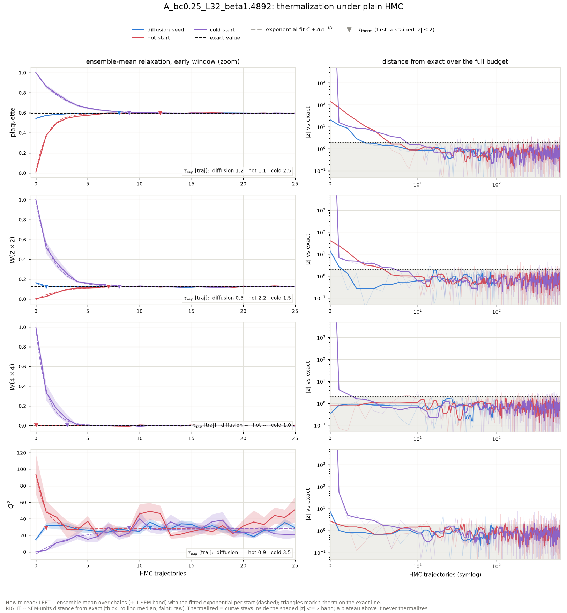

tau_int (hot-start chains, second half): plaquette = 1.36 +- 0.06, wilson_2x2 = 0.76 +- 0.03, wilson_4x4 = 0.56 +- 0.02, wilson_6x6 = 0.57 +- 0.02. Topology: hot-start HMC L=32 beta=1.4892 -> tau_int(Q) = 1.4.

### Diagnostics: raw diffusion output (before any HMC)

| observable | value | error | exact | z_exact | reference | ref_error | z_ref | ks_p | chi2_p |
|---|---|---|---|---|---|---|---|---|---|
| plaquette | 0.5427 | 0.002791 | 0.5935 | -18.19 | 0.5948 | 0.001238 | -17.05 | 0 |  |
| wilson_1x1 | 0.5427 | 0.002791 | 0.5935 | -18.19 | 0.5948 | 0.001238 | -17.05 | 0 |  |
| wilson_1x2 | 0.319 | 0.003765 | 0.3522 | -8.82 | 0.3522 | 0.002458 | -7.387 | 4.957e-15 |  |
| wilson_2x2 | 0.1636 | 0.003126 | 0.124 | 12.67 | 0.1241 | 0.001865 | 10.87 | 3.775e-21 |  |
| wilson_2x3 | 0.07628 | 0.003109 | 0.04368 | 10.49 | 0.04133 | 0.001675 | 9.898 | 2.548e-18 |  |
| wilson_3x3 | 0.02224 | 0.002112 | 0.00913 | 6.21 | 0.005305 | 0.002005 | 5.817 | 1.138e-07 |  |
| wilson_3x4 | 0.008164 | 0.001563 | 0.001908 | 4.003 | 0.0003275 | 0.002081 | 3.011 | 0.04354 |  |
| wilson_4x4 | 0.000888 | 0.001916 | 0.0002367 | 0.3399 | 0.0001938 | 0.001787 | 0.265 | 0.9353 |  |
| wilson_4x5 | -0.001293 | 0.002193 | 2.936e-05 | -0.6032 | -0.001625 | 0.001631 | 0.1216 | 0.7901 |  |
| wilson_5x5 | 0.001102 | 0.001679 | 2.161e-06 | 0.655 | -0.000249 | 0.001931 | 0.5278 | 0.6395 |  |
| wilson_5x6 | 0.001044 | 0.002083 | 1.591e-07 | 0.5013 | -0.0005556 | 0.001821 | 0.5783 | 0.389 |  |
| wilson_6x6 | 0.0001474 | 0.00196 | 6.948e-09 | 0.07522 | -0.001112 | 0.00174 | 0.4804 | 0.7538 |  |
| wilson_6x7 | -0.000932 | 0.00228 | 3.035e-10 | -0.4088 | 0.002636 | 0.001766 | -1.237 | 0.08971 |  |
| wilson_7x7 | -0.002818 | 0.002334 | 7.868e-12 | -1.207 | 0.0003693 | 0.001605 | -1.125 | 0.3584 |  |
| wilson_7x8 | -0.0003961 | 0.001956 | 2.04e-13 | -0.2025 | -0.001279 | 0.001893 | 0.3242 | 0.8569 |  |
| wilson_8x8 | -0.001221 | 0.002129 | 3.138e-15 | -0.5736 | -0.001451 | 0.00132 | 0.0917 | 0.4212 |  |
| wilson_8x10 | 0.002679 | 0.001762 | 7.426e-19 | 1.521 | 0.001016 | 0.001793 | 0.6615 | 0.4548 |  |
| wilson_10x10 | 0.001609 | 0.002169 | 2.18e-23 | 0.7415 | 0.0006406 | 0.001555 | 0.3627 | 0.7901 |  |
| wilson_10x12 | -0.0005289 | 0.00166 | 6.4e-28 | -0.3187 | -0.003091 | 0.001502 | 1.144 | 0.3021 |  |
| wilson_12x12 | 0.0003959 | 0.001296 | 2.33e-33 | 0.3056 | -0.001718 | 0.001421 | 1.099 | 0.5631 |  |
| creutz_2 | 0.136 | 0.0155 | 0.5218 | -24.89 |  |  |  |  |  |
| creutz_3 | 0.4693 | 0.08965 | 0.5218 | -0.586 |  |  |  |  |  |
| creutz_4 | 1.216 | 2.305 | 0.5218 | 0.3013 |  |  |  |  |  |
| creutz_6 | 1.904 | nan | 0.5218 | nan |  |  |  |  |  |
| Q | 0.7344 | 0.3272 | 0 | 2.245 | -0.4375 | 0.3418 | 2.477 | 0.01957 |  |
| Q^2 | 15 | 1.997 | 28.52 | -6.772 | 27.85 | 2.353 | -4.166 | 0.01957 |  |
| chi_top ((<Q^2>-<Q>^2)/V) | 0.01412 | 0.001823 | 0.02785 | -7.532 | 0.02701 | 0.002264 | -4.435 | 0.0007783 |  |
| Q histogram vs exact P(Q) | 31.13 | nan | 18 | nan |  |  |  |  | 0.02778 |

### Diagnostics: the same configs after 96 HMC trajectories

| observable | value | error | exact | z_exact | reference | ref_error | z_ref | ks_p | chi2_p |
|---|---|---|---|---|---|---|---|---|---|
| plaquette | 0.5947 | 0.00168 | 0.5935 | 0.7239 | 0.5948 | 0.001238 | -0.0418 | 0.7163 |  |
| wilson_1x1 | 0.5947 | 0.00168 | 0.5935 | 0.7239 | 0.5948 | 0.001238 | -0.0418 | 0.7163 |  |
| wilson_1x2 | 0.3524 | 0.002437 | 0.3522 | 0.07846 | 0.3522 | 0.002458 | 0.05336 | 0.678 |  |
| wilson_2x2 | 0.1232 | 0.002881 | 0.124 | -0.298 | 0.1241 | 0.001865 | -0.2559 | 0.6395 |  |
| wilson_2x3 | 0.04182 | 0.002073 | 0.04368 | -0.8987 | 0.04133 | 0.001675 | 0.1838 | 0.7901 |  |
| wilson_3x3 | 0.006262 | 0.002352 | 0.00913 | -1.219 | 0.005305 | 0.002005 | 0.3098 | 0.9807 |  |
| wilson_3x4 | 0.001837 | 0.001758 | 0.001908 | -0.04056 | 0.0003275 | 0.002081 | 0.554 | 0.2087 |  |
| wilson_4x4 | -0.0005788 | 0.00172 | 0.0002367 | -0.4741 | 0.0001938 | 0.001787 | -0.3115 | 0.389 |  |
| wilson_4x5 | -0.00199 | 0.002024 | 2.936e-05 | -0.9978 | -0.001625 | 0.001631 | -0.1402 | 0.678 |  |
| wilson_5x5 | -0.0005588 | 0.001617 | 2.161e-06 | -0.347 | -0.000249 | 0.001931 | -0.123 | 0.7901 |  |
| wilson_5x6 | 0.004038 | 0.001443 | 1.591e-07 | 2.798 | -0.0005556 | 0.001821 | 1.977 | 0.1892 |  |
| wilson_6x6 | 0.002905 | 0.00165 | 6.948e-09 | 1.761 | -0.001112 | 0.00174 | 1.675 | 0.1004 |  |
| wilson_6x7 | -0.0005696 | 0.001501 | 3.035e-10 | -0.3794 | 0.002636 | 0.001766 | -1.383 | 0.2763 |  |
| wilson_7x7 | -0.001343 | 0.002155 | 7.868e-12 | -0.6232 | 0.0003693 | 0.001605 | -0.6372 | 0.8246 |  |
| wilson_7x8 | 0.000684 | 0.00235 | 2.04e-13 | 0.2911 | -0.001279 | 0.001893 | 0.6504 | 0.6011 |  |
| wilson_8x8 | -0.001223 | 0.001376 | 3.138e-15 | -0.8883 | -0.001451 | 0.00132 | 0.1197 | 0.4212 |  |
| wilson_8x10 | -0.001264 | 0.001658 | 7.426e-19 | -0.7624 | 0.001016 | 0.001793 | -0.9338 | 0.3021 |  |
| wilson_10x10 | 0.004193 | 0.001734 | 2.18e-23 | 2.418 | 0.0006406 | 0.001555 | 1.525 | 0.1251 |  |
| wilson_10x12 | -0.0002542 | 0.002237 | 6.4e-28 | -0.1136 | -0.003091 | 0.001502 | 1.053 | 0.3021 |  |
| wilson_12x12 | 0.001729 | 0.002028 | 2.33e-33 | 0.8525 | -0.001718 | 0.001421 | 1.392 | 0.4898 |  |
| creutz_2 | 0.5278 | 0.01489 | 0.5218 | 0.402 |  |  |  |  |  |
| creutz_3 | 0.8186 | 0.3169 | 0.5218 | 0.9366 |  |  |  |  |  |
| Q | -0.2578 | 0.4399 | 0 | -0.5861 | -0.4375 | 0.3418 | 0.3226 | 0.9996 |  |
| Q^2 | 26.02 | 3.207 | 28.52 | -0.7792 | 27.85 | 2.353 | -0.4603 | 0.9807 |  |
| chi_top ((<Q^2>-<Q>^2)/V) | 0.02535 | 0.003127 | 0.02785 | -0.8011 | 0.02701 | 0.002264 | -0.4315 | 0.4212 |  |
| Q histogram vs exact P(Q) | 19.25 | nan | 18 | nan |  |  |  |  | 0.3768 |

## A_bc0.5_L32_beta2.02441

HMC: step size 0.2000, 5 leapfrog steps, acceptance seed/hot/cold = 0.965/0.964/0.960. Diffusion-seed batch: 128 chains x 96 trajectories (0.04 s/traj for the whole batch); baselines: 32 chains x 640 trajectories.

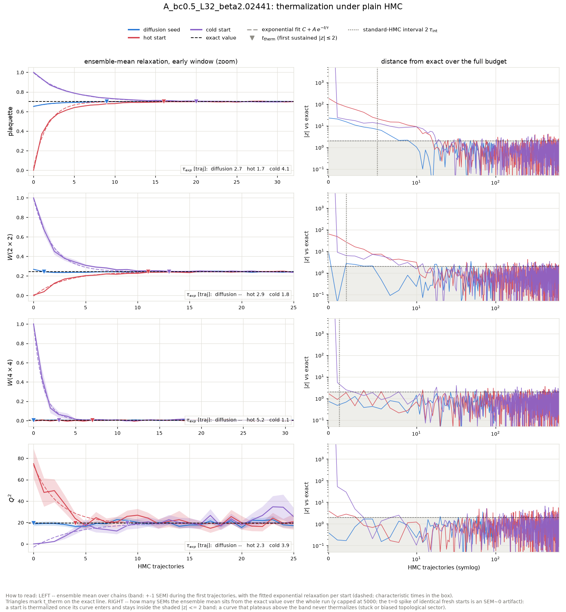

tau_int (hot-start chains, second half): plaquette = 2.76 +- 0.30, wilson_2x2 = 1.00 +- 0.07, wilson_4x4 = 0.61 +- 0.02, wilson_6x6 = 0.58 +- 0.01. Topology: hot-start HMC L=32 beta=2.02441 -> tau_int(Q) = 3.2.

### Diagnostics: raw diffusion output (before any HMC)

| observable | value | error | exact | z_exact | reference | ref_error | z_ref | ks_p | chi2_p |
|---|---|---|---|---|---|---|---|---|---|
| plaquette | 0.6516 | 0.001848 | 0.7017 | -27.11 | 0.7019 | 0.0008797 | -24.56 | 0 |  |
| wilson_1x1 | 0.6516 | 0.001848 | 0.7017 | -27.11 | 0.7019 | 0.0008797 | -24.56 | 0 |  |
| wilson_1x2 | 0.4452 | 0.002467 | 0.4924 | -19.16 | 0.4926 | 0.001604 | -16.11 | 3.832e-33 |  |
| wilson_2x2 | 0.2677 | 0.00258 | 0.2425 | 9.762 | 0.2406 | 0.001965 | 8.337 | 3.208e-11 |  |
| wilson_2x3 | 0.141 | 0.002299 | 0.1194 | 9.405 | 0.1199 | 0.002269 | 6.546 | 6.452e-06 |  |
| wilson_3x3 | 0.04878 | 0.001902 | 0.04127 | 3.948 | 0.03906 | 0.002341 | 3.22 | 0.003137 |  |
| wilson_3x4 | 0.01971 | 0.002021 | 0.01426 | 2.696 | 0.01215 | 0.001815 | 2.781 | 0.1392 |  |
| wilson_4x4 | 0.005155 | 0.003119 | 0.003458 | 0.5441 | 0.002402 | 0.001851 | 0.759 | 0.2297 |  |
| wilson_4x5 | 0.0002772 | 0.002236 | 0.0008386 | -0.2511 | 0.001425 | 0.002112 | -0.3731 | 0.8246 |  |
| wilson_5x5 | -0.001047 | 0.001927 | 0.0001427 | -0.6173 | -0.0008455 | 0.001957 | -0.07338 | 0.7538 |  |
| wilson_5x6 | 0.001868 | 0.002112 | 2.428e-05 | 0.8732 | -9.881e-05 | 0.001841 | 0.7021 | 0.2297 |  |
| wilson_6x6 | 0.001234 | 0.001466 | 2.9e-06 | 0.8402 | -0.0007191 | 0.001925 | 0.8073 | 0.4898 |  |
| wilson_6x7 | -0.001123 | 0.001997 | 3.463e-07 | -0.5629 | -0.0003006 | 0.001982 | -0.2925 | 0.9888 |  |
| wilson_7x7 | 0.001328 | 0.001701 | 2.902e-08 | 0.7807 | 0.001083 | 0.001614 | 0.1045 | 0.6011 |  |
| wilson_7x8 | 0.001095 | 0.00141 | 2.432e-09 | 0.7765 | -0.001728 | 0.001643 | 1.304 | 0.1392 |  |
| wilson_8x8 | -0.001329 | 0.002019 | 1.43e-10 | -0.6585 | -0.0004432 | 0.001893 | -0.3202 | 0.9126 |  |
| wilson_8x10 | -0.0002105 | 0.001573 | 4.946e-13 | -0.1338 | -0.001078 | 0.001766 | 0.3667 | 0.3021 |  |
| wilson_10x10 | -0.002037 | 0.001803 | 4.147e-16 | -1.129 | 0.0007502 | 0.001534 | -1.177 | 0.07995 |  |
| wilson_10x12 | -0.002528 | 0.001556 | 3.478e-19 | -1.625 | 0.001283 | 0.00153 | -1.747 | 0.1392 |  |
| wilson_12x12 | 0.002957 | 0.001937 | 7.073e-23 | 1.527 | 0.001944 | 0.001599 | 0.4037 | 0.9693 |  |
| creutz_2 | 0.1276 | 0.009981 | 0.3542 | -22.7 |  |  |  |  |  |
| creutz_3 | 0.421 | 0.03981 | 0.3542 | 1.679 |  |  |  |  |  |
| creutz_4 | 0.4349 | 0.419 | 0.3542 | 0.1926 |  |  |  |  |  |
| Q | -0.04688 | 0.3268 | 0 | -0.1435 | -0.7917 | 0.2757 | 1.742 | 0.0631 |  |
| Q^2 | 18.75 | 2.101 | 19.51 | -0.3622 | 16.85 | 1.13 | 0.7948 | 0.1122 |  |
| chi_top ((<Q^2>-<Q>^2)/V) | 0.01831 | 0.002049 | 0.01905 | -0.3636 | 0.01585 | 0.001139 | 1.05 | 0.0001679 |  |
| Q histogram vs exact P(Q) | 13.44 | nan | 16 | nan |  |  |  |  | 0.6405 |

### Diagnostics: the same configs after 96 HMC trajectories

| observable | value | error | exact | z_exact | reference | ref_error | z_ref | ks_p | chi2_p |
|---|---|---|---|---|---|---|---|---|---|
| plaquette | 0.7005 | 0.001047 | 0.7017 | -1.176 | 0.7019 | 0.0008797 | -1.023 | 0.389 |  |
| wilson_1x1 | 0.7005 | 0.001047 | 0.7017 | -1.176 | 0.7019 | 0.0008797 | -1.023 | 0.389 |  |
| wilson_1x2 | 0.4926 | 0.001774 | 0.4924 | 0.09311 | 0.4926 | 0.001604 | 0.01411 | 0.9693 |  |
| wilson_2x2 | 0.242 | 0.002566 | 0.2425 | -0.1763 | 0.2406 | 0.001965 | 0.4334 | 0.4212 |  |
| wilson_2x3 | 0.1202 | 0.003348 | 0.1194 | 0.2447 | 0.1199 | 0.002269 | 0.08446 | 0.8246 |  |
| wilson_3x3 | 0.03943 | 0.00224 | 0.04127 | -0.8206 | 0.03906 | 0.002341 | 0.1127 | 0.5259 |  |
| wilson_3x4 | 0.01391 | 0.002305 | 0.01426 | -0.1501 | 0.01215 | 0.001815 | 0.5999 | 0.8246 |  |
| wilson_4x4 | 0.003094 | 0.002964 | 0.003458 | -0.1229 | 0.002402 | 0.001851 | 0.1979 | 0.7163 |  |
| wilson_4x5 | 0.002522 | 0.002881 | 0.0008386 | 0.5843 | 0.001425 | 0.002112 | 0.3072 | 0.6011 |  |
| wilson_5x5 | 0.0006466 | 0.002265 | 0.0001427 | 0.2224 | -0.0008455 | 0.001957 | 0.4984 | 0.3584 |  |
| wilson_5x6 | 0.000356 | 0.002434 | 2.428e-05 | 0.1363 | -9.881e-05 | 0.001841 | 0.149 | 0.8246 |  |
| wilson_6x6 | 0.0005279 | 0.002011 | 2.9e-06 | 0.261 | -0.0007191 | 0.001925 | 0.4479 | 0.4212 |  |
| wilson_6x7 | 0.00402 | 0.001896 | 3.463e-07 | 2.12 | -0.0003006 | 0.001982 | 1.576 | 0.1251 |  |
| wilson_7x7 | -0.001456 | 0.002102 | 2.902e-08 | -0.6927 | 0.001083 | 0.001614 | -0.9581 | 0.1251 |  |
| wilson_7x8 | 0.00129 | 0.002062 | 2.432e-09 | 0.6256 | -0.001728 | 0.001643 | 1.145 | 0.4212 |  |
| wilson_8x8 | -0.002938 | 0.00233 | 1.43e-10 | -1.261 | -0.0004432 | 0.001893 | -0.8312 | 0.8246 |  |
| wilson_8x10 | -0.001637 | 0.002097 | 4.946e-13 | -0.7804 | -0.001078 | 0.001766 | -0.204 | 0.9888 |  |
| wilson_10x10 | 0.001319 | 0.002165 | 4.147e-16 | 0.6092 | 0.0007502 | 0.001534 | 0.2144 | 0.8246 |  |
| wilson_10x12 | -0.0006868 | 0.001726 | 3.478e-19 | -0.398 | 0.001283 | 0.00153 | -0.8542 | 0.1712 |  |
| wilson_12x12 | -0.0001914 | 0.002039 | 7.073e-23 | -0.0939 | 0.001944 | 0.001599 | -0.8241 | 0.4212 |  |
| creutz_2 | 0.3585 | 0.007417 | 0.3542 | 0.5789 |  |  |  |  |  |
| creutz_3 | 0.4153 | 0.0459 | 0.3542 | 1.331 |  |  |  |  |  |
| creutz_4 | 0.462 | 0.6394 | 0.3542 | 0.1686 |  |  |  |  |  |
| creutz_5 | 1.157 | 3.162 | 0.3542 | 0.2539 |  |  |  |  |  |
| creutz_6 | -0.9905 | nan | 0.3542 | nan |  |  |  |  |  |
| Q | -0.5391 | 0.4362 | 0 | -1.236 | -0.7917 | 0.2757 | 0.4895 | 0.8246 |  |
| Q^2 | 19.34 | 2.281 | 19.51 | -0.07666 | 16.85 | 1.13 | 0.975 | 0.7901 |  |
| chi_top ((<Q^2>-<Q>^2)/V) | 0.0186 | 0.002336 | 0.01905 | -0.1946 | 0.01585 | 0.001139 | 1.059 | 0.0631 |  |
| Q histogram vs exact P(Q) | 29.28 | nan | 16 | nan |  |  |  |  | 0.02213 |

## A_bc0.75_L32_beta2.5435

HMC: step size 0.2000, 5 leapfrog steps, acceptance seed/hot/cold = 0.965/0.961/0.960. Diffusion-seed batch: 128 chains x 96 trajectories (0.04 s/traj for the whole batch); baselines: 32 chains x 640 trajectories.

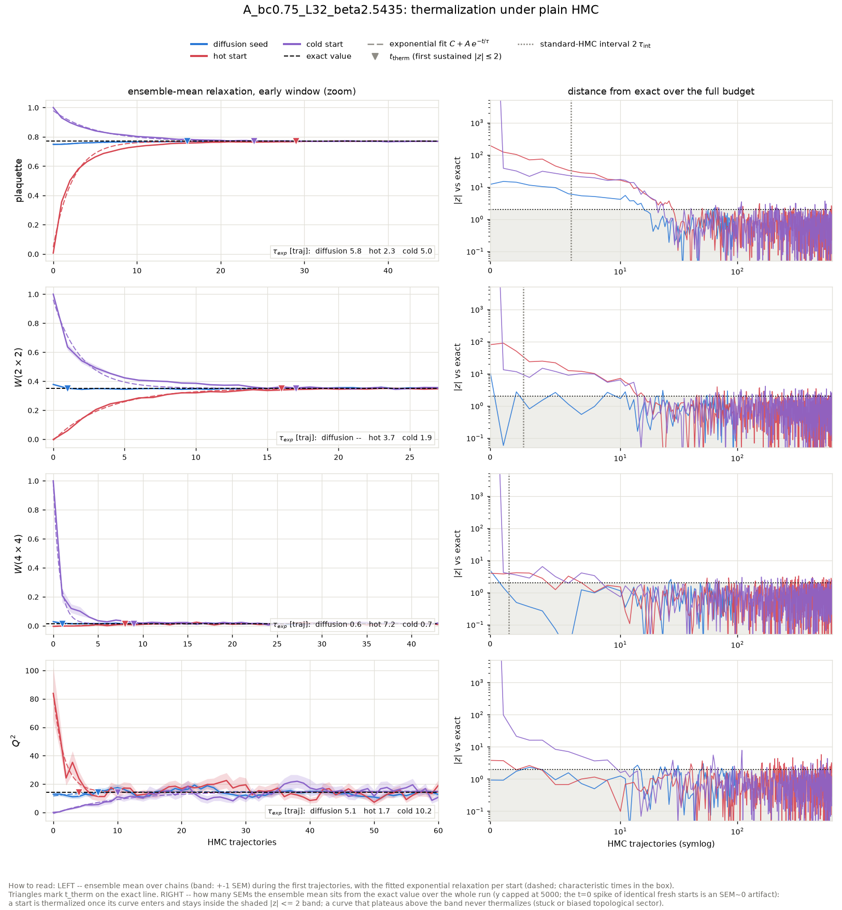

tau_int (hot-start chains, second half): plaquette = 3.11 +- 0.17, wilson_2x2 = 1.26 +- 0.06, wilson_4x4 = 0.71 +- 0.03, wilson_6x6 = 0.57 +- 0.02. Topology: hot-start HMC L=32 beta=2.5435 -> tau_int(Q) = 5.0.

### Diagnostics: raw diffusion output (before any HMC)

| observable | value | error | exact | z_exact | reference | ref_error | z_ref | ks_p | chi2_p |
|---|---|---|---|---|---|---|---|---|---|
| plaquette | 0.7489 | 0.001796 | 0.7696 | -11.54 | 0.7712 | 0.0008441 | -11.23 | 7.191e-26 |  |
| wilson_1x1 | 0.7489 | 0.001796 | 0.7696 | -11.54 | 0.7712 | 0.0008441 | -11.23 | 7.191e-26 |  |
| wilson_1x2 | 0.5692 | 0.002816 | 0.5924 | -8.209 | 0.5947 | 0.001239 | -8.268 | 2.291e-11 |  |
| wilson_2x2 | 0.3776 | 0.002854 | 0.3509 | 9.366 | 0.3548 | 0.001546 | 7.026 | 5e-08 |  |
| wilson_2x3 | 0.2338 | 0.002766 | 0.2079 | 9.379 | 0.2096 | 0.001777 | 7.347 | 1.615e-08 |  |
| wilson_3x3 | 0.1104 | 0.003182 | 0.09476 | 4.928 | 0.099 | 0.002295 | 2.916 | 0.006985 |  |
| wilson_3x4 | 0.05484 | 0.002927 | 0.0432 | 3.977 | 0.04598 | 0.00207 | 2.471 | 0.011 |  |
| wilson_4x4 | 0.0284 | 0.003744 | 0.01516 | 3.537 | 0.01636 | 0.002317 | 2.736 | 0.006985 |  |
| wilson_4x5 | 0.008463 | 0.002683 | 0.005319 | 1.172 | 0.008872 | 0.001496 | -0.1332 | 0.5631 |  |
| wilson_5x5 | 0.001497 | 0.002654 | 0.001436 | 0.02263 | 0.004459 | 0.001775 | -0.9276 | 0.4548 |  |
| wilson_5x6 | 0.0001679 | 0.002029 | 0.0003879 | -0.1085 | 0.001126 | 0.001405 | -0.3883 | 0.7901 |  |
| wilson_6x6 | 0.001007 | 0.002159 | 8.063e-05 | 0.429 | 0.0006585 | 0.002101 | 0.1157 | 0.7901 |  |
| wilson_6x7 | -0.001774 | 0.001568 | 1.676e-05 | -1.142 | 0.0003578 | 0.002067 | -0.8214 | 0.7538 |  |
| wilson_7x7 | 0.001103 | 0.002014 | 2.681e-06 | 0.5466 | -5.091e-05 | 0.001535 | 0.4559 | 0.7901 |  |
| wilson_7x8 | 0.000716 | 0.00208 | 4.289e-07 | 0.3441 | -0.0002698 | 0.00133 | 0.3993 | 0.9126 |  |
| wilson_8x8 | -0.001256 | 0.001932 | 5.28e-08 | -0.6497 | -3.522e-05 | 0.001573 | -0.4898 | 0.8864 |  |
| wilson_8x10 | -0.0006767 | 0.001473 | 8.005e-10 | -0.4595 | -0.0007483 | 0.001392 | 0.03533 | 0.7901 |  |
| wilson_10x10 | -0.0001599 | 0.002391 | 4.258e-12 | -0.06685 | 0.0005853 | 0.001744 | -0.2518 | 0.6011 |  |
| wilson_10x12 | -0.006581 | 0.002412 | 2.265e-14 | -2.728 | -0.003624 | 0.001567 | -1.028 | 0.05588 |  |
| wilson_12x12 | 0.002647 | 0.001636 | 4.227e-17 | 1.618 | 0.001042 | 0.001567 | 0.7087 | 0.4898 |  |
| creutz_2 | 0.1361 | 0.006322 | 0.2618 | -19.89 |  |  |  |  |  |
| creutz_3 | 0.2705 | 0.0173 | 0.2618 | 0.5038 |  |  |  |  |  |
| creutz_4 | -0.04212 | 0.07732 | 0.2618 | -3.931 |  |  |  |  |  |
| creutz_5 | 0.5218 | 1.379 | 0.2618 | 0.1886 |  |  |  |  |  |
| creutz_6 | -3.979 | nan | 0.2618 | nan |  |  |  |  |  |
| Q | -0.25 | 0.2687 | 0 | -0.9304 | -0.2552 | 0.2417 | 0.01441 | 0.9999 |  |
| Q^2 | 12.83 | 1.673 | 14.25 | -0.8515 | 13.84 | 1.822 | -0.4085 | 0.8864 |  |
| chi_top ((<Q^2>-<Q>^2)/V) | 0.01247 | 0.001627 | 0.01392 | -0.8926 | 0.01345 | 0.001796 | -0.4061 | 0.006985 |  |
| Q histogram vs exact P(Q) | 9.436 | nan | 14 | nan |  |  |  |  | 0.8022 |

### Diagnostics: the same configs after 96 HMC trajectories

| observable | value | error | exact | z_exact | reference | ref_error | z_ref | ks_p | chi2_p |
|---|---|---|---|---|---|---|---|---|---|
| plaquette | 0.7706 | 0.0009084 | 0.7696 | 1.015 | 0.7712 | 0.0008441 | -0.5129 | 0.6395 |  |
| wilson_1x1 | 0.7706 | 0.0009084 | 0.7696 | 1.015 | 0.7712 | 0.0008441 | -0.5129 | 0.6395 |  |
| wilson_1x2 | 0.5947 | 0.002041 | 0.5924 | 1.148 | 0.5947 | 0.001239 | 0.009597 | 0.8864 |  |
| wilson_2x2 | 0.3511 | 0.003235 | 0.3509 | 0.06684 | 0.3548 | 0.001546 | -1.035 | 0.4898 |  |
| wilson_2x3 | 0.207 | 0.003278 | 0.2079 | -0.2492 | 0.2096 | 0.001777 | -0.6993 | 0.3021 |  |
| wilson_3x3 | 0.0924 | 0.003426 | 0.09476 | -0.6877 | 0.099 | 0.002295 | -1.599 | 0.1892 |  |
| wilson_3x4 | 0.04132 | 0.002588 | 0.0432 | -0.7258 | 0.04598 | 0.00207 | -1.406 | 0.389 |  |
| wilson_4x4 | 0.01558 | 0.001829 | 0.01516 | 0.228 | 0.01636 | 0.002317 | -0.2647 | 0.1892 |  |
| wilson_4x5 | 0.005197 | 0.001986 | 0.005319 | -0.06121 | 0.008872 | 0.001496 | -1.478 | 0.4548 |  |
| wilson_5x5 | 0.001539 | 0.002226 | 0.001436 | 0.04585 | 0.004459 | 0.001775 | -1.026 | 0.389 |  |
| wilson_5x6 | -0.0005277 | 0.001985 | 0.0003879 | -0.4614 | 0.001126 | 0.001405 | -0.6801 | 0.6395 |  |
| wilson_6x6 | 0.0005131 | 0.002528 | 8.063e-05 | 0.171 | 0.0006585 | 0.002101 | -0.04424 | 0.6011 |  |
| wilson_6x7 | -0.001424 | 0.00205 | 1.676e-05 | -0.7028 | 0.0003578 | 0.002067 | -0.612 | 0.9888 |  |
| wilson_7x7 | -0.003351 | 0.002533 | 2.681e-06 | -1.324 | -5.091e-05 | 0.001535 | -1.114 | 0.3021 |  |
| wilson_7x8 | -0.001993 | 0.00217 | 4.289e-07 | -0.9188 | -0.0002698 | 0.00133 | -0.6772 | 0.5259 |  |
| wilson_8x8 | -0.001749 | 0.002275 | 5.28e-08 | -0.769 | -3.522e-05 | 0.001573 | -0.6197 | 0.9126 |  |
| wilson_8x10 | -0.00246 | 0.002029 | 8.005e-10 | -1.212 | -0.0007483 | 0.001392 | -0.6954 | 0.389 |  |
| wilson_10x10 | -0.003114 | 0.002609 | 4.258e-12 | -1.193 | 0.0005853 | 0.001744 | -1.179 | 0.08971 |  |
| wilson_10x12 | 7.558e-05 | 0.001512 | 2.265e-14 | 0.05 | -0.003624 | 0.001567 | 1.699 | 0.2297 |  |
| wilson_12x12 | -0.001644 | 0.002031 | 4.227e-17 | -0.8094 | 0.001042 | 0.001567 | -1.047 | 0.011 |  |
| creutz_2 | 0.2679 | 0.004592 | 0.2618 | 1.324 |  |  |  |  |  |
| creutz_3 | 0.2785 | 0.02241 | 0.2618 | 0.7446 |  |  |  |  |  |
| creutz_4 | 0.1709 | 0.1208 | 0.2618 | -0.7524 |  |  |  |  |  |
| creutz_5 | 0.1198 | 1.358 | 0.2618 | -0.1046 |  |  |  |  |  |
| Q | 0.5078 | 0.3452 | 0 | 1.471 | -0.2552 | 0.2417 | 1.81 | 0.08971 |  |
| Q^2 | 14.84 | 1.662 | 14.25 | 0.3511 | 13.84 | 1.822 | 0.4044 | 0.1545 |  |
| chi_top ((<Q^2>-<Q>^2)/V) | 0.01424 | 0.00165 | 0.01392 | 0.1927 | 0.01345 | 0.001796 | 0.3221 | 0.004349 |  |
| Q histogram vs exact P(Q) | 16.21 | nan | 14 | nan |  |  |  |  | 0.3006 |

## A_bc1_L32_beta3.10399

HMC: step size 0.2000, 5 leapfrog steps, acceptance seed/hot/cold = 0.961/0.961/0.963. Diffusion-seed batch: 128 chains x 96 trajectories (0.05 s/traj for the whole batch); baselines: 32 chains x 640 trajectories.

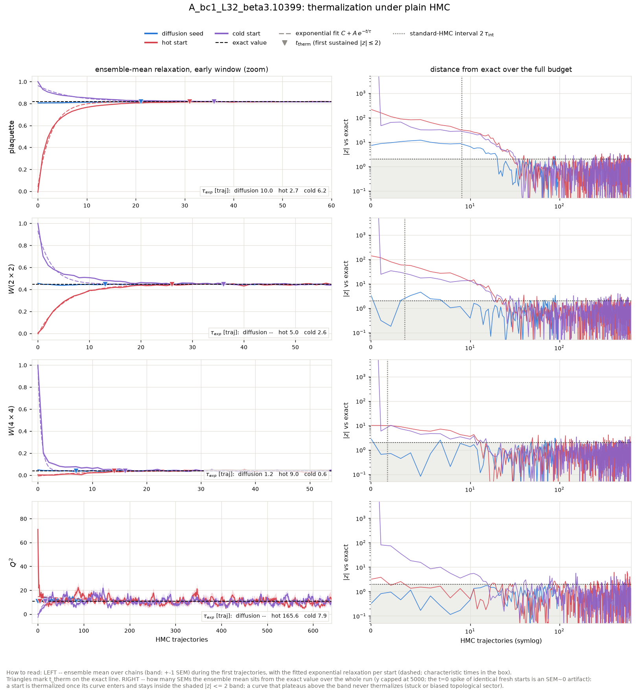

tau_int (hot-start chains, second half): plaquette = 4.58 +- 0.44, wilson_2x2 = 1.69 +- 0.12, wilson_4x4 = 0.82 +- 0.03, wilson_6x6 = 0.58 +- 0.01. Topology: hot-start HMC L=32 beta=3.10399 -> tau_int(Q) = 9.6.

### Diagnostics: raw diffusion output (before any HMC)

| observable | value | error | exact | z_exact | reference | ref_error | z_ref | ks_p | chi2_p |
|---|---|---|---|---|---|---|---|---|---|
| plaquette | 0.8072 | 0.00126 | 0.8174 | -8.113 | 0.8167 | 0.0005787 | -6.865 | 1.664e-10 |  |
| wilson_1x1 | 0.8072 | 0.00126 | 0.8174 | -8.113 | 0.8167 | 0.0005787 | -6.865 | 1.664e-10 |  |
| wilson_1x2 | 0.6548 | 0.00218 | 0.6681 | -6.099 | 0.6667 | 0.001248 | -4.718 | 6.452e-06 |  |
| wilson_2x2 | 0.4554 | 0.002615 | 0.4464 | 3.43 | 0.4462 | 0.002387 | 2.576 | 0.03831 |  |
| wilson_2x3 | 0.3053 | 0.003232 | 0.2982 | 2.178 | 0.2995 | 0.003104 | 1.301 | 0.2522 |  |
| wilson_3x3 | 0.1683 | 0.003784 | 0.1629 | 1.427 | 0.1662 | 0.003275 | 0.4213 | 0.6395 |  |
| wilson_3x4 | 0.09714 | 0.003849 | 0.08895 | 2.129 | 0.09401 | 0.002937 | 0.6479 | 0.4548 |  |
| wilson_4x4 | 0.04797 | 0.003941 | 0.03971 | 2.096 | 0.04635 | 0.002315 | 0.3534 | 0.6011 |  |
| wilson_4x5 | 0.02098 | 0.003913 | 0.01772 | 0.8326 | 0.02331 | 0.001923 | -0.5347 | 0.678 |  |
| wilson_5x5 | 0.009242 | 0.002667 | 0.006467 | 1.041 | 0.008977 | 0.001985 | 0.07988 | 0.678 |  |
| wilson_5x6 | 0.004951 | 0.002793 | 0.00236 | 0.9276 | 0.001769 | 0.001658 | 0.9794 | 0.7538 |  |
| wilson_6x6 | 0.003314 | 0.002478 | 0.0007038 | 1.053 | -0.001236 | 0.002333 | 1.337 | 0.1392 |  |
| wilson_6x7 | -0.0005534 | 0.001528 | 0.0002099 | -0.4997 | 0.0001348 | 0.001854 | -0.2865 | 0.7901 |  |
| wilson_7x7 | -0.000317 | 0.002385 | 5.117e-05 | -0.1543 | -0.0009109 | 0.001672 | 0.2039 | 0.6395 |  |
| wilson_7x8 | 0.00391 | 0.002432 | 1.247e-05 | 1.602 | 0.001308 | 0.00174 | 0.8701 | 0.2297 |  |
| wilson_8x8 | -0.003264 | 0.001814 | 2.486e-06 | -1.8 | 0.001576 | 0.001246 | -2.199 | 0.1545 |  |
| wilson_8x10 | 0.002095 | 0.00218 | 9.869e-08 | 0.961 | 0.001019 | 0.002055 | 0.359 | 0.5259 |  |
| wilson_10x10 | 0.00124 | 0.001984 | 1.749e-09 | 0.6252 | 0.002047 | 0.001322 | -0.3385 | 0.678 |  |
| wilson_10x12 | -0.0009911 | 0.001739 | 3.101e-11 | -0.5698 | 0.001053 | 0.001377 | -0.9215 | 0.1892 |  |
| wilson_12x12 | -0.00172 | 0.001686 | 2.453e-13 | -1.02 | 0.0004341 | 0.001577 | -0.9331 | 0.8864 |  |
| creutz_2 | 0.1541 | 0.003876 | 0.2016 | -12.26 |  |  |  |  |  |
| creutz_3 | 0.1958 | 0.009509 | 0.2016 | -0.6144 |  |  |  |  |  |
| creutz_4 | 0.1562 | 0.0398 | 0.2016 | -1.141 |  |  |  |  |  |
| creutz_5 | -0.00694 | 0.1977 | 0.2016 | -1.055 |  |  |  |  |  |
| creutz_6 | -0.2229 | 0.7778 | 0.2016 | -0.5458 |  |  |  |  |  |
| Q | 0.2656 | 0.2481 | 0 | 1.071 | 0.1302 | 0.2199 | 0.4085 | 0.7538 |  |
| Q^2 | 11.16 | 1.044 | 10.81 | 0.333 | 10.84 | 1.105 | 0.209 | 0.1251 |  |
| chi_top ((<Q^2>-<Q>^2)/V) | 0.01083 | 0.0009846 | 0.01056 | 0.275 | 0.01057 | 0.001073 | 0.1771 | 0.0006474 |  |
| Q histogram vs exact P(Q) | 20.04 | nan | 12 | nan |  |  |  |  | 0.06626 |

### Diagnostics: the same configs after 96 HMC trajectories

| observable | value | error | exact | z_exact | reference | ref_error | z_ref | ks_p | chi2_p |
|---|---|---|---|---|---|---|---|---|---|
| plaquette | 0.8172 | 0.0007763 | 0.8174 | -0.2084 | 0.8167 | 0.0005787 | 0.5583 | 0.7901 |  |
| wilson_1x1 | 0.8172 | 0.0007763 | 0.8174 | -0.2084 | 0.8167 | 0.0005787 | 0.5583 | 0.7901 |  |
| wilson_1x2 | 0.6663 | 0.001106 | 0.6681 | -1.619 | 0.6667 | 0.001248 | -0.2081 | 0.8864 |  |
| wilson_2x2 | 0.4464 | 0.002298 | 0.4464 | -0.01203 | 0.4462 | 0.002387 | 0.0376 | 0.678 |  |
| wilson_2x3 | 0.2975 | 0.003004 | 0.2982 | -0.2564 | 0.2995 | 0.003104 | -0.4584 | 0.4548 |  |
| wilson_3x3 | 0.1622 | 0.00412 | 0.1629 | -0.1545 | 0.1662 | 0.003275 | -0.7463 | 0.2522 |  |
| wilson_3x4 | 0.08985 | 0.003624 | 0.08895 | 0.2499 | 0.09401 | 0.002937 | -0.8899 | 0.1004 |  |
| wilson_4x4 | 0.04232 | 0.003957 | 0.03971 | 0.6607 | 0.04635 | 0.002315 | -0.8795 | 0.4898 |  |
| wilson_4x5 | 0.02125 | 0.003092 | 0.01772 | 1.139 | 0.02331 | 0.001923 | -0.5679 | 0.4898 |  |
| wilson_5x5 | 0.009888 | 0.003248 | 0.006467 | 1.053 | 0.008977 | 0.001985 | 0.2394 | 0.1712 |  |
| wilson_5x6 | 0.002712 | 0.002115 | 0.00236 | 0.1666 | 0.001769 | 0.001658 | 0.3508 | 0.6395 |  |
| wilson_6x6 | -0.001077 | 0.002664 | 0.0007038 | -0.6686 | -0.001236 | 0.002333 | 0.04474 | 0.6011 |  |
| wilson_6x7 | -0.001308 | 0.002788 | 0.0002099 | -0.5443 | 0.0001348 | 0.001854 | -0.4308 | 0.9542 |  |
| wilson_7x7 | -0.002397 | 0.001946 | 5.117e-05 | -1.258 | -0.0009109 | 0.001672 | -0.5793 | 0.389 |  |
| wilson_7x8 | -0.001059 | 0.002067 | 1.247e-05 | -0.5185 | 0.001308 | 0.00174 | -0.8763 | 0.678 |  |
| wilson_8x8 | -0.001743 | 0.00246 | 2.486e-06 | -0.7094 | 0.001576 | 0.001246 | -1.203 | 0.2297 |  |
| wilson_8x10 | 0.000883 | 0.001605 | 9.869e-08 | 0.5501 | 0.001019 | 0.002055 | -0.05232 | 0.7901 |  |
| wilson_10x10 | -0.002396 | 0.001939 | 1.749e-09 | -1.236 | 0.002047 | 0.001322 | -1.893 | 0.1892 |  |
| wilson_10x12 | 0.003045 | 0.001667 | 3.101e-11 | 1.827 | 0.001053 | 0.001377 | 0.9213 | 0.7901 |  |
| wilson_12x12 | -0.001803 | 0.002018 | 2.453e-13 | -0.8935 | 0.0004341 | 0.001577 | -0.8735 | 0.8864 |  |
| creutz_2 | 0.1965 | 0.003173 | 0.2016 | -1.61 |  |  |  |  |  |
| creutz_3 | 0.2004 | 0.01029 | 0.2016 | -0.1161 |  |  |  |  |  |
| creutz_4 | 0.1621 | 0.04494 | 0.2016 | -0.881 |  |  |  |  |  |
| creutz_5 | 0.07575 | 0.2118 | 0.2016 | -0.5945 |  |  |  |  |  |
| Q | 0.4922 | 0.3475 | 0 | 1.416 | 0.1302 | 0.2199 | 0.8803 | 0.7163 |  |
| Q^2 | 11.59 | 1.348 | 10.81 | 0.5768 | 10.84 | 1.105 | 0.4288 | 0.7901 |  |
| chi_top ((<Q^2>-<Q>^2)/V) | 0.01108 | 0.001257 | 0.01056 | 0.4156 | 0.01057 | 0.001073 | 0.3085 | 0.011 |  |
| Q histogram vs exact P(Q) | 12.73 | nan | 12 | nan |  |  |  |  | 0.3888 |

## E_bc1.2_L32_beta3.6012

HMC: step size 0.2000, 5 leapfrog steps, acceptance seed/hot/cold = 0.963/0.962/0.960. Diffusion-seed batch: 128 chains x 96 trajectories (0.04 s/traj for the whole batch); baselines: 32 chains x 640 trajectories.

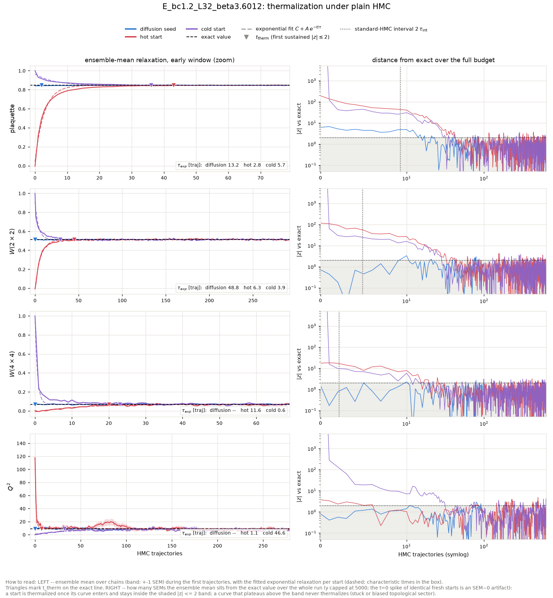

tau_int (hot-start chains, second half): plaquette = 4.62 +- 0.47, wilson_2x2 = 2.44 +- 0.22, wilson_4x4 = 1.07 +- 0.08, wilson_6x6 = 0.60 +- 0.02. Topology: hot-start HMC L=32 beta=3.6012 -> tau_int(Q) = 15.8.

### Diagnostics: raw diffusion output (before any HMC)

| observable | value | error | exact | z_exact | reference | ref_error | z_ref | ks_p | chi2_p |
|---|---|---|---|---|---|---|---|---|---|
| plaquette | 0.8411 | 0.0009791 | 0.8462 | -5.232 | 0.8463 | 0.0003874 | -4.966 | 5.99e-05 |  |
| wilson_1x1 | 0.8411 | 0.0009791 | 0.8462 | -5.232 | 0.8463 | 0.0003874 | -4.966 | 5.99e-05 |  |
| wilson_1x2 | 0.7072 | 0.001922 | 0.7161 | -4.623 | 0.7162 | 0.0008025 | -4.332 | 0.0006474 |  |
| wilson_2x2 | 0.5144 | 0.002553 | 0.5128 | 0.6286 | 0.5137 | 0.001718 | 0.2334 | 0.9542 |  |
| wilson_2x3 | 0.3682 | 0.003444 | 0.3672 | 0.2924 | 0.3685 | 0.002204 | -0.0651 | 0.9542 |  |
| wilson_3x3 | 0.2207 | 0.003449 | 0.2225 | -0.5202 | 0.2236 | 0.002907 | -0.6455 | 0.1545 |  |
| wilson_3x4 | 0.1368 | 0.003152 | 0.1348 | 0.6249 | 0.138 | 0.002983 | -0.2706 | 0.3294 |  |
| wilson_4x4 | 0.07424 | 0.002555 | 0.06914 | 1.994 | 0.07279 | 0.002786 | 0.383 | 0.9353 |  |
| wilson_4x5 | 0.03815 | 0.002353 | 0.03545 | 1.146 | 0.03951 | 0.002368 | -0.407 | 0.9693 |  |
| wilson_5x5 | 0.01587 | 0.003349 | 0.01538 | 0.144 | 0.01732 | 0.002186 | -0.3635 | 0.9542 |  |
| wilson_5x6 | 0.007944 | 0.002119 | 0.006676 | 0.5983 | 0.007357 | 0.00197 | 0.2027 | 0.9807 |  |
| wilson_6x6 | 0.001752 | 0.002236 | 0.002451 | -0.3126 | 0.0004098 | 0.002014 | 0.4461 | 0.389 |  |
| wilson_6x7 | -0.001981 | 0.002302 | 0.0009001 | -1.252 | -0.000592 | 0.002396 | -0.4181 | 0.6395 |  |
| wilson_7x7 | 0.0005735 | 0.001463 | 0.0002797 | 0.2009 | -0.0001792 | 0.002403 | 0.2675 | 0.6395 |  |
| wilson_7x8 | 8.432e-05 | 0.002063 | 8.691e-05 | -0.001257 | -0.001172 | 0.001882 | 0.45 | 0.3294 |  |
| wilson_8x8 | 0.0004619 | 0.002508 | 2.285e-05 | 0.1751 | -0.001396 | 0.001659 | 0.6178 | 0.7901 |  |
| wilson_8x10 | -0.0004505 | 0.001861 | 1.58e-06 | -0.2429 | -0.001665 | 0.00208 | 0.4353 | 0.9126 |  |
| wilson_10x10 | -0.001183 | 0.001301 | 5.602e-08 | -0.9099 | -0.003042 | 0.001414 | 0.9672 | 0.4548 |  |
| wilson_10x12 | 0.002092 | 0.00187 | 1.986e-09 | 1.119 | -0.001659 | 0.001865 | 1.42 | 0.1712 |  |
| wilson_12x12 | 0.002188 | 0.001773 | 3.611e-11 | 1.234 | 0.002849 | 0.001558 | -0.2803 | 0.4212 |  |
| creutz_2 | 0.1449 | 0.003112 | 0.167 | -7.078 |  |  |  |  |  |
| creutz_3 | 0.1774 | 0.008045 | 0.167 | 1.299 |  |  |  |  |  |
| creutz_4 | 0.133 | 0.02649 | 0.167 | -1.284 |  |  |  |  |  |
| creutz_5 | 0.2116 | 0.1326 | 0.167 | 0.3367 |  |  |  |  |  |
| creutz_6 | 0.8196 | 1.074 | 0.167 | 0.6076 |  |  |  |  |  |
| creutz_8 | -3.618 | nan | 0.167 | nan |  |  |  |  |  |
| Q | 0.3672 | 0.2824 | 0 | 1.3 | -0.349 | 0.1436 | 2.26 | 0.02577 |  |
| Q^2 | 9.867 | 1.135 | 8.856 | 0.8908 | 9.922 | 0.8755 | -0.03815 | 0.1251 |  |
| chi_top ((<Q^2>-<Q>^2)/V) | 0.009504 | 0.001044 | 0.008648 | 0.8203 | 0.00957 | 0.0008743 | -0.04859 | 0.0003679 |  |
| Q histogram vs exact P(Q) | 8.264 | nan | 12 | nan |  |  |  |  | 0.7642 |

### Diagnostics: the same configs after 96 HMC trajectories

| observable | value | error | exact | z_exact | reference | ref_error | z_ref | ks_p | chi2_p |
|---|---|---|---|---|---|---|---|---|---|
| plaquette | 0.8461 | 0.0006001 | 0.8462 | -0.2499 | 0.8463 | 0.0003874 | -0.3597 | 0.5631 |  |
| wilson_1x1 | 0.8461 | 0.0006001 | 0.8462 | -0.2499 | 0.8463 | 0.0003874 | -0.3597 | 0.5631 |  |
| wilson_1x2 | 0.716 | 0.001532 | 0.7161 | -0.07569 | 0.7162 | 0.0008025 | -0.1457 | 0.9888 |  |
| wilson_2x2 | 0.5116 | 0.00196 | 0.5128 | -0.6075 | 0.5137 | 0.001718 | -0.7969 | 0.389 |  |
| wilson_2x3 | 0.3669 | 0.002558 | 0.3672 | -0.1288 | 0.3685 | 0.002204 | -0.4746 | 0.5259 |  |
| wilson_3x3 | 0.2227 | 0.002889 | 0.2225 | 0.07541 | 0.2236 | 0.002907 | -0.2194 | 0.4898 |  |
| wilson_3x4 | 0.1336 | 0.002711 | 0.1348 | -0.4561 | 0.138 | 0.002983 | -1.087 | 0.3294 |  |
| wilson_4x4 | 0.06866 | 0.002982 | 0.06914 | -0.1615 | 0.07279 | 0.002786 | -1.012 | 0.2087 |  |
| wilson_4x5 | 0.03596 | 0.002663 | 0.03545 | 0.1887 | 0.03951 | 0.002368 | -0.997 | 0.2297 |  |
| wilson_5x5 | 0.01874 | 0.002665 | 0.01538 | 1.257 | 0.01732 | 0.002186 | 0.4106 | 0.8246 |  |
| wilson_5x6 | 0.01018 | 0.002721 | 0.006676 | 1.287 | 0.007357 | 0.00197 | 0.8399 | 0.6011 |  |
| wilson_6x6 | 0.003223 | 0.002724 | 0.002451 | 0.2832 | 0.0004098 | 0.002014 | 0.8303 | 0.8569 |  |
| wilson_6x7 | 0.0005017 | 0.002686 | 0.0009001 | -0.1483 | -0.000592 | 0.002396 | 0.3039 | 0.7901 |  |
| wilson_7x7 | -0.0007909 | 0.002608 | 0.0002797 | -0.4105 | -0.0001792 | 0.002403 | -0.1725 | 0.8569 |  |
| wilson_7x8 | 0.0005316 | 0.002524 | 8.691e-05 | 0.1762 | -0.001172 | 0.001882 | 0.5412 | 0.9693 |  |
| wilson_8x8 | -0.003264 | 0.002172 | 2.285e-05 | -1.513 | -0.001396 | 0.001659 | -0.6835 | 0.7538 |  |
| wilson_8x10 | -0.003644 | 0.001865 | 1.58e-06 | -1.955 | -0.001665 | 0.00208 | -0.7084 | 0.3021 |  |
| wilson_10x10 | 0.0008434 | 0.001721 | 5.602e-08 | 0.4901 | -0.003042 | 0.001414 | 1.744 | 0.3021 |  |
| wilson_10x12 | -0.0004132 | 0.00178 | 1.986e-09 | -0.2321 | -0.001659 | 0.001865 | 0.4832 | 0.6395 |  |
| wilson_12x12 | 0.001574 | 0.001834 | 3.611e-11 | 0.858 | 0.002849 | 0.001558 | -0.53 | 0.1122 |  |
| creutz_2 | 0.1692 | 0.00273 | 0.167 | 0.7978 |  |  |  |  |  |
| creutz_3 | 0.1665 | 0.007519 | 0.167 | -0.05977 |  |  |  |  |  |
| creutz_4 | 0.1546 | 0.02784 | 0.167 | -0.446 |  |  |  |  |  |
| creutz_5 | 0.005065 | 0.1074 | 0.167 | -1.507 |  |  |  |  |  |
| creutz_6 | 0.5399 | 0.5588 | 0.167 | 0.6673 |  |  |  |  |  |
| Q | 0.3516 | 0.2422 | 0 | 1.452 | -0.349 | 0.1436 | 2.488 | 0.3021 |  |
| Q^2 | 8.102 | 1.471 | 8.856 | -0.5127 | 9.922 | 0.8755 | -1.063 | 0.7538 |  |
| chi_top ((<Q^2>-<Q>^2)/V) | 0.007791 | 0.001366 | 0.008648 | -0.6276 | 0.00957 | 0.0008743 | -1.097 | 0.02577 |  |
| Q histogram vs exact P(Q) | 6.254 | nan | 12 | nan |  |  |  |  | 0.9028 |

## A_bc1.5_L32_beta4.44493

HMC: step size 0.1897, 5 leapfrog steps, acceptance seed/hot/cold = 0.966/0.964/0.963. Diffusion-seed batch: 128 chains x 96 trajectories (0.10 s/traj for the whole batch); baselines: 32 chains x 640 trajectories.

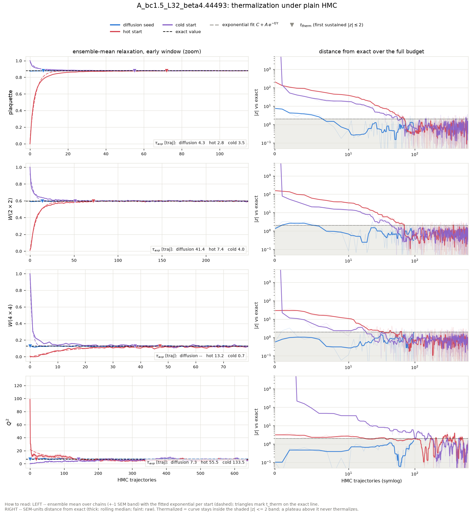

tau_int (hot-start chains, second half): plaquette = 3.96 +- 0.49, wilson_2x2 = 2.95 +- 0.35, wilson_4x4 = 1.31 +- 0.08, wilson_6x6 = 0.71 +- 0.03. Topology: hot-start HMC L=32 beta=4.44493 -> tau_int(Q) = 27.4.

### Diagnostics: raw diffusion output (before any HMC)

| observable | value | error | exact | z_exact | reference | ref_error | z_ref | ks_p | chi2_p |
|---|---|---|---|---|---|---|---|---|---|
| plaquette | 0.8743 | 0.0005236 | 0.8787 | -8.439 | 0.8784 | 0.000309 | -6.786 | 5.026e-09 |  |
| wilson_1x1 | 0.8743 | 0.0005236 | 0.8787 | -8.439 | 0.8784 | 0.000309 | -6.786 | 5.026e-09 |  |
| wilson_1x2 | 0.7643 | 0.001273 | 0.7721 | -6.097 | 0.7717 | 0.000713 | -5.045 | 2.022e-05 |  |
| wilson_2x2 | 0.5935 | 0.002032 | 0.5961 | -1.296 | 0.5953 | 0.001405 | -0.7487 | 0.389 |  |
| wilson_2x3 | 0.4574 | 0.002548 | 0.4603 | -1.142 | 0.4593 | 0.001788 | -0.6343 | 0.2297 |  |
| wilson_3x3 | 0.3084 | 0.00328 | 0.3123 | -1.189 | 0.3134 | 0.002825 | -1.169 | 0.1712 |  |
| wilson_3x4 | 0.2097 | 0.003588 | 0.2119 | -0.6063 | 0.2146 | 0.00375 | -0.9521 | 0.1392 |  |
| wilson_4x4 | 0.1284 | 0.003273 | 0.1263 | 0.655 | 0.1293 | 0.00391 | -0.1747 | 0.6395 |  |
| wilson_4x5 | 0.0774 | 0.003077 | 0.07529 | 0.687 | 0.08031 | 0.003584 | -0.616 | 0.2763 |  |
| wilson_5x5 | 0.04375 | 0.003657 | 0.03944 | 1.18 | 0.04332 | 0.003036 | 0.09097 | 0.3294 |  |
| wilson_5x6 | 0.02332 | 0.003585 | 0.02066 | 0.7441 | 0.02549 | 0.002479 | -0.4979 | 0.2763 |  |
| wilson_6x6 | 0.01164 | 0.003513 | 0.009508 | 0.6062 | 0.01475 | 0.002347 | -0.7372 | 0.2763 |  |
| wilson_6x7 | 0.00385 | 0.002767 | 0.004376 | -0.1902 | 0.007128 | 0.002285 | -0.9136 | 0.7163 |  |
| wilson_7x7 | -0.001392 | 0.00209 | 0.00177 | -1.513 | 0.003979 | 0.001934 | -1.886 | 0.2522 |  |
| wilson_7x8 | -0.00117 | 0.002659 | 0.0007158 | -0.7092 | 0.001205 | 0.001546 | -0.772 | 0.7163 |  |
| wilson_8x8 | -0.003024 | 0.003157 | 0.0002544 | -1.039 | -0.002753 | 0.001441 | -0.07822 | 0.9941 |  |
| wilson_8x10 | -0.00137 | 0.001875 | 3.213e-05 | -0.748 | -0.0007767 | 0.001928 | -0.2206 | 0.8864 |  |
| wilson_10x10 | 0.0001612 | 0.002631 | 2.419e-06 | 0.06035 | 0.0001487 | 0.001678 | 0.004009 | 0.5631 |  |
| wilson_10x12 | -0.002291 | 0.001916 | 1.821e-07 | -1.196 | 0.003922 | 0.001524 | -2.538 | 0.0631 |  |
| wilson_12x12 | 0.002874 | 0.001664 | 8.173e-09 | 1.727 | -0.0008532 | 0.00187 | 1.489 | 0.3294 |  |
| creutz_2 | 0.1186 | 0.001877 | 0.1293 | -5.718 |  |  |  |  |  |
| creutz_3 | 0.1336 | 0.004646 | 0.1293 | 0.929 |  |  |  |  |  |
| creutz_4 | 0.1044 | 0.01554 | 0.1293 | -1.603 |  |  |  |  |  |
| creutz_5 | 0.064 | 0.04734 | 0.1293 | -1.38 |  |  |  |  |  |
| creutz_6 | 0.06621 | 0.16 | 0.1293 | -0.3945 |  |  |  |  |  |
| Q | 0.3594 | 0.2323 | 0 | 1.547 | -0.5208 | 0.1322 | 3.293 | 0.003137 |  |
| Q^2 | 6.859 | 0.5638 | 6.786 | 0.1303 | 5.969 | 0.6047 | 1.077 | 0.3584 |  |
| chi_top ((<Q^2>-<Q>^2)/V) | 0.006572 | 0.0005397 | 0.006627 | -0.1007 | 0.005564 | 0.0006204 | 1.226 | 0.002243 |  |
| Q histogram vs exact P(Q) | 18.67 | nan | 10 | nan |  |  |  |  | 0.04462 |

### Diagnostics: the same configs after 96 HMC trajectories

| observable | value | error | exact | z_exact | reference | ref_error | z_ref | ks_p | chi2_p |
|---|---|---|---|---|---|---|---|---|---|
| plaquette | 0.8784 | 0.0004106 | 0.8787 | -0.6196 | 0.8784 | 0.000309 | 0.07533 | 0.6395 |  |
| wilson_1x1 | 0.8784 | 0.0004106 | 0.8787 | -0.6196 | 0.8784 | 0.000309 | 0.07533 | 0.6395 |  |
| wilson_1x2 | 0.7723 | 0.0009718 | 0.7721 | 0.2241 | 0.7717 | 0.000713 | 0.5128 | 0.6395 |  |
| wilson_2x2 | 0.5966 | 0.001791 | 0.5961 | 0.2877 | 0.5953 | 0.001405 | 0.5709 | 0.389 |  |
| wilson_2x3 | 0.4608 | 0.002773 | 0.4603 | 0.1837 | 0.4593 | 0.001788 | 0.4377 | 0.5259 |  |
| wilson_3x3 | 0.3126 | 0.003245 | 0.3123 | 0.1181 | 0.3134 | 0.002825 | -0.1803 | 0.6011 |  |
| wilson_3x4 | 0.2153 | 0.004106 | 0.2119 | 0.8424 | 0.2146 | 0.00375 | 0.1247 | 0.9693 |  |
| wilson_4x4 | 0.1337 | 0.004293 | 0.1263 | 1.728 | 0.1293 | 0.00391 | 0.7549 | 0.3294 |  |
| wilson_4x5 | 0.08365 | 0.004073 | 0.07529 | 2.053 | 0.08031 | 0.003584 | 0.6155 | 0.7901 |  |
| wilson_5x5 | 0.04592 | 0.002914 | 0.03944 | 2.225 | 0.04332 | 0.003036 | 0.6179 | 0.6011 |  |
| wilson_5x6 | 0.02226 | 0.002643 | 0.02066 | 0.6065 | 0.02549 | 0.002479 | -0.8927 | 0.6011 |  |
| wilson_6x6 | 0.01098 | 0.00256 | 0.009508 | 0.5758 | 0.01475 | 0.002347 | -1.086 | 0.4898 |  |
| wilson_6x7 | 0.004446 | 0.003219 | 0.004376 | 0.02151 | 0.007128 | 0.002285 | -0.6796 | 0.6395 |  |
| wilson_7x7 | 0.0005941 | 0.003439 | 0.00177 | -0.3419 | 0.003979 | 0.001934 | -0.8578 | 0.6011 |  |
| wilson_7x8 | 0.0006048 | 0.002963 | 0.0007158 | -0.03748 | 0.001205 | 0.001546 | -0.1795 | 0.7163 |  |
| wilson_8x8 | -0.00103 | 0.002941 | 0.0002544 | -0.4368 | -0.002753 | 0.001441 | 0.5259 | 0.5631 |  |
| wilson_8x10 | -0.0003609 | 0.002323 | 3.213e-05 | -0.1692 | -0.0007767 | 0.001928 | 0.1378 | 0.6011 |  |
| wilson_10x10 | -0.001088 | 0.002104 | 2.419e-06 | -0.5183 | 0.0001487 | 0.001678 | -0.4596 | 0.4898 |  |
| wilson_10x12 | -0.0004672 | 0.001749 | 1.821e-07 | -0.2672 | 0.003922 | 0.001524 | -1.892 | 0.3021 |  |
| wilson_12x12 | -0.0002484 | 0.002223 | 8.173e-09 | -0.1118 | -0.0008532 | 0.00187 | 0.2083 | 0.8864 |  |
| creutz_2 | 0.1293 | 0.001709 | 0.1293 | -0.005996 |  |  |  |  |  |
| creutz_3 | 0.1294 | 0.004706 | 0.1293 | 0.02579 |  |  |  |  |  |
| creutz_4 | 0.1034 | 0.01299 | 0.1293 | -1.994 |  |  |  |  |  |
| creutz_5 | 0.1307 | 0.04133 | 0.1293 | 0.03242 |  |  |  |  |  |
| creutz_6 | -0.01756 | 0.1676 | 0.1293 | -0.8765 |  |  |  |  |  |
| creutz_7 | 1.108 | nan | 0.1293 | nan |  |  |  |  |  |
| Q | 0.1172 | 0.2649 | 0 | 0.4424 | -0.5208 | 0.1322 | 2.155 | 0.2297 |  |
| Q^2 | 8.367 | 0.9905 | 6.786 | 1.597 | 5.969 | 0.6047 | 2.067 | 0.4898 |  |
| chi_top ((<Q^2>-<Q>^2)/V) | 0.008158 | 0.0009737 | 0.006627 | 1.572 | 0.005564 | 0.0006204 | 2.246 | 0.005104 |  |
| Q histogram vs exact P(Q) | 9.355 | nan | 10 | nan |  |  |  |  | 0.4988 |

## A_bc2_L32_beta6.10518

HMC: step size 0.1619, 6 leapfrog steps, acceptance seed/hot/cold = 0.974/0.972/0.975. Diffusion-seed batch: 128 chains x 96 trajectories (0.11 s/traj for the whole batch); baselines: 32 chains x 640 trajectories.

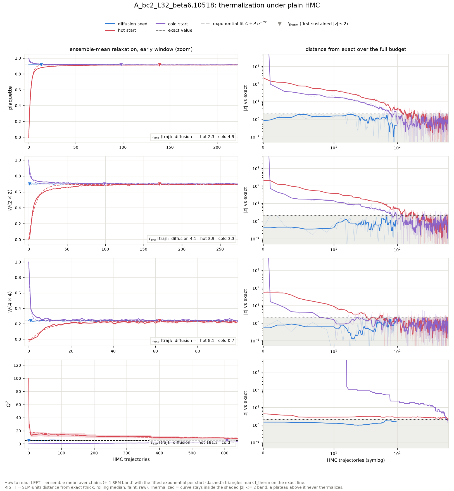

tau_int (hot-start chains, second half): plaquette = 5.10 +- 0.65, wilson_2x2 = 4.41 +- 0.48, wilson_4x4 = 1.29 +- 0.07, wilson_6x6 = 0.94 +- 0.05. Topology: hot-start HMC L=32 beta=6.10518 -> tau_int(Q) = 34.8.

Where 'never' stood at the end: the hot start ended the 640-trajectory budget still at Q^2 at |z| ~ 2.

### Diagnostics: raw diffusion output (before any HMC)

| observable | value | error | exact | z_exact | reference | ref_error | z_ref | ks_p | chi2_p |
|---|---|---|---|---|---|---|---|---|---|
| plaquette | 0.9143 | 0.0004584 | 0.914 | 0.8359 | 0.9143 | 0.0001898 | 0.1346 | 0.0711 |  |
| wilson_1x1 | 0.9143 | 0.0004584 | 0.914 | 0.8359 | 0.9143 | 0.0001898 | 0.1346 | 0.0711 |  |
| wilson_1x2 | 0.834 | 0.001073 | 0.8353 | -1.249 | 0.8361 | 0.0005353 | -1.756 | 0.017 |  |
| wilson_2x2 | 0.697 | 0.002172 | 0.6978 | -0.3675 | 0.6995 | 0.0009961 | -1.067 | 0.0711 |  |
| wilson_2x3 | 0.5815 | 0.0033 | 0.5829 | -0.413 | 0.5851 | 0.001632 | -0.9821 | 0.1004 |  |
| wilson_3x3 | 0.445 | 0.004106 | 0.445 | 0.0002135 | 0.4505 | 0.002149 | -1.182 | 0.1392 |  |
| wilson_3x4 | 0.3405 | 0.004832 | 0.3397 | 0.1479 | 0.347 | 0.002879 | -1.168 | 0.08971 |  |
| wilson_4x4 | 0.2395 | 0.005036 | 0.2371 | 0.4809 | 0.2462 | 0.003532 | -1.099 | 0.5259 |  |
| wilson_4x5 | 0.1695 | 0.005524 | 0.1654 | 0.7383 | 0.1734 | 0.003624 | -0.5853 | 0.5631 |  |
| wilson_5x5 | 0.1102 | 0.005314 | 0.1055 | 0.8765 | 0.1111 | 0.003848 | -0.1425 | 0.678 |  |
| wilson_5x6 | 0.07126 | 0.004955 | 0.06728 | 0.8038 | 0.0715 | 0.003732 | -0.03932 | 0.6011 |  |
| wilson_6x6 | 0.04224 | 0.004366 | 0.03921 | 0.6928 | 0.04151 | 0.003986 | 0.123 | 0.6395 |  |
| wilson_6x7 | 0.02523 | 0.004039 | 0.02286 | 0.5867 | 0.0258 | 0.003616 | -0.1062 | 0.5631 |  |
| wilson_7x7 | 0.0135 | 0.002762 | 0.01218 | 0.48 | 0.01483 | 0.003796 | -0.283 | 0.1392 |  |
| wilson_7x8 | 0.005905 | 0.002974 | 0.006487 | -0.1957 | 0.007417 | 0.004109 | -0.2982 | 0.1251 |  |
| wilson_8x8 | 0.00425 | 0.003117 | 0.003158 | 0.3504 | 0.006329 | 0.003061 | -0.4759 | 0.3294 |  |
| wilson_8x10 | 0.001839 | 0.002812 | 0.0007487 | 0.3878 | 0.005868 | 0.003149 | -0.9542 | 0.4212 |  |
| wilson_10x10 | -0.0007505 | 0.002981 | 0.0001238 | -0.2933 | -0.001497 | 0.002756 | 0.1838 | 0.9941 |  |
| wilson_10x12 | 0.00158 | 0.002826 | 2.049e-05 | 0.5519 | -0.002269 | 0.002148 | 1.084 | 0.1392 |  |
| wilson_12x12 | -0.003339 | 0.001814 | 2.365e-06 | -1.842 | 0.0007953 | 0.001629 | -1.695 | 0.004349 |  |
| creutz_2 | 0.08748 | 0.001285 | 0.08996 | -1.935 |  |  |  |  |  |
| creutz_3 | 0.08642 | 0.003021 | 0.08996 | -1.172 |  |  |  |  |  |
| creutz_4 | 0.084 | 0.006364 | 0.08996 | -0.9369 |  |  |  |  |  |
| creutz_5 | 0.08531 | 0.01521 | 0.08996 | -0.306 |  |  |  |  |  |
| creutz_6 | 0.08748 | 0.04275 | 0.08996 | -0.0582 |  |  |  |  |  |
| creutz_7 | 0.1096 | 0.1308 | 0.08996 | 0.1498 |  |  |  |  |  |
| creutz_8 | -0.4983 | 0.5665 | 0.08996 | -1.039 |  |  |  |  |  |
| Q | -0.01562 | 0.221 | 0 | -0.07069 | -0.1979 | 0.1063 | 0.7433 | 0.5259 |  |
| Q^2 | 5.656 | 0.7235 | 4.686 | 1.341 | 4.219 | 0.4579 | 1.679 | 0.2763 |  |
| chi_top ((<Q^2>-<Q>^2)/V) | 0.005523 | 0.0007061 | 0.004576 | 1.341 | 0.004082 | 0.0004247 | 1.75 | 0.0005374 |  |
| Q histogram vs exact P(Q) | 6.766 | nan | 8 | nan |  |  |  |  | 0.5621 |

### Diagnostics: the same configs after 96 HMC trajectories

| observable | value | error | exact | z_exact | reference | ref_error | z_ref | ks_p | chi2_p |
|---|---|---|---|---|---|---|---|---|---|
| plaquette | 0.9141 | 0.0004242 | 0.914 | 0.3746 | 0.9143 | 0.0001898 | -0.339 | 0.3021 |  |
| wilson_1x1 | 0.9141 | 0.0004242 | 0.914 | 0.3746 | 0.9143 | 0.0001898 | -0.339 | 0.3021 |  |
| wilson_1x2 | 0.8346 | 0.0009222 | 0.8353 | -0.7864 | 0.8361 | 0.0005353 | -1.398 | 0.1122 |  |
| wilson_2x2 | 0.696 | 0.001951 | 0.6978 | -0.9207 | 0.6995 | 0.0009961 | -1.619 | 0.2297 |  |
| wilson_2x3 | 0.5786 | 0.002566 | 0.5829 | -1.673 | 0.5851 | 0.001632 | -2.153 | 0.04938 |  |
| wilson_3x3 | 0.4386 | 0.003598 | 0.445 | -1.785 | 0.4505 | 0.002149 | -2.84 | 0.017 |  |
| wilson_3x4 | 0.3313 | 0.003882 | 0.3397 | -2.175 | 0.347 | 0.002879 | -3.254 | 0.0006474 |  |
| wilson_4x4 | 0.2273 | 0.004486 | 0.2371 | -2.17 | 0.2462 | 0.003532 | -3.313 | 0.00159 |  |
| wilson_4x5 | 0.1547 | 0.004015 | 0.1654 | -2.657 | 0.1734 | 0.003624 | -3.441 | 0.01474 |  |
| wilson_5x5 | 0.09542 | 0.004271 | 0.1055 | -2.357 | 0.1111 | 0.003848 | -2.724 | 0.02577 |  |
| wilson_5x6 | 0.05394 | 0.00376 | 0.06728 | -3.546 | 0.0715 | 0.003732 | -3.314 | 0.01957 |  |
| wilson_6x6 | 0.02683 | 0.003604 | 0.03921 | -3.435 | 0.04151 | 0.003986 | -2.731 | 0.03831 |  |
| wilson_6x7 | 0.01264 | 0.003028 | 0.02286 | -3.375 | 0.0258 | 0.003616 | -2.791 | 0.011 |  |
| wilson_7x7 | 0.004326 | 0.003471 | 0.01218 | -2.262 | 0.01483 | 0.003796 | -2.042 | 0.02947 |  |
| wilson_7x8 | 0.001269 | 0.002607 | 0.006487 | -2.001 | 0.007417 | 0.004109 | -1.263 | 0.1545 |  |
| wilson_8x8 | -0.001301 | 0.002205 | 0.003158 | -2.022 | 0.006329 | 0.003061 | -2.022 | 0.1712 |  |
| wilson_8x10 | 0.000754 | 0.0031 | 0.0007487 | 0.001712 | 0.005868 | 0.003149 | -1.157 | 0.1545 |  |
| wilson_10x10 | -0.0001921 | 0.003638 | 0.0001238 | -0.08683 | -0.001497 | 0.002756 | 0.2858 | 0.7163 |  |
| wilson_10x12 | -0.0005696 | 0.002629 | 2.049e-05 | -0.2244 | -0.002269 | 0.002148 | 0.5005 | 0.9126 |  |
| wilson_12x12 | -0.0005566 | 0.002403 | 2.365e-06 | -0.2326 | 0.0007953 | 0.001629 | -0.4656 | 0.8864 |  |
| creutz_2 | 0.09063 | 0.001297 | 0.08996 | 0.5138 |  |  |  |  |  |
| creutz_3 | 0.09229 | 0.003243 | 0.08996 | 0.7183 |  |  |  |  |  |
| creutz_4 | 0.0961 | 0.007496 | 0.08996 | 0.8191 |  |  |  |  |  |
| creutz_5 | 0.09889 | 0.0195 | 0.08996 | 0.4575 |  |  |  |  |  |
| creutz_6 | 0.1279 | 0.06653 | 0.08996 | 0.5695 |  |  |  |  |  |
| creutz_7 | 0.3187 | 0.5641 | 0.08996 | 0.4054 |  |  |  |  |  |
| Q | -0.007812 | 0.2385 | 0 | -0.03275 | -0.1979 | 0.1063 | 0.728 | 0.7538 |  |
| Q^2 | 5.695 | 0.7076 | 4.686 | 1.426 | 4.219 | 0.4579 | 1.752 | 0.5631 |  |
| chi_top ((<Q^2>-<Q>^2)/V) | 0.005562 | 0.0006913 | 0.004576 | 1.425 | 0.004082 | 0.0004247 | 1.824 | 0.0005374 |  |
| Q histogram vs exact P(Q) | 10.41 | nan | 8 | nan |  |  |  |  | 0.2371 |

## E_bc2.7_L32_beta8.79549

HMC: step size 0.1349, 7 leapfrog steps, acceptance seed/hot/cold = 0.978/0.977/0.977. Diffusion-seed batch: 128 chains x 96 trajectories (0.12 s/traj for the whole batch); baselines: 32 chains x 640 trajectories.

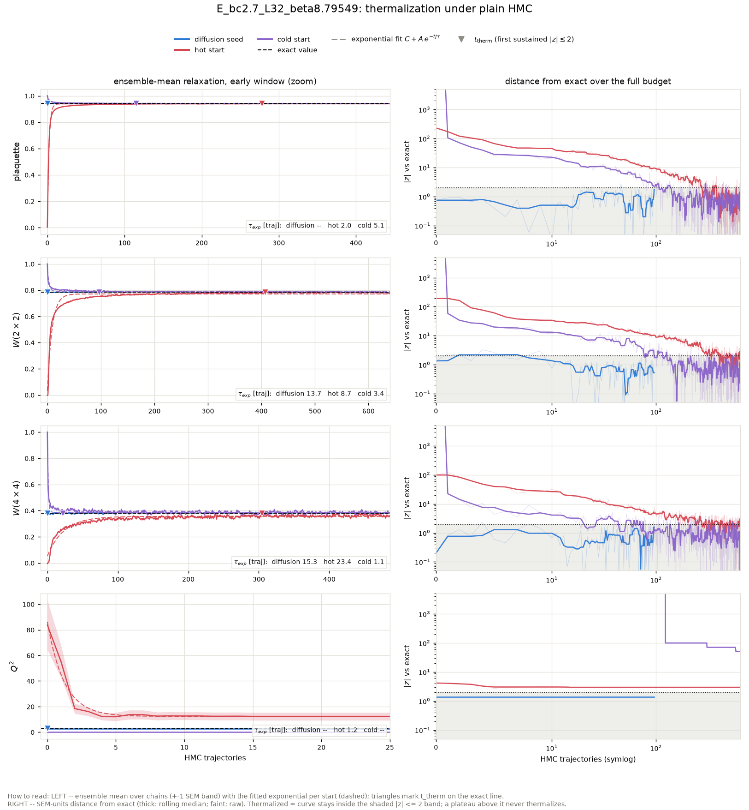

tau_int (hot-start chains, second half): plaquette = 4.70 +- 0.51, wilson_2x2 = 4.78 +- 0.73, wilson_4x4 = 1.22 +- 0.06, wilson_6x6 = 0.98 +- 0.06. Topology: hot-start HMC L=32 beta=8.79549 -> **frozen** (no tunneling).

Where 'never' stood at the end: the hot start ended the 640-trajectory budget still at Q^2 at |z| ~ 3; the cold start ended the 640-trajectory budget still at Q^2 at |z| ~ 51.

### Diagnostics: raw diffusion output (before any HMC)

| observable | value | error | exact | z_exact | reference | ref_error | z_ref | ks_p | chi2_p |
|---|---|---|---|---|---|---|---|---|---|
| plaquette | 0.9411 | 0.00027 | 0.9413 | -0.6915 | 0.9414 | 0.0002078 | -0.844 | 0.4548 |  |
| wilson_1x1 | 0.9411 | 0.00027 | 0.9413 | -0.6915 | 0.9414 | 0.0002078 | -0.844 | 0.4548 |  |
| wilson_1x2 | 0.8847 | 0.0005243 | 0.8861 | -2.545 | 0.8864 | 0.000418 | -2.528 | 0.04938 |  |
| wilson_2x2 | 0.7835 | 0.001332 | 0.7851 | -1.214 | 0.7859 | 0.000953 | -1.495 | 0.04938 |  |
| wilson_2x3 | 0.6923 | 0.002143 | 0.6957 | -1.564 | 0.6969 | 0.001602 | -1.717 | 0.1004 |  |
| wilson_3x3 | 0.5772 | 0.003298 | 0.5802 | -0.9012 | 0.5824 | 0.002199 | -1.298 | 0.04354 |  |
| wilson_3x4 | 0.4806 | 0.004011 | 0.4839 | -0.8279 | 0.486 | 0.003123 | -1.053 | 0.08971 |  |
| wilson_4x4 | 0.3808 | 0.00442 | 0.3799 | 0.202 | 0.3803 | 0.003851 | 0.08551 | 0.7163 |  |
| wilson_4x5 | 0.298 | 0.004613 | 0.2983 | -0.06281 | 0.2983 | 0.004217 | -0.05012 | 0.9542 |  |
| wilson_5x5 | 0.2228 | 0.004939 | 0.2204 | 0.4744 | 0.2197 | 0.003998 | 0.48 | 0.9941 |  |
| wilson_5x6 | 0.1664 | 0.005032 | 0.1629 | 0.7019 | 0.1628 | 0.004022 | 0.5723 | 0.6395 |  |
| wilson_6x6 | 0.1201 | 0.004593 | 0.1133 | 1.463 | 0.1133 | 0.003859 | 1.127 | 0.7163 |  |
| wilson_6x7 | 0.0868 | 0.004486 | 0.07884 | 1.774 | 0.08086 | 0.003907 | 0.9987 | 0.9542 |  |
| wilson_7x7 | 0.0597 | 0.003905 | 0.05163 | 2.067 | 0.05268 | 0.003519 | 1.335 | 0.678 |  |
| wilson_7x8 | 0.04235 | 0.003854 | 0.03381 | 2.218 | 0.03733 | 0.003483 | 0.9663 | 0.7538 |  |
| wilson_8x8 | 0.02991 | 0.003158 | 0.02084 | 2.874 | 0.02271 | 0.003349 | 1.564 | 0.3584 |  |
| wilson_8x10 | 0.01756 | 0.003853 | 0.007917 | 2.503 | 0.01145 | 0.003642 | 1.153 | 0.2522 |  |
| wilson_10x10 | 0.00925 | 0.003394 | 0.002362 | 2.03 | 0.003096 | 0.003259 | 1.308 | 0.07995 |  |
| wilson_10x12 | 0.004942 | 0.002873 | 0.0007045 | 1.475 | 0.001191 | 0.002748 | 0.9434 | 0.4212 |  |
| wilson_12x12 | 0.003165 | 0.002522 | 0.000165 | 1.189 | 0.001963 | 0.001938 | 0.378 | 0.9693 |  |
| creutz_2 | 0.05973 | 0.0009362 | 0.06048 | -0.805 |  |  |  |  |  |
| creutz_3 | 0.05802 | 0.001911 | 0.06048 | -1.289 |  |  |  |  |  |
| creutz_4 | 0.0495 | 0.003722 | 0.06048 | -2.95 |  |  |  |  |  |
| creutz_5 | 0.04562 | 0.007435 | 0.06048 | -1.999 |  |  |  |  |  |
| creutz_6 | 0.03521 | 0.0145 | 0.06048 | -1.742 |  |  |  |  |  |
| creutz_7 | 0.05 | 0.03289 | 0.06048 | -0.3188 |  |  |  |  |  |
| creutz_8 | 0.00458 | 0.06891 | 0.06048 | -0.8112 |  |  |  |  |  |
| Q | -0.0625 | 0.09836 | 0 | -0.6354 | 0.06771 | 0.1365 | -0.7741 | 0.8864 |  |
| Q^2 | 2.656 | 0.3722 | 3.142 | -1.306 | 2.911 | 0.3073 | -0.5288 | 0.9542 |  |
| chi_top ((<Q^2>-<Q>^2)/V) | 0.00259 | 0.0003599 | 0.003069 | -1.33 | 0.002839 | 0.0002937 | -0.535 | 0.0002049 |  |
| Q histogram vs exact P(Q) | 4.533 | nan | 8 | nan |  |  |  |  | 0.8061 |

### Diagnostics: the same configs after 96 HMC trajectories

| observable | value | error | exact | z_exact | reference | ref_error | z_ref | ks_p | chi2_p |
|---|---|---|---|---|---|---|---|---|---|
| plaquette | 0.9409 | 0.0002375 | 0.9413 | -1.567 | 0.9414 | 0.0002078 | -1.499 | 0.1892 |  |
| wilson_1x1 | 0.9409 | 0.0002375 | 0.9413 | -1.567 | 0.9414 | 0.0002078 | -1.499 | 0.1892 |  |
| wilson_1x2 | 0.8853 | 0.0004997 | 0.8861 | -1.611 | 0.8864 | 0.000418 | -1.79 | 0.1392 |  |
| wilson_2x2 | 0.7846 | 0.001081 | 0.7851 | -0.483 | 0.7859 | 0.000953 | -0.9397 | 0.2522 |  |
| wilson_2x3 | 0.6944 | 0.001737 | 0.6957 | -0.7032 | 0.6969 | 0.001602 | -1.043 | 0.3021 |  |
| wilson_3x3 | 0.5774 | 0.002505 | 0.5802 | -1.112 | 0.5824 | 0.002199 | -1.487 | 0.1545 |  |
| wilson_3x4 | 0.4793 | 0.003198 | 0.4839 | -1.461 | 0.486 | 0.003123 | -1.499 | 0.0631 |  |
| wilson_4x4 | 0.3742 | 0.003738 | 0.3799 | -1.538 | 0.3803 | 0.003851 | -1.144 | 0.3021 |  |
| wilson_4x5 | 0.2924 | 0.004093 | 0.2983 | -1.435 | 0.2983 | 0.004217 | -1.004 | 0.3294 |  |
| wilson_5x5 | 0.2146 | 0.004663 | 0.2204 | -1.253 | 0.2197 | 0.003998 | -0.8361 | 0.3294 |  |
| wilson_5x6 | 0.1577 | 0.005114 | 0.1629 | -1.026 | 0.1628 | 0.004022 | -0.7828 | 0.4548 |  |
| wilson_6x6 | 0.1089 | 0.00478 | 0.1133 | -0.9285 | 0.1133 | 0.003859 | -0.7159 | 0.4548 |  |
| wilson_6x7 | 0.07696 | 0.004781 | 0.07884 | -0.394 | 0.08086 | 0.003907 | -0.632 | 0.678 |  |
| wilson_7x7 | 0.05213 | 0.004394 | 0.05163 | 0.1143 | 0.05268 | 0.003519 | -0.09799 | 0.678 |  |
| wilson_7x8 | 0.03564 | 0.003888 | 0.03381 | 0.4717 | 0.03733 | 0.003483 | -0.3244 | 0.4548 |  |
| wilson_8x8 | 0.0229 | 0.004555 | 0.02084 | 0.4532 | 0.02271 | 0.003349 | 0.03349 | 0.9542 |  |
| wilson_8x10 | 0.008638 | 0.003985 | 0.007917 | 0.1808 | 0.01145 | 0.003642 | -0.5205 | 0.4898 |  |
| wilson_10x10 | 0.003159 | 0.00446 | 0.002362 | 0.1788 | 0.003096 | 0.003259 | 0.0114 | 0.5259 |  |
| wilson_10x12 | 0.002715 | 0.004099 | 0.0007045 | 0.4904 | 0.001191 | 0.002748 | 0.3087 | 0.8569 |  |
| wilson_12x12 | -0.000976 | 0.003562 | 0.000165 | -0.3203 | 0.001963 | 0.001938 | -0.7247 | 0.678 |  |
| creutz_2 | 0.05973 | 0.0008084 | 0.06048 | -0.9357 |  |  |  |  |  |
| creutz_3 | 0.06244 | 0.001875 | 0.06048 | 1.046 |  |  |  |  |  |
| creutz_4 | 0.06115 | 0.003548 | 0.06048 | 0.1873 |  |  |  |  |  |
| creutz_5 | 0.06281 | 0.006983 | 0.06048 | 0.3325 |  |  |  |  |  |
| creutz_6 | 0.0618 | 0.01588 | 0.06048 | 0.08314 |  |  |  |  |  |
| creutz_7 | 0.04239 | 0.03384 | 0.06048 | -0.5348 |  |  |  |  |  |
| creutz_8 | 0.06201 | 0.07816 | 0.06048 | 0.0195 |  |  |  |  |  |
| Q | -0.0625 | 0.09836 | 0 | -0.6354 | 0.06771 | 0.1365 | -0.7741 | 0.8864 |  |
| Q^2 | 2.656 | 0.3722 | 3.142 | -1.306 | 2.911 | 0.3073 | -0.5288 | 0.9542 |  |
| chi_top ((<Q^2>-<Q>^2)/V) | 0.00259 | 0.0003599 | 0.003069 | -1.33 | 0.002839 | 0.0002937 | -0.535 | 0.0002049 |  |
| Q histogram vs exact P(Q) | 4.533 | nan | 8 | nan |  |  |  |  | 0.8061 |

## A_bc3_L32_beta10.015

HMC: step size 0.1264, 8 leapfrog steps, acceptance seed/hot/cold = 0.979/0.978/0.979. Diffusion-seed batch: 128 chains x 96 trajectories (0.13 s/traj for the whole batch); baselines: 32 chains x 640 trajectories.

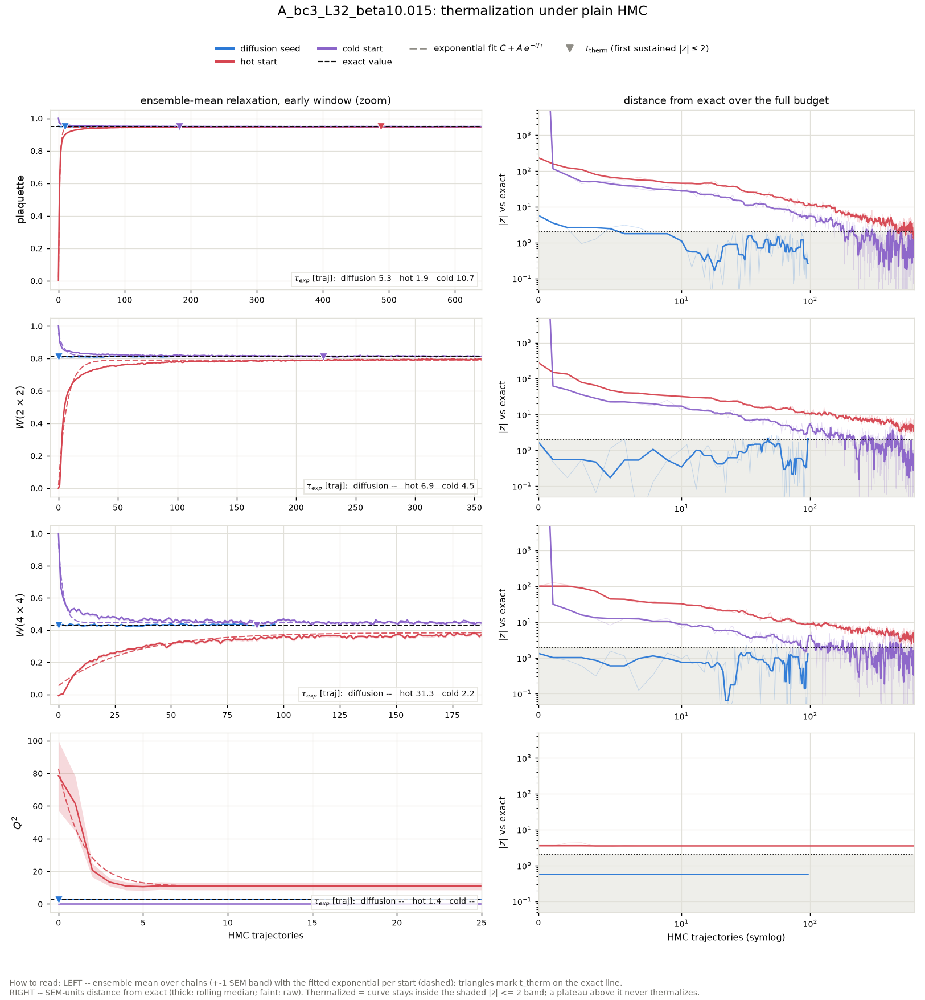

tau_int (hot-start chains, second half): plaquette = 6.17 +- 0.77, wilson_2x2 = 7.66 +- 1.29, wilson_4x4 = 2.49 +- 0.45, wilson_6x6 = 0.87 +- 0.04. Topology: hot-start HMC L=32 beta=10.015 -> **frozen** (no tunneling).

Where 'never' stood at the end: the hot start ended the 640-trajectory budget still at wilson_2x2 at |z| ~ 5, wilson_4x4 at |z| ~ 4, Q^2 at |z| ~ 4; the cold start ended the 640-trajectory budget still at Q^2 at |z| ~ 2736159195136.

### Diagnostics: raw diffusion output (before any HMC)

| observable | value | error | exact | z_exact | reference | ref_error | z_ref | ks_p | chi2_p |
|---|---|---|---|---|---|---|---|---|---|
| plaquette | 0.9501 | 0.0002874 | 0.9487 | 4.845 | 0.9486 | 0.0001186 | 4.872 | 8.674e-08 |  |
| wilson_1x1 | 0.9501 | 0.0002874 | 0.9487 | 4.845 | 0.9486 | 0.0001186 | 4.872 | 8.674e-08 |  |
| wilson_1x2 | 0.9013 | 0.0007282 | 0.9 | 1.774 | 0.9002 | 0.0002491 | 1.439 | 0.01275 |  |
| wilson_2x2 | 0.8119 | 0.001328 | 0.81 | 1.42 | 0.8102 | 0.0005851 | 1.134 | 0.2297 |  |
| wilson_2x3 | 0.7316 | 0.002105 | 0.729 | 1.259 | 0.7287 | 0.0009044 | 1.26 | 0.1251 |  |
| wilson_3x3 | 0.6261 | 0.003066 | 0.6224 | 1.195 | 0.6216 | 0.001485 | 1.32 | 0.1004 |  |
| wilson_3x4 | 0.536 | 0.003896 | 0.5314 | 1.178 | 0.5292 | 0.002277 | 1.502 | 0.05588 |  |
| wilson_4x4 | 0.4364 | 0.004769 | 0.4304 | 1.248 | 0.4289 | 0.002807 | 1.358 | 0.1122 |  |
| wilson_4x5 | 0.3533 | 0.005134 | 0.3486 | 0.9122 | 0.3456 | 0.00354 | 1.235 | 0.3021 |  |
| wilson_5x5 | 0.2727 | 0.005241 | 0.2679 | 0.9079 | 0.265 | 0.003876 | 1.171 | 0.6395 |  |
| wilson_5x6 | 0.2085 | 0.004957 | 0.2059 | 0.5309 | 0.2042 | 0.004145 | 0.6696 | 0.9126 |  |
| wilson_6x6 | 0.1532 | 0.004918 | 0.1501 | 0.6385 | 0.1501 | 0.004018 | 0.482 | 0.7901 |  |
| wilson_6x7 | 0.1104 | 0.00465 | 0.1094 | 0.2212 | 0.1104 | 0.004002 | -0.003403 | 0.9542 |  |
| wilson_7x7 | 0.07675 | 0.004691 | 0.07566 | 0.2341 | 0.07739 | 0.003572 | -0.1081 | 0.8569 |  |
| wilson_7x8 | 0.05315 | 0.004678 | 0.05232 | 0.178 | 0.05614 | 0.003853 | -0.4922 | 0.7163 |  |
| wilson_8x8 | 0.0344 | 0.005036 | 0.03433 | 0.01368 | 0.03666 | 0.00362 | -0.3659 | 0.4548 |  |
| wilson_8x10 | 0.01603 | 0.005768 | 0.01478 | 0.2167 | 0.01927 | 0.004252 | -0.4524 | 0.8246 |  |
| wilson_10x10 | 0.002554 | 0.004807 | 0.005151 | -0.5404 | 0.005632 | 0.003721 | -0.5065 | 0.7163 |  |
| wilson_10x12 | -0.0004436 | 0.003147 | 0.001796 | -0.7116 | 0.00171 | 0.002494 | -0.5364 | 0.7538 |  |
| wilson_12x12 | -0.001111 | 0.003772 | 0.0005072 | -0.4291 | 8.739e-05 | 0.002521 | -0.2642 | 0.1545 |  |
| creutz_2 | 0.05176 | 0.0007778 | 0.05268 | -1.185 |  |  |  |  |  |
| creutz_3 | 0.05175 | 0.001466 | 0.05268 | -0.639 |  |  |  |  |  |
| creutz_4 | 0.05028 | 0.002733 | 0.05268 | -0.8812 |  |  |  |  |  |
| creutz_5 | 0.04804 | 0.005519 | 0.05268 | -0.8421 |  |  |  |  |  |
| creutz_6 | 0.03977 | 0.01195 | 0.05268 | -1.081 |  |  |  |  |  |
| creutz_7 | 0.03628 | 0.02542 | 0.05268 | -0.6456 |  |  |  |  |  |
| creutz_8 | 0.06785 | 0.05336 | 0.05268 | 0.2843 |  |  |  |  |  |
| Q | 0.03906 | 0.1517 | 0 | 0.2574 | -0.1042 | 0.1518 | 0.6672 | 0.9807 |  |
| Q^2 | 2.93 | 0.267 | 2.736 | 0.7247 | 3.406 | 0.25 | -1.303 | 0.9941 |  |
| chi_top ((<Q^2>-<Q>^2)/V) | 0.00286 | 0.0002635 | 0.002672 | 0.7116 | 0.003316 | 0.0002389 | -1.283 | 0.0004451 |  |
| Q histogram vs exact P(Q) | 4.29 | nan | 6 | nan |  |  |  |  | 0.6376 |

### Diagnostics: the same configs after 96 HMC trajectories

| observable | value | error | exact | z_exact | reference | ref_error | z_ref | ks_p | chi2_p |
|---|---|---|---|---|---|---|---|---|---|
| plaquette | 0.9487 | 0.0001612 | 0.9487 | 0.3169 | 0.9486 | 0.0001186 | 0.8669 | 0.4212 |  |
| wilson_1x1 | 0.9487 | 0.0001612 | 0.9487 | 0.3169 | 0.9486 | 0.0001186 | 0.8669 | 0.4212 |  |
| wilson_1x2 | 0.9004 | 0.0003971 | 0.9 | 0.9722 | 0.9002 | 0.0002491 | 0.4303 | 0.7901 |  |
| wilson_2x2 | 0.8122 | 0.0008743 | 0.81 | 2.547 | 0.8102 | 0.0005851 | 1.889 | 0.1892 |  |
| wilson_2x3 | 0.732 | 0.001214 | 0.729 | 2.525 | 0.7287 | 0.0009044 | 2.182 | 0.1122 |  |
| wilson_3x3 | 0.6273 | 0.002069 | 0.6224 | 2.344 | 0.6216 | 0.001485 | 2.23 | 0.1545 |  |
| wilson_3x4 | 0.5361 | 0.002796 | 0.5314 | 1.687 | 0.5292 | 0.002277 | 1.916 | 0.1892 |  |
| wilson_4x4 | 0.4363 | 0.003863 | 0.4304 | 1.512 | 0.4289 | 0.002807 | 1.551 | 0.3584 |  |
| wilson_4x5 | 0.3555 | 0.004647 | 0.3486 | 1.475 | 0.3456 | 0.00354 | 1.69 | 0.4212 |  |
| wilson_5x5 | 0.2759 | 0.005224 | 0.2679 | 1.532 | 0.265 | 0.003876 | 1.672 | 0.3021 |  |
| wilson_5x6 | 0.2131 | 0.006092 | 0.2059 | 1.194 | 0.2042 | 0.004145 | 1.217 | 0.678 |  |
| wilson_6x6 | 0.1576 | 0.006196 | 0.1501 | 1.213 | 0.1501 | 0.004018 | 1.007 | 0.5259 |  |
| wilson_6x7 | 0.1155 | 0.007063 | 0.1094 | 0.8702 | 0.1104 | 0.004002 | 0.6279 | 0.678 |  |
| wilson_7x7 | 0.08184 | 0.006957 | 0.07566 | 0.8893 | 0.07739 | 0.003572 | 0.5692 | 0.4212 |  |
| wilson_7x8 | 0.05684 | 0.007458 | 0.05232 | 0.6053 | 0.05614 | 0.003853 | 0.08325 | 0.9693 |  |
| wilson_8x8 | 0.03694 | 0.00656 | 0.03433 | 0.3985 | 0.03666 | 0.00362 | 0.03688 | 0.9972 |  |
| wilson_8x10 | 0.01565 | 0.00565 | 0.01478 | 0.1547 | 0.01927 | 0.004252 | -0.5115 | 0.2522 |  |
| wilson_10x10 | 0.004474 | 0.00442 | 0.005151 | -0.1533 | 0.005632 | 0.003721 | -0.2005 | 0.7163 |  |
| wilson_10x12 | 0.001483 | 0.00421 | 0.001796 | -0.07435 | 0.00171 | 0.002494 | -0.04644 | 0.9996 |  |
| wilson_12x12 | -0.003636 | 0.004093 | 0.0005072 | -1.012 | 8.739e-05 | 0.002521 | -0.7744 | 0.5631 |  |
| creutz_2 | 0.05074 | 0.000755 | 0.05268 | -2.572 |  |  |  |  |  |
| creutz_3 | 0.05057 | 0.001657 | 0.05268 | -1.275 |  |  |  |  |  |
| creutz_4 | 0.04912 | 0.003066 | 0.05268 | -1.162 |  |  |  |  |  |
| creutz_5 | 0.04871 | 0.00554 | 0.05268 | -0.7167 |  |  |  |  |  |
| creutz_6 | 0.04381 | 0.0104 | 0.05268 | -0.8535 |  |  |  |  |  |
| creutz_7 | 0.03452 | 0.02001 | 0.05268 | -0.9075 |  |  |  |  |  |
| creutz_8 | 0.06621 | 0.04968 | 0.05268 | 0.2723 |  |  |  |  |  |
| Q | 0.03906 | 0.1517 | 0 | 0.2574 | -0.1042 | 0.1518 | 0.6672 | 0.9807 |  |
| Q^2 | 2.93 | 0.267 | 2.736 | 0.7247 | 3.406 | 0.25 | -1.303 | 0.9941 |  |
| chi_top ((<Q^2>-<Q>^2)/V) | 0.00286 | 0.0002635 | 0.002672 | 0.7116 | 0.003316 | 0.0002389 | -1.283 | 0.0004451 |  |
| Q histogram vs exact P(Q) | 4.29 | nan | 6 | nan |  |  |  |  | 0.6376 |

## E_bc3.4_L32_beta11.6638

HMC: step size 0.1171, 9 leapfrog steps, acceptance seed/hot/cold = 0.983/0.983/0.986. Diffusion-seed batch: 128 chains x 96 trajectories (0.14 s/traj for the whole batch); baselines: 32 chains x 640 trajectories.

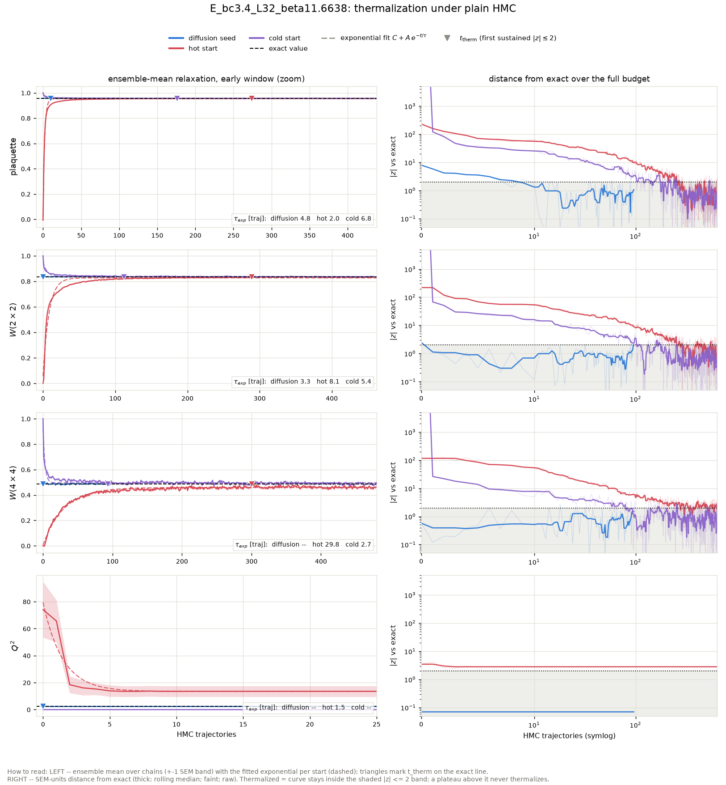

tau_int (hot-start chains, second half): plaquette = 4.80 +- 0.61, wilson_2x2 = 3.77 +- 0.42, wilson_4x4 = 2.39 +- 0.31, wilson_6x6 = 0.92 +- 0.06. Topology: hot-start HMC L=32 beta=11.6638 -> **frozen** (no tunneling).

Where 'never' stood at the end: the hot start ended the 640-trajectory budget still at Q^2 at |z| ~ 3; the cold start ended the 640-trajectory budget still at Q^2 at |z| ~ 2329518014464.

### Diagnostics: raw diffusion output (before any HMC)

| observable | value | error | exact | z_exact | reference | ref_error | z_ref | ks_p | chi2_p |
|---|---|---|---|---|---|---|---|---|---|
| plaquette | 0.9576 | 0.0002024 | 0.9561 | 7.455 | 0.9559 | 0.0001386 | 6.855 | 4.282e-07 |  |
| wilson_1x1 | 0.9576 | 0.0002024 | 0.9561 | 7.455 | 0.9559 | 0.0001386 | 6.855 | 4.282e-07 |  |
| wilson_1x2 | 0.9157 | 0.0004534 | 0.9142 | 3.469 | 0.9138 | 0.0002659 | 3.668 | 0.005104 |  |
| wilson_2x2 | 0.8379 | 0.0009758 | 0.8357 | 2.259 | 0.8347 | 0.0004393 | 2.978 | 0.01474 |  |
| wilson_2x3 | 0.7661 | 0.001454 | 0.764 | 1.472 | 0.7621 | 0.0009043 | 2.323 | 0.04938 |  |
| wilson_3x3 | 0.6702 | 0.002304 | 0.6678 | 1.065 | 0.6659 | 0.001512 | 1.557 | 0.1392 |  |
| wilson_3x4 | 0.5872 | 0.002927 | 0.5837 | 1.204 | 0.5811 | 0.00225 | 1.635 | 0.2763 |  |
| wilson_4x4 | 0.4901 | 0.003654 | 0.4878 | 0.6301 | 0.4857 | 0.002925 | 0.9253 | 0.3021 |  |
| wilson_4x5 | 0.4101 | 0.004547 | 0.4076 | 0.5425 | 0.4045 | 0.003549 | 0.9759 | 0.1712 |  |
| wilson_5x5 | 0.3276 | 0.005117 | 0.3257 | 0.371 | 0.3235 | 0.003744 | 0.6485 | 0.4548 |  |
| wilson_5x6 | 0.2633 | 0.005877 | 0.2603 | 0.5224 | 0.2551 | 0.004093 | 1.142 | 0.7901 |  |
| wilson_6x6 | 0.2027 | 0.006265 | 0.1988 | 0.6219 | 0.1932 | 0.004397 | 1.243 | 0.6395 |  |
| wilson_6x7 | 0.1564 | 0.006438 | 0.1519 | 0.6914 | 0.1444 | 0.004666 | 1.5 | 0.3294 |  |
| wilson_7x7 | 0.116 | 0.006419 | 0.111 | 0.7899 | 0.1062 | 0.005079 | 1.2 | 0.1892 |  |
| wilson_7x8 | 0.08725 | 0.006667 | 0.08105 | 0.9305 | 0.0746 | 0.005295 | 1.486 | 0.0631 |  |
| wilson_8x8 | 0.06285 | 0.006481 | 0.0566 | 0.9644 | 0.05156 | 0.004916 | 1.388 | 0.1251 |  |
| wilson_8x10 | 0.02981 | 0.006579 | 0.02761 | 0.335 | 0.02437 | 0.005169 | 0.6507 | 0.678 |  |
| wilson_10x10 | 0.009334 | 0.005285 | 0.01125 | -0.3635 | 0.007955 | 0.003943 | 0.209 | 0.6011 |  |
| wilson_10x12 | 0.001109 | 0.004198 | 0.004588 | -0.8287 | 0.002084 | 0.003642 | -0.1755 | 0.6011 |  |
| wilson_12x12 | -0.003494 | 0.003533 | 0.001563 | -1.431 | 0.002466 | 0.002998 | -1.286 | 0.6395 |  |
| creutz_2 | 0.0441 | 0.0005726 | 0.04487 | -1.349 |  |  |  |  |  |
| creutz_3 | 0.04416 | 0.00136 | 0.04487 | -0.5202 |  |  |  |  |  |
| creutz_4 | 0.04854 | 0.002574 | 0.04487 | 1.424 |  |  |  |  |  |
| creutz_5 | 0.04642 | 0.004294 | 0.04487 | 0.3599 |  |  |  |  |  |
| creutz_6 | 0.04311 | 0.007544 | 0.04487 | -0.2337 |  |  |  |  |  |
| creutz_7 | 0.03854 | 0.01392 | 0.04487 | -0.4545 |  |  |  |  |  |
| creutz_8 | 0.04295 | 0.02638 | 0.04487 | -0.07274 |  |  |  |  |  |
| Q | -0.2734 | 0.1642 | 0 | -1.665 | -0.09375 | 0.1449 | -0.8205 | 0.8246 |  |
| Q^2 | 2.352 | 0.3381 | 2.33 | 0.0652 | 3.417 | 0.3755 | -2.108 | 0.7163 |  |
| chi_top ((<Q^2>-<Q>^2)/V) | 0.002223 | 0.0002881 | 0.002275 | -0.1787 | 0.003328 | 0.0003724 | -2.346 | 0.0001119 |  |
| Q histogram vs exact P(Q) | 3.51 | nan | 6 | nan |  |  |  |  | 0.7427 |

### Diagnostics: the same configs after 96 HMC trajectories

| observable | value | error | exact | z_exact | reference | ref_error | z_ref | ks_p | chi2_p |
|---|---|---|---|---|---|---|---|---|---|
| plaquette | 0.9559 | 0.0002114 | 0.9561 | -0.8809 | 0.9559 | 0.0001386 | -0.05424 | 0.9888 |  |
| wilson_1x1 | 0.9559 | 0.0002114 | 0.9561 | -0.8809 | 0.9559 | 0.0001386 | -0.05424 | 0.9888 |  |
| wilson_1x2 | 0.9134 | 0.0004731 | 0.9142 | -1.633 | 0.9138 | 0.0002659 | -0.7699 | 0.7163 |  |
| wilson_2x2 | 0.8339 | 0.001089 | 0.8357 | -1.627 | 0.8347 | 0.0004393 | -0.6718 | 0.7538 |  |
| wilson_2x3 | 0.7611 | 0.001991 | 0.764 | -1.462 | 0.7621 | 0.0009043 | -0.4901 | 0.7538 |  |
| wilson_3x3 | 0.6642 | 0.003024 | 0.6678 | -1.19 | 0.6659 | 0.001512 | -0.5208 | 0.6011 |  |
| wilson_3x4 | 0.5785 | 0.003977 | 0.5837 | -1.285 | 0.5811 | 0.00225 | -0.569 | 0.5631 |  |
| wilson_4x4 | 0.4816 | 0.005273 | 0.4878 | -1.17 | 0.4857 | 0.002925 | -0.6868 | 0.2522 |  |
| wilson_4x5 | 0.3988 | 0.006 | 0.4076 | -1.464 | 0.4045 | 0.003549 | -0.8065 | 0.1251 |  |
| wilson_5x5 | 0.3167 | 0.007011 | 0.3257 | -1.288 | 0.3235 | 0.003744 | -0.8576 | 0.0711 |  |
| wilson_5x6 | 0.2489 | 0.007595 | 0.2603 | -1.49 | 0.2551 | 0.004093 | -0.7196 | 0.4212 |  |
| wilson_6x6 | 0.1889 | 0.007835 | 0.1988 | -1.272 | 0.1932 | 0.004397 | -0.484 | 0.7901 |  |
| wilson_6x7 | 0.1401 | 0.008099 | 0.1519 | -1.451 | 0.1444 | 0.004666 | -0.4581 | 0.9542 |  |
| wilson_7x7 | 0.1011 | 0.007263 | 0.111 | -1.357 | 0.1062 | 0.005079 | -0.5762 | 0.5259 |  |
| wilson_7x8 | 0.06975 | 0.007168 | 0.08105 | -1.576 | 0.0746 | 0.005295 | -0.5438 | 0.7901 |  |
| wilson_8x8 | 0.04707 | 0.006147 | 0.0566 | -1.552 | 0.05156 | 0.004916 | -0.5715 | 0.678 |  |
| wilson_8x10 | 0.01847 | 0.005993 | 0.02761 | -1.526 | 0.02437 | 0.005169 | -0.7458 | 0.5259 |  |
| wilson_10x10 | 0.005822 | 0.00493 | 0.01125 | -1.102 | 0.007955 | 0.003943 | -0.3379 | 0.5259 |  |
| wilson_10x12 | 0.003908 | 0.003762 | 0.004588 | -0.1807 | 0.002084 | 0.003642 | 0.3483 | 0.678 |  |
| wilson_12x12 | 0.004665 | 0.002617 | 0.001563 | 1.185 | 0.002466 | 0.002998 | 0.5527 | 0.8864 |  |
| creutz_2 | 0.0455 | 0.0006681 | 0.04487 | 0.9381 |  |  |  |  |  |
| creutz_3 | 0.04476 | 0.001416 | 0.04487 | -0.07454 |  |  |  |  |  |
| creutz_4 | 0.04541 | 0.002419 | 0.04487 | 0.2243 |  |  |  |  |  |
| creutz_5 | 0.04214 | 0.004387 | 0.04487 | -0.6223 |  |  |  |  |  |
| creutz_6 | 0.03552 | 0.008341 | 0.04487 | -1.121 |  |  |  |  |  |
| creutz_7 | 0.02827 | 0.01766 | 0.04487 | -0.9396 |  |  |  |  |  |
| creutz_8 | 0.02227 | 0.03731 | 0.04487 | -0.6058 |  |  |  |  |  |
| Q | -0.2734 | 0.1642 | 0 | -1.665 | -0.09375 | 0.1449 | -0.8205 | 0.8246 |  |
| Q^2 | 2.352 | 0.3381 | 2.33 | 0.0652 | 3.417 | 0.3755 | -2.108 | 0.7163 |  |
| chi_top ((<Q^2>-<Q>^2)/V) | 0.002223 | 0.0002881 | 0.002275 | -0.1787 | 0.003328 | 0.0003724 | -2.346 | 0.0001119 |  |
| Q histogram vs exact P(Q) | 3.51 | nan | 6 | nan |  |  |  |  | 0.7427 |

## A_bc4_L32_beta14.1464

HMC: step size 0.1063, 9 leapfrog steps, acceptance seed/hot/cold = 0.984/0.986/0.985. Diffusion-seed batch: 128 chains x 96 trajectories (0.14 s/traj for the whole batch); baselines: 32 chains x 640 trajectories.

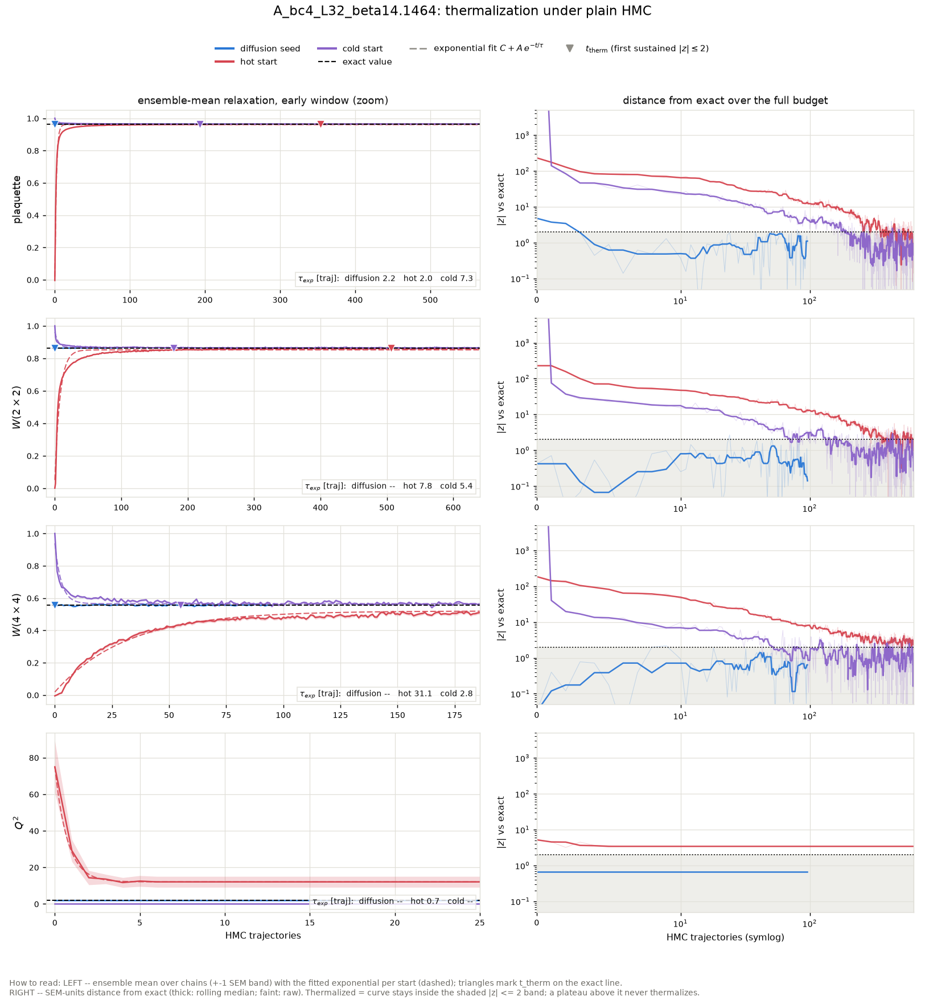

tau_int (hot-start chains, second half): plaquette = 4.42 +- 0.58, wilson_2x2 = 3.61 +- 0.45, wilson_4x4 = 1.94 +- 0.19, wilson_6x6 = 0.97 +- 0.06. Topology: hot-start HMC L=32 beta=14.1464 -> **frozen** (no tunneling).

Where 'never' stood at the end: the hot start ended the 640-trajectory budget still at wilson_4x4 at |z| ~ 3, wilson_6x6 at |z| ~ 3, Q^2 at |z| ~ 3; the cold start ended the 640-trajectory budget still at Q^2 at |z| ~ 1903991324672.

### Diagnostics: raw diffusion output (before any HMC)

| observable | value | error | exact | z_exact | reference | ref_error | z_ref | ks_p | chi2_p |
|---|---|---|---|---|---|---|---|---|---|
| plaquette | 0.9648 | 0.0001644 | 0.964 | 4.773 | 0.9643 | 0.0001394 | 2.375 | 0.009477 |  |
| wilson_1x1 | 0.9648 | 0.0001644 | 0.964 | 4.773 | 0.9643 | 0.0001394 | 2.375 | 0.009477 |  |
| wilson_1x2 | 0.9296 | 0.0003422 | 0.9293 | 1.128 | 0.9297 | 0.0002902 | -0.04551 | 0.4548 |  |
| wilson_2x2 | 0.8632 | 0.0008011 | 0.8635 | -0.4487 | 0.8648 | 0.0005656 | -1.71 | 0.2522 |  |
| wilson_2x3 | 0.8019 | 0.001226 | 0.8024 | -0.4465 | 0.8041 | 0.001006 | -1.388 | 0.389 |  |
| wilson_3x3 | 0.7186 | 0.001761 | 0.7188 | -0.1484 | 0.7215 | 0.001633 | -1.21 | 0.4898 |  |
| wilson_3x4 | 0.6439 | 0.002443 | 0.6439 | -0.003484 | 0.6464 | 0.002382 | -0.7434 | 0.4898 |  |
| wilson_4x4 | 0.5561 | 0.00318 | 0.556 | 0.03771 | 0.5589 | 0.003229 | -0.5971 | 0.5631 |  |
| wilson_4x5 | 0.4796 | 0.004284 | 0.4801 | -0.129 | 0.483 | 0.003787 | -0.5982 | 0.4548 |  |
| wilson_5x5 | 0.401 | 0.005184 | 0.3997 | 0.2582 | 0.4026 | 0.004329 | -0.2296 | 0.7163 |  |
| wilson_5x6 | 0.3315 | 0.005759 | 0.3327 | -0.2027 | 0.3371 | 0.004763 | -0.7403 | 0.5259 |  |
| wilson_6x6 | 0.2678 | 0.006657 | 0.267 | 0.1316 | 0.2695 | 0.004692 | -0.2044 | 0.6395 |  |
| wilson_6x7 | 0.2129 | 0.006617 | 0.2142 | -0.1993 | 0.2188 | 0.004882 | -0.7191 | 0.678 |  |
| wilson_7x7 | 0.1684 | 0.006744 | 0.1657 | 0.404 | 0.1698 | 0.00535 | -0.1575 | 0.7901 |  |
| wilson_7x8 | 0.1282 | 0.006842 | 0.1282 | 0.003163 | 0.1338 | 0.005268 | -0.6477 | 0.5631 |  |
| wilson_8x8 | 0.099 | 0.006225 | 0.09558 | 0.5496 | 0.09956 | 0.005676 | -0.06608 | 0.8246 |  |
| wilson_8x10 | 0.05591 | 0.005698 | 0.05315 | 0.4857 | 0.05826 | 0.004829 | -0.3145 | 0.6395 |  |
| wilson_10x10 | 0.02773 | 0.006106 | 0.02552 | 0.3624 | 0.03309 | 0.004208 | -0.7232 | 0.7163 |  |
| wilson_10x12 | 0.01664 | 0.005466 | 0.01225 | 0.8027 | 0.01664 | 0.004387 | -0.0007619 | 0.7901 |  |
| wilson_12x12 | 0.01089 | 0.004704 | 0.00508 | 1.235 | 0.009305 | 0.005203 | 0.2257 | 0.678 |  |
| creutz_2 | 0.03712 | 0.0005426 | 0.03668 | 0.7983 |  |  |  |  |  |
| creutz_3 | 0.0361 | 0.001048 | 0.03668 | -0.5578 |  |  |  |  |  |
| creutz_4 | 0.03681 | 0.001863 | 0.03668 | 0.06521 |  |  |  |  |  |
| creutz_5 | 0.03082 | 0.003157 | 0.03668 | -1.856 |  |  |  |  |  |
| creutz_6 | 0.02304 | 0.00578 | 0.03668 | -2.361 |  |  |  |  |  |
| creutz_7 | 0.004752 | 0.009127 | 0.03668 | -3.498 |  |  |  |  |  |
| creutz_8 | -0.01445 | 0.01791 | 0.03668 | -2.855 |  |  |  |  |  |
| Q | 0.07031 | 0.1218 | 0 | 0.5774 | -0.07292 | 0.1031 | 0.8977 | 0.678 |  |
| Q^2 | 2.086 | 0.2321 | 1.904 | 0.7839 | 1.635 | 0.1596 | 1.599 | 0.8569 |  |
| chi_top ((<Q^2>-<Q>^2)/V) | 0.002032 | 0.0002337 | 0.001859 | 0.7397 | 0.001592 | 0.0001506 | 1.584 | 4.022e-06 |  |
| Q histogram vs exact P(Q) | 2.334 | nan | 6 | nan |  |  |  |  | 0.8866 |

### Diagnostics: the same configs after 96 HMC trajectories

| observable | value | error | exact | z_exact | reference | ref_error | z_ref | ks_p | chi2_p |
|---|---|---|---|---|---|---|---|---|---|
| plaquette | 0.9638 | 0.0001252 | 0.964 | -1.3 | 0.9643 | 0.0001394 | -2.324 | 0.0711 |  |
| wilson_1x1 | 0.9638 | 0.0001252 | 0.964 | -1.3 | 0.9643 | 0.0001394 | -2.324 | 0.0711 |  |
| wilson_1x2 | 0.9291 | 0.0003555 | 0.9293 | -0.3971 | 0.9297 | 0.0002902 | -1.193 | 0.1122 |  |
| wilson_2x2 | 0.8634 | 0.0006619 | 0.8635 | -0.1452 | 0.8648 | 0.0005656 | -1.624 | 0.1712 |  |
| wilson_2x3 | 0.8028 | 0.001066 | 0.8024 | 0.327 | 0.8041 | 0.001006 | -0.8907 | 0.5631 |  |
| wilson_3x3 | 0.72 | 0.001492 | 0.7188 | 0.799 | 0.7215 | 0.001633 | -0.6572 | 0.8246 |  |
| wilson_3x4 | 0.6459 | 0.002268 | 0.6439 | 0.8993 | 0.6464 | 0.002382 | -0.1486 | 0.9888 |  |
| wilson_4x4 | 0.5583 | 0.002853 | 0.556 | 0.786 | 0.5589 | 0.003229 | -0.1353 | 0.8569 |  |
| wilson_4x5 | 0.4831 | 0.003501 | 0.4801 | 0.8356 | 0.483 | 0.003787 | 0.01107 | 0.9888 |  |
| wilson_5x5 | 0.4018 | 0.004717 | 0.3997 | 0.447 | 0.4026 | 0.004329 | -0.122 | 0.9807 |  |
| wilson_5x6 | 0.3351 | 0.0054 | 0.3327 | 0.4436 | 0.3371 | 0.004763 | -0.2736 | 0.9807 |  |
| wilson_6x6 | 0.2703 | 0.006165 | 0.267 | 0.5404 | 0.2695 | 0.004692 | 0.102 | 0.7901 |  |
| wilson_6x7 | 0.2185 | 0.006165 | 0.2142 | 0.6967 | 0.2188 | 0.004882 | -0.03807 | 0.7163 |  |
| wilson_7x7 | 0.1687 | 0.00635 | 0.1657 | 0.4779 | 0.1698 | 0.00535 | -0.1259 | 0.2522 |  |
| wilson_7x8 | 0.1323 | 0.006425 | 0.1282 | 0.6483 | 0.1338 | 0.005268 | -0.1744 | 0.3021 |  |
| wilson_8x8 | 0.0991 | 0.006445 | 0.09558 | 0.5462 | 0.09956 | 0.005676 | -0.05327 | 0.8246 |  |
| wilson_8x10 | 0.05404 | 0.006216 | 0.05315 | 0.1445 | 0.05826 | 0.004829 | -0.5359 | 0.3021 |  |
| wilson_10x10 | 0.02374 | 0.005541 | 0.02552 | -0.3203 | 0.03309 | 0.004208 | -1.344 | 0.2522 |  |
| wilson_10x12 | 0.006394 | 0.004884 | 0.01225 | -1.2 | 0.01664 | 0.004387 | -1.562 | 0.03831 |  |
| wilson_12x12 | -0.001719 | 0.003722 | 0.00508 | -1.826 | 0.009305 | 0.005203 | -1.723 | 0.1392 |  |
| creutz_2 | 0.03666 | 0.0004475 | 0.03668 | -0.05317 |  |  |  |  |  |
| creutz_3 | 0.03601 | 0.001036 | 0.03668 | -0.6533 |  |  |  |  |  |
| creutz_4 | 0.03733 | 0.001979 | 0.03668 | 0.3246 |  |  |  |  |  |
| creutz_5 | 0.03955 | 0.002972 | 0.03668 | 0.9631 |  |  |  |  |  |
| creutz_6 | 0.03337 | 0.005364 | 0.03668 | -0.6185 |  |  |  |  |  |
| creutz_7 | 0.04583 | 0.009633 | 0.03668 | 0.9499 |  |  |  |  |  |
| creutz_8 | 0.04632 | 0.01561 | 0.03668 | 0.6169 |  |  |  |  |  |
| Q | 0.07031 | 0.1218 | 0 | 0.5774 | -0.07292 | 0.1031 | 0.8977 | 0.678 |  |
| Q^2 | 2.086 | 0.2321 | 1.904 | 0.7839 | 1.635 | 0.1596 | 1.599 | 0.8569 |  |
| chi_top ((<Q^2>-<Q>^2)/V) | 0.002032 | 0.0002337 | 0.001859 | 0.7397 | 0.001592 | 0.0001506 | 1.584 | 4.022e-06 |  |
| Q histogram vs exact P(Q) | 2.334 | nan | 6 | nan |  |  |  |  | 0.8866 |

## E_bc4.5_L32_beta16.2057

HMC: step size 0.0994, 10 leapfrog steps, acceptance seed/hot/cold = 0.980/0.979/0.979. Diffusion-seed batch: 128 chains x 96 trajectories (0.15 s/traj for the whole batch); baselines: 32 chains x 640 trajectories.

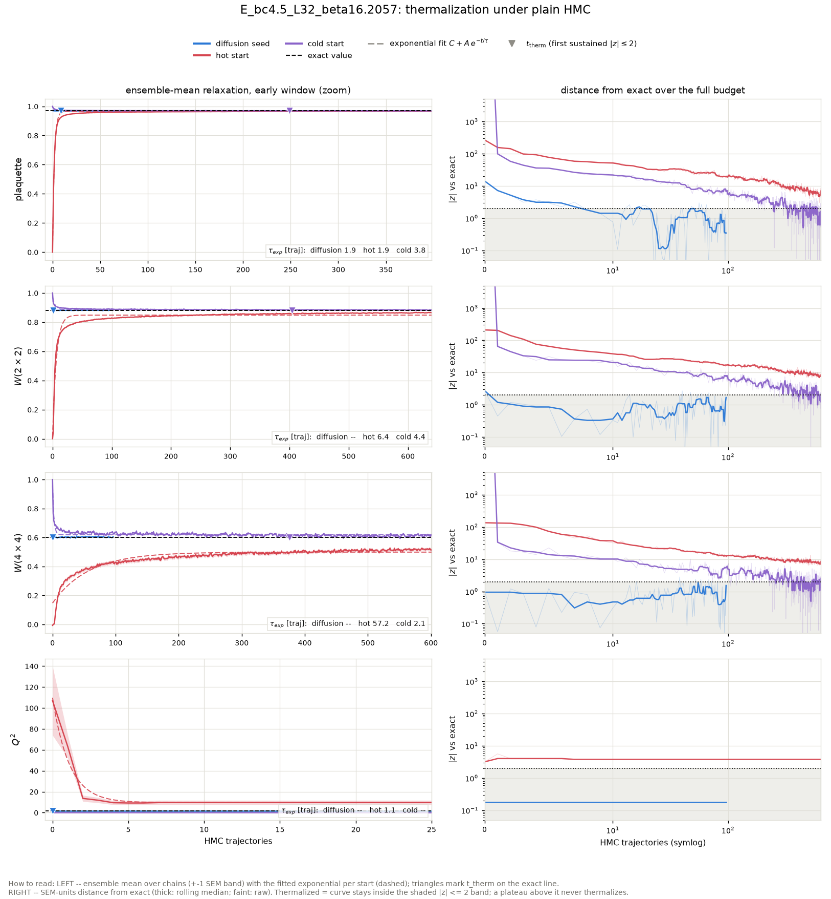

tau_int (hot-start chains, second half): plaquette = 6.47 +- 0.87, wilson_2x2 = 11.54 +- 1.50, wilson_4x4 = 6.83 +- 1.31, wilson_6x6 = 1.00 +- 0.06. Topology: hot-start HMC L=32 beta=16.2057 -> **frozen** (no tunneling).

Where 'never' stood at the end: the hot start ended the 640-trajectory budget still at plaquette at |z| ~ 6, wilson_2x2 at |z| ~ 8, wilson_4x4 at |z| ~ 8, wilson_6x6 at |z| ~ 6, Q^2 at |z| ~ 4; the cold start ended the 640-trajectory budget still at Q^2 at |z| ~ 1653625323520.

### Diagnostics: raw diffusion output (before any HMC)

| observable | value | error | exact | z_exact | reference | ref_error | z_ref | ks_p | chi2_p |
|---|---|---|---|---|---|---|---|---|---|
| plaquette | 0.9706 | 0.0001368 | 0.9686 | 14.52 | 0.9689 | 0.0001215 | 9.566 | 4.377e-16 |  |
| wilson_1x1 | 0.9706 | 0.0001368 | 0.9686 | 14.52 | 0.9689 | 0.0001215 | 9.566 | 4.377e-16 |  |
| wilson_1x2 | 0.9408 | 0.000313 | 0.9383 | 8.035 | 0.9389 | 0.0002259 | 4.755 | 3.143e-05 |  |
| wilson_2x2 | 0.8822 | 0.0005944 | 0.8803 | 3.217 | 0.8819 | 0.0004272 | 0.4271 | 0.678 |  |
| wilson_2x3 | 0.828 | 0.0009825 | 0.826 | 2.04 | 0.8283 | 0.0006681 | -0.2356 | 0.6395 |  |
| wilson_3x3 | 0.7524 | 0.001519 | 0.7507 | 1.133 | 0.755 | 0.001061 | -1.416 | 0.04938 |  |
| wilson_3x4 | 0.6843 | 0.002206 | 0.6822 | 0.9194 | 0.687 | 0.00175 | -0.9693 | 0.1545 |  |
| wilson_4x4 | 0.6034 | 0.003025 | 0.6006 | 0.9282 | 0.6055 | 0.002254 | -0.542 | 0.389 |  |
| wilson_4x5 | 0.5317 | 0.003933 | 0.5287 | 0.7677 | 0.5333 | 0.002937 | -0.3067 | 0.678 |  |
| wilson_5x5 | 0.4552 | 0.004281 | 0.4509 | 1.012 | 0.4546 | 0.003265 | 0.1142 | 0.8246 |  |
| wilson_5x6 | 0.3872 | 0.004696 | 0.3845 | 0.577 | 0.3866 | 0.003745 | 0.08838 | 0.7901 |  |
| wilson_6x6 | 0.3205 | 0.005244 | 0.3176 | 0.5657 | 0.3192 | 0.004082 | 0.1975 | 0.9888 |  |
| wilson_6x7 | 0.2635 | 0.005366 | 0.2623 | 0.2325 | 0.2625 | 0.004529 | 0.1537 | 0.7901 |  |
| wilson_7x7 | 0.21 | 0.006508 | 0.2099 | 0.01938 | 0.2103 | 0.004829 | -0.03353 | 0.9807 |  |
| wilson_7x8 | 0.1686 | 0.006777 | 0.1679 | 0.09927 | 0.1689 | 0.00502 | -0.03678 | 0.8569 |  |
| wilson_8x8 | 0.1305 | 0.00697 | 0.1301 | 0.0567 | 0.1307 | 0.005123 | -0.022 | 0.8569 |  |
| wilson_8x10 | 0.07723 | 0.006785 | 0.07815 | -0.1354 | 0.07974 | 0.00472 | -0.3043 | 0.5631 |  |
| wilson_10x10 | 0.03989 | 0.006521 | 0.04132 | -0.2187 | 0.04097 | 0.003961 | -0.1412 | 0.7538 |  |
| wilson_10x12 | 0.01574 | 0.006068 | 0.02185 | -1.006 | 0.01927 | 0.00331 | -0.5106 | 0.4898 |  |
| wilson_12x12 | 0.003157 | 0.006769 | 0.01017 | -1.036 | 0.004811 | 0.003369 | -0.2188 | 0.7538 |  |
| creutz_2 | 0.033 | 0.0004523 | 0.03186 | 2.514 |  |  |  |  |  |
| creutz_3 | 0.03225 | 0.0008962 | 0.03186 | 0.4301 |  |  |  |  |  |
| creutz_4 | 0.03084 | 0.001571 | 0.03186 | -0.6493 |  |  |  |  |  |
| creutz_5 | 0.02902 | 0.002779 | 0.03186 | -1.022 |  |  |  |  |  |
| creutz_6 | 0.02705 | 0.004596 | 0.03186 | -1.048 |  |  |  |  |  |
| creutz_7 | 0.03145 | 0.007412 | 0.03186 | -0.05527 |  |  |  |  |  |
| creutz_8 | 0.03623 | 0.01305 | 0.03186 | 0.3346 |  |  |  |  |  |
| Q | -0.0625 | 0.08863 | 0 | -0.7051 | -0.1302 | 0.07449 | 0.5848 | 0.7163 |  |
| Q^2 | 1.688 | 0.1812 | 1.654 | 0.187 | 1.578 | 0.1684 | 0.4421 | 0.6011 |  |
| chi_top ((<Q^2>-<Q>^2)/V) | 0.001644 | 0.0001775 | 0.001615 | 0.1649 | 0.001525 | 0.0001571 | 0.5044 | 6.754e-09 |  |
| Q histogram vs exact P(Q) | 10.08 | nan | 6 | nan |  |  |  |  | 0.1214 |

### Diagnostics: the same configs after 96 HMC trajectories

| observable | value | error | exact | z_exact | reference | ref_error | z_ref | ks_p | chi2_p |
|---|---|---|---|---|---|---|---|---|---|
| plaquette | 0.9687 | 0.0001249 | 0.9686 | 0.3269 | 0.9689 | 0.0001215 | -1.12 | 0.5631 |  |
| wilson_1x1 | 0.9687 | 0.0001249 | 0.9686 | 0.3269 | 0.9689 | 0.0001215 | -1.12 | 0.5631 |  |
| wilson_1x2 | 0.9387 | 0.0003017 | 0.9383 | 1.435 | 0.9389 | 0.0002259 | -0.6545 | 0.3021 |  |
| wilson_2x2 | 0.8814 | 0.0007169 | 0.8803 | 1.536 | 0.8819 | 0.0004272 | -0.5966 | 0.1392 |  |
| wilson_2x3 | 0.828 | 0.001105 | 0.826 | 1.802 | 0.8283 | 0.0006681 | -0.2266 | 0.6011 |  |
| wilson_3x3 | 0.7541 | 0.001737 | 0.7507 | 1.969 | 0.755 | 0.001061 | -0.4552 | 0.3021 |  |
| wilson_3x4 | 0.6864 | 0.002521 | 0.6822 | 1.648 | 0.687 | 0.00175 | -0.1965 | 0.4548 |  |
| wilson_4x4 | 0.6057 | 0.003481 | 0.6006 | 1.476 | 0.6055 | 0.002254 | 0.06885 | 0.389 |  |
| wilson_4x5 | 0.5344 | 0.004399 | 0.5287 | 1.296 | 0.5333 | 0.002937 | 0.2223 | 0.6395 |  |
| wilson_5x5 | 0.4573 | 0.005398 | 0.4509 | 1.187 | 0.4546 | 0.003265 | 0.4259 | 0.7163 |  |
| wilson_5x6 | 0.3923 | 0.005805 | 0.3845 | 1.344 | 0.3866 | 0.003745 | 0.8138 | 0.7163 |  |
| wilson_6x6 | 0.3246 | 0.00643 | 0.3176 | 1.09 | 0.3192 | 0.004082 | 0.7031 | 0.8246 |  |
| wilson_6x7 | 0.2694 | 0.006893 | 0.2623 | 1.034 | 0.2625 | 0.004529 | 0.844 | 0.7163 |  |
| wilson_7x7 | 0.2165 | 0.006751 | 0.2099 | 0.9854 | 0.2103 | 0.004829 | 0.7536 | 0.8569 |  |
| wilson_7x8 | 0.1754 | 0.006839 | 0.1679 | 1.097 | 0.1689 | 0.00502 | 0.7685 | 0.9126 |  |
| wilson_8x8 | 0.1361 | 0.006515 | 0.1301 | 0.9167 | 0.1307 | 0.005123 | 0.6499 | 0.8864 |  |
| wilson_8x10 | 0.08475 | 0.006806 | 0.07815 | 0.9693 | 0.07974 | 0.00472 | 0.6038 | 0.7163 |  |
| wilson_10x10 | 0.04091 | 0.006818 | 0.04132 | -0.05937 | 0.04097 | 0.003961 | -0.007079 | 0.9353 |  |
| wilson_10x12 | 0.02196 | 0.007392 | 0.02185 | 0.01585 | 0.01927 | 0.00331 | 0.3324 | 0.8569 |  |
| wilson_12x12 | 0.008069 | 0.006758 | 0.01017 | -0.3107 | 0.004811 | 0.003369 | 0.4315 | 0.9542 |  |
| creutz_2 | 0.03149 | 0.0003894 | 0.03186 | -0.9498 |  |  |  |  |  |
| creutz_3 | 0.03088 | 0.0008611 | 0.03186 | -1.138 |  |  |  |  |  |
| creutz_4 | 0.03094 | 0.001633 | 0.03186 | -0.5661 |  |  |  |  |  |
| creutz_5 | 0.03069 | 0.0025 | 0.03186 | -0.4712 |  |  |  |  |  |
| creutz_6 | 0.0361 | 0.003956 | 0.03186 | 1.07 |  |  |  |  |  |
| creutz_7 | 0.03246 | 0.007086 | 0.03186 | 0.08473 |  |  |  |  |  |
| creutz_8 | 0.04321 | 0.01285 | 0.03186 | 0.8829 |  |  |  |  |  |
| Q | -0.0625 | 0.08863 | 0 | -0.7051 | -0.1302 | 0.07449 | 0.5848 | 0.7163 |  |
| Q^2 | 1.688 | 0.1812 | 1.654 | 0.187 | 1.578 | 0.1684 | 0.4421 | 0.6011 |  |
| chi_top ((<Q^2>-<Q>^2)/V) | 0.001644 | 0.0001775 | 0.001615 | 0.1649 | 0.001525 | 0.0001571 | 0.5044 | 6.754e-09 |  |
| Q histogram vs exact P(Q) | 10.08 | nan | 6 | nan |  |  |  |  | 0.1214 |

## A_bc5_L32_beta18.2524

HMC: step size 0.0936, 11 leapfrog steps, acceptance seed/hot/cold = 0.981/0.980/0.983. Diffusion-seed batch: 128 chains x 96 trajectories (0.17 s/traj for the whole batch); baselines: 32 chains x 640 trajectories.

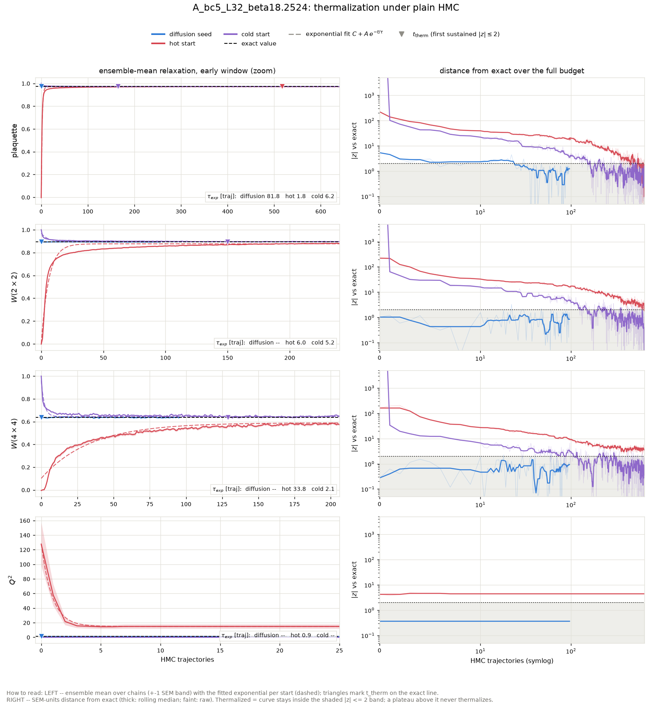

tau_int (hot-start chains, second half): plaquette = 4.81 +- 0.45, wilson_2x2 = 5.25 +- 0.65, wilson_4x4 = 2.50 +- 0.37, wilson_6x6 = 1.00 +- 0.08. Topology: hot-start HMC L=32 beta=18.2524 -> **frozen** (no tunneling).

Where 'never' stood at the end: the hot start ended the 640-trajectory budget still at wilson_2x2 at |z| ~ 3, wilson_4x4 at |z| ~ 4, wilson_6x6 at |z| ~ 5, Q^2 at |z| ~ 4; the cold start ended the 640-trajectory budget still at Q^2 at |z| ~ 1462558916608.

### Diagnostics: raw diffusion output (before any HMC)

| observable | value | error | exact | z_exact | reference | ref_error | z_ref | ks_p | chi2_p |
|---|---|---|---|---|---|---|---|---|---|
| plaquette | 0.9729 | 0.000113 | 0.9722 | 6.012 | 0.9721 | 8.748e-05 | 5.385 | 0.0003034 |  |
| wilson_1x1 | 0.9729 | 0.000113 | 0.9722 | 6.012 | 0.9721 | 8.748e-05 | 5.385 | 0.0003034 |  |
| wilson_1x2 | 0.9456 | 0.0002536 | 0.9452 | 1.455 | 0.945 | 0.0002172 | 1.818 | 0.2087 |  |
| wilson_2x2 | 0.8927 | 0.0004666 | 0.8934 | -1.4 | 0.8932 | 0.0004579 | -0.7029 | 0.8569 |  |
| wilson_2x3 | 0.8436 | 0.0008067 | 0.8444 | -0.9697 | 0.8439 | 0.0007747 | -0.204 | 0.9693 |  |
| wilson_3x3 | 0.7757 | 0.001208 | 0.776 | -0.1868 | 0.775 | 0.001198 | 0.4111 | 0.7901 |  |
| wilson_3x4 | 0.7127 | 0.001827 | 0.713 | -0.1594 | 0.7128 | 0.001494 | -0.008787 | 0.6395 |  |
| wilson_4x4 | 0.6378 | 0.002496 | 0.637 | 0.3189 | 0.6379 | 0.001978 | -0.0363 | 0.3584 |  |
| wilson_4x5 | 0.569 | 0.003357 | 0.5691 | -0.0285 | 0.5711 | 0.002196 | -0.5182 | 0.5259 |  |
| wilson_5x5 | 0.4947 | 0.00421 | 0.4943 | 0.08585 | 0.4985 | 0.002714 | -0.7759 | 0.6395 |  |
| wilson_5x6 | 0.4301 | 0.005242 | 0.4293 | 0.1554 | 0.4368 | 0.002936 | -1.105 | 0.4548 |  |
| wilson_6x6 | 0.3647 | 0.005893 | 0.3625 | 0.3635 | 0.3726 | 0.003308 | -1.177 | 0.3294 |  |
| wilson_6x7 | 0.3044 | 0.006669 | 0.3061 | -0.2636 | 0.3188 | 0.00378 | -1.888 | 0.1004 |  |
| wilson_7x7 | 0.2498 | 0.006672 | 0.2513 | -0.2302 | 0.2667 | 0.004046 | -2.168 | 0.1545 |  |
| wilson_7x8 | 0.202 | 0.006969 | 0.2063 | -0.6237 | 0.2235 | 0.004259 | -2.632 | 0.08971 |  |
| wilson_8x8 | 0.1589 | 0.006821 | 0.1647 | -0.8454 | 0.1811 | 0.004164 | -2.78 | 0.1004 |  |
| wilson_8x10 | 0.09525 | 0.007316 | 0.1049 | -1.318 | 0.1197 | 0.004264 | -2.885 | 0.04938 |  |
| wilson_10x10 | 0.04818 | 0.006543 | 0.0597 | -1.76 | 0.0728 | 0.004548 | -3.09 | 0.01957 |  |
| wilson_10x12 | 0.02596 | 0.006998 | 0.03397 | -1.145 | 0.04194 | 0.004967 | -1.863 | 0.2522 |  |
| wilson_12x12 | 0.01121 | 0.00649 | 0.01727 | -0.9337 | 0.02299 | 0.005358 | -1.4 | 0.6395 |  |
| creutz_2 | 0.029 | 0.0003591 | 0.02818 | 2.264 |  |  |  |  |  |
| creutz_3 | 0.02735 | 0.0007381 | 0.02818 | -1.126 |  |  |  |  |  |
| creutz_4 | 0.02641 | 0.001398 | 0.02818 | -1.269 |  |  |  |  |  |
| creutz_5 | 0.02587 | 0.002262 | 0.02818 | -1.024 |  |  |  |  |  |
| creutz_6 | 0.02535 | 0.00382 | 0.02818 | -0.741 |  |  |  |  |  |
| creutz_7 | 0.01691 | 0.006349 | 0.02818 | -1.776 |  |  |  |  |  |
| creutz_8 | 0.02738 | 0.01127 | 0.02818 | -0.0717 |  |  |  |  |  |
| Q | 0.02344 | 0.09658 | 0 | 0.2427 | -0.1667 | 0.0623 | 1.654 | 0.9888 |  |
| Q^2 | 1.398 | 0.2066 | 1.463 | -0.3103 | 1.271 | 0.1232 | 0.5304 | 1 |  |
| chi_top ((<Q^2>-<Q>^2)/V) | 0.001365 | 0.0002011 | 0.001428 | -0.314 | 0.001214 | 0.0001176 | 0.649 | 3.783e-08 |  |
| Q histogram vs exact P(Q) | 1.11 | nan | 4 | nan |  |  |  |  | 0.8927 |

### Diagnostics: the same configs after 96 HMC trajectories

| observable | value | error | exact | z_exact | reference | ref_error | z_ref | ks_p | chi2_p |
|---|---|---|---|---|---|---|---|---|---|
| plaquette | 0.9721 | 9.722e-05 | 0.9722 | -1.384 | 0.9721 | 8.748e-05 | -0.3397 | 0.678 |  |
| wilson_1x1 | 0.9721 | 9.722e-05 | 0.9722 | -1.384 | 0.9721 | 8.748e-05 | -0.3397 | 0.678 |  |
| wilson_1x2 | 0.9449 | 0.0002227 | 0.9452 | -1.356 | 0.945 | 0.0002172 | -0.2053 | 0.8246 |  |
| wilson_2x2 | 0.8928 | 0.0003947 | 0.8934 | -1.407 | 0.8932 | 0.0004579 | -0.5981 | 0.8864 |  |
| wilson_2x3 | 0.844 | 0.0007338 | 0.8444 | -0.528 | 0.8439 | 0.0007747 | 0.1562 | 0.9693 |  |
| wilson_3x3 | 0.7762 | 0.0009592 | 0.776 | 0.2637 | 0.775 | 0.001198 | 0.7678 | 0.7901 |  |
| wilson_3x4 | 0.7142 | 0.001363 | 0.713 | 0.8153 | 0.7128 | 0.001494 | 0.6832 | 0.9693 |  |
| wilson_4x4 | 0.64 | 0.001912 | 0.637 | 1.558 | 0.6379 | 0.001978 | 0.7517 | 0.9126 |  |
| wilson_4x5 | 0.5741 | 0.002594 | 0.5691 | 1.926 | 0.5711 | 0.002196 | 0.8866 | 0.5631 |  |
| wilson_5x5 | 0.5013 | 0.003224 | 0.4943 | 2.169 | 0.4985 | 0.002714 | 0.6511 | 0.8569 |  |
| wilson_5x6 | 0.4367 | 0.003933 | 0.4293 | 1.882 | 0.4368 | 0.002936 | -0.01077 | 0.7901 |  |
| wilson_6x6 | 0.3693 | 0.004302 | 0.3625 | 1.582 | 0.3726 | 0.003308 | -0.6064 | 0.9126 |  |
| wilson_6x7 | 0.3122 | 0.005132 | 0.3061 | 1.192 | 0.3188 | 0.00378 | -1.035 | 0.4898 |  |
| wilson_7x7 | 0.2554 | 0.005314 | 0.2513 | 0.7748 | 0.2667 | 0.004046 | -1.686 | 0.3294 |  |
| wilson_7x8 | 0.208 | 0.00557 | 0.2063 | 0.3048 | 0.2235 | 0.004259 | -2.204 | 0.1251 |  |
| wilson_8x8 | 0.1647 | 0.005727 | 0.1647 | 0.01305 | 0.1811 | 0.004164 | -2.313 | 0.0631 |  |
| wilson_8x10 | 0.1015 | 0.004935 | 0.1049 | -0.6836 | 0.1197 | 0.004264 | -2.785 | 0.1251 |  |
| wilson_10x10 | 0.0558 | 0.006066 | 0.0597 | -0.6423 | 0.0728 | 0.004548 | -2.243 | 0.03831 |  |
| wilson_10x12 | 0.0304 | 0.006436 | 0.03397 | -0.5548 | 0.04194 | 0.004967 | -1.42 | 0.389 |  |
| wilson_12x12 | 0.01289 | 0.00601 | 0.01727 | -0.73 | 0.02299 | 0.005358 | -1.255 | 0.7163 |  |
| creutz_2 | 0.02831 | 0.0003741 | 0.02818 | 0.3237 |  |  |  |  |  |
| creutz_3 | 0.02756 | 0.0008228 | 0.02818 | -0.7561 |  |  |  |  |  |
| creutz_4 | 0.02631 | 0.00138 | 0.02818 | -1.361 |  |  |  |  |  |
| creutz_5 | 0.02695 | 0.002315 | 0.02818 | -0.5329 |  |  |  |  |  |
| creutz_6 | 0.02973 | 0.003238 | 0.02818 | 0.4786 |  |  |  |  |  |
| creutz_7 | 0.03292 | 0.006107 | 0.02818 | 0.7748 |  |  |  |  |  |
| creutz_8 | 0.02787 | 0.01033 | 0.02818 | -0.03026 |  |  |  |  |  |
| Q | 0.02344 | 0.09658 | 0 | 0.2427 | -0.1667 | 0.0623 | 1.654 | 0.9888 |  |
| Q^2 | 1.398 | 0.2066 | 1.463 | -0.3103 | 1.271 | 0.1232 | 0.5304 | 1 |  |
| chi_top ((<Q^2>-<Q>^2)/V) | 0.001365 | 0.0002011 | 0.001428 | -0.314 | 0.001214 | 0.0001176 | 0.649 | 3.783e-08 |  |
| Q histogram vs exact P(Q) | 1.11 | nan | 4 | nan |  |  |  |  | 0.8927 |

## E_bc5.8_L32_beta21.5051

HMC: step size 0.0863, 12 leapfrog steps, acceptance seed/hot/cold = 0.983/0.984/0.983. Diffusion-seed batch: 128 chains x 96 trajectories (0.16 s/traj for the whole batch); baselines: 32 chains x 640 trajectories.

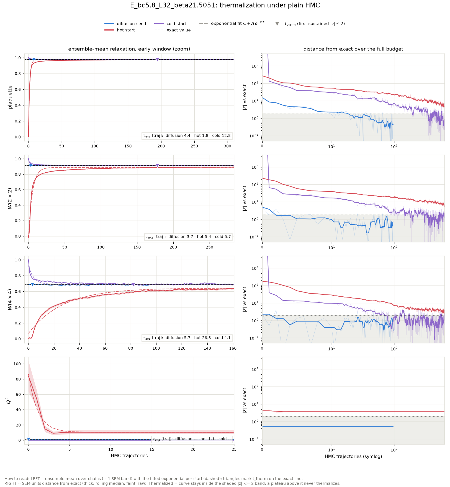

tau_int (hot-start chains, second half): plaquette = 11.10 +- 1.33, wilson_2x2 = 9.63 +- 1.29, wilson_4x4 = 3.66 +- 0.37, wilson_6x6 = 1.44 +- 0.12. Topology: hot-start HMC L=32 beta=21.5051 -> **frozen** (no tunneling).

Where 'never' stood at the end: the hot start ended the 640-trajectory budget still at plaquette at |z| ~ 5, wilson_2x2 at |z| ~ 6, wilson_4x4 at |z| ~ 3, wilson_6x6 at |z| ~ 4, Q^2 at |z| ~ 4; the cold start ended the 640-trajectory budget still at Q^2 at |z| ~ 1235714179072.

### Diagnostics: raw diffusion output (before any HMC)

| observable | value | error | exact | z_exact | reference | ref_error | z_ref | ks_p | chi2_p |
|---|---|---|---|---|---|---|---|---|---|
| plaquette | 0.978 | 0.0001056 | 0.9765 | 14.07 | 0.9764 | 6.579e-05 | 12.09 | 5.308e-24 |  |
| wilson_1x1 | 0.978 | 0.0001056 | 0.9765 | 14.07 | 0.9764 | 6.579e-05 | 12.09 | 5.308e-24 |  |
| wilson_1x2 | 0.9552 | 0.000249 | 0.9535 | 6.962 | 0.9538 | 0.0001478 | 4.752 | 0.0005374 |  |
| wilson_2x2 | 0.9115 | 0.000508 | 0.9091 | 4.694 | 0.9104 | 0.000397 | 1.744 | 0.04354 |  |
| wilson_2x3 | 0.8695 | 0.0008881 | 0.8668 | 3.04 | 0.8687 | 0.0006653 | 0.7791 | 0.2297 |  |
| wilson_3x3 | 0.8108 | 0.00151 | 0.8071 | 2.494 | 0.8091 | 0.000996 | 0.9375 | 0.2763 |  |
| wilson_3x4 | 0.756 | 0.002115 | 0.7514 | 2.158 | 0.7546 | 0.001418 | 0.5445 | 0.4898 |  |
| wilson_4x4 | 0.689 | 0.002917 | 0.6831 | 2.007 | 0.6869 | 0.00195 | 0.5876 | 0.7538 |  |
| wilson_4x5 | 0.6273 | 0.004036 | 0.6211 | 1.547 | 0.6254 | 0.002521 | 0.3976 | 0.9542 |  |
| wilson_5x5 | 0.5587 | 0.004837 | 0.5513 | 1.524 | 0.5569 | 0.003066 | 0.3146 | 0.9542 |  |
| wilson_5x6 | 0.4975 | 0.005904 | 0.4895 | 1.366 | 0.496 | 0.003851 | 0.2136 | 0.9353 |  |
| wilson_6x6 | 0.4318 | 0.007086 | 0.4243 | 1.062 | 0.4327 | 0.004392 | -0.1062 | 0.9999 |  |
| wilson_6x7 | 0.3752 | 0.007843 | 0.3678 | 0.9413 | 0.375 | 0.004974 | 0.01423 | 0.8569 |  |
| wilson_7x7 | 0.3207 | 0.008871 | 0.3113 | 1.064 | 0.3184 | 0.005407 | 0.2238 | 0.7538 |  |
| wilson_7x8 | 0.2727 | 0.009086 | 0.2635 | 1.015 | 0.2689 | 0.005633 | 0.3595 | 0.8864 |  |
| wilson_8x8 | 0.2273 | 0.009649 | 0.2178 | 0.9846 | 0.2203 | 0.006032 | 0.6129 | 0.6011 |  |
| wilson_8x10 | 0.1586 | 0.008847 | 0.1488 | 1.104 | 0.1477 | 0.006198 | 1.01 | 0.5259 |  |
| wilson_10x10 | 0.1024 | 0.007883 | 0.09241 | 1.267 | 0.08779 | 0.006184 | 1.458 | 0.3294 |  |
| wilson_10x12 | 0.06178 | 0.007251 | 0.05739 | 0.6058 | 0.05374 | 0.006546 | 0.8235 | 0.389 |  |
| wilson_12x12 | 0.03085 | 0.007153 | 0.03241 | -0.2179 | 0.03188 | 0.006324 | -0.1081 | 0.9807 |  |
| creutz_2 | 0.02331 | 0.0003215 | 0.02382 | -1.579 |  |  |  |  |  |
| creutz_3 | 0.02276 | 0.0006522 | 0.02382 | -1.621 |  |  |  |  |  |
| creutz_4 | 0.02274 | 0.001259 | 0.02382 | -0.8546 |  |  |  |  |  |
| creutz_5 | 0.02201 | 0.002073 | 0.02382 | -0.8714 |  |  |  |  |  |
| creutz_6 | 0.02564 | 0.003135 | 0.02382 | 0.583 |  |  |  |  |  |
| creutz_7 | 0.01612 | 0.005013 | 0.02382 | -1.535 |  |  |  |  |  |
| creutz_8 | 0.02009 | 0.006768 | 0.02382 | -0.5505 |  |  |  |  |  |
| Q | 0.1641 | 0.09788 | 0 | 1.676 | -0.07812 | 0.07702 | 1.944 | 0.4212 |  |
| Q^2 | 1.164 | 0.116 | 1.236 | -0.6179 | 1.359 | 0.1492 | -1.033 | 1 |  |
| chi_top ((<Q^2>-<Q>^2)/V) | 0.00111 | 0.0001153 | 0.001207 | -0.8348 | 0.001322 | 0.000147 | -1.13 | 2.764e-09 |  |
| Q histogram vs exact P(Q) | 4.873 | nan | 4 | nan |  |  |  |  | 0.3006 |

### Diagnostics: the same configs after 96 HMC trajectories

| observable | value | error | exact | z_exact | reference | ref_error | z_ref | ks_p | chi2_p |
|---|---|---|---|---|---|---|---|---|---|
| plaquette | 0.9764 | 8.094e-05 | 0.9765 | -0.461 | 0.9764 | 6.579e-05 | -0.1802 | 0.9542 |  |
| wilson_1x1 | 0.9764 | 8.094e-05 | 0.9765 | -0.461 | 0.9764 | 6.579e-05 | -0.1802 | 0.9542 |  |
| wilson_1x2 | 0.9534 | 0.0001985 | 0.9535 | -0.4809 | 0.9538 | 0.0001478 | -1.83 | 0.1892 |  |
| wilson_2x2 | 0.9095 | 0.000485 | 0.9091 | 0.7631 | 0.9104 | 0.000397 | -1.42 | 0.3294 |  |
| wilson_2x3 | 0.8669 | 0.0008972 | 0.8668 | 0.07307 | 0.8687 | 0.0006653 | -1.584 | 0.2297 |  |
| wilson_3x3 | 0.8076 | 0.001423 | 0.8071 | 0.3629 | 0.8091 | 0.000996 | -0.8952 | 0.678 |  |
| wilson_3x4 | 0.7516 | 0.002122 | 0.7514 | 0.07025 | 0.7546 | 0.001418 | -1.187 | 0.5259 |  |
| wilson_4x4 | 0.6839 | 0.002852 | 0.6831 | 0.2639 | 0.6869 | 0.00195 | -0.88 | 0.4548 |  |
| wilson_4x5 | 0.6214 | 0.00393 | 0.6211 | 0.07885 | 0.6254 | 0.002521 | -0.8662 | 0.389 |  |
| wilson_5x5 | 0.5519 | 0.004725 | 0.5513 | 0.1161 | 0.5569 | 0.003066 | -0.8918 | 0.389 |  |
| wilson_5x6 | 0.4895 | 0.00592 | 0.4895 | 0.007937 | 0.496 | 0.003851 | -0.9225 | 0.6395 |  |
| wilson_6x6 | 0.4234 | 0.006875 | 0.4243 | -0.1276 | 0.4327 | 0.004392 | -1.139 | 0.4898 |  |
| wilson_6x7 | 0.3656 | 0.007391 | 0.3678 | -0.2893 | 0.375 | 0.004974 | -1.054 | 0.3584 |  |
| wilson_7x7 | 0.3102 | 0.007791 | 0.3113 | -0.1476 | 0.3184 | 0.005407 | -0.8709 | 0.7163 |  |
| wilson_7x8 | 0.2613 | 0.007877 | 0.2635 | -0.2838 | 0.2689 | 0.005633 | -0.7868 | 0.7538 |  |
| wilson_8x8 | 0.2169 | 0.007847 | 0.2178 | -0.1154 | 0.2203 | 0.006032 | -0.3466 | 0.8864 |  |
| wilson_8x10 | 0.1461 | 0.007549 | 0.1488 | -0.3617 | 0.1477 | 0.006198 | -0.1633 | 0.7538 |  |
| wilson_10x10 | 0.0892 | 0.006091 | 0.09241 | -0.5264 | 0.08779 | 0.006184 | 0.1624 | 0.3584 |  |
| wilson_10x12 | 0.05126 | 0.005246 | 0.05739 | -1.169 | 0.05374 | 0.006546 | -0.2957 | 0.7538 |  |
| wilson_12x12 | 0.02636 | 0.004964 | 0.03241 | -1.218 | 0.03188 | 0.006324 | -0.6864 | 0.1122 |  |
| creutz_2 | 0.02325 | 0.000348 | 0.02382 | -1.635 |  |  |  |  |  |
| creutz_3 | 0.02292 | 0.0006641 | 0.02382 | -1.348 |  |  |  |  |  |
| creutz_4 | 0.02247 | 0.001266 | 0.02382 | -1.062 |  |  |  |  |  |
| creutz_5 | 0.02272 | 0.001972 | 0.02382 | -0.5567 |  |  |  |  |  |
| creutz_6 | 0.02508 | 0.003093 | 0.02382 | 0.41 |  |  |  |  |  |
| creutz_7 | 0.01792 | 0.004897 | 0.02382 | -1.203 |  |  |  |  |  |
| creutz_8 | 0.01464 | 0.006941 | 0.02382 | -1.322 |  |  |  |  |  |
| Q | 0.1641 | 0.09788 | 0 | 1.676 | -0.07812 | 0.07702 | 1.944 | 0.4212 |  |
| Q^2 | 1.164 | 0.116 | 1.236 | -0.6179 | 1.359 | 0.1492 | -1.033 | 1 |  |
| chi_top ((<Q^2>-<Q>^2)/V) | 0.00111 | 0.0001153 | 0.001207 | -0.8348 | 0.001322 | 0.000147 | -1.13 | 2.764e-09 |  |
| Q histogram vs exact P(Q) | 4.873 | nan | 4 | nan |  |  |  |  | 0.3006 |

## A_bc6_L32_beta22.3151

HMC: step size 0.0847, 12 leapfrog steps, acceptance seed/hot/cold = 0.982/0.983/0.982. Diffusion-seed batch: 128 chains x 96 trajectories (0.19 s/traj for the whole batch); baselines: 32 chains x 640 trajectories.

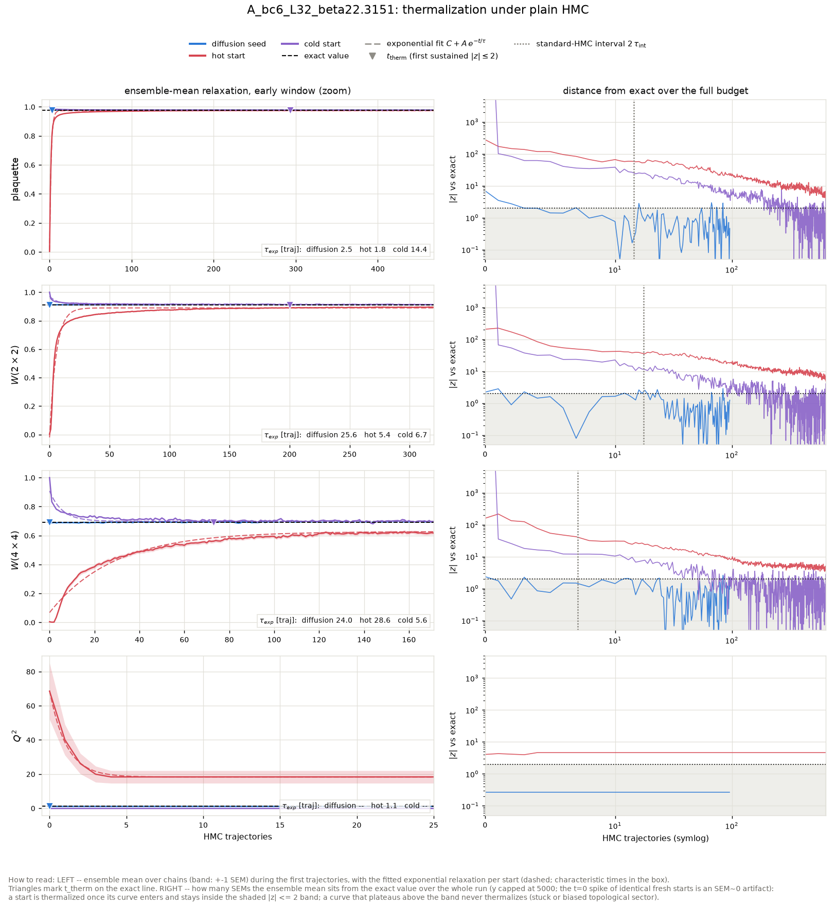

tau_int (hot-start chains, second half): plaquette = 7.27 +- 0.88, wilson_2x2 = 8.81 +- 1.44, wilson_4x4 = 3.56 +- 0.37, wilson_6x6 = 1.22 +- 0.10. Topology: hot-start HMC L=32 beta=22.3151 -> **frozen** (no tunneling).

Where 'never' stood at the end: the hot start ended the 640-trajectory budget still at plaquette at |z| ~ 5, wilson_2x2 at |z| ~ 6, wilson_4x4 at |z| ~ 4, wilson_6x6 at |z| ~ 5, Q^2 at |z| ~ 5; the cold start ended the 640-trajectory budget still at Q^2 at |z| ~ 1189769248768.

### Diagnostics: raw diffusion output (before any HMC)

| observable | value | error | exact | z_exact | reference | ref_error | z_ref | ks_p | chi2_p |
|---|---|---|---|---|---|---|---|---|---|
| plaquette | 0.978 | 0.0001113 | 0.9773 | 6.275 | 0.9771 | 6.258e-05 | 6.969 | 2.538e-07 |  |
| wilson_1x1 | 0.978 | 0.0001113 | 0.9773 | 6.275 | 0.9771 | 6.258e-05 | 6.969 | 2.538e-07 |  |
| wilson_1x2 | 0.9555 | 0.0002769 | 0.9552 | 1.064 | 0.955 | 0.0001446 | 1.422 | 0.1712 |  |
| wilson_2x2 | 0.9112 | 0.0006015 | 0.9124 | -1.957 | 0.9118 | 0.0003964 | -0.8 | 0.389 |  |
| wilson_2x3 | 0.869 | 0.001043 | 0.8715 | -2.367 | 0.8705 | 0.0007065 | -1.177 | 0.6395 |  |
| wilson_3x3 | 0.8093 | 0.001685 | 0.8135 | -2.515 | 0.8119 | 0.001118 | -1.268 | 0.1545 |  |
| wilson_3x4 | 0.754 | 0.002373 | 0.7594 | -2.278 | 0.7581 | 0.001735 | -1.367 | 0.1251 |  |
| wilson_4x4 | 0.6862 | 0.003256 | 0.6929 | -2.062 | 0.691 | 0.002453 | -1.18 | 0.01275 |  |
| wilson_4x5 | 0.6254 | 0.003935 | 0.6322 | -1.726 | 0.6302 | 0.003175 | -0.9643 | 0.04354 |  |
| wilson_5x5 | 0.556 | 0.004967 | 0.5637 | -1.544 | 0.5607 | 0.004057 | -0.7234 | 0.1004 |  |
| wilson_5x6 | 0.4964 | 0.006236 | 0.5026 | -1.006 | 0.4994 | 0.004712 | -0.3842 | 0.2522 |  |
| wilson_6x6 | 0.4333 | 0.007488 | 0.438 | -0.6309 | 0.4331 | 0.005531 | 0.01779 | 0.4548 |  |
| wilson_6x7 | 0.3792 | 0.008673 | 0.3817 | -0.2865 | 0.3769 | 0.006189 | 0.2216 | 0.8569 |  |
| wilson_7x7 | 0.3242 | 0.009731 | 0.3251 | -0.08925 | 0.3188 | 0.006756 | 0.46 | 0.8569 |  |
| wilson_7x8 | 0.2786 | 0.01057 | 0.2769 | 0.1569 | 0.2688 | 0.007177 | 0.7664 | 0.678 |  |
| wilson_8x8 | 0.2359 | 0.01064 | 0.2305 | 0.5052 | 0.2208 | 0.007311 | 1.168 | 0.5631 |  |
| wilson_8x10 | 0.169 | 0.01065 | 0.1597 | 0.8714 | 0.1482 | 0.007828 | 1.573 | 0.3294 |  |
| wilson_10x10 | 0.1158 | 0.009535 | 0.101 | 1.561 | 0.09444 | 0.007242 | 1.788 | 0.2763 |  |
| wilson_10x12 | 0.07836 | 0.007801 | 0.06382 | 1.863 | 0.05584 | 0.006246 | 2.253 | 0.07995 |  |
| wilson_12x12 | 0.04821 | 0.007873 | 0.03681 | 1.448 | 0.03103 | 0.005564 | 1.783 | 0.2763 |  |
| creutz_2 | 0.02412 | 0.0003372 | 0.02293 | 3.537 |  |  |  |  |  |
| creutz_3 | 0.02377 | 0.0007099 | 0.02293 | 1.179 |  |  |  |  |  |
| creutz_4 | 0.0236 | 0.001201 | 0.02293 | 0.5615 |  |  |  |  |  |
| creutz_5 | 0.02476 | 0.001921 | 0.02293 | 0.9536 |  |  |  |  |  |
| creutz_6 | 0.02235 | 0.002774 | 0.02293 | -0.2075 |  |  |  |  |  |
| creutz_7 | 0.02339 | 0.004212 | 0.02293 | 0.1089 |  |  |  |  |  |
| creutz_8 | 0.01448 | 0.006764 | 0.02293 | -1.249 |  |  |  |  |  |
| Q | -0.03906 | 0.08641 | 0 | -0.4521 | -0.03125 | 0.0707 | -0.06998 | 1 |  |
| Q^2 | 1.227 | 0.1851 | 1.19 | 0.1988 | 1.406 | 0.09558 | -0.8627 | 0.9126 |  |
| chi_top ((<Q^2>-<Q>^2)/V) | 0.001196 | 0.0001833 | 0.001162 | 0.1879 | 0.001372 | 9.313e-05 | -0.856 | 4.282e-07 |  |
| Q histogram vs exact P(Q) | 3.75 | nan | 4 | nan |  |  |  |  | 0.4409 |

### Diagnostics: the same configs after 96 HMC trajectories

| observable | value | error | exact | z_exact | reference | ref_error | z_ref | ks_p | chi2_p |
|---|---|---|---|---|---|---|---|---|---|
| plaquette | 0.9774 | 7.836e-05 | 0.9773 | 0.4941 | 0.9771 | 6.258e-05 | 2.295 | 0.03364 |  |
| wilson_1x1 | 0.9774 | 7.836e-05 | 0.9773 | 0.4941 | 0.9771 | 6.258e-05 | 2.295 | 0.03364 |  |
| wilson_1x2 | 0.9552 | 0.0001799 | 0.9552 | 0.1831 | 0.955 | 0.0001446 | 0.7907 | 0.7538 |  |
| wilson_2x2 | 0.9117 | 0.0004365 | 0.9124 | -1.427 | 0.9118 | 0.0003964 | -0.03781 | 0.9353 |  |
| wilson_2x3 | 0.8705 | 0.000789 | 0.8715 | -1.2 | 0.8705 | 0.0007065 | 0.03756 | 0.7538 |  |
| wilson_3x3 | 0.8123 | 0.001414 | 0.8135 | -0.839 | 0.8119 | 0.001118 | 0.2708 | 0.4548 |  |
| wilson_3x4 | 0.7572 | 0.002 | 0.7594 | -1.138 | 0.7581 | 0.001735 | -0.3356 | 0.9941 |  |
| wilson_4x4 | 0.69 | 0.002953 | 0.6929 | -0.962 | 0.691 | 0.002453 | -0.2442 | 0.9126 |  |
| wilson_4x5 | 0.628 | 0.003796 | 0.6322 | -1.102 | 0.6302 | 0.003175 | -0.4582 | 0.9353 |  |
| wilson_5x5 | 0.5583 | 0.004829 | 0.5637 | -1.109 | 0.5607 | 0.004057 | -0.3689 | 0.8569 |  |
| wilson_5x6 | 0.4964 | 0.005675 | 0.5026 | -1.095 | 0.4994 | 0.004712 | -0.3989 | 0.5631 |  |
| wilson_6x6 | 0.4325 | 0.007065 | 0.438 | -0.7809 | 0.4331 | 0.005531 | -0.06993 | 0.9353 |  |
| wilson_6x7 | 0.3754 | 0.00797 | 0.3817 | -0.7942 | 0.3769 | 0.006189 | -0.1471 | 0.8246 |  |
| wilson_7x7 | 0.3204 | 0.008944 | 0.3251 | -0.5243 | 0.3188 | 0.006756 | 0.1454 | 0.7163 |  |
| wilson_7x8 | 0.2716 | 0.009475 | 0.2769 | -0.5558 | 0.2688 | 0.007177 | 0.241 | 0.7901 |  |
| wilson_8x8 | 0.2265 | 0.01015 | 0.2305 | -0.3885 | 0.2208 | 0.007311 | 0.4602 | 0.7163 |  |
| wilson_8x10 | 0.1583 | 0.01061 | 0.1597 | -0.1289 | 0.1482 | 0.007828 | 0.7688 | 0.7163 |  |
| wilson_10x10 | 0.09694 | 0.01176 | 0.101 | -0.3414 | 0.09444 | 0.007242 | 0.1816 | 0.5631 |  |
| wilson_10x12 | 0.06163 | 0.01057 | 0.06382 | -0.2074 | 0.05584 | 0.006246 | 0.4719 | 0.3021 |  |
| wilson_12x12 | 0.03148 | 0.011 | 0.03681 | -0.4843 | 0.03103 | 0.005564 | 0.03726 | 0.3294 |  |
| creutz_2 | 0.02364 | 0.0003406 | 0.02293 | 2.091 |  |  |  |  |  |
| creutz_3 | 0.0229 | 0.0006584 | 0.02293 | -0.04694 |  |  |  |  |  |
| creutz_4 | 0.02249 | 0.001246 | 0.02293 | -0.3525 |  |  |  |  |  |
| creutz_5 | 0.02331 | 0.001824 | 0.02293 | 0.2055 |  |  |  |  |  |
| creutz_6 | 0.02028 | 0.002803 | 0.02293 | -0.9446 |  |  |  |  |  |
| creutz_7 | 0.01669 | 0.004221 | 0.02293 | -1.478 |  |  |  |  |  |
| creutz_8 | 0.01631 | 0.006496 | 0.02293 | -1.019 |  |  |  |  |  |
| Q | -0.03906 | 0.08641 | 0 | -0.4521 | -0.03125 | 0.0707 | -0.06998 | 1 |  |
| Q^2 | 1.227 | 0.1851 | 1.19 | 0.1988 | 1.406 | 0.09558 | -0.8627 | 0.9126 |  |
| chi_top ((<Q^2>-<Q>^2)/V) | 0.001196 | 0.0001833 | 0.001162 | 0.1879 | 0.001372 | 9.313e-05 | -0.856 | 4.282e-07 |  |
| Q histogram vs exact P(Q) | 3.75 | nan | 4 | nan |  |  |  |  | 0.4409 |

## A_bc8_L32_beta30.3772

HMC: step size 0.0726, 14 leapfrog steps, acceptance seed/hot/cold = 0.984/0.981/0.983. Diffusion-seed batch: 128 chains x 96 trajectories (0.08 s/traj for the whole batch); baselines: 32 chains x 640 trajectories.

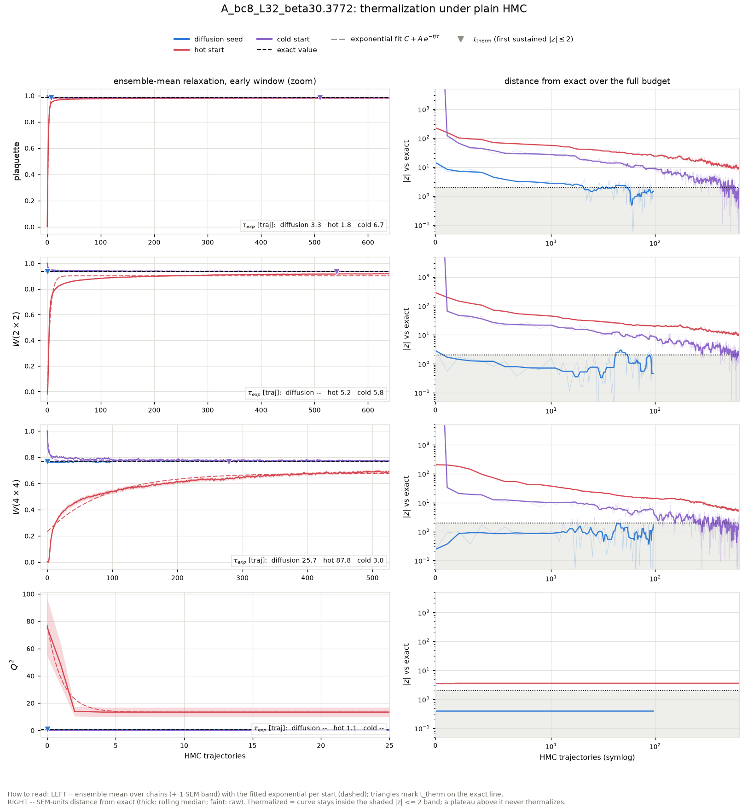

tau_int (hot-start chains, second half): plaquette = 10.65 +- 1.37, wilson_2x2 = 17.65 +- 1.87, wilson_4x4 = 14.64 +- 1.99, wilson_6x6 = 7.25 +- 1.32. Topology: hot-start HMC L=32 beta=30.3772 -> **frozen** (no tunneling).

Where 'never' stood at the end: the hot start ended the 640-trajectory budget still at plaquette at |z| ~ 9, wilson_2x2 at |z| ~ 10, wilson_4x4 at |z| ~ 5, wilson_6x6 at |z| ~ 5, Q^2 at |z| ~ 4; the cold start ended the 640-trajectory budget still at Q^2 at |z| ~ 868455153664.

### Diagnostics: raw diffusion output (before any HMC)

| observable | value | error | exact | z_exact | reference | ref_error | z_ref | ks_p | chi2_p |
|---|---|---|---|---|---|---|---|---|---|
| plaquette | 0.9844 | 7.591e-05 | 0.9834 | 13.62 | 0.9835 | 3.853e-05 | 11.13 | 9.573e-18 |  |
| wilson_1x1 | 0.9844 | 7.591e-05 | 0.9834 | 13.62 | 0.9835 | 3.853e-05 | 11.13 | 9.573e-18 |  |
| wilson_1x2 | 0.9682 | 0.0001702 | 0.9671 | 6.725 | 0.9671 | 8.105e-05 | 5.682 | 1.616e-05 |  |
| wilson_2x2 | 0.9363 | 0.0003843 | 0.9352 | 2.87 | 0.9353 | 0.0002202 | 2.328 | 0.03364 |  |
| wilson_2x3 | 0.9055 | 0.0005981 | 0.9044 | 1.781 | 0.9048 | 0.0004599 | 0.945 | 0.678 |  |
| wilson_3x3 | 0.8609 | 0.00095 | 0.8601 | 0.8236 | 0.8605 | 0.0008424 | 0.35 | 0.9941 |  |
| wilson_3x4 | 0.8184 | 0.00137 | 0.818 | 0.2949 | 0.8186 | 0.001269 | -0.07554 | 0.8246 |  |
| wilson_4x4 | 0.7646 | 0.001946 | 0.765 | -0.251 | 0.7641 | 0.001745 | 0.175 | 0.8246 |  |
| wilson_4x5 | 0.7138 | 0.002659 | 0.7155 | -0.619 | 0.7147 | 0.002358 | -0.2394 | 0.3294 |  |
| wilson_5x5 | 0.6566 | 0.003367 | 0.658 | -0.432 | 0.6563 | 0.003075 | 0.06751 | 0.5631 |  |
| wilson_5x6 | 0.6028 | 0.004367 | 0.6052 | -0.5569 | 0.6044 | 0.00378 | -0.2883 | 0.4212 |  |
| wilson_6x6 | 0.5458 | 0.005246 | 0.5474 | -0.2953 | 0.5473 | 0.004598 | -0.2178 | 0.4212 |  |
| wilson_6x7 | 0.4923 | 0.006583 | 0.4951 | -0.4186 | 0.4965 | 0.00528 | -0.4999 | 0.5259 |  |
| wilson_7x7 | 0.4385 | 0.007272 | 0.4403 | -0.2487 | 0.4426 | 0.005861 | -0.4327 | 0.6011 |  |
| wilson_7x8 | 0.3895 | 0.00863 | 0.3916 | -0.2514 | 0.3943 | 0.006478 | -0.4516 | 0.4898 |  |
| wilson_8x8 | 0.3409 | 0.009669 | 0.3426 | -0.1759 | 0.3462 | 0.0068 | -0.4554 | 0.4898 |  |
| wilson_8x10 | 0.2573 | 0.01093 | 0.2621 | -0.434 | 0.2663 | 0.007529 | -0.6742 | 0.4212 |  |
| wilson_10x10 | 0.1804 | 0.01144 | 0.1875 | -0.6216 | 0.1914 | 0.008157 | -0.783 | 0.3294 |  |
| wilson_10x12 | 0.1218 | 0.01098 | 0.1342 | -1.128 | 0.1381 | 0.008185 | -1.193 | 0.1712 |  |
| wilson_12x12 | 0.07923 | 0.01033 | 0.08978 | -1.022 | 0.09448 | 0.009064 | -1.11 | 0.2763 |  |
| creutz_2 | 0.01688 | 0.0002528 | 0.01674 | 0.5434 |  |  |  |  |  |
| creutz_3 | 0.01701 | 0.0004684 | 0.01674 | 0.5687 |  |  |  |  |  |
| creutz_4 | 0.01746 | 0.0007771 | 0.01674 | 0.9222 |  |  |  |  |  |
| creutz_5 | 0.01499 | 0.00124 | 0.01674 | -1.414 |  |  |  |  |  |
| creutz_6 | 0.01373 | 0.001801 | 0.01674 | -1.669 |  |  |  |  |  |
| creutz_7 | 0.01253 | 0.002849 | 0.01674 | -1.479 |  |  |  |  |  |
| creutz_8 | 0.01472 | 0.004378 | 0.01674 | -0.4604 |  |  |  |  |  |
| Q | 0.1797 | 0.07053 | 0 | 2.548 | 0.09375 | 0.05933 | 0.9324 | 0.9999 |  |
| Q^2 | 0.9141 | 0.1354 | 0.8685 | 0.3369 | 0.8333 | 0.08983 | 0.4969 | 0.9999 |  |
| chi_top ((<Q^2>-<Q>^2)/V) | 0.0008611 | 0.000129 | 0.0008481 | 0.1009 | 0.0008052 | 8.936e-05 | 0.3562 | 5.105e-14 |  |
| Q histogram vs exact P(Q) | 5.306 | nan | 4 | nan |  |  |  |  | 0.2573 |

### Diagnostics: the same configs after 96 HMC trajectories

| observable | value | error | exact | z_exact | reference | ref_error | z_ref | ks_p | chi2_p |
|---|---|---|---|---|---|---|---|---|---|
| plaquette | 0.9835 | 6.942e-05 | 0.9834 | 1.396 | 0.9835 | 3.853e-05 | 0.129 | 0.9807 |  |
| wilson_1x1 | 0.9835 | 6.942e-05 | 0.9834 | 1.396 | 0.9835 | 3.853e-05 | 0.129 | 0.9807 |  |
| wilson_1x2 | 0.9671 | 0.000169 | 0.9671 | -0.113 | 0.9671 | 8.105e-05 | -0.4946 | 0.7163 |  |
| wilson_2x2 | 0.935 | 0.0004473 | 0.9352 | -0.4262 | 0.9353 | 0.0002202 | -0.5259 | 0.3584 |  |
| wilson_2x3 | 0.9036 | 0.0007443 | 0.9044 | -1.072 | 0.9048 | 0.0004599 | -1.314 | 0.2297 |  |
| wilson_3x3 | 0.8585 | 0.001174 | 0.8601 | -1.373 | 0.8605 | 0.0008424 | -1.35 | 0.1545 |  |
| wilson_3x4 | 0.8158 | 0.001624 | 0.818 | -1.359 | 0.8186 | 0.001269 | -1.335 | 0.4548 |  |
| wilson_4x4 | 0.7612 | 0.002109 | 0.765 | -1.802 | 0.7641 | 0.001745 | -1.043 | 0.5631 |  |
| wilson_4x5 | 0.7108 | 0.002504 | 0.7155 | -1.869 | 0.7147 | 0.002358 | -1.13 | 0.4898 |  |
| wilson_5x5 | 0.6512 | 0.003071 | 0.658 | -2.231 | 0.6563 | 0.003075 | -1.171 | 0.7901 |  |
| wilson_5x6 | 0.597 | 0.003683 | 0.6052 | -2.228 | 0.6044 | 0.00378 | -1.41 | 0.2763 |  |
| wilson_6x6 | 0.537 | 0.004569 | 0.5474 | -2.268 | 0.5473 | 0.004598 | -1.594 | 0.2522 |  |
| wilson_6x7 | 0.484 | 0.005237 | 0.4951 | -2.123 | 0.4965 | 0.00528 | -1.692 | 0.3294 |  |
| wilson_7x7 | 0.4278 | 0.006281 | 0.4403 | -1.992 | 0.4426 | 0.005861 | -1.717 | 0.1122 |  |
| wilson_7x8 | 0.3781 | 0.007241 | 0.3916 | -1.874 | 0.3943 | 0.006478 | -1.675 | 0.1004 |  |
| wilson_8x8 | 0.3267 | 0.007993 | 0.3426 | -1.978 | 0.3462 | 0.0068 | -1.857 | 0.07995 |  |
| wilson_8x10 | 0.2429 | 0.009474 | 0.2621 | -2.026 | 0.2663 | 0.007529 | -1.934 | 0.07995 |  |
| wilson_10x10 | 0.1652 | 0.009099 | 0.1875 | -2.453 | 0.1914 | 0.008157 | -2.145 | 0.006985 |  |
| wilson_10x12 | 0.1115 | 0.008722 | 0.1342 | -2.596 | 0.1381 | 0.008185 | -2.223 | 0.04938 |  |
| wilson_12x12 | 0.06823 | 0.008658 | 0.08978 | -2.488 | 0.09448 | 0.009064 | -2.094 | 0.0711 |  |
| creutz_2 | 0.01681 | 0.0002356 | 0.01674 | 0.2794 |  |  |  |  |  |
| creutz_3 | 0.01705 | 0.0004951 | 0.01674 | 0.6358 |  |  |  |  |  |
| creutz_4 | 0.01819 | 0.000825 | 0.01674 | 1.762 |  |  |  |  |  |
| creutz_5 | 0.01906 | 0.00133 | 0.01674 | 1.745 |  |  |  |  |  |
| creutz_6 | 0.01901 | 0.001907 | 0.01674 | 1.189 |  |  |  |  |  |
| creutz_7 | 0.01925 | 0.003009 | 0.01674 | 0.8339 |  |  |  |  |  |
| creutz_8 | 0.02231 | 0.00456 | 0.01674 | 1.222 |  |  |  |  |  |
| Q | 0.1797 | 0.07053 | 0 | 2.548 | 0.09375 | 0.05933 | 0.9324 | 0.9999 |  |
| Q^2 | 0.9141 | 0.1354 | 0.8685 | 0.3369 | 0.8333 | 0.08983 | 0.4969 | 0.9999 |  |
| chi_top ((<Q^2>-<Q>^2)/V) | 0.0008611 | 0.000129 | 0.0008481 | 0.1009 | 0.0008052 | 8.936e-05 | 0.3562 | 5.105e-14 |  |
| Q histogram vs exact P(Q) | 5.306 | nan | 4 | nan |  |  |  |  | 0.2573 |

## E_bc9_L32_beta34.3944

HMC: step size 0.0682, 15 leapfrog steps, acceptance seed/hot/cold = 0.980/0.979/0.981. Diffusion-seed batch: 128 chains x 96 trajectories (0.18 s/traj for the whole batch); baselines: 32 chains x 640 trajectories.

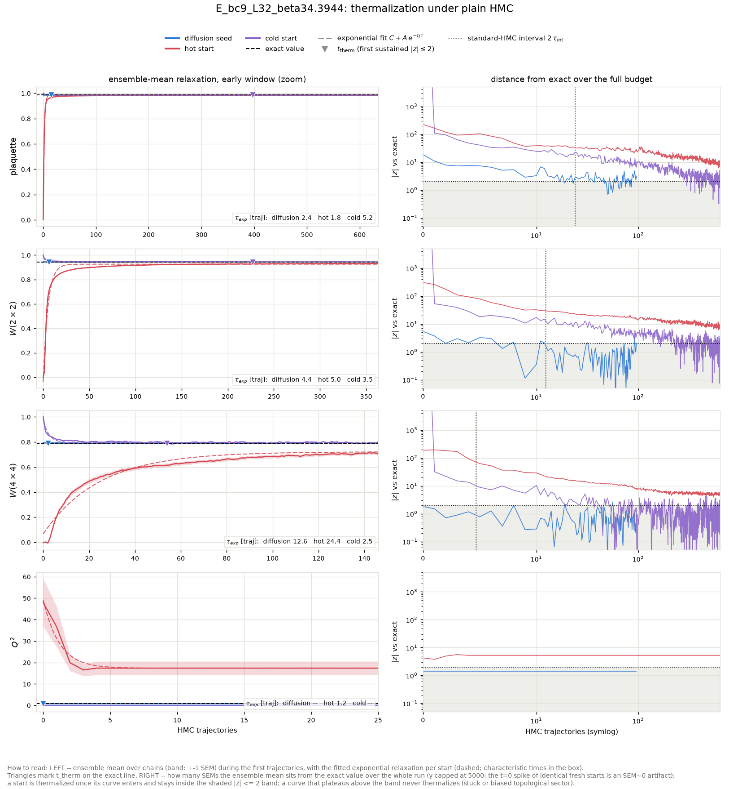

tau_int (hot-start chains, second half): plaquette = 12.00 +- 1.43, wilson_2x2 = 6.13 +- 0.86, wilson_4x4 = 2.33 +- 0.23, wilson_6x6 = 1.43 +- 0.13. Topology: hot-start HMC L=32 beta=34.3944 -> **frozen** (no tunneling).

Where 'never' stood at the end: the hot start ended the 640-trajectory budget still at plaquette at |z| ~ 9, wilson_2x2 at |z| ~ 8, wilson_4x4 at |z| ~ 5, wilson_6x6 at |z| ~ 6, Q^2 at |z| ~ 5; the cold start ended the 640-trajectory budget still at Q^2 at |z| ~ 765454843904.

### Diagnostics: raw diffusion output (before any HMC)

| observable | value | error | exact | z_exact | reference | ref_error | z_ref | ks_p | chi2_p |
|---|---|---|---|---|---|---|---|---|---|
| plaquette | 0.9866 | 7.028e-05 | 0.9854 | 18.29 | 0.9854 | 4.157e-05 | 15.07 | 2.337e-29 |  |
| wilson_1x1 | 0.9866 | 7.028e-05 | 0.9854 | 18.29 | 0.9854 | 4.157e-05 | 15.07 | 2.337e-29 |  |
| wilson_1x2 | 0.9726 | 0.0001826 | 0.9709 | 9.339 | 0.9709 | 0.0001128 | 8.213 | 1.418e-12 |  |
| wilson_2x2 | 0.9447 | 0.0004887 | 0.9427 | 4.064 | 0.9427 | 0.000268 | 3.542 | 0.005977 |  |
| wilson_2x3 | 0.9177 | 0.0008309 | 0.9153 | 2.886 | 0.915 | 0.0004932 | 2.759 | 0.01275 |  |
| wilson_3x3 | 0.8787 | 0.001275 | 0.8756 | 2.427 | 0.8753 | 0.0009217 | 2.158 | 0.1004 |  |
| wilson_3x4 | 0.8407 | 0.001807 | 0.8377 | 1.661 | 0.8371 | 0.001317 | 1.606 | 0.2297 |  |
| wilson_4x4 | 0.7932 | 0.002337 | 0.7897 | 1.493 | 0.7889 | 0.001997 | 1.388 | 0.3584 |  |
| wilson_4x5 | 0.7462 | 0.003046 | 0.7445 | 0.5623 | 0.7439 | 0.002631 | 0.5618 | 0.8569 |  |
| wilson_5x5 | 0.6927 | 0.004045 | 0.6915 | 0.2916 | 0.6906 | 0.003311 | 0.3957 | 0.7163 |  |
| wilson_5x6 | 0.6418 | 0.004871 | 0.6423 | -0.1137 | 0.6419 | 0.00392 | -0.0232 | 0.9353 |  |
| wilson_6x6 | 0.5858 | 0.005951 | 0.5879 | -0.35 | 0.588 | 0.004361 | -0.2899 | 0.8246 |  |
| wilson_6x7 | 0.5348 | 0.006883 | 0.5381 | -0.4862 | 0.5393 | 0.004877 | -0.5376 | 0.678 |  |
| wilson_7x7 | 0.4804 | 0.007528 | 0.4853 | -0.6473 | 0.4868 | 0.005291 | -0.6903 | 0.4898 |  |
| wilson_7x8 | 0.4315 | 0.00807 | 0.4377 | -0.7626 | 0.4395 | 0.005667 | -0.8119 | 0.7538 |  |
| wilson_8x8 | 0.3811 | 0.008506 | 0.389 | -0.9257 | 0.3904 | 0.006133 | -0.8926 | 0.7163 |  |
| wilson_8x10 | 0.2944 | 0.008798 | 0.3072 | -1.449 | 0.3118 | 0.006791 | -1.56 | 0.2763 |  |
| wilson_10x10 | 0.2152 | 0.008216 | 0.2287 | -1.642 | 0.2329 | 0.007379 | -1.602 | 0.1122 |  |
| wilson_10x12 | 0.1568 | 0.007151 | 0.1702 | -1.874 | 0.1751 | 0.007361 | -1.775 | 0.389 |  |
| wilson_12x12 | 0.106 | 0.006911 | 0.1195 | -1.954 | 0.1211 | 0.007773 | -1.454 | 0.2522 |  |
| creutz_2 | 0.01485 | 0.0002053 | 0.01475 | 0.4895 |  |  |  |  |  |
| creutz_3 | 0.01435 | 0.000391 | 0.01475 | -1.022 |  |  |  |  |  |
| creutz_4 | 0.01397 | 0.0007182 | 0.01475 | -1.09 |  |  |  |  |  |
| creutz_5 | 0.01324 | 0.001165 | 0.01475 | -1.302 |  |  |  |  |  |
| creutz_6 | 0.01487 | 0.001591 | 0.01475 | 0.07486 |  |  |  |  |  |
| creutz_7 | 0.01592 | 0.002328 | 0.01475 | 0.4999 |  |  |  |  |  |
| creutz_8 | 0.01698 | 0.003113 | 0.01475 | 0.7144 |  |  |  |  |  |
| Q | 0.0625 | 0.09824 | 0 | 0.6362 | 0.125 | 0.05224 | -0.5617 | 0.9693 |  |
| Q^2 | 0.9375 | 0.1095 | 0.7655 | 1.571 | 0.6562 | 0.05961 | 2.256 | 0.9126 |  |
| chi_top ((<Q^2>-<Q>^2)/V) | 0.0009117 | 0.0001071 | 0.0007475 | 1.533 | 0.0006256 | 5.583e-05 | 2.368 | 3.32e-13 |  |
| Q histogram vs exact P(Q) | 4.028 | nan | 4 | nan |  |  |  |  | 0.4022 |

### Diagnostics: the same configs after 96 HMC trajectories

| observable | value | error | exact | z_exact | reference | ref_error | z_ref | ks_p | chi2_p |
|---|---|---|---|---|---|---|---|---|---|
| plaquette | 0.9855 | 5.612e-05 | 0.9854 | 3.176 | 0.9854 | 4.157e-05 | 1.767 | 0.0711 |  |
| wilson_1x1 | 0.9855 | 5.612e-05 | 0.9854 | 3.176 | 0.9854 | 4.157e-05 | 1.767 | 0.0711 |  |
| wilson_1x2 | 0.9711 | 0.0001368 | 0.9709 | 1.41 | 0.9709 | 0.0001128 | 1.411 | 0.6395 |  |
| wilson_2x2 | 0.9433 | 0.0003462 | 0.9427 | 1.721 | 0.9427 | 0.000268 | 1.333 | 0.4898 |  |
| wilson_2x3 | 0.9161 | 0.0006056 | 0.9153 | 1.29 | 0.915 | 0.0004932 | 1.343 | 0.4898 |  |
| wilson_3x3 | 0.8766 | 0.0009979 | 0.8756 | 0.9929 | 0.8753 | 0.0009217 | 0.9504 | 0.6011 |  |
| wilson_3x4 | 0.8391 | 0.001429 | 0.8377 | 0.9651 | 0.8371 | 0.001317 | 1.013 | 0.4212 |  |
| wilson_4x4 | 0.7914 | 0.001889 | 0.7897 | 0.8913 | 0.7889 | 0.001997 | 0.8948 | 0.5259 |  |
| wilson_4x5 | 0.7476 | 0.002523 | 0.7445 | 1.223 | 0.7439 | 0.002631 | 0.9974 | 0.2522 |  |
| wilson_5x5 | 0.6955 | 0.003279 | 0.6915 | 1.224 | 0.6906 | 0.003311 | 1.052 | 0.3584 |  |
| wilson_5x6 | 0.6477 | 0.00421 | 0.6423 | 1.268 | 0.6419 | 0.00392 | 0.999 | 0.7901 |  |
| wilson_6x6 | 0.5941 | 0.005088 | 0.5879 | 1.214 | 0.588 | 0.004361 | 0.9137 | 0.8569 |  |
| wilson_6x7 | 0.5439 | 0.005997 | 0.5381 | 0.9723 | 0.5393 | 0.004877 | 0.6006 | 0.9126 |  |
| wilson_7x7 | 0.4907 | 0.006672 | 0.4853 | 0.8084 | 0.4868 | 0.005291 | 0.4598 | 0.9126 |  |
| wilson_7x8 | 0.4429 | 0.007149 | 0.4377 | 0.7336 | 0.4395 | 0.005667 | 0.3718 | 0.8569 |  |
| wilson_8x8 | 0.3923 | 0.007396 | 0.389 | 0.455 | 0.3904 | 0.006133 | 0.1955 | 0.7901 |  |
| wilson_8x10 | 0.313 | 0.007772 | 0.3072 | 0.7507 | 0.3118 | 0.006791 | 0.1204 | 0.6395 |  |
| wilson_10x10 | 0.2318 | 0.008814 | 0.2287 | 0.3515 | 0.2329 | 0.007379 | -0.09583 | 0.5259 |  |
| wilson_10x12 | 0.1728 | 0.009287 | 0.1702 | 0.2709 | 0.1751 | 0.007361 | -0.1942 | 0.9542 |  |
| wilson_12x12 | 0.1194 | 0.009606 | 0.1195 | -0.00971 | 0.1211 | 0.007773 | -0.1389 | 0.7901 |  |
| creutz_2 | 0.01434 | 0.0001826 | 0.01475 | -2.275 |  |  |  |  |  |
| creutz_3 | 0.0147 | 0.0003898 | 0.01475 | -0.1444 |  |  |  |  |  |
| creutz_4 | 0.01478 | 0.0006803 | 0.01475 | 0.0416 |  |  |  |  |  |
| creutz_5 | 0.01511 | 0.001099 | 0.01475 | 0.3263 |  |  |  |  |  |
| creutz_6 | 0.01506 | 0.001601 | 0.01475 | 0.1928 |  |  |  |  |  |
| creutz_7 | 0.0148 | 0.002315 | 0.01475 | 0.01962 |  |  |  |  |  |
| creutz_8 | 0.01891 | 0.003242 | 0.01475 | 1.282 |  |  |  |  |  |
| Q | 0.0625 | 0.09824 | 0 | 0.6362 | 0.125 | 0.05224 | -0.5617 | 0.9693 |  |
| Q^2 | 0.9375 | 0.1095 | 0.7655 | 1.571 | 0.6562 | 0.05961 | 2.256 | 0.9126 |  |
| chi_top ((<Q^2>-<Q>^2)/V) | 0.0009117 | 0.0001071 | 0.0007475 | 1.533 | 0.0006256 | 5.583e-05 | 2.368 | 3.32e-13 |  |
| Q histogram vs exact P(Q) | 4.028 | nan | 4 | nan |  |  |  |  | 0.4022 |

## E_bc11.8_L32_beta45.6238

HMC: step size 0.0592, 17 leapfrog steps, acceptance seed/hot/cold = 0.984/0.984/0.982. Diffusion-seed batch: 128 chains x 96 trajectories (0.21 s/traj for the whole batch); baselines: 32 chains x 640 trajectories.

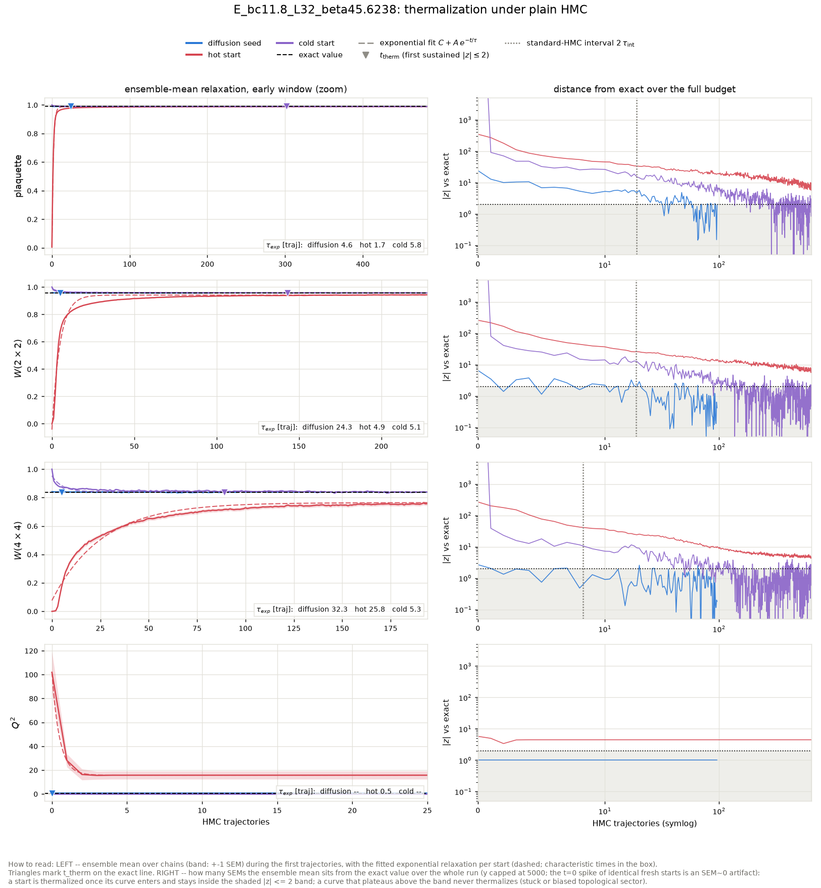

tau_int (hot-start chains, second half): plaquette = 9.42 +- 1.17, wilson_2x2 = 9.38 +- 1.23, wilson_4x4 = 4.14 +- 0.58, wilson_6x6 = 2.61 +- 0.39. Topology: hot-start HMC L=32 beta=45.6238 -> **frozen** (no tunneling).

Where 'never' stood at the end: the hot start ended the 640-trajectory budget still at plaquette at |z| ~ 8, wilson_2x2 at |z| ~ 7, wilson_4x4 at |z| ~ 5, wilson_6x6 at |z| ~ 5, Q^2 at |z| ~ 4; the cold start ended the 640-trajectory budget still at Q^2 at |z| ~ 574600642560.

### Diagnostics: raw diffusion output (before any HMC)

| observable | value | error | exact | z_exact | reference | ref_error | z_ref | ks_p | chi2_p |
|---|---|---|---|---|---|---|---|---|---|
| plaquette | 0.9901 | 4.558e-05 | 0.989 | 24.85 | 0.989 | 3.134e-05 | 19.32 | 1.026e-41 |  |
| wilson_1x1 | 0.9901 | 4.558e-05 | 0.989 | 24.85 | 0.989 | 3.134e-05 | 19.32 | 1.026e-41 |  |
| wilson_1x2 | 0.9796 | 0.000111 | 0.9781 | 13.45 | 0.9781 | 8.577e-05 | 10.58 | 4.126e-20 |  |
| wilson_2x2 | 0.9584 | 0.0002648 | 0.9566 | 6.588 | 0.9568 | 0.0002615 | 4.172 | 3.143e-05 |  |
| wilson_2x3 | 0.9375 | 0.0004879 | 0.9357 | 3.829 | 0.9358 | 0.0004153 | 2.726 | 0.001334 |  |
| wilson_3x3 | 0.9077 | 0.0007437 | 0.9051 | 3.506 | 0.9055 | 0.0007954 | 1.99 | 0.03364 |  |
| wilson_3x4 | 0.8781 | 0.001038 | 0.8755 | 2.545 | 0.8761 | 0.001104 | 1.31 | 0.1122 |  |
| wilson_4x4 | 0.8415 | 0.001414 | 0.8375 | 2.831 | 0.8387 | 0.001702 | 1.268 | 0.2087 |  |
| wilson_4x5 | 0.8058 | 0.001843 | 0.8012 | 2.482 | 0.8025 | 0.002063 | 1.193 | 0.3294 |  |
| wilson_5x5 | 0.7643 | 0.002477 | 0.758 | 2.531 | 0.7595 | 0.002594 | 1.335 | 0.1892 |  |
| wilson_5x6 | 0.7238 | 0.003044 | 0.7172 | 2.17 | 0.7196 | 0.002964 | 0.9761 | 0.6011 |  |
| wilson_6x6 | 0.6794 | 0.003795 | 0.671 | 2.215 | 0.674 | 0.003406 | 1.072 | 0.678 |  |
| wilson_6x7 | 0.6375 | 0.004588 | 0.6279 | 2.108 | 0.6319 | 0.003874 | 0.9437 | 0.2522 |  |
| wilson_7x7 | 0.5917 | 0.005377 | 0.581 | 1.986 | 0.5838 | 0.00435 | 1.137 | 0.2087 |  |
| wilson_7x8 | 0.5497 | 0.006147 | 0.5376 | 1.958 | 0.5403 | 0.004792 | 1.197 | 0.1392 |  |
| wilson_8x8 | 0.5049 | 0.00691 | 0.492 | 1.858 | 0.4927 | 0.005344 | 1.395 | 0.3584 |  |
| wilson_8x10 | 0.4249 | 0.008294 | 0.4121 | 1.539 | 0.4119 | 0.006347 | 1.244 | 0.4898 |  |
| wilson_10x10 | 0.3413 | 0.00977 | 0.3302 | 1.14 | 0.3246 | 0.007748 | 1.345 | 0.2087 |  |
| wilson_10x12 | 0.274 | 0.01088 | 0.2646 | 0.8668 | 0.2572 | 0.008225 | 1.228 | 0.1712 |  |
| wilson_12x12 | 0.2097 | 0.01261 | 0.2028 | 0.5486 | 0.1968 | 0.009249 | 0.8242 | 0.4898 |  |
| creutz_2 | 0.01117 | 0.000143 | 0.01108 | 0.585 |  |  |  |  |  |
| creutz_3 | 0.01037 | 0.0003083 | 0.01108 | -2.301 |  |  |  |  |  |
| creutz_4 | 0.009465 | 0.0005168 | 0.01108 | -3.128 |  |  |  |  |  |
| creutz_5 | 0.009461 | 0.0008125 | 0.01108 | -1.994 |  |  |  |  |  |
| creutz_6 | 0.008735 | 0.00112 | 0.01108 | -2.095 |  |  |  |  |  |
| creutz_7 | 0.01099 | 0.001466 | 0.01108 | -0.06021 |  |  |  |  |  |
| creutz_8 | 0.01138 | 0.001966 | 0.01108 | 0.152 |  |  |  |  |  |
| Q | 0 | 0.06316 | 0 | 0 | 0.1042 | 0.06508 | -1.149 | 0.9542 |  |
| Q^2 | 0.6562 | 0.09044 | 0.5746 | 0.9028 | 0.6667 | 0.06089 | -0.09554 | 1 |  |
| chi_top ((<Q^2>-<Q>^2)/V) | 0.0006409 | 8.832e-05 | 0.0005611 | 0.9028 | 0.0006404 | 6.036e-05 | 0.003962 | 8.226e-17 |  |
| Q histogram vs exact P(Q) | 2.713 | nan | 4 | nan |  |  |  |  | 0.6069 |

### Diagnostics: the same configs after 96 HMC trajectories

| observable | value | error | exact | z_exact | reference | ref_error | z_ref | ks_p | chi2_p |
|---|---|---|---|---|---|---|---|---|---|
| plaquette | 0.9891 | 4.099e-05 | 0.989 | 2.121 | 0.989 | 3.134e-05 | 0.4482 | 0.5631 |  |
| wilson_1x1 | 0.9891 | 4.099e-05 | 0.989 | 2.121 | 0.989 | 3.134e-05 | 0.4482 | 0.5631 |  |
| wilson_1x2 | 0.9782 | 9.12e-05 | 0.9781 | 1.396 | 0.9781 | 8.577e-05 | 0.9424 | 0.3021 |  |
| wilson_2x2 | 0.9567 | 0.0001949 | 0.9566 | 0.5507 | 0.9568 | 0.0002615 | -0.2586 | 0.8569 |  |
| wilson_2x3 | 0.936 | 0.0004006 | 0.9357 | 0.7789 | 0.9358 | 0.0004153 | 0.3307 | 0.8246 |  |
| wilson_3x3 | 0.9053 | 0.0006149 | 0.9051 | 0.2982 | 0.9055 | 0.0007954 | -0.2551 | 0.8864 |  |
| wilson_3x4 | 0.8759 | 0.0009592 | 0.8755 | 0.3943 | 0.8761 | 0.001104 | -0.1901 | 0.8569 |  |
| wilson_4x4 | 0.8372 | 0.001292 | 0.8375 | -0.2353 | 0.8387 | 0.001702 | -0.7023 | 0.3021 |  |
| wilson_4x5 | 0.8007 | 0.001911 | 0.8012 | -0.2483 | 0.8025 | 0.002063 | -0.6217 | 0.6395 |  |
| wilson_5x5 | 0.757 | 0.002505 | 0.758 | -0.3958 | 0.7595 | 0.002594 | -0.6861 | 0.6395 |  |
| wilson_5x6 | 0.7161 | 0.003533 | 0.7172 | -0.3074 | 0.7196 | 0.002964 | -0.7689 | 0.3584 |  |
| wilson_6x6 | 0.669 | 0.004221 | 0.671 | -0.4786 | 0.674 | 0.003406 | -0.9138 | 0.3294 |  |
| wilson_6x7 | 0.6261 | 0.005423 | 0.6279 | -0.3247 | 0.6319 | 0.003874 | -0.865 | 0.678 |  |
| wilson_7x7 | 0.5779 | 0.006187 | 0.581 | -0.5019 | 0.5838 | 0.00435 | -0.7829 | 0.9542 |  |
| wilson_7x8 | 0.5347 | 0.00741 | 0.5376 | -0.396 | 0.5403 | 0.004792 | -0.6392 | 0.8569 |  |
| wilson_8x8 | 0.486 | 0.007878 | 0.492 | -0.7612 | 0.4927 | 0.005344 | -0.699 | 0.9542 |  |
| wilson_8x10 | 0.4051 | 0.01003 | 0.4121 | -0.6971 | 0.4119 | 0.006347 | -0.5697 | 0.3584 |  |
| wilson_10x10 | 0.3168 | 0.0114 | 0.3302 | -1.175 | 0.3246 | 0.007748 | -0.5633 | 0.7163 |  |
| wilson_10x12 | 0.2507 | 0.01262 | 0.2646 | -1.102 | 0.2572 | 0.008225 | -0.4369 | 0.6011 |  |
| wilson_12x12 | 0.1826 | 0.01336 | 0.2028 | -1.516 | 0.1968 | 0.009249 | -0.8783 | 0.2087 |  |
| creutz_2 | 0.01114 | 0.0001634 | 0.01108 | 0.3687 |  |  |  |  |  |
| creutz_3 | 0.01143 | 0.0003285 | 0.01108 | 1.072 |  |  |  |  |  |
| creutz_4 | 0.01211 | 0.0005878 | 0.01108 | 1.743 |  |  |  |  |  |
| creutz_5 | 0.01157 | 0.0009327 | 0.01108 | 0.5219 |  |  |  |  |  |
| creutz_6 | 0.01237 | 0.001339 | 0.01108 | 0.9653 |  |  |  |  |  |
| creutz_7 | 0.01384 | 0.001757 | 0.01108 | 1.57 |  |  |  |  |  |
| creutz_8 | 0.01775 | 0.002651 | 0.01108 | 2.518 |  |  |  |  |  |
| Q | 0 | 0.06316 | 0 | 0 | 0.1042 | 0.06508 | -1.149 | 0.9542 |  |
| Q^2 | 0.6562 | 0.09044 | 0.5746 | 0.9028 | 0.6667 | 0.06089 | -0.09554 | 1 |  |
| chi_top ((<Q^2>-<Q>^2)/V) | 0.0006409 | 8.832e-05 | 0.0005611 | 0.9028 | 0.0006404 | 6.036e-05 | 0.003962 | 8.226e-17 |  |
| Q histogram vs exact P(Q) | 2.713 | nan | 4 | nan |  |  |  |  | 0.6069 |

## D_bc14.1464_L32_beta55.0237

HMC: step size 0.0539, 19 leapfrog steps, acceptance seed/hot/cold = 0.979/0.976/0.979. Diffusion-seed batch: 128 chains x 96 trajectories (0.24 s/traj for the whole batch); baselines: 32 chains x 640 trajectories.

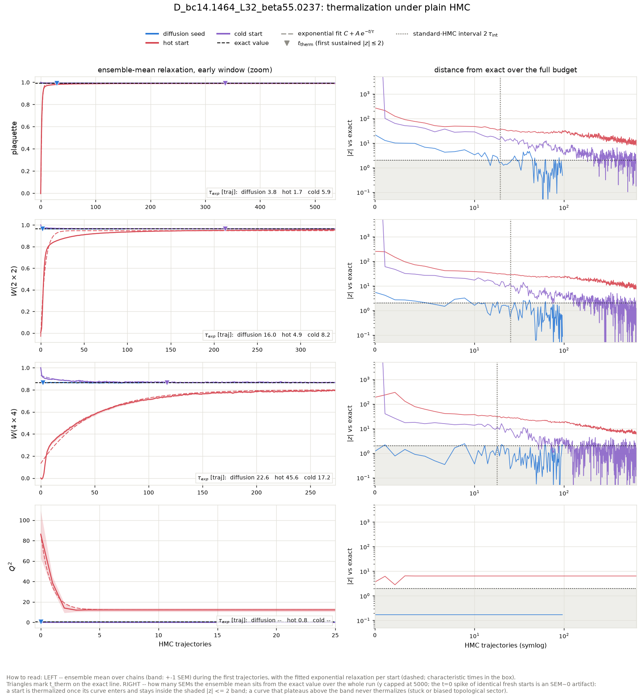

tau_int (hot-start chains, second half): plaquette = 9.68 +- 1.45, wilson_2x2 = 12.56 +- 1.68, wilson_4x4 = 8.88 +- 1.14, wilson_6x6 = 6.05 +- 0.79. Topology: hot-start HMC L=32 beta=55.0237 -> **frozen** (no tunneling).

Where 'never' stood at the end: the hot start ended the 640-trajectory budget still at plaquette at |z| ~ 10, wilson_2x2 at |z| ~ 8, wilson_4x4 at |z| ~ 6, wilson_6x6 at |z| ~ 7, Q^2 at |z| ~ 6; the cold start ended the 640-trajectory budget still at Q^2 at |z| ~ 474280296448.

### Diagnostics: raw diffusion output (before any HMC)

| observable | value | error | exact | z_exact | reference | ref_error | z_ref | ks_p | chi2_p |
|---|---|---|---|---|---|---|---|---|---|
| plaquette | 0.9917 | 3.054e-05 | 0.9909 | 27.48 | 0.9909 | 2.703e-05 | 20.33 | 9.34e-40 |  |
| wilson_1x1 | 0.9917 | 3.054e-05 | 0.9909 | 27.48 | 0.9909 | 2.703e-05 | 20.33 | 9.34e-40 |  |
| wilson_1x2 | 0.9829 | 8.118e-05 | 0.9818 | 13.43 | 0.9818 | 5.904e-05 | 11.09 | 8.222e-12 |  |
| wilson_2x2 | 0.9653 | 0.0002227 | 0.964 | 5.881 | 0.9638 | 0.0001521 | 5.435 | 0.0002049 |  |
| wilson_2x3 | 0.948 | 0.0003887 | 0.9465 | 3.853 | 0.9465 | 0.0002251 | 3.237 | 0.017 |  |
| wilson_3x3 | 0.9225 | 0.0007434 | 0.9208 | 2.378 | 0.921 | 0.0004365 | 1.779 | 0.1251 |  |
| wilson_3x4 | 0.8977 | 0.001098 | 0.8958 | 1.693 | 0.8964 | 0.0005764 | 1.028 | 0.4898 |  |
| wilson_4x4 | 0.8653 | 0.001655 | 0.8635 | 1.069 | 0.8644 | 0.0008388 | 0.4912 | 0.678 |  |
| wilson_4x5 | 0.8339 | 0.002176 | 0.8324 | 0.6843 | 0.8338 | 0.001045 | 0.0494 | 0.8569 |  |
| wilson_5x5 | 0.7964 | 0.002815 | 0.7951 | 0.4437 | 0.7969 | 0.001523 | -0.1544 | 0.8864 |  |
| wilson_5x6 | 0.7603 | 0.003396 | 0.7595 | 0.2515 | 0.7623 | 0.001953 | -0.4989 | 0.9353 |  |
| wilson_6x6 | 0.7192 | 0.004104 | 0.7188 | 0.09908 | 0.7209 | 0.002568 | -0.3316 | 0.9807 |  |
| wilson_6x7 | 0.6807 | 0.004579 | 0.6804 | 0.06386 | 0.6827 | 0.003195 | -0.3718 | 0.9542 |  |
| wilson_7x7 | 0.6377 | 0.005161 | 0.6381 | -0.07442 | 0.6399 | 0.003671 | -0.3557 | 0.9693 |  |
| wilson_7x8 | 0.5991 | 0.005554 | 0.5984 | 0.1316 | 0.6009 | 0.004341 | -0.2496 | 0.9972 |  |
| wilson_8x8 | 0.5565 | 0.006289 | 0.5561 | 0.06813 | 0.5584 | 0.004749 | -0.2328 | 0.9888 |  |
| wilson_8x10 | 0.4817 | 0.007225 | 0.4802 | 0.2055 | 0.4848 | 0.005792 | -0.3367 | 0.8864 |  |
| wilson_10x10 | 0.401 | 0.007973 | 0.3998 | 0.1495 | 0.4033 | 0.006486 | -0.2239 | 0.9693 |  |
| wilson_10x12 | 0.3319 | 0.009164 | 0.3329 | -0.1038 | 0.3379 | 0.006761 | -0.5217 | 0.9693 |  |
| wilson_12x12 | 0.2645 | 0.009673 | 0.2672 | -0.2821 | 0.2703 | 0.006422 | -0.5021 | 0.9126 |  |
| creutz_2 | 0.009186 | 0.0001443 | 0.009171 | 0.1064 |  |  |  |  |  |
| creutz_3 | 0.009057 | 0.0002756 | 0.00917 | -0.4099 |  |  |  |  |  |
| creutz_4 | 0.009353 | 0.000464 | 0.00917 | 0.3953 |  |  |  |  |  |
| creutz_5 | 0.009127 | 0.000609 | 0.009169 | -0.0681 |  |  |  |  |  |
| creutz_6 | 0.00928 | 0.0008473 | 0.009167 | 0.1336 |  |  |  |  |  |
| creutz_7 | 0.01006 | 0.001268 | 0.009165 | 0.7067 |  |  |  |  |  |
| creutz_8 | 0.01144 | 0.001608 | 0.009162 | 1.414 |  |  |  |  |  |
| Q | 0 | 0.05689 | 0 | 0 | 0.06771 | 0.04615 | -0.9242 | 0.9999 |  |
| Q^2 | 0.4844 | 0.05614 | 0.4743 | 0.1798 | 0.526 | 0.04735 | -0.5673 | 1 |  |
| chi_top ((<Q^2>-<Q>^2)/V) | 0.000473 | 5.482e-05 | 0.0004632 | 0.1798 | 0.0005092 | 4.707e-05 | -0.5012 | 7.05e-23 |  |
| Q histogram vs exact P(Q) | 0.1517 | nan | 2 | nan |  |  |  |  | 0.927 |

### Diagnostics: the same configs after 96 HMC trajectories

| observable | value | error | exact | z_exact | reference | ref_error | z_ref | ks_p | chi2_p |
|---|---|---|---|---|---|---|---|---|---|
| plaquette | 0.9909 | 4.862e-05 | 0.9909 | 0.3597 | 0.9909 | 2.703e-05 | 0.133 | 0.9941 |  |
| wilson_1x1 | 0.9909 | 4.862e-05 | 0.9909 | 0.3597 | 0.9909 | 2.703e-05 | 0.133 | 0.9941 |  |
| wilson_1x2 | 0.9818 | 9.661e-05 | 0.9818 | -0.477 | 0.9818 | 5.904e-05 | -0.2055 | 0.8864 |  |
| wilson_2x2 | 0.964 | 0.0002106 | 0.964 | -0.08538 | 0.9638 | 0.0001521 | 0.5321 | 0.4212 |  |
| wilson_2x3 | 0.9466 | 0.000326 | 0.9465 | 0.3346 | 0.9465 | 0.0002251 | 0.1648 | 0.9807 |  |
| wilson_3x3 | 0.9215 | 0.0005703 | 0.9208 | 1.215 | 0.921 | 0.0004365 | 0.6384 | 0.5259 |  |
| wilson_3x4 | 0.8968 | 0.0008562 | 0.8958 | 1.215 | 0.8964 | 0.0005764 | 0.4416 | 0.9126 |  |
| wilson_4x4 | 0.8661 | 0.001341 | 0.8635 | 1.921 | 0.8644 | 0.0008388 | 1.087 | 0.389 |  |
| wilson_4x5 | 0.8355 | 0.001801 | 0.8324 | 1.715 | 0.8338 | 0.001045 | 0.8253 | 0.678 |  |
| wilson_5x5 | 0.7997 | 0.002255 | 0.7951 | 2.039 | 0.7969 | 0.001523 | 1.049 | 0.6395 |  |
| wilson_5x6 | 0.7645 | 0.00279 | 0.7595 | 1.801 | 0.7623 | 0.001953 | 0.6502 | 0.8246 |  |
| wilson_6x6 | 0.7251 | 0.003239 | 0.7188 | 1.942 | 0.7209 | 0.002568 | 1.035 | 0.4898 |  |
| wilson_6x7 | 0.6868 | 0.003912 | 0.6804 | 1.646 | 0.6827 | 0.003195 | 0.8059 | 0.6011 |  |
| wilson_7x7 | 0.6448 | 0.004361 | 0.6381 | 1.532 | 0.6399 | 0.003671 | 0.8444 | 0.7163 |  |
| wilson_7x8 | 0.6051 | 0.005036 | 0.5984 | 1.337 | 0.6009 | 0.004341 | 0.6379 | 0.8569 |  |
| wilson_8x8 | 0.5629 | 0.005521 | 0.5561 | 1.228 | 0.5584 | 0.004749 | 0.6204 | 0.9126 |  |
| wilson_8x10 | 0.4865 | 0.007509 | 0.4802 | 0.8308 | 0.4848 | 0.005792 | 0.1725 | 0.9353 |  |
| wilson_10x10 | 0.4058 | 0.008298 | 0.3998 | 0.7154 | 0.4033 | 0.006486 | 0.232 | 0.7538 |  |
| wilson_10x12 | 0.3393 | 0.0101 | 0.3329 | 0.6315 | 0.3379 | 0.006761 | 0.1142 | 0.9941 |  |
| wilson_12x12 | 0.2712 | 0.01149 | 0.2672 | 0.3408 | 0.2703 | 0.006422 | 0.06195 | 0.9542 |  |
| creutz_2 | 0.009078 | 0.000123 | 0.009171 | -0.7547 |  |  |  |  |  |
| creutz_3 | 0.008667 | 0.0002742 | 0.00917 | -1.834 |  |  |  |  |  |
| creutz_4 | 0.007759 | 0.0004796 | 0.00917 | -2.941 |  |  |  |  |  |
| creutz_5 | 0.007828 | 0.000723 | 0.009169 | -1.854 |  |  |  |  |  |
| creutz_6 | 0.007872 | 0.0009495 | 0.009167 | -1.364 |  |  |  |  |  |
| creutz_7 | 0.008872 | 0.001329 | 0.009165 | -0.2204 |  |  |  |  |  |
| creutz_8 | 0.008997 | 0.001782 | 0.009162 | -0.09284 |  |  |  |  |  |
| Q | 0 | 0.05689 | 0 | 0 | 0.06771 | 0.04615 | -0.9242 | 0.9999 |  |
| Q^2 | 0.4844 | 0.05614 | 0.4743 | 0.1798 | 0.526 | 0.04735 | -0.5673 | 1 |  |
| chi_top ((<Q^2>-<Q>^2)/V) | 0.000473 | 5.482e-05 | 0.0004632 | 0.1798 | 0.0005092 | 4.707e-05 | -0.5012 | 7.05e-23 |  |
| Q histogram vs exact P(Q) | 0.1517 | nan | 2 | nan |  |  |  |  | 0.927 |

## E_bc18_L32_beta70.4526

HMC: step size 0.0477, 21 leapfrog steps, acceptance seed/hot/cold = 0.972/0.975/0.976. Diffusion-seed batch: 128 chains x 96 trajectories (0.25 s/traj for the whole batch); baselines: 32 chains x 640 trajectories.

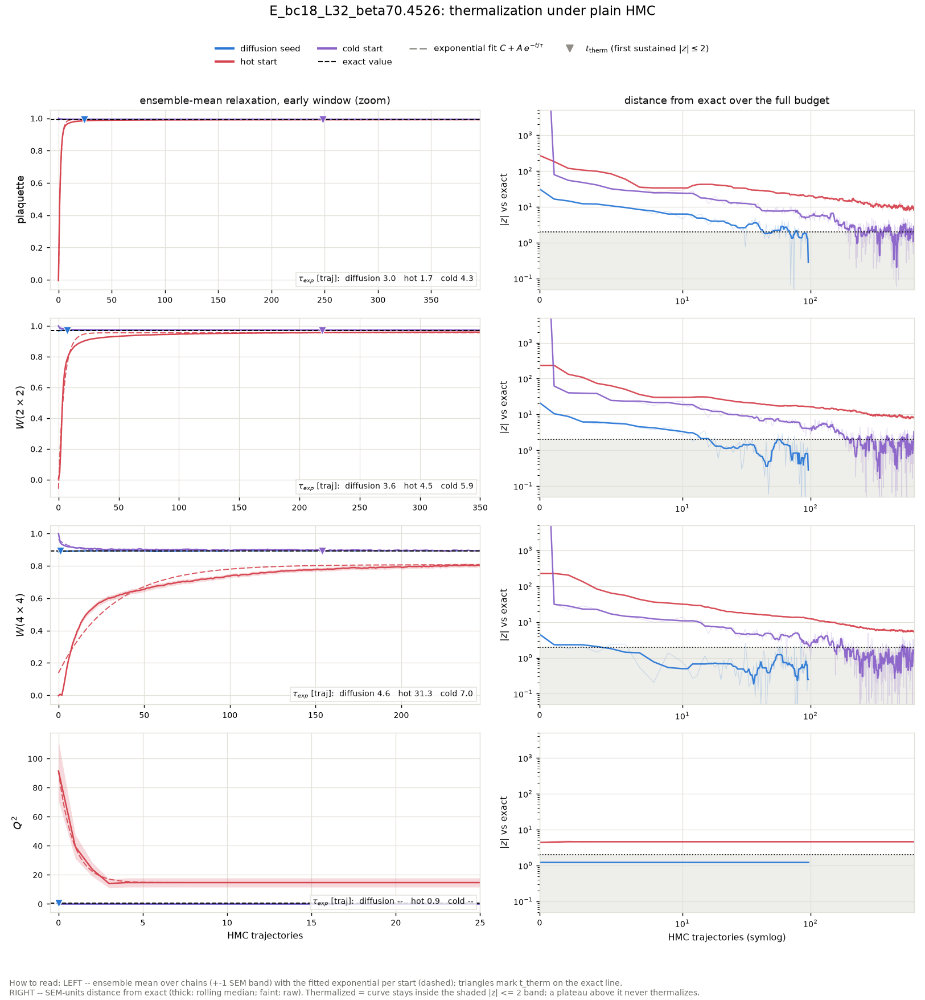

tau_int (hot-start chains, second half): plaquette = 8.12 +- 1.48, wilson_2x2 = 13.90 +- 2.07, wilson_4x4 = 5.88 +- 1.18, wilson_6x6 = 3.33 +- 0.62. Topology: hot-start HMC L=32 beta=70.4526 -> **frozen** (no tunneling).

Where 'never' stood at the end: the hot start ended the 640-trajectory budget still at plaquette at |z| ~ 9, wilson_2x2 at |z| ~ 8, wilson_4x4 at |z| ~ 5, wilson_6x6 at |z| ~ 5, Q^2 at |z| ~ 5; the cold start ended the 640-trajectory budget still at Q^2 at |z| ~ 363637014528.

### Diagnostics: raw diffusion output (before any HMC)

| observable | value | error | exact | z_exact | reference | ref_error | z_ref | ks_p | chi2_p |
|---|---|---|---|---|---|---|---|---|---|
| plaquette | 0.9917 | 3.446e-05 | 0.9929 | -34.75 | 0.9929 | 2.811e-05 | -27.18 | 0 |  |
| wilson_1x1 | 0.9917 | 3.446e-05 | 0.9929 | -34.75 | 0.9929 | 2.811e-05 | -27.18 | 0 |  |
| wilson_1x2 | 0.9835 | 6.576e-05 | 0.9858 | -34.32 | 0.9859 | 5.833e-05 | -26.3 | 0 |  |
| wilson_2x2 | 0.9682 | 0.0001381 | 0.9718 | -25.85 | 0.9718 | 0.0001234 | -19.45 | 1.391e-32 |  |
| wilson_2x3 | 0.9538 | 0.0002405 | 0.958 | -17.48 | 0.9583 | 0.0002335 | -13.39 | 3.208e-22 |  |
| wilson_3x3 | 0.9333 | 0.0004635 | 0.9377 | -9.478 | 0.9378 | 0.0003626 | -7.684 | 1.491e-07 |  |
| wilson_3x4 | 0.913 | 0.0006378 | 0.9178 | -7.495 | 0.9186 | 0.0004437 | -7.152 | 1.026e-05 |  |
| wilson_4x4 | 0.8871 | 0.0009355 | 0.892 | -5.22 | 0.8928 | 0.0006108 | -5.115 | 0.001334 |  |
| wilson_4x5 | 0.8617 | 0.001206 | 0.8668 | -4.251 | 0.8686 | 0.0007519 | -4.844 | 0.002655 |  |
| wilson_5x5 | 0.8309 | 0.001715 | 0.8364 | -3.194 | 0.8378 | 0.0009827 | -3.489 | 0.08971 |  |
| wilson_5x6 | 0.8016 | 0.002265 | 0.8071 | -2.428 | 0.8098 | 0.001205 | -3.184 | 0.1392 |  |
| wilson_6x6 | 0.7671 | 0.002947 | 0.7733 | -2.095 | 0.7761 | 0.001529 | -2.732 | 0.1392 |  |
| wilson_6x7 | 0.7339 | 0.003674 | 0.7408 | -1.879 | 0.7448 | 0.002031 | -2.578 | 0.1392 |  |
| wilson_7x7 | 0.6961 | 0.004449 | 0.7047 | -1.935 | 0.709 | 0.002559 | -2.507 | 0.1004 |  |
| wilson_7x8 | 0.6617 | 0.005335 | 0.6704 | -1.642 | 0.6765 | 0.003224 | -2.376 | 0.2297 |  |
| wilson_8x8 | 0.624 | 0.006266 | 0.6333 | -1.475 | 0.6391 | 0.003749 | -2.07 | 0.1712 |  |
| wilson_8x10 | 0.555 | 0.008061 | 0.565 | -1.249 | 0.5766 | 0.00526 | -2.253 | 0.1712 |  |
| wilson_10x10 | 0.483 | 0.009235 | 0.4901 | -0.7637 | 0.5001 | 0.006897 | -1.48 | 0.4898 |  |
| wilson_10x12 | 0.4188 | 0.01052 | 0.4252 | -0.606 | 0.4379 | 0.009234 | -1.363 | 0.4548 |  |
| wilson_12x12 | 0.3531 | 0.01112 | 0.3587 | -0.5045 | 0.3671 | 0.0108 | -0.9034 | 0.5259 |  |
| creutz_2 | 0.00745 | 0.0001111 | 0.007147 | 2.728 |  |  |  |  |  |
| creutz_3 | 0.006724 | 0.0002281 | 0.007145 | -1.844 |  |  |  |  |  |
| creutz_4 | 0.006883 | 0.000395 | 0.007141 | -0.6547 |  |  |  |  |  |
| creutz_5 | 0.007333 | 0.0005382 | 0.007137 | 0.3647 |  |  |  |  |  |
| creutz_6 | 0.008039 | 0.0007949 | 0.007131 | 1.143 |  |  |  |  |  |
| creutz_7 | 0.008697 | 0.001158 | 0.007122 | 1.36 |  |  |  |  |  |
| creutz_8 | 0.0078 | 0.001486 | 0.007111 | 0.464 |  |  |  |  |  |
| Q | 0.01562 | 0.04517 | 0 | 0.3459 | 0.05729 | 0.03698 | -0.7138 | 1 |  |
| Q^2 | 0.3125 | 0.03508 | 0.3636 | -1.458 | 0.3177 | 0.04627 | -0.0897 | 1 |  |
| chi_top ((<Q^2>-<Q>^2)/V) | 0.0003049 | 3.424e-05 | 0.0003551 | -1.466 | 0.0003071 | 4.536e-05 | -0.03729 | 3.729e-35 |  |
| Q histogram vs exact P(Q) | 0.5803 | nan | 2 | nan |  |  |  |  | 0.7481 |

### Diagnostics: the same configs after 96 HMC trajectories

| observable | value | error | exact | z_exact | reference | ref_error | z_ref | ks_p | chi2_p |
|---|---|---|---|---|---|---|---|---|---|
| plaquette | 0.9929 | 3.815e-05 | 0.9929 | -0.224 | 0.9929 | 2.811e-05 | -0.4131 | 0.9353 |  |
| wilson_1x1 | 0.9929 | 3.815e-05 | 0.9929 | -0.224 | 0.9929 | 2.811e-05 | -0.4131 | 0.9353 |  |
| wilson_1x2 | 0.9858 | 7.731e-05 | 0.9858 | -0.3684 | 0.9859 | 5.833e-05 | -0.8622 | 0.5631 |  |
| wilson_2x2 | 0.9718 | 0.0001914 | 0.9718 | -0.2492 | 0.9718 | 0.0001234 | -0.3529 | 0.8864 |  |
| wilson_2x3 | 0.9579 | 0.0002939 | 0.958 | -0.3537 | 0.9583 | 0.0002335 | -1.034 | 0.4212 |  |
| wilson_3x3 | 0.9375 | 0.000543 | 0.9377 | -0.3158 | 0.9378 | 0.0003626 | -0.4603 | 0.389 |  |
| wilson_3x4 | 0.9177 | 0.0007912 | 0.9178 | -0.1803 | 0.9186 | 0.0004437 | -1.013 | 0.7538 |  |
| wilson_4x4 | 0.8917 | 0.001262 | 0.892 | -0.2274 | 0.8928 | 0.0006108 | -0.798 | 0.7163 |  |
| wilson_4x5 | 0.8669 | 0.001673 | 0.8668 | 0.0335 | 0.8686 | 0.0007519 | -0.9278 | 0.7163 |  |
| wilson_5x5 | 0.8368 | 0.002391 | 0.8364 | 0.1643 | 0.8378 | 0.0009827 | -0.3968 | 0.7538 |  |
| wilson_5x6 | 0.808 | 0.002981 | 0.8071 | 0.2962 | 0.8098 | 0.001205 | -0.5551 | 0.7163 |  |
| wilson_6x6 | 0.7745 | 0.004023 | 0.7733 | 0.3094 | 0.7761 | 0.001529 | -0.3837 | 0.8246 |  |
| wilson_6x7 | 0.7431 | 0.004739 | 0.7408 | 0.4698 | 0.7448 | 0.002031 | -0.3277 | 0.5259 |  |
| wilson_7x7 | 0.7084 | 0.005978 | 0.7047 | 0.606 | 0.709 | 0.002559 | -0.09809 | 0.6011 |  |
| wilson_7x8 | 0.6759 | 0.006722 | 0.6704 | 0.8196 | 0.6765 | 0.003224 | -0.07245 | 0.8569 |  |
| wilson_8x8 | 0.6405 | 0.007991 | 0.6333 | 0.9108 | 0.6391 | 0.003749 | 0.1595 | 0.8246 |  |
| wilson_8x10 | 0.5765 | 0.009525 | 0.565 | 1.201 | 0.5766 | 0.00526 | -0.0166 | 0.9353 |  |
| wilson_10x10 | 0.5053 | 0.01166 | 0.4901 | 1.303 | 0.5001 | 0.006897 | 0.3827 | 0.7901 |  |
| wilson_10x12 | 0.4436 | 0.01285 | 0.4252 | 1.433 | 0.4379 | 0.009234 | 0.3608 | 0.9126 |  |
| wilson_12x12 | 0.3825 | 0.01457 | 0.3587 | 1.635 | 0.3671 | 0.0108 | 0.8508 | 0.7163 |  |
| creutz_2 | 0.007147 | 0.0001036 | 0.007147 | -0.0009557 |  |  |  |  |  |
| creutz_3 | 0.00716 | 0.0002033 | 0.007145 | 0.07342 |  |  |  |  |  |
| creutz_4 | 0.007335 | 0.0003752 | 0.007141 | 0.5164 |  |  |  |  |  |
| creutz_5 | 0.007118 | 0.0005783 | 0.007137 | -0.03211 |  |  |  |  |  |
| creutz_6 | 0.007239 | 0.0008211 | 0.007131 | 0.1318 |  |  |  |  |  |
| creutz_7 | 0.006388 | 0.001085 | 0.007122 | -0.6763 |  |  |  |  |  |
| creutz_8 | 0.006925 | 0.001473 | 0.007111 | -0.126 |  |  |  |  |  |
| Q | 0.01562 | 0.04517 | 0 | 0.3459 | 0.05729 | 0.03698 | -0.7138 | 1 |  |
| Q^2 | 0.3125 | 0.03508 | 0.3636 | -1.458 | 0.3177 | 0.04627 | -0.0897 | 1 |  |
| chi_top ((<Q^2>-<Q>^2)/V) | 0.0003049 | 3.424e-05 | 0.0003551 | -1.466 | 0.0003071 | 4.536e-05 | -0.03729 | 3.729e-35 |  |
| Q histogram vs exact P(Q) | 0.5803 | nan | 2 | nan |  |  |  |  | 0.7481 |

## D_bc20_L32_beta78.4578

HMC: step size 0.0452, 22 leapfrog steps, acceptance seed/hot/cold = 0.977/0.980/0.978. Diffusion-seed batch: 128 chains x 96 trajectories (0.29 s/traj for the whole batch); baselines: 32 chains x 640 trajectories.

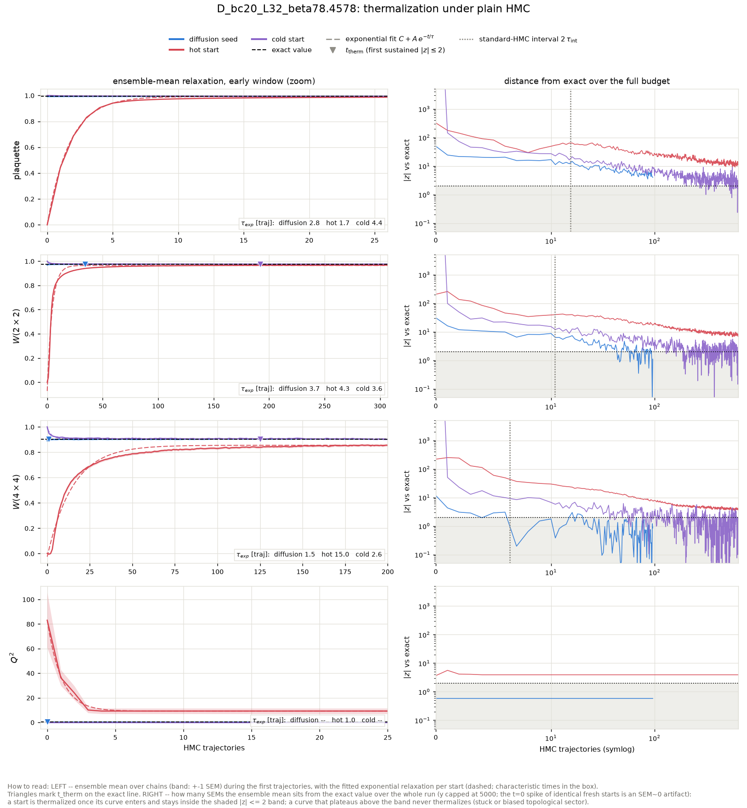

tau_int (hot-start chains, second half): plaquette = 7.73 +- 0.89, wilson_2x2 = 5.45 +- 0.72, wilson_4x4 = 3.21 +- 0.37, wilson_6x6 = 2.03 +- 0.20. Topology: hot-start HMC L=32 beta=78.4578 -> **frozen** (no tunneling).

Where 'never' stood at the end: the hot start ended the 640-trajectory budget still at plaquette at |z| ~ 12, wilson_2x2 at |z| ~ 8, wilson_4x4 at |z| ~ 4, wilson_6x6 at |z| ~ 5, Q^2 at |z| ~ 4; the cold start ended the 640-trajectory budget still at plaquette at |z| ~ 2, Q^2 at |z| ~ 320492732416.

### Diagnostics: raw diffusion output (before any HMC)

| observable | value | error | exact | z_exact | reference | ref_error | z_ref | ks_p | chi2_p |
|---|---|---|---|---|---|---|---|---|---|
| plaquette | 0.9914 | 5.407e-05 | 0.9936 | -41.15 | 0.9937 | 1.641e-05 | -40.36 | 0 |  |
| wilson_1x1 | 0.9914 | 5.407e-05 | 0.9936 | -41.15 | 0.9937 | 1.641e-05 | -40.36 | 0 |  |
| wilson_1x2 | 0.9832 | 0.0001009 | 0.9873 | -39.77 | 0.9874 | 3.818e-05 | -38.67 | 0 |  |
| wilson_2x2 | 0.9687 | 0.0001943 | 0.9747 | -30.54 | 0.975 | 0.0001289 | -26.92 | 0 |  |
| wilson_2x3 | 0.9547 | 0.0003108 | 0.9623 | -24.26 | 0.9628 | 0.0002313 | -20.91 | 0 |  |
| wilson_3x3 | 0.9349 | 0.0005456 | 0.9439 | -16.47 | 0.9446 | 0.0003863 | -14.47 | 3.831e-30 |  |
| wilson_3x4 | 0.9157 | 0.0006728 | 0.926 | -15.22 | 0.9271 | 0.000568 | -12.94 | 1.942e-22 |  |
| wilson_4x4 | 0.8908 | 0.001071 | 0.9025 | -10.98 | 0.904 | 0.0008787 | -9.577 | 3.972e-18 |  |
| wilson_4x5 | 0.8664 | 0.001345 | 0.8797 | -9.864 | 0.8826 | 0.001128 | -9.207 | 8.226e-17 |  |
| wilson_5x5 | 0.8375 | 0.001915 | 0.852 | -7.534 | 0.8567 | 0.001609 | -7.663 | 3.32e-13 |  |
| wilson_5x6 | 0.8093 | 0.002233 | 0.8251 | -7.084 | 0.8315 | 0.001991 | -7.416 | 4.339e-10 |  |
| wilson_6x6 | 0.7771 | 0.003031 | 0.7941 | -5.593 | 0.8023 | 0.002606 | -6.312 | 2.764e-09 |  |
| wilson_6x7 | 0.7451 | 0.003582 | 0.7642 | -5.311 | 0.7732 | 0.003225 | -5.822 | 1.947e-07 |  |
| wilson_7x7 | 0.7089 | 0.004295 | 0.7307 | -5.091 | 0.7403 | 0.003869 | -5.439 | 1.491e-07 |  |
| wilson_7x8 | 0.6758 | 0.004982 | 0.6988 | -4.609 | 0.709 | 0.004586 | -4.902 | 1.946e-06 |  |
| wilson_8x8 | 0.6393 | 0.005791 | 0.664 | -4.258 | 0.6747 | 0.005379 | -4.474 | 3.143e-05 |  |
| wilson_8x10 | 0.5716 | 0.007334 | 0.5996 | -3.81 | 0.6124 | 0.007187 | -3.972 | 1.616e-05 |  |
| wilson_10x10 | 0.4972 | 0.008978 | 0.5279 | -3.429 | 0.5433 | 0.008848 | -3.66 | 0.0003679 |  |
| wilson_10x12 | 0.4313 | 0.009941 | 0.465 | -3.39 | 0.4774 | 0.01063 | -3.166 | 0.003137 |  |
| wilson_12x12 | 0.3695 | 0.01144 | 0.3996 | -2.63 | 0.4105 | 0.0121 | -2.462 | 0.01474 |  |
| creutz_2 | 0.006611 | 0.0001197 | 0.006412 | 1.663 |  |  |  |  |  |
| creutz_3 | 0.006344 | 0.0002262 | 0.006408 | -0.284 |  |  |  |  |  |
| creutz_4 | 0.006851 | 0.0003852 | 0.006403 | 1.165 |  |  |  |  |  |
| creutz_5 | 0.006191 | 0.0005463 | 0.006395 | -0.3724 |  |  |  |  |  |
| creutz_6 | 0.006336 | 0.0007169 | 0.006385 | -0.06817 |  |  |  |  |  |
| creutz_7 | 0.007917 | 0.001057 | 0.006371 | 1.463 |  |  |  |  |  |
| creutz_8 | 0.007754 | 0.001501 | 0.006353 | 0.933 |  |  |  |  |  |
| Q | -0.03125 | 0.04098 | 0 | -0.7626 | 0 | 0.03157 | -0.6041 | 1 |  |
| Q^2 | 0.2969 | 0.04578 | 0.3205 | -0.5159 | 0.2604 | 0.0309 | 0.6601 | 0.9999 |  |
| chi_top ((<Q^2>-<Q>^2)/V) | 0.000289 | 4.542e-05 | 0.000313 | -0.5288 | 0.0002543 | 3.017e-05 | 0.6355 | 2.201e-41 |  |
| Q histogram vs exact P(Q) | 0.48 | nan | 2 | nan |  |  |  |  | 0.7866 |

### Diagnostics: the same configs after 96 HMC trajectories

| observable | value | error | exact | z_exact | reference | ref_error | z_ref | ks_p | chi2_p |
|---|---|---|---|---|---|---|---|---|---|
| plaquette | 0.9935 | 2.176e-05 | 0.9936 | -4.623 | 0.9937 | 1.641e-05 | -5.729 | 0.001334 |  |
| wilson_1x1 | 0.9935 | 2.176e-05 | 0.9936 | -4.623 | 0.9937 | 1.641e-05 | -5.729 | 0.001334 |  |
| wilson_1x2 | 0.9871 | 6.156e-05 | 0.9873 | -2.855 | 0.9874 | 3.818e-05 | -4.622 | 0.0631 |  |
| wilson_2x2 | 0.9745 | 0.0001401 | 0.9747 | -1.188 | 0.975 | 0.0001289 | -2.681 | 0.04354 |  |
| wilson_2x3 | 0.9622 | 0.0002626 | 0.9623 | -0.1144 | 0.9628 | 0.0002313 | -1.685 | 0.0711 |  |
| wilson_3x3 | 0.9441 | 0.0004838 | 0.9439 | 0.2645 | 0.9446 | 0.0003863 | -0.8971 | 0.4212 |  |
| wilson_3x4 | 0.9265 | 0.0007478 | 0.926 | 0.6984 | 0.9271 | 0.000568 | -0.678 | 0.3584 |  |
| wilson_4x4 | 0.9034 | 0.001147 | 0.9025 | 0.7416 | 0.904 | 0.0008787 | -0.4524 | 0.7538 |  |
| wilson_4x5 | 0.8809 | 0.00154 | 0.8797 | 0.7962 | 0.8826 | 0.001128 | -0.8719 | 0.6395 |  |
| wilson_5x5 | 0.8538 | 0.002094 | 0.852 | 0.8789 | 0.8567 | 0.001609 | -1.098 | 0.389 |  |
| wilson_5x6 | 0.8277 | 0.002515 | 0.8251 | 1.02 | 0.8315 | 0.001991 | -1.187 | 0.5259 |  |
| wilson_6x6 | 0.7974 | 0.003107 | 0.7941 | 1.063 | 0.8023 | 0.002606 | -1.226 | 0.389 |  |
| wilson_6x7 | 0.7679 | 0.003479 | 0.7642 | 1.077 | 0.7732 | 0.003225 | -1.115 | 0.2297 |  |
| wilson_7x7 | 0.7352 | 0.004162 | 0.7307 | 1.079 | 0.7403 | 0.003869 | -0.8953 | 0.4548 |  |
| wilson_7x8 | 0.7044 | 0.004771 | 0.6988 | 1.18 | 0.709 | 0.004586 | -0.6955 | 0.2763 |  |
| wilson_8x8 | 0.6714 | 0.005545 | 0.664 | 1.344 | 0.6747 | 0.005379 | -0.4204 | 0.6011 |  |
| wilson_8x10 | 0.6073 | 0.007089 | 0.5996 | 1.091 | 0.6124 | 0.007187 | -0.5059 | 0.3294 |  |
| wilson_10x10 | 0.5372 | 0.008822 | 0.5279 | 1.048 | 0.5433 | 0.008848 | -0.4878 | 0.6395 |  |
| wilson_10x12 | 0.4762 | 0.01073 | 0.465 | 1.044 | 0.4774 | 0.01063 | -0.07808 | 0.8864 |  |
| wilson_12x12 | 0.4123 | 0.01237 | 0.3996 | 1.027 | 0.4105 | 0.0121 | 0.1035 | 0.9542 |  |
| creutz_2 | 0.006328 | 8.918e-05 | 0.006412 | -0.943 |  |  |  |  |  |
| creutz_3 | 0.006381 | 0.000178 | 0.006408 | -0.1529 |  |  |  |  |  |
| creutz_4 | 0.006452 | 0.0002941 | 0.006403 | 0.1696 |  |  |  |  |  |
| creutz_5 | 0.006081 | 0.0004582 | 0.006395 | -0.6859 |  |  |  |  |  |
| creutz_6 | 0.006281 | 0.0006146 | 0.006385 | -0.1681 |  |  |  |  |  |
| creutz_7 | 0.005881 | 0.0008581 | 0.006371 | -0.5708 |  |  |  |  |  |
| creutz_8 | 0.005117 | 0.001193 | 0.006353 | -1.036 |  |  |  |  |  |
| Q | -0.03125 | 0.04098 | 0 | -0.7626 | 0 | 0.03157 | -0.6041 | 1 |  |
| Q^2 | 0.2969 | 0.04578 | 0.3205 | -0.5159 | 0.2604 | 0.0309 | 0.6601 | 0.9999 |  |
| chi_top ((<Q^2>-<Q>^2)/V) | 0.000289 | 4.542e-05 | 0.000313 | -0.5288 | 0.0002543 | 3.017e-05 | 0.6355 | 2.201e-41 |  |
| Q histogram vs exact P(Q) | 0.48 | nan | 2 | nan |  |  |  |  | 0.7866 |

## D_bc30_L32_beta118.473

HMC: step size 0.0367, 27 leapfrog steps, acceptance seed/hot/cold = 0.968/0.974/0.976. Diffusion-seed batch: 128 chains x 96 trajectories (0.33 s/traj for the whole batch); baselines: 32 chains x 640 trajectories.

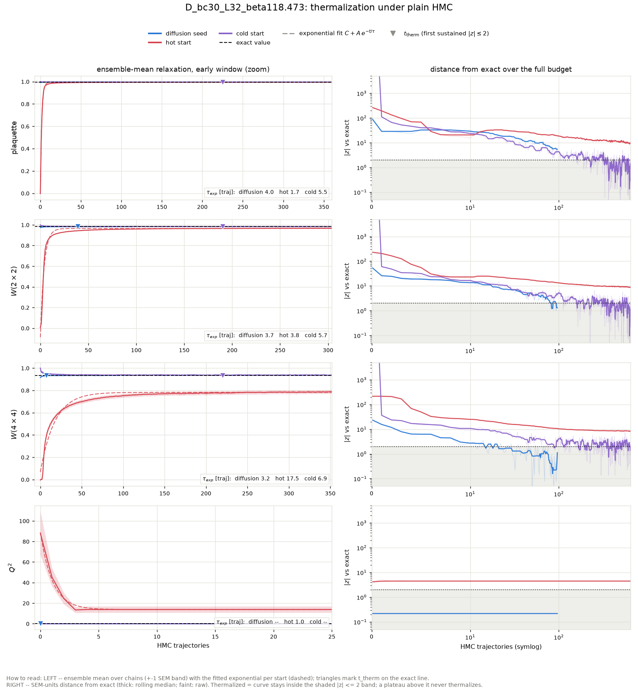

tau_int (hot-start chains, second half): plaquette = 15.01 +- 1.62, wilson_2x2 = 22.18 +- 2.48, wilson_4x4 = 19.33 +- 2.73, wilson_6x6 = 11.94 +- 2.05. Topology: hot-start HMC L=32 beta=118.473 -> **frozen** (no tunneling).

Where 'never' stood at the end: the hot start ended the 640-trajectory budget still at plaquette at |z| ~ 10, wilson_2x2 at |z| ~ 9, wilson_4x4 at |z| ~ 8, wilson_6x6 at |z| ~ 9, Q^2 at |z| ~ 4; the cold start ended the 640-trajectory budget still at Q^2 at |z| ~ 171377917952.

### Diagnostics: raw diffusion output (before any HMC)

| observable | value | error | exact | z_exact | reference | ref_error | z_ref | ks_p | chi2_p |
|---|---|---|---|---|---|---|---|---|---|
| plaquette | 0.9919 | 3.632e-05 | 0.9958 | -105.9 | 0.9958 | 1.23e-05 | -100.1 | 0 |  |
| wilson_1x1 | 0.9919 | 3.632e-05 | 0.9958 | -105.9 | 0.9958 | 1.23e-05 | -100.1 | 0 |  |
| wilson_1x2 | 0.985 | 5.886e-05 | 0.9916 | -111.1 | 0.9916 | 3.012e-05 | -99.23 | 0 |  |
| wilson_2x2 | 0.9737 | 0.000139 | 0.9832 | -68.29 | 0.9833 | 6.038e-05 | -63.24 | 0 |  |
| wilson_2x3 | 0.9629 | 0.0001523 | 0.9749 | -78.9 | 0.9753 | 8.916e-05 | -70.05 | 0 |  |
| wilson_3x3 | 0.9481 | 0.000236 | 0.9626 | -61.53 | 0.9633 | 0.0001691 | -52.14 | 0 |  |
| wilson_3x4 | 0.9337 | 0.0003002 | 0.9505 | -56.09 | 0.9517 | 0.0002331 | -47.35 | 0 |  |
| wilson_4x4 | 0.9158 | 0.0005174 | 0.9347 | -36.5 | 0.9365 | 0.0004098 | -31.42 | 0 |  |
| wilson_4x5 | 0.8976 | 0.0007101 | 0.9191 | -30.17 | 0.9217 | 0.0005746 | -26.3 | 1.95e-39 |  |
| wilson_5x5 | 0.8767 | 0.001022 | 0.9 | -22.74 | 0.9033 | 0.0008577 | -19.9 | 6.083e-31 |  |
| wilson_5x6 | 0.8557 | 0.001379 | 0.8813 | -18.56 | 0.8855 | 0.001116 | -16.79 | 2.376e-26 |  |
| wilson_6x6 | 0.8325 | 0.001942 | 0.8595 | -13.92 | 0.8646 | 0.001569 | -12.88 | 1.04e-18 |  |
| wilson_6x7 | 0.8084 | 0.002355 | 0.8383 | -12.69 | 0.8443 | 0.001981 | -11.66 | 8.226e-17 |  |
| wilson_7x7 | 0.7824 | 0.002974 | 0.8143 | -10.72 | 0.8206 | 0.002513 | -9.812 | 3.32e-13 |  |
| wilson_7x8 | 0.7575 | 0.003556 | 0.791 | -9.415 | 0.7982 | 0.003026 | -8.715 | 6.895e-13 |  |
| wilson_8x8 | 0.7309 | 0.004277 | 0.7653 | -8.049 | 0.7725 | 0.003654 | -7.391 | 1.505e-09 |  |
| wilson_8x10 | 0.6796 | 0.00524 | 0.7168 | -7.083 | 0.7262 | 0.004895 | -6.49 | 1.491e-07 |  |
| wilson_10x10 | 0.6228 | 0.006868 | 0.6609 | -5.545 | 0.6696 | 0.006534 | -4.934 | 3.143e-05 |  |
| wilson_10x12 | 0.5728 | 0.008305 | 0.6099 | -4.475 | 0.6222 | 0.008378 | -4.186 | 0.0002496 |  |
| wilson_12x12 | 0.5171 | 0.01035 | 0.5548 | -3.64 | 0.5693 | 0.009953 | -3.636 | 2.524e-05 |  |
| creutz_2 | 0.004566 | 9.404e-05 | 0.00423 | 3.569 |  |  |  |  |  |
| creutz_3 | 0.004312 | 0.0001777 | 0.004215 | 0.5418 |  |  |  |  |  |
| creutz_4 | 0.004056 | 0.0002849 | 0.004193 | -0.4831 |  |  |  |  |  |
| creutz_5 | 0.003574 | 0.0004238 | 0.004164 | -1.392 |  |  |  |  |  |
| creutz_6 | 0.003286 | 0.0005339 | 0.004126 | -1.572 |  |  |  |  |  |
| creutz_7 | 0.003342 | 0.0007156 | 0.004078 | -1.029 |  |  |  |  |  |
| creutz_8 | 0.003469 | 0.0009428 | 0.004018 | -0.5823 |  |  |  |  |  |
| Q | -0.007812 | 0.03351 | 0 | -0.2332 | 0.03125 | 0.02492 | -0.9354 | 0.9888 |  |
| Q^2 | 0.1641 | 0.02575 | 0.1714 | -0.2841 | 0.1042 | 0.02636 | 1.625 | 0.9353 |  |
| chi_top ((<Q^2>-<Q>^2)/V) | 0.0001602 | 2.53e-05 | 0.0001674 | -0.2847 | 0.0001008 | 2.519e-05 | 1.663 | 0 |  |
| Q histogram vs exact P(Q) | 0.08521 | nan | 2 | nan |  |  |  |  | 0.9583 |

### Diagnostics: the same configs after 96 HMC trajectories

| observable | value | error | exact | z_exact | reference | ref_error | z_ref | ks_p | chi2_p |
|---|---|---|---|---|---|---|---|---|---|
| plaquette | 0.9957 | 2.212e-05 | 0.9958 | -3.877 | 0.9958 | 1.23e-05 | -2.989 | 0.003137 |  |
| wilson_1x1 | 0.9957 | 2.212e-05 | 0.9958 | -3.877 | 0.9958 | 1.23e-05 | -2.989 | 0.003137 |  |
| wilson_1x2 | 0.9914 | 4.416e-05 | 0.9916 | -3.503 | 0.9916 | 3.012e-05 | -3.284 | 0.011 |  |
| wilson_2x2 | 0.9831 | 0.0001034 | 0.9832 | -1.264 | 0.9833 | 6.038e-05 | -1.864 | 0.1251 |  |
| wilson_2x3 | 0.9748 | 0.0001574 | 0.9749 | -0.7515 | 0.9753 | 8.916e-05 | -2.565 | 0.1251 |  |
| wilson_3x3 | 0.9625 | 0.0002836 | 0.9626 | -0.5577 | 0.9633 | 0.0001691 | -2.344 | 0.1712 |  |
| wilson_3x4 | 0.9507 | 0.0003904 | 0.9505 | 0.407 | 0.9517 | 0.0002331 | -2.205 | 0.2087 |  |
| wilson_4x4 | 0.9354 | 0.0006055 | 0.9347 | 1.232 | 0.9365 | 0.0004098 | -1.517 | 0.3294 |  |
| wilson_4x5 | 0.92 | 0.0008208 | 0.9191 | 1.185 | 0.9217 | 0.0005746 | -1.628 | 0.5631 |  |
| wilson_5x5 | 0.9011 | 0.001088 | 0.9 | 1.067 | 0.9033 | 0.0008577 | -1.554 | 0.3294 |  |
| wilson_5x6 | 0.8827 | 0.001413 | 0.8813 | 0.9805 | 0.8855 | 0.001116 | -1.559 | 0.1545 |  |
| wilson_6x6 | 0.8619 | 0.001819 | 0.8595 | 1.29 | 0.8646 | 0.001569 | -1.159 | 0.2087 |  |
| wilson_6x7 | 0.8406 | 0.002243 | 0.8383 | 1.047 | 0.8443 | 0.001981 | -1.212 | 0.0711 |  |
| wilson_7x7 | 0.8175 | 0.002764 | 0.8143 | 1.166 | 0.8206 | 0.002513 | -0.8317 | 0.3294 |  |
| wilson_7x8 | 0.7942 | 0.003331 | 0.791 | 0.9447 | 0.7982 | 0.003026 | -0.9035 | 0.3584 |  |
| wilson_8x8 | 0.7693 | 0.003996 | 0.7653 | 0.9941 | 0.7725 | 0.003654 | -0.5876 | 0.678 |  |
| wilson_8x10 | 0.7206 | 0.005441 | 0.7168 | 0.7004 | 0.7262 | 0.004895 | -0.7673 | 0.389 |  |
| wilson_10x10 | 0.666 | 0.007237 | 0.6609 | 0.7047 | 0.6696 | 0.006534 | -0.3676 | 0.4548 |  |
| wilson_10x12 | 0.6144 | 0.009044 | 0.6099 | 0.4909 | 0.6222 | 0.008378 | -0.6306 | 0.4212 |  |
| wilson_12x12 | 0.5594 | 0.01129 | 0.5548 | 0.4099 | 0.5693 | 0.009953 | -0.6578 | 0.5259 |  |
| creutz_2 | 0.004137 | 6.224e-05 | 0.00423 | -1.495 |  |  |  |  |  |
| creutz_3 | 0.00427 | 0.0001255 | 0.004215 | 0.4339 |  |  |  |  |  |
| creutz_4 | 0.003894 | 0.0002009 | 0.004193 | -1.489 |  |  |  |  |  |
| creutz_5 | 0.004193 | 0.0002957 | 0.004164 | 0.09803 |  |  |  |  |  |
| creutz_6 | 0.003252 | 0.0004532 | 0.004126 | -1.927 |  |  |  |  |  |
| creutz_7 | 0.002995 | 0.0006211 | 0.004078 | -1.744 |  |  |  |  |  |
| creutz_8 | 0.002831 | 0.0008288 | 0.004018 | -1.432 |  |  |  |  |  |
| Q | -0.007812 | 0.03351 | 0 | -0.2332 | 0.03125 | 0.02492 | -0.9354 | 0.9888 |  |
| Q^2 | 0.1641 | 0.02575 | 0.1714 | -0.2841 | 0.1042 | 0.02636 | 1.625 | 0.9353 |  |
| chi_top ((<Q^2>-<Q>^2)/V) | 0.0001602 | 2.53e-05 | 0.0001674 | -0.2847 | 0.0001008 | 2.519e-05 | 1.663 | 0 |  |
| Q histogram vs exact P(Q) | 0.08521 | nan | 2 | nan |  |  |  |  | 0.9583 |

## E_bc35_L32_beta138.477

HMC: step size 0.0340, 29 leapfrog steps, acceptance seed/hot/cold = 0.965/0.970/0.976. Diffusion-seed batch: 128 chains x 96 trajectories (0.34 s/traj for the whole batch); baselines: 32 chains x 640 trajectories.

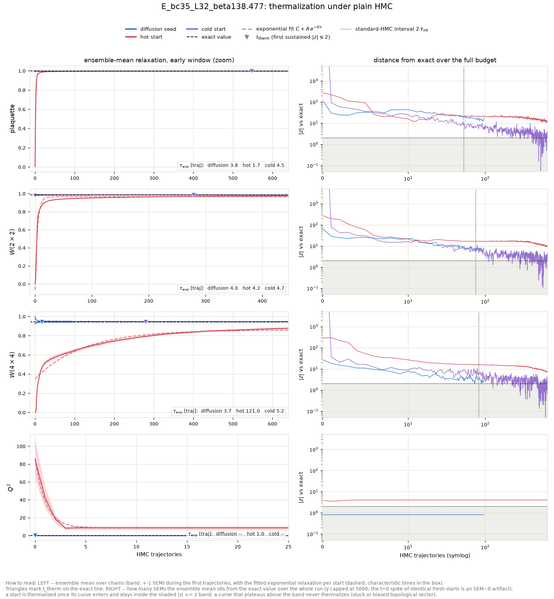

tau_int (hot-start chains, second half): plaquette = 26.27 +- 2.10, wilson_2x2 = 37.33 +- 2.39, wilson_4x4 = 41.20 +- 2.74, wilson_6x6 = 39.42 +- 3.29. Topology: hot-start HMC L=32 beta=138.477 -> **frozen** (no tunneling).

Where 'never' stood at the end: the hot start ended the 640-trajectory budget still at plaquette at |z| ~ 12, wilson_2x2 at |z| ~ 10, wilson_4x4 at |z| ~ 7, wilson_6x6 at |z| ~ 6, Q^2 at |z| ~ 4; the cold start ended the 640-trajectory budget still at Q^2 at |z| ~ 122925113344.

### Diagnostics: raw diffusion output (before any HMC)

| observable | value | error | exact | z_exact | reference | ref_error | z_ref | ks_p | chi2_p |
|---|---|---|---|---|---|---|---|---|---|
| plaquette | 0.9919 | 4.737e-05 | 0.9964 | -94.76 | 0.9964 | 1.354e-05 | -91.44 | 0 |  |
| wilson_1x1 | 0.9919 | 4.737e-05 | 0.9964 | -94.76 | 0.9964 | 1.354e-05 | -91.44 | 0 |  |
| wilson_1x2 | 0.9854 | 8.259e-05 | 0.9928 | -89.12 | 0.9928 | 3.55e-05 | -82.43 | 0 |  |
| wilson_2x2 | 0.9752 | 0.0001779 | 0.9856 | -58.86 | 0.9858 | 8.989e-05 | -53.17 | 0 |  |
| wilson_2x3 | 0.9651 | 0.000278 | 0.9785 | -48.33 | 0.9787 | 0.0001615 | -42.38 | 0 |  |
| wilson_3x3 | 0.9515 | 0.0004055 | 0.968 | -40.65 | 0.9684 | 0.0002549 | -35.14 | 0 |  |
| wilson_3x4 | 0.9386 | 0.0005625 | 0.9576 | -33.76 | 0.9579 | 0.0003788 | -28.46 | 0 |  |
| wilson_4x4 | 0.9226 | 0.0008025 | 0.944 | -26.64 | 0.9442 | 0.0005091 | -22.77 | 0 |  |
| wilson_4x5 | 0.9069 | 0.0009676 | 0.9305 | -24.39 | 0.9305 | 0.0007245 | -19.51 | 0 |  |
| wilson_5x5 | 0.8878 | 0.001318 | 0.9141 | -19.93 | 0.9138 | 0.0009305 | -16.11 | 7.314e-33 |  |
| wilson_5x6 | 0.8699 | 0.001562 | 0.898 | -18.01 | 0.8976 | 0.001199 | -14.09 | 1.083e-24 |  |
| wilson_6x6 | 0.8494 | 0.001993 | 0.8791 | -14.92 | 0.8781 | 0.001489 | -11.54 | 6.175e-18 |  |
| wilson_6x7 | 0.8281 | 0.002307 | 0.8607 | -14.11 | 0.8596 | 0.001869 | -10.59 | 1.491e-15 |  |
| wilson_7x7 | 0.8039 | 0.002945 | 0.8398 | -12.18 | 0.8379 | 0.002266 | -9.147 | 1.418e-12 |  |
| wilson_7x8 | 0.7822 | 0.003337 | 0.8195 | -11.19 | 0.817 | 0.002773 | -8.031 | 1.211e-08 |  |
| wilson_8x8 | 0.7583 | 0.004005 | 0.7971 | -9.679 | 0.7936 | 0.00334 | -6.77 | 4.282e-07 |  |
| wilson_8x10 | 0.7122 | 0.004953 | 0.7544 | -8.512 | 0.749 | 0.004625 | -5.422 | 5.99e-05 |  |
| wilson_10x10 | 0.6574 | 0.00646 | 0.7049 | -7.357 | 0.696 | 0.005881 | -4.414 | 0.0007783 |  |
| wilson_10x12 | 0.6092 | 0.007423 | 0.6595 | -6.78 | 0.6481 | 0.007336 | -3.733 | 0.004349 |  |
| wilson_12x12 | 0.5553 | 0.009083 | 0.6099 | -6.018 | 0.596 | 0.008918 | -3.197 | 0.011 |  |
| creutz_2 | 0.003927 | 0.0001066 | 0.003613 | 2.943 |  |  |  |  |  |
| creutz_3 | 0.003799 | 0.0002009 | 0.003593 | 1.026 |  |  |  |  |  |
| creutz_4 | 0.003581 | 0.0002982 | 0.003564 | 0.05824 |  |  |  |  |  |
| creutz_5 | 0.004217 | 0.0003942 | 0.003524 | 1.759 |  |  |  |  |  |
| creutz_6 | 0.003379 | 0.0005392 | 0.003474 | -0.1763 |  |  |  |  |  |
| creutz_7 | 0.004349 | 0.0007187 | 0.003411 | 1.304 |  |  |  |  |  |
| creutz_8 | 0.003548 | 0.0009181 | 0.003335 | 0.232 |  |  |  |  |  |
| Q | -0.03906 | 0.03255 | 0 | -1.2 | -0.03646 | 0.02674 | -0.06182 | 1 |  |
| Q^2 | 0.1484 | 0.02165 | 0.1229 | 1.178 | 0.151 | 0.02242 | -0.08356 | 1 |  |
| chi_top ((<Q^2>-<Q>^2)/V) | 0.0001435 | 2.067e-05 | 0.00012 | 1.133 | 0.0001462 | 2.157e-05 | -0.09154 | 0 |  |
| Q histogram vs exact P(Q) | 2.375 | nan | 2 | nan |  |  |  |  | 0.3051 |

### Diagnostics: the same configs after 96 HMC trajectories

| observable | value | error | exact | z_exact | reference | ref_error | z_ref | ks_p | chi2_p |
|---|---|---|---|---|---|---|---|---|---|
| plaquette | 0.9961 | 1.541e-05 | 0.9964 | -15.81 | 0.9964 | 1.354e-05 | -12.67 | 6.083e-31 |  |
| wilson_1x1 | 0.9961 | 1.541e-05 | 0.9964 | -15.81 | 0.9964 | 1.354e-05 | -12.67 | 6.083e-31 |  |
| wilson_1x2 | 0.9923 | 3.952e-05 | 0.9928 | -11.04 | 0.9928 | 3.55e-05 | -9.155 | 6.603e-16 |  |
| wilson_2x2 | 0.9849 | 9.813e-05 | 0.9856 | -7.593 | 0.9858 | 8.989e-05 | -6.551 | 3.732e-09 |  |
| wilson_2x3 | 0.9774 | 0.000163 | 0.9785 | -6.659 | 0.9787 | 0.0001615 | -5.568 | 1.186e-06 |  |
| wilson_3x3 | 0.9666 | 0.0002452 | 0.968 | -5.851 | 0.9684 | 0.0002549 | -5.044 | 3.143e-05 |  |
| wilson_3x4 | 0.9559 | 0.0003419 | 0.9576 | -5.136 | 0.9579 | 0.0003788 | -4.049 | 0.0006474 |  |
| wilson_4x4 | 0.9416 | 0.0004295 | 0.944 | -5.477 | 0.9442 | 0.0005091 | -3.922 | 0.004349 |  |
| wilson_4x5 | 0.9281 | 0.0006517 | 0.9305 | -3.719 | 0.9305 | 0.0007245 | -2.472 | 0.07995 |  |
| wilson_5x5 | 0.9115 | 0.0007718 | 0.9141 | -3.346 | 0.9138 | 0.0009305 | -1.905 | 0.3021 |  |
| wilson_5x6 | 0.8949 | 0.001052 | 0.898 | -2.97 | 0.8976 | 0.001199 | -1.712 | 0.3021 |  |
| wilson_6x6 | 0.8747 | 0.001328 | 0.8791 | -3.298 | 0.8781 | 0.001489 | -1.683 | 0.4548 |  |
| wilson_6x7 | 0.8554 | 0.001646 | 0.8607 | -3.194 | 0.8596 | 0.001869 | -1.668 | 0.6395 |  |
| wilson_7x7 | 0.8329 | 0.001925 | 0.8398 | -3.573 | 0.8379 | 0.002266 | -1.681 | 0.7163 |  |
| wilson_7x8 | 0.8118 | 0.002223 | 0.8195 | -3.463 | 0.817 | 0.002773 | -1.461 | 0.6395 |  |
| wilson_8x8 | 0.7885 | 0.002588 | 0.7971 | -3.324 | 0.7936 | 0.00334 | -1.217 | 0.7163 |  |
| wilson_8x10 | 0.7426 | 0.003242 | 0.7544 | -3.624 | 0.749 | 0.004625 | -1.122 | 0.4898 |  |
| wilson_10x10 | 0.689 | 0.00425 | 0.7049 | -3.753 | 0.696 | 0.005881 | -0.9634 | 0.2763 |  |
| wilson_10x12 | 0.6395 | 0.005043 | 0.6595 | -3.962 | 0.6481 | 0.007336 | -0.9672 | 0.3584 |  |
| wilson_12x12 | 0.5863 | 0.006226 | 0.6099 | -3.801 | 0.596 | 0.008918 | -0.8916 | 0.4898 |  |
| creutz_2 | 0.003734 | 5.447e-05 | 0.003613 | 2.23 |  |  |  |  |  |
| creutz_3 | 0.003613 | 0.000102 | 0.003593 | 0.1911 |  |  |  |  |  |
| creutz_4 | 0.003871 | 0.0001587 | 0.003564 | 1.937 |  |  |  |  |  |
| creutz_5 | 0.003634 | 0.0002835 | 0.003524 | 0.3866 |  |  |  |  |  |
| creutz_6 | 0.004328 | 0.0004088 | 0.003474 | 2.091 |  |  |  |  |  |
| creutz_7 | 0.004377 | 0.0005711 | 0.003411 | 1.691 |  |  |  |  |  |
| creutz_8 | 0.003534 | 0.0007739 | 0.003335 | 0.2575 |  |  |  |  |  |
| Q | -0.03906 | 0.03255 | 0 | -1.2 | -0.03646 | 0.02674 | -0.06182 | 1 |  |
| Q^2 | 0.1484 | 0.02165 | 0.1229 | 1.178 | 0.151 | 0.02242 | -0.08356 | 1 |  |
| chi_top ((<Q^2>-<Q>^2)/V) | 0.0001435 | 2.067e-05 | 0.00012 | 1.133 | 0.0001462 | 2.157e-05 | -0.09154 | 0 |  |
| Q histogram vs exact P(Q) | 2.375 | nan | 2 | nan |  |  |  |  | 0.3051 |

## D_bc40_L32_beta158.48

HMC: step size 0.0318, 31 leapfrog steps, acceptance seed/hot/cold = 0.962/0.975/0.980. Diffusion-seed batch: 128 chains x 96 trajectories (0.36 s/traj for the whole batch); baselines: 32 chains x 640 trajectories.

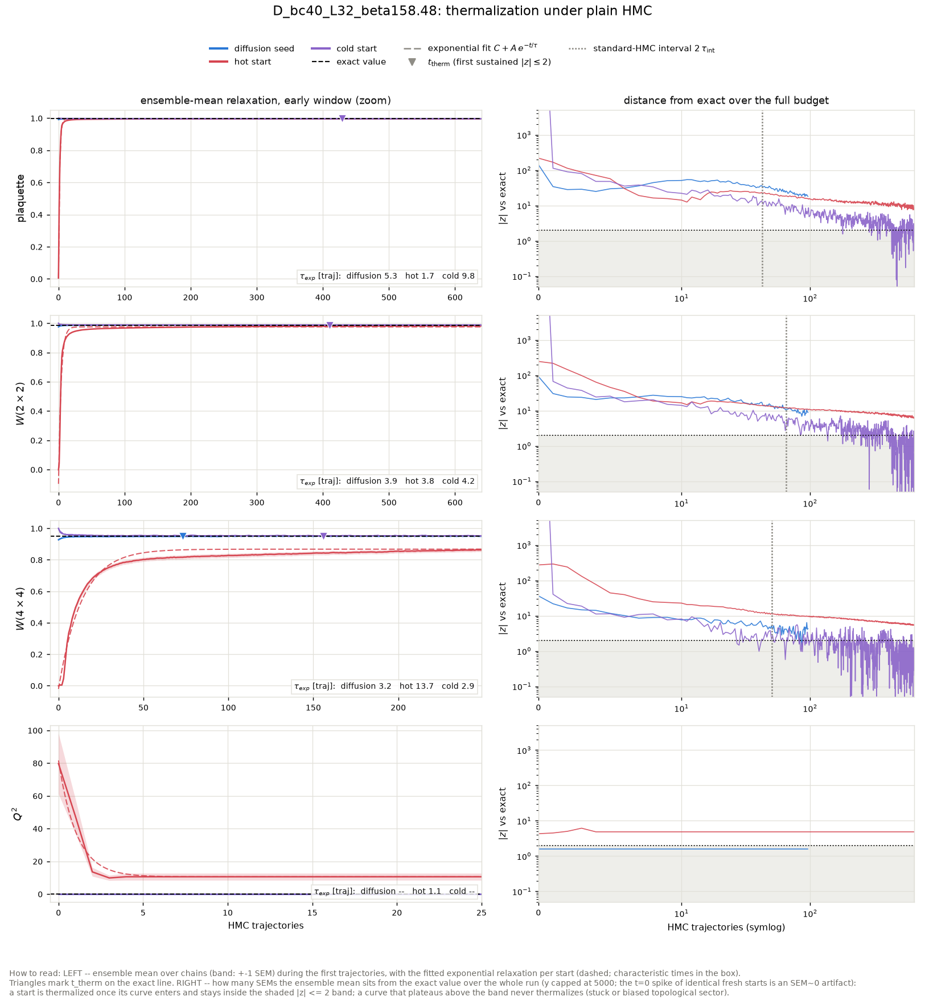

tau_int (hot-start chains, second half): plaquette = 21.25 +- 1.86, wilson_2x2 = 32.39 +- 2.23, wilson_4x4 = 25.26 +- 2.79, wilson_6x6 = 7.86 +- 1.32. Topology: hot-start HMC L=32 beta=158.48 -> **frozen** (no tunneling).

Where 'never' stood at the end: the hot start ended the 640-trajectory budget still at plaquette at |z| ~ 8, wilson_2x2 at |z| ~ 6, wilson_4x4 at |z| ~ 5, wilson_6x6 at |z| ~ 6, Q^2 at |z| ~ 5; the cold start ended the 640-trajectory budget still at Q^2 at |z| ~ 86933716992.

### Diagnostics: raw diffusion output (before any HMC)

| observable | value | error | exact | z_exact | reference | ref_error | z_ref | ks_p | chi2_p |
|---|---|---|---|---|---|---|---|---|---|
| plaquette | 0.9915 | 4.708e-05 | 0.9968 | -112.6 | 0.9969 | 7.484e-06 | -111.7 | 0 |  |
| wilson_1x1 | 0.9915 | 4.708e-05 | 0.9968 | -112.6 | 0.9969 | 7.484e-06 | -111.7 | 0 |  |
| wilson_1x2 | 0.9852 | 9.423e-05 | 0.9937 | -90.07 | 0.9937 | 2.19e-05 | -88.18 | 0 |  |
| wilson_2x2 | 0.9754 | 0.0001247 | 0.9874 | -96.33 | 0.9875 | 5.587e-05 | -88.67 | 0 |  |
| wilson_2x3 | 0.9661 | 0.0001993 | 0.9812 | -76.2 | 0.9813 | 0.0001011 | -68.35 | 0 |  |
| wilson_3x3 | 0.9532 | 0.0003196 | 0.972 | -58.9 | 0.9722 | 0.0001779 | -51.82 | 0 |  |
| wilson_3x4 | 0.9415 | 0.0005107 | 0.9629 | -41.9 | 0.9632 | 0.0002749 | -37.32 | 0 |  |
| wilson_4x4 | 0.9273 | 0.0006592 | 0.951 | -35.96 | 0.9514 | 0.0004515 | -30.21 | 0 |  |
| wilson_4x5 | 0.9133 | 0.0009066 | 0.9392 | -28.58 | 0.94 | 0.0006134 | -24.36 | 0 |  |
| wilson_5x5 | 0.8955 | 0.001159 | 0.9248 | -25.25 | 0.9256 | 0.0009137 | -20.41 | 0 |  |
| wilson_5x6 | 0.8798 | 0.001435 | 0.9106 | -21.5 | 0.9115 | 0.00119 | -17.04 | 8.389e-39 |  |
| wilson_6x6 | 0.8625 | 0.001757 | 0.894 | -17.95 | 0.8946 | 0.001572 | -13.64 | 2.48e-28 |  |
| wilson_6x7 | 0.8435 | 0.002027 | 0.8778 | -16.91 | 0.8785 | 0.001917 | -12.53 | 7.191e-26 |  |
| wilson_7x7 | 0.8215 | 0.002362 | 0.8594 | -16.01 | 0.8603 | 0.002412 | -11.48 | 1.599e-20 |  |
| wilson_7x8 | 0.8021 | 0.002862 | 0.8414 | -13.75 | 0.8418 | 0.002769 | -9.972 | 3.972e-18 |  |
| wilson_8x8 | 0.7812 | 0.003399 | 0.8216 | -11.87 | 0.8216 | 0.003365 | -8.435 | 1.61e-14 |  |
| wilson_8x10 | 0.74 | 0.004378 | 0.7837 | -9.984 | 0.7828 | 0.004506 | -6.809 | 4.48e-11 |  |
| wilson_10x10 | 0.6938 | 0.005799 | 0.7397 | -7.915 | 0.7378 | 0.005932 | -5.308 | 8.121e-10 |  |
| wilson_10x12 | 0.6499 | 0.00705 | 0.699 | -6.973 | 0.694 | 0.007383 | -4.327 | 1.947e-07 |  |
| wilson_12x12 | 0.6041 | 0.008327 | 0.6544 | -6.051 | 0.6478 | 0.008811 | -3.609 | 1.186e-06 |  |
| creutz_2 | 0.003569 | 9.616e-05 | 0.003152 | 4.335 |  |  |  |  |  |
| creutz_3 | 0.003731 | 0.0002036 | 0.003129 | 2.959 |  |  |  |  |  |
| creutz_4 | 0.002952 | 0.0002655 | 0.003094 | -0.5339 |  |  |  |  |  |
| creutz_5 | 0.00449 | 0.000366 | 0.003047 | 3.945 |  |  |  |  |  |
| creutz_6 | 0.002125 | 0.0004801 | 0.002987 | -1.797 |  |  |  |  |  |
| creutz_7 | 0.004156 | 0.0006606 | 0.002915 | 1.879 |  |  |  |  |  |
| creutz_8 | 0.002406 | 0.0008049 | 0.002827 | -0.5234 |  |  |  |  |  |
| Q | 0.03906 | 0.02015 | 0 | 1.938 | 0.02083 | 0.02291 | 0.5974 | 1 |  |
| Q^2 | 0.05469 | 0.0179 | 0.08693 | -1.801 | 0.09375 | 0.01492 | -1.676 | 0.9996 |  |
| chi_top ((<Q^2>-<Q>^2)/V) | 5.192e-05 | 1.657e-05 | 8.49e-05 | -1.991 | 9.113e-05 | 1.454e-05 | -1.779 | 0 |  |
| Q histogram vs exact P(Q) | 3.921 | nan | 2 | nan |  |  |  |  | 0.1408 |

### Diagnostics: the same configs after 96 HMC trajectories

| observable | value | error | exact | z_exact | reference | ref_error | z_ref | ks_p | chi2_p |
|---|---|---|---|---|---|---|---|---|---|
| plaquette | 0.9966 | 1.58e-05 | 0.9968 | -16.79 | 0.9969 | 7.484e-06 | -16.74 | 2.779e-34 |  |
| wilson_1x1 | 0.9966 | 1.58e-05 | 0.9968 | -16.79 | 0.9969 | 7.484e-06 | -16.74 | 2.779e-34 |  |
| wilson_1x2 | 0.9932 | 3.733e-05 | 0.9937 | -13.18 | 0.9937 | 2.19e-05 | -12.37 | 2.319e-21 |  |
| wilson_2x2 | 0.9867 | 8.464e-05 | 0.9874 | -8.67 | 0.9875 | 5.587e-05 | -8.254 | 8.222e-12 |  |
| wilson_2x3 | 0.9803 | 0.0001294 | 0.9812 | -7.568 | 0.9813 | 0.0001011 | -6.484 | 2.524e-05 |  |
| wilson_3x3 | 0.9707 | 0.0002458 | 0.972 | -5.333 | 0.9722 | 0.0001779 | -4.743 | 0.0009335 |  |
| wilson_3x4 | 0.9611 | 0.0003731 | 0.9629 | -4.842 | 0.9632 | 0.0002749 | -4.429 | 0.0007783 |  |
| wilson_4x4 | 0.9486 | 0.0005955 | 0.951 | -3.979 | 0.9514 | 0.0004515 | -3.754 | 0.004349 |  |
| wilson_4x5 | 0.9363 | 0.0008125 | 0.9392 | -3.57 | 0.94 | 0.0006134 | -3.582 | 0.002243 |  |
| wilson_5x5 | 0.921 | 0.001108 | 0.9248 | -3.367 | 0.9256 | 0.0009137 | -3.19 | 0.011 |  |
| wilson_5x6 | 0.9072 | 0.001383 | 0.9106 | -2.456 | 0.9115 | 0.00119 | -2.36 | 0.08971 |  |
| wilson_6x6 | 0.8912 | 0.00177 | 0.894 | -1.563 | 0.8946 | 0.001572 | -1.426 | 0.1392 |  |
| wilson_6x7 | 0.8745 | 0.002137 | 0.8778 | -1.559 | 0.8785 | 0.001917 | -1.394 | 0.08971 |  |
| wilson_7x7 | 0.8545 | 0.002641 | 0.8594 | -1.821 | 0.8603 | 0.002412 | -1.608 | 0.03364 |  |
| wilson_7x8 | 0.8373 | 0.003069 | 0.8414 | -1.336 | 0.8418 | 0.002769 | -1.081 | 0.1392 |  |
| wilson_8x8 | 0.8187 | 0.003589 | 0.8216 | -0.8101 | 0.8216 | 0.003365 | -0.5924 | 0.4898 |  |
| wilson_8x10 | 0.7816 | 0.004575 | 0.7837 | -0.4519 | 0.7828 | 0.004506 | -0.176 | 0.8569 |  |
| wilson_10x10 | 0.7364 | 0.005922 | 0.7397 | -0.5454 | 0.7378 | 0.005932 | -0.163 | 0.7538 |  |
| wilson_10x12 | 0.6984 | 0.007379 | 0.699 | -0.08046 | 0.694 | 0.007383 | 0.4206 | 0.5631 |  |
| wilson_12x12 | 0.6542 | 0.009126 | 0.6544 | -0.02502 | 0.6478 | 0.008811 | 0.5054 | 0.7538 |  |
| creutz_2 | 0.003171 | 4.825e-05 | 0.003152 | 0.4036 |  |  |  |  |  |
| creutz_3 | 0.003225 | 9.558e-05 | 0.003129 | 1.009 |  |  |  |  |  |
| creutz_4 | 0.003181 | 0.0001681 | 0.003094 | 0.5213 |  |  |  |  |  |
| creutz_5 | 0.003398 | 0.0002534 | 0.003047 | 1.385 |  |  |  |  |  |
| creutz_6 | 0.002655 | 0.0003864 | 0.002987 | -0.8593 |  |  |  |  |  |
| creutz_7 | 0.00402 | 0.0005033 | 0.002915 | 2.196 |  |  |  |  |  |
| creutz_8 | 0.002212 | 0.0006612 | 0.002827 | -0.9296 |  |  |  |  |  |
| Q | 0.03906 | 0.02015 | 0 | 1.938 | 0.02083 | 0.02291 | 0.5974 | 1 |  |
| Q^2 | 0.05469 | 0.0179 | 0.08693 | -1.801 | 0.09375 | 0.01492 | -1.676 | 0.9996 |  |
| chi_top ((<Q^2>-<Q>^2)/V) | 5.192e-05 | 1.657e-05 | 8.49e-05 | -1.991 | 9.113e-05 | 1.454e-05 | -1.779 | 0 |  |
| Q histogram vs exact P(Q) | 3.921 | nan | 2 | nan |  |  |  |  | 0.1408 |

## E_bc45_L32_beta178.482

HMC: step size 0.0299, 33 leapfrog steps, acceptance seed/hot/cold = 0.952/0.974/0.977. Diffusion-seed batch: 128 chains x 96 trajectories (0.38 s/traj for the whole batch); baselines: 32 chains x 640 trajectories.

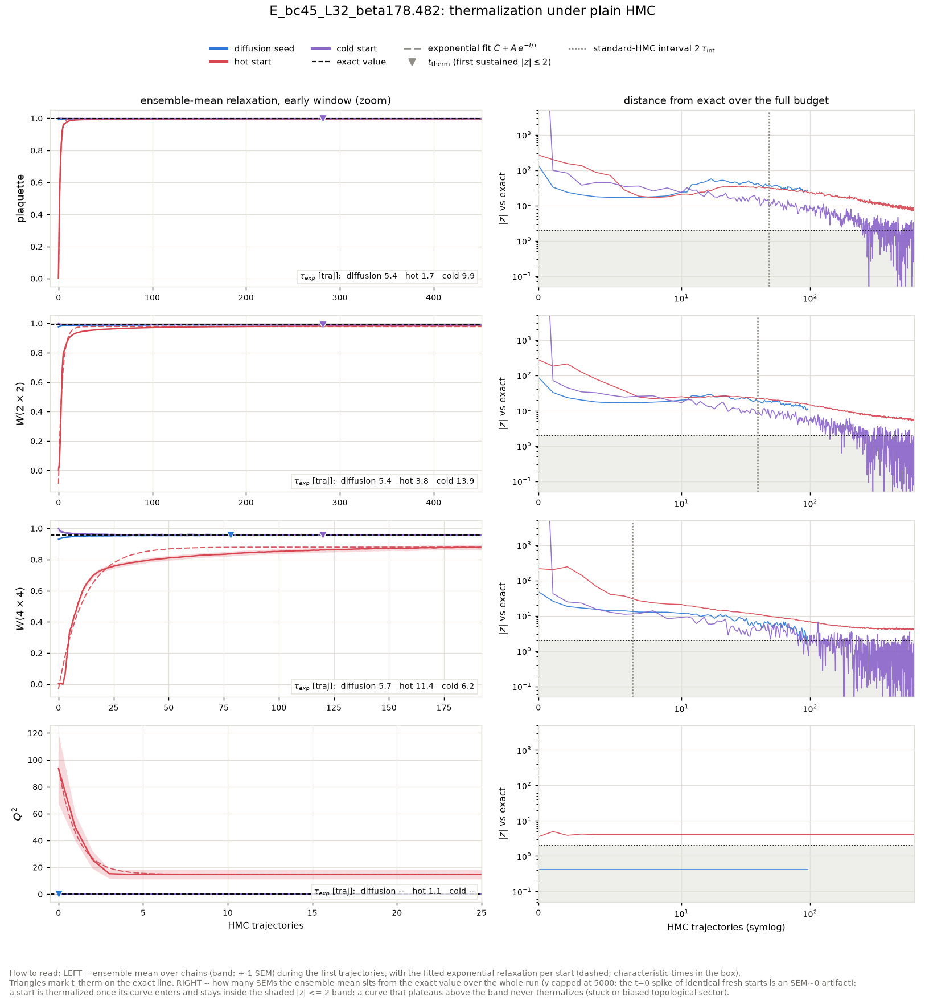

tau_int (hot-start chains, second half): plaquette = 23.81 +- 1.97, wilson_2x2 = 19.60 +- 1.86, wilson_4x4 = 3.28 +- 0.52, wilson_6x6 = 3.60 +- 0.59. Topology: hot-start HMC L=32 beta=178.482 -> **frozen** (no tunneling).

Where 'never' stood at the end: the hot start ended the 640-trajectory budget still at plaquette at |z| ~ 8, wilson_2x2 at |z| ~ 5, wilson_4x4 at |z| ~ 4, wilson_6x6 at |z| ~ 5, Q^2 at |z| ~ 4; the cold start ended the 640-trajectory budget still at Q^2 at |z| ~ 60793004032.

### Diagnostics: raw diffusion output (before any HMC)

| observable | value | error | exact | z_exact | reference | ref_error | z_ref | ks_p | chi2_p |
|---|---|---|---|---|---|---|---|---|---|
| plaquette | 0.9912 | 4.813e-05 | 0.9972 | -124.6 | 0.9972 | 9.091e-06 | -122.3 | 0 |  |
| wilson_1x1 | 0.9912 | 4.813e-05 | 0.9972 | -124.6 | 0.9972 | 9.091e-06 | -122.3 | 0 |  |
| wilson_1x2 | 0.9849 | 9.029e-05 | 0.9944 | -105.7 | 0.9944 | 2.084e-05 | -103 | 0 |  |
| wilson_2x2 | 0.9755 | 0.0001568 | 0.9889 | -85.29 | 0.9888 | 4.604e-05 | -81.65 | 0 |  |
| wilson_2x3 | 0.9665 | 0.0001964 | 0.9833 | -85.97 | 0.9833 | 8.636e-05 | -78.57 | 0 |  |
| wilson_3x3 | 0.954 | 0.0002903 | 0.9752 | -73 | 0.9752 | 0.000162 | -63.79 | 0 |  |
| wilson_3x4 | 0.9427 | 0.0003708 | 0.9671 | -65.66 | 0.967 | 0.0002318 | -55.48 | 0 |  |
| wilson_4x4 | 0.9295 | 0.0005118 | 0.9564 | -52.68 | 0.9561 | 0.0003554 | -42.72 | 0 |  |
| wilson_4x5 | 0.9162 | 0.0007227 | 0.946 | -41.17 | 0.9452 | 0.0004515 | -34.02 | 0 |  |
| wilson_5x5 | 0.8993 | 0.0008978 | 0.9331 | -37.7 | 0.932 | 0.0006228 | -29.95 | 0 |  |
| wilson_5x6 | 0.8849 | 0.001205 | 0.9205 | -29.54 | 0.9191 | 0.0007729 | -23.92 | 8.408e-45 |  |
| wilson_6x6 | 0.8686 | 0.001567 | 0.9057 | -23.66 | 0.9043 | 0.001021 | -19.06 | 4.053e-39 |  |
| wilson_6x7 | 0.851 | 0.001807 | 0.8912 | -22.25 | 0.8902 | 0.001265 | -17.76 | 2.635e-32 |  |
| wilson_7x7 | 0.83 | 0.002252 | 0.8748 | -19.89 | 0.8732 | 0.001542 | -15.83 | 2.48e-28 |  |
| wilson_7x8 | 0.8127 | 0.002628 | 0.8588 | -17.53 | 0.8577 | 0.001849 | -14.02 | 3.135e-24 |  |
| wilson_8x8 | 0.7944 | 0.003128 | 0.841 | -14.89 | 0.8398 | 0.002216 | -11.85 | 2.572e-20 |  |
| wilson_8x10 | 0.7553 | 0.004378 | 0.807 | -11.81 | 0.8066 | 0.003006 | -9.661 | 6.603e-16 |  |
| wilson_10x10 | 0.7108 | 0.005573 | 0.7675 | -10.18 | 0.7688 | 0.003828 | -8.577 | 2.371e-14 |  |
| wilson_10x12 | 0.6702 | 0.006988 | 0.7309 | -8.688 | 0.7332 | 0.004739 | -7.466 | 2.025e-12 |  |
| wilson_12x12 | 0.6257 | 0.008373 | 0.6906 | -7.752 | 0.6914 | 0.005477 | -6.565 | 8.121e-10 |  |
| creutz_2 | 0.003166 | 0.0001097 | 0.002795 | 3.381 |  |  |  |  |  |
| creutz_3 | 0.003724 | 0.0002251 | 0.002769 | 4.241 |  |  |  |  |  |
| creutz_4 | 0.002302 | 0.0002886 | 0.002731 | -1.485 |  |  |  |  |  |
| creutz_5 | 0.004305 | 0.0003767 | 0.002679 | 4.316 |  |  |  |  |  |
| creutz_6 | 0.002452 | 0.0004601 | 0.002614 | -0.3523 |  |  |  |  |  |
| creutz_7 | 0.004584 | 0.0006466 | 0.002535 | 3.168 |  |  |  |  |  |
| creutz_8 | 0.001727 | 0.0008065 | 0.002441 | -0.8851 |  |  |  |  |  |
| Q | -0.02344 | 0.02018 | 0 | -1.161 | 0.005208 | 0.01913 | -1.03 | 1 |  |
| Q^2 | 0.07031 | 0.02161 | 0.06079 | 0.4406 | 0.05729 | 0.01394 | 0.5063 | 1 |  |
| chi_top ((<Q^2>-<Q>^2)/V) | 6.813e-05 | 2.091e-05 | 5.937e-05 | 0.4188 | 5.592e-05 | 1.358e-05 | 0.4895 | 0 |  |
| Q histogram vs exact P(Q) | 1.36 | nan | 2 | nan |  |  |  |  | 0.5065 |

### Diagnostics: the same configs after 96 HMC trajectories

| observable | value | error | exact | z_exact | reference | ref_error | z_ref | ks_p | chi2_p |
|---|---|---|---|---|---|---|---|---|---|
| plaquette | 0.9968 | 1.386e-05 | 0.9972 | -25.31 | 0.9972 | 9.091e-06 | -20.71 | 0 |  |
| wilson_1x1 | 0.9968 | 1.386e-05 | 0.9972 | -25.31 | 0.9972 | 9.091e-06 | -20.71 | 0 |  |
| wilson_1x2 | 0.9938 | 2.96e-05 | 0.9944 | -18.75 | 0.9944 | 2.084e-05 | -15.35 | 1.245e-25 |  |
| wilson_2x2 | 0.9881 | 6.497e-05 | 0.9889 | -11.68 | 0.9888 | 4.604e-05 | -9.156 | 8.222e-12 |  |
| wilson_2x3 | 0.9823 | 0.0001288 | 0.9833 | -7.931 | 0.9833 | 8.636e-05 | -6.417 | 5.026e-09 |  |
| wilson_3x3 | 0.9741 | 0.0002238 | 0.9752 | -4.951 | 0.9752 | 0.000162 | -4.051 | 2.022e-05 |  |
| wilson_3x4 | 0.9659 | 0.0003678 | 0.9671 | -3.171 | 0.967 | 0.0002318 | -2.487 | 0.003137 |  |
| wilson_4x4 | 0.9552 | 0.0005163 | 0.9564 | -2.377 | 0.9561 | 0.0003554 | -1.407 | 0.05588 |  |
| wilson_4x5 | 0.9444 | 0.0007119 | 0.946 | -2.196 | 0.9452 | 0.0004515 | -0.9477 | 0.2087 |  |
| wilson_5x5 | 0.9313 | 0.0009155 | 0.9331 | -2.005 | 0.932 | 0.0006228 | -0.645 | 0.3584 |  |
| wilson_5x6 | 0.9184 | 0.001148 | 0.9205 | -1.826 | 0.9191 | 0.0007729 | -0.5308 | 0.3294 |  |
| wilson_6x6 | 0.9035 | 0.001435 | 0.9057 | -1.508 | 0.9043 | 0.001021 | -0.4165 | 0.4548 |  |
| wilson_6x7 | 0.8887 | 0.001731 | 0.8912 | -1.474 | 0.8902 | 0.001265 | -0.7101 | 0.2087 |  |
| wilson_7x7 | 0.8723 | 0.002146 | 0.8748 | -1.165 | 0.8732 | 0.001542 | -0.3433 | 0.2522 |  |
| wilson_7x8 | 0.8564 | 0.002471 | 0.8588 | -0.9489 | 0.8577 | 0.001849 | -0.429 | 0.3294 |  |
| wilson_8x8 | 0.8388 | 0.003003 | 0.841 | -0.7338 | 0.8398 | 0.002216 | -0.2842 | 0.6011 |  |
| wilson_8x10 | 0.8032 | 0.003834 | 0.807 | -0.9982 | 0.8066 | 0.003006 | -0.703 | 0.4548 |  |
| wilson_10x10 | 0.7608 | 0.005088 | 0.7675 | -1.313 | 0.7688 | 0.003828 | -1.249 | 0.1122 |  |
| wilson_10x12 | 0.7243 | 0.006228 | 0.7309 | -1.058 | 0.7332 | 0.004739 | -1.138 | 0.1892 |  |
| wilson_12x12 | 0.6826 | 0.007521 | 0.6906 | -1.065 | 0.6914 | 0.005477 | -0.9446 | 0.2297 |  |
| creutz_2 | 0.002798 | 4.029e-05 | 0.002795 | 0.07837 |  |  |  |  |  |
| creutz_3 | 0.002596 | 8.64e-05 | 0.002769 | -2.006 |  |  |  |  |  |
| creutz_4 | 0.002738 | 0.0001396 | 0.002731 | 0.05421 |  |  |  |  |  |
| creutz_5 | 0.002624 | 0.0002305 | 0.002679 | -0.2404 |  |  |  |  |  |
| creutz_6 | 0.002414 | 0.0003229 | 0.002614 | -0.6199 |  |  |  |  |  |
| creutz_7 | 0.002056 | 0.0004616 | 0.002535 | -1.039 |  |  |  |  |  |
| creutz_8 | 0.002458 | 0.0005858 | 0.002441 | 0.02928 |  |  |  |  |  |
| Q | -0.02344 | 0.02018 | 0 | -1.161 | 0.005208 | 0.01913 | -1.03 | 1 |  |
| Q^2 | 0.07031 | 0.02161 | 0.06079 | 0.4406 | 0.05729 | 0.01394 | 0.5063 | 1 |  |
| chi_top ((<Q^2>-<Q>^2)/V) | 6.813e-05 | 2.091e-05 | 5.937e-05 | 0.4188 | 5.592e-05 | 1.358e-05 | 0.4895 | 0 |  |
| Q histogram vs exact P(Q) | 1.36 | nan | 2 | nan |  |  |  |  | 0.5065 |

## D_bc55.0237_L32_beta218.58

HMC: step size 0.0271, 37 leapfrog steps, acceptance seed/hot/cold = 0.935/0.968/0.977. Diffusion-seed batch: 128 chains x 96 trajectories (0.43 s/traj for the whole batch); baselines: 32 chains x 640 trajectories.

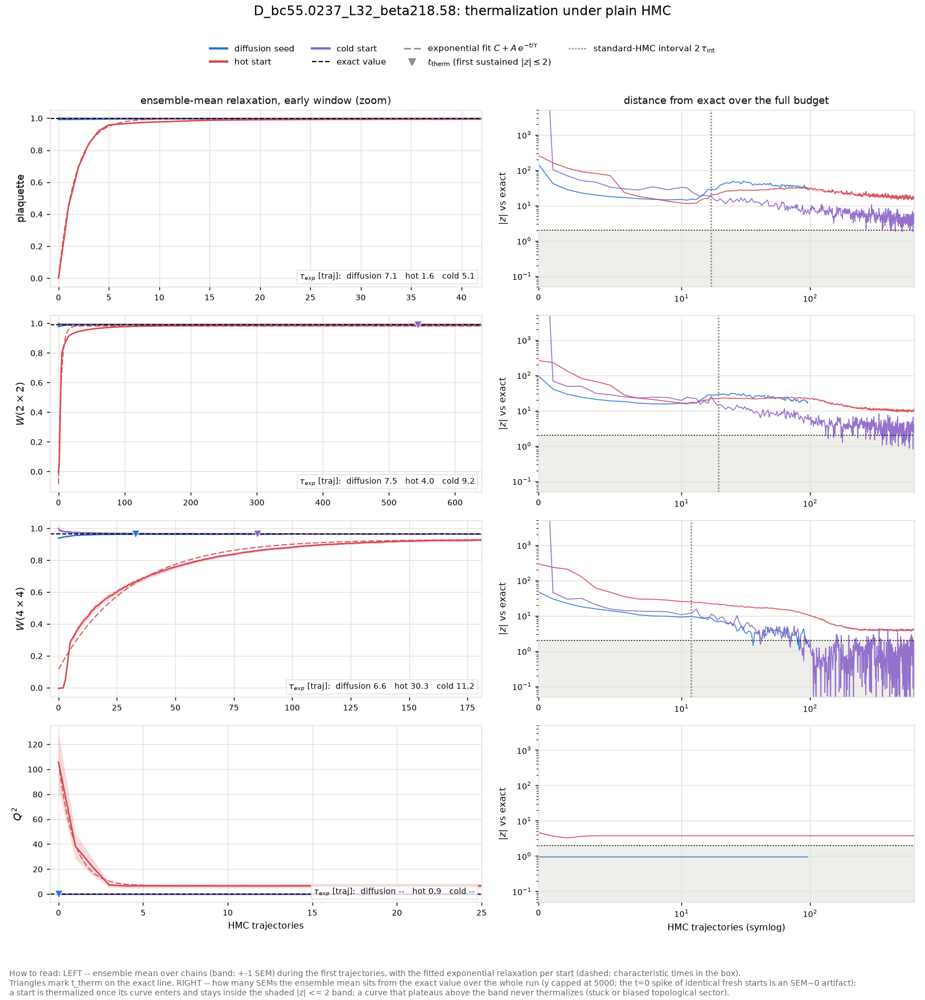

tau_int (hot-start chains, second half): plaquette = 8.49 +- 1.25, wilson_2x2 = 9.61 +- 1.17, wilson_4x4 = 5.94 +- 0.51, wilson_6x6 = 6.80 +- 0.68. Topology: hot-start HMC L=32 beta=218.58 -> **frozen** (no tunneling).

Where 'never' stood at the end: the hot start ended the 640-trajectory budget still at plaquette at |z| ~ 17, wilson_2x2 at |z| ~ 10, wilson_4x4 at |z| ~ 4, wilson_6x6 at |z| ~ 4, Q^2 at |z| ~ 4; the cold start ended the 640-trajectory budget still at plaquette at |z| ~ 4, Q^2 at |z| ~ 29010771968.

### Diagnostics: raw diffusion output (before any HMC)

| observable | value | error | exact | z_exact | reference | ref_error | z_ref | ks_p |
|---|---|---|---|---|---|---|---|---|
| plaquette | 0.9913 | 3.154e-05 | 0.9977 | -204 | 0.9977 | 7.705e-06 | -198.6 | 0 |
| wilson_1x1 | 0.9913 | 3.154e-05 | 0.9977 | -204 | 0.9977 | 7.705e-06 | -198.6 | 0 |
| wilson_1x2 | 0.9856 | 7.244e-05 | 0.9954 | -135.6 | 0.9955 | 1.563e-05 | -133.2 | 0 |
| wilson_2x2 | 0.9769 | 0.0001171 | 0.9909 | -119.1 | 0.991 | 3.765e-05 | -114.2 | 0 |
| wilson_2x3 | 0.9692 | 0.0001602 | 0.9864 | -107.3 | 0.9865 | 6.139e-05 | -100.7 | 0 |
| wilson_3x3 | 0.9581 | 0.0002309 | 0.9797 | -93.43 | 0.9799 | 8.848e-05 | -87.88 | 0 |
| wilson_3x4 | 0.9491 | 0.0003272 | 0.9731 | -73.31 | 0.9732 | 0.0001162 | -69.43 | 0 |
| wilson_4x4 | 0.9381 | 0.0004585 | 0.9644 | -57.42 | 0.9646 | 0.0001617 | -54.5 | 0 |
| wilson_4x5 | 0.9272 | 0.0005705 | 0.9558 | -50.22 | 0.9559 | 0.0002461 | -46.29 | 0 |
| wilson_5x5 | 0.9122 | 0.0008127 | 0.9453 | -40.73 | 0.9453 | 0.000377 | -36.93 | 0 |
| wilson_5x6 | 0.9009 | 0.0009852 | 0.935 | -34.54 | 0.935 | 0.0005198 | -30.57 | 0 |
| wilson_6x6 | 0.8886 | 0.001188 | 0.9228 | -28.74 | 0.9231 | 0.0007562 | -24.43 | 0 |
| wilson_6x7 | 0.874 | 0.001499 | 0.9109 | -24.63 | 0.9115 | 0.001025 | -20.62 | 4.624e-43 |
| wilson_7x7 | 0.8566 | 0.001802 | 0.8974 | -22.61 | 0.8985 | 0.001333 | -18.69 | 1.95e-39 |
| wilson_7x8 | 0.8427 | 0.00221 | 0.8842 | -18.78 | 0.8856 | 0.0017 | -15.38 | 5.386e-34 |
| wilson_8x8 | 0.8287 | 0.002661 | 0.8696 | -15.34 | 0.872 | 0.002125 | -12.72 | 2.148e-25 |
| wilson_8x10 | 0.798 | 0.003578 | 0.8415 | -12.16 | 0.8457 | 0.002874 | -10.39 | 9.912e-21 |
| wilson_10x10 | 0.7595 | 0.004822 | 0.8088 | -10.23 | 0.8165 | 0.004096 | -9.019 | 1.254e-16 |
| wilson_10x12 | 0.7246 | 0.006327 | 0.7785 | -8.514 | 0.7889 | 0.0051 | -7.915 | 7.36e-15 |
| wilson_12x12 | 0.6842 | 0.00783 | 0.745 | -7.769 | 0.7606 | 0.006549 | -7.487 | 2.231e-15 |
| creutz_2 | 0.003095 | 9.564e-05 | 0.002278 | 8.551 |  |  |  |  |
| creutz_3 | 0.003547 | 0.0001423 | 0.00225 | 9.109 |  |  |  |  |
| creutz_4 | 0.002233 | 0.0002507 | 0.00221 | 0.09425 |  |  |  |  |
| creutz_5 | 0.004605 | 0.0003313 | 0.002155 | 7.395 |  |  |  |  |
| creutz_6 | 0.001287 | 0.0004643 | 0.002087 | -1.723 |  |  |  |  |
| creutz_7 | 0.003454 | 0.0005715 | 0.002005 | 2.536 |  |  |  |  |
| creutz_8 | 0.000317 | 0.0005909 | 0.001907 | -2.691 |  |  |  |  |
| Q | -0.01562 | 0.01614 | 0 | -0.9683 | 0 | 0.007255 | -0.8831 | 1 |
| Q^2 | 0.04688 | 0.02098 | 0.02901 | 0.8516 | 0.01042 | 0.006882 | 1.651 | 0.9999 |
| chi_top ((<Q^2>-<Q>^2)/V) | 4.554e-05 | 2.036e-05 | 2.833e-05 | 0.845 | 1.017e-05 | 6.721e-06 | 1.649 | 0 |

### Diagnostics: the same configs after 96 HMC trajectories

| observable | value | error | exact | z_exact | reference | ref_error | z_ref | ks_p |
|---|---|---|---|---|---|---|---|---|
| plaquette | 0.9973 | 9.12e-06 | 0.9977 | -39.8 | 0.9977 | 7.705e-06 | -31.7 | 0 |
| wilson_1x1 | 0.9973 | 9.12e-06 | 0.9977 | -39.8 | 0.9977 | 7.705e-06 | -31.7 | 0 |
| wilson_1x2 | 0.9948 | 1.953e-05 | 0.9954 | -30.87 | 0.9955 | 1.563e-05 | -25.95 | 0 |
| wilson_2x2 | 0.9899 | 5.574e-05 | 0.9909 | -18.63 | 0.991 | 3.765e-05 | -16.79 | 7.917e-28 |
| wilson_2x3 | 0.9852 | 9.175e-05 | 0.9864 | -12.76 | 0.9865 | 6.139e-05 | -11.41 | 5.105e-14 |
| wilson_3x3 | 0.9785 | 0.0001534 | 0.9797 | -7.941 | 0.9799 | 8.848e-05 | -7.767 | 2.855e-08 |
| wilson_3x4 | 0.9721 | 0.0002126 | 0.9731 | -4.649 | 0.9732 | 0.0001162 | -4.586 | 0.0007783 |
| wilson_4x4 | 0.9636 | 0.000297 | 0.9644 | -2.618 | 0.9646 | 0.0001617 | -2.8 | 0.04938 |
| wilson_4x5 | 0.955 | 0.0003938 | 0.9558 | -2.206 | 0.9559 | 0.0002461 | -2.103 | 0.1004 |
| wilson_5x5 | 0.9443 | 0.0005437 | 0.9453 | -1.913 | 0.9453 | 0.000377 | -1.554 | 0.3294 |
| wilson_5x6 | 0.9334 | 0.0006898 | 0.935 | -2.248 | 0.935 | 0.0005198 | -1.82 | 0.1004 |
| wilson_6x6 | 0.9205 | 0.0009114 | 0.9228 | -2.521 | 0.9231 | 0.0007562 | -2.165 | 0.1545 |
| wilson_6x7 | 0.908 | 0.001126 | 0.9109 | -2.633 | 0.9115 | 0.001025 | -2.303 | 0.1712 |
| wilson_7x7 | 0.8936 | 0.001454 | 0.8974 | -2.588 | 0.8985 | 0.001333 | -2.491 | 0.1712 |
| wilson_7x8 | 0.8802 | 0.001734 | 0.8842 | -2.325 | 0.8856 | 0.0017 | -2.236 | 0.2763 |
| wilson_8x8 | 0.865 | 0.00212 | 0.8696 | -2.154 | 0.872 | 0.002125 | -2.348 | 0.1545 |
| wilson_8x10 | 0.835 | 0.002936 | 0.8415 | -2.243 | 0.8457 | 0.002874 | -2.614 | 0.1122 |
| wilson_10x10 | 0.7997 | 0.004266 | 0.8088 | -2.145 | 0.8165 | 0.004096 | -2.854 | 0.1122 |
| wilson_10x12 | 0.766 | 0.005484 | 0.7785 | -2.278 | 0.7889 | 0.0051 | -3.064 | 0.03364 |
| wilson_12x12 | 0.7291 | 0.007337 | 0.745 | -2.161 | 0.7606 | 0.006549 | -3.198 | 0.03831 |
| creutz_2 | 0.002478 | 4.12e-05 | 0.002278 | 4.865 |  |  |  |  |
| creutz_3 | 0.002168 | 7.479e-05 | 0.00225 | -1.097 |  |  |  |  |
| creutz_4 | 0.002228 | 0.0001243 | 0.00221 | 0.1462 |  |  |  |  |
| creutz_5 | 0.002245 | 0.0001789 | 0.002155 | 0.4999 |  |  |  |  |
| creutz_6 | 0.002361 | 0.0002785 | 0.002087 | 0.9829 |  |  |  |  |
| creutz_7 | 0.002179 | 0.0003718 | 0.002005 | 0.4674 |  |  |  |  |
| creutz_8 | 0.002236 | 0.0004613 | 0.001907 | 0.712 |  |  |  |  |
| Q | -0.01562 | 0.01614 | 0 | -0.9683 | 0 | 0.007255 | -0.8831 | 1 |
| Q^2 | 0.04688 | 0.02098 | 0.02901 | 0.8516 | 0.01042 | 0.006882 | 1.651 | 0.9999 |
| chi_top ((<Q^2>-<Q>^2)/V) | 4.554e-05 | 2.036e-05 | 2.833e-05 | 0.845 | 1.017e-05 | 6.721e-06 | 1.649 | 0 |

## F_L32_bc100_L32_beta398.492

HMC: step size 0.0200, 50 leapfrog steps, acceptance seed/hot/cold = 0.906/0.859/0.975. Diffusion-seed batch: 64 chains x 96 trajectories (0.45 s/traj for the whole batch); baselines: 32 chains x 640 trajectories.

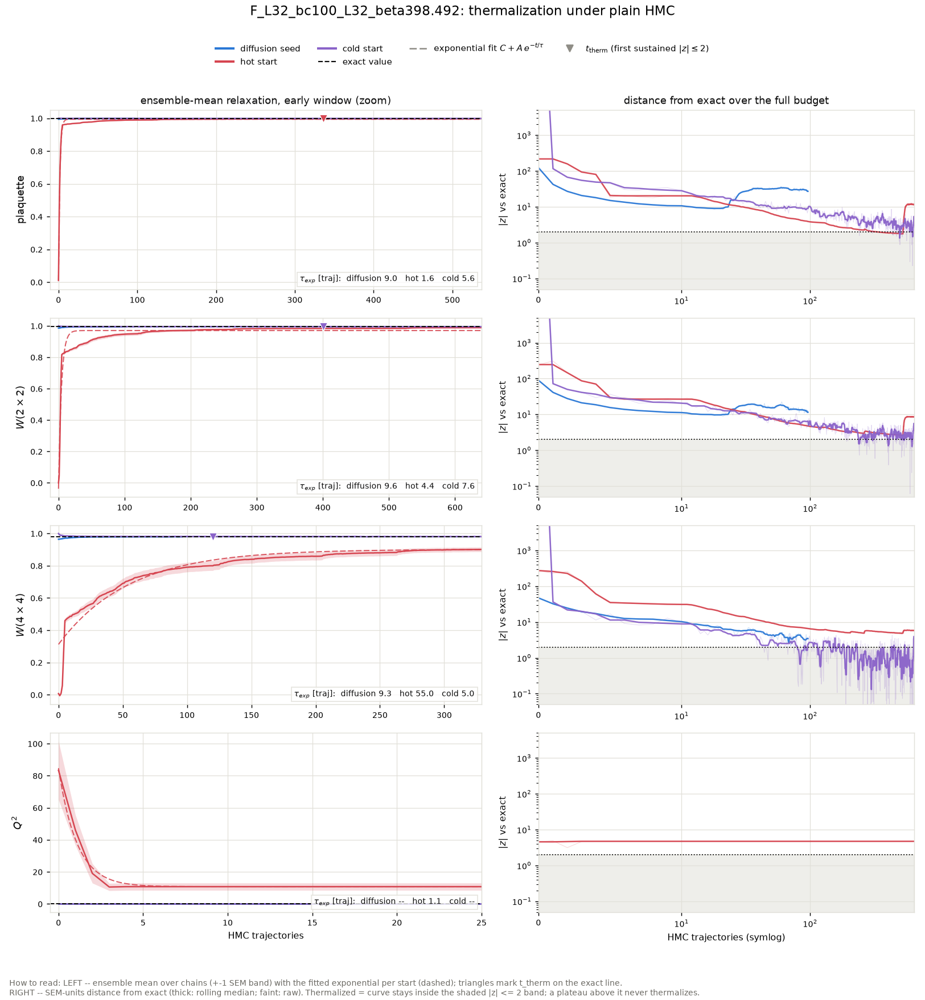

tau_int (hot-start chains, second half): plaquette = 32.55 +- 1.96, wilson_2x2 = 31.62 +- 2.26, wilson_4x4 = 25.67 +- 2.51, wilson_6x6 = 8.32 +- 2.24. Topology: hot-start HMC L=32 beta=398.492 -> **frozen** (no tunneling).

Where 'never' stood at the end: the hot start ended the 640-trajectory budget still at wilson_2x2 at |z| ~ 9, wilson_4x4 at |z| ~ 6, wilson_6x6 at |z| ~ 5, Q^2 at |z| ~ 5; the cold start ended the 640-trajectory budget still at plaquette at |z| ~ 4, Q^2 at |z| ~ 930603328.

### Diagnostics: raw diffusion output (before any HMC)

| observable | value | error | exact | z_exact | reference | ref_error | z_ref | ks_p |
|---|---|---|---|---|---|---|---|---|
| plaquette | 0.9944 | 3.68e-05 | 0.9987 | -118.3 | 0.9987 | 5.182e-06 | -117.1 | 0 |
| wilson_1x1 | 0.9944 | 3.68e-05 | 0.9987 | -118.3 | 0.9987 | 5.182e-06 | -117.1 | 0 |
| wilson_1x2 | 0.991 | 5.497e-05 | 0.9975 | -118.5 | 0.9975 | 1.239e-05 | -115.9 | 0 |
| wilson_2x2 | 0.9857 | 8.865e-05 | 0.995 | -104.8 | 0.9951 | 3.213e-05 | -99.35 | 0 |
| wilson_2x3 | 0.9816 | 0.0001264 | 0.9925 | -86.52 | 0.9927 | 5.097e-05 | -81.55 | 0 |
| wilson_3x3 | 0.9752 | 0.0001396 | 0.9889 | -97.85 | 0.9891 | 0.0001055 | -79.57 | 0 |
| wilson_3x4 | 0.9704 | 0.0002326 | 0.9852 | -63.76 | 0.9856 | 0.0001379 | -56.29 | 0 |
| wilson_4x4 | 0.9643 | 0.0003159 | 0.9804 | -51.05 | 0.9808 | 0.0002137 | -43.22 | 0 |
| wilson_4x5 | 0.9581 | 0.0004439 | 0.9757 | -39.63 | 0.976 | 0.0002848 | -34.04 | 0 |
| wilson_5x5 | 0.9491 | 0.0005596 | 0.9698 | -36.95 | 0.97 | 0.0004029 | -30.32 | 8.548e-44 |
| wilson_5x6 | 0.943 | 0.0006317 | 0.9641 | -33.34 | 0.9644 | 0.0005384 | -25.81 | 6.869e-40 |
| wilson_6x6 | 0.9359 | 0.0007217 | 0.9573 | -29.59 | 0.9574 | 0.0007022 | -21.38 | 1.521e-32 |
| wilson_6x7 | 0.9271 | 0.0008302 | 0.9506 | -28.37 | 0.951 | 0.0008974 | -19.57 | 2.796e-29 |
| wilson_7x7 | 0.9165 | 0.0009921 | 0.943 | -26.74 | 0.9432 | 0.001148 | -17.57 | 2.407e-26 |
| wilson_7x8 | 0.909 | 0.001083 | 0.9356 | -24.59 | 0.9358 | 0.00142 | -15.05 | 2.935e-22 |
| wilson_8x8 | 0.9002 | 0.0013 | 0.9273 | -20.84 | 0.9275 | 0.001717 | -12.68 | 2.152e-18 |
| wilson_8x10 | 0.8822 | 0.001765 | 0.9114 | -16.56 | 0.9115 | 0.002453 | -9.7 | 8.854e-15 |
| wilson_10x10 | 0.8597 | 0.002526 | 0.8927 | -13.04 | 0.8943 | 0.003202 | -8.485 | 4.035e-12 |
| wilson_10x12 | 0.8404 | 0.003069 | 0.8752 | -11.34 | 0.8766 | 0.00405 | -7.134 | 8.688e-10 |
| wilson_12x12 | 0.8198 | 0.003589 | 0.8557 | -10.01 | 0.8584 | 0.004643 | -6.583 | 1.85e-08 |
| creutz_2 | 0.001885 | 7.651e-05 | 0.001245 | 8.364 |  |  |  |  |
| creutz_3 | 0.002358 | 0.0001252 | 0.001226 | 9.04 |  |  |  |  |
| creutz_4 | 0.001362 | 0.0001717 | 0.001197 | 0.9633 |  |  |  |  |
| creutz_5 | 0.002912 | 0.0002653 | 0.001158 | 6.611 |  |  |  |  |
| creutz_6 | 0.001048 | 0.0003521 | 0.00111 | -0.1752 |  |  |  |  |
| creutz_7 | 0.001971 | 0.0004667 | 0.001052 | 1.969 |  |  |  |  |
| creutz_8 | 0.001382 | 0.0005999 | 0.000984 | 0.6637 |  |  |  |  |
| Q | 0 | 0 | 0 | 0 | 0 | 0 | 0 | 1 |
| Q^2 | 0 | 0 | 0.0009306 | inf | 0 | 0 | 0 | 1 |
| chi_top ((<Q^2>-<Q>^2)/V) | 0 | 0 | 9.088e-07 | inf | 0 | 0 | 0 | 1 |

### Diagnostics: the same configs after 96 HMC trajectories

| observable | value | error | exact | z_exact | reference | ref_error | z_ref | ks_p |
|---|---|---|---|---|---|---|---|---|
| plaquette | 0.9985 | 1.041e-05 | 0.9987 | -27.55 | 0.9987 | 5.182e-06 | -24.74 | 6.869e-40 |
| wilson_1x1 | 0.9985 | 1.041e-05 | 0.9987 | -27.55 | 0.9987 | 5.182e-06 | -24.74 | 6.869e-40 |
| wilson_1x2 | 0.9971 | 2.359e-05 | 0.9975 | -18.3 | 0.9975 | 1.239e-05 | -16.68 | 4.829e-33 |
| wilson_2x2 | 0.9944 | 5.627e-05 | 0.995 | -10.69 | 0.9951 | 3.213e-05 | -10.51 | 5.845e-23 |
| wilson_2x3 | 0.9918 | 0.0001014 | 0.9925 | -7.478 | 0.9927 | 5.097e-05 | -8.249 | 8.854e-15 |
| wilson_3x3 | 0.9877 | 0.0001518 | 0.9889 | -7.487 | 0.9891 | 0.0001055 | -7.558 | 5.489e-10 |
| wilson_3x4 | 0.984 | 0.0002005 | 0.9852 | -5.858 | 0.9856 | 0.0001379 | -6.426 | 6.412e-07 |
| wilson_4x4 | 0.9793 | 0.0002796 | 0.9804 | -3.816 | 0.9808 | 0.0002137 | -4.055 | 0.0005192 |
| wilson_4x5 | 0.9744 | 0.0003358 | 0.9757 | -3.666 | 0.976 | 0.0002848 | -3.614 | 0.007577 |
| wilson_5x5 | 0.9681 | 0.0004609 | 0.9698 | -3.652 | 0.97 | 0.0004029 | -3.127 | 0.02141 |
| wilson_5x6 | 0.9623 | 0.0005983 | 0.9641 | -2.933 | 0.9644 | 0.0005384 | -2.626 | 0.03146 |
| wilson_6x6 | 0.9556 | 0.0007516 | 0.9573 | -2.263 | 0.9574 | 0.0007022 | -1.819 | 0.1912 |
| wilson_6x7 | 0.9486 | 0.0009889 | 0.9506 | -2.009 | 0.951 | 0.0008974 | -1.767 | 0.2508 |
| wilson_7x7 | 0.9406 | 0.001189 | 0.943 | -2.007 | 0.9432 | 0.001148 | -1.527 | 0.3231 |
| wilson_7x8 | 0.9327 | 0.00154 | 0.9356 | -1.91 | 0.9358 | 0.00142 | -1.514 | 0.3231 |
| wilson_8x8 | 0.9237 | 0.001784 | 0.9273 | -2.04 | 0.9275 | 0.001717 | -1.556 | 0.1658 |
| wilson_8x10 | 0.9072 | 0.002692 | 0.9114 | -1.55 | 0.9115 | 0.002453 | -1.169 | 0.3231 |
| wilson_10x10 | 0.887 | 0.003587 | 0.8927 | -1.593 | 0.8943 | 0.003202 | -1.534 | 0.07626 |
| wilson_10x12 | 0.8711 | 0.004498 | 0.8752 | -0.908 | 0.8766 | 0.00405 | -0.9157 | 0.2195 |
| wilson_12x12 | 0.8524 | 0.005563 | 0.8557 | -0.5905 | 0.8584 | 0.004643 | -0.8244 | 0.7729 |
| creutz_2 | 0.001272 | 3.481e-05 | 0.001245 | 0.7589 |  |  |  |  |
| creutz_3 | 0.001452 | 6.264e-05 | 0.001226 | 3.612 |  |  |  |  |
| creutz_4 | 0.00105 | 8.975e-05 | 0.001197 | -1.638 |  |  |  |  |
| creutz_5 | 0.00146 | 0.0001417 | 0.001158 | 2.127 |  |  |  |  |
| creutz_6 | 0.0009816 | 0.0001926 | 0.00111 | -0.6666 |  |  |  |  |
| creutz_7 | 0.001181 | 0.0002762 | 0.001052 | 0.4679 |  |  |  |  |
| creutz_8 | 0.001152 | 0.0003459 | 0.000984 | 0.487 |  |  |  |  |
| Q | 0 | 0 | 0 | 0 | 0 | 0 | 0 | 1 |
| Q^2 | 0 | 0 | 0.0009306 | inf | 0 | 0 | 0 | 1 |
| chi_top ((<Q^2>-<Q>^2)/V) | 0 | 0 | 9.088e-07 | inf | 0 | 0 | 0 | 1 |

## F_L32_bc218.58_L32_beta872.816

HMC: step size 0.0135, 74 leapfrog steps, acceptance seed/hot/cold = 0.514/0.008/0.967. Diffusion-seed batch: 64 chains x 96 trajectories (0.62 s/traj for the whole batch); baselines: 32 chains x 640 trajectories.

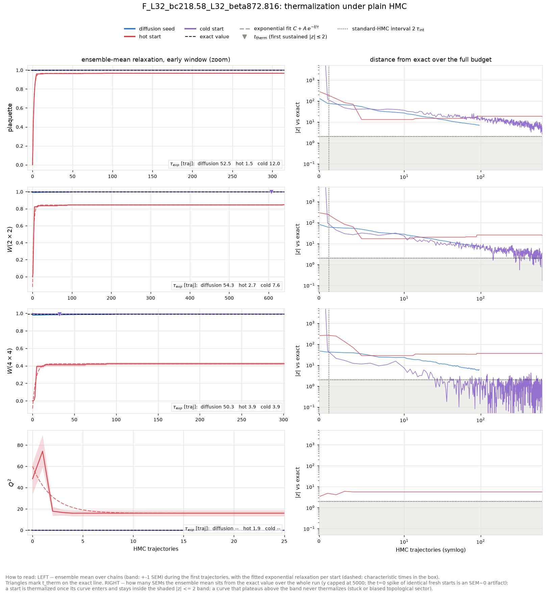

tau_int (hot-start chains, second half): plaquette = 0.56 +- 0.06, wilson_2x2 = 0.56 +- 0.06, wilson_4x4 = 0.56 +- 0.06, wilson_6x6 = 0.56 +- 0.06. Topology: hot-start HMC L=32 beta=872.816 -> **frozen** (no tunneling).

Where 'never' stood at the end: the hot start ended the 640-trajectory budget still at plaquette at |z| ~ 18, wilson_2x2 at |z| ~ 24, wilson_4x4 at |z| ~ 35, wilson_6x6 at |z| ~ 56, Q^2 at |z| ~ 6; the cold start ended the 640-trajectory budget still at plaquette at |z| ~ 4, Q^2 at |z| ~ 99603.

### Diagnostics: raw diffusion output (before any HMC)

| observable | value | error | exact | z_exact | reference | ref_error | z_ref | ks_p |
|---|---|---|---|---|---|---|---|---|
| plaquette | 0.9959 | 2.546e-05 | 0.9994 | -137.9 | 0.9994 | 2.789e-06 | -137.3 | 0 |
| wilson_1x1 | 0.9959 | 2.546e-05 | 0.9994 | -137.9 | 0.9994 | 2.789e-06 | -137.3 | 0 |
| wilson_1x2 | 0.9939 | 4.179e-05 | 0.9989 | -119.6 | 0.9989 | 5.647e-06 | -118.7 | 0 |
| wilson_2x2 | 0.9913 | 6.643e-05 | 0.9977 | -96.56 | 0.9977 | 1.488e-05 | -94.37 | 0 |
| wilson_2x3 | 0.9888 | 9.094e-05 | 0.9966 | -85.11 | 0.9966 | 2.586e-05 | -81.82 | 0 |
| wilson_3x3 | 0.9852 | 0.0001345 | 0.9949 | -72.47 | 0.9949 | 4.475e-05 | -68.98 | 0 |
| wilson_3x4 | 0.9825 | 0.0002129 | 0.9932 | -50.29 | 0.9932 | 6.974e-05 | -47.88 | 0 |
| wilson_4x4 | 0.9793 | 0.0002797 | 0.991 | -41.82 | 0.9911 | 0.000104 | -39.6 | 0 |
| wilson_4x5 | 0.9761 | 0.0002963 | 0.9888 | -43.04 | 0.989 | 0.000148 | -38.95 | 0 |
| wilson_5x5 | 0.9713 | 0.0003903 | 0.9861 | -37.85 | 0.9864 | 0.0001918 | -34.55 | 0 |
| wilson_5x6 | 0.9683 | 0.0004657 | 0.9834 | -32.51 | 0.9837 | 0.0002601 | -28.95 | 0 |
| wilson_6x6 | 0.9648 | 0.0006227 | 0.9803 | -24.84 | 0.9806 | 0.0003321 | -22.42 | 3.503e-44 |
| wilson_6x7 | 0.9601 | 0.0007621 | 0.9772 | -22.36 | 0.9777 | 0.0004244 | -20.12 | 4.357e-42 |
| wilson_7x7 | 0.9544 | 0.0009585 | 0.9736 | -20.03 | 0.9743 | 0.0005294 | -18.14 | 3.066e-36 |
| wilson_7x8 | 0.9503 | 0.001126 | 0.9701 | -17.59 | 0.971 | 0.0006464 | -15.98 | 1.521e-32 |
| wilson_8x8 | 0.9456 | 0.00136 | 0.9662 | -15.14 | 0.9673 | 0.0007893 | -13.79 | 2.068e-28 |
| wilson_8x10 | 0.9355 | 0.001817 | 0.9586 | -12.7 | 0.9601 | 0.001082 | -11.62 | 2.569e-23 |
| wilson_10x10 | 0.923 | 0.002435 | 0.9496 | -10.9 | 0.9514 | 0.001462 | -9.981 | 2.617e-19 |
| wilson_10x12 | 0.9118 | 0.002985 | 0.9411 | -9.827 | 0.9428 | 0.001913 | -8.748 | 1.448e-15 |
| wilson_12x12 | 0.8986 | 0.003859 | 0.9315 | -8.535 | 0.9335 | 0.002389 | -7.684 | 1.578e-13 |
| creutz_2 | 0.0005087 | 5.731e-05 | 0.0005681 | -1.038 |  |  |  |  |
| creutz_3 | 0.001259 | 8.786e-05 | 0.0005592 | 7.968 |  |  |  |  |
| creutz_4 | 0.0005843 | 0.0001232 | 0.0005458 | 0.3127 |  |  |  |  |
| creutz_5 | 0.001534 | 0.0001675 | 0.0005278 | 6.007 |  |  |  |  |
| creutz_6 | 0.0004759 | 0.0002084 | 0.0005055 | -0.1418 |  |  |  |  |
| creutz_7 | 0.001109 | 0.0002519 | 0.0004786 | 2.503 |  |  |  |  |
| creutz_8 | 0.0006378 | 0.0003086 | 0.0004472 | 0.6175 |  |  |  |  |
| Q | 0 | 0 | 0 | 0 | 0 | 0 | 0 | 1 |
| Q^2 | 0 | 0 | 9.96e-08 | inf | 0 | 0 | 0 | 1 |
| chi_top ((<Q^2>-<Q>^2)/V) | 0 | 0 | 9.727e-11 | inf | 0 | 0 | 0 | 1 |

### Diagnostics: the same configs after 96 HMC trajectories

| observable | value | error | exact | z_exact | reference | ref_error | z_ref | ks_p |
|---|---|---|---|---|---|---|---|---|
| plaquette | 0.9985 | 0.0001441 | 0.9994 | -6.539 | 0.9994 | 2.789e-06 | -6.573 | 0 |
| wilson_1x1 | 0.9985 | 0.0001441 | 0.9994 | -6.539 | 0.9994 | 2.789e-06 | -6.573 | 0 |
| wilson_1x2 | 0.9975 | 0.0001954 | 0.9989 | -7.127 | 0.9989 | 5.647e-06 | -7.164 | 0 |
| wilson_2x2 | 0.9959 | 0.0002459 | 0.9977 | -7.311 | 0.9977 | 1.488e-05 | -7.338 | 0 |
| wilson_2x3 | 0.9945 | 0.0003123 | 0.9966 | -6.733 | 0.9966 | 2.586e-05 | -6.696 | 8.142e-37 |
| wilson_3x3 | 0.9922 | 0.0003979 | 0.9949 | -6.836 | 0.9949 | 4.475e-05 | -6.871 | 2.13e-37 |
| wilson_3x4 | 0.9904 | 0.0004472 | 0.9932 | -6.319 | 0.9932 | 6.974e-05 | -6.284 | 6.159e-20 |
| wilson_4x4 | 0.9882 | 0.0004901 | 0.991 | -5.747 | 0.9911 | 0.000104 | -5.859 | 2.752e-13 |
| wilson_4x5 | 0.9857 | 0.0005413 | 0.9888 | -5.689 | 0.989 | 0.000148 | -5.751 | 3.448e-10 |
| wilson_5x5 | 0.9824 | 0.0006604 | 0.9861 | -5.605 | 0.9864 | 0.0001918 | -5.751 | 5.489e-10 |
| wilson_5x6 | 0.9792 | 0.0007274 | 0.9834 | -5.783 | 0.9837 | 0.0002601 | -5.837 | 5.489e-10 |
| wilson_6x6 | 0.9758 | 0.0008198 | 0.9803 | -5.534 | 0.9806 | 0.0003321 | -5.531 | 1.398e-07 |
| wilson_6x7 | 0.9722 | 0.0009262 | 0.9772 | -5.365 | 0.9777 | 0.0004244 | -5.378 | 1.332e-06 |
| wilson_7x7 | 0.9679 | 0.001009 | 0.9736 | -5.683 | 0.9743 | 0.0005294 | -5.617 | 4.415e-07 |
| wilson_7x8 | 0.964 | 0.001128 | 0.9701 | -5.389 | 0.971 | 0.0006464 | -5.394 | 1.398e-07 |
| wilson_8x8 | 0.9599 | 0.001257 | 0.9662 | -4.982 | 0.9673 | 0.0007893 | -4.957 | 3.84e-06 |
| wilson_8x10 | 0.9516 | 0.00151 | 0.9586 | -4.645 | 0.9601 | 0.001082 | -4.591 | 5.204e-05 |
| wilson_10x10 | 0.9407 | 0.001947 | 0.9496 | -4.585 | 0.9514 | 0.001462 | -4.404 | 0.0003959 |
| wilson_10x12 | 0.931 | 0.002136 | 0.9411 | -4.726 | 0.9428 | 0.001913 | -4.106 | 0.0005192 |
| wilson_12x12 | 0.9192 | 0.002607 | 0.9315 | -4.729 | 0.9335 | 0.002389 | -4.034 | 0.0003005 |
| creutz_2 | 0.0005238 | 3.598e-05 | 0.0005681 | -1.233 |  |  |  |  |
| creutz_3 | 0.0008762 | 4.351e-05 | 0.0005592 | 7.287 |  |  |  |  |
| creutz_4 | 0.0004321 | 6.072e-05 | 0.0005458 | -1.871 |  |  |  |  |
| creutz_5 | 0.0008972 | 0.0001053 | 0.0005278 | 3.506 |  |  |  |  |
| creutz_6 | 0.0003322 | 0.0001323 | 0.0005055 | -1.31 |  |  |  |  |
| creutz_7 | 0.0008291 | 0.0001518 | 0.0004786 | 2.309 |  |  |  |  |
| creutz_8 | 0.0002835 | 0.0002323 | 0.0004472 | -0.7047 |  |  |  |  |
| Q | 0 | 0 | 0 | 0 | 0 | 0 | 0 | 1 |
| Q^2 | 0 | 0 | 9.96e-08 | inf | 0 | 0 | 0 | 1 |
| chi_top ((<Q^2>-<Q>^2)/V) | 0 | 0 | 9.727e-11 | inf | 0 | 0 | 0 | 1 |

## F_L64_bc55.0237_L64_beta218.58

HMC: step size 0.0271, 37 leapfrog steps, acceptance seed/hot/cold = 0.153/0.517/0.953. Diffusion-seed batch: 64 chains x 96 trajectories (0.64 s/traj for the whole batch); baselines: 16 chains x 640 trajectories.

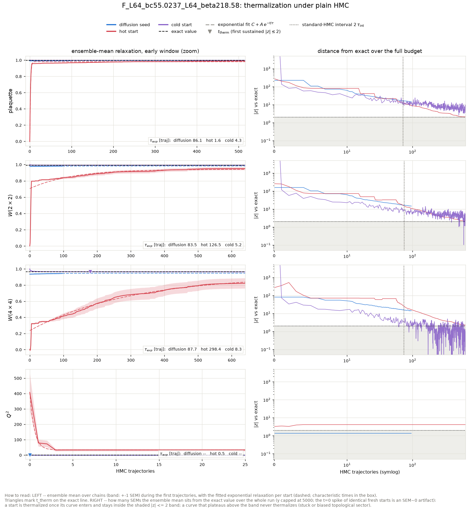

tau_int (hot-start chains, second half): plaquette = 35.60 +- 4.49, wilson_2x2 = 37.26 +- 4.63, wilson_4x4 = 36.73 +- 5.16, wilson_6x6 = 39.08 +- 5.51. Topology: hot-start HMC L=64 beta=218.58 -> **frozen** (no tunneling).

Where 'never' stood at the end: the hot start ended the 640-trajectory budget still at plaquette at |z| ~ 2, wilson_2x2 at |z| ~ 2, wilson_4x4 at |z| ~ 2, wilson_6x6 at |z| ~ 3, Q^2 at |z| ~ 4; the cold start ended the 640-trajectory budget still at plaquette at |z| ~ 6, wilson_2x2 at |z| ~ 3, Q^2 at |z| ~ 474267189248.

### Diagnostics: raw diffusion output (before any HMC)

| observable | value | error | exact | z_exact | reference | ref_error | z_ref | ks_p | chi2_p |
|---|---|---|---|---|---|---|---|---|---|
| plaquette | 0.9911 | 2.318e-05 | 0.9977 | -284.1 | 0.9978 | 4.72e-06 | -280.8 | 0 |  |
| wilson_1x1 | 0.9911 | 2.318e-05 | 0.9977 | -284.1 | 0.9978 | 4.72e-06 | -280.8 | 0 |  |
| wilson_1x2 | 0.9852 | 4.137e-05 | 0.9954 | -246.1 | 0.9956 | 1.314e-05 | -237.4 | 0 |  |
| wilson_2x2 | 0.9766 | 8.77e-05 | 0.9909 | -163.1 | 0.9911 | 3.521e-05 | -154.3 | 0 |  |
| wilson_2x3 | 0.9684 | 0.0001273 | 0.9863 | -141.1 | 0.9867 | 6.553e-05 | -127.9 | 0 |  |
| wilson_3x3 | 0.9566 | 0.0002085 | 0.9796 | -110.2 | 0.9801 | 0.0001149 | -98.63 | 0 |  |
| wilson_3x4 | 0.9472 | 0.0002563 | 0.9729 | -100 | 0.9734 | 0.0001743 | -84.41 | 0 |  |
| wilson_4x4 | 0.9358 | 0.0003158 | 0.964 | -89.31 | 0.9647 | 0.0002725 | -69.22 | 0 |  |
| wilson_4x5 | 0.9231 | 0.0004709 | 0.9552 | -68.1 | 0.9559 | 0.0003551 | -55.64 | 0 |  |
| wilson_5x5 | 0.9056 | 0.0007193 | 0.9443 | -53.77 | 0.9453 | 0.0004939 | -45.44 | 0 |  |
| wilson_5x6 | 0.8932 | 0.0007824 | 0.9335 | -51.58 | 0.9347 | 0.0006307 | -41.29 | 0 |  |
| wilson_6x6 | 0.8794 | 0.0009705 | 0.9208 | -42.62 | 0.9224 | 0.000806 | -34.04 | 0 |  |
| wilson_6x7 | 0.8618 | 0.001279 | 0.9082 | -36.24 | 0.9101 | 0.001025 | -29.44 | 0 |  |
| wilson_7x7 | 0.8395 | 0.001704 | 0.8937 | -31.84 | 0.8962 | 0.001257 | -26.77 | 3.503e-44 |  |
| wilson_7x8 | 0.8241 | 0.001976 | 0.8795 | -28.07 | 0.8823 | 0.001494 | -23.52 | 1.3e-38 |  |
| wilson_8x8 | 0.8071 | 0.002353 | 0.8635 | -23.98 | 0.8668 | 0.001746 | -20.37 | 1.5e-33 |  |
| wilson_8x10 | 0.7681 | 0.003382 | 0.8324 | -19.02 | 0.8364 | 0.002264 | -16.78 | 2.796e-29 |  |
| wilson_10x10 | 0.7203 | 0.004786 | 0.7951 | -15.64 | 0.8003 | 0.003025 | -14.13 | 8.615e-25 |  |
| wilson_10x12 | 0.6759 | 0.00636 | 0.7595 | -13.14 | 0.7656 | 0.003556 | -12.31 | 6.584e-21 |  |
| wilson_12x12 | 0.6242 | 0.008201 | 0.7188 | -11.55 | 0.7266 | 0.004582 | -10.91 | 2.617e-19 |  |
| creutz_2 | 0.002893 | 7.12e-05 | 0.002293 | 8.426 |  |  |  |  |  |
| creutz_3 | 0.003841 | 0.0001078 | 0.002293 | 14.35 |  |  |  |  |  |
| creutz_4 | 0.002322 | 0.0001914 | 0.002293 | 0.1523 |  |  |  |  |  |
| creutz_5 | 0.005509 | 0.0002326 | 0.002293 | 13.83 |  |  |  |  |  |
| creutz_6 | 0.001688 | 0.0003904 | 0.002293 | -1.549 |  |  |  |  |  |
| creutz_7 | 0.006103 | 0.0004197 | 0.002292 | 9.079 |  |  |  |  |  |
| creutz_8 | 0.002204 | 0.0005683 | 0.002292 | -0.1547 |  |  |  |  |  |
| Q | 0.04688 | 0.07602 | 0 | 0.6166 | 0.07292 | 0.04493 | -0.2949 | 1 |  |
| Q^2 | 0.3906 | 0.06088 | 0.4743 | -1.374 | 0.3646 | 0.04766 | 0.3368 | 1 |  |
| chi_top ((<Q^2>-<Q>^2)/V) | 9.483e-05 | 1.501e-05 | 0.0001158 | -1.396 | 8.771e-05 | 1.143e-05 | 0.3774 | 8.99e-14 |  |
| Q histogram vs exact P(Q) | 0.4568 | nan | 2 | nan |  |  |  |  | 0.7958 |

### Diagnostics: the same configs after 96 HMC trajectories

| observable | value | error | exact | z_exact | reference | ref_error | z_ref | ks_p | chi2_p |
|---|---|---|---|---|---|---|---|---|---|
| plaquette | 0.9928 | 0.0002972 | 0.9977 | -16.42 | 0.9978 | 4.72e-06 | -16.61 | 0 |  |
| wilson_1x1 | 0.9928 | 0.0002972 | 0.9977 | -16.42 | 0.9978 | 4.72e-06 | -16.61 | 0 |  |
| wilson_1x2 | 0.9879 | 0.0004625 | 0.9954 | -16.33 | 0.9956 | 1.314e-05 | -16.6 | 0 |  |
| wilson_2x2 | 0.9802 | 0.000657 | 0.9909 | -16.2 | 0.9911 | 3.521e-05 | -16.6 | 0 |  |
| wilson_2x3 | 0.973 | 0.0008493 | 0.9863 | -15.69 | 0.9867 | 6.553e-05 | -16.06 | 0 |  |
| wilson_3x3 | 0.9626 | 0.001135 | 0.9796 | -14.93 | 0.9801 | 0.0001149 | -15.28 | 3.066e-36 |  |
| wilson_3x4 | 0.954 | 0.001312 | 0.9729 | -14.35 | 0.9734 | 0.0001743 | -14.63 | 3.737e-27 |  |
| wilson_4x4 | 0.9433 | 0.001442 | 0.964 | -14.36 | 0.9647 | 0.0002725 | -14.57 | 6.48e-22 |  |
| wilson_4x5 | 0.9318 | 0.001738 | 0.9552 | -13.45 | 0.9559 | 0.0003551 | -13.6 | 1.417e-21 |  |
| wilson_5x5 | 0.9162 | 0.002173 | 0.9443 | -12.92 | 0.9453 | 0.0004939 | -13.04 | 1.417e-21 |  |
| wilson_5x6 | 0.9043 | 0.002367 | 0.9335 | -12.35 | 0.9347 | 0.0006307 | -12.39 | 1.275e-19 |  |
| wilson_6x6 | 0.8908 | 0.00256 | 0.9208 | -11.7 | 0.9224 | 0.000806 | -11.75 | 1.075e-18 |  |
| wilson_6x7 | 0.875 | 0.002978 | 0.9082 | -11.13 | 0.9101 | 0.001025 | -11.13 | 1.075e-18 |  |
| wilson_7x7 | 0.8553 | 0.003548 | 0.8937 | -10.84 | 0.8962 | 0.001257 | -10.86 | 4.273e-18 |  |
| wilson_7x8 | 0.8405 | 0.003805 | 0.8795 | -10.25 | 0.8823 | 0.001494 | -10.23 | 1.172e-16 |  |
| wilson_8x8 | 0.8239 | 0.004123 | 0.8635 | -9.611 | 0.8668 | 0.001746 | -9.58 | 7.81e-16 |  |
| wilson_8x10 | 0.7881 | 0.005313 | 0.8324 | -8.334 | 0.8364 | 0.002264 | -8.351 | 4.876e-15 |  |
| wilson_10x10 | 0.7446 | 0.006872 | 0.7951 | -7.348 | 0.8003 | 0.003025 | -7.411 | 8.99e-14 |  |
| wilson_10x12 | 0.7042 | 0.00845 | 0.7595 | -6.54 | 0.7656 | 0.003556 | -6.694 | 5.068e-11 |  |
| wilson_12x12 | 0.6575 | 0.01043 | 0.7188 | -5.879 | 0.7266 | 0.004582 | -6.065 | 7.936e-09 |  |
| creutz_2 | 0.00276 | 6.594e-05 | 0.002293 | 7.084 |  |  |  |  |  |
| creutz_3 | 0.003335 | 0.000124 | 0.002293 | 8.403 |  |  |  |  |  |
| creutz_4 | 0.002363 | 0.0001709 | 0.002293 | 0.4115 |  |  |  |  |  |
| creutz_5 | 0.004639 | 0.000278 | 0.002293 | 8.439 |  |  |  |  |  |
| creutz_6 | 0.001927 | 0.0003305 | 0.002293 | -1.107 |  |  |  |  |  |
| creutz_7 | 0.004959 | 0.0004365 | 0.002292 | 6.108 |  |  |  |  |  |
| creutz_8 | 0.002478 | 0.000466 | 0.002292 | 0.3982 |  |  |  |  |  |
| Q | 0.04688 | 0.07602 | 0 | 0.6166 | 0.07292 | 0.04493 | -0.2949 | 1 |  |
| Q^2 | 0.3906 | 0.06088 | 0.4743 | -1.374 | 0.3646 | 0.04766 | 0.3368 | 1 |  |
| chi_top ((<Q^2>-<Q>^2)/V) | 9.483e-05 | 1.501e-05 | 0.0001158 | -1.396 | 8.771e-05 | 1.143e-05 | 0.3774 | 8.99e-14 |  |
| Q histogram vs exact P(Q) | 0.4568 | nan | 2 | nan |  |  |  |  | 0.7958 |
