# Diffusion-seeded HMC across the matched beta scan: thermalization time vs the standard-HMC sampling interval

Action: wilson. All HMC in this report is plain HMC (Omelyan, adapted step size, **no** topological updates).

**Why this scan.** At the ladder's upper rungs the fresh-HMC baselines never thermalize at all (topological freezing plus a metastable local-defect state), so the only comparison available there is 'diffusion seed vs a baseline that never arrives'. This report extends the benchmark to every matched coupling pair of the generalization study -- one inverse-RG step L=16 -> L=32 per case -- including fine couplings low enough that hot- and cold-start HMC *does* thermalize within the budget. There the standard chain's own interval `2 tau_int` and its fresh-start burn-in are honest, measurable yardsticks, and the scan shows where the ordering

> t_therm(diffusion seed)  <  2 tau_int(standard HMC)  <  burn-in(fresh chain)

sets in as beta grows and standard HMC slides into critical slowing down and topological freezing.

## The three starting points

- **Diffusion seed** -- the raw conditional-diffusion output for this coupling: one inverse-RG step from a direct-HMC base ensemble at the matched coarse coupling (ancestral sampling + the deterministic coarse-charge transport), with **no** rethermalization sweeps applied: every bit of equilibration the seed needs is measured here, in HMC trajectories.
- **Hot start** -- every link angle drawn uniformly from (-pi, pi]: a completely disordered (infinite-temperature) configuration. The standard way to initialize a fresh HMC chain without prior information.
- **Cold start** -- every link angle set to zero: the perfectly ordered (beta -> infinity) configuration, the other standard initialization.

## Summary

| rung | L | beta | t_therm diffusion seed | standard-HMC interval 2 tau_int | margin (interval - t_therm) | burn-in hot / cold | tau_int(Q) |
|---|---|---|---|---|---|---|---|
| A_bc0.25_L32_beta1.4892 | 32 | 1.4892 | 10 | 2.7 | -7.3 traj | 12 / 9 | 1.4 |
| A_bc0.5_L32_beta2.02441 | 32 | 2.02441 | 16 | 5.5 | -10.5 traj | 16 / 20 | 3.2 |
| A_bc0.75_L32_beta2.5435 | 32 | 2.5435 | 17 | 6.2 | -10.8 traj | 29 / 24 | 5.0 |
| A_bc1_L32_beta3.10399 | 32 | 3.10399 | 26 | 9.2 | -16.8 traj | 31 / 36 | 9.6 |
| E_bc1.2_L32_beta3.6012 | 32 | 3.6012 | 29 | 9.2 | -19.8 traj | 45 / 36 | 15.8 |
| A_bc1.5_L32_beta4.44493 | 32 | 4.44493 | 18 | 7.9 | -10.1 traj | 72 / 55 | 27.4 |
| A_bc2_L32_beta6.10518 | 32 | 6.10518 | 3 | 10.2 | 7.2 traj | 171 / 99 | 34.8 |
| E_bc2.7_L32_beta8.79549 | 32 | 8.79549 | 3 | 9.6 | 6.6 traj | 407 / 115 | frozen (0 tunnelings in 321 x 32 traj) |
| A_bc3_L32_beta10.015 | 32 | 10.015 | 20 | 15.3 | -4.7 traj | never / 223 | frozen (0 tunnelings in 321 x 32 traj) |
| E_bc3.4_L32_beta11.6638 | 32 | 11.6638 | 3 | 9.6 | 6.6 traj | 300 / 176 | frozen (0 tunnelings in 321 x 32 traj) |
| A_bc4_L32_beta14.1464 | 32 | 14.1464 | 5 | 8.8 | 3.8 traj | never / 193 | frozen (0 tunnelings in 321 x 32 traj) |
| E_bc4.5_L32_beta16.2057 | 32 | 16.2057 | 9 | 23.1 | 14.1 traj | never / 404 | frozen (0 tunnelings in 321 x 32 traj) |
| A_bc5_L32_beta18.2524 | 32 | 18.2524 | 8 | 10.5 | 2.5 traj | never / 165 | frozen (0 tunnelings in 321 x 32 traj) |
| E_bc5.8_L32_beta21.5051 | 32 | 21.5051 | 12 | 22.2 | 10.2 traj | never / 194 | frozen (0 tunnelings in 321 x 32 traj) |
| A_bc6_L32_beta22.3151 | 32 | 22.3151 | 44 | 17.6 | -26.4 traj | never / 293 | frozen (0 tunnelings in 321 x 32 traj) |
| A_bc8_L32_beta30.3772 | 32 | 30.3772 | 14 | 35.3 | 21.3 traj | never / 541 | frozen (0 tunnelings in 321 x 32 traj) |
| E_bc9_L32_beta34.3944 | 32 | 34.3944 | 1 | 24.0 | 23.0 traj | never / 397 | frozen (0 tunnelings in 321 x 32 traj) |
| E_bc11.8_L32_beta45.6238 | 32 | 45.6238 | 5 | 18.8 | 13.8 traj | never / 302 | frozen (0 tunnelings in 321 x 32 traj) |
| D_bc14.1464_L32_beta55.0237 | 32 | 55.0237 | 3 | 25.1 | 22.1 traj | never / 336 | frozen (0 tunnelings in 321 x 32 traj) |
| E_bc18_L32_beta70.4526 | 32 | 70.4526 | 7 | 27.8 | 20.8 traj | never / 248 | frozen (0 tunnelings in 321 x 32 traj) |
| D_bc20_L32_beta78.4578 | 32 | 78.4578 | 5 | 15.5 | 10.5 traj | never / never | frozen (0 tunnelings in 321 x 32 traj) |
| D_bc30_L32_beta118.473 | 32 | 118.473 | 6 | 44.4 | 38.4 traj | never / 225 | frozen (0 tunnelings in 321 x 32 traj) |
| E_bc35_L32_beta138.477 | 32 | 138.477 | 0 | 82.4 | 82.4 traj | never / 547 | frozen (0 tunnelings in 321 x 32 traj) |
| D_bc40_L32_beta158.48 | 32 | 158.48 | 12 | 64.8 | 52.8 traj | never / 429 | frozen (0 tunnelings in 321 x 32 traj) |
| E_bc45_L32_beta178.482 | 32 | 178.482 | 0 | 47.6 | 47.6 traj | never / 282 | frozen (0 tunnelings in 321 x 32 traj) |
| D_bc55.0237_L32_beta218.58 | 32 | 218.58 | 0 | 19.2 | 19.2 traj | never / never | frozen (0 tunnelings in 321 x 32 traj) |
| F_L32_bc100_L32_beta398.492 | 32 | 398.492 | 0 | 65.1 | 65.1 traj | never / never | frozen (0 tunnelings in 321 x 32 traj) |
| F_L32_bc218.58_L32_beta872.816 | 32 | 872.816 | 0 | 1.1 | 1.1 traj | never / never | frozen (0 tunnelings in 321 x 32 traj) |
| F_L64_bc55.0237_L64_beta218.58 | 64 | 218.58 | 2 | 74.5 | 72.5 traj | never / never | frozen (0 tunnelings in 321 x 16 traj) |

t_therm and burn-in are the slowest Wilson-loop observable (plaquette, W(2x2), W(4x4)); topology is stricter still for the fresh chains: their Q^2 **never** reaches the exact value at the frozen rungs, while the diffusion seed inherits the correct topological sector from the coarse ensemble it was generated from (see the Q^2 panels and per-rung tables below).

Thermalization time `t_therm` = first trajectory at which the ensemble-mean z-score vs the exact value satisfies |z| <= 2 and stays there for 5 consecutive trajectories (t = 0: already thermalized before any HMC). For the diffusion seed, t_therm is computed on a random subsample of chains matched to the baseline chain count so all starts are compared at equal statistical power. `tau_int` is Madras-Sokal, measured on the second half of the hot-start chains, averaged over chains. In the per-rung relaxation figures, triangles mark each start's t_therm, dashed curves are the exponential fits C + A exp(-t/tau) to the ensemble means (tau quoted per panel), and the right-hand panels track the ensemble mean's distance from the exact value in SEM units -- thermalized means inside the shaded |z| <= 2 band; the dotted vertical line there is the standard-HMC interval `2 tau_int`.

## What 'never' means, and where the ground truth comes from

'never' = the ensemble mean was still outside |z| <= 2 of the exact value after the full baseline budget; the per-rung sections quote the z-score it plateaued at. For hot starts at the large-beta rungs this is not a budget problem but a physical one: a random start freezes into a random topological sector (<Q^2> of order tens), plain HMC can never change Q at these couplings (tunneling is suppressed ~exp(-2 beta)), and the wrong sector biases every Wilson loop by an amount that never decays. Cold starts sit in the single sector Q = 0, so their Wilson loops do eventually converge, but <Q^2> stays pinned at 0 forever.

None of the exact values in this report come from fine-lattice HMC: the ground truth is the character expansion of 2D compact U(1) (`diffusion/lgt/exact.py`), which gives every Wilson loop, P(Q) and chi_top in closed form at finite volume. Each diffusion seed here is one inverse-RG step from a direct-HMC base ensemble at the matched coarse coupling beta_c (L=16), where HMC mixes well -- which is precisely why it can start chains in regions standard HMC cannot reach.

## A_bc0.25_L32_beta1.4892

HMC: step size 0.2000, 5 leapfrog steps, acceptance seed/hot/cold = 0.967/0.970/0.966. Diffusion-seed batch: 128 chains x 96 trajectories (0.04 s/traj for the whole batch); baselines: 32 chains x 640 trajectories.

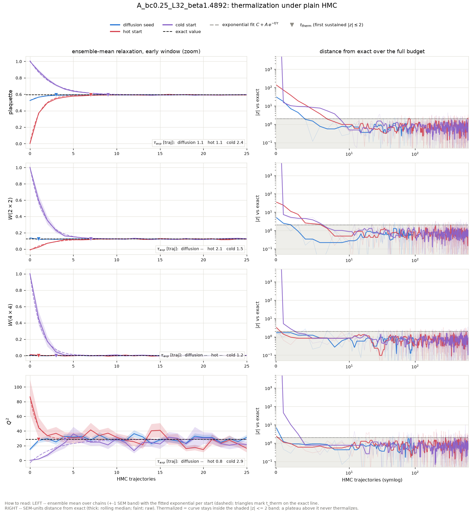

tau_int (hot-start chains, second half): plaquette = 1.36 +- 0.06, wilson_2x2 = 0.76 +- 0.03, wilson_4x4 = 0.56 +- 0.02, wilson_6x6 = 0.57 +- 0.02. Topology: hot-start HMC L=32 beta=1.4892 -> tau_int(Q) = 1.4.

### Diagnostics: raw diffusion output (before any HMC)

| observable | value | error | exact | z_exact | reference | ref_error | z_ref | ks_p | chi2_p |
|---|---|---|---|---|---|---|---|---|---|
| plaquette | 0.5243 | 0.001432 | 0.5935 | -48.28 | 0.5948 | 0.001238 | -37.22 | 0 |  |
| wilson_1x1 | 0.5243 | 0.001432 | 0.5935 | -48.28 | 0.5948 | 0.001238 | -37.22 | 0 |  |
| wilson_1x2 | 0.2935 | 0.002333 | 0.3522 | -25.15 | 0.3522 | 0.002458 | -17.32 | 4.827e-36 |  |
| wilson_2x2 | 0.1369 | 0.001901 | 0.124 | 6.77 | 0.1241 | 0.001865 | 4.826 | 2.524e-05 |  |
| wilson_2x3 | 0.06085 | 0.001922 | 0.04368 | 8.933 | 0.04133 | 0.001675 | 7.658 | 2.15e-08 |  |
| wilson_3x3 | 0.01563 | 0.002336 | 0.00913 | 2.783 | 0.005305 | 0.002005 | 3.354 | 0.003697 |  |
| wilson_3x4 | 0.005093 | 0.002909 | 0.001908 | 1.095 | 0.0003275 | 0.002081 | 1.332 | 0.04354 |  |
| wilson_4x4 | 0.003253 | 0.00181 | 0.0002367 | 1.667 | 0.0001938 | 0.001787 | 1.203 | 0.1545 |  |
| wilson_4x5 | -0.001018 | 0.002497 | 2.936e-05 | -0.4196 | -0.001625 | 0.001631 | 0.2035 | 0.9693 |  |
| wilson_5x5 | 0.003799 | 0.001856 | 2.161e-06 | 2.045 | -0.000249 | 0.001931 | 1.511 | 0.2522 |  |
| wilson_5x6 | -0.00286 | 0.001979 | 1.591e-07 | -1.445 | -0.0005556 | 0.001821 | -0.857 | 0.5259 |  |
| wilson_6x6 | 0.0002025 | 0.001436 | 6.948e-09 | 0.1411 | -0.001112 | 0.00174 | 0.5825 | 0.2522 |  |
| wilson_6x7 | -0.004085 | 0.002108 | 3.035e-10 | -1.938 | 0.002636 | 0.001766 | -2.444 | 0.009477 |  |
| wilson_7x7 | 0.001174 | 0.001461 | 7.868e-12 | 0.8035 | 0.0003693 | 0.001605 | 0.3706 | 0.6011 |  |
| wilson_7x8 | 0.001683 | 0.002041 | 2.04e-13 | 0.8243 | -0.001279 | 0.001893 | 1.064 | 0.6011 |  |
| wilson_8x8 | -0.000102 | 0.00249 | 3.138e-15 | -0.04096 | -0.001451 | 0.00132 | 0.4787 | 0.4548 |  |
| wilson_8x10 | -0.0001356 | 0.001966 | 7.426e-19 | -0.06899 | 0.001016 | 0.001793 | -0.4329 | 0.5259 |  |
| wilson_10x10 | 0.001424 | 0.001658 | 2.18e-23 | 0.8589 | 0.0006406 | 0.001555 | 0.3445 | 0.9542 |  |
| wilson_10x12 | -0.0002596 | 0.002135 | 6.4e-28 | -0.1216 | -0.003091 | 0.001502 | 1.085 | 0.389 |  |
| wilson_12x12 | 0.0008652 | 0.002167 | 2.33e-33 | 0.3993 | -0.001718 | 0.001421 | 0.9967 | 0.7901 |  |
| creutz_2 | 0.1825 | 0.0164 | 0.5218 | -20.69 |  |  |  |  |  |
| creutz_3 | 0.5485 | 0.1289 | 0.5218 | 0.2073 |  |  |  |  |  |
| creutz_4 | -0.6729 | 0.9251 | 0.5218 | -1.291 |  |  |  |  |  |
| Q | 0.7344 | 0.3272 | 0 | 2.245 | -0.4375 | 0.3418 | 2.477 | 0.01957 |  |
| Q^2 | 15 | 1.997 | 28.52 | -6.772 | 27.85 | 2.353 | -4.166 | 0.01957 |  |
| chi_top ((<Q^2>-<Q>^2)/V) | 0.01412 | 0.001823 | 0.02785 | -7.532 | 0.02701 | 0.002264 | -4.435 | 0.0007783 |  |
| Q histogram vs exact P(Q) | 31.13 | nan | 18 | nan |  |  |  |  | 0.02778 |

### Diagnostics: the same configs after 96 HMC trajectories

| observable | value | error | exact | z_exact | reference | ref_error | z_ref | ks_p | chi2_p |
|---|---|---|---|---|---|---|---|---|---|
| plaquette | 0.5942 | 0.001526 | 0.5935 | 0.4596 | 0.5948 | 0.001238 | -0.3061 | 0.3021 |  |
| wilson_1x1 | 0.5942 | 0.001526 | 0.5935 | 0.4596 | 0.5948 | 0.001238 | -0.3061 | 0.3021 |  |
| wilson_1x2 | 0.3524 | 0.002067 | 0.3522 | 0.09044 | 0.3522 | 0.002458 | 0.05619 | 0.7901 |  |
| wilson_2x2 | 0.1228 | 0.002717 | 0.124 | -0.4634 | 0.1241 | 0.001865 | -0.3879 | 0.5259 |  |
| wilson_2x3 | 0.04348 | 0.001822 | 0.04368 | -0.1086 | 0.04133 | 0.001675 | 0.8707 | 0.6395 |  |
| wilson_3x3 | 0.005527 | 0.002174 | 0.00913 | -1.657 | 0.005305 | 0.002005 | 0.07513 | 0.9126 |  |
| wilson_3x4 | 0.0008444 | 0.002633 | 0.001908 | -0.404 | 0.0003275 | 0.002081 | 0.154 | 0.6011 |  |
| wilson_4x4 | 0.0008375 | 0.002067 | 0.0002367 | 0.2907 | 0.0001938 | 0.001787 | 0.2357 | 0.6011 |  |
| wilson_4x5 | -0.002354 | 0.002424 | 2.936e-05 | -0.9834 | -0.001625 | 0.001631 | -0.2494 | 0.8864 |  |
| wilson_5x5 | 0.002479 | 0.001856 | 2.161e-06 | 1.334 | -0.000249 | 0.001931 | 1.018 | 0.2763 |  |
| wilson_5x6 | 0.000453 | 0.002365 | 1.591e-07 | 0.1915 | -0.0005556 | 0.001821 | 0.3379 | 0.9807 |  |
| wilson_6x6 | -0.001277 | 0.001972 | 6.948e-09 | -0.6476 | -0.001112 | 0.00174 | -0.06293 | 0.9126 |  |
| wilson_6x7 | 0.001625 | 0.001738 | 3.035e-10 | 0.9353 | 0.002636 | 0.001766 | -0.4081 | 0.8246 |  |
| wilson_7x7 | -0.004071 | 0.001786 | 7.868e-12 | -2.279 | 0.0003693 | 0.001605 | -1.849 | 0.05588 |  |
| wilson_7x8 | -0.001651 | 0.001713 | 2.04e-13 | -0.9641 | -0.001279 | 0.001893 | -0.1461 | 0.8864 |  |
| wilson_8x8 | -0.0009338 | 0.001933 | 3.138e-15 | -0.4832 | -0.001451 | 0.00132 | 0.221 | 0.1545 |  |
| wilson_8x10 | -0.002177 | 0.001354 | 7.426e-19 | -1.609 | 0.001016 | 0.001793 | -1.422 | 0.4548 |  |
| wilson_10x10 | -0.001534 | 0.001947 | 2.18e-23 | -0.7881 | 0.0006406 | 0.001555 | -0.8728 | 0.4212 |  |
| wilson_10x12 | 0.004433 | 0.001451 | 6.4e-28 | 3.054 | -0.003091 | 0.001502 | 3.602 | 0.008145 |  |
| wilson_12x12 | 0.003681 | 0.002045 | 2.33e-33 | 1.8 | -0.001718 | 0.001421 | 2.168 | 0.1004 |  |
| creutz_2 | 0.5319 | 0.01688 | 0.5218 | 0.5972 |  |  |  |  |  |
| creutz_3 | 1.025 | 0.3549 | 0.5218 | 1.418 |  |  |  |  |  |
| creutz_4 | -1.87 | 5.545 | 0.5218 | -0.4314 |  |  |  |  |  |
| Q | -0.1562 | 0.4681 | 0 | -0.3338 | -0.4375 | 0.3418 | 0.4852 | 0.9941 |  |
| Q^2 | 25.59 | 2.905 | 28.52 | -1.008 | 27.85 | 2.353 | -0.6046 | 0.9126 |  |
| chi_top ((<Q^2>-<Q>^2)/V) | 0.02497 | 0.002775 | 0.02785 | -1.039 | 0.02701 | 0.002264 | -0.5708 | 0.3021 |  |
| Q histogram vs exact P(Q) | 11.64 | nan | 18 | nan |  |  |  |  | 0.8652 |

## A_bc0.5_L32_beta2.02441

HMC: step size 0.2000, 5 leapfrog steps, acceptance seed/hot/cold = 0.964/0.964/0.960. Diffusion-seed batch: 128 chains x 96 trajectories (0.05 s/traj for the whole batch); baselines: 32 chains x 640 trajectories.

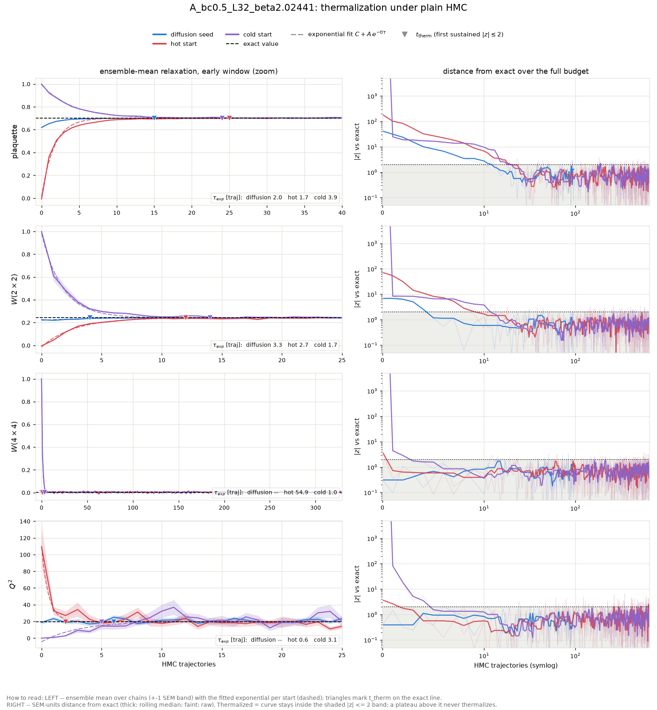

tau_int (hot-start chains, second half): plaquette = 2.76 +- 0.30, wilson_2x2 = 1.00 +- 0.07, wilson_4x4 = 0.61 +- 0.02, wilson_6x6 = 0.58 +- 0.01. Topology: hot-start HMC L=32 beta=2.02441 -> tau_int(Q) = 3.2.

### Diagnostics: raw diffusion output (before any HMC)

| observable | value | error | exact | z_exact | reference | ref_error | z_ref | ks_p | chi2_p |
|---|---|---|---|---|---|---|---|---|---|
| plaquette | 0.6189 | 0.001809 | 0.7017 | -45.82 | 0.7019 | 0.0008797 | -41.29 | 0 |  |
| wilson_1x1 | 0.6189 | 0.001809 | 0.7017 | -45.82 | 0.7019 | 0.0008797 | -41.29 | 0 |  |
| wilson_1x2 | 0.3936 | 0.003113 | 0.4924 | -31.76 | 0.4926 | 0.001604 | -28.27 | 0 |  |
| wilson_2x2 | 0.2253 | 0.002872 | 0.2425 | -5.988 | 0.2406 | 0.001965 | -4.41 | 4.842e-05 |  |
| wilson_2x3 | 0.1148 | 0.003014 | 0.1194 | -1.545 | 0.1199 | 0.002269 | -1.361 | 0.3021 |  |
| wilson_3x3 | 0.03848 | 0.002166 | 0.04127 | -1.286 | 0.03906 | 0.002341 | -0.1824 | 0.678 |  |
| wilson_3x4 | 0.0173 | 0.001983 | 0.01426 | 1.531 | 0.01215 | 0.001815 | 1.912 | 0.4212 |  |
| wilson_4x4 | 0.004083 | 0.001668 | 0.003458 | 0.3744 | 0.002402 | 0.001851 | 0.6745 | 0.5259 |  |
| wilson_4x5 | 0.003048 | 0.002088 | 0.0008386 | 1.058 | 0.001425 | 0.002112 | 0.5464 | 0.5259 |  |
| wilson_5x5 | -0.001931 | 0.001799 | 0.0001427 | -1.153 | -0.0008455 | 0.001957 | -0.4083 | 0.6011 |  |
| wilson_5x6 | -0.002031 | 0.001837 | 2.428e-05 | -1.119 | -9.881e-05 | 0.001841 | -0.743 | 0.4212 |  |
| wilson_6x6 | -0.003072 | 0.001472 | 2.9e-06 | -2.089 | -0.0007191 | 0.001925 | -0.971 | 0.3021 |  |
| wilson_6x7 | -0.0016 | 0.001803 | 3.463e-07 | -0.8877 | -0.0003006 | 0.001982 | -0.4851 | 0.678 |  |
| wilson_7x7 | -0.002633 | 0.001962 | 2.902e-08 | -1.342 | 0.001083 | 0.001614 | -1.463 | 0.5631 |  |
| wilson_7x8 | 0.0004874 | 0.001749 | 2.432e-09 | 0.2787 | -0.001728 | 0.001643 | 0.9235 | 0.4898 |  |
| wilson_8x8 | 3.576e-05 | 0.00164 | 1.43e-10 | 0.02181 | -0.0004432 | 0.001893 | 0.1913 | 0.9126 |  |
| wilson_8x10 | 0.0007342 | 0.001953 | 4.946e-13 | 0.3759 | -0.001078 | 0.001766 | 0.6881 | 0.4898 |  |
| wilson_10x10 | -0.0005805 | 0.001975 | 4.147e-16 | -0.294 | 0.0007502 | 0.001534 | -0.5322 | 0.9126 |  |
| wilson_10x12 | 0.0004089 | 0.002191 | 3.478e-19 | 0.1866 | 0.001283 | 0.00153 | -0.3272 | 0.6011 |  |
| wilson_12x12 | -0.0001613 | 0.001514 | 7.073e-23 | -0.1065 | 0.001944 | 0.001599 | -0.9559 | 0.2522 |  |
| creutz_2 | 0.1052 | 0.01088 | 0.3542 | -22.89 |  |  |  |  |  |
| creutz_3 | 0.4181 | 0.04951 | 0.3542 | 1.29 |  |  |  |  |  |
| creutz_4 | 0.644 | 0.4876 | 0.3542 | 0.5943 |  |  |  |  |  |
| Q | -0.04688 | 0.3268 | 0 | -0.1435 | -0.7917 | 0.2757 | 1.742 | 0.0631 |  |
| Q^2 | 18.75 | 2.101 | 19.51 | -0.3622 | 16.85 | 1.13 | 0.7948 | 0.1122 |  |
| chi_top ((<Q^2>-<Q>^2)/V) | 0.01831 | 0.002049 | 0.01905 | -0.3636 | 0.01585 | 0.001139 | 1.05 | 0.0001679 |  |
| Q histogram vs exact P(Q) | 13.44 | nan | 16 | nan |  |  |  |  | 0.6405 |

### Diagnostics: the same configs after 96 HMC trajectories

| observable | value | error | exact | z_exact | reference | ref_error | z_ref | ks_p | chi2_p |
|---|---|---|---|---|---|---|---|---|---|
| plaquette | 0.701 | 0.00106 | 0.7017 | -0.6827 | 0.7019 | 0.0008797 | -0.6471 | 0.5631 |  |
| wilson_1x1 | 0.701 | 0.00106 | 0.7017 | -0.6827 | 0.7019 | 0.0008797 | -0.6471 | 0.5631 |  |
| wilson_1x2 | 0.4916 | 0.001694 | 0.4924 | -0.5022 | 0.4926 | 0.001604 | -0.421 | 0.8246 |  |
| wilson_2x2 | 0.2414 | 0.002254 | 0.2425 | -0.4931 | 0.2406 | 0.001965 | 0.2479 | 0.9126 |  |
| wilson_2x3 | 0.1186 | 0.002569 | 0.1194 | -0.3362 | 0.1199 | 0.002269 | -0.3914 | 0.9353 |  |
| wilson_3x3 | 0.04201 | 0.002779 | 0.04127 | 0.268 | 0.03906 | 0.002341 | 0.8113 | 0.3584 |  |
| wilson_3x4 | 0.01322 | 0.003642 | 0.01426 | -0.2869 | 0.01215 | 0.001815 | 0.2608 | 0.3584 |  |
| wilson_4x4 | 0.005068 | 0.002553 | 0.003458 | 0.6306 | 0.002402 | 0.001851 | 0.8454 | 0.3584 |  |
| wilson_4x5 | -0.001627 | 0.002489 | 0.0008386 | -0.9909 | 0.001425 | 0.002112 | -0.935 | 0.2087 |  |
| wilson_5x5 | -0.002043 | 0.001947 | 0.0001427 | -1.123 | -0.0008455 | 0.001957 | -0.4339 | 0.1892 |  |
| wilson_5x6 | -0.001515 | 0.001573 | 2.428e-05 | -0.9792 | -9.881e-05 | 0.001841 | -0.585 | 0.5631 |  |
| wilson_6x6 | -0.001731 | 0.001621 | 2.9e-06 | -1.07 | -0.0007191 | 0.001925 | -0.4021 | 0.7163 |  |
| wilson_6x7 | 0.002784 | 0.001801 | 3.463e-07 | 1.546 | -0.0003006 | 0.001982 | 1.152 | 0.1122 |  |
| wilson_7x7 | -0.0004035 | 0.001682 | 2.902e-08 | -0.2399 | 0.001083 | 0.001614 | -0.6377 | 0.9542 |  |
| wilson_7x8 | -0.0001437 | 0.001898 | 2.432e-09 | -0.07569 | -0.001728 | 0.001643 | 0.6312 | 0.4898 |  |
| wilson_8x8 | 0.002405 | 0.001605 | 1.43e-10 | 1.498 | -0.0004432 | 0.001893 | 1.148 | 0.6011 |  |
| wilson_8x10 | 0.004991 | 0.002226 | 4.946e-13 | 2.242 | -0.001078 | 0.001766 | 2.136 | 0.02248 |  |
| wilson_10x10 | -0.001143 | 0.002117 | 4.147e-16 | -0.5401 | 0.0007502 | 0.001534 | -0.7243 | 0.2087 |  |
| wilson_10x12 | 0.0005594 | 0.001779 | 3.478e-19 | 0.3144 | 0.001283 | 0.00153 | -0.3085 | 0.678 |  |
| wilson_12x12 | 0.0002268 | 0.001615 | 7.073e-23 | 0.1404 | 0.001944 | 0.001599 | -0.7554 | 0.3294 |  |
| creutz_2 | 0.3564 | 0.006673 | 0.3542 | 0.3249 |  |  |  |  |  |
| creutz_3 | 0.3264 | 0.0415 | 0.3542 | -0.67 |  |  |  |  |  |
| creutz_4 | -0.198 | 0.4048 | 0.3542 | -1.364 |  |  |  |  |  |
| Q | -1.031 | 0.4977 | 0 | -2.072 | -0.7917 | 0.2757 | -0.4211 | 0.9888 |  |
| Q^2 | 17.77 | 2.933 | 19.51 | -0.595 | 16.85 | 1.13 | 0.29 | 0.4548 |  |
| chi_top ((<Q^2>-<Q>^2)/V) | 0.01631 | 0.002213 | 0.01905 | -1.239 | 0.01585 | 0.001139 | 0.1862 | 0.008145 |  |
| Q histogram vs exact P(Q) | 17.51 | nan | 16 | nan |  |  |  |  | 0.3534 |

## A_bc0.75_L32_beta2.5435

HMC: step size 0.2000, 5 leapfrog steps, acceptance seed/hot/cold = 0.964/0.961/0.960. Diffusion-seed batch: 128 chains x 96 trajectories (0.05 s/traj for the whole batch); baselines: 32 chains x 640 trajectories.

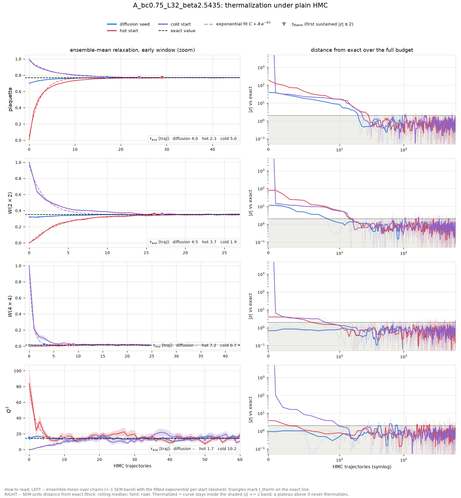

tau_int (hot-start chains, second half): plaquette = 3.11 +- 0.17, wilson_2x2 = 1.26 +- 0.06, wilson_4x4 = 0.71 +- 0.03, wilson_6x6 = 0.57 +- 0.02. Topology: hot-start HMC L=32 beta=2.5435 -> tau_int(Q) = 5.0.

### Diagnostics: raw diffusion output (before any HMC)

| observable | value | error | exact | z_exact | reference | ref_error | z_ref | ks_p | chi2_p |
|---|---|---|---|---|---|---|---|---|---|
| plaquette | 0.6996 | 0.001978 | 0.7696 | -35.39 | 0.7712 | 0.0008441 | -33.28 | 0 |  |
| wilson_1x1 | 0.6996 | 0.001978 | 0.7696 | -35.39 | 0.7712 | 0.0008441 | -33.28 | 0 |  |
| wilson_1x2 | 0.4994 | 0.003152 | 0.5924 | -29.49 | 0.5947 | 0.001239 | -28.13 | 0 |  |
| wilson_2x2 | 0.3227 | 0.002337 | 0.3509 | -12.05 | 0.3548 | 0.001546 | -11.45 | 6.603e-16 |  |
| wilson_2x3 | 0.1857 | 0.003325 | 0.2079 | -6.652 | 0.2096 | 0.001777 | -6.342 | 1.186e-06 |  |
| wilson_3x3 | 0.07719 | 0.002332 | 0.09476 | -7.535 | 0.099 | 0.002295 | -6.666 | 1.186e-06 |  |
| wilson_3x4 | 0.03503 | 0.002094 | 0.0432 | -3.904 | 0.04598 | 0.00207 | -3.721 | 0.008145 |  |
| wilson_4x4 | 0.01673 | 0.002256 | 0.01516 | 0.6961 | 0.01636 | 0.002317 | 0.115 | 0.6395 |  |
| wilson_4x5 | 0.006426 | 0.001754 | 0.005319 | 0.6315 | 0.008872 | 0.001496 | -1.061 | 0.6011 |  |
| wilson_5x5 | 0.001336 | 0.002335 | 0.001436 | -0.04287 | 0.004459 | 0.001775 | -1.064 | 0.1892 |  |
| wilson_5x6 | -0.0007029 | 0.001734 | 0.0003879 | -0.6292 | 0.001126 | 0.001405 | -0.8196 | 0.4548 |  |
| wilson_6x6 | -0.001573 | 0.001875 | 8.063e-05 | -0.8818 | 0.0006585 | 0.002101 | -0.7924 | 0.5259 |  |
| wilson_6x7 | -0.003216 | 0.001582 | 1.676e-05 | -2.044 | 0.0003578 | 0.002067 | -1.373 | 0.2297 |  |
| wilson_7x7 | -0.002062 | 0.001939 | 2.681e-06 | -1.065 | -5.091e-05 | 0.001535 | -0.8131 | 0.4898 |  |
| wilson_7x8 | 0.001768 | 0.001934 | 4.289e-07 | 0.9136 | -0.0002698 | 0.00133 | 0.8679 | 0.5259 |  |
| wilson_8x8 | -0.002375 | 0.001724 | 5.28e-08 | -1.378 | -3.522e-05 | 0.001573 | -1.003 | 0.5259 |  |
| wilson_8x10 | 0.001859 | 0.001818 | 8.005e-10 | 1.022 | -0.0007483 | 0.001392 | 1.138 | 0.6011 |  |
| wilson_10x10 | -0.0006458 | 0.002317 | 4.258e-12 | -0.2787 | 0.0005853 | 0.001744 | -0.4245 | 0.6011 |  |
| wilson_10x12 | 0.0003799 | 0.00187 | 2.265e-14 | 0.2032 | -0.003624 | 0.001567 | 1.641 | 0.2522 |  |
| wilson_12x12 | -0.003292 | 0.002039 | 4.227e-17 | -1.615 | 0.001042 | 0.001567 | -1.685 | 0.011 |  |
| creutz_2 | 0.09949 | 0.006954 | 0.2618 | -23.34 |  |  |  |  |  |
| creutz_3 | 0.3256 | 0.02523 | 0.2618 | 2.527 |  |  |  |  |  |
| creutz_4 | -0.05108 | 0.1287 | 0.2618 | -2.431 |  |  |  |  |  |
| creutz_5 | 0.6138 | 1.551 | 0.2618 | 0.2268 |  |  |  |  |  |
| Q | -0.25 | 0.2687 | 0 | -0.9304 | -0.2552 | 0.2417 | 0.01441 | 0.9999 |  |
| Q^2 | 12.83 | 1.673 | 14.25 | -0.8515 | 13.84 | 1.822 | -0.4085 | 0.8864 |  |
| chi_top ((<Q^2>-<Q>^2)/V) | 0.01247 | 0.001627 | 0.01392 | -0.8926 | 0.01345 | 0.001796 | -0.4061 | 0.006985 |  |
| Q histogram vs exact P(Q) | 9.436 | nan | 14 | nan |  |  |  |  | 0.8022 |

### Diagnostics: the same configs after 96 HMC trajectories

| observable | value | error | exact | z_exact | reference | ref_error | z_ref | ks_p | chi2_p |
|---|---|---|---|---|---|---|---|---|---|
| plaquette | 0.7711 | 0.0009103 | 0.7696 | 1.625 | 0.7712 | 0.0008441 | -0.06334 | 0.4212 |  |
| wilson_1x1 | 0.7711 | 0.0009103 | 0.7696 | 1.625 | 0.7712 | 0.0008441 | -0.06334 | 0.4212 |  |
| wilson_1x2 | 0.5954 | 0.001861 | 0.5924 | 1.612 | 0.5947 | 0.001239 | 0.3039 | 0.07995 |  |
| wilson_2x2 | 0.3546 | 0.00304 | 0.3509 | 1.221 | 0.3548 | 0.001546 | -0.0628 | 0.9941 |  |
| wilson_2x3 | 0.212 | 0.003585 | 0.2079 | 1.154 | 0.2096 | 0.001777 | 0.587 | 0.4548 |  |
| wilson_3x3 | 0.09817 | 0.003148 | 0.09476 | 1.084 | 0.099 | 0.002295 | -0.2117 | 0.9693 |  |
| wilson_3x4 | 0.04744 | 0.003295 | 0.0432 | 1.287 | 0.04598 | 0.00207 | 0.3751 | 0.5631 |  |
| wilson_4x4 | 0.01496 | 0.002839 | 0.01516 | -0.06846 | 0.01636 | 0.002317 | -0.38 | 0.3584 |  |
| wilson_4x5 | 0.005353 | 0.001745 | 0.005319 | 0.01956 | 0.008872 | 0.001496 | -1.531 | 0.3584 |  |
| wilson_5x5 | 0.003014 | 0.002206 | 0.001436 | 0.7152 | 0.004459 | 0.001775 | -0.5103 | 0.4548 |  |
| wilson_5x6 | 0.0008127 | 0.00272 | 0.0003879 | 0.1561 | 0.001126 | 0.001405 | -0.1024 | 0.5631 |  |
| wilson_6x6 | 0.0002584 | 0.002777 | 8.063e-05 | 0.06401 | 0.0006585 | 0.002101 | -0.1149 | 0.8864 |  |
| wilson_6x7 | -0.002724 | 0.001941 | 1.676e-05 | -1.412 | 0.0003578 | 0.002067 | -1.087 | 0.1545 |  |
| wilson_7x7 | -0.004277 | 0.001475 | 2.681e-06 | -2.901 | -5.091e-05 | 0.001535 | -1.985 | 0.3021 |  |
| wilson_7x8 | -0.005837 | 0.002355 | 4.289e-07 | -2.479 | -0.0002698 | 0.00133 | -2.059 | 0.1392 |  |
| wilson_8x8 | -2.54e-05 | 0.001747 | 5.28e-08 | -0.01457 | -3.522e-05 | 0.001573 | 0.004176 | 0.7538 |  |
| wilson_8x10 | -0.0006539 | 0.001878 | 8.005e-10 | -0.3483 | -0.0007483 | 0.001392 | 0.04038 | 0.9941 |  |
| wilson_10x10 | -0.0004526 | 0.001817 | 4.258e-12 | -0.2491 | 0.0005853 | 0.001744 | -0.4121 | 0.678 |  |
| wilson_10x12 | 0.0002832 | 0.001562 | 2.265e-14 | 0.1814 | -0.003624 | 0.001567 | 1.766 | 0.2087 |  |
| wilson_12x12 | 0.001056 | 0.001719 | 4.227e-17 | 0.6143 | 0.001042 | 0.001567 | 0.006115 | 0.5631 |  |
| creutz_2 | 0.2595 | 0.004608 | 0.2618 | -0.5086 |  |  |  |  |  |
| creutz_3 | 0.2553 | 0.0194 | 0.2618 | -0.334 |  |  |  |  |  |
| creutz_4 | 0.4266 | 0.1392 | 0.2618 | 1.184 |  |  |  |  |  |
| creutz_5 | -0.4536 | 0.6861 | 0.2618 | -1.043 |  |  |  |  |  |
| creutz_6 | -0.1649 | nan | 0.2618 | nan |  |  |  |  |  |
| Q | 0.4062 | 0.313 | 0 | 1.298 | -0.2552 | 0.2417 | 1.673 | 0.4898 |  |
| Q^2 | 13.61 | 1.504 | 14.25 | -0.4274 | 13.84 | 1.822 | -0.09698 | 0.1892 |  |
| chi_top ((<Q^2>-<Q>^2)/V) | 0.01313 | 0.001539 | 0.01392 | -0.5128 | 0.01345 | 0.001796 | -0.1359 | 0.006985 |  |
| Q histogram vs exact P(Q) | 16.09 | nan | 14 | nan |  |  |  |  | 0.3078 |

## A_bc1_L32_beta3.10399

HMC: step size 0.2000, 5 leapfrog steps, acceptance seed/hot/cold = 0.966/0.961/0.963. Diffusion-seed batch: 128 chains x 96 trajectories (0.05 s/traj for the whole batch); baselines: 32 chains x 640 trajectories.

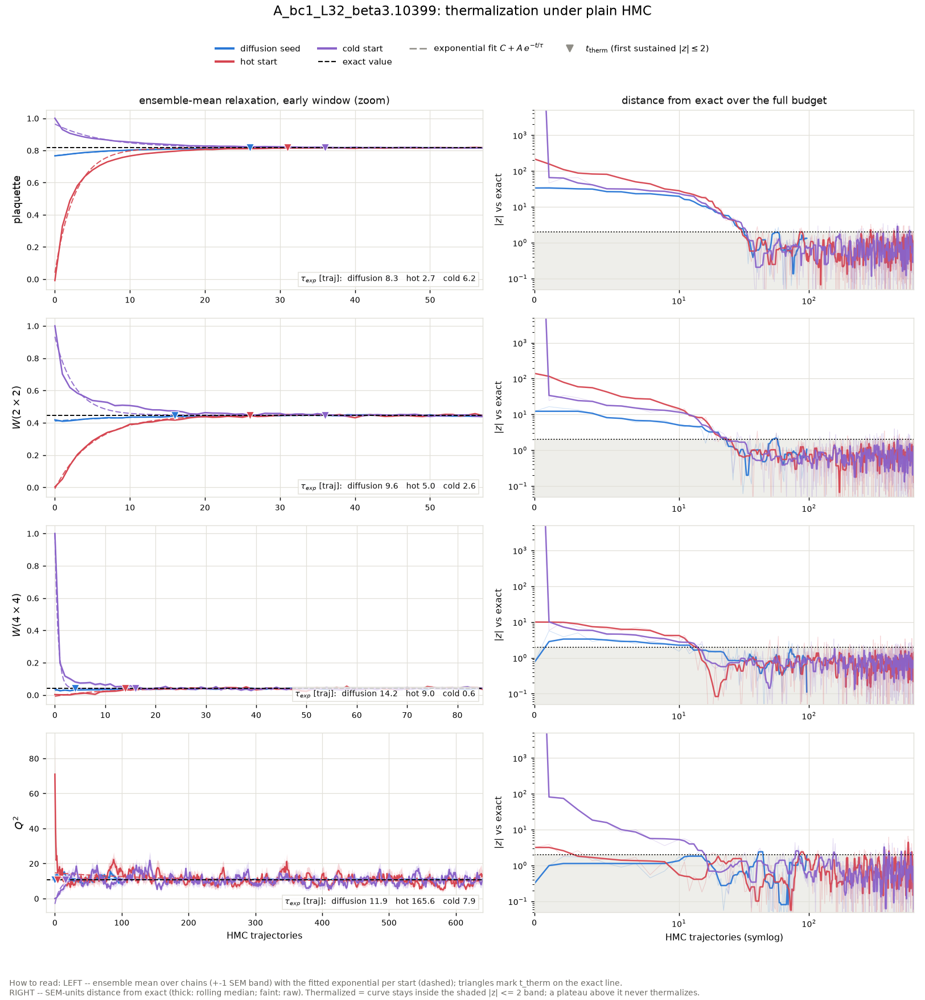

tau_int (hot-start chains, second half): plaquette = 4.58 +- 0.44, wilson_2x2 = 1.69 +- 0.12, wilson_4x4 = 0.82 +- 0.03, wilson_6x6 = 0.58 +- 0.01. Topology: hot-start HMC L=32 beta=3.10399 -> tau_int(Q) = 9.6.

### Diagnostics: raw diffusion output (before any HMC)

| observable | value | error | exact | z_exact | reference | ref_error | z_ref | ks_p | chi2_p |
|---|---|---|---|---|---|---|---|---|---|
| plaquette | 0.7667 | 0.001803 | 0.8174 | -28.13 | 0.8167 | 0.0005787 | -26.41 | 0 |  |
| wilson_1x1 | 0.7667 | 0.001803 | 0.8174 | -28.13 | 0.8167 | 0.0005787 | -26.41 | 0 |  |
| wilson_1x2 | 0.5899 | 0.003063 | 0.6681 | -25.55 | 0.6667 | 0.001248 | -23.22 | 0 |  |
| wilson_2x2 | 0.4179 | 0.002683 | 0.4464 | -10.6 | 0.4462 | 0.002387 | -7.879 | 1.09e-14 |  |
| wilson_2x3 | 0.2723 | 0.002709 | 0.2982 | -9.579 | 0.2995 | 0.003104 | -6.592 | 5.026e-09 |  |
| wilson_3x3 | 0.1392 | 0.003133 | 0.1629 | -7.549 | 0.1662 | 0.003275 | -5.944 | 2.764e-09 |  |
| wilson_3x4 | 0.07927 | 0.003647 | 0.08895 | -2.655 | 0.09401 | 0.002937 | -3.148 | 0.002655 |  |
| wilson_4x4 | 0.03766 | 0.003521 | 0.03971 | -0.5802 | 0.04635 | 0.002315 | -2.062 | 0.03831 |  |
| wilson_4x5 | 0.01718 | 0.002012 | 0.01772 | -0.2728 | 0.02331 | 0.001923 | -2.205 | 0.1545 |  |
| wilson_5x5 | 0.001093 | 0.002031 | 0.006467 | -2.647 | 0.008977 | 0.001985 | -2.777 | 0.01957 |  |
| wilson_5x6 | -0.0008666 | 0.002194 | 0.00236 | -1.471 | 0.001769 | 0.001658 | -0.9586 | 0.389 |  |
| wilson_6x6 | -0.0006778 | 0.002162 | 0.0007038 | -0.639 | -0.001236 | 0.002333 | 0.1754 | 0.2763 |  |
| wilson_6x7 | -0.0006163 | 0.001883 | 0.0002099 | -0.4387 | 0.0001348 | 0.001854 | -0.2842 | 0.6395 |  |
| wilson_7x7 | -0.000332 | 0.001672 | 5.117e-05 | -0.2292 | -0.0009109 | 0.001672 | 0.2449 | 0.389 |  |
| wilson_7x8 | 0.002095 | 0.001764 | 1.247e-05 | 1.181 | 0.001308 | 0.00174 | 0.3177 | 0.2763 |  |
| wilson_8x8 | -0.005218 | 0.001867 | 2.486e-06 | -2.796 | 0.001576 | 0.001246 | -3.026 | 0.03364 |  |
| wilson_8x10 | -0.001938 | 0.001601 | 9.869e-08 | -1.211 | 0.001019 | 0.002055 | -1.135 | 0.1004 |  |
| wilson_10x10 | 0.0005781 | 0.002175 | 1.749e-09 | 0.2658 | 0.002047 | 0.001322 | -0.5771 | 0.8569 |  |
| wilson_10x12 | -0.0003202 | 0.001456 | 3.101e-11 | -0.2199 | 0.001053 | 0.001377 | -0.6853 | 0.6011 |  |
| wilson_12x12 | -0.0009976 | 0.002176 | 2.453e-13 | -0.4584 | 0.0004341 | 0.001577 | -0.5328 | 0.9126 |  |
| creutz_2 | 0.0824 | 0.005646 | 0.2016 | -21.12 |  |  |  |  |  |
| creutz_3 | 0.2423 | 0.01502 | 0.2016 | 2.709 |  |  |  |  |  |
| creutz_4 | 0.1808 | 0.05417 | 0.2016 | -0.3839 |  |  |  |  |  |
| creutz_5 | 1.97 | 1.97 | 0.2016 | 0.8972 |  |  |  |  |  |
| Q | 0.2656 | 0.2481 | 0 | 1.071 | 0.1302 | 0.2199 | 0.4085 | 0.7538 |  |
| Q^2 | 11.16 | 1.044 | 10.81 | 0.333 | 10.84 | 1.105 | 0.209 | 0.1251 |  |
| chi_top ((<Q^2>-<Q>^2)/V) | 0.01083 | 0.0009846 | 0.01056 | 0.275 | 0.01057 | 0.001073 | 0.1771 | 0.0006474 |  |
| Q histogram vs exact P(Q) | 20.04 | nan | 12 | nan |  |  |  |  | 0.06626 |

### Diagnostics: the same configs after 96 HMC trajectories

| observable | value | error | exact | z_exact | reference | ref_error | z_ref | ks_p | chi2_p |
|---|---|---|---|---|---|---|---|---|---|
| plaquette | 0.8164 | 0.0007322 | 0.8174 | -1.311 | 0.8167 | 0.0005787 | -0.2763 | 0.2297 |  |
| wilson_1x1 | 0.8164 | 0.0007322 | 0.8174 | -1.311 | 0.8167 | 0.0005787 | -0.2763 | 0.2297 |  |
| wilson_1x2 | 0.6657 | 0.001603 | 0.6681 | -1.515 | 0.6667 | 0.001248 | -0.4848 | 0.1545 |  |
| wilson_2x2 | 0.4439 | 0.002237 | 0.4464 | -1.12 | 0.4462 | 0.002387 | -0.7197 | 0.4548 |  |
| wilson_2x3 | 0.2942 | 0.002448 | 0.2982 | -1.633 | 0.2995 | 0.003104 | -1.317 | 0.3021 |  |
| wilson_3x3 | 0.1594 | 0.003144 | 0.1629 | -1.106 | 0.1662 | 0.003275 | -1.491 | 0.2087 |  |
| wilson_3x4 | 0.0871 | 0.003125 | 0.08895 | -0.5924 | 0.09401 | 0.002937 | -1.611 | 0.3021 |  |
| wilson_4x4 | 0.04003 | 0.003088 | 0.03971 | 0.1064 | 0.04635 | 0.002315 | -1.637 | 0.3584 |  |
| wilson_4x5 | 0.01796 | 0.003003 | 0.01772 | 0.07844 | 0.02331 | 0.001923 | -1.502 | 0.4548 |  |
| wilson_5x5 | 0.003311 | 0.003066 | 0.006467 | -1.029 | 0.008977 | 0.001985 | -1.551 | 0.389 |  |
| wilson_5x6 | 0.002217 | 0.002889 | 0.00236 | -0.04927 | 0.001769 | 0.001658 | 0.1345 | 0.8246 |  |
| wilson_6x6 | -0.002366 | 0.00273 | 0.0007038 | -1.124 | -0.001236 | 0.002333 | -0.3146 | 0.9989 |  |
| wilson_6x7 | -0.000762 | 0.002202 | 0.0002099 | -0.4413 | 0.0001348 | 0.001854 | -0.3115 | 0.7901 |  |
| wilson_7x7 | -6.422e-05 | 0.00175 | 5.117e-05 | -0.06594 | -0.0009109 | 0.001672 | 0.3498 | 0.7163 |  |
| wilson_7x8 | 0.0003039 | 0.002517 | 1.247e-05 | 0.1158 | 0.001308 | 0.00174 | -0.3282 | 0.7163 |  |
| wilson_8x8 | -0.001476 | 0.002519 | 2.486e-06 | -0.587 | 0.001576 | 0.001246 | -1.086 | 0.6011 |  |
| wilson_8x10 | -0.001306 | 0.001527 | 9.869e-08 | -0.8553 | 0.001019 | 0.002055 | -0.9083 | 0.3584 |  |
| wilson_10x10 | 0.002231 | 0.001913 | 1.749e-09 | 1.166 | 0.002047 | 0.001322 | 0.07897 | 0.9126 |  |
| wilson_10x12 | 0.0004733 | 0.002058 | 3.101e-11 | 0.23 | 0.001053 | 0.001377 | -0.2342 | 0.1712 |  |
| wilson_12x12 | 0.0009241 | 0.002091 | 2.453e-13 | 0.4419 | 0.0004341 | 0.001577 | 0.1871 | 0.5259 |  |
| creutz_2 | 0.2012 | 0.002737 | 0.2016 | -0.1741 |  |  |  |  |  |
| creutz_3 | 0.2019 | 0.009937 | 0.2016 | 0.02291 |  |  |  |  |  |
| creutz_4 | 0.1729 | 0.04705 | 0.2016 | -0.6104 |  |  |  |  |  |
| creutz_5 | 0.8892 | 0.6879 | 0.2016 | 0.9996 |  |  |  |  |  |
| Q | -0.3359 | 0.2729 | 0 | -1.231 | 0.1302 | 0.2199 | -1.33 | 0.2297 |  |
| Q^2 | 8.867 | 0.9605 | 10.81 | -2.021 | 10.84 | 1.105 | -1.347 | 0.678 |  |
| chi_top ((<Q^2>-<Q>^2)/V) | 0.008549 | 0.0009376 | 0.01056 | -2.139 | 0.01057 | 0.001073 | -1.417 | 0.006985 |  |
| Q histogram vs exact P(Q) | 11.33 | nan | 12 | nan |  |  |  |  | 0.5013 |

## E_bc1.2_L32_beta3.6012

HMC: step size 0.2000, 5 leapfrog steps, acceptance seed/hot/cold = 0.966/0.962/0.960. Diffusion-seed batch: 128 chains x 96 trajectories (0.05 s/traj for the whole batch); baselines: 32 chains x 640 trajectories.

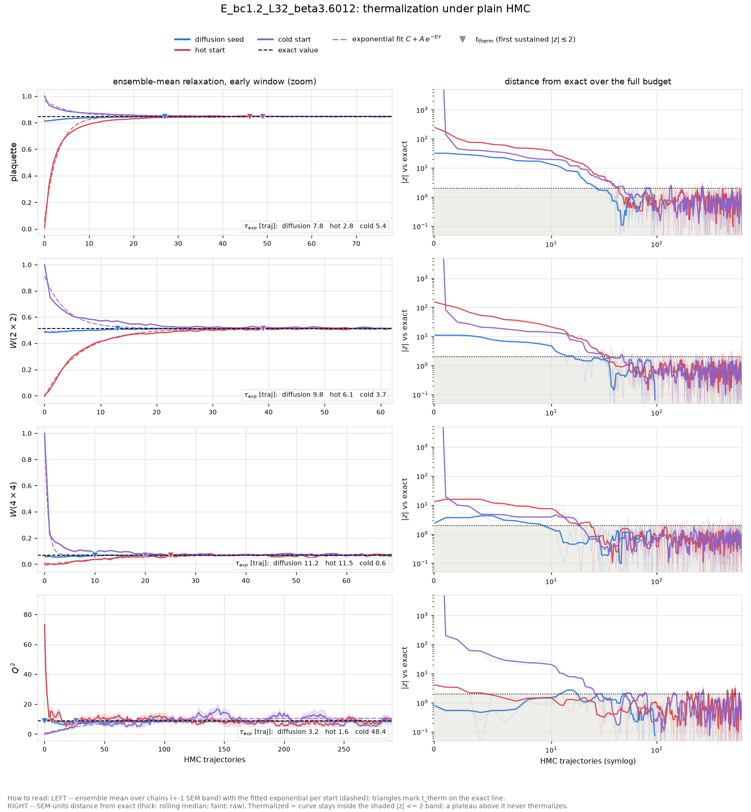

tau_int (hot-start chains, second half): plaquette = 4.62 +- 0.47, wilson_2x2 = 2.44 +- 0.22, wilson_4x4 = 1.07 +- 0.08, wilson_6x6 = 0.60 +- 0.02. Topology: hot-start HMC L=32 beta=3.6012 -> tau_int(Q) = 15.8.

### Diagnostics: raw diffusion output (before any HMC)

| observable | value | error | exact | z_exact | reference | ref_error | z_ref | ks_p | chi2_p |
|---|---|---|---|---|---|---|---|---|---|
| plaquette | 0.8112 | 0.001046 | 0.8462 | -33.43 | 0.8463 | 0.0003874 | -31.45 | 0 |  |
| wilson_1x1 | 0.8112 | 0.001046 | 0.8462 | -33.43 | 0.8463 | 0.0003874 | -31.45 | 0 |  |
| wilson_1x2 | 0.6578 | 0.001864 | 0.7161 | -31.27 | 0.7162 | 0.0008025 | -28.79 | 0 |  |
| wilson_2x2 | 0.4885 | 0.002131 | 0.5128 | -11.4 | 0.5137 | 0.001718 | -9.199 | 3.208e-11 |  |
| wilson_2x3 | 0.3395 | 0.002337 | 0.3672 | -11.83 | 0.3685 | 0.002204 | -9.005 | 3.208e-11 |  |
| wilson_3x3 | 0.1913 | 0.001973 | 0.2225 | -15.83 | 0.2236 | 0.002907 | -9.205 | 2.885e-12 |  |
| wilson_3x4 | 0.112 | 0.003096 | 0.1348 | -7.364 | 0.138 | 0.002983 | -6.034 | 1.491e-07 |  |
| wilson_4x4 | 0.06249 | 0.002707 | 0.06914 | -2.455 | 0.07279 | 0.002786 | -2.65 | 0.03364 |  |
| wilson_4x5 | 0.03447 | 0.002825 | 0.03545 | -0.3475 | 0.03951 | 0.002368 | -1.366 | 0.1122 |  |
| wilson_5x5 | 0.01274 | 0.002952 | 0.01538 | -0.8954 | 0.01732 | 0.002186 | -1.247 | 0.1545 |  |
| wilson_5x6 | 0.004505 | 0.001977 | 0.006676 | -1.098 | 0.007357 | 0.00197 | -1.022 | 0.5259 |  |
| wilson_6x6 | -0.0006292 | 0.001451 | 0.002451 | -2.123 | 0.0004098 | 0.002014 | -0.4186 | 0.2297 |  |
| wilson_6x7 | -0.002571 | 0.002188 | 0.0009001 | -1.586 | -0.000592 | 0.002396 | -0.6098 | 0.1712 |  |
| wilson_7x7 | -0.002732 | 0.002077 | 0.0002797 | -1.45 | -0.0001792 | 0.002403 | -0.8038 | 0.4898 |  |
| wilson_7x8 | -0.003387 | 0.002159 | 8.691e-05 | -1.609 | -0.001172 | 0.001882 | -0.7732 | 0.4898 |  |
| wilson_8x8 | -0.002276 | 0.002246 | 2.285e-05 | -1.024 | -0.001396 | 0.001659 | -0.315 | 0.7538 |  |
| wilson_8x10 | 0.001663 | 0.002349 | 1.58e-06 | 0.7072 | -0.001665 | 0.00208 | 1.061 | 0.1545 |  |
| wilson_10x10 | -0.001081 | 0.002063 | 5.602e-08 | -0.5241 | -0.003042 | 0.001414 | 0.784 | 0.07995 |  |
| wilson_10x12 | -0.001655 | 0.002064 | 1.986e-09 | -0.8019 | -0.001659 | 0.001865 | 0.001469 | 0.4548 |  |
| wilson_12x12 | 0.001586 | 0.002292 | 3.611e-11 | 0.6923 | 0.002849 | 0.001558 | -0.4557 | 0.1712 |  |
| creutz_2 | 0.08794 | 0.003885 | 0.167 | -20.34 |  |  |  |  |  |
| creutz_3 | 0.2101 | 0.009766 | 0.167 | 4.419 |  |  |  |  |  |
| creutz_4 | 0.0488 | 0.03496 | 0.167 | -3.38 |  |  |  |  |  |
| creutz_5 | 0.4004 | 0.1607 | 0.167 | 1.452 |  |  |  |  |  |
| Q | 0.3672 | 0.2824 | 0 | 1.3 | -0.349 | 0.1436 | 2.26 | 0.02577 |  |
| Q^2 | 9.867 | 1.135 | 8.856 | 0.8908 | 9.922 | 0.8755 | -0.03815 | 0.1251 |  |
| chi_top ((<Q^2>-<Q>^2)/V) | 0.009504 | 0.001044 | 0.008648 | 0.8203 | 0.00957 | 0.0008743 | -0.04859 | 0.0003679 |  |
| Q histogram vs exact P(Q) | 8.264 | nan | 12 | nan |  |  |  |  | 0.7642 |

### Diagnostics: the same configs after 96 HMC trajectories

| observable | value | error | exact | z_exact | reference | ref_error | z_ref | ks_p | chi2_p |
|---|---|---|---|---|---|---|---|---|---|
| plaquette | 0.8462 | 0.0006442 | 0.8462 | -0.02758 | 0.8463 | 0.0003874 | -0.1659 | 0.5631 |  |
| wilson_1x1 | 0.8462 | 0.0006442 | 0.8462 | -0.02758 | 0.8463 | 0.0003874 | -0.1659 | 0.5631 |  |
| wilson_1x2 | 0.7149 | 0.001487 | 0.7161 | -0.7698 | 0.7162 | 0.0008025 | -0.7579 | 0.9542 |  |
| wilson_2x2 | 0.512 | 0.002424 | 0.5128 | -0.3383 | 0.5137 | 0.001718 | -0.5744 | 0.9807 |  |
| wilson_2x3 | 0.3649 | 0.002879 | 0.3672 | -0.7988 | 0.3685 | 0.002204 | -0.9855 | 0.4548 |  |
| wilson_3x3 | 0.2211 | 0.002956 | 0.2225 | -0.4926 | 0.2236 | 0.002907 | -0.6207 | 0.7538 |  |
| wilson_3x4 | 0.1325 | 0.002513 | 0.1348 | -0.936 | 0.138 | 0.002983 | -1.409 | 0.1004 |  |
| wilson_4x4 | 0.069 | 0.002282 | 0.06914 | -0.06167 | 0.07279 | 0.002786 | -1.052 | 0.4212 |  |
| wilson_4x5 | 0.03156 | 0.001542 | 0.03545 | -2.525 | 0.03951 | 0.002368 | -2.813 | 0.4212 |  |
| wilson_5x5 | 0.01478 | 0.002051 | 0.01538 | -0.2956 | 0.01732 | 0.002186 | -0.8481 | 0.8246 |  |
| wilson_5x6 | 0.005214 | 0.002716 | 0.006676 | -0.5383 | 0.007357 | 0.00197 | -0.6388 | 0.8246 |  |
| wilson_6x6 | 0.001036 | 0.002736 | 0.002451 | -0.5174 | 0.0004098 | 0.002014 | 0.1842 | 0.8246 |  |
| wilson_6x7 | -0.00107 | 0.002065 | 0.0009001 | -0.9538 | -0.000592 | 0.002396 | -0.151 | 0.9126 |  |
| wilson_7x7 | 0.001467 | 0.001619 | 0.0002797 | 0.7334 | -0.0001792 | 0.002403 | 0.5681 | 0.8246 |  |
| wilson_7x8 | -0.0003176 | 0.002018 | 8.691e-05 | -0.2005 | -0.001172 | 0.001882 | 0.3098 | 0.4548 |  |
| wilson_8x8 | 0.001944 | 0.002141 | 2.285e-05 | 0.8972 | -0.001396 | 0.001659 | 1.233 | 0.389 |  |
| wilson_8x10 | -0.001659 | 0.002693 | 1.58e-06 | -0.6165 | -0.001665 | 0.00208 | 0.001939 | 0.8569 |  |
| wilson_10x10 | 0.002434 | 0.002285 | 5.602e-08 | 1.065 | -0.003042 | 0.001414 | 2.037 | 0.04938 |  |
| wilson_10x12 | -0.001864 | 0.002119 | 1.986e-09 | -0.88 | -0.001659 | 0.001865 | -0.07276 | 0.7538 |  |
| wilson_12x12 | 0.0009649 | 0.001754 | 3.611e-11 | 0.55 | 0.002849 | 0.001558 | -0.8031 | 0.3584 |  |
| creutz_2 | 0.1654 | 0.002329 | 0.167 | -0.6774 |  |  |  |  |  |
| creutz_3 | 0.1626 | 0.007649 | 0.167 | -0.575 |  |  |  |  |  |
| creutz_4 | 0.1404 | 0.02376 | 0.167 | -1.119 |  |  |  |  |  |
| creutz_5 | -0.02348 | 0.1306 | 0.167 | -1.458 |  |  |  |  |  |
| creutz_6 | 0.5746 | 2.258 | 0.167 | 0.1805 |  |  |  |  |  |
| Q | 0.2422 | 0.1811 | 0 | 1.337 | -0.349 | 0.1436 | 2.558 | 0.5631 |  |
| Q^2 | 7.273 | 0.8415 | 8.856 | -1.88 | 9.922 | 0.8755 | -2.181 | 0.6395 |  |
| chi_top ((<Q^2>-<Q>^2)/V) | 0.007046 | 0.0008063 | 0.008648 | -1.988 | 0.00957 | 0.0008743 | -2.123 | 0.017 |  |
| Q histogram vs exact P(Q) | 10.75 | nan | 12 | nan |  |  |  |  | 0.5507 |

## A_bc1.5_L32_beta4.44493

HMC: step size 0.1897, 5 leapfrog steps, acceptance seed/hot/cold = 0.968/0.964/0.963. Diffusion-seed batch: 128 chains x 96 trajectories (0.09 s/traj for the whole batch); baselines: 32 chains x 640 trajectories.

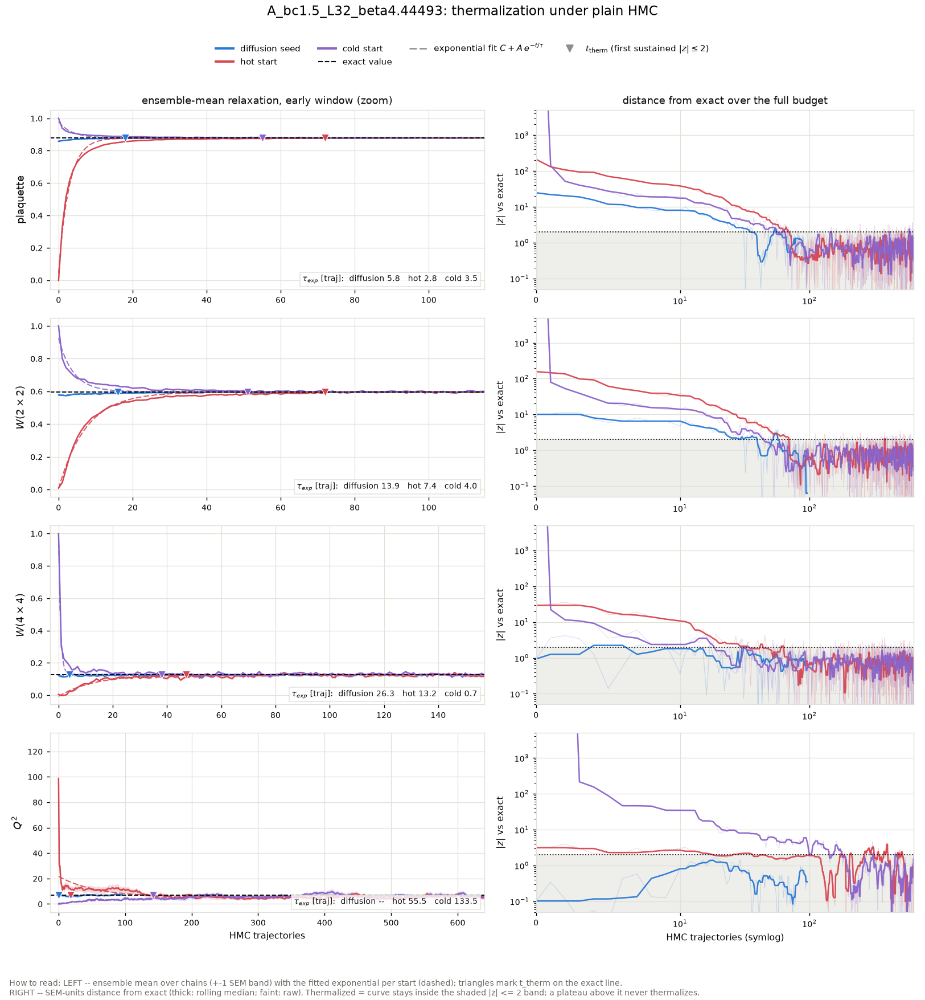

tau_int (hot-start chains, second half): plaquette = 3.96 +- 0.49, wilson_2x2 = 2.95 +- 0.35, wilson_4x4 = 1.31 +- 0.08, wilson_6x6 = 0.71 +- 0.03. Topology: hot-start HMC L=32 beta=4.44493 -> tau_int(Q) = 27.4.

### Diagnostics: raw diffusion output (before any HMC)

| observable | value | error | exact | z_exact | reference | ref_error | z_ref | ks_p | chi2_p |
|---|---|---|---|---|---|---|---|---|---|
| plaquette | 0.8579 | 0.0008398 | 0.8787 | -24.78 | 0.8784 | 0.000309 | -22.93 | 0 |  |
| wilson_1x1 | 0.8579 | 0.0008398 | 0.8787 | -24.78 | 0.8784 | 0.000309 | -22.93 | 0 |  |
| wilson_1x2 | 0.7361 | 0.001348 | 0.7721 | -26.74 | 0.7717 | 0.000713 | -23.37 | 0 |  |
| wilson_2x2 | 0.5781 | 0.001876 | 0.5961 | -9.589 | 0.5953 | 0.001405 | -7.34 | 3.783e-08 |  |
| wilson_2x3 | 0.4392 | 0.002608 | 0.4603 | -8.07 | 0.4593 | 0.001788 | -6.36 | 9.223e-07 |  |
| wilson_3x3 | 0.2876 | 0.003387 | 0.3123 | -7.284 | 0.3134 | 0.002825 | -5.857 | 1.946e-06 |  |
| wilson_3x4 | 0.1951 | 0.003767 | 0.2119 | -4.451 | 0.2146 | 0.00375 | -3.675 | 0.00159 |  |
| wilson_4x4 | 0.1231 | 0.0038 | 0.1263 | -0.8491 | 0.1293 | 0.00391 | -1.148 | 0.1392 |  |
| wilson_4x5 | 0.07146 | 0.003858 | 0.07529 | -0.9919 | 0.08031 | 0.003584 | -1.681 | 0.05588 |  |
| wilson_5x5 | 0.03319 | 0.003319 | 0.03944 | -1.882 | 0.04332 | 0.003036 | -2.252 | 0.1004 |  |
| wilson_5x6 | 0.0168 | 0.002848 | 0.02066 | -1.354 | 0.02549 | 0.002479 | -2.303 | 0.08971 |  |
| wilson_6x6 | 0.009923 | 0.002401 | 0.009508 | 0.173 | 0.01475 | 0.002347 | -1.438 | 0.07995 |  |
| wilson_6x7 | 0.004095 | 0.002917 | 0.004376 | -0.09641 | 0.007128 | 0.002285 | -0.8186 | 0.7538 |  |
| wilson_7x7 | 0.001058 | 0.002612 | 0.00177 | -0.2727 | 0.003979 | 0.001934 | -0.8988 | 0.1712 |  |
| wilson_7x8 | -0.001133 | 0.002486 | 0.0007158 | -0.744 | 0.001205 | 0.001546 | -0.7988 | 0.1892 |  |
| wilson_8x8 | 0.0002895 | 0.002061 | 0.0002544 | 0.01703 | -0.002753 | 0.001441 | 1.21 | 0.1545 |  |
| wilson_8x10 | 0.002456 | 0.002303 | 3.213e-05 | 1.053 | -0.0007767 | 0.001928 | 1.076 | 0.04938 |  |
| wilson_10x10 | 0.002408 | 0.002054 | 2.419e-06 | 1.171 | 0.0001487 | 0.001678 | 0.8518 | 0.7163 |  |
| wilson_10x12 | 0.001765 | 0.002311 | 1.821e-07 | 0.7638 | 0.003922 | 0.001524 | -0.7794 | 0.3294 |  |
| wilson_12x12 | 0.0003656 | 0.001908 | 8.173e-09 | 0.1916 | -0.0008532 | 0.00187 | 0.4563 | 0.7538 |  |
| creutz_2 | 0.08833 | 0.002819 | 0.1293 | -14.54 |  |  |  |  |  |
| creutz_3 | 0.1486 | 0.006424 | 0.1293 | 3.008 |  |  |  |  |  |
| creutz_4 | 0.0726 | 0.01496 | 0.1293 | -3.791 |  |  |  |  |  |
| creutz_5 | 0.2232 | 0.05713 | 0.1293 | 1.644 |  |  |  |  |  |
| creutz_6 | -0.1545 | 0.2166 | 0.1293 | -1.31 |  |  |  |  |  |
| creutz_7 | 0.4687 | 1.822 | 0.1293 | 0.1862 |  |  |  |  |  |
| Q | 0.3594 | 0.2323 | 0 | 1.547 | -0.5208 | 0.1322 | 3.293 | 0.003137 |  |
| Q^2 | 6.859 | 0.5638 | 6.786 | 0.1303 | 5.969 | 0.6047 | 1.077 | 0.3584 |  |
| chi_top ((<Q^2>-<Q>^2)/V) | 0.006572 | 0.0005397 | 0.006627 | -0.1007 | 0.005564 | 0.0006204 | 1.226 | 0.002243 |  |
| Q histogram vs exact P(Q) | 18.67 | nan | 10 | nan |  |  |  |  | 0.04462 |

### Diagnostics: the same configs after 96 HMC trajectories

| observable | value | error | exact | z_exact | reference | ref_error | z_ref | ks_p | chi2_p |
|---|---|---|---|---|---|---|---|---|---|
| plaquette | 0.8789 | 0.0004424 | 0.8787 | 0.3986 | 0.8784 | 0.000309 | 0.87 | 0.9126 |  |
| wilson_1x1 | 0.8789 | 0.0004424 | 0.8787 | 0.3986 | 0.8784 | 0.000309 | 0.87 | 0.9126 |  |
| wilson_1x2 | 0.7718 | 0.0009025 | 0.7721 | -0.3152 | 0.7717 | 0.000713 | 0.1007 | 0.7901 |  |
| wilson_2x2 | 0.596 | 0.001826 | 0.5961 | -0.06896 | 0.5953 | 0.001405 | 0.2858 | 0.8569 |  |
| wilson_2x3 | 0.4596 | 0.002884 | 0.4603 | -0.2211 | 0.4593 | 0.001788 | 0.08761 | 0.8246 |  |
| wilson_3x3 | 0.3089 | 0.003242 | 0.3123 | -1.03 | 0.3134 | 0.002825 | -1.046 | 0.1545 |  |
| wilson_3x4 | 0.2069 | 0.003443 | 0.2119 | -1.424 | 0.2146 | 0.00375 | -1.506 | 0.0711 |  |
| wilson_4x4 | 0.123 | 0.003738 | 0.1263 | -0.8917 | 0.1293 | 0.00391 | -1.177 | 0.08971 |  |
| wilson_4x5 | 0.07379 | 0.00373 | 0.07529 | -0.4 | 0.08031 | 0.003584 | -1.26 | 0.1545 |  |
| wilson_5x5 | 0.0405 | 0.002993 | 0.03944 | 0.354 | 0.04332 | 0.003036 | -0.6626 | 0.4898 |  |
| wilson_5x6 | 0.02338 | 0.002978 | 0.02066 | 0.9149 | 0.02549 | 0.002479 | -0.5453 | 0.4548 |  |
| wilson_6x6 | 0.0127 | 0.002604 | 0.009508 | 1.226 | 0.01475 | 0.002347 | -0.5858 | 0.7163 |  |
| wilson_6x7 | 0.00686 | 0.002755 | 0.004376 | 0.9016 | 0.007128 | 0.002285 | -0.07486 | 0.7163 |  |
| wilson_7x7 | 0.002376 | 0.002536 | 0.00177 | 0.239 | 0.003979 | 0.001934 | -0.5025 | 0.6395 |  |
| wilson_7x8 | -0.001952 | 0.002237 | 0.0007158 | -1.192 | 0.001205 | 0.001546 | -1.161 | 0.3584 |  |
| wilson_8x8 | -0.002114 | 0.002332 | 0.0002544 | -1.016 | -0.002753 | 0.001441 | 0.2329 | 0.7538 |  |
| wilson_8x10 | -0.00327 | 0.002064 | 3.213e-05 | -1.6 | -0.0007767 | 0.001928 | -0.8827 | 0.7901 |  |
| wilson_10x10 | -0.0007072 | 0.002507 | 2.419e-06 | -0.2831 | 0.0001487 | 0.001678 | -0.2837 | 0.5259 |  |
| wilson_10x12 | -0.0001103 | 0.002134 | 1.821e-07 | -0.05177 | 0.003922 | 0.001524 | -1.538 | 0.08971 |  |
| wilson_12x12 | -0.003132 | 0.002004 | 8.173e-09 | -1.563 | -0.0008532 | 0.00187 | -0.8316 | 0.3294 |  |
| creutz_2 | 0.1286 | 0.001915 | 0.1293 | -0.3792 |  |  |  |  |  |
| creutz_3 | 0.1375 | 0.00476 | 0.1293 | 1.721 |  |  |  |  |  |
| creutz_4 | 0.12 | 0.01387 | 0.1293 | -0.6728 |  |  |  |  |  |
| creutz_5 | 0.08952 | 0.04301 | 0.1293 | -0.9254 |  |  |  |  |  |
| creutz_6 | 0.06121 | 0.1519 | 0.1293 | -0.4483 |  |  |  |  |  |
| creutz_7 | 0.4445 | 0.896 | 0.1293 | 0.3518 |  |  |  |  |  |
| Q | -0.1328 | 0.2413 | 0 | -0.5503 | -0.5208 | 0.1322 | 1.41 | 0.04354 |  |
| Q^2 | 7.117 | 0.8181 | 6.786 | 0.405 | 5.969 | 0.6047 | 1.129 | 0.9888 |  |
| chi_top ((<Q^2>-<Q>^2)/V) | 0.006933 | 0.000782 | 0.006627 | 0.3917 | 0.005564 | 0.0006204 | 1.372 | 0.002655 |  |
| Q histogram vs exact P(Q) | 7.797 | nan | 10 | nan |  |  |  |  | 0.6486 |

## A_bc2_L32_beta6.10518

HMC: step size 0.1619, 6 leapfrog steps, acceptance seed/hot/cold = 0.974/0.972/0.975. Diffusion-seed batch: 128 chains x 96 trajectories (0.08 s/traj for the whole batch); baselines: 32 chains x 640 trajectories.

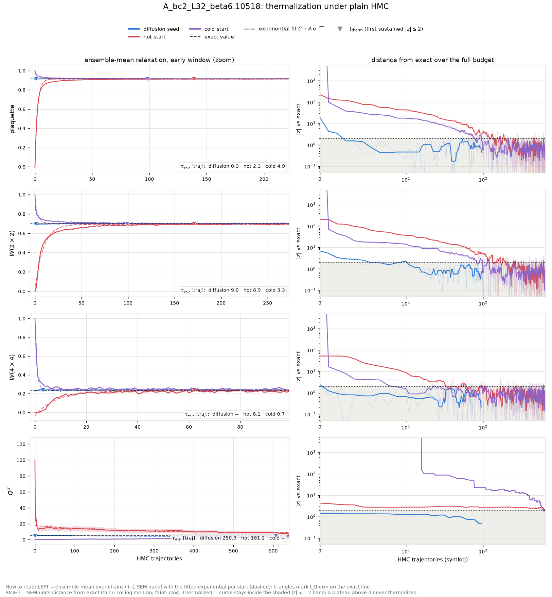

tau_int (hot-start chains, second half): plaquette = 5.10 +- 0.65, wilson_2x2 = 4.41 +- 0.48, wilson_4x4 = 1.29 +- 0.07, wilson_6x6 = 0.94 +- 0.05. Topology: hot-start HMC L=32 beta=6.10518 -> tau_int(Q) = 34.8.

Where 'never' stood at the end: the hot start ended the 640-trajectory budget still at Q^2 at |z| ~ 2.

### Diagnostics: raw diffusion output (before any HMC)

| observable | value | error | exact | z_exact | reference | ref_error | z_ref | ks_p | chi2_p |
|---|---|---|---|---|---|---|---|---|---|
| plaquette | 0.9063 | 0.0003682 | 0.914 | -20.91 | 0.9143 | 0.0001898 | -19.35 | 2.779e-34 |  |
| wilson_1x1 | 0.9063 | 0.0003682 | 0.914 | -20.91 | 0.9143 | 0.0001898 | -19.35 | 2.779e-34 |  |
| wilson_1x2 | 0.8196 | 0.0009608 | 0.8353 | -16.39 | 0.8361 | 0.0005353 | -15.02 | 5.386e-34 |  |
| wilson_2x2 | 0.6856 | 0.001755 | 0.6978 | -6.927 | 0.6995 | 0.0009961 | -6.891 | 1.505e-09 |  |
| wilson_2x3 | 0.568 | 0.002623 | 0.5829 | -5.687 | 0.5851 | 0.001632 | -5.557 | 1.138e-07 |  |
| wilson_3x3 | 0.4283 | 0.003465 | 0.445 | -4.823 | 0.4505 | 0.002149 | -5.443 | 2.484e-06 |  |
| wilson_3x4 | 0.325 | 0.004067 | 0.3397 | -3.626 | 0.347 | 0.002879 | -4.42 | 3.143e-05 |  |
| wilson_4x4 | 0.2277 | 0.003861 | 0.2371 | -2.424 | 0.2462 | 0.003532 | -3.543 | 0.006985 |  |
| wilson_4x5 | 0.1593 | 0.004559 | 0.1654 | -1.348 | 0.1734 | 0.003624 | -2.42 | 0.02947 |  |
| wilson_5x5 | 0.1002 | 0.004071 | 0.1055 | -1.31 | 0.1111 | 0.003848 | -1.95 | 0.07995 |  |
| wilson_5x6 | 0.06107 | 0.004517 | 0.06728 | -1.374 | 0.0715 | 0.003732 | -1.781 | 0.04938 |  |
| wilson_6x6 | 0.03399 | 0.003947 | 0.03921 | -1.323 | 0.04151 | 0.003986 | -1.341 | 0.1712 |  |
| wilson_6x7 | 0.01716 | 0.004067 | 0.02286 | -1.4 | 0.0258 | 0.003616 | -1.587 | 0.01957 |  |
| wilson_7x7 | 0.00746 | 0.003842 | 0.01218 | -1.227 | 0.01483 | 0.003796 | -1.365 | 0.004349 |  |
| wilson_7x8 | 0.001775 | 0.003676 | 0.006487 | -1.282 | 0.007417 | 0.004109 | -1.023 | 0.1122 |  |
| wilson_8x8 | -0.003955 | 0.002984 | 0.003158 | -2.384 | 0.006329 | 0.003061 | -2.406 | 0.005104 |  |
| wilson_8x10 | -0.004001 | 0.002538 | 0.0007487 | -1.871 | 0.005868 | 0.003149 | -2.44 | 0.003697 |  |
| wilson_10x10 | 0.002819 | 0.002546 | 0.0001238 | 1.058 | -0.001497 | 0.002756 | 1.15 | 0.0711 |  |
| wilson_10x12 | -0.0017 | 0.002082 | 2.049e-05 | -0.8261 | -0.002269 | 0.002148 | 0.1903 | 0.678 |  |
| wilson_12x12 | -0.002884 | 0.002166 | 2.365e-06 | -1.332 | 0.0007953 | 0.001629 | -1.357 | 0.3584 |  |
| creutz_2 | 0.07792 | 0.001635 | 0.08996 | -7.364 |  |  |  |  |  |
| creutz_3 | 0.09397 | 0.002918 | 0.08996 | 1.373 |  |  |  |  |  |
| creutz_4 | 0.07978 | 0.007019 | 0.08996 | -1.451 |  |  |  |  |  |
| creutz_5 | 0.1064 | 0.01849 | 0.08996 | 0.8877 |  |  |  |  |  |
| creutz_6 | 0.09115 | 0.05533 | 0.08996 | 0.02141 |  |  |  |  |  |
| creutz_7 | 0.1499 | 0.2899 | 0.08996 | 0.2067 |  |  |  |  |  |
| Q | -0.01562 | 0.221 | 0 | -0.07069 | -0.1979 | 0.1063 | 0.7433 | 0.5259 |  |
| Q^2 | 5.656 | 0.7235 | 4.686 | 1.341 | 4.219 | 0.4579 | 1.679 | 0.2763 |  |
| chi_top ((<Q^2>-<Q>^2)/V) | 0.005523 | 0.0007061 | 0.004576 | 1.341 | 0.004082 | 0.0004247 | 1.75 | 0.0005374 |  |
| Q histogram vs exact P(Q) | 6.766 | nan | 8 | nan |  |  |  |  | 0.5621 |

### Diagnostics: the same configs after 96 HMC trajectories

| observable | value | error | exact | z_exact | reference | ref_error | z_ref | ks_p | chi2_p |
|---|---|---|---|---|---|---|---|---|---|
| plaquette | 0.9141 | 0.0004473 | 0.914 | 0.3582 | 0.9143 | 0.0001898 | -0.3213 | 0.7901 |  |
| wilson_1x1 | 0.9141 | 0.0004473 | 0.914 | 0.3582 | 0.9143 | 0.0001898 | -0.3213 | 0.7901 |  |
| wilson_1x2 | 0.8353 | 0.001003 | 0.8353 | -0.0176 | 0.8361 | 0.0005353 | -0.6884 | 0.1392 |  |
| wilson_2x2 | 0.6966 | 0.001709 | 0.6978 | -0.6768 | 0.6995 | 0.0009961 | -1.47 | 0.04354 |  |
| wilson_2x3 | 0.5813 | 0.002391 | 0.5829 | -0.6446 | 0.5851 | 0.001632 | -1.311 | 0.3584 |  |
| wilson_3x3 | 0.4419 | 0.003361 | 0.445 | -0.9317 | 0.4505 | 0.002149 | -2.159 | 0.02947 |  |
| wilson_3x4 | 0.3365 | 0.004223 | 0.3397 | -0.7748 | 0.347 | 0.002879 | -2.065 | 0.1004 |  |
| wilson_4x4 | 0.2361 | 0.005077 | 0.2371 | -0.1902 | 0.2462 | 0.003532 | -1.641 | 0.0631 |  |
| wilson_4x5 | 0.165 | 0.00514 | 0.1654 | -0.07813 | 0.1734 | 0.003624 | -1.327 | 0.2297 |  |
| wilson_5x5 | 0.1066 | 0.004815 | 0.1055 | 0.2304 | 0.1111 | 0.003848 | -0.7274 | 0.7163 |  |
| wilson_5x6 | 0.06974 | 0.00484 | 0.06728 | 0.5098 | 0.0715 | 0.003732 | -0.2879 | 0.4898 |  |
| wilson_6x6 | 0.04143 | 0.0043 | 0.03921 | 0.515 | 0.04151 | 0.003986 | -0.01426 | 0.9542 |  |
| wilson_6x7 | 0.02247 | 0.003901 | 0.02286 | -0.09905 | 0.0258 | 0.003616 | -0.6263 | 0.4548 |  |
| wilson_7x7 | 0.01296 | 0.004252 | 0.01218 | 0.1845 | 0.01483 | 0.003796 | -0.328 | 0.2087 |  |
| wilson_7x8 | 0.008399 | 0.003027 | 0.006487 | 0.6317 | 0.007417 | 0.004109 | 0.1924 | 0.7538 |  |
| wilson_8x8 | 0.004923 | 0.003316 | 0.003158 | 0.5323 | 0.006329 | 0.003061 | -0.3116 | 0.4898 |  |
| wilson_8x10 | 0.00413 | 0.002511 | 0.0007487 | 1.347 | 0.005868 | 0.003149 | -0.4315 | 0.3584 |  |
| wilson_10x10 | 0.0006785 | 0.003667 | 0.0001238 | 0.1512 | -0.001497 | 0.002756 | 0.4742 | 0.4212 |  |
| wilson_10x12 | -0.005227 | 0.00251 | 2.049e-05 | -2.091 | -0.002269 | 0.002148 | -0.8954 | 0.3584 |  |
| wilson_12x12 | 0.001027 | 0.002427 | 2.365e-06 | 0.4223 | 0.0007953 | 0.001629 | 0.07936 | 0.8569 |  |
| creutz_2 | 0.09141 | 0.00129 | 0.08996 | 1.118 |  |  |  |  |  |
| creutz_3 | 0.09339 | 0.002997 | 0.08996 | 1.143 |  |  |  |  |  |
| creutz_4 | 0.08175 | 0.007107 | 0.08996 | -1.156 |  |  |  |  |  |
| creutz_5 | 0.07872 | 0.01836 | 0.08996 | -0.6123 |  |  |  |  |  |
| creutz_6 | 0.09661 | 0.04604 | 0.08996 | 0.1443 |  |  |  |  |  |
| creutz_7 | -0.06152 | 0.1471 | 0.08996 | -1.03 |  |  |  |  |  |
| creutz_8 | 0.1003 | 0.4064 | 0.08996 | 0.0254 |  |  |  |  |  |
| Q | -0.03125 | 0.1953 | 0 | -0.16 | -0.1979 | 0.1063 | 0.7497 | 0.9807 |  |
| Q^2 | 4.984 | 0.748 | 4.686 | 0.3986 | 4.219 | 0.4579 | 0.873 | 0.9888 |  |
| chi_top ((<Q^2>-<Q>^2)/V) | 0.004867 | 0.0007292 | 0.004576 | 0.398 | 0.004082 | 0.0004247 | 0.9303 | 0.006985 |  |
| Q histogram vs exact P(Q) | 5.684 | nan | 8 | nan |  |  |  |  | 0.6826 |

## E_bc2.7_L32_beta8.79549

HMC: step size 0.1349, 7 leapfrog steps, acceptance seed/hot/cold = 0.976/0.977/0.977. Diffusion-seed batch: 128 chains x 96 trajectories (0.08 s/traj for the whole batch); baselines: 32 chains x 640 trajectories.

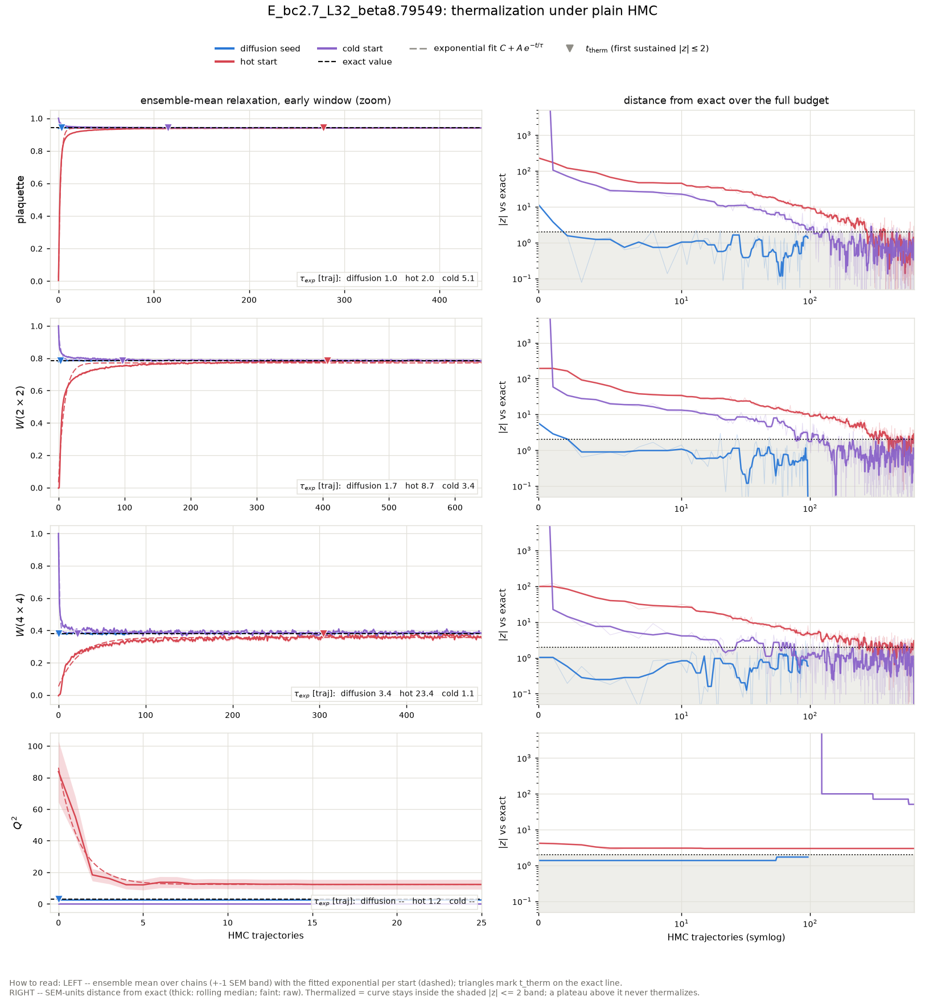

tau_int (hot-start chains, second half): plaquette = 4.70 +- 0.51, wilson_2x2 = 4.78 +- 0.73, wilson_4x4 = 1.22 +- 0.06, wilson_6x6 = 0.98 +- 0.06. Topology: hot-start HMC L=32 beta=8.79549 -> **frozen** (no tunneling).

Where 'never' stood at the end: the hot start ended the 640-trajectory budget still at Q^2 at |z| ~ 3; the cold start ended the 640-trajectory budget still at Q^2 at |z| ~ 51.

### Diagnostics: raw diffusion output (before any HMC)

| observable | value | error | exact | z_exact | reference | ref_error | z_ref | ks_p | chi2_p |
|---|---|---|---|---|---|---|---|---|---|
| plaquette | 0.9385 | 0.0002483 | 0.9413 | -11.23 | 0.9414 | 0.0002078 | -8.926 | 2.025e-12 |  |
| wilson_1x1 | 0.9385 | 0.0002483 | 0.9413 | -11.23 | 0.9414 | 0.0002078 | -8.926 | 2.025e-12 |  |
| wilson_1x2 | 0.8788 | 0.0006408 | 0.8861 | -11.27 | 0.8864 | 0.000418 | -9.915 | 1.09e-14 |  |
| wilson_2x2 | 0.7784 | 0.00117 | 0.7851 | -5.753 | 0.7859 | 0.000953 | -5.012 | 0.0006474 |  |
| wilson_2x3 | 0.6872 | 0.00184 | 0.6957 | -4.581 | 0.6969 | 0.001602 | -3.964 | 0.001117 |  |
| wilson_3x3 | 0.5735 | 0.002674 | 0.5802 | -2.497 | 0.5824 | 0.002199 | -2.556 | 0.01275 |  |
| wilson_3x4 | 0.4768 | 0.003421 | 0.4839 | -2.09 | 0.486 | 0.003123 | -1.982 | 0.0711 |  |
| wilson_4x4 | 0.3754 | 0.004029 | 0.3799 | -1.139 | 0.3803 | 0.003851 | -0.8937 | 0.2763 |  |
| wilson_4x5 | 0.2937 | 0.004149 | 0.2983 | -1.117 | 0.2983 | 0.004217 | -0.7872 | 0.6011 |  |
| wilson_5x5 | 0.2187 | 0.004276 | 0.2204 | -0.4183 | 0.2197 | 0.003998 | -0.1848 | 0.9941 |  |
| wilson_5x6 | 0.162 | 0.004377 | 0.1629 | -0.2036 | 0.1628 | 0.004022 | -0.124 | 0.9941 |  |
| wilson_6x6 | 0.1148 | 0.004059 | 0.1133 | 0.3541 | 0.1133 | 0.003859 | 0.2637 | 0.9353 |  |
| wilson_6x7 | 0.08104 | 0.003843 | 0.07884 | 0.5723 | 0.08086 | 0.003907 | 0.03296 | 0.8864 |  |
| wilson_7x7 | 0.05517 | 0.003155 | 0.05163 | 1.124 | 0.05268 | 0.003519 | 0.5272 | 0.5631 |  |
| wilson_7x8 | 0.03844 | 0.003049 | 0.03381 | 1.52 | 0.03733 | 0.003483 | 0.2388 | 0.4212 |  |
| wilson_8x8 | 0.02545 | 0.003249 | 0.02084 | 1.418 | 0.02271 | 0.003349 | 0.5858 | 0.4898 |  |
| wilson_8x10 | 0.01665 | 0.003611 | 0.007917 | 2.419 | 0.01145 | 0.003642 | 1.015 | 0.5259 |  |
| wilson_10x10 | 0.006892 | 0.003343 | 0.002362 | 1.355 | 0.003096 | 0.003259 | 0.8131 | 0.9807 |  |
| wilson_10x12 | 0.005845 | 0.003249 | 0.0007045 | 1.582 | 0.001191 | 0.002748 | 1.094 | 0.7538 |  |
| wilson_12x12 | 0.002468 | 0.002998 | 0.000165 | 0.7681 | 0.001963 | 0.001938 | 0.1416 | 0.678 |  |
| creutz_2 | 0.05569 | 0.0009613 | 0.06048 | -4.988 |  |  |  |  |  |
| creutz_3 | 0.05628 | 0.002008 | 0.06048 | -2.092 |  |  |  |  |  |
| creutz_4 | 0.05444 | 0.003473 | 0.06048 | -1.741 |  |  |  |  |  |
| creutz_5 | 0.04948 | 0.007347 | 0.06048 | -1.498 |  |  |  |  |  |
| creutz_6 | 0.04506 | 0.01613 | 0.06048 | -0.9562 |  |  |  |  |  |
| creutz_7 | 0.03648 | 0.03604 | 0.06048 | -0.6659 |  |  |  |  |  |
| creutz_8 | 0.05112 | 0.07458 | 0.06048 | -0.1255 |  |  |  |  |  |
| Q | -0.0625 | 0.09836 | 0 | -0.6354 | 0.06771 | 0.1365 | -0.7741 | 0.8864 |  |
| Q^2 | 2.656 | 0.3722 | 3.142 | -1.306 | 2.911 | 0.3073 | -0.5288 | 0.9542 |  |
| chi_top ((<Q^2>-<Q>^2)/V) | 0.00259 | 0.0003599 | 0.003069 | -1.33 | 0.002839 | 0.0002937 | -0.535 | 0.0002049 |  |
| Q histogram vs exact P(Q) | 4.533 | nan | 8 | nan |  |  |  |  | 0.8061 |

### Diagnostics: the same configs after 96 HMC trajectories

| observable | value | error | exact | z_exact | reference | ref_error | z_ref | ks_p | chi2_p |
|---|---|---|---|---|---|---|---|---|---|
| plaquette | 0.9416 | 0.000219 | 0.9413 | 1.377 | 0.9414 | 0.0002078 | 0.6651 | 0.4548 |  |
| wilson_1x1 | 0.9416 | 0.000219 | 0.9413 | 1.377 | 0.9414 | 0.0002078 | 0.6651 | 0.4548 |  |
| wilson_1x2 | 0.8866 | 0.0003862 | 0.8861 | 1.341 | 0.8864 | 0.000418 | 0.2752 | 0.9693 |  |
| wilson_2x2 | 0.7851 | 0.001095 | 0.7851 | -0.0343 | 0.7859 | 0.000953 | -0.599 | 0.7901 |  |
| wilson_2x3 | 0.6962 | 0.00188 | 0.6957 | 0.2864 | 0.6969 | 0.001602 | -0.2849 | 0.9126 |  |
| wilson_3x3 | 0.5805 | 0.002919 | 0.5802 | 0.1063 | 0.5824 | 0.002199 | -0.5095 | 0.6011 |  |
| wilson_3x4 | 0.4842 | 0.003515 | 0.4839 | 0.08925 | 0.486 | 0.003123 | -0.365 | 0.5259 |  |
| wilson_4x4 | 0.3824 | 0.004727 | 0.3799 | 0.5264 | 0.3803 | 0.003851 | 0.3439 | 0.8864 |  |
| wilson_4x5 | 0.3002 | 0.005593 | 0.2983 | 0.347 | 0.2983 | 0.004217 | 0.2737 | 0.8864 |  |
| wilson_5x5 | 0.2225 | 0.006285 | 0.2204 | 0.3283 | 0.2197 | 0.003998 | 0.3719 | 0.9542 |  |
| wilson_5x6 | 0.165 | 0.00639 | 0.1629 | 0.3262 | 0.1628 | 0.004022 | 0.2965 | 0.5259 |  |
| wilson_6x6 | 0.1157 | 0.006395 | 0.1133 | 0.3681 | 0.1133 | 0.003859 | 0.3205 | 0.678 |  |
| wilson_6x7 | 0.07965 | 0.005947 | 0.07884 | 0.1364 | 0.08086 | 0.003907 | -0.1697 | 0.6395 |  |
| wilson_7x7 | 0.05353 | 0.005424 | 0.05163 | 0.3512 | 0.05268 | 0.003519 | 0.1317 | 0.7901 |  |
| wilson_7x8 | 0.03537 | 0.005134 | 0.03381 | 0.3043 | 0.03733 | 0.003483 | -0.3168 | 0.4898 |  |
| wilson_8x8 | 0.0219 | 0.005252 | 0.02084 | 0.2028 | 0.02271 | 0.003349 | -0.13 | 0.6011 |  |
| wilson_8x10 | 0.01039 | 0.004752 | 0.007917 | 0.5198 | 0.01145 | 0.003642 | -0.1772 | 0.7538 |  |
| wilson_10x10 | 0.0052 | 0.00485 | 0.002362 | 0.5851 | 0.003096 | 0.003259 | 0.36 | 0.2522 |  |
| wilson_10x12 | 0.004195 | 0.00425 | 0.0007045 | 0.8212 | 0.001191 | 0.002748 | 0.5935 | 0.3021 |  |
| wilson_12x12 | 0.002669 | 0.003156 | 0.000165 | 0.7933 | 0.001963 | 0.001938 | 0.1907 | 0.6395 |  |
| creutz_2 | 0.06138 | 0.0008984 | 0.06048 | 0.997 |  |  |  |  |  |
| creutz_3 | 0.06154 | 0.001748 | 0.06048 | 0.6068 |  |  |  |  |  |
| creutz_4 | 0.05472 | 0.003587 | 0.06048 | -1.607 |  |  |  |  |  |
| creutz_5 | 0.05761 | 0.006913 | 0.06048 | -0.4155 |  |  |  |  |  |
| creutz_6 | 0.05604 | 0.01397 | 0.06048 | -0.3181 |  |  |  |  |  |
| creutz_7 | 0.02417 | 0.0337 | 0.06048 | -1.078 |  |  |  |  |  |
| creutz_8 | 0.06474 | 0.08792 | 0.06048 | 0.04847 |  |  |  |  |  |
| Q | -0.07031 | 0.09991 | 0 | -0.7038 | 0.06771 | 0.1365 | -0.8161 | 0.8864 |  |
| Q^2 | 2.586 | 0.3277 | 3.142 | -1.698 | 2.911 | 0.3073 | -0.7246 | 0.9542 |  |
| chi_top ((<Q^2>-<Q>^2)/V) | 0.002521 | 0.0003154 | 0.003069 | -1.739 | 0.002839 | 0.0002937 | -0.7384 | 3.165e-06 |  |
| Q histogram vs exact P(Q) | 3.82 | nan | 8 | nan |  |  |  |  | 0.8729 |

## A_bc3_L32_beta10.015

HMC: step size 0.1264, 8 leapfrog steps, acceptance seed/hot/cold = 0.981/0.978/0.979. Diffusion-seed batch: 128 chains x 96 trajectories (0.10 s/traj for the whole batch); baselines: 32 chains x 640 trajectories.

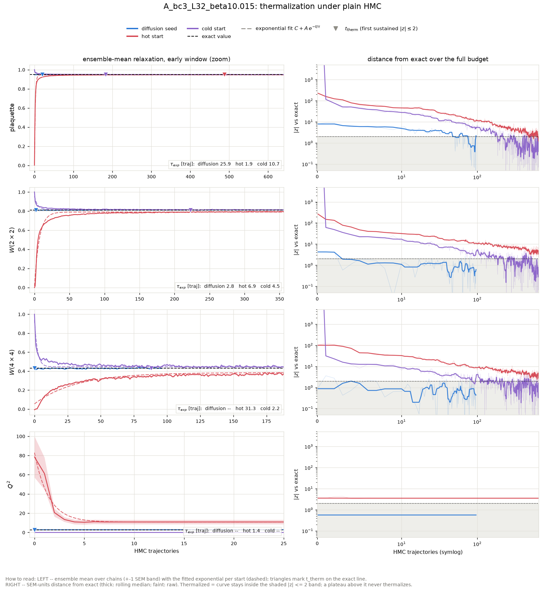

tau_int (hot-start chains, second half): plaquette = 6.17 +- 0.77, wilson_2x2 = 7.66 +- 1.29, wilson_4x4 = 2.49 +- 0.45, wilson_6x6 = 0.87 +- 0.04. Topology: hot-start HMC L=32 beta=10.015 -> **frozen** (no tunneling).

Where 'never' stood at the end: the hot start ended the 640-trajectory budget still at wilson_2x2 at |z| ~ 5, wilson_4x4 at |z| ~ 4, Q^2 at |z| ~ 4; the cold start ended the 640-trajectory budget still at Q^2 at |z| ~ 2736159195136.

### Diagnostics: raw diffusion output (before any HMC)

| observable | value | error | exact | z_exact | reference | ref_error | z_ref | ks_p | chi2_p |
|---|---|---|---|---|---|---|---|---|---|
| plaquette | 0.947 | 0.0002397 | 0.9487 | -7.003 | 0.9486 | 0.0001186 | -5.818 | 1.211e-08 |  |
| wilson_1x1 | 0.947 | 0.0002397 | 0.9487 | -7.003 | 0.9486 | 0.0001186 | -5.818 | 1.211e-08 |  |
| wilson_1x2 | 0.8955 | 0.0006543 | 0.9 | -6.881 | 0.9002 | 0.0002491 | -6.694 | 3.208e-11 |  |
| wilson_2x2 | 0.8052 | 0.001157 | 0.81 | -4.133 | 0.8102 | 0.0005851 | -3.874 | 0.005977 |  |
| wilson_2x3 | 0.7231 | 0.001934 | 0.729 | -3.057 | 0.7287 | 0.0009044 | -2.657 | 0.1122 |  |
| wilson_3x3 | 0.6181 | 0.002448 | 0.6224 | -1.756 | 0.6216 | 0.001485 | -1.211 | 0.6395 |  |
| wilson_3x4 | 0.5258 | 0.003559 | 0.5314 | -1.579 | 0.5292 | 0.002277 | -0.8122 | 0.8246 |  |
| wilson_4x4 | 0.4267 | 0.004881 | 0.4304 | -0.7677 | 0.4289 | 0.002807 | -0.3876 | 0.8246 |  |
| wilson_4x5 | 0.3445 | 0.005562 | 0.3486 | -0.7539 | 0.3456 | 0.00354 | -0.1787 | 0.9693 |  |
| wilson_5x5 | 0.2647 | 0.005975 | 0.2679 | -0.5411 | 0.265 | 0.003876 | -0.05069 | 0.9888 |  |
| wilson_5x6 | 0.2016 | 0.005785 | 0.2059 | -0.7382 | 0.2042 | 0.004145 | -0.3619 | 0.389 |  |
| wilson_6x6 | 0.1468 | 0.005128 | 0.1501 | -0.6453 | 0.1501 | 0.004018 | -0.5202 | 0.9126 |  |
| wilson_6x7 | 0.1039 | 0.00486 | 0.1094 | -1.132 | 0.1104 | 0.004002 | -1.04 | 0.6395 |  |
| wilson_7x7 | 0.06876 | 0.005084 | 0.07566 | -1.356 | 0.07739 | 0.003572 | -1.389 | 0.5259 |  |
| wilson_7x8 | 0.04396 | 0.004454 | 0.05232 | -1.878 | 0.05614 | 0.003853 | -2.068 | 0.4212 |  |
| wilson_8x8 | 0.02605 | 0.004707 | 0.03433 | -1.759 | 0.03666 | 0.00362 | -1.788 | 0.3584 |  |
| wilson_8x10 | 0.00731 | 0.006016 | 0.01478 | -1.241 | 0.01927 | 0.004252 | -1.623 | 0.0711 |  |
| wilson_10x10 | 0.002223 | 0.005113 | 0.005151 | -0.5728 | 0.005632 | 0.003721 | -0.5392 | 0.7901 |  |
| wilson_10x12 | -0.002626 | 0.004036 | 0.001796 | -1.096 | 0.00171 | 0.002494 | -0.9139 | 0.7538 |  |
| wilson_12x12 | 0.001544 | 0.003691 | 0.0005072 | 0.2809 | 8.739e-05 | 0.002521 | 0.3259 | 0.6011 |  |
| creutz_2 | 0.05035 | 0.0007571 | 0.05268 | -3.087 |  |  |  |  |  |
| creutz_3 | 0.04925 | 0.001539 | 0.05268 | -2.229 |  |  |  |  |  |
| creutz_4 | 0.04709 | 0.003172 | 0.05268 | -1.763 |  |  |  |  |  |
| creutz_5 | 0.04937 | 0.005928 | 0.05268 | -0.5591 |  |  |  |  |  |
| creutz_6 | 0.0452 | 0.0108 | 0.05268 | -0.6933 |  |  |  |  |  |
| creutz_7 | 0.06739 | 0.02772 | 0.05268 | 0.5304 |  |  |  |  |  |
| creutz_8 | 0.07592 | 0.07771 | 0.05268 | 0.299 |  |  |  |  |  |
| Q | 0.03906 | 0.1517 | 0 | 0.2574 | -0.1042 | 0.1518 | 0.6672 | 0.9807 |  |
| Q^2 | 2.93 | 0.267 | 2.736 | 0.7247 | 3.406 | 0.25 | -1.303 | 0.9941 |  |
| chi_top ((<Q^2>-<Q>^2)/V) | 0.00286 | 0.0002635 | 0.002672 | 0.7116 | 0.003316 | 0.0002389 | -1.283 | 0.0004451 |  |
| Q histogram vs exact P(Q) | 4.29 | nan | 6 | nan |  |  |  |  | 0.6376 |

### Diagnostics: the same configs after 96 HMC trajectories

| observable | value | error | exact | z_exact | reference | ref_error | z_ref | ks_p | chi2_p |
|---|---|---|---|---|---|---|---|---|---|
| plaquette | 0.9482 | 0.0002425 | 0.9487 | -1.78 | 0.9486 | 0.0001186 | -1.145 | 0.1712 |  |
| wilson_1x1 | 0.9482 | 0.0002425 | 0.9487 | -1.78 | 0.9486 | 0.0001186 | -1.145 | 0.1712 |  |
| wilson_1x2 | 0.8994 | 0.0006029 | 0.9 | -0.9807 | 0.9002 | 0.0002491 | -1.189 | 0.1004 |  |
| wilson_2x2 | 0.8093 | 0.001265 | 0.81 | -0.5049 | 0.8102 | 0.0005851 | -0.6303 | 0.7163 |  |
| wilson_2x3 | 0.7277 | 0.001996 | 0.729 | -0.6656 | 0.7287 | 0.0009044 | -0.4979 | 0.8864 |  |
| wilson_3x3 | 0.6198 | 0.002928 | 0.6224 | -0.8778 | 0.6216 | 0.001485 | -0.5298 | 0.6395 |  |
| wilson_3x4 | 0.5287 | 0.003737 | 0.5314 | -0.7305 | 0.5292 | 0.002277 | -0.1235 | 0.9542 |  |
| wilson_4x4 | 0.4287 | 0.004647 | 0.4304 | -0.3636 | 0.4289 | 0.002807 | -0.02301 | 0.9807 |  |
| wilson_4x5 | 0.3474 | 0.005451 | 0.3486 | -0.2364 | 0.3456 | 0.00354 | 0.2656 | 0.8569 |  |
| wilson_5x5 | 0.2663 | 0.005677 | 0.2679 | -0.2819 | 0.265 | 0.003876 | 0.185 | 0.8246 |  |
| wilson_5x6 | 0.2034 | 0.006179 | 0.2059 | -0.3921 | 0.2042 | 0.004145 | -0.09785 | 0.4212 |  |
| wilson_6x6 | 0.1492 | 0.006131 | 0.1501 | -0.1424 | 0.1501 | 0.004018 | -0.13 | 0.8569 |  |
| wilson_6x7 | 0.1077 | 0.006349 | 0.1094 | -0.2646 | 0.1104 | 0.004002 | -0.3637 | 0.6011 |  |
| wilson_7x7 | 0.07216 | 0.005665 | 0.07566 | -0.6171 | 0.07739 | 0.003572 | -0.7811 | 0.5259 |  |
| wilson_7x8 | 0.04857 | 0.00563 | 0.05232 | -0.667 | 0.05614 | 0.003853 | -1.11 | 0.3294 |  |
| wilson_8x8 | 0.03036 | 0.004802 | 0.03433 | -0.8251 | 0.03666 | 0.00362 | -1.048 | 0.4898 |  |
| wilson_8x10 | 0.01102 | 0.004871 | 0.01478 | -0.7716 | 0.01927 | 0.004252 | -1.276 | 0.3294 |  |
| wilson_10x10 | 0.007203 | 0.00319 | 0.005151 | 0.643 | 0.005632 | 0.003721 | 0.3204 | 0.8246 |  |
| wilson_10x12 | 0.004878 | 0.002952 | 0.001796 | 1.044 | 0.00171 | 0.002494 | 0.8196 | 0.2763 |  |
| wilson_12x12 | 0.003483 | 0.003869 | 0.0005072 | 0.769 | 8.739e-05 | 0.002521 | 0.7352 | 0.5259 |  |
| creutz_2 | 0.05261 | 0.0007022 | 0.05268 | -0.1002 |  |  |  |  |  |
| creutz_3 | 0.05396 | 0.001409 | 0.05268 | 0.9083 |  |  |  |  |  |
| creutz_4 | 0.05046 | 0.002754 | 0.05268 | -0.8095 |  |  |  |  |  |
| creutz_5 | 0.0552 | 0.005087 | 0.05268 | 0.4949 |  |  |  |  |  |
| creutz_6 | 0.04083 | 0.01039 | 0.05268 | -1.141 |  |  |  |  |  |
| creutz_7 | 0.07487 | 0.02329 | 0.05268 | 0.9528 |  |  |  |  |  |
| creutz_8 | 0.07369 | 0.06065 | 0.05268 | 0.3463 |  |  |  |  |  |
| Q | 0.03906 | 0.1517 | 0 | 0.2574 | -0.1042 | 0.1518 | 0.6672 | 0.9807 |  |
| Q^2 | 2.93 | 0.267 | 2.736 | 0.7247 | 3.406 | 0.25 | -1.303 | 0.9941 |  |
| chi_top ((<Q^2>-<Q>^2)/V) | 0.00286 | 0.0002635 | 0.002672 | 0.7116 | 0.003316 | 0.0002389 | -1.283 | 0.0004451 |  |
| Q histogram vs exact P(Q) | 4.29 | nan | 6 | nan |  |  |  |  | 0.6376 |

## E_bc3.4_L32_beta11.6638

HMC: step size 0.1171, 9 leapfrog steps, acceptance seed/hot/cold = 0.984/0.983/0.986. Diffusion-seed batch: 128 chains x 96 trajectories (0.09 s/traj for the whole batch); baselines: 32 chains x 640 trajectories.

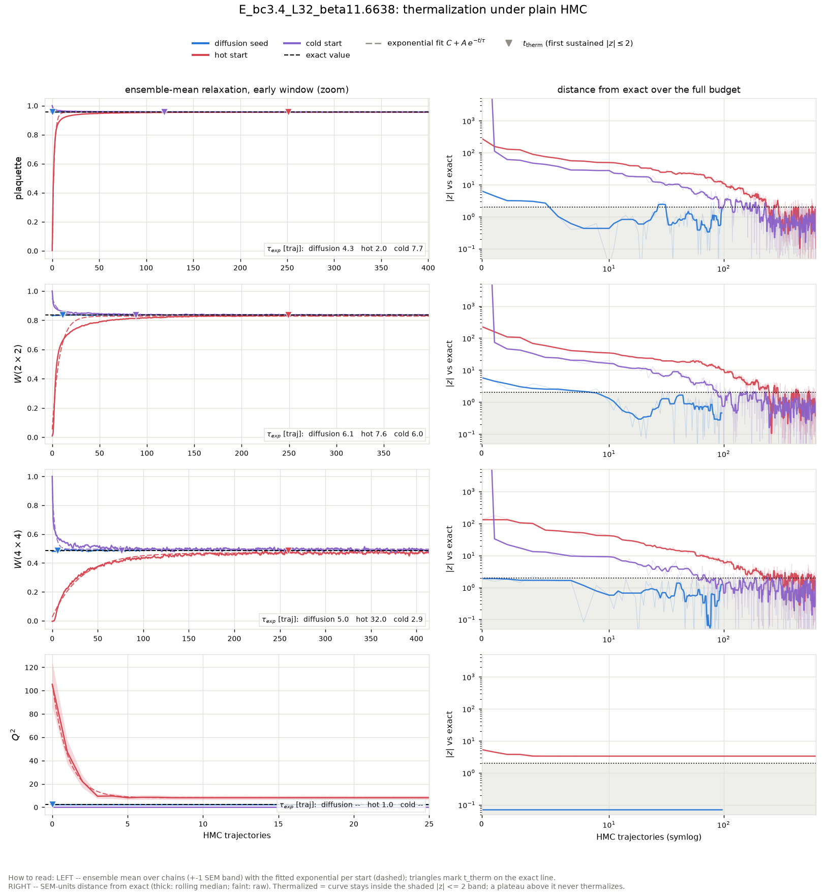

tau_int (hot-start chains, second half): plaquette = 4.80 +- 0.61, wilson_2x2 = 3.77 +- 0.42, wilson_4x4 = 2.39 +- 0.31, wilson_6x6 = 0.92 +- 0.06. Topology: hot-start HMC L=32 beta=11.6638 -> **frozen** (no tunneling).

Where 'never' stood at the end: the hot start ended the 640-trajectory budget still at Q^2 at |z| ~ 3; the cold start ended the 640-trajectory budget still at Q^2 at |z| ~ 2329518014464.

### Diagnostics: raw diffusion output (before any HMC)

| observable | value | error | exact | z_exact | reference | ref_error | z_ref | ks_p | chi2_p |
|---|---|---|---|---|---|---|---|---|---|
| plaquette | 0.955 | 0.0001977 | 0.9561 | -5.918 | 0.9559 | 0.0001386 | -4.131 | 0.0001119 |  |
| wilson_1x1 | 0.955 | 0.0001977 | 0.9561 | -5.918 | 0.9559 | 0.0001386 | -4.131 | 0.0001119 |  |
| wilson_1x2 | 0.9104 | 0.0004147 | 0.9142 | -9.076 | 0.9138 | 0.0002659 | -6.92 | 6.754e-09 |  |
| wilson_2x2 | 0.8306 | 0.00103 | 0.8357 | -4.935 | 0.8347 | 0.0004393 | -3.661 | 0.005104 |  |
| wilson_2x3 | 0.7574 | 0.001566 | 0.764 | -4.224 | 0.7621 | 0.0009043 | -2.641 | 0.006985 |  |
| wilson_3x3 | 0.6616 | 0.002406 | 0.6678 | -2.577 | 0.6659 | 0.001512 | -1.535 | 0.02947 |  |
| wilson_3x4 | 0.5762 | 0.003033 | 0.5837 | -2.446 | 0.5811 | 0.00225 | -1.3 | 0.05588 |  |
| wilson_4x4 | 0.4806 | 0.003635 | 0.4878 | -1.975 | 0.4857 | 0.002925 | -1.104 | 0.2087 |  |
| wilson_4x5 | 0.3998 | 0.004381 | 0.4076 | -1.784 | 0.4045 | 0.003549 | -0.8257 | 0.0631 |  |
| wilson_5x5 | 0.3173 | 0.005199 | 0.3257 | -1.625 | 0.3235 | 0.003744 | -0.9736 | 0.02248 |  |
| wilson_5x6 | 0.251 | 0.005685 | 0.2603 | -1.621 | 0.2551 | 0.004093 | -0.5868 | 0.2522 |  |
| wilson_6x6 | 0.191 | 0.006169 | 0.1988 | -1.265 | 0.1932 | 0.004397 | -0.2886 | 0.6395 |  |
| wilson_6x7 | 0.1441 | 0.00633 | 0.1519 | -1.237 | 0.1444 | 0.004666 | -0.04545 | 0.9807 |  |
| wilson_7x7 | 0.1046 | 0.006671 | 0.111 | -0.9476 | 0.1062 | 0.005079 | -0.1872 | 0.9888 |  |
| wilson_7x8 | 0.07508 | 0.006768 | 0.08105 | -0.8822 | 0.0746 | 0.005295 | 0.05578 | 0.7538 |  |
| wilson_8x8 | 0.05079 | 0.007076 | 0.0566 | -0.8212 | 0.05156 | 0.004916 | -0.08944 | 0.4548 |  |
| wilson_8x10 | 0.02138 | 0.005805 | 0.02761 | -1.073 | 0.02437 | 0.005169 | -0.3844 | 0.9807 |  |
| wilson_10x10 | 0.007031 | 0.004615 | 0.01125 | -0.915 | 0.007955 | 0.003943 | -0.1522 | 0.9693 |  |
| wilson_10x12 | 0.001685 | 0.004631 | 0.004588 | -0.6268 | 0.002084 | 0.003642 | -0.06772 | 0.7538 |  |
| wilson_12x12 | -0.0007834 | 0.004096 | 0.001563 | -0.5728 | 0.002466 | 0.002998 | -0.6401 | 0.8864 |  |
| creutz_2 | 0.04394 | 0.0006527 | 0.04487 | -1.422 |  |  |  |  |  |
| creutz_3 | 0.04291 | 0.001462 | 0.04487 | -1.341 |  |  |  |  |  |
| creutz_4 | 0.04344 | 0.002607 | 0.04487 | -0.5485 |  |  |  |  |  |
| creutz_5 | 0.04726 | 0.004317 | 0.04487 | 0.5529 |  |  |  |  |  |
| creutz_6 | 0.0391 | 0.008956 | 0.04487 | -0.6442 |  |  |  |  |  |
| creutz_7 | 0.03774 | 0.01893 | 0.04487 | -0.3767 |  |  |  |  |  |
| creutz_8 | 0.05879 | 0.03796 | 0.04487 | 0.3667 |  |  |  |  |  |
| Q | -0.2734 | 0.1642 | 0 | -1.665 | -0.09375 | 0.1449 | -0.8205 | 0.8246 |  |
| Q^2 | 2.352 | 0.3381 | 2.33 | 0.0652 | 3.417 | 0.3755 | -2.108 | 0.7163 |  |
| chi_top ((<Q^2>-<Q>^2)/V) | 0.002223 | 0.0002881 | 0.002275 | -0.1787 | 0.003328 | 0.0003724 | -2.346 | 0.0001119 |  |
| Q histogram vs exact P(Q) | 3.51 | nan | 6 | nan |  |  |  |  | 0.7427 |

### Diagnostics: the same configs after 96 HMC trajectories

| observable | value | error | exact | z_exact | reference | ref_error | z_ref | ks_p | chi2_p |
|---|---|---|---|---|---|---|---|---|---|
| plaquette | 0.956 | 0.0001517 | 0.9561 | -1.02 | 0.9559 | 0.0001386 | 0.08705 | 0.4898 |  |
| wilson_1x1 | 0.956 | 0.0001517 | 0.9561 | -1.02 | 0.9559 | 0.0001386 | 0.08705 | 0.4898 |  |
| wilson_1x2 | 0.914 | 0.0004032 | 0.9142 | -0.364 | 0.9138 | 0.0002659 | 0.431 | 0.6011 |  |
| wilson_2x2 | 0.8355 | 0.0007859 | 0.8357 | -0.2229 | 0.8347 | 0.0004393 | 0.8975 | 0.4212 |  |
| wilson_2x3 | 0.7637 | 0.001404 | 0.764 | -0.2014 | 0.7621 | 0.0009043 | 0.9315 | 0.5259 |  |
| wilson_3x3 | 0.6666 | 0.002204 | 0.6678 | -0.5269 | 0.6659 | 0.001512 | 0.253 | 0.7901 |  |
| wilson_3x4 | 0.583 | 0.002973 | 0.5837 | -0.2181 | 0.5811 | 0.00225 | 0.4994 | 0.8246 |  |
| wilson_4x4 | 0.4856 | 0.003636 | 0.4878 | -0.6077 | 0.4857 | 0.002925 | -0.0389 | 0.4898 |  |
| wilson_4x5 | 0.4072 | 0.004691 | 0.4076 | -0.09124 | 0.4045 | 0.003549 | 0.4649 | 0.2763 |  |
| wilson_5x5 | 0.3247 | 0.004999 | 0.3257 | -0.2003 | 0.3235 | 0.003744 | 0.1941 | 0.3584 |  |
| wilson_5x6 | 0.2589 | 0.00569 | 0.2603 | -0.2462 | 0.2551 | 0.004093 | 0.5287 | 0.7538 |  |
| wilson_6x6 | 0.195 | 0.005808 | 0.1988 | -0.6567 | 0.1932 | 0.004397 | 0.2479 | 0.9542 |  |
| wilson_6x7 | 0.1484 | 0.006657 | 0.1519 | -0.5276 | 0.1444 | 0.004666 | 0.4871 | 0.389 |  |
| wilson_7x7 | 0.1063 | 0.006282 | 0.111 | -0.7476 | 0.1062 | 0.005079 | 0.006819 | 0.678 |  |
| wilson_7x8 | 0.07762 | 0.006516 | 0.08105 | -0.5263 | 0.0746 | 0.005295 | 0.3598 | 0.5259 |  |
| wilson_8x8 | 0.05155 | 0.006167 | 0.0566 | -0.8199 | 0.05156 | 0.004916 | -0.002062 | 0.678 |  |
| wilson_8x10 | 0.02232 | 0.005281 | 0.02761 | -1.001 | 0.02437 | 0.005169 | -0.2772 | 0.389 |  |
| wilson_10x10 | 0.00921 | 0.004584 | 0.01125 | -0.446 | 0.007955 | 0.003943 | 0.2076 | 0.3021 |  |
| wilson_10x12 | 0.0009833 | 0.004599 | 0.004588 | -0.7838 | 0.002084 | 0.003642 | -0.1877 | 0.8246 |  |
| wilson_12x12 | 0.000328 | 0.003781 | 0.001563 | -0.3266 | 0.002466 | 0.002998 | -0.443 | 0.6395 |  |
| creutz_2 | 0.04492 | 0.000657 | 0.04487 | 0.07672 |  |  |  |  |  |
| creutz_3 | 0.04608 | 0.001293 | 0.04487 | 0.9357 |  |  |  |  |  |
| creutz_4 | 0.04893 | 0.00256 | 0.04487 | 1.585 |  |  |  |  |  |
| creutz_5 | 0.05039 | 0.004182 | 0.04487 | 1.319 |  |  |  |  |  |
| creutz_6 | 0.05653 | 0.008321 | 0.04487 | 1.401 |  |  |  |  |  |
| creutz_7 | 0.0607 | 0.01712 | 0.04487 | 0.9246 |  |  |  |  |  |
| creutz_8 | 0.09523 | 0.03501 | 0.04487 | 1.438 |  |  |  |  |  |
| Q | -0.2734 | 0.1642 | 0 | -1.665 | -0.09375 | 0.1449 | -0.8205 | 0.8246 |  |
| Q^2 | 2.352 | 0.3381 | 2.33 | 0.0652 | 3.417 | 0.3755 | -2.108 | 0.7163 |  |
| chi_top ((<Q^2>-<Q>^2)/V) | 0.002223 | 0.0002881 | 0.002275 | -0.1787 | 0.003328 | 0.0003724 | -2.346 | 0.0001119 |  |
| Q histogram vs exact P(Q) | 3.51 | nan | 6 | nan |  |  |  |  | 0.7427 |

## A_bc4_L32_beta14.1464

HMC: step size 0.1063, 9 leapfrog steps, acceptance seed/hot/cold = 0.983/0.986/0.985. Diffusion-seed batch: 128 chains x 96 trajectories (0.11 s/traj for the whole batch); baselines: 32 chains x 640 trajectories.

tau_int (hot-start chains, second half): plaquette = 4.42 +- 0.58, wilson_2x2 = 3.61 +- 0.45, wilson_4x4 = 1.94 +- 0.19, wilson_6x6 = 0.97 +- 0.06. Topology: hot-start HMC L=32 beta=14.1464 -> **frozen** (no tunneling).

Where 'never' stood at the end: the hot start ended the 640-trajectory budget still at wilson_4x4 at |z| ~ 3, wilson_6x6 at |z| ~ 3, Q^2 at |z| ~ 3; the cold start ended the 640-trajectory budget still at Q^2 at |z| ~ 1903991324672.

### Diagnostics: raw diffusion output (before any HMC)

| observable | value | error | exact | z_exact | reference | ref_error | z_ref | ks_p | chi2_p |
|---|---|---|---|---|---|---|---|---|---|
| plaquette | 0.9631 | 0.0001937 | 0.964 | -4.717 | 0.9643 | 0.0001394 | -4.971 | 1.947e-07 |  |
| wilson_1x1 | 0.9631 | 0.0001937 | 0.964 | -4.717 | 0.9643 | 0.0001394 | -4.971 | 1.947e-07 |  |
| wilson_1x2 | 0.9264 | 0.0004837 | 0.9293 | -5.858 | 0.9297 | 0.0002902 | -5.743 | 9.054e-09 |  |
| wilson_2x2 | 0.8605 | 0.0008305 | 0.8635 | -3.649 | 0.8648 | 0.0005656 | -4.328 | 0.001334 |  |
| wilson_2x3 | 0.799 | 0.001326 | 0.8024 | -2.622 | 0.8041 | 0.001006 | -3.083 | 0.04354 |  |
| wilson_3x3 | 0.7166 | 0.00195 | 0.7188 | -1.14 | 0.7215 | 0.001633 | -1.914 | 0.3021 |  |
| wilson_3x4 | 0.6408 | 0.002732 | 0.6439 | -1.133 | 0.6464 | 0.002382 | -1.551 | 0.5631 |  |
| wilson_4x4 | 0.5511 | 0.003567 | 0.556 | -1.37 | 0.5589 | 0.003229 | -1.603 | 0.1545 |  |
| wilson_4x5 | 0.4733 | 0.004733 | 0.4801 | -1.442 | 0.483 | 0.003787 | -1.599 | 0.1392 |  |
| wilson_5x5 | 0.3931 | 0.005333 | 0.3997 | -1.227 | 0.4026 | 0.004329 | -1.373 | 0.3294 |  |
| wilson_5x6 | 0.3236 | 0.006508 | 0.3327 | -1.399 | 0.3371 | 0.004763 | -1.67 | 0.1892 |  |
| wilson_6x6 | 0.2588 | 0.007206 | 0.267 | -1.133 | 0.2695 | 0.004692 | -1.245 | 0.4898 |  |
| wilson_6x7 | 0.2043 | 0.007701 | 0.2142 | -1.285 | 0.2188 | 0.004882 | -1.589 | 0.389 |  |
| wilson_7x7 | 0.1556 | 0.007963 | 0.1657 | -1.275 | 0.1698 | 0.00535 | -1.484 | 0.1712 |  |
| wilson_7x8 | 0.1162 | 0.007966 | 0.1282 | -1.499 | 0.1338 | 0.005268 | -1.838 | 0.03831 |  |
| wilson_8x8 | 0.08751 | 0.007376 | 0.09558 | -1.095 | 0.09956 | 0.005676 | -1.295 | 0.07995 |  |
| wilson_8x10 | 0.04515 | 0.007078 | 0.05315 | -1.13 | 0.05826 | 0.004829 | -1.53 | 0.04354 |  |
| wilson_10x10 | 0.02655 | 0.005422 | 0.02552 | 0.1902 | 0.03309 | 0.004208 | -0.9535 | 0.5631 |  |
| wilson_10x12 | 0.01761 | 0.00528 | 0.01225 | 1.015 | 0.01664 | 0.004387 | 0.1411 | 0.6395 |  |
| wilson_12x12 | 0.008601 | 0.004241 | 0.00508 | 0.8302 | 0.009305 | 0.005203 | -0.105 | 0.9807 |  |
| creutz_2 | 0.03504 | 0.0005296 | 0.03668 | -3.103 |  |  |  |  |  |
| creutz_3 | 0.03461 | 0.001088 | 0.03668 | -1.903 |  |  |  |  |  |
| creutz_4 | 0.03897 | 0.001974 | 0.03668 | 1.16 |  |  |  |  |  |
| creutz_5 | 0.03339 | 0.003365 | 0.03668 | -0.978 |  |  |  |  |  |
| creutz_6 | 0.02874 | 0.005605 | 0.03668 | -1.418 |  |  |  |  |  |
| creutz_7 | 0.03636 | 0.0105 | 0.03668 | -0.03072 |  |  |  |  |  |
| creutz_8 | -0.007326 | 0.0184 | 0.03668 | -2.392 |  |  |  |  |  |
| Q | 0.07031 | 0.1218 | 0 | 0.5774 | -0.07292 | 0.1031 | 0.8977 | 0.678 |  |
| Q^2 | 2.086 | 0.2321 | 1.904 | 0.7839 | 1.635 | 0.1596 | 1.599 | 0.8569 |  |
| chi_top ((<Q^2>-<Q>^2)/V) | 0.002032 | 0.0002337 | 0.001859 | 0.7397 | 0.001592 | 0.0001506 | 1.584 | 4.022e-06 |  |
| Q histogram vs exact P(Q) | 2.334 | nan | 6 | nan |  |  |  |  | 0.8866 |

### Diagnostics: the same configs after 96 HMC trajectories

| observable | value | error | exact | z_exact | reference | ref_error | z_ref | ks_p | chi2_p |
|---|---|---|---|---|---|---|---|---|---|
| plaquette | 0.964 | 0.0001435 | 0.964 | -0.1871 | 0.9643 | 0.0001394 | -1.497 | 0.2087 |  |
| wilson_1x1 | 0.964 | 0.0001435 | 0.964 | -0.1871 | 0.9643 | 0.0001394 | -1.497 | 0.2087 |  |
| wilson_1x2 | 0.929 | 0.0003082 | 0.9293 | -0.714 | 0.9297 | 0.0002902 | -1.48 | 0.2522 |  |
| wilson_2x2 | 0.8627 | 0.0007103 | 0.8635 | -1.208 | 0.8648 | 0.0005656 | -2.396 | 0.1004 |  |
| wilson_2x3 | 0.8007 | 0.0009865 | 0.8024 | -1.715 | 0.8041 | 0.001006 | -2.375 | 0.3021 |  |
| wilson_3x3 | 0.7168 | 0.001653 | 0.7188 | -1.245 | 0.7215 | 0.001633 | -2.024 | 0.3021 |  |
| wilson_3x4 | 0.6402 | 0.002318 | 0.6439 | -1.577 | 0.6464 | 0.002382 | -1.861 | 0.3584 |  |
| wilson_4x4 | 0.5506 | 0.002809 | 0.556 | -1.917 | 0.5589 | 0.003229 | -1.918 | 0.1892 |  |
| wilson_4x5 | 0.474 | 0.003178 | 0.4801 | -1.924 | 0.483 | 0.003787 | -1.817 | 0.1712 |  |
| wilson_5x5 | 0.3923 | 0.003592 | 0.3997 | -2.06 | 0.4026 | 0.004329 | -1.829 | 0.1545 |  |
| wilson_5x6 | 0.3242 | 0.003972 | 0.3327 | -2.135 | 0.3371 | 0.004763 | -2.071 | 0.2522 |  |
| wilson_6x6 | 0.2575 | 0.004654 | 0.267 | -2.026 | 0.2695 | 0.004692 | -1.811 | 0.2763 |  |
| wilson_6x7 | 0.2047 | 0.00496 | 0.2142 | -1.925 | 0.2188 | 0.004882 | -2.032 | 0.3021 |  |
| wilson_7x7 | 0.1558 | 0.006151 | 0.1657 | -1.604 | 0.1698 | 0.00535 | -1.711 | 0.1892 |  |
| wilson_7x8 | 0.1183 | 0.006225 | 0.1282 | -1.582 | 0.1338 | 0.005268 | -1.896 | 0.07995 |  |
| wilson_8x8 | 0.08737 | 0.006748 | 0.09558 | -1.216 | 0.09956 | 0.005676 | -1.382 | 0.2087 |  |
| wilson_8x10 | 0.04211 | 0.005856 | 0.05315 | -1.885 | 0.05826 | 0.004829 | -2.129 | 0.02947 |  |
| wilson_10x10 | 0.01799 | 0.005519 | 0.02552 | -1.364 | 0.03309 | 0.004208 | -2.176 | 0.01474 |  |
| wilson_10x12 | 0.001863 | 0.004228 | 0.01225 | -2.457 | 0.01664 | 0.004387 | -2.426 | 0.01275 |  |
| wilson_12x12 | -0.0002986 | 0.00423 | 0.00508 | -1.272 | 0.009305 | 0.005203 | -1.432 | 0.2087 |  |
| creutz_2 | 0.03723 | 0.000543 | 0.03668 | 1.01 |  |  |  |  |  |
| creutz_3 | 0.03632 | 0.001202 | 0.03668 | -0.3002 |  |  |  |  |  |
| creutz_4 | 0.03789 | 0.002078 | 0.03668 | 0.5806 |  |  |  |  |  |
| creutz_5 | 0.03948 | 0.003457 | 0.03668 | 0.8079 |  |  |  |  |  |
| creutz_6 | 0.03968 | 0.006033 | 0.03668 | 0.4962 |  |  |  |  |  |
| creutz_7 | 0.04287 | 0.01166 | 0.03668 | 0.5306 |  |  |  |  |  |
| creutz_8 | 0.02796 | 0.0206 | 0.03668 | -0.4235 |  |  |  |  |  |
| Q | 0.07031 | 0.1218 | 0 | 0.5774 | -0.07292 | 0.1031 | 0.8977 | 0.678 |  |
| Q^2 | 2.086 | 0.2321 | 1.904 | 0.7839 | 1.635 | 0.1596 | 1.599 | 0.8569 |  |
| chi_top ((<Q^2>-<Q>^2)/V) | 0.002032 | 0.0002337 | 0.001859 | 0.7397 | 0.001592 | 0.0001506 | 1.584 | 4.022e-06 |  |
| Q histogram vs exact P(Q) | 2.334 | nan | 6 | nan |  |  |  |  | 0.8866 |

## E_bc4.5_L32_beta16.2057

HMC: step size 0.0994, 10 leapfrog steps, acceptance seed/hot/cold = 0.976/0.979/0.979. Diffusion-seed batch: 128 chains x 96 trajectories (0.06 s/traj for the whole batch); baselines: 32 chains x 640 trajectories.

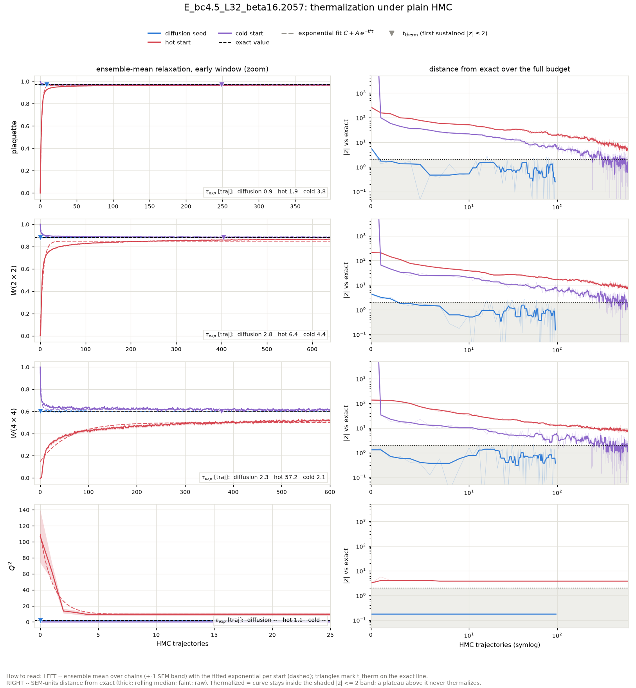

tau_int (hot-start chains, second half): plaquette = 6.47 +- 0.87, wilson_2x2 = 11.54 +- 1.50, wilson_4x4 = 6.83 +- 1.31, wilson_6x6 = 1.00 +- 0.06. Topology: hot-start HMC L=32 beta=16.2057 -> **frozen** (no tunneling).

Where 'never' stood at the end: the hot start ended the 640-trajectory budget still at plaquette at |z| ~ 6, wilson_2x2 at |z| ~ 8, wilson_4x4 at |z| ~ 8, wilson_6x6 at |z| ~ 6, Q^2 at |z| ~ 4; the cold start ended the 640-trajectory budget still at Q^2 at |z| ~ 1653625323520.

### Diagnostics: raw diffusion output (before any HMC)

| observable | value | error | exact | z_exact | reference | ref_error | z_ref | ks_p | chi2_p |
|---|---|---|---|---|---|---|---|---|---|
| plaquette | 0.9678 | 0.0001127 | 0.9686 | -7.032 | 0.9689 | 0.0001215 | -6.207 | 7.158e-07 |  |
| wilson_1x1 | 0.9678 | 0.0001127 | 0.9686 | -7.032 | 0.9689 | 0.0001215 | -6.207 | 7.158e-07 |  |
| wilson_1x2 | 0.9359 | 0.0002692 | 0.9383 | -8.864 | 0.9389 | 0.0002259 | -8.724 | 1.664e-10 |  |
| wilson_2x2 | 0.8773 | 0.0005581 | 0.8803 | -5.354 | 0.8819 | 0.0004272 | -6.527 | 8.674e-08 |  |
| wilson_2x3 | 0.8221 | 0.000936 | 0.826 | -4.138 | 0.8283 | 0.0006681 | -5.354 | 1.616e-05 |  |
| wilson_3x3 | 0.7479 | 0.00168 | 0.7507 | -1.653 | 0.755 | 0.001061 | -3.586 | 0.0002049 |  |
| wilson_3x4 | 0.6784 | 0.002215 | 0.6822 | -1.728 | 0.687 | 0.00175 | -3.041 | 0.0007783 |  |
| wilson_4x4 | 0.5968 | 0.002971 | 0.6006 | -1.264 | 0.6055 | 0.002254 | -2.308 | 0.002655 |  |
| wilson_4x5 | 0.5242 | 0.003616 | 0.5287 | -1.242 | 0.5333 | 0.002937 | -1.936 | 0.003137 |  |
| wilson_5x5 | 0.4472 | 0.004614 | 0.4509 | -0.7831 | 0.4546 | 0.003265 | -1.297 | 0.1004 |  |
| wilson_5x6 | 0.3789 | 0.005411 | 0.3845 | -1.024 | 0.3866 | 0.003745 | -1.173 | 0.1122 |  |
| wilson_6x6 | 0.3103 | 0.00616 | 0.3176 | -1.177 | 0.3192 | 0.004082 | -1.205 | 0.1122 |  |
| wilson_6x7 | 0.2545 | 0.006932 | 0.2623 | -1.123 | 0.2625 | 0.004529 | -0.9606 | 0.3584 |  |
| wilson_7x7 | 0.2013 | 0.008124 | 0.2099 | -1.05 | 0.2103 | 0.004829 | -0.9443 | 0.3021 |  |
| wilson_7x8 | 0.1588 | 0.007966 | 0.1679 | -1.138 | 0.1689 | 0.00502 | -1.068 | 0.3021 |  |
| wilson_8x8 | 0.1201 | 0.007981 | 0.1301 | -1.249 | 0.1307 | 0.005123 | -1.113 | 0.1392 |  |
| wilson_8x10 | 0.06664 | 0.007727 | 0.07815 | -1.489 | 0.07974 | 0.00472 | -1.447 | 0.05588 |  |
| wilson_10x10 | 0.03323 | 0.006247 | 0.04132 | -1.295 | 0.04097 | 0.003961 | -1.046 | 0.017 |  |
| wilson_10x12 | 0.0161 | 0.005238 | 0.02185 | -1.098 | 0.01927 | 0.00331 | -0.5124 | 0.8864 |  |
| wilson_12x12 | 0.003275 | 0.00498 | 0.01017 | -1.384 | 0.004811 | 0.003369 | -0.2555 | 0.6395 |  |
| creutz_2 | 0.03099 | 0.0004657 | 0.03186 | -1.877 |  |  |  |  |  |
| creutz_3 | 0.02957 | 0.0008898 | 0.03186 | -2.577 |  |  |  |  |  |
| creutz_4 | 0.03059 | 0.001785 | 0.03186 | -0.7159 |  |  |  |  |  |
| creutz_5 | 0.02912 | 0.00303 | 0.03186 | -0.9054 |  |  |  |  |  |
| creutz_6 | 0.03398 | 0.004537 | 0.03186 | 0.4661 |  |  |  |  |  |
| creutz_7 | 0.03617 | 0.008634 | 0.03186 | 0.4985 |  |  |  |  |  |
| creutz_8 | 0.042 | 0.01405 | 0.03186 | 0.7219 |  |  |  |  |  |
| Q | -0.0625 | 0.08863 | 0 | -0.7051 | -0.1302 | 0.07449 | 0.5848 | 0.7163 |  |
| Q^2 | 1.688 | 0.1812 | 1.654 | 0.187 | 1.578 | 0.1684 | 0.4421 | 0.6011 |  |
| chi_top ((<Q^2>-<Q>^2)/V) | 0.001644 | 0.0001775 | 0.001615 | 0.1649 | 0.001525 | 0.0001571 | 0.5044 | 6.754e-09 |  |
| Q histogram vs exact P(Q) | 10.08 | nan | 6 | nan |  |  |  |  | 0.1214 |

### Diagnostics: the same configs after 96 HMC trajectories

| observable | value | error | exact | z_exact | reference | ref_error | z_ref | ks_p | chi2_p |
|---|---|---|---|---|---|---|---|---|---|
| plaquette | 0.9687 | 0.0001427 | 0.9686 | 0.2239 | 0.9689 | 0.0001215 | -1.089 | 0.389 |  |
| wilson_1x1 | 0.9687 | 0.0001427 | 0.9686 | 0.2239 | 0.9689 | 0.0001215 | -1.089 | 0.389 |  |
| wilson_1x2 | 0.9382 | 0.0003095 | 0.9383 | -0.108 | 0.9389 | 0.0002259 | -1.861 | 0.1892 |  |
| wilson_2x2 | 0.8804 | 0.0006712 | 0.8803 | 0.1338 | 0.8819 | 0.0004272 | -1.897 | 0.004349 |  |
| wilson_2x3 | 0.8265 | 0.001164 | 0.826 | 0.4341 | 0.8283 | 0.0006681 | -1.326 | 0.2522 |  |
| wilson_3x3 | 0.7514 | 0.002068 | 0.7507 | 0.3532 | 0.755 | 0.001061 | -1.556 | 0.0711 |  |
| wilson_3x4 | 0.6829 | 0.00289 | 0.6822 | 0.2176 | 0.687 | 0.00175 | -1.222 | 0.2297 |  |
| wilson_4x4 | 0.6018 | 0.004089 | 0.6006 | 0.3053 | 0.6055 | 0.002254 | -0.7721 | 0.3584 |  |
| wilson_4x5 | 0.5296 | 0.005015 | 0.5287 | 0.1735 | 0.5333 | 0.002937 | -0.629 | 0.5259 |  |
| wilson_5x5 | 0.453 | 0.005889 | 0.4509 | 0.3618 | 0.4546 | 0.003265 | -0.2359 | 0.9126 |  |
| wilson_5x6 | 0.3859 | 0.006147 | 0.3845 | 0.2419 | 0.3866 | 0.003745 | -0.09606 | 0.5631 |  |
| wilson_6x6 | 0.3203 | 0.006746 | 0.3176 | 0.4075 | 0.3192 | 0.004082 | 0.1388 | 0.4898 |  |
| wilson_6x7 | 0.2646 | 0.006594 | 0.2623 | 0.3453 | 0.2625 | 0.004529 | 0.2636 | 0.6395 |  |
| wilson_7x7 | 0.2114 | 0.006583 | 0.2099 | 0.2422 | 0.2103 | 0.004829 | 0.1465 | 0.4548 |  |
| wilson_7x8 | 0.1688 | 0.006096 | 0.1679 | 0.1447 | 0.1689 | 0.00502 | -0.01277 | 0.7163 |  |
| wilson_8x8 | 0.1296 | 0.006361 | 0.1301 | -0.0786 | 0.1307 | 0.005123 | -0.1329 | 0.4212 |  |
| wilson_8x10 | 0.07879 | 0.006329 | 0.07815 | 0.1012 | 0.07974 | 0.00472 | -0.121 | 0.3294 |  |
| wilson_10x10 | 0.03993 | 0.006657 | 0.04132 | -0.208 | 0.04097 | 0.003961 | -0.1337 | 0.3021 |  |
| wilson_10x12 | 0.02201 | 0.006592 | 0.02185 | 0.02549 | 0.01927 | 0.00331 | 0.3719 | 0.8569 |  |
| wilson_12x12 | 0.0122 | 0.006683 | 0.01017 | 0.3046 | 0.004811 | 0.003369 | 0.9879 | 0.678 |  |
| creutz_2 | 0.03166 | 0.0004459 | 0.03186 | -0.4626 |  |  |  |  |  |
| creutz_3 | 0.03201 | 0.0009174 | 0.03186 | 0.1618 |  |  |  |  |  |
| creutz_4 | 0.03066 | 0.001551 | 0.03186 | -0.7778 |  |  |  |  |  |
| creutz_5 | 0.02836 | 0.002895 | 0.03186 | -1.21 |  |  |  |  |  |
| creutz_6 | 0.02625 | 0.004145 | 0.03186 | -1.354 |  |  |  |  |  |
| creutz_7 | 0.03297 | 0.007811 | 0.03186 | 0.141 |  |  |  |  |  |
| creutz_8 | 0.03863 | 0.01339 | 0.03186 | 0.5052 |  |  |  |  |  |
| Q | -0.0625 | 0.08863 | 0 | -0.7051 | -0.1302 | 0.07449 | 0.5848 | 0.7163 |  |
| Q^2 | 1.688 | 0.1812 | 1.654 | 0.187 | 1.578 | 0.1684 | 0.4421 | 0.6011 |  |
| chi_top ((<Q^2>-<Q>^2)/V) | 0.001644 | 0.0001775 | 0.001615 | 0.1649 | 0.001525 | 0.0001571 | 0.5044 | 6.754e-09 |  |
| Q histogram vs exact P(Q) | 10.08 | nan | 6 | nan |  |  |  |  | 0.1214 |

## A_bc5_L32_beta18.2524

HMC: step size 0.0936, 11 leapfrog steps, acceptance seed/hot/cold = 0.982/0.980/0.983. Diffusion-seed batch: 128 chains x 96 trajectories (0.05 s/traj for the whole batch); baselines: 32 chains x 640 trajectories.

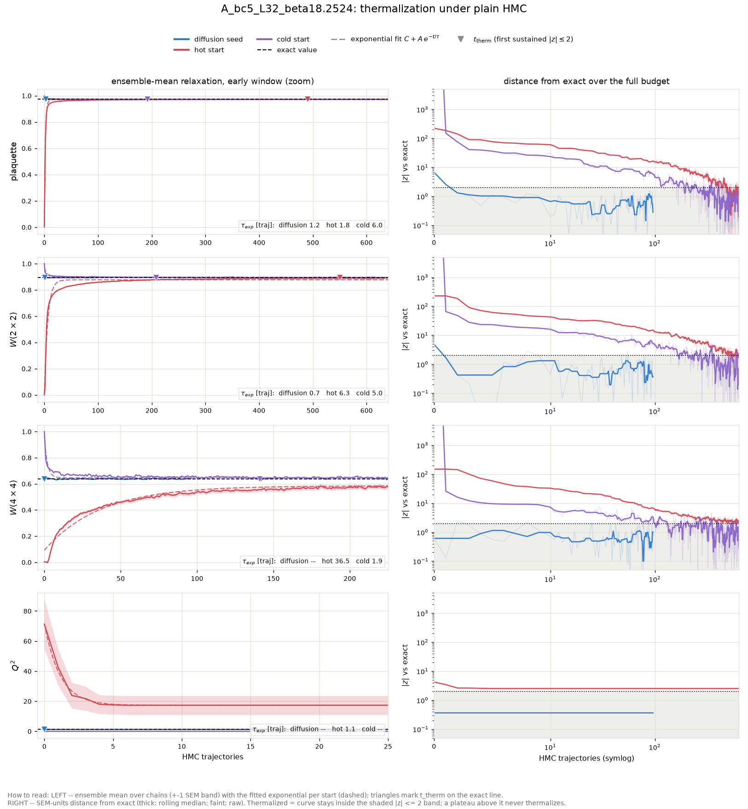

tau_int (hot-start chains, second half): plaquette = 4.81 +- 0.45, wilson_2x2 = 5.25 +- 0.65, wilson_4x4 = 2.50 +- 0.37, wilson_6x6 = 1.00 +- 0.08. Topology: hot-start HMC L=32 beta=18.2524 -> **frozen** (no tunneling).

Where 'never' stood at the end: the hot start ended the 640-trajectory budget still at wilson_2x2 at |z| ~ 3, wilson_4x4 at |z| ~ 4, wilson_6x6 at |z| ~ 5, Q^2 at |z| ~ 4; the cold start ended the 640-trajectory budget still at Q^2 at |z| ~ 1462558916608.

### Diagnostics: raw diffusion output (before any HMC)

| observable | value | error | exact | z_exact | reference | ref_error | z_ref | ks_p | chi2_p |
|---|---|---|---|---|---|---|---|---|---|
| plaquette | 0.9715 | 7.17e-05 | 0.9722 | -10.14 | 0.9721 | 8.748e-05 | -5.629 | 0.0006474 |  |
| wilson_1x1 | 0.9715 | 7.17e-05 | 0.9722 | -10.14 | 0.9721 | 8.748e-05 | -5.629 | 0.0006474 |  |
| wilson_1x2 | 0.9431 | 0.0002132 | 0.9452 | -9.898 | 0.945 | 0.0002172 | -6.151 | 0.0001679 |  |
| wilson_2x2 | 0.8905 | 0.0005073 | 0.8934 | -5.754 | 0.8932 | 0.0004579 | -3.988 | 0.00189 |  |
| wilson_2x3 | 0.8414 | 0.0008122 | 0.8444 | -3.719 | 0.8439 | 0.0007747 | -2.197 | 0.1392 |  |
| wilson_3x3 | 0.7746 | 0.001401 | 0.776 | -0.976 | 0.775 | 0.001198 | -0.2401 | 0.5631 |  |
| wilson_3x4 | 0.7112 | 0.001805 | 0.713 | -1.027 | 0.7128 | 0.001494 | -0.6758 | 0.3021 |  |
| wilson_4x4 | 0.6352 | 0.002639 | 0.637 | -0.6776 | 0.6379 | 0.001978 | -0.8187 | 0.2522 |  |
| wilson_4x5 | 0.5679 | 0.003228 | 0.5691 | -0.3841 | 0.5711 | 0.002196 | -0.8254 | 0.2522 |  |
| wilson_5x5 | 0.4943 | 0.003905 | 0.4943 | -0.006621 | 0.4985 | 0.002714 | -0.8987 | 0.5631 |  |
| wilson_5x6 | 0.428 | 0.004761 | 0.4293 | -0.2682 | 0.4368 | 0.002936 | -1.561 | 0.1004 |  |
| wilson_6x6 | 0.3599 | 0.005174 | 0.3625 | -0.5164 | 0.3726 | 0.003308 | -2.079 | 0.04354 |  |
| wilson_6x7 | 0.3027 | 0.005502 | 0.3061 | -0.6276 | 0.3188 | 0.00378 | -2.422 | 0.0631 |  |
| wilson_7x7 | 0.2472 | 0.005397 | 0.2513 | -0.7647 | 0.2667 | 0.004046 | -2.892 | 0.1392 |  |
| wilson_7x8 | 0.2 | 0.00566 | 0.2063 | -1.116 | 0.2235 | 0.004259 | -3.313 | 0.0631 |  |
| wilson_8x8 | 0.158 | 0.005504 | 0.1647 | -1.204 | 0.1811 | 0.004164 | -3.344 | 0.1122 |  |
| wilson_8x10 | 0.09896 | 0.00523 | 0.1049 | -1.134 | 0.1197 | 0.004264 | -3.071 | 0.2522 |  |
| wilson_10x10 | 0.05108 | 0.004621 | 0.0597 | -1.865 | 0.0728 | 0.004548 | -3.351 | 0.1004 |  |
| wilson_10x12 | 0.02918 | 0.00507 | 0.03397 | -0.9445 | 0.04194 | 0.004967 | -1.798 | 0.3294 |  |
| wilson_12x12 | 0.007791 | 0.004664 | 0.01727 | -2.033 | 0.02299 | 0.005358 | -2.14 | 0.1545 |  |
| creutz_2 | 0.02774 | 0.0003805 | 0.02818 | -1.181 |  |  |  |  |  |
| creutz_3 | 0.02605 | 0.0008457 | 0.02818 | -2.519 |  |  |  |  |  |
| creutz_4 | 0.02755 | 0.001481 | 0.02818 | -0.4259 |  |  |  |  |  |
| creutz_5 | 0.02669 | 0.002159 | 0.02818 | -0.6939 |  |  |  |  |  |
| creutz_6 | 0.02968 | 0.003657 | 0.02818 | 0.4084 |  |  |  |  |  |
| creutz_7 | 0.02945 | 0.006506 | 0.02818 | 0.1946 |  |  |  |  |  |
| creutz_8 | 0.02362 | 0.01012 | 0.02818 | -0.4513 |  |  |  |  |  |
| Q | 0.02344 | 0.09658 | 0 | 0.2427 | -0.1667 | 0.0623 | 1.654 | 0.9888 |  |
| Q^2 | 1.398 | 0.2066 | 1.463 | -0.3103 | 1.271 | 0.1232 | 0.5304 | 1 |  |
| chi_top ((<Q^2>-<Q>^2)/V) | 0.001365 | 0.0002011 | 0.001428 | -0.314 | 0.001214 | 0.0001176 | 0.649 | 3.783e-08 |  |
| Q histogram vs exact P(Q) | 1.11 | nan | 4 | nan |  |  |  |  | 0.8927 |

### Diagnostics: the same configs after 96 HMC trajectories

| observable | value | error | exact | z_exact | reference | ref_error | z_ref | ks_p | chi2_p |
|---|---|---|---|---|---|---|---|---|---|
| plaquette | 0.9723 | 9.799e-05 | 0.9722 | 0.58 | 0.9721 | 8.748e-05 | 1.119 | 0.4548 |  |
| wilson_1x1 | 0.9723 | 9.799e-05 | 0.9722 | 0.58 | 0.9721 | 8.748e-05 | 1.119 | 0.4548 |  |
| wilson_1x2 | 0.9453 | 0.0002316 | 0.9452 | 0.559 | 0.945 | 0.0002172 | 1.157 | 0.8246 |  |
| wilson_2x2 | 0.8935 | 0.0004535 | 0.8934 | 0.249 | 0.8932 | 0.0004579 | 0.4757 | 0.678 |  |
| wilson_2x3 | 0.845 | 0.0008013 | 0.8444 | 0.7601 | 0.8439 | 0.0007747 | 1.044 | 0.2763 |  |
| wilson_3x3 | 0.7773 | 0.001418 | 0.776 | 0.9627 | 0.775 | 0.001198 | 1.234 | 0.4898 |  |
| wilson_3x4 | 0.7156 | 0.002155 | 0.713 | 1.176 | 0.7128 | 0.001494 | 1.069 | 0.3584 |  |
| wilson_4x4 | 0.6402 | 0.003385 | 0.637 | 0.9397 | 0.6379 | 0.001978 | 0.5788 | 0.389 |  |
| wilson_4x5 | 0.5732 | 0.00439 | 0.5691 | 0.9299 | 0.5711 | 0.002196 | 0.4277 | 0.7163 |  |
| wilson_5x5 | 0.4981 | 0.005441 | 0.4943 | 0.6955 | 0.4985 | 0.002714 | -0.07634 | 0.9126 |  |
| wilson_5x6 | 0.4327 | 0.006082 | 0.4293 | 0.5513 | 0.4368 | 0.002936 | -0.6075 | 0.678 |  |
| wilson_6x6 | 0.3653 | 0.006667 | 0.3625 | 0.4171 | 0.3726 | 0.003308 | -0.9827 | 0.7163 |  |
| wilson_6x7 | 0.31 | 0.006993 | 0.3061 | 0.549 | 0.3188 | 0.00378 | -1.117 | 0.5259 |  |
| wilson_7x7 | 0.2543 | 0.007043 | 0.2513 | 0.4263 | 0.2667 | 0.004046 | -1.524 | 0.2763 |  |
| wilson_7x8 | 0.2097 | 0.007165 | 0.2063 | 0.4674 | 0.2235 | 0.004259 | -1.656 | 0.3294 |  |
| wilson_8x8 | 0.1673 | 0.007487 | 0.1647 | 0.3541 | 0.1811 | 0.004164 | -1.611 | 0.4212 |  |
| wilson_8x10 | 0.1089 | 0.008014 | 0.1049 | 0.4976 | 0.1197 | 0.004264 | -1.19 | 0.5631 |  |
| wilson_10x10 | 0.05989 | 0.008058 | 0.0597 | 0.02349 | 0.0728 | 0.004548 | -1.396 | 0.3021 |  |
| wilson_10x12 | 0.03614 | 0.006816 | 0.03397 | 0.3181 | 0.04194 | 0.004967 | -0.6882 | 0.5259 |  |
| wilson_12x12 | 0.02035 | 0.006739 | 0.01727 | 0.4563 | 0.02299 | 0.005358 | -0.3073 | 0.9353 |  |
| creutz_2 | 0.02827 | 0.0003845 | 0.02818 | 0.2318 |  |  |  |  |  |
| creutz_3 | 0.02774 | 0.0007636 | 0.02818 | -0.5784 |  |  |  |  |  |
| creutz_4 | 0.02854 | 0.001424 | 0.02818 | 0.2477 |  |  |  |  |  |
| creutz_5 | 0.02987 | 0.002443 | 0.02818 | 0.6907 |  |  |  |  |  |
| creutz_6 | 0.02848 | 0.003984 | 0.02818 | 0.0731 |  |  |  |  |  |
| creutz_7 | 0.0336 | 0.006304 | 0.02818 | 0.8582 |  |  |  |  |  |
| creutz_8 | 0.03254 | 0.01168 | 0.02818 | 0.3731 |  |  |  |  |  |
| Q | 0.02344 | 0.09658 | 0 | 0.2427 | -0.1667 | 0.0623 | 1.654 | 0.9888 |  |
| Q^2 | 1.398 | 0.2066 | 1.463 | -0.3103 | 1.271 | 0.1232 | 0.5304 | 1 |  |
| chi_top ((<Q^2>-<Q>^2)/V) | 0.001365 | 0.0002011 | 0.001428 | -0.314 | 0.001214 | 0.0001176 | 0.649 | 3.783e-08 |  |
| Q histogram vs exact P(Q) | 1.11 | nan | 4 | nan |  |  |  |  | 0.8927 |

## E_bc5.8_L32_beta21.5051

HMC: step size 0.0863, 12 leapfrog steps, acceptance seed/hot/cold = 0.983/0.984/0.983. Diffusion-seed batch: 128 chains x 96 trajectories (0.06 s/traj for the whole batch); baselines: 32 chains x 640 trajectories.

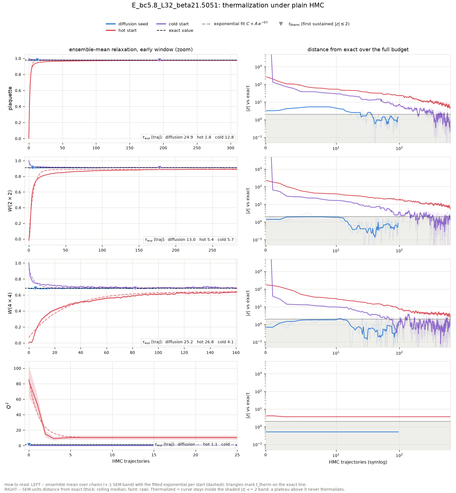

tau_int (hot-start chains, second half): plaquette = 11.10 +- 1.33, wilson_2x2 = 9.63 +- 1.29, wilson_4x4 = 3.66 +- 0.37, wilson_6x6 = 1.44 +- 0.12. Topology: hot-start HMC L=32 beta=21.5051 -> **frozen** (no tunneling).

Where 'never' stood at the end: the hot start ended the 640-trajectory budget still at plaquette at |z| ~ 5, wilson_2x2 at |z| ~ 6, wilson_4x4 at |z| ~ 3, wilson_6x6 at |z| ~ 4, Q^2 at |z| ~ 4; the cold start ended the 640-trajectory budget still at Q^2 at |z| ~ 1235714179072.

### Diagnostics: raw diffusion output (before any HMC)

| observable | value | error | exact | z_exact | reference | ref_error | z_ref | ks_p | chi2_p |
|---|---|---|---|---|---|---|---|---|---|
| plaquette | 0.9762 | 8.839e-05 | 0.9765 | -3.159 | 0.9764 | 6.579e-05 | -2.366 | 0.1251 |  |
| wilson_1x1 | 0.9762 | 8.839e-05 | 0.9765 | -3.159 | 0.9764 | 6.579e-05 | -2.366 | 0.1251 |  |
| wilson_1x2 | 0.9525 | 0.0002362 | 0.9535 | -4.326 | 0.9538 | 0.0001478 | -4.95 | 0.0001372 |  |
| wilson_2x2 | 0.9085 | 0.0003994 | 0.9091 | -1.612 | 0.9104 | 0.000397 | -3.381 | 0.001117 |  |
| wilson_2x3 | 0.8664 | 0.0007685 | 0.8668 | -0.547 | 0.8687 | 0.0006653 | -2.219 | 0.008145 |  |
| wilson_3x3 | 0.8082 | 0.001288 | 0.8071 | 0.858 | 0.8091 | 0.000996 | -0.5934 | 0.3584 |  |
| wilson_3x4 | 0.7521 | 0.001855 | 0.7514 | 0.3675 | 0.7546 | 0.001418 | -1.069 | 0.1892 |  |
| wilson_4x4 | 0.6849 | 0.00271 | 0.6831 | 0.6366 | 0.6869 | 0.00195 | -0.6195 | 0.2087 |  |
| wilson_4x5 | 0.6237 | 0.003439 | 0.6211 | 0.7724 | 0.6254 | 0.002521 | -0.3982 | 0.7163 |  |
| wilson_5x5 | 0.5539 | 0.004699 | 0.5513 | 0.5331 | 0.5569 | 0.003066 | -0.5465 | 0.7901 |  |
| wilson_5x6 | 0.4908 | 0.0055 | 0.4895 | 0.2457 | 0.496 | 0.003851 | -0.7762 | 0.5631 |  |
| wilson_6x6 | 0.4257 | 0.006662 | 0.4243 | 0.2072 | 0.4327 | 0.004392 | -0.8813 | 0.3584 |  |
| wilson_6x7 | 0.369 | 0.007118 | 0.3678 | 0.1764 | 0.375 | 0.004974 | -0.6904 | 0.5259 |  |
| wilson_7x7 | 0.3139 | 0.008168 | 0.3113 | 0.3114 | 0.3184 | 0.005407 | -0.4661 | 0.8569 |  |
| wilson_7x8 | 0.2658 | 0.008334 | 0.2635 | 0.2699 | 0.2689 | 0.005633 | -0.3116 | 0.6011 |  |
| wilson_8x8 | 0.2224 | 0.008791 | 0.2178 | 0.5197 | 0.2203 | 0.006032 | 0.1916 | 0.5259 |  |
| wilson_8x10 | 0.1558 | 0.008469 | 0.1488 | 0.8301 | 0.1477 | 0.006198 | 0.778 | 0.2297 |  |
| wilson_10x10 | 0.09677 | 0.007658 | 0.09241 | 0.5699 | 0.08779 | 0.006184 | 0.9123 | 0.4898 |  |
| wilson_10x12 | 0.05942 | 0.006853 | 0.05739 | 0.2965 | 0.05374 | 0.006546 | 0.5998 | 0.3021 |  |
| wilson_12x12 | 0.02693 | 0.006862 | 0.03241 | -0.7982 | 0.03188 | 0.006324 | -0.5305 | 0.678 |  |
| creutz_2 | 0.02267 | 0.0003308 | 0.02382 | -3.475 |  |  |  |  |  |
| creutz_3 | 0.02219 | 0.000697 | 0.02382 | -2.338 |  |  |  |  |  |
| creutz_4 | 0.02174 | 0.001105 | 0.02382 | -1.88 |  |  |  |  |  |
| creutz_5 | 0.0253 | 0.001768 | 0.02382 | 0.8373 |  |  |  |  |  |
| creutz_6 | 0.02155 | 0.003084 | 0.02382 | -0.7353 |  |  |  |  |  |
| creutz_7 | 0.01925 | 0.004856 | 0.02382 | -0.9413 |  |  |  |  |  |
| creutz_8 | 0.01192 | 0.007359 | 0.02382 | -1.617 |  |  |  |  |  |
| Q | 0.1641 | 0.09788 | 0 | 1.676 | -0.07812 | 0.07702 | 1.944 | 0.4212 |  |
| Q^2 | 1.164 | 0.116 | 1.236 | -0.6179 | 1.359 | 0.1492 | -1.033 | 1 |  |
| chi_top ((<Q^2>-<Q>^2)/V) | 0.00111 | 0.0001153 | 0.001207 | -0.8348 | 0.001322 | 0.000147 | -1.13 | 2.764e-09 |  |
| Q histogram vs exact P(Q) | 4.873 | nan | 4 | nan |  |  |  |  | 0.3006 |

### Diagnostics: the same configs after 96 HMC trajectories

| observable | value | error | exact | z_exact | reference | ref_error | z_ref | ks_p | chi2_p |
|---|---|---|---|---|---|---|---|---|---|
| plaquette | 0.9763 | 9.144e-05 | 0.9765 | -1.39 | 0.9764 | 6.579e-05 | -0.9638 | 0.678 |  |
| wilson_1x1 | 0.9763 | 9.144e-05 | 0.9765 | -1.39 | 0.9764 | 6.579e-05 | -0.9638 | 0.678 |  |
| wilson_1x2 | 0.9532 | 0.0002367 | 0.9535 | -1.279 | 0.9538 | 0.0001478 | -2.365 | 0.08971 |  |
| wilson_2x2 | 0.9087 | 0.0005602 | 0.9091 | -0.753 | 0.9104 | 0.000397 | -2.45 | 0.05588 |  |
| wilson_2x3 | 0.8659 | 0.0009028 | 0.8668 | -1.081 | 0.8687 | 0.0006653 | -2.507 | 0.03831 |  |
| wilson_3x3 | 0.8052 | 0.001514 | 0.8071 | -1.27 | 0.8091 | 0.000996 | -2.204 | 0.1892 |  |
| wilson_3x4 | 0.7489 | 0.002299 | 0.7514 | -1.108 | 0.7546 | 0.001418 | -2.12 | 0.05588 |  |
| wilson_4x4 | 0.6796 | 0.002974 | 0.6831 | -1.19 | 0.6869 | 0.00195 | -2.062 | 0.0711 |  |
| wilson_4x5 | 0.6171 | 0.003926 | 0.6211 | -1.001 | 0.6254 | 0.002521 | -1.775 | 0.01474 |  |
| wilson_5x5 | 0.5462 | 0.004625 | 0.5513 | -1.107 | 0.5569 | 0.003066 | -1.927 | 0.04354 |  |
| wilson_5x6 | 0.4836 | 0.005611 | 0.4895 | -1.039 | 0.496 | 0.003851 | -1.821 | 0.07995 |  |
| wilson_6x6 | 0.4182 | 0.006519 | 0.4243 | -0.9383 | 0.4327 | 0.004392 | -1.848 | 0.1004 |  |
| wilson_6x7 | 0.3623 | 0.007049 | 0.3678 | -0.7726 | 0.375 | 0.004974 | -1.472 | 0.2087 |  |
| wilson_7x7 | 0.306 | 0.007616 | 0.3113 | -0.6996 | 0.3184 | 0.005407 | -1.332 | 0.2522 |  |
| wilson_7x8 | 0.2595 | 0.007827 | 0.2635 | -0.516 | 0.2689 | 0.005633 | -0.9771 | 0.389 |  |
| wilson_8x8 | 0.2141 | 0.008325 | 0.2178 | -0.4483 | 0.2203 | 0.006032 | -0.6086 | 0.6011 |  |
| wilson_8x10 | 0.1426 | 0.00885 | 0.1488 | -0.6954 | 0.1477 | 0.006198 | -0.4645 | 0.6011 |  |
| wilson_10x10 | 0.08649 | 0.00896 | 0.09241 | -0.6599 | 0.08779 | 0.006184 | -0.1191 | 0.4548 |  |
| wilson_10x12 | 0.05372 | 0.007962 | 0.05739 | -0.4616 | 0.05374 | 0.006546 | -0.002208 | 0.2763 |  |
| wilson_12x12 | 0.02625 | 0.006093 | 0.03241 | -1.01 | 0.03188 | 0.006324 | -0.6406 | 0.4548 |  |
| creutz_2 | 0.02377 | 0.0003584 | 0.02382 | -0.1134 |  |  |  |  |  |
| creutz_3 | 0.02441 | 0.0006342 | 0.02382 | 0.9367 |  |  |  |  |  |
| creutz_4 | 0.0246 | 0.001242 | 0.02382 | 0.633 |  |  |  |  |  |
| creutz_5 | 0.02565 | 0.002007 | 0.02382 | 0.9139 |  |  |  |  |  |
| creutz_6 | 0.0237 | 0.002946 | 0.02382 | -0.03986 |  |  |  |  |  |
| creutz_7 | 0.02576 | 0.004686 | 0.02382 | 0.4158 |  |  |  |  |  |
| creutz_8 | 0.02747 | 0.007758 | 0.02382 | 0.4711 |  |  |  |  |  |
| Q | 0.1641 | 0.09788 | 0 | 1.676 | -0.07812 | 0.07702 | 1.944 | 0.4212 |  |
| Q^2 | 1.164 | 0.116 | 1.236 | -0.6179 | 1.359 | 0.1492 | -1.033 | 1 |  |
| chi_top ((<Q^2>-<Q>^2)/V) | 0.00111 | 0.0001153 | 0.001207 | -0.8348 | 0.001322 | 0.000147 | -1.13 | 2.764e-09 |  |
| Q histogram vs exact P(Q) | 4.873 | nan | 4 | nan |  |  |  |  | 0.3006 |

## A_bc6_L32_beta22.3151

HMC: step size 0.0847, 12 leapfrog steps, acceptance seed/hot/cold = 0.983/0.983/0.982. Diffusion-seed batch: 128 chains x 96 trajectories (0.06 s/traj for the whole batch); baselines: 32 chains x 640 trajectories.

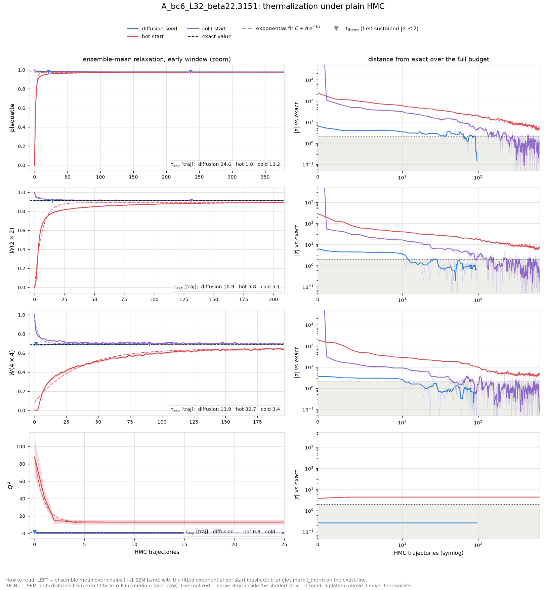

tau_int (hot-start chains, second half): plaquette = 7.27 +- 0.88, wilson_2x2 = 8.81 +- 1.44, wilson_4x4 = 3.56 +- 0.37, wilson_6x6 = 1.22 +- 0.10. Topology: hot-start HMC L=32 beta=22.3151 -> **frozen** (no tunneling).

Where 'never' stood at the end: the hot start ended the 640-trajectory budget still at plaquette at |z| ~ 5, wilson_2x2 at |z| ~ 6, wilson_4x4 at |z| ~ 4, wilson_6x6 at |z| ~ 5, Q^2 at |z| ~ 5; the cold start ended the 640-trajectory budget still at Q^2 at |z| ~ 1189769248768.

### Diagnostics: raw diffusion output (before any HMC)

| observable | value | error | exact | z_exact | reference | ref_error | z_ref | ks_p | chi2_p |
|---|---|---|---|---|---|---|---|---|---|
| plaquette | 0.9767 | 0.0001258 | 0.9773 | -4.879 | 0.9771 | 6.258e-05 | -3.005 | 0.01275 |  |
| wilson_1x1 | 0.9767 | 0.0001258 | 0.9773 | -4.879 | 0.9771 | 6.258e-05 | -3.005 | 0.01275 |  |
| wilson_1x2 | 0.9532 | 0.000295 | 0.9552 | -6.755 | 0.955 | 0.0001446 | -5.61 | 1.491e-07 |  |
| wilson_2x2 | 0.9092 | 0.0006272 | 0.9124 | -5.113 | 0.9118 | 0.0003964 | -3.512 | 0.0009335 |  |
| wilson_2x3 | 0.8668 | 0.001098 | 0.8715 | -4.281 | 0.8705 | 0.0007065 | -2.845 | 0.005977 |  |
| wilson_3x3 | 0.8082 | 0.001771 | 0.8135 | -3.002 | 0.8119 | 0.001118 | -1.739 | 0.05588 |  |
| wilson_3x4 | 0.7519 | 0.002453 | 0.7594 | -3.061 | 0.7581 | 0.001735 | -2.037 | 0.04938 |  |
| wilson_4x4 | 0.6824 | 0.003233 | 0.6929 | -3.255 | 0.691 | 0.002453 | -2.124 | 0.017 |  |
| wilson_4x5 | 0.621 | 0.004198 | 0.6322 | -2.655 | 0.6302 | 0.003175 | -1.753 | 0.0711 |  |
| wilson_5x5 | 0.5496 | 0.005429 | 0.5637 | -2.586 | 0.5607 | 0.004057 | -1.625 | 0.0711 |  |
| wilson_5x6 | 0.488 | 0.006445 | 0.5026 | -2.276 | 0.4994 | 0.004712 | -1.428 | 0.0711 |  |
| wilson_6x6 | 0.4212 | 0.007555 | 0.438 | -2.228 | 0.4331 | 0.005531 | -1.276 | 0.1892 |  |
| wilson_6x7 | 0.3668 | 0.00859 | 0.3817 | -1.732 | 0.3769 | 0.006189 | -0.9474 | 0.389 |  |
| wilson_7x7 | 0.3112 | 0.009318 | 0.3251 | -1.491 | 0.3188 | 0.006756 | -0.658 | 0.389 |  |
| wilson_7x8 | 0.2643 | 0.01036 | 0.2769 | -1.219 | 0.2688 | 0.007177 | -0.3569 | 0.6395 |  |
| wilson_8x8 | 0.2187 | 0.01056 | 0.2305 | -1.121 | 0.2208 | 0.007311 | -0.1662 | 0.9693 |  |
| wilson_8x10 | 0.1525 | 0.01114 | 0.1597 | -0.6481 | 0.1482 | 0.007828 | 0.3148 | 0.6395 |  |
| wilson_10x10 | 0.09544 | 0.01037 | 0.101 | -0.5324 | 0.09444 | 0.007242 | 0.07933 | 0.7538 |  |
| wilson_10x12 | 0.05921 | 0.009327 | 0.06382 | -0.4946 | 0.05584 | 0.006246 | 0.3005 | 0.8246 |  |
| wilson_12x12 | 0.03238 | 0.008437 | 0.03681 | -0.5248 | 0.03103 | 0.005564 | 0.1343 | 0.9941 |  |
| creutz_2 | 0.0229 | 0.0003255 | 0.02293 | -0.08399 |  |  |  |  |  |
| creutz_3 | 0.02219 | 0.0006806 | 0.02293 | -1.085 |  |  |  |  |  |
| creutz_4 | 0.02492 | 0.00124 | 0.02293 | 1.603 |  |  |  |  |  |
| creutz_5 | 0.02789 | 0.001797 | 0.02293 | 2.759 |  |  |  |  |  |
| creutz_6 | 0.02812 | 0.003066 | 0.02293 | 1.692 |  |  |  |  |  |
| creutz_7 | 0.02629 | 0.004995 | 0.02293 | 0.6726 |  |  |  |  |  |
| creutz_8 | 0.02596 | 0.006961 | 0.02293 | 0.4356 |  |  |  |  |  |
| Q | -0.03906 | 0.08641 | 0 | -0.4521 | -0.03125 | 0.0707 | -0.06998 | 1 |  |
| Q^2 | 1.227 | 0.1851 | 1.19 | 0.1988 | 1.406 | 0.09558 | -0.8627 | 0.9126 |  |
| chi_top ((<Q^2>-<Q>^2)/V) | 0.001196 | 0.0001833 | 0.001162 | 0.1879 | 0.001372 | 9.313e-05 | -0.856 | 4.282e-07 |  |
| Q histogram vs exact P(Q) | 3.75 | nan | 4 | nan |  |  |  |  | 0.4409 |

### Diagnostics: the same configs after 96 HMC trajectories

| observable | value | error | exact | z_exact | reference | ref_error | z_ref | ks_p | chi2_p |
|---|---|---|---|---|---|---|---|---|---|
| plaquette | 0.9772 | 9.09e-05 | 0.9773 | -1.286 | 0.9771 | 6.258e-05 | 0.6759 | 0.4212 |  |
| wilson_1x1 | 0.9772 | 9.09e-05 | 0.9773 | -1.286 | 0.9771 | 6.258e-05 | 0.6759 | 0.4212 |  |
| wilson_1x2 | 0.955 | 0.0001924 | 0.9552 | -0.9548 | 0.955 | 0.0001446 | -0.1418 | 0.5631 |  |
| wilson_2x2 | 0.9121 | 0.0004218 | 0.9124 | -0.5428 | 0.9118 | 0.0003964 | 0.6419 | 0.2763 |  |
| wilson_2x3 | 0.8716 | 0.0007926 | 0.8715 | 0.1688 | 0.8705 | 0.0007065 | 1.055 | 0.4548 |  |
| wilson_3x3 | 0.8143 | 0.001241 | 0.8135 | 0.6331 | 0.8119 | 0.001118 | 1.473 | 0.2297 |  |
| wilson_3x4 | 0.7616 | 0.001948 | 0.7594 | 1.099 | 0.7581 | 0.001735 | 1.353 | 0.678 |  |
| wilson_4x4 | 0.6962 | 0.003027 | 0.6929 | 1.087 | 0.691 | 0.002453 | 1.333 | 0.3021 |  |
| wilson_4x5 | 0.638 | 0.004162 | 0.6322 | 1.404 | 0.6302 | 0.003175 | 1.483 | 0.3021 |  |
| wilson_5x5 | 0.5699 | 0.00559 | 0.5637 | 1.119 | 0.5607 | 0.004057 | 1.344 | 0.4212 |  |
| wilson_5x6 | 0.5113 | 0.006884 | 0.5026 | 1.255 | 0.4994 | 0.004712 | 1.428 | 0.2297 |  |
| wilson_6x6 | 0.447 | 0.008234 | 0.438 | 1.088 | 0.4331 | 0.005531 | 1.396 | 0.1251 |  |
| wilson_6x7 | 0.3936 | 0.009341 | 0.3817 | 1.273 | 0.3769 | 0.006189 | 1.494 | 0.08971 |  |
| wilson_7x7 | 0.3364 | 0.01042 | 0.3251 | 1.086 | 0.3188 | 0.006756 | 1.42 | 0.1251 |  |
| wilson_7x8 | 0.287 | 0.01121 | 0.2769 | 0.8978 | 0.2688 | 0.007177 | 1.367 | 0.1251 |  |
| wilson_8x8 | 0.2392 | 0.01193 | 0.2305 | 0.7302 | 0.2208 | 0.007311 | 1.316 | 0.2763 |  |
| wilson_8x10 | 0.1666 | 0.01184 | 0.1597 | 0.5809 | 0.1482 | 0.007828 | 1.295 | 0.02947 |  |
| wilson_10x10 | 0.1088 | 0.01134 | 0.101 | 0.6925 | 0.09444 | 0.007242 | 1.069 | 0.07995 |  |
| wilson_10x12 | 0.06312 | 0.009542 | 0.06382 | -0.07316 | 0.05584 | 0.006246 | 0.6391 | 0.1392 |  |
| wilson_12x12 | 0.0366 | 0.007788 | 0.03681 | -0.02735 | 0.03103 | 0.005564 | 0.5822 | 0.5631 |  |
| creutz_2 | 0.02292 | 0.0003126 | 0.02293 | -0.04494 |  |  |  |  |  |
| creutz_3 | 0.02252 | 0.0006885 | 0.02293 | -0.5916 |  |  |  |  |  |
| creutz_4 | 0.02286 | 0.00114 | 0.02293 | -0.06416 |  |  |  |  |  |
| creutz_5 | 0.02557 | 0.002105 | 0.02293 | 1.253 |  |  |  |  |  |
| creutz_6 | 0.02574 | 0.002802 | 0.02293 | 1.002 |  |  |  |  |  |
| creutz_7 | 0.02985 | 0.004141 | 0.02293 | 1.672 |  |  |  |  |  |
| creutz_8 | 0.02305 | 0.006841 | 0.02293 | 0.01819 |  |  |  |  |  |
| Q | -0.03906 | 0.08641 | 0 | -0.4521 | -0.03125 | 0.0707 | -0.06998 | 1 |  |
| Q^2 | 1.227 | 0.1851 | 1.19 | 0.1988 | 1.406 | 0.09558 | -0.8627 | 0.9126 |  |
| chi_top ((<Q^2>-<Q>^2)/V) | 0.001196 | 0.0001833 | 0.001162 | 0.1879 | 0.001372 | 9.313e-05 | -0.856 | 4.282e-07 |  |
| Q histogram vs exact P(Q) | 3.75 | nan | 4 | nan |  |  |  |  | 0.4409 |

## A_bc8_L32_beta30.3772

HMC: step size 0.0726, 14 leapfrog steps, acceptance seed/hot/cold = 0.983/0.981/0.983. Diffusion-seed batch: 128 chains x 96 trajectories (0.07 s/traj for the whole batch); baselines: 32 chains x 640 trajectories.

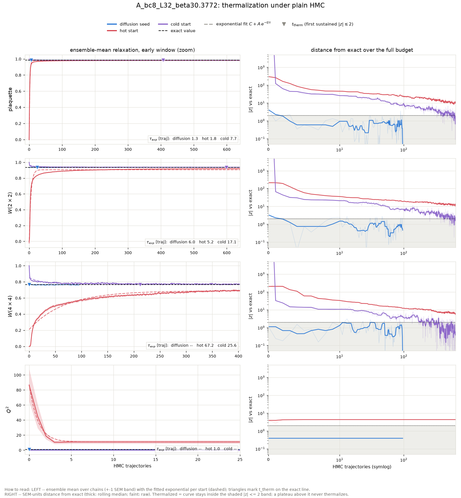

tau_int (hot-start chains, second half): plaquette = 10.65 +- 1.37, wilson_2x2 = 17.65 +- 1.87, wilson_4x4 = 14.64 +- 1.99, wilson_6x6 = 7.25 +- 1.32. Topology: hot-start HMC L=32 beta=30.3772 -> **frozen** (no tunneling).

Where 'never' stood at the end: the hot start ended the 640-trajectory budget still at plaquette at |z| ~ 9, wilson_2x2 at |z| ~ 10, wilson_4x4 at |z| ~ 5, wilson_6x6 at |z| ~ 5, Q^2 at |z| ~ 4; the cold start ended the 640-trajectory budget still at Q^2 at |z| ~ 868455153664.

### Diagnostics: raw diffusion output (before any HMC)

| observable | value | error | exact | z_exact | reference | ref_error | z_ref | ks_p | chi2_p |
|---|---|---|---|---|---|---|---|---|---|
| plaquette | 0.9831 | 5.947e-05 | 0.9834 | -5.143 | 0.9835 | 3.853e-05 | -5.539 | 0.0002049 |  |
| wilson_1x1 | 0.9831 | 5.947e-05 | 0.9834 | -5.143 | 0.9835 | 3.853e-05 | -5.539 | 0.0002049 |  |
| wilson_1x2 | 0.9661 | 0.0001314 | 0.9671 | -7.687 | 0.9671 | 8.105e-05 | -7.02 | 6.452e-06 |  |
| wilson_2x2 | 0.9339 | 0.0002933 | 0.9352 | -4.422 | 0.9353 | 0.0002202 | -3.732 | 0.005977 |  |
| wilson_2x3 | 0.9031 | 0.0004925 | 0.9044 | -2.776 | 0.9048 | 0.0004599 | -2.552 | 0.1392 |  |
| wilson_3x3 | 0.8594 | 0.0008623 | 0.8601 | -0.9217 | 0.8605 | 0.0008424 | -0.9398 | 0.4548 |  |
| wilson_3x4 | 0.8166 | 0.001313 | 0.818 | -1.106 | 0.8186 | 0.001269 | -1.094 | 0.7538 |  |
| wilson_4x4 | 0.7627 | 0.002032 | 0.765 | -1.176 | 0.7641 | 0.001745 | -0.539 | 0.7901 |  |
| wilson_4x5 | 0.7127 | 0.00268 | 0.7155 | -1.038 | 0.7147 | 0.002358 | -0.5562 | 0.7901 |  |
| wilson_5x5 | 0.655 | 0.003517 | 0.658 | -0.8793 | 0.6563 | 0.003075 | -0.2847 | 0.9353 |  |
| wilson_5x6 | 0.6004 | 0.004652 | 0.6052 | -1.044 | 0.6044 | 0.00378 | -0.6824 | 0.5259 |  |
| wilson_6x6 | 0.5416 | 0.00562 | 0.5474 | -1.02 | 0.5473 | 0.004598 | -0.7857 | 0.4212 |  |
| wilson_6x7 | 0.488 | 0.007061 | 0.4951 | -1.004 | 0.4965 | 0.00528 | -0.9702 | 0.4898 |  |
| wilson_7x7 | 0.4338 | 0.008245 | 0.4403 | -0.7867 | 0.4426 | 0.005861 | -0.8619 | 0.4212 |  |
| wilson_7x8 | 0.3834 | 0.009269 | 0.3916 | -0.8933 | 0.3943 | 0.006478 | -0.9713 | 0.4212 |  |
| wilson_8x8 | 0.3343 | 0.01009 | 0.3426 | -0.8143 | 0.3462 | 0.0068 | -0.9779 | 0.3294 |  |
| wilson_8x10 | 0.2504 | 0.01167 | 0.2621 | -0.9982 | 0.2663 | 0.007529 | -1.142 | 0.2087 |  |
| wilson_10x10 | 0.174 | 0.01223 | 0.1875 | -1.109 | 0.1914 | 0.008157 | -1.187 | 0.0711 |  |
| wilson_10x12 | 0.1214 | 0.01226 | 0.1342 | -1.045 | 0.1381 | 0.008185 | -1.137 | 0.1892 |  |
| wilson_12x12 | 0.08133 | 0.01095 | 0.08978 | -0.7708 | 0.09448 | 0.009064 | -0.9248 | 0.5631 |  |
| creutz_2 | 0.01635 | 0.000235 | 0.01674 | -1.666 |  |  |  |  |  |
| creutz_3 | 0.01603 | 0.0004727 | 0.01674 | -1.509 |  |  |  |  |  |
| creutz_4 | 0.01724 | 0.0007865 | 0.01674 | 0.6338 |  |  |  |  |  |
| creutz_5 | 0.01679 | 0.001327 | 0.01674 | 0.03914 |  |  |  |  |  |
| creutz_6 | 0.01587 | 0.001861 | 0.01674 | -0.4683 |  |  |  |  |  |
| creutz_7 | 0.01326 | 0.002903 | 0.01674 | -1.199 |  |  |  |  |  |
| creutz_8 | 0.01312 | 0.004175 | 0.01674 | -0.8677 |  |  |  |  |  |
| Q | 0.1797 | 0.07053 | 0 | 2.548 | 0.09375 | 0.05933 | 0.9324 | 0.9999 |  |
| Q^2 | 0.9141 | 0.1354 | 0.8685 | 0.3369 | 0.8333 | 0.08983 | 0.4969 | 0.9999 |  |
| chi_top ((<Q^2>-<Q>^2)/V) | 0.0008611 | 0.000129 | 0.0008481 | 0.1009 | 0.0008052 | 8.936e-05 | 0.3562 | 5.105e-14 |  |
| Q histogram vs exact P(Q) | 5.306 | nan | 4 | nan |  |  |  |  | 0.2573 |

### Diagnostics: the same configs after 96 HMC trajectories

| observable | value | error | exact | z_exact | reference | ref_error | z_ref | ks_p | chi2_p |
|---|---|---|---|---|---|---|---|---|---|
| plaquette | 0.9834 | 4.697e-05 | 0.9834 | 0.03265 | 0.9835 | 3.853e-05 | -1.401 | 0.4548 |  |
| wilson_1x1 | 0.9834 | 4.697e-05 | 0.9834 | 0.03265 | 0.9835 | 3.853e-05 | -1.401 | 0.4548 |  |
| wilson_1x2 | 0.967 | 0.0001193 | 0.9671 | -0.5747 | 0.9671 | 8.105e-05 | -0.9857 | 0.7163 |  |
| wilson_2x2 | 0.9352 | 0.0003046 | 0.9352 | -0.2681 | 0.9353 | 0.0002202 | -0.4077 | 0.6011 |  |
| wilson_2x3 | 0.9043 | 0.0005917 | 0.9044 | -0.2503 | 0.9048 | 0.0004599 | -0.6676 | 0.8569 |  |
| wilson_3x3 | 0.8604 | 0.0009391 | 0.8601 | 0.2247 | 0.8605 | 0.0008424 | -0.1008 | 0.9126 |  |
| wilson_3x4 | 0.8177 | 0.001348 | 0.818 | -0.2354 | 0.8186 | 0.001269 | -0.4658 | 0.8246 |  |
| wilson_4x4 | 0.7655 | 0.001766 | 0.765 | 0.2831 | 0.7641 | 0.001745 | 0.5823 | 0.3584 |  |
| wilson_4x5 | 0.7156 | 0.002073 | 0.7155 | 0.04388 | 0.7147 | 0.002358 | 0.2822 | 0.4548 |  |
| wilson_5x5 | 0.6583 | 0.002464 | 0.658 | 0.1227 | 0.6563 | 0.003075 | 0.5239 | 0.4548 |  |
| wilson_5x6 | 0.6054 | 0.002796 | 0.6052 | 0.06532 | 0.6044 | 0.00378 | 0.202 | 0.1392 |  |
| wilson_6x6 | 0.5486 | 0.003222 | 0.5474 | 0.3712 | 0.5473 | 0.004598 | 0.2184 | 0.4898 |  |
| wilson_6x7 | 0.4973 | 0.003686 | 0.4951 | 0.5978 | 0.4965 | 0.00528 | 0.1151 | 0.8569 |  |
| wilson_7x7 | 0.4427 | 0.003857 | 0.4403 | 0.6178 | 0.4426 | 0.005861 | 0.02136 | 0.7901 |  |
| wilson_7x8 | 0.3951 | 0.004087 | 0.3916 | 0.8541 | 0.3943 | 0.006478 | 0.1027 | 0.8569 |  |
| wilson_8x8 | 0.3453 | 0.004595 | 0.3426 | 0.5965 | 0.3462 | 0.0068 | -0.1147 | 0.8569 |  |
| wilson_8x10 | 0.2665 | 0.005707 | 0.2621 | 0.7751 | 0.2663 | 0.007529 | 0.02313 | 0.8246 |  |
| wilson_10x10 | 0.1878 | 0.006584 | 0.1875 | 0.05056 | 0.1914 | 0.008157 | -0.3394 | 0.5631 |  |
| wilson_10x12 | 0.1367 | 0.006573 | 0.1342 | 0.3874 | 0.1381 | 0.008185 | -0.1335 | 0.8246 |  |
| wilson_12x12 | 0.08713 | 0.006987 | 0.08978 | -0.3791 | 0.09448 | 0.009064 | -0.6426 | 0.5259 |  |
| creutz_2 | 0.01668 | 0.0002096 | 0.01674 | -0.2672 |  |  |  |  |  |
| creutz_3 | 0.01625 | 0.0004891 | 0.01674 | -0.9925 |  |  |  |  |  |
| creutz_4 | 0.01507 | 0.0008186 | 0.01674 | -2.045 |  |  |  |  |  |
| creutz_5 | 0.01588 | 0.0012 | 0.01674 | -0.7154 |  |  |  |  |  |
| creutz_6 | 0.0147 | 0.001794 | 0.01674 | -1.137 |  |  |  |  |  |
| creutz_7 | 0.01804 | 0.00261 | 0.01674 | 0.4993 |  |  |  |  |  |
| creutz_8 | 0.02112 | 0.003845 | 0.01674 | 1.139 |  |  |  |  |  |
| Q | 0.1797 | 0.07053 | 0 | 2.548 | 0.09375 | 0.05933 | 0.9324 | 0.9999 |  |
| Q^2 | 0.9141 | 0.1354 | 0.8685 | 0.3369 | 0.8333 | 0.08983 | 0.4969 | 0.9999 |  |
| chi_top ((<Q^2>-<Q>^2)/V) | 0.0008611 | 0.000129 | 0.0008481 | 0.1009 | 0.0008052 | 8.936e-05 | 0.3562 | 5.105e-14 |  |
| Q histogram vs exact P(Q) | 5.306 | nan | 4 | nan |  |  |  |  | 0.2573 |

## E_bc9_L32_beta34.3944

HMC: step size 0.0682, 15 leapfrog steps, acceptance seed/hot/cold = 0.980/0.979/0.981. Diffusion-seed batch: 128 chains x 96 trajectories (0.08 s/traj for the whole batch); baselines: 32 chains x 640 trajectories.

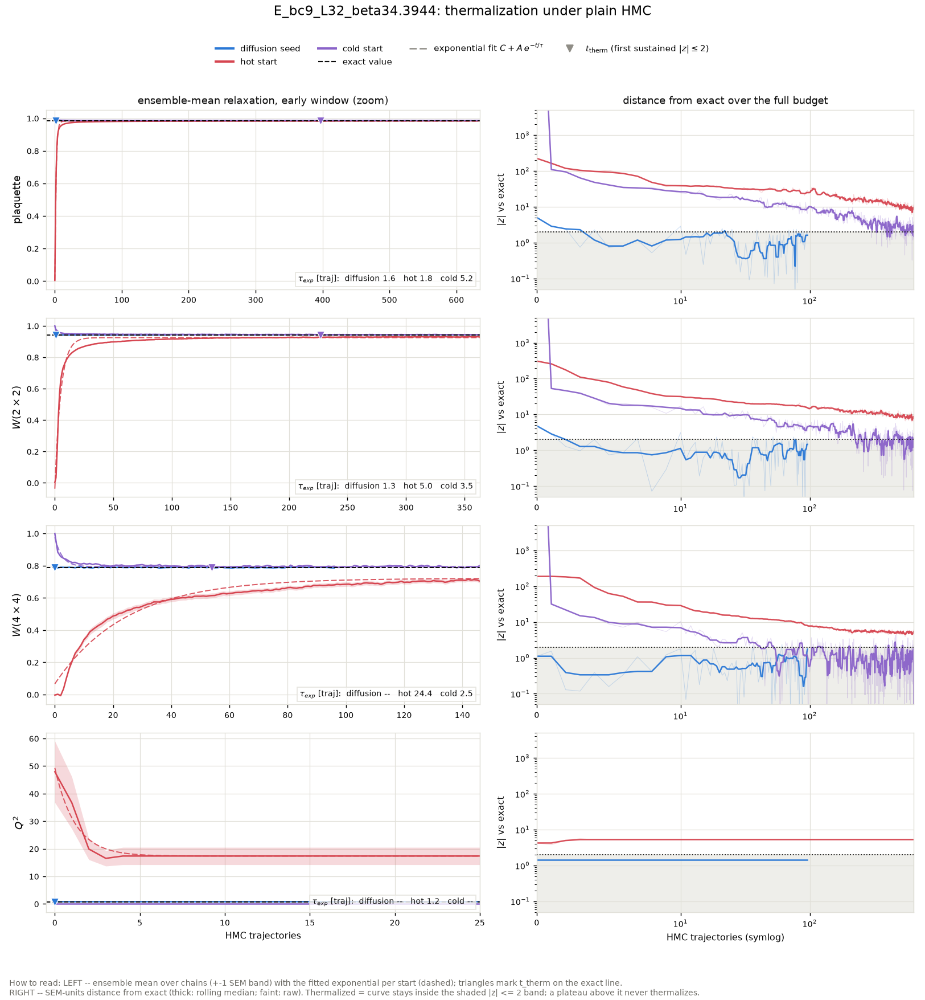

tau_int (hot-start chains, second half): plaquette = 12.00 +- 1.43, wilson_2x2 = 6.13 +- 0.86, wilson_4x4 = 2.33 +- 0.23, wilson_6x6 = 1.43 +- 0.13. Topology: hot-start HMC L=32 beta=34.3944 -> **frozen** (no tunneling).

Where 'never' stood at the end: the hot start ended the 640-trajectory budget still at plaquette at |z| ~ 9, wilson_2x2 at |z| ~ 8, wilson_4x4 at |z| ~ 5, wilson_6x6 at |z| ~ 6, Q^2 at |z| ~ 5; the cold start ended the 640-trajectory budget still at Q^2 at |z| ~ 765454843904.

### Diagnostics: raw diffusion output (before any HMC)

| observable | value | error | exact | z_exact | reference | ref_error | z_ref | ks_p | chi2_p |
|---|---|---|---|---|---|---|---|---|---|
| plaquette | 0.9851 | 7.077e-05 | 0.9854 | -4.259 | 0.9854 | 4.157e-05 | -4.341 | 3.143e-05 |  |
| wilson_1x1 | 0.9851 | 7.077e-05 | 0.9854 | -4.259 | 0.9854 | 4.157e-05 | -4.341 | 3.143e-05 |  |
| wilson_1x2 | 0.97 | 0.000167 | 0.9709 | -5.664 | 0.9709 | 0.0001128 | -4.41 | 0.0002049 |  |
| wilson_2x2 | 0.9412 | 0.0003494 | 0.9427 | -4.364 | 0.9427 | 0.000268 | -3.49 | 0.008145 |  |
| wilson_2x3 | 0.9135 | 0.0006331 | 0.9153 | -2.74 | 0.915 | 0.0004932 | -1.828 | 0.2763 |  |
| wilson_3x3 | 0.8746 | 0.001022 | 0.8756 | -1.052 | 0.8753 | 0.0009217 | -0.5628 | 0.6011 |  |
| wilson_3x4 | 0.8362 | 0.001398 | 0.8377 | -1.075 | 0.8371 | 0.001317 | -0.4754 | 0.2522 |  |
| wilson_4x4 | 0.7876 | 0.001932 | 0.7897 | -1.115 | 0.7889 | 0.001997 | -0.496 | 0.6011 |  |
| wilson_4x5 | 0.7409 | 0.002457 | 0.7445 | -1.457 | 0.7439 | 0.002631 | -0.8425 | 0.6011 |  |
| wilson_5x5 | 0.6868 | 0.003088 | 0.6915 | -1.532 | 0.6906 | 0.003311 | -0.8487 | 0.389 |  |
| wilson_5x6 | 0.6348 | 0.003913 | 0.6423 | -1.932 | 0.6419 | 0.00392 | -1.291 | 0.1712 |  |
| wilson_6x6 | 0.5788 | 0.004734 | 0.5879 | -1.934 | 0.588 | 0.004361 | -1.431 | 0.1251 |  |
| wilson_6x7 | 0.5269 | 0.005724 | 0.5381 | -1.953 | 0.5393 | 0.004877 | -1.644 | 0.1122 |  |
| wilson_7x7 | 0.4718 | 0.006344 | 0.4853 | -2.122 | 0.4868 | 0.005291 | -1.808 | 0.1545 |  |
| wilson_7x8 | 0.4213 | 0.007122 | 0.4377 | -2.298 | 0.4395 | 0.005667 | -2.001 | 0.2297 |  |
| wilson_8x8 | 0.3696 | 0.007598 | 0.389 | -2.552 | 0.3904 | 0.006133 | -2.138 | 0.3584 |  |
| wilson_8x10 | 0.2811 | 0.007813 | 0.3072 | -3.341 | 0.3118 | 0.006791 | -2.965 | 0.1251 |  |
| wilson_10x10 | 0.2024 | 0.00837 | 0.2287 | -3.136 | 0.2329 | 0.007379 | -2.729 | 0.1712 |  |
| wilson_10x12 | 0.1436 | 0.008528 | 0.1702 | -3.126 | 0.1751 | 0.007361 | -2.794 | 0.1251 |  |
| wilson_12x12 | 0.09317 | 0.008482 | 0.1195 | -3.101 | 0.1211 | 0.007773 | -2.427 | 0.1545 |  |
| creutz_2 | 0.01473 | 0.0002185 | 0.01475 | -0.1141 |  |  |  |  |  |
| creutz_3 | 0.01381 | 0.0004266 | 0.01475 | -2.218 |  |  |  |  |  |
| creutz_4 | 0.01513 | 0.0006879 | 0.01475 | 0.539 |  |  |  |  |  |
| creutz_5 | 0.01471 | 0.001082 | 0.01475 | -0.04419 |  |  |  |  |  |
| creutz_6 | 0.01364 | 0.001545 | 0.01475 | -0.7183 |  |  |  |  |  |
| creutz_7 | 0.0166 | 0.002319 | 0.01475 | 0.7964 |  |  |  |  |  |
| creutz_8 | 0.01781 | 0.003094 | 0.01475 | 0.9871 |  |  |  |  |  |
| Q | 0.0625 | 0.09824 | 0 | 0.6362 | 0.125 | 0.05224 | -0.5617 | 0.9693 |  |
| Q^2 | 0.9375 | 0.1095 | 0.7655 | 1.571 | 0.6562 | 0.05961 | 2.256 | 0.9126 |  |
| chi_top ((<Q^2>-<Q>^2)/V) | 0.0009117 | 0.0001071 | 0.0007475 | 1.533 | 0.0006256 | 5.583e-05 | 2.368 | 3.32e-13 |  |
| Q histogram vs exact P(Q) | 4.028 | nan | 4 | nan |  |  |  |  | 0.4022 |

### Diagnostics: the same configs after 96 HMC trajectories

| observable | value | error | exact | z_exact | reference | ref_error | z_ref | ks_p | chi2_p |
|---|---|---|---|---|---|---|---|---|---|
| plaquette | 0.9853 | 5.358e-05 | 0.9854 | -1.873 | 0.9854 | 4.157e-05 | -2.289 | 0.2297 |  |
| wilson_1x1 | 0.9853 | 5.358e-05 | 0.9854 | -1.873 | 0.9854 | 4.157e-05 | -2.289 | 0.2297 |  |
| wilson_1x2 | 0.9707 | 0.000112 | 0.9709 | -2.166 | 0.9709 | 0.0001128 | -1.166 | 0.6011 |  |
| wilson_2x2 | 0.9422 | 0.0002168 | 0.9427 | -2.365 | 0.9427 | 0.000268 | -1.523 | 0.8864 |  |
| wilson_2x3 | 0.9144 | 0.0004104 | 0.9153 | -2.197 | 0.915 | 0.0004932 | -0.9882 | 0.4898 |  |
| wilson_3x3 | 0.8739 | 0.0007733 | 0.8756 | -2.308 | 0.8753 | 0.0009217 | -1.234 | 0.8864 |  |
| wilson_3x4 | 0.8352 | 0.001158 | 0.8377 | -2.181 | 0.8371 | 0.001317 | -1.104 | 0.8864 |  |
| wilson_4x4 | 0.7858 | 0.001747 | 0.7897 | -2.223 | 0.7889 | 0.001997 | -1.171 | 0.678 |  |
| wilson_4x5 | 0.7394 | 0.00245 | 0.7445 | -2.081 | 0.7439 | 0.002631 | -1.266 | 0.1892 |  |
| wilson_5x5 | 0.6844 | 0.003289 | 0.6915 | -2.171 | 0.6906 | 0.003311 | -1.34 | 0.1004 |  |
| wilson_5x6 | 0.6344 | 0.003916 | 0.6423 | -2.027 | 0.6419 | 0.00392 | -1.359 | 0.0711 |  |
| wilson_6x6 | 0.5772 | 0.004796 | 0.5879 | -2.234 | 0.588 | 0.004361 | -1.661 | 0.03831 |  |
| wilson_6x7 | 0.5269 | 0.005451 | 0.5381 | -2.06 | 0.5393 | 0.004877 | -1.698 | 0.05588 |  |
| wilson_7x7 | 0.4717 | 0.00635 | 0.4853 | -2.138 | 0.4868 | 0.005291 | -1.821 | 0.05588 |  |
| wilson_7x8 | 0.4243 | 0.007247 | 0.4377 | -1.848 | 0.4395 | 0.005667 | -1.657 | 0.1712 |  |
| wilson_8x8 | 0.3737 | 0.00778 | 0.389 | -1.961 | 0.3904 | 0.006133 | -1.69 | 0.1122 |  |
| wilson_8x10 | 0.2954 | 0.008986 | 0.3072 | -1.31 | 0.3118 | 0.006791 | -1.453 | 0.1004 |  |
| wilson_10x10 | 0.213 | 0.009075 | 0.2287 | -1.731 | 0.2329 | 0.007379 | -1.702 | 0.0631 |  |
| wilson_10x12 | 0.1597 | 0.01021 | 0.1702 | -1.034 | 0.1751 | 0.007361 | -1.222 | 0.6395 |  |
| wilson_12x12 | 0.1027 | 0.0111 | 0.1195 | -1.515 | 0.1211 | 0.007773 | -1.361 | 0.2522 |  |
| creutz_2 | 0.0149 | 0.0001942 | 0.01475 | 0.7522 |  |  |  |  |  |
| creutz_3 | 0.01537 | 0.0004487 | 0.01475 | 1.366 |  |  |  |  |  |
| creutz_4 | 0.01569 | 0.0007597 | 0.01475 | 1.227 |  |  |  |  |  |
| creutz_5 | 0.01632 | 0.001214 | 0.01475 | 1.286 |  |  |  |  |  |
| creutz_6 | 0.01866 | 0.001822 | 0.01475 | 2.142 |  |  |  |  |  |
| creutz_7 | 0.01934 | 0.002587 | 0.01475 | 1.771 |  |  |  |  |  |
| creutz_8 | 0.02097 | 0.003618 | 0.01475 | 1.718 |  |  |  |  |  |
| Q | 0.0625 | 0.09824 | 0 | 0.6362 | 0.125 | 0.05224 | -0.5617 | 0.9693 |  |
| Q^2 | 0.9375 | 0.1095 | 0.7655 | 1.571 | 0.6562 | 0.05961 | 2.256 | 0.9126 |  |
| chi_top ((<Q^2>-<Q>^2)/V) | 0.0009117 | 0.0001071 | 0.0007475 | 1.533 | 0.0006256 | 5.583e-05 | 2.368 | 3.32e-13 |  |
| Q histogram vs exact P(Q) | 4.028 | nan | 4 | nan |  |  |  |  | 0.4022 |

## E_bc11.8_L32_beta45.6238

HMC: step size 0.0592, 17 leapfrog steps, acceptance seed/hot/cold = 0.983/0.984/0.982. Diffusion-seed batch: 128 chains x 96 trajectories (0.11 s/traj for the whole batch); baselines: 32 chains x 640 trajectories.

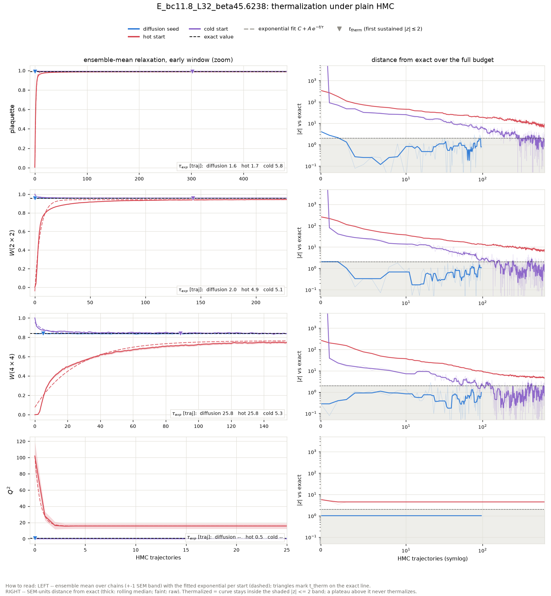

tau_int (hot-start chains, second half): plaquette = 9.42 +- 1.17, wilson_2x2 = 9.38 +- 1.23, wilson_4x4 = 4.14 +- 0.58, wilson_6x6 = 2.61 +- 0.39. Topology: hot-start HMC L=32 beta=45.6238 -> **frozen** (no tunneling).

Where 'never' stood at the end: the hot start ended the 640-trajectory budget still at plaquette at |z| ~ 8, wilson_2x2 at |z| ~ 7, wilson_4x4 at |z| ~ 5, wilson_6x6 at |z| ~ 5, Q^2 at |z| ~ 4; the cold start ended the 640-trajectory budget still at Q^2 at |z| ~ 574600642560.

### Diagnostics: raw diffusion output (before any HMC)

| observable | value | error | exact | z_exact | reference | ref_error | z_ref | ks_p | chi2_p |
|---|---|---|---|---|---|---|---|---|---|
| plaquette | 0.9888 | 3.487e-05 | 0.989 | -5.237 | 0.989 | 3.134e-05 | -5.257 | 0.00159 |  |
| wilson_1x1 | 0.9888 | 3.487e-05 | 0.989 | -5.237 | 0.989 | 3.134e-05 | -5.257 | 0.00159 |  |
| wilson_1x2 | 0.9776 | 8.877e-05 | 0.9781 | -5.759 | 0.9781 | 8.577e-05 | -4.218 | 0.002655 |  |
| wilson_2x2 | 0.9561 | 0.0001822 | 0.9566 | -2.746 | 0.9568 | 0.0002615 | -2.171 | 0.0711 |  |
| wilson_2x3 | 0.9351 | 0.0003314 | 0.9357 | -1.622 | 0.9358 | 0.0004153 | -1.24 | 0.7538 |  |
| wilson_3x3 | 0.9054 | 0.0005701 | 0.9051 | 0.5912 | 0.9055 | 0.0007954 | -0.1051 | 0.8864 |  |
| wilson_3x4 | 0.8759 | 0.0008626 | 0.8755 | 0.4613 | 0.8761 | 0.001104 | -0.1843 | 0.5259 |  |
| wilson_4x4 | 0.8379 | 0.00121 | 0.8375 | 0.3518 | 0.8387 | 0.001702 | -0.3693 | 0.6395 |  |
| wilson_4x5 | 0.8026 | 0.001598 | 0.8012 | 0.8485 | 0.8025 | 0.002063 | 0.03146 | 0.7163 |  |
| wilson_5x5 | 0.7607 | 0.002108 | 0.758 | 1.269 | 0.7595 | 0.002594 | 0.3565 | 0.5259 |  |
| wilson_5x6 | 0.7203 | 0.002606 | 0.7172 | 1.21 | 0.7196 | 0.002964 | 0.1758 | 0.7538 |  |
| wilson_6x6 | 0.6749 | 0.003134 | 0.671 | 1.225 | 0.674 | 0.003406 | 0.1951 | 0.9542 |  |
| wilson_6x7 | 0.6327 | 0.003478 | 0.6279 | 1.397 | 0.6319 | 0.003874 | 0.1641 | 0.9888 |  |
| wilson_7x7 | 0.5867 | 0.003935 | 0.581 | 1.452 | 0.5838 | 0.00435 | 0.494 | 0.9693 |  |
| wilson_7x8 | 0.5433 | 0.004418 | 0.5376 | 1.273 | 0.5403 | 0.004792 | 0.4475 | 0.9353 |  |
| wilson_8x8 | 0.4974 | 0.004853 | 0.492 | 1.098 | 0.4927 | 0.005344 | 0.6468 | 0.8569 |  |
| wilson_8x10 | 0.4154 | 0.005654 | 0.4121 | 0.5851 | 0.4119 | 0.006347 | 0.4163 | 0.9126 |  |
| wilson_10x10 | 0.3338 | 0.007225 | 0.3302 | 0.4974 | 0.3246 | 0.007748 | 0.8703 | 0.5259 |  |
| wilson_10x12 | 0.2643 | 0.00874 | 0.2646 | -0.0289 | 0.2572 | 0.008225 | 0.5891 | 0.4212 |  |
| wilson_12x12 | 0.2012 | 0.0102 | 0.2028 | -0.1593 | 0.1968 | 0.009249 | 0.3158 | 0.5631 |  |
| creutz_2 | 0.01074 | 0.0001623 | 0.01108 | -2.082 |  |  |  |  |  |
| creutz_3 | 0.01008 | 0.0003367 | 0.01108 | -2.965 |  |  |  |  |  |
| creutz_4 | 0.01111 | 0.0005971 | 0.01108 | 0.04758 |  |  |  |  |  |
| creutz_5 | 0.01043 | 0.0009113 | 0.01108 | -0.7112 |  |  |  |  |  |
| creutz_6 | 0.01063 | 0.001174 | 0.01108 | -0.3859 |  |  |  |  |  |
| creutz_7 | 0.011 | 0.001636 | 0.01108 | -0.04637 |  |  |  |  |  |
| creutz_8 | 0.01133 | 0.001957 | 0.01108 | 0.1285 |  |  |  |  |  |
| Q | 0 | 0.06316 | 0 | 0 | 0.1042 | 0.06508 | -1.149 | 0.9542 |  |
| Q^2 | 0.6562 | 0.09044 | 0.5746 | 0.9028 | 0.6667 | 0.06089 | -0.09554 | 1 |  |
| chi_top ((<Q^2>-<Q>^2)/V) | 0.0006409 | 8.832e-05 | 0.0005611 | 0.9028 | 0.0006404 | 6.036e-05 | 0.003962 | 8.226e-17 |  |
| Q histogram vs exact P(Q) | 2.713 | nan | 4 | nan |  |  |  |  | 0.6069 |

### Diagnostics: the same configs after 96 HMC trajectories

| observable | value | error | exact | z_exact | reference | ref_error | z_ref | ks_p | chi2_p |
|---|---|---|---|---|---|---|---|---|---|
| plaquette | 0.989 | 4.433e-05 | 0.989 | 0.7698 | 0.989 | 3.134e-05 | -0.5471 | 0.8569 |  |
| wilson_1x1 | 0.989 | 4.433e-05 | 0.989 | 0.7698 | 0.989 | 3.134e-05 | -0.5471 | 0.8569 |  |
| wilson_1x2 | 0.9782 | 9.251e-05 | 0.9781 | 1.159 | 0.9781 | 8.577e-05 | 0.7761 | 0.3584 |  |
| wilson_2x2 | 0.9569 | 0.0001848 | 0.9566 | 1.4 | 0.9568 | 0.0002615 | 0.2089 | 0.8569 |  |
| wilson_2x3 | 0.9359 | 0.0003211 | 0.9357 | 0.7816 | 0.9358 | 0.0004153 | 0.2471 | 0.8246 |  |
| wilson_3x3 | 0.9059 | 0.0006495 | 0.9051 | 1.275 | 0.9055 | 0.0007954 | 0.378 | 0.4212 |  |
| wilson_3x4 | 0.8766 | 0.0009658 | 0.8755 | 1.125 | 0.8761 | 0.001104 | 0.2932 | 0.678 |  |
| wilson_4x4 | 0.8391 | 0.001531 | 0.8375 | 1.027 | 0.8387 | 0.001702 | 0.1641 | 0.6395 |  |
| wilson_4x5 | 0.803 | 0.002193 | 0.8012 | 0.8089 | 0.8025 | 0.002063 | 0.1662 | 0.678 |  |
| wilson_5x5 | 0.7597 | 0.002975 | 0.758 | 0.5653 | 0.7595 | 0.002594 | 0.05044 | 0.9126 |  |
| wilson_5x6 | 0.7192 | 0.003873 | 0.7172 | 0.529 | 0.7196 | 0.002964 | -0.08426 | 0.7163 |  |
| wilson_6x6 | 0.6723 | 0.004502 | 0.671 | 0.2858 | 0.674 | 0.003406 | -0.2922 | 0.9542 |  |
| wilson_6x7 | 0.6294 | 0.005471 | 0.6279 | 0.2835 | 0.6319 | 0.003874 | -0.3659 | 0.9353 |  |
| wilson_7x7 | 0.5829 | 0.006246 | 0.581 | 0.3093 | 0.5838 | 0.00435 | -0.1162 | 0.9807 |  |
| wilson_7x8 | 0.54 | 0.007072 | 0.5376 | 0.3362 | 0.5403 | 0.004792 | -0.03847 | 0.9542 |  |
| wilson_8x8 | 0.4945 | 0.007854 | 0.492 | 0.319 | 0.4927 | 0.005344 | 0.1945 | 0.9353 |  |
| wilson_8x10 | 0.4124 | 0.009251 | 0.4121 | 0.03308 | 0.4119 | 0.006347 | 0.0478 | 0.7538 |  |
| wilson_10x10 | 0.3309 | 0.01088 | 0.3302 | 0.06338 | 0.3246 | 0.007748 | 0.4728 | 0.8864 |  |
| wilson_10x12 | 0.2612 | 0.0121 | 0.2646 | -0.2799 | 0.2572 | 0.008225 | 0.2691 | 0.7901 |  |
| wilson_12x12 | 0.1954 | 0.01379 | 0.2028 | -0.5403 | 0.1968 | 0.009249 | -0.08898 | 0.6011 |  |
| creutz_2 | 0.011 | 0.0001622 | 0.01108 | -0.5271 |  |  |  |  |  |
| creutz_3 | 0.01043 | 0.0003469 | 0.01108 | -1.869 |  |  |  |  |  |
| creutz_4 | 0.01077 | 0.0005319 | 0.01108 | -0.5826 |  |  |  |  |  |
| creutz_5 | 0.01141 | 0.0008562 | 0.01108 | 0.3878 |  |  |  |  |  |
| creutz_6 | 0.01265 | 0.001202 | 0.01108 | 1.309 |  |  |  |  |  |
| creutz_7 | 0.01078 | 0.001771 | 0.01108 | -0.1696 |  |  |  |  |  |
| creutz_8 | 0.01151 | 0.002293 | 0.01108 | 0.1855 |  |  |  |  |  |
| Q | 0 | 0.06316 | 0 | 0 | 0.1042 | 0.06508 | -1.149 | 0.9542 |  |
| Q^2 | 0.6562 | 0.09044 | 0.5746 | 0.9028 | 0.6667 | 0.06089 | -0.09554 | 1 |  |
| chi_top ((<Q^2>-<Q>^2)/V) | 0.0006409 | 8.832e-05 | 0.0005611 | 0.9028 | 0.0006404 | 6.036e-05 | 0.003962 | 8.226e-17 |  |
| Q histogram vs exact P(Q) | 2.713 | nan | 4 | nan |  |  |  |  | 0.6069 |

## D_bc14.1464_L32_beta55.0237

HMC: step size 0.0539, 19 leapfrog steps, acceptance seed/hot/cold = 0.978/0.976/0.979. Diffusion-seed batch: 128 chains x 96 trajectories (0.10 s/traj for the whole batch); baselines: 32 chains x 640 trajectories.

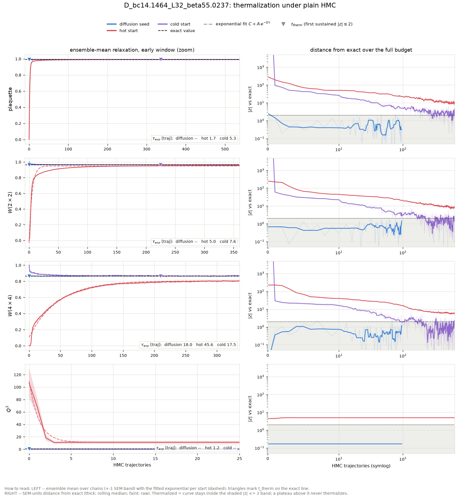

tau_int (hot-start chains, second half): plaquette = 9.68 +- 1.45, wilson_2x2 = 12.56 +- 1.68, wilson_4x4 = 8.88 +- 1.14, wilson_6x6 = 6.05 +- 0.79. Topology: hot-start HMC L=32 beta=55.0237 -> **frozen** (no tunneling).

Where 'never' stood at the end: the hot start ended the 640-trajectory budget still at plaquette at |z| ~ 10, wilson_2x2 at |z| ~ 8, wilson_4x4 at |z| ~ 6, wilson_6x6 at |z| ~ 7, Q^2 at |z| ~ 6; the cold start ended the 640-trajectory budget still at Q^2 at |z| ~ 474280296448.

### Diagnostics: raw diffusion output (before any HMC)

| observable | value | error | exact | z_exact | reference | ref_error | z_ref | ks_p | chi2_p |
|---|---|---|---|---|---|---|---|---|---|
| plaquette | 0.9908 | 4.173e-05 | 0.9909 | -2.303 | 0.9909 | 2.703e-05 | -2.136 | 0.03364 |  |
| wilson_1x1 | 0.9908 | 4.173e-05 | 0.9909 | -2.303 | 0.9909 | 2.703e-05 | -2.136 | 0.03364 |  |
| wilson_1x2 | 0.9815 | 0.0001029 | 0.9818 | -3.075 | 0.9818 | 5.904e-05 | -2.475 | 0.1004 |  |
| wilson_2x2 | 0.9638 | 0.0002102 | 0.964 | -0.6955 | 0.9638 | 0.0001521 | 0.03855 | 0.9807 |  |
| wilson_2x3 | 0.9464 | 0.0003915 | 0.9465 | -0.05142 | 0.9465 | 0.0002251 | -0.1415 | 0.5631 |  |
| wilson_3x3 | 0.9214 | 0.0006757 | 0.9208 | 0.9497 | 0.921 | 0.0004365 | 0.5066 | 0.5259 |  |
| wilson_3x4 | 0.8962 | 0.001023 | 0.8958 | 0.3705 | 0.8964 | 0.0005764 | -0.1751 | 0.4548 |  |
| wilson_4x4 | 0.8635 | 0.001493 | 0.8635 | -0.006124 | 0.8644 | 0.0008388 | -0.5066 | 0.5631 |  |
| wilson_4x5 | 0.8317 | 0.002045 | 0.8324 | -0.3687 | 0.8338 | 0.001045 | -0.9249 | 0.7901 |  |
| wilson_5x5 | 0.7937 | 0.002699 | 0.7951 | -0.5145 | 0.7969 | 0.001523 | -1.011 | 0.389 |  |
| wilson_5x6 | 0.7568 | 0.003419 | 0.7595 | -0.7955 | 0.7623 | 0.001953 | -1.404 | 0.4548 |  |
| wilson_6x6 | 0.7135 | 0.00405 | 0.7188 | -1.307 | 0.7209 | 0.002568 | -1.523 | 0.2297 |  |
| wilson_6x7 | 0.6733 | 0.004839 | 0.6804 | -1.469 | 0.6827 | 0.003195 | -1.634 | 0.2763 |  |
| wilson_7x7 | 0.6289 | 0.005558 | 0.6381 | -1.656 | 0.6399 | 0.003671 | -1.662 | 0.3021 |  |
| wilson_7x8 | 0.5871 | 0.006251 | 0.5984 | -1.816 | 0.6009 | 0.004341 | -1.819 | 0.1122 |  |
| wilson_8x8 | 0.5431 | 0.007029 | 0.5561 | -1.845 | 0.5584 | 0.004749 | -1.795 | 0.1545 |  |
| wilson_8x10 | 0.4628 | 0.007973 | 0.4802 | -2.184 | 0.4848 | 0.005792 | -2.234 | 0.05588 |  |
| wilson_10x10 | 0.3794 | 0.009066 | 0.3998 | -2.248 | 0.4033 | 0.006486 | -2.142 | 0.2763 |  |
| wilson_10x12 | 0.3087 | 0.01036 | 0.3329 | -2.332 | 0.3379 | 0.006761 | -2.356 | 0.1545 |  |
| wilson_12x12 | 0.2413 | 0.01068 | 0.2672 | -2.424 | 0.2703 | 0.006422 | -2.326 | 0.07995 |  |
| creutz_2 | 0.008775 | 0.0001261 | 0.009171 | -3.141 |  |  |  |  |  |
| creutz_3 | 0.008583 | 0.0002804 | 0.00917 | -2.095 |  |  |  |  |  |
| creutz_4 | 0.00933 | 0.0004653 | 0.00917 | 0.3441 |  |  |  |  |  |
| creutz_5 | 0.009115 | 0.0006495 | 0.009169 | -0.08324 |  |  |  |  |  |
| creutz_6 | 0.01113 | 0.0009125 | 0.009167 | 2.15 |  |  |  |  |  |
| creutz_7 | 0.01008 | 0.0013 | 0.009165 | 0.7011 |  |  |  |  |  |
| creutz_8 | 0.008976 | 0.001732 | 0.009162 | -0.1075 |  |  |  |  |  |
| Q | 0 | 0.05689 | 0 | 0 | 0.06771 | 0.04615 | -0.9242 | 0.9999 |  |
| Q^2 | 0.4844 | 0.05614 | 0.4743 | 0.1798 | 0.526 | 0.04735 | -0.5673 | 1 |  |
| chi_top ((<Q^2>-<Q>^2)/V) | 0.000473 | 5.482e-05 | 0.0004632 | 0.1798 | 0.0005092 | 4.707e-05 | -0.5012 | 7.05e-23 |  |
| Q histogram vs exact P(Q) | 0.1517 | nan | 2 | nan |  |  |  |  | 0.927 |

### Diagnostics: the same configs after 96 HMC trajectories

| observable | value | error | exact | z_exact | reference | ref_error | z_ref | ks_p | chi2_p |
|---|---|---|---|---|---|---|---|---|---|
| plaquette | 0.9909 | 3.181e-05 | 0.9909 | -0.001287 | 0.9909 | 2.703e-05 | -0.2428 | 0.7538 |  |
| wilson_1x1 | 0.9909 | 3.181e-05 | 0.9909 | -0.001287 | 0.9909 | 2.703e-05 | -0.2428 | 0.7538 |  |
| wilson_1x2 | 0.9818 | 6.762e-05 | 0.9818 | -0.07559 | 0.9818 | 5.904e-05 | 0.1972 | 0.5631 |  |
| wilson_2x2 | 0.9639 | 0.0002328 | 0.964 | -0.5283 | 0.9638 | 0.0001521 | 0.1194 | 0.9353 |  |
| wilson_2x3 | 0.9464 | 0.0004388 | 0.9465 | -0.212 | 0.9465 | 0.0002251 | -0.2774 | 0.7901 |  |
| wilson_3x3 | 0.9204 | 0.0007132 | 0.9208 | -0.5179 | 0.921 | 0.0004365 | -0.7217 | 0.4898 |  |
| wilson_3x4 | 0.8951 | 0.0009775 | 0.8958 | -0.6995 | 0.8964 | 0.0005764 | -1.118 | 0.678 |  |
| wilson_4x4 | 0.8625 | 0.00146 | 0.8635 | -0.7021 | 0.8644 | 0.0008388 | -1.119 | 0.4548 |  |
| wilson_4x5 | 0.8308 | 0.001867 | 0.8324 | -0.861 | 0.8338 | 0.001045 | -1.392 | 0.678 |  |
| wilson_5x5 | 0.7929 | 0.002486 | 0.7951 | -0.9075 | 0.7969 | 0.001523 | -1.372 | 0.389 |  |
| wilson_5x6 | 0.7562 | 0.003074 | 0.7595 | -1.076 | 0.7623 | 0.001953 | -1.68 | 0.389 |  |
| wilson_6x6 | 0.7145 | 0.003905 | 0.7188 | -1.105 | 0.7209 | 0.002568 | -1.354 | 0.4548 |  |
| wilson_6x7 | 0.6751 | 0.004535 | 0.6804 | -1.169 | 0.6827 | 0.003195 | -1.383 | 0.389 |  |
| wilson_7x7 | 0.632 | 0.005351 | 0.6381 | -1.135 | 0.6399 | 0.003671 | -1.224 | 0.4898 |  |
| wilson_7x8 | 0.5918 | 0.005993 | 0.5984 | -1.106 | 0.6009 | 0.004341 | -1.233 | 0.3294 |  |
| wilson_8x8 | 0.55 | 0.006842 | 0.5561 | -0.8958 | 0.5584 | 0.004749 | -1.008 | 0.4548 |  |
| wilson_8x10 | 0.4738 | 0.007745 | 0.4802 | -0.8334 | 0.4848 | 0.005792 | -1.143 | 0.1545 |  |
| wilson_10x10 | 0.3947 | 0.009014 | 0.3998 | -0.5708 | 0.4033 | 0.006486 | -0.7779 | 0.2522 |  |
| wilson_10x12 | 0.3294 | 0.01013 | 0.3329 | -0.3485 | 0.3379 | 0.006761 | -0.6997 | 0.9126 |  |
| wilson_12x12 | 0.2652 | 0.01097 | 0.2672 | -0.1823 | 0.2703 | 0.006422 | -0.4013 | 0.9126 |  |
| creutz_2 | 0.009288 | 0.0001333 | 0.009171 | 0.8799 |  |  |  |  |  |
| creutz_3 | 0.009502 | 0.0002446 | 0.00917 | 1.358 |  |  |  |  |  |
| creutz_4 | 0.009231 | 0.000449 | 0.00917 | 0.1368 |  |  |  |  |  |
| creutz_5 | 0.009332 | 0.0007103 | 0.009169 | 0.2306 |  |  |  |  |  |
| creutz_6 | 0.0093 | 0.001013 | 0.009167 | 0.1314 |  |  |  |  |  |
| creutz_7 | 0.009099 | 0.001369 | 0.009165 | -0.0481 |  |  |  |  |  |
| creutz_8 | 0.007523 | 0.00192 | 0.009162 | -0.8536 |  |  |  |  |  |
| Q | 0 | 0.05689 | 0 | 0 | 0.06771 | 0.04615 | -0.9242 | 0.9999 |  |
| Q^2 | 0.4844 | 0.05614 | 0.4743 | 0.1798 | 0.526 | 0.04735 | -0.5673 | 1 |  |
| chi_top ((<Q^2>-<Q>^2)/V) | 0.000473 | 5.482e-05 | 0.0004632 | 0.1798 | 0.0005092 | 4.707e-05 | -0.5012 | 7.05e-23 |  |
| Q histogram vs exact P(Q) | 0.1517 | nan | 2 | nan |  |  |  |  | 0.927 |

## E_bc18_L32_beta70.4526

HMC: step size 0.0477, 21 leapfrog steps, acceptance seed/hot/cold = 0.974/0.975/0.976. Diffusion-seed batch: 128 chains x 96 trajectories (0.10 s/traj for the whole batch); baselines: 32 chains x 640 trajectories.

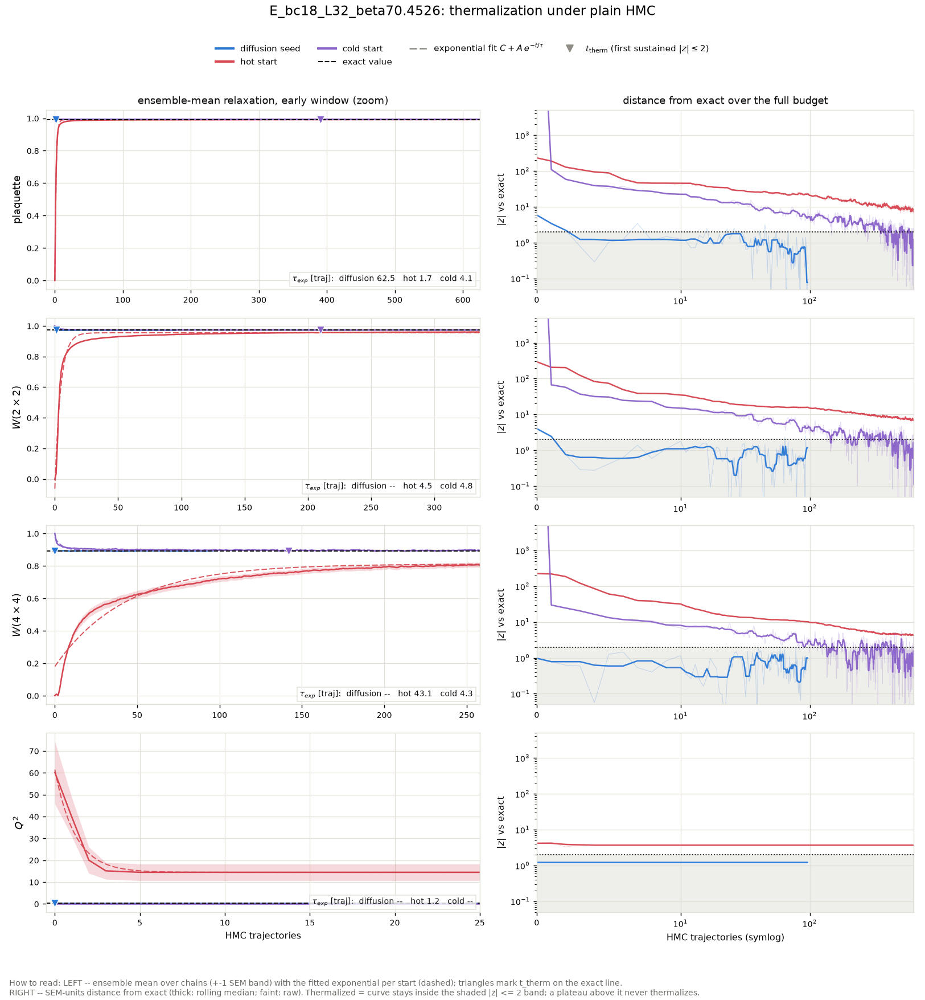

tau_int (hot-start chains, second half): plaquette = 8.12 +- 1.48, wilson_2x2 = 13.90 +- 2.07, wilson_4x4 = 5.88 +- 1.18, wilson_6x6 = 3.33 +- 0.62. Topology: hot-start HMC L=32 beta=70.4526 -> **frozen** (no tunneling).

Where 'never' stood at the end: the hot start ended the 640-trajectory budget still at plaquette at |z| ~ 9, wilson_2x2 at |z| ~ 8, wilson_4x4 at |z| ~ 5, wilson_6x6 at |z| ~ 5, Q^2 at |z| ~ 5; the cold start ended the 640-trajectory budget still at Q^2 at |z| ~ 363637014528.

### Diagnostics: raw diffusion output (before any HMC)

| observable | value | error | exact | z_exact | reference | ref_error | z_ref | ks_p | chi2_p |
|---|---|---|---|---|---|---|---|---|---|
| plaquette | 0.9927 | 2.286e-05 | 0.9929 | -6.877 | 0.9929 | 2.811e-05 | -4.644 | 0.0003034 |  |
| wilson_1x1 | 0.9927 | 2.286e-05 | 0.9929 | -6.877 | 0.9929 | 2.811e-05 | -4.644 | 0.0003034 |  |
| wilson_1x2 | 0.9854 | 6.045e-05 | 0.9858 | -7.273 | 0.9859 | 5.833e-05 | -5.889 | 8.145e-06 |  |
| wilson_2x2 | 0.9712 | 0.00013 | 0.9718 | -4.564 | 0.9718 | 0.0001234 | -3.493 | 0.00159 |  |
| wilson_2x3 | 0.9576 | 0.0002223 | 0.958 | -2.074 | 0.9583 | 0.0002335 | -2.312 | 0.003137 |  |
| wilson_3x3 | 0.938 | 0.0003646 | 0.9377 | 0.9116 | 0.9378 | 0.0003626 | 0.3954 | 0.3584 |  |
| wilson_3x4 | 0.9186 | 0.0005352 | 0.9178 | 1.43 | 0.9186 | 0.0004437 | -0.01605 | 0.678 |  |
| wilson_4x4 | 0.8929 | 0.0008471 | 0.892 | 1.152 | 0.8928 | 0.0006108 | 0.1379 | 0.9941 |  |
| wilson_4x5 | 0.8687 | 0.001164 | 0.8668 | 1.64 | 0.8686 | 0.0007519 | 0.1093 | 0.9353 |  |
| wilson_5x5 | 0.8386 | 0.001674 | 0.8364 | 1.288 | 0.8378 | 0.0009827 | 0.3799 | 0.9807 |  |
| wilson_5x6 | 0.8094 | 0.002258 | 0.8071 | 1.017 | 0.8098 | 0.001205 | -0.1452 | 0.8569 |  |
| wilson_6x6 | 0.7745 | 0.002987 | 0.7733 | 0.4276 | 0.7761 | 0.001529 | -0.4826 | 0.9126 |  |
| wilson_6x7 | 0.7419 | 0.003796 | 0.7408 | 0.2751 | 0.7448 | 0.002031 | -0.667 | 0.678 |  |
| wilson_7x7 | 0.7048 | 0.004753 | 0.7047 | 0.002192 | 0.709 | 0.002559 | -0.7872 | 0.678 |  |
| wilson_7x8 | 0.6691 | 0.005779 | 0.6704 | -0.2285 | 0.6765 | 0.003224 | -1.114 | 0.3584 |  |
| wilson_8x8 | 0.6306 | 0.006792 | 0.6333 | -0.3896 | 0.6391 | 0.003749 | -1.098 | 0.3584 |  |
| wilson_8x10 | 0.5589 | 0.008741 | 0.565 | -0.703 | 0.5766 | 0.00526 | -1.741 | 0.5259 |  |
| wilson_10x10 | 0.4811 | 0.01078 | 0.4901 | -0.8336 | 0.5001 | 0.006897 | -1.484 | 0.4548 |  |
| wilson_10x12 | 0.4132 | 0.01178 | 0.4252 | -1.017 | 0.4379 | 0.009234 | -1.649 | 0.389 |  |
| wilson_12x12 | 0.3465 | 0.01287 | 0.3587 | -0.9471 | 0.3671 | 0.0108 | -1.225 | 0.7163 |  |
| creutz_2 | 0.007024 | 0.0001019 | 0.007147 | -1.207 |  |  |  |  |  |
| creutz_3 | 0.006438 | 0.00021 | 0.007145 | -3.362 |  |  |  |  |  |
| creutz_4 | 0.00736 | 0.0003572 | 0.007141 | 0.6124 |  |  |  |  |  |
| creutz_5 | 0.007869 | 0.0005602 | 0.007137 | 1.308 |  |  |  |  |  |
| creutz_6 | 0.008587 | 0.0007341 | 0.007131 | 1.984 |  |  |  |  |  |
| creutz_7 | 0.008274 | 0.0009484 | 0.007122 | 1.215 |  |  |  |  |  |
| creutz_8 | 0.00734 | 0.001367 | 0.007111 | 0.1677 |  |  |  |  |  |
| Q | 0.01562 | 0.04517 | 0 | 0.3459 | 0.05729 | 0.03698 | -0.7138 | 1 |  |
| Q^2 | 0.3125 | 0.03508 | 0.3636 | -1.458 | 0.3177 | 0.04627 | -0.0897 | 1 |  |
| chi_top ((<Q^2>-<Q>^2)/V) | 0.0003049 | 3.424e-05 | 0.0003551 | -1.466 | 0.0003071 | 4.536e-05 | -0.03729 | 3.729e-35 |  |
| Q histogram vs exact P(Q) | 0.5803 | nan | 2 | nan |  |  |  |  | 0.7481 |

### Diagnostics: the same configs after 96 HMC trajectories

| observable | value | error | exact | z_exact | reference | ref_error | z_ref | ks_p | chi2_p |
|---|---|---|---|---|---|---|---|---|---|
| plaquette | 0.9928 | 2.864e-05 | 0.9929 | -1.023 | 0.9929 | 2.811e-05 | -1.005 | 0.3021 |  |
| wilson_1x1 | 0.9928 | 2.864e-05 | 0.9929 | -1.023 | 0.9929 | 2.811e-05 | -1.005 | 0.3021 |  |
| wilson_1x2 | 0.9858 | 6.784e-05 | 0.9858 | -0.2267 | 0.9859 | 5.833e-05 | -0.7868 | 0.5631 |  |
| wilson_2x2 | 0.9716 | 0.000186 | 0.9718 | -1.409 | 0.9718 | 0.0001234 | -1.32 | 0.1892 |  |
| wilson_2x3 | 0.9576 | 0.0003214 | 0.958 | -1.237 | 0.9583 | 0.0002335 | -1.716 | 0.05588 |  |
| wilson_3x3 | 0.937 | 0.0005627 | 0.9377 | -1.307 | 0.9378 | 0.0003626 | -1.291 | 0.1545 |  |
| wilson_3x4 | 0.9167 | 0.0008165 | 0.9178 | -1.38 | 0.9186 | 0.0004437 | -2.048 | 0.1004 |  |
| wilson_4x4 | 0.8901 | 0.001229 | 0.892 | -1.551 | 0.8928 | 0.0006108 | -1.995 | 0.1251 |  |
| wilson_4x5 | 0.8644 | 0.001659 | 0.8668 | -1.457 | 0.8686 | 0.0007519 | -2.293 | 0.04938 |  |
| wilson_5x5 | 0.8332 | 0.002339 | 0.8364 | -1.375 | 0.8378 | 0.0009827 | -1.827 | 0.1545 |  |
| wilson_5x6 | 0.8033 | 0.003017 | 0.8071 | -1.265 | 0.8098 | 0.001205 | -1.996 | 0.1712 |  |
| wilson_6x6 | 0.769 | 0.003845 | 0.7733 | -1.108 | 0.7761 | 0.001529 | -1.729 | 0.1251 |  |
| wilson_6x7 | 0.7365 | 0.004483 | 0.7408 | -0.9763 | 0.7448 | 0.002031 | -1.685 | 0.389 |  |
| wilson_7x7 | 0.6997 | 0.005226 | 0.7047 | -0.9657 | 0.709 | 0.002559 | -1.599 | 0.3294 |  |
| wilson_7x8 | 0.6658 | 0.005968 | 0.6704 | -0.7725 | 0.6765 | 0.003224 | -1.572 | 0.2522 |  |
| wilson_8x8 | 0.6289 | 0.006709 | 0.6333 | -0.6422 | 0.6391 | 0.003749 | -1.324 | 0.5631 |  |
| wilson_8x10 | 0.559 | 0.007847 | 0.565 | -0.7678 | 0.5766 | 0.00526 | -1.867 | 0.1892 |  |
| wilson_10x10 | 0.4839 | 0.008973 | 0.4901 | -0.6839 | 0.5001 | 0.006897 | -1.426 | 0.3584 |  |
| wilson_10x12 | 0.4194 | 0.009974 | 0.4252 | -0.579 | 0.4379 | 0.009234 | -1.36 | 0.2087 |  |
| wilson_12x12 | 0.3526 | 0.0108 | 0.3587 | -0.5628 | 0.3671 | 0.0108 | -0.9476 | 0.5259 |  |
| creutz_2 | 0.007415 | 0.0001065 | 0.007147 | 2.517 |  |  |  |  |  |
| creutz_3 | 0.007368 | 0.0002141 | 0.007145 | 1.045 |  |  |  |  |  |
| creutz_4 | 0.007608 | 0.0003519 | 0.007141 | 1.325 |  |  |  |  |  |
| creutz_5 | 0.007544 | 0.0005603 | 0.007137 | 0.7272 |  |  |  |  |  |
| creutz_6 | 0.007029 | 0.0008027 | 0.007131 | -0.1266 |  |  |  |  |  |
| creutz_7 | 0.007981 | 0.00106 | 0.007122 | 0.8105 |  |  |  |  |  |
| creutz_8 | 0.007325 | 0.00135 | 0.007111 | 0.1586 |  |  |  |  |  |
| Q | 0.01562 | 0.04517 | 0 | 0.3459 | 0.05729 | 0.03698 | -0.7138 | 1 |  |
| Q^2 | 0.3125 | 0.03508 | 0.3636 | -1.458 | 0.3177 | 0.04627 | -0.0897 | 1 |  |
| chi_top ((<Q^2>-<Q>^2)/V) | 0.0003049 | 3.424e-05 | 0.0003551 | -1.466 | 0.0003071 | 4.536e-05 | -0.03729 | 3.729e-35 |  |
| Q histogram vs exact P(Q) | 0.5803 | nan | 2 | nan |  |  |  |  | 0.7481 |

## D_bc20_L32_beta78.4578

HMC: step size 0.0452, 22 leapfrog steps, acceptance seed/hot/cold = 0.977/0.980/0.978. Diffusion-seed batch: 128 chains x 96 trajectories (0.10 s/traj for the whole batch); baselines: 32 chains x 640 trajectories.

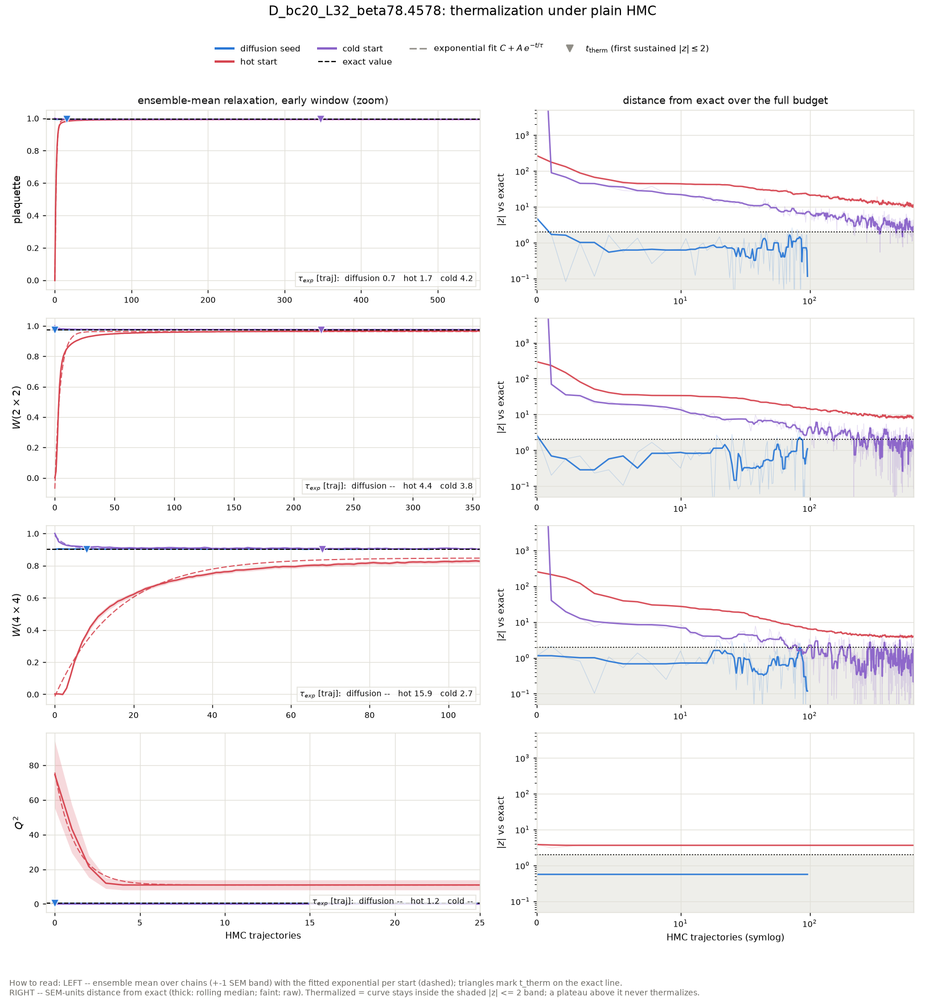

tau_int (hot-start chains, second half): plaquette = 7.73 +- 0.89, wilson_2x2 = 5.45 +- 0.72, wilson_4x4 = 3.21 +- 0.37, wilson_6x6 = 2.03 +- 0.20. Topology: hot-start HMC L=32 beta=78.4578 -> **frozen** (no tunneling).

Where 'never' stood at the end: the hot start ended the 640-trajectory budget still at plaquette at |z| ~ 12, wilson_2x2 at |z| ~ 8, wilson_4x4 at |z| ~ 4, wilson_6x6 at |z| ~ 5, Q^2 at |z| ~ 4; the cold start ended the 640-trajectory budget still at plaquette at |z| ~ 2, Q^2 at |z| ~ 320492732416.

### Diagnostics: raw diffusion output (before any HMC)

| observable | value | error | exact | z_exact | reference | ref_error | z_ref | ks_p | chi2_p |
|---|---|---|---|---|---|---|---|---|---|
| plaquette | 0.9935 | 2.748e-05 | 0.9936 | -4.391 | 0.9937 | 1.641e-05 | -5.505 | 0.0002496 |  |
| wilson_1x1 | 0.9935 | 2.748e-05 | 0.9936 | -4.391 | 0.9937 | 1.641e-05 | -5.505 | 0.0002496 |  |
| wilson_1x2 | 0.987 | 6.439e-05 | 0.9873 | -4.417 | 0.9874 | 3.818e-05 | -5.924 | 1.289e-05 |  |
| wilson_2x2 | 0.9743 | 0.0001161 | 0.9747 | -3.043 | 0.975 | 0.0001289 | -4.019 | 0.0007783 |  |
| wilson_2x3 | 0.962 | 0.0001958 | 0.9623 | -1.439 | 0.9628 | 0.0002313 | -2.777 | 0.03364 |  |
| wilson_3x3 | 0.944 | 0.0003543 | 0.9439 | 0.3413 | 0.9446 | 0.0003863 | -1.073 | 0.1122 |  |
| wilson_3x4 | 0.9256 | 0.0005347 | 0.926 | -0.6161 | 0.9271 | 0.000568 | -1.908 | 0.04938 |  |
| wilson_4x4 | 0.9015 | 0.0008737 | 0.9025 | -1.184 | 0.904 | 0.0008787 | -2.049 | 0.04938 |  |
| wilson_4x5 | 0.878 | 0.001164 | 0.8797 | -1.428 | 0.8826 | 0.001128 | -2.81 | 0.02248 |  |
| wilson_5x5 | 0.8497 | 0.001593 | 0.852 | -1.415 | 0.8567 | 0.001609 | -3.088 | 0.017 |  |
| wilson_5x6 | 0.8216 | 0.002082 | 0.8251 | -1.702 | 0.8315 | 0.001991 | -3.441 | 0.004349 |  |
| wilson_6x6 | 0.7887 | 0.002691 | 0.7941 | -1.987 | 0.8023 | 0.002606 | -3.637 | 0.003137 |  |
| wilson_6x7 | 0.7569 | 0.003354 | 0.7642 | -2.169 | 0.7732 | 0.003225 | -3.506 | 0.02947 |  |
| wilson_7x7 | 0.7203 | 0.004105 | 0.7307 | -2.547 | 0.7403 | 0.003869 | -3.551 | 0.00189 |  |
| wilson_7x8 | 0.6852 | 0.005 | 0.6988 | -2.713 | 0.709 | 0.004586 | -3.508 | 0.005104 |  |
| wilson_8x8 | 0.6465 | 0.006023 | 0.664 | -2.905 | 0.6747 | 0.005379 | -3.492 | 0.002655 |  |
| wilson_8x10 | 0.5768 | 0.007833 | 0.5996 | -2.913 | 0.6124 | 0.007187 | -3.354 | 0.001334 |  |
| wilson_10x10 | 0.4989 | 0.009887 | 0.5279 | -2.939 | 0.5433 | 0.008848 | -3.346 | 0.00159 |  |
| wilson_10x12 | 0.4315 | 0.01141 | 0.465 | -2.937 | 0.4774 | 0.01063 | -2.942 | 0.02577 |  |
| wilson_12x12 | 0.3641 | 0.01314 | 0.3996 | -2.703 | 0.4105 | 0.0121 | -2.599 | 0.04354 |  |
| creutz_2 | 0.00632 | 9.096e-05 | 0.006412 | -1.014 |  |  |  |  |  |
| creutz_3 | 0.006057 | 0.000185 | 0.006408 | -1.899 |  |  |  |  |  |
| creutz_4 | 0.00671 | 0.0002978 | 0.006403 | 1.031 |  |  |  |  |  |
| creutz_5 | 0.006408 | 0.0004772 | 0.006395 | 0.02817 |  |  |  |  |  |
| creutz_6 | 0.007184 | 0.0006599 | 0.006385 | 1.211 |  |  |  |  |  |
| creutz_7 | 0.008419 | 0.00102 | 0.006371 | 2.008 |  |  |  |  |  |
| creutz_8 | 0.008267 | 0.001499 | 0.006353 | 1.277 |  |  |  |  |  |
| Q | -0.03125 | 0.04098 | 0 | -0.7626 | 0 | 0.03157 | -0.6041 | 1 |  |
| Q^2 | 0.2969 | 0.04578 | 0.3205 | -0.5159 | 0.2604 | 0.0309 | 0.6601 | 0.9999 |  |
| chi_top ((<Q^2>-<Q>^2)/V) | 0.000289 | 4.542e-05 | 0.000313 | -0.5288 | 0.0002543 | 3.017e-05 | 0.6355 | 2.201e-41 |  |
| Q histogram vs exact P(Q) | 0.48 | nan | 2 | nan |  |  |  |  | 0.7866 |

### Diagnostics: the same configs after 96 HMC trajectories

| observable | value | error | exact | z_exact | reference | ref_error | z_ref | ks_p | chi2_p |
|---|---|---|---|---|---|---|---|---|---|
| plaquette | 0.9936 | 1.803e-05 | 0.9936 | 1.292 | 0.9937 | 1.641e-05 | -1.322 | 0.7538 |  |
| wilson_1x1 | 0.9936 | 1.803e-05 | 0.9936 | 1.292 | 0.9937 | 1.641e-05 | -1.322 | 0.7538 |  |
| wilson_1x2 | 0.9873 | 5.23e-05 | 0.9873 | 1.08 | 0.9874 | 3.818e-05 | -1.583 | 0.3021 |  |
| wilson_2x2 | 0.9748 | 0.0001114 | 0.9747 | 0.8266 | 0.975 | 0.0001289 | -1.479 | 0.3584 |  |
| wilson_2x3 | 0.9624 | 0.0001839 | 0.9623 | 0.9832 | 0.9628 | 0.0002313 | -1.282 | 0.08971 |  |
| wilson_3x3 | 0.9443 | 0.0003208 | 0.9439 | 1.079 | 0.9446 | 0.0003863 | -0.6714 | 0.2763 |  |
| wilson_3x4 | 0.9264 | 0.0005452 | 0.926 | 0.811 | 0.9271 | 0.000568 | -0.9104 | 0.2087 |  |
| wilson_4x4 | 0.9031 | 0.000874 | 0.9025 | 0.7115 | 0.904 | 0.0008787 | -0.7122 | 0.2522 |  |
| wilson_4x5 | 0.8807 | 0.001251 | 0.8797 | 0.7816 | 0.8826 | 0.001128 | -1.136 | 0.4212 |  |
| wilson_5x5 | 0.8533 | 0.001714 | 0.852 | 0.7896 | 0.8567 | 0.001609 | -1.44 | 0.2522 |  |
| wilson_5x6 | 0.8269 | 0.002282 | 0.8251 | 0.7858 | 0.8315 | 0.001991 | -1.511 | 0.1892 |  |
| wilson_6x6 | 0.7964 | 0.002868 | 0.7941 | 0.8035 | 0.8023 | 0.002606 | -1.541 | 0.1004 |  |
| wilson_6x7 | 0.7672 | 0.003546 | 0.7642 | 0.8592 | 0.7732 | 0.003225 | -1.25 | 0.2522 |  |
| wilson_7x7 | 0.7334 | 0.00436 | 0.7307 | 0.6192 | 0.7403 | 0.003869 | -1.18 | 0.2297 |  |
| wilson_7x8 | 0.702 | 0.005131 | 0.6988 | 0.6346 | 0.709 | 0.004586 | -1.014 | 0.2522 |  |
| wilson_8x8 | 0.6668 | 0.006179 | 0.664 | 0.4586 | 0.6747 | 0.005379 | -0.9601 | 0.2297 |  |
| wilson_8x10 | 0.6033 | 0.007655 | 0.5996 | 0.4809 | 0.6124 | 0.007187 | -0.872 | 0.3294 |  |
| wilson_10x10 | 0.5302 | 0.0099 | 0.5279 | 0.2231 | 0.5433 | 0.008848 | -0.9892 | 0.4898 |  |
| wilson_10x12 | 0.47 | 0.01122 | 0.465 | 0.4384 | 0.4774 | 0.01063 | -0.4825 | 0.5631 |  |
| wilson_12x12 | 0.4034 | 0.01339 | 0.3996 | 0.2862 | 0.4105 | 0.0121 | -0.3923 | 0.4212 |  |
| creutz_2 | 0.006408 | 8.839e-05 | 0.006412 | -0.03912 |  |  |  |  |  |
| creutz_3 | 0.006323 | 0.0001785 | 0.006408 | -0.4785 |  |  |  |  |  |
| creutz_4 | 0.006302 | 0.0003181 | 0.006403 | -0.3169 |  |  |  |  |  |
| creutz_5 | 0.00634 | 0.0005367 | 0.006395 | -0.1026 |  |  |  |  |  |
| creutz_6 | 0.006242 | 0.0006956 | 0.006385 | -0.2052 |  |  |  |  |  |
| creutz_7 | 0.007744 | 0.001005 | 0.006371 | 1.366 |  |  |  |  |  |
| creutz_8 | 0.007705 | 0.001264 | 0.006353 | 1.07 |  |  |  |  |  |
| Q | -0.03125 | 0.04098 | 0 | -0.7626 | 0 | 0.03157 | -0.6041 | 1 |  |
| Q^2 | 0.2969 | 0.04578 | 0.3205 | -0.5159 | 0.2604 | 0.0309 | 0.6601 | 0.9999 |  |
| chi_top ((<Q^2>-<Q>^2)/V) | 0.000289 | 4.542e-05 | 0.000313 | -0.5288 | 0.0002543 | 3.017e-05 | 0.6355 | 2.201e-41 |  |
| Q histogram vs exact P(Q) | 0.48 | nan | 2 | nan |  |  |  |  | 0.7866 |

## D_bc30_L32_beta118.473

HMC: step size 0.0367, 27 leapfrog steps, acceptance seed/hot/cold = 0.975/0.974/0.976. Diffusion-seed batch: 128 chains x 96 trajectories (0.12 s/traj for the whole batch); baselines: 32 chains x 640 trajectories.

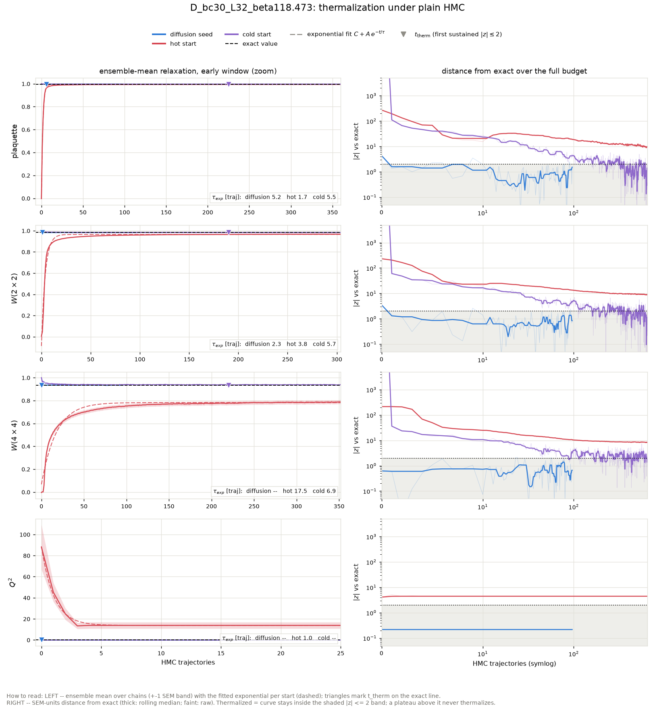

tau_int (hot-start chains, second half): plaquette = 15.01 +- 1.62, wilson_2x2 = 22.18 +- 2.48, wilson_4x4 = 19.33 +- 2.73, wilson_6x6 = 11.94 +- 2.05. Topology: hot-start HMC L=32 beta=118.473 -> **frozen** (no tunneling).

Where 'never' stood at the end: the hot start ended the 640-trajectory budget still at plaquette at |z| ~ 10, wilson_2x2 at |z| ~ 9, wilson_4x4 at |z| ~ 8, wilson_6x6 at |z| ~ 9, Q^2 at |z| ~ 4; the cold start ended the 640-trajectory budget still at Q^2 at |z| ~ 171377917952.

### Diagnostics: raw diffusion output (before any HMC)

| observable | value | error | exact | z_exact | reference | ref_error | z_ref | ks_p | chi2_p |
|---|---|---|---|---|---|---|---|---|---|
| plaquette | 0.9957 | 1.602e-05 | 0.9958 | -4.487 | 0.9958 | 1.23e-05 | -3.06 | 0.02248 |  |
| wilson_1x1 | 0.9957 | 1.602e-05 | 0.9958 | -4.487 | 0.9958 | 1.23e-05 | -3.06 | 0.02248 |  |
| wilson_1x2 | 0.9913 | 4.373e-05 | 0.9916 | -5.414 | 0.9916 | 3.012e-05 | -4.851 | 0.0005374 |  |
| wilson_2x2 | 0.9829 | 8.318e-05 | 0.9832 | -3.875 | 0.9833 | 6.038e-05 | -4.035 | 0.005104 |  |
| wilson_2x3 | 0.9747 | 0.0001641 | 0.9749 | -1.256 | 0.9753 | 8.916e-05 | -2.955 | 0.017 |  |
| wilson_3x3 | 0.9627 | 0.0002874 | 0.9626 | 0.09025 | 0.9633 | 0.0001691 | -1.769 | 0.2087 |  |
| wilson_3x4 | 0.9504 | 0.000446 | 0.9505 | -0.1967 | 0.9517 | 0.0002331 | -2.483 | 0.02577 |  |
| wilson_4x4 | 0.9342 | 0.0006736 | 0.9347 | -0.6358 | 0.9365 | 0.0004098 | -2.895 | 0.01957 |  |
| wilson_4x5 | 0.9183 | 0.0009726 | 0.9191 | -0.7702 | 0.9217 | 0.0005746 | -2.968 | 0.01474 |  |
| wilson_5x5 | 0.8991 | 0.00139 | 0.9 | -0.6007 | 0.9033 | 0.0008577 | -2.541 | 0.017 |  |
| wilson_5x6 | 0.8797 | 0.001752 | 0.8813 | -0.9581 | 0.8855 | 0.001116 | -2.827 | 0.03364 |  |
| wilson_6x6 | 0.8572 | 0.002269 | 0.8595 | -1.033 | 0.8646 | 0.001569 | -2.708 | 0.01275 |  |
| wilson_6x7 | 0.8352 | 0.00262 | 0.8383 | -1.176 | 0.8443 | 0.001981 | -2.758 | 0.01474 |  |
| wilson_7x7 | 0.8109 | 0.003173 | 0.8143 | -1.049 | 0.8206 | 0.002513 | -2.387 | 0.02947 |  |
| wilson_7x8 | 0.7863 | 0.003597 | 0.791 | -1.307 | 0.7982 | 0.003026 | -2.535 | 0.01275 |  |
| wilson_8x8 | 0.7603 | 0.004294 | 0.7653 | -1.179 | 0.7725 | 0.003654 | -2.166 | 0.01957 |  |
| wilson_8x10 | 0.711 | 0.005313 | 0.7168 | -1.076 | 0.7262 | 0.004895 | -2.096 | 0.04354 |  |
| wilson_10x10 | 0.6553 | 0.007169 | 0.6609 | -0.7846 | 0.6696 | 0.006534 | -1.475 | 0.2763 |  |
| wilson_10x12 | 0.6058 | 0.008883 | 0.6099 | -0.4651 | 0.6222 | 0.008378 | -1.339 | 0.3294 |  |
| wilson_12x12 | 0.5514 | 0.01099 | 0.5548 | -0.3121 | 0.5693 | 0.009953 | -1.212 | 0.5259 |  |
| creutz_2 | 0.004153 | 5.881e-05 | 0.00423 | -1.318 |  |  |  |  |  |
| creutz_3 | 0.004094 | 0.0001213 | 0.004215 | -1.005 |  |  |  |  |  |
| creutz_4 | 0.00444 | 0.0002041 | 0.004193 | 1.209 |  |  |  |  |  |
| creutz_5 | 0.003919 | 0.0003164 | 0.004164 | -0.7723 |  |  |  |  |  |
| creutz_6 | 0.003972 | 0.0004459 | 0.004126 | -0.3451 |  |  |  |  |  |
| creutz_7 | 0.003537 | 0.0006341 | 0.004078 | -0.853 |  |  |  |  |  |
| creutz_8 | 0.002824 | 0.0008511 | 0.004018 | -1.403 |  |  |  |  |  |
| Q | -0.007812 | 0.03351 | 0 | -0.2332 | 0.03125 | 0.02492 | -0.9354 | 0.9888 |  |
| Q^2 | 0.1641 | 0.02575 | 0.1714 | -0.2841 | 0.1042 | 0.02636 | 1.625 | 0.9353 |  |
| chi_top ((<Q^2>-<Q>^2)/V) | 0.0001602 | 2.53e-05 | 0.0001674 | -0.2847 | 0.0001008 | 2.519e-05 | 1.663 | 0 |  |
| Q histogram vs exact P(Q) | 0.08521 | nan | 2 | nan |  |  |  |  | 0.9583 |

### Diagnostics: the same configs after 96 HMC trajectories

| observable | value | error | exact | z_exact | reference | ref_error | z_ref | ks_p | chi2_p |
|---|---|---|---|---|---|---|---|---|---|
| plaquette | 0.9957 | 1.446e-05 | 0.9958 | -1.529 | 0.9958 | 1.23e-05 | -0.6335 | 0.6395 |  |
| wilson_1x1 | 0.9957 | 1.446e-05 | 0.9958 | -1.529 | 0.9958 | 1.23e-05 | -0.6335 | 0.6395 |  |
| wilson_1x2 | 0.9915 | 4.567e-05 | 0.9916 | -1.065 | 0.9916 | 3.012e-05 | -1.269 | 0.3584 |  |
| wilson_2x2 | 0.9831 | 9.364e-05 | 0.9832 | -0.8071 | 0.9833 | 6.038e-05 | -1.508 | 0.389 |  |
| wilson_2x3 | 0.9749 | 0.0001662 | 0.9749 | -0.3042 | 0.9753 | 8.916e-05 | -2.101 | 0.4212 |  |
| wilson_3x3 | 0.9625 | 0.0002725 | 0.9626 | -0.4394 | 0.9633 | 0.0001691 | -2.294 | 0.3294 |  |
| wilson_3x4 | 0.9503 | 0.0003994 | 0.9505 | -0.558 | 0.9517 | 0.0002331 | -2.994 | 0.1251 |  |
| wilson_4x4 | 0.9342 | 0.0005741 | 0.9347 | -0.7395 | 0.9365 | 0.0004098 | -3.231 | 0.0711 |  |
| wilson_4x5 | 0.9185 | 0.0008054 | 0.9191 | -0.7174 | 0.9217 | 0.0005746 | -3.216 | 0.0631 |  |
| wilson_5x5 | 0.8994 | 0.00116 | 0.9 | -0.4725 | 0.9033 | 0.0008577 | -2.677 | 0.03364 |  |
| wilson_5x6 | 0.8806 | 0.001536 | 0.8813 | -0.4741 | 0.8855 | 0.001116 | -2.592 | 0.008145 |  |
| wilson_6x6 | 0.8589 | 0.00209 | 0.8595 | -0.2888 | 0.8646 | 0.001569 | -2.194 | 0.01275 |  |
| wilson_6x7 | 0.8373 | 0.002554 | 0.8383 | -0.3781 | 0.8443 | 0.001981 | -2.148 | 0.02577 |  |
| wilson_7x7 | 0.8136 | 0.003239 | 0.8143 | -0.2024 | 0.8206 | 0.002513 | -1.704 | 0.05588 |  |
| wilson_7x8 | 0.7899 | 0.003678 | 0.791 | -0.293 | 0.7982 | 0.003026 | -1.741 | 0.1712 |  |
| wilson_8x8 | 0.7653 | 0.004434 | 0.7653 | -0.0003443 | 0.7725 | 0.003654 | -1.245 | 0.4212 |  |
| wilson_8x10 | 0.7173 | 0.005613 | 0.7168 | 0.1032 | 0.7262 | 0.004895 | -1.188 | 0.5259 |  |
| wilson_10x10 | 0.6625 | 0.007298 | 0.6609 | 0.2292 | 0.6696 | 0.006534 | -0.7158 | 0.6011 |  |
| wilson_10x12 | 0.6138 | 0.008833 | 0.6099 | 0.4362 | 0.6222 | 0.008378 | -0.6866 | 0.6011 |  |
| wilson_12x12 | 0.559 | 0.01099 | 0.5548 | 0.384 | 0.5693 | 0.009953 | -0.6955 | 0.7163 |  |
| creutz_2 | 0.004231 | 6.116e-05 | 0.00423 | 0.01681 |  |  |  |  |  |
| creutz_3 | 0.004313 | 0.0001225 | 0.004215 | 0.796 |  |  |  |  |  |
| creutz_4 | 0.004303 | 0.0002046 | 0.004193 | 0.5361 |  |  |  |  |  |
| creutz_5 | 0.00397 | 0.0002968 | 0.004164 | -0.654 |  |  |  |  |  |
| creutz_6 | 0.003784 | 0.0004426 | 0.004126 | -0.7716 |  |  |  |  |  |
| creutz_7 | 0.003281 | 0.0005959 | 0.004078 | -1.337 |  |  |  |  |  |
| creutz_8 | 0.002099 | 0.0007905 | 0.004018 | -2.428 |  |  |  |  |  |
| Q | -0.007812 | 0.03351 | 0 | -0.2332 | 0.03125 | 0.02492 | -0.9354 | 0.9888 |  |
| Q^2 | 0.1641 | 0.02575 | 0.1714 | -0.2841 | 0.1042 | 0.02636 | 1.625 | 0.9353 |  |
| chi_top ((<Q^2>-<Q>^2)/V) | 0.0001602 | 2.53e-05 | 0.0001674 | -0.2847 | 0.0001008 | 2.519e-05 | 1.663 | 0 |  |
| Q histogram vs exact P(Q) | 0.08521 | nan | 2 | nan |  |  |  |  | 0.9583 |

## E_bc35_L32_beta138.477

HMC: step size 0.0340, 29 leapfrog steps, acceptance seed/hot/cold = 0.975/0.970/0.976. Diffusion-seed batch: 128 chains x 96 trajectories (0.13 s/traj for the whole batch); baselines: 32 chains x 640 trajectories.

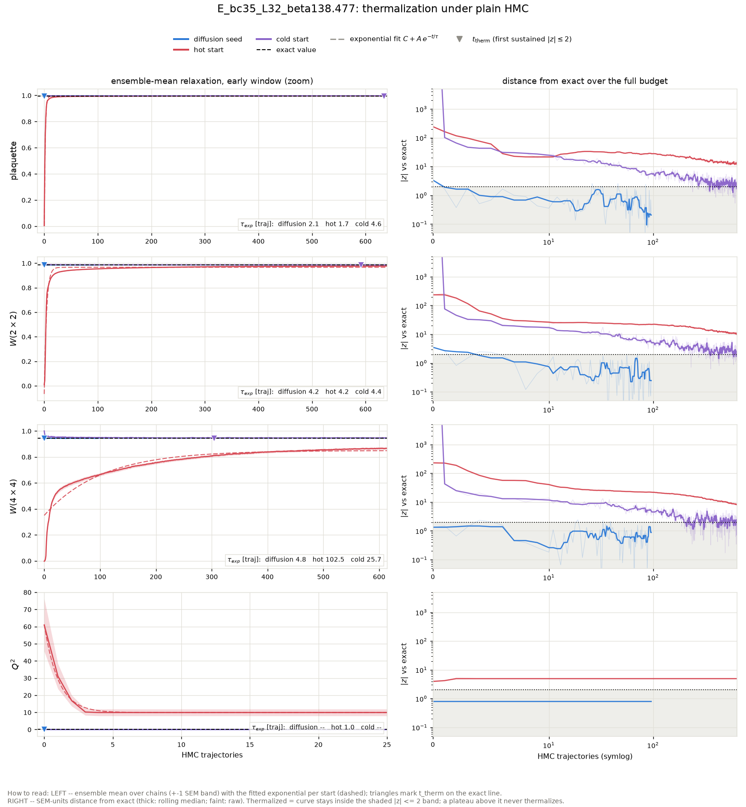

tau_int (hot-start chains, second half): plaquette = 26.27 +- 2.10, wilson_2x2 = 37.33 +- 2.39, wilson_4x4 = 41.20 +- 2.74, wilson_6x6 = 39.42 +- 3.29. Topology: hot-start HMC L=32 beta=138.477 -> **frozen** (no tunneling).

Where 'never' stood at the end: the hot start ended the 640-trajectory budget still at plaquette at |z| ~ 12, wilson_2x2 at |z| ~ 10, wilson_4x4 at |z| ~ 7, wilson_6x6 at |z| ~ 6, Q^2 at |z| ~ 4; the cold start ended the 640-trajectory budget still at Q^2 at |z| ~ 122925113344.

### Diagnostics: raw diffusion output (before any HMC)

| observable | value | error | exact | z_exact | reference | ref_error | z_ref | ks_p | chi2_p |
|---|---|---|---|---|---|---|---|---|---|
| plaquette | 0.9963 | 1.281e-05 | 0.9964 | -3.289 | 0.9964 | 1.354e-05 | -3.138 | 0.009477 |  |
| wilson_1x1 | 0.9963 | 1.281e-05 | 0.9964 | -3.289 | 0.9964 | 1.354e-05 | -3.138 | 0.009477 |  |
| wilson_1x2 | 0.9926 | 3.13e-05 | 0.9928 | -4.986 | 0.9928 | 3.55e-05 | -4.352 | 9.107e-05 |  |
| wilson_2x2 | 0.9854 | 7.431e-05 | 0.9856 | -3.602 | 0.9858 | 8.989e-05 | -3.382 | 0.001117 |  |
| wilson_2x3 | 0.9782 | 0.0001313 | 0.9785 | -2.673 | 0.9787 | 0.0001615 | -2.61 | 0.02577 |  |
| wilson_3x3 | 0.9677 | 0.0002451 | 0.968 | -1.397 | 0.9684 | 0.0002549 | -1.956 | 0.2297 |  |
| wilson_3x4 | 0.9572 | 0.0003886 | 0.9576 | -1.169 | 0.9579 | 0.0003788 | -1.408 | 0.389 |  |
| wilson_4x4 | 0.9431 | 0.0005628 | 0.944 | -1.446 | 0.9442 | 0.0005091 | -1.414 | 0.4548 |  |
| wilson_4x5 | 0.9296 | 0.0007864 | 0.9305 | -1.243 | 0.9305 | 0.0007245 | -0.901 | 0.5631 |  |
| wilson_5x5 | 0.9126 | 0.001084 | 0.9141 | -1.332 | 0.9138 | 0.0009305 | -0.8149 | 0.389 |  |
| wilson_5x6 | 0.896 | 0.001366 | 0.898 | -1.462 | 0.8976 | 0.001199 | -0.8825 | 0.6395 |  |
| wilson_6x6 | 0.8762 | 0.001763 | 0.8791 | -1.634 | 0.8781 | 0.001489 | -0.8067 | 0.6011 |  |
| wilson_6x7 | 0.8568 | 0.002174 | 0.8607 | -1.773 | 0.8596 | 0.001869 | -0.9599 | 0.6011 |  |
| wilson_7x7 | 0.8347 | 0.00271 | 0.8398 | -1.871 | 0.8379 | 0.002266 | -0.9031 | 0.6395 |  |
| wilson_7x8 | 0.8129 | 0.003207 | 0.8195 | -2.047 | 0.817 | 0.002773 | -0.9574 | 0.6395 |  |
| wilson_8x8 | 0.7883 | 0.003803 | 0.7971 | -2.31 | 0.7936 | 0.00334 | -1.052 | 0.5259 |  |
| wilson_8x10 | 0.7417 | 0.005056 | 0.7544 | -2.514 | 0.749 | 0.004625 | -1.065 | 0.5259 |  |
| wilson_10x10 | 0.6859 | 0.006705 | 0.7049 | -2.833 | 0.696 | 0.005881 | -1.125 | 0.4898 |  |
| wilson_10x12 | 0.6373 | 0.008278 | 0.6595 | -2.681 | 0.6481 | 0.007336 | -0.9787 | 0.5631 |  |
| wilson_12x12 | 0.5828 | 0.00995 | 0.6099 | -2.723 | 0.596 | 0.008918 | -0.982 | 0.5631 |  |
| creutz_2 | 0.003612 | 5.012e-05 | 0.003613 | -0.01004 |  |  |  |  |  |
| creutz_3 | 0.003501 | 0.0001075 | 0.003593 | -0.8593 |  |  |  |  |  |
| creutz_4 | 0.003831 | 0.0001853 | 0.003564 | 1.445 |  |  |  |  |  |
| creutz_5 | 0.003866 | 0.0002731 | 0.003524 | 1.253 |  |  |  |  |  |
| creutz_6 | 0.003886 | 0.0004238 | 0.003474 | 0.9732 |  |  |  |  |  |
| creutz_7 | 0.003775 | 0.0005474 | 0.003411 | 0.6637 |  |  |  |  |  |
| creutz_8 | 0.00439 | 0.000773 | 0.003335 | 1.365 |  |  |  |  |  |
| Q | -0.03906 | 0.03255 | 0 | -1.2 | -0.03646 | 0.02674 | -0.06182 | 1 |  |
| Q^2 | 0.1484 | 0.02165 | 0.1229 | 1.178 | 0.151 | 0.02242 | -0.08356 | 1 |  |
| chi_top ((<Q^2>-<Q>^2)/V) | 0.0001435 | 2.067e-05 | 0.00012 | 1.133 | 0.0001462 | 2.157e-05 | -0.09154 | 0 |  |
| Q histogram vs exact P(Q) | 2.375 | nan | 2 | nan |  |  |  |  | 0.3051 |

### Diagnostics: the same configs after 96 HMC trajectories

| observable | value | error | exact | z_exact | reference | ref_error | z_ref | ks_p | chi2_p |
|---|---|---|---|---|---|---|---|---|---|
| plaquette | 0.9964 | 1.605e-05 | 0.9964 | 0.1768 | 0.9964 | 1.354e-05 | -0.6433 | 0.4898 |  |
| wilson_1x1 | 0.9964 | 1.605e-05 | 0.9964 | 0.1768 | 0.9964 | 1.354e-05 | -0.6433 | 0.4898 |  |
| wilson_1x2 | 0.9928 | 4.55e-05 | 0.9928 | 0.1479 | 0.9928 | 3.55e-05 | -0.7483 | 0.3294 |  |
| wilson_2x2 | 0.9857 | 0.0001089 | 0.9856 | 0.4319 | 0.9858 | 8.989e-05 | -0.5645 | 0.8569 |  |
| wilson_2x3 | 0.9786 | 0.0001887 | 0.9785 | 0.5051 | 0.9787 | 0.0001615 | -0.3909 | 0.678 |  |
| wilson_3x3 | 0.9682 | 0.0003096 | 0.968 | 0.688 | 0.9684 | 0.0002549 | -0.3403 | 0.7163 |  |
| wilson_3x4 | 0.9579 | 0.0004707 | 0.9576 | 0.6813 | 0.9579 | 0.0003788 | 0.01729 | 0.4548 |  |
| wilson_4x4 | 0.9442 | 0.0005941 | 0.944 | 0.4124 | 0.9442 | 0.0005091 | -0.01833 | 0.5631 |  |
| wilson_4x5 | 0.9308 | 0.0007767 | 0.9305 | 0.2991 | 0.9305 | 0.0007245 | 0.232 | 0.4898 |  |
| wilson_5x5 | 0.9146 | 0.0009673 | 0.9141 | 0.5346 | 0.9138 | 0.0009305 | 0.594 | 0.6011 |  |
| wilson_5x6 | 0.8986 | 0.0012 | 0.898 | 0.5265 | 0.8976 | 0.001199 | 0.6041 | 0.2763 |  |
| wilson_6x6 | 0.8801 | 0.001464 | 0.8791 | 0.6695 | 0.8781 | 0.001489 | 0.9576 | 0.4212 |  |
| wilson_6x7 | 0.8621 | 0.001761 | 0.8607 | 0.8024 | 0.8596 | 0.001869 | 0.9797 | 0.4898 |  |
| wilson_7x7 | 0.8412 | 0.002091 | 0.8398 | 0.6522 | 0.8379 | 0.002266 | 1.052 | 0.7538 |  |
| wilson_7x8 | 0.8216 | 0.00243 | 0.8195 | 0.8517 | 0.817 | 0.002773 | 1.241 | 0.5259 |  |
| wilson_8x8 | 0.7989 | 0.002784 | 0.7971 | 0.6685 | 0.7936 | 0.00334 | 1.223 | 0.3021 |  |
| wilson_8x10 | 0.7569 | 0.003515 | 0.7544 | 0.7135 | 0.749 | 0.004625 | 1.364 | 0.6011 |  |
| wilson_10x10 | 0.7071 | 0.004532 | 0.7049 | 0.4718 | 0.696 | 0.005881 | 1.495 | 0.4548 |  |
| wilson_10x12 | 0.6614 | 0.005551 | 0.6595 | 0.3326 | 0.6481 | 0.007336 | 1.437 | 0.5259 |  |
| wilson_12x12 | 0.6103 | 0.007083 | 0.6099 | 0.0486 | 0.596 | 0.008918 | 1.257 | 0.6395 |  |
| creutz_2 | 0.003576 | 5.87e-05 | 0.003613 | -0.6303 |  |  |  |  |  |
| creutz_3 | 0.00352 | 0.0001021 | 0.003593 | -0.7145 |  |  |  |  |  |
| creutz_4 | 0.003754 | 0.0001618 | 0.003564 | 1.175 |  |  |  |  |  |
| creutz_5 | 0.003198 | 0.0002567 | 0.003524 | -1.269 |  |  |  |  |  |
| creutz_6 | 0.003201 | 0.0003715 | 0.003474 | -0.7333 |  |  |  |  |  |
| creutz_7 | 0.003955 | 0.0005029 | 0.003411 | 1.082 |  |  |  |  |  |
| creutz_8 | 0.004426 | 0.0006837 | 0.003335 | 1.595 |  |  |  |  |  |
| Q | -0.03906 | 0.03255 | 0 | -1.2 | -0.03646 | 0.02674 | -0.06182 | 1 |  |
| Q^2 | 0.1484 | 0.02165 | 0.1229 | 1.178 | 0.151 | 0.02242 | -0.08356 | 1 |  |
| chi_top ((<Q^2>-<Q>^2)/V) | 0.0001435 | 2.067e-05 | 0.00012 | 1.133 | 0.0001462 | 2.157e-05 | -0.09154 | 0 |  |
| Q histogram vs exact P(Q) | 2.375 | nan | 2 | nan |  |  |  |  | 0.3051 |

## D_bc40_L32_beta158.48

HMC: step size 0.0318, 31 leapfrog steps, acceptance seed/hot/cold = 0.978/0.975/0.980. Diffusion-seed batch: 128 chains x 96 trajectories (0.14 s/traj for the whole batch); baselines: 32 chains x 640 trajectories.

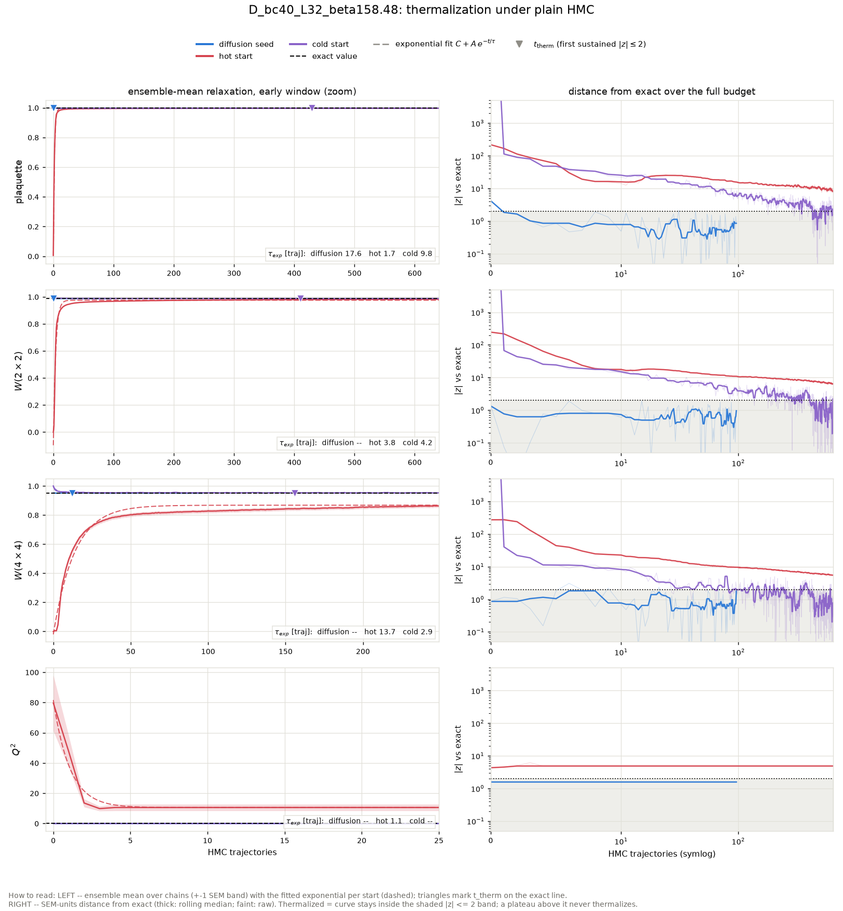

tau_int (hot-start chains, second half): plaquette = 21.25 +- 1.86, wilson_2x2 = 32.39 +- 2.23, wilson_4x4 = 25.26 +- 2.79, wilson_6x6 = 7.86 +- 1.32. Topology: hot-start HMC L=32 beta=158.48 -> **frozen** (no tunneling).

Where 'never' stood at the end: the hot start ended the 640-trajectory budget still at plaquette at |z| ~ 8, wilson_2x2 at |z| ~ 6, wilson_4x4 at |z| ~ 5, wilson_6x6 at |z| ~ 6, Q^2 at |z| ~ 5; the cold start ended the 640-trajectory budget still at Q^2 at |z| ~ 86933716992.

### Diagnostics: raw diffusion output (before any HMC)

| observable | value | error | exact | z_exact | reference | ref_error | z_ref | ks_p | chi2_p |
|---|---|---|---|---|---|---|---|---|---|
| plaquette | 0.9968 | 1.418e-05 | 0.9968 | -3.348 | 0.9969 | 7.484e-06 | -4.674 | 2.524e-05 |  |
| wilson_1x1 | 0.9968 | 1.418e-05 | 0.9968 | -3.348 | 0.9969 | 7.484e-06 | -4.674 | 2.524e-05 |  |
| wilson_1x2 | 0.9936 | 3.244e-05 | 0.9937 | -3.836 | 0.9937 | 2.19e-05 | -4.286 | 0.0003679 |  |
| wilson_2x2 | 0.9874 | 6.243e-05 | 0.9874 | -1.441 | 0.9875 | 5.587e-05 | -2.307 | 0.03831 |  |
| wilson_2x3 | 0.9813 | 0.0001082 | 0.9812 | 0.5166 | 0.9813 | 0.0001011 | -0.1998 | 0.9542 |  |
| wilson_3x3 | 0.9724 | 0.0001908 | 0.972 | 1.884 | 0.9722 | 0.0001779 | 0.8858 | 0.9353 |  |
| wilson_3x4 | 0.9634 | 0.000312 | 0.9629 | 1.541 | 0.9632 | 0.0002749 | 0.565 | 0.7163 |  |
| wilson_4x4 | 0.9514 | 0.0005116 | 0.951 | 0.9168 | 0.9514 | 0.0004515 | 0.04807 | 0.7163 |  |
| wilson_4x5 | 0.9398 | 0.0007185 | 0.9392 | 0.847 | 0.94 | 0.0006134 | -0.1455 | 0.7901 |  |
| wilson_5x5 | 0.9255 | 0.0009948 | 0.9248 | 0.7283 | 0.9256 | 0.0009137 | -0.09308 | 0.9542 |  |
| wilson_5x6 | 0.911 | 0.001247 | 0.9106 | 0.3297 | 0.9115 | 0.00119 | -0.289 | 0.8864 |  |
| wilson_6x6 | 0.8941 | 0.001567 | 0.894 | 0.04474 | 0.8946 | 0.001572 | -0.2429 | 0.9126 |  |
| wilson_6x7 | 0.8773 | 0.001936 | 0.8778 | -0.2574 | 0.8785 | 0.001917 | -0.4285 | 0.4898 |  |
| wilson_7x7 | 0.8577 | 0.002375 | 0.8594 | -0.6823 | 0.8603 | 0.002412 | -0.7574 | 0.2087 |  |
| wilson_7x8 | 0.8386 | 0.002737 | 0.8414 | -1.029 | 0.8418 | 0.002769 | -0.8172 | 0.1712 |  |
| wilson_8x8 | 0.8173 | 0.003283 | 0.8216 | -1.29 | 0.8216 | 0.003365 | -0.9022 | 0.1392 |  |
| wilson_8x10 | 0.7769 | 0.004244 | 0.7837 | -1.598 | 0.7828 | 0.004506 | -0.9441 | 0.2087 |  |
| wilson_10x10 | 0.7297 | 0.005244 | 0.7397 | -1.892 | 0.7378 | 0.005932 | -1.018 | 0.08971 |  |
| wilson_10x12 | 0.6865 | 0.006404 | 0.699 | -1.961 | 0.694 | 0.007383 | -0.7747 | 0.02947 |  |
| wilson_12x12 | 0.6384 | 0.007632 | 0.6544 | -2.096 | 0.6478 | 0.008811 | -0.8028 | 0.011 |  |
| creutz_2 | 0.00304 | 4.449e-05 | 0.003152 | -2.511 |  |  |  |  |  |
| creutz_3 | 0.002964 | 9.181e-05 | 0.003129 | -1.795 |  |  |  |  |  |
| creutz_4 | 0.003229 | 0.0001554 | 0.003094 | 0.8699 |  |  |  |  |  |
| creutz_5 | 0.003066 | 0.0002353 | 0.003047 | 0.08174 |  |  |  |  |  |
| creutz_6 | 0.003028 | 0.000318 | 0.002987 | 0.1292 |  |  |  |  |  |
| creutz_7 | 0.003587 | 0.0004249 | 0.002915 | 1.583 |  |  |  |  |  |
| creutz_8 | 0.003177 | 0.0005567 | 0.002827 | 0.6297 |  |  |  |  |  |
| Q | 0.03906 | 0.02015 | 0 | 1.938 | 0.02083 | 0.02291 | 0.5974 | 1 |  |
| Q^2 | 0.05469 | 0.0179 | 0.08693 | -1.801 | 0.09375 | 0.01492 | -1.676 | 0.9996 |  |
| chi_top ((<Q^2>-<Q>^2)/V) | 5.192e-05 | 1.657e-05 | 8.49e-05 | -1.991 | 9.113e-05 | 1.454e-05 | -1.779 | 0 |  |
| Q histogram vs exact P(Q) | 3.921 | nan | 2 | nan |  |  |  |  | 0.1408 |

### Diagnostics: the same configs after 96 HMC trajectories

| observable | value | error | exact | z_exact | reference | ref_error | z_ref | ks_p | chi2_p |
|---|---|---|---|---|---|---|---|---|---|
| plaquette | 0.9968 | 1.08e-05 | 0.9968 | -1.014 | 0.9969 | 7.484e-06 | -2.923 | 0.03364 |  |
| wilson_1x1 | 0.9968 | 1.08e-05 | 0.9968 | -1.014 | 0.9969 | 7.484e-06 | -2.923 | 0.03364 |  |
| wilson_1x2 | 0.9937 | 3.043e-05 | 0.9937 | -0.547 | 0.9937 | 2.19e-05 | -1.599 | 0.1545 |  |
| wilson_2x2 | 0.9874 | 7.814e-05 | 0.9874 | -1.011 | 0.9875 | 5.587e-05 | -1.897 | 0.04938 |  |
| wilson_2x3 | 0.9811 | 0.0001368 | 0.9812 | -0.903 | 0.9813 | 0.0001011 | -1.229 | 0.1712 |  |
| wilson_3x3 | 0.9718 | 0.0002401 | 0.972 | -1.099 | 0.9722 | 0.0001779 | -1.313 | 0.0631 |  |
| wilson_3x4 | 0.9624 | 0.0003635 | 0.9629 | -1.348 | 0.9632 | 0.0002749 | -1.615 | 0.1545 |  |
| wilson_4x4 | 0.95 | 0.000518 | 0.951 | -1.943 | 0.9514 | 0.0004515 | -2.1 | 0.0631 |  |
| wilson_4x5 | 0.9379 | 0.000738 | 0.9392 | -1.814 | 0.94 | 0.0006134 | -2.172 | 0.0711 |  |
| wilson_5x5 | 0.9231 | 0.0009843 | 0.9248 | -1.704 | 0.9256 | 0.0009137 | -1.882 | 0.1122 |  |
| wilson_5x6 | 0.9084 | 0.001339 | 0.9106 | -1.658 | 0.9115 | 0.00119 | -1.746 | 0.1122 |  |
| wilson_6x6 | 0.8915 | 0.00171 | 0.894 | -1.468 | 0.8946 | 0.001572 | -1.343 | 0.2297 |  |
| wilson_6x7 | 0.8746 | 0.002152 | 0.8778 | -1.498 | 0.8785 | 0.001917 | -1.351 | 0.2297 |  |
| wilson_7x7 | 0.856 | 0.002595 | 0.8594 | -1.281 | 0.8603 | 0.002412 | -1.205 | 0.1392 |  |
| wilson_7x8 | 0.8377 | 0.003161 | 0.8414 | -1.196 | 0.8418 | 0.002769 | -0.9865 | 0.3021 |  |
| wilson_8x8 | 0.8179 | 0.003782 | 0.8216 | -0.9623 | 0.8216 | 0.003365 | -0.7202 | 0.1712 |  |
| wilson_8x10 | 0.7793 | 0.005345 | 0.7837 | -0.8278 | 0.7828 | 0.004506 | -0.4988 | 0.3584 |  |
| wilson_10x10 | 0.7352 | 0.007087 | 0.7397 | -0.6278 | 0.7378 | 0.005932 | -0.2797 | 0.1892 |  |
| wilson_10x12 | 0.6946 | 0.009197 | 0.699 | -0.4812 | 0.694 | 0.007383 | 0.04739 | 0.2522 |  |
| wilson_12x12 | 0.6505 | 0.0113 | 0.6544 | -0.3519 | 0.6478 | 0.008811 | 0.1858 | 0.2297 |  |
| creutz_2 | 0.003209 | 4.654e-05 | 0.003152 | 1.235 |  |  |  |  |  |
| creutz_3 | 0.003228 | 8.931e-05 | 0.003129 | 1.115 |  |  |  |  |  |
| creutz_4 | 0.003406 | 0.0001645 | 0.003094 | 1.898 |  |  |  |  |  |
| creutz_5 | 0.003068 | 0.0002429 | 0.003047 | 0.08969 |  |  |  |  |  |
| creutz_6 | 0.002735 | 0.0003347 | 0.002987 | -0.7551 |  |  |  |  |  |
| creutz_7 | 0.002244 | 0.0004348 | 0.002915 | -1.543 |  |  |  |  |  |
| creutz_8 | 0.002136 | 0.0005711 | 0.002827 | -1.21 |  |  |  |  |  |
| Q | 0.03906 | 0.02015 | 0 | 1.938 | 0.02083 | 0.02291 | 0.5974 | 1 |  |
| Q^2 | 0.05469 | 0.0179 | 0.08693 | -1.801 | 0.09375 | 0.01492 | -1.676 | 0.9996 |  |
| chi_top ((<Q^2>-<Q>^2)/V) | 5.192e-05 | 1.657e-05 | 8.49e-05 | -1.991 | 9.113e-05 | 1.454e-05 | -1.779 | 0 |  |
| Q histogram vs exact P(Q) | 3.921 | nan | 2 | nan |  |  |  |  | 0.1408 |

## E_bc45_L32_beta178.482

HMC: step size 0.0299, 33 leapfrog steps, acceptance seed/hot/cold = 0.978/0.974/0.977. Diffusion-seed batch: 128 chains x 96 trajectories (0.14 s/traj for the whole batch); baselines: 32 chains x 640 trajectories.

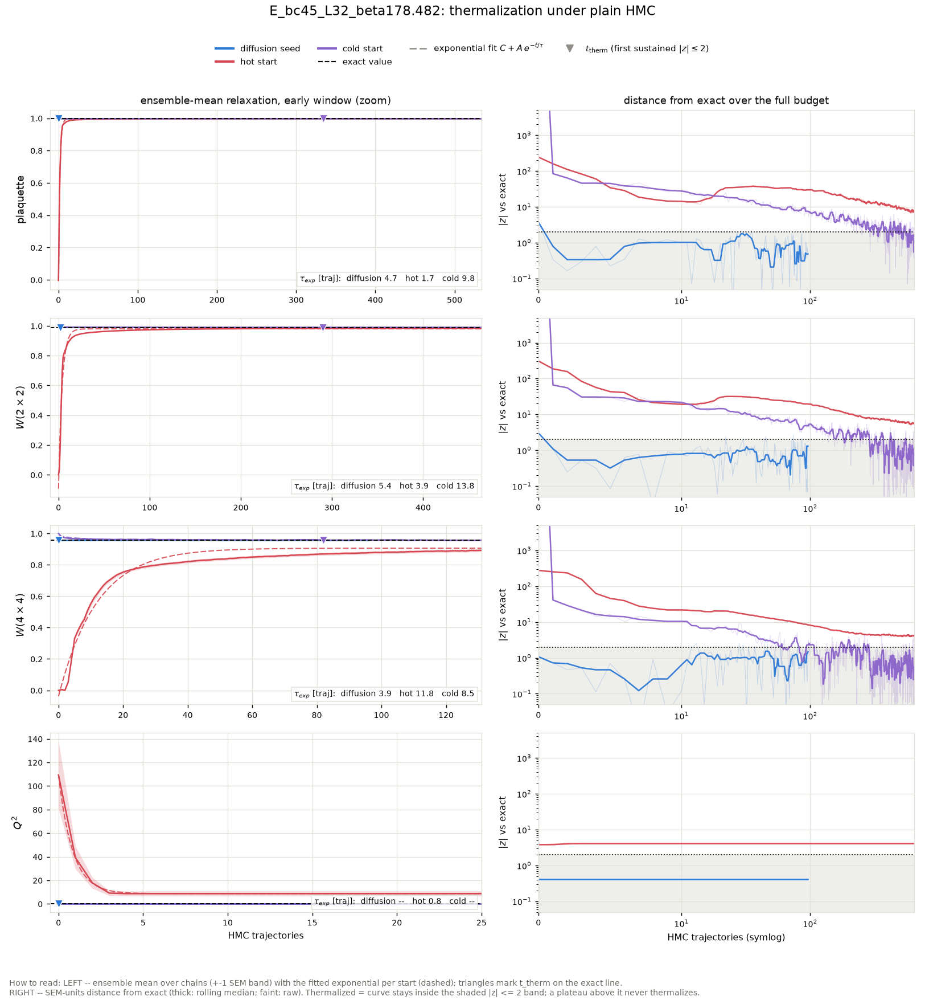

tau_int (hot-start chains, second half): plaquette = 23.81 +- 1.97, wilson_2x2 = 19.60 +- 1.86, wilson_4x4 = 3.28 +- 0.52, wilson_6x6 = 3.60 +- 0.59. Topology: hot-start HMC L=32 beta=178.482 -> **frozen** (no tunneling).

Where 'never' stood at the end: the hot start ended the 640-trajectory budget still at plaquette at |z| ~ 8, wilson_2x2 at |z| ~ 5, wilson_4x4 at |z| ~ 4, wilson_6x6 at |z| ~ 5, Q^2 at |z| ~ 4; the cold start ended the 640-trajectory budget still at Q^2 at |z| ~ 60793004032.

### Diagnostics: raw diffusion output (before any HMC)

| observable | value | error | exact | z_exact | reference | ref_error | z_ref | ks_p | chi2_p |
|---|---|---|---|---|---|---|---|---|---|
| plaquette | 0.9972 | 1.524e-05 | 0.9972 | -2.668 | 0.9972 | 9.091e-06 | -1.871 | 0.1712 |  |
| wilson_1x1 | 0.9972 | 1.524e-05 | 0.9972 | -2.668 | 0.9972 | 9.091e-06 | -1.871 | 0.1712 |  |
| wilson_1x2 | 0.9943 | 3.181e-05 | 0.9944 | -3.992 | 0.9944 | 2.084e-05 | -3.361 | 0.001334 |  |
| wilson_2x2 | 0.9887 | 7.454e-05 | 0.9889 | -2.47 | 0.9888 | 4.604e-05 | -1.759 | 0.08971 |  |
| wilson_2x3 | 0.9831 | 0.0001165 | 0.9833 | -1.978 | 0.9833 | 8.636e-05 | -1.408 | 0.01957 |  |
| wilson_3x3 | 0.9751 | 0.0001996 | 0.9752 | -0.4539 | 0.9752 | 0.000162 | -0.3957 | 0.1892 |  |
| wilson_3x4 | 0.9668 | 0.000275 | 0.9671 | -0.959 | 0.967 | 0.0002318 | -0.4964 | 0.1892 |  |
| wilson_4x4 | 0.956 | 0.0003986 | 0.9564 | -1.141 | 0.9561 | 0.0003554 | -0.2039 | 0.1392 |  |
| wilson_4x5 | 0.9452 | 0.0005126 | 0.946 | -1.505 | 0.9452 | 0.0004515 | -0.009896 | 0.389 |  |
| wilson_5x5 | 0.9323 | 0.000686 | 0.9331 | -1.25 | 0.932 | 0.0006228 | 0.2848 | 0.2522 |  |
| wilson_5x6 | 0.9192 | 0.0009156 | 0.9205 | -1.459 | 0.9191 | 0.0007729 | 0.02211 | 0.4212 |  |
| wilson_6x6 | 0.9036 | 0.001142 | 0.9057 | -1.796 | 0.9043 | 0.001021 | -0.4053 | 0.2087 |  |
| wilson_6x7 | 0.8887 | 0.001473 | 0.8912 | -1.681 | 0.8902 | 0.001265 | -0.7457 | 0.2522 |  |
| wilson_7x7 | 0.8717 | 0.001745 | 0.8748 | -1.763 | 0.8732 | 0.001542 | -0.6364 | 0.2087 |  |
| wilson_7x8 | 0.8549 | 0.002217 | 0.8588 | -1.718 | 0.8577 | 0.001849 | -0.9662 | 0.1892 |  |
| wilson_8x8 | 0.836 | 0.00263 | 0.841 | -1.881 | 0.8398 | 0.002216 | -1.106 | 0.389 |  |
| wilson_8x10 | 0.7995 | 0.003919 | 0.807 | -1.915 | 0.8066 | 0.003006 | -1.438 | 0.3021 |  |
| wilson_10x10 | 0.7557 | 0.00506 | 0.7675 | -2.323 | 0.7688 | 0.003828 | -2.053 | 0.2763 |  |
| wilson_10x12 | 0.7151 | 0.006939 | 0.7309 | -2.28 | 0.7332 | 0.004739 | -2.159 | 0.1392 |  |
| wilson_12x12 | 0.6714 | 0.008601 | 0.6906 | -2.234 | 0.6914 | 0.005477 | -1.96 | 0.2087 |  |
| creutz_2 | 0.002766 | 3.731e-05 | 0.002795 | -0.7615 |  |  |  |  |  |
| creutz_3 | 0.00258 | 7.711e-05 | 0.002769 | -2.459 |  |  |  |  |  |
| creutz_4 | 0.002754 | 0.0001331 | 0.002731 | 0.1726 |  |  |  |  |  |
| creutz_5 | 0.002443 | 0.0001878 | 0.002679 | -1.261 |  |  |  |  |  |
| creutz_6 | 0.002897 | 0.0003326 | 0.002614 | 0.8495 |  |  |  |  |  |
| creutz_7 | 0.002758 | 0.0004473 | 0.002535 | 0.4977 |  |  |  |  |  |
| creutz_8 | 0.002969 | 0.0006191 | 0.002441 | 0.8534 |  |  |  |  |  |
| Q | -0.02344 | 0.02018 | 0 | -1.161 | 0.005208 | 0.01913 | -1.03 | 1 |  |
| Q^2 | 0.07031 | 0.02161 | 0.06079 | 0.4406 | 0.05729 | 0.01394 | 0.5063 | 1 |  |
| chi_top ((<Q^2>-<Q>^2)/V) | 6.813e-05 | 2.091e-05 | 5.937e-05 | 0.4188 | 5.592e-05 | 1.358e-05 | 0.4895 | 0 |  |
| Q histogram vs exact P(Q) | 1.36 | nan | 2 | nan |  |  |  |  | 0.5065 |

### Diagnostics: the same configs after 96 HMC trajectories

| observable | value | error | exact | z_exact | reference | ref_error | z_ref | ks_p | chi2_p |
|---|---|---|---|---|---|---|---|---|---|
| plaquette | 0.9972 | 1.215e-05 | 0.9972 | 0.6416 | 0.9972 | 9.091e-06 | 1.005 | 0.389 |  |
| wilson_1x1 | 0.9972 | 1.215e-05 | 0.9972 | 0.6416 | 0.9972 | 9.091e-06 | 1.005 | 0.389 |  |
| wilson_1x2 | 0.9944 | 2.501e-05 | 0.9944 | 1.221 | 0.9944 | 2.084e-05 | 0.912 | 0.4548 |  |
| wilson_2x2 | 0.9889 | 6.219e-05 | 0.9889 | 1.186 | 0.9888 | 4.604e-05 | 1.341 | 0.3294 |  |
| wilson_2x3 | 0.9835 | 8.906e-05 | 0.9833 | 1.253 | 0.9833 | 8.636e-05 | 1.111 | 0.2087 |  |
| wilson_3x3 | 0.9754 | 0.0001532 | 0.9752 | 1.472 | 0.9752 | 0.000162 | 0.9616 | 0.2087 |  |
| wilson_3x4 | 0.9674 | 0.0001823 | 0.9671 | 1.778 | 0.967 | 0.0002318 | 1.388 | 0.1712 |  |
| wilson_4x4 | 0.9569 | 0.0002984 | 0.9564 | 1.459 | 0.9561 | 0.0003554 | 1.683 | 0.2297 |  |
| wilson_4x5 | 0.9467 | 0.0003956 | 0.946 | 1.819 | 0.9452 | 0.0004515 | 2.473 | 0.1122 |  |
| wilson_5x5 | 0.9342 | 0.000654 | 0.9331 | 1.732 | 0.932 | 0.0006228 | 2.496 | 0.1004 |  |
| wilson_5x6 | 0.9219 | 0.0008569 | 0.9205 | 1.638 | 0.9191 | 0.0007729 | 2.397 | 0.02248 |  |
| wilson_6x6 | 0.9075 | 0.001294 | 0.9057 | 1.38 | 0.9043 | 0.001021 | 1.951 | 0.1251 |  |
| wilson_6x7 | 0.8936 | 0.001601 | 0.8912 | 1.515 | 0.8902 | 0.001265 | 1.693 | 0.2297 |  |
| wilson_7x7 | 0.8778 | 0.002153 | 0.8748 | 1.423 | 0.8732 | 0.001542 | 1.759 | 0.3584 |  |
| wilson_7x8 | 0.8625 | 0.002656 | 0.8588 | 1.408 | 0.8577 | 0.001849 | 1.471 | 0.4548 |  |
| wilson_8x8 | 0.8453 | 0.003387 | 0.841 | 1.275 | 0.8398 | 0.002216 | 1.349 | 0.4548 |  |
| wilson_8x10 | 0.812 | 0.00478 | 0.807 | 1.044 | 0.8066 | 0.003006 | 0.955 | 0.8569 |  |
| wilson_10x10 | 0.7734 | 0.006942 | 0.7675 | 0.8481 | 0.7688 | 0.003828 | 0.5821 | 0.9126 |  |
| wilson_10x12 | 0.7353 | 0.008741 | 0.7309 | 0.5058 | 0.7332 | 0.004739 | 0.2114 | 0.9693 |  |
| wilson_12x12 | 0.6957 | 0.01142 | 0.6906 | 0.4461 | 0.6914 | 0.005477 | 0.341 | 0.9941 |  |
| creutz_2 | 0.002774 | 3.934e-05 | 0.002795 | -0.5342 |  |  |  |  |  |
| creutz_3 | 0.00269 | 8.387e-05 | 0.002769 | -0.9416 |  |  |  |  |  |
| creutz_4 | 0.002715 | 0.0001367 | 0.002731 | -0.1186 |  |  |  |  |  |
| creutz_5 | 0.002532 | 0.0002008 | 0.002679 | -0.7328 |  |  |  |  |  |
| creutz_6 | 0.002479 | 0.0003087 | 0.002614 | -0.4386 |  |  |  |  |  |
| creutz_7 | 0.002505 | 0.0004061 | 0.002535 | -0.0744 |  |  |  |  |  |
| creutz_8 | 0.00251 | 0.0005722 | 0.002441 | 0.1202 |  |  |  |  |  |
| Q | -0.02344 | 0.02018 | 0 | -1.161 | 0.005208 | 0.01913 | -1.03 | 1 |  |
| Q^2 | 0.07031 | 0.02161 | 0.06079 | 0.4406 | 0.05729 | 0.01394 | 0.5063 | 1 |  |
| chi_top ((<Q^2>-<Q>^2)/V) | 6.813e-05 | 2.091e-05 | 5.937e-05 | 0.4188 | 5.592e-05 | 1.358e-05 | 0.4895 | 0 |  |
| Q histogram vs exact P(Q) | 1.36 | nan | 2 | nan |  |  |  |  | 0.5065 |

## D_bc55.0237_L32_beta218.58

HMC: step size 0.0271, 37 leapfrog steps, acceptance seed/hot/cold = 0.974/0.968/0.977. Diffusion-seed batch: 128 chains x 96 trajectories (0.16 s/traj for the whole batch); baselines: 32 chains x 640 trajectories.

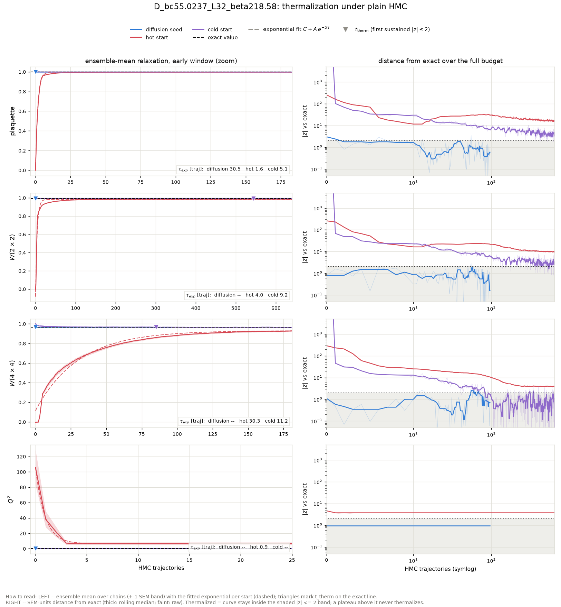

tau_int (hot-start chains, second half): plaquette = 8.49 +- 1.25, wilson_2x2 = 9.61 +- 1.17, wilson_4x4 = 5.94 +- 0.51, wilson_6x6 = 6.80 +- 0.68. Topology: hot-start HMC L=32 beta=218.58 -> **frozen** (no tunneling).

Where 'never' stood at the end: the hot start ended the 640-trajectory budget still at plaquette at |z| ~ 17, wilson_2x2 at |z| ~ 10, wilson_4x4 at |z| ~ 4, wilson_6x6 at |z| ~ 4, Q^2 at |z| ~ 4; the cold start ended the 640-trajectory budget still at plaquette at |z| ~ 4, Q^2 at |z| ~ 29010771968.

### Diagnostics: raw diffusion output (before any HMC)

| observable | value | error | exact | z_exact | reference | ref_error | z_ref | ks_p |
|---|---|---|---|---|---|---|---|---|
| plaquette | 0.9977 | 1.386e-05 | 0.9977 | -2.318 | 0.9977 | 7.705e-06 | -3.009 | 5.99e-05 |
| wilson_1x1 | 0.9977 | 1.386e-05 | 0.9977 | -2.318 | 0.9977 | 7.705e-06 | -3.009 | 5.99e-05 |
| wilson_1x2 | 0.9953 | 3.063e-05 | 0.9954 | -2.812 | 0.9955 | 1.563e-05 | -3.85 | 0.001117 |
| wilson_2x2 | 0.9909 | 6.669e-05 | 0.9909 | -0.7104 | 0.991 | 3.765e-05 | -1.804 | 0.04354 |
| wilson_2x3 | 0.9864 | 0.0001151 | 0.9864 | 0.3515 | 0.9865 | 6.139e-05 | -0.3746 | 0.389 |
| wilson_3x3 | 0.98 | 0.0001994 | 0.9797 | 1.317 | 0.9799 | 8.848e-05 | 0.4836 | 0.7538 |
| wilson_3x4 | 0.9734 | 0.0002984 | 0.9731 | 1.04 | 0.9732 | 0.0001162 | 0.5856 | 0.7163 |
| wilson_4x4 | 0.9648 | 0.0004267 | 0.9644 | 1.002 | 0.9646 | 0.0001617 | 0.5662 | 0.9126 |
| wilson_4x5 | 0.9562 | 0.0005906 | 0.9558 | 0.6761 | 0.9559 | 0.0002461 | 0.455 | 0.8864 |
| wilson_5x5 | 0.9457 | 0.0008513 | 0.9453 | 0.4998 | 0.9453 | 0.000377 | 0.4697 | 0.3584 |
| wilson_5x6 | 0.935 | 0.001102 | 0.935 | 0.03429 | 0.935 | 0.0005198 | 0.01335 | 0.5259 |
| wilson_6x6 | 0.9224 | 0.001482 | 0.9228 | -0.2999 | 0.9231 | 0.0007562 | -0.4274 | 0.3584 |
| wilson_6x7 | 0.91 | 0.001842 | 0.9109 | -0.474 | 0.9115 | 0.001025 | -0.6712 | 0.4548 |
| wilson_7x7 | 0.8955 | 0.002339 | 0.8974 | -0.7981 | 0.8985 | 0.001333 | -1.121 | 0.1122 |
| wilson_7x8 | 0.8815 | 0.002828 | 0.8842 | -0.9474 | 0.8856 | 0.0017 | -1.236 | 0.1122 |
| wilson_8x8 | 0.8659 | 0.003488 | 0.8696 | -1.046 | 0.872 | 0.002125 | -1.501 | 0.04938 |
| wilson_8x10 | 0.8342 | 0.004787 | 0.8415 | -1.533 | 0.8457 | 0.002874 | -2.059 | 0.005977 |
| wilson_10x10 | 0.7959 | 0.006798 | 0.8088 | -1.9 | 0.8165 | 0.004096 | -2.602 | 0.00159 |
| wilson_10x12 | 0.759 | 0.008611 | 0.7785 | -2.256 | 0.7889 | 0.0051 | -2.986 | 0.0005374 |
| wilson_12x12 | 0.7169 | 0.011 | 0.745 | -2.557 | 0.7606 | 0.006549 | -3.415 | 0.0003679 |
| creutz_2 | 0.002184 | 3.461e-05 | 0.002278 | -2.689 |  |  |  |  |
| creutz_3 | 0.002112 | 6.93e-05 | 0.00225 | -1.996 |  |  |  |  |
| creutz_4 | 0.002136 | 0.0001186 | 0.00221 | -0.6226 |  |  |  |  |
| creutz_5 | 0.002097 | 0.0001698 | 0.002155 | -0.3419 |  |  |  |  |
| creutz_6 | 0.0022 | 0.0002523 | 0.002087 | 0.447 |  |  |  |  |
| creutz_7 | 0.002651 | 0.0003201 | 0.002005 | 2.02 |  |  |  |  |
| creutz_8 | 0.002125 | 0.0004001 | 0.001907 | 0.5446 |  |  |  |  |
| Q | -0.01562 | 0.01614 | 0 | -0.9683 | 0 | 0.007255 | -0.8831 | 1 |
| Q^2 | 0.04688 | 0.02098 | 0.02901 | 0.8516 | 0.01042 | 0.006882 | 1.651 | 0.9999 |
| chi_top ((<Q^2>-<Q>^2)/V) | 4.554e-05 | 2.036e-05 | 2.833e-05 | 0.845 | 1.017e-05 | 6.721e-06 | 1.649 | 0 |

### Diagnostics: the same configs after 96 HMC trajectories

| observable | value | error | exact | z_exact | reference | ref_error | z_ref | ks_p |
|---|---|---|---|---|---|---|---|---|
| plaquette | 0.9977 | 8.073e-06 | 0.9977 | -0.6675 | 0.9977 | 7.705e-06 | -1.879 | 0.02577 |
| wilson_1x1 | 0.9977 | 8.073e-06 | 0.9977 | -0.6675 | 0.9977 | 7.705e-06 | -1.879 | 0.02577 |
| wilson_1x2 | 0.9954 | 2.229e-05 | 0.9954 | -0.1422 | 0.9955 | 1.563e-05 | -1.816 | 0.2087 |
| wilson_2x2 | 0.9909 | 5.852e-05 | 0.9909 | -0.1634 | 0.991 | 3.765e-05 | -1.441 | 0.4212 |
| wilson_2x3 | 0.9864 | 9.928e-05 | 0.9864 | 0.4051 | 0.9865 | 6.139e-05 | -0.4209 | 0.6011 |
| wilson_3x3 | 0.9798 | 0.0001931 | 0.9797 | 0.3629 | 0.9799 | 8.848e-05 | -0.4102 | 0.4898 |
| wilson_3x4 | 0.9733 | 0.0002933 | 0.9731 | 0.7045 | 0.9732 | 0.0001162 | 0.2657 | 0.5259 |
| wilson_4x4 | 0.9647 | 0.0004597 | 0.9644 | 0.6559 | 0.9646 | 0.0001617 | 0.2713 | 0.2297 |
| wilson_4x5 | 0.9565 | 0.0006316 | 0.9558 | 1.127 | 0.9559 | 0.0002461 | 0.8908 | 0.1712 |
| wilson_5x5 | 0.9462 | 0.000871 | 0.9453 | 1.076 | 0.9453 | 0.000377 | 0.9997 | 0.1545 |
| wilson_5x6 | 0.9365 | 0.001126 | 0.935 | 1.374 | 0.935 | 0.0005198 | 1.23 | 0.0711 |
| wilson_6x6 | 0.9247 | 0.001392 | 0.9228 | 1.372 | 0.9231 | 0.0007562 | 1.037 | 0.3021 |
| wilson_6x7 | 0.9135 | 0.001681 | 0.9109 | 1.518 | 0.9115 | 0.001025 | 1.021 | 0.1892 |
| wilson_7x7 | 0.9005 | 0.001996 | 0.8974 | 1.556 | 0.8985 | 0.001333 | 0.8144 | 0.389 |
| wilson_7x8 | 0.8879 | 0.002301 | 0.8842 | 1.599 | 0.8856 | 0.0017 | 0.7968 | 0.4212 |
| wilson_8x8 | 0.874 | 0.00275 | 0.8696 | 1.617 | 0.872 | 0.002125 | 0.5656 | 0.389 |
| wilson_8x10 | 0.8468 | 0.003662 | 0.8415 | 1.432 | 0.8457 | 0.002874 | 0.2342 | 0.5259 |
| wilson_10x10 | 0.816 | 0.005038 | 0.8088 | 1.433 | 0.8165 | 0.004096 | -0.07895 | 0.9807 |
| wilson_10x12 | 0.7857 | 0.006323 | 0.7785 | 1.142 | 0.7889 | 0.0051 | -0.3983 | 0.9353 |
| wilson_12x12 | 0.754 | 0.008153 | 0.745 | 1.107 | 0.7606 | 0.006549 | -0.6284 | 0.9353 |
| creutz_2 | 0.002286 | 3.277e-05 | 0.002278 | 0.265 |  |  |  |  |
| creutz_3 | 0.00227 | 6.462e-05 | 0.00225 | 0.3042 |  |  |  |  |
| creutz_4 | 0.00225 | 0.000109 | 0.00221 | 0.372 |  |  |  |  |
| creutz_5 | 0.002341 | 0.0001757 | 0.002155 | 1.057 |  |  |  |  |
| creutz_6 | 0.002333 | 0.0002312 | 0.002087 | 1.064 |  |  |  |  |
| creutz_7 | 0.002079 | 0.0003102 | 0.002005 | 0.2396 |  |  |  |  |
| creutz_8 | 0.001658 | 0.0004333 | 0.001907 | -0.5759 |  |  |  |  |
| Q | -0.01562 | 0.01614 | 0 | -0.9683 | 0 | 0.007255 | -0.8831 | 1 |
| Q^2 | 0.04688 | 0.02098 | 0.02901 | 0.8516 | 0.01042 | 0.006882 | 1.651 | 0.9999 |
| chi_top ((<Q^2>-<Q>^2)/V) | 4.554e-05 | 2.036e-05 | 2.833e-05 | 0.845 | 1.017e-05 | 6.721e-06 | 1.649 | 0 |

## F_L32_bc100_L32_beta398.492

HMC: step size 0.0200, 50 leapfrog steps, acceptance seed/hot/cold = 0.974/0.859/0.975. Diffusion-seed batch: 64 chains x 96 trajectories (0.18 s/traj for the whole batch); baselines: 32 chains x 640 trajectories.

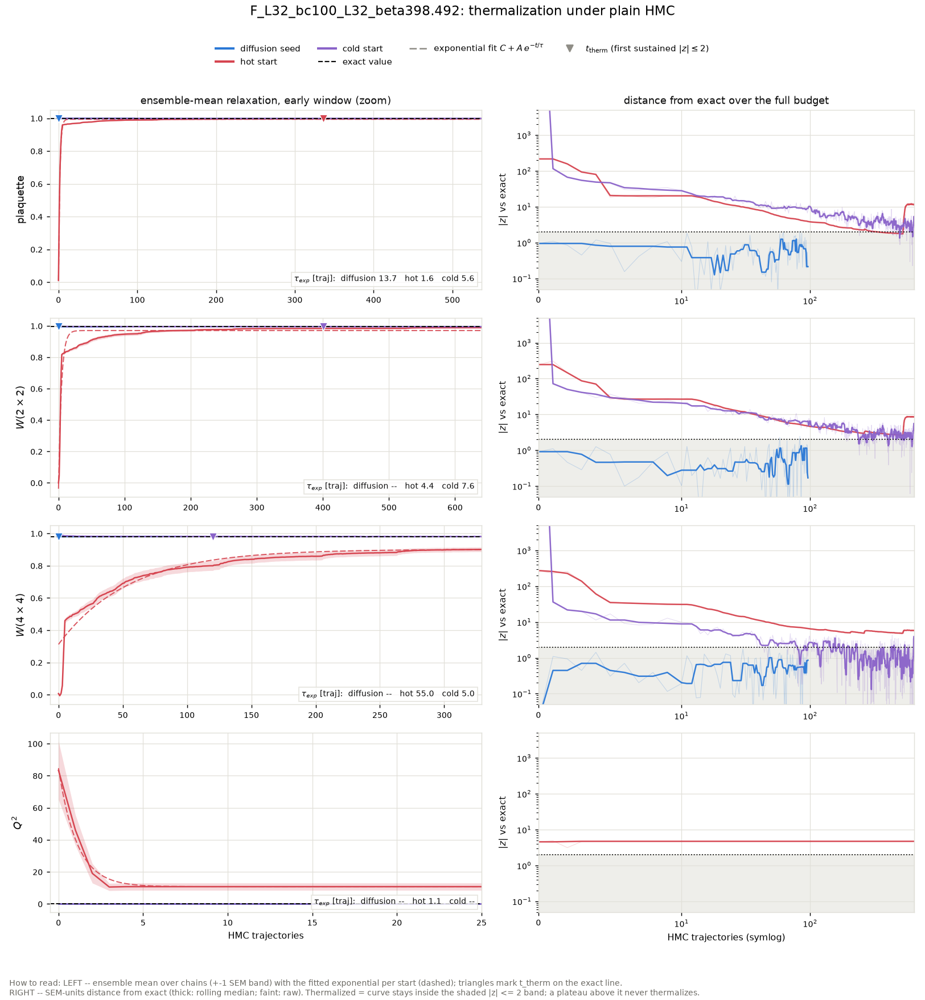

tau_int (hot-start chains, second half): plaquette = 32.55 +- 1.96, wilson_2x2 = 31.62 +- 2.26, wilson_4x4 = 25.67 +- 2.51, wilson_6x6 = 8.32 +- 2.24. Topology: hot-start HMC L=32 beta=398.492 -> **frozen** (no tunneling).

Where 'never' stood at the end: the hot start ended the 640-trajectory budget still at wilson_2x2 at |z| ~ 9, wilson_4x4 at |z| ~ 6, wilson_6x6 at |z| ~ 5, Q^2 at |z| ~ 5; the cold start ended the 640-trajectory budget still at plaquette at |z| ~ 4, Q^2 at |z| ~ 930603328.

### Diagnostics: raw diffusion output (before any HMC)

| observable | value | error | exact | z_exact | reference | ref_error | z_ref | ks_p |
|---|---|---|---|---|---|---|---|---|
| plaquette | 0.9987 | 7.116e-06 | 0.9987 | -0.9 | 0.9987 | 5.182e-06 | -0.837 | 0.7729 |
| wilson_1x1 | 0.9987 | 7.116e-06 | 0.9987 | -0.9 | 0.9987 | 5.182e-06 | -0.837 | 0.7729 |
| wilson_1x2 | 0.9975 | 1.682e-05 | 0.9975 | -0.6148 | 0.9975 | 1.239e-05 | -1.107 | 0.6115 |
| wilson_2x2 | 0.995 | 3.09e-05 | 0.995 | 1.239 | 0.9951 | 3.213e-05 | -0.9187 | 0.3641 |
| wilson_2x3 | 0.9926 | 4.9e-05 | 0.9925 | 2.076 | 0.9927 | 5.097e-05 | -1.077 | 0.8225 |
| wilson_3x3 | 0.989 | 9.468e-05 | 0.9889 | 1.789 | 0.9891 | 0.0001055 | -0.6427 | 0.7729 |
| wilson_3x4 | 0.9854 | 0.0001381 | 0.9852 | 1.137 | 0.9856 | 0.0001379 | -1.19 | 0.4556 |
| wilson_4x4 | 0.9804 | 0.0002122 | 0.9804 | -0.0275 | 0.9808 | 0.0002137 | -1.215 | 0.6115 |
| wilson_4x5 | 0.9756 | 0.0002764 | 0.9757 | -0.3046 | 0.976 | 0.0002848 | -1.121 | 0.7202 |
| wilson_5x5 | 0.9696 | 0.0004232 | 0.9698 | -0.6046 | 0.97 | 0.0004029 | -0.8334 | 0.7729 |
| wilson_5x6 | 0.9635 | 0.0005481 | 0.9641 | -0.9968 | 0.9644 | 0.0005384 | -1.178 | 0.4084 |
| wilson_6x6 | 0.9563 | 0.0008215 | 0.9573 | -1.136 | 0.9574 | 0.0007022 | -1.02 | 0.4084 |
| wilson_6x7 | 0.9492 | 0.001007 | 0.9506 | -1.436 | 0.951 | 0.0008974 | -1.348 | 0.4556 |
| wilson_7x7 | 0.941 | 0.001333 | 0.943 | -1.543 | 0.9432 | 0.001148 | -1.247 | 0.4556 |
| wilson_7x8 | 0.9329 | 0.001601 | 0.9356 | -1.719 | 0.9358 | 0.00142 | -1.394 | 0.3641 |
| wilson_8x8 | 0.9237 | 0.002022 | 0.9273 | -1.793 | 0.9275 | 0.001717 | -1.447 | 0.4084 |
| wilson_8x10 | 0.9063 | 0.002804 | 0.9114 | -1.826 | 0.9115 | 0.002453 | -1.397 | 0.07626 |
| wilson_10x10 | 0.8848 | 0.003854 | 0.8927 | -2.043 | 0.8943 | 0.003202 | -1.904 | 0.04542 |
| wilson_10x12 | 0.8653 | 0.004886 | 0.8752 | -2.025 | 0.8766 | 0.00405 | -1.789 | 0.08985 |
| wilson_12x12 | 0.8421 | 0.006074 | 0.8557 | -2.24 | 0.8584 | 0.004643 | -2.131 | 0.1054 |
| creutz_2 | 0.001193 | 2.758e-05 | 0.001245 | -1.915 |  |  |  |  |
| creutz_3 | 0.001221 | 5.453e-05 | 0.001226 | -0.08714 |  |  |  |  |
| creutz_4 | 0.00135 | 7.641e-05 | 0.001197 | 2.008 |  |  |  |  |
| creutz_5 | 0.001256 | 0.0001186 | 0.001158 | 0.8194 |  |  |  |  |
| creutz_6 | 0.001215 | 0.0001973 | 0.00111 | 0.5328 |  |  |  |  |
| creutz_7 | 0.001165 | 0.0002684 | 0.001052 | 0.4222 |  |  |  |  |
| creutz_8 | 0.001191 | 0.0003575 | 0.000984 | 0.579 |  |  |  |  |
| Q | 0 | 0 | 0 | 0 | 0 | 0 | 0 | 1 |
| Q^2 | 0 | 0 | 0.0009306 | inf | 0 | 0 | 0 | 1 |
| chi_top ((<Q^2>-<Q>^2)/V) | 0 | 0 | 9.088e-07 | inf | 0 | 0 | 0 | 1 |

### Diagnostics: the same configs after 96 HMC trajectories

| observable | value | error | exact | z_exact | reference | ref_error | z_ref | ks_p |
|---|---|---|---|---|---|---|---|---|
| plaquette | 0.9987 | 8.201e-06 | 0.9987 | -0.214 | 0.9987 | 5.182e-06 | -0.2802 | 0.7202 |
| wilson_1x1 | 0.9987 | 8.201e-06 | 0.9987 | -0.214 | 0.9987 | 5.182e-06 | -0.2802 | 0.7202 |
| wilson_1x2 | 0.9975 | 1.739e-05 | 0.9975 | -0.06315 | 0.9975 | 1.239e-05 | -0.6503 | 0.7729 |
| wilson_2x2 | 0.995 | 3.854e-05 | 0.995 | -0.1955 | 0.9951 | 3.213e-05 | -1.729 | 0.1432 |
| wilson_2x3 | 0.9925 | 6.149e-05 | 0.9925 | -0.5502 | 0.9927 | 5.097e-05 | -2.651 | 0.03146 |
| wilson_3x3 | 0.9888 | 0.0001192 | 0.9889 | -0.8676 | 0.9891 | 0.0001055 | -2.286 | 0.1912 |
| wilson_3x4 | 0.985 | 0.0001732 | 0.9852 | -1.19 | 0.9856 | 0.0001379 | -2.689 | 0.05422 |
| wilson_4x4 | 0.9801 | 0.0002674 | 0.9804 | -0.9984 | 0.9808 | 0.0002137 | -1.832 | 0.08985 |
| wilson_4x5 | 0.9754 | 0.0003817 | 0.9757 | -0.7028 | 0.976 | 0.0002848 | -1.32 | 0.5577 |
| wilson_5x5 | 0.9694 | 0.0005608 | 0.9698 | -0.7 | 0.97 | 0.0004029 | -0.9032 | 0.9638 |
| wilson_5x6 | 0.9636 | 0.0007356 | 0.9641 | -0.663 | 0.9644 | 0.0005384 | -0.9282 | 0.7729 |
| wilson_6x6 | 0.9568 | 0.0009845 | 0.9573 | -0.5324 | 0.9574 | 0.0007022 | -0.5737 | 0.8225 |
| wilson_6x7 | 0.95 | 0.001262 | 0.9506 | -0.4886 | 0.951 | 0.0008974 | -0.6388 | 0.9069 |
| wilson_7x7 | 0.9422 | 0.001552 | 0.943 | -0.5439 | 0.9432 | 0.001148 | -0.5085 | 0.9969 |
| wilson_7x8 | 0.9346 | 0.001962 | 0.9356 | -0.5042 | 0.9358 | 0.00142 | -0.5036 | 0.9069 |
| wilson_8x8 | 0.926 | 0.002301 | 0.9273 | -0.5595 | 0.9275 | 0.001717 | -0.5227 | 0.9638 |
| wilson_8x10 | 0.9095 | 0.003378 | 0.9114 | -0.5713 | 0.9115 | 0.002453 | -0.4822 | 0.9392 |
| wilson_10x10 | 0.8905 | 0.004365 | 0.8927 | -0.4911 | 0.8943 | 0.003202 | -0.7031 | 0.8225 |
| wilson_10x12 | 0.8722 | 0.005762 | 0.8752 | -0.5176 | 0.8766 | 0.00405 | -0.6305 | 0.8225 |
| wilson_12x12 | 0.8517 | 0.006784 | 0.8557 | -0.5974 | 0.8584 | 0.004643 | -0.8201 | 0.6115 |
| creutz_2 | 0.001253 | 2.526e-05 | 0.001245 | 0.2822 |  |  |  |  |
| creutz_3 | 0.00127 | 5.257e-05 | 0.001226 | 0.8365 |  |  |  |  |
| creutz_4 | 0.001155 | 7.841e-05 | 0.001197 | -0.5301 |  |  |  |  |
| creutz_5 | 0.001286 | 0.0001342 | 0.001158 | 0.948 |  |  |  |  |
| creutz_6 | 0.001051 | 0.0002171 | 0.00111 | -0.2737 |  |  |  |  |
| creutz_7 | 0.001197 | 0.0002646 | 0.001052 | 0.5498 |  |  |  |  |
| creutz_8 | 0.001153 | 0.0003515 | 0.000984 | 0.4804 |  |  |  |  |
| Q | 0 | 0 | 0 | 0 | 0 | 0 | 0 | 1 |
| Q^2 | 0 | 0 | 0.0009306 | inf | 0 | 0 | 0 | 1 |
| chi_top ((<Q^2>-<Q>^2)/V) | 0 | 0 | 9.088e-07 | inf | 0 | 0 | 0 | 1 |

## F_L32_bc218.58_L32_beta872.816

HMC: step size 0.0135, 74 leapfrog steps, acceptance seed/hot/cold = 0.969/0.008/0.967. Diffusion-seed batch: 64 chains x 96 trajectories (0.25 s/traj for the whole batch); baselines: 32 chains x 640 trajectories.

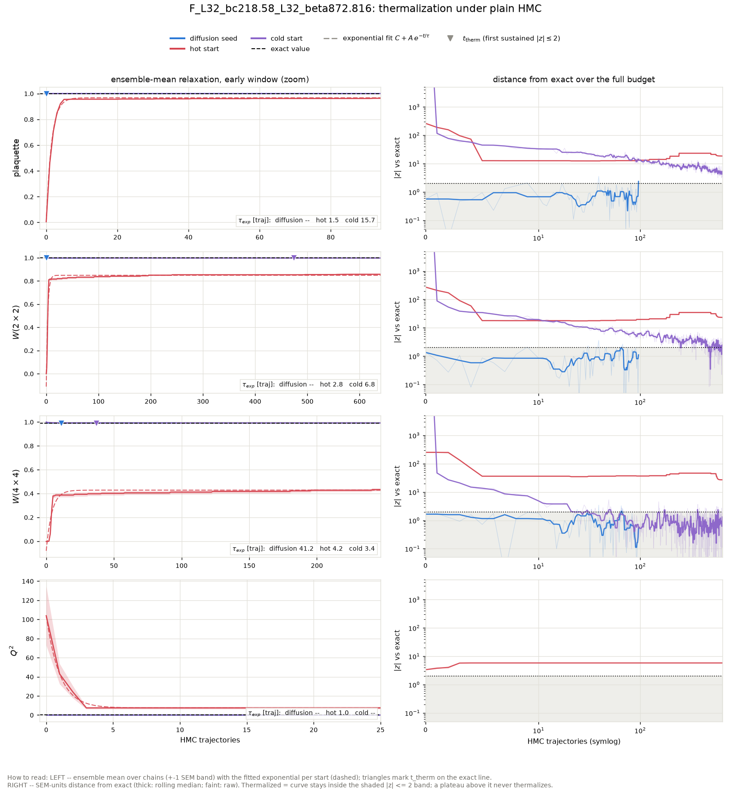

tau_int (hot-start chains, second half): plaquette = 0.56 +- 0.06, wilson_2x2 = 0.56 +- 0.06, wilson_4x4 = 0.56 +- 0.06, wilson_6x6 = 0.56 +- 0.06. Topology: hot-start HMC L=32 beta=872.816 -> **frozen** (no tunneling).

Where 'never' stood at the end: the hot start ended the 640-trajectory budget still at plaquette at |z| ~ 18, wilson_2x2 at |z| ~ 24, wilson_4x4 at |z| ~ 35, wilson_6x6 at |z| ~ 56, Q^2 at |z| ~ 6; the cold start ended the 640-trajectory budget still at plaquette at |z| ~ 4, Q^2 at |z| ~ 99603.

### Diagnostics: raw diffusion output (before any HMC)

| observable | value | error | exact | z_exact | reference | ref_error | z_ref | ks_p |
|---|---|---|---|---|---|---|---|---|
| plaquette | 0.9994 | 2.92e-06 | 0.9994 | 0.623 | 0.9994 | 2.789e-06 | -0.7919 | 0.5577 |
| wilson_1x1 | 0.9994 | 2.92e-06 | 0.9994 | 0.623 | 0.9994 | 2.789e-06 | -0.7919 | 0.5577 |
| wilson_1x2 | 0.9989 | 8.306e-06 | 0.9989 | 0.2964 | 0.9989 | 5.647e-06 | -0.5313 | 0.8225 |
| wilson_2x2 | 0.9977 | 2.306e-05 | 0.9977 | 1.145 | 0.9977 | 1.488e-05 | 0.6001 | 0.9392 |
| wilson_2x3 | 0.9966 | 4.107e-05 | 0.9966 | 0.6762 | 0.9966 | 2.586e-05 | 0.6608 | 0.5577 |
| wilson_3x3 | 0.9949 | 7.184e-05 | 0.9949 | 0.09508 | 0.9949 | 4.475e-05 | -0.2878 | 0.7202 |
| wilson_3x4 | 0.9932 | 0.0001078 | 0.9932 | -0.4383 | 0.9932 | 6.974e-05 | -0.5102 | 0.5577 |
| wilson_4x4 | 0.9908 | 0.0001703 | 0.991 | -1.285 | 0.9911 | 0.000104 | -1.692 | 0.08985 |
| wilson_4x5 | 0.9885 | 0.0002272 | 0.9888 | -1.588 | 0.989 | 0.000148 | -1.876 | 0.05422 |
| wilson_5x5 | 0.9855 | 0.0003118 | 0.9861 | -1.962 | 0.9864 | 0.0001918 | -2.365 | 0.01432 |
| wilson_5x6 | 0.9826 | 0.0003881 | 0.9834 | -2.149 | 0.9837 | 0.0002601 | -2.433 | 0.05422 |
| wilson_6x6 | 0.9791 | 0.0004962 | 0.9803 | -2.387 | 0.9806 | 0.0003321 | -2.579 | 0.03788 |
| wilson_6x7 | 0.9757 | 0.0006076 | 0.9772 | -2.5 | 0.9777 | 0.0004244 | -2.738 | 0.03788 |
| wilson_7x7 | 0.9715 | 0.0007719 | 0.9736 | -2.729 | 0.9743 | 0.0005294 | -2.963 | 0.01432 |
| wilson_7x8 | 0.9675 | 0.0009267 | 0.9701 | -2.771 | 0.971 | 0.0006464 | -3.099 | 0.007577 |
| wilson_8x8 | 0.963 | 0.001149 | 0.9662 | -2.812 | 0.9673 | 0.0007893 | -3.103 | 0.007577 |
| wilson_8x10 | 0.9543 | 0.001597 | 0.9586 | -2.666 | 0.9601 | 0.001082 | -2.992 | 0.006074 |
| wilson_10x10 | 0.9434 | 0.002277 | 0.9496 | -2.724 | 0.9514 | 0.001462 | -2.956 | 0.007577 |
| wilson_10x12 | 0.9336 | 0.002919 | 0.9411 | -2.566 | 0.9428 | 0.001913 | -2.628 | 0.02601 |
| wilson_12x12 | 0.9217 | 0.003893 | 0.9315 | -2.518 | 0.9335 | 0.002389 | -2.57 | 0.03146 |
| creutz_2 | 0.0005448 | 1.111e-05 | 0.0005681 | -2.101 |  |  |  |  |
| creutz_3 | 0.0005816 | 1.973e-05 | 0.0005592 | 1.136 |  |  |  |  |
| creutz_4 | 0.0006646 | 3.825e-05 | 0.0005458 | 3.108 |  |  |  |  |
| creutz_5 | 0.0006395 | 5.948e-05 | 0.0005278 | 1.878 |  |  |  |  |
| creutz_6 | 0.0006382 | 7.654e-05 | 0.0005055 | 1.734 |  |  |  |  |
| creutz_7 | 0.0007421 | 9.962e-05 | 0.0004786 | 2.645 |  |  |  |  |
| creutz_8 | 0.0006608 | 0.0001377 | 0.0004472 | 1.552 |  |  |  |  |
| Q | 0 | 0 | 0 | 0 | 0 | 0 | 0 | 1 |
| Q^2 | 0 | 0 | 9.96e-08 | inf | 0 | 0 | 0 | 1 |
| chi_top ((<Q^2>-<Q>^2)/V) | 0 | 0 | 9.727e-11 | inf | 0 | 0 | 0 | 1 |

### Diagnostics: the same configs after 96 HMC trajectories

| observable | value | error | exact | z_exact | reference | ref_error | z_ref | ks_p |
|---|---|---|---|---|---|---|---|---|
| plaquette | 0.9994 | 3.51e-06 | 0.9994 | 0.2532 | 0.9994 | 2.789e-06 | -0.9209 | 0.7202 |
| wilson_1x1 | 0.9994 | 3.51e-06 | 0.9994 | 0.2532 | 0.9994 | 2.789e-06 | -0.9209 | 0.7202 |
| wilson_1x2 | 0.9989 | 9.419e-06 | 0.9989 | -0.06193 | 0.9989 | 5.647e-06 | -0.7632 | 0.3231 |
| wilson_2x2 | 0.9977 | 2.187e-05 | 0.9977 | 0.533 | 0.9977 | 1.488e-05 | 0.06545 | 0.9638 |
| wilson_2x3 | 0.9966 | 3.839e-05 | 0.9966 | 0.4609 | 0.9966 | 2.586e-05 | 0.4751 | 0.666 |
| wilson_3x3 | 0.9949 | 6.19e-05 | 0.9949 | 0.5814 | 0.9949 | 4.475e-05 | 0.06282 | 0.8677 |
| wilson_3x4 | 0.9932 | 9.205e-05 | 0.9932 | -0.01843 | 0.9932 | 6.974e-05 | -0.1728 | 0.9969 |
| wilson_4x4 | 0.991 | 0.0001161 | 0.991 | 0.204 | 0.9911 | 0.000104 | -0.6101 | 0.6115 |
| wilson_4x5 | 0.9888 | 0.0001604 | 0.9888 | -0.09075 | 0.989 | 0.000148 | -0.7444 | 0.6115 |
| wilson_5x5 | 0.9861 | 0.0001975 | 0.9861 | 0.1378 | 0.9864 | 0.0001918 | -0.8227 | 0.7202 |
| wilson_5x6 | 0.9834 | 0.0002521 | 0.9834 | -0.1631 | 0.9837 | 0.0002601 | -0.9488 | 0.4084 |
| wilson_6x6 | 0.9803 | 0.0003251 | 0.9803 | 0.1552 | 0.9806 | 0.0003321 | -0.6559 | 0.5577 |
| wilson_6x7 | 0.9772 | 0.0004014 | 0.9772 | 0.0645 | 0.9777 | 0.0004244 | -0.8289 | 0.2853 |
| wilson_7x7 | 0.9738 | 0.0004878 | 0.9736 | 0.3481 | 0.9743 | 0.0005294 | -0.69 | 0.5055 |
| wilson_7x8 | 0.9703 | 0.0005777 | 0.9701 | 0.257 | 0.971 | 0.0006464 | -0.9049 | 0.1658 |
| wilson_8x8 | 0.9665 | 0.0006976 | 0.9662 | 0.4243 | 0.9673 | 0.0007893 | -0.7582 | 0.5055 |
| wilson_8x10 | 0.9587 | 0.0009737 | 0.9586 | 0.05566 | 0.9601 | 0.001082 | -1.003 | 0.5577 |
| wilson_10x10 | 0.9497 | 0.00133 | 0.9496 | 0.1174 | 0.9514 | 0.001462 | -0.8303 | 0.5577 |
| wilson_10x12 | 0.9408 | 0.001727 | 0.9411 | -0.1464 | 0.9428 | 0.001913 | -0.75 | 0.3231 |
| wilson_12x12 | 0.9312 | 0.002192 | 0.9315 | -0.1632 | 0.9335 | 0.002389 | -0.708 | 0.3231 |
| creutz_2 | 0.0005544 | 1.216e-05 | 0.0005681 | -1.13 |  |  |  |  |
| creutz_3 | 0.0005468 | 2.06e-05 | 0.0005592 | -0.5994 |  |  |  |  |
| creutz_4 | 0.0004823 | 3.412e-05 | 0.0005458 | -1.861 |  |  |  |  |
| creutz_5 | 0.0004469 | 5.207e-05 | 0.0005278 | -1.554 |  |  |  |  |
| creutz_6 | 0.0003428 | 7.89e-05 | 0.0005055 | -2.062 |  |  |  |  |
| creutz_7 | 0.0003057 | 0.0001193 | 0.0004786 | -1.449 |  |  |  |  |
| creutz_8 | 0.0002726 | 0.0001652 | 0.0004472 | -1.057 |  |  |  |  |
| Q | 0 | 0 | 0 | 0 | 0 | 0 | 0 | 1 |
| Q^2 | 0 | 0 | 9.96e-08 | inf | 0 | 0 | 0 | 1 |
| chi_top ((<Q^2>-<Q>^2)/V) | 0 | 0 | 9.727e-11 | inf | 0 | 0 | 0 | 1 |

## F_L64_bc55.0237_L64_beta218.58

HMC: step size 0.0271, 37 leapfrog steps, acceptance seed/hot/cold = 0.949/0.517/0.953. Diffusion-seed batch: 64 chains x 96 trajectories (0.22 s/traj for the whole batch); baselines: 16 chains x 640 trajectories.

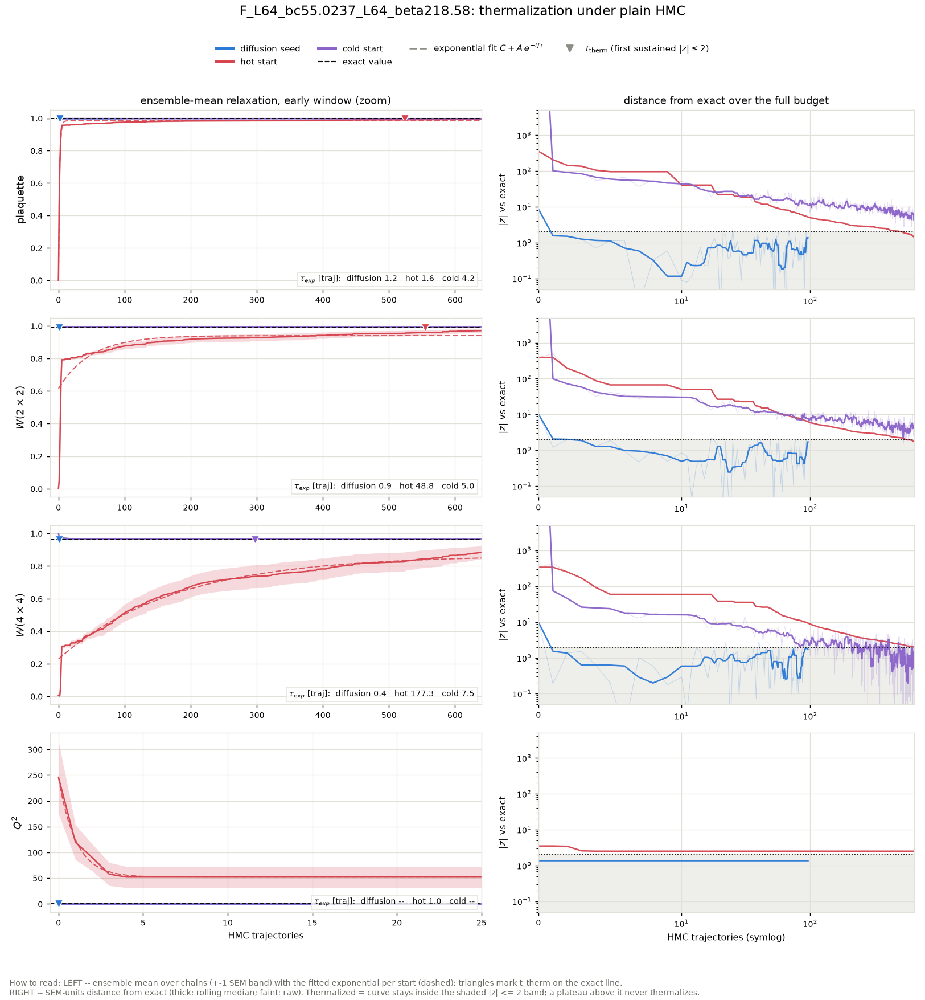

tau_int (hot-start chains, second half): plaquette = 35.60 +- 4.49, wilson_2x2 = 37.26 +- 4.63, wilson_4x4 = 36.73 +- 5.16, wilson_6x6 = 39.08 +- 5.51. Topology: hot-start HMC L=64 beta=218.58 -> **frozen** (no tunneling).

Where 'never' stood at the end: the hot start ended the 640-trajectory budget still at plaquette at |z| ~ 2, wilson_2x2 at |z| ~ 2, wilson_4x4 at |z| ~ 2, wilson_6x6 at |z| ~ 3, Q^2 at |z| ~ 4; the cold start ended the 640-trajectory budget still at plaquette at |z| ~ 6, wilson_2x2 at |z| ~ 3, Q^2 at |z| ~ 474267189248.

### Diagnostics: raw diffusion output (before any HMC)

| observable | value | error | exact | z_exact | reference | ref_error | z_ref | ks_p | chi2_p |
|---|---|---|---|---|---|---|---|---|---|
| plaquette | 0.9976 | 7.799e-06 | 0.9977 | -7.686 | 0.9978 | 4.72e-06 | -12.85 | 2.047e-24 |  |
| wilson_1x1 | 0.9976 | 7.799e-06 | 0.9977 | -7.686 | 0.9978 | 4.72e-06 | -12.85 | 2.047e-24 |  |
| wilson_1x2 | 0.9952 | 1.866e-05 | 0.9954 | -10.53 | 0.9956 | 1.314e-05 | -14.09 | 4.808e-24 |  |
| wilson_2x2 | 0.9905 | 3.859e-05 | 0.9909 | -10.37 | 0.9911 | 3.521e-05 | -12.99 | 2.569e-23 |  |
| wilson_2x3 | 0.9856 | 6.636e-05 | 0.9863 | -11.35 | 0.9867 | 6.553e-05 | -11.91 | 1.172e-16 |  |
| wilson_3x3 | 0.9782 | 0.0001231 | 0.9796 | -10.96 | 0.9801 | 0.0001149 | -10.96 | 8.99e-14 |  |
| wilson_3x4 | 0.9705 | 0.0002024 | 0.9729 | -11.88 | 0.9734 | 0.0001743 | -10.97 | 8.99e-14 |  |
| wilson_4x4 | 0.9598 | 0.0003258 | 0.964 | -12.74 | 0.9647 | 0.0002725 | -11.36 | 1.448e-15 |  |
| wilson_4x5 | 0.9488 | 0.0004807 | 0.9552 | -13.38 | 0.9559 | 0.0003551 | -12.01 | 6.138e-17 |  |
| wilson_5x5 | 0.9344 | 0.0007235 | 0.9443 | -13.66 | 0.9453 | 0.0004939 | -12.39 | 1.4e-20 |  |
| wilson_5x6 | 0.9195 | 0.0009487 | 0.9335 | -14.75 | 0.9347 | 0.0006307 | -13.28 | 6.159e-20 |  |
| wilson_6x6 | 0.901 | 0.001301 | 0.9208 | -15.2 | 0.9224 | 0.000806 | -13.95 | 1.117e-23 |  |
| wilson_6x7 | 0.882 | 0.00166 | 0.9082 | -15.76 | 0.9101 | 0.001025 | -14.38 | 1.316e-22 |  |
| wilson_7x7 | 0.859 | 0.002158 | 0.8937 | -16.11 | 0.8962 | 0.001257 | -14.89 | 1.475e-25 |  |
| wilson_7x8 | 0.8357 | 0.002692 | 0.8795 | -16.27 | 0.8823 | 0.001494 | -15.13 | 1.475e-25 |  |
| wilson_8x8 | 0.8082 | 0.003344 | 0.8635 | -16.53 | 0.8668 | 0.001746 | -15.52 | 9.547e-27 |  |
| wilson_8x10 | 0.7527 | 0.004684 | 0.8324 | -17.03 | 0.8364 | 0.002264 | -16.09 | 9.547e-27 |  |
| wilson_10x10 | 0.6817 | 0.006627 | 0.7951 | -17.11 | 0.8003 | 0.003025 | -16.27 | 1.444e-27 |  |
| wilson_10x12 | 0.6118 | 0.008172 | 0.7595 | -18.07 | 0.7656 | 0.003556 | -17.26 | 1.444e-27 |  |
| wilson_12x12 | 0.5313 | 0.01008 | 0.7188 | -18.6 | 0.7266 | 0.004582 | -17.64 | 2.796e-29 |  |
| creutz_2 | 0.002362 | 2.242e-05 | 0.002293 | 3.077 |  |  |  |  |  |
| creutz_3 | 0.002547 | 6.257e-05 | 0.002293 | 4.064 |  |  |  |  |  |
| creutz_4 | 0.003039 | 0.0001143 | 0.002293 | 6.529 |  |  |  |  |  |
| creutz_5 | 0.003619 | 0.0001826 | 0.002293 | 7.262 |  |  |  |  |  |
| creutz_6 | 0.004314 | 0.0002561 | 0.002293 | 7.892 |  |  |  |  |  |
| creutz_7 | 0.005224 | 0.0003934 | 0.002292 | 7.451 |  |  |  |  |  |
| creutz_8 | 0.00596 | 0.0004568 | 0.002292 | 8.029 |  |  |  |  |  |
| Q | 0.04688 | 0.07602 | 0 | 0.6166 | 0.07292 | 0.04493 | -0.2949 | 1 |  |
| Q^2 | 0.3906 | 0.06088 | 0.4743 | -1.374 | 0.3646 | 0.04766 | 0.3368 | 1 |  |
| chi_top ((<Q^2>-<Q>^2)/V) | 9.483e-05 | 1.501e-05 | 0.0001158 | -1.396 | 8.771e-05 | 1.143e-05 | 0.3774 | 8.99e-14 |  |
| Q histogram vs exact P(Q) | 0.4568 | nan | 2 | nan |  |  |  |  | 0.7958 |

### Diagnostics: the same configs after 96 HMC trajectories

| observable | value | error | exact | z_exact | reference | ref_error | z_ref | ks_p | chi2_p |
|---|---|---|---|---|---|---|---|---|---|
| plaquette | 0.9977 | 5.884e-06 | 0.9977 | -0.453 | 0.9978 | 4.72e-06 | -7.93 | 2.154e-10 |  |
| wilson_1x1 | 0.9977 | 5.884e-06 | 0.9977 | -0.453 | 0.9978 | 4.72e-06 | -7.93 | 2.154e-10 |  |
| wilson_1x2 | 0.9954 | 1.426e-05 | 0.9954 | -1.368 | 0.9956 | 1.314e-05 | -7.453 | 1.215e-08 |  |
| wilson_2x2 | 0.9908 | 2.696e-05 | 0.9909 | -1.07 | 0.9911 | 3.521e-05 | -6.929 | 6.324e-08 |  |
| wilson_2x3 | 0.9863 | 4.683e-05 | 0.9863 | -1.079 | 0.9867 | 6.553e-05 | -5.066 | 2.031e-05 |  |
| wilson_3x3 | 0.9795 | 8.558e-05 | 0.9796 | -0.9879 | 0.9801 | 0.0001149 | -4.048 | 0.002398 |  |
| wilson_3x4 | 0.9727 | 0.0001196 | 0.9729 | -1.392 | 0.9734 | 0.0001743 | -3.283 | 0.006074 |  |
| wilson_4x4 | 0.9638 | 0.0001947 | 0.964 | -1.136 | 0.9647 | 0.0002725 | -2.669 | 0.08985 |  |
| wilson_4x5 | 0.9549 | 0.0002744 | 0.9552 | -1.004 | 0.9559 | 0.0003551 | -2.283 | 0.1231 |  |
| wilson_5x5 | 0.9438 | 0.0003844 | 0.9443 | -1.244 | 0.9453 | 0.0004939 | -2.313 | 0.1658 |  |
| wilson_5x6 | 0.933 | 0.0005648 | 0.9335 | -0.88 | 0.9347 | 0.0006307 | -1.925 | 0.3231 |  |
| wilson_6x6 | 0.9201 | 0.0007538 | 0.9208 | -0.9416 | 0.9224 | 0.000806 | -2.075 | 0.2195 |  |
| wilson_6x7 | 0.9075 | 0.0009952 | 0.9082 | -0.6791 | 0.9101 | 0.001025 | -1.804 | 0.2508 |  |
| wilson_7x7 | 0.8927 | 0.001256 | 0.8937 | -0.8329 | 0.8962 | 0.001257 | -1.961 | 0.1231 |  |
| wilson_7x8 | 0.8785 | 0.001547 | 0.8795 | -0.6584 | 0.8823 | 0.001494 | -1.774 | 0.2195 |  |
| wilson_8x8 | 0.862 | 0.001838 | 0.8635 | -0.8295 | 0.8668 | 0.001746 | -1.89 | 0.2195 |  |
| wilson_8x10 | 0.8304 | 0.00248 | 0.8324 | -0.8323 | 0.8364 | 0.002264 | -1.791 | 0.1912 |  |
| wilson_10x10 | 0.7915 | 0.003307 | 0.7951 | -1.086 | 0.8003 | 0.003025 | -1.95 | 0.1432 |  |
| wilson_10x12 | 0.7553 | 0.004075 | 0.7595 | -1.029 | 0.7656 | 0.003556 | -1.904 | 0.2195 |  |
| wilson_12x12 | 0.7134 | 0.004848 | 0.7188 | -1.117 | 0.7266 | 0.004582 | -1.977 | 0.1912 |  |
| creutz_2 | 0.002285 | 1.875e-05 | 0.002293 | -0.3949 |  |  |  |  |  |
| creutz_3 | 0.002306 | 5.123e-05 | 0.002293 | 0.2539 |  |  |  |  |  |
| creutz_4 | 0.002266 | 8.83e-05 | 0.002293 | -0.2999 |  |  |  |  |  |
| creutz_5 | 0.002452 | 0.0001299 | 0.002293 | 1.225 |  |  |  |  |  |
| creutz_6 | 0.002505 | 0.0001787 | 0.002293 | 1.189 |  |  |  |  |  |
| creutz_7 | 0.002746 | 0.0002275 | 0.002292 | 1.994 |  |  |  |  |  |
| creutz_8 | 0.002913 | 0.0003215 | 0.002292 | 1.931 |  |  |  |  |  |
| Q | 0.04688 | 0.07602 | 0 | 0.6166 | 0.07292 | 0.04493 | -0.2949 | 1 |  |
| Q^2 | 0.3906 | 0.06088 | 0.4743 | -1.374 | 0.3646 | 0.04766 | 0.3368 | 1 |  |
| chi_top ((<Q^2>-<Q>^2)/V) | 9.483e-05 | 1.501e-05 | 0.0001158 | -1.396 | 8.771e-05 | 1.143e-05 | 0.3774 | 8.99e-14 |  |
| Q histogram vs exact P(Q) | 0.4568 | nan | 2 | nan |  |  |  |  | 0.7958 |
