# Diffusion-seeded HMC across the matched beta scan: thermalization time vs the standard-HMC sampling interval

Action: wilson. All HMC in this report is plain HMC (Omelyan, adapted step size, **no** topological updates).

**Why this scan.** At the ladder's upper rungs the fresh-HMC baselines never thermalize at all (topological freezing plus a metastable local-defect state), so the only comparison available there is 'diffusion seed vs a baseline that never arrives'. This report extends the benchmark to every matched coupling pair of the generalization study -- one inverse-RG step L=16 -> L=32 per case -- including fine couplings low enough that hot- and cold-start HMC *does* thermalize within the budget. There the standard chain's own interval `2 tau_int` and its fresh-start burn-in are honest, measurable yardsticks, and the scan shows where the ordering

> t_therm(diffusion seed)  <  2 tau_int(standard HMC)  <  burn-in(fresh chain)

sets in as beta grows and standard HMC slides into critical slowing down and topological freezing.

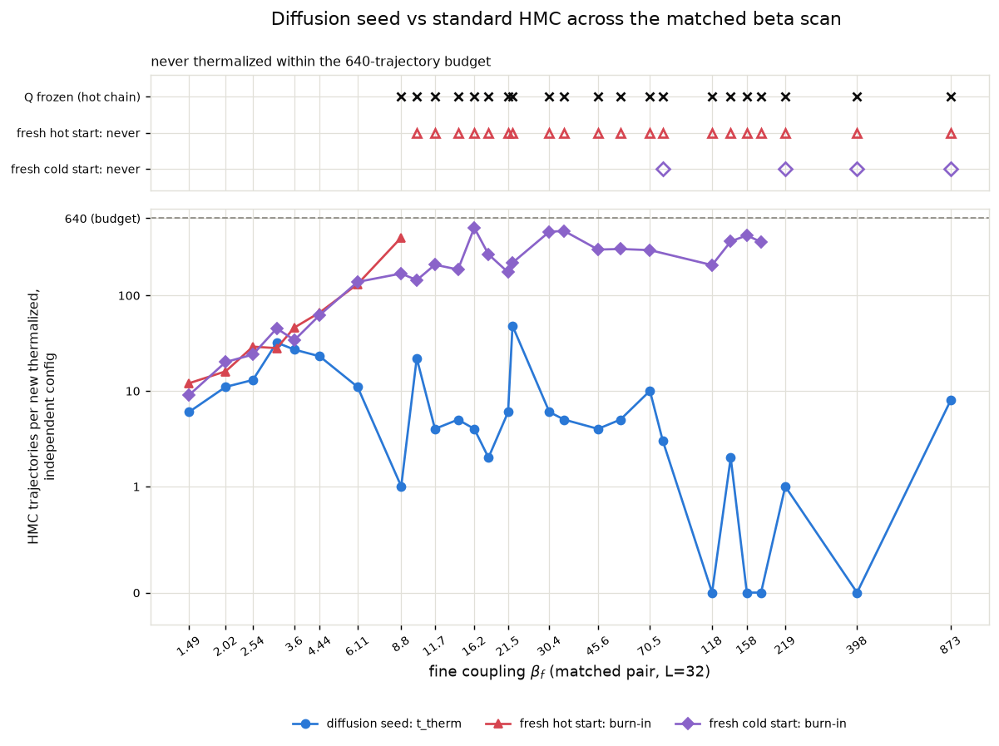

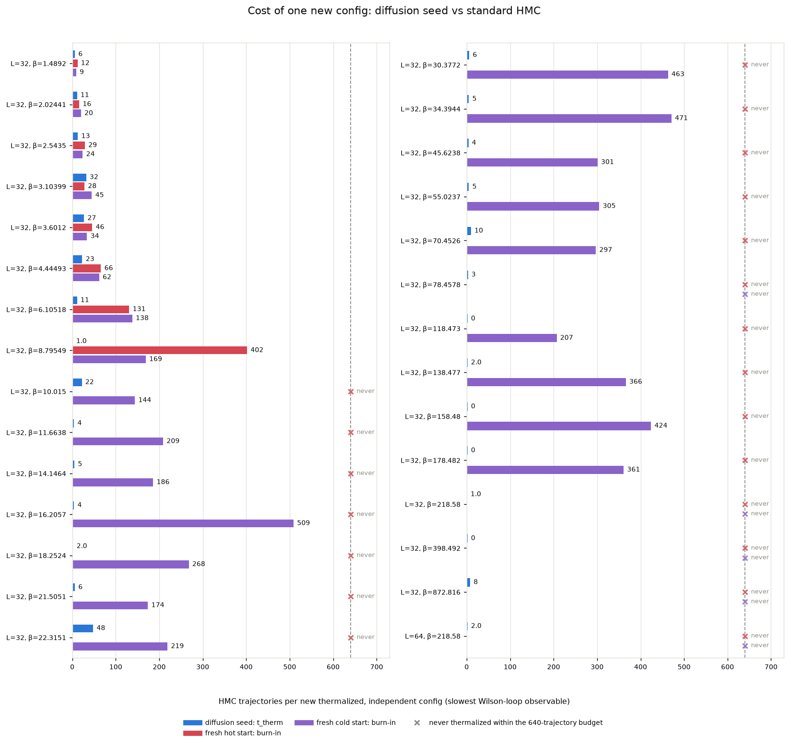

## The three starting points

- **Diffusion seed** -- the raw conditional-diffusion output for this coupling: one inverse-RG step from a direct-HMC base ensemble at the matched coarse coupling (ancestral sampling + the deterministic coarse-charge transport), with **no** rethermalization sweeps applied: every bit of equilibration the seed needs is measured here, in HMC trajectories.
- **Hot start** -- every link angle drawn uniformly from (-pi, pi]: a completely disordered (infinite-temperature) configuration. The standard way to initialize a fresh HMC chain without prior information.
- **Cold start** -- every link angle set to zero: the perfectly ordered (beta -> infinity) configuration, the other standard initialization.

## Summary

| rung | L | beta | t_therm diffusion seed | standard-HMC interval 2 tau_int | margin (interval - t_therm) | burn-in hot / cold | tau_int(Q) |
|---|---|---|---|---|---|---|---|
| A_bc0.25_L32_beta1.4892 | 32 | 1.4892 | 6 | 2.7 | -3.3 traj | 12 / 9 | 1.4 |
| A_bc0.5_L32_beta2.02441 | 32 | 2.02441 | 11 | 5.5 | -5.5 traj | 16 / 20 | 3.2 |
| A_bc0.75_L32_beta2.5435 | 32 | 2.5435 | 13 | 6.2 | -6.8 traj | 29 / 24 | 5.0 |
| A_bc1_L32_beta3.10399 | 32 | 3.10399 | 32 | 8.4 | -23.6 traj | 28 / 45 | 9.4 |
| E_bc1.2_L32_beta3.6012 | 32 | 3.6012 | 27 | 8.5 | -18.5 traj | 46 / 34 | 14.1 |
| A_bc1.5_L32_beta4.44493 | 32 | 4.44493 | 23 | 6.3 | -16.7 traj | 66 / 62 | 26.0 |
| A_bc2_L32_beta6.10518 | 32 | 6.10518 | 11 | 7.3 | -3.7 traj | 131 / 138 | 30.8 |
| E_bc2.7_L32_beta8.79549 | 32 | 8.79549 | 1 | 8.7 | 7.7 traj | 402 / 169 | frozen (0 tunnelings in 321 x 32 traj) |
| A_bc3_L32_beta10.015 | 32 | 10.015 | 22 | 11.4 | -10.6 traj | never / 144 | frozen (0 tunnelings in 321 x 32 traj) |
| E_bc3.4_L32_beta11.6638 | 32 | 11.6638 | 4 | 9.2 | 5.2 traj | never / 209 | frozen (0 tunnelings in 321 x 32 traj) |
| A_bc4_L32_beta14.1464 | 32 | 14.1464 | 5 | 9.6 | 4.6 traj | never / 186 | frozen (0 tunnelings in 321 x 32 traj) |
| E_bc4.5_L32_beta16.2057 | 32 | 16.2057 | 4 | 20.5 | 16.5 traj | never / 509 | frozen (0 tunnelings in 321 x 32 traj) |
| A_bc5_L32_beta18.2524 | 32 | 18.2524 | 2 | 10.2 | 8.2 traj | never / 268 | frozen (0 tunnelings in 321 x 32 traj) |
| E_bc5.8_L32_beta21.5051 | 32 | 21.5051 | 6 | 20.2 | 14.2 traj | never / 174 | frozen (0 tunnelings in 321 x 32 traj) |
| A_bc6_L32_beta22.3151 | 32 | 22.3151 | 48 | 17.5 | -30.5 traj | never / 219 | frozen (0 tunnelings in 321 x 32 traj) |
| A_bc8_L32_beta30.3772 | 32 | 30.3772 | 6 | 28.8 | 22.8 traj | never / 463 | frozen (0 tunnelings in 321 x 32 traj) |
| E_bc9_L32_beta34.3944 | 32 | 34.3944 | 5 | 17.9 | 12.9 traj | never / 471 | frozen (0 tunnelings in 321 x 32 traj) |
| E_bc11.8_L32_beta45.6238 | 32 | 45.6238 | 4 | 25.4 | 21.4 traj | never / 301 | frozen (0 tunnelings in 321 x 32 traj) |
| D_bc14.1464_L32_beta55.0237 | 32 | 55.0237 | 5 | 25.9 | 20.9 traj | never / 305 | frozen (0 tunnelings in 321 x 32 traj) |
| E_bc18_L32_beta70.4526 | 32 | 70.4526 | 10 | 27.0 | 17.0 traj | never / 297 | frozen (0 tunnelings in 321 x 32 traj) |
| D_bc20_L32_beta78.4578 | 32 | 78.4578 | 3 | 14.9 | 11.9 traj | never / never | frozen (0 tunnelings in 321 x 32 traj) |
| D_bc30_L32_beta118.473 | 32 | 118.473 | 0 | 41.8 | 41.8 traj | never / 207 | frozen (0 tunnelings in 321 x 32 traj) |
| E_bc35_L32_beta138.477 | 32 | 138.477 | 2 | 83.3 | 81.3 traj | never / 366 | frozen (0 tunnelings in 321 x 32 traj) |
| D_bc40_L32_beta158.48 | 32 | 158.48 | 0 | 64.3 | 64.3 traj | never / 424 | frozen (0 tunnelings in 321 x 32 traj) |
| E_bc45_L32_beta178.482 | 32 | 178.482 | 0 | 44.9 | 44.9 traj | never / 361 | frozen (0 tunnelings in 321 x 32 traj) |
| D_bc55.0237_L32_beta218.58 | 32 | 218.58 | 1 | 23.2 | 22.2 traj | never / never | frozen (0 tunnelings in 321 x 32 traj) |
| F_L32_bc100_L32_beta398.492 | 32 | 398.492 | 0 | 64.5 | 64.5 traj | never / never | frozen (0 tunnelings in 321 x 32 traj) |
| F_L32_bc218.58_L32_beta872.816 | 32 | 872.816 | 8 | 2.9 | -5.1 traj | never / never | frozen (0 tunnelings in 321 x 32 traj) |
| F_L64_bc55.0237_L64_beta218.58 | 64 | 218.58 | 2 | 80.2 | 78.2 traj | never / never | frozen (0 tunnelings in 321 x 16 traj) |

t_therm and burn-in are the slowest Wilson-loop observable (plaquette, W(2x2), W(4x4)); topology is stricter still for the fresh chains: their Q^2 **never** reaches the exact value at the frozen rungs, while the diffusion seed inherits the correct topological sector from the coarse ensemble it was generated from (see the Q^2 panels and per-rung tables below).

Thermalization time `t_therm` = first trajectory at which the ensemble-mean z-score vs the exact value satisfies |z| <= 2 and stays there for 5 consecutive trajectories (t = 0: already thermalized before any HMC). For the diffusion seed, t_therm is computed on a random subsample of chains matched to the baseline chain count so all starts are compared at equal statistical power. `tau_int` is Madras-Sokal, measured on the second half of the hot-start chains, averaged over chains. In the per-rung relaxation figures, triangles mark each start's t_therm, dashed curves are the exponential fits C + A exp(-t/tau) to the ensemble means (tau quoted per panel), and the right-hand panels track the ensemble mean's distance from the exact value in SEM units -- thermalized means inside the shaded |z| <= 2 band; the dotted vertical line there is the standard-HMC interval `2 tau_int`.

## What 'never' means, and where the ground truth comes from

'never' = the ensemble mean was still outside |z| <= 2 of the exact value after the full baseline budget; the per-rung sections quote the z-score it plateaued at. For hot starts at the large-beta rungs this is not a budget problem but a physical one: a random start freezes into a random topological sector (<Q^2> of order tens), plain HMC can never change Q at these couplings (tunneling is suppressed ~exp(-2 beta)), and the wrong sector biases every Wilson loop by an amount that never decays. Cold starts sit in the single sector Q = 0, so their Wilson loops do eventually converge, but <Q^2> stays pinned at 0 forever.

None of the exact values in this report come from fine-lattice HMC: the ground truth is the character expansion of 2D compact U(1) (`diffusion/lgt/exact.py`), which gives every Wilson loop, P(Q) and chi_top in closed form at finite volume. Each diffusion seed here is one inverse-RG step from a direct-HMC base ensemble at the matched coarse coupling beta_c (L=16), where HMC mixes well -- which is precisely why it can start chains in regions standard HMC cannot reach.

## A_bc0.25_L32_beta1.4892

HMC: step size 0.2000, 5 leapfrog steps, acceptance seed/hot/cold = 0.970/0.970/0.966. Diffusion-seed batch: 128 chains x 96 trajectories (0.08 s/traj for the whole batch); baselines: 32 chains x 640 trajectories.

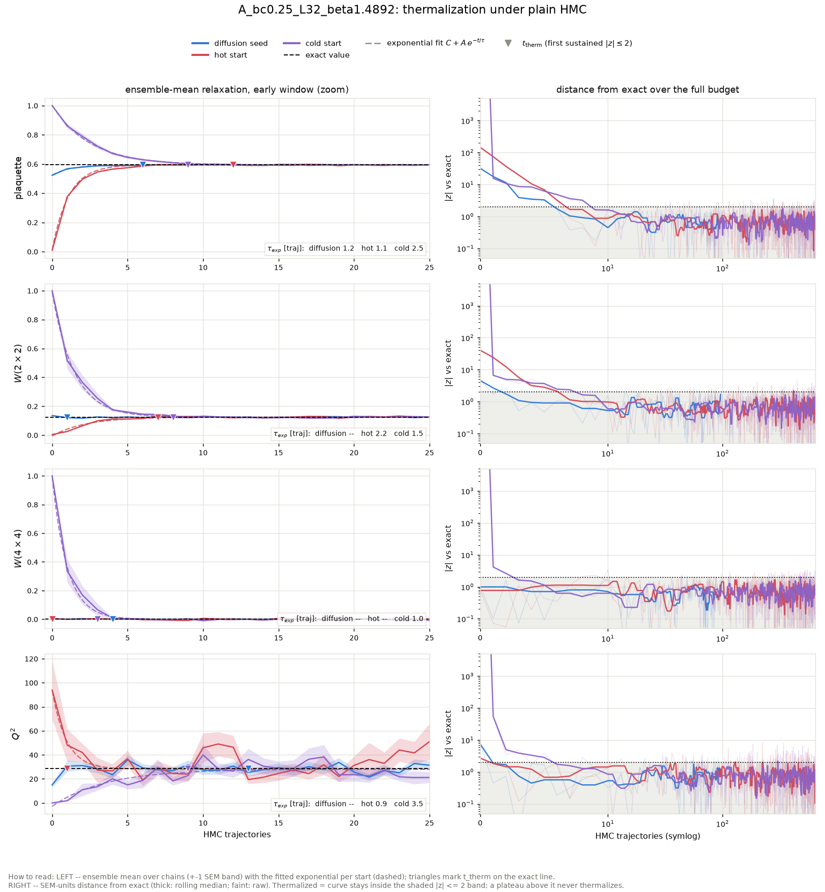

tau_int (hot-start chains, second half): plaquette = 1.36 +- 0.06, wilson_2x2 = 0.76 +- 0.03, wilson_4x4 = 0.56 +- 0.02, wilson_6x6 = 0.57 +- 0.02. Topology: hot-start HMC L=32 beta=1.4892 -> tau_int(Q) = 1.4.

### Diagnostics: raw diffusion output (before any HMC)

| observable | value | error | exact | z_exact | reference | ref_error | z_ref | ks_p | chi2_p |
|---|---|---|---|---|---|---|---|---|---|
| plaquette | 0.5226 | 0.001972 | 0.5935 | -35.96 | 0.5948 | 0.001238 | -31.01 | 0 |  |
| wilson_1x1 | 0.5226 | 0.001972 | 0.5935 | -35.96 | 0.5948 | 0.001238 | -31.01 | 0 |  |
| wilson_1x2 | 0.2899 | 0.002644 | 0.3522 | -23.56 | 0.3522 | 0.002458 | -17.26 | 9.529e-44 |  |
| wilson_2x2 | 0.1352 | 0.00195 | 0.124 | 5.716 | 0.1241 | 0.001865 | 4.124 | 0.003697 |  |
| wilson_2x3 | 0.05957 | 0.001968 | 0.04368 | 8.071 | 0.04133 | 0.001675 | 7.057 | 7.158e-07 |  |
| wilson_3x3 | 0.01519 | 0.001855 | 0.00913 | 3.269 | 0.005305 | 0.002005 | 3.62 | 0.004349 |  |
| wilson_3x4 | 0.004093 | 0.002083 | 0.001908 | 1.049 | 0.0003275 | 0.002081 | 1.279 | 0.1712 |  |
| wilson_4x4 | 0.002369 | 0.002227 | 0.0002367 | 0.9575 | 0.0001938 | 0.001787 | 0.7619 | 0.1122 |  |
| wilson_4x5 | 0.0026 | 0.001715 | 2.936e-05 | 1.499 | -0.001625 | 0.001631 | 1.786 | 0.2763 |  |
| wilson_5x5 | 0.0002937 | 0.002146 | 2.161e-06 | 0.1359 | -0.000249 | 0.001931 | 0.188 | 0.8246 |  |
| wilson_5x6 | -0.0003795 | 0.001879 | 1.591e-07 | -0.202 | -0.0005556 | 0.001821 | 0.06728 | 0.678 |  |
| wilson_6x6 | -0.0004359 | 0.001452 | 6.948e-09 | -0.3002 | -0.001112 | 0.00174 | 0.2982 | 0.8246 |  |
| wilson_6x7 | 0.0033 | 0.00256 | 3.035e-10 | 1.289 | 0.002636 | 0.001766 | 0.2134 | 0.4898 |  |
| wilson_7x7 | -0.001124 | 0.002178 | 7.868e-12 | -0.5161 | 0.0003693 | 0.001605 | -0.5519 | 0.8246 |  |
| wilson_7x8 | 0.002844 | 0.001831 | 2.04e-13 | 1.554 | -0.001279 | 0.001893 | 1.566 | 0.08971 |  |
| wilson_8x8 | -0.00196 | 0.001317 | 3.138e-15 | -1.488 | -0.001451 | 0.00132 | -0.2732 | 0.7163 |  |
| wilson_8x10 | 1.051e-05 | 0.001815 | 7.426e-19 | 0.00579 | 0.001016 | 0.001793 | -0.3942 | 0.7901 |  |
| wilson_10x10 | -0.0003566 | 0.001698 | 2.18e-23 | -0.2099 | 0.0006406 | 0.001555 | -0.433 | 0.6395 |  |
| wilson_10x12 | -0.000183 | 0.002578 | 6.4e-28 | -0.07099 | -0.003091 | 0.001502 | 0.9747 | 0.2522 |  |
| wilson_12x12 | -0.00155 | 0.002417 | 2.33e-33 | -0.6412 | -0.001718 | 0.001421 | 0.05979 | 0.9972 |  |
| creutz_2 | 0.1737 | 0.01754 | 0.5218 | -19.85 |  |  |  |  |  |
| creutz_3 | 0.5467 | 0.1384 | 0.5218 | 0.1795 |  |  |  |  |  |
| creutz_4 | -0.7651 | 1.044 | 0.5218 | -1.233 |  |  |  |  |  |
| creutz_5 | 2.274 | nan | 0.5218 | nan |  |  |  |  |  |
| Q | 0.7344 | 0.3272 | 0 | 2.245 | -0.4375 | 0.3418 | 2.477 | 0.01957 |  |
| Q^2 | 15 | 1.997 | 28.52 | -6.772 | 27.85 | 2.353 | -4.166 | 0.01957 |  |
| chi_top ((<Q^2>-<Q>^2)/V) | 0.01412 | 0.001823 | 0.02785 | -7.532 | 0.02701 | 0.002264 | -4.435 | 0.0007783 |  |
| Q histogram vs exact P(Q) | 31.13 | nan | 18 | nan |  |  |  |  | 0.02778 |

### Diagnostics: the same configs after 96 HMC trajectories

| observable | value | error | exact | z_exact | reference | ref_error | z_ref | ks_p | chi2_p |
|---|---|---|---|---|---|---|---|---|---|
| plaquette | 0.5942 | 0.001334 | 0.5935 | 0.5992 | 0.5948 | 0.001238 | -0.277 | 0.6011 |  |
| wilson_1x1 | 0.5942 | 0.001334 | 0.5935 | 0.5992 | 0.5948 | 0.001238 | -0.277 | 0.6011 |  |
| wilson_1x2 | 0.3523 | 0.001879 | 0.3522 | 0.03968 | 0.3522 | 0.002458 | 0.022 | 0.9693 |  |
| wilson_2x2 | 0.1205 | 0.002413 | 0.124 | -1.469 | 0.1241 | 0.001865 | -1.169 | 0.1712 |  |
| wilson_2x3 | 0.04012 | 0.002655 | 0.04368 | -1.342 | 0.04133 | 0.001675 | -0.3856 | 0.7538 |  |
| wilson_3x3 | 0.003002 | 0.002224 | 0.00913 | -2.755 | 0.005305 | 0.002005 | -0.769 | 0.3294 |  |
| wilson_3x4 | -0.0004682 | 0.002247 | 0.001908 | -1.058 | 0.0003275 | 0.002081 | -0.2598 | 0.9126 |  |
| wilson_4x4 | -0.002177 | 0.002311 | 0.0002367 | -1.045 | 0.0001938 | 0.001787 | -0.8117 | 0.3294 |  |
| wilson_4x5 | -0.002356 | 0.002266 | 2.936e-05 | -1.053 | -0.001625 | 0.001631 | -0.2617 | 0.389 |  |
| wilson_5x5 | -0.004713 | 0.002579 | 2.161e-06 | -1.828 | -0.000249 | 0.001931 | -1.385 | 0.1545 |  |
| wilson_5x6 | -0.00129 | 0.001695 | 1.591e-07 | -0.7615 | -0.0005556 | 0.001821 | -0.2955 | 0.5259 |  |
| wilson_6x6 | -0.002247 | 0.002017 | 6.948e-09 | -1.114 | -0.001112 | 0.00174 | -0.4263 | 0.9693 |  |
| wilson_6x7 | 0.0007731 | 0.002613 | 3.035e-10 | 0.2959 | 0.002636 | 0.001766 | -0.5908 | 0.9126 |  |
| wilson_7x7 | -0.0003074 | 0.001993 | 7.868e-12 | -0.1543 | 0.0003693 | 0.001605 | -0.2644 | 0.1892 |  |
| wilson_7x8 | -0.0004102 | 0.00154 | 2.04e-13 | -0.2664 | -0.001279 | 0.001893 | 0.3559 | 0.7901 |  |
| wilson_8x8 | 0.001971 | 0.001499 | 3.138e-15 | 1.315 | -0.001451 | 0.00132 | 1.713 | 0.1892 |  |
| wilson_8x10 | -0.003422 | 0.002132 | 7.426e-19 | -1.605 | 0.001016 | 0.001793 | -1.593 | 0.0711 |  |
| wilson_10x10 | -0.001473 | 0.001518 | 2.18e-23 | -0.9702 | 0.0006406 | 0.001555 | -0.9724 | 0.678 |  |
| wilson_10x12 | -0.000286 | 0.00126 | 6.4e-28 | -0.2269 | -0.003091 | 0.001502 | 1.43 | 0.1712 |  |
| wilson_12x12 | 8.854e-05 | 0.001811 | 2.33e-33 | 0.04889 | -0.001718 | 0.001421 | 0.7846 | 0.4548 |  |
| creutz_2 | 0.5499 | 0.01389 | 0.5218 | 2.021 |  |  |  |  |  |
| creutz_3 | 1.493 | 0.6909 | 0.5218 | 1.406 |  |  |  |  |  |
| Q | 0.1094 | 0.4513 | 0 | 0.2423 | -0.4375 | 0.3418 | 0.9659 | 0.3021 |  |
| Q^2 | 25.2 | 4.649 | 28.52 | -0.714 | 27.85 | 2.353 | -0.5088 | 0.1712 |  |
| chi_top ((<Q^2>-<Q>^2)/V) | 0.0246 | 0.004525 | 0.02785 | -0.7189 | 0.02701 | 0.002264 | -0.477 | 0.04354 |  |
| Q histogram vs exact P(Q) | 18.95 | nan | 18 | nan |  |  |  |  | 0.3948 |

## A_bc0.5_L32_beta2.02441

HMC: step size 0.2000, 5 leapfrog steps, acceptance seed/hot/cold = 0.965/0.964/0.960. Diffusion-seed batch: 128 chains x 96 trajectories (0.22 s/traj for the whole batch); baselines: 32 chains x 640 trajectories.

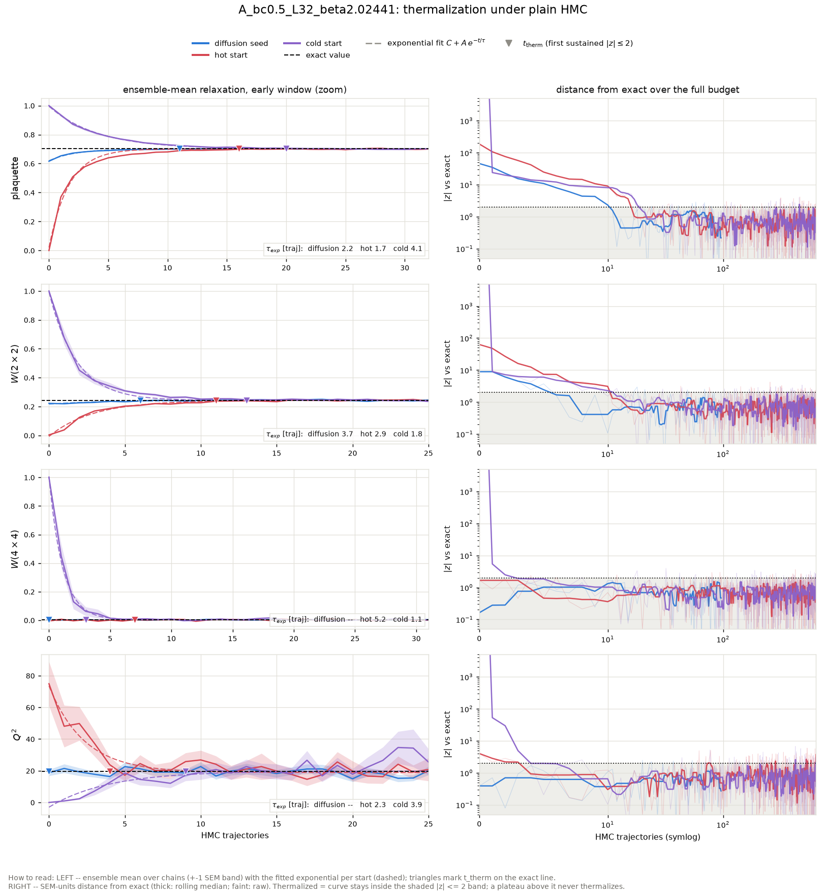

tau_int (hot-start chains, second half): plaquette = 2.76 +- 0.30, wilson_2x2 = 1.00 +- 0.07, wilson_4x4 = 0.61 +- 0.02, wilson_6x6 = 0.58 +- 0.01. Topology: hot-start HMC L=32 beta=2.02441 -> tau_int(Q) = 3.2.

### Diagnostics: raw diffusion output (before any HMC)

| observable | value | error | exact | z_exact | reference | ref_error | z_ref | ks_p | chi2_p |
|---|---|---|---|---|---|---|---|---|---|
| plaquette | 0.6163 | 0.002153 | 0.7017 | -39.67 | 0.7019 | 0.0008797 | -36.8 | 0 |  |
| wilson_1x1 | 0.6163 | 0.002153 | 0.7017 | -39.67 | 0.7019 | 0.0008797 | -36.8 | 0 |  |
| wilson_1x2 | 0.3946 | 0.003223 | 0.4924 | -30.36 | 0.4926 | 0.001604 | -27.22 | 0 |  |
| wilson_2x2 | 0.2222 | 0.002907 | 0.2425 | -6.991 | 0.2406 | 0.001965 | -5.263 | 1.138e-07 |  |
| wilson_2x3 | 0.1138 | 0.002232 | 0.1194 | -2.53 | 0.1199 | 0.002269 | -1.925 | 0.1392 |  |
| wilson_3x3 | 0.03697 | 0.002111 | 0.04127 | -2.038 | 0.03906 | 0.002341 | -0.6657 | 0.3294 |  |
| wilson_3x4 | 0.0144 | 0.002046 | 0.01426 | 0.06955 | 0.01215 | 0.001815 | 0.8219 | 0.8246 |  |
| wilson_4x4 | 0.00379 | 0.001983 | 0.003458 | 0.1671 | 0.002402 | 0.001851 | 0.5114 | 0.4548 |  |
| wilson_4x5 | 0.004714 | 0.001812 | 0.0008386 | 2.139 | 0.001425 | 0.002112 | 1.182 | 0.2522 |  |
| wilson_5x5 | -0.00121 | 0.001892 | 0.0001427 | -0.7148 | -0.0008455 | 0.001957 | -0.1339 | 0.2763 |  |
| wilson_5x6 | -0.001063 | 0.001403 | 2.428e-05 | -0.7746 | -9.881e-05 | 0.001841 | -0.4164 | 0.9542 |  |
| wilson_6x6 | -0.001027 | 0.002403 | 2.9e-06 | -0.4285 | -0.0007191 | 0.001925 | -0.09999 | 0.9941 |  |
| wilson_6x7 | 0.001853 | 0.001854 | 3.463e-07 | 0.999 | -0.0003006 | 0.001982 | 0.7935 | 0.4212 |  |
| wilson_7x7 | -0.001247 | 0.001627 | 2.902e-08 | -0.7665 | 0.001083 | 0.001614 | -1.017 | 0.6395 |  |
| wilson_7x8 | 0.001052 | 0.001953 | 2.432e-09 | 0.5386 | -0.001728 | 0.001643 | 1.089 | 0.4898 |  |
| wilson_8x8 | -0.0005842 | 0.002171 | 1.43e-10 | -0.2691 | -0.0004432 | 0.001893 | -0.04897 | 0.678 |  |
| wilson_8x10 | -0.0001581 | 0.002015 | 4.946e-13 | -0.07848 | -0.001078 | 0.001766 | 0.3432 | 0.8246 |  |
| wilson_10x10 | 0.0005588 | 0.001525 | 4.147e-16 | 0.3664 | 0.0007502 | 0.001534 | -0.08847 | 0.7901 |  |
| wilson_10x12 | -0.002183 | 0.001747 | 3.478e-19 | -1.25 | 0.001283 | 0.00153 | -1.492 | 0.2087 |  |
| wilson_12x12 | 0.0007913 | 0.002289 | 7.073e-23 | 0.3456 | 0.001944 | 0.001599 | -0.4127 | 0.04938 |  |
| creutz_2 | 0.1284 | 0.01068 | 0.3542 | -21.14 |  |  |  |  |  |
| creutz_3 | 0.4549 | 0.04959 | 0.3542 | 2.03 |  |  |  |  |  |
| creutz_4 | 0.3926 | 0.5409 | 0.3542 | 0.07102 |  |  |  |  |  |
| Q | -0.04688 | 0.3268 | 0 | -0.1435 | -0.7917 | 0.2757 | 1.742 | 0.0631 |  |
| Q^2 | 18.75 | 2.101 | 19.51 | -0.3622 | 16.85 | 1.13 | 0.7948 | 0.1122 |  |
| chi_top ((<Q^2>-<Q>^2)/V) | 0.01831 | 0.002049 | 0.01905 | -0.3636 | 0.01585 | 0.001139 | 1.05 | 0.0001679 |  |
| Q histogram vs exact P(Q) | 13.44 | nan | 16 | nan |  |  |  |  | 0.6405 |

### Diagnostics: the same configs after 96 HMC trajectories

| observable | value | error | exact | z_exact | reference | ref_error | z_ref | ks_p | chi2_p |
|---|---|---|---|---|---|---|---|---|---|
| plaquette | 0.7015 | 0.0009456 | 0.7017 | -0.2667 | 0.7019 | 0.0008797 | -0.3251 | 0.4212 |  |
| wilson_1x1 | 0.7015 | 0.0009456 | 0.7017 | -0.2667 | 0.7019 | 0.0008797 | -0.3251 | 0.4212 |  |
| wilson_1x2 | 0.4925 | 0.001302 | 0.4924 | 0.0744 | 0.4926 | 0.001604 | -0.0167 | 0.9126 |  |
| wilson_2x2 | 0.2437 | 0.00163 | 0.2425 | 0.7172 | 0.2406 | 0.001965 | 1.184 | 0.8246 |  |
| wilson_2x3 | 0.1218 | 0.002396 | 0.1194 | 0.9812 | 0.1199 | 0.002269 | 0.5677 | 0.6395 |  |
| wilson_3x3 | 0.04181 | 0.002565 | 0.04127 | 0.21 | 0.03906 | 0.002341 | 0.7895 | 0.4898 |  |
| wilson_3x4 | 0.01172 | 0.002799 | 0.01426 | -0.9088 | 0.01215 | 0.001815 | -0.1311 | 0.7901 |  |
| wilson_4x4 | 0.004538 | 0.002326 | 0.003458 | 0.464 | 0.002402 | 0.001851 | 0.7183 | 0.2522 |  |
| wilson_4x5 | -0.0004398 | 0.002581 | 0.0008386 | -0.4953 | 0.001425 | 0.002112 | -0.5591 | 0.8864 |  |
| wilson_5x5 | 0.0001915 | 0.002074 | 0.0001427 | 0.02354 | -0.0008455 | 0.001957 | 0.3636 | 0.8569 |  |
| wilson_5x6 | 0.003363 | 0.001942 | 2.428e-05 | 1.719 | -9.881e-05 | 0.001841 | 1.294 | 0.1712 |  |
| wilson_6x6 | -0.001162 | 0.001503 | 2.9e-06 | -0.7751 | -0.0007191 | 0.001925 | -0.1814 | 0.9693 |  |
| wilson_6x7 | -0.0006582 | 0.002063 | 3.463e-07 | -0.3192 | -0.0003006 | 0.001982 | -0.125 | 0.5631 |  |
| wilson_7x7 | 0.004494 | 0.001651 | 2.902e-08 | 2.721 | 0.001083 | 0.001614 | 1.477 | 0.3021 |  |
| wilson_7x8 | -0.0008633 | 0.002015 | 2.432e-09 | -0.4283 | -0.001728 | 0.001643 | 0.3327 | 0.7163 |  |
| wilson_8x8 | -0.0005893 | 0.001885 | 1.43e-10 | -0.3126 | -0.0004432 | 0.001893 | -0.05468 | 0.9353 |  |
| wilson_8x10 | 0.001809 | 0.001968 | 4.946e-13 | 0.9194 | -0.001078 | 0.001766 | 1.092 | 0.9542 |  |
| wilson_10x10 | -0.0006789 | 0.002076 | 4.147e-16 | -0.327 | 0.0007502 | 0.001534 | -0.5537 | 0.3584 |  |
| wilson_10x12 | -0.0006447 | 0.001418 | 3.478e-19 | -0.4545 | 0.001283 | 0.00153 | -0.924 | 0.2763 |  |
| wilson_12x12 | 0.002216 | 0.001901 | 7.073e-23 | 1.166 | 0.001944 | 0.001599 | 0.1097 | 0.8864 |  |
| creutz_2 | 0.3501 | 0.00662 | 0.3542 | -0.6129 |  |  |  |  |  |
| creutz_3 | 0.3754 | 0.04688 | 0.3542 | 0.4524 |  |  |  |  |  |
| creutz_4 | -0.3233 | 0.5225 | 0.3542 | -1.297 |  |  |  |  |  |
| Q | -0.2812 | 0.4804 | 0 | -0.5855 | -0.7917 | 0.2757 | 0.9215 | 0.3294 |  |
| Q^2 | 20.23 | 2.616 | 19.51 | 0.2766 | 16.85 | 1.13 | 1.186 | 0.9972 |  |
| chi_top ((<Q^2>-<Q>^2)/V) | 0.01968 | 0.002501 | 0.01905 | 0.2516 | 0.01585 | 0.001139 | 1.396 | 0.0631 |  |
| Q histogram vs exact P(Q) | 10.23 | nan | 16 | nan |  |  |  |  | 0.8541 |

## A_bc0.75_L32_beta2.5435

HMC: step size 0.2000, 5 leapfrog steps, acceptance seed/hot/cold = 0.967/0.961/0.960. Diffusion-seed batch: 128 chains x 96 trajectories (0.21 s/traj for the whole batch); baselines: 32 chains x 640 trajectories.

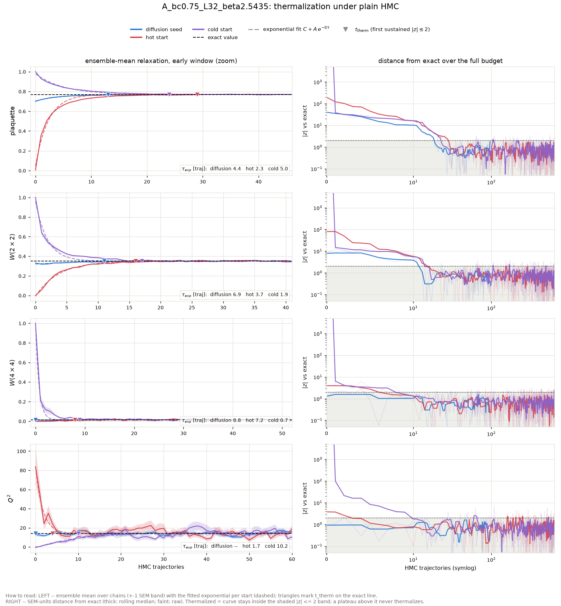

tau_int (hot-start chains, second half): plaquette = 3.11 +- 0.17, wilson_2x2 = 1.26 +- 0.06, wilson_4x4 = 0.71 +- 0.03, wilson_6x6 = 0.57 +- 0.02. Topology: hot-start HMC L=32 beta=2.5435 -> tau_int(Q) = 5.0.

### Diagnostics: raw diffusion output (before any HMC)

| observable | value | error | exact | z_exact | reference | ref_error | z_ref | ks_p | chi2_p |
|---|---|---|---|---|---|---|---|---|---|
| plaquette | 0.7005 | 0.001596 | 0.7696 | -43.32 | 0.7712 | 0.0008441 | -39.16 | 0 |  |
| wilson_1x1 | 0.7005 | 0.001596 | 0.7696 | -43.32 | 0.7712 | 0.0008441 | -39.16 | 0 |  |
| wilson_1x2 | 0.5004 | 0.001988 | 0.5924 | -46.27 | 0.5947 | 0.001239 | -40.26 | 0 |  |
| wilson_2x2 | 0.3306 | 0.002751 | 0.3509 | -7.379 | 0.3548 | 0.001546 | -7.677 | 8.676e-11 |  |
| wilson_2x3 | 0.1935 | 0.003183 | 0.2079 | -4.503 | 0.2096 | 0.001777 | -4.423 | 2.022e-05 |  |
| wilson_3x3 | 0.08048 | 0.002736 | 0.09476 | -5.218 | 0.099 | 0.002295 | -5.185 | 1.289e-05 |  |
| wilson_3x4 | 0.0375 | 0.002154 | 0.0432 | -2.647 | 0.04598 | 0.00207 | -2.84 | 0.011 |  |
| wilson_4x4 | 0.01841 | 0.002062 | 0.01516 | 1.579 | 0.01636 | 0.002317 | 0.6632 | 0.6011 |  |
| wilson_4x5 | 0.006933 | 0.002292 | 0.005319 | 0.7042 | 0.008872 | 0.001496 | -0.7087 | 0.9126 |  |
| wilson_5x5 | 0.003822 | 0.00207 | 0.001436 | 1.152 | 0.004459 | 0.001775 | -0.2337 | 0.6395 |  |
| wilson_5x6 | 0.003203 | 0.002343 | 0.0003879 | 1.201 | 0.001126 | 0.001405 | 0.7599 | 0.6011 |  |
| wilson_6x6 | -0.002497 | 0.002667 | 8.063e-05 | -0.9662 | 0.0006585 | 0.002101 | -0.9292 | 0.5259 |  |
| wilson_6x7 | 0.0005025 | 0.001464 | 1.676e-05 | 0.3317 | 0.0003578 | 0.002067 | 0.05712 | 0.7538 |  |
| wilson_7x7 | 0.0003404 | 0.002143 | 2.681e-06 | 0.1576 | -5.091e-05 | 0.001535 | 0.1485 | 0.9126 |  |
| wilson_7x8 | 0.002542 | 0.002007 | 4.289e-07 | 1.266 | -0.0002698 | 0.00133 | 1.168 | 0.3294 |  |
| wilson_8x8 | -0.003733 | 0.002117 | 5.28e-08 | -1.764 | -3.522e-05 | 0.001573 | -1.402 | 0.3021 |  |
| wilson_8x10 | -0.002333 | 0.002083 | 8.005e-10 | -1.12 | -0.0007483 | 0.001392 | -0.6325 | 0.9542 |  |
| wilson_10x10 | 0.000592 | 0.001945 | 4.258e-12 | 0.3043 | 0.0005853 | 0.001744 | 0.002565 | 0.7538 |  |
| wilson_10x12 | 0.0014 | 0.00173 | 2.265e-14 | 0.8093 | -0.003624 | 0.001567 | 2.153 | 0.1004 |  |
| wilson_12x12 | -0.002119 | 0.001768 | 4.227e-17 | -1.199 | 0.001042 | 0.001567 | -1.338 | 0.0711 |  |
| creutz_2 | 0.07809 | 0.007609 | 0.2618 | -24.15 |  |  |  |  |  |
| creutz_3 | 0.3419 | 0.02405 | 0.2618 | 3.328 |  |  |  |  |  |
| creutz_4 | -0.05252 | 0.1152 | 0.2618 | -2.728 |  |  |  |  |  |
| creutz_5 | -0.3812 | 0.6927 | 0.2618 | -0.9284 |  |  |  |  |  |
| Q | -0.25 | 0.2687 | 0 | -0.9304 | -0.2552 | 0.2417 | 0.01441 | 0.9999 |  |
| Q^2 | 12.83 | 1.673 | 14.25 | -0.8515 | 13.84 | 1.822 | -0.4085 | 0.8864 |  |
| chi_top ((<Q^2>-<Q>^2)/V) | 0.01247 | 0.001627 | 0.01392 | -0.8926 | 0.01345 | 0.001796 | -0.4061 | 0.006985 |  |
| Q histogram vs exact P(Q) | 9.436 | nan | 14 | nan |  |  |  |  | 0.8022 |

### Diagnostics: the same configs after 96 HMC trajectories

| observable | value | error | exact | z_exact | reference | ref_error | z_ref | ks_p | chi2_p |
|---|---|---|---|---|---|---|---|---|---|
| plaquette | 0.7714 | 0.0008211 | 0.7696 | 2.114 | 0.7712 | 0.0008441 | 0.1507 | 0.9888 |  |
| wilson_1x1 | 0.7714 | 0.0008211 | 0.7696 | 2.114 | 0.7712 | 0.0008441 | 0.1507 | 0.9888 |  |
| wilson_1x2 | 0.5958 | 0.001652 | 0.5924 | 2.07 | 0.5947 | 0.001239 | 0.5333 | 0.7538 |  |
| wilson_2x2 | 0.3534 | 0.002799 | 0.3509 | 0.8892 | 0.3548 | 0.001546 | -0.4495 | 0.389 |  |
| wilson_2x3 | 0.2084 | 0.003326 | 0.2079 | 0.1606 | 0.2096 | 0.001777 | -0.333 | 0.4548 |  |
| wilson_3x3 | 0.09661 | 0.003879 | 0.09476 | 0.4756 | 0.099 | 0.002295 | -0.531 | 0.8246 |  |
| wilson_3x4 | 0.04477 | 0.003131 | 0.0432 | 0.5016 | 0.04598 | 0.00207 | -0.3222 | 0.8864 |  |
| wilson_4x4 | 0.01579 | 0.002454 | 0.01516 | 0.2589 | 0.01636 | 0.002317 | -0.1668 | 0.7538 |  |
| wilson_4x5 | 0.007687 | 0.002437 | 0.005319 | 0.9713 | 0.008872 | 0.001496 | -0.4146 | 0.8864 |  |
| wilson_5x5 | -0.001221 | 0.00212 | 0.001436 | -1.254 | 0.004459 | 0.001775 | -2.054 | 0.02947 |  |
| wilson_5x6 | -0.002991 | 0.002502 | 0.0003879 | -1.351 | 0.001126 | 0.001405 | -1.435 | 0.05588 |  |
| wilson_6x6 | -0.002192 | 0.00218 | 8.063e-05 | -1.043 | 0.0006585 | 0.002101 | -0.9417 | 0.4898 |  |
| wilson_6x7 | -0.001374 | 0.001688 | 1.676e-05 | -0.824 | 0.0003578 | 0.002067 | -0.6489 | 0.4898 |  |
| wilson_7x7 | 0.00022 | 0.002312 | 2.681e-06 | 0.09396 | -5.091e-05 | 0.001535 | 0.09759 | 0.5631 |  |
| wilson_7x8 | -0.001591 | 0.002409 | 4.289e-07 | -0.6606 | -0.0002698 | 0.00133 | -0.4801 | 0.9353 |  |
| wilson_8x8 | -0.003135 | 0.002095 | 5.28e-08 | -1.496 | -3.522e-05 | 0.001573 | -1.183 | 0.4898 |  |
| wilson_8x10 | 0.003236 | 0.00185 | 8.005e-10 | 1.75 | -0.0007483 | 0.001392 | 1.721 | 0.03364 |  |
| wilson_10x10 | -0.0006544 | 0.001624 | 4.258e-12 | -0.4029 | 0.0005853 | 0.001744 | -0.5202 | 0.3294 |  |
| wilson_10x12 | -0.001747 | 0.001895 | 2.265e-14 | -0.9218 | -0.003624 | 0.001567 | 0.7633 | 0.8569 |  |
| wilson_12x12 | -0.0005589 | 0.002029 | 4.227e-17 | -0.2754 | 0.001042 | 0.001567 | -0.6243 | 0.5631 |  |
| creutz_2 | 0.264 | 0.004833 | 0.2618 | 0.4545 |  |  |  |  |  |
| creutz_3 | 0.2406 | 0.02234 | 0.2618 | -0.9497 |  |  |  |  |  |
| creutz_4 | 0.2729 | 0.1146 | 0.2618 | 0.09678 |  |  |  |  |  |
| Q | 0.5234 | 0.2361 | 0 | 2.217 | -0.2552 | 0.2417 | 2.304 | 0.1892 |  |
| Q^2 | 13.55 | 1.521 | 14.25 | -0.4587 | 13.84 | 1.822 | -0.1196 | 0.9989 |  |
| chi_top ((<Q^2>-<Q>^2)/V) | 0.01297 | 0.001447 | 0.01392 | -0.6556 | 0.01345 | 0.001796 | -0.2086 | 0.017 |  |
| Q histogram vs exact P(Q) | 19.17 | nan | 14 | nan |  |  |  |  | 0.1587 |

## A_bc1_L32_beta3.10399

HMC: step size 0.2000, 5 leapfrog steps, acceptance seed/hot/cold = 0.964/0.962/0.961. Diffusion-seed batch: 128 chains x 96 trajectories (0.05 s/traj for the whole batch); baselines: 32 chains x 640 trajectories.

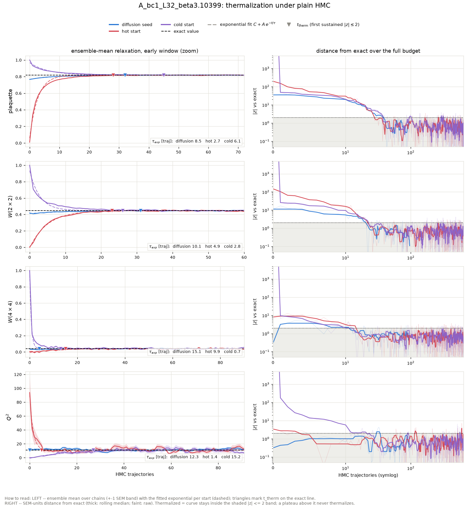

tau_int (hot-start chains, second half): plaquette = 4.22 +- 0.45, wilson_2x2 = 1.59 +- 0.09, wilson_4x4 = 0.87 +- 0.04, wilson_6x6 = 0.56 +- 0.01. Topology: hot-start HMC L=32 beta=3.10399 -> tau_int(Q) = 9.4.

### Diagnostics: raw diffusion output (before any HMC)

| observable | value | error | exact | z_exact | reference | ref_error | z_ref | ks_p | chi2_p |
|---|---|---|---|---|---|---|---|---|---|
| plaquette | 0.7657 | 0.001374 | 0.8174 | -37.65 | 0.8167 | 0.0005787 | -34.23 | 0 |  |
| wilson_1x1 | 0.7657 | 0.001374 | 0.8174 | -37.65 | 0.8167 | 0.0005787 | -34.23 | 0 |  |
| wilson_1x2 | 0.5878 | 0.002473 | 0.6681 | -32.48 | 0.6667 | 0.001248 | -28.47 | 0 |  |
| wilson_2x2 | 0.4179 | 0.002495 | 0.4464 | -11.43 | 0.4462 | 0.002387 | -8.218 | 3.33e-15 |  |
| wilson_2x3 | 0.2698 | 0.002831 | 0.2982 | -10.03 | 0.2995 | 0.003104 | -7.049 | 1.09e-14 |  |
| wilson_3x3 | 0.1351 | 0.002597 | 0.1629 | -10.7 | 0.1662 | 0.003275 | -7.434 | 1.09e-14 |  |
| wilson_3x4 | 0.07746 | 0.002887 | 0.08895 | -3.978 | 0.09401 | 0.002937 | -4.017 | 0.0002049 |  |
| wilson_4x4 | 0.04053 | 0.002329 | 0.03971 | 0.3523 | 0.04635 | 0.002315 | -1.774 | 0.2297 |  |
| wilson_4x5 | 0.022 | 0.002542 | 0.01772 | 1.68 | 0.02331 | 0.001923 | -0.4135 | 0.8246 |  |
| wilson_5x5 | 0.008088 | 0.003073 | 0.006467 | 0.5273 | 0.008977 | 0.001985 | -0.2431 | 0.6011 |  |
| wilson_5x6 | 0.001755 | 0.002381 | 0.00236 | -0.254 | 0.001769 | 0.001658 | -0.004886 | 0.6395 |  |
| wilson_6x6 | 0.001386 | 0.00161 | 0.0007038 | 0.4239 | -0.001236 | 0.002333 | 0.925 | 0.1545 |  |
| wilson_6x7 | -0.0009705 | 0.002031 | 0.0002099 | -0.5812 | 0.0001348 | 0.001854 | -0.4019 | 0.7538 |  |
| wilson_7x7 | 0.001229 | 0.002095 | 5.117e-05 | 0.5623 | -0.0009109 | 0.001672 | 0.7984 | 0.08971 |  |
| wilson_7x8 | 0.005773 | 0.002437 | 1.247e-05 | 2.364 | 0.001308 | 0.00174 | 1.491 | 0.003697 |  |
| wilson_8x8 | 0.001047 | 0.001827 | 2.486e-06 | 0.572 | 0.001576 | 0.001246 | -0.2389 | 0.389 |  |
| wilson_8x10 | 0.002366 | 0.001885 | 9.869e-08 | 1.255 | 0.001019 | 0.002055 | 0.483 | 0.3584 |  |
| wilson_10x10 | 0.0004676 | 0.001933 | 1.749e-09 | 0.2419 | 0.002047 | 0.001322 | -0.6745 | 0.3294 |  |
| wilson_10x12 | 0.0009393 | 0.001634 | 3.101e-11 | 0.5749 | 0.001053 | 0.001377 | -0.05333 | 0.4898 |  |
| wilson_12x12 | -0.002951 | 0.001993 | 2.453e-13 | -1.481 | 0.0004341 | 0.001577 | -1.332 | 0.5631 |  |
| creutz_2 | 0.07692 | 0.00552 | 0.2016 | -22.59 |  |  |  |  |  |
| creutz_3 | 0.2545 | 0.01334 | 0.2016 | 3.965 |  |  |  |  |  |
| creutz_4 | 0.09167 | 0.05193 | 0.2016 | -2.118 |  |  |  |  |  |
| creutz_5 | 0.3894 | 0.2834 | 0.2016 | 0.6626 |  |  |  |  |  |
| creutz_6 | -1.292 | 2.441 | 0.2016 | -0.612 |  |  |  |  |  |
| creutz_8 | 3.254 | 2.284 | 0.2016 | 1.336 |  |  |  |  |  |
| Q | 0.2656 | 0.2481 | 0 | 1.071 | 0.1302 | 0.2199 | 0.4085 | 0.7538 |  |
| Q^2 | 11.16 | 1.044 | 10.81 | 0.333 | 10.84 | 1.105 | 0.209 | 0.1251 |  |
| chi_top ((<Q^2>-<Q>^2)/V) | 0.01083 | 0.0009846 | 0.01056 | 0.275 | 0.01057 | 0.001073 | 0.1771 | 0.0006474 |  |
| Q histogram vs exact P(Q) | 20.04 | nan | 12 | nan |  |  |  |  | 0.06626 |

### Diagnostics: the same configs after 96 HMC trajectories

| observable | value | error | exact | z_exact | reference | ref_error | z_ref | ks_p | chi2_p |
|---|---|---|---|---|---|---|---|---|---|
| plaquette | 0.8182 | 0.0007751 | 0.8174 | 1.075 | 0.8167 | 0.0005787 | 1.587 | 0.2763 |  |
| wilson_1x1 | 0.8182 | 0.0007751 | 0.8174 | 1.075 | 0.8167 | 0.0005787 | 1.587 | 0.2763 |  |
| wilson_1x2 | 0.668 | 0.00149 | 0.6681 | -0.1007 | 0.6667 | 0.001248 | 0.6655 | 0.8246 |  |
| wilson_2x2 | 0.4467 | 0.002926 | 0.4464 | 0.09163 | 0.4462 | 0.002387 | 0.1113 | 0.8864 |  |
| wilson_2x3 | 0.2972 | 0.003499 | 0.2982 | -0.305 | 0.2995 | 0.003104 | -0.4868 | 0.8246 |  |
| wilson_3x3 | 0.1603 | 0.004002 | 0.1629 | -0.6395 | 0.1662 | 0.003275 | -1.131 | 0.1545 |  |
| wilson_3x4 | 0.08831 | 0.003339 | 0.08895 | -0.1916 | 0.09401 | 0.002937 | -1.281 | 0.2297 |  |
| wilson_4x4 | 0.04182 | 0.002989 | 0.03971 | 0.7056 | 0.04635 | 0.002315 | -1.2 | 0.2297 |  |
| wilson_4x5 | 0.01901 | 0.002719 | 0.01772 | 0.4723 | 0.02331 | 0.001923 | -1.293 | 0.2087 |  |
| wilson_5x5 | 0.006901 | 0.00248 | 0.006467 | 0.175 | 0.008977 | 0.001985 | -0.6535 | 0.8569 |  |
| wilson_5x6 | 0.004104 | 0.002125 | 0.00236 | 0.8207 | 0.001769 | 0.001658 | 0.8661 | 0.2087 |  |
| wilson_6x6 | 0.001183 | 0.002241 | 0.0007038 | 0.2139 | -0.001236 | 0.002333 | 0.7477 | 0.5631 |  |
| wilson_6x7 | 0.0002626 | 0.002177 | 0.0002099 | 0.02422 | 0.0001348 | 0.001854 | 0.0447 | 0.9888 |  |
| wilson_7x7 | -0.0001925 | 0.002778 | 5.117e-05 | -0.08769 | -0.0009109 | 0.001672 | 0.2216 | 0.8246 |  |
| wilson_7x8 | -1.945e-05 | 0.001967 | 1.247e-05 | -0.01623 | 0.001308 | 0.00174 | -0.5055 | 0.7538 |  |
| wilson_8x8 | 0.0009473 | 0.001716 | 2.486e-06 | 0.5506 | 0.001576 | 0.001246 | -0.2963 | 0.7901 |  |
| wilson_8x10 | -0.0004459 | 0.002866 | 9.869e-08 | -0.1556 | 0.001019 | 0.002055 | -0.4155 | 0.9126 |  |
| wilson_10x10 | -0.0005791 | 0.001994 | 1.749e-09 | -0.2905 | 0.002047 | 0.001322 | -1.098 | 0.5631 |  |
| wilson_10x12 | 0.002758 | 0.002349 | 3.101e-11 | 1.174 | 0.001053 | 0.001377 | 0.6261 | 0.6011 |  |
| wilson_12x12 | 0.001083 | 0.002683 | 2.453e-13 | 0.4037 | 0.0004341 | 0.001577 | 0.2085 | 0.5631 |  |
| creutz_2 | 0.1996 | 0.003221 | 0.2016 | -0.642 |  |  |  |  |  |
| creutz_3 | 0.2097 | 0.01022 | 0.2016 | 0.7892 |  |  |  |  |  |
| creutz_4 | 0.1513 | 0.04628 | 0.2016 | -1.088 |  |  |  |  |  |
| creutz_5 | 0.2248 | 0.2947 | 0.2016 | 0.07872 |  |  |  |  |  |
| creutz_6 | 0.7241 | 1.685 | 0.2016 | 0.31 |  |  |  |  |  |
| Q | 0.4219 | 0.2595 | 0 | 1.626 | 0.1302 | 0.2199 | 0.8576 | 0.8864 |  |
| Q^2 | 11.3 | 1.027 | 10.81 | 0.4756 | 10.84 | 1.105 | 0.3039 | 0.9989 |  |
| chi_top ((<Q^2>-<Q>^2)/V) | 0.01086 | 0.0009048 | 0.01056 | 0.335 | 0.01057 | 0.001073 | 0.2069 | 0.006985 |  |
| Q histogram vs exact P(Q) | 15.75 | nan | 12 | nan |  |  |  |  | 0.2027 |

## E_bc1.2_L32_beta3.6012

HMC: step size 0.2000, 5 leapfrog steps, acceptance seed/hot/cold = 0.961/0.961/0.961. Diffusion-seed batch: 128 chains x 96 trajectories (0.08 s/traj for the whole batch); baselines: 32 chains x 640 trajectories.

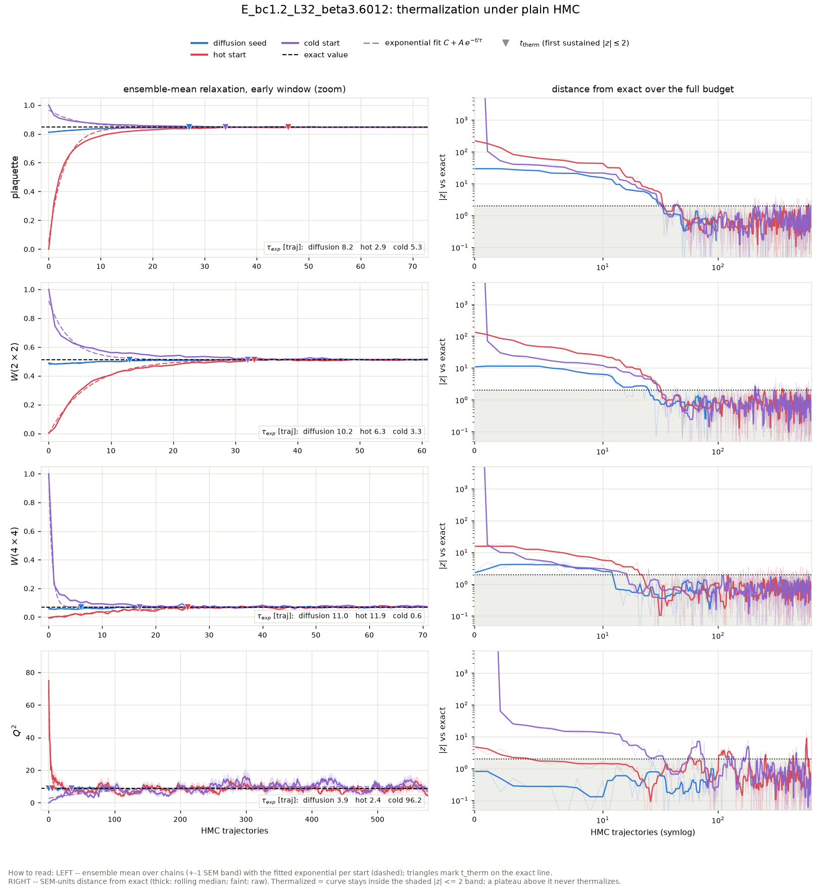

tau_int (hot-start chains, second half): plaquette = 4.27 +- 0.35, wilson_2x2 = 2.26 +- 0.22, wilson_4x4 = 1.08 +- 0.07, wilson_6x6 = 0.61 +- 0.02. Topology: hot-start HMC L=32 beta=3.6012 -> tau_int(Q) = 14.1.

### Diagnostics: raw diffusion output (before any HMC)

| observable | value | error | exact | z_exact | reference | ref_error | z_ref | ks_p | chi2_p |
|---|---|---|---|---|---|---|---|---|---|
| plaquette | 0.8111 | 0.0009628 | 0.8462 | -36.52 | 0.8463 | 0.0003874 | -33.99 | 0 |  |
| wilson_1x1 | 0.8111 | 0.0009628 | 0.8462 | -36.52 | 0.8463 | 0.0003874 | -33.99 | 0 |  |
| wilson_1x2 | 0.6585 | 0.001681 | 0.7161 | -34.27 | 0.7162 | 0.0008025 | -31 | 0 |  |
| wilson_2x2 | 0.488 | 0.002165 | 0.5128 | -11.43 | 0.5137 | 0.001718 | -9.274 | 3.208e-11 |  |
| wilson_2x3 | 0.3375 | 0.002523 | 0.3672 | -11.77 | 0.3685 | 0.002204 | -9.243 | 3.484e-14 |  |
| wilson_3x3 | 0.1903 | 0.002968 | 0.2225 | -10.84 | 0.2236 | 0.002907 | -8.011 | 2.885e-12 |  |
| wilson_3x4 | 0.1162 | 0.003622 | 0.1348 | -5.144 | 0.138 | 0.002983 | -4.641 | 8.145e-06 |  |
| wilson_4x4 | 0.06197 | 0.003493 | 0.06914 | -2.053 | 0.07279 | 0.002786 | -2.421 | 0.02947 |  |
| wilson_4x5 | 0.03108 | 0.002301 | 0.03545 | -1.902 | 0.03951 | 0.002368 | -2.554 | 0.1122 |  |
| wilson_5x5 | 0.01236 | 0.002731 | 0.01538 | -1.108 | 0.01732 | 0.002186 | -1.418 | 0.3584 |  |
| wilson_5x6 | 0.005867 | 0.002383 | 0.006676 | -0.3395 | 0.007357 | 0.00197 | -0.482 | 0.7163 |  |
| wilson_6x6 | 0.00181 | 0.002056 | 0.002451 | -0.3118 | 0.0004098 | 0.002014 | 0.4867 | 0.9126 |  |
| wilson_6x7 | 0.003209 | 0.002458 | 0.0009001 | 0.9394 | -0.000592 | 0.002396 | 1.107 | 0.3584 |  |
| wilson_7x7 | 0.0005343 | 0.001304 | 0.0002797 | 0.1952 | -0.0001792 | 0.002403 | 0.2609 | 0.1392 |  |
| wilson_7x8 | -0.003201 | 0.00235 | 8.691e-05 | -1.399 | -0.001172 | 0.001882 | -0.6739 | 0.1545 |  |
| wilson_8x8 | -0.002318 | 0.002091 | 2.285e-05 | -1.119 | -0.001396 | 0.001659 | -0.3454 | 0.8864 |  |
| wilson_8x10 | 0.001008 | 0.001985 | 1.58e-06 | 0.507 | -0.001665 | 0.00208 | 0.9298 | 0.2087 |  |
| wilson_10x10 | 0.0009706 | 0.002451 | 5.602e-08 | 0.396 | -0.003042 | 0.001414 | 1.418 | 0.389 |  |
| wilson_10x12 | 0.0002991 | 0.001462 | 1.986e-09 | 0.2046 | -0.001659 | 0.001865 | 0.8261 | 0.6011 |  |
| wilson_12x12 | 4.549e-05 | 0.001785 | 3.611e-11 | 0.02549 | 0.002849 | 0.001558 | -1.183 | 0.1004 |  |
| creutz_2 | 0.09117 | 0.004216 | 0.167 | -17.98 |  |  |  |  |  |
| creutz_3 | 0.2039 | 0.01046 | 0.167 | 3.533 |  |  |  |  |  |
| creutz_4 | 0.1352 | 0.03215 | 0.167 | -0.99 |  |  |  |  |  |
| creutz_5 | 0.232 | 0.1619 | 0.167 | 0.4015 |  |  |  |  |  |
| creutz_6 | 0.4307 | 1.181 | 0.167 | 0.2233 |  |  |  |  |  |
| creutz_7 | 2.365 | 3.546 | 0.167 | 0.62 |  |  |  |  |  |
| Q | 0.3672 | 0.2824 | 0 | 1.3 | -0.349 | 0.1436 | 2.26 | 0.02577 |  |
| Q^2 | 9.867 | 1.135 | 8.856 | 0.8908 | 9.922 | 0.8755 | -0.03815 | 0.1251 |  |
| chi_top ((<Q^2>-<Q>^2)/V) | 0.009504 | 0.001044 | 0.008648 | 0.8203 | 0.00957 | 0.0008743 | -0.04859 | 0.0003679 |  |
| Q histogram vs exact P(Q) | 8.264 | nan | 12 | nan |  |  |  |  | 0.7642 |

### Diagnostics: the same configs after 96 HMC trajectories

| observable | value | error | exact | z_exact | reference | ref_error | z_ref | ks_p | chi2_p |
|---|---|---|---|---|---|---|---|---|---|
| plaquette | 0.8461 | 0.0006513 | 0.8462 | -0.1597 | 0.8463 | 0.0003874 | -0.2784 | 0.9693 |  |
| wilson_1x1 | 0.8461 | 0.0006513 | 0.8462 | -0.1597 | 0.8463 | 0.0003874 | -0.2784 | 0.9693 |  |
| wilson_1x2 | 0.7163 | 0.001111 | 0.7161 | 0.1505 | 0.7162 | 0.0008025 | 0.02281 | 0.4548 |  |
| wilson_2x2 | 0.5143 | 0.00207 | 0.5128 | 0.7394 | 0.5137 | 0.001718 | 0.2394 | 0.3584 |  |
| wilson_2x3 | 0.3696 | 0.002665 | 0.3672 | 0.8866 | 0.3685 | 0.002204 | 0.3151 | 0.5259 |  |
| wilson_3x3 | 0.2259 | 0.003434 | 0.2225 | 0.9871 | 0.2236 | 0.002907 | 0.5051 | 0.5631 |  |
| wilson_3x4 | 0.1386 | 0.003476 | 0.1348 | 1.072 | 0.138 | 0.002983 | 0.127 | 0.2763 |  |
| wilson_4x4 | 0.06995 | 0.003041 | 0.06914 | 0.2667 | 0.07279 | 0.002786 | -0.6876 | 0.7163 |  |
| wilson_4x5 | 0.03664 | 0.003658 | 0.03545 | 0.3236 | 0.03951 | 0.002368 | -0.659 | 0.7901 |  |
| wilson_5x5 | 0.01408 | 0.003012 | 0.01538 | -0.4344 | 0.01732 | 0.002186 | -0.8717 | 0.8864 |  |
| wilson_5x6 | 0.007271 | 0.002962 | 0.006676 | 0.2011 | 0.007357 | 0.00197 | -0.0241 | 0.9693 |  |
| wilson_6x6 | -0.002473 | 0.00215 | 0.002451 | -2.29 | 0.0004098 | 0.002014 | -0.9784 | 0.4212 |  |
| wilson_6x7 | -0.004808 | 0.002524 | 0.0009001 | -2.261 | -0.000592 | 0.002396 | -1.211 | 0.5259 |  |
| wilson_7x7 | -0.002024 | 0.002793 | 0.0002797 | -0.8248 | -0.0001792 | 0.002403 | -0.5007 | 0.7538 |  |
| wilson_7x8 | 0.0001515 | 0.002607 | 8.691e-05 | 0.02477 | -0.001172 | 0.001882 | 0.4118 | 0.2522 |  |
| wilson_8x8 | 0.0001975 | 0.002365 | 2.285e-05 | 0.07383 | -0.001396 | 0.001659 | 0.5515 | 0.2763 |  |
| wilson_8x10 | 0.0001243 | 0.00218 | 1.58e-06 | 0.05628 | -0.001665 | 0.00208 | 0.5939 | 0.5259 |  |
| wilson_10x10 | 0.001692 | 0.002196 | 5.602e-08 | 0.7708 | -0.003042 | 0.001414 | 1.813 | 0.1712 |  |
| wilson_10x12 | 0.001538 | 0.00204 | 1.986e-09 | 0.7541 | -0.001659 | 0.001865 | 1.157 | 0.7163 |  |
| wilson_12x12 | -0.003067 | 0.001986 | 3.611e-11 | -1.544 | 0.002849 | 0.001558 | -2.344 | 0.008145 |  |
| creutz_2 | 0.1646 | 0.002565 | 0.167 | -0.9319 |  |  |  |  |  |
| creutz_3 | 0.1617 | 0.007311 | 0.167 | -0.7211 |  |  |  |  |  |
| creutz_4 | 0.1947 | 0.02564 | 0.167 | 1.081 |  |  |  |  |  |
| creutz_5 | 0.3099 | 0.1229 | 0.167 | 1.163 |  |  |  |  |  |
| Q | 0.007812 | 0.2694 | 0 | 0.029 | -0.349 | 0.1436 | 1.169 | 0.8569 |  |
| Q^2 | 8.336 | 0.97 | 8.856 | -0.536 | 9.922 | 0.8755 | -1.214 | 0.7163 |  |
| chi_top ((<Q^2>-<Q>^2)/V) | 0.008141 | 0.000947 | 0.008648 | -0.5362 | 0.00957 | 0.0008743 | -1.109 | 0.017 |  |
| Q histogram vs exact P(Q) | 9.576 | nan | 12 | nan |  |  |  |  | 0.6531 |

## A_bc1.5_L32_beta4.44493

HMC: step size 0.1897, 5 leapfrog steps, acceptance seed/hot/cold = 0.966/0.964/0.964. Diffusion-seed batch: 128 chains x 96 trajectories (0.06 s/traj for the whole batch); baselines: 32 chains x 640 trajectories.

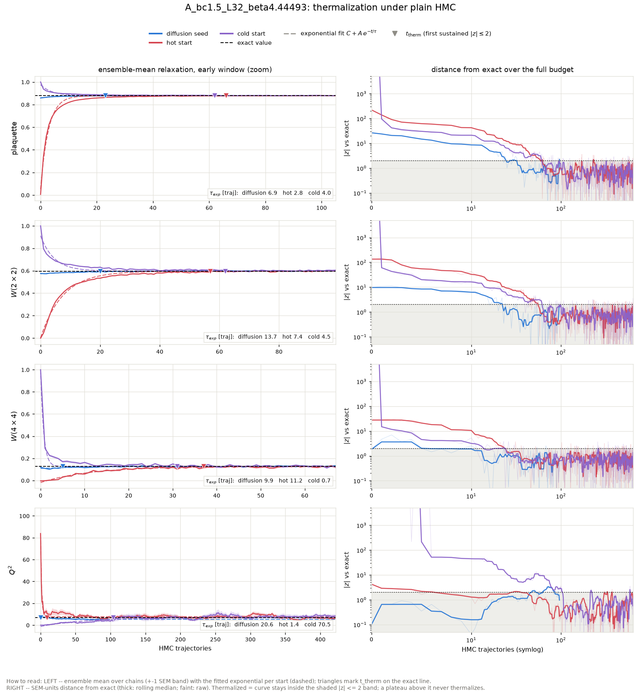

tau_int (hot-start chains, second half): plaquette = 3.14 +- 0.20, wilson_2x2 = 2.66 +- 0.23, wilson_4x4 = 1.28 +- 0.06, wilson_6x6 = 0.76 +- 0.03. Topology: hot-start HMC L=32 beta=4.44493 -> tau_int(Q) = 26.0.

### Diagnostics: raw diffusion output (before any HMC)

| observable | value | error | exact | z_exact | reference | ref_error | z_ref | ks_p | chi2_p |
|---|---|---|---|---|---|---|---|---|---|
| plaquette | 0.8584 | 0.0008016 | 0.8787 | -25.27 | 0.8784 | 0.000309 | -23.24 | 0 |  |
| wilson_1x1 | 0.8584 | 0.0008016 | 0.8787 | -25.27 | 0.8784 | 0.000309 | -23.24 | 0 |  |
| wilson_1x2 | 0.7357 | 0.001623 | 0.7721 | -22.41 | 0.7717 | 0.000713 | -20.29 | 0 |  |
| wilson_2x2 | 0.576 | 0.001721 | 0.5961 | -11.71 | 0.5953 | 0.001405 | -8.72 | 2.538e-07 |  |
| wilson_2x3 | 0.4359 | 0.002397 | 0.4603 | -10.18 | 0.4593 | 0.001788 | -7.85 | 3.165e-06 |  |
| wilson_3x3 | 0.2835 | 0.003143 | 0.3123 | -9.154 | 0.3134 | 0.002825 | -7.083 | 1.616e-05 |  |
| wilson_3x4 | 0.1908 | 0.003432 | 0.2119 | -6.128 | 0.2146 | 0.00375 | -4.681 | 0.0001119 |  |
| wilson_4x4 | 0.1189 | 0.003053 | 0.1263 | -2.426 | 0.1293 | 0.00391 | -2.105 | 0.04938 |  |
| wilson_4x5 | 0.06874 | 0.003209 | 0.07529 | -2.041 | 0.08031 | 0.003584 | -2.406 | 0.03364 |  |
| wilson_5x5 | 0.0349 | 0.003417 | 0.03944 | -1.327 | 0.04332 | 0.003036 | -1.842 | 0.0711 |  |
| wilson_5x6 | 0.02128 | 0.002637 | 0.02066 | 0.2345 | 0.02549 | 0.002479 | -1.166 | 0.5631 |  |
| wilson_6x6 | 0.01077 | 0.003048 | 0.009508 | 0.4153 | 0.01475 | 0.002347 | -1.034 | 0.3021 |  |
| wilson_6x7 | 0.006141 | 0.002429 | 0.004376 | 0.7264 | 0.007128 | 0.002285 | -0.2962 | 0.8246 |  |
| wilson_7x7 | 0.002136 | 0.001638 | 0.00177 | 0.2232 | 0.003979 | 0.001934 | -0.7272 | 0.6395 |  |
| wilson_7x8 | 0.002427 | 0.002419 | 0.0007158 | 0.7074 | 0.001205 | 0.001546 | 0.4257 | 0.678 |  |
| wilson_8x8 | -0.001493 | 0.002415 | 0.0002544 | -0.7238 | -0.002753 | 0.001441 | 0.4479 | 0.9126 |  |
| wilson_8x10 | 0.001215 | 0.002496 | 3.213e-05 | 0.4738 | -0.0007767 | 0.001928 | 0.6315 | 0.5631 |  |
| wilson_10x10 | 0.0002258 | 0.00212 | 2.419e-06 | 0.1054 | 0.0001487 | 0.001678 | 0.02853 | 0.4548 |  |
| wilson_10x12 | -0.0006293 | 0.002351 | 1.821e-07 | -0.2677 | 0.003922 | 0.001524 | -1.624 | 0.2763 |  |
| wilson_12x12 | 0.001385 | 0.001842 | 8.173e-09 | 0.7518 | -0.0008532 | 0.00187 | 0.8528 | 0.3584 |  |
| creutz_2 | 0.09058 | 0.002591 | 0.1293 | -14.95 |  |  |  |  |  |
| creutz_3 | 0.1514 | 0.005976 | 0.1293 | 3.693 |  |  |  |  |  |
| creutz_4 | 0.07731 | 0.01486 | 0.1293 | -3.5 |  |  |  |  |  |
| creutz_5 | 0.1299 | 0.05732 | 0.1293 | 0.01012 |  |  |  |  |  |
| creutz_6 | 0.1855 | 0.1928 | 0.1293 | 0.2914 |  |  |  |  |  |
| creutz_7 | 0.494 | 1.003 | 0.1293 | 0.3635 |  |  |  |  |  |
| Q | 0.3594 | 0.2323 | 0 | 1.547 | -0.5208 | 0.1322 | 3.293 | 0.003137 |  |
| Q^2 | 6.859 | 0.5638 | 6.786 | 0.1303 | 5.969 | 0.6047 | 1.077 | 0.3584 |  |
| chi_top ((<Q^2>-<Q>^2)/V) | 0.006572 | 0.0005397 | 0.006627 | -0.1007 | 0.005564 | 0.0006204 | 1.226 | 0.002243 |  |
| Q histogram vs exact P(Q) | 18.67 | nan | 10 | nan |  |  |  |  | 0.04462 |

### Diagnostics: the same configs after 96 HMC trajectories

| observable | value | error | exact | z_exact | reference | ref_error | z_ref | ks_p | chi2_p |
|---|---|---|---|---|---|---|---|---|---|
| plaquette | 0.8797 | 0.000511 | 0.8787 | 2.027 | 0.8784 | 0.000309 | 2.225 | 0.04938 |  |
| wilson_1x1 | 0.8797 | 0.000511 | 0.8787 | 2.027 | 0.8784 | 0.000309 | 2.225 | 0.04938 |  |
| wilson_1x2 | 0.7748 | 0.001058 | 0.7721 | 2.51 | 0.7717 | 0.000713 | 2.395 | 0.009477 |  |
| wilson_2x2 | 0.5994 | 0.001927 | 0.5961 | 1.694 | 0.5953 | 0.001405 | 1.698 | 0.0711 |  |
| wilson_2x3 | 0.4619 | 0.002548 | 0.4603 | 0.6379 | 0.4593 | 0.001788 | 0.8224 | 0.5259 |  |
| wilson_3x3 | 0.3153 | 0.002793 | 0.3123 | 1.093 | 0.3134 | 0.002825 | 0.4765 | 0.4548 |  |
| wilson_3x4 | 0.2133 | 0.003016 | 0.2119 | 0.4873 | 0.2146 | 0.00375 | -0.2694 | 0.9807 |  |
| wilson_4x4 | 0.1286 | 0.003076 | 0.1263 | 0.7358 | 0.1293 | 0.00391 | -0.1551 | 0.6395 |  |
| wilson_4x5 | 0.07542 | 0.002949 | 0.07529 | 0.04666 | 0.08031 | 0.003584 | -1.053 | 0.5259 |  |
| wilson_5x5 | 0.04048 | 0.002727 | 0.03944 | 0.3811 | 0.04332 | 0.003036 | -0.6972 | 0.8569 |  |
| wilson_5x6 | 0.01946 | 0.002352 | 0.02066 | -0.511 | 0.02549 | 0.002479 | -1.767 | 0.3021 |  |
| wilson_6x6 | 0.009336 | 0.00247 | 0.009508 | -0.06972 | 0.01475 | 0.002347 | -1.59 | 0.4548 |  |
| wilson_6x7 | 0.002617 | 0.002827 | 0.004376 | -0.6222 | 0.007128 | 0.002285 | -1.241 | 0.4548 |  |
| wilson_7x7 | 0.0006394 | 0.00269 | 0.00177 | -0.4202 | 0.003979 | 0.001934 | -1.008 | 0.1392 |  |
| wilson_7x8 | -8.236e-05 | 0.002339 | 0.0007158 | -0.3412 | 0.001205 | 0.001546 | -0.4591 | 0.9941 |  |
| wilson_8x8 | -0.001573 | 0.002457 | 0.0002544 | -0.744 | -0.002753 | 0.001441 | 0.414 | 0.5259 |  |
| wilson_8x10 | 0.0009169 | 0.002586 | 3.213e-05 | 0.3421 | -0.0007767 | 0.001928 | 0.525 | 0.6395 |  |
| wilson_10x10 | -0.0001369 | 0.001959 | 2.419e-06 | -0.07116 | 0.0001487 | 0.001678 | -0.1107 | 0.7901 |  |
| wilson_10x12 | -0.002421 | 0.002386 | 1.821e-07 | -1.015 | 0.003922 | 0.001524 | -2.241 | 0.1545 |  |
| wilson_12x12 | 0.002408 | 0.002088 | 8.173e-09 | 1.153 | -0.0008532 | 0.00187 | 1.164 | 0.7163 |  |
| creutz_2 | 0.1295 | 0.001693 | 0.1293 | 0.1332 |  |  |  |  |  |
| creutz_3 | 0.1212 | 0.004668 | 0.1293 | -1.743 |  |  |  |  |  |
| creutz_4 | 0.1157 | 0.01324 | 0.1293 | -1.032 |  |  |  |  |  |
| creutz_5 | 0.0892 | 0.04328 | 0.1293 | -0.9271 |  |  |  |  |  |
| creutz_6 | 0.001723 | 0.1939 | 0.1293 | -0.6582 |  |  |  |  |  |
| creutz_7 | 0.1376 | nan | 0.1293 | nan |  |  |  |  |  |
| Q | 0.3359 | 0.2661 | 0 | 1.262 | -0.5208 | 0.1322 | 2.883 | 0.008145 |  |
| Q^2 | 6.148 | 0.6482 | 6.786 | -0.9834 | 5.969 | 0.6047 | 0.2027 | 0.9888 |  |
| chi_top ((<Q^2>-<Q>^2)/V) | 0.005894 | 0.0006158 | 0.006627 | -1.19 | 0.005564 | 0.0006204 | 0.3777 | 0.006985 |  |
| Q histogram vs exact P(Q) | 7.679 | nan | 10 | nan |  |  |  |  | 0.6602 |

## A_bc2_L32_beta6.10518

HMC: step size 0.1619, 6 leapfrog steps, acceptance seed/hot/cold = 0.974/0.974/0.975. Diffusion-seed batch: 128 chains x 96 trajectories (0.08 s/traj for the whole batch); baselines: 32 chains x 640 trajectories.

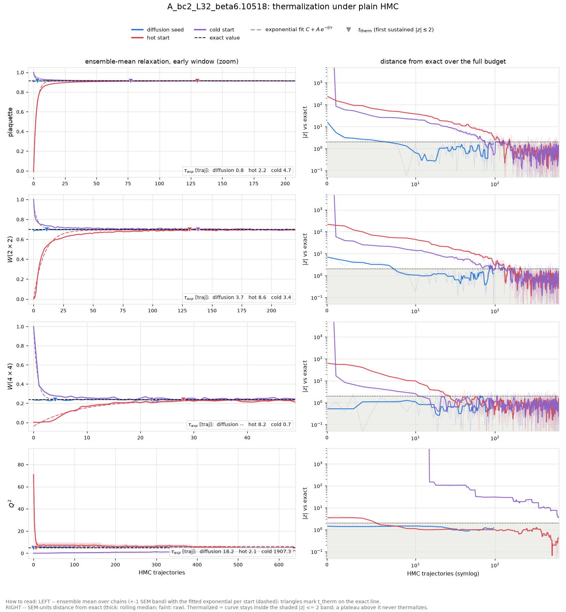

tau_int (hot-start chains, second half): plaquette = 3.38 +- 0.40, wilson_2x2 = 3.63 +- 0.32, wilson_4x4 = 1.20 +- 0.06, wilson_6x6 = 0.95 +- 0.04. Topology: hot-start HMC L=32 beta=6.10518 -> tau_int(Q) = 30.8.

Where 'never' stood at the end: the cold start ended the 640-trajectory budget still at Q^2 at |z| ~ 4.

### Diagnostics: raw diffusion output (before any HMC)

| observable | value | error | exact | z_exact | reference | ref_error | z_ref | ks_p | chi2_p |
|---|---|---|---|---|---|---|---|---|---|
| plaquette | 0.9061 | 0.0004307 | 0.914 | -18.24 | 0.9143 | 0.0001898 | -17.36 | 2.779e-34 |  |
| wilson_1x1 | 0.9061 | 0.0004307 | 0.914 | -18.24 | 0.9143 | 0.0001898 | -17.36 | 2.779e-34 |  |
| wilson_1x2 | 0.8186 | 0.0009312 | 0.8353 | -17.95 | 0.8361 | 0.0005353 | -16.28 | 9.351e-32 |  |
| wilson_2x2 | 0.6847 | 0.001845 | 0.6978 | -7.104 | 0.6995 | 0.0009961 | -7.085 | 1.107e-09 |  |
| wilson_2x3 | 0.5675 | 0.002745 | 0.5829 | -5.602 | 0.5851 | 0.001632 | -5.521 | 2.764e-09 |  |
| wilson_3x3 | 0.4298 | 0.003322 | 0.445 | -4.568 | 0.4505 | 0.002149 | -5.221 | 1.946e-06 |  |
| wilson_3x4 | 0.3286 | 0.003357 | 0.3397 | -3.311 | 0.347 | 0.002879 | -4.16 | 4.842e-05 |  |
| wilson_4x4 | 0.2348 | 0.004063 | 0.2371 | -0.567 | 0.2462 | 0.003532 | -2.134 | 0.03364 |  |
| wilson_4x5 | 0.164 | 0.003975 | 0.1654 | -0.3458 | 0.1734 | 0.003624 | -1.733 | 0.01275 |  |
| wilson_5x5 | 0.104 | 0.004571 | 0.1055 | -0.3159 | 0.1111 | 0.003848 | -1.178 | 0.03364 |  |
| wilson_5x6 | 0.06491 | 0.004438 | 0.06728 | -0.5326 | 0.0715 | 0.003732 | -1.137 | 0.07995 |  |
| wilson_6x6 | 0.037 | 0.003745 | 0.03921 | -0.5898 | 0.04151 | 0.003986 | -0.824 | 0.1545 |  |
| wilson_6x7 | 0.02301 | 0.003401 | 0.02286 | 0.04481 | 0.0258 | 0.003616 | -0.5626 | 0.2087 |  |
| wilson_7x7 | 0.01453 | 0.003301 | 0.01218 | 0.7136 | 0.01483 | 0.003796 | -0.05943 | 0.3584 |  |
| wilson_7x8 | 0.006361 | 0.003231 | 0.006487 | -0.03876 | 0.007417 | 0.004109 | -0.202 | 0.7163 |  |
| wilson_8x8 | 0.004264 | 0.002717 | 0.003158 | 0.4068 | 0.006329 | 0.003061 | -0.5047 | 0.4898 |  |
| wilson_8x10 | 0.0001499 | 0.002729 | 0.0007487 | -0.2194 | 0.005868 | 0.003149 | -1.372 | 0.1892 |  |
| wilson_10x10 | 0.0004772 | 0.003027 | 0.0001238 | 0.1167 | -0.001497 | 0.002756 | 0.4822 | 0.4548 |  |
| wilson_10x12 | 0.001555 | 0.002509 | 2.049e-05 | 0.6115 | -0.002269 | 0.002148 | 1.158 | 0.04354 |  |
| wilson_12x12 | -0.0004388 | 0.001822 | 2.365e-06 | -0.2422 | 0.0007953 | 0.001629 | -0.5049 | 0.4898 |  |
| creutz_2 | 0.07712 | 0.001448 | 0.08996 | -8.87 |  |  |  |  |  |
| creutz_3 | 0.09014 | 0.003221 | 0.08996 | 0.0533 |  |  |  |  |  |
| creutz_4 | 0.06789 | 0.006978 | 0.08996 | -3.163 |  |  |  |  |  |
| creutz_5 | 0.09683 | 0.01835 | 0.08996 | 0.3739 |  |  |  |  |  |
| creutz_6 | 0.0902 | 0.05435 | 0.08996 | 0.004269 |  |  |  |  |  |
| creutz_7 | -0.01561 | 0.1485 | 0.08996 | -0.7111 |  |  |  |  |  |
| creutz_8 | -0.426 | 0.5238 | 0.08996 | -0.985 |  |  |  |  |  |
| Q | -0.01562 | 0.221 | 0 | -0.07069 | -0.1979 | 0.1063 | 0.7433 | 0.5259 |  |
| Q^2 | 5.656 | 0.7235 | 4.686 | 1.341 | 4.219 | 0.4579 | 1.679 | 0.2763 |  |
| chi_top ((<Q^2>-<Q>^2)/V) | 0.005523 | 0.0007061 | 0.004576 | 1.341 | 0.004082 | 0.0004247 | 1.75 | 0.0005374 |  |
| Q histogram vs exact P(Q) | 6.766 | nan | 8 | nan |  |  |  |  | 0.5621 |

### Diagnostics: the same configs after 96 HMC trajectories

| observable | value | error | exact | z_exact | reference | ref_error | z_ref | ks_p | chi2_p |
|---|---|---|---|---|---|---|---|---|---|
| plaquette | 0.9135 | 0.0002814 | 0.914 | -1.722 | 0.9143 | 0.0001898 | -2.36 | 0.1004 |  |
| wilson_1x1 | 0.9135 | 0.0002814 | 0.914 | -1.722 | 0.9143 | 0.0001898 | -2.36 | 0.1004 |  |
| wilson_1x2 | 0.8348 | 0.0005534 | 0.8353 | -0.9825 | 0.8361 | 0.0005353 | -1.7 | 0.3294 |  |
| wilson_2x2 | 0.6958 | 0.001503 | 0.6978 | -1.303 | 0.6995 | 0.0009961 | -2.057 | 0.04354 |  |
| wilson_2x3 | 0.5807 | 0.002266 | 0.5829 | -0.9729 | 0.5851 | 0.001632 | -1.596 | 0.02947 |  |
| wilson_3x3 | 0.4422 | 0.003072 | 0.445 | -0.905 | 0.4505 | 0.002149 | -2.203 | 0.1122 |  |
| wilson_3x4 | 0.335 | 0.003539 | 0.3397 | -1.328 | 0.347 | 0.002879 | -2.626 | 0.01275 |  |
| wilson_4x4 | 0.2319 | 0.004212 | 0.2371 | -1.218 | 0.2462 | 0.003532 | -2.604 | 0.05588 |  |
| wilson_4x5 | 0.159 | 0.004211 | 0.1654 | -1.525 | 0.1734 | 0.003624 | -2.586 | 0.009477 |  |
| wilson_5x5 | 0.09823 | 0.003969 | 0.1055 | -1.831 | 0.1111 | 0.003848 | -2.326 | 0.07995 |  |
| wilson_5x6 | 0.06061 | 0.003697 | 0.06728 | -1.804 | 0.0715 | 0.003732 | -2.074 | 0.1712 |  |
| wilson_6x6 | 0.03005 | 0.004155 | 0.03921 | -2.205 | 0.04151 | 0.003986 | -1.99 | 0.005977 |  |
| wilson_6x7 | 0.01587 | 0.004611 | 0.02286 | -1.515 | 0.0258 | 0.003616 | -1.694 | 0.011 |  |
| wilson_7x7 | 0.008867 | 0.004105 | 0.01218 | -0.8062 | 0.01483 | 0.003796 | -1.067 | 0.05588 |  |
| wilson_7x8 | 0.005824 | 0.003029 | 0.006487 | -0.2188 | 0.007417 | 0.004109 | -0.3121 | 0.8864 |  |
| wilson_8x8 | -0.0002259 | 0.003544 | 0.003158 | -0.9549 | 0.006329 | 0.003061 | -1.4 | 0.0631 |  |
| wilson_8x10 | 0.0034 | 0.002994 | 0.0007487 | 0.8856 | 0.005868 | 0.003149 | -0.568 | 0.8569 |  |
| wilson_10x10 | 0.003704 | 0.003386 | 0.0001238 | 1.057 | -0.001497 | 0.002756 | 1.191 | 0.1892 |  |
| wilson_10x12 | 0.007767 | 0.00234 | 2.049e-05 | 3.31 | -0.002269 | 0.002148 | 3.159 | 0.017 |  |
| wilson_12x12 | 0.006701 | 0.002846 | 2.365e-06 | 2.354 | 0.0007953 | 0.001629 | 1.801 | 0.2087 |  |
| creutz_2 | 0.092 | 0.001369 | 0.08996 | 1.489 |  |  |  |  |  |
| creutz_3 | 0.09146 | 0.003017 | 0.08996 | 0.4969 |  |  |  |  |  |
| creutz_4 | 0.09025 | 0.007931 | 0.08996 | 0.03601 |  |  |  |  |  |
| creutz_5 | 0.104 | 0.01878 | 0.08996 | 0.7477 |  |  |  |  |  |
| creutz_6 | 0.2186 | 0.0669 | 0.08996 | 1.922 |  |  |  |  |  |
| creutz_7 | -0.05608 | 0.1944 | 0.08996 | -0.7514 |  |  |  |  |  |
| Q | -0.007812 | 0.2066 | 0 | -0.03782 | -0.1979 | 0.1063 | 0.8183 | 0.6395 |  |
| Q^2 | 5.461 | 0.7536 | 4.686 | 1.028 | 4.219 | 0.4579 | 1.409 | 0.5631 |  |
| chi_top ((<Q^2>-<Q>^2)/V) | 0.005333 | 0.0007351 | 0.004576 | 1.029 | 0.004082 | 0.0004247 | 1.474 | 0.0009335 |  |
| Q histogram vs exact P(Q) | 7.242 | nan | 8 | nan |  |  |  |  | 0.5108 |

## E_bc2.7_L32_beta8.79549

HMC: step size 0.1349, 7 leapfrog steps, acceptance seed/hot/cold = 0.974/0.977/0.976. Diffusion-seed batch: 128 chains x 96 trajectories (0.10 s/traj for the whole batch); baselines: 32 chains x 640 trajectories.

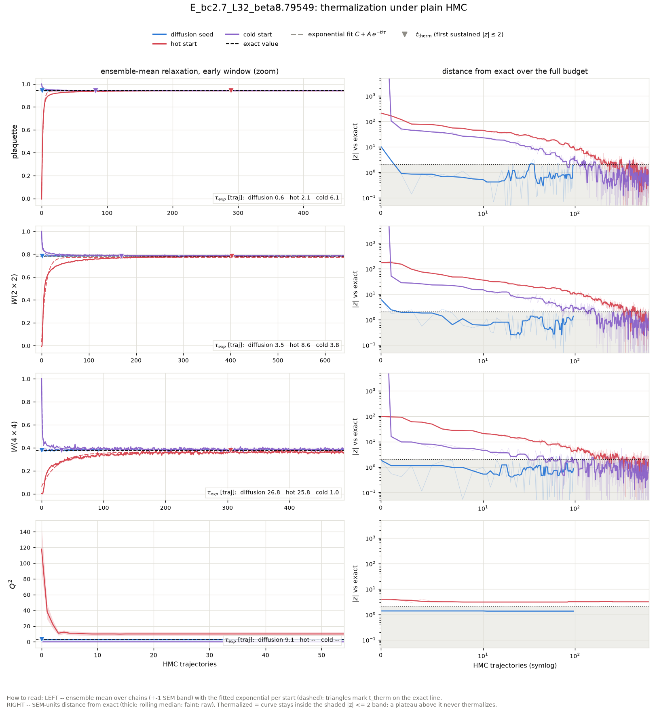

tau_int (hot-start chains, second half): plaquette = 4.34 +- 0.68, wilson_2x2 = 4.18 +- 0.57, wilson_4x4 = 1.35 +- 0.09, wilson_6x6 = 1.01 +- 0.06. Topology: hot-start HMC L=32 beta=8.79549 -> **frozen** (no tunneling).

Where 'never' stood at the end: the hot start ended the 640-trajectory budget still at Q^2 at |z| ~ 3; the cold start ended the 640-trajectory budget still at Q^2 at |z| ~ 3142489473024.

### Diagnostics: raw diffusion output (before any HMC)

| observable | value | error | exact | z_exact | reference | ref_error | z_ref | ks_p | chi2_p |
|---|---|---|---|---|---|---|---|---|---|
| plaquette | 0.9384 | 0.0002971 | 0.9413 | -9.65 | 0.9414 | 0.0002078 | -8.186 | 3.32e-13 |  |
| wilson_1x1 | 0.9384 | 0.0002971 | 0.9413 | -9.65 | 0.9414 | 0.0002078 | -8.186 | 3.32e-13 |  |
| wilson_1x2 | 0.8789 | 0.0006925 | 0.8861 | -10.31 | 0.8864 | 0.000418 | -9.27 | 1.088e-13 |  |
| wilson_2x2 | 0.7776 | 0.001361 | 0.7851 | -5.488 | 0.7859 | 0.000953 | -4.996 | 1.289e-05 |  |
| wilson_2x3 | 0.6863 | 0.002022 | 0.6957 | -4.644 | 0.6969 | 0.001602 | -4.122 | 0.002243 |  |
| wilson_3x3 | 0.5713 | 0.002716 | 0.5802 | -3.271 | 0.5824 | 0.002199 | -3.164 | 0.04938 |  |
| wilson_3x4 | 0.4728 | 0.003263 | 0.4839 | -3.41 | 0.486 | 0.003123 | -2.913 | 0.1251 |  |
| wilson_4x4 | 0.3721 | 0.004143 | 0.3799 | -1.884 | 0.3803 | 0.003851 | -1.449 | 0.1712 |  |
| wilson_4x5 | 0.2886 | 0.004624 | 0.2983 | -2.102 | 0.2983 | 0.004217 | -1.557 | 0.389 |  |
| wilson_5x5 | 0.2107 | 0.004531 | 0.2204 | -2.16 | 0.2197 | 0.003998 | -1.502 | 0.2763 |  |
| wilson_5x6 | 0.153 | 0.004376 | 0.1629 | -2.27 | 0.1628 | 0.004022 | -1.646 | 0.2522 |  |
| wilson_6x6 | 0.1076 | 0.004027 | 0.1133 | -1.43 | 0.1133 | 0.003859 | -1.026 | 0.7538 |  |
| wilson_6x7 | 0.07501 | 0.003726 | 0.07884 | -1.028 | 0.08086 | 0.003907 | -1.084 | 0.4898 |  |
| wilson_7x7 | 0.04956 | 0.003503 | 0.05163 | -0.5893 | 0.05268 | 0.003519 | -0.628 | 0.9126 |  |
| wilson_7x8 | 0.03631 | 0.003239 | 0.03381 | 0.7717 | 0.03733 | 0.003483 | -0.2161 | 0.8864 |  |
| wilson_8x8 | 0.02582 | 0.003092 | 0.02084 | 1.612 | 0.02271 | 0.003349 | 0.6821 | 0.7538 |  |
| wilson_8x10 | 0.01287 | 0.003664 | 0.007917 | 1.352 | 0.01145 | 0.003642 | 0.2754 | 0.9126 |  |
| wilson_10x10 | 0.004896 | 0.00329 | 0.002362 | 0.7702 | 0.003096 | 0.003259 | 0.3886 | 0.9693 |  |
| wilson_10x12 | 0.006743 | 0.003491 | 0.0007045 | 1.73 | 0.001191 | 0.002748 | 1.25 | 0.3021 |  |
| wilson_12x12 | 0.002359 | 0.002887 | 0.000165 | 0.7598 | 0.001963 | 0.001938 | 0.1139 | 0.9693 |  |
| creutz_2 | 0.05692 | 0.00092 | 0.06048 | -3.876 |  |  |  |  |  |
| creutz_3 | 0.05829 | 0.001944 | 0.06048 | -1.128 |  |  |  |  |  |
| creutz_4 | 0.05017 | 0.003277 | 0.06048 | -3.149 |  |  |  |  |  |
| creutz_5 | 0.06038 | 0.008791 | 0.06048 | -0.0118 |  |  |  |  |  |
| creutz_6 | 0.03219 | 0.01612 | 0.06048 | -1.755 |  |  |  |  |  |
| creutz_7 | 0.05381 | 0.04691 | 0.06048 | -0.1422 |  |  |  |  |  |
| creutz_8 | 0.02952 | 0.06578 | 0.06048 | -0.4706 |  |  |  |  |  |
| Q | -0.0625 | 0.09836 | 0 | -0.6354 | 0.06771 | 0.1365 | -0.7741 | 0.8864 |  |
| Q^2 | 2.656 | 0.3722 | 3.142 | -1.306 | 2.911 | 0.3073 | -0.5288 | 0.9542 |  |
| chi_top ((<Q^2>-<Q>^2)/V) | 0.00259 | 0.0003599 | 0.003069 | -1.33 | 0.002839 | 0.0002937 | -0.535 | 0.0002049 |  |
| Q histogram vs exact P(Q) | 4.533 | nan | 8 | nan |  |  |  |  | 0.8061 |

### Diagnostics: the same configs after 96 HMC trajectories

| observable | value | error | exact | z_exact | reference | ref_error | z_ref | ks_p | chi2_p |
|---|---|---|---|---|---|---|---|---|---|
| plaquette | 0.9408 | 0.0002478 | 0.9413 | -2.051 | 0.9414 | 0.0002078 | -1.883 | 0.389 |  |
| wilson_1x1 | 0.9408 | 0.0002478 | 0.9413 | -2.051 | 0.9414 | 0.0002078 | -1.883 | 0.389 |  |
| wilson_1x2 | 0.8851 | 0.0005341 | 0.8861 | -1.71 | 0.8864 | 0.000418 | -1.879 | 0.3294 |  |
| wilson_2x2 | 0.7835 | 0.0009103 | 0.7851 | -1.757 | 0.7859 | 0.000953 | -1.845 | 0.1892 |  |
| wilson_2x3 | 0.6936 | 0.001324 | 0.6957 | -1.555 | 0.6969 | 0.001602 | -1.589 | 0.5259 |  |
| wilson_3x3 | 0.5766 | 0.002049 | 0.5802 | -1.755 | 0.5824 | 0.002199 | -1.919 | 0.3021 |  |
| wilson_3x4 | 0.4803 | 0.002916 | 0.4839 | -1.243 | 0.486 | 0.003123 | -1.323 | 0.5631 |  |
| wilson_4x4 | 0.3763 | 0.004142 | 0.3799 | -0.8907 | 0.3803 | 0.003851 | -0.7215 | 0.4212 |  |
| wilson_4x5 | 0.2936 | 0.004804 | 0.2983 | -0.9822 | 0.2983 | 0.004217 | -0.7419 | 0.7163 |  |
| wilson_5x5 | 0.2164 | 0.005966 | 0.2204 | -0.6709 | 0.2197 | 0.003998 | -0.4589 | 0.8864 |  |
| wilson_5x6 | 0.1588 | 0.006194 | 0.1629 | -0.6718 | 0.1628 | 0.004022 | -0.5425 | 0.5259 |  |
| wilson_6x6 | 0.1108 | 0.006869 | 0.1133 | -0.3721 | 0.1133 | 0.003859 | -0.3193 | 0.3584 |  |
| wilson_6x7 | 0.07919 | 0.006795 | 0.07884 | 0.05085 | 0.08086 | 0.003907 | -0.2134 | 0.2087 |  |
| wilson_7x7 | 0.05199 | 0.006845 | 0.05163 | 0.05264 | 0.05268 | 0.003519 | -0.09009 | 0.4212 |  |
| wilson_7x8 | 0.0344 | 0.006654 | 0.03381 | 0.08862 | 0.03733 | 0.003483 | -0.3912 | 0.5259 |  |
| wilson_8x8 | 0.01952 | 0.005578 | 0.02084 | -0.2355 | 0.02271 | 0.003349 | -0.49 | 0.8246 |  |
| wilson_8x10 | 0.006665 | 0.004332 | 0.007917 | -0.2891 | 0.01145 | 0.003642 | -0.8451 | 0.3294 |  |
| wilson_10x10 | 0.0001046 | 0.003597 | 0.002362 | -0.6275 | 0.003096 | 0.003259 | -0.6163 | 0.7163 |  |
| wilson_10x12 | -0.0001399 | 0.003457 | 0.0007045 | -0.2443 | 0.001191 | 0.002748 | -0.3013 | 0.8569 |  |
| wilson_12x12 | -0.001607 | 0.003516 | 0.000165 | -0.5041 | 0.001963 | 0.001938 | -0.8893 | 0.7538 |  |
| creutz_2 | 0.061 | 0.0008285 | 0.06048 | 0.6246 |  |  |  |  |  |
| creutz_3 | 0.06281 | 0.001813 | 0.06048 | 1.282 |  |  |  |  |  |
| creutz_4 | 0.06143 | 0.003656 | 0.06048 | 0.2579 |  |  |  |  |  |
| creutz_5 | 0.05667 | 0.007178 | 0.06048 | -0.5308 |  |  |  |  |  |
| creutz_6 | 0.04988 | 0.01368 | 0.06048 | -0.7755 |  |  |  |  |  |
| creutz_7 | 0.08509 | 0.03617 | 0.06048 | 0.6803 |  |  |  |  |  |
| creutz_8 | 0.1532 | 0.09987 | 0.06048 | 0.9285 |  |  |  |  |  |
| Q | -0.05469 | 0.09824 | 0 | -0.5567 | 0.06771 | 0.1365 | -0.7279 | 0.9542 |  |
| Q^2 | 2.664 | 0.3713 | 3.142 | -1.288 | 2.911 | 0.3073 | -0.5133 | 0.9888 |  |
| chi_top ((<Q^2>-<Q>^2)/V) | 0.002599 | 0.0003594 | 0.003069 | -1.308 | 0.002839 | 0.0002937 | -0.5172 | 0.0002049 |  |
| Q histogram vs exact P(Q) | 4.723 | nan | 8 | nan |  |  |  |  | 0.7867 |

## A_bc3_L32_beta10.015

HMC: step size 0.1264, 8 leapfrog steps, acceptance seed/hot/cold = 0.979/0.977/0.979. Diffusion-seed batch: 128 chains x 96 trajectories (1.67 s/traj for the whole batch); baselines: 32 chains x 640 trajectories.

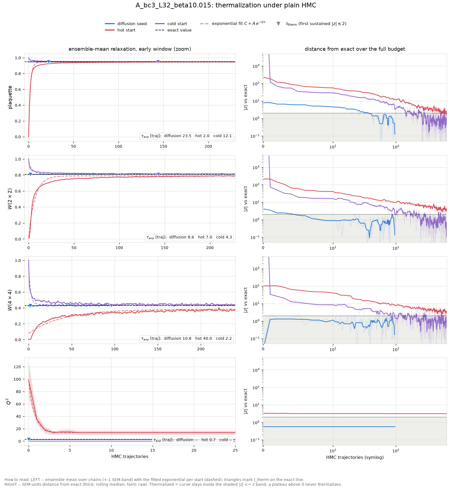

tau_int (hot-start chains, second half): plaquette = 4.73 +- 0.89, wilson_2x2 = 5.72 +- 1.06, wilson_4x4 = 2.03 +- 0.39, wilson_6x6 = 0.89 +- 0.04. Topology: hot-start HMC L=32 beta=10.015 -> **frozen** (no tunneling).

Where 'never' stood at the end: the hot start ended the 640-trajectory budget still at plaquette at |z| ~ 2, wilson_2x2 at |z| ~ 4, wilson_4x4 at |z| ~ 3, Q^2 at |z| ~ 3; the cold start ended the 640-trajectory budget still at Q^2 at |z| ~ 2736159195136.

### Diagnostics: raw diffusion output (before any HMC)

| observable | value | error | exact | z_exact | reference | ref_error | z_ref | ks_p | chi2_p |
|---|---|---|---|---|---|---|---|---|---|
| plaquette | 0.9469 | 0.0001714 | 0.9487 | -10.2 | 0.9486 | 0.0001186 | -7.803 | 2.538e-07 |  |
| wilson_1x1 | 0.9469 | 0.0001714 | 0.9487 | -10.2 | 0.9486 | 0.0001186 | -7.803 | 2.538e-07 |  |
| wilson_1x2 | 0.8951 | 0.000422 | 0.9 | -11.64 | 0.9002 | 0.0002491 | -10.4 | 2.296e-10 |  |
| wilson_2x2 | 0.8054 | 0.0008084 | 0.81 | -5.639 | 0.8102 | 0.0005851 | -4.808 | 0.01275 |  |
| wilson_2x3 | 0.7247 | 0.001446 | 0.729 | -2.984 | 0.7287 | 0.0009044 | -2.391 | 0.389 |  |
| wilson_3x3 | 0.6206 | 0.001962 | 0.6224 | -0.9212 | 0.6216 | 0.001485 | -0.3968 | 0.8864 |  |
| wilson_3x4 | 0.5297 | 0.002477 | 0.5314 | -0.686 | 0.5292 | 0.002277 | 0.1457 | 0.8864 |  |
| wilson_4x4 | 0.4303 | 0.003422 | 0.4304 | -0.03075 | 0.4289 | 0.002807 | 0.3298 | 0.8864 |  |
| wilson_4x5 | 0.3474 | 0.003691 | 0.3486 | -0.3249 | 0.3456 | 0.00354 | 0.3551 | 0.8864 |  |
| wilson_5x5 | 0.2671 | 0.003865 | 0.2679 | -0.1988 | 0.265 | 0.003876 | 0.3843 | 0.9972 |  |
| wilson_5x6 | 0.2019 | 0.004072 | 0.2059 | -0.9662 | 0.2042 | 0.004145 | -0.3854 | 0.7163 |  |
| wilson_6x6 | 0.1479 | 0.004314 | 0.1501 | -0.5074 | 0.1501 | 0.004018 | -0.3848 | 0.7901 |  |
| wilson_6x7 | 0.1056 | 0.004411 | 0.1094 | -0.8664 | 0.1104 | 0.004002 | -0.8179 | 0.5631 |  |
| wilson_7x7 | 0.07455 | 0.003922 | 0.07566 | -0.2829 | 0.07739 | 0.003572 | -0.5363 | 0.3294 |  |
| wilson_7x8 | 0.04964 | 0.003743 | 0.05232 | -0.7155 | 0.05614 | 0.003853 | -1.209 | 0.2763 |  |
| wilson_8x8 | 0.03178 | 0.003551 | 0.03433 | -0.7183 | 0.03666 | 0.00362 | -0.9641 | 0.2297 |  |
| wilson_8x10 | 0.01055 | 0.003611 | 0.01478 | -1.17 | 0.01927 | 0.004252 | -1.562 | 0.08971 |  |
| wilson_10x10 | -0.006117 | 0.003592 | 0.005151 | -3.137 | 0.005632 | 0.003721 | -2.272 | 0.1251 |  |
| wilson_10x12 | -0.006048 | 0.00289 | 0.001796 | -2.714 | 0.00171 | 0.002494 | -2.032 | 0.2522 |  |
| wilson_12x12 | -0.002468 | 0.002474 | 0.0005072 | -1.202 | 8.739e-05 | 0.002521 | -0.7233 | 0.1712 |  |
| creutz_2 | 0.04923 | 0.0008517 | 0.05268 | -4.056 |  |  |  |  |  |
| creutz_3 | 0.04936 | 0.001575 | 0.05268 | -2.108 |  |  |  |  |  |
| creutz_4 | 0.04943 | 0.002953 | 0.05268 | -1.102 |  |  |  |  |  |
| creutz_5 | 0.04891 | 0.00594 | 0.05268 | -0.6353 |  |  |  |  |  |
| creutz_6 | 0.03166 | 0.01326 | 0.05268 | -1.585 |  |  |  |  |  |
| creutz_7 | 0.01103 | 0.02373 | 0.05268 | -1.755 |  |  |  |  |  |
| creutz_8 | 0.0396 | 0.06374 | 0.05268 | -0.2053 |  |  |  |  |  |
| Q | 0.03906 | 0.1517 | 0 | 0.2574 | -0.1042 | 0.1518 | 0.6672 | 0.9807 |  |
| Q^2 | 2.93 | 0.267 | 2.736 | 0.7247 | 3.406 | 0.25 | -1.303 | 0.9941 |  |
| chi_top ((<Q^2>-<Q>^2)/V) | 0.00286 | 0.0002635 | 0.002672 | 0.7116 | 0.003316 | 0.0002389 | -1.283 | 0.0004451 |  |
| Q histogram vs exact P(Q) | 4.29 | nan | 6 | nan |  |  |  |  | 0.6376 |

### Diagnostics: the same configs after 96 HMC trajectories

| observable | value | error | exact | z_exact | reference | ref_error | z_ref | ks_p | chi2_p |
|---|---|---|---|---|---|---|---|---|---|
| plaquette | 0.9487 | 0.000164 | 0.9487 | 0.1341 | 0.9486 | 0.0001186 | 0.7135 | 0.389 |  |
| wilson_1x1 | 0.9487 | 0.000164 | 0.9487 | 0.1341 | 0.9486 | 0.0001186 | 0.7135 | 0.389 |  |
| wilson_1x2 | 0.8999 | 0.0003777 | 0.9 | -0.2112 | 0.9002 | 0.0002491 | -0.5838 | 0.1004 |  |
| wilson_2x2 | 0.8101 | 0.001096 | 0.81 | 0.1235 | 0.8102 | 0.0005851 | -0.08418 | 0.9353 |  |
| wilson_2x3 | 0.7289 | 0.001754 | 0.729 | -0.02834 | 0.7287 | 0.0009044 | 0.09521 | 0.7901 |  |
| wilson_3x3 | 0.6207 | 0.003023 | 0.6224 | -0.5654 | 0.6216 | 0.001485 | -0.2607 | 0.6011 |  |
| wilson_3x4 | 0.5301 | 0.003757 | 0.5314 | -0.3517 | 0.5292 | 0.002277 | 0.1977 | 0.5259 |  |
| wilson_4x4 | 0.4312 | 0.004806 | 0.4304 | 0.1562 | 0.4289 | 0.002807 | 0.416 | 0.5631 |  |
| wilson_4x5 | 0.3508 | 0.005155 | 0.3486 | 0.4249 | 0.3456 | 0.00354 | 0.8324 | 0.389 |  |
| wilson_5x5 | 0.2714 | 0.005962 | 0.2679 | 0.5933 | 0.265 | 0.003876 | 0.9013 | 0.5631 |  |
| wilson_5x6 | 0.211 | 0.006164 | 0.2059 | 0.8408 | 0.2042 | 0.004145 | 0.9259 | 0.3584 |  |
| wilson_6x6 | 0.156 | 0.006523 | 0.1501 | 0.9089 | 0.1501 | 0.004018 | 0.7635 | 0.4548 |  |
| wilson_6x7 | 0.1155 | 0.006544 | 0.1094 | 0.9362 | 0.1104 | 0.004002 | 0.6619 | 0.678 |  |
| wilson_7x7 | 0.0833 | 0.00599 | 0.07566 | 1.277 | 0.07739 | 0.003572 | 0.8479 | 0.2522 |  |
| wilson_7x8 | 0.05836 | 0.005063 | 0.05232 | 1.192 | 0.05614 | 0.003853 | 0.3488 | 0.2763 |  |
| wilson_8x8 | 0.04044 | 0.004463 | 0.03433 | 1.37 | 0.03666 | 0.00362 | 0.6569 | 0.1392 |  |
| wilson_8x10 | 0.02111 | 0.004714 | 0.01478 | 1.343 | 0.01927 | 0.004252 | 0.2898 | 0.7901 |  |
| wilson_10x10 | 0.008369 | 0.003813 | 0.005151 | 0.8437 | 0.005632 | 0.003721 | 0.5136 | 0.8864 |  |
| wilson_10x12 | 0.004992 | 0.003378 | 0.001796 | 0.9459 | 0.00171 | 0.002494 | 0.7814 | 0.678 |  |
| wilson_12x12 | 0.003084 | 0.002823 | 0.0005072 | 0.9127 | 8.739e-05 | 0.002521 | 0.7916 | 0.4898 |  |
| creutz_2 | 0.05232 | 0.0007625 | 0.05268 | -0.4819 |  |  |  |  |  |
| creutz_3 | 0.05513 | 0.001506 | 0.05268 | 1.625 |  |  |  |  |  |
| creutz_4 | 0.04871 | 0.002855 | 0.05268 | -1.391 |  |  |  |  |  |
| creutz_5 | 0.05035 | 0.005632 | 0.05268 | -0.4141 |  |  |  |  |  |
| creutz_6 | 0.05055 | 0.01019 | 0.05268 | -0.2093 |  |  |  |  |  |
| creutz_7 | 0.02662 | 0.02089 | 0.05268 | -1.248 |  |  |  |  |  |
| creutz_8 | 0.01082 | 0.04424 | 0.05268 | -0.9463 |  |  |  |  |  |
| Q | 0.03906 | 0.1517 | 0 | 0.2574 | -0.1042 | 0.1518 | 0.6672 | 0.9807 |  |
| Q^2 | 2.93 | 0.267 | 2.736 | 0.7247 | 3.406 | 0.25 | -1.303 | 0.9941 |  |
| chi_top ((<Q^2>-<Q>^2)/V) | 0.00286 | 0.0002635 | 0.002672 | 0.7116 | 0.003316 | 0.0002389 | -1.283 | 0.0004451 |  |
| Q histogram vs exact P(Q) | 4.29 | nan | 6 | nan |  |  |  |  | 0.6376 |

## E_bc3.4_L32_beta11.6638

HMC: step size 0.1171, 9 leapfrog steps, acceptance seed/hot/cold = 0.985/0.982/0.984. Diffusion-seed batch: 128 chains x 96 trajectories (0.18 s/traj for the whole batch); baselines: 32 chains x 640 trajectories.

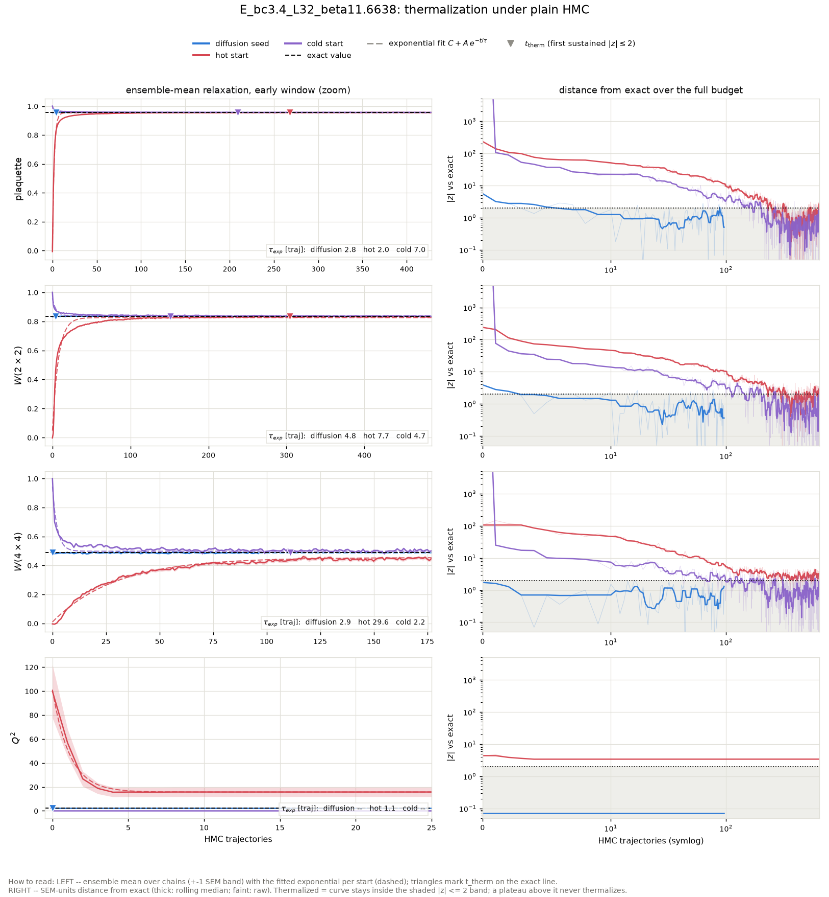

tau_int (hot-start chains, second half): plaquette = 4.38 +- 0.56, wilson_2x2 = 4.59 +- 0.62, wilson_4x4 = 2.38 +- 0.46, wilson_6x6 = 0.85 +- 0.04. Topology: hot-start HMC L=32 beta=11.6638 -> **frozen** (no tunneling).

Where 'never' stood at the end: the hot start ended the 640-trajectory budget still at wilson_4x4 at |z| ~ 3, wilson_6x6 at |z| ~ 3, Q^2 at |z| ~ 3; the cold start ended the 640-trajectory budget still at Q^2 at |z| ~ 2329518014464.

### Diagnostics: raw diffusion output (before any HMC)

| observable | value | error | exact | z_exact | reference | ref_error | z_ref | ks_p | chi2_p |
|---|---|---|---|---|---|---|---|---|---|
| plaquette | 0.955 | 0.0002381 | 0.9561 | -4.762 | 0.9559 | 0.0001386 | -3.489 | 0.0006474 |  |
| wilson_1x1 | 0.955 | 0.0002381 | 0.9561 | -4.762 | 0.9559 | 0.0001386 | -3.489 | 0.0006474 |  |
| wilson_1x2 | 0.9109 | 0.0004974 | 0.9142 | -6.584 | 0.9138 | 0.0002659 | -5.178 | 0.0001679 |  |
| wilson_2x2 | 0.8321 | 0.001164 | 0.8357 | -3.138 | 0.8347 | 0.0004393 | -2.146 | 0.07995 |  |
| wilson_2x3 | 0.759 | 0.001891 | 0.764 | -2.608 | 0.7621 | 0.0009043 | -1.476 | 0.0631 |  |
| wilson_3x3 | 0.6635 | 0.002648 | 0.6678 | -1.597 | 0.6659 | 0.001512 | -0.7839 | 0.1712 |  |
| wilson_3x4 | 0.5777 | 0.003401 | 0.5837 | -1.755 | 0.5811 | 0.00225 | -0.8479 | 0.2763 |  |
| wilson_4x4 | 0.4812 | 0.004185 | 0.4878 | -1.56 | 0.4857 | 0.002925 | -0.8813 | 0.3294 |  |
| wilson_4x5 | 0.4013 | 0.004761 | 0.4076 | -1.329 | 0.4045 | 0.003549 | -0.5331 | 0.6395 |  |
| wilson_5x5 | 0.3203 | 0.005245 | 0.3257 | -1.031 | 0.3235 | 0.003744 | -0.4956 | 0.4548 |  |
| wilson_5x6 | 0.2558 | 0.00566 | 0.2603 | -0.7813 | 0.2551 | 0.004093 | 0.09798 | 0.9542 |  |
| wilson_6x6 | 0.1963 | 0.006009 | 0.1988 | -0.4231 | 0.1932 | 0.004397 | 0.4133 | 0.7901 |  |
| wilson_6x7 | 0.1488 | 0.006593 | 0.1519 | -0.4689 | 0.1444 | 0.004666 | 0.5423 | 0.4212 |  |
| wilson_7x7 | 0.1095 | 0.007047 | 0.111 | -0.2017 | 0.1062 | 0.005079 | 0.3834 | 0.678 |  |
| wilson_7x8 | 0.07936 | 0.006973 | 0.08105 | -0.2416 | 0.0746 | 0.005295 | 0.5443 | 0.2522 |  |
| wilson_8x8 | 0.05537 | 0.006142 | 0.0566 | -0.2005 | 0.05156 | 0.004916 | 0.4841 | 0.4548 |  |
| wilson_8x10 | 0.02113 | 0.005456 | 0.02761 | -1.188 | 0.02437 | 0.005169 | -0.4315 | 0.6395 |  |
| wilson_10x10 | 0.003682 | 0.003963 | 0.01125 | -1.911 | 0.007955 | 0.003943 | -0.7645 | 0.3294 |  |
| wilson_10x12 | -0.0005821 | 0.004897 | 0.004588 | -1.056 | 0.002084 | 0.003642 | -0.4369 | 0.7163 |  |
| wilson_12x12 | -0.005004 | 0.003461 | 0.001563 | -1.897 | 0.002466 | 0.002998 | -1.631 | 0.1251 |  |
| creutz_2 | 0.04326 | 0.0006348 | 0.04487 | -2.535 |  |  |  |  |  |
| creutz_3 | 0.04265 | 0.001329 | 0.04487 | -1.667 |  |  |  |  |  |
| creutz_4 | 0.04414 | 0.002527 | 0.04487 | -0.29 |  |  |  |  |  |
| creutz_5 | 0.04379 | 0.00455 | 0.04487 | -0.2374 |  |  |  |  |  |
| creutz_6 | 0.04021 | 0.007662 | 0.04487 | -0.6088 |  |  |  |  |  |
| creutz_7 | 0.0295 | 0.01782 | 0.04487 | -0.8625 |  |  |  |  |  |
| creutz_8 | 0.03775 | 0.0326 | 0.04487 | -0.2185 |  |  |  |  |  |
| Q | -0.2734 | 0.1642 | 0 | -1.665 | -0.09375 | 0.1449 | -0.8205 | 0.8246 |  |
| Q^2 | 2.352 | 0.3381 | 2.33 | 0.0652 | 3.417 | 0.3755 | -2.108 | 0.7163 |  |
| chi_top ((<Q^2>-<Q>^2)/V) | 0.002223 | 0.0002881 | 0.002275 | -0.1787 | 0.003328 | 0.0003724 | -2.346 | 0.0001119 |  |
| Q histogram vs exact P(Q) | 3.51 | nan | 6 | nan |  |  |  |  | 0.7427 |

### Diagnostics: the same configs after 96 HMC trajectories

| observable | value | error | exact | z_exact | reference | ref_error | z_ref | ks_p | chi2_p |
|---|---|---|---|---|---|---|---|---|---|
| plaquette | 0.956 | 0.0001793 | 0.9561 | -0.5157 | 0.9559 | 0.0001386 | 0.3533 | 0.678 |  |
| wilson_1x1 | 0.956 | 0.0001793 | 0.9561 | -0.5157 | 0.9559 | 0.0001386 | 0.3533 | 0.678 |  |
| wilson_1x2 | 0.9137 | 0.0004208 | 0.9142 | -1.045 | 0.9138 | 0.0002659 | -0.17 | 0.6011 |  |
| wilson_2x2 | 0.8354 | 0.0009113 | 0.8357 | -0.3858 | 0.8347 | 0.0004393 | 0.6244 | 0.2297 |  |
| wilson_2x3 | 0.763 | 0.0013 | 0.764 | -0.7223 | 0.7621 | 0.0009043 | 0.5675 | 0.1712 |  |
| wilson_3x3 | 0.6668 | 0.00192 | 0.6678 | -0.4862 | 0.6659 | 0.001512 | 0.3699 | 0.3021 |  |
| wilson_3x4 | 0.5805 | 0.002364 | 0.5837 | -1.346 | 0.5811 | 0.00225 | -0.2058 | 0.2087 |  |
| wilson_4x4 | 0.4826 | 0.003095 | 0.4878 | -1.674 | 0.4857 | 0.002925 | -0.7402 | 0.1122 |  |
| wilson_4x5 | 0.3994 | 0.003835 | 0.4076 | -2.144 | 0.4045 | 0.003549 | -0.9683 | 0.03364 |  |
| wilson_5x5 | 0.3144 | 0.004498 | 0.3257 | -2.524 | 0.3235 | 0.003744 | -1.562 | 0.04354 |  |
| wilson_5x6 | 0.2477 | 0.004938 | 0.2603 | -2.542 | 0.2551 | 0.004093 | -1.161 | 0.3021 |  |
| wilson_6x6 | 0.1861 | 0.005008 | 0.1988 | -2.533 | 0.1932 | 0.004397 | -1.06 | 0.6011 |  |
| wilson_6x7 | 0.1372 | 0.004794 | 0.1519 | -3.058 | 0.1444 | 0.004666 | -1.074 | 0.7538 |  |
| wilson_7x7 | 0.09682 | 0.005077 | 0.111 | -2.784 | 0.1062 | 0.005079 | -1.307 | 0.4212 |  |
| wilson_7x8 | 0.06553 | 0.005041 | 0.08105 | -3.078 | 0.0746 | 0.005295 | -1.24 | 0.4548 |  |
| wilson_8x8 | 0.04417 | 0.005058 | 0.0566 | -2.458 | 0.05156 | 0.004916 | -1.048 | 0.8246 |  |
| wilson_8x10 | 0.0202 | 0.004868 | 0.02761 | -1.523 | 0.02437 | 0.005169 | -0.5878 | 0.7163 |  |
| wilson_10x10 | 0.01196 | 0.004014 | 0.01125 | 0.1752 | 0.007955 | 0.003943 | 0.7114 | 0.2087 |  |
| wilson_10x12 | 0.005938 | 0.004282 | 0.004588 | 0.3153 | 0.002084 | 0.003642 | 0.6855 | 0.3584 |  |
| wilson_12x12 | -0.001584 | 0.004055 | 0.001563 | -0.7762 | 0.002466 | 0.002998 | -0.8032 | 0.5259 |  |
| creutz_2 | 0.04443 | 0.0006684 | 0.04487 | -0.6647 |  |  |  |  |  |
| creutz_3 | 0.04423 | 0.001371 | 0.04487 | -0.4673 |  |  |  |  |  |
| creutz_4 | 0.04601 | 0.002331 | 0.04487 | 0.4902 |  |  |  |  |  |
| creutz_5 | 0.05026 | 0.004623 | 0.04487 | 1.167 |  |  |  |  |  |
| creutz_6 | 0.0474 | 0.008193 | 0.04487 | 0.3088 |  |  |  |  |  |
| creutz_7 | 0.0441 | 0.01917 | 0.04487 | -0.04023 |  |  |  |  |  |
| creutz_8 | 0.004117 | 0.04262 | 0.04487 | -0.9561 |  |  |  |  |  |
| Q | -0.2734 | 0.1642 | 0 | -1.665 | -0.09375 | 0.1449 | -0.8205 | 0.8246 |  |
| Q^2 | 2.352 | 0.3381 | 2.33 | 0.0652 | 3.417 | 0.3755 | -2.108 | 0.7163 |  |
| chi_top ((<Q^2>-<Q>^2)/V) | 0.002223 | 0.0002881 | 0.002275 | -0.1787 | 0.003328 | 0.0003724 | -2.346 | 0.0001119 |  |
| Q histogram vs exact P(Q) | 3.51 | nan | 6 | nan |  |  |  |  | 0.7427 |

## A_bc4_L32_beta14.1464

HMC: step size 0.1063, 9 leapfrog steps, acceptance seed/hot/cold = 0.986/0.984/0.986. Diffusion-seed batch: 128 chains x 96 trajectories (0.17 s/traj for the whole batch); baselines: 32 chains x 640 trajectories.

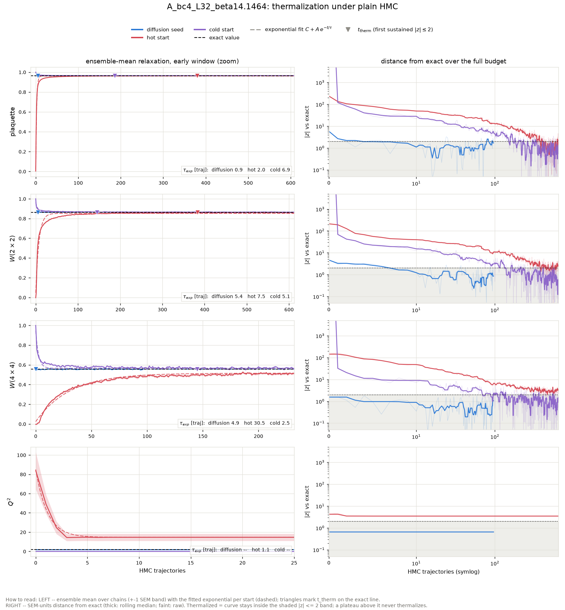

tau_int (hot-start chains, second half): plaquette = 4.80 +- 0.54, wilson_2x2 = 4.02 +- 0.72, wilson_4x4 = 2.48 +- 0.44, wilson_6x6 = 0.89 +- 0.05. Topology: hot-start HMC L=32 beta=14.1464 -> **frozen** (no tunneling).

Where 'never' stood at the end: the hot start ended the 640-trajectory budget still at wilson_4x4 at |z| ~ 3, wilson_6x6 at |z| ~ 3, Q^2 at |z| ~ 3; the cold start ended the 640-trajectory budget still at Q^2 at |z| ~ 1903991324672.

### Diagnostics: raw diffusion output (before any HMC)

| observable | value | error | exact | z_exact | reference | ref_error | z_ref | ks_p | chi2_p |
|---|---|---|---|---|---|---|---|---|---|
| plaquette | 0.9631 | 0.0001492 | 0.964 | -6.055 | 0.9643 | 0.0001394 | -5.759 | 6.452e-06 |  |
| wilson_1x1 | 0.9631 | 0.0001492 | 0.964 | -6.055 | 0.9643 | 0.0001394 | -5.759 | 6.452e-06 |  |
| wilson_1x2 | 0.9267 | 0.0004102 | 0.9293 | -6.194 | 0.9297 | 0.0002902 | -5.865 | 1.211e-08 |  |
| wilson_2x2 | 0.86 | 0.0008212 | 0.8635 | -4.26 | 0.8648 | 0.0005656 | -4.829 | 6.452e-06 |  |
| wilson_2x3 | 0.7985 | 0.001156 | 0.8024 | -3.383 | 0.8041 | 0.001006 | -3.631 | 0.0006474 |  |
| wilson_3x3 | 0.7157 | 0.002169 | 0.7188 | -1.421 | 0.7215 | 0.001633 | -2.11 | 0.07995 |  |
| wilson_3x4 | 0.6396 | 0.002808 | 0.6439 | -1.531 | 0.6464 | 0.002382 | -1.854 | 0.1251 |  |
| wilson_4x4 | 0.551 | 0.0036 | 0.556 | -1.385 | 0.5589 | 0.003229 | -1.615 | 0.3021 |  |
| wilson_4x5 | 0.4743 | 0.004645 | 0.4801 | -1.265 | 0.483 | 0.003787 | -1.459 | 0.4548 |  |
| wilson_5x5 | 0.394 | 0.005684 | 0.3997 | -0.9993 | 0.4026 | 0.004329 | -1.199 | 0.5631 |  |
| wilson_5x6 | 0.323 | 0.00658 | 0.3327 | -1.478 | 0.3371 | 0.004763 | -1.735 | 0.3584 |  |
| wilson_6x6 | 0.2564 | 0.007133 | 0.267 | -1.475 | 0.2695 | 0.004692 | -1.53 | 0.4898 |  |
| wilson_6x7 | 0.2006 | 0.007321 | 0.2142 | -1.855 | 0.2188 | 0.004882 | -2.066 | 0.1004 |  |
| wilson_7x7 | 0.1548 | 0.007072 | 0.1657 | -1.544 | 0.1698 | 0.00535 | -1.692 | 0.1004 |  |
| wilson_7x8 | 0.1161 | 0.007499 | 0.1282 | -1.616 | 0.1338 | 0.005268 | -1.935 | 0.04938 |  |
| wilson_8x8 | 0.08646 | 0.007379 | 0.09558 | -1.237 | 0.09956 | 0.005676 | -1.408 | 0.2522 |  |
| wilson_8x10 | 0.04524 | 0.006043 | 0.05315 | -1.308 | 0.05826 | 0.004829 | -1.684 | 0.4212 |  |
| wilson_10x10 | 0.02204 | 0.006114 | 0.02552 | -0.5693 | 0.03309 | 0.004208 | -1.49 | 0.4898 |  |
| wilson_10x12 | 0.009012 | 0.004297 | 0.01225 | -0.7539 | 0.01664 | 0.004387 | -1.243 | 0.2087 |  |
| wilson_12x12 | 0.002974 | 0.005239 | 0.00508 | -0.4019 | 0.009305 | 0.005203 | -0.8574 | 0.678 |  |
| creutz_2 | 0.0362 | 0.0005254 | 0.03668 | -0.9125 |  |  |  |  |  |
| creutz_3 | 0.03527 | 0.001151 | 0.03668 | -1.229 |  |  |  |  |  |
| creutz_4 | 0.03659 | 0.001971 | 0.03668 | -0.04865 |  |  |  |  |  |
| creutz_5 | 0.03536 | 0.003444 | 0.03668 | -0.3831 |  |  |  |  |  |
| creutz_6 | 0.03185 | 0.006055 | 0.03668 | -0.7978 |  |  |  |  |  |
| creutz_7 | 0.01406 | 0.01034 | 0.03668 | -2.187 |  |  |  |  |  |
| creutz_8 | 0.006528 | 0.02065 | 0.03668 | -1.461 |  |  |  |  |  |
| Q | 0.07031 | 0.1218 | 0 | 0.5774 | -0.07292 | 0.1031 | 0.8977 | 0.678 |  |
| Q^2 | 2.086 | 0.2321 | 1.904 | 0.7839 | 1.635 | 0.1596 | 1.599 | 0.8569 |  |
| chi_top ((<Q^2>-<Q>^2)/V) | 0.002032 | 0.0002337 | 0.001859 | 0.7397 | 0.001592 | 0.0001506 | 1.584 | 4.022e-06 |  |
| Q histogram vs exact P(Q) | 2.334 | nan | 6 | nan |  |  |  |  | 0.8866 |

### Diagnostics: the same configs after 96 HMC trajectories

| observable | value | error | exact | z_exact | reference | ref_error | z_ref | ks_p | chi2_p |
|---|---|---|---|---|---|---|---|---|---|
| plaquette | 0.9638 | 0.0001044 | 0.964 | -2.127 | 0.9643 | 0.0001394 | -2.84 | 0.01957 |  |
| wilson_1x1 | 0.9638 | 0.0001044 | 0.964 | -2.127 | 0.9643 | 0.0001394 | -2.84 | 0.01957 |  |
| wilson_1x2 | 0.929 | 0.0002161 | 0.9293 | -1.356 | 0.9297 | 0.0002902 | -1.933 | 0.3584 |  |
| wilson_2x2 | 0.8629 | 0.0006263 | 0.8635 | -0.9759 | 0.8648 | 0.0005656 | -2.285 | 0.1545 |  |
| wilson_2x3 | 0.8019 | 0.001078 | 0.8024 | -0.5425 | 0.8041 | 0.001006 | -1.518 | 0.7538 |  |
| wilson_3x3 | 0.7174 | 0.001811 | 0.7188 | -0.8038 | 0.7215 | 0.001633 | -1.682 | 0.3021 |  |
| wilson_3x4 | 0.6414 | 0.002327 | 0.6439 | -1.06 | 0.6464 | 0.002382 | -1.5 | 0.4548 |  |
| wilson_4x4 | 0.5523 | 0.003452 | 0.556 | -1.078 | 0.5589 | 0.003229 | -1.385 | 0.389 |  |
| wilson_4x5 | 0.4751 | 0.00424 | 0.4801 | -1.196 | 0.483 | 0.003787 | -1.396 | 0.4548 |  |
| wilson_5x5 | 0.3928 | 0.005759 | 0.3997 | -1.187 | 0.4026 | 0.004329 | -1.35 | 0.6011 |  |
| wilson_5x6 | 0.3242 | 0.006715 | 0.3327 | -1.263 | 0.3371 | 0.004763 | -1.56 | 0.4212 |  |
| wilson_6x6 | 0.2595 | 0.007804 | 0.267 | -0.9529 | 0.2695 | 0.004692 | -1.096 | 0.4212 |  |
| wilson_6x7 | 0.2071 | 0.0082 | 0.2142 | -0.8713 | 0.2188 | 0.004882 | -1.23 | 0.4898 |  |
| wilson_7x7 | 0.16 | 0.008015 | 0.1657 | -0.7146 | 0.1698 | 0.00535 | -1.018 | 0.678 |  |
| wilson_7x8 | 0.1238 | 0.007639 | 0.1282 | -0.5765 | 0.1338 | 0.005268 | -1.08 | 0.5259 |  |
| wilson_8x8 | 0.09393 | 0.007021 | 0.09558 | -0.2349 | 0.09956 | 0.005676 | -0.6233 | 0.6011 |  |
| wilson_8x10 | 0.05377 | 0.005672 | 0.05315 | 0.1099 | 0.05826 | 0.004829 | -0.6032 | 0.3021 |  |
| wilson_10x10 | 0.0229 | 0.004238 | 0.02552 | -0.6168 | 0.03309 | 0.004208 | -1.706 | 0.1545 |  |
| wilson_10x12 | 0.006227 | 0.004738 | 0.01225 | -1.272 | 0.01664 | 0.004387 | -1.614 | 0.0711 |  |
| wilson_12x12 | -0.0003532 | 0.004919 | 0.00508 | -1.104 | 0.009305 | 0.005203 | -1.349 | 0.2297 |  |
| creutz_2 | 0.03699 | 0.0004934 | 0.03668 | 0.6235 |  |  |  |  |  |
| creutz_3 | 0.03796 | 0.001035 | 0.03668 | 1.233 |  |  |  |  |  |
| creutz_4 | 0.03775 | 0.001971 | 0.03668 | 0.5408 |  |  |  |  |  |
| creutz_5 | 0.03941 | 0.003513 | 0.03668 | 0.777 |  |  |  |  |  |
| creutz_6 | 0.03054 | 0.005786 | 0.03668 | -1.061 |  |  |  |  |  |
| creutz_7 | 0.03227 | 0.01095 | 0.03668 | -0.403 |  |  |  |  |  |
| creutz_8 | 0.01935 | 0.01853 | 0.03668 | -0.9355 |  |  |  |  |  |
| Q | 0.07031 | 0.1218 | 0 | 0.5774 | -0.07292 | 0.1031 | 0.8977 | 0.678 |  |
| Q^2 | 2.086 | 0.2321 | 1.904 | 0.7839 | 1.635 | 0.1596 | 1.599 | 0.8569 |  |
| chi_top ((<Q^2>-<Q>^2)/V) | 0.002032 | 0.0002337 | 0.001859 | 0.7397 | 0.001592 | 0.0001506 | 1.584 | 4.022e-06 |  |
| Q histogram vs exact P(Q) | 2.334 | nan | 6 | nan |  |  |  |  | 0.8866 |

## E_bc4.5_L32_beta16.2057

HMC: step size 0.0994, 10 leapfrog steps, acceptance seed/hot/cold = 0.978/0.978/0.977. Diffusion-seed batch: 128 chains x 96 trajectories (0.05 s/traj for the whole batch); baselines: 32 chains x 640 trajectories.

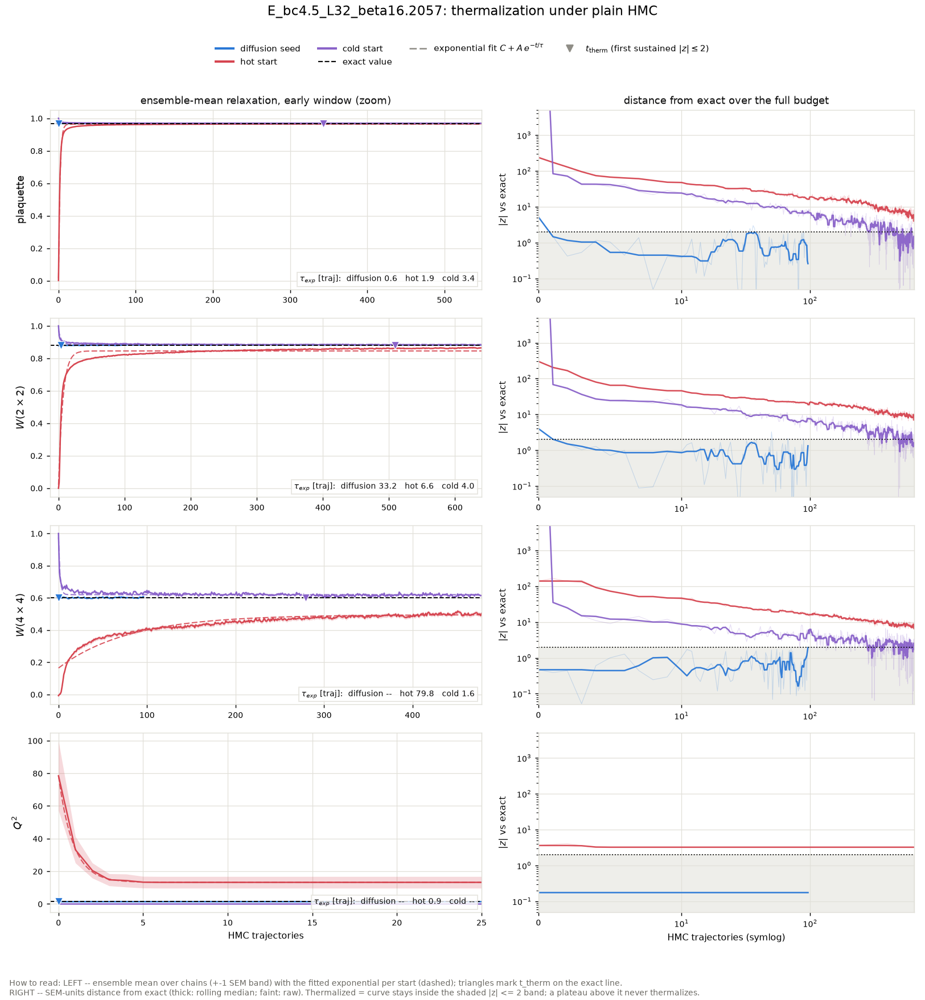

tau_int (hot-start chains, second half): plaquette = 6.88 +- 1.19, wilson_2x2 = 10.24 +- 1.48, wilson_4x4 = 5.81 +- 1.08, wilson_6x6 = 1.06 +- 0.11. Topology: hot-start HMC L=32 beta=16.2057 -> **frozen** (no tunneling).

Where 'never' stood at the end: the hot start ended the 640-trajectory budget still at plaquette at |z| ~ 6, wilson_2x2 at |z| ~ 9, wilson_4x4 at |z| ~ 8, wilson_6x6 at |z| ~ 5, Q^2 at |z| ~ 3; the cold start ended the 640-trajectory budget still at Q^2 at |z| ~ 1653625323520.

### Diagnostics: raw diffusion output (before any HMC)

| observable | value | error | exact | z_exact | reference | ref_error | z_ref | ks_p | chi2_p |
|---|---|---|---|---|---|---|---|---|---|
| plaquette | 0.9679 | 0.0001352 | 0.9686 | -5.237 | 0.9689 | 0.0001215 | -5.193 | 8.145e-06 |  |
| wilson_1x1 | 0.9679 | 0.0001352 | 0.9686 | -5.237 | 0.9689 | 0.0001215 | -5.193 | 8.145e-06 |  |
| wilson_1x2 | 0.9361 | 0.0003524 | 0.9383 | -6.183 | 0.9389 | 0.0002259 | -6.829 | 2.042e-09 |  |
| wilson_2x2 | 0.8776 | 0.0007432 | 0.8803 | -3.658 | 0.8819 | 0.0004272 | -5.037 | 1.615e-08 |  |
| wilson_2x3 | 0.823 | 0.001378 | 0.826 | -2.143 | 0.8283 | 0.0006681 | -3.419 | 1.289e-05 |  |
| wilson_3x3 | 0.7486 | 0.002156 | 0.7507 | -0.9584 | 0.755 | 0.001061 | -2.669 | 0.0002049 |  |
| wilson_3x4 | 0.6803 | 0.003153 | 0.6822 | -0.6271 | 0.687 | 0.00175 | -1.867 | 0.009477 |  |
| wilson_4x4 | 0.5992 | 0.003829 | 0.6006 | -0.3766 | 0.6055 | 0.002254 | -1.417 | 0.08971 |  |
| wilson_4x5 | 0.5268 | 0.004865 | 0.5287 | -0.4018 | 0.5333 | 0.002937 | -1.14 | 0.2522 |  |
| wilson_5x5 | 0.4476 | 0.005776 | 0.4509 | -0.5577 | 0.4546 | 0.003265 | -1.046 | 0.3021 |  |
| wilson_5x6 | 0.3801 | 0.006581 | 0.3845 | -0.6692 | 0.3866 | 0.003745 | -0.8694 | 0.2522 |  |
| wilson_6x6 | 0.3116 | 0.006842 | 0.3176 | -0.8712 | 0.3192 | 0.004082 | -0.9558 | 0.5631 |  |
| wilson_6x7 | 0.2559 | 0.007133 | 0.2623 | -0.8917 | 0.2625 | 0.004529 | -0.7727 | 0.7901 |  |
| wilson_7x7 | 0.2014 | 0.007615 | 0.2099 | -1.113 | 0.2103 | 0.004829 | -0.9839 | 0.4898 |  |
| wilson_7x8 | 0.1588 | 0.007546 | 0.1679 | -1.209 | 0.1689 | 0.00502 | -1.115 | 0.7163 |  |
| wilson_8x8 | 0.1191 | 0.007939 | 0.1301 | -1.388 | 0.1307 | 0.005123 | -1.229 | 0.3021 |  |
| wilson_8x10 | 0.06304 | 0.007747 | 0.07815 | -1.95 | 0.07974 | 0.00472 | -1.841 | 0.02947 |  |
| wilson_10x10 | 0.02587 | 0.007474 | 0.04132 | -2.068 | 0.04097 | 0.003961 | -1.786 | 0.05588 |  |
| wilson_10x12 | 0.007163 | 0.006707 | 0.02185 | -2.189 | 0.01927 | 0.00331 | -1.619 | 0.0711 |  |
| wilson_12x12 | 0.001834 | 0.006181 | 0.01017 | -1.348 | 0.004811 | 0.003369 | -0.4229 | 0.7163 |  |
| creutz_2 | 0.03104 | 0.0004722 | 0.03186 | -1.749 |  |  |  |  |  |
| creutz_3 | 0.03055 | 0.0009076 | 0.03186 | -1.45 |  |  |  |  |  |
| creutz_4 | 0.03122 | 0.001659 | 0.03186 | -0.389 |  |  |  |  |  |
| creutz_5 | 0.03403 | 0.002726 | 0.03186 | 0.7949 |  |  |  |  |  |
| creutz_6 | 0.03494 | 0.004659 | 0.03186 | 0.6601 |  |  |  |  |  |
| creutz_7 | 0.04293 | 0.008166 | 0.03186 | 1.356 |  |  |  |  |  |
| creutz_8 | 0.04989 | 0.01486 | 0.03186 | 1.213 |  |  |  |  |  |
| Q | -0.0625 | 0.08863 | 0 | -0.7051 | -0.1302 | 0.07449 | 0.5848 | 0.7163 |  |
| Q^2 | 1.688 | 0.1812 | 1.654 | 0.187 | 1.578 | 0.1684 | 0.4421 | 0.6011 |  |
| chi_top ((<Q^2>-<Q>^2)/V) | 0.001644 | 0.0001775 | 0.001615 | 0.1649 | 0.001525 | 0.0001571 | 0.5044 | 6.754e-09 |  |
| Q histogram vs exact P(Q) | 10.08 | nan | 6 | nan |  |  |  |  | 0.1214 |

### Diagnostics: the same configs after 96 HMC trajectories

| observable | value | error | exact | z_exact | reference | ref_error | z_ref | ks_p | chi2_p |
|---|---|---|---|---|---|---|---|---|---|
| plaquette | 0.9687 | 0.0001541 | 0.9686 | 0.2228 | 0.9689 | 0.0001215 | -1.028 | 0.04938 |  |
| wilson_1x1 | 0.9687 | 0.0001541 | 0.9686 | 0.2228 | 0.9689 | 0.0001215 | -1.028 | 0.04938 |  |
| wilson_1x2 | 0.9386 | 0.000376 | 0.9383 | 0.8982 | 0.9389 | 0.0002259 | -0.7799 | 0.08971 |  |
| wilson_2x2 | 0.8813 | 0.0008389 | 0.8803 | 1.204 | 0.8819 | 0.0004272 | -0.626 | 0.1251 |  |
| wilson_2x3 | 0.828 | 0.001171 | 0.826 | 1.722 | 0.8283 | 0.0006681 | -0.198 | 0.4898 |  |
| wilson_3x3 | 0.7544 | 0.001709 | 0.7507 | 2.175 | 0.755 | 0.001061 | -0.313 | 0.678 |  |
| wilson_3x4 | 0.6875 | 0.002248 | 0.6822 | 2.322 | 0.687 | 0.00175 | 0.1628 | 0.5631 |  |
| wilson_4x4 | 0.6071 | 0.002935 | 0.6006 | 2.219 | 0.6055 | 0.002254 | 0.4485 | 0.8246 |  |
| wilson_4x5 | 0.5369 | 0.003634 | 0.5287 | 2.257 | 0.5333 | 0.002937 | 0.7868 | 0.6395 |  |
| wilson_5x5 | 0.46 | 0.004166 | 0.4509 | 2.186 | 0.4546 | 0.003265 | 1.018 | 0.9126 |  |
| wilson_5x6 | 0.3953 | 0.004641 | 0.3845 | 2.328 | 0.3866 | 0.003745 | 1.447 | 0.678 |  |
| wilson_6x6 | 0.3287 | 0.005206 | 0.3176 | 2.146 | 0.3192 | 0.004082 | 1.439 | 0.8864 |  |
| wilson_6x7 | 0.2736 | 0.005499 | 0.2623 | 2.061 | 0.2625 | 0.004529 | 1.567 | 0.7163 |  |
| wilson_7x7 | 0.2203 | 0.005806 | 0.2099 | 1.798 | 0.2103 | 0.004829 | 1.33 | 0.8246 |  |
| wilson_7x8 | 0.176 | 0.005852 | 0.1679 | 1.381 | 0.1689 | 0.00502 | 0.9205 | 0.8246 |  |
| wilson_8x8 | 0.1367 | 0.005479 | 0.1301 | 1.203 | 0.1307 | 0.005123 | 0.8009 | 0.9693 |  |
| wilson_8x10 | 0.08206 | 0.00497 | 0.07815 | 0.7859 | 0.07974 | 0.00472 | 0.3371 | 0.9126 |  |
| wilson_10x10 | 0.04086 | 0.004705 | 0.04132 | -0.09851 | 0.04097 | 0.003961 | -0.01863 | 0.678 |  |
| wilson_10x12 | 0.02235 | 0.00418 | 0.02185 | 0.1196 | 0.01927 | 0.00331 | 0.5767 | 0.9353 |  |
| wilson_12x12 | 0.00717 | 0.004483 | 0.01017 | -0.6688 | 0.004811 | 0.003369 | 0.4206 | 0.8569 |  |
| creutz_2 | 0.0314 | 0.0004929 | 0.03186 | -0.9384 |  |  |  |  |  |
| creutz_3 | 0.03066 | 0.000762 | 0.03186 | -1.585 |  |  |  |  |  |
| creutz_4 | 0.03139 | 0.001521 | 0.03186 | -0.3149 |  |  |  |  |  |
| creutz_5 | 0.03187 | 0.002545 | 0.03186 | 0.001805 |  |  |  |  |  |
| creutz_6 | 0.03273 | 0.003803 | 0.03186 | 0.2275 |  |  |  |  |  |
| creutz_7 | 0.0333 | 0.006069 | 0.03186 | 0.237 |  |  |  |  |  |
| creutz_8 | 0.02789 | 0.01143 | 0.03186 | -0.3476 |  |  |  |  |  |
| Q | -0.0625 | 0.08863 | 0 | -0.7051 | -0.1302 | 0.07449 | 0.5848 | 0.7163 |  |
| Q^2 | 1.688 | 0.1812 | 1.654 | 0.187 | 1.578 | 0.1684 | 0.4421 | 0.6011 |  |
| chi_top ((<Q^2>-<Q>^2)/V) | 0.001644 | 0.0001775 | 0.001615 | 0.1649 | 0.001525 | 0.0001571 | 0.5044 | 6.754e-09 |  |
| Q histogram vs exact P(Q) | 10.08 | nan | 6 | nan |  |  |  |  | 0.1214 |

## A_bc5_L32_beta18.2524

HMC: step size 0.0936, 11 leapfrog steps, acceptance seed/hot/cold = 0.982/0.981/0.982. Diffusion-seed batch: 128 chains x 96 trajectories (0.11 s/traj for the whole batch); baselines: 32 chains x 640 trajectories.

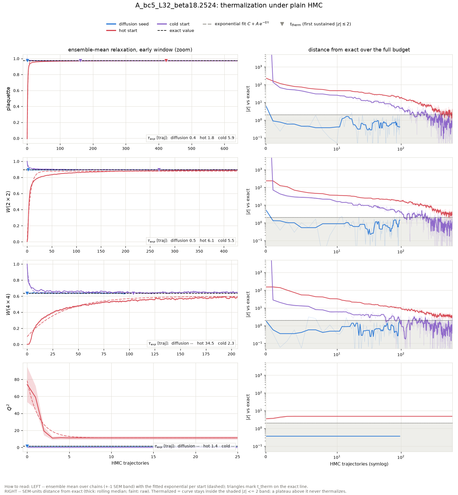

tau_int (hot-start chains, second half): plaquette = 4.56 +- 0.48, wilson_2x2 = 5.10 +- 0.66, wilson_4x4 = 2.93 +- 0.45, wilson_6x6 = 1.00 +- 0.06. Topology: hot-start HMC L=32 beta=18.2524 -> **frozen** (no tunneling).

Where 'never' stood at the end: the hot start ended the 640-trajectory budget still at wilson_2x2 at |z| ~ 3, wilson_4x4 at |z| ~ 4, wilson_6x6 at |z| ~ 4, Q^2 at |z| ~ 5; the cold start ended the 640-trajectory budget still at Q^2 at |z| ~ 1462558916608.

### Diagnostics: raw diffusion output (before any HMC)

| observable | value | error | exact | z_exact | reference | ref_error | z_ref | ks_p | chi2_p |
|---|---|---|---|---|---|---|---|---|---|
| plaquette | 0.9714 | 0.0001169 | 0.9722 | -6.544 | 0.9721 | 8.748e-05 | -4.622 | 0.0001372 |  |
| wilson_1x1 | 0.9714 | 0.0001169 | 0.9722 | -6.544 | 0.9721 | 8.748e-05 | -4.622 | 0.0001372 |  |
| wilson_1x2 | 0.9429 | 0.0002542 | 0.9452 | -9.048 | 0.945 | 0.0002172 | -6.166 | 6.452e-06 |  |
| wilson_2x2 | 0.8901 | 0.0004556 | 0.8934 | -7.297 | 0.8932 | 0.0004579 | -4.847 | 0.001334 |  |
| wilson_2x3 | 0.8403 | 0.0007117 | 0.8444 | -5.812 | 0.8439 | 0.0007747 | -3.405 | 0.01474 |  |
| wilson_3x3 | 0.7721 | 0.001306 | 0.776 | -2.911 | 0.775 | 0.001198 | -1.624 | 0.1545 |  |
| wilson_3x4 | 0.7078 | 0.001859 | 0.713 | -2.798 | 0.7128 | 0.001494 | -2.067 | 0.1251 |  |
| wilson_4x4 | 0.6314 | 0.002596 | 0.637 | -2.154 | 0.6379 | 0.001978 | -1.993 | 0.1004 |  |
| wilson_4x5 | 0.5625 | 0.003528 | 0.5691 | -1.867 | 0.5711 | 0.002196 | -2.062 | 0.1251 |  |
| wilson_5x5 | 0.4896 | 0.004601 | 0.4943 | -1.025 | 0.4985 | 0.002714 | -1.678 | 0.1892 |  |
| wilson_5x6 | 0.4226 | 0.005472 | 0.4293 | -1.236 | 0.4368 | 0.002936 | -2.289 | 0.03364 |  |
| wilson_6x6 | 0.3563 | 0.006038 | 0.3625 | -1.031 | 0.3726 | 0.003308 | -2.37 | 0.04354 |  |
| wilson_6x7 | 0.2957 | 0.006743 | 0.3061 | -1.541 | 0.3188 | 0.00378 | -2.989 | 0.006985 |  |
| wilson_7x7 | 0.2397 | 0.00658 | 0.2513 | -1.758 | 0.2667 | 0.004046 | -3.489 | 0.011 |  |
| wilson_7x8 | 0.1903 | 0.006702 | 0.2063 | -2.395 | 0.2235 | 0.004259 | -4.181 | 0.004349 |  |
| wilson_8x8 | 0.1486 | 0.006495 | 0.1647 | -2.469 | 0.1811 | 0.004164 | -4.211 | 0.009477 |  |
| wilson_8x10 | 0.08751 | 0.007105 | 0.1049 | -2.448 | 0.1197 | 0.004264 | -3.883 | 0.011 |  |
| wilson_10x10 | 0.04158 | 0.006971 | 0.0597 | -2.599 | 0.0728 | 0.004548 | -3.752 | 0.005104 |  |
| wilson_10x12 | 0.01821 | 0.00643 | 0.03397 | -2.452 | 0.04194 | 0.004967 | -2.921 | 0.005104 |  |
| wilson_12x12 | 0.003762 | 0.005957 | 0.01727 | -2.268 | 0.02299 | 0.005358 | -2.4 | 0.04938 |  |
| creutz_2 | 0.02783 | 0.0004206 | 0.02818 | -0.8479 |  |  |  |  |  |
| creutz_3 | 0.02701 | 0.0008272 | 0.02818 | -1.426 |  |  |  |  |  |
| creutz_4 | 0.02727 | 0.001566 | 0.02818 | -0.5812 |  |  |  |  |  |
| creutz_5 | 0.02331 | 0.002664 | 0.02818 | -1.83 |  |  |  |  |  |
| creutz_6 | 0.02334 | 0.003959 | 0.02818 | -1.223 |  |  |  |  |  |
| creutz_7 | 0.02356 | 0.006945 | 0.02818 | -0.6666 |  |  |  |  |  |
| creutz_8 | 0.01584 | 0.01195 | 0.02818 | -1.033 |  |  |  |  |  |
| Q | 0.02344 | 0.09658 | 0 | 0.2427 | -0.1667 | 0.0623 | 1.654 | 0.9888 |  |
| Q^2 | 1.398 | 0.2066 | 1.463 | -0.3103 | 1.271 | 0.1232 | 0.5304 | 1 |  |
| chi_top ((<Q^2>-<Q>^2)/V) | 0.001365 | 0.0002011 | 0.001428 | -0.314 | 0.001214 | 0.0001176 | 0.649 | 3.783e-08 |  |
| Q histogram vs exact P(Q) | 1.11 | nan | 4 | nan |  |  |  |  | 0.8927 |

### Diagnostics: the same configs after 96 HMC trajectories

| observable | value | error | exact | z_exact | reference | ref_error | z_ref | ks_p | chi2_p |
|---|---|---|---|---|---|---|---|---|---|
| plaquette | 0.9722 | 0.0001193 | 0.9722 | -0.4198 | 0.9721 | 8.748e-05 | 0.2708 | 0.7901 |  |
| wilson_1x1 | 0.9722 | 0.0001193 | 0.9722 | -0.4198 | 0.9721 | 8.748e-05 | 0.2708 | 0.7901 |  |
| wilson_1x2 | 0.9451 | 0.0002829 | 0.9452 | -0.354 | 0.945 | 0.0002172 | 0.3867 | 0.9542 |  |
| wilson_2x2 | 0.8925 | 0.0006386 | 0.8934 | -1.457 | 0.8932 | 0.0004579 | -0.938 | 0.5259 |  |
| wilson_2x3 | 0.843 | 0.001153 | 0.8444 | -1.249 | 0.8439 | 0.0007747 | -0.638 | 0.7163 |  |
| wilson_3x3 | 0.773 | 0.001939 | 0.776 | -1.548 | 0.775 | 0.001198 | -0.9113 | 0.3021 |  |
| wilson_3x4 | 0.7087 | 0.002896 | 0.713 | -1.499 | 0.7128 | 0.001494 | -1.25 | 0.2297 |  |
| wilson_4x4 | 0.6307 | 0.003983 | 0.637 | -1.596 | 0.6379 | 0.001978 | -1.634 | 0.02577 |  |
| wilson_4x5 | 0.5608 | 0.005046 | 0.5691 | -1.649 | 0.5711 | 0.002196 | -1.872 | 0.03364 |  |
| wilson_5x5 | 0.4837 | 0.006473 | 0.4943 | -1.641 | 0.4985 | 0.002714 | -2.119 | 0.02248 |  |
| wilson_5x6 | 0.4163 | 0.007755 | 0.4293 | -1.674 | 0.4368 | 0.002936 | -2.464 | 0.003697 |  |
| wilson_6x6 | 0.3489 | 0.008691 | 0.3625 | -1.571 | 0.3726 | 0.003308 | -2.554 | 0.01275 |  |
| wilson_6x7 | 0.293 | 0.009158 | 0.3061 | -1.434 | 0.3188 | 0.00378 | -2.609 | 0.0009335 |  |
| wilson_7x7 | 0.2385 | 0.009832 | 0.2513 | -1.306 | 0.2667 | 0.004046 | -2.654 | 0.01474 |  |
| wilson_7x8 | 0.193 | 0.01011 | 0.2063 | -1.321 | 0.2235 | 0.004259 | -2.781 | 0.02577 |  |
| wilson_8x8 | 0.1536 | 0.01023 | 0.1647 | -1.085 | 0.1811 | 0.004164 | -2.495 | 0.0631 |  |
| wilson_8x10 | 0.09524 | 0.01027 | 0.1049 | -0.94 | 0.1197 | 0.004264 | -2.198 | 0.006985 |  |
| wilson_10x10 | 0.05187 | 0.008421 | 0.0597 | -0.9293 | 0.0728 | 0.004548 | -2.187 | 0.1545 |  |
| wilson_10x12 | 0.03004 | 0.007828 | 0.03397 | -0.5025 | 0.04194 | 0.004967 | -1.284 | 0.1545 |  |
| wilson_12x12 | 0.01159 | 0.00739 | 0.01727 | -0.7686 | 0.02299 | 0.005358 | -1.249 | 0.3584 |  |
| creutz_2 | 0.02907 | 0.00043 | 0.02818 | 2.051 |  |  |  |  |  |
| creutz_3 | 0.02969 | 0.0009062 | 0.02818 | 1.66 |  |  |  |  |  |
| creutz_4 | 0.02987 | 0.001521 | 0.02818 | 1.107 |  |  |  |  |  |
| creutz_5 | 0.03048 | 0.002609 | 0.02818 | 0.8805 |  |  |  |  |  |
| creutz_6 | 0.02692 | 0.003957 | 0.02818 | -0.3204 |  |  |  |  |  |
| creutz_7 | 0.03131 | 0.006713 | 0.02818 | 0.4652 |  |  |  |  |  |
| creutz_8 | 0.01661 | 0.01011 | 0.02818 | -1.145 |  |  |  |  |  |
| Q | 0.02344 | 0.09658 | 0 | 0.2427 | -0.1667 | 0.0623 | 1.654 | 0.9888 |  |
| Q^2 | 1.398 | 0.2066 | 1.463 | -0.3103 | 1.271 | 0.1232 | 0.5304 | 1 |  |
| chi_top ((<Q^2>-<Q>^2)/V) | 0.001365 | 0.0002011 | 0.001428 | -0.314 | 0.001214 | 0.0001176 | 0.649 | 3.783e-08 |  |
| Q histogram vs exact P(Q) | 1.11 | nan | 4 | nan |  |  |  |  | 0.8927 |

## E_bc5.8_L32_beta21.5051

HMC: step size 0.0863, 12 leapfrog steps, acceptance seed/hot/cold = 0.981/0.983/0.982. Diffusion-seed batch: 128 chains x 96 trajectories (0.06 s/traj for the whole batch); baselines: 32 chains x 640 trajectories.

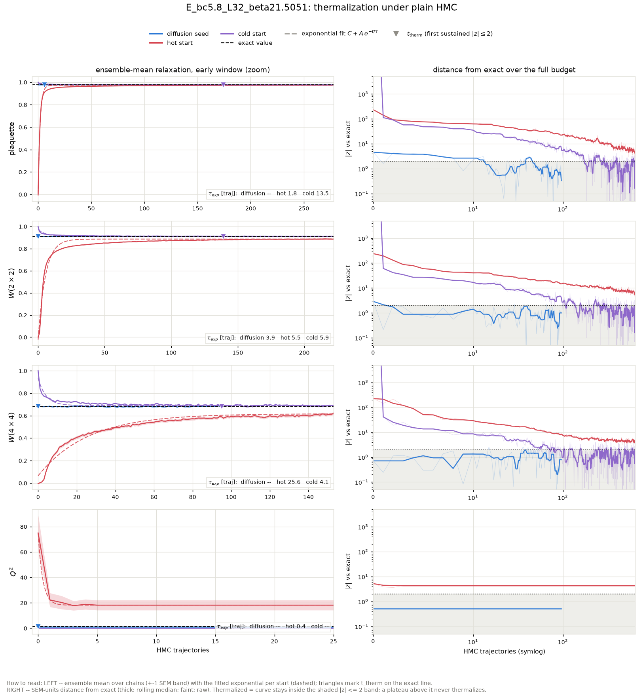

tau_int (hot-start chains, second half): plaquette = 7.22 +- 1.31, wilson_2x2 = 10.08 +- 1.66, wilson_4x4 = 3.91 +- 0.67, wilson_6x6 = 1.46 +- 0.20. Topology: hot-start HMC L=32 beta=21.5051 -> **frozen** (no tunneling).

Where 'never' stood at the end: the hot start ended the 640-trajectory budget still at plaquette at |z| ~ 4, wilson_2x2 at |z| ~ 6, wilson_4x4 at |z| ~ 4, wilson_6x6 at |z| ~ 5, Q^2 at |z| ~ 4; the cold start ended the 640-trajectory budget still at Q^2 at |z| ~ 1235714179072.

### Diagnostics: raw diffusion output (before any HMC)

| observable | value | error | exact | z_exact | reference | ref_error | z_ref | ks_p | chi2_p |
|---|---|---|---|---|---|---|---|---|---|
| plaquette | 0.9761 | 8.265e-05 | 0.9765 | -4.88 | 0.9764 | 6.579e-05 | -3.643 | 0.0009335 |  |
| wilson_1x1 | 0.9761 | 8.265e-05 | 0.9765 | -4.88 | 0.9764 | 6.579e-05 | -3.643 | 0.0009335 |  |
| wilson_1x2 | 0.9522 | 0.0001754 | 0.9535 | -7.544 | 0.9538 | 0.0001478 | -7.327 | 2.042e-09 |  |
| wilson_2x2 | 0.9077 | 0.000438 | 0.9091 | -3.37 | 0.9104 | 0.000397 | -4.628 | 9.107e-05 |  |
| wilson_2x3 | 0.8651 | 0.0008221 | 0.8668 | -2.115 | 0.8687 | 0.0006653 | -3.379 | 0.009477 |  |
| wilson_3x3 | 0.8069 | 0.001417 | 0.8071 | -0.1387 | 0.8091 | 0.000996 | -1.309 | 0.2297 |  |
| wilson_3x4 | 0.7508 | 0.001968 | 0.7514 | -0.3163 | 0.7546 | 0.001418 | -1.567 | 0.3584 |  |
| wilson_4x4 | 0.6811 | 0.00279 | 0.6831 | -0.721 | 0.6869 | 0.00195 | -1.705 | 0.3294 |  |
| wilson_4x5 | 0.619 | 0.003728 | 0.6211 | -0.5597 | 0.6254 | 0.002521 | -1.431 | 0.6011 |  |
| wilson_5x5 | 0.5482 | 0.004732 | 0.5513 | -0.6724 | 0.5569 | 0.003066 | -1.552 | 0.1251 |  |
| wilson_5x6 | 0.4846 | 0.005995 | 0.4895 | -0.8152 | 0.496 | 0.003851 | -1.607 | 0.1392 |  |
| wilson_6x6 | 0.4169 | 0.007117 | 0.4243 | -1.044 | 0.4327 | 0.004392 | -1.894 | 0.08971 |  |
| wilson_6x7 | 0.3588 | 0.007873 | 0.3678 | -1.148 | 0.375 | 0.004974 | -1.749 | 0.1712 |  |
| wilson_7x7 | 0.301 | 0.008636 | 0.3113 | -1.199 | 0.3184 | 0.005407 | -1.714 | 0.2087 |  |
| wilson_7x8 | 0.254 | 0.008981 | 0.2635 | -1.062 | 0.2689 | 0.005633 | -1.408 | 0.3584 |  |
| wilson_8x8 | 0.2104 | 0.008964 | 0.2178 | -0.82 | 0.2203 | 0.006032 | -0.9141 | 0.389 |  |
| wilson_8x10 | 0.1411 | 0.008416 | 0.1488 | -0.9078 | 0.1477 | 0.006198 | -0.6223 | 0.4898 |  |
| wilson_10x10 | 0.08766 | 0.007691 | 0.09241 | -0.6173 | 0.08779 | 0.006184 | -0.01338 | 0.2763 |  |
| wilson_10x12 | 0.05058 | 0.006143 | 0.05739 | -1.11 | 0.05374 | 0.006546 | -0.3525 | 0.678 |  |
| wilson_12x12 | 0.02457 | 0.005752 | 0.03241 | -1.362 | 0.03188 | 0.006324 | -0.8546 | 0.6395 |  |
| creutz_2 | 0.02308 | 0.0003657 | 0.02382 | -2.023 |  |  |  |  |  |
| creutz_3 | 0.02167 | 0.000682 | 0.02382 | -3.149 |  |  |  |  |  |
| creutz_4 | 0.02535 | 0.001162 | 0.02382 | 1.321 |  |  |  |  |  |
| creutz_5 | 0.02582 | 0.001988 | 0.02382 | 1.008 |  |  |  |  |  |
| creutz_6 | 0.0272 | 0.00302 | 0.02382 | 1.119 |  |  |  |  |  |
| creutz_7 | 0.02555 | 0.004891 | 0.02382 | 0.3555 |  |  |  |  |  |
| creutz_8 | 0.01822 | 0.007221 | 0.02382 | -0.7748 |  |  |  |  |  |
| Q | 0.1641 | 0.09788 | 0 | 1.676 | -0.07812 | 0.07702 | 1.944 | 0.4212 |  |
| Q^2 | 1.164 | 0.116 | 1.236 | -0.6179 | 1.359 | 0.1492 | -1.033 | 1 |  |
| chi_top ((<Q^2>-<Q>^2)/V) | 0.00111 | 0.0001153 | 0.001207 | -0.8348 | 0.001322 | 0.000147 | -1.13 | 2.764e-09 |  |
| Q histogram vs exact P(Q) | 4.873 | nan | 4 | nan |  |  |  |  | 0.3006 |

### Diagnostics: the same configs after 96 HMC trajectories

| observable | value | error | exact | z_exact | reference | ref_error | z_ref | ks_p | chi2_p |
|---|---|---|---|---|---|---|---|---|---|
| plaquette | 0.9765 | 9.048e-05 | 0.9765 | 0.3112 | 0.9764 | 6.579e-05 | 0.4173 | 0.8864 |  |
| wilson_1x1 | 0.9765 | 9.048e-05 | 0.9765 | 0.3112 | 0.9764 | 6.579e-05 | 0.4173 | 0.8864 |  |
| wilson_1x2 | 0.9536 | 0.0002023 | 0.9535 | 0.6558 | 0.9538 | 0.0001478 | -0.8971 | 0.5259 |  |
| wilson_2x2 | 0.9096 | 0.0003856 | 0.9091 | 1.192 | 0.9104 | 0.000397 | -1.447 | 0.07995 |  |
| wilson_2x3 | 0.8674 | 0.0006792 | 0.8668 | 0.8604 | 0.8687 | 0.0006653 | -1.315 | 0.1545 |  |
| wilson_3x3 | 0.8079 | 0.001164 | 0.8071 | 0.7249 | 0.8091 | 0.000996 | -0.8014 | 0.6011 |  |
| wilson_3x4 | 0.7528 | 0.001787 | 0.7514 | 0.7559 | 0.7546 | 0.001418 | -0.8015 | 0.3584 |  |
| wilson_4x4 | 0.6853 | 0.002698 | 0.6831 | 0.8145 | 0.6869 | 0.00195 | -0.4793 | 0.1712 |  |
| wilson_4x5 | 0.6234 | 0.003717 | 0.6211 | 0.622 | 0.6254 | 0.002521 | -0.4547 | 0.8569 |  |
| wilson_5x5 | 0.5536 | 0.005136 | 0.5513 | 0.4434 | 0.5569 | 0.003066 | -0.5508 | 0.7163 |  |
| wilson_5x6 | 0.4903 | 0.006417 | 0.4895 | 0.1291 | 0.496 | 0.003851 | -0.7661 | 0.5631 |  |
| wilson_6x6 | 0.4253 | 0.007271 | 0.4243 | 0.1402 | 0.4327 | 0.004392 | -0.8704 | 0.3294 |  |
| wilson_6x7 | 0.368 | 0.008148 | 0.3678 | 0.02837 | 0.375 | 0.004974 | -0.7353 | 0.389 |  |
| wilson_7x7 | 0.3129 | 0.008812 | 0.3113 | 0.1845 | 0.3184 | 0.005407 | -0.5304 | 0.4898 |  |
| wilson_7x8 | 0.2637 | 0.009235 | 0.2635 | 0.02137 | 0.2689 | 0.005633 | -0.4794 | 0.678 |  |
| wilson_8x8 | 0.2189 | 0.009838 | 0.2178 | 0.1084 | 0.2203 | 0.006032 | -0.1265 | 0.6011 |  |
| wilson_8x10 | 0.1494 | 0.01082 | 0.1488 | 0.05486 | 0.1477 | 0.006198 | 0.1387 | 0.7538 |  |
| wilson_10x10 | 0.09241 | 0.01043 | 0.09241 | -0.0002361 | 0.08779 | 0.006184 | 0.3805 | 0.7901 |  |
| wilson_10x12 | 0.05708 | 0.01102 | 0.05739 | -0.02807 | 0.05374 | 0.006546 | 0.2607 | 0.8864 |  |
| wilson_12x12 | 0.0332 | 0.009622 | 0.03241 | 0.08231 | 0.03188 | 0.006324 | 0.1145 | 0.7163 |  |
| creutz_2 | 0.02356 | 0.0003364 | 0.02382 | -0.7608 |  |  |  |  |  |
| creutz_3 | 0.02361 | 0.0006875 | 0.02382 | -0.2938 |  |  |  |  |  |
| creutz_4 | 0.02315 | 0.001088 | 0.02382 | -0.6115 |  |  |  |  |  |
| creutz_5 | 0.02391 | 0.001774 | 0.02382 | 0.05498 |  |  |  |  |  |
| creutz_6 | 0.02068 | 0.002902 | 0.02382 | -1.081 |  |  |  |  |  |
| creutz_7 | 0.01746 | 0.004952 | 0.02382 | -1.283 |  |  |  |  |  |
| creutz_8 | 0.01522 | 0.007515 | 0.02382 | -1.143 |  |  |  |  |  |
| Q | 0.1641 | 0.09788 | 0 | 1.676 | -0.07812 | 0.07702 | 1.944 | 0.4212 |  |
| Q^2 | 1.164 | 0.116 | 1.236 | -0.6179 | 1.359 | 0.1492 | -1.033 | 1 |  |
| chi_top ((<Q^2>-<Q>^2)/V) | 0.00111 | 0.0001153 | 0.001207 | -0.8348 | 0.001322 | 0.000147 | -1.13 | 2.764e-09 |  |
| Q histogram vs exact P(Q) | 4.873 | nan | 4 | nan |  |  |  |  | 0.3006 |

## A_bc6_L32_beta22.3151

HMC: step size 0.0847, 12 leapfrog steps, acceptance seed/hot/cold = 0.983/0.982/0.984. Diffusion-seed batch: 128 chains x 96 trajectories (0.06 s/traj for the whole batch); baselines: 32 chains x 640 trajectories.

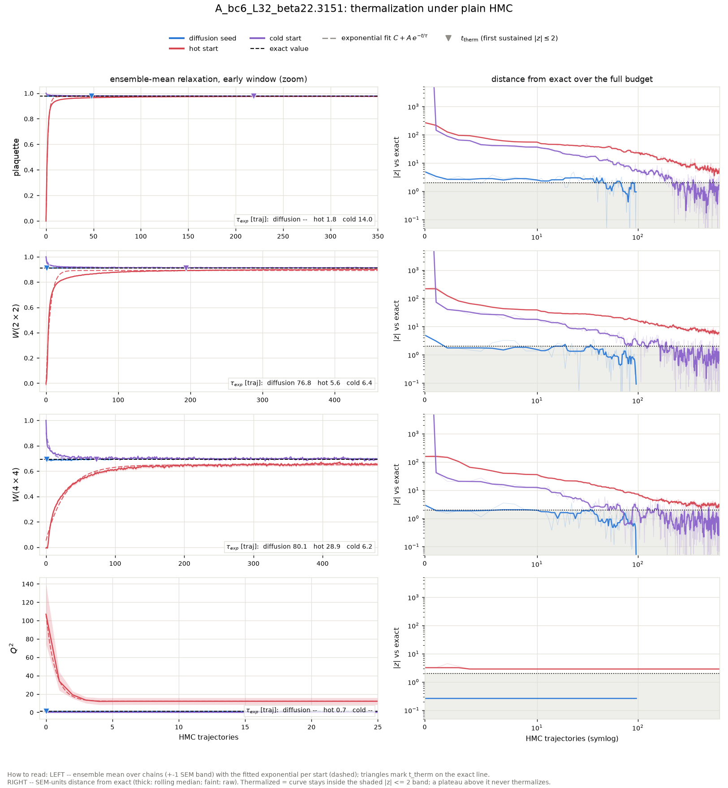

tau_int (hot-start chains, second half): plaquette = 8.76 +- 1.35, wilson_2x2 = 7.57 +- 1.25, wilson_4x4 = 3.24 +- 0.33, wilson_6x6 = 1.44 +- 0.11. Topology: hot-start HMC L=32 beta=22.3151 -> **frozen** (no tunneling).

Where 'never' stood at the end: the hot start ended the 640-trajectory budget still at plaquette at |z| ~ 5, wilson_2x2 at |z| ~ 6, wilson_4x4 at |z| ~ 3, wilson_6x6 at |z| ~ 3, Q^2 at |z| ~ 3; the cold start ended the 640-trajectory budget still at Q^2 at |z| ~ 1189769248768.

### Diagnostics: raw diffusion output (before any HMC)

| observable | value | error | exact | z_exact | reference | ref_error | z_ref | ks_p | chi2_p |
|---|---|---|---|---|---|---|---|---|---|
| plaquette | 0.9769 | 8.928e-05 | 0.9773 | -4.566 | 0.9771 | 6.258e-05 | -1.983 | 0.0631 |  |
| wilson_1x1 | 0.9769 | 8.928e-05 | 0.9773 | -4.566 | 0.9771 | 6.258e-05 | -1.983 | 0.0631 |  |
| wilson_1x2 | 0.9538 | 0.000235 | 0.9552 | -5.898 | 0.955 | 0.0001446 | -4.481 | 0.001117 |  |
| wilson_2x2 | 0.9096 | 0.0005527 | 0.9124 | -4.915 | 0.9118 | 0.0003964 | -3.111 | 0.02248 |  |
| wilson_2x3 | 0.8682 | 0.0009275 | 0.8715 | -3.565 | 0.8705 | 0.0007065 | -1.99 | 0.2297 |  |
| wilson_3x3 | 0.8091 | 0.00155 | 0.8135 | -2.826 | 0.8119 | 0.001118 | -1.415 | 0.3294 |  |
| wilson_3x4 | 0.7537 | 0.002279 | 0.7594 | -2.52 | 0.7581 | 0.001735 | -1.52 | 0.1545 |  |
| wilson_4x4 | 0.6843 | 0.003127 | 0.6929 | -2.75 | 0.691 | 0.002453 | -1.685 | 0.04354 |  |
| wilson_4x5 | 0.6237 | 0.003909 | 0.6322 | -2.167 | 0.6302 | 0.003175 | -1.302 | 0.0631 |  |
| wilson_5x5 | 0.5541 | 0.004846 | 0.5637 | -1.982 | 0.5607 | 0.004057 | -1.041 | 0.1122 |  |
| wilson_5x6 | 0.4936 | 0.005737 | 0.5026 | -1.567 | 0.4994 | 0.004712 | -0.7708 | 0.3584 |  |
| wilson_6x6 | 0.4286 | 0.00673 | 0.438 | -1.398 | 0.4331 | 0.005531 | -0.5186 | 0.6011 |  |
| wilson_6x7 | 0.3751 | 0.007713 | 0.3817 | -0.8572 | 0.3769 | 0.006189 | -0.1786 | 0.8864 |  |
| wilson_7x7 | 0.3196 | 0.008182 | 0.3251 | -0.6759 | 0.3188 | 0.006756 | 0.07431 | 0.8864 |  |
| wilson_7x8 | 0.2734 | 0.008961 | 0.2769 | -0.3913 | 0.2688 | 0.007177 | 0.4028 | 0.6011 |  |
| wilson_8x8 | 0.228 | 0.009073 | 0.2305 | -0.273 | 0.2208 | 0.007311 | 0.6201 | 0.4212 |  |
| wilson_8x10 | 0.1618 | 0.009509 | 0.1597 | 0.2197 | 0.1482 | 0.007828 | 1.104 | 0.3584 |  |
| wilson_10x10 | 0.1057 | 0.008725 | 0.101 | 0.5411 | 0.09444 | 0.007242 | 0.9917 | 0.5259 |  |
| wilson_10x12 | 0.06985 | 0.007627 | 0.06382 | 0.7907 | 0.05584 | 0.006246 | 1.422 | 0.0631 |  |
| wilson_12x12 | 0.04182 | 0.007228 | 0.03681 | 0.6932 | 0.03103 | 0.005564 | 1.184 | 0.2522 |  |
| creutz_2 | 0.02343 | 0.0003374 | 0.02293 | 1.466 |  |  |  |  |  |
| creutz_3 | 0.02371 | 0.0006555 | 0.02293 | 1.186 |  |  |  |  |  |
| creutz_4 | 0.02564 | 0.0012 | 0.02293 | 2.256 |  |  |  |  |  |
| creutz_5 | 0.02562 | 0.001695 | 0.02293 | 1.589 |  |  |  |  |  |
| creutz_6 | 0.02573 | 0.003053 | 0.02293 | 0.9165 |  |  |  |  |  |
| creutz_7 | 0.02685 | 0.004679 | 0.02293 | 0.8383 |  |  |  |  |  |
| creutz_8 | 0.0254 | 0.007778 | 0.02293 | 0.3176 |  |  |  |  |  |
| Q | -0.03906 | 0.08641 | 0 | -0.4521 | -0.03125 | 0.0707 | -0.06998 | 1 |  |
| Q^2 | 1.227 | 0.1851 | 1.19 | 0.1988 | 1.406 | 0.09558 | -0.8627 | 0.9126 |  |
| chi_top ((<Q^2>-<Q>^2)/V) | 0.001196 | 0.0001833 | 0.001162 | 0.1879 | 0.001372 | 9.313e-05 | -0.856 | 4.282e-07 |  |
| Q histogram vs exact P(Q) | 3.75 | nan | 4 | nan |  |  |  |  | 0.4409 |

### Diagnostics: the same configs after 96 HMC trajectories

| observable | value | error | exact | z_exact | reference | ref_error | z_ref | ks_p | chi2_p |
|---|---|---|---|---|---|---|---|---|---|
| plaquette | 0.9772 | 6.924e-05 | 0.9773 | -1.23 | 0.9771 | 6.258e-05 | 1.139 | 0.2763 |  |
| wilson_1x1 | 0.9772 | 6.924e-05 | 0.9773 | -1.23 | 0.9771 | 6.258e-05 | 1.139 | 0.2763 |  |
| wilson_1x2 | 0.955 | 0.0001995 | 0.9552 | -0.7766 | 0.955 | 0.0001446 | -0.02183 | 0.9126 |  |
| wilson_2x2 | 0.9123 | 0.0004837 | 0.9124 | -0.1005 | 0.9118 | 0.0003964 | 0.8825 | 0.4548 |  |
| wilson_2x3 | 0.8717 | 0.0008361 | 0.8715 | 0.2596 | 0.8705 | 0.0007065 | 1.099 | 0.3294 |  |
| wilson_3x3 | 0.8132 | 0.001203 | 0.8135 | -0.2403 | 0.8119 | 0.001118 | 0.8436 | 0.8569 |  |
| wilson_3x4 | 0.7597 | 0.001514 | 0.7594 | 0.1745 | 0.7581 | 0.001735 | 0.7178 | 0.3584 |  |
| wilson_4x4 | 0.693 | 0.001974 | 0.6929 | 0.04334 | 0.691 | 0.002453 | 0.6317 | 0.2297 |  |
| wilson_4x5 | 0.6319 | 0.002413 | 0.6322 | -0.1164 | 0.6302 | 0.003175 | 0.4101 | 0.5259 |  |
| wilson_5x5 | 0.5631 | 0.003178 | 0.5637 | -0.1926 | 0.5607 | 0.004057 | 0.469 | 0.8864 |  |
| wilson_5x6 | 0.502 | 0.003717 | 0.5026 | -0.1653 | 0.4994 | 0.004712 | 0.4424 | 0.678 |  |
| wilson_6x6 | 0.4386 | 0.004277 | 0.438 | 0.142 | 0.4331 | 0.005531 | 0.7862 | 0.6395 |  |
| wilson_6x7 | 0.3837 | 0.004958 | 0.3817 | 0.3963 | 0.3769 | 0.006189 | 0.8587 | 0.7538 |  |
| wilson_7x7 | 0.3289 | 0.005628 | 0.3251 | 0.676 | 0.3188 | 0.006756 | 1.151 | 0.5631 |  |
| wilson_7x8 | 0.2813 | 0.006189 | 0.2769 | 0.7114 | 0.2688 | 0.007177 | 1.323 | 0.3021 |  |
| wilson_8x8 | 0.2353 | 0.006379 | 0.2305 | 0.7506 | 0.2208 | 0.007311 | 1.493 | 0.2763 |  |
| wilson_8x10 | 0.1657 | 0.006944 | 0.1597 | 0.8609 | 0.1482 | 0.007828 | 1.671 | 0.2297 |  |
| wilson_10x10 | 0.1061 | 0.007447 | 0.101 | 0.6953 | 0.09444 | 0.007242 | 1.126 | 0.5259 |  |
| wilson_10x12 | 0.06865 | 0.007597 | 0.06382 | 0.6354 | 0.05584 | 0.006246 | 1.303 | 0.6395 |  |
| wilson_12x12 | 0.04513 | 0.00707 | 0.03681 | 1.177 | 0.03103 | 0.005564 | 1.568 | 0.2522 |  |
| creutz_2 | 0.02275 | 0.0003343 | 0.02293 | -0.5504 |  |  |  |  |  |
| creutz_3 | 0.02384 | 0.0005809 | 0.02293 | 1.561 |  |  |  |  |  |
| creutz_4 | 0.02386 | 0.0009993 | 0.02293 | 0.9284 |  |  |  |  |  |
| creutz_5 | 0.023 | 0.001672 | 0.02293 | 0.0446 |  |  |  |  |  |
| creutz_6 | 0.02019 | 0.002604 | 0.02293 | -1.054 |  |  |  |  |  |
| creutz_7 | 0.02018 | 0.00445 | 0.02293 | -0.6182 |  |  |  |  |  |
| creutz_8 | 0.02228 | 0.006848 | 0.02293 | -0.09446 |  |  |  |  |  |
| Q | -0.03906 | 0.08641 | 0 | -0.4521 | -0.03125 | 0.0707 | -0.06998 | 1 |  |
| Q^2 | 1.227 | 0.1851 | 1.19 | 0.1988 | 1.406 | 0.09558 | -0.8627 | 0.9126 |  |
| chi_top ((<Q^2>-<Q>^2)/V) | 0.001196 | 0.0001833 | 0.001162 | 0.1879 | 0.001372 | 9.313e-05 | -0.856 | 4.282e-07 |  |
| Q histogram vs exact P(Q) | 3.75 | nan | 4 | nan |  |  |  |  | 0.4409 |

## A_bc8_L32_beta30.3772

HMC: step size 0.0726, 14 leapfrog steps, acceptance seed/hot/cold = 0.983/0.981/0.983. Diffusion-seed batch: 128 chains x 96 trajectories (0.07 s/traj for the whole batch); baselines: 32 chains x 640 trajectories.

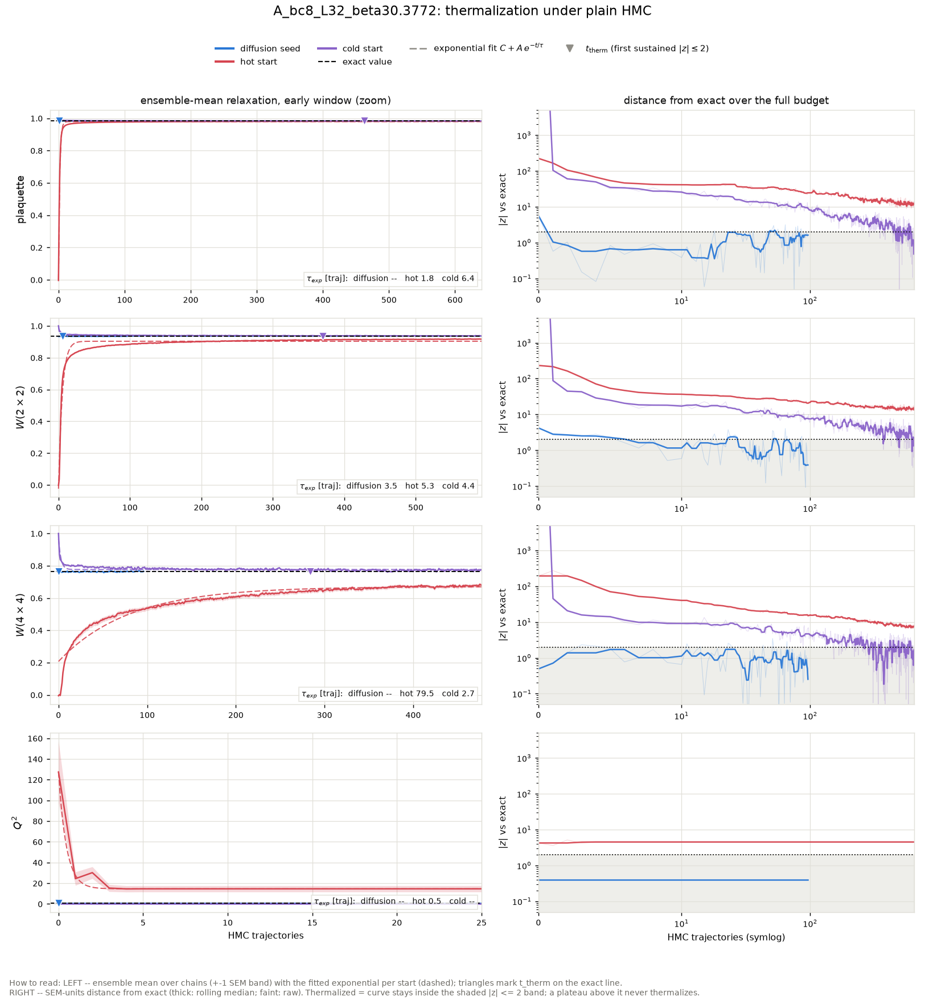

tau_int (hot-start chains, second half): plaquette = 10.71 +- 1.40, wilson_2x2 = 14.38 +- 1.90, wilson_4x4 = 11.20 +- 1.57, wilson_6x6 = 4.81 +- 1.07. Topology: hot-start HMC L=32 beta=30.3772 -> **frozen** (no tunneling).

Where 'never' stood at the end: the hot start ended the 640-trajectory budget still at plaquette at |z| ~ 12, wilson_2x2 at |z| ~ 15, wilson_4x4 at |z| ~ 8, wilson_6x6 at |z| ~ 6, Q^2 at |z| ~ 5; the cold start ended the 640-trajectory budget still at Q^2 at |z| ~ 868455153664.

### Diagnostics: raw diffusion output (before any HMC)

| observable | value | error | exact | z_exact | reference | ref_error | z_ref | ks_p | chi2_p |
|---|---|---|---|---|---|---|---|---|---|
| plaquette | 0.983 | 7.019e-05 | 0.9834 | -5.305 | 0.9835 | 3.853e-05 | -5.732 | 9.107e-05 |  |
| wilson_1x1 | 0.983 | 7.019e-05 | 0.9834 | -5.305 | 0.9835 | 3.853e-05 | -5.732 | 9.107e-05 |  |
| wilson_1x2 | 0.966 | 0.0001562 | 0.9671 | -6.904 | 0.9671 | 8.105e-05 | -6.546 | 5.1e-06 |  |
| wilson_2x2 | 0.9337 | 0.0004165 | 0.9352 | -3.665 | 0.9353 | 0.0002202 | -3.392 | 0.00189 |  |
| wilson_2x3 | 0.9031 | 0.000711 | 0.9044 | -1.843 | 0.9048 | 0.0004599 | -1.963 | 0.1392 |  |
| wilson_3x3 | 0.8598 | 0.001255 | 0.8601 | -0.2856 | 0.8605 | 0.0008424 | -0.4608 | 0.8569 |  |
| wilson_3x4 | 0.8175 | 0.001737 | 0.818 | -0.3209 | 0.8186 | 0.001269 | -0.5126 | 0.9126 |  |
| wilson_4x4 | 0.764 | 0.002301 | 0.765 | -0.4541 | 0.7641 | 0.001745 | -0.03442 | 0.9693 |  |
| wilson_4x5 | 0.7138 | 0.003125 | 0.7155 | -0.5496 | 0.7147 | 0.002358 | -0.2356 | 0.8246 |  |
| wilson_5x5 | 0.6557 | 0.00388 | 0.658 | -0.5976 | 0.6563 | 0.003075 | -0.1124 | 0.8864 |  |
| wilson_5x6 | 0.6015 | 0.004564 | 0.6052 | -0.8185 | 0.6044 | 0.00378 | -0.5009 | 0.4548 |  |
| wilson_6x6 | 0.5431 | 0.005292 | 0.5474 | -0.8121 | 0.5473 | 0.004598 | -0.6087 | 0.4212 |  |
| wilson_6x7 | 0.4895 | 0.006 | 0.4951 | -0.9231 | 0.4965 | 0.00528 | -0.876 | 0.2297 |  |
| wilson_7x7 | 0.4346 | 0.006772 | 0.4403 | -0.8435 | 0.4426 | 0.005861 | -0.8871 | 0.3584 |  |
| wilson_7x8 | 0.385 | 0.007482 | 0.3916 | -0.8829 | 0.3943 | 0.006478 | -0.9407 | 0.3584 |  |
| wilson_8x8 | 0.3361 | 0.008478 | 0.3426 | -0.762 | 0.3462 | 0.0068 | -0.9333 | 0.3294 |  |
| wilson_8x10 | 0.2534 | 0.009146 | 0.2621 | -0.9493 | 0.2663 | 0.007529 | -1.088 | 0.2763 |  |
| wilson_10x10 | 0.1759 | 0.01006 | 0.1875 | -1.153 | 0.1914 | 0.008157 | -1.196 | 0.1892 |  |
| wilson_10x12 | 0.1225 | 0.00965 | 0.1342 | -1.206 | 0.1381 | 0.008185 | -1.232 | 0.03831 |  |
| wilson_12x12 | 0.07944 | 0.008472 | 0.08978 | -1.22 | 0.09448 | 0.009064 | -1.212 | 0.1545 |  |
| creutz_2 | 0.01652 | 0.000245 | 0.01674 | -0.8947 |  |  |  |  |  |
| creutz_3 | 0.01589 | 0.0004695 | 0.01674 | -1.809 |  |  |  |  |  |
| creutz_4 | 0.01716 | 0.0008149 | 0.01674 | 0.5157 |  |  |  |  |  |
| creutz_5 | 0.01683 | 0.001244 | 0.01674 | 0.07278 |  |  |  |  |  |
| creutz_6 | 0.01577 | 0.00191 | 0.01674 | -0.5089 |  |  |  |  |  |
| creutz_7 | 0.01518 | 0.002523 | 0.01674 | -0.6198 |  |  |  |  |  |
| creutz_8 | 0.01482 | 0.004338 | 0.01674 | -0.443 |  |  |  |  |  |
| Q | 0.1797 | 0.07053 | 0 | 2.548 | 0.09375 | 0.05933 | 0.9324 | 0.9999 |  |
| Q^2 | 0.9141 | 0.1354 | 0.8685 | 0.3369 | 0.8333 | 0.08983 | 0.4969 | 0.9999 |  |
| chi_top ((<Q^2>-<Q>^2)/V) | 0.0008611 | 0.000129 | 0.0008481 | 0.1009 | 0.0008052 | 8.936e-05 | 0.3562 | 5.105e-14 |  |
| Q histogram vs exact P(Q) | 5.306 | nan | 4 | nan |  |  |  |  | 0.2573 |

### Diagnostics: the same configs after 96 HMC trajectories

| observable | value | error | exact | z_exact | reference | ref_error | z_ref | ks_p | chi2_p |
|---|---|---|---|---|---|---|---|---|---|
| plaquette | 0.9833 | 6.51e-05 | 0.9834 | -1.709 | 0.9835 | 3.853e-05 | -2.616 | 0.02577 |  |
| wilson_1x1 | 0.9833 | 6.51e-05 | 0.9834 | -1.709 | 0.9835 | 3.853e-05 | -2.616 | 0.02577 |  |
| wilson_1x2 | 0.967 | 0.000133 | 0.9671 | -0.5984 | 0.9671 | 8.105e-05 | -0.9836 | 0.1712 |  |
| wilson_2x2 | 0.9351 | 0.0002452 | 0.9352 | -0.5894 | 0.9353 | 0.0002202 | -0.6557 | 0.8864 |  |
| wilson_2x3 | 0.9045 | 0.0004236 | 0.9044 | 0.02513 | 0.9048 | 0.0004599 | -0.5463 | 0.9941 |  |
| wilson_3x3 | 0.8605 | 0.0008099 | 0.8601 | 0.397 | 0.8605 | 0.0008424 | -0.01421 | 0.678 |  |
| wilson_3x4 | 0.8187 | 0.001189 | 0.818 | 0.5871 | 0.8186 | 0.001269 | 0.08791 | 0.5259 |  |
| wilson_4x4 | 0.7656 | 0.001916 | 0.765 | 0.289 | 0.7641 | 0.001745 | 0.5786 | 0.1122 |  |
| wilson_4x5 | 0.7166 | 0.002376 | 0.7155 | 0.4688 | 0.7147 | 0.002358 | 0.5703 | 0.0631 |  |
| wilson_5x5 | 0.6585 | 0.003221 | 0.658 | 0.1292 | 0.6563 | 0.003075 | 0.4892 | 0.2087 |  |
| wilson_5x6 | 0.6058 | 0.003717 | 0.6052 | 0.168 | 0.6044 | 0.00378 | 0.2625 | 0.2522 |  |
| wilson_6x6 | 0.548 | 0.004473 | 0.5474 | 0.1318 | 0.5473 | 0.004598 | 0.09657 | 0.5259 |  |
| wilson_6x7 | 0.4955 | 0.004894 | 0.4951 | 0.09662 | 0.4965 | 0.00528 | -0.1375 | 0.8246 |  |
| wilson_7x7 | 0.4398 | 0.005572 | 0.4403 | -0.09513 | 0.4426 | 0.005861 | -0.3417 | 0.7163 |  |
| wilson_7x8 | 0.3914 | 0.005975 | 0.3916 | -0.04122 | 0.3943 | 0.006478 | -0.3348 | 0.7538 |  |
| wilson_8x8 | 0.3395 | 0.006359 | 0.3426 | -0.48 | 0.3462 | 0.0068 | -0.7233 | 0.8864 |  |
| wilson_8x10 | 0.2624 | 0.006993 | 0.2621 | 0.04162 | 0.2663 | 0.007529 | -0.3808 | 0.8246 |  |
| wilson_10x10 | 0.1856 | 0.008029 | 0.1875 | -0.2441 | 0.1914 | 0.008157 | -0.5112 | 0.6395 |  |
| wilson_10x12 | 0.1335 | 0.008483 | 0.1342 | -0.07332 | 0.1381 | 0.008185 | -0.3877 | 0.9126 |  |
| wilson_12x12 | 0.08751 | 0.009233 | 0.08978 | -0.2453 | 0.09448 | 0.009064 | -0.5388 | 0.8864 |  |
| creutz_2 | 0.01684 | 0.0002234 | 0.01674 | 0.4615 |  |  |  |  |  |
| creutz_3 | 0.01654 | 0.0004666 | 0.01674 | -0.4193 |  |  |  |  |  |
| creutz_4 | 0.01735 | 0.0008669 | 0.01674 | 0.7016 |  |  |  |  |  |
| creutz_5 | 0.0185 | 0.001465 | 0.01674 | 1.199 |  |  |  |  |  |
| creutz_6 | 0.01709 | 0.002223 | 0.01674 | 0.1592 |  |  |  |  |  |
| creutz_7 | 0.01878 | 0.002824 | 0.01674 | 0.7217 |  |  |  |  |  |
| creutz_8 | 0.02563 | 0.00393 | 0.01674 | 2.263 |  |  |  |  |  |
| Q | 0.1797 | 0.07053 | 0 | 2.548 | 0.09375 | 0.05933 | 0.9324 | 0.9999 |  |
| Q^2 | 0.9141 | 0.1354 | 0.8685 | 0.3369 | 0.8333 | 0.08983 | 0.4969 | 0.9999 |  |
| chi_top ((<Q^2>-<Q>^2)/V) | 0.0008611 | 0.000129 | 0.0008481 | 0.1009 | 0.0008052 | 8.936e-05 | 0.3562 | 5.105e-14 |  |
| Q histogram vs exact P(Q) | 5.306 | nan | 4 | nan |  |  |  |  | 0.2573 |

## E_bc9_L32_beta34.3944

HMC: step size 0.0682, 15 leapfrog steps, acceptance seed/hot/cold = 0.980/0.980/0.982. Diffusion-seed batch: 128 chains x 96 trajectories (0.07 s/traj for the whole batch); baselines: 32 chains x 640 trajectories.

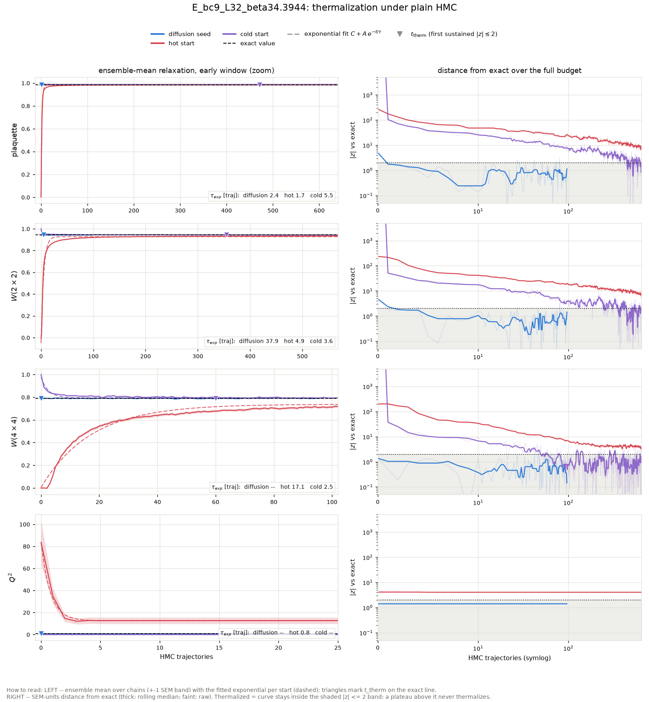

tau_int (hot-start chains, second half): plaquette = 8.96 +- 1.23, wilson_2x2 = 7.09 +- 1.16, wilson_4x4 = 3.29 +- 0.37, wilson_6x6 = 1.87 +- 0.28. Topology: hot-start HMC L=32 beta=34.3944 -> **frozen** (no tunneling).

Where 'never' stood at the end: the hot start ended the 640-trajectory budget still at plaquette at |z| ~ 8, wilson_2x2 at |z| ~ 8, wilson_4x4 at |z| ~ 4, wilson_6x6 at |z| ~ 4, Q^2 at |z| ~ 4; the cold start ended the 640-trajectory budget still at Q^2 at |z| ~ 765454843904.

### Diagnostics: raw diffusion output (before any HMC)

| observable | value | error | exact | z_exact | reference | ref_error | z_ref | ks_p | chi2_p |
|---|---|---|---|---|---|---|---|---|---|
| plaquette | 0.9851 | 5.263e-05 | 0.9854 | -5.142 | 0.9854 | 4.157e-05 | -4.853 | 0.001117 |  |
| wilson_1x1 | 0.9851 | 5.263e-05 | 0.9854 | -5.142 | 0.9854 | 4.157e-05 | -4.853 | 0.001117 |  |
| wilson_1x2 | 0.97 | 0.0001184 | 0.9709 | -7.866 | 0.9709 | 0.0001128 | -5.347 | 3.143e-05 |  |
| wilson_2x2 | 0.9412 | 0.0002135 | 0.9427 | -6.965 | 0.9427 | 0.000268 | -4.375 | 0.001117 |  |
| wilson_2x3 | 0.9135 | 0.0004324 | 0.9153 | -4.113 | 0.915 | 0.0004932 | -2.303 | 0.02248 |  |
| wilson_3x3 | 0.8742 | 0.0007017 | 0.8756 | -2.076 | 0.8753 | 0.0009217 | -0.9981 | 0.3584 |  |
| wilson_3x4 | 0.8355 | 0.001107 | 0.8377 | -1.998 | 0.8371 | 0.001317 | -0.9427 | 0.2297 |  |
| wilson_4x4 | 0.787 | 0.001645 | 0.7897 | -1.681 | 0.7889 | 0.001997 | -0.7687 | 0.3021 |  |
| wilson_4x5 | 0.7396 | 0.002247 | 0.7445 | -2.181 | 0.7439 | 0.002631 | -1.258 | 0.1712 |  |
| wilson_5x5 | 0.6863 | 0.003144 | 0.6915 | -1.659 | 0.6906 | 0.003311 | -0.9482 | 0.3294 |  |
| wilson_5x6 | 0.633 | 0.003612 | 0.6423 | -2.581 | 0.6419 | 0.00392 | -1.672 | 0.04354 |  |
| wilson_6x6 | 0.5767 | 0.004578 | 0.5879 | -2.461 | 0.588 | 0.004361 | -1.791 | 0.08971 |  |
| wilson_6x7 | 0.5244 | 0.005346 | 0.5381 | -2.557 | 0.5393 | 0.004877 | -2.053 | 0.04354 |  |
| wilson_7x7 | 0.47 | 0.006313 | 0.4853 | -2.421 | 0.4868 | 0.005291 | -2.035 | 0.0631 |  |
| wilson_7x8 | 0.4193 | 0.006947 | 0.4377 | -2.654 | 0.4395 | 0.005667 | -2.263 | 0.07995 |  |
| wilson_8x8 | 0.3682 | 0.007374 | 0.389 | -2.814 | 0.3904 | 0.006133 | -2.318 | 0.1122 |  |
| wilson_8x10 | 0.2805 | 0.007494 | 0.3072 | -3.564 | 0.3118 | 0.006791 | -3.095 | 0.02947 |  |
| wilson_10x10 | 0.204 | 0.007995 | 0.2287 | -3.089 | 0.2329 | 0.007379 | -2.656 | 0.0631 |  |
| wilson_10x12 | 0.1468 | 0.007365 | 0.1702 | -3.189 | 0.1751 | 0.007361 | -2.718 | 0.02248 |  |
| wilson_12x12 | 0.09553 | 0.007538 | 0.1195 | -3.177 | 0.1211 | 0.007773 | -2.361 | 0.1004 |  |
| creutz_2 | 0.01469 | 0.0002211 | 0.01475 | -0.3022 |  |  |  |  |  |
| creutz_3 | 0.01411 | 0.0004656 | 0.01475 | -1.389 |  |  |  |  |  |
| creutz_4 | 0.01464 | 0.0008187 | 0.01475 | -0.1378 |  |  |  |  |  |
| creutz_5 | 0.01263 | 0.00114 | 0.01475 | -1.867 |  |  |  |  |  |
| creutz_6 | 0.01244 | 0.001588 | 0.01475 | -1.457 |  |  |  |  |  |
| creutz_7 | 0.01464 | 0.002438 | 0.01475 | -0.04768 |  |  |  |  |  |
| creutz_8 | 0.0155 | 0.003493 | 0.01475 | 0.2143 |  |  |  |  |  |
| Q | 0.0625 | 0.09824 | 0 | 0.6362 | 0.125 | 0.05224 | -0.5617 | 0.9693 |  |
| Q^2 | 0.9375 | 0.1095 | 0.7655 | 1.571 | 0.6562 | 0.05961 | 2.256 | 0.9126 |  |
| chi_top ((<Q^2>-<Q>^2)/V) | 0.0009117 | 0.0001071 | 0.0007475 | 1.533 | 0.0006256 | 5.583e-05 | 2.368 | 3.32e-13 |  |
| Q histogram vs exact P(Q) | 4.028 | nan | 4 | nan |  |  |  |  | 0.4022 |

### Diagnostics: the same configs after 96 HMC trajectories

| observable | value | error | exact | z_exact | reference | ref_error | z_ref | ks_p | chi2_p |
|---|---|---|---|---|---|---|---|---|---|
| plaquette | 0.9854 | 5.121e-05 | 0.9854 | 1.313 | 0.9854 | 4.157e-05 | 0.1881 | 0.8246 |  |
| wilson_1x1 | 0.9854 | 5.121e-05 | 0.9854 | 1.313 | 0.9854 | 4.157e-05 | 0.1881 | 0.8246 |  |
| wilson_1x2 | 0.971 | 0.0001415 | 0.9709 | 0.842 | 0.9709 | 0.0001128 | 0.9752 | 0.2522 |  |
| wilson_2x2 | 0.9432 | 0.0003533 | 0.9427 | 1.483 | 0.9427 | 0.000268 | 1.154 | 0.3584 |  |
| wilson_2x3 | 0.9159 | 0.0006074 | 0.9153 | 1.048 | 0.915 | 0.0004932 | 1.155 | 0.2763 |  |
| wilson_3x3 | 0.8766 | 0.001017 | 0.8756 | 0.9498 | 0.8753 | 0.0009217 | 0.9225 | 0.1712 |  |
| wilson_3x4 | 0.8388 | 0.001473 | 0.8377 | 0.7139 | 0.8371 | 0.001317 | 0.8303 | 0.3294 |  |
| wilson_4x4 | 0.79 | 0.002114 | 0.7897 | 0.1415 | 0.7889 | 0.001997 | 0.3698 | 0.7901 |  |
| wilson_4x5 | 0.7444 | 0.002914 | 0.7445 | -0.02063 | 0.7439 | 0.002631 | 0.1244 | 0.6395 |  |
| wilson_5x5 | 0.6907 | 0.003808 | 0.6915 | -0.2067 | 0.6906 | 0.003311 | 0.02018 | 0.7163 |  |
| wilson_5x6 | 0.6413 | 0.004905 | 0.6423 | -0.2223 | 0.6419 | 0.00392 | -0.1085 | 0.6011 |  |
| wilson_6x6 | 0.5868 | 0.00572 | 0.5879 | -0.2004 | 0.588 | 0.004361 | -0.1671 | 0.7163 |  |
| wilson_6x7 | 0.5367 | 0.00697 | 0.5381 | -0.1998 | 0.5393 | 0.004877 | -0.3034 | 0.7163 |  |
| wilson_7x7 | 0.4838 | 0.007867 | 0.4853 | -0.1927 | 0.4868 | 0.005291 | -0.3158 | 0.8246 |  |
| wilson_7x8 | 0.4364 | 0.008737 | 0.4377 | -0.1517 | 0.4395 | 0.005667 | -0.3051 | 0.9542 |  |
| wilson_8x8 | 0.3868 | 0.009426 | 0.389 | -0.2307 | 0.3904 | 0.006133 | -0.3256 | 0.9542 |  |
| wilson_8x10 | 0.3047 | 0.0101 | 0.3072 | -0.2488 | 0.3118 | 0.006791 | -0.5837 | 0.3294 |  |
| wilson_10x10 | 0.2231 | 0.01148 | 0.2287 | -0.4862 | 0.2329 | 0.007379 | -0.7167 | 0.389 |  |
| wilson_10x12 | 0.1639 | 0.01215 | 0.1702 | -0.5187 | 0.1751 | 0.007361 | -0.7827 | 0.1122 |  |
| wilson_12x12 | 0.1097 | 0.0122 | 0.1195 | -0.8032 | 0.1211 | 0.007773 | -0.7896 | 0.389 |  |
| creutz_2 | 0.01438 | 0.0002301 | 0.01475 | -1.644 |  |  |  |  |  |
| creutz_3 | 0.01449 | 0.0004505 | 0.01475 | -0.5955 |  |  |  |  |  |
| creutz_4 | 0.01578 | 0.0007146 | 0.01475 | 1.437 |  |  |  |  |  |
| creutz_5 | 0.01535 | 0.001075 | 0.01475 | 0.5568 |  |  |  |  |  |
| creutz_6 | 0.01445 | 0.001772 | 0.01475 | -0.1736 |  |  |  |  |  |
| creutz_7 | 0.01465 | 0.002545 | 0.01475 | -0.03983 |  |  |  |  |  |
| creutz_8 | 0.01743 | 0.003739 | 0.01475 | 0.7146 |  |  |  |  |  |
| Q | 0.0625 | 0.09824 | 0 | 0.6362 | 0.125 | 0.05224 | -0.5617 | 0.9693 |  |
| Q^2 | 0.9375 | 0.1095 | 0.7655 | 1.571 | 0.6562 | 0.05961 | 2.256 | 0.9126 |  |
| chi_top ((<Q^2>-<Q>^2)/V) | 0.0009117 | 0.0001071 | 0.0007475 | 1.533 | 0.0006256 | 5.583e-05 | 2.368 | 3.32e-13 |  |
| Q histogram vs exact P(Q) | 4.028 | nan | 4 | nan |  |  |  |  | 0.4022 |

## E_bc11.8_L32_beta45.6238

HMC: step size 0.0592, 17 leapfrog steps, acceptance seed/hot/cold = 0.983/0.982/0.983. Diffusion-seed batch: 128 chains x 96 trajectories (0.07 s/traj for the whole batch); baselines: 32 chains x 640 trajectories.

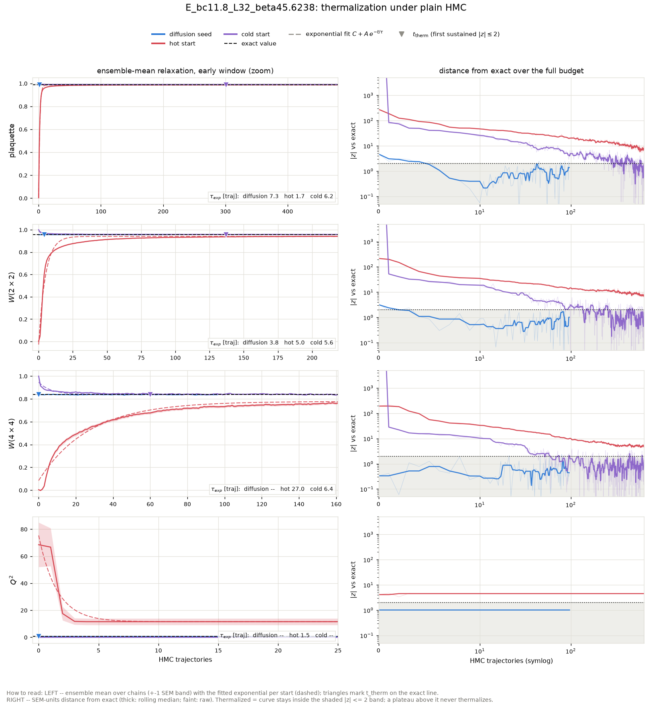

tau_int (hot-start chains, second half): plaquette = 12.69 +- 1.72, wilson_2x2 = 12.19 +- 1.69, wilson_4x4 = 5.29 +- 0.58, wilson_6x6 = 3.72 +- 0.45. Topology: hot-start HMC L=32 beta=45.6238 -> **frozen** (no tunneling).

Where 'never' stood at the end: the hot start ended the 640-trajectory budget still at plaquette at |z| ~ 8, wilson_2x2 at |z| ~ 7, wilson_4x4 at |z| ~ 5, wilson_6x6 at |z| ~ 5, Q^2 at |z| ~ 5; the cold start ended the 640-trajectory budget still at Q^2 at |z| ~ 574600642560.

### Diagnostics: raw diffusion output (before any HMC)

| observable | value | error | exact | z_exact | reference | ref_error | z_ref | ks_p | chi2_p |
|---|---|---|---|---|---|---|---|---|---|
| plaquette | 0.9888 | 4.658e-05 | 0.989 | -4.625 | 0.989 | 3.134e-05 | -4.974 | 0.0001679 |  |
| wilson_1x1 | 0.9888 | 4.658e-05 | 0.989 | -4.625 | 0.989 | 3.134e-05 | -4.974 | 0.0001679 |  |
| wilson_1x2 | 0.9774 | 0.0001098 | 0.9781 | -6.07 | 0.9781 | 8.577e-05 | -4.851 | 0.0003679 |  |
| wilson_2x2 | 0.9558 | 0.0003081 | 0.9566 | -2.59 | 0.9568 | 0.0002615 | -2.449 | 0.08971 |  |
| wilson_2x3 | 0.9346 | 0.0005119 | 0.9357 | -2.005 | 0.9358 | 0.0004153 | -1.741 | 0.2522 |  |
| wilson_3x3 | 0.9049 | 0.0008449 | 0.9051 | -0.2177 | 0.9055 | 0.0007954 | -0.5375 | 0.2763 |  |
| wilson_3x4 | 0.8751 | 0.001118 | 0.8755 | -0.3615 | 0.8761 | 0.001104 | -0.6748 | 0.1712 |  |
| wilson_4x4 | 0.837 | 0.001652 | 0.8375 | -0.3113 | 0.8387 | 0.001702 | -0.7214 | 0.3021 |  |
| wilson_4x5 | 0.8008 | 0.002092 | 0.8012 | -0.2076 | 0.8025 | 0.002063 | -0.5813 | 0.3584 |  |
| wilson_5x5 | 0.7582 | 0.002599 | 0.758 | 0.05242 | 0.7595 | 0.002594 | -0.3667 | 0.5631 |  |
| wilson_5x6 | 0.7179 | 0.002994 | 0.7172 | 0.2291 | 0.7196 | 0.002964 | -0.4209 | 0.8569 |  |
| wilson_6x6 | 0.6717 | 0.003733 | 0.671 | 0.186 | 0.674 | 0.003406 | -0.4436 | 0.7163 |  |
| wilson_6x7 | 0.6286 | 0.004127 | 0.6279 | 0.1659 | 0.6319 | 0.003874 | -0.5864 | 0.8246 |  |
| wilson_7x7 | 0.5811 | 0.004838 | 0.581 | 0.01831 | 0.5838 | 0.00435 | -0.4193 | 0.9941 |  |
| wilson_7x8 | 0.5368 | 0.005226 | 0.5376 | -0.16 | 0.5403 | 0.004792 | -0.4996 | 0.8864 |  |
| wilson_8x8 | 0.4897 | 0.005984 | 0.492 | -0.3876 | 0.4927 | 0.005344 | -0.3711 | 0.9542 |  |
| wilson_8x10 | 0.4056 | 0.007071 | 0.4121 | -0.9166 | 0.4119 | 0.006347 | -0.6579 | 0.5259 |  |
| wilson_10x10 | 0.3192 | 0.00869 | 0.3302 | -1.26 | 0.3246 | 0.007748 | -0.457 | 0.7163 |  |
| wilson_10x12 | 0.2499 | 0.009879 | 0.2646 | -1.484 | 0.2572 | 0.008225 | -0.5705 | 0.5259 |  |
| wilson_12x12 | 0.1856 | 0.01141 | 0.2028 | -1.511 | 0.1968 | 0.009249 | -0.7671 | 0.6011 |  |
| creutz_2 | 0.01077 | 0.000151 | 0.01108 | -2.06 |  |  |  |  |  |
| creutz_3 | 0.009924 | 0.0003297 | 0.01108 | -3.51 |  |  |  |  |  |
| creutz_4 | 0.01098 | 0.0005306 | 0.01108 | -0.1995 |  |  |  |  |  |
| creutz_5 | 0.01043 | 0.0008522 | 0.01108 | -0.7627 |  |  |  |  |  |
| creutz_6 | 0.01178 | 0.001212 | 0.01108 | 0.576 |  |  |  |  |  |
| creutz_7 | 0.01207 | 0.001706 | 0.01108 | 0.5823 |  |  |  |  |  |
| creutz_8 | 0.01254 | 0.002095 | 0.01108 | 0.6971 |  |  |  |  |  |
| Q | 0 | 0.06316 | 0 | 0 | 0.1042 | 0.06508 | -1.149 | 0.9542 |  |
| Q^2 | 0.6562 | 0.09044 | 0.5746 | 0.9028 | 0.6667 | 0.06089 | -0.09554 | 1 |  |
| chi_top ((<Q^2>-<Q>^2)/V) | 0.0006409 | 8.832e-05 | 0.0005611 | 0.9028 | 0.0006404 | 6.036e-05 | 0.003962 | 8.226e-17 |  |
| Q histogram vs exact P(Q) | 2.713 | nan | 4 | nan |  |  |  |  | 0.6069 |

### Diagnostics: the same configs after 96 HMC trajectories

| observable | value | error | exact | z_exact | reference | ref_error | z_ref | ks_p | chi2_p |
|---|---|---|---|---|---|---|---|---|---|
| plaquette | 0.989 | 5.912e-05 | 0.989 | 1.024 | 0.989 | 3.134e-05 | -0.04878 | 0.9972 |  |
| wilson_1x1 | 0.989 | 5.912e-05 | 0.989 | 1.024 | 0.989 | 3.134e-05 | -0.04878 | 0.9972 |  |
| wilson_1x2 | 0.9782 | 0.0001213 | 0.9781 | 0.9825 | 0.9781 | 8.577e-05 | 0.7393 | 0.1251 |  |
| wilson_2x2 | 0.9564 | 0.0002659 | 0.9566 | -1.049 | 0.9568 | 0.0002615 | -1.262 | 0.1251 |  |
| wilson_2x3 | 0.9353 | 0.0004947 | 0.9357 | -0.7215 | 0.9358 | 0.0004153 | -0.7403 | 0.2087 |  |
| wilson_3x3 | 0.9046 | 0.0007939 | 0.9051 | -0.5787 | 0.9055 | 0.0007954 | -0.8002 | 0.6395 |  |
| wilson_3x4 | 0.8751 | 0.001168 | 0.8755 | -0.3051 | 0.8761 | 0.001104 | -0.6299 | 0.389 |  |
| wilson_4x4 | 0.8368 | 0.001583 | 0.8375 | -0.4829 | 0.8387 | 0.001702 | -0.8438 | 0.3294 |  |
| wilson_4x5 | 0.7997 | 0.002225 | 0.8012 | -0.6594 | 0.8025 | 0.002063 | -0.9034 | 0.2763 |  |
| wilson_5x5 | 0.7563 | 0.003106 | 0.758 | -0.5703 | 0.7595 | 0.002594 | -0.8041 | 0.3021 |  |
| wilson_5x6 | 0.7152 | 0.003883 | 0.7172 | -0.5093 | 0.7196 | 0.002964 | -0.9084 | 0.2297 |  |
| wilson_6x6 | 0.6685 | 0.004995 | 0.671 | -0.5125 | 0.674 | 0.003406 | -0.909 | 0.3294 |  |
| wilson_6x7 | 0.6248 | 0.006086 | 0.6279 | -0.5112 | 0.6319 | 0.003874 | -0.9862 | 0.4898 |  |
| wilson_7x7 | 0.5773 | 0.007343 | 0.581 | -0.5032 | 0.5838 | 0.00435 | -0.763 | 0.8569 |  |
| wilson_7x8 | 0.5334 | 0.008303 | 0.5376 | -0.5094 | 0.5403 | 0.004792 | -0.7235 | 0.7163 |  |
| wilson_8x8 | 0.4881 | 0.009437 | 0.492 | -0.414 | 0.4927 | 0.005344 | -0.4209 | 0.9693 |  |
| wilson_8x10 | 0.4081 | 0.01211 | 0.4121 | -0.3329 | 0.4119 | 0.006347 | -0.2781 | 0.8569 |  |
| wilson_10x10 | 0.3261 | 0.01426 | 0.3302 | -0.2889 | 0.3246 | 0.007748 | 0.09278 | 0.9353 |  |
| wilson_10x12 | 0.2592 | 0.01557 | 0.2646 | -0.3463 | 0.2572 | 0.008225 | 0.1097 | 0.9126 |  |
| wilson_12x12 | 0.1943 | 0.01551 | 0.2028 | -0.5465 | 0.1968 | 0.009249 | -0.1386 | 0.8569 |  |
| creutz_2 | 0.01156 | 0.0001615 | 0.01108 | 2.935 |  |  |  |  |  |
| creutz_3 | 0.01112 | 0.0003206 | 0.01108 | 0.1125 |  |  |  |  |  |
| creutz_4 | 0.01169 | 0.0004873 | 0.01108 | 1.246 |  |  |  |  |  |
| creutz_5 | 0.01067 | 0.0008406 | 0.01108 | -0.4919 |  |  |  |  |  |
| creutz_6 | 0.01172 | 0.001274 | 0.01108 | 0.5007 |  |  |  |  |  |
| creutz_7 | 0.01135 | 0.001745 | 0.01108 | 0.1531 |  |  |  |  |  |
| creutz_8 | 0.009637 | 0.002462 | 0.01108 | -0.5857 |  |  |  |  |  |
| Q | 0 | 0.06316 | 0 | 0 | 0.1042 | 0.06508 | -1.149 | 0.9542 |  |
| Q^2 | 0.6562 | 0.09044 | 0.5746 | 0.9028 | 0.6667 | 0.06089 | -0.09554 | 1 |  |
| chi_top ((<Q^2>-<Q>^2)/V) | 0.0006409 | 8.832e-05 | 0.0005611 | 0.9028 | 0.0006404 | 6.036e-05 | 0.003962 | 8.226e-17 |  |
| Q histogram vs exact P(Q) | 2.713 | nan | 4 | nan |  |  |  |  | 0.6069 |

## D_bc14.1464_L32_beta55.0237

HMC: step size 0.0539, 19 leapfrog steps, acceptance seed/hot/cold = 0.976/0.976/0.977. Diffusion-seed batch: 128 chains x 96 trajectories (0.08 s/traj for the whole batch); baselines: 32 chains x 640 trajectories.

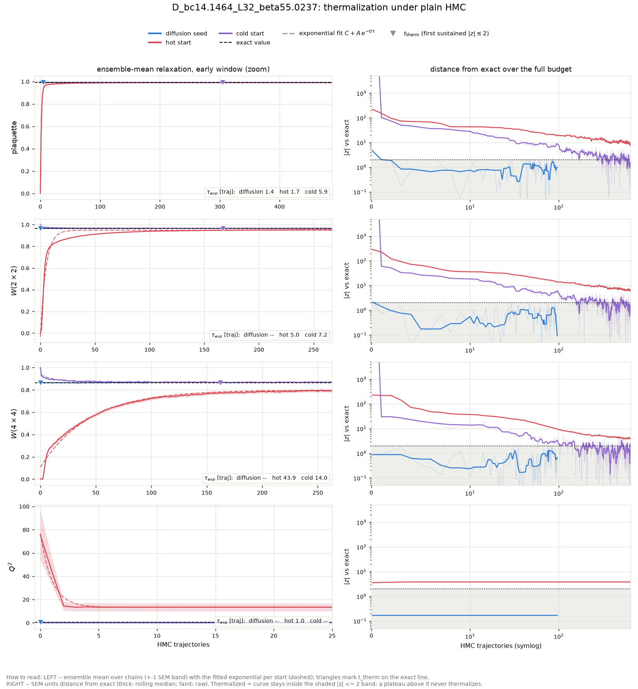

tau_int (hot-start chains, second half): plaquette = 10.78 +- 1.69, wilson_2x2 = 12.93 +- 1.75, wilson_4x4 = 8.81 +- 1.28, wilson_6x6 = 5.30 +- 0.84. Topology: hot-start HMC L=32 beta=55.0237 -> **frozen** (no tunneling).

Where 'never' stood at the end: the hot start ended the 640-trajectory budget still at plaquette at |z| ~ 9, wilson_2x2 at |z| ~ 6, wilson_4x4 at |z| ~ 4, wilson_6x6 at |z| ~ 4, Q^2 at |z| ~ 4; the cold start ended the 640-trajectory budget still at Q^2 at |z| ~ 474280296448.

### Diagnostics: raw diffusion output (before any HMC)

| observable | value | error | exact | z_exact | reference | ref_error | z_ref | ks_p | chi2_p |
|---|---|---|---|---|---|---|---|---|---|
| plaquette | 0.9907 | 3.904e-05 | 0.9909 | -4.476 | 0.9909 | 2.703e-05 | -3.893 | 0.0002049 |  |
| wilson_1x1 | 0.9907 | 3.904e-05 | 0.9909 | -4.476 | 0.9909 | 2.703e-05 | -3.893 | 0.0002049 |  |
| wilson_1x2 | 0.9813 | 9.642e-05 | 0.9818 | -5.888 | 0.9818 | 5.904e-05 | -4.82 | 2.022e-05 |  |
| wilson_2x2 | 0.9635 | 0.0001847 | 0.964 | -2.472 | 0.9638 | 0.0001521 | -1.255 | 0.4548 |  |
| wilson_2x3 | 0.9459 | 0.0002966 | 0.9465 | -1.9 | 0.9465 | 0.0002251 | -1.631 | 0.04354 |  |
| wilson_3x3 | 0.9206 | 0.0005906 | 0.9208 | -0.2845 | 0.921 | 0.0004365 | -0.5476 | 0.4898 |  |
| wilson_3x4 | 0.8955 | 0.0009116 | 0.8958 | -0.3481 | 0.8964 | 0.0005764 | -0.8363 | 0.5259 |  |
| wilson_4x4 | 0.8623 | 0.001401 | 0.8635 | -0.8449 | 0.8644 | 0.0008388 | -1.251 | 0.3584 |  |
| wilson_4x5 | 0.8309 | 0.00197 | 0.8324 | -0.7566 | 0.8338 | 0.001045 | -1.283 | 0.2763 |  |
| wilson_5x5 | 0.7932 | 0.002588 | 0.7951 | -0.7528 | 0.7969 | 0.001523 | -1.229 | 0.4212 |  |
| wilson_5x6 | 0.7565 | 0.003179 | 0.7595 | -0.9416 | 0.7623 | 0.001953 | -1.555 | 0.3584 |  |
| wilson_6x6 | 0.7146 | 0.004016 | 0.7188 | -1.044 | 0.7209 | 0.002568 | -1.302 | 0.389 |  |
| wilson_6x7 | 0.6756 | 0.00484 | 0.6804 | -0.9913 | 0.6827 | 0.003195 | -1.236 | 0.3021 |  |
| wilson_7x7 | 0.6317 | 0.005543 | 0.6381 | -1.156 | 0.6399 | 0.003671 | -1.245 | 0.1892 |  |
| wilson_7x8 | 0.5916 | 0.006333 | 0.5984 | -1.068 | 0.6009 | 0.004341 | -1.205 | 0.1251 |  |
| wilson_8x8 | 0.5478 | 0.007138 | 0.5561 | -1.169 | 0.5584 | 0.004749 | -1.237 | 0.389 |  |
| wilson_8x10 | 0.4709 | 0.008638 | 0.4802 | -1.08 | 0.4848 | 0.005792 | -1.34 | 0.2087 |  |
| wilson_10x10 | 0.3876 | 0.009891 | 0.3998 | -1.238 | 0.4033 | 0.006486 | -1.331 | 0.6011 |  |
| wilson_10x12 | 0.3183 | 0.01095 | 0.3329 | -1.33 | 0.3379 | 0.006761 | -1.52 | 0.5631 |  |
| wilson_12x12 | 0.251 | 0.0119 | 0.2672 | -1.365 | 0.2703 | 0.006422 | -1.431 | 0.4548 |  |
| creutz_2 | 0.008664 | 0.0001246 | 0.009171 | -4.066 |  |  |  |  |  |
| creutz_3 | 0.008635 | 0.0002929 | 0.00917 | -1.827 |  |  |  |  |  |
| creutz_4 | 0.01002 | 0.0004353 | 0.00917 | 1.942 |  |  |  |  |  |
| creutz_5 | 0.00941 | 0.0006309 | 0.009169 | 0.3822 |  |  |  |  |  |
| creutz_6 | 0.009572 | 0.0008921 | 0.009167 | 0.4543 |  |  |  |  |  |
| creutz_7 | 0.01095 | 0.001209 | 0.009165 | 1.477 |  |  |  |  |  |
| creutz_8 | 0.01164 | 0.001664 | 0.009162 | 1.49 |  |  |  |  |  |
| Q | 0 | 0.05689 | 0 | 0 | 0.06771 | 0.04615 | -0.9242 | 0.9999 |  |
| Q^2 | 0.4844 | 0.05614 | 0.4743 | 0.1798 | 0.526 | 0.04735 | -0.5673 | 1 |  |
| chi_top ((<Q^2>-<Q>^2)/V) | 0.000473 | 5.482e-05 | 0.0004632 | 0.1798 | 0.0005092 | 4.707e-05 | -0.5012 | 7.05e-23 |  |
| Q histogram vs exact P(Q) | 0.1517 | nan | 2 | nan |  |  |  |  | 0.927 |

### Diagnostics: the same configs after 96 HMC trajectories

| observable | value | error | exact | z_exact | reference | ref_error | z_ref | ks_p | chi2_p |
|---|---|---|---|---|---|---|---|---|---|
| plaquette | 0.9909 | 3.247e-05 | 0.9909 | 1.079 | 0.9909 | 2.703e-05 | 0.5907 | 0.8246 |  |
| wilson_1x1 | 0.9909 | 3.247e-05 | 0.9909 | 1.079 | 0.9909 | 2.703e-05 | 0.5907 | 0.8246 |  |
| wilson_1x2 | 0.9819 | 8.656e-05 | 0.9818 | 0.3584 | 0.9818 | 5.904e-05 | 0.5139 | 0.7538 |  |
| wilson_2x2 | 0.964 | 0.0002362 | 0.964 | 0.08955 | 0.9638 | 0.0001521 | 0.6314 | 0.7901 |  |
| wilson_2x3 | 0.9464 | 0.0003755 | 0.9465 | -0.143 | 0.9465 | 0.0002251 | -0.2226 | 0.5259 |  |
| wilson_3x3 | 0.9207 | 0.0007081 | 0.9208 | -0.1096 | 0.921 | 0.0004365 | -0.3748 | 0.389 |  |
| wilson_3x4 | 0.8956 | 0.00102 | 0.8958 | -0.2229 | 0.8964 | 0.0005764 | -0.693 | 0.6011 |  |
| wilson_4x4 | 0.8626 | 0.00152 | 0.8635 | -0.6198 | 0.8644 | 0.0008388 | -1.037 | 0.389 |  |
| wilson_4x5 | 0.8306 | 0.002034 | 0.8324 | -0.8807 | 0.8338 | 0.001045 | -1.382 | 0.4548 |  |
| wilson_5x5 | 0.7924 | 0.002698 | 0.7951 | -1.021 | 0.7969 | 0.001523 | -1.452 | 0.3294 |  |
| wilson_5x6 | 0.756 | 0.00325 | 0.7595 | -1.083 | 0.7623 | 0.001953 | -1.669 | 0.2522 |  |
| wilson_6x6 | 0.714 | 0.004035 | 0.7188 | -1.196 | 0.7209 | 0.002568 | -1.43 | 0.389 |  |
| wilson_6x7 | 0.674 | 0.004713 | 0.6804 | -1.346 | 0.6827 | 0.003195 | -1.53 | 0.389 |  |
| wilson_7x7 | 0.6298 | 0.00568 | 0.6381 | -1.453 | 0.6399 | 0.003671 | -1.497 | 0.2522 |  |
| wilson_7x8 | 0.5886 | 0.006195 | 0.5984 | -1.576 | 0.6009 | 0.004341 | -1.62 | 0.2297 |  |
| wilson_8x8 | 0.5446 | 0.007352 | 0.5561 | -1.56 | 0.5584 | 0.004749 | -1.569 | 0.2763 |  |
| wilson_8x10 | 0.467 | 0.008174 | 0.4802 | -1.626 | 0.4848 | 0.005792 | -1.786 | 0.1004 |  |
| wilson_10x10 | 0.3838 | 0.01009 | 0.3998 | -1.587 | 0.4033 | 0.006486 | -1.626 | 0.1545 |  |
| wilson_10x12 | 0.315 | 0.01117 | 0.3329 | -1.605 | 0.3379 | 0.006761 | -1.755 | 0.0711 |  |
| wilson_12x12 | 0.2501 | 0.01217 | 0.2672 | -1.408 | 0.2703 | 0.006422 | -1.471 | 0.1892 |  |
| creutz_2 | 0.009177 | 0.0001374 | 0.009171 | 0.04289 |  |  |  |  |  |
| creutz_3 | 0.009119 | 0.0002657 | 0.00917 | -0.1925 |  |  |  |  |  |
| creutz_4 | 0.009837 | 0.000465 | 0.00917 | 1.436 |  |  |  |  |  |
| creutz_5 | 0.009422 | 0.0007035 | 0.009169 | 0.3608 |  |  |  |  |  |
| creutz_6 | 0.01009 | 0.0009714 | 0.009167 | 0.9462 |  |  |  |  |  |
| creutz_7 | 0.01019 | 0.001449 | 0.009165 | 0.7072 |  |  |  |  |  |
| creutz_8 | 0.01012 | 0.001925 | 0.009162 | 0.4976 |  |  |  |  |  |
| Q | 0 | 0.05689 | 0 | 0 | 0.06771 | 0.04615 | -0.9242 | 0.9999 |  |
| Q^2 | 0.4844 | 0.05614 | 0.4743 | 0.1798 | 0.526 | 0.04735 | -0.5673 | 1 |  |
| chi_top ((<Q^2>-<Q>^2)/V) | 0.000473 | 5.482e-05 | 0.0004632 | 0.1798 | 0.0005092 | 4.707e-05 | -0.5012 | 7.05e-23 |  |
| Q histogram vs exact P(Q) | 0.1517 | nan | 2 | nan |  |  |  |  | 0.927 |

## E_bc18_L32_beta70.4526

HMC: step size 0.0477, 21 leapfrog steps, acceptance seed/hot/cold = 0.975/0.975/0.977. Diffusion-seed batch: 128 chains x 96 trajectories (0.09 s/traj for the whole batch); baselines: 32 chains x 640 trajectories.

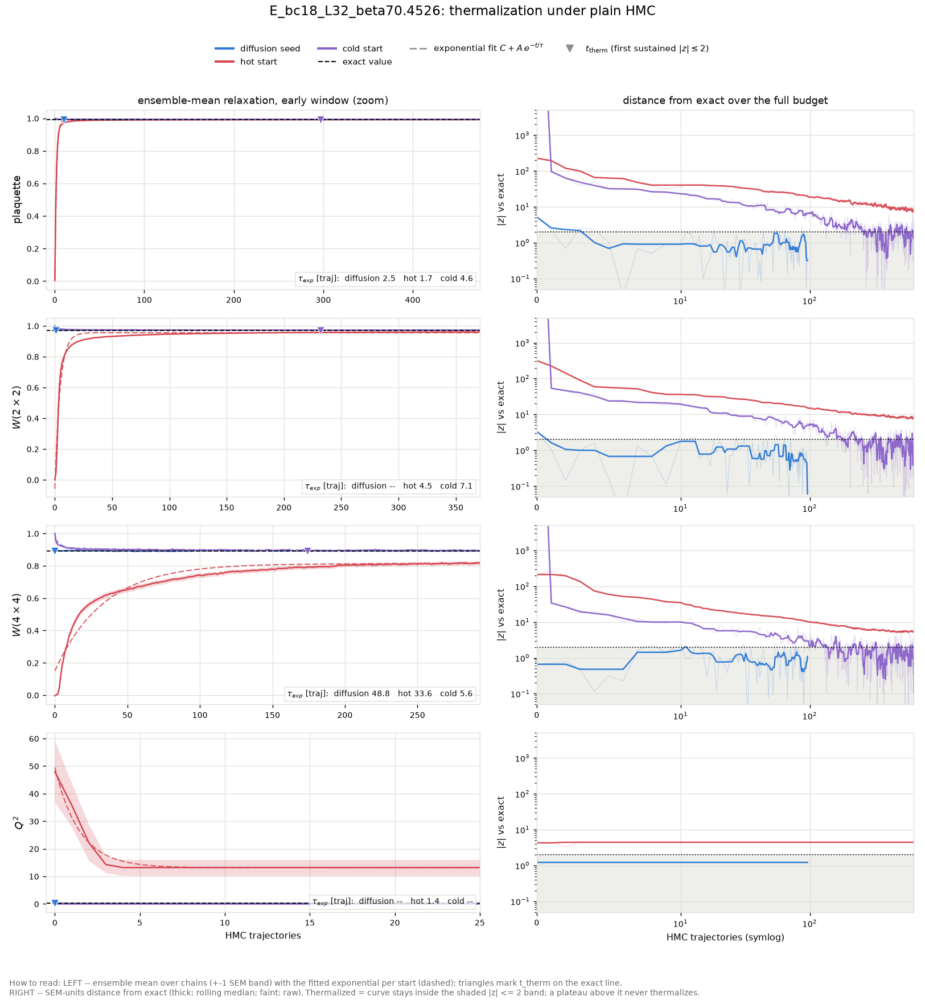

tau_int (hot-start chains, second half): plaquette = 10.06 +- 1.21, wilson_2x2 = 13.52 +- 1.53, wilson_4x4 = 6.15 +- 0.84, wilson_6x6 = 3.90 +- 0.88. Topology: hot-start HMC L=32 beta=70.4526 -> **frozen** (no tunneling).

Where 'never' stood at the end: the hot start ended the 640-trajectory budget still at plaquette at |z| ~ 8, wilson_2x2 at |z| ~ 8, wilson_4x4 at |z| ~ 5, wilson_6x6 at |z| ~ 5, Q^2 at |z| ~ 4; the cold start ended the 640-trajectory budget still at Q^2 at |z| ~ 363637014528.

### Diagnostics: raw diffusion output (before any HMC)

| observable | value | error | exact | z_exact | reference | ref_error | z_ref | ks_p | chi2_p |
|---|---|---|---|---|---|---|---|---|---|
| plaquette | 0.9927 | 2.786e-05 | 0.9929 | -4.763 | 0.9929 | 2.811e-05 | -3.632 | 7.394e-05 |  |
| wilson_1x1 | 0.9927 | 2.786e-05 | 0.9929 | -4.763 | 0.9929 | 2.811e-05 | -3.632 | 7.394e-05 |  |
| wilson_1x2 | 0.9854 | 6.069e-05 | 0.9858 | -6.94 | 0.9859 | 5.833e-05 | -5.657 | 8.145e-06 |  |
| wilson_2x2 | 0.9713 | 0.0001701 | 0.9718 | -2.979 | 0.9718 | 0.0001234 | -2.567 | 0.005977 |  |
| wilson_2x3 | 0.9577 | 0.0002633 | 0.958 | -1.409 | 0.9583 | 0.0002335 | -1.862 | 0.05588 |  |
| wilson_3x3 | 0.9379 | 0.0004427 | 0.9377 | 0.3914 | 0.9378 | 0.0003626 | 0.07731 | 0.6011 |  |
| wilson_3x4 | 0.9183 | 0.0006982 | 0.9178 | 0.6844 | 0.9186 | 0.0004437 | -0.3608 | 0.7163 |  |
| wilson_4x4 | 0.8927 | 0.001085 | 0.892 | 0.6485 | 0.8928 | 0.0006108 | -0.1028 | 0.8246 |  |
| wilson_4x5 | 0.868 | 0.001433 | 0.8668 | 0.8054 | 0.8686 | 0.0007519 | -0.3734 | 0.8864 |  |
| wilson_5x5 | 0.8373 | 0.002031 | 0.8364 | 0.4216 | 0.8378 | 0.0009827 | -0.2492 | 0.9807 |  |
| wilson_5x6 | 0.8078 | 0.002484 | 0.8071 | 0.2934 | 0.8098 | 0.001205 | -0.7023 | 0.9888 |  |
| wilson_6x6 | 0.7722 | 0.003149 | 0.7733 | -0.3338 | 0.7761 | 0.001529 | -1.128 | 0.9542 |  |
| wilson_6x7 | 0.7392 | 0.003757 | 0.7408 | -0.4245 | 0.7448 | 0.002031 | -1.29 | 0.5259 |  |
| wilson_7x7 | 0.7012 | 0.004486 | 0.7047 | -0.7905 | 0.709 | 0.002559 | -1.512 | 0.4898 |  |
| wilson_7x8 | 0.6655 | 0.005167 | 0.6704 | -0.9619 | 0.6765 | 0.003224 | -1.809 | 0.4212 |  |
| wilson_8x8 | 0.6259 | 0.00587 | 0.6333 | -1.255 | 0.6391 | 0.003749 | -1.901 | 0.5631 |  |
| wilson_8x10 | 0.5541 | 0.007203 | 0.565 | -1.517 | 0.5766 | 0.00526 | -2.528 | 0.1892 |  |
| wilson_10x10 | 0.4758 | 0.008628 | 0.4901 | -1.657 | 0.5001 | 0.006897 | -2.199 | 0.2087 |  |
| wilson_10x12 | 0.4067 | 0.009378 | 0.4252 | -1.97 | 0.4379 | 0.009234 | -2.369 | 0.3294 |  |
| wilson_12x12 | 0.3363 | 0.01012 | 0.3587 | -2.206 | 0.3671 | 0.0108 | -2.076 | 0.4212 |  |
| creutz_2 | 0.006947 | 0.0001018 | 0.007147 | -1.96 |  |  |  |  |  |
| creutz_3 | 0.006707 | 0.0001967 | 0.007145 | -2.225 |  |  |  |  |  |
| creutz_4 | 0.007209 | 0.0003443 | 0.007141 | 0.1957 |  |  |  |  |  |
| creutz_5 | 0.007985 | 0.0005197 | 0.007137 | 1.632 |  |  |  |  |  |
| creutz_6 | 0.009272 | 0.000769 | 0.007131 | 2.785 |  |  |  |  |  |
| creutz_7 | 0.009217 | 0.0009448 | 0.007122 | 2.217 |  |  |  |  |  |
| creutz_8 | 0.008976 | 0.001216 | 0.007111 | 1.534 |  |  |  |  |  |
| Q | 0.01562 | 0.04517 | 0 | 0.3459 | 0.05729 | 0.03698 | -0.7138 | 1 |  |
| Q^2 | 0.3125 | 0.03508 | 0.3636 | -1.458 | 0.3177 | 0.04627 | -0.0897 | 1 |  |
| chi_top ((<Q^2>-<Q>^2)/V) | 0.0003049 | 3.424e-05 | 0.0003551 | -1.466 | 0.0003071 | 4.536e-05 | -0.03729 | 3.729e-35 |  |
| Q histogram vs exact P(Q) | 0.5803 | nan | 2 | nan |  |  |  |  | 0.7481 |

### Diagnostics: the same configs after 96 HMC trajectories

| observable | value | error | exact | z_exact | reference | ref_error | z_ref | ks_p | chi2_p |
|---|---|---|---|---|---|---|---|---|---|
| plaquette | 0.9929 | 2.963e-05 | 0.9929 | 0.3217 | 0.9929 | 2.811e-05 | -0.03656 | 0.6395 |  |
| wilson_1x1 | 0.9929 | 2.963e-05 | 0.9929 | 0.3217 | 0.9929 | 2.811e-05 | -0.03656 | 0.6395 |  |
| wilson_1x2 | 0.9857 | 6.916e-05 | 0.9858 | -1.11 | 0.9859 | 5.833e-05 | -1.457 | 0.1122 |  |
| wilson_2x2 | 0.9718 | 0.0001456 | 0.9718 | -0.07495 | 0.9718 | 0.0001234 | -0.2284 | 0.8246 |  |
| wilson_2x3 | 0.958 | 0.0002654 | 0.958 | -0.05099 | 0.9583 | 0.0002335 | -0.8423 | 0.8246 |  |
| wilson_3x3 | 0.9382 | 0.0004756 | 0.9377 | 0.9395 | 0.9378 | 0.0003626 | 0.5313 | 0.9693 |  |
| wilson_3x4 | 0.9186 | 0.0007345 | 0.9178 | 1.049 | 0.9186 | 0.0004437 | -0.006651 | 0.9126 |  |
| wilson_4x4 | 0.8932 | 0.001148 | 0.892 | 1.075 | 0.8928 | 0.0006108 | 0.3096 | 0.8864 |  |
| wilson_4x5 | 0.8688 | 0.001497 | 0.8668 | 1.293 | 0.8686 | 0.0007519 | 0.1057 | 0.8864 |  |
| wilson_5x5 | 0.8389 | 0.002052 | 0.8364 | 1.197 | 0.8378 | 0.0009827 | 0.4559 | 0.9888 |  |
| wilson_5x6 | 0.8104 | 0.002585 | 0.8071 | 1.294 | 0.8098 | 0.001205 | 0.2374 | 0.9807 |  |
| wilson_6x6 | 0.7778 | 0.003294 | 0.7733 | 1.369 | 0.7761 | 0.001529 | 0.4442 | 0.9353 |  |
| wilson_6x7 | 0.747 | 0.003827 | 0.7408 | 1.61 | 0.7448 | 0.002031 | 0.5184 | 0.8864 |  |
| wilson_7x7 | 0.7124 | 0.004738 | 0.7047 | 1.612 | 0.709 | 0.002559 | 0.6272 | 0.2763 |  |
| wilson_7x8 | 0.6803 | 0.005228 | 0.6704 | 1.886 | 0.6765 | 0.003224 | 0.6205 | 0.7163 |  |
| wilson_8x8 | 0.6446 | 0.006059 | 0.6333 | 1.868 | 0.6391 | 0.003749 | 0.765 | 0.5631 |  |
| wilson_8x10 | 0.5818 | 0.007057 | 0.565 | 2.383 | 0.5766 | 0.00526 | 0.5907 | 0.8246 |  |
| wilson_10x10 | 0.5099 | 0.008426 | 0.4901 | 2.351 | 0.5001 | 0.006897 | 0.9006 | 0.1712 |  |
| wilson_10x12 | 0.4501 | 0.008718 | 0.4252 | 2.86 | 0.4379 | 0.009234 | 0.9631 | 0.2763 |  |
| wilson_12x12 | 0.3836 | 0.00979 | 0.3587 | 2.548 | 0.3671 | 0.0108 | 1.136 | 0.1392 |  |
| creutz_2 | 0.006993 | 0.000102 | 0.007147 | -1.511 |  |  |  |  |  |
| creutz_3 | 0.006651 | 0.0001995 | 0.007145 | -2.473 |  |  |  |  |  |
| creutz_4 | 0.00696 | 0.000361 | 0.007141 | -0.5011 |  |  |  |  |  |
| creutz_5 | 0.007281 | 0.0005474 | 0.007137 | 0.2633 |  |  |  |  |  |
| creutz_6 | 0.006654 | 0.0008182 | 0.007131 | -0.5824 |  |  |  |  |  |
| creutz_7 | 0.007094 | 0.001136 | 0.007122 | -0.02495 |  |  |  |  |  |
| creutz_8 | 0.007814 | 0.001556 | 0.007111 | 0.4518 |  |  |  |  |  |
| Q | 0.01562 | 0.04517 | 0 | 0.3459 | 0.05729 | 0.03698 | -0.7138 | 1 |  |
| Q^2 | 0.3125 | 0.03508 | 0.3636 | -1.458 | 0.3177 | 0.04627 | -0.0897 | 1 |  |
| chi_top ((<Q^2>-<Q>^2)/V) | 0.0003049 | 3.424e-05 | 0.0003551 | -1.466 | 0.0003071 | 4.536e-05 | -0.03729 | 3.729e-35 |  |
| Q histogram vs exact P(Q) | 0.5803 | nan | 2 | nan |  |  |  |  | 0.7481 |

## D_bc20_L32_beta78.4578

HMC: step size 0.0452, 22 leapfrog steps, acceptance seed/hot/cold = 0.980/0.979/0.979. Diffusion-seed batch: 128 chains x 96 trajectories (0.09 s/traj for the whole batch); baselines: 32 chains x 640 trajectories.

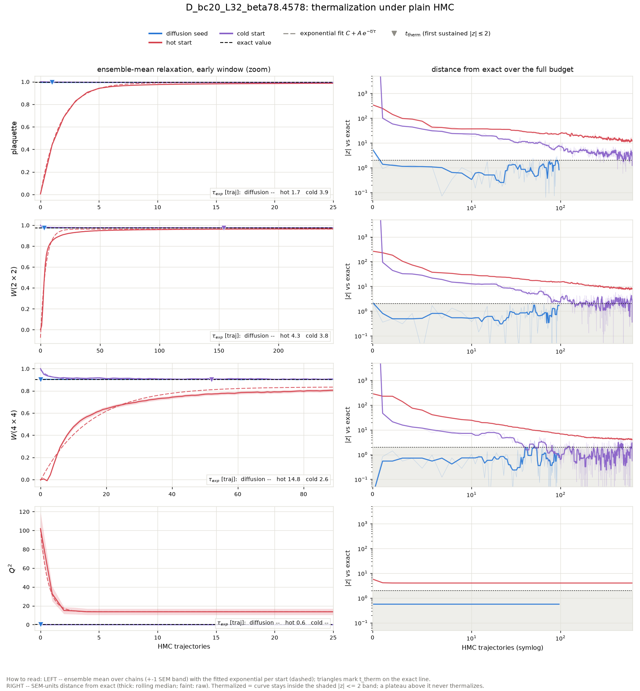

tau_int (hot-start chains, second half): plaquette = 7.47 +- 1.01, wilson_2x2 = 5.82 +- 0.84, wilson_4x4 = 3.72 +- 0.67, wilson_6x6 = 1.89 +- 0.17. Topology: hot-start HMC L=32 beta=78.4578 -> **frozen** (no tunneling).

Where 'never' stood at the end: the hot start ended the 640-trajectory budget still at plaquette at |z| ~ 12, wilson_2x2 at |z| ~ 8, wilson_4x4 at |z| ~ 4, wilson_6x6 at |z| ~ 5, Q^2 at |z| ~ 4; the cold start ended the 640-trajectory budget still at plaquette at |z| ~ 3, Q^2 at |z| ~ 320492732416.

### Diagnostics: raw diffusion output (before any HMC)

| observable | value | error | exact | z_exact | reference | ref_error | z_ref | ks_p | chi2_p |
|---|---|---|---|---|---|---|---|---|---|
| plaquette | 0.9935 | 2.128e-05 | 0.9936 | -6.092 | 0.9937 | 1.641e-05 | -6.891 | 1.186e-06 |  |
| wilson_1x1 | 0.9935 | 2.128e-05 | 0.9936 | -6.092 | 0.9937 | 1.641e-05 | -6.891 | 1.186e-06 |  |
| wilson_1x2 | 0.9869 | 5.871e-05 | 0.9873 | -5.751 | 0.9874 | 3.818e-05 | -7.092 | 1.946e-06 |  |
| wilson_2x2 | 0.9744 | 0.0001268 | 0.9747 | -2.509 | 0.975 | 0.0001289 | -3.662 | 0.008145 |  |
| wilson_2x3 | 0.9621 | 0.000235 | 0.9623 | -0.7966 | 0.9628 | 0.0002313 | -2.265 | 0.1892 |  |
| wilson_3x3 | 0.9443 | 0.000388 | 0.9439 | 0.936 | 0.9446 | 0.0003863 | -0.5847 | 0.678 |  |
| wilson_3x4 | 0.9261 | 0.0005826 | 0.926 | 0.3275 | 0.9271 | 0.000568 | -1.19 | 0.1712 |  |
| wilson_4x4 | 0.9025 | 0.0009667 | 0.9025 | 0.02134 | 0.904 | 0.0008787 | -1.136 | 0.1712 |  |
| wilson_4x5 | 0.8795 | 0.001323 | 0.8797 | -0.1649 | 0.8826 | 0.001128 | -1.788 | 0.01957 |  |
| wilson_5x5 | 0.8511 | 0.001825 | 0.852 | -0.455 | 0.8567 | 0.001609 | -2.289 | 0.008145 |  |
| wilson_5x6 | 0.8229 | 0.002271 | 0.8251 | -0.9875 | 0.8315 | 0.001991 | -2.852 | 0.00189 |  |
| wilson_6x6 | 0.7899 | 0.002995 | 0.7941 | -1.376 | 0.8023 | 0.002606 | -3.123 | 0.00189 |  |
| wilson_6x7 | 0.7589 | 0.003619 | 0.7642 | -1.459 | 0.7732 | 0.003225 | -2.954 | 0.00189 |  |
| wilson_7x7 | 0.7228 | 0.004516 | 0.7307 | -1.755 | 0.7403 | 0.003869 | -2.943 | 0.001117 |  |
| wilson_7x8 | 0.6882 | 0.005315 | 0.6988 | -1.983 | 0.709 | 0.004586 | -2.959 | 0.00159 |  |
| wilson_8x8 | 0.6504 | 0.006366 | 0.664 | -2.141 | 0.6747 | 0.005379 | -2.919 | 0.0002496 |  |
| wilson_8x10 | 0.5817 | 0.008425 | 0.5996 | -2.124 | 0.6124 | 0.007187 | -2.775 | 0.0009335 |  |
| wilson_10x10 | 0.5048 | 0.0104 | 0.5279 | -2.226 | 0.5433 | 0.008848 | -2.819 | 0.003697 |  |
| wilson_10x12 | 0.4372 | 0.01211 | 0.465 | -2.299 | 0.4774 | 0.01063 | -2.496 | 0.01957 |  |
| wilson_12x12 | 0.3702 | 0.01409 | 0.3996 | -2.087 | 0.4105 | 0.0121 | -2.17 | 0.04354 |  |
| creutz_2 | 0.006185 | 8.93e-05 | 0.006412 | -2.544 |  |  |  |  |  |
| creutz_3 | 0.005961 | 0.0001848 | 0.006408 | -2.421 |  |  |  |  |  |
| creutz_4 | 0.006407 | 0.0002852 | 0.006403 | 0.01575 |  |  |  |  |  |
| creutz_5 | 0.006851 | 0.0004759 | 0.006395 | 0.9586 |  |  |  |  |  |
| creutz_6 | 0.007122 | 0.0007049 | 0.006385 | 1.046 |  |  |  |  |  |
| creutz_7 | 0.008618 | 0.001029 | 0.006371 | 2.185 |  |  |  |  |  |
| creutz_8 | 0.007603 | 0.001305 | 0.006353 | 0.958 |  |  |  |  |  |
| Q | -0.03125 | 0.04098 | 0 | -0.7626 | 0 | 0.03157 | -0.6041 | 1 |  |
| Q^2 | 0.2969 | 0.04578 | 0.3205 | -0.5159 | 0.2604 | 0.0309 | 0.6601 | 0.9999 |  |
| chi_top ((<Q^2>-<Q>^2)/V) | 0.000289 | 4.542e-05 | 0.000313 | -0.5288 | 0.0002543 | 3.017e-05 | 0.6355 | 2.201e-41 |  |
| Q histogram vs exact P(Q) | 0.48 | nan | 2 | nan |  |  |  |  | 0.7866 |

### Diagnostics: the same configs after 96 HMC trajectories

| observable | value | error | exact | z_exact | reference | ref_error | z_ref | ks_p | chi2_p |
|---|---|---|---|---|---|---|---|---|---|
| plaquette | 0.9936 | 1.917e-05 | 0.9936 | -1.091 | 0.9937 | 1.641e-05 | -3.03 | 0.08971 |  |
| wilson_1x1 | 0.9936 | 1.917e-05 | 0.9936 | -1.091 | 0.9937 | 1.641e-05 | -3.03 | 0.08971 |  |
| wilson_1x2 | 0.9872 | 4.302e-05 | 0.9873 | -1.145 | 0.9874 | 3.818e-05 | -3.621 | 0.0711 |  |
| wilson_2x2 | 0.9744 | 0.0001036 | 0.9747 | -2.378 | 0.975 | 0.0001289 | -3.57 | 0.03364 |  |
| wilson_2x3 | 0.9619 | 0.0001873 | 0.9623 | -1.901 | 0.9628 | 0.0002313 | -3.077 | 0.02577 |  |
| wilson_3x3 | 0.9436 | 0.0003868 | 0.9439 | -0.9027 | 0.9446 | 0.0003863 | -1.889 | 0.1392 |  |
| wilson_3x4 | 0.9254 | 0.0005847 | 0.926 | -0.9749 | 0.9271 | 0.000568 | -2.121 | 0.02248 |  |
| wilson_4x4 | 0.9018 | 0.000963 | 0.9025 | -0.7857 | 0.904 | 0.0008787 | -1.735 | 0.07995 |  |
| wilson_4x5 | 0.8786 | 0.00131 | 0.8797 | -0.8366 | 0.8826 | 0.001128 | -2.306 | 0.04354 |  |
| wilson_5x5 | 0.8504 | 0.001771 | 0.852 | -0.8937 | 0.8567 | 0.001609 | -2.642 | 0.0631 |  |
| wilson_5x6 | 0.8224 | 0.002268 | 0.8251 | -1.205 | 0.8315 | 0.001991 | -3.016 | 0.03831 |  |
| wilson_6x6 | 0.7907 | 0.002712 | 0.7941 | -1.227 | 0.8023 | 0.002606 | -3.085 | 0.03364 |  |
| wilson_6x7 | 0.7591 | 0.003269 | 0.7642 | -1.551 | 0.7732 | 0.003225 | -3.073 | 0.03364 |  |
| wilson_7x7 | 0.7248 | 0.00373 | 0.7307 | -1.6 | 0.7403 | 0.003869 | -2.893 | 0.05588 |  |
| wilson_7x8 | 0.6912 | 0.004284 | 0.6988 | -1.776 | 0.709 | 0.004586 | -2.843 | 0.1004 |  |
| wilson_8x8 | 0.6558 | 0.004708 | 0.664 | -1.738 | 0.6747 | 0.005379 | -2.642 | 0.0631 |  |
| wilson_8x10 | 0.5872 | 0.005944 | 0.5996 | -2.077 | 0.6124 | 0.007187 | -2.7 | 0.03831 |  |
| wilson_10x10 | 0.5143 | 0.007371 | 0.5279 | -1.857 | 0.5433 | 0.008848 | -2.521 | 0.01275 |  |
| wilson_10x12 | 0.449 | 0.009103 | 0.465 | -1.76 | 0.4774 | 0.01063 | -2.029 | 0.1545 |  |
| wilson_12x12 | 0.3824 | 0.01171 | 0.3996 | -1.468 | 0.4105 | 0.0121 | -1.669 | 0.1712 |  |
| creutz_2 | 0.006586 | 9.237e-05 | 0.006412 | 1.885 |  |  |  |  |  |
| creutz_3 | 0.006291 | 0.0001975 | 0.006408 | -0.5946 |  |  |  |  |  |
| creutz_4 | 0.00638 | 0.0003337 | 0.006403 | -0.06871 |  |  |  |  |  |
| creutz_5 | 0.0066 | 0.0004787 | 0.006395 | 0.4291 |  |  |  |  |  |
| creutz_6 | 0.005804 | 0.0006779 | 0.006385 | -0.8568 |  |  |  |  |  |
| creutz_7 | 0.005451 | 0.0009891 | 0.006371 | -0.9304 |  |  |  |  |  |
| creutz_8 | 0.005064 | 0.00126 | 0.006353 | -1.023 |  |  |  |  |  |
| Q | -0.03125 | 0.04098 | 0 | -0.7626 | 0 | 0.03157 | -0.6041 | 1 |  |
| Q^2 | 0.2969 | 0.04578 | 0.3205 | -0.5159 | 0.2604 | 0.0309 | 0.6601 | 0.9999 |  |
| chi_top ((<Q^2>-<Q>^2)/V) | 0.000289 | 4.542e-05 | 0.000313 | -0.5288 | 0.0002543 | 3.017e-05 | 0.6355 | 2.201e-41 |  |
| Q histogram vs exact P(Q) | 0.48 | nan | 2 | nan |  |  |  |  | 0.7866 |

## D_bc30_L32_beta118.473

HMC: step size 0.0367, 27 leapfrog steps, acceptance seed/hot/cold = 0.977/0.975/0.977. Diffusion-seed batch: 128 chains x 96 trajectories (0.11 s/traj for the whole batch); baselines: 32 chains x 640 trajectories.

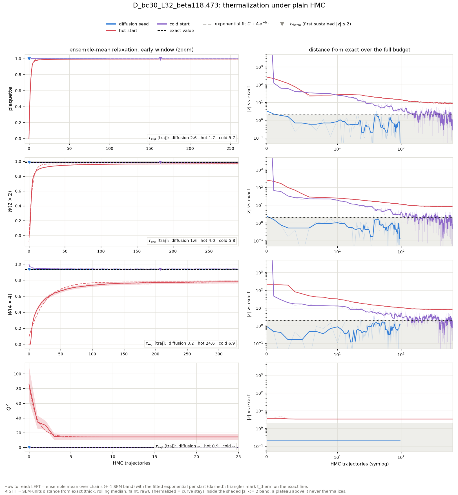

tau_int (hot-start chains, second half): plaquette = 14.03 +- 1.75, wilson_2x2 = 20.91 +- 2.41, wilson_4x4 = 20.87 +- 2.46, wilson_6x6 = 15.99 +- 2.32. Topology: hot-start HMC L=32 beta=118.473 -> **frozen** (no tunneling).

Where 'never' stood at the end: the hot start ended the 640-trajectory budget still at plaquette at |z| ~ 9, wilson_2x2 at |z| ~ 8, wilson_4x4 at |z| ~ 8, wilson_6x6 at |z| ~ 8, Q^2 at |z| ~ 3; the cold start ended the 640-trajectory budget still at Q^2 at |z| ~ 171377917952.

### Diagnostics: raw diffusion output (before any HMC)

| observable | value | error | exact | z_exact | reference | ref_error | z_ref | ks_p | chi2_p |
|---|---|---|---|---|---|---|---|---|---|
| plaquette | 0.9957 | 1.375e-05 | 0.9958 | -4.16 | 0.9958 | 1.23e-05 | -2.553 | 0.2087 |  |
| wilson_1x1 | 0.9957 | 1.375e-05 | 0.9958 | -4.16 | 0.9958 | 1.23e-05 | -2.553 | 0.2087 |  |
| wilson_1x2 | 0.9914 | 3.683e-05 | 0.9916 | -5.774 | 0.9916 | 3.012e-05 | -4.908 | 0.011 |  |
| wilson_2x2 | 0.983 | 8.353e-05 | 0.9832 | -2.946 | 0.9833 | 6.038e-05 | -3.284 | 0.07995 |  |
| wilson_2x3 | 0.9747 | 0.0001408 | 0.9749 | -1.742 | 0.9753 | 8.916e-05 | -3.546 | 0.1892 |  |
| wilson_3x3 | 0.9625 | 0.0002675 | 0.9626 | -0.4312 | 0.9633 | 0.0001691 | -2.31 | 0.1892 |  |
| wilson_3x4 | 0.9502 | 0.0004044 | 0.9505 | -0.7998 | 0.9517 | 0.0002331 | -3.182 | 0.0711 |  |
| wilson_4x4 | 0.934 | 0.0006112 | 0.9347 | -1.038 | 0.9365 | 0.0004098 | -3.383 | 0.1251 |  |
| wilson_4x5 | 0.9179 | 0.0008666 | 0.9191 | -1.326 | 0.9217 | 0.0005746 | -3.61 | 0.0711 |  |
| wilson_5x5 | 0.8985 | 0.001272 | 0.9 | -1.146 | 0.9033 | 0.0008577 | -3.111 | 0.0631 |  |
| wilson_5x6 | 0.8787 | 0.001682 | 0.8813 | -1.551 | 0.8855 | 0.001116 | -3.37 | 0.01957 |  |
| wilson_6x6 | 0.8558 | 0.002298 | 0.8595 | -1.634 | 0.8646 | 0.001569 | -3.193 | 0.003137 |  |
| wilson_6x7 | 0.8331 | 0.002761 | 0.8383 | -1.877 | 0.8443 | 0.001981 | -3.284 | 0.004349 |  |
| wilson_7x7 | 0.8075 | 0.003521 | 0.8143 | -1.915 | 0.8206 | 0.002513 | -3.022 | 0.003697 |  |
| wilson_7x8 | 0.7823 | 0.004153 | 0.791 | -2.089 | 0.7982 | 0.003026 | -3.092 | 0.002243 |  |
| wilson_8x8 | 0.7546 | 0.004911 | 0.7653 | -2.192 | 0.7725 | 0.003654 | -2.928 | 0.009477 |  |
| wilson_8x10 | 0.7027 | 0.006177 | 0.7168 | -2.272 | 0.7262 | 0.004895 | -2.977 | 0.01275 |  |
| wilson_10x10 | 0.6426 | 0.008278 | 0.6609 | -2.213 | 0.6696 | 0.006534 | -2.56 | 0.017 |  |
| wilson_10x12 | 0.5904 | 0.009782 | 0.6099 | -2 | 0.6222 | 0.008378 | -2.467 | 0.01275 |  |
| wilson_12x12 | 0.5318 | 0.0122 | 0.5548 | -1.889 | 0.5693 | 0.009953 | -2.387 | 0.03364 |  |
| creutz_2 | 0.004109 | 6.175e-05 | 0.00423 | -1.963 |  |  |  |  |  |
| creutz_3 | 0.004082 | 0.000135 | 0.004215 | -0.9857 |  |  |  |  |  |
| creutz_4 | 0.004312 | 0.0002027 | 0.004193 | 0.5847 |  |  |  |  |  |
| creutz_5 | 0.003961 | 0.0003075 | 0.004164 | -0.6586 |  |  |  |  |  |
| creutz_6 | 0.004195 | 0.0004162 | 0.004126 | 0.1679 |  |  |  |  |  |
| creutz_7 | 0.004366 | 0.0005731 | 0.004078 | 0.5025 |  |  |  |  |  |
| creutz_8 | 0.00444 | 0.0008043 | 0.004018 | 0.5242 |  |  |  |  |  |
| Q | -0.007812 | 0.03351 | 0 | -0.2332 | 0.03125 | 0.02492 | -0.9354 | 0.9888 |  |
| Q^2 | 0.1641 | 0.02575 | 0.1714 | -0.2841 | 0.1042 | 0.02636 | 1.625 | 0.9353 |  |
| chi_top ((<Q^2>-<Q>^2)/V) | 0.0001602 | 2.53e-05 | 0.0001674 | -0.2847 | 0.0001008 | 2.519e-05 | 1.663 | 0 |  |
| Q histogram vs exact P(Q) | 0.08521 | nan | 2 | nan |  |  |  |  | 0.9583 |

### Diagnostics: the same configs after 96 HMC trajectories

| observable | value | error | exact | z_exact | reference | ref_error | z_ref | ks_p | chi2_p |
|---|---|---|---|---|---|---|---|---|---|
| plaquette | 0.9958 | 1.197e-05 | 0.9958 | -0.06041 | 0.9958 | 1.23e-05 | 0.5455 | 0.9888 |  |
| wilson_1x1 | 0.9958 | 1.197e-05 | 0.9958 | -0.06041 | 0.9958 | 1.23e-05 | 0.5455 | 0.9888 |  |
| wilson_1x2 | 0.9915 | 3.767e-05 | 0.9916 | -0.9019 | 0.9916 | 3.012e-05 | -1.136 | 0.2522 |  |
| wilson_2x2 | 0.9832 | 8.256e-05 | 0.9832 | -0.1522 | 0.9833 | 6.038e-05 | -1.026 | 0.6395 |  |
| wilson_2x3 | 0.9749 | 0.0001566 | 0.9749 | -0.07066 | 0.9753 | 8.916e-05 | -1.981 | 0.389 |  |
| wilson_3x3 | 0.9629 | 0.0002813 | 0.9626 | 0.7654 | 0.9633 | 0.0001691 | -1.22 | 0.6011 |  |
| wilson_3x4 | 0.9509 | 0.0005046 | 0.9505 | 0.7636 | 0.9517 | 0.0002331 | -1.397 | 0.5259 |  |
| wilson_4x4 | 0.9354 | 0.0007871 | 0.9347 | 0.9338 | 0.9365 | 0.0004098 | -1.262 | 0.389 |  |
| wilson_4x5 | 0.92 | 0.001126 | 0.9191 | 0.8749 | 0.9217 | 0.0005746 | -1.28 | 0.6395 |  |
| wilson_5x5 | 0.9012 | 0.001574 | 0.9 | 0.7763 | 0.9033 | 0.0008577 | -1.167 | 0.4898 |  |
| wilson_5x6 | 0.8825 | 0.001989 | 0.8813 | 0.596 | 0.8855 | 0.001116 | -1.319 | 0.2087 |  |
| wilson_6x6 | 0.8611 | 0.002597 | 0.8595 | 0.605 | 0.8646 | 0.001569 | -1.172 | 0.3021 |  |
| wilson_6x7 | 0.8395 | 0.003178 | 0.8383 | 0.3737 | 0.8443 | 0.001981 | -1.279 | 0.1392 |  |
| wilson_7x7 | 0.8157 | 0.003964 | 0.8143 | 0.3522 | 0.8206 | 0.002513 | -1.051 | 0.4212 |  |
| wilson_7x8 | 0.7919 | 0.004623 | 0.791 | 0.1862 | 0.7982 | 0.003026 | -1.15 | 0.2763 |  |
| wilson_8x8 | 0.7659 | 0.00551 | 0.7653 | 0.1078 | 0.7725 | 0.003654 | -0.9922 | 0.3584 |  |
| wilson_8x10 | 0.7166 | 0.007197 | 0.7168 | -0.02167 | 0.7262 | 0.004895 | -1.101 | 0.5259 |  |
| wilson_10x10 | 0.6598 | 0.009195 | 0.6609 | -0.1156 | 0.6696 | 0.006534 | -0.8642 | 0.5631 |  |
| wilson_10x12 | 0.6089 | 0.01113 | 0.6099 | -0.09189 | 0.6222 | 0.008378 | -0.9503 | 0.2087 |  |
| wilson_12x12 | 0.553 | 0.0133 | 0.5548 | -0.1338 | 0.5693 | 0.009953 | -0.982 | 0.2522 |  |
| creutz_2 | 0.004175 | 5.805e-05 | 0.00423 | -0.9479 |  |  |  |  |  |
| creutz_3 | 0.003982 | 0.0001146 | 0.004215 | -2.038 |  |  |  |  |  |
| creutz_4 | 0.003994 | 0.0001905 | 0.004193 | -1.045 |  |  |  |  |  |
| creutz_5 | 0.004164 | 0.0003171 | 0.004164 | 0.001096 |  |  |  |  |  |
| creutz_6 | 0.003631 | 0.0004264 | 0.004126 | -1.161 |  |  |  |  |  |
| creutz_7 | 0.003369 | 0.0005241 | 0.004078 | -1.353 |  |  |  |  |  |
| creutz_8 | 0.003705 | 0.0007272 | 0.004018 | -0.4309 |  |  |  |  |  |
| Q | -0.007812 | 0.03351 | 0 | -0.2332 | 0.03125 | 0.02492 | -0.9354 | 0.9888 |  |
| Q^2 | 0.1641 | 0.02575 | 0.1714 | -0.2841 | 0.1042 | 0.02636 | 1.625 | 0.9353 |  |
| chi_top ((<Q^2>-<Q>^2)/V) | 0.0001602 | 2.53e-05 | 0.0001674 | -0.2847 | 0.0001008 | 2.519e-05 | 1.663 | 0 |  |
| Q histogram vs exact P(Q) | 0.08521 | nan | 2 | nan |  |  |  |  | 0.9583 |

## E_bc35_L32_beta138.477

HMC: step size 0.0340, 29 leapfrog steps, acceptance seed/hot/cold = 0.975/0.973/0.977. Diffusion-seed batch: 128 chains x 96 trajectories (0.11 s/traj for the whole batch); baselines: 32 chains x 640 trajectories.

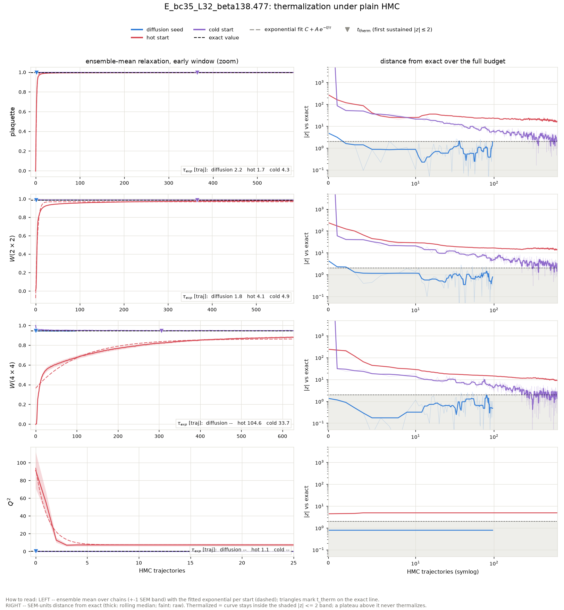

tau_int (hot-start chains, second half): plaquette = 24.20 +- 2.01, wilson_2x2 = 35.55 +- 2.04, wilson_4x4 = 41.65 +- 1.91, wilson_6x6 = 41.61 +- 2.22. Topology: hot-start HMC L=32 beta=138.477 -> **frozen** (no tunneling).

Where 'never' stood at the end: the hot start ended the 640-trajectory budget still at plaquette at |z| ~ 16, wilson_2x2 at |z| ~ 14, wilson_4x4 at |z| ~ 9, wilson_6x6 at |z| ~ 7, Q^2 at |z| ~ 5; the cold start ended the 640-trajectory budget still at Q^2 at |z| ~ 122925113344.

### Diagnostics: raw diffusion output (before any HMC)

| observable | value | error | exact | z_exact | reference | ref_error | z_ref | ks_p | chi2_p |
|---|---|---|---|---|---|---|---|---|---|
| plaquette | 0.9963 | 1.286e-05 | 0.9964 | -5.011 | 0.9964 | 1.354e-05 | -4.326 | 0.0002049 |  |
| wilson_1x1 | 0.9963 | 1.286e-05 | 0.9964 | -5.011 | 0.9964 | 1.354e-05 | -4.326 | 0.0002049 |  |
| wilson_1x2 | 0.9926 | 2.361e-05 | 0.9928 | -7.762 | 0.9928 | 3.55e-05 | -5.47 | 7.394e-05 |  |
| wilson_2x2 | 0.9853 | 6.21e-05 | 0.9856 | -6.045 | 0.9858 | 8.989e-05 | -4.596 | 3.906e-05 |  |
| wilson_2x3 | 0.9782 | 0.0001156 | 0.9785 | -3.068 | 0.9787 | 0.0001615 | -2.754 | 0.01957 |  |
| wilson_3x3 | 0.9676 | 0.000209 | 0.968 | -2.006 | 0.9684 | 0.0002549 | -2.332 | 0.08971 |  |
| wilson_3x4 | 0.9572 | 0.0003074 | 0.9576 | -1.465 | 0.9579 | 0.0003788 | -1.559 | 0.3021 |  |
| wilson_4x4 | 0.9431 | 0.0004582 | 0.944 | -1.818 | 0.9442 | 0.0005091 | -1.595 | 0.1712 |  |
| wilson_4x5 | 0.9298 | 0.0006313 | 0.9305 | -1.24 | 0.9305 | 0.0007245 | -0.7998 | 0.5631 |  |
| wilson_5x5 | 0.9131 | 0.0009168 | 0.9141 | -1.089 | 0.9138 | 0.0009305 | -0.5495 | 0.678 |  |
| wilson_5x6 | 0.8966 | 0.001134 | 0.898 | -1.179 | 0.8976 | 0.001199 | -0.572 | 0.7901 |  |
| wilson_6x6 | 0.877 | 0.001538 | 0.8791 | -1.371 | 0.8781 | 0.001489 | -0.5085 | 0.8246 |  |
| wilson_6x7 | 0.8582 | 0.001867 | 0.8607 | -1.354 | 0.8596 | 0.001869 | -0.5397 | 0.7163 |  |
| wilson_7x7 | 0.8361 | 0.002377 | 0.8398 | -1.552 | 0.8379 | 0.002266 | -0.5504 | 0.5259 |  |
| wilson_7x8 | 0.8148 | 0.002721 | 0.8195 | -1.743 | 0.817 | 0.002773 | -0.5758 | 0.678 |  |
| wilson_8x8 | 0.7909 | 0.003316 | 0.7971 | -1.859 | 0.7936 | 0.00334 | -0.5751 | 0.7901 |  |
| wilson_8x10 | 0.7458 | 0.004215 | 0.7544 | -2.04 | 0.749 | 0.004625 | -0.509 | 0.5259 |  |
| wilson_10x10 | 0.692 | 0.005469 | 0.7049 | -2.358 | 0.696 | 0.005881 | -0.49 | 0.4898 |  |
| wilson_10x12 | 0.6444 | 0.006335 | 0.6595 | -2.391 | 0.6481 | 0.007336 | -0.3891 | 0.8246 |  |
| wilson_12x12 | 0.5888 | 0.007724 | 0.6099 | -2.73 | 0.596 | 0.008918 | -0.6033 | 0.8864 |  |
| creutz_2 | 0.003689 | 5.383e-05 | 0.003613 | 1.419 |  |  |  |  |  |
| creutz_3 | 0.003683 | 9.92e-05 | 0.003593 | 0.9026 |  |  |  |  |  |
| creutz_4 | 0.003939 | 0.0001687 | 0.003564 | 2.227 |  |  |  |  |  |
| creutz_5 | 0.003816 | 0.0002587 | 0.003524 | 1.13 |  |  |  |  |  |
| creutz_6 | 0.003987 | 0.0003965 | 0.003474 | 1.295 |  |  |  |  |  |
| creutz_7 | 0.00433 | 0.0005092 | 0.003411 | 1.805 |  |  |  |  |  |
| creutz_8 | 0.003897 | 0.0007188 | 0.003335 | 0.7815 |  |  |  |  |  |
| Q | -0.03906 | 0.03255 | 0 | -1.2 | -0.03646 | 0.02674 | -0.06182 | 1 |  |
| Q^2 | 0.1484 | 0.02165 | 0.1229 | 1.178 | 0.151 | 0.02242 | -0.08356 | 1 |  |
| chi_top ((<Q^2>-<Q>^2)/V) | 0.0001435 | 2.067e-05 | 0.00012 | 1.133 | 0.0001462 | 2.157e-05 | -0.09154 | 0 |  |
| Q histogram vs exact P(Q) | 2.375 | nan | 2 | nan |  |  |  |  | 0.3051 |

### Diagnostics: the same configs after 96 HMC trajectories

| observable | value | error | exact | z_exact | reference | ref_error | z_ref | ks_p | chi2_p |
|---|---|---|---|---|---|---|---|---|---|
| plaquette | 0.9964 | 1.602e-05 | 0.9964 | 1.889 | 0.9964 | 1.354e-05 | 0.6638 | 0.2763 |  |
| wilson_1x1 | 0.9964 | 1.602e-05 | 0.9964 | 1.889 | 0.9964 | 1.354e-05 | 0.6638 | 0.2763 |  |
| wilson_1x2 | 0.9928 | 3.282e-05 | 0.9928 | 1.297 | 0.9928 | 3.55e-05 | -0.1522 | 0.5631 |  |
| wilson_2x2 | 0.9857 | 7.312e-05 | 0.9856 | 0.9339 | 0.9858 | 8.989e-05 | -0.5044 | 0.2297 |  |
| wilson_2x3 | 0.9786 | 0.0001273 | 0.9785 | 0.899 | 0.9787 | 0.0001615 | -0.3789 | 0.5631 |  |
| wilson_3x3 | 0.968 | 0.0002341 | 0.968 | 0.05616 | 0.9684 | 0.0002549 | -0.9716 | 0.1004 |  |
| wilson_3x4 | 0.9577 | 0.0003298 | 0.9576 | 0.139 | 0.9579 | 0.0003788 | -0.5264 | 0.5259 |  |
| wilson_4x4 | 0.9437 | 0.0004789 | 0.944 | -0.6284 | 0.9442 | 0.0005091 | -0.8016 | 0.6395 |  |
| wilson_4x5 | 0.9302 | 0.0006263 | 0.9305 | -0.6139 | 0.9305 | 0.0007245 | -0.3868 | 0.8569 |  |
| wilson_5x5 | 0.9134 | 0.0008415 | 0.9141 | -0.7883 | 0.9138 | 0.0009305 | -0.3054 | 0.8246 |  |
| wilson_5x6 | 0.897 | 0.001071 | 0.898 | -0.9128 | 0.8976 | 0.001199 | -0.3636 | 0.678 |  |
| wilson_6x6 | 0.8776 | 0.001363 | 0.8791 | -1.124 | 0.8781 | 0.001489 | -0.254 | 0.9126 |  |
| wilson_6x7 | 0.8591 | 0.001743 | 0.8607 | -0.9147 | 0.8596 | 0.001869 | -0.1925 | 0.9693 |  |
| wilson_7x7 | 0.8376 | 0.002162 | 0.8398 | -1.029 | 0.8379 | 0.002266 | -0.11 | 0.9989 |  |
| wilson_7x8 | 0.8175 | 0.002725 | 0.8195 | -0.7242 | 0.817 | 0.002773 | 0.1368 | 0.9126 |  |
| wilson_8x8 | 0.7945 | 0.003254 | 0.7971 | -0.798 | 0.7936 | 0.00334 | 0.1849 | 0.7901 |  |
| wilson_8x10 | 0.7516 | 0.004755 | 0.7544 | -0.5917 | 0.749 | 0.004625 | 0.3921 | 0.8246 |  |
| wilson_10x10 | 0.7021 | 0.006508 | 0.7049 | -0.4292 | 0.696 | 0.005881 | 0.703 | 0.7538 |  |
| wilson_10x12 | 0.6566 | 0.008396 | 0.6595 | -0.3447 | 0.6481 | 0.007336 | 0.7604 | 0.6011 |  |
| wilson_12x12 | 0.6059 | 0.01006 | 0.6099 | -0.3999 | 0.596 | 0.008918 | 0.7399 | 0.8246 |  |
| creutz_2 | 0.003599 | 4.964e-05 | 0.003613 | -0.2805 |  |  |  |  |  |
| creutz_3 | 0.003744 | 9.976e-05 | 0.003593 | 1.515 |  |  |  |  |  |
| creutz_4 | 0.003965 | 0.0001959 | 0.003564 | 2.047 |  |  |  |  |  |
| creutz_5 | 0.003742 | 0.0002608 | 0.003524 | 0.8372 |  |  |  |  |  |
| creutz_6 | 0.003766 | 0.0003726 | 0.003474 | 0.784 |  |  |  |  |  |
| creutz_7 | 0.004101 | 0.0005728 | 0.003411 | 1.203 |  |  |  |  |  |
| creutz_8 | 0.00443 | 0.0006785 | 0.003335 | 1.613 |  |  |  |  |  |
| Q | -0.03906 | 0.03255 | 0 | -1.2 | -0.03646 | 0.02674 | -0.06182 | 1 |  |
| Q^2 | 0.1484 | 0.02165 | 0.1229 | 1.178 | 0.151 | 0.02242 | -0.08356 | 1 |  |
| chi_top ((<Q^2>-<Q>^2)/V) | 0.0001435 | 2.067e-05 | 0.00012 | 1.133 | 0.0001462 | 2.157e-05 | -0.09154 | 0 |  |
| Q histogram vs exact P(Q) | 2.375 | nan | 2 | nan |  |  |  |  | 0.3051 |

## D_bc40_L32_beta158.48

HMC: step size 0.0318, 31 leapfrog steps, acceptance seed/hot/cold = 0.979/0.976/0.978. Diffusion-seed batch: 128 chains x 96 trajectories (0.12 s/traj for the whole batch); baselines: 32 chains x 640 trajectories.

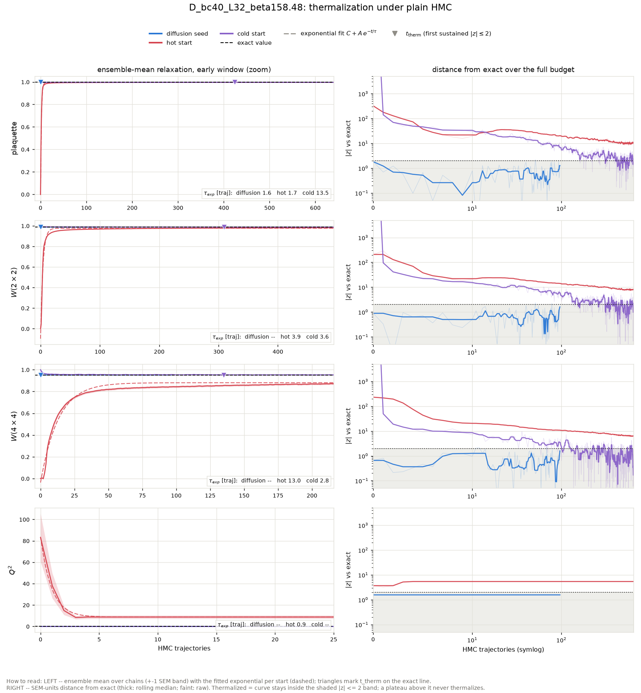

tau_int (hot-start chains, second half): plaquette = 22.94 +- 2.34, wilson_2x2 = 32.16 +- 2.39, wilson_4x4 = 24.17 +- 2.76, wilson_6x6 = 7.14 +- 1.28. Topology: hot-start HMC L=32 beta=158.48 -> **frozen** (no tunneling).

Where 'never' stood at the end: the hot start ended the 640-trajectory budget still at plaquette at |z| ~ 11, wilson_2x2 at |z| ~ 8, wilson_4x4 at |z| ~ 6, wilson_6x6 at |z| ~ 6, Q^2 at |z| ~ 5; the cold start ended the 640-trajectory budget still at Q^2 at |z| ~ 86933716992.

### Diagnostics: raw diffusion output (before any HMC)

| observable | value | error | exact | z_exact | reference | ref_error | z_ref | ks_p | chi2_p |
|---|---|---|---|---|---|---|---|---|---|
| plaquette | 0.9968 | 1.546e-05 | 0.9968 | -1.553 | 0.9969 | 7.484e-06 | -2.996 | 0.004349 |  |
| wilson_1x1 | 0.9968 | 1.546e-05 | 0.9968 | -1.553 | 0.9969 | 7.484e-06 | -2.996 | 0.004349 |  |
| wilson_1x2 | 0.9936 | 3.666e-05 | 0.9937 | -2.83 | 0.9937 | 2.19e-05 | -3.444 | 0.01474 |  |
| wilson_2x2 | 0.9874 | 8.209e-05 | 0.9874 | -0.9173 | 0.9875 | 5.587e-05 | -1.798 | 0.1004 |  |
| wilson_2x3 | 0.9813 | 0.0001548 | 0.9812 | 0.3491 | 0.9813 | 0.0001011 | -0.1701 | 0.8246 |  |
| wilson_3x3 | 0.9724 | 0.0002544 | 0.972 | 1.388 | 0.9722 | 0.0001779 | 0.7238 | 0.6395 |  |
| wilson_3x4 | 0.9634 | 0.0003896 | 0.9629 | 1.116 | 0.9632 | 0.0002749 | 0.3967 | 0.2522 |  |
| wilson_4x4 | 0.9514 | 0.0005464 | 0.951 | 0.7129 | 0.9514 | 0.0004515 | -0.06592 | 0.4212 |  |
| wilson_4x5 | 0.9396 | 0.0007522 | 0.9392 | 0.5395 | 0.94 | 0.0006134 | -0.3504 | 0.8246 |  |
| wilson_5x5 | 0.9252 | 0.001083 | 0.9248 | 0.3977 | 0.9256 | 0.0009137 | -0.296 | 0.9972 |  |
| wilson_5x6 | 0.9107 | 0.001446 | 0.9106 | 0.07642 | 0.9115 | 0.00119 | -0.4263 | 0.9941 |  |
| wilson_6x6 | 0.8935 | 0.001842 | 0.894 | -0.2854 | 0.8946 | 0.001572 | -0.4687 | 0.9126 |  |
| wilson_6x7 | 0.8767 | 0.002245 | 0.8778 | -0.4858 | 0.8785 | 0.001917 | -0.5961 | 0.7163 |  |
| wilson_7x7 | 0.8571 | 0.002729 | 0.8594 | -0.821 | 0.8603 | 0.002412 | -0.8742 | 0.4548 |  |
| wilson_7x8 | 0.8382 | 0.003403 | 0.8414 | -0.9637 | 0.8418 | 0.002769 | -0.8308 | 0.6011 |  |
| wilson_8x8 | 0.8169 | 0.004088 | 0.8216 | -1.136 | 0.8216 | 0.003365 | -0.8782 | 0.3021 |  |
| wilson_8x10 | 0.7772 | 0.005643 | 0.7837 | -1.156 | 0.7828 | 0.004506 | -0.7732 | 0.1122 |  |
| wilson_10x10 | 0.7306 | 0.007371 | 0.7397 | -1.228 | 0.7378 | 0.005932 | -0.7596 | 0.2087 |  |
| wilson_10x12 | 0.6892 | 0.009246 | 0.699 | -1.058 | 0.694 | 0.007383 | -0.4053 | 0.4212 |  |
| wilson_12x12 | 0.6431 | 0.01101 | 0.6544 | -1.032 | 0.6478 | 0.008811 | -0.3349 | 0.2763 |  |
| creutz_2 | 0.003043 | 4.748e-05 | 0.003152 | -2.285 |  |  |  |  |  |
| creutz_3 | 0.002952 | 8.946e-05 | 0.003129 | -1.977 |  |  |  |  |  |
| creutz_4 | 0.003224 | 0.0001613 | 0.003094 | 0.8082 |  |  |  |  |  |
| creutz_5 | 0.003035 | 0.0002265 | 0.003047 | -0.04935 |  |  |  |  |  |
| creutz_6 | 0.003352 | 0.0003004 | 0.002987 | 1.215 |  |  |  |  |  |
| creutz_7 | 0.003627 | 0.0004209 | 0.002915 | 1.693 |  |  |  |  |  |
| creutz_8 | 0.003295 | 0.0006066 | 0.002827 | 0.7724 |  |  |  |  |  |
| Q | 0.03906 | 0.02015 | 0 | 1.938 | 0.02083 | 0.02291 | 0.5974 | 1 |  |
| Q^2 | 0.05469 | 0.0179 | 0.08693 | -1.801 | 0.09375 | 0.01492 | -1.676 | 0.9996 |  |
| chi_top ((<Q^2>-<Q>^2)/V) | 5.192e-05 | 1.657e-05 | 8.49e-05 | -1.991 | 9.113e-05 | 1.454e-05 | -1.779 | 0 |  |
| Q histogram vs exact P(Q) | 3.921 | nan | 2 | nan |  |  |  |  | 0.1408 |

### Diagnostics: the same configs after 96 HMC trajectories

| observable | value | error | exact | z_exact | reference | ref_error | z_ref | ks_p | chi2_p |
|---|---|---|---|---|---|---|---|---|---|
| plaquette | 0.9968 | 9.515e-06 | 0.9968 | -1.448 | 0.9969 | 7.484e-06 | -3.407 | 0.01957 |  |
| wilson_1x1 | 0.9968 | 9.515e-06 | 0.9968 | -1.448 | 0.9969 | 7.484e-06 | -3.407 | 0.01957 |  |
| wilson_1x2 | 0.9937 | 2.707e-05 | 0.9937 | -1.648 | 0.9937 | 2.19e-05 | -2.525 | 0.05588 |  |
| wilson_2x2 | 0.9873 | 8.204e-05 | 0.9874 | -1.457 | 0.9875 | 5.587e-05 | -2.245 | 0.003697 |  |
| wilson_2x3 | 0.9811 | 0.0001496 | 0.9812 | -1.122 | 0.9813 | 0.0001011 | -1.404 | 0.3584 |  |
| wilson_3x3 | 0.9717 | 0.0002491 | 0.972 | -1.427 | 0.9722 | 0.0001779 | -1.581 | 0.3294 |  |
| wilson_3x4 | 0.9625 | 0.0003903 | 0.9629 | -1.127 | 0.9632 | 0.0002749 | -1.437 | 0.2297 |  |
| wilson_4x4 | 0.9501 | 0.0005624 | 0.951 | -1.551 | 0.9514 | 0.0004515 | -1.814 | 0.1392 |  |
| wilson_4x5 | 0.9382 | 0.0008259 | 0.9392 | -1.264 | 0.94 | 0.0006134 | -1.74 | 0.07995 |  |
| wilson_5x5 | 0.9233 | 0.001134 | 0.9248 | -1.315 | 0.9256 | 0.0009137 | -1.607 | 0.1004 |  |
| wilson_5x6 | 0.909 | 0.001527 | 0.9106 | -1.085 | 0.9115 | 0.00119 | -1.325 | 0.3584 |  |
| wilson_6x6 | 0.8917 | 0.001976 | 0.894 | -1.177 | 0.8946 | 0.001572 | -1.162 | 0.2522 |  |
| wilson_6x7 | 0.875 | 0.0025 | 0.8778 | -1.129 | 0.8785 | 0.001917 | -1.108 | 0.4212 |  |
| wilson_7x7 | 0.8556 | 0.003096 | 0.8594 | -1.215 | 0.8603 | 0.002412 | -1.199 | 0.1004 |  |
| wilson_7x8 | 0.8372 | 0.003756 | 0.8414 | -1.125 | 0.8418 | 0.002769 | -0.9835 | 0.2763 |  |
| wilson_8x8 | 0.8164 | 0.004402 | 0.8216 | -1.172 | 0.8216 | 0.003365 | -0.9324 | 0.1712 |  |
| wilson_8x10 | 0.7783 | 0.005831 | 0.7837 | -0.9217 | 0.7828 | 0.004506 | -0.6022 | 0.389 |  |
| wilson_10x10 | 0.733 | 0.00739 | 0.7397 | -0.8954 | 0.7378 | 0.005932 | -0.5016 | 0.1712 |  |
| wilson_10x12 | 0.6943 | 0.008893 | 0.699 | -0.5366 | 0.694 | 0.007383 | 0.01835 | 0.5259 |  |
| wilson_12x12 | 0.6493 | 0.01027 | 0.6544 | -0.4969 | 0.6478 | 0.008811 | 0.1135 | 0.2522 |  |
| creutz_2 | 0.003197 | 4.592e-05 | 0.003152 | 0.9824 |  |  |  |  |  |
| creutz_3 | 0.003273 | 9.091e-05 | 0.003129 | 1.591 |  |  |  |  |  |
| creutz_4 | 0.003463 | 0.0001413 | 0.003094 | 2.613 |  |  |  |  |  |
| creutz_5 | 0.003352 | 0.0002071 | 0.003047 | 1.475 |  |  |  |  |  |
| creutz_6 | 0.003563 | 0.0003332 | 0.002987 | 1.728 |  |  |  |  |  |
| creutz_7 | 0.003467 | 0.000502 | 0.002915 | 1.1 |  |  |  |  |  |
| creutz_8 | 0.003449 | 0.0006842 | 0.002827 | 0.9097 |  |  |  |  |  |
| Q | 0.03906 | 0.02015 | 0 | 1.938 | 0.02083 | 0.02291 | 0.5974 | 1 |  |
| Q^2 | 0.05469 | 0.0179 | 0.08693 | -1.801 | 0.09375 | 0.01492 | -1.676 | 0.9996 |  |
| chi_top ((<Q^2>-<Q>^2)/V) | 5.192e-05 | 1.657e-05 | 8.49e-05 | -1.991 | 9.113e-05 | 1.454e-05 | -1.779 | 0 |  |
| Q histogram vs exact P(Q) | 3.921 | nan | 2 | nan |  |  |  |  | 0.1408 |

## E_bc45_L32_beta178.482

HMC: step size 0.0299, 33 leapfrog steps, acceptance seed/hot/cold = 0.978/0.971/0.977. Diffusion-seed batch: 128 chains x 96 trajectories (0.12 s/traj for the whole batch); baselines: 32 chains x 640 trajectories.

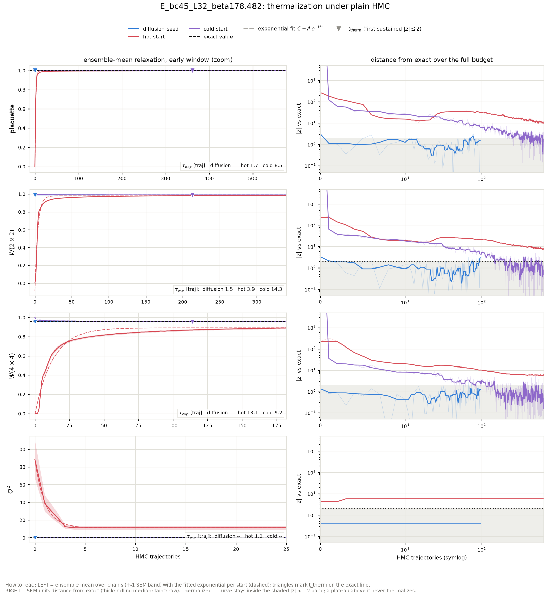

tau_int (hot-start chains, second half): plaquette = 22.43 +- 2.00, wilson_2x2 = 18.87 +- 1.91, wilson_4x4 = 4.17 +- 0.52, wilson_6x6 = 2.92 +- 0.23. Topology: hot-start HMC L=32 beta=178.482 -> **frozen** (no tunneling).

Where 'never' stood at the end: the hot start ended the 640-trajectory budget still at plaquette at |z| ~ 10, wilson_2x2 at |z| ~ 8, wilson_4x4 at |z| ~ 6, wilson_6x6 at |z| ~ 6, Q^2 at |z| ~ 6; the cold start ended the 640-trajectory budget still at Q^2 at |z| ~ 60793004032.

### Diagnostics: raw diffusion output (before any HMC)

| observable | value | error | exact | z_exact | reference | ref_error | z_ref | ks_p | chi2_p |
|---|---|---|---|---|---|---|---|---|---|
| plaquette | 0.9972 | 9.417e-06 | 0.9972 | -3.516 | 0.9972 | 9.091e-06 | -1.96 | 0.0711 |  |
| wilson_1x1 | 0.9972 | 9.417e-06 | 0.9972 | -3.516 | 0.9972 | 9.091e-06 | -1.96 | 0.0711 |  |
| wilson_1x2 | 0.9943 | 2.194e-05 | 0.9944 | -5.75 | 0.9944 | 2.084e-05 | -4.197 | 0.0001372 |  |
| wilson_2x2 | 0.9886 | 6.201e-05 | 0.9889 | -3.629 | 0.9888 | 4.604e-05 | -2.526 | 0.02947 |  |
| wilson_2x3 | 0.9831 | 0.0001037 | 0.9833 | -2.298 | 0.9833 | 8.636e-05 | -1.572 | 0.01957 |  |
| wilson_3x3 | 0.975 | 0.0001681 | 0.9752 | -1.133 | 0.9752 | 0.000162 | -0.8631 | 0.2522 |  |
| wilson_3x4 | 0.9668 | 0.0002612 | 0.9671 | -1.18 | 0.967 | 0.0002318 | -0.6388 | 0.2087 |  |
| wilson_4x4 | 0.9558 | 0.0004014 | 0.9564 | -1.592 | 0.9561 | 0.0003554 | -0.5471 | 0.1392 |  |
| wilson_4x5 | 0.9452 | 0.0005663 | 0.946 | -1.363 | 0.9452 | 0.0004515 | -0.01015 | 0.6011 |  |
| wilson_5x5 | 0.932 | 0.0007316 | 0.9331 | -1.554 | 0.932 | 0.0006228 | -0.01604 | 0.7538 |  |
| wilson_5x6 | 0.9189 | 0.0009738 | 0.9205 | -1.631 | 0.9191 | 0.0007729 | -0.1819 | 0.9542 |  |
| wilson_6x6 | 0.903 | 0.001219 | 0.9057 | -2.218 | 0.9043 | 0.001021 | -0.8016 | 0.678 |  |
| wilson_6x7 | 0.888 | 0.001557 | 0.8912 | -2.084 | 0.8902 | 0.001265 | -1.104 | 0.5631 |  |
| wilson_7x7 | 0.8702 | 0.001906 | 0.8748 | -2.392 | 0.8732 | 0.001542 | -1.21 | 0.3294 |  |
| wilson_7x8 | 0.8531 | 0.002433 | 0.8588 | -2.338 | 0.8577 | 0.001849 | -1.527 | 0.4898 |  |
| wilson_8x8 | 0.8333 | 0.00298 | 0.841 | -2.581 | 0.8398 | 0.002216 | -1.763 | 0.4548 |  |
| wilson_8x10 | 0.7955 | 0.004283 | 0.807 | -2.697 | 0.8066 | 0.003006 | -2.131 | 0.3021 |  |
| wilson_10x10 | 0.7501 | 0.005687 | 0.7675 | -3.056 | 0.7688 | 0.003828 | -2.721 | 0.1251 |  |
| wilson_10x12 | 0.7087 | 0.007443 | 0.7309 | -2.988 | 0.7332 | 0.004739 | -2.784 | 0.0631 |  |
| wilson_12x12 | 0.6624 | 0.009298 | 0.6906 | -3.042 | 0.6914 | 0.005477 | -2.693 | 0.03831 |  |
| creutz_2 | 0.002802 | 4.111e-05 | 0.002795 | 0.1707 |  |  |  |  |  |
| creutz_3 | 0.002707 | 7.903e-05 | 0.002769 | -0.7868 |  |  |  |  |  |
| creutz_4 | 0.002957 | 0.0001342 | 0.002731 | 1.685 |  |  |  |  |  |
| creutz_5 | 0.002934 | 0.0002168 | 0.002679 | 1.174 |  |  |  |  |  |
| creutz_6 | 0.003371 | 0.0002873 | 0.002614 | 2.632 |  |  |  |  |  |
| creutz_7 | 0.003459 | 0.0004016 | 0.002535 | 2.301 |  |  |  |  |  |
| creutz_8 | 0.003564 | 0.0005152 | 0.002441 | 2.179 |  |  |  |  |  |
| Q | -0.02344 | 0.02018 | 0 | -1.161 | 0.005208 | 0.01913 | -1.03 | 1 |  |
| Q^2 | 0.07031 | 0.02161 | 0.06079 | 0.4406 | 0.05729 | 0.01394 | 0.5063 | 1 |  |
| chi_top ((<Q^2>-<Q>^2)/V) | 6.813e-05 | 2.091e-05 | 5.937e-05 | 0.4188 | 5.592e-05 | 1.358e-05 | 0.4895 | 0 |  |
| Q histogram vs exact P(Q) | 1.36 | nan | 2 | nan |  |  |  |  | 0.5065 |

### Diagnostics: the same configs after 96 HMC trajectories

| observable | value | error | exact | z_exact | reference | ref_error | z_ref | ks_p | chi2_p |
|---|---|---|---|---|---|---|---|---|---|
| plaquette | 0.9972 | 1.168e-05 | 0.9972 | -1.429 | 0.9972 | 9.091e-06 | -0.6236 | 0.3584 |  |
| wilson_1x1 | 0.9972 | 1.168e-05 | 0.9972 | -1.429 | 0.9972 | 9.091e-06 | -0.6236 | 0.3584 |  |
| wilson_1x2 | 0.9943 | 2.482e-05 | 0.9944 | -2.465 | 0.9944 | 2.084e-05 | -1.914 | 0.1004 |  |
| wilson_2x2 | 0.9886 | 5.155e-05 | 0.9889 | -3.906 | 0.9888 | 4.604e-05 | -2.48 | 0.04938 |  |
| wilson_2x3 | 0.9831 | 8.965e-05 | 0.9833 | -2.955 | 0.9833 | 8.636e-05 | -1.918 | 0.01957 |  |
| wilson_3x3 | 0.9748 | 0.0001704 | 0.9752 | -2.164 | 0.9752 | 0.000162 | -1.616 | 0.1122 |  |
| wilson_3x4 | 0.9666 | 0.0002435 | 0.9671 | -2.086 | 0.967 | 0.0002318 | -1.257 | 0.1004 |  |
| wilson_4x4 | 0.9558 | 0.0003935 | 0.9564 | -1.502 | 0.9561 | 0.0003554 | -0.4624 | 0.6011 |  |
| wilson_4x5 | 0.9451 | 0.0005475 | 0.946 | -1.516 | 0.9452 | 0.0004515 | -0.09236 | 0.678 |  |
| wilson_5x5 | 0.9324 | 0.0007461 | 0.9331 | -0.9116 | 0.932 | 0.0006228 | 0.454 | 0.7901 |  |
| wilson_5x6 | 0.9196 | 0.001038 | 0.9205 | -0.8581 | 0.9191 | 0.0007729 | 0.3643 | 0.7163 |  |
| wilson_6x6 | 0.905 | 0.001386 | 0.9057 | -0.5013 | 0.9043 | 0.001021 | 0.4275 | 0.6011 |  |
| wilson_6x7 | 0.8903 | 0.001759 | 0.8912 | -0.5223 | 0.8902 | 0.001265 | 0.05083 | 0.4898 |  |
| wilson_7x7 | 0.8737 | 0.002219 | 0.8748 | -0.4752 | 0.8732 | 0.001542 | 0.1995 | 0.8569 |  |
| wilson_7x8 | 0.8575 | 0.002716 | 0.8588 | -0.4621 | 0.8577 | 0.001849 | -0.0712 | 0.7163 |  |
| wilson_8x8 | 0.8394 | 0.003168 | 0.841 | -0.4878 | 0.8398 | 0.002216 | -0.104 | 0.9888 |  |
| wilson_8x10 | 0.8047 | 0.004302 | 0.807 | -0.5463 | 0.8066 | 0.003006 | -0.3713 | 0.8864 |  |
| wilson_10x10 | 0.7632 | 0.005132 | 0.7675 | -0.8313 | 0.7688 | 0.003828 | -0.8651 | 0.2763 |  |
| wilson_10x12 | 0.725 | 0.006354 | 0.7309 | -0.9253 | 0.7332 | 0.004739 | -1.034 | 0.1892 |  |
| wilson_12x12 | 0.6829 | 0.007524 | 0.6906 | -1.026 | 0.6914 | 0.005477 | -0.913 | 0.07995 |  |
| creutz_2 | 0.002892 | 3.773e-05 | 0.002795 | 2.58 |  |  |  |  |  |
| creutz_3 | 0.002812 | 7.838e-05 | 0.002769 | 0.5479 |  |  |  |  |  |
| creutz_4 | 0.002676 | 0.0001368 | 0.002731 | -0.3986 |  |  |  |  |  |
| creutz_5 | 0.002271 | 0.000212 | 0.002679 | -1.928 |  |  |  |  |  |
| creutz_6 | 0.002175 | 0.000312 | 0.002614 | -1.41 |  |  |  |  |  |
| creutz_7 | 0.002445 | 0.0003882 | 0.002535 | -0.2323 |  |  |  |  |  |
| creutz_8 | 0.002561 | 0.0004715 | 0.002441 | 0.2552 |  |  |  |  |  |
| Q | -0.02344 | 0.02018 | 0 | -1.161 | 0.005208 | 0.01913 | -1.03 | 1 |  |
| Q^2 | 0.07031 | 0.02161 | 0.06079 | 0.4406 | 0.05729 | 0.01394 | 0.5063 | 1 |  |
| chi_top ((<Q^2>-<Q>^2)/V) | 6.813e-05 | 2.091e-05 | 5.937e-05 | 0.4188 | 5.592e-05 | 1.358e-05 | 0.4895 | 0 |  |
| Q histogram vs exact P(Q) | 1.36 | nan | 2 | nan |  |  |  |  | 0.5065 |

## D_bc55.0237_L32_beta218.58

HMC: step size 0.0271, 37 leapfrog steps, acceptance seed/hot/cold = 0.975/0.965/0.977. Diffusion-seed batch: 128 chains x 96 trajectories (0.14 s/traj for the whole batch); baselines: 32 chains x 640 trajectories.

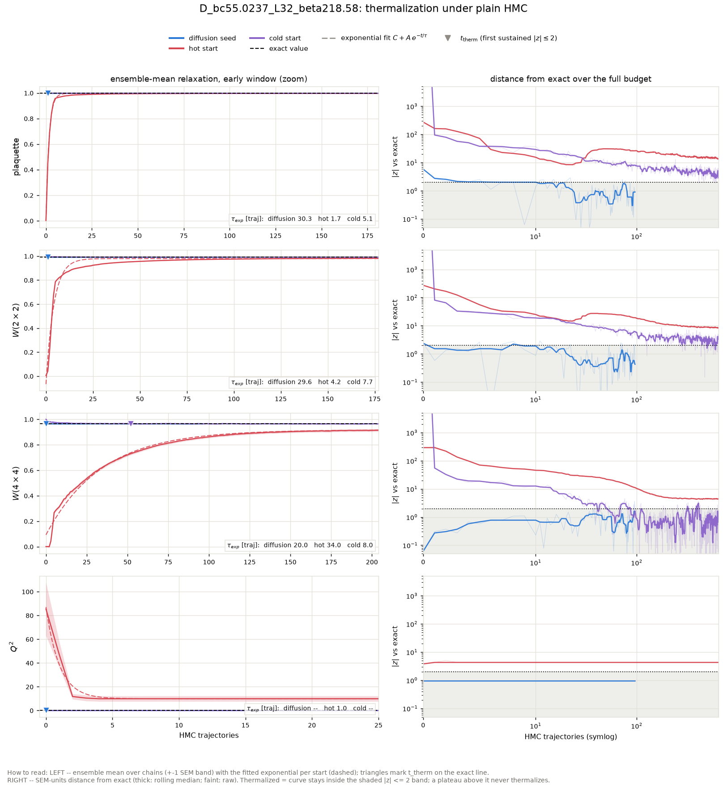

tau_int (hot-start chains, second half): plaquette = 11.59 +- 1.40, wilson_2x2 = 10.31 +- 1.24, wilson_4x4 = 6.68 +- 0.69, wilson_6x6 = 7.51 +- 0.85. Topology: hot-start HMC L=32 beta=218.58 -> **frozen** (no tunneling).

Where 'never' stood at the end: the hot start ended the 640-trajectory budget still at plaquette at |z| ~ 14, wilson_2x2 at |z| ~ 8, wilson_4x4 at |z| ~ 4, wilson_6x6 at |z| ~ 5, Q^2 at |z| ~ 4; the cold start ended the 640-trajectory budget still at plaquette at |z| ~ 5, wilson_2x2 at |z| ~ 4, Q^2 at |z| ~ 29010771968.

### Diagnostics: raw diffusion output (before any HMC)

| observable | value | error | exact | z_exact | reference | ref_error | z_ref | ks_p |
|---|---|---|---|---|---|---|---|---|
| plaquette | 0.9977 | 1.124e-05 | 0.9977 | -4.676 | 0.9977 | 7.705e-06 | -5 | 6.593e-08 |
| wilson_1x1 | 0.9977 | 1.124e-05 | 0.9977 | -4.676 | 0.9977 | 7.705e-06 | -5 | 6.593e-08 |
| wilson_1x2 | 0.9953 | 2.42e-05 | 0.9954 | -5.837 | 0.9955 | 1.563e-05 | -6.509 | 2.538e-07 |
| wilson_2x2 | 0.9908 | 5.689e-05 | 0.9909 | -2.394 | 0.991 | 3.765e-05 | -3.326 | 0.01275 |
| wilson_2x3 | 0.9863 | 9.529e-05 | 0.9864 | -1.346 | 0.9865 | 6.139e-05 | -1.919 | 0.0711 |
| wilson_3x3 | 0.9798 | 0.0001731 | 0.9797 | 0.4514 | 0.9799 | 8.848e-05 | -0.4068 | 0.1712 |
| wilson_3x4 | 0.9731 | 0.0002508 | 0.9731 | 0.1502 | 0.9732 | 0.0001162 | -0.308 | 0.1892 |
| wilson_4x4 | 0.9644 | 0.0003743 | 0.9644 | -0.06435 | 0.9646 | 0.0001617 | -0.4743 | 0.2297 |
| wilson_4x5 | 0.9556 | 0.0005174 | 0.9558 | -0.405 | 0.9559 | 0.0002461 | -0.5545 | 0.3584 |
| wilson_5x5 | 0.945 | 0.0007481 | 0.9453 | -0.4113 | 0.9453 | 0.000377 | -0.3531 | 0.6011 |
| wilson_5x6 | 0.9342 | 0.001029 | 0.935 | -0.7375 | 0.935 | 0.0005198 | -0.6769 | 0.7163 |
| wilson_6x6 | 0.9216 | 0.00136 | 0.9228 | -0.8805 | 0.9231 | 0.0007562 | -0.9409 | 0.389 |
| wilson_6x7 | 0.9091 | 0.001745 | 0.9109 | -1.034 | 0.9115 | 0.001025 | -1.16 | 0.3294 |
| wilson_7x7 | 0.8947 | 0.002194 | 0.8974 | -1.24 | 0.8985 | 0.001333 | -1.508 | 0.1392 |
| wilson_7x8 | 0.8805 | 0.002632 | 0.8842 | -1.424 | 0.8856 | 0.0017 | -1.643 | 0.07995 |
| wilson_8x8 | 0.8646 | 0.003247 | 0.8696 | -1.541 | 0.872 | 0.002125 | -1.929 | 0.01957 |
| wilson_8x10 | 0.8336 | 0.00442 | 0.8415 | -1.798 | 0.8457 | 0.002874 | -2.295 | 0.009477 |
| wilson_10x10 | 0.795 | 0.006088 | 0.8088 | -2.268 | 0.8165 | 0.004096 | -2.936 | 0.004349 |
| wilson_10x12 | 0.7595 | 0.007376 | 0.7785 | -2.57 | 0.7889 | 0.0051 | -3.28 | 0.0005374 |
| wilson_12x12 | 0.7158 | 0.009293 | 0.745 | -3.137 | 0.7606 | 0.006549 | -3.936 | 3.143e-05 |
| creutz_2 | 0.002184 | 3.565e-05 | 0.002278 | -2.63 |  |  |  |  |
| creutz_3 | 0.002048 | 6.616e-05 | 0.00225 | -3.058 |  |  |  |  |
| creutz_4 | 0.002232 | 0.0001077 | 0.00221 | 0.2101 |  |  |  |  |
| creutz_5 | 0.002067 | 0.0001767 | 0.002155 | -0.4981 |  |  |  |  |
| creutz_6 | 0.002088 | 0.0002403 | 0.002087 | 0.002114 |  |  |  |  |
| creutz_7 | 0.00237 | 0.0003364 | 0.002005 | 1.087 |  |  |  |  |
| creutz_8 | 0.002217 | 0.0004236 | 0.001907 | 0.7312 |  |  |  |  |
| Q | -0.01562 | 0.01614 | 0 | -0.9683 | 0 | 0.007255 | -0.8831 | 1 |
| Q^2 | 0.04688 | 0.02098 | 0.02901 | 0.8516 | 0.01042 | 0.006882 | 1.651 | 0.9999 |
| chi_top ((<Q^2>-<Q>^2)/V) | 4.554e-05 | 2.036e-05 | 2.833e-05 | 0.845 | 1.017e-05 | 6.721e-06 | 1.649 | 0 |

### Diagnostics: the same configs after 96 HMC trajectories

| observable | value | error | exact | z_exact | reference | ref_error | z_ref | ks_p |
|---|---|---|---|---|---|---|---|---|
| plaquette | 0.9977 | 1.05e-05 | 0.9977 | -0.6954 | 0.9977 | 7.705e-06 | -1.757 | 0.03364 |
| wilson_1x1 | 0.9977 | 1.05e-05 | 0.9977 | -0.6954 | 0.9977 | 7.705e-06 | -1.757 | 0.03364 |
| wilson_1x2 | 0.9954 | 2.437e-05 | 0.9954 | -0.5679 | 0.9955 | 1.563e-05 | -2.076 | 0.02947 |
| wilson_2x2 | 0.9909 | 4.704e-05 | 0.9909 | 0.4362 | 0.991 | 3.765e-05 | -1.166 | 0.1004 |
| wilson_2x3 | 0.9865 | 8.186e-05 | 0.9864 | 0.8366 | 0.9865 | 6.139e-05 | -0.2039 | 0.0711 |
| wilson_3x3 | 0.9799 | 0.0001548 | 0.9797 | 1.411 | 0.9799 | 8.848e-05 | 0.3432 | 0.2297 |
| wilson_3x4 | 0.9734 | 0.0002365 | 0.9731 | 1.45 | 0.9732 | 0.0001162 | 0.8355 | 0.6395 |
| wilson_4x4 | 0.965 | 0.0003863 | 0.9644 | 1.51 | 0.9646 | 0.0001617 | 0.9885 | 0.6011 |
| wilson_4x5 | 0.9566 | 0.0005525 | 0.9558 | 1.483 | 0.9559 | 0.0002461 | 1.176 | 0.2087 |
| wilson_5x5 | 0.9464 | 0.000753 | 0.9453 | 1.478 | 0.9453 | 0.000377 | 1.336 | 0.07995 |
| wilson_5x6 | 0.9362 | 0.001003 | 0.935 | 1.252 | 0.935 | 0.0005198 | 1.092 | 0.1392 |
| wilson_6x6 | 0.9241 | 0.001274 | 0.9228 | 1.032 | 0.9231 | 0.0007562 | 0.7074 | 0.389 |
| wilson_6x7 | 0.9122 | 0.001611 | 0.9109 | 0.7662 | 0.9115 | 0.001025 | 0.3625 | 0.5259 |
| wilson_7x7 | 0.8984 | 0.002009 | 0.8974 | 0.5179 | 0.8985 | 0.001333 | -0.04566 | 0.4212 |
| wilson_7x8 | 0.8851 | 0.002462 | 0.8842 | 0.3794 | 0.8856 | 0.0017 | -0.1558 | 0.2087 |
| wilson_8x8 | 0.8702 | 0.00307 | 0.8696 | 0.1997 | 0.872 | 0.002125 | -0.5007 | 0.07995 |
| wilson_8x10 | 0.8417 | 0.004291 | 0.8415 | 0.03634 | 0.8457 | 0.002874 | -0.7742 | 0.0631 |
| wilson_10x10 | 0.8062 | 0.005744 | 0.8088 | -0.4481 | 0.8165 | 0.004096 | -1.461 | 0.00159 |
| wilson_10x12 | 0.7744 | 0.007341 | 0.7785 | -0.5591 | 0.7889 | 0.0051 | -1.629 | 0.003697 |
| wilson_12x12 | 0.7377 | 0.009165 | 0.745 | -0.7944 | 0.7606 | 0.006549 | -2.031 | 0.0009335 |
| creutz_2 | 0.002236 | 3.058e-05 | 0.002278 | -1.347 |  |  |  |  |
| creutz_3 | 0.002146 | 6.386e-05 | 0.00225 | -1.64 |  |  |  |  |
| creutz_4 | 0.002087 | 0.0001091 | 0.00221 | -1.127 |  |  |  |  |
| creutz_5 | 0.002088 | 0.0001682 | 0.002155 | -0.4029 |  |  |  |  |
| creutz_6 | 0.002171 | 0.0002223 | 0.002087 | 0.3763 |  |  |  |  |
| creutz_7 | 0.002129 | 0.000299 | 0.002005 | 0.417 |  |  |  |  |
| creutz_8 | 0.002155 | 0.0004132 | 0.001907 | 0.6002 |  |  |  |  |
| Q | -0.01562 | 0.01614 | 0 | -0.9683 | 0 | 0.007255 | -0.8831 | 1 |
| Q^2 | 0.04688 | 0.02098 | 0.02901 | 0.8516 | 0.01042 | 0.006882 | 1.651 | 0.9999 |
| chi_top ((<Q^2>-<Q>^2)/V) | 4.554e-05 | 2.036e-05 | 2.833e-05 | 0.845 | 1.017e-05 | 6.721e-06 | 1.649 | 0 |

## F_L32_bc100_L32_beta398.492

HMC: step size 0.0200, 50 leapfrog steps, acceptance seed/hot/cold = 0.977/0.833/0.975. Diffusion-seed batch: 64 chains x 96 trajectories (0.15 s/traj for the whole batch); baselines: 32 chains x 640 trajectories.

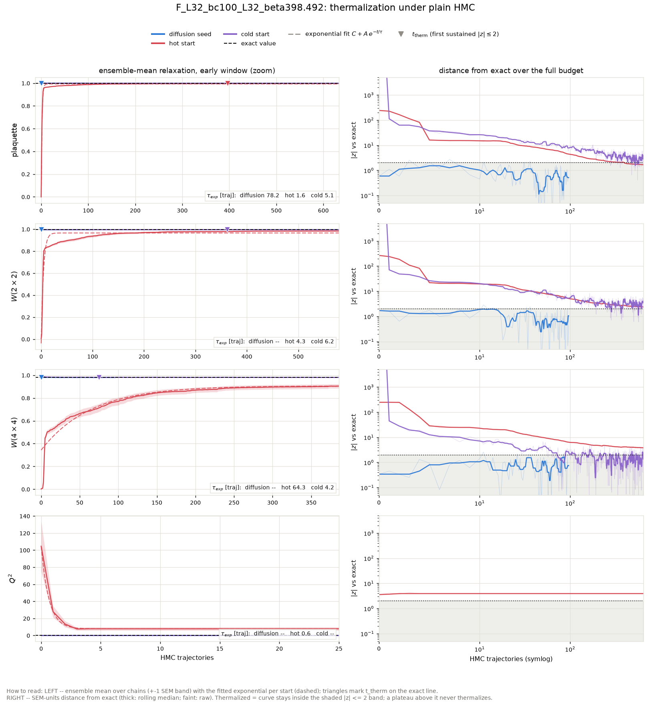

tau_int (hot-start chains, second half): plaquette = 32.24 +- 2.16, wilson_2x2 = 28.59 +- 2.56, wilson_4x4 = 22.95 +- 2.81, wilson_6x6 = 8.53 +- 2.10. Topology: hot-start HMC L=32 beta=398.492 -> **frozen** (no tunneling).

Where 'never' stood at the end: the hot start ended the 640-trajectory budget still at wilson_2x2 at |z| ~ 2, wilson_4x4 at |z| ~ 4, wilson_6x6 at |z| ~ 4, Q^2 at |z| ~ 4; the cold start ended the 640-trajectory budget still at plaquette at |z| ~ 3, Q^2 at |z| ~ 930603328.

### Diagnostics: raw diffusion output (before any HMC)

| observable | value | error | exact | z_exact | reference | ref_error | z_ref | ks_p |
|---|---|---|---|---|---|---|---|---|
| plaquette | 0.9987 | 4.918e-06 | 0.9987 | 0.7306 | 0.9987 | 5.182e-06 | 0.3681 | 0.8225 |
| wilson_1x1 | 0.9987 | 4.918e-06 | 0.9987 | 0.7306 | 0.9987 | 5.182e-06 | 0.3681 | 0.8225 |
| wilson_1x2 | 0.9975 | 1.588e-05 | 0.9975 | 0.2753 | 0.9975 | 1.239e-05 | -0.4177 | 0.8677 |
| wilson_2x2 | 0.9951 | 3.762e-05 | 0.995 | 1.836 | 0.9951 | 3.213e-05 | -0.2055 | 0.5577 |
| wilson_2x3 | 0.9926 | 6.573e-05 | 0.9925 | 1.673 | 0.9927 | 5.097e-05 | -0.817 | 0.1912 |
| wilson_3x3 | 0.989 | 0.0001073 | 0.9889 | 1.645 | 0.9891 | 0.0001055 | -0.5573 | 0.7202 |
| wilson_3x4 | 0.9854 | 0.0001661 | 0.9852 | 1.245 | 0.9856 | 0.0001379 | -0.8459 | 0.7729 |
| wilson_4x4 | 0.9805 | 0.0002247 | 0.9804 | 0.4298 | 0.9808 | 0.0002137 | -0.8498 | 0.1432 |
| wilson_4x5 | 0.9757 | 0.0002893 | 0.9757 | 0.3116 | 0.976 | 0.0002848 | -0.666 | 0.4084 |
| wilson_5x5 | 0.9698 | 0.0004226 | 0.9698 | 0.01034 | 0.97 | 0.0004029 | -0.3884 | 0.4084 |
| wilson_5x6 | 0.9639 | 0.0005706 | 0.9641 | -0.3541 | 0.9644 | 0.0005384 | -0.7144 | 0.7202 |
| wilson_6x6 | 0.9568 | 0.0006989 | 0.9573 | -0.6677 | 0.9574 | 0.0007022 | -0.6422 | 0.4556 |
| wilson_6x7 | 0.9498 | 0.0008954 | 0.9506 | -0.9068 | 0.951 | 0.0008974 | -0.9344 | 0.4084 |
| wilson_7x7 | 0.9418 | 0.00106 | 0.943 | -1.176 | 0.9432 | 0.001148 | -0.8858 | 0.5577 |
| wilson_7x8 | 0.9336 | 0.001308 | 0.9356 | -1.501 | 0.9358 | 0.00142 | -1.136 | 0.2195 |
| wilson_8x8 | 0.925 | 0.001522 | 0.9273 | -1.524 | 0.9275 | 0.001717 | -1.104 | 0.1432 |
| wilson_8x10 | 0.9074 | 0.002133 | 0.9114 | -1.863 | 0.9115 | 0.002453 | -1.248 | 0.1658 |
| wilson_10x10 | 0.8876 | 0.00282 | 0.8927 | -1.797 | 0.8943 | 0.003202 | -1.577 | 0.3231 |
| wilson_10x12 | 0.8681 | 0.003914 | 0.8752 | -1.802 | 0.8766 | 0.00405 | -1.511 | 0.1658 |
| wilson_12x12 | 0.847 | 0.004755 | 0.8557 | -1.842 | 0.8584 | 0.004643 | -1.722 | 0.2508 |
| creutz_2 | 0.001181 | 2.507e-05 | 0.001245 | -2.563 |  |  |  |  |
| creutz_3 | 0.0012 | 5.046e-05 | 0.001226 | -0.524 |  |  |  |  |
| creutz_4 | 0.00134 | 7.472e-05 | 0.001197 | 1.908 |  |  |  |  |
| creutz_5 | 0.00124 | 0.0001106 | 0.001158 | 0.7394 |  |  |  |  |
| creutz_6 | 0.001174 | 0.0001697 | 0.00111 | 0.3765 |  |  |  |  |
| creutz_7 | 0.001153 | 0.0002285 | 0.001052 | 0.4428 |  |  |  |  |
| creutz_8 | 0.0006085 | 0.0003229 | 0.000984 | -1.163 |  |  |  |  |
| Q | 0 | 0 | 0 | 0 | 0 | 0 | 0 | 1 |
| Q^2 | 0 | 0 | 0.0009306 | inf | 0 | 0 | 0 | 1 |
| chi_top ((<Q^2>-<Q>^2)/V) | 0 | 0 | 9.088e-07 | inf | 0 | 0 | 0 | 1 |

### Diagnostics: the same configs after 96 HMC trajectories

| observable | value | error | exact | z_exact | reference | ref_error | z_ref | ks_p |
|---|---|---|---|---|---|---|---|---|
| plaquette | 0.9987 | 6.935e-06 | 0.9987 | 0.5286 | 0.9987 | 5.182e-06 | 0.3122 | 0.7729 |
| wilson_1x1 | 0.9987 | 6.935e-06 | 0.9987 | 0.5286 | 0.9987 | 5.182e-06 | 0.3122 | 0.7729 |
| wilson_1x2 | 0.9975 | 2.073e-05 | 0.9975 | -0.4553 | 0.9975 | 1.239e-05 | -0.9202 | 0.5577 |
| wilson_2x2 | 0.995 | 4.51e-05 | 0.995 | -0.9584 | 0.9951 | 3.213e-05 | -2.212 | 0.002398 |
| wilson_2x3 | 0.9925 | 8.316e-05 | 0.9925 | -0.7896 | 0.9927 | 5.097e-05 | -2.497 | 0.00941 |
| wilson_3x3 | 0.9888 | 0.0001541 | 0.9889 | -0.5395 | 0.9891 | 0.0001055 | -1.84 | 0.07626 |
| wilson_3x4 | 0.9851 | 0.0002231 | 0.9852 | -0.5487 | 0.9856 | 0.0001379 | -1.951 | 0.08985 |
| wilson_4x4 | 0.9802 | 0.0003252 | 0.9804 | -0.6363 | 0.9808 | 0.0002137 | -1.457 | 0.05422 |
| wilson_4x5 | 0.9754 | 0.0003993 | 0.9757 | -0.74 | 0.976 | 0.0002848 | -1.338 | 0.07626 |
| wilson_5x5 | 0.9693 | 0.0005318 | 0.9698 | -0.967 | 0.97 | 0.0004029 | -1.117 | 0.2508 |
| wilson_5x6 | 0.9634 | 0.0006498 | 0.9641 | -0.9931 | 0.9644 | 0.0005384 | -1.189 | 0.3231 |
| wilson_6x6 | 0.9565 | 0.0008385 | 0.9573 | -0.9871 | 0.9574 | 0.0007022 | -0.9119 | 0.2853 |
| wilson_6x7 | 0.9497 | 0.001004 | 0.9506 | -0.9603 | 0.951 | 0.0008974 | -0.9927 | 0.1054 |
| wilson_7x7 | 0.9419 | 0.001221 | 0.943 | -0.9226 | 0.9432 | 0.001148 | -0.7543 | 0.1432 |
| wilson_7x8 | 0.9342 | 0.001449 | 0.9356 | -0.9918 | 0.9358 | 0.00142 | -0.8219 | 0.1231 |
| wilson_8x8 | 0.9256 | 0.001778 | 0.9273 | -0.9932 | 0.9275 | 0.001717 | -0.8008 | 0.1054 |
| wilson_8x10 | 0.9095 | 0.00233 | 0.9114 | -0.823 | 0.9115 | 0.002453 | -0.5914 | 0.2853 |
| wilson_10x10 | 0.8905 | 0.00318 | 0.8927 | -0.6784 | 0.8943 | 0.003202 | -0.8465 | 0.1432 |
| wilson_10x12 | 0.8731 | 0.00392 | 0.8752 | -0.5313 | 0.8766 | 0.00405 | -0.6282 | 0.5055 |
| wilson_12x12 | 0.8523 | 0.004656 | 0.8557 | -0.7422 | 0.8584 | 0.004643 | -0.9345 | 0.4084 |
| creutz_2 | 0.001266 | 2.411e-05 | 0.001245 | 0.8645 |  |  |  |  |
| creutz_3 | 0.001221 | 4.966e-05 | 0.001226 | -0.09653 |  |  |  |  |
| creutz_4 | 0.001244 | 8.015e-05 | 0.001197 | 0.5821 |  |  |  |  |
| creutz_5 | 0.001294 | 0.0001365 | 0.001158 | 0.9934 |  |  |  |  |
| creutz_6 | 0.001166 | 0.0001904 | 0.00111 | 0.2956 |  |  |  |  |
| creutz_7 | 0.001083 | 0.0002574 | 0.001052 | 0.1207 |  |  |  |  |
| creutz_8 | 0.001011 | 0.0003272 | 0.000984 | 0.08369 |  |  |  |  |
| Q | 0 | 0 | 0 | 0 | 0 | 0 | 0 | 1 |
| Q^2 | 0 | 0 | 0.0009306 | inf | 0 | 0 | 0 | 1 |
| chi_top ((<Q^2>-<Q>^2)/V) | 0 | 0 | 9.088e-07 | inf | 0 | 0 | 0 | 1 |

## F_L32_bc218.58_L32_beta872.816

HMC: step size 0.0135, 74 leapfrog steps, acceptance seed/hot/cold = 0.964/0.020/0.967. Diffusion-seed batch: 64 chains x 96 trajectories (0.22 s/traj for the whole batch); baselines: 32 chains x 640 trajectories.

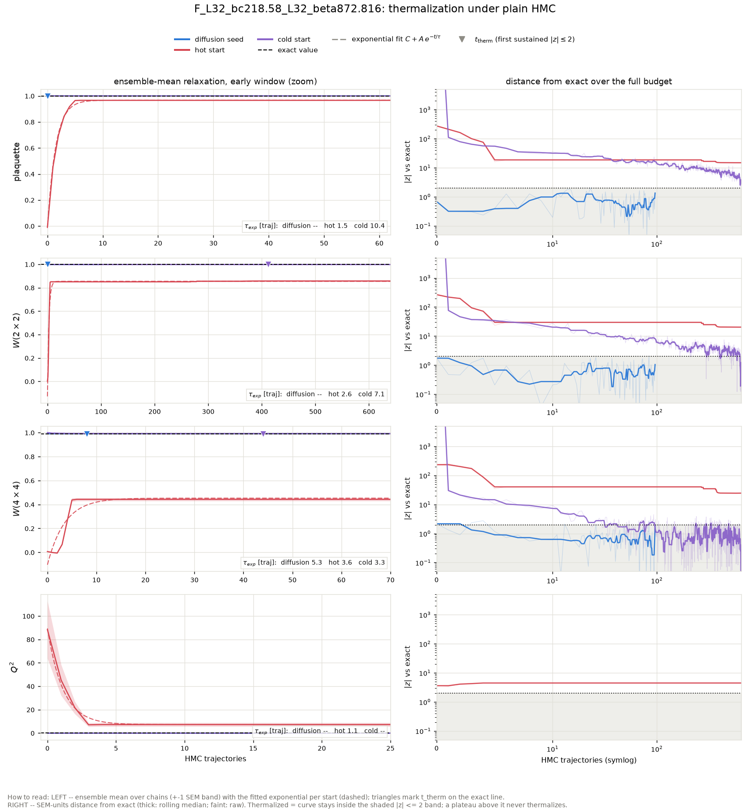

tau_int (hot-start chains, second half): plaquette = 1.41 +- 0.89, wilson_2x2 = 1.43 +- 0.91, wilson_4x4 = 1.40 +- 0.89, wilson_6x6 = 1.42 +- 0.91. Topology: hot-start HMC L=32 beta=872.816 -> **frozen** (no tunneling).

Where 'never' stood at the end: the hot start ended the 640-trajectory budget still at plaquette at |z| ~ 15, wilson_2x2 at |z| ~ 20, wilson_4x4 at |z| ~ 25, wilson_6x6 at |z| ~ 29, Q^2 at |z| ~ 4; the cold start ended the 640-trajectory budget still at plaquette at |z| ~ 3, Q^2 at |z| ~ 99603.

### Diagnostics: raw diffusion output (before any HMC)

| observable | value | error | exact | z_exact | reference | ref_error | z_ref | ks_p |
|---|---|---|---|---|---|---|---|---|
| plaquette | 0.9994 | 3.191e-06 | 0.9994 | -0.6942 | 0.9994 | 2.789e-06 | -1.706 | 0.2853 |
| wilson_1x1 | 0.9994 | 3.191e-06 | 0.9994 | -0.6942 | 0.9994 | 2.789e-06 | -1.706 | 0.2853 |
| wilson_1x2 | 0.9989 | 7.512e-06 | 0.9989 | 0.4562 | 0.9989 | 5.647e-06 | -0.4651 | 0.3231 |
| wilson_2x2 | 0.9977 | 1.907e-05 | 0.9977 | 1.479 | 0.9977 | 1.488e-05 | 0.7561 | 0.2853 |
| wilson_2x3 | 0.9966 | 3.441e-05 | 0.9966 | 0.8922 | 0.9966 | 2.586e-05 | 0.8131 | 0.5055 |
| wilson_3x3 | 0.9949 | 6.595e-05 | 0.9949 | -0.1449 | 0.9949 | 4.475e-05 | -0.5113 | 0.5577 |
| wilson_3x4 | 0.9931 | 9.703e-05 | 0.9932 | -0.9274 | 0.9932 | 6.974e-05 | -0.9059 | 0.2508 |
| wilson_4x4 | 0.9907 | 0.0001561 | 0.991 | -1.757 | 0.9911 | 0.000104 | -2.096 | 0.06444 |
| wilson_4x5 | 0.9884 | 0.0002123 | 0.9888 | -1.893 | 0.989 | 0.000148 | -2.124 | 0.1231 |
| wilson_5x5 | 0.9855 | 0.0003095 | 0.9861 | -2.101 | 0.9864 | 0.0001918 | -2.483 | 0.06444 |
| wilson_5x6 | 0.9826 | 0.0003929 | 0.9834 | -2.208 | 0.9837 | 0.0002601 | -2.483 | 0.01755 |
| wilson_6x6 | 0.979 | 0.0005435 | 0.9803 | -2.362 | 0.9806 | 0.0003321 | -2.573 | 0.00941 |
| wilson_6x7 | 0.9754 | 0.0006674 | 0.9772 | -2.647 | 0.9777 | 0.0004244 | -2.879 | 0.006074 |
| wilson_7x7 | 0.9712 | 0.0008791 | 0.9736 | -2.738 | 0.9743 | 0.0005294 | -2.995 | 0.01163 |
| wilson_7x8 | 0.9671 | 0.001073 | 0.9701 | -2.832 | 0.971 | 0.0006464 | -3.171 | 0.01163 |
| wilson_8x8 | 0.9623 | 0.001338 | 0.9662 | -2.913 | 0.9673 | 0.0007893 | -3.214 | 0.02141 |
| wilson_8x10 | 0.9531 | 0.001906 | 0.9586 | -2.875 | 0.9601 | 0.001082 | -3.191 | 0.007577 |
| wilson_10x10 | 0.9414 | 0.00269 | 0.9496 | -3.033 | 0.9514 | 0.001462 | -3.252 | 0.006074 |
| wilson_10x12 | 0.9307 | 0.003455 | 0.9411 | -3.014 | 0.9428 | 0.001913 | -3.062 | 0.004847 |
| wilson_12x12 | 0.918 | 0.004409 | 0.9315 | -3.069 | 0.9335 | 0.002389 | -3.085 | 0.001467 |
| creutz_2 | 0.0005489 | 1.023e-05 | 0.0005681 | -1.877 |  |  |  |  |
| creutz_3 | 0.0006021 | 2.214e-05 | 0.0005592 | 1.939 |  |  |  |  |
| creutz_4 | 0.0006509 | 3.764e-05 | 0.0005458 | 2.794 |  |  |  |  |
| creutz_5 | 0.0006514 | 6.446e-05 | 0.0005278 | 1.917 |  |  |  |  |
| creutz_6 | 0.0007097 | 9.399e-05 | 0.0005055 | 2.173 |  |  |  |  |
| creutz_7 | 0.0006449 | 0.0001144 | 0.0004786 | 1.454 |  |  |  |  |
| creutz_8 | 0.0006915 | 0.0001475 | 0.0004472 | 1.656 |  |  |  |  |
| Q | 0 | 0 | 0 | 0 | 0 | 0 | 0 | 1 |
| Q^2 | 0 | 0 | 9.96e-08 | inf | 0 | 0 | 0 | 1 |
| chi_top ((<Q^2>-<Q>^2)/V) | 0 | 0 | 9.727e-11 | inf | 0 | 0 | 0 | 1 |

### Diagnostics: the same configs after 96 HMC trajectories

| observable | value | error | exact | z_exact | reference | ref_error | z_ref | ks_p |
|---|---|---|---|---|---|---|---|---|
| plaquette | 0.9994 | 2.549e-06 | 0.9994 | -1.851 | 0.9994 | 2.789e-06 | -2.577 | 0.05422 |
| wilson_1x1 | 0.9994 | 2.549e-06 | 0.9994 | -1.851 | 0.9994 | 2.789e-06 | -2.577 | 0.05422 |
| wilson_1x2 | 0.9988 | 5.611e-06 | 0.9989 | -1.534 | 0.9989 | 5.647e-06 | -2.061 | 0.06444 |
| wilson_2x2 | 0.9977 | 1.442e-05 | 0.9977 | -1.445 | 0.9977 | 1.488e-05 | -1.485 | 0.07626 |
| wilson_2x3 | 0.9965 | 2.512e-05 | 0.9966 | -2.229 | 0.9966 | 2.586e-05 | -1.434 | 0.4084 |
| wilson_3x3 | 0.9948 | 5.228e-05 | 0.9949 | -2.102 | 0.9949 | 4.475e-05 | -2.05 | 0.2195 |
| wilson_3x4 | 0.9931 | 8.279e-05 | 0.9932 | -1.931 | 0.9932 | 6.974e-05 | -1.646 | 0.3641 |
| wilson_4x4 | 0.9908 | 0.0001295 | 0.991 | -1.776 | 0.9911 | 0.000104 | -2.1 | 0.2195 |
| wilson_4x5 | 0.9885 | 0.0001873 | 0.9888 | -1.586 | 0.989 | 0.000148 | -1.864 | 0.1912 |
| wilson_5x5 | 0.9858 | 0.0002566 | 0.9861 | -1.25 | 0.9864 | 0.0001918 | -1.793 | 0.2853 |
| wilson_5x6 | 0.9831 | 0.000331 | 0.9834 | -1.091 | 0.9837 | 0.0002601 | -1.577 | 0.3641 |
| wilson_6x6 | 0.9799 | 0.0004169 | 0.9803 | -0.8757 | 0.9806 | 0.0003321 | -1.351 | 0.4556 |
| wilson_6x7 | 0.9767 | 0.0005144 | 0.9772 | -0.8938 | 0.9777 | 0.0004244 | -1.454 | 0.1658 |
| wilson_7x7 | 0.9731 | 0.00062 | 0.9736 | -0.7885 | 0.9743 | 0.0005294 | -1.417 | 0.1658 |
| wilson_7x8 | 0.9696 | 0.0007572 | 0.9701 | -0.6987 | 0.971 | 0.0006464 | -1.469 | 0.1432 |
| wilson_8x8 | 0.9657 | 0.0008913 | 0.9662 | -0.5929 | 0.9673 | 0.0007893 | -1.363 | 0.2853 |
| wilson_8x10 | 0.9582 | 0.001232 | 0.9586 | -0.3424 | 0.9601 | 0.001082 | -1.18 | 0.2853 |
| wilson_10x10 | 0.9495 | 0.001531 | 0.9496 | -0.06375 | 0.9514 | 0.001462 | -0.8948 | 0.2195 |
| wilson_10x12 | 0.9412 | 0.00192 | 0.9411 | 0.04554 | 0.9428 | 0.001913 | -0.5877 | 0.2853 |
| wilson_12x12 | 0.9319 | 0.002297 | 0.9315 | 0.1746 | 0.9335 | 0.002389 | -0.4637 | 0.4556 |
| creutz_2 | 0.0005765 | 1.178e-05 | 0.0005681 | 0.7105 |  |  |  |  |
| creutz_3 | 0.0005782 | 2.234e-05 | 0.0005592 | 0.8488 |  |  |  |  |
| creutz_4 | 0.0005663 | 3.786e-05 | 0.0005458 | 0.5429 |  |  |  |  |
| creutz_5 | 0.0004843 | 5.758e-05 | 0.0005278 | -0.7554 |  |  |  |  |
| creutz_6 | 0.0004686 | 9.49e-05 | 0.0005055 | -0.388 |  |  |  |  |
| creutz_7 | 0.0004121 | 0.000122 | 0.0004786 | -0.5452 |  |  |  |  |
| creutz_8 | 0.0004055 | 0.0001642 | 0.0004472 | -0.2543 |  |  |  |  |
| Q | 0 | 0 | 0 | 0 | 0 | 0 | 0 | 1 |
| Q^2 | 0 | 0 | 9.96e-08 | inf | 0 | 0 | 0 | 1 |
| chi_top ((<Q^2>-<Q>^2)/V) | 0 | 0 | 9.727e-11 | inf | 0 | 0 | 0 | 1 |

## F_L64_bc55.0237_L64_beta218.58

HMC: step size 0.0271, 37 leapfrog steps, acceptance seed/hot/cold = 0.946/0.623/0.943. Diffusion-seed batch: 64 chains x 96 trajectories (0.20 s/traj for the whole batch); baselines: 16 chains x 640 trajectories.

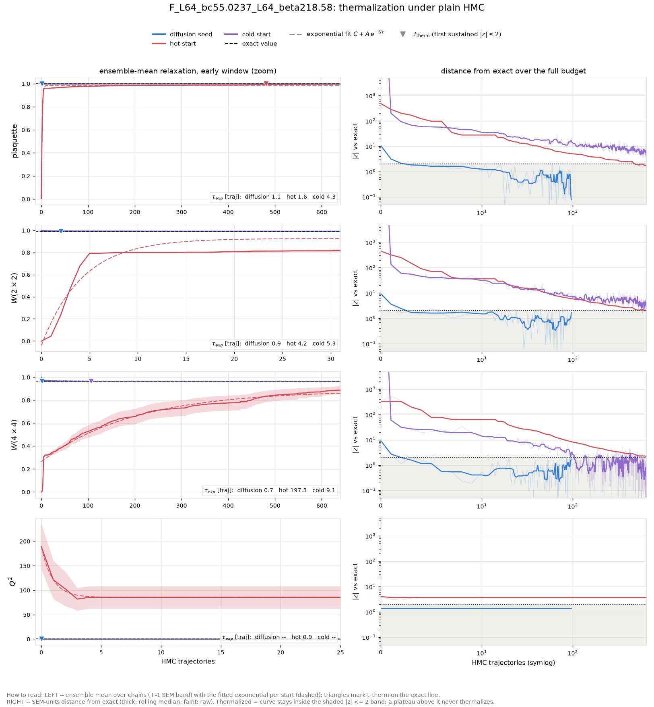

tau_int (hot-start chains, second half): plaquette = 40.09 +- 3.25, wilson_2x2 = 40.03 +- 3.39, wilson_4x4 = 36.90 +- 3.94, wilson_6x6 = 40.03 +- 3.76. Topology: hot-start HMC L=64 beta=218.58 -> **frozen** (no tunneling).

Where 'never' stood at the end: the hot start ended the 640-trajectory budget still at wilson_2x2 at |z| ~ 2, wilson_4x4 at |z| ~ 2, wilson_6x6 at |z| ~ 3, Q^2 at |z| ~ 4; the cold start ended the 640-trajectory budget still at plaquette at |z| ~ 6, wilson_2x2 at |z| ~ 4, Q^2 at |z| ~ 474267189248.

### Diagnostics: raw diffusion output (before any HMC)

| observable | value | error | exact | z_exact | reference | ref_error | z_ref | ks_p | chi2_p |
|---|---|---|---|---|---|---|---|---|---|
| plaquette | 0.9976 | 5.154e-06 | 0.9977 | -12.48 | 0.9978 | 4.72e-06 | -17.38 | 4.808e-24 |  |
| wilson_1x1 | 0.9976 | 5.154e-06 | 0.9977 | -12.48 | 0.9978 | 4.72e-06 | -17.38 | 4.808e-24 |  |
| wilson_1x2 | 0.9952 | 1.439e-05 | 0.9954 | -14.7 | 0.9956 | 1.314e-05 | -17.27 | 1.444e-27 |  |
| wilson_2x2 | 0.9904 | 5.008e-05 | 0.9909 | -8.633 | 0.9911 | 3.521e-05 | -11.61 | 1.4e-20 |  |
| wilson_2x3 | 0.9855 | 0.0001002 | 0.9863 | -8.146 | 0.9867 | 6.553e-05 | -9.803 | 6.138e-17 |  |
| wilson_3x3 | 0.9781 | 0.0002074 | 0.9796 | -7.037 | 0.9801 | 0.0001149 | -8.244 | 2.86e-14 |  |
| wilson_3x4 | 0.9703 | 0.0003417 | 0.9729 | -7.495 | 0.9734 | 0.0001743 | -8.052 | 2.752e-13 |  |
| wilson_4x4 | 0.9596 | 0.0005582 | 0.964 | -7.866 | 0.9647 | 0.0002725 | -8.152 | 2.86e-14 |  |
| wilson_4x5 | 0.9484 | 0.0008257 | 0.9552 | -8.172 | 0.9559 | 0.0003551 | -8.341 | 4.181e-16 |  |
| wilson_5x5 | 0.9341 | 0.00121 | 0.9443 | -8.462 | 0.9453 | 0.0004939 | -8.577 | 1.645e-17 |  |
| wilson_5x6 | 0.919 | 0.001671 | 0.9335 | -8.683 | 0.9347 | 0.0006307 | -8.758 | 3.189e-17 |  |
| wilson_6x6 | 0.9004 | 0.002259 | 0.9208 | -9.021 | 0.9224 | 0.000806 | -9.155 | 5.326e-19 |  |
| wilson_6x7 | 0.8812 | 0.002958 | 0.9082 | -9.127 | 0.9101 | 0.001025 | -9.232 | 6.159e-20 |  |
| wilson_7x7 | 0.8581 | 0.003807 | 0.8937 | -9.372 | 0.8962 | 0.001257 | -9.507 | 3.069e-21 |  |
| wilson_7x8 | 0.8347 | 0.004764 | 0.8795 | -9.398 | 0.8823 | 0.001494 | -9.528 | 3.069e-21 |  |
| wilson_8x8 | 0.8074 | 0.005864 | 0.8635 | -9.573 | 0.8668 | 0.001746 | -9.709 | 2.935e-22 |  |
| wilson_8x10 | 0.7517 | 0.008303 | 0.8324 | -9.728 | 0.8364 | 0.002264 | -9.845 | 1.117e-23 |  |
| wilson_10x10 | 0.6814 | 0.01124 | 0.7951 | -10.12 | 0.8003 | 0.003025 | -10.21 | 8.615e-25 |  |
| wilson_10x12 | 0.6119 | 0.01431 | 0.7595 | -10.31 | 0.7656 | 0.003556 | -10.42 | 5.995e-26 |  |
| wilson_12x12 | 0.5324 | 0.01698 | 0.7188 | -10.98 | 0.7266 | 0.004582 | -11.04 | 8.615e-25 |  |
| creutz_2 | 0.002369 | 2.8e-05 | 0.002293 | 2.71 |  |  |  |  |  |
| creutz_3 | 0.002564 | 6.664e-05 | 0.002293 | 4.067 |  |  |  |  |  |
| creutz_4 | 0.003077 | 0.0001101 | 0.002293 | 7.127 |  |  |  |  |  |
| creutz_5 | 0.003585 | 0.000173 | 0.002293 | 7.47 |  |  |  |  |  |
| creutz_6 | 0.004246 | 0.0002233 | 0.002293 | 8.749 |  |  |  |  |  |
| creutz_7 | 0.005042 | 0.0003351 | 0.002292 | 8.207 |  |  |  |  |  |
| creutz_8 | 0.005743 | 0.000432 | 0.002292 | 7.989 |  |  |  |  |  |
| Q | 0.04688 | 0.07602 | 0 | 0.6166 | 0.07292 | 0.04493 | -0.2949 | 1 |  |
| Q^2 | 0.3906 | 0.06088 | 0.4743 | -1.374 | 0.3646 | 0.04766 | 0.3368 | 1 |  |
| chi_top ((<Q^2>-<Q>^2)/V) | 9.483e-05 | 1.501e-05 | 0.0001158 | -1.396 | 8.771e-05 | 1.143e-05 | 0.3774 | 8.99e-14 |  |
| Q histogram vs exact P(Q) | 0.4568 | nan | 2 | nan |  |  |  |  | 0.7958 |

### Diagnostics: the same configs after 96 HMC trajectories

| observable | value | error | exact | z_exact | reference | ref_error | z_ref | ks_p | chi2_p |
|---|---|---|---|---|---|---|---|---|---|
| plaquette | 0.9977 | 6.25e-06 | 0.9977 | -0.07261 | 0.9978 | 4.72e-06 | -7.355 | 1.215e-08 |  |
| wilson_1x1 | 0.9977 | 6.25e-06 | 0.9977 | -0.07261 | 0.9978 | 4.72e-06 | -7.355 | 1.215e-08 |  |
| wilson_1x2 | 0.9954 | 1.315e-05 | 0.9954 | -1.213 | 0.9956 | 1.314e-05 | -7.583 | 3.331e-09 |  |
| wilson_2x2 | 0.9908 | 3.132e-05 | 0.9909 | -1.894 | 0.9911 | 3.521e-05 | -7.168 | 6.324e-08 |  |
| wilson_2x3 | 0.9862 | 5.587e-05 | 0.9863 | -1.744 | 0.9867 | 6.553e-05 | -5.283 | 5.204e-05 |  |
| wilson_3x3 | 0.9794 | 0.0001114 | 0.9796 | -1.553 | 0.9801 | 0.0001149 | -4.176 | 0.000227 |  |
| wilson_3x4 | 0.9726 | 0.0001613 | 0.9729 | -1.631 | 0.9734 | 0.0001743 | -3.33 | 0.002398 |  |
| wilson_4x4 | 0.9635 | 0.0002206 | 0.964 | -2.111 | 0.9647 | 0.0002725 | -3.247 | 0.00941 |  |
| wilson_4x5 | 0.9546 | 0.0002879 | 0.9552 | -1.892 | 0.9559 | 0.0003551 | -2.83 | 0.02601 |  |
| wilson_5x5 | 0.9433 | 0.0003698 | 0.9443 | -2.612 | 0.9453 | 0.0004939 | -3.136 | 0.01755 |  |
| wilson_5x6 | 0.9323 | 0.0004864 | 0.9335 | -2.436 | 0.9347 | 0.0006307 | -2.91 | 0.06444 |  |
| wilson_6x6 | 0.919 | 0.0006404 | 0.9208 | -2.702 | 0.9224 | 0.000806 | -3.215 | 0.00941 |  |
| wilson_6x7 | 0.9063 | 0.0008122 | 0.9082 | -2.392 | 0.9101 | 0.001025 | -2.94 | 0.05422 |  |
| wilson_7x7 | 0.891 | 0.001021 | 0.8937 | -2.666 | 0.8962 | 0.001257 | -3.187 | 0.02141 |  |
| wilson_7x8 | 0.8765 | 0.001223 | 0.8795 | -2.446 | 0.8823 | 0.001494 | -2.998 | 0.03146 |  |
| wilson_8x8 | 0.8597 | 0.001482 | 0.8635 | -2.6 | 0.8668 | 0.001746 | -3.109 | 0.02601 |  |
| wilson_8x10 | 0.828 | 0.002019 | 0.8324 | -2.205 | 0.8364 | 0.002264 | -2.77 | 0.05422 |  |
| wilson_10x10 | 0.7884 | 0.002835 | 0.7951 | -2.381 | 0.8003 | 0.003025 | -2.87 | 0.03146 |  |
| wilson_10x12 | 0.7523 | 0.003409 | 0.7595 | -2.116 | 0.7656 | 0.003556 | -2.704 | 0.01163 |  |
| wilson_12x12 | 0.7091 | 0.004178 | 0.7188 | -2.341 | 0.7266 | 0.004582 | -2.831 | 0.01755 |  |
| creutz_2 | 0.002321 | 2.415e-05 | 0.002293 | 1.17 |  |  |  |  |  |
| creutz_3 | 0.002332 | 4.704e-05 | 0.002293 | 0.8275 |  |  |  |  |  |
| creutz_4 | 0.002412 | 7.967e-05 | 0.002293 | 1.492 |  |  |  |  |  |
| creutz_5 | 0.002658 | 0.0001221 | 0.002293 | 2.994 |  |  |  |  |  |
| creutz_6 | 0.002657 | 0.0001849 | 0.002293 | 1.97 |  |  |  |  |  |
| creutz_7 | 0.002942 | 0.0002594 | 0.002292 | 2.503 |  |  |  |  |  |
| creutz_8 | 0.003001 | 0.0003057 | 0.002292 | 2.32 |  |  |  |  |  |
| Q | 0.04688 | 0.07602 | 0 | 0.6166 | 0.07292 | 0.04493 | -0.2949 | 1 |  |
| Q^2 | 0.3906 | 0.06088 | 0.4743 | -1.374 | 0.3646 | 0.04766 | 0.3368 | 1 |  |
| chi_top ((<Q^2>-<Q>^2)/V) | 9.483e-05 | 1.501e-05 | 0.0001158 | -1.396 | 8.771e-05 | 1.143e-05 | 0.3774 | 8.99e-14 |  |
| Q histogram vs exact P(Q) | 0.4568 | nan | 2 | nan |  |  |  |  | 0.7958 |
