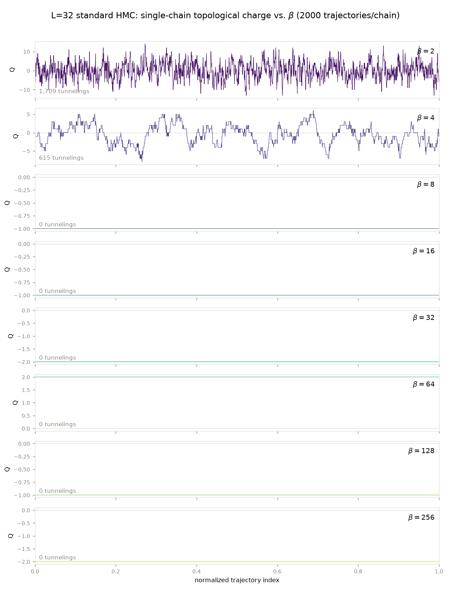
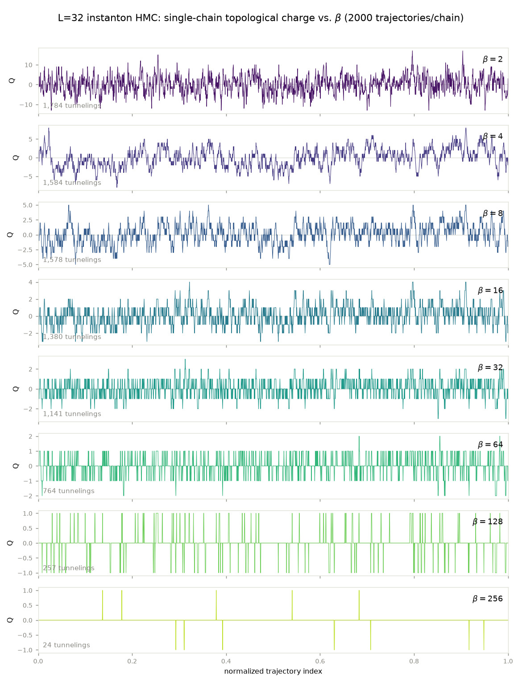
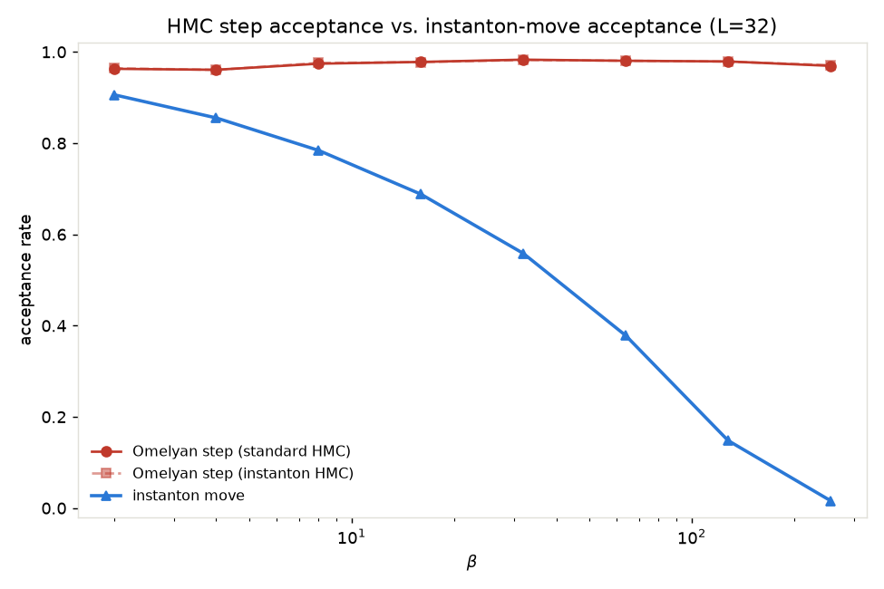
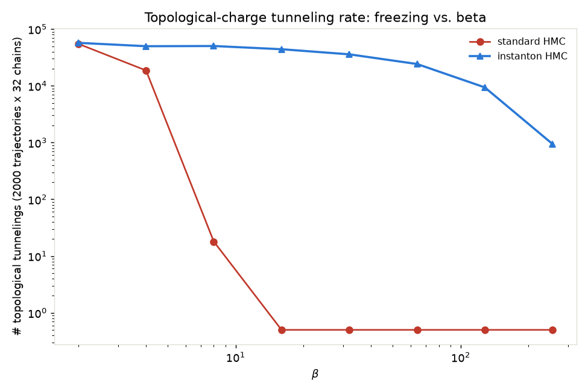

# Instanton-update HMC vs. standard HMC

**Claim under test.** The instanton move (`diffusion.lgt.local_updates.topological_update`) is a *global* Metropolis proposal that adds a smooth Q = +-1 configuration to the whole lattice; its action cost is `delta_S ~ O(beta / V)`, so its acceptance rate should stay roughly beta-independent. Standard HMC can only change Q by having its local leapfrog dynamics climb an action barrier that grows with beta, so its topological-charge tunneling rate should collapse (freeze) at large beta while instanton HMC's does not.

Matched chains at each beta: same L=32, step_size/n_steps (`adapted_hmc_params`), hot start, 32 parallel chains, 500 burn-in + 2000 recorded trajectories.

**Error bars.** The only rigorously independent statistical unit is a chain (different Markov chains = independent noise). Every mean/error below is computed from the 32 per-chain time-averages, discarding the first 25% of the recorded window as extra equilibration margin within production (Q^2 uses the dense per-step charge series; plaquette/Wilson loops use the periodic config snapshots) -- never by pooling all (time x chain) samples into one estimator, which would silently assume time-adjacent draws are as independent as different chains.

## Charge traces

Single representative chain per beta, full recorded window. Standard HMC's trace visibly locks onto one charge sector as beta grows; instanton HMC's keeps hopping across the same beta range.

## Acceptance rates

| beta | HMC step (standard) | HMC step (instanton run) | instanton move |
|---|---|---|---|
| 2 | 0.963 | 0.964 | 0.906 |
| 4 | 0.961 | 0.961 | 0.855 |
| 8 | 0.974 | 0.976 | 0.784 |
| 16 | 0.978 | 0.978 | 0.688 |
| 32 | 0.983 | 0.982 | 0.558 |
| 64 | 0.981 | 0.981 | 0.378 |
| 128 | 0.979 | 0.979 | 0.148 |
| 256 | 0.969 | 0.971 | 0.016 |

The Omelyan step's acceptance is statistically the same whether or not the instanton move is enabled (it does not touch the leapfrog trajectory), which is the sanity check that adding the instanton move does not disturb the base sampler. The instanton move's own acceptance decays with beta but far more gently than standard HMC's tunneling rate, which hits exactly zero.

## Topological freezing

| beta | standard: n_tunnelings | standard: frozen | instanton: n_tunnelings | instanton: frozen |
|---|---|---|---|---|
| 2 | 54997 | False | 57214 | False |
| 4 | 18662 | False | 49907 | False |
| 8 | 18 | False | 50290 | False |
| 16 | 0 | True | 44160 | False |
| 32 | 0 | True | 35888 | False |
| 64 | 0 | True | 24236 | False |
| 128 | 0 | True | 9385 | False |
| 256 | 0 | True | 943 | False |

## Observables vs. exact (per-chain mean +- sem, z-scores)

| beta | obs | standard mean +- sem | z (std vs exact) | instanton mean +- sem | z (inst vs exact) | z (std vs inst) |
|---|---|---|---|---|---|---|
| 2 | plaquette | 0.6973 +- 0.0003 | -1.69 | 0.6976 +- 0.00025 | -0.88 | -0.72 |
| 2 | wilson_2x2 | 0.236 +- 0.00074 | -1.46 | 0.2374 +- 0.00058 | +0.56 | -1.50 |
| 2 | wilson_4x4 | 0.002463 +- 0.00051 | -1.35 | 0.002536 +- 0.00055 | -1.12 | -0.10 |
| 2 | Q^2 | 19.94 +- 0.17 | +0.65 | 19.91 +- 0.19 | +0.42 | +0.13 |
| 4 | plaquette | 0.8634 +- 0.00013 | -1.18 | 0.8632 +- 0.00013 | -2.39 | +0.85 |
| 4 | wilson_2x2 | 0.5555 +- 0.00053 | -1.02 | 0.5551 +- 0.00048 | -1.91 | +0.51 |
| 4 | wilson_4x4 | 0.09418 +- 0.0011 | -1.28 | 0.09535 +- 0.0011 | -0.21 | -0.74 |
| 4 | Q^2 | 7.75 +- 0.34 | +0.04 | 7.863 +- 0.21 | +0.61 | -0.29 |
| 8 | plaquette | 0.9351 +- 0.00011 | -1.33 | 0.9352 +- 7.5e-05 | -0.12 | -1.01 |
| 8 | wilson_2x2 | 0.7632 +- 0.00091 | -2.01 | 0.7647 +- 0.00038 | -0.80 | -1.54 |
| 8 | wilson_4x4 | 0.3297 +- 0.0057 | -2.27 | 0.3419 +- 0.0012 | -0.54 | -2.10 |
| 8 | Q^2 | 11.16 +- 3.5 | +2.18 | 3.559 +- 0.068 | +1.16 | +2.16 |
| 16 | plaquette | 0.9677 +- 7.5e-05 | -7.06 | 0.968 +- 5.8e-05 | -4.27 | -2.97 |
| 16 | wilson_2x2 | 0.8726 +- 0.00083 | -7.48 | 0.8758 +- 0.00047 | -6.53 | -3.31 |
| 16 | wilson_4x4 | 0.5495 +- 0.0076 | -6.19 | 0.581 +- 0.0023 | -6.89 | -3.98 |
| 16 | Q^2 | 13.97 +- 2.6 | +4.68 | 1.663 +- 0.027 | -0.48 | +4.69 |
| 32 | plaquette | 0.9832 +- 8.3e-05 | -12.19 | 0.9834 +- 8.2e-05 | -10.35 | -1.39 |
| 32 | wilson_2x2 | 0.9274 +- 0.001 | -10.83 | 0.9306 +- 0.00078 | -10.09 | -2.43 |
| 32 | wilson_4x4 | 0.7196 +- 0.0099 | -5.65 | 0.7632 +- 0.0015 | -8.46 | -4.35 |
| 32 | Q^2 | 12.53 +- 2.8 | +4.24 | 0.8191 +- 0.0094 | -0.48 | +4.24 |
| 64 | plaquette | 0.9899 +- 0.00014 | -16.13 | 0.9905 +- 0.0001 | -15.62 | -3.63 |
| 64 | wilson_2x2 | 0.941 +- 0.0019 | -14.91 | 0.9496 +- 0.0013 | -15.07 | -3.79 |
| 64 | wilson_4x4 | 0.6713 +- 0.018 | -11.46 | 0.762 +- 0.0082 | -14.61 | -4.52 |
| 64 | Q^2 | 22.81 +- 5.1 | +4.41 | 0.4126 +- 0.0038 | +2.15 | +4.41 |
| 128 | plaquette | 0.9957 +- 4.9e-05 | -8.58 | 0.9958 +- 1.6e-05 | -16.33 | -3.26 |
| 128 | wilson_2x2 | 0.9806 +- 0.0008 | -4.85 | 0.9833 +- 0.00012 | -9.83 | -3.36 |
| 128 | wilson_4x4 | 0.8851 +- 0.012 | -4.68 | 0.9261 +- 0.0015 | -8.95 | -3.50 |
| 128 | Q^2 | 9.75 +- 2.6 | +3.64 | 0.1482 +- 0.003 | +0.53 | +3.64 |
| 256 | plaquette | 0.9965 +- 0.00013 | -11.48 | 0.9971 +- 8.3e-05 | -11.95 | -3.27 |
| 256 | wilson_2x2 | 0.9713 +- 0.0019 | -11.06 | 0.9787 +- 0.0012 | -11.01 | -3.28 |
| 256 | wilson_4x4 | 0.7202 +- 0.022 | -11.28 | 0.8085 +- 0.016 | -10.08 | -3.24 |
| 256 | Q^2 | 7.719 +- 2 | +3.76 | 0.01462 +- 0.00098 | +0.31 | +3.76 |

At low beta (2, 4) standard and instanton agree closely with each other and with exact on every observable -- both samplers are ergodic there. Once standard HMC freezes (beta >= 16), its plaquette and Wilson-loop z-scores also grow large, not just Q^2: the per-case distribution plots below show standard HMC's plaquette-angle histogram visibly broader than exact and its Wilson-loop string tension systematically overestimated at the same beta where instanton HMC's ensemble still tracks exact closely. Reading: once a chain is stuck in the wrong topological sector, that failure contaminates every observable, not just Q, because the true equilibrium distribution mixes across sectors -- the instanton move's benefit is broader than 'fixes topology', it restores general ergodicity. Instanton HMC's own z-scores also grow somewhat with beta (a fixed burn-in budget likely stops being enough for either method as beta grows), but consistently far less than standard's.

## Per-case distribution plots

- `L32_beta2/L32_beta2_distributions.png`: plaquette-angle, P(Q), and Wilson-loop distributions -- standard HMC vs. instanton HMC vs. exact (both ensembles are pure HMC; no diffusion model involved anywhere in this script).
- `L32_beta4/L32_beta4_distributions.png`: plaquette-angle, P(Q), and Wilson-loop distributions -- standard HMC vs. instanton HMC vs. exact (both ensembles are pure HMC; no diffusion model involved anywhere in this script).
- `L32_beta8/L32_beta8_distributions.png`: plaquette-angle, P(Q), and Wilson-loop distributions -- standard HMC vs. instanton HMC vs. exact (both ensembles are pure HMC; no diffusion model involved anywhere in this script).
- `L32_beta16/L32_beta16_distributions.png`: plaquette-angle, P(Q), and Wilson-loop distributions -- standard HMC vs. instanton HMC vs. exact (both ensembles are pure HMC; no diffusion model involved anywhere in this script).
- `L32_beta32/L32_beta32_distributions.png`: plaquette-angle, P(Q), and Wilson-loop distributions -- standard HMC vs. instanton HMC vs. exact (both ensembles are pure HMC; no diffusion model involved anywhere in this script).
- `L32_beta64/L32_beta64_distributions.png`: plaquette-angle, P(Q), and Wilson-loop distributions -- standard HMC vs. instanton HMC vs. exact (both ensembles are pure HMC; no diffusion model involved anywhere in this script).
- `L32_beta128/L32_beta128_distributions.png`: plaquette-angle, P(Q), and Wilson-loop distributions -- standard HMC vs. instanton HMC vs. exact (both ensembles are pure HMC; no diffusion model involved anywhere in this script).
- `L32_beta256/L32_beta256_distributions.png`: plaquette-angle, P(Q), and Wilson-loop distributions -- standard HMC vs. instanton HMC vs. exact (both ensembles are pure HMC; no diffusion model involved anywhere in this script).