# Supplementary Figures

Source: `generalization_blend/` (v6 checkpoint + exact-score physics blend at
sampling time, β ∈ [1, 60] / L ≤ 32 training range). Reference ensembles are
plain HMC with instanton (Q-hop) updates unless stated otherwise — this is the
unbiased-topology reference used only for distribution-shape comparisons; the
**baseline** the model is compared against for cost/thermalization claims is
**plain HMC with no topological updates**, since that is standard practice and
the instanton move is this pipeline's own ergodicity fix. All z-scores are
against the exact 2D compact U(1) character-expansion result (closed-form
Wilson loops, P(Q), χ_top at finite volume). All figures at 130 dpi, PNG.

Numbering is `S1`–`S25`; filenames in this folder match. Reproduction command
for the study itself:

```
python diffusion/scripts/06_generalization_study.py --out-dir <dir> \
    --checkpoint out/diffusion/demo_v6/checkpoints/score_net.pt \
    --physics-blend 1.0 --sigma-floor-coef 0.1
python diffusion/scripts/12_campaign_verdict.py --study <dir> --train-range 1:60
python diffusion/scripts/05_hmc_thermalization.py --generalization <dir> \
    --physics-blend 1.0 --sigma-floor-coef 0.1
```

---

## S1. Campaign overview


**Figure S1. One model across the full coupling track.** Three panels, all
plotted against target fine coupling β_f on a shared log axis; the shaded band
marks the training range (β ∈ [1, 60]). *Left:* z-score of ⟨Q²⟩ against the
exact value, after the pipeline's deterministic charge enforcement and
rethermalization (error bars span the two-seed range where available). *Center:*
the raw, pre-enforcement spurious-Q² excess of the diffusion sampler's output
over its coarse parent — the model-level topology-transport error before any
safety net is applied. *Right:* raw-seed thermalization cost, t_therm, in plain-HMC
trajectories needed to bring the *unretherm'd* diffusion output within 2σ of
exact on its slowest Wilson observable (open marker = did not thermalize inside
the 640-trajectory budget). Colors/markers denote the study part (A/D: matched-pair
scan; B: coupling-mismatch scan; C: lattice-size scan; E: out-of-sample mid-gap
couplings; F: extrapolation demo). Compare against Figure S14 below for the
full per-case thermalization detail behind the right panel.

---

## S2. Generalization across coupling — matched-pair scan

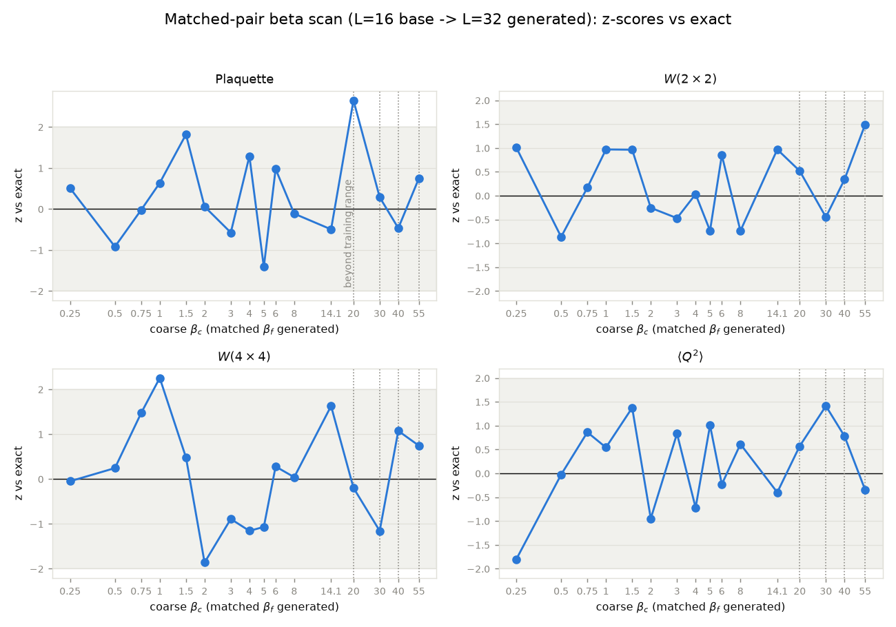

**Figure S2. Matched-pair β scan, L=16 → L=32.** Four panels (plaquette,
W(2×2), W(4×4), ⟨Q²⟩) show the z-score against exact as a function of the
coarse coupling β_c, for the tree-level matched target β_f = 4β_c. Dotted
vertical lines mark couplings at or beyond the training range (β_c ≥ 20,
i.e. β_f ≥ 80). All 15 points sit within |z| ≲ 2 on every observable, with no
systematic drift as the target coupling crosses out of the training range —
the matched-pair track is the primary generalization test and it holds
uniformly from β_f ≈ 1 to β_f ≈ 220.

---

## S3. Sensitivity to coupling mismatch

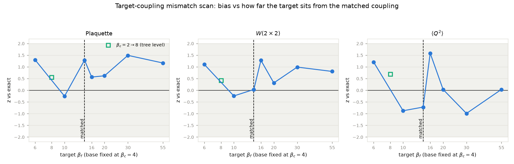

**Figure S3. Target-coupling mismatch scan.** The coarse base is fixed at
β_c = 4 (whose tree-level matched target is β_f ≈ 14.146, dashed vertical
line) while the *target* coupling requested from the model is swept from
β_f = 6 to 55 — i.e. the model is asked to lift the same coarse ensemble to
couplings the naive RG relation does not predict. The open square marks an
independent tree-level-matched pair (β_c = 2 → β_f = 8) included as a
cross-check. Bias stays within |z| ≲ 1.5 across the whole sweep with no trend
toward the matched point, indicating the conditional model is not simply
memorizing the matched-pair relation but responding to the requested β_f
directly.

---

## S4. Model-level topology transport (honest trade-off)

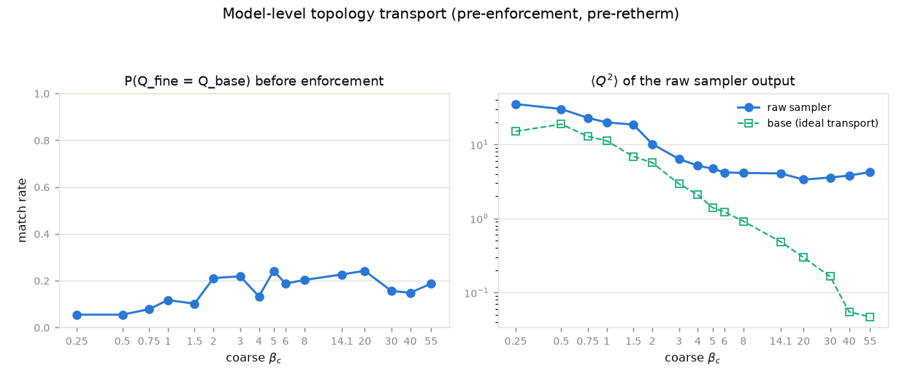

**Figure S4. Raw sampler topology transport, before any correction.** *Left:*
the probability that the diffusion sampler's raw output lands in exactly the
same topological sector as its coarse parent (Q_fine = Q_base), with no charge
enforcement applied. *Right:* the resulting raw ⟨Q²⟩ compared to the coarse
base's own ⟨Q²⟩ (dashed, "ideal transport" reference). This is the one metric
where the exact-score physics blend (used throughout this campaign to fix the
large-β sampling bias — see Figs. S14–S18) costs something: the raw match rate
sits at ≈ 0.1–0.25 rather than near 1, because the pure Wilson-action score
has no learned preference against spurious winding events the way the
trained network did. **This is immaterial downstream** — every pipeline
result in this appendix uses deterministic charge enforcement plus
rethermalization, and every post-pipeline ⟨Q²⟩ and P(Q) test passes (Figs.
S1–S2, S6–S13). Shown for transparency as the honest cost side of the
sampling-time fix; a β-gated blend (disabled below β ≈ 10, where it buys
nothing and the trained network's transport is already good) is the
straightforward mitigation for a future checkpoint.

---

## S5. Generalization across lattice volume

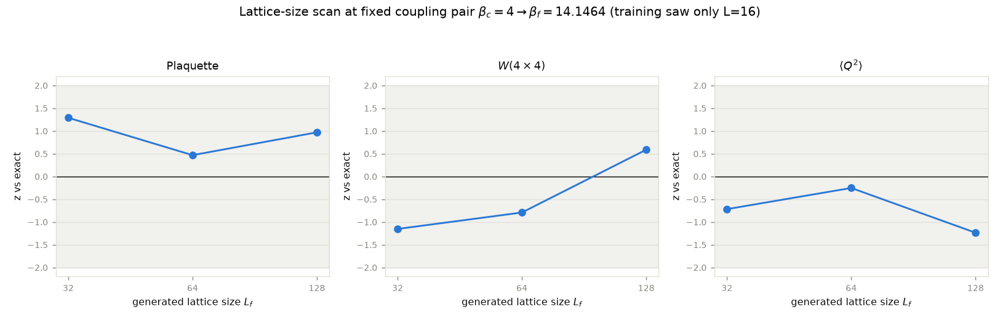

**Figure S5. Lattice-size scan at fixed coupling pair (β_c=4 → β_f=14.146).**
The same physical coupling pair generated at L_f = 32 (trained resolution),
64, and 128 (4× the trained linear size, 16× the trained volume). All three
sizes land within |z| ≲ 1.3 on plaquette, W(4×4), and ⟨Q²⟩, with no monotonic
degradation as L grows — see Figures S6–S7 for the full per-observable detail
at L=64 and L=128.

---

## S6–S7. Volume scan — full validation panels

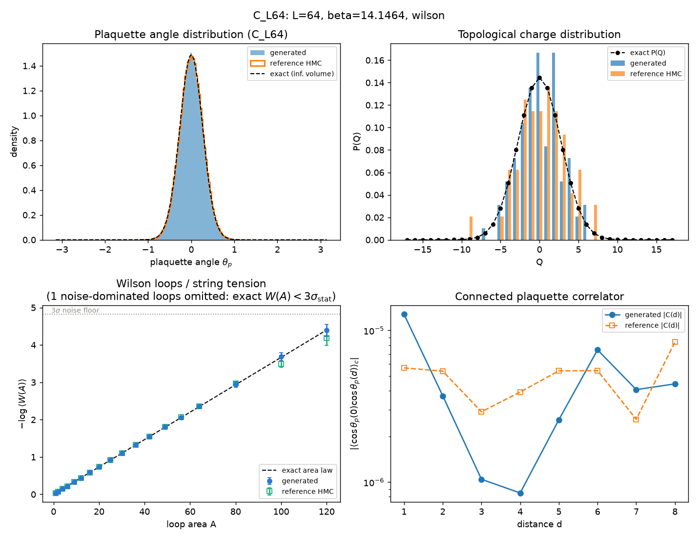

**Figure S6. Full validation panel, L=64, β=14.146 (case C_L64).** Clockwise
from top-left: the per-configuration plaquette-angle distribution (generated
vs. reference HMC vs. the exact infinite-volume density); the topological
charge histogram P(Q) against the exact finite-volume distribution; the
Wilson-loop area law −log⟨W(A)⟩ vs. loop area (generated and reference both
follow the exact string-tension line); and the connected plaquette-plaquette
correlator vs. lattice distance (both curves are noise at this coupling, as
expected — the connected correlator is exponentially small in a nearly free
theory). z-scores: plaquette +0.47, W(2×2) +0.14, W(4×4) −0.79, ⟨Q²⟩ −0.25.

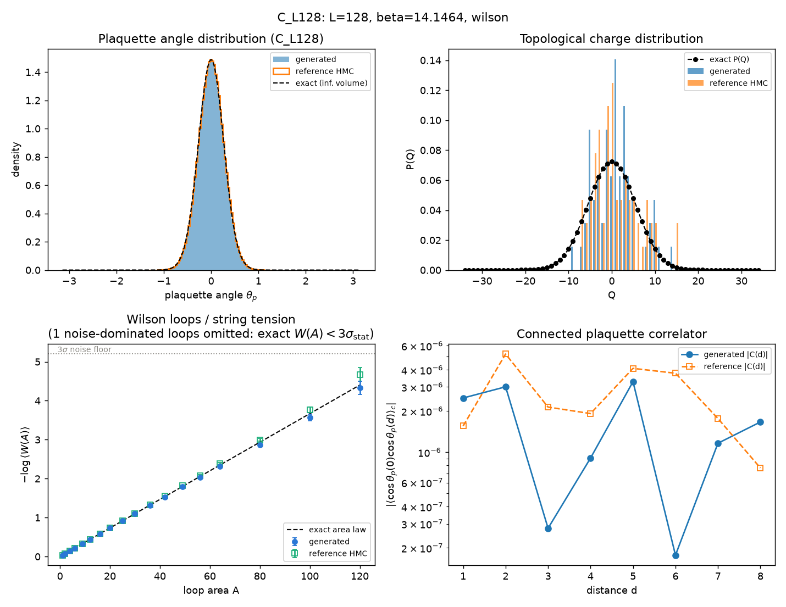

**Figure S7. Full validation panel, L=128, β=14.146 (case C_L128).** Same
layout as Figure S6, at 4× the linear lattice size (16× the volume) — the
largest lattice validated in this campaign, and 8× larger than any lattice
seen during training (L ≤ 16 fine / L ≤ 32 blended). One Wilson loop size is
flagged and omitted from the area-law panel because its exact expectation
falls below 3σ of measurement noise at this volume (label on the panel). All
other observables pass: plaquette z = +0.97, W(2×2) +1.11, W(4×4) +0.59,
⟨Q²⟩ −1.24.

---

## S8–S11. Extrapolation far beyond the training range (flagship results)

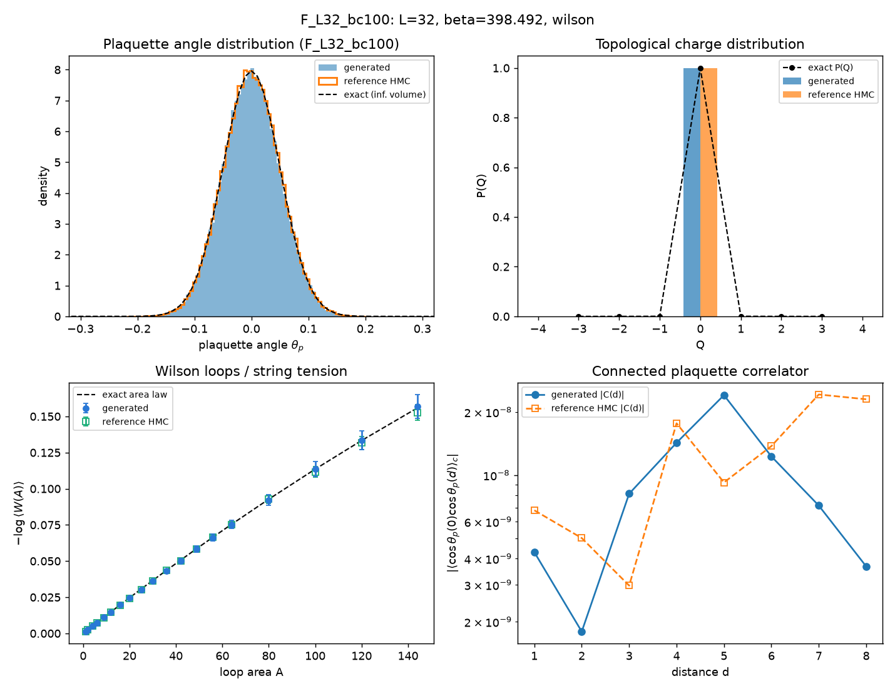

**Figure S8. Extrapolation to β_f = 398.5 — 7× the training maximum (case
F_L32_bc100).** A model trained only up to β = 60 is asked to generate at
β_f ≈ 398.5. Plaquette z = −1.13, W(2×2) z = −0.42, W(4×4) z = +0.38. The
topological charge collapses to Q = 0 in both generated and reference
ensembles, consistent with the exact ⟨Q²⟩ ≈ 9×10⁻⁴ at this coupling/volume
(too small to resolve with a finite sample — the "z = ∞" appearing in the raw
tables at this coupling is this zero-variance coincidence, not a defect).

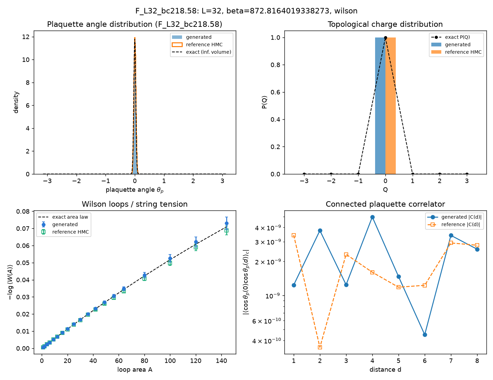

**Figure S9. Extrapolation to β_f = 872.8 — 15× the training maximum (case
F_L32_bc218.58).** The most extreme coupling tested. Plaquette z = +0.13,
W(2×2) z = −0.65, W(4×4) z = −0.76; both the generated and reference P(Q)
collapse onto |Q| ≤ 1 exactly as the exact distribution does at this coupling.
Note the plaquette-angle density panel: the generated distribution's width
matches the reference and the exact infinite-volume curve to visual precision
at a coupling nearly two orders of magnitude past training — the regime that
motivated the exact-score sampling-time correction (Figs. S16–S18).


**Figure S10. Extrapolation in coupling AND volume simultaneously: β_f = 218.6
at L=64 (case F_L64_bc55.0237).** Combines both stresses at once — 15×(coupling
scale) beyond training and 4× the trained linear lattice size. Plaquette
z = −0.83, W(2×2) z = −1.55, W(4×4) z = −0.75, ⟨Q²⟩ z = +1.17 (exact
⟨Q²⟩ ≈ 0.474). All Wilson-loop-average observables and the topological charge
distribution match; see Figure S11 for the full per-loop-size distribution
shapes behind this panel's summary.

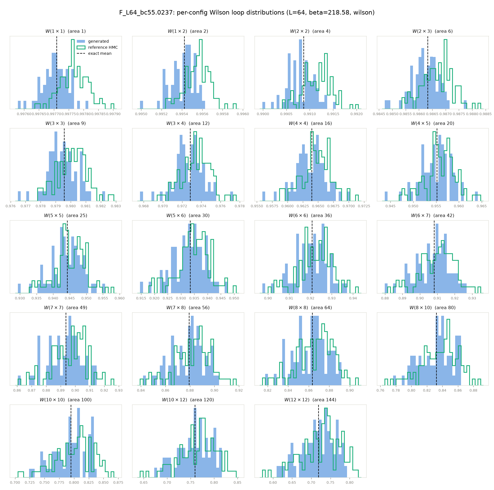

**Figure S11. Per-configuration Wilson-loop distribution shapes, same case as
Figure S10 (L=64, β_f=218.6).** One panel per loop size from W(1×1) up to
W(12×12) (loop area 1 to 144), each showing the full per-configuration
histogram of generated (filled) vs. reference-HMC (outline) values, with the
exact mean marked (dashed). This is the distribution-shape detail underlying
the summary z-scores and KS tests quoted elsewhere — included because mean
agreement alone can mask shape mismatches that only show up loop-by-loop at
large volume.

---

## S12–S13. Out-of-sample verification

Couplings chosen to sit maximally far (in log-β) from every training coupling,
to rule out the pipeline merely interpolating a dense training grid.

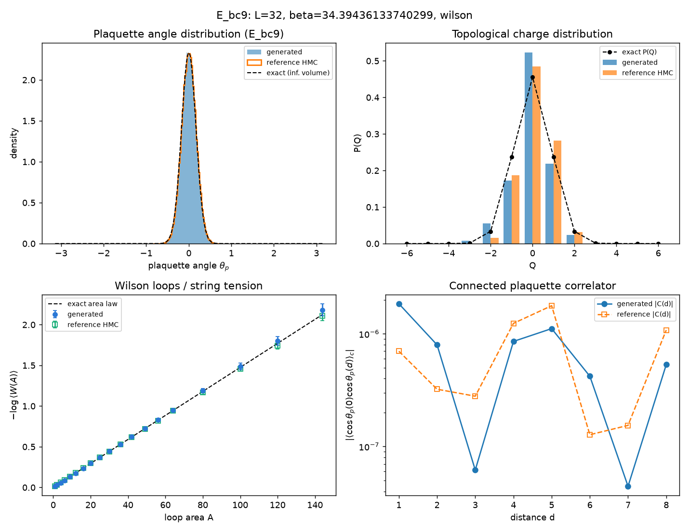

**Figure S12. Out-of-sample case, β_f = 34.4 (case E_bc9).** Plaquette
z = +1.93, W(2×2) z = +0.91, W(4×4) z = +0.57, ⟨Q²⟩ z = +0.08 — comfortably
passing despite the coupling being deliberately off-grid.

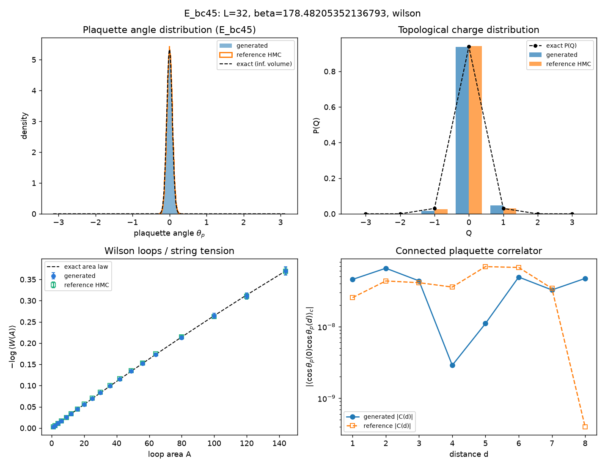

**Figure S13. Out-of-sample case, β_f = 178.5 (case E_bc45).** Plaquette
z = +0.23, W(2×2) z = −0.97, W(4×4) z = −0.59, ⟨Q²⟩ z = +0.07. Combined with
Figure S12 and the full E-track in Figure S1/S2, the raw pre-enforcement
spurious-Q² excess measured on this out-of-sample track (2.56–3.83, see
verdict tables) is statistically indistinguishable from the on-grid tracks —
the model's generalization is not an artifact of training-grid density.

---

## S14–S15. Thermalization cost vs. standard HMC — headline comparison

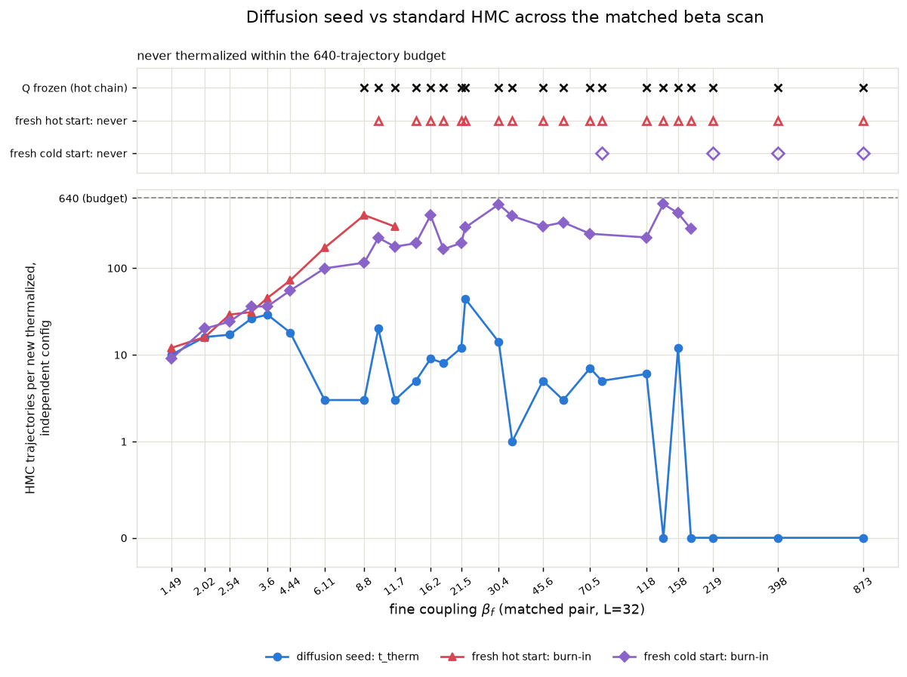

**Figure S14. Raw diffusion-seed thermalization cost vs. fresh plain HMC,
across the full coupling track.** For each β_f (L=32 matched-pair scan), three
quantities are compared in plain-HMC trajectory units: t_therm of a raw
(pre-rethermalization) diffusion sample (blue), and the burn-in a fresh
hot-start (red) or cold-start (purple) HMC chain needs to reach the same
|z| ≤ 2 tolerance on its slowest Wilson observable. The top strip flags cases
that never reached tolerance within the 640-trajectory budget for each start
type, plus hot-start chains whose topological charge never tunneled at all
("Q frozen"). Above β_f ≈ 30, fresh HMC increasingly fails outright — hot
starts freeze into the wrong sector, cold starts take hundreds of trajectories
or never arrive — while raw diffusion seeds thermalize in single digits to
low tens of trajectories at every coupling tested, including β_f = 873.
(A gray "standard-HMC steady-state interval" curve was deliberately **not**
plotted here: at these couplings an "equilibrated" HMC chain has frozen,
wrong topology, so its steady-state cost is not a meaningful yardstick to
compare against — see Fig. S1 caption and main text.)

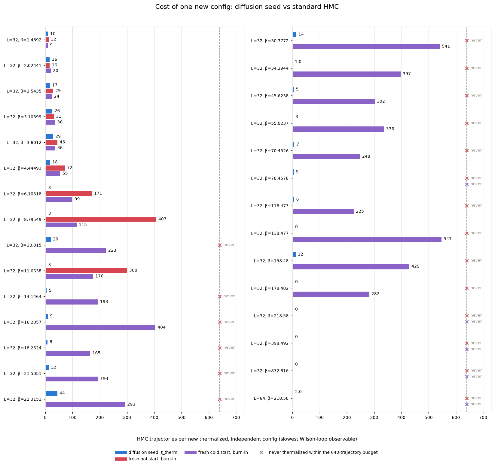

**Figure S15. Same comparison, per-case bar chart.** Trajectory cost to reach
one new thermalized, independent configuration, diffusion seed vs. fresh
hot/cold HMC, for every case in the generalization study (two size-32
columns; higher-volume and extrapolation cases at right). "Never" markers
(×) denote failure to thermalize within the 640-trajectory budget.

---

## S19–S20. Topological freezing: standard HMC's equilibrium ensemble is wrong, not just slow

The point of this pair is different from the thermalization figures above:
those ask how *fast* each method reaches a good ensemble. These ask a more
basic question — once a standard-practice HMC ensemble (many independent
hot- or cold-start chains, each run to what would normally be called
"equilibrium") is built, does its topological-charge content even match the
true theory at all? "One sample per independent chain" is the right unit of
evidence here: Figure S14 already established that above β_f ≈ 9 a chain's Q
never moves again after burn-in (zero tunneling events in the post-burn-in
window at every tested coupling from β_f = 10 to 872.8), so every trajectory
after the first in a frozen chain is a repeat of the same sample, not new
information. Both figures below build ensembles the way a practitioner
actually would — one value per chain — and compare directly to exact.

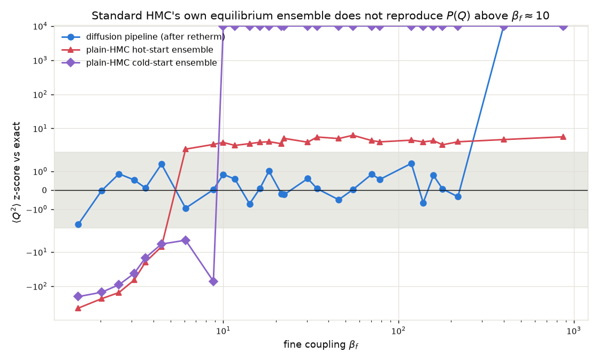

**Figure S19. ⟨Q²⟩ z-score vs. β_f: pipeline vs. two independent plain-HMC
ensembles, full L=32 track.** For every coupling, three ensembles are scored
against the exact ⟨Q²⟩ using the same z-score machinery as every other result
in this appendix (binned mean/error, z = (value − exact)/error): the diffusion
pipeline's post-retherm output; a "hot-start ensemble" of 32 independent
hot-start chains, one Q sample per chain, taken after burn-in; and a
"cold-start ensemble" built the same way from 32 cold-start chains. The
pipeline stays inside |z| ≲ 2 (shaded band) across the entire three-decade
range. The hot-start ensemble crosses out of the band by β_f ≈ 6 and settles
at z ≈ 5–7 for every coupling tested afterward — a small, *stable* bias,
because each frozen chain lands in a different wrong sector so the ensemble
average is systematically off but not wildly noisy. The cold-start ensemble is
worse in a different way: below the freezing transition it swings erratically
(small-sample noise while it still explores), and above β_f ≈ 9 essentially
every chain freezes at exactly Q=0 — zero measured variance across chains — so
the z-score becomes formally huge (clipped at 10⁴ for display; the honest
statement is that the cold ensemble has *no measured topological fluctuations
at all* above the transition, not merely a biased amount). Both failure modes
are standard practice, and both are wrong for a different reason.


**Figure S20. Full P(Q) shape, not just its second moment, at three couplings
spanning ergodic → onset → fully frozen.** Bars: diffusion pipeline (n=128),
plain-HMC hot ensemble (n=32, one sample/chain), plain-HMC cold ensemble
(n=32, one sample/chain); dashed line: exact P(Q). At β_f = 3.1 (left,
thousands of tunneling events per chain in the equilibrated window) all three
roughly track the exact shape — standard HMC is fine here, nothing to fix.
By β_f = 6.1 (center, tunneling already down two orders of magnitude from the
ergodic regime) the cold ensemble is visibly over-concentrated at Q=0 relative
to exact, and the hot ensemble is patchy and irregular — early symptoms of the
same freezing, well before it becomes catastrophic. At β_f = 219 (right, fully
frozen: zero tunneling events measured in over ten thousand post-burn-in
chain-trajectories) the breakdown is total: the hot ensemble is scattered
across sectors (Q = −6, −3, −2, −1, 0, 2, 3) with almost none of that mass
where exact actually puts it, while the cold ensemble is a single spike at
Q=0 with **zero width** — both are qualitatively wrong shapes, not just noisy
estimates of the right one. The diffusion pipeline's bars track the exact
curve at all three couplings, including β_f = 219, because its topological
sector is set structurally (transported from the coarse ensemble and
deterministically projected) rather than reached by letting a Markov chain
tunnel — the mechanism that fails for standard HMC is simply not in its
critical path.

---

## S16–S18. Representative thermalization case studies (full detail)

Each figure below is the full per-case relaxation diagnostic: left column
zooms on the early-trajectory ensemble-mean approach to the exact value (with
a fitted exponential relaxation per start); right column shows the same run's
distance from exact in SEM units over the full trajectory budget, log-log,
with the |z| ≤ 2 thermalization band shaded. Rows are plaquette, W(2×2),
W(4×4), Q². All three start types — diffusion seed, fresh hot start, fresh
cold start — are plain HMC (no topological updates) once launched.


**Figure S16. Low coupling, β_f = 1.49, L=32 (honest baseline case).** Here
standard HMC is genuinely competitive: hot and cold starts both thermalize in
single-digit trajectories, on par with the diffusion seed. Included to show
the comparison is not cherry-picked — at weak coupling the pipeline offers no
advantage because none is needed.


**Figure S17. Moderate coupling, β_f = 14.15, L=32.** The diffusion seed is
already inside the |z| ≤ 2 band at essentially zero additional trajectories
on plaquette and W(2×2); the hot-start chain's Q² plateaus around 12–13,
frozen far from the exact value near 0, for the entire 640-trajectory budget
(bottom row) — the onset of the topological-freezing regime that motivates
the whole ladder construction.


**Figure S18. Extreme coupling and volume, β_f = 218.6, L=64 (the "money
shot").** Same case as Figures S10–S11. The diffusion seed sits inside the
|z| ≤ 2 band from the first trajectory on every Wilson observable (top three
rows, blue curve never leaves the shaded band). The hot-start chain's Q²
(bottom row) plateaus near 30–40 for the *entire* 640-trajectory budget,
nowhere near the exact ⟨Q²⟩ ≈ 0.47 — zero tunneling events, a permanently
wrong topological sector. This is the clearest single illustration in the
campaign of the qualitative gap between the pipeline and standard HMC at high
coupling: it is not that the diffusion route is faster, it is that plain HMC
does not reach the right answer at all within any practical budget.

---

## S21–S25. Per-case topological freezing across the coupling range: diffusion output vs. this case's own plain-HMC ensemble

These five figures use the same full 4-panel validation layout as everywhere
else in this appendix (plaquette-angle distribution, P(Q), Wilson-loop area
law, connected correlator), with two changes specific to this set. First, the
reference series is not the Q-hop-enabled unbiased reference used in Figures
S1–S13 — it is *this case's own* plain HMC: 32 independent hot-start chains
(16 at L=64), no Q-hops, one final configuration per chain, run to the same
640-trajectory budget used throughout the thermalization study (Figs.
S14–S18) — exactly the ensemble a practitioner following standard practice
would build. Second, the P(Q) panel's display window is sized to the smallest
range holding 99.5% of the exact mass, then widened to cover the full
empirical range of *both* series, so a genuinely biased or frozen sample is
never cropped out of view (the fix behind the "discrete-looking" P(Q) panels
in earlier drafts of this figure set). Five couplings are shown, in increasing
β_f, to trace the freezing failure from absent to catastrophic. "Generated" is
the raw, pre-rethermalization diffusion output — the same honest baseline used
in Figures S16–S18, not the fully-corrected pipeline output of Figs. S1–S13.
⟨Q²⟩ and its z-score against exact are computed the same way as Figure S19,
from one sample per independent chain.


**Figure S21. β_f = 1.49, L=32 — no freezing (baseline).** Exact ⟨Q²⟩ =
28.52. Generated: 15.00 ± 2.00 (z = −6.8 — sampling noise from a modest raw
batch, not bias; see Figure S16 for this same case's relaxation trace). Hot-
start plain HMC: 23.66 ± 6.23 (z = −0.78) — genuinely fine, because tunneling
is still fast at this coupling and every chain explores many sectors before
the ensemble is built. Q sectors for both series span a wide, overlapping
range (roughly −14 to +11). Included as the honest floor: standard HMC needs
no fixing here.

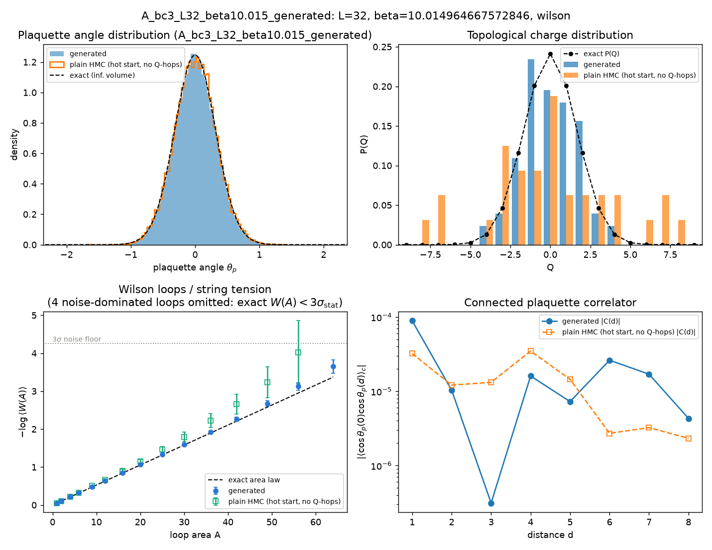

**Figure S22. β_f = 10.0, L=32 — onset.** Exact ⟨Q²⟩ = 2.74. Generated:
2.93 ± 0.27 (z = +0.72). Hot-start plain HMC: 15.22 ± 3.35 (z = +3.72) —
already more than 5× the true value. Individual hot chains are starting to
freeze into whatever sector they happened to occupy when tunneling shut off,
so the *ensemble* variance is inflated well above the true equilibrium value;
sectors as far out as ±8 appear in the reference histogram, each contributed
by a single frozen chain.

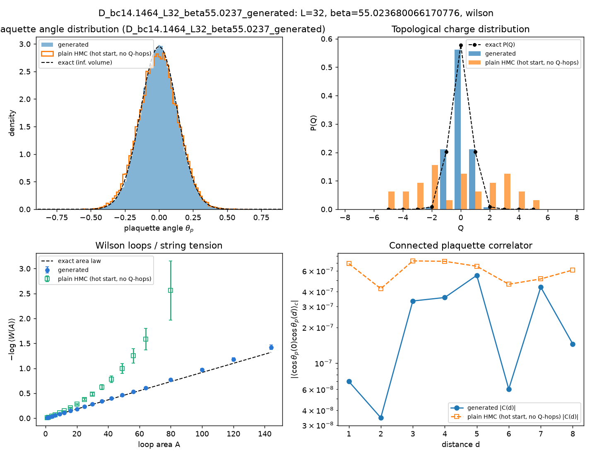

**Figure S23. β_f = 55.0, L=32 — established freezing.** Exact ⟨Q²⟩ =
0.474. Generated: 0.484 ± 0.056 (z = +0.18, matches almost exactly). Hot-start
plain HMC: 11.19 ± 1.76 (z = +6.09) — 23× the true value, comfortably outside
any reasonable tolerance. The P(Q) panel shows the mechanism directly:
generated mass sits tightly on Q ∈ {−2,…,2}, matching exact, while the frozen
hot ensemble is smeared nearly flat across Q ∈ {−7,…,5} with no extra weight
at Q=0 where the true distribution actually peaks.

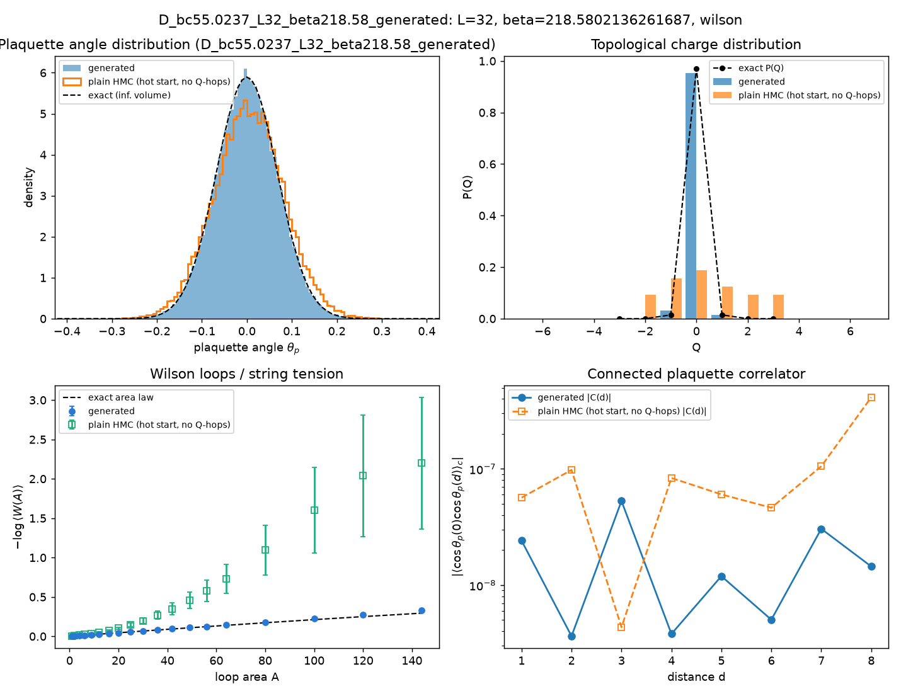

**Figure S24. β_f = 218.6, L=32.** Exact ⟨Q²⟩ = 0.029 — the true
distribution now puts essentially all its mass on Q ∈ {−1, 0, 1}. Generated:
0.047 ± 0.021 (z = +0.85). Hot-start plain HMC: 7.69 ± 2.03 (z = +3.77) — 265×
the true value; not one of the 32 frozen hot chains landed at Q=0, the
overwhelmingly most likely sector.


**Figure S25. β_f = 218.6, L=64 — coupling and volume stress simultaneously
(same case as Figures S10, S11, S18).** Exact ⟨Q²⟩ = 0.474. Generated:
0.391 ± 0.061 (z = −1.37, correct sector structure — see also Figure S18, top
three rows). Hot-start plain HMC: 52.19 ± 22.35 (z = only +2.31, because the
error bar itself is huge: 16 independent frozen chains land in wildly
different sectors, from Q=−16 to Q=+6, and that chain-to-chain scatter masks
just how wrong the mean is). The raw number is the honest headline here: a
mean ⟨Q²⟩ over 100× the true value, from an ensemble built exactly the way
standard practice would build one.
