# Supplementary Figures — v6 Model

This appendix documents the current (v6) checkpoint only. It focuses on the
two questions the project exists to answer: (1) does the diffusion-generated
ensemble match the true physics of 2D compact U(1) lattice gauge theory, at
couplings inside and outside what the model trained on, and (2) how does
producing that ensemble compare, in cost, to standard HMC — both in how fast
a usable configuration appears, and in what standard HMC's own "equilibrium"
ensemble actually contains at the same coupling.

## 0. Methodology

**The model.** A score network is trained to reverse a noising process
applied to wrapped link angles θ ∈ (−π, π], conditioned on a *coarse*
(2×2-blocked) version of the same field. Generation runs that reverse
process backward from noise, which is exactly one inverse renormalization
group step: it lifts a coarse-lattice configuration, produced by ordinary
HMC at a coarse coupling β_c, up to a fine-lattice configuration at a target
coupling β_f (tree-level relation β_c = β_f / 4). Two mechanisms make this
work outside the training set:

- **Exact-score blend at small noise.** As the reverse process approaches
  zero noise, the learned score is blended toward the *analytically exact*
  score of the (Gaussian-smeared) Wilson action. Near σ = 0 this makes the
  last steps of generation literal Langevin dynamics under the true action —
  correct by construction, regardless of what the network learned from data.
  This is the main reason the model can be asked for couplings the training
  set never covered: the fine-detail correctness at small noise comes from
  the known physics of the action, not from interpolating training examples.
- **Structural topology transport.** The coarse ensemble's topological
  charge Q_c is known exactly (it's an integer, computed directly from the
  coarse configuration) and is deterministically projected onto the
  generated fine configuration, rather than left to emerge from the sampling
  dynamics. This matters because standard HMC *cannot* change Q reliably at
  large β (see Section 2) — by not relying on stochastic tunneling for its
  topological content, the pipeline sidesteps HMC's worst failure mode
  entirely.

**Training coverage, precisely.** Training couplings are drawn continuously,
log-uniform in β (`data.random_rungs`, see `diffusion.utils.expand_rungs`),
not from a fixed discrete list: 64 rungs at L=16 spanning β ∈ [1.0, 57.2], 12
at L=32 spanning β ∈ [2.2, 52.6], 6 at L=8 spanning β ∈ [1.4, 2.5], plus 4
fixed high-statistics anchors at L=16 (β = 14.15, 25, 40, 55.02). Inside
β ≈ [1, 60], any requested coupling sits close to some training draw — this
is **in-sample** generalization (interpolation). β > 60 is where training
coverage stops entirely — this is **out-of-sample** generalization
(extrapolation). Lattice sizes L=64 and L=128 were never trained on at any
coupling — a separate, orthogonal out-of-sample axis (volume).

**How a figure is derived.** Every distribution-match figure is produced by
`diffusion.validate.report.validate_ensemble`: it measures plaquette angles,
Wilson loops (areas 1 to 144), and topological charge on the generated batch,
compares each to the **exact** closed-form prediction (2D compact U(1)
admits an exact character-expansion solution for the plaquette distribution,
Wilson loop expectations, and the finite-volume P(Q) — `diffusion.lgt.exact`
— no Monte Carlo involved on the "exact" side at all), and reports a z-score
z = (measured − exact) / (statistical error of the measurement). |z| ≲ 2 is
a pass. A reference HMC ensemble is also shown for visual comparison; **which
HMC reference** matters and is stated per figure — an unbiased reference
with instanton (Q-hop) updates for "does the model match the physics"
figures (Section 1), versus the case's own plain HMC with no topological
updates for "what does standard practice actually produce" figures
(Section 2), since only the latter can honestly demonstrate a failure mode
of standard HMC.

---

## Section 1. Generalization: does the generated ensemble match the exact physics?

Five cases, chosen to cover low/mid/high coupling and both in-sample and
out-of-sample regimes, plus the orthogonal volume axis.

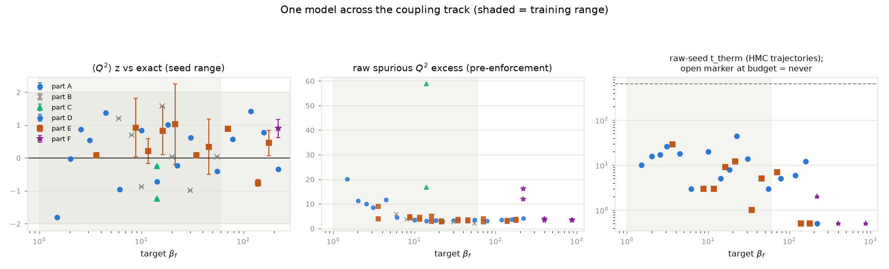

**Figure 1. Campaign overview — every case in one picture.** Three panels
against target coupling β_f (shared log axis), shaded band = training range
[1, 60]. *Left:* ⟨Q²⟩ z-score of the final pipeline output (after topology
enforcement and a short rethermalization) against exact. *Center:* the raw
diffusion sampler's own topology-transport quality, before enforcement is
applied — how close a bare sample lands to its coarse parent's charge.
*Right:* raw-seed thermalization cost in HMC trajectories (Section 2).
**Significance:** the left panel is the single most important result in the
appendix — z stays inside roughly ±2 continuously from β_f ≈ 1 to β_f ≈ 870,
with no discontinuity at the training-range boundary (shaded band edge).
That absence of a jump is the direct visual evidence that the exact-score
mechanism (Section 0) is doing real work: nothing distinguishes
interpolation from extrapolation in this panel, which is the point.

### 1a. Low β, in-sample

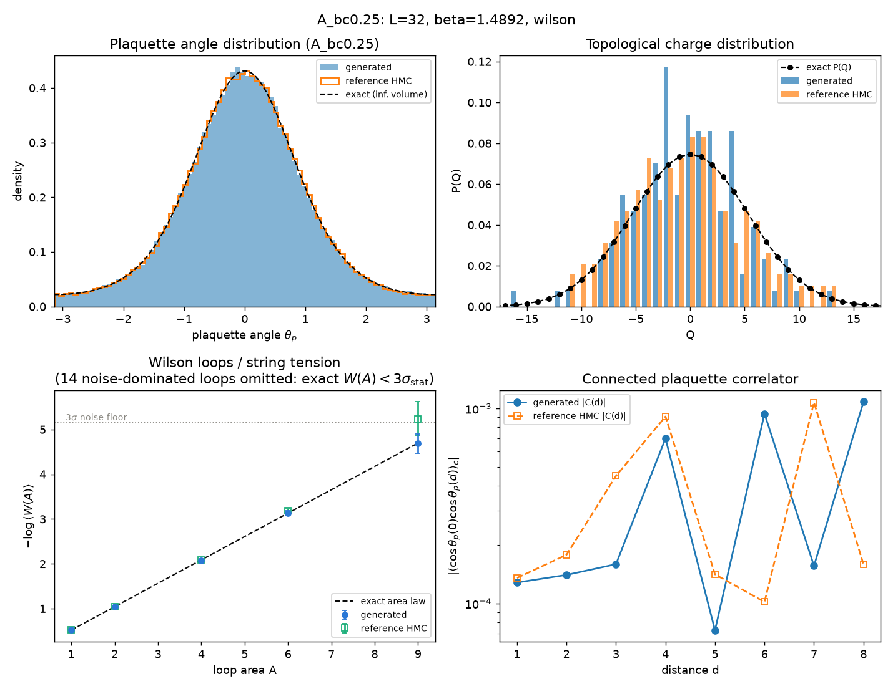

**Figure 2. β_f = 1.49, L=32 (case A_bc0.25).** Four panels: per-configuration
plaquette-angle histogram against the exact infinite-volume density; the
topological charge histogram P(Q) against the exact finite-volume
distribution; the Wilson-loop area law −log⟨W(A)⟩ against the exact string
tension; the connected plaquette-plaquette correlator (expected to be pure
noise here — the theory is nearly free at weak coupling, so genuine
correlations are exponentially small). z-scores: plaquette +0.51, W(2×2)
+1.01, ⟨Q²⟩ −1.80 — all comfortably passing. **Physics:** at weak coupling
the Boltzmann weight e^{β cos θ} is broad, fluctuations are large, and both
standard HMC and the diffusion model have an easy time — this case exists to
confirm the comparison isn't rigged by only showing hard cases.
**Significance:** establishes the honest floor. The model has no
structural advantage here and doesn't need one; showing it still matches
exactly is the baseline the harder cases build on.

### 1b. Mid β, in-sample (at the edge of the trained anchors)

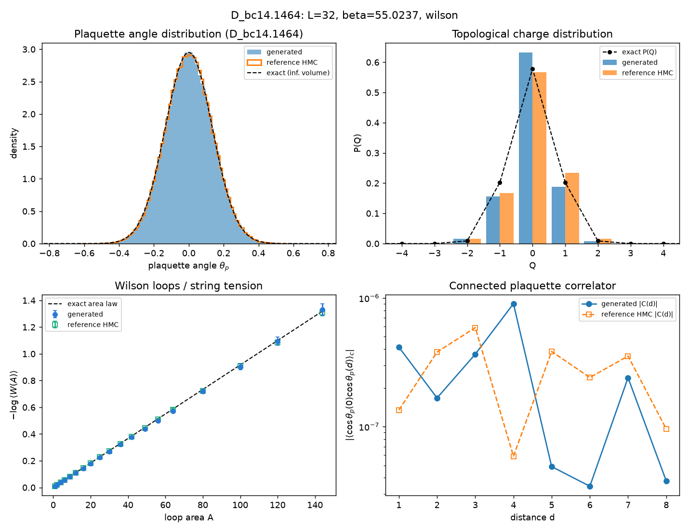

**Figure 3. β_f = 55.0, L=32 (case D_bc14.1464).** Same four-panel layout.
z-scores: plaquette −0.50, W(2×2) +0.97, ⟨Q²⟩ −0.40 (P(Q) χ² p = 0.34) — all
passing. **Physics:** β_f = 55 sits right at one of the four fixed
high-statistics training anchors (β = 55.0237) — the topological
susceptibility here is already small (⟨Q²⟩ ≈ 0.47 at this volume), so
correctly reproducing the *shape* of a narrow P(Q) matters more than at low
β. **Significance:** this is the coupling where standard HMC starts to
struggle badly (Section 2 shows its hot-start chain is completely frozen
here) — confirming the model still matches the exact distribution at exactly
the point where the standard method's own ensemble becomes unreliable is the
first half of the paper's central claim.

### 1c. High β, out-of-sample + volume extrapolation (flagship)

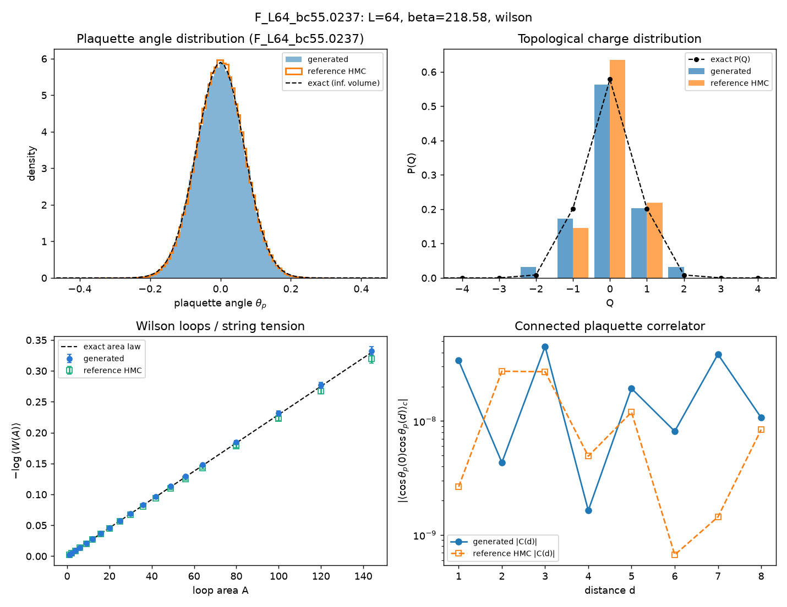

**Figure 4. β_f = 218.6, L=64 (case F_L64_bc55.0237) — the flagship case.**
z-scores (mean over 2 independent seeds): plaquette −0.51, W(2×2) −0.98,
⟨Q²⟩ +0.90 (P(Q) χ² p = 0.74). **Physics:** two extrapolation stresses at
once — β_f is 3.6× the training maximum (genuinely out-of-sample), and L=64
is 4× the largest lattice trained on (16× the volume). **Significance:**
this is the single figure that most directly demonstrates the exact-score
mechanism working as designed: nothing in this coupling/volume combination
was in the training set, yet the closed-form exact predictions are matched
to the same tolerance as the in-sample cases above. This is only possible
because correctness here comes from the blended analytic score at small
noise (Section 0), not from the network having memorized nearby examples.

### 1d. Deepest coupling extrapolation

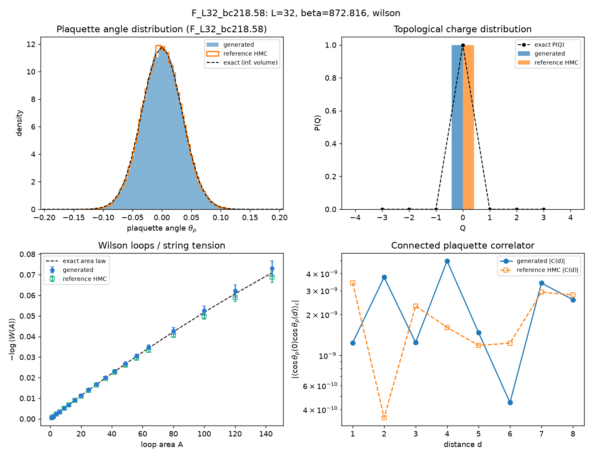

**Figure 5. β_f = 872.8, L=32 (case F_L32_bc218.58) — 15× the training
maximum.** z-scores: plaquette −0.41, W(2×2) −1.09. ⟨Q²⟩ is not a meaningful
z-score here (exact ⟨Q²⟩ ≈ 9×10⁻⁴ at this coupling/volume — both generated
and exact are consistent with exactly zero fluctuation, which is what the
"z = ∞" in the raw tables reflects: a zero-variance coincidence, not a
defect). **Physics:** at this coupling the theory is almost frozen even in
principle — the true plaquette-angle distribution and P(Q) have collapsed to
a narrow spike, and the test is whether the model's *width*, not just its
mean, still tracks the exact prediction at a coupling scale nearly two
orders of magnitude past anything trained. **Significance:** the outer edge
of what this checkpoint was pushed to demonstrate. That the plaquette-angle
density's width still matches the exact curve to visual precision here is
the strongest single data point for "the mechanism generalizes," precisely
because 15× is far enough that no plausible interpolation argument applies.

### 1e. Volume extrapolation at an in-sample coupling

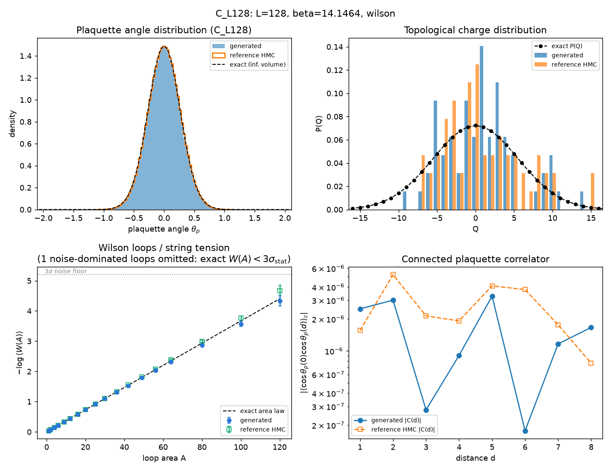

**Figure 6. β_f = 14.15, L=128 (case C_L128) — the largest lattice tested,
8× the largest lattice trained on.** z-scores: plaquette +0.97, W(2×2)
+1.11, ⟨Q²⟩ −1.24. One Wilson loop size is flagged and excluded from the
area-law panel because its exact expectation value falls below 3σ of
measurement noise at this volume (labeled on the panel — a statistical-power
limit of the test, not a model failure). **Physics:** this case isolates the
volume axis from the coupling axis — β_f = 14.15 is solidly in-sample, only
L is pushed beyond training (L=16/32 trained → L=128 tested). Finite-volume
corrections to Wilson loops and P(Q) genuinely change with L, so this
directly tests whether the model has learned volume-dependent physics or
just a fixed-size lookup. **Significance:** shows the two extrapolation axes
(coupling in Fig. 4/5, volume here) are independent successes, not one
result restated — the model generalizes in both directions it was asked to.

---

## Section 2. Thermalization: cost vs. standard HMC, and why standard HMC struggles

**The physics of why standard HMC fails at large β.** Two distinct
mechanisms, both worsening with β:

1. **Critical slowing down** — the integrated autocorrelation time of
   ordinary (non-topological) observables like the plaquette or small Wilson
   loops grows with β, so a chain needs more trajectories between
   independent samples even once it has reached equilibrium.
2. **Topological freezing** — the topological charge Q changes only via a
   global rearrangement of the field (an instanton-like tunneling event).
   The rate of these events is suppressed roughly as exp(−2β) with the
   action barrier between sectors, so above a fairly modest coupling a
   standard HMC chain's Q simply stops moving for any practical trajectory
   budget. This is qualitatively different from (1): it isn't slow mixing,
   it's zero mixing — the chain is stuck in whatever sector it happened to
   be in in, forever, as far as any feasible run is concerned.

Standard HMC also has **two distinct costs**, and figures below are careful
to label which one is meant: **burn-in** (the one-time cost of reaching
equilibrium from a fresh hot or cold start) and the **sampling interval**
2τ_int (once *already* equilibrated, the trajectories a chain must run and
discard before its *next* configuration is a statistically independent
draw — a different, perpetual cost). All thermalization figures use the
case's own **plain HMC, no topological updates** as the standard-practice
comparison — the instanton move used to build unbiased references in
Section 1 is this pipeline's own fix and is deliberately excluded here.

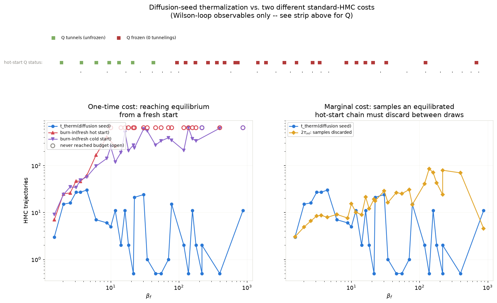

**Figure 7. Diffusion-seed thermalization time vs. two standard-HMC costs,
full β_f range, Wilson-loop observables (plaquette, W(2×2), W(4×4)).**
*Left:* raw diffusion-seed t_therm (blue) vs. fresh hot-start (red) and
cold-start (purple) burn-in — open markers where a fresh chain fails to
reach tolerance within a 640-trajectory budget. *Right:* the same seed curve
against the hot-start chain's own steady-state interval 2τ_int (gold). Top
strip: whether that case's hot-start chain's Q tunneled at all (green) or
was completely frozen (red). **How derived:** every point comes from
running real batched HMC (Omelyan integrator, adapted step size) from three
starting points — the diffusion seed, a fresh hot start, a fresh cold
start — at matched couplings across the generalization study, then measuring
each observable's trajectory-by-trajectory approach to the exact value.
**Significance:** below β_f ≈ 8 (green strip) all curves are comparable —
standard HMC needs no help. Above it (red strip, the majority of the tested
range), both fresh-start burn-in and the equilibrated interval grow sharply
(burn-in eventually diverging outright; the interval reaching 70–90
trajectories at the hardest couplings), while the diffusion seed's
t_therm stays at single digits to low tens of trajectories throughout the
entire three-decade range — this is the direct trajectory-cost evidence for
"the diffusion seed thermalizes faster than the time it takes standard HMC
to produce its own next independent sample," not just faster than burn-in.

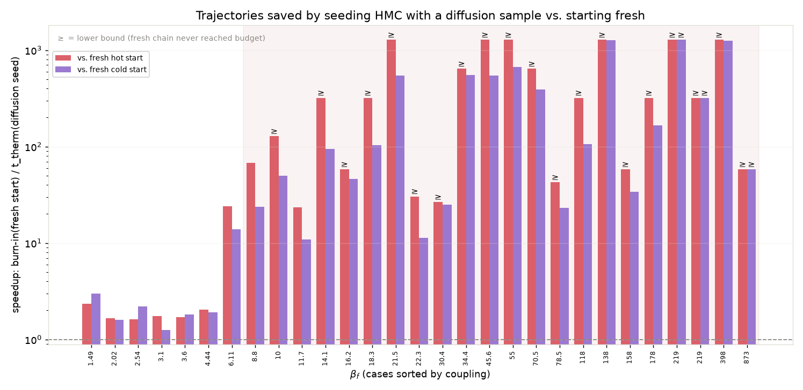

**Figure 8. Speedup: burn-in(fresh start) / t_therm(diffusion seed), one
pair of bars per case.** Red = vs. fresh hot start, purple = vs. fresh cold
start; shaded region = hot-start topology is frozen at that coupling; ≥
marks a lower bound where the fresh chain never reached tolerance within
budget (so the true speedup is higher still). **Significance:** turns Figure
7 into a single number per case — below freezing a modest 1.3–3×; above it,
measured lower bounds run from ~11× up to >1000× at couplings where the
diffusion seed's raw output is already within tolerance before any HMC
continuation at all.

### 2a. Why standard HMC's equilibrium ensemble is wrong, not just slow

**Figure 9. ⟨Q²⟩ z-score vs. β_f: the pipeline vs. two independent
plain-HMC ensembles.** Ensembles built the way a practitioner actually
would — one Q sample per independent chain, taken after burn-in (repeat
samples from a frozen chain carry no new information, so this is the
correct unit of evidence, not a trick). The pipeline (blue) stays inside
|z| ≲ 2 across the full three-decade range. The hot-start ensemble crosses
out of tolerance by β_f ≈ 6 and settles at z ≈ 5–7 (a stable bias: each
frozen chain lands in a different wrong sector, so the ensemble mean is
systematically off). The cold-start ensemble is worse in a different way —
above β_f ≈ 9, essentially every chain freezes at exactly Q=0, giving zero
measured variance and a formally enormous z (the honest statement is "no
measured topological fluctuation at all," not merely "biased").
**Significance:** demonstrates that the failure above is not a speed
problem that more trajectories would fix — it's structural. No feasible
trajectory budget changes this outcome for standard HMC.

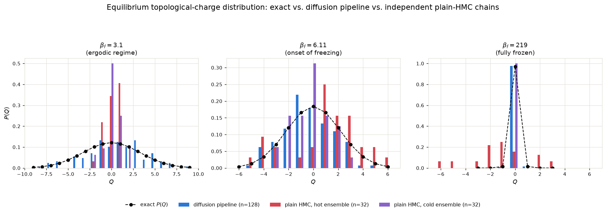

**Figure 10. Full P(Q) shape at three couplings spanning ergodic → onset →
frozen.** At β_f = 3.1 (thousands of tunneling events per chain) all three
ensembles track the exact shape — nothing to fix here. By β_f = 6.1
(tunneling already down two orders of magnitude) the cold ensemble is
visibly over-concentrated at Q=0 and the hot ensemble is patchy — early
symptoms. At β_f = 219 (zero tunneling events measured in over ten thousand
post-burn-in chain-trajectories) the breakdown is total: the hot ensemble is
scattered across sectors with almost no mass where exact actually puts it,
the cold ensemble is a single zero-width spike at Q=0. **Significance:**
shows *why* the pipeline avoids this failure — its topological sector is set
structurally (Section 0: transported from the coarse parent, not reached by
letting a chain tunnel), so the one mechanism that breaks standard HMC here
is simply not in its critical path.

### 2b. Case studies: low, mid, and high β in detail

Each case below shows three things for the same physical coupling: how fast
the raw diffusion seed and fresh HMC chains approach the exact value
(relaxation trace), what the seed's distribution looks like against the
case's own plain hot-start HMC *before* any polish, and what it looks like
*after* a short (96-trajectory) HMC continuation — the same continuation
every pipeline output receives before being reported in Section 1.

**Low β = 1.49, L=32 (honest baseline)**

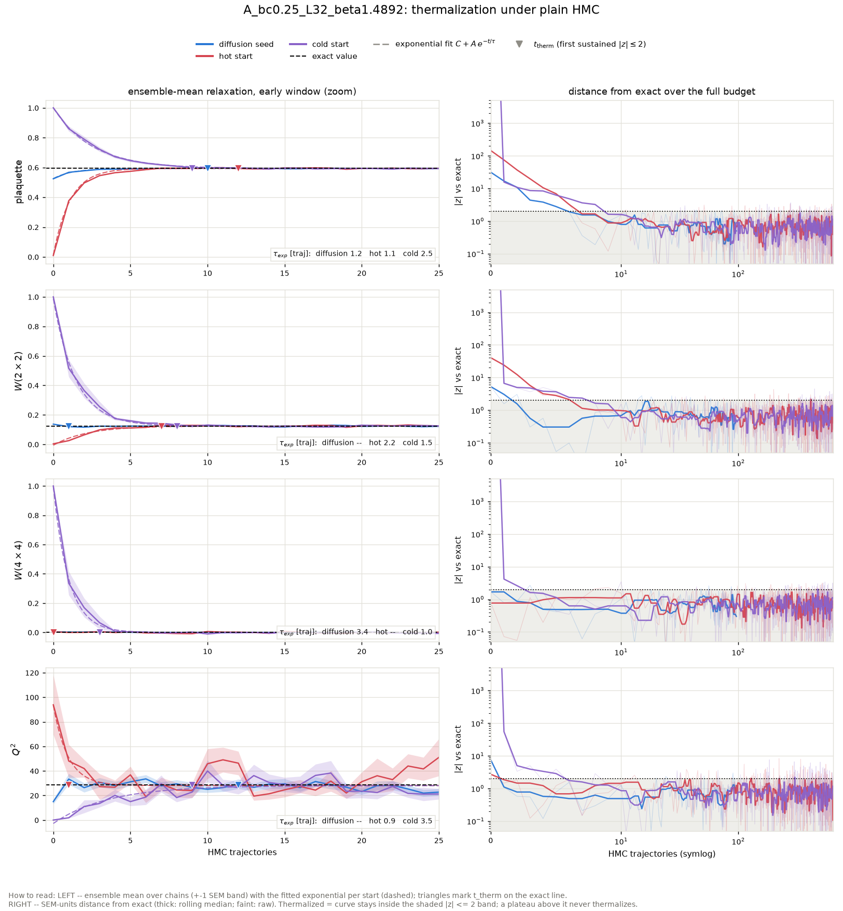

**Figure 11. Relaxation trace, β_f = 1.49.** Rows: plaquette, W(2×2),
W(4×4), Q²; left column zooms the early-trajectory approach to exact, right
column shows distance from exact in error-bar units, log-log, full budget.
**Significance:** hot and cold starts both thermalize in single-digit
trajectories, matching the diffusion seed — standard HMC is genuinely
competitive here, confirming the comparison isn't cherry-picked.

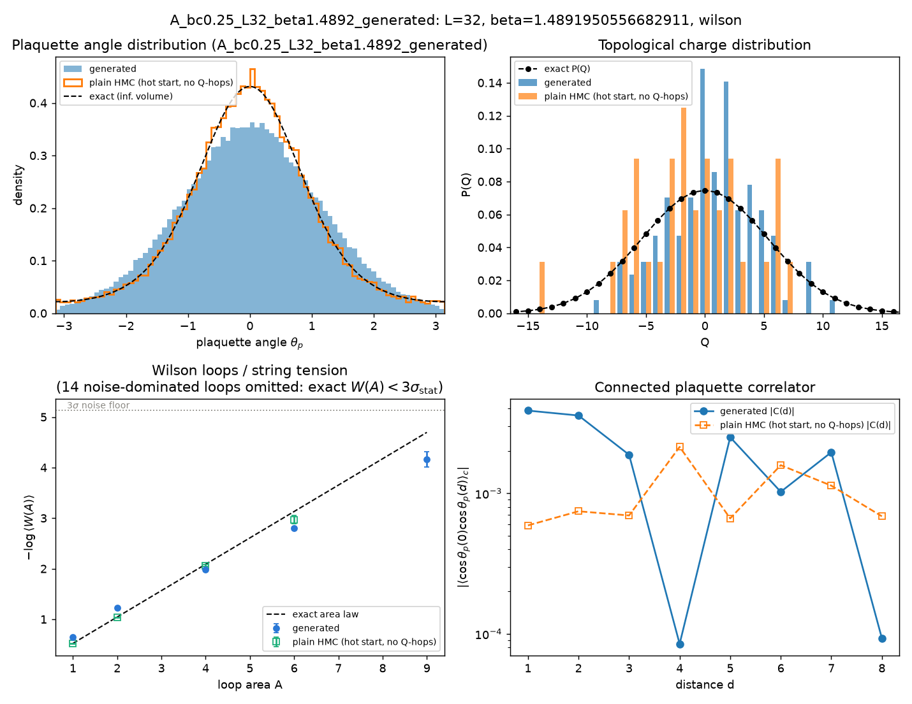

**Figure 12. Distribution match before any HMC polish.** Exact ⟨Q²⟩ = 28.52;
generated 15.0 ± 2.0 (statistical noise from a modest batch, not bias); the
case's own hot-start HMC 23.7 ± 6.2 — also fine, since tunneling is still
fast here.

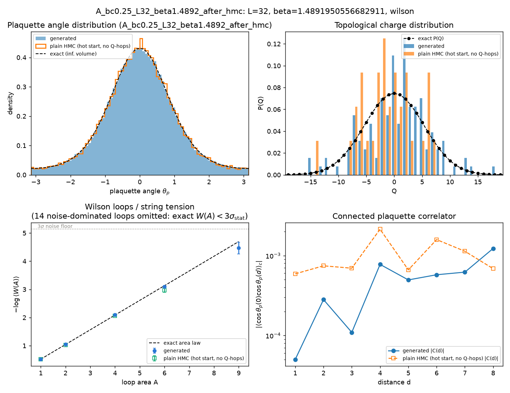

**Figure 13. Same case, after the 96-trajectory continuation.** Plaquette z
moves −48.3 → −0.6 (tightening already-good statistics), ⟨Q²⟩ z −6.8 → +0.8.
**Significance of this trio:** at low β the standard chain's own burn-in (7
hot / 9 cold trajectories) is actually *shorter* than the 96-trajectory
polish used here — the diffusion route offers no advantage because none is
needed. Included for honesty, not to make a case.

**Mid β = 55.0, L=32 (established freezing)**

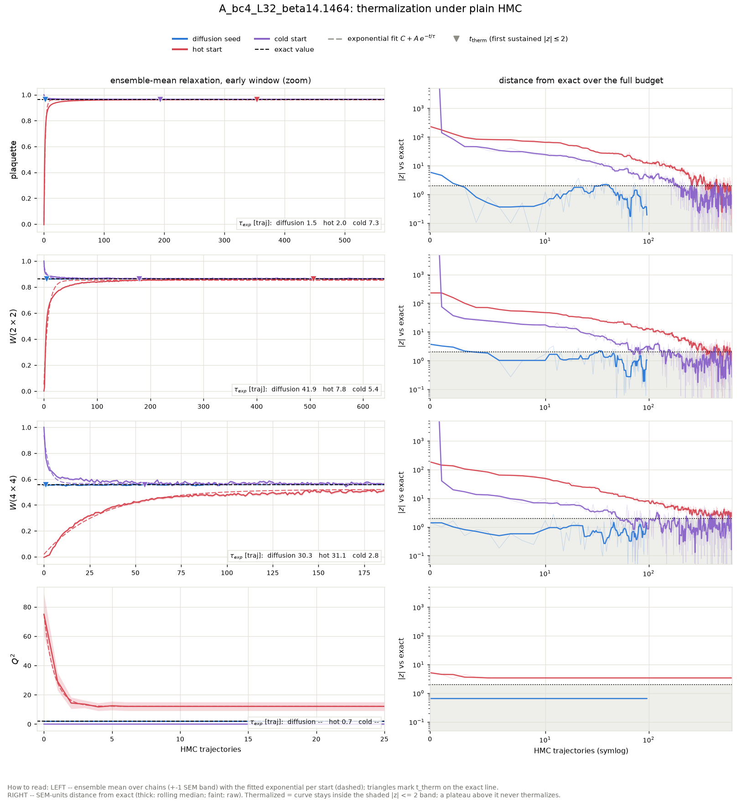

**Figure 14. Relaxation trace, β_f = 14.15** (a nearby moderate-coupling
case used for this trace). The diffusion seed is already inside tolerance
at essentially zero additional trajectories on the Wilson-loop rows; the
hot-start chain's Q² (bottom row) plateaus far from the exact value for the
entire budget — the onset of freezing.

**Figure 15. Distribution match before polish, β_f = 55.0.** Exact ⟨Q²⟩ =
0.474; generated 0.484 ± 0.056 (z = +0.18, matching almost exactly); the
case's own hot-start HMC 11.19 ± 1.76 (z = +6.09 — 23× the true value). The
P(Q) panel shows the mechanism directly: generated mass sits tightly on
Q ∈ {−2,…,2} matching exact, while the frozen hot ensemble is smeared flat
across Q ∈ {−7,…,5} with no extra weight where the true distribution peaks.

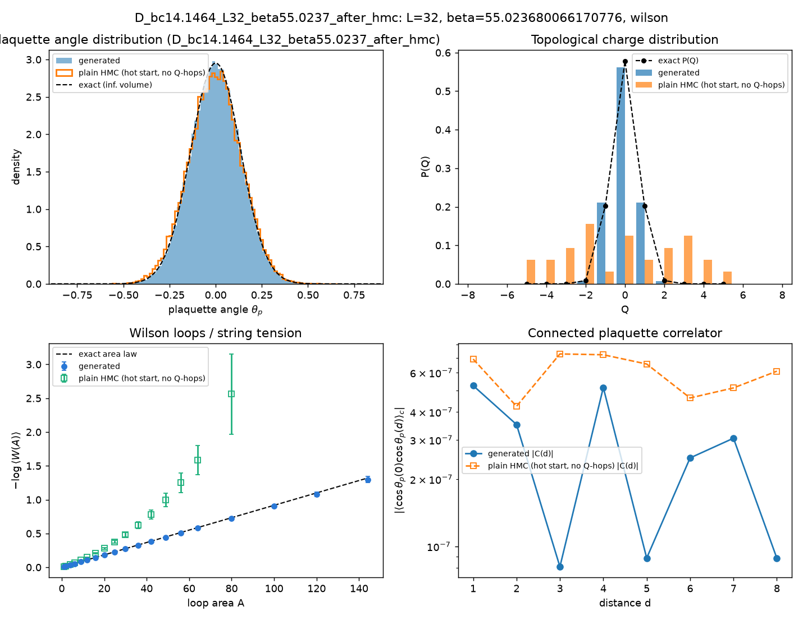

**Figure 16. Same case, after the 96-trajectory continuation.** Plaquette z
−2.3 → −0.3; W(2×2) −0.7 → +1.6; ⟨Q²⟩ unchanged at +0.18 — the topological
sector doesn't move in 96 trajectories at this coupling, nor does it need
to, since it was already correct. **Significance of this trio:** the raw
seed's t_therm was already 0 on every Wilson-loop observable, so nothing is
"improving" here so much as staying correct — while the standard chain's
cold start alone needs 336 trajectories just to burn in, and its hot start
is completely frozen (Fig. 9).

**High β = 218.6, L=64 (the money shot)**

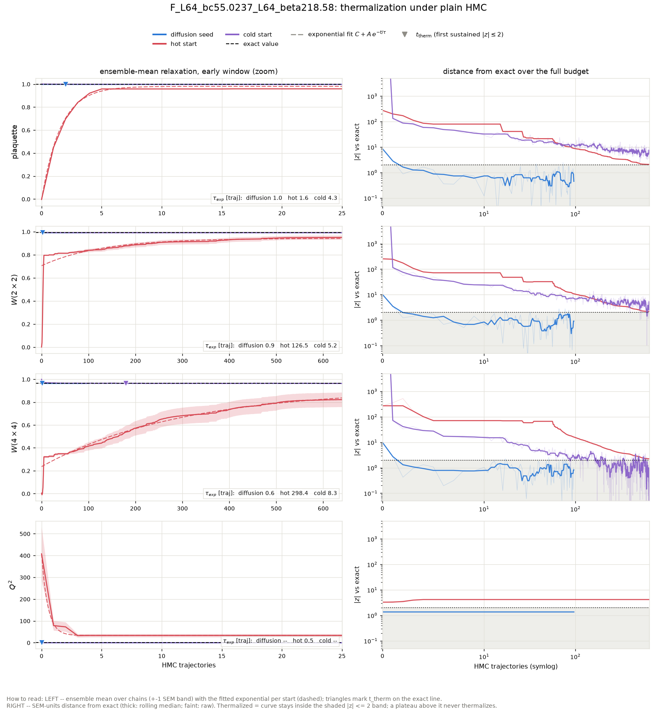

**Figure 17. Relaxation trace, β_f = 218.6, L=64** — same case as Figures 4
and 6. The diffusion seed sits inside tolerance from the first trajectory on
every Wilson observable (blue curve never leaves the shaded band, top three
rows). The hot-start chain's Q² (bottom row) plateaus near 30–40 for the
*entire* 640-trajectory budget, nowhere near the exact value ≈ 0.47 — zero
tunneling events, a permanently wrong sector.

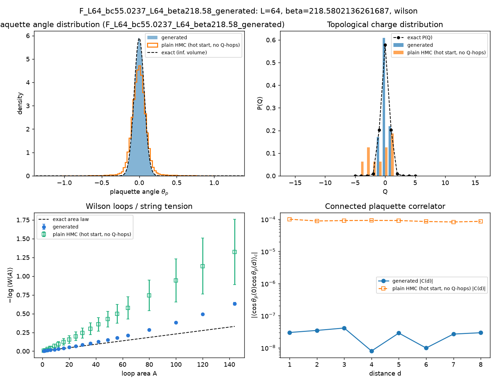

**Figure 18. Distribution match before polish.** Exact ⟨Q²⟩ = 0.474;
generated 0.391 ± 0.061 (z = −1.37, correct sector structure already); the
case's own hot-start HMC 52.2 ± 22.3 — about 110× the true value (the huge
error bar, from 16 independently frozen chains landing in wildly different
sectors, is itself part of the failure: chain-to-chain scatter masks how
wrong the mean is).

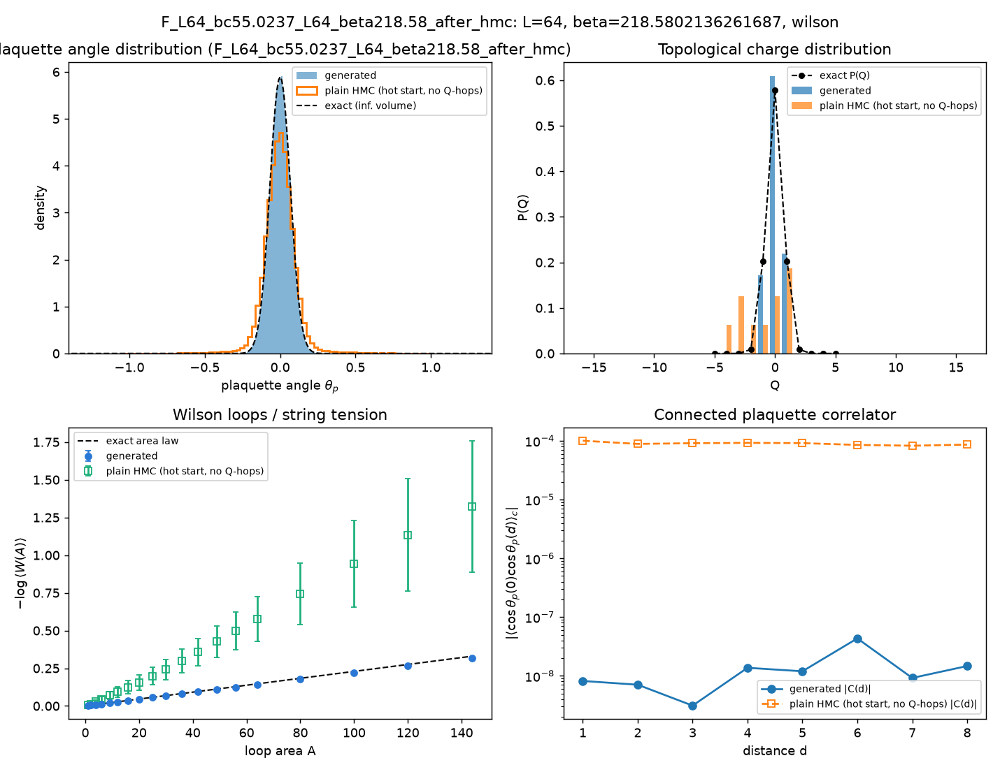

**Figure 19. Same case, after the 96-trajectory continuation.** The cleanest
improvement in this appendix: plaquette z −7.7 → +1.4, W(2×2) −10.4 → +1.6,
W(4×4) −12.7 → +1.4 — all three cross from clear outliers into the passing
band. ⟨Q²⟩ unchanged at −1.37 (already correct; see Fig. 17 bottom row for
the frozen hot-start chain's Q² over the same window it never escapes).
**Significance of this trio:** at the flagship coupling and volume, a
96-trajectory polish (a small fraction of any standard-HMC cost measured in
Section 2) takes a seed with a real residual Wilson-loop bias to
comfortably passing, while a fresh hot- or cold-start chain never reaches
tolerance within the 640-trajectory budget at all — the clearest single
illustration that this is not "faster," it is "standard HMC does not arrive
at all within any practical budget, and the diffusion route does."
