# Diffusion-seeded HMC across the matched beta scan: thermalization time vs the standard-HMC sampling interval

Action: wilson. All HMC in this report is plain HMC (Omelyan, adapted step size, **no** topological updates).

**Why this scan.** At the ladder's upper rungs the fresh-HMC baselines never thermalize at all (topological freezing plus a metastable local-defect state), so the only comparison available there is 'diffusion seed vs a baseline that never arrives'. This report extends the benchmark to every matched coupling pair of the generalization study -- one inverse-RG step L=16 -> L=32 per case -- including fine couplings low enough that hot- and cold-start HMC *does* thermalize within the budget. There the standard chain's own interval `2 tau_int` and its fresh-start burn-in are honest, measurable yardsticks, and the scan shows where the ordering

> t_therm(diffusion seed)  <  2 tau_int(standard HMC)  <  burn-in(fresh chain)

sets in as beta grows and standard HMC slides into critical slowing down and topological freezing.

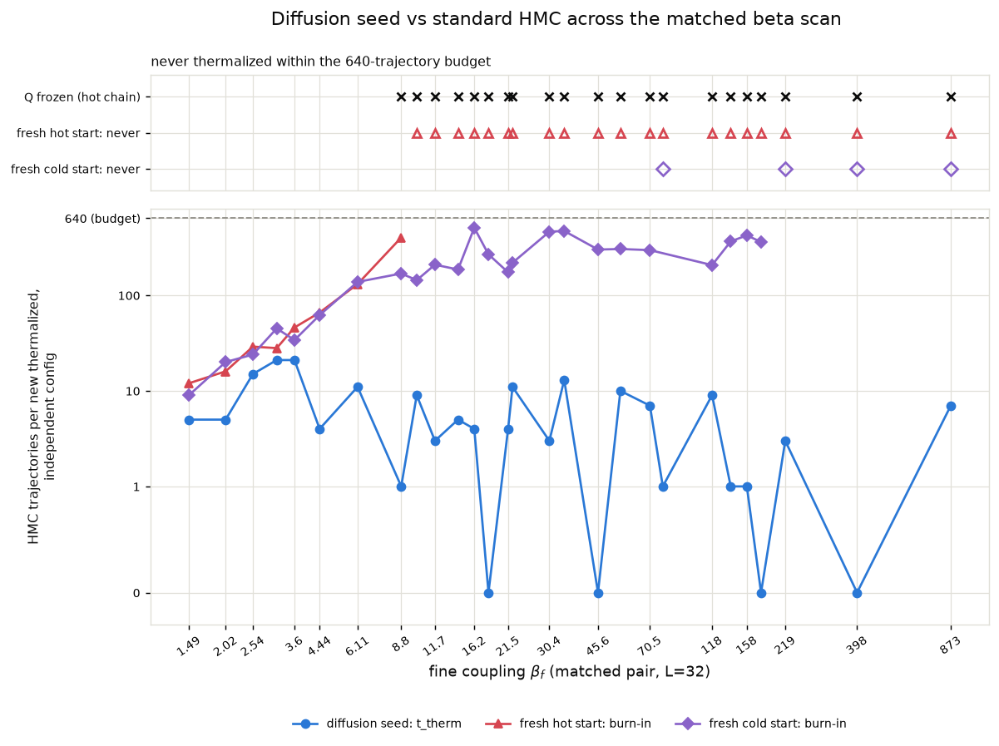

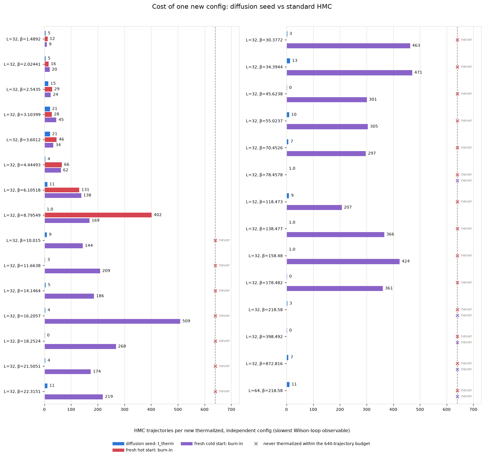

## The three starting points

- **Diffusion seed** -- the raw conditional-diffusion output for this coupling: one inverse-RG step from a direct-HMC base ensemble at the matched coarse coupling (ancestral sampling + the deterministic coarse-charge transport), with **no** rethermalization sweeps applied: every bit of equilibration the seed needs is measured here, in HMC trajectories.
- **Hot start** -- every link angle drawn uniformly from (-pi, pi]: a completely disordered (infinite-temperature) configuration. The standard way to initialize a fresh HMC chain without prior information.
- **Cold start** -- every link angle set to zero: the perfectly ordered (beta -> infinity) configuration, the other standard initialization.

## Summary

| rung | L | beta | t_therm diffusion seed | standard-HMC interval 2 tau_int | margin (interval - t_therm) | burn-in hot / cold | tau_int(Q) |
|---|---|---|---|---|---|---|---|
| A_bc0.25_L32_beta1.4892 | 32 | 1.4892 | 5 | 2.7 | -2.3 traj | 12 / 9 | 1.4 |
| A_bc0.5_L32_beta2.02441 | 32 | 2.02441 | 5 | 5.5 | 0.5 traj | 16 / 20 | 3.2 |
| A_bc0.75_L32_beta2.5435 | 32 | 2.5435 | 15 | 6.2 | -8.8 traj | 29 / 24 | 5.0 |
| A_bc1_L32_beta3.10399 | 32 | 3.10399 | 21 | 8.4 | -12.6 traj | 28 / 45 | 9.4 |
| E_bc1.2_L32_beta3.6012 | 32 | 3.6012 | 21 | 8.5 | -12.5 traj | 46 / 34 | 14.1 |
| A_bc1.5_L32_beta4.44493 | 32 | 4.44493 | 4 | 6.3 | 2.3 traj | 66 / 62 | 26.0 |
| A_bc2_L32_beta6.10518 | 32 | 6.10518 | 11 | 7.3 | -3.7 traj | 131 / 138 | 30.8 |
| E_bc2.7_L32_beta8.79549 | 32 | 8.79549 | 1 | 8.7 | 7.7 traj | 402 / 169 | frozen (0 tunnelings in 321 x 32 traj) |
| A_bc3_L32_beta10.015 | 32 | 10.015 | 9 | 11.4 | 2.4 traj | never / 144 | frozen (0 tunnelings in 321 x 32 traj) |
| E_bc3.4_L32_beta11.6638 | 32 | 11.6638 | 3 | 9.2 | 6.2 traj | never / 209 | frozen (0 tunnelings in 321 x 32 traj) |
| A_bc4_L32_beta14.1464 | 32 | 14.1464 | 5 | 9.6 | 4.6 traj | never / 186 | frozen (0 tunnelings in 321 x 32 traj) |
| E_bc4.5_L32_beta16.2057 | 32 | 16.2057 | 4 | 20.5 | 16.5 traj | never / 509 | frozen (0 tunnelings in 321 x 32 traj) |
| A_bc5_L32_beta18.2524 | 32 | 18.2524 | 0 | 10.2 | 10.2 traj | never / 268 | frozen (0 tunnelings in 321 x 32 traj) |
| E_bc5.8_L32_beta21.5051 | 32 | 21.5051 | 4 | 20.2 | 16.2 traj | never / 174 | frozen (0 tunnelings in 321 x 32 traj) |
| A_bc6_L32_beta22.3151 | 32 | 22.3151 | 11 | 17.5 | 6.5 traj | never / 219 | frozen (0 tunnelings in 321 x 32 traj) |
| A_bc8_L32_beta30.3772 | 32 | 30.3772 | 3 | 28.8 | 25.8 traj | never / 463 | frozen (0 tunnelings in 321 x 32 traj) |
| E_bc9_L32_beta34.3944 | 32 | 34.3944 | 13 | 17.9 | 4.9 traj | never / 471 | frozen (0 tunnelings in 321 x 32 traj) |
| E_bc11.8_L32_beta45.6238 | 32 | 45.6238 | 0 | 25.4 | 25.4 traj | never / 301 | frozen (0 tunnelings in 321 x 32 traj) |
| D_bc14.1464_L32_beta55.0237 | 32 | 55.0237 | 10 | 25.9 | 15.9 traj | never / 305 | frozen (0 tunnelings in 321 x 32 traj) |
| E_bc18_L32_beta70.4526 | 32 | 70.4526 | 7 | 27.0 | 20.0 traj | never / 297 | frozen (0 tunnelings in 321 x 32 traj) |
| D_bc20_L32_beta78.4578 | 32 | 78.4578 | 1 | 14.9 | 13.9 traj | never / never | frozen (0 tunnelings in 321 x 32 traj) |
| D_bc30_L32_beta118.473 | 32 | 118.473 | 9 | 41.8 | 32.8 traj | never / 207 | frozen (0 tunnelings in 321 x 32 traj) |
| E_bc35_L32_beta138.477 | 32 | 138.477 | 1 | 83.3 | 82.3 traj | never / 366 | frozen (0 tunnelings in 321 x 32 traj) |
| D_bc40_L32_beta158.48 | 32 | 158.48 | 1 | 64.3 | 63.3 traj | never / 424 | frozen (0 tunnelings in 321 x 32 traj) |
| E_bc45_L32_beta178.482 | 32 | 178.482 | 0 | 44.9 | 44.9 traj | never / 361 | frozen (0 tunnelings in 321 x 32 traj) |
| D_bc55.0237_L32_beta218.58 | 32 | 218.58 | 3 | 23.2 | 20.2 traj | never / never | frozen (0 tunnelings in 321 x 32 traj) |
| F_L32_bc100_L32_beta398.492 | 32 | 398.492 | 0 | 64.5 | 64.5 traj | never / never | frozen (0 tunnelings in 321 x 32 traj) |
| F_L32_bc218.58_L32_beta872.816 | 32 | 872.816 | 7 | 2.9 | -4.1 traj | never / never | frozen (0 tunnelings in 321 x 32 traj) |
| F_L64_bc55.0237_L64_beta218.58 | 64 | 218.58 | 11 | 80.2 | 69.2 traj | never / never | frozen (0 tunnelings in 321 x 16 traj) |

## Wall-clock accounting

All timescales above are in HMC trajectories -- the honest *ergodicity* unit. This table converts to seconds on this machine so the economics are explicit. Batched chains produce n_chains configs per trajectory, so per-config costs divide by the chain count; the diffusion sampling cost amortizes over the whole generated batch.

| case | seed: sample s/config | seed: t_therm s (batch) | HMC interval s/config | hot burn-in s (batch) | s/traj (batch) |
|---|---|---|---|---|---|
| A_bc0.25_L32_beta1.4892 | 4.9 | 0.2 | 0.01 | 1 | 0.10 |
| A_bc0.5_L32_beta2.02441 | 4.9 | 0.2 | 0.01 | 1 | 0.07 |
| A_bc0.75_L32_beta2.5435 | 4.9 | 0.7 | 0.02 | 3 | 0.12 |
| A_bc1_L32_beta3.10399 | 5.0 | 1.0 | 0.01 | 1 | 0.04 |
| E_bc1.2_L32_beta3.6012 | 4.8 | 1.0 | 0.01 | 2 | 0.05 |
| A_bc1.5_L32_beta4.44493 | 4.9 | 0.2 | 0.01 | 3 | 0.05 |
| A_bc2_L32_beta6.10518 | 4.9 | 0.6 | 0.01 | 8 | 0.06 |
| E_bc2.7_L32_beta8.79549 | 4.9 | 0.1 | 0.03 | 47 | 0.12 |
| A_bc3_L32_beta10.015 | 5.1 | 0.6 | 0.15 | never | 0.41 |
| E_bc3.4_L32_beta11.6638 | 5.1 | 0.3 | 0.03 | never | 0.11 |
| A_bc4_L32_beta14.1464 | 5.0 | 0.3 | 0.04 | never | 0.12 |
| E_bc4.5_L32_beta16.2057 | 5.1 | 0.3 | 0.05 | never | 0.09 |
| A_bc5_L32_beta18.2524 | 5.1 | 0.0 | 0.02 | never | 0.05 |
| E_bc5.8_L32_beta21.5051 | 5.1 | 0.3 | 0.02 | never | 0.04 |
| A_bc6_L32_beta22.3151 | 4.5 | 0.8 | 0.02 | never | 0.04 |
| A_bc8_L32_beta30.3772 | 4.4 | 0.2 | 0.04 | never | 0.04 |
| E_bc9_L32_beta34.3944 | 4.4 | 1.1 | 0.03 | never | 0.05 |
| E_bc11.8_L32_beta45.6238 | 4.5 | 0.0 | 0.04 | never | 0.05 |
| D_bc14.1464_L32_beta55.0237 | 4.8 | 1.2 | 0.04 | never | 0.06 |
| E_bc18_L32_beta70.4526 | 4.8 | 0.8 | 0.05 | never | 0.06 |
| D_bc20_L32_beta78.4578 | 4.5 | 0.1 | 0.03 | never | 0.06 |
| D_bc30_L32_beta118.473 | 4.7 | 1.3 | 0.10 | never | 0.07 |
| E_bc35_L32_beta138.477 | 4.5 | 0.2 | 0.21 | never | 0.08 |
| D_bc40_L32_beta158.48 | 4.5 | 0.2 | 0.17 | never | 0.08 |
| E_bc45_L32_beta178.482 | 4.5 | 0.0 | 0.13 | never | 0.09 |
| D_bc55.0237_L32_beta218.58 | 4.5 | 0.6 | 0.07 | never | 0.10 |
| F_L32_bc100_L32_beta398.492 | 4.3 | 0.0 | 0.26 | never | 0.13 |
| F_L32_bc218.58_L32_beta872.816 | 4.3 | 1.5 | 0.02 | never | 0.19 |
| F_L64_bc55.0237_L64_beta218.58 | 15.9 | 3.4 | 0.56 | never | 0.11 |

## Fitted relaxation times across starts

Exponential fits C + A exp(-t/tau) to the ensemble-mean plaquette and W(2x2) relaxation curves, per starting point (the cross-start comparison of characteristic times; a start already at its plateau fits no decay, which is the desired outcome for the diffusion seed).

| case | obs | tau: diffusion seed | tau: hot start | tau: cold start |
|---|---|---|---|---|
| A_bc0.25_L32_beta1.4892 | plaquette | 1.1 +- 0.0 | 1.1 +- 0.0 | 2.5 +- 0.0 |
| A_bc0.25_L32_beta1.4892 | wilson_2x2 | 0.5 +- 0.1 | 2.2 +- 0.1 | 1.5 +- 0.0 |
| A_bc0.5_L32_beta2.02441 | plaquette | 2.0 +- 0.1 | 1.7 +- 0.0 | 4.1 +- 0.0 |
| A_bc0.5_L32_beta2.02441 | wilson_2x2 | 10.2 +- 5.1 | 2.9 +- 0.1 | 1.8 +- 0.0 |
| A_bc0.75_L32_beta2.5435 | plaquette | 4.6 +- 0.1 | 2.3 +- 0.0 | 5.0 +- 0.1 |
| A_bc0.75_L32_beta2.5435 | wilson_2x2 | 13.1 +- 4.8 | 3.7 +- 0.1 | 1.9 +- 0.0 |
| A_bc1_L32_beta3.10399 | plaquette | 10.1 +- 0.4 | 2.7 +- 0.0 | 6.1 +- 0.1 |
| A_bc1_L32_beta3.10399 | wilson_2x2 | 16.9 +- 5.7 | 4.9 +- 0.1 | 2.8 +- 0.1 |
| E_bc1.2_L32_beta3.6012 | plaquette | 7.5 +- 0.5 | 2.9 +- 0.0 | 5.3 +- 0.1 |
| E_bc1.2_L32_beta3.6012 | wilson_2x2 | 28.7 +- 11.2 | 6.3 +- 0.1 | 3.3 +- 0.1 |
| A_bc1.5_L32_beta4.44493 | plaquette | 5.9 +- 0.5 | 2.8 +- 0.0 | 4.0 +- 0.1 |
| A_bc1.5_L32_beta4.44493 | wilson_2x2 | 8.0 +- 1.9 | 7.4 +- 0.1 | 4.5 +- 0.1 |
| A_bc2_L32_beta6.10518 | plaquette | unconstrained fit (tau error exceeds tau) | 2.2 +- 0.0 | 4.7 +- 0.2 |
| A_bc2_L32_beta6.10518 | wilson_2x2 | 2.9 +- 0.8 | 8.6 +- 0.1 | 3.4 +- 0.1 |
| E_bc2.7_L32_beta8.79549 | plaquette | no measurable decay (starts at plateau; tau unconstrained) | 2.1 +- 0.0 | 6.1 +- 0.2 |
| E_bc2.7_L32_beta8.79549 | wilson_2x2 | 0.4 +- 0.4 | 8.6 +- 0.2 | 3.8 +- 0.2 |
| A_bc3_L32_beta10.015 | plaquette | 19.4 +- 3.5 | 2.0 +- 0.0 | 12.1 +- 0.5 |
| A_bc3_L32_beta10.015 | wilson_2x2 | 6.8 +- 1.5 | 7.0 +- 0.2 | 4.3 +- 0.2 |
| E_bc3.4_L32_beta11.6638 | plaquette | 2.2 +- 0.8 | 2.0 +- 0.0 | 7.0 +- 0.3 |
| E_bc3.4_L32_beta11.6638 | wilson_2x2 | 2.8 +- 1.3 | 7.7 +- 0.2 | 4.7 +- 0.2 |
| A_bc4_L32_beta14.1464 | plaquette | 3.3 +- 1.4 | 2.0 +- 0.0 | 6.9 +- 0.3 |
| A_bc4_L32_beta14.1464 | wilson_2x2 | 5.6 +- 1.5 | 7.5 +- 0.2 | 5.1 +- 0.2 |
| E_bc4.5_L32_beta16.2057 | plaquette | no measurable decay (starts at plateau; tau unconstrained) | 1.9 +- 0.0 | 3.4 +- 0.2 |
| E_bc4.5_L32_beta16.2057 | wilson_2x2 | 44.4 +- 21.8 | 6.6 +- 0.2 | 4.0 +- 0.2 |
| A_bc5_L32_beta18.2524 | plaquette | 1.2 +- 0.6 | 1.8 +- 0.0 | 5.9 +- 0.2 |
| A_bc5_L32_beta18.2524 | wilson_2x2 | 0.7 +- 0.6 | 6.1 +- 0.1 | 5.5 +- 0.3 |
| E_bc5.8_L32_beta21.5051 | plaquette | 26.0 +- 9.1 | 1.8 +- 0.0 | 13.5 +- 0.5 |
| E_bc5.8_L32_beta21.5051 | wilson_2x2 | 6.8 +- 1.8 | 5.5 +- 0.1 | 5.9 +- 0.2 |
| A_bc6_L32_beta22.3151 | plaquette | 26.2 +- 9.2 | 1.8 +- 0.0 | 14.0 +- 0.5 |
| A_bc6_L32_beta22.3151 | wilson_2x2 | 4.1 +- 1.2 | 5.6 +- 0.1 | 6.4 +- 0.3 |
| A_bc8_L32_beta30.3772 | plaquette | 0.9 +- 0.5 | 1.8 +- 0.0 | 6.4 +- 0.3 |
| A_bc8_L32_beta30.3772 | wilson_2x2 | 5.0 +- 1.7 | 5.3 +- 0.1 | 4.4 +- 0.2 |
| E_bc9_L32_beta34.3944 | plaquette | 6.3 +- 2.8 | 1.7 +- 0.0 | 5.5 +- 0.2 |
| E_bc9_L32_beta34.3944 | wilson_2x2 | no measurable decay (starts at plateau; tau unconstrained) | 4.9 +- 0.1 | 3.6 +- 0.2 |
| E_bc11.8_L32_beta45.6238 | plaquette | 3.2 +- 2.8 | 1.7 +- 0.0 | 6.2 +- 0.2 |
| E_bc11.8_L32_beta45.6238 | wilson_2x2 | unreliable (tau exceeds window) | 5.0 +- 0.1 | 5.6 +- 0.2 |
| D_bc14.1464_L32_beta55.0237 | plaquette | 1.0 +- 0.8 | 1.7 +- 0.0 | 5.9 +- 0.2 |
| D_bc14.1464_L32_beta55.0237 | wilson_2x2 | 19.4 +- 18.0 | 5.0 +- 0.1 | 7.2 +- 0.3 |
| E_bc18_L32_beta70.4526 | plaquette | 1.6 +- 0.8 | 1.7 +- 0.0 | 4.6 +- 0.2 |
| E_bc18_L32_beta70.4526 | wilson_2x2 | unreliable (tau exceeds window) | 4.5 +- 0.1 | 7.1 +- 0.3 |
| D_bc20_L32_beta78.4578 | plaquette | 1.2 +- 0.4 | 1.7 +- 0.0 | 3.9 +- 0.2 |
| D_bc20_L32_beta78.4578 | wilson_2x2 | 4.6 +- 3.1 | 4.3 +- 0.1 | 3.8 +- 0.1 |
| D_bc30_L32_beta118.473 | plaquette | 5.6 +- 1.5 | 1.7 +- 0.0 | 5.7 +- 0.2 |
| D_bc30_L32_beta118.473 | wilson_2x2 | 8.8 +- 1.9 | 4.0 +- 0.1 | 5.8 +- 0.2 |
| E_bc35_L32_beta138.477 | plaquette | unreliable (tau exceeds window) | 1.7 +- 0.0 | 4.3 +- 0.2 |
| E_bc35_L32_beta138.477 | wilson_2x2 | no measurable decay (starts at plateau; tau unconstrained) | 4.1 +- 0.1 | 4.9 +- 0.2 |
| D_bc40_L32_beta158.48 | plaquette | 1.8 +- 0.5 | 1.7 +- 0.0 | 13.5 +- 0.6 |
| D_bc40_L32_beta158.48 | wilson_2x2 | 1.5 +- 0.4 | 3.9 +- 0.1 | 3.6 +- 0.2 |
| E_bc45_L32_beta178.482 | plaquette | 10.6 +- 2.7 | 1.7 +- 0.0 | 8.5 +- 0.4 |
| E_bc45_L32_beta178.482 | wilson_2x2 | 25.8 +- 11.7 | 3.9 +- 0.1 | 14.3 +- 0.7 |
| D_bc55.0237_L32_beta218.58 | plaquette | 16.8 +- 4.9 | 1.7 +- 0.0 | 5.1 +- 0.2 |
| D_bc55.0237_L32_beta218.58 | wilson_2x2 | 22.8 +- 11.6 | 4.2 +- 0.1 | 7.7 +- 0.3 |
| F_L32_bc100_L32_beta398.492 | plaquette | no measurable decay (starts at plateau; tau unconstrained) | 1.6 +- 0.0 | 5.1 +- 0.2 |
| F_L32_bc100_L32_beta398.492 | wilson_2x2 | no measurable decay (starts at plateau; tau unconstrained) | 4.3 +- 0.2 | 6.2 +- 0.2 |
| F_L32_bc218.58_L32_beta872.816 | plaquette | unreliable (tau exceeds window) | 1.5 +- 0.0 | 10.4 +- 0.5 |
| F_L32_bc218.58_L32_beta872.816 | wilson_2x2 | unreliable (tau exceeds window) | 2.6 +- 0.1 | 7.1 +- 0.3 |
| F_L64_bc55.0237_L64_beta218.58 | plaquette | 1.9 +- 0.3 | 1.6 +- 0.0 | 4.3 +- 0.2 |
| F_L64_bc55.0237_L64_beta218.58 | wilson_2x2 | 0.9 +- 0.2 | 4.2 +- 0.2 | 5.3 +- 0.2 |

t_therm and burn-in are the slowest Wilson-loop observable (plaquette, W(2x2), W(4x4)); topology is stricter still for the fresh chains: their Q^2 **never** reaches the exact value at the frozen rungs, while the diffusion seed inherits the correct topological sector from the coarse ensemble it was generated from (see the Q^2 panels and per-rung tables below).

Thermalization time `t_therm` = first trajectory at which the ensemble-mean z-score vs the exact value satisfies |z| <= 2 and stays there for 5 consecutive trajectories (t = 0: already thermalized before any HMC). For the diffusion seed, t_therm is computed on a random subsample of chains matched to the baseline chain count so all starts are compared at equal statistical power. `tau_int` is Madras-Sokal, measured on the second half of the hot-start chains, averaged over chains. In the per-rung relaxation figures, triangles mark each start's t_therm, dashed curves are the exponential fits C + A exp(-t/tau) to the ensemble means (tau quoted per panel), and the right-hand panels track the ensemble mean's distance from the exact value in SEM units -- thermalized means inside the shaded |z| <= 2 band; the dotted vertical line there is the standard-HMC interval `2 tau_int`.

## What 'never' means, and where the ground truth comes from

'never' = the ensemble mean was still outside |z| <= 2 of the exact value after the full baseline budget; the per-rung sections quote the z-score it plateaued at. For hot starts at the large-beta rungs this is not a budget problem but a physical one: a random start freezes into a random topological sector (<Q^2> of order tens), plain HMC can never change Q at these couplings (tunneling is suppressed ~exp(-2 beta)), and the wrong sector biases every Wilson loop by an amount that never decays. Cold starts sit in the single sector Q = 0, so their Wilson loops do eventually converge, but <Q^2> stays pinned at 0 forever.

None of the exact values in this report come from fine-lattice HMC: the ground truth is the character expansion of 2D compact U(1) (`diffusion/lgt/exact.py`), which gives every Wilson loop, P(Q) and chi_top in closed form at finite volume. Each diffusion seed here is one inverse-RG step from a direct-HMC base ensemble at the matched coarse coupling beta_c (L=16), where HMC mixes well -- which is precisely why it can start chains in regions standard HMC cannot reach.

## A_bc0.25_L32_beta1.4892

HMC: step size 0.2000, 5 leapfrog steps, acceptance seed/hot/cold = 0.968/0.970/0.966. Diffusion-seed batch: 128 chains x 96 trajectories (0.05 s/traj for the whole batch); baselines: 32 chains x 640 trajectories.

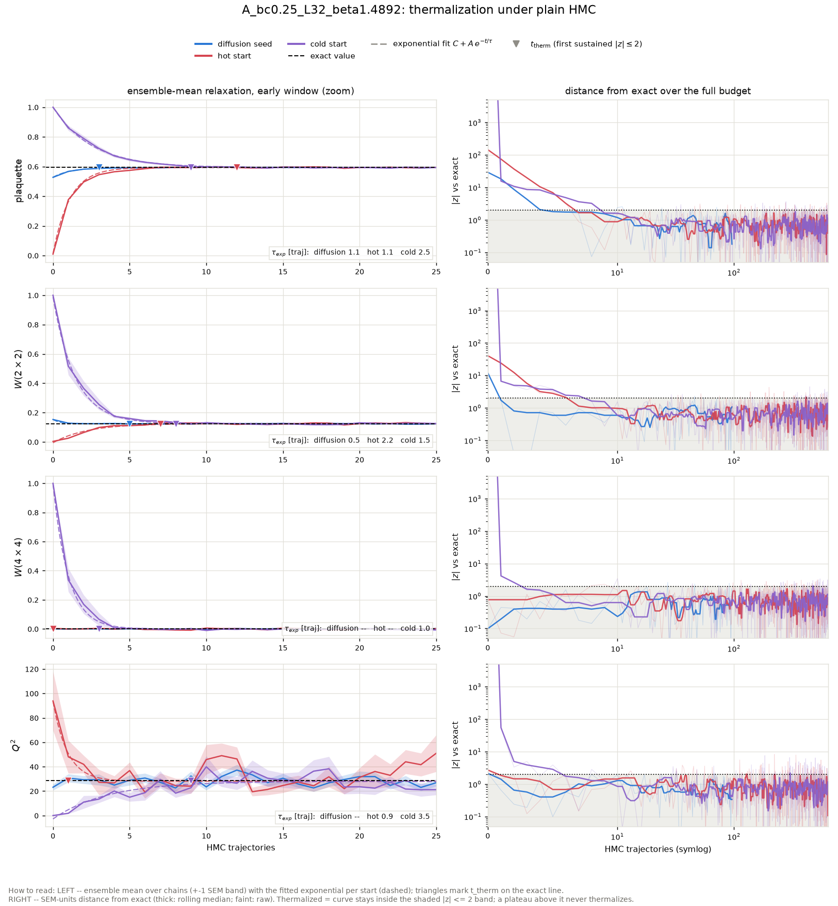

tau_int (hot-start chains, second half): plaquette = 1.36 +- 0.06, wilson_2x2 = 0.76 +- 0.03, wilson_4x4 = 0.56 +- 0.02, wilson_6x6 = 0.57 +- 0.02. Topology: hot-start HMC L=32 beta=1.4892 -> tau_int(Q) = 1.4.

### Diagnostics: raw diffusion output (before any HMC)

| observable | value | error | exact | z_exact | reference | ref_error | z_ref | ks_p | chi2_p |
|---|---|---|---|---|---|---|---|---|---|
| plaquette | 0.5272 | 0.001618 | 0.5935 | -40.91 | 0.5929 | 0.00126 | -32.02 | 0 |  |
| wilson_1x1 | 0.5272 | 0.001618 | 0.5935 | -40.91 | 0.5929 | 0.00126 | -32.02 | 0 |  |
| wilson_1x2 | 0.3054 | 0.002792 | 0.3522 | -16.76 | 0.3511 | 0.001801 | -13.77 | 7.917e-28 |  |
| wilson_2x2 | 0.1529 | 0.00204 | 0.124 | 14.14 | 0.1246 | 0.001931 | 10.08 | 2.025e-12 |  |
| wilson_2x3 | 0.06993 | 0.001936 | 0.04368 | 13.55 | 0.0446 | 0.001702 | 9.823 | 1.664e-10 |  |
| wilson_3x3 | 0.01315 | 0.001452 | 0.00913 | 2.768 | 0.01047 | 0.001276 | 1.385 | 0.03831 |  |
| wilson_3x4 | 0.001487 | 0.0021 | 0.001908 | -0.2003 | 0.001572 | 0.001898 | -0.0298 | 0.5259 |  |
| wilson_4x4 | 0.00043 | 0.00174 | 0.0002367 | 0.1111 | 0.0003583 | 0.001752 | 0.02906 | 0.9542 |  |
| wilson_4x5 | 0.002303 | 0.001544 | 2.936e-05 | 1.472 | 0.000422 | 0.001631 | 0.8375 | 0.05588 |  |
| wilson_5x5 | 0.0008986 | 0.002014 | 2.161e-06 | 0.4451 | -0.0007227 | 0.001357 | 0.6676 | 0.678 |  |
| wilson_5x6 | -1.268e-05 | 0.002662 | 1.591e-07 | -0.004824 | 0.000237 | 0.001659 | -0.0796 | 0.3294 |  |
| wilson_6x6 | -0.001719 | 0.002057 | 6.948e-09 | -0.8354 | -0.0003096 | 0.001743 | -0.5226 | 0.7538 |  |
| wilson_6x7 | -0.002053 | 0.001836 | 3.035e-10 | -1.118 | -0.0006754 | 0.001172 | -0.6325 | 0.5631 |  |
| wilson_7x7 | 0.000623 | 0.002382 | 7.868e-12 | 0.2615 | 0.001645 | 0.001256 | -0.3794 | 0.9126 |  |
| wilson_7x8 | 0.001154 | 0.002104 | 2.04e-13 | 0.5483 | 0.0002028 | 0.001698 | 0.3517 | 0.3584 |  |
| wilson_8x8 | 0.002155 | 0.002274 | 3.138e-15 | 0.9477 | -0.001379 | 0.001658 | 1.256 | 0.1892 |  |
| wilson_8x10 | 0.001497 | 0.001669 | 7.426e-19 | 0.8969 | 0.0005715 | 0.001584 | 0.4022 | 0.9888 |  |
| wilson_10x10 | 0.000659 | 0.001856 | 2.18e-23 | 0.3552 | -0.0005338 | 0.001689 | 0.4754 | 0.678 |  |
| wilson_10x12 | 0.0008965 | 0.002251 | 6.4e-28 | 0.3984 | -0.0008756 | 0.001773 | 0.6185 | 0.4212 |  |
| wilson_12x12 | -0.0002115 | 0.001812 | 2.33e-33 | -0.1167 | -0.002454 | 0.001308 | 1.003 | 0.7163 |  |
| creutz_2 | 0.146 | 0.01503 | 0.5218 | -25.01 |  |  |  |  |  |
| creutz_3 | 0.8891 | 0.1622 | 0.5218 | 2.264 |  |  |  |  |  |
| creutz_4 | -0.9384 | nan | 0.5218 | nan |  |  |  |  |  |
| creutz_5 | 2.619 | nan | 0.5218 | nan |  |  |  |  |  |
| creutz_8 | -0.008952 | 4.821 | 0.5218 | -0.1101 |  |  |  |  |  |
| Q | 0.8594 | 0.4656 | 0 | 1.846 | 0.4792 | 0.4137 | 0.6105 | 0.6011 |  |
| Q^2 | 23.19 | 2.596 | 28.52 | -2.055 | 28.04 | 2.387 | -1.376 | 0.4548 |  |
| chi_top ((<Q^2>-<Q>^2)/V) | 0.02192 | 0.002466 | 0.02785 | -2.405 | 0.02716 | 0.002452 | -1.506 | 0.07995 |  |
| Q histogram vs exact P(Q) | 13.9 | nan | 18 | nan |  |  |  |  | 0.7358 |

### Diagnostics: the same configs after 96 HMC trajectories

| observable | value | error | exact | z_exact | reference | ref_error | z_ref | ks_p | chi2_p |
|---|---|---|---|---|---|---|---|---|---|
| plaquette | 0.5937 | 0.001284 | 0.5935 | 0.1927 | 0.5929 | 0.00126 | 0.4264 | 0.678 |  |
| wilson_1x1 | 0.5937 | 0.001284 | 0.5935 | 0.1927 | 0.5929 | 0.00126 | 0.4264 | 0.678 |  |
| wilson_1x2 | 0.3539 | 0.002115 | 0.3522 | 0.8312 | 0.3511 | 0.001801 | 1.008 | 0.4212 |  |
| wilson_2x2 | 0.1268 | 0.003472 | 0.124 | 0.7948 | 0.1246 | 0.001931 | 0.5626 | 0.8864 |  |
| wilson_2x3 | 0.04623 | 0.002232 | 0.04368 | 1.143 | 0.0446 | 0.001702 | 0.5806 | 0.9353 |  |
| wilson_3x3 | 0.01099 | 0.00164 | 0.00913 | 1.134 | 0.01047 | 0.001276 | 0.2495 | 0.1122 |  |
| wilson_3x4 | 0.002572 | 0.00173 | 0.001908 | 0.384 | 0.001572 | 0.001898 | 0.3897 | 0.4898 |  |
| wilson_4x4 | 0.001527 | 0.002196 | 0.0002367 | 0.5878 | 0.0003583 | 0.001752 | 0.4162 | 0.9807 |  |
| wilson_4x5 | 0.001192 | 0.002162 | 2.936e-05 | 0.538 | 0.000422 | 0.001631 | 0.2845 | 0.3294 |  |
| wilson_5x5 | -0.001607 | 0.001787 | 2.161e-06 | -0.9004 | -0.0007227 | 0.001357 | -0.3941 | 0.5259 |  |
| wilson_5x6 | -0.0003749 | 0.002314 | 1.591e-07 | -0.1621 | 0.000237 | 0.001659 | -0.2149 | 0.678 |  |
| wilson_6x6 | 0.001079 | 0.002514 | 6.948e-09 | 0.4292 | -0.0003096 | 0.001743 | 0.4539 | 0.8569 |  |
| wilson_6x7 | 0.0003521 | 0.001656 | 3.035e-10 | 0.2127 | -0.0006754 | 0.001172 | 0.5065 | 0.389 |  |
| wilson_7x7 | -0.001404 | 0.002077 | 7.868e-12 | -0.676 | 0.001645 | 0.001256 | -1.256 | 0.3584 |  |
| wilson_7x8 | -0.000609 | 0.001618 | 2.04e-13 | -0.3765 | 0.0002028 | 0.001698 | -0.3462 | 0.9888 |  |
| wilson_8x8 | -0.002456 | 0.001475 | 3.138e-15 | -1.665 | -0.001379 | 0.001658 | -0.4852 | 0.2522 |  |
| wilson_8x10 | 0.0007023 | 0.001966 | 7.426e-19 | 0.3571 | 0.0005715 | 0.001584 | 0.05177 | 0.3584 |  |
| wilson_10x10 | -0.0003413 | 0.001986 | 2.18e-23 | -0.1718 | -0.0005338 | 0.001689 | 0.07381 | 0.9353 |  |
| wilson_10x12 | -0.0004286 | 0.001818 | 6.4e-28 | -0.2357 | -0.0008756 | 0.001773 | 0.176 | 0.7538 |  |
| wilson_12x12 | 0.0002548 | 0.00212 | 2.33e-33 | 0.1202 | -0.002454 | 0.001308 | 1.087 | 0.6011 |  |
| creutz_2 | 0.5093 | 0.01555 | 0.5218 | -0.8017 |  |  |  |  |  |
| creutz_3 | 0.4278 | 0.1702 | 0.5218 | -0.5524 |  |  |  |  |  |
| creutz_4 | -0.931 | 1.943 | 0.5218 | -0.7478 |  |  |  |  |  |
| Q | -0.2422 | 0.3275 | 0 | -0.7395 | 0.4792 | 0.4137 | -1.367 | 0.6395 |  |
| Q^2 | 29.88 | 4.196 | 28.52 | 0.3242 | 28.04 | 2.387 | 0.3814 | 0.8246 |  |
| chi_top ((<Q^2>-<Q>^2)/V) | 0.02913 | 0.004079 | 0.02785 | 0.3117 | 0.02716 | 0.002452 | 0.4129 | 0.07995 |  |
| Q histogram vs exact P(Q) | 18.89 | nan | 18 | nan |  |  |  |  | 0.3989 |

## A_bc0.5_L32_beta2.02441

HMC: step size 0.2000, 5 leapfrog steps, acceptance seed/hot/cold = 0.962/0.964/0.960. Diffusion-seed batch: 128 chains x 96 trajectories (0.05 s/traj for the whole batch); baselines: 32 chains x 640 trajectories.

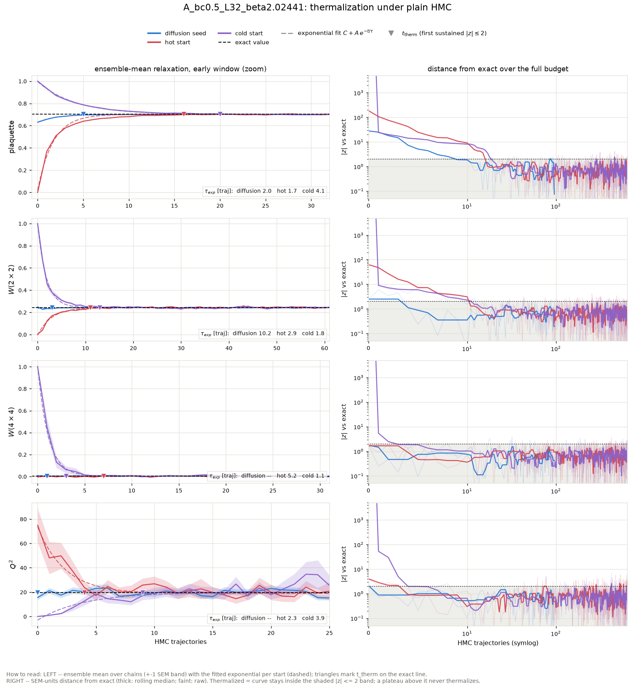

tau_int (hot-start chains, second half): plaquette = 2.76 +- 0.30, wilson_2x2 = 1.00 +- 0.07, wilson_4x4 = 0.61 +- 0.02, wilson_6x6 = 0.58 +- 0.01. Topology: hot-start HMC L=32 beta=2.02441 -> tau_int(Q) = 3.2.

### Diagnostics: raw diffusion output (before any HMC)

| observable | value | error | exact | z_exact | reference | ref_error | z_ref | ks_p | chi2_p |
|---|---|---|---|---|---|---|---|---|---|
| plaquette | 0.631 | 0.002495 | 0.7017 | -28.34 | 0.7018 | 0.001038 | -26.2 | 0 |  |
| wilson_1x1 | 0.631 | 0.002495 | 0.7017 | -28.34 | 0.7018 | 0.001038 | -26.2 | 0 |  |
| wilson_1x2 | 0.4173 | 0.003852 | 0.4924 | -19.51 | 0.4938 | 0.001711 | -18.15 | 0 |  |
| wilson_2x2 | 0.2489 | 0.003124 | 0.2425 | 2.042 | 0.2451 | 0.001908 | 1.04 | 0.678 |  |
| wilson_2x3 | 0.1239 | 0.002609 | 0.1194 | 1.719 | 0.1225 | 0.002198 | 0.3986 | 0.3584 |  |
| wilson_3x3 | 0.03736 | 0.002596 | 0.04127 | -1.504 | 0.04311 | 0.001778 | -1.826 | 0.1004 |  |
| wilson_3x4 | 0.01847 | 0.002396 | 0.01426 | 1.758 | 0.01804 | 0.001896 | 0.143 | 0.4212 |  |
| wilson_4x4 | 0.007025 | 0.002153 | 0.003458 | 1.657 | 0.005619 | 0.001923 | 0.487 | 0.5259 |  |
| wilson_4x5 | 0.005424 | 0.002375 | 0.0008386 | 1.931 | 0.0004604 | 0.001456 | 1.782 | 0.08971 |  |
| wilson_5x5 | 0.001615 | 0.001975 | 0.0001427 | 0.7455 | -0.0007571 | 0.001919 | 0.8613 | 0.6011 |  |
| wilson_5x6 | 0.001416 | 0.002102 | 2.428e-05 | 0.6619 | 0.001979 | 0.001926 | -0.1977 | 0.5259 |  |
| wilson_6x6 | -0.0006477 | 0.001976 | 2.9e-06 | -0.3292 | 0.001989 | 0.001843 | -0.976 | 0.6011 |  |
| wilson_6x7 | 0.002809 | 0.001847 | 3.463e-07 | 1.52 | 0.001877 | 0.001041 | 0.4394 | 0.9542 |  |
| wilson_7x7 | -0.002781 | 0.001818 | 2.902e-08 | -1.53 | -0.0002921 | 0.001303 | -1.113 | 0.3584 |  |
| wilson_7x8 | -0.001283 | 0.001677 | 2.432e-09 | -0.765 | 0.001274 | 0.001325 | -1.196 | 0.2087 |  |
| wilson_8x8 | 0.00209 | 0.002063 | 1.43e-10 | 1.013 | 0.0001252 | 0.001944 | 0.6931 | 0.389 |  |
| wilson_8x10 | -0.0003023 | 0.001671 | 4.946e-13 | -0.1809 | -0.001643 | 0.001575 | 0.5836 | 0.5631 |  |
| wilson_10x10 | 7.719e-05 | 0.002184 | 4.147e-16 | 0.03534 | -0.001341 | 0.001238 | 0.565 | 0.7163 |  |
| wilson_10x12 | -0.001553 | 0.001395 | 3.478e-19 | -1.113 | 0.002831 | 0.001731 | -1.972 | 0.3021 |  |
| wilson_12x12 | 0.002587 | 0.001824 | 7.073e-23 | 1.418 | -0.001562 | 0.00152 | 1.747 | 0.1892 |  |
| creutz_2 | 0.1033 | 0.01069 | 0.3542 | -23.46 |  |  |  |  |  |
| creutz_3 | 0.5014 | 0.05151 | 0.3542 | 2.858 |  |  |  |  |  |
| creutz_4 | 0.2625 | 0.2709 | 0.3542 | -0.3387 |  |  |  |  |  |
| creutz_5 | 0.9527 | 1.42 | 0.3542 | 0.4216 |  |  |  |  |  |
| Q | -0.3984 | 0.3596 | 0 | -1.108 | -0.03646 | 0.3297 | -0.742 | 0.5259 |  |
| Q^2 | 15.57 | 2.143 | 19.51 | -1.839 | 19.72 | 2.545 | -1.248 | 0.5631 |  |
| chi_top ((<Q^2>-<Q>^2)/V) | 0.01505 | 0.001984 | 0.01905 | -2.018 | 0.01926 | 0.002483 | -1.325 | 0.04354 |  |
| Q histogram vs exact P(Q) | 23.64 | nan | 16 | nan |  |  |  |  | 0.09765 |

### Diagnostics: the same configs after 96 HMC trajectories

| observable | value | error | exact | z_exact | reference | ref_error | z_ref | ks_p | chi2_p |
|---|---|---|---|---|---|---|---|---|---|
| plaquette | 0.7017 | 0.001198 | 0.7017 | -0.06492 | 0.7018 | 0.001038 | -0.106 | 0.9693 |  |
| wilson_1x1 | 0.7017 | 0.001198 | 0.7017 | -0.06492 | 0.7018 | 0.001038 | -0.106 | 0.9693 |  |
| wilson_1x2 | 0.4918 | 0.001851 | 0.4924 | -0.3623 | 0.4938 | 0.001711 | -0.8091 | 0.5259 |  |
| wilson_2x2 | 0.243 | 0.002533 | 0.2425 | 0.189 | 0.2451 | 0.001908 | -0.6606 | 0.8569 |  |
| wilson_2x3 | 0.1209 | 0.002442 | 0.1194 | 0.6101 | 0.1225 | 0.002198 | -0.4981 | 0.8864 |  |
| wilson_3x3 | 0.04448 | 0.002557 | 0.04127 | 1.256 | 0.04311 | 0.001778 | 0.4402 | 0.678 |  |
| wilson_3x4 | 0.02035 | 0.002208 | 0.01426 | 2.759 | 0.01804 | 0.001896 | 0.7959 | 0.389 |  |
| wilson_4x4 | 0.004249 | 0.002016 | 0.003458 | 0.3921 | 0.005619 | 0.001923 | -0.492 | 0.678 |  |
| wilson_4x5 | -0.0009723 | 0.002244 | 0.0008386 | -0.807 | 0.0004604 | 0.001456 | -0.5356 | 0.8864 |  |
| wilson_5x5 | -0.001155 | 0.002534 | 0.0001427 | -0.5124 | -0.0007571 | 0.001919 | -0.1253 | 0.3294 |  |
| wilson_5x6 | -0.001435 | 0.001321 | 2.428e-05 | -1.105 | 0.001979 | 0.001926 | -1.462 | 0.08971 |  |
| wilson_6x6 | -0.0005405 | 0.001738 | 2.9e-06 | -0.3127 | 0.001989 | 0.001843 | -0.9988 | 0.3584 |  |
| wilson_6x7 | 0.00039 | 0.002144 | 3.463e-07 | 0.1817 | 0.001877 | 0.001041 | -0.6242 | 0.3584 |  |
| wilson_7x7 | 0.0003003 | 0.001872 | 2.902e-08 | 0.1604 | -0.0002921 | 0.001303 | 0.2598 | 0.4898 |  |
| wilson_7x8 | -0.0004097 | 0.001955 | 2.432e-09 | -0.2095 | 0.001274 | 0.001325 | -0.7129 | 0.5631 |  |
| wilson_8x8 | 9.186e-05 | 0.001831 | 1.43e-10 | 0.05017 | 0.0001252 | 0.001944 | -0.01248 | 0.678 |  |
| wilson_8x10 | -0.002099 | 0.002022 | 4.946e-13 | -1.038 | -0.001643 | 0.001575 | -0.178 | 0.8569 |  |
| wilson_10x10 | -0.002539 | 0.001663 | 4.147e-16 | -1.527 | -0.001341 | 0.001238 | -0.5778 | 0.678 |  |
| wilson_10x12 | -0.001375 | 0.001872 | 3.478e-19 | -0.7341 | 0.002831 | 0.001731 | -1.65 | 0.3584 |  |
| wilson_12x12 | -0.0005229 | 0.00172 | 7.073e-23 | -0.304 | -0.001562 | 0.00152 | 0.4527 | 0.7163 |  |
| creutz_2 | 0.3496 | 0.007299 | 0.3542 | -0.6285 |  |  |  |  |  |
| creutz_3 | 0.3021 | 0.04425 | 0.3542 | -1.178 |  |  |  |  |  |
| creutz_4 | 0.7848 | 0.407 | 0.3542 | 1.058 |  |  |  |  |  |
| Q | -0.2812 | 0.3324 | 0 | -0.8461 | -0.03646 | 0.3297 | -0.5228 | 0.7901 |  |
| Q^2 | 20.98 | 2.947 | 19.51 | 0.5001 | 19.72 | 2.545 | 0.3237 | 0.8569 |  |
| chi_top ((<Q^2>-<Q>^2)/V) | 0.02042 | 0.002939 | 0.01905 | 0.4633 | 0.01926 | 0.002483 | 0.3002 | 0.0711 |  |
| Q histogram vs exact P(Q) | 21.09 | nan | 16 | nan |  |  |  |  | 0.175 |

## A_bc0.75_L32_beta2.5435

HMC: step size 0.2000, 5 leapfrog steps, acceptance seed/hot/cold = 0.965/0.961/0.960. Diffusion-seed batch: 128 chains x 96 trajectories (0.05 s/traj for the whole batch); baselines: 32 chains x 640 trajectories.

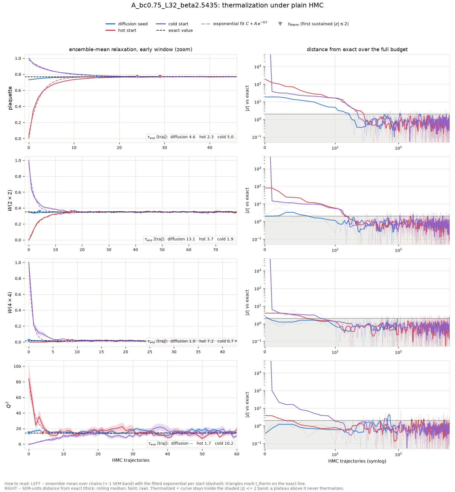

tau_int (hot-start chains, second half): plaquette = 3.11 +- 0.17, wilson_2x2 = 1.26 +- 0.06, wilson_4x4 = 0.71 +- 0.03, wilson_6x6 = 0.57 +- 0.02. Topology: hot-start HMC L=32 beta=2.5435 -> tau_int(Q) = 5.0.

### Diagnostics: raw diffusion output (before any HMC)

| observable | value | error | exact | z_exact | reference | ref_error | z_ref | ks_p | chi2_p |
|---|---|---|---|---|---|---|---|---|---|
| plaquette | 0.7315 | 0.001581 | 0.7696 | -24.15 | 0.77 | 0.0007358 | -22.07 | 0 |  |
| wilson_1x1 | 0.7315 | 0.001581 | 0.7696 | -24.15 | 0.77 | 0.0007358 | -22.07 | 0 |  |
| wilson_1x2 | 0.544 | 0.002462 | 0.5924 | -19.65 | 0.5935 | 0.001528 | -17.1 | 1.729e-38 |  |
| wilson_2x2 | 0.3556 | 0.002226 | 0.3509 | 2.115 | 0.3521 | 0.002041 | 1.152 | 0.4548 |  |
| wilson_2x3 | 0.2098 | 0.00231 | 0.2079 | 0.8409 | 0.21 | 0.002236 | -0.0493 | 0.8569 |  |
| wilson_3x3 | 0.09167 | 0.002367 | 0.09476 | -1.304 | 0.09711 | 0.002651 | -1.529 | 0.5259 |  |
| wilson_3x4 | 0.04435 | 0.002368 | 0.0432 | 0.4851 | 0.04357 | 0.002423 | 0.2299 | 0.7901 |  |
| wilson_4x4 | 0.02106 | 0.002101 | 0.01516 | 2.809 | 0.01327 | 0.001681 | 2.893 | 0.002655 |  |
| wilson_4x5 | 0.006187 | 0.001713 | 0.005319 | 0.5065 | 0.005009 | 0.001667 | 0.4927 | 0.8569 |  |
| wilson_5x5 | 0.001484 | 0.002624 | 0.001436 | 0.01819 | 0.000203 | 0.001705 | 0.4094 | 0.8569 |  |
| wilson_5x6 | 0.003145 | 0.002699 | 0.0003879 | 1.022 | 0.001525 | 0.00139 | 0.5334 | 0.7538 |  |
| wilson_6x6 | 0.002961 | 0.001996 | 8.063e-05 | 1.443 | 0.003735 | 0.001442 | -0.3141 | 0.2763 |  |
| wilson_6x7 | 0.002364 | 0.001914 | 1.676e-05 | 1.226 | 0.00239 | 0.001285 | -0.01115 | 0.678 |  |
| wilson_7x7 | -0.0004367 | 0.001807 | 2.681e-06 | -0.2432 | 0.003349 | 0.002069 | -1.378 | 0.3021 |  |
| wilson_7x8 | 0.003001 | 0.001747 | 4.289e-07 | 1.717 | -0.001687 | 0.002135 | 1.7 | 0.1545 |  |
| wilson_8x8 | -0.00272 | 0.001924 | 5.28e-08 | -1.414 | -0.004823 | 0.001385 | 0.8873 | 0.678 |  |
| wilson_8x10 | -0.001876 | 0.002089 | 8.005e-10 | -0.8979 | 0.0007077 | 0.001889 | -0.9173 | 0.4548 |  |
| wilson_10x10 | -0.004371 | 0.001617 | 4.258e-12 | -2.704 | 0.001007 | 0.001275 | -2.612 | 0.1004 |  |
| wilson_10x12 | 0.0004072 | 0.002255 | 2.265e-14 | 0.1806 | -0.0003643 | 0.002075 | 0.2518 | 0.9353 |  |
| wilson_12x12 | -0.0007705 | 0.00216 | 4.227e-17 | -0.3567 | 0.00167 | 0.001388 | -0.9505 | 0.6011 |  |
| creutz_2 | 0.1289 | 0.00678 | 0.2618 | -19.6 |  |  |  |  |  |
| creutz_3 | 0.3002 | 0.0213 | 0.2618 | 1.803 |  |  |  |  |  |
| creutz_4 | 0.01864 | 0.1111 | 0.2618 | -2.19 |  |  |  |  |  |
| creutz_5 | 0.2026 | 1.405 | 0.2618 | -0.04219 |  |  |  |  |  |
| creutz_6 | 0.811 | 1.54 | 0.2618 | 0.3567 |  |  |  |  |  |
| Q | -0.05469 | 0.3013 | 0 | -0.1815 | -0.08854 | 0.3153 | 0.07763 | 0.9972 |  |
| Q^2 | 13.63 | 1.597 | 14.25 | -0.388 | 14.63 | 1.572 | -0.4452 | 0.9693 |  |
| chi_top ((<Q^2>-<Q>^2)/V) | 0.01331 | 0.001561 | 0.01392 | -0.3894 | 0.01428 | 0.001519 | -0.445 | 0.1251 |  |
| Q histogram vs exact P(Q) | 9.879 | nan | 14 | nan |  |  |  |  | 0.771 |

### Diagnostics: the same configs after 96 HMC trajectories

| observable | value | error | exact | z_exact | reference | ref_error | z_ref | ks_p | chi2_p |
|---|---|---|---|---|---|---|---|---|---|
| plaquette | 0.7689 | 0.0009037 | 0.7696 | -0.8438 | 0.77 | 0.0007358 | -0.9167 | 0.389 |  |
| wilson_1x1 | 0.7689 | 0.0009037 | 0.7696 | -0.8438 | 0.77 | 0.0007358 | -0.9167 | 0.389 |  |
| wilson_1x2 | 0.5914 | 0.001461 | 0.5924 | -0.6679 | 0.5935 | 0.001528 | -1.014 | 0.1892 |  |
| wilson_2x2 | 0.3491 | 0.002203 | 0.3509 | -0.8189 | 0.3521 | 0.002041 | -1.011 | 0.1392 |  |
| wilson_2x3 | 0.206 | 0.002689 | 0.2079 | -0.6834 | 0.21 | 0.002236 | -1.126 | 0.4212 |  |
| wilson_3x3 | 0.08982 | 0.002726 | 0.09476 | -1.812 | 0.09711 | 0.002651 | -1.916 | 0.01275 |  |
| wilson_3x4 | 0.03737 | 0.002279 | 0.0432 | -2.56 | 0.04357 | 0.002423 | -1.865 | 0.08971 |  |
| wilson_4x4 | 0.01116 | 0.002256 | 0.01516 | -1.774 | 0.01327 | 0.001681 | -0.7527 | 0.8569 |  |
| wilson_4x5 | 0.006157 | 0.002779 | 0.005319 | 0.3014 | 0.005009 | 0.001667 | 0.3542 | 0.4212 |  |
| wilson_5x5 | 0.003344 | 0.002828 | 0.001436 | 0.6743 | 0.000203 | 0.001705 | 0.951 | 0.2297 |  |
| wilson_5x6 | 0.003161 | 0.00243 | 0.0003879 | 1.141 | 0.001525 | 0.00139 | 0.5843 | 0.7538 |  |
| wilson_6x6 | 0.002176 | 0.00188 | 8.063e-05 | 1.115 | 0.003735 | 0.001442 | -0.6579 | 0.5259 |  |
| wilson_6x7 | 0.001504 | 0.002129 | 1.676e-05 | 0.6984 | 0.00239 | 0.001285 | -0.3564 | 0.8864 |  |
| wilson_7x7 | -0.002083 | 0.002127 | 2.681e-06 | -0.9805 | 0.003349 | 0.002069 | -1.83 | 0.01275 |  |
| wilson_7x8 | -0.001779 | 0.001328 | 4.289e-07 | -1.34 | -0.001687 | 0.002135 | -0.03661 | 0.8569 |  |
| wilson_8x8 | 0.004119 | 0.001754 | 5.28e-08 | 2.349 | -0.004823 | 0.001385 | 4.002 | 0.005977 |  |
| wilson_8x10 | -0.0004341 | 0.002468 | 8.005e-10 | -0.1759 | 0.0007077 | 0.001889 | -0.3674 | 0.4898 |  |
| wilson_10x10 | 0.0003991 | 0.002429 | 4.258e-12 | 0.1643 | 0.001007 | 0.001275 | -0.2215 | 0.7901 |  |
| wilson_10x12 | 0.004658 | 0.002174 | 2.265e-14 | 2.143 | -0.0003643 | 0.002075 | 1.671 | 0.1892 |  |
| wilson_12x12 | -0.0006114 | 0.001158 | 4.227e-17 | -0.5278 | 0.00167 | 0.001388 | -1.262 | 0.678 |  |
| creutz_2 | 0.2647 | 0.004211 | 0.2618 | 0.6765 |  |  |  |  |  |
| creutz_3 | 0.3027 | 0.01956 | 0.2618 | 2.092 |  |  |  |  |  |
| creutz_4 | 0.3317 | 0.1483 | 0.2618 | 0.4714 |  |  |  |  |  |
| creutz_5 | 0.01601 | 0.6955 | 0.2618 | -0.3534 |  |  |  |  |  |
| creutz_6 | 0.3174 | 1.25 | 0.2618 | 0.04449 |  |  |  |  |  |
| Q | 0 | 0.3615 | 0 | 0 | -0.08854 | 0.3153 | 0.1846 | 0.9353 |  |
| Q^2 | 13.69 | 1.911 | 14.25 | -0.2956 | 14.63 | 1.572 | -0.381 | 0.9693 |  |
| chi_top ((<Q^2>-<Q>^2)/V) | 0.01337 | 0.001866 | 0.01392 | -0.2956 | 0.01428 | 0.001519 | -0.3794 | 0.1251 |  |
| Q histogram vs exact P(Q) | 12.03 | nan | 14 | nan |  |  |  |  | 0.604 |

## A_bc1_L32_beta3.10399

HMC: step size 0.2000, 5 leapfrog steps, acceptance seed/hot/cold = 0.961/0.962/0.961. Diffusion-seed batch: 128 chains x 96 trajectories (0.05 s/traj for the whole batch); baselines: 32 chains x 640 trajectories.

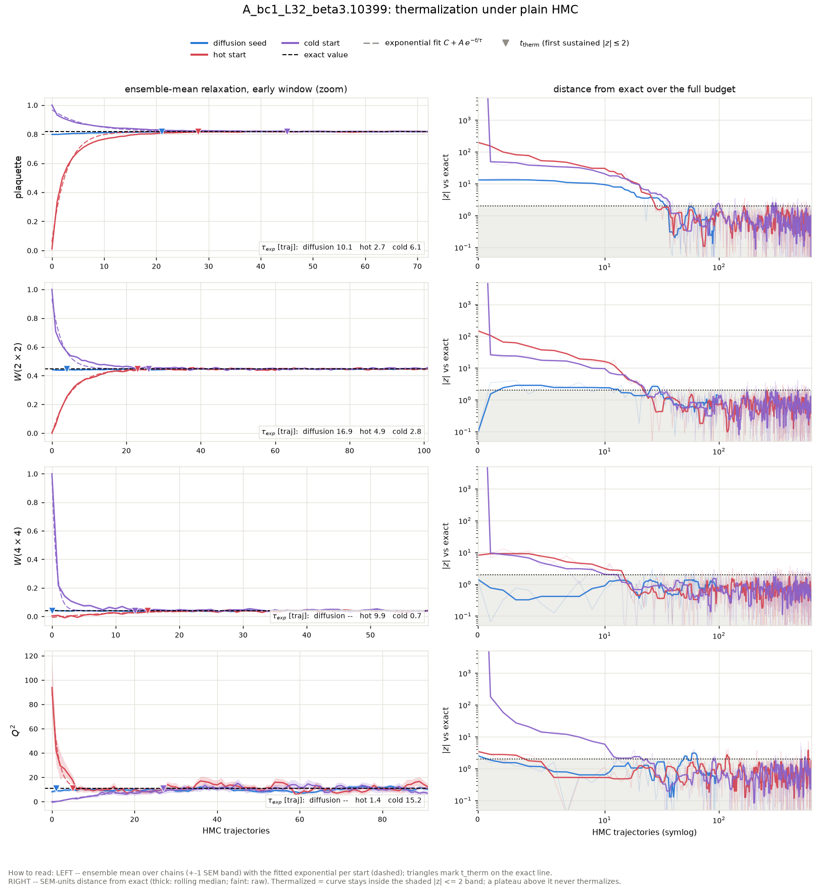

tau_int (hot-start chains, second half): plaquette = 4.22 +- 0.45, wilson_2x2 = 1.59 +- 0.09, wilson_4x4 = 0.87 +- 0.04, wilson_6x6 = 0.56 +- 0.01. Topology: hot-start HMC L=32 beta=3.10399 -> tau_int(Q) = 9.4.

### Diagnostics: raw diffusion output (before any HMC)

| observable | value | error | exact | z_exact | reference | ref_error | z_ref | ks_p | chi2_p |
|---|---|---|---|---|---|---|---|---|---|
| plaquette | 0.7979 | 0.001754 | 0.8174 | -11.11 | 0.8162 | 0.000584 | -9.878 | 1.127e-30 |  |
| wilson_1x1 | 0.7979 | 0.001754 | 0.8174 | -11.11 | 0.8162 | 0.000584 | -9.878 | 1.127e-30 |  |
| wilson_1x2 | 0.6397 | 0.002745 | 0.6681 | -10.37 | 0.6682 | 0.00102 | -9.731 | 1.172e-22 |  |
| wilson_2x2 | 0.4461 | 0.002367 | 0.4464 | -0.1048 | 0.4457 | 0.001732 | 0.1358 | 0.6011 |  |
| wilson_2x3 | 0.2988 | 0.002999 | 0.2982 | 0.1769 | 0.2982 | 0.002317 | 0.1559 | 0.5259 |  |
| wilson_3x3 | 0.1603 | 0.003422 | 0.1629 | -0.7606 | 0.165 | 0.002539 | -1.107 | 0.3021 |  |
| wilson_3x4 | 0.0912 | 0.003165 | 0.08895 | 0.71 | 0.08963 | 0.0025 | 0.3886 | 0.678 |  |
| wilson_4x4 | 0.04415 | 0.003551 | 0.03971 | 1.253 | 0.04079 | 0.002152 | 0.8105 | 0.04938 |  |
| wilson_4x5 | 0.02013 | 0.00287 | 0.01772 | 0.8376 | 0.01821 | 0.002178 | 0.5327 | 0.9126 |  |
| wilson_5x5 | 0.007241 | 0.00205 | 0.006467 | 0.3777 | 0.002267 | 0.002221 | 1.646 | 0.3584 |  |
| wilson_5x6 | 0.002895 | 0.002225 | 0.00236 | 0.2408 | -0.002576 | 0.002339 | 1.695 | 0.02947 |  |
| wilson_6x6 | 0.0008471 | 0.002764 | 0.0007038 | 0.05188 | -0.002333 | 0.00182 | 0.9611 | 0.678 |  |
| wilson_6x7 | 0.0005547 | 0.002701 | 0.0002099 | 0.1276 | -0.00116 | 0.002018 | 0.5084 | 0.4548 |  |
| wilson_7x7 | -0.0007306 | 0.002087 | 5.117e-05 | -0.3746 | -0.001112 | 0.002474 | 0.1177 | 0.6395 |  |
| wilson_7x8 | 0.001676 | 0.002107 | 1.247e-05 | 0.7898 | 0.0007095 | 0.001861 | 0.3439 | 0.9542 |  |
| wilson_8x8 | -0.0007284 | 0.002245 | 2.486e-06 | -0.3255 | -0.0001275 | 0.001771 | -0.2101 | 0.2763 |  |
| wilson_8x10 | -0.004467 | 0.001691 | 9.869e-08 | -2.641 | -0.0005432 | 0.001625 | -1.673 | 0.02947 |  |
| wilson_10x10 | -0.001306 | 0.001986 | 1.749e-09 | -0.6578 | -0.0004625 | 0.002208 | -0.2841 | 0.7538 |  |
| wilson_10x12 | 0.001602 | 0.001685 | 3.101e-11 | 0.9506 | 0.0005483 | 0.001643 | 0.4477 | 0.5631 |  |
| wilson_12x12 | -0.00386 | 0.002021 | 2.453e-13 | -1.91 | -0.0005323 | 0.001695 | -1.262 | 0.3584 |  |
| creutz_2 | 0.1393 | 0.004658 | 0.2016 | -13.39 |  |  |  |  |  |
| creutz_3 | 0.2219 | 0.01186 | 0.2016 | 1.705 |  |  |  |  |  |
| creutz_4 | 0.1615 | 0.0452 | 0.2016 | -0.8885 |  |  |  |  |  |
| creutz_5 | 0.2368 | 0.2803 | 0.2016 | 0.1255 |  |  |  |  |  |
| creutz_6 | 0.3123 | 2.598 | 0.2016 | 0.04261 |  |  |  |  |  |
| Q | 0.5312 | 0.2874 | 0 | 1.848 | 0.3542 | 0.2073 | 0.4997 | 0.9989 |  |
| Q^2 | 8.078 | 1.107 | 10.81 | -2.466 | 10.11 | 1.079 | -1.317 | 0.678 |  |
| chi_top ((<Q^2>-<Q>^2)/V) | 0.007613 | 0.0009828 | 0.01056 | -2.993 | 0.009755 | 0.001081 | -1.466 | 0.004349 |  |
| Q histogram vs exact P(Q) | 12.38 | nan | 12 | nan |  |  |  |  | 0.4155 |

### Diagnostics: the same configs after 96 HMC trajectories

| observable | value | error | exact | z_exact | reference | ref_error | z_ref | ks_p | chi2_p |
|---|---|---|---|---|---|---|---|---|---|
| plaquette | 0.8184 | 0.0006208 | 0.8174 | 1.578 | 0.8162 | 0.000584 | 2.583 | 0.1004 |  |
| wilson_1x1 | 0.8184 | 0.0006208 | 0.8174 | 1.578 | 0.8162 | 0.000584 | 2.583 | 0.1004 |  |
| wilson_1x2 | 0.67 | 0.0009603 | 0.6681 | 1.942 | 0.6682 | 0.00102 | 1.302 | 0.5259 |  |
| wilson_2x2 | 0.4498 | 0.001756 | 0.4464 | 1.965 | 0.4457 | 0.001732 | 1.661 | 0.1892 |  |
| wilson_2x3 | 0.3021 | 0.002501 | 0.2982 | 1.529 | 0.2982 | 0.002317 | 1.139 | 0.5631 |  |
| wilson_3x3 | 0.164 | 0.003385 | 0.1629 | 0.3329 | 0.165 | 0.002539 | -0.2336 | 0.9941 |  |
| wilson_3x4 | 0.08965 | 0.003319 | 0.08895 | 0.2114 | 0.08963 | 0.0025 | 0.005348 | 0.8569 |  |
| wilson_4x4 | 0.04232 | 0.00339 | 0.03971 | 0.7716 | 0.04079 | 0.002152 | 0.3819 | 0.3021 |  |
| wilson_4x5 | 0.01705 | 0.002694 | 0.01772 | -0.2521 | 0.01821 | 0.002178 | -0.3359 | 0.3021 |  |
| wilson_5x5 | 0.008589 | 0.002873 | 0.006467 | 0.7384 | 0.002267 | 0.002221 | 1.741 | 0.1392 |  |
| wilson_5x6 | 0.0007148 | 0.003219 | 0.00236 | -0.5111 | -0.002576 | 0.002339 | 0.8271 | 0.4898 |  |
| wilson_6x6 | 0.001547 | 0.003049 | 0.0007038 | 0.2764 | -0.002333 | 0.00182 | 1.092 | 0.5631 |  |
| wilson_6x7 | -0.001981 | 0.002602 | 0.0002099 | -0.8419 | -0.00116 | 0.002018 | -0.2494 | 0.5631 |  |
| wilson_7x7 | -0.0004296 | 0.003037 | 5.117e-05 | -0.1583 | -0.001112 | 0.002474 | 0.1741 | 0.6011 |  |
| wilson_7x8 | -0.005175 | 0.002323 | 1.247e-05 | -2.233 | 0.0007095 | 0.001861 | -1.977 | 0.04354 |  |
| wilson_8x8 | -0.003083 | 0.002824 | 2.486e-06 | -1.093 | -0.0001275 | 0.001771 | -0.8867 | 0.4212 |  |
| wilson_8x10 | 0.0002152 | 0.002065 | 9.869e-08 | 0.1042 | -0.0005432 | 0.001625 | 0.2886 | 0.4548 |  |
| wilson_10x10 | -0.003296 | 0.002079 | 1.749e-09 | -1.585 | -0.0004625 | 0.002208 | -0.9342 | 0.4212 |  |
| wilson_10x12 | 0.001672 | 0.001811 | 3.101e-11 | 0.9232 | 0.0005483 | 0.001643 | 0.4594 | 0.3021 |  |
| wilson_12x12 | -5.312e-05 | 0.001786 | 2.453e-13 | -0.02973 | -0.0005323 | 0.001695 | 0.1946 | 0.8569 |  |
| creutz_2 | 0.1983 | 0.003384 | 0.2016 | -0.9818 |  |  |  |  |  |
| creutz_3 | 0.2125 | 0.01064 | 0.2016 | 1.023 |  |  |  |  |  |
| creutz_4 | 0.1467 | 0.04536 | 0.2016 | -1.212 |  |  |  |  |  |
| creutz_5 | -0.224 | 0.2544 | 0.2016 | -1.673 |  |  |  |  |  |
| creutz_6 | -3.258 | 7.959 | 0.2016 | -0.4347 |  |  |  |  |  |
| Q | -0.125 | 0.3508 | 0 | -0.3563 | 0.3542 | 0.2073 | -1.176 | 0.4548 |  |
| Q^2 | 10.06 | 1.841 | 10.81 | -0.4053 | 10.11 | 1.079 | -0.02441 | 0.9693 |  |
| chi_top ((<Q^2>-<Q>^2)/V) | 0.009811 | 0.001755 | 0.01056 | -0.4238 | 0.009755 | 0.001081 | 0.02735 | 0.04354 |  |
| Q histogram vs exact P(Q) | 14.3 | nan | 12 | nan |  |  |  |  | 0.2818 |

## E_bc1.2_L32_beta3.6012

HMC: step size 0.2000, 5 leapfrog steps, acceptance seed/hot/cold = 0.963/0.961/0.961. Diffusion-seed batch: 128 chains x 96 trajectories (0.05 s/traj for the whole batch); baselines: 32 chains x 640 trajectories.

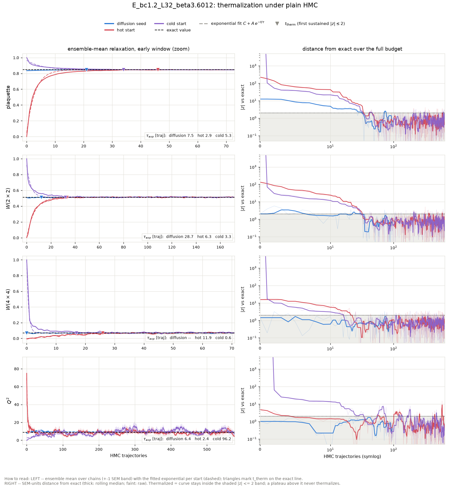

tau_int (hot-start chains, second half): plaquette = 4.27 +- 0.35, wilson_2x2 = 2.26 +- 0.22, wilson_4x4 = 1.08 +- 0.07, wilson_6x6 = 0.61 +- 0.02. Topology: hot-start HMC L=32 beta=3.6012 -> tau_int(Q) = 14.1.

### Diagnostics: raw diffusion output (before any HMC)

| observable | value | error | exact | z_exact | reference | ref_error | z_ref | ks_p | chi2_p |
|---|---|---|---|---|---|---|---|---|---|
| plaquette | 0.8349 | 0.0008504 | 0.8462 | -13.32 | 0.8456 | 0.0005743 | -10.45 | 2.282e-17 |  |
| wilson_1x1 | 0.8349 | 0.0008504 | 0.8462 | -13.32 | 0.8456 | 0.0005743 | -10.45 | 2.282e-17 |  |
| wilson_1x2 | 0.699 | 0.001346 | 0.7161 | -12.71 | 0.716 | 0.0009526 | -10.31 | 7.462e-14 |  |
| wilson_2x2 | 0.5084 | 0.001685 | 0.5128 | -2.596 | 0.5117 | 0.001658 | -1.397 | 0.08971 |  |
| wilson_2x3 | 0.363 | 0.00273 | 0.3672 | -1.546 | 0.367 | 0.002053 | -1.168 | 0.3021 |  |
| wilson_3x3 | 0.2179 | 0.00312 | 0.2225 | -1.465 | 0.2202 | 0.002536 | -0.5699 | 0.9353 |  |
| wilson_3x4 | 0.1339 | 0.003285 | 0.1348 | -0.295 | 0.131 | 0.001993 | 0.7491 | 0.8569 |  |
| wilson_4x4 | 0.07362 | 0.003145 | 0.06914 | 1.423 | 0.068 | 0.002087 | 1.488 | 0.2297 |  |
| wilson_4x5 | 0.04017 | 0.003636 | 0.03545 | 1.296 | 0.03286 | 0.001458 | 1.866 | 0.04354 |  |
| wilson_5x5 | 0.01606 | 0.003378 | 0.01538 | 0.2011 | 0.01253 | 0.002137 | 0.8833 | 0.6395 |  |
| wilson_5x6 | 0.006261 | 0.002866 | 0.006676 | -0.1446 | 0.003977 | 0.001986 | 0.6552 | 0.7901 |  |
| wilson_6x6 | 0.003463 | 0.003442 | 0.002451 | 0.2941 | -0.001796 | 0.001841 | 1.347 | 0.3584 |  |
| wilson_6x7 | 0.002414 | 0.002269 | 0.0009001 | 0.667 | -0.001993 | 0.001747 | 1.539 | 0.2522 |  |
| wilson_7x7 | -0.001101 | 0.002441 | 0.0002797 | -0.5658 | -0.000552 | 0.001495 | -0.1919 | 0.7901 |  |
| wilson_7x8 | 0.000723 | 0.002265 | 8.691e-05 | 0.2808 | 0.0009645 | 0.001412 | -0.09047 | 0.7901 |  |
| wilson_8x8 | 0.002623 | 0.002304 | 2.285e-05 | 1.128 | -0.001508 | 0.00209 | 1.328 | 0.6395 |  |
| wilson_8x10 | 0.002124 | 0.002322 | 1.58e-06 | 0.9141 | -0.002194 | 0.002141 | 1.367 | 0.2522 |  |
| wilson_10x10 | -0.0008938 | 0.002093 | 5.602e-08 | -0.4271 | 0.0005559 | 0.001596 | -0.5508 | 0.3584 |  |
| wilson_10x12 | 0.0007676 | 0.001394 | 1.986e-09 | 0.5506 | 0.003141 | 0.001697 | -1.08 | 0.4212 |  |
| wilson_12x12 | 0.0001336 | 0.002454 | 3.611e-11 | 0.05442 | -0.0008685 | 0.001706 | 0.3352 | 0.4898 |  |
| creutz_2 | 0.1406 | 0.003124 | 0.167 | -8.433 |  |  |  |  |  |
| creutz_3 | 0.1732 | 0.007187 | 0.167 | 0.863 |  |  |  |  |  |
| creutz_4 | 0.1106 | 0.02433 | 0.167 | -2.319 |  |  |  |  |  |
| creutz_5 | 0.3107 | 0.1116 | 0.167 | 1.288 |  |  |  |  |  |
| creutz_6 | -0.3501 | 0.6127 | 0.167 | -0.8439 |  |  |  |  |  |
| Q | -0.2188 | 0.2196 | 0 | -0.996 | -0.2396 | 0.1729 | 0.07453 | 0.9542 |  |
| Q^2 | 8 | 0.8172 | 8.856 | -1.047 | 10.91 | 1.034 | -2.205 | 0.8864 |  |
| chi_top ((<Q^2>-<Q>^2)/V) | 0.007766 | 0.0007593 | 0.008648 | -1.162 | 0.01059 | 0.001011 | -2.237 | 0.0631 |  |
| Q histogram vs exact P(Q) | 12.26 | nan | 12 | nan |  |  |  |  | 0.4253 |

### Diagnostics: the same configs after 96 HMC trajectories

| observable | value | error | exact | z_exact | reference | ref_error | z_ref | ks_p | chi2_p |
|---|---|---|---|---|---|---|---|---|---|
| plaquette | 0.846 | 0.0006095 | 0.8462 | -0.442 | 0.8456 | 0.0005743 | 0.4035 | 0.7163 |  |
| wilson_1x1 | 0.846 | 0.0006095 | 0.8462 | -0.442 | 0.8456 | 0.0005743 | 0.4035 | 0.7163 |  |
| wilson_1x2 | 0.7148 | 0.001507 | 0.7161 | -0.8746 | 0.716 | 0.0009526 | -0.6752 | 0.7901 |  |
| wilson_2x2 | 0.5114 | 0.002191 | 0.5128 | -0.6188 | 0.5117 | 0.001658 | -0.1032 | 0.6011 |  |
| wilson_2x3 | 0.3644 | 0.003134 | 0.3672 | -0.9075 | 0.367 | 0.002053 | -0.6974 | 0.3584 |  |
| wilson_3x3 | 0.2185 | 0.00384 | 0.2225 | -1.056 | 0.2202 | 0.002536 | -0.3857 | 0.7901 |  |
| wilson_3x4 | 0.1317 | 0.004058 | 0.1348 | -0.7822 | 0.131 | 0.001993 | 0.1488 | 0.8864 |  |
| wilson_4x4 | 0.06563 | 0.004224 | 0.06914 | -0.832 | 0.068 | 0.002087 | -0.504 | 0.2522 |  |
| wilson_4x5 | 0.03405 | 0.003729 | 0.03545 | -0.3763 | 0.03286 | 0.001458 | 0.2977 | 0.9693 |  |
| wilson_5x5 | 0.01198 | 0.00368 | 0.01538 | -0.9249 | 0.01253 | 0.002137 | -0.1299 | 0.7901 |  |
| wilson_5x6 | 0.005064 | 0.003112 | 0.006676 | -0.5181 | 0.003977 | 0.001986 | 0.2944 | 0.5631 |  |
| wilson_6x6 | 0.0005658 | 0.002514 | 0.002451 | -0.75 | -0.001796 | 0.001841 | 0.7579 | 0.389 |  |
| wilson_6x7 | -0.000874 | 0.002307 | 0.0009001 | -0.7691 | -0.001993 | 0.001747 | 0.3868 | 0.8246 |  |
| wilson_7x7 | 0.003793 | 0.003278 | 0.0002797 | 1.072 | -0.000552 | 0.001495 | 1.206 | 0.1004 |  |
| wilson_7x8 | 0.003603 | 0.002448 | 8.691e-05 | 1.436 | 0.0009645 | 0.001412 | 0.9335 | 0.678 |  |
| wilson_8x8 | 0.002245 | 0.002561 | 2.285e-05 | 0.8676 | -0.001508 | 0.00209 | 1.135 | 0.3294 |  |
| wilson_8x10 | -0.002446 | 0.002191 | 1.58e-06 | -1.117 | -0.002194 | 0.002141 | -0.08215 | 0.7163 |  |
| wilson_10x10 | 0.0001081 | 0.001779 | 5.602e-08 | 0.06073 | 0.0005559 | 0.001596 | -0.1873 | 0.6011 |  |
| wilson_10x12 | 0.0006596 | 0.001963 | 1.986e-09 | 0.3359 | 0.003141 | 0.001697 | -0.9561 | 0.4898 |  |
| wilson_12x12 | -0.001565 | 0.002322 | 3.611e-11 | -0.6742 | -0.0008685 | 0.001706 | -0.2418 | 0.9126 |  |
| creutz_2 | 0.1663 | 0.002327 | 0.167 | -0.3094 |  |  |  |  |  |
| creutz_3 | 0.1725 | 0.007593 | 0.167 | 0.7216 |  |  |  |  |  |
| creutz_4 | 0.1899 | 0.02826 | 0.167 | 0.8106 |  |  |  |  |  |
| creutz_5 | 0.3885 | 0.1892 | 0.167 | 1.171 |  |  |  |  |  |
| creutz_6 | 1.33 | 5.207 | 0.167 | 0.2235 |  |  |  |  |  |
| creutz_8 | 0.4217 | 1.073 | 0.167 | 0.2373 |  |  |  |  |  |
| Q | -0.5156 | 0.2027 | 0 | -2.544 | -0.2396 | 0.1729 | -1.036 | 0.678 |  |
| Q^2 | 8.25 | 0.9456 | 8.856 | -0.6407 | 10.91 | 1.034 | -1.896 | 0.3021 |  |
| chi_top ((<Q^2>-<Q>^2)/V) | 0.007797 | 0.0009093 | 0.008648 | -0.9362 | 0.01059 | 0.001011 | -2.057 | 0.003137 |  |
| Q histogram vs exact P(Q) | 10.85 | nan | 12 | nan |  |  |  |  | 0.5417 |

## A_bc1.5_L32_beta4.44493

HMC: step size 0.1897, 5 leapfrog steps, acceptance seed/hot/cold = 0.967/0.964/0.964. Diffusion-seed batch: 128 chains x 96 trajectories (0.05 s/traj for the whole batch); baselines: 32 chains x 640 trajectories.

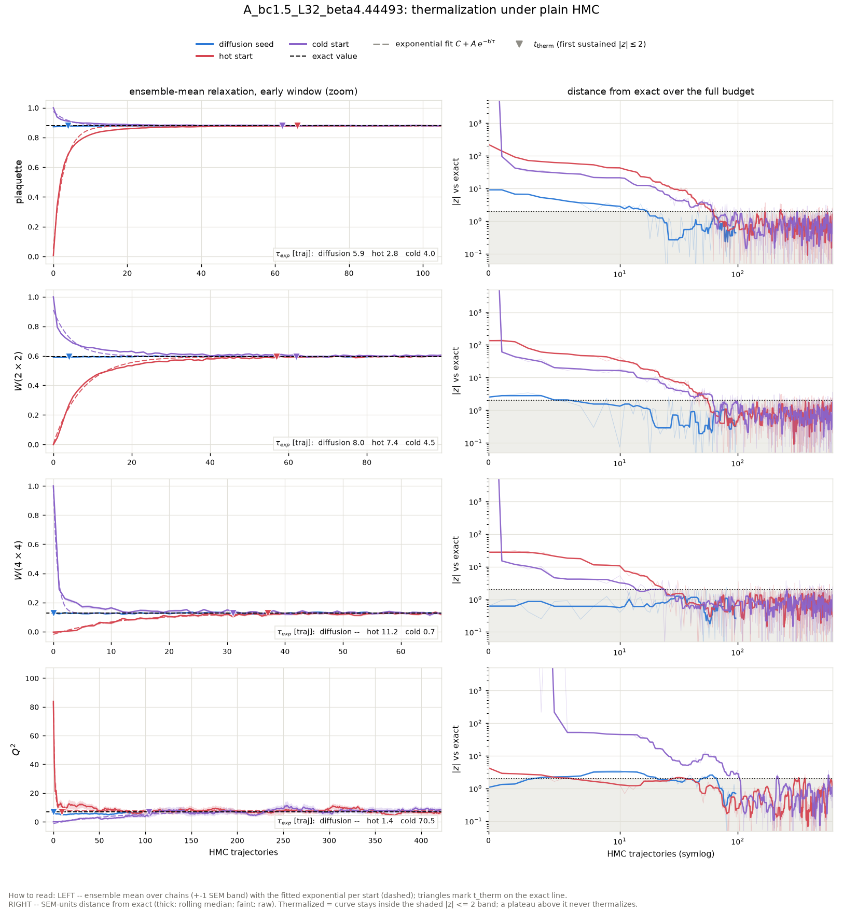

tau_int (hot-start chains, second half): plaquette = 3.14 +- 0.20, wilson_2x2 = 2.66 +- 0.23, wilson_4x4 = 1.28 +- 0.06, wilson_6x6 = 0.76 +- 0.03. Topology: hot-start HMC L=32 beta=4.44493 -> tau_int(Q) = 26.0.

### Diagnostics: raw diffusion output (before any HMC)

| observable | value | error | exact | z_exact | reference | ref_error | z_ref | ks_p | chi2_p |
|---|---|---|---|---|---|---|---|---|---|
| plaquette | 0.8724 | 0.0007109 | 0.8787 | -8.797 | 0.8783 | 0.0003423 | -7.389 | 1.138e-07 |  |
| wilson_1x1 | 0.8724 | 0.0007109 | 0.8787 | -8.797 | 0.8783 | 0.0003423 | -7.389 | 1.138e-07 |  |
| wilson_1x2 | 0.7616 | 0.00118 | 0.7721 | -8.924 | 0.7712 | 0.0008024 | -6.771 | 1.186e-06 |  |
| wilson_2x2 | 0.5908 | 0.002096 | 0.5961 | -2.53 | 0.5948 | 0.00135 | -1.595 | 0.1892 |  |
| wilson_2x3 | 0.4542 | 0.002639 | 0.4603 | -2.295 | 0.459 | 0.002031 | -1.435 | 0.08971 |  |
| wilson_3x3 | 0.3041 | 0.003422 | 0.3123 | -2.377 | 0.3125 | 0.002398 | -1.999 | 0.006985 |  |
| wilson_3x4 | 0.2089 | 0.003232 | 0.2119 | -0.9207 | 0.2116 | 0.002919 | -0.6182 | 0.5259 |  |
| wilson_4x4 | 0.1287 | 0.003586 | 0.1263 | 0.6746 | 0.1254 | 0.002583 | 0.7533 | 0.4548 |  |
| wilson_4x5 | 0.07985 | 0.003647 | 0.07529 | 1.251 | 0.07625 | 0.002348 | 0.8291 | 0.4212 |  |
| wilson_5x5 | 0.04438 | 0.003707 | 0.03944 | 1.333 | 0.03971 | 0.001768 | 1.137 | 0.5259 |  |
| wilson_5x6 | 0.02662 | 0.00341 | 0.02066 | 1.75 | 0.01925 | 0.002183 | 1.821 | 0.1004 |  |
| wilson_6x6 | 0.01216 | 0.002295 | 0.009508 | 1.155 | 0.007922 | 0.00205 | 1.377 | 0.3584 |  |
| wilson_6x7 | 0.005208 | 0.002384 | 0.004376 | 0.3487 | 0.003937 | 0.002167 | 0.3944 | 0.0631 |  |
| wilson_7x7 | 0.00226 | 0.002273 | 0.00177 | 0.2156 | 0.0004044 | 0.002433 | 0.5573 | 0.4898 |  |
| wilson_7x8 | 0.001504 | 0.001917 | 0.0007158 | 0.411 | -0.001027 | 0.002259 | 0.8542 | 0.3584 |  |
| wilson_8x8 | 0.002929 | 0.002403 | 0.0002544 | 1.113 | -0.001636 | 0.001956 | 1.473 | 0.3584 |  |
| wilson_8x10 | 0.001705 | 0.001843 | 3.213e-05 | 0.9078 | 0.0006127 | 0.002279 | 0.3728 | 0.2522 |  |
| wilson_10x10 | -0.000971 | 0.001925 | 2.419e-06 | -0.5058 | 0.002113 | 0.001758 | -1.183 | 0.2522 |  |
| wilson_10x12 | -0.002693 | 0.001969 | 1.821e-07 | -1.368 | 0.001766 | 0.001748 | -1.693 | 0.01275 |  |
| wilson_12x12 | -0.0003304 | 0.00206 | 8.173e-09 | -0.1604 | -0.001115 | 0.001654 | 0.2968 | 0.1545 |  |
| creutz_2 | 0.1179 | 0.002154 | 0.1293 | -5.292 |  |  |  |  |  |
| creutz_3 | 0.1382 | 0.005361 | 0.1293 | 1.649 |  |  |  |  |  |
| creutz_4 | 0.1085 | 0.01553 | 0.1293 | -1.344 |  |  |  |  |  |
| creutz_5 | 0.11 | 0.04283 | 0.1293 | -0.4521 |  |  |  |  |  |
| creutz_6 | 0.2727 | 0.1765 | 0.1293 | 0.8125 |  |  |  |  |  |
| creutz_7 | -0.0132 | 0.8446 | 0.1293 | -0.1687 |  |  |  |  |  |
| creutz_8 | -1.074 | 2.267 | 0.1293 | -0.5309 |  |  |  |  |  |
| Q | -0.125 | 0.2224 | 0 | -0.5622 | 0.1875 | 0.1793 | -1.094 | 0.5631 |  |
| Q^2 | 6.078 | 0.5023 | 6.786 | -1.409 | 8.26 | 0.8138 | -2.282 | 0.2763 |  |
| chi_top ((<Q^2>-<Q>^2)/V) | 0.00592 | 0.0004956 | 0.006627 | -1.425 | 0.008032 | 0.0007586 | -2.331 | 0.006985 |  |
| Q histogram vs exact P(Q) | 11.44 | nan | 10 | nan |  |  |  |  | 0.3241 |

### Diagnostics: the same configs after 96 HMC trajectories

| observable | value | error | exact | z_exact | reference | ref_error | z_ref | ks_p | chi2_p |
|---|---|---|---|---|---|---|---|---|---|
| plaquette | 0.8789 | 0.0004189 | 0.8787 | 0.4533 | 0.8783 | 0.0003423 | 1.134 | 0.2522 |  |
| wilson_1x1 | 0.8789 | 0.0004189 | 0.8787 | 0.4533 | 0.8783 | 0.0003423 | 1.134 | 0.2522 |  |
| wilson_1x2 | 0.7714 | 0.0009885 | 0.7721 | -0.6913 | 0.7712 | 0.0008024 | 0.1465 | 0.9807 |  |
| wilson_2x2 | 0.5967 | 0.0019 | 0.5961 | 0.275 | 0.5948 | 0.00135 | 0.7931 | 0.5259 |  |
| wilson_2x3 | 0.4601 | 0.002531 | 0.4603 | -0.08458 | 0.459 | 0.002031 | 0.3278 | 0.7538 |  |
| wilson_3x3 | 0.3105 | 0.003016 | 0.3123 | -0.5895 | 0.3125 | 0.002398 | -0.5175 | 0.5259 |  |
| wilson_3x4 | 0.2094 | 0.003217 | 0.2119 | -0.747 | 0.2116 | 0.002919 | -0.488 | 0.4898 |  |
| wilson_4x4 | 0.1253 | 0.003853 | 0.1263 | -0.2551 | 0.1254 | 0.002583 | -0.01572 | 0.5259 |  |
| wilson_4x5 | 0.07619 | 0.003953 | 0.07529 | 0.2293 | 0.07625 | 0.002348 | -0.0131 | 0.7163 |  |
| wilson_5x5 | 0.04177 | 0.003097 | 0.03944 | 0.7531 | 0.03971 | 0.001768 | 0.5774 | 0.7538 |  |
| wilson_5x6 | 0.02384 | 0.002976 | 0.02066 | 1.069 | 0.01925 | 0.002183 | 1.244 | 0.5259 |  |
| wilson_6x6 | 0.0117 | 0.002919 | 0.009508 | 0.7503 | 0.007922 | 0.00205 | 1.059 | 0.4898 |  |
| wilson_6x7 | 0.002851 | 0.002219 | 0.004376 | -0.6873 | 0.003937 | 0.002167 | -0.3503 | 0.9941 |  |
| wilson_7x7 | 0.0009269 | 0.002709 | 0.00177 | -0.3112 | 0.0004044 | 0.002433 | 0.1435 | 0.7163 |  |
| wilson_7x8 | -0.003677 | 0.00272 | 0.0007158 | -1.615 | -0.001027 | 0.002259 | -0.7494 | 0.4548 |  |
| wilson_8x8 | -0.003351 | 0.002883 | 0.0002544 | -1.25 | -0.001636 | 0.001956 | -0.4923 | 0.7163 |  |
| wilson_8x10 | -0.003339 | 0.002588 | 3.213e-05 | -1.302 | 0.0006127 | 0.002279 | -1.146 | 0.4548 |  |
| wilson_10x10 | -0.001461 | 0.001871 | 2.419e-06 | -0.7824 | 0.002113 | 0.001758 | -1.392 | 0.1892 |  |
| wilson_10x12 | -0.003198 | 0.002105 | 1.821e-07 | -1.519 | 0.001766 | 0.001748 | -1.814 | 0.07995 |  |
| wilson_12x12 | -0.003586 | 0.002771 | 8.173e-09 | -1.294 | -0.001115 | 0.001654 | -0.7658 | 0.1392 |  |
| creutz_2 | 0.1265 | 0.001671 | 0.1293 | -1.714 |  |  |  |  |  |
| creutz_3 | 0.1332 | 0.005014 | 0.1293 | 0.7783 |  |  |  |  |  |
| creutz_4 | 0.12 | 0.01513 | 0.1293 | -0.6143 |  |  |  |  |  |
| creutz_5 | 0.1036 | 0.04533 | 0.1293 | -0.5671 |  |  |  |  |  |
| creutz_6 | 0.1511 | 0.1661 | 0.1293 | 0.1314 |  |  |  |  |  |
| creutz_7 | -0.2883 | 2.756 | 0.1293 | -0.1515 |  |  |  |  |  |
| Q | 0.07031 | 0.1424 | 0 | 0.4938 | 0.1875 | 0.1793 | -0.5118 | 0.678 |  |
| Q^2 | 6.242 | 0.6857 | 6.786 | -0.793 | 8.26 | 0.8138 | -1.897 | 0.3584 |  |
| chi_top ((<Q^2>-<Q>^2)/V) | 0.006091 | 0.0006696 | 0.006627 | -0.8001 | 0.008032 | 0.0007586 | -1.919 | 0.00189 |  |
| Q histogram vs exact P(Q) | 14.33 | nan | 10 | nan |  |  |  |  | 0.1585 |

## A_bc2_L32_beta6.10518

HMC: step size 0.1619, 6 leapfrog steps, acceptance seed/hot/cold = 0.975/0.974/0.975. Diffusion-seed batch: 128 chains x 96 trajectories (0.06 s/traj for the whole batch); baselines: 32 chains x 640 trajectories.

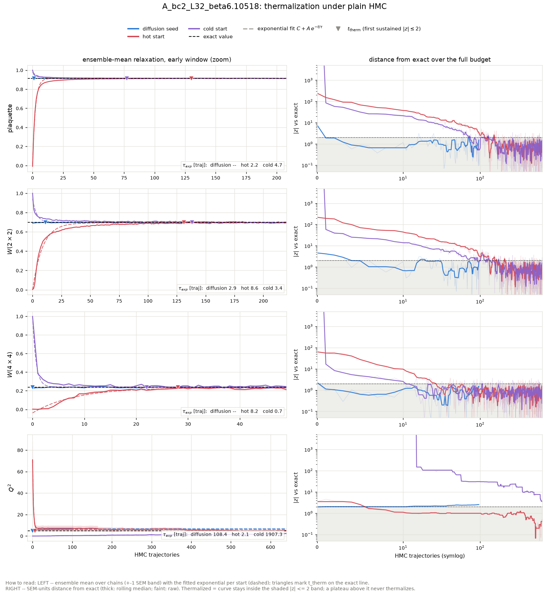

tau_int (hot-start chains, second half): plaquette = 3.38 +- 0.40, wilson_2x2 = 3.63 +- 0.32, wilson_4x4 = 1.20 +- 0.06, wilson_6x6 = 0.95 +- 0.04. Topology: hot-start HMC L=32 beta=6.10518 -> tau_int(Q) = 30.8.

Where 'never' stood at the end: the cold start ended the 640-trajectory budget still at Q^2 at |z| ~ 4.

### Diagnostics: raw diffusion output (before any HMC)

| observable | value | error | exact | z_exact | reference | ref_error | z_ref | ks_p | chi2_p |
|---|---|---|---|---|---|---|---|---|---|
| plaquette | 0.9107 | 0.0003341 | 0.914 | -9.886 | 0.9135 | 0.0003006 | -6.34 | 4.842e-05 |  |
| wilson_1x1 | 0.9107 | 0.0003341 | 0.914 | -9.886 | 0.9135 | 0.0003006 | -6.34 | 4.842e-05 |  |
| wilson_1x2 | 0.8278 | 0.0007096 | 0.8353 | -10.57 | 0.8344 | 0.0006946 | -6.607 | 5.1e-06 |  |
| wilson_2x2 | 0.6894 | 0.001169 | 0.6978 | -7.135 | 0.6965 | 0.001434 | -3.801 | 0.02248 |  |
| wilson_2x3 | 0.5734 | 0.001656 | 0.5829 | -5.726 | 0.5819 | 0.002105 | -3.189 | 0.03831 |  |
| wilson_3x3 | 0.4341 | 0.002912 | 0.445 | -3.729 | 0.4436 | 0.002972 | -2.272 | 0.08971 |  |
| wilson_3x4 | 0.3285 | 0.003647 | 0.3397 | -3.072 | 0.3388 | 0.003252 | -2.103 | 0.07995 |  |
| wilson_4x4 | 0.2278 | 0.00408 | 0.2371 | -2.26 | 0.2364 | 0.003636 | -1.572 | 0.07995 |  |
| wilson_4x5 | 0.158 | 0.004172 | 0.1654 | -1.779 | 0.1639 | 0.003884 | -1.03 | 0.4898 |  |
| wilson_5x5 | 0.09908 | 0.004275 | 0.1055 | -1.499 | 0.1036 | 0.003437 | -0.8157 | 0.8246 |  |
| wilson_5x6 | 0.06246 | 0.004359 | 0.06728 | -1.104 | 0.06405 | 0.00295 | -0.3025 | 0.5259 |  |
| wilson_6x6 | 0.03519 | 0.003994 | 0.03921 | -1.008 | 0.03486 | 0.002621 | 0.06877 | 0.5259 |  |
| wilson_6x7 | 0.02014 | 0.003888 | 0.02286 | -0.6988 | 0.02086 | 0.00226 | -0.1591 | 0.9353 |  |
| wilson_7x7 | 0.009628 | 0.00302 | 0.01218 | -0.8438 | 0.01378 | 0.002473 | -1.064 | 0.2763 |  |
| wilson_7x8 | 0.003992 | 0.002606 | 0.006487 | -0.9576 | 0.008777 | 0.0022 | -1.403 | 0.1892 |  |
| wilson_8x8 | 0.004438 | 0.00341 | 0.003158 | 0.3754 | 0.003776 | 0.002876 | 0.1484 | 0.3021 |  |
| wilson_8x10 | -0.001598 | 0.002658 | 0.0007487 | -0.883 | 0.003039 | 0.002402 | -1.294 | 0.3021 |  |
| wilson_10x10 | -0.0003913 | 0.003067 | 0.0001238 | -0.168 | -0.0005387 | 0.002307 | 0.03841 | 0.8569 |  |
| wilson_10x12 | 0.000251 | 0.002571 | 2.049e-05 | 0.08963 | -0.003126 | 0.002304 | 0.9782 | 0.4212 |  |
| wilson_12x12 | -0.004751 | 0.002626 | 2.365e-06 | -1.81 | -0.000852 | 0.001939 | -1.194 | 0.2763 |  |
| creutz_2 | 0.08757 | 0.001381 | 0.08996 | -1.731 |  |  |  |  |  |
| creutz_3 | 0.09389 | 0.003105 | 0.08996 | 1.263 |  |  |  |  |  |
| creutz_4 | 0.08728 | 0.007096 | 0.08996 | -0.3784 |  |  |  |  |  |
| creutz_5 | 0.1006 | 0.01905 | 0.08996 | 0.5556 |  |  |  |  |  |
| creutz_6 | 0.1125 | 0.04988 | 0.08996 | 0.452 |  |  |  |  |  |
| creutz_7 | 0.1801 | 0.2018 | 0.08996 | 0.4465 |  |  |  |  |  |
| creutz_8 | -0.9866 | 0.8445 | 0.08996 | -1.275 |  |  |  |  |  |
| Q | -0.2422 | 0.1503 | 0 | -1.611 | -0.1979 | 0.1403 | -0.2153 | 0.7538 |  |
| Q^2 | 6.07 | 0.7079 | 4.686 | 1.955 | 4.76 | 0.4508 | 1.561 | 0.2297 |  |
| chi_top ((<Q^2>-<Q>^2)/V) | 0.005871 | 0.0006851 | 0.004576 | 1.889 | 0.004611 | 0.0004359 | 1.552 | 6.452e-06 |  |
| Q histogram vs exact P(Q) | 9.797 | nan | 8 | nan |  |  |  |  | 0.2795 |

### Diagnostics: the same configs after 96 HMC trajectories

| observable | value | error | exact | z_exact | reference | ref_error | z_ref | ks_p | chi2_p |
|---|---|---|---|---|---|---|---|---|---|
| plaquette | 0.9134 | 0.0003932 | 0.914 | -1.466 | 0.9135 | 0.0003006 | -0.2475 | 0.8246 |  |
| wilson_1x1 | 0.9134 | 0.0003932 | 0.914 | -1.466 | 0.9135 | 0.0003006 | -0.2475 | 0.8246 |  |
| wilson_1x2 | 0.8336 | 0.0008879 | 0.8353 | -1.929 | 0.8344 | 0.0006946 | -0.689 | 0.6011 |  |
| wilson_2x2 | 0.6948 | 0.001622 | 0.6978 | -1.807 | 0.6965 | 0.001434 | -0.7507 | 0.6395 |  |
| wilson_2x3 | 0.5792 | 0.001995 | 0.5829 | -1.82 | 0.5819 | 0.002105 | -0.9281 | 0.6011 |  |
| wilson_3x3 | 0.439 | 0.003318 | 0.445 | -1.814 | 0.4436 | 0.002972 | -1.036 | 0.5259 |  |
| wilson_3x4 | 0.334 | 0.003843 | 0.3397 | -1.491 | 0.3388 | 0.003252 | -0.9532 | 0.6011 |  |
| wilson_4x4 | 0.23 | 0.004724 | 0.2371 | -1.498 | 0.2364 | 0.003636 | -1.081 | 0.4548 |  |
| wilson_4x5 | 0.1571 | 0.004585 | 0.1654 | -1.809 | 0.1639 | 0.003884 | -1.122 | 0.4212 |  |
| wilson_5x5 | 0.09616 | 0.004207 | 0.1055 | -2.217 | 0.1036 | 0.003437 | -1.361 | 0.2522 |  |
| wilson_5x6 | 0.0573 | 0.004204 | 0.06728 | -2.373 | 0.06405 | 0.00295 | -1.315 | 0.1712 |  |
| wilson_6x6 | 0.02934 | 0.004193 | 0.03921 | -2.355 | 0.03486 | 0.002621 | -1.116 | 0.3294 |  |
| wilson_6x7 | 0.01351 | 0.004234 | 0.02286 | -2.207 | 0.02086 | 0.00226 | -1.53 | 0.0631 |  |
| wilson_7x7 | 0.008908 | 0.004957 | 0.01218 | -0.6593 | 0.01378 | 0.002473 | -0.8798 | 0.2522 |  |
| wilson_7x8 | 0.002656 | 0.004005 | 0.006487 | -0.9566 | 0.008777 | 0.0022 | -1.34 | 0.0711 |  |
| wilson_8x8 | 0.001717 | 0.003568 | 0.003158 | -0.404 | 0.003776 | 0.002876 | -0.4494 | 0.9353 |  |
| wilson_8x10 | -0.0002837 | 0.002761 | 0.0007487 | -0.374 | 0.003039 | 0.002402 | -0.9078 | 0.8246 |  |
| wilson_10x10 | -0.002251 | 0.003042 | 0.0001238 | -0.7807 | -0.0005387 | 0.002307 | -0.4485 | 0.4212 |  |
| wilson_10x12 | -0.001413 | 0.002372 | 2.049e-05 | -0.6044 | -0.003126 | 0.002304 | 0.5182 | 0.7538 |  |
| wilson_12x12 | 0.006169 | 0.002317 | 2.365e-06 | 2.661 | -0.000852 | 0.001939 | 2.323 | 0.0631 |  |
| creutz_2 | 0.0907 | 0.001238 | 0.08996 | 0.593 |  |  |  |  |  |
| creutz_3 | 0.09529 | 0.003166 | 0.08996 | 1.681 |  |  |  |  |  |
| creutz_4 | 0.09987 | 0.007524 | 0.08996 | 1.317 |  |  |  |  |  |
| creutz_5 | 0.11 | 0.01895 | 0.08996 | 1.057 |  |  |  |  |  |
| creutz_6 | 0.1517 | 0.06934 | 0.08996 | 0.8899 |  |  |  |  |  |
| creutz_7 | -0.3587 | 0.2256 | 0.08996 | -1.989 |  |  |  |  |  |
| creutz_8 | -0.774 | 1.195 | 0.08996 | -0.7229 |  |  |  |  |  |
| Q | -0.2969 | 0.1502 | 0 | -1.977 | -0.1979 | 0.1403 | -0.4815 | 0.678 |  |
| Q^2 | 6.547 | 0.7785 | 4.686 | 2.39 | 4.76 | 0.4508 | 1.986 | 0.1545 |  |
| chi_top ((<Q^2>-<Q>^2)/V) | 0.006307 | 0.0007581 | 0.004576 | 2.283 | 0.004611 | 0.0004359 | 1.94 | 7.158e-07 |  |
| Q histogram vs exact P(Q) | 14.65 | nan | 8 | nan |  |  |  |  | 0.0663 |

## E_bc2.7_L32_beta8.79549

HMC: step size 0.1349, 7 leapfrog steps, acceptance seed/hot/cold = 0.975/0.977/0.976. Diffusion-seed batch: 128 chains x 96 trajectories (0.06 s/traj for the whole batch); baselines: 32 chains x 640 trajectories.

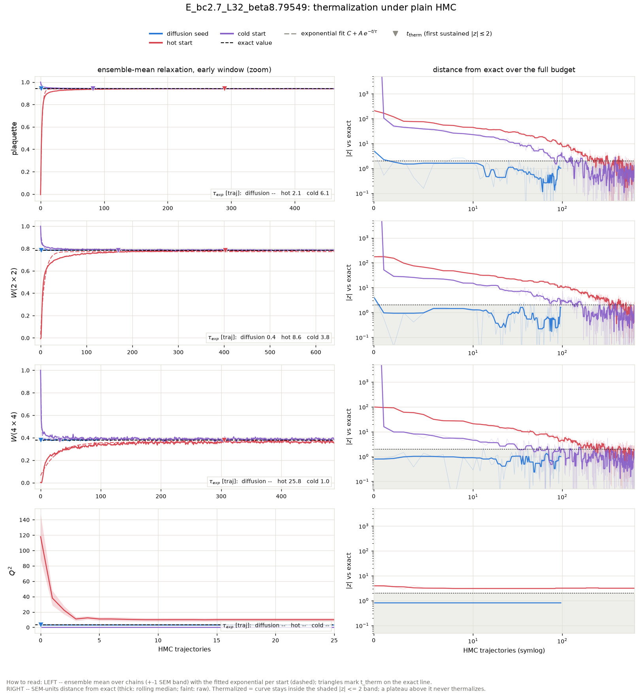

tau_int (hot-start chains, second half): plaquette = 4.34 +- 0.68, wilson_2x2 = 4.18 +- 0.57, wilson_4x4 = 1.35 +- 0.09, wilson_6x6 = 1.01 +- 0.06. Topology: hot-start HMC L=32 beta=8.79549 -> **frozen** (no tunneling).

Where 'never' stood at the end: the hot start ended the 640-trajectory budget still at Q^2 at |z| ~ 3; the cold start ended the 640-trajectory budget still at Q^2 at |z| ~ 3142489473024.

### Diagnostics: raw diffusion output (before any HMC)

| observable | value | error | exact | z_exact | reference | ref_error | z_ref | ks_p | chi2_p |
|---|---|---|---|---|---|---|---|---|---|
| plaquette | 0.94 | 0.0002065 | 0.9413 | -6.383 | 0.9414 | 0.0001902 | -4.893 | 0.0005374 |  |
| wilson_1x1 | 0.94 | 0.0002065 | 0.9413 | -6.383 | 0.9414 | 0.0001902 | -4.893 | 0.0005374 |  |
| wilson_1x2 | 0.8821 | 0.0005285 | 0.8861 | -7.559 | 0.8864 | 0.0003993 | -6.514 | 5.1e-06 |  |
| wilson_2x2 | 0.7801 | 0.001259 | 0.7851 | -3.994 | 0.7869 | 0.0009469 | -4.32 | 0.0005374 |  |
| wilson_2x3 | 0.6903 | 0.001951 | 0.6957 | -2.767 | 0.6978 | 0.00134 | -3.2 | 0.03364 |  |
| wilson_3x3 | 0.5757 | 0.002841 | 0.5802 | -1.593 | 0.5831 | 0.002 | -2.145 | 0.08971 |  |
| wilson_3x4 | 0.4801 | 0.00399 | 0.4839 | -0.9513 | 0.4861 | 0.002496 | -1.26 | 0.2522 |  |
| wilson_4x4 | 0.3767 | 0.004648 | 0.3799 | -0.6958 | 0.3829 | 0.002859 | -1.136 | 0.7163 |  |
| wilson_4x5 | 0.2943 | 0.005343 | 0.2983 | -0.7488 | 0.2985 | 0.003683 | -0.6434 | 0.5259 |  |
| wilson_5x5 | 0.2163 | 0.005834 | 0.2204 | -0.7039 | 0.2209 | 0.004269 | -0.6334 | 0.7163 |  |
| wilson_5x6 | 0.158 | 0.005797 | 0.1629 | -0.8442 | 0.1609 | 0.004725 | -0.378 | 0.9126 |  |
| wilson_6x6 | 0.1111 | 0.005278 | 0.1133 | -0.4177 | 0.1118 | 0.004754 | -0.09662 | 0.9542 |  |
| wilson_6x7 | 0.07624 | 0.004809 | 0.07884 | -0.5409 | 0.07692 | 0.004753 | -0.101 | 0.7163 |  |
| wilson_7x7 | 0.04998 | 0.004289 | 0.05163 | -0.3841 | 0.05076 | 0.004341 | -0.1282 | 0.8246 |  |
| wilson_7x8 | 0.03393 | 0.004396 | 0.03381 | 0.02844 | 0.0331 | 0.004328 | 0.1356 | 0.5631 |  |
| wilson_8x8 | 0.02095 | 0.004058 | 0.02084 | 0.02744 | 0.02236 | 0.003499 | -0.2626 | 0.4898 |  |
| wilson_8x10 | 0.006267 | 0.003831 | 0.007917 | -0.4309 | 0.009402 | 0.002929 | -0.6501 | 0.5631 |  |
| wilson_10x10 | 0.0004399 | 0.004705 | 0.002362 | -0.4085 | 0.003652 | 0.002459 | -0.6051 | 0.8246 |  |
| wilson_10x12 | -0.00173 | 0.003201 | 0.0007045 | -0.7607 | -0.001883 | 0.002375 | 0.03823 | 0.2763 |  |
| wilson_12x12 | -0.002948 | 0.003059 | 0.000165 | -1.018 | -0.003729 | 0.002478 | 0.1984 | 0.5631 |  |
| creutz_2 | 0.05927 | 0.0009026 | 0.06048 | -1.342 |  |  |  |  |  |
| creutz_3 | 0.05916 | 0.001978 | 0.06048 | -0.6714 |  |  |  |  |  |
| creutz_4 | 0.06111 | 0.00382 | 0.06048 | 0.1652 |  |  |  |  |  |
| creutz_5 | 0.06083 | 0.007989 | 0.06048 | 0.04334 |  |  |  |  |  |
| creutz_6 | 0.03794 | 0.01541 | 0.06048 | -1.464 |  |  |  |  |  |
| creutz_7 | 0.04547 | 0.03606 | 0.06048 | -0.4164 |  |  |  |  |  |
| creutz_8 | 0.09497 | 0.09412 | 0.06048 | 0.3664 |  |  |  |  |  |
| Q | 0.04688 | 0.1696 | 0 | 0.2764 | 0.4167 | 0.1305 | -1.728 | 0.389 |  |
| Q^2 | 3.484 | 0.3503 | 3.142 | 0.976 | 3.062 | 0.3353 | 0.8701 | 0.8569 |  |
| chi_top ((<Q^2>-<Q>^2)/V) | 0.003401 | 0.0003456 | 0.003069 | 0.9598 | 0.002821 | 0.0003028 | 1.261 | 7.394e-05 |  |
| Q histogram vs exact P(Q) | 4.1 | nan | 8 | nan |  |  |  |  | 0.848 |

### Diagnostics: the same configs after 96 HMC trajectories

| observable | value | error | exact | z_exact | reference | ref_error | z_ref | ks_p | chi2_p |
|---|---|---|---|---|---|---|---|---|---|
| plaquette | 0.9415 | 0.0001944 | 0.9413 | 1.195 | 0.9414 | 0.0001902 | 0.6486 | 0.3584 |  |
| wilson_1x1 | 0.9415 | 0.0001944 | 0.9413 | 1.195 | 0.9414 | 0.0001902 | 0.6486 | 0.3584 |  |
| wilson_1x2 | 0.8866 | 0.0004431 | 0.8861 | 1.137 | 0.8864 | 0.0003993 | 0.3081 | 0.7163 |  |
| wilson_2x2 | 0.787 | 0.0009062 | 0.7851 | 2.037 | 0.7869 | 0.0009469 | 0.05217 | 0.3584 |  |
| wilson_2x3 | 0.6982 | 0.001459 | 0.6957 | 1.777 | 0.6978 | 0.00134 | 0.211 | 0.8246 |  |
| wilson_3x3 | 0.5844 | 0.002457 | 0.5802 | 1.691 | 0.5831 | 0.002 | 0.388 | 0.8569 |  |
| wilson_3x4 | 0.4888 | 0.003191 | 0.4839 | 1.515 | 0.4861 | 0.002496 | 0.6669 | 0.5259 |  |
| wilson_4x4 | 0.3845 | 0.00383 | 0.3799 | 1.183 | 0.3829 | 0.002859 | 0.3273 | 0.8569 |  |
| wilson_4x5 | 0.3035 | 0.004477 | 0.2983 | 1.169 | 0.2985 | 0.003683 | 0.8725 | 0.7163 |  |
| wilson_5x5 | 0.226 | 0.005071 | 0.2204 | 1.095 | 0.2209 | 0.004269 | 0.7661 | 0.7163 |  |
| wilson_5x6 | 0.1723 | 0.005252 | 0.1629 | 1.778 | 0.1609 | 0.004725 | 1.615 | 0.4548 |  |
| wilson_6x6 | 0.1211 | 0.004943 | 0.1133 | 1.575 | 0.1118 | 0.004754 | 1.356 | 0.5259 |  |
| wilson_6x7 | 0.08772 | 0.005408 | 0.07884 | 1.642 | 0.07692 | 0.004753 | 1.5 | 0.5259 |  |
| wilson_7x7 | 0.05812 | 0.005126 | 0.05163 | 1.267 | 0.05076 | 0.004341 | 1.096 | 0.8246 |  |
| wilson_7x8 | 0.04108 | 0.005438 | 0.03381 | 1.338 | 0.0331 | 0.004328 | 1.149 | 0.3021 |  |
| wilson_8x8 | 0.02563 | 0.005237 | 0.02084 | 0.9154 | 0.02236 | 0.003499 | 0.5201 | 0.6011 |  |
| wilson_8x10 | 0.01228 | 0.004529 | 0.007917 | 0.9642 | 0.009402 | 0.002929 | 0.5344 | 0.9353 |  |
| wilson_10x10 | 0.004302 | 0.004337 | 0.002362 | 0.4472 | 0.003652 | 0.002459 | 0.1302 | 0.5631 |  |
| wilson_10x12 | 0.002197 | 0.003642 | 0.0007045 | 0.4099 | -0.001883 | 0.002375 | 0.9384 | 0.3021 |  |
| wilson_12x12 | 0.002922 | 0.00375 | 0.000165 | 0.7352 | -0.003729 | 0.002478 | 1.48 | 0.04938 |  |
| creutz_2 | 0.05903 | 0.00089 | 0.06048 | -1.638 |  |  |  |  |  |
| creutz_3 | 0.05844 | 0.0018 | 0.06048 | -1.133 |  |  |  |  |  |
| creutz_4 | 0.06138 | 0.003713 | 0.06048 | 0.2417 |  |  |  |  |  |
| creutz_5 | 0.05855 | 0.00689 | 0.06048 | -0.2809 |  |  |  |  |  |
| creutz_6 | 0.08067 | 0.01503 | 0.06048 | 1.343 |  |  |  |  |  |
| creutz_7 | 0.08901 | 0.03088 | 0.06048 | 0.9238 |  |  |  |  |  |
| creutz_8 | 0.1249 | 0.07948 | 0.06048 | 0.81 |  |  |  |  |  |
| Q | 0.04688 | 0.1696 | 0 | 0.2764 | 0.4167 | 0.1305 | -1.728 | 0.389 |  |
| Q^2 | 3.484 | 0.3503 | 3.142 | 0.976 | 3.062 | 0.3353 | 0.8701 | 0.8569 |  |
| chi_top ((<Q^2>-<Q>^2)/V) | 0.003401 | 0.0003456 | 0.003069 | 0.9598 | 0.002821 | 0.0003028 | 1.261 | 7.394e-05 |  |
| Q histogram vs exact P(Q) | 4.1 | nan | 8 | nan |  |  |  |  | 0.848 |

## A_bc3_L32_beta10.015

HMC: step size 0.1264, 8 leapfrog steps, acceptance seed/hot/cold = 0.978/0.977/0.979. Diffusion-seed batch: 128 chains x 96 trajectories (0.06 s/traj for the whole batch); baselines: 32 chains x 640 trajectories.

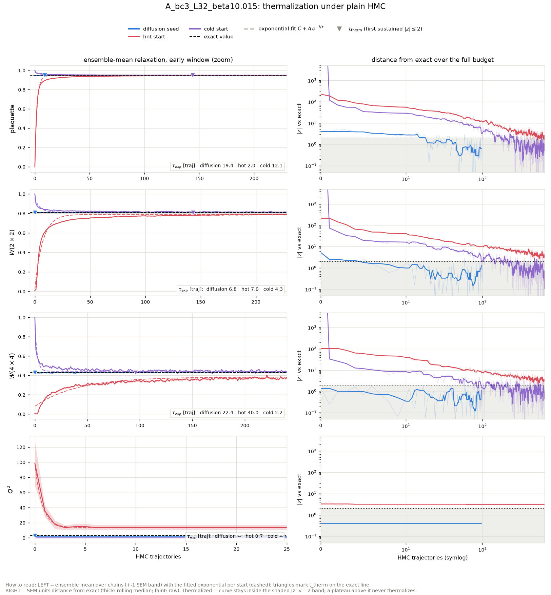

tau_int (hot-start chains, second half): plaquette = 4.73 +- 0.89, wilson_2x2 = 5.72 +- 1.06, wilson_4x4 = 2.03 +- 0.39, wilson_6x6 = 0.89 +- 0.04. Topology: hot-start HMC L=32 beta=10.015 -> **frozen** (no tunneling).

Where 'never' stood at the end: the hot start ended the 640-trajectory budget still at plaquette at |z| ~ 2, wilson_2x2 at |z| ~ 4, wilson_4x4 at |z| ~ 3, Q^2 at |z| ~ 3; the cold start ended the 640-trajectory budget still at Q^2 at |z| ~ 2736159195136.

### Diagnostics: raw diffusion output (before any HMC)

| observable | value | error | exact | z_exact | reference | ref_error | z_ref | ks_p | chi2_p |
|---|---|---|---|---|---|---|---|---|---|
| plaquette | 0.9478 | 0.0002697 | 0.9487 | -3.33 | 0.9491 | 0.0001308 | -4.382 | 2.022e-05 |  |
| wilson_1x1 | 0.9478 | 0.0002697 | 0.9487 | -3.33 | 0.9491 | 0.0001308 | -4.382 | 2.022e-05 |  |
| wilson_1x2 | 0.8966 | 0.000647 | 0.9 | -5.213 | 0.901 | 0.0003591 | -5.917 | 2.042e-09 |  |
| wilson_2x2 | 0.8042 | 0.001347 | 0.81 | -4.283 | 0.8107 | 0.000797 | -4.112 | 0.0003034 |  |
| wilson_2x3 | 0.7209 | 0.002287 | 0.729 | -3.515 | 0.7298 | 0.001253 | -3.406 | 0.0005374 |  |
| wilson_3x3 | 0.6144 | 0.003619 | 0.6224 | -2.202 | 0.6248 | 0.002091 | -2.475 | 0.011 |  |
| wilson_3x4 | 0.5236 | 0.004673 | 0.5314 | -1.681 | 0.5334 | 0.00295 | -1.772 | 0.07995 |  |
| wilson_4x4 | 0.4244 | 0.005888 | 0.4304 | -1.019 | 0.4309 | 0.003355 | -0.9581 | 0.678 |  |
| wilson_4x5 | 0.3435 | 0.006671 | 0.3486 | -0.7753 | 0.3476 | 0.003803 | -0.5346 | 0.8569 |  |
| wilson_5x5 | 0.2646 | 0.007012 | 0.2679 | -0.4743 | 0.2669 | 0.003662 | -0.2896 | 0.9126 |  |
| wilson_5x6 | 0.2044 | 0.007133 | 0.2059 | -0.2028 | 0.2054 | 0.00377 | -0.1238 | 0.7901 |  |
| wilson_6x6 | 0.1501 | 0.00667 | 0.1501 | 0.005986 | 0.1501 | 0.00339 | 0.004867 | 0.8246 |  |
| wilson_6x7 | 0.1098 | 0.006006 | 0.1094 | 0.06143 | 0.1073 | 0.003613 | 0.3543 | 0.4212 |  |
| wilson_7x7 | 0.07752 | 0.005356 | 0.07566 | 0.3475 | 0.07306 | 0.00373 | 0.6823 | 0.4548 |  |
| wilson_7x8 | 0.05598 | 0.005119 | 0.05232 | 0.714 | 0.0506 | 0.004132 | 0.8172 | 0.9126 |  |
| wilson_8x8 | 0.03787 | 0.004779 | 0.03433 | 0.7413 | 0.03393 | 0.004178 | 0.6212 | 0.9693 |  |
| wilson_8x10 | 0.01679 | 0.003923 | 0.01478 | 0.5138 | 0.01289 | 0.004057 | 0.6912 | 0.6395 |  |
| wilson_10x10 | 0.003757 | 0.00287 | 0.005151 | -0.4859 | -0.0003501 | 0.003284 | 0.9416 | 0.7901 |  |
| wilson_10x12 | -0.0004732 | 0.00322 | 0.001796 | -0.7048 | -0.001162 | 0.003418 | 0.1466 | 0.9353 |  |
| wilson_12x12 | -0.003265 | 0.003786 | 0.0005072 | -0.9963 | -0.001929 | 0.003258 | -0.2676 | 0.7901 |  |
| creutz_2 | 0.05327 | 0.0007286 | 0.05268 | 0.8019 |  |  |  |  |  |
| creutz_3 | 0.05054 | 0.001711 | 0.05268 | -1.253 |  |  |  |  |  |
| creutz_4 | 0.04984 | 0.003109 | 0.05268 | -0.9163 |  |  |  |  |  |
| creutz_5 | 0.04932 | 0.005932 | 0.05268 | -0.567 |  |  |  |  |  |
| creutz_6 | 0.05081 | 0.01143 | 0.05268 | -0.1643 |  |  |  |  |  |
| creutz_7 | 0.03485 | 0.0246 | 0.05268 | -0.7253 |  |  |  |  |  |
| creutz_8 | 0.0652 | 0.05238 | 0.05268 | 0.2389 |  |  |  |  |  |
| Q | -0.0625 | 0.1274 | 0 | -0.4906 | -0.08333 | 0.09208 | 0.1325 | 0.8569 |  |
| Q^2 | 2.594 | 0.3647 | 2.736 | -0.3905 | 3.521 | 0.5211 | -1.458 | 0.3294 |  |
| chi_top ((<Q^2>-<Q>^2)/V) | 0.002529 | 0.0003548 | 0.002672 | -0.4027 | 0.003432 | 0.0005029 | -1.466 | 6.452e-06 |  |
| Q histogram vs exact P(Q) | 3.946 | nan | 6 | nan |  |  |  |  | 0.684 |

### Diagnostics: the same configs after 96 HMC trajectories

| observable | value | error | exact | z_exact | reference | ref_error | z_ref | ks_p | chi2_p |
|---|---|---|---|---|---|---|---|---|---|
| plaquette | 0.9485 | 0.0002335 | 0.9487 | -0.5661 | 0.9491 | 0.0001308 | -2.045 | 0.005977 |  |
| wilson_1x1 | 0.9485 | 0.0002335 | 0.9487 | -0.5661 | 0.9491 | 0.0001308 | -2.045 | 0.005977 |  |
| wilson_1x2 | 0.8998 | 0.0005651 | 0.9 | -0.3384 | 0.901 | 0.0003591 | -1.787 | 0.1122 |  |
| wilson_2x2 | 0.8086 | 0.001059 | 0.81 | -1.292 | 0.8107 | 0.000797 | -1.535 | 0.3294 |  |
| wilson_2x3 | 0.7259 | 0.001614 | 0.729 | -1.935 | 0.7298 | 0.001253 | -1.941 | 0.08971 |  |
| wilson_3x3 | 0.6171 | 0.002616 | 0.6224 | -2.047 | 0.6248 | 0.002091 | -2.307 | 0.04938 |  |
| wilson_3x4 | 0.5255 | 0.003314 | 0.5314 | -1.772 | 0.5334 | 0.00295 | -1.761 | 0.1392 |  |
| wilson_4x4 | 0.426 | 0.004476 | 0.4304 | -0.9954 | 0.4309 | 0.003355 | -0.8844 | 0.3584 |  |
| wilson_4x5 | 0.344 | 0.004763 | 0.3486 | -0.9752 | 0.3476 | 0.003803 | -0.5871 | 0.7901 |  |
| wilson_5x5 | 0.2657 | 0.005832 | 0.2679 | -0.3849 | 0.2669 | 0.003662 | -0.1757 | 0.7163 |  |
| wilson_5x6 | 0.2032 | 0.006192 | 0.2059 | -0.431 | 0.2054 | 0.00377 | -0.3063 | 0.3584 |  |
| wilson_6x6 | 0.1488 | 0.00704 | 0.1501 | -0.1853 | 0.1501 | 0.00339 | -0.1674 | 0.389 |  |
| wilson_6x7 | 0.1071 | 0.006583 | 0.1094 | -0.3425 | 0.1073 | 0.003613 | -0.01868 | 0.5259 |  |
| wilson_7x7 | 0.0726 | 0.006592 | 0.07566 | -0.4636 | 0.07306 | 0.00373 | -0.06129 | 0.6011 |  |
| wilson_7x8 | 0.04952 | 0.005974 | 0.05232 | -0.4682 | 0.0506 | 0.004132 | -0.1482 | 0.4898 |  |
| wilson_8x8 | 0.03276 | 0.005222 | 0.03433 | -0.2994 | 0.03393 | 0.004178 | -0.1739 | 0.5631 |  |
| wilson_8x10 | 0.01691 | 0.00364 | 0.01478 | 0.5876 | 0.01289 | 0.004057 | 0.7382 | 0.678 |  |
| wilson_10x10 | 0.01222 | 0.003521 | 0.005151 | 2.006 | -0.0003501 | 0.003284 | 2.61 | 0.08971 |  |
| wilson_10x12 | 0.008815 | 0.003556 | 0.001796 | 1.974 | -0.001162 | 0.003418 | 2.023 | 0.04354 |  |
| wilson_12x12 | 0.006845 | 0.003431 | 0.0005072 | 1.847 | -0.001929 | 0.003258 | 1.854 | 0.04938 |  |
| creutz_2 | 0.05409 | 0.0007631 | 0.05268 | 1.842 |  |  |  |  |  |
| creutz_3 | 0.05443 | 0.001543 | 0.05268 | 1.129 |  |  |  |  |  |
| creutz_4 | 0.04951 | 0.002683 | 0.05268 | -1.184 |  |  |  |  |  |
| creutz_5 | 0.04468 | 0.005845 | 0.05268 | -1.37 |  |  |  |  |  |
| creutz_6 | 0.04373 | 0.01149 | 0.05268 | -0.7792 |  |  |  |  |  |
| creutz_7 | 0.061 | 0.02721 | 0.05268 | 0.3054 |  |  |  |  |  |
| creutz_8 | 0.03064 | 0.05661 | 0.05268 | -0.3894 |  |  |  |  |  |
| Q | -0.0625 | 0.1274 | 0 | -0.4906 | -0.08333 | 0.09208 | 0.1325 | 0.8569 |  |
| Q^2 | 2.594 | 0.3647 | 2.736 | -0.3905 | 3.521 | 0.5211 | -1.458 | 0.3294 |  |
| chi_top ((<Q^2>-<Q>^2)/V) | 0.002529 | 0.0003548 | 0.002672 | -0.4027 | 0.003432 | 0.0005029 | -1.466 | 6.452e-06 |  |
| Q histogram vs exact P(Q) | 3.946 | nan | 6 | nan |  |  |  |  | 0.684 |

## E_bc3.4_L32_beta11.6638

HMC: step size 0.1171, 9 leapfrog steps, acceptance seed/hot/cold = 0.986/0.982/0.984. Diffusion-seed batch: 128 chains x 96 trajectories (0.09 s/traj for the whole batch); baselines: 32 chains x 640 trajectories.

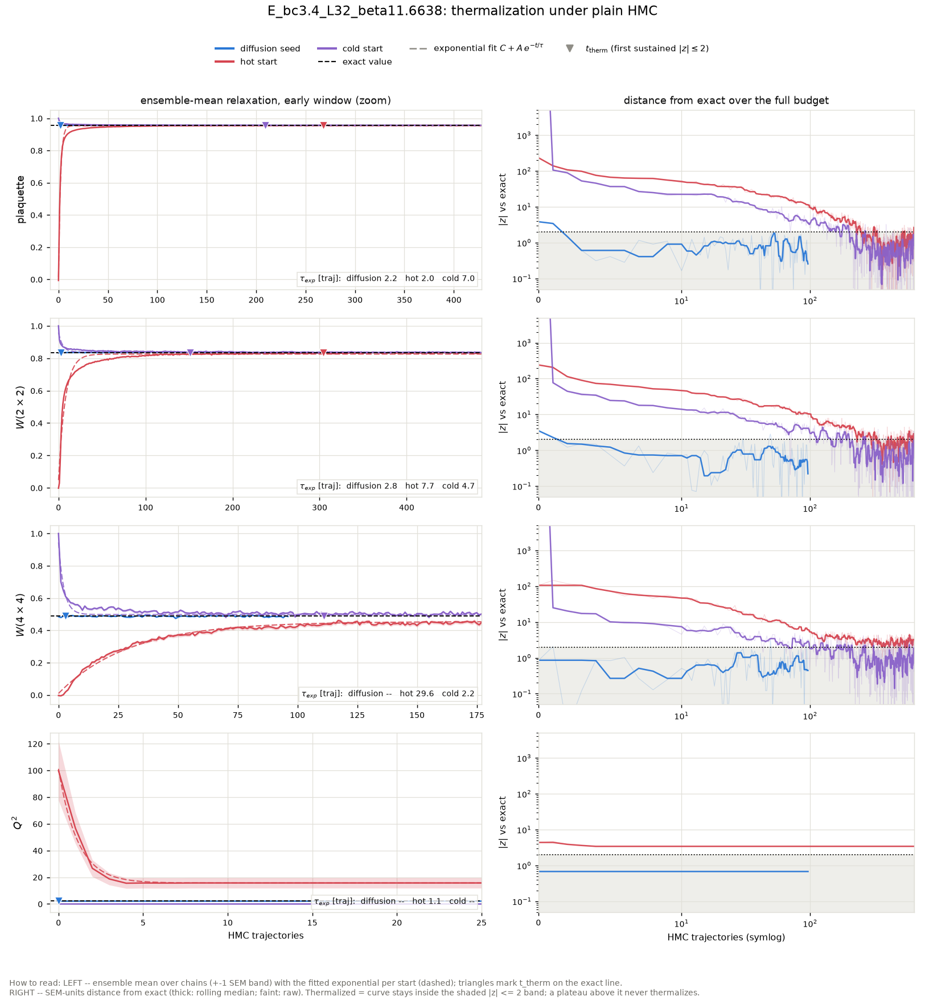

tau_int (hot-start chains, second half): plaquette = 4.38 +- 0.56, wilson_2x2 = 4.59 +- 0.62, wilson_4x4 = 2.38 +- 0.46, wilson_6x6 = 0.85 +- 0.04. Topology: hot-start HMC L=32 beta=11.6638 -> **frozen** (no tunneling).

Where 'never' stood at the end: the hot start ended the 640-trajectory budget still at wilson_4x4 at |z| ~ 3, wilson_6x6 at |z| ~ 3, Q^2 at |z| ~ 3; the cold start ended the 640-trajectory budget still at Q^2 at |z| ~ 2329518014464.

### Diagnostics: raw diffusion output (before any HMC)

| observable | value | error | exact | z_exact | reference | ref_error | z_ref | ks_p | chi2_p |
|---|---|---|---|---|---|---|---|---|---|
| plaquette | 0.9554 | 9.798e-05 | 0.9561 | -6.931 | 0.9565 | 0.0001559 | -5.799 | 0.0005374 |  |
| wilson_1x1 | 0.9554 | 9.798e-05 | 0.9561 | -6.931 | 0.9565 | 0.0001559 | -5.799 | 0.0005374 |  |
| wilson_1x2 | 0.9114 | 0.0002045 | 0.9142 | -13.33 | 0.9147 | 0.0003764 | -7.677 | 5e-08 |  |
| wilson_2x2 | 0.8328 | 0.0006776 | 0.8357 | -4.259 | 0.8375 | 0.000839 | -4.332 | 0.0002049 |  |
| wilson_2x3 | 0.761 | 0.0009611 | 0.764 | -3.072 | 0.7666 | 0.001383 | -3.288 | 0.00189 |  |
| wilson_3x3 | 0.6658 | 0.001821 | 0.6678 | -1.084 | 0.6711 | 0.002083 | -1.906 | 0.03364 |  |
| wilson_3x4 | 0.5809 | 0.002032 | 0.5837 | -1.357 | 0.5868 | 0.002891 | -1.666 | 0.008145 |  |
| wilson_4x4 | 0.4848 | 0.002372 | 0.4878 | -1.262 | 0.4925 | 0.003506 | -1.835 | 0.04938 |  |
| wilson_4x5 | 0.4038 | 0.002949 | 0.4076 | -1.3 | 0.4118 | 0.004499 | -1.483 | 0.2522 |  |
| wilson_5x5 | 0.3191 | 0.00365 | 0.3257 | -1.801 | 0.3317 | 0.00505 | -2.009 | 0.0711 |  |
| wilson_5x6 | 0.2512 | 0.003648 | 0.2603 | -2.49 | 0.2662 | 0.005449 | -2.291 | 0.03364 |  |
| wilson_6x6 | 0.1889 | 0.004091 | 0.1988 | -2.433 | 0.2043 | 0.005079 | -2.361 | 0.07995 |  |
| wilson_6x7 | 0.1415 | 0.004092 | 0.1519 | -2.552 | 0.1567 | 0.004909 | -2.378 | 0.0711 |  |
| wilson_7x7 | 0.1044 | 0.004592 | 0.111 | -1.434 | 0.1156 | 0.004448 | -1.764 | 0.3294 |  |
| wilson_7x8 | 0.07702 | 0.004183 | 0.08105 | -0.9639 | 0.08721 | 0.003888 | -1.785 | 0.1892 |  |
| wilson_8x8 | 0.05333 | 0.00466 | 0.0566 | -0.7017 | 0.0622 | 0.003827 | -1.47 | 0.2763 |  |
| wilson_8x10 | 0.02381 | 0.004356 | 0.02761 | -0.8724 | 0.03133 | 0.003532 | -1.341 | 0.08971 |  |
| wilson_10x10 | 0.009089 | 0.004074 | 0.01125 | -0.5315 | 0.011 | 0.003328 | -0.3642 | 0.2087 |  |
| wilson_10x12 | 0.008706 | 0.00481 | 0.004588 | 0.8563 | 0.00536 | 0.002511 | 0.6167 | 0.8569 |  |
| wilson_12x12 | 0.007785 | 0.005077 | 0.001563 | 1.226 | 0.004004 | 0.003092 | 0.636 | 0.2297 |  |
| creutz_2 | 0.04306 | 0.0006166 | 0.04487 | -2.928 |  |  |  |  |  |
| creutz_3 | 0.04355 | 0.00126 | 0.04487 | -1.051 |  |  |  |  |  |
| creutz_4 | 0.04452 | 0.002374 | 0.04487 | -0.1493 |  |  |  |  |  |
| creutz_5 | 0.05253 | 0.00405 | 0.04487 | 1.89 |  |  |  |  |  |
| creutz_6 | 0.04555 | 0.008312 | 0.04487 | 0.08205 |  |  |  |  |  |
| creutz_7 | 0.01498 | 0.0172 | 0.04487 | -1.738 |  |  |  |  |  |
| creutz_8 | 0.0635 | 0.03702 | 0.04487 | 0.5032 |  |  |  |  |  |
| Q | -0.03906 | 0.1117 | 0 | -0.3497 | 0.2656 | 0.1006 | -2.027 | 0.678 |  |
| Q^2 | 2.133 | 0.2565 | 2.33 | -0.7668 | 2.557 | 0.2696 | -1.141 | 0.9693 |  |
| chi_top ((<Q^2>-<Q>^2)/V) | 0.002081 | 0.0002477 | 0.002275 | -0.7815 | 0.002428 | 0.0002601 | -0.9664 | 5.99e-05 |  |
| Q histogram vs exact P(Q) | 3.841 | nan | 6 | nan |  |  |  |  | 0.6982 |

### Diagnostics: the same configs after 96 HMC trajectories

| observable | value | error | exact | z_exact | reference | ref_error | z_ref | ks_p | chi2_p |
|---|---|---|---|---|---|---|---|---|---|
| plaquette | 0.9562 | 0.000166 | 0.9561 | 0.2411 | 0.9565 | 0.0001559 | -1.53 | 0.2297 |  |
| wilson_1x1 | 0.9562 | 0.000166 | 0.9561 | 0.2411 | 0.9565 | 0.0001559 | -1.53 | 0.2297 |  |
| wilson_1x2 | 0.9142 | 0.0003742 | 0.9142 | 0.1928 | 0.9147 | 0.0003764 | -0.9224 | 0.4548 |  |
| wilson_2x2 | 0.8359 | 0.000872 | 0.8357 | 0.2063 | 0.8375 | 0.000839 | -1.327 | 0.1392 |  |
| wilson_2x3 | 0.7637 | 0.001473 | 0.764 | -0.1601 | 0.7666 | 0.001383 | -1.396 | 0.1545 |  |
| wilson_3x3 | 0.6672 | 0.002348 | 0.6678 | -0.2376 | 0.6711 | 0.002083 | -1.229 | 0.3584 |  |
| wilson_3x4 | 0.5826 | 0.002851 | 0.5837 | -0.3831 | 0.5868 | 0.002891 | -1.04 | 0.5259 |  |
| wilson_4x4 | 0.486 | 0.003661 | 0.4878 | -0.481 | 0.4925 | 0.003506 | -1.289 | 0.5259 |  |
| wilson_4x5 | 0.4057 | 0.004371 | 0.4076 | -0.4501 | 0.4118 | 0.004499 | -0.974 | 0.7163 |  |
| wilson_5x5 | 0.3242 | 0.005122 | 0.3257 | -0.3038 | 0.3317 | 0.00505 | -1.043 | 0.6011 |  |
| wilson_5x6 | 0.2587 | 0.005757 | 0.2603 | -0.2646 | 0.2662 | 0.005449 | -0.9414 | 0.7163 |  |
| wilson_6x6 | 0.1999 | 0.00608 | 0.1988 | 0.1791 | 0.2043 | 0.005079 | -0.5499 | 0.7538 |  |
| wilson_6x7 | 0.1501 | 0.00633 | 0.1519 | -0.2895 | 0.1567 | 0.004909 | -0.8222 | 0.5259 |  |
| wilson_7x7 | 0.1094 | 0.006529 | 0.111 | -0.2457 | 0.1156 | 0.004448 | -0.7967 | 0.3021 |  |
| wilson_7x8 | 0.07821 | 0.006286 | 0.08105 | -0.4516 | 0.08721 | 0.003888 | -1.217 | 0.1892 |  |
| wilson_8x8 | 0.05744 | 0.006135 | 0.0566 | 0.1358 | 0.0622 | 0.003827 | -0.6583 | 0.1122 |  |
| wilson_8x10 | 0.03177 | 0.005812 | 0.02761 | 0.7155 | 0.03133 | 0.003532 | 0.06418 | 0.8569 |  |
| wilson_10x10 | 0.01469 | 0.005302 | 0.01125 | 0.647 | 0.011 | 0.003328 | 0.5879 | 0.8569 |  |
| wilson_10x12 | 0.007851 | 0.004782 | 0.004588 | 0.6824 | 0.00536 | 0.002511 | 0.4611 | 0.9941 |  |
| wilson_12x12 | 0.005681 | 0.004913 | 0.001563 | 0.8383 | 0.004004 | 0.003092 | 0.2889 | 0.7901 |  |
| creutz_2 | 0.04477 | 0.0006349 | 0.04487 | -0.1564 |  |  |  |  |  |
| creutz_3 | 0.04487 | 0.001282 | 0.04487 | 0.002656 |  |  |  |  |  |
| creutz_4 | 0.04558 | 0.002477 | 0.04487 | 0.2855 |  |  |  |  |  |
| creutz_5 | 0.0436 | 0.004674 | 0.04487 | -0.2715 |  |  |  |  |  |
| creutz_6 | 0.03246 | 0.008051 | 0.04487 | -1.542 |  |  |  |  |  |
| creutz_7 | 0.02969 | 0.0167 | 0.04487 | -0.9088 |  |  |  |  |  |
| creutz_8 | -0.02649 | 0.03478 | 0.04487 | -2.052 |  |  |  |  |  |
| Q | -0.03906 | 0.1117 | 0 | -0.3497 | 0.2656 | 0.1006 | -2.027 | 0.678 |  |
| Q^2 | 2.133 | 0.2565 | 2.33 | -0.7668 | 2.557 | 0.2696 | -1.141 | 0.9693 |  |
| chi_top ((<Q^2>-<Q>^2)/V) | 0.002081 | 0.0002477 | 0.002275 | -0.7815 | 0.002428 | 0.0002601 | -0.9664 | 5.99e-05 |  |
| Q histogram vs exact P(Q) | 3.841 | nan | 6 | nan |  |  |  |  | 0.6982 |

## A_bc4_L32_beta14.1464

HMC: step size 0.1063, 9 leapfrog steps, acceptance seed/hot/cold = 0.985/0.984/0.986. Diffusion-seed batch: 128 chains x 96 trajectories (0.06 s/traj for the whole batch); baselines: 32 chains x 640 trajectories.

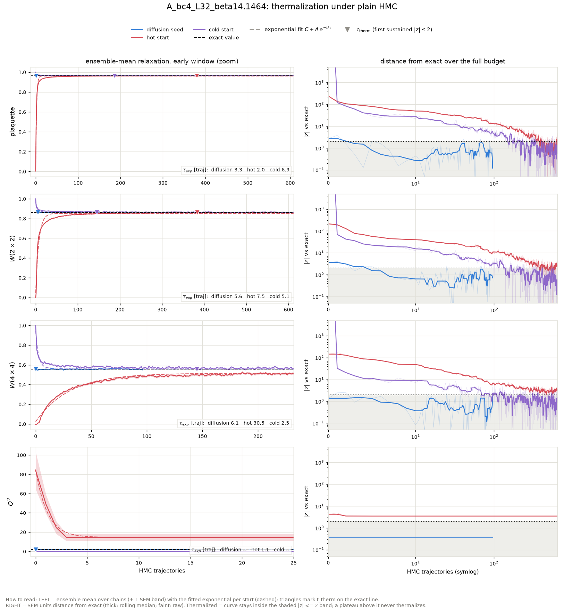

tau_int (hot-start chains, second half): plaquette = 4.80 +- 0.54, wilson_2x2 = 4.02 +- 0.72, wilson_4x4 = 2.48 +- 0.44, wilson_6x6 = 0.89 +- 0.05. Topology: hot-start HMC L=32 beta=14.1464 -> **frozen** (no tunneling).

Where 'never' stood at the end: the hot start ended the 640-trajectory budget still at wilson_4x4 at |z| ~ 3, wilson_6x6 at |z| ~ 3, Q^2 at |z| ~ 3; the cold start ended the 640-trajectory budget still at Q^2 at |z| ~ 1903991324672.

### Diagnostics: raw diffusion output (before any HMC)

| observable | value | error | exact | z_exact | reference | ref_error | z_ref | ks_p | chi2_p |
|---|---|---|---|---|---|---|---|---|---|
| plaquette | 0.9636 | 0.0002008 | 0.964 | -2.041 | 0.9641 | 0.000103 | -2.323 | 0.01474 |  |
| wilson_1x1 | 0.9636 | 0.0002008 | 0.964 | -2.041 | 0.9641 | 0.000103 | -2.323 | 0.01474 |  |
| wilson_1x2 | 0.9274 | 0.0004592 | 0.9293 | -4.051 | 0.9296 | 0.0002819 | -4.136 | 6.452e-06 |  |
| wilson_2x2 | 0.8604 | 0.001041 | 0.8635 | -2.986 | 0.8635 | 0.0007241 | -2.394 | 0.01474 |  |
| wilson_2x3 | 0.7992 | 0.001494 | 0.8024 | -2.156 | 0.8031 | 0.001286 | -1.989 | 0.2087 |  |
| wilson_3x3 | 0.7148 | 0.002388 | 0.7188 | -1.666 | 0.7184 | 0.002288 | -1.073 | 0.4548 |  |
| wilson_3x4 | 0.6403 | 0.003028 | 0.6439 | -1.191 | 0.6437 | 0.003131 | -0.7783 | 0.678 |  |
| wilson_4x4 | 0.551 | 0.003892 | 0.556 | -1.297 | 0.5583 | 0.004118 | -1.295 | 0.4548 |  |
| wilson_4x5 | 0.4765 | 0.004586 | 0.4801 | -0.7919 | 0.4837 | 0.005033 | -1.06 | 0.4898 |  |
| wilson_5x5 | 0.3949 | 0.005018 | 0.3997 | -0.9476 | 0.4039 | 0.005653 | -1.192 | 0.3021 |  |
| wilson_5x6 | 0.3289 | 0.005756 | 0.3327 | -0.6622 | 0.3385 | 0.006217 | -1.137 | 0.4548 |  |
| wilson_6x6 | 0.2602 | 0.005782 | 0.267 | -1.173 | 0.2729 | 0.006324 | -1.479 | 0.5259 |  |
| wilson_6x7 | 0.2075 | 0.006453 | 0.2142 | -1.046 | 0.221 | 0.006425 | -1.48 | 0.3584 |  |
| wilson_7x7 | 0.1583 | 0.006188 | 0.1657 | -1.195 | 0.176 | 0.006238 | -2.016 | 0.1004 |  |
| wilson_7x8 | 0.1216 | 0.006404 | 0.1282 | -1.024 | 0.1376 | 0.006041 | -1.814 | 0.1892 |  |
| wilson_8x8 | 0.08683 | 0.006471 | 0.09558 | -1.352 | 0.1077 | 0.005818 | -2.4 | 0.08971 |  |
| wilson_8x10 | 0.04933 | 0.005964 | 0.05315 | -0.6407 | 0.06065 | 0.004966 | -1.459 | 0.3021 |  |
| wilson_10x10 | 0.02356 | 0.005817 | 0.02552 | -0.3362 | 0.02694 | 0.004135 | -0.4739 | 0.9353 |  |
| wilson_10x12 | 0.0171 | 0.005303 | 0.01225 | 0.9135 | 0.01241 | 0.003912 | 0.7111 | 0.6011 |  |
| wilson_12x12 | 0.009397 | 0.004732 | 0.00508 | 0.9122 | 0.00431 | 0.002945 | 0.9127 | 0.5631 |  |
| creutz_2 | 0.03671 | 0.0005714 | 0.03668 | 0.0425 |  |  |  |  |  |
| creutz_3 | 0.0378 | 0.001073 | 0.03668 | 1.037 |  |  |  |  |  |
| creutz_4 | 0.04012 | 0.001798 | 0.03668 | 1.912 |  |  |  |  |  |
| creutz_5 | 0.04258 | 0.003395 | 0.03668 | 1.738 |  |  |  |  |  |
| creutz_6 | 0.05134 | 0.005119 | 0.03668 | 2.863 |  |  |  |  |  |
| creutz_7 | 0.04402 | 0.0092 | 0.03668 | 0.7972 |  |  |  |  |  |
| creutz_8 | 0.07331 | 0.0193 | 0.03668 | 1.898 |  |  |  |  |  |
| Q | -0.07031 | 0.1212 | 0 | -0.5801 | 0.125 | 0.08145 | -1.337 | 0.3294 |  |
| Q^2 | 1.82 | 0.2693 | 1.904 | -0.3107 | 1.781 | 0.177 | 0.1212 | 0.9126 |  |
| chi_top ((<Q^2>-<Q>^2)/V) | 0.001773 | 0.000263 | 0.001859 | -0.329 | 0.001724 | 0.0001742 | 0.154 | 4.282e-07 |  |
| Q histogram vs exact P(Q) | 3.753 | nan | 6 | nan |  |  |  |  | 0.71 |

### Diagnostics: the same configs after 96 HMC trajectories

| observable | value | error | exact | z_exact | reference | ref_error | z_ref | ks_p | chi2_p |
|---|---|---|---|---|---|---|---|---|---|
| plaquette | 0.964 | 0.0001507 | 0.964 | 0.1142 | 0.9641 | 0.000103 | -0.5327 | 0.8246 |  |
| wilson_1x1 | 0.964 | 0.0001507 | 0.964 | 0.1142 | 0.9641 | 0.000103 | -0.5327 | 0.8246 |  |
| wilson_1x2 | 0.9293 | 0.0003457 | 0.9293 | 0.01395 | 0.9296 | 0.0002819 | -0.8146 | 0.7901 |  |
| wilson_2x2 | 0.863 | 0.0008979 | 0.8635 | -0.6147 | 0.8635 | 0.0007241 | -0.4158 | 0.8569 |  |
| wilson_2x3 | 0.8015 | 0.001438 | 0.8024 | -0.6582 | 0.8031 | 0.001286 | -0.8531 | 0.7538 |  |
| wilson_3x3 | 0.7162 | 0.002153 | 0.7188 | -1.227 | 0.7184 | 0.002288 | -0.7033 | 0.389 |  |
| wilson_3x4 | 0.6391 | 0.002922 | 0.6439 | -1.653 | 0.6437 | 0.003131 | -1.077 | 0.02577 |  |
| wilson_4x4 | 0.5495 | 0.003674 | 0.556 | -1.765 | 0.5583 | 0.004118 | -1.59 | 0.003697 |  |
| wilson_4x5 | 0.4722 | 0.004257 | 0.4801 | -1.859 | 0.4837 | 0.005033 | -1.745 | 0.003697 |  |
| wilson_5x5 | 0.3904 | 0.005059 | 0.3997 | -1.836 | 0.4039 | 0.005653 | -1.786 | 0.009477 |  |
| wilson_5x6 | 0.3242 | 0.005709 | 0.3327 | -1.486 | 0.3385 | 0.006217 | -1.695 | 0.03364 |  |
| wilson_6x6 | 0.2566 | 0.006264 | 0.267 | -1.66 | 0.2729 | 0.006324 | -1.83 | 0.03831 |  |
| wilson_6x7 | 0.204 | 0.006138 | 0.2142 | -1.671 | 0.221 | 0.006425 | -1.912 | 0.08971 |  |
| wilson_7x7 | 0.1548 | 0.006441 | 0.1657 | -1.695 | 0.176 | 0.006238 | -2.369 | 0.1122 |  |
| wilson_7x8 | 0.1196 | 0.006123 | 0.1282 | -1.407 | 0.1376 | 0.006041 | -2.097 | 0.1251 |  |
| wilson_8x8 | 0.08747 | 0.006263 | 0.09558 | -1.295 | 0.1077 | 0.005818 | -2.368 | 0.011 |  |
| wilson_8x10 | 0.04723 | 0.006006 | 0.05315 | -0.9858 | 0.06065 | 0.004966 | -1.722 | 0.02248 |  |
| wilson_10x10 | 0.02304 | 0.005384 | 0.02552 | -0.4605 | 0.02694 | 0.004135 | -0.5753 | 0.3584 |  |
| wilson_10x12 | 0.01659 | 0.005358 | 0.01225 | 0.8097 | 0.01241 | 0.003912 | 0.6301 | 0.6011 |  |
| wilson_12x12 | 0.0121 | 0.004488 | 0.00508 | 1.564 | 0.00431 | 0.002945 | 1.451 | 0.1004 |  |
| creutz_2 | 0.03732 | 0.0004719 | 0.03668 | 1.339 |  |  |  |  |  |
| creutz_3 | 0.03864 | 0.001034 | 0.03668 | 1.897 |  |  |  |  |  |
| creutz_4 | 0.03704 | 0.001818 | 0.03668 | 0.1955 |  |  |  |  |  |
| creutz_5 | 0.03868 | 0.003516 | 0.03668 | 0.569 |  |  |  |  |  |
| creutz_6 | 0.04827 | 0.006119 | 0.03668 | 1.894 |  |  |  |  |  |
| creutz_7 | 0.04641 | 0.01078 | 0.03668 | 0.9019 |  |  |  |  |  |
| creutz_8 | 0.0543 | 0.02362 | 0.03668 | 0.746 |  |  |  |  |  |
| Q | -0.07031 | 0.1212 | 0 | -0.5801 | 0.125 | 0.08145 | -1.337 | 0.3294 |  |
| Q^2 | 1.82 | 0.2693 | 1.904 | -0.3107 | 1.781 | 0.177 | 0.1212 | 0.9126 |  |
| chi_top ((<Q^2>-<Q>^2)/V) | 0.001773 | 0.000263 | 0.001859 | -0.329 | 0.001724 | 0.0001742 | 0.154 | 4.282e-07 |  |
| Q histogram vs exact P(Q) | 3.753 | nan | 6 | nan |  |  |  |  | 0.71 |

## E_bc4.5_L32_beta16.2057

HMC: step size 0.0994, 10 leapfrog steps, acceptance seed/hot/cold = 0.978/0.978/0.977. Diffusion-seed batch: 128 chains x 96 trajectories (0.08 s/traj for the whole batch); baselines: 32 chains x 640 trajectories.

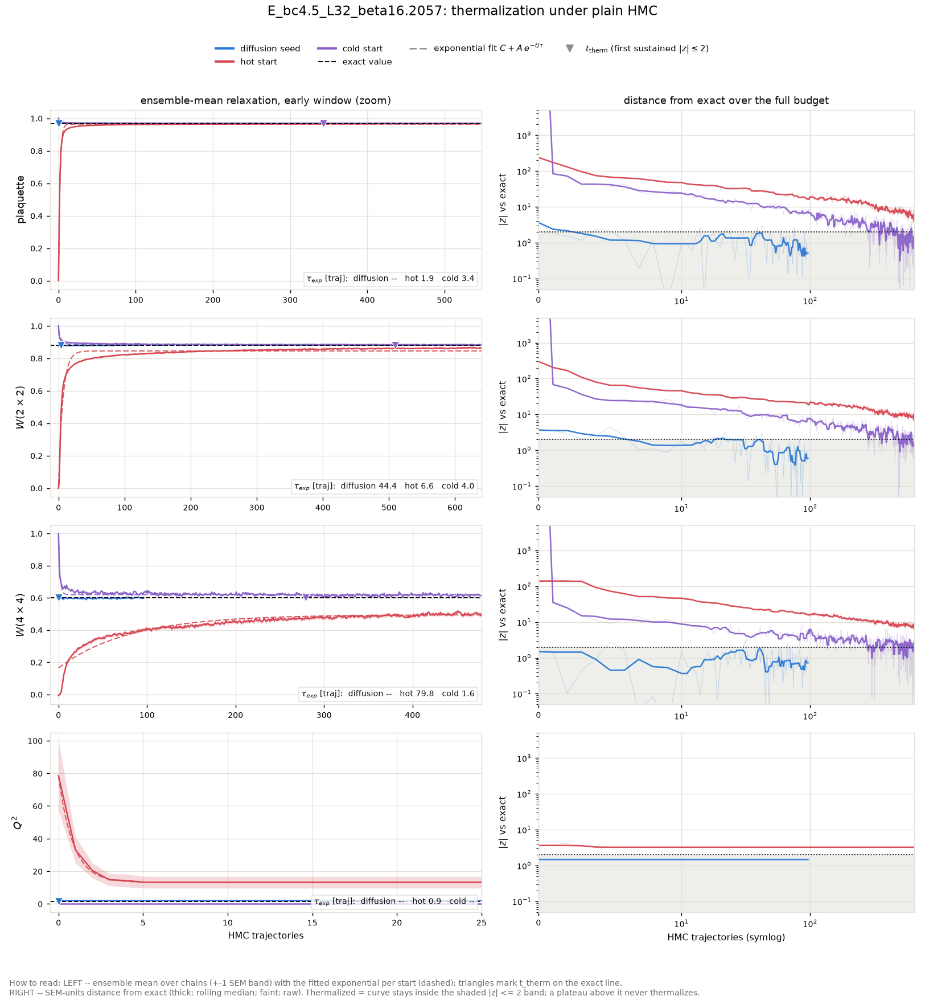

tau_int (hot-start chains, second half): plaquette = 6.88 +- 1.19, wilson_2x2 = 10.24 +- 1.48, wilson_4x4 = 5.81 +- 1.08, wilson_6x6 = 1.06 +- 0.11. Topology: hot-start HMC L=32 beta=16.2057 -> **frozen** (no tunneling).

Where 'never' stood at the end: the hot start ended the 640-trajectory budget still at plaquette at |z| ~ 6, wilson_2x2 at |z| ~ 9, wilson_4x4 at |z| ~ 8, wilson_6x6 at |z| ~ 5, Q^2 at |z| ~ 3; the cold start ended the 640-trajectory budget still at Q^2 at |z| ~ 1653625323520.

### Diagnostics: raw diffusion output (before any HMC)

| observable | value | error | exact | z_exact | reference | ref_error | z_ref | ks_p | chi2_p |
|---|---|---|---|---|---|---|---|---|---|
| plaquette | 0.9681 | 0.0001 | 0.9686 | -4.885 | 0.9689 | 9.802e-05 | -5.549 | 4.022e-06 |  |
| wilson_1x1 | 0.9681 | 0.0001 | 0.9686 | -4.885 | 0.9689 | 9.802e-05 | -5.549 | 4.022e-06 |  |
| wilson_1x2 | 0.9364 | 0.0002604 | 0.9383 | -7.312 | 0.939 | 0.0002293 | -7.603 | 2.855e-08 |  |
| wilson_2x2 | 0.8774 | 0.0006864 | 0.8803 | -4.306 | 0.8822 | 0.00049 | -5.664 | 8.145e-06 |  |
| wilson_2x3 | 0.8225 | 0.001227 | 0.826 | -2.831 | 0.8292 | 0.0007635 | -4.64 | 0.0002496 |  |
| wilson_3x3 | 0.7474 | 0.001907 | 0.7507 | -1.693 | 0.755 | 0.001174 | -3.364 | 0.006985 |  |
| wilson_3x4 | 0.6794 | 0.002685 | 0.6822 | -1.06 | 0.6881 | 0.001441 | -2.842 | 0.03831 |  |
| wilson_4x4 | 0.5949 | 0.003436 | 0.6006 | -1.649 | 0.6079 | 0.001758 | -3.355 | 0.02577 |  |
| wilson_4x5 | 0.5232 | 0.004422 | 0.5287 | -1.253 | 0.5367 | 0.002074 | -2.769 | 0.05588 |  |
| wilson_5x5 | 0.4431 | 0.005384 | 0.4509 | -1.444 | 0.4571 | 0.002567 | -2.348 | 0.08971 |  |
| wilson_5x6 | 0.3782 | 0.006005 | 0.3845 | -1.04 | 0.3895 | 0.002995 | -1.676 | 0.389 |  |
| wilson_6x6 | 0.3094 | 0.006407 | 0.3176 | -1.278 | 0.3185 | 0.003399 | -1.257 | 0.4212 |  |
| wilson_6x7 | 0.2545 | 0.006813 | 0.2623 | -1.151 | 0.2605 | 0.003761 | -0.771 | 0.678 |  |
| wilson_7x7 | 0.2025 | 0.007536 | 0.2099 | -0.9774 | 0.205 | 0.004183 | -0.297 | 0.4212 |  |
| wilson_7x8 | 0.1584 | 0.007861 | 0.1679 | -1.206 | 0.1613 | 0.004398 | -0.3144 | 0.3021 |  |
| wilson_8x8 | 0.1211 | 0.008406 | 0.1301 | -1.071 | 0.1225 | 0.005024 | -0.1439 | 0.7538 |  |
| wilson_8x10 | 0.06853 | 0.007611 | 0.07815 | -1.263 | 0.06888 | 0.005215 | -0.03701 | 0.389 |  |
| wilson_10x10 | 0.03694 | 0.005224 | 0.04132 | -0.8391 | 0.03615 | 0.005585 | 0.1022 | 0.3584 |  |
| wilson_10x12 | 0.02138 | 0.004476 | 0.02185 | -0.104 | 0.01803 | 0.005462 | 0.4748 | 0.1251 |  |
| wilson_12x12 | 0.01386 | 0.003886 | 0.01017 | 0.9503 | 0.01142 | 0.004801 | 0.3946 | 0.389 |  |
| creutz_2 | 0.03167 | 0.0005112 | 0.03186 | -0.3818 |  |  |  |  |  |
| creutz_3 | 0.03111 | 0.0008692 | 0.03186 | -0.8708 |  |  |  |  |  |
| creutz_4 | 0.03729 | 0.001536 | 0.03186 | 3.533 |  |  |  |  |  |
| creutz_5 | 0.03767 | 0.002691 | 0.03186 | 2.159 |  |  |  |  |  |
| creutz_6 | 0.04262 | 0.004079 | 0.03186 | 2.638 |  |  |  |  |  |
| creutz_7 | 0.03302 | 0.008099 | 0.03186 | 0.1431 |  |  |  |  |  |
| creutz_8 | 0.02308 | 0.01263 | 0.03186 | -0.6954 |  |  |  |  |  |
| Q | 0.08594 | 0.1225 | 0 | 0.7015 | -0.04688 | 0.1092 | 0.8092 | 0.2763 |  |
| Q^2 | 2.07 | 0.3063 | 1.654 | 1.36 | 1.609 | 0.1038 | 1.425 | 0.8569 |  |
| chi_top ((<Q^2>-<Q>^2)/V) | 0.002015 | 0.0003009 | 0.001615 | 1.328 | 0.00157 | 9.893e-05 | 1.405 | 5e-08 |  |
| Q histogram vs exact P(Q) | 8.072 | nan | 6 | nan |  |  |  |  | 0.2329 |

### Diagnostics: the same configs after 96 HMC trajectories

| observable | value | error | exact | z_exact | reference | ref_error | z_ref | ks_p | chi2_p |
|---|---|---|---|---|---|---|---|---|---|
| plaquette | 0.9686 | 0.0001176 | 0.9686 | -0.5723 | 0.9689 | 9.802e-05 | -2.324 | 0.02577 |  |
| wilson_1x1 | 0.9686 | 0.0001176 | 0.9686 | -0.5723 | 0.9689 | 9.802e-05 | -2.324 | 0.02577 |  |
| wilson_1x2 | 0.938 | 0.0002836 | 0.9383 | -1.006 | 0.939 | 0.0002293 | -2.795 | 0.001117 |  |
| wilson_2x2 | 0.8799 | 0.0006492 | 0.8803 | -0.6193 | 0.8822 | 0.00049 | -2.733 | 0.008145 |  |
| wilson_2x3 | 0.826 | 0.001145 | 0.826 | 0.03208 | 0.8292 | 0.0007635 | -2.321 | 0.005977 |  |
| wilson_3x3 | 0.7504 | 0.001976 | 0.7507 | -0.148 | 0.755 | 0.001174 | -2 | 0.03831 |  |
| wilson_3x4 | 0.681 | 0.00291 | 0.6822 | -0.4386 | 0.6881 | 0.001441 | -2.183 | 0.1122 |  |
| wilson_4x4 | 0.598 | 0.00398 | 0.6006 | -0.6562 | 0.6079 | 0.001758 | -2.275 | 0.1712 |  |
| wilson_4x5 | 0.5255 | 0.005048 | 0.5287 | -0.6456 | 0.5367 | 0.002074 | -2.06 | 0.2522 |  |
| wilson_5x5 | 0.4446 | 0.006027 | 0.4509 | -1.046 | 0.4571 | 0.002567 | -1.913 | 0.3021 |  |
| wilson_5x6 | 0.3773 | 0.006647 | 0.3845 | -1.083 | 0.3895 | 0.002995 | -1.673 | 0.3584 |  |
| wilson_6x6 | 0.3078 | 0.007079 | 0.3176 | -1.379 | 0.3185 | 0.003399 | -1.361 | 0.5259 |  |
| wilson_6x7 | 0.2536 | 0.007486 | 0.2623 | -1.155 | 0.2605 | 0.003761 | -0.8123 | 0.5631 |  |
| wilson_7x7 | 0.2019 | 0.007951 | 0.2099 | -0.9972 | 0.205 | 0.004183 | -0.3476 | 0.8864 |  |
| wilson_7x8 | 0.1644 | 0.007865 | 0.1679 | -0.44 | 0.1613 | 0.004398 | 0.3536 | 0.8246 |  |
| wilson_8x8 | 0.1276 | 0.007998 | 0.1301 | -0.3112 | 0.1225 | 0.005024 | 0.5406 | 0.7538 |  |
| wilson_8x10 | 0.0787 | 0.006395 | 0.07815 | 0.08578 | 0.06888 | 0.005215 | 1.19 | 0.6395 |  |
| wilson_10x10 | 0.04417 | 0.005943 | 0.04132 | 0.4796 | 0.03615 | 0.005585 | 0.9828 | 0.8569 |  |
| wilson_10x12 | 0.02373 | 0.005176 | 0.02185 | 0.3643 | 0.01803 | 0.005462 | 0.7581 | 0.678 |  |
| wilson_12x12 | 0.008989 | 0.005245 | 0.01017 | -0.2249 | 0.01142 | 0.004801 | -0.3426 | 0.7538 |  |
| creutz_2 | 0.03178 | 0.0004686 | 0.03186 | -0.1747 |  |  |  |  |  |
| creutz_3 | 0.0328 | 0.0009862 | 0.03186 | 0.9486 |  |  |  |  |  |
| creutz_4 | 0.03287 | 0.001731 | 0.03186 | 0.5791 |  |  |  |  |  |
| creutz_5 | 0.03794 | 0.003147 | 0.03186 | 1.93 |  |  |  |  |  |
| creutz_6 | 0.03935 | 0.005444 | 0.03186 | 1.375 |  |  |  |  |  |
| creutz_7 | 0.03456 | 0.008822 | 0.03186 | 0.306 |  |  |  |  |  |
| creutz_8 | 0.04804 | 0.01411 | 0.03186 | 1.147 |  |  |  |  |  |
| Q | 0.08594 | 0.1225 | 0 | 0.7015 | -0.04688 | 0.1092 | 0.8092 | 0.2763 |  |
| Q^2 | 2.07 | 0.3063 | 1.654 | 1.36 | 1.609 | 0.1038 | 1.425 | 0.8569 |  |
| chi_top ((<Q^2>-<Q>^2)/V) | 0.002015 | 0.0003009 | 0.001615 | 1.328 | 0.00157 | 9.893e-05 | 1.405 | 5e-08 |  |
| Q histogram vs exact P(Q) | 8.072 | nan | 6 | nan |  |  |  |  | 0.2329 |

## A_bc5_L32_beta18.2524

HMC: step size 0.0936, 11 leapfrog steps, acceptance seed/hot/cold = 0.982/0.981/0.982. Diffusion-seed batch: 128 chains x 96 trajectories (0.09 s/traj for the whole batch); baselines: 32 chains x 640 trajectories.

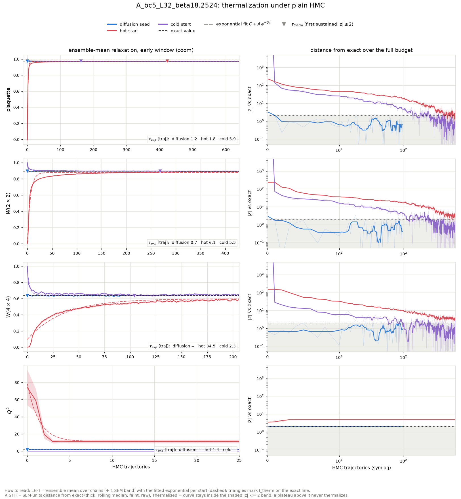

tau_int (hot-start chains, second half): plaquette = 4.56 +- 0.48, wilson_2x2 = 5.10 +- 0.66, wilson_4x4 = 2.93 +- 0.45, wilson_6x6 = 1.00 +- 0.06. Topology: hot-start HMC L=32 beta=18.2524 -> **frozen** (no tunneling).

Where 'never' stood at the end: the hot start ended the 640-trajectory budget still at wilson_2x2 at |z| ~ 3, wilson_4x4 at |z| ~ 4, wilson_6x6 at |z| ~ 4, Q^2 at |z| ~ 5; the cold start ended the 640-trajectory budget still at Q^2 at |z| ~ 1462558916608.

### Diagnostics: raw diffusion output (before any HMC)

| observable | value | error | exact | z_exact | reference | ref_error | z_ref | ks_p | chi2_p |
|---|---|---|---|---|---|---|---|---|---|
| plaquette | 0.9718 | 9.815e-05 | 0.9722 | -3.714 | 0.9724 | 9.53e-05 | -3.875 | 0.005104 |  |
| wilson_1x1 | 0.9718 | 9.815e-05 | 0.9722 | -3.714 | 0.9724 | 9.53e-05 | -3.875 | 0.005104 |  |
| wilson_1x2 | 0.9438 | 0.0002125 | 0.9452 | -6.487 | 0.9454 | 0.0002446 | -4.792 | 0.0002496 |  |
| wilson_2x2 | 0.8914 | 0.0006663 | 0.8934 | -2.921 | 0.8938 | 0.0003987 | -3.044 | 0.00159 |  |
| wilson_2x3 | 0.8428 | 0.0009506 | 0.8444 | -1.711 | 0.8448 | 0.0008187 | -1.574 | 0.1712 |  |
| wilson_3x3 | 0.7749 | 0.001557 | 0.776 | -0.6679 | 0.7761 | 0.001158 | -0.6336 | 0.678 |  |
| wilson_3x4 | 0.7122 | 0.002116 | 0.713 | -0.3965 | 0.7125 | 0.001744 | -0.09139 | 0.8246 |  |
| wilson_4x4 | 0.6348 | 0.002518 | 0.637 | -0.882 | 0.6362 | 0.002268 | -0.4197 | 0.678 |  |
| wilson_4x5 | 0.5664 | 0.003072 | 0.5691 | -0.8915 | 0.5673 | 0.002812 | -0.2158 | 0.7163 |  |
| wilson_5x5 | 0.4909 | 0.003737 | 0.4943 | -0.9159 | 0.4936 | 0.003757 | -0.5228 | 0.7901 |  |
| wilson_5x6 | 0.4243 | 0.004419 | 0.4293 | -1.126 | 0.4279 | 0.004509 | -0.5625 | 0.6395 |  |
| wilson_6x6 | 0.3567 | 0.004663 | 0.3625 | -1.245 | 0.3629 | 0.00531 | -0.8772 | 0.3021 |  |
| wilson_6x7 | 0.2982 | 0.005293 | 0.3061 | -1.501 | 0.3066 | 0.005855 | -1.067 | 0.2763 |  |
| wilson_7x7 | 0.2421 | 0.005721 | 0.2513 | -1.607 | 0.2539 | 0.006052 | -1.411 | 0.1545 |  |
| wilson_7x8 | 0.1959 | 0.005927 | 0.2063 | -1.749 | 0.2084 | 0.006338 | -1.436 | 0.1712 |  |
| wilson_8x8 | 0.1549 | 0.005498 | 0.1647 | -1.785 | 0.1675 | 0.006294 | -1.519 | 0.1122 |  |
| wilson_8x10 | 0.09994 | 0.006386 | 0.1049 | -0.7761 | 0.1082 | 0.006245 | -0.9288 | 0.03364 |  |
| wilson_10x10 | 0.0626 | 0.005792 | 0.0597 | 0.5006 | 0.06371 | 0.005174 | -0.144 | 0.2763 |  |
| wilson_10x12 | 0.0399 | 0.005923 | 0.03397 | 1 | 0.03663 | 0.005624 | 0.3999 | 0.7538 |  |
| wilson_12x12 | 0.02541 | 0.005739 | 0.01727 | 1.417 | 0.02227 | 0.004683 | 0.4239 | 0.7163 |  |
| creutz_2 | 0.02782 | 0.0004582 | 0.02818 | -0.7899 |  |  |  |  |  |
| creutz_3 | 0.02785 | 0.0009468 | 0.02818 | -0.353 |  |  |  |  |  |
| creutz_4 | 0.03066 | 0.001415 | 0.02818 | 1.752 |  |  |  |  |  |
| creutz_5 | 0.02898 | 0.002514 | 0.02818 | 0.3153 |  |  |  |  |  |
| creutz_6 | 0.02795 | 0.003851 | 0.02818 | -0.06043 |  |  |  |  |  |
| creutz_7 | 0.02901 | 0.006656 | 0.02818 | 0.1236 |  |  |  |  |  |
| creutz_8 | 0.02381 | 0.01108 | 0.02818 | -0.3946 |  |  |  |  |  |
| Q | 0.07031 | 0.09634 | 0 | 0.7298 | -0.1146 | 0.1152 | 1.231 | 0.2763 |  |
| Q^2 | 1.914 | 0.2315 | 1.463 | 1.95 | 1.333 | 0.1062 | 2.28 | 0.5631 |  |
| chi_top ((<Q^2>-<Q>^2)/V) | 0.001864 | 0.0002263 | 0.001428 | 1.927 | 0.001289 | 0.0001061 | 2.301 | 1.491e-07 |  |
| Q histogram vs exact P(Q) | 2.291 | nan | 4 | nan |  |  |  |  | 0.6825 |

### Diagnostics: the same configs after 96 HMC trajectories

| observable | value | error | exact | z_exact | reference | ref_error | z_ref | ks_p | chi2_p |
|---|---|---|---|---|---|---|---|---|---|
| plaquette | 0.9723 | 8.496e-05 | 0.9722 | 0.858 | 0.9724 | 9.53e-05 | -0.7261 | 0.4548 |  |
| wilson_1x1 | 0.9723 | 8.496e-05 | 0.9722 | 0.858 | 0.9724 | 9.53e-05 | -0.7261 | 0.4548 |  |
| wilson_1x2 | 0.9454 | 0.000243 | 0.9452 | 0.8166 | 0.9454 | 0.0002446 | 0.06993 | 0.4212 |  |
| wilson_2x2 | 0.8931 | 0.0005741 | 0.8934 | -0.4568 | 0.8938 | 0.0003987 | -0.9723 | 0.1122 |  |
| wilson_2x3 | 0.8441 | 0.001017 | 0.8444 | -0.3035 | 0.8448 | 0.0008187 | -0.503 | 0.5631 |  |
| wilson_3x3 | 0.7752 | 0.001843 | 0.776 | -0.4104 | 0.7761 | 0.001158 | -0.4346 | 0.2763 |  |
| wilson_3x4 | 0.7116 | 0.002612 | 0.713 | -0.5615 | 0.7125 | 0.001744 | -0.2797 | 0.7538 |  |
| wilson_4x4 | 0.6341 | 0.003662 | 0.637 | -0.7981 | 0.6362 | 0.002268 | -0.4932 | 0.678 |  |
| wilson_4x5 | 0.566 | 0.004703 | 0.5691 | -0.6612 | 0.5673 | 0.002812 | -0.2316 | 0.7901 |  |
| wilson_5x5 | 0.4901 | 0.005354 | 0.4943 | -0.7823 | 0.4936 | 0.003757 | -0.5407 | 0.8569 |  |
| wilson_5x6 | 0.4241 | 0.005943 | 0.4293 | -0.8714 | 0.4279 | 0.004509 | -0.5032 | 0.9807 |  |
| wilson_6x6 | 0.3576 | 0.006398 | 0.3625 | -0.7628 | 0.3629 | 0.00531 | -0.6345 | 0.9126 |  |
| wilson_6x7 | 0.3024 | 0.007061 | 0.3061 | -0.5284 | 0.3066 | 0.005855 | -0.4593 | 0.9542 |  |
| wilson_7x7 | 0.247 | 0.007816 | 0.2513 | -0.557 | 0.2539 | 0.006052 | -0.6997 | 0.7163 |  |
| wilson_7x8 | 0.2019 | 0.008145 | 0.2063 | -0.5465 | 0.2084 | 0.006338 | -0.6341 | 0.678 |  |
| wilson_8x8 | 0.1587 | 0.008345 | 0.1647 | -0.7142 | 0.1675 | 0.006294 | -0.8456 | 0.678 |  |
| wilson_8x10 | 0.0976 | 0.007881 | 0.1049 | -0.9257 | 0.1082 | 0.006245 | -1.058 | 0.5631 |  |
| wilson_10x10 | 0.05322 | 0.006198 | 0.0597 | -1.045 | 0.06371 | 0.005174 | -1.3 | 0.3021 |  |
| wilson_10x12 | 0.03058 | 0.005698 | 0.03397 | -0.5948 | 0.03663 | 0.005624 | -0.7553 | 0.2522 |  |
| wilson_12x12 | 0.01533 | 0.006389 | 0.01727 | -0.304 | 0.02227 | 0.004683 | -0.8755 | 0.4212 |  |
| creutz_2 | 0.02882 | 0.0004183 | 0.02818 | 1.526 |  |  |  |  |  |
| creutz_3 | 0.02872 | 0.0008837 | 0.02818 | 0.6082 |  |  |  |  |  |
| creutz_4 | 0.02964 | 0.001485 | 0.02818 | 0.9808 |  |  |  |  |  |
| creutz_5 | 0.03034 | 0.002451 | 0.02818 | 0.878 |  |  |  |  |  |
| creutz_6 | 0.02598 | 0.003924 | 0.02818 | -0.5626 |  |  |  |  |  |
| creutz_7 | 0.03469 | 0.006372 | 0.02818 | 1.021 |  |  |  |  |  |
| creutz_8 | 0.03891 | 0.009137 | 0.02818 | 1.173 |  |  |  |  |  |
| Q | 0.07031 | 0.09634 | 0 | 0.7298 | -0.1146 | 0.1152 | 1.231 | 0.2763 |  |
| Q^2 | 1.914 | 0.2315 | 1.463 | 1.95 | 1.333 | 0.1062 | 2.28 | 0.5631 |  |
| chi_top ((<Q^2>-<Q>^2)/V) | 0.001864 | 0.0002263 | 0.001428 | 1.927 | 0.001289 | 0.0001061 | 2.301 | 1.491e-07 |  |
| Q histogram vs exact P(Q) | 2.291 | nan | 4 | nan |  |  |  |  | 0.6825 |

## E_bc5.8_L32_beta21.5051

HMC: step size 0.0863, 12 leapfrog steps, acceptance seed/hot/cold = 0.982/0.983/0.982. Diffusion-seed batch: 128 chains x 96 trajectories (0.08 s/traj for the whole batch); baselines: 32 chains x 640 trajectories.

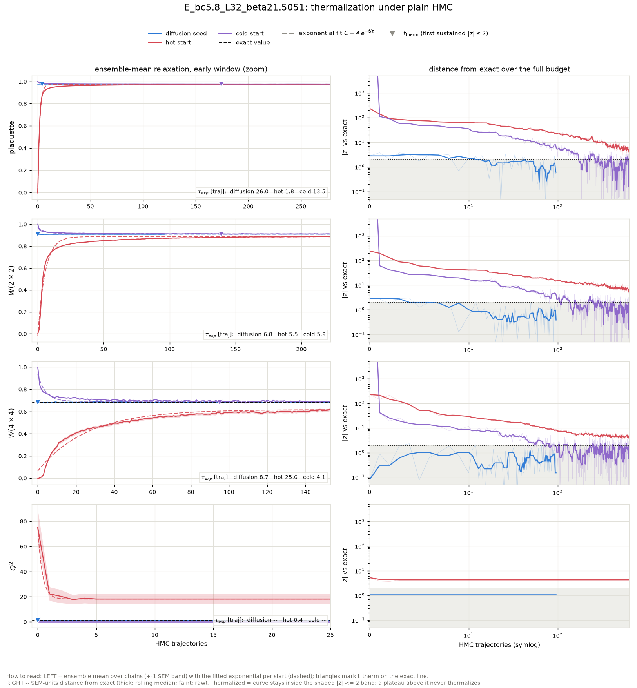

tau_int (hot-start chains, second half): plaquette = 7.22 +- 1.31, wilson_2x2 = 10.08 +- 1.66, wilson_4x4 = 3.91 +- 0.67, wilson_6x6 = 1.46 +- 0.20. Topology: hot-start HMC L=32 beta=21.5051 -> **frozen** (no tunneling).

Where 'never' stood at the end: the hot start ended the 640-trajectory budget still at plaquette at |z| ~ 4, wilson_2x2 at |z| ~ 6, wilson_4x4 at |z| ~ 4, wilson_6x6 at |z| ~ 5, Q^2 at |z| ~ 4; the cold start ended the 640-trajectory budget still at Q^2 at |z| ~ 1235714179072.

### Diagnostics: raw diffusion output (before any HMC)

| observable | value | error | exact | z_exact | reference | ref_error | z_ref | ks_p | chi2_p |
|---|---|---|---|---|---|---|---|---|---|
| plaquette | 0.9762 | 0.0001006 | 0.9765 | -2.639 | 0.9763 | 5.99e-05 | -0.8779 | 0.678 |  |
| wilson_1x1 | 0.9762 | 0.0001006 | 0.9765 | -2.639 | 0.9763 | 5.99e-05 | -0.8779 | 0.678 |  |
| wilson_1x2 | 0.9522 | 0.0002406 | 0.9535 | -5.525 | 0.953 | 0.0002055 | -2.821 | 0.02248 |  |
| wilson_2x2 | 0.9076 | 0.0005629 | 0.9091 | -2.764 | 0.9085 | 0.0004273 | -1.264 | 0.07995 |  |
| wilson_2x3 | 0.8651 | 0.0009007 | 0.8668 | -1.911 | 0.8657 | 0.0006778 | -0.5015 | 0.2522 |  |
| wilson_3x3 | 0.8068 | 0.001692 | 0.8071 | -0.1755 | 0.8058 | 0.001124 | 0.4639 | 0.2087 |  |
| wilson_3x4 | 0.7511 | 0.002414 | 0.7514 | -0.1444 | 0.7504 | 0.001537 | 0.2265 | 0.2297 |  |
| wilson_4x4 | 0.6834 | 0.00346 | 0.6831 | 0.07271 | 0.6838 | 0.002143 | -0.1036 | 0.3584 |  |
| wilson_4x5 | 0.6213 | 0.004374 | 0.6211 | 0.04382 | 0.6231 | 0.002724 | -0.3536 | 0.4898 |  |
| wilson_5x5 | 0.5509 | 0.005904 | 0.5513 | -0.0748 | 0.5548 | 0.003284 | -0.5815 | 0.3021 |  |
| wilson_5x6 | 0.4882 | 0.007114 | 0.4895 | -0.1819 | 0.4944 | 0.003785 | -0.7748 | 0.389 |  |
| wilson_6x6 | 0.4219 | 0.008644 | 0.4243 | -0.2776 | 0.4316 | 0.004197 | -1.006 | 0.3021 |  |
| wilson_6x7 | 0.3647 | 0.009713 | 0.3678 | -0.3217 | 0.3754 | 0.004796 | -0.9957 | 0.2522 |  |
| wilson_7x7 | 0.3071 | 0.011 | 0.3113 | -0.3836 | 0.3207 | 0.005141 | -1.118 | 0.1392 |  |
| wilson_7x8 | 0.2584 | 0.01224 | 0.2635 | -0.4173 | 0.2728 | 0.005635 | -1.066 | 0.07995 |  |
| wilson_8x8 | 0.2114 | 0.01288 | 0.2178 | -0.4974 | 0.2262 | 0.005929 | -1.045 | 0.1545 |  |
| wilson_8x10 | 0.1414 | 0.01327 | 0.1488 | -0.5533 | 0.1567 | 0.006987 | -1.016 | 0.1251 |  |
| wilson_10x10 | 0.08985 | 0.01121 | 0.09241 | -0.2279 | 0.1006 | 0.007218 | -0.8035 | 0.4898 |  |
| wilson_10x12 | 0.05963 | 0.009515 | 0.05739 | 0.2348 | 0.06329 | 0.007818 | -0.2974 | 0.9542 |  |
| wilson_12x12 | 0.03806 | 0.008155 | 0.03241 | 0.694 | 0.0354 | 0.006424 | 0.2565 | 0.6395 |  |
| creutz_2 | 0.02301 | 0.0003297 | 0.02382 | -2.442 |  |  |  |  |  |
| creutz_3 | 0.02192 | 0.0007791 | 0.02382 | -2.431 |  |  |  |  |  |
| creutz_4 | 0.02289 | 0.00129 | 0.02382 | -0.7196 |  |  |  |  |  |
| creutz_5 | 0.02487 | 0.001872 | 0.02382 | 0.5611 |  |  |  |  |  |
| creutz_6 | 0.025 | 0.003207 | 0.02382 | 0.3683 |  |  |  |  |  |
| creutz_7 | 0.02608 | 0.00481 | 0.02382 | 0.4707 |  |  |  |  |  |
| creutz_8 | 0.02816 | 0.00726 | 0.02382 | 0.5983 |  |  |  |  |  |
| Q | -0.1328 | 0.09183 | 0 | -1.446 | 0.01042 | 0.07383 | -1.216 | 0.7163 |  |
| Q^2 | 1.414 | 0.1592 | 1.236 | 1.12 | 1.219 | 0.1258 | 0.9625 | 0.8864 |  |
| chi_top ((<Q^2>-<Q>^2)/V) | 0.001364 | 0.0001544 | 0.001207 | 1.017 | 0.00119 | 0.0001223 | 0.8814 | 1.203e-10 |  |
| Q histogram vs exact P(Q) | 6.121 | nan | 4 | nan |  |  |  |  | 0.1903 |

### Diagnostics: the same configs after 96 HMC trajectories

| observable | value | error | exact | z_exact | reference | ref_error | z_ref | ks_p | chi2_p |
|---|---|---|---|---|---|---|---|---|---|
| plaquette | 0.9764 | 9.959e-05 | 0.9765 | -0.5434 | 0.9763 | 5.99e-05 | 0.9346 | 0.6011 |  |
| wilson_1x1 | 0.9764 | 9.959e-05 | 0.9765 | -0.5434 | 0.9763 | 5.99e-05 | 0.9346 | 0.6011 |  |
| wilson_1x2 | 0.9531 | 0.0002562 | 0.9535 | -1.563 | 0.953 | 0.0002055 | 0.1109 | 0.7163 |  |
| wilson_2x2 | 0.909 | 0.000561 | 0.9091 | -0.3166 | 0.9085 | 0.0004273 | 0.688 | 0.2087 |  |
| wilson_2x3 | 0.8665 | 0.0009179 | 0.8668 | -0.3992 | 0.8657 | 0.0006778 | 0.6918 | 0.3294 |  |
| wilson_3x3 | 0.8066 | 0.00127 | 0.8071 | -0.3751 | 0.8058 | 0.001124 | 0.45 | 0.1392 |  |
| wilson_3x4 | 0.7511 | 0.001629 | 0.7514 | -0.2279 | 0.7504 | 0.001537 | 0.2792 | 0.389 |  |
| wilson_4x4 | 0.6836 | 0.002074 | 0.6831 | 0.1957 | 0.6838 | 0.002143 | -0.08973 | 0.9126 |  |
| wilson_4x5 | 0.6225 | 0.002417 | 0.6211 | 0.5972 | 0.6231 | 0.002724 | -0.1566 | 0.8864 |  |
| wilson_5x5 | 0.5537 | 0.002819 | 0.5513 | 0.8272 | 0.5548 | 0.003284 | -0.2669 | 0.7901 |  |
| wilson_5x6 | 0.4936 | 0.003695 | 0.4895 | 1.111 | 0.4944 | 0.003785 | -0.1594 | 0.678 |  |
| wilson_6x6 | 0.4297 | 0.004235 | 0.4243 | 1.278 | 0.4316 | 0.004197 | -0.312 | 0.3021 |  |
| wilson_6x7 | 0.3746 | 0.004941 | 0.3678 | 1.378 | 0.3754 | 0.004796 | -0.124 | 0.5631 |  |
| wilson_7x7 | 0.3185 | 0.005382 | 0.3113 | 1.328 | 0.3207 | 0.005141 | -0.296 | 0.678 |  |
| wilson_7x8 | 0.2717 | 0.005707 | 0.2635 | 1.433 | 0.2728 | 0.005635 | -0.1351 | 0.7163 |  |
| wilson_8x8 | 0.2263 | 0.00571 | 0.2178 | 1.489 | 0.2262 | 0.005929 | 0.01055 | 0.8246 |  |
| wilson_8x10 | 0.1589 | 0.005847 | 0.1488 | 1.722 | 0.1567 | 0.006987 | 0.2395 | 0.7538 |  |
| wilson_10x10 | 0.1038 | 0.00517 | 0.09241 | 2.196 | 0.1006 | 0.007218 | 0.3599 | 0.8569 |  |
| wilson_10x12 | 0.07041 | 0.005644 | 0.05739 | 2.306 | 0.06329 | 0.007818 | 0.738 | 0.7901 |  |
| wilson_12x12 | 0.04912 | 0.005457 | 0.03241 | 3.063 | 0.0354 | 0.006424 | 1.628 | 0.1712 |  |
| creutz_2 | 0.02323 | 0.0002825 | 0.02382 | -2.086 |  |  |  |  |  |
| creutz_3 | 0.02376 | 0.0006581 | 0.02382 | -0.09092 |  |  |  |  |  |
| creutz_4 | 0.02282 | 0.001251 | 0.02382 | -0.7929 |  |  |  |  |  |
| creutz_5 | 0.02364 | 0.001891 | 0.02382 | -0.09112 |  |  |  |  |  |
| creutz_6 | 0.02363 | 0.003115 | 0.02382 | -0.05969 |  |  |  |  |  |
| creutz_7 | 0.02512 | 0.004602 | 0.02382 | 0.2827 |  |  |  |  |  |
| creutz_8 | 0.02396 | 0.006994 | 0.02382 | 0.02115 |  |  |  |  |  |
| Q | -0.1328 | 0.09183 | 0 | -1.446 | 0.01042 | 0.07383 | -1.216 | 0.7163 |  |
| Q^2 | 1.414 | 0.1592 | 1.236 | 1.12 | 1.219 | 0.1258 | 0.9625 | 0.8864 |  |
| chi_top ((<Q^2>-<Q>^2)/V) | 0.001364 | 0.0001544 | 0.001207 | 1.017 | 0.00119 | 0.0001223 | 0.8814 | 1.203e-10 |  |
| Q histogram vs exact P(Q) | 6.121 | nan | 4 | nan |  |  |  |  | 0.1903 |

## A_bc6_L32_beta22.3151

HMC: step size 0.0847, 12 leapfrog steps, acceptance seed/hot/cold = 0.984/0.982/0.984. Diffusion-seed batch: 128 chains x 96 trajectories (0.07 s/traj for the whole batch); baselines: 32 chains x 640 trajectories.

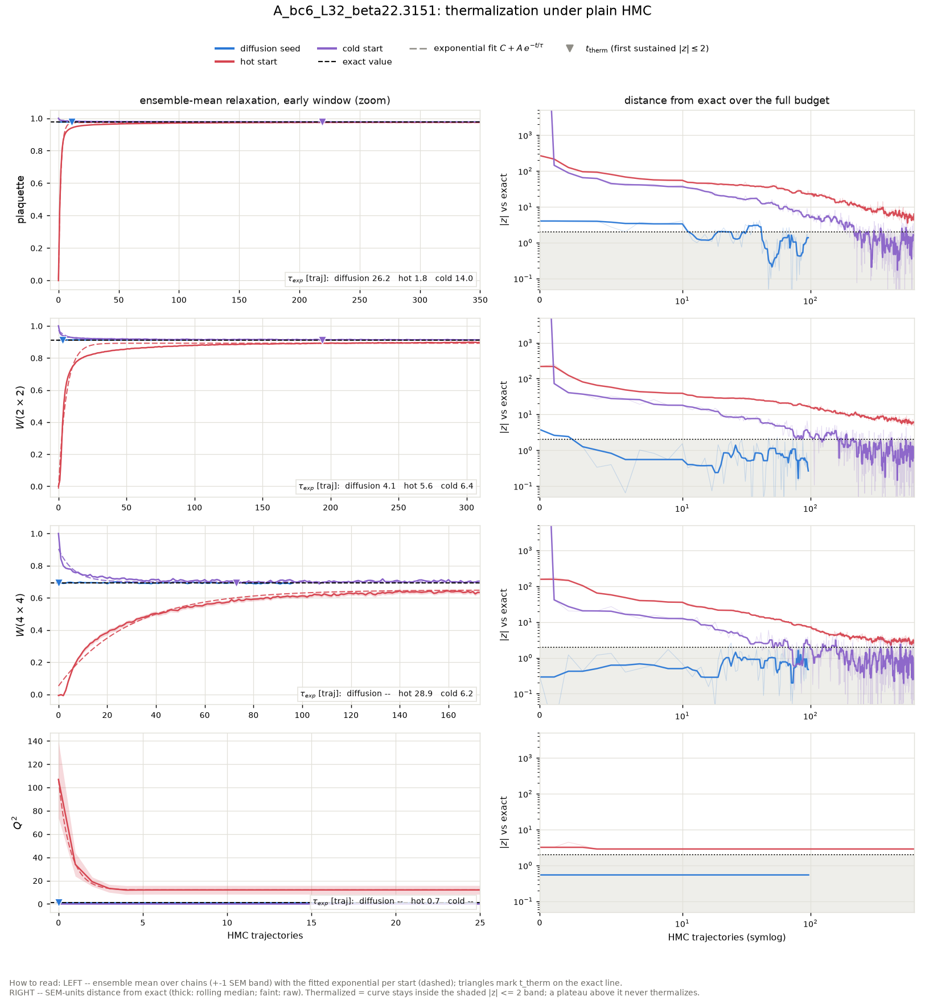

tau_int (hot-start chains, second half): plaquette = 8.76 +- 1.35, wilson_2x2 = 7.57 +- 1.25, wilson_4x4 = 3.24 +- 0.33, wilson_6x6 = 1.44 +- 0.11. Topology: hot-start HMC L=32 beta=22.3151 -> **frozen** (no tunneling).

Where 'never' stood at the end: the hot start ended the 640-trajectory budget still at plaquette at |z| ~ 5, wilson_2x2 at |z| ~ 6, wilson_4x4 at |z| ~ 3, wilson_6x6 at |z| ~ 3, Q^2 at |z| ~ 3; the cold start ended the 640-trajectory budget still at Q^2 at |z| ~ 1189769248768.

### Diagnostics: raw diffusion output (before any HMC)

| observable | value | error | exact | z_exact | reference | ref_error | z_ref | ks_p | chi2_p |
|---|---|---|---|---|---|---|---|---|---|
| plaquette | 0.9769 | 9.782e-05 | 0.9773 | -3.945 | 0.9774 | 0.0001023 | -2.901 | 0.004349 |  |
| wilson_1x1 | 0.9769 | 9.782e-05 | 0.9773 | -3.945 | 0.9774 | 0.0001023 | -2.901 | 0.004349 |  |
| wilson_1x2 | 0.9538 | 0.0001993 | 0.9552 | -7.084 | 0.9553 | 0.000215 | -5.108 | 5.99e-05 |  |
| wilson_2x2 | 0.9104 | 0.0006095 | 0.9124 | -3.24 | 0.9129 | 0.0004383 | -3.299 | 0.004349 |  |
| wilson_2x3 | 0.8696 | 0.0009431 | 0.8715 | -1.935 | 0.8719 | 0.0007432 | -1.871 | 0.02947 |  |
| wilson_3x3 | 0.8125 | 0.001306 | 0.8135 | -0.7973 | 0.8137 | 0.001211 | -0.6689 | 0.8569 |  |
| wilson_3x4 | 0.7588 | 0.001858 | 0.7594 | -0.3223 | 0.7596 | 0.001753 | -0.3124 | 0.9353 |  |
| wilson_4x4 | 0.6921 | 0.0026 | 0.6929 | -0.2941 | 0.6929 | 0.002381 | -0.2208 | 0.9353 |  |
| wilson_4x5 | 0.6336 | 0.00314 | 0.6322 | 0.4518 | 0.6316 | 0.002995 | 0.4598 | 0.678 |  |
| wilson_5x5 | 0.5665 | 0.004124 | 0.5637 | 0.6753 | 0.5622 | 0.003598 | 0.7811 | 0.5631 |  |
| wilson_5x6 | 0.5068 | 0.004767 | 0.5026 | 0.8711 | 0.5001 | 0.004343 | 1.031 | 0.1392 |  |
| wilson_6x6 | 0.4426 | 0.005967 | 0.438 | 0.7655 | 0.4336 | 0.005065 | 1.151 | 0.2087 |  |
| wilson_6x7 | 0.3871 | 0.00654 | 0.3817 | 0.8183 | 0.376 | 0.005684 | 1.279 | 0.1892 |  |
| wilson_7x7 | 0.3336 | 0.007431 | 0.3251 | 1.139 | 0.3177 | 0.006199 | 1.636 | 0.2763 |  |
| wilson_7x8 | 0.2864 | 0.007621 | 0.2769 | 1.251 | 0.2683 | 0.006647 | 1.795 | 0.3021 |  |
| wilson_8x8 | 0.2417 | 0.008097 | 0.2305 | 1.379 | 0.2201 | 0.007068 | 2.007 | 0.2522 |  |
| wilson_8x10 | 0.1698 | 0.008337 | 0.1597 | 1.209 | 0.1513 | 0.007398 | 1.659 | 0.03831 |  |
| wilson_10x10 | 0.1114 | 0.007613 | 0.101 | 1.367 | 0.09484 | 0.007368 | 1.56 | 0.2087 |  |
| wilson_10x12 | 0.06981 | 0.006461 | 0.06382 | 0.9271 | 0.06325 | 0.007609 | 0.6574 | 0.3021 |  |
| wilson_12x12 | 0.04078 | 0.005544 | 0.03681 | 0.7162 | 0.03705 | 0.008032 | 0.3821 | 0.5259 |  |
| creutz_2 | 0.02253 | 0.0003621 | 0.02293 | -1.097 |  |  |  |  |  |
| creutz_3 | 0.02218 | 0.0006101 | 0.02293 | -1.222 |  |  |  |  |  |
| creutz_4 | 0.02374 | 0.001099 | 0.02293 | 0.7339 |  |  |  |  |  |
| creutz_5 | 0.02359 | 0.001866 | 0.02293 | 0.3533 |  |  |  |  |  |
| creutz_6 | 0.02408 | 0.002473 | 0.02293 | 0.4666 |  |  |  |  |  |
| creutz_7 | 0.01471 | 0.00382 | 0.02293 | -2.151 |  |  |  |  |  |
| creutz_8 | 0.01767 | 0.006152 | 0.02293 | -0.8544 |  |  |  |  |  |
| Q | 0.03125 | 0.09704 | 0 | 0.322 | -0.03125 | 0.07187 | 0.5176 | 0.9126 |  |
| Q^2 | 1.109 | 0.1406 | 1.19 | -0.572 | 1.25 | 0.1361 | -0.7187 | 0.9353 |  |
| chi_top ((<Q^2>-<Q>^2)/V) | 0.001082 | 0.0001374 | 0.001162 | -0.5784 | 0.00122 | 0.0001319 | -0.7209 | 0.9353 |  |
| Q histogram vs exact P(Q) | 2.092 | nan | 4 | nan |  |  |  |  | 0.7188 |

### Diagnostics: the same configs after 96 HMC trajectories

| observable | value | error | exact | z_exact | reference | ref_error | z_ref | ks_p | chi2_p |
|---|---|---|---|---|---|---|---|---|---|
| plaquette | 0.9772 | 8.327e-05 | 0.9773 | -1.492 | 0.9774 | 0.0001023 | -1.129 | 0.5631 |  |
| wilson_1x1 | 0.9772 | 8.327e-05 | 0.9773 | -1.492 | 0.9774 | 0.0001023 | -1.129 | 0.5631 |  |
| wilson_1x2 | 0.955 | 0.0001649 | 0.9552 | -0.9418 | 0.9553 | 0.000215 | -0.8889 | 0.7538 |  |
| wilson_2x2 | 0.9122 | 0.0003539 | 0.9124 | -0.3521 | 0.9129 | 0.0004383 | -1.112 | 0.3584 |  |
| wilson_2x3 | 0.8713 | 0.0007171 | 0.8715 | -0.1799 | 0.8719 | 0.0007432 | -0.533 | 0.6395 |  |
| wilson_3x3 | 0.8129 | 0.001459 | 0.8135 | -0.457 | 0.8137 | 0.001211 | -0.4308 | 0.678 |  |
| wilson_3x4 | 0.7582 | 0.002097 | 0.7594 | -0.5732 | 0.7596 | 0.001753 | -0.5126 | 0.7538 |  |
| wilson_4x4 | 0.6916 | 0.002719 | 0.6929 | -0.471 | 0.6929 | 0.002381 | -0.3581 | 0.6011 |  |
| wilson_4x5 | 0.6299 | 0.003397 | 0.6322 | -0.6619 | 0.6316 | 0.002995 | -0.3692 | 0.8246 |  |
| wilson_5x5 | 0.5626 | 0.004195 | 0.5637 | -0.2581 | 0.5622 | 0.003598 | 0.07364 | 0.7901 |  |
| wilson_5x6 | 0.5009 | 0.004713 | 0.5026 | -0.3655 | 0.5001 | 0.004343 | 0.1209 | 0.6011 |  |
| wilson_6x6 | 0.4383 | 0.005457 | 0.438 | 0.05074 | 0.4336 | 0.005065 | 0.6332 | 0.6011 |  |
| wilson_6x7 | 0.3803 | 0.006027 | 0.3817 | -0.2433 | 0.376 | 0.005684 | 0.5145 | 0.7901 |  |
| wilson_7x7 | 0.3234 | 0.006645 | 0.3251 | -0.2541 | 0.3177 | 0.006199 | 0.6252 | 0.4548 |  |
| wilson_7x8 | 0.2738 | 0.007128 | 0.2769 | -0.4325 | 0.2683 | 0.006647 | 0.568 | 0.4898 |  |
| wilson_8x8 | 0.2283 | 0.007851 | 0.2305 | -0.2758 | 0.2201 | 0.007068 | 0.7805 | 0.678 |  |
| wilson_8x10 | 0.1569 | 0.008433 | 0.1597 | -0.3308 | 0.1513 | 0.007398 | 0.5007 | 0.678 |  |
| wilson_10x10 | 0.09534 | 0.008921 | 0.101 | -0.6301 | 0.09484 | 0.007368 | 0.0432 | 0.9542 |  |
| wilson_10x12 | 0.05206 | 0.008283 | 0.06382 | -1.42 | 0.06325 | 0.007609 | -0.9946 | 0.1892 |  |
| wilson_12x12 | 0.02372 | 0.00977 | 0.03681 | -1.339 | 0.03705 | 0.008032 | -1.054 | 0.3584 |  |
| creutz_2 | 0.02287 | 0.000315 | 0.02293 | -0.1954 |  |  |  |  |  |
| creutz_3 | 0.02359 | 0.0007149 | 0.02293 | 0.9236 |  |  |  |  |  |
| creutz_4 | 0.02243 | 0.001124 | 0.02293 | -0.4426 |  |  |  |  |  |
| creutz_5 | 0.01958 | 0.001799 | 0.02293 | -1.864 |  |  |  |  |  |
| creutz_6 | 0.01736 | 0.002812 | 0.02293 | -1.982 |  |  |  |  |  |
| creutz_7 | 0.01981 | 0.004492 | 0.02293 | -0.6947 |  |  |  |  |  |
| creutz_8 | 0.01519 | 0.006909 | 0.02293 | -1.121 |  |  |  |  |  |
| Q | 0.03125 | 0.09704 | 0 | 0.322 | -0.03125 | 0.07187 | 0.5176 | 0.9126 |  |
| Q^2 | 1.109 | 0.1406 | 1.19 | -0.572 | 1.25 | 0.1361 | -0.7187 | 0.9353 |  |
| chi_top ((<Q^2>-<Q>^2)/V) | 0.001082 | 0.0001374 | 0.001162 | -0.5784 | 0.00122 | 0.0001319 | -0.7209 | 0.9353 |  |
| Q histogram vs exact P(Q) | 2.092 | nan | 4 | nan |  |  |  |  | 0.7188 |

## A_bc8_L32_beta30.3772

HMC: step size 0.0726, 14 leapfrog steps, acceptance seed/hot/cold = 0.982/0.981/0.983. Diffusion-seed batch: 128 chains x 96 trajectories (0.08 s/traj for the whole batch); baselines: 32 chains x 640 trajectories.

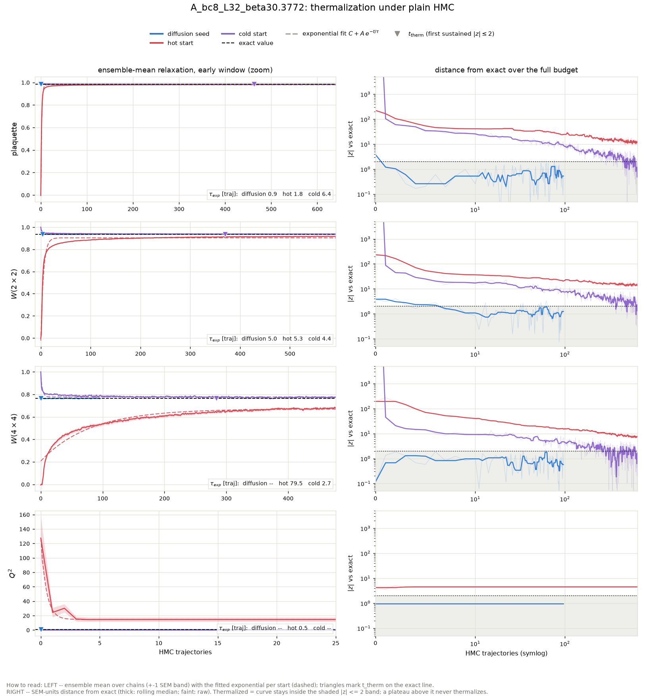

tau_int (hot-start chains, second half): plaquette = 10.71 +- 1.40, wilson_2x2 = 14.38 +- 1.90, wilson_4x4 = 11.20 +- 1.57, wilson_6x6 = 4.81 +- 1.07. Topology: hot-start HMC L=32 beta=30.3772 -> **frozen** (no tunneling).

Where 'never' stood at the end: the hot start ended the 640-trajectory budget still at plaquette at |z| ~ 12, wilson_2x2 at |z| ~ 15, wilson_4x4 at |z| ~ 8, wilson_6x6 at |z| ~ 6, Q^2 at |z| ~ 5; the cold start ended the 640-trajectory budget still at Q^2 at |z| ~ 868455153664.

### Diagnostics: raw diffusion output (before any HMC)

| observable | value | error | exact | z_exact | reference | ref_error | z_ref | ks_p | chi2_p |
|---|---|---|---|---|---|---|---|---|---|
| plaquette | 0.9831 | 7.181e-05 | 0.9834 | -3.551 | 0.9836 | 5.393e-05 | -5.125 | 9.054e-09 |  |
| wilson_1x1 | 0.9831 | 7.181e-05 | 0.9834 | -3.551 | 0.9836 | 5.393e-05 | -5.125 | 9.054e-09 |  |
| wilson_1x2 | 0.9662 | 0.0001532 | 0.9671 | -5.409 | 0.9677 | 0.0001561 | -6.457 | 5.026e-09 |  |
| wilson_2x2 | 0.9338 | 0.0003576 | 0.9352 | -3.924 | 0.9366 | 0.0003325 | -5.756 | 4.282e-07 |  |
| wilson_2x3 | 0.903 | 0.0004837 | 0.9044 | -2.912 | 0.9066 | 0.0005718 | -4.732 | 0.0005374 |  |
| wilson_3x3 | 0.8594 | 0.000814 | 0.8601 | -0.9642 | 0.8624 | 0.0008798 | -2.556 | 0.04354 |  |
| wilson_3x4 | 0.8173 | 0.001124 | 0.818 | -0.6509 | 0.8212 | 0.001271 | -2.335 | 0.02577 |  |
| wilson_4x4 | 0.7648 | 0.001729 | 0.765 | -0.1447 | 0.768 | 0.001806 | -1.274 | 0.2763 |  |
| wilson_4x5 | 0.7157 | 0.002347 | 0.7155 | 0.08127 | 0.7196 | 0.002376 | -1.16 | 0.4212 |  |
| wilson_5x5 | 0.6603 | 0.003106 | 0.658 | 0.7194 | 0.662 | 0.003087 | -0.3954 | 0.6395 |  |
| wilson_5x6 | 0.6061 | 0.003833 | 0.6052 | 0.2283 | 0.6092 | 0.003783 | -0.5828 | 0.6011 |  |
| wilson_6x6 | 0.5493 | 0.004685 | 0.5474 | 0.4147 | 0.5526 | 0.004508 | -0.5051 | 0.4548 |  |
| wilson_6x7 | 0.4961 | 0.005232 | 0.4951 | 0.2022 | 0.5014 | 0.005142 | -0.7171 | 0.4898 |  |
| wilson_7x7 | 0.4437 | 0.005877 | 0.4403 | 0.5754 | 0.4498 | 0.005834 | -0.7335 | 0.7538 |  |
| wilson_7x8 | 0.3929 | 0.006436 | 0.3916 | 0.1877 | 0.4024 | 0.006239 | -1.066 | 0.6395 |  |
| wilson_8x8 | 0.3456 | 0.007239 | 0.3426 | 0.4136 | 0.3565 | 0.006469 | -1.131 | 0.1892 |  |
| wilson_8x10 | 0.263 | 0.00757 | 0.2621 | 0.126 | 0.2763 | 0.006922 | -1.292 | 0.4212 |  |
| wilson_10x10 | 0.1887 | 0.008474 | 0.1875 | 0.1451 | 0.2016 | 0.006905 | -1.175 | 0.1892 |  |
| wilson_10x12 | 0.1339 | 0.009769 | 0.1342 | -0.02423 | 0.1475 | 0.007097 | -1.121 | 0.4212 |  |
| wilson_12x12 | 0.08356 | 0.009592 | 0.08978 | -0.6476 | 0.1006 | 0.007774 | -1.383 | 0.2522 |  |
| creutz_2 | 0.01679 | 0.0002223 | 0.01674 | 0.2104 |  |  |  |  |  |
| creutz_3 | 0.01604 | 0.0004562 | 0.01674 | -1.54 |  |  |  |  |  |
| creutz_4 | 0.01619 | 0.000831 | 0.01674 | -0.6605 |  |  |  |  |  |
| creutz_5 | 0.01421 | 0.001199 | 0.01674 | -2.111 |  |  |  |  |  |
| creutz_6 | 0.0127 | 0.001795 | 0.01674 | -2.252 |  |  |  |  |  |
| creutz_7 | 0.009816 | 0.002977 | 0.01674 | -2.326 |  |  |  |  |  |
| creutz_8 | 0.006548 | 0.004073 | 0.01674 | -2.502 |  |  |  |  |  |
| Q | -0.07812 | 0.09499 | 0 | -0.8224 | -0.02083 | 0.0639 | -0.5004 | 0.9972 |  |
| Q^2 | 1 | 0.1872 | 0.8685 | 0.7027 | 0.6979 | 0.0559 | 1.546 | 0.8864 |  |
| chi_top ((<Q^2>-<Q>^2)/V) | 0.0009706 | 0.0001801 | 0.0008481 | 0.6802 | 0.0006811 | 5.451e-05 | 1.538 | 4.957e-15 |  |
| Q histogram vs exact P(Q) | 1.729 | nan | 4 | nan |  |  |  |  | 0.7854 |

### Diagnostics: the same configs after 96 HMC trajectories

| observable | value | error | exact | z_exact | reference | ref_error | z_ref | ks_p | chi2_p |
|---|---|---|---|---|---|---|---|---|---|
| plaquette | 0.9834 | 7.794e-05 | 0.9834 | -0.4601 | 0.9836 | 5.393e-05 | -2.544 | 0.006985 |  |
| wilson_1x1 | 0.9834 | 7.794e-05 | 0.9834 | -0.4601 | 0.9836 | 5.393e-05 | -2.544 | 0.006985 |  |
| wilson_1x2 | 0.9669 | 0.0001673 | 0.9671 | -1.037 | 0.9677 | 0.0001561 | -3.31 | 0.0009335 |  |
| wilson_2x2 | 0.9348 | 0.0002861 | 0.9352 | -1.576 | 0.9366 | 0.0003325 | -4.237 | 0.0003034 |  |
| wilson_2x3 | 0.9038 | 0.0005347 | 0.9044 | -1.189 | 0.9066 | 0.0005718 | -3.54 | 0.009477 |  |
| wilson_3x3 | 0.8593 | 0.0008973 | 0.8601 | -0.9147 | 0.8624 | 0.0008798 | -2.466 | 0.1392 |  |
| wilson_3x4 | 0.8167 | 0.001494 | 0.818 | -0.8643 | 0.8212 | 0.001271 | -2.305 | 0.07995 |  |
| wilson_4x4 | 0.7637 | 0.002224 | 0.765 | -0.5855 | 0.768 | 0.001806 | -1.479 | 0.2522 |  |
| wilson_4x5 | 0.7132 | 0.003372 | 0.7155 | -0.6907 | 0.7196 | 0.002376 | -1.55 | 0.1712 |  |
| wilson_5x5 | 0.6551 | 0.004377 | 0.658 | -0.6776 | 0.662 | 0.003087 | -1.294 | 0.3294 |  |
| wilson_5x6 | 0.601 | 0.005828 | 0.6052 | -0.7217 | 0.6092 | 0.003783 | -1.183 | 0.4212 |  |
| wilson_6x6 | 0.5431 | 0.007224 | 0.5474 | -0.5886 | 0.5526 | 0.004508 | -1.113 | 0.3021 |  |
| wilson_6x7 | 0.4902 | 0.008554 | 0.4951 | -0.567 | 0.5014 | 0.005142 | -1.119 | 0.2522 |  |
| wilson_7x7 | 0.4348 | 0.009783 | 0.4403 | -0.5702 | 0.4498 | 0.005834 | -1.32 | 0.1251 |  |
| wilson_7x8 | 0.3852 | 0.01044 | 0.3916 | -0.6192 | 0.4024 | 0.006239 | -1.416 | 0.1392 |  |
| wilson_8x8 | 0.3361 | 0.01123 | 0.3426 | -0.5735 | 0.3565 | 0.006469 | -1.575 | 0.0631 |  |
| wilson_8x10 | 0.2577 | 0.01161 | 0.2621 | -0.374 | 0.2763 | 0.006922 | -1.372 | 0.0711 |  |
| wilson_10x10 | 0.1848 | 0.01202 | 0.1875 | -0.2283 | 0.2016 | 0.006905 | -1.213 | 0.1712 |  |
| wilson_10x12 | 0.1341 | 0.01084 | 0.1342 | -0.009079 | 0.1475 | 0.007097 | -1.034 | 0.1545 |  |
| wilson_12x12 | 0.08873 | 0.01089 | 0.08978 | -0.09616 | 0.1006 | 0.007774 | -0.8899 | 0.1004 |  |
| creutz_2 | 0.0169 | 0.0002207 | 0.01674 | 0.7247 |  |  |  |  |  |
| creutz_3 | 0.01677 | 0.0004463 | 0.01674 | 0.06873 |  |  |  |  |  |
| creutz_4 | 0.01624 | 0.0008827 | 0.01674 | -0.5674 |  |  |  |  |  |
| creutz_5 | 0.01644 | 0.00142 | 0.01674 | -0.2117 |  |  |  |  |  |
| creutz_6 | 0.01511 | 0.001982 | 0.01674 | -0.8236 |  |  |  |  |  |
| creutz_7 | 0.0176 | 0.002936 | 0.01674 | 0.2922 |  |  |  |  |  |
| creutz_8 | 0.01517 | 0.00424 | 0.01674 | -0.3711 |  |  |  |  |  |
| Q | -0.07812 | 0.09499 | 0 | -0.8224 | -0.02083 | 0.0639 | -0.5004 | 0.9972 |  |
| Q^2 | 1 | 0.1872 | 0.8685 | 0.7027 | 0.6979 | 0.0559 | 1.546 | 0.8864 |  |
| chi_top ((<Q^2>-<Q>^2)/V) | 0.0009706 | 0.0001801 | 0.0008481 | 0.6802 | 0.0006811 | 5.451e-05 | 1.538 | 4.957e-15 |  |
| Q histogram vs exact P(Q) | 1.729 | nan | 4 | nan |  |  |  |  | 0.7854 |

## E_bc9_L32_beta34.3944

HMC: step size 0.0682, 15 leapfrog steps, acceptance seed/hot/cold = 0.978/0.980/0.982. Diffusion-seed batch: 128 chains x 96 trajectories (0.09 s/traj for the whole batch); baselines: 32 chains x 640 trajectories.

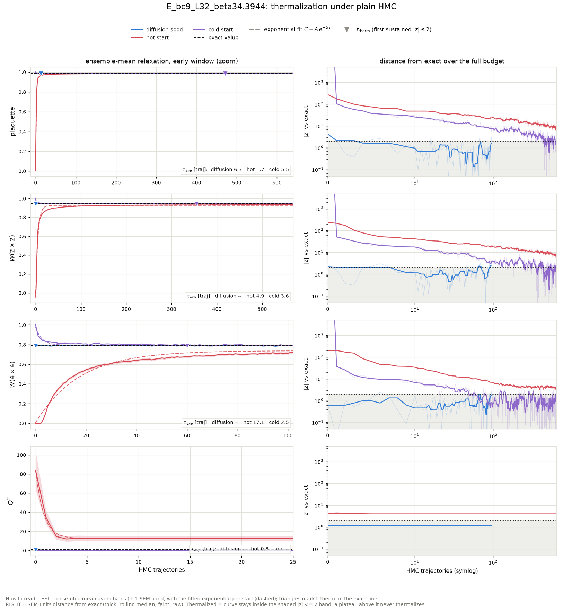

tau_int (hot-start chains, second half): plaquette = 8.96 +- 1.23, wilson_2x2 = 7.09 +- 1.16, wilson_4x4 = 3.29 +- 0.37, wilson_6x6 = 1.87 +- 0.28. Topology: hot-start HMC L=32 beta=34.3944 -> **frozen** (no tunneling).

Where 'never' stood at the end: the hot start ended the 640-trajectory budget still at plaquette at |z| ~ 8, wilson_2x2 at |z| ~ 8, wilson_4x4 at |z| ~ 4, wilson_6x6 at |z| ~ 4, Q^2 at |z| ~ 4; the cold start ended the 640-trajectory budget still at Q^2 at |z| ~ 765454843904.

### Diagnostics: raw diffusion output (before any HMC)

| observable | value | error | exact | z_exact | reference | ref_error | z_ref | ks_p | chi2_p |
|---|---|---|---|---|---|---|---|---|---|
| plaquette | 0.9851 | 5.851e-05 | 0.9854 | -4.153 | 0.9853 | 5.542e-05 | -2.044 | 0.04938 |  |
| wilson_1x1 | 0.9851 | 5.851e-05 | 0.9854 | -4.153 | 0.9853 | 5.542e-05 | -2.044 | 0.04938 |  |
| wilson_1x2 | 0.9702 | 0.0001554 | 0.9709 | -4.669 | 0.9708 | 0.0001383 | -3.037 | 0.004349 |  |
| wilson_2x2 | 0.942 | 0.0003928 | 0.9427 | -1.773 | 0.9426 | 0.0003632 | -1.113 | 0.1251 |  |
| wilson_2x3 | 0.9148 | 0.0006897 | 0.9153 | -0.6242 | 0.9154 | 0.000571 | -0.6075 | 0.3584 |  |
| wilson_3x3 | 0.8767 | 0.001091 | 0.8756 | 0.9319 | 0.875 | 0.001084 | 1.064 | 0.2087 |  |
| wilson_3x4 | 0.839 | 0.001591 | 0.8377 | 0.7661 | 0.837 | 0.001503 | 0.8895 | 0.3294 |  |
| wilson_4x4 | 0.7909 | 0.002172 | 0.7897 | 0.5314 | 0.7883 | 0.002251 | 0.8205 | 0.3021 |  |
| wilson_4x5 | 0.7466 | 0.002939 | 0.7445 | 0.7152 | 0.7429 | 0.002834 | 0.9087 | 0.2763 |  |
| wilson_5x5 | 0.6951 | 0.003854 | 0.6915 | 0.9207 | 0.6883 | 0.003517 | 1.303 | 0.1004 |  |
| wilson_5x6 | 0.6463 | 0.004849 | 0.6423 | 0.809 | 0.6392 | 0.004245 | 1.09 | 0.08971 |  |
| wilson_6x6 | 0.5929 | 0.005673 | 0.5879 | 0.8739 | 0.5824 | 0.004772 | 1.414 | 0.04938 |  |
| wilson_6x7 | 0.5444 | 0.006763 | 0.5381 | 0.9301 | 0.5327 | 0.005586 | 1.334 | 0.07995 |  |
| wilson_7x7 | 0.4934 | 0.007412 | 0.4853 | 1.09 | 0.4782 | 0.006248 | 1.564 | 0.1545 |  |
| wilson_7x8 | 0.4467 | 0.008548 | 0.4377 | 1.054 | 0.4298 | 0.00682 | 1.544 | 0.389 |  |
| wilson_8x8 | 0.3997 | 0.008917 | 0.389 | 1.204 | 0.3809 | 0.007388 | 1.624 | 0.389 |  |
| wilson_8x10 | 0.3178 | 0.01062 | 0.3072 | 0.9996 | 0.3 | 0.007613 | 1.364 | 0.5259 |  |
| wilson_10x10 | 0.2385 | 0.01137 | 0.2287 | 0.8669 | 0.2164 | 0.007673 | 1.613 | 0.4548 |  |
| wilson_10x12 | 0.1826 | 0.01174 | 0.1702 | 1.049 | 0.1586 | 0.0074 | 1.728 | 0.3584 |  |
| wilson_12x12 | 0.1274 | 0.01154 | 0.1195 | 0.6853 | 0.1012 | 0.00803 | 1.864 | 0.1251 |  |
| creutz_2 | 0.01425 | 0.0001975 | 0.01475 | -2.579 |  |  |  |  |  |
| creutz_3 | 0.01339 | 0.0003938 | 0.01475 | -3.46 |  |  |  |  |  |
| creutz_4 | 0.01504 | 0.000702 | 0.01475 | 0.4098 |  |  |  |  |  |
| creutz_5 | 0.01382 | 0.000966 | 0.01475 | -0.972 |  |  |  |  |  |
| creutz_6 | 0.01342 | 0.00145 | 0.01475 | -0.9221 |  |  |  |  |  |
| creutz_7 | 0.01308 | 0.001842 | 0.01475 | -0.9065 |  |  |  |  |  |
| creutz_8 | 0.01176 | 0.002813 | 0.01475 | -1.066 |  |  |  |  |  |
| Q | -0.0625 | 0.07143 | 0 | -0.8749 | 0.1042 | 0.044 | -1.987 | 0.6395 |  |
| Q^2 | 0.6719 | 0.08187 | 0.7655 | -1.143 | 0.6771 | 0.0694 | -0.04853 | 1 |  |
| chi_top ((<Q^2>-<Q>^2)/V) | 0.0006523 | 7.765e-05 | 0.0007475 | -1.226 | 0.0006506 | 6.518e-05 | 0.01672 | 9.934e-16 |  |
| Q histogram vs exact P(Q) | 1.885 | nan | 4 | nan |  |  |  |  | 0.7569 |

### Diagnostics: the same configs after 96 HMC trajectories

| observable | value | error | exact | z_exact | reference | ref_error | z_ref | ks_p | chi2_p |
|---|---|---|---|---|---|---|---|---|---|
| plaquette | 0.9853 | 5.03e-05 | 0.9854 | -1.821 | 0.9853 | 5.542e-05 | -0.1787 | 0.9693 |  |
| wilson_1x1 | 0.9853 | 5.03e-05 | 0.9854 | -1.821 | 0.9853 | 5.542e-05 | -0.1787 | 0.9693 |  |
| wilson_1x2 | 0.9707 | 0.0001051 | 0.9709 | -1.977 | 0.9708 | 0.0001383 | -0.6581 | 0.9353 |  |
| wilson_2x2 | 0.9419 | 0.0002519 | 0.9427 | -3.161 | 0.9426 | 0.0003632 | -1.574 | 0.1251 |  |
| wilson_2x3 | 0.914 | 0.0004376 | 0.9153 | -2.822 | 0.9154 | 0.000571 | -1.874 | 0.02248 |  |
| wilson_3x3 | 0.8738 | 0.0007245 | 0.8756 | -2.509 | 0.875 | 0.001084 | -0.9188 | 0.05588 |  |
| wilson_3x4 | 0.8355 | 0.001089 | 0.8377 | -2.095 | 0.837 | 0.001503 | -0.8369 | 0.1712 |  |
| wilson_4x4 | 0.7865 | 0.001438 | 0.7897 | -2.269 | 0.7883 | 0.002251 | -0.6932 | 0.2087 |  |
| wilson_4x5 | 0.7414 | 0.001994 | 0.7445 | -1.522 | 0.7429 | 0.002834 | -0.412 | 0.1712 |  |
| wilson_5x5 | 0.6875 | 0.002459 | 0.6915 | -1.65 | 0.6883 | 0.003517 | -0.1888 | 0.1122 |  |
| wilson_5x6 | 0.6388 | 0.002978 | 0.6423 | -1.193 | 0.6392 | 0.004245 | -0.087 | 0.08971 |  |
| wilson_6x6 | 0.5839 | 0.003377 | 0.5879 | -1.187 | 0.5824 | 0.004772 | 0.2595 | 0.1004 |  |
| wilson_6x7 | 0.5356 | 0.004016 | 0.5381 | -0.6357 | 0.5327 | 0.005586 | 0.4159 | 0.04354 |  |
| wilson_7x7 | 0.4837 | 0.004452 | 0.4853 | -0.3601 | 0.4782 | 0.006248 | 0.7136 | 0.2522 |  |
| wilson_7x8 | 0.4387 | 0.005345 | 0.4377 | 0.1931 | 0.4298 | 0.00682 | 1.028 | 0.4548 |  |
| wilson_8x8 | 0.3918 | 0.005938 | 0.389 | 0.4744 | 0.3809 | 0.007388 | 1.149 | 0.4548 |  |
| wilson_8x10 | 0.3157 | 0.007509 | 0.3072 | 1.136 | 0.3 | 0.007613 | 1.472 | 0.6011 |  |
| wilson_10x10 | 0.2424 | 0.008306 | 0.2287 | 1.649 | 0.2164 | 0.007673 | 2.297 | 0.1545 |  |
| wilson_10x12 | 0.182 | 0.008411 | 0.1702 | 1.392 | 0.1586 | 0.0074 | 2.086 | 0.1004 |  |
| wilson_12x12 | 0.1281 | 0.008568 | 0.1195 | 1.007 | 0.1012 | 0.00803 | 2.293 | 0.0631 |  |
| creutz_2 | 0.01526 | 0.0002067 | 0.01475 | 2.467 |  |  |  |  |  |
| creutz_3 | 0.01498 | 0.0003796 | 0.01475 | 0.5885 |  |  |  |  |  |
| creutz_4 | 0.01552 | 0.0007259 | 0.01475 | 1.058 |  |  |  |  |  |
| creutz_5 | 0.01661 | 0.001048 | 0.01475 | 1.772 |  |  |  |  |  |
| creutz_6 | 0.01639 | 0.001637 | 0.01475 | 1.002 |  |  |  |  |  |
| creutz_7 | 0.01539 | 0.002312 | 0.01475 | 0.276 |  |  |  |  |  |
| creutz_8 | 0.01556 | 0.003417 | 0.01475 | 0.2357 |  |  |  |  |  |
| Q | -0.0625 | 0.07143 | 0 | -0.8749 | 0.1042 | 0.044 | -1.987 | 0.6395 |  |
| Q^2 | 0.6719 | 0.08187 | 0.7655 | -1.143 | 0.6771 | 0.0694 | -0.04853 | 1 |  |
| chi_top ((<Q^2>-<Q>^2)/V) | 0.0006523 | 7.765e-05 | 0.0007475 | -1.226 | 0.0006506 | 6.518e-05 | 0.01672 | 9.934e-16 |  |
| Q histogram vs exact P(Q) | 1.885 | nan | 4 | nan |  |  |  |  | 0.7569 |

## E_bc11.8_L32_beta45.6238

HMC: step size 0.0592, 17 leapfrog steps, acceptance seed/hot/cold = 0.981/0.982/0.983. Diffusion-seed batch: 128 chains x 96 trajectories (0.10 s/traj for the whole batch); baselines: 32 chains x 640 trajectories.

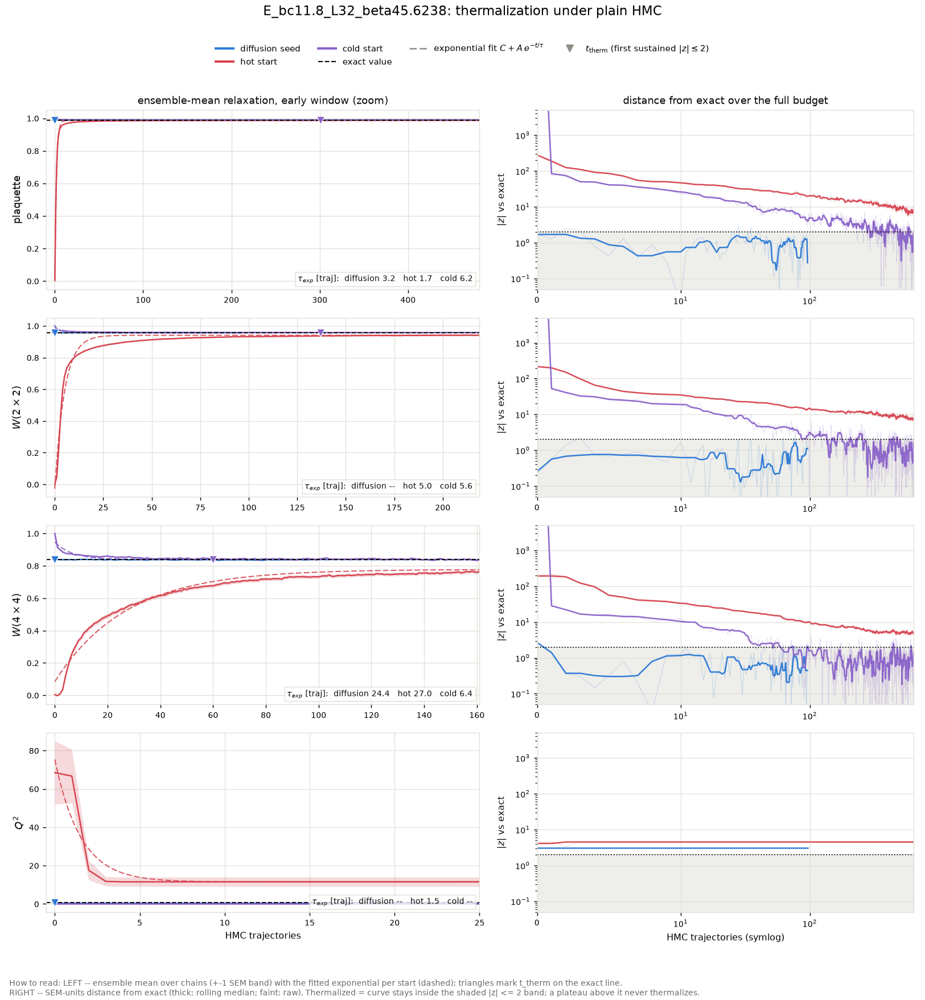

tau_int (hot-start chains, second half): plaquette = 12.69 +- 1.72, wilson_2x2 = 12.19 +- 1.69, wilson_4x4 = 5.29 +- 0.58, wilson_6x6 = 3.72 +- 0.45. Topology: hot-start HMC L=32 beta=45.6238 -> **frozen** (no tunneling).

Where 'never' stood at the end: the hot start ended the 640-trajectory budget still at plaquette at |z| ~ 8, wilson_2x2 at |z| ~ 7, wilson_4x4 at |z| ~ 5, wilson_6x6 at |z| ~ 5, Q^2 at |z| ~ 5; the cold start ended the 640-trajectory budget still at Q^2 at |z| ~ 574600642560.

### Diagnostics: raw diffusion output (before any HMC)

| observable | value | error | exact | z_exact | reference | ref_error | z_ref | ks_p | chi2_p |
|---|---|---|---|---|---|---|---|---|---|
| plaquette | 0.9889 | 4.677e-05 | 0.989 | -1.546 | 0.989 | 2.625e-05 | -2.506 | 0.01957 |  |
| wilson_1x1 | 0.9889 | 4.677e-05 | 0.989 | -1.546 | 0.989 | 2.625e-05 | -2.506 | 0.01957 |  |
| wilson_1x2 | 0.9778 | 9.281e-05 | 0.9781 | -3.107 | 0.9781 | 7.278e-05 | -2.889 | 0.01474 |  |
| wilson_2x2 | 0.9567 | 0.0002214 | 0.9566 | 0.2777 | 0.9566 | 0.0001525 | 0.5057 | 0.8864 |  |
| wilson_2x3 | 0.9364 | 0.0004026 | 0.9357 | 1.732 | 0.9357 | 0.0003271 | 1.293 | 0.8864 |  |
| wilson_3x3 | 0.9074 | 0.0006437 | 0.9051 | 3.683 | 0.9046 | 0.0005545 | 3.308 | 0.009477 |  |
| wilson_3x4 | 0.8786 | 0.0009801 | 0.8755 | 3.169 | 0.8751 | 0.0008198 | 2.723 | 0.011 |  |
| wilson_4x4 | 0.8415 | 0.001417 | 0.8375 | 2.805 | 0.8371 | 0.001179 | 2.411 | 0.02947 |  |
| wilson_4x5 | 0.8066 | 0.00189 | 0.8012 | 2.828 | 0.8007 | 0.001639 | 2.36 | 0.017 |  |
| wilson_5x5 | 0.765 | 0.002469 | 0.758 | 2.816 | 0.7568 | 0.002111 | 2.526 | 0.0631 |  |
| wilson_5x6 | 0.7244 | 0.00321 | 0.7172 | 2.252 | 0.716 | 0.002735 | 1.986 | 0.05588 |  |
| wilson_6x6 | 0.6793 | 0.004096 | 0.671 | 2.012 | 0.6701 | 0.003339 | 1.727 | 0.1004 |  |
| wilson_6x7 | 0.6367 | 0.005075 | 0.6279 | 1.747 | 0.6275 | 0.003881 | 1.441 | 0.1892 |  |
| wilson_7x7 | 0.5909 | 0.006007 | 0.581 | 1.65 | 0.5812 | 0.004506 | 1.29 | 0.3584 |  |
| wilson_7x8 | 0.5471 | 0.007159 | 0.5376 | 1.315 | 0.538 | 0.005049 | 1.037 | 0.4548 |  |
| wilson_8x8 | 0.5017 | 0.008169 | 0.492 | 1.187 | 0.4916 | 0.005659 | 1.014 | 0.5259 |  |
| wilson_8x10 | 0.4182 | 0.01074 | 0.4121 | 0.5708 | 0.4126 | 0.006991 | 0.4404 | 0.7538 |  |
| wilson_10x10 | 0.3353 | 0.01219 | 0.3302 | 0.4228 | 0.328 | 0.00746 | 0.5115 | 0.4898 |  |
| wilson_10x12 | 0.2652 | 0.01442 | 0.2646 | 0.04515 | 0.2657 | 0.008113 | -0.03079 | 0.9126 |  |
| wilson_12x12 | 0.2038 | 0.01539 | 0.2028 | 0.06149 | 0.1995 | 0.00852 | 0.2415 | 0.7163 |  |
| creutz_2 | 0.0105 | 0.000146 | 0.01108 | -3.979 |  |  |  |  |  |
| creutz_3 | 0.009891 | 0.0003082 | 0.01108 | -3.863 |  |  |  |  |  |
| creutz_4 | 0.01081 | 0.0004619 | 0.01108 | -0.5772 |  |  |  |  |  |
| creutz_5 | 0.01052 | 0.0008526 | 0.01108 | -0.6588 |  |  |  |  |  |
| creutz_6 | 0.009804 | 0.001145 | 0.01108 | -1.115 |  |  |  |  |  |
| creutz_7 | 0.009995 | 0.001752 | 0.01108 | -0.6197 |  |  |  |  |  |
| creutz_8 | 0.009366 | 0.002401 | 0.01108 | -0.7135 |  |  |  |  |  |
| Q | -0.03125 | 0.05276 | 0 | -0.5923 | 0.01562 | 0.05112 | -0.6381 | 0.9989 |  |
| Q^2 | 0.4375 | 0.04372 | 0.5746 | -3.136 | 0.5365 | 0.04806 | -1.523 | 0.9999 |  |
| chi_top ((<Q^2>-<Q>^2)/V) | 0.0004263 | 4.298e-05 | 0.0005611 | -3.138 | 0.0005236 | 4.749e-05 | -1.52 | 6.598e-20 |  |
| Q histogram vs exact P(Q) | 4.761 | nan | 4 | nan |  |  |  |  | 0.3127 |

### Diagnostics: the same configs after 96 HMC trajectories

| observable | value | error | exact | z_exact | reference | ref_error | z_ref | ks_p | chi2_p |
|---|---|---|---|---|---|---|---|---|---|
| plaquette | 0.989 | 5.242e-05 | 0.989 | -0.2481 | 0.989 | 2.625e-05 | -1.281 | 0.03364 |  |
| wilson_1x1 | 0.989 | 5.242e-05 | 0.989 | -0.2481 | 0.989 | 2.625e-05 | -1.281 | 0.03364 |  |
| wilson_1x2 | 0.9781 | 0.0001245 | 0.9781 | -0.2245 | 0.9781 | 7.278e-05 | -0.5568 | 0.678 |  |
| wilson_2x2 | 0.9563 | 0.000295 | 0.9566 | -1.007 | 0.9566 | 0.0001525 | -0.6703 | 0.3584 |  |
| wilson_2x3 | 0.9353 | 0.0005249 | 0.9357 | -0.7608 | 0.9357 | 0.0003271 | -0.6887 | 0.1712 |  |
| wilson_3x3 | 0.9045 | 0.0008479 | 0.9051 | -0.6395 | 0.9046 | 0.0005545 | -0.1009 | 0.08971 |  |
| wilson_3x4 | 0.8746 | 0.001221 | 0.8755 | -0.7068 | 0.8751 | 0.0008198 | -0.3326 | 0.3294 |  |
| wilson_4x4 | 0.8368 | 0.001722 | 0.8375 | -0.4034 | 0.8371 | 0.001179 | -0.1077 | 0.2522 |  |
| wilson_4x5 | 0.8004 | 0.002354 | 0.8012 | -0.3424 | 0.8007 | 0.001639 | -0.08616 | 0.6011 |  |
| wilson_5x5 | 0.7581 | 0.003074 | 0.758 | 0.03243 | 0.7568 | 0.002111 | 0.3627 | 0.7538 |  |
| wilson_5x6 | 0.7178 | 0.003947 | 0.7172 | 0.1511 | 0.716 | 0.002735 | 0.3632 | 0.9353 |  |
| wilson_6x6 | 0.672 | 0.004761 | 0.671 | 0.2093 | 0.6701 | 0.003339 | 0.3237 | 0.7538 |  |
| wilson_6x7 | 0.6298 | 0.005827 | 0.6279 | 0.3377 | 0.6275 | 0.003881 | 0.3297 | 0.8569 |  |
| wilson_7x7 | 0.5844 | 0.00671 | 0.581 | 0.5009 | 0.5812 | 0.004506 | 0.3882 | 0.8864 |  |
| wilson_7x8 | 0.543 | 0.007892 | 0.5376 | 0.6835 | 0.538 | 0.005049 | 0.5409 | 0.8569 |  |
| wilson_8x8 | 0.4989 | 0.0085 | 0.492 | 0.802 | 0.4916 | 0.005659 | 0.7054 | 0.6011 |  |
| wilson_8x10 | 0.4224 | 0.0102 | 0.4121 | 1.014 | 0.4126 | 0.006991 | 0.7967 | 0.678 |  |
| wilson_10x10 | 0.3446 | 0.01096 | 0.3302 | 1.317 | 0.328 | 0.00746 | 1.252 | 0.389 |  |
| wilson_10x12 | 0.2815 | 0.01216 | 0.2646 | 1.389 | 0.2657 | 0.008113 | 1.076 | 0.1892 |  |
| wilson_12x12 | 0.2217 | 0.01233 | 0.2028 | 1.53 | 0.1995 | 0.00852 | 1.479 | 0.2763 |  |
| creutz_2 | 0.01135 | 0.0001638 | 0.01108 | 1.627 |  |  |  |  |  |
| creutz_3 | 0.01114 | 0.0003192 | 0.01108 | 0.1756 |  |  |  |  |  |
| creutz_4 | 0.01054 | 0.0005043 | 0.01108 | -1.079 |  |  |  |  |  |
| creutz_5 | 0.009766 | 0.0008941 | 0.01108 | -1.471 |  |  |  |  |  |
| creutz_6 | 0.01113 | 0.001316 | 0.01108 | 0.03635 |  |  |  |  |  |
| creutz_7 | 0.01009 | 0.001753 | 0.01108 | -0.567 |  |  |  |  |  |
| creutz_8 | 0.01152 | 0.002359 | 0.01108 | 0.185 |  |  |  |  |  |
| Q | -0.03125 | 0.05276 | 0 | -0.5923 | 0.01562 | 0.05112 | -0.6381 | 0.9989 |  |
| Q^2 | 0.4375 | 0.04372 | 0.5746 | -3.136 | 0.5365 | 0.04806 | -1.523 | 0.9999 |  |
| chi_top ((<Q^2>-<Q>^2)/V) | 0.0004263 | 4.298e-05 | 0.0005611 | -3.138 | 0.0005236 | 4.749e-05 | -1.52 | 6.598e-20 |  |
| Q histogram vs exact P(Q) | 4.761 | nan | 4 | nan |  |  |  |  | 0.3127 |

## D_bc14.1464_L32_beta55.0237

HMC: step size 0.0539, 19 leapfrog steps, acceptance seed/hot/cold = 0.976/0.976/0.977. Diffusion-seed batch: 128 chains x 96 trajectories (0.12 s/traj for the whole batch); baselines: 32 chains x 640 trajectories.

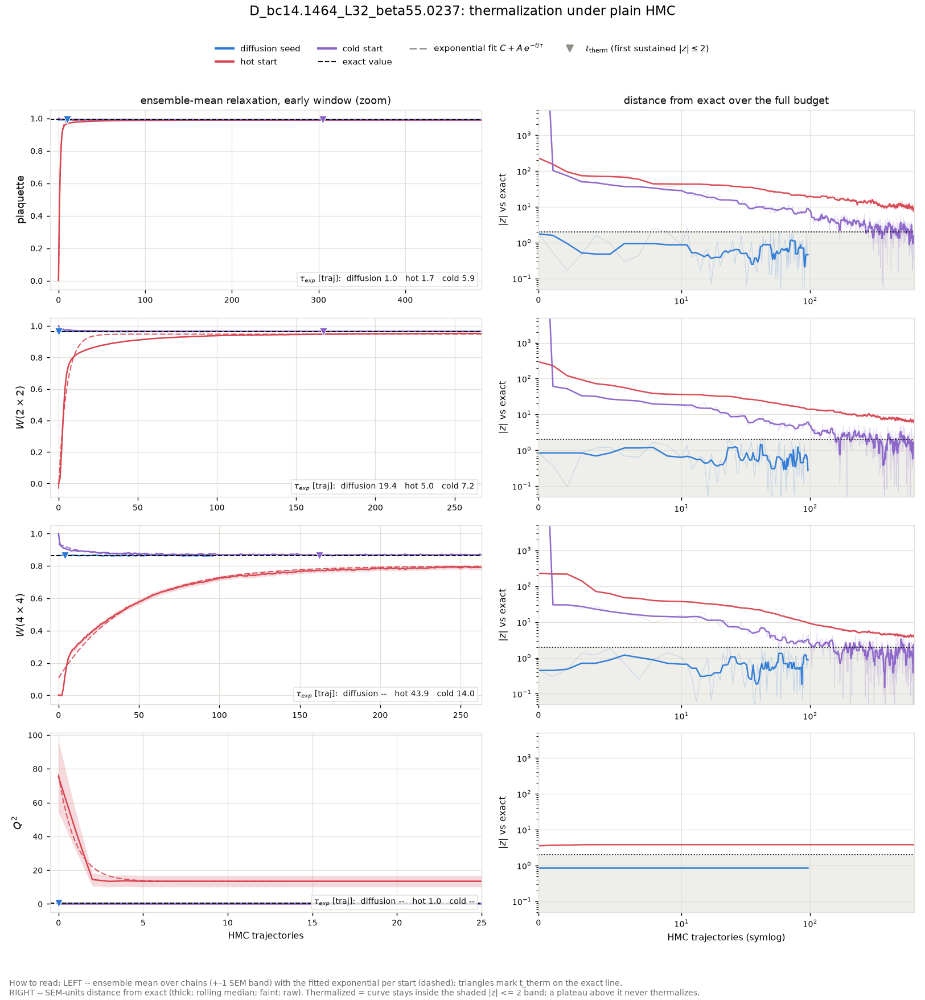

tau_int (hot-start chains, second half): plaquette = 10.78 +- 1.69, wilson_2x2 = 12.93 +- 1.75, wilson_4x4 = 8.81 +- 1.28, wilson_6x6 = 5.30 +- 0.84. Topology: hot-start HMC L=32 beta=55.0237 -> **frozen** (no tunneling).

Where 'never' stood at the end: the hot start ended the 640-trajectory budget still at plaquette at |z| ~ 9, wilson_2x2 at |z| ~ 6, wilson_4x4 at |z| ~ 4, wilson_6x6 at |z| ~ 4, Q^2 at |z| ~ 4; the cold start ended the 640-trajectory budget still at Q^2 at |z| ~ 474280296448.

### Diagnostics: raw diffusion output (before any HMC)

| observable | value | error | exact | z_exact | reference | ref_error | z_ref | ks_p | chi2_p |
|---|---|---|---|---|---|---|---|---|---|
| plaquette | 0.9908 | 4.69e-05 | 0.9909 | -1.453 | 0.9909 | 2.444e-05 | -1.93 | 0.004349 |  |
| wilson_1x1 | 0.9908 | 4.69e-05 | 0.9909 | -1.453 | 0.9909 | 2.444e-05 | -1.93 | 0.004349 |  |
| wilson_1x2 | 0.9816 | 0.0001192 | 0.9818 | -2.191 | 0.9819 | 7.31e-05 | -2.716 | 0.005104 |  |
| wilson_2x2 | 0.9638 | 0.0002074 | 0.964 | -0.9166 | 0.9639 | 0.0001733 | -0.5123 | 0.9353 |  |
| wilson_2x3 | 0.9465 | 0.000407 | 0.9465 | 0.1087 | 0.9465 | 0.0002711 | -0.01139 | 0.678 |  |
| wilson_3x3 | 0.9214 | 0.0006591 | 0.9208 | 1.008 | 0.9203 | 0.0005043 | 1.433 | 0.678 |  |
| wilson_3x4 | 0.8968 | 0.00103 | 0.8958 | 0.9408 | 0.8945 | 0.000682 | 1.8 | 0.2522 |  |
| wilson_4x4 | 0.8641 | 0.001522 | 0.8635 | 0.3981 | 0.8615 | 0.0009644 | 1.435 | 0.2522 |  |
| wilson_4x5 | 0.8336 | 0.002072 | 0.8324 | 0.5819 | 0.8296 | 0.001243 | 1.688 | 0.2522 |  |
| wilson_5x5 | 0.7961 | 0.002778 | 0.7951 | 0.339 | 0.792 | 0.00156 | 1.271 | 0.1122 |  |
| wilson_5x6 | 0.7607 | 0.003483 | 0.7595 | 0.3454 | 0.7558 | 0.001778 | 1.259 | 0.1892 |  |
| wilson_6x6 | 0.7193 | 0.004437 | 0.7188 | 0.0986 | 0.7151 | 0.002108 | 0.849 | 0.2522 |  |
| wilson_6x7 | 0.6817 | 0.005237 | 0.6804 | 0.2481 | 0.6763 | 0.002406 | 0.9309 | 0.2087 |  |
| wilson_7x7 | 0.6386 | 0.006361 | 0.6381 | 0.07743 | 0.6345 | 0.002901 | 0.5863 | 0.3584 |  |
| wilson_7x8 | 0.6003 | 0.00725 | 0.5984 | 0.2617 | 0.5954 | 0.003295 | 0.6224 | 0.1892 |  |
| wilson_8x8 | 0.5572 | 0.008416 | 0.5561 | 0.1323 | 0.5528 | 0.003793 | 0.4773 | 0.4212 |  |
| wilson_8x10 | 0.4841 | 0.01035 | 0.4802 | 0.3745 | 0.4789 | 0.005103 | 0.4501 | 0.3021 |  |
| wilson_10x10 | 0.4003 | 0.01239 | 0.3998 | 0.04238 | 0.3977 | 0.006532 | 0.1908 | 0.3584 |  |
| wilson_10x12 | 0.3366 | 0.01458 | 0.3329 | 0.2517 | 0.3333 | 0.007424 | 0.2009 | 0.5259 |  |
| wilson_12x12 | 0.2642 | 0.0153 | 0.2672 | -0.1969 | 0.2682 | 0.008271 | -0.2281 | 0.2763 |  |
| creutz_2 | 0.008905 | 0.0001304 | 0.009171 | -2.039 |  |  |  |  |  |
| creutz_3 | 0.00874 | 0.0002627 | 0.00917 | -1.638 |  |  |  |  |  |
| creutz_4 | 0.00991 | 0.0004547 | 0.00917 | 1.629 |  |  |  |  |  |
| creutz_5 | 0.01018 | 0.0007324 | 0.009169 | 1.379 |  |  |  |  |  |
| creutz_6 | 0.01054 | 0.001054 | 0.009167 | 1.303 |  |  |  |  |  |
| creutz_7 | 0.0116 | 0.001435 | 0.009165 | 1.697 |  |  |  |  |  |
| creutz_8 | 0.01272 | 0.001878 | 0.009162 | 1.895 |  |  |  |  |  |
| Q | -0.02344 | 0.07242 | 0 | -0.3236 | -0.02604 | 0.05199 | 0.02921 | 1 |  |
| Q^2 | 0.4297 | 0.06274 | 0.4743 | -0.7107 | 0.4427 | 0.04931 | -0.1632 | 1 |  |
| chi_top ((<Q^2>-<Q>^2)/V) | 0.0004191 | 5.982e-05 | 0.0004632 | -0.7369 | 0.0004317 | 4.823e-05 | -0.1638 | 1.245e-25 |  |
| Q histogram vs exact P(Q) | 0.07076 | nan | 2 | nan |  |  |  |  | 0.9652 |

### Diagnostics: the same configs after 96 HMC trajectories

| observable | value | error | exact | z_exact | reference | ref_error | z_ref | ks_p | chi2_p |
|---|---|---|---|---|---|---|---|---|---|
| plaquette | 0.9909 | 3.47e-05 | 0.9909 | 0.4642 | 0.9909 | 2.444e-05 | -0.4206 | 0.3584 |  |
| wilson_1x1 | 0.9909 | 3.47e-05 | 0.9909 | 0.4642 | 0.9909 | 2.444e-05 | -0.4206 | 0.3584 |  |
| wilson_1x2 | 0.9818 | 9.29e-05 | 0.9818 | -0.3126 | 0.9819 | 7.31e-05 | -1.25 | 0.08971 |  |
| wilson_2x2 | 0.9639 | 0.0002228 | 0.964 | -0.2297 | 0.9639 | 0.0001733 | 0.0017 | 0.2763 |  |
| wilson_2x3 | 0.9464 | 0.0004451 | 0.9465 | -0.2228 | 0.9465 | 0.0002711 | -0.2858 | 0.7901 |  |
| wilson_3x3 | 0.9205 | 0.0007076 | 0.9208 | -0.3433 | 0.9203 | 0.0005043 | 0.3247 | 0.7538 |  |
| wilson_3x4 | 0.8952 | 0.001097 | 0.8958 | -0.5673 | 0.8945 | 0.000682 | 0.4903 | 0.4898 |  |
| wilson_4x4 | 0.8623 | 0.001558 | 0.8635 | -0.7892 | 0.8615 | 0.0009644 | 0.4093 | 0.7538 |  |
| wilson_4x5 | 0.8303 | 0.002069 | 0.8324 | -1.052 | 0.8296 | 0.001243 | 0.2881 | 0.5259 |  |
| wilson_5x5 | 0.7926 | 0.002667 | 0.7951 | -0.9444 | 0.792 | 0.00156 | 0.1908 | 0.7901 |  |
| wilson_5x6 | 0.7557 | 0.003222 | 0.7595 | -1.189 | 0.7558 | 0.001778 | -0.02989 | 0.8246 |  |
| wilson_6x6 | 0.7149 | 0.003986 | 0.7188 | -0.9809 | 0.7151 | 0.002108 | -0.03914 | 0.8569 |  |
| wilson_6x7 | 0.6758 | 0.00483 | 0.6804 | -0.935 | 0.6763 | 0.002406 | -0.08354 | 0.3294 |  |
| wilson_7x7 | 0.6338 | 0.005568 | 0.6381 | -0.7602 | 0.6345 | 0.002901 | -0.0998 | 0.6395 |  |
| wilson_7x8 | 0.5941 | 0.006378 | 0.5984 | -0.6714 | 0.5954 | 0.003295 | -0.1703 | 0.9807 |  |
| wilson_8x8 | 0.5528 | 0.007656 | 0.5561 | -0.4347 | 0.5528 | 0.003793 | -0.00408 | 0.9542 |  |
| wilson_8x10 | 0.4778 | 0.009614 | 0.4802 | -0.2527 | 0.4789 | 0.005103 | -0.1021 | 0.9807 |  |
| wilson_10x10 | 0.4009 | 0.01169 | 0.3998 | 0.09061 | 0.3977 | 0.006532 | 0.2395 | 0.9888 |  |
| wilson_10x12 | 0.3361 | 0.01326 | 0.3329 | 0.2386 | 0.3333 | 0.007424 | 0.1831 | 0.9353 |  |
| wilson_12x12 | 0.275 | 0.01436 | 0.2672 | 0.5436 | 0.2682 | 0.008271 | 0.4135 | 0.678 |  |
| creutz_2 | 0.009148 | 0.0001249 | 0.009171 | -0.1788 |  |  |  |  |  |
| creutz_3 | 0.009278 | 0.0002728 | 0.00917 | 0.3937 |  |  |  |  |  |
| creutz_4 | 0.009469 | 0.0005001 | 0.00917 | 0.599 |  |  |  |  |  |
| creutz_5 | 0.008528 | 0.000713 | 0.009169 | -0.898 |  |  |  |  |  |
| creutz_6 | 0.007683 | 0.001042 | 0.009167 | -1.424 |  |  |  |  |  |
| creutz_7 | 0.007954 | 0.00149 | 0.009165 | -0.8132 |  |  |  |  |  |
| creutz_8 | 0.007457 | 0.00204 | 0.009162 | -0.8357 |  |  |  |  |  |
| Q | -0.02344 | 0.07242 | 0 | -0.3236 | -0.02604 | 0.05199 | 0.02921 | 1 |  |
| Q^2 | 0.4297 | 0.06274 | 0.4743 | -0.7107 | 0.4427 | 0.04931 | -0.1632 | 1 |  |
| chi_top ((<Q^2>-<Q>^2)/V) | 0.0004191 | 5.982e-05 | 0.0004632 | -0.7369 | 0.0004317 | 4.823e-05 | -0.1638 | 1.245e-25 |  |
| Q histogram vs exact P(Q) | 0.07076 | nan | 2 | nan |  |  |  |  | 0.9652 |

## E_bc18_L32_beta70.4526

HMC: step size 0.0477, 21 leapfrog steps, acceptance seed/hot/cold = 0.977/0.975/0.977. Diffusion-seed batch: 128 chains x 96 trajectories (0.12 s/traj for the whole batch); baselines: 32 chains x 640 trajectories.

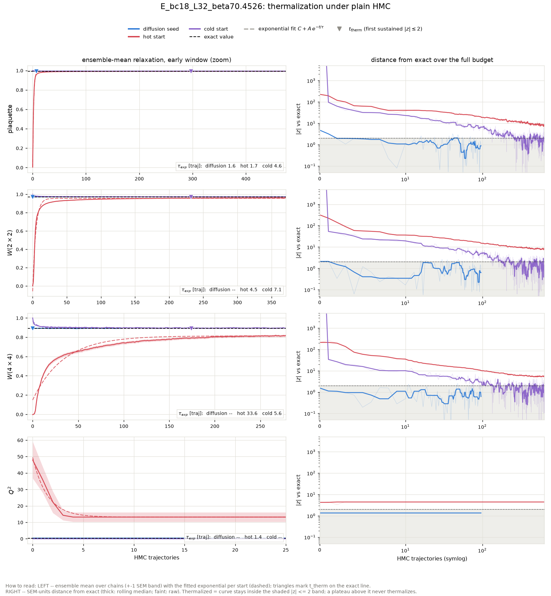

tau_int (hot-start chains, second half): plaquette = 10.06 +- 1.21, wilson_2x2 = 13.52 +- 1.53, wilson_4x4 = 6.15 +- 0.84, wilson_6x6 = 3.90 +- 0.88. Topology: hot-start HMC L=32 beta=70.4526 -> **frozen** (no tunneling).

Where 'never' stood at the end: the hot start ended the 640-trajectory budget still at plaquette at |z| ~ 8, wilson_2x2 at |z| ~ 8, wilson_4x4 at |z| ~ 5, wilson_6x6 at |z| ~ 5, Q^2 at |z| ~ 4; the cold start ended the 640-trajectory budget still at Q^2 at |z| ~ 363637014528.

### Diagnostics: raw diffusion output (before any HMC)

| observable | value | error | exact | z_exact | reference | ref_error | z_ref | ks_p | chi2_p |
|---|---|---|---|---|---|---|---|---|---|
| plaquette | 0.9927 | 2.433e-05 | 0.9929 | -5.399 | 0.9929 | 1.97e-05 | -4.927 | 0.0004451 |  |
| wilson_1x1 | 0.9927 | 2.433e-05 | 0.9929 | -5.399 | 0.9929 | 1.97e-05 | -4.927 | 0.0004451 |  |
| wilson_1x2 | 0.9854 | 6.015e-05 | 0.9858 | -6.181 | 0.9858 | 4.579e-05 | -4.91 | 0.004349 |  |
| wilson_2x2 | 0.9715 | 0.0001745 | 0.9718 | -1.81 | 0.9718 | 0.0001084 | -1.519 | 0.3584 |  |
| wilson_2x3 | 0.9579 | 0.0003078 | 0.958 | -0.4649 | 0.9581 | 0.0001531 | -0.5079 | 0.9353 |  |
| wilson_3x3 | 0.9383 | 0.0005609 | 0.9377 | 0.995 | 0.9379 | 0.0003195 | 0.5331 | 0.5631 |  |
| wilson_3x4 | 0.9186 | 0.0007412 | 0.9178 | 1.094 | 0.9182 | 0.0004329 | 0.4598 | 0.7163 |  |
| wilson_4x4 | 0.8935 | 0.001067 | 0.892 | 1.397 | 0.8922 | 0.0006709 | 1.025 | 0.1892 |  |
| wilson_4x5 | 0.8692 | 0.001388 | 0.8668 | 1.699 | 0.8668 | 0.0009644 | 1.415 | 0.3294 |  |
| wilson_5x5 | 0.8405 | 0.001827 | 0.8364 | 2.206 | 0.8364 | 0.001326 | 1.812 | 0.1545 |  |
| wilson_5x6 | 0.8114 | 0.00225 | 0.8071 | 1.904 | 0.8064 | 0.001889 | 1.694 | 0.1892 |  |
| wilson_6x6 | 0.7777 | 0.002739 | 0.7733 | 1.619 | 0.7729 | 0.002527 | 1.285 | 0.389 |  |
| wilson_6x7 | 0.7454 | 0.003338 | 0.7408 | 1.351 | 0.7397 | 0.003271 | 1.211 | 0.3584 |  |
| wilson_7x7 | 0.7098 | 0.004105 | 0.7047 | 1.239 | 0.7035 | 0.00421 | 1.085 | 0.3294 |  |
| wilson_7x8 | 0.6751 | 0.00481 | 0.6704 | 0.9649 | 0.6681 | 0.005199 | 0.989 | 0.3021 |  |
| wilson_8x8 | 0.6378 | 0.005631 | 0.6333 | 0.804 | 0.6308 | 0.006225 | 0.8274 | 0.5631 |  |
| wilson_8x10 | 0.5678 | 0.007408 | 0.565 | 0.3706 | 0.5604 | 0.008538 | 0.6554 | 0.4212 |  |
| wilson_10x10 | 0.4924 | 0.009108 | 0.4901 | 0.2553 | 0.4809 | 0.01106 | 0.804 | 0.2522 |  |
| wilson_10x12 | 0.4226 | 0.01073 | 0.4252 | -0.2362 | 0.4136 | 0.01302 | 0.5335 | 0.5259 |  |
| wilson_12x12 | 0.3561 | 0.0118 | 0.3587 | -0.2191 | 0.3457 | 0.01539 | 0.5361 | 0.4212 |  |
| creutz_2 | 0.00685 | 0.0001055 | 0.007147 | -2.815 |  |  |  |  |  |
| creutz_3 | 0.006576 | 0.0001877 | 0.007145 | -3.03 |  |  |  |  |  |
| creutz_4 | 0.006644 | 0.0002846 | 0.007141 | -1.746 |  |  |  |  |  |
| creutz_5 | 0.006094 | 0.0004657 | 0.007137 | -2.24 |  |  |  |  |  |
| creutz_6 | 0.007194 | 0.0007388 | 0.007131 | 0.0859 |  |  |  |  |  |
| creutz_7 | 0.006352 | 0.001064 | 0.007122 | -0.7232 |  |  |  |  |  |
| creutz_8 | 0.006593 | 0.001258 | 0.007111 | -0.4114 |  |  |  |  |  |
| Q | -0.1016 | 0.05918 | 0 | -1.716 | -0.03125 | 0.04475 | -0.9477 | 0.9807 |  |
| Q^2 | 0.4453 | 0.05796 | 0.3636 | 1.409 | 0.375 | 0.03841 | 1.011 | 0.9996 |  |
| chi_top ((<Q^2>-<Q>^2)/V) | 0.0004248 | 5.972e-05 | 0.0003551 | 1.167 | 0.0003653 | 3.749e-05 | 0.8444 | 3.831e-30 |  |
| Q histogram vs exact P(Q) | 5.165 | nan | 2 | nan |  |  |  |  | 0.07558 |

### Diagnostics: the same configs after 96 HMC trajectories

| observable | value | error | exact | z_exact | reference | ref_error | z_ref | ks_p | chi2_p |
|---|---|---|---|---|---|---|---|---|---|
| plaquette | 0.9929 | 2.928e-05 | 0.9929 | 0.8846 | 0.9929 | 1.97e-05 | 0.085 | 0.8569 |  |
| wilson_1x1 | 0.9929 | 2.928e-05 | 0.9929 | 0.8846 | 0.9929 | 1.97e-05 | 0.085 | 0.8569 |  |
| wilson_1x2 | 0.9859 | 8.193e-05 | 0.9858 | 0.6754 | 0.9858 | 4.579e-05 | 0.5959 | 0.5259 |  |
| wilson_2x2 | 0.9719 | 0.0002026 | 0.9718 | 0.5681 | 0.9718 | 0.0001084 | 0.5171 | 0.8246 |  |
| wilson_2x3 | 0.9582 | 0.0003539 | 0.958 | 0.4887 | 0.9581 | 0.0001531 | 0.3667 | 0.6395 |  |
| wilson_3x3 | 0.9382 | 0.000636 | 0.9377 | 0.7067 | 0.9379 | 0.0003195 | 0.3309 | 0.2522 |  |
| wilson_3x4 | 0.9186 | 0.0009219 | 0.9178 | 0.8859 | 0.9182 | 0.0004329 | 0.3929 | 0.1892 |  |
| wilson_4x4 | 0.8927 | 0.001306 | 0.892 | 0.5897 | 0.8922 | 0.0006709 | 0.3896 | 0.2522 |  |
| wilson_4x5 | 0.8682 | 0.001706 | 0.8668 | 0.8209 | 0.8668 | 0.0009644 | 0.7318 | 0.4212 |  |
| wilson_5x5 | 0.8378 | 0.002292 | 0.8364 | 0.5857 | 0.8364 | 0.001326 | 0.5305 | 0.6011 |  |
| wilson_5x6 | 0.8084 | 0.002845 | 0.8071 | 0.4697 | 0.8064 | 0.001889 | 0.5941 | 0.389 |  |
| wilson_6x6 | 0.7737 | 0.003597 | 0.7733 | 0.1286 | 0.7729 | 0.002527 | 0.1856 | 0.7901 |  |
| wilson_6x7 | 0.7411 | 0.004381 | 0.7408 | 0.05928 | 0.7397 | 0.003271 | 0.258 | 0.7538 |  |
| wilson_7x7 | 0.7041 | 0.005218 | 0.7047 | -0.1298 | 0.7035 | 0.00421 | 0.09243 | 0.9126 |  |
| wilson_7x8 | 0.6695 | 0.006134 | 0.6704 | -0.1429 | 0.6681 | 0.005199 | 0.185 | 0.8864 |  |
| wilson_8x8 | 0.6311 | 0.007117 | 0.6333 | -0.3073 | 0.6308 | 0.006225 | 0.02435 | 0.9542 |  |
| wilson_8x10 | 0.5628 | 0.009156 | 0.565 | -0.2443 | 0.5604 | 0.008538 | 0.1938 | 0.8246 |  |
| wilson_10x10 | 0.4863 | 0.01107 | 0.4901 | -0.3411 | 0.4809 | 0.01106 | 0.3465 | 0.7538 |  |
| wilson_10x12 | 0.4226 | 0.01323 | 0.4252 | -0.1918 | 0.4136 | 0.01302 | 0.4847 | 0.6011 |  |
| wilson_12x12 | 0.3529 | 0.01464 | 0.3587 | -0.3935 | 0.3457 | 0.01539 | 0.34 | 0.678 |  |
| creutz_2 | 0.007115 | 0.0001099 | 0.007147 | -0.2936 |  |  |  |  |  |
| creutz_3 | 0.006908 | 0.0002334 | 0.007145 | -1.014 |  |  |  |  |  |
| creutz_4 | 0.007578 | 0.0003751 | 0.007141 | 1.164 |  |  |  |  |  |
| creutz_5 | 0.007899 | 0.0005567 | 0.007137 | 1.369 |  |  |  |  |  |
| creutz_6 | 0.008237 | 0.0007561 | 0.007131 | 1.464 |  |  |  |  |  |
| creutz_7 | 0.008187 | 0.001024 | 0.007122 | 1.039 |  |  |  |  |  |
| creutz_8 | 0.008915 | 0.001448 | 0.007111 | 1.247 |  |  |  |  |  |
| Q | -0.1016 | 0.05918 | 0 | -1.716 | -0.03125 | 0.04475 | -0.9477 | 0.9807 |  |
| Q^2 | 0.4453 | 0.05796 | 0.3636 | 1.409 | 0.375 | 0.03841 | 1.011 | 0.9996 |  |
| chi_top ((<Q^2>-<Q>^2)/V) | 0.0004248 | 5.972e-05 | 0.0003551 | 1.167 | 0.0003653 | 3.749e-05 | 0.8444 | 3.831e-30 |  |
| Q histogram vs exact P(Q) | 5.165 | nan | 2 | nan |  |  |  |  | 0.07558 |

## D_bc20_L32_beta78.4578

HMC: step size 0.0452, 22 leapfrog steps, acceptance seed/hot/cold = 0.979/0.979/0.979. Diffusion-seed batch: 128 chains x 96 trajectories (0.12 s/traj for the whole batch); baselines: 32 chains x 640 trajectories.

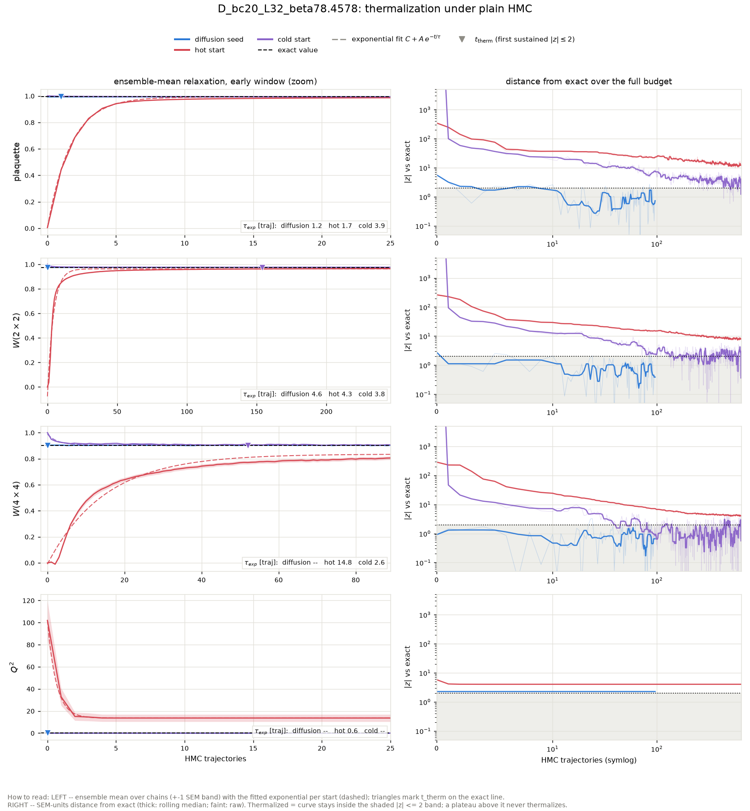

tau_int (hot-start chains, second half): plaquette = 7.47 +- 1.01, wilson_2x2 = 5.82 +- 0.84, wilson_4x4 = 3.72 +- 0.67, wilson_6x6 = 1.89 +- 0.17. Topology: hot-start HMC L=32 beta=78.4578 -> **frozen** (no tunneling).

Where 'never' stood at the end: the hot start ended the 640-trajectory budget still at plaquette at |z| ~ 12, wilson_2x2 at |z| ~ 8, wilson_4x4 at |z| ~ 4, wilson_6x6 at |z| ~ 5, Q^2 at |z| ~ 4; the cold start ended the 640-trajectory budget still at plaquette at |z| ~ 3, Q^2 at |z| ~ 320492732416.

### Diagnostics: raw diffusion output (before any HMC)

| observable | value | error | exact | z_exact | reference | ref_error | z_ref | ks_p | chi2_p |
|---|---|---|---|---|---|---|---|---|---|
| plaquette | 0.9935 | 2.639e-05 | 0.9936 | -5.804 | 0.9936 | 1.953e-05 | -5.82 | 1.026e-05 |  |
| wilson_1x1 | 0.9935 | 2.639e-05 | 0.9936 | -5.804 | 0.9936 | 1.953e-05 | -5.82 | 1.026e-05 |  |
| wilson_1x2 | 0.9869 | 6.213e-05 | 0.9873 | -4.993 | 0.9874 | 6.112e-05 | -5.402 | 9.223e-07 |  |
| wilson_2x2 | 0.9742 | 0.0001395 | 0.9747 | -3.062 | 0.975 | 0.0001493 | -3.713 | 0.02947 |  |
| wilson_2x3 | 0.9621 | 0.0002207 | 0.9623 | -0.5727 | 0.9626 | 0.0002739 | -1.413 | 0.3584 |  |
| wilson_3x3 | 0.9443 | 0.0003919 | 0.9439 | 0.9168 | 0.9441 | 0.000467 | 0.2925 | 0.5259 |  |
| wilson_3x4 | 0.9267 | 0.0004979 | 0.926 | 1.512 | 0.9259 | 0.0007017 | 0.9632 | 0.5259 |  |
| wilson_4x4 | 0.9035 | 0.0008464 | 0.9025 | 1.132 | 0.9025 | 0.0009604 | 0.802 | 0.389 |  |
| wilson_4x5 | 0.8814 | 0.001082 | 0.8797 | 1.588 | 0.8795 | 0.001286 | 1.123 | 0.2763 |  |
| wilson_5x5 | 0.8545 | 0.00154 | 0.852 | 1.625 | 0.8528 | 0.001728 | 0.7331 | 0.3584 |  |
| wilson_5x6 | 0.8284 | 0.001952 | 0.8251 | 1.669 | 0.8261 | 0.002158 | 0.787 | 0.3584 |  |
| wilson_6x6 | 0.7976 | 0.002604 | 0.7941 | 1.364 | 0.7958 | 0.002707 | 0.4797 | 0.5259 |  |
| wilson_6x7 | 0.769 | 0.003208 | 0.7642 | 1.508 | 0.7655 | 0.003254 | 0.7719 | 0.2297 |  |
| wilson_7x7 | 0.7362 | 0.003924 | 0.7307 | 1.386 | 0.7313 | 0.003837 | 0.8866 | 0.1251 |  |
| wilson_7x8 | 0.7054 | 0.004585 | 0.6988 | 1.452 | 0.6984 | 0.004552 | 1.093 | 0.1392 |  |
| wilson_8x8 | 0.6712 | 0.005656 | 0.664 | 1.277 | 0.6624 | 0.005122 | 1.156 | 0.1712 |  |
| wilson_8x10 | 0.6101 | 0.007173 | 0.5996 | 1.465 | 0.5983 | 0.006636 | 1.209 | 0.1545 |  |
| wilson_10x10 | 0.5402 | 0.009145 | 0.5279 | 1.339 | 0.5266 | 0.00805 | 1.114 | 0.4548 |  |
| wilson_10x12 | 0.4789 | 0.01052 | 0.465 | 1.321 | 0.4617 | 0.009044 | 1.242 | 0.3584 |  |
| wilson_12x12 | 0.4156 | 0.01211 | 0.3996 | 1.321 | 0.3921 | 0.009869 | 1.501 | 0.1545 |  |
| creutz_2 | 0.006376 | 8.351e-05 | 0.006412 | -0.4307 |  |  |  |  |  |
| creutz_3 | 0.006203 | 0.0001972 | 0.006408 | -1.039 |  |  |  |  |  |
| creutz_4 | 0.006586 | 0.0003494 | 0.006403 | 0.5259 |  |  |  |  |  |
| creutz_5 | 0.006302 | 0.0005117 | 0.006395 | -0.182 |  |  |  |  |  |
| creutz_6 | 0.00687 | 0.0006631 | 0.006385 | 0.7316 |  |  |  |  |  |
| creutz_7 | 0.007121 | 0.000903 | 0.006371 | 0.8302 |  |  |  |  |  |
| creutz_8 | 0.007082 | 0.001159 | 0.006353 | 0.6295 |  |  |  |  |  |
| Q | 0.03125 | 0.03806 | 0 | 0.821 | -0.05208 | 0.04383 | 1.436 | 0.389 |  |
| Q^2 | 0.2344 | 0.03578 | 0.3205 | -2.407 | 0.375 | 0.04806 | -2.347 | 0.1712 |  |
| chi_top ((<Q^2>-<Q>^2)/V) | 0.0002279 | 3.419e-05 | 0.000313 | -2.488 | 0.0003636 | 4.777e-05 | -2.309 | 8.408e-45 |  |
| Q histogram vs exact P(Q) | 3.66 | nan | 2 | nan |  |  |  |  | 0.1604 |

### Diagnostics: the same configs after 96 HMC trajectories

| observable | value | error | exact | z_exact | reference | ref_error | z_ref | ks_p | chi2_p |
|---|---|---|---|---|---|---|---|---|---|
| plaquette | 0.9936 | 2.397e-05 | 0.9936 | -0.7651 | 0.9936 | 1.953e-05 | -1.819 | 0.03364 |  |
| wilson_1x1 | 0.9936 | 2.397e-05 | 0.9936 | -0.7651 | 0.9936 | 1.953e-05 | -1.819 | 0.03364 |  |
| wilson_1x2 | 0.9872 | 4.93e-05 | 0.9873 | -0.9144 | 0.9874 | 6.112e-05 | -2.62 | 0.005977 |  |
| wilson_2x2 | 0.9746 | 0.000145 | 0.9747 | -0.393 | 0.975 | 0.0001493 | -1.867 | 0.0711 |  |
| wilson_2x3 | 0.9622 | 0.0002676 | 0.9623 | -0.1617 | 0.9626 | 0.0002739 | -1.081 | 0.1392 |  |
| wilson_3x3 | 0.944 | 0.0004468 | 0.9439 | 0.2508 | 0.9441 | 0.000467 | -0.1066 | 0.8569 |  |
| wilson_3x4 | 0.9261 | 0.0006972 | 0.926 | 0.1969 | 0.9259 | 0.0007017 | 0.2155 | 0.7901 |  |
| wilson_4x4 | 0.9032 | 0.001048 | 0.9025 | 0.634 | 0.9025 | 0.0009604 | 0.5156 | 0.7538 |  |
| wilson_4x5 | 0.8809 | 0.001458 | 0.8797 | 0.8584 | 0.8795 | 0.001286 | 0.7313 | 0.4898 |  |
| wilson_5x5 | 0.8542 | 0.001995 | 0.852 | 1.094 | 0.8528 | 0.001728 | 0.5217 | 0.6395 |  |
| wilson_5x6 | 0.8283 | 0.002696 | 0.8251 | 1.171 | 0.8261 | 0.002158 | 0.6337 | 0.6395 |  |
| wilson_6x6 | 0.7986 | 0.003462 | 0.7941 | 1.308 | 0.7958 | 0.002707 | 0.6326 | 0.5631 |  |
| wilson_6x7 | 0.7703 | 0.004293 | 0.7642 | 1.432 | 0.7655 | 0.003254 | 0.8978 | 0.2087 |  |
| wilson_7x7 | 0.7382 | 0.005154 | 0.7307 | 1.455 | 0.7313 | 0.003837 | 1.078 | 0.2087 |  |
| wilson_7x8 | 0.7086 | 0.006055 | 0.6988 | 1.615 | 0.6984 | 0.004552 | 1.344 | 0.1004 |  |
| wilson_8x8 | 0.6761 | 0.007149 | 0.664 | 1.697 | 0.6624 | 0.005122 | 1.561 | 0.07995 |  |
| wilson_8x10 | 0.6162 | 0.008561 | 0.5996 | 1.937 | 0.5983 | 0.006636 | 1.652 | 0.0711 |  |
| wilson_10x10 | 0.5487 | 0.01056 | 0.5279 | 1.966 | 0.5266 | 0.00805 | 1.664 | 0.04938 |  |
| wilson_10x12 | 0.4918 | 0.01136 | 0.465 | 2.357 | 0.4617 | 0.009044 | 2.074 | 0.02947 |  |
| wilson_12x12 | 0.4301 | 0.01314 | 0.3996 | 2.32 | 0.3921 | 0.009869 | 2.308 | 0.04354 |  |
| creutz_2 | 0.006397 | 9.191e-05 | 0.006412 | -0.1568 |  |  |  |  |  |
| creutz_3 | 0.006258 | 0.0001814 | 0.006408 | -0.8283 |  |  |  |  |  |
| creutz_4 | 0.005845 | 0.0003156 | 0.006403 | -1.768 |  |  |  |  |  |
| creutz_5 | 0.005946 | 0.0004629 | 0.006395 | -0.9703 |  |  |  |  |  |
| creutz_6 | 0.005773 | 0.0007172 | 0.006385 | -0.8523 |  |  |  |  |  |
| creutz_7 | 0.006498 | 0.001031 | 0.006371 | 0.123 |  |  |  |  |  |
| creutz_8 | 0.005828 | 0.001265 | 0.006353 | -0.4152 |  |  |  |  |  |
| Q | 0.03125 | 0.03806 | 0 | 0.821 | -0.05208 | 0.04383 | 1.436 | 0.389 |  |
| Q^2 | 0.2344 | 0.03578 | 0.3205 | -2.407 | 0.375 | 0.04806 | -2.347 | 0.1712 |  |
| chi_top ((<Q^2>-<Q>^2)/V) | 0.0002279 | 3.419e-05 | 0.000313 | -2.488 | 0.0003636 | 4.777e-05 | -2.309 | 8.408e-45 |  |
| Q histogram vs exact P(Q) | 3.66 | nan | 2 | nan |  |  |  |  | 0.1604 |

## D_bc30_L32_beta118.473

HMC: step size 0.0367, 27 leapfrog steps, acceptance seed/hot/cold = 0.978/0.975/0.977. Diffusion-seed batch: 128 chains x 96 trajectories (0.14 s/traj for the whole batch); baselines: 32 chains x 640 trajectories.

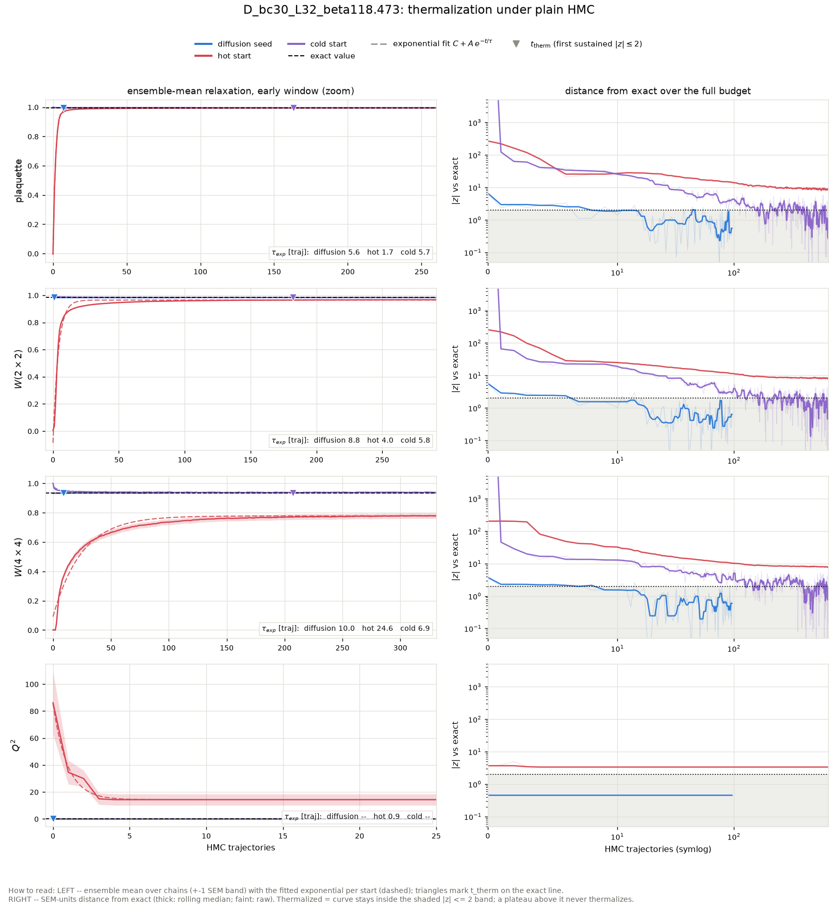

tau_int (hot-start chains, second half): plaquette = 14.03 +- 1.75, wilson_2x2 = 20.91 +- 2.41, wilson_4x4 = 20.87 +- 2.46, wilson_6x6 = 15.99 +- 2.32. Topology: hot-start HMC L=32 beta=118.473 -> **frozen** (no tunneling).

Where 'never' stood at the end: the hot start ended the 640-trajectory budget still at plaquette at |z| ~ 9, wilson_2x2 at |z| ~ 8, wilson_4x4 at |z| ~ 8, wilson_6x6 at |z| ~ 8, Q^2 at |z| ~ 3; the cold start ended the 640-trajectory budget still at Q^2 at |z| ~ 171377917952.

### Diagnostics: raw diffusion output (before any HMC)

| observable | value | error | exact | z_exact | reference | ref_error | z_ref | ks_p | chi2_p |
|---|---|---|---|---|---|---|---|---|---|
| plaquette | 0.9957 | 2.543e-05 | 0.9958 | -4.565 | 0.9958 | 9.824e-06 | -6.774 | 3.484e-14 |  |
| wilson_1x1 | 0.9957 | 2.543e-05 | 0.9958 | -4.565 | 0.9958 | 9.824e-06 | -6.774 | 3.484e-14 |  |
| wilson_1x2 | 0.9912 | 6.061e-05 | 0.9916 | -6.125 | 0.9918 | 2.636e-05 | -8.527 | 8.226e-17 |  |
| wilson_2x2 | 0.9826 | 0.0001193 | 0.9832 | -4.951 | 0.9836 | 7.822e-05 | -7.186 | 3.16e-10 |  |
| wilson_2x3 | 0.974 | 0.0002081 | 0.9749 | -4.323 | 0.9757 | 0.0001249 | -6.763 | 5e-08 |  |
| wilson_3x3 | 0.9617 | 0.0003398 | 0.9626 | -2.882 | 0.9641 | 0.0001996 | -6.295 | 3.165e-06 |  |
| wilson_3x4 | 0.9487 | 0.0005262 | 0.9505 | -3.431 | 0.9527 | 0.0002773 | -6.73 | 5.1e-06 |  |
| wilson_4x4 | 0.9319 | 0.0007351 | 0.9347 | -3.771 | 0.9378 | 0.0003582 | -7.275 | 3.165e-06 |  |
| wilson_4x5 | 0.9148 | 0.001014 | 0.9191 | -4.232 | 0.9232 | 0.0004499 | -7.554 | 1.186e-06 |  |
| wilson_5x5 | 0.8945 | 0.001352 | 0.9 | -4.078 | 0.9048 | 0.0006042 | -6.997 | 3.143e-05 |  |
| wilson_5x6 | 0.8735 | 0.001725 | 0.8813 | -4.566 | 0.8867 | 0.0007821 | -7.015 | 2.022e-05 |  |
| wilson_6x6 | 0.8491 | 0.002194 | 0.8595 | -4.723 | 0.8658 | 0.001103 | -6.795 | 2.022e-05 |  |
| wilson_6x7 | 0.8248 | 0.002746 | 0.8383 | -4.899 | 0.8451 | 0.001445 | -6.513 | 5.99e-05 |  |
| wilson_7x7 | 0.7975 | 0.003482 | 0.8143 | -4.808 | 0.8212 | 0.001886 | -5.972 | 0.0001119 |  |
| wilson_7x8 | 0.7701 | 0.004141 | 0.791 | -5.043 | 0.7979 | 0.002469 | -5.759 | 7.394e-05 |  |
| wilson_8x8 | 0.7404 | 0.005027 | 0.7653 | -4.966 | 0.7714 | 0.003004 | -5.297 | 0.0004451 |  |
| wilson_8x10 | 0.683 | 0.006826 | 0.7168 | -4.941 | 0.7218 | 0.004369 | -4.788 | 0.0002496 |  |
| wilson_10x10 | 0.6179 | 0.009161 | 0.6609 | -4.696 | 0.6608 | 0.005974 | -3.93 | 0.0009335 |  |
| wilson_10x12 | 0.5606 | 0.01143 | 0.6099 | -4.316 | 0.6091 | 0.007924 | -3.486 | 0.001117 |  |
| wilson_12x12 | 0.4998 | 0.01353 | 0.5548 | -4.063 | 0.5502 | 0.009517 | -3.048 | 0.00189 |  |
| creutz_2 | 0.004199 | 6.334e-05 | 0.00423 | -0.4982 |  |  |  |  |  |
| creutz_3 | 0.003988 | 0.0001109 | 0.004215 | -2.051 |  |  |  |  |  |
| creutz_4 | 0.004379 | 0.0001899 | 0.004193 | 0.9785 |  |  |  |  |  |
| creutz_5 | 0.003922 | 0.0003377 | 0.004164 | -0.7164 |  |  |  |  |  |
| creutz_6 | 0.004448 | 0.0004749 | 0.004126 | 0.6778 |  |  |  |  |  |
| creutz_7 | 0.004621 | 0.0006278 | 0.004078 | 0.8647 |  |  |  |  |  |
| creutz_8 | 0.004437 | 0.0008913 | 0.004018 | 0.4697 |  |  |  |  |  |
| Q | 0 | 0.03603 | 0 | 0 | 0.005208 | 0.02913 | -0.1124 | 0.9941 |  |
| Q^2 | 0.1562 | 0.03666 | 0.1714 | -0.4126 | 0.2448 | 0.03243 | -1.809 | 0.5631 |  |
| chi_top ((<Q^2>-<Q>^2)/V) | 0.0001526 | 3.58e-05 | 0.0001674 | -0.4126 | 0.000239 | 3.163e-05 | -1.809 | 0 |  |
| Q histogram vs exact P(Q) | 0.1879 | nan | 2 | nan |  |  |  |  | 0.9103 |

### Diagnostics: the same configs after 96 HMC trajectories

| observable | value | error | exact | z_exact | reference | ref_error | z_ref | ks_p | chi2_p |
|---|---|---|---|---|---|---|---|---|---|
| plaquette | 0.9958 | 1.593e-05 | 0.9958 | -0.5323 | 0.9958 | 9.824e-06 | -4.117 | 0.003137 |  |
| wilson_1x1 | 0.9958 | 1.593e-05 | 0.9958 | -0.5323 | 0.9958 | 9.824e-06 | -4.117 | 0.003137 |  |
| wilson_1x2 | 0.9916 | 3.952e-05 | 0.9916 | -0.1906 | 0.9918 | 2.636e-05 | -4.208 | 0.0007783 |  |
| wilson_2x2 | 0.9831 | 7.61e-05 | 0.9832 | -0.8074 | 0.9836 | 7.822e-05 | -4.544 | 0.005104 |  |
| wilson_2x3 | 0.9749 | 0.0001363 | 0.9749 | -0.3972 | 0.9757 | 0.0001249 | -4.305 | 0.006985 |  |
| wilson_3x3 | 0.9625 | 0.0002461 | 0.9626 | -0.6394 | 0.9641 | 0.0001996 | -5.235 | 0.001334 |  |
| wilson_3x4 | 0.9503 | 0.0004043 | 0.9505 | -0.6348 | 0.9527 | 0.0002773 | -5.005 | 0.0003679 |  |
| wilson_4x4 | 0.9343 | 0.0006864 | 0.9347 | -0.588 | 0.9378 | 0.0003582 | -4.624 | 0.006985 |  |
| wilson_4x5 | 0.9186 | 0.001009 | 0.9191 | -0.4457 | 0.9232 | 0.0004499 | -4.106 | 0.01275 |  |
| wilson_5x5 | 0.8996 | 0.001491 | 0.9 | -0.2654 | 0.9048 | 0.0006042 | -3.258 | 0.017 |  |
| wilson_5x6 | 0.8808 | 0.00196 | 0.8813 | -0.2769 | 0.8867 | 0.0007821 | -2.821 | 0.01275 |  |
| wilson_6x6 | 0.8591 | 0.002678 | 0.8595 | -0.1642 | 0.8658 | 0.001103 | -2.335 | 0.01474 |  |
| wilson_6x7 | 0.837 | 0.003295 | 0.8383 | -0.3996 | 0.8451 | 0.001445 | -2.244 | 0.04938 |  |
| wilson_7x7 | 0.813 | 0.004109 | 0.8143 | -0.3183 | 0.8212 | 0.001886 | -1.817 | 0.1122 |  |
| wilson_7x8 | 0.7885 | 0.004799 | 0.791 | -0.5233 | 0.7979 | 0.002469 | -1.74 | 0.04938 |  |
| wilson_8x8 | 0.7623 | 0.00572 | 0.7653 | -0.5282 | 0.7714 | 0.003004 | -1.405 | 0.1392 |  |
| wilson_8x10 | 0.7127 | 0.006995 | 0.7168 | -0.583 | 0.7218 | 0.004369 | -1.11 | 0.1892 |  |
| wilson_10x10 | 0.6555 | 0.009345 | 0.6609 | -0.5769 | 0.6608 | 0.005974 | -0.4825 | 0.7901 |  |
| wilson_10x12 | 0.6068 | 0.01072 | 0.6099 | -0.2941 | 0.6091 | 0.007924 | -0.1721 | 0.389 |  |
| wilson_12x12 | 0.5532 | 0.01318 | 0.5548 | -0.1184 | 0.5502 | 0.009517 | 0.184 | 0.2763 |  |
| creutz_2 | 0.004286 | 5.486e-05 | 0.00423 | 1.017 |  |  |  |  |  |
| creutz_3 | 0.00433 | 0.0001093 | 0.004215 | 1.052 |  |  |  |  |  |
| creutz_4 | 0.004249 | 0.000191 | 0.004193 | 0.2897 |  |  |  |  |  |
| creutz_5 | 0.004056 | 0.0003369 | 0.004164 | -0.3189 |  |  |  |  |  |
| creutz_6 | 0.003845 | 0.0004697 | 0.004126 | -0.5973 |  |  |  |  |  |
| creutz_7 | 0.003052 | 0.0006051 | 0.004078 | -1.695 |  |  |  |  |  |
| creutz_8 | 0.003221 | 0.0007959 | 0.004018 | -1.002 |  |  |  |  |  |
| Q | 0 | 0.03603 | 0 | 0 | 0.005208 | 0.02913 | -0.1124 | 0.9941 |  |
| Q^2 | 0.1562 | 0.03666 | 0.1714 | -0.4126 | 0.2448 | 0.03243 | -1.809 | 0.5631 |  |
| chi_top ((<Q^2>-<Q>^2)/V) | 0.0001526 | 3.58e-05 | 0.0001674 | -0.4126 | 0.000239 | 3.163e-05 | -1.809 | 0 |  |
| Q histogram vs exact P(Q) | 0.1879 | nan | 2 | nan |  |  |  |  | 0.9103 |

## E_bc35_L32_beta138.477

HMC: step size 0.0340, 29 leapfrog steps, acceptance seed/hot/cold = 0.979/0.973/0.977. Diffusion-seed batch: 128 chains x 96 trajectories (0.17 s/traj for the whole batch); baselines: 32 chains x 640 trajectories.

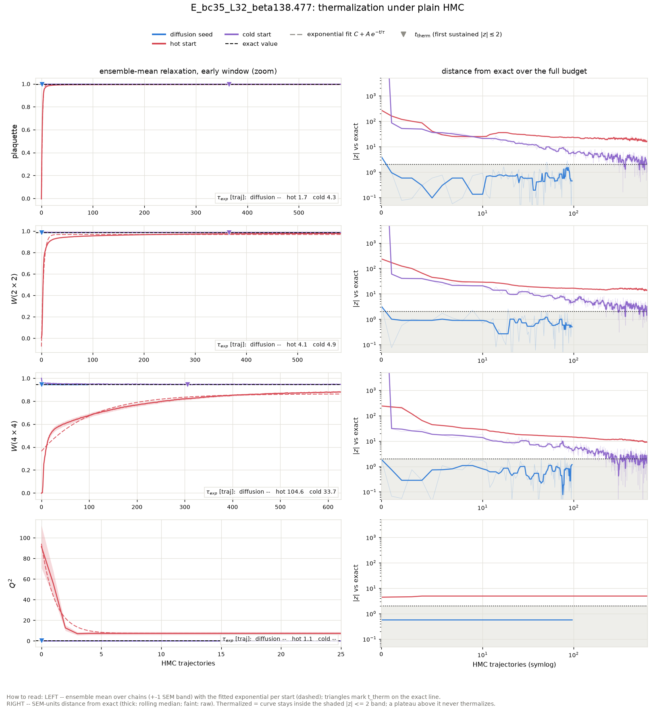

tau_int (hot-start chains, second half): plaquette = 24.20 +- 2.01, wilson_2x2 = 35.55 +- 2.04, wilson_4x4 = 41.65 +- 1.91, wilson_6x6 = 41.61 +- 2.22. Topology: hot-start HMC L=32 beta=138.477 -> **frozen** (no tunneling).

Where 'never' stood at the end: the hot start ended the 640-trajectory budget still at plaquette at |z| ~ 16, wilson_2x2 at |z| ~ 14, wilson_4x4 at |z| ~ 9, wilson_6x6 at |z| ~ 7, Q^2 at |z| ~ 5; the cold start ended the 640-trajectory budget still at Q^2 at |z| ~ 122925113344.

### Diagnostics: raw diffusion output (before any HMC)

| observable | value | error | exact | z_exact | reference | ref_error | z_ref | ks_p | chi2_p |
|---|---|---|---|---|---|---|---|---|---|
| plaquette | 0.9963 | 1.558e-05 | 0.9964 | -3.626 | 0.9964 | 8.393e-06 | -3.937 | 4.842e-05 |  |
| wilson_1x1 | 0.9963 | 1.558e-05 | 0.9964 | -3.626 | 0.9964 | 8.393e-06 | -3.937 | 4.842e-05 |  |
| wilson_1x2 | 0.9926 | 3.242e-05 | 0.9928 | -5.173 | 0.9928 | 2.073e-05 | -5.579 | 3.165e-06 |  |
| wilson_2x2 | 0.9854 | 8.296e-05 | 0.9856 | -3.105 | 0.9859 | 4.635e-05 | -5.755 | 7.158e-07 |  |
| wilson_2x3 | 0.9782 | 0.0001336 | 0.9785 | -2.678 | 0.979 | 7.777e-05 | -5.64 | 2.524e-05 |  |
| wilson_3x3 | 0.9676 | 0.0002235 | 0.968 | -1.909 | 0.969 | 0.0001568 | -5.139 | 5.99e-05 |  |
| wilson_3x4 | 0.957 | 0.0003915 | 0.9576 | -1.621 | 0.9588 | 0.0002234 | -4.092 | 0.0005374 |  |
| wilson_4x4 | 0.9429 | 0.0005794 | 0.944 | -1.806 | 0.9458 | 0.0003284 | -4.396 | 7.394e-05 |  |
| wilson_4x5 | 0.9294 | 0.0008144 | 0.9305 | -1.396 | 0.9322 | 0.0004603 | -2.99 | 0.01474 |  |
| wilson_5x5 | 0.9129 | 0.001077 | 0.9141 | -1.124 | 0.916 | 0.0006061 | -2.551 | 0.02248 |  |
| wilson_5x6 | 0.8964 | 0.001402 | 0.898 | -1.14 | 0.8998 | 0.0008124 | -2.101 | 0.1392 |  |
| wilson_6x6 | 0.877 | 0.001722 | 0.8791 | -1.204 | 0.8814 | 0.001009 | -2.181 | 0.1392 |  |
| wilson_6x7 | 0.8582 | 0.002145 | 0.8607 | -1.168 | 0.8626 | 0.001404 | -1.733 | 0.03364 |  |
| wilson_7x7 | 0.8365 | 0.00261 | 0.8398 | -1.245 | 0.8422 | 0.001754 | -1.81 | 0.08971 |  |
| wilson_7x8 | 0.8158 | 0.003094 | 0.8195 | -1.202 | 0.8213 | 0.0023 | -1.418 | 0.0631 |  |
| wilson_8x8 | 0.7921 | 0.003665 | 0.7971 | -1.345 | 0.799 | 0.00283 | -1.494 | 0.1122 |  |
| wilson_8x10 | 0.7471 | 0.004959 | 0.7544 | -1.455 | 0.7549 | 0.004173 | -1.192 | 0.2297 |  |
| wilson_10x10 | 0.6944 | 0.006522 | 0.7049 | -1.618 | 0.7055 | 0.005366 | -1.315 | 0.2763 |  |
| wilson_10x12 | 0.6469 | 0.007944 | 0.6595 | -1.591 | 0.6584 | 0.006995 | -1.091 | 0.1545 |  |
| wilson_12x12 | 0.5946 | 0.01001 | 0.6099 | -1.532 | 0.6091 | 0.008177 | -1.124 | 0.389 |  |
| creutz_2 | 0.003593 | 4.648e-05 | 0.003613 | -0.425 |  |  |  |  |  |
| creutz_3 | 0.003564 | 0.000103 | 0.003593 | -0.2845 |  |  |  |  |  |
| creutz_4 | 0.003787 | 0.0001837 | 0.003564 | 1.218 |  |  |  |  |  |
| creutz_5 | 0.003514 | 0.0002553 | 0.003524 | -0.03966 |  |  |  |  |  |
| creutz_6 | 0.003599 | 0.0003516 | 0.003474 | 0.3555 |  |  |  |  |  |
| creutz_7 | 0.003818 | 0.0005008 | 0.003411 | 0.8121 |  |  |  |  |  |
| creutz_8 | 0.004318 | 0.0007131 | 0.003335 | 1.379 |  |  |  |  |  |
| Q | 0 | 0.03044 | 0 | 0 | -0.02083 | 0.03069 | 0.482 | 1 |  |
| Q^2 | 0.1406 | 0.02902 | 0.1229 | 0.6099 | 0.125 | 0.02125 | 0.4344 | 1 |  |
| chi_top ((<Q^2>-<Q>^2)/V) | 0.0001373 | 2.834e-05 | 0.00012 | 0.6099 | 0.0001216 | 2.071e-05 | 0.4468 | 0 |  |
| Q histogram vs exact P(Q) | 0.3793 | nan | 2 | nan |  |  |  |  | 0.8273 |

### Diagnostics: the same configs after 96 HMC trajectories

| observable | value | error | exact | z_exact | reference | ref_error | z_ref | ks_p | chi2_p |
|---|---|---|---|---|---|---|---|---|---|
| plaquette | 0.9964 | 1.207e-05 | 0.9964 | 0.5225 | 0.9964 | 8.393e-06 | -0.4679 | 0.9542 |  |
| wilson_1x1 | 0.9964 | 1.207e-05 | 0.9964 | 0.5225 | 0.9964 | 8.393e-06 | -0.4679 | 0.9542 |  |
| wilson_1x2 | 0.9928 | 4.263e-05 | 0.9928 | -0.1255 | 0.9928 | 2.073e-05 | -1.104 | 0.389 |  |
| wilson_2x2 | 0.9856 | 0.0001061 | 0.9856 | -0.4515 | 0.9859 | 4.635e-05 | -2.913 | 0.04938 |  |
| wilson_2x3 | 0.9785 | 0.0002012 | 0.9785 | -0.2628 | 0.979 | 7.777e-05 | -2.628 | 0.01957 |  |
| wilson_3x3 | 0.9677 | 0.0003656 | 0.968 | -0.8617 | 0.969 | 0.0001568 | -3.246 | 0.002243 |  |
| wilson_3x4 | 0.9572 | 0.0005294 | 0.9576 | -0.7561 | 0.9588 | 0.0002234 | -2.803 | 0.009477 |  |
| wilson_4x4 | 0.9432 | 0.0007888 | 0.944 | -0.9495 | 0.9458 | 0.0003284 | -3.079 | 5.99e-05 |  |
| wilson_4x5 | 0.9297 | 0.001088 | 0.9305 | -0.7675 | 0.9322 | 0.0004603 | -2.113 | 0.01957 |  |
| wilson_5x5 | 0.9135 | 0.001461 | 0.9141 | -0.43 | 0.916 | 0.0006061 | -1.625 | 0.03831 |  |
| wilson_5x6 | 0.8974 | 0.001864 | 0.898 | -0.3043 | 0.8998 | 0.0008124 | -1.167 | 0.1545 |  |
| wilson_6x6 | 0.8787 | 0.002357 | 0.8791 | -0.1566 | 0.8814 | 0.001009 | -1.033 | 0.3021 |  |
| wilson_6x7 | 0.8609 | 0.002841 | 0.8607 | 0.0637 | 0.8626 | 0.001404 | -0.5541 | 0.4548 |  |
| wilson_7x7 | 0.8404 | 0.003592 | 0.8398 | 0.1772 | 0.8422 | 0.001754 | -0.4513 | 0.4898 |  |
| wilson_7x8 | 0.8212 | 0.004174 | 0.8195 | 0.4143 | 0.8213 | 0.0023 | -0.003873 | 0.9807 |  |
| wilson_8x8 | 0.7995 | 0.005 | 0.7971 | 0.491 | 0.799 | 0.00283 | 0.08138 | 0.9941 |  |
| wilson_8x10 | 0.7595 | 0.006402 | 0.7544 | 0.8026 | 0.7549 | 0.004173 | 0.6056 | 0.9353 |  |
| wilson_10x10 | 0.7129 | 0.00856 | 0.7049 | 0.9288 | 0.7055 | 0.005366 | 0.7323 | 0.678 |  |
| wilson_10x12 | 0.6693 | 0.01043 | 0.6595 | 0.9402 | 0.6584 | 0.006995 | 0.867 | 0.7901 |  |
| wilson_12x12 | 0.6219 | 0.01313 | 0.6099 | 0.9122 | 0.6091 | 0.008177 | 0.8269 | 0.8864 |  |
| creutz_2 | 0.003644 | 5.999e-05 | 0.003613 | 0.5252 |  |  |  |  |  |
| creutz_3 | 0.003859 | 9.633e-05 | 0.003593 | 2.762 |  |  |  |  |  |
| creutz_4 | 0.003847 | 0.0001628 | 0.003564 | 1.739 |  |  |  |  |  |
| creutz_5 | 0.003209 | 0.0002501 | 0.003524 | -1.258 |  |  |  |  |  |
| creutz_6 | 0.003318 | 0.0003721 | 0.003474 | -0.4182 |  |  |  |  |  |
| creutz_7 | 0.003494 | 0.000524 | 0.003411 | 0.1582 |  |  |  |  |  |
| creutz_8 | 0.003717 | 0.0007411 | 0.003335 | 0.5158 |  |  |  |  |  |
| Q | 0 | 0.03044 | 0 | 0 | -0.02083 | 0.03069 | 0.482 | 1 |  |
| Q^2 | 0.1406 | 0.02902 | 0.1229 | 0.6099 | 0.125 | 0.02125 | 0.4344 | 1 |  |
| chi_top ((<Q^2>-<Q>^2)/V) | 0.0001373 | 2.834e-05 | 0.00012 | 0.6099 | 0.0001216 | 2.071e-05 | 0.4468 | 0 |  |
| Q histogram vs exact P(Q) | 0.3793 | nan | 2 | nan |  |  |  |  | 0.8273 |

## D_bc40_L32_beta158.48

HMC: step size 0.0318, 31 leapfrog steps, acceptance seed/hot/cold = 0.978/0.976/0.978. Diffusion-seed batch: 128 chains x 96 trajectories (0.17 s/traj for the whole batch); baselines: 32 chains x 640 trajectories.

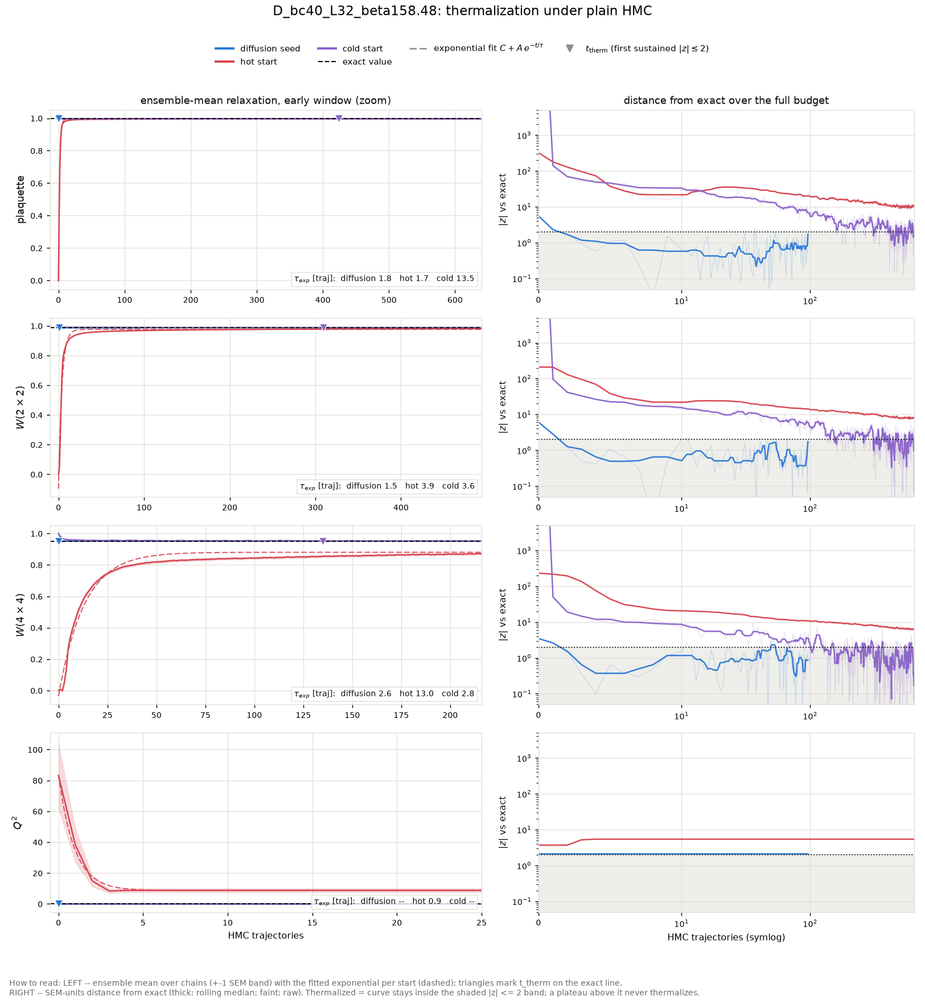

tau_int (hot-start chains, second half): plaquette = 22.94 +- 2.34, wilson_2x2 = 32.16 +- 2.39, wilson_4x4 = 24.17 +- 2.76, wilson_6x6 = 7.14 +- 1.28. Topology: hot-start HMC L=32 beta=158.48 -> **frozen** (no tunneling).

Where 'never' stood at the end: the hot start ended the 640-trajectory budget still at plaquette at |z| ~ 11, wilson_2x2 at |z| ~ 8, wilson_4x4 at |z| ~ 6, wilson_6x6 at |z| ~ 6, Q^2 at |z| ~ 5; the cold start ended the 640-trajectory budget still at Q^2 at |z| ~ 86933716992.

### Diagnostics: raw diffusion output (before any HMC)

| observable | value | error | exact | z_exact | reference | ref_error | z_ref | ks_p | chi2_p |
|---|---|---|---|---|---|---|---|---|---|
| plaquette | 0.9968 | 1.302e-05 | 0.9968 | -5.558 | 0.9968 | 1.012e-05 | -4.402 | 0.0001679 |  |
| wilson_1x1 | 0.9968 | 1.302e-05 | 0.9968 | -5.558 | 0.9968 | 1.012e-05 | -4.402 | 0.0001679 |  |
| wilson_1x2 | 0.9935 | 3.107e-05 | 0.9937 | -6.818 | 0.9937 | 2.449e-05 | -5.169 | 6.452e-06 |  |
| wilson_2x2 | 0.9869 | 5.946e-05 | 0.9874 | -8.292 | 0.9875 | 5.658e-05 | -6.284 | 8.145e-06 |  |
| wilson_2x3 | 0.9806 | 0.0001252 | 0.9812 | -4.788 | 0.9812 | 9.612e-05 | -3.457 | 0.0005374 |  |
| wilson_3x3 | 0.9712 | 0.0001933 | 0.972 | -4.493 | 0.9718 | 0.0001652 | -2.695 | 0.01474 |  |
| wilson_3x4 | 0.9618 | 0.0003537 | 0.9629 | -3.252 | 0.9626 | 0.0002461 | -1.977 | 0.03831 |  |
| wilson_4x4 | 0.949 | 0.0005064 | 0.951 | -3.818 | 0.9506 | 0.0003367 | -2.617 | 0.03364 |  |
| wilson_4x5 | 0.937 | 0.0007816 | 0.9392 | -2.849 | 0.9389 | 0.0004902 | -2.045 | 0.2763 |  |
| wilson_5x5 | 0.9216 | 0.00106 | 0.9248 | -2.97 | 0.9245 | 0.0006435 | -2.327 | 0.07995 |  |
| wilson_5x6 | 0.9065 | 0.00143 | 0.9106 | -2.86 | 0.9099 | 0.0008818 | -2.017 | 0.05588 |  |
| wilson_6x6 | 0.8881 | 0.001789 | 0.894 | -3.315 | 0.8937 | 0.001038 | -2.742 | 0.01474 |  |
| wilson_6x7 | 0.8709 | 0.002255 | 0.8778 | -3.073 | 0.8778 | 0.001345 | -2.652 | 0.02248 |  |
| wilson_7x7 | 0.8507 | 0.002731 | 0.8594 | -3.17 | 0.8599 | 0.001521 | -2.934 | 0.01474 |  |
| wilson_7x8 | 0.8316 | 0.003221 | 0.8414 | -3.04 | 0.8423 | 0.00198 | -2.804 | 0.01474 |  |
| wilson_8x8 | 0.8097 | 0.003842 | 0.8216 | -3.1 | 0.8232 | 0.002244 | -3.041 | 0.01275 |  |
| wilson_8x10 | 0.7685 | 0.004894 | 0.7837 | -3.104 | 0.7857 | 0.003316 | -2.907 | 0.00159 |  |
| wilson_10x10 | 0.7208 | 0.006328 | 0.7397 | -2.98 | 0.7428 | 0.003959 | -2.955 | 0.0006474 |  |
| wilson_10x12 | 0.6787 | 0.007805 | 0.699 | -2.61 | 0.7019 | 0.005061 | -2.498 | 0.00159 |  |
| wilson_12x12 | 0.632 | 0.009265 | 0.6544 | -2.427 | 0.6582 | 0.006252 | -2.349 | 0.006985 |  |
| creutz_2 | 0.003297 | 5.268e-05 | 0.003152 | 2.764 |  |  |  |  |  |
| creutz_3 | 0.0033 | 9.749e-05 | 0.003129 | 1.754 |  |  |  |  |  |
| creutz_4 | 0.003633 | 0.0001735 | 0.003094 | 3.106 |  |  |  |  |  |
| creutz_5 | 0.003744 | 0.0002536 | 0.003047 | 2.751 |  |  |  |  |  |
| creutz_6 | 0.004047 | 0.00038 | 0.002987 | 2.788 |  |  |  |  |  |
| creutz_7 | 0.00384 | 0.0005667 | 0.002915 | 1.633 |  |  |  |  |  |
| creutz_8 | 0.004143 | 0.0007336 | 0.002827 | 1.794 |  |  |  |  |  |
| Q | 0 | 0.02047 | 0 | 0 | 0.06771 | 0.02098 | -2.31 | 0.9972 |  |
| Q^2 | 0.04688 | 0.01714 | 0.08693 | -2.337 | 0.06771 | 0.02098 | -0.769 | 1 |  |
| chi_top ((<Q^2>-<Q>^2)/V) | 4.578e-05 | 1.674e-05 | 8.49e-05 | -2.337 | 6.164e-05 | 1.771e-05 | -0.6511 | 0 |  |
| Q histogram vs exact P(Q) | 2.584 | nan | 2 | nan |  |  |  |  | 0.2747 |

### Diagnostics: the same configs after 96 HMC trajectories

| observable | value | error | exact | z_exact | reference | ref_error | z_ref | ks_p | chi2_p |
|---|---|---|---|---|---|---|---|---|---|
| plaquette | 0.9968 | 8.158e-06 | 0.9968 | -2.406 | 0.9968 | 1.012e-05 | -1.528 | 0.7901 |  |
| wilson_1x1 | 0.9968 | 8.158e-06 | 0.9968 | -2.406 | 0.9968 | 1.012e-05 | -1.528 | 0.7901 |  |
| wilson_1x2 | 0.9937 | 1.573e-05 | 0.9937 | -1.669 | 0.9937 | 2.449e-05 | -0.6491 | 0.8246 |  |
| wilson_2x2 | 0.9873 | 5.384e-05 | 0.9874 | -2.168 | 0.9875 | 5.658e-05 | -1.786 | 0.4212 |  |
| wilson_2x3 | 0.9811 | 0.0001021 | 0.9812 | -1.026 | 0.9812 | 9.612e-05 | -0.3628 | 0.7538 |  |
| wilson_3x3 | 0.9719 | 0.0001901 | 0.972 | -0.7996 | 0.9718 | 0.0001652 | 0.1235 | 0.8569 |  |
| wilson_3x4 | 0.9628 | 0.000269 | 0.9629 | -0.6148 | 0.9626 | 0.0002461 | 0.3642 | 0.6011 |  |
| wilson_4x4 | 0.9506 | 0.0004003 | 0.951 | -1.05 | 0.9506 | 0.0003367 | -0.1501 | 0.6395 |  |
| wilson_4x5 | 0.9387 | 0.0005446 | 0.9392 | -0.9308 | 0.9389 | 0.0004902 | -0.2279 | 0.9542 |  |
| wilson_5x5 | 0.9242 | 0.000758 | 0.9248 | -0.7803 | 0.9245 | 0.0006435 | -0.33 | 0.678 |  |
| wilson_5x6 | 0.9098 | 0.0009832 | 0.9106 | -0.8529 | 0.9099 | 0.0008818 | -0.104 | 0.6011 |  |
| wilson_6x6 | 0.8932 | 0.001289 | 0.894 | -0.6446 | 0.8937 | 0.001038 | -0.3457 | 0.2087 |  |
| wilson_6x7 | 0.8766 | 0.001629 | 0.8778 | -0.7234 | 0.8778 | 0.001345 | -0.574 | 0.4212 |  |
| wilson_7x7 | 0.8585 | 0.001915 | 0.8594 | -0.4591 | 0.8599 | 0.001521 | -0.5699 | 0.389 |  |
| wilson_7x8 | 0.8408 | 0.002374 | 0.8414 | -0.2732 | 0.8423 | 0.00198 | -0.4724 | 0.5631 |  |
| wilson_8x8 | 0.8215 | 0.002673 | 0.8216 | -0.02792 | 0.8232 | 0.002244 | -0.4861 | 0.5631 |  |
| wilson_8x10 | 0.7838 | 0.003768 | 0.7837 | 0.03292 | 0.7857 | 0.003316 | -0.3723 | 0.4548 |  |
| wilson_10x10 | 0.7418 | 0.00464 | 0.7397 | 0.4605 | 0.7428 | 0.003959 | -0.1738 | 0.3584 |  |
| wilson_10x12 | 0.7023 | 0.006301 | 0.699 | 0.5168 | 0.7019 | 0.005061 | 0.04765 | 0.9941 |  |
| wilson_12x12 | 0.6603 | 0.007565 | 0.6544 | 0.7729 | 0.6582 | 0.006252 | 0.2117 | 0.678 |  |
| creutz_2 | 0.003237 | 4.674e-05 | 0.003152 | 1.82 |  |  |  |  |  |
| creutz_3 | 0.00319 | 9.151e-05 | 0.003129 | 0.6668 |  |  |  |  |  |
| creutz_4 | 0.003349 | 0.0001566 | 0.003094 | 1.629 |  |  |  |  |  |
| creutz_5 | 0.003049 | 0.0002527 | 0.003047 | 0.008796 |  |  |  |  |  |
| creutz_6 | 0.002714 | 0.0003638 | 0.002987 | -0.7507 |  |  |  |  |  |
| creutz_7 | 0.002181 | 0.0005226 | 0.002915 | -1.404 |  |  |  |  |  |
| creutz_8 | 0.002399 | 0.0006667 | 0.002827 | -0.6417 |  |  |  |  |  |
| Q | 0 | 0.02047 | 0 | 0 | 0.06771 | 0.02098 | -2.31 | 0.9972 |  |
| Q^2 | 0.04688 | 0.01714 | 0.08693 | -2.337 | 0.06771 | 0.02098 | -0.769 | 1 |  |
| chi_top ((<Q^2>-<Q>^2)/V) | 4.578e-05 | 1.674e-05 | 8.49e-05 | -2.337 | 6.164e-05 | 1.771e-05 | -0.6511 | 0 |  |
| Q histogram vs exact P(Q) | 2.584 | nan | 2 | nan |  |  |  |  | 0.2747 |

## E_bc45_L32_beta178.482

HMC: step size 0.0299, 33 leapfrog steps, acceptance seed/hot/cold = 0.978/0.971/0.977. Diffusion-seed batch: 128 chains x 96 trajectories (0.18 s/traj for the whole batch); baselines: 32 chains x 640 trajectories.

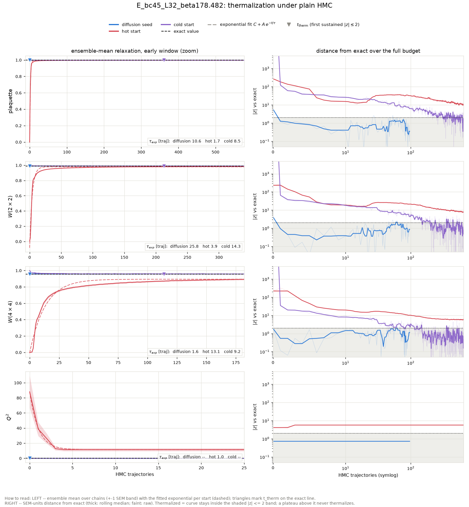

tau_int (hot-start chains, second half): plaquette = 22.43 +- 2.00, wilson_2x2 = 18.87 +- 1.91, wilson_4x4 = 4.17 +- 0.52, wilson_6x6 = 2.92 +- 0.23. Topology: hot-start HMC L=32 beta=178.482 -> **frozen** (no tunneling).

Where 'never' stood at the end: the hot start ended the 640-trajectory budget still at plaquette at |z| ~ 10, wilson_2x2 at |z| ~ 8, wilson_4x4 at |z| ~ 6, wilson_6x6 at |z| ~ 6, Q^2 at |z| ~ 6; the cold start ended the 640-trajectory budget still at Q^2 at |z| ~ 60793004032.

### Diagnostics: raw diffusion output (before any HMC)

| observable | value | error | exact | z_exact | reference | ref_error | z_ref | ks_p | chi2_p |
|---|---|---|---|---|---|---|---|---|---|
| plaquette | 0.9971 | 1.175e-05 | 0.9972 | -5.106 | 0.9972 | 7.727e-06 | -4.278 | 0.001334 |  |
| wilson_1x1 | 0.9971 | 1.175e-05 | 0.9972 | -5.106 | 0.9972 | 7.727e-06 | -4.278 | 0.001334 |  |
| wilson_1x2 | 0.9942 | 2.801e-05 | 0.9944 | -6.244 | 0.9944 | 1.696e-05 | -6.065 | 3.906e-05 |  |
| wilson_2x2 | 0.9886 | 5.426e-05 | 0.9889 | -4.369 | 0.9889 | 4.032e-05 | -3.846 | 0.001334 |  |
| wilson_2x3 | 0.9831 | 9.512e-05 | 0.9833 | -3.025 | 0.9833 | 8.202e-05 | -2.271 | 0.03364 |  |
| wilson_3x3 | 0.9749 | 0.0001774 | 0.9752 | -1.32 | 0.9751 | 0.0001429 | -0.5488 | 0.8569 |  |
| wilson_3x4 | 0.9666 | 0.0002978 | 0.9671 | -1.463 | 0.9669 | 0.0002446 | -0.723 | 0.4898 |  |
| wilson_4x4 | 0.9556 | 0.0004561 | 0.9564 | -1.843 | 0.9562 | 0.0003798 | -0.9737 | 0.6395 |  |
| wilson_4x5 | 0.9448 | 0.0006222 | 0.946 | -1.853 | 0.9456 | 0.0005717 | -0.9064 | 0.8569 |  |
| wilson_5x5 | 0.9314 | 0.0008511 | 0.9331 | -1.959 | 0.9324 | 0.0007438 | -0.8465 | 0.7538 |  |
| wilson_5x6 | 0.9181 | 0.001159 | 0.9205 | -2.099 | 0.9196 | 0.0009371 | -1.033 | 0.6395 |  |
| wilson_6x6 | 0.902 | 0.001483 | 0.9057 | -2.509 | 0.9044 | 0.00118 | -1.306 | 0.6395 |  |
| wilson_6x7 | 0.8863 | 0.001901 | 0.8912 | -2.568 | 0.8897 | 0.00143 | -1.391 | 0.5631 |  |
| wilson_7x7 | 0.8687 | 0.00243 | 0.8748 | -2.497 | 0.873 | 0.001749 | -1.427 | 0.5631 |  |
| wilson_7x8 | 0.8511 | 0.002963 | 0.8588 | -2.597 | 0.8564 | 0.002098 | -1.47 | 0.4212 |  |
| wilson_8x8 | 0.8316 | 0.003629 | 0.841 | -2.58 | 0.8383 | 0.00248 | -1.517 | 0.3021 |  |
| wilson_8x10 | 0.795 | 0.004745 | 0.807 | -2.533 | 0.8027 | 0.003318 | -1.33 | 0.1392 |  |
| wilson_10x10 | 0.7504 | 0.006592 | 0.7675 | -2.593 | 0.7607 | 0.00445 | -1.291 | 0.1892 |  |
| wilson_10x12 | 0.7105 | 0.007943 | 0.7309 | -2.564 | 0.7219 | 0.005578 | -1.174 | 0.4548 |  |
| wilson_12x12 | 0.6647 | 0.009921 | 0.6906 | -2.615 | 0.6797 | 0.007177 | -1.224 | 0.4212 |  |
| creutz_2 | 0.002743 | 4.072e-05 | 0.002795 | -1.274 |  |  |  |  |  |
| creutz_3 | 0.002664 | 7.812e-05 | 0.002769 | -1.348 |  |  |  |  |  |
| creutz_4 | 0.002949 | 0.0001317 | 0.002731 | 1.656 |  |  |  |  |  |
| creutz_5 | 0.002908 | 0.0001977 | 0.002679 | 1.155 |  |  |  |  |  |
| creutz_6 | 0.003226 | 0.0003135 | 0.002614 | 1.951 |  |  |  |  |  |
| creutz_7 | 0.002626 | 0.0004208 | 0.002535 | 0.2154 |  |  |  |  |  |
| creutz_8 | 0.002593 | 0.0005338 | 0.002441 | 0.2848 |  |  |  |  |  |
| Q | 0 | 0.0171 | 0 | 0 | -0.01562 | 0.01164 | 0.7554 | 1 |  |
| Q^2 | 0.04688 | 0.02129 | 0.06079 | -0.6538 | 0.05729 | 0.01774 | -0.3759 | 1 |  |
| chi_top ((<Q^2>-<Q>^2)/V) | 4.578e-05 | 2.079e-05 | 5.937e-05 | -0.6538 | 5.571e-05 | 1.725e-05 | -0.3677 | 0 |  |
| Q histogram vs exact P(Q) | 0.4338 | nan | 2 | nan |  |  |  |  | 0.805 |

### Diagnostics: the same configs after 96 HMC trajectories

| observable | value | error | exact | z_exact | reference | ref_error | z_ref | ks_p | chi2_p |
|---|---|---|---|---|---|---|---|---|---|
| plaquette | 0.9972 | 1.045e-05 | 0.9972 | 0.372 | 0.9972 | 7.727e-06 | 0.2854 | 0.7538 |  |
| wilson_1x1 | 0.9972 | 1.045e-05 | 0.9972 | 0.372 | 0.9972 | 7.727e-06 | 0.2854 | 0.7538 |  |
| wilson_1x2 | 0.9944 | 2.738e-05 | 0.9944 | 0.07512 | 0.9944 | 1.696e-05 | -0.6716 | 0.678 |  |
| wilson_2x2 | 0.9889 | 7.326e-05 | 0.9889 | 0.8138 | 0.9889 | 4.032e-05 | 0.4386 | 0.4548 |  |
| wilson_2x3 | 0.9835 | 0.0001224 | 0.9833 | 0.9253 | 0.9833 | 8.202e-05 | 0.7857 | 0.2522 |  |
| wilson_3x3 | 0.9754 | 0.0002117 | 0.9752 | 0.9661 | 0.9751 | 0.0001429 | 1.228 | 0.04938 |  |
| wilson_3x4 | 0.9674 | 0.0003176 | 0.9671 | 0.9917 | 0.9669 | 0.0002446 | 1.178 | 0.08971 |  |
| wilson_4x4 | 0.9569 | 0.000444 | 0.9564 | 1.127 | 0.9562 | 0.0003798 | 1.306 | 0.02248 |  |
| wilson_4x5 | 0.9466 | 0.0006177 | 0.946 | 1.047 | 0.9456 | 0.0005717 | 1.228 | 0.04938 |  |
| wilson_5x5 | 0.934 | 0.0008566 | 0.9331 | 1.025 | 0.9324 | 0.0007438 | 1.4 | 0.03831 |  |
| wilson_5x6 | 0.9216 | 0.001097 | 0.9205 | 0.9834 | 0.9196 | 0.0009371 | 1.367 | 0.07995 |  |
| wilson_6x6 | 0.9071 | 0.00143 | 0.9057 | 0.9755 | 0.9044 | 0.00118 | 1.424 | 0.05588 |  |
| wilson_6x7 | 0.8928 | 0.001802 | 0.8912 | 0.9022 | 0.8897 | 0.00143 | 1.39 | 0.1545 |  |
| wilson_7x7 | 0.8772 | 0.002286 | 0.8748 | 1.085 | 0.873 | 0.001749 | 1.485 | 0.1122 |  |
| wilson_7x8 | 0.8618 | 0.002775 | 0.8588 | 1.082 | 0.8564 | 0.002098 | 1.541 | 0.08971 |  |
| wilson_8x8 | 0.8451 | 0.003337 | 0.841 | 1.248 | 0.8383 | 0.00248 | 1.649 | 0.2087 |  |
| wilson_8x10 | 0.8122 | 0.00455 | 0.807 | 1.13 | 0.8027 | 0.003318 | 1.68 | 0.07995 |  |
| wilson_10x10 | 0.7754 | 0.006289 | 0.7675 | 1.268 | 0.7607 | 0.00445 | 1.92 | 0.3021 |  |
| wilson_10x12 | 0.7407 | 0.007762 | 0.7309 | 1.267 | 0.7219 | 0.005578 | 1.967 | 0.2522 |  |
| wilson_12x12 | 0.7032 | 0.01013 | 0.6906 | 1.241 | 0.6797 | 0.007177 | 1.896 | 0.1122 |  |
| creutz_2 | 0.002735 | 4.074e-05 | 0.002795 | -1.474 |  |  |  |  |  |
| creutz_3 | 0.00273 | 7.499e-05 | 0.002769 | -0.529 |  |  |  |  |  |
| creutz_4 | 0.002649 | 0.0001356 | 0.002731 | -0.6016 |  |  |  |  |  |
| creutz_5 | 0.002582 | 0.0002005 | 0.002679 | -0.4834 |  |  |  |  |  |
| creutz_6 | 0.002478 | 0.0002891 | 0.002614 | -0.4709 |  |  |  |  |  |
| creutz_7 | 0.001811 | 0.0004062 | 0.002535 | -1.783 |  |  |  |  |  |
| creutz_8 | 0.001654 | 0.0005287 | 0.002441 | -1.489 |  |  |  |  |  |
| Q | 0 | 0.0171 | 0 | 0 | -0.01562 | 0.01164 | 0.7554 | 1 |  |
| Q^2 | 0.04688 | 0.02129 | 0.06079 | -0.6538 | 0.05729 | 0.01774 | -0.3759 | 1 |  |
| chi_top ((<Q^2>-<Q>^2)/V) | 4.578e-05 | 2.079e-05 | 5.937e-05 | -0.6538 | 5.571e-05 | 1.725e-05 | -0.3677 | 0 |  |
| Q histogram vs exact P(Q) | 0.4338 | nan | 2 | nan |  |  |  |  | 0.805 |

## D_bc55.0237_L32_beta218.58

HMC: step size 0.0271, 37 leapfrog steps, acceptance seed/hot/cold = 0.978/0.965/0.977. Diffusion-seed batch: 128 chains x 96 trajectories (0.19 s/traj for the whole batch); baselines: 32 chains x 640 trajectories.

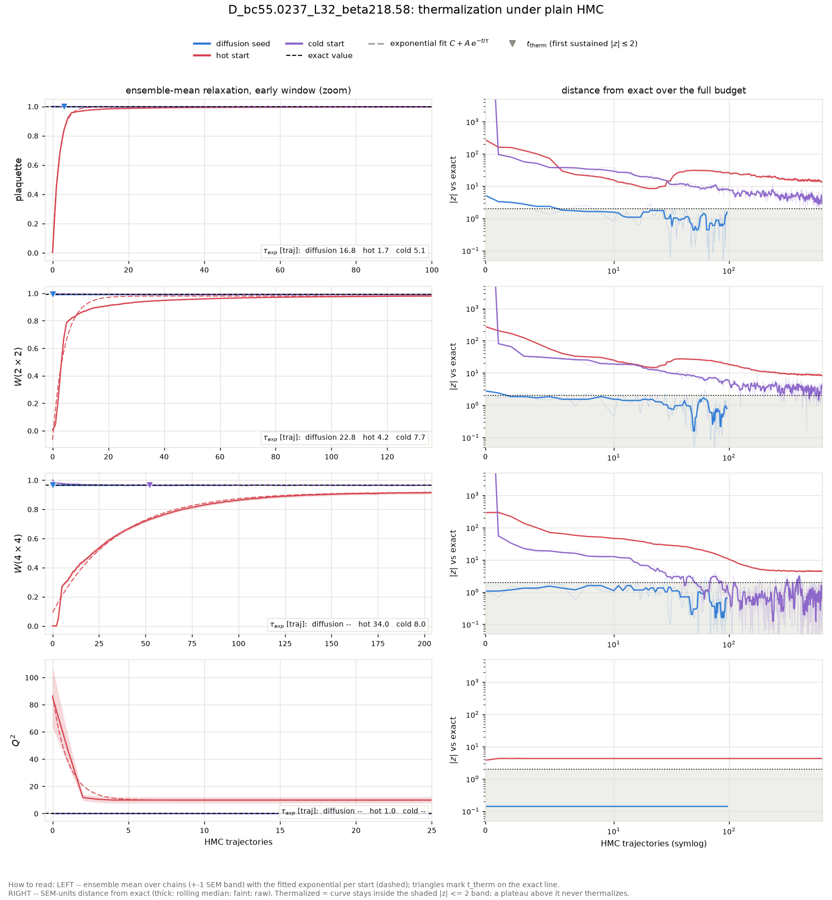

tau_int (hot-start chains, second half): plaquette = 11.59 +- 1.40, wilson_2x2 = 10.31 +- 1.24, wilson_4x4 = 6.68 +- 0.69, wilson_6x6 = 7.51 +- 0.85. Topology: hot-start HMC L=32 beta=218.58 -> **frozen** (no tunneling).

Where 'never' stood at the end: the hot start ended the 640-trajectory budget still at plaquette at |z| ~ 14, wilson_2x2 at |z| ~ 8, wilson_4x4 at |z| ~ 4, wilson_6x6 at |z| ~ 5, Q^2 at |z| ~ 4; the cold start ended the 640-trajectory budget still at plaquette at |z| ~ 5, wilson_2x2 at |z| ~ 4, Q^2 at |z| ~ 29010771968.

### Diagnostics: raw diffusion output (before any HMC)

| observable | value | error | exact | z_exact | reference | ref_error | z_ref | ks_p |
|---|---|---|---|---|---|---|---|---|
| plaquette | 0.9977 | 8.48e-06 | 0.9977 | -5.171 | 0.9978 | 6.946e-06 | -7.932 | 8.676e-11 |
| wilson_1x1 | 0.9977 | 8.48e-06 | 0.9977 | -5.171 | 0.9978 | 6.946e-06 | -7.932 | 8.676e-11 |
| wilson_1x2 | 0.9953 | 2.347e-05 | 0.9954 | -5.444 | 0.9955 | 1.832e-05 | -7.294 | 1.107e-09 |
| wilson_2x2 | 0.9908 | 5.167e-05 | 0.9909 | -2.785 | 0.9911 | 4.531e-05 | -5.235 | 4.022e-06 |
| wilson_2x3 | 0.9863 | 8.367e-05 | 0.9864 | -1.311 | 0.9867 | 8.171e-05 | -3.243 | 0.005977 |
| wilson_3x3 | 0.9796 | 0.0001435 | 0.9797 | -0.4885 | 0.9802 | 0.0001453 | -2.707 | 0.01275 |
| wilson_3x4 | 0.973 | 0.0002173 | 0.9731 | -0.6661 | 0.9736 | 0.0002109 | -2.196 | 0.01474 |
| wilson_4x4 | 0.964 | 0.0003447 | 0.9644 | -1.161 | 0.9652 | 0.0003345 | -2.518 | 0.004349 |
| wilson_4x5 | 0.9553 | 0.0004891 | 0.9558 | -0.9862 | 0.9568 | 0.0004614 | -2.215 | 0.04354 |
| wilson_5x5 | 0.9445 | 0.0006392 | 0.9453 | -1.2 | 0.9468 | 0.000605 | -2.553 | 0.01474 |
| wilson_5x6 | 0.9338 | 0.0008529 | 0.935 | -1.359 | 0.9365 | 0.000839 | -2.262 | 0.04938 |
| wilson_6x6 | 0.9208 | 0.00119 | 0.9228 | -1.659 | 0.9247 | 0.00106 | -2.437 | 0.05588 |
| wilson_6x7 | 0.9084 | 0.001555 | 0.9109 | -1.631 | 0.9128 | 0.001397 | -2.127 | 0.1251 |
| wilson_7x7 | 0.8936 | 0.002014 | 0.8974 | -1.884 | 0.8994 | 0.001763 | -2.157 | 0.1392 |
| wilson_7x8 | 0.8795 | 0.002514 | 0.8842 | -1.86 | 0.8867 | 0.002245 | -2.134 | 0.1392 |
| wilson_8x8 | 0.8628 | 0.003176 | 0.8696 | -2.129 | 0.8723 | 0.002659 | -2.286 | 0.07995 |
| wilson_8x10 | 0.8332 | 0.004372 | 0.8415 | -1.912 | 0.846 | 0.003781 | -2.21 | 0.07995 |
| wilson_10x10 | 0.7945 | 0.006437 | 0.8088 | -2.221 | 0.8139 | 0.004877 | -2.399 | 0.08971 |
| wilson_10x12 | 0.7623 | 0.007821 | 0.7785 | -2.067 | 0.7864 | 0.005969 | -2.45 | 0.04354 |
| wilson_12x12 | 0.7223 | 0.01013 | 0.745 | -2.237 | 0.7551 | 0.007068 | -2.655 | 0.05588 |
| creutz_2 | 0.00221 | 3.201e-05 | 0.002278 | -2.11 |  |  |  |  |
| creutz_3 | 0.002245 | 6.269e-05 | 0.00225 | -0.09113 |  |  |  |  |
| creutz_4 | 0.002399 | 0.0001186 | 0.00221 | 1.594 |  |  |  |  |
| creutz_5 | 0.002373 | 0.0001776 | 0.002155 | 1.224 |  |  |  |  |
| creutz_6 | 0.002559 | 0.0002411 | 0.002087 | 1.957 |  |  |  |  |
| creutz_7 | 0.002808 | 0.0003188 | 0.002005 | 2.518 |  |  |  |  |
| creutz_8 | 0.003349 | 0.0004195 | 0.001907 | 3.436 |  |  |  |  |
| Q | 0 | 0.01592 | 0 | 0 | 0.01042 | 0.0131 | -0.5053 | 1 |
| Q^2 | 0.03125 | 0.01425 | 0.02901 | 0.1571 | 0.03125 | 0.01112 | 0 | 1 |
| chi_top ((<Q^2>-<Q>^2)/V) | 3.052e-05 | 1.392e-05 | 2.833e-05 | 0.1571 | 3.041e-05 | 1.081e-05 | 0.006013 | 0 |

### Diagnostics: the same configs after 96 HMC trajectories

| observable | value | error | exact | z_exact | reference | ref_error | z_ref | ks_p |
|---|---|---|---|---|---|---|---|---|
| plaquette | 0.9977 | 1.005e-05 | 0.9977 | -1.303 | 0.9978 | 6.946e-06 | -4.6 | 8.145e-06 |
| wilson_1x1 | 0.9977 | 1.005e-05 | 0.9977 | -1.303 | 0.9978 | 6.946e-06 | -4.6 | 8.145e-06 |
| wilson_1x2 | 0.9954 | 2.281e-05 | 0.9954 | -0.7133 | 0.9955 | 1.832e-05 | -3.612 | 0.0006474 |
| wilson_2x2 | 0.9909 | 5.095e-05 | 0.9909 | -0.7933 | 0.9911 | 4.531e-05 | -3.759 | 0.0006474 |
| wilson_2x3 | 0.9864 | 8.194e-05 | 0.9864 | -0.4427 | 0.9867 | 8.171e-05 | -2.643 | 0.05588 |
| wilson_3x3 | 0.9797 | 0.0001449 | 0.9797 | -0.06849 | 0.9802 | 0.0001453 | -2.401 | 0.1251 |
| wilson_3x4 | 0.9731 | 0.0002233 | 0.9731 | 0.01148 | 0.9736 | 0.0002109 | -1.685 | 0.2763 |
| wilson_4x4 | 0.9646 | 0.0003271 | 0.9644 | 0.7039 | 0.9652 | 0.0003345 | -1.237 | 0.3021 |
| wilson_4x5 | 0.9562 | 0.0004694 | 0.9558 | 0.7767 | 0.9568 | 0.0004614 | -0.9758 | 0.5259 |
| wilson_5x5 | 0.9459 | 0.000576 | 0.9453 | 1.122 | 0.9468 | 0.000605 | -0.9974 | 0.4212 |
| wilson_5x6 | 0.936 | 0.0007926 | 0.935 | 1.265 | 0.9365 | 0.000839 | -0.472 | 0.5259 |
| wilson_6x6 | 0.924 | 0.000996 | 0.9228 | 1.171 | 0.9247 | 0.00106 | -0.5117 | 0.7163 |
| wilson_6x7 | 0.9122 | 0.001273 | 0.9109 | 0.9825 | 0.9128 | 0.001397 | -0.3492 | 0.4212 |
| wilson_7x7 | 0.8987 | 0.00156 | 0.8974 | 0.8197 | 0.8994 | 0.001763 | -0.2978 | 0.678 |
| wilson_7x8 | 0.8854 | 0.001909 | 0.8842 | 0.635 | 0.8867 | 0.002245 | -0.4426 | 0.3294 |
| wilson_8x8 | 0.8708 | 0.002296 | 0.8696 | 0.5376 | 0.8723 | 0.002659 | -0.4196 | 0.2087 |
| wilson_8x10 | 0.8417 | 0.003129 | 0.8415 | 0.0431 | 0.846 | 0.003781 | -0.8723 | 0.1545 |
| wilson_10x10 | 0.8085 | 0.004077 | 0.8088 | -0.08186 | 0.8139 | 0.004877 | -0.8514 | 0.2087 |
| wilson_10x12 | 0.7764 | 0.005143 | 0.7785 | -0.3966 | 0.7864 | 0.005969 | -1.267 | 0.08971 |
| wilson_12x12 | 0.7413 | 0.00634 | 0.745 | -0.5744 | 0.7551 | 0.007068 | -1.451 | 0.1251 |
| creutz_2 | 0.002299 | 3.16e-05 | 0.002278 | 0.6715 |  |  |  |  |
| creutz_3 | 0.002228 | 6.315e-05 | 0.00225 | -0.3583 |  |  |  |  |
| creutz_4 | 0.001986 | 9.856e-05 | 0.00221 | -2.266 |  |  |  |  |
| creutz_5 | 0.001996 | 0.0001595 | 0.002155 | -0.9993 |  |  |  |  |
| creutz_6 | 0.002286 | 0.000234 | 0.002087 | 0.8475 |  |  |  |  |
| creutz_7 | 0.002063 | 0.000329 | 0.002005 | 0.1758 |  |  |  |  |
| creutz_8 | 0.001805 | 0.0004463 | 0.001907 | -0.2301 |  |  |  |  |
| Q | 0 | 0.01592 | 0 | 0 | 0.01042 | 0.0131 | -0.5053 | 1 |
| Q^2 | 0.03125 | 0.01425 | 0.02901 | 0.1571 | 0.03125 | 0.01112 | 0 | 1 |
| chi_top ((<Q^2>-<Q>^2)/V) | 3.052e-05 | 1.392e-05 | 2.833e-05 | 0.1571 | 3.041e-05 | 1.081e-05 | 0.006013 | 0 |

## F_L32_bc100_L32_beta398.492

HMC: step size 0.0200, 50 leapfrog steps, acceptance seed/hot/cold = 0.974/0.833/0.975. Diffusion-seed batch: 64 chains x 96 trajectories (0.15 s/traj for the whole batch); baselines: 32 chains x 640 trajectories.

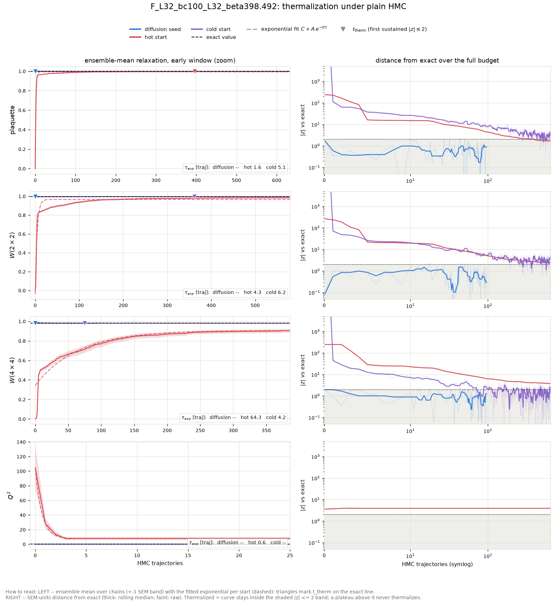

tau_int (hot-start chains, second half): plaquette = 32.24 +- 2.16, wilson_2x2 = 28.59 +- 2.56, wilson_4x4 = 22.95 +- 2.81, wilson_6x6 = 8.53 +- 2.10. Topology: hot-start HMC L=32 beta=398.492 -> **frozen** (no tunneling).

Where 'never' stood at the end: the hot start ended the 640-trajectory budget still at wilson_2x2 at |z| ~ 2, wilson_4x4 at |z| ~ 4, wilson_6x6 at |z| ~ 4, Q^2 at |z| ~ 4; the cold start ended the 640-trajectory budget still at plaquette at |z| ~ 3, Q^2 at |z| ~ 930603328.

### Diagnostics: raw diffusion output (before any HMC)

| observable | value | error | exact | z_exact | reference | ref_error | z_ref | ks_p |
|---|---|---|---|---|---|---|---|---|
| plaquette | 0.9987 | 5.306e-06 | 0.9987 | -2.18 | 0.9988 | 6.146e-06 | -4.786 | 7.587e-06 |
| wilson_1x1 | 0.9987 | 5.306e-06 | 0.9987 | -2.18 | 0.9988 | 6.146e-06 | -4.786 | 7.587e-06 |
| wilson_1x2 | 0.9975 | 1.258e-05 | 0.9975 | -2.416 | 0.9975 | 1.366e-05 | -4.372 | 0.000227 |
| wilson_2x2 | 0.995 | 3.175e-05 | 0.995 | 0.09063 | 0.9952 | 3.647e-05 | -3.299 | 0.006074 |
| wilson_2x3 | 0.9925 | 5.899e-05 | 0.9925 | -0.3089 | 0.9928 | 6.478e-05 | -3.048 | 0.02601 |
| wilson_3x3 | 0.9888 | 0.000125 | 0.9889 | -0.549 | 0.9892 | 0.0001219 | -2.65 | 0.03146 |
| wilson_3x4 | 0.9849 | 0.000201 | 0.9852 | -1.294 | 0.9856 | 0.0001908 | -2.372 | 0.07626 |
| wilson_4x4 | 0.9798 | 0.0003283 | 0.9804 | -1.965 | 0.9808 | 0.0002974 | -2.347 | 0.03788 |
| wilson_4x5 | 0.9747 | 0.0004757 | 0.9757 | -2.082 | 0.9759 | 0.0004406 | -1.858 | 0.1231 |
| wilson_5x5 | 0.9684 | 0.0006986 | 0.9698 | -2.018 | 0.9698 | 0.0006173 | -1.542 | 0.1658 |
| wilson_5x6 | 0.9621 | 0.0009385 | 0.9641 | -2.105 | 0.964 | 0.0008204 | -1.503 | 0.1432 |
| wilson_6x6 | 0.9544 | 0.001261 | 0.9573 | -2.276 | 0.9568 | 0.001048 | -1.479 | 0.1432 |
| wilson_6x7 | 0.9468 | 0.00163 | 0.9506 | -2.324 | 0.9502 | 0.001321 | -1.609 | 0.1054 |
| wilson_7x7 | 0.9382 | 0.002023 | 0.943 | -2.41 | 0.9423 | 0.001662 | -1.574 | 0.08985 |
| wilson_7x8 | 0.9292 | 0.002487 | 0.9356 | -2.592 | 0.9346 | 0.001956 | -1.712 | 0.1432 |
| wilson_8x8 | 0.9193 | 0.002961 | 0.9273 | -2.699 | 0.9261 | 0.0023 | -1.805 | 0.06444 |
| wilson_8x10 | 0.8996 | 0.004122 | 0.9114 | -2.869 | 0.9095 | 0.003021 | -1.94 | 0.03146 |
| wilson_10x10 | 0.8759 | 0.00557 | 0.8927 | -3.008 | 0.8905 | 0.003945 | -2.138 | 0.03788 |
| wilson_10x12 | 0.8531 | 0.007213 | 0.8752 | -3.059 | 0.8724 | 0.004697 | -2.237 | 0.08985 |
| wilson_12x12 | 0.8291 | 0.009286 | 0.8557 | -2.865 | 0.8534 | 0.005714 | -2.223 | 0.05422 |
| creutz_2 | 0.001193 | 2.477e-05 | 0.001245 | -2.109 |  |  |  |  |
| creutz_3 | 0.001256 | 4.894e-05 | 0.001226 | 0.6086 |  |  |  |  |
| creutz_4 | 0.001397 | 9.43e-05 | 0.001197 | 2.117 |  |  |  |  |
| creutz_5 | 0.00124 | 0.000151 | 0.001158 | 0.5376 |  |  |  |  |
| creutz_6 | 0.001465 | 0.0002072 | 0.00111 | 1.712 |  |  |  |  |
| creutz_7 | 0.001252 | 0.000281 | 0.001052 | 0.7116 |  |  |  |  |
| creutz_8 | 0.0009965 | 0.0003559 | 0.000984 | 0.03492 |  |  |  |  |
| Q | 0 | 0 | 0 | 0 | 0 | 0 | 0 | 1 |
| Q^2 | 0 | 0 | 0.0009306 | inf | 0 | 0 | 0 | 1 |
| chi_top ((<Q^2>-<Q>^2)/V) | 0 | 0 | 9.088e-07 | inf | 0 | 0 | 0 | 1 |

### Diagnostics: the same configs after 96 HMC trajectories

| observable | value | error | exact | z_exact | reference | ref_error | z_ref | ks_p |
|---|---|---|---|---|---|---|---|---|
| plaquette | 0.9987 | 5.43e-06 | 0.9987 | -1.079 | 0.9988 | 6.146e-06 | -4.042 | 0.0001707 |
| wilson_1x1 | 0.9987 | 5.43e-06 | 0.9987 | -1.079 | 0.9988 | 6.146e-06 | -4.042 | 0.0001707 |
| wilson_1x2 | 0.9975 | 1.375e-05 | 0.9975 | -0.9487 | 0.9975 | 1.366e-05 | -3.294 | 0.002398 |
| wilson_2x2 | 0.995 | 3.368e-05 | 0.995 | 0.354 | 0.9952 | 3.647e-05 | -3.031 | 0.02141 |
| wilson_2x3 | 0.9926 | 6.07e-05 | 0.9925 | 0.3071 | 0.9928 | 6.478e-05 | -2.593 | 0.06444 |
| wilson_3x3 | 0.989 | 0.0001149 | 0.9889 | 1.015 | 0.9892 | 0.0001219 | -1.656 | 0.1912 |
| wilson_3x4 | 0.9854 | 0.0001781 | 0.9852 | 0.928 | 0.9856 | 0.0001908 | -0.889 | 0.6115 |
| wilson_4x4 | 0.9808 | 0.0002954 | 0.9804 | 1.27 | 0.9808 | 0.0002974 | -0.04672 | 0.9992 |
| wilson_4x5 | 0.9763 | 0.0004366 | 0.9757 | 1.379 | 0.9759 | 0.0004406 | 0.6258 | 0.7202 |
| wilson_5x5 | 0.9707 | 0.000619 | 0.9698 | 1.481 | 0.9698 | 0.0006173 | 1.017 | 0.3231 |
| wilson_5x6 | 0.9652 | 0.0008281 | 0.9641 | 1.431 | 0.964 | 0.0008204 | 1.104 | 0.3641 |
| wilson_6x6 | 0.959 | 0.001062 | 0.9573 | 1.617 | 0.9568 | 0.001048 | 1.449 | 0.2195 |
| wilson_6x7 | 0.9527 | 0.001402 | 0.9506 | 1.494 | 0.9502 | 0.001321 | 1.301 | 0.4084 |
| wilson_7x7 | 0.9455 | 0.001673 | 0.943 | 1.499 | 0.9423 | 0.001662 | 1.384 | 0.3231 |
| wilson_7x8 | 0.9385 | 0.002043 | 0.9356 | 1.408 | 0.9346 | 0.001956 | 1.382 | 0.1658 |
| wilson_8x8 | 0.9307 | 0.002378 | 0.9273 | 1.431 | 0.9261 | 0.0023 | 1.399 | 0.3231 |
| wilson_8x10 | 0.9161 | 0.003191 | 0.9114 | 1.462 | 0.9095 | 0.003021 | 1.497 | 0.06444 |
| wilson_10x10 | 0.8986 | 0.004086 | 0.8927 | 1.446 | 0.8905 | 0.003945 | 1.421 | 0.1912 |
| wilson_10x12 | 0.8827 | 0.005136 | 0.8752 | 1.461 | 0.8724 | 0.004697 | 1.481 | 0.07626 |
| wilson_12x12 | 0.8643 | 0.00634 | 0.8557 | 1.358 | 0.8534 | 0.005714 | 1.285 | 0.1658 |
| creutz_2 | 0.001213 | 2.551e-05 | 0.001245 | -1.265 |  |  |  |  |
| creutz_3 | 0.001134 | 4.757e-05 | 0.001226 | -1.94 |  |  |  |  |
| creutz_4 | 0.001032 | 9.387e-05 | 0.001197 | -1.756 |  |  |  |  |
| creutz_5 | 0.001064 | 0.0001158 | 0.001158 | -0.8108 |  |  |  |  |
| creutz_6 | 0.0008299 | 0.000165 | 0.00111 | -1.697 |  |  |  |  |
| creutz_7 | 0.001006 | 0.0002564 | 0.001052 | -0.1785 |  |  |  |  |
| creutz_8 | 0.0008068 | 0.0003336 | 0.000984 | -0.5312 |  |  |  |  |
| Q | 0 | 0 | 0 | 0 | 0 | 0 | 0 | 1 |
| Q^2 | 0 | 0 | 0.0009306 | inf | 0 | 0 | 0 | 1 |
| chi_top ((<Q^2>-<Q>^2)/V) | 0 | 0 | 9.088e-07 | inf | 0 | 0 | 0 | 1 |

## F_L32_bc218.58_L32_beta872.816

HMC: step size 0.0135, 74 leapfrog steps, acceptance seed/hot/cold = 0.969/0.020/0.967. Diffusion-seed batch: 64 chains x 96 trajectories (0.22 s/traj for the whole batch); baselines: 32 chains x 640 trajectories.

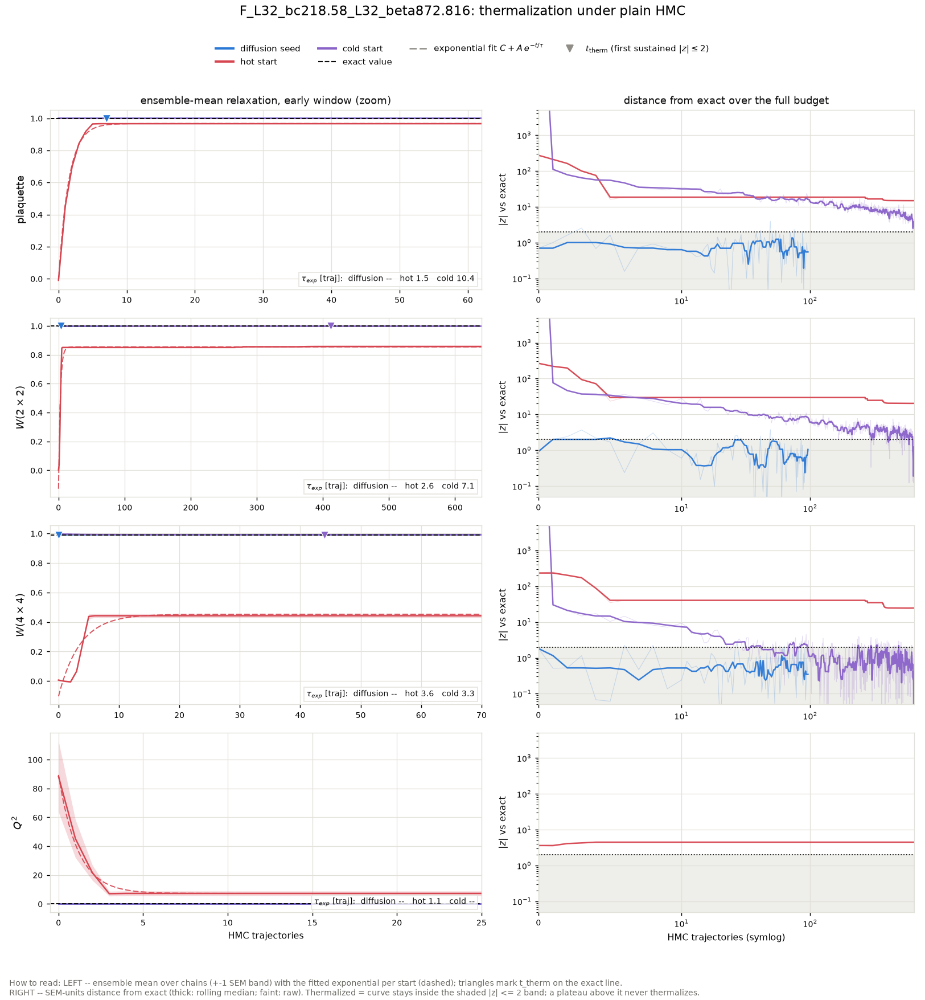

tau_int (hot-start chains, second half): plaquette = 1.41 +- 0.89, wilson_2x2 = 1.43 +- 0.91, wilson_4x4 = 1.40 +- 0.89, wilson_6x6 = 1.42 +- 0.91. Topology: hot-start HMC L=32 beta=872.816 -> **frozen** (no tunneling).

Where 'never' stood at the end: the hot start ended the 640-trajectory budget still at plaquette at |z| ~ 15, wilson_2x2 at |z| ~ 20, wilson_4x4 at |z| ~ 25, wilson_6x6 at |z| ~ 29, Q^2 at |z| ~ 4; the cold start ended the 640-trajectory budget still at plaquette at |z| ~ 3, Q^2 at |z| ~ 99603.

### Diagnostics: raw diffusion output (before any HMC)

| observable | value | error | exact | z_exact | reference | ref_error | z_ref | ks_p |
|---|---|---|---|---|---|---|---|---|
| plaquette | 0.9994 | 3.063e-06 | 0.9994 | -0.7072 | 0.9994 | 2.757e-06 | -1.601 | 0.2508 |
| wilson_1x1 | 0.9994 | 3.063e-06 | 0.9994 | -0.7072 | 0.9994 | 2.757e-06 | -1.601 | 0.2508 |
| wilson_1x2 | 0.9989 | 8.698e-06 | 0.9989 | -0.5717 | 0.9989 | 8.312e-06 | -0.8369 | 0.4556 |
| wilson_2x2 | 0.9977 | 2.204e-05 | 0.9977 | 0.9025 | 0.9977 | 1.927e-05 | 0.05665 | 0.7202 |
| wilson_2x3 | 0.9966 | 4.269e-05 | 0.9966 | 0.1896 | 0.9966 | 3.54e-05 | -0.3549 | 0.7729 |
| wilson_3x3 | 0.9949 | 7.951e-05 | 0.9949 | -0.2175 | 0.9949 | 5.674e-05 | -0.4418 | 0.7202 |
| wilson_3x4 | 0.9931 | 0.0001202 | 0.9932 | -1.015 | 0.9932 | 8.459e-05 | -0.8837 | 0.2195 |
| wilson_4x4 | 0.9907 | 0.0001908 | 0.991 | -1.529 | 0.991 | 0.0001211 | -1.024 | 0.4084 |
| wilson_4x5 | 0.9883 | 0.0002623 | 0.9888 | -2.029 | 0.9887 | 0.0001533 | -1.281 | 0.2853 |
| wilson_5x5 | 0.9853 | 0.0003475 | 0.9861 | -2.376 | 0.9858 | 0.0002081 | -1.303 | 0.4084 |
| wilson_5x6 | 0.9822 | 0.00046 | 0.9834 | -2.81 | 0.983 | 0.0002571 | -1.551 | 0.1912 |
| wilson_6x6 | 0.9784 | 0.0005673 | 0.9803 | -3.352 | 0.9797 | 0.0003122 | -1.973 | 0.1912 |
| wilson_6x7 | 0.9746 | 0.000732 | 0.9772 | -3.57 | 0.9764 | 0.0003917 | -2.192 | 0.1054 |
| wilson_7x7 | 0.9701 | 0.0008639 | 0.9736 | -4.027 | 0.9726 | 0.0004665 | -2.487 | 0.1054 |
| wilson_7x8 | 0.9656 | 0.001052 | 0.9701 | -4.244 | 0.9688 | 0.0005765 | -2.632 | 0.07626 |
| wilson_8x8 | 0.9607 | 0.001218 | 0.9662 | -4.482 | 0.9646 | 0.0006729 | -2.773 | 0.08985 |
| wilson_8x10 | 0.9505 | 0.001736 | 0.9586 | -4.681 | 0.9563 | 0.001002 | -2.924 | 0.05422 |
| wilson_10x10 | 0.9385 | 0.002435 | 0.9496 | -4.538 | 0.9467 | 0.001368 | -2.935 | 0.01755 |
| wilson_10x12 | 0.9266 | 0.003235 | 0.9411 | -4.47 | 0.9375 | 0.001817 | -2.938 | 0.01163 |
| wilson_12x12 | 0.9133 | 0.00419 | 0.9315 | -4.359 | 0.9274 | 0.002323 | -2.945 | 0.00941 |
| creutz_2 | 0.0005404 | 1.235e-05 | 0.0005681 | -2.245 |  |  |  |  |
| creutz_3 | 0.0005729 | 2.206e-05 | 0.0005592 | 0.6207 |  |  |  |  |
| creutz_4 | 0.0006121 | 3.318e-05 | 0.0005458 | 2 |  |  |  |  |
| creutz_5 | 0.0005832 | 5.928e-05 | 0.0005278 | 0.9342 |  |  |  |  |
| creutz_6 | 0.0006549 | 7.826e-05 | 0.0005055 | 1.91 |  |  |  |  |
| creutz_7 | 0.0006446 | 0.0001123 | 0.0004786 | 1.479 |  |  |  |  |
| creutz_8 | 0.00047 | 0.0001443 | 0.0004472 | 0.1577 |  |  |  |  |
| Q | 0 | 0 | 0 | 0 | 0 | 0 | 0 | 1 |
| Q^2 | 0 | 0 | 9.96e-08 | inf | 0 | 0 | 0 | 1 |
| chi_top ((<Q^2>-<Q>^2)/V) | 0 | 0 | 9.727e-11 | inf | 0 | 0 | 0 | 1 |

### Diagnostics: the same configs after 96 HMC trajectories

| observable | value | error | exact | z_exact | reference | ref_error | z_ref | ks_p |
|---|---|---|---|---|---|---|---|---|
| plaquette | 0.9994 | 3.04e-06 | 0.9994 | 0.5882 | 0.9994 | 2.757e-06 | -0.6441 | 0.5055 |
| wilson_1x1 | 0.9994 | 3.04e-06 | 0.9994 | 0.5882 | 0.9994 | 2.757e-06 | -0.6441 | 0.5055 |
| wilson_1x2 | 0.9989 | 7.862e-06 | 0.9989 | 0.4122 | 0.9989 | 8.312e-06 | -0.1622 | 0.9069 |
| wilson_2x2 | 0.9977 | 1.518e-05 | 0.9977 | 1.233 | 0.9977 | 1.927e-05 | 0.01962 | 0.9069 |
| wilson_2x3 | 0.9966 | 2.328e-05 | 0.9966 | 0.6875 | 0.9966 | 3.54e-05 | -0.2779 | 0.5577 |
| wilson_3x3 | 0.9949 | 4.733e-05 | 0.9949 | 0.2489 | 0.9949 | 5.674e-05 | -0.1905 | 0.9638 |
| wilson_3x4 | 0.9932 | 6.785e-05 | 0.9932 | -0.204 | 0.9932 | 8.459e-05 | -0.2007 | 0.5577 |
| wilson_4x4 | 0.991 | 0.0001311 | 0.991 | -0.3601 | 0.991 | 0.0001211 | 0.07426 | 0.6115 |
| wilson_4x5 | 0.9888 | 0.0001714 | 0.9888 | -0.4187 | 0.9887 | 0.0001533 | 0.3099 | 0.4084 |
| wilson_5x5 | 0.986 | 0.000259 | 0.9861 | -0.446 | 0.9858 | 0.0002081 | 0.5492 | 0.2853 |
| wilson_5x6 | 0.9833 | 0.0003172 | 0.9834 | -0.3865 | 0.983 | 0.0002571 | 0.863 | 0.2508 |
| wilson_6x6 | 0.98 | 0.0004262 | 0.9803 | -0.5884 | 0.9797 | 0.0003122 | 0.7065 | 0.5577 |
| wilson_6x7 | 0.9768 | 0.000525 | 0.9772 | -0.6725 | 0.9764 | 0.0003917 | 0.672 | 0.3641 |
| wilson_7x7 | 0.973 | 0.0006621 | 0.9736 | -0.895 | 0.9726 | 0.0004665 | 0.549 | 0.4556 |
| wilson_7x8 | 0.9693 | 0.0007953 | 0.9701 | -0.9699 | 0.9688 | 0.0005765 | 0.5457 | 0.4084 |
| wilson_8x8 | 0.9651 | 0.0009527 | 0.9662 | -1.189 | 0.9646 | 0.0006729 | 0.4017 | 0.7202 |
| wilson_8x10 | 0.9566 | 0.001362 | 0.9586 | -1.439 | 0.9563 | 0.001002 | 0.1808 | 0.7729 |
| wilson_10x10 | 0.9468 | 0.001762 | 0.9496 | -1.582 | 0.9467 | 0.001368 | 0.03005 | 0.7729 |
| wilson_10x12 | 0.9374 | 0.002281 | 0.9411 | -1.633 | 0.9375 | 0.001817 | -0.05669 | 0.9069 |
| wilson_12x12 | 0.9265 | 0.002681 | 0.9315 | -1.885 | 0.9274 | 0.002323 | -0.2529 | 0.8225 |
| creutz_2 | 0.0005541 | 1.21e-05 | 0.0005681 | -1.161 |  |  |  |  |
| creutz_3 | 0.0005607 | 2.48e-05 | 0.0005592 | 0.06139 |  |  |  |  |
| creutz_4 | 0.0005537 | 4.676e-05 | 0.0005458 | 0.1696 |  |  |  |  |
| creutz_5 | 0.0005475 | 6.521e-05 | 0.0005278 | 0.3007 |  |  |  |  |
| creutz_6 | 0.0006291 | 9.213e-05 | 0.0005055 | 1.342 |  |  |  |  |
| creutz_7 | 0.0006206 | 0.0001108 | 0.0004786 | 1.282 |  |  |  |  |
| creutz_8 | 0.0006384 | 0.0001321 | 0.0004472 | 1.447 |  |  |  |  |
| Q | 0 | 0 | 0 | 0 | 0 | 0 | 0 | 1 |
| Q^2 | 0 | 0 | 9.96e-08 | inf | 0 | 0 | 0 | 1 |
| chi_top ((<Q^2>-<Q>^2)/V) | 0 | 0 | 9.727e-11 | inf | 0 | 0 | 0 | 1 |

## F_L64_bc55.0237_L64_beta218.58

HMC: step size 0.0271, 37 leapfrog steps, acceptance seed/hot/cold = 0.949/0.623/0.943. Diffusion-seed batch: 64 chains x 96 trajectories (0.31 s/traj for the whole batch); baselines: 16 chains x 640 trajectories.

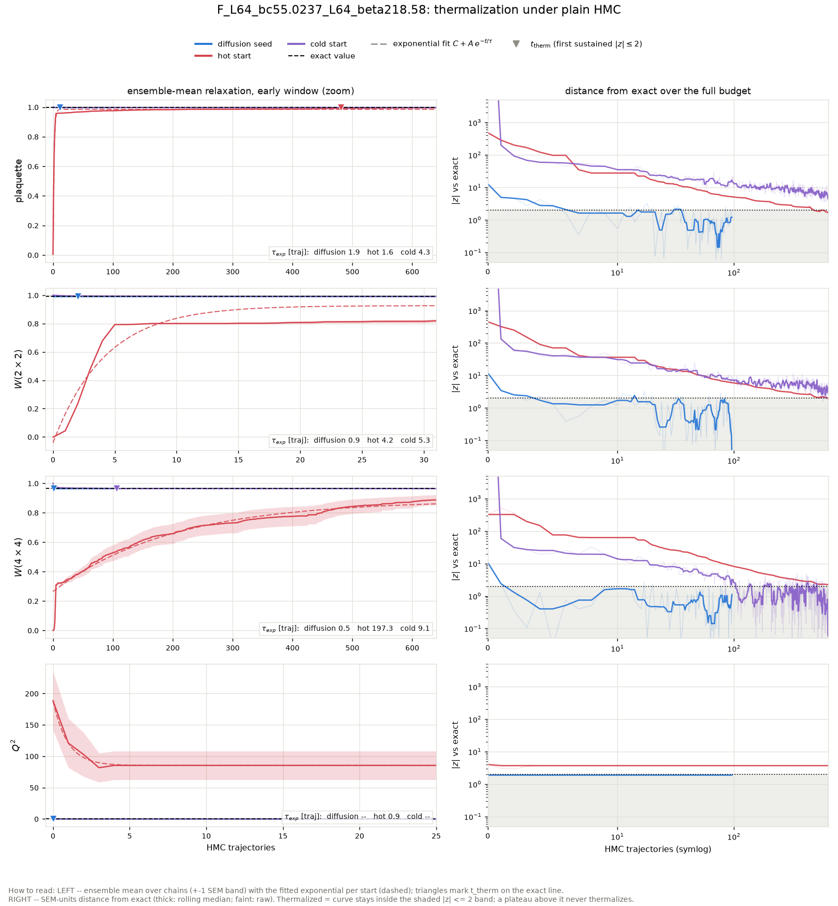

tau_int (hot-start chains, second half): plaquette = 40.09 +- 3.25, wilson_2x2 = 40.03 +- 3.39, wilson_4x4 = 36.90 +- 3.94, wilson_6x6 = 40.03 +- 3.76. Topology: hot-start HMC L=64 beta=218.58 -> **frozen** (no tunneling).

Where 'never' stood at the end: the hot start ended the 640-trajectory budget still at wilson_2x2 at |z| ~ 2, wilson_4x4 at |z| ~ 2, wilson_6x6 at |z| ~ 3, Q^2 at |z| ~ 4; the cold start ended the 640-trajectory budget still at plaquette at |z| ~ 6, wilson_2x2 at |z| ~ 4, Q^2 at |z| ~ 474267189248.

### Diagnostics: raw diffusion output (before any HMC)

| observable | value | error | exact | z_exact | reference | ref_error | z_ref | ks_p | chi2_p |
|---|---|---|---|---|---|---|---|---|---|
| plaquette | 0.9976 | 7.132e-06 | 0.9977 | -10.7 | 0.9978 | 3.853e-06 | -15.22 | 2.569e-23 |  |
| wilson_1x1 | 0.9976 | 7.132e-06 | 0.9977 | -10.7 | 0.9978 | 3.853e-06 | -15.22 | 2.569e-23 |  |
| wilson_1x2 | 0.9952 | 1.708e-05 | 0.9954 | -13.76 | 0.9955 | 1.087e-05 | -14.96 | 4.808e-24 |  |
| wilson_2x2 | 0.9904 | 4.057e-05 | 0.9909 | -10.5 | 0.991 | 3.219e-05 | -10.66 | 1.448e-15 |  |
| wilson_2x3 | 0.9856 | 8.005e-05 | 0.9863 | -9.689 | 0.9865 | 5.523e-05 | -9.387 | 4.769e-13 |  |
| wilson_3x3 | 0.9783 | 0.0001535 | 0.9796 | -8.58 | 0.9797 | 9.458e-05 | -7.93 | 2.154e-10 |  |
| wilson_3x4 | 0.9706 | 0.0002565 | 0.9729 | -8.935 | 0.973 | 0.0001387 | -8.237 | 4.769e-13 |  |
| wilson_4x4 | 0.96 | 0.0004337 | 0.964 | -9.116 | 0.964 | 0.0002195 | -8.162 | 5.087e-14 |  |
| wilson_4x5 | 0.9491 | 0.0006544 | 0.9552 | -9.246 | 0.9553 | 0.0003107 | -8.468 | 4.876e-15 |  |
| wilson_5x5 | 0.935 | 0.001012 | 0.9443 | -9.233 | 0.9442 | 0.0004459 | -8.343 | 3.189e-17 |  |
| wilson_5x6 | 0.9202 | 0.001391 | 0.9335 | -9.573 | 0.9333 | 0.0005978 | -8.642 | 1.645e-17 |  |
| wilson_6x6 | 0.9019 | 0.001993 | 0.9208 | -9.455 | 0.9204 | 0.000829 | -8.564 | 2.152e-18 |  |
| wilson_6x7 | 0.883 | 0.002602 | 0.9082 | -9.683 | 0.9078 | 0.001052 | -8.833 | 1.075e-18 |  |
| wilson_7x7 | 0.8605 | 0.003483 | 0.8937 | -9.531 | 0.8933 | 0.001322 | -8.781 | 1.275e-19 |  |
| wilson_7x8 | 0.8374 | 0.004349 | 0.8795 | -9.689 | 0.8791 | 0.00161 | -8.995 | 3.069e-21 |  |
| wilson_8x8 | 0.8105 | 0.005486 | 0.8635 | -9.667 | 0.8632 | 0.001973 | -9.043 | 3.069e-21 |  |
| wilson_8x10 | 0.7551 | 0.007818 | 0.8324 | -9.891 | 0.8321 | 0.002657 | -9.328 | 6.584e-21 |  |
| wilson_10x10 | 0.6849 | 0.01118 | 0.7951 | -9.859 | 0.7957 | 0.003376 | -9.492 | 4.808e-24 |  |
| wilson_10x12 | 0.6163 | 0.0144 | 0.7595 | -9.947 | 0.76 | 0.004057 | -9.606 | 4.808e-24 |  |
| wilson_12x12 | 0.538 | 0.01809 | 0.7188 | -10 | 0.7197 | 0.004942 | -9.693 | 3.586e-25 |  |
| creutz_2 | 0.002327 | 2.318e-05 | 0.002293 | 1.47 |  |  |  |  |  |
| creutz_3 | 0.002495 | 5.734e-05 | 0.002293 | 3.52 |  |  |  |  |  |
| creutz_4 | 0.00303 | 9.358e-05 | 0.002293 | 7.883 |  |  |  |  |  |
| creutz_5 | 0.003634 | 0.0001646 | 0.002293 | 8.153 |  |  |  |  |  |
| creutz_6 | 0.004184 | 0.0002399 | 0.002293 | 7.886 |  |  |  |  |  |
| creutz_7 | 0.004562 | 0.0003394 | 0.002292 | 6.688 |  |  |  |  |  |
| creutz_8 | 0.005349 | 0.0004264 | 0.002292 | 7.168 |  |  |  |  |  |
| Q | -0.04688 | 0.09793 | 0 | -0.4786 | -0.03125 | 0.05025 | -0.142 | 0.9969 |  |
| Q^2 | 0.3594 | 0.07382 | 0.4743 | -1.556 | 0.5521 | 0.08449 | -1.718 | 0.8225 |  |
| chi_top ((<Q^2>-<Q>^2)/V) | 8.72e-05 | 1.808e-05 | 0.0001158 | -1.581 | 0.0001345 | 2.078e-05 | -1.719 | 8.257e-11 |  |
| Q histogram vs exact P(Q) | 1.06 | nan | 2 | nan |  |  |  |  | 0.5887 |

### Diagnostics: the same configs after 96 HMC trajectories

| observable | value | error | exact | z_exact | reference | ref_error | z_ref | ks_p | chi2_p |
|---|---|---|---|---|---|---|---|---|---|
| plaquette | 0.9977 | 3.708e-06 | 0.9977 | -1.784 | 0.9978 | 3.853e-06 | -10.05 | 2.061e-07 |  |
| wilson_1x1 | 0.9977 | 3.708e-06 | 0.9977 | -1.784 | 0.9978 | 3.853e-06 | -10.05 | 2.061e-07 |  |
| wilson_1x2 | 0.9954 | 1.197e-05 | 0.9954 | -1.3 | 0.9955 | 1.087e-05 | -5.164 | 0.0003959 |  |
| wilson_2x2 | 0.9909 | 2.651e-05 | 0.9909 | -0.03975 | 0.991 | 3.219e-05 | -3.055 | 0.04542 |  |
| wilson_2x3 | 0.9864 | 4.796e-05 | 0.9863 | 0.3479 | 0.9865 | 5.523e-05 | -1.649 | 0.5577 |  |
| wilson_3x3 | 0.9797 | 0.0001043 | 0.9796 | 0.8811 | 0.9797 | 9.458e-05 | -0.1486 | 0.8677 |  |
| wilson_3x4 | 0.973 | 0.000152 | 0.9729 | 1.185 | 0.973 | 0.0001387 | 0.3413 | 0.5577 |  |
| wilson_4x4 | 0.9643 | 0.0002711 | 0.964 | 1.278 | 0.964 | 0.0002195 | 0.9528 | 0.2853 |  |
| wilson_4x5 | 0.9557 | 0.0003649 | 0.9552 | 1.457 | 0.9553 | 0.0003107 | 0.9356 | 0.2508 |  |
| wilson_5x5 | 0.945 | 0.0005602 | 0.9443 | 1.185 | 0.9442 | 0.0004459 | 1.091 | 0.08985 |  |
| wilson_5x6 | 0.9344 | 0.0007509 | 0.9335 | 1.101 | 0.9333 | 0.0005978 | 1.101 | 0.2853 |  |
| wilson_6x6 | 0.9217 | 0.001037 | 0.9208 | 0.8751 | 0.9204 | 0.000829 | 0.9526 | 0.2195 |  |
| wilson_6x7 | 0.9092 | 0.001292 | 0.9082 | 0.7783 | 0.9078 | 0.001052 | 0.844 | 0.4556 |  |
| wilson_7x7 | 0.8948 | 0.001654 | 0.8937 | 0.6358 | 0.8933 | 0.001322 | 0.7245 | 0.5055 |  |
| wilson_7x8 | 0.8807 | 0.001988 | 0.8795 | 0.5837 | 0.8791 | 0.00161 | 0.6182 | 0.3641 |  |
| wilson_8x8 | 0.8645 | 0.002405 | 0.8635 | 0.395 | 0.8632 | 0.001973 | 0.4068 | 0.7729 |  |
| wilson_8x10 | 0.8335 | 0.00331 | 0.8324 | 0.3165 | 0.8321 | 0.002657 | 0.318 | 0.6115 |  |
| wilson_10x10 | 0.7963 | 0.004709 | 0.7951 | 0.2502 | 0.7957 | 0.003376 | 0.09577 | 0.7202 |  |
| wilson_10x12 | 0.7609 | 0.005919 | 0.7595 | 0.2325 | 0.76 | 0.004057 | 0.1243 | 0.6115 |  |
| wilson_12x12 | 0.7211 | 0.007549 | 0.7188 | 0.303 | 0.7197 | 0.004942 | 0.1571 | 0.5577 |  |
| creutz_2 | 0.002269 | 2.067e-05 | 0.002293 | -1.139 |  |  |  |  |  |
| creutz_3 | 0.002234 | 5.528e-05 | 0.002293 | -1.066 |  |  |  |  |  |
| creutz_4 | 0.00221 | 0.0001009 | 0.002293 | -0.8213 |  |  |  |  |  |
| creutz_5 | 0.002343 | 0.0001303 | 0.002293 | 0.3875 |  |  |  |  |  |
| creutz_6 | 0.002375 | 0.00017 | 0.002293 | 0.4864 |  |  |  |  |  |
| creutz_7 | 0.002345 | 0.0002057 | 0.002292 | 0.2569 |  |  |  |  |  |
| creutz_8 | 0.002654 | 0.0002889 | 0.002292 | 1.251 |  |  |  |  |  |
| Q | -0.04688 | 0.09793 | 0 | -0.4786 | -0.03125 | 0.05025 | -0.142 | 0.9969 |  |
| Q^2 | 0.3594 | 0.07382 | 0.4743 | -1.556 | 0.5521 | 0.08449 | -1.718 | 0.8225 |  |
| chi_top ((<Q^2>-<Q>^2)/V) | 8.72e-05 | 1.808e-05 | 0.0001158 | -1.581 | 0.0001345 | 2.078e-05 | -1.719 | 8.257e-11 |  |
| Q histogram vs exact P(Q) | 1.06 | nan | 2 | nan |  |  |  |  | 0.5887 |
