# Diffusion-seeded HMC across the matched beta scan: thermalization time vs the standard-HMC sampling interval

Action: wilson. All HMC in this report is plain HMC (Omelyan, adapted step size, **no** topological updates).

**Why this scan.** At the ladder's upper rungs the fresh-HMC baselines never thermalize at all (topological freezing plus a metastable local-defect state), so the only comparison available there is 'diffusion seed vs a baseline that never arrives'. This report extends the benchmark to every matched coupling pair of the generalization study -- one inverse-RG step L=16 -> L=32 per case -- including fine couplings low enough that hot- and cold-start HMC *does* thermalize within the budget. There the standard chain's own interval `2 tau_int` and its fresh-start burn-in are honest, measurable yardsticks, and the scan shows where the ordering

> t_therm(diffusion seed)  <  2 tau_int(standard HMC)  <  burn-in(fresh chain)

sets in as beta grows and standard HMC slides into critical slowing down and topological freezing.

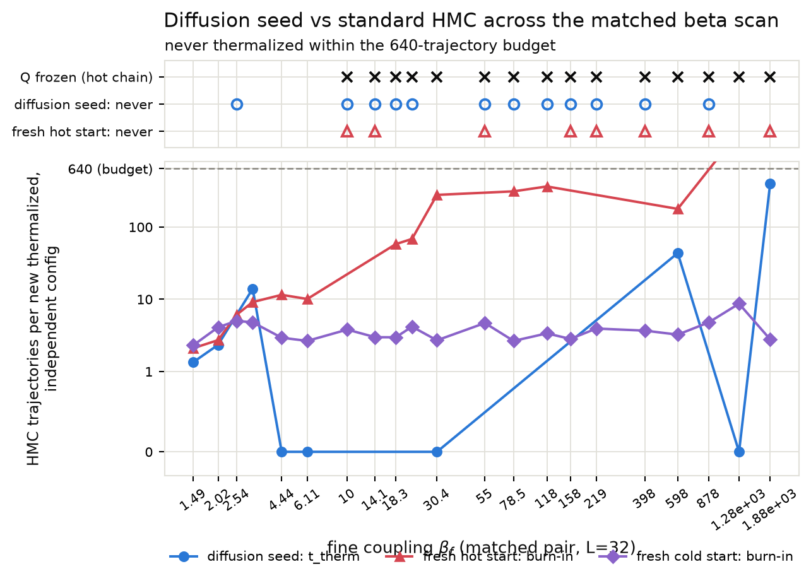

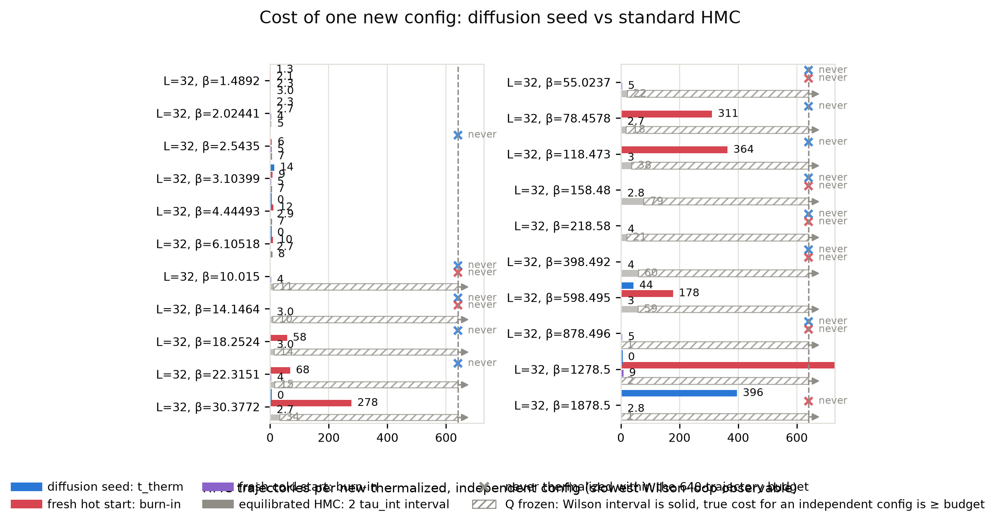

## The three starting points

- **Diffusion seed** -- the raw conditional-diffusion output for this coupling: one inverse-RG step from a direct-HMC base ensemble at the matched coarse coupling (ancestral sampling + the deterministic coarse-charge transport), with **no** rethermalization sweeps applied: every bit of equilibration the seed needs is measured here, in HMC trajectories.
- **Hot start** -- every link angle drawn uniformly from (-pi, pi]: a completely disordered (infinite-temperature) configuration. The standard way to initialize a fresh HMC chain without prior information.
- **Cold start** -- every link angle set to zero: the perfectly ordered (beta -> infinity) configuration, the other standard initialization.

## Summary

| rung | L | beta | t_therm diffusion seed | standard-HMC interval 2 tau_int | margin (interval - t_therm) | burn-in hot / cold | tau_int(Q) |
|---|---|---|---|---|---|---|---|
| A_bc0.25_L32_beta1.4892 | 32 | 1.4892 | 1 | 3.0 | 1.6 traj | 2 / 2 | 1.5 |
| A_bc0.5_L32_beta2.02441 | 32 | 2.02441 | 2 | 4.7 | 2.3 traj | 3 / 4 | 2.6 |
| A_bc0.75_L32_beta2.5435 | 32 | 2.5435 | never | 7.0 | -- | 6 / 5 | 5.8 |
| A_bc1_L32_beta3.10399 | 32 | 3.10399 | 14 | 7.0 | -7.0 traj | 9 / 5 | 8.2 |
| A_bc1.5_L32_beta4.44493 | 32 | 4.44493 | 0 | 7.0 | 7.0 traj | 12 / 3 | 29.6 |
| A_bc2_L32_beta6.10518 | 32 | 6.10518 | 0 | 7.9 | 7.9 traj | 10 / 3 | 39.9 |
| A_bc3_L32_beta10.015 | 32 | 10.015 | never | 11.3 | -- | never / 4 | frozen (0 tunnelings in 321 x 32 traj) |
| A_bc4_L32_beta14.1464 | 32 | 14.1464 | never | 10.3 | -- | never / 3 | frozen (0 tunnelings in 321 x 32 traj) |
| A_bc5_L32_beta18.2524 | 32 | 18.2524 | never | 14.0 | -- | 58 / 3 | frozen (0 tunnelings in 321 x 32 traj) |
| A_bc6_L32_beta22.3151 | 32 | 22.3151 | never | 15.2 | -- | 68 / 4 | frozen (0 tunnelings in 321 x 32 traj) |
| A_bc8_L32_beta30.3772 | 32 | 30.3772 | 0 | 34.0 | 34.0 traj | 278 / 3 | frozen (0 tunnelings in 321 x 32 traj) |
| D_bc14.1464_L32_beta55.0237 | 32 | 55.0237 | never | 22.0 | -- | never / 5 | frozen (0 tunnelings in 321 x 32 traj) |
| D_bc20_L32_beta78.4578 | 32 | 78.4578 | never | 17.6 | -- | 311 / 3 | frozen (0 tunnelings in 321 x 32 traj) |
| D_bc30_L32_beta118.473 | 32 | 118.473 | never | 38.1 | -- | 364 / 3 | frozen (0 tunnelings in 321 x 32 traj) |
| D_bc40_L32_beta158.48 | 32 | 158.48 | never | 79.0 | -- | never / 3 | frozen (0 tunnelings in 321 x 32 traj) |
| D_bc55.0237_L32_beta218.58 | 32 | 218.58 | never | 21.0 | -- | never / 4 | frozen (0 tunnelings in 321 x 32 traj) |
| D_bc100_L32_beta398.492 | 32 | 398.492 | never | 60.2 | -- | never / 4 | frozen (0 tunnelings in 321 x 32 traj) |
| D_bc150_L32_beta598.495 | 32 | 598.495 | 44 | 59.0 | 15.4 traj | 178 / 3 | frozen (0 tunnelings in 321 x 32 traj) |
| D_bc220_L32_beta878.496 | 32 | 878.496 | never | 1.0 | -- | never / 5 | frozen (0 tunnelings in 321 x 32 traj) |
| D_bc320_L32_beta1278.5 | 32 | 1278.5 | 0 | 1.9 | 1.9 traj | 2104 / 9 | frozen (0 tunnelings in 321 x 32 traj) |
| D_bc470_L32_beta1878.5 | 32 | 1878.5 | 396 | 1.0 | -395.2 traj | never / 3 | frozen (0 tunnelings in 321 x 32 traj) |

## Wall-clock accounting

All timescales above are in HMC trajectories -- the honest *ergodicity* unit. This table converts to seconds on this machine so the economics are explicit. Batched chains produce n_chains configs per trajectory, so per-config costs divide by the chain count; the diffusion sampling cost amortizes over the whole generated batch.

| case | seed: sample s/config | seed: t_therm s (batch) | HMC interval s/config | hot burn-in s (batch) | s/traj (batch) |
|---|---|---|---|---|---|
| A_bc0.25_L32_beta1.4892 | 0.4 | 0.1 | 0.01 | 0 | 0.08 |
| A_bc0.5_L32_beta2.02441 | 0.4 | 0.2 | 0.01 | 0 | 0.08 |
| A_bc0.75_L32_beta2.5435 | 0.4 | never | 0.02 | 1 | 0.08 |
| A_bc1_L32_beta3.10399 | 0.4 | 1.2 | 0.02 | 1 | 0.08 |
| A_bc1.5_L32_beta4.44493 | 0.4 | 0.0 | 0.02 | 1 | 0.08 |
| A_bc2_L32_beta6.10518 | 0.4 | 0.0 | 0.02 | 1 | 0.09 |
| A_bc3_L32_beta10.015 | 0.4 | never | 0.04 | never | 0.11 |
| A_bc4_L32_beta14.1464 | 0.4 | never | 0.04 | never | 0.12 |
| A_bc5_L32_beta18.2524 | 0.4 | never | 0.03 | 5 | 0.08 |
| A_bc6_L32_beta22.3151 | 0.3 | never | 0.04 | 6 | 0.08 |
| A_bc8_L32_beta30.3772 | 0.3 | 0.0 | 0.10 | 26 | 0.09 |
| D_bc14.1464_L32_beta55.0237 | 0.3 | never | 0.08 | never | 0.12 |
| D_bc20_L32_beta78.4578 | 0.3 | never | 0.07 | 41 | 0.13 |
| D_bc30_L32_beta118.473 | 0.3 | never | 0.20 | 60 | 0.17 |
| D_bc40_L32_beta158.48 | 0.3 | never | 0.47 | never | 0.19 |
| D_bc55.0237_L32_beta218.58 | 0.3 | never | 0.14 | never | 0.22 |
| D_bc100_L32_beta398.492 | 0.3 | never | 0.54 | never | 0.29 |
| D_bc150_L32_beta598.495 | 0.3 | 15.7 | 0.65 | 62 | 0.35 |
| D_bc220_L32_beta878.496 | 0.3 | never | 0.01 | never | 0.42 |
| D_bc320_L32_beta1278.5 | 0.3 | 0.0 | 0.03 | 1053 | 0.50 |
| D_bc470_L32_beta1878.5 | 0.3 | 245.5 | 0.02 | never | 0.61 |

## Fitted relaxation times across starts

Exponential fits C + A exp(-t/tau) to the ensemble-mean plaquette and W(2x2) relaxation curves, per starting point (the cross-start comparison of characteristic times; a start already at its plateau fits no decay, which is the desired outcome for the diffusion seed).

| case | obs | tau: diffusion seed | tau: hot start | tau: cold start |
|---|---|---|---|---|
| A_bc0.25_L32_beta1.4892 | plaquette | 1.2 +- 0.0 | 1.1 +- 0.0 | 2.5 +- 0.0 |
| A_bc0.25_L32_beta1.4892 | wilson_2x2 | 0.4 +- 0.2 | 2.1 +- 0.1 | 1.5 +- 0.0 |
| A_bc0.5_L32_beta2.02441 | plaquette | 2.0 +- 0.1 | 1.7 +- 0.0 | 4.0 +- 0.0 |
| A_bc0.5_L32_beta2.02441 | wilson_2x2 | 0.4 +- 0.2 | 2.7 +- 0.1 | 1.7 +- 0.0 |
| A_bc0.75_L32_beta2.5435 | plaquette | 5.6 +- 0.3 | 2.3 +- 0.0 | 5.0 +- 0.1 |
| A_bc0.75_L32_beta2.5435 | wilson_2x2 | 0.8 +- 0.3 | 3.8 +- 0.1 | 1.9 +- 0.0 |
| A_bc1_L32_beta3.10399 | plaquette | 13.7 +- 0.8 | 2.7 +- 0.0 | 6.5 +- 0.1 |
| A_bc1_L32_beta3.10399 | wilson_2x2 | 44.3 +- 41.7 | 5.0 +- 0.1 | 2.8 +- 0.1 |
| A_bc1.5_L32_beta4.44493 | plaquette | 7.7 +- 2.2 | 2.8 +- 0.0 | 3.7 +- 0.1 |
| A_bc1.5_L32_beta4.44493 | wilson_2x2 | 14.9 +- 12.5 | 7.4 +- 0.1 | 4.4 +- 0.1 |
| A_bc2_L32_beta6.10518 | plaquette | 3.8 +- 0.8 | 2.2 +- 0.0 | 5.1 +- 0.2 |
| A_bc2_L32_beta6.10518 | wilson_2x2 | 31.8 +- 10.1 | 8.9 +- 0.2 | 3.5 +- 0.1 |
| A_bc3_L32_beta10.015 | plaquette | 20.2 +- 6.7 | 2.0 +- 0.0 | 13.3 +- 0.6 |
| A_bc3_L32_beta10.015 | wilson_2x2 | no measurable decay (starts at plateau; tau unconstrained) | 7.3 +- 0.2 | 5.8 +- 0.3 |
| A_bc4_L32_beta14.1464 | plaquette | 6.1 +- 1.0 | 2.0 +- 0.0 | 7.5 +- 0.3 |
| A_bc4_L32_beta14.1464 | wilson_2x2 | unconstrained fit (tau error exceeds tau) | 7.9 +- 0.2 | 6.9 +- 0.3 |
| A_bc5_L32_beta18.2524 | plaquette | 2.1 +- 0.3 | 1.8 +- 0.0 | 5.7 +- 0.2 |
| A_bc5_L32_beta18.2524 | wilson_2x2 | 1.2 +- 0.6 | 6.1 +- 0.1 | 6.0 +- 0.3 |
| A_bc6_L32_beta22.3151 | plaquette | 8.0 +- 1.0 | 1.8 +- 0.0 | 13.9 +- 0.5 |
| A_bc6_L32_beta22.3151 | wilson_2x2 | unconstrained fit (tau error exceeds tau) | 5.6 +- 0.1 | 6.7 +- 0.3 |
| A_bc8_L32_beta30.3772 | plaquette | 4.5 +- 0.8 | 1.8 +- 0.0 | 8.0 +- 0.4 |
| A_bc8_L32_beta30.3772 | wilson_2x2 | 33.3 +- 17.0 | 5.4 +- 0.1 | 9.0 +- 0.5 |
| D_bc14.1464_L32_beta55.0237 | plaquette | 4.4 +- 0.4 | 1.7 +- 0.0 | 5.9 +- 0.2 |
| D_bc14.1464_L32_beta55.0237 | wilson_2x2 | 4.0 +- 1.3 | 4.8 +- 0.1 | 7.8 +- 0.3 |
| D_bc20_L32_beta78.4578 | plaquette | 2.8 +- 0.2 | 1.7 +- 0.0 | 4.2 +- 0.2 |
| D_bc20_L32_beta78.4578 | wilson_2x2 | 9.4 +- 1.1 | 4.3 +- 0.1 | 4.0 +- 0.2 |
| D_bc30_L32_beta118.473 | plaquette | 3.3 +- 0.2 | 1.6 +- 0.0 | 5.7 +- 0.2 |
| D_bc30_L32_beta118.473 | wilson_2x2 | 3.1 +- 0.5 | 3.9 +- 0.1 | 5.3 +- 0.2 |
| D_bc40_L32_beta158.48 | plaquette | 3.3 +- 0.3 | 1.7 +- 0.0 | 11.6 +- 0.5 |
| D_bc40_L32_beta158.48 | wilson_2x2 | 2.8 +- 0.8 | 3.9 +- 0.1 | 3.9 +- 0.2 |
| D_bc55.0237_L32_beta218.58 | plaquette | 2.4 +- 0.2 | 1.6 +- 0.0 | 5.5 +- 0.2 |
| D_bc55.0237_L32_beta218.58 | wilson_2x2 | 1.8 +- 0.4 | 4.1 +- 0.1 | 8.3 +- 0.3 |
| D_bc100_L32_beta398.492 | plaquette | 1.7 +- 0.2 | 1.6 +- 0.0 | 5.1 +- 0.2 |
| D_bc100_L32_beta398.492 | wilson_2x2 | 1.0 +- 0.4 | 4.7 +- 0.2 | 7.3 +- 0.3 |
| D_bc150_L32_beta598.495 | plaquette | 2.4 +- 0.2 | 1.6 +- 0.0 | 6.9 +- 0.3 |
| D_bc150_L32_beta598.495 | wilson_2x2 | 2.2 +- 0.5 | 4.2 +- 0.1 | 3.9 +- 0.2 |
| D_bc220_L32_beta878.496 | plaquette | 3.1 +- 0.9 | 1.5 +- 0.0 | 13.1 +- 0.6 |
| D_bc220_L32_beta878.496 | wilson_2x2 | unreliable (tau exceeds window) | 2.7 +- 0.1 | 8.0 +- 0.3 |
| D_bc320_L32_beta1278.5 | plaquette | 3.5 +- 0.3 | 1.5 +- 0.0 | 5.8 +- 0.2 |
| D_bc320_L32_beta1278.5 | wilson_2x2 | 4.1 +- 1.3 | 2.7 +- 0.1 | 8.5 +- 0.3 |
| D_bc470_L32_beta1878.5 | plaquette | 2.8 +- 0.2 | 1.4 +- 0.0 | 2.8 +- 0.1 |
| D_bc470_L32_beta1878.5 | wilson_2x2 | 2.8 +- 0.2 | 2.6 +- 0.1 | 2.4 +- 0.1 |

t_therm and burn-in are the slowest Wilson-loop observable (plaquette, W(2x2), W(4x4)); topology is stricter still for the fresh chains: their Q^2 **never** reaches the exact value at the frozen rungs, while the diffusion seed inherits the correct topological sector from the coarse ensemble it was generated from (see the Q^2 panels and per-rung tables below).

Thermalization time `t_therm` = first trajectory at which the ensemble-mean z-score vs the exact value satisfies |z| <= 2 and stays there for 5 consecutive trajectories (t = 0: already thermalized before any HMC). For the diffusion seed, t_therm is computed on a random subsample of chains matched to the baseline chain count so all starts are compared at equal statistical power. `tau_int` is Madras-Sokal, measured on the second half of the hot-start chains, averaged over chains. In the per-rung relaxation figures, triangles mark each start's t_therm, dashed curves are the exponential fits C + A exp(-t/tau) to the ensemble means (tau quoted per panel), and the right-hand panels track the ensemble mean's distance from the exact value in SEM units -- thermalized means inside the shaded |z| <= 2 band; the dotted vertical line there is the standard-HMC interval `2 tau_int`.

## What 'never' means, and where the ground truth comes from

'never' = the ensemble mean was still outside |z| <= 2 of the exact value after the full baseline budget; the per-rung sections quote the z-score it plateaued at. For hot starts at the large-beta rungs this is not a budget problem but a physical one: a random start freezes into a random topological sector (<Q^2> of order tens), plain HMC can never change Q at these couplings (tunneling is suppressed ~exp(-2 beta)), and the wrong sector biases every Wilson loop by an amount that never decays. Cold starts sit in the single sector Q = 0, so their Wilson loops do eventually converge, but <Q^2> stays pinned at 0 forever.

None of the exact values in this report come from fine-lattice HMC: the ground truth is the character expansion of 2D compact U(1) (`diffusion/lgt/exact.py`), which gives every Wilson loop, P(Q) and chi_top in closed form at finite volume. Each diffusion seed here is one inverse-RG step from a direct-HMC base ensemble at the matched coarse coupling beta_c (L=16), where HMC mixes well -- which is precisely why it can start chains in regions standard HMC cannot reach.

## A_bc0.25_L32_beta1.4892

HMC: step size 0.2000, 5 leapfrog steps, acceptance seed/hot/cold = 0.971/0.968/0.969. Diffusion-seed batch: 128 chains x 96 trajectories (0.09 s/traj for the whole batch); baselines: 32 chains x 640 trajectories.

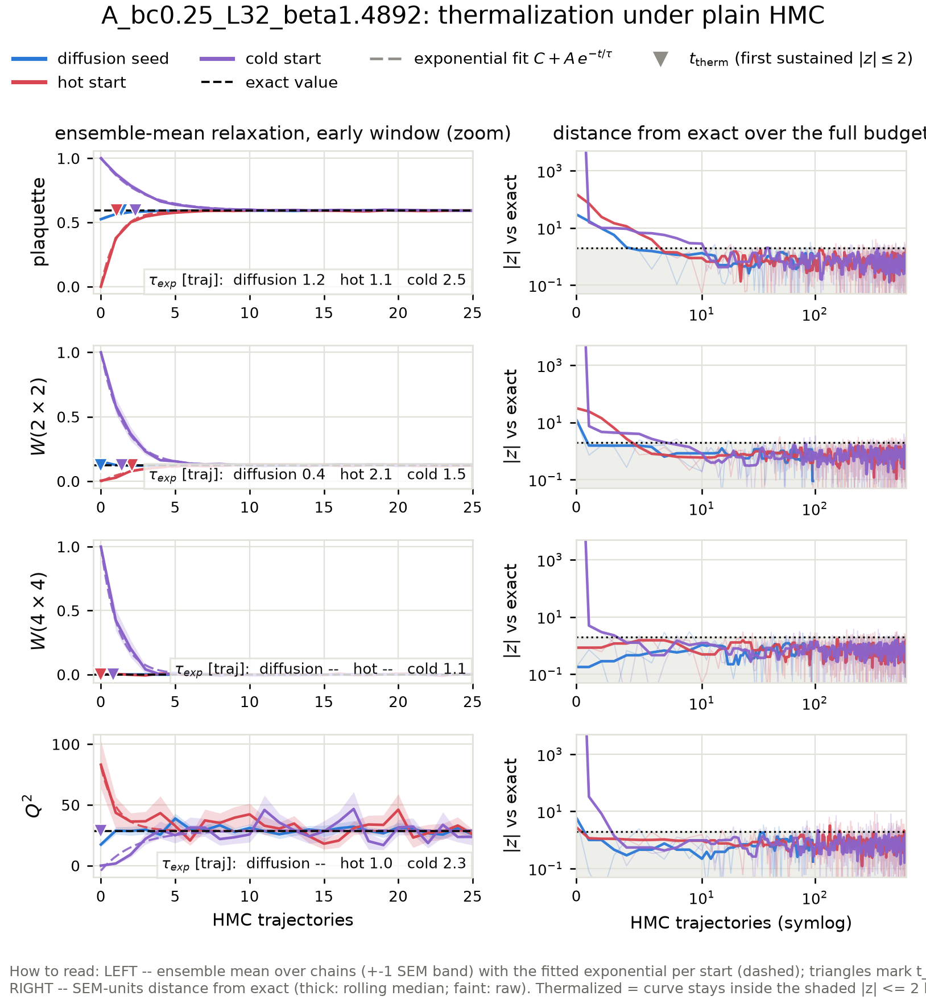

tau_int (hot-start chains, second half): plaquette = 1.48 +- 0.07, wilson_2x2 = 0.78 +- 0.04, wilson_4x4 = 0.55 +- 0.01, wilson_6x6 = 0.58 +- 0.02. Topology: hot-start HMC L=32 beta=1.4892 -> tau_int(Q) = 1.5.

Where 'never' stood at the end: the hot start ended the 640-trajectory budget still at Q^2 at |z| ~ 1.

### Diagnostics: raw diffusion output (before any HMC)

| observable | value | error | exact | z_exact | reference | ref_error | z_ref | ks_p | chi2_p |
|---|---|---|---|---|---|---|---|---|---|
| plaquette | 0.5253 | 0.002132 | 0.5935 | -31.99 | 0.5924 | 0.001127 | -27.85 | 3.311e-57 |  |
| wilson_1x1 | 0.5253 | 0.002132 | 0.5935 | -31.99 | 0.5924 | 0.001127 | -27.85 | 3.311e-57 |  |
| wilson_1x2 | 0.3043 | 0.003052 | 0.3522 | -15.69 | 0.3518 | 0.001988 | -13.05 | 4.704e-27 |  |
| wilson_2x2 | 0.1531 | 0.00216 | 0.124 | 13.43 | 0.1257 | 0.002499 | 8.266 | 3.392e-11 |  |
| wilson_2x3 | 0.06961 | 0.002131 | 0.04368 | 12.17 | 0.04514 | 0.001701 | 8.973 | 6.382e-09 |  |
| wilson_3x3 | 0.02133 | 0.001756 | 0.00913 | 6.947 | 0.01101 | 0.001499 | 4.469 | 0.007662 |  |
| wilson_3x4 | 0.008915 | 0.001552 | 0.001908 | 4.514 | 0.001259 | 0.001593 | 3.442 | 0.03229 |  |
| wilson_4x4 | 0.0005711 | 0.001317 | 0.0002367 | 0.254 | 0.0004678 | 0.001285 | 0.05616 | 0.5643 |  |
| wilson_4x5 | -0.003072 | 0.001731 | 2.936e-05 | -1.792 | -0.001092 | 0.001296 | -0.9155 | 0.4899 |  |
| wilson_5x5 | 0.001759 | 0.002099 | 2.161e-06 | 0.8369 | 0.001631 | 0.0017 | 0.04741 | 0.8612 |  |
| wilson_5x6 | 0.004012 | 0.001931 | 1.591e-07 | 2.078 | 0.002252 | 0.001489 | 0.7217 | 0.357 |  |
| wilson_6x6 | 0.0001474 | 0.001706 | 6.948e-09 | 0.08639 | -0.00105 | 0.001486 | 0.5293 | 0.8906 |  |
| wilson_6x7 | -0.001931 | 0.001539 | 3.035e-10 | -1.255 | 0.001488 | 0.001255 | -1.722 | 0.5643 |  |
| wilson_7x7 | 0.002286 | 0.001868 | 7.868e-12 | 1.224 | -0.002048 | 0.002155 | 1.52 | 0.1685 |  |
| wilson_7x8 | 0.001711 | 0.001365 | 2.04e-13 | 1.253 | -2.074e-05 | 0.001574 | 0.831 | 0.5643 |  |
| wilson_8x8 | -0.004205 | 0.001577 | 3.138e-15 | -2.667 | -0.0009048 | 0.00151 | -1.512 | 0.1685 |  |
| wilson_8x10 | -0.001205 | 0.002122 | 7.426e-19 | -0.5677 | -0.00228 | 0.001725 | 0.3932 | 0.8906 |  |
| wilson_10x10 | 0.004229 | 0.001873 | 2.18e-23 | 2.258 | 0.001993 | 0.001165 | 1.014 | 0.7575 |  |
| wilson_10x12 | -0.001468 | 0.002245 | 6.4e-28 | -0.6539 | 0.0007025 | 0.001535 | -0.7982 | 0.3879 |  |
| wilson_12x12 | -8.69e-05 | 0.00227 | 2.33e-33 | -0.03828 | 2.732e-05 | 0.001339 | -0.04333 | 0.8288 |  |
| creutz_2 | 0.1413 | 0.01655 | 0.5218 | -22.99 |  |  |  |  |  |
| creutz_3 | 0.3951 | 0.09165 | 0.5218 | -1.382 |  |  |  |  |  |
| creutz_4 | 1.876 | 3.794 | 0.5218 | 0.3568 |  |  |  |  |  |
| creutz_6 | 4.129 | nan | 0.5218 | nan |  |  |  |  |  |
| Q | -0.25 | 0.3109 | 0 | -0.804 | -0.03125 | 0.3834 | -0.4431 | 0.3001 |  |
| Q^2 | 17.38 | 1.888 | 28.52 | -5.903 | 27.16 | 2.757 | -2.927 | 0.07777 |  |
| chi_top ((<Q^2>-<Q>^2)/V) | 0.01691 | 0.001852 | 0.02785 | -5.911 | 0.02652 | 0.002398 | -3.172 |  |  |
| Q histogram vs exact P(Q) | 24.81 | nan | 20 | nan |  |  |  |  | 0.2086 |

### Diagnostics: the same configs after 96 HMC trajectories

| observable | value | error | exact | z_exact | reference | ref_error | z_ref | ks_p | chi2_p |
|---|---|---|---|---|---|---|---|---|---|
| plaquette | 0.5926 | 0.00106 | 0.5935 | -0.7799 | 0.5924 | 0.001127 | 0.1333 | 0.8612 |  |
| wilson_1x1 | 0.5926 | 0.00106 | 0.5935 | -0.7799 | 0.5924 | 0.001127 | 0.1333 | 0.8612 |  |
| wilson_1x2 | 0.3508 | 0.001861 | 0.3522 | -0.7282 | 0.3518 | 0.001988 | -0.3737 | 0.8906 |  |
| wilson_2x2 | 0.1238 | 0.001718 | 0.124 | -0.1374 | 0.1257 | 0.002499 | -0.6422 | 0.2741 |  |
| wilson_2x3 | 0.04543 | 0.002022 | 0.04368 | 0.862 | 0.04514 | 0.001701 | 0.1063 | 0.4204 |  |
| wilson_3x3 | 0.0111 | 0.001854 | 0.00913 | 1.061 | 0.01101 | 0.001499 | 0.03601 | 0.9999 |  |
| wilson_3x4 | 0.004624 | 0.001797 | 0.001908 | 1.511 | 0.001259 | 0.001593 | 1.401 | 0.3001 |  |
| wilson_4x4 | -0.001547 | 0.002586 | 0.0002367 | -0.6898 | 0.0004678 | 0.001285 | -0.6978 | 0.3879 |  |
| wilson_4x5 | -0.000119 | 0.002615 | 2.936e-05 | -0.05674 | -0.001092 | 0.001296 | 0.3335 | 0.4899 |  |
| wilson_5x5 | 0.002925 | 0.001934 | 2.161e-06 | 1.511 | 0.001631 | 0.0017 | 0.5024 | 0.7575 |  |
| wilson_5x6 | 0.001241 | 0.001506 | 1.591e-07 | 0.8241 | 0.002252 | 0.001489 | -0.4775 | 0.8612 |  |
| wilson_6x6 | -0.00102 | 0.002271 | 6.948e-09 | -0.4494 | -0.00105 | 0.001486 | 0.01085 | 0.9719 |  |
| wilson_6x7 | 0.002261 | 0.001547 | 3.035e-10 | 1.462 | 0.001488 | 0.001255 | 0.3884 | 0.5643 |  |
| wilson_7x7 | 0.002681 | 0.001909 | 7.868e-12 | 1.405 | -0.002048 | 0.002155 | 1.643 | 0.08742 |  |
| wilson_7x8 | -0.0007282 | 0.002045 | 2.04e-13 | -0.3561 | -2.074e-05 | 0.001574 | -0.2741 | 0.8612 |  |
| wilson_8x8 | -0.0004963 | 0.001944 | 3.138e-15 | -0.2553 | -0.0009048 | 0.00151 | 0.166 | 0.9574 |  |
| wilson_8x10 | -0.0003494 | 0.001906 | 7.426e-19 | -0.1833 | -0.00228 | 0.001725 | 0.751 | 0.3879 |  |
| wilson_10x10 | 0.001829 | 0.001823 | 2.18e-23 | 1.003 | 0.001993 | 0.001165 | -0.07606 | 0.939 |  |
| wilson_10x12 | -0.0005654 | 0.002263 | 6.4e-28 | -0.2499 | 0.0007025 | 0.001535 | -0.4638 | 0.1685 |  |
| wilson_12x12 | 0.002334 | 0.001966 | 2.33e-33 | 1.187 | 2.732e-05 | 0.001339 | 0.9699 | 0.3277 |  |
| creutz_2 | 0.5174 | 0.0163 | 0.5218 | -0.2706 |  |  |  |  |  |
| creutz_3 | 0.4069 | 0.1766 | 0.5218 | -0.6508 |  |  |  |  |  |
| Q | -0.1016 | 0.4499 | 0 | -0.2257 | -0.03125 | 0.3834 | -0.1189 | 0.8612 |  |
| Q^2 | 29.16 | 3.362 | 28.52 | 0.1909 | 27.16 | 2.757 | 0.4618 | 0.6028 |  |
| chi_top ((<Q^2>-<Q>^2)/V) | 0.02847 | 0.003578 | 0.02785 | 0.1724 | 0.02652 | 0.002398 | 0.4531 |  |  |
| Q histogram vs exact P(Q) | 18.55 | nan | 20 | nan |  |  |  |  | 0.5515 |

## A_bc0.5_L32_beta2.02441

HMC: step size 0.2000, 5 leapfrog steps, acceptance seed/hot/cold = 0.965/0.964/0.962. Diffusion-seed batch: 128 chains x 96 trajectories (0.08 s/traj for the whole batch); baselines: 32 chains x 640 trajectories.

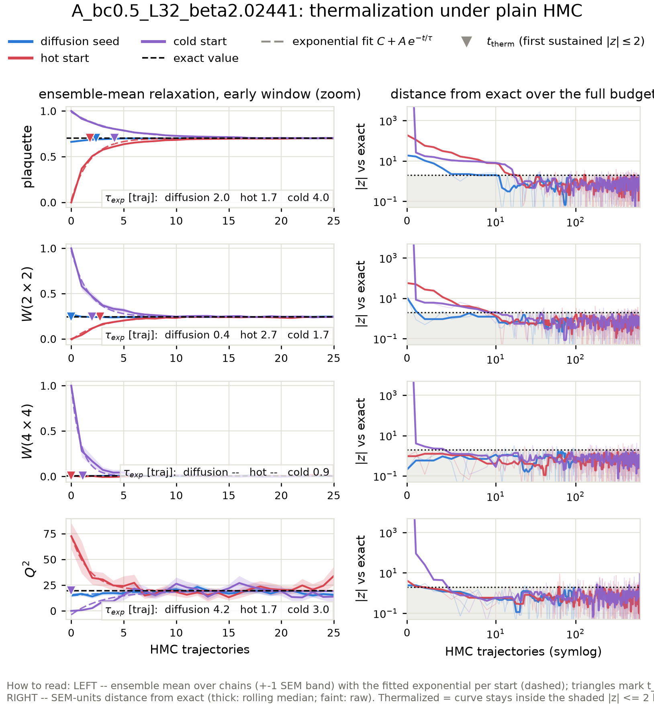

tau_int (hot-start chains, second half): plaquette = 2.34 +- 0.15, wilson_2x2 = 0.94 +- 0.04, wilson_4x4 = 0.61 +- 0.02, wilson_6x6 = 0.56 +- 0.01. Topology: hot-start HMC L=32 beta=2.02441 -> tau_int(Q) = 2.6.

### Diagnostics: raw diffusion output (before any HMC)

| observable | value | error | exact | z_exact | reference | ref_error | z_ref | ks_p | chi2_p |
|---|---|---|---|---|---|---|---|---|---|
| plaquette | 0.6621 | 0.002104 | 0.7017 | -18.82 | 0.7014 | 0.001088 | -16.6 | 1.693e-37 |  |
| wilson_1x1 | 0.6621 | 0.002104 | 0.7017 | -18.82 | 0.7014 | 0.001088 | -16.6 | 1.693e-37 |  |
| wilson_1x2 | 0.453 | 0.002789 | 0.4924 | -14.14 | 0.4916 | 0.001947 | -11.35 | 1.306e-17 |  |
| wilson_2x2 | 0.2695 | 0.002073 | 0.2425 | 13.02 | 0.241 | 0.002316 | 9.16 | 3.559e-09 |  |
| wilson_2x3 | 0.1395 | 0.002311 | 0.1194 | 8.674 | 0.1182 | 0.002518 | 6.225 | 5.006e-07 |  |
| wilson_3x3 | 0.04957 | 0.001542 | 0.04127 | 5.383 | 0.04222 | 0.002281 | 2.668 | 0.0007131 |  |
| wilson_3x4 | 0.01722 | 0.002318 | 0.01426 | 1.278 | 0.01295 | 0.001741 | 1.473 | 0.02464 |  |
| wilson_4x4 | 0.003892 | 0.002512 | 0.003458 | 0.1726 | 0.004566 | 0.001962 | -0.2115 | 0.5643 |  |
| wilson_4x5 | -0.0004126 | 0.001584 | 0.0008386 | -0.7899 | 0.001728 | 0.001796 | -0.8939 | 0.7575 |  |
| wilson_5x5 | -0.004635 | 0.001323 | 0.0001427 | -3.612 | -0.0001502 | 0.001996 | -1.873 | 0.1098 |  |
| wilson_5x6 | -0.001856 | 0.002046 | 2.428e-05 | -0.9189 | -0.002372 | 0.001041 | 0.2248 | 0.7195 |  |
| wilson_6x6 | -0.001174 | 0.001571 | 2.9e-06 | -0.7491 | -0.002296 | 0.001671 | 0.4895 | 0.7941 |  |
| wilson_6x7 | -0.001051 | 0.001864 | 3.463e-07 | -0.5644 | -0.0001651 | 0.0009269 | -0.4259 | 0.5643 |  |
| wilson_7x7 | -0.001056 | 0.001796 | 2.902e-08 | -0.5881 | 0.001585 | 0.001143 | -1.241 | 0.4545 |  |
| wilson_7x8 | 0.003365 | 0.001928 | 2.432e-09 | 1.745 | -0.0001414 | 0.001815 | 1.324 | 0.2272 |  |
| wilson_8x8 | -0.004173 | 0.001963 | 1.43e-10 | -2.126 | -0.001798 | 0.001684 | -0.9185 | 0.1519 |  |
| wilson_8x10 | -0.001584 | 0.00172 | 4.946e-13 | -0.9213 | 0.002846 | 0.001659 | -1.854 | 0.3277 |  |
| wilson_10x10 | -0.0005495 | 0.002693 | 4.147e-16 | -0.2041 | -0.00027 | 0.00151 | -0.09054 | 0.5266 |  |
| wilson_10x12 | -0.0002325 | 0.002004 | 3.478e-19 | -0.116 | -1.369e-05 | 0.001744 | -0.08236 | 0.9978 |  |
| wilson_12x12 | -0.0005673 | 0.001818 | 7.073e-23 | -0.3121 | -0.0008539 | 0.001986 | 0.1065 | 0.7195 |  |
| creutz_2 | 0.1398 | 0.01081 | 0.3542 | -19.83 |  |  |  |  |  |
| creutz_3 | 0.3757 | 0.03478 | 0.3542 | 0.6174 |  |  |  |  |  |
| creutz_4 | 0.4304 | 0.4635 | 0.3542 | 0.1645 |  |  |  |  |  |
| Q | 0.1016 | 0.3312 | 0 | 0.3067 | -0.06771 | 0.2843 | 0.3878 | 0.939 |  |
| Q^2 | 15.3 | 2.163 | 19.51 | -1.945 | 18.56 | 2.518 | -0.98 | 0.9827 |  |
| chi_top ((<Q^2>-<Q>^2)/V) | 0.01494 | 0.001717 | 0.01905 | -2.398 | 0.01812 | 0.002257 | -1.122 |  |  |
| Q histogram vs exact P(Q) | 12.65 | nan | 18 | nan |  |  |  |  | 0.8122 |

### Diagnostics: the same configs after 96 HMC trajectories

| observable | value | error | exact | z_exact | reference | ref_error | z_ref | ks_p | chi2_p |
|---|---|---|---|---|---|---|---|---|---|
| plaquette | 0.7031 | 0.001089 | 0.7017 | 1.203 | 0.7014 | 0.001088 | 1.045 | 0.2061 |  |
| wilson_1x1 | 0.7031 | 0.001089 | 0.7017 | 1.203 | 0.7014 | 0.001088 | 1.045 | 0.2061 |  |
| wilson_1x2 | 0.4944 | 0.001907 | 0.4924 | 1.036 | 0.4916 | 0.001947 | 1.033 | 0.4899 |  |
| wilson_2x2 | 0.2444 | 0.002123 | 0.2425 | 0.9095 | 0.241 | 0.002316 | 1.086 | 0.1866 |  |
| wilson_2x3 | 0.1215 | 0.002127 | 0.1194 | 0.9775 | 0.1182 | 0.002518 | 1.005 | 0.6028 |  |
| wilson_3x3 | 0.04282 | 0.002316 | 0.04127 | 0.6698 | 0.04222 | 0.002281 | 0.1831 | 0.7575 |  |
| wilson_3x4 | 0.0126 | 0.002446 | 0.01426 | -0.6799 | 0.01295 | 0.001741 | -0.1185 | 0.3001 |  |
| wilson_4x4 | 0.002059 | 0.002662 | 0.003458 | -0.5257 | 0.004566 | 0.001962 | -0.7581 | 0.6418 |  |
| wilson_4x5 | 0.003993 | 0.002266 | 0.0008386 | 1.392 | 0.001728 | 0.001796 | 0.7834 | 0.7195 |  |
| wilson_5x5 | 0.002163 | 0.002001 | 0.0001427 | 1.01 | -0.0001502 | 0.001996 | 0.8187 | 0.7941 |  |
| wilson_5x6 | 0.001666 | 0.002021 | 2.428e-05 | 0.8123 | -0.002372 | 0.001041 | 1.776 | 0.3001 |  |
| wilson_6x6 | 0.003233 | 0.002311 | 2.9e-06 | 1.397 | -0.002296 | 0.001671 | 1.939 | 0.06115 |  |
| wilson_6x7 | 0.001456 | 0.00157 | 3.463e-07 | 0.9268 | -0.0001651 | 0.0009269 | 0.8888 | 0.8288 |  |
| wilson_7x7 | -0.00301 | 0.0022 | 2.902e-08 | -1.368 | 0.001585 | 0.001143 | -1.853 | 0.3277 |  |
| wilson_7x8 | 0.001771 | 0.002093 | 2.432e-09 | 0.8459 | -0.0001414 | 0.001815 | 0.6901 | 0.357 |  |
| wilson_8x8 | 0.002407 | 0.001998 | 1.43e-10 | 1.205 | -0.001798 | 0.001684 | 1.61 | 0.09806 |  |
| wilson_8x10 | -0.001514 | 0.002309 | 4.946e-13 | -0.6555 | 0.002846 | 0.001659 | -1.534 | 0.1366 |  |
| wilson_10x10 | 0.003786 | 0.002045 | 4.147e-16 | 1.852 | -0.00027 | 0.00151 | 1.596 | 0.2498 |  |
| wilson_10x12 | 0.002464 | 0.001648 | 3.478e-19 | 1.495 | -1.369e-05 | 0.001744 | 1.033 | 0.7575 |  |
| wilson_12x12 | -0.001049 | 0.001985 | 7.073e-23 | -0.5284 | -0.0008539 | 0.001986 | -0.06937 | 0.6808 |  |
| creutz_2 | 0.3524 | 0.007692 | 0.3542 | -0.2323 |  |  |  |  |  |
| creutz_3 | 0.3439 | 0.04915 | 0.3542 | -0.21 |  |  |  |  |  |
| creutz_4 | 0.5879 | 1.027 | 0.3542 | 0.2274 |  |  |  |  |  |
| creutz_5 | 1.275 | 1.276 | 0.3542 | 0.7216 |  |  |  |  |  |
| creutz_6 | -0.9244 | 2.124 | 0.3542 | -0.6019 |  |  |  |  |  |
| Q | -0.1094 | 0.3076 | 0 | -0.3556 | -0.06771 | 0.2843 | -0.09949 | 0.9167 |  |
| Q^2 | 16.06 | 1.692 | 19.51 | -2.038 | 18.56 | 2.518 | -0.8225 | 0.3879 |  |
| chi_top ((<Q^2>-<Q>^2)/V) | 0.01567 | 0.001858 | 0.01905 | -1.819 | 0.01812 | 0.002257 | -0.836 |  |  |
| Q histogram vs exact P(Q) | 21.59 | nan | 18 | nan |  |  |  |  | 0.2507 |

## A_bc0.75_L32_beta2.5435

HMC: step size 0.2000, 5 leapfrog steps, acceptance seed/hot/cold = 0.962/0.961/0.960. Diffusion-seed batch: 128 chains x 96 trajectories (0.08 s/traj for the whole batch); baselines: 32 chains x 640 trajectories.

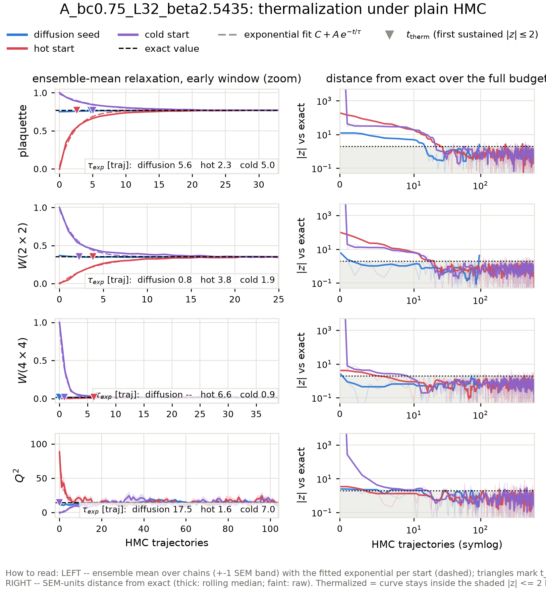

tau_int (hot-start chains, second half): plaquette = 3.51 +- 0.32, wilson_2x2 = 1.27 +- 0.08, wilson_4x4 = 0.67 +- 0.03, wilson_6x6 = 0.55 +- 0.01. Topology: hot-start HMC L=32 beta=2.5435 -> tau_int(Q) = 5.8.

Where 'never' stood at the end: the hot start ended the 640-trajectory budget still at Q^2 at |z| ~ 1.

### Diagnostics: raw diffusion output (before any HMC)

| observable | value | error | exact | z_exact | reference | ref_error | z_ref | ks_p | chi2_p |
|---|---|---|---|---|---|---|---|---|---|
| plaquette | 0.751 | 0.001757 | 0.7696 | -10.6 | 0.7704 | 0.0008757 | -9.888 | 2.931e-19 |  |
| wilson_1x1 | 0.751 | 0.001757 | 0.7696 | -10.6 | 0.7704 | 0.0008757 | -9.888 | 2.931e-19 |  |
| wilson_1x2 | 0.5692 | 0.00278 | 0.5924 | -8.315 | 0.5953 | 0.001446 | -8.332 | 1.758e-11 |  |
| wilson_2x2 | 0.3679 | 0.002694 | 0.3509 | 6.325 | 0.3541 | 0.002901 | 3.505 | 0.0001858 |  |
| wilson_2x3 | 0.2183 | 0.002831 | 0.2079 | 3.709 | 0.2118 | 0.003098 | 1.569 | 0.2272 |  |
| wilson_3x3 | 0.09702 | 0.002033 | 0.09476 | 1.113 | 0.09646 | 0.002322 | 0.1829 | 0.7195 |  |
| wilson_3x4 | 0.0463 | 0.002472 | 0.0432 | 1.253 | 0.04134 | 0.00256 | 1.394 | 0.2741 |  |
| wilson_4x4 | 0.02224 | 0.0025 | 0.01516 | 2.831 | 0.01439 | 0.002061 | 2.422 | 0.03684 |  |
| wilson_4x5 | 0.00867 | 0.002996 | 0.005319 | 1.118 | 0.006171 | 0.001691 | 0.7263 | 0.3001 |  |
| wilson_5x5 | -0.001867 | 0.002429 | 0.001436 | -1.36 | 0.003513 | 0.001771 | -1.79 | 0.1685 |  |
| wilson_5x6 | -0.0001035 | 0.00204 | 0.0003879 | -0.2409 | 0.0003566 | 0.001621 | -0.1766 | 0.5643 |  |
| wilson_6x6 | -0.0003936 | 0.001953 | 8.063e-05 | -0.2428 | 0.000591 | 0.001482 | -0.4016 | 0.8906 |  |
| wilson_6x7 | -0.0004289 | 0.002046 | 1.676e-05 | -0.2178 | -0.001197 | 0.001926 | 0.2735 | 0.2061 |  |
| wilson_7x7 | 0.001163 | 0.002217 | 2.681e-06 | 0.5234 | -0.0008327 | 0.001342 | 0.77 | 0.4899 |  |
| wilson_7x8 | 0.001909 | 0.001842 | 4.289e-07 | 1.036 | 0.0002007 | 0.001822 | 0.6593 | 0.6028 |  |
| wilson_8x8 | 0.001196 | 0.001762 | 5.28e-08 | 0.6788 | 0.0002652 | 0.002006 | 0.3486 | 0.2498 |  |
| wilson_8x10 | 0.0001126 | 0.002028 | 8.005e-10 | 0.05554 | -0.0003912 | 0.001426 | 0.2032 | 0.6808 |  |
| wilson_10x10 | -0.0008555 | 0.001639 | 4.258e-12 | -0.522 | 0.0003353 | 0.00163 | -0.5151 | 0.5643 |  |
| wilson_10x12 | -0.0008171 | 0.001719 | 2.265e-14 | -0.4754 | -0.001057 | 0.002053 | 0.08978 | 0.8612 |  |
| wilson_12x12 | 0.001572 | 0.001628 | 4.227e-17 | 0.9651 | 0.001755 | 0.001717 | -0.07742 | 0.06115 |  |
| creutz_2 | 0.1593 | 0.007289 | 0.2618 | -14.07 |  |  |  |  |  |
| creutz_3 | 0.2894 | 0.02022 | 0.2618 | 1.362 |  |  |  |  |  |
| creutz_4 | -0.006517 | 0.09815 | 0.2618 | -2.734 |  |  |  |  |  |
| creutz_8 | 0.963 | 2.852 | 0.2618 | 0.2459 |  |  |  |  |  |
| Q | -0.3047 | 0.3078 | 0 | -0.99 | 0.1823 | 0.2507 | -1.227 | 0.4545 |  |
| Q^2 | 11.01 | 0.9954 | 14.25 | -3.259 | 14.18 | 1.431 | -1.821 | 0.6418 |  |
| chi_top ((<Q^2>-<Q>^2)/V) | 0.01066 | 0.001284 | 0.01392 | -2.538 | 0.01382 | 0.001408 | -1.657 |  |  |
| Q histogram vs exact P(Q) | 11.19 | nan | 16 | nan |  |  |  |  | 0.7976 |

### Diagnostics: the same configs after 96 HMC trajectories

| observable | value | error | exact | z_exact | reference | ref_error | z_ref | ks_p | chi2_p |
|---|---|---|---|---|---|---|---|---|---|
| plaquette | 0.7719 | 0.0008667 | 0.7696 | 2.585 | 0.7704 | 0.0008757 | 1.177 | 0.7195 |  |
| wilson_1x1 | 0.7719 | 0.0008667 | 0.7696 | 2.585 | 0.7704 | 0.0008757 | 1.177 | 0.7195 |  |
| wilson_1x2 | 0.5978 | 0.0015 | 0.5924 | 3.611 | 0.5953 | 0.001446 | 1.165 | 0.3001 |  |
| wilson_2x2 | 0.3603 | 0.00237 | 0.3509 | 3.982 | 0.3541 | 0.002901 | 1.675 | 0.02464 |  |
| wilson_2x3 | 0.2173 | 0.002796 | 0.2079 | 3.38 | 0.2118 | 0.003098 | 1.327 | 0.09806 |  |
| wilson_3x3 | 0.1009 | 0.002392 | 0.09476 | 2.551 | 0.09646 | 0.002322 | 1.321 | 0.6808 |  |
| wilson_3x4 | 0.04506 | 0.002322 | 0.0432 | 0.8005 | 0.04134 | 0.00256 | 1.077 | 0.4899 |  |
| wilson_4x4 | 0.0143 | 0.002105 | 0.01516 | -0.4071 | 0.01439 | 0.002061 | -0.02964 | 0.6808 |  |
| wilson_4x5 | 0.002938 | 0.002194 | 0.005319 | -1.085 | 0.006171 | 0.001691 | -1.167 | 0.4545 |  |
| wilson_5x5 | 0.0001459 | 0.002212 | 0.001436 | -0.5833 | 0.003513 | 0.001771 | -1.188 | 0.5266 |  |
| wilson_5x6 | -0.00391 | 0.001624 | 0.0003879 | -2.646 | 0.0003566 | 0.001621 | -1.859 | 0.1866 |  |
| wilson_6x6 | -0.001217 | 0.001884 | 8.063e-05 | -0.6887 | 0.000591 | 0.001482 | -0.7541 | 0.3879 |  |
| wilson_6x7 | 4.618e-05 | 0.002143 | 1.676e-05 | 0.01373 | -0.001197 | 0.001926 | 0.4316 | 0.3879 |  |
| wilson_7x7 | 0.001899 | 0.001871 | 2.681e-06 | 1.013 | -0.0008327 | 0.001342 | 1.186 | 0.2498 |  |
| wilson_7x8 | 0.002272 | 0.001572 | 4.289e-07 | 1.445 | 0.0002007 | 0.001822 | 0.8609 | 0.939 |  |
| wilson_8x8 | 8.818e-05 | 0.001959 | 5.28e-08 | 0.04498 | 0.0002652 | 0.002006 | -0.06311 | 0.4899 |  |
| wilson_8x10 | -0.002911 | 0.001833 | 8.005e-10 | -1.588 | -0.0003912 | 0.001426 | -1.085 | 0.1519 |  |
| wilson_10x10 | -0.001932 | 0.002076 | 4.258e-12 | -0.9306 | 0.0003353 | 0.00163 | -0.8589 | 0.3001 |  |
| wilson_10x12 | -0.000412 | 0.001741 | 2.265e-14 | -0.2367 | -0.001057 | 0.002053 | 0.2398 | 0.9167 |  |
| wilson_12x12 | 0.0003972 | 0.001712 | 4.227e-17 | 0.232 | 0.001755 | 0.001717 | -0.5598 | 0.6028 |  |
| creutz_2 | 0.2506 | 0.00384 | 0.2618 | -2.927 |  |  |  |  |  |
| creutz_3 | 0.2618 | 0.01788 | 0.2618 | -0.0003953 |  |  |  |  |  |
| creutz_4 | 0.3419 | 0.1243 | 0.2618 | 0.6442 |  |  |  |  |  |
| creutz_5 | 1.419 | nan | 0.2618 | nan |  |  |  |  |  |
| creutz_8 | 3.429 | nan | 0.2618 | nan |  |  |  |  |  |
| Q | 0.02344 | 0.2764 | 0 | 0.0848 | 0.1823 | 0.2507 | -0.4258 | 0.8612 |  |
| Q^2 | 12.15 | 1.491 | 14.25 | -1.411 | 14.18 | 1.431 | -0.9841 | 0.7575 |  |
| chi_top ((<Q^2>-<Q>^2)/V) | 0.01186 | 0.001532 | 0.01392 | -1.341 | 0.01382 | 0.001408 | -0.9391 |  |  |
| Q histogram vs exact P(Q) | 18.59 | nan | 16 | nan |  |  |  |  | 0.2906 |

## A_bc1_L32_beta3.10399

HMC: step size 0.2000, 5 leapfrog steps, acceptance seed/hot/cold = 0.961/0.961/0.958. Diffusion-seed batch: 128 chains x 96 trajectories (0.08 s/traj for the whole batch); baselines: 32 chains x 640 trajectories.

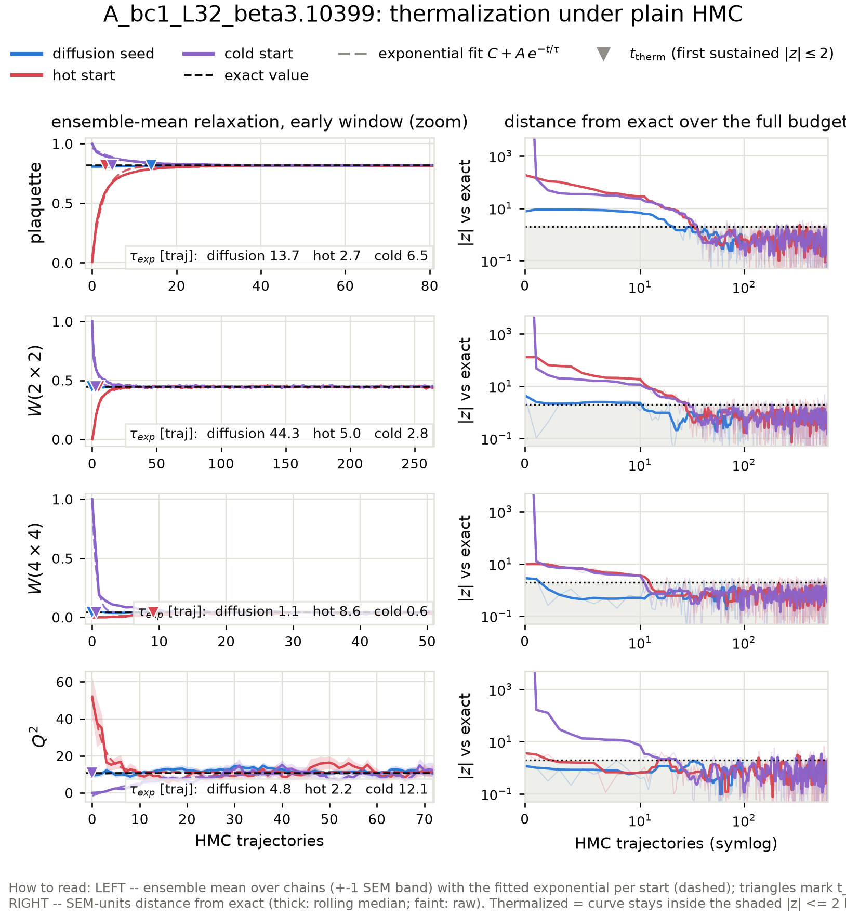

tau_int (hot-start chains, second half): plaquette = 3.48 +- 0.21, wilson_2x2 = 1.61 +- 0.10, wilson_4x4 = 0.89 +- 0.06, wilson_6x6 = 0.58 +- 0.01. Topology: hot-start HMC L=32 beta=3.10399 -> tau_int(Q) = 8.2.

Where 'never' stood at the end: the hot start ended the 640-trajectory budget still at Q^2 at |z| ~ 1.

### Diagnostics: raw diffusion output (before any HMC)

| observable | value | error | exact | z_exact | reference | ref_error | z_ref | ks_p | chi2_p |
|---|---|---|---|---|---|---|---|---|---|
| plaquette | 0.8085 | 0.000951 | 0.8174 | -9.385 | 0.8178 | 0.0005555 | -8.5 | 4.309e-10 |  |
| wilson_1x1 | 0.8085 | 0.000951 | 0.8174 | -9.385 | 0.8178 | 0.0005555 | -8.5 | 4.309e-10 |  |
| wilson_1x2 | 0.6588 | 0.001538 | 0.6681 | -6.08 | 0.6677 | 0.001105 | -4.715 | 0.0002758 |  |
| wilson_2x2 | 0.457 | 0.002439 | 0.4464 | 4.353 | 0.447 | 0.001787 | 3.301 | 0.004059 |  |
| wilson_2x3 | 0.3084 | 0.00328 | 0.2982 | 3.104 | 0.298 | 0.001761 | 2.806 | 0.05405 |  |
| wilson_3x3 | 0.1709 | 0.003631 | 0.1629 | 2.212 | 0.1615 | 0.002175 | 2.218 | 0.04195 |  |
| wilson_3x4 | 0.1004 | 0.00333 | 0.08895 | 3.425 | 0.08554 | 0.002435 | 3.591 | 0.003444 |  |
| wilson_4x4 | 0.04753 | 0.003308 | 0.03971 | 2.364 | 0.0343 | 0.002627 | 3.132 | 0.006558 |  |
| wilson_4x5 | 0.02172 | 0.003259 | 0.01772 | 1.225 | 0.0124 | 0.002646 | 2.22 | 0.05405 |  |
| wilson_5x5 | 0.008821 | 0.00309 | 0.006467 | 0.7615 | 0.003966 | 0.002761 | 1.171 | 0.2741 |  |
| wilson_5x6 | 0.006833 | 0.002805 | 0.00236 | 1.595 | -0.0007535 | 0.002491 | 2.022 | 0.01864 |  |
| wilson_6x6 | 0.005575 | 0.002048 | 0.0007038 | 2.379 | -0.00106 | 0.001842 | 2.409 | 0.02145 |  |
| wilson_6x7 | 0.002727 | 0.002267 | 0.0002099 | 1.11 | 1.639e-05 | 0.001604 | 0.976 | 0.4545 |  |
| wilson_7x7 | 0.001431 | 0.002451 | 5.117e-05 | 0.5628 | -0.0007155 | 0.00115 | 0.7926 | 0.5643 |  |
| wilson_7x8 | -0.003314 | 0.002414 | 1.247e-05 | -1.378 | 0.001576 | 0.001926 | -1.583 | 0.2061 |  |
| wilson_8x8 | 0.001984 | 0.002228 | 2.486e-06 | 0.8894 | -0.0001882 | 0.001642 | 0.7848 | 0.4899 |  |
| wilson_8x10 | -0.0009339 | 0.002374 | 9.869e-08 | -0.3935 | -0.001888 | 0.002197 | 0.295 | 0.4204 |  |
| wilson_10x10 | 0.00192 | 0.002378 | 1.749e-09 | 0.8072 | -0.0007854 | 0.001099 | 1.033 | 0.2498 |  |
| wilson_10x12 | -0.0007423 | 0.002175 | 3.101e-11 | -0.3412 | 0.000432 | 0.001635 | -0.4315 | 0.7575 |  |
| wilson_12x12 | 0.003175 | 0.001753 | 2.453e-13 | 1.812 | -0.0006014 | 0.001642 | 1.572 | 0.7195 |  |
| creutz_2 | 0.1609 | 0.003858 | 0.2016 | -10.56 |  |  |  |  |  |
| creutz_3 | 0.1971 | 0.0103 | 0.2016 | -0.4373 |  |  |  |  |  |
| creutz_4 | 0.215 | 0.04005 | 0.2016 | 0.3344 |  |  |  |  |  |
| creutz_5 | 0.118 | 0.2424 | 0.2016 | -0.3452 |  |  |  |  |  |
| creutz_6 | -0.05199 | 0.4571 | 0.2016 | -0.5549 |  |  |  |  |  |
| creutz_7 | -0.07009 | 1.804 | 0.2016 | -0.1506 |  |  |  |  |  |
| Q | -0.3516 | 0.226 | 0 | -1.556 | 0.1771 | 0.1606 | -1.907 | 0.2741 |  |
| Q^2 | 9.461 | 1.516 | 10.81 | -0.8889 | 10.46 | 1.1 | -0.5326 | 0.9574 |  |
| chi_top ((<Q^2>-<Q>^2)/V) | 0.009118 | 0.001103 | 0.01056 | -1.302 | 0.01018 | 0.001275 | -0.6312 |  |  |
| Q histogram vs exact P(Q) | 12.4 | nan | 14 | nan |  |  |  |  | 0.5746 |

### Diagnostics: the same configs after 96 HMC trajectories

| observable | value | error | exact | z_exact | reference | ref_error | z_ref | ks_p | chi2_p |
|---|---|---|---|---|---|---|---|---|---|
| plaquette | 0.8171 | 0.0006636 | 0.8174 | -0.4154 | 0.8178 | 0.0005555 | -0.823 | 0.357 |  |
| wilson_1x1 | 0.8171 | 0.0006636 | 0.8174 | -0.4154 | 0.8178 | 0.0005555 | -0.823 | 0.357 |  |
| wilson_1x2 | 0.6683 | 0.00135 | 0.6681 | 0.101 | 0.6677 | 0.001105 | 0.3208 | 0.6418 |  |
| wilson_2x2 | 0.4438 | 0.001918 | 0.4464 | -1.35 | 0.447 | 0.001787 | -1.231 | 0.7575 |  |
| wilson_2x3 | 0.2944 | 0.002757 | 0.2982 | -1.383 | 0.298 | 0.001761 | -1.084 | 0.6028 |  |
| wilson_3x3 | 0.1592 | 0.003336 | 0.1629 | -1.115 | 0.1615 | 0.002175 | -0.5928 | 0.3001 |  |
| wilson_3x4 | 0.08569 | 0.004077 | 0.08895 | -0.7993 | 0.08554 | 0.002435 | 0.03163 | 0.8612 |  |
| wilson_4x4 | 0.03885 | 0.003569 | 0.03971 | -0.241 | 0.0343 | 0.002627 | 1.026 | 0.09806 |  |
| wilson_4x5 | 0.01803 | 0.002837 | 0.01772 | 0.1079 | 0.0124 | 0.002646 | 1.452 | 0.5266 |  |
| wilson_5x5 | 0.006166 | 0.002159 | 0.006467 | -0.1393 | 0.003966 | 0.002761 | 0.6277 | 0.8906 |  |
| wilson_5x6 | 0.004925 | 0.002613 | 0.00236 | 0.9815 | -0.0007535 | 0.002491 | 1.573 | 0.3277 |  |
| wilson_6x6 | 0.001252 | 0.002259 | 0.0007038 | 0.2428 | -0.00106 | 0.001842 | 0.7933 | 0.6028 |  |
| wilson_6x7 | -2.363e-05 | 0.001826 | 0.0002099 | -0.1279 | 1.639e-05 | 0.001604 | -0.01647 | 0.4899 |  |
| wilson_7x7 | 0.0004875 | 0.002251 | 5.117e-05 | 0.1938 | -0.0007155 | 0.00115 | 0.4759 | 0.7195 |  |
| wilson_7x8 | 0.0009495 | 0.002466 | 1.247e-05 | 0.38 | 0.001576 | 0.001926 | -0.2 | 0.6808 |  |
| wilson_8x8 | -0.0003354 | 0.002364 | 2.486e-06 | -0.1429 | -0.0001882 | 0.001642 | -0.05114 | 0.8906 |  |
| wilson_8x10 | 0.003509 | 0.002232 | 9.869e-08 | 1.572 | -0.001888 | 0.002197 | 1.723 | 0.357 |  |
| wilson_10x10 | 0.002214 | 0.002232 | 1.749e-09 | 0.9921 | -0.0007854 | 0.001099 | 1.206 | 0.1098 |  |
| wilson_10x12 | -0.0002775 | 0.002173 | 3.101e-11 | -0.1277 | 0.000432 | 0.001635 | -0.2609 | 0.7195 |  |
| wilson_12x12 | -0.0008673 | 0.00191 | 2.453e-13 | -0.4542 | -0.0006014 | 0.001642 | -0.1056 | 0.9719 |  |
| creutz_2 | 0.2082 | 0.003396 | 0.2016 | 1.932 |  |  |  |  |  |
| creutz_3 | 0.2048 | 0.01058 | 0.2016 | 0.3016 |  |  |  |  |  |
| creutz_4 | 0.172 | 0.04993 | 0.2016 | -0.5937 |  |  |  |  |  |
| creutz_5 | 0.3054 | 0.3165 | 0.2016 | 0.3279 |  |  |  |  |  |
| creutz_6 | 1.144 | 1.758 | 0.2016 | 0.5362 |  |  |  |  |  |
| Q | 0.1016 | 0.2895 | 0 | 0.3508 | 0.1771 | 0.1606 | -0.2281 | 0.9902 |  |
| Q^2 | 9.133 | 1.165 | 10.81 | -1.438 | 10.46 | 1.1 | -0.8274 | 1 |  |
| chi_top ((<Q^2>-<Q>^2)/V) | 0.008909 | 0.001092 | 0.01056 | -1.508 | 0.01018 | 0.001275 | -0.759 |  |  |
| Q histogram vs exact P(Q) | 12.25 | nan | 14 | nan |  |  |  |  | 0.5864 |

## A_bc1.5_L32_beta4.44493

HMC: step size 0.1897, 5 leapfrog steps, acceptance seed/hot/cold = 0.966/0.967/0.964. Diffusion-seed batch: 128 chains x 96 trajectories (0.08 s/traj for the whole batch); baselines: 32 chains x 640 trajectories.

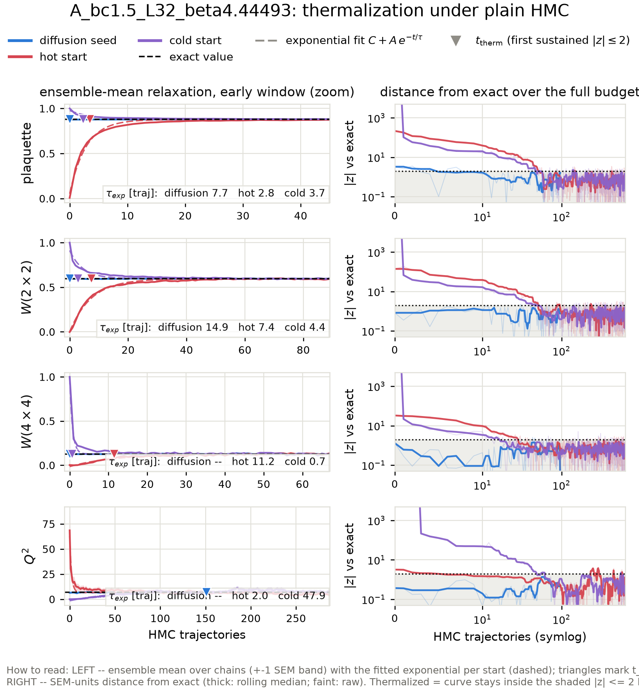

tau_int (hot-start chains, second half): plaquette = 3.52 +- 0.23, wilson_2x2 = 2.84 +- 0.24, wilson_4x4 = 1.21 +- 0.08, wilson_6x6 = 0.72 +- 0.03. Topology: hot-start HMC L=32 beta=4.44493 -> tau_int(Q) = 29.6.

Where 'never' stood at the end: the hot start ended the 640-trajectory budget still at Q^2 at |z| ~ 1; the cold start ended the 640-trajectory budget still at Q^2 at |z| ~ 0.

### Diagnostics: raw diffusion output (before any HMC)

| observable | value | error | exact | z_exact | reference | ref_error | z_ref | ks_p | chi2_p |
|---|---|---|---|---|---|---|---|---|---|
| plaquette | 0.8768 | 0.0006937 | 0.8787 | -2.768 | 0.8785 | 0.0003415 | -2.175 | 0.1098 |  |
| wilson_1x1 | 0.8768 | 0.0006937 | 0.8787 | -2.768 | 0.8785 | 0.0003415 | -2.175 | 0.1098 |  |
| wilson_1x2 | 0.7692 | 0.001228 | 0.7721 | -2.369 | 0.7717 | 0.0008127 | -1.705 | 0.1519 |  |
| wilson_2x2 | 0.5978 | 0.0025 | 0.5961 | 0.6666 | 0.5963 | 0.001657 | 0.501 | 0.9167 |  |
| wilson_2x3 | 0.4629 | 0.0038 | 0.4603 | 0.696 | 0.4601 | 0.002303 | 0.6248 | 0.6418 |  |
| wilson_3x3 | 0.3151 | 0.005299 | 0.3123 | 0.5383 | 0.3129 | 0.00288 | 0.3611 | 0.8906 |  |
| wilson_3x4 | 0.2153 | 0.005135 | 0.2119 | 0.6702 | 0.2121 | 0.003298 | 0.5201 | 0.7575 |  |
| wilson_4x4 | 0.1312 | 0.00447 | 0.1263 | 1.109 | 0.1278 | 0.003205 | 0.6352 | 0.9574 |  |
| wilson_4x5 | 0.07909 | 0.003946 | 0.07529 | 0.9645 | 0.07475 | 0.003086 | 0.8677 | 0.7575 |  |
| wilson_5x5 | 0.04193 | 0.003057 | 0.03944 | 0.8169 | 0.03852 | 0.00234 | 0.8864 | 0.6028 |  |
| wilson_5x6 | 0.02458 | 0.002963 | 0.02066 | 1.325 | 0.02248 | 0.002234 | 0.5665 | 0.8612 |  |
| wilson_6x6 | 0.01047 | 0.003109 | 0.009508 | 0.3109 | 0.01148 | 0.001925 | -0.2759 | 0.8288 |  |
| wilson_6x7 | 0.003583 | 0.003093 | 0.004376 | -0.2564 | 0.003775 | 0.002079 | -0.05148 | 0.4899 |  |
| wilson_7x7 | -0.001249 | 0.002691 | 0.00177 | -1.122 | 0.002844 | 0.002422 | -1.131 | 0.2741 |  |
| wilson_7x8 | -0.004363 | 0.002705 | 0.0007158 | -1.877 | -0.001364 | 0.002403 | -0.8289 | 0.3001 |  |
| wilson_8x8 | -0.001985 | 0.002385 | 0.0002544 | -0.9388 | 0.0003777 | 0.002192 | -0.7293 | 0.3001 |  |
| wilson_8x10 | -0.003824 | 0.002108 | 3.213e-05 | -1.829 | 0.00139 | 0.001664 | -1.941 | 0.4545 |  |
| wilson_10x10 | 2.825e-05 | 0.002299 | 2.419e-06 | 0.01123 | -0.0009763 | 0.002124 | 0.321 | 0.9574 |  |
| wilson_10x12 | -0.003205 | 0.002521 | 1.821e-07 | -1.271 | 0.0003524 | 0.001725 | -1.164 | 0.4899 |  |
| wilson_12x12 | 0.006541 | 0.001432 | 8.173e-09 | 4.567 | 0.003033 | 0.001858 | 1.495 | 0.08742 |  |
| creutz_2 | 0.1212 | 0.002142 | 0.1293 | -3.806 |  |  |  |  |  |
| creutz_3 | 0.1289 | 0.005063 | 0.1293 | -0.08358 |  |  |  |  |  |
| creutz_4 | 0.1139 | 0.01304 | 0.1293 | -1.18 |  |  |  |  |  |
| creutz_5 | 0.128 | 0.04685 | 0.1293 | -0.02731 |  |  |  |  |  |
| creutz_6 | 0.319 | 0.1938 | 0.1293 | 0.9789 |  |  |  |  |  |
| Q | 0.07031 | 0.2306 | 0 | 0.3049 | 0.2812 | 0.2114 | -0.6742 | 0.4899 |  |
| Q^2 | 6.477 | 0.8681 | 6.786 | -0.3563 | 6.542 | 0.7731 | -0.05601 | 0.9999 |  |
| chi_top ((<Q^2>-<Q>^2)/V) | 0.00632 | 0.0008114 | 0.006627 | -0.3783 | 0.006311 | 0.0006451 | 0.008529 |  |  |
| Q histogram vs exact P(Q) | 7.024 | nan | 12 | nan |  |  |  |  | 0.856 |

### Diagnostics: the same configs after 96 HMC trajectories

| observable | value | error | exact | z_exact | reference | ref_error | z_ref | ks_p | chi2_p |
|---|---|---|---|---|---|---|---|---|---|
| plaquette | 0.8779 | 0.0004667 | 0.8787 | -1.605 | 0.8785 | 0.0003415 | -0.8841 | 0.4204 |  |
| wilson_1x1 | 0.8779 | 0.0004667 | 0.8787 | -1.605 | 0.8785 | 0.0003415 | -0.8841 | 0.4204 |  |
| wilson_1x2 | 0.7716 | 0.0008775 | 0.7721 | -0.5351 | 0.7717 | 0.0008127 | -0.06004 | 0.9902 |  |
| wilson_2x2 | 0.5947 | 0.001741 | 0.5961 | -0.8218 | 0.5963 | 0.001657 | -0.6636 | 0.8906 |  |
| wilson_2x3 | 0.4598 | 0.002558 | 0.4603 | -0.2018 | 0.4601 | 0.002303 | -0.1119 | 0.6808 |  |
| wilson_3x3 | 0.3111 | 0.00319 | 0.3123 | -0.3617 | 0.3129 | 0.00288 | -0.4254 | 0.7195 |  |
| wilson_3x4 | 0.2131 | 0.003505 | 0.2119 | 0.3531 | 0.2121 | 0.003298 | 0.2017 | 0.357 |  |
| wilson_4x4 | 0.1262 | 0.003416 | 0.1263 | -0.03639 | 0.1278 | 0.003205 | -0.3392 | 0.9167 |  |
| wilson_4x5 | 0.07565 | 0.003285 | 0.07529 | 0.1112 | 0.07475 | 0.003086 | 0.201 | 0.5266 |  |
| wilson_5x5 | 0.03889 | 0.003174 | 0.03944 | -0.1728 | 0.03852 | 0.00234 | 0.09307 | 0.6418 |  |
| wilson_5x6 | 0.02108 | 0.002736 | 0.02066 | 0.1555 | 0.02248 | 0.002234 | -0.3955 | 0.9574 |  |
| wilson_6x6 | 0.008211 | 0.002842 | 0.009508 | -0.4564 | 0.01148 | 0.001925 | -0.9535 | 0.6418 |  |
| wilson_6x7 | 0.002265 | 0.002693 | 0.004376 | -0.7841 | 0.003775 | 0.002079 | -0.4439 | 0.7941 |  |
| wilson_7x7 | -0.001478 | 0.002048 | 0.00177 | -1.586 | 0.002844 | 0.002422 | -1.363 | 0.03684 |  |
| wilson_7x8 | -0.000475 | 0.002721 | 0.0007158 | -0.4376 | -0.001364 | 0.002403 | 0.2448 | 0.9997 |  |
| wilson_8x8 | -0.000121 | 0.002265 | 0.0002544 | -0.1657 | 0.0003777 | 0.002192 | -0.1582 | 0.8612 |  |
| wilson_8x10 | -0.002593 | 0.002013 | 3.213e-05 | -1.304 | 0.00139 | 0.001664 | -1.525 | 0.5266 |  |
| wilson_10x10 | -0.00145 | 0.002117 | 2.419e-06 | -0.6863 | -0.0009763 | 0.002124 | -0.1581 | 0.9719 |  |
| wilson_10x12 | -0.001677 | 0.00279 | 1.821e-07 | -0.6012 | 0.0003524 | 0.001725 | -0.6187 | 0.3277 |  |
| wilson_12x12 | -0.003424 | 0.001792 | 8.173e-09 | -1.911 | 0.003033 | 0.001858 | -2.502 | 0.007662 |  |
| creutz_2 | 0.1314 | 0.001904 | 0.1293 | 1.071 |  |  |  |  |  |
| creutz_3 | 0.1332 | 0.004834 | 0.1293 | 0.7985 |  |  |  |  |  |
| creutz_4 | 0.1457 | 0.01413 | 0.1293 | 1.156 |  |  |  |  |  |
| creutz_5 | 0.154 | 0.04266 | 0.1293 | 0.5784 |  |  |  |  |  |
| creutz_6 | 0.3308 | 0.2119 | 0.1293 | 0.9506 |  |  |  |  |  |
| Q | -0.1797 | 0.2313 | 0 | -0.7768 | 0.2812 | 0.2114 | -1.471 | 0.4899 |  |
| Q^2 | 7.258 | 0.9705 | 6.786 | 0.4863 | 6.542 | 0.7731 | 0.5772 | 0.939 |  |
| chi_top ((<Q^2>-<Q>^2)/V) | 0.007056 | 0.0009725 | 0.006627 | 0.4415 | 0.006311 | 0.0006451 | 0.6384 |  |  |
| Q histogram vs exact P(Q) | 13.63 | nan | 12 | nan |  |  |  |  | 0.3247 |

## A_bc2_L32_beta6.10518

HMC: step size 0.1619, 6 leapfrog steps, acceptance seed/hot/cold = 0.974/0.974/0.975. Diffusion-seed batch: 128 chains x 96 trajectories (0.09 s/traj for the whole batch); baselines: 32 chains x 640 trajectories.

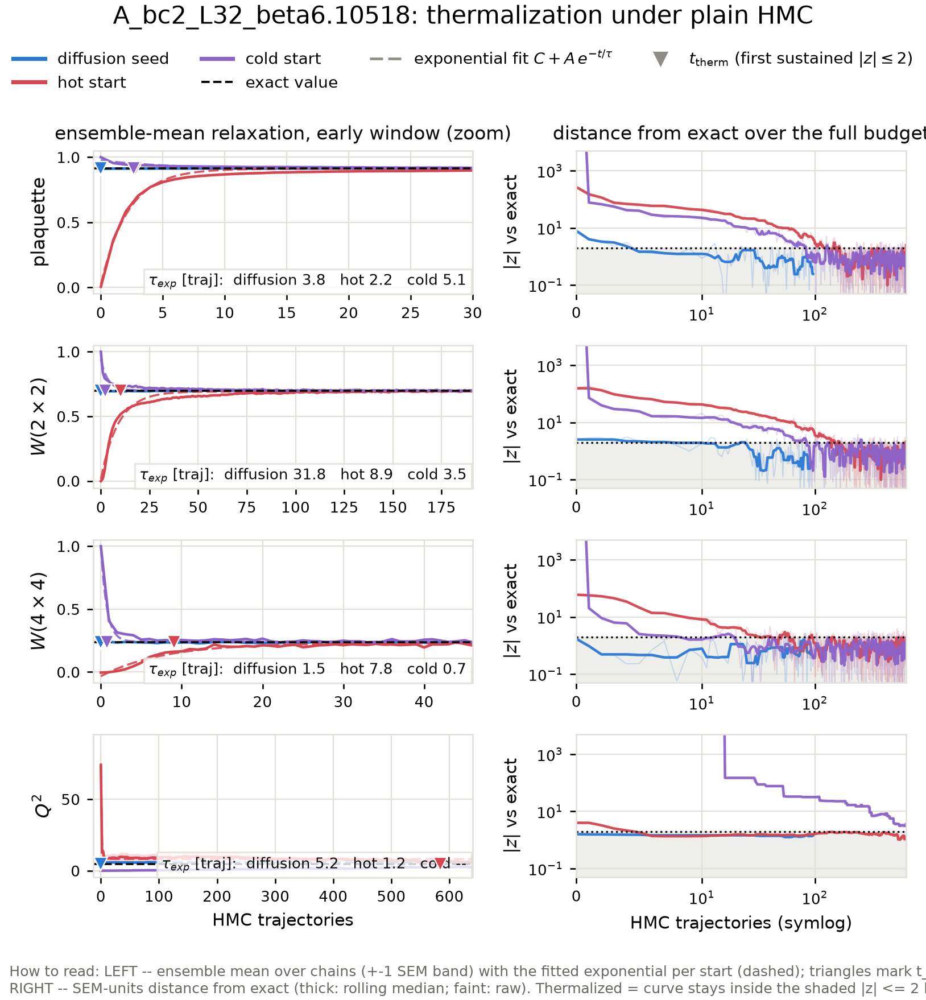

tau_int (hot-start chains, second half): plaquette = 3.63 +- 0.43, wilson_2x2 = 3.93 +- 0.40, wilson_4x4 = 1.24 +- 0.06, wilson_6x6 = 0.90 +- 0.05. Topology: hot-start HMC L=32 beta=6.10518 -> tau_int(Q) = 39.9.

Where 'never' stood at the end: the cold start ended the 640-trajectory budget still at Q^2 at |z| ~ 3.

### Diagnostics: raw diffusion output (before any HMC)

| observable | value | error | exact | z_exact | reference | ref_error | z_ref | ks_p | chi2_p |
|---|---|---|---|---|---|---|---|---|---|
| plaquette | 0.911 | 0.0003703 | 0.914 | -8.082 | 0.9139 | 0.000251 | -6.605 | 6.456e-07 |  |
| wilson_1x1 | 0.911 | 0.0003703 | 0.914 | -8.082 | 0.9139 | 0.000251 | -6.605 | 6.456e-07 |  |
| wilson_1x2 | 0.8302 | 0.0007651 | 0.8353 | -6.651 | 0.8352 | 0.0005981 | -5.06 | 0.0001858 |  |
| wilson_2x2 | 0.6936 | 0.001546 | 0.6978 | -2.682 | 0.6974 | 0.001248 | -1.911 | 0.07777 |  |
| wilson_2x3 | 0.5814 | 0.002074 | 0.5829 | -0.7289 | 0.5818 | 0.00194 | -0.1643 | 0.995 |  |
| wilson_3x3 | 0.446 | 0.002846 | 0.445 | 0.3562 | 0.4443 | 0.003061 | 0.4176 | 0.8612 |  |
| wilson_3x4 | 0.3435 | 0.003558 | 0.3397 | 1.058 | 0.3387 | 0.003633 | 0.9527 | 0.357 |  |
| wilson_4x4 | 0.2442 | 0.004234 | 0.2371 | 1.681 | 0.2365 | 0.003993 | 1.326 | 0.2272 |  |
| wilson_4x5 | 0.1746 | 0.004187 | 0.1654 | 2.196 | 0.1643 | 0.003885 | 1.799 | 0.4545 |  |
| wilson_5x5 | 0.1126 | 0.004598 | 0.1055 | 1.547 | 0.1054 | 0.003682 | 1.22 | 0.357 |  |
| wilson_5x6 | 0.07327 | 0.004385 | 0.06728 | 1.367 | 0.06597 | 0.003727 | 1.269 | 0.3277 |  |
| wilson_6x6 | 0.0393 | 0.004219 | 0.03921 | 0.02039 | 0.03753 | 0.003475 | 0.323 | 0.9827 |  |
| wilson_6x7 | 0.02166 | 0.004022 | 0.02286 | -0.2977 | 0.02178 | 0.003421 | -0.02339 | 0.939 |  |
| wilson_7x7 | 0.009253 | 0.003409 | 0.01218 | -0.8574 | 0.0116 | 0.00311 | -0.5076 | 0.7941 |  |
| wilson_7x8 | 0.004957 | 0.003728 | 0.006487 | -0.4102 | 0.005025 | 0.003226 | -0.01375 | 0.7195 |  |
| wilson_8x8 | 0.001973 | 0.00351 | 0.003158 | -0.3377 | 0.003577 | 0.002816 | -0.3565 | 0.7195 |  |
| wilson_8x10 | -0.005373 | 0.003645 | 0.0007487 | -1.679 | 0.006454 | 0.003418 | -2.367 | 0.08742 |  |
| wilson_10x10 | -0.004867 | 0.002537 | 0.0001238 | -1.967 | 0.002717 | 0.002899 | -1.968 | 0.2498 |  |
| wilson_10x12 | -0.005263 | 0.003203 | 2.049e-05 | -1.65 | 0.002296 | 0.002439 | -1.877 | 0.2272 |  |
| wilson_12x12 | -0.002193 | 0.002982 | 2.365e-06 | -0.736 | 0.0003315 | 0.001451 | -0.7611 | 0.4545 |  |
| creutz_2 | 0.08698 | 0.001203 | 0.08996 | -2.479 |  |  |  |  |  |
| creutz_3 | 0.08846 | 0.002961 | 0.08996 | -0.5098 |  |  |  |  |  |
| creutz_4 | 0.08014 | 0.007126 | 0.08996 | -1.379 |  |  |  |  |  |
| creutz_5 | 0.1033 | 0.01429 | 0.08996 | 0.9356 |  |  |  |  |  |
| creutz_6 | 0.1932 | 0.04421 | 0.08996 | 2.335 |  |  |  |  |  |
| creutz_7 | 0.2547 | 0.2352 | 0.08996 | 0.7004 |  |  |  |  |  |
| creutz_8 | 0.2972 | 1.053 | 0.08996 | 0.1969 |  |  |  |  |  |
| Q | -0.03125 | 0.2352 | 0 | -0.1328 | 0.05208 | 0.1548 | -0.2959 | 0.6808 |  |
| Q^2 | 5.891 | 0.9288 | 4.686 | 1.297 | 5.104 | 0.4005 | 0.7776 | 0.9827 |  |
| chi_top ((<Q^2>-<Q>^2)/V) | 0.005752 | 0.0007481 | 0.004576 | 1.571 | 0.004982 | 0.0005261 | 0.8416 |  |  |
| Q histogram vs exact P(Q) | 21.65 | nan | 10 | nan |  |  |  |  | 0.01701 |

### Diagnostics: the same configs after 96 HMC trajectories

| observable | value | error | exact | z_exact | reference | ref_error | z_ref | ks_p | chi2_p |
|---|---|---|---|---|---|---|---|---|---|
| plaquette | 0.9139 | 0.0002723 | 0.914 | -0.3023 | 0.9139 | 0.000251 | -0.1201 | 0.9574 |  |
| wilson_1x1 | 0.9139 | 0.0002723 | 0.914 | -0.3023 | 0.9139 | 0.000251 | -0.1201 | 0.9574 |  |
| wilson_1x2 | 0.8347 | 0.0006929 | 0.8353 | -0.8459 | 0.8352 | 0.0005981 | -0.4489 | 0.4899 |  |
| wilson_2x2 | 0.6972 | 0.001227 | 0.6978 | -0.474 | 0.6974 | 0.001248 | -0.1328 | 0.9574 |  |
| wilson_2x3 | 0.582 | 0.001862 | 0.5829 | -0.475 | 0.5818 | 0.00194 | 0.05989 | 0.939 |  |
| wilson_3x3 | 0.4432 | 0.003007 | 0.445 | -0.601 | 0.4443 | 0.003061 | -0.2507 | 0.4899 |  |
| wilson_3x4 | 0.3388 | 0.003623 | 0.3397 | -0.2463 | 0.3387 | 0.003633 | 0.03693 | 0.7575 |  |
| wilson_4x4 | 0.235 | 0.003863 | 0.2371 | -0.5214 | 0.2365 | 0.003993 | -0.2547 | 0.2272 |  |
| wilson_4x5 | 0.163 | 0.004727 | 0.1654 | -0.5126 | 0.1643 | 0.003885 | -0.2193 | 0.1866 |  |
| wilson_5x5 | 0.1007 | 0.004405 | 0.1055 | -1.089 | 0.1054 | 0.003682 | -0.8225 | 0.08742 |  |
| wilson_5x6 | 0.06312 | 0.004386 | 0.06728 | -0.9487 | 0.06597 | 0.003727 | -0.4953 | 0.4545 |  |
| wilson_6x6 | 0.03547 | 0.004513 | 0.03921 | -0.8295 | 0.03753 | 0.003475 | -0.3623 | 0.3879 |  |
| wilson_6x7 | 0.02192 | 0.004559 | 0.02286 | -0.206 | 0.02178 | 0.003421 | 0.02364 | 0.7941 |  |
| wilson_7x7 | 0.01148 | 0.004411 | 0.01218 | -0.1575 | 0.0116 | 0.00311 | -0.02107 | 0.8906 |  |
| wilson_7x8 | 0.008197 | 0.003686 | 0.006487 | 0.464 | 0.005025 | 0.003226 | 0.6475 | 0.9574 |  |
| wilson_8x8 | 0.00523 | 0.003087 | 0.003158 | 0.6709 | 0.003577 | 0.002816 | 0.3954 | 0.7195 |  |
| wilson_8x10 | 0.0003955 | 0.003181 | 0.0007487 | -0.1111 | 0.006454 | 0.003418 | -1.298 | 0.2498 |  |
| wilson_10x10 | -0.0005196 | 0.00343 | 0.0001238 | -0.1876 | 0.002717 | 0.002899 | -0.7206 | 0.1685 |  |
| wilson_10x12 | -0.0001459 | 0.002428 | 2.049e-05 | -0.06854 | 0.002296 | 0.002439 | -0.7094 | 0.9827 |  |
| wilson_12x12 | -0.001078 | 0.001815 | 2.365e-06 | -0.5952 | 0.0003315 | 0.001451 | -0.6065 | 0.7195 |  |
| creutz_2 | 0.08948 | 0.001284 | 0.08996 | -0.3739 |  |  |  |  |  |
| creutz_3 | 0.09183 | 0.003178 | 0.08996 | 0.5874 |  |  |  |  |  |
| creutz_4 | 0.09731 | 0.006628 | 0.08996 | 1.108 |  |  |  |  |  |
| creutz_5 | 0.1155 | 0.01836 | 0.08996 | 1.392 |  |  |  |  |  |
| creutz_6 | 0.1091 | 0.04942 | 0.08996 | 0.3881 |  |  |  |  |  |
| creutz_7 | 0.1651 | 0.1605 | 0.08996 | 0.4683 |  |  |  |  |  |
| creutz_8 | 0.1124 | 0.4453 | 0.08996 | 0.05047 |  |  |  |  |  |
| Q | 0.1328 | 0.2324 | 0 | 0.5715 | 0.05208 | 0.1548 | 0.2891 | 0.9978 |  |
| Q^2 | 5.93 | 1.095 | 4.686 | 1.136 | 5.104 | 0.4005 | 0.7083 | 0.9978 |  |
| chi_top ((<Q^2>-<Q>^2)/V) | 0.005773 | 0.0008304 | 0.004576 | 1.441 | 0.004982 | 0.0005261 | 0.8052 |  |  |
| Q histogram vs exact P(Q) | 11.53 | nan | 10 | nan |  |  |  |  | 0.3178 |

## A_bc3_L32_beta10.015

HMC: step size 0.1264, 8 leapfrog steps, acceptance seed/hot/cold = 0.977/0.980/0.980. Diffusion-seed batch: 128 chains x 96 trajectories (0.12 s/traj for the whole batch); baselines: 32 chains x 640 trajectories.

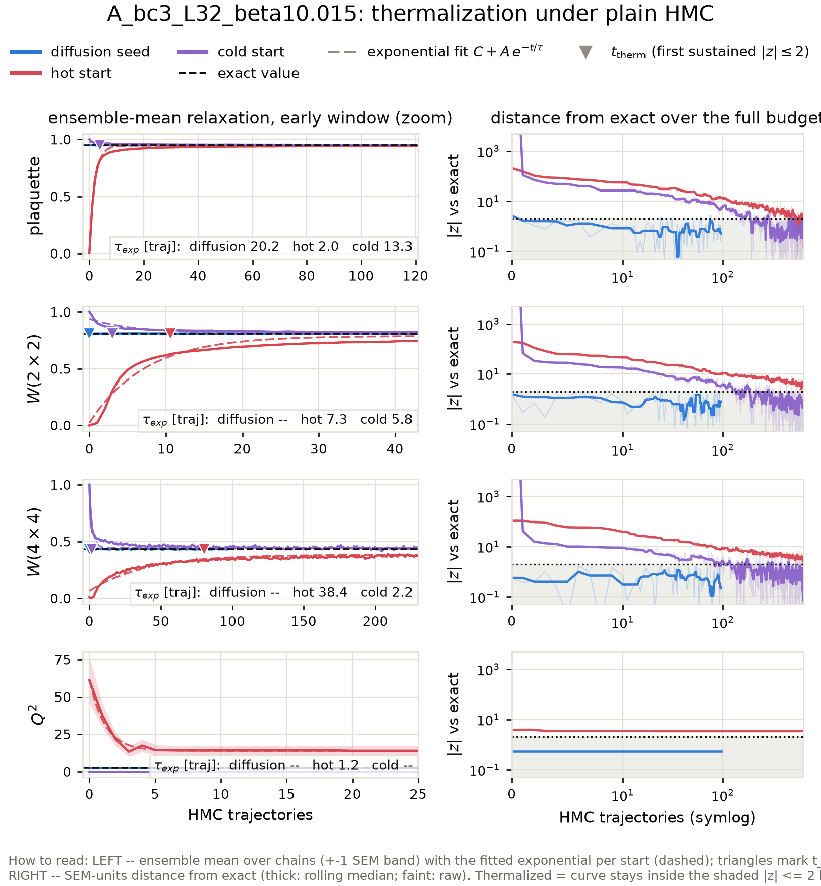

tau_int (hot-start chains, second half): plaquette = 4.95 +- 0.67, wilson_2x2 = 5.66 +- 0.72, wilson_4x4 = 1.91 +- 0.30, wilson_6x6 = 0.93 +- 0.05. Topology: hot-start HMC L=32 beta=10.015 -> **frozen** (no tunneling).

Where 'never' stood at the end: the hot start ended the 640-trajectory budget still at plaquette at |z| ~ 1, Q^2 at |z| ~ 3; the cold start ended the 640-trajectory budget still at Q^2 at |z| ~ 2736159195136.

### Diagnostics: raw diffusion output (before any HMC)

| observable | value | error | exact | z_exact | reference | ref_error | z_ref | ks_p | chi2_p |
|---|---|---|---|---|---|---|---|---|---|
| plaquette | 0.9492 | 0.0001866 | 0.9487 | 2.912 | 0.949 | 0.0001087 | 1.153 | 0.5643 |  |
| wilson_1x1 | 0.9492 | 0.0001866 | 0.9487 | 2.912 | 0.949 | 0.0001087 | 1.153 | 0.5643 |  |
| wilson_1x2 | 0.9008 | 0.0004045 | 0.9 | 2.007 | 0.9011 | 0.0002933 | -0.6001 | 0.9719 |  |
| wilson_2x2 | 0.8116 | 0.0008517 | 0.81 | 1.942 | 0.8123 | 0.000796 | -0.5772 | 0.1366 |  |
| wilson_2x3 | 0.7314 | 0.001454 | 0.729 | 1.672 | 0.7325 | 0.001345 | -0.5317 | 0.4545 |  |
| wilson_3x3 | 0.6252 | 0.002578 | 0.6224 | 1.099 | 0.6281 | 0.002117 | -0.8485 | 0.2498 |  |
| wilson_3x4 | 0.534 | 0.003282 | 0.5314 | 0.7988 | 0.5385 | 0.002842 | -1.04 | 0.1685 |  |
| wilson_4x4 | 0.4329 | 0.004354 | 0.4304 | 0.5748 | 0.4383 | 0.003576 | -0.9437 | 0.2272 |  |
| wilson_4x5 | 0.3511 | 0.004851 | 0.3486 | 0.5107 | 0.3577 | 0.003913 | -1.048 | 0.1366 |  |
| wilson_5x5 | 0.2695 | 0.005453 | 0.2679 | 0.291 | 0.2765 | 0.003994 | -1.037 | 0.1366 |  |
| wilson_5x6 | 0.2075 | 0.005848 | 0.2059 | 0.2874 | 0.2146 | 0.003907 | -1.007 | 0.2272 |  |
| wilson_6x6 | 0.1529 | 0.005421 | 0.1501 | 0.5151 | 0.157 | 0.003592 | -0.6295 | 0.5643 |  |
| wilson_6x7 | 0.1118 | 0.005264 | 0.1094 | 0.4504 | 0.1176 | 0.003355 | -0.9328 | 0.4899 |  |
| wilson_7x7 | 0.0775 | 0.004742 | 0.07566 | 0.3881 | 0.08313 | 0.003598 | -0.9464 | 0.7575 |  |
| wilson_7x8 | 0.05248 | 0.004011 | 0.05232 | 0.03893 | 0.0593 | 0.002975 | -1.366 | 0.8288 |  |
| wilson_8x8 | 0.03349 | 0.003205 | 0.03433 | -0.2598 | 0.04185 | 0.003649 | -1.72 | 0.2498 |  |
| wilson_8x10 | 0.01018 | 0.003204 | 0.01478 | -1.436 | 0.02282 | 0.003546 | -2.646 | 0.07777 |  |
| wilson_10x10 | 0.00271 | 0.004766 | 0.005151 | -0.5122 | 0.009429 | 0.00298 | -1.195 | 0.5643 |  |
| wilson_10x12 | -0.00579 | 0.003933 | 0.001796 | -1.929 | 0.00556 | 0.002332 | -2.482 | 0.02823 |  |
| wilson_12x12 | -0.007707 | 0.004205 | 0.0005072 | -1.954 | 0.002387 | 0.003226 | -1.905 | 0.2741 |  |
| creutz_2 | 0.05188 | 0.0007545 | 0.05268 | -1.072 |  |  |  |  |  |
| creutz_3 | 0.05276 | 0.00155 | 0.05268 | 0.05155 |  |  |  |  |  |
| creutz_4 | 0.05219 | 0.002647 | 0.05268 | -0.1869 |  |  |  |  |  |
| creutz_5 | 0.05514 | 0.005237 | 0.05268 | 0.4694 |  |  |  |  |  |
| creutz_6 | 0.04461 | 0.01088 | 0.05268 | -0.7425 |  |  |  |  |  |
| creutz_7 | 0.0531 | 0.02341 | 0.05268 | 0.01761 |  |  |  |  |  |
| creutz_8 | 0.05916 | 0.05588 | 0.05268 | 0.1159 |  |  |  |  |  |
| Q | -0.04688 | 0.1841 | 0 | -0.2547 | -0.04167 | 0.08285 | -0.0258 | 0.9902 |  |
| Q^2 | 2.562 | 0.2781 | 2.736 | -0.6244 | 2.417 | 0.188 | 0.4344 | 1 |  |
| chi_top ((<Q^2>-<Q>^2)/V) | 0.0025 | 0.0003258 | 0.002672 | -0.5271 | 0.002358 | 0.0002288 | 0.3566 |  |  |
| Q histogram vs exact P(Q) | 6.704 | nan | 8 | nan |  |  |  |  | 0.5688 |

### Diagnostics: the same configs after 96 HMC trajectories

| observable | value | error | exact | z_exact | reference | ref_error | z_ref | ks_p | chi2_p |
|---|---|---|---|---|---|---|---|---|---|
| plaquette | 0.9488 | 0.0001437 | 0.9487 | 0.6025 | 0.949 | 0.0001087 | -1.154 | 0.07777 |  |
| wilson_1x1 | 0.9488 | 0.0001437 | 0.9487 | 0.6025 | 0.949 | 0.0001087 | -1.154 | 0.07777 |  |
| wilson_1x2 | 0.9004 | 0.0003695 | 0.9 | 1.032 | 0.9011 | 0.0002933 | -1.548 | 0.2061 |  |
| wilson_2x2 | 0.8107 | 0.00089 | 0.81 | 0.8198 | 0.8123 | 0.000796 | -1.337 | 0.01864 |  |
| wilson_2x3 | 0.7307 | 0.001456 | 0.729 | 1.149 | 0.7325 | 0.001345 | -0.9141 | 0.3879 |  |
| wilson_3x3 | 0.6235 | 0.00218 | 0.6224 | 0.4848 | 0.6281 | 0.002117 | -1.515 | 0.04767 |  |
| wilson_3x4 | 0.5328 | 0.003213 | 0.5314 | 0.4441 | 0.5385 | 0.002842 | -1.331 | 0.04195 |  |
| wilson_4x4 | 0.4296 | 0.004024 | 0.4304 | -0.2009 | 0.4383 | 0.003576 | -1.603 | 0.004773 |  |
| wilson_4x5 | 0.3484 | 0.004996 | 0.3486 | -0.03965 | 0.3577 | 0.003913 | -1.451 | 0.002916 |  |
| wilson_5x5 | 0.2653 | 0.00579 | 0.2679 | -0.4497 | 0.2765 | 0.003994 | -1.593 | 0.005601 |  |
| wilson_5x6 | 0.2051 | 0.006027 | 0.2059 | -0.1219 | 0.2146 | 0.003907 | -1.323 | 0.02823 |  |
| wilson_6x6 | 0.1482 | 0.006148 | 0.1501 | -0.304 | 0.157 | 0.003592 | -1.229 | 0.05405 |  |
| wilson_6x7 | 0.1101 | 0.006114 | 0.1094 | 0.1179 | 0.1176 | 0.003355 | -1.072 | 0.2741 |  |
| wilson_7x7 | 0.07661 | 0.005779 | 0.07566 | 0.1645 | 0.08313 | 0.003598 | -0.9582 | 0.7575 |  |
| wilson_7x8 | 0.05498 | 0.004979 | 0.05232 | 0.5329 | 0.0593 | 0.002975 | -0.7456 | 0.8288 |  |
| wilson_8x8 | 0.03569 | 0.004968 | 0.03433 | 0.2754 | 0.04185 | 0.003649 | -0.9986 | 0.6418 |  |
| wilson_8x10 | 0.01758 | 0.003958 | 0.01478 | 0.708 | 0.02282 | 0.003546 | -0.9868 | 0.4204 |  |
| wilson_10x10 | 0.003615 | 0.003578 | 0.005151 | -0.4294 | 0.009429 | 0.00298 | -1.249 | 0.3879 |  |
| wilson_10x12 | -0.0002827 | 0.003786 | 0.001796 | -0.549 | 0.00556 | 0.002332 | -1.314 | 0.2272 |  |
| wilson_12x12 | 0.001329 | 0.004314 | 0.0005072 | 0.1905 | 0.002387 | 0.003226 | -0.1964 | 0.4545 |  |
| creutz_2 | 0.05254 | 0.0007452 | 0.05268 | -0.1941 |  |  |  |  |  |
| creutz_3 | 0.05467 | 0.001362 | 0.05268 | 1.459 |  |  |  |  |  |
| creutz_4 | 0.05823 | 0.002801 | 0.05268 | 1.98 |  |  |  |  |  |
| creutz_5 | 0.06319 | 0.006006 | 0.05268 | 1.75 |  |  |  |  |  |
| creutz_6 | 0.06783 | 0.01108 | 0.05268 | 1.367 |  |  |  |  |  |
| creutz_7 | 0.06586 | 0.02419 | 0.05268 | 0.5447 |  |  |  |  |  |
| creutz_8 | 0.1001 | 0.04885 | 0.05268 | 0.97 |  |  |  |  |  |
| Q | -0.04688 | 0.1841 | 0 | -0.2547 | -0.04167 | 0.08285 | -0.0258 | 0.9902 |  |
| Q^2 | 2.562 | 0.2781 | 2.736 | -0.6244 | 2.417 | 0.188 | 0.4344 | 1 |  |
| chi_top ((<Q^2>-<Q>^2)/V) | 0.0025 | 0.0003258 | 0.002672 | -0.5271 | 0.002358 | 0.0002288 | 0.3566 |  |  |
| Q histogram vs exact P(Q) | 6.704 | nan | 8 | nan |  |  |  |  | 0.5688 |

## A_bc4_L32_beta14.1464

HMC: step size 0.1063, 9 leapfrog steps, acceptance seed/hot/cold = 0.986/0.986/0.984. Diffusion-seed batch: 128 chains x 96 trajectories (0.12 s/traj for the whole batch); baselines: 32 chains x 640 trajectories.

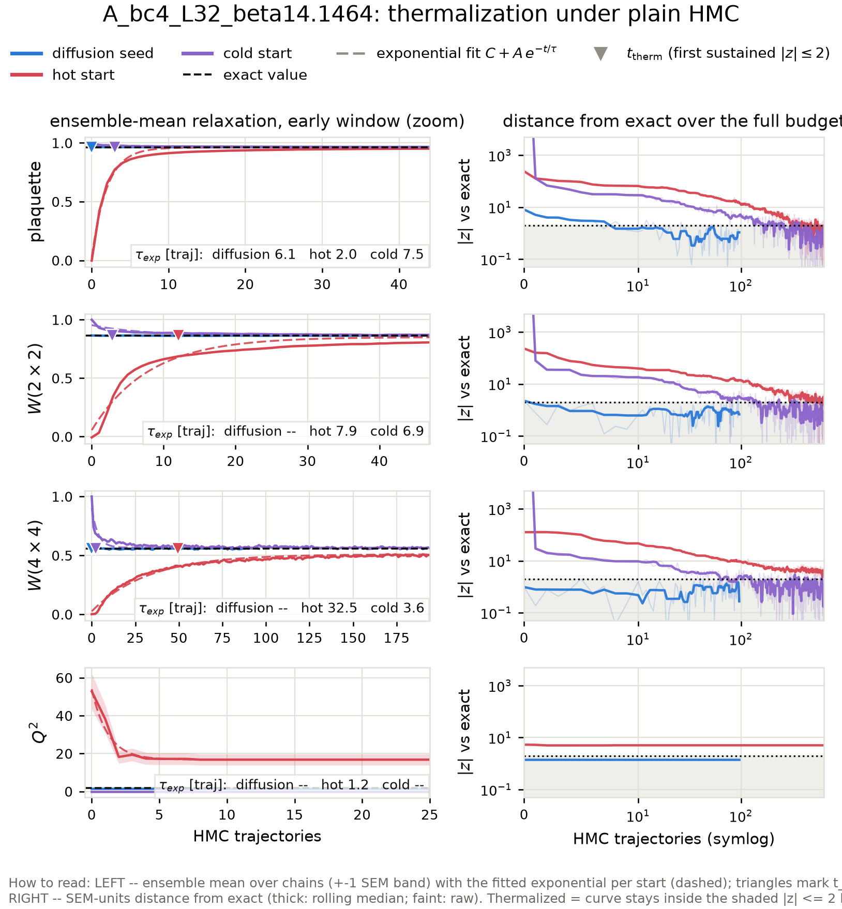

tau_int (hot-start chains, second half): plaquette = 5.15 +- 0.59, wilson_2x2 = 4.11 +- 0.42, wilson_4x4 = 2.03 +- 0.17, wilson_6x6 = 0.87 +- 0.07. Topology: hot-start HMC L=32 beta=14.1464 -> **frozen** (no tunneling).

Where 'never' stood at the end: the hot start ended the 640-trajectory budget still at plaquette at |z| ~ 2, Q^2 at |z| ~ 5; the cold start ended the 640-trajectory budget still at Q^2 at |z| ~ 1903991324672.

### Diagnostics: raw diffusion output (before any HMC)

| observable | value | error | exact | z_exact | reference | ref_error | z_ref | ks_p | chi2_p |
|---|---|---|---|---|---|---|---|---|---|
| plaquette | 0.9651 | 0.0001487 | 0.964 | 7.4 | 0.9639 | 0.0001213 | 6.294 | 8.308e-07 |  |
| wilson_1x1 | 0.9651 | 0.0001487 | 0.964 | 7.4 | 0.9639 | 0.0001213 | 6.294 | 8.308e-07 |  |
| wilson_1x2 | 0.9308 | 0.0002703 | 0.9293 | 5.733 | 0.9294 | 0.0002471 | 3.763 | 0.01398 |  |
| wilson_2x2 | 0.8652 | 0.0006663 | 0.8635 | 2.524 | 0.8645 | 0.0004983 | 0.8647 | 0.5266 |  |
| wilson_2x3 | 0.8051 | 0.001225 | 0.8024 | 2.182 | 0.8048 | 0.0008804 | 0.1745 | 0.9719 |  |
| wilson_3x3 | 0.7217 | 0.002078 | 0.7188 | 1.403 | 0.7229 | 0.001518 | -0.4503 | 0.1685 |  |
| wilson_3x4 | 0.6469 | 0.002662 | 0.6439 | 1.136 | 0.6498 | 0.002333 | -0.8247 | 0.3879 |  |
| wilson_4x4 | 0.5594 | 0.00372 | 0.556 | 0.9165 | 0.5637 | 0.003131 | -0.8718 | 0.357 |  |
| wilson_4x5 | 0.483 | 0.004701 | 0.4801 | 0.6104 | 0.4889 | 0.004108 | -0.9411 | 0.2741 |  |
| wilson_5x5 | 0.4014 | 0.005713 | 0.3997 | 0.2964 | 0.4088 | 0.004986 | -0.9769 | 0.1685 |  |
| wilson_5x6 | 0.3335 | 0.006154 | 0.3327 | 0.1262 | 0.3409 | 0.005446 | -0.8974 | 0.2061 |  |
| wilson_6x6 | 0.267 | 0.007055 | 0.267 | -0.0009206 | 0.2732 | 0.005718 | -0.6882 | 0.2498 |  |
| wilson_6x7 | 0.2126 | 0.007664 | 0.2142 | -0.2103 | 0.2187 | 0.005735 | -0.6404 | 0.3879 |  |
| wilson_7x7 | 0.1623 | 0.007962 | 0.1657 | -0.4254 | 0.1675 | 0.005264 | -0.5472 | 0.7195 |  |
| wilson_7x8 | 0.1247 | 0.008508 | 0.1282 | -0.4104 | 0.1287 | 0.005324 | -0.3949 | 0.939 |  |
| wilson_8x8 | 0.09283 | 0.008426 | 0.09558 | -0.3266 | 0.09427 | 0.005269 | -0.1449 | 0.9719 |  |
| wilson_8x10 | 0.0538 | 0.008688 | 0.05315 | 0.07505 | 0.05084 | 0.005635 | 0.2856 | 0.8906 |  |
| wilson_10x10 | 0.02748 | 0.006141 | 0.02552 | 0.3191 | 0.02326 | 0.004043 | 0.573 | 0.7195 |  |
| wilson_10x12 | 0.01243 | 0.006059 | 0.01225 | 0.03002 | 0.01124 | 0.004685 | 0.1555 | 0.7195 |  |
| wilson_12x12 | 0.005177 | 0.005797 | 0.00508 | 0.01683 | 0.007469 | 0.003825 | -0.33 | 0.6028 |  |
| creutz_2 | 0.03693 | 0.0005204 | 0.03668 | 0.4727 |  |  |  |  |  |
| creutz_3 | 0.03734 | 0.0009486 | 0.03668 | 0.6946 |  |  |  |  |  |
| creutz_4 | 0.03589 | 0.001968 | 0.03668 | -0.4027 |  |  |  |  |  |
| creutz_5 | 0.03826 | 0.003283 | 0.03668 | 0.4796 |  |  |  |  |  |
| creutz_6 | 0.03714 | 0.006307 | 0.03668 | 0.07311 |  |  |  |  |  |
| creutz_7 | 0.04225 | 0.01015 | 0.03668 | 0.5487 |  |  |  |  |  |
| creutz_8 | 0.0313 | 0.01892 | 0.03668 | -0.2843 |  |  |  |  |  |
| Q | -0.007812 | 0.1256 | 0 | -0.06218 | -0.03646 | 0.09814 | 0.1797 | 1 |  |
| Q^2 | 1.602 | 0.2145 | 1.904 | -1.41 | 1.828 | 0.1613 | -0.8442 | 0.9574 |  |
| chi_top ((<Q^2>-<Q>^2)/V) | 0.001564 | 0.0002066 | 0.001859 | -1.43 | 0.001784 | 0.0001793 | -0.8043 |  |  |
| Q histogram vs exact P(Q) | 6.232 | nan | 8 | nan |  |  |  |  | 0.6213 |

### Diagnostics: the same configs after 96 HMC trajectories

| observable | value | error | exact | z_exact | reference | ref_error | z_ref | ks_p | chi2_p |
|---|---|---|---|---|---|---|---|---|---|
| plaquette | 0.9641 | 0.0001318 | 0.964 | 1.063 | 0.9639 | 0.0001213 | 1.381 | 0.2741 |  |
| wilson_1x1 | 0.9641 | 0.0001318 | 0.964 | 1.063 | 0.9639 | 0.0001213 | 1.381 | 0.2741 |  |
| wilson_1x2 | 0.9298 | 0.0002986 | 0.9293 | 1.652 | 0.9294 | 0.0002471 | 0.8305 | 0.5266 |  |
| wilson_2x2 | 0.864 | 0.0007619 | 0.8635 | 0.6282 | 0.8645 | 0.0004983 | -0.5311 | 0.7941 |  |
| wilson_2x3 | 0.804 | 0.001141 | 0.8024 | 1.369 | 0.8048 | 0.0008804 | -0.5886 | 0.5266 |  |
| wilson_3x3 | 0.7206 | 0.001878 | 0.7188 | 0.9725 | 0.7229 | 0.001518 | -0.9308 | 0.2498 |  |
| wilson_3x4 | 0.6463 | 0.002329 | 0.6439 | 1.022 | 0.6498 | 0.002333 | -1.081 | 0.1866 |  |
| wilson_4x4 | 0.5571 | 0.003188 | 0.556 | 0.3223 | 0.5637 | 0.003131 | -1.482 | 0.04767 |  |
| wilson_4x5 | 0.4805 | 0.004168 | 0.4801 | 0.09672 | 0.4889 | 0.004108 | -1.425 | 0.01616 |  |
| wilson_5x5 | 0.3984 | 0.005089 | 0.3997 | -0.2469 | 0.4088 | 0.004986 | -1.454 | 0.004059 |  |
| wilson_5x6 | 0.3315 | 0.005774 | 0.3327 | -0.2082 | 0.3409 | 0.005446 | -1.178 | 0.02823 |  |
| wilson_6x6 | 0.2618 | 0.006406 | 0.267 | -0.7993 | 0.2732 | 0.005718 | -1.323 | 0.02145 |  |
| wilson_6x7 | 0.2099 | 0.006924 | 0.2142 | -0.6211 | 0.2187 | 0.005735 | -0.9809 | 0.07777 |  |
| wilson_7x7 | 0.1596 | 0.006666 | 0.1657 | -0.9114 | 0.1675 | 0.005264 | -0.9315 | 0.1098 |  |
| wilson_7x8 | 0.1225 | 0.00642 | 0.1282 | -0.8813 | 0.1287 | 0.005324 | -0.7349 | 0.1685 |  |
| wilson_8x8 | 0.09098 | 0.006224 | 0.09558 | -0.7403 | 0.09427 | 0.005269 | -0.4042 | 0.7941 |  |
| wilson_8x10 | 0.05001 | 0.006527 | 0.05315 | -0.4807 | 0.05084 | 0.005635 | -0.09656 | 0.6418 |  |
| wilson_10x10 | 0.02081 | 0.005844 | 0.02552 | -0.8061 | 0.02326 | 0.004043 | -0.3458 | 0.8906 |  |
| wilson_10x12 | 0.01055 | 0.005121 | 0.01225 | -0.3327 | 0.01124 | 0.004685 | -0.1001 | 0.7195 |  |
| wilson_12x12 | 0.0009613 | 0.003823 | 0.00508 | -1.077 | 0.007469 | 0.003825 | -1.203 | 0.4545 |  |
| creutz_2 | 0.03705 | 0.0005024 | 0.03668 | 0.7208 |  |  |  |  |  |
| creutz_3 | 0.03748 | 0.001048 | 0.03668 | 0.7606 |  |  |  |  |  |
| creutz_4 | 0.03968 | 0.0018 | 0.03668 | 1.663 |  |  |  |  |  |
| creutz_5 | 0.03966 | 0.003065 | 0.03668 | 0.9724 |  |  |  |  |  |
| creutz_6 | 0.05196 | 0.005255 | 0.03668 | 2.907 |  |  |  |  |  |
| creutz_7 | 0.05284 | 0.01154 | 0.03668 | 1.4 |  |  |  |  |  |
| creutz_8 | 0.03316 | 0.01939 | 0.03668 | -0.1817 |  |  |  |  |  |
| Q | -0.007812 | 0.1256 | 0 | -0.06218 | -0.03646 | 0.09814 | 0.1797 | 1 |  |
| Q^2 | 1.602 | 0.2145 | 1.904 | -1.41 | 1.828 | 0.1613 | -0.8442 | 0.9574 |  |
| chi_top ((<Q^2>-<Q>^2)/V) | 0.001564 | 0.0002066 | 0.001859 | -1.43 | 0.001784 | 0.0001793 | -0.8043 |  |  |
| Q histogram vs exact P(Q) | 6.232 | nan | 8 | nan |  |  |  |  | 0.6213 |

## A_bc5_L32_beta18.2524

HMC: step size 0.0936, 11 leapfrog steps, acceptance seed/hot/cold = 0.981/0.981/0.981. Diffusion-seed batch: 128 chains x 96 trajectories (0.08 s/traj for the whole batch); baselines: 32 chains x 640 trajectories.

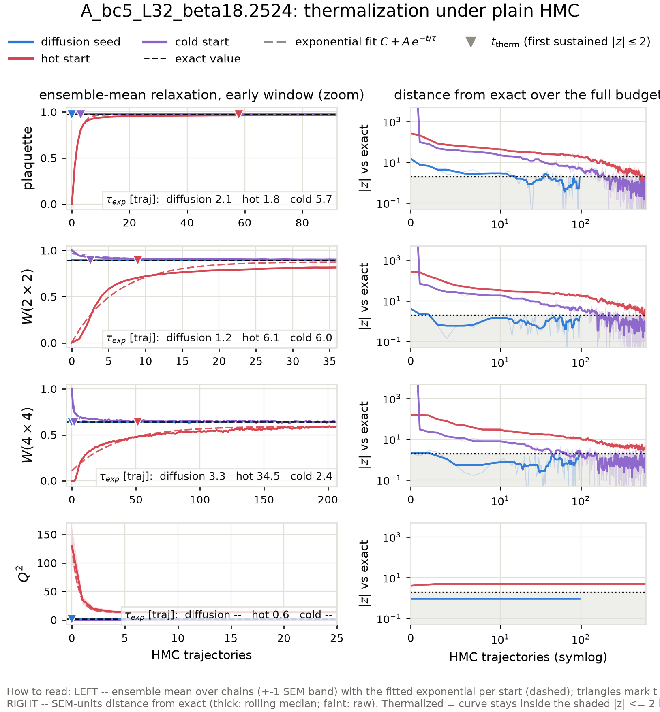

tau_int (hot-start chains, second half): plaquette = 6.34 +- 0.83, wilson_2x2 = 7.02 +- 1.00, wilson_4x4 = 3.04 +- 0.56, wilson_6x6 = 1.00 +- 0.07. Topology: hot-start HMC L=32 beta=18.2524 -> **frozen** (no tunneling).

Where 'never' stood at the end: the hot start ended the 640-trajectory budget still at Q^2 at |z| ~ 5; the cold start ended the 640-trajectory budget still at Q^2 at |z| ~ 1462558916608.

### Diagnostics: raw diffusion output (before any HMC)

| observable | value | error | exact | z_exact | reference | ref_error | z_ref | ks_p | chi2_p |
|---|---|---|---|---|---|---|---|---|---|
| plaquette | 0.9738 | 0.0001247 | 0.9722 | 12.63 | 0.9722 | 7.794e-05 | 10.95 | 1.401e-22 |  |
| wilson_1x1 | 0.9738 | 0.0001247 | 0.9722 | 12.63 | 0.9722 | 7.794e-05 | 10.95 | 1.401e-22 |  |
| wilson_1x2 | 0.9474 | 0.0002436 | 0.9452 | 8.898 | 0.9451 | 0.0002107 | 7.043 | 3.873e-07 |  |
| wilson_2x2 | 0.8958 | 0.0007486 | 0.8934 | 3.175 | 0.8937 | 0.0006431 | 2.051 | 0.07777 |  |
| wilson_2x3 | 0.8478 | 0.001153 | 0.8444 | 2.916 | 0.8444 | 0.0009534 | 2.236 | 0.06904 |  |
| wilson_3x3 | 0.7802 | 0.00197 | 0.776 | 2.18 | 0.7764 | 0.001521 | 1.56 | 0.1866 |  |
| wilson_3x4 | 0.7186 | 0.00271 | 0.713 | 2.034 | 0.713 | 0.001996 | 1.651 | 0.2272 |  |
| wilson_4x4 | 0.6433 | 0.003626 | 0.637 | 1.732 | 0.6376 | 0.002751 | 1.263 | 0.2498 |  |
| wilson_4x5 | 0.5759 | 0.00448 | 0.5691 | 1.525 | 0.5682 | 0.003166 | 1.41 | 0.3277 |  |
| wilson_5x5 | 0.5008 | 0.005482 | 0.4943 | 1.189 | 0.4946 | 0.003843 | 0.9337 | 0.3879 |  |
| wilson_5x6 | 0.4367 | 0.006155 | 0.4293 | 1.197 | 0.4275 | 0.004423 | 1.211 | 0.1866 |  |
| wilson_6x6 | 0.3684 | 0.00626 | 0.3625 | 0.9433 | 0.3613 | 0.004605 | 0.9125 | 0.1366 |  |
| wilson_6x7 | 0.3116 | 0.006704 | 0.3061 | 0.8169 | 0.3038 | 0.004963 | 0.9401 | 0.2272 |  |
| wilson_7x7 | 0.2557 | 0.007139 | 0.2513 | 0.6115 | 0.2493 | 0.004958 | 0.7361 | 0.4204 |  |
| wilson_7x8 | 0.2102 | 0.007809 | 0.2063 | 0.5011 | 0.2032 | 0.005353 | 0.7422 | 0.6028 |  |
| wilson_8x8 | 0.1666 | 0.008152 | 0.1647 | 0.2374 | 0.1623 | 0.005375 | 0.4411 | 0.6418 |  |
| wilson_8x10 | 0.1108 | 0.008994 | 0.1049 | 0.6597 | 0.1027 | 0.006268 | 0.7406 | 0.6418 |  |
| wilson_10x10 | 0.05955 | 0.009281 | 0.0597 | -0.01527 | 0.05986 | 0.006531 | -0.02713 | 0.7575 |  |
| wilson_10x12 | 0.03153 | 0.008619 | 0.03397 | -0.2836 | 0.03415 | 0.006199 | -0.2473 | 0.8906 |  |
| wilson_12x12 | 0.01204 | 0.007147 | 0.01727 | -0.7322 | 0.01134 | 0.005532 | 0.07703 | 0.4899 |  |
| creutz_2 | 0.02849 | 0.0003717 | 0.02818 | 0.8244 |  |  |  |  |  |
| creutz_3 | 0.02796 | 0.0008622 | 0.02818 | -0.2633 |  |  |  |  |  |
| creutz_4 | 0.02826 | 0.001254 | 0.02818 | 0.05984 |  |  |  |  |  |
| creutz_5 | 0.02914 | 0.002269 | 0.02818 | 0.4225 |  |  |  |  |  |
| creutz_6 | 0.03297 | 0.003871 | 0.02818 | 1.235 |  |  |  |  |  |
| creutz_7 | 0.03027 | 0.005642 | 0.02818 | 0.3688 |  |  |  |  |  |
| creutz_8 | 0.03685 | 0.01073 | 0.02818 | 0.8076 |  |  |  |  |  |
| Q | 0.3359 | 0.09913 | 0 | 3.389 | 0.03646 | 0.105 | 2.074 | 0.003444 |  |
| Q^2 | 1.648 | 0.215 | 1.463 | 0.8645 | 1.828 | 0.1597 | -0.671 | 0.2741 |  |
| chi_top ((<Q^2>-<Q>^2)/V) | 0.0015 | 0.0001948 | 0.001428 | 0.3661 | 0.001784 | 0.0001461 | -1.168 |  |  |
| Q histogram vs exact P(Q) | 15.18 | nan | 6 | nan |  |  |  |  | 0.01889 |

### Diagnostics: the same configs after 96 HMC trajectories

| observable | value | error | exact | z_exact | reference | ref_error | z_ref | ks_p | chi2_p |
|---|---|---|---|---|---|---|---|---|---|
| plaquette | 0.9724 | 9.108e-05 | 0.9722 | 1.958 | 0.9722 | 7.794e-05 | 1.787 | 0.02145 |  |
| wilson_1x1 | 0.9724 | 9.108e-05 | 0.9722 | 1.958 | 0.9722 | 7.794e-05 | 1.787 | 0.02145 |  |
| wilson_1x2 | 0.9455 | 0.0002649 | 0.9452 | 1.328 | 0.9451 | 0.0002107 | 1.337 | 0.02464 |  |
| wilson_2x2 | 0.8944 | 0.000689 | 0.8934 | 1.441 | 0.8937 | 0.0006431 | 0.6795 | 0.4545 |  |
| wilson_2x3 | 0.8462 | 0.001059 | 0.8444 | 1.705 | 0.8444 | 0.0009534 | 1.256 | 0.1866 |  |
| wilson_3x3 | 0.7796 | 0.001622 | 0.776 | 2.222 | 0.7764 | 0.001521 | 1.435 | 0.2741 |  |
| wilson_3x4 | 0.7176 | 0.002087 | 0.713 | 2.201 | 0.713 | 0.001996 | 1.607 | 0.2061 |  |
| wilson_4x4 | 0.644 | 0.002885 | 0.637 | 2.428 | 0.6376 | 0.002751 | 1.623 | 0.07777 |  |
| wilson_4x5 | 0.577 | 0.003612 | 0.5691 | 2.2 | 0.5682 | 0.003166 | 1.842 | 0.08742 |  |
| wilson_5x5 | 0.5058 | 0.00443 | 0.4943 | 2.607 | 0.4946 | 0.003843 | 1.924 | 0.03684 |  |
| wilson_5x6 | 0.443 | 0.005514 | 0.4293 | 2.472 | 0.4275 | 0.004423 | 2.184 | 0.03684 |  |
| wilson_6x6 | 0.3796 | 0.006276 | 0.3625 | 2.727 | 0.3613 | 0.004605 | 2.351 | 0.02464 |  |
| wilson_6x7 | 0.3251 | 0.006963 | 0.3061 | 2.72 | 0.3038 | 0.004963 | 2.492 | 0.01207 |  |
| wilson_7x7 | 0.2698 | 0.007471 | 0.2513 | 2.474 | 0.2493 | 0.004958 | 2.288 | 0.02464 |  |
| wilson_7x8 | 0.2247 | 0.007824 | 0.2063 | 2.352 | 0.2032 | 0.005353 | 2.27 | 0.03229 |  |
| wilson_8x8 | 0.1833 | 0.007863 | 0.1647 | 2.364 | 0.1623 | 0.005375 | 2.201 | 0.03229 |  |
| wilson_8x10 | 0.1182 | 0.008035 | 0.1049 | 1.654 | 0.1027 | 0.006268 | 1.518 | 0.1685 |  |
| wilson_10x10 | 0.06783 | 0.007174 | 0.0597 | 1.133 | 0.05986 | 0.006531 | 0.821 | 0.6418 |  |
| wilson_10x12 | 0.03218 | 0.006366 | 0.03397 | -0.2821 | 0.03415 | 0.006199 | -0.2225 | 0.9574 |  |
| wilson_12x12 | 0.0157 | 0.00503 | 0.01727 | -0.3135 | 0.01134 | 0.005532 | 0.5821 | 0.5643 |  |
| creutz_2 | 0.02763 | 0.0003627 | 0.02818 | -1.517 |  |  |  |  |  |
| creutz_3 | 0.02672 | 0.0007028 | 0.02818 | -2.091 |  |  |  |  |  |
| creutz_4 | 0.02546 | 0.001354 | 0.02818 | -2.011 |  |  |  |  |  |
| creutz_5 | 0.02189 | 0.002172 | 0.02818 | -2.898 |  |  |  |  |  |
| creutz_6 | 0.02147 | 0.003272 | 0.02818 | -2.052 |  |  |  |  |  |
| creutz_7 | 0.03117 | 0.005753 | 0.02818 | 0.5194 |  |  |  |  |  |
| creutz_8 | 0.02116 | 0.00887 | 0.02818 | -0.7914 |  |  |  |  |  |
| Q | 0.3359 | 0.09913 | 0 | 3.389 | 0.03646 | 0.105 | 2.074 | 0.003444 |  |
| Q^2 | 1.648 | 0.215 | 1.463 | 0.8645 | 1.828 | 0.1597 | -0.671 | 0.2741 |  |
| chi_top ((<Q^2>-<Q>^2)/V) | 0.0015 | 0.0001948 | 0.001428 | 0.3661 | 0.001784 | 0.0001461 | -1.168 |  |  |
| Q histogram vs exact P(Q) | 15.18 | nan | 6 | nan |  |  |  |  | 0.01889 |

## A_bc6_L32_beta22.3151

HMC: step size 0.0847, 12 leapfrog steps, acceptance seed/hot/cold = 0.984/0.983/0.983. Diffusion-seed batch: 128 chains x 96 trajectories (0.09 s/traj for the whole batch); baselines: 32 chains x 640 trajectories.

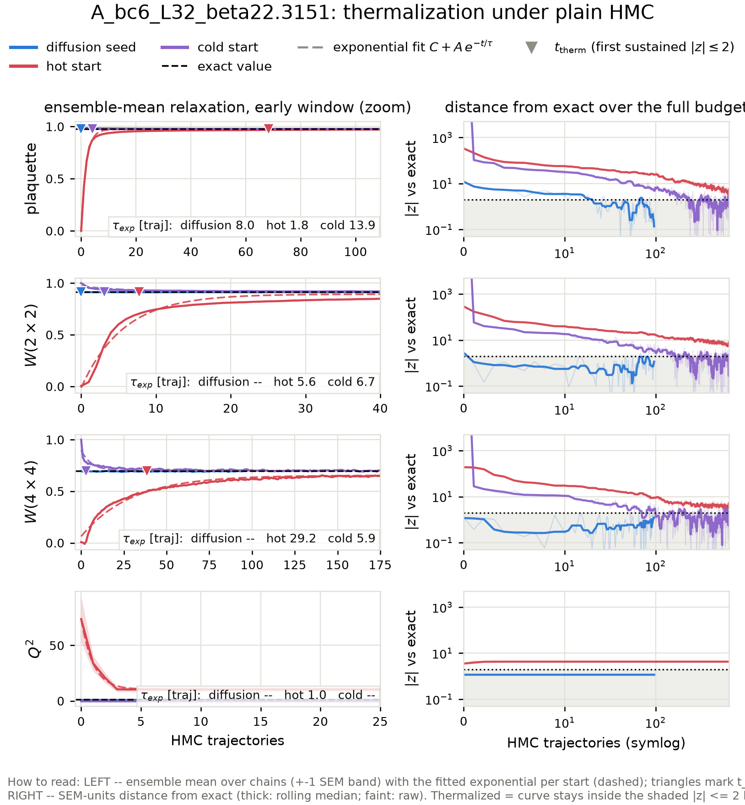

tau_int (hot-start chains, second half): plaquette = 6.70 +- 0.86, wilson_2x2 = 7.59 +- 1.19, wilson_4x4 = 3.05 +- 0.30, wilson_6x6 = 1.31 +- 0.12. Topology: hot-start HMC L=32 beta=22.3151 -> **frozen** (no tunneling).

Where 'never' stood at the end: the hot start ended the 640-trajectory budget still at Q^2 at |z| ~ 4; the cold start ended the 640-trajectory budget still at Q^2 at |z| ~ 1189769248768.

### Diagnostics: raw diffusion output (before any HMC)

| observable | value | error | exact | z_exact | reference | ref_error | z_ref | ks_p | chi2_p |
|---|---|---|---|---|---|---|---|---|---|
| plaquette | 0.9784 | 6.727e-05 | 0.9773 | 16.56 | 0.9775 | 8.513e-05 | 8.742 | 6.486e-11 |  |
| wilson_1x1 | 0.9784 | 6.727e-05 | 0.9773 | 16.56 | 0.9775 | 8.513e-05 | 8.742 | 6.486e-11 |  |
| wilson_1x2 | 0.9566 | 0.000172 | 0.9552 | 8.08 | 0.9554 | 0.0001897 | 4.569 | 0.004773 |  |
| wilson_2x2 | 0.9138 | 0.0003829 | 0.9124 | 3.707 | 0.9133 | 0.0004611 | 0.7255 | 0.7575 |  |
| wilson_2x3 | 0.8735 | 0.0006965 | 0.8715 | 2.979 | 0.8732 | 0.0007574 | 0.3553 | 0.1519 |  |
| wilson_3x3 | 0.8162 | 0.001228 | 0.8135 | 2.209 | 0.8168 | 0.001271 | -0.3393 | 0.6808 |  |
| wilson_3x4 | 0.7623 | 0.001911 | 0.7594 | 1.492 | 0.7641 | 0.001618 | -0.7308 | 0.5643 |  |
| wilson_4x4 | 0.696 | 0.002625 | 0.6929 | 1.201 | 0.7 | 0.0023 | -1.144 | 0.4899 |  |
| wilson_4x5 | 0.6353 | 0.003368 | 0.6322 | 0.9442 | 0.6417 | 0.002723 | -1.47 | 0.4545 |  |
| wilson_5x5 | 0.5668 | 0.004097 | 0.5637 | 0.7486 | 0.5742 | 0.00367 | -1.35 | 0.2272 |  |
| wilson_5x6 | 0.5061 | 0.00473 | 0.5026 | 0.731 | 0.516 | 0.004428 | -1.532 | 0.09806 |  |
| wilson_6x6 | 0.4433 | 0.004873 | 0.438 | 1.091 | 0.4518 | 0.005429 | -1.155 | 0.09806 |  |
| wilson_6x7 | 0.3867 | 0.005539 | 0.3817 | 0.9065 | 0.3959 | 0.006346 | -1.083 | 0.1098 |  |
| wilson_7x7 | 0.3326 | 0.005807 | 0.3251 | 1.289 | 0.338 | 0.007123 | -0.5862 | 0.2061 |  |
| wilson_7x8 | 0.2855 | 0.006158 | 0.2769 | 1.402 | 0.2889 | 0.007677 | -0.3421 | 0.3001 |  |
| wilson_8x8 | 0.2425 | 0.006236 | 0.2305 | 1.921 | 0.2399 | 0.008055 | 0.2558 | 0.6028 |  |
| wilson_8x10 | 0.1718 | 0.007189 | 0.1597 | 1.684 | 0.1671 | 0.008098 | 0.4318 | 0.5643 |  |
| wilson_10x10 | 0.1146 | 0.006811 | 0.101 | 2.001 | 0.1063 | 0.007567 | 0.8185 | 0.6808 |  |
| wilson_10x12 | 0.07132 | 0.006971 | 0.06382 | 1.076 | 0.06654 | 0.006777 | 0.492 | 0.5266 |  |
| wilson_12x12 | 0.03941 | 0.007597 | 0.03681 | 0.3421 | 0.04263 | 0.005655 | -0.34 | 0.8906 |  |
| creutz_2 | 0.02314 | 0.0003028 | 0.02293 | 0.7082 |  |  |  |  |  |
| creutz_3 | 0.0228 | 0.0006621 | 0.02293 | -0.192 |  |  |  |  |  |
| creutz_4 | 0.02255 | 0.001056 | 0.02293 | -0.3565 |  |  |  |  |  |
| creutz_5 | 0.023 | 0.001706 | 0.02293 | 0.03998 |  |  |  |  |  |
| creutz_6 | 0.01915 | 0.002901 | 0.02293 | -1.302 |  |  |  |  |  |
| creutz_7 | 0.01424 | 0.004764 | 0.02293 | -1.825 |  |  |  |  |  |
| creutz_8 | 0.01092 | 0.006836 | 0.02293 | -1.757 |  |  |  |  |  |
| Q | -0.2266 | 0.09054 | 0 | -2.502 | 0.07812 | 0.06647 | -2.713 | 0.03684 |  |
| Q^2 | 1.039 | 0.136 | 1.19 | -1.108 | 1.089 | 0.1566 | -0.2385 | 0.9719 |  |
| chi_top ((<Q^2>-<Q>^2)/V) | 0.0009646 | 0.0001174 | 0.001162 | -1.68 | 0.001057 | 0.0001228 | -0.5442 |  |  |
| Q histogram vs exact P(Q) | 14.76 | nan | 6 | nan |  |  |  |  | 0.02222 |

### Diagnostics: the same configs after 96 HMC trajectories

| observable | value | error | exact | z_exact | reference | ref_error | z_ref | ks_p | chi2_p |
|---|---|---|---|---|---|---|---|---|---|
| plaquette | 0.9773 | 6.774e-05 | 0.9773 | 0.1753 | 0.9775 | 8.513e-05 | -1.415 | 0.2498 |  |
| wilson_1x1 | 0.9773 | 6.774e-05 | 0.9773 | 0.1753 | 0.9775 | 8.513e-05 | -1.415 | 0.2498 |  |
| wilson_1x2 | 0.9553 | 0.0001676 | 0.9552 | 0.8007 | 0.9554 | 0.0001897 | -0.339 | 0.4899 |  |
| wilson_2x2 | 0.9129 | 0.0003486 | 0.9124 | 1.51 | 0.9133 | 0.0004611 | -0.7924 | 0.939 |  |
| wilson_2x3 | 0.8724 | 0.0006399 | 0.8715 | 1.535 | 0.8732 | 0.0007574 | -0.733 | 0.2498 |  |
| wilson_3x3 | 0.8156 | 0.0009508 | 0.8135 | 2.196 | 0.8168 | 0.001271 | -0.7707 | 0.5643 |  |
| wilson_3x4 | 0.7617 | 0.001331 | 0.7594 | 1.705 | 0.7641 | 0.001618 | -1.151 | 0.3001 |  |
| wilson_4x4 | 0.6961 | 0.002166 | 0.6929 | 1.463 | 0.7 | 0.0023 | -1.259 | 0.3277 |  |
| wilson_4x5 | 0.6346 | 0.002712 | 0.6322 | 0.8943 | 0.6417 | 0.002723 | -1.853 | 0.1685 |  |
| wilson_5x5 | 0.5661 | 0.003916 | 0.5637 | 0.6238 | 0.5742 | 0.00367 | -1.499 | 0.3001 |  |
| wilson_5x6 | 0.5041 | 0.00479 | 0.5026 | 0.3018 | 0.516 | 0.004428 | -1.83 | 0.1685 |  |
| wilson_6x6 | 0.4394 | 0.005862 | 0.438 | 0.2283 | 0.4518 | 0.005429 | -1.552 | 0.1098 |  |
| wilson_6x7 | 0.3818 | 0.006852 | 0.3817 | 0.0136 | 0.3959 | 0.006346 | -1.505 | 0.2741 |  |
| wilson_7x7 | 0.3251 | 0.007416 | 0.3251 | -0.00729 | 0.338 | 0.007123 | -1.257 | 0.1866 |  |
| wilson_7x8 | 0.2752 | 0.008305 | 0.2769 | -0.205 | 0.2889 | 0.007677 | -1.212 | 0.2741 |  |
| wilson_8x8 | 0.2261 | 0.008673 | 0.2305 | -0.5024 | 0.2399 | 0.008055 | -1.16 | 0.09806 |  |
| wilson_8x10 | 0.1536 | 0.00951 | 0.1597 | -0.642 | 0.1671 | 0.008098 | -1.084 | 0.2272 |  |
| wilson_10x10 | 0.09037 | 0.008445 | 0.101 | -1.254 | 0.1063 | 0.007567 | -1.401 | 0.2498 |  |
| wilson_10x12 | 0.05264 | 0.0089 | 0.06382 | -1.256 | 0.06654 | 0.006777 | -1.243 | 0.2498 |  |
| wilson_12x12 | 0.02831 | 0.007019 | 0.03681 | -1.211 | 0.04263 | 0.005655 | -1.589 | 0.2498 |  |
| creutz_2 | 0.02262 | 0.0002862 | 0.02293 | -1.076 |  |  |  |  |  |
| creutz_3 | 0.02204 | 0.0005664 | 0.02293 | -1.567 |  |  |  |  |  |
| creutz_4 | 0.02177 | 0.001131 | 0.02293 | -1.025 |  |  |  |  |  |
| creutz_5 | 0.0217 | 0.001689 | 0.02293 | -0.7276 |  |  |  |  |  |
| creutz_6 | 0.0213 | 0.002802 | 0.02293 | -0.5817 |  |  |  |  |  |
| creutz_7 | 0.02053 | 0.00414 | 0.02293 | -0.5787 |  |  |  |  |  |
| creutz_8 | 0.02985 | 0.006698 | 0.02293 | 1.033 |  |  |  |  |  |
| Q | -0.2266 | 0.09054 | 0 | -2.502 | 0.07812 | 0.06647 | -2.713 | 0.03684 |  |
| Q^2 | 1.039 | 0.136 | 1.19 | -1.108 | 1.089 | 0.1566 | -0.2385 | 0.9719 |  |
| chi_top ((<Q^2>-<Q>^2)/V) | 0.0009646 | 0.0001174 | 0.001162 | -1.68 | 0.001057 | 0.0001228 | -0.5442 |  |  |
| Q histogram vs exact P(Q) | 14.76 | nan | 6 | nan |  |  |  |  | 0.02222 |

## A_bc8_L32_beta30.3772

HMC: step size 0.0726, 14 leapfrog steps, acceptance seed/hot/cold = 0.983/0.982/0.983. Diffusion-seed batch: 128 chains x 96 trajectories (0.10 s/traj for the whole batch); baselines: 32 chains x 640 trajectories.

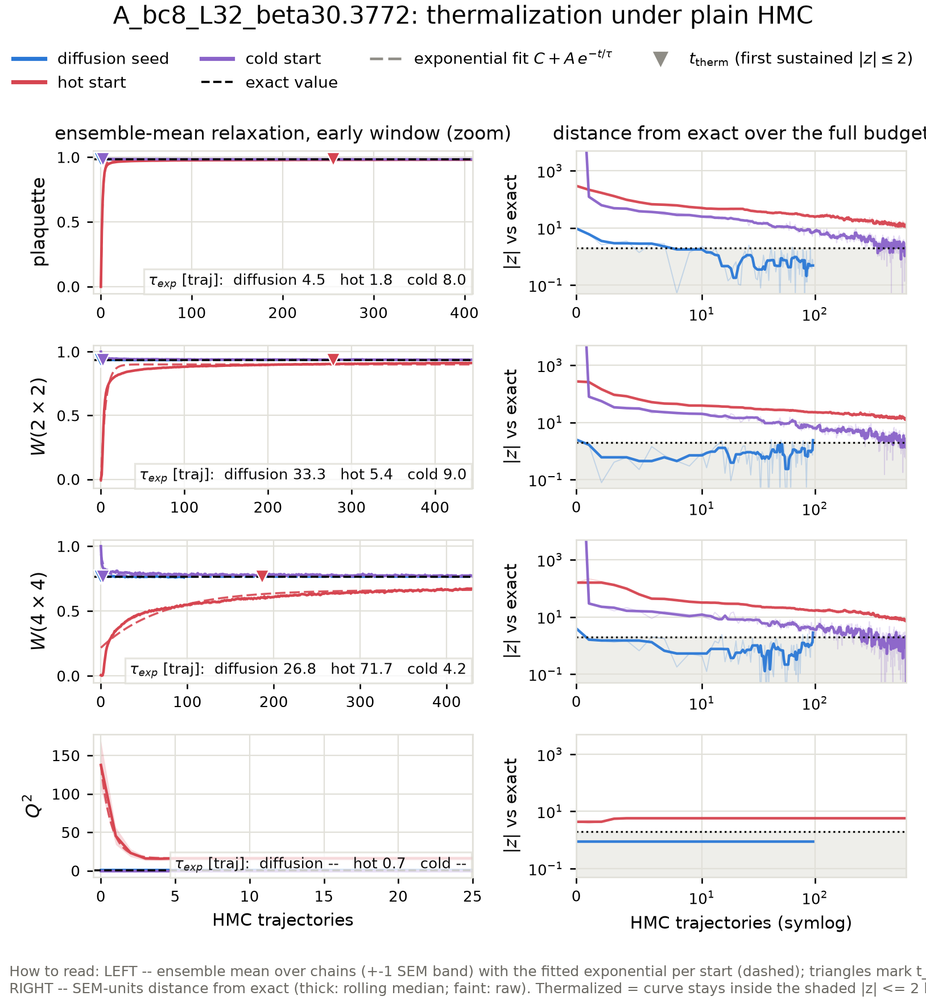

tau_int (hot-start chains, second half): plaquette = 12.86 +- 1.68, wilson_2x2 = 17.02 +- 1.98, wilson_4x4 = 11.38 +- 1.94, wilson_6x6 = 5.57 +- 1.45. Topology: hot-start HMC L=32 beta=30.3772 -> **frozen** (no tunneling).

Where 'never' stood at the end: the hot start ended the 640-trajectory budget still at Q^2 at |z| ~ 6; the cold start ended the 640-trajectory budget still at Q^2 at |z| ~ 868455153664.

### Diagnostics: raw diffusion output (before any HMC)

| observable | value | error | exact | z_exact | reference | ref_error | z_ref | ks_p | chi2_p |
|---|---|---|---|---|---|---|---|---|---|
| plaquette | 0.984 | 6.886e-05 | 0.9834 | 8.237 | 0.9834 | 4.847e-05 | 6.266 | 8.518e-09 |  |
| wilson_1x1 | 0.984 | 6.886e-05 | 0.9834 | 8.237 | 0.9834 | 4.847e-05 | 6.266 | 8.518e-09 |  |
| wilson_1x2 | 0.9677 | 0.0001645 | 0.9671 | 3.782 | 0.9672 | 0.0001256 | 2.467 | 0.05405 |  |
| wilson_2x2 | 0.936 | 0.000358 | 0.9352 | 2.215 | 0.9358 | 0.0003118 | 0.509 | 0.4204 |  |
| wilson_2x3 | 0.9062 | 0.0006224 | 0.9044 | 2.77 | 0.9049 | 0.0005597 | 1.569 | 0.2272 |  |
| wilson_3x3 | 0.8638 | 0.001037 | 0.8601 | 3.534 | 0.8604 | 0.0009089 | 2.505 | 0.04767 |  |
| wilson_3x4 | 0.8233 | 0.001393 | 0.818 | 3.78 | 0.818 | 0.001417 | 2.653 | 0.008934 |  |
| wilson_4x4 | 0.7724 | 0.001951 | 0.765 | 3.758 | 0.7639 | 0.002123 | 2.949 | 0.001229 |  |
| wilson_4x5 | 0.7242 | 0.002813 | 0.7155 | 3.082 | 0.7143 | 0.002747 | 2.519 | 0.002916 |  |
| wilson_5x5 | 0.6686 | 0.003764 | 0.658 | 2.797 | 0.6556 | 0.003444 | 2.55 | 0.005601 |  |
| wilson_5x6 | 0.6162 | 0.004561 | 0.6052 | 2.408 | 0.6029 | 0.004116 | 2.164 | 0.01207 |  |
| wilson_6x6 | 0.5597 | 0.005515 | 0.5474 | 2.238 | 0.5471 | 0.005001 | 1.694 | 0.04767 |  |
| wilson_6x7 | 0.5069 | 0.006551 | 0.4951 | 1.798 | 0.4959 | 0.005423 | 1.286 | 0.3277 |  |
| wilson_7x7 | 0.4533 | 0.007728 | 0.4403 | 1.677 | 0.4442 | 0.006065 | 0.9241 | 0.7575 |  |
| wilson_7x8 | 0.4022 | 0.008929 | 0.3916 | 1.182 | 0.3976 | 0.00643 | 0.4217 | 0.9719 |  |
| wilson_8x8 | 0.3529 | 0.01009 | 0.3426 | 1.029 | 0.3508 | 0.007106 | 0.1734 | 0.9719 |  |
| wilson_8x10 | 0.2694 | 0.01156 | 0.2621 | 0.6378 | 0.2729 | 0.007154 | -0.2553 | 0.7575 |  |
| wilson_10x10 | 0.1947 | 0.01198 | 0.1875 | 0.604 | 0.1989 | 0.006715 | -0.3043 | 0.7575 |  |
| wilson_10x12 | 0.1395 | 0.01155 | 0.1342 | 0.4626 | 0.1463 | 0.005959 | -0.5196 | 0.8288 |  |
| wilson_12x12 | 0.09116 | 0.01118 | 0.08978 | 0.1235 | 0.0999 | 0.005086 | -0.7123 | 0.5643 |  |
| creutz_2 | 0.0166 | 0.0001935 | 0.01674 | -0.712 |  |  |  |  |  |
| creutz_3 | 0.01545 | 0.0004529 | 0.01674 | -2.844 |  |  |  |  |  |
| creutz_4 | 0.01579 | 0.000677 | 0.01674 | -1.407 |  |  |  |  |  |
| creutz_5 | 0.01542 | 0.001218 | 0.01674 | -1.084 |  |  |  |  |  |
| creutz_6 | 0.01454 | 0.001686 | 0.01674 | -1.304 |  |  |  |  |  |
| creutz_7 | 0.01247 | 0.002724 | 0.01674 | -1.567 |  |  |  |  |  |
| creutz_8 | 0.01109 | 0.003925 | 0.01674 | -1.439 |  |  |  |  |  |
| Q | 0.05469 | 0.08673 | 0 | 0.6305 | -0.1927 | 0.06415 | 2.293 | 0.1519 |  |
| Q^2 | 0.9609 | 0.09617 | 0.8685 | 0.9617 | 0.9531 | 0.1048 | 0.05494 | 0.9997 |  |
| chi_top ((<Q^2>-<Q>^2)/V) | 0.0009355 | 0.0001027 | 0.0008481 | 0.8513 | 0.0008945 | 8.388e-05 | 0.3091 |  |  |
| Q histogram vs exact P(Q) | 5.38 | nan | 6 | nan |  |  |  |  | 0.496 |

### Diagnostics: the same configs after 96 HMC trajectories

| observable | value | error | exact | z_exact | reference | ref_error | z_ref | ks_p | chi2_p |
|---|---|---|---|---|---|---|---|---|---|
| plaquette | 0.9834 | 6.423e-05 | 0.9834 | -0.5584 | 0.9834 | 4.847e-05 | -0.9368 | 0.6028 |  |
| wilson_1x1 | 0.9834 | 6.423e-05 | 0.9834 | -0.5584 | 0.9834 | 4.847e-05 | -0.9368 | 0.6028 |  |
| wilson_1x2 | 0.9669 | 0.0001541 | 0.9671 | -1.176 | 0.9672 | 0.0001256 | -1.473 | 0.2061 |  |
| wilson_2x2 | 0.9344 | 0.0003372 | 0.9352 | -2.497 | 0.9358 | 0.0003118 | -3.034 | 0.006558 |  |
| wilson_2x3 | 0.9027 | 0.0006342 | 0.9044 | -2.715 | 0.9049 | 0.0005597 | -2.521 | 0.003444 |  |
| wilson_3x3 | 0.8571 | 0.001016 | 0.8601 | -3.045 | 0.8604 | 0.0009089 | -2.423 | 0.05405 |  |
| wilson_3x4 | 0.8143 | 0.001576 | 0.818 | -2.379 | 0.818 | 0.001417 | -1.765 | 0.06904 |  |
| wilson_4x4 | 0.7593 | 0.002171 | 0.765 | -2.622 | 0.7639 | 0.002123 | -1.488 | 0.2498 |  |
| wilson_4x5 | 0.7082 | 0.002811 | 0.7155 | -2.61 | 0.7143 | 0.002747 | -1.552 | 0.3277 |  |
| wilson_5x5 | 0.6483 | 0.003575 | 0.658 | -2.73 | 0.6556 | 0.003444 | -1.466 | 0.1866 |  |
| wilson_5x6 | 0.594 | 0.004231 | 0.6052 | -2.64 | 0.6029 | 0.004116 | -1.501 | 0.1866 |  |
| wilson_6x6 | 0.5342 | 0.004809 | 0.5474 | -2.733 | 0.5471 | 0.005001 | -1.856 | 0.1226 |  |
| wilson_6x7 | 0.4809 | 0.005511 | 0.4951 | -2.569 | 0.4959 | 0.005423 | -1.94 | 0.02823 |  |
| wilson_7x7 | 0.4256 | 0.005955 | 0.4403 | -2.479 | 0.4442 | 0.006065 | -2.193 | 0.008934 |  |
| wilson_7x8 | 0.377 | 0.006836 | 0.3916 | -2.148 | 0.3976 | 0.00643 | -2.195 | 0.06115 |  |
| wilson_8x8 | 0.3287 | 0.006961 | 0.3426 | -1.996 | 0.3508 | 0.007106 | -2.225 | 0.008934 |  |
| wilson_8x10 | 0.2477 | 0.008286 | 0.2621 | -1.735 | 0.2729 | 0.007154 | -2.304 | 0.02464 |  |
| wilson_10x10 | 0.1708 | 0.008011 | 0.1875 | -2.085 | 0.1989 | 0.006715 | -2.691 | 0.06115 |  |
| wilson_10x12 | 0.1133 | 0.00811 | 0.1342 | -2.574 | 0.1463 | 0.005959 | -3.276 | 0.01398 |  |
| wilson_12x12 | 0.06631 | 0.008642 | 0.08978 | -2.715 | 0.0999 | 0.005086 | -3.35 | 0.004059 |  |
| creutz_2 | 0.0173 | 0.000236 | 0.01674 | 2.383 |  |  |  |  |  |
| creutz_3 | 0.01743 | 0.0005009 | 0.01674 | 1.383 |  |  |  |  |  |
| creutz_4 | 0.01862 | 0.000817 | 0.01674 | 2.304 |  |  |  |  |  |
| creutz_5 | 0.01854 | 0.001346 | 0.01674 | 1.335 |  |  |  |  |  |
| creutz_6 | 0.01873 | 0.001986 | 0.01674 | 1.003 |  |  |  |  |  |
| creutz_7 | 0.01711 | 0.003041 | 0.01674 | 0.123 |  |  |  |  |  |
| creutz_8 | 0.01581 | 0.004838 | 0.01674 | -0.1926 |  |  |  |  |  |
| Q | 0.05469 | 0.08673 | 0 | 0.6305 | -0.1927 | 0.06415 | 2.293 | 0.1519 |  |
| Q^2 | 0.9609 | 0.09617 | 0.8685 | 0.9617 | 0.9531 | 0.1048 | 0.05494 | 0.9997 |  |
| chi_top ((<Q^2>-<Q>^2)/V) | 0.0009355 | 0.0001027 | 0.0008481 | 0.8513 | 0.0008945 | 8.388e-05 | 0.3091 |  |  |
| Q histogram vs exact P(Q) | 5.38 | nan | 6 | nan |  |  |  |  | 0.496 |

## D_bc14.1464_L32_beta55.0237

HMC: step size 0.0539, 19 leapfrog steps, acceptance seed/hot/cold = 0.980/0.977/0.977. Diffusion-seed batch: 128 chains x 96 trajectories (0.12 s/traj for the whole batch); baselines: 32 chains x 640 trajectories.

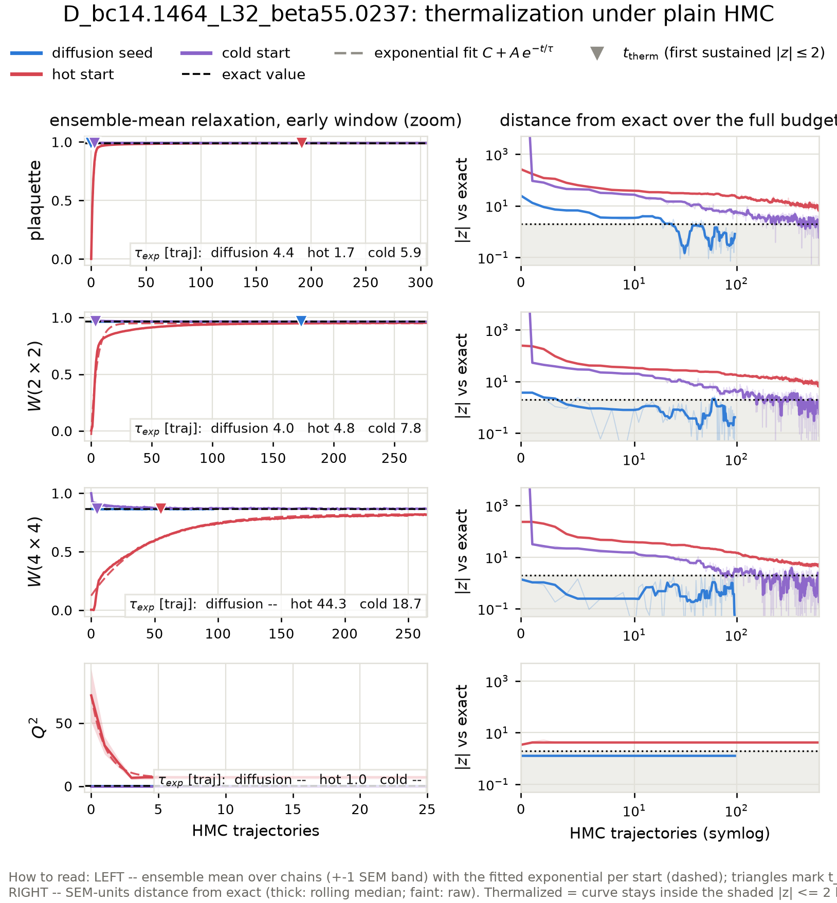

tau_int (hot-start chains, second half): plaquette = 8.57 +- 1.21, wilson_2x2 = 10.99 +- 1.49, wilson_4x4 = 7.87 +- 1.23, wilson_6x6 = 4.80 +- 0.65. Topology: hot-start HMC L=32 beta=55.0237 -> **frozen** (no tunneling).

Where 'never' stood at the end: the hot start ended the 640-trajectory budget still at wilson_2x2 at |z| ~ 7, Q^2 at |z| ~ 4; the cold start ended the 640-trajectory budget still at Q^2 at |z| ~ 474280296448.

### Diagnostics: raw diffusion output (before any HMC)

| observable | value | error | exact | z_exact | reference | ref_error | z_ref | ks_p | chi2_p |
|---|---|---|---|---|---|---|---|---|---|
| plaquette | 0.9916 | 2.416e-05 | 0.9909 | 30.81 | 0.9909 | 2.64e-05 | 18.94 | 1.07e-31 |  |
| wilson_1x1 | 0.9916 | 2.416e-05 | 0.9909 | 30.81 | 0.9909 | 2.64e-05 | 18.94 | 1.07e-31 |  |
| wilson_1x2 | 0.9828 | 6.808e-05 | 0.9818 | 13.71 | 0.9818 | 6.051e-05 | 10.11 | 6.459e-12 |  |
| wilson_2x2 | 0.9647 | 0.0002167 | 0.964 | 3.537 | 0.9636 | 0.0001425 | 4.298 | 0.0004059 |  |
| wilson_2x3 | 0.9473 | 0.0003821 | 0.9465 | 2.277 | 0.9457 | 0.0002577 | 3.456 | 0.004773 |  |
| wilson_3x3 | 0.922 | 0.0007065 | 0.9208 | 1.727 | 0.9188 | 0.0004466 | 3.79 | 0.0007131 |  |
| wilson_3x4 | 0.8973 | 0.000987 | 0.8958 | 1.566 | 0.8929 | 0.0006683 | 3.736 | 0.001748 |  |
| wilson_4x4 | 0.8656 | 0.001592 | 0.8635 | 1.286 | 0.8589 | 0.0009811 | 3.552 | 0.001229 |  |
| wilson_4x5 | 0.8349 | 0.002 | 0.8324 | 1.257 | 0.827 | 0.001313 | 3.341 | 0.0004908 |  |
| wilson_5x5 | 0.7985 | 0.003098 | 0.7951 | 1.086 | 0.7875 | 0.001792 | 3.083 | 0.0007131 |  |
| wilson_5x6 | 0.7635 | 0.003714 | 0.7595 | 1.075 | 0.7506 | 0.002117 | 3.015 | 0.001748 |  |
| wilson_6x6 | 0.7233 | 0.00486 | 0.7188 | 0.92 | 0.706 | 0.002624 | 3.14 | 0.001467 |  |
| wilson_6x7 | 0.6853 | 0.005625 | 0.6804 | 0.8689 | 0.6669 | 0.003047 | 2.862 | 0.004059 |  |
| wilson_7x7 | 0.644 | 0.00675 | 0.6381 | 0.8834 | 0.6216 | 0.003801 | 2.9 | 0.002077 |  |
| wilson_7x8 | 0.6049 | 0.007721 | 0.5984 | 0.8369 | 0.5818 | 0.004372 | 2.601 | 0.0007131 |  |
| wilson_8x8 | 0.5631 | 0.008881 | 0.5561 | 0.785 | 0.5372 | 0.005258 | 2.509 | 0.003444 |  |
| wilson_8x10 | 0.4863 | 0.01089 | 0.4802 | 0.5567 | 0.4647 | 0.006611 | 1.693 | 0.04195 |  |
| wilson_10x10 | 0.4072 | 0.01273 | 0.3998 | 0.582 | 0.3811 | 0.008543 | 1.705 | 0.05405 |  |
| wilson_10x12 | 0.3404 | 0.01354 | 0.3329 | 0.5537 | 0.3195 | 0.009815 | 1.249 | 0.1226 |  |
| wilson_12x12 | 0.2762 | 0.01448 | 0.2672 | 0.6191 | 0.2525 | 0.0115 | 1.28 | 0.3879 |  |
| creutz_2 | 0.009526 | 0.000124 | 0.009171 | 2.861 |  |  |  |  |  |
| creutz_3 | 0.008889 | 0.000272 | 0.00917 | -1.033 |  |  |  |  |  |
| creutz_4 | 0.008925 | 0.0004546 | 0.00917 | -0.5383 |  |  |  |  |  |
| creutz_5 | 0.00861 | 0.0007153 | 0.009169 | -0.7814 |  |  |  |  |  |
| creutz_6 | 0.009225 | 0.000946 | 0.009167 | 0.0612 |  |  |  |  |  |
| creutz_7 | 0.007978 | 0.001292 | 0.009165 | -0.9192 |  |  |  |  |  |
| creutz_8 | 0.008882 | 0.001824 | 0.009162 | -0.1538 |  |  |  |  |  |
| Q | -0.01562 | 0.07034 | 0 | -0.2221 | 0.01042 | 0.04588 | -0.3101 | 0.9902 |  |
| Q^2 | 0.4062 | 0.04919 | 0.4743 | -1.383 | 0.4896 | 0.04587 | -1.239 | 0.939 |  |
| chi_top ((<Q^2>-<Q>^2)/V) | 0.0003965 | 5.075e-05 | 0.0004632 | -1.314 | 0.000478 | 4.705e-05 | -1.178 |  |  |
| Q histogram vs exact P(Q) | 2.04 | nan | 4 | nan |  |  |  |  | 0.7284 |

### Diagnostics: the same configs after 96 HMC trajectories

| observable | value | error | exact | z_exact | reference | ref_error | z_ref | ks_p | chi2_p |
|---|---|---|---|---|---|---|---|---|---|
| plaquette | 0.9909 | 3.216e-05 | 0.9909 | 0.8704 | 0.9909 | 2.64e-05 | -0.9293 | 0.357 |  |
| wilson_1x1 | 0.9909 | 3.216e-05 | 0.9909 | 0.8704 | 0.9909 | 2.64e-05 | -0.9293 | 0.357 |  |
| wilson_1x2 | 0.9818 | 8.606e-05 | 0.9818 | 0.1929 | 0.9818 | 6.051e-05 | 0.0402 | 0.7941 |  |
| wilson_2x2 | 0.9641 | 0.0001779 | 0.964 | 0.5044 | 0.9636 | 0.0001425 | 1.922 | 0.04767 |  |
| wilson_2x3 | 0.9467 | 0.0003353 | 0.9465 | 0.586 | 0.9457 | 0.0002577 | 2.173 | 0.01616 |  |
| wilson_3x3 | 0.9211 | 0.0006223 | 0.9208 | 0.4585 | 0.9188 | 0.0004466 | 2.914 | 0.001027 |  |
| wilson_3x4 | 0.8962 | 0.0009268 | 0.8958 | 0.4042 | 0.8929 | 0.0006683 | 2.872 | 0.001748 |  |
| wilson_4x4 | 0.8636 | 0.001338 | 0.8635 | 0.0434 | 0.8589 | 0.0009811 | 2.805 | 0.01039 |  |
| wilson_4x5 | 0.8327 | 0.001814 | 0.8324 | 0.1592 | 0.827 | 0.001313 | 2.575 | 0.005601 |  |
| wilson_5x5 | 0.7952 | 0.002519 | 0.7951 | 0.02744 | 0.7875 | 0.001792 | 2.503 | 0.003444 |  |
| wilson_5x6 | 0.7598 | 0.003359 | 0.7595 | 0.07836 | 0.7506 | 0.002117 | 2.307 | 0.002916 |  |
| wilson_6x6 | 0.7193 | 0.004307 | 0.7188 | 0.09963 | 0.706 | 0.002624 | 2.638 | 0.0004059 |  |
| wilson_6x7 | 0.6805 | 0.005181 | 0.6804 | 0.03239 | 0.6669 | 0.003047 | 2.261 | 0.006558 |  |
| wilson_7x7 | 0.6377 | 0.006098 | 0.6381 | -0.06524 | 0.6216 | 0.003801 | 2.241 | 0.001748 |  |
| wilson_7x8 | 0.5985 | 0.007018 | 0.5984 | 0.01833 | 0.5818 | 0.004372 | 2.025 | 0.004059 |  |
| wilson_8x8 | 0.5551 | 0.00774 | 0.5561 | -0.1256 | 0.5372 | 0.005258 | 1.919 | 0.004773 |  |
| wilson_8x10 | 0.4805 | 0.009269 | 0.4802 | 0.02486 | 0.4647 | 0.006611 | 1.383 | 0.09806 |  |
| wilson_10x10 | 0.4018 | 0.01063 | 0.3998 | 0.1862 | 0.3811 | 0.008543 | 1.519 | 0.3277 |  |
| wilson_10x12 | 0.3338 | 0.01206 | 0.3329 | 0.07771 | 0.3195 | 0.009815 | 0.9208 | 0.7575 |  |
| wilson_12x12 | 0.269 | 0.01292 | 0.2672 | 0.1335 | 0.2525 | 0.0115 | 0.9498 | 0.7195 |  |
| creutz_2 | 0.009083 | 0.0001385 | 0.009171 | -0.6319 |  |  |  |  |  |
| creutz_3 | 0.009183 | 0.0002425 | 0.00917 | 0.05043 |  |  |  |  |  |
| creutz_4 | 0.009629 | 0.0004379 | 0.00917 | 1.048 |  |  |  |  |  |
| creutz_5 | 0.009708 | 0.0006165 | 0.009169 | 0.8752 |  |  |  |  |  |
| creutz_6 | 0.009177 | 0.0009718 | 0.009167 | 0.00956 |  |  |  |  |  |
| creutz_7 | 0.009685 | 0.001308 | 0.009165 | 0.3976 |  |  |  |  |  |
| creutz_8 | 0.01197 | 0.001836 | 0.009162 | 1.527 |  |  |  |  |  |
| Q | -0.01562 | 0.07034 | 0 | -0.2221 | 0.01042 | 0.04588 | -0.3101 | 0.9902 |  |
| Q^2 | 0.4062 | 0.04919 | 0.4743 | -1.383 | 0.4896 | 0.04587 | -1.239 | 0.939 |  |
| chi_top ((<Q^2>-<Q>^2)/V) | 0.0003965 | 5.075e-05 | 0.0004632 | -1.314 | 0.000478 | 4.705e-05 | -1.178 |  |  |
| Q histogram vs exact P(Q) | 2.04 | nan | 4 | nan |  |  |  |  | 0.7284 |

## D_bc20_L32_beta78.4578

HMC: step size 0.0452, 22 leapfrog steps, acceptance seed/hot/cold = 0.980/0.978/0.977. Diffusion-seed batch: 128 chains x 96 trajectories (0.14 s/traj for the whole batch); baselines: 32 chains x 640 trajectories.

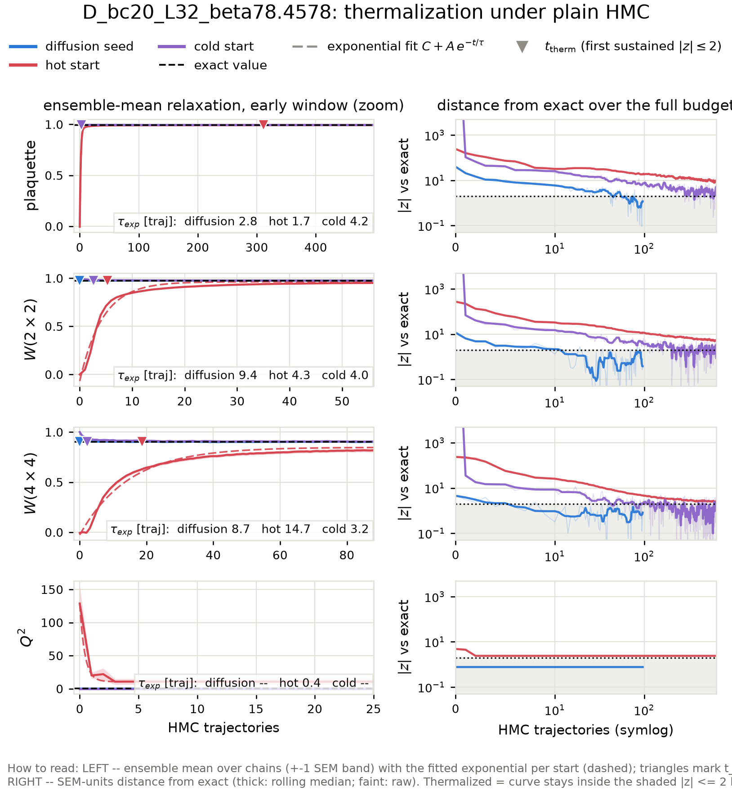

tau_int (hot-start chains, second half): plaquette = 8.78 +- 1.17, wilson_2x2 = 6.86 +- 1.09, wilson_4x4 = 3.41 +- 0.34, wilson_6x6 = 2.45 +- 0.21. Topology: hot-start HMC L=32 beta=78.4578 -> **frozen** (no tunneling).

Where 'never' stood at the end: the hot start ended the 640-trajectory budget still at wilson_6x6 at |z| ~ 3, Q^2 at |z| ~ 2; the cold start ended the 640-trajectory budget still at Q^2 at |z| ~ 320492732416.

### Diagnostics: raw diffusion output (before any HMC)

| observable | value | error | exact | z_exact | reference | ref_error | z_ref | ks_p | chi2_p |
|---|---|---|---|---|---|---|---|---|---|
| plaquette | 0.9945 | 2.331e-05 | 0.9936 | 39.91 | 0.9936 | 2.745e-05 | 25.29 | 3.104e-56 |  |
| wilson_1x1 | 0.9945 | 2.331e-05 | 0.9936 | 39.91 | 0.9936 | 2.745e-05 | 25.29 | 3.104e-56 |  |
| wilson_1x2 | 0.9886 | 6.015e-05 | 0.9873 | 22.28 | 0.9875 | 6.289e-05 | 13.11 | 1.307e-26 |  |
| wilson_2x2 | 0.9764 | 0.0001515 | 0.9747 | 11.52 | 0.9753 | 0.0001635 | 5.104 | 3.494e-08 |  |
| wilson_2x3 | 0.9647 | 0.00027 | 0.9623 | 9.015 | 0.9632 | 0.0002748 | 3.781 | 0.0004908 |  |
| wilson_3x3 | 0.9473 | 0.0004846 | 0.9439 | 7.033 | 0.9453 | 0.0004859 | 2.99 | 0.0005923 |  |
| wilson_3x4 | 0.9301 | 0.0007231 | 0.926 | 5.801 | 0.9278 | 0.0007141 | 2.353 | 0.01864 |  |
| wilson_4x4 | 0.9074 | 0.001123 | 0.9025 | 4.388 | 0.9043 | 0.001072 | 2.026 | 0.02145 |  |
| wilson_4x5 | 0.8852 | 0.001572 | 0.8797 | 3.531 | 0.8825 | 0.001496 | 1.277 | 0.1685 |  |
| wilson_5x5 | 0.858 | 0.002104 | 0.852 | 2.853 | 0.8553 | 0.001986 | 0.9351 | 0.2272 |  |
| wilson_5x6 | 0.8317 | 0.002705 | 0.8251 | 2.428 | 0.8295 | 0.002557 | 0.5839 | 0.4899 |  |
| wilson_6x6 | 0.8008 | 0.003482 | 0.7941 | 1.936 | 0.7995 | 0.00311 | 0.2682 | 0.7195 |  |
| wilson_6x7 | 0.7715 | 0.004151 | 0.7642 | 1.773 | 0.7696 | 0.003774 | 0.3421 | 0.4899 |  |
| wilson_7x7 | 0.7384 | 0.005114 | 0.7307 | 1.497 | 0.7358 | 0.004481 | 0.3783 | 0.6028 |  |
| wilson_7x8 | 0.7072 | 0.00589 | 0.6988 | 1.438 | 0.7038 | 0.00518 | 0.437 | 0.9167 |  |
| wilson_8x8 | 0.6726 | 0.007062 | 0.664 | 1.221 | 0.6685 | 0.005938 | 0.4477 | 0.7575 |  |
| wilson_8x10 | 0.6075 | 0.008558 | 0.5996 | 0.9267 | 0.6041 | 0.007489 | 0.3026 | 0.9827 |  |
| wilson_10x10 | 0.5352 | 0.01126 | 0.5279 | 0.6455 | 0.5377 | 0.008786 | -0.1737 | 0.9997 |  |
| wilson_10x12 | 0.4706 | 0.01264 | 0.465 | 0.4383 | 0.4728 | 0.01029 | -0.1356 | 0.9902 |  |
| wilson_12x12 | 0.4012 | 0.01495 | 0.3996 | 0.1061 | 0.4097 | 0.01129 | -0.4565 | 0.6418 |  |
| creutz_2 | 0.0064 | 8.919e-05 | 0.006412 | -0.13 |  |  |  |  |  |
| creutz_3 | 0.006068 | 0.0001783 | 0.006408 | -1.911 |  |  |  |  |  |
| creutz_4 | 0.006392 | 0.0003363 | 0.006403 | -0.03141 |  |  |  |  |  |
| creutz_5 | 0.006511 | 0.0004797 | 0.006395 | 0.2412 |  |  |  |  |  |
| creutz_6 | 0.006766 | 0.0006403 | 0.006385 | 0.5956 |  |  |  |  |  |
| creutz_7 | 0.00667 | 0.0009299 | 0.006371 | 0.3215 |  |  |  |  |  |
| creutz_8 | 0.007135 | 0.001202 | 0.006353 | 0.6506 |  |  |  |  |  |
| Q | -0.0625 | 0.04987 | 0 | -1.253 | -0.02083 | 0.04597 | -0.6143 | 1 |  |
| Q^2 | 0.3594 | 0.05095 | 0.3205 | 0.7632 | 0.3438 | 0.04519 | 0.2294 | 1 |  |
| chi_top ((<Q^2>-<Q>^2)/V) | 0.0003471 | 4.846e-05 | 0.000313 | 0.7049 | 0.0003353 | 4.203e-05 | 0.185 |  |  |
| Q histogram vs exact P(Q) | 4.275 | nan | 4 | nan |  |  |  |  | 0.3701 |

### Diagnostics: the same configs after 96 HMC trajectories

| observable | value | error | exact | z_exact | reference | ref_error | z_ref | ks_p | chi2_p |
|---|---|---|---|---|---|---|---|---|---|
| plaquette | 0.9936 | 2.666e-05 | 0.9936 | 1.057 | 0.9936 | 2.745e-05 | 0.2215 | 0.8906 |  |
| wilson_1x1 | 0.9936 | 2.666e-05 | 0.9936 | 1.057 | 0.9936 | 2.745e-05 | 0.2215 | 0.8906 |  |
| wilson_1x2 | 0.9873 | 6.563e-05 | 0.9873 | 0.1561 | 0.9875 | 6.289e-05 | -2.079 | 0.09806 |  |
| wilson_2x2 | 0.9746 | 0.0001203 | 0.9747 | -0.4561 | 0.9753 | 0.0001635 | -3.262 | 0.004059 |  |
| wilson_2x3 | 0.9623 | 0.0001872 | 0.9623 | 0.1163 | 0.9632 | 0.0002748 | -2.873 | 0.1226 |  |
| wilson_3x3 | 0.9441 | 0.0003249 | 0.9439 | 0.6602 | 0.9453 | 0.0004859 | -1.954 | 0.1366 |  |
| wilson_3x4 | 0.9262 | 0.000451 | 0.926 | 0.4932 | 0.9278 | 0.0007141 | -1.872 | 0.1366 |  |
| wilson_4x4 | 0.9033 | 0.0007194 | 0.9025 | 1.037 | 0.9043 | 0.001072 | -0.8041 | 0.5266 |  |
| wilson_4x5 | 0.8804 | 0.0009374 | 0.8797 | 0.7555 | 0.8825 | 0.001496 | -1.174 | 0.4204 |  |
| wilson_5x5 | 0.853 | 0.001421 | 0.852 | 0.7446 | 0.8553 | 0.001986 | -0.9161 | 0.4545 |  |
| wilson_5x6 | 0.826 | 0.001767 | 0.8251 | 0.4741 | 0.8295 | 0.002557 | -1.144 | 0.2061 |  |
| wilson_6x6 | 0.7949 | 0.002466 | 0.7941 | 0.3562 | 0.7995 | 0.00311 | -1.162 | 0.2272 |  |
| wilson_6x7 | 0.7653 | 0.002999 | 0.7642 | 0.3887 | 0.7696 | 0.003774 | -0.887 | 0.3001 |  |
| wilson_7x7 | 0.7322 | 0.00378 | 0.7307 | 0.3813 | 0.7358 | 0.004481 | -0.6211 | 0.2741 |  |
| wilson_7x8 | 0.6997 | 0.004473 | 0.6988 | 0.2021 | 0.7038 | 0.00518 | -0.605 | 0.3879 |  |
| wilson_8x8 | 0.6645 | 0.005426 | 0.664 | 0.09568 | 0.6685 | 0.005938 | -0.4936 | 0.3879 |  |
| wilson_8x10 | 0.6006 | 0.007406 | 0.5996 | 0.132 | 0.6041 | 0.007489 | -0.3334 | 0.4204 |  |
| wilson_10x10 | 0.5275 | 0.009469 | 0.5279 | -0.04249 | 0.5377 | 0.008786 | -0.7857 | 0.4545 |  |
| wilson_10x12 | 0.4651 | 0.01157 | 0.465 | 0.009738 | 0.4728 | 0.01029 | -0.4934 | 0.357 |  |
| wilson_12x12 | 0.3978 | 0.01285 | 0.3996 | -0.1358 | 0.4097 | 0.01129 | -0.6946 | 0.3277 |  |
| creutz_2 | 0.006461 | 8.462e-05 | 0.006412 | 0.5752 |  |  |  |  |  |
| creutz_3 | 0.006282 | 0.0001753 | 0.006408 | -0.7169 |  |  |  |  |  |
| creutz_4 | 0.005829 | 0.0003121 | 0.006403 | -1.837 |  |  |  |  |  |
| creutz_5 | 0.005936 | 0.0004597 | 0.006395 | -0.9973 |  |  |  |  |  |
| creutz_6 | 0.006067 | 0.0006659 | 0.006385 | -0.4776 |  |  |  |  |  |
| creutz_7 | 0.006344 | 0.0009203 | 0.006371 | -0.02958 |  |  |  |  |  |
| creutz_8 | 0.006186 | 0.001206 | 0.006353 | -0.1381 |  |  |  |  |  |
| Q | -0.0625 | 0.04987 | 0 | -1.253 | -0.02083 | 0.04597 | -0.6143 | 1 |  |
| Q^2 | 0.3594 | 0.05095 | 0.3205 | 0.7632 | 0.3438 | 0.04519 | 0.2294 | 1 |  |
| chi_top ((<Q^2>-<Q>^2)/V) | 0.0003471 | 4.846e-05 | 0.000313 | 0.7049 | 0.0003353 | 4.203e-05 | 0.185 |  |  |
| Q histogram vs exact P(Q) | 4.275 | nan | 4 | nan |  |  |  |  | 0.3701 |

## D_bc30_L32_beta118.473

HMC: step size 0.0367, 27 leapfrog steps, acceptance seed/hot/cold = 0.979/0.974/0.976. Diffusion-seed batch: 128 chains x 96 trajectories (0.17 s/traj for the whole batch); baselines: 32 chains x 640 trajectories.

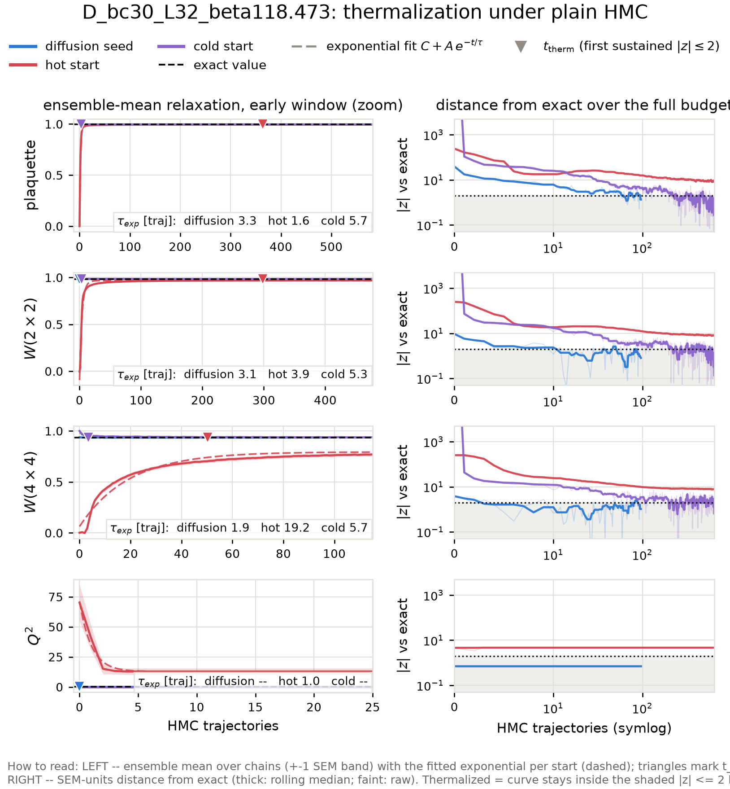

tau_int (hot-start chains, second half): plaquette = 13.74 +- 1.74, wilson_2x2 = 19.04 +- 2.27, wilson_4x4 = 18.14 +- 2.50, wilson_6x6 = 9.71 +- 1.64. Topology: hot-start HMC L=32 beta=118.473 -> **frozen** (no tunneling).

Where 'never' stood at the end: the hot start ended the 640-trajectory budget still at Q^2 at |z| ~ 5; the cold start ended the 640-trajectory budget still at Q^2 at |z| ~ 171377917952.

### Diagnostics: raw diffusion output (before any HMC)

| observable | value | error | exact | z_exact | reference | ref_error | z_ref | ks_p | chi2_p |
|---|---|---|---|---|---|---|---|---|---|
| plaquette | 0.9963 | 1.27e-05 | 0.9958 | 42.45 | 0.9957 | 1.207e-05 | 33.9 | 1.657e-59 |  |
| wilson_1x1 | 0.9963 | 1.27e-05 | 0.9958 | 42.45 | 0.9957 | 1.207e-05 | 33.9 | 1.657e-59 |  |
| wilson_1x2 | 0.9924 | 3.409e-05 | 0.9916 | 23.54 | 0.9915 | 2.638e-05 | 19.34 | 3.098e-37 |  |
| wilson_2x2 | 0.9841 | 8.087e-05 | 0.9832 | 11.15 | 0.9834 | 7.014e-05 | 6.99 | 7.303e-06 |  |
| wilson_2x3 | 0.9763 | 0.0001519 | 0.9749 | 8.838 | 0.9753 | 0.0001285 | 4.884 | 8.218e-05 |  |
| wilson_3x3 | 0.9644 | 0.0002763 | 0.9626 | 6.501 | 0.9634 | 0.0002209 | 2.887 | 0.02823 |  |
| wilson_3x4 | 0.953 | 0.0004259 | 0.9505 | 5.769 | 0.9518 | 0.0003373 | 2.177 | 0.03684 |  |
| wilson_4x4 | 0.9375 | 0.0005982 | 0.9347 | 4.764 | 0.9369 | 0.0004831 | 0.7879 | 0.2272 |  |
| wilson_4x5 | 0.9227 | 0.0008566 | 0.9191 | 4.225 | 0.922 | 0.0006282 | 0.6417 | 0.4204 |  |
| wilson_5x5 | 0.9044 | 0.001127 | 0.9 | 3.942 | 0.9042 | 0.0008335 | 0.1547 | 0.4899 |  |
| wilson_5x6 | 0.8868 | 0.001508 | 0.8813 | 3.629 | 0.8866 | 0.001075 | 0.1139 | 0.5266 |  |
| wilson_6x6 | 0.8654 | 0.001847 | 0.8595 | 3.193 | 0.8659 | 0.001356 | -0.219 | 0.6418 |  |
| wilson_6x7 | 0.8448 | 0.002301 | 0.8383 | 2.821 | 0.8453 | 0.001656 | -0.1641 | 0.9167 |  |
| wilson_7x7 | 0.8215 | 0.002776 | 0.8143 | 2.609 | 0.8217 | 0.002046 | -0.06277 | 0.9167 |  |
| wilson_7x8 | 0.799 | 0.003302 | 0.791 | 2.404 | 0.7991 | 0.002463 | -0.03272 | 0.8612 |  |
| wilson_8x8 | 0.7741 | 0.003953 | 0.7653 | 2.222 | 0.7734 | 0.002952 | 0.1489 | 0.939 |  |
| wilson_8x10 | 0.7275 | 0.005299 | 0.7168 | 2.033 | 0.7256 | 0.004008 | 0.2983 | 0.7195 |  |
| wilson_10x10 | 0.6731 | 0.006696 | 0.6609 | 1.828 | 0.6678 | 0.005432 | 0.6178 | 0.6418 |  |
| wilson_10x12 | 0.6256 | 0.008336 | 0.6099 | 1.875 | 0.618 | 0.006897 | 0.7021 | 0.6028 |  |
| wilson_12x12 | 0.5723 | 0.01013 | 0.5548 | 1.723 | 0.5631 | 0.008715 | 0.688 | 0.6028 |  |
| creutz_2 | 0.00439 | 6.087e-05 | 0.00423 | 2.631 |  |  |  |  |  |
| creutz_3 | 0.004187 | 0.000122 | 0.004215 | -0.2329 |  |  |  |  |  |
| creutz_4 | 0.004449 | 0.0001785 | 0.004193 | 1.429 |  |  |  |  |  |
| creutz_5 | 0.004054 | 0.0003121 | 0.004164 | -0.3515 |  |  |  |  |  |
| creutz_6 | 0.004745 | 0.0004531 | 0.004126 | 1.367 |  |  |  |  |  |
| creutz_7 | 0.003813 | 0.0006011 | 0.004078 | -0.4412 |  |  |  |  |  |
| creutz_8 | 0.00372 | 0.0007522 | 0.004018 | -0.3968 |  |  |  |  |  |
| Q | 0.02344 | 0.03498 | 0 | 0.6701 | -0.09375 | 0.02944 | 2.563 | 0.7941 |  |
| Q^2 | 0.1484 | 0.03407 | 0.1714 | -0.6733 | 0.1771 | 0.02958 | -0.6348 | 1 |  |
| chi_top ((<Q^2>-<Q>^2)/V) | 0.0001444 | 3.086e-05 | 0.0001674 | -0.7433 | 0.0001643 | 2.488e-05 | -0.5027 |  |  |
| Q histogram vs exact P(Q) | 0.8828 | nan | 4 | nan |  |  |  |  | 0.927 |

### Diagnostics: the same configs after 96 HMC trajectories

| observable | value | error | exact | z_exact | reference | ref_error | z_ref | ks_p | chi2_p |
|---|---|---|---|---|---|---|---|---|---|
| plaquette | 0.9958 | 1.835e-05 | 0.9958 | 1.205 | 0.9957 | 1.207e-05 | 3.496 | 0.002464 |  |
| wilson_1x1 | 0.9958 | 1.835e-05 | 0.9958 | 1.205 | 0.9957 | 1.207e-05 | 3.496 | 0.002464 |  |
| wilson_1x2 | 0.9916 | 4.646e-05 | 0.9916 | 1.015 | 0.9915 | 2.638e-05 | 1.467 | 0.03229 |  |
| wilson_2x2 | 0.9833 | 9.906e-05 | 0.9832 | 0.8077 | 0.9834 | 7.014e-05 | -0.6011 | 0.6418 |  |
| wilson_2x3 | 0.9751 | 0.0001868 | 0.9749 | 1.056 | 0.9753 | 0.0001285 | -0.7652 | 0.3879 |  |
| wilson_3x3 | 0.963 | 0.0002903 | 0.9626 | 1.273 | 0.9634 | 0.0002209 | -1.111 | 0.5643 |  |
| wilson_3x4 | 0.9512 | 0.0004327 | 0.9505 | 1.427 | 0.9518 | 0.0003373 | -1.198 | 0.2741 |  |
| wilson_4x4 | 0.9354 | 0.0006471 | 0.9347 | 1.126 | 0.9369 | 0.0004831 | -1.876 | 0.3879 |  |
| wilson_4x5 | 0.9203 | 0.000846 | 0.9191 | 1.467 | 0.922 | 0.0006282 | -1.609 | 0.1519 |  |
| wilson_5x5 | 0.9016 | 0.001147 | 0.9 | 1.457 | 0.9042 | 0.0008335 | -1.802 | 0.357 |  |
| wilson_5x6 | 0.8836 | 0.001439 | 0.8813 | 1.606 | 0.8866 | 0.001075 | -1.644 | 0.3277 |  |
| wilson_6x6 | 0.8618 | 0.001927 | 0.8595 | 1.205 | 0.8659 | 0.001356 | -1.731 | 0.3277 |  |
| wilson_6x7 | 0.8415 | 0.002321 | 0.8383 | 1.392 | 0.8453 | 0.001656 | -1.307 | 0.6808 |  |
| wilson_7x7 | 0.8177 | 0.002881 | 0.8143 | 1.172 | 0.8217 | 0.002046 | -1.155 | 0.7941 |  |
| wilson_7x8 | 0.7951 | 0.003308 | 0.791 | 1.239 | 0.7991 | 0.002463 | -0.9638 | 0.5643 |  |
| wilson_8x8 | 0.7703 | 0.003924 | 0.7653 | 1.257 | 0.7734 | 0.002952 | -0.6347 | 0.8288 |  |
| wilson_8x10 | 0.7244 | 0.004772 | 0.7168 | 1.6 | 0.7256 | 0.004008 | -0.1858 | 0.4899 |  |
| wilson_10x10 | 0.6716 | 0.006424 | 0.6609 | 1.674 | 0.6678 | 0.005432 | 0.4567 | 0.3879 |  |
| wilson_10x12 | 0.623 | 0.00811 | 0.6099 | 1.613 | 0.618 | 0.006897 | 0.4746 | 0.2272 |  |
| wilson_12x12 | 0.5724 | 0.01091 | 0.5548 | 1.612 | 0.5631 | 0.008715 | 0.6677 | 0.1866 |  |
| creutz_2 | 0.004222 | 5.424e-05 | 0.00423 | -0.1559 |  |  |  |  |  |
| creutz_3 | 0.004155 | 0.0001238 | 0.004215 | -0.4875 |  |  |  |  |  |
| creutz_4 | 0.004329 | 0.0002054 | 0.004193 | 0.6578 |  |  |  |  |  |
| creutz_5 | 0.004228 | 0.0003447 | 0.004164 | 0.1875 |  |  |  |  |  |
| creutz_6 | 0.004808 | 0.0004143 | 0.004126 | 1.648 |  |  |  |  |  |
| creutz_7 | 0.004934 | 0.0005849 | 0.004078 | 1.464 |  |  |  |  |  |
| creutz_8 | 0.003788 | 0.0007743 | 0.004018 | -0.2974 |  |  |  |  |  |
| Q | 0.02344 | 0.03498 | 0 | 0.6701 | -0.09375 | 0.02944 | 2.563 | 0.7941 |  |
| Q^2 | 0.1484 | 0.03407 | 0.1714 | -0.6733 | 0.1771 | 0.02958 | -0.6348 | 1 |  |
| chi_top ((<Q^2>-<Q>^2)/V) | 0.0001444 | 3.086e-05 | 0.0001674 | -0.7433 | 0.0001643 | 2.488e-05 | -0.5027 |  |  |
| Q histogram vs exact P(Q) | 0.8828 | nan | 4 | nan |  |  |  |  | 0.927 |

## D_bc40_L32_beta158.48

HMC: step size 0.0318, 31 leapfrog steps, acceptance seed/hot/cold = 0.980/0.975/0.978. Diffusion-seed batch: 128 chains x 96 trajectories (0.19 s/traj for the whole batch); baselines: 32 chains x 640 trajectories.

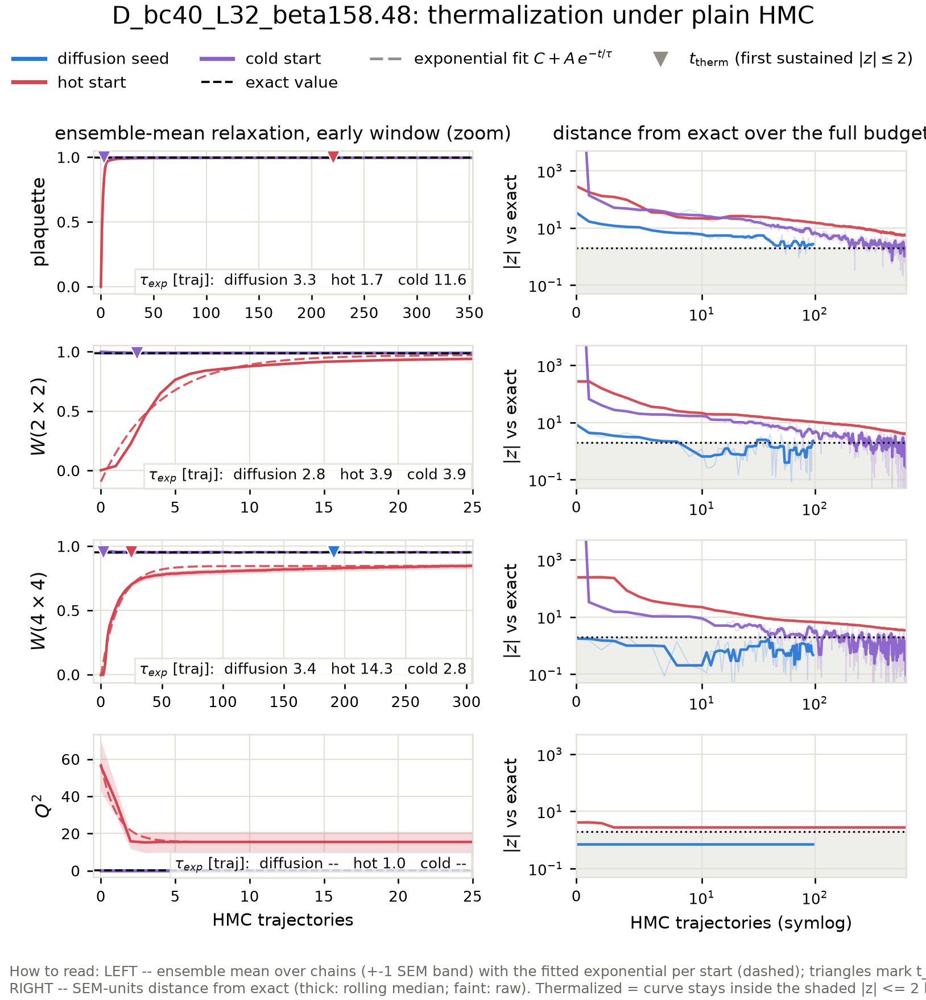

tau_int (hot-start chains, second half): plaquette = 28.04 +- 2.16, wilson_2x2 = 39.50 +- 1.68, wilson_4x4 = 30.73 +- 2.37, wilson_6x6 = 10.86 +- 1.92. Topology: hot-start HMC L=32 beta=158.48 -> **frozen** (no tunneling).

Where 'never' stood at the end: the hot start ended the 640-trajectory budget still at wilson_2x2 at |z| ~ 4, Q^2 at |z| ~ 3; the cold start ended the 640-trajectory budget still at Q^2 at |z| ~ 86933716992.

### Diagnostics: raw diffusion output (before any HMC)

| observable | value | error | exact | z_exact | reference | ref_error | z_ref | ks_p | chi2_p |
|---|---|---|---|---|---|---|---|---|---|
| plaquette | 0.9972 | 7.259e-06 | 0.9968 | 53.66 | 0.9968 | 1.016e-05 | 30.7 | 9.641e-53 |  |
| wilson_1x1 | 0.9972 | 7.259e-06 | 0.9968 | 53.66 | 0.9968 | 1.016e-05 | 30.7 | 9.641e-53 |  |
| wilson_1x2 | 0.9943 | 2.261e-05 | 0.9937 | 24.52 | 0.9937 | 2.912e-05 | 15.27 | 3.521e-28 |  |
| wilson_2x2 | 0.988 | 6.183e-05 | 0.9874 | 9.379 | 0.9873 | 6.368e-05 | 7.737 | 6.382e-09 |  |
| wilson_2x3 | 0.982 | 0.0001176 | 0.9812 | 6.084 | 0.981 | 0.0001194 | 5.834 | 1.367e-06 |  |
| wilson_3x3 | 0.9729 | 0.0002237 | 0.972 | 3.873 | 0.9715 | 0.0002039 | 4.781 | 1.815e-05 |  |
| wilson_3x4 | 0.9638 | 0.0003306 | 0.9629 | 2.704 | 0.9622 | 0.0003192 | 3.469 | 0.005601 |  |
| wilson_4x4 | 0.9519 | 0.0005205 | 0.951 | 1.7 | 0.95 | 0.0004535 | 2.74 | 0.005601 |  |
| wilson_4x5 | 0.94 | 0.0007425 | 0.9392 | 1.068 | 0.9382 | 0.0005946 | 1.863 | 0.09806 |  |
| wilson_5x5 | 0.926 | 0.001053 | 0.9248 | 1.155 | 0.9234 | 0.000792 | 1.941 | 0.05405 |  |
| wilson_5x6 | 0.9118 | 0.001361 | 0.9106 | 0.8998 | 0.9092 | 0.001009 | 1.575 | 0.09806 |  |
| wilson_6x6 | 0.896 | 0.001821 | 0.894 | 1.093 | 0.8926 | 0.001265 | 1.535 | 0.08742 |  |
| wilson_6x7 | 0.8803 | 0.002211 | 0.8778 | 1.139 | 0.8768 | 0.001526 | 1.319 | 0.1098 |  |
| wilson_7x7 | 0.8628 | 0.002799 | 0.8594 | 1.24 | 0.8588 | 0.00185 | 1.208 | 0.2061 |  |
| wilson_7x8 | 0.8455 | 0.003281 | 0.8414 | 1.236 | 0.841 | 0.002181 | 1.134 | 0.2061 |  |
| wilson_8x8 | 0.8264 | 0.003818 | 0.8216 | 1.263 | 0.8205 | 0.00255 | 1.287 | 0.2272 |  |
| wilson_8x10 | 0.7897 | 0.004989 | 0.7837 | 1.209 | 0.782 | 0.003371 | 1.291 | 0.09806 |  |
| wilson_10x10 | 0.7474 | 0.006441 | 0.7397 | 1.201 | 0.7354 | 0.00445 | 1.531 | 0.1226 |  |
| wilson_10x12 | 0.7091 | 0.008448 | 0.699 | 1.188 | 0.6935 | 0.005286 | 1.565 | 0.09806 |  |
| wilson_12x12 | 0.6675 | 0.0102 | 0.6544 | 1.281 | 0.6462 | 0.006786 | 1.738 | 0.06904 |  |
| creutz_2 | 0.00329 | 4.054e-05 | 0.003152 | 3.4 |  |  |  |  |  |
| creutz_3 | 0.003109 | 8.633e-05 | 0.003129 | -0.2298 |  |  |  |  |  |
| creutz_4 | 0.003129 | 0.0001482 | 0.003094 | 0.2382 |  |  |  |  |  |
| creutz_5 | 0.002491 | 0.0002238 | 0.003047 | -2.483 |  |  |  |  |  |
| creutz_6 | 0.002137 | 0.0003112 | 0.002987 | -2.732 |  |  |  |  |  |
| creutz_7 | 0.002391 | 0.0004834 | 0.002915 | -1.084 |  |  |  |  |  |
| creutz_8 | 0.002563 | 0.000635 | 0.002827 | -0.415 |  |  |  |  |  |
| Q | 0.02344 | 0.02747 | 0 | 0.8531 | 0.03125 | 0.02086 | -0.2265 | 1 |  |
| Q^2 | 0.07031 | 0.02232 | 0.08693 | -0.7448 | 0.07292 | 0.01483 | -0.0972 | 1 |  |
| chi_top ((<Q^2>-<Q>^2)/V) | 6.813e-05 | 2.2e-05 | 8.49e-05 | -0.762 | 7.025e-05 | 1.801e-05 | -0.07477 |  |  |
| Q histogram vs exact P(Q) | 1.254 | nan | 4 | nan |  |  |  |  | 0.8691 |

### Diagnostics: the same configs after 96 HMC trajectories

| observable | value | error | exact | z_exact | reference | ref_error | z_ref | ks_p | chi2_p |
|---|---|---|---|---|---|---|---|---|---|
| plaquette | 0.9969 | 1.479e-05 | 0.9968 | 2.353 | 0.9968 | 1.016e-05 | 1.602 | 0.1226 |  |
| wilson_1x1 | 0.9969 | 1.479e-05 | 0.9968 | 2.353 | 0.9968 | 1.016e-05 | 1.602 | 0.1226 |  |
| wilson_1x2 | 0.9938 | 2.735e-05 | 0.9937 | 2.311 | 0.9937 | 2.912e-05 | 1.791 | 0.1866 |  |
| wilson_2x2 | 0.9876 | 5.556e-05 | 0.9874 | 2.625 | 0.9873 | 6.368e-05 | 2.99 | 0.02464 |  |
| wilson_2x3 | 0.9814 | 9.77e-05 | 0.9812 | 1.885 | 0.981 | 0.0001194 | 2.894 | 0.008934 |  |
| wilson_3x3 | 0.9722 | 0.0001649 | 0.972 | 1.27 | 0.9715 | 0.0002039 | 3.012 | 0.006558 |  |
| wilson_3x4 | 0.9633 | 0.000264 | 0.9629 | 1.313 | 0.9622 | 0.0003192 | 2.527 | 0.01616 |  |
| wilson_4x4 | 0.9512 | 0.0004064 | 0.951 | 0.523 | 0.95 | 0.0004535 | 2.003 | 0.08742 |  |
| wilson_4x5 | 0.9395 | 0.0005868 | 0.9392 | 0.5604 | 0.9382 | 0.0005946 | 1.566 | 0.03684 |  |
| wilson_5x5 | 0.9251 | 0.0008089 | 0.9248 | 0.4229 | 0.9234 | 0.000792 | 1.486 | 0.07777 |  |
| wilson_5x6 | 0.9108 | 0.00109 | 0.9106 | 0.2034 | 0.9092 | 0.001009 | 1.122 | 0.09806 |  |
| wilson_6x6 | 0.8941 | 0.001431 | 0.894 | 0.05782 | 0.8926 | 0.001265 | 0.7829 | 0.06904 |  |
| wilson_6x7 | 0.8779 | 0.001822 | 0.8778 | 0.04343 | 0.8768 | 0.001526 | 0.4651 | 0.1226 |  |
| wilson_7x7 | 0.8593 | 0.002273 | 0.8594 | -0.007372 | 0.8588 | 0.00185 | 0.1936 | 0.1098 |  |
| wilson_7x8 | 0.8413 | 0.002757 | 0.8414 | -0.046 | 0.841 | 0.002181 | 0.08129 | 0.3001 |  |
| wilson_8x8 | 0.8211 | 0.003279 | 0.8216 | -0.1289 | 0.8205 | 0.00255 | 0.1604 | 0.1866 |  |
| wilson_8x10 | 0.7837 | 0.004201 | 0.7837 | 0.005802 | 0.782 | 0.003371 | 0.3274 | 0.4204 |  |
| wilson_10x10 | 0.7404 | 0.005395 | 0.7397 | 0.1348 | 0.7354 | 0.00445 | 0.7125 | 0.5643 |  |
| wilson_10x12 | 0.6994 | 0.007125 | 0.699 | 0.05467 | 0.6935 | 0.005286 | 0.6703 | 0.5266 |  |
| wilson_12x12 | 0.6566 | 0.008623 | 0.6544 | 0.2496 | 0.6462 | 0.006786 | 0.9453 | 0.7195 |  |
| creutz_2 | 0.003096 | 4.189e-05 | 0.003152 | -1.323 |  |  |  |  |  |
| creutz_3 | 0.003141 | 8.49e-05 | 0.003129 | 0.1446 |  |  |  |  |  |
| creutz_4 | 0.003374 | 0.0001458 | 0.003094 | 1.926 |  |  |  |  |  |
| creutz_5 | 0.003154 | 0.0002407 | 0.003047 | 0.4441 |  |  |  |  |  |
| creutz_6 | 0.003012 | 0.0003271 | 0.002987 | 0.07433 |  |  |  |  |  |
| creutz_7 | 0.003022 | 0.0004995 | 0.002915 | 0.2147 |  |  |  |  |  |
| creutz_8 | 0.00306 | 0.0006637 | 0.002827 | 0.3506 |  |  |  |  |  |
| Q | 0.02344 | 0.02747 | 0 | 0.8531 | 0.03125 | 0.02086 | -0.2265 | 1 |  |
| Q^2 | 0.07031 | 0.02232 | 0.08693 | -0.7448 | 0.07292 | 0.01483 | -0.0972 | 1 |  |
| chi_top ((<Q^2>-<Q>^2)/V) | 6.813e-05 | 2.2e-05 | 8.49e-05 | -0.762 | 7.025e-05 | 1.801e-05 | -0.07477 |  |  |
| Q histogram vs exact P(Q) | 1.254 | nan | 4 | nan |  |  |  |  | 0.8691 |

## D_bc55.0237_L32_beta218.58

HMC: step size 0.0271, 37 leapfrog steps, acceptance seed/hot/cold = 0.977/0.965/0.977. Diffusion-seed batch: 128 chains x 96 trajectories (0.22 s/traj for the whole batch); baselines: 32 chains x 640 trajectories.

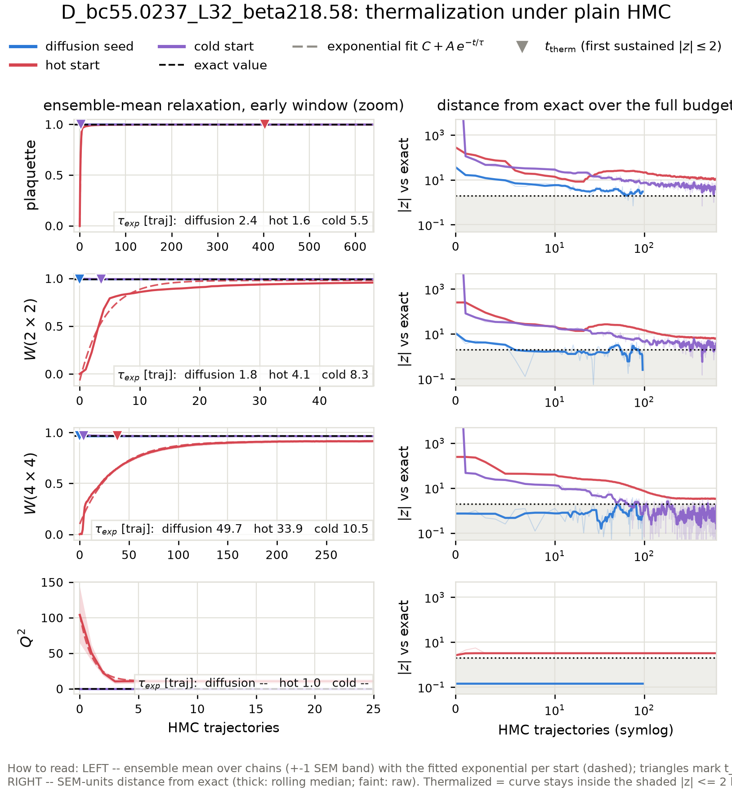

tau_int (hot-start chains, second half): plaquette = 10.44 +- 1.54, wilson_2x2 = 10.51 +- 1.42, wilson_4x4 = 5.82 +- 0.59, wilson_6x6 = 7.47 +- 0.89. Topology: hot-start HMC L=32 beta=218.58 -> **frozen** (no tunneling).

Where 'never' stood at the end: the hot start ended the 640-trajectory budget still at wilson_2x2 at |z| ~ 6, Q^2 at |z| ~ 3; the cold start ended the 640-trajectory budget still at Q^2 at |z| ~ 29010771968.

### Diagnostics: raw diffusion output (before any HMC)

| observable | value | error | exact | z_exact | reference | ref_error | z_ref | ks_p | chi2_p |
|---|---|---|---|---|---|---|---|---|---|
| plaquette | 0.998 | 9.796e-06 | 0.9977 | 32.04 | 0.9978 | 5.473e-06 | 23.61 | 2.852e-47 |  |
| wilson_1x1 | 0.998 | 9.796e-06 | 0.9977 | 32.04 | 0.9978 | 5.473e-06 | 23.61 | 2.852e-47 |  |
| wilson_1x2 | 0.9959 | 2.371e-05 | 0.9954 | 19.08 | 0.9955 | 1.37e-05 | 13.34 | 1.901e-19 |  |
| wilson_2x2 | 0.9914 | 5.757e-05 | 0.9909 | 9.378 | 0.9911 | 4.515e-05 | 4.712 | 8.218e-05 |  |
| wilson_2x3 | 0.9871 | 9.796e-05 | 0.9864 | 6.687 | 0.9866 | 8.251e-05 | 3.773 | 0.001027 |  |
| wilson_3x3 | 0.9804 | 0.0001731 | 0.9797 | 3.912 | 0.9798 | 0.000148 | 2.366 | 0.05405 |  |
| wilson_3x4 | 0.9737 | 0.0002533 | 0.9731 | 2.515 | 0.9731 | 0.0002157 | 1.993 | 0.2061 |  |
| wilson_4x4 | 0.9647 | 0.0003912 | 0.9644 | 0.7594 | 0.9641 | 0.000308 | 1.121 | 0.5266 |  |
| wilson_4x5 | 0.9559 | 0.0004774 | 0.9558 | 0.09776 | 0.9554 | 0.0003938 | 0.8323 | 0.6808 |  |
| wilson_5x5 | 0.945 | 0.0006878 | 0.9453 | -0.4574 | 0.9444 | 0.0005464 | 0.7089 | 0.4545 |  |
| wilson_5x6 | 0.9341 | 0.0008405 | 0.935 | -0.9845 | 0.9335 | 0.0006762 | 0.5465 | 0.2061 |  |
| wilson_6x6 | 0.9213 | 0.001121 | 0.9228 | -1.364 | 0.9206 | 0.0008502 | 0.5093 | 0.4899 |  |
| wilson_6x7 | 0.9085 | 0.001347 | 0.9109 | -1.801 | 0.9078 | 0.0009964 | 0.4414 | 0.3879 |  |
| wilson_7x7 | 0.8937 | 0.001706 | 0.8974 | -2.132 | 0.893 | 0.001239 | 0.3312 | 0.6028 |  |
| wilson_7x8 | 0.8793 | 0.001994 | 0.8842 | -2.438 | 0.8793 | 0.001428 | 0.01857 | 0.8612 |  |
| wilson_8x8 | 0.863 | 0.002503 | 0.8696 | -2.621 | 0.8628 | 0.00165 | 0.08093 | 0.9574 |  |
| wilson_8x10 | 0.8322 | 0.003427 | 0.8415 | -2.721 | 0.8336 | 0.002212 | -0.3382 | 0.8906 |  |
| wilson_10x10 | 0.7955 | 0.004751 | 0.8088 | -2.808 | 0.7952 | 0.002776 | 0.05462 | 0.8288 |  |
| wilson_10x12 | 0.7608 | 0.006016 | 0.7785 | -2.935 | 0.7631 | 0.003733 | -0.3217 | 0.8612 |  |
| wilson_12x12 | 0.724 | 0.007494 | 0.745 | -2.807 | 0.7231 | 0.004467 | 0.09208 | 0.7575 |  |
| creutz_2 | 0.002327 | 2.761e-05 | 0.002278 | 1.793 |  |  |  |  |  |
| creutz_3 | 0.002343 | 5.564e-05 | 0.00225 | 1.659 |  |  |  |  |  |
| creutz_4 | 0.00252 | 0.0001051 | 0.00221 | 2.95 |  |  |  |  |  |
| creutz_5 | 0.002278 | 0.0001653 | 0.002155 | 0.7412 |  |  |  |  |  |
| creutz_6 | 0.002309 | 0.0002471 | 0.002087 | 0.8959 |  |  |  |  |  |
| creutz_7 | 0.002389 | 0.0003233 | 0.002005 | 1.19 |  |  |  |  |  |
| creutz_8 | 0.002516 | 0.0003981 | 0.001907 | 1.529 |  |  |  |  |  |
| Q | 0 | 0.01652 | 0 | 0 | -0.005208 | 0.01167 | 0.2575 | 1 |  |
| Q^2 | 0.03125 | 0.01479 | 0.02901 | 0.1514 | 0.02604 | 0.01017 | 0.2902 | 1 |  |
| chi_top ((<Q^2>-<Q>^2)/V) | 3.052e-05 | 1.52e-05 | 2.833e-05 | 0.1439 | 2.54e-05 | 1.129e-05 | 0.2701 |  |  |
| Q histogram vs exact P(Q) | 0.02279 | nan | 2 | nan |  |  |  |  | 0.9887 |

### Diagnostics: the same configs after 96 HMC trajectories

| observable | value | error | exact | z_exact | reference | ref_error | z_ref | ks_p | chi2_p |
|---|---|---|---|---|---|---|---|---|---|
| plaquette | 0.9977 | 9.683e-06 | 0.9977 | 2.957 | 0.9978 | 5.473e-06 | -1.827 | 0.06115 |  |
| wilson_1x1 | 0.9977 | 9.683e-06 | 0.9977 | 2.957 | 0.9978 | 5.473e-06 | -1.827 | 0.06115 |  |
| wilson_1x2 | 0.9955 | 2.589e-05 | 0.9954 | 2.468 | 0.9955 | 1.37e-05 | -0.7911 | 0.4204 |  |
| wilson_2x2 | 0.9909 | 7.216e-05 | 0.9909 | 0.2025 | 0.9911 | 4.515e-05 | -2.121 | 0.02145 |  |
| wilson_2x3 | 0.9864 | 0.0001184 | 0.9864 | 0.242 | 0.9866 | 8.251e-05 | -0.9923 | 0.7941 |  |
| wilson_3x3 | 0.9796 | 0.0002223 | 0.9797 | -0.4384 | 0.9798 | 0.000148 | -0.8828 | 0.1685 |  |
| wilson_3x4 | 0.9729 | 0.0003084 | 0.9731 | -0.4955 | 0.9731 | 0.0002157 | -0.3365 | 0.5266 |  |
| wilson_4x4 | 0.9641 | 0.0004672 | 0.9644 | -0.6302 | 0.9641 | 0.000308 | -0.05966 | 0.939 |  |
| wilson_4x5 | 0.9555 | 0.0006034 | 0.9558 | -0.4729 | 0.9554 | 0.0003938 | 0.2541 | 0.8288 |  |
| wilson_5x5 | 0.9447 | 0.000782 | 0.9453 | -0.7379 | 0.9444 | 0.0005464 | 0.3776 | 0.9902 |  |
| wilson_5x6 | 0.9344 | 0.0009426 | 0.935 | -0.6038 | 0.9335 | 0.0006762 | 0.7309 | 0.6808 |  |
| wilson_6x6 | 0.9221 | 0.001123 | 0.9228 | -0.6031 | 0.9206 | 0.0008502 | 1.115 | 0.4545 |  |
| wilson_6x7 | 0.9101 | 0.001377 | 0.9109 | -0.5901 | 0.9078 | 0.0009964 | 1.385 | 0.357 |  |
| wilson_7x7 | 0.8961 | 0.001681 | 0.8974 | -0.7844 | 0.893 | 0.001239 | 1.445 | 0.2741 |  |
| wilson_7x8 | 0.8824 | 0.002028 | 0.8842 | -0.9131 | 0.8793 | 0.001428 | 1.231 | 0.2272 |  |
| wilson_8x8 | 0.8669 | 0.002372 | 0.8696 | -1.137 | 0.8628 | 0.00165 | 1.421 | 0.357 |  |
| wilson_8x10 | 0.8383 | 0.003448 | 0.8415 | -0.9291 | 0.8336 | 0.002212 | 1.158 | 0.3001 |  |
| wilson_10x10 | 0.8036 | 0.004683 | 0.8088 | -1.114 | 0.7952 | 0.002776 | 1.547 | 0.1226 |  |
| wilson_10x12 | 0.7722 | 0.00614 | 0.7785 | -1.017 | 0.7631 | 0.003733 | 1.271 | 0.3879 |  |
| wilson_12x12 | 0.7364 | 0.007439 | 0.745 | -1.156 | 0.7231 | 0.004467 | 1.526 | 0.2741 |  |
| creutz_2 | 0.002362 | 3.268e-05 | 0.002278 | 2.598 |  |  |  |  |  |
| creutz_3 | 0.002393 | 7.014e-05 | 0.00225 | 2.037 |  |  |  |  |  |
| creutz_4 | 0.0023 | 0.00012 | 0.00221 | 0.7565 |  |  |  |  |  |
| creutz_5 | 0.002474 | 0.0001828 | 0.002155 | 1.744 |  |  |  |  |  |
| creutz_6 | 0.002214 | 0.000262 | 0.002087 | 0.4843 |  |  |  |  |  |
| creutz_7 | 0.002424 | 0.0003206 | 0.002005 | 1.307 |  |  |  |  |  |
| creutz_8 | 0.00229 | 0.0004168 | 0.001907 | 0.9191 |  |  |  |  |  |
| Q | 0 | 0.01652 | 0 | 0 | -0.005208 | 0.01167 | 0.2575 | 1 |  |
| Q^2 | 0.03125 | 0.01479 | 0.02901 | 0.1514 | 0.02604 | 0.01017 | 0.2902 | 1 |  |
| chi_top ((<Q^2>-<Q>^2)/V) | 3.052e-05 | 1.52e-05 | 2.833e-05 | 0.1439 | 2.54e-05 | 1.129e-05 | 0.2701 |  |  |
| Q histogram vs exact P(Q) | 0.02279 | nan | 2 | nan |  |  |  |  | 0.9887 |

## D_bc100_L32_beta398.492

HMC: step size 0.0200, 50 leapfrog steps, acceptance seed/hot/cold = 0.978/0.850/0.978. Diffusion-seed batch: 128 chains x 96 trajectories (0.30 s/traj for the whole batch); baselines: 32 chains x 640 trajectories.

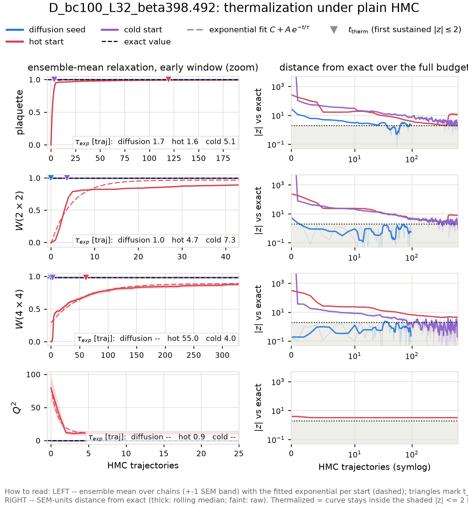

tau_int (hot-start chains, second half): plaquette = 30.08 +- 1.99, wilson_2x2 = 29.94 +- 2.45, wilson_4x4 = 24.74 +- 2.57, wilson_6x6 = 7.91 +- 2.08. Topology: hot-start HMC L=32 beta=398.492 -> **frozen** (no tunneling).

Where 'never' stood at the end: the hot start ended the 640-trajectory budget still at wilson_2x2 at |z| ~ 8, Q^2 at |z| ~ 3; the cold start ended the 640-trajectory budget still at Q^2 at |z| ~ 930603328.

### Diagnostics: raw diffusion output (before any HMC)

| observable | value | error | exact | z_exact | reference | ref_error | z_ref | ks_p | chi2_p |
|---|---|---|---|---|---|---|---|---|---|
| plaquette | 0.9989 | 5.464e-06 | 0.9987 | 23.02 | 0.9988 | 3.013e-06 | 18.69 | 1.654e-43 |  |
| wilson_1x1 | 0.9989 | 5.464e-06 | 0.9987 | 23.02 | 0.9988 | 3.013e-06 | 18.69 | 1.654e-43 |  |
| wilson_1x2 | 0.9977 | 1.28e-05 | 0.9975 | 12.84 | 0.9975 | 7.991e-06 | 9.224 | 3.233e-14 |  |
| wilson_2x2 | 0.9952 | 3.54e-05 | 0.995 | 4.41 | 0.9951 | 1.961e-05 | 1.753 | 0.06904 |  |
| wilson_2x3 | 0.9927 | 6.614e-05 | 0.9925 | 2.867 | 0.9927 | 3.593e-05 | 0.7119 | 0.7575 |  |
| wilson_3x3 | 0.9891 | 0.0001151 | 0.9889 | 2.026 | 0.9891 | 6.726e-05 | -0.02593 | 0.9167 |  |
| wilson_3x4 | 0.9854 | 0.0001699 | 0.9852 | 1.104 | 0.9854 | 0.0001018 | -0.1301 | 0.8906 |  |
| wilson_4x4 | 0.9804 | 0.0002523 | 0.9804 | 0.1634 | 0.9806 | 0.0001621 | -0.4776 | 0.8906 |  |
| wilson_4x5 | 0.9756 | 0.0003426 | 0.9757 | -0.195 | 0.9758 | 0.0002157 | -0.5419 | 0.8906 |  |
| wilson_5x5 | 0.9696 | 0.0004785 | 0.9698 | -0.442 | 0.9699 | 0.0003205 | -0.503 | 0.5643 |  |
| wilson_5x6 | 0.9637 | 0.000618 | 0.9641 | -0.6643 | 0.9641 | 0.0004101 | -0.5561 | 0.8612 |  |
| wilson_6x6 | 0.9567 | 0.0008155 | 0.9573 | -0.708 | 0.9574 | 0.0005581 | -0.7088 | 0.6418 |  |
| wilson_6x7 | 0.9499 | 0.001013 | 0.9506 | -0.721 | 0.9508 | 0.0006781 | -0.7391 | 0.7575 |  |
| wilson_7x7 | 0.942 | 0.001253 | 0.943 | -0.7866 | 0.9434 | 0.0008509 | -0.8949 | 0.6808 |  |
| wilson_7x8 | 0.9344 | 0.001517 | 0.9356 | -0.8227 | 0.936 | 0.0009741 | -0.8943 | 0.5643 |  |
| wilson_8x8 | 0.9257 | 0.001792 | 0.9273 | -0.8829 | 0.928 | 0.001195 | -1.042 | 0.357 |  |
| wilson_8x10 | 0.9093 | 0.002418 | 0.9114 | -0.8533 | 0.9125 | 0.001504 | -1.104 | 0.1866 |  |
| wilson_10x10 | 0.8903 | 0.003134 | 0.8927 | -0.7561 | 0.895 | 0.002121 | -1.246 | 0.07777 |  |
| wilson_10x12 | 0.872 | 0.003918 | 0.8752 | -0.8046 | 0.8784 | 0.002537 | -1.363 | 0.1226 |  |
| wilson_12x12 | 0.8521 | 0.004671 | 0.8557 | -0.7702 | 0.8602 | 0.003309 | -1.403 | 0.2741 |  |
| creutz_2 | 0.001292 | 1.729e-05 | 0.001245 | 2.707 |  |  |  |  |  |
| creutz_3 | 0.001216 | 3.699e-05 | 0.001226 | -0.2857 |  |  |  |  |  |
| creutz_4 | 0.0013 | 5.914e-05 | 0.001197 | 1.741 |  |  |  |  |  |
| creutz_5 | 0.001197 | 8.834e-05 | 0.001158 | 0.4426 |  |  |  |  |  |
| creutz_6 | 0.00108 | 0.0001324 | 0.00111 | -0.2296 |  |  |  |  |  |
| creutz_7 | 0.001164 | 0.0001876 | 0.001052 | 0.599 |  |  |  |  |  |
| creutz_8 | 0.001068 | 0.0002288 | 0.000984 | 0.3664 |  |  |  |  |  |
| Q | 0 | 0 | 0 | 0 | 0 | 0 | 0 | 1 |  |
| Q^2 | 0 | 0 | 0.0009306 | inf | 0 | 0 | 0 | 1 |  |
| chi_top ((<Q^2>-<Q>^2)/V) | 0 | 0 | 9.088e-07 | inf | 0 | 0 | 0 |  |  |
| Q histogram vs exact P(Q) | 0.1192 | nan | 2 | nan |  |  |  |  | 0.9421 |

### Diagnostics: the same configs after 96 HMC trajectories

| observable | value | error | exact | z_exact | reference | ref_error | z_ref | ks_p | chi2_p |
|---|---|---|---|---|---|---|---|---|---|
| plaquette | 0.9988 | 4.624e-06 | 0.9987 | 2.237 | 0.9988 | 3.013e-06 | 0.2073 | 0.939 |  |
| wilson_1x1 | 0.9988 | 4.624e-06 | 0.9987 | 2.237 | 0.9988 | 3.013e-06 | 0.2073 | 0.939 |  |
| wilson_1x2 | 0.9975 | 1.228e-05 | 0.9975 | 1.297 | 0.9975 | 7.991e-06 | -0.6317 | 0.2498 |  |
| wilson_2x2 | 0.995 | 2.41e-05 | 0.995 | 0.6206 | 0.9951 | 1.961e-05 | -2.26 | 0.04767 |  |
| wilson_2x3 | 0.9926 | 3.788e-05 | 0.9925 | 0.7407 | 0.9927 | 3.593e-05 | -2.068 | 0.04195 |  |
| wilson_3x3 | 0.9889 | 6.485e-05 | 0.9889 | 0.9846 | 0.9891 | 6.726e-05 | -1.849 | 0.1685 |  |
| wilson_3x4 | 0.9853 | 9.487e-05 | 0.9852 | 0.8217 | 0.9854 | 0.0001018 | -0.9727 | 0.4204 |  |
| wilson_4x4 | 0.9804 | 0.0001605 | 0.9804 | 0.256 | 0.9806 | 0.0001621 | -0.6286 | 0.6808 |  |
| wilson_4x5 | 0.9757 | 0.0002342 | 0.9757 | 0.2992 | 0.9758 | 0.0002157 | -0.2591 | 0.6028 |  |
| wilson_5x5 | 0.9699 | 0.0003266 | 0.9698 | 0.3087 | 0.9699 | 0.0003205 | 0.04951 | 0.6808 |  |
| wilson_5x6 | 0.9642 | 0.000446 | 0.9641 | 0.2374 | 0.9641 | 0.0004101 | 0.1716 | 0.6418 |  |
| wilson_6x6 | 0.9574 | 0.0005722 | 0.9573 | 0.146 | 0.9574 | 0.0005581 | -0.0494 | 0.6028 |  |
| wilson_6x7 | 0.9507 | 0.0006941 | 0.9506 | 0.1489 | 0.9508 | 0.0006781 | -0.0694 | 0.5266 |  |
| wilson_7x7 | 0.9432 | 0.0008579 | 0.943 | 0.2512 | 0.9434 | 0.0008509 | -0.1277 | 0.6418 |  |
| wilson_7x8 | 0.9358 | 0.0009924 | 0.9356 | 0.1962 | 0.936 | 0.0009741 | -0.122 | 0.5643 |  |
| wilson_8x8 | 0.9277 | 0.001186 | 0.9273 | 0.3009 | 0.928 | 0.001195 | -0.1816 | 0.3879 |  |
| wilson_8x10 | 0.912 | 0.001647 | 0.9114 | 0.3299 | 0.9125 | 0.001504 | -0.2407 | 0.5643 |  |
| wilson_10x10 | 0.8936 | 0.002203 | 0.8927 | 0.4381 | 0.895 | 0.002121 | -0.4513 | 0.8288 |  |
| wilson_10x12 | 0.8766 | 0.002722 | 0.8752 | 0.5334 | 0.8784 | 0.002537 | -0.4726 | 0.7941 |  |
| wilson_12x12 | 0.8577 | 0.003426 | 0.8557 | 0.5838 | 0.8602 | 0.003309 | -0.5106 | 0.9167 |  |
| creutz_2 | 0.001252 | 1.644e-05 | 0.001245 | 0.3993 |  |  |  |  |  |
| creutz_3 | 0.001203 | 3.474e-05 | 0.001226 | -0.6639 |  |  |  |  |  |
| creutz_4 | 0.001249 | 5.707e-05 | 0.001197 | 0.9071 |  |  |  |  |  |
| creutz_5 | 0.001156 | 8.292e-05 | 0.001158 | -0.02691 |  |  |  |  |  |
| creutz_6 | 0.001138 | 0.0001237 | 0.00111 | 0.23 |  |  |  |  |  |
| creutz_7 | 0.0009535 | 0.0001857 | 0.001052 | -0.5299 |  |  |  |  |  |
| creutz_8 | 0.000787 | 0.0002448 | 0.000984 | -0.8051 |  |  |  |  |  |
| Q | 0 | 0 | 0 | 0 | 0 | 0 | 0 | 1 |  |
| Q^2 | 0 | 0 | 0.0009306 | inf | 0 | 0 | 0 | 1 |  |
| chi_top ((<Q^2>-<Q>^2)/V) | 0 | 0 | 9.088e-07 | inf | 0 | 0 | 0 |  |  |
| Q histogram vs exact P(Q) | 0.1192 | nan | 2 | nan |  |  |  |  | 0.9421 |

## D_bc150_L32_beta598.495

HMC: step size 0.0164, 61 leapfrog steps, acceptance seed/hot/cold = 0.973/0.600/0.974. Diffusion-seed batch: 128 chains x 96 trajectories (0.36 s/traj for the whole batch); baselines: 32 chains x 640 trajectories.

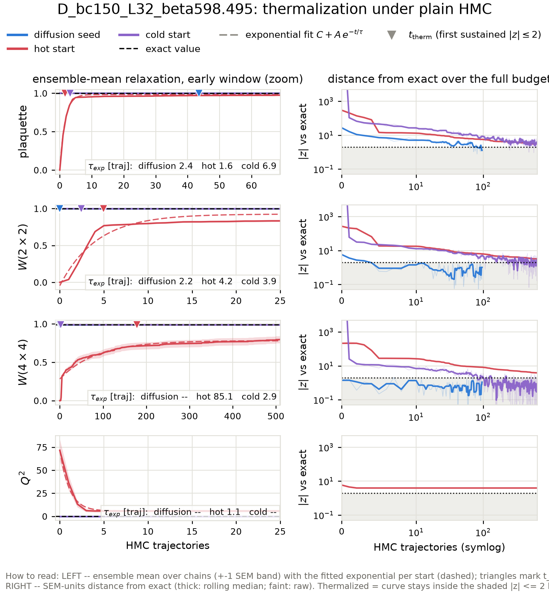

tau_int (hot-start chains, second half): plaquette = 29.51 +- 3.62, wilson_2x2 = 29.10 +- 3.67, wilson_4x4 = 27.84 +- 3.82, wilson_6x6 = 29.06 +- 3.85. Topology: hot-start HMC L=32 beta=598.495 -> **frozen** (no tunneling).

Where 'never' stood at the end: the hot start ended the 640-trajectory budget still at Q^2 at |z| ~ 4; the cold start ended the 640-trajectory budget still at Q^2 at |z| ~ 19715124.

### Diagnostics: raw diffusion output (before any HMC)

| observable | value | error | exact | z_exact | reference | ref_error | z_ref | ks_p | chi2_p |
|---|---|---|---|---|---|---|---|---|---|
| plaquette | 0.9993 | 3.124e-06 | 0.9992 | 29.84 | 0.9992 | 2.075e-06 | 20.48 | 1.168e-33 |  |
| wilson_1x1 | 0.9993 | 3.124e-06 | 0.9992 | 29.84 | 0.9992 | 2.075e-06 | 20.48 | 1.168e-33 |  |
| wilson_1x2 | 0.9985 | 9.549e-06 | 0.9983 | 14.99 | 0.9984 | 5.685e-06 | 10.51 | 2.965e-17 |  |
| wilson_2x2 | 0.9968 | 2.657e-05 | 0.9967 | 5.038 | 0.9968 | 1.503e-05 | 1.864 | 0.001229 |  |
| wilson_2x3 | 0.9952 | 4.374e-05 | 0.995 | 3.583 | 0.9951 | 2.627e-05 | 0.745 | 0.002077 |  |
| wilson_3x3 | 0.9928 | 7.938e-05 | 0.9926 | 2.667 | 0.9927 | 4.837e-05 | 0.9928 | 0.003444 |  |
| wilson_3x4 | 0.9904 | 0.0001199 | 0.9901 | 1.88 | 0.9903 | 7.437e-05 | 0.685 | 0.03684 |  |
| wilson_4x4 | 0.9871 | 0.0001782 | 0.9869 | 1.252 | 0.9869 | 0.0001096 | 0.9195 | 0.01616 |  |
| wilson_4x5 | 0.984 | 0.0002388 | 0.9837 | 1.061 | 0.9838 | 0.0001573 | 0.5366 | 0.08742 |  |
| wilson_5x5 | 0.9801 | 0.0003242 | 0.9798 | 0.9238 | 0.9799 | 0.0002042 | 0.4369 | 0.3001 |  |
| wilson_5x6 | 0.9762 | 0.0003964 | 0.9759 | 0.6681 | 0.9763 | 0.0002669 | -0.2784 | 0.7575 |  |
| wilson_6x6 | 0.9717 | 0.0005005 | 0.9714 | 0.6745 | 0.972 | 0.0003484 | -0.5407 | 0.8906 |  |
| wilson_6x7 | 0.9672 | 0.0006022 | 0.9669 | 0.4706 | 0.9678 | 0.0004333 | -0.8193 | 0.8906 |  |
| wilson_7x7 | 0.9621 | 0.0007152 | 0.9617 | 0.4631 | 0.9628 | 0.0005509 | -0.8052 | 0.6418 |  |
| wilson_7x8 | 0.9568 | 0.0008415 | 0.9567 | 0.1414 | 0.9577 | 0.0006768 | -0.7765 | 0.4899 |  |
| wilson_8x8 | 0.9512 | 0.0009629 | 0.9511 | 0.0883 | 0.9519 | 0.0007961 | -0.605 | 0.6808 |  |
| wilson_8x10 | 0.9396 | 0.001319 | 0.9402 | -0.4817 | 0.9405 | 0.001058 | -0.5599 | 0.1866 |  |
| wilson_10x10 | 0.9262 | 0.001768 | 0.9273 | -0.6531 | 0.9279 | 0.001431 | -0.7783 | 0.04767 |  |
| wilson_10x12 | 0.9133 | 0.002307 | 0.9152 | -0.8382 | 0.9152 | 0.001693 | -0.6659 | 0.02145 |  |
| wilson_12x12 | 0.8991 | 0.002917 | 0.9017 | -0.8735 | 0.9023 | 0.002232 | -0.8656 | 0.02464 |  |
| creutz_2 | 0.0008878 | 1.237e-05 | 0.0008288 | 4.774 |  |  |  |  |  |
| creutz_3 | 0.0007832 | 2.499e-05 | 0.0008157 | -1.3 |  |  |  |  |  |
| creutz_4 | 0.0008123 | 4.2e-05 | 0.0007961 | 0.3841 |  |  |  |  |  |
| creutz_5 | 0.0007533 | 6.372e-05 | 0.00077 | -0.2618 |  |  |  |  |  |
| creutz_6 | 0.0006269 | 8.701e-05 | 0.0007374 | -1.27 |  |  |  |  |  |
| creutz_7 | 0.0005926 | 0.0001156 | 0.0006982 | -0.9137 |  |  |  |  |  |
| creutz_8 | 0.0004675 | 0.0001324 | 0.0006525 | -1.397 |  |  |  |  |  |
| Q | 0 | 0 | 0 | 0 | 0 | 0 | 0 | 1 |  |
| Q^2 | 0 | 0 | 1.972e-05 | inf | 0 | 0 | 0 | 1 |  |
| chi_top ((<Q^2>-<Q>^2)/V) | 0 | 0 | 1.925e-08 | inf | 0 | 0 | 0 |  |  |
| Q histogram vs exact P(Q) | 0.002524 | nan | 2 | nan |  |  |  |  | 0.9987 |

### Diagnostics: the same configs after 96 HMC trajectories

| observable | value | error | exact | z_exact | reference | ref_error | z_ref | ks_p | chi2_p |
|---|---|---|---|---|---|---|---|---|---|
| plaquette | 0.9992 | 3.194e-06 | 0.9992 | 1.289 | 0.9992 | 2.075e-06 | -3.229 | 0.03684 |  |
| wilson_1x1 | 0.9992 | 3.194e-06 | 0.9992 | 1.289 | 0.9992 | 2.075e-06 | -3.229 | 0.03684 |  |
| wilson_1x2 | 0.9983 | 7.601e-06 | 0.9983 | -0.1632 | 0.9984 | 5.685e-06 | -2.906 | 0.07777 |  |
| wilson_2x2 | 0.9967 | 1.844e-05 | 0.9967 | -1.123 | 0.9968 | 1.503e-05 | -4.105 | 0.02464 |  |
| wilson_2x3 | 0.995 | 3.101e-05 | 0.995 | -0.8484 | 0.9951 | 2.627e-05 | -3.569 | 0.06115 |  |
| wilson_3x3 | 0.9925 | 5.277e-05 | 0.9926 | -1.268 | 0.9927 | 4.837e-05 | -2.602 | 0.1226 |  |
| wilson_3x4 | 0.9901 | 7.948e-05 | 0.9901 | -0.8596 | 0.9903 | 7.437e-05 | -1.811 | 0.5266 |  |
| wilson_4x4 | 0.9868 | 0.0001181 | 0.9869 | -1.366 | 0.9869 | 0.0001096 | -1.191 | 0.5643 |  |
| wilson_4x5 | 0.9836 | 0.0001527 | 0.9837 | -0.6069 | 0.9838 | 0.0001573 | -0.8784 | 0.4545 |  |
| wilson_5x5 | 0.9797 | 0.0002195 | 0.9798 | -0.7438 | 0.9799 | 0.0002042 | -0.9854 | 0.7575 |  |
| wilson_5x6 | 0.9758 | 0.0002751 | 0.9759 | -0.4338 | 0.9763 | 0.0002669 | -1.349 | 0.6808 |  |
| wilson_6x6 | 0.9712 | 0.0003526 | 0.9714 | -0.4714 | 0.972 | 0.0003484 | -1.682 | 0.2498 |  |
| wilson_6x7 | 0.9667 | 0.0004572 | 0.9669 | -0.3217 | 0.9678 | 0.0004333 | -1.648 | 0.1366 |  |
| wilson_7x7 | 0.9615 | 0.0005505 | 0.9617 | -0.5242 | 0.9628 | 0.0005509 | -1.729 | 0.1366 |  |
| wilson_7x8 | 0.9565 | 0.000708 | 0.9567 | -0.3544 | 0.9577 | 0.0006768 | -1.234 | 0.1866 |  |
| wilson_8x8 | 0.9508 | 0.0008175 | 0.9511 | -0.3377 | 0.9519 | 0.0007961 | -0.9789 | 0.3001 |  |
| wilson_8x10 | 0.9401 | 0.001235 | 0.9402 | -0.09094 | 0.9405 | 0.001058 | -0.2605 | 0.7195 |  |
| wilson_10x10 | 0.9276 | 0.001487 | 0.9273 | 0.1545 | 0.9279 | 0.001431 | -0.1869 | 0.4204 |  |
| wilson_10x12 | 0.9152 | 0.002028 | 0.9152 | -0.008482 | 0.9152 | 0.001693 | 0.00419 | 0.357 |  |
| wilson_12x12 | 0.9023 | 0.002317 | 0.9017 | 0.2599 | 0.9023 | 0.002232 | -0.009086 | 0.357 |  |
| creutz_2 | 0.000843 | 1.168e-05 | 0.0008288 | 1.214 |  |  |  |  |  |
| creutz_3 | 0.000851 | 2.336e-05 | 0.0008157 | 1.512 |  |  |  |  |  |
| creutz_4 | 0.0008889 | 3.832e-05 | 0.0007961 | 2.422 |  |  |  |  |  |
| creutz_5 | 0.0009116 | 5.763e-05 | 0.00077 | 2.457 |  |  |  |  |  |
| creutz_6 | 0.0008306 | 8.327e-05 | 0.0007374 | 1.119 |  |  |  |  |  |
| creutz_7 | 0.0008652 | 0.0001181 | 0.0006982 | 1.414 |  |  |  |  |  |
| creutz_8 | 0.0007183 | 0.0001557 | 0.0006525 | 0.4224 |  |  |  |  |  |
| Q | 0 | 0 | 0 | 0 | 0 | 0 | 0 | 1 |  |
| Q^2 | 0 | 0 | 1.972e-05 | inf | 0 | 0 | 0 | 1 |  |
| chi_top ((<Q^2>-<Q>^2)/V) | 0 | 0 | 1.925e-08 | inf | 0 | 0 | 0 |  |  |
| Q histogram vs exact P(Q) | 0.002524 | nan | 2 | nan |  |  |  |  | 0.9987 |

## D_bc220_L32_beta878.496

HMC: step size 0.0135, 74 leapfrog steps, acceptance seed/hot/cold = 0.970/0.008/0.974. Diffusion-seed batch: 128 chains x 96 trajectories (0.43 s/traj for the whole batch); baselines: 32 chains x 640 trajectories.

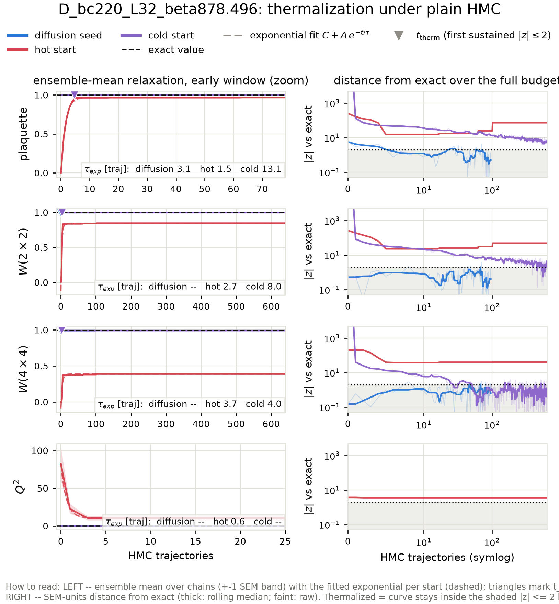

tau_int (hot-start chains, second half): plaquette = 0.50 +- 0.00, wilson_2x2 = 0.50 +- 0.00, wilson_4x4 = 0.50 +- 0.00, wilson_6x6 = 0.50 +- 0.00. Topology: hot-start HMC L=32 beta=878.496 -> **frozen** (no tunneling).

Where 'never' stood at the end: the hot start ended the 640-trajectory budget still at plaquette at |z| ~ 73, wilson_6x6 at |z| ~ 57, Q^2 at |z| ~ 4; the cold start ended the 640-trajectory budget still at Q^2 at |z| ~ 89274.

### Diagnostics: raw diffusion output (before any HMC)

| observable | value | error | exact | z_exact | reference | ref_error | z_ref | ks_p | chi2_p |
|---|---|---|---|---|---|---|---|---|---|
| plaquette | 0.9994 | 2.506e-06 | 0.9994 | 5.534 | 0.9994 | 1.788e-06 | 3.406 | 0.01864 |  |
| wilson_1x1 | 0.9994 | 2.506e-06 | 0.9994 | 5.534 | 0.9994 | 1.788e-06 | 3.406 | 0.01864 |  |
| wilson_1x2 | 0.9989 | 6.817e-06 | 0.9989 | 3.838 | 0.9989 | 4.021e-06 | 2.716 | 0.02145 |  |
| wilson_2x2 | 0.9977 | 1.267e-05 | 0.9977 | 0.5911 | 0.9977 | 1.005e-05 | 0.9568 | 0.7195 |  |
| wilson_2x3 | 0.9966 | 2.389e-05 | 0.9966 | 0.52 | 0.9966 | 1.621e-05 | 0.6474 | 0.8612 |  |
| wilson_3x3 | 0.995 | 4.589e-05 | 0.9949 | 1.04 | 0.9949 | 2.983e-05 | 0.6925 | 0.1685 |  |
| wilson_3x4 | 0.9933 | 6.792e-05 | 0.9933 | 0.51 | 0.9933 | 4.687e-05 | 0.02583 | 0.4545 |  |
| wilson_4x4 | 0.9911 | 9.253e-05 | 0.9911 | 0.1635 | 0.9911 | 6.954e-05 | -0.4629 | 0.939 |  |
| wilson_4x5 | 0.989 | 0.0001272 | 0.9889 | 0.5225 | 0.989 | 9.732e-05 | -0.1143 | 0.4545 |  |
| wilson_5x5 | 0.9864 | 0.0001646 | 0.9862 | 0.9746 | 0.9863 | 0.0001265 | 0.1825 | 0.6028 |  |
| wilson_5x6 | 0.9838 | 0.0002206 | 0.9836 | 0.9896 | 0.9837 | 0.0001686 | 0.08638 | 0.8288 |  |
| wilson_6x6 | 0.9808 | 0.0002755 | 0.9804 | 1.266 | 0.9807 | 0.0002134 | 0.2366 | 0.5266 |  |
| wilson_6x7 | 0.9778 | 0.0003422 | 0.9773 | 1.271 | 0.9777 | 0.0002607 | 0.1828 | 0.6028 |  |
| wilson_7x7 | 0.9743 | 0.0004164 | 0.9738 | 1.256 | 0.9743 | 0.0003268 | 0.09755 | 0.7575 |  |
| wilson_7x8 | 0.9709 | 0.0005089 | 0.9703 | 1.144 | 0.9709 | 0.0003863 | 0.0471 | 0.6808 |  |
| wilson_8x8 | 0.967 | 0.0006182 | 0.9664 | 0.9619 | 0.9671 | 0.0004687 | -0.167 | 0.7195 |  |
| wilson_8x10 | 0.9595 | 0.0008401 | 0.9589 | 0.7293 | 0.9599 | 0.000637 | -0.3864 | 0.7941 |  |
| wilson_10x10 | 0.9503 | 0.001162 | 0.9499 | 0.3035 | 0.9514 | 0.0008728 | -0.796 | 0.6028 |  |
| wilson_10x12 | 0.9417 | 0.001447 | 0.9415 | 0.2013 | 0.9433 | 0.001102 | -0.8386 | 0.7941 |  |
| wilson_12x12 | 0.9316 | 0.001898 | 0.932 | -0.1804 | 0.9339 | 0.00142 | -0.9669 | 0.4545 |  |
| creutz_2 | 0.0005955 | 7.415e-06 | 0.0005645 | 4.182 |  |  |  |  |  |
| creutz_3 | 0.000525 | 1.622e-05 | 0.0005556 | -1.882 |  |  |  |  |  |
| creutz_4 | 0.0005488 | 2.611e-05 | 0.0005422 | 0.2504 |  |  |  |  |  |
| creutz_5 | 0.000481 | 3.741e-05 | 0.0005244 | -1.162 |  |  |  |  |  |
| creutz_6 | 0.0004278 | 5.759e-05 | 0.0005022 | -1.291 |  |  |  |  |  |
| creutz_7 | 0.0004727 | 8.224e-05 | 0.0004755 | -0.03427 |  |  |  |  |  |
| creutz_8 | 0.0004921 | 0.0001056 | 0.0004443 | 0.4525 |  |  |  |  |  |
| Q | 0 | 0 | 0 | 0 | 0 | 0 | 0 | 1 |  |
| Q^2 | 0 | 0 | 8.927e-08 | inf | 0 | 0 | 0 | 1 |  |
| chi_top ((<Q^2>-<Q>^2)/V) | 0 | 0 | 8.718e-11 | inf | 0 | 0 | 0 |  |  |
| Q histogram vs exact P(Q) | 1.143e-05 | nan | 2 | nan |  |  |  |  | 1 |

### Diagnostics: the same configs after 96 HMC trajectories

| observable | value | error | exact | z_exact | reference | ref_error | z_ref | ks_p | chi2_p |
|---|---|---|---|---|---|---|---|---|---|
| plaquette | 0.9994 | 2.79e-06 | 0.9994 | 0.3995 | 0.9994 | 1.788e-06 | -0.6851 | 0.3001 |  |
| wilson_1x1 | 0.9994 | 2.79e-06 | 0.9994 | 0.3995 | 0.9994 | 1.788e-06 | -0.6851 | 0.3001 |  |
| wilson_1x2 | 0.9989 | 6.67e-06 | 0.9989 | 0.5741 | 0.9989 | 4.021e-06 | -0.1075 | 0.9827 |  |
| wilson_2x2 | 0.9977 | 1.63e-05 | 0.9977 | 0.3324 | 0.9977 | 1.005e-05 | 0.7 | 0.4545 |  |
| wilson_2x3 | 0.9966 | 2.789e-05 | 0.9966 | 0.6604 | 0.9966 | 1.621e-05 | 0.7653 | 0.2272 |  |
| wilson_3x3 | 0.995 | 5.019e-05 | 0.9949 | 0.8605 | 0.9949 | 2.983e-05 | 0.5718 | 0.5643 |  |
| wilson_3x4 | 0.9933 | 7.465e-05 | 0.9933 | 0.7087 | 0.9933 | 4.687e-05 | 0.2314 | 0.9827 |  |
| wilson_4x4 | 0.9911 | 0.0001132 | 0.9911 | 0.5068 | 0.9911 | 6.954e-05 | -0.08556 | 0.9574 |  |
| wilson_4x5 | 0.9889 | 0.0001471 | 0.9889 | 0.2283 | 0.989 | 9.732e-05 | -0.2904 | 0.9574 |  |
| wilson_5x5 | 0.9862 | 0.0002119 | 0.9862 | -0.07223 | 0.9863 | 0.0001265 | -0.5585 | 0.8288 |  |
| wilson_5x6 | 0.9835 | 0.0002714 | 0.9836 | -0.06879 | 0.9837 | 0.0001686 | -0.6668 | 0.7195 |  |
| wilson_6x6 | 0.9803 | 0.0003727 | 0.9804 | -0.2596 | 0.9807 | 0.0002134 | -0.8453 | 0.6028 |  |
| wilson_6x7 | 0.9771 | 0.000463 | 0.9773 | -0.4116 | 0.9777 | 0.0002607 | -1.029 | 0.1226 |  |
| wilson_7x7 | 0.9735 | 0.0005846 | 0.9738 | -0.5097 | 0.9743 | 0.0003268 | -1.149 | 0.1866 |  |
| wilson_7x8 | 0.9698 | 0.0006972 | 0.9703 | -0.713 | 0.9709 | 0.0003863 | -1.316 | 0.1366 |  |
| wilson_8x8 | 0.9658 | 0.0008694 | 0.9664 | -0.693 | 0.9671 | 0.0004687 | -1.343 | 0.09806 |  |
| wilson_8x10 | 0.9578 | 0.001167 | 0.9589 | -0.8925 | 0.9599 | 0.000637 | -1.551 | 0.1098 |  |
| wilson_10x10 | 0.9488 | 0.001656 | 0.9499 | -0.6506 | 0.9514 | 0.0008728 | -1.382 | 0.06115 |  |
| wilson_10x12 | 0.9397 | 0.002079 | 0.9415 | -0.8236 | 0.9433 | 0.001102 | -1.5 | 0.02823 |  |
| wilson_12x12 | 0.9303 | 0.002633 | 0.932 | -0.6295 | 0.9339 | 0.00142 | -1.206 | 0.07777 |  |
| creutz_2 | 0.0005656 | 7.676e-06 | 0.0005645 | 0.1459 |  |  |  |  |  |
| creutz_3 | 0.0005437 | 1.646e-05 | 0.0005556 | -0.722 |  |  |  |  |  |
| creutz_4 | 0.0005475 | 3.006e-05 | 0.0005422 | 0.1746 |  |  |  |  |  |
| creutz_5 | 0.00055 | 4.49e-05 | 0.0005244 | 0.5695 |  |  |  |  |  |
| creutz_6 | 0.0005784 | 5.879e-05 | 0.0005022 | 1.297 |  |  |  |  |  |
| creutz_7 | 0.0004902 | 8.455e-05 | 0.0004755 | 0.1741 |  |  |  |  |  |
| creutz_8 | 0.0003491 | 0.0001096 | 0.0004443 | -0.8697 |  |  |  |  |  |
| Q | 0 | 0 | 0 | 0 | 0 | 0 | 0 | 1 |  |
| Q^2 | 0 | 0 | 8.927e-08 | inf | 0 | 0 | 0 | 1 |  |
| chi_top ((<Q^2>-<Q>^2)/V) | 0 | 0 | 8.718e-11 | inf | 0 | 0 | 0 |  |  |
| Q histogram vs exact P(Q) | 1.143e-05 | nan | 2 | nan |  |  |  |  | 1 |

## D_bc320_L32_beta1278.5

HMC: step size 0.0112, 89 leapfrog steps, acceptance seed/hot/cold = 0.965/0.008/0.964. Diffusion-seed batch: 128 chains x 96 trajectories (0.51 s/traj for the whole batch); baselines: 32 chains x 640 trajectories.

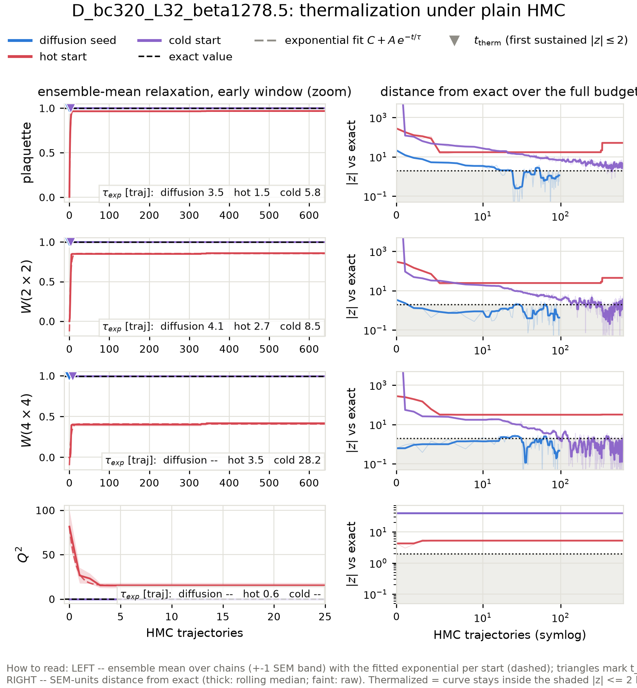

tau_int (hot-start chains, second half): plaquette = 0.97 +- 0.35, wilson_2x2 = 0.97 +- 0.35, wilson_4x4 = 0.97 +- 0.35, wilson_6x6 = 0.97 +- 0.35. Topology: hot-start HMC L=32 beta=1278.5 -> **frozen** (no tunneling).

Where 'never' stood at the end: the hot start ended the 640-trajectory budget still at wilson_6x6 at |z| ~ 68, Q^2 at |z| ~ 5; the cold start ended the 640-trajectory budget still at Q^2 at |z| ~ 40.

### Diagnostics: raw diffusion output (before any HMC)

| observable | value | error | exact | z_exact | reference | ref_error | z_ref | ks_p | chi2_p |
|---|---|---|---|---|---|---|---|---|---|
| plaquette | 0.9996 | 1.417e-06 | 0.9996 | 22.35 | 0.9996 | 1.117e-06 | 13.1 | 6.917e-19 |  |
| wilson_1x1 | 0.9996 | 1.417e-06 | 0.9996 | 22.35 | 0.9996 | 1.117e-06 | 13.1 | 6.917e-19 |  |
| wilson_1x2 | 0.9993 | 3.291e-06 | 0.9992 | 16.21 | 0.9992 | 2.362e-06 | 10.35 | 3.393e-15 |  |
| wilson_2x2 | 0.9985 | 8.272e-06 | 0.9984 | 3.919 | 0.9985 | 5.92e-06 | 1.536 | 0.1366 |  |
| wilson_2x3 | 0.9977 | 1.697e-05 | 0.9977 | 2.182 | 0.9977 | 1.055e-05 | 1.175 | 0.1098 |  |
| wilson_3x3 | 0.9965 | 2.817e-05 | 0.9965 | 1.008 | 0.9965 | 2.205e-05 | 0.7892 | 0.2272 |  |
| wilson_3x4 | 0.9954 | 4.248e-05 | 0.9954 | 0.3753 | 0.9953 | 3.394e-05 | 0.8169 | 0.1685 |  |
| wilson_4x4 | 0.9938 | 5.88e-05 | 0.9939 | -0.667 | 0.9938 | 5.208e-05 | 0.3462 | 0.4545 |  |
| wilson_4x5 | 0.9923 | 8.08e-05 | 0.9924 | -0.7244 | 0.9923 | 7.159e-05 | 0.4173 | 0.6808 |  |
| wilson_5x5 | 0.9904 | 0.0001057 | 0.9905 | -1.034 | 0.9903 | 9.603e-05 | 0.5711 | 0.6028 |  |
| wilson_5x6 | 0.9885 | 0.0001344 | 0.9887 | -1.114 | 0.9885 | 0.0001204 | 0.3686 | 0.7941 |  |
| wilson_6x6 | 0.9863 | 0.0001768 | 0.9865 | -1.076 | 0.9861 | 0.0001547 | 0.7074 | 0.3277 |  |
| wilson_6x7 | 0.9841 | 0.0002227 | 0.9844 | -1.215 | 0.9839 | 0.0001848 | 0.522 | 0.6808 |  |
| wilson_7x7 | 0.9816 | 0.000282 | 0.9819 | -1.175 | 0.9815 | 0.0002376 | 0.3239 | 0.7575 |  |
| wilson_7x8 | 0.979 | 0.0003458 | 0.9795 | -1.335 | 0.979 | 0.0002799 | 0.03586 | 0.9719 |  |
| wilson_8x8 | 0.9763 | 0.0004227 | 0.9768 | -1.155 | 0.9764 | 0.000334 | -0.105 | 0.8612 |  |
| wilson_8x10 | 0.9708 | 0.0005795 | 0.9716 | -1.388 | 0.9713 | 0.0004605 | -0.7291 | 0.8612 |  |
| wilson_10x10 | 0.9646 | 0.0007873 | 0.9653 | -0.8421 | 0.9651 | 0.0006327 | -0.4933 | 0.4204 |  |
| wilson_10x12 | 0.9584 | 0.001051 | 0.9594 | -0.9887 | 0.9598 | 0.0007961 | -1.081 | 0.5643 |  |
| wilson_12x12 | 0.9522 | 0.001274 | 0.9527 | -0.4279 | 0.9534 | 0.0009691 | -0.7557 | 0.7195 |  |
| creutz_2 | 0.0004304 | 5.635e-06 | 0.0003878 | 7.561 |  |  |  |  |  |
| creutz_3 | 0.0003949 | 1.056e-05 | 0.0003817 | 1.253 |  |  |  |  |  |
| creutz_4 | 0.0004155 | 1.722e-05 | 0.0003725 | 2.497 |  |  |  |  |  |
| creutz_5 | 0.0003922 | 2.858e-05 | 0.0003603 | 1.118 |  |  |  |  |  |
| creutz_6 | 0.0003455 | 3.714e-05 | 0.000345 | 0.01435 |  |  |  |  |  |
| creutz_7 | 0.0003073 | 5.189e-05 | 0.0003267 | -0.373 |  |  |  |  |  |
| creutz_8 | 0.0001996 | 6.379e-05 | 0.0003053 | -1.657 |  |  |  |  |  |
| Q | 0 | 0 | 0 | 0 | 0 | 0 | 0 | 1 |  |
| Q^2 | 0 | 0 | 4.011e-11 | inf | 0 | 0 | 0 | 1 |  |
| chi_top ((<Q^2>-<Q>^2)/V) | 0 | 0 | 3.917e-14 | inf | 0 | 0 | 0 |  |  |
| Q histogram vs exact P(Q) | 5.125e-09 | nan | 2 | nan |  |  |  |  | 1 |

### Diagnostics: the same configs after 96 HMC trajectories

| observable | value | error | exact | z_exact | reference | ref_error | z_ref | ks_p | chi2_p |
|---|---|---|---|---|---|---|---|---|---|
| plaquette | 0.9996 | 1.498e-06 | 0.9996 | 1.166 | 0.9996 | 1.117e-06 | -3.362 | 0.04195 |  |
| wilson_1x1 | 0.9996 | 1.498e-06 | 0.9996 | 1.166 | 0.9996 | 1.117e-06 | -3.362 | 0.04195 |  |
| wilson_1x2 | 0.9992 | 3.419e-06 | 0.9992 | 0.6841 | 0.9992 | 2.362e-06 | -2.183 | 0.357 |  |
| wilson_2x2 | 0.9984 | 1.021e-05 | 0.9984 | 0.3974 | 0.9985 | 5.92e-06 | -1.079 | 0.2741 |  |
| wilson_2x3 | 0.9977 | 1.869e-05 | 0.9977 | 0.09988 | 0.9977 | 1.055e-05 | -0.5432 | 0.2498 |  |
| wilson_3x3 | 0.9965 | 3.081e-05 | 0.9965 | 0.2049 | 0.9965 | 2.205e-05 | 0.1622 | 0.3879 |  |
| wilson_3x4 | 0.9954 | 4.672e-05 | 0.9954 | 0.4453 | 0.9953 | 3.394e-05 | 0.8534 | 0.3277 |  |
| wilson_4x4 | 0.9939 | 6.455e-05 | 0.9939 | 0.4938 | 0.9938 | 5.208e-05 | 1.185 | 0.09806 |  |
| wilson_4x5 | 0.9924 | 8.686e-05 | 0.9924 | 0.9928 | 0.9923 | 7.159e-05 | 1.686 | 0.07777 |  |
| wilson_5x5 | 0.9906 | 0.0001177 | 0.9905 | 0.9076 | 0.9903 | 9.603e-05 | 1.961 | 0.08742 |  |
| wilson_5x6 | 0.9889 | 0.0001543 | 0.9887 | 1.253 | 0.9885 | 0.0001204 | 2.092 | 0.05405 |  |
| wilson_6x6 | 0.9868 | 0.0001953 | 0.9865 | 1.348 | 0.9861 | 0.0001547 | 2.487 | 0.02464 |  |
| wilson_6x7 | 0.9848 | 0.0002436 | 0.9844 | 1.613 | 0.9839 | 0.0001848 | 2.664 | 0.01207 |  |
| wilson_7x7 | 0.9824 | 0.0003107 | 0.9819 | 1.595 | 0.9815 | 0.0002376 | 2.42 | 0.01398 |  |
| wilson_7x8 | 0.9802 | 0.0003756 | 0.9795 | 1.845 | 0.979 | 0.0002799 | 2.499 | 0.007662 |  |
| wilson_8x8 | 0.9776 | 0.0004783 | 0.9768 | 1.771 | 0.9764 | 0.000334 | 2.192 | 0.01207 |  |
| wilson_8x10 | 0.973 | 0.000621 | 0.9716 | 2.338 | 0.9713 | 0.0004605 | 2.22 | 0.01616 |  |
| wilson_10x10 | 0.9672 | 0.0008604 | 0.9653 | 2.169 | 0.9651 | 0.0006327 | 1.902 | 0.03684 |  |
| wilson_10x12 | 0.9621 | 0.001033 | 0.9594 | 2.599 | 0.9598 | 0.0007961 | 1.762 | 0.06904 |  |
| wilson_12x12 | 0.9563 | 0.001268 | 0.9527 | 2.8 | 0.9534 | 0.0009691 | 1.808 | 0.08742 |  |
| creutz_2 | 0.0003867 | 5.964e-06 | 0.0003878 | -0.1894 |  |  |  |  |  |
| creutz_3 | 0.000375 | 1.274e-05 | 0.0003817 | -0.5225 |  |  |  |  |  |
| creutz_4 | 0.0003759 | 2.048e-05 | 0.0003725 | 0.1653 |  |  |  |  |  |
| creutz_5 | 0.0003942 | 2.932e-05 | 0.0003603 | 1.156 |  |  |  |  |  |
| creutz_6 | 0.0003613 | 4.188e-05 | 0.000345 | 0.3898 |  |  |  |  |  |
| creutz_7 | 0.0003532 | 5.46e-05 | 0.0003267 | 0.4865 |  |  |  |  |  |
| creutz_8 | 0.0003481 | 7.014e-05 | 0.0003053 | 0.6103 |  |  |  |  |  |
| Q | 0 | 0 | 0 | 0 | 0 | 0 | 0 | 1 |  |
| Q^2 | 0 | 0 | 4.011e-11 | inf | 0 | 0 | 0 | 1 |  |
| chi_top ((<Q^2>-<Q>^2)/V) | 0 | 0 | 3.917e-14 | inf | 0 | 0 | 0 |  |  |
| Q histogram vs exact P(Q) | 5.125e-09 | nan | 2 | nan |  |  |  |  | 1 |

## D_bc470_L32_beta1878.5

HMC: step size 0.0092, 108 leapfrog steps, acceptance seed/hot/cold = 0.958/0.008/0.962. Diffusion-seed batch: 128 chains x 96 trajectories (0.62 s/traj for the whole batch); baselines: 32 chains x 640 trajectories.

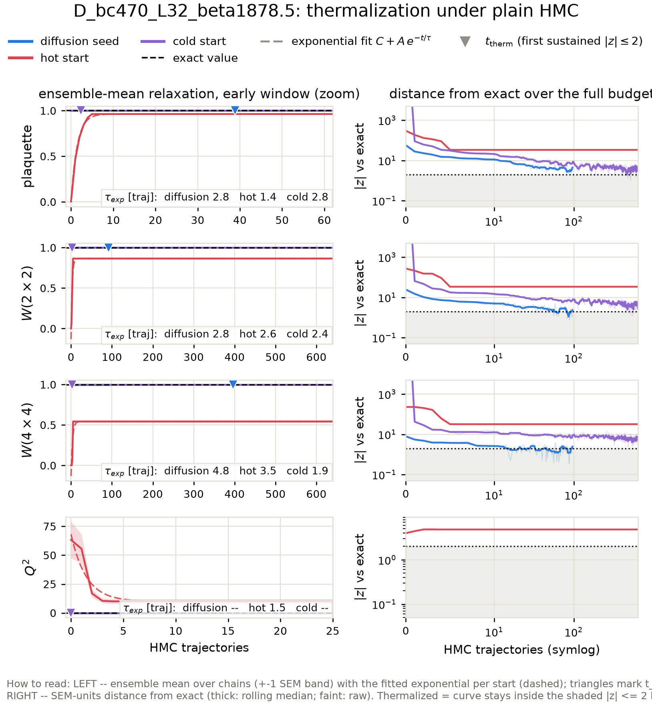

tau_int (hot-start chains, second half): plaquette = 0.50 +- 0.00, wilson_2x2 = 0.50 +- 0.00, wilson_4x4 = 0.50 +- 0.00, wilson_6x6 = 0.50 +- 0.00. Topology: hot-start HMC L=32 beta=1878.5 -> **frozen** (no tunneling).

Where 'never' stood at the end: the hot start ended the 640-trajectory budget still at plaquette at |z| ~ 33, Q^2 at |z| ~ 5; the cold start ended the 640-trajectory budget still at wilson_6x6 at |z| ~ 6.

### Diagnostics: raw diffusion output (before any HMC)

| observable | value | error | exact | z_exact | reference | ref_error | z_ref | ks_p | chi2_p |
|---|---|---|---|---|---|---|---|---|---|
| plaquette | 0.9997 | 1.068e-06 | 0.9997 | -66.78 | 0.9997 | 5.106e-07 | -66.98 | 3.632e-69 |  |
| wilson_1x1 | 0.9997 | 1.068e-06 | 0.9997 | -66.78 | 0.9997 | 5.106e-07 | -66.98 | 3.632e-69 |  |
| wilson_1x2 | 0.9994 | 3.277e-06 | 0.9995 | -35.27 | 0.9995 | 1.178e-06 | -38.45 | 1.105e-66 |  |
| wilson_2x2 | 0.9988 | 6.903e-06 | 0.9989 | -25.9 | 0.999 | 4.151e-06 | -28.03 | 2.855e-55 |  |
| wilson_2x3 | 0.9982 | 1.193e-05 | 0.9984 | -19.34 | 0.9985 | 7.349e-06 | -21.53 | 4.308e-39 |  |
| wilson_3x3 | 0.9974 | 2.366e-05 | 0.9976 | -10.64 | 0.9977 | 1.27e-05 | -13.85 | 2.171e-26 |  |
| wilson_3x4 | 0.9965 | 3.309e-05 | 0.9968 | -9.444 | 0.997 | 2.012e-05 | -13.14 | 5.47e-23 |  |
| wilson_4x4 | 0.9954 | 5.163e-05 | 0.9958 | -7.357 | 0.9962 | 2.851e-05 | -12.33 | 8.763e-23 |  |
| wilson_4x5 | 0.9944 | 6.908e-05 | 0.9948 | -6.052 | 0.9953 | 3.767e-05 | -11.35 | 4.453e-17 |  |
| wilson_5x5 | 0.9931 | 9.337e-05 | 0.9935 | -4.717 | 0.9942 | 5.556e-05 | -10.32 | 3.233e-14 |  |
| wilson_5x6 | 0.9918 | 0.0001154 | 0.9923 | -4.371 | 0.9931 | 7.258e-05 | -10 | 1.994e-13 |  |
| wilson_6x6 | 0.9903 | 0.0001405 | 0.9908 | -3.53 | 0.9919 | 9.876e-05 | -9.309 | 2.327e-12 |  |
| wilson_6x7 | 0.9888 | 0.0001629 | 0.9893 | -3.259 | 0.9907 | 0.000122 | -9.148 | 6.459e-12 |  |
| wilson_7x7 | 0.9871 | 0.0001875 | 0.9877 | -2.894 | 0.9893 | 0.0001598 | -8.828 | 1.758e-11 |  |
| wilson_7x8 | 0.9854 | 0.0002183 | 0.986 | -2.555 | 0.9878 | 0.0001925 | -8.18 | 4.696e-11 |  |
| wilson_8x8 | 0.9836 | 0.0002465 | 0.9842 | -2.247 | 0.9862 | 0.0002383 | -7.654 | 1.968e-09 |  |
| wilson_8x10 | 0.98 | 0.0003226 | 0.9806 | -1.586 | 0.9829 | 0.0003122 | -6.335 | 6.456e-07 |  |
| wilson_10x10 | 0.9757 | 0.0004416 | 0.9763 | -1.185 | 0.9787 | 0.0004517 | -4.711 | 4.358e-05 |  |
| wilson_10x12 | 0.9719 | 0.0005576 | 0.9722 | -0.4637 | 0.9746 | 0.0005518 | -3.362 | 0.004059 |  |
| wilson_12x12 | 0.9674 | 0.0007326 | 0.9676 | -0.2779 | 0.9698 | 0.0007359 | -2.291 | 0.008934 |  |
| creutz_2 | 0.000283 | 4.502e-06 | 0.0002639 | 4.232 |  |  |  |  |  |
| creutz_3 | 0.0002286 | 9.044e-06 | 0.0002597 | -3.447 |  |  |  |  |  |
| creutz_4 | 0.0002603 | 1.431e-05 | 0.0002535 | 0.4719 |  |  |  |  |  |
| creutz_5 | 0.0002294 | 2.115e-05 | 0.0002452 | -0.7449 |  |  |  |  |  |
| creutz_6 | 0.0001619 | 3.13e-05 | 0.0002348 | -2.328 |  |  |  |  |  |
| creutz_7 | 0.000199 | 4.303e-05 | 0.0002223 | -0.5414 |  |  |  |  |  |
| creutz_8 | 0.0001884 | 5.378e-05 | 0.0002077 | -0.3605 |  |  |  |  |  |
| Q | 0 | 0 | 0 | 0 | 0 | 0 | 0 | 1 |  |
| Q^2 | 0 | 0 | 1.288e-14 | inf | 0 | 0 | 0 | 1 |  |
| chi_top ((<Q^2>-<Q>^2)/V) | 0 | 0 | 1.258e-17 | inf | 0 | 0 | 0 |  |  |
| Q histogram vs exact P(Q) | 1.832e-13 | nan | 2 | nan |  |  |  |  | 1 |

### Diagnostics: the same configs after 96 HMC trajectories

| observable | value | error | exact | z_exact | reference | ref_error | z_ref | ks_p | chi2_p |
|---|---|---|---|---|---|---|---|---|---|
| plaquette | 0.9997 | 1.007e-06 | 0.9997 | -4.596 | 0.9997 | 5.106e-07 | -11.16 | 7.233e-16 |  |
| wilson_1x1 | 0.9997 | 1.007e-06 | 0.9997 | -4.596 | 0.9997 | 5.106e-07 | -11.16 | 7.233e-16 |  |
| wilson_1x2 | 0.9995 | 2.583e-06 | 0.9995 | -3.53 | 0.9995 | 1.178e-06 | -9.667 | 1.166e-12 |  |
| wilson_2x2 | 0.9989 | 6.25e-06 | 0.9989 | -2.36 | 0.999 | 4.151e-06 | -8.232 | 3.559e-09 |  |
| wilson_2x3 | 0.9984 | 9.994e-06 | 0.9984 | -2.594 | 0.9985 | 7.349e-06 | -7.803 | 1.508e-08 |  |
| wilson_3x3 | 0.9976 | 1.736e-05 | 0.9976 | -2.154 | 0.9977 | 1.27e-05 | -7.328 | 4.604e-08 |  |
| wilson_3x4 | 0.9968 | 2.463e-05 | 0.9968 | -2.39 | 0.997 | 2.012e-05 | -8.03 | 8.941e-11 |  |
| wilson_4x4 | 0.9957 | 4.014e-05 | 0.9958 | -2.721 | 0.9962 | 2.851e-05 | -9.27 | 4.606e-12 |  |
| wilson_4x5 | 0.9946 | 5.077e-05 | 0.9948 | -2.871 | 0.9953 | 3.767e-05 | -9.82 | 4.696e-11 |  |
| wilson_5x5 | 0.9933 | 7.071e-05 | 0.9935 | -2.925 | 0.9942 | 5.556e-05 | -9.869 | 8.941e-11 |  |
| wilson_5x6 | 0.992 | 8.369e-05 | 0.9923 | -3.008 | 0.9931 | 7.258e-05 | -10.03 | 2.445e-11 |  |
| wilson_6x6 | 0.9905 | 0.0001113 | 0.9908 | -2.68 | 0.9919 | 9.876e-05 | -9.415 | 8.225e-13 |  |
| wilson_6x7 | 0.989 | 0.0001317 | 0.9893 | -2.464 | 0.9907 | 0.000122 | -9.223 | 8.225e-13 |  |
| wilson_7x7 | 0.9873 | 0.0001664 | 0.9877 | -2.413 | 0.9893 | 0.0001598 | -8.816 | 6.459e-12 |  |
| wilson_7x8 | 0.9856 | 0.0001948 | 0.986 | -2.019 | 0.9878 | 0.0001925 | -8.093 | 1.688e-10 |  |
| wilson_8x8 | 0.9836 | 0.000247 | 0.9842 | -2.04 | 0.9862 | 0.0002383 | -7.5 | 1.079e-09 |  |
| wilson_8x10 | 0.98 | 0.0003394 | 0.9806 | -1.525 | 0.9829 | 0.0003122 | -6.18 | 1.359e-07 |  |
| wilson_10x10 | 0.9755 | 0.0004833 | 0.9763 | -1.49 | 0.9787 | 0.0004517 | -4.797 | 2.266e-05 |  |
| wilson_10x12 | 0.9715 | 0.0006137 | 0.9722 | -1.056 | 0.9746 | 0.0005518 | -3.668 | 0.0004908 |  |
| wilson_12x12 | 0.9668 | 0.0007981 | 0.9676 | -1.006 | 0.9698 | 0.0007359 | -2.744 | 0.002464 |  |
| creutz_2 | 0.0002651 | 3.893e-06 | 0.0002639 | 0.2957 |  |  |  |  |  |
| creutz_3 | 0.00026 | 7.299e-06 | 0.0002597 | 0.04215 |  |  |  |  |  |
| creutz_4 | 0.0002826 | 1.165e-05 | 0.0002535 | 2.493 |  |  |  |  |  |
| creutz_5 | 0.00027 | 2.071e-05 | 0.0002452 | 1.196 |  |  |  |  |  |
| creutz_6 | 0.0002366 | 2.92e-05 | 0.0002348 | 0.06157 |  |  |  |  |  |
| creutz_7 | 0.0002738 | 3.577e-05 | 0.0002223 | 1.44 |  |  |  |  |  |
| creutz_8 | 0.0003281 | 4.89e-05 | 0.0002077 | 2.462 |  |  |  |  |  |
| Q | 0 | 0 | 0 | 0 | 0 | 0 | 0 | 1 |  |
| Q^2 | 0 | 0 | 1.288e-14 | inf | 0 | 0 | 0 | 1 |  |
| chi_top ((<Q^2>-<Q>^2)/V) | 0 | 0 | 1.258e-17 | inf | 0 | 0 | 0 |  |  |
| Q histogram vs exact P(Q) | 1.832e-13 | nan | 2 | nan |  |  |  |  | 1 |
