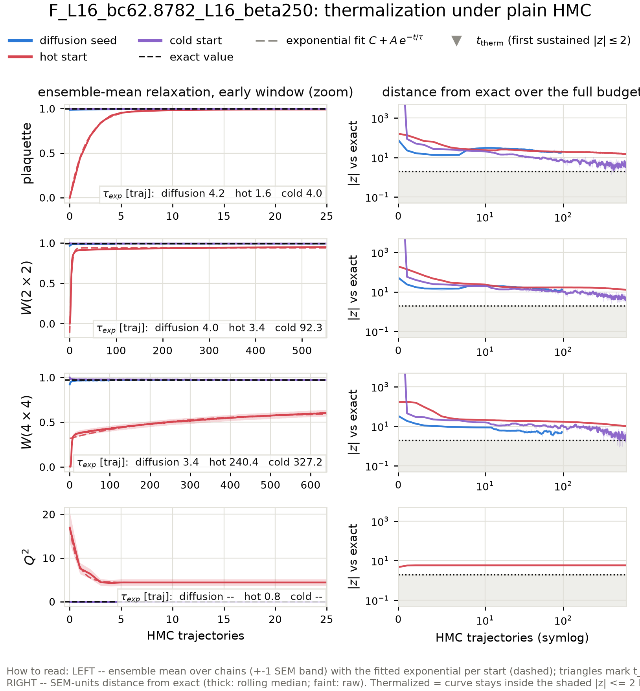
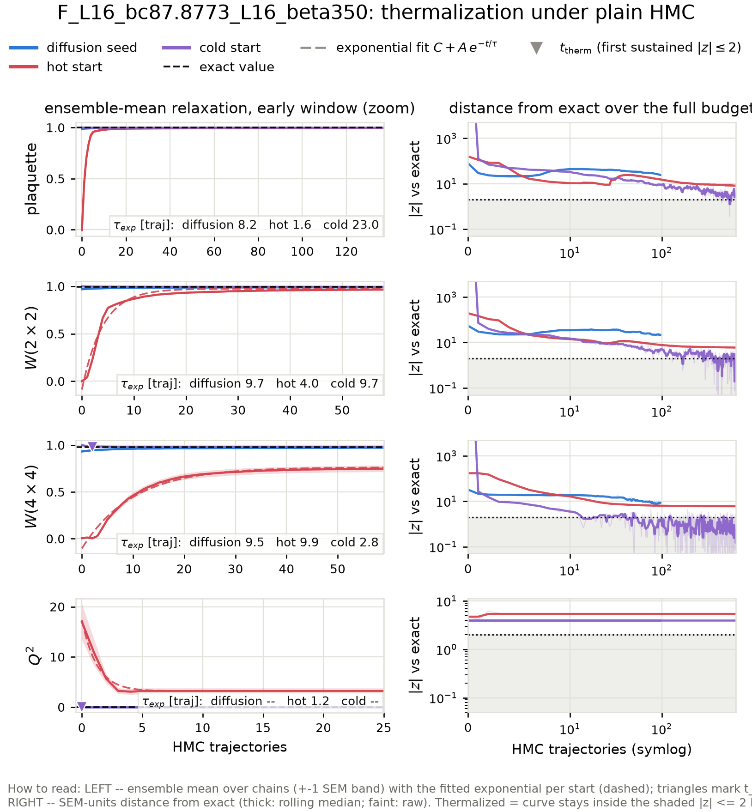
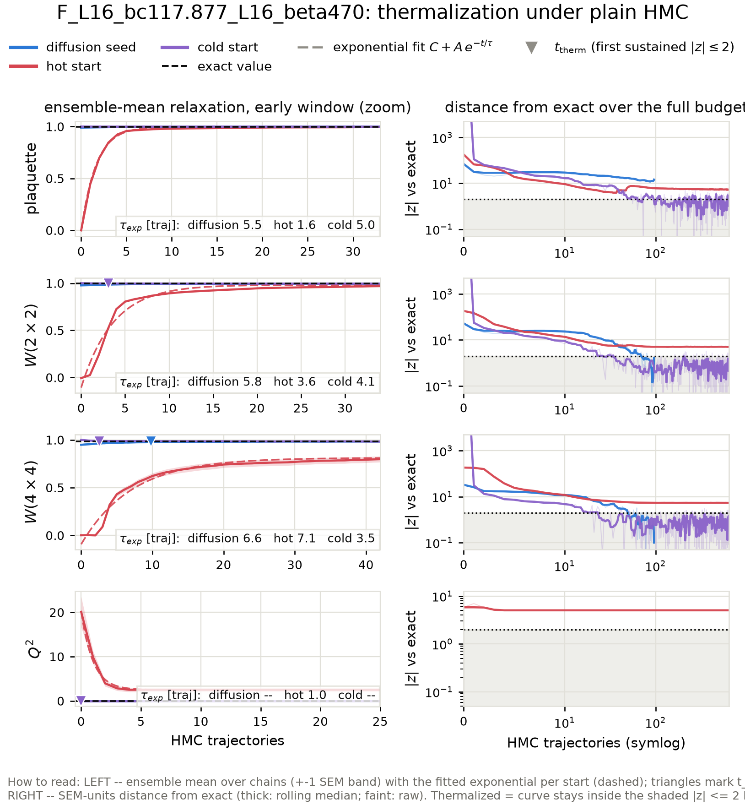
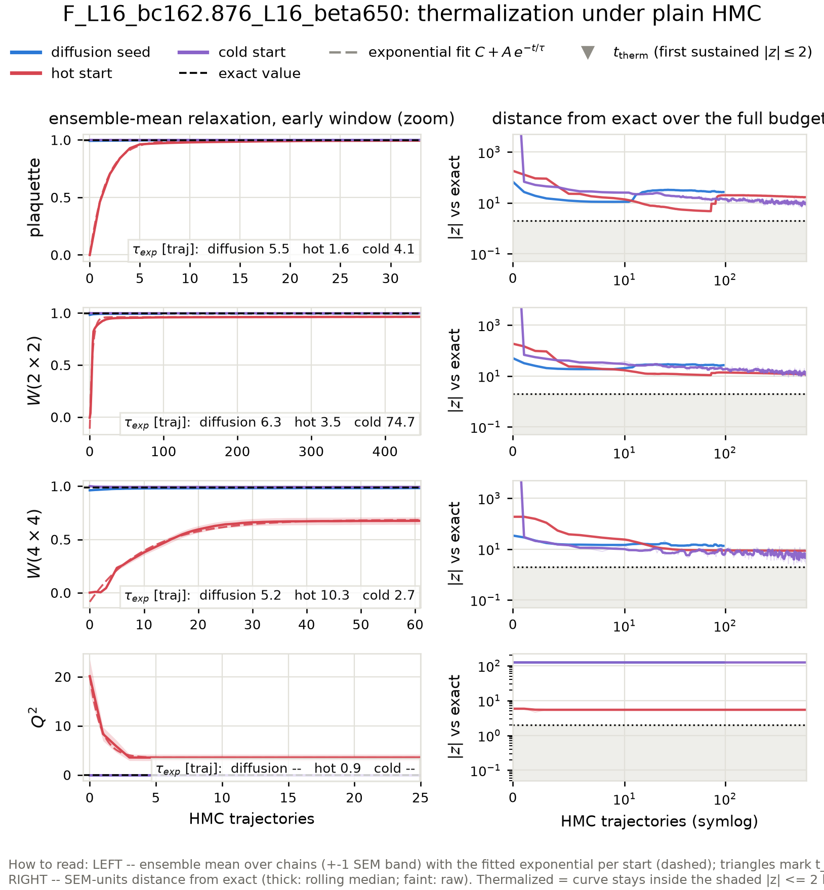
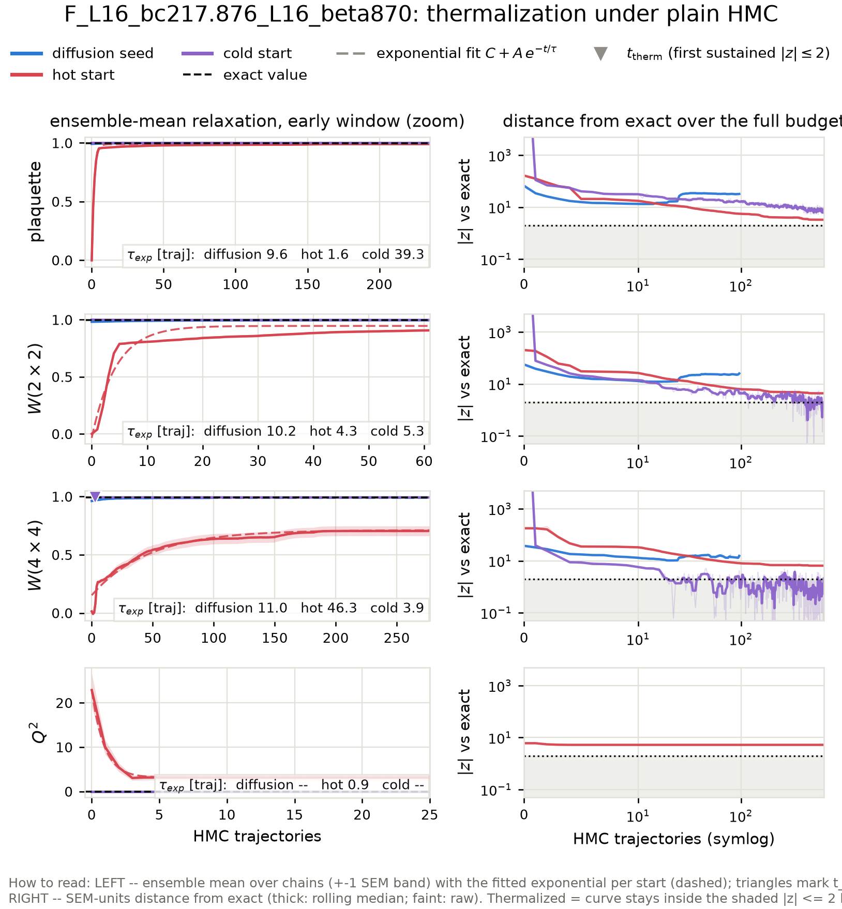
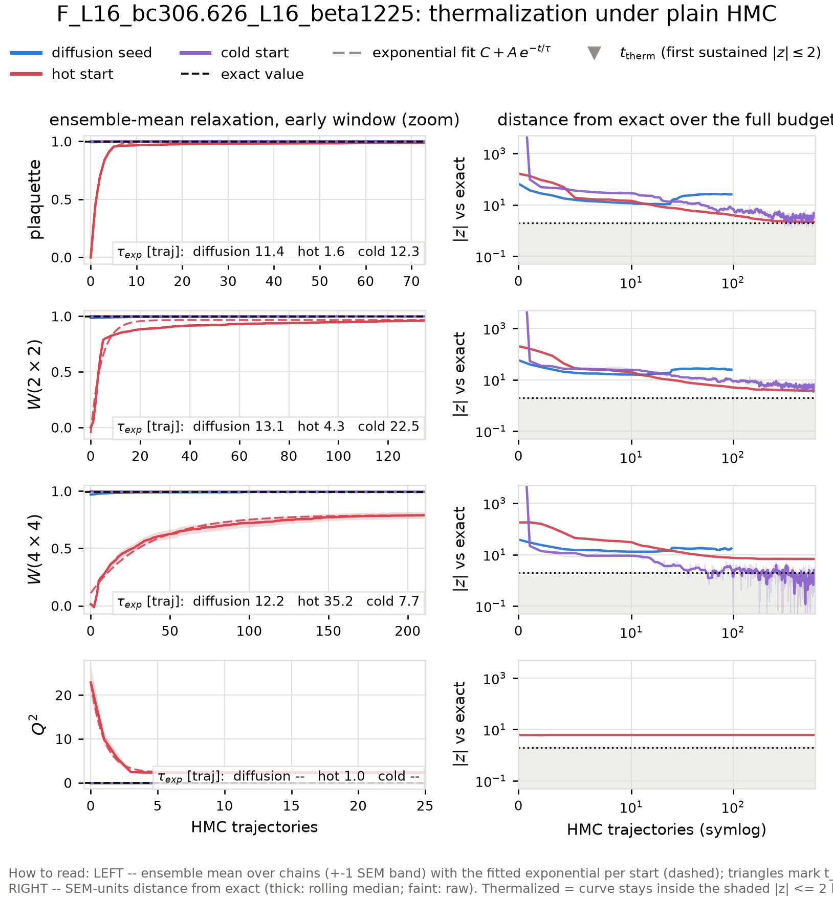
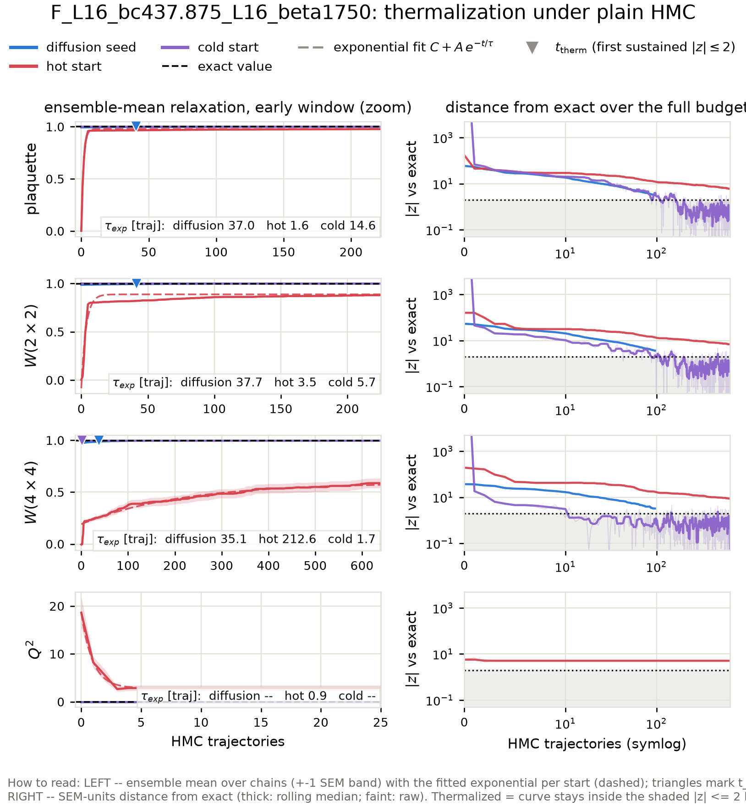
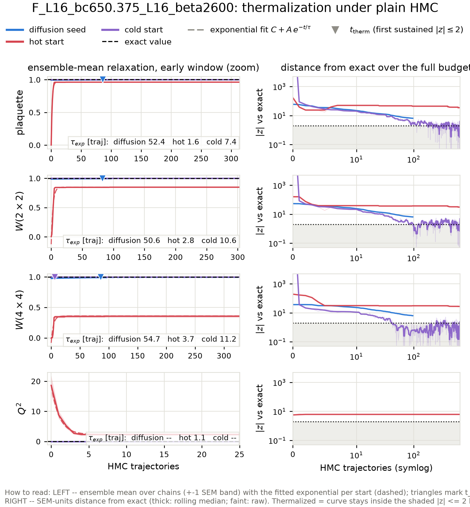

# Diffusion-seeded HMC across the matched beta scan: thermalization time vs the standard-HMC sampling interval

Action: wilson. All HMC in this report is plain HMC (Omelyan, adapted step size, **no** topological updates).

**Why this scan.** At the ladder's upper rungs the fresh-HMC baselines never thermalize at all (topological freezing plus a metastable local-defect state), so the only comparison available there is 'diffusion seed vs a baseline that never arrives'. This report extends the benchmark to every matched coupling pair of the generalization study -- one inverse-RG step L=16 -> L=32 per case -- including fine couplings low enough that hot- and cold-start HMC *does* thermalize within the budget. There the standard chain's own interval `2 tau_int` and its fresh-start burn-in are honest, measurable yardsticks, and the scan shows where the ordering

> t_therm(diffusion seed)  <  2 tau_int(standard HMC)  <  burn-in(fresh chain)

sets in as beta grows and standard HMC slides into critical slowing down and topological freezing.

## The three starting points

- **Diffusion seed** -- the raw conditional-diffusion output for this coupling: one inverse-RG step from a direct-HMC base ensemble at the matched coarse coupling (ancestral sampling + the deterministic coarse-charge transport), with **no** rethermalization sweeps applied: every bit of equilibration the seed needs is measured here, in HMC trajectories.
- **Hot start** -- every link angle drawn uniformly from (-pi, pi]: a completely disordered (infinite-temperature) configuration. The standard way to initialize a fresh HMC chain without prior information.
- **Cold start** -- every link angle set to zero: the perfectly ordered (beta -> infinity) configuration, the other standard initialization.

## Summary

| rung | L | beta | t_therm diffusion seed | standard-HMC interval 2 tau_int | margin (interval - t_therm) | burn-in hot / cold | tau_int(Q) |
|---|---|---|---|---|---|---|---|
| F_L16_bc62.8782_L16_beta250 | 16 | 250 | nan | 91.9 | -- | nan / nan | frozen (0 tunnelings in 321 x 64 traj) |
| F_L16_bc75.3776_L16_beta300 | 16 | 300 | 80 | 88.3 | 7.8 traj | 446 / 9 | frozen (0 tunnelings in 321 x 64 traj) |
| F_L16_bc87.8773_L16_beta350 | 16 | 350 | nan | 46.8 | -- | nan / nan | frozen (0 tunnelings in 321 x 64 traj) |
| F_L16_bc100.377_L16_beta400 | 16 | 400 | 78 | 20.3 | -57.6 traj | never / 4 | frozen (0 tunnelings in 321 x 64 traj) |
| F_L16_bc117.877_L16_beta470 | 16 | 470 | nan | 9.8 | -- | nan / nan | frozen (0 tunnelings in 321 x 64 traj) |
| F_L16_bc137.876_L16_beta550 | 16 | 550 | 13 | 15.1 | 1.9 traj | never / 4 | frozen (0 tunnelings in 321 x 64 traj) |
| F_L16_bc162.876_L16_beta650 | 16 | 650 | nan | 79.4 | -- | nan / nan | frozen (0 tunnelings in 321 x 64 traj) |
| F_L16_bc187.876_L16_beta750 | 16 | 750 | never | 20.7 | -- | never / 2 | frozen (0 tunnelings in 321 x 64 traj) |
| F_L16_bc217.876_L16_beta870 | 16 | 870 | nan | 47.4 | -- | nan / nan | frozen (0 tunnelings in 321 x 64 traj) |
| F_L16_bc250.376_L16_beta1000 | 16 | 1000 | 17 | 17.8 | 1.1 traj | never / 3 | frozen (0 tunnelings in 321 x 64 traj) |
| F_L16_bc306.626_L16_beta1225 | 16 | 1225 | nan | 65.4 | -- | nan / nan | frozen (0 tunnelings in 321 x 64 traj) |
| F_L16_bc375.375_L16_beta1500 | 16 | 1500 | 27 | 17.3 | -9.3 traj | never / 3 | frozen (0 tunnelings in 321 x 64 traj) |
| F_L16_bc437.875_L16_beta1750 | 16 | 1750 | 41 | 25.1 | -16.3 traj | nan / nan | frozen (0 tunnelings in 321 x 64 traj) |
| F_L16_bc500.375_L16_beta2000 | 16 | 2000 | 43 | 13.4 | -29.2 traj | 3496 / 4 | frozen (0 tunnelings in 321 x 64 traj) |
| F_L16_bc650.375_L16_beta2600 | 16 | 2600 | 86 | 3.0 | -82.8 traj | never / nan | frozen (0 tunnelings in 321 x 64 traj) |

## Wall-clock accounting

All timescales above are in HMC trajectories -- the honest *ergodicity* unit. This table converts to seconds on this machine so the economics are explicit. Batched chains produce n_chains configs per trajectory, so per-config costs divide by the chain count; the diffusion sampling cost amortizes over the whole generated batch.

| case | seed: sample s/config | seed: t_therm s (batch) | HMC interval s/config | hot burn-in s (batch) | s/traj (batch) |
|---|---|---|---|---|---|
| F_L16_bc62.8782_L16_beta250 | 2.3 | never | 0.13 | never | 0.09 |
| F_L16_bc75.3776_L16_beta300 | 0.2 | 19.0 | 0.32 | 103 | 0.23 |
| F_L16_bc87.8773_L16_beta350 | 2.3 | never | 0.08 | never | 0.10 |
| F_L16_bc100.377_L16_beta400 | 0.2 | 20.5 | 0.08 | never | 0.26 |
| F_L16_bc117.877_L16_beta470 | 2.2 | never | 0.02 | never | 0.12 |
| F_L16_bc137.876_L16_beta550 | 0.2 | 3.9 | 0.07 | never | 0.29 |
| F_L16_bc162.876_L16_beta650 | 2.2 | never | 0.17 | never | 0.14 |
| F_L16_bc187.876_L16_beta750 | 0.3 | never | 0.12 | never | 0.37 |
| F_L16_bc217.876_L16_beta870 | 2.2 | never | 0.12 | never | 0.16 |
| F_L16_bc250.376_L16_beta1000 | 0.2 | 5.9 | 0.10 | never | 0.37 |
| F_L16_bc306.626_L16_beta1225 | 2.2 | never | 0.19 | never | 0.19 |
| F_L16_bc375.375_L16_beta1500 | 0.2 | 11.6 | 0.12 | never | 0.45 |
| F_L16_bc437.875_L16_beta1750 | 2.1 | 9.8 | 0.09 | never | 0.22 |
| F_L16_bc500.375_L16_beta2000 | 0.2 | 21.6 | 0.11 | 1802 | 0.52 |
| F_L16_bc650.375_L16_beta2600 | 2.2 | 22.8 | 0.01 | never | 0.24 |

## Fitted relaxation times across starts

Exponential fits C + A exp(-t/tau) to the ensemble-mean plaquette and W(2x2) relaxation curves, per starting point (the cross-start comparison of characteristic times; a start already at its plateau fits no decay, which is the desired outcome for the diffusion seed).

| case | obs | tau: diffusion seed | tau: hot start | tau: cold start |
|---|---|---|---|---|
| F_L16_bc62.8782_L16_beta250 | plaquette | 4.2 +- 0.1 | 1.6 +- 0.0 | 4.0 +- 0.2 |
| F_L16_bc62.8782_L16_beta250 | wilson_2x2 | 4.0 +- 0.1 | 3.4 +- 0.1 | 92.3 +- 6.8 |
| F_L16_bc75.3776_L16_beta300 | plaquette | 6.6 +- 0.3 | 1.7 +- 0.0 | 43.0 +- 1.6 |
| F_L16_bc75.3776_L16_beta300 | wilson_2x2 | 10.4 +- 0.5 | 4.0 +- 0.1 | 27.9 +- 1.1 |
| F_L16_bc87.8773_L16_beta350 | plaquette | 8.2 +- 0.5 | 1.6 +- 0.0 | 23.0 +- 0.9 |
| F_L16_bc87.8773_L16_beta350 | wilson_2x2 | 9.7 +- 0.5 | 4.0 +- 0.1 | 9.7 +- 0.4 |
| F_L16_bc100.377_L16_beta400 | plaquette | 6.2 +- 0.2 | 1.6 +- 0.0 | 10.4 +- 0.5 |
| F_L16_bc100.377_L16_beta400 | wilson_2x2 | 6.7 +- 0.2 | 3.4 +- 0.0 | 8.1 +- 0.4 |
| F_L16_bc117.877_L16_beta470 | plaquette | 5.5 +- 0.1 | 1.6 +- 0.0 | 5.0 +- 0.1 |
| F_L16_bc117.877_L16_beta470 | wilson_2x2 | 5.8 +- 0.1 | 3.6 +- 0.1 | 4.1 +- 0.1 |
| F_L16_bc137.876_L16_beta550 | plaquette | 7.6 +- 0.1 | 1.6 +- 0.0 | 5.5 +- 0.2 |
| F_L16_bc137.876_L16_beta550 | wilson_2x2 | 7.9 +- 0.1 | 4.5 +- 0.1 | 5.6 +- 0.2 |
| F_L16_bc162.876_L16_beta650 | plaquette | 5.5 +- 0.1 | 1.6 +- 0.0 | 4.1 +- 0.2 |
| F_L16_bc162.876_L16_beta650 | wilson_2x2 | 6.3 +- 0.2 | 3.5 +- 0.1 | 74.7 +- 4.0 |
| F_L16_bc187.876_L16_beta750 | plaquette | 9.0 +- 0.1 | 1.6 +- 0.0 | 2.2 +- 0.1 |
| F_L16_bc187.876_L16_beta750 | wilson_2x2 | 9.1 +- 0.1 | 3.8 +- 0.1 | 1.4 +- 0.1 |
| F_L16_bc217.876_L16_beta870 | plaquette | 9.6 +- 0.2 | 1.6 +- 0.0 | 39.3 +- 2.1 |
| F_L16_bc217.876_L16_beta870 | wilson_2x2 | 10.2 +- 0.2 | 4.3 +- 0.1 | 5.3 +- 0.2 |
| F_L16_bc250.376_L16_beta1000 | plaquette | 14.1 +- 0.2 | 1.7 +- 0.0 | 2.3 +- 0.1 |
| F_L16_bc250.376_L16_beta1000 | wilson_2x2 | 14.0 +- 0.2 | 3.4 +- 0.1 | 2.9 +- 0.1 |
| F_L16_bc306.626_L16_beta1225 | plaquette | 11.4 +- 0.1 | 1.6 +- 0.0 | 12.3 +- 0.5 |
| F_L16_bc306.626_L16_beta1225 | wilson_2x2 | 13.1 +- 0.2 | 4.3 +- 0.1 | 22.5 +- 1.0 |
| F_L16_bc375.375_L16_beta1500 | plaquette | 11.2 +- 0.2 | 1.6 +- 0.0 | 4.7 +- 0.2 |
| F_L16_bc375.375_L16_beta1500 | wilson_2x2 | 10.1 +- 0.1 | 3.6 +- 0.1 | 2.0 +- 0.1 |
| F_L16_bc437.875_L16_beta1750 | plaquette | 37.0 +- 0.7 | 1.6 +- 0.0 | 14.6 +- 0.6 |
| F_L16_bc437.875_L16_beta1750 | wilson_2x2 | 37.7 +- 0.7 | 3.5 +- 0.1 | 5.7 +- 0.3 |
| F_L16_bc500.375_L16_beta2000 | plaquette | 30.6 +- 0.3 | 1.5 +- 0.0 | 4.5 +- 0.2 |
| F_L16_bc500.375_L16_beta2000 | wilson_2x2 | 29.7 +- 0.4 | 2.8 +- 0.1 | 4.9 +- 0.2 |
| F_L16_bc650.375_L16_beta2600 | plaquette | 52.4 +- 1.8 | 1.6 +- 0.0 | 7.4 +- 0.3 |
| F_L16_bc650.375_L16_beta2600 | wilson_2x2 | 50.6 +- 1.6 | 2.8 +- 0.1 | 10.6 +- 0.3 |

t_therm and burn-in are the slowest Wilson-loop observable (plaquette, W(2x2), W(4x4)); topology is stricter still for the fresh chains: their Q^2 **never** reaches the exact value at the frozen rungs, while the diffusion seed inherits the correct topological sector from the coarse ensemble it was generated from (see the Q^2 panels and per-rung tables below).

Thermalization time `t_therm` = first trajectory at which the ensemble-mean z-score vs the exact value satisfies |z| <= 2 and stays there for 5 consecutive trajectories (t = 0: already thermalized before any HMC). For the diffusion seed, t_therm is computed on a random subsample of chains matched to the baseline chain count so all starts are compared at equal statistical power. `tau_int` is Madras-Sokal, measured on the second half of the hot-start chains, averaged over chains. In the per-rung relaxation figures, triangles mark each start's t_therm, dashed curves are the exponential fits C + A exp(-t/tau) to the ensemble means (tau quoted per panel), and the right-hand panels track the ensemble mean's distance from the exact value in SEM units -- thermalized means inside the shaded |z| <= 2 band; the dotted vertical line there is the standard-HMC interval `2 tau_int`.

## What 'never' means, and where the ground truth comes from

'never' = the ensemble mean was still outside |z| <= 2 of the exact value after the full baseline budget; the per-rung sections quote the z-score it plateaued at. For hot starts at the large-beta rungs this is not a budget problem but a physical one: a random start freezes into a random topological sector (<Q^2> of order tens), plain HMC can never change Q at these couplings (tunneling is suppressed ~exp(-2 beta)), and the wrong sector biases every Wilson loop by an amount that never decays. Cold starts sit in the single sector Q = 0, so their Wilson loops do eventually converge, but <Q^2> stays pinned at 0 forever.

None of the exact values in this report come from fine-lattice HMC: the ground truth is the character expansion of 2D compact U(1) (`diffusion/lgt/exact.py`), which gives every Wilson loop, P(Q) and chi_top in closed form at finite volume. Each diffusion seed here is one inverse-RG step from a direct-HMC base ensemble at the matched coarse coupling beta_c (L=16), where HMC mixes well -- which is precisely why it can start chains in regions standard HMC cannot reach.

## F_L16_bc62.8782_L16_beta250

HMC: step size 0.0253, 40 leapfrog steps, acceptance seed/hot/cold = 0.972/0.985/0.988. Diffusion-seed batch: 64 chains x 96 trajectories (0.08 s/traj for the whole batch); baselines: 64 chains x 640 trajectories.

tau_int (hot-start chains, second half): plaquette = 32.67 +- 1.60, wilson_2x2 = 45.95 +- 1.20, wilson_4x4 = 43.74 +- 1.99, wilson_6x6 = 36.12 +- 2.41. Topology: hot-start HMC L=16 beta=250 -> **frozen** (no tunneling).

Where 'never' stood at the end: the hot start ended the 640-trajectory budget still at wilson_6x6 at |z| ~ 15, Q^2 at |z| ~ 6; the cold start ended the 640-trajectory budget still at Q^2 at |z| ~ 8840.

### Diagnostics: raw diffusion output (before any HMC)

| observable | value | error | exact | z_exact | reference | ref_error | z_ref | ks_p | chi2_p |
|---|---|---|---|---|---|---|---|---|---|
| plaquette | 0.9864 | 0.0001525 | 0.998 | -75.84 | 0.998 | 1.77e-05 | -75.41 | 2.804e-35 |  |
| wilson_1x1 | 0.9864 | 0.0001525 | 0.998 | -75.84 | 0.998 | 1.77e-05 | -75.41 | 2.804e-35 |  |
| wilson_1x2 | 0.9773 | 0.0002867 | 0.996 | -65.48 | 0.9961 | 4.155e-05 | -65.2 | 2.804e-35 |  |
| wilson_2x2 | 0.9659 | 0.0005858 | 0.9921 | -44.77 | 0.9925 | 9.226e-05 | -44.82 | 2.804e-35 |  |
| wilson_2x3 | 0.9561 | 0.0008759 | 0.9883 | -36.85 | 0.9889 | 0.000176 | -36.81 | 2.804e-35 |  |
| wilson_3x3 | 0.9442 | 0.0007991 | 0.9827 | -48.2 | 0.984 | 0.0002733 | -47.05 | 2.804e-35 |  |
| wilson_3x4 | 0.9335 | 0.001307 | 0.9773 | -33.55 | 0.9786 | 0.000416 | -32.85 | 2.804e-35 |  |
| wilson_4x4 | 0.9219 | 0.001592 | 0.9704 | -30.45 | 0.9717 | 0.000536 | -29.67 | 2.804e-35 |  |
| wilson_4x5 | 0.9083 | 0.002014 | 0.9637 | -27.5 | 0.9651 | 0.0006887 | -26.68 | 2.804e-35 |  |
| wilson_5x5 | 0.8978 | 0.002127 | 0.9558 | -27.28 | 0.9576 | 0.0008528 | -26.11 | 2.804e-35 |  |
| wilson_5x6 | 0.886 | 0.002294 | 0.9483 | -27.17 | 0.9501 | 0.001009 | -25.58 | 1.48e-34 |  |
| wilson_6x6 | 0.8742 | 0.002715 | 0.9399 | -24.18 | 0.9423 | 0.001218 | -22.86 | 8.768e-33 |  |
| wilson_6x7 | 0.8609 | 0.00349 | 0.9321 | -20.38 | 0.935 | 0.001342 | -19.81 | 4.353e-32 |  |
| wilson_7x7 | 0.8489 | 0.003986 | 0.9237 | -18.77 | 0.9279 | 0.001455 | -18.63 | 9.635e-32 |  |
| wilson_7x8 | 0.8393 | 0.005023 | 0.9161 | -15.28 | 0.9206 | 0.001529 | -15.48 | 1.034e-29 |  |
| wilson_8x8 | 0.8355 | 0.004319 | 0.9083 | -16.84 | 0.914 | 0.001681 | -16.93 | 1.011e-28 |  |
| creutz_2 | 0.002325 | 0.0003994 | 0.001934 | 0.9812 |  |  |  |  |  |
| creutz_3 | 0.002179 | 0.0007744 | 0.001808 | 0.479 |  |  |  |  |  |
| creutz_4 | 0.001068 | 0.001137 | 0.00162 | -0.4859 |  |  |  |  |  |
| creutz_5 | -0.003138 | 0.001629 | 0.00137 | -2.768 |  |  |  |  |  |
| creutz_6 | 0.0001052 | 0.001467 | 0.001057 | -0.6485 |  |  |  |  |  |
| creutz_7 | -0.001256 | 0.002395 | 0.000681 | -0.8088 |  |  |  |  |  |
| creutz_8 | -0.006803 | 0.003379 | 0.0002427 | -2.085 |  |  |  |  |  |
| Q | 0 | 0 | 0 | 0 | 0 | 0 | 0 | 1 |  |
| Q^2 | 0 | 0 | 8.84e-09 | inf | 0 | 0 | 0 | 1 |  |
| chi_top ((<Q^2>-<Q>^2)/V) | 0 | 0 | 3.453e-11 | inf | 0 | 0 | 0 |  |  |
| Q histogram vs exact P(Q) | 5.658e-07 | nan | 2 | nan |  |  |  |  | 1 |

### Diagnostics: the same configs after 96 HMC trajectories

| observable | value | error | exact | z_exact | reference | ref_error | z_ref | ks_p | chi2_p |
|---|---|---|---|---|---|---|---|---|---|
| plaquette | 0.9974 | 3.224e-05 | 0.998 | -17.52 | 0.998 | 1.77e-05 | -15.68 | 1.986e-27 |  |
| wilson_1x1 | 0.9974 | 3.224e-05 | 0.998 | -17.52 | 0.998 | 1.77e-05 | -15.68 | 1.986e-27 |  |
| wilson_1x2 | 0.9948 | 6.158e-05 | 0.996 | -20.41 | 0.9961 | 4.155e-05 | -18.46 | 6.222e-25 |  |
| wilson_2x2 | 0.9898 | 0.0001668 | 0.9921 | -14.16 | 0.9925 | 9.226e-05 | -14.24 | 7.563e-23 |  |
| wilson_2x3 | 0.9846 | 0.0002575 | 0.9883 | -14.38 | 0.9889 | 0.000176 | -13.82 | 3.195e-19 |  |
| wilson_3x3 | 0.9767 | 0.00041 | 0.9827 | -14.65 | 0.984 | 0.0002733 | -14.67 | 5.543e-22 |  |
| wilson_3x4 | 0.9717 | 0.00056 | 0.9773 | -10.03 | 0.9786 | 0.000416 | -9.785 | 9.937e-15 |  |
| wilson_4x4 | 0.9661 | 0.0007571 | 0.9704 | -5.649 | 0.9717 | 0.000536 | -6.079 | 1.831e-05 |  |
| wilson_4x5 | 0.9597 | 0.00106 | 0.9637 | -3.796 | 0.9651 | 0.0006887 | -4.291 | 0.002168 |  |
| wilson_5x5 | 0.953 | 0.001456 | 0.9558 | -1.936 | 0.9576 | 0.0008528 | -2.749 | 0.119 |  |
| wilson_5x6 | 0.9453 | 0.001782 | 0.9483 | -1.668 | 0.9501 | 0.001009 | -2.318 | 0.2464 |  |
| wilson_6x6 | 0.9362 | 0.002135 | 0.9399 | -1.714 | 0.9423 | 0.001218 | -2.457 | 0.119 |  |
| wilson_6x7 | 0.9237 | 0.002639 | 0.9321 | -3.153 | 0.935 | 0.001342 | -3.801 | 0.01074 |  |
| wilson_7x7 | 0.9126 | 0.003111 | 0.9237 | -3.544 | 0.9279 | 0.001455 | -4.445 | 0.004418 |  |
| wilson_7x8 | 0.9019 | 0.003723 | 0.9161 | -3.795 | 0.9206 | 0.001529 | -4.643 | 0.002761 |  |
| wilson_8x8 | 0.8919 | 0.003966 | 0.9083 | -4.139 | 0.914 | 0.001681 | -5.134 | 0.002168 |  |
| creutz_2 | 0.002358 | 0.0001182 | 0.001934 | 3.593 |  |  |  |  |  |
| creutz_3 | 0.002818 | 0.0002314 | 0.001808 | 4.364 |  |  |  |  |  |
| creutz_4 | 0.0006462 | 0.0005249 | 0.00162 | -1.856 |  |  |  |  |  |
| creutz_5 | 0.0003684 | 0.0006024 | 0.00137 | -1.663 |  |  |  |  |  |
| creutz_6 | 0.001631 | 0.0005685 | 0.001057 | 1.01 |  |  |  |  |  |
| creutz_7 | -0.001338 | 0.0009731 | 0.000681 | -2.075 |  |  |  |  |  |
| creutz_8 | -0.0005879 | 0.001099 | 0.0002427 | -0.7558 |  |  |  |  |  |
| Q | 0 | 0 | 0 | 0 | 0 | 0 | 0 | 1 |  |
| Q^2 | 0 | 0 | 8.84e-09 | inf | 0 | 0 | 0 | 1 |  |
| chi_top ((<Q^2>-<Q>^2)/V) | 0 | 0 | 3.453e-11 | inf | 0 | 0 | 0 |  |  |
| Q histogram vs exact P(Q) | 5.658e-07 | nan | 2 | nan |  |  |  |  | 1 |

## F_L16_bc75.3776_L16_beta300

HMC: step size 0.0231, 43 leapfrog steps, acceptance seed/hot/cold = 0.967/0.984/0.988. Diffusion-seed batch: 64 chains x 96 trajectories (0.24 s/traj for the whole batch); baselines: 64 chains x 640 trajectories.

tau_int (hot-start chains, second half): plaquette = 41.70 +- 1.56, wilson_2x2 = 42.92 +- 1.79, wilson_4x4 = 44.14 +- 1.98, wilson_6x6 = 39.73 +- 2.08. Topology: hot-start HMC L=16 beta=300 -> **frozen** (no tunneling).

Where 'never' stood at the end: the hot start ended the 640-trajectory budget still at Q^2 at |z| ~ 6; the cold start ended the 640-trajectory budget still at wilson_6x6 at |z| ~ 2, Q^2 at |z| ~ 187.

### Diagnostics: raw diffusion output (before any HMC)

| observable | value | error | exact | z_exact | reference | ref_error | z_ref | ks_p | chi2_p |
|---|---|---|---|---|---|---|---|---|---|
| plaquette | 0.9871 | 0.0001287 | 0.9983 | -87.68 | 0.9983 | 1.174e-05 | -87.25 | 2.804e-35 |  |
| wilson_1x1 | 0.9871 | 0.0001287 | 0.9983 | -87.68 | 0.9983 | 1.174e-05 | -87.25 | 2.804e-35 |  |
| wilson_1x2 | 0.9784 | 0.0002375 | 0.9967 | -77.21 | 0.9966 | 2.808e-05 | -76.39 | 2.804e-35 |  |
| wilson_2x2 | 0.9684 | 0.0004174 | 0.9934 | -59.96 | 0.9931 | 8.549e-05 | -58.02 | 2.804e-35 |  |
| wilson_2x3 | 0.9592 | 0.0007404 | 0.9903 | -41.91 | 0.9898 | 0.0001576 | -40.41 | 2.804e-35 |  |
| wilson_3x3 | 0.9486 | 0.001021 | 0.9856 | -36.24 | 0.9849 | 0.0002727 | -34.39 | 2.804e-35 |  |
| wilson_3x4 | 0.9382 | 0.001253 | 0.9811 | -34.23 | 0.9802 | 0.0003956 | -31.96 | 2.804e-35 |  |
| wilson_4x4 | 0.9267 | 0.00154 | 0.9753 | -31.54 | 0.974 | 0.0006338 | -28.42 | 1.48e-34 |  |
| wilson_4x5 | 0.9152 | 0.00186 | 0.9697 | -29.29 | 0.9677 | 0.0008701 | -25.57 | 7.673e-34 |  |
| wilson_5x5 | 0.9044 | 0.002023 | 0.963 | -28.98 | 0.9599 | 0.00123 | -23.43 | 7.673e-34 |  |
| wilson_5x6 | 0.8935 | 0.002701 | 0.9567 | -23.43 | 0.9523 | 0.001466 | -19.13 | 2.142e-28 |  |
| wilson_6x6 | 0.8833 | 0.003266 | 0.9497 | -20.34 | 0.9437 | 0.00204 | -15.71 | 6.222e-25 |  |
| wilson_6x7 | 0.869 | 0.003949 | 0.9431 | -18.76 | 0.9359 | 0.002275 | -14.69 | 3.08e-25 |  |
| wilson_7x7 | 0.8563 | 0.004709 | 0.936 | -16.93 | 0.9279 | 0.002938 | -12.91 | 6.222e-25 |  |
| wilson_7x8 | 0.847 | 0.005224 | 0.9296 | -15.81 | 0.9202 | 0.003019 | -12.14 | 7.563e-23 |  |
| wilson_8x8 | 0.842 | 0.005717 | 0.923 | -14.17 | 0.9125 | 0.00367 | -10.38 | 2.111e-17 |  |
| creutz_2 | 0.001353 | 0.0003708 | 0.001611 | -0.6945 |  |  |  |  |  |
| creutz_3 | 0.001599 | 0.0008194 | 0.001506 | 0.1131 |  |  |  |  |  |
| creutz_4 | 0.001259 | 0.0008725 | 0.00135 | -0.1041 |  |  |  |  |  |
| creutz_5 | -0.0006526 | 0.001443 | 0.001141 | -1.243 |  |  |  |  |  |
| creutz_6 | -0.0007015 | 0.001489 | 0.0008804 | -1.063 |  |  |  |  |  |
| creutz_7 | -0.001547 | 0.002014 | 0.0005674 | -1.05 |  |  |  |  |  |
| creutz_8 | -0.004968 | 0.002695 | 0.0002022 | -1.918 |  |  |  |  |  |
| Q | 0 | 0 | 0 | 0 | 0 | 0 | 0 | 1 |  |
| Q^2 | 0 | 0 | 1.872e-10 | inf | 0 | 0 | 0 | 1 |  |
| chi_top ((<Q^2>-<Q>^2)/V) | 0 | 0 | 7.311e-13 | inf | 0 | 0 | 0 |  |  |
| Q histogram vs exact P(Q) | 1.198e-08 | nan | 2 | nan |  |  |  |  | 1 |

### Diagnostics: the same configs after 96 HMC trajectories

| observable | value | error | exact | z_exact | reference | ref_error | z_ref | ks_p | chi2_p |
|---|---|---|---|---|---|---|---|---|---|
| plaquette | 0.9969 | 5.703e-05 | 0.9983 | -25.19 | 0.9983 | 1.174e-05 | -24.54 | 2.804e-35 |  |
| wilson_1x1 | 0.9969 | 5.703e-05 | 0.9983 | -25.19 | 0.9983 | 1.174e-05 | -24.54 | 2.804e-35 |  |
| wilson_1x2 | 0.9941 | 0.0001534 | 0.9967 | -16.81 | 0.9966 | 2.808e-05 | -16.09 | 1.736e-33 |  |
| wilson_2x2 | 0.9905 | 0.0001512 | 0.9934 | -19.37 | 0.9931 | 8.549e-05 | -15.08 | 7.426e-21 |  |
| wilson_2x3 | 0.9878 | 0.0001989 | 0.9903 | -12.26 | 0.9898 | 0.0001576 | -7.877 | 1.253e-06 |  |
| wilson_3x3 | 0.9826 | 0.0003213 | 0.9856 | -9.331 | 0.9849 | 0.0002727 | -5.554 | 0.0007896 |  |
| wilson_3x4 | 0.9766 | 0.0005179 | 0.9811 | -8.651 | 0.9802 | 0.0003956 | -5.5 | 0.0004642 |  |
| wilson_4x4 | 0.9701 | 0.0007251 | 0.9753 | -7.17 | 0.974 | 0.0006338 | -4.109 | 0.00132 |  |
| wilson_4x5 | 0.9644 | 0.0009361 | 0.9697 | -5.661 | 0.9677 | 0.0008701 | -2.604 | 0.05149 |  |
| wilson_5x5 | 0.9571 | 0.001219 | 0.963 | -4.86 | 0.9599 | 0.00123 | -1.61 | 0.2811 |  |
| wilson_5x6 | 0.9497 | 0.001608 | 0.9567 | -4.41 | 0.9523 | 0.001466 | -1.192 | 0.215 |  |
| wilson_6x6 | 0.9412 | 0.001989 | 0.9497 | -4.273 | 0.9437 | 0.00204 | -0.8998 | 0.4056 |  |
| wilson_6x7 | 0.9347 | 0.002222 | 0.9431 | -3.764 | 0.9359 | 0.002275 | -0.3801 | 0.6123 |  |
| wilson_7x7 | 0.9278 | 0.002859 | 0.936 | -2.866 | 0.9279 | 0.002938 | -0.02499 | 0.8269 |  |
| wilson_7x8 | 0.921 | 0.003165 | 0.9296 | -2.699 | 0.9202 | 0.003019 | 0.1786 | 0.2464 |  |
| wilson_8x8 | 0.9122 | 0.003556 | 0.923 | -3.023 | 0.9125 | 0.00367 | -0.048 | 0.4535 |  |
| creutz_2 | 0.0008216 | 0.0001639 | 0.001611 | -4.816 |  |  |  |  |  |
| creutz_3 | 0.002575 | 0.0002338 | 0.001506 | 4.57 |  |  |  |  |  |
| creutz_4 | 0.0005874 | 0.0003372 | 0.00135 | -2.261 |  |  |  |  |  |
| creutz_5 | 0.001698 | 0.00045 | 0.001141 | 1.238 |  |  |  |  |  |
| creutz_6 | 0.001166 | 0.0007535 | 0.0008804 | 0.3788 |  |  |  |  |  |
| creutz_7 | 0.0005327 | 0.0008417 | 0.0005674 | -0.04122 |  |  |  |  |  |
| creutz_8 | 0.002245 | 0.00124 | 0.0002022 | 1.647 |  |  |  |  |  |
| Q | 0 | 0 | 0 | 0 | 0 | 0 | 0 | 1 |  |
| Q^2 | 0 | 0 | 1.872e-10 | inf | 0 | 0 | 0 | 1 |  |
| chi_top ((<Q^2>-<Q>^2)/V) | 0 | 0 | 7.311e-13 | inf | 0 | 0 | 0 |  |  |
| Q histogram vs exact P(Q) | 1.198e-08 | nan | 2 | nan |  |  |  |  | 1 |

## F_L16_bc87.8773_L16_beta350

HMC: step size 0.0214, 47 leapfrog steps, acceptance seed/hot/cold = 0.968/0.983/0.988. Diffusion-seed batch: 64 chains x 96 trajectories (0.10 s/traj for the whole batch); baselines: 64 chains x 640 trajectories.

tau_int (hot-start chains, second half): plaquette = 23.42 +- 1.61, wilson_2x2 = 10.57 +- 1.08, wilson_4x4 = 1.54 +- 0.11, wilson_6x6 = 0.91 +- 0.03. Topology: hot-start HMC L=16 beta=350 -> **frozen** (no tunneling).

Where 'never' stood at the end: the hot start ended the 640-trajectory budget still at Q^2 at |z| ~ 5.

### Diagnostics: raw diffusion output (before any HMC)

| observable | value | error | exact | z_exact | reference | ref_error | z_ref | ks_p | chi2_p |
|---|---|---|---|---|---|---|---|---|---|
| plaquette | 0.9875 | 0.0001418 | 0.9986 | -78.28 | 0.9986 | 1.042e-05 | -78.53 | 2.804e-35 |  |
| wilson_1x1 | 0.9875 | 0.0001418 | 0.9986 | -78.28 | 0.9986 | 1.042e-05 | -78.53 | 2.804e-35 |  |
| wilson_1x2 | 0.9792 | 0.0002381 | 0.9972 | -75.32 | 0.9973 | 2.854e-05 | -75.4 | 2.804e-35 |  |
| wilson_2x2 | 0.9693 | 0.0004609 | 0.9944 | -54.39 | 0.9947 | 8.421e-05 | -54.19 | 2.804e-35 |  |
| wilson_2x3 | 0.9607 | 0.0006626 | 0.9917 | -46.65 | 0.9921 | 0.0001519 | -46.07 | 2.804e-35 |  |
| wilson_3x3 | 0.9506 | 0.0007164 | 0.9877 | -51.71 | 0.9883 | 0.0002625 | -49.45 | 2.804e-35 |  |
| wilson_3x4 | 0.9412 | 0.0009035 | 0.9838 | -47.11 | 0.9847 | 0.0004087 | -43.9 | 2.804e-35 |  |
| wilson_4x4 | 0.9319 | 0.001319 | 0.9788 | -35.54 | 0.9804 | 0.000539 | -34.04 | 2.804e-35 |  |
| wilson_4x5 | 0.9201 | 0.001928 | 0.974 | -27.96 | 0.976 | 0.0007186 | -27.18 | 2.804e-35 |  |
| wilson_5x5 | 0.911 | 0.001866 | 0.9682 | -30.7 | 0.9714 | 0.0009115 | -29.09 | 1.48e-34 |  |
| wilson_5x6 | 0.9014 | 0.00189 | 0.9628 | -32.48 | 0.9663 | 0.001132 | -29.43 | 1.958e-32 |  |
| wilson_6x6 | 0.8914 | 0.002127 | 0.9567 | -30.69 | 0.9606 | 0.001443 | -26.9 | 1.034e-29 |  |
| wilson_6x7 | 0.8794 | 0.002642 | 0.951 | -27.11 | 0.9556 | 0.001678 | -24.36 | 1.018e-30 |  |
| wilson_7x7 | 0.8679 | 0.00312 | 0.9449 | -24.69 | 0.9507 | 0.002142 | -21.89 | 4.797e-30 |  |
| wilson_7x8 | 0.8606 | 0.003829 | 0.9393 | -20.55 | 0.9466 | 0.002337 | -19.18 | 2.221e-29 |  |
| wilson_8x8 | 0.8576 | 0.003627 | 0.9336 | -20.96 | 0.9424 | 0.002781 | -18.54 | 2.142e-28 |  |
| creutz_2 | 0.001788 | 0.0003791 | 0.00138 | 1.074 |  |  |  |  |  |
| creutz_3 | 0.001717 | 0.0006714 | 0.001291 | 0.6349 |  |  |  |  |  |
| creutz_4 | 1.596e-05 | 0.0009192 | 0.001157 | -1.241 |  |  |  |  |  |
| creutz_5 | -0.002832 | 0.001437 | 0.000978 | -2.651 |  |  |  |  |  |
| creutz_6 | 0.0006345 | 0.00122 | 0.0007544 | -0.09824 |  |  |  |  |  |
| creutz_7 | -0.0003739 | 0.001952 | 0.0004862 | -0.4407 |  |  |  |  |  |
| creutz_8 | -0.004866 | 0.00292 | 0.0001732 | -1.726 |  |  |  |  |  |
| Q | 0 | 0 | 0 | 0 | 0 | 0 | 0 | 1 |  |
| Q^2 | 0 | 0 | 3.975e-12 | inf | 0 | 0 | 0 | 1 |  |
| chi_top ((<Q^2>-<Q>^2)/V) | 0 | 0 | 1.553e-14 | inf | 0 | 0 | 0 |  |  |
| Q histogram vs exact P(Q) | 2.538e-10 | nan | 2 | nan |  |  |  |  | 1 |

### Diagnostics: the same configs after 96 HMC trajectories

| observable | value | error | exact | z_exact | reference | ref_error | z_ref | ks_p | chi2_p |
|---|---|---|---|---|---|---|---|---|---|
| plaquette | 0.9971 | 6.252e-05 | 0.9986 | -23.63 | 0.9986 | 1.042e-05 | -24.35 | 2.804e-35 |  |
| wilson_1x1 | 0.9971 | 6.252e-05 | 0.9986 | -23.63 | 0.9986 | 1.042e-05 | -24.35 | 2.804e-35 |  |
| wilson_1x2 | 0.9948 | 0.0001046 | 0.9972 | -22.31 | 0.9973 | 2.854e-05 | -22.89 | 3.377e-34 |  |
| wilson_2x2 | 0.991 | 0.0001582 | 0.9944 | -21.44 | 0.9947 | 8.421e-05 | -20.73 | 8.768e-33 |  |
| wilson_2x3 | 0.9887 | 0.0002037 | 0.9917 | -14.73 | 0.9921 | 0.0001519 | -13.41 | 7.563e-23 |  |
| wilson_3x3 | 0.9858 | 0.0002608 | 0.9877 | -7.219 | 0.9883 | 0.0002625 | -6.952 | 8.786e-07 |  |
| wilson_3x4 | 0.9797 | 0.0004481 | 0.9838 | -9.046 | 0.9847 | 0.0004087 | -8.274 | 1.865e-10 |  |
| wilson_4x4 | 0.9727 | 0.0006214 | 0.9788 | -9.839 | 0.9804 | 0.000539 | -9.413 | 3.793e-13 |  |
| wilson_4x5 | 0.9665 | 0.0009123 | 0.974 | -8.236 | 0.976 | 0.0007186 | -8.209 | 2.996e-11 |  |
| wilson_5x5 | 0.9586 | 0.001155 | 0.9682 | -8.334 | 0.9714 | 0.0009115 | -8.668 | 7.541e-11 |  |
| wilson_5x6 | 0.9547 | 0.001379 | 0.9628 | -5.877 | 0.9663 | 0.001132 | -6.48 | 2.515e-06 |  |
| wilson_6x6 | 0.9504 | 0.00184 | 0.9567 | -3.442 | 0.9606 | 0.001443 | -4.361 | 0.001023 |  |
| wilson_6x7 | 0.9432 | 0.00224 | 0.951 | -3.488 | 0.9556 | 0.001678 | -4.442 | 0.0002682 |  |
| wilson_7x7 | 0.9349 | 0.002675 | 0.9449 | -3.719 | 0.9507 | 0.002142 | -4.606 | 0.0002025 |  |
| wilson_7x8 | 0.9256 | 0.003333 | 0.9393 | -4.108 | 0.9466 | 0.002337 | -5.162 | 3.539e-06 |  |
| wilson_8x8 | 0.9154 | 0.003651 | 0.9336 | -4.985 | 0.9424 | 0.002781 | -5.868 | 1.779e-06 |  |
| creutz_2 | 0.001593 | 0.0001231 | 0.00138 | 1.73 |  |  |  |  |  |
| creutz_3 | 0.0005557 | 0.0002262 | 0.001291 | -3.25 |  |  |  |  |  |
| creutz_4 | 0.001073 | 0.0002728 | 0.001157 | -0.3064 |  |  |  |  |  |
| creutz_5 | 0.001747 | 0.0003583 | 0.000978 | 2.148 |  |  |  |  |  |
| creutz_6 | 0.0004784 | 0.0006912 | 0.0007544 | -0.3993 |  |  |  |  |  |
| creutz_7 | 0.001219 | 0.0005825 | 0.0004862 | 1.258 |  |  |  |  |  |
| creutz_8 | 0.001071 | 0.001013 | 0.0001732 | 0.8867 |  |  |  |  |  |
| Q | 0 | 0 | 0 | 0 | 0 | 0 | 0 | 1 |  |
| Q^2 | 0 | 0 | 3.975e-12 | inf | 0 | 0 | 0 | 1 |  |
| chi_top ((<Q^2>-<Q>^2)/V) | 0 | 0 | 1.553e-14 | inf | 0 | 0 | 0 |  |  |
| Q histogram vs exact P(Q) | 2.538e-10 | nan | 2 | nan |  |  |  |  | 1 |

## F_L16_bc100.377_L16_beta400

HMC: step size 0.0200, 50 leapfrog steps, acceptance seed/hot/cold = 0.960/0.979/0.989. Diffusion-seed batch: 64 chains x 96 trajectories (0.26 s/traj for the whole batch); baselines: 64 chains x 640 trajectories.

tau_int (hot-start chains, second half): plaquette = 10.17 +- 1.03, wilson_2x2 = 4.92 +- 0.72, wilson_4x4 = 1.03 +- 0.05, wilson_6x6 = 0.62 +- 0.03. Topology: hot-start HMC L=16 beta=400 -> **frozen** (no tunneling).

Where 'never' stood at the end: the hot start ended the 640-trajectory budget still at wilson_4x4 at |z| ~ 7, Q^2 at |z| ~ 6.

### Diagnostics: raw diffusion output (before any HMC)

| observable | value | error | exact | z_exact | reference | ref_error | z_ref | ks_p | chi2_p |
|---|---|---|---|---|---|---|---|---|---|
| plaquette | 0.9888 | 0.0001275 | 0.9988 | -78.37 | 0.9987 | 8.634e-06 | -78.07 | 2.804e-35 |  |
| wilson_1x1 | 0.9888 | 0.0001275 | 0.9988 | -78.37 | 0.9987 | 8.634e-06 | -78.07 | 2.804e-35 |  |
| wilson_1x2 | 0.9813 | 0.0003044 | 0.9975 | -53.28 | 0.9975 | 1.908e-05 | -53.04 | 2.804e-35 |  |
| wilson_2x2 | 0.9736 | 0.0004091 | 0.9951 | -52.62 | 0.9949 | 4.527e-05 | -51.92 | 2.804e-35 |  |
| wilson_2x3 | 0.9657 | 0.0006458 | 0.9927 | -41.78 | 0.9925 | 9.126e-05 | -41.14 | 2.804e-35 |  |
| wilson_3x3 | 0.9564 | 0.0009359 | 0.9892 | -34.99 | 0.9889 | 0.0001873 | -33.96 | 2.804e-35 |  |
| wilson_3x4 | 0.9483 | 0.001248 | 0.9858 | -30.03 | 0.9853 | 0.0003112 | -28.74 | 2.804e-35 |  |
| wilson_4x4 | 0.9392 | 0.001486 | 0.9814 | -28.37 | 0.9807 | 0.0005224 | -26.35 | 1.48e-34 |  |
| wilson_4x5 | 0.9298 | 0.001697 | 0.9772 | -27.91 | 0.9764 | 0.0007607 | -25.07 | 1.48e-34 |  |
| wilson_5x5 | 0.922 | 0.002143 | 0.9722 | -23.42 | 0.9709 | 0.001087 | -20.34 | 7.673e-34 |  |
| wilson_5x6 | 0.9146 | 0.002419 | 0.9674 | -21.84 | 0.9662 | 0.001412 | -18.45 | 3.91e-33 |  |
| wilson_6x6 | 0.9101 | 0.002378 | 0.962 | -21.84 | 0.9599 | 0.001862 | -16.5 | 1.034e-29 |  |
| wilson_6x7 | 0.8973 | 0.003108 | 0.957 | -19.22 | 0.9549 | 0.002198 | -15.14 | 4.748e-29 |  |
| wilson_7x7 | 0.8828 | 0.004013 | 0.9516 | -17.15 | 0.9485 | 0.002731 | -13.54 | 9.494e-28 |  |
| wilson_7x8 | 0.8756 | 0.004793 | 0.9467 | -14.83 | 0.9431 | 0.003035 | -11.89 | 3.64e-26 |  |
| wilson_8x8 | 0.8719 | 0.005111 | 0.9417 | -13.66 | 0.9371 | 0.003545 | -10.49 | 4.997e-24 |  |
| creutz_2 | 0.0003472 | 0.0003412 | 0.001208 | -2.521 |  |  |  |  |  |
| creutz_3 | 0.001564 | 0.0006748 | 0.001129 | 0.6442 |  |  |  |  |  |
| creutz_4 | 0.001085 | 0.000826 | 0.001012 | 0.08811 |  |  |  |  |  |
| creutz_5 | -0.001586 | 0.001321 | 0.0008556 | -1.848 |  |  |  |  |  |
| creutz_6 | -0.003144 | 0.00149 | 0.00066 | -2.554 |  |  |  |  |  |
| creutz_7 | 0.002122 | 0.001839 | 0.0004253 | 0.9225 |  |  |  |  |  |
| creutz_8 | -0.003849 | 0.002193 | 0.0001516 | -1.824 |  |  |  |  |  |
| Q | 0 | 0 | 0 | 0 | 0 | 0 | 0 | 1 |  |
| Q^2 | 0 | 0 | 8.168e-14 | inf | 0 | 0 | 0 | 1 |  |
| chi_top ((<Q^2>-<Q>^2)/V) | 0 | 0 | 3.191e-16 | inf | 0 | 0 | 0 |  |  |
| Q histogram vs exact P(Q) | 5.227e-12 | nan | 2 | nan |  |  |  |  | 1 |

### Diagnostics: the same configs after 96 HMC trajectories

| observable | value | error | exact | z_exact | reference | ref_error | z_ref | ks_p | chi2_p |
|---|---|---|---|---|---|---|---|---|---|
| plaquette | 0.9979 | 3.927e-05 | 0.9988 | -21.42 | 0.9987 | 8.634e-06 | -20.51 | 1.736e-33 |  |
| wilson_1x1 | 0.9979 | 3.927e-05 | 0.9988 | -21.42 | 0.9987 | 8.634e-06 | -20.51 | 1.736e-33 |  |
| wilson_1x2 | 0.9964 | 5.852e-05 | 0.9975 | -18.91 | 0.9975 | 1.908e-05 | -17.34 | 1.986e-27 |  |
| wilson_2x2 | 0.9936 | 0.0001111 | 0.9951 | -13.57 | 0.9949 | 4.527e-05 | -11.26 | 3.375e-15 |  |
| wilson_2x3 | 0.9918 | 0.0001522 | 0.9927 | -5.824 | 0.9925 | 9.126e-05 | -4.158 | 0.0004642 |  |
| wilson_3x3 | 0.9885 | 0.000248 | 0.9892 | -2.961 | 0.9889 | 0.0001873 | -1.282 | 0.07294 |  |
| wilson_3x4 | 0.985 | 0.0003547 | 0.9858 | -2.288 | 0.9853 | 0.0003112 | -0.6366 | 0.07294 |  |
| wilson_4x4 | 0.9807 | 0.0005499 | 0.9814 | -1.283 | 0.9807 | 0.0005224 | -0.07042 | 0.2464 |  |
| wilson_4x5 | 0.9761 | 0.0007341 | 0.9772 | -1.517 | 0.9764 | 0.0007607 | -0.3458 | 0.4056 |  |
| wilson_5x5 | 0.9703 | 0.001027 | 0.9722 | -1.809 | 0.9709 | 0.001087 | -0.369 | 0.2811 |  |
| wilson_5x6 | 0.9647 | 0.0013 | 0.9674 | -2.091 | 0.9662 | 0.001412 | -0.8157 | 0.3607 |  |
| wilson_6x6 | 0.9582 | 0.00171 | 0.962 | -2.236 | 0.9599 | 0.001862 | -0.6825 | 0.119 |  |
| wilson_6x7 | 0.9526 | 0.002074 | 0.957 | -2.109 | 0.9549 | 0.002198 | -0.7557 | 0.1015 |  |
| wilson_7x7 | 0.9466 | 0.002549 | 0.9516 | -1.97 | 0.9485 | 0.002731 | -0.519 | 0.5575 |  |
| wilson_7x8 | 0.9414 | 0.002889 | 0.9467 | -1.848 | 0.9431 | 0.003035 | -0.404 | 0.9671 |  |
| wilson_8x8 | 0.9368 | 0.003406 | 0.9417 | -1.443 | 0.9371 | 0.003545 | -0.06438 | 0.9833 |  |
| creutz_2 | 0.001346 | 6.939e-05 | 0.001208 | 2.002 |  |  |  |  |  |
| creutz_3 | 0.001601 | 0.0001357 | 0.001129 | 3.478 |  |  |  |  |  |
| creutz_4 | 0.0008263 | 0.0001968 | 0.001012 | -0.9436 |  |  |  |  |  |
| creutz_5 | 0.001208 | 0.0002403 | 0.0008556 | 1.466 |  |  |  |  |  |
| creutz_6 | 0.0009291 | 0.0003884 | 0.00066 | 0.6929 |  |  |  |  |  |
| creutz_7 | 0.0005357 | 0.0006718 | 0.0004253 | 0.1643 |  |  |  |  |  |
| creutz_8 | -0.0006339 | 0.0009155 | 0.0001516 | -0.8579 |  |  |  |  |  |
| Q | 0 | 0 | 0 | 0 | 0 | 0 | 0 | 1 |  |
| Q^2 | 0 | 0 | 8.168e-14 | inf | 0 | 0 | 0 | 1 |  |
| chi_top ((<Q^2>-<Q>^2)/V) | 0 | 0 | 3.191e-16 | inf | 0 | 0 | 0 |  |  |
| Q histogram vs exact P(Q) | 5.227e-12 | nan | 2 | nan |  |  |  |  | 1 |

## F_L16_bc117.877_L16_beta470

HMC: step size 0.0185, 54 leapfrog steps, acceptance seed/hot/cold = 0.968/0.979/0.988. Diffusion-seed batch: 64 chains x 96 trajectories (0.12 s/traj for the whole batch); baselines: 64 chains x 640 trajectories.

tau_int (hot-start chains, second half): plaquette = 4.88 +- 0.40, wilson_2x2 = 3.74 +- 0.18, wilson_4x4 = 2.37 +- 0.18, wilson_6x6 = 1.26 +- 0.04. Topology: hot-start HMC L=16 beta=470 -> **frozen** (no tunneling).

Where 'never' stood at the end: the hot start ended the 640-trajectory budget still at Q^2 at |z| ~ 5.

### Diagnostics: raw diffusion output (before any HMC)

| observable | value | error | exact | z_exact | reference | ref_error | z_ref | ks_p | chi2_p |
|---|---|---|---|---|---|---|---|---|---|
| plaquette | 0.99 | 0.0001267 | 0.9989 | -70.27 | 0.9989 | 8.476e-06 | -70.16 | 2.804e-35 |  |
| wilson_1x1 | 0.99 | 0.0001267 | 0.9989 | -70.27 | 0.9989 | 8.476e-06 | -70.16 | 2.804e-35 |  |
| wilson_1x2 | 0.9839 | 0.0002264 | 0.9979 | -61.73 | 0.9979 | 1.673e-05 | -61.45 | 2.804e-35 |  |
| wilson_2x2 | 0.9772 | 0.0003308 | 0.9958 | -56.35 | 0.9957 | 5.325e-05 | -55.21 | 2.804e-35 |  |
| wilson_2x3 | 0.9707 | 0.000404 | 0.9938 | -57.04 | 0.9935 | 0.000107 | -54.54 | 2.804e-35 |  |
| wilson_3x3 | 0.9632 | 0.0005791 | 0.9908 | -47.72 | 0.9903 | 0.0001793 | -44.72 | 2.804e-35 |  |
| wilson_3x4 | 0.9561 | 0.0007711 | 0.9879 | -41.27 | 0.9871 | 0.0002886 | -37.66 | 2.804e-35 |  |
| wilson_4x4 | 0.9488 | 0.001023 | 0.9842 | -34.59 | 0.9833 | 0.0004445 | -30.97 | 2.804e-35 |  |
| wilson_4x5 | 0.9417 | 0.001312 | 0.9806 | -29.6 | 0.9794 | 0.0005675 | -26.37 | 1.48e-34 |  |
| wilson_5x5 | 0.9336 | 0.001593 | 0.9763 | -26.76 | 0.9754 | 0.000786 | -23.53 | 7.673e-34 |  |
| wilson_5x6 | 0.9271 | 0.001908 | 0.9722 | -23.63 | 0.9713 | 0.00095 | -20.75 | 9.635e-32 |  |
| wilson_6x6 | 0.9222 | 0.00221 | 0.9676 | -20.52 | 0.9672 | 0.001225 | -17.8 | 2.221e-29 |  |
| wilson_6x7 | 0.913 | 0.00269 | 0.9633 | -18.69 | 0.9633 | 0.001481 | -16.38 | 4.748e-29 |  |
| wilson_7x7 | 0.9031 | 0.002808 | 0.9587 | -19.8 | 0.9591 | 0.001674 | -17.14 | 4.519e-28 |  |
| wilson_7x8 | 0.8979 | 0.00319 | 0.9545 | -17.75 | 0.9552 | 0.001945 | -15.36 | 3.08e-25 |  |
| wilson_8x8 | 0.8939 | 0.003438 | 0.9502 | -16.38 | 0.9507 | 0.00217 | -13.99 | 1.961e-23 |  |
| creutz_2 | 0.0006704 | 0.0003004 | 0.001028 | -1.189 |  |  |  |  |  |
| creutz_3 | 0.001216 | 0.0004791 | 0.000961 | 0.5313 |  |  |  |  |  |
| creutz_4 | 0.0002855 | 0.0006249 | 0.0008611 | -0.9211 |  |  |  |  |  |
| creutz_5 | 0.001186 | 0.0009219 | 0.000728 | 0.4963 |  |  |  |  |  |
| creutz_6 | -0.001762 | 0.001283 | 0.0005616 | -1.81 |  |  |  |  |  |
| creutz_7 | 0.0009226 | 0.001526 | 0.0003619 | 0.3675 |  |  |  |  |  |
| creutz_8 | -0.001328 | 0.001928 | 0.000129 | -0.7557 |  |  |  |  |  |
| Q | 0 | 0 | 0 | 0 | 0 | 0 | 0 | 1 |  |
| Q^2 | 0 | 0 | 3.272e-14 | inf | 0 | 0 | 0 | 1 |  |
| chi_top ((<Q^2>-<Q>^2)/V) | 0 | 0 | 1.278e-16 | inf | 0 | 0 | 0 |  |  |
| Q histogram vs exact P(Q) | 2.327e-13 | nan | 2 | nan |  |  |  |  | 1 |

### Diagnostics: the same configs after 96 HMC trajectories

| observable | value | error | exact | z_exact | reference | ref_error | z_ref | ks_p | chi2_p |
|---|---|---|---|---|---|---|---|---|---|
| plaquette | 0.9986 | 1.95e-05 | 0.9989 | -15.58 | 0.9989 | 8.476e-06 | -14.58 | 3.859e-23 |  |
| wilson_1x1 | 0.9986 | 1.95e-05 | 0.9989 | -15.58 | 0.9989 | 8.476e-06 | -14.58 | 3.859e-23 |  |
| wilson_1x2 | 0.9977 | 2.989e-05 | 0.9979 | -6.681 | 0.9979 | 1.673e-05 | -5.082 | 1.33e-05 |  |
| wilson_2x2 | 0.9957 | 7.157e-05 | 0.9958 | -1.608 | 0.9957 | 5.325e-05 | 0.3257 | 0.8269 |  |
| wilson_2x3 | 0.9935 | 0.000124 | 0.9938 | -2.052 | 0.9935 | 0.000107 | -0.002428 | 0.6123 |  |
| wilson_3x3 | 0.9906 | 0.0002234 | 0.9908 | -0.6939 | 0.9903 | 0.0001793 | 1.285 | 0.2464 |  |
| wilson_3x4 | 0.9876 | 0.0003193 | 0.9879 | -0.8972 | 0.9871 | 0.0002886 | 1.233 | 0.3192 |  |
| wilson_4x4 | 0.9841 | 0.0004874 | 0.9842 | -0.09867 | 0.9833 | 0.0004445 | 1.201 | 0.5575 |  |
| wilson_4x5 | 0.9805 | 0.000632 | 0.9806 | -0.1022 | 0.9794 | 0.0005675 | 1.258 | 0.3607 |  |
| wilson_5x5 | 0.9766 | 0.0008513 | 0.9763 | 0.4276 | 0.9754 | 0.000786 | 1.031 | 0.4535 |  |
| wilson_5x6 | 0.9726 | 0.001032 | 0.9722 | 0.391 | 0.9713 | 0.00095 | 0.9054 | 0.4056 |  |
| wilson_6x6 | 0.9685 | 0.001247 | 0.9676 | 0.7038 | 0.9672 | 0.001225 | 0.7189 | 0.4535 |  |
| wilson_6x7 | 0.9641 | 0.001437 | 0.9633 | 0.5828 | 0.9633 | 0.001481 | 0.3987 | 0.7766 |  |
| wilson_7x7 | 0.9597 | 0.001702 | 0.9587 | 0.6048 | 0.9591 | 0.001674 | 0.2485 | 0.7766 |  |
| wilson_7x8 | 0.9558 | 0.00184 | 0.9545 | 0.7005 | 0.9552 | 0.001945 | 0.1958 | 0.7231 |  |
| wilson_8x8 | 0.9517 | 0.002103 | 0.9502 | 0.7187 | 0.9507 | 0.00217 | 0.3097 | 0.7766 |  |
| creutz_2 | 0.001047 | 5.063e-05 | 0.001028 | 0.3826 |  |  |  |  |  |
| creutz_3 | 0.0007207 | 8.477e-05 | 0.000961 | -2.834 |  |  |  |  |  |
| creutz_4 | 0.0004864 | 0.0001576 | 0.0008611 | -2.377 |  |  |  |  |  |
| creutz_5 | 0.0002724 | 0.0002366 | 0.000728 | -1.926 |  |  |  |  |  |
| creutz_6 | 0.0001125 | 0.0003635 | 0.0005616 | -1.236 |  |  |  |  |  |
| creutz_7 | 0.0001213 | 0.0004581 | 0.0003619 | -0.5254 |  |  |  |  |  |
| creutz_8 | 0.0001656 | 0.0005152 | 0.000129 | 0.07119 |  |  |  |  |  |
| Q | 0 | 0 | 0 | 0 | 0 | 0 | 0 | 1 |  |
| Q^2 | 0 | 0 | 3.272e-14 | inf | 0 | 0 | 0 | 1 |  |
| chi_top ((<Q^2>-<Q>^2)/V) | 0 | 0 | 1.278e-16 | inf | 0 | 0 | 0 |  |  |
| Q histogram vs exact P(Q) | 2.327e-13 | nan | 2 | nan |  |  |  |  | 1 |

## F_L16_bc137.876_L16_beta550

HMC: step size 0.0171, 59 leapfrog steps, acceptance seed/hot/cold = 0.946/0.951/0.987. Diffusion-seed batch: 64 chains x 96 trajectories (0.30 s/traj for the whole batch); baselines: 64 chains x 640 trajectories.

tau_int (hot-start chains, second half): plaquette = 5.44 +- 0.65, wilson_2x2 = 5.52 +- 0.67, wilson_4x4 = 7.53 +- 0.84, wilson_6x6 = 10.47 +- 0.95. Topology: hot-start HMC L=16 beta=550 -> **frozen** (no tunneling).

Where 'never' stood at the end: the hot start ended the 640-trajectory budget still at plaquette at |z| ~ 6, wilson_2x2 at |z| ~ 6, wilson_4x4 at |z| ~ 7, Q^2 at |z| ~ 6.

### Diagnostics: raw diffusion output (before any HMC)

| observable | value | error | exact | z_exact | reference | ref_error | z_ref | ks_p | chi2_p |
|---|---|---|---|---|---|---|---|---|---|
| plaquette | 0.9901 | 0.0001482 | 0.9991 | -60.49 | 0.9991 | 5.287e-06 | -60.66 | 2.804e-35 |  |
| wilson_1x1 | 0.9901 | 0.0001482 | 0.9991 | -60.49 | 0.9991 | 5.287e-06 | -60.66 | 2.804e-35 |  |
| wilson_1x2 | 0.9838 | 0.0002911 | 0.9982 | -49.49 | 0.9983 | 1.62e-05 | -49.68 | 2.804e-35 |  |
| wilson_2x2 | 0.9775 | 0.00048 | 0.9964 | -39.49 | 0.9966 | 4.052e-05 | -39.76 | 2.804e-35 |  |
| wilson_2x3 | 0.9714 | 0.0005757 | 0.9947 | -40.45 | 0.995 | 6.856e-05 | -40.75 | 2.804e-35 |  |
| wilson_3x3 | 0.9637 | 0.0007028 | 0.9921 | -40.52 | 0.9927 | 0.0001273 | -40.61 | 2.804e-35 |  |
| wilson_3x4 | 0.9577 | 0.0009622 | 0.9896 | -33.18 | 0.9904 | 0.0001841 | -33.34 | 2.804e-35 |  |
| wilson_4x4 | 0.9527 | 0.001363 | 0.9864 | -24.74 | 0.9874 | 0.0002568 | -25.03 | 2.804e-35 |  |
| wilson_4x5 | 0.9463 | 0.001419 | 0.9834 | -26.09 | 0.9846 | 0.0003466 | -26.2 | 2.804e-35 |  |
| wilson_5x5 | 0.9391 | 0.001744 | 0.9797 | -23.28 | 0.9812 | 0.0004518 | -23.39 | 2.804e-35 |  |
| wilson_5x6 | 0.9337 | 0.002045 | 0.9762 | -20.8 | 0.9781 | 0.0005667 | -20.96 | 3.377e-34 |  |
| wilson_6x6 | 0.9312 | 0.001948 | 0.9722 | -21.05 | 0.9743 | 0.0007193 | -20.75 | 1.034e-29 |  |
| wilson_6x7 | 0.9234 | 0.002236 | 0.9686 | -20.19 | 0.9708 | 0.0008489 | -19.83 | 1.034e-29 |  |
| wilson_7x7 | 0.9127 | 0.002753 | 0.9646 | -18.85 | 0.967 | 0.001058 | -18.42 | 2.215e-30 |  |
| wilson_7x8 | 0.9115 | 0.003362 | 0.961 | -14.72 | 0.9638 | 0.001173 | -14.69 | 1.986e-27 |  |
| wilson_8x8 | 0.912 | 0.003209 | 0.9573 | -14.1 | 0.9601 | 0.001279 | -13.92 | 7.563e-23 |  |
| creutz_2 | 1.895e-05 | 0.0003426 | 0.0008779 | -2.507 |  |  |  |  |  |
| creutz_3 | 0.001767 | 0.0006109 | 0.0008211 | 1.548 |  |  |  |  |  |
| creutz_4 | -0.0009283 | 0.0007887 | 0.0007358 | -2.11 |  |  |  |  |  |
| creutz_5 | 0.0009767 | 0.00121 | 0.000622 | 0.2932 |  |  |  |  |  |
| creutz_6 | -0.003213 | 0.001361 | 0.0004798 | -2.714 |  |  |  |  |  |
| creutz_7 | 0.003231 | 0.001511 | 0.0003092 | 1.934 |  |  |  |  |  |
| creutz_8 | -0.001918 | 0.00215 | 0.0001102 | -0.9435 |  |  |  |  |  |
| Q | 0 | 0 | 0 | 0 | 0 | 0 | 0 | 1 |  |
| Q^2 | 0 | 0 | 2.399e-12 | inf | 0 | 0 | 0 | 1 |  |
| chi_top ((<Q^2>-<Q>^2)/V) | 0 | 0 | 9.372e-15 | inf | 0 | 0 | 0 |  |  |
| Q histogram vs exact P(Q) | 1.706e-11 | nan | 2 | nan |  |  |  |  | 1 |

### Diagnostics: the same configs after 96 HMC trajectories

| observable | value | error | exact | z_exact | reference | ref_error | z_ref | ks_p | chi2_p |
|---|---|---|---|---|---|---|---|---|---|
| plaquette | 0.999 | 1.058e-05 | 0.9991 | -5.101 | 0.9991 | 5.287e-06 | -7.137 | 6.92e-06 |  |
| wilson_1x1 | 0.999 | 1.058e-05 | 0.9991 | -5.101 | 0.9991 | 5.287e-06 | -7.137 | 6.92e-06 |  |
| wilson_1x2 | 0.9981 | 2.834e-05 | 0.9982 | -4.346 | 0.9983 | 1.62e-05 | -6.128 | 6.135e-07 |  |
| wilson_2x2 | 0.9964 | 5.908e-05 | 0.9964 | -0.5481 | 0.9966 | 4.052e-05 | -3.239 | 0.01631 |  |
| wilson_2x3 | 0.9946 | 0.0001008 | 0.9947 | -0.8007 | 0.995 | 6.856e-05 | -3.412 | 0.06142 |  |
| wilson_3x3 | 0.9922 | 0.0001717 | 0.9921 | 0.678 | 0.9927 | 0.0001273 | -1.899 | 0.2811 |  |
| wilson_3x4 | 0.9898 | 0.0002819 | 0.9896 | 0.3979 | 0.9904 | 0.0001841 | -1.865 | 0.3607 |  |
| wilson_4x4 | 0.9867 | 0.0003919 | 0.9864 | 0.6096 | 0.9874 | 0.0002568 | -1.63 | 0.3607 |  |
| wilson_4x5 | 0.9838 | 0.0005498 | 0.9834 | 0.76 | 0.9846 | 0.0003466 | -1.28 | 0.4056 |  |
| wilson_5x5 | 0.9812 | 0.0006815 | 0.9797 | 2.218 | 0.9812 | 0.0004518 | -0.036 | 0.9433 |  |
| wilson_5x6 | 0.9779 | 0.0008538 | 0.9762 | 2.019 | 0.9781 | 0.0005667 | -0.2167 | 0.9433 |  |
| wilson_6x6 | 0.9742 | 0.001033 | 0.9722 | 1.907 | 0.9743 | 0.0007193 | -0.09721 | 0.9929 |  |
| wilson_6x7 | 0.9709 | 0.001196 | 0.9686 | 1.997 | 0.9708 | 0.0008489 | 0.07553 | 0.9433 |  |
| wilson_7x7 | 0.9674 | 0.001407 | 0.9646 | 2.002 | 0.967 | 0.001058 | 0.2203 | 0.7231 |  |
| wilson_7x8 | 0.9649 | 0.001564 | 0.961 | 2.483 | 0.9638 | 0.001173 | 0.5544 | 0.5044 |  |
| wilson_8x8 | 0.9634 | 0.00177 | 0.9573 | 3.452 | 0.9601 | 0.001279 | 1.501 | 0.4535 |  |
| creutz_2 | 0.0007177 | 4.04e-05 | 0.0008779 | -3.966 |  |  |  |  |  |
| creutz_3 | 0.0005739 | 7.683e-05 | 0.0008211 | -3.218 |  |  |  |  |  |
| creutz_4 | 0.0006029 | 0.0001255 | 0.0007358 | -1.058 |  |  |  |  |  |
| creutz_5 | -0.0003124 | 0.0002315 | 0.000622 | -4.036 |  |  |  |  |  |
| creutz_6 | 0.0004429 | 0.0002365 | 0.0004798 | -0.1562 |  |  |  |  |  |
| creutz_7 | 0.0002948 | 0.0003188 | 0.0003092 | -0.0453 |  |  |  |  |  |
| creutz_8 | -0.001104 | 0.0005237 | 0.0001102 | -2.318 |  |  |  |  |  |
| Q | 0 | 0 | 0 | 0 | 0 | 0 | 0 | 1 |  |
| Q^2 | 0 | 0 | 2.399e-12 | inf | 0 | 0 | 0 | 1 |  |
| chi_top ((<Q^2>-<Q>^2)/V) | 0 | 0 | 9.372e-15 | inf | 0 | 0 | 0 |  |  |
| Q histogram vs exact P(Q) | 1.706e-11 | nan | 2 | nan |  |  |  |  | 1 |

## F_L16_bc162.876_L16_beta650

HMC: step size 0.0157, 64 leapfrog steps, acceptance seed/hot/cold = 0.951/0.974/0.987. Diffusion-seed batch: 64 chains x 96 trajectories (0.14 s/traj for the whole batch); baselines: 64 chains x 640 trajectories.

tau_int (hot-start chains, second half): plaquette = 32.19 +- 1.49, wilson_2x2 = 39.68 +- 1.35, wilson_4x4 = 8.39 +- 1.01, wilson_6x6 = 2.55 +- 0.38. Topology: hot-start HMC L=16 beta=650 -> **frozen** (no tunneling).

Where 'never' stood at the end: the hot start ended the 640-trajectory budget still at Q^2 at |z| ~ 5.

### Diagnostics: raw diffusion output (before any HMC)

| observable | value | error | exact | z_exact | reference | ref_error | z_ref | ks_p | chi2_p |
|---|---|---|---|---|---|---|---|---|---|
| plaquette | 0.9921 | 0.0001043 | 0.9992 | -68.72 | 0.9993 | 7.026e-06 | -68.98 | 2.804e-35 |  |
| wilson_1x1 | 0.9921 | 0.0001043 | 0.9992 | -68.72 | 0.9993 | 7.026e-06 | -68.98 | 2.804e-35 |  |
| wilson_1x2 | 0.9875 | 0.0001841 | 0.9985 | -59.4 | 0.9986 | 2.015e-05 | -59.64 | 2.804e-35 |  |
| wilson_2x2 | 0.9828 | 0.0002544 | 0.997 | -55.77 | 0.9973 | 4.019e-05 | -56.38 | 2.804e-35 |  |
| wilson_2x3 | 0.9778 | 0.0003036 | 0.9955 | -58.18 | 0.996 | 7.1e-05 | -58.14 | 2.804e-35 |  |
| wilson_3x3 | 0.9716 | 0.0004889 | 0.9933 | -44.56 | 0.9938 | 0.0001257 | -44.13 | 2.804e-35 |  |
| wilson_3x4 | 0.9664 | 0.0006274 | 0.9912 | -39.51 | 0.9918 | 0.0002105 | -38.36 | 2.804e-35 |  |
| wilson_4x4 | 0.9613 | 0.0007729 | 0.9885 | -35.27 | 0.9891 | 0.0003138 | -33.38 | 2.804e-35 |  |
| wilson_4x5 | 0.9561 | 0.000791 | 0.9859 | -37.74 | 0.9867 | 0.0004304 | -34.02 | 2.804e-35 |  |
| wilson_5x5 | 0.9494 | 0.0008982 | 0.9828 | -37.16 | 0.9839 | 0.0005903 | -32.09 | 1.48e-34 |  |
| wilson_5x6 | 0.9449 | 0.001164 | 0.9798 | -30.02 | 0.9811 | 0.0007701 | -25.96 | 8.768e-33 |  |
| wilson_6x6 | 0.9413 | 0.001221 | 0.9765 | -28.78 | 0.9777 | 0.0009847 | -23.19 | 2.215e-30 |  |
| wilson_6x7 | 0.9345 | 0.001416 | 0.9733 | -27.42 | 0.9742 | 0.001227 | -21.2 | 9.494e-28 |  |
| wilson_7x7 | 0.9264 | 0.001382 | 0.97 | -31.52 | 0.9702 | 0.001478 | -21.65 | 4.748e-29 |  |
| wilson_7x8 | 0.9224 | 0.001785 | 0.9669 | -24.94 | 0.9669 | 0.001709 | -18.02 | 1.518e-25 |  |
| wilson_8x8 | 0.9194 | 0.002172 | 0.9637 | -20.39 | 0.9633 | 0.001917 | -15.13 | 7.563e-23 |  |
| creutz_2 | 0.0002517 | 0.0002385 | 0.0007428 | -2.059 |  |  |  |  |  |
| creutz_3 | 0.001393 | 0.0004079 | 0.0006946 | 1.712 |  |  |  |  |  |
| creutz_4 | 0.0001161 | 0.0004851 | 0.0006225 | -1.044 |  |  |  |  |  |
| creutz_5 | 0.001542 | 0.000705 | 0.0005262 | 1.44 |  |  |  |  |  |
| creutz_6 | -0.001017 | 0.001142 | 0.000406 | -1.246 |  |  |  |  |  |
| creutz_7 | 0.001451 | 0.001116 | 0.0002616 | 1.066 |  |  |  |  |  |
| creutz_8 | -0.001183 | 0.00138 | 9.322e-05 | -0.9243 |  |  |  |  |  |
| Q | 0 | 0 | 0 | 0 | 0 | 0 | 0 | 1 |  |
| Q^2 | 0 | 0 | 1.246e-10 | inf | 0 | 0 | 0 | 1 |  |
| chi_top ((<Q^2>-<Q>^2)/V) | 0 | 0 | 4.868e-13 | inf | 0 | 0 | 0 |  |  |
| Q histogram vs exact P(Q) | 8.863e-10 | nan | 2 | nan |  |  |  |  | 1 |

### Diagnostics: the same configs after 96 HMC trajectories

| observable | value | error | exact | z_exact | reference | ref_error | z_ref | ks_p | chi2_p |
|---|---|---|---|---|---|---|---|---|---|
| plaquette | 0.9987 | 2.469e-05 | 0.9992 | -23.31 | 0.9993 | 7.026e-06 | -24.12 | 2.804e-35 |  |
| wilson_1x1 | 0.9987 | 2.469e-05 | 0.9992 | -23.31 | 0.9993 | 7.026e-06 | -24.12 | 2.804e-35 |  |
| wilson_1x2 | 0.997 | 6.402e-05 | 0.9985 | -22.87 | 0.9986 | 2.015e-05 | -23.45 | 2.804e-35 |  |
| wilson_2x2 | 0.9935 | 0.0001484 | 0.997 | -23.23 | 0.9973 | 4.019e-05 | -24.58 | 2.804e-35 |  |
| wilson_2x3 | 0.9913 | 0.0001843 | 0.9955 | -22.83 | 0.996 | 7.1e-05 | -23.65 | 2.804e-35 |  |
| wilson_3x3 | 0.9894 | 0.0002341 | 0.9933 | -16.65 | 0.9938 | 0.0001257 | -16.52 | 8.576e-27 |  |
| wilson_3x4 | 0.9862 | 0.0003464 | 0.9912 | -14.42 | 0.9918 | 0.0002105 | -13.8 | 1.252e-24 |  |
| wilson_4x4 | 0.9821 | 0.0004314 | 0.9885 | -14.86 | 0.9891 | 0.0003138 | -13.11 | 4.967e-20 |  |
| wilson_4x5 | 0.9778 | 0.000531 | 0.9859 | -15.32 | 0.9867 | 0.0004304 | -13.04 | 1.726e-19 |  |
| wilson_5x5 | 0.9721 | 0.0006291 | 0.9828 | -17.04 | 0.9839 | 0.0005903 | -13.72 | 9.278e-20 |  |
| wilson_5x6 | 0.9706 | 0.0006902 | 0.9798 | -13.33 | 0.9811 | 0.0007701 | -10.15 | 5.804e-15 |  |
| wilson_6x6 | 0.969 | 0.0008328 | 0.9765 | -8.996 | 0.9777 | 0.0009847 | -6.765 | 8.851e-09 |  |
| wilson_6x7 | 0.9672 | 0.0009954 | 0.9733 | -6.121 | 0.9742 | 0.001227 | -4.422 | 0.000114 |  |
| wilson_7x7 | 0.9661 | 0.001083 | 0.97 | -3.562 | 0.9702 | 0.001478 | -2.241 | 0.00132 |  |
| wilson_7x8 | 0.9631 | 0.001297 | 0.9669 | -2.885 | 0.9669 | 0.001709 | -1.755 | 0.01326 |  |
| wilson_8x8 | 0.9603 | 0.001406 | 0.9637 | -2.4 | 0.9633 | 0.001917 | -1.233 | 0.01074 |  |
| creutz_2 | 0.001849 | 7.182e-05 | 0.0007428 | 15.4 |  |  |  |  |  |
| creutz_3 | -0.000383 | 0.0002088 | 0.0006946 | -5.161 |  |  |  |  |  |
| creutz_4 | 0.0009569 | 0.0002138 | 0.0006225 | 1.564 |  |  |  |  |  |
| creutz_5 | 0.001431 | 0.0002618 | 0.0005262 | 3.455 |  |  |  |  |  |
| creutz_6 | 0.0002027 | 0.0004247 | 0.000406 | -0.4784 |  |  |  |  |  |
| creutz_7 | -0.0006099 | 0.0004491 | 0.0002616 | -1.941 |  |  |  |  |  |
| creutz_8 | -0.0001672 | 0.0004837 | 9.322e-05 | -0.5384 |  |  |  |  |  |
| Q | 0 | 0 | 0 | 0 | 0 | 0 | 0 | 1 |  |
| Q^2 | 0 | 0 | 1.246e-10 | inf | 0 | 0 | 0 | 1 |  |
| chi_top ((<Q^2>-<Q>^2)/V) | 0 | 0 | 4.868e-13 | inf | 0 | 0 | 0 |  |  |
| Q histogram vs exact P(Q) | 8.863e-10 | nan | 2 | nan |  |  |  |  | 1 |

## F_L16_bc187.876_L16_beta750

HMC: step size 0.0146, 68 leapfrog steps, acceptance seed/hot/cold = 0.917/0.919/0.988. Diffusion-seed batch: 64 chains x 96 trajectories (0.43 s/traj for the whole batch); baselines: 64 chains x 640 trajectories.

tau_int (hot-start chains, second half): plaquette = 10.33 +- 1.28, wilson_2x2 = 8.78 +- 1.27, wilson_4x4 = 0.99 +- 0.04, wilson_6x6 = 0.98 +- 0.03. Topology: hot-start HMC L=16 beta=750 -> **frozen** (no tunneling).

Where 'never' stood at the end: the hot start ended the 640-trajectory budget still at plaquette at |z| ~ 3, Q^2 at |z| ~ 6; the cold start ended the 640-trajectory budget still at Q^2 at |z| ~ 2060.

### Diagnostics: raw diffusion output (before any HMC)

| observable | value | error | exact | z_exact | reference | ref_error | z_ref | ks_p | chi2_p |
|---|---|---|---|---|---|---|---|---|---|
| plaquette | 0.992 | 9.719e-05 | 0.9993 | -75.23 | 0.9993 | 7.234e-06 | -75.04 | 2.804e-35 |  |
| wilson_1x1 | 0.992 | 9.719e-05 | 0.9993 | -75.23 | 0.9993 | 7.234e-06 | -75.04 | 2.804e-35 |  |
| wilson_1x2 | 0.9874 | 0.0002145 | 0.9987 | -52.73 | 0.9987 | 1.625e-05 | -52.55 | 2.804e-35 |  |
| wilson_2x2 | 0.9827 | 0.0002563 | 0.9974 | -57.12 | 0.9974 | 3.388e-05 | -56.63 | 2.804e-35 |  |
| wilson_2x3 | 0.9781 | 0.0003691 | 0.9961 | -48.79 | 0.9961 | 6.144e-05 | -48.16 | 2.804e-35 |  |
| wilson_3x3 | 0.972 | 0.0004134 | 0.9942 | -53.82 | 0.9943 | 0.0001249 | -51.65 | 2.804e-35 |  |
| wilson_3x4 | 0.9676 | 0.0004666 | 0.9924 | -53.19 | 0.9925 | 0.0001851 | -49.57 | 2.804e-35 |  |
| wilson_4x4 | 0.9632 | 0.0005297 | 0.99 | -50.71 | 0.9902 | 0.0002679 | -45.44 | 2.804e-35 |  |
| wilson_4x5 | 0.9583 | 0.0006537 | 0.9878 | -45.08 | 0.9878 | 0.0003652 | -39.41 | 2.804e-35 |  |
| wilson_5x5 | 0.9528 | 0.0008955 | 0.9851 | -35.97 | 0.9853 | 0.0004693 | -32.11 | 2.804e-35 |  |
| wilson_5x6 | 0.9491 | 0.001014 | 0.9825 | -32.97 | 0.9826 | 0.0005999 | -28.46 | 7.673e-34 |  |
| wilson_6x6 | 0.9452 | 0.001381 | 0.9796 | -24.89 | 0.9801 | 0.0007213 | -22.37 | 3.91e-33 |  |
| wilson_6x7 | 0.9392 | 0.001616 | 0.9769 | -23.28 | 0.9773 | 0.0008309 | -20.97 | 9.635e-32 |  |
| wilson_7x7 | 0.932 | 0.002057 | 0.9739 | -20.37 | 0.9749 | 0.0009398 | -18.98 | 9.635e-32 |  |
| wilson_7x8 | 0.9288 | 0.00233 | 0.9712 | -18.23 | 0.9723 | 0.001057 | -17 | 4.748e-29 |  |
| wilson_8x8 | 0.9257 | 0.002842 | 0.9685 | -15.05 | 0.9698 | 0.001125 | -14.41 | 1.771e-26 |  |
| creutz_2 | -5.216e-06 | 0.0002855 | 0.0006437 | -2.273 |  |  |  |  |  |
| creutz_3 | 0.001533 | 0.0003793 | 0.000602 | 2.454 |  |  |  |  |  |
| creutz_4 | 2.548e-05 | 0.000503 | 0.0005394 | -1.022 |  |  |  |  |  |
| creutz_5 | 0.00063 | 0.0006446 | 0.000456 | 0.2699 |  |  |  |  |  |
| creutz_6 | 0.0001118 | 0.0008218 | 0.0003518 | -0.292 |  |  |  |  |  |
| creutz_7 | 0.001401 | 0.001058 | 0.0002267 | 1.11 |  |  |  |  |  |
| creutz_8 | -0.0002066 | 0.001512 | 8.078e-05 | -0.1901 |  |  |  |  |  |
| Q | 0 | 0 | 0 | 0 | 0 | 0 | 0 | 1 |  |
| Q^2 | 0 | 0 | 2.06e-09 | inf | 0 | 0 | 0 | 1 |  |
| chi_top ((<Q^2>-<Q>^2)/V) | 0 | 0 | 8.047e-12 | inf | 0 | 0 | 0 |  |  |
| Q histogram vs exact P(Q) | 1.465e-08 | nan | 2 | nan |  |  |  |  | 1 |

### Diagnostics: the same configs after 96 HMC trajectories

| observable | value | error | exact | z_exact | reference | ref_error | z_ref | ks_p | chi2_p |
|---|---|---|---|---|---|---|---|---|---|
| plaquette | 0.999 | 1.991e-05 | 0.9993 | -16.17 | 0.9993 | 7.234e-06 | -15.29 | 4.797e-30 |  |
| wilson_1x1 | 0.999 | 1.991e-05 | 0.9993 | -16.17 | 0.9993 | 7.234e-06 | -15.29 | 4.797e-30 |  |
| wilson_1x2 | 0.9981 | 4.627e-05 | 0.9987 | -13.54 | 0.9987 | 1.625e-05 | -12.65 | 7.45e-26 |  |
| wilson_2x2 | 0.9964 | 8.983e-05 | 0.9974 | -10.45 | 0.9974 | 3.388e-05 | -9.78 | 9.278e-20 |  |
| wilson_2x3 | 0.9948 | 0.0001355 | 0.9961 | -9.318 | 0.9961 | 6.144e-05 | -8.555 | 3.793e-13 |  |
| wilson_3x3 | 0.9929 | 0.0001667 | 0.9942 | -7.976 | 0.9943 | 0.0001249 | -6.66 | 8.851e-09 |  |
| wilson_3x4 | 0.9916 | 0.0001978 | 0.9924 | -3.842 | 0.9925 | 0.0001851 | -3.034 | 0.01997 |  |
| wilson_4x4 | 0.9897 | 0.0002874 | 0.99 | -1.327 | 0.9902 | 0.0002679 | -1.255 | 0.5575 |  |
| wilson_4x5 | 0.9866 | 0.0004056 | 0.9878 | -2.803 | 0.9878 | 0.0003652 | -2.155 | 0.1389 |  |
| wilson_5x5 | 0.9836 | 0.0005255 | 0.9851 | -2.745 | 0.9853 | 0.0004693 | -2.4 | 0.01326 |  |
| wilson_5x6 | 0.9808 | 0.0006984 | 0.9825 | -2.396 | 0.9826 | 0.0005999 | -1.92 | 0.06142 |  |
| wilson_6x6 | 0.9778 | 0.0008765 | 0.9796 | -2.062 | 0.9801 | 0.0007213 | -2.013 | 0.04298 |  |
| wilson_6x7 | 0.9756 | 0.001051 | 0.9769 | -1.161 | 0.9773 | 0.0008309 | -1.28 | 0.1614 |  |
| wilson_7x7 | 0.972 | 0.001214 | 0.9739 | -1.563 | 0.9749 | 0.0009398 | -1.897 | 0.1015 |  |
| wilson_7x8 | 0.9697 | 0.001404 | 0.9712 | -1.111 | 0.9723 | 0.001057 | -1.472 | 0.2464 |  |
| wilson_8x8 | 0.9671 | 0.001518 | 0.9685 | -0.9198 | 0.9698 | 0.001125 | -1.42 | 0.3192 |  |
| creutz_2 | 0.000652 | 6.321e-05 | 0.0006437 | 0.1316 |  |  |  |  |  |
| creutz_3 | 0.000346 | 0.0001049 | 0.000602 | -2.441 |  |  |  |  |  |
| creutz_4 | 0.0007305 | 0.0001143 | 0.0005394 | 1.671 |  |  |  |  |  |
| creutz_5 | 3.24e-06 | 0.0001483 | 0.000456 | -3.053 |  |  |  |  |  |
| creutz_6 | 0.0002545 | 0.0001881 | 0.0003518 | -0.5171 |  |  |  |  |  |
| creutz_7 | 0.001521 | 0.0002907 | 0.0002267 | 4.454 |  |  |  |  |  |
| creutz_8 | 0.0002585 | 0.000362 | 8.078e-05 | 0.4909 |  |  |  |  |  |
| Q | 0 | 0 | 0 | 0 | 0 | 0 | 0 | 1 |  |
| Q^2 | 0 | 0 | 2.06e-09 | inf | 0 | 0 | 0 | 1 |  |
| chi_top ((<Q^2>-<Q>^2)/V) | 0 | 0 | 8.047e-12 | inf | 0 | 0 | 0 |  |  |
| Q histogram vs exact P(Q) | 1.465e-08 | nan | 2 | nan |  |  |  |  | 1 |

## F_L16_bc217.876_L16_beta870

HMC: step size 0.0136, 74 leapfrog steps, acceptance seed/hot/cold = 0.930/0.784/0.988. Diffusion-seed batch: 64 chains x 96 trajectories (0.17 s/traj for the whole batch); baselines: 64 chains x 640 trajectories.

tau_int (hot-start chains, second half): plaquette = 23.71 +- 1.97, wilson_2x2 = 10.92 +- 1.53, wilson_4x4 = 4.43 +- 1.08, wilson_6x6 = 3.74 +- 1.26. Topology: hot-start HMC L=16 beta=870 -> **frozen** (no tunneling).

Where 'never' stood at the end: the hot start ended the 640-trajectory budget still at Q^2 at |z| ~ 5; the cold start ended the 640-trajectory budget still at Q^2 at |z| ~ 24272.

### Diagnostics: raw diffusion output (before any HMC)

| observable | value | error | exact | z_exact | reference | ref_error | z_ref | ks_p | chi2_p |
|---|---|---|---|---|---|---|---|---|---|
| plaquette | 0.9919 | 0.0001106 | 0.9994 | -67.85 | 0.9994 | 4.817e-06 | -67.95 | 2.804e-35 |  |
| wilson_1x1 | 0.9919 | 0.0001106 | 0.9994 | -67.85 | 0.9994 | 4.817e-06 | -67.95 | 2.804e-35 |  |
| wilson_1x2 | 0.987 | 0.0002071 | 0.9989 | -57.29 | 0.9989 | 7.614e-06 | -57.49 | 2.804e-35 |  |
| wilson_2x2 | 0.982 | 0.0002519 | 0.9977 | -62.61 | 0.9978 | 2.009e-05 | -62.74 | 2.804e-35 |  |
| wilson_2x3 | 0.9774 | 0.0002922 | 0.9966 | -65.79 | 0.9968 | 3.887e-05 | -65.75 | 2.804e-35 |  |
| wilson_3x3 | 0.9713 | 0.0004243 | 0.995 | -55.9 | 0.9952 | 6.58e-05 | -55.63 | 2.804e-35 |  |
| wilson_3x4 | 0.9665 | 0.0005733 | 0.9934 | -47.04 | 0.9937 | 0.0001074 | -46.7 | 2.804e-35 |  |
| wilson_4x4 | 0.9617 | 0.0006567 | 0.9914 | -45.24 | 0.9916 | 0.0001585 | -44.3 | 2.804e-35 |  |
| wilson_4x5 | 0.9567 | 0.0006943 | 0.9895 | -47.17 | 0.9897 | 0.0002395 | -44.99 | 2.804e-35 |  |
| wilson_5x5 | 0.9498 | 0.0005369 | 0.9871 | -69.46 | 0.9873 | 0.0003208 | -59.87 | 2.804e-35 |  |
| wilson_5x6 | 0.946 | 0.0008173 | 0.9849 | -47.55 | 0.9851 | 0.0004379 | -42.18 | 2.804e-35 |  |
| wilson_6x6 | 0.9426 | 0.001064 | 0.9824 | -37.4 | 0.9824 | 0.0005426 | -33.34 | 8.768e-33 |  |
| wilson_6x7 | 0.9355 | 0.00135 | 0.98 | -32.97 | 0.9801 | 0.0007071 | -29.29 | 9.635e-32 |  |
| wilson_7x7 | 0.9283 | 0.00136 | 0.9775 | -36.18 | 0.9775 | 0.000832 | -30.87 | 8.768e-33 |  |
| wilson_7x8 | 0.9245 | 0.001735 | 0.9752 | -29.17 | 0.9753 | 0.0009778 | -25.48 | 1.034e-29 |  |
| wilson_8x8 | 0.9241 | 0.002044 | 0.9728 | -23.81 | 0.973 | 0.001049 | -21.27 | 4.519e-28 |  |
| creutz_2 | 0.0001238 | 0.0002287 | 0.0005548 | -1.885 |  |  |  |  |  |
| creutz_3 | 0.001631 | 0.0003744 | 0.0005189 | 2.969 |  |  |  |  |  |
| creutz_4 | -3.179e-05 | 0.0006011 | 0.000465 | -0.8264 |  |  |  |  |  |
| creutz_5 | 0.002011 | 0.0008033 | 0.0003931 | 2.014 |  |  |  |  |  |
| creutz_6 | -0.0003624 | 0.0008577 | 0.0003032 | -0.7762 |  |  |  |  |  |
| creutz_7 | 0.0002307 | 0.001173 | 0.0001954 | 0.03007 |  |  |  |  |  |
| creutz_8 | -0.003563 | 0.001799 | 6.963e-05 | -2.02 |  |  |  |  |  |
| Q | 0 | 0 | 0 | 0 | 0 | 0 | 0 | 1 |  |
| Q^2 | 0 | 0 | 2.427e-08 | inf | 0 | 0 | 0 | 1 |  |
| chi_top ((<Q^2>-<Q>^2)/V) | 0 | 0 | 9.481e-11 | inf | 0 | 0 | 0 |  |  |
| Q histogram vs exact P(Q) | 1.726e-07 | nan | 2 | nan |  |  |  |  | 1 |

### Diagnostics: the same configs after 96 HMC trajectories

| observable | value | error | exact | z_exact | reference | ref_error | z_ref | ks_p | chi2_p |
|---|---|---|---|---|---|---|---|---|---|
| plaquette | 0.9982 | 3.333e-05 | 0.9994 | -36.56 | 0.9994 | 4.817e-06 | -36.72 | 2.804e-35 |  |
| wilson_1x1 | 0.9982 | 3.333e-05 | 0.9994 | -36.56 | 0.9994 | 4.817e-06 | -36.72 | 2.804e-35 |  |
| wilson_1x2 | 0.9968 | 8.56e-05 | 0.9989 | -24.64 | 0.9989 | 7.614e-06 | -25.12 | 2.804e-35 |  |
| wilson_2x2 | 0.9959 | 6.135e-05 | 0.9977 | -29.25 | 0.9978 | 2.009e-05 | -29.08 | 2.804e-35 |  |
| wilson_2x3 | 0.9945 | 8.036e-05 | 0.9966 | -26.32 | 0.9968 | 3.887e-05 | -25.46 | 4.353e-32 |  |
| wilson_3x3 | 0.9918 | 0.0001393 | 0.995 | -23.21 | 0.9952 | 6.58e-05 | -22.07 | 2.142e-28 |  |
| wilson_3x4 | 0.9895 | 0.0001968 | 0.9934 | -19.86 | 0.9937 | 0.0001074 | -18.64 | 1.771e-26 |  |
| wilson_4x4 | 0.9877 | 0.000211 | 0.9914 | -17.69 | 0.9916 | 0.0001585 | -14.97 | 9.278e-20 |  |
| wilson_4x5 | 0.9863 | 0.0003016 | 0.9895 | -10.43 | 0.9897 | 0.0002395 | -8.934 | 1.369e-13 |  |
| wilson_5x5 | 0.984 | 0.0004036 | 0.9871 | -7.82 | 0.9873 | 0.0003208 | -6.418 | 6.135e-07 |  |
| wilson_5x6 | 0.9803 | 0.0004835 | 0.9849 | -9.481 | 0.9851 | 0.0004379 | -7.411 | 8.851e-09 |  |
| wilson_6x6 | 0.9777 | 0.0005211 | 0.9824 | -9.007 | 0.9824 | 0.0005426 | -6.283 | 2.963e-08 |  |
| wilson_6x7 | 0.9764 | 0.0006663 | 0.98 | -5.444 | 0.9801 | 0.0007071 | -3.874 | 0.0002682 |  |
| wilson_7x7 | 0.9741 | 0.0009123 | 0.9775 | -3.704 | 0.9775 | 0.000832 | -2.743 | 0.01997 |  |
| wilson_7x8 | 0.971 | 0.001075 | 0.9752 | -3.906 | 0.9753 | 0.0009778 | -2.982 | 0.001023 |  |
| wilson_8x8 | 0.969 | 0.001096 | 0.9728 | -3.475 | 0.973 | 0.001049 | -2.637 | 0.008658 |  |
| creutz_2 | -0.0006528 | 0.0001169 | 0.0005548 | -10.33 |  |  |  |  |  |
| creutz_3 | 0.001323 | 9.245e-05 | 0.0005189 | 8.7 |  |  |  |  |  |
| creutz_4 | -0.0003954 | 0.000207 | 0.000465 | -4.155 |  |  |  |  |  |
| creutz_5 | 0.0009994 | 0.0002251 | 0.0003931 | 2.693 |  |  |  |  |  |
| creutz_6 | -0.001035 | 0.0004375 | 0.0003032 | -3.06 |  |  |  |  |  |
| creutz_7 | 0.001032 | 0.0004547 | 0.0001954 | 1.839 |  |  |  |  |  |
| creutz_8 | -0.001171 | 0.000773 | 6.963e-05 | -1.604 |  |  |  |  |  |
| Q | 0 | 0 | 0 | 0 | 0 | 0 | 0 | 1 |  |
| Q^2 | 0 | 0 | 2.427e-08 | inf | 0 | 0 | 0 | 1 |  |
| chi_top ((<Q^2>-<Q>^2)/V) | 0 | 0 | 9.481e-11 | inf | 0 | 0 | 0 |  |  |
| Q histogram vs exact P(Q) | 1.726e-07 | nan | 2 | nan |  |  |  |  | 1 |

## F_L16_bc250.376_L16_beta1000

HMC: step size 0.0126, 79 leapfrog steps, acceptance seed/hot/cold = 0.845/0.814/0.986. Diffusion-seed batch: 64 chains x 96 trajectories (0.35 s/traj for the whole batch); baselines: 64 chains x 640 trajectories.

tau_int (hot-start chains, second half): plaquette = 5.78 +- 1.41, wilson_2x2 = 6.84 +- 1.43, wilson_4x4 = 8.88 +- 1.48, wilson_6x6 = 11.37 +- 1.53. Topology: hot-start HMC L=16 beta=1000 -> **frozen** (no tunneling).

Where 'never' stood at the end: the hot start ended the 640-trajectory budget still at wilson_2x2 at |z| ~ 5, wilson_4x4 at |z| ~ 6, Q^2 at |z| ~ 5; the cold start ended the 640-trajectory budget still at Q^2 at |z| ~ 178903.

### Diagnostics: raw diffusion output (before any HMC)

| observable | value | error | exact | z_exact | reference | ref_error | z_ref | ks_p | chi2_p |
|---|---|---|---|---|---|---|---|---|---|
| plaquette | 0.9925 | 0.000104 | 0.9995 | -67.73 | 0.9995 | 4.186e-06 | -67.58 | 2.804e-35 |  |
| wilson_1x1 | 0.9925 | 0.000104 | 0.9995 | -67.73 | 0.9995 | 4.186e-06 | -67.58 | 2.804e-35 |  |
| wilson_1x2 | 0.9881 | 0.0001604 | 0.999 | -68.29 | 0.999 | 1.196e-05 | -67.99 | 2.804e-35 |  |
| wilson_2x2 | 0.984 | 0.0002573 | 0.998 | -54.69 | 0.998 | 2.666e-05 | -54.34 | 2.804e-35 |  |
| wilson_2x3 | 0.9801 | 0.0003677 | 0.9971 | -46.07 | 0.9971 | 4.97e-05 | -45.65 | 2.804e-35 |  |
| wilson_3x3 | 0.9751 | 0.0004199 | 0.9957 | -49.05 | 0.9957 | 8.624e-05 | -48.16 | 2.804e-35 |  |
| wilson_3x4 | 0.9709 | 0.000463 | 0.9943 | -50.44 | 0.9944 | 0.0001203 | -49.1 | 2.804e-35 |  |
| wilson_4x4 | 0.9664 | 0.0006264 | 0.9925 | -41.64 | 0.9928 | 0.0001553 | -40.89 | 2.804e-35 |  |
| wilson_4x5 | 0.9614 | 0.0008993 | 0.9908 | -32.76 | 0.9913 | 0.0002103 | -32.46 | 2.804e-35 |  |
| wilson_5x5 | 0.9565 | 0.0008372 | 0.9888 | -38.58 | 0.9896 | 0.0002564 | -37.85 | 2.804e-35 |  |
| wilson_5x6 | 0.953 | 0.0009 | 0.9868 | -37.59 | 0.9881 | 0.0003214 | -36.7 | 2.804e-35 |  |
| wilson_6x6 | 0.9507 | 0.0006552 | 0.9846 | -51.87 | 0.9864 | 0.0003629 | -47.68 | 2.804e-35 |  |
| wilson_6x7 | 0.9444 | 0.0008583 | 0.9826 | -44.46 | 0.9847 | 0.0004579 | -41.36 | 2.804e-35 |  |
| wilson_7x7 | 0.9378 | 0.001239 | 0.9804 | -34.36 | 0.983 | 0.0004859 | -33.97 | 1.48e-34 |  |
| wilson_7x8 | 0.9352 | 0.001461 | 0.9784 | -29.56 | 0.9814 | 0.0005688 | -29.49 | 1.736e-33 |  |
| wilson_8x8 | 0.9351 | 0.001561 | 0.9763 | -26.37 | 0.9798 | 0.0006012 | -26.75 | 1.736e-33 |  |
| creutz_2 | -0.0002971 | 0.0002368 | 0.0004827 | -3.293 |  |  |  |  |  |
| creutz_3 | 0.001282 | 0.0003602 | 0.0004514 | 2.306 |  |  |  |  |  |
| creutz_4 | 0.0004074 | 0.0004703 | 0.0004045 | 0.006114 |  |  |  |  |  |
| creutz_5 | -0.0001864 | 0.0006854 | 0.000342 | -0.7709 |  |  |  |  |  |
| creutz_6 | -0.00116 | 0.0007894 | 0.0002638 | -1.804 |  |  |  |  |  |
| creutz_7 | 0.0004876 | 0.0009672 | 0.00017 | 0.3284 |  |  |  |  |  |
| creutz_8 | -0.002713 | 0.001578 | 6.058e-05 | -1.758 |  |  |  |  |  |
| Q | 0 | 0 | 0 | 0 | 0 | 0 | 0 | 1 |  |
| Q^2 | 0 | 0 | 1.789e-07 | inf | 0 | 0 | 0 | 1 |  |
| chi_top ((<Q^2>-<Q>^2)/V) | 0 | 0 | 6.988e-10 | inf | 0 | 0 | 0 |  |  |
| Q histogram vs exact P(Q) | 1.307e-06 | nan | 2 | nan |  |  |  |  | 1 |

### Diagnostics: the same configs after 96 HMC trajectories

| observable | value | error | exact | z_exact | reference | ref_error | z_ref | ks_p | chi2_p |
|---|---|---|---|---|---|---|---|---|---|
| plaquette | 0.9995 | 6.183e-06 | 0.9995 | -1.887 | 0.9995 | 4.186e-06 | -0.2206 | 0.3192 |  |
| wilson_1x1 | 0.9995 | 6.183e-06 | 0.9995 | -1.887 | 0.9995 | 4.186e-06 | -0.2206 | 0.3192 |  |
| wilson_1x2 | 0.999 | 1.285e-05 | 0.999 | -1.308 | 0.999 | 1.196e-05 | 0.09113 | 0.6123 |  |
| wilson_2x2 | 0.998 | 3.593e-05 | 0.998 | -1.006 | 0.998 | 2.666e-05 | -0.449 | 0.9671 |  |
| wilson_2x3 | 0.997 | 6.859e-05 | 0.9971 | -0.9684 | 0.9971 | 4.97e-05 | -0.7686 | 0.6123 |  |
| wilson_3x3 | 0.9956 | 0.0001103 | 0.9957 | -0.9026 | 0.9957 | 8.624e-05 | -1.075 | 0.7231 |  |
| wilson_3x4 | 0.9942 | 0.0001578 | 0.9943 | -0.8088 | 0.9944 | 0.0001203 | -1.337 | 0.4535 |  |
| wilson_4x4 | 0.9925 | 0.0002182 | 0.9925 | -0.09603 | 0.9928 | 0.0001553 | -1.228 | 0.6679 |  |
| wilson_4x5 | 0.9909 | 0.0002809 | 0.9908 | 0.2277 | 0.9913 | 0.0002103 | -1.301 | 0.4056 |  |
| wilson_5x5 | 0.989 | 0.0003592 | 0.9888 | 0.5696 | 0.9896 | 0.0002564 | -1.433 | 0.3192 |  |
| wilson_5x6 | 0.9872 | 0.0004229 | 0.9868 | 0.9239 | 0.9881 | 0.0003214 | -1.598 | 0.4056 |  |
| wilson_6x6 | 0.9851 | 0.0005318 | 0.9846 | 0.8942 | 0.9864 | 0.0003629 | -1.949 | 0.05149 |  |
| wilson_6x7 | 0.9832 | 0.0005791 | 0.9826 | 1.095 | 0.9847 | 0.0004579 | -1.956 | 0.07294 |  |
| wilson_7x7 | 0.9811 | 0.0006976 | 0.9804 | 0.9925 | 0.983 | 0.0004859 | -2.275 | 0.05149 |  |
| wilson_7x8 | 0.9792 | 0.0007856 | 0.9784 | 1.044 | 0.9814 | 0.0005688 | -2.297 | 0.07294 |  |
| wilson_8x8 | 0.9771 | 0.0009029 | 0.9763 | 0.9585 | 0.9798 | 0.0006012 | -2.497 | 0.03572 |  |
| creutz_2 | 0.0004969 | 2.099e-05 | 0.0004827 | 0.6778 |  |  |  |  |  |
| creutz_3 | 0.0004543 | 3.954e-05 | 0.0004514 | 0.07455 |  |  |  |  |  |
| creutz_4 | 0.0002688 | 7.043e-05 | 0.0004045 | -1.927 |  |  |  |  |  |
| creutz_5 | 0.0002853 | 0.0001067 | 0.000342 | -0.5314 |  |  |  |  |  |
| creutz_6 | 0.0003658 | 0.0001172 | 0.0002638 | 0.8701 |  |  |  |  |  |
| creutz_7 | 0.0002715 | 0.0001493 | 0.00017 | 0.6797 |  |  |  |  |  |
| creutz_8 | 0.0001444 | 0.0002213 | 6.058e-05 | 0.3788 |  |  |  |  |  |
| Q | 0 | 0 | 0 | 0 | 0 | 0 | 0 | 1 |  |
| Q^2 | 0 | 0 | 1.789e-07 | inf | 0 | 0 | 0 | 1 |  |
| chi_top ((<Q^2>-<Q>^2)/V) | 0 | 0 | 6.988e-10 | inf | 0 | 0 | 0 |  |  |
| Q histogram vs exact P(Q) | 1.307e-06 | nan | 2 | nan |  |  |  |  | 1 |

## F_L16_bc306.626_L16_beta1225

HMC: step size 0.0114, 87 leapfrog steps, acceptance seed/hot/cold = 0.904/0.876/0.986. Diffusion-seed batch: 64 chains x 96 trajectories (0.17 s/traj for the whole batch); baselines: 64 chains x 640 trajectories.

tau_int (hot-start chains, second half): plaquette = 30.71 +- 2.04, wilson_2x2 = 32.70 +- 2.08, wilson_4x4 = 10.07 +- 1.28, wilson_6x6 = 2.26 +- 0.25. Topology: hot-start HMC L=16 beta=1225 -> **frozen** (no tunneling).

Where 'never' stood at the end: the hot start ended the 640-trajectory budget still at Q^2 at |z| ~ 6; the cold start ended the 640-trajectory budget still at Q^2 at |z| ~ 2188594.

### Diagnostics: raw diffusion output (before any HMC)

| observable | value | error | exact | z_exact | reference | ref_error | z_ref | ks_p | chi2_p |
|---|---|---|---|---|---|---|---|---|---|
| plaquette | 0.9931 | 9.643e-05 | 0.9996 | -67.07 | 0.9996 | 3.309e-06 | -67.17 | 2.804e-35 |  |
| wilson_1x1 | 0.9931 | 9.643e-05 | 0.9996 | -67.07 | 0.9996 | 3.309e-06 | -67.17 | 2.804e-35 |  |
| wilson_1x2 | 0.9891 | 0.0001829 | 0.9992 | -55.23 | 0.9992 | 8.651e-06 | -55.37 | 2.804e-35 |  |
| wilson_2x2 | 0.9852 | 0.0002272 | 0.9984 | -58.18 | 0.9985 | 1.384e-05 | -58.54 | 2.804e-35 |  |
| wilson_2x3 | 0.9815 | 0.000289 | 0.9976 | -55.67 | 0.9978 | 2.714e-05 | -55.93 | 2.804e-35 |  |
| wilson_3x3 | 0.9765 | 0.0004091 | 0.9965 | -48.87 | 0.9966 | 4.571e-05 | -48.98 | 2.804e-35 |  |
| wilson_3x4 | 0.9726 | 0.000567 | 0.9953 | -40.11 | 0.9955 | 6.639e-05 | -40.12 | 2.804e-35 |  |
| wilson_4x4 | 0.9693 | 0.0006569 | 0.9939 | -37.49 | 0.994 | 9.206e-05 | -37.35 | 2.804e-35 |  |
| wilson_4x5 | 0.9653 | 0.0007379 | 0.9925 | -36.82 | 0.9927 | 0.0001166 | -36.61 | 2.804e-35 |  |
| wilson_5x5 | 0.9601 | 0.0009001 | 0.9908 | -34.15 | 0.991 | 0.0001637 | -33.8 | 2.804e-35 |  |
| wilson_5x6 | 0.9576 | 0.001021 | 0.9892 | -30.98 | 0.9896 | 0.000201 | -30.72 | 2.804e-35 |  |
| wilson_6x6 | 0.9555 | 0.001152 | 0.9874 | -27.75 | 0.9878 | 0.0002607 | -27.38 | 2.804e-35 |  |
| wilson_6x7 | 0.9499 | 0.001384 | 0.9858 | -25.9 | 0.9863 | 0.0003356 | -25.56 | 2.804e-35 |  |
| wilson_7x7 | 0.9445 | 0.001681 | 0.984 | -23.46 | 0.9845 | 0.0004034 | -23.16 | 2.804e-35 |  |
| wilson_7x8 | 0.9416 | 0.002077 | 0.9823 | -19.61 | 0.9829 | 0.000505 | -19.34 | 3.91e-33 |  |
| wilson_8x8 | 0.9422 | 0.002098 | 0.9806 | -18.28 | 0.9813 | 0.0005884 | -17.93 | 3.91e-33 |  |
| creutz_2 | -0.0001098 | 0.0001976 | 0.000394 | -2.549 |  |  |  |  |  |
| creutz_3 | 0.001442 | 0.0003351 | 0.0003685 | 3.204 |  |  |  |  |  |
| creutz_4 | -0.0005364 | 0.000496 | 0.0003302 | -1.747 |  |  |  |  |  |
| creutz_5 | 0.001363 | 0.0006899 | 0.0002791 | 1.571 |  |  |  |  |  |
| creutz_6 | -0.0004066 | 0.0007496 | 0.0002153 | -0.8297 |  |  |  |  |  |
| creutz_7 | -0.000134 | 0.0009985 | 0.0001388 | -0.2732 |  |  |  |  |  |
| creutz_8 | -0.003848 | 0.00143 | 4.945e-05 | -2.726 |  |  |  |  |  |
| Q | 0 | 0 | 0 | 0 | 0 | 0 | 0 | 1 |  |
| Q^2 | 0 | 0 | 2.189e-06 | inf | 0 | 0 | 0 | 1 |  |
| chi_top ((<Q^2>-<Q>^2)/V) | 0 | 0 | 8.549e-09 | inf | 0 | 0 | 0 |  |  |
| Q histogram vs exact P(Q) | 1.798e-05 | nan | 2 | nan |  |  |  |  | 1 |

### Diagnostics: the same configs after 96 HMC trajectories

| observable | value | error | exact | z_exact | reference | ref_error | z_ref | ks_p | chi2_p |
|---|---|---|---|---|---|---|---|---|---|
| plaquette | 0.9992 | 1.536e-05 | 0.9996 | -22.79 | 0.9996 | 3.309e-06 | -23.11 | 2.804e-35 |  |
| wilson_1x1 | 0.9992 | 1.536e-05 | 0.9996 | -22.79 | 0.9996 | 3.309e-06 | -23.11 | 2.804e-35 |  |
| wilson_1x2 | 0.9983 | 3.94e-05 | 0.9992 | -21.66 | 0.9992 | 8.651e-06 | -22.06 | 2.804e-35 |  |
| wilson_2x2 | 0.9963 | 9.65e-05 | 0.9984 | -22.04 | 0.9985 | 1.384e-05 | -22.9 | 2.804e-35 |  |
| wilson_2x3 | 0.995 | 0.0001308 | 0.9976 | -19.7 | 0.9978 | 2.714e-05 | -20.38 | 3.377e-34 |  |
| wilson_3x3 | 0.9935 | 0.0001479 | 0.9965 | -19.95 | 0.9966 | 4.571e-05 | -20.14 | 4.519e-28 |  |
| wilson_3x4 | 0.9922 | 0.0001573 | 0.9953 | -19.66 | 0.9955 | 6.639e-05 | -19.05 | 7.45e-26 |  |
| wilson_4x4 | 0.9904 | 0.000162 | 0.9939 | -21.44 | 0.994 | 9.206e-05 | -19.42 | 4.997e-24 |  |
| wilson_4x5 | 0.9891 | 0.0002242 | 0.9925 | -15.3 | 0.9927 | 0.0001166 | -14.27 | 9.278e-20 |  |
| wilson_5x5 | 0.9872 | 0.0002515 | 0.9908 | -14.57 | 0.991 | 0.0001637 | -12.84 | 1.954e-15 |  |
| wilson_5x6 | 0.9869 | 0.0002933 | 0.9892 | -8.082 | 0.9896 | 0.000201 | -7.583 | 4.394e-08 |  |
| wilson_6x6 | 0.9863 | 0.0004601 | 0.9874 | -2.405 | 0.9878 | 0.0002607 | -2.798 | 0.02435 |  |
| wilson_6x7 | 0.9842 | 0.0005625 | 0.9858 | -2.846 | 0.9863 | 0.0003356 | -3.288 | 0.006949 |  |
| wilson_7x7 | 0.9824 | 0.0006589 | 0.984 | -2.338 | 0.9845 | 0.0004034 | -2.759 | 0.02956 |  |
| wilson_7x8 | 0.9795 | 0.0007488 | 0.9823 | -3.795 | 0.9829 | 0.000505 | -3.83 | 0.0006067 |  |
| wilson_8x8 | 0.977 | 0.0007986 | 0.9806 | -4.505 | 0.9813 | 0.0005884 | -4.337 | 0.0002025 |  |
| creutz_2 | 0.001167 | 3.789e-05 | 0.000394 | 20.41 |  |  |  |  |  |
| creutz_3 | 0.000294 | 8.943e-05 | 0.0003685 | -0.8321 |  |  |  |  |  |
| creutz_4 | 0.000571 | 8.996e-05 | 0.0003302 | 2.677 |  |  |  |  |  |
| creutz_5 | 0.0005603 | 0.0001165 | 0.0002791 | 2.413 |  |  |  |  |  |
| creutz_6 | 0.0002456 | 0.0002243 | 0.0002153 | 0.1348 |  |  |  |  |  |
| creutz_7 | -0.0004242 | 0.0001873 | 0.0001388 | -3.005 |  |  |  |  |  |
| creutz_8 | -0.0005025 | 0.0002948 | 4.945e-05 | -1.872 |  |  |  |  |  |
| Q | 0 | 0 | 0 | 0 | 0 | 0 | 0 | 1 |  |
| Q^2 | 0 | 0 | 2.189e-06 | inf | 0 | 0 | 0 | 1 |  |
| chi_top ((<Q^2>-<Q>^2)/V) | 0 | 0 | 8.549e-09 | inf | 0 | 0 | 0 |  |  |
| Q histogram vs exact P(Q) | 1.798e-05 | nan | 2 | nan |  |  |  |  | 1 |

## F_L16_bc375.375_L16_beta1500

HMC: step size 0.0103, 97 leapfrog steps, acceptance seed/hot/cold = 0.893/0.648/0.987. Diffusion-seed batch: 64 chains x 96 trajectories (0.44 s/traj for the whole batch); baselines: 64 chains x 640 trajectories.

tau_int (hot-start chains, second half): plaquette = 8.63 +- 1.61, wilson_2x2 = 4.97 +- 1.43, wilson_4x4 = 4.36 +- 1.37, wilson_6x6 = 4.73 +- 1.37. Topology: hot-start HMC L=16 beta=1500 -> **frozen** (no tunneling).

Where 'never' stood at the end: the hot start ended the 640-trajectory budget still at wilson_2x2 at |z| ~ 5, Q^2 at |z| ~ 6; the cold start ended the 640-trajectory budget still at Q^2 at |z| ~ 15953106.

### Diagnostics: raw diffusion output (before any HMC)

| observable | value | error | exact | z_exact | reference | ref_error | z_ref | ks_p | chi2_p |
|---|---|---|---|---|---|---|---|---|---|
| plaquette | 0.9934 | 7.866e-05 | 0.9997 | -79.77 | 0.9997 | 4.084e-06 | -79.61 | 2.804e-35 |  |
| wilson_1x1 | 0.9934 | 7.866e-05 | 0.9997 | -79.77 | 0.9997 | 4.084e-06 | -79.61 | 2.804e-35 |  |
| wilson_1x2 | 0.9895 | 0.0001727 | 0.9993 | -56.96 | 0.9993 | 6.854e-06 | -56.89 | 2.804e-35 |  |
| wilson_2x2 | 0.9862 | 0.000213 | 0.9987 | -58.83 | 0.9987 | 1.369e-05 | -58.58 | 2.804e-35 |  |
| wilson_2x3 | 0.9822 | 0.0002901 | 0.998 | -54.63 | 0.998 | 1.843e-05 | -54.47 | 2.804e-35 |  |
| wilson_3x3 | 0.9778 | 0.0003726 | 0.9971 | -51.81 | 0.9971 | 3.513e-05 | -51.43 | 2.804e-35 |  |
| wilson_3x4 | 0.9745 | 0.0004807 | 0.9962 | -45.07 | 0.9961 | 5.233e-05 | -44.69 | 2.804e-35 |  |
| wilson_4x4 | 0.9712 | 0.0005828 | 0.995 | -40.91 | 0.9949 | 8.199e-05 | -40.36 | 2.804e-35 |  |
| wilson_4x5 | 0.9672 | 0.0006444 | 0.9939 | -41.38 | 0.9938 | 0.0001264 | -40.44 | 2.804e-35 |  |
| wilson_5x5 | 0.9636 | 0.0007312 | 0.9925 | -39.58 | 0.9924 | 0.000162 | -38.44 | 2.804e-35 |  |
| wilson_5x6 | 0.9614 | 0.0008814 | 0.9912 | -33.87 | 0.991 | 0.0002206 | -32.67 | 2.804e-35 |  |
| wilson_6x6 | 0.9594 | 0.001057 | 0.9897 | -28.71 | 0.9895 | 0.0002696 | -27.61 | 2.804e-35 |  |
| wilson_6x7 | 0.9542 | 0.001198 | 0.9884 | -28.53 | 0.9881 | 0.0003556 | -27.13 | 2.804e-35 |  |
| wilson_7x7 | 0.9495 | 0.001207 | 0.9869 | -30.98 | 0.9865 | 0.0004408 | -28.82 | 2.804e-35 |  |
| wilson_7x8 | 0.948 | 0.001617 | 0.9855 | -23.2 | 0.9852 | 0.0005209 | -21.88 | 7.673e-34 |  |
| wilson_8x8 | 0.9481 | 0.001648 | 0.9841 | -21.88 | 0.9837 | 0.0006118 | -20.27 | 9.635e-32 |  |
| creutz_2 | -0.0005459 | 0.0001979 | 0.0003217 | -4.384 |  |  |  |  |  |
| creutz_3 | 0.000463 | 0.0003357 | 0.0003009 | 0.483 |  |  |  |  |  |
| creutz_4 | 9.321e-05 | 0.0003783 | 0.0002696 | -0.4663 |  |  |  |  |  |
| creutz_5 | -0.0003219 | 0.0005722 | 0.0002279 | -0.9609 |  |  |  |  |  |
| creutz_6 | -0.0002374 | 0.000593 | 0.0001758 | -0.697 |  |  |  |  |  |
| creutz_7 | -0.0005023 | 0.0007702 | 0.0001133 | -0.7993 |  |  |  |  |  |
| creutz_8 | -0.001635 | 0.0009393 | 4.038e-05 | -1.784 |  |  |  |  |  |
| Q | 0 | 0 | 0 | 0 | 0 | 0 | 0 | 1 |  |
| Q^2 | 0 | 0 | 1.595e-05 | inf | 0 | 0 | 0 | 1 |  |
| chi_top ((<Q^2>-<Q>^2)/V) | 0 | 0 | 6.232e-08 | inf | 0 | 0 | 0 |  |  |
| Q histogram vs exact P(Q) | 0.0001391 | nan | 2 | nan |  |  |  |  | 0.9999 |

### Diagnostics: the same configs after 96 HMC trajectories

| observable | value | error | exact | z_exact | reference | ref_error | z_ref | ks_p | chi2_p |
|---|---|---|---|---|---|---|---|---|---|
| plaquette | 0.9996 | 6.221e-06 | 0.9997 | -17.11 | 0.9997 | 4.084e-06 | -13.77 | 7.563e-23 |  |
| wilson_1x1 | 0.9996 | 6.221e-06 | 0.9997 | -17.11 | 0.9997 | 4.084e-06 | -13.77 | 7.563e-23 |  |
| wilson_1x2 | 0.9991 | 1.25e-05 | 0.9993 | -16.05 | 0.9993 | 6.854e-06 | -13.81 | 3.195e-19 |  |
| wilson_2x2 | 0.9984 | 2.103e-05 | 0.9987 | -12.58 | 0.9987 | 1.369e-05 | -9.424 | 8.851e-09 |  |
| wilson_2x3 | 0.9978 | 3.185e-05 | 0.998 | -8.676 | 0.998 | 1.843e-05 | -7.144 | 1.33e-05 |  |
| wilson_3x3 | 0.997 | 4.437e-05 | 0.9971 | -2.749 | 0.9971 | 3.513e-05 | -1.131 | 0.5044 |  |
| wilson_3x4 | 0.996 | 7.36e-05 | 0.9962 | -3.173 | 0.9961 | 5.233e-05 | -1.973 | 0.1867 |  |
| wilson_4x4 | 0.9946 | 0.0001325 | 0.995 | -3.084 | 0.9949 | 8.199e-05 | -2.08 | 0.119 |  |
| wilson_4x5 | 0.9935 | 0.0001945 | 0.9939 | -2.011 | 0.9938 | 0.0001264 | -1.22 | 0.3192 |  |
| wilson_5x5 | 0.9925 | 0.0002455 | 0.9925 | -0.1784 | 0.9924 | 0.000162 | 0.3735 | 0.6123 |  |
| wilson_5x6 | 0.991 | 0.0003299 | 0.9912 | -0.7488 | 0.991 | 0.0002206 | -0.1981 | 0.9115 |  |
| wilson_6x6 | 0.9891 | 0.0004551 | 0.9897 | -1.322 | 0.9895 | 0.0002696 | -0.7142 | 0.9994 |  |
| wilson_6x7 | 0.9875 | 0.0005749 | 0.9884 | -1.429 | 0.9881 | 0.0003556 | -0.7988 | 0.9433 |  |
| wilson_7x7 | 0.9856 | 0.0007099 | 0.9869 | -1.865 | 0.9865 | 0.0004408 | -1.154 | 0.7766 |  |
| wilson_7x8 | 0.9847 | 0.0007807 | 0.9855 | -1.009 | 0.9852 | 0.0005209 | -0.4659 | 0.8269 |  |
| wilson_8x8 | 0.9841 | 0.0008757 | 0.9841 | -0.04671 | 0.9837 | 0.0006118 | 0.3663 | 0.4056 |  |
| creutz_2 | 0.0002916 | 1.985e-05 | 0.0003217 | -1.516 |  |  |  |  |  |
| creutz_3 | 0.0001344 | 3.779e-05 | 0.0003009 | -4.405 |  |  |  |  |  |
| creutz_4 | 0.0003336 | 6.369e-05 | 0.0002696 | 1.005 |  |  |  |  |  |
| creutz_5 | -0.0001045 | 0.0001141 | 0.0002279 | -2.913 |  |  |  |  |  |
| creutz_6 | 0.0003298 | 0.0001084 | 0.0001758 | 1.42 |  |  |  |  |  |
| creutz_7 | 0.0004003 | 0.0001558 | 0.0001133 | 1.842 |  |  |  |  |  |
| creutz_8 | -0.0001742 | 0.0003126 | 4.038e-05 | -0.6864 |  |  |  |  |  |
| Q | 0 | 0 | 0 | 0 | 0 | 0 | 0 | 1 |  |
| Q^2 | 0 | 0 | 1.595e-05 | inf | 0 | 0 | 0 | 1 |  |
| chi_top ((<Q^2>-<Q>^2)/V) | 0 | 0 | 6.232e-08 | inf | 0 | 0 | 0 |  |  |
| Q histogram vs exact P(Q) | 0.0001391 | nan | 2 | nan |  |  |  |  | 0.9999 |

## F_L16_bc437.875_L16_beta1750

HMC: step size 0.0096, 105 leapfrog steps, acceptance seed/hot/cold = 0.666/0.412/0.983. Diffusion-seed batch: 64 chains x 96 trajectories (0.24 s/traj for the whole batch); baselines: 64 chains x 640 trajectories.

tau_int (hot-start chains, second half): plaquette = 12.57 +- 2.10, wilson_2x2 = 11.30 +- 2.08, wilson_4x4 = 8.26 +- 1.93, wilson_6x6 = 7.69 +- 1.69. Topology: hot-start HMC L=16 beta=1750 -> **frozen** (no tunneling).

Where 'never' stood at the end: the hot start ended the 640-trajectory budget still at Q^2 at |z| ~ 5; the cold start ended the 640-trajectory budget still at Q^2 at |z| ~ 55082440.

### Diagnostics: raw diffusion output (before any HMC)

| observable | value | error | exact | z_exact | reference | ref_error | z_ref | ks_p | chi2_p |
|---|---|---|---|---|---|---|---|---|---|
| plaquette | 0.9936 | 0.0001068 | 0.9997 | -57.17 | 0.9997 | 2.694e-06 | -57.13 | 2.804e-35 |  |
| wilson_1x1 | 0.9936 | 0.0001068 | 0.9997 | -57.17 | 0.9997 | 2.694e-06 | -57.13 | 2.804e-35 |  |
| wilson_1x2 | 0.99 | 0.000176 | 0.9994 | -53.87 | 0.9994 | 7.304e-06 | -53.79 | 2.804e-35 |  |
| wilson_2x2 | 0.9869 | 0.0001907 | 0.9989 | -62.6 | 0.9989 | 1.423e-05 | -62.45 | 2.804e-35 |  |
| wilson_2x3 | 0.9837 | 0.0002781 | 0.9983 | -52.46 | 0.9983 | 2.238e-05 | -52.32 | 2.804e-35 |  |
| wilson_3x3 | 0.9792 | 0.000377 | 0.9975 | -48.69 | 0.9976 | 4.266e-05 | -48.56 | 2.804e-35 |  |
| wilson_3x4 | 0.9764 | 0.0004962 | 0.9967 | -41.03 | 0.9968 | 6.116e-05 | -40.91 | 2.804e-35 |  |
| wilson_4x4 | 0.9737 | 0.0006759 | 0.9957 | -32.54 | 0.9959 | 8.938e-05 | -32.53 | 2.804e-35 |  |
| wilson_4x5 | 0.9699 | 0.0006912 | 0.9947 | -35.88 | 0.995 | 0.0001156 | -35.73 | 2.804e-35 |  |
| wilson_5x5 | 0.9655 | 0.0006823 | 0.9936 | -41.12 | 0.9939 | 0.0001532 | -40.65 | 2.804e-35 |  |
| wilson_5x6 | 0.9626 | 0.0007198 | 0.9925 | -41.42 | 0.9929 | 0.000205 | -40.39 | 2.804e-35 |  |
| wilson_6x6 | 0.9612 | 0.0008109 | 0.9912 | -36.98 | 0.9917 | 0.000252 | -35.92 | 2.804e-35 |  |
| wilson_6x7 | 0.9558 | 0.0009566 | 0.99 | -35.75 | 0.9905 | 0.0003196 | -34.37 | 2.804e-35 |  |
| wilson_7x7 | 0.9492 | 0.001015 | 0.9887 | -38.95 | 0.9894 | 0.0003557 | -37.34 | 2.804e-35 |  |
| wilson_7x8 | 0.949 | 0.001309 | 0.9876 | -29.43 | 0.9882 | 0.0004214 | -28.44 | 2.804e-35 |  |
| wilson_8x8 | 0.9495 | 0.001296 | 0.9864 | -28.42 | 0.9872 | 0.0004575 | -27.41 | 2.804e-35 |  |
| creutz_2 | -0.0006391 | 0.000197 | 0.0002757 | -4.644 |  |  |  |  |  |
| creutz_3 | 0.001404 | 0.0002959 | 0.0002579 | 3.872 |  |  |  |  |  |
| creutz_4 | -0.0001387 | 0.0004155 | 0.0002311 | -0.89 |  |  |  |  |  |
| creutz_5 | 0.0006755 | 0.0005853 | 0.0001954 | 0.8202 |  |  |  |  |  |
| creutz_6 | -0.001478 | 0.0006481 | 0.0001507 | -2.513 |  |  |  |  |  |
| creutz_7 | 0.001338 | 0.0009232 | 9.713e-05 | 1.345 |  |  |  |  |  |
| creutz_8 | -0.0007046 | 0.001156 | 3.461e-05 | -0.6396 |  |  |  |  |  |
| Q | 0 | 0 | 0 | 0 | 0 | 0 | 0 | 1 |  |
| Q^2 | 0 | 0 | 5.508e-05 | inf | 0 | 0 | 0 | 1 |  |
| chi_top ((<Q^2>-<Q>^2)/V) | 0 | 0 | 2.152e-07 | inf | 0 | 0 | 0 |  |  |
| Q histogram vs exact P(Q) | 0.0004939 | nan | 2 | nan |  |  |  |  | 0.9998 |

### Diagnostics: the same configs after 96 HMC trajectories

| observable | value | error | exact | z_exact | reference | ref_error | z_ref | ks_p | chi2_p |
|---|---|---|---|---|---|---|---|---|---|
| plaquette | 0.999 | 0.0002323 | 0.9997 | -3.198 | 0.9997 | 2.694e-06 | -3.188 | 3.377e-34 |  |
| wilson_1x1 | 0.999 | 0.0002323 | 0.9997 | -3.198 | 0.9997 | 2.694e-06 | -3.188 | 3.377e-34 |  |
| wilson_1x2 | 0.9983 | 0.0003699 | 0.9994 | -3.189 | 0.9994 | 7.304e-06 | -3.169 | 2.506e-24 |  |
| wilson_2x2 | 0.9974 | 0.0004188 | 0.9989 | -3.578 | 0.9989 | 1.423e-05 | -3.585 | 2.648e-20 |  |
| wilson_2x3 | 0.9966 | 0.0005007 | 0.9983 | -3.422 | 0.9983 | 2.238e-05 | -3.434 | 6.467e-16 |  |
| wilson_3x3 | 0.9956 | 0.0006304 | 0.9975 | -3.036 | 0.9976 | 4.266e-05 | -3.138 | 1.253e-06 |  |
| wilson_3x4 | 0.9945 | 0.0007227 | 0.9967 | -3.07 | 0.9968 | 6.116e-05 | -3.189 | 1.831e-05 |  |
| wilson_4x4 | 0.9934 | 0.0007469 | 0.9957 | -3.098 | 0.9959 | 8.938e-05 | -3.323 | 0.000114 |  |
| wilson_4x5 | 0.9919 | 0.0008048 | 0.9947 | -3.53 | 0.995 | 0.0001156 | -3.784 | 6.92e-06 |  |
| wilson_5x5 | 0.9897 | 0.0009482 | 0.9936 | -4.066 | 0.9939 | 0.0001532 | -4.403 | 9.538e-08 |  |
| wilson_5x6 | 0.9882 | 0.001124 | 0.9925 | -3.826 | 0.9929 | 0.000205 | -4.127 | 2.515e-06 |  |
| wilson_6x6 | 0.9869 | 0.00112 | 0.9912 | -3.822 | 0.9917 | 0.000252 | -4.172 | 0.0002025 |  |
| wilson_6x7 | 0.9857 | 0.001152 | 0.99 | -3.784 | 0.9905 | 0.0003196 | -4.04 | 0.0003536 |  |
| wilson_7x7 | 0.984 | 0.001385 | 0.9887 | -3.429 | 0.9894 | 0.0003557 | -3.758 | 0.001695 |  |
| wilson_7x8 | 0.9831 | 0.001357 | 0.9876 | -3.332 | 0.9882 | 0.0004214 | -3.591 | 0.01326 |  |
| wilson_8x8 | 0.9821 | 0.001338 | 0.9864 | -3.159 | 0.9872 | 0.0004575 | -3.583 | 0.004418 |  |
| creutz_2 | 0.0001586 | 9.925e-05 | 0.0002757 | -1.181 |  |  |  |  |  |
| creutz_3 | 0.0002448 | 9.663e-05 | 0.0002579 | -0.1355 |  |  |  |  |  |
| creutz_4 | 2.119e-05 | 0.000166 | 0.0002311 | -1.265 |  |  |  |  |  |
| creutz_5 | 0.0006899 | 0.0001716 | 0.0001954 | 2.883 |  |  |  |  |  |
| creutz_6 | -0.00032 | 0.0002989 | 0.0001507 | -1.575 |  |  |  |  |  |
| creutz_7 | 0.0004163 | 0.0004185 | 9.713e-05 | 0.7625 |  |  |  |  |  |
| creutz_8 | -3.415e-05 | 0.0003438 | 3.461e-05 | -0.2 |  |  |  |  |  |
| Q | 0 | 0 | 0 | 0 | 0 | 0 | 0 | 1 |  |
| Q^2 | 0 | 0 | 5.508e-05 | inf | 0 | 0 | 0 | 1 |  |
| chi_top ((<Q^2>-<Q>^2)/V) | 0 | 0 | 2.152e-07 | inf | 0 | 0 | 0 |  |  |
| Q histogram vs exact P(Q) | 0.0004939 | nan | 2 | nan |  |  |  |  | 0.9998 |

## F_L16_bc500.375_L16_beta2000

HMC: step size 0.0089, 112 leapfrog steps, acceptance seed/hot/cold = 0.735/0.097/0.987. Diffusion-seed batch: 64 chains x 96 trajectories (0.51 s/traj for the whole batch); baselines: 64 chains x 640 trajectories.

tau_int (hot-start chains, second half): plaquette = 6.71 +- 1.89, wilson_2x2 = 5.51 +- 1.59, wilson_4x4 = 2.12 +- 0.82, wilson_6x6 = 2.16 +- 0.84. Topology: hot-start HMC L=16 beta=2000 -> **frozen** (no tunneling).

Where 'never' stood at the end: the hot start ended the 640-trajectory budget still at Q^2 at |z| ~ 6; the cold start ended the 640-trajectory budget still at Q^2 at |z| ~ 137575904.

### Diagnostics: raw diffusion output (before any HMC)

| observable | value | error | exact | z_exact | reference | ref_error | z_ref | ks_p | chi2_p |
|---|---|---|---|---|---|---|---|---|---|
| plaquette | 0.9935 | 9.634e-05 | 0.9998 | -64.8 | 0.9998 | 2.774e-06 | -64.84 | 2.804e-35 |  |
| wilson_1x1 | 0.9935 | 9.634e-05 | 0.9998 | -64.8 | 0.9998 | 2.774e-06 | -64.84 | 2.804e-35 |  |
| wilson_1x2 | 0.9898 | 0.0001796 | 0.9995 | -53.93 | 0.9995 | 6.327e-06 | -53.98 | 2.804e-35 |  |
| wilson_2x2 | 0.9866 | 0.0002558 | 0.999 | -48.46 | 0.9991 | 1.203e-05 | -48.57 | 2.804e-35 |  |
| wilson_2x3 | 0.9835 | 0.0003117 | 0.9985 | -48.2 | 0.9986 | 2.374e-05 | -48.22 | 2.804e-35 |  |
| wilson_3x3 | 0.9792 | 0.000367 | 0.9978 | -50.72 | 0.9979 | 3.992e-05 | -50.57 | 2.804e-35 |  |
| wilson_3x4 | 0.9764 | 0.0004415 | 0.9971 | -46.9 | 0.9972 | 5.907e-05 | -46.64 | 2.804e-35 |  |
| wilson_4x4 | 0.9739 | 0.0005172 | 0.9963 | -43.14 | 0.9963 | 8.615e-05 | -42.62 | 2.804e-35 |  |
| wilson_4x5 | 0.9702 | 0.0005132 | 0.9954 | -49.2 | 0.9955 | 0.0001208 | -48.1 | 2.804e-35 |  |
| wilson_5x5 | 0.9661 | 0.0005602 | 0.9944 | -50.49 | 0.9945 | 0.0001586 | -48.86 | 2.804e-35 |  |
| wilson_5x6 | 0.9646 | 0.0006661 | 0.9934 | -43.17 | 0.9937 | 0.0002279 | -41.3 | 2.804e-35 |  |
| wilson_6x6 | 0.9639 | 0.0007548 | 0.9923 | -37.58 | 0.9927 | 0.0002657 | -35.92 | 2.804e-35 |  |
| wilson_6x7 | 0.9593 | 0.0009054 | 0.9913 | -35.28 | 0.9918 | 0.0003529 | -33.38 | 2.804e-35 |  |
| wilson_7x7 | 0.9529 | 0.001151 | 0.9901 | -32.39 | 0.9905 | 0.0004017 | -30.91 | 2.804e-35 |  |
| wilson_7x8 | 0.9524 | 0.00137 | 0.9891 | -26.78 | 0.9896 | 0.0004898 | -25.54 | 1.48e-34 |  |
| wilson_8x8 | 0.9529 | 0.001569 | 0.9881 | -22.43 | 0.9885 | 0.0005296 | -21.51 | 3.377e-34 |  |
| creutz_2 | -0.0004848 | 0.000214 | 0.0002413 | -3.393 |  |  |  |  |  |
| creutz_3 | 0.001229 | 0.0003448 | 0.0002256 | 2.91 |  |  |  |  |  |
| creutz_4 | -0.0002771 | 0.0004684 | 0.0002022 | -1.023 |  |  |  |  |  |
| creutz_5 | 0.0002995 | 0.0006847 | 0.0001709 | 0.1878 |  |  |  |  |  |
| creutz_6 | -0.0007565 | 0.0007932 | 0.0001319 | -1.12 |  |  |  |  |  |
| creutz_7 | 0.001972 | 0.0009352 | 8.498e-05 | 2.017 |  |  |  |  |  |
| creutz_8 | -0.0009515 | 0.00142 | 3.028e-05 | -0.6912 |  |  |  |  |  |
| Q | 0 | 0 | 0 | 0 | 0 | 0 | 0 | 1 |  |
| Q^2 | 0 | 0 | 0.0001376 | inf | 0 | 0 | 0 | 1 |  |
| chi_top ((<Q^2>-<Q>^2)/V) | 0 | 0 | 5.374e-07 | inf | 0 | 0 | 0 |  |  |
| Q histogram vs exact P(Q) | 0.001256 | nan | 2 | nan |  |  |  |  | 0.9994 |

### Diagnostics: the same configs after 96 HMC trajectories

| observable | value | error | exact | z_exact | reference | ref_error | z_ref | ks_p | chi2_p |
|---|---|---|---|---|---|---|---|---|---|
| plaquette | 0.9991 | 8.99e-05 | 0.9998 | -7.782 | 0.9998 | 2.774e-06 | -7.85 | 2.804e-35 |  |
| wilson_1x1 | 0.9991 | 8.99e-05 | 0.9998 | -7.782 | 0.9998 | 2.774e-06 | -7.85 | 2.804e-35 |  |
| wilson_1x2 | 0.9985 | 0.0001473 | 0.9995 | -6.677 | 0.9995 | 6.327e-06 | -6.77 | 2.804e-35 |  |
| wilson_2x2 | 0.9975 | 0.0001605 | 0.999 | -9.628 | 0.9991 | 1.203e-05 | -9.859 | 3.377e-34 |  |
| wilson_2x3 | 0.9968 | 0.0002023 | 0.9985 | -8.496 | 0.9986 | 2.374e-05 | -8.683 | 1.958e-32 |  |
| wilson_3x3 | 0.9962 | 0.0002744 | 0.9978 | -5.93 | 0.9979 | 3.992e-05 | -6.06 | 1.067e-21 |  |
| wilson_3x4 | 0.9956 | 0.0003184 | 0.9971 | -4.897 | 0.9972 | 5.907e-05 | -5.025 | 1.175e-17 |  |
| wilson_4x4 | 0.9953 | 0.0003385 | 0.9963 | -2.685 | 0.9963 | 8.615e-05 | -2.705 | 0.0001523 |  |
| wilson_4x5 | 0.9938 | 0.0004083 | 0.9954 | -3.832 | 0.9955 | 0.0001208 | -3.942 | 8.786e-07 |  |
| wilson_5x5 | 0.9917 | 0.0004999 | 0.9944 | -5.345 | 0.9945 | 0.0001586 | -5.403 | 1.083e-09 |  |
| wilson_5x6 | 0.9893 | 0.0005848 | 0.9934 | -6.949 | 0.9937 | 0.0002279 | -6.98 | 4.489e-12 |  |
| wilson_6x6 | 0.9869 | 0.0006217 | 0.9923 | -8.686 | 0.9927 | 0.0002657 | -8.54 | 2.875e-14 |  |
| wilson_6x7 | 0.9868 | 0.000697 | 0.9913 | -6.383 | 0.9918 | 0.0003529 | -6.324 | 4.534e-10 |  |
| wilson_7x7 | 0.986 | 0.0008621 | 0.9901 | -4.802 | 0.9905 | 0.0004017 | -4.766 | 1.779e-06 |  |
| wilson_7x8 | 0.9864 | 0.001014 | 0.9891 | -2.706 | 0.9896 | 0.0004898 | -2.843 | 0.004418 |  |
| wilson_8x8 | 0.9867 | 0.001135 | 0.9881 | -1.215 | 0.9885 | 0.0005296 | -1.446 | 0.5044 |  |
| creutz_2 | 0.0005214 | 7.966e-05 | 0.0002413 | 3.517 |  |  |  |  |  |
| creutz_3 | -3.994e-05 | 0.0001092 | 0.0002256 | -2.432 |  |  |  |  |  |
| creutz_4 | -0.0003831 | 0.0001341 | 0.0002022 | -4.365 |  |  |  |  |  |
| creutz_5 | 0.0006289 | 0.0001236 | 0.0001709 | 3.704 |  |  |  |  |  |
| creutz_6 | 8.097e-05 | 0.0001844 | 0.0001319 | -0.2761 |  |  |  |  |  |
| creutz_7 | 0.0007354 | 0.000274 | 8.498e-05 | 2.374 |  |  |  |  |  |
| creutz_8 | 6.325e-05 | 0.0002677 | 3.028e-05 | 0.1231 |  |  |  |  |  |
| Q | 0 | 0 | 0 | 0 | 0 | 0 | 0 | 1 |  |
| Q^2 | 0 | 0 | 0.0001376 | inf | 0 | 0 | 0 | 1 |  |
| chi_top ((<Q^2>-<Q>^2)/V) | 0 | 0 | 5.374e-07 | inf | 0 | 0 | 0 |  |  |
| Q histogram vs exact P(Q) | 0.001256 | nan | 2 | nan |  |  |  |  | 0.9994 |

## F_L16_bc650.375_L16_beta2600

HMC: step size 0.0078, 127 leapfrog steps, acceptance seed/hot/cold = 0.450/0.013/0.977. Diffusion-seed batch: 64 chains x 96 trajectories (0.27 s/traj for the whole batch); baselines: 64 chains x 640 trajectories.

tau_int (hot-start chains, second half): plaquette = 1.52 +- 0.75, wilson_2x2 = 1.52 +- 0.75, wilson_4x4 = 1.52 +- 0.75, wilson_6x6 = 1.55 +- 0.77. Topology: hot-start HMC L=16 beta=2600 -> **frozen** (no tunneling).

Where 'never' stood at the end: the hot start ended the 640-trajectory budget still at plaquette at |z| ~ 35, wilson_2x2 at |z| ~ 31, wilson_6x6 at |z| ~ 37, Q^2 at |z| ~ 6; the cold start ended the 640-trajectory budget still at Q^2 at |z| ~ 585385792.

### Diagnostics: raw diffusion output (before any HMC)

| observable | value | error | exact | z_exact | reference | ref_error | z_ref | ks_p | chi2_p |
|---|---|---|---|---|---|---|---|---|---|
| plaquette | 0.9938 | 0.000106 | 0.9998 | -56.96 | 0.9998 | 1.462e-06 | -56.95 | 2.804e-35 |  |
| wilson_1x1 | 0.9938 | 0.000106 | 0.9998 | -56.96 | 0.9998 | 1.462e-06 | -56.95 | 2.804e-35 |  |
| wilson_1x2 | 0.9902 | 0.0001792 | 0.9996 | -52.4 | 0.9996 | 4.419e-06 | -52.41 | 2.804e-35 |  |
| wilson_2x2 | 0.9875 | 0.0001812 | 0.9992 | -65.03 | 0.9992 | 1.045e-05 | -64.96 | 2.804e-35 |  |
| wilson_2x3 | 0.9846 | 0.000239 | 0.9989 | -59.94 | 0.9989 | 1.769e-05 | -59.8 | 2.804e-35 |  |
| wilson_3x3 | 0.9804 | 0.0003439 | 0.9983 | -52.07 | 0.9983 | 3.181e-05 | -51.82 | 2.804e-35 |  |
| wilson_3x4 | 0.9779 | 0.0004333 | 0.9978 | -45.85 | 0.9978 | 4.959e-05 | -45.45 | 2.804e-35 |  |
| wilson_4x4 | 0.9758 | 0.000519 | 0.9971 | -41.11 | 0.997 | 7.805e-05 | -40.48 | 2.804e-35 |  |
| wilson_4x5 | 0.9722 | 0.0005321 | 0.9965 | -45.51 | 0.9963 | 0.0001059 | -44.38 | 2.804e-35 |  |
| wilson_5x5 | 0.9682 | 0.0004899 | 0.9957 | -56.09 | 0.9954 | 0.0001441 | -53.37 | 2.804e-35 |  |
| wilson_5x6 | 0.9663 | 0.0005479 | 0.9949 | -52.26 | 0.9947 | 0.0001789 | -49.21 | 2.804e-35 |  |
| wilson_6x6 | 0.9656 | 0.0006719 | 0.9941 | -42.42 | 0.9938 | 0.0002278 | -39.73 | 2.804e-35 |  |
| wilson_6x7 | 0.9611 | 0.00073 | 0.9933 | -44.11 | 0.9929 | 0.0002788 | -40.79 | 2.804e-35 |  |
| wilson_7x7 | 0.9553 | 0.0007391 | 0.9924 | -50.24 | 0.992 | 0.0003381 | -45.24 | 2.804e-35 |  |
| wilson_7x8 | 0.9559 | 0.00102 | 0.9916 | -34.97 | 0.9911 | 0.0003907 | -32.2 | 2.804e-35 |  |
| wilson_8x8 | 0.9567 | 0.001127 | 0.9908 | -30.26 | 0.9903 | 0.0004397 | -27.75 | 2.804e-35 |  |
| creutz_2 | -0.0007648 | 0.0001939 | 0.0001856 | -4.901 |  |  |  |  |  |
| creutz_3 | 0.001253 | 0.0003013 | 0.0001736 | 3.583 |  |  |  |  |  |
| creutz_4 | -0.0003447 | 0.0003679 | 0.0001555 | -1.36 |  |  |  |  |  |
| creutz_5 | 0.0005438 | 0.0005955 | 0.0001315 | 0.6924 |  |  |  |  |  |
| creutz_6 | -0.001218 | 0.0006438 | 0.0001014 | -2.05 |  |  |  |  |  |
| creutz_7 | 0.001375 | 0.0009157 | 6.537e-05 | 1.43 |  |  |  |  |  |
| creutz_8 | -9.151e-05 | 0.001138 | 2.329e-05 | -0.1009 |  |  |  |  |  |
| Q | 0 | 0 | 0 | 0 | 0 | 0 | 0 | 1 |  |
| Q^2 | 0 | 0 | 0.0005854 | inf | 0 | 0 | 0 | 1 |  |
| chi_top ((<Q^2>-<Q>^2)/V) | 0 | 0 | 2.287e-06 | inf | 0 | 0 | 0 |  |  |
| Q histogram vs exact P(Q) | 0.005475 | nan | 2 | nan |  |  |  |  | 0.9973 |

### Diagnostics: the same configs after 96 HMC trajectories

| observable | value | error | exact | z_exact | reference | ref_error | z_ref | ks_p | chi2_p |
|---|---|---|---|---|---|---|---|---|---|
| plaquette | 0.9975 | 0.0004176 | 0.9998 | -5.512 | 0.9998 | 1.462e-06 | -5.511 | 2.804e-35 |  |
| wilson_1x1 | 0.9975 | 0.0004176 | 0.9998 | -5.512 | 0.9998 | 1.462e-06 | -5.511 | 2.804e-35 |  |
| wilson_1x2 | 0.9961 | 0.0006672 | 0.9996 | -5.262 | 0.9996 | 4.419e-06 | -5.268 | 2.804e-35 |  |
| wilson_2x2 | 0.9949 | 0.0007954 | 0.9992 | -5.479 | 0.9992 | 1.045e-05 | -5.487 | 1.736e-33 |  |
| wilson_2x3 | 0.9936 | 0.0009111 | 0.9989 | -5.796 | 0.9989 | 1.769e-05 | -5.801 | 4.519e-28 |  |
| wilson_3x3 | 0.9916 | 0.001172 | 0.9983 | -5.744 | 0.9983 | 3.181e-05 | -5.733 | 1.986e-27 |  |
| wilson_3x4 | 0.9902 | 0.001289 | 0.9978 | -5.934 | 0.9978 | 4.959e-05 | -5.894 | 7.563e-23 |  |
| wilson_4x4 | 0.9892 | 0.00139 | 0.9971 | -5.727 | 0.997 | 7.805e-05 | -5.653 | 3.375e-15 |  |
| wilson_4x5 | 0.9873 | 0.00159 | 0.9965 | -5.782 | 0.9963 | 0.0001059 | -5.684 | 3.375e-15 |  |
| wilson_5x5 | 0.9853 | 0.001777 | 0.9957 | -5.843 | 0.9954 | 0.0001441 | -5.699 | 4.763e-11 |  |
| wilson_5x6 | 0.9839 | 0.001871 | 0.9949 | -5.878 | 0.9947 | 0.0001789 | -5.709 | 4.534e-10 |  |
| wilson_6x6 | 0.983 | 0.001888 | 0.9941 | -5.875 | 0.9938 | 0.0002278 | -5.667 | 3.87e-09 |  |
| wilson_6x7 | 0.9805 | 0.001991 | 0.9933 | -6.407 | 0.9929 | 0.0002788 | -6.182 | 1.663e-09 |  |
| wilson_7x7 | 0.977 | 0.00224 | 0.9924 | -6.861 | 0.992 | 0.0003381 | -6.624 | 6.272e-13 |  |
| wilson_7x8 | 0.9758 | 0.002031 | 0.9916 | -7.802 | 0.9911 | 0.0003907 | -7.419 | 1.369e-13 |  |
| wilson_8x8 | 0.9736 | 0.001858 | 0.9908 | -9.24 | 0.9903 | 0.0004397 | -8.711 | 2.103e-16 |  |
| creutz_2 | -0.0001755 | 0.0001472 | 0.0001856 | -2.452 |  |  |  |  |  |
| creutz_3 | 0.000709 | 0.0001907 | 0.0001736 | 2.807 |  |  |  |  |  |
| creutz_4 | -0.0004514 | 0.0002237 | 0.0001555 | -2.714 |  |  |  |  |  |
| creutz_5 | 8.518e-05 | 0.0003739 | 0.0001315 | -0.1238 |  |  |  |  |  |
| creutz_6 | -0.0004313 | 0.0003728 | 0.0001014 | -1.429 |  |  |  |  |  |
| creutz_7 | 0.001036 | 0.0005716 | 6.537e-05 | 1.698 |  |  |  |  |  |
| creutz_8 | 0.0009044 | 0.0006357 | 2.329e-05 | 1.386 |  |  |  |  |  |
| Q | 0 | 0 | 0 | 0 | 0 | 0 | 0 | 1 |  |
| Q^2 | 0 | 0 | 0.0005854 | inf | 0 | 0 | 0 | 1 |  |
| chi_top ((<Q^2>-<Q>^2)/V) | 0 | 0 | 2.287e-06 | inf | 0 | 0 | 0 |  |  |
| Q histogram vs exact P(Q) | 0.005475 | nan | 2 | nan |  |  |  |  | 0.9973 |
