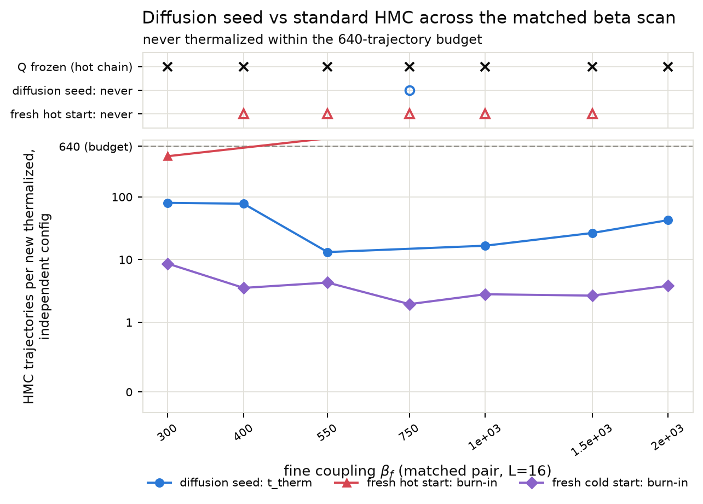
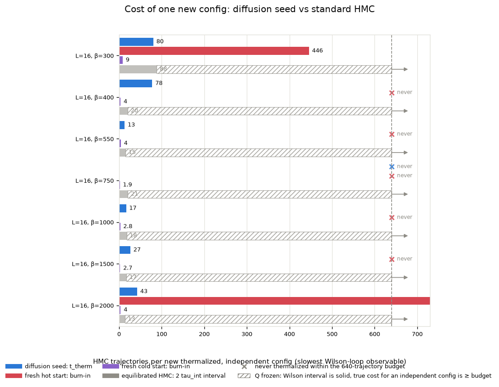
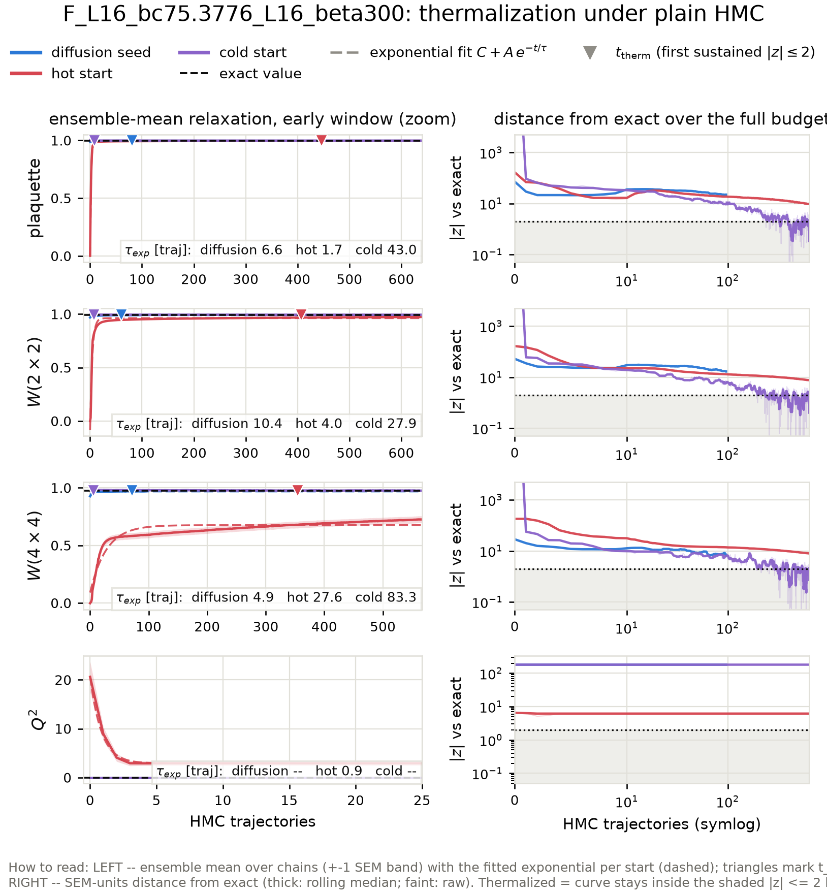
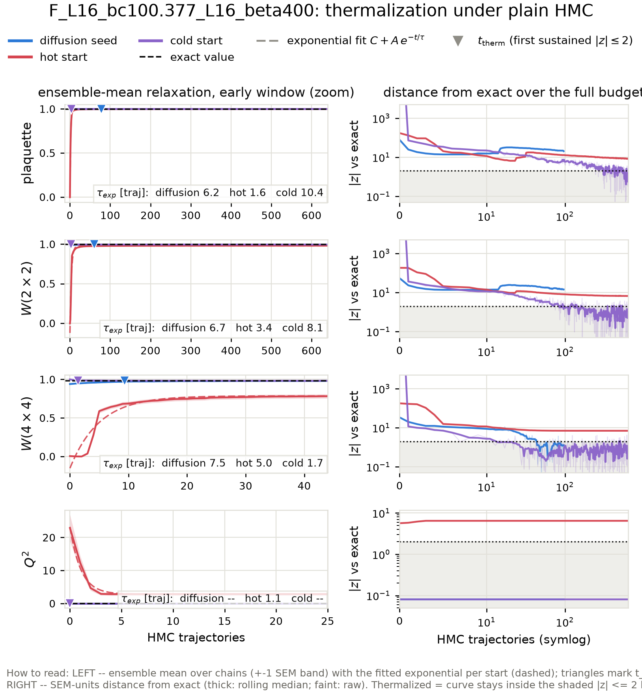
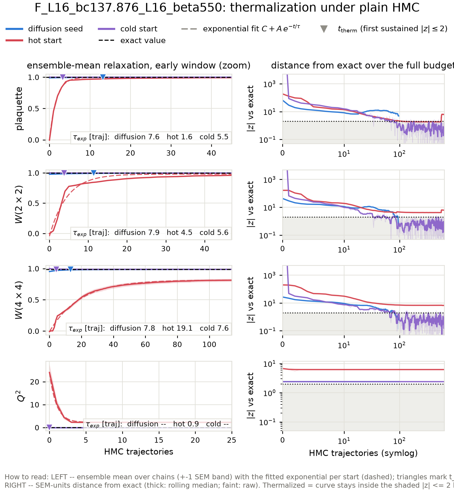
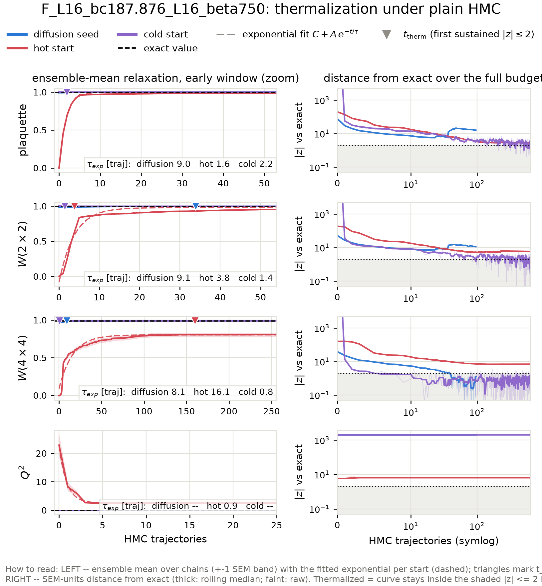
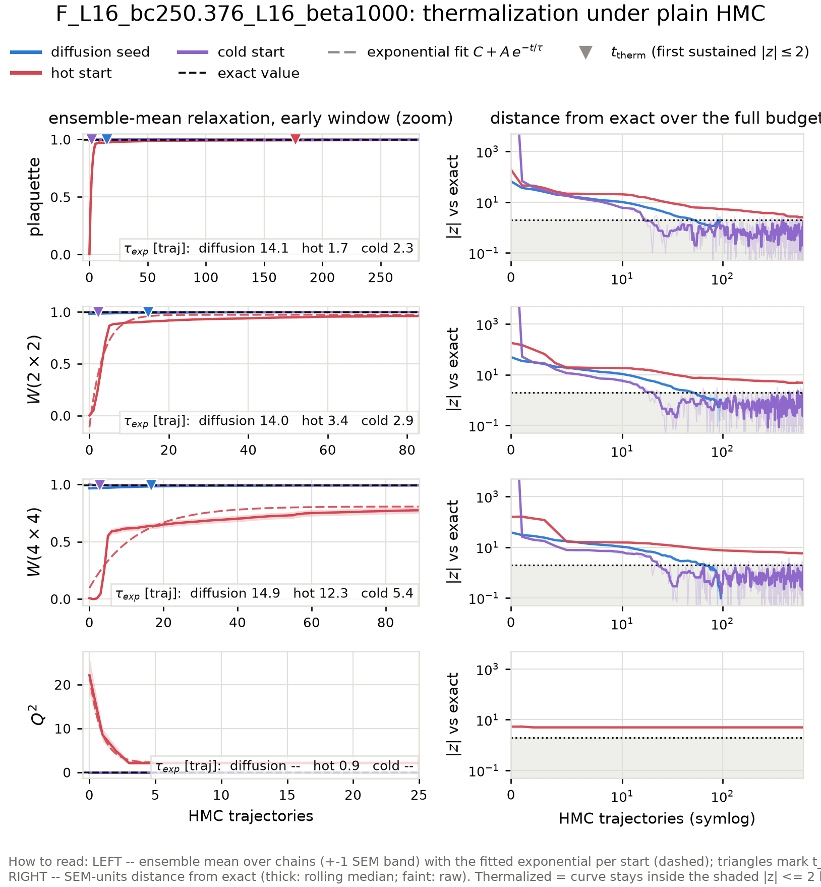
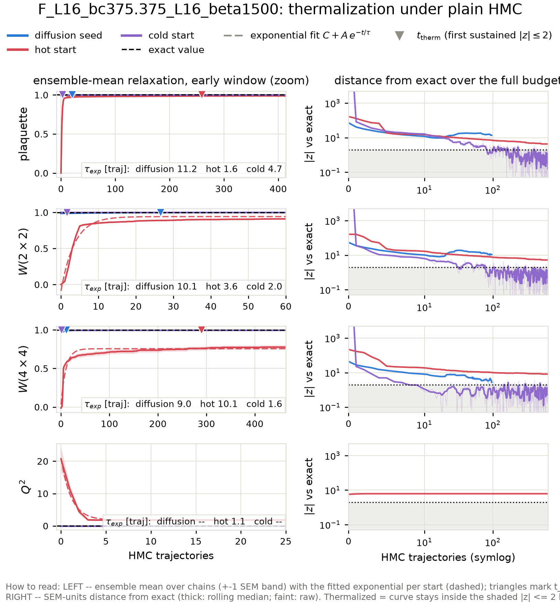
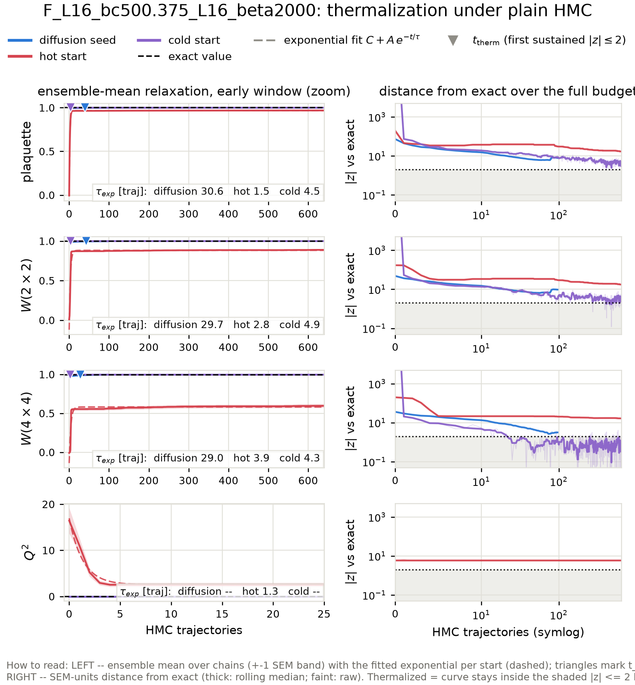

# Diffusion-seeded HMC across the matched beta scan: thermalization time vs the standard-HMC sampling interval

Action: wilson. All HMC in this report is plain HMC (Omelyan, adapted step size, **no** topological updates).

**Why this scan.** At the ladder's upper rungs the fresh-HMC baselines never thermalize at all (topological freezing plus a metastable local-defect state), so the only comparison available there is 'diffusion seed vs a baseline that never arrives'. This report extends the benchmark to every matched coupling pair of the generalization study -- one inverse-RG step L=16 -> L=32 per case -- including fine couplings low enough that hot- and cold-start HMC *does* thermalize within the budget. There the standard chain's own interval `2 tau_int` and its fresh-start burn-in are honest, measurable yardsticks, and the scan shows where the ordering

> t_therm(diffusion seed)  <  2 tau_int(standard HMC)  <  burn-in(fresh chain)

sets in as beta grows and standard HMC slides into critical slowing down and topological freezing.

## The three starting points

- **Diffusion seed** -- the raw conditional-diffusion output for this coupling: one inverse-RG step from a direct-HMC base ensemble at the matched coarse coupling (ancestral sampling + the deterministic coarse-charge transport), with **no** rethermalization sweeps applied: every bit of equilibration the seed needs is measured here, in HMC trajectories.
- **Hot start** -- every link angle drawn uniformly from (-pi, pi]: a completely disordered (infinite-temperature) configuration. The standard way to initialize a fresh HMC chain without prior information.
- **Cold start** -- every link angle set to zero: the perfectly ordered (beta -> infinity) configuration, the other standard initialization.

## Summary

| rung | L | beta | t_therm diffusion seed | standard-HMC interval 2 tau_int | margin (interval - t_therm) | burn-in hot / cold | tau_int(Q) |
|---|---|---|---|---|---|---|---|
| F_L16_bc75.3776_L16_beta300 | 16 | 300 | 80 | 88.3 | 7.8 traj | 446 / 9 | frozen (0 tunnelings in 321 x 64 traj) |
| F_L16_bc100.377_L16_beta400 | 16 | 400 | 78 | 20.3 | -57.6 traj | never / 4 | frozen (0 tunnelings in 321 x 64 traj) |
| F_L16_bc137.876_L16_beta550 | 16 | 550 | 13 | 15.1 | 1.9 traj | never / 4 | frozen (0 tunnelings in 321 x 64 traj) |
| F_L16_bc187.876_L16_beta750 | 16 | 750 | never | 20.7 | -- | never / 2 | frozen (0 tunnelings in 321 x 64 traj) |
| F_L16_bc250.376_L16_beta1000 | 16 | 1000 | 17 | 17.8 | 1.1 traj | never / 3 | frozen (0 tunnelings in 321 x 64 traj) |
| F_L16_bc375.375_L16_beta1500 | 16 | 1500 | 27 | 17.3 | -9.3 traj | never / 3 | frozen (0 tunnelings in 321 x 64 traj) |
| F_L16_bc500.375_L16_beta2000 | 16 | 2000 | 43 | 13.4 | -29.2 traj | 3496 / 4 | frozen (0 tunnelings in 321 x 64 traj) |

## Wall-clock accounting

All timescales above are in HMC trajectories -- the honest *ergodicity* unit. This table converts to seconds on this machine so the economics are explicit. Batched chains produce n_chains configs per trajectory, so per-config costs divide by the chain count; the diffusion sampling cost amortizes over the whole generated batch.

| case | seed: sample s/config | seed: t_therm s (batch) | HMC interval s/config | hot burn-in s (batch) | s/traj (batch) |
|---|---|---|---|---|---|
| F_L16_bc75.3776_L16_beta300 | 0.2 | 19.0 | 0.32 | 103 | 0.23 |
| F_L16_bc100.377_L16_beta400 | 0.2 | 20.5 | 0.08 | never | 0.26 |
| F_L16_bc137.876_L16_beta550 | 0.2 | 3.9 | 0.07 | never | 0.29 |
| F_L16_bc187.876_L16_beta750 | 0.3 | never | 0.12 | never | 0.37 |
| F_L16_bc250.376_L16_beta1000 | 0.2 | 5.9 | 0.10 | never | 0.37 |
| F_L16_bc375.375_L16_beta1500 | 0.2 | 11.6 | 0.12 | never | 0.45 |
| F_L16_bc500.375_L16_beta2000 | 0.2 | 21.6 | 0.11 | 1802 | 0.52 |

## Fitted relaxation times across starts

Exponential fits C + A exp(-t/tau) to the ensemble-mean plaquette and W(2x2) relaxation curves, per starting point (the cross-start comparison of characteristic times; a start already at its plateau fits no decay, which is the desired outcome for the diffusion seed).

| case | obs | tau: diffusion seed | tau: hot start | tau: cold start |
|---|---|---|---|---|
| F_L16_bc75.3776_L16_beta300 | plaquette | 6.6 +- 0.3 | 1.7 +- 0.0 | 43.0 +- 1.6 |
| F_L16_bc75.3776_L16_beta300 | wilson_2x2 | 10.4 +- 0.5 | 4.0 +- 0.1 | 27.9 +- 1.1 |
| F_L16_bc100.377_L16_beta400 | plaquette | 6.2 +- 0.2 | 1.6 +- 0.0 | 10.4 +- 0.5 |
| F_L16_bc100.377_L16_beta400 | wilson_2x2 | 6.7 +- 0.2 | 3.4 +- 0.0 | 8.1 +- 0.4 |
| F_L16_bc137.876_L16_beta550 | plaquette | 7.6 +- 0.1 | 1.6 +- 0.0 | 5.5 +- 0.2 |
| F_L16_bc137.876_L16_beta550 | wilson_2x2 | 7.9 +- 0.1 | 4.5 +- 0.1 | 5.6 +- 0.2 |
| F_L16_bc187.876_L16_beta750 | plaquette | 9.0 +- 0.1 | 1.6 +- 0.0 | 2.2 +- 0.1 |
| F_L16_bc187.876_L16_beta750 | wilson_2x2 | 9.1 +- 0.1 | 3.8 +- 0.1 | 1.4 +- 0.1 |
| F_L16_bc250.376_L16_beta1000 | plaquette | 14.1 +- 0.2 | 1.7 +- 0.0 | 2.3 +- 0.1 |
| F_L16_bc250.376_L16_beta1000 | wilson_2x2 | 14.0 +- 0.2 | 3.4 +- 0.1 | 2.9 +- 0.1 |
| F_L16_bc375.375_L16_beta1500 | plaquette | 11.2 +- 0.2 | 1.6 +- 0.0 | 4.7 +- 0.2 |
| F_L16_bc375.375_L16_beta1500 | wilson_2x2 | 10.1 +- 0.1 | 3.6 +- 0.1 | 2.0 +- 0.1 |
| F_L16_bc500.375_L16_beta2000 | plaquette | 30.6 +- 0.3 | 1.5 +- 0.0 | 4.5 +- 0.2 |
| F_L16_bc500.375_L16_beta2000 | wilson_2x2 | 29.7 +- 0.4 | 2.8 +- 0.1 | 4.9 +- 0.2 |

t_therm and burn-in are the slowest Wilson-loop observable (plaquette, W(2x2), W(4x4)); topology is stricter still for the fresh chains: their Q^2 **never** reaches the exact value at the frozen rungs, while the diffusion seed inherits the correct topological sector from the coarse ensemble it was generated from (see the Q^2 panels and per-rung tables below).

Thermalization time `t_therm` = first trajectory at which the ensemble-mean z-score vs the exact value satisfies |z| <= 2 and stays there for 5 consecutive trajectories (t = 0: already thermalized before any HMC). For the diffusion seed, t_therm is computed on a random subsample of chains matched to the baseline chain count so all starts are compared at equal statistical power. `tau_int` is Madras-Sokal, measured on the second half of the hot-start chains, averaged over chains. In the per-rung relaxation figures, triangles mark each start's t_therm, dashed curves are the exponential fits C + A exp(-t/tau) to the ensemble means (tau quoted per panel), and the right-hand panels track the ensemble mean's distance from the exact value in SEM units -- thermalized means inside the shaded |z| <= 2 band; the dotted vertical line there is the standard-HMC interval `2 tau_int`.

## What 'never' means, and where the ground truth comes from

'never' = the ensemble mean was still outside |z| <= 2 of the exact value after the full baseline budget; the per-rung sections quote the z-score it plateaued at. For hot starts at the large-beta rungs this is not a budget problem but a physical one: a random start freezes into a random topological sector (<Q^2> of order tens), plain HMC can never change Q at these couplings (tunneling is suppressed ~exp(-2 beta)), and the wrong sector biases every Wilson loop by an amount that never decays. Cold starts sit in the single sector Q = 0, so their Wilson loops do eventually converge, but <Q^2> stays pinned at 0 forever.

None of the exact values in this report come from fine-lattice HMC: the ground truth is the character expansion of 2D compact U(1) (`diffusion/lgt/exact.py`), which gives every Wilson loop, P(Q) and chi_top in closed form at finite volume. Each diffusion seed here is one inverse-RG step from a direct-HMC base ensemble at the matched coarse coupling beta_c (L=16), where HMC mixes well -- which is precisely why it can start chains in regions standard HMC cannot reach.

## F_L16_bc75.3776_L16_beta300

HMC: step size 0.0231, 43 leapfrog steps, acceptance seed/hot/cold = 0.967/0.984/0.988. Diffusion-seed batch: 64 chains x 96 trajectories (0.24 s/traj for the whole batch); baselines: 64 chains x 640 trajectories.

tau_int (hot-start chains, second half): plaquette = 41.70 +- 1.56, wilson_2x2 = 42.92 +- 1.79, wilson_4x4 = 44.14 +- 1.98, wilson_6x6 = 39.73 +- 2.08. Topology: hot-start HMC L=16 beta=300 -> **frozen** (no tunneling).

Where 'never' stood at the end: the hot start ended the 640-trajectory budget still at Q^2 at |z| ~ 6; the cold start ended the 640-trajectory budget still at wilson_6x6 at |z| ~ 2, Q^2 at |z| ~ 187.

### Diagnostics: raw diffusion output (before any HMC)

| observable | value | error | exact | z_exact | reference | ref_error | z_ref | ks_p | chi2_p |
|---|---|---|---|---|---|---|---|---|---|
| plaquette | 0.9871 | 0.0001287 | 0.9983 | -87.68 | 0.9983 | 1.174e-05 | -87.25 | 2.804e-35 |  |
| wilson_1x1 | 0.9871 | 0.0001287 | 0.9983 | -87.68 | 0.9983 | 1.174e-05 | -87.25 | 2.804e-35 |  |
| wilson_1x2 | 0.9784 | 0.0002375 | 0.9967 | -77.21 | 0.9966 | 2.808e-05 | -76.39 | 2.804e-35 |  |
| wilson_2x2 | 0.9684 | 0.0004174 | 0.9934 | -59.96 | 0.9931 | 8.549e-05 | -58.02 | 2.804e-35 |  |
| wilson_2x3 | 0.9592 | 0.0007404 | 0.9903 | -41.91 | 0.9898 | 0.0001576 | -40.41 | 2.804e-35 |  |
| wilson_3x3 | 0.9486 | 0.001021 | 0.9856 | -36.24 | 0.9849 | 0.0002727 | -34.39 | 2.804e-35 |  |
| wilson_3x4 | 0.9382 | 0.001253 | 0.9811 | -34.23 | 0.9802 | 0.0003956 | -31.96 | 2.804e-35 |  |
| wilson_4x4 | 0.9267 | 0.00154 | 0.9753 | -31.54 | 0.974 | 0.0006338 | -28.42 | 1.48e-34 |  |
| wilson_4x5 | 0.9152 | 0.00186 | 0.9697 | -29.29 | 0.9677 | 0.0008701 | -25.57 | 7.673e-34 |  |
| wilson_5x5 | 0.9044 | 0.002023 | 0.963 | -28.98 | 0.9599 | 0.00123 | -23.43 | 7.673e-34 |  |
| wilson_5x6 | 0.8935 | 0.002701 | 0.9567 | -23.43 | 0.9523 | 0.001466 | -19.13 | 2.142e-28 |  |
| wilson_6x6 | 0.8833 | 0.003266 | 0.9497 | -20.34 | 0.9437 | 0.00204 | -15.71 | 6.222e-25 |  |
| wilson_6x7 | 0.869 | 0.003949 | 0.9431 | -18.76 | 0.9359 | 0.002275 | -14.69 | 3.08e-25 |  |
| wilson_7x7 | 0.8563 | 0.004709 | 0.936 | -16.93 | 0.9279 | 0.002938 | -12.91 | 6.222e-25 |  |
| wilson_7x8 | 0.847 | 0.005224 | 0.9296 | -15.81 | 0.9202 | 0.003019 | -12.14 | 7.563e-23 |  |
| wilson_8x8 | 0.842 | 0.005717 | 0.923 | -14.17 | 0.9125 | 0.00367 | -10.38 | 2.111e-17 |  |
| creutz_2 | 0.001353 | 0.0003708 | 0.001611 | -0.6945 |  |  |  |  |  |
| creutz_3 | 0.001599 | 0.0008194 | 0.001506 | 0.1131 |  |  |  |  |  |
| creutz_4 | 0.001259 | 0.0008725 | 0.00135 | -0.1041 |  |  |  |  |  |
| creutz_5 | -0.0006526 | 0.001443 | 0.001141 | -1.243 |  |  |  |  |  |
| creutz_6 | -0.0007015 | 0.001489 | 0.0008804 | -1.063 |  |  |  |  |  |
| creutz_7 | -0.001547 | 0.002014 | 0.0005674 | -1.05 |  |  |  |  |  |
| creutz_8 | -0.004968 | 0.002695 | 0.0002022 | -1.918 |  |  |  |  |  |
| Q | 0 | 0 | 0 | 0 | 0 | 0 | 0 | 1 |  |
| Q^2 | 0 | 0 | 1.872e-10 | inf | 0 | 0 | 0 | 1 |  |
| chi_top ((<Q^2>-<Q>^2)/V) | 0 | 0 | 7.311e-13 | inf | 0 | 0 | 0 |  |  |
| Q histogram vs exact P(Q) | 1.198e-08 | nan | 2 | nan |  |  |  |  | 1 |

### Diagnostics: the same configs after 96 HMC trajectories

| observable | value | error | exact | z_exact | reference | ref_error | z_ref | ks_p | chi2_p |
|---|---|---|---|---|---|---|---|---|---|
| plaquette | 0.9969 | 5.703e-05 | 0.9983 | -25.19 | 0.9983 | 1.174e-05 | -24.54 | 2.804e-35 |  |
| wilson_1x1 | 0.9969 | 5.703e-05 | 0.9983 | -25.19 | 0.9983 | 1.174e-05 | -24.54 | 2.804e-35 |  |
| wilson_1x2 | 0.9941 | 0.0001534 | 0.9967 | -16.81 | 0.9966 | 2.808e-05 | -16.09 | 1.736e-33 |  |
| wilson_2x2 | 0.9905 | 0.0001512 | 0.9934 | -19.37 | 0.9931 | 8.549e-05 | -15.08 | 7.426e-21 |  |
| wilson_2x3 | 0.9878 | 0.0001989 | 0.9903 | -12.26 | 0.9898 | 0.0001576 | -7.877 | 1.253e-06 |  |
| wilson_3x3 | 0.9826 | 0.0003213 | 0.9856 | -9.331 | 0.9849 | 0.0002727 | -5.554 | 0.0007896 |  |
| wilson_3x4 | 0.9766 | 0.0005179 | 0.9811 | -8.651 | 0.9802 | 0.0003956 | -5.5 | 0.0004642 |  |
| wilson_4x4 | 0.9701 | 0.0007251 | 0.9753 | -7.17 | 0.974 | 0.0006338 | -4.109 | 0.00132 |  |
| wilson_4x5 | 0.9644 | 0.0009361 | 0.9697 | -5.661 | 0.9677 | 0.0008701 | -2.604 | 0.05149 |  |
| wilson_5x5 | 0.9571 | 0.001219 | 0.963 | -4.86 | 0.9599 | 0.00123 | -1.61 | 0.2811 |  |
| wilson_5x6 | 0.9497 | 0.001608 | 0.9567 | -4.41 | 0.9523 | 0.001466 | -1.192 | 0.215 |  |
| wilson_6x6 | 0.9412 | 0.001989 | 0.9497 | -4.273 | 0.9437 | 0.00204 | -0.8998 | 0.4056 |  |
| wilson_6x7 | 0.9347 | 0.002222 | 0.9431 | -3.764 | 0.9359 | 0.002275 | -0.3801 | 0.6123 |  |
| wilson_7x7 | 0.9278 | 0.002859 | 0.936 | -2.866 | 0.9279 | 0.002938 | -0.02499 | 0.8269 |  |
| wilson_7x8 | 0.921 | 0.003165 | 0.9296 | -2.699 | 0.9202 | 0.003019 | 0.1786 | 0.2464 |  |
| wilson_8x8 | 0.9122 | 0.003556 | 0.923 | -3.023 | 0.9125 | 0.00367 | -0.048 | 0.4535 |  |
| creutz_2 | 0.0008216 | 0.0001639 | 0.001611 | -4.816 |  |  |  |  |  |
| creutz_3 | 0.002575 | 0.0002338 | 0.001506 | 4.57 |  |  |  |  |  |
| creutz_4 | 0.0005874 | 0.0003372 | 0.00135 | -2.261 |  |  |  |  |  |
| creutz_5 | 0.001698 | 0.00045 | 0.001141 | 1.238 |  |  |  |  |  |
| creutz_6 | 0.001166 | 0.0007535 | 0.0008804 | 0.3788 |  |  |  |  |  |
| creutz_7 | 0.0005327 | 0.0008417 | 0.0005674 | -0.04122 |  |  |  |  |  |
| creutz_8 | 0.002245 | 0.00124 | 0.0002022 | 1.647 |  |  |  |  |  |
| Q | 0 | 0 | 0 | 0 | 0 | 0 | 0 | 1 |  |
| Q^2 | 0 | 0 | 1.872e-10 | inf | 0 | 0 | 0 | 1 |  |
| chi_top ((<Q^2>-<Q>^2)/V) | 0 | 0 | 7.311e-13 | inf | 0 | 0 | 0 |  |  |
| Q histogram vs exact P(Q) | 1.198e-08 | nan | 2 | nan |  |  |  |  | 1 |

## F_L16_bc100.377_L16_beta400

HMC: step size 0.0200, 50 leapfrog steps, acceptance seed/hot/cold = 0.960/0.979/0.989. Diffusion-seed batch: 64 chains x 96 trajectories (0.26 s/traj for the whole batch); baselines: 64 chains x 640 trajectories.

tau_int (hot-start chains, second half): plaquette = 10.17 +- 1.03, wilson_2x2 = 4.92 +- 0.72, wilson_4x4 = 1.03 +- 0.05, wilson_6x6 = 0.62 +- 0.03. Topology: hot-start HMC L=16 beta=400 -> **frozen** (no tunneling).

Where 'never' stood at the end: the hot start ended the 640-trajectory budget still at wilson_4x4 at |z| ~ 7, Q^2 at |z| ~ 6.

### Diagnostics: raw diffusion output (before any HMC)

| observable | value | error | exact | z_exact | reference | ref_error | z_ref | ks_p | chi2_p |
|---|---|---|---|---|---|---|---|---|---|
| plaquette | 0.9888 | 0.0001275 | 0.9988 | -78.37 | 0.9987 | 8.634e-06 | -78.07 | 2.804e-35 |  |
| wilson_1x1 | 0.9888 | 0.0001275 | 0.9988 | -78.37 | 0.9987 | 8.634e-06 | -78.07 | 2.804e-35 |  |
| wilson_1x2 | 0.9813 | 0.0003044 | 0.9975 | -53.28 | 0.9975 | 1.908e-05 | -53.04 | 2.804e-35 |  |
| wilson_2x2 | 0.9736 | 0.0004091 | 0.9951 | -52.62 | 0.9949 | 4.527e-05 | -51.92 | 2.804e-35 |  |
| wilson_2x3 | 0.9657 | 0.0006458 | 0.9927 | -41.78 | 0.9925 | 9.126e-05 | -41.14 | 2.804e-35 |  |
| wilson_3x3 | 0.9564 | 0.0009359 | 0.9892 | -34.99 | 0.9889 | 0.0001873 | -33.96 | 2.804e-35 |  |
| wilson_3x4 | 0.9483 | 0.001248 | 0.9858 | -30.03 | 0.9853 | 0.0003112 | -28.74 | 2.804e-35 |  |
| wilson_4x4 | 0.9392 | 0.001486 | 0.9814 | -28.37 | 0.9807 | 0.0005224 | -26.35 | 1.48e-34 |  |
| wilson_4x5 | 0.9298 | 0.001697 | 0.9772 | -27.91 | 0.9764 | 0.0007607 | -25.07 | 1.48e-34 |  |
| wilson_5x5 | 0.922 | 0.002143 | 0.9722 | -23.42 | 0.9709 | 0.001087 | -20.34 | 7.673e-34 |  |
| wilson_5x6 | 0.9146 | 0.002419 | 0.9674 | -21.84 | 0.9662 | 0.001412 | -18.45 | 3.91e-33 |  |
| wilson_6x6 | 0.9101 | 0.002378 | 0.962 | -21.84 | 0.9599 | 0.001862 | -16.5 | 1.034e-29 |  |
| wilson_6x7 | 0.8973 | 0.003108 | 0.957 | -19.22 | 0.9549 | 0.002198 | -15.14 | 4.748e-29 |  |
| wilson_7x7 | 0.8828 | 0.004013 | 0.9516 | -17.15 | 0.9485 | 0.002731 | -13.54 | 9.494e-28 |  |
| wilson_7x8 | 0.8756 | 0.004793 | 0.9467 | -14.83 | 0.9431 | 0.003035 | -11.89 | 3.64e-26 |  |
| wilson_8x8 | 0.8719 | 0.005111 | 0.9417 | -13.66 | 0.9371 | 0.003545 | -10.49 | 4.997e-24 |  |
| creutz_2 | 0.0003472 | 0.0003412 | 0.001208 | -2.521 |  |  |  |  |  |
| creutz_3 | 0.001564 | 0.0006748 | 0.001129 | 0.6442 |  |  |  |  |  |
| creutz_4 | 0.001085 | 0.000826 | 0.001012 | 0.08811 |  |  |  |  |  |
| creutz_5 | -0.001586 | 0.001321 | 0.0008556 | -1.848 |  |  |  |  |  |
| creutz_6 | -0.003144 | 0.00149 | 0.00066 | -2.554 |  |  |  |  |  |
| creutz_7 | 0.002122 | 0.001839 | 0.0004253 | 0.9225 |  |  |  |  |  |
| creutz_8 | -0.003849 | 0.002193 | 0.0001516 | -1.824 |  |  |  |  |  |
| Q | 0 | 0 | 0 | 0 | 0 | 0 | 0 | 1 |  |
| Q^2 | 0 | 0 | 8.168e-14 | inf | 0 | 0 | 0 | 1 |  |
| chi_top ((<Q^2>-<Q>^2)/V) | 0 | 0 | 3.191e-16 | inf | 0 | 0 | 0 |  |  |
| Q histogram vs exact P(Q) | 5.227e-12 | nan | 2 | nan |  |  |  |  | 1 |

### Diagnostics: the same configs after 96 HMC trajectories

| observable | value | error | exact | z_exact | reference | ref_error | z_ref | ks_p | chi2_p |
|---|---|---|---|---|---|---|---|---|---|
| plaquette | 0.9979 | 3.927e-05 | 0.9988 | -21.42 | 0.9987 | 8.634e-06 | -20.51 | 1.736e-33 |  |
| wilson_1x1 | 0.9979 | 3.927e-05 | 0.9988 | -21.42 | 0.9987 | 8.634e-06 | -20.51 | 1.736e-33 |  |
| wilson_1x2 | 0.9964 | 5.852e-05 | 0.9975 | -18.91 | 0.9975 | 1.908e-05 | -17.34 | 1.986e-27 |  |
| wilson_2x2 | 0.9936 | 0.0001111 | 0.9951 | -13.57 | 0.9949 | 4.527e-05 | -11.26 | 3.375e-15 |  |
| wilson_2x3 | 0.9918 | 0.0001522 | 0.9927 | -5.824 | 0.9925 | 9.126e-05 | -4.158 | 0.0004642 |  |
| wilson_3x3 | 0.9885 | 0.000248 | 0.9892 | -2.961 | 0.9889 | 0.0001873 | -1.282 | 0.07294 |  |
| wilson_3x4 | 0.985 | 0.0003547 | 0.9858 | -2.288 | 0.9853 | 0.0003112 | -0.6366 | 0.07294 |  |
| wilson_4x4 | 0.9807 | 0.0005499 | 0.9814 | -1.283 | 0.9807 | 0.0005224 | -0.07042 | 0.2464 |  |
| wilson_4x5 | 0.9761 | 0.0007341 | 0.9772 | -1.517 | 0.9764 | 0.0007607 | -0.3458 | 0.4056 |  |
| wilson_5x5 | 0.9703 | 0.001027 | 0.9722 | -1.809 | 0.9709 | 0.001087 | -0.369 | 0.2811 |  |
| wilson_5x6 | 0.9647 | 0.0013 | 0.9674 | -2.091 | 0.9662 | 0.001412 | -0.8157 | 0.3607 |  |
| wilson_6x6 | 0.9582 | 0.00171 | 0.962 | -2.236 | 0.9599 | 0.001862 | -0.6825 | 0.119 |  |
| wilson_6x7 | 0.9526 | 0.002074 | 0.957 | -2.109 | 0.9549 | 0.002198 | -0.7557 | 0.1015 |  |
| wilson_7x7 | 0.9466 | 0.002549 | 0.9516 | -1.97 | 0.9485 | 0.002731 | -0.519 | 0.5575 |  |
| wilson_7x8 | 0.9414 | 0.002889 | 0.9467 | -1.848 | 0.9431 | 0.003035 | -0.404 | 0.9671 |  |
| wilson_8x8 | 0.9368 | 0.003406 | 0.9417 | -1.443 | 0.9371 | 0.003545 | -0.06438 | 0.9833 |  |
| creutz_2 | 0.001346 | 6.939e-05 | 0.001208 | 2.002 |  |  |  |  |  |
| creutz_3 | 0.001601 | 0.0001357 | 0.001129 | 3.478 |  |  |  |  |  |
| creutz_4 | 0.0008263 | 0.0001968 | 0.001012 | -0.9436 |  |  |  |  |  |
| creutz_5 | 0.001208 | 0.0002403 | 0.0008556 | 1.466 |  |  |  |  |  |
| creutz_6 | 0.0009291 | 0.0003884 | 0.00066 | 0.6929 |  |  |  |  |  |
| creutz_7 | 0.0005357 | 0.0006718 | 0.0004253 | 0.1643 |  |  |  |  |  |
| creutz_8 | -0.0006339 | 0.0009155 | 0.0001516 | -0.8579 |  |  |  |  |  |
| Q | 0 | 0 | 0 | 0 | 0 | 0 | 0 | 1 |  |
| Q^2 | 0 | 0 | 8.168e-14 | inf | 0 | 0 | 0 | 1 |  |
| chi_top ((<Q^2>-<Q>^2)/V) | 0 | 0 | 3.191e-16 | inf | 0 | 0 | 0 |  |  |
| Q histogram vs exact P(Q) | 5.227e-12 | nan | 2 | nan |  |  |  |  | 1 |

## F_L16_bc137.876_L16_beta550

HMC: step size 0.0171, 59 leapfrog steps, acceptance seed/hot/cold = 0.946/0.951/0.987. Diffusion-seed batch: 64 chains x 96 trajectories (0.30 s/traj for the whole batch); baselines: 64 chains x 640 trajectories.

tau_int (hot-start chains, second half): plaquette = 5.44 +- 0.65, wilson_2x2 = 5.52 +- 0.67, wilson_4x4 = 7.53 +- 0.84, wilson_6x6 = 10.47 +- 0.95. Topology: hot-start HMC L=16 beta=550 -> **frozen** (no tunneling).

Where 'never' stood at the end: the hot start ended the 640-trajectory budget still at plaquette at |z| ~ 6, wilson_2x2 at |z| ~ 6, wilson_4x4 at |z| ~ 7, Q^2 at |z| ~ 6.

### Diagnostics: raw diffusion output (before any HMC)

| observable | value | error | exact | z_exact | reference | ref_error | z_ref | ks_p | chi2_p |
|---|---|---|---|---|---|---|---|---|---|
| plaquette | 0.9901 | 0.0001482 | 0.9991 | -60.49 | 0.9991 | 5.287e-06 | -60.66 | 2.804e-35 |  |
| wilson_1x1 | 0.9901 | 0.0001482 | 0.9991 | -60.49 | 0.9991 | 5.287e-06 | -60.66 | 2.804e-35 |  |
| wilson_1x2 | 0.9838 | 0.0002911 | 0.9982 | -49.49 | 0.9983 | 1.62e-05 | -49.68 | 2.804e-35 |  |
| wilson_2x2 | 0.9775 | 0.00048 | 0.9964 | -39.49 | 0.9966 | 4.052e-05 | -39.76 | 2.804e-35 |  |
| wilson_2x3 | 0.9714 | 0.0005757 | 0.9947 | -40.45 | 0.995 | 6.856e-05 | -40.75 | 2.804e-35 |  |
| wilson_3x3 | 0.9637 | 0.0007028 | 0.9921 | -40.52 | 0.9927 | 0.0001273 | -40.61 | 2.804e-35 |  |
| wilson_3x4 | 0.9577 | 0.0009622 | 0.9896 | -33.18 | 0.9904 | 0.0001841 | -33.34 | 2.804e-35 |  |
| wilson_4x4 | 0.9527 | 0.001363 | 0.9864 | -24.74 | 0.9874 | 0.0002568 | -25.03 | 2.804e-35 |  |
| wilson_4x5 | 0.9463 | 0.001419 | 0.9834 | -26.09 | 0.9846 | 0.0003466 | -26.2 | 2.804e-35 |  |
| wilson_5x5 | 0.9391 | 0.001744 | 0.9797 | -23.28 | 0.9812 | 0.0004518 | -23.39 | 2.804e-35 |  |
| wilson_5x6 | 0.9337 | 0.002045 | 0.9762 | -20.8 | 0.9781 | 0.0005667 | -20.96 | 3.377e-34 |  |
| wilson_6x6 | 0.9312 | 0.001948 | 0.9722 | -21.05 | 0.9743 | 0.0007193 | -20.75 | 1.034e-29 |  |
| wilson_6x7 | 0.9234 | 0.002236 | 0.9686 | -20.19 | 0.9708 | 0.0008489 | -19.83 | 1.034e-29 |  |
| wilson_7x7 | 0.9127 | 0.002753 | 0.9646 | -18.85 | 0.967 | 0.001058 | -18.42 | 2.215e-30 |  |
| wilson_7x8 | 0.9115 | 0.003362 | 0.961 | -14.72 | 0.9638 | 0.001173 | -14.69 | 1.986e-27 |  |
| wilson_8x8 | 0.912 | 0.003209 | 0.9573 | -14.1 | 0.9601 | 0.001279 | -13.92 | 7.563e-23 |  |
| creutz_2 | 1.895e-05 | 0.0003426 | 0.0008779 | -2.507 |  |  |  |  |  |
| creutz_3 | 0.001767 | 0.0006109 | 0.0008211 | 1.548 |  |  |  |  |  |
| creutz_4 | -0.0009283 | 0.0007887 | 0.0007358 | -2.11 |  |  |  |  |  |
| creutz_5 | 0.0009767 | 0.00121 | 0.000622 | 0.2932 |  |  |  |  |  |
| creutz_6 | -0.003213 | 0.001361 | 0.0004798 | -2.714 |  |  |  |  |  |
| creutz_7 | 0.003231 | 0.001511 | 0.0003092 | 1.934 |  |  |  |  |  |
| creutz_8 | -0.001918 | 0.00215 | 0.0001102 | -0.9435 |  |  |  |  |  |
| Q | 0 | 0 | 0 | 0 | 0 | 0 | 0 | 1 |  |
| Q^2 | 0 | 0 | 2.399e-12 | inf | 0 | 0 | 0 | 1 |  |
| chi_top ((<Q^2>-<Q>^2)/V) | 0 | 0 | 9.372e-15 | inf | 0 | 0 | 0 |  |  |
| Q histogram vs exact P(Q) | 1.706e-11 | nan | 2 | nan |  |  |  |  | 1 |

### Diagnostics: the same configs after 96 HMC trajectories

| observable | value | error | exact | z_exact | reference | ref_error | z_ref | ks_p | chi2_p |
|---|---|---|---|---|---|---|---|---|---|
| plaquette | 0.999 | 1.058e-05 | 0.9991 | -5.101 | 0.9991 | 5.287e-06 | -7.137 | 6.92e-06 |  |
| wilson_1x1 | 0.999 | 1.058e-05 | 0.9991 | -5.101 | 0.9991 | 5.287e-06 | -7.137 | 6.92e-06 |  |
| wilson_1x2 | 0.9981 | 2.834e-05 | 0.9982 | -4.346 | 0.9983 | 1.62e-05 | -6.128 | 6.135e-07 |  |
| wilson_2x2 | 0.9964 | 5.908e-05 | 0.9964 | -0.5481 | 0.9966 | 4.052e-05 | -3.239 | 0.01631 |  |
| wilson_2x3 | 0.9946 | 0.0001008 | 0.9947 | -0.8007 | 0.995 | 6.856e-05 | -3.412 | 0.06142 |  |
| wilson_3x3 | 0.9922 | 0.0001717 | 0.9921 | 0.678 | 0.9927 | 0.0001273 | -1.899 | 0.2811 |  |
| wilson_3x4 | 0.9898 | 0.0002819 | 0.9896 | 0.3979 | 0.9904 | 0.0001841 | -1.865 | 0.3607 |  |
| wilson_4x4 | 0.9867 | 0.0003919 | 0.9864 | 0.6096 | 0.9874 | 0.0002568 | -1.63 | 0.3607 |  |
| wilson_4x5 | 0.9838 | 0.0005498 | 0.9834 | 0.76 | 0.9846 | 0.0003466 | -1.28 | 0.4056 |  |
| wilson_5x5 | 0.9812 | 0.0006815 | 0.9797 | 2.218 | 0.9812 | 0.0004518 | -0.036 | 0.9433 |  |
| wilson_5x6 | 0.9779 | 0.0008538 | 0.9762 | 2.019 | 0.9781 | 0.0005667 | -0.2167 | 0.9433 |  |
| wilson_6x6 | 0.9742 | 0.001033 | 0.9722 | 1.907 | 0.9743 | 0.0007193 | -0.09721 | 0.9929 |  |
| wilson_6x7 | 0.9709 | 0.001196 | 0.9686 | 1.997 | 0.9708 | 0.0008489 | 0.07553 | 0.9433 |  |
| wilson_7x7 | 0.9674 | 0.001407 | 0.9646 | 2.002 | 0.967 | 0.001058 | 0.2203 | 0.7231 |  |
| wilson_7x8 | 0.9649 | 0.001564 | 0.961 | 2.483 | 0.9638 | 0.001173 | 0.5544 | 0.5044 |  |
| wilson_8x8 | 0.9634 | 0.00177 | 0.9573 | 3.452 | 0.9601 | 0.001279 | 1.501 | 0.4535 |  |
| creutz_2 | 0.0007177 | 4.04e-05 | 0.0008779 | -3.966 |  |  |  |  |  |
| creutz_3 | 0.0005739 | 7.683e-05 | 0.0008211 | -3.218 |  |  |  |  |  |
| creutz_4 | 0.0006029 | 0.0001255 | 0.0007358 | -1.058 |  |  |  |  |  |
| creutz_5 | -0.0003124 | 0.0002315 | 0.000622 | -4.036 |  |  |  |  |  |
| creutz_6 | 0.0004429 | 0.0002365 | 0.0004798 | -0.1562 |  |  |  |  |  |
| creutz_7 | 0.0002948 | 0.0003188 | 0.0003092 | -0.0453 |  |  |  |  |  |
| creutz_8 | -0.001104 | 0.0005237 | 0.0001102 | -2.318 |  |  |  |  |  |
| Q | 0 | 0 | 0 | 0 | 0 | 0 | 0 | 1 |  |
| Q^2 | 0 | 0 | 2.399e-12 | inf | 0 | 0 | 0 | 1 |  |
| chi_top ((<Q^2>-<Q>^2)/V) | 0 | 0 | 9.372e-15 | inf | 0 | 0 | 0 |  |  |
| Q histogram vs exact P(Q) | 1.706e-11 | nan | 2 | nan |  |  |  |  | 1 |

## F_L16_bc187.876_L16_beta750

HMC: step size 0.0146, 68 leapfrog steps, acceptance seed/hot/cold = 0.917/0.919/0.988. Diffusion-seed batch: 64 chains x 96 trajectories (0.43 s/traj for the whole batch); baselines: 64 chains x 640 trajectories.

tau_int (hot-start chains, second half): plaquette = 10.33 +- 1.28, wilson_2x2 = 8.78 +- 1.27, wilson_4x4 = 0.99 +- 0.04, wilson_6x6 = 0.98 +- 0.03. Topology: hot-start HMC L=16 beta=750 -> **frozen** (no tunneling).

Where 'never' stood at the end: the hot start ended the 640-trajectory budget still at plaquette at |z| ~ 3, Q^2 at |z| ~ 6; the cold start ended the 640-trajectory budget still at Q^2 at |z| ~ 2060.

### Diagnostics: raw diffusion output (before any HMC)

| observable | value | error | exact | z_exact | reference | ref_error | z_ref | ks_p | chi2_p |
|---|---|---|---|---|---|---|---|---|---|
| plaquette | 0.992 | 9.719e-05 | 0.9993 | -75.23 | 0.9993 | 7.234e-06 | -75.04 | 2.804e-35 |  |
| wilson_1x1 | 0.992 | 9.719e-05 | 0.9993 | -75.23 | 0.9993 | 7.234e-06 | -75.04 | 2.804e-35 |  |
| wilson_1x2 | 0.9874 | 0.0002145 | 0.9987 | -52.73 | 0.9987 | 1.625e-05 | -52.55 | 2.804e-35 |  |
| wilson_2x2 | 0.9827 | 0.0002563 | 0.9974 | -57.12 | 0.9974 | 3.388e-05 | -56.63 | 2.804e-35 |  |
| wilson_2x3 | 0.9781 | 0.0003691 | 0.9961 | -48.79 | 0.9961 | 6.144e-05 | -48.16 | 2.804e-35 |  |
| wilson_3x3 | 0.972 | 0.0004134 | 0.9942 | -53.82 | 0.9943 | 0.0001249 | -51.65 | 2.804e-35 |  |
| wilson_3x4 | 0.9676 | 0.0004666 | 0.9924 | -53.19 | 0.9925 | 0.0001851 | -49.57 | 2.804e-35 |  |
| wilson_4x4 | 0.9632 | 0.0005297 | 0.99 | -50.71 | 0.9902 | 0.0002679 | -45.44 | 2.804e-35 |  |
| wilson_4x5 | 0.9583 | 0.0006537 | 0.9878 | -45.08 | 0.9878 | 0.0003652 | -39.41 | 2.804e-35 |  |
| wilson_5x5 | 0.9528 | 0.0008955 | 0.9851 | -35.97 | 0.9853 | 0.0004693 | -32.11 | 2.804e-35 |  |
| wilson_5x6 | 0.9491 | 0.001014 | 0.9825 | -32.97 | 0.9826 | 0.0005999 | -28.46 | 7.673e-34 |  |
| wilson_6x6 | 0.9452 | 0.001381 | 0.9796 | -24.89 | 0.9801 | 0.0007213 | -22.37 | 3.91e-33 |  |
| wilson_6x7 | 0.9392 | 0.001616 | 0.9769 | -23.28 | 0.9773 | 0.0008309 | -20.97 | 9.635e-32 |  |
| wilson_7x7 | 0.932 | 0.002057 | 0.9739 | -20.37 | 0.9749 | 0.0009398 | -18.98 | 9.635e-32 |  |
| wilson_7x8 | 0.9288 | 0.00233 | 0.9712 | -18.23 | 0.9723 | 0.001057 | -17 | 4.748e-29 |  |
| wilson_8x8 | 0.9257 | 0.002842 | 0.9685 | -15.05 | 0.9698 | 0.001125 | -14.41 | 1.771e-26 |  |
| creutz_2 | -5.216e-06 | 0.0002855 | 0.0006437 | -2.273 |  |  |  |  |  |
| creutz_3 | 0.001533 | 0.0003793 | 0.000602 | 2.454 |  |  |  |  |  |
| creutz_4 | 2.548e-05 | 0.000503 | 0.0005394 | -1.022 |  |  |  |  |  |
| creutz_5 | 0.00063 | 0.0006446 | 0.000456 | 0.2699 |  |  |  |  |  |
| creutz_6 | 0.0001118 | 0.0008218 | 0.0003518 | -0.292 |  |  |  |  |  |
| creutz_7 | 0.001401 | 0.001058 | 0.0002267 | 1.11 |  |  |  |  |  |
| creutz_8 | -0.0002066 | 0.001512 | 8.078e-05 | -0.1901 |  |  |  |  |  |
| Q | 0 | 0 | 0 | 0 | 0 | 0 | 0 | 1 |  |
| Q^2 | 0 | 0 | 2.06e-09 | inf | 0 | 0 | 0 | 1 |  |
| chi_top ((<Q^2>-<Q>^2)/V) | 0 | 0 | 8.047e-12 | inf | 0 | 0 | 0 |  |  |
| Q histogram vs exact P(Q) | 1.465e-08 | nan | 2 | nan |  |  |  |  | 1 |

### Diagnostics: the same configs after 96 HMC trajectories

| observable | value | error | exact | z_exact | reference | ref_error | z_ref | ks_p | chi2_p |
|---|---|---|---|---|---|---|---|---|---|
| plaquette | 0.999 | 1.991e-05 | 0.9993 | -16.17 | 0.9993 | 7.234e-06 | -15.29 | 4.797e-30 |  |
| wilson_1x1 | 0.999 | 1.991e-05 | 0.9993 | -16.17 | 0.9993 | 7.234e-06 | -15.29 | 4.797e-30 |  |
| wilson_1x2 | 0.9981 | 4.627e-05 | 0.9987 | -13.54 | 0.9987 | 1.625e-05 | -12.65 | 7.45e-26 |  |
| wilson_2x2 | 0.9964 | 8.983e-05 | 0.9974 | -10.45 | 0.9974 | 3.388e-05 | -9.78 | 9.278e-20 |  |
| wilson_2x3 | 0.9948 | 0.0001355 | 0.9961 | -9.318 | 0.9961 | 6.144e-05 | -8.555 | 3.793e-13 |  |
| wilson_3x3 | 0.9929 | 0.0001667 | 0.9942 | -7.976 | 0.9943 | 0.0001249 | -6.66 | 8.851e-09 |  |
| wilson_3x4 | 0.9916 | 0.0001978 | 0.9924 | -3.842 | 0.9925 | 0.0001851 | -3.034 | 0.01997 |  |
| wilson_4x4 | 0.9897 | 0.0002874 | 0.99 | -1.327 | 0.9902 | 0.0002679 | -1.255 | 0.5575 |  |
| wilson_4x5 | 0.9866 | 0.0004056 | 0.9878 | -2.803 | 0.9878 | 0.0003652 | -2.155 | 0.1389 |  |
| wilson_5x5 | 0.9836 | 0.0005255 | 0.9851 | -2.745 | 0.9853 | 0.0004693 | -2.4 | 0.01326 |  |
| wilson_5x6 | 0.9808 | 0.0006984 | 0.9825 | -2.396 | 0.9826 | 0.0005999 | -1.92 | 0.06142 |  |
| wilson_6x6 | 0.9778 | 0.0008765 | 0.9796 | -2.062 | 0.9801 | 0.0007213 | -2.013 | 0.04298 |  |
| wilson_6x7 | 0.9756 | 0.001051 | 0.9769 | -1.161 | 0.9773 | 0.0008309 | -1.28 | 0.1614 |  |
| wilson_7x7 | 0.972 | 0.001214 | 0.9739 | -1.563 | 0.9749 | 0.0009398 | -1.897 | 0.1015 |  |
| wilson_7x8 | 0.9697 | 0.001404 | 0.9712 | -1.111 | 0.9723 | 0.001057 | -1.472 | 0.2464 |  |
| wilson_8x8 | 0.9671 | 0.001518 | 0.9685 | -0.9198 | 0.9698 | 0.001125 | -1.42 | 0.3192 |  |
| creutz_2 | 0.000652 | 6.321e-05 | 0.0006437 | 0.1316 |  |  |  |  |  |
| creutz_3 | 0.000346 | 0.0001049 | 0.000602 | -2.441 |  |  |  |  |  |
| creutz_4 | 0.0007305 | 0.0001143 | 0.0005394 | 1.671 |  |  |  |  |  |
| creutz_5 | 3.24e-06 | 0.0001483 | 0.000456 | -3.053 |  |  |  |  |  |
| creutz_6 | 0.0002545 | 0.0001881 | 0.0003518 | -0.5171 |  |  |  |  |  |
| creutz_7 | 0.001521 | 0.0002907 | 0.0002267 | 4.454 |  |  |  |  |  |
| creutz_8 | 0.0002585 | 0.000362 | 8.078e-05 | 0.4909 |  |  |  |  |  |
| Q | 0 | 0 | 0 | 0 | 0 | 0 | 0 | 1 |  |
| Q^2 | 0 | 0 | 2.06e-09 | inf | 0 | 0 | 0 | 1 |  |
| chi_top ((<Q^2>-<Q>^2)/V) | 0 | 0 | 8.047e-12 | inf | 0 | 0 | 0 |  |  |
| Q histogram vs exact P(Q) | 1.465e-08 | nan | 2 | nan |  |  |  |  | 1 |

## F_L16_bc250.376_L16_beta1000

HMC: step size 0.0126, 79 leapfrog steps, acceptance seed/hot/cold = 0.845/0.814/0.986. Diffusion-seed batch: 64 chains x 96 trajectories (0.35 s/traj for the whole batch); baselines: 64 chains x 640 trajectories.

tau_int (hot-start chains, second half): plaquette = 5.78 +- 1.41, wilson_2x2 = 6.84 +- 1.43, wilson_4x4 = 8.88 +- 1.48, wilson_6x6 = 11.37 +- 1.53. Topology: hot-start HMC L=16 beta=1000 -> **frozen** (no tunneling).

Where 'never' stood at the end: the hot start ended the 640-trajectory budget still at wilson_2x2 at |z| ~ 5, wilson_4x4 at |z| ~ 6, Q^2 at |z| ~ 5; the cold start ended the 640-trajectory budget still at Q^2 at |z| ~ 178903.

### Diagnostics: raw diffusion output (before any HMC)

| observable | value | error | exact | z_exact | reference | ref_error | z_ref | ks_p | chi2_p |
|---|---|---|---|---|---|---|---|---|---|
| plaquette | 0.9925 | 0.000104 | 0.9995 | -67.73 | 0.9995 | 4.186e-06 | -67.58 | 2.804e-35 |  |
| wilson_1x1 | 0.9925 | 0.000104 | 0.9995 | -67.73 | 0.9995 | 4.186e-06 | -67.58 | 2.804e-35 |  |
| wilson_1x2 | 0.9881 | 0.0001604 | 0.999 | -68.29 | 0.999 | 1.196e-05 | -67.99 | 2.804e-35 |  |
| wilson_2x2 | 0.984 | 0.0002573 | 0.998 | -54.69 | 0.998 | 2.666e-05 | -54.34 | 2.804e-35 |  |
| wilson_2x3 | 0.9801 | 0.0003677 | 0.9971 | -46.07 | 0.9971 | 4.97e-05 | -45.65 | 2.804e-35 |  |
| wilson_3x3 | 0.9751 | 0.0004199 | 0.9957 | -49.05 | 0.9957 | 8.624e-05 | -48.16 | 2.804e-35 |  |
| wilson_3x4 | 0.9709 | 0.000463 | 0.9943 | -50.44 | 0.9944 | 0.0001203 | -49.1 | 2.804e-35 |  |
| wilson_4x4 | 0.9664 | 0.0006264 | 0.9925 | -41.64 | 0.9928 | 0.0001553 | -40.89 | 2.804e-35 |  |
| wilson_4x5 | 0.9614 | 0.0008993 | 0.9908 | -32.76 | 0.9913 | 0.0002103 | -32.46 | 2.804e-35 |  |
| wilson_5x5 | 0.9565 | 0.0008372 | 0.9888 | -38.58 | 0.9896 | 0.0002564 | -37.85 | 2.804e-35 |  |
| wilson_5x6 | 0.953 | 0.0009 | 0.9868 | -37.59 | 0.9881 | 0.0003214 | -36.7 | 2.804e-35 |  |
| wilson_6x6 | 0.9507 | 0.0006552 | 0.9846 | -51.87 | 0.9864 | 0.0003629 | -47.68 | 2.804e-35 |  |
| wilson_6x7 | 0.9444 | 0.0008583 | 0.9826 | -44.46 | 0.9847 | 0.0004579 | -41.36 | 2.804e-35 |  |
| wilson_7x7 | 0.9378 | 0.001239 | 0.9804 | -34.36 | 0.983 | 0.0004859 | -33.97 | 1.48e-34 |  |
| wilson_7x8 | 0.9352 | 0.001461 | 0.9784 | -29.56 | 0.9814 | 0.0005688 | -29.49 | 1.736e-33 |  |
| wilson_8x8 | 0.9351 | 0.001561 | 0.9763 | -26.37 | 0.9798 | 0.0006012 | -26.75 | 1.736e-33 |  |
| creutz_2 | -0.0002971 | 0.0002368 | 0.0004827 | -3.293 |  |  |  |  |  |
| creutz_3 | 0.001282 | 0.0003602 | 0.0004514 | 2.306 |  |  |  |  |  |
| creutz_4 | 0.0004074 | 0.0004703 | 0.0004045 | 0.006114 |  |  |  |  |  |
| creutz_5 | -0.0001864 | 0.0006854 | 0.000342 | -0.7709 |  |  |  |  |  |
| creutz_6 | -0.00116 | 0.0007894 | 0.0002638 | -1.804 |  |  |  |  |  |
| creutz_7 | 0.0004876 | 0.0009672 | 0.00017 | 0.3284 |  |  |  |  |  |
| creutz_8 | -0.002713 | 0.001578 | 6.058e-05 | -1.758 |  |  |  |  |  |
| Q | 0 | 0 | 0 | 0 | 0 | 0 | 0 | 1 |  |
| Q^2 | 0 | 0 | 1.789e-07 | inf | 0 | 0 | 0 | 1 |  |
| chi_top ((<Q^2>-<Q>^2)/V) | 0 | 0 | 6.988e-10 | inf | 0 | 0 | 0 |  |  |
| Q histogram vs exact P(Q) | 1.307e-06 | nan | 2 | nan |  |  |  |  | 1 |

### Diagnostics: the same configs after 96 HMC trajectories

| observable | value | error | exact | z_exact | reference | ref_error | z_ref | ks_p | chi2_p |
|---|---|---|---|---|---|---|---|---|---|
| plaquette | 0.9995 | 6.183e-06 | 0.9995 | -1.887 | 0.9995 | 4.186e-06 | -0.2206 | 0.3192 |  |
| wilson_1x1 | 0.9995 | 6.183e-06 | 0.9995 | -1.887 | 0.9995 | 4.186e-06 | -0.2206 | 0.3192 |  |
| wilson_1x2 | 0.999 | 1.285e-05 | 0.999 | -1.308 | 0.999 | 1.196e-05 | 0.09113 | 0.6123 |  |
| wilson_2x2 | 0.998 | 3.593e-05 | 0.998 | -1.006 | 0.998 | 2.666e-05 | -0.449 | 0.9671 |  |
| wilson_2x3 | 0.997 | 6.859e-05 | 0.9971 | -0.9684 | 0.9971 | 4.97e-05 | -0.7686 | 0.6123 |  |
| wilson_3x3 | 0.9956 | 0.0001103 | 0.9957 | -0.9026 | 0.9957 | 8.624e-05 | -1.075 | 0.7231 |  |
| wilson_3x4 | 0.9942 | 0.0001578 | 0.9943 | -0.8088 | 0.9944 | 0.0001203 | -1.337 | 0.4535 |  |
| wilson_4x4 | 0.9925 | 0.0002182 | 0.9925 | -0.09603 | 0.9928 | 0.0001553 | -1.228 | 0.6679 |  |
| wilson_4x5 | 0.9909 | 0.0002809 | 0.9908 | 0.2277 | 0.9913 | 0.0002103 | -1.301 | 0.4056 |  |
| wilson_5x5 | 0.989 | 0.0003592 | 0.9888 | 0.5696 | 0.9896 | 0.0002564 | -1.433 | 0.3192 |  |
| wilson_5x6 | 0.9872 | 0.0004229 | 0.9868 | 0.9239 | 0.9881 | 0.0003214 | -1.598 | 0.4056 |  |
| wilson_6x6 | 0.9851 | 0.0005318 | 0.9846 | 0.8942 | 0.9864 | 0.0003629 | -1.949 | 0.05149 |  |
| wilson_6x7 | 0.9832 | 0.0005791 | 0.9826 | 1.095 | 0.9847 | 0.0004579 | -1.956 | 0.07294 |  |
| wilson_7x7 | 0.9811 | 0.0006976 | 0.9804 | 0.9925 | 0.983 | 0.0004859 | -2.275 | 0.05149 |  |
| wilson_7x8 | 0.9792 | 0.0007856 | 0.9784 | 1.044 | 0.9814 | 0.0005688 | -2.297 | 0.07294 |  |
| wilson_8x8 | 0.9771 | 0.0009029 | 0.9763 | 0.9585 | 0.9798 | 0.0006012 | -2.497 | 0.03572 |  |
| creutz_2 | 0.0004969 | 2.099e-05 | 0.0004827 | 0.6778 |  |  |  |  |  |
| creutz_3 | 0.0004543 | 3.954e-05 | 0.0004514 | 0.07455 |  |  |  |  |  |
| creutz_4 | 0.0002688 | 7.043e-05 | 0.0004045 | -1.927 |  |  |  |  |  |
| creutz_5 | 0.0002853 | 0.0001067 | 0.000342 | -0.5314 |  |  |  |  |  |
| creutz_6 | 0.0003658 | 0.0001172 | 0.0002638 | 0.8701 |  |  |  |  |  |
| creutz_7 | 0.0002715 | 0.0001493 | 0.00017 | 0.6797 |  |  |  |  |  |
| creutz_8 | 0.0001444 | 0.0002213 | 6.058e-05 | 0.3788 |  |  |  |  |  |
| Q | 0 | 0 | 0 | 0 | 0 | 0 | 0 | 1 |  |
| Q^2 | 0 | 0 | 1.789e-07 | inf | 0 | 0 | 0 | 1 |  |
| chi_top ((<Q^2>-<Q>^2)/V) | 0 | 0 | 6.988e-10 | inf | 0 | 0 | 0 |  |  |
| Q histogram vs exact P(Q) | 1.307e-06 | nan | 2 | nan |  |  |  |  | 1 |

## F_L16_bc375.375_L16_beta1500

HMC: step size 0.0103, 97 leapfrog steps, acceptance seed/hot/cold = 0.893/0.648/0.987. Diffusion-seed batch: 64 chains x 96 trajectories (0.44 s/traj for the whole batch); baselines: 64 chains x 640 trajectories.

tau_int (hot-start chains, second half): plaquette = 8.63 +- 1.61, wilson_2x2 = 4.97 +- 1.43, wilson_4x4 = 4.36 +- 1.37, wilson_6x6 = 4.73 +- 1.37. Topology: hot-start HMC L=16 beta=1500 -> **frozen** (no tunneling).

Where 'never' stood at the end: the hot start ended the 640-trajectory budget still at wilson_2x2 at |z| ~ 5, Q^2 at |z| ~ 6; the cold start ended the 640-trajectory budget still at Q^2 at |z| ~ 15953106.

### Diagnostics: raw diffusion output (before any HMC)

| observable | value | error | exact | z_exact | reference | ref_error | z_ref | ks_p | chi2_p |
|---|---|---|---|---|---|---|---|---|---|
| plaquette | 0.9934 | 7.866e-05 | 0.9997 | -79.77 | 0.9997 | 4.084e-06 | -79.61 | 2.804e-35 |  |
| wilson_1x1 | 0.9934 | 7.866e-05 | 0.9997 | -79.77 | 0.9997 | 4.084e-06 | -79.61 | 2.804e-35 |  |
| wilson_1x2 | 0.9895 | 0.0001727 | 0.9993 | -56.96 | 0.9993 | 6.854e-06 | -56.89 | 2.804e-35 |  |
| wilson_2x2 | 0.9862 | 0.000213 | 0.9987 | -58.83 | 0.9987 | 1.369e-05 | -58.58 | 2.804e-35 |  |
| wilson_2x3 | 0.9822 | 0.0002901 | 0.998 | -54.63 | 0.998 | 1.843e-05 | -54.47 | 2.804e-35 |  |
| wilson_3x3 | 0.9778 | 0.0003726 | 0.9971 | -51.81 | 0.9971 | 3.513e-05 | -51.43 | 2.804e-35 |  |
| wilson_3x4 | 0.9745 | 0.0004807 | 0.9962 | -45.07 | 0.9961 | 5.233e-05 | -44.69 | 2.804e-35 |  |
| wilson_4x4 | 0.9712 | 0.0005828 | 0.995 | -40.91 | 0.9949 | 8.199e-05 | -40.36 | 2.804e-35 |  |
| wilson_4x5 | 0.9672 | 0.0006444 | 0.9939 | -41.38 | 0.9938 | 0.0001264 | -40.44 | 2.804e-35 |  |
| wilson_5x5 | 0.9636 | 0.0007312 | 0.9925 | -39.58 | 0.9924 | 0.000162 | -38.44 | 2.804e-35 |  |
| wilson_5x6 | 0.9614 | 0.0008814 | 0.9912 | -33.87 | 0.991 | 0.0002206 | -32.67 | 2.804e-35 |  |
| wilson_6x6 | 0.9594 | 0.001057 | 0.9897 | -28.71 | 0.9895 | 0.0002696 | -27.61 | 2.804e-35 |  |
| wilson_6x7 | 0.9542 | 0.001198 | 0.9884 | -28.53 | 0.9881 | 0.0003556 | -27.13 | 2.804e-35 |  |
| wilson_7x7 | 0.9495 | 0.001207 | 0.9869 | -30.98 | 0.9865 | 0.0004408 | -28.82 | 2.804e-35 |  |
| wilson_7x8 | 0.948 | 0.001617 | 0.9855 | -23.2 | 0.9852 | 0.0005209 | -21.88 | 7.673e-34 |  |
| wilson_8x8 | 0.9481 | 0.001648 | 0.9841 | -21.88 | 0.9837 | 0.0006118 | -20.27 | 9.635e-32 |  |
| creutz_2 | -0.0005459 | 0.0001979 | 0.0003217 | -4.384 |  |  |  |  |  |
| creutz_3 | 0.000463 | 0.0003357 | 0.0003009 | 0.483 |  |  |  |  |  |
| creutz_4 | 9.321e-05 | 0.0003783 | 0.0002696 | -0.4663 |  |  |  |  |  |
| creutz_5 | -0.0003219 | 0.0005722 | 0.0002279 | -0.9609 |  |  |  |  |  |
| creutz_6 | -0.0002374 | 0.000593 | 0.0001758 | -0.697 |  |  |  |  |  |
| creutz_7 | -0.0005023 | 0.0007702 | 0.0001133 | -0.7993 |  |  |  |  |  |
| creutz_8 | -0.001635 | 0.0009393 | 4.038e-05 | -1.784 |  |  |  |  |  |
| Q | 0 | 0 | 0 | 0 | 0 | 0 | 0 | 1 |  |
| Q^2 | 0 | 0 | 1.595e-05 | inf | 0 | 0 | 0 | 1 |  |
| chi_top ((<Q^2>-<Q>^2)/V) | 0 | 0 | 6.232e-08 | inf | 0 | 0 | 0 |  |  |
| Q histogram vs exact P(Q) | 0.0001391 | nan | 2 | nan |  |  |  |  | 0.9999 |

### Diagnostics: the same configs after 96 HMC trajectories

| observable | value | error | exact | z_exact | reference | ref_error | z_ref | ks_p | chi2_p |
|---|---|---|---|---|---|---|---|---|---|
| plaquette | 0.9996 | 6.221e-06 | 0.9997 | -17.11 | 0.9997 | 4.084e-06 | -13.77 | 7.563e-23 |  |
| wilson_1x1 | 0.9996 | 6.221e-06 | 0.9997 | -17.11 | 0.9997 | 4.084e-06 | -13.77 | 7.563e-23 |  |
| wilson_1x2 | 0.9991 | 1.25e-05 | 0.9993 | -16.05 | 0.9993 | 6.854e-06 | -13.81 | 3.195e-19 |  |
| wilson_2x2 | 0.9984 | 2.103e-05 | 0.9987 | -12.58 | 0.9987 | 1.369e-05 | -9.424 | 8.851e-09 |  |
| wilson_2x3 | 0.9978 | 3.185e-05 | 0.998 | -8.676 | 0.998 | 1.843e-05 | -7.144 | 1.33e-05 |  |
| wilson_3x3 | 0.997 | 4.437e-05 | 0.9971 | -2.749 | 0.9971 | 3.513e-05 | -1.131 | 0.5044 |  |
| wilson_3x4 | 0.996 | 7.36e-05 | 0.9962 | -3.173 | 0.9961 | 5.233e-05 | -1.973 | 0.1867 |  |
| wilson_4x4 | 0.9946 | 0.0001325 | 0.995 | -3.084 | 0.9949 | 8.199e-05 | -2.08 | 0.119 |  |
| wilson_4x5 | 0.9935 | 0.0001945 | 0.9939 | -2.011 | 0.9938 | 0.0001264 | -1.22 | 0.3192 |  |
| wilson_5x5 | 0.9925 | 0.0002455 | 0.9925 | -0.1784 | 0.9924 | 0.000162 | 0.3735 | 0.6123 |  |
| wilson_5x6 | 0.991 | 0.0003299 | 0.9912 | -0.7488 | 0.991 | 0.0002206 | -0.1981 | 0.9115 |  |
| wilson_6x6 | 0.9891 | 0.0004551 | 0.9897 | -1.322 | 0.9895 | 0.0002696 | -0.7142 | 0.9994 |  |
| wilson_6x7 | 0.9875 | 0.0005749 | 0.9884 | -1.429 | 0.9881 | 0.0003556 | -0.7988 | 0.9433 |  |
| wilson_7x7 | 0.9856 | 0.0007099 | 0.9869 | -1.865 | 0.9865 | 0.0004408 | -1.154 | 0.7766 |  |
| wilson_7x8 | 0.9847 | 0.0007807 | 0.9855 | -1.009 | 0.9852 | 0.0005209 | -0.4659 | 0.8269 |  |
| wilson_8x8 | 0.9841 | 0.0008757 | 0.9841 | -0.04671 | 0.9837 | 0.0006118 | 0.3663 | 0.4056 |  |
| creutz_2 | 0.0002916 | 1.985e-05 | 0.0003217 | -1.516 |  |  |  |  |  |
| creutz_3 | 0.0001344 | 3.779e-05 | 0.0003009 | -4.405 |  |  |  |  |  |
| creutz_4 | 0.0003336 | 6.369e-05 | 0.0002696 | 1.005 |  |  |  |  |  |
| creutz_5 | -0.0001045 | 0.0001141 | 0.0002279 | -2.913 |  |  |  |  |  |
| creutz_6 | 0.0003298 | 0.0001084 | 0.0001758 | 1.42 |  |  |  |  |  |
| creutz_7 | 0.0004003 | 0.0001558 | 0.0001133 | 1.842 |  |  |  |  |  |
| creutz_8 | -0.0001742 | 0.0003126 | 4.038e-05 | -0.6864 |  |  |  |  |  |
| Q | 0 | 0 | 0 | 0 | 0 | 0 | 0 | 1 |  |
| Q^2 | 0 | 0 | 1.595e-05 | inf | 0 | 0 | 0 | 1 |  |
| chi_top ((<Q^2>-<Q>^2)/V) | 0 | 0 | 6.232e-08 | inf | 0 | 0 | 0 |  |  |
| Q histogram vs exact P(Q) | 0.0001391 | nan | 2 | nan |  |  |  |  | 0.9999 |

## F_L16_bc500.375_L16_beta2000

HMC: step size 0.0089, 112 leapfrog steps, acceptance seed/hot/cold = 0.735/0.097/0.987. Diffusion-seed batch: 64 chains x 96 trajectories (0.51 s/traj for the whole batch); baselines: 64 chains x 640 trajectories.

tau_int (hot-start chains, second half): plaquette = 6.71 +- 1.89, wilson_2x2 = 5.51 +- 1.59, wilson_4x4 = 2.12 +- 0.82, wilson_6x6 = 2.16 +- 0.84. Topology: hot-start HMC L=16 beta=2000 -> **frozen** (no tunneling).

Where 'never' stood at the end: the hot start ended the 640-trajectory budget still at Q^2 at |z| ~ 6; the cold start ended the 640-trajectory budget still at Q^2 at |z| ~ 137575904.

### Diagnostics: raw diffusion output (before any HMC)

| observable | value | error | exact | z_exact | reference | ref_error | z_ref | ks_p | chi2_p |
|---|---|---|---|---|---|---|---|---|---|
| plaquette | 0.9935 | 9.634e-05 | 0.9998 | -64.8 | 0.9998 | 2.774e-06 | -64.84 | 2.804e-35 |  |
| wilson_1x1 | 0.9935 | 9.634e-05 | 0.9998 | -64.8 | 0.9998 | 2.774e-06 | -64.84 | 2.804e-35 |  |
| wilson_1x2 | 0.9898 | 0.0001796 | 0.9995 | -53.93 | 0.9995 | 6.327e-06 | -53.98 | 2.804e-35 |  |
| wilson_2x2 | 0.9866 | 0.0002558 | 0.999 | -48.46 | 0.9991 | 1.203e-05 | -48.57 | 2.804e-35 |  |
| wilson_2x3 | 0.9835 | 0.0003117 | 0.9985 | -48.2 | 0.9986 | 2.374e-05 | -48.22 | 2.804e-35 |  |
| wilson_3x3 | 0.9792 | 0.000367 | 0.9978 | -50.72 | 0.9979 | 3.992e-05 | -50.57 | 2.804e-35 |  |
| wilson_3x4 | 0.9764 | 0.0004415 | 0.9971 | -46.9 | 0.9972 | 5.907e-05 | -46.64 | 2.804e-35 |  |
| wilson_4x4 | 0.9739 | 0.0005172 | 0.9963 | -43.14 | 0.9963 | 8.615e-05 | -42.62 | 2.804e-35 |  |
| wilson_4x5 | 0.9702 | 0.0005132 | 0.9954 | -49.2 | 0.9955 | 0.0001208 | -48.1 | 2.804e-35 |  |
| wilson_5x5 | 0.9661 | 0.0005602 | 0.9944 | -50.49 | 0.9945 | 0.0001586 | -48.86 | 2.804e-35 |  |
| wilson_5x6 | 0.9646 | 0.0006661 | 0.9934 | -43.17 | 0.9937 | 0.0002279 | -41.3 | 2.804e-35 |  |
| wilson_6x6 | 0.9639 | 0.0007548 | 0.9923 | -37.58 | 0.9927 | 0.0002657 | -35.92 | 2.804e-35 |  |
| wilson_6x7 | 0.9593 | 0.0009054 | 0.9913 | -35.28 | 0.9918 | 0.0003529 | -33.38 | 2.804e-35 |  |
| wilson_7x7 | 0.9529 | 0.001151 | 0.9901 | -32.39 | 0.9905 | 0.0004017 | -30.91 | 2.804e-35 |  |
| wilson_7x8 | 0.9524 | 0.00137 | 0.9891 | -26.78 | 0.9896 | 0.0004898 | -25.54 | 1.48e-34 |  |
| wilson_8x8 | 0.9529 | 0.001569 | 0.9881 | -22.43 | 0.9885 | 0.0005296 | -21.51 | 3.377e-34 |  |
| creutz_2 | -0.0004848 | 0.000214 | 0.0002413 | -3.393 |  |  |  |  |  |
| creutz_3 | 0.001229 | 0.0003448 | 0.0002256 | 2.91 |  |  |  |  |  |
| creutz_4 | -0.0002771 | 0.0004684 | 0.0002022 | -1.023 |  |  |  |  |  |
| creutz_5 | 0.0002995 | 0.0006847 | 0.0001709 | 0.1878 |  |  |  |  |  |
| creutz_6 | -0.0007565 | 0.0007932 | 0.0001319 | -1.12 |  |  |  |  |  |
| creutz_7 | 0.001972 | 0.0009352 | 8.498e-05 | 2.017 |  |  |  |  |  |
| creutz_8 | -0.0009515 | 0.00142 | 3.028e-05 | -0.6912 |  |  |  |  |  |
| Q | 0 | 0 | 0 | 0 | 0 | 0 | 0 | 1 |  |
| Q^2 | 0 | 0 | 0.0001376 | inf | 0 | 0 | 0 | 1 |  |
| chi_top ((<Q^2>-<Q>^2)/V) | 0 | 0 | 5.374e-07 | inf | 0 | 0 | 0 |  |  |
| Q histogram vs exact P(Q) | 0.001256 | nan | 2 | nan |  |  |  |  | 0.9994 |

### Diagnostics: the same configs after 96 HMC trajectories

| observable | value | error | exact | z_exact | reference | ref_error | z_ref | ks_p | chi2_p |
|---|---|---|---|---|---|---|---|---|---|
| plaquette | 0.9991 | 8.99e-05 | 0.9998 | -7.782 | 0.9998 | 2.774e-06 | -7.85 | 2.804e-35 |  |
| wilson_1x1 | 0.9991 | 8.99e-05 | 0.9998 | -7.782 | 0.9998 | 2.774e-06 | -7.85 | 2.804e-35 |  |
| wilson_1x2 | 0.9985 | 0.0001473 | 0.9995 | -6.677 | 0.9995 | 6.327e-06 | -6.77 | 2.804e-35 |  |
| wilson_2x2 | 0.9975 | 0.0001605 | 0.999 | -9.628 | 0.9991 | 1.203e-05 | -9.859 | 3.377e-34 |  |
| wilson_2x3 | 0.9968 | 0.0002023 | 0.9985 | -8.496 | 0.9986 | 2.374e-05 | -8.683 | 1.958e-32 |  |
| wilson_3x3 | 0.9962 | 0.0002744 | 0.9978 | -5.93 | 0.9979 | 3.992e-05 | -6.06 | 1.067e-21 |  |
| wilson_3x4 | 0.9956 | 0.0003184 | 0.9971 | -4.897 | 0.9972 | 5.907e-05 | -5.025 | 1.175e-17 |  |
| wilson_4x4 | 0.9953 | 0.0003385 | 0.9963 | -2.685 | 0.9963 | 8.615e-05 | -2.705 | 0.0001523 |  |
| wilson_4x5 | 0.9938 | 0.0004083 | 0.9954 | -3.832 | 0.9955 | 0.0001208 | -3.942 | 8.786e-07 |  |
| wilson_5x5 | 0.9917 | 0.0004999 | 0.9944 | -5.345 | 0.9945 | 0.0001586 | -5.403 | 1.083e-09 |  |
| wilson_5x6 | 0.9893 | 0.0005848 | 0.9934 | -6.949 | 0.9937 | 0.0002279 | -6.98 | 4.489e-12 |  |
| wilson_6x6 | 0.9869 | 0.0006217 | 0.9923 | -8.686 | 0.9927 | 0.0002657 | -8.54 | 2.875e-14 |  |
| wilson_6x7 | 0.9868 | 0.000697 | 0.9913 | -6.383 | 0.9918 | 0.0003529 | -6.324 | 4.534e-10 |  |
| wilson_7x7 | 0.986 | 0.0008621 | 0.9901 | -4.802 | 0.9905 | 0.0004017 | -4.766 | 1.779e-06 |  |
| wilson_7x8 | 0.9864 | 0.001014 | 0.9891 | -2.706 | 0.9896 | 0.0004898 | -2.843 | 0.004418 |  |
| wilson_8x8 | 0.9867 | 0.001135 | 0.9881 | -1.215 | 0.9885 | 0.0005296 | -1.446 | 0.5044 |  |
| creutz_2 | 0.0005214 | 7.966e-05 | 0.0002413 | 3.517 |  |  |  |  |  |
| creutz_3 | -3.994e-05 | 0.0001092 | 0.0002256 | -2.432 |  |  |  |  |  |
| creutz_4 | -0.0003831 | 0.0001341 | 0.0002022 | -4.365 |  |  |  |  |  |
| creutz_5 | 0.0006289 | 0.0001236 | 0.0001709 | 3.704 |  |  |  |  |  |
| creutz_6 | 8.097e-05 | 0.0001844 | 0.0001319 | -0.2761 |  |  |  |  |  |
| creutz_7 | 0.0007354 | 0.000274 | 8.498e-05 | 2.374 |  |  |  |  |  |
| creutz_8 | 6.325e-05 | 0.0002677 | 3.028e-05 | 0.1231 |  |  |  |  |  |
| Q | 0 | 0 | 0 | 0 | 0 | 0 | 0 | 1 |  |
| Q^2 | 0 | 0 | 0.0001376 | inf | 0 | 0 | 0 | 1 |  |
| chi_top ((<Q^2>-<Q>^2)/V) | 0 | 0 | 5.374e-07 | inf | 0 | 0 | 0 |  |  |
| Q histogram vs exact P(Q) | 0.001256 | nan | 2 | nan |  |  |  |  | 0.9994 |
