# Diffusion-seeded HMC across the matched beta scan: thermalization time vs the standard-HMC sampling interval

Action: wilson. All HMC in this report is plain HMC (Omelyan, adapted step size, **no** topological updates).

**Why this scan.** At the ladder's upper rungs the fresh-HMC baselines never thermalize at all (topological freezing plus a metastable local-defect state), so the only comparison available there is 'diffusion seed vs a baseline that never arrives'. This report extends the benchmark to every matched coupling pair of the generalization study -- one inverse-RG step L=16 -> L=32 per case -- including fine couplings low enough that hot- and cold-start HMC *does* thermalize within the budget. There the standard chain's own interval `2 tau_int` and its fresh-start burn-in are honest, measurable yardsticks, and the scan shows where the ordering

> t_therm(diffusion seed)  <  2 tau_int(standard HMC)  <  burn-in(fresh chain)

sets in as beta grows and standard HMC slides into critical slowing down and topological freezing.

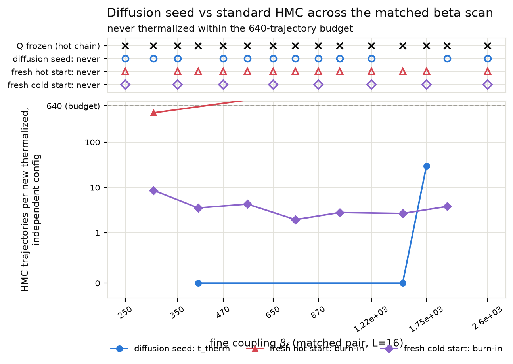

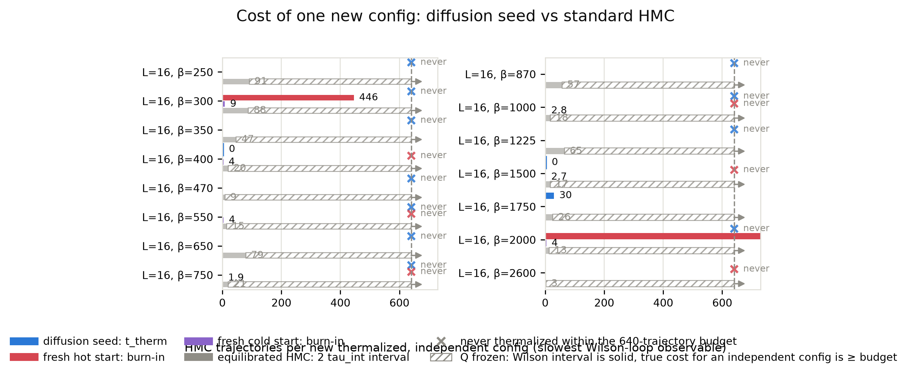

## The three starting points

- **Diffusion seed** -- the raw conditional-diffusion output for this coupling: one inverse-RG step from a direct-HMC base ensemble at the matched coarse coupling (ancestral sampling + the deterministic coarse-charge transport), with **no** rethermalization sweeps applied: every bit of equilibration the seed needs is measured here, in HMC trajectories.
- **Hot start** -- every link angle drawn uniformly from (-pi, pi]: a completely disordered (infinite-temperature) configuration. The standard way to initialize a fresh HMC chain without prior information.
- **Cold start** -- every link angle set to zero: the perfectly ordered (beta -> infinity) configuration, the other standard initialization.

## Summary

| rung | L | beta | t_therm diffusion seed | standard-HMC interval 2 tau_int | margin (interval - t_therm) | burn-in hot / cold | tau_int(Q) |
|---|---|---|---|---|---|---|---|
| F_L16_bc62.8782_L16_beta250 | 16 | 250 | never | 91.3 | -- | nan / nan | frozen (0 tunnelings in 321 x 64 traj) |
| F_L16_bc75.3776_L16_beta300 | 16 | 300 | never | 88.3 | -- | 446 / 9 | frozen (0 tunnelings in 321 x 64 traj) |
| F_L16_bc87.8773_L16_beta350 | 16 | 350 | never | 46.8 | -- | nan / nan | frozen (0 tunnelings in 321 x 64 traj) |
| F_L16_bc100.377_L16_beta400 | 16 | 400 | 0 | 20.3 | 20.3 traj | never / 4 | frozen (0 tunnelings in 321 x 64 traj) |
| F_L16_bc117.877_L16_beta470 | 16 | 470 | never | 9.2 | -- | nan / nan | frozen (0 tunnelings in 321 x 64 traj) |
| F_L16_bc137.876_L16_beta550 | 16 | 550 | never | 15.1 | -- | never / 4 | frozen (0 tunnelings in 321 x 64 traj) |
| F_L16_bc162.876_L16_beta650 | 16 | 650 | never | 79.4 | -- | nan / nan | frozen (0 tunnelings in 321 x 64 traj) |
| F_L16_bc187.876_L16_beta750 | 16 | 750 | never | 20.7 | -- | never / 2 | frozen (0 tunnelings in 321 x 64 traj) |
| F_L16_bc217.876_L16_beta870 | 16 | 870 | never | 57.1 | -- | nan / nan | frozen (0 tunnelings in 321 x 64 traj) |
| F_L16_bc250.376_L16_beta1000 | 16 | 1000 | never | 17.8 | -- | never / 3 | frozen (0 tunnelings in 321 x 64 traj) |
| F_L16_bc306.626_L16_beta1225 | 16 | 1225 | never | 65.4 | -- | nan / nan | frozen (0 tunnelings in 321 x 64 traj) |
| F_L16_bc375.375_L16_beta1500 | 16 | 1500 | 0 | 17.3 | 17.3 traj | never / 3 | frozen (0 tunnelings in 321 x 64 traj) |
| F_L16_bc437.875_L16_beta1750 | 16 | 1750 | 30 | 26.1 | -4.0 traj | nan / nan | frozen (0 tunnelings in 321 x 64 traj) |
| F_L16_bc500.375_L16_beta2000 | 16 | 2000 | never | 13.4 | -- | 3496 / 4 | frozen (0 tunnelings in 321 x 64 traj) |
| F_L16_bc650.375_L16_beta2600 | 16 | 2600 | nan | 3.0 | -- | never / nan | frozen (0 tunnelings in 321 x 64 traj) |

## Wall-clock accounting

All timescales above are in HMC trajectories -- the honest *ergodicity* unit. This table converts to seconds on this machine so the economics are explicit. Batched chains produce n_chains configs per trajectory, so per-config costs divide by the chain count; the diffusion sampling cost amortizes over the whole generated batch.

| case | seed: sample s/config | seed: t_therm s (batch) | HMC interval s/config | hot burn-in s (batch) | s/traj (batch) |
|---|---|---|---|---|---|
| F_L16_bc62.8782_L16_beta250 | n/a (cached) | never | 0.14 | never | 0.10 |
| F_L16_bc75.3776_L16_beta300 | 0.2 | never | 0.29 | 94 | 0.21 |
| F_L16_bc87.8773_L16_beta350 | 2.3 | never | 0.08 | never | 0.10 |
| F_L16_bc100.377_L16_beta400 | 0.1 | 0.0 | 0.07 | never | 0.23 |
| F_L16_bc117.877_L16_beta470 | 2.1 | never | 0.02 | never | 0.13 |
| F_L16_bc137.876_L16_beta550 | 0.2 | never | 0.07 | never | 0.28 |
| F_L16_bc162.876_L16_beta650 | 2.2 | never | 0.17 | never | 0.14 |
| F_L16_bc187.876_L16_beta750 | 0.2 | never | 0.10 | never | 0.31 |
| F_L16_bc217.876_L16_beta870 | 2.2 | never | 0.15 | never | 0.17 |
| F_L16_bc250.376_L16_beta1000 | 0.2 | never | 0.10 | never | 0.36 |
| F_L16_bc306.626_L16_beta1225 | 2.2 | never | 0.19 | never | 0.19 |
| F_L16_bc375.375_L16_beta1500 | 0.2 | 0.0 | 0.12 | never | 0.44 |
| F_L16_bc437.875_L16_beta1750 | 2.1 | 6.6 | 0.10 | never | 0.23 |
| F_L16_bc500.375_L16_beta2000 | 0.2 | never | 0.11 | 1820 | 0.52 |
| F_L16_bc650.375_L16_beta2600 | 2.2 | never | 0.01 | never | 0.24 |

## Fitted relaxation times across starts

Exponential fits C + A exp(-t/tau) to the ensemble-mean plaquette and W(2x2) relaxation curves, per starting point (the cross-start comparison of characteristic times; a start already at its plateau fits no decay, which is the desired outcome for the diffusion seed).

| case | obs | tau: diffusion seed | tau: hot start | tau: cold start |
|---|---|---|---|---|
| F_L16_bc62.8782_L16_beta250 | plaquette | 2.3 +- 0.5 | 1.6 +- 0.0 | 4.4 +- 0.2 |
| F_L16_bc62.8782_L16_beta250 | wilson_2x2 | 1.9 +- 1.4 | 3.4 +- 0.1 | 5.3 +- 0.3 |
| F_L16_bc75.3776_L16_beta300 | plaquette | 8.3 +- 1.4 | 1.7 +- 0.0 | 43.0 +- 1.6 |
| F_L16_bc75.3776_L16_beta300 | wilson_2x2 | 19.8 +- 9.3 | 4.0 +- 0.1 | 27.9 +- 1.1 |
| F_L16_bc87.8773_L16_beta350 | plaquette | unconstrained fit (tau error exceeds tau) | 1.6 +- 0.0 | 23.0 +- 0.9 |
| F_L16_bc87.8773_L16_beta350 | wilson_2x2 | 4.0 +- 3.2 | 4.0 +- 0.1 | 9.7 +- 0.4 |
| F_L16_bc100.377_L16_beta400 | plaquette | 10.7 +- 1.8 | 1.6 +- 0.0 | 10.4 +- 0.5 |
| F_L16_bc100.377_L16_beta400 | wilson_2x2 | no measurable decay (starts at plateau; tau unconstrained) | 3.4 +- 0.0 | 8.1 +- 0.4 |
| F_L16_bc117.877_L16_beta470 | plaquette | 3.3 +- 0.3 | 1.6 +- 0.0 | 5.4 +- 0.1 |
| F_L16_bc117.877_L16_beta470 | wilson_2x2 | 3.0 +- 0.8 | 3.6 +- 0.1 | 4.8 +- 0.1 |
| F_L16_bc137.876_L16_beta550 | plaquette | no measurable decay (starts at plateau; tau unconstrained) | 1.6 +- 0.0 | 5.5 +- 0.2 |
| F_L16_bc137.876_L16_beta550 | wilson_2x2 | 4.2 +- 2.1 | 4.5 +- 0.1 | 5.6 +- 0.2 |
| F_L16_bc162.876_L16_beta650 | plaquette | 1.9 +- 0.4 | 1.6 +- 0.0 | 4.1 +- 0.2 |
| F_L16_bc162.876_L16_beta650 | wilson_2x2 | 7.5 +- 2.9 | 3.5 +- 0.1 | 74.7 +- 4.0 |
| F_L16_bc187.876_L16_beta750 | plaquette | unconstrained fit (tau error exceeds tau) | 1.6 +- 0.0 | 2.2 +- 0.1 |
| F_L16_bc187.876_L16_beta750 | wilson_2x2 | 21.3 +- 18.4 | 3.8 +- 0.1 | 1.4 +- 0.1 |
| F_L16_bc217.876_L16_beta870 | plaquette | unconstrained fit (tau error exceeds tau) | 1.6 +- 0.0 | 28.5 +- 1.5 |
| F_L16_bc217.876_L16_beta870 | wilson_2x2 | 3.2 +- 1.5 | 4.7 +- 0.2 | 4.8 +- 0.2 |
| F_L16_bc250.376_L16_beta1000 | plaquette | no measurable decay (starts at plateau; tau unconstrained) | 1.7 +- 0.0 | 2.3 +- 0.1 |
| F_L16_bc250.376_L16_beta1000 | wilson_2x2 | no measurable decay (starts at plateau; tau unconstrained) | 3.4 +- 0.1 | 2.9 +- 0.1 |
| F_L16_bc306.626_L16_beta1225 | plaquette | 3.9 +- 1.5 | 1.6 +- 0.0 | 12.3 +- 0.5 |
| F_L16_bc306.626_L16_beta1225 | wilson_2x2 | unreliable (tau exceeds window) | 4.3 +- 0.1 | 22.5 +- 1.0 |
| F_L16_bc375.375_L16_beta1500 | plaquette | 8.4 +- 1.5 | 1.6 +- 0.0 | 4.7 +- 0.2 |
| F_L16_bc375.375_L16_beta1500 | wilson_2x2 | 0.7 +- 0.2 | 3.6 +- 0.1 | 2.0 +- 0.1 |
| F_L16_bc437.875_L16_beta1750 | plaquette | 9.6 +- 1.5 | 1.6 +- 0.0 | 14.7 +- 0.6 |
| F_L16_bc437.875_L16_beta1750 | wilson_2x2 | 1.3 +- 0.4 | 3.5 +- 0.1 | 7.7 +- 0.4 |
| F_L16_bc500.375_L16_beta2000 | plaquette | 3.5 +- 0.4 | 1.5 +- 0.0 | 4.5 +- 0.2 |
| F_L16_bc500.375_L16_beta2000 | wilson_2x2 | 4.0 +- 0.7 | 2.8 +- 0.1 | 4.9 +- 0.2 |
| F_L16_bc650.375_L16_beta2600 | plaquette | 3.0 +- 0.2 | 1.6 +- 0.0 | 7.4 +- 0.3 |
| F_L16_bc650.375_L16_beta2600 | wilson_2x2 | 5.0 +- 0.4 | 2.8 +- 0.1 | 10.6 +- 0.3 |

t_therm and burn-in are the slowest Wilson-loop observable (plaquette, W(2x2), W(4x4)); topology is stricter still for the fresh chains: their Q^2 **never** reaches the exact value at the frozen rungs, while the diffusion seed inherits the correct topological sector from the coarse ensemble it was generated from (see the Q^2 panels and per-rung tables below).

Thermalization time `t_therm` = first trajectory at which the ensemble-mean z-score vs the exact value satisfies |z| <= 2 and stays there for 5 consecutive trajectories (t = 0: already thermalized before any HMC). For the diffusion seed, t_therm is computed on a random subsample of chains matched to the baseline chain count so all starts are compared at equal statistical power. `tau_int` is Madras-Sokal, measured on the second half of the hot-start chains, averaged over chains. In the per-rung relaxation figures, triangles mark each start's t_therm, dashed curves are the exponential fits C + A exp(-t/tau) to the ensemble means (tau quoted per panel), and the right-hand panels track the ensemble mean's distance from the exact value in SEM units -- thermalized means inside the shaded |z| <= 2 band; the dotted vertical line there is the standard-HMC interval `2 tau_int`.

## What 'never' means, and where the ground truth comes from

'never' = the ensemble mean was still outside |z| <= 2 of the exact value after the full baseline budget; the per-rung sections quote the z-score it plateaued at. For hot starts at the large-beta rungs this is not a budget problem but a physical one: a random start freezes into a random topological sector (<Q^2> of order tens), plain HMC can never change Q at these couplings (tunneling is suppressed ~exp(-2 beta)), and the wrong sector biases every Wilson loop by an amount that never decays. Cold starts sit in the single sector Q = 0, so their Wilson loops do eventually converge, but <Q^2> stays pinned at 0 forever.

None of the exact values in this report come from fine-lattice HMC: the ground truth is the character expansion of 2D compact U(1) (`diffusion/lgt/exact.py`), which gives every Wilson loop, P(Q) and chi_top in closed form at finite volume. Each diffusion seed here is one inverse-RG step from a direct-HMC base ensemble at the matched coarse coupling beta_c (L=16), where HMC mixes well -- which is precisely why it can start chains in regions standard HMC cannot reach.

## F_L16_bc62.8782_L16_beta250

HMC: step size 0.0253, 40 leapfrog steps, acceptance seed/hot/cold = 0.986/0.986/0.988. Diffusion-seed batch: 64 chains x 96 trajectories (0.13 s/traj for the whole batch); baselines: 64 chains x 640 trajectories.

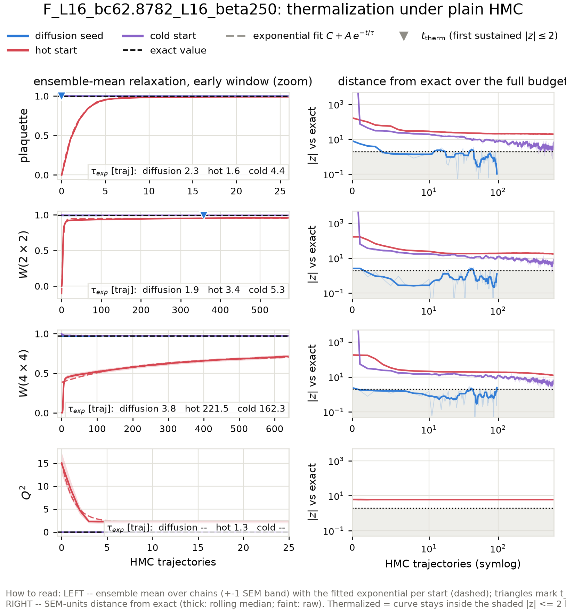

tau_int (hot-start chains, second half): plaquette = 29.31 +- 1.77, wilson_2x2 = 43.63 +- 1.47, wilson_4x4 = 45.66 +- 1.48, wilson_6x6 = 34.62 +- 2.43. Topology: hot-start HMC L=16 beta=250 -> **frozen** (no tunneling).

Where 'never' stood at the end: the hot start ended the 640-trajectory budget still at Q^2 at |z| ~ 6; the cold start ended the 640-trajectory budget still at Q^2 at |z| ~ 8840.

### Diagnostics: raw diffusion output (before any HMC)

| observable | value | error | exact | z_exact | reference | ref_error | z_ref | ks_p | chi2_p |
|---|---|---|---|---|---|---|---|---|---|
| plaquette | 0.9982 | 1.759e-05 | 0.998 | 10.5 | 0.998 | 1.77e-05 | 6.931 | 9.538e-08 |  |
| wilson_1x1 | 0.9982 | 1.759e-05 | 0.998 | 10.5 | 0.998 | 1.77e-05 | 6.931 | 9.538e-08 |  |
| wilson_1x2 | 0.9963 | 4.004e-05 | 0.996 | 7.269 | 0.9961 | 4.155e-05 | 3.063 | 0.0007896 |  |
| wilson_2x2 | 0.9924 | 0.0001144 | 0.9921 | 2.689 | 0.9925 | 9.226e-05 | -0.2955 | 0.3607 |  |
| wilson_2x3 | 0.989 | 0.0001857 | 0.9883 | 3.385 | 0.9889 | 0.000176 | 0.07908 | 0.4535 |  |
| wilson_3x3 | 0.9837 | 0.0003407 | 0.9827 | 2.697 | 0.984 | 0.0002733 | -0.688 | 0.215 |  |
| wilson_3x4 | 0.9786 | 0.0004719 | 0.9773 | 2.734 | 0.9786 | 0.000416 | 0.1251 | 0.6123 |  |
| wilson_4x4 | 0.972 | 0.0006598 | 0.9704 | 2.426 | 0.9717 | 0.000536 | 0.281 | 0.6123 |  |
| wilson_4x5 | 0.9657 | 0.0008398 | 0.9637 | 2.349 | 0.9651 | 0.0006887 | 0.527 | 0.2464 |  |
| wilson_5x5 | 0.9589 | 0.001156 | 0.9558 | 2.695 | 0.9576 | 0.0008528 | 0.9026 | 0.1015 |  |
| wilson_5x6 | 0.9515 | 0.001439 | 0.9483 | 2.243 | 0.9501 | 0.001009 | 0.8282 | 0.215 |  |
| wilson_6x6 | 0.9445 | 0.001968 | 0.9399 | 2.346 | 0.9423 | 0.001218 | 0.9668 | 0.05149 |  |
| wilson_6x7 | 0.9369 | 0.002424 | 0.9321 | 2.013 | 0.935 | 0.001342 | 0.7037 | 0.04298 |  |
| wilson_7x7 | 0.9299 | 0.003049 | 0.9237 | 2.037 | 0.9279 | 0.001455 | 0.583 | 0.07294 |  |
| wilson_7x8 | 0.9233 | 0.003524 | 0.9161 | 2.044 | 0.9206 | 0.001529 | 0.6881 | 0.04298 |  |
| wilson_8x8 | 0.9167 | 0.00389 | 0.9083 | 2.173 | 0.914 | 0.001681 | 0.6505 | 0.06142 |  |
| creutz_2 | 0.002023 | 6.284e-05 | 0.001934 | 1.42 |  |  |  |  |  |
| creutz_3 | 0.001836 | 0.0001564 | 0.001808 | 0.1754 |  |  |  |  |  |
| creutz_4 | 0.001676 | 0.0002753 | 0.00162 | 0.2029 |  |  |  |  |  |
| creutz_5 | 0.0005575 | 0.0004697 | 0.00137 | -1.73 |  |  |  |  |  |
| creutz_6 | -0.0003008 | 0.0005913 | 0.001057 | -2.296 |  |  |  |  |  |
| creutz_7 | -0.0004749 | 0.0007729 | 0.000681 | -1.496 |  |  |  |  |  |
| creutz_8 | -5.905e-05 | 0.001025 | 0.0002427 | -0.2942 |  |  |  |  |  |
| Q | 0 | 0 | 0 | 0 | 0 | 0 | 0 | 1 |  |
| Q^2 | 0 | 0 | 8.84e-09 | inf | 0 | 0 | 0 | 1 |  |
| chi_top ((<Q^2>-<Q>^2)/V) | 0 | 0 | 3.453e-11 | inf | 0 | 0 | 0 |  |  |
| Q histogram vs exact P(Q) | 5.658e-07 | nan | 2 | nan |  |  |  |  | 1 |

### Diagnostics: the same configs after 96 HMC trajectories

| observable | value | error | exact | z_exact | reference | ref_error | z_ref | ks_p | chi2_p |
|---|---|---|---|---|---|---|---|---|---|
| plaquette | 0.998 | 2.011e-05 | 0.998 | 0.1121 | 0.998 | 1.77e-05 | -0.3579 | 0.9115 |  |
| wilson_1x1 | 0.998 | 2.011e-05 | 0.998 | 0.1121 | 0.998 | 1.77e-05 | -0.3579 | 0.9115 |  |
| wilson_1x2 | 0.9961 | 4.788e-05 | 0.996 | 0.7649 | 0.9961 | 4.155e-05 | -1.227 | 0.5575 |  |
| wilson_2x2 | 0.9923 | 0.0001103 | 0.9921 | 1.431 | 0.9925 | 9.226e-05 | -1.345 | 0.1389 |  |
| wilson_2x3 | 0.9887 | 0.0001692 | 0.9883 | 2.26 | 0.9889 | 0.000176 | -0.9262 | 0.1867 |  |
| wilson_3x3 | 0.9835 | 0.0002767 | 0.9827 | 2.594 | 0.984 | 0.0002733 | -1.289 | 0.07294 |  |
| wilson_3x4 | 0.9786 | 0.0004654 | 0.9773 | 2.726 | 0.9786 | 0.000416 | 0.09194 | 0.6679 |  |
| wilson_4x4 | 0.9721 | 0.0006859 | 0.9704 | 2.477 | 0.9717 | 0.000536 | 0.3877 | 0.5575 |  |
| wilson_4x5 | 0.9665 | 0.001004 | 0.9637 | 2.798 | 0.9651 | 0.0006887 | 1.157 | 0.5575 |  |
| wilson_5x5 | 0.9595 | 0.001343 | 0.9558 | 2.767 | 0.9576 | 0.0008528 | 1.192 | 0.1867 |  |
| wilson_5x6 | 0.9534 | 0.00176 | 0.9483 | 2.865 | 0.9501 | 0.001009 | 1.612 | 0.1614 |  |
| wilson_6x6 | 0.9453 | 0.002198 | 0.9399 | 2.448 | 0.9423 | 0.001218 | 1.194 | 0.06142 |  |
| wilson_6x7 | 0.9386 | 0.002537 | 0.9321 | 2.581 | 0.935 | 0.001342 | 1.26 | 0.05149 |  |
| wilson_7x7 | 0.9304 | 0.003041 | 0.9237 | 2.225 | 0.9279 | 0.001455 | 0.7484 | 0.06142 |  |
| wilson_7x8 | 0.9238 | 0.003479 | 0.9161 | 2.225 | 0.9206 | 0.001529 | 0.8368 | 0.1614 |  |
| wilson_8x8 | 0.9166 | 0.003924 | 0.9083 | 2.112 | 0.914 | 0.001681 | 0.607 | 0.1015 |  |
| creutz_2 | 0.001846 | 7.187e-05 | 0.001934 | -1.22 |  |  |  |  |  |
| creutz_3 | 0.001693 | 0.0001321 | 0.001808 | -0.8748 |  |  |  |  |  |
| creutz_4 | 0.001736 | 0.0002433 | 0.00162 | 0.4731 |  |  |  |  |  |
| creutz_5 | 0.001562 | 0.0004088 | 0.00137 | 0.4691 |  |  |  |  |  |
| creutz_6 | 0.002076 | 0.0004426 | 0.001057 | 2.303 |  |  |  |  |  |
| creutz_7 | 0.001677 | 0.0006583 | 0.000681 | 1.513 |  |  |  |  |  |
| creutz_8 | 0.0006886 | 0.0008894 | 0.0002427 | 0.5013 |  |  |  |  |  |
| Q | 0 | 0 | 0 | 0 | 0 | 0 | 0 | 1 |  |
| Q^2 | 0 | 0 | 8.84e-09 | inf | 0 | 0 | 0 | 1 |  |
| chi_top ((<Q^2>-<Q>^2)/V) | 0 | 0 | 3.453e-11 | inf | 0 | 0 | 0 |  |  |
| Q histogram vs exact P(Q) | 5.658e-07 | nan | 2 | nan |  |  |  |  | 1 |

## F_L16_bc75.3776_L16_beta300

HMC: step size 0.0231, 43 leapfrog steps, acceptance seed/hot/cold = 0.989/0.984/0.988. Diffusion-seed batch: 64 chains x 96 trajectories (0.22 s/traj for the whole batch); baselines: 64 chains x 640 trajectories.

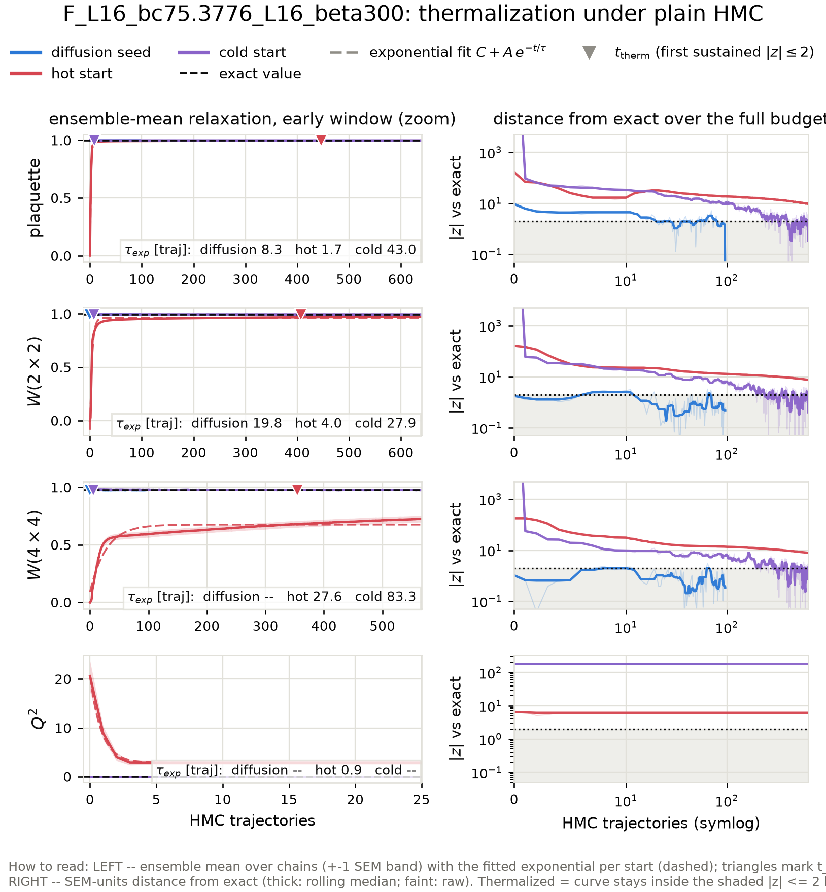

tau_int (hot-start chains, second half): plaquette = 41.70 +- 1.56, wilson_2x2 = 42.92 +- 1.79, wilson_4x4 = 44.14 +- 1.98, wilson_6x6 = 39.73 +- 2.08. Topology: hot-start HMC L=16 beta=300 -> **frozen** (no tunneling).

Where 'never' stood at the end: the hot start ended the 640-trajectory budget still at Q^2 at |z| ~ 6; the cold start ended the 640-trajectory budget still at wilson_6x6 at |z| ~ 2, Q^2 at |z| ~ 187.

### Diagnostics: raw diffusion output (before any HMC)

| observable | value | error | exact | z_exact | reference | ref_error | z_ref | ks_p | chi2_p |
|---|---|---|---|---|---|---|---|---|---|
| plaquette | 0.9985 | 1.393e-05 | 0.9983 | 11.82 | 0.9983 | 1.174e-05 | 9.473 | 2.035e-07 |  |
| wilson_1x1 | 0.9985 | 1.393e-05 | 0.9983 | 11.82 | 0.9983 | 1.174e-05 | 9.473 | 2.035e-07 |  |
| wilson_1x2 | 0.9969 | 3.026e-05 | 0.9967 | 8.328 | 0.9966 | 2.808e-05 | 7.802 | 2.952e-07 |  |
| wilson_2x2 | 0.9936 | 9.942e-05 | 0.9934 | 1.781 | 0.9931 | 8.549e-05 | 3.706 | 0.0003536 |  |
| wilson_2x3 | 0.9905 | 0.0001818 | 0.9903 | 1.498 | 0.9898 | 0.0001576 | 2.958 | 0.002168 |  |
| wilson_3x3 | 0.9858 | 0.0003337 | 0.9856 | 0.471 | 0.9849 | 0.0002727 | 1.891 | 0.1867 |  |
| wilson_3x4 | 0.981 | 0.0005158 | 0.9811 | -0.08051 | 0.9802 | 0.0003956 | 1.314 | 0.3607 |  |
| wilson_4x4 | 0.9745 | 0.0007624 | 0.9753 | -0.958 | 0.974 | 0.0006338 | 0.5163 | 0.9433 |  |
| wilson_4x5 | 0.9685 | 0.001121 | 0.9697 | -1.02 | 0.9677 | 0.0008701 | 0.5838 | 0.9433 |  |
| wilson_5x5 | 0.9612 | 0.001455 | 0.963 | -1.288 | 0.9599 | 0.00123 | 0.6626 | 0.9433 |  |
| wilson_5x6 | 0.954 | 0.001951 | 0.9567 | -1.434 | 0.9523 | 0.001466 | 0.696 | 0.4056 |  |
| wilson_6x6 | 0.9456 | 0.002393 | 0.9497 | -1.684 | 0.9437 | 0.00204 | 0.6065 | 0.3192 |  |
| wilson_6x7 | 0.938 | 0.003025 | 0.9431 | -1.663 | 0.9359 | 0.002275 | 0.5617 | 0.2464 |  |
| wilson_7x7 | 0.9297 | 0.003605 | 0.936 | -1.755 | 0.9279 | 0.002938 | 0.3798 | 0.3607 |  |
| wilson_7x8 | 0.9222 | 0.004297 | 0.9296 | -1.712 | 0.9202 | 0.003019 | 0.3744 | 0.4056 |  |
| wilson_8x8 | 0.9149 | 0.004795 | 0.923 | -1.684 | 0.9125 | 0.00367 | 0.4021 | 0.2811 |  |
| creutz_2 | 0.001773 | 5.768e-05 | 0.001611 | 2.815 |  |  |  |  |  |
| creutz_3 | 0.001719 | 0.0001387 | 0.001506 | 1.53 |  |  |  |  |  |
| creutz_4 | 0.001855 | 0.0001909 | 0.00135 | 2.646 |  |  |  |  |  |
| creutz_5 | 0.001479 | 0.0003039 | 0.001141 | 1.113 |  |  |  |  |  |
| creutz_6 | 0.001224 | 0.0004098 | 0.0008804 | 0.8387 |  |  |  |  |  |
| creutz_7 | 0.0009051 | 0.0006904 | 0.0005674 | 0.4892 |  |  |  |  |  |
| creutz_8 | -0.0001226 | 0.001044 | 0.0002022 | -0.311 |  |  |  |  |  |
| Q | 0 | 0 | 0 | 0 | 0 | 0 | 0 | 1 |  |
| Q^2 | 0 | 0 | 1.872e-10 | inf | 0 | 0 | 0 | 1 |  |
| chi_top ((<Q^2>-<Q>^2)/V) | 0 | 0 | 7.311e-13 | inf | 0 | 0 | 0 |  |  |
| Q histogram vs exact P(Q) | 1.198e-08 | nan | 2 | nan |  |  |  |  | 1 |

### Diagnostics: the same configs after 96 HMC trajectories

| observable | value | error | exact | z_exact | reference | ref_error | z_ref | ks_p | chi2_p |
|---|---|---|---|---|---|---|---|---|---|
| plaquette | 0.9983 | 1.523e-05 | 0.9983 | -0.01432 | 0.9983 | 1.174e-05 | 0.3957 | 0.7766 |  |
| wilson_1x1 | 0.9983 | 1.523e-05 | 0.9983 | -0.01432 | 0.9983 | 1.174e-05 | 0.3957 | 0.7766 |  |
| wilson_1x2 | 0.9967 | 2.406e-05 | 0.9967 | 0.4754 | 0.9966 | 2.808e-05 | 2.204 | 0.119 |  |
| wilson_2x2 | 0.9935 | 7.885e-05 | 0.9934 | 0.5842 | 0.9931 | 8.549e-05 | 3.052 | 0.0007896 |  |
| wilson_2x3 | 0.9903 | 0.0001612 | 0.9903 | 0.12 | 0.9898 | 0.0001576 | 2.035 | 0.02956 |  |
| wilson_3x3 | 0.9857 | 0.0003076 | 0.9856 | 0.4135 | 0.9849 | 0.0002727 | 1.91 | 0.1614 |  |
| wilson_3x4 | 0.9812 | 0.0004556 | 0.9811 | 0.2708 | 0.9802 | 0.0003956 | 1.689 | 0.3192 |  |
| wilson_4x4 | 0.9755 | 0.0006834 | 0.9753 | 0.3542 | 0.974 | 0.0006338 | 1.592 | 0.2464 |  |
| wilson_4x5 | 0.9699 | 0.000905 | 0.9697 | 0.1905 | 0.9677 | 0.0008701 | 1.708 | 0.3607 |  |
| wilson_5x5 | 0.9633 | 0.001185 | 0.963 | 0.2465 | 0.9599 | 0.00123 | 2.007 | 0.05149 |  |
| wilson_5x6 | 0.957 | 0.001522 | 0.9567 | 0.1685 | 0.9523 | 0.001466 | 2.249 | 0.04298 |  |
| wilson_6x6 | 0.9498 | 0.001952 | 0.9497 | 0.08148 | 0.9437 | 0.00204 | 2.159 | 0.04298 |  |
| wilson_6x7 | 0.9432 | 0.002367 | 0.9431 | 0.03328 | 0.9359 | 0.002275 | 2.204 | 0.03572 |  |
| wilson_7x7 | 0.9358 | 0.002873 | 0.936 | -0.0766 | 0.9279 | 0.002938 | 1.916 | 0.02956 |  |
| wilson_7x8 | 0.93 | 0.003219 | 0.9296 | 0.121 | 0.9202 | 0.003019 | 2.201 | 0.01074 |  |
| wilson_8x8 | 0.923 | 0.003679 | 0.923 | -0.009091 | 0.9125 | 0.00367 | 2.015 | 0.004418 |  |
| creutz_2 | 0.001588 | 6.176e-05 | 0.001611 | -0.3756 |  |  |  |  |  |
| creutz_3 | 0.00137 | 0.0001357 | 0.001506 | -1.005 |  |  |  |  |  |
| creutz_4 | 0.001224 | 0.0002416 | 0.00135 | -0.5206 |  |  |  |  |  |
| creutz_5 | 0.0009453 | 0.0003808 | 0.001141 | -0.5145 |  |  |  |  |  |
| creutz_6 | 0.0009455 | 0.0005227 | 0.0008804 | 0.1246 |  |  |  |  |  |
| creutz_7 | 0.0008021 | 0.0006725 | 0.0005674 | 0.3491 |  |  |  |  |  |
| creutz_8 | 0.001312 | 0.0008012 | 0.0002022 | 1.385 |  |  |  |  |  |
| Q | 0 | 0 | 0 | 0 | 0 | 0 | 0 | 1 |  |
| Q^2 | 0 | 0 | 1.872e-10 | inf | 0 | 0 | 0 | 1 |  |
| chi_top ((<Q^2>-<Q>^2)/V) | 0 | 0 | 7.311e-13 | inf | 0 | 0 | 0 |  |  |
| Q histogram vs exact P(Q) | 1.198e-08 | nan | 2 | nan |  |  |  |  | 1 |

## F_L16_bc87.8773_L16_beta350

HMC: step size 0.0214, 47 leapfrog steps, acceptance seed/hot/cold = 0.989/0.983/0.988. Diffusion-seed batch: 64 chains x 96 trajectories (0.10 s/traj for the whole batch); baselines: 64 chains x 640 trajectories.

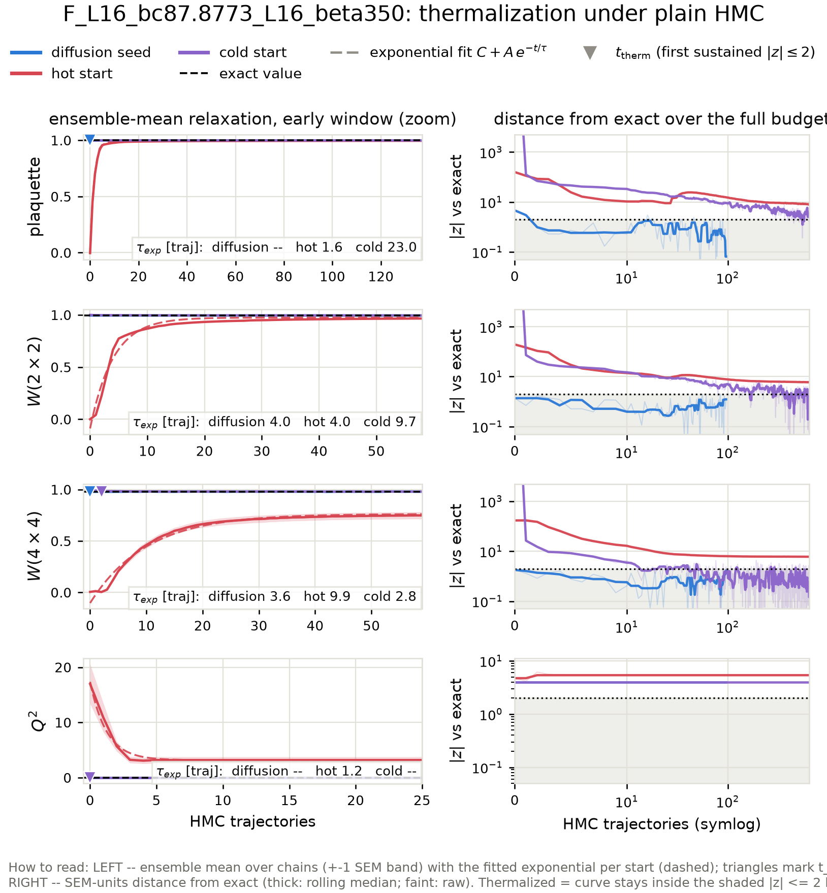

tau_int (hot-start chains, second half): plaquette = 23.42 +- 1.61, wilson_2x2 = 10.57 +- 1.08, wilson_4x4 = 1.54 +- 0.11, wilson_6x6 = 0.91 +- 0.03. Topology: hot-start HMC L=16 beta=350 -> **frozen** (no tunneling).

Where 'never' stood at the end: the hot start ended the 640-trajectory budget still at Q^2 at |z| ~ 5.

### Diagnostics: raw diffusion output (before any HMC)

| observable | value | error | exact | z_exact | reference | ref_error | z_ref | ks_p | chi2_p |
|---|---|---|---|---|---|---|---|---|---|
| plaquette | 0.9987 | 1.962e-05 | 0.9986 | 3.782 | 0.9986 | 1.042e-05 | 0.3699 | 0.3607 |  |
| wilson_1x1 | 0.9987 | 1.962e-05 | 0.9986 | 3.782 | 0.9986 | 1.042e-05 | 0.3699 | 0.3607 |  |
| wilson_1x2 | 0.9972 | 4.07e-05 | 0.9972 | 1.358 | 0.9973 | 2.854e-05 | -1.865 | 0.3607 |  |
| wilson_2x2 | 0.9942 | 0.0001063 | 0.9944 | -1.343 | 0.9947 | 8.421e-05 | -3.444 | 0.0035 |  |
| wilson_2x3 | 0.9913 | 0.0001748 | 0.9917 | -1.89 | 0.9921 | 0.0001519 | -3.189 | 0.002168 |  |
| wilson_3x3 | 0.9871 | 0.0003188 | 0.9877 | -1.746 | 0.9883 | 0.0002625 | -3.017 | 0.006949 |  |
| wilson_3x4 | 0.9828 | 0.0004405 | 0.9838 | -2.289 | 0.9847 | 0.0004087 | -3.283 | 0.006949 |  |
| wilson_4x4 | 0.9775 | 0.0006906 | 0.9788 | -1.769 | 0.9804 | 0.000539 | -3.254 | 0.002168 |  |
| wilson_4x5 | 0.9723 | 0.000859 | 0.974 | -1.927 | 0.976 | 0.0007186 | -3.282 | 0.001695 |  |
| wilson_5x5 | 0.9666 | 0.001177 | 0.9682 | -1.374 | 0.9714 | 0.0009115 | -3.188 | 0.008658 |  |
| wilson_5x6 | 0.9609 | 0.00137 | 0.9628 | -1.433 | 0.9663 | 0.001132 | -3.05 | 0.01631 |  |
| wilson_6x6 | 0.9544 | 0.001795 | 0.9567 | -1.274 | 0.9606 | 0.001443 | -2.67 | 0.01997 |  |
| wilson_6x7 | 0.9482 | 0.002055 | 0.951 | -1.391 | 0.9556 | 0.001678 | -2.819 | 0.02956 |  |
| wilson_7x7 | 0.9419 | 0.002474 | 0.9449 | -1.193 | 0.9507 | 0.002142 | -2.685 | 0.006949 |  |
| wilson_7x8 | 0.9355 | 0.002774 | 0.9393 | -1.363 | 0.9466 | 0.002337 | -3.061 | 0.006949 |  |
| wilson_8x8 | 0.9302 | 0.003098 | 0.9336 | -1.114 | 0.9424 | 0.002781 | -2.926 | 0.01074 |  |
| creutz_2 | 0.00156 | 5.762e-05 | 0.00138 | 3.124 |  |  |  |  |  |
| creutz_3 | 0.001332 | 0.0001013 | 0.001291 | 0.4044 |  |  |  |  |  |
| creutz_4 | 0.0009186 | 0.0002045 | 0.001157 | -1.165 |  |  |  |  |  |
| creutz_5 | 0.0004956 | 0.0003303 | 0.000978 | -1.46 |  |  |  |  |  |
| creutz_6 | 0.000736 | 0.0003969 | 0.0007544 | -0.04654 |  |  |  |  |  |
| creutz_7 | -1.193e-05 | 0.0004671 | 0.0004862 | -1.066 |  |  |  |  |  |
| creutz_8 | -0.001061 | 0.0006677 | 0.0001732 | -1.848 |  |  |  |  |  |
| Q | 0 | 0 | 0 | 0 | 0 | 0 | 0 | 1 |  |
| Q^2 | 0 | 0 | 3.975e-12 | inf | 0 | 0 | 0 | 1 |  |
| chi_top ((<Q^2>-<Q>^2)/V) | 0 | 0 | 1.553e-14 | inf | 0 | 0 | 0 |  |  |
| Q histogram vs exact P(Q) | 2.538e-10 | nan | 2 | nan |  |  |  |  | 1 |

### Diagnostics: the same configs after 96 HMC trajectories

| observable | value | error | exact | z_exact | reference | ref_error | z_ref | ks_p | chi2_p |
|---|---|---|---|---|---|---|---|---|---|
| plaquette | 0.9986 | 1.906e-05 | 0.9986 | 0.05882 | 0.9986 | 1.042e-05 | -2.987 | 0.002761 |  |
| wilson_1x1 | 0.9986 | 1.906e-05 | 0.9986 | 0.05882 | 0.9986 | 1.042e-05 | -2.987 | 0.002761 |  |
| wilson_1x2 | 0.9971 | 3.886e-05 | 0.9972 | -0.478 | 0.9973 | 2.854e-05 | -3.454 | 0.0007896 |  |
| wilson_2x2 | 0.9943 | 8.754e-05 | 0.9944 | -1.464 | 0.9947 | 8.421e-05 | -3.726 | 0.0006067 |  |
| wilson_2x3 | 0.9914 | 0.0001539 | 0.9917 | -1.369 | 0.9921 | 0.0001519 | -2.862 | 0.03572 |  |
| wilson_3x3 | 0.9872 | 0.0002707 | 0.9877 | -1.767 | 0.9883 | 0.0002625 | -3.097 | 0.01997 |  |
| wilson_3x4 | 0.983 | 0.0004174 | 0.9838 | -1.858 | 0.9847 | 0.0004087 | -2.979 | 0.04298 |  |
| wilson_4x4 | 0.9776 | 0.0006071 | 0.9788 | -1.889 | 0.9804 | 0.000539 | -3.419 | 0.008658 |  |
| wilson_4x5 | 0.9723 | 0.0008276 | 0.974 | -2.066 | 0.976 | 0.0007186 | -3.403 | 0.01326 |  |
| wilson_5x5 | 0.9661 | 0.001096 | 0.9682 | -1.951 | 0.9714 | 0.0009115 | -3.695 | 0.004418 |  |
| wilson_5x6 | 0.9601 | 0.001457 | 0.9628 | -1.901 | 0.9663 | 0.001132 | -3.375 | 0.006949 |  |
| wilson_6x6 | 0.9532 | 0.001893 | 0.9567 | -1.855 | 0.9606 | 0.001443 | -3.099 | 0.004418 |  |
| wilson_6x7 | 0.9469 | 0.002329 | 0.951 | -1.744 | 0.9556 | 0.001678 | -3.025 | 0.005553 |  |
| wilson_7x7 | 0.9399 | 0.002799 | 0.9449 | -1.79 | 0.9507 | 0.002142 | -3.077 | 0.008658 |  |
| wilson_7x8 | 0.9342 | 0.003312 | 0.9393 | -1.552 | 0.9466 | 0.002337 | -3.074 | 0.01631 |  |
| wilson_8x8 | 0.9279 | 0.003711 | 0.9336 | -1.544 | 0.9424 | 0.002781 | -3.118 | 0.005553 |  |
| creutz_2 | 0.001471 | 5.694e-05 | 0.00138 | 1.59 |  |  |  |  |  |
| creutz_3 | 0.001479 | 0.0001111 | 0.001291 | 1.695 |  |  |  |  |  |
| creutz_4 | 0.001236 | 0.0001955 | 0.001157 | 0.4048 |  |  |  |  |  |
| creutz_5 | 0.0008468 | 0.0002898 | 0.000978 | -0.4527 |  |  |  |  |  |
| creutz_6 | 0.0008833 | 0.0004111 | 0.0007544 | 0.3136 |  |  |  |  |  |
| creutz_7 | 0.0009179 | 0.0005815 | 0.0004862 | 0.7424 |  |  |  |  |  |
| creutz_8 | 0.0006738 | 0.0007458 | 0.0001732 | 0.6711 |  |  |  |  |  |
| Q | 0 | 0 | 0 | 0 | 0 | 0 | 0 | 1 |  |
| Q^2 | 0 | 0 | 3.975e-12 | inf | 0 | 0 | 0 | 1 |  |
| chi_top ((<Q^2>-<Q>^2)/V) | 0 | 0 | 1.553e-14 | inf | 0 | 0 | 0 |  |  |
| Q histogram vs exact P(Q) | 2.538e-10 | nan | 2 | nan |  |  |  |  | 1 |

## F_L16_bc100.377_L16_beta400

HMC: step size 0.0200, 50 leapfrog steps, acceptance seed/hot/cold = 0.990/0.979/0.989. Diffusion-seed batch: 64 chains x 96 trajectories (0.23 s/traj for the whole batch); baselines: 64 chains x 640 trajectories.

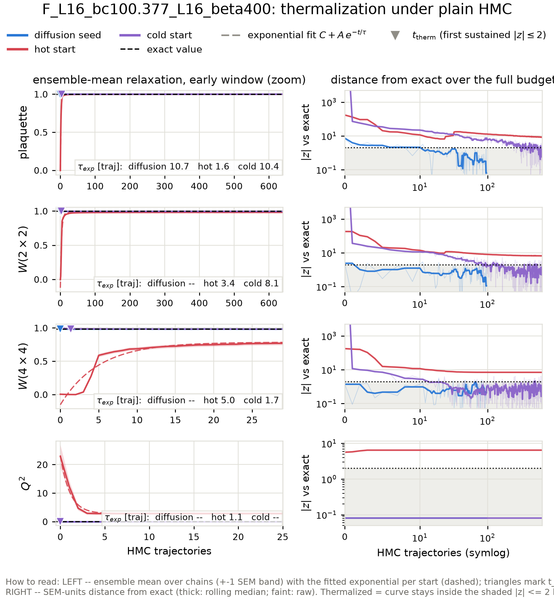

tau_int (hot-start chains, second half): plaquette = 10.17 +- 1.03, wilson_2x2 = 4.92 +- 0.72, wilson_4x4 = 1.03 +- 0.05, wilson_6x6 = 0.62 +- 0.03. Topology: hot-start HMC L=16 beta=400 -> **frozen** (no tunneling).

Where 'never' stood at the end: the hot start ended the 640-trajectory budget still at wilson_4x4 at |z| ~ 7, Q^2 at |z| ~ 6.

### Diagnostics: raw diffusion output (before any HMC)

| observable | value | error | exact | z_exact | reference | ref_error | z_ref | ks_p | chi2_p |
|---|---|---|---|---|---|---|---|---|---|
| plaquette | 0.9989 | 1.352e-05 | 0.9988 | 7.508 | 0.9987 | 8.634e-06 | 7.354 | 3.539e-06 |  |
| wilson_1x1 | 0.9989 | 1.352e-05 | 0.9988 | 7.508 | 0.9987 | 8.634e-06 | 7.354 | 3.539e-06 |  |
| wilson_1x2 | 0.9977 | 3.388e-05 | 0.9975 | 4.973 | 0.9975 | 1.908e-05 | 5.336 | 0.0004642 |  |
| wilson_2x2 | 0.9953 | 8.736e-05 | 0.9951 | 2.285 | 0.9949 | 4.527e-05 | 3.622 | 0.005553 |  |
| wilson_2x3 | 0.993 | 0.0001668 | 0.9927 | 1.714 | 0.9925 | 9.126e-05 | 2.284 | 0.008658 |  |
| wilson_3x3 | 0.9897 | 0.0003233 | 0.9892 | 1.56 | 0.9889 | 0.0001873 | 2.249 | 0.01326 |  |
| wilson_3x4 | 0.9864 | 0.0004669 | 0.9858 | 1.377 | 0.9853 | 0.0003112 | 2.057 | 0.03572 |  |
| wilson_4x4 | 0.9821 | 0.0006729 | 0.9814 | 1.098 | 0.9807 | 0.0005224 | 1.633 | 0.4056 |  |
| wilson_4x5 | 0.9779 | 0.0008531 | 0.9772 | 0.8798 | 0.9764 | 0.0007607 | 1.311 | 0.2464 |  |
| wilson_5x5 | 0.9731 | 0.001186 | 0.9722 | 0.8176 | 0.9709 | 0.001087 | 1.415 | 0.1614 |  |
| wilson_5x6 | 0.9683 | 0.001447 | 0.9674 | 0.6492 | 0.9662 | 0.001412 | 1.035 | 0.4535 |  |
| wilson_6x6 | 0.9632 | 0.001806 | 0.962 | 0.6334 | 0.9599 | 0.001862 | 1.25 | 0.3607 |  |
| wilson_6x7 | 0.9576 | 0.002166 | 0.957 | 0.2934 | 0.9549 | 0.002198 | 0.8834 | 0.4535 |  |
| wilson_7x7 | 0.9522 | 0.00267 | 0.9516 | 0.207 | 0.9485 | 0.002731 | 0.9518 | 0.5575 |  |
| wilson_7x8 | 0.947 | 0.003034 | 0.9467 | 0.0924 | 0.9431 | 0.003035 | 0.9149 | 0.4056 |  |
| wilson_8x8 | 0.9419 | 0.003436 | 0.9417 | 0.04947 | 0.9371 | 0.003545 | 0.9662 | 0.4056 |  |
| creutz_2 | 0.001243 | 5.109e-05 | 0.001208 | 0.6967 |  |  |  |  |  |
| creutz_3 | 0.0009949 | 0.0001039 | 0.001129 | -1.295 |  |  |  |  |  |
| creutz_4 | 0.001054 | 0.0001701 | 0.001012 | 0.2447 |  |  |  |  |  |
| creutz_5 | 0.000642 | 0.0002979 | 0.0008556 | -0.7168 |  |  |  |  |  |
| creutz_6 | 0.0004162 | 0.0003199 | 0.00066 | -0.7619 |  |  |  |  |  |
| creutz_7 | -1.53e-05 | 0.0004942 | 0.0004253 | -0.8916 |  |  |  |  |  |
| creutz_8 | -1.739e-05 | 0.0005491 | 0.0001516 | -0.3077 |  |  |  |  |  |
| Q | 0 | 0 | 0 | 0 | 0 | 0 | 0 | 1 |  |
| Q^2 | 0 | 0 | 8.168e-14 | inf | 0 | 0 | 0 | 1 |  |
| chi_top ((<Q^2>-<Q>^2)/V) | 0 | 0 | 3.191e-16 | inf | 0 | 0 | 0 |  |  |
| Q histogram vs exact P(Q) | 5.227e-12 | nan | 2 | nan |  |  |  |  | 1 |

### Diagnostics: the same configs after 96 HMC trajectories

| observable | value | error | exact | z_exact | reference | ref_error | z_ref | ks_p | chi2_p |
|---|---|---|---|---|---|---|---|---|---|
| plaquette | 0.9988 | 1.441e-05 | 0.9988 | -0.06936 | 0.9987 | 8.634e-06 | 0.9212 | 0.5044 |  |
| wilson_1x1 | 0.9988 | 1.441e-05 | 0.9988 | -0.06936 | 0.9987 | 8.634e-06 | 0.9212 | 0.5044 |  |
| wilson_1x2 | 0.9975 | 2.795e-05 | 0.9975 | -0.2186 | 0.9975 | 1.908e-05 | 0.9715 | 0.9433 |  |
| wilson_2x2 | 0.9951 | 7.423e-05 | 0.9951 | 0.1183 | 0.9949 | 4.527e-05 | 1.904 | 0.1389 |  |
| wilson_2x3 | 0.9927 | 0.0001264 | 0.9927 | -0.3114 | 0.9925 | 9.126e-05 | 0.6999 | 0.7766 |  |
| wilson_3x3 | 0.989 | 0.0002318 | 0.9892 | -0.6449 | 0.9889 | 0.0001873 | 0.6257 | 0.7231 |  |
| wilson_3x4 | 0.9856 | 0.0003501 | 0.9858 | -0.5915 | 0.9853 | 0.0003112 | 0.6497 | 0.2811 |  |
| wilson_4x4 | 0.9812 | 0.0005555 | 0.9814 | -0.4364 | 0.9807 | 0.0005224 | 0.5373 | 0.4535 |  |
| wilson_4x5 | 0.9768 | 0.0007561 | 0.9772 | -0.4827 | 0.9764 | 0.0007607 | 0.3573 | 0.6123 |  |
| wilson_5x5 | 0.9715 | 0.001061 | 0.9722 | -0.5825 | 0.9709 | 0.001087 | 0.4532 | 0.5575 |  |
| wilson_5x6 | 0.9665 | 0.001351 | 0.9674 | -0.6601 | 0.9662 | 0.001412 | 0.1336 | 0.9976 |  |
| wilson_6x6 | 0.9605 | 0.001773 | 0.962 | -0.8302 | 0.9599 | 0.001862 | 0.2436 | 0.9115 |  |
| wilson_6x7 | 0.955 | 0.002117 | 0.957 | -0.9649 | 0.9549 | 0.002198 | 0.01559 | 0.9671 |  |
| wilson_7x7 | 0.9486 | 0.002614 | 0.9516 | -1.161 | 0.9485 | 0.002731 | 0.01301 | 0.9929 |  |
| wilson_7x8 | 0.9431 | 0.002925 | 0.9467 | -1.223 | 0.9431 | 0.003035 | 0.01609 | 0.9929 |  |
| wilson_8x8 | 0.9373 | 0.003436 | 0.9417 | -1.291 | 0.9371 | 0.003545 | 0.03329 | 0.9833 |  |
| creutz_2 | 0.001187 | 5.402e-05 | 0.001208 | -0.3716 |  |  |  |  |  |
| creutz_3 | 0.001192 | 9.414e-05 | 0.001129 | 0.6693 |  |  |  |  |  |
| creutz_4 | 0.00099 | 0.000168 | 0.001012 | -0.1309 |  |  |  |  |  |
| creutz_5 | 0.0009917 | 0.0002213 | 0.0008556 | 0.6151 |  |  |  |  |  |
| creutz_6 | 0.0009832 | 0.0003901 | 0.00066 | 0.8286 |  |  |  |  |  |
| creutz_7 | 0.0008747 | 0.0005672 | 0.0004253 | 0.7922 |  |  |  |  |  |
| creutz_8 | 0.0004924 | 0.0008347 | 0.0001516 | 0.4083 |  |  |  |  |  |
| Q | 0 | 0 | 0 | 0 | 0 | 0 | 0 | 1 |  |
| Q^2 | 0 | 0 | 8.168e-14 | inf | 0 | 0 | 0 | 1 |  |
| chi_top ((<Q^2>-<Q>^2)/V) | 0 | 0 | 3.191e-16 | inf | 0 | 0 | 0 |  |  |
| Q histogram vs exact P(Q) | 5.227e-12 | nan | 2 | nan |  |  |  |  | 1 |

## F_L16_bc117.877_L16_beta470

HMC: step size 0.0185, 54 leapfrog steps, acceptance seed/hot/cold = 0.989/0.978/0.989. Diffusion-seed batch: 64 chains x 96 trajectories (0.11 s/traj for the whole batch); baselines: 64 chains x 640 trajectories.

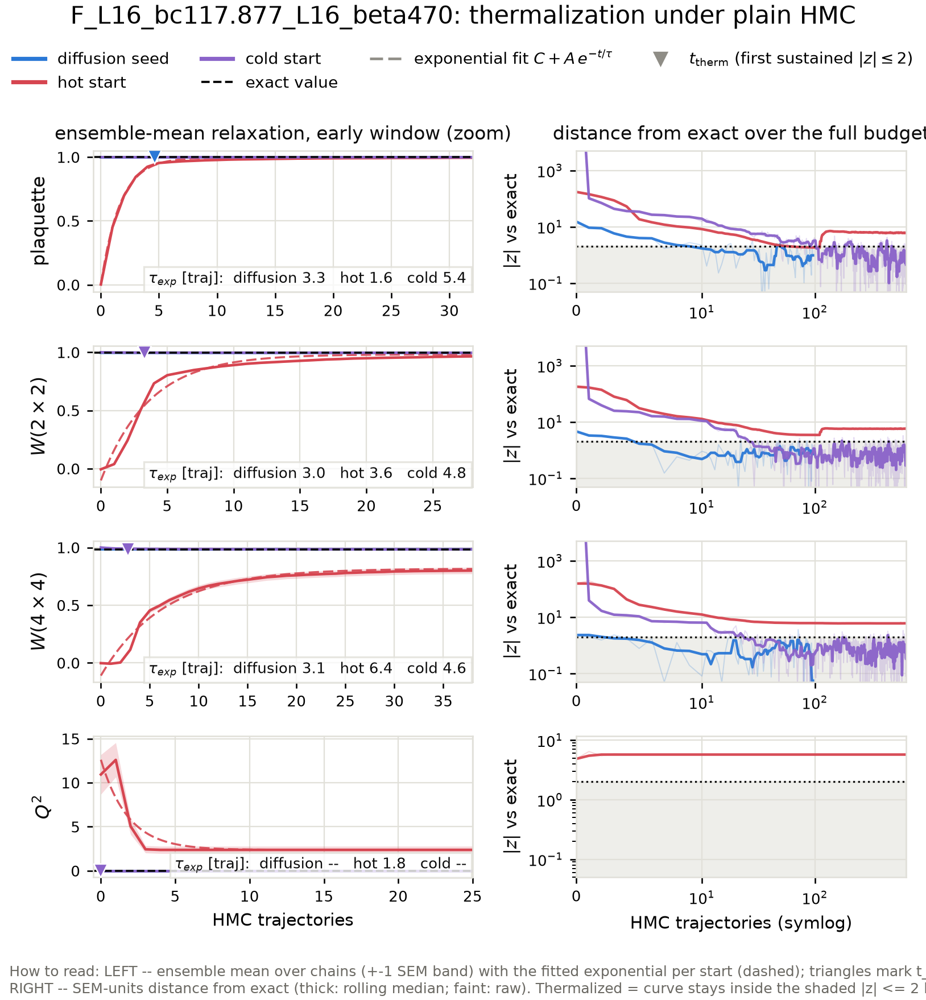

tau_int (hot-start chains, second half): plaquette = 4.62 +- 0.36, wilson_2x2 = 4.21 +- 0.40, wilson_4x4 = 2.47 +- 0.23, wilson_6x6 = 1.18 +- 0.05. Topology: hot-start HMC L=16 beta=470 -> **frozen** (no tunneling).

Where 'never' stood at the end: the hot start ended the 640-trajectory budget still at Q^2 at |z| ~ 6.

### Diagnostics: raw diffusion output (before any HMC)

| observable | value | error | exact | z_exact | reference | ref_error | z_ref | ks_p | chi2_p |
|---|---|---|---|---|---|---|---|---|---|
| plaquette | 0.9991 | 8.02e-06 | 0.9989 | 20.36 | 0.9989 | 8.476e-06 | 13.46 | 5.804e-15 |  |
| wilson_1x1 | 0.9991 | 8.02e-06 | 0.9989 | 20.36 | 0.9989 | 8.476e-06 | 13.46 | 5.804e-15 |  |
| wilson_1x2 | 0.9982 | 2.292e-05 | 0.9979 | 11.59 | 0.9979 | 1.673e-05 | 10.26 | 7.023e-10 |  |
| wilson_2x2 | 0.9962 | 6.129e-05 | 0.9958 | 5.69 | 0.9957 | 5.325e-05 | 6.07 | 6.135e-07 |  |
| wilson_2x3 | 0.9943 | 0.0001201 | 0.9938 | 4.459 | 0.9935 | 0.000107 | 4.91 | 3.428e-05 |  |
| wilson_3x3 | 0.9916 | 0.0002032 | 0.9908 | 3.955 | 0.9903 | 0.0001793 | 4.894 | 0.001023 |  |
| wilson_3x4 | 0.9889 | 0.0003093 | 0.9879 | 3.274 | 0.9871 | 0.0002886 | 4.325 | 0.001023 |  |
| wilson_4x4 | 0.9853 | 0.0004647 | 0.9842 | 2.447 | 0.9833 | 0.0004445 | 3.075 | 0.01631 |  |
| wilson_4x5 | 0.9819 | 0.0006007 | 0.9806 | 2.278 | 0.9794 | 0.0005675 | 3.027 | 0.06142 |  |
| wilson_5x5 | 0.9777 | 0.0008024 | 0.9763 | 1.827 | 0.9754 | 0.000786 | 2.044 | 0.1614 |  |
| wilson_5x6 | 0.9739 | 0.001017 | 0.9722 | 1.667 | 0.9713 | 0.00095 | 1.841 | 0.2464 |  |
| wilson_6x6 | 0.9696 | 0.001302 | 0.9676 | 1.54 | 0.9672 | 0.001225 | 1.334 | 0.4056 |  |
| wilson_6x7 | 0.9656 | 0.001559 | 0.9633 | 1.448 | 0.9633 | 0.001481 | 1.043 | 0.3192 |  |
| wilson_7x7 | 0.9613 | 0.001847 | 0.9587 | 1.403 | 0.9591 | 0.001674 | 0.8647 | 0.3192 |  |
| wilson_7x8 | 0.957 | 0.002164 | 0.9545 | 1.157 | 0.9552 | 0.001945 | 0.5974 | 0.4056 |  |
| wilson_8x8 | 0.9531 | 0.002444 | 0.9502 | 1.186 | 0.9507 | 0.00217 | 0.7103 | 0.6123 |  |
| creutz_2 | 0.001046 | 3.781e-05 | 0.001028 | 0.4926 |  |  |  |  |  |
| creutz_3 | 0.0008778 | 8.027e-05 | 0.000961 | -1.036 |  |  |  |  |  |
| creutz_4 | 0.0009453 | 0.000129 | 0.0008611 | 0.6524 |  |  |  |  |  |
| creutz_5 | 0.0008626 | 0.0001984 | 0.000728 | 0.6785 |  |  |  |  |  |
| creutz_6 | 0.0004762 | 0.0002456 | 0.0005616 | -0.3477 |  |  |  |  |  |
| creutz_7 | 0.0002733 | 0.0003394 | 0.0003619 | -0.2612 |  |  |  |  |  |
| creutz_8 | -0.0003773 | 0.0004534 | 0.000129 | -1.116 |  |  |  |  |  |
| Q | 0 | 0 | 0 | 0 | 0 | 0 | 0 | 1 |  |
| Q^2 | 0 | 0 | 3.272e-14 | inf | 0 | 0 | 0 | 1 |  |
| chi_top ((<Q^2>-<Q>^2)/V) | 0 | 0 | 1.278e-16 | inf | 0 | 0 | 0 |  |  |
| Q histogram vs exact P(Q) | 2.327e-13 | nan | 2 | nan |  |  |  |  | 1 |

### Diagnostics: the same configs after 96 HMC trajectories

| observable | value | error | exact | z_exact | reference | ref_error | z_ref | ks_p | chi2_p |
|---|---|---|---|---|---|---|---|---|---|
| plaquette | 0.999 | 1.3e-05 | 0.9989 | 0.9548 | 0.9989 | 8.476e-06 | 0.3972 | 0.3607 |  |
| wilson_1x1 | 0.999 | 1.3e-05 | 0.9989 | 0.9548 | 0.9989 | 8.476e-06 | 0.3972 | 0.3607 |  |
| wilson_1x2 | 0.9979 | 3.447e-05 | 0.9979 | 1.025 | 0.9979 | 1.673e-05 | 1.592 | 0.2811 |  |
| wilson_2x2 | 0.9959 | 7.839e-05 | 0.9958 | 0.6755 | 0.9957 | 5.325e-05 | 2.08 | 0.05149 |  |
| wilson_2x3 | 0.9938 | 0.0001361 | 0.9938 | 0.4256 | 0.9935 | 0.000107 | 1.802 | 0.1614 |  |
| wilson_3x3 | 0.9908 | 0.000206 | 0.9908 | 0.1434 | 0.9903 | 0.0001793 | 2.023 | 0.1867 |  |
| wilson_3x4 | 0.988 | 0.0002921 | 0.9879 | 0.1978 | 0.9871 | 0.0002886 | 2.131 | 0.2811 |  |
| wilson_4x4 | 0.9842 | 0.0004089 | 0.9842 | 0.06487 | 0.9833 | 0.0004445 | 1.435 | 0.6123 |  |
| wilson_4x5 | 0.9806 | 0.0005755 | 0.9806 | 0.07164 | 0.9794 | 0.0005675 | 1.453 | 0.1867 |  |
| wilson_5x5 | 0.9761 | 0.0007754 | 0.9763 | -0.1469 | 0.9754 | 0.000786 | 0.6489 | 0.3192 |  |
| wilson_5x6 | 0.9721 | 0.0009767 | 0.9722 | -0.06439 | 0.9713 | 0.00095 | 0.5898 | 0.1614 |  |
| wilson_6x6 | 0.9671 | 0.001227 | 0.9676 | -0.3641 | 0.9672 | 0.001225 | -0.03896 | 0.5575 |  |
| wilson_6x7 | 0.9628 | 0.001472 | 0.9633 | -0.3707 | 0.9633 | 0.001481 | -0.2684 | 0.6679 |  |
| wilson_7x7 | 0.958 | 0.001785 | 0.9587 | -0.3624 | 0.9591 | 0.001674 | -0.4424 | 0.6123 |  |
| wilson_7x8 | 0.954 | 0.001975 | 0.9545 | -0.2464 | 0.9552 | 0.001945 | -0.4515 | 0.5044 |  |
| wilson_8x8 | 0.9496 | 0.002263 | 0.9502 | -0.2627 | 0.9507 | 0.00217 | -0.3733 | 0.6679 |  |
| creutz_2 | 0.001033 | 4.445e-05 | 0.001028 | 0.1169 |  |  |  |  |  |
| creutz_3 | 0.0009946 | 8.018e-05 | 0.000961 | 0.419 |  |  |  |  |  |
| creutz_4 | 0.0009213 | 0.0001522 | 0.0008611 | 0.3953 |  |  |  |  |  |
| creutz_5 | 0.0009018 | 0.000226 | 0.000728 | 0.7691 |  |  |  |  |  |
| creutz_6 | 0.001011 | 0.0003325 | 0.0005616 | 1.351 |  |  |  |  |  |
| creutz_7 | 0.0003656 | 0.0004217 | 0.0003619 | 0.008712 |  |  |  |  |  |
| creutz_8 | 0.0004102 | 0.0005498 | 0.000129 | 0.5114 |  |  |  |  |  |
| Q | 0 | 0 | 0 | 0 | 0 | 0 | 0 | 1 |  |
| Q^2 | 0 | 0 | 3.272e-14 | inf | 0 | 0 | 0 | 1 |  |
| chi_top ((<Q^2>-<Q>^2)/V) | 0 | 0 | 1.278e-16 | inf | 0 | 0 | 0 |  |  |
| Q histogram vs exact P(Q) | 2.327e-13 | nan | 2 | nan |  |  |  |  | 1 |

## F_L16_bc137.876_L16_beta550

HMC: step size 0.0171, 59 leapfrog steps, acceptance seed/hot/cold = 0.986/0.951/0.987. Diffusion-seed batch: 64 chains x 96 trajectories (0.28 s/traj for the whole batch); baselines: 64 chains x 640 trajectories.

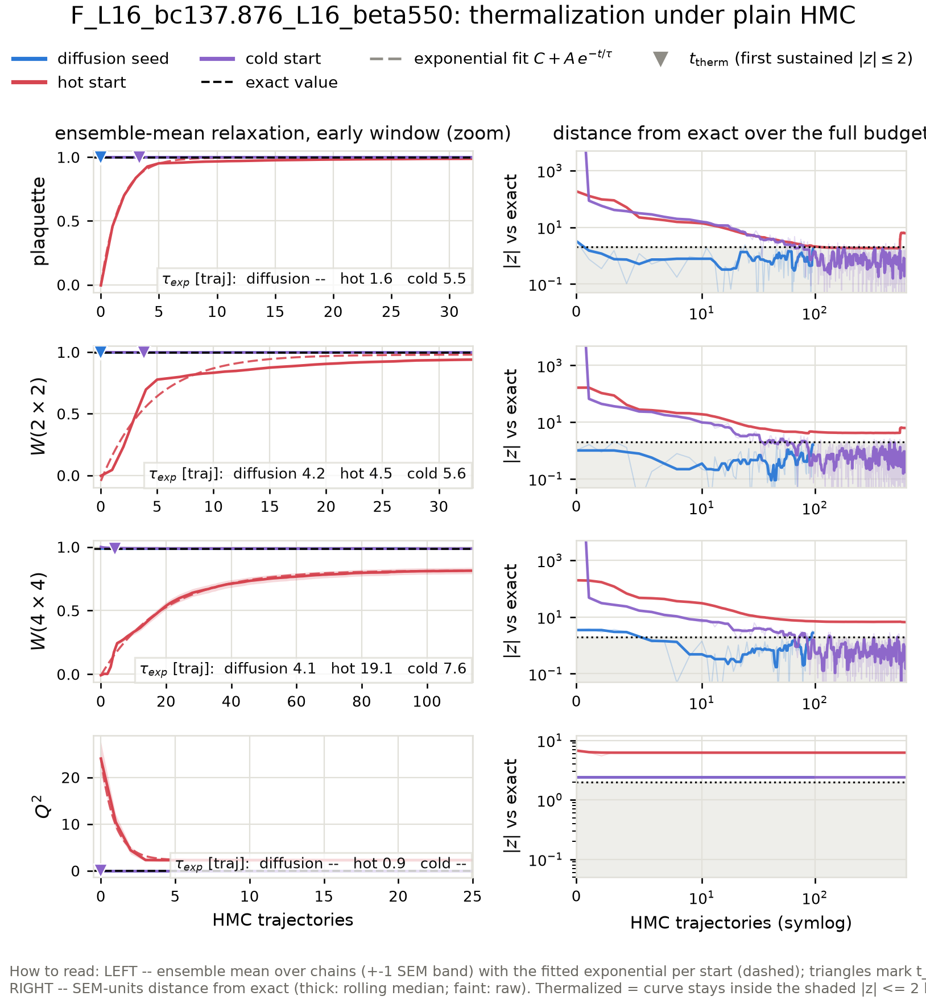

tau_int (hot-start chains, second half): plaquette = 5.44 +- 0.65, wilson_2x2 = 5.52 +- 0.67, wilson_4x4 = 7.53 +- 0.84, wilson_6x6 = 10.47 +- 0.95. Topology: hot-start HMC L=16 beta=550 -> **frozen** (no tunneling).

Where 'never' stood at the end: the hot start ended the 640-trajectory budget still at plaquette at |z| ~ 6, wilson_2x2 at |z| ~ 6, wilson_4x4 at |z| ~ 7, Q^2 at |z| ~ 6.

### Diagnostics: raw diffusion output (before any HMC)

| observable | value | error | exact | z_exact | reference | ref_error | z_ref | ks_p | chi2_p |
|---|---|---|---|---|---|---|---|---|---|
| plaquette | 0.9991 | 1.021e-05 | 0.9991 | 3.564 | 0.9991 | 5.287e-06 | 0.517 | 0.6679 |  |
| wilson_1x1 | 0.9991 | 1.021e-05 | 0.9991 | 3.564 | 0.9991 | 5.287e-06 | 0.517 | 0.6679 |  |
| wilson_1x2 | 0.9982 | 2.097e-05 | 0.9982 | 1.896 | 0.9983 | 1.62e-05 | -1.401 | 0.1389 |  |
| wilson_2x2 | 0.9965 | 6.405e-05 | 0.9964 | 0.9684 | 0.9966 | 4.052e-05 | -1.816 | 0.119 |  |
| wilson_2x3 | 0.9948 | 8.867e-05 | 0.9947 | 1.827 | 0.995 | 6.856e-05 | -1.546 | 0.1015 |  |
| wilson_3x3 | 0.9926 | 0.0001813 | 0.9921 | 2.432 | 0.9927 | 0.0001273 | -0.3683 | 0.9115 |  |
| wilson_3x4 | 0.9904 | 0.0002459 | 0.9896 | 3.037 | 0.9904 | 0.0001841 | 0.02276 | 0.9115 |  |
| wilson_4x4 | 0.9877 | 0.0003897 | 0.9864 | 3.311 | 0.9874 | 0.0002568 | 0.6171 | 0.7766 |  |
| wilson_4x5 | 0.9853 | 0.0005133 | 0.9834 | 3.739 | 0.9846 | 0.0003466 | 1.081 | 0.3607 |  |
| wilson_5x5 | 0.9826 | 0.0007391 | 0.9797 | 3.914 | 0.9812 | 0.0004518 | 1.56 | 0.2811 |  |
| wilson_5x6 | 0.9798 | 0.0009242 | 0.9762 | 3.868 | 0.9781 | 0.0005667 | 1.502 | 0.1389 |  |
| wilson_6x6 | 0.977 | 0.001169 | 0.9722 | 4.074 | 0.9743 | 0.0007193 | 1.946 | 0.05149 |  |
| wilson_6x7 | 0.9738 | 0.001421 | 0.9686 | 3.687 | 0.9708 | 0.0008489 | 1.789 | 0.02956 |  |
| wilson_7x7 | 0.9708 | 0.001747 | 0.9646 | 3.546 | 0.967 | 0.001058 | 1.844 | 0.02435 |  |
| wilson_7x8 | 0.9673 | 0.001987 | 0.961 | 3.185 | 0.9638 | 0.001173 | 1.53 | 0.06142 |  |
| wilson_8x8 | 0.9642 | 0.002241 | 0.9573 | 3.088 | 0.9601 | 0.001279 | 1.584 | 0.02435 |  |
| creutz_2 | 0.0008589 | 3.86e-05 | 0.0008779 | -0.4926 |  |  |  |  |  |
| creutz_3 | 0.0006403 | 7.553e-05 | 0.0008211 | -2.393 |  |  |  |  |  |
| creutz_4 | 0.000493 | 0.0001196 | 0.0007358 | -2.029 |  |  |  |  |  |
| creutz_5 | 0.0002661 | 0.0001971 | 0.000622 | -1.806 |  |  |  |  |  |
| creutz_6 | -4.558e-05 | 0.0002642 | 0.0004798 | -1.989 |  |  |  |  |  |
| creutz_7 | -0.0001943 | 0.0003708 | 0.0003092 | -1.358 |  |  |  |  |  |
| creutz_8 | -0.0003663 | 0.0005073 | 0.0001102 | -0.9393 |  |  |  |  |  |
| Q | 0 | 0 | 0 | 0 | 0 | 0 | 0 | 1 |  |
| Q^2 | 0 | 0 | 2.399e-12 | inf | 0 | 0 | 0 | 1 |  |
| chi_top ((<Q^2>-<Q>^2)/V) | 0 | 0 | 9.372e-15 | inf | 0 | 0 | 0 |  |  |
| Q histogram vs exact P(Q) | 1.706e-11 | nan | 2 | nan |  |  |  |  | 1 |

### Diagnostics: the same configs after 96 HMC trajectories

| observable | value | error | exact | z_exact | reference | ref_error | z_ref | ks_p | chi2_p |
|---|---|---|---|---|---|---|---|---|---|
| plaquette | 0.9991 | 9.793e-06 | 0.9991 | 1.866 | 0.9991 | 5.287e-06 | -1.094 | 0.7766 |  |
| wilson_1x1 | 0.9991 | 9.793e-06 | 0.9991 | 1.866 | 0.9991 | 5.287e-06 | -1.094 | 0.7766 |  |
| wilson_1x2 | 0.9982 | 2.86e-05 | 0.9982 | 1.567 | 0.9983 | 1.62e-05 | -0.9751 | 0.6679 |  |
| wilson_2x2 | 0.9965 | 6.378e-05 | 0.9964 | 1.604 | 0.9966 | 4.052e-05 | -1.289 | 0.3607 |  |
| wilson_2x3 | 0.9948 | 0.0001093 | 0.9947 | 1.477 | 0.995 | 6.856e-05 | -1.348 | 0.5044 |  |
| wilson_3x3 | 0.9925 | 0.0001818 | 0.9921 | 2.136 | 0.9927 | 0.0001273 | -0.6041 | 0.9433 |  |
| wilson_3x4 | 0.9902 | 0.0002885 | 0.9896 | 1.943 | 0.9904 | 0.0001841 | -0.5246 | 0.9671 |  |
| wilson_4x4 | 0.9876 | 0.0003845 | 0.9864 | 2.955 | 0.9874 | 0.0002568 | 0.2896 | 0.7766 |  |
| wilson_4x5 | 0.9848 | 0.0005623 | 0.9834 | 2.539 | 0.9846 | 0.0003466 | 0.2697 | 0.8269 |  |
| wilson_5x5 | 0.9819 | 0.0007032 | 0.9797 | 3.088 | 0.9812 | 0.0004518 | 0.7538 | 0.5575 |  |
| wilson_5x6 | 0.979 | 0.0009051 | 0.9762 | 3.136 | 0.9781 | 0.0005667 | 0.8356 | 0.4535 |  |
| wilson_6x6 | 0.9759 | 0.001065 | 0.9722 | 3.4 | 0.9743 | 0.0007193 | 1.189 | 0.6679 |  |
| wilson_6x7 | 0.9731 | 0.001237 | 0.9686 | 3.691 | 0.9708 | 0.0008489 | 1.525 | 0.3607 |  |
| wilson_7x7 | 0.9701 | 0.001401 | 0.9646 | 3.905 | 0.967 | 0.001058 | 1.732 | 0.3192 |  |
| wilson_7x8 | 0.9675 | 0.00159 | 0.961 | 4.109 | 0.9638 | 0.001173 | 1.89 | 0.215 |  |
| wilson_8x8 | 0.9645 | 0.001805 | 0.9573 | 4.03 | 0.9601 | 0.001279 | 2.008 | 0.1614 |  |
| creutz_2 | 0.0008468 | 3.288e-05 | 0.0008779 | -0.947 |  |  |  |  |  |
| creutz_3 | 0.0006515 | 7.473e-05 | 0.0008211 | -2.269 |  |  |  |  |  |
| creutz_4 | 0.0003253 | 0.0001174 | 0.0007358 | -3.497 |  |  |  |  |  |
| creutz_5 | 0.0001585 | 0.0001843 | 0.000622 | -2.515 |  |  |  |  |  |
| creutz_6 | 0.0003564 | 0.0002308 | 0.0004798 | -0.535 |  |  |  |  |  |
| creutz_7 | 0.0003412 | 0.0002804 | 0.0003092 | 0.114 |  |  |  |  |  |
| creutz_8 | 0.0004376 | 0.0003515 | 0.0001102 | 0.9315 |  |  |  |  |  |
| Q | 0 | 0 | 0 | 0 | 0 | 0 | 0 | 1 |  |
| Q^2 | 0 | 0 | 2.399e-12 | inf | 0 | 0 | 0 | 1 |  |
| chi_top ((<Q^2>-<Q>^2)/V) | 0 | 0 | 9.372e-15 | inf | 0 | 0 | 0 |  |  |
| Q histogram vs exact P(Q) | 1.706e-11 | nan | 2 | nan |  |  |  |  | 1 |

## F_L16_bc162.876_L16_beta650

HMC: step size 0.0157, 64 leapfrog steps, acceptance seed/hot/cold = 0.987/0.974/0.987. Diffusion-seed batch: 64 chains x 96 trajectories (0.14 s/traj for the whole batch); baselines: 64 chains x 640 trajectories.

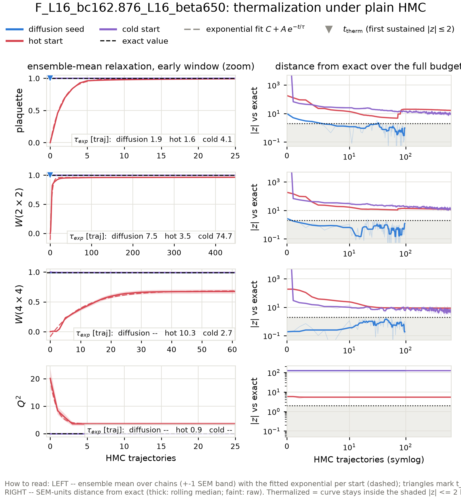

tau_int (hot-start chains, second half): plaquette = 32.19 +- 1.49, wilson_2x2 = 39.68 +- 1.35, wilson_4x4 = 8.39 +- 1.01, wilson_6x6 = 2.55 +- 0.38. Topology: hot-start HMC L=16 beta=650 -> **frozen** (no tunneling).

Where 'never' stood at the end: the hot start ended the 640-trajectory budget still at Q^2 at |z| ~ 5.

### Diagnostics: raw diffusion output (before any HMC)

| observable | value | error | exact | z_exact | reference | ref_error | z_ref | ks_p | chi2_p |
|---|---|---|---|---|---|---|---|---|---|
| plaquette | 0.9993 | 8.647e-06 | 0.9992 | 10.21 | 0.9993 | 7.026e-06 | 4.005 | 0.0003536 |  |
| wilson_1x1 | 0.9993 | 8.647e-06 | 0.9992 | 10.21 | 0.9993 | 7.026e-06 | 4.005 | 0.0003536 |  |
| wilson_1x2 | 0.9986 | 2.032e-05 | 0.9985 | 6.21 | 0.9986 | 2.015e-05 | 0.5686 | 0.9115 |  |
| wilson_2x2 | 0.9971 | 4.394e-05 | 0.997 | 3.179 | 0.9973 | 4.019e-05 | -3.229 | 0.01074 |  |
| wilson_2x3 | 0.9957 | 7.786e-05 | 0.9955 | 1.962 | 0.996 | 7.1e-05 | -2.951 | 0.01631 |  |
| wilson_3x3 | 0.9935 | 0.0001335 | 0.9933 | 1.154 | 0.9938 | 0.0001257 | -1.834 | 0.119 |  |
| wilson_3x4 | 0.9913 | 0.0001881 | 0.9912 | 0.5211 | 0.9918 | 0.0002105 | -1.768 | 0.1867 |  |
| wilson_4x4 | 0.9885 | 0.0002789 | 0.9885 | -0.2281 | 0.9891 | 0.0003138 | -1.54 | 0.215 |  |
| wilson_4x5 | 0.9859 | 0.0003646 | 0.9859 | -0.127 | 0.9867 | 0.0004304 | -1.469 | 0.2811 |  |
| wilson_5x5 | 0.9827 | 0.0005007 | 0.9828 | -0.2299 | 0.9839 | 0.0005903 | -1.589 | 0.07294 |  |
| wilson_5x6 | 0.9796 | 0.0006521 | 0.9798 | -0.2991 | 0.9811 | 0.0007701 | -1.477 | 0.08625 |  |
| wilson_6x6 | 0.9763 | 0.0008144 | 0.9765 | -0.1581 | 0.9777 | 0.0009847 | -1.065 | 0.1015 |  |
| wilson_6x7 | 0.9731 | 0.001036 | 0.9733 | -0.2678 | 0.9742 | 0.001227 | -0.729 | 0.04298 |  |
| wilson_7x7 | 0.9698 | 0.001216 | 0.97 | -0.1611 | 0.9702 | 0.001478 | -0.2317 | 0.08625 |  |
| wilson_7x8 | 0.9664 | 0.001454 | 0.9669 | -0.359 | 0.9669 | 0.001709 | -0.2429 | 0.119 |  |
| wilson_8x8 | 0.9633 | 0.001648 | 0.9637 | -0.2759 | 0.9633 | 0.001917 | -0.004052 | 0.1389 |  |
| creutz_2 | 0.0007672 | 2.762e-05 | 0.0007428 | 0.884 |  |  |  |  |  |
| creutz_3 | 0.0007064 | 6.3e-05 | 0.0006946 | 0.1861 |  |  |  |  |  |
| creutz_4 | 0.0007295 | 0.0001159 | 0.0006225 | 0.9234 |  |  |  |  |  |
| creutz_5 | 0.0006138 | 0.0001573 | 0.0005262 | 0.5564 |  |  |  |  |  |
| creutz_6 | 0.0002568 | 0.0002402 | 0.000406 | -0.621 |  |  |  |  |  |
| creutz_7 | 2.516e-05 | 0.0003029 | 0.0002616 | -0.7807 |  |  |  |  |  |
| creutz_8 | -0.0003129 | 0.0003563 | 9.322e-05 | -1.14 |  |  |  |  |  |
| Q | 0 | 0 | 0 | 0 | 0 | 0 | 0 | 1 |  |
| Q^2 | 0 | 0 | 1.246e-10 | inf | 0 | 0 | 0 | 1 |  |
| chi_top ((<Q^2>-<Q>^2)/V) | 0 | 0 | 4.868e-13 | inf | 0 | 0 | 0 |  |  |
| Q histogram vs exact P(Q) | 8.863e-10 | nan | 2 | nan |  |  |  |  | 1 |

### Diagnostics: the same configs after 96 HMC trajectories

| observable | value | error | exact | z_exact | reference | ref_error | z_ref | ks_p | chi2_p |
|---|---|---|---|---|---|---|---|---|---|
| plaquette | 0.9992 | 9.495e-06 | 0.9992 | -0.9824 | 0.9993 | 7.026e-06 | -4.483 | 6.306e-05 |  |
| wilson_1x1 | 0.9992 | 9.495e-06 | 0.9992 | -0.9824 | 0.9993 | 7.026e-06 | -4.483 | 6.306e-05 |  |
| wilson_1x2 | 0.9985 | 2.242e-05 | 0.9985 | -0.6109 | 0.9986 | 2.015e-05 | -4.101 | 0.002168 |  |
| wilson_2x2 | 0.9969 | 5.035e-05 | 0.997 | -1.269 | 0.9973 | 4.019e-05 | -6.144 | 7.541e-11 |  |
| wilson_2x3 | 0.9954 | 9.144e-05 | 0.9955 | -0.7196 | 0.996 | 7.1e-05 | -4.574 | 0.0002682 |  |
| wilson_3x3 | 0.9933 | 0.0001452 | 0.9933 | -0.6013 | 0.9938 | 0.0001257 | -3.008 | 0.02956 |  |
| wilson_3x4 | 0.9912 | 0.0002031 | 0.9912 | -0.3222 | 0.9918 | 0.0002105 | -2.265 | 0.1614 |  |
| wilson_4x4 | 0.9885 | 0.0002769 | 0.9885 | -0.2379 | 0.9891 | 0.0003138 | -1.55 | 0.4535 |  |
| wilson_4x5 | 0.986 | 0.0003622 | 0.9859 | 0.3841 | 0.9867 | 0.0004304 | -1.143 | 0.2811 |  |
| wilson_5x5 | 0.9831 | 0.0004385 | 0.9828 | 0.8268 | 0.9839 | 0.0005903 | -1.023 | 0.1389 |  |
| wilson_5x6 | 0.9804 | 0.0005667 | 0.9798 | 1.057 | 0.9811 | 0.0007701 | -0.7278 | 0.3607 |  |
| wilson_6x6 | 0.9774 | 0.000681 | 0.9765 | 1.325 | 0.9777 | 0.0009847 | -0.2756 | 0.4535 |  |
| wilson_6x7 | 0.9745 | 0.0008278 | 0.9733 | 1.376 | 0.9742 | 0.001227 | 0.1657 | 0.7231 |  |
| wilson_7x7 | 0.9714 | 0.0009981 | 0.97 | 1.438 | 0.9702 | 0.001478 | 0.6657 | 0.6123 |  |
| wilson_7x8 | 0.9685 | 0.001162 | 0.9669 | 1.419 | 0.9669 | 0.001709 | 0.7866 | 0.4535 |  |
| wilson_8x8 | 0.9656 | 0.001338 | 0.9637 | 1.387 | 0.9633 | 0.001917 | 0.9838 | 0.5044 |  |
| creutz_2 | 0.0007887 | 2.988e-05 | 0.0007428 | 1.538 |  |  |  |  |  |
| creutz_3 | 0.0007144 | 6.914e-05 | 0.0006946 | 0.2856 |  |  |  |  |  |
| creutz_4 | 0.0006449 | 0.0001075 | 0.0006225 | 0.2092 |  |  |  |  |  |
| creutz_5 | 0.0005063 | 0.0001526 | 0.0005262 | -0.1308 |  |  |  |  |  |
| creutz_6 | 0.0003365 | 0.0002151 | 0.000406 | -0.3229 |  |  |  |  |  |
| creutz_7 | 0.000198 | 0.0002943 | 0.0002616 | -0.2163 |  |  |  |  |  |
| creutz_8 | 9.915e-05 | 0.000343 | 9.322e-05 | 0.01727 |  |  |  |  |  |
| Q | 0 | 0 | 0 | 0 | 0 | 0 | 0 | 1 |  |
| Q^2 | 0 | 0 | 1.246e-10 | inf | 0 | 0 | 0 | 1 |  |
| chi_top ((<Q^2>-<Q>^2)/V) | 0 | 0 | 4.868e-13 | inf | 0 | 0 | 0 |  |  |
| Q histogram vs exact P(Q) | 8.863e-10 | nan | 2 | nan |  |  |  |  | 1 |

## F_L16_bc187.876_L16_beta750

HMC: step size 0.0146, 68 leapfrog steps, acceptance seed/hot/cold = 0.987/0.919/0.988. Diffusion-seed batch: 64 chains x 96 trajectories (0.35 s/traj for the whole batch); baselines: 64 chains x 640 trajectories.

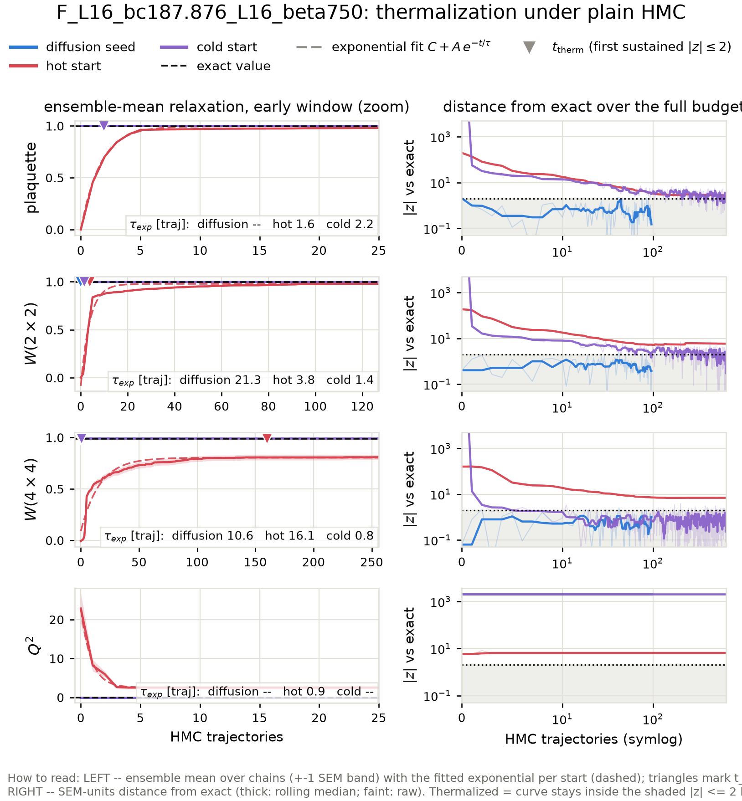

tau_int (hot-start chains, second half): plaquette = 10.33 +- 1.28, wilson_2x2 = 8.78 +- 1.27, wilson_4x4 = 0.99 +- 0.04, wilson_6x6 = 0.98 +- 0.03. Topology: hot-start HMC L=16 beta=750 -> **frozen** (no tunneling).

Where 'never' stood at the end: the hot start ended the 640-trajectory budget still at plaquette at |z| ~ 3, Q^2 at |z| ~ 6; the cold start ended the 640-trajectory budget still at Q^2 at |z| ~ 2060.

### Diagnostics: raw diffusion output (before any HMC)

| observable | value | error | exact | z_exact | reference | ref_error | z_ref | ks_p | chi2_p |
|---|---|---|---|---|---|---|---|---|---|
| plaquette | 0.9993 | 5.922e-06 | 0.9993 | 2.192 | 0.9993 | 7.234e-06 | 1.18 | 0.3192 |  |
| wilson_1x1 | 0.9993 | 5.922e-06 | 0.9993 | 2.192 | 0.9993 | 7.234e-06 | 1.18 | 0.3192 |  |
| wilson_1x2 | 0.9987 | 1.383e-05 | 0.9987 | 1.756 | 0.9987 | 1.625e-05 | 1.427 | 0.5575 |  |
| wilson_2x2 | 0.9974 | 3.86e-05 | 0.9974 | -0.4802 | 0.9974 | 3.388e-05 | -0.3651 | 0.8269 |  |
| wilson_2x3 | 0.9961 | 8.107e-05 | 0.9961 | -0.2723 | 0.9961 | 6.144e-05 | -0.3186 | 0.9929 |  |
| wilson_3x3 | 0.9942 | 0.0001239 | 0.9942 | 0.1106 | 0.9943 | 0.0001249 | -0.2498 | 0.9671 |  |
| wilson_3x4 | 0.9924 | 0.0001972 | 0.9924 | 0.2221 | 0.9925 | 0.0001851 | -0.06654 | 0.8723 |  |
| wilson_4x4 | 0.9901 | 0.0002783 | 0.99 | 0.06449 | 0.9902 | 0.0002679 | -0.2429 | 0.8723 |  |
| wilson_4x5 | 0.9879 | 0.0003835 | 0.9878 | 0.3056 | 0.9878 | 0.0003652 | 0.1471 | 0.9671 |  |
| wilson_5x5 | 0.9853 | 0.0005671 | 0.9851 | 0.3514 | 0.9853 | 0.0004693 | -0.0665 | 0.8269 |  |
| wilson_5x6 | 0.983 | 0.0006932 | 0.9825 | 0.7227 | 0.9826 | 0.0005999 | 0.4434 | 0.7766 |  |
| wilson_6x6 | 0.9801 | 0.0009328 | 0.9796 | 0.6094 | 0.9801 | 0.0007213 | 0.07677 | 0.5044 |  |
| wilson_6x7 | 0.9778 | 0.001076 | 0.9769 | 0.8759 | 0.9773 | 0.0008309 | 0.3299 | 0.2811 |  |
| wilson_7x7 | 0.9751 | 0.001367 | 0.9739 | 0.8407 | 0.9749 | 0.0009398 | 0.08062 | 0.4535 |  |
| wilson_7x8 | 0.9728 | 0.001497 | 0.9712 | 1.069 | 0.9723 | 0.001057 | 0.3121 | 0.3607 |  |
| wilson_8x8 | 0.9702 | 0.001719 | 0.9685 | 0.9694 | 0.9698 | 0.001125 | 0.1846 | 0.2464 |  |
| creutz_2 | 0.0006979 | 3.094e-05 | 0.0006437 | 1.753 |  |  |  |  |  |
| creutz_3 | 0.0005624 | 5.402e-05 | 0.000602 | -0.7316 |  |  |  |  |  |
| creutz_4 | 0.0005958 | 9.837e-05 | 0.0005394 | 0.5729 |  |  |  |  |  |
| creutz_5 | 0.0004729 | 0.0001577 | 0.000456 | 0.1073 |  |  |  |  |  |
| creutz_6 | 0.0005889 | 0.0002289 | 0.0003518 | 1.036 |  |  |  |  |  |
| creutz_7 | 0.0003967 | 0.0003039 | 0.0002267 | 0.5592 |  |  |  |  |  |
| creutz_8 | 0.0004747 | 0.0003937 | 8.078e-05 | 1.001 |  |  |  |  |  |
| Q | 0 | 0 | 0 | 0 | 0 | 0 | 0 | 1 |  |
| Q^2 | 0 | 0 | 2.06e-09 | inf | 0 | 0 | 0 | 1 |  |
| chi_top ((<Q^2>-<Q>^2)/V) | 0 | 0 | 8.047e-12 | inf | 0 | 0 | 0 |  |  |
| Q histogram vs exact P(Q) | 1.465e-08 | nan | 2 | nan |  |  |  |  | 1 |

### Diagnostics: the same configs after 96 HMC trajectories

| observable | value | error | exact | z_exact | reference | ref_error | z_ref | ks_p | chi2_p |
|---|---|---|---|---|---|---|---|---|---|
| plaquette | 0.9993 | 5.67e-06 | 0.9993 | -0.2147 | 0.9993 | 7.234e-06 | -0.3451 | 0.9833 |  |
| wilson_1x1 | 0.9993 | 5.67e-06 | 0.9993 | -0.2147 | 0.9993 | 7.234e-06 | -0.3451 | 0.9833 |  |
| wilson_1x2 | 0.9987 | 1.493e-05 | 0.9987 | 0.1252 | 0.9987 | 1.625e-05 | 0.3639 | 0.8723 |  |
| wilson_2x2 | 0.9974 | 4.007e-05 | 0.9974 | -0.4257 | 0.9974 | 3.388e-05 | -0.3291 | 0.5575 |  |
| wilson_2x3 | 0.9961 | 6.649e-05 | 0.9961 | -0.2864 | 0.9961 | 6.144e-05 | -0.3245 | 0.5044 |  |
| wilson_3x3 | 0.9942 | 0.0001329 | 0.9942 | -0.3678 | 0.9943 | 0.0001249 | -0.5842 | 0.3607 |  |
| wilson_3x4 | 0.9923 | 0.0001877 | 0.9924 | -0.7074 | 0.9925 | 0.0001851 | -0.7382 | 0.6123 |  |
| wilson_4x4 | 0.9897 | 0.0002865 | 0.99 | -1.056 | 0.9902 | 0.0002679 | -1.057 | 0.5044 |  |
| wilson_4x5 | 0.9873 | 0.0003968 | 0.9878 | -1.211 | 0.9878 | 0.0003652 | -0.9642 | 0.6123 |  |
| wilson_5x5 | 0.9845 | 0.0005203 | 0.9851 | -1.088 | 0.9853 | 0.0004693 | -1.163 | 0.1867 |  |
| wilson_5x6 | 0.9818 | 0.0006848 | 0.9825 | -0.9627 | 0.9826 | 0.0005999 | -0.8279 | 0.3607 |  |
| wilson_6x6 | 0.9786 | 0.0008729 | 0.9796 | -1.066 | 0.9801 | 0.0007213 | -1.244 | 0.1389 |  |
| wilson_6x7 | 0.976 | 0.001052 | 0.9769 | -0.772 | 0.9773 | 0.0008309 | -0.9744 | 0.2811 |  |
| wilson_7x7 | 0.9726 | 0.001205 | 0.9739 | -1.118 | 0.9749 | 0.0009398 | -1.546 | 0.1867 |  |
| wilson_7x8 | 0.97 | 0.001389 | 0.9712 | -0.8815 | 0.9723 | 0.001057 | -1.29 | 0.3607 |  |
| wilson_8x8 | 0.9671 | 0.001515 | 0.9685 | -0.9136 | 0.9698 | 0.001125 | -1.415 | 0.4056 |  |
| creutz_2 | 0.0006657 | 2.553e-05 | 0.0006437 | 0.8642 |  |  |  |  |  |
| creutz_3 | 0.00063 | 4.853e-05 | 0.000602 | 0.5779 |  |  |  |  |  |
| creutz_4 | 0.0006267 | 8.683e-05 | 0.0005394 | 1.006 |  |  |  |  |  |
| creutz_5 | 0.0003634 | 0.0001245 | 0.000456 | -0.7446 |  |  |  |  |  |
| creutz_6 | 0.0005348 | 0.0001966 | 0.0003518 | 0.9309 |  |  |  |  |  |
| creutz_7 | 0.0008983 | 0.000294 | 0.0002267 | 2.284 |  |  |  |  |  |
| creutz_8 | 0.0003713 | 0.0003577 | 8.078e-05 | 0.8122 |  |  |  |  |  |
| Q | 0 | 0 | 0 | 0 | 0 | 0 | 0 | 1 |  |
| Q^2 | 0 | 0 | 2.06e-09 | inf | 0 | 0 | 0 | 1 |  |
| chi_top ((<Q^2>-<Q>^2)/V) | 0 | 0 | 8.047e-12 | inf | 0 | 0 | 0 |  |  |
| Q histogram vs exact P(Q) | 1.465e-08 | nan | 2 | nan |  |  |  |  | 1 |

## F_L16_bc217.876_L16_beta870

HMC: step size 0.0136, 74 leapfrog steps, acceptance seed/hot/cold = 0.987/0.784/0.988. Diffusion-seed batch: 64 chains x 96 trajectories (0.15 s/traj for the whole batch); baselines: 64 chains x 640 trajectories.

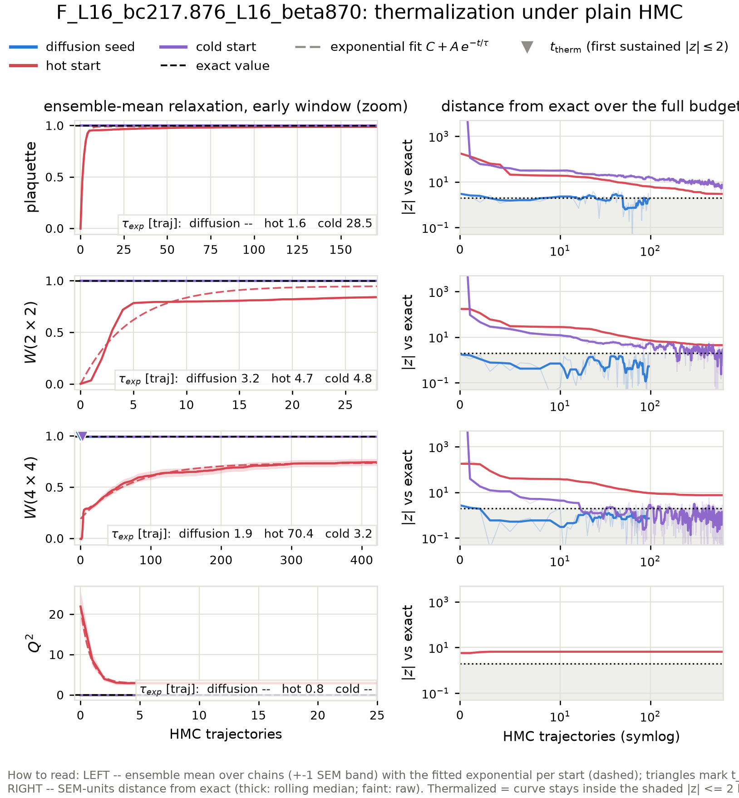

tau_int (hot-start chains, second half): plaquette = 28.55 +- 1.94, wilson_2x2 = 13.35 +- 1.53, wilson_4x4 = 4.44 +- 0.88, wilson_6x6 = 2.67 +- 0.82. Topology: hot-start HMC L=16 beta=870 -> **frozen** (no tunneling).

Where 'never' stood at the end: the hot start ended the 640-trajectory budget still at Q^2 at |z| ~ 7; the cold start ended the 640-trajectory budget still at Q^2 at |z| ~ 24272.

### Diagnostics: raw diffusion output (before any HMC)

| observable | value | error | exact | z_exact | reference | ref_error | z_ref | ks_p | chi2_p |
|---|---|---|---|---|---|---|---|---|---|
| plaquette | 0.9994 | 8.518e-06 | 0.9994 | 2.542 | 0.9994 | 4.817e-06 | 0.377 | 0.03572 |  |
| wilson_1x1 | 0.9994 | 8.518e-06 | 0.9994 | 2.542 | 0.9994 | 4.817e-06 | 0.377 | 0.03572 |  |
| wilson_1x2 | 0.9989 | 1.782e-05 | 0.9989 | 1.316 | 0.9989 | 7.614e-06 | -1.342 | 0.03572 |  |
| wilson_2x2 | 0.9977 | 3.476e-05 | 0.9977 | -1.956 | 0.9978 | 2.009e-05 | -3.755 | 0.005553 |  |
| wilson_2x3 | 0.9965 | 6.864e-05 | 0.9966 | -2.444 | 0.9968 | 3.887e-05 | -4.128 | 0.001695 |  |
| wilson_3x3 | 0.9947 | 0.0001266 | 0.995 | -2.135 | 0.9952 | 6.58e-05 | -3.065 | 0.005553 |  |
| wilson_3x4 | 0.993 | 0.0001993 | 0.9934 | -2.468 | 0.9937 | 0.0001074 | -3.364 | 0.01074 |  |
| wilson_4x4 | 0.9906 | 0.0003092 | 0.9914 | -2.642 | 0.9916 | 0.0001585 | -2.977 | 0.01326 |  |
| wilson_4x5 | 0.9884 | 0.0004275 | 0.9895 | -2.535 | 0.9897 | 0.0002395 | -2.816 | 0.004418 |  |
| wilson_5x5 | 0.9857 | 0.0005686 | 0.9871 | -2.508 | 0.9873 | 0.0003208 | -2.418 | 0.02435 |  |
| wilson_5x6 | 0.9833 | 0.0006974 | 0.9849 | -2.308 | 0.9851 | 0.0004379 | -2.259 | 0.005553 |  |
| wilson_6x6 | 0.9805 | 0.0008739 | 0.9824 | -2.15 | 0.9824 | 0.0005426 | -1.859 | 0.02956 |  |
| wilson_6x7 | 0.9781 | 0.001051 | 0.98 | -1.845 | 0.9801 | 0.0007071 | -1.638 | 0.07294 |  |
| wilson_7x7 | 0.9753 | 0.001233 | 0.9775 | -1.789 | 0.9775 | 0.000832 | -1.489 | 0.1015 |  |
| wilson_7x8 | 0.9728 | 0.001444 | 0.9752 | -1.626 | 0.9753 | 0.0009778 | -1.424 | 0.2811 |  |
| wilson_8x8 | 0.9701 | 0.00159 | 0.9728 | -1.66 | 0.973 | 0.001049 | -1.487 | 0.2464 |  |
| creutz_2 | 0.0006483 | 2.221e-05 | 0.0005548 | 4.208 |  |  |  |  |  |
| creutz_3 | 0.0005221 | 5.079e-05 | 0.0005189 | 0.06363 |  |  |  |  |  |
| creutz_4 | 0.0005703 | 8.342e-05 | 0.000465 | 1.263 |  |  |  |  |  |
| creutz_5 | 0.0004709 | 0.0001282 | 0.0003931 | 0.6073 |  |  |  |  |  |
| creutz_6 | 0.0003928 | 0.0001459 | 0.0003032 | 0.6133 |  |  |  |  |  |
| creutz_7 | 0.00041 | 0.0002176 | 0.0001954 | 0.9862 |  |  |  |  |  |
| creutz_8 | 0.0002263 | 0.0003067 | 6.963e-05 | 0.5108 |  |  |  |  |  |
| Q | 0 | 0 | 0 | 0 | 0 | 0 | 0 | 1 |  |
| Q^2 | 0 | 0 | 2.427e-08 | inf | 0 | 0 | 0 | 1 |  |
| chi_top ((<Q^2>-<Q>^2)/V) | 0 | 0 | 9.481e-11 | inf | 0 | 0 | 0 |  |  |
| Q histogram vs exact P(Q) | 1.726e-07 | nan | 2 | nan |  |  |  |  | 1 |

### Diagnostics: the same configs after 96 HMC trajectories

| observable | value | error | exact | z_exact | reference | ref_error | z_ref | ks_p | chi2_p |
|---|---|---|---|---|---|---|---|---|---|
| plaquette | 0.9994 | 7.064e-06 | 0.9994 | 1.468 | 0.9994 | 4.817e-06 | -0.8875 | 0.06142 |  |
| wilson_1x1 | 0.9994 | 7.064e-06 | 0.9994 | 1.468 | 0.9994 | 4.817e-06 | -0.8875 | 0.06142 |  |
| wilson_1x2 | 0.9989 | 1.724e-05 | 0.9989 | 0.7845 | 0.9989 | 7.614e-06 | -1.908 | 0.119 |  |
| wilson_2x2 | 0.9978 | 4.86e-05 | 0.9977 | 0.438 | 0.9978 | 2.009e-05 | -1.169 | 0.2811 |  |
| wilson_2x3 | 0.9967 | 8.024e-05 | 0.9966 | 0.475 | 0.9968 | 3.887e-05 | -1.343 | 0.2464 |  |
| wilson_3x3 | 0.9951 | 0.00014 | 0.995 | 0.7816 | 0.9952 | 6.58e-05 | -0.3721 | 0.8723 |  |
| wilson_3x4 | 0.9936 | 0.0002058 | 0.9934 | 0.9004 | 0.9937 | 0.0001074 | -0.3628 | 0.4535 |  |
| wilson_4x4 | 0.9916 | 0.0003082 | 0.9914 | 0.6791 | 0.9916 | 0.0001585 | -0.02329 | 0.6679 |  |
| wilson_4x5 | 0.9898 | 0.0003946 | 0.9895 | 0.7715 | 0.9897 | 0.0002395 | 0.018 | 0.7231 |  |
| wilson_5x5 | 0.9874 | 0.0005594 | 0.9871 | 0.4921 | 0.9873 | 0.0003208 | 0.1898 | 0.9433 |  |
| wilson_5x6 | 0.9854 | 0.0006538 | 0.9849 | 0.8472 | 0.9851 | 0.0004379 | 0.3853 | 0.8269 |  |
| wilson_6x6 | 0.983 | 0.0008333 | 0.9824 | 0.7153 | 0.9824 | 0.0005426 | 0.5662 | 0.8723 |  |
| wilson_6x7 | 0.9809 | 0.0009179 | 0.98 | 0.9728 | 0.9801 | 0.0007071 | 0.6526 | 0.8723 |  |
| wilson_7x7 | 0.9785 | 0.001101 | 0.9775 | 0.9567 | 0.9775 | 0.000832 | 0.7574 | 0.8723 |  |
| wilson_7x8 | 0.9764 | 0.001195 | 0.9752 | 1.028 | 0.9753 | 0.0009778 | 0.7085 | 0.9115 |  |
| wilson_8x8 | 0.9742 | 0.001394 | 0.9728 | 1.004 | 0.973 | 0.001049 | 0.6923 | 0.6679 |  |
| creutz_2 | 0.0005502 | 2.267e-05 | 0.0005548 | -0.2046 |  |  |  |  |  |
| creutz_3 | 0.000464 | 4.991e-05 | 0.0005189 | -1.099 |  |  |  |  |  |
| creutz_4 | 0.0005169 | 6.838e-05 | 0.000465 | 0.7596 |  |  |  |  |  |
| creutz_5 | 0.0005184 | 0.0001308 | 0.0003931 | 0.958 |  |  |  |  |  |
| creutz_6 | 0.0005422 | 0.0001924 | 0.0003032 | 1.242 |  |  |  |  |  |
| creutz_7 | 0.0003333 | 0.0002618 | 0.0001954 | 0.5266 |  |  |  |  |  |
| creutz_8 | 7.21e-05 | 0.0003246 | 6.963e-05 | 0.007587 |  |  |  |  |  |
| Q | 0 | 0 | 0 | 0 | 0 | 0 | 0 | 1 |  |
| Q^2 | 0 | 0 | 2.427e-08 | inf | 0 | 0 | 0 | 1 |  |
| chi_top ((<Q^2>-<Q>^2)/V) | 0 | 0 | 9.481e-11 | inf | 0 | 0 | 0 |  |  |
| Q histogram vs exact P(Q) | 1.726e-07 | nan | 2 | nan |  |  |  |  | 1 |

## F_L16_bc250.376_L16_beta1000

HMC: step size 0.0126, 79 leapfrog steps, acceptance seed/hot/cold = 0.986/0.814/0.986. Diffusion-seed batch: 64 chains x 96 trajectories (0.38 s/traj for the whole batch); baselines: 64 chains x 640 trajectories.

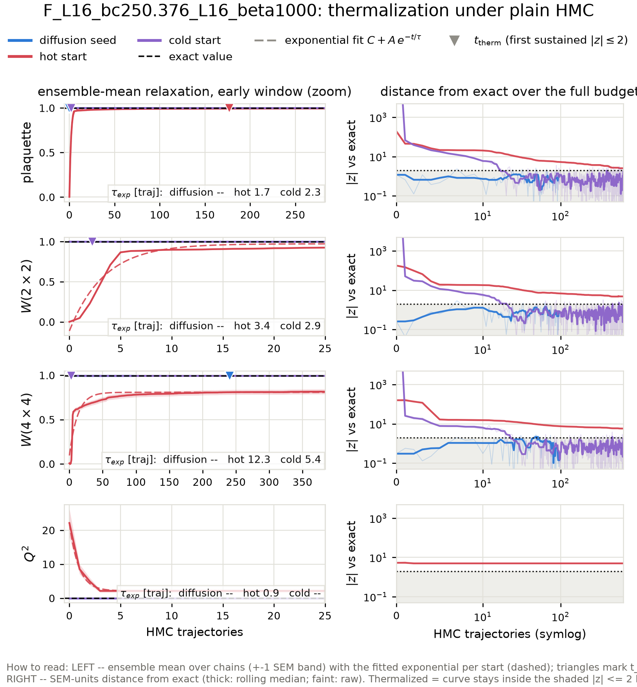

tau_int (hot-start chains, second half): plaquette = 5.78 +- 1.41, wilson_2x2 = 6.84 +- 1.43, wilson_4x4 = 8.88 +- 1.48, wilson_6x6 = 11.37 +- 1.53. Topology: hot-start HMC L=16 beta=1000 -> **frozen** (no tunneling).

Where 'never' stood at the end: the hot start ended the 640-trajectory budget still at wilson_2x2 at |z| ~ 5, wilson_4x4 at |z| ~ 6, Q^2 at |z| ~ 5; the cold start ended the 640-trajectory budget still at Q^2 at |z| ~ 178903.

### Diagnostics: raw diffusion output (before any HMC)

| observable | value | error | exact | z_exact | reference | ref_error | z_ref | ks_p | chi2_p |
|---|---|---|---|---|---|---|---|---|---|
| plaquette | 0.9995 | 4.613e-06 | 0.9995 | -1.811 | 0.9995 | 4.186e-06 | 0.2668 | 0.8723 |  |
| wilson_1x1 | 0.9995 | 4.613e-06 | 0.9995 | -1.811 | 0.9995 | 4.186e-06 | 0.2668 | 0.8723 |  |
| wilson_1x2 | 0.999 | 1.319e-05 | 0.999 | -0.05885 | 0.999 | 1.196e-05 | 0.9905 | 0.6123 |  |
| wilson_2x2 | 0.998 | 2.788e-05 | 0.998 | 0.2941 | 0.998 | 2.666e-05 | 0.6288 | 0.9671 |  |
| wilson_2x3 | 0.9971 | 4.091e-05 | 0.9971 | 1.332 | 0.9971 | 4.97e-05 | 0.867 | 0.7231 |  |
| wilson_3x3 | 0.9957 | 7.837e-05 | 0.9957 | 0.9344 | 0.9957 | 8.624e-05 | 0.1915 | 0.4056 |  |
| wilson_3x4 | 0.9944 | 0.0001276 | 0.9943 | 0.5854 | 0.9944 | 0.0001203 | -0.3595 | 0.6679 |  |
| wilson_4x4 | 0.9926 | 0.0001841 | 0.9925 | 0.3353 | 0.9928 | 0.0001553 | -1.022 | 0.1015 |  |
| wilson_4x5 | 0.9908 | 0.0002615 | 0.9908 | 0.01634 | 0.9913 | 0.0002103 | -1.538 | 0.08625 |  |
| wilson_5x5 | 0.9888 | 0.0003292 | 0.9888 | 0.06052 | 0.9896 | 0.0002564 | -1.958 | 0.08625 |  |
| wilson_5x6 | 0.9867 | 0.0004268 | 0.9868 | -0.267 | 0.9881 | 0.0003214 | -2.533 | 0.03572 |  |
| wilson_6x6 | 0.9846 | 0.0005086 | 0.9846 | -0.1263 | 0.9864 | 0.0003629 | -2.873 | 0.004418 |  |
| wilson_6x7 | 0.9821 | 0.0006036 | 0.9826 | -0.8492 | 0.9847 | 0.0004579 | -3.419 | 0.002761 |  |
| wilson_7x7 | 0.9798 | 0.0007297 | 0.9804 | -0.7448 | 0.983 | 0.0004859 | -3.616 | 0.0007896 |  |
| wilson_7x8 | 0.9773 | 0.0008365 | 0.9784 | -1.25 | 0.9814 | 0.0005688 | -4.047 | 0.00132 |  |
| wilson_8x8 | 0.9753 | 0.0009653 | 0.9763 | -0.994 | 0.9798 | 0.0006012 | -3.987 | 0.0007896 |  |
| creutz_2 | 0.0004813 | 1.72e-05 | 0.0004827 | -0.08209 |  |  |  |  |  |
| creutz_3 | 0.0004789 | 3.715e-05 | 0.0004514 | 0.7414 |  |  |  |  |  |
| creutz_4 | 0.000419 | 5.015e-05 | 0.0004045 | 0.29 |  |  |  |  |  |
| creutz_5 | 0.0002682 | 8.647e-05 | 0.000342 | -0.8527 |  |  |  |  |  |
| creutz_6 | 7.797e-05 | 0.000121 | 0.0002638 | -1.536 |  |  |  |  |  |
| creutz_7 | -0.0002539 | 0.0001848 | 0.00017 | -2.293 |  |  |  |  |  |
| creutz_8 | -0.0005394 | 0.0002551 | 6.058e-05 | -2.353 |  |  |  |  |  |
| Q | 0 | 0 | 0 | 0 | 0 | 0 | 0 | 1 |  |
| Q^2 | 0 | 0 | 1.789e-07 | inf | 0 | 0 | 0 | 1 |  |
| chi_top ((<Q^2>-<Q>^2)/V) | 0 | 0 | 6.988e-10 | inf | 0 | 0 | 0 |  |  |
| Q histogram vs exact P(Q) | 1.307e-06 | nan | 2 | nan |  |  |  |  | 1 |

### Diagnostics: the same configs after 96 HMC trajectories

| observable | value | error | exact | z_exact | reference | ref_error | z_ref | ks_p | chi2_p |
|---|---|---|---|---|---|---|---|---|---|
| plaquette | 0.9995 | 5.494e-06 | 0.9995 | -0.9548 | 0.9995 | 4.186e-06 | 0.6908 | 0.5044 |  |
| wilson_1x1 | 0.9995 | 5.494e-06 | 0.9995 | -0.9548 | 0.9995 | 4.186e-06 | 0.6908 | 0.5044 |  |
| wilson_1x2 | 0.999 | 1.163e-05 | 0.999 | -0.4807 | 0.999 | 1.196e-05 | 0.7689 | 0.7231 |  |
| wilson_2x2 | 0.998 | 3.256e-05 | 0.998 | -0.8218 | 0.998 | 2.666e-05 | -0.2544 | 0.9833 |  |
| wilson_2x3 | 0.997 | 6.412e-05 | 0.9971 | -0.808 | 0.9971 | 4.97e-05 | -0.6223 | 0.5044 |  |
| wilson_3x3 | 0.9956 | 0.000102 | 0.9957 | -0.7414 | 0.9957 | 8.624e-05 | -0.9474 | 0.4056 |  |
| wilson_3x4 | 0.9942 | 0.0001499 | 0.9943 | -0.617 | 0.9944 | 0.0001203 | -1.198 | 0.4056 |  |
| wilson_4x4 | 0.9926 | 0.0002116 | 0.9925 | 0.1405 | 0.9928 | 0.0001553 | -1.06 | 0.4535 |  |
| wilson_4x5 | 0.9909 | 0.0002804 | 0.9908 | 0.4616 | 0.9913 | 0.0002103 | -1.116 | 0.3607 |  |
| wilson_5x5 | 0.9891 | 0.0003553 | 0.9888 | 0.8372 | 0.9896 | 0.0002564 | -1.231 | 0.5575 |  |
| wilson_5x6 | 0.9874 | 0.0004366 | 0.9868 | 1.194 | 0.9881 | 0.0003214 | -1.324 | 0.4056 |  |
| wilson_6x6 | 0.9853 | 0.0005398 | 0.9846 | 1.188 | 0.9864 | 0.0003629 | -1.674 | 0.08625 |  |
| wilson_6x7 | 0.9834 | 0.0005984 | 0.9826 | 1.406 | 0.9847 | 0.0004579 | -1.641 | 0.215 |  |
| wilson_7x7 | 0.9813 | 0.0007167 | 0.9804 | 1.298 | 0.983 | 0.0004859 | -1.959 | 0.1614 |  |
| wilson_7x8 | 0.9794 | 0.0008158 | 0.9784 | 1.323 | 0.9814 | 0.0005688 | -1.98 | 0.07294 |  |
| wilson_8x8 | 0.9774 | 0.0009436 | 0.9763 | 1.245 | 0.9798 | 0.0006012 | -2.145 | 0.1015 |  |
| creutz_2 | 0.0005035 | 1.983e-05 | 0.0004827 | 1.053 |  |  |  |  |  |
| creutz_3 | 0.0004503 | 4e-05 | 0.0004514 | -0.02812 |  |  |  |  |  |
| creutz_4 | 0.0002645 | 7.248e-05 | 0.0004045 | -1.932 |  |  |  |  |  |
| creutz_5 | 0.0002725 | 0.000108 | 0.000342 | -0.6437 |  |  |  |  |  |
| creutz_6 | 0.0003682 | 0.0001189 | 0.0002638 | 0.8783 |  |  |  |  |  |
| creutz_7 | 0.0002823 | 0.0001521 | 0.00017 | 0.7383 |  |  |  |  |  |
| creutz_8 | 0.000114 | 0.0002288 | 6.058e-05 | 0.2335 |  |  |  |  |  |
| Q | 0 | 0 | 0 | 0 | 0 | 0 | 0 | 1 |  |
| Q^2 | 0 | 0 | 1.789e-07 | inf | 0 | 0 | 0 | 1 |  |
| chi_top ((<Q^2>-<Q>^2)/V) | 0 | 0 | 6.988e-10 | inf | 0 | 0 | 0 |  |  |
| Q histogram vs exact P(Q) | 1.307e-06 | nan | 2 | nan |  |  |  |  | 1 |

## F_L16_bc306.626_L16_beta1225

HMC: step size 0.0114, 87 leapfrog steps, acceptance seed/hot/cold = 0.982/0.876/0.986. Diffusion-seed batch: 64 chains x 96 trajectories (0.17 s/traj for the whole batch); baselines: 64 chains x 640 trajectories.

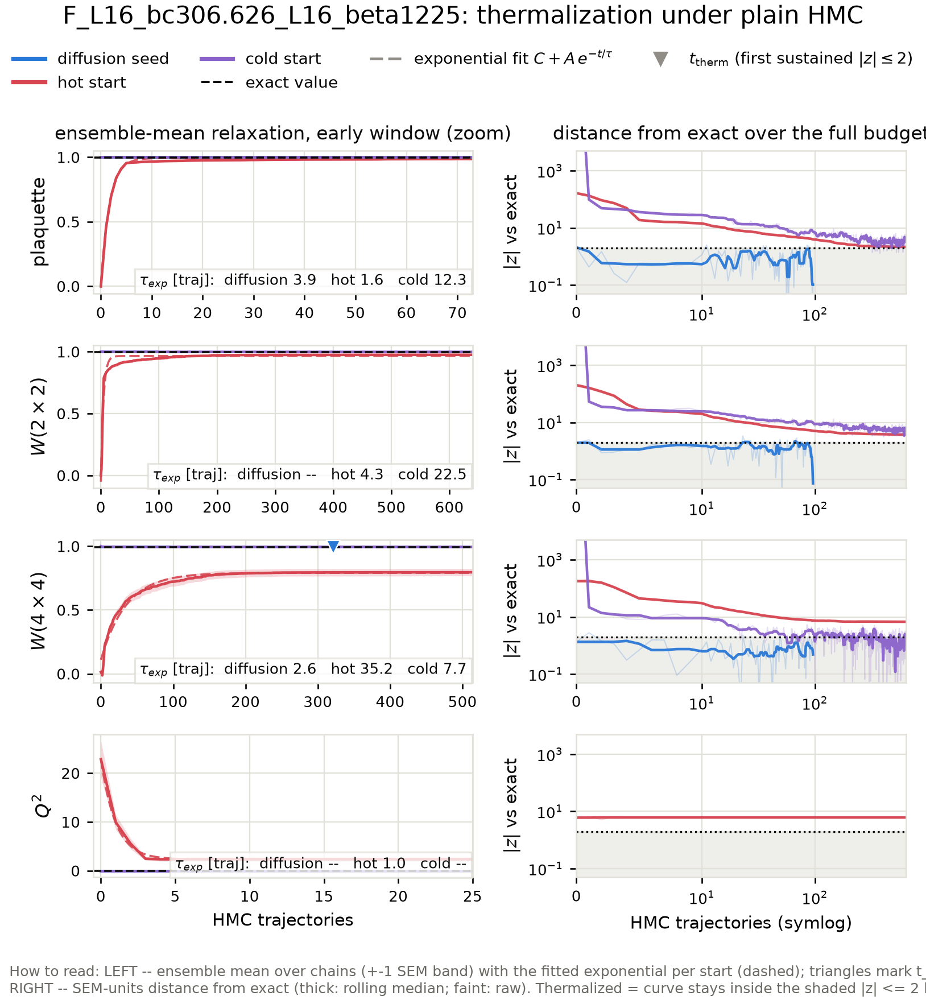

tau_int (hot-start chains, second half): plaquette = 30.71 +- 2.04, wilson_2x2 = 32.70 +- 2.08, wilson_4x4 = 10.07 +- 1.28, wilson_6x6 = 2.26 +- 0.25. Topology: hot-start HMC L=16 beta=1225 -> **frozen** (no tunneling).

Where 'never' stood at the end: the hot start ended the 640-trajectory budget still at Q^2 at |z| ~ 6; the cold start ended the 640-trajectory budget still at Q^2 at |z| ~ 2188594.

### Diagnostics: raw diffusion output (before any HMC)

| observable | value | error | exact | z_exact | reference | ref_error | z_ref | ks_p | chi2_p |
|---|---|---|---|---|---|---|---|---|---|
| plaquette | 0.9996 | 4.606e-06 | 0.9996 | 1.891 | 0.9996 | 3.309e-06 | -0.7482 | 0.8723 |  |
| wilson_1x1 | 0.9996 | 4.606e-06 | 0.9996 | 1.891 | 0.9996 | 3.309e-06 | -0.7482 | 0.8723 |  |
| wilson_1x2 | 0.9992 | 1.182e-05 | 0.9992 | 0.4665 | 0.9992 | 8.651e-06 | -2.104 | 0.05149 |  |
| wilson_2x2 | 0.9983 | 2.976e-05 | 0.9984 | -1.613 | 0.9985 | 1.384e-05 | -4.674 | 8.497e-05 |  |
| wilson_2x3 | 0.9975 | 5.16e-05 | 0.9976 | -1.397 | 0.9978 | 2.714e-05 | -3.723 | 0.00132 |  |
| wilson_3x3 | 0.9963 | 9.389e-05 | 0.9965 | -1.254 | 0.9966 | 4.571e-05 | -2.729 | 0.08625 |  |
| wilson_3x4 | 0.9952 | 0.0001432 | 0.9953 | -1.133 | 0.9955 | 6.639e-05 | -2.041 | 0.4535 |  |
| wilson_4x4 | 0.9936 | 0.000201 | 0.9939 | -1.315 | 0.994 | 9.206e-05 | -1.857 | 0.1614 |  |
| wilson_4x5 | 0.9922 | 0.0002845 | 0.9925 | -1.051 | 0.9927 | 0.0001166 | -1.544 | 0.6123 |  |
| wilson_5x5 | 0.9905 | 0.0003785 | 0.9908 | -0.7834 | 0.991 | 0.0001637 | -1.17 | 0.6679 |  |
| wilson_5x6 | 0.989 | 0.0004866 | 0.9892 | -0.5875 | 0.9896 | 0.000201 | -1.162 | 0.6123 |  |
| wilson_6x6 | 0.9872 | 0.0006087 | 0.9874 | -0.4607 | 0.9878 | 0.0002607 | -0.9872 | 0.9929 |  |
| wilson_6x7 | 0.9856 | 0.0007361 | 0.9858 | -0.2918 | 0.9863 | 0.0003356 | -0.9488 | 0.8269 |  |
| wilson_7x7 | 0.9837 | 0.0008594 | 0.984 | -0.2719 | 0.9845 | 0.0004034 | -0.8687 | 0.8723 |  |
| wilson_7x8 | 0.9821 | 0.0009898 | 0.9823 | -0.2169 | 0.9829 | 0.000505 | -0.7486 | 0.9433 |  |
| wilson_8x8 | 0.9804 | 0.001064 | 0.9806 | -0.1679 | 0.9813 | 0.0005884 | -0.7262 | 0.9433 |  |
| creutz_2 | 0.0004444 | 1.515e-05 | 0.000394 | 3.326 |  |  |  |  |  |
| creutz_3 | 0.0003901 | 3.655e-05 | 0.0003685 | 0.5932 |  |  |  |  |  |
| creutz_4 | 0.0003883 | 5.427e-05 | 0.0003302 | 1.07 |  |  |  |  |  |
| creutz_5 | 0.0002416 | 7.57e-05 | 0.0002791 | -0.4954 |  |  |  |  |  |
| creutz_6 | 0.0002207 | 0.000101 | 0.0002153 | 0.0529 |  |  |  |  |  |
| creutz_7 | 0.0002245 | 0.0001446 | 0.0001388 | 0.5926 |  |  |  |  |  |
| creutz_8 | 3.198e-05 | 0.0001828 | 4.945e-05 | -0.09553 |  |  |  |  |  |
| Q | 0 | 0 | 0 | 0 | 0 | 0 | 0 | 1 |  |
| Q^2 | 0 | 0 | 2.189e-06 | inf | 0 | 0 | 0 | 1 |  |
| chi_top ((<Q^2>-<Q>^2)/V) | 0 | 0 | 8.549e-09 | inf | 0 | 0 | 0 |  |  |
| Q histogram vs exact P(Q) | 1.798e-05 | nan | 2 | nan |  |  |  |  | 1 |

### Diagnostics: the same configs after 96 HMC trajectories

| observable | value | error | exact | z_exact | reference | ref_error | z_ref | ks_p | chi2_p |
|---|---|---|---|---|---|---|---|---|---|
| plaquette | 0.9996 | 4.364e-06 | 0.9996 | -0.08816 | 0.9996 | 3.309e-06 | -2.436 | 0.2464 |  |
| wilson_1x1 | 0.9996 | 4.364e-06 | 0.9996 | -0.08816 | 0.9996 | 3.309e-06 | -2.436 | 0.2464 |  |
| wilson_1x2 | 0.9992 | 9.172e-06 | 0.9992 | 0.6638 | 0.9992 | 8.651e-06 | -2.398 | 0.03572 |  |
| wilson_2x2 | 0.9984 | 2.652e-05 | 0.9984 | -0.0738 | 0.9985 | 1.384e-05 | -3.59 | 0.0007896 |  |
| wilson_2x3 | 0.9976 | 4.25e-05 | 0.9976 | 0.3707 | 0.9978 | 2.714e-05 | -2.563 | 0.005553 |  |
| wilson_3x3 | 0.9965 | 8.015e-05 | 0.9965 | 0.2747 | 0.9966 | 4.571e-05 | -1.575 | 0.215 |  |
| wilson_3x4 | 0.9954 | 0.0001247 | 0.9953 | 0.1489 | 0.9955 | 6.639e-05 | -1 | 0.2811 |  |
| wilson_4x4 | 0.994 | 0.0001678 | 0.9939 | 0.4603 | 0.994 | 9.206e-05 | -0.3605 | 0.9115 |  |
| wilson_4x5 | 0.9925 | 0.0002313 | 0.9925 | 0.1864 | 0.9927 | 0.0001166 | -0.5114 | 0.6123 |  |
| wilson_5x5 | 0.9909 | 0.0002804 | 0.9908 | 0.1685 | 0.991 | 0.0001637 | -0.4273 | 0.8269 |  |
| wilson_5x6 | 0.9892 | 0.0003638 | 0.9892 | -0.08525 | 0.9896 | 0.000201 | -0.8586 | 0.7766 |  |
| wilson_6x6 | 0.9874 | 0.0004606 | 0.9874 | -0.04294 | 0.9878 | 0.0002607 | -0.7426 | 0.7231 |  |
| wilson_6x7 | 0.9857 | 0.0005626 | 0.9858 | -0.05895 | 0.9863 | 0.0003356 | -0.8944 | 0.4056 |  |
| wilson_7x7 | 0.9841 | 0.0006612 | 0.984 | 0.2218 | 0.9845 | 0.0004034 | -0.5737 | 0.9433 |  |
| wilson_7x8 | 0.9824 | 0.0007302 | 0.9823 | 0.2015 | 0.9829 | 0.000505 | -0.5295 | 0.6679 |  |
| wilson_8x8 | 0.9809 | 0.0008438 | 0.9806 | 0.3096 | 0.9813 | 0.0005884 | -0.4306 | 0.9671 |  |
| creutz_2 | 0.0004085 | 1.672e-05 | 0.000394 | 0.869 |  |  |  |  |  |
| creutz_3 | 0.0003799 | 3.514e-05 | 0.0003685 | 0.3259 |  |  |  |  |  |
| creutz_4 | 0.0002677 | 4.506e-05 | 0.0003302 | -1.387 |  |  |  |  |  |
| creutz_5 | 0.0002406 | 8.978e-05 | 0.0002791 | -0.4292 |  |  |  |  |  |
| creutz_6 | 0.000125 | 0.0001231 | 0.0002153 | -0.7339 |  |  |  |  |  |
| creutz_7 | -5.756e-05 | 0.0001871 | 0.0001388 | -1.049 |  |  |  |  |  |
| creutz_8 | -6.637e-05 | 0.0002169 | 4.945e-05 | -0.5341 |  |  |  |  |  |
| Q | 0 | 0 | 0 | 0 | 0 | 0 | 0 | 1 |  |
| Q^2 | 0 | 0 | 2.189e-06 | inf | 0 | 0 | 0 | 1 |  |
| chi_top ((<Q^2>-<Q>^2)/V) | 0 | 0 | 8.549e-09 | inf | 0 | 0 | 0 |  |  |
| Q histogram vs exact P(Q) | 1.798e-05 | nan | 2 | nan |  |  |  |  | 1 |

## F_L16_bc375.375_L16_beta1500

HMC: step size 0.0103, 97 leapfrog steps, acceptance seed/hot/cold = 0.986/0.648/0.987. Diffusion-seed batch: 64 chains x 96 trajectories (0.44 s/traj for the whole batch); baselines: 64 chains x 640 trajectories.

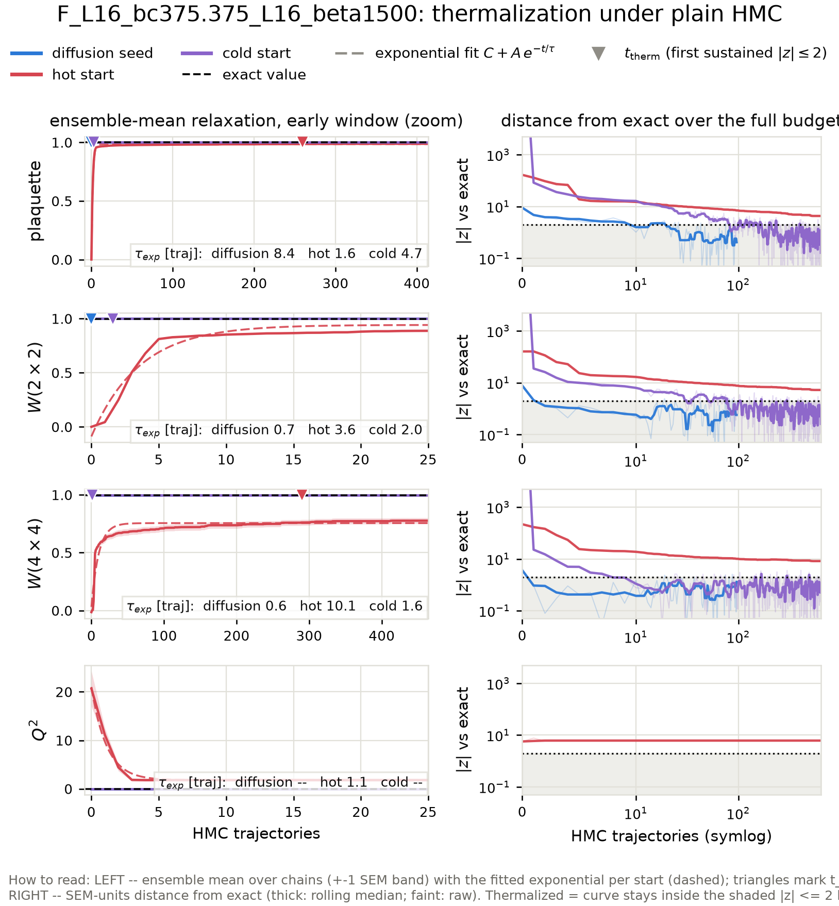

tau_int (hot-start chains, second half): plaquette = 8.63 +- 1.61, wilson_2x2 = 4.97 +- 1.43, wilson_4x4 = 4.36 +- 1.37, wilson_6x6 = 4.73 +- 1.37. Topology: hot-start HMC L=16 beta=1500 -> **frozen** (no tunneling).

Where 'never' stood at the end: the hot start ended the 640-trajectory budget still at wilson_2x2 at |z| ~ 5, Q^2 at |z| ~ 6; the cold start ended the 640-trajectory budget still at Q^2 at |z| ~ 15953106.

### Diagnostics: raw diffusion output (before any HMC)

| observable | value | error | exact | z_exact | reference | ref_error | z_ref | ks_p | chi2_p |
|---|---|---|---|---|---|---|---|---|---|
| plaquette | 0.9996 | 4.065e-06 | 0.9997 | -9.158 | 0.9997 | 4.084e-06 | -5.775 | 4.265e-07 |  |
| wilson_1x1 | 0.9996 | 4.065e-06 | 0.9997 | -9.158 | 0.9997 | 4.084e-06 | -5.775 | 4.265e-07 |  |
| wilson_1x2 | 0.9993 | 9.025e-06 | 0.9993 | -8.452 | 0.9993 | 6.854e-06 | -6.396 | 4.265e-07 |  |
| wilson_2x2 | 0.9985 | 2.332e-05 | 0.9987 | -6.907 | 0.9987 | 1.369e-05 | -4.915 | 0.0001523 |  |
| wilson_2x3 | 0.9978 | 3.952e-05 | 0.998 | -5.802 | 0.998 | 1.843e-05 | -4.95 | 8.497e-05 |  |
| wilson_3x3 | 0.9968 | 7.855e-05 | 0.9971 | -3.818 | 0.9971 | 3.513e-05 | -2.812 | 0.01997 |  |
| wilson_3x4 | 0.9958 | 0.0001085 | 0.9962 | -3.637 | 0.9961 | 5.233e-05 | -2.816 | 0.01074 |  |
| wilson_4x4 | 0.9945 | 0.0001552 | 0.995 | -3.392 | 0.9949 | 8.199e-05 | -2.518 | 0.03572 |  |
| wilson_4x5 | 0.9933 | 0.0002081 | 0.9939 | -2.729 | 0.9938 | 0.0001264 | -1.888 | 0.1389 |  |
| wilson_5x5 | 0.9919 | 0.0002709 | 0.9925 | -2.336 | 0.9924 | 0.000162 | -1.519 | 0.3607 |  |
| wilson_5x6 | 0.9905 | 0.0003455 | 0.9912 | -2.003 | 0.991 | 0.0002206 | -1.277 | 0.6123 |  |
| wilson_6x6 | 0.989 | 0.0004465 | 0.9897 | -1.542 | 0.9895 | 0.0002696 | -0.8907 | 0.6679 |  |
| wilson_6x7 | 0.9876 | 0.0005486 | 0.9884 | -1.387 | 0.9881 | 0.0003556 | -0.7332 | 0.8723 |  |
| wilson_7x7 | 0.9862 | 0.0006489 | 0.9869 | -1.047 | 0.9865 | 0.0004408 | -0.4077 | 0.9433 |  |
| wilson_7x8 | 0.9848 | 0.0007531 | 0.9855 | -0.8886 | 0.9852 | 0.0005209 | -0.3484 | 0.9433 |  |
| wilson_8x8 | 0.9835 | 0.0008209 | 0.9841 | -0.7395 | 0.9837 | 0.0006118 | -0.1708 | 0.9115 |  |
| creutz_2 | 0.0003676 | 1.475e-05 | 0.0003217 | 3.112 |  |  |  |  |  |
| creutz_3 | 0.0003036 | 2.988e-05 | 0.0003009 | 0.08973 |  |  |  |  |  |
| creutz_4 | 0.0003073 | 4.897e-05 | 0.0002696 | 0.7686 |  |  |  |  |  |
| creutz_5 | 0.0002521 | 7.936e-05 | 0.0002279 | 0.3048 |  |  |  |  |  |
| creutz_6 | 0.0001131 | 9.847e-05 | 0.0001758 | -0.637 |  |  |  |  |  |
| creutz_7 | -4.3e-05 | 0.0001116 | 0.0001133 | -1.401 |  |  |  |  |  |
| creutz_8 | -1.261e-05 | 0.0001449 | 4.038e-05 | -0.3657 |  |  |  |  |  |
| Q | 0 | 0 | 0 | 0 | 0 | 0 | 0 | 1 |  |
| Q^2 | 0 | 0 | 1.595e-05 | inf | 0 | 0 | 0 | 1 |  |
| chi_top ((<Q^2>-<Q>^2)/V) | 0 | 0 | 6.232e-08 | inf | 0 | 0 | 0 |  |  |
| Q histogram vs exact P(Q) | 0.0001391 | nan | 2 | nan |  |  |  |  | 0.9999 |

### Diagnostics: the same configs after 96 HMC trajectories

| observable | value | error | exact | z_exact | reference | ref_error | z_ref | ks_p | chi2_p |
|---|---|---|---|---|---|---|---|---|---|
| plaquette | 0.9997 | 3.968e-06 | 0.9997 | 0.3934 | 0.9997 | 4.084e-06 | 0.9685 | 0.6679 |  |
| wilson_1x1 | 0.9997 | 3.968e-06 | 0.9997 | 0.3934 | 0.9997 | 4.084e-06 | 0.9685 | 0.6679 |  |
| wilson_1x2 | 0.9993 | 9.373e-06 | 0.9993 | 0.2105 | 0.9993 | 6.854e-06 | 0.4966 | 0.7231 |  |
| wilson_2x2 | 0.9987 | 1.804e-05 | 0.9987 | 0.675 | 0.9987 | 1.369e-05 | 1.781 | 0.1389 |  |
| wilson_2x3 | 0.9981 | 2.63e-05 | 0.998 | 0.08162 | 0.998 | 1.843e-05 | 0.4856 | 0.6679 |  |
| wilson_3x3 | 0.9972 | 4.277e-05 | 0.9971 | 1.667 | 0.9971 | 3.513e-05 | 2.335 | 0.1614 |  |
| wilson_3x4 | 0.9963 | 6.384e-05 | 0.9962 | 1.388 | 0.9961 | 5.233e-05 | 1.745 | 0.1389 |  |
| wilson_4x4 | 0.9952 | 0.0001077 | 0.995 | 1.493 | 0.9949 | 8.199e-05 | 1.812 | 0.2464 |  |
| wilson_4x5 | 0.9941 | 0.0001514 | 0.9939 | 1.579 | 0.9938 | 0.0001264 | 1.76 | 0.2464 |  |
| wilson_5x5 | 0.9929 | 0.0002254 | 0.9925 | 1.546 | 0.9924 | 0.000162 | 1.809 | 0.2464 |  |
| wilson_5x6 | 0.9916 | 0.0003036 | 0.9912 | 1.284 | 0.991 | 0.0002206 | 1.487 | 0.2811 |  |
| wilson_6x6 | 0.9902 | 0.0004238 | 0.9897 | 0.9765 | 0.9895 | 0.0002696 | 1.27 | 0.4535 |  |
| wilson_6x7 | 0.9888 | 0.0005172 | 0.9884 | 0.8825 | 0.9881 | 0.0003556 | 1.176 | 0.2464 |  |
| wilson_7x7 | 0.9873 | 0.0006553 | 0.9869 | 0.6631 | 0.9865 | 0.0004408 | 1.005 | 0.3192 |  |
| wilson_7x8 | 0.986 | 0.0007279 | 0.9855 | 0.6294 | 0.9852 | 0.0005209 | 0.903 | 0.3192 |  |
| wilson_8x8 | 0.9845 | 0.0008494 | 0.9841 | 0.4977 | 0.9837 | 0.0006118 | 0.8167 | 0.1867 |  |
| creutz_2 | 0.0003119 | 1.251e-05 | 0.0003217 | -0.7839 |  |  |  |  |  |
| creutz_3 | 0.0002215 | 2.49e-05 | 0.0003009 | -3.189 |  |  |  |  |  |
| creutz_4 | 0.0002143 | 4.393e-05 | 0.0002696 | -1.258 |  |  |  |  |  |
| creutz_5 | 0.0001962 | 7.305e-05 | 0.0002279 | -0.4345 |  |  |  |  |  |
| creutz_6 | 0.000193 | 0.0001024 | 0.0001758 | 0.1676 |  |  |  |  |  |
| creutz_7 | 0.0001785 | 0.0001532 | 0.0001133 | 0.4254 |  |  |  |  |  |
| creutz_8 | 0.0001002 | 0.0002017 | 4.038e-05 | 0.2968 |  |  |  |  |  |
| Q | 0 | 0 | 0 | 0 | 0 | 0 | 0 | 1 |  |
| Q^2 | 0 | 0 | 1.595e-05 | inf | 0 | 0 | 0 | 1 |  |
| chi_top ((<Q^2>-<Q>^2)/V) | 0 | 0 | 6.232e-08 | inf | 0 | 0 | 0 |  |  |
| Q histogram vs exact P(Q) | 0.0001391 | nan | 2 | nan |  |  |  |  | 0.9999 |

## F_L16_bc437.875_L16_beta1750

HMC: step size 0.0096, 105 leapfrog steps, acceptance seed/hot/cold = 0.981/0.368/0.983. Diffusion-seed batch: 64 chains x 96 trajectories (0.22 s/traj for the whole batch); baselines: 64 chains x 640 trajectories.

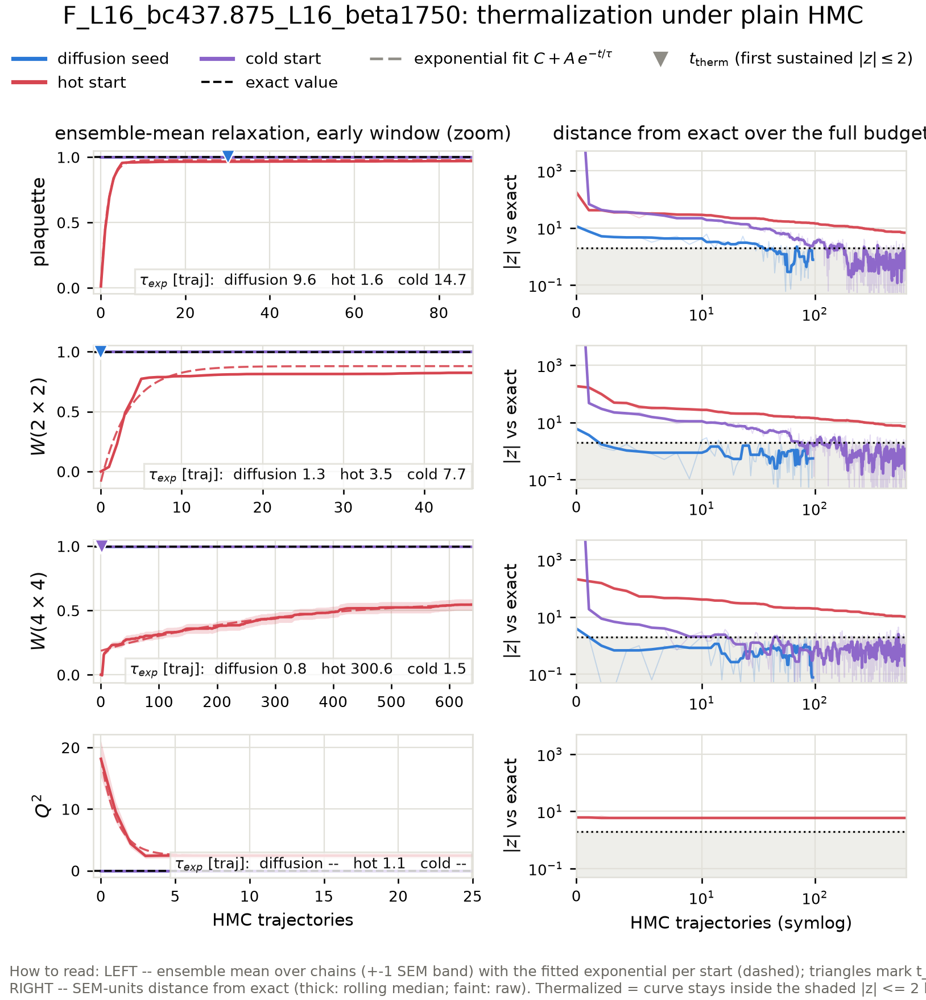

tau_int (hot-start chains, second half): plaquette = 13.07 +- 2.01, wilson_2x2 = 11.33 +- 1.96, wilson_4x4 = 7.80 +- 1.86, wilson_6x6 = 8.52 +- 1.88. Topology: hot-start HMC L=16 beta=1750 -> **frozen** (no tunneling).

Where 'never' stood at the end: the hot start ended the 640-trajectory budget still at Q^2 at |z| ~ 6; the cold start ended the 640-trajectory budget still at Q^2 at |z| ~ 55082440.

### Diagnostics: raw diffusion output (before any HMC)

| observable | value | error | exact | z_exact | reference | ref_error | z_ref | ks_p | chi2_p |
|---|---|---|---|---|---|---|---|---|---|
| plaquette | 0.9997 | 4.824e-06 | 0.9997 | -10.25 | 0.9997 | 2.694e-06 | -8.522 | 2.762e-12 |  |
| wilson_1x1 | 0.9997 | 4.824e-06 | 0.9997 | -10.25 | 0.9997 | 2.694e-06 | -8.522 | 2.762e-12 |  |
| wilson_1x2 | 0.9994 | 1.037e-05 | 0.9994 | -7.444 | 0.9994 | 7.304e-06 | -5.542 | 6.135e-07 |  |
| wilson_2x2 | 0.9987 | 1.959e-05 | 0.9989 | -6.466 | 0.9989 | 1.423e-05 | -5.386 | 4.659e-05 |  |
| wilson_2x3 | 0.9981 | 3.398e-05 | 0.9983 | -5.728 | 0.9983 | 2.238e-05 | -4.976 | 0.0004642 |  |
| wilson_3x3 | 0.9973 | 5.407e-05 | 0.9975 | -4.187 | 0.9976 | 4.266e-05 | -4.284 | 0.0035 |  |
| wilson_3x4 | 0.9964 | 7.887e-05 | 0.9967 | -4.581 | 0.9968 | 6.116e-05 | -4.564 | 0.002761 |  |
| wilson_4x4 | 0.9952 | 0.0001176 | 0.9957 | -4.443 | 0.9959 | 8.938e-05 | -4.8 | 0.0002025 |  |
| wilson_4x5 | 0.9941 | 0.0001678 | 0.9947 | -4.043 | 0.995 | 0.0001156 | -4.488 | 8.497e-05 |  |
| wilson_5x5 | 0.9928 | 0.0002146 | 0.9936 | -3.781 | 0.9939 | 0.0001532 | -4.495 | 0.002168 |  |
| wilson_5x6 | 0.9915 | 0.0002762 | 0.9925 | -3.548 | 0.9929 | 0.000205 | -4.056 | 0.0035 |  |
| wilson_6x6 | 0.99 | 0.0003367 | 0.9912 | -3.42 | 0.9917 | 0.000252 | -3.946 | 0.01074 |  |
| wilson_6x7 | 0.9886 | 0.0004155 | 0.99 | -3.444 | 0.9905 | 0.0003196 | -3.627 | 0.005553 |  |
| wilson_7x7 | 0.9869 | 0.0004751 | 0.9887 | -3.774 | 0.9894 | 0.0003557 | -4.074 | 0.006949 |  |
| wilson_7x8 | 0.9854 | 0.0005448 | 0.9876 | -3.96 | 0.9882 | 0.0004214 | -3.976 | 0.004418 |  |
| wilson_8x8 | 0.984 | 0.000591 | 0.9864 | -4.023 | 0.9872 | 0.0004575 | -4.305 | 0.001695 |  |
| creutz_2 | 0.0002976 | 1.196e-05 | 0.0002757 | 1.828 |  |  |  |  |  |
| creutz_3 | 0.0002217 | 2.325e-05 | 0.0002579 | -1.557 |  |  |  |  |  |
| creutz_4 | 0.0002579 | 3.574e-05 | 0.0002311 | 0.7499 |  |  |  |  |  |
| creutz_5 | 0.0001724 | 7.005e-05 | 0.0001954 | -0.3284 |  |  |  |  |  |
| creutz_6 | 0.0001539 | 7.583e-05 | 0.0001507 | 0.04214 |  |  |  |  |  |
| creutz_7 | 0.0001816 | 0.0001114 | 9.713e-05 | 0.7585 |  |  |  |  |  |
| creutz_8 | -0.0001109 | 0.0001813 | 3.461e-05 | -0.8027 |  |  |  |  |  |
| Q | 0 | 0 | 0 | 0 | 0 | 0 | 0 | 1 |  |
| Q^2 | 0 | 0 | 5.508e-05 | inf | 0 | 0 | 0 | 1 |  |
| chi_top ((<Q^2>-<Q>^2)/V) | 0 | 0 | 2.152e-07 | inf | 0 | 0 | 0 |  |  |
| Q histogram vs exact P(Q) | 0.0004939 | nan | 2 | nan |  |  |  |  | 0.9998 |

### Diagnostics: the same configs after 96 HMC trajectories

| observable | value | error | exact | z_exact | reference | ref_error | z_ref | ks_p | chi2_p |
|---|---|---|---|---|---|---|---|---|---|
| plaquette | 0.9997 | 2.621e-06 | 0.9997 | -0.8639 | 0.9997 | 2.694e-06 | 0.03056 | 0.8723 |  |
| wilson_1x1 | 0.9997 | 2.621e-06 | 0.9997 | -0.8639 | 0.9997 | 2.694e-06 | 0.03056 | 0.8723 |  |
| wilson_1x2 | 0.9994 | 7.59e-06 | 0.9994 | -0.3292 | 0.9994 | 7.304e-06 | 0.4164 | 0.5575 |  |
| wilson_2x2 | 0.9989 | 1.711e-05 | 0.9989 | 0.5956 | 0.9989 | 1.423e-05 | 0.289 | 0.9115 |  |
| wilson_2x3 | 0.9983 | 2.633e-05 | 0.9983 | -0.1739 | 0.9983 | 2.238e-05 | -0.359 | 0.8269 |  |
| wilson_3x3 | 0.9975 | 4.818e-05 | 0.9975 | 0.4127 | 0.9976 | 4.266e-05 | -0.7584 | 0.4056 |  |
| wilson_3x4 | 0.9968 | 6.832e-05 | 0.9967 | 0.3442 | 0.9968 | 6.116e-05 | -0.771 | 0.4535 |  |
| wilson_4x4 | 0.9957 | 0.0001049 | 0.9957 | -0.09557 | 0.9959 | 8.938e-05 | -1.426 | 0.3607 |  |
| wilson_4x5 | 0.9948 | 0.0001426 | 0.9947 | 0.04918 | 0.995 | 0.0001156 | -1.248 | 0.5044 |  |
| wilson_5x5 | 0.9936 | 0.0002111 | 0.9936 | 0.09537 | 0.9939 | 0.0001532 | -1.356 | 0.7766 |  |
| wilson_5x6 | 0.9925 | 0.0002689 | 0.9925 | 0.04959 | 0.9929 | 0.000205 | -1.188 | 0.8269 |  |
| wilson_6x6 | 0.9913 | 0.0003302 | 0.9912 | 0.1773 | 0.9917 | 0.000252 | -1.083 | 0.9671 |  |
| wilson_6x7 | 0.9901 | 0.0003997 | 0.99 | 0.1955 | 0.9905 | 0.0003196 | -0.7663 | 0.9115 |  |
| wilson_7x7 | 0.9889 | 0.0004717 | 0.9887 | 0.2986 | 0.9894 | 0.0003557 | -0.8194 | 0.9433 |  |
| wilson_7x8 | 0.9878 | 0.0005349 | 0.9876 | 0.4361 | 0.9882 | 0.0004214 | -0.5101 | 0.8269 |  |
| wilson_8x8 | 0.9866 | 0.0006231 | 0.9864 | 0.4107 | 0.9872 | 0.0004575 | -0.7555 | 0.9115 |  |
| creutz_2 | 0.0002628 | 1.153e-05 | 0.0002757 | -1.123 |  |  |  |  |  |
| creutz_3 | 0.0002186 | 2.323e-05 | 0.0002579 | -1.692 |  |  |  |  |  |
| creutz_4 | 0.0002684 | 3.496e-05 | 0.0002311 | 1.068 |  |  |  |  |  |
| creutz_5 | 0.0001993 | 5.596e-05 | 0.0001954 | 0.06965 |  |  |  |  |  |
| creutz_6 | 9.824e-05 | 8.589e-05 | 0.0001507 | -0.6109 |  |  |  |  |  |
| creutz_7 | 5.344e-05 | 0.0001015 | 9.713e-05 | -0.4304 |  |  |  |  |  |
| creutz_8 | 0.0001051 | 0.0001389 | 3.461e-05 | 0.5071 |  |  |  |  |  |
| Q | 0 | 0 | 0 | 0 | 0 | 0 | 0 | 1 |  |
| Q^2 | 0 | 0 | 5.508e-05 | inf | 0 | 0 | 0 | 1 |  |
| chi_top ((<Q^2>-<Q>^2)/V) | 0 | 0 | 2.152e-07 | inf | 0 | 0 | 0 |  |  |
| Q histogram vs exact P(Q) | 0.0004939 | nan | 2 | nan |  |  |  |  | 0.9998 |

## F_L16_bc500.375_L16_beta2000

HMC: step size 0.0089, 112 leapfrog steps, acceptance seed/hot/cold = 0.987/0.097/0.987. Diffusion-seed batch: 64 chains x 96 trajectories (0.50 s/traj for the whole batch); baselines: 64 chains x 640 trajectories.

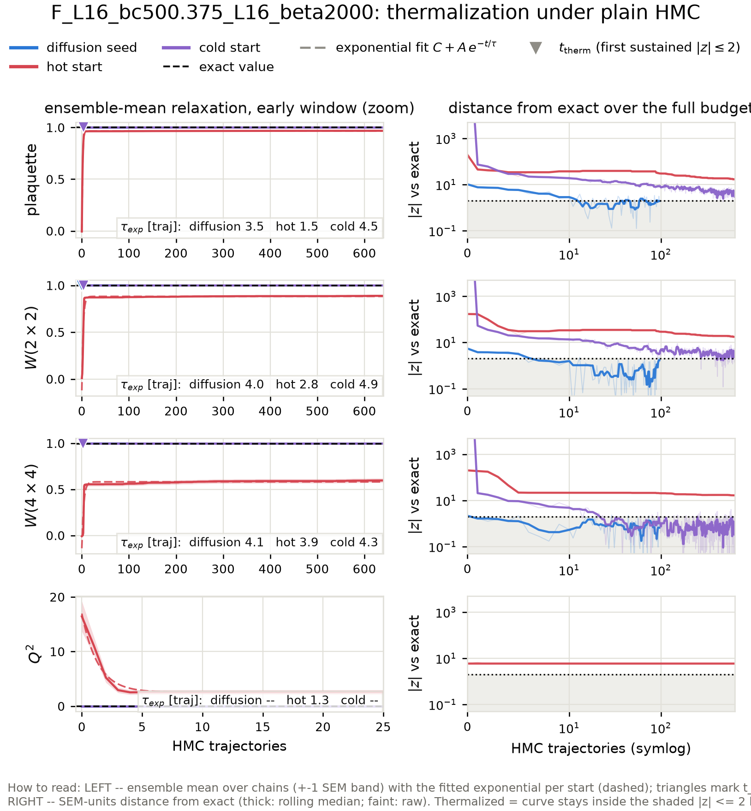

tau_int (hot-start chains, second half): plaquette = 6.71 +- 1.89, wilson_2x2 = 5.51 +- 1.59, wilson_4x4 = 2.12 +- 0.82, wilson_6x6 = 2.16 +- 0.84. Topology: hot-start HMC L=16 beta=2000 -> **frozen** (no tunneling).

Where 'never' stood at the end: the hot start ended the 640-trajectory budget still at Q^2 at |z| ~ 6; the cold start ended the 640-trajectory budget still at Q^2 at |z| ~ 137575904.

### Diagnostics: raw diffusion output (before any HMC)

| observable | value | error | exact | z_exact | reference | ref_error | z_ref | ks_p | chi2_p |
|---|---|---|---|---|---|---|---|---|---|
| plaquette | 0.9997 | 3.862e-06 | 0.9998 | -10.18 | 0.9998 | 2.774e-06 | -9.613 | 9.937e-15 |  |
| wilson_1x1 | 0.9997 | 3.862e-06 | 0.9998 | -10.18 | 0.9998 | 2.774e-06 | -9.613 | 9.937e-15 |  |
| wilson_1x2 | 0.9994 | 9.748e-06 | 0.9995 | -6.568 | 0.9995 | 6.327e-06 | -6.775 | 8.851e-09 |  |
| wilson_2x2 | 0.9989 | 2.362e-05 | 0.999 | -5.262 | 0.9991 | 1.203e-05 | -6.257 | 3.539e-06 |  |
| wilson_2x3 | 0.9984 | 3.728e-05 | 0.9985 | -4.476 | 0.9986 | 2.374e-05 | -4.902 | 3.428e-05 |  |
| wilson_3x3 | 0.9976 | 6.346e-05 | 0.9978 | -3.1 | 0.9979 | 3.992e-05 | -3.332 | 0.004418 |  |
| wilson_3x4 | 0.9969 | 8.895e-05 | 0.9971 | -2.831 | 0.9972 | 5.907e-05 | -2.996 | 0.002168 |  |
| wilson_4x4 | 0.996 | 0.0001205 | 0.9963 | -2.423 | 0.9963 | 8.615e-05 | -2.213 | 0.02435 |  |
| wilson_4x5 | 0.9951 | 0.0001519 | 0.9954 | -2.127 | 0.9955 | 0.0001208 | -2.253 | 0.05149 |  |
| wilson_5x5 | 0.9941 | 0.0001985 | 0.9944 | -1.353 | 0.9945 | 0.0001586 | -1.695 | 0.215 |  |
| wilson_5x6 | 0.9931 | 0.0002531 | 0.9934 | -1.086 | 0.9937 | 0.0002279 | -1.738 | 0.1389 |  |
| wilson_6x6 | 0.9921 | 0.0003025 | 0.9923 | -0.6647 | 0.9927 | 0.0002657 | -1.427 | 0.8723 |  |
| wilson_6x7 | 0.9911 | 0.0003659 | 0.9913 | -0.51 | 0.9918 | 0.0003529 | -1.335 | 0.8269 |  |
| wilson_7x7 | 0.9899 | 0.0004267 | 0.9901 | -0.4565 | 0.9905 | 0.0004017 | -1.004 | 0.7766 |  |
| wilson_7x8 | 0.9889 | 0.0004862 | 0.9891 | -0.3868 | 0.9896 | 0.0004898 | -0.9364 | 0.9115 |  |
| wilson_8x8 | 0.9879 | 0.0005669 | 0.9881 | -0.3596 | 0.9885 | 0.0005296 | -0.8203 | 0.8269 |  |
| creutz_2 | 0.0002769 | 1.182e-05 | 0.0002413 | 3.012 |  |  |  |  |  |
| creutz_3 | 0.0002129 | 2.338e-05 | 0.0002256 | -0.5431 |  |  |  |  |  |
| creutz_4 | 0.0001873 | 3.786e-05 | 0.0002022 | -0.3925 |  |  |  |  |  |
| creutz_5 | 8.492e-05 | 5.605e-05 | 0.0001709 | -1.535 |  |  |  |  |  |
| creutz_6 | 5.111e-05 | 8.063e-05 | 0.0001319 | -1.001 |  |  |  |  |  |
| creutz_7 | 0.0001078 | 0.0001088 | 8.498e-05 | 0.2093 |  |  |  |  |  |
| creutz_8 | 5.308e-05 | 0.0001424 | 3.028e-05 | 0.1602 |  |  |  |  |  |
| Q | 0 | 0 | 0 | 0 | 0 | 0 | 0 | 1 |  |
| Q^2 | 0 | 0 | 0.0001376 | inf | 0 | 0 | 0 | 1 |  |
| chi_top ((<Q^2>-<Q>^2)/V) | 0 | 0 | 5.374e-07 | inf | 0 | 0 | 0 |  |  |
| Q histogram vs exact P(Q) | 0.001256 | nan | 2 | nan |  |  |  |  | 0.9994 |

### Diagnostics: the same configs after 96 HMC trajectories

| observable | value | error | exact | z_exact | reference | ref_error | z_ref | ks_p | chi2_p |
|---|---|---|---|---|---|---|---|---|---|
| plaquette | 0.9997 | 2.932e-06 | 0.9998 | -2.091 | 0.9998 | 2.774e-06 | -3.109 | 0.01074 |  |
| wilson_1x1 | 0.9997 | 2.932e-06 | 0.9998 | -2.091 | 0.9998 | 2.774e-06 | -3.109 | 0.01074 |  |
| wilson_1x2 | 0.9995 | 7.728e-06 | 0.9995 | -1.433 | 0.9995 | 6.327e-06 | -2.582 | 0.0035 |  |
| wilson_2x2 | 0.999 | 2.104e-05 | 0.999 | -1.463 | 0.9991 | 1.203e-05 | -2.985 | 0.0007896 |  |
| wilson_2x3 | 0.9985 | 3.772e-05 | 0.9985 | -1.434 | 0.9986 | 2.374e-05 | -2.331 | 0.03572 |  |
| wilson_3x3 | 0.9978 | 7.215e-05 | 0.9978 | -0.6745 | 0.9979 | 3.992e-05 | -1.234 | 0.1614 |  |
| wilson_3x4 | 0.9971 | 0.0001042 | 0.9971 | -0.7115 | 0.9972 | 5.907e-05 | -1.187 | 0.119 |  |
| wilson_4x4 | 0.9962 | 0.0001545 | 0.9963 | -0.5724 | 0.9963 | 8.615e-05 | -0.703 | 0.8723 |  |
| wilson_4x5 | 0.9953 | 0.0002116 | 0.9954 | -0.6779 | 0.9955 | 0.0001208 | -1.058 | 0.4535 |  |
| wilson_5x5 | 0.9942 | 0.0002904 | 0.9944 | -0.7097 | 0.9945 | 0.0001586 | -1.112 | 0.7766 |  |
| wilson_5x6 | 0.9931 | 0.0003595 | 0.9934 | -0.7569 | 0.9937 | 0.0002279 | -1.384 | 0.6123 |  |
| wilson_6x6 | 0.9919 | 0.0004565 | 0.9923 | -0.8363 | 0.9927 | 0.0002657 | -1.43 | 0.4535 |  |
| wilson_6x7 | 0.9909 | 0.0005493 | 0.9913 | -0.7217 | 0.9918 | 0.0003529 | -1.361 | 0.3192 |  |
| wilson_7x7 | 0.9896 | 0.00066 | 0.9901 | -0.8466 | 0.9905 | 0.0004017 | -1.233 | 0.2464 |  |
| wilson_7x8 | 0.9886 | 0.0007706 | 0.9891 | -0.6882 | 0.9896 | 0.0004898 | -1.083 | 0.6679 |  |
| wilson_8x8 | 0.9874 | 0.0008793 | 0.9881 | -0.737 | 0.9885 | 0.0005296 | -1.053 | 0.6679 |  |
| creutz_2 | 0.0002561 | 9.975e-06 | 0.0002413 | 1.482 |  |  |  |  |  |
| creutz_3 | 0.0001969 | 2.134e-05 | 0.0002256 | -1.346 |  |  |  |  |  |
| creutz_4 | 0.000191 | 3.198e-05 | 0.0002022 | -0.3508 |  |  |  |  |  |
| creutz_5 | 0.0001788 | 4.348e-05 | 0.0001709 | 0.1816 |  |  |  |  |  |
| creutz_6 | 0.0001762 | 5.845e-05 | 0.0001319 | 0.7582 |  |  |  |  |  |
| creutz_7 | 0.0002343 | 7.985e-05 | 8.498e-05 | 1.87 |  |  |  |  |  |
| creutz_8 | 0.0001783 | 0.000123 | 3.028e-05 | 1.204 |  |  |  |  |  |
| Q | 0 | 0 | 0 | 0 | 0 | 0 | 0 | 1 |  |
| Q^2 | 0 | 0 | 0.0001376 | inf | 0 | 0 | 0 | 1 |  |
| chi_top ((<Q^2>-<Q>^2)/V) | 0 | 0 | 5.374e-07 | inf | 0 | 0 | 0 |  |  |
| Q histogram vs exact P(Q) | 0.001256 | nan | 2 | nan |  |  |  |  | 0.9994 |

## F_L16_bc650.375_L16_beta2600

HMC: step size 0.0078, 127 leapfrog steps, acceptance seed/hot/cold = 0.975/0.013/0.977. Diffusion-seed batch: 64 chains x 96 trajectories (0.25 s/traj for the whole batch); baselines: 64 chains x 640 trajectories.

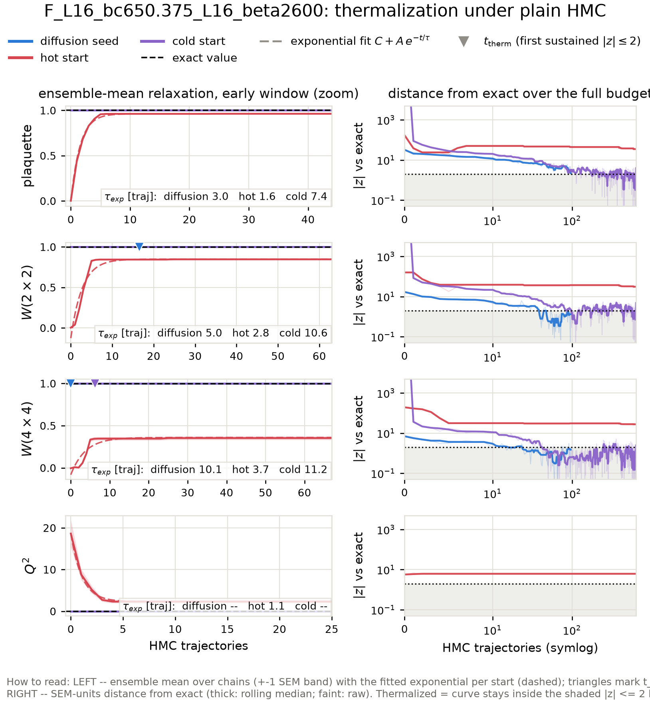

tau_int (hot-start chains, second half): plaquette = 1.52 +- 0.75, wilson_2x2 = 1.52 +- 0.75, wilson_4x4 = 1.52 +- 0.75, wilson_6x6 = 1.55 +- 0.77. Topology: hot-start HMC L=16 beta=2600 -> **frozen** (no tunneling).

Where 'never' stood at the end: the hot start ended the 640-trajectory budget still at plaquette at |z| ~ 35, wilson_2x2 at |z| ~ 31, wilson_6x6 at |z| ~ 37, Q^2 at |z| ~ 6; the cold start ended the 640-trajectory budget still at Q^2 at |z| ~ 585385792.

### Diagnostics: raw diffusion output (before any HMC)

| observable | value | error | exact | z_exact | reference | ref_error | z_ref | ks_p | chi2_p |
|---|---|---|---|---|---|---|---|---|---|
| plaquette | 0.9997 | 4.577e-06 | 0.9998 | -33.13 | 0.9998 | 1.462e-06 | -31.51 | 2.804e-35 |  |
| wilson_1x1 | 0.9997 | 4.577e-06 | 0.9998 | -33.13 | 0.9998 | 1.462e-06 | -31.51 | 2.804e-35 |  |
| wilson_1x2 | 0.9994 | 1.058e-05 | 0.9996 | -23.11 | 0.9996 | 4.419e-06 | -21.69 | 8.768e-33 |  |
| wilson_2x2 | 0.9989 | 1.9e-05 | 0.9992 | -17.16 | 0.9992 | 1.045e-05 | -15.36 | 2.506e-24 |  |
| wilson_2x3 | 0.9984 | 3.606e-05 | 0.9989 | -12.18 | 0.9989 | 1.769e-05 | -11.08 | 3.775e-17 |  |
| wilson_3x3 | 0.9978 | 4.898e-05 | 0.9983 | -10.08 | 0.9983 | 3.181e-05 | -8.281 | 1.989e-08 |  |
| wilson_3x4 | 0.9972 | 7.626e-05 | 0.9978 | -7.98 | 0.9978 | 4.959e-05 | -6.183 | 4.96e-06 |  |
| wilson_4x4 | 0.9964 | 9.933e-05 | 0.9971 | -7.161 | 0.997 | 7.805e-05 | -4.917 | 0.0002025 |  |
| wilson_4x5 | 0.9956 | 0.0001313 | 0.9965 | -6.181 | 0.9963 | 0.0001059 | -4 | 0.00132 |  |
| wilson_5x5 | 0.9948 | 0.0001434 | 0.9957 | -5.938 | 0.9954 | 0.0001441 | -3.1 | 0.0035 |  |
| wilson_5x6 | 0.994 | 0.0001851 | 0.9949 | -5.222 | 0.9947 | 0.0001789 | -2.715 | 0.02956 |  |
| wilson_6x6 | 0.9932 | 0.0002004 | 0.9941 | -4.499 | 0.9938 | 0.0002278 | -1.936 | 0.08625 |  |
| wilson_6x7 | 0.9923 | 0.0002613 | 0.9933 | -3.7 | 0.9929 | 0.0002788 | -1.674 | 0.04298 |  |
| wilson_7x7 | 0.9915 | 0.0003022 | 0.9924 | -3.111 | 0.992 | 0.0003381 | -1.277 | 0.07294 |  |
| wilson_7x8 | 0.9907 | 0.0003661 | 0.9916 | -2.506 | 0.9911 | 0.0003907 | -0.7771 | 0.4056 |  |
| wilson_8x8 | 0.9901 | 0.0003844 | 0.9908 | -1.816 | 0.9903 | 0.0004397 | -0.2778 | 0.7766 |  |
| creutz_2 | 0.0001744 | 1.156e-05 | 0.0001856 | -0.9689 |  |  |  |  |  |
| creutz_3 | 0.0001152 | 2.009e-05 | 0.0001736 | -2.903 |  |  |  |  |  |
| creutz_4 | 0.0001435 | 2.883e-05 | 0.0001555 | -0.4176 |  |  |  |  |  |
| creutz_5 | 7.099e-05 | 4.66e-05 | 0.0001315 | -1.298 |  |  |  |  |  |
| creutz_6 | -7.956e-05 | 6.152e-05 | 0.0001014 | -2.942 |  |  |  |  |  |
| creutz_7 | -2.687e-05 | 9.484e-05 | 6.537e-05 | -0.9726 |  |  |  |  |  |
| creutz_8 | -0.000175 | 0.0001143 | 2.329e-05 | -1.734 |  |  |  |  |  |
| Q | 0 | 0 | 0 | 0 | 0 | 0 | 0 | 1 |  |
| Q^2 | 0 | 0 | 0.0005854 | inf | 0 | 0 | 0 | 1 |  |
| chi_top ((<Q^2>-<Q>^2)/V) | 0 | 0 | 2.287e-06 | inf | 0 | 0 | 0 |  |  |
| Q histogram vs exact P(Q) | 0.005475 | nan | 2 | nan |  |  |  |  | 0.9973 |

### Diagnostics: the same configs after 96 HMC trajectories

| observable | value | error | exact | z_exact | reference | ref_error | z_ref | ks_p | chi2_p |
|---|---|---|---|---|---|---|---|---|---|
| plaquette | 0.9998 | 2.566e-06 | 0.9998 | -1.568 | 0.9998 | 1.462e-06 | -1.286 | 0.06142 |  |
| wilson_1x1 | 0.9998 | 2.566e-06 | 0.9998 | -1.568 | 0.9998 | 1.462e-06 | -1.286 | 0.06142 |  |
| wilson_1x2 | 0.9996 | 4.934e-06 | 0.9996 | -1.138 | 0.9996 | 4.419e-06 | -1.493 | 0.1015 |  |
| wilson_2x2 | 0.9992 | 1.558e-05 | 0.9992 | -1.029 | 0.9992 | 1.045e-05 | -1.222 | 0.1614 |  |
| wilson_2x3 | 0.9988 | 2.982e-05 | 0.9989 | -1.108 | 0.9989 | 1.769e-05 | -1.123 | 0.3192 |  |
| wilson_3x3 | 0.9983 | 4.621e-05 | 0.9983 | -1.492 | 0.9983 | 3.181e-05 | -1.052 | 0.3192 |  |
| wilson_3x4 | 0.9977 | 6.998e-05 | 0.9978 | -1.438 | 0.9978 | 4.959e-05 | -0.6361 | 0.7231 |  |
| wilson_4x4 | 0.997 | 9.343e-05 | 0.9971 | -1.342 | 0.997 | 7.805e-05 | -0.2897 | 0.7766 |  |
| wilson_4x5 | 0.9963 | 0.0001273 | 0.9965 | -1.397 | 0.9963 | 0.0001059 | -0.2467 | 0.6679 |  |
| wilson_5x5 | 0.9955 | 0.0001616 | 0.9957 | -1.226 | 0.9954 | 0.0001441 | 0.1075 | 0.6679 |  |
| wilson_5x6 | 0.9947 | 0.0002021 | 0.9949 | -1.125 | 0.9947 | 0.0001789 | 0.1493 | 0.6679 |  |
| wilson_6x6 | 0.9938 | 0.0002299 | 0.9941 | -1.095 | 0.9938 | 0.0002278 | 0.1931 | 0.6123 |  |
| wilson_6x7 | 0.9931 | 0.0002723 | 0.9933 | -0.8056 | 0.9929 | 0.0002788 | 0.277 | 0.4535 |  |
| wilson_7x7 | 0.9921 | 0.0003248 | 0.9924 | -0.8513 | 0.992 | 0.0003381 | 0.1806 | 0.6679 |  |
| wilson_7x8 | 0.9914 | 0.0003736 | 0.9916 | -0.7156 | 0.9911 | 0.0003907 | 0.4325 | 0.8723 |  |
| wilson_8x8 | 0.9904 | 0.0004378 | 0.9908 | -0.9305 | 0.9903 | 0.0004397 | 0.2068 | 0.9115 |  |
| creutz_2 | 0.0001944 | 7.28e-06 | 0.0001856 | 1.214 |  |  |  |  |  |
| creutz_3 | 0.0001926 | 1.352e-05 | 0.0001736 | 1.405 |  |  |  |  |  |
| creutz_4 | 0.0001487 | 2.795e-05 | 0.0001555 | -0.2458 |  |  |  |  |  |
| creutz_5 | 9.93e-05 | 4.196e-05 | 0.0001315 | -0.767 |  |  |  |  |  |
| creutz_6 | 9.655e-05 | 6.266e-05 | 0.0001014 | -0.07783 |  |  |  |  |  |
| creutz_7 | 0.0001557 | 7.745e-05 | 6.537e-05 | 1.166 |  |  |  |  |  |
| creutz_8 | 0.0001739 | 0.0001052 | 2.329e-05 | 1.431 |  |  |  |  |  |
| Q | 0 | 0 | 0 | 0 | 0 | 0 | 0 | 1 |  |
| Q^2 | 0 | 0 | 0.0005854 | inf | 0 | 0 | 0 | 1 |  |
| chi_top ((<Q^2>-<Q>^2)/V) | 0 | 0 | 2.287e-06 | inf | 0 | 0 | 0 |  |  |
| Q histogram vs exact P(Q) | 0.005475 | nan | 2 | nan |  |  |  |  | 0.9973 |
