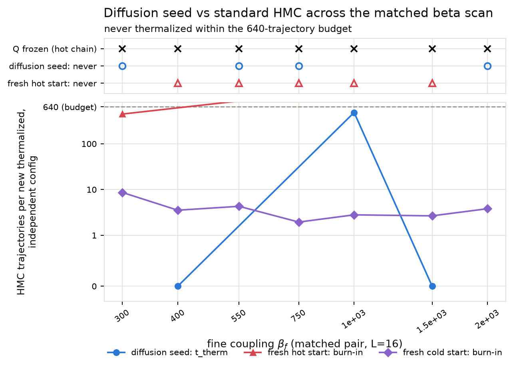
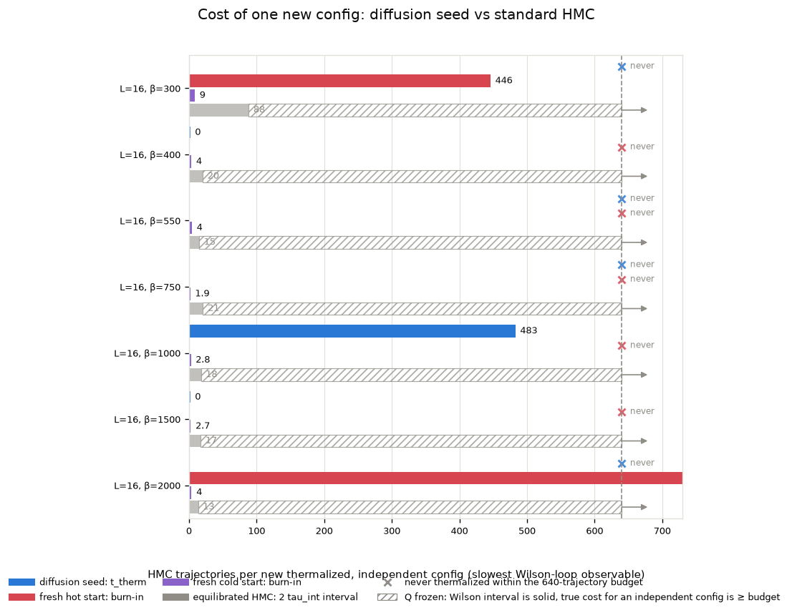
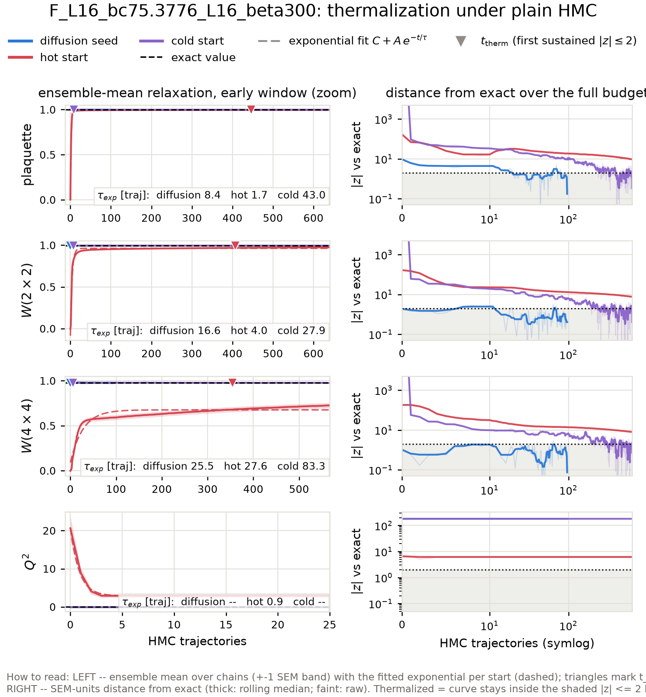
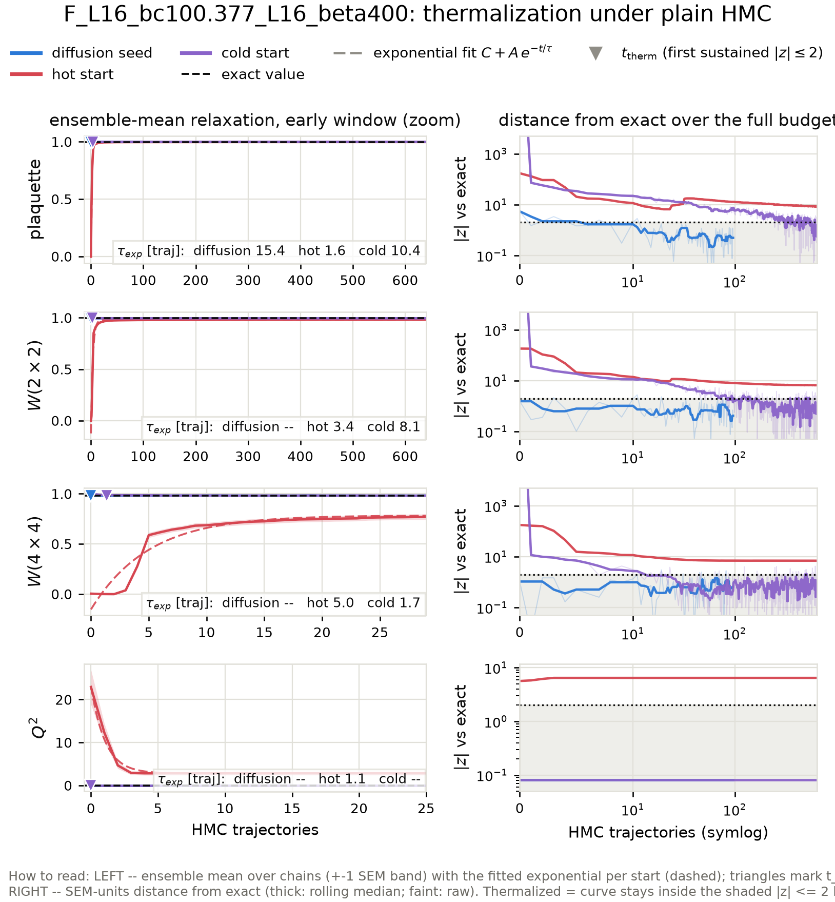
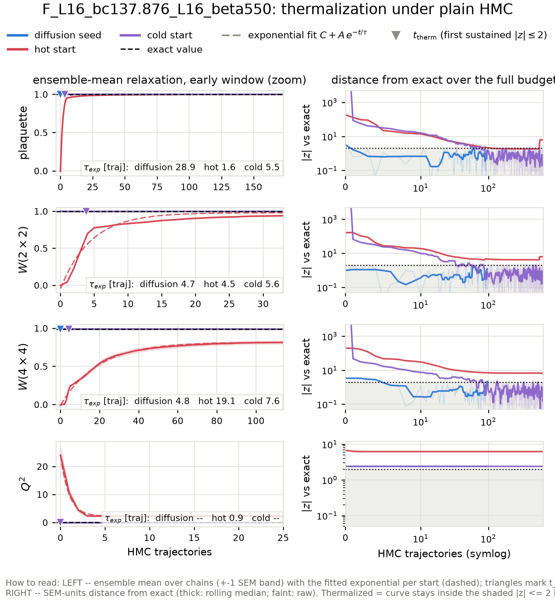
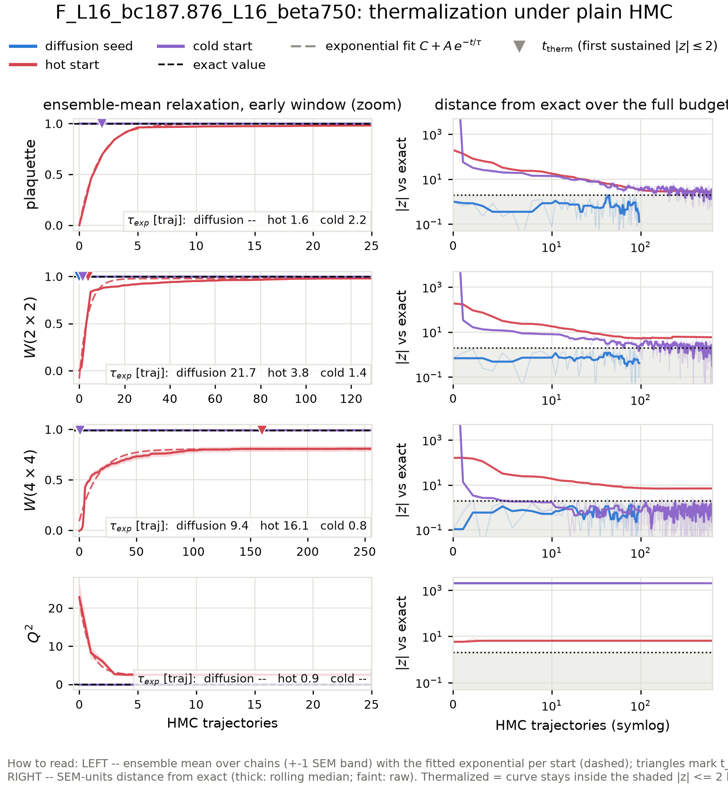
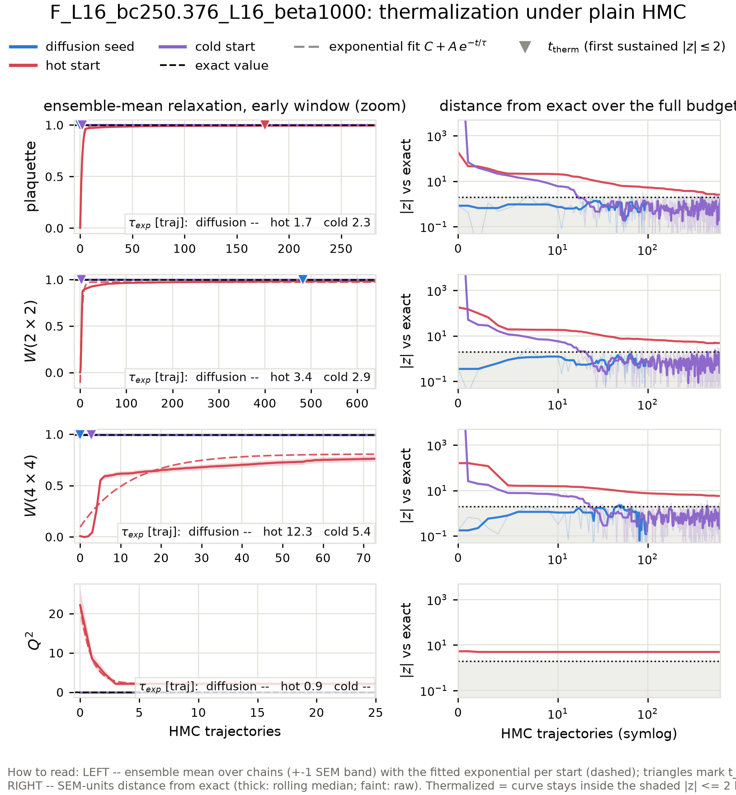
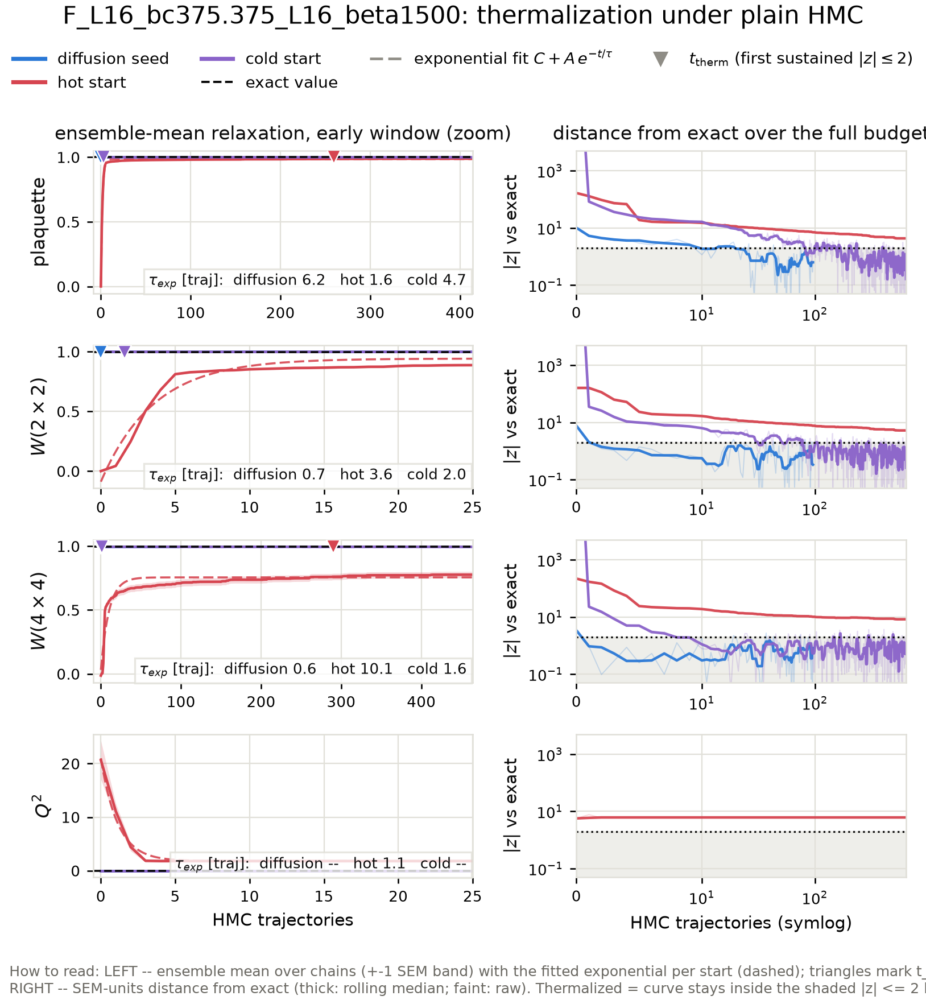
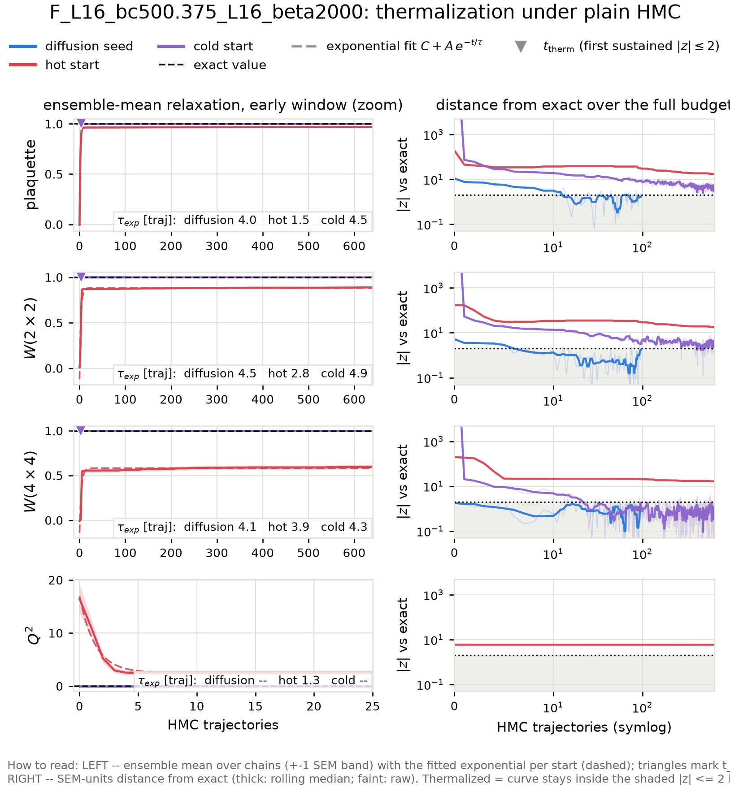

# Diffusion-seeded HMC across the matched beta scan: thermalization time vs the standard-HMC sampling interval

Action: wilson. All HMC in this report is plain HMC (Omelyan, adapted step size, **no** topological updates).

**Why this scan.** At the ladder's upper rungs the fresh-HMC baselines never thermalize at all (topological freezing plus a metastable local-defect state), so the only comparison available there is 'diffusion seed vs a baseline that never arrives'. This report extends the benchmark to every matched coupling pair of the generalization study -- one inverse-RG step L=16 -> L=32 per case -- including fine couplings low enough that hot- and cold-start HMC *does* thermalize within the budget. There the standard chain's own interval `2 tau_int` and its fresh-start burn-in are honest, measurable yardsticks, and the scan shows where the ordering

> t_therm(diffusion seed)  <  2 tau_int(standard HMC)  <  burn-in(fresh chain)

sets in as beta grows and standard HMC slides into critical slowing down and topological freezing.

## The three starting points

- **Diffusion seed** -- the raw conditional-diffusion output for this coupling: one inverse-RG step from a direct-HMC base ensemble at the matched coarse coupling (ancestral sampling + the deterministic coarse-charge transport), with **no** rethermalization sweeps applied: every bit of equilibration the seed needs is measured here, in HMC trajectories.
- **Hot start** -- every link angle drawn uniformly from (-pi, pi]: a completely disordered (infinite-temperature) configuration. The standard way to initialize a fresh HMC chain without prior information.
- **Cold start** -- every link angle set to zero: the perfectly ordered (beta -> infinity) configuration, the other standard initialization.

## Summary

| rung | L | beta | t_therm diffusion seed | standard-HMC interval 2 tau_int | margin (interval - t_therm) | burn-in hot / cold | tau_int(Q) |
|---|---|---|---|---|---|---|---|
| F_L16_bc75.3776_L16_beta300 | 16 | 300 | never | 88.3 | -- | 446 / 9 | frozen (0 tunnelings in 321 x 64 traj) |
| F_L16_bc100.377_L16_beta400 | 16 | 400 | 0 | 20.3 | 20.3 traj | never / 4 | frozen (0 tunnelings in 321 x 64 traj) |
| F_L16_bc137.876_L16_beta550 | 16 | 550 | never | 15.1 | -- | never / 4 | frozen (0 tunnelings in 321 x 64 traj) |
| F_L16_bc187.876_L16_beta750 | 16 | 750 | never | 20.7 | -- | never / 2 | frozen (0 tunnelings in 321 x 64 traj) |
| F_L16_bc250.376_L16_beta1000 | 16 | 1000 | 483 | 17.8 | -465.0 traj | never / 3 | frozen (0 tunnelings in 321 x 64 traj) |
| F_L16_bc375.375_L16_beta1500 | 16 | 1500 | 0 | 17.3 | 17.3 traj | never / 3 | frozen (0 tunnelings in 321 x 64 traj) |
| F_L16_bc500.375_L16_beta2000 | 16 | 2000 | never | 13.4 | -- | 3496 / 4 | frozen (0 tunnelings in 321 x 64 traj) |

## Wall-clock accounting

All timescales above are in HMC trajectories -- the honest *ergodicity* unit. This table converts to seconds on this machine so the economics are explicit. Batched chains produce n_chains configs per trajectory, so per-config costs divide by the chain count; the diffusion sampling cost amortizes over the whole generated batch.

| case | seed: sample s/config | seed: t_therm s (batch) | HMC interval s/config | hot burn-in s (batch) | s/traj (batch) |
|---|---|---|---|---|---|
| F_L16_bc75.3776_L16_beta300 | 0.2 | never | 0.35 | 113 | 0.25 |
| F_L16_bc100.377_L16_beta400 | 0.2 | 0.0 | 0.09 | never | 0.29 |
| F_L16_bc137.876_L16_beta550 | 0.2 | never | 0.08 | never | 0.34 |
| F_L16_bc187.876_L16_beta750 | 0.2 | never | 0.13 | never | 0.39 |
| F_L16_bc250.376_L16_beta1000 | 0.2 | 217.2 | 0.13 | never | 0.45 |
| F_L16_bc375.375_L16_beta1500 | 0.2 | 0.0 | 0.15 | never | 0.55 |
| F_L16_bc500.375_L16_beta2000 | 0.2 | never | 0.10 | 1731 | 0.50 |

## Fitted relaxation times across starts

Exponential fits C + A exp(-t/tau) to the ensemble-mean plaquette and W(2x2) relaxation curves, per starting point (the cross-start comparison of characteristic times; a start already at its plateau fits no decay, which is the desired outcome for the diffusion seed).

| case | obs | tau: diffusion seed | tau: hot start | tau: cold start |
|---|---|---|---|---|
| F_L16_bc75.3776_L16_beta300 | plaquette | 8.4 +- 1.4 | 1.7 +- 0.0 | 43.0 +- 1.6 |
| F_L16_bc75.3776_L16_beta300 | wilson_2x2 | 16.6 +- 6.8 | 4.0 +- 0.1 | 27.9 +- 1.1 |
| F_L16_bc100.377_L16_beta400 | plaquette | 15.4 +- 3.0 | 1.6 +- 0.0 | 10.4 +- 0.5 |
| F_L16_bc100.377_L16_beta400 | wilson_2x2 | unreliable (tau exceeds window) | 3.4 +- 0.0 | 8.1 +- 0.4 |
| F_L16_bc137.876_L16_beta550 | plaquette | 28.9 +- 22.4 | 1.6 +- 0.0 | 5.5 +- 0.2 |
| F_L16_bc137.876_L16_beta550 | wilson_2x2 | 4.7 +- 2.0 | 4.5 +- 0.1 | 5.6 +- 0.2 |
| F_L16_bc187.876_L16_beta750 | plaquette | no measurable decay (starts at plateau; tau unconstrained) | 1.6 +- 0.0 | 2.2 +- 0.1 |
| F_L16_bc187.876_L16_beta750 | wilson_2x2 | 21.7 +- 18.3 | 3.8 +- 0.1 | 1.4 +- 0.1 |
| F_L16_bc250.376_L16_beta1000 | plaquette | no measurable decay (starts at plateau; tau unconstrained) | 1.7 +- 0.0 | 2.3 +- 0.1 |
| F_L16_bc250.376_L16_beta1000 | wilson_2x2 | no measurable decay (starts at plateau; tau unconstrained) | 3.4 +- 0.1 | 2.9 +- 0.1 |
| F_L16_bc375.375_L16_beta1500 | plaquette | 6.2 +- 1.0 | 1.6 +- 0.0 | 4.7 +- 0.2 |
| F_L16_bc375.375_L16_beta1500 | wilson_2x2 | 0.7 +- 0.3 | 3.6 +- 0.1 | 2.0 +- 0.1 |
| F_L16_bc500.375_L16_beta2000 | plaquette | 4.0 +- 0.4 | 1.5 +- 0.0 | 4.5 +- 0.2 |
| F_L16_bc500.375_L16_beta2000 | wilson_2x2 | 4.5 +- 0.8 | 2.8 +- 0.1 | 4.9 +- 0.2 |

t_therm and burn-in are the slowest Wilson-loop observable (plaquette, W(2x2), W(4x4)); topology is stricter still for the fresh chains: their Q^2 **never** reaches the exact value at the frozen rungs, while the diffusion seed inherits the correct topological sector from the coarse ensemble it was generated from (see the Q^2 panels and per-rung tables below).

Thermalization time `t_therm` = first trajectory at which the ensemble-mean z-score vs the exact value satisfies |z| <= 2 and stays there for 5 consecutive trajectories (t = 0: already thermalized before any HMC). For the diffusion seed, t_therm is computed on a random subsample of chains matched to the baseline chain count so all starts are compared at equal statistical power. `tau_int` is Madras-Sokal, measured on the second half of the hot-start chains, averaged over chains. In the per-rung relaxation figures, triangles mark each start's t_therm, dashed curves are the exponential fits C + A exp(-t/tau) to the ensemble means (tau quoted per panel), and the right-hand panels track the ensemble mean's distance from the exact value in SEM units -- thermalized means inside the shaded |z| <= 2 band; the dotted vertical line there is the standard-HMC interval `2 tau_int`.

## What 'never' means, and where the ground truth comes from

'never' = the ensemble mean was still outside |z| <= 2 of the exact value after the full baseline budget; the per-rung sections quote the z-score it plateaued at. For hot starts at the large-beta rungs this is not a budget problem but a physical one: a random start freezes into a random topological sector (<Q^2> of order tens), plain HMC can never change Q at these couplings (tunneling is suppressed ~exp(-2 beta)), and the wrong sector biases every Wilson loop by an amount that never decays. Cold starts sit in the single sector Q = 0, so their Wilson loops do eventually converge, but <Q^2> stays pinned at 0 forever.

None of the exact values in this report come from fine-lattice HMC: the ground truth is the character expansion of 2D compact U(1) (`diffusion/lgt/exact.py`), which gives every Wilson loop, P(Q) and chi_top in closed form at finite volume. Each diffusion seed here is one inverse-RG step from a direct-HMC base ensemble at the matched coarse coupling beta_c (L=16), where HMC mixes well -- which is precisely why it can start chains in regions standard HMC cannot reach.

## F_L16_bc75.3776_L16_beta300

HMC: step size 0.0231, 43 leapfrog steps, acceptance seed/hot/cold = 0.988/0.984/0.988. Diffusion-seed batch: 64 chains x 96 trajectories (0.25 s/traj for the whole batch); baselines: 64 chains x 640 trajectories.

tau_int (hot-start chains, second half): plaquette = 41.70 +- 1.56, wilson_2x2 = 42.92 +- 1.79, wilson_4x4 = 44.14 +- 1.98, wilson_6x6 = 39.73 +- 2.08. Topology: hot-start HMC L=16 beta=300 -> **frozen** (no tunneling).

Where 'never' stood at the end: the hot start ended the 640-trajectory budget still at Q^2 at |z| ~ 6; the cold start ended the 640-trajectory budget still at wilson_6x6 at |z| ~ 2, Q^2 at |z| ~ 187.

### Diagnostics: raw diffusion output (before any HMC)

| observable | value | error | exact | z_exact | reference | ref_error | z_ref | ks_p | chi2_p |
|---|---|---|---|---|---|---|---|---|---|
| plaquette | 0.9985 | 1.375e-05 | 0.9983 | 12.19 | 0.9983 | 1.174e-05 | 9.701 | 1.989e-08 |  |
| wilson_1x1 | 0.9985 | 1.375e-05 | 0.9983 | 12.19 | 0.9983 | 1.174e-05 | 9.701 | 1.989e-08 |  |
| wilson_1x2 | 0.9969 | 2.98e-05 | 0.9967 | 8.43 | 0.9966 | 2.808e-05 | 7.846 | 4.265e-07 |  |
| wilson_2x2 | 0.9936 | 9.856e-05 | 0.9934 | 1.892 | 0.9931 | 8.549e-05 | 3.796 | 0.0001523 |  |
| wilson_2x3 | 0.9905 | 0.0001821 | 0.9903 | 1.509 | 0.9898 | 0.0001576 | 2.965 | 0.001695 |  |
| wilson_3x3 | 0.9858 | 0.0003319 | 0.9856 | 0.5036 | 0.9849 | 0.0002727 | 1.921 | 0.1614 |  |
| wilson_3x4 | 0.981 | 0.0005138 | 0.9811 | -0.07526 | 0.9802 | 0.0003956 | 1.322 | 0.4056 |  |
| wilson_4x4 | 0.9746 | 0.0007598 | 0.9753 | -0.9328 | 0.974 | 0.0006338 | 0.5392 | 0.9115 |  |
| wilson_4x5 | 0.9686 | 0.001118 | 0.9697 | -0.993 | 0.9677 | 0.0008701 | 0.6081 | 0.9115 |  |
| wilson_5x5 | 0.9612 | 0.001451 | 0.963 | -1.282 | 0.9599 | 0.00123 | 0.6715 | 0.9115 |  |
| wilson_5x6 | 0.954 | 0.001949 | 0.9567 | -1.423 | 0.9523 | 0.001466 | 0.7066 | 0.4056 |  |
| wilson_6x6 | 0.9456 | 0.00239 | 0.9497 | -1.696 | 0.9437 | 0.00204 | 0.5994 | 0.3192 |  |
| wilson_6x7 | 0.938 | 0.003027 | 0.9431 | -1.679 | 0.9359 | 0.002275 | 0.5484 | 0.2811 |  |
| wilson_7x7 | 0.9296 | 0.003606 | 0.936 | -1.765 | 0.9279 | 0.002938 | 0.3715 | 0.5044 |  |
| wilson_7x8 | 0.9221 | 0.004303 | 0.9296 | -1.725 | 0.9202 | 0.003019 | 0.3617 | 0.3192 |  |
| wilson_8x8 | 0.9148 | 0.004799 | 0.923 | -1.716 | 0.9125 | 0.00367 | 0.3756 | 0.2811 |  |
| creutz_2 | 0.001759 | 5.69e-05 | 0.001611 | 2.611 |  |  |  |  |  |
| creutz_3 | 0.001704 | 0.0001373 | 0.001506 | 1.439 |  |  |  |  |  |
| creutz_4 | 0.001828 | 0.0001906 | 0.00135 | 2.511 |  |  |  |  |  |
| creutz_5 | 0.00151 | 0.0003012 | 0.001141 | 1.224 |  |  |  |  |  |
| creutz_6 | 0.001286 | 0.000409 | 0.0008804 | 0.9908 |  |  |  |  |  |
| creutz_7 | 0.0008656 | 0.0006931 | 0.0005674 | 0.4304 |  |  |  |  |  |
| creutz_8 | -4.821e-05 | 0.001052 | 0.0002022 | -0.2379 |  |  |  |  |  |
| Q | 0 | 0 | 0 | 0 | 0 | 0 | 0 | 1 |  |
| Q^2 | 0 | 0 | 1.872e-10 | inf | 0 | 0 | 0 | 1 |  |
| chi_top ((<Q^2>-<Q>^2)/V) | 0 | 0 | 7.311e-13 | inf | 0 | 0 | 0 |  |  |
| Q histogram vs exact P(Q) | 1.198e-08 | nan | 2 | nan |  |  |  |  | 1 |

### Diagnostics: the same configs after 96 HMC trajectories

| observable | value | error | exact | z_exact | reference | ref_error | z_ref | ks_p | chi2_p |
|---|---|---|---|---|---|---|---|---|---|
| plaquette | 0.9983 | 1.514e-05 | 0.9983 | -0.2042 | 0.9983 | 1.174e-05 | 0.2471 | 0.7766 |  |
| wilson_1x1 | 0.9983 | 1.514e-05 | 0.9983 | -0.2042 | 0.9983 | 1.174e-05 | 0.2471 | 0.7766 |  |
| wilson_1x2 | 0.9967 | 2.377e-05 | 0.9967 | 0.07224 | 0.9966 | 2.808e-05 | 1.951 | 0.08625 |  |
| wilson_2x2 | 0.9935 | 8.469e-05 | 0.9934 | 0.4783 | 0.9931 | 8.549e-05 | 2.903 | 0.001695 |  |
| wilson_2x3 | 0.9903 | 0.0001686 | 0.9903 | -0.07092 | 0.9898 | 0.0001576 | 1.852 | 0.04298 |  |
| wilson_3x3 | 0.9856 | 0.0003184 | 0.9856 | 0.1071 | 0.9849 | 0.0002727 | 1.651 | 0.3607 |  |
| wilson_3x4 | 0.9811 | 0.0004802 | 0.9811 | -0.04454 | 0.9802 | 0.0003956 | 1.405 | 0.4056 |  |
| wilson_4x4 | 0.9753 | 0.0007134 | 0.9753 | 0.07389 | 0.974 | 0.0006338 | 1.357 | 0.3607 |  |
| wilson_4x5 | 0.9696 | 0.0009391 | 0.9697 | -0.1177 | 0.9677 | 0.0008701 | 1.454 | 0.4056 |  |
| wilson_5x5 | 0.9629 | 0.001205 | 0.963 | -0.1081 | 0.9599 | 0.00123 | 1.746 | 0.1389 |  |
| wilson_5x6 | 0.9565 | 0.001525 | 0.9567 | -0.1773 | 0.9523 | 0.001466 | 1.998 | 0.07294 |  |
| wilson_6x6 | 0.9492 | 0.001938 | 0.9497 | -0.2171 | 0.9437 | 0.00204 | 1.96 | 0.08625 |  |
| wilson_6x7 | 0.9425 | 0.002335 | 0.9431 | -0.2572 | 0.9359 | 0.002275 | 2.011 | 0.05149 |  |
| wilson_7x7 | 0.9349 | 0.002831 | 0.936 | -0.3699 | 0.9279 | 0.002938 | 1.727 | 0.06142 |  |
| wilson_7x8 | 0.9291 | 0.003138 | 0.9296 | -0.148 | 0.9202 | 0.003019 | 2.034 | 0.03572 |  |
| wilson_8x8 | 0.9222 | 0.003634 | 0.923 | -0.2288 | 0.9125 | 0.00367 | 1.872 | 0.01631 |  |
| creutz_2 | 0.001577 | 6.178e-05 | 0.001611 | -0.5542 |  |  |  |  |  |
| creutz_3 | 0.001407 | 0.0001387 | 0.001506 | -0.7174 |  |  |  |  |  |
| creutz_4 | 0.001218 | 0.0002474 | 0.00135 | -0.5345 |  |  |  |  |  |
| creutz_5 | 0.0009944 | 0.0003855 | 0.001141 | -0.3808 |  |  |  |  |  |
| creutz_6 | 0.0008936 | 0.0005266 | 0.0008804 | 0.02504 |  |  |  |  |  |
| creutz_7 | 0.0008555 | 0.0006881 | 0.0005674 | 0.4188 |  |  |  |  |  |
| creutz_8 | 0.001223 | 0.0008061 | 0.0002022 | 1.267 |  |  |  |  |  |
| Q | 0 | 0 | 0 | 0 | 0 | 0 | 0 | 1 |  |
| Q^2 | 0 | 0 | 1.872e-10 | inf | 0 | 0 | 0 | 1 |  |
| chi_top ((<Q^2>-<Q>^2)/V) | 0 | 0 | 7.311e-13 | inf | 0 | 0 | 0 |  |  |
| Q histogram vs exact P(Q) | 1.198e-08 | nan | 2 | nan |  |  |  |  | 1 |

## F_L16_bc100.377_L16_beta400

HMC: step size 0.0200, 50 leapfrog steps, acceptance seed/hot/cold = 0.990/0.979/0.989. Diffusion-seed batch: 64 chains x 96 trajectories (0.29 s/traj for the whole batch); baselines: 64 chains x 640 trajectories.

tau_int (hot-start chains, second half): plaquette = 10.17 +- 1.03, wilson_2x2 = 4.92 +- 0.72, wilson_4x4 = 1.03 +- 0.05, wilson_6x6 = 0.62 +- 0.03. Topology: hot-start HMC L=16 beta=400 -> **frozen** (no tunneling).

Where 'never' stood at the end: the hot start ended the 640-trajectory budget still at wilson_4x4 at |z| ~ 7, Q^2 at |z| ~ 6.

### Diagnostics: raw diffusion output (before any HMC)

| observable | value | error | exact | z_exact | reference | ref_error | z_ref | ks_p | chi2_p |
|---|---|---|---|---|---|---|---|---|---|
| plaquette | 0.9988 | 1.358e-05 | 0.9988 | 5.649 | 0.9987 | 8.634e-06 | 5.792 | 0.000114 |  |
| wilson_1x1 | 0.9988 | 1.358e-05 | 0.9988 | 5.649 | 0.9987 | 8.634e-06 | 5.792 | 0.000114 |  |
| wilson_1x2 | 0.9976 | 3.42e-05 | 0.9975 | 3.486 | 0.9975 | 1.908e-05 | 4.04 | 0.008658 |  |
| wilson_2x2 | 0.9952 | 8.705e-05 | 0.9951 | 1.486 | 0.9949 | 4.527e-05 | 2.916 | 0.01326 |  |
| wilson_2x3 | 0.9929 | 0.000166 | 0.9927 | 1.136 | 0.9925 | 9.126e-05 | 1.779 | 0.05149 |  |
| wilson_3x3 | 0.9896 | 0.0003213 | 0.9892 | 1.161 | 0.9889 | 0.0001873 | 1.906 | 0.03572 |  |
| wilson_3x4 | 0.9863 | 0.0004658 | 0.9858 | 1.013 | 0.9853 | 0.0003112 | 1.755 | 0.119 |  |
| wilson_4x4 | 0.982 | 0.0006696 | 0.9814 | 0.8475 | 0.9807 | 0.0005224 | 1.436 | 0.5575 |  |
| wilson_4x5 | 0.9777 | 0.0008497 | 0.9772 | 0.6473 | 0.9764 | 0.0007607 | 1.138 | 0.4535 |  |
| wilson_5x5 | 0.9729 | 0.001185 | 0.9722 | 0.6174 | 0.9709 | 0.001087 | 1.268 | 0.3607 |  |
| wilson_5x6 | 0.9681 | 0.001445 | 0.9674 | 0.4598 | 0.9662 | 0.001412 | 0.8993 | 0.5575 |  |
| wilson_6x6 | 0.9628 | 0.001805 | 0.962 | 0.4354 | 0.9599 | 0.001862 | 1.112 | 0.3607 |  |
| wilson_6x7 | 0.9572 | 0.002169 | 0.957 | 0.1049 | 0.9549 | 0.002198 | 0.7507 | 0.4535 |  |
| wilson_7x7 | 0.9517 | 0.002677 | 0.9516 | 0.0477 | 0.9485 | 0.002731 | 0.8396 | 0.6123 |  |
| wilson_7x8 | 0.9465 | 0.00304 | 0.9467 | -0.06276 | 0.9431 | 0.003035 | 0.8042 | 0.5044 |  |
| wilson_8x8 | 0.9413 | 0.003439 | 0.9417 | -0.111 | 0.9371 | 0.003545 | 0.8542 | 0.5575 |  |
| creutz_2 | 0.00124 | 5.136e-05 | 0.001208 | 0.6272 |  |  |  |  |  |
| creutz_3 | 0.001002 | 0.0001028 | 0.001129 | -1.236 |  |  |  |  |  |
| creutz_4 | 0.001014 | 0.0001694 | 0.001012 | 0.01289 |  |  |  |  |  |
| creutz_5 | 0.0006507 | 0.0003016 | 0.0008556 | -0.6793 |  |  |  |  |  |
| creutz_6 | 0.0004646 | 0.0003255 | 0.00066 | -0.6003 |  |  |  |  |  |
| creutz_7 | -4.982e-05 | 0.0004965 | 0.0004253 | -0.9569 |  |  |  |  |  |
| creutz_8 | 1.959e-05 | 0.0005521 | 0.0001516 | -0.239 |  |  |  |  |  |
| Q | 0 | 0 | 0 | 0 | 0 | 0 | 0 | 1 |  |
| Q^2 | 0 | 0 | 8.168e-14 | inf | 0 | 0 | 0 | 1 |  |
| chi_top ((<Q^2>-<Q>^2)/V) | 0 | 0 | 3.191e-16 | inf | 0 | 0 | 0 |  |  |
| Q histogram vs exact P(Q) | 5.227e-12 | nan | 2 | nan |  |  |  |  | 1 |

### Diagnostics: the same configs after 96 HMC trajectories

| observable | value | error | exact | z_exact | reference | ref_error | z_ref | ks_p | chi2_p |
|---|---|---|---|---|---|---|---|---|---|
| plaquette | 0.9987 | 1.454e-05 | 0.9988 | -0.516 | 0.9987 | 8.634e-06 | 0.5309 | 0.7231 |  |
| wilson_1x1 | 0.9987 | 1.454e-05 | 0.9988 | -0.516 | 0.9987 | 8.634e-06 | 0.5309 | 0.7231 |  |
| wilson_1x2 | 0.9975 | 2.892e-05 | 0.9975 | -0.8981 | 0.9975 | 1.908e-05 | 0.3756 | 0.9671 |  |
| wilson_2x2 | 0.9951 | 7.407e-05 | 0.9951 | -0.4418 | 0.9949 | 4.527e-05 | 1.429 | 0.3192 |  |
| wilson_2x3 | 0.9926 | 0.000122 | 0.9927 | -0.9245 | 0.9925 | 9.126e-05 | 0.234 | 0.6123 |  |
| wilson_3x3 | 0.989 | 0.0002323 | 0.9892 | -0.8888 | 0.9889 | 0.0001873 | 0.4338 | 0.5575 |  |
| wilson_3x4 | 0.9855 | 0.0003366 | 0.9858 | -0.9169 | 0.9853 | 0.0003112 | 0.4423 | 0.2811 |  |
| wilson_4x4 | 0.981 | 0.0005362 | 0.9814 | -0.6652 | 0.9807 | 0.0005224 | 0.3947 | 0.215 |  |
| wilson_4x5 | 0.9767 | 0.0007183 | 0.9772 | -0.6812 | 0.9764 | 0.0007607 | 0.2475 | 0.5575 |  |
| wilson_5x5 | 0.9714 | 0.001014 | 0.9722 | -0.7719 | 0.9709 | 0.001087 | 0.3523 | 0.5044 |  |
| wilson_5x6 | 0.9664 | 0.001294 | 0.9674 | -0.7795 | 0.9662 | 0.001412 | 0.07515 | 0.9929 |  |
| wilson_6x6 | 0.9604 | 0.001738 | 0.962 | -0.9393 | 0.9599 | 0.001862 | 0.1828 | 0.8269 |  |
| wilson_6x7 | 0.9549 | 0.002065 | 0.957 | -1.035 | 0.9549 | 0.002198 | -0.01556 | 0.9433 |  |
| wilson_7x7 | 0.9485 | 0.00257 | 0.9516 | -1.203 | 0.9485 | 0.002731 | -0.002642 | 0.9671 |  |
| wilson_7x8 | 0.943 | 0.002867 | 0.9467 | -1.287 | 0.9431 | 0.003035 | -0.01046 | 0.9833 |  |
| wilson_8x8 | 0.9371 | 0.00338 | 0.9417 | -1.348 | 0.9371 | 0.003545 | 0.008845 | 0.9833 |  |
| creutz_2 | 0.001196 | 5.32e-05 | 0.001208 | -0.2195 |  |  |  |  |  |
| creutz_3 | 0.001144 | 0.0001007 | 0.001129 | 0.1422 |  |  |  |  |  |
| creutz_4 | 0.000958 | 0.0001683 | 0.001012 | -0.321 |  |  |  |  |  |
| creutz_5 | 0.001023 | 0.0002227 | 0.0008556 | 0.7526 |  |  |  |  |  |
| creutz_6 | 0.001078 | 0.0003825 | 0.00066 | 1.092 |  |  |  |  |  |
| creutz_7 | 0.0009063 | 0.0005677 | 0.0004253 | 0.8471 |  |  |  |  |  |
| creutz_8 | 0.0004474 | 0.0008341 | 0.0001516 | 0.3546 |  |  |  |  |  |
| Q | 0 | 0 | 0 | 0 | 0 | 0 | 0 | 1 |  |
| Q^2 | 0 | 0 | 8.168e-14 | inf | 0 | 0 | 0 | 1 |  |
| chi_top ((<Q^2>-<Q>^2)/V) | 0 | 0 | 3.191e-16 | inf | 0 | 0 | 0 |  |  |
| Q histogram vs exact P(Q) | 5.227e-12 | nan | 2 | nan |  |  |  |  | 1 |

## F_L16_bc137.876_L16_beta550

HMC: step size 0.0171, 59 leapfrog steps, acceptance seed/hot/cold = 0.988/0.951/0.987. Diffusion-seed batch: 64 chains x 96 trajectories (0.34 s/traj for the whole batch); baselines: 64 chains x 640 trajectories.

tau_int (hot-start chains, second half): plaquette = 5.44 +- 0.65, wilson_2x2 = 5.52 +- 0.67, wilson_4x4 = 7.53 +- 0.84, wilson_6x6 = 10.47 +- 0.95. Topology: hot-start HMC L=16 beta=550 -> **frozen** (no tunneling).

Where 'never' stood at the end: the hot start ended the 640-trajectory budget still at plaquette at |z| ~ 6, wilson_2x2 at |z| ~ 6, wilson_4x4 at |z| ~ 7, Q^2 at |z| ~ 6.

### Diagnostics: raw diffusion output (before any HMC)

| observable | value | error | exact | z_exact | reference | ref_error | z_ref | ks_p | chi2_p |
|---|---|---|---|---|---|---|---|---|---|
| plaquette | 0.9991 | 1.035e-05 | 0.9991 | 3.473 | 0.9991 | 5.287e-06 | 0.4735 | 0.6679 |  |
| wilson_1x1 | 0.9991 | 1.035e-05 | 0.9991 | 3.473 | 0.9991 | 5.287e-06 | 0.4735 | 0.6679 |  |
| wilson_1x2 | 0.9982 | 2.098e-05 | 0.9982 | 1.53 | 0.9983 | 1.62e-05 | -1.689 | 0.1389 |  |
| wilson_2x2 | 0.9965 | 6.304e-05 | 0.9964 | 0.9443 | 0.9966 | 4.052e-05 | -1.87 | 0.119 |  |
| wilson_2x3 | 0.9948 | 8.75e-05 | 0.9947 | 1.74 | 0.995 | 6.856e-05 | -1.646 | 0.1015 |  |
| wilson_3x3 | 0.9926 | 0.0001812 | 0.9921 | 2.349 | 0.9927 | 0.0001273 | -0.4366 | 0.8269 |  |
| wilson_3x4 | 0.9904 | 0.0002456 | 0.9896 | 2.918 | 0.9904 | 0.0001841 | -0.07543 | 0.9433 |  |
| wilson_4x4 | 0.9877 | 0.0003924 | 0.9864 | 3.209 | 0.9874 | 0.0002568 | 0.5476 | 0.8723 |  |
| wilson_4x5 | 0.9852 | 0.0005178 | 0.9834 | 3.631 | 0.9846 | 0.0003466 | 1.012 | 0.2464 |  |
| wilson_5x5 | 0.9825 | 0.0007453 | 0.9797 | 3.788 | 0.9812 | 0.0004518 | 1.471 | 0.2811 |  |
| wilson_5x6 | 0.9797 | 0.000933 | 0.9762 | 3.751 | 0.9781 | 0.0005667 | 1.424 | 0.1867 |  |
| wilson_6x6 | 0.9769 | 0.001181 | 0.9722 | 3.924 | 0.9743 | 0.0007193 | 1.839 | 0.07294 |  |
| wilson_6x7 | 0.9736 | 0.001434 | 0.9686 | 3.537 | 0.9708 | 0.0008489 | 1.677 | 0.01997 |  |
| wilson_7x7 | 0.9706 | 0.001764 | 0.9646 | 3.402 | 0.967 | 0.001058 | 1.736 | 0.04298 |  |
| wilson_7x8 | 0.9671 | 0.002004 | 0.961 | 3.042 | 0.9638 | 0.001173 | 1.42 | 0.1015 |  |
| wilson_8x8 | 0.9639 | 0.00226 | 0.9573 | 2.943 | 0.9601 | 0.001279 | 1.47 | 0.07294 |  |
| creutz_2 | 0.0008465 | 3.831e-05 | 0.0008779 | -0.8194 |  |  |  |  |  |
| creutz_3 | 0.0006385 | 7.518e-05 | 0.0008211 | -2.428 |  |  |  |  |  |
| creutz_4 | 0.000479 | 0.0001205 | 0.0007358 | -2.13 |  |  |  |  |  |
| creutz_5 | 0.0002891 | 0.000196 | 0.000622 | -1.699 |  |  |  |  |  |
| creutz_6 | 4.57e-06 | 0.0002639 | 0.0004798 | -1.801 |  |  |  |  |  |
| creutz_7 | -0.0002011 | 0.0003735 | 0.0003092 | -1.367 |  |  |  |  |  |
| creutz_8 | -0.0003686 | 0.0005109 | 0.0001102 | -0.9371 |  |  |  |  |  |
| Q | 0 | 0 | 0 | 0 | 0 | 0 | 0 | 1 |  |
| Q^2 | 0 | 0 | 2.399e-12 | inf | 0 | 0 | 0 | 1 |  |
| chi_top ((<Q^2>-<Q>^2)/V) | 0 | 0 | 9.372e-15 | inf | 0 | 0 | 0 |  |  |
| Q histogram vs exact P(Q) | 1.706e-11 | nan | 2 | nan |  |  |  |  | 1 |

### Diagnostics: the same configs after 96 HMC trajectories

| observable | value | error | exact | z_exact | reference | ref_error | z_ref | ks_p | chi2_p |
|---|---|---|---|---|---|---|---|---|---|
| plaquette | 0.9991 | 1.079e-05 | 0.9991 | 1.508 | 0.9991 | 5.287e-06 | -1.18 | 0.5044 |  |
| wilson_1x1 | 0.9991 | 1.079e-05 | 0.9991 | 1.508 | 0.9991 | 5.287e-06 | -1.18 | 0.5044 |  |
| wilson_1x2 | 0.9982 | 2.974e-05 | 0.9982 | 1.334 | 0.9983 | 1.62e-05 | -1.099 | 0.7766 |  |
| wilson_2x2 | 0.9965 | 6.928e-05 | 0.9964 | 1.129 | 0.9966 | 4.052e-05 | -1.513 | 0.5575 |  |
| wilson_2x3 | 0.9948 | 0.0001179 | 0.9947 | 1.133 | 0.995 | 6.856e-05 | -1.48 | 0.4535 |  |
| wilson_3x3 | 0.9924 | 0.0002042 | 0.9921 | 1.449 | 0.9927 | 0.0001273 | -0.9409 | 0.7231 |  |
| wilson_3x4 | 0.9901 | 0.0003105 | 0.9896 | 1.378 | 0.9904 | 0.0001841 | -0.8646 | 0.7766 |  |
| wilson_4x4 | 0.9873 | 0.0004297 | 0.9864 | 2.076 | 0.9874 | 0.0002568 | -0.2204 | 0.9929 |  |
| wilson_4x5 | 0.9844 | 0.0006248 | 0.9834 | 1.711 | 0.9846 | 0.0003466 | -0.2531 | 0.9671 |  |
| wilson_5x5 | 0.9814 | 0.0008092 | 0.9797 | 2.08 | 0.9812 | 0.0004518 | 0.1532 | 0.8723 |  |
| wilson_5x6 | 0.9783 | 0.001019 | 0.9762 | 2.098 | 0.9781 | 0.0005667 | 0.1644 | 0.7766 |  |
| wilson_6x6 | 0.975 | 0.001231 | 0.9722 | 2.217 | 0.9743 | 0.0007193 | 0.447 | 0.7231 |  |
| wilson_6x7 | 0.972 | 0.001416 | 0.9686 | 2.454 | 0.9708 | 0.0008489 | 0.7251 | 0.6123 |  |
| wilson_7x7 | 0.9688 | 0.001651 | 0.9646 | 2.521 | 0.967 | 0.001058 | 0.884 | 0.6123 |  |
| wilson_7x8 | 0.9659 | 0.001816 | 0.961 | 2.728 | 0.9638 | 0.001173 | 0.9965 | 0.3607 |  |
| wilson_8x8 | 0.9628 | 0.002083 | 0.9573 | 2.637 | 0.9601 | 0.001279 | 1.089 | 0.2464 |  |
| creutz_2 | 0.0008626 | 3.37e-05 | 0.0008779 | -0.4539 |  |  |  |  |  |
| creutz_3 | 0.0007127 | 7.502e-05 | 0.0008211 | -1.445 |  |  |  |  |  |
| creutz_4 | 0.0003978 | 0.0001154 | 0.0007358 | -2.928 |  |  |  |  |  |
| creutz_5 | 0.0001739 | 0.0001865 | 0.000622 | -2.403 |  |  |  |  |  |
| creutz_6 | 0.0003347 | 0.0002453 | 0.0004798 | -0.5917 |  |  |  |  |  |
| creutz_7 | 0.0003619 | 0.0003048 | 0.0003092 | 0.1728 |  |  |  |  |  |
| creutz_8 | 0.0003638 | 0.0003578 | 0.0001102 | 0.7087 |  |  |  |  |  |
| Q | 0 | 0 | 0 | 0 | 0 | 0 | 0 | 1 |  |
| Q^2 | 0 | 0 | 2.399e-12 | inf | 0 | 0 | 0 | 1 |  |
| chi_top ((<Q^2>-<Q>^2)/V) | 0 | 0 | 9.372e-15 | inf | 0 | 0 | 0 |  |  |
| Q histogram vs exact P(Q) | 1.706e-11 | nan | 2 | nan |  |  |  |  | 1 |

## F_L16_bc187.876_L16_beta750

HMC: step size 0.0146, 68 leapfrog steps, acceptance seed/hot/cold = 0.986/0.919/0.988. Diffusion-seed batch: 64 chains x 96 trajectories (0.39 s/traj for the whole batch); baselines: 64 chains x 640 trajectories.

tau_int (hot-start chains, second half): plaquette = 10.33 +- 1.28, wilson_2x2 = 8.78 +- 1.27, wilson_4x4 = 0.99 +- 0.04, wilson_6x6 = 0.98 +- 0.03. Topology: hot-start HMC L=16 beta=750 -> **frozen** (no tunneling).

Where 'never' stood at the end: the hot start ended the 640-trajectory budget still at plaquette at |z| ~ 3, Q^2 at |z| ~ 6; the cold start ended the 640-trajectory budget still at Q^2 at |z| ~ 2060.

### Diagnostics: raw diffusion output (before any HMC)

| observable | value | error | exact | z_exact | reference | ref_error | z_ref | ks_p | chi2_p |
|---|---|---|---|---|---|---|---|---|---|
| plaquette | 0.9993 | 5.768e-06 | 0.9993 | 1.104 | 0.9993 | 7.234e-06 | 0.4771 | 0.6679 |  |
| wilson_1x1 | 0.9993 | 5.768e-06 | 0.9993 | 1.104 | 0.9993 | 7.234e-06 | 0.4771 | 0.6679 |  |
| wilson_1x2 | 0.9987 | 1.383e-05 | 0.9987 | 0.6077 | 0.9987 | 1.625e-05 | 0.6826 | 0.7231 |  |
| wilson_2x2 | 0.9973 | 3.831e-05 | 0.9974 | -0.8087 | 0.9974 | 3.388e-05 | -0.61 | 0.7231 |  |
| wilson_2x3 | 0.9961 | 8.205e-05 | 0.9961 | -0.5141 | 0.9961 | 6.144e-05 | -0.5123 | 0.9671 |  |
| wilson_3x3 | 0.9942 | 0.0001258 | 0.9942 | -0.1633 | 0.9943 | 0.0001249 | -0.4412 | 0.9115 |  |
| wilson_3x4 | 0.9924 | 0.0001993 | 0.9924 | -0.02294 | 0.9925 | 0.0001851 | -0.244 | 0.7766 |  |
| wilson_4x4 | 0.99 | 0.0002821 | 0.99 | -0.1085 | 0.9902 | 0.0002679 | -0.366 | 0.8723 |  |
| wilson_4x5 | 0.9878 | 0.0003899 | 0.9878 | 0.1634 | 0.9878 | 0.0003652 | 0.04564 | 0.9433 |  |
| wilson_5x5 | 0.9852 | 0.0005728 | 0.9851 | 0.2282 | 0.9853 | 0.0004693 | -0.1588 | 0.8269 |  |
| wilson_5x6 | 0.9829 | 0.0006996 | 0.9825 | 0.6186 | 0.9826 | 0.0005999 | 0.3671 | 0.7766 |  |
| wilson_6x6 | 0.98 | 0.0009365 | 0.9796 | 0.4949 | 0.9801 | 0.0007213 | -0.01217 | 0.5044 |  |
| wilson_6x7 | 0.9777 | 0.001078 | 0.9769 | 0.7586 | 0.9773 | 0.0008309 | 0.2378 | 0.2811 |  |
| wilson_7x7 | 0.9749 | 0.001367 | 0.9739 | 0.7446 | 0.9749 | 0.0009398 | 0.001437 | 0.5575 |  |
| wilson_7x8 | 0.9727 | 0.001493 | 0.9712 | 0.986 | 0.9723 | 0.001057 | 0.2428 | 0.4056 |  |
| wilson_8x8 | 0.97 | 0.001716 | 0.9685 | 0.8814 | 0.9698 | 0.001125 | 0.1098 | 0.2464 |  |
| creutz_2 | 0.0006852 | 3.145e-05 | 0.0006437 | 1.32 |  |  |  |  |  |
| creutz_3 | 0.000569 | 5.373e-05 | 0.000602 | -0.6136 |  |  |  |  |  |
| creutz_4 | 0.0005818 | 9.873e-05 | 0.0005394 | 0.429 |  |  |  |  |  |
| creutz_5 | 0.0004833 | 0.0001574 | 0.000456 | 0.1729 |  |  |  |  |  |
| creutz_6 | 0.0006268 | 0.0002306 | 0.0003518 | 1.193 |  |  |  |  |  |
| creutz_7 | 0.0003829 | 0.0003059 | 0.0002267 | 0.5105 |  |  |  |  |  |
| creutz_8 | 0.0005052 | 0.0003945 | 8.078e-05 | 1.076 |  |  |  |  |  |
| Q | 0 | 0 | 0 | 0 | 0 | 0 | 0 | 1 |  |
| Q^2 | 0 | 0 | 2.06e-09 | inf | 0 | 0 | 0 | 1 |  |
| chi_top ((<Q^2>-<Q>^2)/V) | 0 | 0 | 8.047e-12 | inf | 0 | 0 | 0 |  |  |
| Q histogram vs exact P(Q) | 1.465e-08 | nan | 2 | nan |  |  |  |  | 1 |

### Diagnostics: the same configs after 96 HMC trajectories

| observable | value | error | exact | z_exact | reference | ref_error | z_ref | ks_p | chi2_p |
|---|---|---|---|---|---|---|---|---|---|
| plaquette | 0.9993 | 6.168e-06 | 0.9993 | -0.167 | 0.9993 | 7.234e-06 | -0.314 | 0.8723 |  |
| wilson_1x1 | 0.9993 | 6.168e-06 | 0.9993 | -0.167 | 0.9993 | 7.234e-06 | -0.314 | 0.8723 |  |
| wilson_1x2 | 0.9987 | 1.518e-05 | 0.9987 | 0.02995 | 0.9987 | 1.625e-05 | 0.2975 | 0.7766 |  |
| wilson_2x2 | 0.9974 | 4.101e-05 | 0.9974 | -0.4724 | 0.9974 | 3.388e-05 | -0.3682 | 0.5575 |  |
| wilson_2x3 | 0.9961 | 6.802e-05 | 0.9961 | -0.3783 | 0.9961 | 6.144e-05 | -0.3935 | 0.5044 |  |
| wilson_3x3 | 0.9942 | 0.0001341 | 0.9942 | -0.4389 | 0.9943 | 0.0001249 | -0.6359 | 0.3607 |  |
| wilson_3x4 | 0.9923 | 0.0001884 | 0.9924 | -0.7603 | 0.9925 | 0.0001851 | -0.7764 | 0.6123 |  |
| wilson_4x4 | 0.9897 | 0.0002867 | 0.99 | -1.122 | 0.9902 | 0.0002679 | -1.104 | 0.4056 |  |
| wilson_4x5 | 0.9873 | 0.0003936 | 0.9878 | -1.289 | 0.9878 | 0.0003652 | -1.018 | 0.4535 |  |
| wilson_5x5 | 0.9845 | 0.0005203 | 0.9851 | -1.156 | 0.9853 | 0.0004693 | -1.213 | 0.1614 |  |
| wilson_5x6 | 0.9818 | 0.0006869 | 0.9825 | -1.023 | 0.9826 | 0.0005999 | -0.874 | 0.3192 |  |
| wilson_6x6 | 0.9786 | 0.0008787 | 0.9796 | -1.114 | 0.9801 | 0.0007213 | -1.282 | 0.1867 |  |
| wilson_6x7 | 0.976 | 0.001057 | 0.9769 | -0.8151 | 0.9773 | 0.0008309 | -1.008 | 0.2811 |  |
| wilson_7x7 | 0.9725 | 0.001209 | 0.9739 | -1.16 | 0.9749 | 0.0009398 | -1.579 | 0.1614 |  |
| wilson_7x8 | 0.97 | 0.001397 | 0.9712 | -0.9178 | 0.9723 | 0.001057 | -1.319 | 0.3607 |  |
| wilson_8x8 | 0.967 | 0.001523 | 0.9685 | -0.9484 | 0.9698 | 0.001125 | -1.442 | 0.2811 |  |
| creutz_2 | 0.000665 | 2.518e-05 | 0.0006437 | 0.8485 |  |  |  |  |  |
| creutz_3 | 0.0006289 | 4.748e-05 | 0.000602 | 0.5673 |  |  |  |  |  |
| creutz_4 | 0.0006348 | 8.671e-05 | 0.0005394 | 1.1 |  |  |  |  |  |
| creutz_5 | 0.0003646 | 0.000127 | 0.000456 | -0.7199 |  |  |  |  |  |
| creutz_6 | 0.0005318 | 0.0001971 | 0.0003518 | 0.9132 |  |  |  |  |  |
| creutz_7 | 0.0009019 | 0.0002938 | 0.0002267 | 2.298 |  |  |  |  |  |
| creutz_8 | 0.0003709 | 0.0003595 | 8.078e-05 | 0.8068 |  |  |  |  |  |
| Q | 0 | 0 | 0 | 0 | 0 | 0 | 0 | 1 |  |
| Q^2 | 0 | 0 | 2.06e-09 | inf | 0 | 0 | 0 | 1 |  |
| chi_top ((<Q^2>-<Q>^2)/V) | 0 | 0 | 8.047e-12 | inf | 0 | 0 | 0 |  |  |
| Q histogram vs exact P(Q) | 1.465e-08 | nan | 2 | nan |  |  |  |  | 1 |

## F_L16_bc250.376_L16_beta1000

HMC: step size 0.0126, 79 leapfrog steps, acceptance seed/hot/cold = 0.985/0.814/0.986. Diffusion-seed batch: 64 chains x 96 trajectories (0.45 s/traj for the whole batch); baselines: 64 chains x 640 trajectories.

tau_int (hot-start chains, second half): plaquette = 5.78 +- 1.41, wilson_2x2 = 6.84 +- 1.43, wilson_4x4 = 8.88 +- 1.48, wilson_6x6 = 11.37 +- 1.53. Topology: hot-start HMC L=16 beta=1000 -> **frozen** (no tunneling).

Where 'never' stood at the end: the hot start ended the 640-trajectory budget still at wilson_2x2 at |z| ~ 5, wilson_4x4 at |z| ~ 6, Q^2 at |z| ~ 5; the cold start ended the 640-trajectory budget still at Q^2 at |z| ~ 178903.

### Diagnostics: raw diffusion output (before any HMC)

| observable | value | error | exact | z_exact | reference | ref_error | z_ref | ks_p | chi2_p |
|---|---|---|---|---|---|---|---|---|---|
| plaquette | 0.9995 | 4.201e-06 | 0.9995 | -1.332 | 0.9995 | 4.186e-06 | 0.7458 | 0.9115 |  |
| wilson_1x1 | 0.9995 | 4.201e-06 | 0.9995 | -1.332 | 0.9995 | 4.186e-06 | 0.7458 | 0.9115 |  |
| wilson_1x2 | 0.999 | 1.242e-05 | 0.999 | -0.0724 | 0.999 | 1.196e-05 | 1.016 | 0.5575 |  |
| wilson_2x2 | 0.998 | 2.632e-05 | 0.998 | 0.4061 | 0.998 | 2.666e-05 | 0.7139 | 0.9833 |  |
| wilson_2x3 | 0.9971 | 3.98e-05 | 0.9971 | 1.254 | 0.9971 | 4.97e-05 | 0.8047 | 0.8269 |  |
| wilson_3x3 | 0.9957 | 7.898e-05 | 0.9957 | 0.7696 | 0.9957 | 8.624e-05 | 0.08434 | 0.4056 |  |
| wilson_3x4 | 0.9943 | 0.00013 | 0.9943 | 0.3538 | 0.9944 | 0.0001203 | -0.5183 | 0.4535 |  |
| wilson_4x4 | 0.9926 | 0.000188 | 0.9925 | 0.1922 | 0.9928 | 0.0001553 | -1.115 | 0.1015 |  |
| wilson_4x5 | 0.9908 | 0.0002675 | 0.9908 | -0.1397 | 0.9913 | 0.0002103 | -1.639 | 0.119 |  |
| wilson_5x5 | 0.9887 | 0.0003369 | 0.9888 | -0.1133 | 0.9896 | 0.0002564 | -2.067 | 0.06142 |  |
| wilson_5x6 | 0.9867 | 0.0004376 | 0.9868 | -0.4156 | 0.9881 | 0.0003214 | -2.617 | 0.02956 |  |
| wilson_6x6 | 0.9845 | 0.0005233 | 0.9846 | -0.3163 | 0.9864 | 0.0003629 | -2.978 | 0.004418 |  |
| wilson_6x7 | 0.9819 | 0.0006186 | 0.9826 | -1.043 | 0.9847 | 0.0004579 | -3.539 | 0.004418 |  |
| wilson_7x7 | 0.9797 | 0.0007496 | 0.9804 | -0.9489 | 0.983 | 0.0004859 | -3.737 | 0.0002682 |  |
| wilson_7x8 | 0.9771 | 0.0008575 | 0.9784 | -1.442 | 0.9814 | 0.0005688 | -4.164 | 0.0007896 |  |
| wilson_8x8 | 0.9751 | 0.0009872 | 0.9763 | -1.186 | 0.9798 | 0.0006012 | -4.105 | 0.0007896 |  |
| creutz_2 | 0.0004757 | 1.724e-05 | 0.0004827 | -0.4011 |  |  |  |  |  |
| creutz_3 | 0.0004798 | 3.73e-05 | 0.0004514 | 0.7607 |  |  |  |  |  |
| creutz_4 | 0.0003995 | 5.041e-05 | 0.0004045 | -0.09839 |  |  |  |  |  |
| creutz_5 | 0.0002687 | 8.575e-05 | 0.000342 | -0.8538 |  |  |  |  |  |
| creutz_6 | 0.0001019 | 0.0001205 | 0.0002638 | -1.343 |  |  |  |  |  |
| creutz_7 | -0.0002501 | 0.0001861 | 0.00017 | -2.257 |  |  |  |  |  |
| creutz_8 | -0.0005422 | 0.0002589 | 6.058e-05 | -2.328 |  |  |  |  |  |
| Q | 0 | 0 | 0 | 0 | 0 | 0 | 0 | 1 |  |
| Q^2 | 0 | 0 | 1.789e-07 | inf | 0 | 0 | 0 | 1 |  |
| chi_top ((<Q^2>-<Q>^2)/V) | 0 | 0 | 6.988e-10 | inf | 0 | 0 | 0 |  |  |
| Q histogram vs exact P(Q) | 1.307e-06 | nan | 2 | nan |  |  |  |  | 1 |

### Diagnostics: the same configs after 96 HMC trajectories

| observable | value | error | exact | z_exact | reference | ref_error | z_ref | ks_p | chi2_p |
|---|---|---|---|---|---|---|---|---|---|
| plaquette | 0.9995 | 5.32e-06 | 0.9995 | -1.005 | 0.9995 | 4.186e-06 | 0.6903 | 0.6123 |  |
| wilson_1x1 | 0.9995 | 5.32e-06 | 0.9995 | -1.005 | 0.9995 | 4.186e-06 | 0.6903 | 0.6123 |  |
| wilson_1x2 | 0.999 | 1.117e-05 | 0.999 | -0.6635 | 0.999 | 1.196e-05 | 0.6724 | 0.7231 |  |
| wilson_2x2 | 0.998 | 3.449e-05 | 0.998 | -0.8531 | 0.998 | 2.666e-05 | -0.3067 | 0.9833 |  |
| wilson_2x3 | 0.997 | 7.043e-05 | 0.9971 | -0.9331 | 0.9971 | 4.97e-05 | -0.7471 | 0.6679 |  |
| wilson_3x3 | 0.9956 | 0.0001192 | 0.9957 | -0.8077 | 0.9957 | 8.624e-05 | -1 | 0.1867 |  |
| wilson_3x4 | 0.9942 | 0.0001709 | 0.9943 | -0.7812 | 0.9944 | 0.0001203 | -1.298 | 0.1867 |  |
| wilson_4x4 | 0.9925 | 0.0002445 | 0.9925 | -0.105 | 0.9928 | 0.0001553 | -1.152 | 0.3192 |  |
| wilson_4x5 | 0.9909 | 0.0003134 | 0.9908 | 0.1587 | 0.9913 | 0.0002103 | -1.247 | 0.4056 |  |
| wilson_5x5 | 0.989 | 0.0003954 | 0.9888 | 0.495 | 0.9896 | 0.0002564 | -1.361 | 0.2811 |  |
| wilson_5x6 | 0.9872 | 0.0004741 | 0.9868 | 0.7978 | 0.9881 | 0.0003214 | -1.503 | 0.2811 |  |
| wilson_6x6 | 0.9851 | 0.0005712 | 0.9846 | 0.8524 | 0.9864 | 0.0003629 | -1.838 | 0.05149 |  |
| wilson_6x7 | 0.9832 | 0.0006223 | 0.9826 | 1.025 | 0.9847 | 0.0004579 | -1.863 | 0.08625 |  |
| wilson_7x7 | 0.9811 | 0.0007213 | 0.9804 | 1.039 | 0.983 | 0.0004859 | -2.158 | 0.1015 |  |
| wilson_7x8 | 0.9792 | 0.0008105 | 0.9784 | 1.072 | 0.9814 | 0.0005688 | -2.201 | 0.1015 |  |
| wilson_8x8 | 0.9772 | 0.0009357 | 0.9763 | 1.042 | 0.9798 | 0.0006012 | -2.337 | 0.06142 |  |
| creutz_2 | 0.0005027 | 1.988e-05 | 0.0004827 | 1.006 |  |  |  |  |  |
| creutz_3 | 0.0004457 | 3.98e-05 | 0.0004514 | -0.1429 |  |  |  |  |  |
| creutz_4 | 0.0002584 | 7.197e-05 | 0.0004045 | -2.03 |  |  |  |  |  |
| creutz_5 | 0.0002703 | 0.0001059 | 0.000342 | -0.6768 |  |  |  |  |  |
| creutz_6 | 0.0003379 | 0.0001204 | 0.0002638 | 0.6156 |  |  |  |  |  |
| creutz_7 | 0.0002099 | 0.0001568 | 0.00017 | 0.2543 |  |  |  |  |  |
| creutz_8 | 7.306e-05 | 0.0002253 | 6.058e-05 | 0.0554 |  |  |  |  |  |
| Q | 0 | 0 | 0 | 0 | 0 | 0 | 0 | 1 |  |
| Q^2 | 0 | 0 | 1.789e-07 | inf | 0 | 0 | 0 | 1 |  |
| chi_top ((<Q^2>-<Q>^2)/V) | 0 | 0 | 6.988e-10 | inf | 0 | 0 | 0 |  |  |
| Q histogram vs exact P(Q) | 1.307e-06 | nan | 2 | nan |  |  |  |  | 1 |

## F_L16_bc375.375_L16_beta1500

HMC: step size 0.0103, 97 leapfrog steps, acceptance seed/hot/cold = 0.987/0.648/0.987. Diffusion-seed batch: 64 chains x 96 trajectories (0.55 s/traj for the whole batch); baselines: 64 chains x 640 trajectories.

tau_int (hot-start chains, second half): plaquette = 8.63 +- 1.61, wilson_2x2 = 4.97 +- 1.43, wilson_4x4 = 4.36 +- 1.37, wilson_6x6 = 4.73 +- 1.37. Topology: hot-start HMC L=16 beta=1500 -> **frozen** (no tunneling).

Where 'never' stood at the end: the hot start ended the 640-trajectory budget still at wilson_2x2 at |z| ~ 5, Q^2 at |z| ~ 6; the cold start ended the 640-trajectory budget still at Q^2 at |z| ~ 15953106.

### Diagnostics: raw diffusion output (before any HMC)

| observable | value | error | exact | z_exact | reference | ref_error | z_ref | ks_p | chi2_p |
|---|---|---|---|---|---|---|---|---|---|
| plaquette | 0.9996 | 3.844e-06 | 0.9997 | -10.22 | 0.9997 | 4.084e-06 | -6.302 | 6.488e-08 |  |
| wilson_1x1 | 0.9996 | 3.844e-06 | 0.9997 | -10.22 | 0.9997 | 4.084e-06 | -6.302 | 6.488e-08 |  |
| wilson_1x2 | 0.9993 | 8.075e-06 | 0.9993 | -9.453 | 0.9993 | 6.854e-06 | -6.849 | 4.394e-08 |  |
| wilson_2x2 | 0.9985 | 2.156e-05 | 0.9987 | -6.935 | 0.9987 | 1.369e-05 | -4.751 | 0.0002025 |  |
| wilson_2x3 | 0.9978 | 3.724e-05 | 0.998 | -5.675 | 0.998 | 1.843e-05 | -4.763 | 4.659e-05 |  |
| wilson_3x3 | 0.9968 | 7.526e-05 | 0.9971 | -3.711 | 0.9971 | 3.513e-05 | -2.665 | 0.008658 |  |
| wilson_3x4 | 0.9958 | 0.000105 | 0.9962 | -3.55 | 0.9961 | 5.233e-05 | -2.705 | 0.01631 |  |
| wilson_4x4 | 0.9945 | 0.0001529 | 0.995 | -3.169 | 0.9949 | 8.199e-05 | -2.306 | 0.02435 |  |
| wilson_4x5 | 0.9933 | 0.0002062 | 0.9939 | -2.623 | 0.9938 | 0.0001264 | -1.789 | 0.1389 |  |
| wilson_5x5 | 0.9919 | 0.0002723 | 0.9925 | -2.231 | 0.9924 | 0.000162 | -1.432 | 0.4535 |  |
| wilson_5x6 | 0.9905 | 0.0003479 | 0.9912 | -1.91 | 0.991 | 0.0002206 | -1.205 | 0.7231 |  |
| wilson_6x6 | 0.9891 | 0.0004496 | 0.9897 | -1.524 | 0.9895 | 0.0002696 | -0.8795 | 0.7231 |  |
| wilson_6x7 | 0.9876 | 0.0005512 | 0.9884 | -1.408 | 0.9881 | 0.0003556 | -0.7534 | 0.7766 |  |
| wilson_7x7 | 0.9862 | 0.0006508 | 0.9869 | -1.08 | 0.9865 | 0.0004408 | -0.4373 | 0.9671 |  |
| wilson_7x8 | 0.9848 | 0.0007573 | 0.9855 | -0.9183 | 0.9852 | 0.0005209 | -0.3757 | 0.9433 |  |
| wilson_8x8 | 0.9835 | 0.0008296 | 0.9841 | -0.7679 | 0.9837 | 0.0006118 | -0.1988 | 0.9115 |  |
| creutz_2 | 0.000358 | 1.48e-05 | 0.0003217 | 2.452 |  |  |  |  |  |
| creutz_3 | 0.0003072 | 2.984e-05 | 0.0003009 | 0.213 |  |  |  |  |  |
| creutz_4 | 0.0002883 | 4.895e-05 | 0.0002696 | 0.3817 |  |  |  |  |  |
| creutz_5 | 0.0002384 | 7.788e-05 | 0.0002279 | 0.1338 |  |  |  |  |  |
| creutz_6 | 0.0001389 | 9.768e-05 | 0.0001758 | -0.3782 |  |  |  |  |  |
| creutz_7 | -5.219e-05 | 0.0001111 | 0.0001133 | -1.49 |  |  |  |  |  |
| creutz_8 | -1.105e-05 | 0.0001465 | 4.038e-05 | -0.3511 |  |  |  |  |  |
| Q | 0 | 0 | 0 | 0 | 0 | 0 | 0 | 1 |  |
| Q^2 | 0 | 0 | 1.595e-05 | inf | 0 | 0 | 0 | 1 |  |
| chi_top ((<Q^2>-<Q>^2)/V) | 0 | 0 | 6.232e-08 | inf | 0 | 0 | 0 |  |  |
| Q histogram vs exact P(Q) | 0.0001391 | nan | 2 | nan |  |  |  |  | 0.9999 |

### Diagnostics: the same configs after 96 HMC trajectories

| observable | value | error | exact | z_exact | reference | ref_error | z_ref | ks_p | chi2_p |
|---|---|---|---|---|---|---|---|---|---|
| plaquette | 0.9997 | 3.896e-06 | 0.9997 | 0.6043 | 0.9997 | 4.084e-06 | 1.118 | 0.6123 |  |
| wilson_1x1 | 0.9997 | 3.896e-06 | 0.9997 | 0.6043 | 0.9997 | 4.084e-06 | 1.118 | 0.6123 |  |
| wilson_1x2 | 0.9993 | 9.589e-06 | 0.9993 | 0.06881 | 0.9993 | 6.854e-06 | 0.3778 | 0.8269 |  |
| wilson_2x2 | 0.9987 | 1.848e-05 | 0.9987 | 0.3897 | 0.9987 | 1.369e-05 | 1.538 | 0.4056 |  |
| wilson_2x3 | 0.998 | 2.747e-05 | 0.998 | -0.231 | 0.998 | 1.843e-05 | 0.2147 | 0.6679 |  |
| wilson_3x3 | 0.9972 | 4.566e-05 | 0.9971 | 1.1 | 0.9971 | 3.513e-05 | 1.878 | 0.215 |  |
| wilson_3x4 | 0.9962 | 7.091e-05 | 0.9962 | 0.7865 | 0.9961 | 5.233e-05 | 1.262 | 0.215 |  |
| wilson_4x4 | 0.9951 | 0.0001146 | 0.995 | 0.9432 | 0.9949 | 8.199e-05 | 1.367 | 0.215 |  |
| wilson_4x5 | 0.994 | 0.0001722 | 0.9939 | 0.8111 | 0.9938 | 0.0001264 | 1.16 | 0.2464 |  |
| wilson_5x5 | 0.9927 | 0.0002375 | 0.9925 | 0.8335 | 0.9924 | 0.000162 | 1.223 | 0.2464 |  |
| wilson_5x6 | 0.9914 | 0.0003186 | 0.9912 | 0.606 | 0.991 | 0.0002206 | 0.9329 | 0.5044 |  |
| wilson_6x6 | 0.9899 | 0.0004237 | 0.9897 | 0.414 | 0.9895 | 0.0002696 | 0.7956 | 0.4535 |  |
| wilson_6x7 | 0.9885 | 0.0005329 | 0.9884 | 0.2916 | 0.9881 | 0.0003556 | 0.6825 | 0.4056 |  |
| wilson_7x7 | 0.987 | 0.00064 | 0.9869 | 0.1178 | 0.9865 | 0.0004408 | 0.5596 | 0.3192 |  |
| wilson_7x8 | 0.9856 | 0.0007295 | 0.9855 | 0.04704 | 0.9852 | 0.0005209 | 0.4289 | 0.5575 |  |
| wilson_8x8 | 0.9841 | 0.0008087 | 0.9841 | -0.0218 | 0.9837 | 0.0006118 | 0.4088 | 0.2811 |  |
| creutz_2 | 0.0003135 | 1.243e-05 | 0.0003217 | -0.6632 |  |  |  |  |  |
| creutz_3 | 0.0002306 | 2.603e-05 | 0.0003009 | -2.701 |  |  |  |  |  |
| creutz_4 | 0.0002226 | 4.483e-05 | 0.0002696 | -1.049 |  |  |  |  |  |
| creutz_5 | 0.000201 | 6.976e-05 | 0.0002279 | -0.386 |  |  |  |  |  |
| creutz_6 | 0.0001888 | 0.0001039 | 0.0001758 | 0.1249 |  |  |  |  |  |
| creutz_7 | 0.0001741 | 0.0001529 | 0.0001133 | 0.3974 |  |  |  |  |  |
| creutz_8 | 5.15e-05 | 0.0001993 | 4.038e-05 | 0.05582 |  |  |  |  |  |
| Q | 0 | 0 | 0 | 0 | 0 | 0 | 0 | 1 |  |
| Q^2 | 0 | 0 | 1.595e-05 | inf | 0 | 0 | 0 | 1 |  |
| chi_top ((<Q^2>-<Q>^2)/V) | 0 | 0 | 6.232e-08 | inf | 0 | 0 | 0 |  |  |
| Q histogram vs exact P(Q) | 0.0001391 | nan | 2 | nan |  |  |  |  | 0.9999 |

## F_L16_bc500.375_L16_beta2000

HMC: step size 0.0089, 112 leapfrog steps, acceptance seed/hot/cold = 0.986/0.097/0.987. Diffusion-seed batch: 64 chains x 96 trajectories (0.51 s/traj for the whole batch); baselines: 64 chains x 640 trajectories.

tau_int (hot-start chains, second half): plaquette = 6.71 +- 1.89, wilson_2x2 = 5.51 +- 1.59, wilson_4x4 = 2.12 +- 0.82, wilson_6x6 = 2.16 +- 0.84. Topology: hot-start HMC L=16 beta=2000 -> **frozen** (no tunneling).

Where 'never' stood at the end: the hot start ended the 640-trajectory budget still at Q^2 at |z| ~ 6; the cold start ended the 640-trajectory budget still at Q^2 at |z| ~ 137575904.

### Diagnostics: raw diffusion output (before any HMC)

| observable | value | error | exact | z_exact | reference | ref_error | z_ref | ks_p | chi2_p |
|---|---|---|---|---|---|---|---|---|---|
| plaquette | 0.9997 | 3.596e-06 | 0.9998 | -10.88 | 0.9998 | 2.774e-06 | -10.03 | 3.375e-15 |  |
| wilson_1x1 | 0.9997 | 3.596e-06 | 0.9998 | -10.88 | 0.9998 | 2.774e-06 | -10.03 | 3.375e-15 |  |
| wilson_1x2 | 0.9994 | 9.032e-06 | 0.9995 | -6.661 | 0.9995 | 6.327e-06 | -6.79 | 8.851e-09 |  |
| wilson_2x2 | 0.9989 | 2.24e-05 | 0.999 | -4.995 | 0.9991 | 1.203e-05 | -6.035 | 9.613e-06 |  |
| wilson_2x3 | 0.9984 | 3.568e-05 | 0.9985 | -4.064 | 0.9986 | 2.374e-05 | -4.546 | 8.497e-05 |  |
| wilson_3x3 | 0.9977 | 6.1e-05 | 0.9978 | -2.815 | 0.9979 | 3.992e-05 | -3.083 | 0.002761 |  |
| wilson_3x4 | 0.9969 | 8.624e-05 | 0.9971 | -2.571 | 0.9972 | 5.907e-05 | -2.772 | 0.005553 |  |
| wilson_4x4 | 0.996 | 0.0001188 | 0.9963 | -2.028 | 0.9963 | 8.615e-05 | -1.886 | 0.07294 |  |
| wilson_4x5 | 0.9951 | 0.0001511 | 0.9954 | -1.785 | 0.9955 | 0.0001208 | -1.985 | 0.1389 |  |
| wilson_5x5 | 0.9942 | 0.0001959 | 0.9944 | -1.03 | 0.9945 | 0.0001586 | -1.443 | 0.5044 |  |
| wilson_5x6 | 0.9932 | 0.00025 | 0.9934 | -0.781 | 0.9937 | 0.0002279 | -1.514 | 0.3192 |  |
| wilson_6x6 | 0.9922 | 0.0003009 | 0.9923 | -0.4351 | 0.9927 | 0.0002657 | -1.257 | 0.9115 |  |
| wilson_6x7 | 0.9911 | 0.0003642 | 0.9913 | -0.3092 | 0.9918 | 0.0003529 | -1.192 | 0.8269 |  |
| wilson_7x7 | 0.99 | 0.0004229 | 0.9901 | -0.2817 | 0.9905 | 0.0004017 | -0.8792 | 0.8269 |  |
| wilson_7x8 | 0.989 | 0.0004817 | 0.9891 | -0.213 | 0.9896 | 0.0004898 | -0.8164 | 0.9115 |  |
| wilson_8x8 | 0.9879 | 0.000562 | 0.9881 | -0.2154 | 0.9885 | 0.0005296 | -0.7169 | 0.8269 |  |
| creutz_2 | 0.000272 | 1.19e-05 | 0.0002413 | 2.586 |  |  |  |  |  |
| creutz_3 | 0.0002193 | 2.305e-05 | 0.0002256 | -0.2737 |  |  |  |  |  |
| creutz_4 | 0.0001714 | 3.674e-05 | 0.0002022 | -0.8394 |  |  |  |  |  |
| creutz_5 | 7.404e-05 | 5.547e-05 | 0.0001709 | -1.747 |  |  |  |  |  |
| creutz_6 | 7.37e-05 | 7.952e-05 | 0.0001319 | -0.7315 |  |  |  |  |  |
| creutz_7 | 0.00011 | 0.0001091 | 8.498e-05 | 0.2296 |  |  |  |  |  |
| creutz_8 | 6.566e-05 | 0.0001402 | 3.028e-05 | 0.2524 |  |  |  |  |  |
| Q | 0 | 0 | 0 | 0 | 0 | 0 | 0 | 1 |  |
| Q^2 | 0 | 0 | 0.0001376 | inf | 0 | 0 | 0 | 1 |  |
| chi_top ((<Q^2>-<Q>^2)/V) | 0 | 0 | 5.374e-07 | inf | 0 | 0 | 0 |  |  |
| Q histogram vs exact P(Q) | 0.001256 | nan | 2 | nan |  |  |  |  | 0.9994 |

### Diagnostics: the same configs after 96 HMC trajectories

| observable | value | error | exact | z_exact | reference | ref_error | z_ref | ks_p | chi2_p |
|---|---|---|---|---|---|---|---|---|---|
| plaquette | 0.9997 | 2.593e-06 | 0.9998 | -2.034 | 0.9998 | 2.774e-06 | -3.078 | 0.03572 |  |
| wilson_1x1 | 0.9997 | 2.593e-06 | 0.9998 | -2.034 | 0.9998 | 2.774e-06 | -3.078 | 0.03572 |  |
| wilson_1x2 | 0.9995 | 7.314e-06 | 0.9995 | -1.168 | 0.9995 | 6.327e-06 | -2.404 | 0.07294 |  |
| wilson_2x2 | 0.999 | 1.811e-05 | 0.999 | -1.666 | 0.9991 | 1.203e-05 | -3.299 | 0.001023 |  |
| wilson_2x3 | 0.9985 | 3.521e-05 | 0.9985 | -1.551 | 0.9986 | 2.374e-05 | -2.46 | 0.04298 |  |
| wilson_3x3 | 0.9978 | 6.839e-05 | 0.9978 | -0.9883 | 0.9979 | 3.992e-05 | -1.524 | 0.1015 |  |
| wilson_3x4 | 0.997 | 0.0001013 | 0.9971 | -1.026 | 0.9972 | 5.907e-05 | -1.467 | 0.215 |  |
| wilson_4x4 | 0.9961 | 0.000153 | 0.9963 | -0.9727 | 0.9963 | 8.615e-05 | -1.052 | 0.7766 |  |
| wilson_4x5 | 0.9952 | 0.0002091 | 0.9954 | -1.04 | 0.9955 | 0.0001208 | -1.374 | 0.3607 |  |
| wilson_5x5 | 0.9941 | 0.0002864 | 0.9944 | -1.048 | 0.9945 | 0.0001586 | -1.411 | 0.5044 |  |
| wilson_5x6 | 0.993 | 0.0003523 | 0.9934 | -1.068 | 0.9937 | 0.0002279 | -1.652 | 0.2464 |  |
| wilson_6x6 | 0.9918 | 0.0004463 | 0.9923 | -1.128 | 0.9927 | 0.0002657 | -1.688 | 0.2464 |  |
| wilson_6x7 | 0.9907 | 0.0005358 | 0.9913 | -0.9866 | 0.9918 | 0.0003529 | -1.591 | 0.1867 |  |
| wilson_7x7 | 0.9894 | 0.0006413 | 0.9901 | -1.124 | 0.9905 | 0.0004017 | -1.473 | 0.1389 |  |
| wilson_7x8 | 0.9884 | 0.000746 | 0.9891 | -0.9558 | 0.9896 | 0.0004898 | -1.312 | 0.4056 |  |
| wilson_8x8 | 0.9872 | 0.0008524 | 0.9881 | -0.9996 | 0.9885 | 0.0005296 | -1.28 | 0.4056 |  |
| creutz_2 | 0.0002596 | 1.052e-05 | 0.0002413 | 1.747 |  |  |  |  |  |
| creutz_3 | 0.0002141 | 2.17e-05 | 0.0002256 | -0.5296 |  |  |  |  |  |
| creutz_4 | 0.000211 | 3.122e-05 | 0.0002022 | 0.2805 |  |  |  |  |  |
| creutz_5 | 0.0001851 | 4.356e-05 | 0.0001709 | 0.3252 |  |  |  |  |  |
| creutz_6 | 0.0001835 | 5.597e-05 | 0.0001319 | 0.9219 |  |  |  |  |  |
| creutz_7 | 0.0002539 | 7.536e-05 | 8.498e-05 | 2.241 |  |  |  |  |  |
| creutz_8 | 0.0001789 | 0.0001235 | 3.028e-05 | 1.203 |  |  |  |  |  |
| Q | 0 | 0 | 0 | 0 | 0 | 0 | 0 | 1 |  |
| Q^2 | 0 | 0 | 0.0001376 | inf | 0 | 0 | 0 | 1 |  |
| chi_top ((<Q^2>-<Q>^2)/V) | 0 | 0 | 5.374e-07 | inf | 0 | 0 | 0 |  |  |
| Q histogram vs exact P(Q) | 0.001256 | nan | 2 | nan |  |  |  |  | 0.9994 |
