# Diffusion-seeded HMC across the matched beta scan: thermalization time vs the standard-HMC sampling interval

Action: wilson. All HMC in this report is plain HMC (Omelyan, adapted step size, **no** topological updates).

**Why this scan.** At the ladder's upper rungs the fresh-HMC baselines never thermalize at all (topological freezing plus a metastable local-defect state), so the only comparison available there is 'diffusion seed vs a baseline that never arrives'. This report extends the benchmark to every matched coupling pair of the generalization study -- one inverse-RG step L=16 -> L=32 per case -- including fine couplings low enough that hot- and cold-start HMC *does* thermalize within the budget. There the standard chain's own interval `2 tau_int` and its fresh-start burn-in are honest, measurable yardsticks, and the scan shows where the ordering

> t_therm(diffusion seed)  <  2 tau_int(standard HMC)  <  burn-in(fresh chain)

sets in as beta grows and standard HMC slides into critical slowing down and topological freezing.

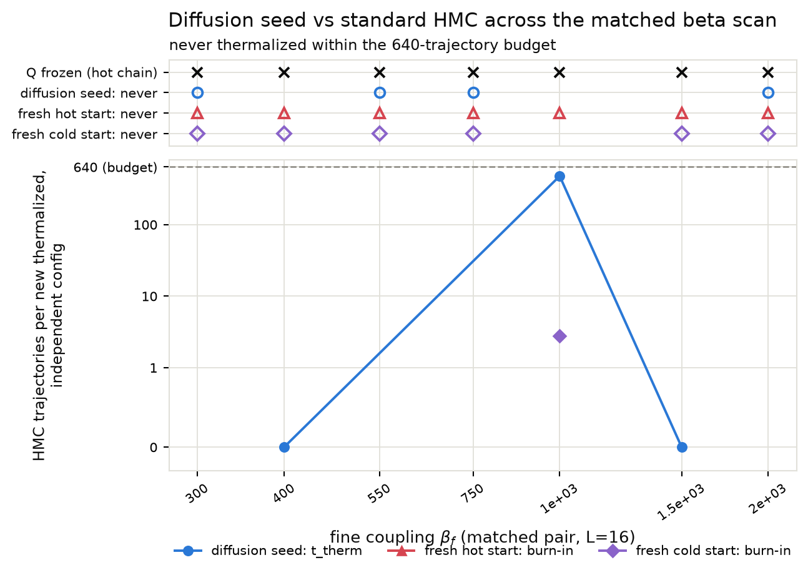

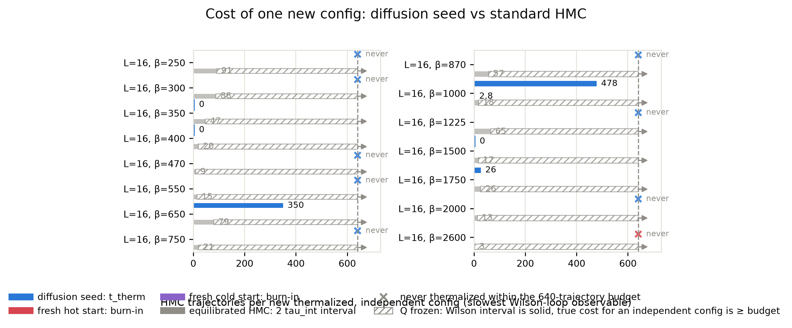

## The three starting points

- **Diffusion seed** -- the raw conditional-diffusion output for this coupling: one inverse-RG step from a direct-HMC base ensemble at the matched coarse coupling (ancestral sampling + the deterministic coarse-charge transport), with **no** rethermalization sweeps applied: every bit of equilibration the seed needs is measured here, in HMC trajectories.
- **Hot start** -- every link angle drawn uniformly from (-pi, pi]: a completely disordered (infinite-temperature) configuration. The standard way to initialize a fresh HMC chain without prior information.
- **Cold start** -- every link angle set to zero: the perfectly ordered (beta -> infinity) configuration, the other standard initialization.

## Summary

| rung | L | beta | t_therm diffusion seed | standard-HMC interval 2 tau_int | margin (interval - t_therm) | burn-in hot / cold | tau_int(Q) |
|---|---|---|---|---|---|---|---|
| F_L16_bc62.8782_L16_beta250 | 16 | 250 | never | 91.3 | -- | nan / nan | frozen (0 tunnelings in 321 x 64 traj) |
| F_L16_bc75.3776_L16_beta300 | 16 | 300 | never | 88.3 | -- | nan / nan | frozen (0 tunnelings in 321 x 64 traj) |
| F_L16_bc87.8773_L16_beta350 | 16 | 350 | 0 | 46.8 | 46.8 traj | nan / nan | frozen (0 tunnelings in 321 x 64 traj) |
| F_L16_bc100.377_L16_beta400 | 16 | 400 | 0 | 20.3 | 20.3 traj | nan / nan | frozen (0 tunnelings in 321 x 64 traj) |
| F_L16_bc117.877_L16_beta470 | 16 | 470 | never | 9.2 | -- | nan / nan | frozen (0 tunnelings in 321 x 64 traj) |
| F_L16_bc137.876_L16_beta550 | 16 | 550 | never | 15.1 | -- | nan / nan | frozen (0 tunnelings in 321 x 64 traj) |
| F_L16_bc162.876_L16_beta650 | 16 | 650 | 350 | 79.4 | -270.4 traj | nan / nan | frozen (0 tunnelings in 321 x 64 traj) |
| F_L16_bc187.876_L16_beta750 | 16 | 750 | never | 20.7 | -- | nan / nan | frozen (0 tunnelings in 321 x 64 traj) |
| F_L16_bc217.876_L16_beta870 | 16 | 870 | never | 57.1 | -- | nan / nan | frozen (0 tunnelings in 321 x 64 traj) |
| F_L16_bc250.376_L16_beta1000 | 16 | 1000 | 478 | 17.8 | -460.2 traj | nan / 3 | frozen (0 tunnelings in 321 x 64 traj) |
| F_L16_bc306.626_L16_beta1225 | 16 | 1225 | never | 65.4 | -- | nan / nan | frozen (0 tunnelings in 321 x 64 traj) |
| F_L16_bc375.375_L16_beta1500 | 16 | 1500 | 0 | 17.3 | 17.3 traj | nan / nan | frozen (0 tunnelings in 321 x 64 traj) |
| F_L16_bc437.875_L16_beta1750 | 16 | 1750 | 26 | 26.1 | -0.3 traj | nan / nan | frozen (0 tunnelings in 321 x 64 traj) |
| F_L16_bc500.375_L16_beta2000 | 16 | 2000 | never | 13.4 | -- | nan / nan | frozen (0 tunnelings in 321 x 64 traj) |
| F_L16_bc650.375_L16_beta2600 | 16 | 2600 | nan | 3.0 | -- | never / nan | frozen (0 tunnelings in 321 x 64 traj) |

## Wall-clock accounting

All timescales above are in HMC trajectories -- the honest *ergodicity* unit. This table converts to seconds on this machine so the economics are explicit. Batched chains produce n_chains configs per trajectory, so per-config costs divide by the chain count; the diffusion sampling cost amortizes over the whole generated batch.

| case | seed: sample s/config | seed: t_therm s (batch) | HMC interval s/config | hot burn-in s (batch) | s/traj (batch) |
|---|---|---|---|---|---|
| F_L16_bc62.8782_L16_beta250 | n/a (cached) | never | 0.14 | never | 0.10 |
| F_L16_bc75.3776_L16_beta300 | 0.1 | never | 0.23 | never | 0.17 |
| F_L16_bc87.8773_L16_beta350 | 2.3 | 0.0 | 0.08 | never | 0.10 |
| F_L16_bc100.377_L16_beta400 | 0.1 | 0.0 | 0.06 | never | 0.20 |
| F_L16_bc117.877_L16_beta470 | 2.1 | never | 0.02 | never | 0.13 |
| F_L16_bc137.876_L16_beta550 | 0.1 | never | 0.05 | never | 0.22 |
| F_L16_bc162.876_L16_beta650 | 2.2 | 46.9 | 0.17 | never | 0.14 |
| F_L16_bc187.876_L16_beta750 | 0.1 | never | 0.08 | never | 0.24 |
| F_L16_bc217.876_L16_beta870 | 2.2 | never | 0.15 | never | 0.17 |
| F_L16_bc250.376_L16_beta1000 | 0.1 | 141.6 | 0.08 | never | 0.29 |
| F_L16_bc306.626_L16_beta1225 | 2.2 | never | 0.19 | never | 0.18 |
| F_L16_bc375.375_L16_beta1500 | 0.1 | 0.0 | 0.09 | never | 0.35 |
| F_L16_bc437.875_L16_beta1750 | 2.1 | 5.9 | 0.10 | never | 0.24 |
| F_L16_bc500.375_L16_beta2000 | 0.1 | never | 0.08 | never | 0.40 |
| F_L16_bc650.375_L16_beta2600 | 2.2 | never | 0.01 | never | 0.24 |

## Fitted relaxation times across starts

Exponential fits C + A exp(-t/tau) to the ensemble-mean plaquette and W(2x2) relaxation curves, per starting point (the cross-start comparison of characteristic times; a start already at its plateau fits no decay, which is the desired outcome for the diffusion seed).

| case | obs | tau: diffusion seed | tau: hot start | tau: cold start |
|---|---|---|---|---|
| F_L16_bc62.8782_L16_beta250 | plaquette | 2.5 +- 0.5 | 1.6 +- 0.0 | 4.4 +- 0.2 |
| F_L16_bc62.8782_L16_beta250 | wilson_2x2 | 1.9 +- 1.2 | 3.4 +- 0.1 | 5.3 +- 0.3 |
| F_L16_bc75.3776_L16_beta300 | plaquette | 8.2 +- 1.4 | 1.7 +- 0.0 | 43.0 +- 1.6 |
| F_L16_bc75.3776_L16_beta300 | wilson_2x2 | 18.2 +- 7.6 | 4.0 +- 0.1 | 27.9 +- 1.1 |
| F_L16_bc87.8773_L16_beta350 | plaquette | 63.4 +- 39.1 | 1.6 +- 0.0 | 23.0 +- 0.9 |
| F_L16_bc87.8773_L16_beta350 | wilson_2x2 | no measurable decay (starts at plateau; tau unconstrained) | 4.0 +- 0.1 | 9.7 +- 0.4 |
| F_L16_bc100.377_L16_beta400 | plaquette | 10.7 +- 2.0 | 1.6 +- 0.0 | 10.4 +- 0.5 |
| F_L16_bc100.377_L16_beta400 | wilson_2x2 | unreliable (tau exceeds window) | 3.4 +- 0.0 | 8.1 +- 0.4 |
| F_L16_bc117.877_L16_beta470 | plaquette | 3.1 +- 0.4 | 1.6 +- 0.0 | 5.4 +- 0.1 |
| F_L16_bc117.877_L16_beta470 | wilson_2x2 | 2.8 +- 1.2 | 3.6 +- 0.1 | 4.8 +- 0.1 |
| F_L16_bc137.876_L16_beta550 | plaquette | no measurable decay (starts at plateau; tau unconstrained) | 1.6 +- 0.0 | 5.5 +- 0.2 |
| F_L16_bc137.876_L16_beta550 | wilson_2x2 | 3.9 +- 1.7 | 4.5 +- 0.1 | 5.6 +- 0.2 |
| F_L16_bc162.876_L16_beta650 | plaquette | 1.6 +- 0.5 | 1.6 +- 0.0 | 4.1 +- 0.2 |
| F_L16_bc162.876_L16_beta650 | wilson_2x2 | no measurable decay (starts at plateau; tau unconstrained) | 3.5 +- 0.1 | 74.7 +- 4.0 |
| F_L16_bc187.876_L16_beta750 | plaquette | unconstrained fit (tau error exceeds tau) | 1.6 +- 0.0 | 2.2 +- 0.1 |
| F_L16_bc187.876_L16_beta750 | wilson_2x2 | 24.8 +- 24.6 | 3.8 +- 0.1 | 1.4 +- 0.1 |
| F_L16_bc217.876_L16_beta870 | plaquette | 4.5 +- 2.2 | 1.6 +- 0.0 | 28.5 +- 1.5 |
| F_L16_bc217.876_L16_beta870 | wilson_2x2 | 3.2 +- 1.0 | 4.7 +- 0.2 | 4.8 +- 0.2 |
| F_L16_bc250.376_L16_beta1000 | plaquette | unreliable (tau exceeds window) | 1.7 +- 0.0 | 2.3 +- 0.1 |
| F_L16_bc250.376_L16_beta1000 | wilson_2x2 | no measurable decay (starts at plateau; tau unconstrained) | 3.4 +- 0.1 | 2.9 +- 0.1 |
| F_L16_bc306.626_L16_beta1225 | plaquette | 14.2 +- 3.4 | 1.6 +- 0.0 | 12.3 +- 0.5 |
| F_L16_bc306.626_L16_beta1225 | wilson_2x2 | 17.2 +- 6.6 | 4.3 +- 0.1 | 22.5 +- 1.0 |
| F_L16_bc375.375_L16_beta1500 | plaquette | 10.0 +- 1.8 | 1.6 +- 0.0 | 4.7 +- 0.2 |
| F_L16_bc375.375_L16_beta1500 | wilson_2x2 | 0.7 +- 0.3 | 3.6 +- 0.1 | 2.0 +- 0.1 |
| F_L16_bc437.875_L16_beta1750 | plaquette | 22.1 +- 5.7 | 1.6 +- 0.0 | 14.7 +- 0.6 |
| F_L16_bc437.875_L16_beta1750 | wilson_2x2 | 37.8 +- 28.1 | 3.5 +- 0.1 | 7.7 +- 0.4 |
| F_L16_bc500.375_L16_beta2000 | plaquette | 3.5 +- 0.3 | 1.5 +- 0.0 | 4.5 +- 0.2 |
| F_L16_bc500.375_L16_beta2000 | wilson_2x2 | 3.5 +- 0.8 | 2.8 +- 0.1 | 4.9 +- 0.2 |
| F_L16_bc650.375_L16_beta2600 | plaquette | 2.8 +- 0.2 | 1.6 +- 0.0 | 7.4 +- 0.3 |
| F_L16_bc650.375_L16_beta2600 | wilson_2x2 | 5.3 +- 0.4 | 2.8 +- 0.1 | 10.6 +- 0.3 |

t_therm and burn-in are the slowest Wilson-loop observable (plaquette, W(2x2), W(4x4)); topology is stricter still for the fresh chains: their Q^2 **never** reaches the exact value at the frozen rungs, while the diffusion seed inherits the correct topological sector from the coarse ensemble it was generated from (see the Q^2 panels and per-rung tables below).

Thermalization time `t_therm` = first trajectory at which the ensemble-mean z-score vs the exact value satisfies |z| <= 2 and stays there for 5 consecutive trajectories (t = 0: already thermalized before any HMC). For the diffusion seed, t_therm is computed on a random subsample of chains matched to the baseline chain count so all starts are compared at equal statistical power. `tau_int` is Madras-Sokal, measured on the second half of the hot-start chains, averaged over chains. In the per-rung relaxation figures, triangles mark each start's t_therm, dashed curves are the exponential fits C + A exp(-t/tau) to the ensemble means (tau quoted per panel), and the right-hand panels track the ensemble mean's distance from the exact value in SEM units -- thermalized means inside the shaded |z| <= 2 band; the dotted vertical line there is the standard-HMC interval `2 tau_int`.

## What 'never' means, and where the ground truth comes from

'never' = the ensemble mean was still outside |z| <= 2 of the exact value after the full baseline budget; the per-rung sections quote the z-score it plateaued at. For hot starts at the large-beta rungs this is not a budget problem but a physical one: a random start freezes into a random topological sector (<Q^2> of order tens), plain HMC can never change Q at these couplings (tunneling is suppressed ~exp(-2 beta)), and the wrong sector biases every Wilson loop by an amount that never decays. Cold starts sit in the single sector Q = 0, so their Wilson loops do eventually converge, but <Q^2> stays pinned at 0 forever.

None of the exact values in this report come from fine-lattice HMC: the ground truth is the character expansion of 2D compact U(1) (`diffusion/lgt/exact.py`), which gives every Wilson loop, P(Q) and chi_top in closed form at finite volume. Each diffusion seed here is one inverse-RG step from a direct-HMC base ensemble at the matched coarse coupling beta_c (L=16), where HMC mixes well -- which is precisely why it can start chains in regions standard HMC cannot reach.

## F_L16_bc62.8782_L16_beta250

HMC: step size 0.0253, 40 leapfrog steps, acceptance seed/hot/cold = 0.986/0.986/0.988. Diffusion-seed batch: 64 chains x 96 trajectories (0.13 s/traj for the whole batch); baselines: 64 chains x 640 trajectories.

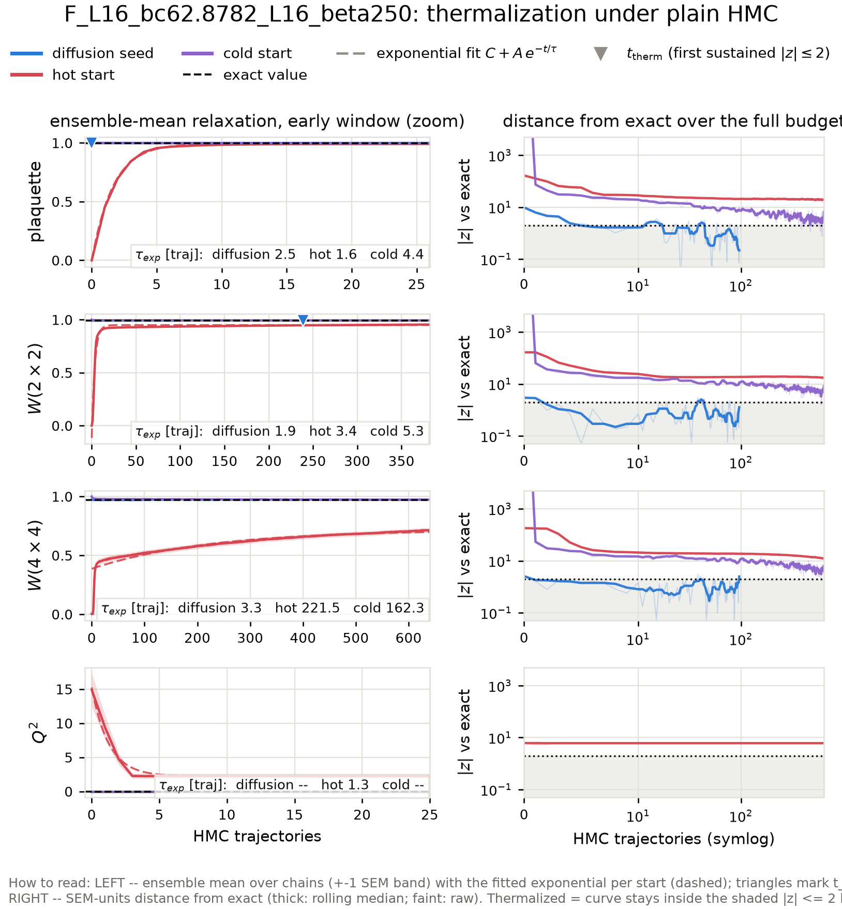

tau_int (hot-start chains, second half): plaquette = 29.31 +- 1.77, wilson_2x2 = 43.63 +- 1.47, wilson_4x4 = 45.66 +- 1.48, wilson_6x6 = 34.62 +- 2.43. Topology: hot-start HMC L=16 beta=250 -> **frozen** (no tunneling).

Where 'never' stood at the end: the hot start ended the 640-trajectory budget still at Q^2 at |z| ~ 6; the cold start ended the 640-trajectory budget still at Q^2 at |z| ~ 8840.

### Diagnostics: raw diffusion output (before any HMC)

| observable | value | error | exact | z_exact | reference | ref_error | z_ref | ks_p | chi2_p |
|---|---|---|---|---|---|---|---|---|---|
| plaquette | 0.9982 | 1.724e-05 | 0.998 | 12.64 | 0.998 | 1.77e-05 | 8.342 | 2.914e-10 |  |
| wilson_1x1 | 0.9982 | 1.724e-05 | 0.998 | 12.64 | 0.998 | 1.77e-05 | 8.342 | 2.914e-10 |  |
| wilson_1x2 | 0.9964 | 3.956e-05 | 0.996 | 8.412 | 0.9961 | 4.155e-05 | 3.807 | 4.659e-05 |  |
| wilson_2x2 | 0.9925 | 0.0001126 | 0.9921 | 3.093 | 0.9925 | 9.226e-05 | -0.01906 | 0.2811 |  |
| wilson_2x3 | 0.989 | 0.0001843 | 0.9883 | 3.681 | 0.9889 | 0.000176 | 0.2747 | 0.4535 |  |
| wilson_3x3 | 0.9838 | 0.0003351 | 0.9827 | 3.021 | 0.984 | 0.0002733 | -0.4781 | 0.2811 |  |
| wilson_3x4 | 0.9787 | 0.0004625 | 0.9773 | 2.974 | 0.9786 | 0.000416 | 0.2639 | 0.6123 |  |
| wilson_4x4 | 0.9721 | 0.0006488 | 0.9704 | 2.633 | 0.9717 | 0.000536 | 0.4116 | 0.6123 |  |
| wilson_4x5 | 0.9658 | 0.0008286 | 0.9637 | 2.485 | 0.9651 | 0.0006887 | 0.6114 | 0.2464 |  |
| wilson_5x5 | 0.959 | 0.001143 | 0.9558 | 2.791 | 0.9576 | 0.0008528 | 0.9613 | 0.1015 |  |
| wilson_5x6 | 0.9516 | 0.001421 | 0.9483 | 2.301 | 0.9501 | 0.001009 | 0.8594 | 0.2464 |  |
| wilson_6x6 | 0.9445 | 0.001954 | 0.9399 | 2.361 | 0.9423 | 0.001218 | 0.9699 | 0.03572 |  |
| wilson_6x7 | 0.9369 | 0.002399 | 0.9321 | 2.02 | 0.935 | 0.001342 | 0.697 | 0.08625 |  |
| wilson_7x7 | 0.9299 | 0.003024 | 0.9237 | 2.057 | 0.9279 | 0.001455 | 0.5896 | 0.04298 |  |
| wilson_7x8 | 0.9233 | 0.003494 | 0.9161 | 2.073 | 0.9206 | 0.001529 | 0.7039 | 0.04298 |  |
| wilson_8x8 | 0.9168 | 0.003866 | 0.9083 | 2.203 | 0.914 | 0.001681 | 0.6689 | 0.07294 |  |
| creutz_2 | 0.002032 | 6.228e-05 | 0.001934 | 1.585 |  |  |  |  |  |
| creutz_3 | 0.0018 | 0.0001558 | 0.001808 | -0.0523 |  |  |  |  |  |
| creutz_4 | 0.001645 | 0.0002741 | 0.00162 | 0.08982 |  |  |  |  |  |
| creutz_5 | 0.0005484 | 0.0004666 | 0.00137 | -1.761 |  |  |  |  |  |
| creutz_6 | -0.0002845 | 0.0005902 | 0.001057 | -2.272 |  |  |  |  |  |
| creutz_7 | -0.0005516 | 0.0007748 | 0.000681 | -1.591 |  |  |  |  |  |
| creutz_8 | -4.739e-05 | 0.001026 | 0.0002427 | -0.2826 |  |  |  |  |  |
| Q | 0 | 0 | 0 | 0 | 0 | 0 | 0 | 1 |  |
| Q^2 | 0 | 0 | 8.84e-09 | inf | 0 | 0 | 0 | 1 |  |
| chi_top ((<Q^2>-<Q>^2)/V) | 0 | 0 | 3.453e-11 | inf | 0 | 0 | 0 |  |  |
| Q histogram vs exact P(Q) | 5.658e-07 | nan | 2 | nan |  |  |  |  | 1 |

### Diagnostics: the same configs after 96 HMC trajectories

| observable | value | error | exact | z_exact | reference | ref_error | z_ref | ks_p | chi2_p |
|---|---|---|---|---|---|---|---|---|---|
| plaquette | 0.998 | 2.045e-05 | 0.998 | 0.2293 | 0.998 | 1.77e-05 | -0.2644 | 0.9433 |  |
| wilson_1x1 | 0.998 | 2.045e-05 | 0.998 | 0.2293 | 0.998 | 1.77e-05 | -0.2644 | 0.9433 |  |
| wilson_1x2 | 0.9961 | 4.783e-05 | 0.996 | 0.8381 | 0.9961 | 4.155e-05 | -1.173 | 0.4056 |  |
| wilson_2x2 | 0.9923 | 0.0001107 | 0.9921 | 1.463 | 0.9925 | 9.226e-05 | -1.312 | 0.1614 |  |
| wilson_2x3 | 0.9887 | 0.0001716 | 0.9883 | 2.279 | 0.9889 | 0.000176 | -0.8852 | 0.1867 |  |
| wilson_3x3 | 0.9835 | 0.0002789 | 0.9827 | 2.653 | 0.984 | 0.0002733 | -1.227 | 0.08625 |  |
| wilson_3x4 | 0.9786 | 0.0004701 | 0.9773 | 2.732 | 0.9786 | 0.000416 | 0.1166 | 0.7231 |  |
| wilson_4x4 | 0.9721 | 0.0006897 | 0.9704 | 2.49 | 0.9717 | 0.000536 | 0.407 | 0.5575 |  |
| wilson_4x5 | 0.9666 | 0.001005 | 0.9637 | 2.814 | 0.9651 | 0.0006887 | 1.172 | 0.5575 |  |
| wilson_5x5 | 0.9595 | 0.001348 | 0.9558 | 2.775 | 0.9576 | 0.0008528 | 1.205 | 0.1867 |  |
| wilson_5x6 | 0.9534 | 0.001762 | 0.9483 | 2.879 | 0.9501 | 0.001009 | 1.626 | 0.119 |  |
| wilson_6x6 | 0.9453 | 0.002204 | 0.9399 | 2.456 | 0.9423 | 0.001218 | 1.205 | 0.08625 |  |
| wilson_6x7 | 0.9387 | 0.002541 | 0.9321 | 2.606 | 0.935 | 0.001342 | 1.284 | 0.02956 |  |
| wilson_7x7 | 0.9305 | 0.003056 | 0.9237 | 2.238 | 0.9279 | 0.001455 | 0.7675 | 0.06142 |  |
| wilson_7x8 | 0.9239 | 0.003493 | 0.9161 | 2.25 | 0.9206 | 0.001529 | 0.8656 | 0.119 |  |
| wilson_8x8 | 0.9167 | 0.003943 | 0.9083 | 2.128 | 0.914 | 0.001681 | 0.6281 | 0.119 |  |
| creutz_2 | 0.001846 | 7.187e-05 | 0.001934 | -1.217 |  |  |  |  |  |
| creutz_3 | 0.001683 | 0.0001323 | 0.001808 | -0.9446 |  |  |  |  |  |
| creutz_4 | 0.001727 | 0.000243 | 0.00162 | 0.4375 |  |  |  |  |  |
| creutz_5 | 0.001557 | 0.0004106 | 0.00137 | 0.4567 |  |  |  |  |  |
| creutz_6 | 0.002078 | 0.0004461 | 0.001057 | 2.288 |  |  |  |  |  |
| creutz_7 | 0.001717 | 0.0006601 | 0.000681 | 1.569 |  |  |  |  |  |
| creutz_8 | 0.0007587 | 0.0008913 | 0.0002427 | 0.5789 |  |  |  |  |  |
| Q | 0 | 0 | 0 | 0 | 0 | 0 | 0 | 1 |  |
| Q^2 | 0 | 0 | 8.84e-09 | inf | 0 | 0 | 0 | 1 |  |
| chi_top ((<Q^2>-<Q>^2)/V) | 0 | 0 | 3.453e-11 | inf | 0 | 0 | 0 |  |  |
| Q histogram vs exact P(Q) | 5.658e-07 | nan | 2 | nan |  |  |  |  | 1 |

## F_L16_bc75.3776_L16_beta300

HMC: step size 0.0231, 43 leapfrog steps, acceptance seed/hot/cold = 0.989/0.984/0.988. Diffusion-seed batch: 64 chains x 96 trajectories (0.16 s/traj for the whole batch); baselines: 64 chains x 640 trajectories.

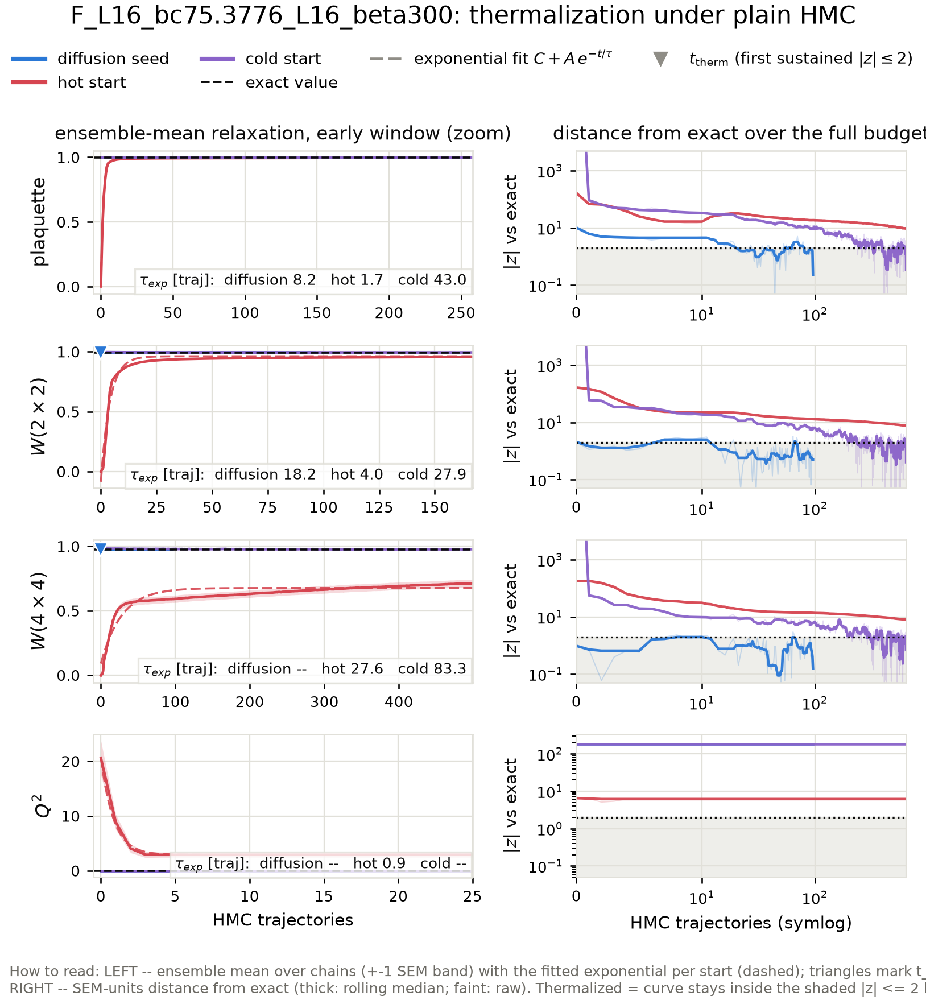

tau_int (hot-start chains, second half): plaquette = 41.70 +- 1.56, wilson_2x2 = 42.92 +- 1.79, wilson_4x4 = 44.14 +- 1.98, wilson_6x6 = 39.73 +- 2.08. Topology: hot-start HMC L=16 beta=300 -> **frozen** (no tunneling).

Where 'never' stood at the end: the hot start ended the 640-trajectory budget still at Q^2 at |z| ~ 6; the cold start ended the 640-trajectory budget still at Q^2 at |z| ~ 187.

### Diagnostics: raw diffusion output (before any HMC)

| observable | value | error | exact | z_exact | reference | ref_error | z_ref | ks_p | chi2_p |
|---|---|---|---|---|---|---|---|---|---|
| plaquette | 0.9985 | 1.37e-05 | 0.9983 | 12.89 | 0.9983 | 1.174e-05 | 10.23 | 1.989e-08 |  |
| wilson_1x1 | 0.9985 | 1.37e-05 | 0.9983 | 12.89 | 0.9983 | 1.174e-05 | 10.23 | 1.989e-08 |  |
| wilson_1x2 | 0.997 | 2.985e-05 | 0.9967 | 8.87 | 0.9966 | 2.808e-05 | 8.17 | 4.265e-07 |  |
| wilson_2x2 | 0.9937 | 9.853e-05 | 0.9934 | 2.059 | 0.9931 | 8.549e-05 | 3.923 | 0.0001523 |  |
| wilson_2x3 | 0.9906 | 0.0001818 | 0.9903 | 1.649 | 0.9898 | 0.0001576 | 3.072 | 0.001695 |  |
| wilson_3x3 | 0.9858 | 0.0003308 | 0.9856 | 0.6335 | 0.9849 | 0.0002727 | 2.024 | 0.1867 |  |
| wilson_3x4 | 0.9811 | 0.0005141 | 0.9811 | -0.01293 | 0.9802 | 0.0003956 | 1.37 | 0.4056 |  |
| wilson_4x4 | 0.9746 | 0.0007602 | 0.9753 | -0.89 | 0.974 | 0.0006338 | 0.5715 | 0.8723 |  |
| wilson_4x5 | 0.9686 | 0.00112 | 0.9697 | -1 | 0.9677 | 0.0008701 | 0.5999 | 0.9433 |  |
| wilson_5x5 | 0.9612 | 0.001453 | 0.963 | -1.28 | 0.9599 | 0.00123 | 0.6704 | 0.8723 |  |
| wilson_5x6 | 0.9539 | 0.001953 | 0.9567 | -1.442 | 0.9523 | 0.001466 | 0.6882 | 0.6123 |  |
| wilson_6x6 | 0.9456 | 0.00239 | 0.9497 | -1.712 | 0.9437 | 0.00204 | 0.5868 | 0.3192 |  |
| wilson_6x7 | 0.9379 | 0.003027 | 0.9431 | -1.693 | 0.9359 | 0.002275 | 0.5369 | 0.2464 |  |
| wilson_7x7 | 0.9296 | 0.003605 | 0.936 | -1.774 | 0.9279 | 0.002938 | 0.3653 | 0.5044 |  |
| wilson_7x8 | 0.9222 | 0.004303 | 0.9296 | -1.72 | 0.9202 | 0.003019 | 0.3656 | 0.4056 |  |
| wilson_8x8 | 0.9149 | 0.004799 | 0.923 | -1.689 | 0.9125 | 0.00367 | 0.3971 | 0.2811 |  |
| creutz_2 | 0.001761 | 5.7e-05 | 0.001611 | 2.634 |  |  |  |  |  |
| creutz_3 | 0.001695 | 0.0001375 | 0.001506 | 1.372 |  |  |  |  |  |
| creutz_4 | 0.001818 | 0.0001908 | 0.00135 | 2.452 |  |  |  |  |  |
| creutz_5 | 0.001456 | 0.0003029 | 0.001141 | 1.04 |  |  |  |  |  |
| creutz_6 | 0.001238 | 0.0004124 | 0.0008804 | 0.8677 |  |  |  |  |  |
| creutz_7 | 0.0008455 | 0.0006937 | 0.0005674 | 0.401 |  |  |  |  |  |
| creutz_8 | -0.0001139 | 0.001052 | 0.0002022 | -0.3004 |  |  |  |  |  |
| Q | 0 | 0 | 0 | 0 | 0 | 0 | 0 | 1 |  |
| Q^2 | 0 | 0 | 1.872e-10 | inf | 0 | 0 | 0 | 1 |  |
| chi_top ((<Q^2>-<Q>^2)/V) | 0 | 0 | 7.311e-13 | inf | 0 | 0 | 0 |  |  |
| Q histogram vs exact P(Q) | 1.198e-08 | nan | 2 | nan |  |  |  |  | 1 |

### Diagnostics: the same configs after 96 HMC trajectories

| observable | value | error | exact | z_exact | reference | ref_error | z_ref | ks_p | chi2_p |
|---|---|---|---|---|---|---|---|---|---|
| plaquette | 0.9983 | 1.414e-05 | 0.9983 | 0.27 | 0.9983 | 1.174e-05 | 0.6335 | 0.6123 |  |
| wilson_1x1 | 0.9983 | 1.414e-05 | 0.9983 | 0.27 | 0.9983 | 1.174e-05 | 0.6335 | 0.6123 |  |
| wilson_1x2 | 0.9967 | 2.754e-05 | 0.9967 | 0.6628 | 0.9966 | 2.808e-05 | 2.245 | 0.07294 |  |
| wilson_2x2 | 0.9935 | 8.319e-05 | 0.9934 | 0.606 | 0.9931 | 8.549e-05 | 3.012 | 0.0002025 |  |
| wilson_2x3 | 0.9903 | 0.0001676 | 0.9903 | -0.006052 | 0.9898 | 0.0001576 | 1.906 | 0.04298 |  |
| wilson_3x3 | 0.9857 | 0.0003139 | 0.9856 | 0.2191 | 0.9849 | 0.0002727 | 1.748 | 0.1614 |  |
| wilson_3x4 | 0.9811 | 0.0004742 | 0.9811 | 0.08188 | 0.9802 | 0.0003956 | 1.513 | 0.1614 |  |
| wilson_4x4 | 0.9754 | 0.0007206 | 0.9753 | 0.1545 | 0.974 | 0.0006338 | 1.41 | 0.1614 |  |
| wilson_4x5 | 0.9697 | 0.0009295 | 0.9697 | 0.02066 | 0.9677 | 0.0008701 | 1.563 | 0.1867 |  |
| wilson_5x5 | 0.9631 | 0.001208 | 0.963 | 0.03252 | 0.9599 | 0.00123 | 1.842 | 0.07294 |  |
| wilson_5x6 | 0.9568 | 0.001544 | 0.9567 | 0.01554 | 0.9523 | 0.001466 | 2.123 | 0.1015 |  |
| wilson_6x6 | 0.9496 | 0.001982 | 0.9497 | -0.03848 | 0.9437 | 0.00204 | 2.061 | 0.05149 |  |
| wilson_6x7 | 0.9429 | 0.002377 | 0.9431 | -0.06376 | 0.9359 | 0.002275 | 2.129 | 0.02956 |  |
| wilson_7x7 | 0.9354 | 0.002886 | 0.936 | -0.2094 | 0.9279 | 0.002938 | 1.818 | 0.01997 |  |
| wilson_7x8 | 0.9296 | 0.003238 | 0.9296 | 0.01874 | 0.9202 | 0.003019 | 2.12 | 0.01326 |  |
| wilson_8x8 | 0.9226 | 0.003749 | 0.923 | -0.09415 | 0.9125 | 0.00367 | 1.935 | 0.008658 |  |
| creutz_2 | 0.001593 | 6.071e-05 | 0.001611 | -0.2955 |  |  |  |  |  |
| creutz_3 | 0.001384 | 0.0001365 | 0.001506 | -0.8979 |  |  |  |  |  |
| creutz_4 | 0.001245 | 0.0002418 | 0.00135 | -0.4333 |  |  |  |  |  |
| creutz_5 | 0.001026 | 0.0003772 | 0.001141 | -0.3058 |  |  |  |  |  |
| creutz_6 | 0.00097 | 0.0005249 | 0.0008804 | 0.1708 |  |  |  |  |  |
| creutz_7 | 0.0009719 | 0.0006703 | 0.0005674 | 0.6035 |  |  |  |  |  |
| creutz_8 | 0.001361 | 0.000772 | 0.0002022 | 1.501 |  |  |  |  |  |
| Q | 0 | 0 | 0 | 0 | 0 | 0 | 0 | 1 |  |
| Q^2 | 0 | 0 | 1.872e-10 | inf | 0 | 0 | 0 | 1 |  |
| chi_top ((<Q^2>-<Q>^2)/V) | 0 | 0 | 7.311e-13 | inf | 0 | 0 | 0 |  |  |
| Q histogram vs exact P(Q) | 1.198e-08 | nan | 2 | nan |  |  |  |  | 1 |

## F_L16_bc87.8773_L16_beta350

HMC: step size 0.0214, 47 leapfrog steps, acceptance seed/hot/cold = 0.990/0.983/0.988. Diffusion-seed batch: 64 chains x 96 trajectories (0.10 s/traj for the whole batch); baselines: 64 chains x 640 trajectories.

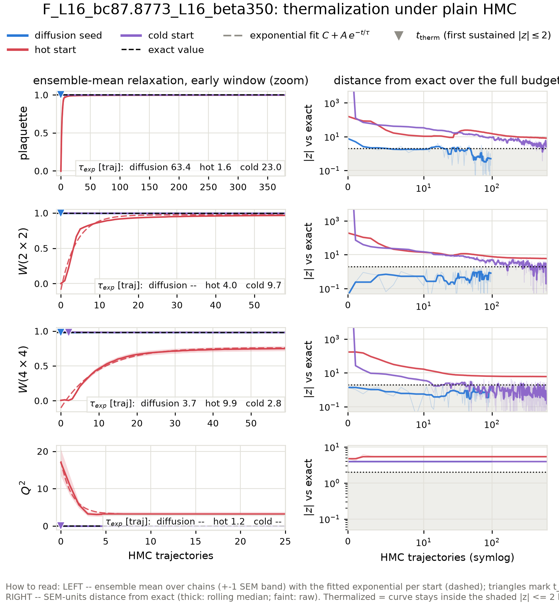

tau_int (hot-start chains, second half): plaquette = 23.42 +- 1.61, wilson_2x2 = 10.57 +- 1.08, wilson_4x4 = 1.54 +- 0.11, wilson_6x6 = 0.91 +- 0.03. Topology: hot-start HMC L=16 beta=350 -> **frozen** (no tunneling).

Where 'never' stood at the end: the hot start ended the 640-trajectory budget still at Q^2 at |z| ~ 5.

### Diagnostics: raw diffusion output (before any HMC)

| observable | value | error | exact | z_exact | reference | ref_error | z_ref | ks_p | chi2_p |
|---|---|---|---|---|---|---|---|---|---|
| plaquette | 0.9987 | 1.895e-05 | 0.9986 | 6.242 | 0.9986 | 1.042e-05 | 2.418 | 0.002761 |  |
| wilson_1x1 | 0.9987 | 1.895e-05 | 0.9986 | 6.242 | 0.9986 | 1.042e-05 | 2.418 | 0.002761 |  |
| wilson_1x2 | 0.9973 | 3.949e-05 | 0.9972 | 3.37 | 0.9973 | 2.854e-05 | -0.3058 | 0.9671 |  |
| wilson_2x2 | 0.9944 | 0.0001038 | 0.9944 | -0.03937 | 0.9947 | 8.421e-05 | -2.457 | 0.02956 |  |
| wilson_2x3 | 0.9915 | 0.0001748 | 0.9917 | -0.9132 | 0.9921 | 0.0001519 | -2.452 | 0.01326 |  |
| wilson_3x3 | 0.9873 | 0.0003169 | 0.9877 | -1.075 | 0.9883 | 0.0002625 | -2.503 | 0.02435 |  |
| wilson_3x4 | 0.983 | 0.000439 | 0.9838 | -1.764 | 0.9847 | 0.0004087 | -2.9 | 0.01631 |  |
| wilson_4x4 | 0.9778 | 0.0006833 | 0.9788 | -1.362 | 0.9804 | 0.000539 | -2.941 | 0.004418 |  |
| wilson_4x5 | 0.9726 | 0.0008524 | 0.974 | -1.571 | 0.976 | 0.0007186 | -3.013 | 0.0035 |  |
| wilson_5x5 | 0.967 | 0.001171 | 0.9682 | -1.097 | 0.9714 | 0.0009115 | -2.974 | 0.01631 |  |
| wilson_5x6 | 0.9612 | 0.001372 | 0.9628 | -1.182 | 0.9663 | 0.001132 | -2.855 | 0.02435 |  |
| wilson_6x6 | 0.9548 | 0.001802 | 0.9567 | -1.044 | 0.9606 | 0.001443 | -2.489 | 0.01997 |  |
| wilson_6x7 | 0.9485 | 0.002076 | 0.951 | -1.191 | 0.9556 | 0.001678 | -2.657 | 0.02956 |  |
| wilson_7x7 | 0.9424 | 0.002509 | 0.9449 | -0.9837 | 0.9507 | 0.002142 | -2.516 | 0.01074 |  |
| wilson_7x8 | 0.9361 | 0.002822 | 0.9393 | -1.156 | 0.9466 | 0.002337 | -2.888 | 0.01326 |  |
| wilson_8x8 | 0.9307 | 0.003159 | 0.9336 | -0.9139 | 0.9424 | 0.002781 | -2.761 | 0.01074 |  |
| creutz_2 | 0.001533 | 5.651e-05 | 0.00138 | 2.699 |  |  |  |  |  |
| creutz_3 | 0.001318 | 9.921e-05 | 0.001291 | 0.2724 |  |  |  |  |  |
| creutz_4 | 0.0008778 | 0.0002006 | 0.001157 | -1.391 |  |  |  |  |  |
| creutz_5 | 0.0005043 | 0.0003262 | 0.000978 | -1.452 |  |  |  |  |  |
| creutz_6 | 0.0006798 | 0.0003971 | 0.0007544 | -0.188 |  |  |  |  |  |
| creutz_7 | -0.0001375 | 0.0004615 | 0.0004862 | -1.352 |  |  |  |  |  |
| creutz_8 | -0.001069 | 0.0006609 | 0.0001732 | -1.879 |  |  |  |  |  |
| Q | 0 | 0 | 0 | 0 | 0 | 0 | 0 | 1 |  |
| Q^2 | 0 | 0 | 3.975e-12 | inf | 0 | 0 | 0 | 1 |  |
| chi_top ((<Q^2>-<Q>^2)/V) | 0 | 0 | 1.553e-14 | inf | 0 | 0 | 0 |  |  |
| Q histogram vs exact P(Q) | 2.538e-10 | nan | 2 | nan |  |  |  |  | 1 |

### Diagnostics: the same configs after 96 HMC trajectories

| observable | value | error | exact | z_exact | reference | ref_error | z_ref | ks_p | chi2_p |
|---|---|---|---|---|---|---|---|---|---|
| plaquette | 0.9986 | 1.824e-05 | 0.9986 | 0.4537 | 0.9986 | 1.042e-05 | -2.748 | 0.002761 |  |
| wilson_1x1 | 0.9986 | 1.824e-05 | 0.9986 | 0.4537 | 0.9986 | 1.042e-05 | -2.748 | 0.002761 |  |
| wilson_1x2 | 0.9972 | 3.711e-05 | 0.9972 | 0.0751 | 0.9973 | 2.854e-05 | -3.101 | 0.002168 |  |
| wilson_2x2 | 0.9943 | 8.858e-05 | 0.9944 | -0.9307 | 0.9947 | 8.421e-05 | -3.328 | 0.001695 |  |
| wilson_2x3 | 0.9915 | 0.000151 | 0.9917 | -0.9473 | 0.9921 | 0.0001519 | -2.574 | 0.04298 |  |
| wilson_3x3 | 0.9873 | 0.0002655 | 0.9877 | -1.477 | 0.9883 | 0.0002625 | -2.897 | 0.02435 |  |
| wilson_3x4 | 0.9831 | 0.0004095 | 0.9838 | -1.537 | 0.9847 | 0.0004087 | -2.756 | 0.06142 |  |
| wilson_4x4 | 0.9778 | 0.0006097 | 0.9788 | -1.61 | 0.9804 | 0.000539 | -3.208 | 0.01326 |  |
| wilson_4x5 | 0.9725 | 0.0008231 | 0.974 | -1.816 | 0.976 | 0.0007186 | -3.217 | 0.02435 |  |
| wilson_5x5 | 0.9663 | 0.001101 | 0.9682 | -1.761 | 0.9714 | 0.0009115 | -3.545 | 0.008658 |  |
| wilson_5x6 | 0.9602 | 0.001462 | 0.9628 | -1.792 | 0.9663 | 0.001132 | -3.286 | 0.01326 |  |
| wilson_6x6 | 0.9533 | 0.001899 | 0.9567 | -1.79 | 0.9606 | 0.001443 | -3.045 | 0.008658 |  |
| wilson_6x7 | 0.9471 | 0.002338 | 0.951 | -1.691 | 0.9556 | 0.001678 | -2.979 | 0.01074 |  |
| wilson_7x7 | 0.9401 | 0.00281 | 0.9449 | -1.722 | 0.9507 | 0.002142 | -3.021 | 0.01631 |  |
| wilson_7x8 | 0.9344 | 0.003324 | 0.9393 | -1.469 | 0.9466 | 0.002337 | -3.003 | 0.01326 |  |
| wilson_8x8 | 0.9282 | 0.003717 | 0.9336 | -1.457 | 0.9424 | 0.002781 | -3.048 | 0.005553 |  |
| creutz_2 | 0.001461 | 5.644e-05 | 0.00138 | 1.421 |  |  |  |  |  |
| creutz_3 | 0.001482 | 0.0001106 | 0.001291 | 1.73 |  |  |  |  |  |
| creutz_4 | 0.001277 | 0.0001867 | 0.001157 | 0.6428 |  |  |  |  |  |
| creutz_5 | 0.0009145 | 0.0002839 | 0.000978 | -0.2234 |  |  |  |  |  |
| creutz_6 | 0.0008686 | 0.0004124 | 0.0007544 | 0.2768 |  |  |  |  |  |
| creutz_7 | 0.0008496 | 0.0005759 | 0.0004862 | 0.631 |  |  |  |  |  |
| creutz_8 | 0.0007032 | 0.0007477 | 0.0001732 | 0.7088 |  |  |  |  |  |
| Q | 0 | 0 | 0 | 0 | 0 | 0 | 0 | 1 |  |
| Q^2 | 0 | 0 | 3.975e-12 | inf | 0 | 0 | 0 | 1 |  |
| chi_top ((<Q^2>-<Q>^2)/V) | 0 | 0 | 1.553e-14 | inf | 0 | 0 | 0 |  |  |
| Q histogram vs exact P(Q) | 2.538e-10 | nan | 2 | nan |  |  |  |  | 1 |

## F_L16_bc100.377_L16_beta400

HMC: step size 0.0200, 50 leapfrog steps, acceptance seed/hot/cold = 0.989/0.979/0.989. Diffusion-seed batch: 64 chains x 96 trajectories (0.20 s/traj for the whole batch); baselines: 64 chains x 640 trajectories.

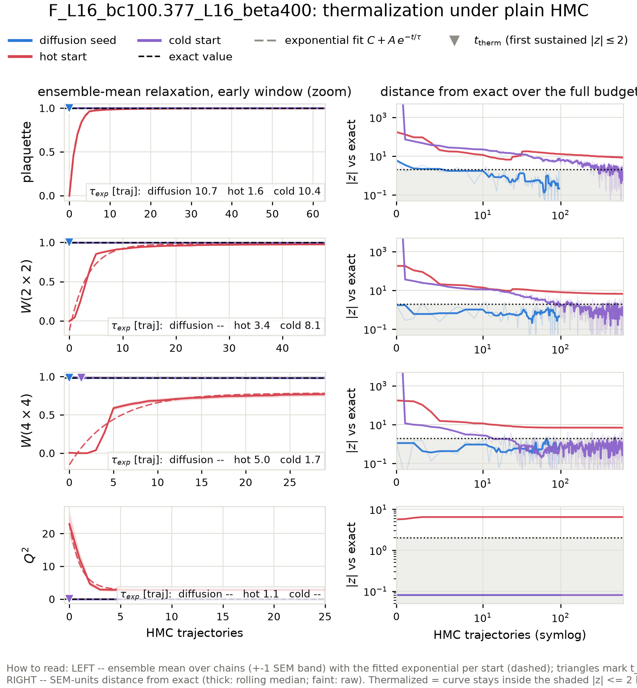

tau_int (hot-start chains, second half): plaquette = 10.17 +- 1.03, wilson_2x2 = 4.92 +- 0.72, wilson_4x4 = 1.03 +- 0.05, wilson_6x6 = 0.62 +- 0.03. Topology: hot-start HMC L=16 beta=400 -> **frozen** (no tunneling).

Where 'never' stood at the end: the hot start ended the 640-trajectory budget still at Q^2 at |z| ~ 6.

### Diagnostics: raw diffusion output (before any HMC)

| observable | value | error | exact | z_exact | reference | ref_error | z_ref | ks_p | chi2_p |
|---|---|---|---|---|---|---|---|---|---|
| plaquette | 0.9988 | 1.331e-05 | 0.9988 | 6.143 | 0.9987 | 8.634e-06 | 6.192 | 4.659e-05 |  |
| wilson_1x1 | 0.9988 | 1.331e-05 | 0.9988 | 6.143 | 0.9987 | 8.634e-06 | 6.192 | 4.659e-05 |  |
| wilson_1x2 | 0.9976 | 3.403e-05 | 0.9975 | 3.715 | 0.9975 | 1.908e-05 | 4.24 | 0.006949 |  |
| wilson_2x2 | 0.9952 | 8.71e-05 | 0.9951 | 1.631 | 0.9949 | 4.527e-05 | 3.044 | 0.01074 |  |
| wilson_2x3 | 0.9929 | 0.0001659 | 0.9927 | 1.267 | 0.9925 | 9.126e-05 | 1.894 | 0.02956 |  |
| wilson_3x3 | 0.9896 | 0.0003208 | 0.9892 | 1.297 | 0.9889 | 0.0001873 | 2.024 | 0.01997 |  |
| wilson_3x4 | 0.9863 | 0.0004655 | 0.9858 | 1.082 | 0.9853 | 0.0003112 | 1.812 | 0.1015 |  |
| wilson_4x4 | 0.982 | 0.0006672 | 0.9814 | 0.8998 | 0.9807 | 0.0005224 | 1.478 | 0.4535 |  |
| wilson_4x5 | 0.9778 | 0.0008462 | 0.9772 | 0.6641 | 0.9764 | 0.0007607 | 1.151 | 0.5044 |  |
| wilson_5x5 | 0.9729 | 0.001179 | 0.9722 | 0.6293 | 0.9709 | 0.001087 | 1.277 | 0.4056 |  |
| wilson_5x6 | 0.968 | 0.001442 | 0.9674 | 0.4477 | 0.9662 | 0.001412 | 0.8909 | 0.5575 |  |
| wilson_6x6 | 0.9628 | 0.001803 | 0.962 | 0.4408 | 0.9599 | 0.001862 | 1.116 | 0.3607 |  |
| wilson_6x7 | 0.9572 | 0.002169 | 0.957 | 0.1096 | 0.9549 | 0.002198 | 0.754 | 0.4535 |  |
| wilson_7x7 | 0.9518 | 0.002676 | 0.9516 | 0.06046 | 0.9485 | 0.002731 | 0.8486 | 0.6123 |  |
| wilson_7x8 | 0.9466 | 0.003043 | 0.9467 | -0.03542 | 0.9431 | 0.003035 | 0.8232 | 0.5044 |  |
| wilson_8x8 | 0.9415 | 0.003443 | 0.9417 | -0.06338 | 0.9371 | 0.003545 | 0.8867 | 0.5044 |  |
| creutz_2 | 0.001236 | 5.139e-05 | 0.001208 | 0.5615 |  |  |  |  |  |
| creutz_3 | 0.0009894 | 0.0001036 | 0.001129 | -1.351 |  |  |  |  |  |
| creutz_4 | 0.001001 | 0.0001687 | 0.001012 | -0.06447 |  |  |  |  |  |
| creutz_5 | 0.0006308 | 0.0003017 | 0.0008556 | -0.7449 |  |  |  |  |  |
| creutz_6 | 0.0004057 | 0.0003236 | 0.00066 | -0.7858 |  |  |  |  |  |
| creutz_7 | -7.384e-05 | 0.0005006 | 0.0004253 | -0.9971 |  |  |  |  |  |
| creutz_8 | -1.432e-05 | 0.0005496 | 0.0001516 | -0.3018 |  |  |  |  |  |
| Q | 0 | 0 | 0 | 0 | 0 | 0 | 0 | 1 |  |
| Q^2 | 0 | 0 | 8.168e-14 | inf | 0 | 0 | 0 | 1 |  |
| chi_top ((<Q^2>-<Q>^2)/V) | 0 | 0 | 3.191e-16 | inf | 0 | 0 | 0 |  |  |
| Q histogram vs exact P(Q) | 5.227e-12 | nan | 2 | nan |  |  |  |  | 1 |

### Diagnostics: the same configs after 96 HMC trajectories

| observable | value | error | exact | z_exact | reference | ref_error | z_ref | ks_p | chi2_p |
|---|---|---|---|---|---|---|---|---|---|
| plaquette | 0.9988 | 1.52e-05 | 0.9988 | -0.2136 | 0.9987 | 8.634e-06 | 0.757 | 0.5044 |  |
| wilson_1x1 | 0.9988 | 1.52e-05 | 0.9988 | -0.2136 | 0.9987 | 8.634e-06 | 0.757 | 0.5044 |  |
| wilson_1x2 | 0.9975 | 2.996e-05 | 0.9975 | -0.4953 | 0.9975 | 1.908e-05 | 0.6799 | 0.9115 |  |
| wilson_2x2 | 0.995 | 7.92e-05 | 0.9951 | -0.4442 | 0.9949 | 4.527e-05 | 1.333 | 0.215 |  |
| wilson_2x3 | 0.9926 | 0.0001267 | 0.9927 | -0.9286 | 0.9925 | 9.126e-05 | 0.1975 | 0.5575 |  |
| wilson_3x3 | 0.989 | 0.0002293 | 0.9892 | -1.044 | 0.9889 | 0.0001873 | 0.3261 | 0.4056 |  |
| wilson_3x4 | 0.9855 | 0.0003432 | 0.9858 | -0.9607 | 0.9853 | 0.0003112 | 0.3923 | 0.119 |  |
| wilson_4x4 | 0.981 | 0.0005448 | 0.9814 | -0.7275 | 0.9807 | 0.0005224 | 0.3389 | 0.3192 |  |
| wilson_4x5 | 0.9767 | 0.0007375 | 0.9772 | -0.6766 | 0.9764 | 0.0007607 | 0.2352 | 0.4056 |  |
| wilson_5x5 | 0.9714 | 0.001045 | 0.9722 | -0.697 | 0.9709 | 0.001087 | 0.3838 | 0.5575 |  |
| wilson_5x6 | 0.9664 | 0.001315 | 0.9674 | -0.7702 | 0.9662 | 0.001412 | 0.07248 | 0.9671 |  |
| wilson_6x6 | 0.9604 | 0.00175 | 0.962 | -0.9419 | 0.9599 | 0.001862 | 0.1758 | 0.8269 |  |
| wilson_6x7 | 0.9548 | 0.002081 | 0.957 | -1.048 | 0.9549 | 0.002198 | -0.02953 | 0.9433 |  |
| wilson_7x7 | 0.9485 | 0.002574 | 0.9516 | -1.217 | 0.9485 | 0.002731 | -0.01294 | 0.9671 |  |
| wilson_7x8 | 0.943 | 0.002891 | 0.9467 | -1.278 | 0.9431 | 0.003035 | -0.01173 | 0.9929 |  |
| wilson_8x8 | 0.9371 | 0.003401 | 0.9417 | -1.346 | 0.9371 | 0.003545 | 0.004636 | 0.9833 |  |
| creutz_2 | 0.001216 | 5.175e-05 | 0.001208 | 0.1711 |  |  |  |  |  |
| creutz_3 | 0.00117 | 9.523e-05 | 0.001129 | 0.4241 |  |  |  |  |  |
| creutz_4 | 0.0009891 | 0.0001686 | 0.001012 | -0.1361 |  |  |  |  |  |
| creutz_5 | 0.0009873 | 0.0002229 | 0.0008556 | 0.5911 |  |  |  |  |  |
| creutz_6 | 0.00103 | 0.0003803 | 0.00066 | 0.9726 |  |  |  |  |  |
| creutz_7 | 0.0008749 | 0.0005699 | 0.0004253 | 0.7889 |  |  |  |  |  |
| creutz_8 | 0.0004984 | 0.00083 | 0.0001516 | 0.4179 |  |  |  |  |  |
| Q | 0 | 0 | 0 | 0 | 0 | 0 | 0 | 1 |  |
| Q^2 | 0 | 0 | 8.168e-14 | inf | 0 | 0 | 0 | 1 |  |
| chi_top ((<Q^2>-<Q>^2)/V) | 0 | 0 | 3.191e-16 | inf | 0 | 0 | 0 |  |  |
| Q histogram vs exact P(Q) | 5.227e-12 | nan | 2 | nan |  |  |  |  | 1 |

## F_L16_bc117.877_L16_beta470

HMC: step size 0.0185, 54 leapfrog steps, acceptance seed/hot/cold = 0.989/0.978/0.989. Diffusion-seed batch: 64 chains x 96 trajectories (0.12 s/traj for the whole batch); baselines: 64 chains x 640 trajectories.

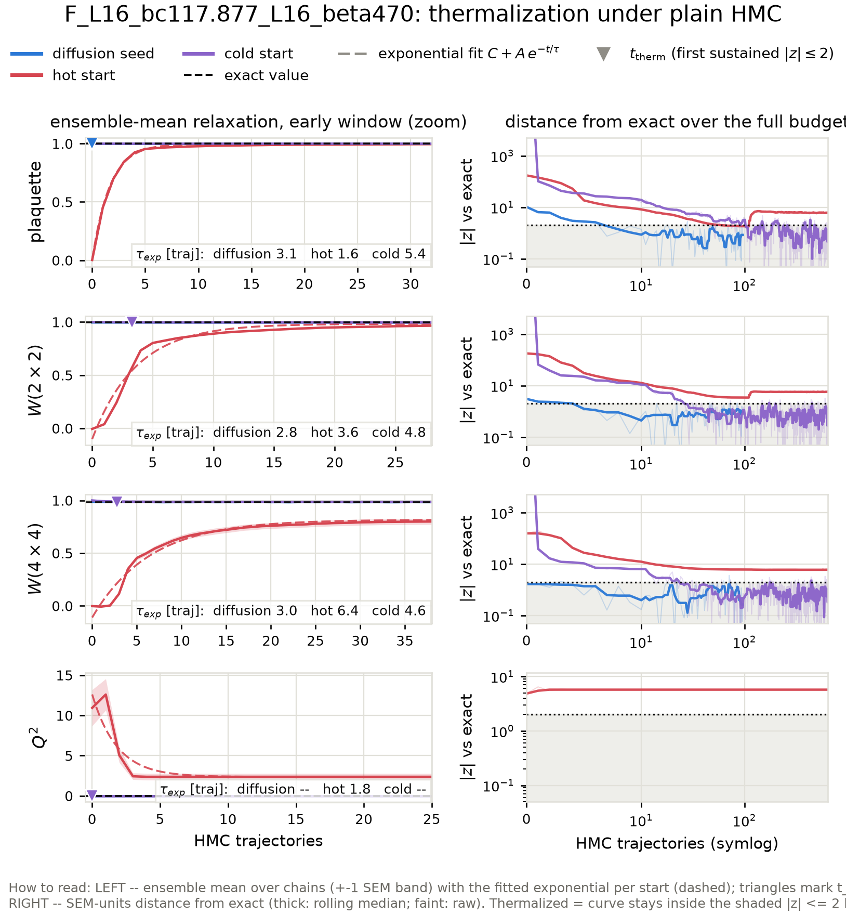

tau_int (hot-start chains, second half): plaquette = 4.62 +- 0.36, wilson_2x2 = 4.21 +- 0.40, wilson_4x4 = 2.47 +- 0.23, wilson_6x6 = 1.18 +- 0.05. Topology: hot-start HMC L=16 beta=470 -> **frozen** (no tunneling).

Where 'never' stood at the end: the hot start ended the 640-trajectory budget still at Q^2 at |z| ~ 6.

### Diagnostics: raw diffusion output (before any HMC)

| observable | value | error | exact | z_exact | reference | ref_error | z_ref | ks_p | chi2_p |
|---|---|---|---|---|---|---|---|---|---|
| plaquette | 0.9991 | 7.953e-06 | 0.9989 | 13.95 | 0.9989 | 8.476e-06 | 9.007 | 8.851e-09 |  |
| wilson_1x1 | 0.9991 | 7.953e-06 | 0.9989 | 13.95 | 0.9989 | 8.476e-06 | 9.007 | 8.851e-09 |  |
| wilson_1x2 | 0.9981 | 2.305e-05 | 0.9979 | 7.379 | 0.9979 | 1.673e-05 | 6.872 | 4.659e-05 |  |
| wilson_2x2 | 0.996 | 6.193e-05 | 0.9958 | 3.691 | 0.9957 | 5.325e-05 | 4.563 | 6.306e-05 |  |
| wilson_2x3 | 0.9942 | 0.0001225 | 0.9938 | 3.058 | 0.9935 | 0.000107 | 3.866 | 0.001695 |  |
| wilson_3x3 | 0.9914 | 0.000205 | 0.9908 | 2.927 | 0.9903 | 0.0001793 | 4.123 | 0.008658 |  |
| wilson_3x4 | 0.9886 | 0.0003116 | 0.9879 | 2.38 | 0.9871 | 0.0002886 | 3.67 | 0.01074 |  |
| wilson_4x4 | 0.985 | 0.0004688 | 0.9842 | 1.765 | 0.9833 | 0.0004445 | 2.582 | 0.02956 |  |
| wilson_4x5 | 0.9815 | 0.0006084 | 0.9806 | 1.631 | 0.9794 | 0.0005675 | 2.554 | 0.1867 |  |
| wilson_5x5 | 0.9773 | 0.0008114 | 0.9763 | 1.24 | 0.9754 | 0.000786 | 1.626 | 0.3192 |  |
| wilson_5x6 | 0.9734 | 0.001032 | 0.9722 | 1.13 | 0.9713 | 0.00095 | 1.449 | 0.3192 |  |
| wilson_6x6 | 0.969 | 0.001322 | 0.9676 | 1.06 | 0.9672 | 0.001225 | 0.9878 | 0.5575 |  |
| wilson_6x7 | 0.9649 | 0.001581 | 0.9633 | 0.9933 | 0.9633 | 0.001481 | 0.718 | 0.5044 |  |
| wilson_7x7 | 0.9606 | 0.001866 | 0.9587 | 1.01 | 0.9591 | 0.001674 | 0.5774 | 0.3192 |  |
| wilson_7x8 | 0.9562 | 0.002184 | 0.9545 | 0.805 | 0.9552 | 0.001945 | 0.3396 | 0.6123 |  |
| wilson_8x8 | 0.9523 | 0.002459 | 0.9502 | 0.8674 | 0.9507 | 0.00217 | 0.4748 | 0.6679 |  |
| creutz_2 | 0.001028 | 3.876e-05 | 0.001028 | 0.00565 |  |  |  |  |  |
| creutz_3 | 0.0008798 | 8.158e-05 | 0.000961 | -0.9948 |  |  |  |  |  |
| creutz_4 | 0.0009155 | 0.0001315 | 0.0008611 | 0.4136 |  |  |  |  |  |
| creutz_5 | 0.0008795 | 0.0002023 | 0.000728 | 0.7488 |  |  |  |  |  |
| creutz_6 | 0.0004832 | 0.0002503 | 0.0005616 | -0.3132 |  |  |  |  |  |
| creutz_7 | 0.0002096 | 0.0003457 | 0.0003619 | -0.4406 |  |  |  |  |  |
| creutz_8 | -0.0003958 | 0.00046 | 0.000129 | -1.141 |  |  |  |  |  |
| Q | 0 | 0 | 0 | 0 | 0 | 0 | 0 | 1 |  |
| Q^2 | 0 | 0 | 3.272e-14 | inf | 0 | 0 | 0 | 1 |  |
| chi_top ((<Q^2>-<Q>^2)/V) | 0 | 0 | 1.278e-16 | inf | 0 | 0 | 0 |  |  |
| Q histogram vs exact P(Q) | 2.327e-13 | nan | 2 | nan |  |  |  |  | 1 |

### Diagnostics: the same configs after 96 HMC trajectories

| observable | value | error | exact | z_exact | reference | ref_error | z_ref | ks_p | chi2_p |
|---|---|---|---|---|---|---|---|---|---|
| plaquette | 0.999 | 1.351e-05 | 0.9989 | 0.7891 | 0.9989 | 8.476e-06 | 0.2766 | 0.5044 |  |
| wilson_1x1 | 0.999 | 1.351e-05 | 0.9989 | 0.7891 | 0.9989 | 8.476e-06 | 0.2766 | 0.5044 |  |
| wilson_1x2 | 0.9979 | 3.511e-05 | 0.9979 | 1.01 | 0.9979 | 1.673e-05 | 1.571 | 0.3192 |  |
| wilson_2x2 | 0.9959 | 7.968e-05 | 0.9958 | 0.8526 | 0.9957 | 5.325e-05 | 2.213 | 0.01631 |  |
| wilson_2x3 | 0.9939 | 0.0001382 | 0.9938 | 0.5557 | 0.9935 | 0.000107 | 1.893 | 0.1015 |  |
| wilson_3x3 | 0.9909 | 0.0002038 | 0.9908 | 0.4022 | 0.9903 | 0.0001793 | 2.228 | 0.07294 |  |
| wilson_3x4 | 0.988 | 0.0002889 | 0.9879 | 0.3656 | 0.9871 | 0.0002886 | 2.26 | 0.1867 |  |
| wilson_4x4 | 0.9843 | 0.0003992 | 0.9842 | 0.3149 | 0.9833 | 0.0004445 | 1.617 | 0.3192 |  |
| wilson_4x5 | 0.9807 | 0.0005739 | 0.9806 | 0.2099 | 0.9794 | 0.0005675 | 1.553 | 0.06142 |  |
| wilson_5x5 | 0.9762 | 0.0007584 | 0.9763 | -0.02967 | 0.9754 | 0.000786 | 0.7396 | 0.3192 |  |
| wilson_5x6 | 0.9722 | 0.0009564 | 0.9722 | 0.02949 | 0.9713 | 0.00095 | 0.6637 | 0.1614 |  |
| wilson_6x6 | 0.9673 | 0.00121 | 0.9676 | -0.2747 | 0.9672 | 0.001225 | 0.02722 | 0.7231 |  |
| wilson_6x7 | 0.9629 | 0.001459 | 0.9633 | -0.2619 | 0.9633 | 0.001481 | -0.1909 | 0.6679 |  |
| wilson_7x7 | 0.9582 | 0.001792 | 0.9587 | -0.2615 | 0.9591 | 0.001674 | -0.3688 | 0.7766 |  |
| wilson_7x8 | 0.9542 | 0.001982 | 0.9545 | -0.1422 | 0.9552 | 0.001945 | -0.3769 | 0.7766 |  |
| wilson_8x8 | 0.9497 | 0.00224 | 0.9502 | -0.1935 | 0.9507 | 0.00217 | -0.3236 | 0.8269 |  |
| creutz_2 | 0.00102 | 4.477e-05 | 0.001028 | -0.1742 |  |  |  |  |  |
| creutz_3 | 0.0009646 | 7.523e-05 | 0.000961 | 0.04856 |  |  |  |  |  |
| creutz_4 | 0.0008646 | 0.0001448 | 0.0008611 | 0.02372 |  |  |  |  |  |
| creutz_5 | 0.000869 | 0.0002248 | 0.000728 | 0.6271 |  |  |  |  |  |
| creutz_6 | 0.0009861 | 0.0003297 | 0.0005616 | 1.288 |  |  |  |  |  |
| creutz_7 | 0.0004009 | 0.0004206 | 0.0003619 | 0.09275 |  |  |  |  |  |
| creutz_8 | 0.0004835 | 0.0005525 | 0.000129 | 0.6416 |  |  |  |  |  |
| Q | 0 | 0 | 0 | 0 | 0 | 0 | 0 | 1 |  |
| Q^2 | 0 | 0 | 3.272e-14 | inf | 0 | 0 | 0 | 1 |  |
| chi_top ((<Q^2>-<Q>^2)/V) | 0 | 0 | 1.278e-16 | inf | 0 | 0 | 0 |  |  |
| Q histogram vs exact P(Q) | 2.327e-13 | nan | 2 | nan |  |  |  |  | 1 |

## F_L16_bc137.876_L16_beta550

HMC: step size 0.0171, 59 leapfrog steps, acceptance seed/hot/cold = 0.987/0.951/0.987. Diffusion-seed batch: 64 chains x 96 trajectories (0.21 s/traj for the whole batch); baselines: 64 chains x 640 trajectories.

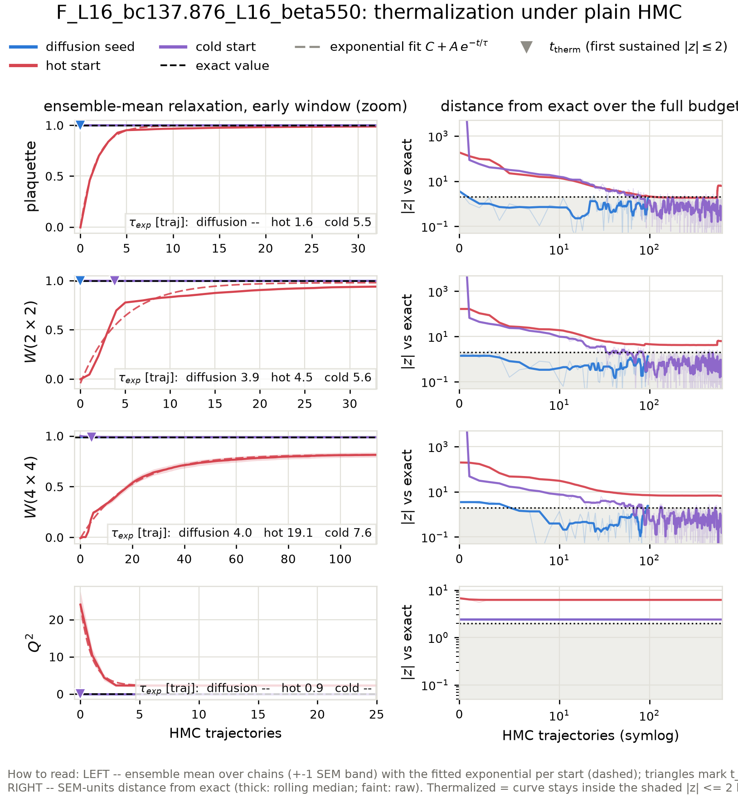

tau_int (hot-start chains, second half): plaquette = 5.44 +- 0.65, wilson_2x2 = 5.52 +- 0.67, wilson_4x4 = 7.53 +- 0.84, wilson_6x6 = 10.47 +- 0.95. Topology: hot-start HMC L=16 beta=550 -> **frozen** (no tunneling).

Where 'never' stood at the end: the hot start ended the 640-trajectory budget still at Q^2 at |z| ~ 6.

### Diagnostics: raw diffusion output (before any HMC)

| observable | value | error | exact | z_exact | reference | ref_error | z_ref | ks_p | chi2_p |
|---|---|---|---|---|---|---|---|---|---|
| plaquette | 0.9991 | 9.952e-06 | 0.9991 | 3.992 | 0.9991 | 5.287e-06 | 0.8232 | 0.5044 |  |
| wilson_1x1 | 0.9991 | 9.952e-06 | 0.9991 | 3.992 | 0.9991 | 5.287e-06 | 0.8232 | 0.5044 |  |
| wilson_1x2 | 0.9982 | 2.035e-05 | 0.9982 | 2.123 | 0.9983 | 1.62e-05 | -1.295 | 0.2464 |  |
| wilson_2x2 | 0.9965 | 6.104e-05 | 0.9964 | 1.36 | 0.9966 | 4.052e-05 | -1.592 | 0.2464 |  |
| wilson_2x3 | 0.9949 | 8.661e-05 | 0.9947 | 2.141 | 0.995 | 6.856e-05 | -1.357 | 0.1389 |  |
| wilson_3x3 | 0.9926 | 0.000181 | 0.9921 | 2.593 | 0.9927 | 0.0001273 | -0.2399 | 0.9433 |  |
| wilson_3x4 | 0.9904 | 0.0002478 | 0.9896 | 3.011 | 0.9904 | 0.0001841 | 0.01981 | 0.9671 |  |
| wilson_4x4 | 0.9877 | 0.0003926 | 0.9864 | 3.309 | 0.9874 | 0.0002568 | 0.6326 | 0.7766 |  |
| wilson_4x5 | 0.9853 | 0.0005191 | 0.9834 | 3.652 | 0.9846 | 0.0003466 | 1.035 | 0.2464 |  |
| wilson_5x5 | 0.9825 | 0.000744 | 0.9797 | 3.841 | 0.9812 | 0.0004518 | 1.513 | 0.2811 |  |
| wilson_5x6 | 0.9797 | 0.0009321 | 0.9762 | 3.781 | 0.9781 | 0.0005667 | 1.447 | 0.2464 |  |
| wilson_6x6 | 0.9769 | 0.00118 | 0.9722 | 3.987 | 0.9743 | 0.0007193 | 1.891 | 0.1015 |  |
| wilson_6x7 | 0.9737 | 0.001433 | 0.9686 | 3.593 | 0.9708 | 0.0008489 | 1.723 | 0.02956 |  |
| wilson_7x7 | 0.9707 | 0.001765 | 0.9646 | 3.476 | 0.967 | 0.001058 | 1.8 | 0.04298 |  |
| wilson_7x8 | 0.9672 | 0.002004 | 0.961 | 3.125 | 0.9638 | 0.001173 | 1.492 | 0.08625 |  |
| wilson_8x8 | 0.9641 | 0.002263 | 0.9573 | 3.037 | 0.9601 | 0.001279 | 1.554 | 0.04298 |  |
| creutz_2 | 0.0008414 | 3.796e-05 | 0.0008779 | -0.9622 |  |  |  |  |  |
| creutz_3 | 0.0006376 | 7.573e-05 | 0.0008211 | -2.423 |  |  |  |  |  |
| creutz_4 | 0.0004537 | 0.0001191 | 0.0007358 | -2.368 |  |  |  |  |  |
| creutz_5 | 0.0002439 | 0.0001963 | 0.000622 | -1.926 |  |  |  |  |  |
| creutz_6 | -5.332e-05 | 0.0002659 | 0.0004798 | -2.005 |  |  |  |  |  |
| creutz_7 | -0.0002545 | 0.0003735 | 0.0003092 | -1.509 |  |  |  |  |  |
| creutz_8 | -0.0003894 | 0.0005094 | 0.0001102 | -0.9807 |  |  |  |  |  |
| Q | 0 | 0 | 0 | 0 | 0 | 0 | 0 | 1 |  |
| Q^2 | 0 | 0 | 2.399e-12 | inf | 0 | 0 | 0 | 1 |  |
| chi_top ((<Q^2>-<Q>^2)/V) | 0 | 0 | 9.372e-15 | inf | 0 | 0 | 0 |  |  |
| Q histogram vs exact P(Q) | 1.706e-11 | nan | 2 | nan |  |  |  |  | 1 |

### Diagnostics: the same configs after 96 HMC trajectories

| observable | value | error | exact | z_exact | reference | ref_error | z_ref | ks_p | chi2_p |
|---|---|---|---|---|---|---|---|---|---|
| plaquette | 0.9991 | 1.115e-05 | 0.9991 | 1.757 | 0.9991 | 5.287e-06 | -0.8798 | 0.6123 |  |
| wilson_1x1 | 0.9991 | 1.115e-05 | 0.9991 | 1.757 | 0.9991 | 5.287e-06 | -0.8798 | 0.6123 |  |
| wilson_1x2 | 0.9982 | 3.026e-05 | 0.9982 | 1.497 | 0.9983 | 1.62e-05 | -0.9203 | 0.6679 |  |
| wilson_2x2 | 0.9965 | 7.129e-05 | 0.9964 | 1.225 | 0.9966 | 4.052e-05 | -1.37 | 0.4056 |  |
| wilson_2x3 | 0.9948 | 0.0001201 | 0.9947 | 1.285 | 0.995 | 6.856e-05 | -1.309 | 0.9115 |  |
| wilson_3x3 | 0.9925 | 0.0002086 | 0.9921 | 1.658 | 0.9927 | 0.0001273 | -0.7225 | 0.8723 |  |
| wilson_3x4 | 0.9902 | 0.000322 | 0.9896 | 1.591 | 0.9904 | 0.0001841 | -0.6137 | 0.7231 |  |
| wilson_4x4 | 0.9875 | 0.0004377 | 0.9864 | 2.311 | 0.9874 | 0.0002568 | 0.01839 | 0.9115 |  |
| wilson_4x5 | 0.9846 | 0.0006241 | 0.9834 | 1.982 | 0.9846 | 0.0003466 | -0.01796 | 0.6679 |  |
| wilson_5x5 | 0.9816 | 0.0008006 | 0.9797 | 2.352 | 0.9812 | 0.0004518 | 0.372 | 0.7231 |  |
| wilson_5x6 | 0.9786 | 0.001013 | 0.9762 | 2.41 | 0.9781 | 0.0005667 | 0.4259 | 0.7231 |  |
| wilson_6x6 | 0.9753 | 0.00123 | 0.9722 | 2.519 | 0.9743 | 0.0007193 | 0.7068 | 0.5575 |  |
| wilson_6x7 | 0.9725 | 0.001411 | 0.9686 | 2.804 | 0.9708 | 0.0008489 | 1.02 | 0.215 |  |
| wilson_7x7 | 0.9693 | 0.001637 | 0.9646 | 2.882 | 0.967 | 0.001058 | 1.174 | 0.3607 |  |
| wilson_7x8 | 0.9666 | 0.00182 | 0.961 | 3.104 | 0.9638 | 0.001173 | 1.316 | 0.3192 |  |
| wilson_8x8 | 0.9635 | 0.002072 | 0.9573 | 3.002 | 0.9601 | 0.001279 | 1.391 | 0.1614 |  |
| creutz_2 | 0.0008615 | 3.378e-05 | 0.0008779 | -0.4873 |  |  |  |  |  |
| creutz_3 | 0.0006951 | 7.557e-05 | 0.0008211 | -1.666 |  |  |  |  |  |
| creutz_4 | 0.000397 | 0.000121 | 0.0007358 | -2.8 |  |  |  |  |  |
| creutz_5 | 0.0001903 | 0.0001873 | 0.000622 | -2.305 |  |  |  |  |  |
| creutz_6 | 0.0003698 | 0.0002382 | 0.0004798 | -0.4619 |  |  |  |  |  |
| creutz_7 | 0.0004003 | 0.0002999 | 0.0003092 | 0.3036 |  |  |  |  |  |
| creutz_8 | 0.0004774 | 0.0003514 | 0.0001102 | 1.045 |  |  |  |  |  |
| Q | 0 | 0 | 0 | 0 | 0 | 0 | 0 | 1 |  |
| Q^2 | 0 | 0 | 2.399e-12 | inf | 0 | 0 | 0 | 1 |  |
| chi_top ((<Q^2>-<Q>^2)/V) | 0 | 0 | 9.372e-15 | inf | 0 | 0 | 0 |  |  |
| Q histogram vs exact P(Q) | 1.706e-11 | nan | 2 | nan |  |  |  |  | 1 |

## F_L16_bc162.876_L16_beta650

HMC: step size 0.0157, 64 leapfrog steps, acceptance seed/hot/cold = 0.987/0.974/0.987. Diffusion-seed batch: 64 chains x 96 trajectories (0.13 s/traj for the whole batch); baselines: 64 chains x 640 trajectories.

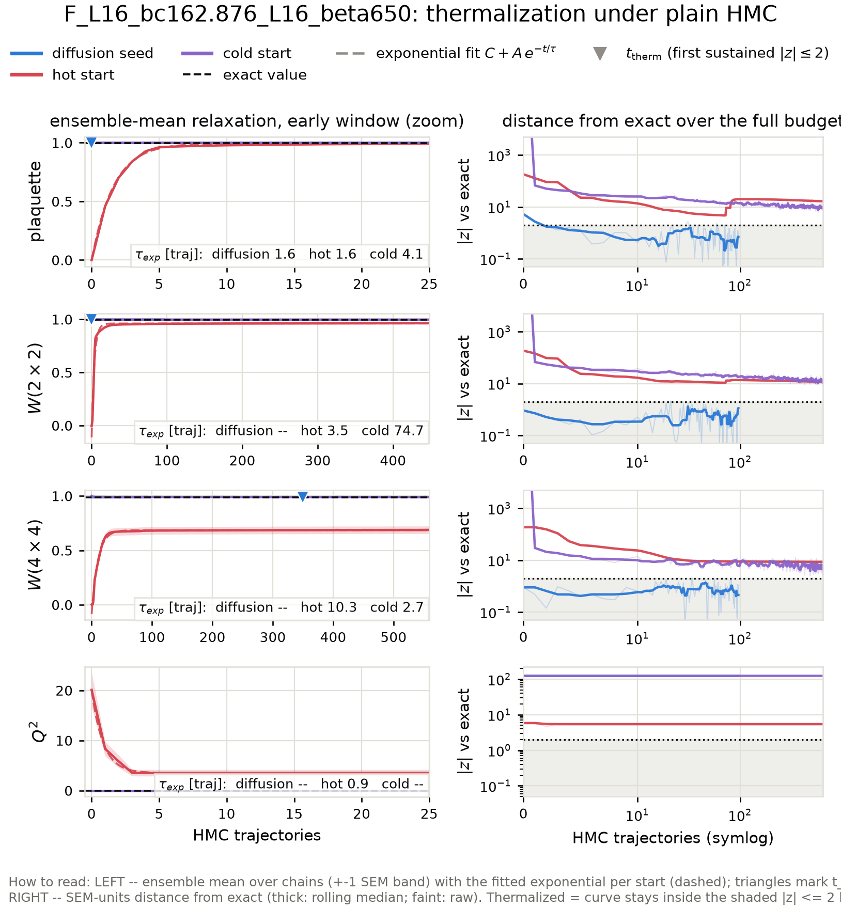

tau_int (hot-start chains, second half): plaquette = 32.19 +- 1.49, wilson_2x2 = 39.68 +- 1.35, wilson_4x4 = 8.39 +- 1.01, wilson_6x6 = 2.55 +- 0.38. Topology: hot-start HMC L=16 beta=650 -> **frozen** (no tunneling).

Where 'never' stood at the end: the hot start ended the 640-trajectory budget still at Q^2 at |z| ~ 5.

### Diagnostics: raw diffusion output (before any HMC)

| observable | value | error | exact | z_exact | reference | ref_error | z_ref | ks_p | chi2_p |
|---|---|---|---|---|---|---|---|---|---|
| plaquette | 0.9993 | 9.055e-06 | 0.9992 | 5.384 | 0.9993 | 7.026e-06 | 0.4478 | 0.9929 |  |
| wilson_1x1 | 0.9993 | 9.055e-06 | 0.9992 | 5.384 | 0.9993 | 7.026e-06 | 0.4478 | 0.9929 |  |
| wilson_1x2 | 0.9985 | 2.094e-05 | 0.9985 | 2.74 | 0.9986 | 2.015e-05 | -1.808 | 0.02956 |  |
| wilson_2x2 | 0.997 | 4.507e-05 | 0.997 | 1.053 | 0.9973 | 4.019e-05 | -4.711 | 4.96e-06 |  |
| wilson_2x3 | 0.9955 | 7.929e-05 | 0.9955 | 0.4338 | 0.996 | 7.1e-05 | -4.034 | 0.001023 |  |
| wilson_3x3 | 0.9933 | 0.0001372 | 0.9933 | 0.02497 | 0.9938 | 0.0001257 | -2.617 | 0.07294 |  |
| wilson_3x4 | 0.9911 | 0.0001922 | 0.9912 | -0.5764 | 0.9918 | 0.0002105 | -2.484 | 0.119 |  |
| wilson_4x4 | 0.9882 | 0.0002837 | 0.9885 | -1.078 | 0.9891 | 0.0003138 | -2.101 | 0.1015 |  |
| wilson_4x5 | 0.9856 | 0.0003688 | 0.9859 | -0.908 | 0.9867 | 0.0004304 | -1.971 | 0.1389 |  |
| wilson_5x5 | 0.9823 | 0.0005061 | 0.9828 | -0.9232 | 0.9839 | 0.0005903 | -2.035 | 0.04298 |  |
| wilson_5x6 | 0.9792 | 0.0006589 | 0.9798 | -0.9154 | 0.9811 | 0.0007701 | -1.873 | 0.06142 |  |
| wilson_6x6 | 0.9759 | 0.0008243 | 0.9765 | -0.7194 | 0.9777 | 0.0009847 | -1.421 | 0.05149 |  |
| wilson_6x7 | 0.9725 | 0.001049 | 0.9733 | -0.7531 | 0.9742 | 0.001227 | -1.043 | 0.02956 |  |
| wilson_7x7 | 0.9692 | 0.001229 | 0.97 | -0.6198 | 0.9702 | 0.001478 | -0.5251 | 0.03572 |  |
| wilson_7x8 | 0.9658 | 0.001476 | 0.9669 | -0.7589 | 0.9669 | 0.001709 | -0.5062 | 0.07294 |  |
| wilson_8x8 | 0.9627 | 0.001678 | 0.9637 | -0.6308 | 0.9633 | 0.001917 | -0.241 | 0.1015 |  |
| creutz_2 | 0.0007613 | 2.837e-05 | 0.0007428 | 0.6531 |  |  |  |  |  |
| creutz_3 | 0.0007127 | 6.404e-05 | 0.0006946 | 0.2816 |  |  |  |  |  |
| creutz_4 | 0.0007051 | 0.0001169 | 0.0006225 | 0.707 |  |  |  |  |  |
| creutz_5 | 0.0006319 | 0.0001598 | 0.0005262 | 0.6614 |  |  |  |  |  |
| creutz_6 | 0.0002575 | 0.0002459 | 0.000406 | -0.6036 |  |  |  |  |  |
| creutz_7 | 3.08e-05 | 0.0003061 | 0.0002616 | -0.7541 |  |  |  |  |  |
| creutz_8 | -0.0003403 | 0.0003641 | 9.322e-05 | -1.19 |  |  |  |  |  |
| Q | 0 | 0 | 0 | 0 | 0 | 0 | 0 | 1 |  |
| Q^2 | 0 | 0 | 1.246e-10 | inf | 0 | 0 | 0 | 1 |  |
| chi_top ((<Q^2>-<Q>^2)/V) | 0 | 0 | 4.868e-13 | inf | 0 | 0 | 0 |  |  |
| Q histogram vs exact P(Q) | 8.863e-10 | nan | 2 | nan |  |  |  |  | 1 |

### Diagnostics: the same configs after 96 HMC trajectories

| observable | value | error | exact | z_exact | reference | ref_error | z_ref | ks_p | chi2_p |
|---|---|---|---|---|---|---|---|---|---|
| plaquette | 0.9992 | 9.609e-06 | 0.9992 | -0.7336 | 0.9993 | 7.026e-06 | -4.257 | 0.0002682 |  |
| wilson_1x1 | 0.9992 | 9.609e-06 | 0.9992 | -0.7336 | 0.9993 | 7.026e-06 | -4.257 | 0.0002682 |  |
| wilson_1x2 | 0.9985 | 2.118e-05 | 0.9985 | -0.5142 | 0.9986 | 2.015e-05 | -4.133 | 0.00132 |  |
| wilson_2x2 | 0.9969 | 4.613e-05 | 0.997 | -1.304 | 0.9973 | 4.019e-05 | -6.408 | 1.083e-09 |  |
| wilson_2x3 | 0.9954 | 7.919e-05 | 0.9955 | -0.6756 | 0.996 | 7.1e-05 | -4.863 | 0.0006067 |  |
| wilson_3x3 | 0.9933 | 0.0001369 | 0.9933 | -0.6065 | 0.9938 | 0.0001257 | -3.085 | 0.119 |  |
| wilson_3x4 | 0.9912 | 0.0001971 | 0.9912 | -0.2848 | 0.9918 | 0.0002105 | -2.265 | 0.3607 |  |
| wilson_4x4 | 0.9884 | 0.0003108 | 0.9885 | -0.5336 | 0.9891 | 0.0003138 | -1.695 | 0.6123 |  |
| wilson_4x5 | 0.9859 | 0.0004359 | 0.9859 | 0.03599 | 0.9867 | 0.0004304 | -1.251 | 0.5575 |  |
| wilson_5x5 | 0.9829 | 0.0005774 | 0.9828 | 0.1782 | 0.9839 | 0.0005903 | -1.225 | 0.1867 |  |
| wilson_5x6 | 0.9801 | 0.0007618 | 0.9798 | 0.3667 | 0.9811 | 0.0007701 | -0.9377 | 0.8269 |  |
| wilson_6x6 | 0.977 | 0.0009477 | 0.9765 | 0.5684 | 0.9777 | 0.0009847 | -0.5075 | 0.5575 |  |
| wilson_6x7 | 0.974 | 0.001139 | 0.9733 | 0.5858 | 0.9742 | 0.001227 | -0.1349 | 0.5575 |  |
| wilson_7x7 | 0.9709 | 0.001373 | 0.97 | 0.6868 | 0.9702 | 0.001478 | 0.3445 | 0.6123 |  |
| wilson_7x8 | 0.9679 | 0.001576 | 0.9669 | 0.6417 | 0.9669 | 0.001709 | 0.4251 | 0.2464 |  |
| wilson_8x8 | 0.9649 | 0.001799 | 0.9637 | 0.6655 | 0.9633 | 0.001917 | 0.6244 | 0.3192 |  |
| creutz_2 | 0.0007883 | 2.933e-05 | 0.0007428 | 1.554 |  |  |  |  |  |
| creutz_3 | 0.0007311 | 6.66e-05 | 0.0006946 | 0.5476 |  |  |  |  |  |
| creutz_4 | 0.0007606 | 0.0001037 | 0.0006225 | 1.332 |  |  |  |  |  |
| creutz_5 | 0.0006212 | 0.0001406 | 0.0005262 | 0.675 |  |  |  |  |  |
| creutz_6 | 0.00032 | 0.0002123 | 0.000406 | -0.4052 |  |  |  |  |  |
| creutz_7 | 0.0001099 | 0.0002968 | 0.0002616 | -0.5111 |  |  |  |  |  |
| creutz_8 | -2.838e-05 | 0.0003589 | 9.322e-05 | -0.3389 |  |  |  |  |  |
| Q | 0 | 0 | 0 | 0 | 0 | 0 | 0 | 1 |  |
| Q^2 | 0 | 0 | 1.246e-10 | inf | 0 | 0 | 0 | 1 |  |
| chi_top ((<Q^2>-<Q>^2)/V) | 0 | 0 | 4.868e-13 | inf | 0 | 0 | 0 |  |  |
| Q histogram vs exact P(Q) | 8.863e-10 | nan | 2 | nan |  |  |  |  | 1 |

## F_L16_bc187.876_L16_beta750

HMC: step size 0.0146, 68 leapfrog steps, acceptance seed/hot/cold = 0.986/0.919/0.988. Diffusion-seed batch: 64 chains x 96 trajectories (0.26 s/traj for the whole batch); baselines: 64 chains x 640 trajectories.

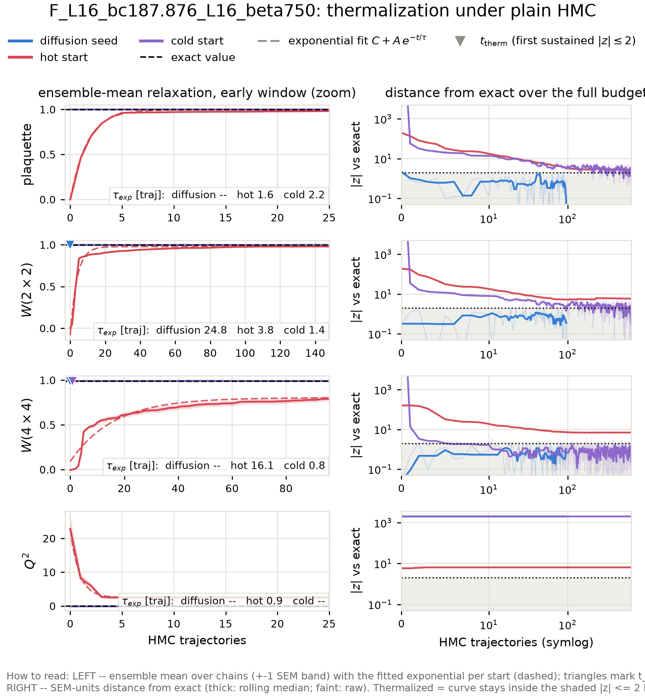

tau_int (hot-start chains, second half): plaquette = 10.33 +- 1.28, wilson_2x2 = 8.78 +- 1.27, wilson_4x4 = 0.99 +- 0.04, wilson_6x6 = 0.98 +- 0.03. Topology: hot-start HMC L=16 beta=750 -> **frozen** (no tunneling).

Where 'never' stood at the end: the hot start ended the 640-trajectory budget still at Q^2 at |z| ~ 6; the cold start ended the 640-trajectory budget still at Q^2 at |z| ~ 2060.

### Diagnostics: raw diffusion output (before any HMC)

| observable | value | error | exact | z_exact | reference | ref_error | z_ref | ks_p | chi2_p |
|---|---|---|---|---|---|---|---|---|---|
| plaquette | 0.9993 | 5.721e-06 | 0.9993 | 2.346 | 0.9993 | 7.234e-06 | 1.243 | 0.3192 |  |
| wilson_1x1 | 0.9993 | 5.721e-06 | 0.9993 | 2.346 | 0.9993 | 7.234e-06 | 1.243 | 0.3192 |  |
| wilson_1x2 | 0.9987 | 1.385e-05 | 0.9987 | 1.441 | 0.9987 | 1.625e-05 | 1.223 | 0.5575 |  |
| wilson_2x2 | 0.9974 | 3.835e-05 | 0.9974 | -0.377 | 0.9974 | 3.388e-05 | -0.2867 | 0.7231 |  |
| wilson_2x3 | 0.9961 | 8.18e-05 | 0.9961 | -0.2132 | 0.9961 | 6.144e-05 | -0.2715 | 0.9929 |  |
| wilson_3x3 | 0.9942 | 0.0001258 | 0.9942 | 0.121 | 0.9943 | 0.0001249 | -0.2394 | 0.9671 |  |
| wilson_3x4 | 0.9924 | 0.0002002 | 0.9924 | 0.1181 | 0.9925 | 0.0001851 | -0.1399 | 0.8723 |  |
| wilson_4x4 | 0.9901 | 0.0002837 | 0.99 | 0.02502 | 0.9902 | 0.0002679 | -0.2683 | 0.8723 |  |
| wilson_4x5 | 0.9879 | 0.0003929 | 0.9878 | 0.2287 | 0.9878 | 0.0003652 | 0.09423 | 0.9671 |  |
| wilson_5x5 | 0.9852 | 0.0005776 | 0.9851 | 0.2663 | 0.9853 | 0.0004693 | -0.1269 | 0.8269 |  |
| wilson_5x6 | 0.9829 | 0.0007055 | 0.9825 | 0.6163 | 0.9826 | 0.0005999 | 0.3675 | 0.6679 |  |
| wilson_6x6 | 0.98 | 0.0009467 | 0.9796 | 0.4922 | 0.9801 | 0.0007213 | -0.009996 | 0.5044 |  |
| wilson_6x7 | 0.9777 | 0.001088 | 0.9769 | 0.7473 | 0.9773 | 0.0008309 | 0.2332 | 0.3192 |  |
| wilson_7x7 | 0.9749 | 0.001381 | 0.9739 | 0.7388 | 0.9749 | 0.0009398 | 0.002769 | 0.4535 |  |
| wilson_7x8 | 0.9727 | 0.001506 | 0.9712 | 0.9875 | 0.9723 | 0.001057 | 0.2496 | 0.4056 |  |
| wilson_8x8 | 0.97 | 0.001731 | 0.9685 | 0.8969 | 0.9698 | 0.001125 | 0.1288 | 0.215 |  |
| creutz_2 | 0.0006847 | 3.145e-05 | 0.0006437 | 1.304 |  |  |  |  |  |
| creutz_3 | 0.0005661 | 5.404e-05 | 0.000602 | -0.663 |  |  |  |  |  |
| creutz_4 | 0.0005646 | 9.857e-05 | 0.0005394 | 0.2554 |  |  |  |  |  |
| creutz_5 | 0.0004747 | 0.0001574 | 0.000456 | 0.1186 |  |  |  |  |  |
| creutz_6 | 0.000605 | 0.0002307 | 0.0003518 | 1.098 |  |  |  |  |  |
| creutz_7 | 0.0003691 | 0.0003062 | 0.0002267 | 0.4649 |  |  |  |  |  |
| creutz_8 | 0.0004916 | 0.0003988 | 8.078e-05 | 1.03 |  |  |  |  |  |
| Q | 0 | 0 | 0 | 0 | 0 | 0 | 0 | 1 |  |
| Q^2 | 0 | 0 | 2.06e-09 | inf | 0 | 0 | 0 | 1 |  |
| chi_top ((<Q^2>-<Q>^2)/V) | 0 | 0 | 8.047e-12 | inf | 0 | 0 | 0 |  |  |
| Q histogram vs exact P(Q) | 1.465e-08 | nan | 2 | nan |  |  |  |  | 1 |

### Diagnostics: the same configs after 96 HMC trajectories

| observable | value | error | exact | z_exact | reference | ref_error | z_ref | ks_p | chi2_p |
|---|---|---|---|---|---|---|---|---|---|
| plaquette | 0.9993 | 5.796e-06 | 0.9993 | -0.06653 | 0.9993 | 7.234e-06 | -0.2525 | 0.8723 |  |
| wilson_1x1 | 0.9993 | 5.796e-06 | 0.9993 | -0.06653 | 0.9993 | 7.234e-06 | -0.2525 | 0.8723 |  |
| wilson_1x2 | 0.9987 | 1.498e-05 | 0.9987 | 0.2389 | 0.9987 | 1.625e-05 | 0.4407 | 0.7231 |  |
| wilson_2x2 | 0.9974 | 4.048e-05 | 0.9974 | -0.3988 | 0.9974 | 3.388e-05 | -0.3099 | 0.5044 |  |
| wilson_2x3 | 0.9961 | 6.694e-05 | 0.9961 | -0.2923 | 0.9961 | 6.144e-05 | -0.3291 | 0.5044 |  |
| wilson_3x3 | 0.9942 | 0.0001335 | 0.9942 | -0.3476 | 0.9943 | 0.0001249 | -0.5693 | 0.3607 |  |
| wilson_3x4 | 0.9923 | 0.0001883 | 0.9924 | -0.6783 | 0.9925 | 0.0001851 | -0.7179 | 0.6123 |  |
| wilson_4x4 | 0.9897 | 0.0002887 | 0.99 | -1.043 | 0.9902 | 0.0002679 | -1.048 | 0.5044 |  |
| wilson_4x5 | 0.9873 | 0.0003976 | 0.9878 | -1.197 | 0.9878 | 0.0003652 | -0.9547 | 0.6123 |  |
| wilson_5x5 | 0.9845 | 0.0005233 | 0.9851 | -1.08 | 0.9853 | 0.0004693 | -1.157 | 0.119 |  |
| wilson_5x6 | 0.9818 | 0.0006899 | 0.9825 | -0.9595 | 0.9826 | 0.0005999 | -0.8274 | 0.3607 |  |
| wilson_6x6 | 0.9787 | 0.0008849 | 0.9796 | -1.038 | 0.9801 | 0.0007213 | -1.223 | 0.1867 |  |
| wilson_6x7 | 0.9761 | 0.001061 | 0.9769 | -0.7434 | 0.9773 | 0.0008309 | -0.952 | 0.2811 |  |
| wilson_7x7 | 0.9726 | 0.001216 | 0.9739 | -1.111 | 0.9749 | 0.0009398 | -1.54 | 0.1867 |  |
| wilson_7x8 | 0.97 | 0.001406 | 0.9712 | -0.8774 | 0.9723 | 0.001057 | -1.286 | 0.3607 |  |
| wilson_8x8 | 0.9671 | 0.001528 | 0.9685 | -0.8938 | 0.9698 | 0.001125 | -1.398 | 0.3192 |  |
| creutz_2 | 0.0006674 | 2.52e-05 | 0.0006437 | 0.9419 |  |  |  |  |  |
| creutz_3 | 0.0006255 | 4.852e-05 | 0.000602 | 0.4857 |  |  |  |  |  |
| creutz_4 | 0.0006328 | 8.698e-05 | 0.0005394 | 1.074 |  |  |  |  |  |
| creutz_5 | 0.0003698 | 0.0001254 | 0.000456 | -0.6874 |  |  |  |  |  |
| creutz_6 | 0.0005154 | 0.0001974 | 0.0003518 | 0.8287 |  |  |  |  |  |
| creutz_7 | 0.0009375 | 0.0002958 | 0.0002267 | 2.403 |  |  |  |  |  |
| creutz_8 | 0.0003379 | 0.0003621 | 8.078e-05 | 0.71 |  |  |  |  |  |
| Q | 0 | 0 | 0 | 0 | 0 | 0 | 0 | 1 |  |
| Q^2 | 0 | 0 | 2.06e-09 | inf | 0 | 0 | 0 | 1 |  |
| chi_top ((<Q^2>-<Q>^2)/V) | 0 | 0 | 8.047e-12 | inf | 0 | 0 | 0 |  |  |
| Q histogram vs exact P(Q) | 1.465e-08 | nan | 2 | nan |  |  |  |  | 1 |

## F_L16_bc217.876_L16_beta870

HMC: step size 0.0136, 74 leapfrog steps, acceptance seed/hot/cold = 0.988/0.784/0.988. Diffusion-seed batch: 64 chains x 96 trajectories (0.16 s/traj for the whole batch); baselines: 64 chains x 640 trajectories.

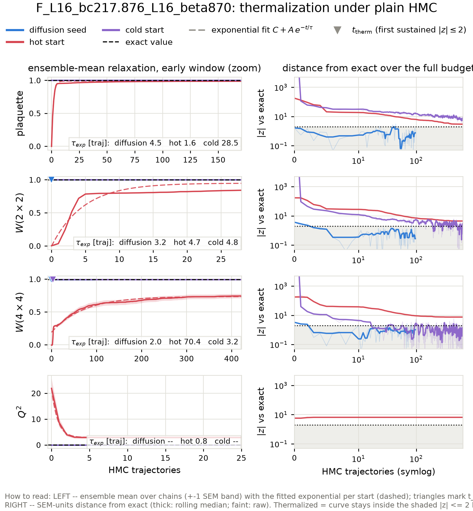

tau_int (hot-start chains, second half): plaquette = 28.55 +- 1.94, wilson_2x2 = 13.35 +- 1.53, wilson_4x4 = 4.44 +- 0.88, wilson_6x6 = 2.67 +- 0.82. Topology: hot-start HMC L=16 beta=870 -> **frozen** (no tunneling).

Where 'never' stood at the end: the hot start ended the 640-trajectory budget still at Q^2 at |z| ~ 7; the cold start ended the 640-trajectory budget still at Q^2 at |z| ~ 24272.

### Diagnostics: raw diffusion output (before any HMC)

| observable | value | error | exact | z_exact | reference | ref_error | z_ref | ks_p | chi2_p |
|---|---|---|---|---|---|---|---|---|---|
| plaquette | 0.9994 | 8.918e-06 | 0.9994 | -1.403 | 0.9994 | 4.817e-06 | -3.006 | 0.000114 |  |
| wilson_1x1 | 0.9994 | 8.918e-06 | 0.9994 | -1.403 | 0.9994 | 4.817e-06 | -3.006 | 0.000114 |  |
| wilson_1x2 | 0.9988 | 1.836e-05 | 0.9989 | -1.917 | 0.9989 | 7.614e-06 | -4.26 | 0.0001523 |  |
| wilson_2x2 | 0.9976 | 3.459e-05 | 0.9977 | -4.124 | 0.9978 | 2.009e-05 | -5.635 | 0.0002025 |  |
| wilson_2x3 | 0.9964 | 6.93e-05 | 0.9966 | -3.764 | 0.9968 | 3.887e-05 | -5.27 | 4.659e-05 |  |
| wilson_3x3 | 0.9946 | 0.0001271 | 0.995 | -3.051 | 0.9952 | 6.58e-05 | -3.876 | 0.002168 |  |
| wilson_3x4 | 0.9928 | 0.0002006 | 0.9934 | -3.244 | 0.9937 | 0.0001074 | -4.044 | 0.002761 |  |
| wilson_4x4 | 0.9904 | 0.000309 | 0.9914 | -3.215 | 0.9916 | 0.0001585 | -3.487 | 0.006949 |  |
| wilson_4x5 | 0.9881 | 0.000429 | 0.9895 | -3.053 | 0.9897 | 0.0002395 | -3.269 | 0.001695 |  |
| wilson_5x5 | 0.9854 | 0.00057 | 0.9871 | -2.988 | 0.9873 | 0.0003208 | -2.837 | 0.01326 |  |
| wilson_5x6 | 0.983 | 0.0007002 | 0.9849 | -2.763 | 0.9851 | 0.0004379 | -2.646 | 0.002761 |  |
| wilson_6x6 | 0.9801 | 0.0008775 | 0.9824 | -2.588 | 0.9824 | 0.0005426 | -2.233 | 0.008658 |  |
| wilson_6x7 | 0.9776 | 0.001057 | 0.98 | -2.257 | 0.9801 | 0.0007071 | -1.983 | 0.02956 |  |
| wilson_7x7 | 0.9748 | 0.001239 | 0.9775 | -2.166 | 0.9775 | 0.000832 | -1.803 | 0.04298 |  |
| wilson_7x8 | 0.9723 | 0.001452 | 0.9752 | -1.961 | 0.9753 | 0.0009778 | -1.703 | 0.1389 |  |
| wilson_8x8 | 0.9696 | 0.001597 | 0.9728 | -1.977 | 0.973 | 0.001049 | -1.753 | 0.1867 |  |
| creutz_2 | 0.0006399 | 2.239e-05 | 0.0005548 | 3.798 |  |  |  |  |  |
| creutz_3 | 0.0005282 | 5.191e-05 | 0.0005189 | 0.1796 |  |  |  |  |  |
| creutz_4 | 0.000547 | 8.515e-05 | 0.000465 | 0.9633 |  |  |  |  |  |
| creutz_5 | 0.000473 | 0.0001312 | 0.0003931 | 0.6095 |  |  |  |  |  |
| creutz_6 | 0.0004119 | 0.0001487 | 0.0003032 | 0.7309 |  |  |  |  |  |
| creutz_7 | 0.0003849 | 0.0002241 | 0.0001954 | 0.8454 |  |  |  |  |  |
| creutz_8 | 0.000221 | 0.0003096 | 6.963e-05 | 0.4888 |  |  |  |  |  |
| Q | 0 | 0 | 0 | 0 | 0 | 0 | 0 | 1 |  |
| Q^2 | 0 | 0 | 2.427e-08 | inf | 0 | 0 | 0 | 1 |  |
| chi_top ((<Q^2>-<Q>^2)/V) | 0 | 0 | 9.481e-11 | inf | 0 | 0 | 0 |  |  |
| Q histogram vs exact P(Q) | 1.726e-07 | nan | 2 | nan |  |  |  |  | 1 |

### Diagnostics: the same configs after 96 HMC trajectories

| observable | value | error | exact | z_exact | reference | ref_error | z_ref | ks_p | chi2_p |
|---|---|---|---|---|---|---|---|---|---|
| plaquette | 0.9994 | 6.99e-06 | 0.9994 | 0.6135 | 0.9994 | 4.817e-06 | -1.611 | 0.01997 |  |
| wilson_1x1 | 0.9994 | 6.99e-06 | 0.9994 | 0.6135 | 0.9994 | 4.817e-06 | -1.611 | 0.01997 |  |
| wilson_1x2 | 0.9989 | 1.731e-05 | 0.9989 | 0.06045 | 0.9989 | 7.614e-06 | -2.56 | 0.03572 |  |
| wilson_2x2 | 0.9977 | 4.696e-05 | 0.9977 | 0.2307 | 0.9978 | 2.009e-05 | -1.408 | 0.1614 |  |
| wilson_2x3 | 0.9967 | 7.493e-05 | 0.9966 | 0.4519 | 0.9968 | 3.887e-05 | -1.469 | 0.4535 |  |
| wilson_3x3 | 0.9951 | 0.0001256 | 0.995 | 1.028 | 0.9952 | 6.58e-05 | -0.2668 | 0.6123 |  |
| wilson_3x4 | 0.9937 | 0.0001841 | 0.9934 | 1.231 | 0.9937 | 0.0001074 | -0.201 | 0.5575 |  |
| wilson_4x4 | 0.9917 | 0.0002756 | 0.9914 | 1.038 | 0.9916 | 0.0001585 | 0.2159 | 0.8723 |  |
| wilson_4x5 | 0.9899 | 0.0003613 | 0.9895 | 1.139 | 0.9897 | 0.0002395 | 0.266 | 0.7231 |  |
| wilson_5x5 | 0.9875 | 0.0005091 | 0.9871 | 0.8498 | 0.9873 | 0.0003208 | 0.4649 | 0.9671 |  |
| wilson_5x6 | 0.9856 | 0.0006043 | 0.9849 | 1.138 | 0.9851 | 0.0004379 | 0.5853 | 0.9433 |  |
| wilson_6x6 | 0.9831 | 0.0007783 | 0.9824 | 0.9862 | 0.9824 | 0.0005426 | 0.7742 | 0.8269 |  |
| wilson_6x7 | 0.981 | 0.0008673 | 0.98 | 1.183 | 0.9801 | 0.0007071 | 0.7948 | 0.8269 |  |
| wilson_7x7 | 0.9787 | 0.00104 | 0.9775 | 1.155 | 0.9775 | 0.000832 | 0.8962 | 0.7231 |  |
| wilson_7x8 | 0.9765 | 0.001128 | 0.9752 | 1.195 | 0.9753 | 0.0009778 | 0.8127 | 0.8269 |  |
| wilson_8x8 | 0.9743 | 0.001325 | 0.9728 | 1.151 | 0.973 | 0.001049 | 0.7882 | 0.7231 |  |
| creutz_2 | 0.0005418 | 2.232e-05 | 0.0005548 | -0.5848 |  |  |  |  |  |
| creutz_3 | 0.0004462 | 4.697e-05 | 0.0005189 | -1.548 |  |  |  |  |  |
| creutz_4 | 0.000503 | 6.672e-05 | 0.000465 | 0.5697 |  |  |  |  |  |
| creutz_5 | 0.000498 | 0.0001183 | 0.0003931 | 0.8867 |  |  |  |  |  |
| creutz_6 | 0.0004795 | 0.0001684 | 0.0003032 | 1.047 |  |  |  |  |  |
| creutz_7 | 0.0002785 | 0.0002421 | 0.0001954 | 0.3433 |  |  |  |  |  |
| creutz_8 | 3.739e-05 | 0.0003176 | 6.963e-05 | -0.1015 |  |  |  |  |  |
| Q | 0 | 0 | 0 | 0 | 0 | 0 | 0 | 1 |  |
| Q^2 | 0 | 0 | 2.427e-08 | inf | 0 | 0 | 0 | 1 |  |
| chi_top ((<Q^2>-<Q>^2)/V) | 0 | 0 | 9.481e-11 | inf | 0 | 0 | 0 |  |  |
| Q histogram vs exact P(Q) | 1.726e-07 | nan | 2 | nan |  |  |  |  | 1 |

## F_L16_bc250.376_L16_beta1000

HMC: step size 0.0126, 79 leapfrog steps, acceptance seed/hot/cold = 0.986/0.814/0.986. Diffusion-seed batch: 64 chains x 96 trajectories (0.30 s/traj for the whole batch); baselines: 64 chains x 640 trajectories.

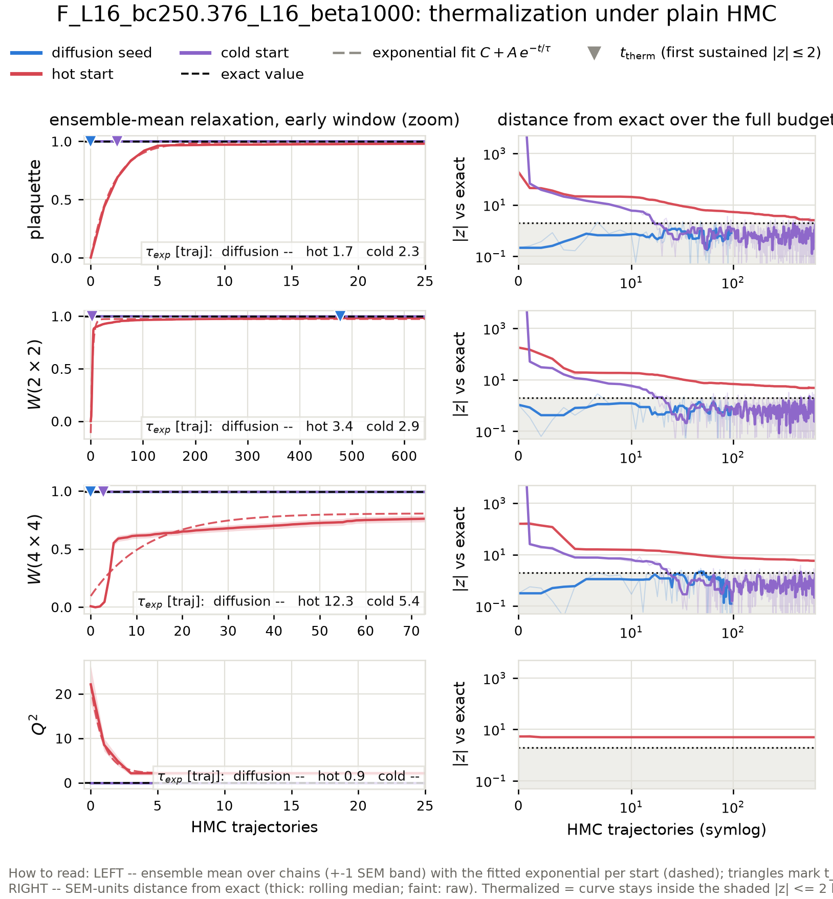

tau_int (hot-start chains, second half): plaquette = 5.78 +- 1.41, wilson_2x2 = 6.84 +- 1.43, wilson_4x4 = 8.88 +- 1.48, wilson_6x6 = 11.37 +- 1.53. Topology: hot-start HMC L=16 beta=1000 -> **frozen** (no tunneling).

Where 'never' stood at the end: the hot start ended the 640-trajectory budget still at Q^2 at |z| ~ 5; the cold start ended the 640-trajectory budget still at Q^2 at |z| ~ 178903.

### Diagnostics: raw diffusion output (before any HMC)

| observable | value | error | exact | z_exact | reference | ref_error | z_ref | ks_p | chi2_p |
|---|---|---|---|---|---|---|---|---|---|
| plaquette | 0.9995 | 4.184e-06 | 0.9995 | 0.3401 | 0.9995 | 4.186e-06 | 1.933 | 0.3607 |  |
| wilson_1x1 | 0.9995 | 4.184e-06 | 0.9995 | 0.3401 | 0.9995 | 4.186e-06 | 1.933 | 0.3607 |  |
| wilson_1x2 | 0.999 | 1.229e-05 | 0.999 | 0.911 | 0.999 | 1.196e-05 | 1.727 | 0.4056 |  |
| wilson_2x2 | 0.9981 | 2.643e-05 | 0.998 | 1.233 | 0.998 | 2.666e-05 | 1.296 | 0.9115 |  |
| wilson_2x3 | 0.9972 | 4.009e-05 | 0.9971 | 1.958 | 0.9971 | 4.97e-05 | 1.25 | 0.7231 |  |
| wilson_3x3 | 0.9958 | 7.912e-05 | 0.9957 | 1.219 | 0.9957 | 8.624e-05 | 0.3888 | 0.5044 |  |
| wilson_3x4 | 0.9944 | 0.0001291 | 0.9943 | 0.5605 | 0.9944 | 0.0001203 | -0.3707 | 0.6123 |  |
| wilson_4x4 | 0.9926 | 0.0001866 | 0.9925 | 0.3468 | 0.9928 | 0.0001553 | -1.002 | 0.1015 |  |
| wilson_4x5 | 0.9908 | 0.0002646 | 0.9908 | -0.05978 | 0.9913 | 0.0002103 | -1.586 | 0.215 |  |
| wilson_5x5 | 0.9888 | 0.0003327 | 0.9888 | -0.03773 | 0.9896 | 0.0002564 | -2.023 | 0.06142 |  |
| wilson_5x6 | 0.9867 | 0.000432 | 0.9868 | -0.3852 | 0.9881 | 0.0003214 | -2.611 | 0.04298 |  |
| wilson_6x6 | 0.9845 | 0.0005147 | 0.9846 | -0.2673 | 0.9864 | 0.0003629 | -2.966 | 0.004418 |  |
| wilson_6x7 | 0.982 | 0.0006093 | 0.9826 | -1.011 | 0.9847 | 0.0004579 | -3.534 | 0.002168 |  |
| wilson_7x7 | 0.9797 | 0.0007387 | 0.9804 | -0.8983 | 0.983 | 0.0004859 | -3.721 | 0.0003536 |  |
| wilson_7x8 | 0.9772 | 0.0008468 | 0.9784 | -1.398 | 0.9814 | 0.0005688 | -4.149 | 0.0007896 |  |
| wilson_8x8 | 0.9752 | 0.0009732 | 0.9763 | -1.128 | 0.9798 | 0.0006012 | -4.084 | 0.0007896 |  |
| creutz_2 | 0.000471 | 1.694e-05 | 0.0004827 | -0.6879 |  |  |  |  |  |
| creutz_3 | 0.0004793 | 3.687e-05 | 0.0004514 | 0.7574 |  |  |  |  |  |
| creutz_4 | 0.000388 | 5.009e-05 | 0.0004045 | -0.3292 |  |  |  |  |  |
| creutz_5 | 0.0002575 | 8.618e-05 | 0.000342 | -0.9797 |  |  |  |  |  |
| creutz_6 | 7.892e-05 | 0.0001218 | 0.0002638 | -1.518 |  |  |  |  |  |
| creutz_7 | -0.0002668 | 0.000186 | 0.00017 | -2.348 |  |  |  |  |  |
| creutz_8 | -0.0005584 | 0.0002584 | 6.058e-05 | -2.395 |  |  |  |  |  |
| Q | 0 | 0 | 0 | 0 | 0 | 0 | 0 | 1 |  |
| Q^2 | 0 | 0 | 1.789e-07 | inf | 0 | 0 | 0 | 1 |  |
| chi_top ((<Q^2>-<Q>^2)/V) | 0 | 0 | 6.988e-10 | inf | 0 | 0 | 0 |  |  |
| Q histogram vs exact P(Q) | 1.307e-06 | nan | 2 | nan |  |  |  |  | 1 |

### Diagnostics: the same configs after 96 HMC trajectories

| observable | value | error | exact | z_exact | reference | ref_error | z_ref | ks_p | chi2_p |
|---|---|---|---|---|---|---|---|---|---|
| plaquette | 0.9995 | 5.195e-06 | 0.9995 | -0.7784 | 0.9995 | 4.186e-06 | 0.8954 | 0.6123 |  |
| wilson_1x1 | 0.9995 | 5.195e-06 | 0.9995 | -0.7784 | 0.9995 | 4.186e-06 | 0.8954 | 0.6123 |  |
| wilson_1x2 | 0.999 | 1.098e-05 | 0.999 | -0.4899 | 0.999 | 1.196e-05 | 0.8025 | 0.5044 |  |
| wilson_2x2 | 0.998 | 3.414e-05 | 0.998 | -0.8226 | 0.998 | 2.666e-05 | -0.2776 | 0.9929 |  |
| wilson_2x3 | 0.997 | 6.927e-05 | 0.9971 | -0.7077 | 0.9971 | 4.97e-05 | -0.5595 | 0.8723 |  |
| wilson_3x3 | 0.9956 | 0.0001133 | 0.9957 | -0.6246 | 0.9957 | 8.624e-05 | -0.8546 | 0.4056 |  |
| wilson_3x4 | 0.9942 | 0.0001646 | 0.9943 | -0.5339 | 0.9944 | 0.0001203 | -1.107 | 0.5575 |  |
| wilson_4x4 | 0.9926 | 0.0002306 | 0.9925 | 0.1121 | 0.9928 | 0.0001553 | -1.015 | 0.6123 |  |
| wilson_4x5 | 0.991 | 0.0003027 | 0.9908 | 0.4594 | 0.9913 | 0.0002103 | -1.035 | 0.4056 |  |
| wilson_5x5 | 0.9891 | 0.0003807 | 0.9888 | 0.8221 | 0.9896 | 0.0002564 | -1.141 | 0.4056 |  |
| wilson_5x6 | 0.9874 | 0.0004625 | 0.9868 | 1.155 | 0.9881 | 0.0003214 | -1.252 | 0.4056 |  |
| wilson_6x6 | 0.9853 | 0.0005649 | 0.9846 | 1.148 | 0.9864 | 0.0003629 | -1.611 | 0.08625 |  |
| wilson_6x7 | 0.9834 | 0.0006209 | 0.9826 | 1.349 | 0.9847 | 0.0004579 | -1.607 | 0.215 |  |
| wilson_7x7 | 0.9813 | 0.0007344 | 0.9804 | 1.291 | 0.983 | 0.0004859 | -1.906 | 0.1867 |  |
| wilson_7x8 | 0.9794 | 0.0008381 | 0.9784 | 1.306 | 0.9814 | 0.0005688 | -1.929 | 0.1867 |  |
| wilson_8x8 | 0.9775 | 0.000964 | 0.9763 | 1.263 | 0.9798 | 0.0006012 | -2.075 | 0.1015 |  |
| creutz_2 | 0.0005041 | 2.037e-05 | 0.0004827 | 1.051 |  |  |  |  |  |
| creutz_3 | 0.0004523 | 3.949e-05 | 0.0004514 | 0.02313 |  |  |  |  |  |
| creutz_4 | 0.0002728 | 7.167e-05 | 0.0004045 | -1.837 |  |  |  |  |  |
| creutz_5 | 0.0002802 | 0.0001068 | 0.000342 | -0.5785 |  |  |  |  |  |
| creutz_6 | 0.0003712 | 0.0001167 | 0.0002638 | 0.9198 |  |  |  |  |  |
| creutz_7 | 0.0002497 | 0.0001517 | 0.00017 | 0.525 |  |  |  |  |  |
| creutz_8 | 8.357e-05 | 0.0002224 | 6.058e-05 | 0.1034 |  |  |  |  |  |
| Q | 0 | 0 | 0 | 0 | 0 | 0 | 0 | 1 |  |
| Q^2 | 0 | 0 | 1.789e-07 | inf | 0 | 0 | 0 | 1 |  |
| chi_top ((<Q^2>-<Q>^2)/V) | 0 | 0 | 6.988e-10 | inf | 0 | 0 | 0 |  |  |
| Q histogram vs exact P(Q) | 1.307e-06 | nan | 2 | nan |  |  |  |  | 1 |

## F_L16_bc306.626_L16_beta1225

HMC: step size 0.0114, 87 leapfrog steps, acceptance seed/hot/cold = 0.984/0.876/0.986. Diffusion-seed batch: 64 chains x 96 trajectories (0.17 s/traj for the whole batch); baselines: 64 chains x 640 trajectories.

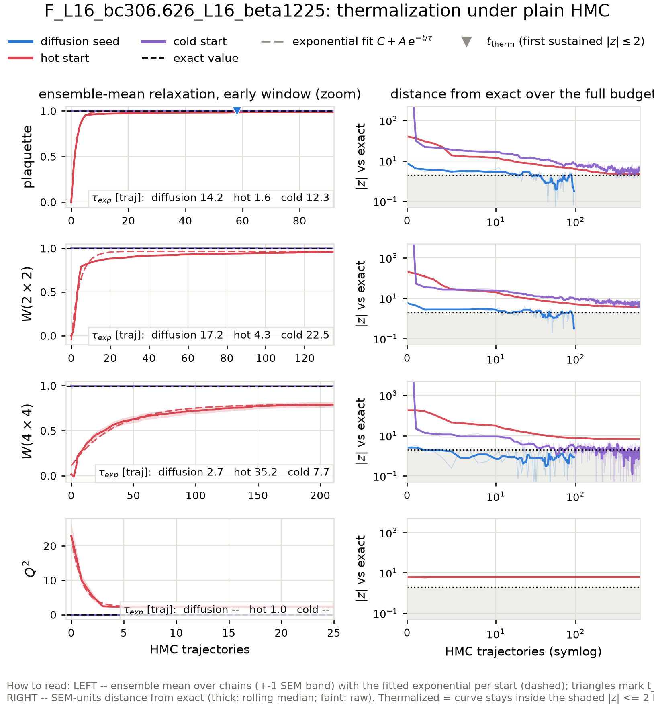

tau_int (hot-start chains, second half): plaquette = 30.71 +- 2.04, wilson_2x2 = 32.70 +- 2.08, wilson_4x4 = 10.07 +- 1.28, wilson_6x6 = 2.26 +- 0.25. Topology: hot-start HMC L=16 beta=1225 -> **frozen** (no tunneling).

Where 'never' stood at the end: the hot start ended the 640-trajectory budget still at Q^2 at |z| ~ 6; the cold start ended the 640-trajectory budget still at Q^2 at |z| ~ 2188594.

### Diagnostics: raw diffusion output (before any HMC)

| observable | value | error | exact | z_exact | reference | ref_error | z_ref | ks_p | chi2_p |
|---|---|---|---|---|---|---|---|---|---|
| plaquette | 0.9996 | 5.32e-06 | 0.9996 | -6.735 | 0.9996 | 3.309e-06 | -7.786 | 4.534e-10 |  |
| wilson_1x1 | 0.9996 | 5.32e-06 | 0.9996 | -6.735 | 0.9996 | 3.309e-06 | -7.786 | 4.534e-10 |  |
| wilson_1x2 | 0.9991 | 1.318e-05 | 0.9992 | -5.493 | 0.9992 | 8.651e-06 | -6.896 | 4.763e-11 |  |
| wilson_2x2 | 0.9982 | 3.144e-05 | 0.9984 | -4.728 | 0.9985 | 1.384e-05 | -7.396 | 1.663e-09 |  |
| wilson_2x3 | 0.9974 | 5.426e-05 | 0.9976 | -3.698 | 0.9978 | 2.714e-05 | -5.697 | 2.952e-07 |  |
| wilson_3x3 | 0.9962 | 9.875e-05 | 0.9965 | -2.919 | 0.9966 | 4.571e-05 | -4.187 | 0.0002682 |  |
| wilson_3x4 | 0.995 | 0.000149 | 0.9953 | -2.573 | 0.9955 | 6.639e-05 | -3.33 | 0.008658 |  |
| wilson_4x4 | 0.9934 | 0.0002093 | 0.9939 | -2.47 | 0.994 | 9.206e-05 | -2.901 | 0.06142 |  |
| wilson_4x5 | 0.9919 | 0.0002956 | 0.9925 | -2.044 | 0.9927 | 0.0001166 | -2.454 | 0.215 |  |
| wilson_5x5 | 0.9902 | 0.0003916 | 0.9908 | -1.649 | 0.991 | 0.0001637 | -1.96 | 0.3607 |  |
| wilson_5x6 | 0.9886 | 0.0005036 | 0.9892 | -1.344 | 0.9896 | 0.000201 | -1.849 | 0.4535 |  |
| wilson_6x6 | 0.9867 | 0.0006274 | 0.9874 | -1.166 | 0.9878 | 0.0002607 | -1.626 | 0.7231 |  |
| wilson_6x7 | 0.9851 | 0.0007575 | 0.9858 | -0.9248 | 0.9863 | 0.0003356 | -1.513 | 0.4056 |  |
| wilson_7x7 | 0.9832 | 0.0008866 | 0.984 | -0.8388 | 0.9845 | 0.0004034 | -1.37 | 0.7231 |  |
| wilson_7x8 | 0.9815 | 0.001024 | 0.9823 | -0.7401 | 0.9829 | 0.000505 | -1.204 | 0.7231 |  |
| wilson_8x8 | 0.9798 | 0.0011 | 0.9806 | -0.6867 | 0.9813 | 0.0005884 | -1.17 | 0.7766 |  |
| creutz_2 | 0.0004338 | 1.598e-05 | 0.000394 | 2.489 |  |  |  |  |  |
| creutz_3 | 0.0004045 | 3.82e-05 | 0.0003685 | 0.9424 |  |  |  |  |  |
| creutz_4 | 0.0003697 | 5.675e-05 | 0.0003302 | 0.6956 |  |  |  |  |  |
| creutz_5 | 0.0002334 | 7.795e-05 | 0.0002791 | -0.5866 |  |  |  |  |  |
| creutz_6 | 0.0002396 | 0.000105 | 0.0002153 | 0.2308 |  |  |  |  |  |
| creutz_7 | 0.0002141 | 0.0001504 | 0.0001388 | 0.501 |  |  |  |  |  |
| creutz_8 | 3.276e-05 | 0.0001888 | 4.945e-05 | -0.08839 |  |  |  |  |  |
| Q | 0 | 0 | 0 | 0 | 0 | 0 | 0 | 1 |  |
| Q^2 | 0 | 0 | 2.189e-06 | inf | 0 | 0 | 0 | 1 |  |
| chi_top ((<Q^2>-<Q>^2)/V) | 0 | 0 | 8.549e-09 | inf | 0 | 0 | 0 |  |  |
| Q histogram vs exact P(Q) | 1.798e-05 | nan | 2 | nan |  |  |  |  | 1 |

### Diagnostics: the same configs after 96 HMC trajectories

| observable | value | error | exact | z_exact | reference | ref_error | z_ref | ks_p | chi2_p |
|---|---|---|---|---|---|---|---|---|---|
| plaquette | 0.9996 | 4.854e-06 | 0.9996 | -0.2819 | 0.9996 | 3.309e-06 | -2.438 | 0.1614 |  |
| wilson_1x1 | 0.9996 | 4.854e-06 | 0.9996 | -0.2819 | 0.9996 | 3.309e-06 | -2.438 | 0.1614 |  |
| wilson_1x2 | 0.9992 | 1.115e-05 | 0.9992 | 0.472 | 0.9992 | 8.651e-06 | -2.201 | 0.02956 |  |
| wilson_2x2 | 0.9984 | 2.888e-05 | 0.9984 | -0.2965 | 0.9985 | 1.384e-05 | -3.56 | 0.00132 |  |
| wilson_2x3 | 0.9976 | 4.815e-05 | 0.9976 | 0.384 | 0.9978 | 2.714e-05 | -2.289 | 0.005553 |  |
| wilson_3x3 | 0.9965 | 8.305e-05 | 0.9965 | 0.398 | 0.9966 | 4.571e-05 | -1.416 | 0.2464 |  |
| wilson_3x4 | 0.9954 | 0.0001283 | 0.9953 | 0.3948 | 0.9955 | 6.639e-05 | -0.756 | 0.5575 |  |
| wilson_4x4 | 0.994 | 0.0001789 | 0.9939 | 0.7582 | 0.994 | 9.206e-05 | -0.05286 | 0.8269 |  |
| wilson_4x5 | 0.9926 | 0.0002436 | 0.9925 | 0.5518 | 0.9927 | 0.0001166 | -0.1523 | 0.9833 |  |
| wilson_5x5 | 0.991 | 0.0002994 | 0.9908 | 0.5136 | 0.991 | 0.0001637 | -0.0945 | 0.8269 |  |
| wilson_5x6 | 0.9893 | 0.0003911 | 0.9892 | 0.26 | 0.9896 | 0.000201 | -0.5097 | 0.9115 |  |
| wilson_6x6 | 0.9876 | 0.0004756 | 0.9874 | 0.2985 | 0.9878 | 0.0002607 | -0.4265 | 0.8269 |  |
| wilson_6x7 | 0.9859 | 0.0005856 | 0.9858 | 0.3077 | 0.9863 | 0.0003356 | -0.552 | 0.3607 |  |
| wilson_7x7 | 0.9843 | 0.0006672 | 0.984 | 0.568 | 0.9845 | 0.0004034 | -0.2721 | 0.9115 |  |
| wilson_7x8 | 0.9827 | 0.0007528 | 0.9823 | 0.5705 | 0.9829 | 0.000505 | -0.2071 | 0.6679 |  |
| wilson_8x8 | 0.9811 | 0.0008423 | 0.9806 | 0.6546 | 0.9813 | 0.0005884 | -0.1487 | 0.9115 |  |
| creutz_2 | 0.0004145 | 1.623e-05 | 0.000394 | 1.262 |  |  |  |  |  |
| creutz_3 | 0.0003809 | 3.234e-05 | 0.0003685 | 0.3855 |  |  |  |  |  |
| creutz_4 | 0.0002623 | 4.967e-05 | 0.0003302 | -1.366 |  |  |  |  |  |
| creutz_5 | 0.0002584 | 8.841e-05 | 0.0002791 | -0.2344 |  |  |  |  |  |
| creutz_6 | 0.0001221 | 0.0001231 | 0.0002153 | -0.7575 |  |  |  |  |  |
| creutz_7 | -2.449e-05 | 0.0001758 | 0.0001388 | -0.9287 |  |  |  |  |  |
| creutz_8 | -2.338e-05 | 0.000208 | 4.945e-05 | -0.3502 |  |  |  |  |  |
| Q | 0 | 0 | 0 | 0 | 0 | 0 | 0 | 1 |  |
| Q^2 | 0 | 0 | 2.189e-06 | inf | 0 | 0 | 0 | 1 |  |
| chi_top ((<Q^2>-<Q>^2)/V) | 0 | 0 | 8.549e-09 | inf | 0 | 0 | 0 |  |  |
| Q histogram vs exact P(Q) | 1.798e-05 | nan | 2 | nan |  |  |  |  | 1 |

## F_L16_bc375.375_L16_beta1500

HMC: step size 0.0103, 97 leapfrog steps, acceptance seed/hot/cold = 0.985/0.648/0.987. Diffusion-seed batch: 64 chains x 96 trajectories (0.36 s/traj for the whole batch); baselines: 64 chains x 640 trajectories.

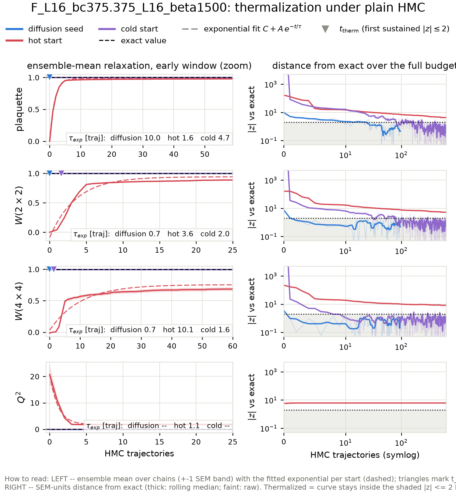

tau_int (hot-start chains, second half): plaquette = 8.63 +- 1.61, wilson_2x2 = 4.97 +- 1.43, wilson_4x4 = 4.36 +- 1.37, wilson_6x6 = 4.73 +- 1.37. Topology: hot-start HMC L=16 beta=1500 -> **frozen** (no tunneling).

Where 'never' stood at the end: the hot start ended the 640-trajectory budget still at Q^2 at |z| ~ 6; the cold start ended the 640-trajectory budget still at Q^2 at |z| ~ 15953106.

### Diagnostics: raw diffusion output (before any HMC)

| observable | value | error | exact | z_exact | reference | ref_error | z_ref | ks_p | chi2_p |
|---|---|---|---|---|---|---|---|---|---|
| plaquette | 0.9996 | 3.762e-06 | 0.9997 | -9.96 | 0.9997 | 4.084e-06 | -6.036 | 2.952e-07 |  |
| wilson_1x1 | 0.9996 | 3.762e-06 | 0.9997 | -9.96 | 0.9997 | 4.084e-06 | -6.036 | 2.952e-07 |  |
| wilson_1x2 | 0.9993 | 8.197e-06 | 0.9993 | -9.147 | 0.9993 | 6.854e-06 | -6.662 | 4.265e-07 |  |
| wilson_2x2 | 0.9985 | 2.181e-05 | 0.9987 | -6.833 | 0.9987 | 1.369e-05 | -4.694 | 8.497e-05 |  |
| wilson_2x3 | 0.9978 | 3.814e-05 | 0.998 | -5.497 | 0.998 | 1.843e-05 | -4.632 | 0.000114 |  |
| wilson_3x3 | 0.9968 | 7.581e-05 | 0.9971 | -3.619 | 0.9971 | 3.513e-05 | -2.59 | 0.01074 |  |
| wilson_3x4 | 0.9958 | 0.0001067 | 0.9962 | -3.561 | 0.9961 | 5.233e-05 | -2.731 | 0.01997 |  |
| wilson_4x4 | 0.9945 | 0.000154 | 0.995 | -3.246 | 0.9949 | 8.199e-05 | -2.382 | 0.02435 |  |
| wilson_4x5 | 0.9933 | 0.0002082 | 0.9939 | -2.676 | 0.9938 | 0.0001264 | -1.843 | 0.1867 |  |
| wilson_5x5 | 0.9919 | 0.0002739 | 0.9925 | -2.285 | 0.9924 | 0.000162 | -1.484 | 0.4056 |  |
| wilson_5x6 | 0.9905 | 0.0003504 | 0.9912 | -1.979 | 0.991 | 0.0002206 | -1.268 | 0.7231 |  |
| wilson_6x6 | 0.989 | 0.0004527 | 0.9897 | -1.57 | 0.9895 | 0.0002696 | -0.9235 | 0.6123 |  |
| wilson_6x7 | 0.9876 | 0.0005549 | 0.9884 | -1.436 | 0.9881 | 0.0003556 | -0.7817 | 0.8269 |  |
| wilson_7x7 | 0.9862 | 0.0006562 | 0.9869 | -1.085 | 0.9865 | 0.0004408 | -0.4456 | 0.9671 |  |
| wilson_7x8 | 0.9848 | 0.0007633 | 0.9855 | -0.92 | 0.9852 | 0.0005209 | -0.3811 | 0.8723 |  |
| wilson_8x8 | 0.9835 | 0.0008349 | 0.9841 | -0.7595 | 0.9837 | 0.0006118 | -0.1951 | 0.9115 |  |
| creutz_2 | 0.0003584 | 1.476e-05 | 0.0003217 | 2.486 |  |  |  |  |  |
| creutz_3 | 0.0003052 | 2.96e-05 | 0.0003009 | 0.1447 |  |  |  |  |  |
| creutz_4 | 0.0002846 | 4.861e-05 | 0.0002696 | 0.3082 |  |  |  |  |  |
| creutz_5 | 0.0002403 | 7.857e-05 | 0.0002279 | 0.1571 |  |  |  |  |  |
| creutz_6 | 0.000125 | 9.862e-05 | 0.0001758 | -0.5158 |  |  |  |  |  |
| creutz_7 | -6.051e-05 | 0.000111 | 0.0001133 | -1.565 |  |  |  |  |  |
| creutz_8 | -1.938e-05 | 0.0001464 | 4.038e-05 | -0.4082 |  |  |  |  |  |
| Q | 0 | 0 | 0 | 0 | 0 | 0 | 0 | 1 |  |
| Q^2 | 0 | 0 | 1.595e-05 | inf | 0 | 0 | 0 | 1 |  |
| chi_top ((<Q^2>-<Q>^2)/V) | 0 | 0 | 6.232e-08 | inf | 0 | 0 | 0 |  |  |
| Q histogram vs exact P(Q) | 0.0001391 | nan | 2 | nan |  |  |  |  | 0.9999 |

### Diagnostics: the same configs after 96 HMC trajectories

| observable | value | error | exact | z_exact | reference | ref_error | z_ref | ks_p | chi2_p |
|---|---|---|---|---|---|---|---|---|---|
| plaquette | 0.9997 | 4.048e-06 | 0.9997 | 0.4459 | 0.9997 | 4.084e-06 | 1.002 | 0.3607 |  |
| wilson_1x1 | 0.9997 | 4.048e-06 | 0.9997 | 0.4459 | 0.9997 | 4.084e-06 | 1.002 | 0.3607 |  |
| wilson_1x2 | 0.9993 | 9.267e-06 | 0.9993 | 0.06256 | 0.9993 | 6.854e-06 | 0.3794 | 0.9115 |  |
| wilson_2x2 | 0.9987 | 1.871e-05 | 0.9987 | 0.566 | 0.9987 | 1.369e-05 | 1.672 | 0.3607 |  |
| wilson_2x3 | 0.9981 | 2.875e-05 | 0.998 | 0.08122 | 0.998 | 1.843e-05 | 0.4622 | 0.6679 |  |
| wilson_3x3 | 0.9972 | 4.784e-05 | 0.9971 | 1.192 | 0.9971 | 3.513e-05 | 1.937 | 0.1389 |  |
| wilson_3x4 | 0.9963 | 7.514e-05 | 0.9962 | 0.858 | 0.9961 | 5.233e-05 | 1.309 | 0.215 |  |
| wilson_4x4 | 0.9952 | 0.000121 | 0.995 | 1.171 | 0.9949 | 8.199e-05 | 1.547 | 0.3607 |  |
| wilson_4x5 | 0.9941 | 0.0001846 | 0.9939 | 1.146 | 0.9938 | 0.0001264 | 1.429 | 0.3192 |  |
| wilson_5x5 | 0.9928 | 0.000256 | 0.9925 | 1.168 | 0.9924 | 0.000162 | 1.495 | 0.1389 |  |
| wilson_5x6 | 0.9915 | 0.0003441 | 0.9912 | 0.9749 | 0.991 | 0.0002206 | 1.233 | 0.1867 |  |
| wilson_6x6 | 0.9901 | 0.0004482 | 0.9897 | 0.7509 | 0.9895 | 0.0002696 | 1.072 | 0.3607 |  |
| wilson_6x7 | 0.9887 | 0.0005565 | 0.9884 | 0.6855 | 0.9881 | 0.0003556 | 1.004 | 0.2811 |  |
| wilson_7x7 | 0.9872 | 0.0006698 | 0.9869 | 0.5307 | 0.9865 | 0.0004408 | 0.8916 | 0.3192 |  |
| wilson_7x8 | 0.9859 | 0.0007597 | 0.9855 | 0.5542 | 0.9852 | 0.0005209 | 0.8372 | 0.3607 |  |
| wilson_8x8 | 0.9845 | 0.0008467 | 0.9841 | 0.4111 | 0.9837 | 0.0006118 | 0.7469 | 0.1867 |  |
| creutz_2 | 0.0003105 | 1.267e-05 | 0.0003217 | -0.8879 |  |  |  |  |  |
| creutz_3 | 0.0002378 | 2.585e-05 | 0.0003009 | -2.441 |  |  |  |  |  |
| creutz_4 | 0.0001994 | 4.457e-05 | 0.0002696 | -1.574 |  |  |  |  |  |
| creutz_5 | 0.0002096 | 6.824e-05 | 0.0002279 | -0.2685 |  |  |  |  |  |
| creutz_6 | 0.0002112 | 0.0001034 | 0.0001758 | 0.3417 |  |  |  |  |  |
| creutz_7 | 0.000185 | 0.000154 | 0.0001133 | 0.4657 |  |  |  |  |  |
| creutz_8 | 0.0001808 | 0.0002008 | 4.038e-05 | 0.6995 |  |  |  |  |  |
| Q | 0 | 0 | 0 | 0 | 0 | 0 | 0 | 1 |  |
| Q^2 | 0 | 0 | 1.595e-05 | inf | 0 | 0 | 0 | 1 |  |
| chi_top ((<Q^2>-<Q>^2)/V) | 0 | 0 | 6.232e-08 | inf | 0 | 0 | 0 |  |  |
| Q histogram vs exact P(Q) | 0.0001391 | nan | 2 | nan |  |  |  |  | 0.9999 |

## F_L16_bc437.875_L16_beta1750

HMC: step size 0.0096, 105 leapfrog steps, acceptance seed/hot/cold = 0.982/0.368/0.983. Diffusion-seed batch: 64 chains x 96 trajectories (0.22 s/traj for the whole batch); baselines: 64 chains x 640 trajectories.

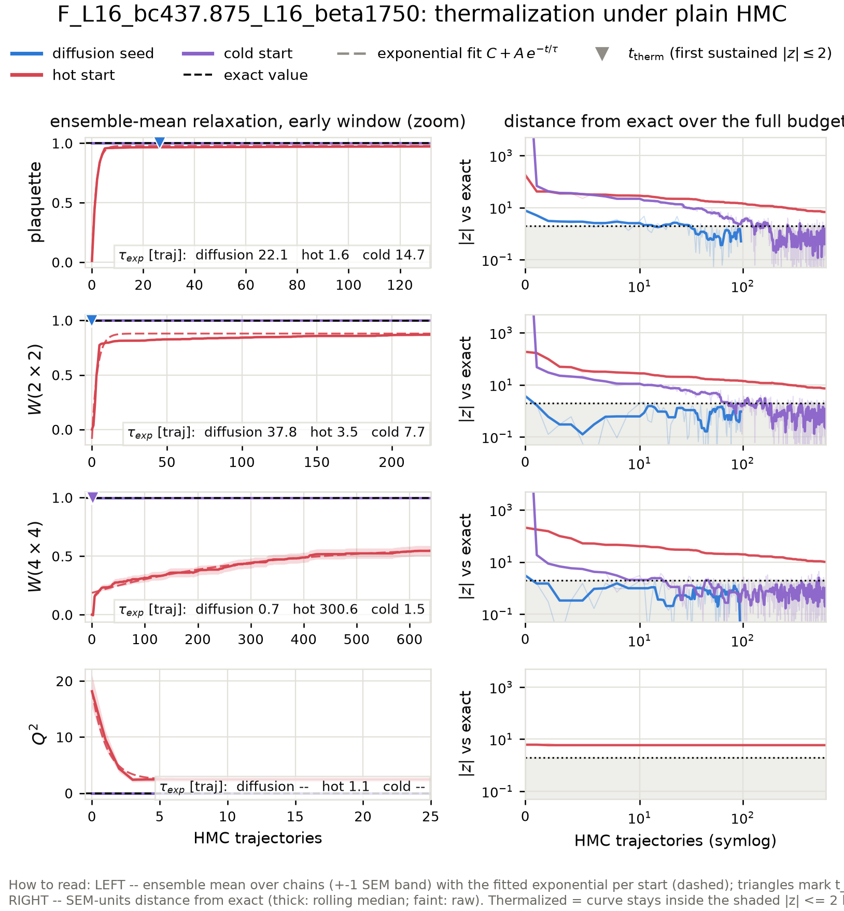

tau_int (hot-start chains, second half): plaquette = 13.07 +- 2.01, wilson_2x2 = 11.33 +- 1.96, wilson_4x4 = 7.80 +- 1.86, wilson_6x6 = 8.52 +- 1.88. Topology: hot-start HMC L=16 beta=1750 -> **frozen** (no tunneling).

Where 'never' stood at the end: the hot start ended the 640-trajectory budget still at Q^2 at |z| ~ 6; the cold start ended the 640-trajectory budget still at Q^2 at |z| ~ 55082440.

### Diagnostics: raw diffusion output (before any HMC)

| observable | value | error | exact | z_exact | reference | ref_error | z_ref | ks_p | chi2_p |
|---|---|---|---|---|---|---|---|---|---|
| plaquette | 0.9997 | 4.386e-06 | 0.9997 | -6.909 | 0.9997 | 2.694e-06 | -5.424 | 4.96e-06 |  |
| wilson_1x1 | 0.9997 | 4.386e-06 | 0.9997 | -6.909 | 0.9997 | 2.694e-06 | -5.424 | 4.96e-06 |  |
| wilson_1x2 | 0.9994 | 9.261e-06 | 0.9994 | -4.788 | 0.9994 | 7.304e-06 | -3.176 | 0.01631 |  |
| wilson_2x2 | 0.9988 | 1.823e-05 | 0.9989 | -3.926 | 0.9989 | 1.423e-05 | -3.257 | 0.03572 |  |
| wilson_2x3 | 0.9982 | 3.159e-05 | 0.9983 | -3.72 | 0.9983 | 2.238e-05 | -3.238 | 0.06142 |  |
| wilson_3x3 | 0.9974 | 5.234e-05 | 0.9975 | -2.631 | 0.9976 | 4.266e-05 | -3.056 | 0.03572 |  |
| wilson_3x4 | 0.9965 | 7.717e-05 | 0.9967 | -3.405 | 0.9968 | 6.116e-05 | -3.626 | 0.004418 |  |
| wilson_4x4 | 0.9953 | 0.0001167 | 0.9957 | -3.416 | 0.9959 | 8.938e-05 | -3.981 | 0.002761 |  |
| wilson_4x5 | 0.9942 | 0.0001655 | 0.9947 | -3.296 | 0.995 | 0.0001156 | -3.872 | 0.0002682 |  |
| wilson_5x5 | 0.9929 | 0.0002148 | 0.9936 | -3.122 | 0.9939 | 0.0001532 | -3.959 | 0.008658 |  |
| wilson_5x6 | 0.9916 | 0.0002748 | 0.9925 | -3.018 | 0.9929 | 0.000205 | -3.629 | 0.005553 |  |
| wilson_6x6 | 0.9902 | 0.0003381 | 0.9912 | -2.971 | 0.9917 | 0.000252 | -3.587 | 0.01997 |  |
| wilson_6x7 | 0.9887 | 0.000416 | 0.99 | -3.058 | 0.9905 | 0.0003196 | -3.322 | 0.01326 |  |
| wilson_7x7 | 0.9871 | 0.0004789 | 0.9887 | -3.366 | 0.9894 | 0.0003557 | -3.75 | 0.01997 |  |
| wilson_7x8 | 0.9856 | 0.0005442 | 0.9876 | -3.599 | 0.9882 | 0.0004214 | -3.689 | 0.004418 |  |
| wilson_8x8 | 0.9842 | 0.0005956 | 0.9864 | -3.638 | 0.9872 | 0.0004575 | -4.003 | 0.001695 |  |
| creutz_2 | 0.000289 | 1.139e-05 | 0.0002757 | 1.162 |  |  |  |  |  |
| creutz_3 | 0.0002321 | 2.256e-05 | 0.0002579 | -1.142 |  |  |  |  |  |
| creutz_4 | 0.0002422 | 3.48e-05 | 0.0002311 | 0.3188 |  |  |  |  |  |
| creutz_5 | 0.0001737 | 6.726e-05 | 0.0001954 | -0.3222 |  |  |  |  |  |
| creutz_6 | 0.0001681 | 7.412e-05 | 0.0001507 | 0.2345 |  |  |  |  |  |
| creutz_7 | 0.000171 | 0.0001092 | 9.713e-05 | 0.6765 |  |  |  |  |  |
| creutz_8 | -0.0001053 | 0.0001784 | 3.461e-05 | -0.7838 |  |  |  |  |  |
| Q | 0 | 0 | 0 | 0 | 0 | 0 | 0 | 1 |  |
| Q^2 | 0 | 0 | 5.508e-05 | inf | 0 | 0 | 0 | 1 |  |
| chi_top ((<Q^2>-<Q>^2)/V) | 0 | 0 | 2.152e-07 | inf | 0 | 0 | 0 |  |  |
| Q histogram vs exact P(Q) | 0.0004939 | nan | 2 | nan |  |  |  |  | 0.9998 |

### Diagnostics: the same configs after 96 HMC trajectories

| observable | value | error | exact | z_exact | reference | ref_error | z_ref | ks_p | chi2_p |
|---|---|---|---|---|---|---|---|---|---|
| plaquette | 0.9997 | 2.589e-06 | 0.9997 | -0.5379 | 0.9997 | 2.694e-06 | 0.264 | 0.8269 |  |
| wilson_1x1 | 0.9997 | 2.589e-06 | 0.9997 | -0.5379 | 0.9997 | 2.694e-06 | 0.264 | 0.8269 |  |
| wilson_1x2 | 0.9994 | 6.3e-06 | 0.9994 | 0.3462 | 0.9994 | 7.304e-06 | 0.9399 | 0.5575 |  |
| wilson_2x2 | 0.9989 | 1.686e-05 | 0.9989 | 1.021 | 0.9989 | 1.423e-05 | 0.6096 | 0.9433 |  |
| wilson_2x3 | 0.9983 | 2.697e-05 | 0.9983 | 0.355 | 0.9983 | 2.238e-05 | 0.04996 | 0.9833 |  |
| wilson_3x3 | 0.9975 | 5.194e-05 | 0.9975 | 0.3546 | 0.9976 | 4.266e-05 | -0.7479 | 0.4056 |  |
| wilson_3x4 | 0.9967 | 7.335e-05 | 0.9967 | 0.1559 | 0.9968 | 6.116e-05 | -0.8668 | 0.3192 |  |
| wilson_4x4 | 0.9957 | 0.0001122 | 0.9957 | -0.01596 | 0.9959 | 8.938e-05 | -1.312 | 0.3607 |  |
| wilson_4x5 | 0.9948 | 0.0001515 | 0.9947 | 0.1166 | 0.995 | 0.0001156 | -1.146 | 0.4535 |  |
| wilson_5x5 | 0.9936 | 0.0002194 | 0.9936 | 0.2485 | 0.9939 | 0.0001532 | -1.193 | 0.7766 |  |
| wilson_5x6 | 0.9925 | 0.0002831 | 0.9925 | 0.1618 | 0.9929 | 0.000205 | -1.056 | 0.6679 |  |
| wilson_6x6 | 0.9912 | 0.0003474 | 0.9912 | 0.1211 | 0.9917 | 0.000252 | -1.087 | 0.8269 |  |
| wilson_6x7 | 0.9901 | 0.0004205 | 0.99 | 0.1087 | 0.9905 | 0.0003196 | -0.8041 | 0.6123 |  |
| wilson_7x7 | 0.9889 | 0.0005057 | 0.9887 | 0.2268 | 0.9894 | 0.0003557 | -0.8253 | 0.7231 |  |
| wilson_7x8 | 0.9878 | 0.0005829 | 0.9876 | 0.3627 | 0.9882 | 0.0004214 | -0.5132 | 0.8269 |  |
| wilson_8x8 | 0.9866 | 0.0006663 | 0.9864 | 0.3653 | 0.9872 | 0.0004575 | -0.738 | 0.8723 |  |
| creutz_2 | 0.0002643 | 1.157e-05 | 0.0002757 | -0.9911 |  |  |  |  |  |
| creutz_3 | 0.0002414 | 2.312e-05 | 0.0002579 | -0.7139 |  |  |  |  |  |
| creutz_4 | 0.0002374 | 3.44e-05 | 0.0002311 | 0.1826 |  |  |  |  |  |
| creutz_5 | 0.0001778 | 5.697e-05 | 0.0001954 | -0.3082 |  |  |  |  |  |
| creutz_6 | 0.0001457 | 8.637e-05 | 0.0001507 | -0.05804 |  |  |  |  |  |
| creutz_7 | 3.1e-05 | 0.0001084 | 9.713e-05 | -0.6098 |  |  |  |  |  |
| creutz_8 | 9.998e-05 | 0.0001315 | 3.461e-05 | 0.497 |  |  |  |  |  |
| Q | 0 | 0 | 0 | 0 | 0 | 0 | 0 | 1 |  |
| Q^2 | 0 | 0 | 5.508e-05 | inf | 0 | 0 | 0 | 1 |  |
| chi_top ((<Q^2>-<Q>^2)/V) | 0 | 0 | 2.152e-07 | inf | 0 | 0 | 0 |  |  |
| Q histogram vs exact P(Q) | 0.0004939 | nan | 2 | nan |  |  |  |  | 0.9998 |

## F_L16_bc500.375_L16_beta2000

HMC: step size 0.0089, 112 leapfrog steps, acceptance seed/hot/cold = 0.988/0.097/0.987. Diffusion-seed batch: 64 chains x 96 trajectories (0.42 s/traj for the whole batch); baselines: 64 chains x 640 trajectories.

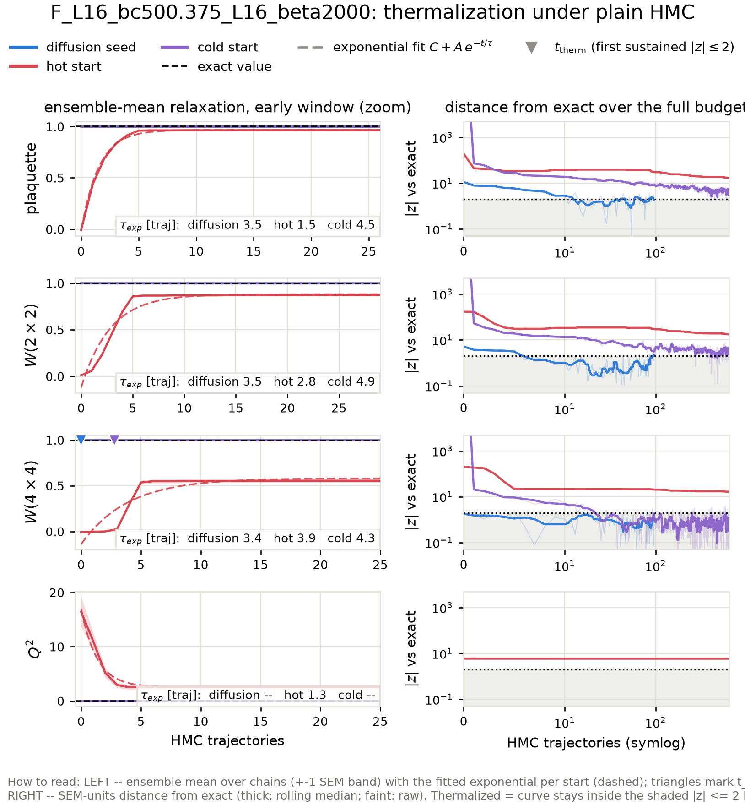

tau_int (hot-start chains, second half): plaquette = 6.71 +- 1.89, wilson_2x2 = 5.51 +- 1.59, wilson_4x4 = 2.12 +- 0.82, wilson_6x6 = 2.16 +- 0.84. Topology: hot-start HMC L=16 beta=2000 -> **frozen** (no tunneling).

Where 'never' stood at the end: the hot start ended the 640-trajectory budget still at Q^2 at |z| ~ 6; the cold start ended the 640-trajectory budget still at Q^2 at |z| ~ 137575904.

### Diagnostics: raw diffusion output (before any HMC)

| observable | value | error | exact | z_exact | reference | ref_error | z_ref | ks_p | chi2_p |
|---|---|---|---|---|---|---|---|---|---|
| plaquette | 0.9997 | 3.675e-06 | 0.9998 | -11.22 | 0.9998 | 2.774e-06 | -10.34 | 3.375e-15 |  |
| wilson_1x1 | 0.9997 | 3.675e-06 | 0.9998 | -11.22 | 0.9998 | 2.774e-06 | -10.34 | 3.375e-15 |  |
| wilson_1x2 | 0.9994 | 9.143e-06 | 0.9995 | -6.764 | 0.9995 | 6.327e-06 | -6.886 | 4.394e-08 |  |
| wilson_2x2 | 0.9989 | 2.265e-05 | 0.999 | -4.938 | 0.9991 | 1.203e-05 | -5.982 | 9.613e-06 |  |
| wilson_2x3 | 0.9984 | 3.588e-05 | 0.9985 | -3.984 | 0.9986 | 2.374e-05 | -4.48 | 0.0001523 |  |
| wilson_3x3 | 0.9977 | 6.155e-05 | 0.9978 | -2.679 | 0.9979 | 3.992e-05 | -2.972 | 0.002761 |  |
| wilson_3x4 | 0.9969 | 8.698e-05 | 0.9971 | -2.521 | 0.9972 | 5.907e-05 | -2.733 | 0.005553 |  |
| wilson_4x4 | 0.996 | 0.0001195 | 0.9963 | -2.011 | 0.9963 | 8.615e-05 | -1.875 | 0.05149 |  |
| wilson_4x5 | 0.9951 | 0.000151 | 0.9954 | -1.778 | 0.9955 | 0.0001208 | -1.979 | 0.1389 |  |
| wilson_5x5 | 0.9942 | 0.0001959 | 0.9944 | -1.019 | 0.9945 | 0.0001586 | -1.434 | 0.5044 |  |
| wilson_5x6 | 0.9932 | 0.0002502 | 0.9934 | -0.798 | 0.9937 | 0.0002279 | -1.526 | 0.3607 |  |
| wilson_6x6 | 0.9922 | 0.0003002 | 0.9923 | -0.4279 | 0.9927 | 0.0002657 | -1.252 | 0.9671 |  |
| wilson_6x7 | 0.9912 | 0.0003648 | 0.9913 | -0.2967 | 0.9918 | 0.0003529 | -1.182 | 0.8269 |  |
| wilson_7x7 | 0.99 | 0.0004265 | 0.9901 | -0.2318 | 0.9905 | 0.0004017 | -0.8406 | 0.8723 |  |
| wilson_7x8 | 0.989 | 0.000485 | 0.9891 | -0.1797 | 0.9896 | 0.0004898 | -0.7911 | 0.9115 |  |
| wilson_8x8 | 0.988 | 0.0005645 | 0.9881 | -0.1697 | 0.9885 | 0.0005296 | -0.6826 | 0.8269 |  |
| creutz_2 | 0.0002707 | 1.181e-05 | 0.0002413 | 2.492 |  |  |  |  |  |
| creutz_3 | 0.0002166 | 2.277e-05 | 0.0002256 | -0.3979 |  |  |  |  |  |
| creutz_4 | 0.0001689 | 3.702e-05 | 0.0002022 | -0.9005 |  |  |  |  |  |
| creutz_5 | 7.338e-05 | 5.568e-05 | 0.0001709 | -1.752 |  |  |  |  |  |
| creutz_6 | 6.01e-05 | 7.951e-05 | 0.0001319 | -0.9027 |  |  |  |  |  |
| creutz_7 | 9.593e-05 | 0.0001091 | 8.498e-05 | 0.1003 |  |  |  |  |  |
| creutz_8 | 5.088e-05 | 0.0001417 | 3.028e-05 | 0.1453 |  |  |  |  |  |
| Q | 0 | 0 | 0 | 0 | 0 | 0 | 0 | 1 |  |
| Q^2 | 0 | 0 | 0.0001376 | inf | 0 | 0 | 0 | 1 |  |
| chi_top ((<Q^2>-<Q>^2)/V) | 0 | 0 | 5.374e-07 | inf | 0 | 0 | 0 |  |  |
| Q histogram vs exact P(Q) | 0.001256 | nan | 2 | nan |  |  |  |  | 0.9994 |

### Diagnostics: the same configs after 96 HMC trajectories

| observable | value | error | exact | z_exact | reference | ref_error | z_ref | ks_p | chi2_p |
|---|---|---|---|---|---|---|---|---|---|
| plaquette | 0.9997 | 2.893e-06 | 0.9998 | -2.13 | 0.9998 | 2.774e-06 | -3.138 | 0.02956 |  |
| wilson_1x1 | 0.9997 | 2.893e-06 | 0.9998 | -2.13 | 0.9998 | 2.774e-06 | -3.138 | 0.02956 |  |
| wilson_1x2 | 0.9995 | 7.683e-06 | 0.9995 | -1.56 | 0.9995 | 6.327e-06 | -2.682 | 0.01326 |  |
| wilson_2x2 | 0.999 | 2.068e-05 | 0.999 | -1.821 | 0.9991 | 1.203e-05 | -3.312 | 0.0006067 |  |
| wilson_2x3 | 0.9985 | 3.961e-05 | 0.9985 | -1.737 | 0.9986 | 2.374e-05 | -2.568 | 0.02956 |  |
| wilson_3x3 | 0.9977 | 7.619e-05 | 0.9978 | -1.16 | 0.9979 | 3.992e-05 | -1.645 | 0.1015 |  |
| wilson_3x4 | 0.997 | 0.0001099 | 0.9971 | -1.173 | 0.9972 | 5.907e-05 | -1.579 | 0.07294 |  |
| wilson_4x4 | 0.9961 | 0.0001623 | 0.9963 | -1.143 | 0.9963 | 8.615e-05 | -1.205 | 0.4535 |  |
| wilson_4x5 | 0.9951 | 0.0002209 | 0.9954 | -1.182 | 0.9955 | 0.0001208 | -1.491 | 0.1389 |  |
| wilson_5x5 | 0.994 | 0.000299 | 0.9944 | -1.181 | 0.9945 | 0.0001586 | -1.521 | 0.3607 |  |
| wilson_5x6 | 0.993 | 0.0003676 | 0.9934 | -1.092 | 0.9937 | 0.0002279 | -1.661 | 0.1614 |  |
| wilson_6x6 | 0.9918 | 0.0004645 | 0.9923 | -1.084 | 0.9927 | 0.0002657 | -1.639 | 0.3607 |  |
| wilson_6x7 | 0.9908 | 0.0005554 | 0.9913 | -0.8681 | 0.9918 | 0.0003529 | -1.48 | 0.1867 |  |
| wilson_7x7 | 0.9895 | 0.0006667 | 0.9901 | -0.9701 | 0.9905 | 0.0004017 | -1.337 | 0.4535 |  |
| wilson_7x8 | 0.9885 | 0.0007764 | 0.9891 | -0.7753 | 0.9896 | 0.0004898 | -1.155 | 0.6679 |  |
| wilson_8x8 | 0.9873 | 0.0008867 | 0.9881 | -0.8345 | 0.9885 | 0.0005296 | -1.135 | 0.6679 |  |
| creutz_2 | 0.0002612 | 9.926e-06 | 0.0002413 | 2.003 |  |  |  |  |  |
| creutz_3 | 0.0002141 | 2.166e-05 | 0.0002256 | -0.5314 |  |  |  |  |  |
| creutz_4 | 0.0002183 | 3.271e-05 | 0.0002022 | 0.4933 |  |  |  |  |  |
| creutz_5 | 0.0001875 | 4.828e-05 | 0.0001709 | 0.3436 |  |  |  |  |  |
| creutz_6 | 0.0001863 | 6.237e-05 | 0.0001319 | 0.8721 |  |  |  |  |  |
| creutz_7 | 0.0002728 | 8.015e-05 | 8.498e-05 | 2.343 |  |  |  |  |  |
| creutz_8 | 0.0002154 | 0.0001182 | 3.028e-05 | 1.566 |  |  |  |  |  |
| Q | 0 | 0 | 0 | 0 | 0 | 0 | 0 | 1 |  |
| Q^2 | 0 | 0 | 0.0001376 | inf | 0 | 0 | 0 | 1 |  |
| chi_top ((<Q^2>-<Q>^2)/V) | 0 | 0 | 5.374e-07 | inf | 0 | 0 | 0 |  |  |
| Q histogram vs exact P(Q) | 0.001256 | nan | 2 | nan |  |  |  |  | 0.9994 |

## F_L16_bc650.375_L16_beta2600

HMC: step size 0.0078, 127 leapfrog steps, acceptance seed/hot/cold = 0.974/0.013/0.977. Diffusion-seed batch: 64 chains x 96 trajectories (0.27 s/traj for the whole batch); baselines: 64 chains x 640 trajectories.

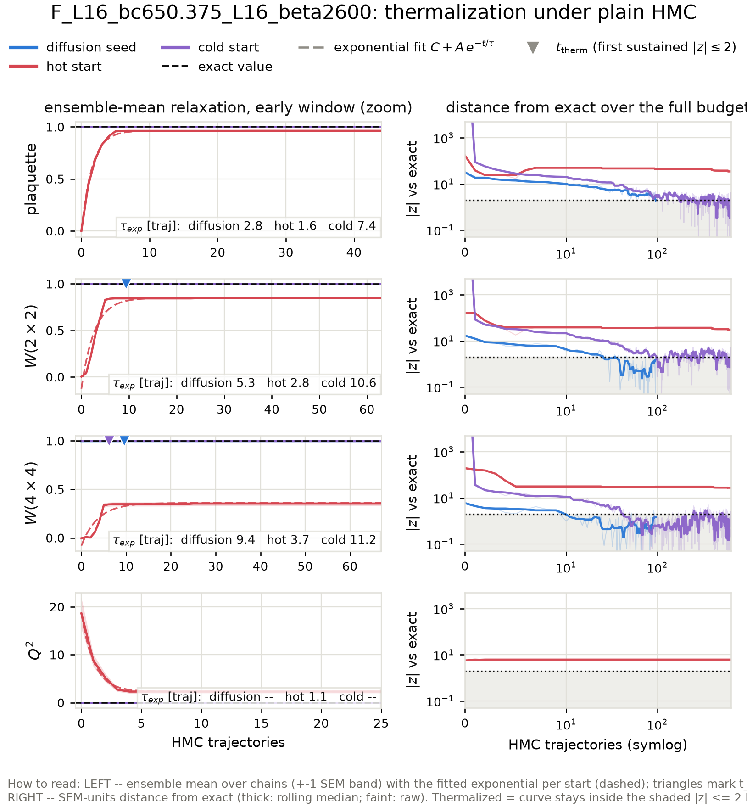

tau_int (hot-start chains, second half): plaquette = 1.52 +- 0.75, wilson_2x2 = 1.52 +- 0.75, wilson_4x4 = 1.52 +- 0.75, wilson_6x6 = 1.55 +- 0.77. Topology: hot-start HMC L=16 beta=2600 -> **frozen** (no tunneling).

Where 'never' stood at the end: the hot start ended the 640-trajectory budget still at plaquette at |z| ~ 35, wilson_2x2 at |z| ~ 31, wilson_6x6 at |z| ~ 37, Q^2 at |z| ~ 6; the cold start ended the 640-trajectory budget still at Q^2 at |z| ~ 585385792.

### Diagnostics: raw diffusion output (before any HMC)

| observable | value | error | exact | z_exact | reference | ref_error | z_ref | ks_p | chi2_p |
|---|---|---|---|---|---|---|---|---|---|
| plaquette | 0.9997 | 3.99e-06 | 0.9998 | -31.85 | 0.9998 | 1.462e-06 | -29.85 | 2.804e-35 |  |
| wilson_1x1 | 0.9997 | 3.99e-06 | 0.9998 | -31.85 | 0.9998 | 1.462e-06 | -29.85 | 2.804e-35 |  |
| wilson_1x2 | 0.9994 | 9.49e-06 | 0.9996 | -21.65 | 0.9996 | 4.419e-06 | -20.03 | 9.635e-32 |  |
| wilson_2x2 | 0.999 | 1.723e-05 | 0.9992 | -17 | 0.9992 | 1.045e-05 | -14.88 | 7.563e-23 |  |
| wilson_2x3 | 0.9985 | 3.389e-05 | 0.9989 | -10.92 | 0.9989 | 1.769e-05 | -9.835 | 3.375e-15 |  |
| wilson_3x3 | 0.9979 | 4.561e-05 | 0.9983 | -8.886 | 0.9983 | 3.181e-05 | -7.11 | 2.515e-06 |  |
| wilson_3x4 | 0.9973 | 7.184e-05 | 0.9978 | -7.006 | 0.9978 | 4.959e-05 | -5.237 | 0.0002025 |  |
| wilson_4x4 | 0.9965 | 9.461e-05 | 0.9971 | -6.048 | 0.997 | 7.805e-05 | -3.93 | 0.004418 |  |
| wilson_4x5 | 0.9958 | 0.0001248 | 0.9965 | -5.241 | 0.9963 | 0.0001059 | -3.16 | 0.01997 |  |
| wilson_5x5 | 0.995 | 0.0001387 | 0.9957 | -4.96 | 0.9954 | 0.0001441 | -2.334 | 0.02435 |  |
| wilson_5x6 | 0.9941 | 0.0001824 | 0.9949 | -4.313 | 0.9947 | 0.0001789 | -2.032 | 0.1867 |  |
| wilson_6x6 | 0.9933 | 0.0002022 | 0.9941 | -3.751 | 0.9938 | 0.0002278 | -1.458 | 0.1614 |  |
| wilson_6x7 | 0.9925 | 0.0002622 | 0.9933 | -3.013 | 0.9929 | 0.0002788 | -1.209 | 0.08625 |  |
| wilson_7x7 | 0.9917 | 0.000307 | 0.9924 | -2.292 | 0.992 | 0.0003381 | -0.7497 | 0.119 |  |
| wilson_7x8 | 0.991 | 0.0003746 | 0.9916 | -1.687 | 0.9911 | 0.0003907 | -0.2416 | 0.8723 |  |
| wilson_8x8 | 0.9904 | 0.0004003 | 0.9908 | -1.015 | 0.9903 | 0.0004397 | 0.2175 | 0.9115 |  |
| creutz_2 | 0.0001947 | 1.085e-05 | 0.0001856 | 0.8449 |  |  |  |  |  |
| creutz_3 | 0.0001317 | 1.925e-05 | 0.0001736 | -2.175 |  |  |  |  |  |
| creutz_4 | 0.0001266 | 2.743e-05 | 0.0001555 | -1.055 |  |  |  |  |  |
| creutz_5 | 8.358e-05 | 4.506e-05 | 0.0001315 | -1.063 |  |  |  |  |  |
| creutz_6 | -2.604e-05 | 6.08e-05 | 0.0001014 | -2.096 |  |  |  |  |  |
| creutz_7 | -5.376e-05 | 9.532e-05 | 6.537e-05 | -1.25 |  |  |  |  |  |
| creutz_8 | -0.0001324 | 0.0001114 | 2.329e-05 | -1.397 |  |  |  |  |  |
| Q | 0 | 0 | 0 | 0 | 0 | 0 | 0 | 1 |  |
| Q^2 | 0 | 0 | 0.0005854 | inf | 0 | 0 | 0 | 1 |  |
| chi_top ((<Q^2>-<Q>^2)/V) | 0 | 0 | 2.287e-06 | inf | 0 | 0 | 0 |  |  |
| Q histogram vs exact P(Q) | 0.005475 | nan | 2 | nan |  |  |  |  | 0.9973 |

### Diagnostics: the same configs after 96 HMC trajectories

| observable | value | error | exact | z_exact | reference | ref_error | z_ref | ks_p | chi2_p |
|---|---|---|---|---|---|---|---|---|---|
| plaquette | 0.9998 | 2.591e-06 | 0.9998 | -1.39 | 0.9998 | 1.462e-06 | -1.135 | 0.04298 |  |
| wilson_1x1 | 0.9998 | 2.591e-06 | 0.9998 | -1.39 | 0.9998 | 1.462e-06 | -1.135 | 0.04298 |  |
| wilson_1x2 | 0.9996 | 4.541e-06 | 0.9996 | -1.1 | 0.9996 | 4.419e-06 | -1.462 | 0.05149 |  |
| wilson_2x2 | 0.9992 | 1.462e-05 | 0.9992 | -1.26 | 0.9992 | 1.045e-05 | -1.408 | 0.1614 |  |
| wilson_2x3 | 0.9988 | 2.615e-05 | 0.9989 | -1.269 | 0.9989 | 1.769e-05 | -1.238 | 0.4056 |  |
| wilson_3x3 | 0.9983 | 4.417e-05 | 0.9983 | -1.465 | 0.9983 | 3.181e-05 | -1.006 | 0.2464 |  |
| wilson_3x4 | 0.9977 | 6.702e-05 | 0.9978 | -1.354 | 0.9978 | 4.959e-05 | -0.5361 | 0.5044 |  |
| wilson_4x4 | 0.997 | 8.842e-05 | 0.9971 | -1.282 | 0.997 | 7.805e-05 | -0.1971 | 0.6123 |  |
| wilson_4x5 | 0.9963 | 0.0001185 | 0.9965 | -1.293 | 0.9963 | 0.0001059 | -0.102 | 0.5044 |  |
| wilson_5x5 | 0.9955 | 0.0001465 | 0.9957 | -1.17 | 0.9954 | 0.0001441 | 0.2429 | 0.4056 |  |
| wilson_5x6 | 0.9947 | 0.0001822 | 0.9949 | -0.9355 | 0.9947 | 0.0001789 | 0.3809 | 0.4056 |  |
| wilson_6x6 | 0.9939 | 0.0002079 | 0.9941 | -0.9353 | 0.9938 | 0.0002278 | 0.3886 | 0.215 |  |
| wilson_6x7 | 0.9931 | 0.0002432 | 0.9933 | -0.6469 | 0.9929 | 0.0002788 | 0.4594 | 0.2811 |  |
| wilson_7x7 | 0.9922 | 0.000295 | 0.9924 | -0.7156 | 0.992 | 0.0003381 | 0.3344 | 0.5575 |  |
| wilson_7x8 | 0.9914 | 0.0003393 | 0.9916 | -0.5817 | 0.9911 | 0.0003907 | 0.587 | 0.6123 |  |
| wilson_8x8 | 0.9905 | 0.0004114 | 0.9908 | -0.7942 | 0.9903 | 0.0004397 | 0.3471 | 0.8723 |  |
| creutz_2 | 0.0001976 | 7.407e-06 | 0.0001856 | 1.625 |  |  |  |  |  |
| creutz_3 | 0.0001904 | 1.271e-05 | 0.0001736 | 1.324 |  |  |  |  |  |
| creutz_4 | 0.0001521 | 2.771e-05 | 0.0001555 | -0.1221 |  |  |  |  |  |
| creutz_5 | 0.00011 | 4.403e-05 | 0.0001315 | -0.4883 |  |  |  |  |  |
| creutz_6 | 0.0001266 | 5.751e-05 | 0.0001014 | 0.4377 |  |  |  |  |  |
| creutz_7 | 0.0001569 | 7.635e-05 | 6.537e-05 | 1.199 |  |  |  |  |  |
| creutz_8 | 0.0001677 | 0.0001025 | 2.329e-05 | 1.409 |  |  |  |  |  |
| Q | 0 | 0 | 0 | 0 | 0 | 0 | 0 | 1 |  |
| Q^2 | 0 | 0 | 0.0005854 | inf | 0 | 0 | 0 | 1 |  |
| chi_top ((<Q^2>-<Q>^2)/V) | 0 | 0 | 2.287e-06 | inf | 0 | 0 | 0 |  |  |
| Q histogram vs exact P(Q) | 0.005475 | nan | 2 | nan |  |  |  |  | 0.9973 |
