# Diffusion-seeded HMC across the matched beta scan: thermalization time vs the standard-HMC sampling interval

Action: wilson. All HMC in this report is plain HMC (Omelyan, adapted step size, **no** topological updates).

**Why this scan.** At the ladder's upper rungs the fresh-HMC baselines never thermalize at all (topological freezing plus a metastable local-defect state), so the only comparison available there is 'diffusion seed vs a baseline that never arrives'. This report extends the benchmark to every matched coupling pair of the generalization study -- one inverse-RG step L=16 -> L=32 per case -- including fine couplings low enough that hot- and cold-start HMC *does* thermalize within the budget. There the standard chain's own interval `2 tau_int` and its fresh-start burn-in are honest, measurable yardsticks, and the scan shows where the ordering

> t_therm(diffusion seed)  <  2 tau_int(standard HMC)  <  burn-in(fresh chain)

sets in as beta grows and standard HMC slides into critical slowing down and topological freezing.

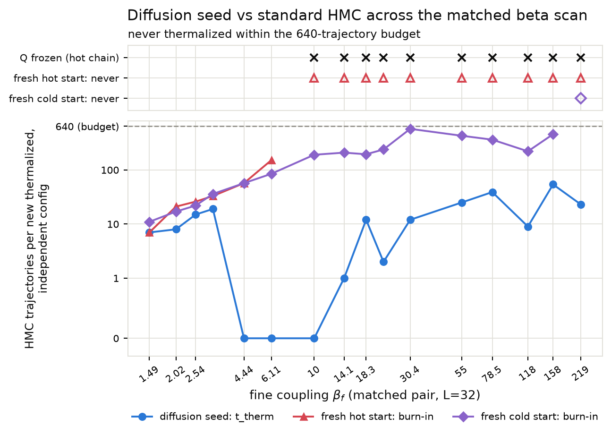

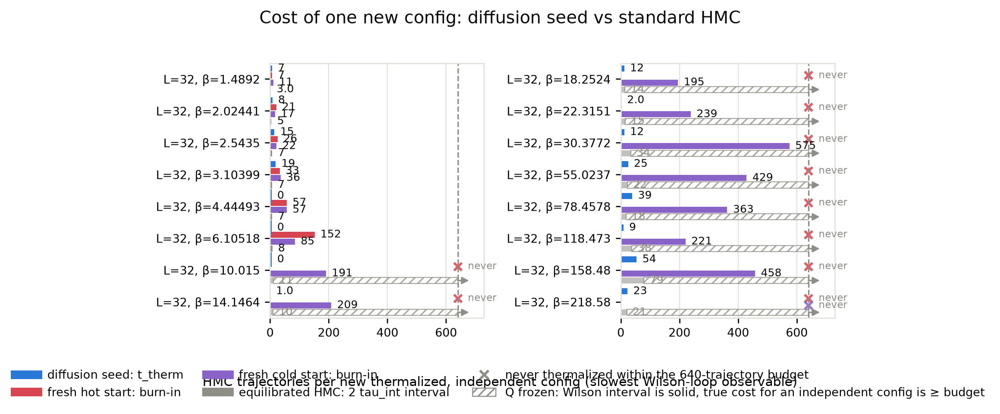

## The three starting points

- **Diffusion seed** -- the raw conditional-diffusion output for this coupling: one inverse-RG step from a direct-HMC base ensemble at the matched coarse coupling (ancestral sampling + the deterministic coarse-charge transport), with **no** rethermalization sweeps applied: every bit of equilibration the seed needs is measured here, in HMC trajectories.
- **Hot start** -- every link angle drawn uniformly from (-pi, pi]: a completely disordered (infinite-temperature) configuration. The standard way to initialize a fresh HMC chain without prior information.
- **Cold start** -- every link angle set to zero: the perfectly ordered (beta -> infinity) configuration, the other standard initialization.

## Summary

| rung | L | beta | t_therm diffusion seed | standard-HMC interval 2 tau_int | margin (interval - t_therm) | burn-in hot / cold | tau_int(Q) |
|---|---|---|---|---|---|---|---|
| A_bc0.25_L32_beta1.4892 | 32 | 1.4892 | 7 | 3.0 | -4.0 traj | 7 / 11 | 1.5 |
| A_bc0.5_L32_beta2.02441 | 32 | 2.02441 | 8 | 4.7 | -3.3 traj | 21 / 17 | 2.6 |
| A_bc0.75_L32_beta2.5435 | 32 | 2.5435 | 15 | 7.0 | -8.0 traj | 26 / 22 | 5.8 |
| A_bc1_L32_beta3.10399 | 32 | 3.10399 | 19 | 7.0 | -12.0 traj | 33 / 36 | 8.2 |
| A_bc1.5_L32_beta4.44493 | 32 | 4.44493 | 0 | 7.0 | 7.0 traj | 57 / 57 | 29.6 |
| A_bc2_L32_beta6.10518 | 32 | 6.10518 | 0 | 7.9 | 7.9 traj | 152 / 85 | 39.9 |
| A_bc3_L32_beta10.015 | 32 | 10.015 | 0 | 11.3 | 11.3 traj | never / 191 | frozen (0 tunnelings in 321 x 32 traj) |
| A_bc4_L32_beta14.1464 | 32 | 14.1464 | 1 | 10.3 | 9.3 traj | never / 209 | frozen (0 tunnelings in 321 x 32 traj) |
| A_bc5_L32_beta18.2524 | 32 | 18.2524 | 12 | 14.0 | 2.0 traj | never / 195 | frozen (0 tunnelings in 321 x 32 traj) |
| A_bc6_L32_beta22.3151 | 32 | 22.3151 | 2 | 15.2 | 13.2 traj | never / 239 | frozen (0 tunnelings in 321 x 32 traj) |
| A_bc8_L32_beta30.3772 | 32 | 30.3772 | 12 | 34.0 | 22.0 traj | never / 575 | frozen (0 tunnelings in 321 x 32 traj) |
| D_bc14.1464_L32_beta55.0237 | 32 | 55.0237 | 25 | 22.0 | -3.0 traj | never / 429 | frozen (0 tunnelings in 321 x 32 traj) |
| D_bc20_L32_beta78.4578 | 32 | 78.4578 | 39 | 17.6 | -21.4 traj | never / 363 | frozen (0 tunnelings in 321 x 32 traj) |
| D_bc30_L32_beta118.473 | 32 | 118.473 | 9 | 38.1 | 29.1 traj | never / 221 | frozen (0 tunnelings in 321 x 32 traj) |
| D_bc40_L32_beta158.48 | 32 | 158.48 | 54 | 79.0 | 25.0 traj | never / 458 | frozen (0 tunnelings in 321 x 32 traj) |
| D_bc55.0237_L32_beta218.58 | 32 | 218.58 | 23 | 21.0 | -2.0 traj | never / never | frozen (0 tunnelings in 321 x 32 traj) |

## Wall-clock accounting

All timescales above are in HMC trajectories -- the honest *ergodicity* unit. This table converts to seconds on this machine so the economics are explicit. Batched chains produce n_chains configs per trajectory, so per-config costs divide by the chain count; the diffusion sampling cost amortizes over the whole generated batch.

| case | seed: sample s/config | seed: t_therm s (batch) | HMC interval s/config | hot burn-in s (batch) | s/traj (batch) |
|---|---|---|---|---|---|
| A_bc0.25_L32_beta1.4892 | 0.4 | 0.5 | 0.01 | 0 | 0.07 |
| A_bc0.5_L32_beta2.02441 | 0.3 | 0.5 | 0.01 | 1 | 0.07 |
| A_bc0.75_L32_beta2.5435 | 0.3 | 1.0 | 0.01 | 2 | 0.07 |
| A_bc1_L32_beta3.10399 | 0.3 | 1.3 | 0.01 | 2 | 0.07 |
| A_bc1.5_L32_beta4.44493 | 0.3 | 0.0 | 0.01 | 4 | 0.07 |
| A_bc2_L32_beta6.10518 | 0.3 | 0.0 | 0.02 | 11 | 0.08 |
| A_bc3_L32_beta10.015 | 0.3 | 0.0 | 0.03 | never | 0.09 |
| A_bc4_L32_beta14.1464 | 0.3 | 0.1 | 0.03 | never | 0.10 |
| A_bc5_L32_beta18.2524 | 0.3 | 1.4 | 0.05 | never | 0.12 |
| A_bc6_L32_beta22.3151 | 0.3 | 0.3 | 0.06 | never | 0.12 |
| A_bc8_L32_beta30.3772 | 0.3 | 1.6 | 0.15 | never | 0.14 |
| D_bc14.1464_L32_beta55.0237 | 0.3 | 4.8 | 0.12 | never | 0.18 |
| D_bc20_L32_beta78.4578 | 0.3 | 8.1 | 0.11 | never | 0.21 |
| D_bc30_L32_beta118.473 | 0.3 | 2.2 | 0.29 | never | 0.25 |
| D_bc40_L32_beta158.48 | 0.3 | 15.2 | 0.69 | never | 0.28 |
| D_bc55.0237_L32_beta218.58 | 0.3 | 7.4 | 0.21 | never | 0.33 |

## Fitted relaxation times across starts

Exponential fits C + A exp(-t/tau) to the ensemble-mean plaquette and W(2x2) relaxation curves, per starting point (the cross-start comparison of characteristic times; a start already at its plateau fits no decay, which is the desired outcome for the diffusion seed).

| case | obs | tau: diffusion seed | tau: hot start | tau: cold start |
|---|---|---|---|---|
| A_bc0.25_L32_beta1.4892 | plaquette | 1.2 +- 0.0 | 1.1 +- 0.0 | 2.5 +- 0.0 |
| A_bc0.25_L32_beta1.4892 | wilson_2x2 | 0.5 +- 0.1 | 2.1 +- 0.1 | 1.5 +- 0.0 |
| A_bc0.5_L32_beta2.02441 | plaquette | 2.2 +- 0.1 | 1.7 +- 0.0 | 4.0 +- 0.0 |
| A_bc0.5_L32_beta2.02441 | wilson_2x2 | 0.3 +- 0.2 | 2.7 +- 0.1 | 1.7 +- 0.0 |
| A_bc0.75_L32_beta2.5435 | plaquette | 5.2 +- 0.2 | 2.3 +- 0.0 | 5.0 +- 0.1 |
| A_bc0.75_L32_beta2.5435 | wilson_2x2 | unconstrained fit (tau error exceeds tau) | 3.8 +- 0.1 | 1.9 +- 0.0 |
| A_bc1_L32_beta3.10399 | plaquette | 11.8 +- 0.6 | 2.7 +- 0.0 | 6.5 +- 0.1 |
| A_bc1_L32_beta3.10399 | wilson_2x2 | 24.9 +- 19.4 | 5.0 +- 0.1 | 2.8 +- 0.1 |
| A_bc1.5_L32_beta4.44493 | plaquette | 6.6 +- 5.6 | 2.8 +- 0.0 | 3.7 +- 0.1 |
| A_bc1.5_L32_beta4.44493 | wilson_2x2 | no measurable decay (starts at plateau; tau unconstrained) | 7.4 +- 0.1 | 4.4 +- 0.1 |
| A_bc2_L32_beta6.10518 | plaquette | unconstrained fit (tau error exceeds tau) | 2.2 +- 0.0 | 5.1 +- 0.2 |
| A_bc2_L32_beta6.10518 | wilson_2x2 | 34.8 +- 13.4 | 8.9 +- 0.2 | 3.5 +- 0.1 |
| A_bc3_L32_beta10.015 | plaquette | 18.8 +- 6.0 | 2.0 +- 0.0 | 13.3 +- 0.6 |
| A_bc3_L32_beta10.015 | wilson_2x2 | no measurable decay (starts at plateau; tau unconstrained) | 7.3 +- 0.2 | 5.8 +- 0.3 |
| A_bc4_L32_beta14.1464 | plaquette | 6.5 +- 1.2 | 2.0 +- 0.0 | 7.5 +- 0.3 |
| A_bc4_L32_beta14.1464 | wilson_2x2 | unreliable (tau exceeds window) | 7.9 +- 0.2 | 6.9 +- 0.3 |
| A_bc5_L32_beta18.2524 | plaquette | 2.3 +- 0.3 | 1.8 +- 0.0 | 5.7 +- 0.2 |
| A_bc5_L32_beta18.2524 | wilson_2x2 | 1.2 +- 0.7 | 6.1 +- 0.1 | 6.0 +- 0.3 |
| A_bc6_L32_beta22.3151 | plaquette | 8.2 +- 1.5 | 1.8 +- 0.0 | 13.9 +- 0.5 |
| A_bc6_L32_beta22.3151 | wilson_2x2 | unconstrained fit (tau error exceeds tau) | 5.6 +- 0.1 | 6.7 +- 0.3 |
| A_bc8_L32_beta30.3772 | plaquette | 4.0 +- 0.5 | 1.8 +- 0.0 | 8.0 +- 0.4 |
| A_bc8_L32_beta30.3772 | wilson_2x2 | 28.1 +- 13.4 | 5.4 +- 0.1 | 9.0 +- 0.5 |
| D_bc14.1464_L32_beta55.0237 | plaquette | 4.5 +- 0.4 | 1.7 +- 0.0 | 5.9 +- 0.2 |
| D_bc14.1464_L32_beta55.0237 | wilson_2x2 | 4.1 +- 1.1 | 4.8 +- 0.1 | 7.8 +- 0.3 |
| D_bc20_L32_beta78.4578 | plaquette | 2.8 +- 0.2 | 1.7 +- 0.0 | 4.2 +- 0.2 |
| D_bc20_L32_beta78.4578 | wilson_2x2 | 7.3 +- 0.9 | 4.3 +- 0.1 | 4.0 +- 0.2 |
| D_bc30_L32_beta118.473 | plaquette | 3.4 +- 0.3 | 1.6 +- 0.0 | 5.7 +- 0.2 |
| D_bc30_L32_beta118.473 | wilson_2x2 | 3.5 +- 0.9 | 3.9 +- 0.1 | 5.3 +- 0.2 |
| D_bc40_L32_beta158.48 | plaquette | 3.3 +- 0.3 | 1.7 +- 0.0 | 11.6 +- 0.5 |
| D_bc40_L32_beta158.48 | wilson_2x2 | 2.5 +- 0.6 | 3.9 +- 0.1 | 3.9 +- 0.2 |
| D_bc55.0237_L32_beta218.58 | plaquette | 2.3 +- 0.2 | 1.6 +- 0.0 | 5.5 +- 0.2 |
| D_bc55.0237_L32_beta218.58 | wilson_2x2 | unconstrained fit (tau error exceeds tau) | 4.1 +- 0.1 | 8.3 +- 0.3 |

t_therm and burn-in are the slowest Wilson-loop observable (plaquette, W(2x2), W(4x4)); topology is stricter still for the fresh chains: their Q^2 **never** reaches the exact value at the frozen rungs, while the diffusion seed inherits the correct topological sector from the coarse ensemble it was generated from (see the Q^2 panels and per-rung tables below).

Thermalization time `t_therm` = first trajectory at which the ensemble-mean z-score vs the exact value satisfies |z| <= 2 and stays there for 5 consecutive trajectories (t = 0: already thermalized before any HMC). For the diffusion seed, t_therm is computed on a random subsample of chains matched to the baseline chain count so all starts are compared at equal statistical power. `tau_int` is Madras-Sokal, measured on the second half of the hot-start chains, averaged over chains. In the per-rung relaxation figures, triangles mark each start's t_therm, dashed curves are the exponential fits C + A exp(-t/tau) to the ensemble means (tau quoted per panel), and the right-hand panels track the ensemble mean's distance from the exact value in SEM units -- thermalized means inside the shaded |z| <= 2 band; the dotted vertical line there is the standard-HMC interval `2 tau_int`.

## What 'never' means, and where the ground truth comes from

'never' = the ensemble mean was still outside |z| <= 2 of the exact value after the full baseline budget; the per-rung sections quote the z-score it plateaued at. For hot starts at the large-beta rungs this is not a budget problem but a physical one: a random start freezes into a random topological sector (<Q^2> of order tens), plain HMC can never change Q at these couplings (tunneling is suppressed ~exp(-2 beta)), and the wrong sector biases every Wilson loop by an amount that never decays. Cold starts sit in the single sector Q = 0, so their Wilson loops do eventually converge, but <Q^2> stays pinned at 0 forever.

None of the exact values in this report come from fine-lattice HMC: the ground truth is the character expansion of 2D compact U(1) (`diffusion/lgt/exact.py`), which gives every Wilson loop, P(Q) and chi_top in closed form at finite volume. Each diffusion seed here is one inverse-RG step from a direct-HMC base ensemble at the matched coarse coupling beta_c (L=16), where HMC mixes well -- which is precisely why it can start chains in regions standard HMC cannot reach.

## A_bc0.25_L32_beta1.4892

HMC: step size 0.2000, 5 leapfrog steps, acceptance seed/hot/cold = 0.969/0.968/0.969. Diffusion-seed batch: 128 chains x 96 trajectories (0.07 s/traj for the whole batch); baselines: 32 chains x 640 trajectories.

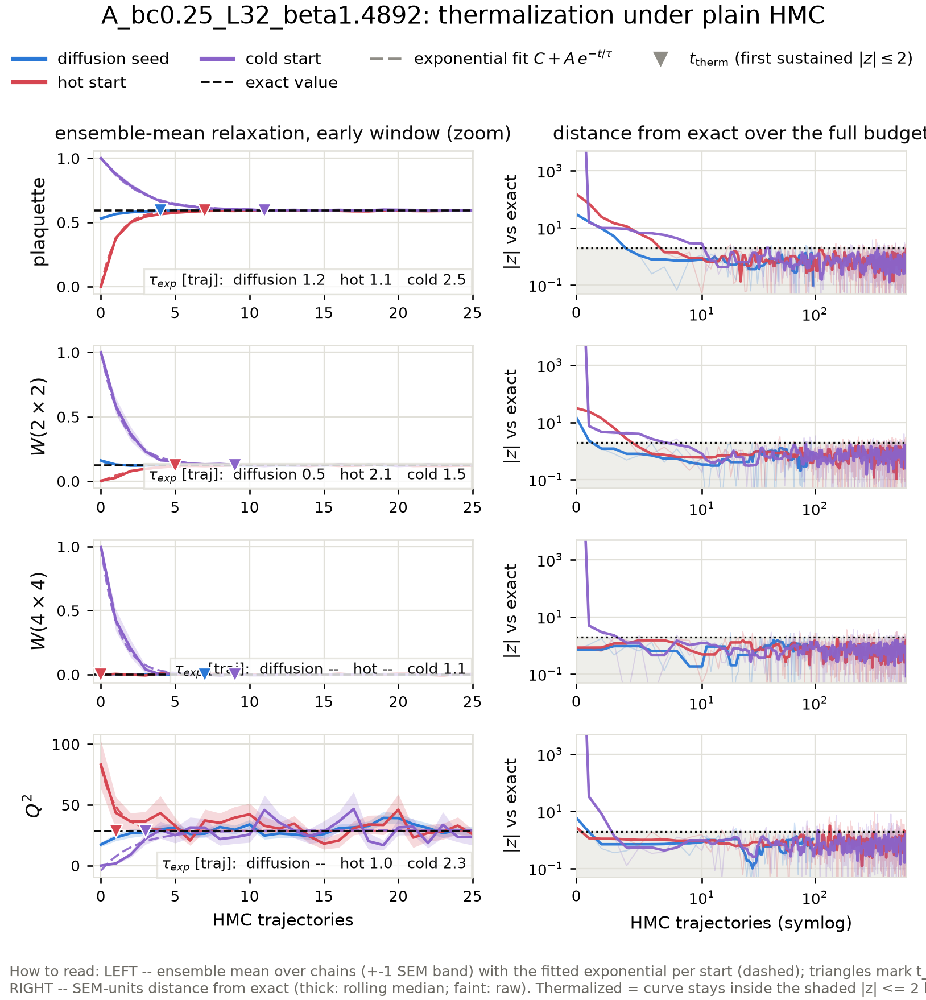

tau_int (hot-start chains, second half): plaquette = 1.48 +- 0.07, wilson_2x2 = 0.78 +- 0.04, wilson_4x4 = 0.55 +- 0.01, wilson_6x6 = 0.58 +- 0.02. Topology: hot-start HMC L=32 beta=1.4892 -> tau_int(Q) = 1.5.

### Diagnostics: raw diffusion output (before any HMC)

| observable | value | error | exact | z_exact | reference | ref_error | z_ref | ks_p | chi2_p |
|---|---|---|---|---|---|---|---|---|---|
| plaquette | 0.5306 | 0.002075 | 0.5935 | -30.29 | 0.5924 | 0.001127 | -26.18 | 1.625e-58 |  |
| wilson_1x1 | 0.5306 | 0.002075 | 0.5935 | -30.29 | 0.5924 | 0.001127 | -26.18 | 1.625e-58 |  |
| wilson_1x2 | 0.311 | 0.003276 | 0.3522 | -12.57 | 0.3518 | 0.001988 | -10.66 | 8.952e-22 |  |
| wilson_2x2 | 0.1608 | 0.002716 | 0.124 | 13.55 | 0.1257 | 0.002499 | 9.509 | 9.982e-17 |  |
| wilson_2x3 | 0.07133 | 0.002347 | 0.04368 | 11.78 | 0.04514 | 0.001701 | 9.033 | 3.392e-11 |  |
| wilson_3x3 | 0.02237 | 0.002157 | 0.00913 | 6.14 | 0.01101 | 0.001499 | 4.326 | 0.007662 |  |
| wilson_3x4 | 0.008993 | 0.002275 | 0.001908 | 3.115 | 0.001259 | 0.001593 | 2.785 | 0.01207 |  |
| wilson_4x4 | 0.001615 | 0.002407 | 0.0002367 | 0.5725 | 0.0004678 | 0.001285 | 0.4204 | 0.5643 |  |
| wilson_4x5 | -0.0005073 | 0.001253 | 2.936e-05 | -0.4285 | -0.001092 | 0.001296 | 0.3244 | 0.8612 |  |
| wilson_5x5 | 0.005697 | 0.002049 | 2.161e-06 | 2.779 | 0.001631 | 0.0017 | 1.527 | 0.2061 |  |
| wilson_5x6 | 0.005047 | 0.001441 | 1.591e-07 | 3.501 | 0.002252 | 0.001489 | 1.348 | 0.3879 |  |
| wilson_6x6 | -0.0008589 | 0.001668 | 6.948e-09 | -0.5149 | -0.00105 | 0.001486 | 0.08549 | 0.6808 |  |
| wilson_6x7 | -0.001919 | 0.001744 | 3.035e-10 | -1.1 | 0.001488 | 0.001255 | -1.585 | 0.5266 |  |
| wilson_7x7 | -0.001171 | 0.00163 | 7.868e-12 | -0.7187 | -0.002048 | 0.002155 | 0.3246 | 0.8612 |  |
| wilson_7x8 | 0.0005226 | 0.002259 | 2.04e-13 | 0.2314 | -2.074e-05 | 0.001574 | 0.1973 | 0.9719 |  |
| wilson_8x8 | 0.001692 | 0.001949 | 3.138e-15 | 0.8678 | -0.0009048 | 0.00151 | 1.053 | 0.3277 |  |
| wilson_8x10 | 0.001167 | 0.002208 | 7.426e-19 | 0.5284 | -0.00228 | 0.001725 | 1.23 | 0.357 |  |
| wilson_10x10 | 0.001003 | 0.001921 | 2.18e-23 | 0.5223 | 0.001993 | 0.001165 | -0.4407 | 0.7941 |  |
| wilson_10x12 | 0.004886 | 0.001832 | 6.4e-28 | 2.667 | 0.0007025 | 0.001535 | 1.751 | 0.1866 |  |
| wilson_12x12 | 0.002305 | 0.001708 | 2.33e-33 | 1.35 | 2.732e-05 | 0.001339 | 1.05 | 0.1519 |  |
| creutz_2 | 0.1251 | 0.01763 | 0.5218 | -22.5 |  |  |  |  |  |
| creutz_3 | 0.3462 | 0.09208 | 0.5218 | -1.907 |  |  |  |  |  |
| creutz_4 | 0.8058 | 1.164 | 0.5218 | 0.244 |  |  |  |  |  |
| Q | -0.25 | 0.3109 | 0 | -0.804 | -0.03125 | 0.3834 | -0.4431 | 0.3001 |  |
| Q^2 | 17.38 | 1.888 | 28.52 | -5.903 | 27.16 | 2.757 | -2.927 | 0.07777 |  |
| chi_top ((<Q^2>-<Q>^2)/V) | 0.01691 | 0.001852 | 0.02785 | -5.911 | 0.02652 | 0.002398 | -3.172 |  |  |
| Q histogram vs exact P(Q) | 24.81 | nan | 20 | nan |  |  |  |  | 0.2086 |

### Diagnostics: the same configs after 96 HMC trajectories

| observable | value | error | exact | z_exact | reference | ref_error | z_ref | ks_p | chi2_p |
|---|---|---|---|---|---|---|---|---|---|
| plaquette | 0.5936 | 0.0008964 | 0.5935 | 0.1424 | 0.5924 | 0.001127 | 0.8058 | 0.6808 |  |
| wilson_1x1 | 0.5936 | 0.0008964 | 0.5935 | 0.1424 | 0.5924 | 0.001127 | 0.8058 | 0.6808 |  |
| wilson_1x2 | 0.3523 | 0.001701 | 0.3522 | 0.09471 | 0.3518 | 0.001988 | 0.1905 | 0.9167 |  |
| wilson_2x2 | 0.126 | 0.001935 | 0.124 | 1.011 | 0.1257 | 0.002499 | 0.07713 | 0.9827 |  |
| wilson_2x3 | 0.04503 | 0.002849 | 0.04368 | 0.4725 | 0.04514 | 0.001701 | -0.03492 | 0.7941 |  |
| wilson_3x3 | 0.01292 | 0.002194 | 0.00913 | 1.728 | 0.01101 | 0.001499 | 0.7188 | 0.6418 |  |
| wilson_3x4 | 0.004706 | 0.002032 | 0.001908 | 1.377 | 0.001259 | 0.001593 | 1.335 | 0.4204 |  |
| wilson_4x4 | -0.002003 | 0.001831 | 0.0002367 | -1.223 | 0.0004678 | 0.001285 | -1.104 | 0.2741 |  |
| wilson_4x5 | 4.251e-05 | 0.002014 | 2.936e-05 | 0.00653 | -0.001092 | 0.001296 | 0.4737 | 0.1098 |  |
| wilson_5x5 | -0.001296 | 0.00207 | 2.161e-06 | -0.6274 | 0.001631 | 0.0017 | -1.093 | 0.008934 |  |
| wilson_5x6 | 0.0001279 | 0.001178 | 1.591e-07 | 0.1084 | 0.002252 | 0.001489 | -1.119 | 0.3277 |  |
| wilson_6x6 | 0.003115 | 0.001679 | 6.948e-09 | 1.855 | -0.00105 | 0.001486 | 1.858 | 0.1866 |  |
| wilson_6x7 | 4.328e-05 | 0.001931 | 3.035e-10 | 0.02242 | 0.001488 | 0.001255 | -0.6272 | 0.6808 |  |
| wilson_7x7 | 0.003149 | 0.001616 | 7.868e-12 | 1.949 | -0.002048 | 0.002155 | 1.93 | 0.03684 |  |
| wilson_7x8 | 9.437e-05 | 0.001964 | 2.04e-13 | 0.04805 | -2.074e-05 | 0.001574 | 0.04573 | 0.939 |  |
| wilson_8x8 | 0.001201 | 0.001406 | 3.138e-15 | 0.8548 | -0.0009048 | 0.00151 | 1.021 | 0.7941 |  |
| wilson_8x10 | 0.0009272 | 0.002164 | 7.426e-19 | 0.4284 | -0.00228 | 0.001725 | 1.159 | 0.357 |  |
| wilson_10x10 | -0.003554 | 0.002057 | 2.18e-23 | -1.727 | 0.001993 | 0.001165 | -2.346 | 0.1098 |  |
| wilson_10x12 | 0.001105 | 0.001915 | 6.4e-28 | 0.5773 | 0.0007025 | 0.001535 | 0.1642 | 0.9167 |  |
| wilson_12x12 | -0.002377 | 0.001732 | 2.33e-33 | -1.372 | 2.732e-05 | 0.001339 | -1.098 | 0.6808 |  |
| creutz_2 | 0.5069 | 0.01681 | 0.5218 | -0.889 |  |  |  |  |  |
| creutz_3 | 0.2196 | 0.1483 | 0.5218 | -2.038 |  |  |  |  |  |
| creutz_7 | -8.564 | nan | 0.5218 | nan |  |  |  |  |  |
| creutz_8 | -6.052 | nan | 0.5218 | nan |  |  |  |  |  |
| Q | 0.3281 | 0.6089 | 0 | 0.5389 | -0.03125 | 0.3834 | 0.4995 | 0.8612 |  |
| Q^2 | 32.73 | 3.899 | 28.52 | 1.08 | 27.16 | 2.757 | 1.168 | 0.6028 |  |
| chi_top ((<Q^2>-<Q>^2)/V) | 0.03186 | 0.003787 | 0.02785 | 1.058 | 0.02652 | 0.002398 | 1.192 |  |  |
| Q histogram vs exact P(Q) | 12.24 | nan | 20 | nan |  |  |  |  | 0.9077 |

## A_bc0.5_L32_beta2.02441

HMC: step size 0.2000, 5 leapfrog steps, acceptance seed/hot/cold = 0.964/0.964/0.962. Diffusion-seed batch: 128 chains x 96 trajectories (0.07 s/traj for the whole batch); baselines: 32 chains x 640 trajectories.

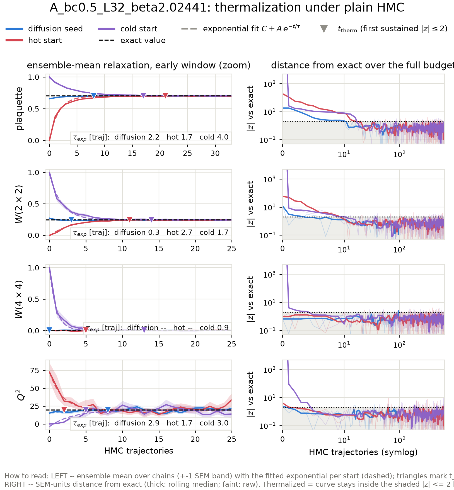

tau_int (hot-start chains, second half): plaquette = 2.34 +- 0.15, wilson_2x2 = 0.94 +- 0.04, wilson_4x4 = 0.61 +- 0.02, wilson_6x6 = 0.56 +- 0.01. Topology: hot-start HMC L=32 beta=2.02441 -> tau_int(Q) = 2.6.

### Diagnostics: raw diffusion output (before any HMC)

| observable | value | error | exact | z_exact | reference | ref_error | z_ref | ks_p | chi2_p |
|---|---|---|---|---|---|---|---|---|---|
| plaquette | 0.6582 | 0.001446 | 0.7017 | -30.11 | 0.7014 | 0.001088 | -23.89 | 2.86e-41 |  |
| wilson_1x1 | 0.6582 | 0.001446 | 0.7017 | -30.11 | 0.7014 | 0.001088 | -23.89 | 2.86e-41 |  |
| wilson_1x2 | 0.4465 | 0.002319 | 0.4924 | -19.82 | 0.4916 | 0.001947 | -14.9 | 1.401e-22 |  |
| wilson_2x2 | 0.2708 | 0.002281 | 0.2425 | 12.39 | 0.241 | 0.002316 | 9.148 | 2.327e-12 |  |
| wilson_2x3 | 0.1389 | 0.002362 | 0.1194 | 8.256 | 0.1182 | 0.002518 | 6.006 | 3.873e-07 |  |
| wilson_3x3 | 0.04789 | 0.002068 | 0.04127 | 3.201 | 0.04222 | 0.002281 | 1.84 | 0.04195 |  |
| wilson_3x4 | 0.0174 | 0.002695 | 0.01426 | 1.164 | 0.01295 | 0.001741 | 1.385 | 0.06115 |  |
| wilson_4x4 | 0.004963 | 0.002521 | 0.003458 | 0.5969 | 0.004566 | 0.001962 | 0.1243 | 0.4204 |  |
| wilson_4x5 | 0.002441 | 0.002263 | 0.0008386 | 0.7082 | 0.001728 | 0.001796 | 0.247 | 0.9574 |  |
| wilson_5x5 | 0.003491 | 0.00183 | 0.0001427 | 1.83 | -0.0001502 | 0.001996 | 1.345 | 0.2272 |  |
| wilson_5x6 | 0.003334 | 0.002125 | 2.428e-05 | 1.558 | -0.002372 | 0.001041 | 2.411 | 0.06904 |  |
| wilson_6x6 | -0.001423 | 0.002308 | 2.9e-06 | -0.6179 | -0.002296 | 0.001671 | 0.3064 | 0.9719 |  |
| wilson_6x7 | -0.002101 | 0.001753 | 3.463e-07 | -1.199 | -0.0001651 | 0.0009269 | -0.9765 | 0.8288 |  |
| wilson_7x7 | -0.0009602 | 0.001836 | 2.902e-08 | -0.5231 | 0.001585 | 0.001143 | -1.177 | 0.2741 |  |
| wilson_7x8 | 0.0001458 | 0.001864 | 2.432e-09 | 0.07822 | -0.0001414 | 0.001815 | 0.1104 | 0.9719 |  |
| wilson_8x8 | -0.00286 | 0.001725 | 1.43e-10 | -1.658 | -0.001798 | 0.001684 | -0.4406 | 0.6418 |  |
| wilson_8x10 | -0.001581 | 0.001891 | 4.946e-13 | -0.8357 | 0.002846 | 0.001659 | -1.76 | 0.3879 |  |
| wilson_10x10 | 0.002555 | 0.002168 | 4.147e-16 | 1.178 | -0.00027 | 0.00151 | 1.069 | 0.3879 |  |
| wilson_10x12 | 0.0005637 | 0.001679 | 3.478e-19 | 0.3357 | -1.369e-05 | 0.001744 | 0.2385 | 0.8906 |  |
| wilson_12x12 | 0.002135 | 0.001605 | 7.073e-23 | 1.33 | -0.0008539 | 0.001986 | 1.17 | 0.3879 |  |
| creutz_2 | 0.112 | 0.01072 | 0.3542 | -22.59 |  |  |  |  |  |
| creutz_3 | 0.3977 | 0.04189 | 0.3542 | 1.038 |  |  |  |  |  |
| creutz_4 | 0.2416 | 0.4329 | 0.3542 | -0.2601 |  |  |  |  |  |
| creutz_5 | -1.067 | 1.718 | 0.3542 | -0.8275 |  |  |  |  |  |
| Q | 0.1016 | 0.3312 | 0 | 0.3067 | -0.06771 | 0.2843 | 0.3878 | 0.939 |  |
| Q^2 | 15.3 | 2.163 | 19.51 | -1.945 | 18.56 | 2.518 | -0.98 | 0.9827 |  |
| chi_top ((<Q^2>-<Q>^2)/V) | 0.01494 | 0.001717 | 0.01905 | -2.398 | 0.01812 | 0.002257 | -1.122 |  |  |
| Q histogram vs exact P(Q) | 12.65 | nan | 18 | nan |  |  |  |  | 0.8122 |

### Diagnostics: the same configs after 96 HMC trajectories

| observable | value | error | exact | z_exact | reference | ref_error | z_ref | ks_p | chi2_p |
|---|---|---|---|---|---|---|---|---|---|
| plaquette | 0.7034 | 0.001231 | 0.7017 | 1.37 | 0.7014 | 0.001088 | 1.208 | 0.357 |  |
| wilson_1x1 | 0.7034 | 0.001231 | 0.7017 | 1.37 | 0.7014 | 0.001088 | 1.208 | 0.357 |  |
| wilson_1x2 | 0.4943 | 0.001656 | 0.4924 | 1.12 | 0.4916 | 0.001947 | 1.054 | 0.6418 |  |
| wilson_2x2 | 0.2428 | 0.00229 | 0.2425 | 0.1217 | 0.241 | 0.002316 | 0.5406 | 0.9167 |  |
| wilson_2x3 | 0.1187 | 0.002311 | 0.1194 | -0.2995 | 0.1182 | 0.002518 | 0.1586 | 0.939 |  |
| wilson_3x3 | 0.04044 | 0.002616 | 0.04127 | -0.3174 | 0.04222 | 0.002281 | -0.5148 | 0.9167 |  |
| wilson_3x4 | 0.01228 | 0.002981 | 0.01426 | -0.6639 | 0.01295 | 0.001741 | -0.1945 | 0.7941 |  |
| wilson_4x4 | -0.002071 | 0.002003 | 0.003458 | -2.761 | 0.004566 | 0.001962 | -2.367 | 0.1519 |  |
| wilson_4x5 | 0.00217 | 0.002219 | 0.0008386 | 0.6001 | 0.001728 | 0.001796 | 0.155 | 0.8906 |  |
| wilson_5x5 | -0.0007519 | 0.002034 | 0.0001427 | -0.4397 | -0.0001502 | 0.001996 | -0.2111 | 0.9719 |  |
| wilson_5x6 | -0.001883 | 0.002099 | 2.428e-05 | -0.9084 | -0.002372 | 0.001041 | 0.2087 | 0.5643 |  |
| wilson_6x6 | 0.001234 | 0.002007 | 2.9e-06 | 0.6132 | -0.002296 | 0.001671 | 1.352 | 0.1685 |  |
| wilson_6x7 | 0.0008037 | 0.001615 | 3.463e-07 | 0.4975 | -0.0001651 | 0.0009269 | 0.5204 | 0.9719 |  |
| wilson_7x7 | 0.001114 | 0.001823 | 2.902e-08 | 0.6109 | 0.001585 | 0.001143 | -0.219 | 0.9978 |  |
| wilson_7x8 | -0.0005942 | 0.002001 | 2.432e-09 | -0.2969 | -0.0001414 | 0.001815 | -0.1676 | 0.7941 |  |
| wilson_8x8 | -6.59e-05 | 0.001357 | 1.43e-10 | -0.04855 | -0.001798 | 0.001684 | 0.8009 | 0.357 |  |
| wilson_8x10 | 0.002081 | 0.001371 | 4.946e-13 | 1.518 | 0.002846 | 0.001659 | -0.3557 | 0.7195 |  |
| wilson_10x10 | 0.005365 | 0.002295 | 4.147e-16 | 2.338 | -0.00027 | 0.00151 | 2.051 | 0.1685 |  |
| wilson_10x12 | 0.001201 | 0.001722 | 3.478e-19 | 0.6974 | -1.369e-05 | 0.001744 | 0.4956 | 0.9167 |  |
| wilson_12x12 | -0.003688 | 0.001819 | 7.073e-23 | -2.027 | -0.0008539 | 0.001986 | -1.052 | 0.2498 |  |
| creutz_2 | 0.3582 | 0.007414 | 0.3542 | 0.5353 |  |  |  |  |  |
| creutz_3 | 0.3617 | 0.05009 | 0.3542 | 0.1506 |  |  |  |  |  |
| creutz_7 | -0.755 | 5.133 | 0.3542 | -0.2161 |  |  |  |  |  |
| Q | -0.4844 | 0.4069 | 0 | -1.19 | -0.06771 | 0.2843 | -0.8395 | 0.7941 |  |
| Q^2 | 19.92 | 2.38 | 19.51 | 0.1727 | 18.56 | 2.518 | 0.3939 | 0.1366 |  |
| chi_top ((<Q^2>-<Q>^2)/V) | 0.01923 | 0.002148 | 0.01905 | 0.08024 | 0.01812 | 0.002257 | 0.3557 |  |  |
| Q histogram vs exact P(Q) | 16.67 | nan | 18 | nan |  |  |  |  | 0.5459 |

## A_bc0.75_L32_beta2.5435

HMC: step size 0.2000, 5 leapfrog steps, acceptance seed/hot/cold = 0.962/0.961/0.960. Diffusion-seed batch: 128 chains x 96 trajectories (0.07 s/traj for the whole batch); baselines: 32 chains x 640 trajectories.

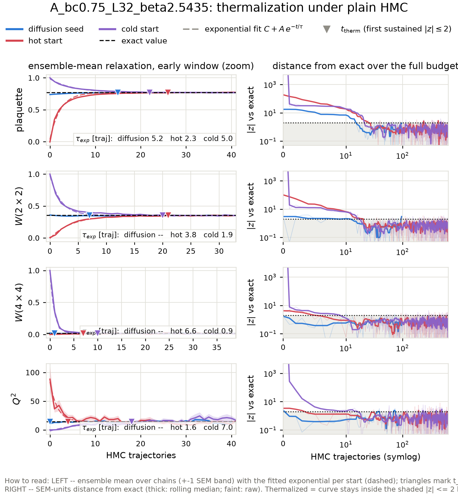

tau_int (hot-start chains, second half): plaquette = 3.51 +- 0.32, wilson_2x2 = 1.27 +- 0.08, wilson_4x4 = 0.67 +- 0.03, wilson_6x6 = 0.55 +- 0.01. Topology: hot-start HMC L=32 beta=2.5435 -> tau_int(Q) = 5.8.

### Diagnostics: raw diffusion output (before any HMC)

| observable | value | error | exact | z_exact | reference | ref_error | z_ref | ks_p | chi2_p |
|---|---|---|---|---|---|---|---|---|---|
| plaquette | 0.7379 | 0.002271 | 0.7696 | -14 | 0.7704 | 0.0008757 | -13.39 | 1.693e-37 |  |
| wilson_1x1 | 0.7379 | 0.002271 | 0.7696 | -14 | 0.7704 | 0.0008757 | -13.39 | 1.693e-37 |  |
| wilson_1x2 | 0.5519 | 0.003821 | 0.5924 | -10.59 | 0.5953 | 0.001446 | -10.63 | 8.763e-23 |  |
| wilson_2x2 | 0.3583 | 0.002166 | 0.3509 | 3.412 | 0.3541 | 0.002901 | 1.167 | 0.3001 |  |
| wilson_2x3 | 0.2095 | 0.002316 | 0.2079 | 0.7284 | 0.2118 | 0.003098 | -0.5751 | 0.5643 |  |
| wilson_3x3 | 0.09091 | 0.001873 | 0.09476 | -2.054 | 0.09646 | 0.002322 | -1.859 | 0.1685 |  |
| wilson_3x4 | 0.04431 | 0.002712 | 0.0432 | 0.4105 | 0.04134 | 0.00256 | 0.7979 | 0.4204 |  |
| wilson_4x4 | 0.01996 | 0.002672 | 0.01516 | 1.796 | 0.01439 | 0.002061 | 1.65 | 0.05405 |  |
| wilson_4x5 | 0.008412 | 0.003136 | 0.005319 | 0.9864 | 0.006171 | 0.001691 | 0.6292 | 0.6418 |  |
| wilson_5x5 | 0.002408 | 0.002411 | 0.001436 | 0.403 | 0.003513 | 0.001771 | -0.3693 | 0.9827 |  |
| wilson_5x6 | 0.0004374 | 0.001264 | 0.0003879 | 0.03911 | 0.0003566 | 0.001621 | 0.03929 | 0.9167 |  |
| wilson_6x6 | -0.003184 | 0.002452 | 8.063e-05 | -1.331 | 0.000591 | 0.001482 | -1.318 | 0.5643 |  |
| wilson_6x7 | -0.00301 | 0.002479 | 1.676e-05 | -1.221 | -0.001197 | 0.001926 | -0.5776 | 0.5266 |  |
| wilson_7x7 | 0.002423 | 0.001968 | 2.681e-06 | 1.229 | -0.0008327 | 0.001342 | 1.366 | 0.2498 |  |
| wilson_7x8 | 0.002753 | 0.002204 | 4.289e-07 | 1.249 | 0.0002007 | 0.001822 | 0.8924 | 0.07777 |  |
| wilson_8x8 | 0.00411 | 0.002132 | 5.28e-08 | 1.928 | 0.0002652 | 0.002006 | 1.313 | 0.05405 |  |
| wilson_8x10 | -0.0005093 | 0.00173 | 8.005e-10 | -0.2943 | -0.0003912 | 0.001426 | -0.05268 | 0.8612 |  |
| wilson_10x10 | 0.0008448 | 0.001748 | 4.258e-12 | 0.4833 | 0.0003353 | 0.00163 | 0.2131 | 0.9991 |  |
| wilson_10x12 | 0.001741 | 0.002192 | 2.265e-14 | 0.7941 | -0.001057 | 0.002053 | 0.9317 | 0.7195 |  |
| wilson_12x12 | -0.001564 | 0.001449 | 4.227e-17 | -1.08 | 0.001755 | 0.001717 | -1.477 | 0.1685 |  |
| creutz_2 | 0.1417 | 0.0075 | 0.2618 | -16.02 |  |  |  |  |  |
| creutz_3 | 0.2986 | 0.02015 | 0.2618 | 1.826 |  |  |  |  |  |
| creutz_4 | 0.07906 | 0.1217 | 0.2618 | -1.502 |  |  |  |  |  |
| creutz_5 | 0.3869 | 0.8878 | 0.2618 | 0.1409 |  |  |  |  |  |
| creutz_8 | -0.273 | 1.538 | 0.2618 | -0.3478 |  |  |  |  |  |
| Q | -0.3047 | 0.3078 | 0 | -0.99 | 0.1823 | 0.2507 | -1.227 | 0.4545 |  |
| Q^2 | 11.01 | 0.9954 | 14.25 | -3.259 | 14.18 | 1.431 | -1.821 | 0.6418 |  |
| chi_top ((<Q^2>-<Q>^2)/V) | 0.01066 | 0.001284 | 0.01392 | -2.538 | 0.01382 | 0.001408 | -1.657 |  |  |
| Q histogram vs exact P(Q) | 11.19 | nan | 16 | nan |  |  |  |  | 0.7976 |

### Diagnostics: the same configs after 96 HMC trajectories

| observable | value | error | exact | z_exact | reference | ref_error | z_ref | ks_p | chi2_p |
|---|---|---|---|---|---|---|---|---|---|
| plaquette | 0.7712 | 0.0007408 | 0.7696 | 2.051 | 0.7704 | 0.0008757 | 0.636 | 0.3879 |  |
| wilson_1x1 | 0.7712 | 0.0007408 | 0.7696 | 2.051 | 0.7704 | 0.0008757 | 0.636 | 0.3879 |  |
| wilson_1x2 | 0.5955 | 0.001381 | 0.5924 | 2.293 | 0.5953 | 0.001446 | 0.08912 | 0.2272 |  |
| wilson_2x2 | 0.3573 | 0.00195 | 0.3509 | 3.276 | 0.3541 | 0.002901 | 0.9226 | 0.07777 |  |
| wilson_2x3 | 0.2152 | 0.002618 | 0.2079 | 2.804 | 0.2118 | 0.003098 | 0.8449 | 0.08742 |  |
| wilson_3x3 | 0.09952 | 0.002445 | 0.09476 | 1.946 | 0.09646 | 0.002322 | 0.9074 | 0.5643 |  |
| wilson_3x4 | 0.04401 | 0.002997 | 0.0432 | 0.269 | 0.04134 | 0.00256 | 0.6771 | 0.6418 |  |
| wilson_4x4 | 0.01416 | 0.0028 | 0.01516 | -0.3551 | 0.01439 | 0.002061 | -0.06466 | 0.6418 |  |
| wilson_4x5 | 0.003967 | 0.00259 | 0.005319 | -0.5222 | 0.006171 | 0.001691 | -0.7127 | 0.7575 |  |
| wilson_5x5 | 0.003252 | 0.002847 | 0.001436 | 0.6375 | 0.003513 | 0.001771 | -0.07795 | 0.3879 |  |
| wilson_5x6 | -0.0006511 | 0.002891 | 0.0003879 | -0.3594 | 0.0003566 | 0.001621 | -0.304 | 0.9167 |  |
| wilson_6x6 | -0.00073 | 0.002318 | 8.063e-05 | -0.3498 | 0.000591 | 0.001482 | -0.4801 | 0.6808 |  |
| wilson_6x7 | 0.001896 | 0.001586 | 1.676e-05 | 1.185 | -0.001197 | 0.001926 | 1.24 | 0.3001 |  |
| wilson_7x7 | 0.0004742 | 0.0018 | 2.681e-06 | 0.2619 | -0.0008327 | 0.001342 | 0.582 | 0.7195 |  |
| wilson_7x8 | -0.001646 | 0.002483 | 4.289e-07 | -0.6629 | 0.0002007 | 0.001822 | -0.5995 | 0.357 |  |
| wilson_8x8 | 0.00156 | 0.001681 | 5.28e-08 | 0.9281 | 0.0002652 | 0.002006 | 0.4947 | 0.4899 |  |
| wilson_8x10 | -0.001559 | 0.002438 | 8.005e-10 | -0.6395 | -0.0003912 | 0.001426 | -0.4135 | 0.6418 |  |
| wilson_10x10 | -0.0005043 | 0.001823 | 4.258e-12 | -0.2767 | 0.0003353 | 0.00163 | -0.3433 | 0.9978 |  |
| wilson_10x12 | -2.027e-05 | 0.001785 | 2.265e-14 | -0.01136 | -0.001057 | 0.002053 | 0.3812 | 0.9167 |  |
| wilson_12x12 | -0.001496 | 0.002003 | 4.227e-17 | -0.7469 | 0.001755 | 0.001717 | -1.232 | 0.2272 |  |
| creutz_2 | 0.2525 | 0.004234 | 0.2618 | -2.208 |  |  |  |  |  |
| creutz_3 | 0.2642 | 0.01933 | 0.2618 | 0.1226 |  |  |  |  |  |
| creutz_4 | 0.3177 | 0.1323 | 0.2618 | 0.4221 |  |  |  |  |  |
| creutz_5 | -1.074 | 0.9129 | 0.2618 | -1.463 |  |  |  |  |  |
| Q | 0.4844 | 0.345 | 0 | 1.404 | 0.1823 | 0.2507 | 0.7083 | 0.995 |  |
| Q^2 | 13.27 | 1.477 | 14.25 | -0.668 | 14.18 | 1.431 | -0.4458 | 0.9999 |  |
| chi_top ((<Q^2>-<Q>^2)/V) | 0.01273 | 0.001549 | 0.01392 | -0.7702 | 0.01382 | 0.001408 | -0.5217 |  |  |
| Q histogram vs exact P(Q) | 9.024 | nan | 16 | nan |  |  |  |  | 0.9124 |

## A_bc1_L32_beta3.10399

HMC: step size 0.2000, 5 leapfrog steps, acceptance seed/hot/cold = 0.959/0.961/0.958. Diffusion-seed batch: 128 chains x 96 trajectories (0.07 s/traj for the whole batch); baselines: 32 chains x 640 trajectories.

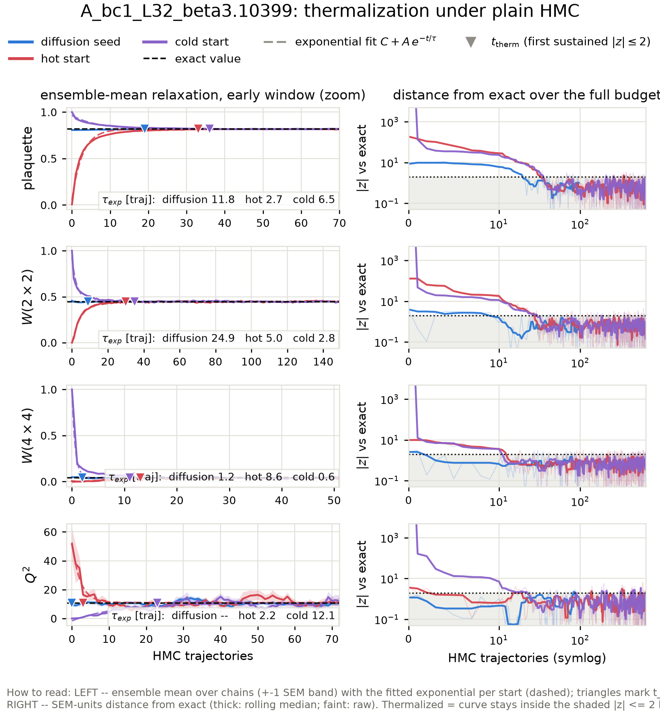

tau_int (hot-start chains, second half): plaquette = 3.48 +- 0.21, wilson_2x2 = 1.61 +- 0.10, wilson_4x4 = 0.89 +- 0.06, wilson_6x6 = 0.58 +- 0.01. Topology: hot-start HMC L=32 beta=3.10399 -> tau_int(Q) = 8.2.

### Diagnostics: raw diffusion output (before any HMC)

| observable | value | error | exact | z_exact | reference | ref_error | z_ref | ks_p | chi2_p |
|---|---|---|---|---|---|---|---|---|---|
| plaquette | 0.8079 | 0.0009424 | 0.8174 | -10.04 | 0.8178 | 0.0005555 | -9.044 | 3.278e-12 |  |
| wilson_1x1 | 0.8079 | 0.0009424 | 0.8174 | -10.04 | 0.8178 | 0.0005555 | -9.044 | 3.278e-12 |  |
| wilson_1x2 | 0.6568 | 0.001571 | 0.6681 | -7.238 | 0.6677 | 0.001105 | -5.701 | 0.0002266 |  |
| wilson_2x2 | 0.4561 | 0.002312 | 0.4464 | 4.22 | 0.447 | 0.001787 | 3.121 | 0.002464 |  |
| wilson_2x3 | 0.3058 | 0.003513 | 0.2982 | 2.157 | 0.298 | 0.001761 | 1.996 | 0.08742 |  |
| wilson_3x3 | 0.1669 | 0.004167 | 0.1629 | 0.9757 | 0.1615 | 0.002175 | 1.154 | 0.1866 |  |
| wilson_3x4 | 0.09654 | 0.003688 | 0.08895 | 2.059 | 0.08554 | 0.002435 | 2.49 | 0.02464 |  |
| wilson_4x4 | 0.04686 | 0.003109 | 0.03971 | 2.3 | 0.0343 | 0.002627 | 3.086 | 0.01039 |  |
| wilson_4x5 | 0.02116 | 0.003236 | 0.01772 | 1.063 | 0.0124 | 0.002646 | 2.097 | 0.2061 |  |
| wilson_5x5 | 0.005108 | 0.002546 | 0.006467 | -0.5337 | 0.003966 | 0.002761 | 0.3041 | 0.5643 |  |
| wilson_5x6 | 0.001284 | 0.002822 | 0.00236 | -0.3812 | -0.0007535 | 0.002491 | 0.5413 | 0.6418 |  |
| wilson_6x6 | 0.003746 | 0.002305 | 0.0007038 | 1.32 | -0.00106 | 0.001842 | 1.629 | 0.1519 |  |
| wilson_6x7 | -0.0001304 | 0.001966 | 0.0002099 | -0.1731 | 1.639e-05 | 0.001604 | -0.05784 | 0.6808 |  |
| wilson_7x7 | 0.000245 | 0.002643 | 5.117e-05 | 0.07336 | -0.0007155 | 0.00115 | 0.3333 | 0.1098 |  |
| wilson_7x8 | -0.002353 | 0.002549 | 1.247e-05 | -0.928 | 0.001576 | 0.001926 | -1.23 | 0.2498 |  |
| wilson_8x8 | 0.003948 | 0.001865 | 2.486e-06 | 2.115 | -0.0001882 | 0.001642 | 1.664 | 0.2061 |  |
| wilson_8x10 | -0.0005234 | 0.002259 | 9.869e-08 | -0.2318 | -0.001888 | 0.002197 | 0.4331 | 0.5266 |  |
| wilson_10x10 | 0.0007818 | 0.001743 | 1.749e-09 | 0.4486 | -0.0007854 | 0.001099 | 0.7607 | 0.2061 |  |
| wilson_10x12 | -0.002357 | 0.00174 | 3.101e-11 | -1.354 | 0.000432 | 0.001635 | -1.168 | 0.3001 |  |
| wilson_12x12 | -0.0008193 | 0.001937 | 2.453e-13 | -0.423 | -0.0006014 | 0.001642 | -0.08581 | 0.9827 |  |
| creutz_2 | 0.1573 | 0.003773 | 0.2016 | -11.75 |  |  |  |  |  |
| creutz_3 | 0.2055 | 0.01088 | 0.2016 | 0.3586 |  |  |  |  |  |
| creutz_4 | 0.1752 | 0.03881 | 0.2016 | -0.6808 |  |  |  |  |  |
| creutz_5 | 0.6267 | 0.4102 | 0.2016 | 1.036 |  |  |  |  |  |
| creutz_6 | -2.451 | 3.455 | 0.2016 | -0.768 |  |  |  |  |  |
| Q | -0.3516 | 0.226 | 0 | -1.556 | 0.1771 | 0.1606 | -1.907 | 0.2741 |  |
| Q^2 | 9.461 | 1.516 | 10.81 | -0.8889 | 10.46 | 1.1 | -0.5326 | 0.9574 |  |
| chi_top ((<Q^2>-<Q>^2)/V) | 0.009118 | 0.001103 | 0.01056 | -1.302 | 0.01018 | 0.001275 | -0.6312 |  |  |
| Q histogram vs exact P(Q) | 12.4 | nan | 14 | nan |  |  |  |  | 0.5746 |

### Diagnostics: the same configs after 96 HMC trajectories

| observable | value | error | exact | z_exact | reference | ref_error | z_ref | ks_p | chi2_p |
|---|---|---|---|---|---|---|---|---|---|
| plaquette | 0.8166 | 0.000715 | 0.8174 | -1.051 | 0.8178 | 0.0005555 | -1.312 | 0.6418 |  |
| wilson_1x1 | 0.8166 | 0.000715 | 0.8174 | -1.051 | 0.8178 | 0.0005555 | -1.312 | 0.6418 |  |
| wilson_1x2 | 0.6673 | 0.001241 | 0.6681 | -0.6388 | 0.6677 | 0.001105 | -0.2226 | 0.9827 |  |
| wilson_2x2 | 0.4441 | 0.002074 | 0.4464 | -1.116 | 0.447 | 0.001787 | -1.079 | 0.4899 |  |
| wilson_2x3 | 0.2943 | 0.002726 | 0.2982 | -1.45 | 0.298 | 0.001761 | -1.137 | 0.5266 |  |
| wilson_3x3 | 0.1584 | 0.003212 | 0.1629 | -1.399 | 0.1615 | 0.002175 | -0.8077 | 0.1866 |  |
| wilson_3x4 | 0.08218 | 0.00389 | 0.08895 | -1.739 | 0.08554 | 0.002435 | -0.7312 | 0.357 |  |
| wilson_4x4 | 0.0365 | 0.003549 | 0.03971 | -0.9042 | 0.0343 | 0.002627 | 0.4983 | 0.9167 |  |
| wilson_4x5 | 0.01277 | 0.002794 | 0.01772 | -1.775 | 0.0124 | 0.002646 | 0.09565 | 0.6808 |  |
| wilson_5x5 | 0.004701 | 0.002492 | 0.006467 | -0.7087 | 0.003966 | 0.002761 | 0.1976 | 0.7195 |  |
| wilson_5x6 | 0.0008818 | 0.002247 | 0.00236 | -0.6577 | -0.0007535 | 0.002491 | 0.4874 | 0.6418 |  |
| wilson_6x6 | 0.0002128 | 0.002158 | 0.0007038 | -0.2275 | -0.00106 | 0.001842 | 0.4487 | 0.7941 |  |
| wilson_6x7 | -0.00153 | 0.00208 | 0.0002099 | -0.8364 | 1.639e-05 | 0.001604 | -0.5887 | 0.9167 |  |
| wilson_7x7 | -0.001301 | 0.002449 | 5.117e-05 | -0.5522 | -0.0007155 | 0.00115 | -0.2165 | 0.6808 |  |
| wilson_7x8 | -0.0006438 | 0.002167 | 1.247e-05 | -0.3028 | 0.001576 | 0.001926 | -0.7654 | 0.4899 |  |
| wilson_8x8 | -0.000331 | 0.001483 | 2.486e-06 | -0.2249 | -0.0001882 | 0.001642 | -0.06454 | 0.6028 |  |
| wilson_8x10 | 0.002029 | 0.001917 | 9.869e-08 | 1.058 | -0.001888 | 0.002197 | 1.343 | 0.1685 |  |
| wilson_10x10 | 0.0005181 | 0.001758 | 1.749e-09 | 0.2947 | -0.0007854 | 0.001099 | 0.6287 | 0.4545 |  |
| wilson_10x12 | 0.000507 | 0.00224 | 3.101e-11 | 0.2263 | 0.000432 | 0.001635 | 0.02701 | 0.4899 |  |
| wilson_12x12 | -0.001023 | 0.002004 | 2.453e-13 | -0.5102 | -0.0006014 | 0.001642 | -0.1625 | 0.4204 |  |
| creutz_2 | 0.2054 | 0.003122 | 0.2016 | 1.2 |  |  |  |  |  |
| creutz_3 | 0.2081 | 0.01039 | 0.2016 | 0.6236 |  |  |  |  |  |
| creutz_4 | 0.1557 | 0.05106 | 0.2016 | -0.8999 |  |  |  |  |  |
| creutz_5 | -0.05143 | 0.393 | 0.2016 | -0.6439 |  |  |  |  |  |
| creutz_6 | -0.252 | nan | 0.2016 | nan |  |  |  |  |  |
| Q | -0.2344 | 0.2656 | 0 | -0.8825 | 0.1771 | 0.1606 | -1.326 | 0.09806 |  |
| Q^2 | 11.23 | 0.7764 | 10.81 | 0.5485 | 10.46 | 1.1 | 0.5765 | 0.4204 |  |
| chi_top ((<Q^2>-<Q>^2)/V) | 0.01092 | 0.001286 | 0.01056 | 0.2817 | 0.01018 | 0.001275 | 0.4059 |  |  |
| Q histogram vs exact P(Q) | 22.47 | nan | 14 | nan |  |  |  |  | 0.0694 |

## A_bc1.5_L32_beta4.44493

HMC: step size 0.1897, 5 leapfrog steps, acceptance seed/hot/cold = 0.968/0.967/0.964. Diffusion-seed batch: 128 chains x 96 trajectories (0.07 s/traj for the whole batch); baselines: 32 chains x 640 trajectories.

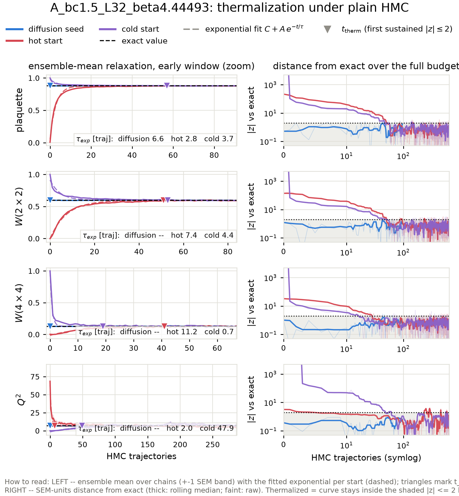

tau_int (hot-start chains, second half): plaquette = 3.52 +- 0.23, wilson_2x2 = 2.84 +- 0.24, wilson_4x4 = 1.21 +- 0.08, wilson_6x6 = 0.72 +- 0.03. Topology: hot-start HMC L=32 beta=4.44493 -> tau_int(Q) = 29.6.

### Diagnostics: raw diffusion output (before any HMC)

| observable | value | error | exact | z_exact | reference | ref_error | z_ref | ks_p | chi2_p |
|---|---|---|---|---|---|---|---|---|---|
| plaquette | 0.8784 | 0.0007013 | 0.8787 | -0.4213 | 0.8785 | 0.0003415 | -0.07376 | 0.9574 |  |
| wilson_1x1 | 0.8784 | 0.0007013 | 0.8787 | -0.4213 | 0.8785 | 0.0003415 | -0.07376 | 0.9574 |  |
| wilson_1x2 | 0.7704 | 0.001296 | 0.7721 | -1.315 | 0.7717 | 0.0008127 | -0.8537 | 0.5643 |  |
| wilson_2x2 | 0.5986 | 0.00248 | 0.5961 | 0.9916 | 0.5963 | 0.001657 | 0.7697 | 0.6808 |  |
| wilson_2x3 | 0.4625 | 0.003781 | 0.4603 | 0.5808 | 0.4601 | 0.002303 | 0.5256 | 0.7575 |  |
| wilson_3x3 | 0.3131 | 0.005352 | 0.3123 | 0.1654 | 0.3129 | 0.00288 | 0.03466 | 0.4204 |  |
| wilson_3x4 | 0.2139 | 0.005184 | 0.2119 | 0.3949 | 0.2121 | 0.003298 | 0.2898 | 0.7195 |  |
| wilson_4x4 | 0.1302 | 0.004501 | 0.1263 | 0.8713 | 0.1278 | 0.003205 | 0.4446 | 0.995 |  |
| wilson_4x5 | 0.07799 | 0.003983 | 0.07529 | 0.6801 | 0.07475 | 0.003086 | 0.6449 | 0.8612 |  |
| wilson_5x5 | 0.04146 | 0.00302 | 0.03944 | 0.6715 | 0.03852 | 0.00234 | 0.7704 | 0.6418 |  |
| wilson_5x6 | 0.02503 | 0.00312 | 0.02066 | 1.403 | 0.02248 | 0.002234 | 0.6657 | 0.9719 |  |
| wilson_6x6 | 0.01087 | 0.003249 | 0.009508 | 0.4195 | 0.01148 | 0.001925 | -0.1622 | 0.8906 |  |
| wilson_6x7 | 0.003257 | 0.003135 | 0.004376 | -0.3571 | 0.003775 | 0.002079 | -0.1378 | 0.9902 |  |
| wilson_7x7 | -0.001 | 0.002258 | 0.00177 | -1.227 | 0.002844 | 0.002422 | -1.161 | 0.5643 |  |
| wilson_7x8 | -0.003707 | 0.002824 | 0.0007158 | -1.566 | -0.001364 | 0.002403 | -0.6319 | 0.6808 |  |
| wilson_8x8 | -0.003553 | 0.002298 | 0.0002544 | -1.657 | 0.0003777 | 0.002192 | -1.238 | 0.3001 |  |
| wilson_8x10 | -0.003396 | 0.002019 | 3.213e-05 | -1.698 | 0.00139 | 0.001664 | -1.829 | 0.5266 |  |
| wilson_10x10 | -0.001437 | 0.002188 | 2.419e-06 | -0.6577 | -0.0009763 | 0.002124 | -0.1509 | 0.8612 |  |
| wilson_10x12 | -0.004715 | 0.002111 | 1.821e-07 | -2.233 | 0.0003524 | 0.001725 | -1.859 | 0.2498 |  |
| wilson_12x12 | 0.003805 | 0.001716 | 8.173e-09 | 2.218 | 0.003033 | 0.001858 | 0.3052 | 0.9574 |  |
| creutz_2 | 0.1211 | 0.002182 | 0.1293 | -3.758 |  |  |  |  |  |
| creutz_3 | 0.1319 | 0.005079 | 0.1293 | 0.506 |  |  |  |  |  |
| creutz_4 | 0.1152 | 0.01306 | 0.1293 | -1.085 |  |  |  |  |  |
| creutz_5 | 0.1193 | 0.04782 | 0.1293 | -0.2098 |  |  |  |  |  |
| creutz_6 | 0.3296 | 0.1864 | 0.1293 | 1.074 |  |  |  |  |  |
| Q | 0.07031 | 0.2306 | 0 | 0.3049 | 0.2812 | 0.2114 | -0.6742 | 0.4899 |  |
| Q^2 | 6.477 | 0.8681 | 6.786 | -0.3563 | 6.542 | 0.7731 | -0.05601 | 0.9999 |  |
| chi_top ((<Q^2>-<Q>^2)/V) | 0.00632 | 0.0008114 | 0.006627 | -0.3783 | 0.006311 | 0.0006451 | 0.008529 |  |  |
| Q histogram vs exact P(Q) | 7.024 | nan | 12 | nan |  |  |  |  | 0.856 |

### Diagnostics: the same configs after 96 HMC trajectories

| observable | value | error | exact | z_exact | reference | ref_error | z_ref | ks_p | chi2_p |
|---|---|---|---|---|---|---|---|---|---|
| plaquette | 0.8779 | 0.0004833 | 0.8787 | -1.579 | 0.8785 | 0.0003415 | -0.8878 | 0.6418 |  |
| wilson_1x1 | 0.8779 | 0.0004833 | 0.8787 | -1.579 | 0.8785 | 0.0003415 | -0.8878 | 0.6418 |  |
| wilson_1x2 | 0.7715 | 0.0007975 | 0.7721 | -0.7218 | 0.7717 | 0.0008127 | -0.1562 | 0.8288 |  |
| wilson_2x2 | 0.5943 | 0.001721 | 0.5961 | -1.049 | 0.5963 | 0.001657 | -0.824 | 0.6028 |  |
| wilson_2x3 | 0.4585 | 0.002451 | 0.4603 | -0.7242 | 0.4601 | 0.002303 | -0.4888 | 0.6418 |  |
| wilson_3x3 | 0.3095 | 0.003283 | 0.3123 | -0.8269 | 0.3129 | 0.00288 | -0.7761 | 0.7195 |  |
| wilson_3x4 | 0.211 | 0.003402 | 0.2119 | -0.2424 | 0.2121 | 0.003298 | -0.2304 | 0.5643 |  |
| wilson_4x4 | 0.1251 | 0.003412 | 0.1263 | -0.3528 | 0.1278 | 0.003205 | -0.5701 | 0.8906 |  |
| wilson_4x5 | 0.07502 | 0.003265 | 0.07529 | -0.0828 | 0.07475 | 0.003086 | 0.06021 | 0.2498 |  |
| wilson_5x5 | 0.03911 | 0.003052 | 0.03944 | -0.1077 | 0.03852 | 0.00234 | 0.1526 | 0.7941 |  |
| wilson_5x6 | 0.02202 | 0.002548 | 0.02066 | 0.5366 | 0.02248 | 0.002234 | -0.1344 | 0.9719 |  |
| wilson_6x6 | 0.009458 | 0.002715 | 0.009508 | -0.01841 | 0.01148 | 0.001925 | -0.6086 | 0.6028 |  |
| wilson_6x7 | 0.002013 | 0.002527 | 0.004376 | -0.9352 | 0.003775 | 0.002079 | -0.5385 | 0.8612 |  |
| wilson_7x7 | -0.002458 | 0.002353 | 0.00177 | -1.797 | 0.002844 | 0.002422 | -1.57 | 0.2061 |  |
| wilson_7x8 | -0.001662 | 0.002811 | 0.0007158 | -0.8457 | -0.001364 | 0.002403 | -0.08052 | 0.9997 |  |
| wilson_8x8 | -0.002644 | 0.00252 | 0.0002544 | -1.15 | 0.0003777 | 0.002192 | -0.9048 | 0.5266 |  |
| wilson_8x10 | 5.596e-05 | 0.002123 | 3.213e-05 | 0.01123 | 0.00139 | 0.001664 | -0.4946 | 0.8612 |  |
| wilson_10x10 | -0.0008823 | 0.002031 | 2.419e-06 | -0.4355 | -0.0009763 | 0.002124 | 0.03202 | 0.4899 |  |
| wilson_10x12 | -0.00247 | 0.002704 | 1.821e-07 | -0.9138 | 0.0003524 | 0.001725 | -0.8802 | 0.4899 |  |
| wilson_12x12 | -0.001102 | 0.001806 | 8.173e-09 | -0.61 | 0.003033 | 0.001858 | -1.596 | 0.05405 |  |
| creutz_2 | 0.1317 | 0.001965 | 0.1293 | 1.226 |  |  |  |  |  |
| creutz_3 | 0.1334 | 0.004906 | 0.1293 | 0.8226 |  |  |  |  |  |
| creutz_4 | 0.1398 | 0.01378 | 0.1293 | 0.7624 |  |  |  |  |  |
| creutz_5 | 0.1401 | 0.03756 | 0.1293 | 0.2863 |  |  |  |  |  |
| creutz_6 | 0.2711 | 0.1776 | 0.1293 | 0.7986 |  |  |  |  |  |
| Q | -0.2188 | 0.2533 | 0 | -0.8637 | 0.2812 | 0.2114 | -1.515 | 0.5643 |  |
| Q^2 | 7.438 | 0.9013 | 6.786 | 0.7229 | 6.542 | 0.7731 | 0.7544 | 0.9997 |  |
| chi_top ((<Q^2>-<Q>^2)/V) | 0.007216 | 0.0009892 | 0.006627 | 0.5961 | 0.006311 | 0.0006451 | 0.7666 |  |  |
| Q histogram vs exact P(Q) | 13.69 | nan | 12 | nan |  |  |  |  | 0.321 |

## A_bc2_L32_beta6.10518

HMC: step size 0.1619, 6 leapfrog steps, acceptance seed/hot/cold = 0.974/0.974/0.975. Diffusion-seed batch: 128 chains x 96 trajectories (0.08 s/traj for the whole batch); baselines: 32 chains x 640 trajectories.

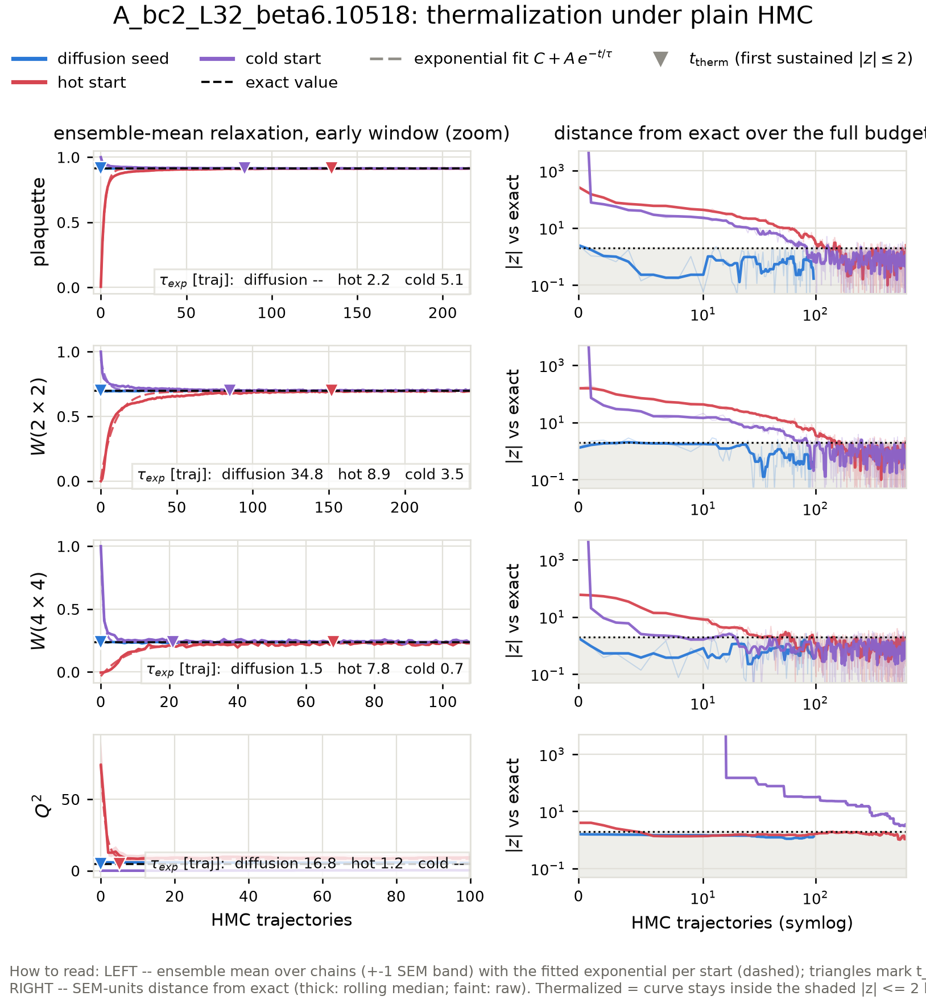

tau_int (hot-start chains, second half): plaquette = 3.63 +- 0.43, wilson_2x2 = 3.93 +- 0.40, wilson_4x4 = 1.24 +- 0.06, wilson_6x6 = 0.90 +- 0.05. Topology: hot-start HMC L=32 beta=6.10518 -> tau_int(Q) = 39.9.

Where 'never' stood at the end: the cold start ended the 640-trajectory budget still at Q^2 at |z| ~ 3.

### Diagnostics: raw diffusion output (before any HMC)

| observable | value | error | exact | z_exact | reference | ref_error | z_ref | ks_p | chi2_p |
|---|---|---|---|---|---|---|---|---|---|
| plaquette | 0.913 | 0.0003926 | 0.914 | -2.367 | 0.9139 | 0.000251 | -1.913 | 0.1519 |  |
| wilson_1x1 | 0.913 | 0.0003926 | 0.914 | -2.367 | 0.9139 | 0.000251 | -1.913 | 0.1519 |  |
| wilson_1x2 | 0.8321 | 0.0008259 | 0.8353 | -3.859 | 0.8352 | 0.0005981 | -2.953 | 0.01864 |  |
| wilson_2x2 | 0.6956 | 0.001553 | 0.6978 | -1.379 | 0.6974 | 0.001248 | -0.8998 | 0.2498 |  |
| wilson_2x3 | 0.5825 | 0.002121 | 0.5829 | -0.1577 | 0.5818 | 0.00194 | 0.2474 | 0.9991 |  |
| wilson_3x3 | 0.4464 | 0.002936 | 0.445 | 0.4803 | 0.4443 | 0.003061 | 0.5049 | 0.9167 |  |
| wilson_3x4 | 0.3438 | 0.003581 | 0.3397 | 1.14 | 0.3387 | 0.003633 | 1.012 | 0.4545 |  |
| wilson_4x4 | 0.2447 | 0.004237 | 0.2371 | 1.791 | 0.2365 | 0.003993 | 1.407 | 0.3001 |  |
| wilson_4x5 | 0.1753 | 0.004246 | 0.1654 | 2.32 | 0.1643 | 0.003885 | 1.9 | 0.2741 |  |
| wilson_5x5 | 0.1132 | 0.004694 | 0.1055 | 1.637 | 0.1054 | 0.003682 | 1.301 | 0.2272 |  |
| wilson_5x6 | 0.07356 | 0.004451 | 0.06728 | 1.411 | 0.06597 | 0.003727 | 1.308 | 0.357 |  |
| wilson_6x6 | 0.03953 | 0.004305 | 0.03921 | 0.07335 | 0.03753 | 0.003475 | 0.3607 | 0.9719 |  |
| wilson_6x7 | 0.02204 | 0.004061 | 0.02286 | -0.2006 | 0.02178 | 0.003421 | 0.04882 | 0.9991 |  |
| wilson_7x7 | 0.009627 | 0.003571 | 0.01218 | -0.7139 | 0.0116 | 0.00311 | -0.4157 | 0.7195 |  |
| wilson_7x8 | 0.004734 | 0.003862 | 0.006487 | -0.4538 | 0.005025 | 0.003226 | -0.05783 | 0.8288 |  |
| wilson_8x8 | 0.002072 | 0.003787 | 0.003158 | -0.2868 | 0.003577 | 0.002816 | -0.319 | 0.6808 |  |
| wilson_8x10 | -0.004984 | 0.003648 | 0.0007487 | -1.571 | 0.006454 | 0.003418 | -2.288 | 0.04767 |  |
| wilson_10x10 | -0.004792 | 0.002579 | 0.0001238 | -1.906 | 0.002717 | 0.002899 | -1.935 | 0.1866 |  |
| wilson_10x12 | -0.005153 | 0.003217 | 2.049e-05 | -1.608 | 0.002296 | 0.002439 | -1.845 | 0.1685 |  |
| wilson_12x12 | -0.002042 | 0.003248 | 2.365e-06 | -0.6294 | 0.0003315 | 0.001451 | -0.6672 | 0.4545 |  |
| creutz_2 | 0.08641 | 0.001222 | 0.08996 | -2.908 |  |  |  |  |  |
| creutz_3 | 0.08873 | 0.002972 | 0.08996 | -0.4162 |  |  |  |  |  |
| creutz_4 | 0.07918 | 0.007145 | 0.08996 | -1.509 |  |  |  |  |  |
| creutz_5 | 0.1038 | 0.01441 | 0.08996 | 0.9631 |  |  |  |  |  |
| creutz_6 | 0.1901 | 0.04404 | 0.08996 | 2.275 |  |  |  |  |  |
| creutz_7 | 0.2443 | 0.231 | 0.08996 | 0.6682 |  |  |  |  |  |
| creutz_8 | 0.1164 | 1.005 | 0.08996 | 0.02635 |  |  |  |  |  |
| Q | -0.03125 | 0.2352 | 0 | -0.1328 | 0.05208 | 0.1548 | -0.2959 | 0.6808 |  |
| Q^2 | 5.891 | 0.9288 | 4.686 | 1.297 | 5.104 | 0.4005 | 0.7776 | 0.9827 |  |
| chi_top ((<Q^2>-<Q>^2)/V) | 0.005752 | 0.0007481 | 0.004576 | 1.571 | 0.004982 | 0.0005261 | 0.8416 |  |  |
| Q histogram vs exact P(Q) | 21.65 | nan | 10 | nan |  |  |  |  | 0.01701 |

### Diagnostics: the same configs after 96 HMC trajectories

| observable | value | error | exact | z_exact | reference | ref_error | z_ref | ks_p | chi2_p |
|---|---|---|---|---|---|---|---|---|---|
| plaquette | 0.9139 | 0.0002738 | 0.914 | -0.2045 | 0.9139 | 0.000251 | -0.04884 | 0.9574 |  |
| wilson_1x1 | 0.9139 | 0.0002738 | 0.914 | -0.2045 | 0.9139 | 0.000251 | -0.04884 | 0.9574 |  |
| wilson_1x2 | 0.8348 | 0.0006889 | 0.8353 | -0.7283 | 0.8352 | 0.0005981 | -0.3579 | 0.6028 |  |
| wilson_2x2 | 0.6973 | 0.001226 | 0.6978 | -0.3472 | 0.6974 | 0.001248 | -0.04385 | 0.9167 |  |
| wilson_2x3 | 0.5822 | 0.001873 | 0.5829 | -0.344 | 0.5818 | 0.00194 | 0.1488 | 0.9827 |  |
| wilson_3x3 | 0.4434 | 0.003041 | 0.445 | -0.5273 | 0.4443 | 0.003061 | -0.202 | 0.5266 |  |
| wilson_3x4 | 0.3393 | 0.003659 | 0.3397 | -0.1271 | 0.3387 | 0.003633 | 0.1196 | 0.7575 |  |
| wilson_4x4 | 0.2354 | 0.003919 | 0.2371 | -0.4286 | 0.2365 | 0.003993 | -0.1931 | 0.2272 |  |
| wilson_4x5 | 0.1634 | 0.004784 | 0.1654 | -0.415 | 0.1643 | 0.003885 | -0.1468 | 0.1866 |  |
| wilson_5x5 | 0.101 | 0.004407 | 0.1055 | -1.028 | 0.1054 | 0.003682 | -0.7755 | 0.09806 |  |
| wilson_5x6 | 0.063 | 0.004341 | 0.06728 | -0.9847 | 0.06597 | 0.003727 | -0.518 | 0.4899 |  |
| wilson_6x6 | 0.03512 | 0.004406 | 0.03921 | -0.9297 | 0.03753 | 0.003475 | -0.4306 | 0.4545 |  |
| wilson_6x7 | 0.02178 | 0.004524 | 0.02286 | -0.2368 | 0.02178 | 0.003421 | 0.000396 | 0.5643 |  |
| wilson_7x7 | 0.01146 | 0.004307 | 0.01218 | -0.1657 | 0.0116 | 0.00311 | -0.02496 | 0.9574 |  |
| wilson_7x8 | 0.009026 | 0.003618 | 0.006487 | 0.7017 | 0.005025 | 0.003226 | 0.8252 | 0.939 |  |
| wilson_8x8 | 0.005881 | 0.003251 | 0.003158 | 0.8374 | 0.003577 | 0.002816 | 0.5355 | 0.6808 |  |
| wilson_8x10 | 0.001598 | 0.003421 | 0.0007487 | 0.2481 | 0.006454 | 0.003418 | -1.004 | 0.2272 |  |
| wilson_10x10 | 0.0002139 | 0.003454 | 0.0001238 | 0.02608 | 0.002717 | 0.002899 | -0.555 | 0.3001 |  |
| wilson_10x12 | -0.0006901 | 0.002579 | 2.049e-05 | -0.2755 | 0.002296 | 0.002439 | -0.8411 | 0.939 |  |
| wilson_12x12 | -0.001069 | 0.001696 | 2.365e-06 | -0.6318 | 0.0003315 | 0.001451 | -0.6275 | 0.6808 |  |
| creutz_2 | 0.08943 | 0.001279 | 0.08996 | -0.4144 |  |  |  |  |  |
| creutz_3 | 0.09197 | 0.003185 | 0.08996 | 0.6304 |  |  |  |  |  |
| creutz_4 | 0.09794 | 0.006615 | 0.08996 | 1.206 |  |  |  |  |  |
| creutz_5 | 0.1168 | 0.01876 | 0.08996 | 1.431 |  |  |  |  |  |
| creutz_6 | 0.1129 | 0.05145 | 0.08996 | 0.4457 |  |  |  |  |  |
| creutz_7 | 0.1646 | 0.1661 | 0.08996 | 0.4495 |  |  |  |  |  |
| creutz_8 | 0.1893 | 0.3935 | 0.08996 | 0.2526 |  |  |  |  |  |
| Q | 0.1094 | 0.2329 | 0 | 0.4696 | 0.05208 | 0.1548 | 0.2049 | 0.9999 |  |
| Q^2 | 5.797 | 1.093 | 4.686 | 1.016 | 5.104 | 0.4005 | 0.5949 | 0.9978 |  |
| chi_top ((<Q^2>-<Q>^2)/V) | 0.005649 | 0.0008157 | 0.004576 | 1.315 | 0.004982 | 0.0005261 | 0.6876 |  |  |
| Q histogram vs exact P(Q) | 11.41 | nan | 10 | nan |  |  |  |  | 0.3262 |

## A_bc3_L32_beta10.015

HMC: step size 0.1264, 8 leapfrog steps, acceptance seed/hot/cold = 0.977/0.980/0.980. Diffusion-seed batch: 128 chains x 96 trajectories (0.10 s/traj for the whole batch); baselines: 32 chains x 640 trajectories.

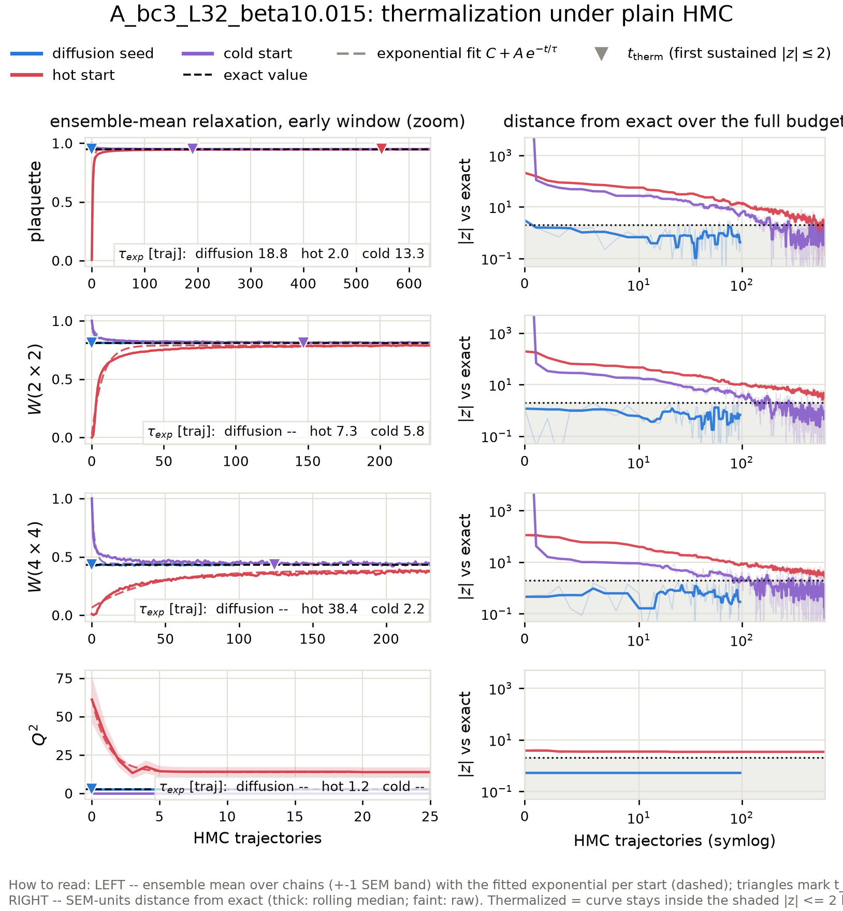

tau_int (hot-start chains, second half): plaquette = 4.95 +- 0.67, wilson_2x2 = 5.66 +- 0.72, wilson_4x4 = 1.91 +- 0.30, wilson_6x6 = 0.93 +- 0.05. Topology: hot-start HMC L=32 beta=10.015 -> **frozen** (no tunneling).

Where 'never' stood at the end: the hot start ended the 640-trajectory budget still at wilson_2x2 at |z| ~ 3, wilson_4x4 at |z| ~ 3, wilson_6x6 at |z| ~ 3, Q^2 at |z| ~ 3; the cold start ended the 640-trajectory budget still at Q^2 at |z| ~ 2736159195136.

### Diagnostics: raw diffusion output (before any HMC)

| observable | value | error | exact | z_exact | reference | ref_error | z_ref | ks_p | chi2_p |
|---|---|---|---|---|---|---|---|---|---|
| plaquette | 0.9493 | 0.0001829 | 0.9487 | 3.283 | 0.949 | 0.0001087 | 1.438 | 0.6028 |  |
| wilson_1x1 | 0.9493 | 0.0001829 | 0.9487 | 3.283 | 0.949 | 0.0001087 | 1.438 | 0.6028 |  |
| wilson_1x2 | 0.9005 | 0.0004035 | 0.9 | 1.318 | 0.9011 | 0.0002933 | -1.163 | 0.8288 |  |
| wilson_2x2 | 0.8112 | 0.0008559 | 0.81 | 1.436 | 0.8123 | 0.000796 | -0.9386 | 0.1866 |  |
| wilson_2x3 | 0.7306 | 0.001461 | 0.729 | 1.111 | 0.7325 | 0.001345 | -0.9373 | 0.2741 |  |
| wilson_3x3 | 0.624 | 0.002602 | 0.6224 | 0.6306 | 0.6281 | 0.002117 | -1.199 | 0.2061 |  |
| wilson_3x4 | 0.533 | 0.003315 | 0.5314 | 0.4889 | 0.5385 | 0.002842 | -1.263 | 0.08742 |  |
| wilson_4x4 | 0.4324 | 0.004385 | 0.4304 | 0.4461 | 0.4383 | 0.003576 | -1.036 | 0.1519 |  |
| wilson_4x5 | 0.3507 | 0.004863 | 0.3486 | 0.4219 | 0.3577 | 0.003913 | -1.115 | 0.1519 |  |
| wilson_5x5 | 0.2691 | 0.005514 | 0.2679 | 0.2195 | 0.2765 | 0.003994 | -1.085 | 0.1098 |  |
| wilson_5x6 | 0.2071 | 0.005906 | 0.2059 | 0.209 | 0.2146 | 0.003907 | -1.063 | 0.2061 |  |
| wilson_6x6 | 0.1528 | 0.005463 | 0.1501 | 0.4944 | 0.157 | 0.003592 | -0.6401 | 0.3277 |  |
| wilson_6x7 | 0.1121 | 0.005333 | 0.1094 | 0.5018 | 0.1176 | 0.003355 | -0.8759 | 0.3001 |  |
| wilson_7x7 | 0.07769 | 0.004726 | 0.07566 | 0.4298 | 0.08313 | 0.003598 | -0.9163 | 0.8288 |  |
| wilson_7x8 | 0.05223 | 0.004038 | 0.05232 | -0.02185 | 0.0593 | 0.002975 | -1.409 | 0.9167 |  |
| wilson_8x8 | 0.03347 | 0.003168 | 0.03433 | -0.2689 | 0.04185 | 0.003649 | -1.733 | 0.1685 |  |
| wilson_8x10 | 0.01012 | 0.003189 | 0.01478 | -1.46 | 0.02282 | 0.003546 | -2.663 | 0.06115 |  |
| wilson_10x10 | 0.00268 | 0.004643 | 0.005151 | -0.5324 | 0.009429 | 0.00298 | -1.223 | 0.5266 |  |
| wilson_10x12 | -0.00576 | 0.003903 | 0.001796 | -1.936 | 0.00556 | 0.002332 | -2.49 | 0.03684 |  |
| wilson_12x12 | -0.007527 | 0.004134 | 0.0005072 | -1.944 | 0.002387 | 0.003226 | -1.891 | 0.3879 |  |
| creutz_2 | 0.05172 | 0.0007466 | 0.05268 | -1.296 |  |  |  |  |  |
| creutz_3 | 0.05298 | 0.001568 | 0.05268 | 0.1902 |  |  |  |  |  |
| creutz_4 | 0.05161 | 0.002651 | 0.05268 | -0.4061 |  |  |  |  |  |
| creutz_5 | 0.05538 | 0.005321 | 0.05268 | 0.5064 |  |  |  |  |  |
| creutz_6 | 0.0423 | 0.01093 | 0.05268 | -0.9504 |  |  |  |  |  |
| creutz_7 | 0.05669 | 0.02306 | 0.05268 | 0.1735 |  |  |  |  |  |
| creutz_8 | 0.04795 | 0.05553 | 0.05268 | -0.0853 |  |  |  |  |  |
| Q | -0.04688 | 0.1841 | 0 | -0.2547 | -0.04167 | 0.08285 | -0.0258 | 0.9902 |  |
| Q^2 | 2.562 | 0.2781 | 2.736 | -0.6244 | 2.417 | 0.188 | 0.4344 | 1 |  |
| chi_top ((<Q^2>-<Q>^2)/V) | 0.0025 | 0.0003258 | 0.002672 | -0.5271 | 0.002358 | 0.0002288 | 0.3566 |  |  |
| Q histogram vs exact P(Q) | 6.704 | nan | 8 | nan |  |  |  |  | 0.5688 |

### Diagnostics: the same configs after 96 HMC trajectories

| observable | value | error | exact | z_exact | reference | ref_error | z_ref | ks_p | chi2_p |
|---|---|---|---|---|---|---|---|---|---|
| plaquette | 0.9487 | 0.0001402 | 0.9487 | 0.5057 | 0.949 | 0.0001087 | -1.26 | 0.06904 |  |
| wilson_1x1 | 0.9487 | 0.0001402 | 0.9487 | 0.5057 | 0.949 | 0.0001087 | -1.26 | 0.06904 |  |
| wilson_1x2 | 0.9003 | 0.0003738 | 0.9 | 0.8185 | 0.9011 | 0.0002933 | -1.696 | 0.1685 |  |
| wilson_2x2 | 0.8106 | 0.0008904 | 0.81 | 0.6945 | 0.8123 | 0.000796 | -1.43 | 0.01398 |  |
| wilson_2x3 | 0.7304 | 0.001466 | 0.729 | 0.9977 | 0.7325 | 0.001345 | -1.016 | 0.357 |  |
| wilson_3x3 | 0.6231 | 0.002196 | 0.6224 | 0.3333 | 0.6281 | 0.002117 | -1.617 | 0.04767 |  |
| wilson_3x4 | 0.5325 | 0.003241 | 0.5314 | 0.3266 | 0.5385 | 0.002842 | -1.41 | 0.04195 |  |
| wilson_4x4 | 0.4294 | 0.004065 | 0.4304 | -0.2597 | 0.4383 | 0.003576 | -1.639 | 0.004773 |  |
| wilson_4x5 | 0.3484 | 0.005031 | 0.3486 | -0.05605 | 0.3577 | 0.003913 | -1.458 | 0.004773 |  |
| wilson_5x5 | 0.2655 | 0.005772 | 0.2679 | -0.4157 | 0.2765 | 0.003994 | -1.567 | 0.008934 |  |
| wilson_5x6 | 0.2054 | 0.006026 | 0.2059 | -0.0782 | 0.2146 | 0.003907 | -1.286 | 0.05405 |  |
| wilson_6x6 | 0.1483 | 0.006164 | 0.1501 | -0.2835 | 0.157 | 0.003592 | -1.21 | 0.07777 |  |
| wilson_6x7 | 0.1102 | 0.006111 | 0.1094 | 0.127 | 0.1176 | 0.003355 | -1.064 | 0.2741 |  |
| wilson_7x7 | 0.07645 | 0.005765 | 0.07566 | 0.1378 | 0.08313 | 0.003598 | -0.9829 | 0.6418 |  |
| wilson_7x8 | 0.05512 | 0.004966 | 0.05232 | 0.5641 | 0.0593 | 0.002975 | -0.7215 | 0.8288 |  |
| wilson_8x8 | 0.03565 | 0.004951 | 0.03433 | 0.2676 | 0.04185 | 0.003649 | -1.008 | 0.5643 |  |
| wilson_8x10 | 0.01778 | 0.003956 | 0.01478 | 0.7595 | 0.02282 | 0.003546 | -0.949 | 0.5643 |  |
| wilson_10x10 | 0.0038 | 0.003565 | 0.005151 | -0.3791 | 0.009429 | 0.00298 | -1.211 | 0.3277 |  |
| wilson_10x12 | -0.0002419 | 0.003788 | 0.001796 | -0.538 | 0.00556 | 0.002332 | -1.304 | 0.2272 |  |
| wilson_12x12 | 0.001279 | 0.004221 | 0.0005072 | 0.1829 | 0.002387 | 0.003226 | -0.2085 | 0.3001 |  |
| creutz_2 | 0.05253 | 0.0007419 | 0.05268 | -0.2131 |  |  |  |  |  |
| creutz_3 | 0.05476 | 0.001366 | 0.05268 | 1.516 |  |  |  |  |  |
| creutz_4 | 0.05794 | 0.002861 | 0.05268 | 1.838 |  |  |  |  |  |
| creutz_5 | 0.06252 | 0.006006 | 0.05268 | 1.637 |  |  |  |  |  |
| creutz_6 | 0.06881 | 0.01113 | 0.05268 | 1.449 |  |  |  |  |  |
| creutz_7 | 0.06809 | 0.02419 | 0.05268 | 0.6369 |  |  |  |  |  |
| creutz_8 | 0.1087 | 0.04905 | 0.05268 | 1.142 |  |  |  |  |  |
| Q | -0.04688 | 0.1841 | 0 | -0.2547 | -0.04167 | 0.08285 | -0.0258 | 0.9902 |  |
| Q^2 | 2.562 | 0.2781 | 2.736 | -0.6244 | 2.417 | 0.188 | 0.4344 | 1 |  |
| chi_top ((<Q^2>-<Q>^2)/V) | 0.0025 | 0.0003258 | 0.002672 | -0.5271 | 0.002358 | 0.0002288 | 0.3566 |  |  |
| Q histogram vs exact P(Q) | 6.704 | nan | 8 | nan |  |  |  |  | 0.5688 |

## A_bc4_L32_beta14.1464

HMC: step size 0.1063, 9 leapfrog steps, acceptance seed/hot/cold = 0.986/0.986/0.984. Diffusion-seed batch: 128 chains x 96 trajectories (0.10 s/traj for the whole batch); baselines: 32 chains x 640 trajectories.

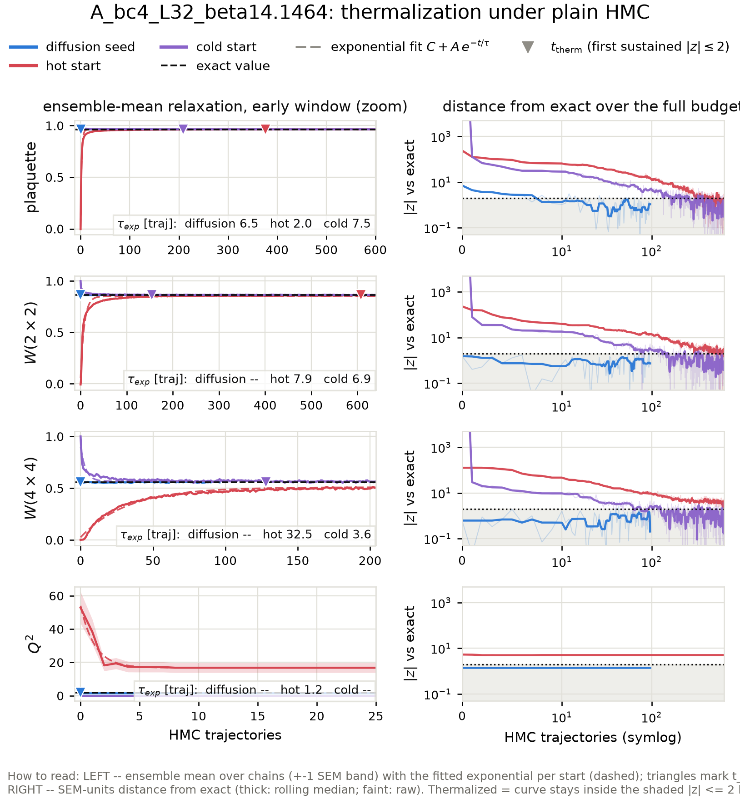

tau_int (hot-start chains, second half): plaquette = 5.15 +- 0.59, wilson_2x2 = 4.11 +- 0.42, wilson_4x4 = 2.03 +- 0.17, wilson_6x6 = 0.87 +- 0.07. Topology: hot-start HMC L=32 beta=14.1464 -> **frozen** (no tunneling).

Where 'never' stood at the end: the hot start ended the 640-trajectory budget still at wilson_4x4 at |z| ~ 4, wilson_6x6 at |z| ~ 4, Q^2 at |z| ~ 5; the cold start ended the 640-trajectory budget still at Q^2 at |z| ~ 1903991324672.

### Diagnostics: raw diffusion output (before any HMC)

| observable | value | error | exact | z_exact | reference | ref_error | z_ref | ks_p | chi2_p |
|---|---|---|---|---|---|---|---|---|---|
| plaquette | 0.9649 | 0.000146 | 0.964 | 6.556 | 0.9639 | 0.0001213 | 5.608 | 2.266e-05 |  |
| wilson_1x1 | 0.9649 | 0.000146 | 0.964 | 6.556 | 0.9639 | 0.0001213 | 5.608 | 2.266e-05 |  |
| wilson_1x2 | 0.9304 | 0.0002653 | 0.9293 | 4.264 | 0.9294 | 0.0002471 | 2.647 | 0.09806 |  |
| wilson_2x2 | 0.8647 | 0.0006559 | 0.8635 | 1.727 | 0.8645 | 0.0004983 | 0.207 | 0.8288 |  |
| wilson_2x3 | 0.8042 | 0.001217 | 0.8024 | 1.481 | 0.8048 | 0.0008804 | -0.4041 | 0.8288 |  |
| wilson_3x3 | 0.7204 | 0.002052 | 0.7188 | 0.777 | 0.7229 | 0.001518 | -0.9713 | 0.05405 |  |
| wilson_3x4 | 0.6456 | 0.002613 | 0.6439 | 0.6543 | 0.6498 | 0.002333 | -1.208 | 0.357 |  |
| wilson_4x4 | 0.5582 | 0.003704 | 0.556 | 0.5813 | 0.5637 | 0.003131 | -1.133 | 0.1866 |  |
| wilson_4x5 | 0.4816 | 0.004681 | 0.4801 | 0.321 | 0.4889 | 0.004108 | -1.163 | 0.2061 |  |
| wilson_5x5 | 0.3999 | 0.005673 | 0.3997 | 0.0382 | 0.4088 | 0.004986 | -1.176 | 0.1098 |  |
| wilson_5x6 | 0.3318 | 0.006092 | 0.3327 | -0.1483 | 0.3409 | 0.005446 | -1.108 | 0.1866 |  |
| wilson_6x6 | 0.2653 | 0.007023 | 0.267 | -0.2348 | 0.2732 | 0.005718 | -0.8715 | 0.2741 |  |
| wilson_6x7 | 0.2113 | 0.007642 | 0.2142 | -0.3848 | 0.2187 | 0.005735 | -0.7807 | 0.2498 |  |
| wilson_7x7 | 0.1613 | 0.007954 | 0.1657 | -0.5486 | 0.1675 | 0.005264 | -0.65 | 0.6808 |  |
| wilson_7x8 | 0.1237 | 0.008525 | 0.1282 | -0.5219 | 0.1287 | 0.005324 | -0.4896 | 0.8612 |  |
| wilson_8x8 | 0.09197 | 0.008434 | 0.09558 | -0.4287 | 0.09427 | 0.005269 | -0.2317 | 0.939 |  |
| wilson_8x10 | 0.05323 | 0.008762 | 0.05315 | 0.009896 | 0.05084 | 0.005635 | 0.2296 | 0.9574 |  |
| wilson_10x10 | 0.02699 | 0.00622 | 0.02552 | 0.2366 | 0.02326 | 0.004043 | 0.5021 | 0.9574 |  |
| wilson_10x12 | 0.01227 | 0.006262 | 0.01225 | 0.003421 | 0.01124 | 0.004685 | 0.1317 | 0.6028 |  |
| wilson_12x12 | 0.004805 | 0.005741 | 0.00508 | -0.04782 | 0.007469 | 0.003825 | -0.3862 | 0.5643 |  |
| creutz_2 | 0.03681 | 0.0005222 | 0.03668 | 0.2493 |  |  |  |  |  |
| creutz_3 | 0.03765 | 0.0009535 | 0.03668 | 1.009 |  |  |  |  |  |
| creutz_4 | 0.03591 | 0.001962 | 0.03668 | -0.3967 |  |  |  |  |  |
| creutz_5 | 0.03853 | 0.003321 | 0.03668 | 0.5547 |  |  |  |  |  |
| creutz_6 | 0.0369 | 0.006356 | 0.03668 | 0.03407 |  |  |  |  |  |
| creutz_7 | 0.04192 | 0.01022 | 0.03668 | 0.5125 |  |  |  |  |  |
| creutz_8 | 0.03127 | 0.01918 | 0.03668 | -0.2822 |  |  |  |  |  |
| Q | -0.007812 | 0.1256 | 0 | -0.06218 | -0.03646 | 0.09814 | 0.1797 | 1 |  |
| Q^2 | 1.602 | 0.2145 | 1.904 | -1.41 | 1.828 | 0.1613 | -0.8442 | 0.9574 |  |
| chi_top ((<Q^2>-<Q>^2)/V) | 0.001564 | 0.0002066 | 0.001859 | -1.43 | 0.001784 | 0.0001793 | -0.8043 |  |  |
| Q histogram vs exact P(Q) | 6.232 | nan | 8 | nan |  |  |  |  | 0.6213 |

### Diagnostics: the same configs after 96 HMC trajectories

| observable | value | error | exact | z_exact | reference | ref_error | z_ref | ks_p | chi2_p |
|---|---|---|---|---|---|---|---|---|---|
| plaquette | 0.9641 | 0.0001378 | 0.964 | 1.021 | 0.9639 | 0.0001213 | 1.351 | 0.2061 |  |
| wilson_1x1 | 0.9641 | 0.0001378 | 0.964 | 1.021 | 0.9639 | 0.0001213 | 1.351 | 0.2061 |  |
| wilson_1x2 | 0.9297 | 0.0003126 | 0.9293 | 1.568 | 0.9294 | 0.0002471 | 0.7996 | 0.5643 |  |
| wilson_2x2 | 0.8641 | 0.0007901 | 0.8635 | 0.6697 | 0.8645 | 0.0004983 | -0.4636 | 0.7195 |  |
| wilson_2x3 | 0.8039 | 0.001187 | 0.8024 | 1.274 | 0.8048 | 0.0008804 | -0.6071 | 0.4204 |  |
| wilson_3x3 | 0.7205 | 0.001953 | 0.7188 | 0.8788 | 0.7229 | 0.001518 | -0.953 | 0.1366 |  |
| wilson_3x4 | 0.646 | 0.002418 | 0.6439 | 0.8806 | 0.6498 | 0.002333 | -1.135 | 0.09806 |  |
| wilson_4x4 | 0.5568 | 0.003288 | 0.556 | 0.2363 | 0.5637 | 0.003131 | -1.513 | 0.04767 |  |
| wilson_4x5 | 0.4801 | 0.004204 | 0.4801 | -0.007906 | 0.4889 | 0.004108 | -1.493 | 0.01616 |  |
| wilson_5x5 | 0.3979 | 0.005082 | 0.3997 | -0.3451 | 0.4088 | 0.004986 | -1.525 | 0.004059 |  |
| wilson_5x6 | 0.331 | 0.005752 | 0.3327 | -0.2896 | 0.3409 | 0.005446 | -1.239 | 0.01864 |  |
| wilson_6x6 | 0.2614 | 0.006395 | 0.267 | -0.8721 | 0.2732 | 0.005718 | -1.378 | 0.02145 |  |
| wilson_6x7 | 0.2094 | 0.006954 | 0.2142 | -0.6893 | 0.2187 | 0.005735 | -1.033 | 0.07777 |  |
| wilson_7x7 | 0.1593 | 0.006682 | 0.1657 | -0.9619 | 0.1675 | 0.005264 | -0.9715 | 0.1098 |  |
| wilson_7x8 | 0.1223 | 0.006427 | 0.1282 | -0.9206 | 0.1287 | 0.005324 | -0.7654 | 0.1685 |  |
| wilson_8x8 | 0.09068 | 0.006167 | 0.09558 | -0.7946 | 0.09427 | 0.005269 | -0.4425 | 0.6808 |  |
| wilson_8x10 | 0.05065 | 0.006507 | 0.05315 | -0.3836 | 0.05084 | 0.005635 | -0.02217 | 0.6028 |  |
| wilson_10x10 | 0.02172 | 0.005865 | 0.02552 | -0.6476 | 0.02326 | 0.004043 | -0.2168 | 0.8906 |  |
| wilson_10x12 | 0.01119 | 0.005059 | 0.01225 | -0.2105 | 0.01124 | 0.004685 | -0.008158 | 0.6808 |  |
| wilson_12x12 | 0.002357 | 0.003469 | 0.00508 | -0.7849 | 0.007469 | 0.003825 | -0.99 | 0.7195 |  |
| creutz_2 | 0.03698 | 0.0005098 | 0.03668 | 0.5808 |  |  |  |  |  |
| creutz_3 | 0.03745 | 0.00105 | 0.03668 | 0.732 |  |  |  |  |  |
| creutz_4 | 0.0395 | 0.001764 | 0.03668 | 1.598 |  |  |  |  |  |
| creutz_5 | 0.03955 | 0.003027 | 0.03668 | 0.9455 |  |  |  |  |  |
| creutz_6 | 0.05216 | 0.005267 | 0.03668 | 2.938 |  |  |  |  |  |
| creutz_7 | 0.0521 | 0.01174 | 0.03668 | 1.313 |  |  |  |  |  |
| creutz_8 | 0.03436 | 0.01957 | 0.03668 | -0.1186 |  |  |  |  |  |
| Q | -0.007812 | 0.1256 | 0 | -0.06218 | -0.03646 | 0.09814 | 0.1797 | 1 |  |
| Q^2 | 1.602 | 0.2145 | 1.904 | -1.41 | 1.828 | 0.1613 | -0.8442 | 0.9574 |  |
| chi_top ((<Q^2>-<Q>^2)/V) | 0.001564 | 0.0002066 | 0.001859 | -1.43 | 0.001784 | 0.0001793 | -0.8043 |  |  |
| Q histogram vs exact P(Q) | 6.232 | nan | 8 | nan |  |  |  |  | 0.6213 |

## A_bc5_L32_beta18.2524

HMC: step size 0.0936, 11 leapfrog steps, acceptance seed/hot/cold = 0.980/0.981/0.981. Diffusion-seed batch: 128 chains x 96 trajectories (0.12 s/traj for the whole batch); baselines: 32 chains x 640 trajectories.

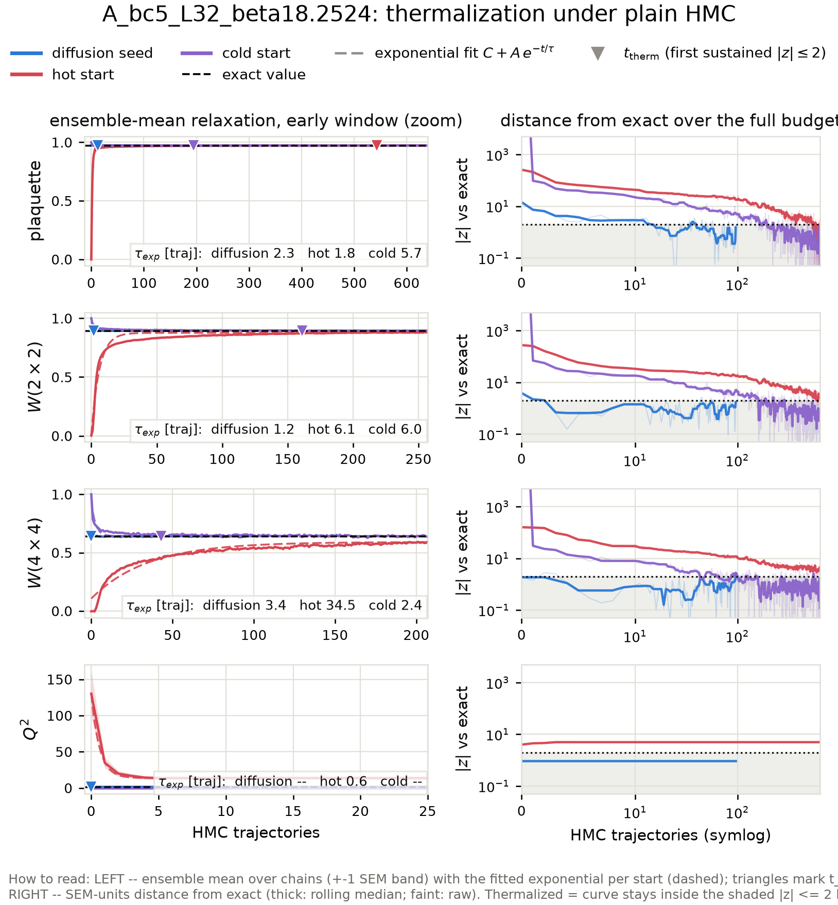

tau_int (hot-start chains, second half): plaquette = 6.34 +- 0.83, wilson_2x2 = 7.02 +- 1.00, wilson_4x4 = 3.04 +- 0.56, wilson_6x6 = 1.00 +- 0.07. Topology: hot-start HMC L=32 beta=18.2524 -> **frozen** (no tunneling).

Where 'never' stood at the end: the hot start ended the 640-trajectory budget still at wilson_2x2 at |z| ~ 3, wilson_4x4 at |z| ~ 4, wilson_6x6 at |z| ~ 5, Q^2 at |z| ~ 5; the cold start ended the 640-trajectory budget still at Q^2 at |z| ~ 1462558916608.

### Diagnostics: raw diffusion output (before any HMC)

| observable | value | error | exact | z_exact | reference | ref_error | z_ref | ks_p | chi2_p |
|---|---|---|---|---|---|---|---|---|---|
| plaquette | 0.9738 | 0.0001262 | 0.9722 | 12.22 | 0.9722 | 7.794e-05 | 10.63 | 2.234e-21 |  |
| wilson_1x1 | 0.9738 | 0.0001262 | 0.9722 | 12.22 | 0.9722 | 7.794e-05 | 10.63 | 2.234e-21 |  |
| wilson_1x2 | 0.9473 | 0.0002456 | 0.9452 | 8.41 | 0.9451 | 0.0002107 | 6.694 | 8.308e-07 |  |
| wilson_2x2 | 0.8956 | 0.0007507 | 0.8934 | 3.016 | 0.8937 | 0.0006431 | 1.934 | 0.07777 |  |
| wilson_2x3 | 0.8475 | 0.001159 | 0.8444 | 2.676 | 0.8444 | 0.0009534 | 2.056 | 0.09806 |  |
| wilson_3x3 | 0.7796 | 0.001977 | 0.776 | 1.848 | 0.7764 | 0.001521 | 1.3 | 0.2498 |  |
| wilson_3x4 | 0.7179 | 0.002725 | 0.713 | 1.774 | 0.713 | 0.001996 | 1.444 | 0.2741 |  |
| wilson_4x4 | 0.6425 | 0.003637 | 0.637 | 1.508 | 0.6376 | 0.002751 | 1.085 | 0.3277 |  |
| wilson_4x5 | 0.5751 | 0.004494 | 0.5691 | 1.331 | 0.5682 | 0.003166 | 1.252 | 0.357 |  |
| wilson_5x5 | 0.4997 | 0.005485 | 0.4943 | 0.9894 | 0.4946 | 0.003843 | 0.7706 | 0.4899 |  |
| wilson_5x6 | 0.4354 | 0.006148 | 0.4293 | 0.9818 | 0.4275 | 0.004423 | 1.036 | 0.3277 |  |
| wilson_6x6 | 0.3672 | 0.006242 | 0.3625 | 0.7461 | 0.3613 | 0.004605 | 0.7532 | 0.1685 |  |
| wilson_6x7 | 0.3107 | 0.006678 | 0.3061 | 0.6842 | 0.3038 | 0.004963 | 0.8334 | 0.3879 |  |
| wilson_7x7 | 0.2549 | 0.007126 | 0.2513 | 0.4984 | 0.2493 | 0.004958 | 0.6432 | 0.4899 |  |
| wilson_7x8 | 0.2093 | 0.007793 | 0.2063 | 0.382 | 0.2032 | 0.005353 | 0.6443 | 0.5266 |  |
| wilson_8x8 | 0.1656 | 0.008148 | 0.1647 | 0.1188 | 0.1623 | 0.005375 | 0.3422 | 0.7195 |  |
| wilson_8x10 | 0.1099 | 0.008969 | 0.1049 | 0.5587 | 0.1027 | 0.006268 | 0.6577 | 0.6418 |  |
| wilson_10x10 | 0.05857 | 0.009272 | 0.0597 | -0.1213 | 0.05986 | 0.006531 | -0.1138 | 0.9167 |  |
| wilson_10x12 | 0.03064 | 0.008594 | 0.03397 | -0.3877 | 0.03415 | 0.006199 | -0.3315 | 0.9167 |  |
| wilson_12x12 | 0.01151 | 0.007192 | 0.01727 | -0.8015 | 0.01134 | 0.005532 | 0.0182 | 0.4545 |  |
| creutz_2 | 0.02844 | 0.0003716 | 0.02818 | 0.6732 |  |  |  |  |  |
| creutz_3 | 0.02829 | 0.000866 | 0.02818 | 0.1205 |  |  |  |  |  |
| creutz_4 | 0.02842 | 0.001257 | 0.02818 | 0.1907 |  |  |  |  |  |
| creutz_5 | 0.02961 | 0.002283 | 0.02818 | 0.6248 |  |  |  |  |  |
| creutz_6 | 0.03243 | 0.003903 | 0.02818 | 1.087 |  |  |  |  |  |
| creutz_7 | 0.03102 | 0.00567 | 0.02818 | 0.4999 |  |  |  |  |  |
| creutz_8 | 0.03694 | 0.0108 | 0.02818 | 0.811 |  |  |  |  |  |
| Q | 0.3359 | 0.09913 | 0 | 3.389 | 0.03646 | 0.105 | 2.074 | 0.003444 |  |
| Q^2 | 1.648 | 0.215 | 1.463 | 0.8645 | 1.828 | 0.1597 | -0.671 | 0.2741 |  |
| chi_top ((<Q^2>-<Q>^2)/V) | 0.0015 | 0.0001948 | 0.001428 | 0.3661 | 0.001784 | 0.0001461 | -1.168 |  |  |
| Q histogram vs exact P(Q) | 15.18 | nan | 6 | nan |  |  |  |  | 0.01889 |

### Diagnostics: the same configs after 96 HMC trajectories

| observable | value | error | exact | z_exact | reference | ref_error | z_ref | ks_p | chi2_p |
|---|---|---|---|---|---|---|---|---|---|
| plaquette | 0.9724 | 8.7e-05 | 0.9722 | 1.953 | 0.9722 | 7.794e-05 | 1.761 | 0.02145 |  |
| wilson_1x1 | 0.9724 | 8.7e-05 | 0.9722 | 1.953 | 0.9722 | 7.794e-05 | 1.761 | 0.02145 |  |
| wilson_1x2 | 0.9455 | 0.0002469 | 0.9452 | 1.426 | 0.9451 | 0.0002107 | 1.395 | 0.02464 |  |
| wilson_2x2 | 0.8944 | 0.0006526 | 0.8934 | 1.574 | 0.8937 | 0.0006431 | 0.7363 | 0.357 |  |
| wilson_2x3 | 0.8463 | 0.0009918 | 0.8444 | 1.878 | 0.8444 | 0.0009534 | 1.342 | 0.1866 |  |
| wilson_3x3 | 0.7797 | 0.001483 | 0.776 | 2.554 | 0.7764 | 0.001521 | 1.59 | 0.1098 |  |
| wilson_3x4 | 0.718 | 0.001905 | 0.713 | 2.592 | 0.713 | 0.001996 | 1.806 | 0.1519 |  |
| wilson_4x4 | 0.6446 | 0.002702 | 0.637 | 2.801 | 0.6376 | 0.002751 | 1.824 | 0.04767 |  |
| wilson_4x5 | 0.5775 | 0.00341 | 0.5691 | 2.464 | 0.5682 | 0.003166 | 1.999 | 0.08742 |  |
| wilson_5x5 | 0.5063 | 0.004215 | 0.4943 | 2.844 | 0.4946 | 0.003843 | 2.055 | 0.03684 |  |
| wilson_5x6 | 0.4432 | 0.0053 | 0.4293 | 2.61 | 0.4275 | 0.004423 | 2.266 | 0.04767 |  |
| wilson_6x6 | 0.3798 | 0.006125 | 0.3625 | 2.817 | 0.3613 | 0.004605 | 2.406 | 0.02464 |  |
| wilson_6x7 | 0.3247 | 0.006881 | 0.3061 | 2.699 | 0.3038 | 0.004963 | 2.468 | 0.01207 |  |
| wilson_7x7 | 0.2695 | 0.007451 | 0.2513 | 2.442 | 0.2493 | 0.004958 | 2.26 | 0.02464 |  |
| wilson_7x8 | 0.2241 | 0.007877 | 0.2063 | 2.257 | 0.2032 | 0.005353 | 2.194 | 0.03229 |  |
| wilson_8x8 | 0.183 | 0.007905 | 0.1647 | 2.319 | 0.1623 | 0.005375 | 2.166 | 0.03229 |  |
| wilson_8x10 | 0.1177 | 0.008062 | 0.1049 | 1.59 | 0.1027 | 0.006268 | 1.469 | 0.1685 |  |
| wilson_10x10 | 0.0681 | 0.007264 | 0.0597 | 1.157 | 0.05986 | 0.006531 | 0.8433 | 0.6418 |  |
| wilson_10x12 | 0.03316 | 0.006639 | 0.03397 | -0.1218 | 0.03415 | 0.006199 | -0.1089 | 0.9902 |  |
| wilson_12x12 | 0.01681 | 0.005421 | 0.01727 | -0.08545 | 0.01134 | 0.005532 | 0.7058 | 0.5643 |  |
| creutz_2 | 0.02761 | 0.0003621 | 0.02818 | -1.599 |  |  |  |  |  |
| creutz_3 | 0.02657 | 0.0006928 | 0.02818 | -2.328 |  |  |  |  |  |
| creutz_4 | 0.02531 | 0.001327 | 0.02818 | -2.17 |  |  |  |  |  |
| creutz_5 | 0.02172 | 0.002156 | 0.02818 | -2.997 |  |  |  |  |  |
| creutz_6 | 0.02116 | 0.003284 | 0.02818 | -2.139 |  |  |  |  |  |
| creutz_7 | 0.02958 | 0.005796 | 0.02818 | 0.2403 |  |  |  |  |  |
| creutz_8 | 0.01806 | 0.008855 | 0.02818 | -1.143 |  |  |  |  |  |
| Q | 0.3359 | 0.09913 | 0 | 3.389 | 0.03646 | 0.105 | 2.074 | 0.003444 |  |
| Q^2 | 1.648 | 0.215 | 1.463 | 0.8645 | 1.828 | 0.1597 | -0.671 | 0.2741 |  |
| chi_top ((<Q^2>-<Q>^2)/V) | 0.0015 | 0.0001948 | 0.001428 | 0.3661 | 0.001784 | 0.0001461 | -1.168 |  |  |
| Q histogram vs exact P(Q) | 15.18 | nan | 6 | nan |  |  |  |  | 0.01889 |

## A_bc6_L32_beta22.3151

HMC: step size 0.0847, 12 leapfrog steps, acceptance seed/hot/cold = 0.984/0.983/0.983. Diffusion-seed batch: 128 chains x 96 trajectories (0.13 s/traj for the whole batch); baselines: 32 chains x 640 trajectories.

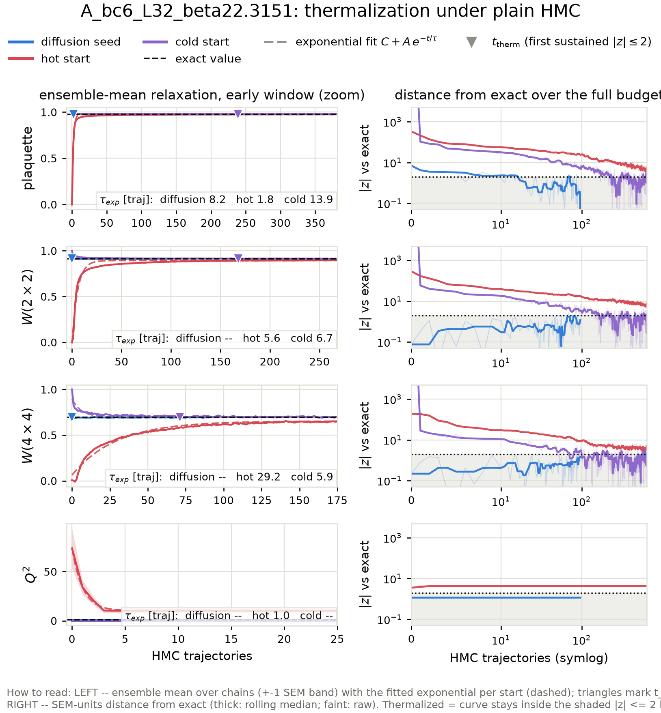

tau_int (hot-start chains, second half): plaquette = 6.70 +- 0.86, wilson_2x2 = 7.59 +- 1.19, wilson_4x4 = 3.05 +- 0.30, wilson_6x6 = 1.31 +- 0.12. Topology: hot-start HMC L=32 beta=22.3151 -> **frozen** (no tunneling).

Where 'never' stood at the end: the hot start ended the 640-trajectory budget still at plaquette at |z| ~ 5, wilson_2x2 at |z| ~ 7, wilson_4x4 at |z| ~ 4, wilson_6x6 at |z| ~ 4, Q^2 at |z| ~ 4; the cold start ended the 640-trajectory budget still at Q^2 at |z| ~ 1189769248768.

### Diagnostics: raw diffusion output (before any HMC)

| observable | value | error | exact | z_exact | reference | ref_error | z_ref | ks_p | chi2_p |
|---|---|---|---|---|---|---|---|---|---|
| plaquette | 0.978 | 6.984e-05 | 0.9773 | 9.559 | 0.9775 | 8.513e-05 | 4.557 | 0.001229 |  |
| wilson_1x1 | 0.978 | 6.984e-05 | 0.9773 | 9.559 | 0.9775 | 8.513e-05 | 4.557 | 0.001229 |  |
| wilson_1x2 | 0.9557 | 0.0001739 | 0.9552 | 3.07 | 0.9554 | 0.0001897 | 1.219 | 0.5643 |  |
| wilson_2x2 | 0.9124 | 0.0003878 | 0.9124 | 0.1002 | 0.9133 | 0.0004611 | -1.569 | 0.2498 |  |
| wilson_2x3 | 0.8718 | 0.0007011 | 0.8715 | 0.4717 | 0.8732 | 0.0007574 | -1.335 | 0.2061 |  |
| wilson_3x3 | 0.8142 | 0.001227 | 0.8135 | 0.5402 | 0.8168 | 0.001271 | -1.499 | 0.1866 |  |
| wilson_3x4 | 0.76 | 0.00191 | 0.7594 | 0.2997 | 0.7641 | 0.001618 | -1.641 | 0.2498 |  |
| wilson_4x4 | 0.6935 | 0.002634 | 0.6929 | 0.2238 | 0.7 | 0.0023 | -1.875 | 0.1226 |  |
| wilson_4x5 | 0.6327 | 0.003375 | 0.6322 | 0.1666 | 0.6417 | 0.002723 | -2.072 | 0.1226 |  |
| wilson_5x5 | 0.5639 | 0.004105 | 0.5637 | 0.06406 | 0.5742 | 0.00367 | -1.857 | 0.04767 |  |
| wilson_5x6 | 0.5031 | 0.004718 | 0.5026 | 0.09865 | 0.516 | 0.004428 | -1.997 | 0.03229 |  |
| wilson_6x6 | 0.4402 | 0.004863 | 0.438 | 0.4571 | 0.4518 | 0.005429 | -1.58 | 0.06115 |  |
| wilson_6x7 | 0.3839 | 0.005547 | 0.3817 | 0.4024 | 0.3959 | 0.006346 | -1.414 | 0.06115 |  |
| wilson_7x7 | 0.3299 | 0.005831 | 0.3251 | 0.8175 | 0.338 | 0.007123 | -0.8807 | 0.1519 |  |
| wilson_7x8 | 0.2827 | 0.006159 | 0.2769 | 0.9483 | 0.2889 | 0.007677 | -0.6259 | 0.2061 |  |
| wilson_8x8 | 0.2397 | 0.006244 | 0.2305 | 1.468 | 0.2399 | 0.008055 | -0.02022 | 0.6028 |  |
| wilson_8x10 | 0.1692 | 0.007179 | 0.1597 | 1.325 | 0.1671 | 0.008098 | 0.1925 | 0.6808 |  |
| wilson_10x10 | 0.1123 | 0.006798 | 0.101 | 1.662 | 0.1063 | 0.007567 | 0.5906 | 0.7941 |  |
| wilson_10x12 | 0.06907 | 0.00692 | 0.06382 | 0.7585 | 0.06654 | 0.006777 | 0.2613 | 0.6028 |  |
| wilson_12x12 | 0.03786 | 0.007555 | 0.03681 | 0.1388 | 0.04263 | 0.005655 | -0.5056 | 0.7941 |  |
| creutz_2 | 0.02332 | 0.0003064 | 0.02293 | 1.279 |  |  |  |  |  |
| creutz_3 | 0.02283 | 0.000672 | 0.02293 | -0.1465 |  |  |  |  |  |
| creutz_4 | 0.02277 | 0.00107 | 0.02293 | -0.1477 |  |  |  |  |  |
| creutz_5 | 0.02339 | 0.001732 | 0.02293 | 0.2666 |  |  |  |  |  |
| creutz_6 | 0.01925 | 0.002945 | 0.02293 | -1.248 |  |  |  |  |  |
| creutz_7 | 0.01497 | 0.004814 | 0.02293 | -1.653 |  |  |  |  |  |
| creutz_8 | 0.01113 | 0.006929 | 0.02293 | -1.703 |  |  |  |  |  |
| Q | -0.2266 | 0.09054 | 0 | -2.502 | 0.07812 | 0.06647 | -2.713 | 0.03684 |  |
| Q^2 | 1.039 | 0.136 | 1.19 | -1.108 | 1.089 | 0.1566 | -0.2385 | 0.9719 |  |
| chi_top ((<Q^2>-<Q>^2)/V) | 0.0009646 | 0.0001174 | 0.001162 | -1.68 | 0.001057 | 0.0001228 | -0.5442 |  |  |
| Q histogram vs exact P(Q) | 14.76 | nan | 6 | nan |  |  |  |  | 0.02222 |

### Diagnostics: the same configs after 96 HMC trajectories

| observable | value | error | exact | z_exact | reference | ref_error | z_ref | ks_p | chi2_p |
|---|---|---|---|---|---|---|---|---|---|
| plaquette | 0.9773 | 6.809e-05 | 0.9773 | 0.01708 | 0.9775 | 8.513e-05 | -1.511 | 0.1866 |  |
| wilson_1x1 | 0.9773 | 6.809e-05 | 0.9773 | 0.01708 | 0.9775 | 8.513e-05 | -1.511 | 0.1866 |  |
| wilson_1x2 | 0.9553 | 0.0001656 | 0.9552 | 0.7096 | 0.9554 | 0.0001897 | -0.4071 | 0.3277 |  |
| wilson_2x2 | 0.9129 | 0.0003476 | 0.9124 | 1.563 | 0.9133 | 0.0004611 | -0.7641 | 0.939 |  |
| wilson_2x3 | 0.8725 | 0.0006343 | 0.8715 | 1.612 | 0.8732 | 0.0007574 | -0.6946 | 0.2741 |  |
| wilson_3x3 | 0.8158 | 0.0009256 | 0.8135 | 2.405 | 0.8168 | 0.001271 | -0.6903 | 0.6028 |  |
| wilson_3x4 | 0.7621 | 0.001349 | 0.7594 | 1.977 | 0.7641 | 0.001618 | -0.9557 | 0.4899 |  |
| wilson_4x4 | 0.6966 | 0.00225 | 0.6929 | 1.661 | 0.7 | 0.0023 | -1.06 | 0.4204 |  |
| wilson_4x5 | 0.6353 | 0.002797 | 0.6322 | 1.139 | 0.6417 | 0.002723 | -1.63 | 0.2741 |  |
| wilson_5x5 | 0.5671 | 0.004032 | 0.5637 | 0.8367 | 0.5742 | 0.00367 | -1.305 | 0.3277 |  |
| wilson_5x6 | 0.5052 | 0.004968 | 0.5026 | 0.5143 | 0.516 | 0.004428 | -1.628 | 0.1519 |  |
| wilson_6x6 | 0.4403 | 0.006032 | 0.438 | 0.3702 | 0.4518 | 0.005429 | -1.418 | 0.1519 |  |
| wilson_6x7 | 0.3828 | 0.007026 | 0.3817 | 0.1477 | 0.3959 | 0.006346 | -1.385 | 0.2741 |  |
| wilson_7x7 | 0.3259 | 0.007589 | 0.3251 | 0.09975 | 0.338 | 0.007123 | -1.164 | 0.2741 |  |
| wilson_7x8 | 0.276 | 0.008465 | 0.2769 | -0.112 | 0.2889 | 0.007677 | -1.133 | 0.2272 |  |
| wilson_8x8 | 0.2266 | 0.008809 | 0.2305 | -0.4446 | 0.2399 | 0.008055 | -1.113 | 0.09806 |  |
| wilson_8x10 | 0.1543 | 0.00967 | 0.1597 | -0.5559 | 0.1671 | 0.008098 | -1.015 | 0.2061 |  |
| wilson_10x10 | 0.09049 | 0.008403 | 0.101 | -1.246 | 0.1063 | 0.007567 | -1.394 | 0.2498 |  |
| wilson_10x12 | 0.05268 | 0.008855 | 0.06382 | -1.258 | 0.06654 | 0.006777 | -1.243 | 0.2498 |  |
| wilson_12x12 | 0.02828 | 0.006994 | 0.03681 | -1.22 | 0.04263 | 0.005655 | -1.596 | 0.2498 |  |
| creutz_2 | 0.02258 | 0.0002932 | 0.02293 | -1.195 |  |  |  |  |  |
| creutz_3 | 0.02195 | 0.0005755 | 0.02293 | -1.707 |  |  |  |  |  |
| creutz_4 | 0.02183 | 0.001128 | 0.02293 | -0.9742 |  |  |  |  |  |
| creutz_5 | 0.02164 | 0.00171 | 0.02293 | -0.7547 |  |  |  |  |  |
| creutz_6 | 0.02202 | 0.002857 | 0.02293 | -0.3188 |  |  |  |  |  |
| creutz_7 | 0.02095 | 0.004176 | 0.02293 | -0.4746 |  |  |  |  |  |
| creutz_8 | 0.03088 | 0.006607 | 0.02293 | 1.204 |  |  |  |  |  |
| Q | -0.2266 | 0.09054 | 0 | -2.502 | 0.07812 | 0.06647 | -2.713 | 0.03684 |  |
| Q^2 | 1.039 | 0.136 | 1.19 | -1.108 | 1.089 | 0.1566 | -0.2385 | 0.9719 |  |
| chi_top ((<Q^2>-<Q>^2)/V) | 0.0009646 | 0.0001174 | 0.001162 | -1.68 | 0.001057 | 0.0001228 | -0.5442 |  |  |
| Q histogram vs exact P(Q) | 14.76 | nan | 6 | nan |  |  |  |  | 0.02222 |

## A_bc8_L32_beta30.3772

HMC: step size 0.0726, 14 leapfrog steps, acceptance seed/hot/cold = 0.983/0.982/0.983. Diffusion-seed batch: 128 chains x 96 trajectories (0.13 s/traj for the whole batch); baselines: 32 chains x 640 trajectories.

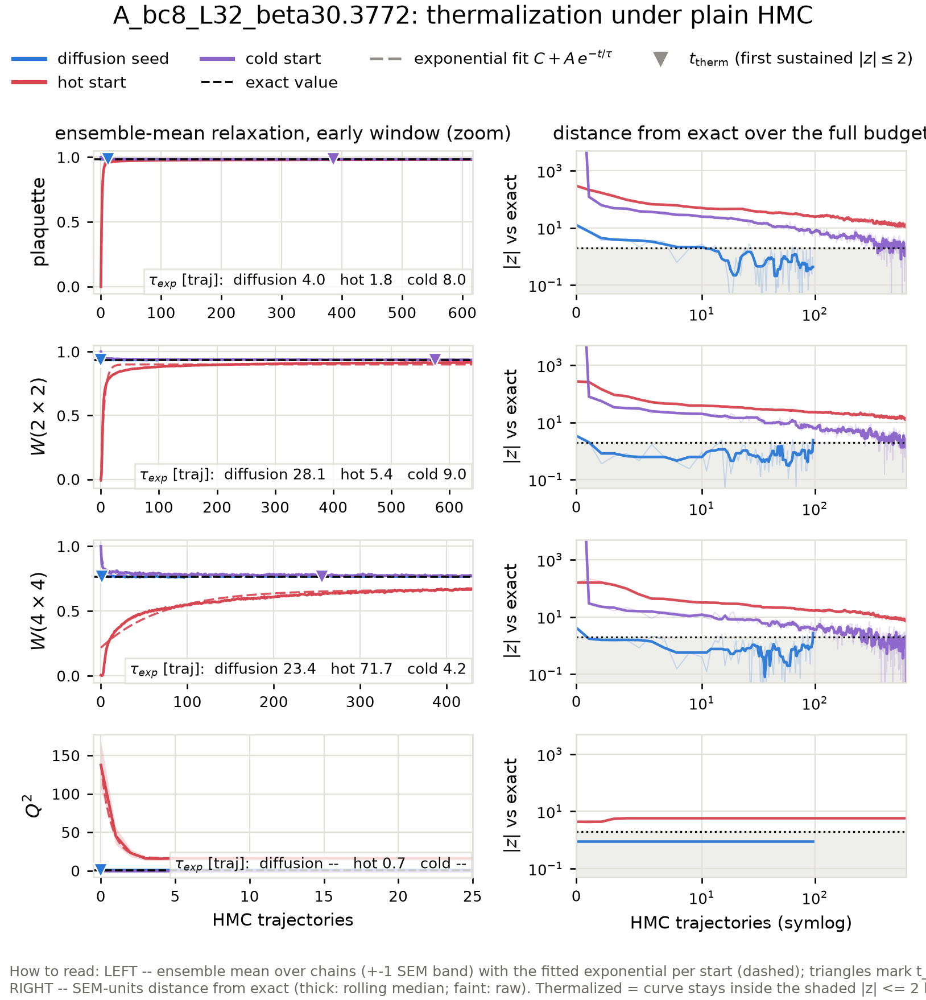

tau_int (hot-start chains, second half): plaquette = 12.86 +- 1.68, wilson_2x2 = 17.02 +- 1.98, wilson_4x4 = 11.38 +- 1.94, wilson_6x6 = 5.57 +- 1.45. Topology: hot-start HMC L=32 beta=30.3772 -> **frozen** (no tunneling).

Where 'never' stood at the end: the hot start ended the 640-trajectory budget still at plaquette at |z| ~ 12, wilson_2x2 at |z| ~ 13, wilson_4x4 at |z| ~ 7, wilson_6x6 at |z| ~ 6, Q^2 at |z| ~ 6; the cold start ended the 640-trajectory budget still at Q^2 at |z| ~ 868455153664.

### Diagnostics: raw diffusion output (before any HMC)

| observable | value | error | exact | z_exact | reference | ref_error | z_ref | ks_p | chi2_p |
|---|---|---|---|---|---|---|---|---|---|
| plaquette | 0.9841 | 6.698e-05 | 0.9834 | 11.05 | 0.9834 | 4.847e-05 | 8.47 | 2.232e-14 |  |
| wilson_1x1 | 0.9841 | 6.698e-05 | 0.9834 | 11.05 | 0.9834 | 4.847e-05 | 8.47 | 2.232e-14 |  |
| wilson_1x2 | 0.9679 | 0.0001613 | 0.9671 | 5.351 | 0.9672 | 0.0001256 | 3.675 | 0.001467 |  |
| wilson_2x2 | 0.9363 | 0.0003506 | 0.9352 | 3.052 | 0.9358 | 0.0003118 | 1.105 | 0.3277 |  |
| wilson_2x3 | 0.9065 | 0.0006087 | 0.9044 | 3.449 | 0.9049 | 0.0005597 | 2.042 | 0.07777 |  |
| wilson_3x3 | 0.8643 | 0.001024 | 0.8601 | 4.028 | 0.8604 | 0.0009089 | 2.86 | 0.01864 |  |
| wilson_3x4 | 0.8238 | 0.001373 | 0.818 | 4.218 | 0.818 | 0.001417 | 2.939 | 0.002464 |  |
| wilson_4x4 | 0.7728 | 0.001928 | 0.765 | 4.041 | 0.7639 | 0.002123 | 3.126 | 0.001229 |  |
| wilson_4x5 | 0.7247 | 0.002778 | 0.7155 | 3.318 | 0.7143 | 0.002747 | 2.676 | 0.001748 |  |
| wilson_5x5 | 0.669 | 0.003738 | 0.658 | 2.919 | 0.6556 | 0.003444 | 2.635 | 0.005601 |  |
| wilson_5x6 | 0.6164 | 0.004519 | 0.6052 | 2.47 | 0.6029 | 0.004116 | 2.204 | 0.01616 |  |
| wilson_6x6 | 0.5598 | 0.005469 | 0.5474 | 2.262 | 0.5471 | 0.005001 | 1.705 | 0.07777 |  |
| wilson_6x7 | 0.507 | 0.006502 | 0.4951 | 1.841 | 0.4959 | 0.005423 | 1.315 | 0.3277 |  |
| wilson_7x7 | 0.4535 | 0.007673 | 0.4403 | 1.716 | 0.4442 | 0.006065 | 0.9496 | 0.6418 |  |
| wilson_7x8 | 0.4021 | 0.008863 | 0.3916 | 1.183 | 0.3976 | 0.00643 | 0.4171 | 0.9902 |  |
| wilson_8x8 | 0.3526 | 0.01 | 0.3426 | 1.008 | 0.3508 | 0.007106 | 0.1508 | 0.9827 |  |
| wilson_8x10 | 0.2693 | 0.01148 | 0.2621 | 0.6321 | 0.2729 | 0.007154 | -0.2651 | 0.7941 |  |
| wilson_10x10 | 0.1945 | 0.01191 | 0.1875 | 0.5864 | 0.1989 | 0.006715 | -0.3241 | 0.8288 |  |
| wilson_10x12 | 0.1393 | 0.01151 | 0.1342 | 0.445 | 0.1463 | 0.005959 | -0.5381 | 0.8612 |  |
| wilson_12x12 | 0.09124 | 0.01116 | 0.08978 | 0.1313 | 0.0999 | 0.005086 | -0.7067 | 0.5266 |  |
| creutz_2 | 0.01663 | 0.0001934 | 0.01674 | -0.5766 |  |  |  |  |  |
| creutz_3 | 0.01545 | 0.0004531 | 0.01674 | -2.847 |  |  |  |  |  |
| creutz_4 | 0.01593 | 0.0006725 | 0.01674 | -1.2 |  |  |  |  |  |
| creutz_5 | 0.01576 | 0.001213 | 0.01674 | -0.8056 |  |  |  |  |  |
| creutz_6 | 0.0145 | 0.001678 | 0.01674 | -1.333 |  |  |  |  |  |
| creutz_7 | 0.01272 | 0.002716 | 0.01674 | -1.479 |  |  |  |  |  |
| creutz_8 | 0.01109 | 0.003941 | 0.01674 | -1.433 |  |  |  |  |  |
| Q | 0.05469 | 0.08673 | 0 | 0.6305 | -0.1927 | 0.06415 | 2.293 | 0.1519 |  |
| Q^2 | 0.9609 | 0.09617 | 0.8685 | 0.9617 | 0.9531 | 0.1048 | 0.05494 | 0.9997 |  |
| chi_top ((<Q^2>-<Q>^2)/V) | 0.0009355 | 0.0001027 | 0.0008481 | 0.8513 | 0.0008945 | 8.388e-05 | 0.3091 |  |  |
| Q histogram vs exact P(Q) | 5.38 | nan | 6 | nan |  |  |  |  | 0.496 |

### Diagnostics: the same configs after 96 HMC trajectories

| observable | value | error | exact | z_exact | reference | ref_error | z_ref | ks_p | chi2_p |
|---|---|---|---|---|---|---|---|---|---|
| plaquette | 0.9834 | 6.324e-05 | 0.9834 | -0.5128 | 0.9834 | 4.847e-05 | -0.9029 | 0.6808 |  |
| wilson_1x1 | 0.9834 | 6.324e-05 | 0.9834 | -0.5128 | 0.9834 | 4.847e-05 | -0.9029 | 0.6808 |  |
| wilson_1x2 | 0.9669 | 0.0001443 | 0.9671 | -1.241 | 0.9672 | 0.0001256 | -1.52 | 0.1519 |  |
| wilson_2x2 | 0.9344 | 0.0003057 | 0.9352 | -2.753 | 0.9358 | 0.0003118 | -3.19 | 0.004059 |  |
| wilson_2x3 | 0.9027 | 0.0005881 | 0.9044 | -2.895 | 0.9049 | 0.0005597 | -2.603 | 0.003444 |  |
| wilson_3x3 | 0.8571 | 0.0009291 | 0.8601 | -3.313 | 0.8604 | 0.0009089 | -2.529 | 0.03684 |  |
| wilson_3x4 | 0.8144 | 0.001472 | 0.818 | -2.476 | 0.818 | 0.001417 | -1.78 | 0.07777 |  |
| wilson_4x4 | 0.7595 | 0.002051 | 0.765 | -2.695 | 0.7639 | 0.002123 | -1.475 | 0.2498 |  |
| wilson_4x5 | 0.7084 | 0.002666 | 0.7155 | -2.656 | 0.7143 | 0.002747 | -1.527 | 0.3879 |  |
| wilson_5x5 | 0.6486 | 0.003392 | 0.658 | -2.774 | 0.6556 | 0.003444 | -1.433 | 0.2498 |  |
| wilson_5x6 | 0.5945 | 0.004027 | 0.6052 | -2.653 | 0.6029 | 0.004116 | -1.454 | 0.1866 |  |
| wilson_6x6 | 0.5347 | 0.004581 | 0.5474 | -2.773 | 0.5471 | 0.005001 | -1.834 | 0.1519 |  |
| wilson_6x7 | 0.4812 | 0.005271 | 0.4951 | -2.638 | 0.4959 | 0.005423 | -1.95 | 0.01864 |  |
| wilson_7x7 | 0.4254 | 0.005715 | 0.4403 | -2.606 | 0.4442 | 0.006065 | -2.253 | 0.01398 |  |
| wilson_7x8 | 0.3766 | 0.006547 | 0.3916 | -2.303 | 0.3976 | 0.00643 | -2.288 | 0.04195 |  |
| wilson_8x8 | 0.3276 | 0.006735 | 0.3426 | -2.227 | 0.3508 | 0.007106 | -2.373 | 0.01398 |  |
| wilson_8x10 | 0.2461 | 0.008132 | 0.2621 | -1.968 | 0.2729 | 0.007154 | -2.478 | 0.01616 |  |
| wilson_10x10 | 0.1691 | 0.008013 | 0.1875 | -2.297 | 0.1989 | 0.006715 | -2.853 | 0.04195 |  |
| wilson_10x12 | 0.1122 | 0.008157 | 0.1342 | -2.697 | 0.1463 | 0.005959 | -3.375 | 0.01398 |  |
| wilson_12x12 | 0.0666 | 0.008749 | 0.08978 | -2.649 | 0.0999 | 0.005086 | -3.291 | 0.004059 |  |
| creutz_2 | 0.0173 | 0.0002341 | 0.01674 | 2.405 |  |  |  |  |  |
| creutz_3 | 0.01746 | 0.000502 | 0.01674 | 1.429 |  |  |  |  |  |
| creutz_4 | 0.01864 | 0.0008073 | 0.01674 | 2.358 |  |  |  |  |  |
| creutz_5 | 0.0185 | 0.001317 | 0.01674 | 1.338 |  |  |  |  |  |
| creutz_6 | 0.019 | 0.001913 | 0.01674 | 1.182 |  |  |  |  |  |
| creutz_7 | 0.01766 | 0.003079 | 0.01674 | 0.2984 |  |  |  |  |  |
| creutz_8 | 0.01741 | 0.00498 | 0.01674 | 0.134 |  |  |  |  |  |
| Q | 0.05469 | 0.08673 | 0 | 0.6305 | -0.1927 | 0.06415 | 2.293 | 0.1519 |  |
| Q^2 | 0.9609 | 0.09617 | 0.8685 | 0.9617 | 0.9531 | 0.1048 | 0.05494 | 0.9997 |  |
| chi_top ((<Q^2>-<Q>^2)/V) | 0.0009355 | 0.0001027 | 0.0008481 | 0.8513 | 0.0008945 | 8.388e-05 | 0.3091 |  |  |
| Q histogram vs exact P(Q) | 5.38 | nan | 6 | nan |  |  |  |  | 0.496 |

## D_bc14.1464_L32_beta55.0237

HMC: step size 0.0539, 19 leapfrog steps, acceptance seed/hot/cold = 0.980/0.977/0.977. Diffusion-seed batch: 128 chains x 96 trajectories (0.19 s/traj for the whole batch); baselines: 32 chains x 640 trajectories.

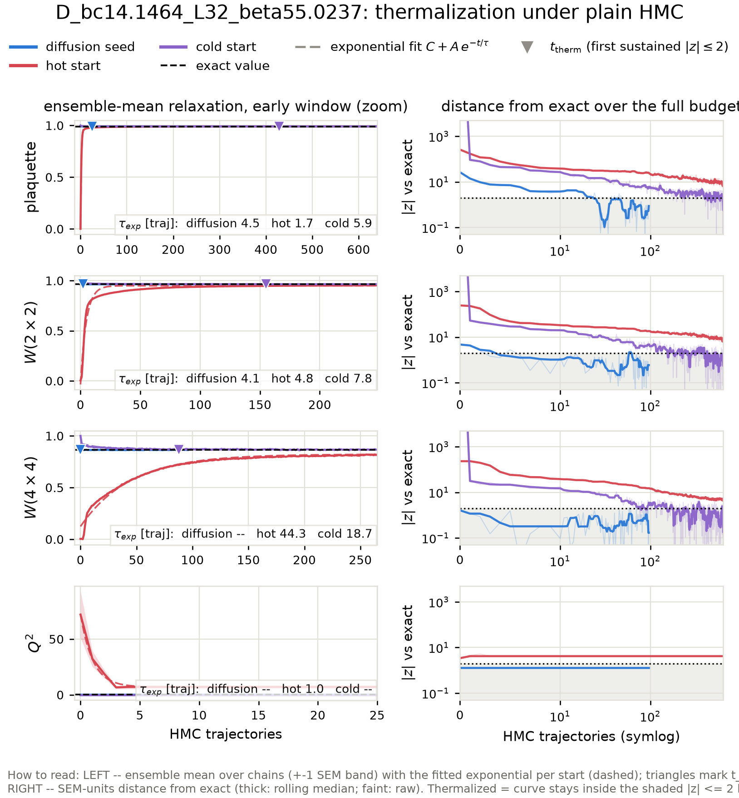

tau_int (hot-start chains, second half): plaquette = 8.57 +- 1.21, wilson_2x2 = 10.99 +- 1.49, wilson_4x4 = 7.87 +- 1.23, wilson_6x6 = 4.80 +- 0.65. Topology: hot-start HMC L=32 beta=55.0237 -> **frozen** (no tunneling).

Where 'never' stood at the end: the hot start ended the 640-trajectory budget still at plaquette at |z| ~ 7, wilson_2x2 at |z| ~ 7, wilson_4x4 at |z| ~ 5, wilson_6x6 at |z| ~ 5, Q^2 at |z| ~ 4; the cold start ended the 640-trajectory budget still at Q^2 at |z| ~ 474280296448.

### Diagnostics: raw diffusion output (before any HMC)

| observable | value | error | exact | z_exact | reference | ref_error | z_ref | ks_p | chi2_p |
|---|---|---|---|---|---|---|---|---|---|
| plaquette | 0.9917 | 2.468e-05 | 0.9909 | 32.83 | 0.9909 | 2.64e-05 | 20.57 | 3.098e-37 |  |
| wilson_1x1 | 0.9917 | 2.468e-05 | 0.9909 | 32.83 | 0.9909 | 2.64e-05 | 20.57 | 3.098e-37 |  |
| wilson_1x2 | 0.9829 | 6.878e-05 | 0.9818 | 15.39 | 0.9818 | 6.051e-05 | 11.42 | 9.694e-14 |  |
| wilson_2x2 | 0.965 | 0.0002174 | 0.964 | 4.533 | 0.9636 | 0.0001425 | 5.131 | 1.45e-05 |  |
| wilson_2x3 | 0.9476 | 0.0003805 | 0.9465 | 3.059 | 0.9457 | 0.0002577 | 4.105 | 0.0005923 |  |
| wilson_3x3 | 0.9224 | 0.0007075 | 0.9208 | 2.263 | 0.9188 | 0.0004466 | 4.241 | 8.218e-05 |  |
| wilson_3x4 | 0.8978 | 0.0009879 | 0.8958 | 2.024 | 0.8929 | 0.0006683 | 4.114 | 0.0008568 |  |
| wilson_4x4 | 0.8659 | 0.001601 | 0.8635 | 1.513 | 0.8589 | 0.0009811 | 3.737 | 0.0004908 |  |
| wilson_4x5 | 0.8354 | 0.002017 | 0.8324 | 1.453 | 0.827 | 0.001313 | 3.494 | 0.0004908 |  |
| wilson_5x5 | 0.7988 | 0.003116 | 0.7951 | 1.172 | 0.7875 | 0.001792 | 3.15 | 0.0007131 |  |
| wilson_5x6 | 0.7636 | 0.003736 | 0.7595 | 1.103 | 0.7506 | 0.002117 | 3.032 | 0.001467 |  |
| wilson_6x6 | 0.7232 | 0.004888 | 0.7188 | 0.9011 | 0.706 | 0.002624 | 3.114 | 0.001229 |  |
| wilson_6x7 | 0.6852 | 0.005654 | 0.6804 | 0.8478 | 0.6669 | 0.003047 | 2.836 | 0.004059 |  |
| wilson_7x7 | 0.6439 | 0.00679 | 0.6381 | 0.8576 | 0.6216 | 0.003801 | 2.869 | 0.002077 |  |
| wilson_7x8 | 0.6045 | 0.007778 | 0.5984 | 0.7778 | 0.5818 | 0.004372 | 2.54 | 0.001229 |  |
| wilson_8x8 | 0.5624 | 0.008949 | 0.5561 | 0.7055 | 0.5372 | 0.005258 | 2.432 | 0.003444 |  |
| wilson_8x10 | 0.4856 | 0.01098 | 0.4802 | 0.4868 | 0.4647 | 0.006611 | 1.627 | 0.03684 |  |
| wilson_10x10 | 0.4059 | 0.01281 | 0.3998 | 0.4779 | 0.3811 | 0.008543 | 1.615 | 0.06904 |  |
| wilson_10x12 | 0.339 | 0.01364 | 0.3329 | 0.447 | 0.3195 | 0.009815 | 1.159 | 0.1366 |  |
| wilson_12x12 | 0.2746 | 0.01453 | 0.2672 | 0.5053 | 0.2525 | 0.0115 | 1.19 | 0.3277 |  |
| creutz_2 | 0.009487 | 0.0001227 | 0.009171 | 2.576 |  |  |  |  |  |
| creutz_3 | 0.00887 | 0.0002706 | 0.00917 | -1.11 |  |  |  |  |  |
| creutz_4 | 0.009092 | 0.000451 | 0.00917 | -0.1725 |  |  |  |  |  |
| creutz_5 | 0.008812 | 0.0007114 | 0.009169 | -0.5012 |  |  |  |  |  |
| creutz_6 | 0.009295 | 0.0009398 | 0.009167 | 0.1359 |  |  |  |  |  |
| creutz_7 | 0.008015 | 0.00129 | 0.009165 | -0.8921 |  |  |  |  |  |
| creutz_8 | 0.008906 | 0.001815 | 0.009162 | -0.1411 |  |  |  |  |  |
| Q | -0.01562 | 0.07034 | 0 | -0.2221 | 0.01042 | 0.04588 | -0.3101 | 0.9902 |  |
| Q^2 | 0.4062 | 0.04919 | 0.4743 | -1.383 | 0.4896 | 0.04587 | -1.239 | 0.939 |  |
| chi_top ((<Q^2>-<Q>^2)/V) | 0.0003965 | 5.075e-05 | 0.0004632 | -1.314 | 0.000478 | 4.705e-05 | -1.178 |  |  |
| Q histogram vs exact P(Q) | 2.04 | nan | 4 | nan |  |  |  |  | 0.7284 |

### Diagnostics: the same configs after 96 HMC trajectories

| observable | value | error | exact | z_exact | reference | ref_error | z_ref | ks_p | chi2_p |
|---|---|---|---|---|---|---|---|---|---|
| plaquette | 0.9909 | 3.186e-05 | 0.9909 | 0.9456 | 0.9909 | 2.64e-05 | -0.8827 | 0.2741 |  |
| wilson_1x1 | 0.9909 | 3.186e-05 | 0.9909 | 0.9456 | 0.9909 | 2.64e-05 | -0.8827 | 0.2741 |  |
| wilson_1x2 | 0.9819 | 8.454e-05 | 0.9818 | 0.336 | 0.9818 | 6.051e-05 | 0.1543 | 0.8906 |  |
| wilson_2x2 | 0.9641 | 0.0001737 | 0.964 | 0.7463 | 0.9636 | 0.0001425 | 2.127 | 0.04767 |  |
| wilson_2x3 | 0.9467 | 0.0003248 | 0.9465 | 0.7494 | 0.9457 | 0.0002577 | 2.33 | 0.01039 |  |
| wilson_3x3 | 0.9212 | 0.0006073 | 0.9208 | 0.6231 | 0.9188 | 0.0004466 | 3.085 | 0.001748 |  |
| wilson_3x4 | 0.8963 | 0.0009172 | 0.8958 | 0.517 | 0.8929 | 0.0006683 | 2.979 | 0.001027 |  |
| wilson_4x4 | 0.8638 | 0.00131 | 0.8635 | 0.191 | 0.8589 | 0.0009811 | 2.962 | 0.01616 |  |
| wilson_4x5 | 0.8329 | 0.001778 | 0.8324 | 0.2867 | 0.827 | 0.001313 | 2.709 | 0.005601 |  |
| wilson_5x5 | 0.7955 | 0.00246 | 0.7951 | 0.1521 | 0.7875 | 0.001792 | 2.643 | 0.006558 |  |
| wilson_5x6 | 0.7602 | 0.003284 | 0.7595 | 0.2239 | 0.7506 | 0.002117 | 2.466 | 0.001748 |  |
| wilson_6x6 | 0.7198 | 0.004191 | 0.7188 | 0.2367 | 0.706 | 0.002624 | 2.804 | 0.0004059 |  |
| wilson_6x7 | 0.6813 | 0.005035 | 0.6804 | 0.1771 | 0.6669 | 0.003047 | 2.432 | 0.004059 |  |
| wilson_7x7 | 0.6384 | 0.005924 | 0.6381 | 0.05846 | 0.6216 | 0.003801 | 2.393 | 0.0007131 |  |
| wilson_7x8 | 0.5993 | 0.006798 | 0.5984 | 0.1365 | 0.5818 | 0.004372 | 2.17 | 0.002464 |  |
| wilson_8x8 | 0.5559 | 0.007523 | 0.5561 | -0.02403 | 0.5372 | 0.005258 | 2.042 | 0.002916 |  |
| wilson_8x10 | 0.4816 | 0.009008 | 0.4802 | 0.1502 | 0.4647 | 0.006611 | 1.509 | 0.07777 |  |
| wilson_10x10 | 0.4027 | 0.01046 | 0.3998 | 0.2779 | 0.3811 | 0.008543 | 1.602 | 0.2498 |  |
| wilson_10x12 | 0.3353 | 0.01188 | 0.3329 | 0.2061 | 0.3195 | 0.009815 | 1.027 | 0.5643 |  |
| wilson_12x12 | 0.2697 | 0.01286 | 0.2672 | 0.1949 | 0.2525 | 0.0115 | 0.9976 | 0.6418 |  |
| creutz_2 | 0.009064 | 0.0001376 | 0.009171 | -0.7776 |  |  |  |  |  |
| creutz_3 | 0.009139 | 0.0002454 | 0.00917 | -0.1264 |  |  |  |  |  |
| creutz_4 | 0.009528 | 0.0004375 | 0.00917 | 0.8182 |  |  |  |  |  |
| creutz_5 | 0.009633 | 0.000616 | 0.009169 | 0.7543 |  |  |  |  |  |
| creutz_6 | 0.009253 | 0.0009574 | 0.009167 | 0.08947 |  |  |  |  |  |
| creutz_7 | 0.009863 | 0.001335 | 0.009165 | 0.523 |  |  |  |  |  |
| creutz_8 | 0.01204 | 0.001864 | 0.009162 | 1.545 |  |  |  |  |  |
| Q | -0.01562 | 0.07034 | 0 | -0.2221 | 0.01042 | 0.04588 | -0.3101 | 0.9902 |  |
| Q^2 | 0.4062 | 0.04919 | 0.4743 | -1.383 | 0.4896 | 0.04587 | -1.239 | 0.939 |  |
| chi_top ((<Q^2>-<Q>^2)/V) | 0.0003965 | 5.075e-05 | 0.0004632 | -1.314 | 0.000478 | 4.705e-05 | -1.178 |  |  |
| Q histogram vs exact P(Q) | 2.04 | nan | 4 | nan |  |  |  |  | 0.7284 |

## D_bc20_L32_beta78.4578

HMC: step size 0.0452, 22 leapfrog steps, acceptance seed/hot/cold = 0.979/0.978/0.977. Diffusion-seed batch: 128 chains x 96 trajectories (0.21 s/traj for the whole batch); baselines: 32 chains x 640 trajectories.

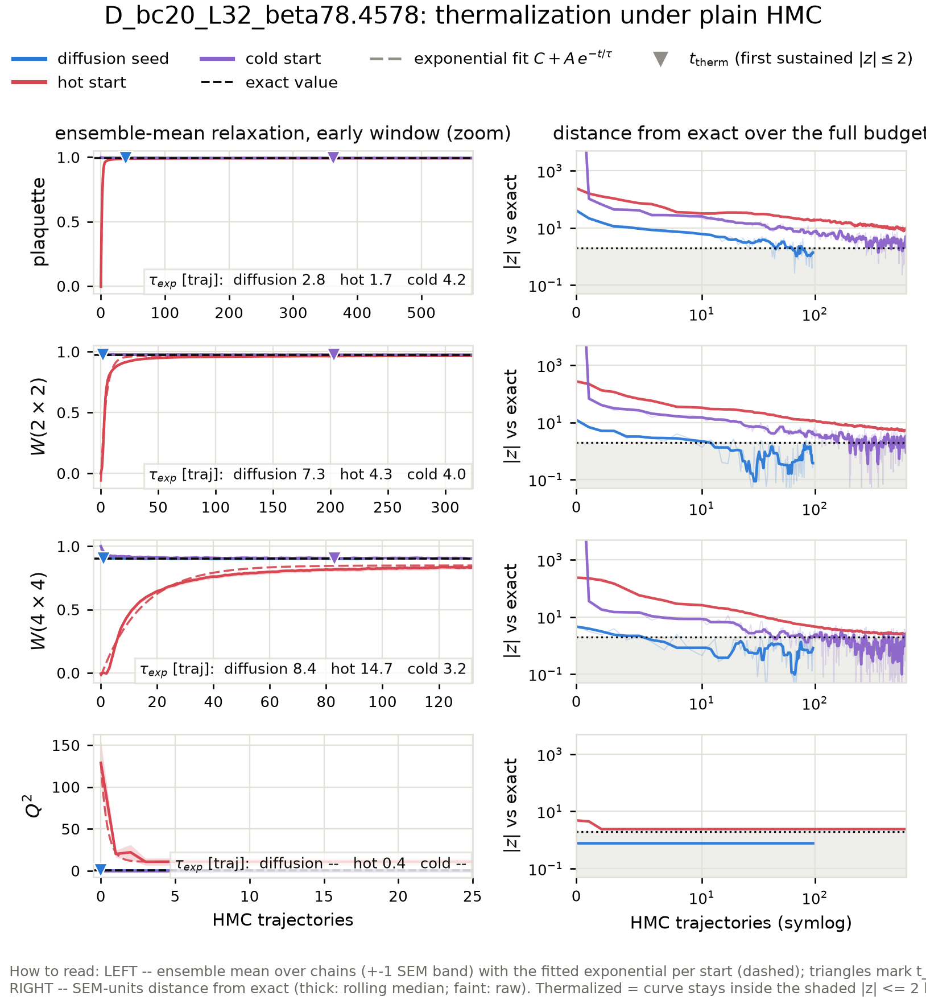

tau_int (hot-start chains, second half): plaquette = 8.78 +- 1.17, wilson_2x2 = 6.86 +- 1.09, wilson_4x4 = 3.41 +- 0.34, wilson_6x6 = 2.45 +- 0.21. Topology: hot-start HMC L=32 beta=78.4578 -> **frozen** (no tunneling).

Where 'never' stood at the end: the hot start ended the 640-trajectory budget still at plaquette at |z| ~ 9, wilson_2x2 at |z| ~ 5, wilson_4x4 at |z| ~ 2, wilson_6x6 at |z| ~ 3, Q^2 at |z| ~ 2; the cold start ended the 640-trajectory budget still at Q^2 at |z| ~ 320492732416.

### Diagnostics: raw diffusion output (before any HMC)

| observable | value | error | exact | z_exact | reference | ref_error | z_ref | ks_p | chi2_p |
|---|---|---|---|---|---|---|---|---|---|
| plaquette | 0.9946 | 2.44e-05 | 0.9936 | 40.22 | 0.9936 | 2.745e-05 | 26.18 | 1.564e-57 |  |
| wilson_1x1 | 0.9946 | 2.44e-05 | 0.9936 | 40.22 | 0.9936 | 2.745e-05 | 26.18 | 1.564e-57 |  |
| wilson_1x2 | 0.9887 | 6.237e-05 | 0.9873 | 22.7 | 0.9875 | 6.289e-05 | 13.74 | 4.258e-29 |  |
| wilson_2x2 | 0.9765 | 0.0001545 | 0.9747 | 12.02 | 0.9753 | 0.0001635 | 5.555 | 3.559e-09 |  |
| wilson_2x3 | 0.9648 | 0.0002761 | 0.9623 | 9.291 | 0.9632 | 0.0002748 | 4.077 | 0.0001011 |  |
| wilson_3x3 | 0.9475 | 0.0004932 | 0.9439 | 7.337 | 0.9453 | 0.0004859 | 3.268 | 0.0002758 |  |
| wilson_3x4 | 0.9304 | 0.0007336 | 0.926 | 6.044 | 0.9278 | 0.0007141 | 2.569 | 0.01616 |  |
| wilson_4x4 | 0.9076 | 0.001141 | 0.9025 | 4.412 | 0.9043 | 0.001072 | 2.076 | 0.01616 |  |
| wilson_4x5 | 0.8853 | 0.001596 | 0.8797 | 3.533 | 0.8825 | 0.001496 | 1.307 | 0.1519 |  |
| wilson_5x5 | 0.858 | 0.002138 | 0.852 | 2.798 | 0.8553 | 0.001986 | 0.9202 | 0.2061 |  |
| wilson_5x6 | 0.8315 | 0.002742 | 0.8251 | 2.328 | 0.8295 | 0.002557 | 0.531 | 0.4899 |  |
| wilson_6x6 | 0.8004 | 0.003526 | 0.7941 | 1.799 | 0.7995 | 0.00311 | 0.1818 | 0.8288 |  |
| wilson_6x7 | 0.7711 | 0.004208 | 0.7642 | 1.638 | 0.7696 | 0.003774 | 0.2569 | 0.4545 |  |
| wilson_7x7 | 0.7378 | 0.005183 | 0.7307 | 1.372 | 0.7358 | 0.004481 | 0.2961 | 0.6808 |  |
| wilson_7x8 | 0.7065 | 0.005969 | 0.6988 | 1.29 | 0.7038 | 0.00518 | 0.3358 | 0.8906 |  |
| wilson_8x8 | 0.6716 | 0.007154 | 0.664 | 1.059 | 0.6685 | 0.005938 | 0.3321 | 0.7575 |  |
| wilson_8x10 | 0.6063 | 0.008663 | 0.5996 | 0.7781 | 0.6041 | 0.007489 | 0.1966 | 0.9978 |  |
| wilson_10x10 | 0.5334 | 0.01137 | 0.5279 | 0.4818 | 0.5377 | 0.008786 | -0.2974 | 0.9978 |  |
| wilson_10x12 | 0.4686 | 0.01275 | 0.465 | 0.2836 | 0.4728 | 0.01029 | -0.2525 | 0.9902 |  |
| wilson_12x12 | 0.3991 | 0.01504 | 0.3996 | -0.0307 | 0.4097 | 0.01129 | -0.5636 | 0.5266 |  |
| creutz_2 | 0.006388 | 8.845e-05 | 0.006412 | -0.2672 |  |  |  |  |  |
| creutz_3 | 0.006003 | 0.0001783 | 0.006408 | -2.27 |  |  |  |  |  |
| creutz_4 | 0.006569 | 0.0003357 | 0.006403 | 0.497 |  |  |  |  |  |
| creutz_5 | 0.00662 | 0.0004804 | 0.006395 | 0.4686 |  |  |  |  |  |
| creutz_6 | 0.006848 | 0.0006389 | 0.006385 | 0.7248 |  |  |  |  |  |
| creutz_7 | 0.006691 | 0.000931 | 0.006371 | 0.3435 |  |  |  |  |  |
| creutz_8 | 0.007234 | 0.001199 | 0.006353 | 0.7348 |  |  |  |  |  |
| Q | -0.0625 | 0.04987 | 0 | -1.253 | -0.02083 | 0.04597 | -0.6143 | 1 |  |
| Q^2 | 0.3594 | 0.05095 | 0.3205 | 0.7632 | 0.3438 | 0.04519 | 0.2294 | 1 |  |
| chi_top ((<Q^2>-<Q>^2)/V) | 0.0003471 | 4.846e-05 | 0.000313 | 0.7049 | 0.0003353 | 4.203e-05 | 0.185 |  |  |
| Q histogram vs exact P(Q) | 4.275 | nan | 4 | nan |  |  |  |  | 0.3701 |

### Diagnostics: the same configs after 96 HMC trajectories

| observable | value | error | exact | z_exact | reference | ref_error | z_ref | ks_p | chi2_p |
|---|---|---|---|---|---|---|---|---|---|
| plaquette | 0.9936 | 2.511e-05 | 0.9936 | 1.349 | 0.9936 | 2.745e-05 | 0.3812 | 0.8906 |  |
| wilson_1x1 | 0.9936 | 2.511e-05 | 0.9936 | 1.349 | 0.9936 | 2.745e-05 | 0.3812 | 0.8906 |  |
| wilson_1x2 | 0.9873 | 6.24e-05 | 0.9873 | 0.421 | 0.9875 | 6.289e-05 | -1.952 | 0.06904 |  |
| wilson_2x2 | 0.9746 | 0.0001112 | 0.9747 | -0.4851 | 0.9753 | 0.0001635 | -3.343 | 0.0008568 |  |
| wilson_2x3 | 0.9623 | 0.0001769 | 0.9623 | 0.09671 | 0.9632 | 0.0002748 | -2.937 | 0.1098 |  |
| wilson_3x3 | 0.9441 | 0.0003186 | 0.9439 | 0.5716 | 0.9453 | 0.0004859 | -2.021 | 0.06904 |  |
| wilson_3x4 | 0.9261 | 0.0004451 | 0.926 | 0.3841 | 0.9278 | 0.0007141 | -1.94 | 0.1226 |  |
| wilson_4x4 | 0.9033 | 0.0007237 | 0.9025 | 1.039 | 0.9043 | 0.001072 | -0.7978 | 0.5643 |  |
| wilson_4x5 | 0.8805 | 0.0009571 | 0.8797 | 0.7978 | 0.8825 | 0.001496 | -1.136 | 0.3277 |  |
| wilson_5x5 | 0.8531 | 0.001434 | 0.852 | 0.8181 | 0.8553 | 0.001986 | -0.8666 | 0.4204 |  |
| wilson_5x6 | 0.8262 | 0.001812 | 0.8251 | 0.5765 | 0.8295 | 0.002557 | -1.068 | 0.1866 |  |
| wilson_6x6 | 0.7951 | 0.002496 | 0.7941 | 0.4288 | 0.7995 | 0.00311 | -1.108 | 0.2272 |  |
| wilson_6x7 | 0.7655 | 0.003105 | 0.7642 | 0.439 | 0.7696 | 0.003774 | -0.8345 | 0.357 |  |
| wilson_7x7 | 0.7324 | 0.00391 | 0.7307 | 0.4287 | 0.7358 | 0.004481 | -0.5727 | 0.3001 |  |
| wilson_7x8 | 0.7 | 0.004658 | 0.6988 | 0.2564 | 0.7038 | 0.00518 | -0.5527 | 0.4204 |  |
| wilson_8x8 | 0.6646 | 0.005609 | 0.664 | 0.1139 | 0.6685 | 0.005938 | -0.4714 | 0.3879 |  |
| wilson_8x10 | 0.6009 | 0.00772 | 0.5996 | 0.1747 | 0.6041 | 0.007489 | -0.292 | 0.4204 |  |
| wilson_10x10 | 0.5278 | 0.009754 | 0.5279 | -0.01597 | 0.5377 | 0.008786 | -0.7543 | 0.4204 |  |
| wilson_10x12 | 0.4657 | 0.01201 | 0.465 | 0.05617 | 0.4728 | 0.01029 | -0.4475 | 0.5643 |  |
| wilson_12x12 | 0.3976 | 0.01311 | 0.3996 | -0.1532 | 0.4097 | 0.01129 | -0.7019 | 0.3277 |  |
| creutz_2 | 0.006486 | 8.483e-05 | 0.006412 | 0.8779 |  |  |  |  |  |
| creutz_3 | 0.006306 | 0.0001734 | 0.006408 | -0.5882 |  |  |  |  |  |
| creutz_4 | 0.005746 | 0.0003161 | 0.006403 | -2.078 |  |  |  |  |  |
| creutz_5 | 0.005921 | 0.0004642 | 0.006395 | -1.02 |  |  |  |  |  |
| creutz_6 | 0.006193 | 0.0006572 | 0.006385 | -0.2923 |  |  |  |  |  |
| creutz_7 | 0.006297 | 0.0008969 | 0.006371 | -0.08289 |  |  |  |  |  |
| creutz_8 | 0.006514 | 0.001167 | 0.006353 | 0.1385 |  |  |  |  |  |
| Q | -0.0625 | 0.04987 | 0 | -1.253 | -0.02083 | 0.04597 | -0.6143 | 1 |  |
| Q^2 | 0.3594 | 0.05095 | 0.3205 | 0.7632 | 0.3438 | 0.04519 | 0.2294 | 1 |  |
| chi_top ((<Q^2>-<Q>^2)/V) | 0.0003471 | 4.846e-05 | 0.000313 | 0.7049 | 0.0003353 | 4.203e-05 | 0.185 |  |  |
| Q histogram vs exact P(Q) | 4.275 | nan | 4 | nan |  |  |  |  | 0.3701 |

## D_bc30_L32_beta118.473

HMC: step size 0.0367, 27 leapfrog steps, acceptance seed/hot/cold = 0.980/0.974/0.976. Diffusion-seed batch: 128 chains x 96 trajectories (0.25 s/traj for the whole batch); baselines: 32 chains x 640 trajectories.

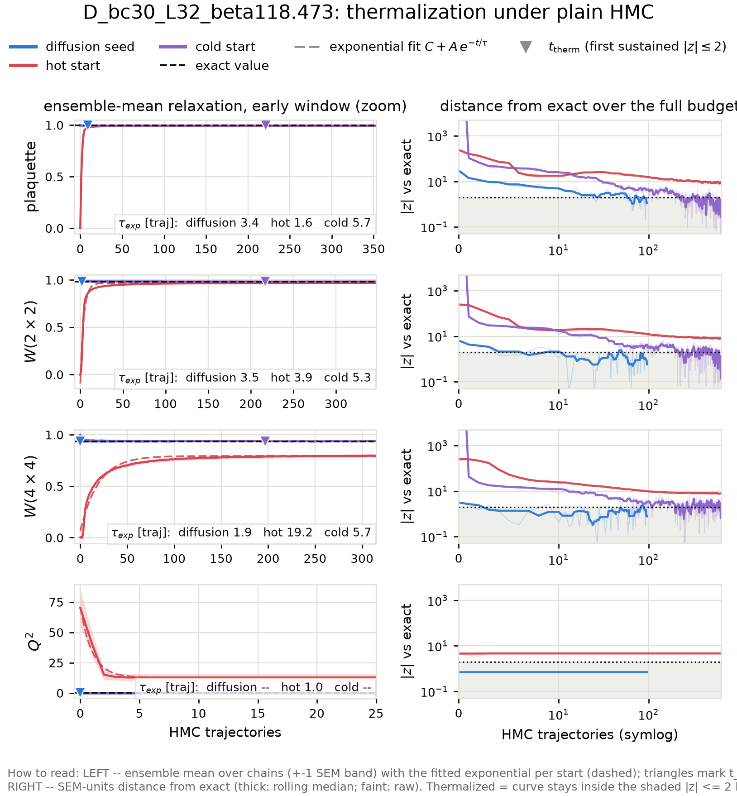

tau_int (hot-start chains, second half): plaquette = 13.74 +- 1.74, wilson_2x2 = 19.04 +- 2.27, wilson_4x4 = 18.14 +- 2.50, wilson_6x6 = 9.71 +- 1.64. Topology: hot-start HMC L=32 beta=118.473 -> **frozen** (no tunneling).

Where 'never' stood at the end: the hot start ended the 640-trajectory budget still at plaquette at |z| ~ 8, wilson_2x2 at |z| ~ 8, wilson_4x4 at |z| ~ 8, wilson_6x6 at |z| ~ 8, Q^2 at |z| ~ 5; the cold start ended the 640-trajectory budget still at Q^2 at |z| ~ 171377917952.

### Diagnostics: raw diffusion output (before any HMC)

| observable | value | error | exact | z_exact | reference | ref_error | z_ref | ks_p | chi2_p |
|---|---|---|---|---|---|---|---|---|---|
| plaquette | 0.9962 | 1.318e-05 | 0.9958 | 33.34 | 0.9957 | 1.207e-05 | 27.65 | 9.641e-53 |  |
| wilson_1x1 | 0.9962 | 1.318e-05 | 0.9958 | 33.34 | 0.9957 | 1.207e-05 | 27.65 | 9.641e-53 |  |
| wilson_1x2 | 0.9922 | 3.485e-05 | 0.9916 | 17.4 | 0.9915 | 2.638e-05 | 14.59 | 5.47e-23 |  |
| wilson_2x2 | 0.9838 | 8.121e-05 | 0.9832 | 7.82 | 0.9834 | 7.014e-05 | 4.492 | 0.001229 |  |
| wilson_2x3 | 0.9759 | 0.0001517 | 0.9749 | 6.471 | 0.9753 | 0.0001285 | 3.073 | 0.004059 |  |
| wilson_3x3 | 0.9641 | 0.0002767 | 0.9626 | 5.222 | 0.9634 | 0.0002209 | 1.893 | 0.1866 |  |
| wilson_3x4 | 0.9526 | 0.0004266 | 0.9505 | 4.856 | 0.9518 | 0.0003373 | 1.465 | 0.07777 |  |
| wilson_4x4 | 0.937 | 0.0005984 | 0.9347 | 3.893 | 0.9369 | 0.0004831 | 0.1114 | 0.6028 |  |
| wilson_4x5 | 0.922 | 0.00086 | 0.9191 | 3.472 | 0.922 | 0.0006282 | 0.04572 | 0.6028 |  |
| wilson_5x5 | 0.9037 | 0.001133 | 0.9 | 3.258 | 0.9042 | 0.0008335 | -0.3802 | 0.2061 |  |
| wilson_5x6 | 0.8859 | 0.00152 | 0.8813 | 2.985 | 0.8866 | 0.001075 | -0.3897 | 0.4204 |  |
| wilson_6x6 | 0.8642 | 0.001863 | 0.8595 | 2.528 | 0.8659 | 0.001356 | -0.7335 | 0.4899 |  |
| wilson_6x7 | 0.8435 | 0.002322 | 0.8383 | 2.224 | 0.8453 | 0.001656 | -0.6282 | 0.7575 |  |
| wilson_7x7 | 0.8201 | 0.002806 | 0.8143 | 2.084 | 0.8217 | 0.002046 | -0.4638 | 0.9574 |  |
| wilson_7x8 | 0.7973 | 0.003334 | 0.791 | 1.894 | 0.7991 | 0.002463 | -0.4239 | 0.9902 |  |
| wilson_8x8 | 0.7723 | 0.003999 | 0.7653 | 1.73 | 0.7734 | 0.002952 | -0.2282 | 0.9574 |  |
| wilson_8x10 | 0.7255 | 0.005349 | 0.7168 | 1.638 | 0.7256 | 0.004008 | -0.004797 | 0.8288 |  |
| wilson_10x10 | 0.6706 | 0.006756 | 0.6609 | 1.44 | 0.6678 | 0.005432 | 0.3247 | 0.7575 |  |
| wilson_10x12 | 0.6228 | 0.008393 | 0.6099 | 1.535 | 0.618 | 0.006897 | 0.447 | 0.6028 |  |
| wilson_12x12 | 0.5693 | 0.01021 | 0.5548 | 1.417 | 0.5631 | 0.008715 | 0.4623 | 0.7941 |  |
| creutz_2 | 0.004366 | 6.173e-05 | 0.00423 | 2.198 |  |  |  |  |  |
| creutz_3 | 0.004083 | 0.0001243 | 0.004215 | -1.069 |  |  |  |  |  |
| creutz_4 | 0.004557 | 0.0001805 | 0.004193 | 2.015 |  |  |  |  |  |
| creutz_5 | 0.004068 | 0.0003168 | 0.004164 | -0.3021 |  |  |  |  |  |
| creutz_6 | 0.004837 | 0.0004572 | 0.004126 | 1.556 |  |  |  |  |  |
| creutz_7 | 0.003742 | 0.0006074 | 0.004078 | -0.5527 |  |  |  |  |  |
| creutz_8 | 0.003769 | 0.00076 | 0.004018 | -0.3275 |  |  |  |  |  |
| Q | 0.02344 | 0.03498 | 0 | 0.6701 | -0.09375 | 0.02944 | 2.563 | 0.7941 |  |
| Q^2 | 0.1484 | 0.03407 | 0.1714 | -0.6733 | 0.1771 | 0.02958 | -0.6348 | 1 |  |
| chi_top ((<Q^2>-<Q>^2)/V) | 0.0001444 | 3.086e-05 | 0.0001674 | -0.7433 | 0.0001643 | 2.488e-05 | -0.5027 |  |  |
| Q histogram vs exact P(Q) | 0.8828 | nan | 4 | nan |  |  |  |  | 0.927 |

### Diagnostics: the same configs after 96 HMC trajectories

| observable | value | error | exact | z_exact | reference | ref_error | z_ref | ks_p | chi2_p |
|---|---|---|---|---|---|---|---|---|---|
| plaquette | 0.9958 | 1.788e-05 | 0.9958 | 1.045 | 0.9957 | 1.207e-05 | 3.4 | 0.007662 |  |
| wilson_1x1 | 0.9958 | 1.788e-05 | 0.9958 | 1.045 | 0.9957 | 1.207e-05 | 3.4 | 0.007662 |  |
| wilson_1x2 | 0.9916 | 4.559e-05 | 0.9916 | 0.8555 | 0.9915 | 2.638e-05 | 1.334 | 0.08742 |  |
| wilson_2x2 | 0.9833 | 9.305e-05 | 0.9832 | 0.6179 | 0.9834 | 7.014e-05 | -0.8194 | 0.6028 |  |
| wilson_2x3 | 0.9751 | 0.0001834 | 0.9749 | 0.84 | 0.9753 | 0.0001285 | -0.9679 | 0.357 |  |
| wilson_3x3 | 0.9629 | 0.0002768 | 0.9626 | 1.094 | 0.9634 | 0.0002209 | -1.332 | 0.6418 |  |
| wilson_3x4 | 0.951 | 0.000411 | 0.9505 | 1.192 | 0.9518 | 0.0003373 | -1.476 | 0.3879 |  |
| wilson_4x4 | 0.9352 | 0.0006151 | 0.9347 | 0.8895 | 0.9369 | 0.0004831 | -2.17 | 0.4899 |  |
| wilson_4x5 | 0.92 | 0.0007892 | 0.9191 | 1.248 | 0.922 | 0.0006282 | -1.936 | 0.2061 |  |
| wilson_5x5 | 0.9012 | 0.001045 | 0.9 | 1.204 | 0.9042 | 0.0008335 | -2.221 | 0.1866 |  |
| wilson_5x6 | 0.8831 | 0.001284 | 0.8813 | 1.411 | 0.8866 | 0.001075 | -2.06 | 0.357 |  |
| wilson_6x6 | 0.8612 | 0.001698 | 0.8595 | 1.015 | 0.8659 | 0.001356 | -2.151 | 0.2498 |  |
| wilson_6x7 | 0.8408 | 0.002046 | 0.8383 | 1.214 | 0.8453 | 0.001656 | -1.7 | 0.357 |  |
| wilson_7x7 | 0.8167 | 0.002557 | 0.8143 | 0.9521 | 0.8217 | 0.002046 | -1.534 | 0.6808 |  |
| wilson_7x8 | 0.794 | 0.002925 | 0.791 | 1.021 | 0.7991 | 0.002463 | -1.33 | 0.7575 |  |
| wilson_8x8 | 0.769 | 0.003504 | 0.7653 | 1.049 | 0.7734 | 0.002952 | -0.9547 | 0.7941 |  |
| wilson_8x10 | 0.7228 | 0.004286 | 0.7168 | 1.41 | 0.7256 | 0.004008 | -0.4688 | 0.3879 |  |
| wilson_10x10 | 0.6697 | 0.005947 | 0.6609 | 1.49 | 0.6678 | 0.005432 | 0.2418 | 0.7195 |  |
| wilson_10x12 | 0.6209 | 0.007394 | 0.6099 | 1.477 | 0.618 | 0.006897 | 0.2856 | 0.4204 |  |
| wilson_12x12 | 0.5702 | 0.01015 | 0.5548 | 1.519 | 0.5631 | 0.008715 | 0.5344 | 0.1866 |  |
| creutz_2 | 0.004232 | 5.349e-05 | 0.00423 | 0.02682 |  |  |  |  |  |
| creutz_3 | 0.004158 | 0.0001246 | 0.004215 | -0.4579 |  |  |  |  |  |
| creutz_4 | 0.004324 | 0.0002045 | 0.004193 | 0.6387 |  |  |  |  |  |
| creutz_5 | 0.004324 | 0.0003491 | 0.004164 | 0.459 |  |  |  |  |  |
| creutz_6 | 0.004834 | 0.0004036 | 0.004126 | 1.754 |  |  |  |  |  |
| creutz_7 | 0.005003 | 0.0005609 | 0.004078 | 1.65 |  |  |  |  |  |
| creutz_8 | 0.003779 | 0.0007717 | 0.004018 | -0.3098 |  |  |  |  |  |
| Q | 0.02344 | 0.03498 | 0 | 0.6701 | -0.09375 | 0.02944 | 2.563 | 0.7941 |  |
| Q^2 | 0.1484 | 0.03407 | 0.1714 | -0.6733 | 0.1771 | 0.02958 | -0.6348 | 1 |  |
| chi_top ((<Q^2>-<Q>^2)/V) | 0.0001444 | 3.086e-05 | 0.0001674 | -0.7433 | 0.0001643 | 2.488e-05 | -0.5027 |  |  |
| Q histogram vs exact P(Q) | 0.8828 | nan | 4 | nan |  |  |  |  | 0.927 |

## D_bc40_L32_beta158.48

HMC: step size 0.0318, 31 leapfrog steps, acceptance seed/hot/cold = 0.981/0.975/0.978. Diffusion-seed batch: 128 chains x 96 trajectories (0.28 s/traj for the whole batch); baselines: 32 chains x 640 trajectories.

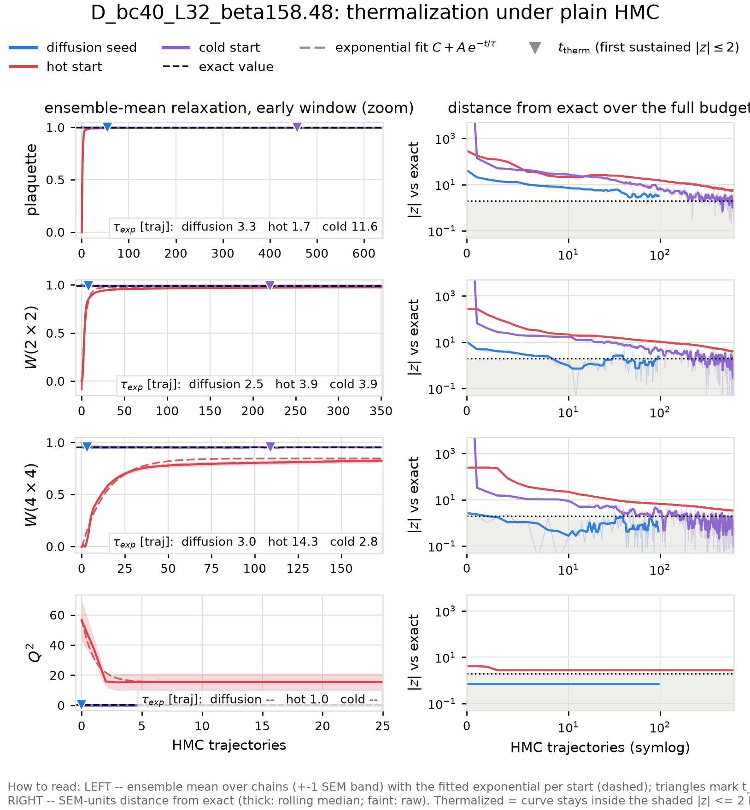

tau_int (hot-start chains, second half): plaquette = 28.04 +- 2.16, wilson_2x2 = 39.50 +- 1.68, wilson_4x4 = 30.73 +- 2.37, wilson_6x6 = 10.86 +- 1.92. Topology: hot-start HMC L=32 beta=158.48 -> **frozen** (no tunneling).

Where 'never' stood at the end: the hot start ended the 640-trajectory budget still at plaquette at |z| ~ 6, wilson_2x2 at |z| ~ 4, wilson_4x4 at |z| ~ 3, wilson_6x6 at |z| ~ 4, Q^2 at |z| ~ 3; the cold start ended the 640-trajectory budget still at Q^2 at |z| ~ 86933716992.

### Diagnostics: raw diffusion output (before any HMC)

| observable | value | error | exact | z_exact | reference | ref_error | z_ref | ks_p | chi2_p |
|---|---|---|---|---|---|---|---|---|---|
| plaquette | 0.9973 | 7.049e-06 | 0.9968 | 67.02 | 0.9968 | 1.016e-05 | 37.71 | 3.555e-59 |  |
| wilson_1x1 | 0.9973 | 7.049e-06 | 0.9968 | 67.02 | 0.9968 | 1.016e-05 | 37.71 | 3.555e-59 |  |
| wilson_1x2 | 0.9943 | 2.291e-05 | 0.9937 | 28.15 | 0.9937 | 2.912e-05 | 17.63 | 1.112e-35 |  |
| wilson_2x2 | 0.9882 | 6.271e-05 | 0.9874 | 11.39 | 0.9873 | 6.368e-05 | 9.185 | 1.166e-12 |  |
| wilson_2x3 | 0.9821 | 0.0001195 | 0.9812 | 7.424 | 0.981 | 0.0001194 | 6.804 | 2e-08 |  |
| wilson_3x3 | 0.9732 | 0.0002258 | 0.972 | 5.373 | 0.9715 | 0.0002039 | 5.896 | 2.304e-07 |  |
| wilson_3x4 | 0.9643 | 0.000332 | 0.9629 | 4.018 | 0.9622 | 0.0003192 | 4.417 | 0.0004059 |  |
| wilson_4x4 | 0.9523 | 0.0005235 | 0.951 | 2.544 | 0.95 | 0.0004535 | 3.377 | 0.0008568 |  |
| wilson_4x5 | 0.9405 | 0.0007445 | 0.9392 | 1.704 | 0.9382 | 0.0005946 | 2.359 | 0.02464 |  |
| wilson_5x5 | 0.9265 | 0.001053 | 0.9248 | 1.622 | 0.9234 | 0.000792 | 2.314 | 0.02464 |  |
| wilson_5x6 | 0.9123 | 0.001361 | 0.9106 | 1.215 | 0.9092 | 0.001009 | 1.828 | 0.05405 |  |
| wilson_6x6 | 0.8963 | 0.001819 | 0.894 | 1.254 | 0.8926 | 0.001265 | 1.667 | 0.06115 |  |
| wilson_6x7 | 0.8806 | 0.002205 | 0.8778 | 1.27 | 0.8768 | 0.001526 | 1.427 | 0.04767 |  |
| wilson_7x7 | 0.8631 | 0.002794 | 0.8594 | 1.354 | 0.8588 | 0.00185 | 1.303 | 0.1685 |  |
| wilson_7x8 | 0.8457 | 0.003273 | 0.8414 | 1.303 | 0.841 | 0.002181 | 1.189 | 0.1685 |  |
| wilson_8x8 | 0.8264 | 0.003809 | 0.8216 | 1.281 | 0.8205 | 0.00255 | 1.302 | 0.2498 |  |
| wilson_8x10 | 0.7898 | 0.00497 | 0.7837 | 1.231 | 0.782 | 0.003371 | 1.308 | 0.07777 |  |
| wilson_10x10 | 0.7472 | 0.006413 | 0.7397 | 1.17 | 0.7354 | 0.00445 | 1.506 | 0.1226 |  |
| wilson_10x12 | 0.7087 | 0.008399 | 0.699 | 1.149 | 0.6935 | 0.005286 | 1.533 | 0.06904 |  |
| wilson_12x12 | 0.667 | 0.01012 | 0.6544 | 1.235 | 0.6462 | 0.006786 | 1.701 | 0.04767 |  |
| creutz_2 | 0.003253 | 4.01e-05 | 0.003152 | 2.522 |  |  |  |  |  |
| creutz_3 | 0.002965 | 8.593e-05 | 0.003129 | -1.898 |  |  |  |  |  |
| creutz_4 | 0.003215 | 0.0001479 | 0.003094 | 0.8234 |  |  |  |  |  |
| creutz_5 | 0.002502 | 0.0002219 | 0.003047 | -2.456 |  |  |  |  |  |
| creutz_6 | 0.002221 | 0.0003086 | 0.002987 | -2.483 |  |  |  |  |  |
| creutz_7 | 0.00234 | 0.000481 | 0.002915 | -1.194 |  |  |  |  |  |
| creutz_8 | 0.00262 | 0.0006298 | 0.002827 | -0.3282 |  |  |  |  |  |
| Q | 0.02344 | 0.02747 | 0 | 0.8531 | 0.03125 | 0.02086 | -0.2265 | 1 |  |
| Q^2 | 0.07031 | 0.02232 | 0.08693 | -0.7448 | 0.07292 | 0.01483 | -0.0972 | 1 |  |
| chi_top ((<Q^2>-<Q>^2)/V) | 6.813e-05 | 2.2e-05 | 8.49e-05 | -0.762 | 7.025e-05 | 1.801e-05 | -0.07477 |  |  |
| Q histogram vs exact P(Q) | 1.254 | nan | 4 | nan |  |  |  |  | 0.8691 |

### Diagnostics: the same configs after 96 HMC trajectories

| observable | value | error | exact | z_exact | reference | ref_error | z_ref | ks_p | chi2_p |
|---|---|---|---|---|---|---|---|---|---|
| plaquette | 0.9969 | 1.426e-05 | 0.9968 | 2.969 | 0.9968 | 1.016e-05 | 2.073 | 0.1685 |  |
| wilson_1x1 | 0.9969 | 1.426e-05 | 0.9968 | 2.969 | 0.9968 | 1.016e-05 | 2.073 | 0.1685 |  |
| wilson_1x2 | 0.9938 | 2.535e-05 | 0.9937 | 3 | 0.9937 | 2.912e-05 | 2.186 | 0.09806 |  |
| wilson_2x2 | 0.9876 | 5.595e-05 | 0.9874 | 2.783 | 0.9873 | 6.368e-05 | 3.097 | 0.03684 |  |
| wilson_2x3 | 0.9814 | 9.904e-05 | 0.9812 | 1.847 | 0.981 | 0.0001194 | 2.87 | 0.007662 |  |
| wilson_3x3 | 0.9722 | 0.0001712 | 0.972 | 1.184 | 0.9715 | 0.0002039 | 2.942 | 0.01207 |  |
| wilson_3x4 | 0.9632 | 0.0002745 | 0.9629 | 1.131 | 0.9622 | 0.0003192 | 2.4 | 0.02145 |  |
| wilson_4x4 | 0.9512 | 0.0004317 | 0.951 | 0.449 | 0.95 | 0.0004535 | 1.918 | 0.08742 |  |
| wilson_4x5 | 0.9395 | 0.0005932 | 0.9392 | 0.5053 | 0.9382 | 0.0005946 | 1.523 | 0.1098 |  |
| wilson_5x5 | 0.9251 | 0.0008247 | 0.9248 | 0.382 | 0.9234 | 0.000792 | 1.448 | 0.1519 |  |
| wilson_5x6 | 0.9108 | 0.001081 | 0.9106 | 0.1748 | 0.9092 | 0.001009 | 1.104 | 0.1685 |  |
| wilson_6x6 | 0.894 | 0.001416 | 0.894 | -0.001515 | 0.8926 | 0.001265 | 0.7427 | 0.2272 |  |
| wilson_6x7 | 0.8778 | 0.001791 | 0.8778 | -0.01512 | 0.8768 | 0.001526 | 0.4247 | 0.3879 |  |
| wilson_7x7 | 0.8594 | 0.002234 | 0.8594 | -0.002267 | 0.8588 | 0.00185 | 0.1996 | 0.3001 |  |
| wilson_7x8 | 0.8412 | 0.002653 | 0.8414 | -0.07848 | 0.841 | 0.002181 | 0.05949 | 0.4899 |  |
| wilson_8x8 | 0.821 | 0.003169 | 0.8216 | -0.1801 | 0.8205 | 0.00255 | 0.1273 | 0.357 |  |
| wilson_8x10 | 0.7834 | 0.003997 | 0.7837 | -0.07582 | 0.782 | 0.003371 | 0.2746 | 0.5266 |  |
| wilson_10x10 | 0.74 | 0.005126 | 0.7397 | 0.06576 | 0.7354 | 0.00445 | 0.6766 | 0.4545 |  |
| wilson_10x12 | 0.699 | 0.006705 | 0.699 | -0.01092 | 0.6935 | 0.005286 | 0.6423 | 0.6418 |  |
| wilson_12x12 | 0.656 | 0.008226 | 0.6544 | 0.189 | 0.6462 | 0.006786 | 0.9166 | 0.7941 |  |
| creutz_2 | 0.003105 | 4.137e-05 | 0.003152 | -1.139 |  |  |  |  |  |
| creutz_3 | 0.003135 | 8.454e-05 | 0.003129 | 0.07978 |  |  |  |  |  |
| creutz_4 | 0.003326 | 0.0001431 | 0.003094 | 1.624 |  |  |  |  |  |
| creutz_5 | 0.00314 | 0.0002358 | 0.003047 | 0.3979 |  |  |  |  |  |
| creutz_6 | 0.003064 | 0.0003356 | 0.002987 | 0.2291 |  |  |  |  |  |
| creutz_7 | 0.002861 | 0.000506 | 0.002915 | -0.1055 |  |  |  |  |  |
| creutz_8 | 0.003033 | 0.0006577 | 0.002827 | 0.3132 |  |  |  |  |  |
| Q | 0.02344 | 0.02747 | 0 | 0.8531 | 0.03125 | 0.02086 | -0.2265 | 1 |  |
| Q^2 | 0.07031 | 0.02232 | 0.08693 | -0.7448 | 0.07292 | 0.01483 | -0.0972 | 1 |  |
| chi_top ((<Q^2>-<Q>^2)/V) | 6.813e-05 | 2.2e-05 | 8.49e-05 | -0.762 | 7.025e-05 | 1.801e-05 | -0.07477 |  |  |
| Q histogram vs exact P(Q) | 1.254 | nan | 4 | nan |  |  |  |  | 0.8691 |

## D_bc55.0237_L32_beta218.58

HMC: step size 0.0271, 37 leapfrog steps, acceptance seed/hot/cold = 0.977/0.965/0.977. Diffusion-seed batch: 128 chains x 96 trajectories (0.32 s/traj for the whole batch); baselines: 32 chains x 640 trajectories.

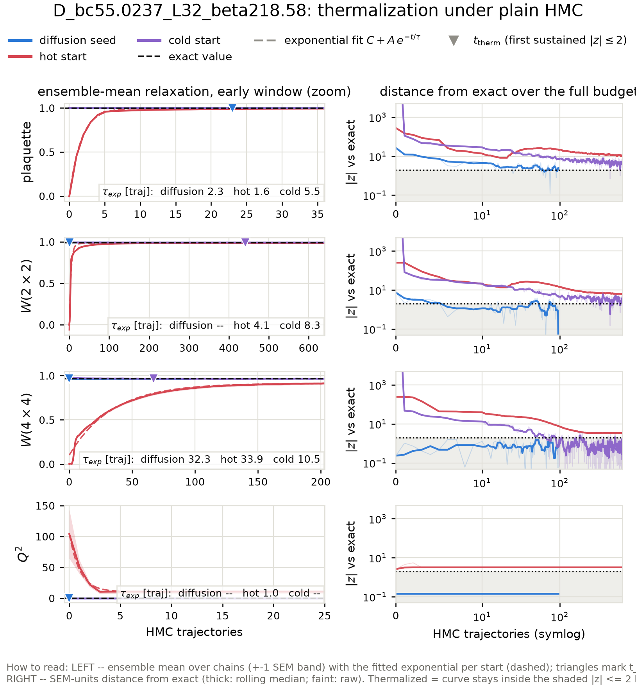

tau_int (hot-start chains, second half): plaquette = 10.44 +- 1.54, wilson_2x2 = 10.51 +- 1.42, wilson_4x4 = 5.82 +- 0.59, wilson_6x6 = 7.47 +- 0.89. Topology: hot-start HMC L=32 beta=218.58 -> **frozen** (no tunneling).

Where 'never' stood at the end: the hot start ended the 640-trajectory budget still at plaquette at |z| ~ 11, wilson_2x2 at |z| ~ 6, wilson_4x4 at |z| ~ 3, wilson_6x6 at |z| ~ 4, Q^2 at |z| ~ 3; the cold start ended the 640-trajectory budget still at plaquette at |z| ~ 4, Q^2 at |z| ~ 29010771968.

### Diagnostics: raw diffusion output (before any HMC)

| observable | value | error | exact | z_exact | reference | ref_error | z_ref | ks_p | chi2_p |
|---|---|---|---|---|---|---|---|---|---|
| plaquette | 0.998 | 1.079e-05 | 0.9977 | 22.66 | 0.9978 | 5.473e-06 | 16.17 | 1.23e-28 |  |
| wilson_1x1 | 0.998 | 1.079e-05 | 0.9977 | 22.66 | 0.9978 | 5.473e-06 | 16.17 | 1.23e-28 |  |
| wilson_1x2 | 0.9958 | 2.543e-05 | 0.9954 | 12.96 | 0.9955 | 1.37e-05 | 8.397 | 2.312e-10 |  |
| wilson_2x2 | 0.9913 | 6.039e-05 | 0.9909 | 6.306 | 0.9911 | 4.515e-05 | 2.462 | 0.02464 |  |
| wilson_2x3 | 0.9869 | 0.0001018 | 0.9864 | 4.574 | 0.9866 | 8.251e-05 | 2.243 | 0.04195 |  |
| wilson_3x3 | 0.9802 | 0.0001777 | 0.9797 | 2.979 | 0.9798 | 0.000148 | 1.691 | 0.1866 |  |
| wilson_3x4 | 0.9736 | 0.0002594 | 0.9731 | 2.005 | 0.9731 | 0.0002157 | 1.619 | 0.2741 |  |
| wilson_4x4 | 0.9645 | 0.0003974 | 0.9644 | 0.2385 | 0.9641 | 0.000308 | 0.7078 | 0.7195 |  |
| wilson_4x5 | 0.9556 | 0.000487 | 0.9558 | -0.4828 | 0.9554 | 0.0003938 | 0.3725 | 0.6808 |  |
| wilson_5x5 | 0.9446 | 0.0007014 | 0.9453 | -0.9435 | 0.9444 | 0.0005464 | 0.3099 | 0.6028 |  |
| wilson_5x6 | 0.9337 | 0.0008573 | 0.935 | -1.494 | 0.9335 | 0.0006762 | 0.1245 | 0.4545 |  |
| wilson_6x6 | 0.9206 | 0.001141 | 0.9228 | -1.909 | 0.9206 | 0.0008502 | 0.04826 | 0.8288 |  |
| wilson_6x7 | 0.9078 | 0.001369 | 0.9109 | -2.31 | 0.9078 | 0.0009964 | 0.002412 | 0.6028 |  |
| wilson_7x7 | 0.893 | 0.001733 | 0.8974 | -2.54 | 0.893 | 0.001239 | -0.03066 | 0.7575 |  |
| wilson_7x8 | 0.8785 | 0.002026 | 0.8842 | -2.811 | 0.8793 | 0.001428 | -0.319 | 0.8288 |  |
| wilson_8x8 | 0.862 | 0.00254 | 0.8696 | -2.97 | 0.8628 | 0.00165 | -0.245 | 0.9167 |  |
| wilson_8x10 | 0.8312 | 0.003466 | 0.8415 | -2.983 | 0.8336 | 0.002212 | -0.582 | 0.7941 |  |
| wilson_10x10 | 0.7941 | 0.004791 | 0.8088 | -3.063 | 0.7952 | 0.002776 | -0.1875 | 0.7941 |  |
| wilson_10x12 | 0.7593 | 0.006053 | 0.7785 | -3.168 | 0.7631 | 0.003733 | -0.5341 | 0.8288 |  |
| wilson_12x12 | 0.7222 | 0.007525 | 0.745 | -3.023 | 0.7231 | 0.004467 | -0.1034 | 0.8288 |  |
| creutz_2 | 0.00231 | 2.81e-05 | 0.002278 | 1.165 |  |  |  |  |  |
| creutz_3 | 0.00227 | 5.642e-05 | 0.00225 | 0.3518 |  |  |  |  |  |
| creutz_4 | 0.00264 | 0.0001057 | 0.00221 | 4.071 |  |  |  |  |  |
| creutz_5 | 0.002265 | 0.0001655 | 0.002155 | 0.6646 |  |  |  |  |  |
| creutz_6 | 0.002408 | 0.0002458 | 0.002087 | 1.307 |  |  |  |  |  |
| creutz_7 | 0.002328 | 0.0003248 | 0.002005 | 0.9952 |  |  |  |  |  |
| creutz_8 | 0.00261 | 0.0003983 | 0.001907 | 1.763 |  |  |  |  |  |
| Q | 0 | 0.01652 | 0 | 0 | -0.005208 | 0.01167 | 0.2575 | 1 |  |
| Q^2 | 0.03125 | 0.01479 | 0.02901 | 0.1514 | 0.02604 | 0.01017 | 0.2902 | 1 |  |
| chi_top ((<Q^2>-<Q>^2)/V) | 3.052e-05 | 1.52e-05 | 2.833e-05 | 0.1439 | 2.54e-05 | 1.129e-05 | 0.2701 |  |  |
| Q histogram vs exact P(Q) | 0.02279 | nan | 2 | nan |  |  |  |  | 0.9887 |

### Diagnostics: the same configs after 96 HMC trajectories

| observable | value | error | exact | z_exact | reference | ref_error | z_ref | ks_p | chi2_p |
|---|---|---|---|---|---|---|---|---|---|
| plaquette | 0.9977 | 1.057e-05 | 0.9977 | 2.238 | 0.9978 | 5.473e-06 | -2.126 | 0.04195 |  |
| wilson_1x1 | 0.9977 | 1.057e-05 | 0.9977 | 2.238 | 0.9978 | 5.473e-06 | -2.126 | 0.04195 |  |
| wilson_1x2 | 0.9955 | 2.756e-05 | 0.9954 | 1.958 | 0.9955 | 1.37e-05 | -1.076 | 0.357 |  |
| wilson_2x2 | 0.9909 | 7.446e-05 | 0.9909 | 0.009203 | 0.9911 | 4.515e-05 | -2.233 | 0.01207 |  |
| wilson_2x3 | 0.9864 | 0.0001238 | 0.9864 | 0.08683 | 0.9866 | 8.251e-05 | -1.083 | 0.5266 |  |
| wilson_3x3 | 0.9796 | 0.0002336 | 0.9797 | -0.5177 | 0.9798 | 0.000148 | -0.9376 | 0.3001 |  |
| wilson_3x4 | 0.9729 | 0.0003315 | 0.9731 | -0.5267 | 0.9731 | 0.0002157 | -0.3753 | 0.7575 |  |
| wilson_4x4 | 0.9641 | 0.0005159 | 0.9644 | -0.6431 | 0.9641 | 0.000308 | -0.1176 | 0.8288 |  |
| wilson_4x5 | 0.9555 | 0.0006814 | 0.9558 | -0.4821 | 0.9554 | 0.0003938 | 0.1777 | 0.8612 |  |
| wilson_5x5 | 0.9446 | 0.0009114 | 0.9453 | -0.7179 | 0.9444 | 0.0005464 | 0.2664 | 0.8612 |  |
| wilson_5x6 | 0.9343 | 0.001128 | 0.935 | -0.5792 | 0.9335 | 0.0006762 | 0.5809 | 0.5266 |  |
| wilson_6x6 | 0.9219 | 0.001402 | 0.9228 | -0.6108 | 0.9206 | 0.0008502 | 0.8478 | 0.357 |  |
| wilson_6x7 | 0.9099 | 0.001704 | 0.9109 | -0.5797 | 0.9078 | 0.0009964 | 1.104 | 0.3001 |  |
| wilson_7x7 | 0.8958 | 0.002091 | 0.8974 | -0.776 | 0.893 | 0.001239 | 1.116 | 0.1866 |  |
| wilson_7x8 | 0.8821 | 0.002493 | 0.8842 | -0.8594 | 0.8793 | 0.001428 | 0.9616 | 0.2741 |  |
| wilson_8x8 | 0.8664 | 0.002946 | 0.8696 | -1.079 | 0.8628 | 0.00165 | 1.073 | 0.1685 |  |
| wilson_8x10 | 0.8379 | 0.004091 | 0.8415 | -0.884 | 0.8336 | 0.002212 | 0.9307 | 0.1519 |  |
| wilson_10x10 | 0.8028 | 0.005447 | 0.8088 | -1.112 | 0.7952 | 0.002776 | 1.24 | 0.04767 |  |
| wilson_10x12 | 0.7715 | 0.006882 | 0.7785 | -1.013 | 0.7631 | 0.003733 | 1.074 | 0.07777 |  |
| wilson_12x12 | 0.7352 | 0.00826 | 0.745 | -1.189 | 0.7231 | 0.004467 | 1.28 | 0.07777 |  |
| creutz_2 | 0.002361 | 3.289e-05 | 0.002278 | 2.554 |  |  |  |  |  |
| creutz_3 | 0.002395 | 7.209e-05 | 0.00225 | 2.005 |  |  |  |  |  |
| creutz_4 | 0.002318 | 0.00012 | 0.00221 | 0.9054 |  |  |  |  |  |
| creutz_5 | 0.002504 | 0.0001889 | 0.002155 | 1.846 |  |  |  |  |  |
| creutz_6 | 0.00231 | 0.0002643 | 0.002087 | 0.8444 |  |  |  |  |  |
| creutz_7 | 0.002573 | 0.0003246 | 0.002005 | 1.751 |  |  |  |  |  |
| creutz_8 | 0.002525 | 0.0004114 | 0.001907 | 1.502 |  |  |  |  |  |
| Q | 0 | 0.01652 | 0 | 0 | -0.005208 | 0.01167 | 0.2575 | 1 |  |
| Q^2 | 0.03125 | 0.01479 | 0.02901 | 0.1514 | 0.02604 | 0.01017 | 0.2902 | 1 |  |
| chi_top ((<Q^2>-<Q>^2)/V) | 3.052e-05 | 1.52e-05 | 2.833e-05 | 0.1439 | 2.54e-05 | 1.129e-05 | 0.2701 |  |  |
| Q histogram vs exact P(Q) | 0.02279 | nan | 2 | nan |  |  |  |  | 0.9887 |
