# Diffusion-seeded HMC across the matched beta scan: thermalization time vs the standard-HMC sampling interval

Action: wilson. All HMC in this report is plain HMC (Omelyan, adapted step size, **no** topological updates).

**Why this scan.** At the ladder's upper rungs the fresh-HMC baselines never thermalize at all (topological freezing plus a metastable local-defect state), so the only comparison available there is 'diffusion seed vs a baseline that never arrives'. This report extends the benchmark to every matched coupling pair of the generalization study -- one inverse-RG step L=16 -> L=32 per case -- including fine couplings low enough that hot- and cold-start HMC *does* thermalize within the budget. There the standard chain's own interval `2 tau_int` and its fresh-start burn-in are honest, measurable yardsticks, and the scan shows where the ordering

> t_therm(diffusion seed)  <  2 tau_int(standard HMC)  <  burn-in(fresh chain)

sets in as beta grows and standard HMC slides into critical slowing down and topological freezing.

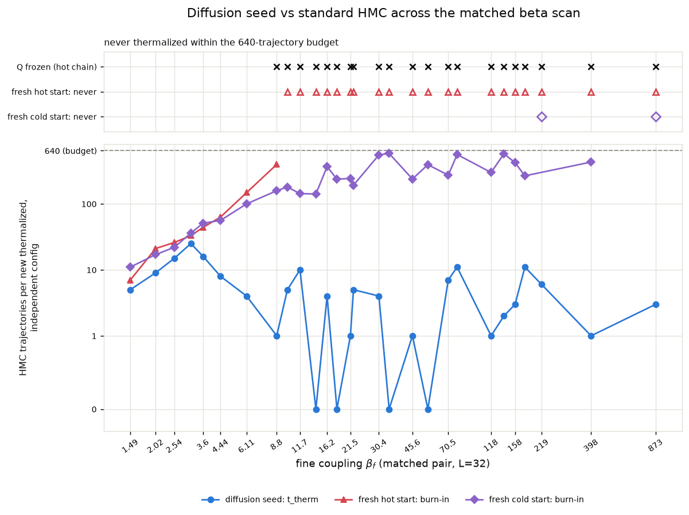

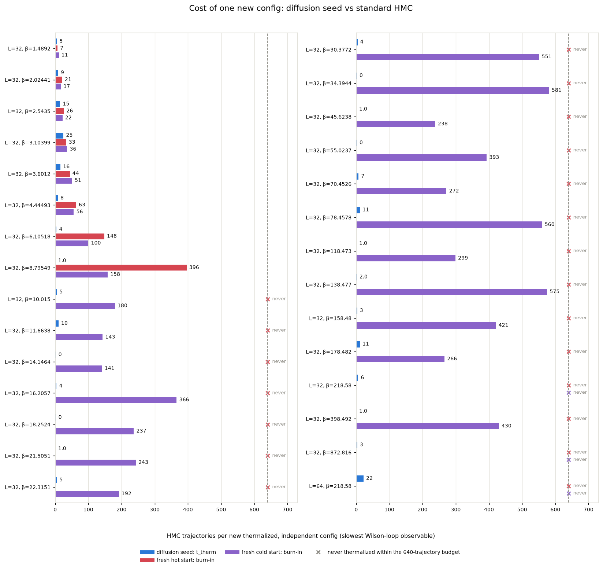

## The three starting points

- **Diffusion seed** -- the raw conditional-diffusion output for this coupling: one inverse-RG step from a direct-HMC base ensemble at the matched coarse coupling (ancestral sampling + the deterministic coarse-charge transport), with **no** rethermalization sweeps applied: every bit of equilibration the seed needs is measured here, in HMC trajectories.
- **Hot start** -- every link angle drawn uniformly from (-pi, pi]: a completely disordered (infinite-temperature) configuration. The standard way to initialize a fresh HMC chain without prior information.
- **Cold start** -- every link angle set to zero: the perfectly ordered (beta -> infinity) configuration, the other standard initialization.

## Summary

| rung | L | beta | t_therm diffusion seed | standard-HMC interval 2 tau_int | margin (interval - t_therm) | burn-in hot / cold | tau_int(Q) |
|---|---|---|---|---|---|---|---|
| A_bc0.25_L32_beta1.4892 | 32 | 1.4892 | 5 | 3.0 | -2.0 traj | 7 / 11 | 1.5 |
| A_bc0.5_L32_beta2.02441 | 32 | 2.02441 | 9 | 4.7 | -4.3 traj | 21 / 17 | 2.6 |
| A_bc0.75_L32_beta2.5435 | 32 | 2.5435 | 15 | 7.0 | -8.0 traj | 26 / 22 | 5.8 |
| A_bc1_L32_beta3.10399 | 32 | 3.10399 | 25 | 7.0 | -18.0 traj | 33 / 36 | 8.2 |
| E_bc1.2_L32_beta3.6012 | 32 | 3.6012 | 16 | 8.7 | -7.3 traj | 44 / 51 | 16.6 |
| A_bc1.5_L32_beta4.44493 | 32 | 4.44493 | 8 | 7.5 | -0.5 traj | 63 / 56 | 31.9 |
| A_bc2_L32_beta6.10518 | 32 | 6.10518 | 4 | 6.8 | 2.8 traj | 148 / 100 | 30.6 |
| E_bc2.7_L32_beta8.79549 | 32 | 8.79549 | 1 | 9.6 | 8.6 traj | 396 / 158 | frozen (0 tunnelings in 321 x 32 traj) |
| A_bc3_L32_beta10.015 | 32 | 10.015 | 5 | 12.9 | 7.9 traj | never / 180 | frozen (0 tunnelings in 321 x 32 traj) |
| E_bc3.4_L32_beta11.6638 | 32 | 11.6638 | 10 | 9.9 | -0.1 traj | never / 143 | frozen (0 tunnelings in 321 x 32 traj) |
| A_bc4_L32_beta14.1464 | 32 | 14.1464 | 0 | 8.1 | 8.1 traj | never / 141 | frozen (0 tunnelings in 321 x 32 traj) |
| E_bc4.5_L32_beta16.2057 | 32 | 16.2057 | 4 | 22.3 | 18.3 traj | never / 366 | frozen (0 tunnelings in 321 x 32 traj) |
| A_bc5_L32_beta18.2524 | 32 | 18.2524 | 0 | 14.6 | 14.6 traj | never / 237 | frozen (0 tunnelings in 321 x 32 traj) |
| E_bc5.8_L32_beta21.5051 | 32 | 21.5051 | 1 | 19.8 | 18.8 traj | never / 243 | frozen (0 tunnelings in 321 x 32 traj) |
| A_bc6_L32_beta22.3151 | 32 | 22.3151 | 5 | 17.7 | 12.7 traj | never / 192 | frozen (0 tunnelings in 321 x 32 traj) |
| A_bc8_L32_beta30.3772 | 32 | 30.3772 | 4 | 28.0 | 24.0 traj | never / 551 | frozen (0 tunnelings in 321 x 32 traj) |
| E_bc9_L32_beta34.3944 | 32 | 34.3944 | 0 | 17.5 | 17.5 traj | never / 581 | frozen (0 tunnelings in 321 x 32 traj) |
| E_bc11.8_L32_beta45.6238 | 32 | 45.6238 | 1 | 18.9 | 17.9 traj | never / 238 | frozen (0 tunnelings in 321 x 32 traj) |
| D_bc14.1464_L32_beta55.0237 | 32 | 55.0237 | 0 | 24.7 | 24.7 traj | never / 393 | frozen (0 tunnelings in 321 x 32 traj) |
| E_bc18_L32_beta70.4526 | 32 | 70.4526 | 7 | 21.9 | 14.9 traj | never / 272 | frozen (0 tunnelings in 321 x 32 traj) |
| D_bc20_L32_beta78.4578 | 32 | 78.4578 | 11 | 15.4 | 4.4 traj | never / 560 | frozen (0 tunnelings in 321 x 32 traj) |
| D_bc30_L32_beta118.473 | 32 | 118.473 | 1 | 48.1 | 47.1 traj | never / 299 | frozen (0 tunnelings in 321 x 32 traj) |
| E_bc35_L32_beta138.477 | 32 | 138.477 | 2 | 89.9 | 87.9 traj | never / 575 | frozen (0 tunnelings in 321 x 32 traj) |
| D_bc40_L32_beta158.48 | 32 | 158.48 | 3 | 67.8 | 64.8 traj | never / 421 | frozen (0 tunnelings in 321 x 32 traj) |
| E_bc45_L32_beta178.482 | 32 | 178.482 | 11 | 40.6 | 29.6 traj | never / 266 | frozen (0 tunnelings in 321 x 32 traj) |
| D_bc55.0237_L32_beta218.58 | 32 | 218.58 | 6 | 20.5 | 14.5 traj | never / never | frozen (0 tunnelings in 321 x 32 traj) |
| F_L32_bc100_L32_beta398.492 | 32 | 398.492 | 1 | 64.4 | 63.4 traj | never / 430 | frozen (0 tunnelings in 321 x 32 traj) |
| F_L32_bc218.58_L32_beta872.816 | 32 | 872.816 | 3 | 4.8 | 1.8 traj | never / never | frozen (0 tunnelings in 321 x 32 traj) |
| F_L64_bc55.0237_L64_beta218.58 | 64 | 218.58 | 22 | 67.5 | 45.5 traj | never / never | frozen (0 tunnelings in 321 x 16 traj) |

## Wall-clock accounting

All timescales above are in HMC trajectories -- the honest *ergodicity* unit. This table converts to seconds on this machine so the economics are explicit. Batched chains produce n_chains configs per trajectory, so per-config costs divide by the chain count; the diffusion sampling cost amortizes over the whole generated batch.

| case | seed: sample s/config | seed: t_therm s (batch) | HMC interval s/config | hot burn-in s (batch) | s/traj (batch) |
|---|---|---|---|---|---|
| A_bc0.25_L32_beta1.4892 | 0.2 | 0.2 | 0.00 | 0 | 0.03 |
| A_bc0.5_L32_beta2.02441 | 0.2 | 0.3 | 0.00 | 1 | 0.03 |
| A_bc0.75_L32_beta2.5435 | 0.2 | 0.4 | 0.01 | 1 | 0.03 |
| A_bc1_L32_beta3.10399 | 0.2 | 0.8 | 0.01 | 1 | 0.03 |
| E_bc1.2_L32_beta3.6012 | 0.3 | 0.7 | 0.01 | 2 | 0.04 |
| A_bc1.5_L32_beta4.44493 | 0.3 | 0.4 | 0.01 | 3 | 0.05 |
| A_bc2_L32_beta6.10518 | 0.3 | 0.3 | 0.01 | 9 | 0.06 |
| E_bc2.7_L32_beta8.79549 | 0.3 | 0.1 | 0.02 | 25 | 0.06 |
| A_bc3_L32_beta10.015 | 0.3 | 0.4 | 0.03 | never | 0.07 |
| E_bc3.4_L32_beta11.6638 | 0.3 | 0.7 | 0.02 | never | 0.06 |
| A_bc4_L32_beta14.1464 | 0.3 | 0.0 | 0.02 | never | 0.07 |
| E_bc4.5_L32_beta16.2057 | 0.3 | 0.3 | 0.06 | never | 0.08 |
| A_bc5_L32_beta18.2524 | 0.3 | 0.0 | 0.04 | never | 0.09 |
| E_bc5.8_L32_beta21.5051 | 0.3 | 0.1 | 0.06 | never | 0.09 |
| A_bc6_L32_beta22.3151 | 0.3 | 0.4 | 0.05 | never | 0.09 |
| A_bc8_L32_beta30.3772 | 0.3 | 0.4 | 0.09 | never | 0.10 |
| E_bc9_L32_beta34.3944 | 0.3 | 0.0 | 0.06 | never | 0.12 |
| E_bc11.8_L32_beta45.6238 | 0.3 | 0.1 | 0.07 | never | 0.11 |
| D_bc14.1464_L32_beta55.0237 | 0.3 | 0.0 | 0.10 | never | 0.13 |
| E_bc18_L32_beta70.4526 | 0.3 | 0.8 | 0.08 | never | 0.12 |
| D_bc20_L32_beta78.4578 | 0.2 | 1.3 | 0.06 | never | 0.13 |
| D_bc30_L32_beta118.473 | 0.3 | 0.2 | 0.26 | never | 0.17 |
| E_bc35_L32_beta138.477 | 0.2 | 0.4 | 0.57 | never | 0.20 |
| D_bc40_L32_beta158.48 | 0.3 | 0.7 | 0.44 | never | 0.21 |
| E_bc45_L32_beta178.482 | 0.3 | 2.5 | 0.29 | never | 0.23 |
| D_bc55.0237_L32_beta218.58 | n/a (cached) | 2.1 | 0.14 | never | 0.22 |
| F_L32_bc100_L32_beta398.492 | 0.4 | 0.3 | 0.57 | never | 0.28 |
| F_L32_bc218.58_L32_beta872.816 | 0.4 | 1.4 | 0.06 | never | 0.40 |
| F_L64_bc55.0237_L64_beta218.58 | 1.0 | 4.8 | 0.88 | never | 0.21 |

## Fitted relaxation times across starts

Exponential fits C + A exp(-t/tau) to the ensemble-mean plaquette and W(2x2) relaxation curves, per starting point (the cross-start comparison of characteristic times; a start already at its plateau fits no decay, which is the desired outcome for the diffusion seed).

| case | obs | tau: diffusion seed | tau: hot start | tau: cold start |
|---|---|---|---|---|
| A_bc0.25_L32_beta1.4892 | plaquette | 1.2 +- 0.1 | 1.1 +- 0.0 | 2.5 +- 0.0 |
| A_bc0.25_L32_beta1.4892 | wilson_2x2 | 0.5 +- 0.1 | 2.1 +- 0.1 | 1.5 +- 0.0 |
| A_bc0.5_L32_beta2.02441 | plaquette | 2.2 +- 0.1 | 1.7 +- 0.0 | 4.0 +- 0.0 |
| A_bc0.5_L32_beta2.02441 | wilson_2x2 | unreliable (tau exceeds window) | 2.7 +- 0.1 | 1.7 +- 0.0 |
| A_bc0.75_L32_beta2.5435 | plaquette | 4.9 +- 0.2 | 2.3 +- 0.0 | 5.0 +- 0.1 |
| A_bc0.75_L32_beta2.5435 | wilson_2x2 | 59.9 +- 55.6 | 3.8 +- 0.1 | 1.9 +- 0.0 |
| A_bc1_L32_beta3.10399 | plaquette | 11.4 +- 0.3 | 2.7 +- 0.0 | 6.5 +- 0.1 |
| A_bc1_L32_beta3.10399 | wilson_2x2 | 18.3 +- 4.4 | 5.0 +- 0.1 | 2.8 +- 0.1 |
| E_bc1.2_L32_beta3.6012 | plaquette | 8.1 +- 0.4 | 2.8 +- 0.0 | 5.4 +- 0.1 |
| E_bc1.2_L32_beta3.6012 | wilson_2x2 | 15.3 +- 3.5 | 5.9 +- 0.1 | 3.8 +- 0.1 |
| A_bc1.5_L32_beta4.44493 | plaquette | 4.3 +- 0.3 | 2.7 +- 0.0 | 3.9 +- 0.1 |
| A_bc1.5_L32_beta4.44493 | wilson_2x2 | 10.0 +- 2.1 | 7.3 +- 0.1 | 4.2 +- 0.1 |
| A_bc2_L32_beta6.10518 | plaquette | 1.8 +- 0.3 | 2.2 +- 0.0 | 5.2 +- 0.2 |
| A_bc2_L32_beta6.10518 | wilson_2x2 | 4.0 +- 0.8 | 8.6 +- 0.1 | 3.6 +- 0.1 |
| E_bc2.7_L32_beta8.79549 | plaquette | unconstrained fit (tau error exceeds tau) | 2.1 +- 0.0 | 5.9 +- 0.2 |
| E_bc2.7_L32_beta8.79549 | wilson_2x2 | 10.1 +- 7.5 | 9.1 +- 0.2 | 4.0 +- 0.2 |
| A_bc3_L32_beta10.015 | plaquette | 35.8 +- 11.3 | 2.0 +- 0.0 | 10.5 +- 0.4 |
| A_bc3_L32_beta10.015 | wilson_2x2 | 2.0 +- 0.8 | 7.0 +- 0.1 | 4.6 +- 0.2 |
| E_bc3.4_L32_beta11.6638 | plaquette | 1.7 +- 1.1 | 2.0 +- 0.0 | 7.6 +- 0.3 |
| E_bc3.4_L32_beta11.6638 | wilson_2x2 | 3.2 +- 1.0 | 7.4 +- 0.2 | 6.4 +- 0.3 |
| A_bc4_L32_beta14.1464 | plaquette | 1.9 +- 1.1 | 2.0 +- 0.0 | 7.2 +- 0.3 |
| A_bc4_L32_beta14.1464 | wilson_2x2 | 3.5 +- 1.2 | 8.4 +- 0.2 | 5.3 +- 0.2 |
| E_bc4.5_L32_beta16.2057 | plaquette | no measurable decay (starts at plateau; tau unconstrained) | 1.9 +- 0.0 | 4.2 +- 0.2 |
| E_bc4.5_L32_beta16.2057 | wilson_2x2 | 2.3 +- 1.1 | 6.1 +- 0.2 | 4.5 +- 0.2 |
| A_bc5_L32_beta18.2524 | plaquette | 1.1 +- 0.4 | 1.8 +- 0.0 | 6.1 +- 0.3 |
| A_bc5_L32_beta18.2524 | wilson_2x2 | 1.0 +- 0.4 | 6.1 +- 0.1 | 5.4 +- 0.3 |
| E_bc5.8_L32_beta21.5051 | plaquette | 2.4 +- 0.7 | 1.8 +- 0.0 | 14.2 +- 0.6 |
| E_bc5.8_L32_beta21.5051 | wilson_2x2 | 95.6 +- 76.2 | 5.5 +- 0.1 | 4.8 +- 0.2 |
| A_bc6_L32_beta22.3151 | plaquette | 19.1 +- 8.5 | 1.8 +- 0.0 | 12.8 +- 0.5 |
| A_bc6_L32_beta22.3151 | wilson_2x2 | unreliable (tau exceeds window) | 5.3 +- 0.1 | 5.6 +- 0.2 |
| A_bc8_L32_beta30.3772 | plaquette | unconstrained fit (tau error exceeds tau) | 1.8 +- 0.0 | 10.6 +- 0.5 |
| A_bc8_L32_beta30.3772 | wilson_2x2 | 0.7 +- 0.3 | 5.3 +- 0.1 | 10.5 +- 0.6 |
| E_bc9_L32_beta34.3944 | plaquette | 1.7 +- 1.0 | 1.7 +- 0.0 | 5.7 +- 0.3 |
| E_bc9_L32_beta34.3944 | wilson_2x2 | no measurable decay (starts at plateau; tau unconstrained) | 5.0 +- 0.1 | 4.0 +- 0.2 |
| E_bc11.8_L32_beta45.6238 | plaquette | 2.0 +- 1.0 | 1.7 +- 0.0 | 5.7 +- 0.2 |
| E_bc11.8_L32_beta45.6238 | wilson_2x2 | 0.7 +- 0.6 | 4.9 +- 0.1 | 5.2 +- 0.2 |
| D_bc14.1464_L32_beta55.0237 | plaquette | 0.7 +- 0.5 | 1.7 +- 0.0 | 5.6 +- 0.2 |
| D_bc14.1464_L32_beta55.0237 | wilson_2x2 | unconstrained fit (tau error exceeds tau) | 4.8 +- 0.1 | 8.3 +- 0.3 |
| E_bc18_L32_beta70.4526 | plaquette | 15.8 +- 4.6 | 1.7 +- 0.0 | 4.7 +- 0.2 |
| E_bc18_L32_beta70.4526 | wilson_2x2 | 17.7 +- 8.4 | 4.4 +- 0.1 | 5.7 +- 0.2 |
| D_bc20_L32_beta78.4578 | plaquette | 1.3 +- 0.3 | 1.7 +- 0.0 | 4.6 +- 0.2 |
| D_bc20_L32_beta78.4578 | wilson_2x2 | 1.2 +- 0.5 | 4.3 +- 0.1 | 4.6 +- 0.2 |
| D_bc30_L32_beta118.473 | plaquette | 6.9 +- 1.1 | 1.7 +- 0.0 | 5.4 +- 0.2 |
| D_bc30_L32_beta118.473 | wilson_2x2 | 9.7 +- 2.4 | 3.9 +- 0.1 | 5.7 +- 0.2 |
| E_bc35_L32_beta138.477 | plaquette | 1.2 +- 0.4 | 1.7 +- 0.0 | 4.9 +- 0.2 |
| E_bc35_L32_beta138.477 | wilson_2x2 | 14.4 +- 4.1 | 4.1 +- 0.1 | 5.9 +- 0.3 |
| D_bc40_L32_beta158.48 | plaquette | 1.7 +- 0.4 | 1.6 +- 0.0 | 10.3 +- 0.4 |
| D_bc40_L32_beta158.48 | wilson_2x2 | 1.2 +- 0.4 | 3.8 +- 0.1 | 3.9 +- 0.2 |
| E_bc45_L32_beta178.482 | plaquette | 4.7 +- 0.9 | 1.7 +- 0.0 | 10.7 +- 0.5 |
| E_bc45_L32_beta178.482 | wilson_2x2 | 8.7 +- 1.9 | 3.8 +- 0.1 | 15.5 +- 0.7 |
| D_bc55.0237_L32_beta218.58 | plaquette | 12.2 +- 2.1 | 1.6 +- 0.0 | 5.3 +- 0.2 |
| D_bc55.0237_L32_beta218.58 | wilson_2x2 | 18.0 +- 3.9 | 4.0 +- 0.1 | 10.0 +- 0.4 |
| F_L32_bc100_L32_beta398.492 | plaquette | 14.9 +- 6.0 | 1.6 +- 0.0 | 5.3 +- 0.2 |
| F_L32_bc100_L32_beta398.492 | wilson_2x2 | 14.1 +- 6.4 | 4.7 +- 0.2 | 6.1 +- 0.2 |
| F_L32_bc218.58_L32_beta872.816 | plaquette | no measurable decay (starts at plateau; tau unconstrained) | 1.5 +- 0.0 | 10.4 +- 0.5 |
| F_L32_bc218.58_L32_beta872.816 | wilson_2x2 | no measurable decay (starts at plateau; tau unconstrained) | 2.7 +- 0.1 | 6.6 +- 0.3 |
| F_L64_bc55.0237_L64_beta218.58 | plaquette | 3.5 +- 0.8 | 1.6 +- 0.0 | 4.4 +- 0.2 |
| F_L64_bc55.0237_L64_beta218.58 | wilson_2x2 | 7.5 +- 1.5 | 71.2 +- 5.4 | 5.2 +- 0.2 |

t_therm and burn-in are the slowest Wilson-loop observable (plaquette, W(2x2), W(4x4)); topology is stricter still for the fresh chains: their Q^2 **never** reaches the exact value at the frozen rungs, while the diffusion seed inherits the correct topological sector from the coarse ensemble it was generated from (see the Q^2 panels and per-rung tables below).

Thermalization time `t_therm` = first trajectory at which the ensemble-mean z-score vs the exact value satisfies |z| <= 2 and stays there for 5 consecutive trajectories (t = 0: already thermalized before any HMC). For the diffusion seed, t_therm is computed on a random subsample of chains matched to the baseline chain count so all starts are compared at equal statistical power. `tau_int` is Madras-Sokal, measured on the second half of the hot-start chains, averaged over chains. In the per-rung relaxation figures, triangles mark each start's t_therm, dashed curves are the exponential fits C + A exp(-t/tau) to the ensemble means (tau quoted per panel), and the right-hand panels track the ensemble mean's distance from the exact value in SEM units -- thermalized means inside the shaded |z| <= 2 band; the dotted vertical line there is the standard-HMC interval `2 tau_int`.

## What 'never' means, and where the ground truth comes from

'never' = the ensemble mean was still outside |z| <= 2 of the exact value after the full baseline budget; the per-rung sections quote the z-score it plateaued at. For hot starts at the large-beta rungs this is not a budget problem but a physical one: a random start freezes into a random topological sector (<Q^2> of order tens), plain HMC can never change Q at these couplings (tunneling is suppressed ~exp(-2 beta)), and the wrong sector biases every Wilson loop by an amount that never decays. Cold starts sit in the single sector Q = 0, so their Wilson loops do eventually converge, but <Q^2> stays pinned at 0 forever.

None of the exact values in this report come from fine-lattice HMC: the ground truth is the character expansion of 2D compact U(1) (`diffusion/lgt/exact.py`), which gives every Wilson loop, P(Q) and chi_top in closed form at finite volume. Each diffusion seed here is one inverse-RG step from a direct-HMC base ensemble at the matched coarse coupling beta_c (L=16), where HMC mixes well -- which is precisely why it can start chains in regions standard HMC cannot reach.

## A_bc0.25_L32_beta1.4892

HMC: step size 0.2000, 5 leapfrog steps, acceptance seed/hot/cold = 0.969/0.968/0.969. Diffusion-seed batch: 128 chains x 96 trajectories (0.03 s/traj for the whole batch); baselines: 32 chains x 640 trajectories.

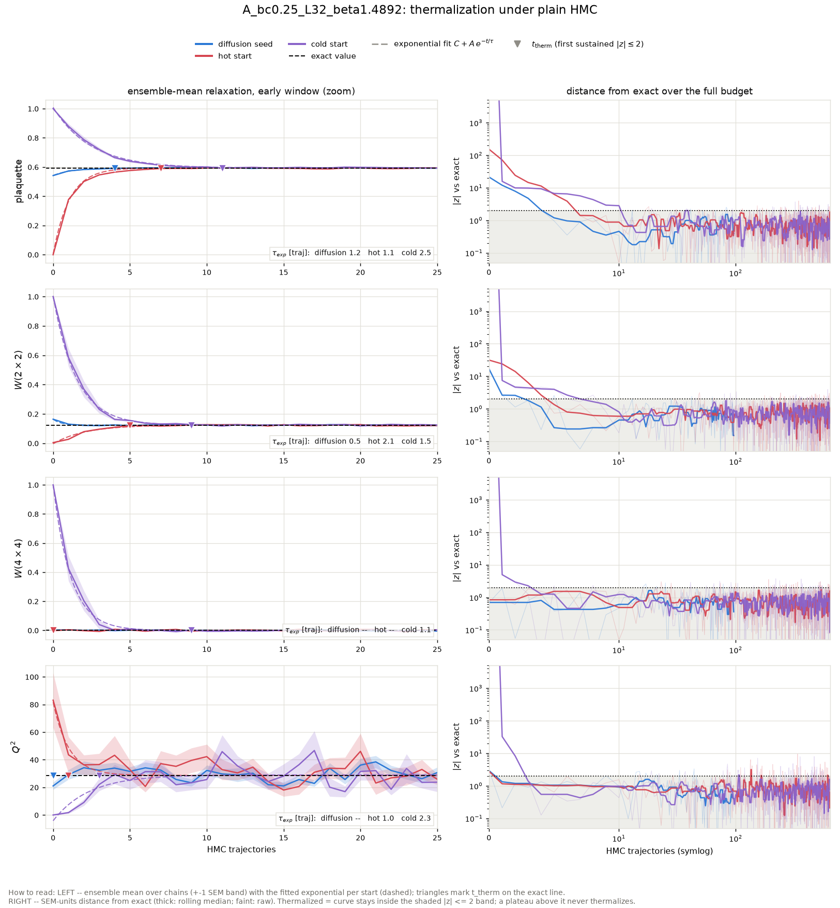

tau_int (hot-start chains, second half): plaquette = 1.48 +- 0.07, wilson_2x2 = 0.78 +- 0.04, wilson_4x4 = 0.55 +- 0.01, wilson_6x6 = 0.58 +- 0.02. Topology: hot-start HMC L=32 beta=1.4892 -> tau_int(Q) = 1.5.

### Diagnostics: raw diffusion output (before any HMC)

| observable | value | error | exact | z_exact | reference | ref_error | z_ref | ks_p | chi2_p |
|---|---|---|---|---|---|---|---|---|---|
| plaquette | 0.5414 | 0.003084 | 0.5935 | -16.87 | 0.5918 | 0.001368 | -14.93 | 2.213e-42 |  |
| wilson_1x1 | 0.5414 | 0.003084 | 0.5935 | -16.87 | 0.5918 | 0.001368 | -14.93 | 2.213e-42 |  |
| wilson_1x2 | 0.317 | 0.004005 | 0.3522 | -8.782 | 0.3512 | 0.001631 | -7.908 | 3.233e-14 |  |
| wilson_2x2 | 0.1638 | 0.002302 | 0.124 | 17.29 | 0.1242 | 0.001928 | 13.19 | 1.62e-25 |  |
| wilson_2x3 | 0.07386 | 0.001986 | 0.04368 | 15.2 | 0.0459 | 0.001404 | 11.49 | 2.313e-15 |  |
| wilson_3x3 | 0.01688 | 0.001174 | 0.00913 | 6.607 | 0.01282 | 0.001791 | 1.896 | 0.1519 |  |
| wilson_3x4 | 0.00513 | 0.002072 | 0.001908 | 1.555 | 0.003425 | 0.001799 | 0.6216 | 0.9167 |  |
| wilson_4x4 | 0.001644 | 0.002353 | 0.0002367 | 0.5982 | -0.0001983 | 0.00185 | 0.6156 | 0.3879 |  |
| wilson_4x5 | -0.0005006 | 0.00175 | 2.936e-05 | -0.3027 | 0.001027 | 0.001979 | -0.5782 | 0.6808 |  |
| wilson_5x5 | -0.003 | 0.001754 | 2.161e-06 | -1.711 | -0.0001233 | 0.00136 | -1.296 | 0.4204 |  |
| wilson_5x6 | -0.002165 | 0.002482 | 1.591e-07 | -0.8721 | -0.0001601 | 0.001378 | -0.7061 | 0.4899 |  |
| wilson_6x6 | 0.001644 | 0.001463 | 6.948e-09 | 1.124 | -0.0004528 | 0.001667 | 0.9456 | 0.6028 |  |
| wilson_6x7 | -0.0002827 | 0.002217 | 3.035e-10 | -0.1275 | -0.0014 | 0.00165 | 0.4043 | 0.7941 |  |
| wilson_7x7 | 0.0007011 | 0.002392 | 7.868e-12 | 0.2931 | 0.00113 | 0.001271 | -0.1583 | 0.9167 |  |
| wilson_7x8 | 0.001655 | 0.00174 | 2.04e-13 | 0.9509 | 0.0005963 | 0.001265 | 0.4919 | 0.9719 |  |
| wilson_8x8 | -0.0006985 | 0.001744 | 3.138e-15 | -0.4006 | 0.002192 | 0.00165 | -1.204 | 0.2498 |  |
| wilson_8x10 | -0.001346 | 0.002384 | 7.426e-19 | -0.5646 | -0.00151 | 0.001346 | 0.05971 | 0.7941 |  |
| wilson_10x10 | 0.0008603 | 0.002129 | 2.18e-23 | 0.4042 | 0.001471 | 0.001334 | -0.2433 | 0.7941 |  |
| wilson_10x12 | 3.651e-05 | 0.001816 | 6.4e-28 | 0.02011 | 0.0002242 | 0.001634 | -0.07685 | 0.8288 |  |
| wilson_12x12 | -0.003133 | 0.001868 | 2.33e-33 | -1.678 | -0.0008399 | 0.001286 | -1.011 | 0.357 |  |
| creutz_2 | 0.1249 | 0.01579 | 0.5218 | -25.14 |  |  |  |  |  |
| creutz_3 | 0.6791 | 0.118 | 0.5218 | 1.334 |  |  |  |  |  |
| creutz_4 | -0.0532 | 1.395 | 0.5218 | -0.4123 |  |  |  |  |  |
| Q | -0.2031 | 0.3719 | 0 | -0.5461 | 0.5104 | 0.3821 | -1.338 | 0.7941 |  |
| Q^2 | 21.03 | 2.315 | 28.52 | -3.236 | 28.81 | 3.08 | -2.019 | 0.2741 |  |
| chi_top ((<Q^2>-<Q>^2)/V) | 0.0205 | 0.002534 | 0.02785 | -2.903 | 0.02788 | 0.002954 | -1.897 |  |  |
| Q histogram vs exact P(Q) | 20.13 | nan | 18 | nan |  |  |  |  | 0.3255 |

### Diagnostics: the same configs after 96 HMC trajectories

| observable | value | error | exact | z_exact | reference | ref_error | z_ref | ks_p | chi2_p |
|---|---|---|---|---|---|---|---|---|---|
| plaquette | 0.594 | 0.001107 | 0.5935 | 0.507 | 0.5918 | 0.001368 | 1.268 | 0.2498 |  |
| wilson_1x1 | 0.594 | 0.001107 | 0.5935 | 0.507 | 0.5918 | 0.001368 | 1.268 | 0.2498 |  |
| wilson_1x2 | 0.3514 | 0.001641 | 0.3522 | -0.4574 | 0.3512 | 0.001631 | 0.09649 | 0.4899 |  |
| wilson_2x2 | 0.1236 | 0.001958 | 0.124 | -0.1996 | 0.1242 | 0.001928 | -0.2109 | 0.6808 |  |
| wilson_2x3 | 0.04458 | 0.002095 | 0.04368 | 0.4295 | 0.0459 | 0.001404 | -0.5234 | 0.5266 |  |
| wilson_3x3 | 0.01145 | 0.002462 | 0.00913 | 0.944 | 0.01282 | 0.001791 | -0.4496 | 0.2498 |  |
| wilson_3x4 | -0.0007588 | 0.003149 | 0.001908 | -0.8468 | 0.003425 | 0.001799 | -1.154 | 0.2061 |  |
| wilson_4x4 | -0.0004682 | 0.001653 | 0.0002367 | -0.4265 | -0.0001983 | 0.00185 | -0.1088 | 0.939 |  |
| wilson_4x5 | 0.001572 | 0.002012 | 2.936e-05 | 0.7667 | 0.001027 | 0.001979 | 0.1931 | 0.7575 |  |
| wilson_5x5 | 0.002862 | 0.002281 | 2.161e-06 | 1.254 | -0.0001233 | 0.00136 | 1.124 | 0.3879 |  |
| wilson_5x6 | -0.001019 | 0.002055 | 1.591e-07 | -0.496 | -0.0001601 | 0.001378 | -0.3472 | 0.05405 |  |
| wilson_6x6 | -0.0005148 | 0.002084 | 6.948e-09 | -0.247 | -0.0004528 | 0.001667 | -0.02323 | 0.9167 |  |
| wilson_6x7 | -0.0006397 | 0.001863 | 3.035e-10 | -0.3433 | -0.0014 | 0.00165 | 0.3054 | 0.7195 |  |
| wilson_7x7 | -0.0004094 | 0.00225 | 7.868e-12 | -0.182 | 0.00113 | 0.001271 | -0.5957 | 0.4899 |  |
| wilson_7x8 | -0.0006354 | 0.002269 | 2.04e-13 | -0.28 | 0.0005963 | 0.001265 | -0.4741 | 0.2061 |  |
| wilson_8x8 | 7.585e-05 | 0.001773 | 3.138e-15 | 0.04277 | 0.002192 | 0.00165 | -0.8735 | 0.1366 |  |
| wilson_8x10 | -0.0009585 | 0.001954 | 7.426e-19 | -0.4906 | -0.00151 | 0.001346 | 0.2323 | 0.9167 |  |
| wilson_10x10 | 0.001647 | 0.001729 | 2.18e-23 | 0.9527 | 0.001471 | 0.001334 | 0.08056 | 0.7575 |  |
| wilson_10x12 | 0.002351 | 0.002188 | 6.4e-28 | 1.075 | 0.0002242 | 0.001634 | 0.7788 | 0.3879 |  |
| wilson_12x12 | 0.001035 | 0.002127 | 2.33e-33 | 0.4867 | -0.0008399 | 0.001286 | 0.7543 | 0.5266 |  |
| creutz_2 | 0.5197 | 0.01563 | 0.5218 | -0.1315 |  |  |  |  |  |
| creutz_3 | 0.3389 | 0.1749 | 0.5218 | -1.045 |  |  |  |  |  |
| Q | -0.07031 | 0.5154 | 0 | -0.1364 | 0.5104 | 0.3821 | -0.9051 | 0.4545 |  |
| Q^2 | 29.91 | 3.668 | 28.52 | 0.3794 | 28.81 | 3.08 | 0.23 | 0.8612 |  |
| chi_top ((<Q^2>-<Q>^2)/V) | 0.02921 | 0.003381 | 0.02785 | 0.4006 | 0.02788 | 0.002954 | 0.2952 |  |  |
| Q histogram vs exact P(Q) | 16.41 | nan | 18 | nan |  |  |  |  | 0.5638 |

## A_bc0.5_L32_beta2.02441

HMC: step size 0.2000, 5 leapfrog steps, acceptance seed/hot/cold = 0.966/0.964/0.962. Diffusion-seed batch: 128 chains x 96 trajectories (0.03 s/traj for the whole batch); baselines: 32 chains x 640 trajectories.

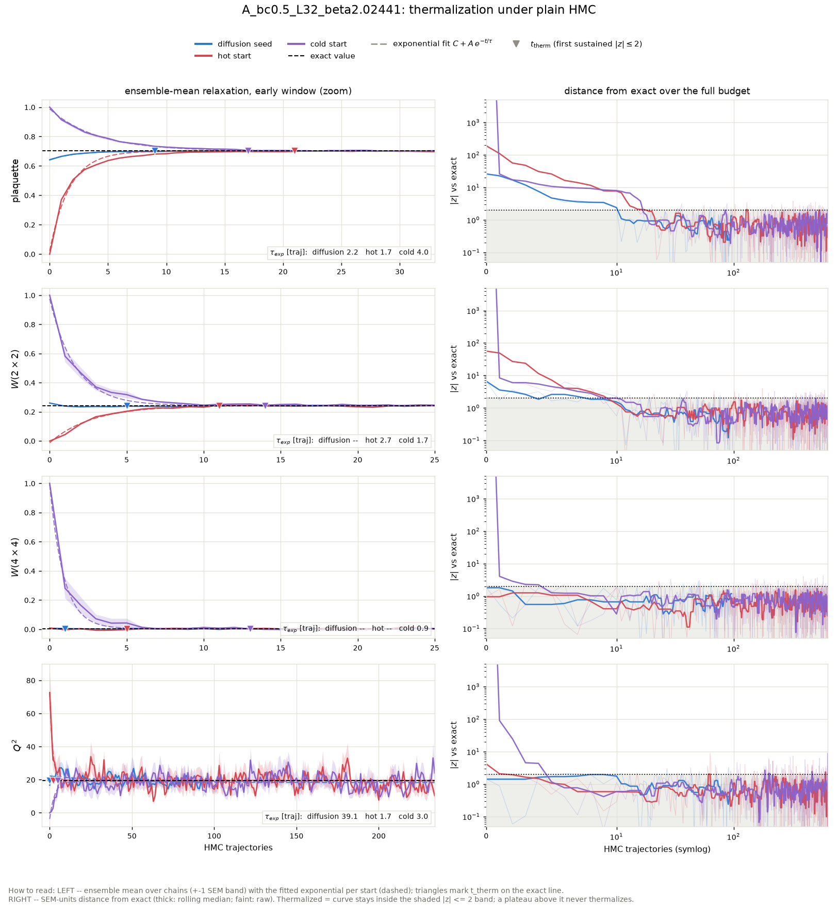

tau_int (hot-start chains, second half): plaquette = 2.34 +- 0.15, wilson_2x2 = 0.94 +- 0.04, wilson_4x4 = 0.61 +- 0.02, wilson_6x6 = 0.56 +- 0.01. Topology: hot-start HMC L=32 beta=2.02441 -> tau_int(Q) = 2.6.

### Diagnostics: raw diffusion output (before any HMC)

| observable | value | error | exact | z_exact | reference | ref_error | z_ref | ks_p | chi2_p |
|---|---|---|---|---|---|---|---|---|---|
| plaquette | 0.6415 | 0.002407 | 0.7017 | -25.04 | 0.7021 | 0.0009784 | -23.34 | 2.855e-55 |  |
| wilson_1x1 | 0.6415 | 0.002407 | 0.7017 | -25.04 | 0.7021 | 0.0009784 | -23.34 | 2.855e-55 |  |
| wilson_1x2 | 0.4319 | 0.003027 | 0.4924 | -20 | 0.4951 | 0.001723 | -18.14 | 5.023e-38 |  |
| wilson_2x2 | 0.2599 | 0.002664 | 0.2425 | 6.537 | 0.2456 | 0.002486 | 3.925 | 8.218e-05 |  |
| wilson_2x3 | 0.1325 | 0.002411 | 0.1194 | 5.409 | 0.1204 | 0.00285 | 3.231 | 0.01398 |  |
| wilson_3x3 | 0.04745 | 0.001831 | 0.04127 | 3.375 | 0.03987 | 0.002018 | 2.779 | 0.004059 |  |
| wilson_3x4 | 0.01979 | 0.002004 | 0.01426 | 2.759 | 0.01309 | 0.002175 | 2.267 | 0.1366 |  |
| wilson_4x4 | 0.00759 | 0.001797 | 0.003458 | 2.299 | 0.005297 | 0.002376 | 0.7694 | 0.1866 |  |
| wilson_4x5 | 0.00401 | 0.001447 | 0.0008386 | 2.192 | -0.001057 | 0.001815 | 2.184 | 0.06115 |  |
| wilson_5x5 | -0.0002279 | 0.001867 | 0.0001427 | -0.1985 | -0.002255 | 0.001696 | 0.8034 | 0.3879 |  |
| wilson_5x6 | 0.0007411 | 0.002059 | 2.428e-05 | 0.3482 | -0.001835 | 0.001619 | 0.9834 | 0.1519 |  |
| wilson_6x6 | -0.001623 | 0.001616 | 2.9e-06 | -1.006 | 0.002849 | 0.0017 | -1.907 | 0.08742 |  |
| wilson_6x7 | -0.000244 | 0.001945 | 3.463e-07 | -0.1256 | 0.003393 | 0.002335 | -1.197 | 0.4545 |  |
| wilson_7x7 | 0.0009822 | 0.002466 | 2.902e-08 | 0.3983 | 0.002022 | 0.001669 | -0.3493 | 0.6028 |  |
| wilson_7x8 | -0.0025 | 0.002208 | 2.432e-09 | -1.132 | -0.001066 | 0.001935 | -0.4885 | 0.7195 |  |
| wilson_8x8 | 0.001145 | 0.002055 | 1.43e-10 | 0.557 | 0.001452 | 0.001366 | -0.1246 | 0.3001 |  |
| wilson_8x10 | 0.002268 | 0.001433 | 4.946e-13 | 1.583 | -0.001732 | 0.001707 | 1.795 | 0.3001 |  |
| wilson_10x10 | -0.002983 | 0.001948 | 4.147e-16 | -1.532 | -0.0004583 | 0.001683 | -0.9808 | 0.357 |  |
| wilson_10x12 | 0.0002362 | 0.002113 | 3.478e-19 | 0.1118 | 0.0001079 | 0.001325 | 0.05144 | 0.8612 |  |
| wilson_12x12 | 0.0008072 | 0.002636 | 7.073e-23 | 0.3063 | -0.003675 | 0.00181 | 1.402 | 0.04195 |  |
| creutz_2 | 0.1123 | 0.011 | 0.3542 | -22 |  |  |  |  |  |
| creutz_3 | 0.3526 | 0.04279 | 0.3542 | -0.03735 |  |  |  |  |  |
| creutz_4 | 0.08398 | 0.2795 | 0.3542 | -0.9668 |  |  |  |  |  |
| Q | -0.1719 | 0.4921 | 0 | -0.3492 | -0.1927 | 0.2688 | 0.03715 | 0.995 |  |
| Q^2 | 16.73 | 1.521 | 19.51 | -1.825 | 16.16 | 1.404 | 0.2767 | 0.9827 |  |
| chi_top ((<Q^2>-<Q>^2)/V) | 0.01631 | 0.0019 | 0.01905 | -1.442 | 0.01575 | 0.001678 | 0.2236 |  |  |
| Q histogram vs exact P(Q) | 11.18 | nan | 16 | nan |  |  |  |  | 0.7984 |

### Diagnostics: the same configs after 96 HMC trajectories

| observable | value | error | exact | z_exact | reference | ref_error | z_ref | ks_p | chi2_p |
|---|---|---|---|---|---|---|---|---|---|
| plaquette | 0.7033 | 0.001304 | 0.7017 | 1.191 | 0.7021 | 0.0009784 | 0.7281 | 0.4204 |  |
| wilson_1x1 | 0.7033 | 0.001304 | 0.7017 | 1.191 | 0.7021 | 0.0009784 | 0.7281 | 0.4204 |  |
| wilson_1x2 | 0.4941 | 0.002219 | 0.4924 | 0.7458 | 0.4951 | 0.001723 | -0.3573 | 0.7195 |  |
| wilson_2x2 | 0.2434 | 0.002298 | 0.2425 | 0.3803 | 0.2456 | 0.002486 | -0.6619 | 0.6808 |  |
| wilson_2x3 | 0.1218 | 0.002039 | 0.1194 | 1.186 | 0.1204 | 0.00285 | 0.4108 | 0.8612 |  |
| wilson_3x3 | 0.04333 | 0.002616 | 0.04127 | 0.7872 | 0.03987 | 0.002018 | 1.045 | 0.08742 |  |
| wilson_3x4 | 0.0147 | 0.002364 | 0.01426 | 0.1867 | 0.01309 | 0.002175 | 0.5027 | 0.6418 |  |
| wilson_4x4 | 0.006098 | 0.002301 | 0.003458 | 1.147 | 0.005297 | 0.002376 | 0.2419 | 0.9574 |  |
| wilson_4x5 | 0.001756 | 0.002581 | 0.0008386 | 0.3556 | -0.001057 | 0.001815 | 0.8919 | 0.5266 |  |
| wilson_5x5 | -0.002513 | 0.00195 | 0.0001427 | -1.362 | -0.002255 | 0.001696 | -0.1 | 0.9827 |  |
| wilson_5x6 | 0.0001119 | 0.002213 | 2.428e-05 | 0.03957 | -0.001835 | 0.001619 | 0.7098 | 0.3001 |  |
| wilson_6x6 | 0.0001943 | 0.001744 | 2.9e-06 | 0.1098 | 0.002849 | 0.0017 | -1.09 | 0.6028 |  |
| wilson_6x7 | 0.003365 | 0.0017 | 3.463e-07 | 1.98 | 0.003393 | 0.002335 | -0.009502 | 0.9827 |  |
| wilson_7x7 | 0.001343 | 0.00223 | 2.902e-08 | 0.6021 | 0.002022 | 0.001669 | -0.2438 | 0.3001 |  |
| wilson_7x8 | -0.001793 | 0.001655 | 2.432e-09 | -1.083 | -0.001066 | 0.001935 | -0.2854 | 0.939 |  |
| wilson_8x8 | 0.0003182 | 0.00242 | 1.43e-10 | 0.1315 | 0.001452 | 0.001366 | -0.408 | 0.8288 |  |
| wilson_8x10 | -0.001705 | 0.001908 | 4.946e-13 | -0.8939 | -0.001732 | 0.001707 | 0.01037 | 0.9902 |  |
| wilson_10x10 | -0.004788 | 0.001828 | 4.147e-16 | -2.62 | -0.0004583 | 0.001683 | -1.743 | 0.03684 |  |
| wilson_10x12 | -0.00279 | 0.002117 | 3.478e-19 | -1.318 | 0.0001079 | 0.001325 | -1.16 | 0.3879 |  |
| wilson_12x12 | -0.003624 | 0.00193 | 7.073e-23 | -1.877 | -0.003675 | 0.00181 | 0.01907 | 0.5266 |  |
| creutz_2 | 0.3551 | 0.00714 | 0.3542 | 0.1265 |  |  |  |  |  |
| creutz_3 | 0.342 | 0.04261 | 0.3542 | -0.286 |  |  |  |  |  |
| creutz_4 | -0.2007 | 0.3742 | 0.3542 | -1.483 |  |  |  |  |  |
| creutz_7 | 3.771 | nan | 0.3542 | nan |  |  |  |  |  |
| Q | -0.05469 | 0.3943 | 0 | -0.1387 | -0.1927 | 0.2688 | 0.2892 | 0.9574 |  |
| Q^2 | 17.76 | 2.442 | 19.51 | -0.7178 | 16.16 | 1.404 | 0.5667 | 0.9167 |  |
| chi_top ((<Q^2>-<Q>^2)/V) | 0.01734 | 0.002435 | 0.01905 | -0.7043 | 0.01575 | 0.001678 | 0.5385 |  |  |
| Q histogram vs exact P(Q) | 10.51 | nan | 16 | nan |  |  |  |  | 0.8389 |

## A_bc0.75_L32_beta2.5435

HMC: step size 0.2000, 5 leapfrog steps, acceptance seed/hot/cold = 0.962/0.961/0.960. Diffusion-seed batch: 128 chains x 96 trajectories (0.03 s/traj for the whole batch); baselines: 32 chains x 640 trajectories.

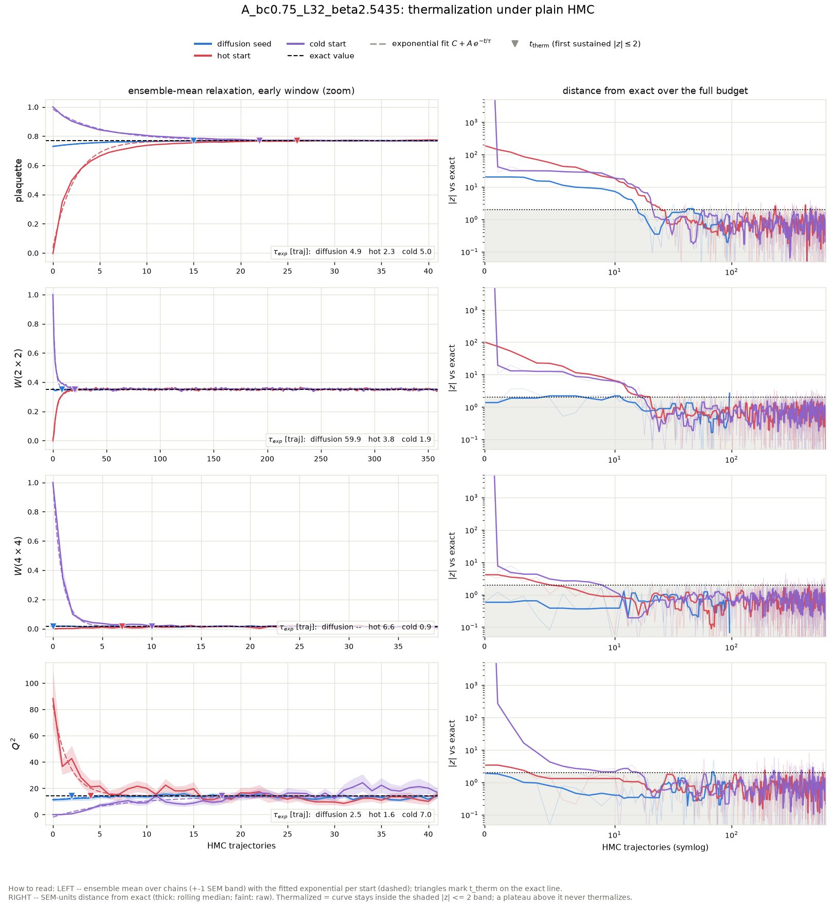

tau_int (hot-start chains, second half): plaquette = 3.51 +- 0.32, wilson_2x2 = 1.27 +- 0.08, wilson_4x4 = 0.67 +- 0.03, wilson_6x6 = 0.55 +- 0.01. Topology: hot-start HMC L=32 beta=2.5435 -> tau_int(Q) = 5.8.

### Diagnostics: raw diffusion output (before any HMC)

| observable | value | error | exact | z_exact | reference | ref_error | z_ref | ks_p | chi2_p |
|---|---|---|---|---|---|---|---|---|---|
| plaquette | 0.7294 | 0.001926 | 0.7696 | -20.91 | 0.771 | 0.0005569 | -20.76 | 4.625e-49 |  |
| wilson_1x1 | 0.7294 | 0.001926 | 0.7696 | -20.91 | 0.771 | 0.0005569 | -20.76 | 4.625e-49 |  |
| wilson_1x2 | 0.5403 | 0.002921 | 0.5924 | -17.83 | 0.5934 | 0.001146 | -16.93 | 3.098e-37 |  |
| wilson_2x2 | 0.3544 | 0.00264 | 0.3509 | 1.34 | 0.3508 | 0.001482 | 1.186 | 0.3277 |  |
| wilson_2x3 | 0.2083 | 0.002432 | 0.2079 | 0.2051 | 0.2078 | 0.00204 | 0.1629 | 0.5643 |  |
| wilson_3x3 | 0.09051 | 0.00302 | 0.09476 | -1.409 | 0.09714 | 0.001918 | -1.854 | 0.2272 |  |
| wilson_3x4 | 0.0405 | 0.002904 | 0.0432 | -0.9315 | 0.04434 | 0.002199 | -1.054 | 0.357 |  |
| wilson_4x4 | 0.01649 | 0.002195 | 0.01516 | 0.6082 | 0.01539 | 0.001786 | 0.3914 | 0.6418 |  |
| wilson_4x5 | 0.003811 | 0.001992 | 0.005319 | -0.7571 | 0.003072 | 0.001694 | 0.2825 | 0.4545 |  |
| wilson_5x5 | -0.002414 | 0.001782 | 0.001436 | -2.16 | 0.002864 | 0.002036 | -1.951 | 0.3879 |  |
| wilson_5x6 | 0.001704 | 0.001981 | 0.0003879 | 0.6641 | 3.297e-05 | 0.001893 | 0.6098 | 0.6418 |  |
| wilson_6x6 | 0.0005185 | 0.002685 | 8.063e-05 | 0.1631 | -0.0016 | 0.001741 | 0.6622 | 0.1366 |  |
| wilson_6x7 | -0.0002915 | 0.002586 | 1.676e-05 | -0.1192 | -0.002284 | 0.002439 | 0.5605 | 0.1685 |  |
| wilson_7x7 | 0.003213 | 0.001845 | 2.681e-06 | 1.741 | -0.001577 | 0.001743 | 1.888 | 0.2272 |  |
| wilson_7x8 | 0.001882 | 0.001723 | 4.289e-07 | 1.092 | 0.002136 | 0.001661 | -0.1061 | 0.9902 |  |
| wilson_8x8 | 0.0007597 | 0.001755 | 5.28e-08 | 0.4328 | 0.0005619 | 0.001849 | 0.0776 | 0.9167 |  |
| wilson_8x10 | 0.0006792 | 0.001468 | 8.005e-10 | 0.4625 | 7.029e-06 | 0.00169 | 0.3002 | 0.9167 |  |
| wilson_10x10 | -0.001239 | 0.002266 | 4.258e-12 | -0.5469 | -0.003378 | 0.001934 | 0.7179 | 0.3001 |  |
| wilson_10x12 | -0.002778 | 0.001925 | 2.265e-14 | -1.443 | 0.002683 | 0.001746 | -2.102 | 0.1226 |  |
| wilson_12x12 | 0.002859 | 0.002189 | 4.227e-17 | 1.306 | 0.001249 | 0.001794 | 0.5688 | 0.6028 |  |
| creutz_2 | 0.1215 | 0.007559 | 0.2618 | -18.57 |  |  |  |  |  |
| creutz_3 | 0.3025 | 0.02314 | 0.2618 | 1.759 |  |  |  |  |  |
| creutz_4 | 0.09407 | 0.1294 | 0.2618 | -1.296 |  |  |  |  |  |
| creutz_8 | 0.3721 | 3.4 | 0.2618 | 0.03242 |  |  |  |  |  |
| Q | -0.007812 | 0.2789 | 0 | -0.02801 | -0.4635 | 0.3201 | 1.073 | 0.1366 |  |
| Q^2 | 11.45 | 1.523 | 14.25 | -1.843 | 15.9 | 1.593 | -2.022 | 0.06115 |  |
| chi_top ((<Q^2>-<Q>^2)/V) | 0.01118 | 0.001441 | 0.01392 | -1.903 | 0.01532 | 0.001425 | -2.044 |  |  |
| Q histogram vs exact P(Q) | 20.41 | nan | 14 | nan |  |  |  |  | 0.1178 |

### Diagnostics: the same configs after 96 HMC trajectories

| observable | value | error | exact | z_exact | reference | ref_error | z_ref | ks_p | chi2_p |
|---|---|---|---|---|---|---|---|---|---|
| plaquette | 0.7708 | 0.0008209 | 0.7696 | 1.454 | 0.771 | 0.0005569 | -0.1617 | 0.4204 |  |
| wilson_1x1 | 0.7708 | 0.0008209 | 0.7696 | 1.454 | 0.771 | 0.0005569 | -0.1617 | 0.4204 |  |
| wilson_1x2 | 0.5954 | 0.001524 | 0.5924 | 2.008 | 0.5934 | 0.001146 | 1.051 | 0.2741 |  |
| wilson_2x2 | 0.3574 | 0.002251 | 0.3509 | 2.874 | 0.3508 | 0.001482 | 2.421 | 0.04195 |  |
| wilson_2x3 | 0.2161 | 0.00295 | 0.2079 | 2.789 | 0.2078 | 0.00204 | 2.299 | 0.05405 |  |
| wilson_3x3 | 0.1016 | 0.003068 | 0.09476 | 2.217 | 0.09714 | 0.001918 | 1.223 | 0.06115 |  |
| wilson_3x4 | 0.04627 | 0.002696 | 0.0432 | 1.137 | 0.04434 | 0.002199 | 0.5549 | 0.8288 |  |
| wilson_4x4 | 0.01532 | 0.002525 | 0.01516 | 0.06447 | 0.01539 | 0.001786 | -0.02084 | 0.9167 |  |
| wilson_4x5 | 0.002095 | 0.002329 | 0.005319 | -1.384 | 0.003072 | 0.001694 | -0.3394 | 0.6808 |  |
| wilson_5x5 | 0.002941 | 0.002261 | 0.001436 | 0.6656 | 0.002864 | 0.002036 | 0.02546 | 0.4899 |  |
| wilson_5x6 | 0.0004264 | 0.001761 | 0.0003879 | 0.02185 | 3.297e-05 | 0.001893 | 0.1522 | 0.9719 |  |
| wilson_6x6 | -0.001281 | 0.002068 | 8.063e-05 | -0.6582 | -0.0016 | 0.001741 | 0.1183 | 0.9719 |  |
| wilson_6x7 | -0.003136 | 0.0019 | 1.676e-05 | -1.659 | -0.002284 | 0.002439 | -0.2756 | 0.8612 |  |
| wilson_7x7 | -0.002774 | 0.001726 | 2.681e-06 | -1.608 | -0.001577 | 0.001743 | -0.4879 | 0.6418 |  |
| wilson_7x8 | -0.0003165 | 0.002093 | 4.289e-07 | -0.1514 | 0.002136 | 0.001661 | -0.9178 | 0.6418 |  |
| wilson_8x8 | 0.000385 | 0.002043 | 5.28e-08 | 0.1884 | 0.0005619 | 0.001849 | -0.06423 | 0.8612 |  |
| wilson_8x10 | -0.001354 | 0.001578 | 8.005e-10 | -0.858 | 7.029e-06 | 0.00169 | -0.5887 | 0.9902 |  |
| wilson_10x10 | -0.0003826 | 0.001619 | 4.258e-12 | -0.2363 | -0.003378 | 0.001934 | 1.187 | 0.07777 |  |
| wilson_10x12 | 0.002889 | 0.00155 | 2.265e-14 | 1.864 | 0.002683 | 0.001746 | 0.08817 | 0.9902 |  |
| wilson_12x12 | -0.0007612 | 0.001668 | 4.227e-17 | -0.4564 | 0.001249 | 0.001794 | -0.8209 | 0.5266 |  |
| creutz_2 | 0.2523 | 0.004404 | 0.2618 | -2.161 |  |  |  |  |  |
| creutz_3 | 0.2519 | 0.01916 | 0.2618 | -0.52 |  |  |  |  |  |
| creutz_4 | 0.3189 | 0.1176 | 0.2618 | 0.4849 |  |  |  |  |  |
| creutz_5 | -2.329 | 1.84 | 0.2618 | -1.408 |  |  |  |  |  |
| Q | -0.1016 | 0.2721 | 0 | -0.3733 | -0.4635 | 0.3201 | 0.8616 | 0.7941 |  |
| Q^2 | 12.66 | 1.523 | 14.25 | -1.043 | 15.9 | 1.593 | -1.469 | 0.8906 |  |
| chi_top ((<Q^2>-<Q>^2)/V) | 0.01236 | 0.001397 | 0.01392 | -1.118 | 0.01532 | 0.001425 | -1.484 |  |  |
| Q histogram vs exact P(Q) | 6.468 | nan | 14 | nan |  |  |  |  | 0.9533 |

## A_bc1_L32_beta3.10399

HMC: step size 0.2000, 5 leapfrog steps, acceptance seed/hot/cold = 0.963/0.961/0.958. Diffusion-seed batch: 128 chains x 96 trajectories (0.03 s/traj for the whole batch); baselines: 32 chains x 640 trajectories.

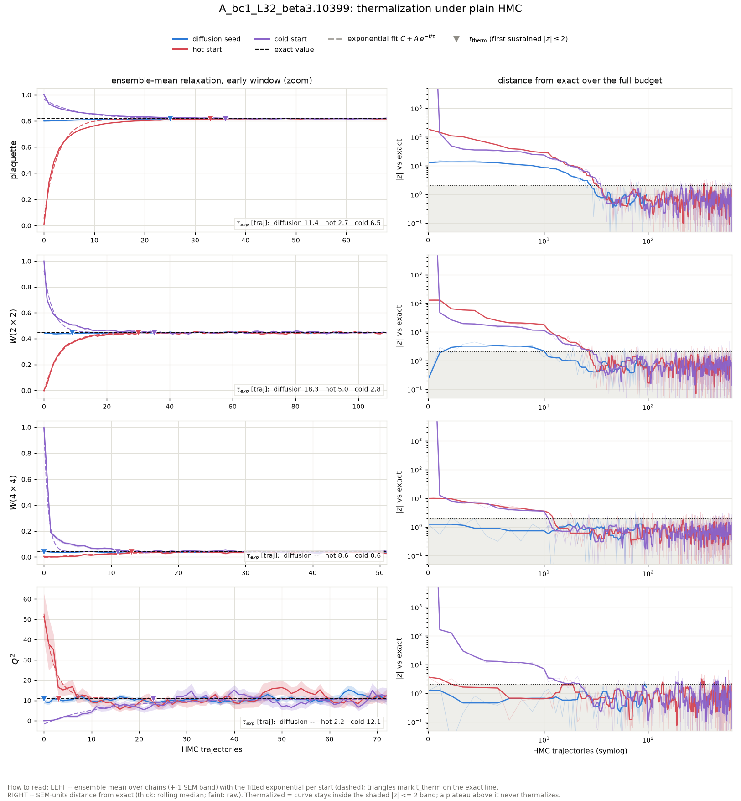

tau_int (hot-start chains, second half): plaquette = 3.48 +- 0.21, wilson_2x2 = 1.61 +- 0.10, wilson_4x4 = 0.89 +- 0.06, wilson_6x6 = 0.58 +- 0.01. Topology: hot-start HMC L=32 beta=3.10399 -> tau_int(Q) = 8.2.

### Diagnostics: raw diffusion output (before any HMC)

| observable | value | error | exact | z_exact | reference | ref_error | z_ref | ks_p | chi2_p |
|---|---|---|---|---|---|---|---|---|---|
| plaquette | 0.7996 | 0.001183 | 0.8174 | -15.01 | 0.8174 | 0.0006415 | -13.24 | 5.528e-21 |  |
| wilson_1x1 | 0.7996 | 0.001183 | 0.8174 | -15.01 | 0.8174 | 0.0006415 | -13.24 | 5.528e-21 |  |
| wilson_1x2 | 0.6418 | 0.00196 | 0.6681 | -13.42 | 0.6686 | 0.001075 | -11.98 | 1.97e-17 |  |
| wilson_2x2 | 0.4469 | 0.002107 | 0.4464 | 0.2601 | 0.4465 | 0.001697 | 0.1574 | 0.9719 |  |
| wilson_2x3 | 0.2949 | 0.002817 | 0.2982 | -1.191 | 0.2987 | 0.002312 | -1.046 | 0.357 |  |
| wilson_3x3 | 0.1576 | 0.002312 | 0.1629 | -2.298 | 0.1623 | 0.002443 | -1.395 | 0.1098 |  |
| wilson_3x4 | 0.08715 | 0.00267 | 0.08895 | -0.6742 | 0.08622 | 0.002332 | 0.2627 | 0.7575 |  |
| wilson_4x4 | 0.043 | 0.002077 | 0.03971 | 1.584 | 0.03852 | 0.00234 | 1.429 | 0.3001 |  |
| wilson_4x5 | 0.01755 | 0.002161 | 0.01772 | -0.08147 | 0.01842 | 0.002143 | -0.285 | 0.2741 |  |
| wilson_5x5 | 0.003526 | 0.00188 | 0.006467 | -1.564 | 0.007162 | 0.001913 | -1.356 | 0.1685 |  |
| wilson_5x6 | 0.002508 | 0.002189 | 0.00236 | 0.0676 | 0.002579 | 0.002148 | -0.02319 | 0.5643 |  |
| wilson_6x6 | 0.002379 | 0.001781 | 0.0007038 | 0.9407 | 0.0005962 | 0.00188 | 0.6884 | 0.4204 |  |
| wilson_6x7 | -0.002705 | 0.001989 | 0.0002099 | -1.465 | -0.001288 | 0.002355 | -0.4596 | 0.7195 |  |
| wilson_7x7 | -0.001448 | 0.001849 | 5.117e-05 | -0.8107 | 0.002865 | 0.002036 | -1.568 | 0.01039 |  |
| wilson_7x8 | -0.00258 | 0.002059 | 1.247e-05 | -1.259 | 0.0005871 | 0.00208 | -1.082 | 0.7575 |  |
| wilson_8x8 | -0.000458 | 0.002493 | 2.486e-06 | -0.1847 | 0.000431 | 0.001473 | -0.307 | 0.9719 |  |
| wilson_8x10 | -0.0005766 | 0.002007 | 9.869e-08 | -0.2874 | 0.0001179 | 0.001765 | -0.2598 | 0.8906 |  |
| wilson_10x10 | 0.0006207 | 0.001932 | 1.749e-09 | 0.3212 | 0.002428 | 0.001749 | -0.6933 | 0.1866 |  |
| wilson_10x12 | -0.0001751 | 0.001841 | 3.101e-11 | -0.09509 | -0.0001916 | 0.001383 | 0.00717 | 0.8612 |  |
| wilson_12x12 | -0.0003002 | 0.002044 | 2.453e-13 | -0.1469 | -0.004091 | 0.001665 | 1.438 | 0.4204 |  |
| creutz_2 | 0.142 | 0.004802 | 0.2016 | -12.41 |  |  |  |  |  |
| creutz_3 | 0.211 | 0.01208 | 0.2016 | 0.7715 |  |  |  |  |  |
| creutz_4 | 0.1143 | 0.04395 | 0.2016 | -1.986 |  |  |  |  |  |
| creutz_5 | 0.7087 | 0.5156 | 0.2016 | 0.9833 |  |  |  |  |  |
| creutz_6 | -0.288 | 1.477 | 0.2016 | -0.3315 |  |  |  |  |  |
| Q | -0.3594 | 0.273 | 0 | -1.316 | 0.4219 | 0.2317 | -2.182 | 0.1519 |  |
| Q^2 | 9.469 | 0.8255 | 10.81 | -1.623 | 10.22 | 1.198 | -0.5191 | 0.995 |  |
| chi_top ((<Q^2>-<Q>^2)/V) | 0.009121 | 0.001049 | 0.01056 | -1.367 | 0.009811 | 0.001015 | -0.4725 |  |  |
| Q histogram vs exact P(Q) | 17.81 | nan | 12 | nan |  |  |  |  | 0.1217 |

### Diagnostics: the same configs after 96 HMC trajectories

| observable | value | error | exact | z_exact | reference | ref_error | z_ref | ks_p | chi2_p |
|---|---|---|---|---|---|---|---|---|---|
| plaquette | 0.8167 | 0.0006199 | 0.8174 | -1.158 | 0.8174 | 0.0006415 | -0.869 | 0.7575 |  |
| wilson_1x1 | 0.8167 | 0.0006199 | 0.8174 | -1.158 | 0.8174 | 0.0006415 | -0.869 | 0.7575 |  |
| wilson_1x2 | 0.6677 | 0.00117 | 0.6681 | -0.4052 | 0.6686 | 0.001075 | -0.6004 | 0.2061 |  |
| wilson_2x2 | 0.4446 | 0.002052 | 0.4464 | -0.8912 | 0.4465 | 0.001697 | -0.7326 | 0.6418 |  |
| wilson_2x3 | 0.2953 | 0.002207 | 0.2982 | -1.342 | 0.2987 | 0.002312 | -1.07 | 0.357 |  |
| wilson_3x3 | 0.1602 | 0.0031 | 0.1629 | -0.8632 | 0.1623 | 0.002443 | -0.5208 | 0.03229 |  |
| wilson_3x4 | 0.08559 | 0.003356 | 0.08895 | -1.001 | 0.08622 | 0.002332 | -0.1537 | 0.9574 |  |
| wilson_4x4 | 0.03724 | 0.002853 | 0.03971 | -0.8645 | 0.03852 | 0.00234 | -0.3478 | 0.4899 |  |
| wilson_4x5 | 0.01687 | 0.002695 | 0.01772 | -0.3173 | 0.01842 | 0.002143 | -0.4492 | 0.9827 |  |
| wilson_5x5 | 0.004713 | 0.002506 | 0.006467 | -0.6999 | 0.007162 | 0.001913 | -0.7768 | 0.6808 |  |
| wilson_5x6 | 0.0005286 | 0.002271 | 0.00236 | -0.8063 | 0.002579 | 0.002148 | -0.6559 | 0.7941 |  |
| wilson_6x6 | -0.003781 | 0.002559 | 0.0007038 | -1.753 | 0.0005962 | 0.00188 | -1.379 | 0.1866 |  |
| wilson_6x7 | -0.003384 | 0.002335 | 0.0002099 | -1.539 | -0.001288 | 0.002355 | -0.6319 | 0.7195 |  |
| wilson_7x7 | -0.00125 | 0.001971 | 5.117e-05 | -0.66 | 0.002865 | 0.002036 | -1.452 | 0.1519 |  |
| wilson_7x8 | -0.001036 | 0.001438 | 1.247e-05 | -0.7289 | 0.0005871 | 0.00208 | -0.6417 | 0.6418 |  |
| wilson_8x8 | 0.0007766 | 0.001706 | 2.486e-06 | 0.4537 | 0.000431 | 0.001473 | 0.1533 | 0.6418 |  |
| wilson_8x10 | 0.003832 | 0.002273 | 9.869e-08 | 1.686 | 0.0001179 | 0.001765 | 1.291 | 0.08742 |  |
| wilson_10x10 | -0.0006885 | 0.0019 | 1.749e-09 | -0.3624 | 0.002428 | 0.001749 | -1.207 | 0.2272 |  |
| wilson_10x12 | 0.001004 | 0.001914 | 3.101e-11 | 0.5247 | -0.0001916 | 0.001383 | 0.5064 | 0.9719 |  |
| wilson_12x12 | 0.001204 | 0.001809 | 2.453e-13 | 0.6657 | -0.004091 | 0.001665 | 2.154 | 0.1226 |  |
| creutz_2 | 0.2052 | 0.003219 | 0.2016 | 1.107 |  |  |  |  |  |
| creutz_3 | 0.2023 | 0.01135 | 0.2016 | 0.06251 |  |  |  |  |  |
| creutz_4 | 0.2053 | 0.04898 | 0.2016 | 0.07543 |  |  |  |  |  |
| creutz_5 | 0.4832 | 0.3872 | 0.2016 | 0.7272 |  |  |  |  |  |
| Q | -0.1094 | 0.333 | 0 | -0.3284 | 0.4219 | 0.2317 | -1.309 | 0.5643 |  |
| Q^2 | 13.27 | 1.685 | 10.81 | 1.458 | 10.22 | 1.198 | 1.471 | 0.6028 |  |
| chi_top ((<Q^2>-<Q>^2)/V) | 0.01294 | 0.001493 | 0.01056 | 1.6 | 0.009811 | 0.001015 | 1.735 |  |  |
| Q histogram vs exact P(Q) | 23.24 | nan | 12 | nan |  |  |  |  | 0.02574 |

## E_bc1.2_L32_beta3.6012

HMC: step size 0.2000, 5 leapfrog steps, acceptance seed/hot/cold = 0.966/0.962/0.959. Diffusion-seed batch: 128 chains x 96 trajectories (0.05 s/traj for the whole batch); baselines: 32 chains x 640 trajectories.

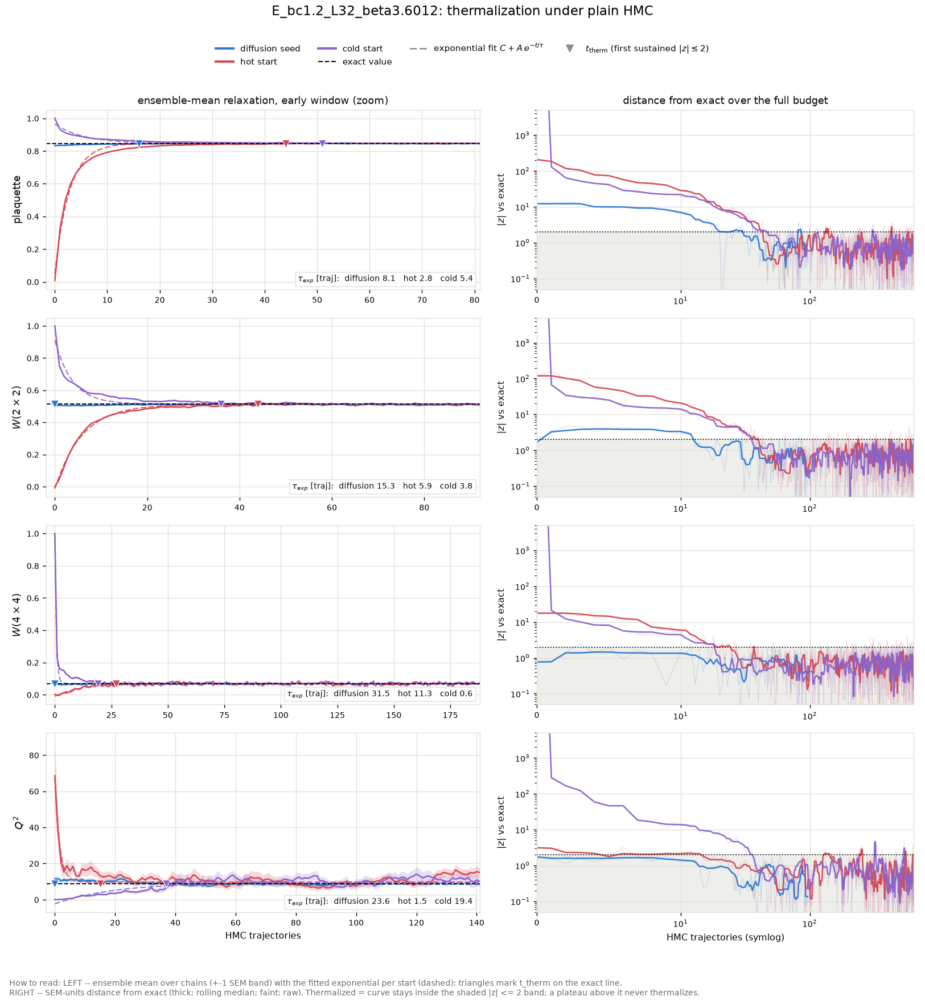

tau_int (hot-start chains, second half): plaquette = 4.36 +- 0.66, wilson_2x2 = 2.20 +- 0.17, wilson_4x4 = 1.08 +- 0.06, wilson_6x6 = 0.65 +- 0.03. Topology: hot-start HMC L=32 beta=3.6012 -> tau_int(Q) = 16.6.

### Diagnostics: raw diffusion output (before any HMC)

| observable | value | error | exact | z_exact | reference | ref_error | z_ref | ks_p | chi2_p |
|---|---|---|---|---|---|---|---|---|---|
| plaquette | 0.8337 | 0.0009501 | 0.8462 | -13.22 | 0.8468 | 0.0004083 | -12.74 | 1.416e-21 |  |
| wilson_1x1 | 0.8337 | 0.0009501 | 0.8462 | -13.22 | 0.8468 | 0.0004083 | -12.74 | 1.416e-21 |  |
| wilson_1x2 | 0.6962 | 0.001852 | 0.7161 | -10.75 | 0.7157 | 0.0009026 | -9.478 | 1.538e-14 |  |
| wilson_2x2 | 0.5092 | 0.002285 | 0.5128 | -1.581 | 0.5133 | 0.0023 | -1.286 | 0.3277 |  |
| wilson_2x3 | 0.364 | 0.002895 | 0.3672 | -1.117 | 0.3674 | 0.002816 | -0.8491 | 0.1226 |  |
| wilson_3x3 | 0.2157 | 0.003257 | 0.2225 | -2.084 | 0.2235 | 0.003285 | -1.679 | 0.06115 |  |
| wilson_3x4 | 0.1334 | 0.003691 | 0.1348 | -0.3812 | 0.1349 | 0.002951 | -0.3026 | 0.9167 |  |
| wilson_4x4 | 0.07195 | 0.004109 | 0.06914 | 0.6846 | 0.07038 | 0.002004 | 0.345 | 0.3879 |  |
| wilson_4x5 | 0.0396 | 0.003399 | 0.03545 | 1.22 | 0.03566 | 0.001968 | 1.005 | 0.1226 |  |
| wilson_5x5 | 0.01864 | 0.00283 | 0.01538 | 1.149 | 0.01392 | 0.001895 | 1.385 | 0.6028 |  |
| wilson_5x6 | 0.01385 | 0.002565 | 0.006676 | 2.798 | 0.007283 | 0.001732 | 2.123 | 0.2061 |  |
| wilson_6x6 | 0.006334 | 0.002648 | 0.002451 | 1.466 | -0.001105 | 0.002109 | 2.198 | 0.09806 |  |
| wilson_6x7 | -0.0009824 | 0.001987 | 0.0009001 | -0.9476 | -0.002442 | 0.002186 | 0.494 | 0.8288 |  |
| wilson_7x7 | -0.001297 | 0.001885 | 0.0002797 | -0.8364 | -0.00206 | 0.002138 | 0.2677 | 0.6028 |  |
| wilson_7x8 | 0.001239 | 0.001855 | 8.691e-05 | 0.6211 | -0.001397 | 0.001943 | 0.9813 | 0.7941 |  |
| wilson_8x8 | 0.0023 | 0.001629 | 2.285e-05 | 1.398 | 0.0009844 | 0.001945 | 0.5186 | 0.8612 |  |
| wilson_8x10 | 0.002875 | 0.00191 | 1.58e-06 | 1.504 | -0.001146 | 0.001437 | 1.682 | 0.2272 |  |
| wilson_10x10 | 0.002196 | 0.002355 | 5.602e-08 | 0.9325 | 0.001152 | 0.001863 | 0.3477 | 0.8288 |  |
| wilson_10x12 | 0.002603 | 0.002596 | 1.986e-09 | 1.003 | 0.002618 | 0.001624 | -0.004769 | 0.9167 |  |
| wilson_12x12 | 0.0001285 | 0.002552 | 3.611e-11 | 0.05036 | 0.002074 | 0.001578 | -0.6484 | 0.5266 |  |
| creutz_2 | 0.1326 | 0.003433 | 0.167 | -10.01 |  |  |  |  |  |
| creutz_3 | 0.1873 | 0.008246 | 0.167 | 2.469 |  |  |  |  |  |
| creutz_4 | 0.1371 | 0.02795 | 0.167 | -1.069 |  |  |  |  |  |
| creutz_5 | 0.1565 | 0.09023 | 0.167 | -0.1156 |  |  |  |  |  |
| creutz_6 | 0.4859 | 0.3024 | 0.167 | 1.055 |  |  |  |  |  |
| Q | 0.0625 | 0.3863 | 0 | 0.1618 | 0.4219 | 0.1832 | -0.8406 | 0.7195 |  |
| Q^2 | 11.47 | 1.417 | 8.856 | 1.844 | 8.849 | 0.6973 | 1.659 | 0.8288 |  |
| chi_top ((<Q^2>-<Q>^2)/V) | 0.0112 | 0.001497 | 0.008648 | 1.702 | 0.008468 | 0.0007218 | 1.642 |  |  |
| Q histogram vs exact P(Q) | 6.001 | nan | 12 | nan |  |  |  |  | 0.916 |

### Diagnostics: the same configs after 96 HMC trajectories

| observable | value | error | exact | z_exact | reference | ref_error | z_ref | ks_p | chi2_p |
|---|---|---|---|---|---|---|---|---|---|
| plaquette | 0.8457 | 0.0005503 | 0.8462 | -0.8613 | 0.8468 | 0.0004083 | -1.585 | 0.08742 |  |
| wilson_1x1 | 0.8457 | 0.0005503 | 0.8462 | -0.8613 | 0.8468 | 0.0004083 | -1.585 | 0.08742 |  |
| wilson_1x2 | 0.7162 | 0.001125 | 0.7161 | 0.0623 | 0.7157 | 0.0009026 | 0.3095 | 0.7195 |  |
| wilson_2x2 | 0.5132 | 0.002016 | 0.5128 | 0.1832 | 0.5133 | 0.0023 | -0.0611 | 0.8906 |  |
| wilson_2x3 | 0.3673 | 0.002887 | 0.3672 | 0.03584 | 0.3674 | 0.002816 | -0.02293 | 0.8612 |  |
| wilson_3x3 | 0.2232 | 0.003886 | 0.2225 | 0.1755 | 0.2235 | 0.003285 | -0.05867 | 0.995 |  |
| wilson_3x4 | 0.1366 | 0.004217 | 0.1348 | 0.4195 | 0.1349 | 0.002951 | 0.3393 | 0.7941 |  |
| wilson_4x4 | 0.06994 | 0.003444 | 0.06914 | 0.2335 | 0.07038 | 0.002004 | -0.1083 | 0.7195 |  |
| wilson_4x5 | 0.0383 | 0.002507 | 0.03545 | 1.135 | 0.03566 | 0.001968 | 0.829 | 0.07777 |  |
| wilson_5x5 | 0.01572 | 0.002434 | 0.01538 | 0.1381 | 0.01392 | 0.001895 | 0.5834 | 0.7575 |  |
| wilson_5x6 | 0.005434 | 0.002311 | 0.006676 | -0.5373 | 0.007283 | 0.001732 | -0.6401 | 0.939 |  |
| wilson_6x6 | 0.0005198 | 0.002149 | 0.002451 | -0.8989 | -0.001105 | 0.002109 | 0.5396 | 0.2272 |  |
| wilson_6x7 | -0.003329 | 0.002388 | 0.0009001 | -1.771 | -0.002442 | 0.002186 | -0.274 | 0.9902 |  |
| wilson_7x7 | -0.005804 | 0.002179 | 0.0002797 | -2.792 | -0.00206 | 0.002138 | -1.226 | 0.7941 |  |
| wilson_7x8 | -0.003382 | 0.002636 | 8.691e-05 | -1.316 | -0.001397 | 0.001943 | -0.606 | 0.08742 |  |
| wilson_8x8 | -0.0007136 | 0.002538 | 2.285e-05 | -0.2901 | 0.0009844 | 0.001945 | -0.5309 | 0.5266 |  |
| wilson_8x10 | 0.0003428 | 0.002191 | 1.58e-06 | 0.1557 | -0.001146 | 0.001437 | 0.5683 | 0.3001 |  |
| wilson_10x10 | 0.001622 | 0.002043 | 5.602e-08 | 0.7942 | 0.001152 | 0.001863 | 0.1701 | 0.8612 |  |
| wilson_10x12 | 0.001642 | 0.001632 | 1.986e-09 | 1.006 | 0.002618 | 0.001624 | -0.4241 | 0.8906 |  |
| wilson_12x12 | -0.0002503 | 0.002036 | 3.611e-11 | -0.123 | 0.002074 | 0.001578 | -0.9024 | 0.6418 |  |
| creutz_2 | 0.167 | 0.002343 | 0.167 | 0.01525 |  |  |  |  |  |
| creutz_3 | 0.1638 | 0.007604 | 0.167 | -0.4231 |  |  |  |  |  |
| creutz_4 | 0.1784 | 0.02601 | 0.167 | 0.44 |  |  |  |  |  |
| creutz_5 | 0.2882 | 0.1223 | 0.167 | 0.9908 |  |  |  |  |  |
| creutz_6 | 1.285 | 5.16 | 0.167 | 0.2166 |  |  |  |  |  |
| Q | 0.04688 | 0.2774 | 0 | 0.169 | 0.4219 | 0.1832 | -1.128 | 0.7195 |  |
| Q^2 | 8.734 | 0.9004 | 8.856 | -0.1349 | 8.849 | 0.6973 | -0.1006 | 1 |  |
| chi_top ((<Q^2>-<Q>^2)/V) | 0.008528 | 0.0008772 | 0.008648 | -0.1377 | 0.008468 | 0.0007218 | 0.05261 |  |  |
| Q histogram vs exact P(Q) | 5.8 | nan | 12 | nan |  |  |  |  | 0.9258 |

## A_bc1.5_L32_beta4.44493

HMC: step size 0.1897, 5 leapfrog steps, acceptance seed/hot/cold = 0.964/0.963/0.967. Diffusion-seed batch: 128 chains x 96 trajectories (0.06 s/traj for the whole batch); baselines: 32 chains x 640 trajectories.

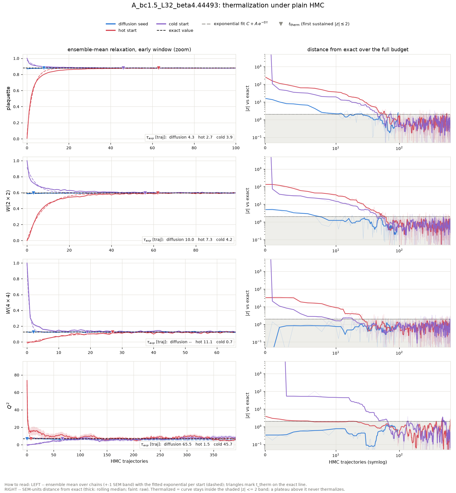

tau_int (hot-start chains, second half): plaquette = 3.77 +- 0.38, wilson_2x2 = 2.60 +- 0.25, wilson_4x4 = 1.29 +- 0.07, wilson_6x6 = 0.72 +- 0.03. Topology: hot-start HMC L=32 beta=4.44493 -> tau_int(Q) = 31.9.

### Diagnostics: raw diffusion output (before any HMC)

| observable | value | error | exact | z_exact | reference | ref_error | z_ref | ks_p | chi2_p |
|---|---|---|---|---|---|---|---|---|---|
| plaquette | 0.8694 | 0.0007027 | 0.8787 | -13.26 | 0.8777 | 0.0002974 | -10.89 | 2.117e-20 |  |
| wilson_1x1 | 0.8694 | 0.0007027 | 0.8787 | -13.26 | 0.8777 | 0.0002974 | -10.89 | 2.117e-20 |  |
| wilson_1x2 | 0.7546 | 0.001234 | 0.7721 | -14.19 | 0.77 | 0.0005691 | -11.36 | 1.306e-17 |  |
| wilson_2x2 | 0.5857 | 0.002109 | 0.5961 | -4.95 | 0.5935 | 0.001073 | -3.304 | 0.02464 |  |
| wilson_2x3 | 0.4474 | 0.002737 | 0.4603 | -4.721 | 0.4578 | 0.001669 | -3.273 | 0.03684 |  |
| wilson_3x3 | 0.2997 | 0.003295 | 0.3123 | -3.822 | 0.3115 | 0.002226 | -2.973 | 0.02464 |  |
| wilson_3x4 | 0.205 | 0.003459 | 0.2119 | -1.983 | 0.2107 | 0.002516 | -1.326 | 0.2498 |  |
| wilson_4x4 | 0.1262 | 0.003708 | 0.1263 | -0.02483 | 0.1287 | 0.002735 | -0.5434 | 0.939 |  |
| wilson_4x5 | 0.0753 | 0.003424 | 0.07529 | 0.003322 | 0.07649 | 0.002993 | -0.2617 | 0.7195 |  |
| wilson_5x5 | 0.03867 | 0.003121 | 0.03944 | -0.2447 | 0.04037 | 0.003252 | -0.3766 | 0.995 |  |
| wilson_5x6 | 0.01933 | 0.003273 | 0.02066 | -0.4043 | 0.02378 | 0.003567 | -0.9174 | 0.6028 |  |
| wilson_6x6 | 0.009093 | 0.002918 | 0.009508 | -0.1424 | 0.008673 | 0.003372 | 0.09405 | 0.8288 |  |
| wilson_6x7 | 0.0006599 | 0.003156 | 0.004376 | -1.177 | 0.005336 | 0.00317 | -1.045 | 0.1366 |  |
| wilson_7x7 | -0.003251 | 0.00289 | 0.00177 | -1.737 | 0.00387 | 0.002563 | -1.844 | 0.03684 |  |
| wilson_7x8 | -0.00283 | 0.002474 | 0.0007158 | -1.433 | 0.00378 | 0.002621 | -1.834 | 0.01864 |  |
| wilson_8x8 | -0.003919 | 0.002169 | 0.0002544 | -1.924 | 0.001218 | 0.00234 | -1.61 | 0.02464 |  |
| wilson_8x10 | -0.001488 | 0.002222 | 3.213e-05 | -0.684 | 0.001926 | 0.002039 | -1.132 | 0.06904 |  |
| wilson_10x10 | 0.0001171 | 0.001743 | 2.419e-06 | 0.0658 | -0.0003382 | 0.00199 | 0.1721 | 0.9167 |  |
| wilson_10x12 | 0.004794 | 0.002481 | 1.821e-07 | 1.932 | -0.001245 | 0.002357 | 1.765 | 0.2061 |  |
| wilson_12x12 | -7.135e-05 | 0.001859 | 8.173e-09 | -0.03839 | -0.003165 | 0.002002 | 1.133 | 0.1366 |  |
| creutz_2 | 0.1118 | 0.002131 | 0.1293 | -8.234 |  |  |  |  |  |
| creutz_3 | 0.1312 | 0.005382 | 0.1293 | 0.3518 |  |  |  |  |  |
| creutz_4 | 0.1054 | 0.01385 | 0.1293 | -1.729 |  |  |  |  |  |
| creutz_5 | 0.1499 | 0.04596 | 0.1293 | 0.448 |  |  |  |  |  |
| creutz_6 | 0.06112 | 0.2336 | 0.1293 | -0.2919 |  |  |  |  |  |
| Q | -0.1953 | 0.2562 | 0 | -0.7623 | 0.4323 | 0.1665 | -2.054 | 0.3001 |  |
| Q^2 | 7.102 | 0.9478 | 6.786 | 0.3331 | 6.641 | 0.7866 | 0.3742 | 0.9574 |  |
| chi_top ((<Q^2>-<Q>^2)/V) | 0.006898 | 0.0009138 | 0.006627 | 0.2966 | 0.006302 | 0.0006854 | 0.5212 |  |  |
| Q histogram vs exact P(Q) | 7.767 | nan | 10 | nan |  |  |  |  | 0.6516 |

### Diagnostics: the same configs after 96 HMC trajectories

| observable | value | error | exact | z_exact | reference | ref_error | z_ref | ks_p | chi2_p |
|---|---|---|---|---|---|---|---|---|---|
| plaquette | 0.8775 | 0.0004514 | 0.8787 | -2.727 | 0.8777 | 0.0002974 | -0.4187 | 0.8288 |  |
| wilson_1x1 | 0.8775 | 0.0004514 | 0.8787 | -2.727 | 0.8777 | 0.0002974 | -0.4187 | 0.8288 |  |
| wilson_1x2 | 0.7705 | 0.0007722 | 0.7721 | -2.02 | 0.77 | 0.0005691 | 0.5359 | 0.4545 |  |
| wilson_2x2 | 0.5949 | 0.001251 | 0.5961 | -0.9477 | 0.5935 | 0.001073 | 0.8716 | 0.4204 |  |
| wilson_2x3 | 0.4591 | 0.001975 | 0.4603 | -0.5964 | 0.4578 | 0.001669 | 0.4841 | 0.4545 |  |
| wilson_3x3 | 0.3135 | 0.00242 | 0.3123 | 0.4925 | 0.3115 | 0.002226 | 0.5974 | 0.9167 |  |
| wilson_3x4 | 0.2132 | 0.003025 | 0.2119 | 0.4554 | 0.2107 | 0.002516 | 0.6528 | 0.4899 |  |
| wilson_4x4 | 0.1305 | 0.003141 | 0.1263 | 1.348 | 0.1287 | 0.002735 | 0.4378 | 0.4545 |  |
| wilson_4x5 | 0.0782 | 0.003273 | 0.07529 | 0.889 | 0.07649 | 0.002993 | 0.3852 | 0.4204 |  |
| wilson_5x5 | 0.03903 | 0.003456 | 0.03944 | -0.1166 | 0.04037 | 0.003252 | -0.2816 | 0.5266 |  |
| wilson_5x6 | 0.01987 | 0.003935 | 0.02066 | -0.1993 | 0.02378 | 0.003567 | -0.7347 | 0.7195 |  |
| wilson_6x6 | 0.008525 | 0.003554 | 0.009508 | -0.2767 | 0.008673 | 0.003372 | -0.03035 | 0.9167 |  |
| wilson_6x7 | 0.003392 | 0.003374 | 0.004376 | -0.2918 | 0.005336 | 0.00317 | -0.4198 | 0.7941 |  |
| wilson_7x7 | -0.0008427 | 0.002891 | 0.00177 | -0.9036 | 0.00387 | 0.002563 | -1.22 | 0.04195 |  |
| wilson_7x8 | 0.0004957 | 0.003061 | 0.0007158 | -0.07192 | 0.00378 | 0.002621 | -0.8149 | 0.03684 |  |
| wilson_8x8 | -0.0007435 | 0.002848 | 0.0002544 | -0.3504 | 0.001218 | 0.00234 | -0.532 | 0.5266 |  |
| wilson_8x10 | 0.0003078 | 0.002108 | 3.213e-05 | 0.1308 | 0.001926 | 0.002039 | -0.5519 | 0.357 |  |
| wilson_10x10 | 0.001346 | 0.002494 | 2.419e-06 | 0.5387 | -0.0003382 | 0.00199 | 0.5279 | 0.7941 |  |
| wilson_10x12 | -0.00268 | 0.002331 | 1.821e-07 | -1.15 | -0.001245 | 0.002357 | -0.4329 | 0.9167 |  |
| wilson_12x12 | 0.000343 | 0.002126 | 8.173e-09 | 0.1613 | -0.003165 | 0.002002 | 1.201 | 0.3879 |  |
| creutz_2 | 0.1287 | 0.001996 | 0.1293 | -0.3269 |  |  |  |  |  |
| creutz_3 | 0.1224 | 0.005091 | 0.1293 | -1.364 |  |  |  |  |  |
| creutz_4 | 0.1055 | 0.01256 | 0.1293 | -1.897 |  |  |  |  |  |
| creutz_5 | 0.1825 | 0.04515 | 0.1293 | 1.177 |  |  |  |  |  |
| creutz_6 | 0.1714 | 0.234 | 0.1293 | 0.1797 |  |  |  |  |  |
| Q | -0.2422 | 0.2146 | 0 | -1.128 | 0.4323 | 0.1665 | -2.483 | 0.4899 |  |
| Q^2 | 6.273 | 0.819 | 6.786 | -0.6257 | 6.641 | 0.7866 | -0.3233 | 0.9902 |  |
| chi_top ((<Q^2>-<Q>^2)/V) | 0.006069 | 0.0007735 | 0.006627 | -0.721 | 0.006302 | 0.0006854 | -0.2258 |  |  |
| Q histogram vs exact P(Q) | 11.45 | nan | 10 | nan |  |  |  |  | 0.3236 |

## A_bc2_L32_beta6.10518

HMC: step size 0.1619, 6 leapfrog steps, acceptance seed/hot/cold = 0.974/0.976/0.973. Diffusion-seed batch: 128 chains x 96 trajectories (0.07 s/traj for the whole batch); baselines: 32 chains x 640 trajectories.

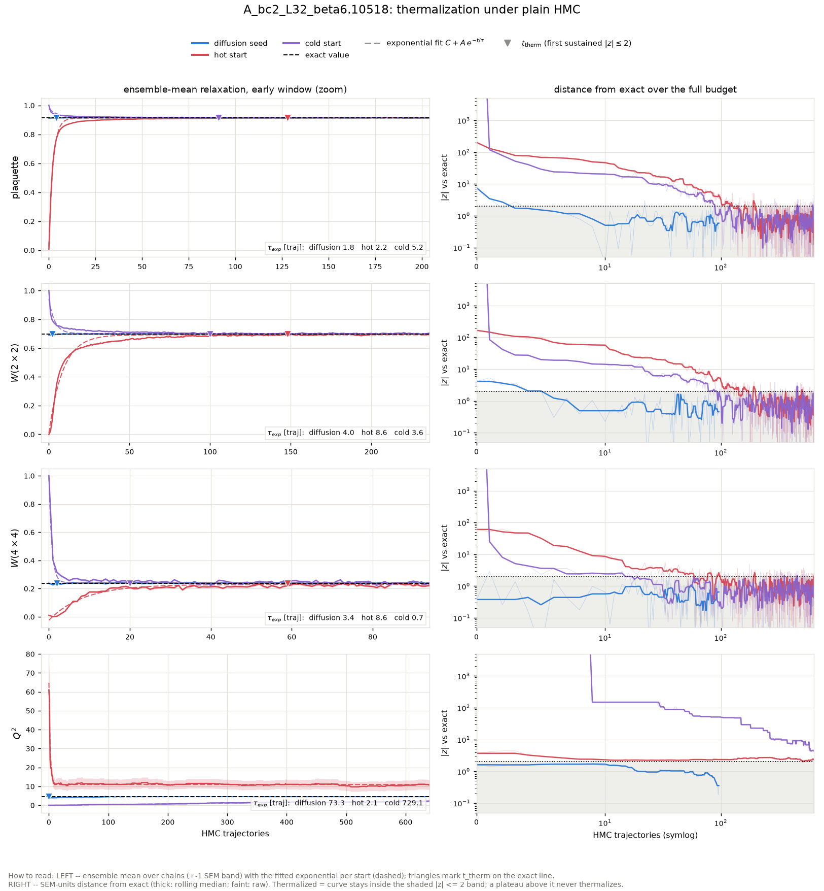

tau_int (hot-start chains, second half): plaquette = 3.40 +- 0.33, wilson_2x2 = 3.03 +- 0.26, wilson_4x4 = 1.17 +- 0.06, wilson_6x6 = 0.94 +- 0.05. Topology: hot-start HMC L=32 beta=6.10518 -> tau_int(Q) = 30.6.

Where 'never' stood at the end: the hot start ended the 640-trajectory budget still at Q^2 at |z| ~ 2; the cold start ended the 640-trajectory budget still at Q^2 at |z| ~ 4.

### Diagnostics: raw diffusion output (before any HMC)

| observable | value | error | exact | z_exact | reference | ref_error | z_ref | ks_p | chi2_p |
|---|---|---|---|---|---|---|---|---|---|
| plaquette | 0.9108 | 0.0005023 | 0.914 | -6.391 | 0.9142 | 0.000228 | -6.249 | 4.574e-06 |  |
| wilson_1x1 | 0.9108 | 0.0005023 | 0.914 | -6.391 | 0.9142 | 0.000228 | -6.249 | 4.574e-06 |  |
| wilson_1x2 | 0.8277 | 0.0009954 | 0.8353 | -7.697 | 0.8354 | 0.0005374 | -6.828 | 3.873e-07 |  |
| wilson_2x2 | 0.691 | 0.001495 | 0.6978 | -4.537 | 0.6993 | 0.001359 | -4.098 | 0.01039 |  |
| wilson_2x3 | 0.5763 | 0.002223 | 0.5829 | -2.978 | 0.583 | 0.002056 | -2.232 | 0.06115 |  |
| wilson_3x3 | 0.4381 | 0.002584 | 0.445 | -2.661 | 0.4474 | 0.002916 | -2.374 | 0.02823 |  |
| wilson_3x4 | 0.3358 | 0.002791 | 0.3397 | -1.423 | 0.34 | 0.003671 | -0.9188 | 0.2061 |  |
| wilson_4x4 | 0.2385 | 0.002683 | 0.2371 | 0.5307 | 0.2393 | 0.004079 | -0.1696 | 0.3001 |  |
| wilson_4x5 | 0.1676 | 0.003059 | 0.1654 | 0.7239 | 0.1674 | 0.004657 | 0.03567 | 0.6808 |  |
| wilson_5x5 | 0.1095 | 0.003064 | 0.1055 | 1.309 | 0.108 | 0.004774 | 0.2602 | 0.8612 |  |
| wilson_5x6 | 0.06962 | 0.003194 | 0.06728 | 0.7326 | 0.07021 | 0.004534 | -0.1071 | 0.6028 |  |
| wilson_6x6 | 0.04294 | 0.002897 | 0.03921 | 1.286 | 0.04047 | 0.004462 | 0.4647 | 0.7941 |  |
| wilson_6x7 | 0.0232 | 0.003174 | 0.02286 | 0.1085 | 0.02433 | 0.004272 | -0.213 | 0.5266 |  |
| wilson_7x7 | 0.008525 | 0.002559 | 0.01218 | -1.427 | 0.01497 | 0.00368 | -1.438 | 0.2061 |  |
| wilson_7x8 | 0.004769 | 0.003013 | 0.006487 | -0.57 | 0.00843 | 0.003018 | -0.8584 | 0.8288 |  |
| wilson_8x8 | 0.0006634 | 0.002987 | 0.003158 | -0.8353 | 0.001563 | 0.003402 | -0.1988 | 0.5643 |  |
| wilson_8x10 | 0.001785 | 0.002305 | 0.0007487 | 0.4496 | -0.003415 | 0.002401 | 1.562 | 0.4545 |  |
| wilson_10x10 | 0.001207 | 0.002572 | 0.0001238 | 0.4211 | -0.001753 | 0.002116 | 0.8885 | 0.5643 |  |
| wilson_10x12 | -0.0008157 | 0.00204 | 2.049e-05 | -0.4098 | -0.0008324 | 0.002469 | 0.005212 | 0.5643 |  |
| wilson_12x12 | -0.0005476 | 0.002591 | 2.365e-06 | -0.2122 | 0.005395 | 0.002769 | -1.567 | 0.1685 |  |
| creutz_2 | 0.08483 | 0.001361 | 0.08996 | -3.775 |  |  |  |  |  |
| creutz_3 | 0.09246 | 0.00287 | 0.08996 | 0.8703 |  |  |  |  |  |
| creutz_4 | 0.07603 | 0.006334 | 0.08996 | -2.199 |  |  |  |  |  |
| creutz_5 | 0.07326 | 0.01584 | 0.08996 | -1.054 |  |  |  |  |  |
| creutz_6 | 0.03027 | 0.03885 | 0.08996 | -1.537 |  |  |  |  |  |
| creutz_7 | 0.3856 | 0.2396 | 0.08996 | 1.234 |  |  |  |  |  |
| creutz_8 | 1.392 | 6.996 | 0.08996 | 0.1861 |  |  |  |  |  |
| Q | 0.1953 | 0.1757 | 0 | 1.112 | 0.4115 | 0.1178 | -1.022 | 0.7941 |  |
| Q^2 | 4.023 | 0.3269 | 4.686 | -2.028 | 5.182 | 0.5266 | -1.87 | 0.7941 |  |
| chi_top ((<Q^2>-<Q>^2)/V) | 0.003892 | 0.0004081 | 0.004576 | -1.677 | 0.004896 | 0.0004534 | -1.645 |  |  |
| Q histogram vs exact P(Q) | 6.515 | nan | 8 | nan |  |  |  |  | 0.5897 |

### Diagnostics: the same configs after 96 HMC trajectories

| observable | value | error | exact | z_exact | reference | ref_error | z_ref | ks_p | chi2_p |
|---|---|---|---|---|---|---|---|---|---|
| plaquette | 0.9142 | 0.0004413 | 0.914 | 0.4342 | 0.9142 | 0.000228 | -0.09112 | 0.9999 |  |
| wilson_1x1 | 0.9142 | 0.0004413 | 0.914 | 0.4342 | 0.9142 | 0.000228 | -0.09112 | 0.9999 |  |
| wilson_1x2 | 0.8356 | 0.0008943 | 0.8353 | 0.3288 | 0.8354 | 0.0005374 | 0.2224 | 0.3001 |  |
| wilson_2x2 | 0.6985 | 0.001862 | 0.6978 | 0.4067 | 0.6993 | 0.001359 | -0.3203 | 0.6028 |  |
| wilson_2x3 | 0.5841 | 0.002691 | 0.5829 | 0.4698 | 0.583 | 0.002056 | 0.3322 | 0.8906 |  |
| wilson_3x3 | 0.4457 | 0.00382 | 0.445 | 0.1957 | 0.4474 | 0.002916 | -0.3385 | 0.3277 |  |
| wilson_3x4 | 0.3435 | 0.004088 | 0.3397 | 0.9264 | 0.34 | 0.003671 | 0.6408 | 0.7941 |  |
| wilson_4x4 | 0.2399 | 0.004394 | 0.2371 | 0.6375 | 0.2393 | 0.004079 | 0.09159 | 0.9999 |  |
| wilson_4x5 | 0.1695 | 0.00381 | 0.1654 | 1.06 | 0.1674 | 0.004657 | 0.3363 | 0.939 |  |
| wilson_5x5 | 0.108 | 0.003795 | 0.1055 | 0.6498 | 0.108 | 0.004774 | -0.0112 | 0.8612 |  |
| wilson_5x6 | 0.07229 | 0.003256 | 0.06728 | 1.54 | 0.07021 | 0.004534 | 0.3726 | 0.939 |  |
| wilson_6x6 | 0.0417 | 0.003781 | 0.03921 | 0.6588 | 0.04047 | 0.004462 | 0.2115 | 0.6808 |  |
| wilson_6x7 | 0.02394 | 0.003292 | 0.02286 | 0.3292 | 0.02433 | 0.004272 | -0.07308 | 0.6418 |  |
| wilson_7x7 | 0.01271 | 0.003755 | 0.01218 | 0.1431 | 0.01497 | 0.00368 | -0.4291 | 0.3879 |  |
| wilson_7x8 | 0.005191 | 0.003563 | 0.006487 | -0.3637 | 0.00843 | 0.003018 | -0.6937 | 0.9719 |  |
| wilson_8x8 | -0.0007195 | 0.003522 | 0.003158 | -1.101 | 0.001563 | 0.003402 | -0.4662 | 0.5643 |  |
| wilson_8x10 | 0.001719 | 0.00348 | 0.0007487 | 0.2789 | -0.003415 | 0.002401 | 1.214 | 0.6028 |  |
| wilson_10x10 | -0.001281 | 0.002973 | 0.0001238 | -0.4725 | -0.001753 | 0.002116 | 0.1293 | 0.6808 |  |
| wilson_10x12 | -0.005176 | 0.00269 | 2.049e-05 | -1.932 | -0.0008324 | 0.002469 | -1.19 | 0.1226 |  |
| wilson_12x12 | -0.003 | 0.002775 | 2.365e-06 | -1.082 | 0.005395 | 0.002769 | -2.142 | 0.04195 |  |
| creutz_2 | 0.08937 | 0.001384 | 0.08996 | -0.4265 |  |  |  |  |  |
| creutz_3 | 0.09153 | 0.003056 | 0.08996 | 0.5136 |  |  |  |  |  |
| creutz_4 | 0.09871 | 0.006414 | 0.08996 | 1.364 |  |  |  |  |  |
| creutz_5 | 0.1034 | 0.0164 | 0.08996 | 0.8167 |  |  |  |  |  |
| creutz_6 | 0.149 | 0.04664 | 0.08996 | 1.266 |  |  |  |  |  |
| creutz_7 | 0.07783 | 0.1479 | 0.08996 | -0.08203 |  |  |  |  |  |
| Q | 0.2422 | 0.1698 | 0 | 1.426 | 0.4115 | 0.1178 | -0.8191 | 0.9991 |  |
| Q^2 | 4.508 | 0.4606 | 4.686 | -0.3874 | 5.182 | 0.5266 | -0.9641 | 0.9978 |  |
| chi_top ((<Q^2>-<Q>^2)/V) | 0.004345 | 0.0004993 | 0.004576 | -0.4637 | 0.004896 | 0.0004534 | -0.8165 |  |  |
| Q histogram vs exact P(Q) | 9.652 | nan | 8 | nan |  |  |  |  | 0.2903 |

## E_bc2.7_L32_beta8.79549

HMC: step size 0.1349, 7 leapfrog steps, acceptance seed/hot/cold = 0.978/0.978/0.978. Diffusion-seed batch: 128 chains x 96 trajectories (0.06 s/traj for the whole batch); baselines: 32 chains x 640 trajectories.

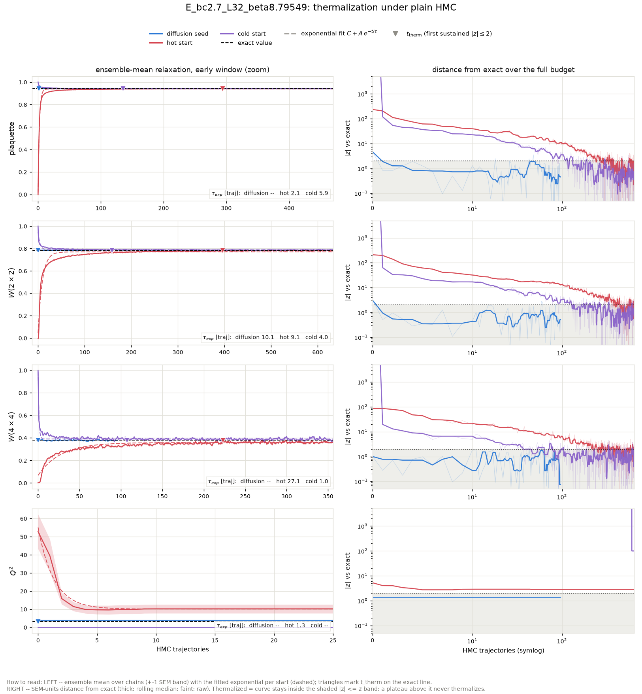

tau_int (hot-start chains, second half): plaquette = 3.46 +- 0.69, wilson_2x2 = 4.79 +- 0.91, wilson_4x4 = 1.32 +- 0.08, wilson_6x6 = 1.09 +- 0.07. Topology: hot-start HMC L=32 beta=8.79549 -> **frozen** (no tunneling).

Where 'never' stood at the end: the hot start ended the 640-trajectory budget still at Q^2 at |z| ~ 3; the cold start ended the 640-trajectory budget still at Q^2 at |z| ~ 100.

### Diagnostics: raw diffusion output (before any HMC)

| observable | value | error | exact | z_exact | reference | ref_error | z_ref | ks_p | chi2_p |
|---|---|---|---|---|---|---|---|---|---|
| plaquette | 0.9401 | 0.0002337 | 0.9413 | -5.309 | 0.9418 | 0.0001404 | -6.451 | 6.666e-05 |  |
| wilson_1x1 | 0.9401 | 0.0002337 | 0.9413 | -5.309 | 0.9418 | 0.0001404 | -6.451 | 6.666e-05 |  |
| wilson_1x2 | 0.8824 | 0.0004714 | 0.8861 | -7.855 | 0.8869 | 0.0002963 | -8.19 | 2.304e-07 |  |
| wilson_2x2 | 0.7811 | 0.0008162 | 0.7851 | -4.969 | 0.787 | 0.0006249 | -5.803 | 0.004773 |  |
| wilson_2x3 | 0.6929 | 0.00143 | 0.6957 | -1.958 | 0.6985 | 0.001067 | -3.187 | 0.06115 |  |
| wilson_3x3 | 0.5761 | 0.002071 | 0.5802 | -1.978 | 0.5843 | 0.002097 | -2.787 | 0.09806 |  |
| wilson_3x4 | 0.4809 | 0.003087 | 0.4839 | -0.9763 | 0.4882 | 0.00282 | -1.748 | 0.1098 |  |
| wilson_4x4 | 0.3755 | 0.00421 | 0.3799 | -1.062 | 0.3857 | 0.003457 | -1.88 | 0.1098 |  |
| wilson_4x5 | 0.2927 | 0.005581 | 0.2983 | -0.9952 | 0.3041 | 0.004154 | -1.633 | 0.1226 |  |
| wilson_5x5 | 0.2148 | 0.006228 | 0.2204 | -0.9028 | 0.2269 | 0.004445 | -1.58 | 0.1685 |  |
| wilson_5x6 | 0.1565 | 0.006738 | 0.1629 | -0.9474 | 0.1691 | 0.004424 | -1.562 | 0.06115 |  |
| wilson_6x6 | 0.1106 | 0.007332 | 0.1133 | -0.3757 | 0.1189 | 0.004263 | -0.9822 | 0.5643 |  |
| wilson_6x7 | 0.07434 | 0.006932 | 0.07884 | -0.6486 | 0.08308 | 0.004116 | -1.084 | 0.2498 |  |
| wilson_7x7 | 0.04987 | 0.007126 | 0.05163 | -0.2465 | 0.05434 | 0.004179 | -0.5409 | 0.9167 |  |
| wilson_7x8 | 0.0338 | 0.006838 | 0.03381 | -0.001089 | 0.03643 | 0.004209 | -0.328 | 0.8612 |  |
| wilson_8x8 | 0.02297 | 0.006705 | 0.02084 | 0.3173 | 0.02001 | 0.004008 | 0.379 | 0.6418 |  |
| wilson_8x10 | 0.01233 | 0.00459 | 0.007917 | 0.9604 | 0.004266 | 0.004423 | 1.264 | 0.5266 |  |
| wilson_10x10 | 0.004374 | 0.003539 | 0.002362 | 0.5686 | 0.003353 | 0.003902 | 0.1938 | 0.9167 |  |
| wilson_10x12 | -0.002303 | 0.003598 | 0.0007045 | -0.8358 | 0.004668 | 0.003535 | -1.382 | 0.3277 |  |
| wilson_12x12 | -0.0005686 | 0.00255 | 0.000165 | -0.2877 | 0.001006 | 0.003013 | -0.399 | 0.1098 |  |
| creutz_2 | 0.05861 | 0.0009367 | 0.06048 | -2.003 |  |  |  |  |  |
| creutz_3 | 0.06468 | 0.001872 | 0.06048 | 2.242 |  |  |  |  |  |
| creutz_4 | 0.06691 | 0.003744 | 0.06048 | 1.717 |  |  |  |  |  |
| creutz_5 | 0.06057 | 0.006928 | 0.06048 | 0.01202 |  |  |  |  |  |
| creutz_6 | 0.03099 | 0.01732 | 0.06048 | -1.703 |  |  |  |  |  |
| creutz_7 | 0.002268 | 0.04159 | 0.06048 | -1.4 |  |  |  |  |  |
| creutz_8 | -0.002553 | 0.09 | 0.06048 | -0.7004 |  |  |  |  |  |
| Q | -0.1172 | 0.1809 | 0 | -0.648 | 0.2188 | 0.1286 | -1.514 | 0.2498 |  |
| Q^2 | 3.82 | 0.4226 | 3.142 | 1.604 | 3 | 0.2652 | 1.644 | 0.7941 |  |
| chi_top ((<Q^2>-<Q>^2)/V) | 0.003717 | 0.0005027 | 0.003069 | 1.29 | 0.002883 | 0.000314 | 1.408 |  |  |
| Q histogram vs exact P(Q) | 6.637 | nan | 8 | nan |  |  |  |  | 0.5763 |

### Diagnostics: the same configs after 96 HMC trajectories

| observable | value | error | exact | z_exact | reference | ref_error | z_ref | ks_p | chi2_p |
|---|---|---|---|---|---|---|---|---|---|
| plaquette | 0.9412 | 0.0002126 | 0.9413 | -0.5048 | 0.9418 | 0.0001404 | -2.454 | 0.1866 |  |
| wilson_1x1 | 0.9412 | 0.0002126 | 0.9413 | -0.5048 | 0.9418 | 0.0001404 | -2.454 | 0.1866 |  |
| wilson_1x2 | 0.8859 | 0.0005126 | 0.8861 | -0.3693 | 0.8869 | 0.0002963 | -1.767 | 0.2061 |  |
| wilson_2x2 | 0.7845 | 0.001225 | 0.7851 | -0.5068 | 0.787 | 0.0006249 | -1.84 | 0.2061 |  |
| wilson_2x3 | 0.6957 | 0.001879 | 0.6957 | 0.0435 | 0.6985 | 0.001067 | -1.298 | 0.3001 |  |
| wilson_3x3 | 0.5801 | 0.002609 | 0.5802 | -0.02838 | 0.5843 | 0.002097 | -1.252 | 0.2498 |  |
| wilson_3x4 | 0.4841 | 0.003196 | 0.4839 | 0.0561 | 0.4882 | 0.00282 | -0.966 | 0.5266 |  |
| wilson_4x4 | 0.3796 | 0.0039 | 0.3799 | -0.08535 | 0.3857 | 0.003457 | -1.171 | 0.2061 |  |
| wilson_4x5 | 0.2963 | 0.004226 | 0.2983 | -0.4827 | 0.3041 | 0.004154 | -1.324 | 0.2498 |  |
| wilson_5x5 | 0.2166 | 0.005332 | 0.2204 | -0.7286 | 0.2269 | 0.004445 | -1.491 | 0.1866 |  |
| wilson_5x6 | 0.1582 | 0.005326 | 0.1629 | -0.882 | 0.1691 | 0.004424 | -1.575 | 0.2272 |  |
| wilson_6x6 | 0.1077 | 0.005983 | 0.1133 | -0.9433 | 0.1189 | 0.004263 | -1.527 | 0.2061 |  |
| wilson_6x7 | 0.07146 | 0.00603 | 0.07884 | -1.224 | 0.08308 | 0.004116 | -1.592 | 0.1366 |  |
| wilson_7x7 | 0.0455 | 0.006021 | 0.05163 | -1.018 | 0.05434 | 0.004179 | -1.206 | 0.7941 |  |
| wilson_7x8 | 0.02804 | 0.00539 | 0.03381 | -1.069 | 0.03643 | 0.004209 | -1.227 | 0.4545 |  |
| wilson_8x8 | 0.0145 | 0.004762 | 0.02084 | -1.33 | 0.02001 | 0.004008 | -0.8839 | 0.6808 |  |
| wilson_8x10 | 0.005675 | 0.004561 | 0.007917 | -0.4916 | 0.004266 | 0.004423 | 0.2219 | 0.3879 |  |
| wilson_10x10 | -0.003597 | 0.003664 | 0.002362 | -1.626 | 0.003353 | 0.003902 | -1.298 | 0.1226 |  |
| wilson_10x12 | -0.004308 | 0.003034 | 0.0007045 | -1.652 | 0.004668 | 0.003535 | -1.927 | 0.2498 |  |
| wilson_12x12 | -0.00172 | 0.002988 | 0.000165 | -0.6308 | 0.001006 | 0.003013 | -0.6425 | 0.8906 |  |
| creutz_2 | 0.06096 | 0.0008483 | 0.06048 | 0.5635 |  |  |  |  |  |
| creutz_3 | 0.06164 | 0.001926 | 0.06048 | 0.5992 |  |  |  |  |  |
| creutz_4 | 0.06223 | 0.003731 | 0.06048 | 0.4677 |  |  |  |  |  |
| creutz_5 | 0.06542 | 0.007965 | 0.06048 | 0.6195 |  |  |  |  |  |
| creutz_6 | 0.07083 | 0.0167 | 0.06048 | 0.6196 |  |  |  |  |  |
| creutz_7 | 0.04132 | 0.04058 | 0.06048 | -0.4722 |  |  |  |  |  |
| creutz_8 | 0.1754 | 0.132 | 0.06048 | 0.8703 |  |  |  |  |  |
| Q | -0.1172 | 0.1809 | 0 | -0.648 | 0.2188 | 0.1286 | -1.514 | 0.2498 |  |
| Q^2 | 3.82 | 0.4226 | 3.142 | 1.604 | 3 | 0.2652 | 1.644 | 0.7941 |  |
| chi_top ((<Q^2>-<Q>^2)/V) | 0.003717 | 0.0005027 | 0.003069 | 1.29 | 0.002883 | 0.000314 | 1.408 |  |  |
| Q histogram vs exact P(Q) | 6.637 | nan | 8 | nan |  |  |  |  | 0.5763 |

## A_bc3_L32_beta10.015

HMC: step size 0.1264, 8 leapfrog steps, acceptance seed/hot/cold = 0.979/0.979/0.981. Diffusion-seed batch: 128 chains x 96 trajectories (0.07 s/traj for the whole batch); baselines: 32 chains x 640 trajectories.

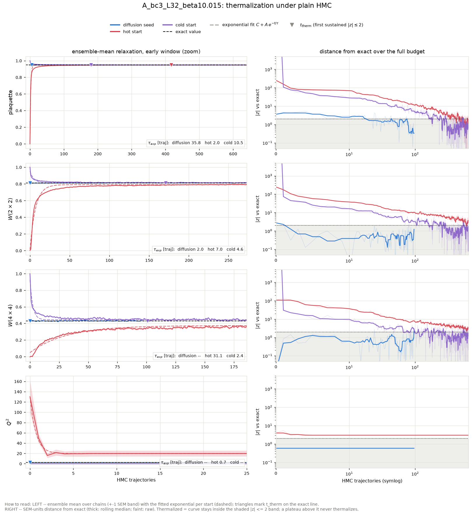

tau_int (hot-start chains, second half): plaquette = 5.94 +- 0.73, wilson_2x2 = 6.45 +- 1.07, wilson_4x4 = 2.63 +- 0.56, wilson_6x6 = 0.87 +- 0.05. Topology: hot-start HMC L=32 beta=10.015 -> **frozen** (no tunneling).

Where 'never' stood at the end: the hot start ended the 640-trajectory budget still at wilson_2x2 at |z| ~ 4, wilson_4x4 at |z| ~ 3, wilson_6x6 at |z| ~ 3, Q^2 at |z| ~ 3; the cold start ended the 640-trajectory budget still at Q^2 at |z| ~ 2736159195136.

### Diagnostics: raw diffusion output (before any HMC)

| observable | value | error | exact | z_exact | reference | ref_error | z_ref | ks_p | chi2_p |
|---|---|---|---|---|---|---|---|---|---|
| plaquette | 0.9479 | 0.0002113 | 0.9487 | -3.476 | 0.9491 | 0.0001615 | -4.395 | 6.666e-05 |  |
| wilson_1x1 | 0.9479 | 0.0002113 | 0.9487 | -3.476 | 0.9491 | 0.0001615 | -4.395 | 6.666e-05 |  |
| wilson_1x2 | 0.8973 | 0.0003803 | 0.9 | -7.043 | 0.9008 | 0.0003356 | -6.776 | 1.04e-07 |  |
| wilson_2x2 | 0.8072 | 0.000889 | 0.81 | -3.171 | 0.8117 | 0.0006964 | -4.035 | 0.004773 |  |
| wilson_2x3 | 0.7261 | 0.001464 | 0.729 | -1.995 | 0.7317 | 0.001326 | -2.867 | 0.08742 |  |
| wilson_3x3 | 0.6199 | 0.002291 | 0.6224 | -1.114 | 0.6264 | 0.002026 | -2.143 | 0.07777 |  |
| wilson_3x4 | 0.5291 | 0.002865 | 0.5314 | -0.8182 | 0.538 | 0.002776 | -2.231 | 0.06904 |  |
| wilson_4x4 | 0.4304 | 0.00354 | 0.4304 | -0.0194 | 0.439 | 0.003231 | -1.794 | 0.1226 |  |
| wilson_4x5 | 0.3474 | 0.003867 | 0.3486 | -0.3277 | 0.3571 | 0.003717 | -1.809 | 0.1098 |  |
| wilson_5x5 | 0.267 | 0.004353 | 0.2679 | -0.1995 | 0.2781 | 0.003965 | -1.88 | 0.1098 |  |
| wilson_5x6 | 0.2051 | 0.004712 | 0.2059 | -0.1589 | 0.2164 | 0.003805 | -1.871 | 0.04767 |  |
| wilson_6x6 | 0.1492 | 0.005102 | 0.1501 | -0.1745 | 0.161 | 0.003898 | -1.848 | 0.03684 |  |
| wilson_6x7 | 0.1092 | 0.005365 | 0.1094 | -0.03762 | 0.1196 | 0.003735 | -1.59 | 0.2741 |  |
| wilson_7x7 | 0.07676 | 0.00569 | 0.07566 | 0.1932 | 0.08706 | 0.00368 | -1.521 | 0.1519 |  |
| wilson_7x8 | 0.0527 | 0.005567 | 0.05232 | 0.06869 | 0.06272 | 0.00402 | -1.459 | 0.3277 |  |
| wilson_8x8 | 0.0365 | 0.005374 | 0.03433 | 0.4038 | 0.04526 | 0.003801 | -1.331 | 0.4545 |  |
| wilson_8x10 | 0.01478 | 0.004821 | 0.01478 | 0.001602 | 0.0194 | 0.002673 | -0.8372 | 0.7575 |  |
| wilson_10x10 | 0.007036 | 0.003771 | 0.005151 | 0.4996 | 0.007092 | 0.00308 | -0.01169 | 0.5266 |  |
| wilson_10x12 | -0.001332 | 0.003061 | 0.001796 | -1.022 | 0.004968 | 0.003328 | -1.393 | 0.08742 |  |
| wilson_12x12 | -0.004796 | 0.003169 | 0.0005072 | -1.673 | 0.002399 | 0.003057 | -1.634 | 0.2498 |  |
| creutz_2 | 0.05099 | 0.0007401 | 0.05268 | -2.296 |  |  |  |  |  |
| creutz_3 | 0.05225 | 0.001662 | 0.05268 | -0.2601 |  |  |  |  |  |
| creutz_4 | 0.04811 | 0.002876 | 0.05268 | -1.59 |  |  |  |  |  |
| creutz_5 | 0.04881 | 0.005293 | 0.05268 | -0.7323 |  |  |  |  |  |
| creutz_6 | 0.05459 | 0.01112 | 0.05268 | 0.1716 |  |  |  |  |  |
| creutz_7 | 0.04051 | 0.02357 | 0.05268 | -0.5165 |  |  |  |  |  |
| creutz_8 | -0.008485 | 0.05204 | 0.05268 | -1.175 |  |  |  |  |  |
| Q | 0.03906 | 0.1305 | 0 | 0.2993 | 0.04167 | 0.09744 | -0.01599 | 0.9978 |  |
| Q^2 | 2.523 | 0.4787 | 2.736 | -0.4444 | 2.312 | 0.2341 | 0.3958 | 0.8906 |  |
| chi_top ((<Q^2>-<Q>^2)/V) | 0.002463 | 0.0003557 | 0.002672 | -0.5882 | 0.002257 | 0.0002296 | 0.487 |  |  |
| Q histogram vs exact P(Q) | 6.937 | nan | 6 | nan |  |  |  |  | 0.3267 |

### Diagnostics: the same configs after 96 HMC trajectories

| observable | value | error | exact | z_exact | reference | ref_error | z_ref | ks_p | chi2_p |
|---|---|---|---|---|---|---|---|---|---|
| plaquette | 0.9487 | 0.0002028 | 0.9487 | 0.3212 | 0.9491 | 0.0001615 | -1.424 | 0.6028 |  |
| wilson_1x1 | 0.9487 | 0.0002028 | 0.9487 | 0.3212 | 0.9491 | 0.0001615 | -1.424 | 0.6028 |  |
| wilson_1x2 | 0.9001 | 0.0004019 | 0.9 | 0.3269 | 0.9008 | 0.0003356 | -1.197 | 0.357 |  |
| wilson_2x2 | 0.8111 | 0.0009828 | 0.81 | 1.153 | 0.8117 | 0.0006964 | -0.5021 | 0.4545 |  |
| wilson_2x3 | 0.7317 | 0.001626 | 0.729 | 1.68 | 0.7317 | 0.001326 | -0.004802 | 0.6418 |  |
| wilson_3x3 | 0.6262 | 0.002501 | 0.6224 | 1.522 | 0.6264 | 0.002026 | -0.06132 | 0.3001 |  |
| wilson_3x4 | 0.5385 | 0.003139 | 0.5314 | 2.27 | 0.538 | 0.002776 | 0.1362 | 0.6808 |  |
| wilson_4x4 | 0.4394 | 0.004173 | 0.4304 | 2.153 | 0.439 | 0.003231 | 0.086 | 0.9902 |  |
| wilson_4x5 | 0.358 | 0.004854 | 0.3486 | 1.92 | 0.3571 | 0.003717 | 0.1441 | 0.9719 |  |
| wilson_5x5 | 0.28 | 0.005484 | 0.2679 | 2.21 | 0.2781 | 0.003965 | 0.2833 | 0.8906 |  |
| wilson_5x6 | 0.2177 | 0.005351 | 0.2059 | 2.205 | 0.2164 | 0.003805 | 0.1852 | 0.6808 |  |
| wilson_6x6 | 0.1641 | 0.006091 | 0.1501 | 2.301 | 0.161 | 0.003898 | 0.4205 | 0.7941 |  |
| wilson_6x7 | 0.1218 | 0.006151 | 0.1094 | 2.018 | 0.1196 | 0.003735 | 0.308 | 0.6028 |  |
| wilson_7x7 | 0.08634 | 0.006477 | 0.07566 | 1.65 | 0.08706 | 0.00368 | -0.0961 | 0.7575 |  |
| wilson_7x8 | 0.05998 | 0.006175 | 0.05232 | 1.241 | 0.06272 | 0.00402 | -0.3713 | 0.7941 |  |
| wilson_8x8 | 0.0406 | 0.006703 | 0.03433 | 0.9355 | 0.04526 | 0.003801 | -0.6051 | 0.6418 |  |
| wilson_8x10 | 0.01498 | 0.006734 | 0.01478 | 0.02989 | 0.0194 | 0.002673 | -0.6102 | 0.1685 |  |
| wilson_10x10 | 0.007058 | 0.00447 | 0.005151 | 0.4265 | 0.007092 | 0.00308 | -0.00629 | 0.7195 |  |
| wilson_10x12 | 0.004137 | 0.003918 | 0.001796 | 0.5976 | 0.004968 | 0.003328 | -0.1617 | 0.7941 |  |
| wilson_12x12 | 0.005962 | 0.003972 | 0.0005072 | 1.373 | 0.002399 | 0.003057 | 0.7109 | 0.4545 |  |
| creutz_2 | 0.05151 | 0.0007258 | 0.05268 | -1.618 |  |  |  |  |  |
| creutz_3 | 0.05267 | 0.001417 | 0.05268 | -0.008788 |  |  |  |  |  |
| creutz_4 | 0.05257 | 0.002691 | 0.05268 | -0.04157 |  |  |  |  |  |
| creutz_5 | 0.04054 | 0.005343 | 0.05268 | -2.274 |  |  |  |  |  |
| creutz_6 | 0.03064 | 0.01043 | 0.05268 | -2.114 |  |  |  |  |  |
| creutz_7 | 0.04619 | 0.02057 | 0.05268 | -0.3159 |  |  |  |  |  |
| creutz_8 | 0.02616 | 0.04735 | 0.05268 | -0.5603 |  |  |  |  |  |
| Q | 0.03906 | 0.1305 | 0 | 0.2993 | 0.04167 | 0.09744 | -0.01599 | 0.9978 |  |
| Q^2 | 2.523 | 0.4787 | 2.736 | -0.4444 | 2.312 | 0.2341 | 0.3958 | 0.8906 |  |
| chi_top ((<Q^2>-<Q>^2)/V) | 0.002463 | 0.0003557 | 0.002672 | -0.5882 | 0.002257 | 0.0002296 | 0.487 |  |  |
| Q histogram vs exact P(Q) | 6.937 | nan | 6 | nan |  |  |  |  | 0.3267 |

## E_bc3.4_L32_beta11.6638

HMC: step size 0.1171, 9 leapfrog steps, acceptance seed/hot/cold = 0.985/0.984/0.986. Diffusion-seed batch: 128 chains x 96 trajectories (0.07 s/traj for the whole batch); baselines: 32 chains x 640 trajectories.

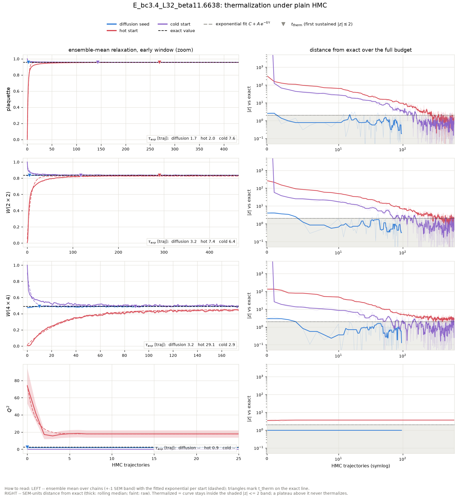

tau_int (hot-start chains, second half): plaquette = 4.96 +- 0.71, wilson_2x2 = 3.67 +- 0.54, wilson_4x4 = 1.87 +- 0.15, wilson_6x6 = 0.88 +- 0.04. Topology: hot-start HMC L=32 beta=11.6638 -> **frozen** (no tunneling).

Where 'never' stood at the end: the hot start ended the 640-trajectory budget still at wilson_4x4 at |z| ~ 3, wilson_6x6 at |z| ~ 3, Q^2 at |z| ~ 4; the cold start ended the 640-trajectory budget still at Q^2 at |z| ~ 2329518014464.

### Diagnostics: raw diffusion output (before any HMC)

| observable | value | error | exact | z_exact | reference | ref_error | z_ref | ks_p | chi2_p |
|---|---|---|---|---|---|---|---|---|---|
| plaquette | 0.9556 | 0.0002362 | 0.9561 | -2.202 | 0.956 | 0.0001161 | -1.411 | 0.1866 |  |
| wilson_1x1 | 0.9556 | 0.0002362 | 0.9561 | -2.202 | 0.956 | 0.0001161 | -1.411 | 0.1866 |  |
| wilson_1x2 | 0.9115 | 0.0005452 | 0.9142 | -4.848 | 0.9144 | 0.0002393 | -4.746 | 0.0002266 |  |
| wilson_2x2 | 0.8316 | 0.001284 | 0.8357 | -3.158 | 0.8355 | 0.0005947 | -2.709 | 0.006558 |  |
| wilson_2x3 | 0.758 | 0.002072 | 0.764 | -2.9 | 0.7644 | 0.000906 | -2.855 | 0.02145 |  |
| wilson_3x3 | 0.6605 | 0.003153 | 0.6678 | -2.301 | 0.6698 | 0.001396 | -2.683 | 0.02464 |  |
| wilson_3x4 | 0.5742 | 0.004354 | 0.5837 | -2.166 | 0.5859 | 0.001956 | -2.449 | 0.02464 |  |
| wilson_4x4 | 0.477 | 0.005363 | 0.4878 | -2.007 | 0.4926 | 0.002523 | -2.624 | 0.01039 |  |
| wilson_4x5 | 0.3965 | 0.006021 | 0.4076 | -1.841 | 0.4145 | 0.003048 | -2.666 | 0.004773 |  |
| wilson_5x5 | 0.3132 | 0.00661 | 0.3257 | -1.898 | 0.3338 | 0.003216 | -2.811 | 0.001229 |  |
| wilson_5x6 | 0.2482 | 0.007099 | 0.2603 | -1.705 | 0.2694 | 0.003553 | -2.672 | 0.004773 |  |
| wilson_6x6 | 0.1859 | 0.007337 | 0.1988 | -1.766 | 0.2077 | 0.003763 | -2.645 | 0.01207 |  |
| wilson_6x7 | 0.1398 | 0.007042 | 0.1519 | -1.721 | 0.1578 | 0.003653 | -2.269 | 0.02823 |  |
| wilson_7x7 | 0.09886 | 0.006779 | 0.111 | -1.785 | 0.118 | 0.003866 | -2.455 | 0.01398 |  |
| wilson_7x8 | 0.06823 | 0.006201 | 0.08105 | -2.067 | 0.08672 | 0.004013 | -2.504 | 0.01207 |  |
| wilson_8x8 | 0.0448 | 0.006233 | 0.0566 | -1.894 | 0.06256 | 0.003826 | -2.429 | 0.005601 |  |
| wilson_8x10 | 0.02427 | 0.005477 | 0.02761 | -0.6094 | 0.03128 | 0.004191 | -1.016 | 0.8288 |  |
| wilson_10x10 | 0.01001 | 0.004724 | 0.01125 | -0.2644 | 0.01398 | 0.00399 | -0.6422 | 0.4545 |  |
| wilson_10x12 | 0.005941 | 0.004397 | 0.004588 | 0.3077 | 0.004993 | 0.003573 | 0.1673 | 0.9719 |  |
| wilson_12x12 | 0.004228 | 0.005337 | 0.001563 | 0.4994 | 0.001386 | 0.003715 | 0.4371 | 0.6418 |  |
| creutz_2 | 0.04449 | 0.0006831 | 0.04487 | -0.5573 |  |  |  |  |  |
| creutz_3 | 0.04486 | 0.001434 | 0.04487 | -0.005517 |  |  |  |  |  |
| creutz_4 | 0.04552 | 0.002411 | 0.04487 | 0.2714 |  |  |  |  |  |
| creutz_5 | 0.05134 | 0.005019 | 0.04487 | 1.288 |  |  |  |  |  |
| creutz_6 | 0.05631 | 0.00959 | 0.04487 | 1.193 |  |  |  |  |  |
| creutz_7 | 0.06146 | 0.01972 | 0.04487 | 0.8412 |  |  |  |  |  |
| creutz_8 | 0.04996 | 0.04444 | 0.04487 | 0.1146 |  |  |  |  |  |
| Q | -0.1875 | 0.1338 | 0 | -1.401 | 0.06771 | 0.08355 | -1.618 | 0.8288 |  |
| Q^2 | 2.094 | 0.153 | 2.33 | -1.541 | 2.172 | 0.2057 | -0.3048 | 1 |  |
| chi_top ((<Q^2>-<Q>^2)/V) | 0.00201 | 0.0002266 | 0.002275 | -1.168 | 0.002116 | 0.000205 | -0.3474 |  |  |
| Q histogram vs exact P(Q) | 4.844 | nan | 6 | nan |  |  |  |  | 0.564 |

### Diagnostics: the same configs after 96 HMC trajectories

| observable | value | error | exact | z_exact | reference | ref_error | z_ref | ks_p | chi2_p |
|---|---|---|---|---|---|---|---|---|---|
| plaquette | 0.9562 | 0.0001861 | 0.9561 | 0.1714 | 0.956 | 0.0001161 | 0.8242 | 0.2272 |  |
| wilson_1x1 | 0.9562 | 0.0001861 | 0.9561 | 0.1714 | 0.956 | 0.0001161 | 0.8242 | 0.2272 |  |
| wilson_1x2 | 0.9144 | 0.000385 | 0.9142 | 0.6477 | 0.9144 | 0.0002393 | 0.1462 | 0.7195 |  |
| wilson_2x2 | 0.836 | 0.0008504 | 0.8357 | 0.3007 | 0.8355 | 0.0005947 | 0.46 | 0.09806 |  |
| wilson_2x3 | 0.7651 | 0.001372 | 0.764 | 0.8135 | 0.7644 | 0.000906 | 0.407 | 0.7195 |  |
| wilson_3x3 | 0.6691 | 0.002174 | 0.6678 | 0.6355 | 0.6698 | 0.001396 | -0.2382 | 0.6028 |  |
| wilson_3x4 | 0.585 | 0.003165 | 0.5837 | 0.4142 | 0.5859 | 0.001956 | -0.2541 | 0.6808 |  |
| wilson_4x4 | 0.4883 | 0.004023 | 0.4878 | 0.1204 | 0.4926 | 0.002523 | -0.9055 | 0.6418 |  |
| wilson_4x5 | 0.4087 | 0.004831 | 0.4076 | 0.2241 | 0.4145 | 0.003048 | -1.02 | 0.1519 |  |
| wilson_5x5 | 0.3277 | 0.00558 | 0.3257 | 0.3513 | 0.3338 | 0.003216 | -0.9559 | 0.05405 |  |
| wilson_5x6 | 0.2616 | 0.006084 | 0.2603 | 0.2215 | 0.2694 | 0.003553 | -1.102 | 0.1226 |  |
| wilson_6x6 | 0.1981 | 0.005932 | 0.1988 | -0.1168 | 0.2077 | 0.003763 | -1.359 | 0.02464 |  |
| wilson_6x7 | 0.1492 | 0.005846 | 0.1519 | -0.4633 | 0.1578 | 0.003653 | -1.246 | 0.02823 |  |
| wilson_7x7 | 0.1053 | 0.005632 | 0.111 | -0.996 | 0.118 | 0.003866 | -1.854 | 0.004773 |  |
| wilson_7x8 | 0.07516 | 0.006062 | 0.08105 | -0.971 | 0.08672 | 0.004013 | -1.59 | 0.001748 |  |
| wilson_8x8 | 0.04791 | 0.005162 | 0.0566 | -1.684 | 0.06256 | 0.003826 | -2.28 | 0.004773 |  |
| wilson_8x10 | 0.02297 | 0.005532 | 0.02761 | -0.8379 | 0.03128 | 0.004191 | -1.196 | 0.1685 |  |
| wilson_10x10 | 0.003647 | 0.004009 | 0.01125 | -1.898 | 0.01398 | 0.00399 | -1.826 | 0.1226 |  |
| wilson_10x12 | 0.0002433 | 0.003251 | 0.004588 | -1.336 | 0.004993 | 0.003573 | -0.9832 | 0.3001 |  |
| wilson_12x12 | -0.002235 | 0.0044 | 0.001563 | -0.8631 | 0.001386 | 0.003715 | -0.6287 | 0.3879 |  |
| creutz_2 | 0.04508 | 0.0006437 | 0.04487 | 0.3204 |  |  |  |  |  |
| creutz_3 | 0.04542 | 0.001357 | 0.04487 | 0.4034 |  |  |  |  |  |
| creutz_4 | 0.0463 | 0.002205 | 0.04487 | 0.6479 |  |  |  |  |  |
| creutz_5 | 0.04318 | 0.004289 | 0.04487 | -0.3939 |  |  |  |  |  |
| creutz_6 | 0.05269 | 0.008587 | 0.04487 | 0.9107 |  |  |  |  |  |
| creutz_7 | 0.06426 | 0.01677 | 0.04487 | 1.156 |  |  |  |  |  |
| creutz_8 | 0.1127 | 0.03979 | 0.04487 | 1.705 |  |  |  |  |  |
| Q | -0.1875 | 0.1338 | 0 | -1.401 | 0.06771 | 0.08355 | -1.618 | 0.8288 |  |
| Q^2 | 2.094 | 0.153 | 2.33 | -1.541 | 2.172 | 0.2057 | -0.3048 | 1 |  |
| chi_top ((<Q^2>-<Q>^2)/V) | 0.00201 | 0.0002266 | 0.002275 | -1.168 | 0.002116 | 0.000205 | -0.3474 |  |  |
| Q histogram vs exact P(Q) | 4.844 | nan | 6 | nan |  |  |  |  | 0.564 |

## A_bc4_L32_beta14.1464

HMC: step size 0.1063, 9 leapfrog steps, acceptance seed/hot/cold = 0.986/0.985/0.985. Diffusion-seed batch: 128 chains x 96 trajectories (0.08 s/traj for the whole batch); baselines: 32 chains x 640 trajectories.

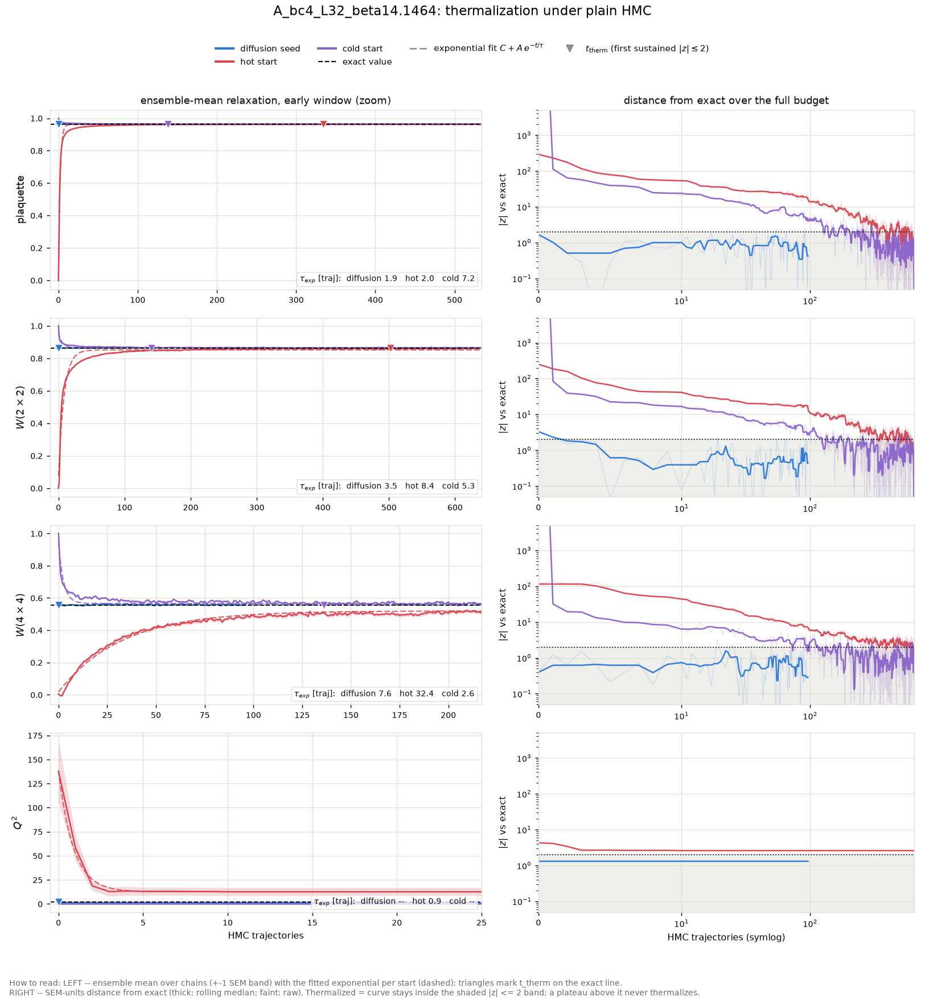

tau_int (hot-start chains, second half): plaquette = 4.05 +- 0.50, wilson_2x2 = 3.81 +- 0.57, wilson_4x4 = 1.88 +- 0.15, wilson_6x6 = 0.91 +- 0.05. Topology: hot-start HMC L=32 beta=14.1464 -> **frozen** (no tunneling).

Where 'never' stood at the end: the hot start ended the 640-trajectory budget still at wilson_4x4 at |z| ~ 2, wilson_6x6 at |z| ~ 3, Q^2 at |z| ~ 3; the cold start ended the 640-trajectory budget still at Q^2 at |z| ~ 1903991324672.

### Diagnostics: raw diffusion output (before any HMC)

| observable | value | error | exact | z_exact | reference | ref_error | z_ref | ks_p | chi2_p |
|---|---|---|---|---|---|---|---|---|---|
| plaquette | 0.9637 | 0.0001658 | 0.964 | -1.577 | 0.964 | 0.0001045 | -1.582 | 0.2741 |  |
| wilson_1x1 | 0.9637 | 0.0001658 | 0.964 | -1.577 | 0.964 | 0.0001045 | -1.582 | 0.2741 |  |
| wilson_1x2 | 0.9276 | 0.000364 | 0.9293 | -4.666 | 0.9296 | 0.0002552 | -4.535 | 2.824e-05 |  |
| wilson_2x2 | 0.8609 | 0.0007662 | 0.8635 | -3.412 | 0.8637 | 0.0005172 | -3.047 | 0.03229 |  |
| wilson_2x3 | 0.7998 | 0.001271 | 0.8024 | -2.084 | 0.8034 | 0.0008479 | -2.352 | 0.008934 |  |
| wilson_3x3 | 0.717 | 0.001806 | 0.7188 | -1.015 | 0.7199 | 0.001423 | -1.289 | 0.6028 |  |
| wilson_3x4 | 0.6424 | 0.002434 | 0.6439 | -0.6225 | 0.6459 | 0.001917 | -1.131 | 0.6418 |  |
| wilson_4x4 | 0.5546 | 0.002995 | 0.556 | -0.4656 | 0.5596 | 0.002855 | -1.21 | 0.6418 |  |
| wilson_4x5 | 0.479 | 0.00361 | 0.4801 | -0.3163 | 0.4851 | 0.00349 | -1.207 | 0.5643 |  |
| wilson_5x5 | 0.4002 | 0.004372 | 0.3997 | 0.1252 | 0.407 | 0.004148 | -1.116 | 0.5643 |  |
| wilson_5x6 | 0.3331 | 0.004848 | 0.3327 | 0.08465 | 0.3394 | 0.004786 | -0.9287 | 0.7195 |  |
| wilson_6x6 | 0.268 | 0.005938 | 0.267 | 0.1669 | 0.2747 | 0.005249 | -0.8504 | 0.9167 |  |
| wilson_6x7 | 0.215 | 0.006111 | 0.2142 | 0.1336 | 0.2227 | 0.005882 | -0.9061 | 0.8906 |  |
| wilson_7x7 | 0.1684 | 0.00689 | 0.1657 | 0.3877 | 0.1737 | 0.006429 | -0.569 | 0.7941 |  |
| wilson_7x8 | 0.1305 | 0.006707 | 0.1282 | 0.3389 | 0.1351 | 0.006932 | -0.4801 | 0.6028 |  |
| wilson_8x8 | 0.09796 | 0.006916 | 0.09558 | 0.3443 | 0.1014 | 0.007393 | -0.3413 | 0.6418 |  |
| wilson_8x10 | 0.05552 | 0.006125 | 0.05315 | 0.3877 | 0.05664 | 0.006436 | -0.1258 | 0.8612 |  |
| wilson_10x10 | 0.02554 | 0.005607 | 0.02552 | 0.003487 | 0.0281 | 0.005173 | -0.3354 | 0.8612 |  |
| wilson_10x12 | 0.01153 | 0.004908 | 0.01225 | -0.1479 | 0.01376 | 0.004503 | -0.336 | 0.3277 |  |
| wilson_12x12 | -0.001117 | 0.004377 | 0.00508 | -1.416 | 0.0004475 | 0.004348 | -0.2535 | 0.8906 |  |
| creutz_2 | 0.03633 | 0.0005281 | 0.03668 | -0.6728 |  |  |  |  |  |
| creutz_3 | 0.03566 | 0.001088 | 0.03668 | -0.9441 |  |  |  |  |  |
| creutz_4 | 0.03704 | 0.002018 | 0.03668 | 0.1746 |  |  |  |  |  |
| creutz_5 | 0.03306 | 0.003248 | 0.03668 | -1.115 |  |  |  |  |  |
| creutz_6 | 0.03407 | 0.005763 | 0.03668 | -0.4529 |  |  |  |  |  |
| creutz_7 | 0.0246 | 0.01001 | 0.03668 | -1.207 |  |  |  |  |  |
| creutz_8 | 0.03124 | 0.01909 | 0.03668 | -0.285 |  |  |  |  |  |
| Q | -0.007812 | 0.1526 | 0 | -0.05121 | 0.2135 | 0.09762 | -1.222 | 0.2741 |  |
| Q^2 | 1.633 | 0.2093 | 1.904 | -1.296 | 2.047 | 0.2081 | -1.403 | 0.939 |  |
| chi_top ((<Q^2>-<Q>^2)/V) | 0.001594 | 0.0002024 | 0.001859 | -1.309 | 0.001954 | 0.0002063 | -1.245 |  |  |
| Q histogram vs exact P(Q) | 4.411 | nan | 6 | nan |  |  |  |  | 0.6213 |

### Diagnostics: the same configs after 96 HMC trajectories

| observable | value | error | exact | z_exact | reference | ref_error | z_ref | ks_p | chi2_p |
|---|---|---|---|---|---|---|---|---|---|
| plaquette | 0.9639 | 0.0001293 | 0.964 | -0.4406 | 0.964 | 0.0001045 | -0.6347 | 0.7941 |  |
| wilson_1x1 | 0.9639 | 0.0001293 | 0.964 | -0.4406 | 0.964 | 0.0001045 | -0.6347 | 0.7941 |  |
| wilson_1x2 | 0.929 | 0.0002489 | 0.9293 | -1.125 | 0.9296 | 0.0002552 | -1.677 | 0.2061 |  |
| wilson_2x2 | 0.8633 | 0.000639 | 0.8635 | -0.4154 | 0.8637 | 0.0005172 | -0.5687 | 0.4899 |  |
| wilson_2x3 | 0.8021 | 0.001066 | 0.8024 | -0.3267 | 0.8034 | 0.0008479 | -0.9491 | 0.357 |  |
| wilson_3x3 | 0.719 | 0.001651 | 0.7188 | 0.1212 | 0.7199 | 0.001423 | -0.4269 | 0.9827 |  |
| wilson_3x4 | 0.6447 | 0.002218 | 0.6439 | 0.3558 | 0.6459 | 0.001917 | -0.4087 | 0.9574 |  |
| wilson_4x4 | 0.557 | 0.002688 | 0.556 | 0.3549 | 0.5596 | 0.002855 | -0.6779 | 0.7195 |  |
| wilson_4x5 | 0.4802 | 0.003336 | 0.4801 | 0.01317 | 0.4851 | 0.00349 | -1.009 | 0.6028 |  |
| wilson_5x5 | 0.398 | 0.003963 | 0.3997 | -0.418 | 0.407 | 0.004148 | -1.557 | 0.2272 |  |
| wilson_5x6 | 0.3313 | 0.00463 | 0.3327 | -0.3089 | 0.3394 | 0.004786 | -1.226 | 0.08742 |  |
| wilson_6x6 | 0.2653 | 0.004813 | 0.267 | -0.343 | 0.2747 | 0.005249 | -1.317 | 0.06904 |  |
| wilson_6x7 | 0.2135 | 0.004894 | 0.2142 | -0.1543 | 0.2227 | 0.005882 | -1.21 | 0.1685 |  |
| wilson_7x7 | 0.1654 | 0.004328 | 0.1657 | -0.07582 | 0.1737 | 0.006429 | -1.079 | 0.1226 |  |
| wilson_7x8 | 0.1287 | 0.003885 | 0.1282 | 0.1264 | 0.1351 | 0.006932 | -0.8071 | 0.08742 |  |
| wilson_8x8 | 0.09578 | 0.003802 | 0.09558 | 0.05099 | 0.1014 | 0.007393 | -0.6788 | 0.1226 |  |
| wilson_8x10 | 0.05312 | 0.005263 | 0.05315 | -0.00514 | 0.05664 | 0.006436 | -0.4233 | 0.3277 |  |
| wilson_10x10 | 0.02279 | 0.005244 | 0.02552 | -0.5193 | 0.0281 | 0.005173 | -0.7197 | 0.2498 |  |
| wilson_10x12 | 0.009304 | 0.004916 | 0.01225 | -0.5997 | 0.01376 | 0.004503 | -0.6691 | 0.4204 |  |
| wilson_12x12 | 0.005108 | 0.003154 | 0.00508 | 0.008953 | 0.0004475 | 0.004348 | 0.8676 | 0.1685 |  |
| creutz_2 | 0.03645 | 0.0004893 | 0.03668 | -0.4832 |  |  |  |  |  |
| creutz_3 | 0.03584 | 0.001015 | 0.03668 | -0.8268 |  |  |  |  |  |
| creutz_4 | 0.03714 | 0.002012 | 0.03668 | 0.2272 |  |  |  |  |  |
| creutz_5 | 0.03931 | 0.003076 | 0.03668 | 0.8525 |  |  |  |  |  |
| creutz_6 | 0.03842 | 0.005498 | 0.03668 | 0.3164 |  |  |  |  |  |
| creutz_7 | 0.03781 | 0.01031 | 0.03668 | 0.1088 |  |  |  |  |  |
| creutz_8 | 0.04428 | 0.02017 | 0.03668 | 0.3768 |  |  |  |  |  |
| Q | -0.007812 | 0.1526 | 0 | -0.05121 | 0.2135 | 0.09762 | -1.222 | 0.2741 |  |
| Q^2 | 1.633 | 0.2093 | 1.904 | -1.296 | 2.047 | 0.2081 | -1.403 | 0.939 |  |
| chi_top ((<Q^2>-<Q>^2)/V) | 0.001594 | 0.0002024 | 0.001859 | -1.309 | 0.001954 | 0.0002063 | -1.245 |  |  |
| Q histogram vs exact P(Q) | 4.411 | nan | 6 | nan |  |  |  |  | 0.6213 |

## E_bc4.5_L32_beta16.2057

HMC: step size 0.0994, 10 leapfrog steps, acceptance seed/hot/cold = 0.978/0.979/0.977. Diffusion-seed batch: 128 chains x 96 trajectories (0.07 s/traj for the whole batch); baselines: 32 chains x 640 trajectories.

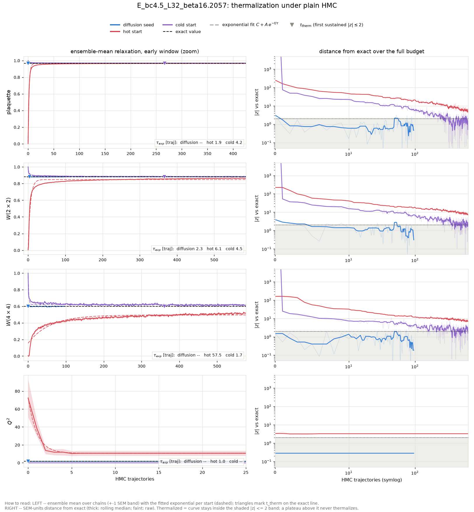

tau_int (hot-start chains, second half): plaquette = 5.77 +- 1.02, wilson_2x2 = 11.17 +- 1.48, wilson_4x4 = 6.08 +- 1.24, wilson_6x6 = 1.16 +- 0.09. Topology: hot-start HMC L=32 beta=16.2057 -> **frozen** (no tunneling).

Where 'never' stood at the end: the hot start ended the 640-trajectory budget still at plaquette at |z| ~ 5, wilson_2x2 at |z| ~ 8, wilson_4x4 at |z| ~ 7, wilson_6x6 at |z| ~ 5, Q^2 at |z| ~ 3; the cold start ended the 640-trajectory budget still at Q^2 at |z| ~ 1653625323520.

### Diagnostics: raw diffusion output (before any HMC)

| observable | value | error | exact | z_exact | reference | ref_error | z_ref | ks_p | chi2_p |
|---|---|---|---|---|---|---|---|---|---|
| plaquette | 0.9683 | 0.0001359 | 0.9686 | -2.84 | 0.9688 | 8.449e-05 | -3.733 | 0.006558 |  |
| wilson_1x1 | 0.9683 | 0.0001359 | 0.9686 | -2.84 | 0.9688 | 8.449e-05 | -3.733 | 0.006558 |  |
| wilson_1x2 | 0.9366 | 0.0002981 | 0.9383 | -5.697 | 0.9387 | 0.0001863 | -6.088 | 5.786e-06 |  |
| wilson_2x2 | 0.8776 | 0.0006377 | 0.8803 | -4.249 | 0.8822 | 0.0004596 | -5.791 | 1.156e-05 |  |
| wilson_2x3 | 0.8221 | 0.001109 | 0.826 | -3.496 | 0.8285 | 0.0006873 | -4.93 | 0.0005923 |  |
| wilson_3x3 | 0.7468 | 0.001698 | 0.7507 | -2.263 | 0.7552 | 0.001123 | -4.129 | 0.001748 |  |
| wilson_3x4 | 0.6774 | 0.002147 | 0.6822 | -2.236 | 0.6869 | 0.001592 | -3.552 | 0.004773 |  |
| wilson_4x4 | 0.5953 | 0.003398 | 0.6006 | -1.573 | 0.6078 | 0.002325 | -3.036 | 0.03229 |  |
| wilson_4x5 | 0.5233 | 0.004075 | 0.5287 | -1.343 | 0.5354 | 0.003051 | -2.394 | 0.08742 |  |
| wilson_5x5 | 0.4453 | 0.005174 | 0.4509 | -1.074 | 0.458 | 0.003957 | -1.954 | 0.1098 |  |
| wilson_5x6 | 0.3799 | 0.005798 | 0.3845 | -0.7897 | 0.3889 | 0.004614 | -1.215 | 0.4204 |  |
| wilson_6x6 | 0.3128 | 0.006589 | 0.3176 | -0.724 | 0.3214 | 0.00532 | -1.021 | 0.357 |  |
| wilson_6x7 | 0.2587 | 0.00704 | 0.2623 | -0.5103 | 0.2636 | 0.005865 | -0.5368 | 0.5266 |  |
| wilson_7x7 | 0.2089 | 0.007681 | 0.2099 | -0.1254 | 0.2097 | 0.006059 | -0.07969 | 0.6028 |  |
| wilson_7x8 | 0.1676 | 0.00809 | 0.1679 | -0.03526 | 0.169 | 0.006097 | -0.1351 | 0.5643 |  |
| wilson_8x8 | 0.1289 | 0.008059 | 0.1301 | -0.1493 | 0.129 | 0.005818 | -0.01081 | 0.9167 |  |
| wilson_8x10 | 0.077 | 0.008102 | 0.07815 | -0.142 | 0.07809 | 0.005412 | -0.1119 | 0.8612 |  |
| wilson_10x10 | 0.04314 | 0.007227 | 0.04132 | 0.2522 | 0.03842 | 0.005229 | 0.5298 | 0.1866 |  |
| wilson_10x12 | 0.02373 | 0.006566 | 0.02185 | 0.2876 | 0.02205 | 0.005606 | 0.1957 | 0.7941 |  |
| wilson_12x12 | 0.01363 | 0.005281 | 0.01017 | 0.656 | 0.01118 | 0.004718 | 0.3464 | 0.5643 |  |
| creutz_2 | 0.03172 | 0.0004567 | 0.03186 | -0.3114 |  |  |  |  |  |
| creutz_3 | 0.03067 | 0.0008744 | 0.03186 | -1.366 |  |  |  |  |  |
| creutz_4 | 0.03181 | 0.001609 | 0.03186 | -0.03131 |  |  |  |  |  |
| creutz_5 | 0.0324 | 0.002724 | 0.03186 | 0.1956 |  |  |  |  |  |
| creutz_6 | 0.03544 | 0.004596 | 0.03186 | 0.7771 |  |  |  |  |  |
| creutz_7 | 0.02402 | 0.007938 | 0.03186 | -0.9881 |  |  |  |  |  |
| creutz_8 | 0.04236 | 0.01399 | 0.03186 | 0.7499 |  |  |  |  |  |
| Q | 0.1719 | 0.1151 | 0 | 1.493 | -0.1094 | 0.09688 | 1.869 | 0.7941 |  |
| Q^2 | 1.719 | 0.2081 | 1.654 | 0.3129 | 1.661 | 0.1468 | 0.2249 | 1 |  |
| chi_top ((<Q^2>-<Q>^2)/V) | 0.00165 | 0.0002211 | 0.001615 | 0.1572 | 0.001611 | 0.0001501 | 0.1451 |  |  |
| Q histogram vs exact P(Q) | 4.075 | nan | 6 | nan |  |  |  |  | 0.6665 |

### Diagnostics: the same configs after 96 HMC trajectories

| observable | value | error | exact | z_exact | reference | ref_error | z_ref | ks_p | chi2_p |
|---|---|---|---|---|---|---|---|---|---|
| plaquette | 0.9686 | 0.0001083 | 0.9686 | -0.4685 | 0.9688 | 8.449e-05 | -1.909 | 0.3277 |  |
| wilson_1x1 | 0.9686 | 0.0001083 | 0.9686 | -0.4685 | 0.9688 | 8.449e-05 | -1.909 | 0.3277 |  |
| wilson_1x2 | 0.9382 | 0.0002403 | 0.9383 | -0.3534 | 0.9387 | 0.0001863 | -1.733 | 0.6028 |  |
| wilson_2x2 | 0.8801 | 0.0005034 | 0.8803 | -0.3777 | 0.8822 | 0.0004596 | -2.982 | 0.04195 |  |
| wilson_2x3 | 0.8259 | 0.0008912 | 0.826 | -0.1325 | 0.8285 | 0.0006873 | -2.375 | 0.01207 |  |
| wilson_3x3 | 0.7511 | 0.001849 | 0.7507 | 0.2355 | 0.7552 | 0.001123 | -1.908 | 0.1226 |  |
| wilson_3x4 | 0.6821 | 0.002664 | 0.6822 | -0.06108 | 0.6869 | 0.001592 | -1.565 | 0.3001 |  |
| wilson_4x4 | 0.6013 | 0.004171 | 0.6006 | 0.159 | 0.6078 | 0.002325 | -1.359 | 0.357 |  |
| wilson_4x5 | 0.5289 | 0.005227 | 0.5287 | 0.04119 | 0.5354 | 0.003051 | -1.074 | 0.6418 |  |
| wilson_5x5 | 0.4525 | 0.006725 | 0.4509 | 0.2491 | 0.458 | 0.003957 | -0.7049 | 0.4545 |  |
| wilson_5x6 | 0.3865 | 0.007572 | 0.3845 | 0.2724 | 0.3889 | 0.004614 | -0.2665 | 0.8612 |  |
| wilson_6x6 | 0.322 | 0.008828 | 0.3176 | 0.5059 | 0.3214 | 0.00532 | 0.05699 | 0.939 |  |
| wilson_6x7 | 0.2685 | 0.009376 | 0.2623 | 0.6571 | 0.2636 | 0.005865 | 0.4372 | 0.6028 |  |
| wilson_7x7 | 0.2179 | 0.009972 | 0.2099 | 0.8081 | 0.2097 | 0.006059 | 0.7064 | 0.2741 |  |
| wilson_7x8 | 0.1755 | 0.009597 | 0.1679 | 0.7965 | 0.169 | 0.006097 | 0.577 | 0.4204 |  |
| wilson_8x8 | 0.1366 | 0.009746 | 0.1301 | 0.6671 | 0.129 | 0.005818 | 0.6694 | 0.4204 |  |
| wilson_8x10 | 0.07976 | 0.009246 | 0.07815 | 0.1742 | 0.07809 | 0.005412 | 0.156 | 0.6028 |  |
| wilson_10x10 | 0.04416 | 0.00854 | 0.04132 | 0.3323 | 0.03842 | 0.005229 | 0.5733 | 0.4204 |  |
| wilson_10x12 | 0.02787 | 0.0069 | 0.02185 | 0.8725 | 0.02205 | 0.005606 | 0.6548 | 0.4899 |  |
| wilson_12x12 | 0.01448 | 0.005789 | 0.01017 | 0.7441 | 0.01118 | 0.004718 | 0.4415 | 0.3001 |  |
| creutz_2 | 0.03195 | 0.0004571 | 0.03186 | 0.1913 |  |  |  |  |  |
| creutz_3 | 0.03121 | 0.0008954 | 0.03186 | -0.7256 |  |  |  |  |  |
| creutz_4 | 0.0297 | 0.001681 | 0.03186 | -1.285 |  |  |  |  |  |
| creutz_5 | 0.02787 | 0.00275 | 0.03186 | -1.454 |  |  |  |  |  |
| creutz_6 | 0.02489 | 0.004544 | 0.03186 | -1.534 |  |  |  |  |  |
| creutz_7 | 0.02665 | 0.007231 | 0.03186 | -0.7209 |  |  |  |  |  |
| creutz_8 | 0.03446 | 0.0138 | 0.03186 | 0.188 |  |  |  |  |  |
| Q | 0.1719 | 0.1151 | 0 | 1.493 | -0.1094 | 0.09688 | 1.869 | 0.7941 |  |
| Q^2 | 1.719 | 0.2081 | 1.654 | 0.3129 | 1.661 | 0.1468 | 0.2249 | 1 |  |
| chi_top ((<Q^2>-<Q>^2)/V) | 0.00165 | 0.0002211 | 0.001615 | 0.1572 | 0.001611 | 0.0001501 | 0.1451 |  |  |
| Q histogram vs exact P(Q) | 4.075 | nan | 6 | nan |  |  |  |  | 0.6665 |

## A_bc5_L32_beta18.2524

HMC: step size 0.0936, 11 leapfrog steps, acceptance seed/hot/cold = 0.982/0.983/0.979. Diffusion-seed batch: 128 chains x 96 trajectories (0.10 s/traj for the whole batch); baselines: 32 chains x 640 trajectories.

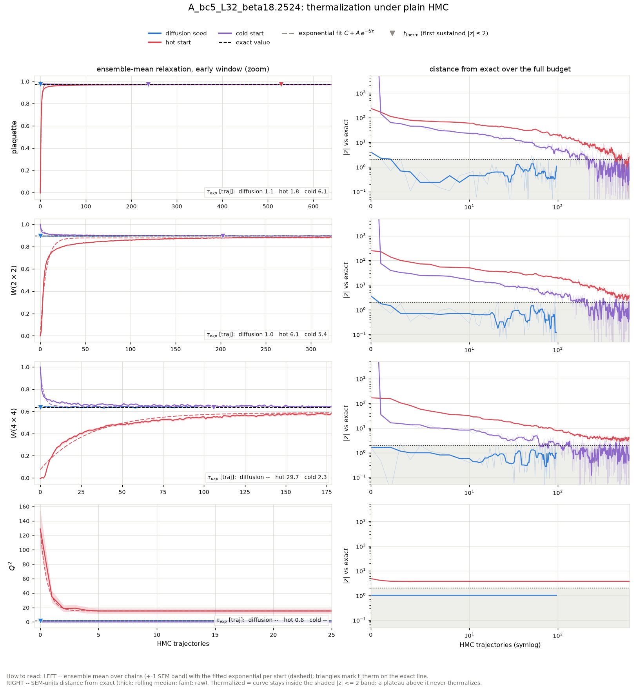

tau_int (hot-start chains, second half): plaquette = 6.57 +- 0.89, wilson_2x2 = 7.28 +- 1.13, wilson_4x4 = 3.24 +- 0.49, wilson_6x6 = 1.26 +- 0.17. Topology: hot-start HMC L=32 beta=18.2524 -> **frozen** (no tunneling).

Where 'never' stood at the end: the hot start ended the 640-trajectory budget still at wilson_2x2 at |z| ~ 3, wilson_4x4 at |z| ~ 4, wilson_6x6 at |z| ~ 4, Q^2 at |z| ~ 4; the cold start ended the 640-trajectory budget still at Q^2 at |z| ~ 1462558916608.

### Diagnostics: raw diffusion output (before any HMC)

| observable | value | error | exact | z_exact | reference | ref_error | z_ref | ks_p | chi2_p |
|---|---|---|---|---|---|---|---|---|---|
| plaquette | 0.9717 | 0.000142 | 0.9722 | -3.512 | 0.9722 | 8.228e-05 | -2.97 | 0.01207 |  |
| wilson_1x1 | 0.9717 | 0.000142 | 0.9722 | -3.512 | 0.9722 | 8.228e-05 | -2.97 | 0.01207 |  |
| wilson_1x2 | 0.9435 | 0.0003382 | 0.9452 | -4.96 | 0.9453 | 0.0002213 | -4.358 | 3.512e-05 |  |
| wilson_2x2 | 0.891 | 0.0006109 | 0.8934 | -3.842 | 0.8939 | 0.0005249 | -3.495 | 0.01864 |  |
| wilson_2x3 | 0.8418 | 0.001075 | 0.8444 | -2.426 | 0.8455 | 0.0009131 | -2.643 | 0.01864 |  |
| wilson_3x3 | 0.774 | 0.001684 | 0.776 | -1.177 | 0.778 | 0.001335 | -1.871 | 0.2272 |  |
| wilson_3x4 | 0.71 | 0.002439 | 0.713 | -1.23 | 0.717 | 0.001877 | -2.273 | 0.2061 |  |
| wilson_4x4 | 0.6317 | 0.003164 | 0.637 | -1.682 | 0.6418 | 0.002564 | -2.481 | 0.1366 |  |
| wilson_4x5 | 0.5637 | 0.004065 | 0.5691 | -1.331 | 0.5754 | 0.003317 | -2.233 | 0.07777 |  |
| wilson_5x5 | 0.4879 | 0.004823 | 0.4943 | -1.325 | 0.5013 | 0.004237 | -2.092 | 0.1685 |  |
| wilson_5x6 | 0.4216 | 0.005523 | 0.4293 | -1.396 | 0.4371 | 0.00468 | -2.144 | 0.1226 |  |
| wilson_6x6 | 0.3538 | 0.006562 | 0.3625 | -1.323 | 0.3711 | 0.005136 | -2.069 | 0.09806 |  |
| wilson_6x7 | 0.2977 | 0.006988 | 0.3061 | -1.207 | 0.3136 | 0.005529 | -1.79 | 0.3277 |  |
| wilson_7x7 | 0.2424 | 0.007432 | 0.2513 | -1.199 | 0.2594 | 0.005673 | -1.817 | 0.1098 |  |
| wilson_7x8 | 0.1982 | 0.007462 | 0.2063 | -1.09 | 0.2129 | 0.00577 | -1.564 | 0.4545 |  |
| wilson_8x8 | 0.1549 | 0.007871 | 0.1647 | -1.245 | 0.1704 | 0.005802 | -1.591 | 0.3277 |  |
| wilson_8x10 | 0.09608 | 0.006914 | 0.1049 | -1.274 | 0.1085 | 0.005316 | -1.419 | 0.3277 |  |
| wilson_10x10 | 0.05054 | 0.005611 | 0.0597 | -1.632 | 0.06023 | 0.004789 | -1.313 | 0.3001 |  |
| wilson_10x12 | 0.03065 | 0.004728 | 0.03397 | -0.7031 | 0.03586 | 0.00548 | -0.72 | 0.6028 |  |
| wilson_12x12 | 0.01473 | 0.004929 | 0.01727 | -0.5149 | 0.01923 | 0.005301 | -0.621 | 0.7575 |  |
| creutz_2 | 0.02778 | 0.0004048 | 0.02818 | -1.009 |  |  |  |  |  |
| creutz_3 | 0.02719 | 0.0009134 | 0.02818 | -1.092 |  |  |  |  |  |
| creutz_4 | 0.0307 | 0.001506 | 0.02818 | 1.671 |  |  |  |  |  |
| creutz_5 | 0.03048 | 0.002456 | 0.02818 | 0.9365 |  |  |  |  |  |
| creutz_6 | 0.02919 | 0.003807 | 0.02818 | 0.2645 |  |  |  |  |  |
| creutz_7 | 0.03264 | 0.00625 | 0.02818 | 0.7127 |  |  |  |  |  |
| creutz_8 | 0.04525 | 0.01192 | 0.02818 | 1.432 |  |  |  |  |  |
| Q | 0.1484 | 0.07997 | 0 | 1.856 | 0.02083 | 0.05566 | 1.31 | 0.6418 |  |
| Q^2 | 1.648 | 0.1759 | 1.463 | 1.057 | 1.177 | 0.08074 | 2.435 | 0.3277 |  |
| chi_top ((<Q^2>-<Q>^2)/V) | 0.001588 | 0.0001769 | 0.001428 | 0.9044 | 0.001149 | 0.0001063 | 2.128 |  |  |
| Q histogram vs exact P(Q) | 4.2 | nan | 4 | nan |  |  |  |  | 0.3797 |

### Diagnostics: the same configs after 96 HMC trajectories

| observable | value | error | exact | z_exact | reference | ref_error | z_ref | ks_p | chi2_p |
|---|---|---|---|---|---|---|---|---|---|
| plaquette | 0.9723 | 0.0001521 | 0.9722 | 0.7714 | 0.9722 | 8.228e-05 | 0.7429 | 0.08742 |  |
| wilson_1x1 | 0.9723 | 0.0001521 | 0.9722 | 0.7714 | 0.9722 | 8.228e-05 | 0.7429 | 0.08742 |  |
| wilson_1x2 | 0.9455 | 0.0003923 | 0.9452 | 0.7197 | 0.9453 | 0.0002213 | 0.4402 | 0.8906 |  |
| wilson_2x2 | 0.8935 | 0.0008521 | 0.8934 | 0.08946 | 0.8939 | 0.0005249 | -0.3914 | 0.6808 |  |
| wilson_2x3 | 0.8446 | 0.001426 | 0.8444 | 0.1198 | 0.8455 | 0.0009131 | -0.5603 | 0.6808 |  |
| wilson_3x3 | 0.7752 | 0.002032 | 0.776 | -0.3529 | 0.778 | 0.001335 | -1.134 | 0.1226 |  |
| wilson_3x4 | 0.7117 | 0.002773 | 0.713 | -0.4883 | 0.717 | 0.001877 | -1.597 | 0.06115 |  |
| wilson_4x4 | 0.634 | 0.003448 | 0.637 | -0.8634 | 0.6418 | 0.002564 | -1.806 | 0.2498 |  |
| wilson_4x5 | 0.5661 | 0.004404 | 0.5691 | -0.6777 | 0.5754 | 0.003317 | -1.685 | 0.4204 |  |
| wilson_5x5 | 0.4886 | 0.005197 | 0.4943 | -1.095 | 0.5013 | 0.004237 | -1.899 | 0.2498 |  |
| wilson_5x6 | 0.424 | 0.005604 | 0.4293 | -0.9518 | 0.4371 | 0.00468 | -1.8 | 0.1685 |  |
| wilson_6x6 | 0.3532 | 0.005703 | 0.3625 | -1.636 | 0.3711 | 0.005136 | -2.331 | 0.1366 |  |
| wilson_6x7 | 0.2959 | 0.005858 | 0.3061 | -1.748 | 0.3136 | 0.005529 | -2.204 | 0.1866 |  |
| wilson_7x7 | 0.2395 | 0.005803 | 0.2513 | -2.029 | 0.2594 | 0.005673 | -2.446 | 0.05405 |  |
| wilson_7x8 | 0.1945 | 0.005956 | 0.2063 | -1.989 | 0.2129 | 0.00577 | -2.227 | 0.1098 |  |
| wilson_8x8 | 0.1553 | 0.006031 | 0.1647 | -1.555 | 0.1704 | 0.005802 | -1.808 | 0.3879 |  |
| wilson_8x10 | 0.1005 | 0.006727 | 0.1049 | -0.6492 | 0.1085 | 0.005316 | -0.925 | 0.357 |  |
| wilson_10x10 | 0.05827 | 0.007219 | 0.0597 | -0.1977 | 0.06023 | 0.004789 | -0.226 | 0.8906 |  |
| wilson_10x12 | 0.03527 | 0.006646 | 0.03397 | 0.1956 | 0.03586 | 0.00548 | -0.0681 | 0.8612 |  |
| wilson_12x12 | 0.02318 | 0.006133 | 0.01727 | 0.9637 | 0.01923 | 0.005301 | 0.4877 | 0.4899 |  |
| creutz_2 | 0.02858 | 0.0003944 | 0.02818 | 0.9922 |  |  |  |  |  |
| creutz_3 | 0.02943 | 0.0008233 | 0.02818 | 1.511 |  |  |  |  |  |
| creutz_4 | 0.02999 | 0.001478 | 0.02818 | 1.224 |  |  |  |  |  |
| creutz_5 | 0.03394 | 0.002329 | 0.02818 | 2.471 |  |  |  |  |  |
| creutz_6 | 0.04084 | 0.003603 | 0.02818 | 3.513 |  |  |  |  |  |
| creutz_7 | 0.03421 | 0.00618 | 0.02818 | 0.9747 |  |  |  |  |  |
| creutz_8 | 0.01658 | 0.01146 | 0.02818 | -1.013 |  |  |  |  |  |
| Q | 0.1484 | 0.07997 | 0 | 1.856 | 0.02083 | 0.05566 | 1.31 | 0.6418 |  |
| Q^2 | 1.648 | 0.1759 | 1.463 | 1.057 | 1.177 | 0.08074 | 2.435 | 0.3277 |  |
| chi_top ((<Q^2>-<Q>^2)/V) | 0.001588 | 0.0001769 | 0.001428 | 0.9044 | 0.001149 | 0.0001063 | 2.128 |  |  |
| Q histogram vs exact P(Q) | 4.2 | nan | 4 | nan |  |  |  |  | 0.3797 |

## E_bc5.8_L32_beta21.5051

HMC: step size 0.0863, 12 leapfrog steps, acceptance seed/hot/cold = 0.985/0.983/0.983. Diffusion-seed batch: 128 chains x 96 trajectories (0.09 s/traj for the whole batch); baselines: 32 chains x 640 trajectories.

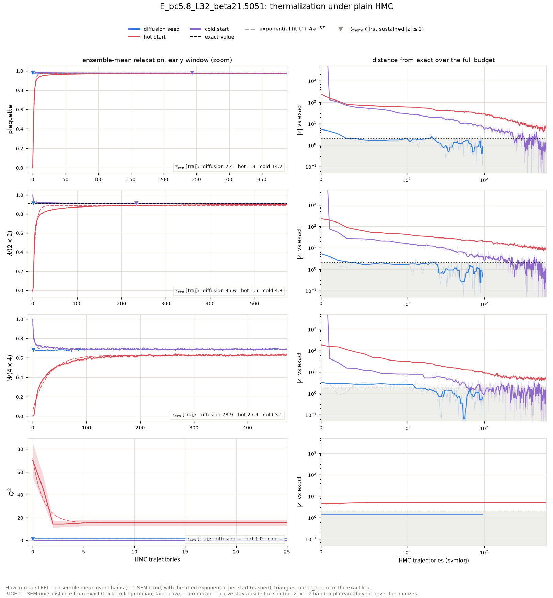

tau_int (hot-start chains, second half): plaquette = 8.31 +- 1.35, wilson_2x2 = 9.91 +- 1.39, wilson_4x4 = 3.67 +- 0.48, wilson_6x6 = 1.26 +- 0.16. Topology: hot-start HMC L=32 beta=21.5051 -> **frozen** (no tunneling).

Where 'never' stood at the end: the hot start ended the 640-trajectory budget still at plaquette at |z| ~ 7, wilson_2x2 at |z| ~ 8, wilson_4x4 at |z| ~ 5, wilson_6x6 at |z| ~ 6, Q^2 at |z| ~ 5; the cold start ended the 640-trajectory budget still at Q^2 at |z| ~ 1235714179072.

### Diagnostics: raw diffusion output (before any HMC)

| observable | value | error | exact | z_exact | reference | ref_error | z_ref | ks_p | chi2_p |
|---|---|---|---|---|---|---|---|---|---|
| plaquette | 0.976 | 0.0001035 | 0.9765 | -4.8 | 0.9765 | 6.144e-05 | -4.445 | 7.303e-06 |  |
| wilson_1x1 | 0.976 | 0.0001035 | 0.9765 | -4.8 | 0.9765 | 6.144e-05 | -4.445 | 7.303e-06 |  |
| wilson_1x2 | 0.9517 | 0.0002254 | 0.9535 | -7.783 | 0.9535 | 0.0001507 | -6.396 | 1.748e-06 |  |
| wilson_2x2 | 0.906 | 0.0005502 | 0.9091 | -5.63 | 0.9098 | 0.000409 | -5.449 | 2.99e-07 |  |
| wilson_2x3 | 0.8623 | 0.0008159 | 0.8668 | -5.52 | 0.8682 | 0.0007565 | -5.259 | 2.84e-06 |  |
| wilson_3x3 | 0.8016 | 0.001238 | 0.8071 | -4.454 | 0.8097 | 0.001198 | -4.75 | 1.367e-06 |  |
| wilson_3x4 | 0.7429 | 0.001774 | 0.7514 | -4.788 | 0.7549 | 0.00171 | -4.857 | 1.367e-06 |  |
| wilson_4x4 | 0.673 | 0.002318 | 0.6831 | -4.373 | 0.6886 | 0.002264 | -4.81 | 0.0002758 |  |
| wilson_4x5 | 0.6074 | 0.003063 | 0.6211 | -4.46 | 0.628 | 0.002892 | -4.894 | 0.0004908 |  |
| wilson_5x5 | 0.5382 | 0.003666 | 0.5513 | -3.593 | 0.5583 | 0.003661 | -3.883 | 0.006558 |  |
| wilson_5x6 | 0.4725 | 0.004626 | 0.4895 | -3.665 | 0.4966 | 0.004184 | -3.868 | 0.002464 |  |
| wilson_6x6 | 0.4092 | 0.005124 | 0.4243 | -2.948 | 0.4301 | 0.004971 | -2.931 | 0.04195 |  |
| wilson_6x7 | 0.3508 | 0.005823 | 0.3678 | -2.915 | 0.3734 | 0.005102 | -2.917 | 0.1366 |  |
| wilson_7x7 | 0.2966 | 0.00611 | 0.3113 | -2.412 | 0.3145 | 0.005448 | -2.195 | 0.1226 |  |
| wilson_7x8 | 0.2477 | 0.006812 | 0.2635 | -2.316 | 0.2662 | 0.005193 | -2.15 | 0.2272 |  |
| wilson_8x8 | 0.2021 | 0.006924 | 0.2178 | -2.264 | 0.2199 | 0.005321 | -2.034 | 0.2498 |  |
| wilson_8x10 | 0.1326 | 0.007428 | 0.1488 | -2.177 | 0.1505 | 0.004783 | -2.028 | 0.1866 |  |
| wilson_10x10 | 0.07308 | 0.007188 | 0.09241 | -2.688 | 0.09465 | 0.005084 | -2.449 | 0.07777 |  |
| wilson_10x12 | 0.03675 | 0.006863 | 0.05739 | -3.007 | 0.06252 | 0.005199 | -2.993 | 0.01207 |  |
| wilson_12x12 | 0.01862 | 0.005883 | 0.03241 | -2.343 | 0.03662 | 0.00532 | -2.27 | 0.1366 |  |
| creutz_2 | 0.02405 | 0.0003793 | 0.02382 | 0.6283 |  |  |  |  |  |
| creutz_3 | 0.02366 | 0.0007287 | 0.02382 | -0.2082 |  |  |  |  |  |
| creutz_4 | 0.02289 | 0.00111 | 0.02382 | -0.8327 |  |  |  |  |  |
| creutz_5 | 0.01846 | 0.001768 | 0.02382 | -3.031 |  |  |  |  |  |
| creutz_6 | 0.01373 | 0.00311 | 0.02382 | -3.242 |  |  |  |  |  |
| creutz_7 | 0.01404 | 0.004627 | 0.02382 | -2.113 |  |  |  |  |  |
| creutz_8 | 0.02353 | 0.007356 | 0.02382 | -0.03881 |  |  |  |  |  |
| Q | -0.08594 | 0.1011 | 0 | -0.8497 | 0.04688 | 0.06255 | -1.117 | 0.9167 |  |
| Q^2 | 1.477 | 0.1429 | 1.236 | 1.685 | 1.13 | 0.09806 | 1.998 | 0.7941 |  |
| chi_top ((<Q^2>-<Q>^2)/V) | 0.001435 | 0.0001674 | 0.001207 | 1.362 | 0.001102 | 0.0001105 | 1.661 |  |  |
| Q histogram vs exact P(Q) | 5.391 | nan | 4 | nan |  |  |  |  | 0.2495 |

### Diagnostics: the same configs after 96 HMC trajectories

| observable | value | error | exact | z_exact | reference | ref_error | z_ref | ks_p | chi2_p |
|---|---|---|---|---|---|---|---|---|---|
| plaquette | 0.9764 | 9.815e-05 | 0.9765 | -0.8559 | 0.9765 | 6.144e-05 | -1.056 | 0.2498 |  |
| wilson_1x1 | 0.9764 | 9.815e-05 | 0.9765 | -0.8559 | 0.9765 | 6.144e-05 | -1.056 | 0.2498 |  |
| wilson_1x2 | 0.9532 | 0.0002357 | 0.9535 | -1.043 | 0.9535 | 0.0001507 | -0.8056 | 0.4204 |  |
| wilson_2x2 | 0.9089 | 0.0005785 | 0.9091 | -0.4057 | 0.9098 | 0.000409 | -1.232 | 0.01039 |  |
| wilson_2x3 | 0.8665 | 0.001032 | 0.8668 | -0.3472 | 0.8682 | 0.0007565 | -1.333 | 0.04767 |  |
| wilson_3x3 | 0.806 | 0.001682 | 0.8071 | -0.6106 | 0.8097 | 0.001198 | -1.789 | 0.01207 |  |
| wilson_3x4 | 0.75 | 0.002227 | 0.7514 | -0.6519 | 0.7549 | 0.00171 | -1.754 | 0.01864 |  |
| wilson_4x4 | 0.6811 | 0.002932 | 0.6831 | -0.6891 | 0.6886 | 0.002264 | -2.016 | 0.03229 |  |
| wilson_4x5 | 0.6178 | 0.003744 | 0.6211 | -0.8747 | 0.628 | 0.002892 | -2.162 | 0.006558 |  |
| wilson_5x5 | 0.5476 | 0.004605 | 0.5513 | -0.8067 | 0.5583 | 0.003661 | -1.813 | 0.06115 |  |
| wilson_5x6 | 0.4844 | 0.005483 | 0.4895 | -0.9206 | 0.4966 | 0.004184 | -1.772 | 0.02823 |  |
| wilson_6x6 | 0.419 | 0.006332 | 0.4243 | -0.8389 | 0.4301 | 0.004971 | -1.383 | 0.03684 |  |
| wilson_6x7 | 0.363 | 0.006989 | 0.3678 | -0.6881 | 0.3734 | 0.005102 | -1.203 | 0.2272 |  |
| wilson_7x7 | 0.306 | 0.007812 | 0.3113 | -0.6857 | 0.3145 | 0.005448 | -0.902 | 0.6808 |  |
| wilson_7x8 | 0.2594 | 0.008304 | 0.2635 | -0.4924 | 0.2662 | 0.005193 | -0.6873 | 0.8612 |  |
| wilson_8x8 | 0.2154 | 0.009491 | 0.2178 | -0.2504 | 0.2199 | 0.005321 | -0.4105 | 0.8612 |  |
| wilson_8x10 | 0.1519 | 0.01024 | 0.1488 | 0.3063 | 0.1505 | 0.004783 | 0.123 | 0.8906 |  |
| wilson_10x10 | 0.09901 | 0.009752 | 0.09241 | 0.6767 | 0.09465 | 0.005084 | 0.3963 | 0.8612 |  |
| wilson_10x12 | 0.06267 | 0.00964 | 0.05739 | 0.5477 | 0.06252 | 0.005199 | 0.01374 | 0.8906 |  |
| wilson_12x12 | 0.03302 | 0.008618 | 0.03241 | 0.07132 | 0.03662 | 0.00532 | -0.356 | 0.3879 |  |
| creutz_2 | 0.02364 | 0.0003594 | 0.02382 | -0.4775 |  |  |  |  |  |
| creutz_3 | 0.02452 | 0.0007014 | 0.02382 | 1.005 |  |  |  |  |  |
| creutz_4 | 0.02418 | 0.001165 | 0.02382 | 0.3157 |  |  |  |  |  |
| creutz_5 | 0.02297 | 0.002057 | 0.02382 | -0.4132 |  |  |  |  |  |
| creutz_6 | 0.02244 | 0.003279 | 0.02382 | -0.4179 |  |  |  |  |  |
| creutz_7 | 0.02745 | 0.004691 | 0.02382 | 0.7747 |  |  |  |  |  |
| creutz_8 | 0.02087 | 0.007331 | 0.02382 | -0.4018 |  |  |  |  |  |
| Q | -0.08594 | 0.1011 | 0 | -0.8497 | 0.04688 | 0.06255 | -1.117 | 0.9167 |  |
| Q^2 | 1.477 | 0.1429 | 1.236 | 1.685 | 1.13 | 0.09806 | 1.998 | 0.7941 |  |
| chi_top ((<Q^2>-<Q>^2)/V) | 0.001435 | 0.0001674 | 0.001207 | 1.362 | 0.001102 | 0.0001105 | 1.661 |  |  |
| Q histogram vs exact P(Q) | 5.391 | nan | 4 | nan |  |  |  |  | 0.2495 |

## A_bc6_L32_beta22.3151

HMC: step size 0.0847, 12 leapfrog steps, acceptance seed/hot/cold = 0.984/0.981/0.984. Diffusion-seed batch: 128 chains x 96 trajectories (0.09 s/traj for the whole batch); baselines: 32 chains x 640 trajectories.

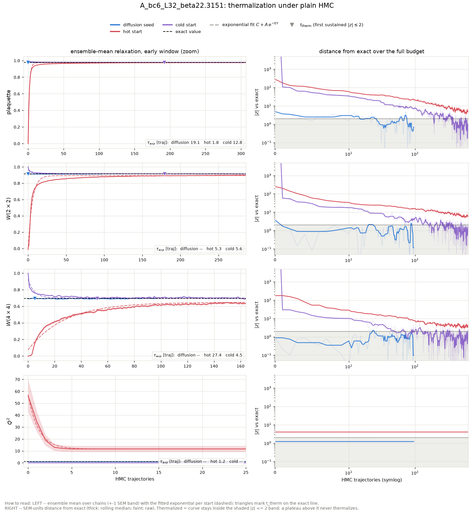

tau_int (hot-start chains, second half): plaquette = 8.43 +- 1.59, wilson_2x2 = 8.83 +- 1.53, wilson_4x4 = 4.68 +- 0.68, wilson_6x6 = 1.69 +- 0.23. Topology: hot-start HMC L=32 beta=22.3151 -> **frozen** (no tunneling).

Where 'never' stood at the end: the hot start ended the 640-trajectory budget still at plaquette at |z| ~ 5, wilson_2x2 at |z| ~ 6, wilson_4x4 at |z| ~ 4, wilson_6x6 at |z| ~ 4, Q^2 at |z| ~ 4; the cold start ended the 640-trajectory budget still at Q^2 at |z| ~ 1189769248768.

### Diagnostics: raw diffusion output (before any HMC)

| observable | value | error | exact | z_exact | reference | ref_error | z_ref | ks_p | chi2_p |
|---|---|---|---|---|---|---|---|---|---|
| plaquette | 0.9769 | 8.101e-05 | 0.9773 | -5.066 | 0.9774 | 6.33e-05 | -4.286 | 0.01207 |  |
| wilson_1x1 | 0.9769 | 8.101e-05 | 0.9773 | -5.066 | 0.9774 | 6.33e-05 | -4.286 | 0.01207 |  |
| wilson_1x2 | 0.9539 | 0.000247 | 0.9552 | -5.214 | 0.9552 | 0.0001498 | -4.574 | 0.0002266 |  |
| wilson_2x2 | 0.9107 | 0.0005761 | 0.9124 | -2.956 | 0.9124 | 0.0004201 | -2.5 | 0.004773 |  |
| wilson_2x3 | 0.8698 | 0.0009656 | 0.8715 | -1.694 | 0.8715 | 0.0006995 | -1.361 | 0.04767 |  |
| wilson_3x3 | 0.8127 | 0.001487 | 0.8135 | -0.5796 | 0.8142 | 0.001242 | -0.8052 | 0.357 |  |
| wilson_3x4 | 0.7587 | 0.002204 | 0.7594 | -0.3613 | 0.7604 | 0.00172 | -0.6167 | 0.9719 |  |
| wilson_4x4 | 0.6905 | 0.003059 | 0.6929 | -0.7792 | 0.6949 | 0.002294 | -1.139 | 0.6808 |  |
| wilson_4x5 | 0.6292 | 0.004049 | 0.6322 | -0.7225 | 0.6342 | 0.002964 | -0.9842 | 0.8906 |  |
| wilson_5x5 | 0.5598 | 0.004927 | 0.5637 | -0.7815 | 0.5664 | 0.003275 | -1.117 | 0.6808 |  |
| wilson_5x6 | 0.4983 | 0.005752 | 0.5026 | -0.744 | 0.504 | 0.00374 | -0.8171 | 0.8288 |  |
| wilson_6x6 | 0.4319 | 0.006341 | 0.438 | -0.9651 | 0.4393 | 0.00402 | -0.9826 | 0.7941 |  |
| wilson_6x7 | 0.3754 | 0.007258 | 0.3817 | -0.877 | 0.3817 | 0.004521 | -0.7431 | 0.8288 |  |
| wilson_7x7 | 0.3184 | 0.00771 | 0.3251 | -0.8762 | 0.3269 | 0.004628 | -0.9496 | 0.6418 |  |
| wilson_7x8 | 0.2695 | 0.008922 | 0.2769 | -0.8252 | 0.2763 | 0.004536 | -0.6711 | 0.4545 |  |
| wilson_8x8 | 0.2234 | 0.009337 | 0.2305 | -0.7591 | 0.2332 | 0.004437 | -0.9517 | 0.5643 |  |
| wilson_8x10 | 0.149 | 0.01063 | 0.1597 | -1.008 | 0.1599 | 0.004332 | -0.95 | 0.1366 |  |
| wilson_10x10 | 0.09183 | 0.01053 | 0.101 | -0.8663 | 0.1041 | 0.004614 | -1.065 | 0.3879 |  |
| wilson_10x12 | 0.05555 | 0.01041 | 0.06382 | -0.7945 | 0.06536 | 0.005378 | -0.8374 | 0.3001 |  |
| wilson_12x12 | 0.02792 | 0.00973 | 0.03681 | -0.9141 | 0.03646 | 0.004938 | -0.783 | 0.4545 |  |
| creutz_2 | 0.02252 | 0.0002907 | 0.02293 | -1.409 |  |  |  |  |  |
| creutz_3 | 0.0221 | 0.0006782 | 0.02293 | -1.221 |  |  |  |  |  |
| creutz_4 | 0.02534 | 0.001121 | 0.02293 | 2.149 |  |  |  |  |  |
| creutz_5 | 0.02395 | 0.001915 | 0.02293 | 0.5342 |  |  |  |  |  |
| creutz_6 | 0.02675 | 0.002379 | 0.02293 | 1.606 |  |  |  |  |  |
| creutz_7 | 0.02437 | 0.004018 | 0.02293 | 0.3583 |  |  |  |  |  |
| creutz_8 | 0.02127 | 0.006364 | 0.02293 | -0.2612 |  |  |  |  |  |
| Q | -0.1953 | 0.08439 | 0 | -2.314 | -0.05729 | 0.05744 | -1.352 | 0.995 |  |
| Q^2 | 1.023 | 0.1406 | 1.19 | -1.183 | 0.9635 | 0.06629 | 0.3854 | 1 |  |
| chi_top ((<Q^2>-<Q>^2)/V) | 0.0009622 | 0.0001279 | 0.001162 | -1.561 | 0.0009378 | 8.592e-05 | 0.1587 |  |  |
| Q histogram vs exact P(Q) | 7.134 | nan | 4 | nan |  |  |  |  | 0.129 |

### Diagnostics: the same configs after 96 HMC trajectories

| observable | value | error | exact | z_exact | reference | ref_error | z_ref | ks_p | chi2_p |
|---|---|---|---|---|---|---|---|---|---|
| plaquette | 0.9773 | 0.0001051 | 0.9773 | -0.6689 | 0.9774 | 6.33e-05 | -0.8192 | 0.7575 |  |
| wilson_1x1 | 0.9773 | 0.0001051 | 0.9773 | -0.6689 | 0.9774 | 6.33e-05 | -0.8192 | 0.7575 |  |
| wilson_1x2 | 0.9549 | 0.0002457 | 0.9552 | -1.054 | 0.9552 | 0.0001498 | -1.015 | 0.8906 |  |
| wilson_2x2 | 0.9123 | 0.0005427 | 0.9124 | -0.1155 | 0.9124 | 0.0004201 | -0.2073 | 0.7941 |  |
| wilson_2x3 | 0.8709 | 0.0009128 | 0.8715 | -0.6339 | 0.8715 | 0.0006995 | -0.4924 | 0.9167 |  |
| wilson_3x3 | 0.8132 | 0.001584 | 0.8135 | -0.1786 | 0.8142 | 0.001242 | -0.4874 | 0.7941 |  |
| wilson_3x4 | 0.7598 | 0.002191 | 0.7594 | 0.1642 | 0.7604 | 0.00172 | -0.204 | 0.7941 |  |
| wilson_4x4 | 0.6932 | 0.003413 | 0.6929 | 0.0857 | 0.6949 | 0.002294 | -0.4085 | 0.6028 |  |
| wilson_4x5 | 0.6328 | 0.004384 | 0.6322 | 0.1515 | 0.6342 | 0.002964 | -0.255 | 0.5643 |  |
| wilson_5x5 | 0.565 | 0.005728 | 0.5637 | 0.2368 | 0.5664 | 0.003275 | -0.2122 | 0.2741 |  |
| wilson_5x6 | 0.505 | 0.00674 | 0.5026 | 0.3597 | 0.504 | 0.00374 | 0.1423 | 0.6418 |  |
| wilson_6x6 | 0.4409 | 0.00778 | 0.438 | 0.3753 | 0.4393 | 0.00402 | 0.1898 | 0.4204 |  |
| wilson_6x7 | 0.3848 | 0.008751 | 0.3817 | 0.3558 | 0.3817 | 0.004521 | 0.3172 | 0.6028 |  |
| wilson_7x7 | 0.3282 | 0.009454 | 0.3251 | 0.3288 | 0.3269 | 0.004628 | 0.1258 | 0.5266 |  |
| wilson_7x8 | 0.281 | 0.009965 | 0.2769 | 0.4091 | 0.2763 | 0.004536 | 0.4313 | 0.4204 |  |
| wilson_8x8 | 0.2335 | 0.01027 | 0.2305 | 0.2891 | 0.2332 | 0.004437 | 0.01954 | 0.4545 |  |
| wilson_8x10 | 0.1644 | 0.009715 | 0.1597 | 0.4832 | 0.1599 | 0.004332 | 0.4239 | 0.2272 |  |
| wilson_10x10 | 0.1051 | 0.008097 | 0.101 | 0.5116 | 0.1041 | 0.004614 | 0.1095 | 0.3277 |  |
| wilson_10x12 | 0.07326 | 0.007513 | 0.06382 | 1.257 | 0.06536 | 0.005378 | 0.855 | 0.3277 |  |
| wilson_12x12 | 0.04682 | 0.00701 | 0.03681 | 1.428 | 0.03646 | 0.004938 | 1.208 | 0.6028 |  |
| creutz_2 | 0.02253 | 0.000346 | 0.02293 | -1.161 |  |  |  |  |  |
| creutz_3 | 0.02202 | 0.0006898 | 0.02293 | -1.322 |  |  |  |  |  |
| creutz_4 | 0.0238 | 0.001105 | 0.02293 | 0.7896 |  |  |  |  |  |
| creutz_5 | 0.0222 | 0.001962 | 0.02293 | -0.3698 |  |  |  |  |  |
| creutz_6 | 0.02351 | 0.002893 | 0.02293 | 0.1994 |  |  |  |  |  |
| creutz_7 | 0.02302 | 0.004441 | 0.02293 | 0.02012 |  |  |  |  |  |
| creutz_8 | 0.02985 | 0.006501 | 0.02293 | 1.064 |  |  |  |  |  |
| Q | -0.1953 | 0.08439 | 0 | -2.314 | -0.05729 | 0.05744 | -1.352 | 0.995 |  |
| Q^2 | 1.023 | 0.1406 | 1.19 | -1.183 | 0.9635 | 0.06629 | 0.3854 | 1 |  |
| chi_top ((<Q^2>-<Q>^2)/V) | 0.0009622 | 0.0001279 | 0.001162 | -1.561 | 0.0009378 | 8.592e-05 | 0.1587 |  |  |
| Q histogram vs exact P(Q) | 7.134 | nan | 4 | nan |  |  |  |  | 0.129 |

## A_bc8_L32_beta30.3772

HMC: step size 0.0726, 14 leapfrog steps, acceptance seed/hot/cold = 0.983/0.982/0.983. Diffusion-seed batch: 128 chains x 96 trajectories (0.11 s/traj for the whole batch); baselines: 32 chains x 640 trajectories.

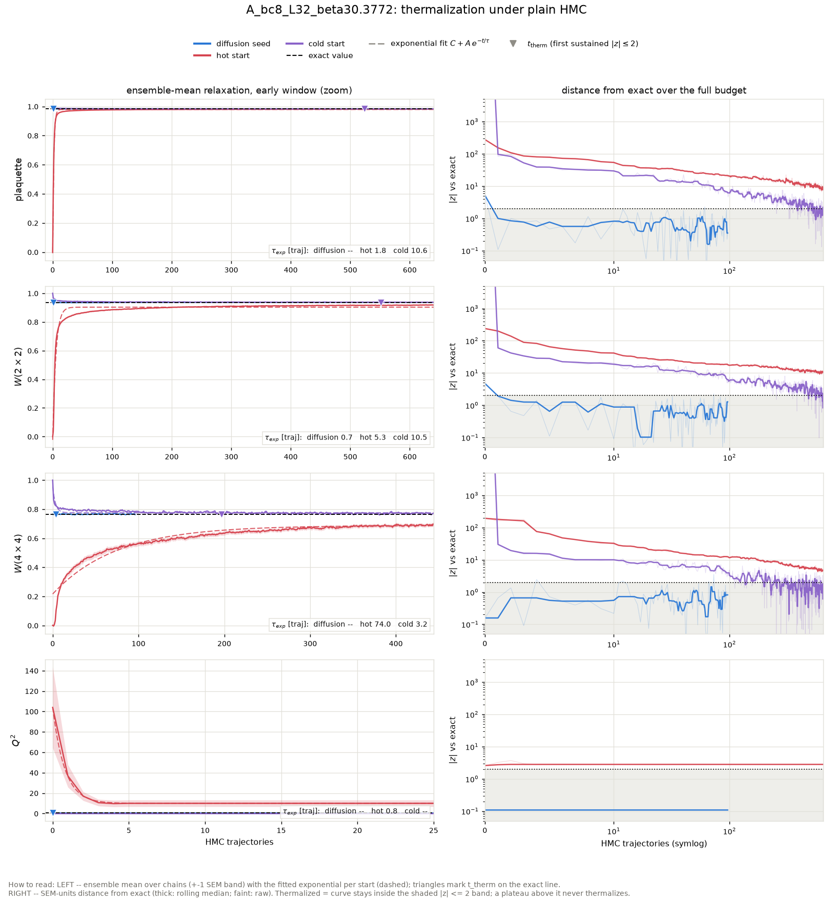

tau_int (hot-start chains, second half): plaquette = 10.70 +- 1.31, wilson_2x2 = 13.99 +- 1.86, wilson_4x4 = 11.36 +- 1.91, wilson_6x6 = 6.42 +- 1.25. Topology: hot-start HMC L=32 beta=30.3772 -> **frozen** (no tunneling).

Where 'never' stood at the end: the hot start ended the 640-trajectory budget still at plaquette at |z| ~ 9, wilson_2x2 at |z| ~ 11, wilson_4x4 at |z| ~ 5, wilson_6x6 at |z| ~ 3, Q^2 at |z| ~ 3; the cold start ended the 640-trajectory budget still at Q^2 at |z| ~ 868455153664.

### Diagnostics: raw diffusion output (before any HMC)

| observable | value | error | exact | z_exact | reference | ref_error | z_ref | ks_p | chi2_p |
|---|---|---|---|---|---|---|---|---|---|
| plaquette | 0.983 | 6.959e-05 | 0.9834 | -5.037 | 0.9834 | 3.883e-05 | -4.294 | 0.0007131 |  |
| wilson_1x1 | 0.983 | 6.959e-05 | 0.9834 | -5.037 | 0.9834 | 3.883e-05 | -4.294 | 0.0007131 |  |
| wilson_1x2 | 0.9658 | 0.0001874 | 0.9671 | -6.632 | 0.967 | 9.097e-05 | -5.715 | 1.359e-07 |  |
| wilson_2x2 | 0.9334 | 0.0004097 | 0.9352 | -4.44 | 0.9351 | 0.000272 | -3.394 | 0.01039 |  |
| wilson_2x3 | 0.9024 | 0.0007549 | 0.9044 | -2.759 | 0.904 | 0.0004466 | -1.888 | 0.1685 |  |
| wilson_3x3 | 0.8589 | 0.001178 | 0.8601 | -1.058 | 0.8592 | 0.0007806 | -0.2144 | 0.5643 |  |
| wilson_3x4 | 0.8169 | 0.00172 | 0.818 | -0.6604 | 0.816 | 0.001132 | 0.4421 | 0.6808 |  |
| wilson_4x4 | 0.7647 | 0.002519 | 0.765 | -0.1349 | 0.7627 | 0.001628 | 0.6596 | 0.5643 |  |
| wilson_4x5 | 0.7155 | 0.003653 | 0.7155 | -0.0008778 | 0.7133 | 0.002136 | 0.5165 | 0.3277 |  |
| wilson_5x5 | 0.6601 | 0.004488 | 0.658 | 0.4483 | 0.6555 | 0.002726 | 0.8613 | 0.3879 |  |
| wilson_5x6 | 0.6069 | 0.005892 | 0.6052 | 0.2894 | 0.6044 | 0.003362 | 0.3721 | 0.6028 |  |
| wilson_6x6 | 0.5491 | 0.007116 | 0.5474 | 0.245 | 0.5461 | 0.003879 | 0.3774 | 0.357 |  |
| wilson_6x7 | 0.4982 | 0.008627 | 0.4951 | 0.3594 | 0.497 | 0.004531 | 0.1182 | 0.2272 |  |
| wilson_7x7 | 0.4447 | 0.009642 | 0.4403 | 0.449 | 0.4433 | 0.005214 | 0.1245 | 0.4204 |  |
| wilson_7x8 | 0.3973 | 0.01112 | 0.3916 | 0.506 | 0.3978 | 0.005856 | -0.03807 | 0.5643 |  |
| wilson_8x8 | 0.3472 | 0.0117 | 0.3426 | 0.3945 | 0.3499 | 0.006306 | -0.208 | 0.3879 |  |
| wilson_8x10 | 0.2656 | 0.01337 | 0.2621 | 0.2653 | 0.2707 | 0.007222 | -0.333 | 0.3277 |  |
| wilson_10x10 | 0.1908 | 0.01362 | 0.1875 | 0.2393 | 0.195 | 0.007434 | -0.2713 | 0.357 |  |
| wilson_10x12 | 0.1382 | 0.01308 | 0.1342 | 0.3075 | 0.1412 | 0.006719 | -0.2029 | 0.4899 |  |
| wilson_12x12 | 0.09638 | 0.01176 | 0.08978 | 0.5617 | 0.09701 | 0.007322 | -0.04544 | 0.4204 |  |
| creutz_2 | 0.01647 | 0.000256 | 0.01674 | -1.045 |  |  |  |  |  |
| creutz_3 | 0.01553 | 0.0004924 | 0.01674 | -2.462 |  |  |  |  |  |
| creutz_4 | 0.01586 | 0.0008622 | 0.01674 | -1.025 |  |  |  |  |  |
| creutz_5 | 0.01412 | 0.001365 | 0.01674 | -1.918 |  |  |  |  |  |
| creutz_6 | 0.01613 | 0.002011 | 0.01674 | -0.3008 |  |  |  |  |  |
| creutz_7 | 0.01626 | 0.002926 | 0.01674 | -0.1634 |  |  |  |  |  |
| creutz_8 | 0.0221 | 0.004024 | 0.01674 | 1.333 |  |  |  |  |  |
| Q | 0.07031 | 0.06735 | 0 | 1.044 | 0.04688 | 0.06316 | 0.2538 | 1 |  |
| Q^2 | 0.8828 | 0.1377 | 0.8685 | 0.1042 | 0.7969 | 0.09223 | 0.5184 | 1 |  |
| chi_top ((<Q^2>-<Q>^2)/V) | 0.0008573 | 0.000125 | 0.0008481 | 0.07356 | 0.0007761 | 8.753e-05 | 0.5324 |  |  |
| Q histogram vs exact P(Q) | 1.618 | nan | 4 | nan |  |  |  |  | 0.8055 |

### Diagnostics: the same configs after 96 HMC trajectories

| observable | value | error | exact | z_exact | reference | ref_error | z_ref | ks_p | chi2_p |
|---|---|---|---|---|---|---|---|---|---|
| plaquette | 0.9834 | 6.169e-05 | 0.9834 | 0.3867 | 0.9834 | 3.883e-05 | 0.442 | 0.9167 |  |
| wilson_1x1 | 0.9834 | 6.169e-05 | 0.9834 | 0.3867 | 0.9834 | 3.883e-05 | 0.442 | 0.9167 |  |
| wilson_1x2 | 0.967 | 0.0001368 | 0.9671 | -0.2227 | 0.967 | 9.097e-05 | 0.1326 | 0.9574 |  |
| wilson_2x2 | 0.9347 | 0.0003282 | 0.9352 | -1.53 | 0.9351 | 0.000272 | -0.8265 | 0.8288 |  |
| wilson_2x3 | 0.9036 | 0.0005301 | 0.9044 | -1.547 | 0.904 | 0.0004466 | -0.5678 | 0.7941 |  |
| wilson_3x3 | 0.8589 | 0.0009293 | 0.8601 | -1.345 | 0.8592 | 0.0007806 | -0.2522 | 0.8612 |  |
| wilson_3x4 | 0.816 | 0.001319 | 0.818 | -1.546 | 0.816 | 0.001132 | 0.003326 | 0.4899 |  |
| wilson_4x4 | 0.7631 | 0.002017 | 0.765 | -0.9413 | 0.7627 | 0.001628 | 0.1619 | 0.3277 |  |
| wilson_4x5 | 0.7126 | 0.002646 | 0.7155 | -1.08 | 0.7133 | 0.002136 | -0.1969 | 0.4899 |  |
| wilson_5x5 | 0.6544 | 0.003527 | 0.658 | -1.038 | 0.6555 | 0.002726 | -0.258 | 0.5643 |  |
| wilson_5x6 | 0.6001 | 0.004369 | 0.6052 | -1.171 | 0.6044 | 0.003362 | -0.7798 | 0.4545 |  |
| wilson_6x6 | 0.5413 | 0.005375 | 0.5474 | -1.123 | 0.5461 | 0.003879 | -0.712 | 0.4204 |  |
| wilson_6x7 | 0.4874 | 0.006398 | 0.4951 | -1.203 | 0.497 | 0.004531 | -1.23 | 0.2272 |  |
| wilson_7x7 | 0.4325 | 0.007337 | 0.4403 | -1.064 | 0.4433 | 0.005214 | -1.197 | 0.1519 |  |
| wilson_7x8 | 0.3814 | 0.008006 | 0.3916 | -1.281 | 0.3978 | 0.005856 | -1.65 | 0.07777 |  |
| wilson_8x8 | 0.332 | 0.008812 | 0.3426 | -1.2 | 0.3499 | 0.006306 | -1.657 | 0.1226 |  |
| wilson_8x10 | 0.2518 | 0.009661 | 0.2621 | -1.068 | 0.2707 | 0.007222 | -1.569 | 0.1366 |  |
| wilson_10x10 | 0.1772 | 0.01085 | 0.1875 | -0.946 | 0.195 | 0.007434 | -1.348 | 0.1685 |  |
| wilson_10x12 | 0.1274 | 0.01088 | 0.1342 | -0.6184 | 0.1412 | 0.006719 | -1.074 | 0.1866 |  |
| wilson_12x12 | 0.08286 | 0.01077 | 0.08978 | -0.6421 | 0.09701 | 0.007322 | -1.087 | 0.5643 |  |
| creutz_2 | 0.01719 | 0.0002479 | 0.01674 | 1.814 |  |  |  |  |  |
| creutz_3 | 0.01692 | 0.0005209 | 0.01674 | 0.3411 |  |  |  |  |  |
| creutz_4 | 0.01568 | 0.0008949 | 0.01674 | -1.179 |  |  |  |  |  |
| creutz_5 | 0.01679 | 0.001303 | 0.01674 | 0.04265 |  |  |  |  |  |
| creutz_6 | 0.01642 | 0.001988 | 0.01674 | -0.1601 |  |  |  |  |  |
| creutz_7 | 0.01438 | 0.002829 | 0.01674 | -0.8344 |  |  |  |  |  |
| creutz_8 | 0.01291 | 0.004489 | 0.01674 | -0.854 |  |  |  |  |  |
| Q | 0.07031 | 0.06735 | 0 | 1.044 | 0.04688 | 0.06316 | 0.2538 | 1 |  |
| Q^2 | 0.8828 | 0.1377 | 0.8685 | 0.1042 | 0.7969 | 0.09223 | 0.5184 | 1 |  |
| chi_top ((<Q^2>-<Q>^2)/V) | 0.0008573 | 0.000125 | 0.0008481 | 0.07356 | 0.0007761 | 8.753e-05 | 0.5324 |  |  |
| Q histogram vs exact P(Q) | 1.618 | nan | 4 | nan |  |  |  |  | 0.8055 |

## E_bc9_L32_beta34.3944

HMC: step size 0.0682, 15 leapfrog steps, acceptance seed/hot/cold = 0.980/0.980/0.980. Diffusion-seed batch: 128 chains x 96 trajectories (0.11 s/traj for the whole batch); baselines: 32 chains x 640 trajectories.

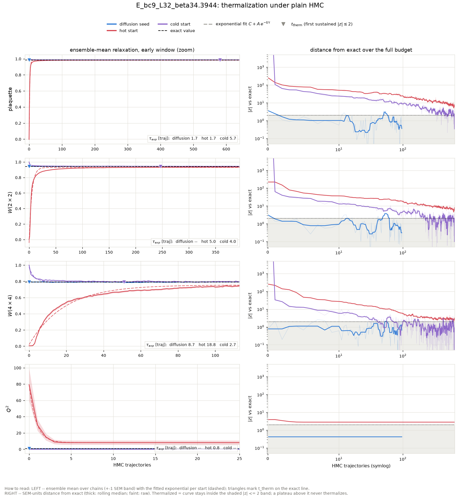

tau_int (hot-start chains, second half): plaquette = 8.76 +- 1.10, wilson_2x2 = 5.56 +- 0.82, wilson_4x4 = 3.01 +- 0.29, wilson_6x6 = 2.08 +- 0.17. Topology: hot-start HMC L=32 beta=34.3944 -> **frozen** (no tunneling).

Where 'never' stood at the end: the hot start ended the 640-trajectory budget still at plaquette at |z| ~ 6, wilson_2x2 at |z| ~ 6, wilson_4x4 at |z| ~ 3, wilson_6x6 at |z| ~ 3, Q^2 at |z| ~ 3; the cold start ended the 640-trajectory budget still at Q^2 at |z| ~ 765454843904.

### Diagnostics: raw diffusion output (before any HMC)

| observable | value | error | exact | z_exact | reference | ref_error | z_ref | ks_p | chi2_p |
|---|---|---|---|---|---|---|---|---|---|
| plaquette | 0.9851 | 8.549e-05 | 0.9854 | -2.818 | 0.9854 | 5.443e-05 | -3.122 | 4.358e-05 |  |
| wilson_1x1 | 0.9851 | 8.549e-05 | 0.9854 | -2.818 | 0.9854 | 5.443e-05 | -3.122 | 4.358e-05 |  |
| wilson_1x2 | 0.97 | 0.0002097 | 0.9709 | -4.359 | 0.971 | 0.0001095 | -4.212 | 1.815e-05 |  |
| wilson_2x2 | 0.9416 | 0.0004099 | 0.9427 | -2.771 | 0.9432 | 0.0002605 | -3.47 | 0.0001241 |  |
| wilson_2x3 | 0.914 | 0.0007429 | 0.9153 | -1.7 | 0.9161 | 0.0003734 | -2.488 | 0.008934 |  |
| wilson_3x3 | 0.8759 | 0.001205 | 0.8756 | 0.2177 | 0.8765 | 0.0006257 | -0.4366 | 0.7941 |  |
| wilson_3x4 | 0.8382 | 0.001588 | 0.8377 | 0.2915 | 0.8391 | 0.0008812 | -0.5039 | 0.6418 |  |
| wilson_4x4 | 0.7912 | 0.001967 | 0.7897 | 0.7531 | 0.7908 | 0.00137 | 0.1841 | 0.8612 |  |
| wilson_4x5 | 0.7475 | 0.002569 | 0.7445 | 1.184 | 0.7462 | 0.001715 | 0.4208 | 0.939 |  |
| wilson_5x5 | 0.6951 | 0.003129 | 0.6915 | 1.158 | 0.6936 | 0.002309 | 0.3962 | 0.5266 |  |
| wilson_5x6 | 0.6469 | 0.00383 | 0.6423 | 1.181 | 0.6455 | 0.002712 | 0.2915 | 0.5266 |  |
| wilson_6x6 | 0.592 | 0.00457 | 0.5879 | 0.8839 | 0.5926 | 0.003324 | -0.1056 | 0.9574 |  |
| wilson_6x7 | 0.5429 | 0.005333 | 0.5381 | 0.9049 | 0.5424 | 0.003827 | 0.08158 | 0.9902 |  |
| wilson_7x7 | 0.4898 | 0.006343 | 0.4853 | 0.7155 | 0.4908 | 0.004433 | -0.1215 | 0.9827 |  |
| wilson_7x8 | 0.441 | 0.007493 | 0.4377 | 0.4375 | 0.4436 | 0.004829 | -0.2984 | 0.939 |  |
| wilson_8x8 | 0.39 | 0.008148 | 0.389 | 0.1337 | 0.396 | 0.005529 | -0.6012 | 0.8612 |  |
| wilson_8x10 | 0.3061 | 0.009186 | 0.3072 | -0.1168 | 0.3146 | 0.005809 | -0.7813 | 0.2061 |  |
| wilson_10x10 | 0.2194 | 0.009885 | 0.2287 | -0.9387 | 0.2352 | 0.006386 | -1.346 | 0.2272 |  |
| wilson_10x12 | 0.1599 | 0.009943 | 0.1702 | -1.037 | 0.1784 | 0.006498 | -1.557 | 0.357 |  |
| wilson_12x12 | 0.106 | 0.01004 | 0.1195 | -1.337 | 0.1261 | 0.006468 | -1.677 | 0.1519 |  |
| creutz_2 | 0.01432 | 0.0002057 | 0.01475 | -2.109 |  |  |  |  |  |
| creutz_3 | 0.0129 | 0.0004347 | 0.01475 | -4.267 |  |  |  |  |  |
| creutz_4 | 0.01369 | 0.0007459 | 0.01475 | -1.432 |  |  |  |  |  |
| creutz_5 | 0.01581 | 0.001165 | 0.01475 | 0.9059 |  |  |  |  |  |
| creutz_6 | 0.01671 | 0.001674 | 0.01475 | 1.171 |  |  |  |  |  |
| creutz_7 | 0.01645 | 0.002564 | 0.01475 | 0.6631 |  |  |  |  |  |
| creutz_8 | 0.01757 | 0.003684 | 0.01475 | 0.7654 |  |  |  |  |  |
| Q | -0.03906 | 0.07838 | 0 | -0.4983 | 0.1042 | 0.0676 | -1.384 | 0.357 |  |
| Q^2 | 0.7266 | 0.07922 | 0.7655 | -0.4909 | 0.7812 | 0.05224 | -0.5763 | 0.7195 |  |
| chi_top ((<Q^2>-<Q>^2)/V) | 0.000708 | 8.96e-05 | 0.0007475 | -0.4405 | 0.0007523 | 6.711e-05 | -0.3957 |  |  |
| Q histogram vs exact P(Q) | 1.399 | nan | 4 | nan |  |  |  |  | 0.8444 |

### Diagnostics: the same configs after 96 HMC trajectories

| observable | value | error | exact | z_exact | reference | ref_error | z_ref | ks_p | chi2_p |
|---|---|---|---|---|---|---|---|---|---|
| plaquette | 0.9854 | 5.926e-05 | 0.9854 | 0.3454 | 0.9854 | 5.443e-05 | -0.6841 | 0.06904 |  |
| wilson_1x1 | 0.9854 | 5.926e-05 | 0.9854 | 0.3454 | 0.9854 | 5.443e-05 | -0.6841 | 0.06904 |  |
| wilson_1x2 | 0.9709 | 0.0001553 | 0.9709 | -0.2745 | 0.971 | 0.0001095 | -0.657 | 0.6028 |  |
| wilson_2x2 | 0.9426 | 0.0003823 | 0.9427 | -0.2698 | 0.9432 | 0.0002605 | -1.41 | 0.1685 |  |
| wilson_2x3 | 0.9152 | 0.0006908 | 0.9153 | -0.138 | 0.9161 | 0.0003734 | -1.148 | 0.2498 |  |
| wilson_3x3 | 0.8759 | 0.001017 | 0.8756 | 0.2032 | 0.8765 | 0.0006257 | -0.543 | 0.2498 |  |
| wilson_3x4 | 0.838 | 0.001463 | 0.8377 | 0.2109 | 0.8391 | 0.0008812 | -0.6263 | 0.7195 |  |
| wilson_4x4 | 0.791 | 0.00172 | 0.7897 | 0.7392 | 0.7908 | 0.00137 | 0.1051 | 0.7575 |  |
| wilson_4x5 | 0.746 | 0.002328 | 0.7445 | 0.6606 | 0.7462 | 0.001715 | -0.07051 | 0.9167 |  |
| wilson_5x5 | 0.695 | 0.002675 | 0.6915 | 1.308 | 0.6936 | 0.002309 | 0.401 | 0.9167 |  |
| wilson_5x6 | 0.6454 | 0.003413 | 0.6423 | 0.8991 | 0.6455 | 0.002712 | -0.01973 | 0.8612 |  |
| wilson_6x6 | 0.5923 | 0.003868 | 0.5879 | 1.121 | 0.5926 | 0.003324 | -0.05862 | 0.9902 |  |
| wilson_6x7 | 0.5415 | 0.004583 | 0.5381 | 0.7403 | 0.5424 | 0.003827 | -0.1504 | 0.8288 |  |
| wilson_7x7 | 0.4886 | 0.00538 | 0.4853 | 0.6172 | 0.4908 | 0.004433 | -0.3097 | 0.939 |  |
| wilson_7x8 | 0.4393 | 0.005887 | 0.4377 | 0.2799 | 0.4436 | 0.004829 | -0.5636 | 0.7575 |  |
| wilson_8x8 | 0.39 | 0.006863 | 0.389 | 0.1493 | 0.396 | 0.005529 | -0.6791 | 0.6418 |  |
| wilson_8x10 | 0.306 | 0.007931 | 0.3072 | -0.1522 | 0.3146 | 0.005809 | -0.8775 | 0.2061 |  |
| wilson_10x10 | 0.2245 | 0.009838 | 0.2287 | -0.4251 | 0.2352 | 0.006386 | -0.916 | 0.6418 |  |
| wilson_10x12 | 0.1639 | 0.009536 | 0.1702 | -0.6676 | 0.1784 | 0.006498 | -1.261 | 0.4204 |  |
| wilson_12x12 | 0.111 | 0.009456 | 0.1195 | -0.8978 | 0.1261 | 0.006468 | -1.317 | 0.2498 |  |
| creutz_2 | 0.01476 | 0.0002206 | 0.01475 | 0.003653 |  |  |  |  |  |
| creutz_3 | 0.01442 | 0.0003909 | 0.01475 | -0.8569 |  |  |  |  |  |
| creutz_4 | 0.01365 | 0.0007254 | 0.01475 | -1.527 |  |  |  |  |  |
| creutz_5 | 0.01223 | 0.001101 | 0.01475 | -2.297 |  |  |  |  |  |
| creutz_6 | 0.01189 | 0.001503 | 0.01475 | -1.907 |  |  |  |  |  |
| creutz_7 | 0.01316 | 0.002274 | 0.01475 | -0.7032 |  |  |  |  |  |
| creutz_8 | 0.01282 | 0.003165 | 0.01475 | -0.6112 |  |  |  |  |  |
| Q | -0.03906 | 0.07838 | 0 | -0.4983 | 0.1042 | 0.0676 | -1.384 | 0.357 |  |
| Q^2 | 0.7266 | 0.07922 | 0.7655 | -0.4909 | 0.7812 | 0.05224 | -0.5763 | 0.7195 |  |
| chi_top ((<Q^2>-<Q>^2)/V) | 0.000708 | 8.96e-05 | 0.0007475 | -0.4405 | 0.0007523 | 6.711e-05 | -0.3957 |  |  |
| Q histogram vs exact P(Q) | 1.399 | nan | 4 | nan |  |  |  |  | 0.8444 |

## E_bc11.8_L32_beta45.6238

HMC: step size 0.0592, 17 leapfrog steps, acceptance seed/hot/cold = 0.983/0.982/0.982. Diffusion-seed batch: 128 chains x 96 trajectories (0.12 s/traj for the whole batch); baselines: 32 chains x 640 trajectories.

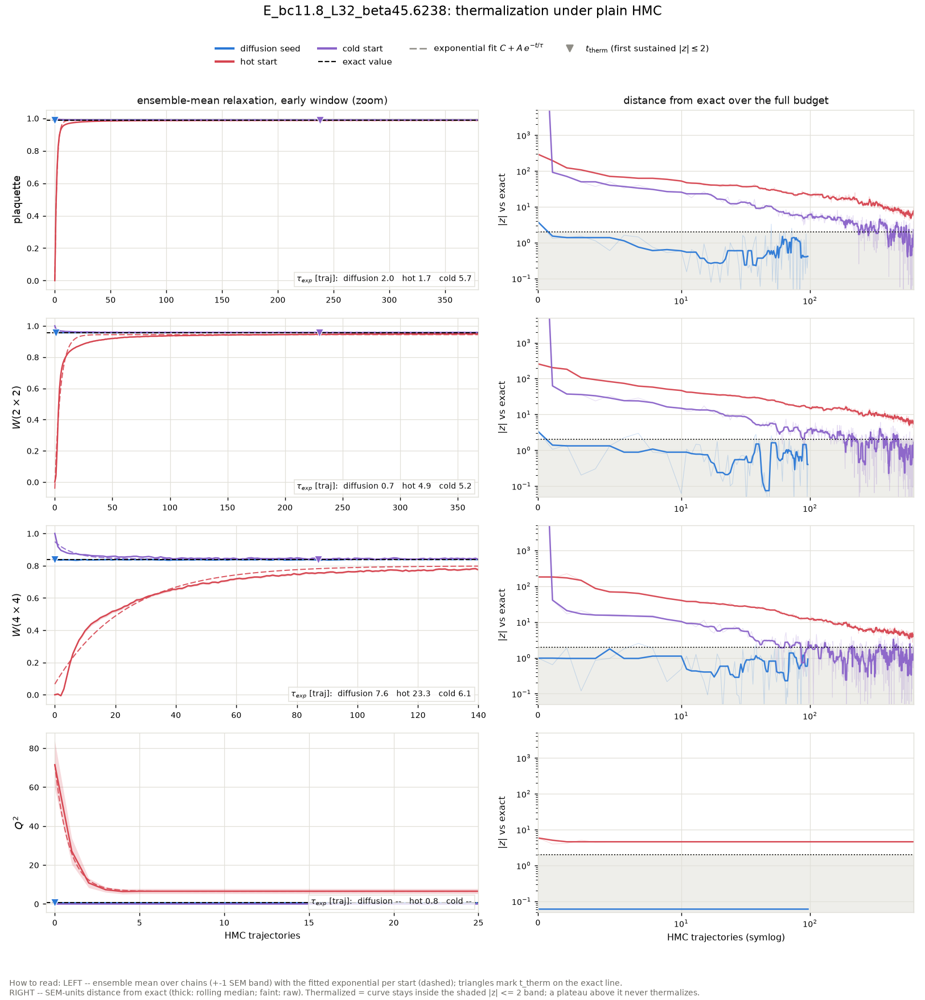

tau_int (hot-start chains, second half): plaquette = 9.46 +- 1.02, wilson_2x2 = 9.47 +- 1.19, wilson_4x4 = 5.25 +- 0.80, wilson_6x6 = 3.63 +- 0.38. Topology: hot-start HMC L=32 beta=45.6238 -> **frozen** (no tunneling).

Where 'never' stood at the end: the hot start ended the 640-trajectory budget still at plaquette at |z| ~ 7, wilson_2x2 at |z| ~ 6, wilson_4x4 at |z| ~ 4, wilson_6x6 at |z| ~ 5, Q^2 at |z| ~ 5; the cold start ended the 640-trajectory budget still at Q^2 at |z| ~ 574600642560.

### Diagnostics: raw diffusion output (before any HMC)

| observable | value | error | exact | z_exact | reference | ref_error | z_ref | ks_p | chi2_p |
|---|---|---|---|---|---|---|---|---|---|
| plaquette | 0.9888 | 4.155e-05 | 0.989 | -4.191 | 0.9889 | 3.383e-05 | -2.325 | 0.1519 |  |
| wilson_1x1 | 0.9888 | 4.155e-05 | 0.989 | -4.191 | 0.9889 | 3.383e-05 | -2.325 | 0.1519 |  |
| wilson_1x2 | 0.9776 | 0.0001103 | 0.9781 | -4.693 | 0.9779 | 8.544e-05 | -2.637 | 0.002464 |  |
| wilson_2x2 | 0.9558 | 0.0002541 | 0.9566 | -3.313 | 0.9561 | 0.000213 | -1.042 | 0.5266 |  |
| wilson_2x3 | 0.9352 | 0.0004806 | 0.9357 | -1.063 | 0.9346 | 0.0003577 | 0.9604 | 0.1226 |  |
| wilson_3x3 | 0.9049 | 0.000856 | 0.9051 | -0.1953 | 0.9035 | 0.0006771 | 1.33 | 0.08742 |  |
| wilson_3x4 | 0.8752 | 0.001293 | 0.8755 | -0.2209 | 0.8731 | 0.0009611 | 1.302 | 0.1098 |  |
| wilson_4x4 | 0.836 | 0.002016 | 0.8375 | -0.7664 | 0.8348 | 0.001363 | 0.4969 | 0.5266 |  |
| wilson_4x5 | 0.7993 | 0.002693 | 0.8012 | -0.6924 | 0.7984 | 0.001759 | 0.2957 | 0.6028 |  |
| wilson_5x5 | 0.7556 | 0.003554 | 0.758 | -0.6832 | 0.7539 | 0.002387 | 0.3892 | 0.5643 |  |
| wilson_5x6 | 0.7138 | 0.004345 | 0.7172 | -0.7738 | 0.7131 | 0.002837 | 0.1407 | 0.6418 |  |
| wilson_6x6 | 0.6668 | 0.00551 | 0.671 | -0.7749 | 0.6652 | 0.003697 | 0.242 | 0.6418 |  |
| wilson_6x7 | 0.624 | 0.006437 | 0.6279 | -0.6066 | 0.6217 | 0.00432 | 0.2907 | 0.5266 |  |
| wilson_7x7 | 0.5756 | 0.00749 | 0.581 | -0.724 | 0.5737 | 0.005176 | 0.2032 | 0.6808 |  |
| wilson_7x8 | 0.5312 | 0.00844 | 0.5376 | -0.7633 | 0.5304 | 0.006083 | 0.07639 | 0.6808 |  |
| wilson_8x8 | 0.4829 | 0.009523 | 0.492 | -0.9602 | 0.4838 | 0.006907 | -0.08041 | 0.8612 |  |
| wilson_8x10 | 0.4007 | 0.01124 | 0.4121 | -1.014 | 0.4058 | 0.008233 | -0.3659 | 0.8288 |  |
| wilson_10x10 | 0.3171 | 0.01285 | 0.3302 | -1.018 | 0.324 | 0.009825 | -0.4262 | 0.5643 |  |
| wilson_10x12 | 0.2491 | 0.01379 | 0.2646 | -1.119 | 0.2613 | 0.01161 | -0.6728 | 0.5643 |  |
| wilson_12x12 | 0.1875 | 0.01349 | 0.2028 | -1.138 | 0.1995 | 0.01278 | -0.648 | 0.2498 |  |
| creutz_2 | 0.01108 | 0.0001571 | 0.01108 | -0.01667 |  |  |  |  |  |
| creutz_3 | 0.01105 | 0.0003138 | 0.01108 | -0.08576 |  |  |  |  |  |
| creutz_4 | 0.01246 | 0.0005316 | 0.01108 | 2.594 |  |  |  |  |  |
| creutz_5 | 0.01148 | 0.0007904 | 0.01108 | 0.4986 |  |  |  |  |  |
| creutz_6 | 0.01127 | 0.001162 | 0.01108 | 0.1652 |  |  |  |  |  |
| creutz_7 | 0.01436 | 0.001732 | 0.01108 | 1.896 |  |  |  |  |  |
| creutz_8 | 0.01511 | 0.002308 | 0.01108 | 1.745 |  |  |  |  |  |
| Q | 0.03906 | 0.06656 | 0 | 0.5869 | -0.02604 | 0.04778 | 0.7946 | 0.995 |  |
| Q^2 | 0.5703 | 0.09073 | 0.5746 | -0.04726 | 0.5677 | 0.06137 | 0.02378 | 0.9902 |  |
| chi_top ((<Q^2>-<Q>^2)/V) | 0.0005555 | 6.8e-05 | 0.0005611 | -0.08349 | 0.0005537 | 6.373e-05 | 0.0184 |  |  |
| Q histogram vs exact P(Q) | 0.9931 | nan | 4 | nan |  |  |  |  | 0.9108 |

### Diagnostics: the same configs after 96 HMC trajectories

| observable | value | error | exact | z_exact | reference | ref_error | z_ref | ks_p | chi2_p |
|---|---|---|---|---|---|---|---|---|---|
| plaquette | 0.989 | 4.311e-05 | 0.989 | -0.4074 | 0.9889 | 3.383e-05 | 0.5837 | 0.7575 |  |
| wilson_1x1 | 0.989 | 4.311e-05 | 0.989 | -0.4074 | 0.9889 | 3.383e-05 | 0.5837 | 0.7575 |  |
| wilson_1x2 | 0.978 | 0.0001066 | 0.9781 | -0.6298 | 0.9779 | 8.544e-05 | 0.6051 | 0.6418 |  |
| wilson_2x2 | 0.9566 | 0.0001814 | 0.9566 | -0.4843 | 0.9561 | 0.000213 | 1.46 | 0.3879 |  |
| wilson_2x3 | 0.9358 | 0.0003438 | 0.9357 | 0.3421 | 0.9346 | 0.0003577 | 2.426 | 0.003444 |  |
| wilson_3x3 | 0.9057 | 0.0005052 | 0.9051 | 1.174 | 0.9035 | 0.0006771 | 2.618 | 0.03684 |  |
| wilson_3x4 | 0.8764 | 0.0007462 | 0.8755 | 1.246 | 0.8731 | 0.0009611 | 2.723 | 0.01616 |  |
| wilson_4x4 | 0.8389 | 0.001221 | 0.8375 | 1.103 | 0.8348 | 0.001363 | 2.241 | 0.07777 |  |
| wilson_4x5 | 0.8036 | 0.001545 | 0.8012 | 1.532 | 0.7984 | 0.001759 | 2.214 | 0.02823 |  |
| wilson_5x5 | 0.7612 | 0.002142 | 0.758 | 1.491 | 0.7539 | 0.002387 | 2.272 | 0.1519 |  |
| wilson_5x6 | 0.7211 | 0.002563 | 0.7172 | 1.521 | 0.7131 | 0.002837 | 2.09 | 0.1098 |  |
| wilson_6x6 | 0.6758 | 0.003149 | 0.671 | 1.513 | 0.6652 | 0.003697 | 2.191 | 0.06115 |  |
| wilson_6x7 | 0.6322 | 0.003769 | 0.6279 | 1.15 | 0.6217 | 0.00432 | 1.83 | 0.1866 |  |
| wilson_7x7 | 0.5851 | 0.004425 | 0.581 | 0.9169 | 0.5737 | 0.005176 | 1.664 | 0.1519 |  |
| wilson_7x8 | 0.5415 | 0.005227 | 0.5376 | 0.7381 | 0.5304 | 0.006083 | 1.383 | 0.2272 |  |
| wilson_8x8 | 0.4964 | 0.005957 | 0.492 | 0.7282 | 0.4838 | 0.006907 | 1.374 | 0.1519 |  |
| wilson_8x10 | 0.416 | 0.007346 | 0.4121 | 0.5337 | 0.4058 | 0.008233 | 0.9265 | 0.4545 |  |
| wilson_10x10 | 0.3363 | 0.008776 | 0.3302 | 0.6996 | 0.324 | 0.009825 | 0.9355 | 0.6028 |  |
| wilson_10x12 | 0.268 | 0.009946 | 0.2646 | 0.3461 | 0.2613 | 0.01161 | 0.4408 | 0.7575 |  |
| wilson_12x12 | 0.2057 | 0.01022 | 0.2028 | 0.2833 | 0.1995 | 0.01278 | 0.379 | 0.6808 |  |
| creutz_2 | 0.01105 | 0.000132 | 0.01108 | -0.2102 |  |  |  |  |  |
| creutz_3 | 0.01077 | 0.0002951 | 0.01108 | -1.056 |  |  |  |  |  |
| creutz_4 | 0.01094 | 0.0005055 | 0.01108 | -0.273 |  |  |  |  |  |
| creutz_5 | 0.01117 | 0.0007944 | 0.01108 | 0.111 |  |  |  |  |  |
| creutz_6 | 0.01064 | 0.001047 | 0.01108 | -0.4227 |  |  |  |  |  |
| creutz_7 | 0.01081 | 0.001566 | 0.01108 | -0.1729 |  |  |  |  |  |
| creutz_8 | 0.009643 | 0.002351 | 0.01108 | -0.6113 |  |  |  |  |  |
| Q | 0.03906 | 0.06656 | 0 | 0.5869 | -0.02604 | 0.04778 | 0.7946 | 0.995 |  |
| Q^2 | 0.5703 | 0.09073 | 0.5746 | -0.04726 | 0.5677 | 0.06137 | 0.02378 | 0.9902 |  |
| chi_top ((<Q^2>-<Q>^2)/V) | 0.0005555 | 6.8e-05 | 0.0005611 | -0.08349 | 0.0005537 | 6.373e-05 | 0.0184 |  |  |
| Q histogram vs exact P(Q) | 0.9931 | nan | 4 | nan |  |  |  |  | 0.9108 |

## D_bc14.1464_L32_beta55.0237

HMC: step size 0.0539, 19 leapfrog steps, acceptance seed/hot/cold = 0.979/0.980/0.979. Diffusion-seed batch: 128 chains x 96 trajectories (0.13 s/traj for the whole batch); baselines: 32 chains x 640 trajectories.

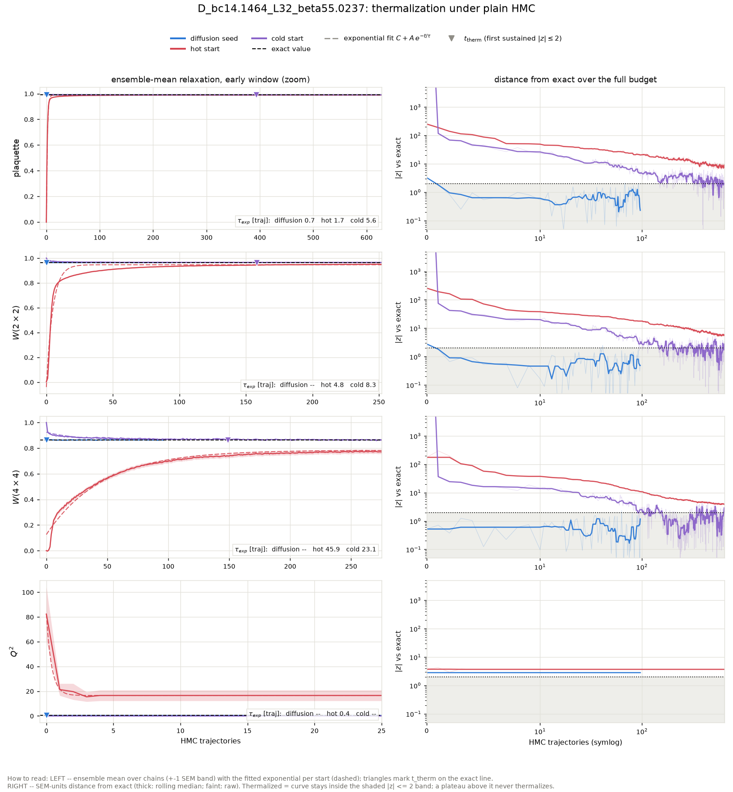

tau_int (hot-start chains, second half): plaquette = 8.93 +- 1.12, wilson_2x2 = 12.33 +- 1.64, wilson_4x4 = 9.15 +- 1.18, wilson_6x6 = 4.58 +- 0.63. Topology: hot-start HMC L=32 beta=55.0237 -> **frozen** (no tunneling).

Where 'never' stood at the end: the hot start ended the 640-trajectory budget still at plaquette at |z| ~ 8, wilson_2x2 at |z| ~ 6, wilson_4x4 at |z| ~ 4, wilson_6x6 at |z| ~ 4, Q^2 at |z| ~ 4; the cold start ended the 640-trajectory budget still at Q^2 at |z| ~ 474280296448.

### Diagnostics: raw diffusion output (before any HMC)

| observable | value | error | exact | z_exact | reference | ref_error | z_ref | ks_p | chi2_p |
|---|---|---|---|---|---|---|---|---|---|
| plaquette | 0.9908 | 3.602e-05 | 0.9909 | -3.166 | 0.9909 | 3.501e-05 | -2.216 | 0.006558 |  |
| wilson_1x1 | 0.9908 | 3.602e-05 | 0.9909 | -3.166 | 0.9909 | 3.501e-05 | -2.216 | 0.006558 |  |
| wilson_1x2 | 0.9814 | 9.275e-05 | 0.9818 | -4.17 | 0.9819 | 7.855e-05 | -3.418 | 0.004059 |  |
| wilson_2x2 | 0.9634 | 0.0002148 | 0.964 | -2.723 | 0.964 | 0.0001788 | -2.252 | 0.1098 |  |
| wilson_2x3 | 0.9458 | 0.000391 | 0.9465 | -1.804 | 0.9466 | 0.0002921 | -1.694 | 0.3001 |  |
| wilson_3x3 | 0.9206 | 0.0006041 | 0.9208 | -0.2546 | 0.9209 | 0.0005488 | -0.3231 | 0.6028 |  |
| wilson_3x4 | 0.8952 | 0.0009646 | 0.8958 | -0.5948 | 0.8963 | 0.0008356 | -0.879 | 0.5643 |  |
| wilson_4x4 | 0.8628 | 0.001317 | 0.8635 | -0.5194 | 0.8652 | 0.001297 | -1.261 | 0.6418 |  |
| wilson_4x5 | 0.8317 | 0.001752 | 0.8324 | -0.4364 | 0.8346 | 0.00169 | -1.22 | 0.5643 |  |
| wilson_5x5 | 0.7944 | 0.00231 | 0.7951 | -0.334 | 0.7986 | 0.002249 | -1.322 | 0.4204 |  |
| wilson_5x6 | 0.7583 | 0.002865 | 0.7595 | -0.4148 | 0.7636 | 0.002739 | -1.325 | 0.3879 |  |
| wilson_6x6 | 0.7167 | 0.003508 | 0.7188 | -0.6215 | 0.7226 | 0.003418 | -1.206 | 0.2272 |  |
| wilson_6x7 | 0.6785 | 0.003971 | 0.6804 | -0.4597 | 0.6841 | 0.003881 | -1.008 | 0.3277 |  |
| wilson_7x7 | 0.6346 | 0.004455 | 0.6381 | -0.7688 | 0.641 | 0.004587 | -0.9966 | 0.357 |  |
| wilson_7x8 | 0.5945 | 0.004826 | 0.5984 | -0.8156 | 0.6018 | 0.005106 | -1.048 | 0.2741 |  |
| wilson_8x8 | 0.5503 | 0.005311 | 0.5561 | -1.088 | 0.5603 | 0.005866 | -1.258 | 0.2741 |  |
| wilson_8x10 | 0.4771 | 0.005991 | 0.4802 | -0.5315 | 0.4841 | 0.007153 | -0.7561 | 0.4204 |  |
| wilson_10x10 | 0.3951 | 0.007149 | 0.3998 | -0.6596 | 0.4009 | 0.008883 | -0.5103 | 0.3001 |  |
| wilson_10x12 | 0.3287 | 0.00872 | 0.3329 | -0.4825 | 0.33 | 0.01016 | -0.1007 | 0.6808 |  |
| wilson_12x12 | 0.2634 | 0.009381 | 0.2672 | -0.4103 | 0.2621 | 0.01173 | 0.08687 | 0.5643 |  |
| creutz_2 | 0.009105 | 0.0001274 | 0.009171 | -0.5172 |  |  |  |  |  |
| creutz_3 | 0.008453 | 0.0002635 | 0.00917 | -2.722 |  |  |  |  |  |
| creutz_4 | 0.008848 | 0.0004235 | 0.00917 | -0.7597 |  |  |  |  |  |
| creutz_5 | 0.009094 | 0.0007092 | 0.009169 | -0.1051 |  |  |  |  |  |
| creutz_6 | 0.01004 | 0.0009294 | 0.009167 | 0.9426 |  |  |  |  |  |
| creutz_7 | 0.01221 | 0.001401 | 0.009165 | 2.174 |  |  |  |  |  |
| creutz_8 | 0.01179 | 0.001857 | 0.009162 | 1.416 |  |  |  |  |  |
| Q | -0.02344 | 0.03931 | 0 | -0.5962 | 0.03646 | 0.04671 | -0.981 | 0.6028 |  |
| Q^2 | 0.3516 | 0.0357 | 0.4743 | -3.438 | 0.526 | 0.059 | -2.53 | 0.4545 |  |
| chi_top ((<Q^2>-<Q>^2)/V) | 0.0003428 | 4.164e-05 | 0.0004632 | -2.891 | 0.0005124 | 5.39e-05 | -2.491 |  |  |
| Q histogram vs exact P(Q) | 2.069 | nan | 2 | nan |  |  |  |  | 0.3553 |

### Diagnostics: the same configs after 96 HMC trajectories

| observable | value | error | exact | z_exact | reference | ref_error | z_ref | ks_p | chi2_p |
|---|---|---|---|---|---|---|---|---|---|
| plaquette | 0.9909 | 4.201e-05 | 0.9909 | -0.2129 | 0.9909 | 3.501e-05 | -0.1138 | 0.4899 |  |
| wilson_1x1 | 0.9909 | 4.201e-05 | 0.9909 | -0.2129 | 0.9909 | 3.501e-05 | -0.1138 | 0.4899 |  |
| wilson_1x2 | 0.9817 | 0.0001007 | 0.9818 | -0.8554 | 0.9819 | 7.855e-05 | -0.8988 | 0.1226 |  |
| wilson_2x2 | 0.9639 | 0.0002383 | 0.964 | -0.4334 | 0.964 | 0.0001788 | -0.4953 | 0.7575 |  |
| wilson_2x3 | 0.9462 | 0.0003823 | 0.9465 | -0.7665 | 0.9466 | 0.0002921 | -0.8613 | 0.3277 |  |
| wilson_3x3 | 0.9204 | 0.0005598 | 0.9208 | -0.677 | 0.9209 | 0.0005488 | -0.6236 | 0.6808 |  |
| wilson_3x4 | 0.895 | 0.0007222 | 0.8958 | -1.033 | 0.8963 | 0.0008356 | -1.172 | 0.6418 |  |
| wilson_4x4 | 0.862 | 0.001071 | 0.8635 | -1.471 | 0.8652 | 0.001297 | -1.916 | 0.357 |  |
| wilson_4x5 | 0.8298 | 0.001496 | 0.8324 | -1.752 | 0.8346 | 0.00169 | -2.139 | 0.1866 |  |
| wilson_5x5 | 0.7908 | 0.001925 | 0.7951 | -2.228 | 0.7986 | 0.002249 | -2.628 | 0.06904 |  |
| wilson_5x6 | 0.7535 | 0.002565 | 0.7595 | -2.339 | 0.7636 | 0.002739 | -2.682 | 0.04767 |  |
| wilson_6x6 | 0.7113 | 0.003317 | 0.7188 | -2.268 | 0.7226 | 0.003418 | -2.362 | 0.09806 |  |
| wilson_6x7 | 0.6704 | 0.004238 | 0.6804 | -2.358 | 0.6841 | 0.003881 | -2.395 | 0.1098 |  |
| wilson_7x7 | 0.6263 | 0.005027 | 0.6381 | -2.347 | 0.641 | 0.004587 | -2.167 | 0.08742 |  |
| wilson_7x8 | 0.5849 | 0.006154 | 0.5984 | -2.19 | 0.6018 | 0.005106 | -2.114 | 0.1098 |  |
| wilson_8x8 | 0.541 | 0.007293 | 0.5561 | -2.066 | 0.5603 | 0.005866 | -2.056 | 0.04195 |  |
| wilson_8x10 | 0.4623 | 0.009583 | 0.4802 | -1.872 | 0.4841 | 0.007153 | -1.823 | 0.06904 |  |
| wilson_10x10 | 0.3818 | 0.01144 | 0.3998 | -1.576 | 0.4009 | 0.008883 | -1.321 | 0.1226 |  |
| wilson_10x12 | 0.3141 | 0.01294 | 0.3329 | -1.455 | 0.33 | 0.01016 | -0.9705 | 0.05405 |  |
| wilson_12x12 | 0.2501 | 0.01358 | 0.2672 | -1.264 | 0.2621 | 0.01173 | -0.6697 | 0.1226 |  |
| creutz_2 | 0.009112 | 0.0001316 | 0.009171 | -0.45 |  |  |  |  |  |
| creutz_3 | 0.00907 | 0.0002289 | 0.00917 | -0.4386 |  |  |  |  |  |
| creutz_4 | 0.009742 | 0.0004415 | 0.00917 | 1.297 |  |  |  |  |  |
| creutz_5 | 0.0101 | 0.0007534 | 0.009169 | 1.231 |  |  |  |  |  |
| creutz_6 | 0.009233 | 0.001118 | 0.009167 | 0.05893 |  |  |  |  |  |
| creutz_7 | 0.008757 | 0.001413 | 0.009165 | -0.2892 |  |  |  |  |  |
| creutz_8 | 0.00973 | 0.001836 | 0.009162 | 0.3093 |  |  |  |  |  |
| Q | -0.02344 | 0.03931 | 0 | -0.5962 | 0.03646 | 0.04671 | -0.981 | 0.6028 |  |
| Q^2 | 0.3516 | 0.0357 | 0.4743 | -3.438 | 0.526 | 0.059 | -2.53 | 0.4545 |  |
| chi_top ((<Q^2>-<Q>^2)/V) | 0.0003428 | 4.164e-05 | 0.0004632 | -2.891 | 0.0005124 | 5.39e-05 | -2.491 |  |  |
| Q histogram vs exact P(Q) | 2.069 | nan | 2 | nan |  |  |  |  | 0.3553 |

## E_bc18_L32_beta70.4526

HMC: step size 0.0477, 21 leapfrog steps, acceptance seed/hot/cold = 0.976/0.975/0.977. Diffusion-seed batch: 128 chains x 96 trajectories (0.11 s/traj for the whole batch); baselines: 32 chains x 640 trajectories.

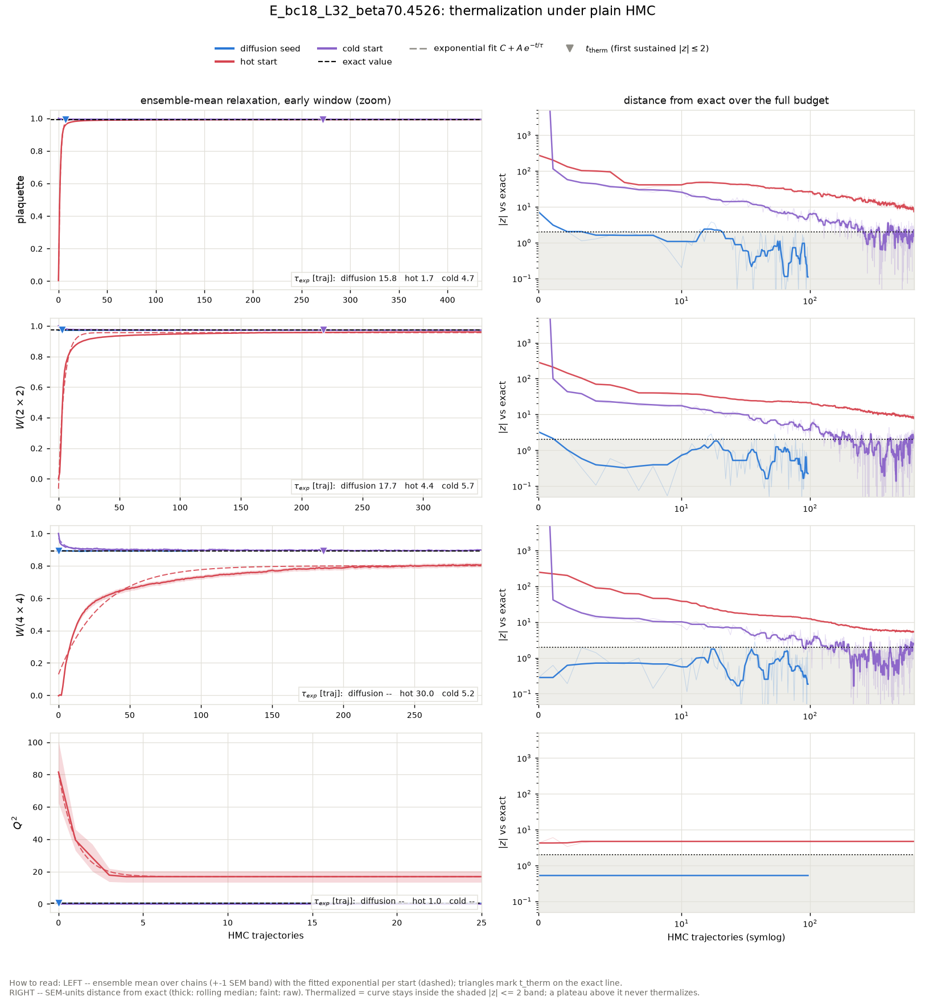

tau_int (hot-start chains, second half): plaquette = 7.35 +- 1.03, wilson_2x2 = 10.96 +- 1.60, wilson_4x4 = 6.07 +- 1.07, wilson_6x6 = 3.84 +- 0.74. Topology: hot-start HMC L=32 beta=70.4526 -> **frozen** (no tunneling).

Where 'never' stood at the end: the hot start ended the 640-trajectory budget still at plaquette at |z| ~ 9, wilson_2x2 at |z| ~ 8, wilson_4x4 at |z| ~ 5, wilson_6x6 at |z| ~ 5, Q^2 at |z| ~ 5; the cold start ended the 640-trajectory budget still at Q^2 at |z| ~ 363637014528.

### Diagnostics: raw diffusion output (before any HMC)

| observable | value | error | exact | z_exact | reference | ref_error | z_ref | ks_p | chi2_p |
|---|---|---|---|---|---|---|---|---|---|
| plaquette | 0.9927 | 2.564e-05 | 0.9929 | -7.027 | 0.9929 | 1.706e-05 | -7.201 | 4.604e-08 |  |
| wilson_1x1 | 0.9927 | 2.564e-05 | 0.9929 | -7.027 | 0.9929 | 1.706e-05 | -7.201 | 4.604e-08 |  |
| wilson_1x2 | 0.9854 | 6.479e-05 | 0.9858 | -6.848 | 0.9859 | 4e-05 | -7.021 | 7.943e-08 |  |
| wilson_2x2 | 0.9713 | 0.0001516 | 0.9718 | -3.516 | 0.9721 | 0.0001016 | -4.752 | 4.358e-05 |  |
| wilson_2x3 | 0.9575 | 0.0002559 | 0.958 | -2.155 | 0.9586 | 0.0001486 | -3.771 | 0.0005923 |  |
| wilson_3x3 | 0.9378 | 0.0004784 | 0.9377 | 0.1649 | 0.9387 | 0.0002785 | -1.701 | 0.3879 |  |
| wilson_3x4 | 0.9176 | 0.000759 | 0.9178 | -0.2554 | 0.9193 | 0.0004413 | -1.87 | 0.08742 |  |
| wilson_4x4 | 0.8917 | 0.001175 | 0.892 | -0.2553 | 0.8935 | 0.0006545 | -1.381 | 0.3879 |  |
| wilson_4x5 | 0.8663 | 0.001682 | 0.8668 | -0.3018 | 0.8691 | 0.0008947 | -1.44 | 0.1098 |  |
| wilson_5x5 | 0.8361 | 0.002333 | 0.8364 | -0.1555 | 0.8389 | 0.001235 | -1.085 | 0.357 |  |
| wilson_5x6 | 0.8062 | 0.003042 | 0.8071 | -0.3034 | 0.8103 | 0.001687 | -1.189 | 0.3879 |  |
| wilson_6x6 | 0.7709 | 0.003984 | 0.7733 | -0.5945 | 0.7767 | 0.002127 | -1.298 | 0.2498 |  |
| wilson_6x7 | 0.738 | 0.005015 | 0.7408 | -0.5582 | 0.7459 | 0.002825 | -1.357 | 0.1685 |  |
| wilson_7x7 | 0.7 | 0.006328 | 0.7047 | -0.7444 | 0.7107 | 0.003291 | -1.489 | 0.1519 |  |
| wilson_7x8 | 0.6648 | 0.007474 | 0.6704 | -0.7581 | 0.6777 | 0.004045 | -1.52 | 0.1519 |  |
| wilson_8x8 | 0.6252 | 0.008749 | 0.6333 | -0.9167 | 0.642 | 0.004523 | -1.706 | 0.2061 |  |
| wilson_8x10 | 0.556 | 0.01112 | 0.565 | -0.8108 | 0.5744 | 0.00608 | -1.453 | 0.3001 |  |
| wilson_10x10 | 0.4767 | 0.01323 | 0.4901 | -1.011 | 0.5 | 0.007208 | -1.545 | 0.2061 |  |
| wilson_10x12 | 0.4098 | 0.01473 | 0.4252 | -1.04 | 0.4361 | 0.008901 | -1.525 | 0.07777 |  |
| wilson_12x12 | 0.34 | 0.01599 | 0.3587 | -1.165 | 0.3685 | 0.01006 | -1.506 | 0.1519 |  |
| creutz_2 | 0.006977 | 9.697e-05 | 0.007147 | -1.755 |  |  |  |  |  |
| creutz_3 | 0.006458 | 0.000194 | 0.007145 | -3.54 |  |  |  |  |  |
| creutz_4 | 0.006971 | 0.0003308 | 0.007141 | -0.5143 |  |  |  |  |  |
| creutz_5 | 0.006736 | 0.0005064 | 0.007137 | -0.7917 |  |  |  |  |  |
| creutz_6 | 0.008343 | 0.0007457 | 0.007131 | 1.627 |  |  |  |  |  |
| creutz_7 | 0.009325 | 0.001048 | 0.007122 | 2.101 |  |  |  |  |  |
| creutz_8 | 0.00959 | 0.0013 | 0.007111 | 1.908 |  |  |  |  |  |
| Q | 0.03125 | 0.04802 | 0 | 0.6508 | -0.01562 | 0.03452 | 0.7926 | 1 |  |
| Q^2 | 0.3906 | 0.06696 | 0.3636 | 0.403 | 0.349 | 0.03602 | 0.548 | 1 |  |
| chi_top ((<Q^2>-<Q>^2)/V) | 0.0003805 | 4.98e-05 | 0.0003551 | 0.5101 | 0.0003405 | 3.383e-05 | 0.664 |  |  |
| Q histogram vs exact P(Q) | 0.3269 | nan | 2 | nan |  |  |  |  | 0.8492 |

### Diagnostics: the same configs after 96 HMC trajectories

| observable | value | error | exact | z_exact | reference | ref_error | z_ref | ks_p | chi2_p |
|---|---|---|---|---|---|---|---|---|---|
| plaquette | 0.9929 | 2.452e-05 | 0.9929 | 0.1223 | 0.9929 | 1.706e-05 | -1.292 | 0.3277 |  |
| wilson_1x1 | 0.9929 | 2.452e-05 | 0.9929 | 0.1223 | 0.9929 | 1.706e-05 | -1.292 | 0.3277 |  |
| wilson_1x2 | 0.9858 | 5.377e-05 | 0.9858 | -0.3007 | 0.9859 | 4e-05 | -1.599 | 0.4545 |  |
| wilson_2x2 | 0.9718 | 0.0001566 | 0.9718 | -0.2187 | 0.9721 | 0.0001016 | -1.975 | 0.1226 |  |
| wilson_2x3 | 0.958 | 0.0002961 | 0.958 | -0.1916 | 0.9586 | 0.0001486 | -1.875 | 0.3001 |  |
| wilson_3x3 | 0.9375 | 0.0005006 | 0.9377 | -0.4979 | 0.9387 | 0.0002785 | -2.217 | 0.07777 |  |
| wilson_3x4 | 0.9176 | 0.0006822 | 0.9178 | -0.3136 | 0.9193 | 0.0004413 | -2.046 | 0.02464 |  |
| wilson_4x4 | 0.8922 | 0.001027 | 0.892 | 0.1872 | 0.8935 | 0.0006545 | -1.121 | 0.6028 |  |
| wilson_4x5 | 0.8677 | 0.001325 | 0.8668 | 0.6734 | 0.8691 | 0.0008947 | -0.8407 | 0.3277 |  |
| wilson_5x5 | 0.8376 | 0.001942 | 0.8364 | 0.6219 | 0.8389 | 0.001235 | -0.5624 | 0.3001 |  |
| wilson_5x6 | 0.8093 | 0.002493 | 0.8071 | 0.8733 | 0.8103 | 0.001687 | -0.3446 | 0.8612 |  |
| wilson_6x6 | 0.7754 | 0.003222 | 0.7733 | 0.6538 | 0.7767 | 0.002127 | -0.359 | 0.7195 |  |
| wilson_6x7 | 0.7441 | 0.004012 | 0.7408 | 0.8149 | 0.7459 | 0.002825 | -0.3549 | 0.6808 |  |
| wilson_7x7 | 0.7083 | 0.004931 | 0.7047 | 0.7272 | 0.7107 | 0.003291 | -0.3915 | 0.7575 |  |
| wilson_7x8 | 0.6756 | 0.005943 | 0.6704 | 0.8683 | 0.6777 | 0.004045 | -0.2911 | 0.7941 |  |
| wilson_8x8 | 0.6391 | 0.007088 | 0.6333 | 0.8291 | 0.642 | 0.004523 | -0.3451 | 0.5266 |  |
| wilson_8x10 | 0.5726 | 0.008871 | 0.565 | 0.8563 | 0.5744 | 0.00608 | -0.1672 | 0.7575 |  |
| wilson_10x10 | 0.4974 | 0.01144 | 0.4901 | 0.6399 | 0.5 | 0.007208 | -0.1901 | 0.6808 |  |
| wilson_10x12 | 0.4347 | 0.01309 | 0.4252 | 0.7312 | 0.4361 | 0.008901 | -0.08636 | 0.4899 |  |
| wilson_12x12 | 0.3693 | 0.01571 | 0.3587 | 0.6746 | 0.3685 | 0.01006 | 0.04119 | 0.5643 |  |
| creutz_2 | 0.007146 | 9.162e-05 | 0.007147 | -0.006491 |  |  |  |  |  |
| creutz_3 | 0.007327 | 0.0002182 | 0.007145 | 0.8371 |  |  |  |  |  |
| creutz_4 | 0.006725 | 0.0003617 | 0.007141 | -1.15 |  |  |  |  |  |
| creutz_5 | 0.007536 | 0.0005125 | 0.007137 | 0.7788 |  |  |  |  |  |
| creutz_6 | 0.008355 | 0.0007238 | 0.007131 | 1.691 |  |  |  |  |  |
| creutz_7 | 0.008134 | 0.001002 | 0.007122 | 1.01 |  |  |  |  |  |
| creutz_8 | 0.008132 | 0.001376 | 0.007111 | 0.7417 |  |  |  |  |  |
| Q | 0.03125 | 0.04802 | 0 | 0.6508 | -0.01562 | 0.03452 | 0.7926 | 1 |  |
| Q^2 | 0.3906 | 0.06696 | 0.3636 | 0.403 | 0.349 | 0.03602 | 0.548 | 1 |  |
| chi_top ((<Q^2>-<Q>^2)/V) | 0.0003805 | 4.98e-05 | 0.0003551 | 0.5101 | 0.0003405 | 3.383e-05 | 0.664 |  |  |
| Q histogram vs exact P(Q) | 0.3269 | nan | 2 | nan |  |  |  |  | 0.8492 |

## D_bc20_L32_beta78.4578

HMC: step size 0.0452, 22 leapfrog steps, acceptance seed/hot/cold = 0.978/0.979/0.978. Diffusion-seed batch: 128 chains x 96 trajectories (0.12 s/traj for the whole batch); baselines: 32 chains x 640 trajectories.

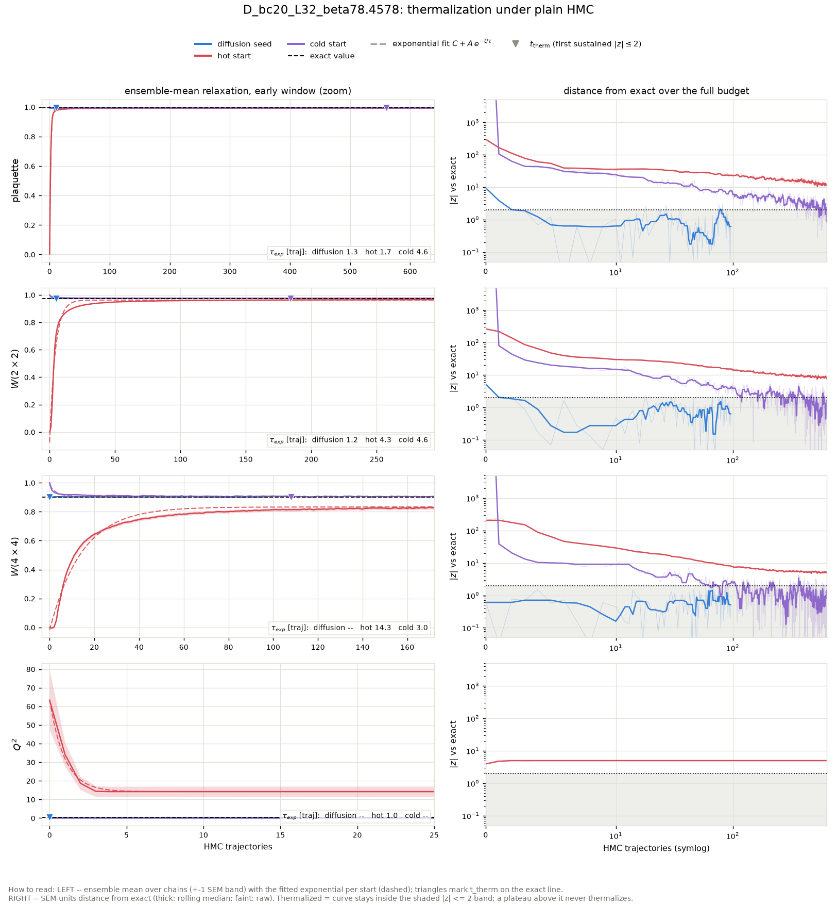

tau_int (hot-start chains, second half): plaquette = 7.70 +- 1.00, wilson_2x2 = 5.05 +- 0.91, wilson_4x4 = 3.62 +- 0.75, wilson_6x6 = 2.01 +- 0.24. Topology: hot-start HMC L=32 beta=78.4578 -> **frozen** (no tunneling).

Where 'never' stood at the end: the hot start ended the 640-trajectory budget still at plaquette at |z| ~ 12, wilson_2x2 at |z| ~ 8, wilson_4x4 at |z| ~ 5, wilson_6x6 at |z| ~ 6, Q^2 at |z| ~ 5; the cold start ended the 640-trajectory budget still at Q^2 at |z| ~ 320492732416.

### Diagnostics: raw diffusion output (before any HMC)

| observable | value | error | exact | z_exact | reference | ref_error | z_ref | ks_p | chi2_p |
|---|---|---|---|---|---|---|---|---|---|
| plaquette | 0.9934 | 1.653e-05 | 0.9936 | -12.26 | 0.9937 | 2.323e-05 | -9.488 | 2.232e-14 |  |
| wilson_1x1 | 0.9934 | 1.653e-05 | 0.9936 | -12.26 | 0.9937 | 2.323e-05 | -9.488 | 2.232e-14 |  |
| wilson_1x2 | 0.9868 | 6.286e-05 | 0.9873 | -7.9 | 0.9874 | 6.115e-05 | -7.112 | 6.459e-12 |  |
| wilson_2x2 | 0.974 | 0.0001293 | 0.9747 | -5.169 | 0.975 | 0.0001408 | -5.075 | 2.84e-06 |  |
| wilson_2x3 | 0.9616 | 0.0002308 | 0.9623 | -2.986 | 0.9626 | 0.0002112 | -3.331 | 0.007662 |  |
| wilson_3x3 | 0.9437 | 0.0003744 | 0.9439 | -0.5918 | 0.9442 | 0.0003948 | -0.923 | 0.6808 |  |
| wilson_3x4 | 0.9255 | 0.0004771 | 0.926 | -1.023 | 0.9262 | 0.0005617 | -0.9541 | 0.5266 |  |
| wilson_4x4 | 0.902 | 0.0006781 | 0.9025 | -0.8315 | 0.9026 | 0.0009032 | -0.5866 | 0.1685 |  |
| wilson_4x5 | 0.8792 | 0.0009405 | 0.8797 | -0.495 | 0.8803 | 0.001254 | -0.6851 | 0.2272 |  |
| wilson_5x5 | 0.8518 | 0.001217 | 0.852 | -0.1034 | 0.8533 | 0.001785 | -0.6586 | 0.2272 |  |
| wilson_5x6 | 0.8248 | 0.001497 | 0.8251 | -0.2203 | 0.8269 | 0.002234 | -0.7944 | 0.357 |  |
| wilson_6x6 | 0.794 | 0.00186 | 0.7941 | -0.02223 | 0.7973 | 0.002975 | -0.935 | 0.2061 |  |
| wilson_6x7 | 0.764 | 0.002234 | 0.7642 | -0.06936 | 0.7675 | 0.003654 | -0.8148 | 0.3001 |  |
| wilson_7x7 | 0.7308 | 0.002759 | 0.7307 | 0.007746 | 0.7343 | 0.004517 | -0.6746 | 0.09806 |  |
| wilson_7x8 | 0.698 | 0.003192 | 0.6988 | -0.2328 | 0.7017 | 0.005238 | -0.5916 | 0.1519 |  |
| wilson_8x8 | 0.6627 | 0.00382 | 0.664 | -0.3364 | 0.6669 | 0.005979 | -0.5891 | 0.2272 |  |
| wilson_8x10 | 0.5967 | 0.004799 | 0.5996 | -0.6105 | 0.6029 | 0.007409 | -0.7057 | 0.2272 |  |
| wilson_10x10 | 0.5218 | 0.006171 | 0.5279 | -0.9944 | 0.5347 | 0.009265 | -1.153 | 0.06904 |  |
| wilson_10x12 | 0.4558 | 0.007492 | 0.465 | -1.227 | 0.4698 | 0.01076 | -1.067 | 0.08742 |  |
| wilson_12x12 | 0.3847 | 0.00913 | 0.3996 | -1.635 | 0.4043 | 0.01197 | -1.305 | 0.07777 |  |
| creutz_2 | 0.006296 | 9.064e-05 | 0.006412 | -1.281 |  |  |  |  |  |
| creutz_3 | 0.005897 | 0.000186 | 0.006408 | -2.75 |  |  |  |  |  |
| creutz_4 | 0.006208 | 0.0003035 | 0.006403 | -0.6411 |  |  |  |  |  |
| creutz_5 | 0.006109 | 0.000462 | 0.006395 | -0.6187 |  |  |  |  |  |
| creutz_6 | 0.005785 | 0.0006596 | 0.006385 | -0.9096 |  |  |  |  |  |
| creutz_7 | 0.005988 | 0.0009322 | 0.006371 | -0.4106 |  |  |  |  |  |
| creutz_8 | 0.006133 | 0.001282 | 0.006353 | -0.1717 |  |  |  |  |  |
| Q | -0.007812 | 0.0443 | 0 | -0.1763 | 0.05208 | 0.03327 | -1.081 | 0.8906 |  |
| Q^2 | 0.3203 | 0.03948 | 0.3205 | -0.004564 | 0.25 | 0.03243 | 1.376 | 0.8288 |  |
| chi_top ((<Q^2>-<Q>^2)/V) | 0.0003127 | 4.074e-05 | 0.000313 | -0.005782 | 0.0002415 | 3.031e-05 | 1.403 |  |  |
| Q histogram vs exact P(Q) | 0.1166 | nan | 2 | nan |  |  |  |  | 0.9434 |

### Diagnostics: the same configs after 96 HMC trajectories

| observable | value | error | exact | z_exact | reference | ref_error | z_ref | ks_p | chi2_p |
|---|---|---|---|---|---|---|---|---|---|
| plaquette | 0.9936 | 2.319e-05 | 0.9936 | -0.6116 | 0.9937 | 2.323e-05 | -2.498 | 0.03684 |  |
| wilson_1x1 | 0.9936 | 2.319e-05 | 0.9936 | -0.6116 | 0.9937 | 2.323e-05 | -2.498 | 0.03684 |  |
| wilson_1x2 | 0.9872 | 4.799e-05 | 0.9873 | -0.855 | 0.9874 | 6.115e-05 | -2.163 | 0.09806 |  |
| wilson_2x2 | 0.9746 | 9.645e-05 | 0.9747 | -0.9462 | 0.975 | 0.0001408 | -2.303 | 0.1866 |  |
| wilson_2x3 | 0.962 | 0.0001657 | 0.9623 | -1.738 | 0.9626 | 0.0002112 | -2.388 | 0.1866 |  |
| wilson_3x3 | 0.9436 | 0.0003701 | 0.9439 | -0.8648 | 0.9442 | 0.0003948 | -1.11 | 0.357 |  |
| wilson_3x4 | 0.9256 | 0.0005757 | 0.926 | -0.5789 | 0.9262 | 0.0005617 | -0.6818 | 0.6418 |  |
| wilson_4x4 | 0.902 | 0.0009102 | 0.9025 | -0.5694 | 0.9026 | 0.0009032 | -0.4811 | 0.2272 |  |
| wilson_4x5 | 0.8794 | 0.001244 | 0.8797 | -0.205 | 0.8803 | 0.001254 | -0.4888 | 0.3001 |  |
| wilson_5x5 | 0.8522 | 0.001733 | 0.852 | 0.1424 | 0.8533 | 0.001785 | -0.4221 | 0.3879 |  |
| wilson_5x6 | 0.8255 | 0.00229 | 0.8251 | 0.1591 | 0.8269 | 0.002234 | -0.4508 | 0.357 |  |
| wilson_6x6 | 0.7952 | 0.00292 | 0.7941 | 0.3799 | 0.7973 | 0.002975 | -0.511 | 0.4899 |  |
| wilson_6x7 | 0.7662 | 0.003653 | 0.7642 | 0.5664 | 0.7675 | 0.003654 | -0.2449 | 0.5643 |  |
| wilson_7x7 | 0.733 | 0.004192 | 0.7307 | 0.5432 | 0.7343 | 0.004517 | -0.2133 | 0.4899 |  |
| wilson_7x8 | 0.7024 | 0.005105 | 0.6988 | 0.715 | 0.7017 | 0.005238 | 0.1045 | 0.4899 |  |
| wilson_8x8 | 0.6678 | 0.005754 | 0.664 | 0.6632 | 0.6669 | 0.005979 | 0.111 | 0.4204 |  |
| wilson_8x10 | 0.6056 | 0.00735 | 0.5996 | 0.8163 | 0.6029 | 0.007409 | 0.2587 | 0.2272 |  |
| wilson_10x10 | 0.5331 | 0.008442 | 0.5279 | 0.6104 | 0.5347 | 0.009265 | -0.1238 | 0.3277 |  |
| wilson_10x12 | 0.4718 | 0.009831 | 0.465 | 0.684 | 0.4698 | 0.01076 | 0.1319 | 0.3277 |  |
| wilson_12x12 | 0.4063 | 0.01063 | 0.3996 | 0.6344 | 0.4043 | 0.01197 | 0.1263 | 0.2272 |  |
| creutz_2 | 0.006437 | 9.046e-05 | 0.006412 | 0.2739 |  |  |  |  |  |
| creutz_3 | 0.006242 | 0.0001976 | 0.006408 | -0.8392 |  |  |  |  |  |
| creutz_4 | 0.006596 | 0.0003315 | 0.006403 | 0.5839 |  |  |  |  |  |
| creutz_5 | 0.0061 | 0.0004814 | 0.006395 | -0.613 |  |  |  |  |  |
| creutz_6 | 0.005581 | 0.0006849 | 0.006385 | -1.173 |  |  |  |  |  |
| creutz_7 | 0.007271 | 0.0008851 | 0.006371 | 1.017 |  |  |  |  |  |
| creutz_8 | 0.007931 | 0.001088 | 0.006353 | 1.45 |  |  |  |  |  |
| Q | -0.007812 | 0.0443 | 0 | -0.1763 | 0.05208 | 0.03327 | -1.081 | 0.8906 |  |
| Q^2 | 0.3203 | 0.03948 | 0.3205 | -0.004564 | 0.25 | 0.03243 | 1.376 | 0.8288 |  |
| chi_top ((<Q^2>-<Q>^2)/V) | 0.0003127 | 4.074e-05 | 0.000313 | -0.005782 | 0.0002415 | 3.031e-05 | 1.403 |  |  |
| Q histogram vs exact P(Q) | 0.1166 | nan | 2 | nan |  |  |  |  | 0.9434 |

## D_bc30_L32_beta118.473

HMC: step size 0.0367, 27 leapfrog steps, acceptance seed/hot/cold = 0.976/0.975/0.975. Diffusion-seed batch: 128 chains x 96 trajectories (0.18 s/traj for the whole batch); baselines: 32 chains x 640 trajectories.

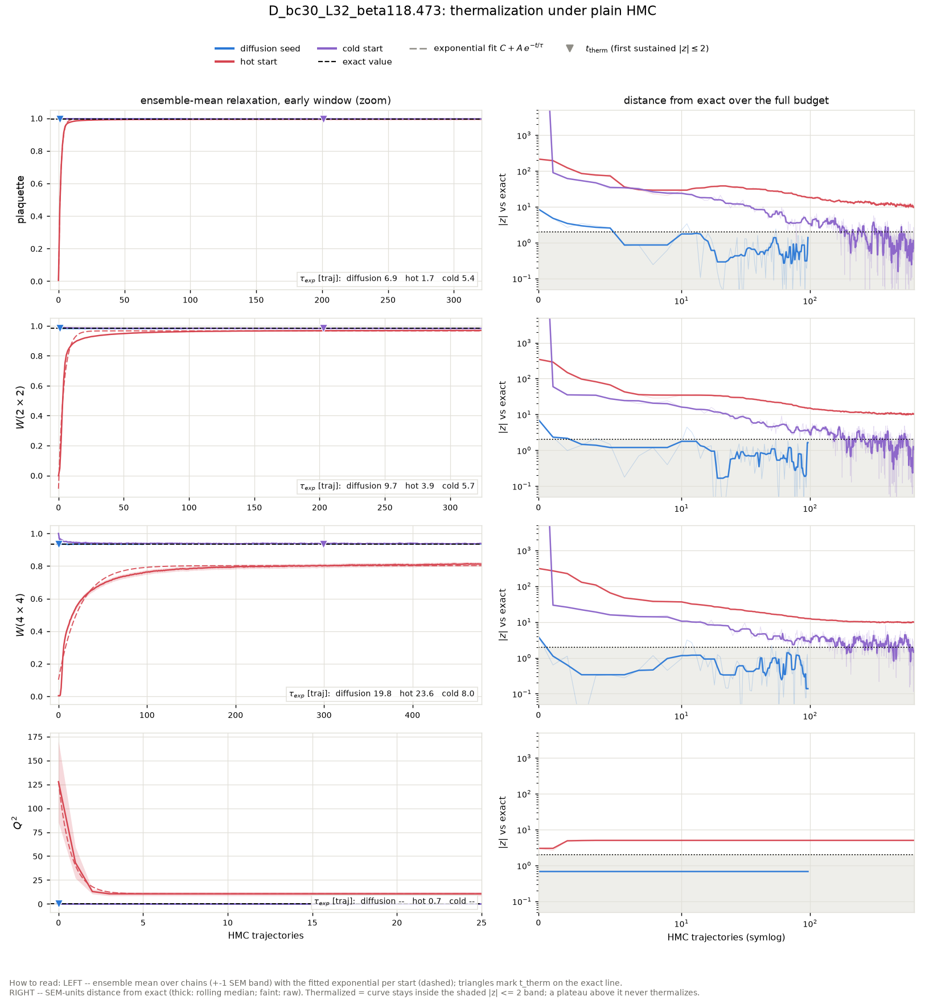

tau_int (hot-start chains, second half): plaquette = 15.75 +- 1.73, wilson_2x2 = 24.05 +- 2.24, wilson_4x4 = 21.85 +- 2.58, wilson_6x6 = 14.35 +- 2.11. Topology: hot-start HMC L=32 beta=118.473 -> **frozen** (no tunneling).

Where 'never' stood at the end: the hot start ended the 640-trajectory budget still at plaquette at |z| ~ 10, wilson_2x2 at |z| ~ 10, wilson_4x4 at |z| ~ 10, wilson_6x6 at |z| ~ 10, Q^2 at |z| ~ 5; the cold start ended the 640-trajectory budget still at Q^2 at |z| ~ 171377917952.

### Diagnostics: raw diffusion output (before any HMC)

| observable | value | error | exact | z_exact | reference | ref_error | z_ref | ks_p | chi2_p |
|---|---|---|---|---|---|---|---|---|---|
| plaquette | 0.9956 | 1.136e-05 | 0.9958 | -12.07 | 0.9957 | 1.248e-05 | -6.154 | 2.23e-06 |  |
| wilson_1x1 | 0.9956 | 1.136e-05 | 0.9958 | -12.07 | 0.9957 | 1.248e-05 | -6.154 | 2.23e-06 |  |
| wilson_1x2 | 0.9911 | 3.169e-05 | 0.9916 | -13.18 | 0.9915 | 1.97e-05 | -9.608 | 8.941e-11 |  |
| wilson_2x2 | 0.9825 | 9.158e-05 | 0.9832 | -7.375 | 0.9832 | 9.114e-05 | -5.165 | 5.786e-06 |  |
| wilson_2x3 | 0.974 | 0.0001531 | 0.9749 | -5.942 | 0.975 | 0.0001561 | -4.371 | 0.000335 |  |
| wilson_3x3 | 0.9615 | 0.0002115 | 0.9626 | -5.602 | 0.963 | 0.0003164 | -3.994 | 0.0004059 |  |
| wilson_3x4 | 0.9489 | 0.0003107 | 0.9505 | -5.144 | 0.951 | 0.0004416 | -3.852 | 0.01207 |  |
| wilson_4x4 | 0.9322 | 0.0004402 | 0.9347 | -5.684 | 0.9356 | 0.0006955 | -4.163 | 0.002464 |  |
| wilson_4x5 | 0.9162 | 0.0006536 | 0.9191 | -4.43 | 0.9202 | 0.0009532 | -3.45 | 0.01616 |  |
| wilson_5x5 | 0.8965 | 0.0008954 | 0.9 | -3.879 | 0.9019 | 0.001368 | -3.287 | 0.01207 |  |
| wilson_5x6 | 0.8772 | 0.00116 | 0.8813 | -3.552 | 0.8834 | 0.001772 | -2.939 | 0.03684 |  |
| wilson_6x6 | 0.8537 | 0.001479 | 0.8595 | -3.937 | 0.8622 | 0.002272 | -3.145 | 0.03229 |  |
| wilson_6x7 | 0.8313 | 0.001716 | 0.8383 | -4.096 | 0.8411 | 0.002755 | -3.014 | 0.04195 |  |
| wilson_7x7 | 0.8052 | 0.002085 | 0.8143 | -4.336 | 0.8175 | 0.003341 | -3.107 | 0.04195 |  |
| wilson_7x8 | 0.7795 | 0.00243 | 0.791 | -4.73 | 0.7944 | 0.004006 | -3.165 | 0.02464 |  |
| wilson_8x8 | 0.7506 | 0.002992 | 0.7653 | -4.928 | 0.7683 | 0.004704 | -3.182 | 0.04195 |  |
| wilson_8x10 | 0.6972 | 0.00405 | 0.7168 | -4.831 | 0.7194 | 0.006028 | -3.064 | 0.07777 |  |
| wilson_10x10 | 0.6334 | 0.005552 | 0.6609 | -4.951 | 0.663 | 0.007709 | -3.117 | 0.02464 |  |
| wilson_10x12 | 0.5798 | 0.007099 | 0.6099 | -4.244 | 0.6114 | 0.009266 | -2.709 | 0.1519 |  |
| wilson_12x12 | 0.5178 | 0.008855 | 0.5548 | -4.175 | 0.5568 | 0.01065 | -2.815 | 0.08742 |  |
| creutz_2 | 0.004212 | 6.3e-05 | 0.00423 | -0.282 |  |  |  |  |  |
| creutz_3 | 0.004267 | 0.0001287 | 0.004215 | 0.3974 |  |  |  |  |  |
| creutz_4 | 0.004739 | 0.0002157 | 0.004193 | 2.531 |  |  |  |  |  |
| creutz_5 | 0.004401 | 0.0003461 | 0.004164 | 0.6864 |  |  |  |  |  |
| creutz_6 | 0.005414 | 0.0004779 | 0.004126 | 2.696 |  |  |  |  |  |
| creutz_7 | 0.005201 | 0.0006566 | 0.004078 | 1.71 |  |  |  |  |  |
| creutz_8 | 0.005367 | 0.000842 | 0.004018 | 1.602 |  |  |  |  |  |
| Q | -0.02344 | 0.04001 | 0 | -0.5858 | 0.03125 | 0.03548 | -1.023 | 1 |  |
| Q^2 | 0.1953 | 0.03866 | 0.1714 | 0.6191 | 0.1875 | 0.02697 | 0.1657 | 1 |  |
| chi_top ((<Q^2>-<Q>^2)/V) | 0.0001902 | 3.448e-05 | 0.0001674 | 0.6624 | 0.0001822 | 2.75e-05 | 0.1825 |  |  |
| Q histogram vs exact P(Q) | 0.9613 | nan | 2 | nan |  |  |  |  | 0.6184 |

### Diagnostics: the same configs after 96 HMC trajectories

| observable | value | error | exact | z_exact | reference | ref_error | z_ref | ks_p | chi2_p |
|---|---|---|---|---|---|---|---|---|---|
| plaquette | 0.9957 | 1.55e-05 | 0.9958 | -1.612 | 0.9957 | 1.248e-05 | 0.4173 | 0.8906 |  |
| wilson_1x1 | 0.9957 | 1.55e-05 | 0.9958 | -1.612 | 0.9957 | 1.248e-05 | 0.4173 | 0.8906 |  |
| wilson_1x2 | 0.9915 | 3.599e-05 | 0.9916 | -1.446 | 0.9915 | 1.97e-05 | 0.1729 | 0.6808 |  |
| wilson_2x2 | 0.983 | 9.531e-05 | 0.9832 | -1.871 | 0.9832 | 9.114e-05 | -1.291 | 0.2061 |  |
| wilson_2x3 | 0.9747 | 0.0001702 | 0.9749 | -1.542 | 0.975 | 0.0001561 | -1.335 | 0.09806 |  |
| wilson_3x3 | 0.9624 | 0.0002749 | 0.9626 | -0.9846 | 0.963 | 0.0003164 | -1.447 | 0.1366 |  |
| wilson_3x4 | 0.9504 | 0.0004523 | 0.9505 | -0.3302 | 0.951 | 0.0004416 | -0.9977 | 0.09806 |  |
| wilson_4x4 | 0.9346 | 0.0007364 | 0.9347 | -0.1366 | 0.9356 | 0.0006955 | -1.012 | 0.357 |  |
| wilson_4x5 | 0.9193 | 0.001007 | 0.9191 | 0.2581 | 0.9202 | 0.0009532 | -0.5997 | 0.6028 |  |
| wilson_5x5 | 0.9005 | 0.001369 | 0.9 | 0.3744 | 0.9019 | 0.001368 | -0.7169 | 0.5643 |  |
| wilson_5x6 | 0.8826 | 0.001813 | 0.8813 | 0.6785 | 0.8834 | 0.001772 | -0.3445 | 0.8906 |  |
| wilson_6x6 | 0.861 | 0.002316 | 0.8595 | 0.627 | 0.8622 | 0.002272 | -0.3855 | 0.7575 |  |
| wilson_6x7 | 0.8405 | 0.002942 | 0.8383 | 0.7463 | 0.8411 | 0.002755 | -0.1391 | 0.9827 |  |
| wilson_7x7 | 0.8167 | 0.003587 | 0.8143 | 0.6799 | 0.8175 | 0.003341 | -0.1546 | 0.9827 |  |
| wilson_7x8 | 0.7941 | 0.004362 | 0.791 | 0.7071 | 0.7944 | 0.004006 | -0.04302 | 0.9719 |  |
| wilson_8x8 | 0.7681 | 0.005296 | 0.7653 | 0.5261 | 0.7683 | 0.004704 | -0.02898 | 0.8288 |  |
| wilson_8x10 | 0.7196 | 0.007032 | 0.7168 | 0.4034 | 0.7194 | 0.006028 | 0.01623 | 0.8906 |  |
| wilson_10x10 | 0.6625 | 0.009382 | 0.6609 | 0.1758 | 0.663 | 0.007709 | -0.0389 | 0.995 |  |
| wilson_10x12 | 0.6114 | 0.01132 | 0.6099 | 0.1248 | 0.6114 | 0.009266 | -0.005319 | 0.9902 |  |
| wilson_12x12 | 0.5555 | 0.01372 | 0.5548 | 0.05181 | 0.5568 | 0.01065 | -0.07562 | 0.9827 |  |
| creutz_2 | 0.004332 | 6.247e-05 | 0.00423 | 1.625 |  |  |  |  |  |
| creutz_3 | 0.00414 | 0.0001156 | 0.004215 | -0.6563 |  |  |  |  |  |
| creutz_4 | 0.004268 | 0.0002072 | 0.004193 | 0.3601 |  |  |  |  |  |
| creutz_5 | 0.004268 | 0.0003292 | 0.004164 | 0.3163 |  |  |  |  |  |
| creutz_6 | 0.004659 | 0.0004405 | 0.004126 | 1.21 |  |  |  |  |  |
| creutz_7 | 0.004631 | 0.0005927 | 0.004078 | 0.9327 |  |  |  |  |  |
| creutz_8 | 0.005177 | 0.0007775 | 0.004018 | 1.491 |  |  |  |  |  |
| Q | -0.02344 | 0.04001 | 0 | -0.5858 | 0.03125 | 0.03548 | -1.023 | 1 |  |
| Q^2 | 0.1953 | 0.03866 | 0.1714 | 0.6191 | 0.1875 | 0.02697 | 0.1657 | 1 |  |
| chi_top ((<Q^2>-<Q>^2)/V) | 0.0001902 | 3.448e-05 | 0.0001674 | 0.6624 | 0.0001822 | 2.75e-05 | 0.1825 |  |  |
| Q histogram vs exact P(Q) | 0.9613 | nan | 2 | nan |  |  |  |  | 0.6184 |

## E_bc35_L32_beta138.477

HMC: step size 0.0340, 29 leapfrog steps, acceptance seed/hot/cold = 0.974/0.973/0.978. Diffusion-seed batch: 128 chains x 96 trajectories (0.20 s/traj for the whole batch); baselines: 32 chains x 640 trajectories.

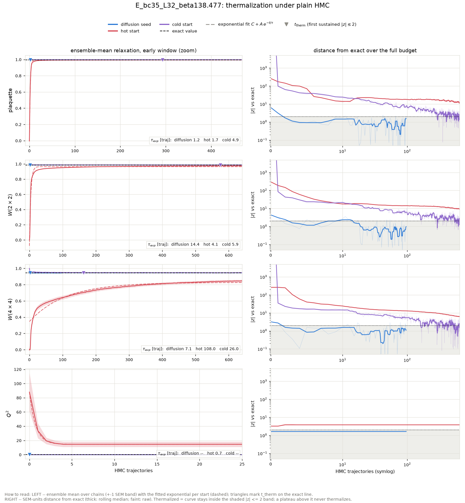

tau_int (hot-start chains, second half): plaquette = 27.80 +- 1.99, wilson_2x2 = 39.89 +- 1.89, wilson_4x4 = 44.95 +- 1.78, wilson_6x6 = 41.49 +- 2.77. Topology: hot-start HMC L=32 beta=138.477 -> **frozen** (no tunneling).

Where 'never' stood at the end: the hot start ended the 640-trajectory budget still at plaquette at |z| ~ 12, wilson_2x2 at |z| ~ 9, wilson_4x4 at |z| ~ 6, wilson_6x6 at |z| ~ 6, Q^2 at |z| ~ 4; the cold start ended the 640-trajectory budget still at Q^2 at |z| ~ 122925113344.

### Diagnostics: raw diffusion output (before any HMC)

| observable | value | error | exact | z_exact | reference | ref_error | z_ref | ks_p | chi2_p |
|---|---|---|---|---|---|---|---|---|---|
| plaquette | 0.9963 | 1.414e-05 | 0.9964 | -6.614 | 0.9964 | 1.23e-05 | -4.657 | 0.000152 |  |
| wilson_1x1 | 0.9963 | 1.414e-05 | 0.9964 | -6.614 | 0.9964 | 1.23e-05 | -4.657 | 0.000152 |  |
| wilson_1x2 | 0.9925 | 3.908e-05 | 0.9928 | -6.732 | 0.9928 | 3.679e-05 | -5.492 | 6.456e-07 |  |
| wilson_2x2 | 0.9853 | 7.882e-05 | 0.9856 | -4.661 | 0.9858 | 6.766e-05 | -5.036 | 0.0001241 |  |
| wilson_2x3 | 0.978 | 0.0001601 | 0.9785 | -3.42 | 0.9788 | 0.0001205 | -3.948 | 0.001229 |  |
| wilson_3x3 | 0.9674 | 0.0002259 | 0.968 | -2.488 | 0.9683 | 0.0002181 | -2.851 | 0.006558 |  |
| wilson_3x4 | 0.9565 | 0.0003457 | 0.9576 | -3.175 | 0.9579 | 0.0003089 | -2.945 | 0.005601 |  |
| wilson_4x4 | 0.942 | 0.0005033 | 0.944 | -3.918 | 0.9442 | 0.0004717 | -3.245 | 0.002464 |  |
| wilson_4x5 | 0.9277 | 0.0007502 | 0.9305 | -3.74 | 0.9306 | 0.0006188 | -2.902 | 0.006558 |  |
| wilson_5x5 | 0.9097 | 0.001077 | 0.9141 | -4.05 | 0.9142 | 0.0008834 | -3.203 | 0.0004059 |  |
| wilson_5x6 | 0.8921 | 0.001436 | 0.898 | -4.065 | 0.8978 | 0.001161 | -3.069 | 0.001027 |  |
| wilson_6x6 | 0.8709 | 0.001905 | 0.8791 | -4.321 | 0.8791 | 0.001591 | -3.339 | 0.0004059 |  |
| wilson_6x7 | 0.8507 | 0.002366 | 0.8607 | -4.214 | 0.8609 | 0.001973 | -3.315 | 0.0004059 |  |
| wilson_7x7 | 0.8263 | 0.003036 | 0.8398 | -4.431 | 0.8403 | 0.002552 | -3.51 | 0.0002266 |  |
| wilson_7x8 | 0.8037 | 0.003541 | 0.8195 | -4.464 | 0.8204 | 0.003046 | -3.571 | 0.0002758 |  |
| wilson_8x8 | 0.7768 | 0.004403 | 0.7971 | -4.605 | 0.7981 | 0.003643 | -3.727 | 0.0001858 |  |
| wilson_8x10 | 0.7282 | 0.005452 | 0.7544 | -4.802 | 0.7552 | 0.005009 | -3.648 | 0.002916 |  |
| wilson_10x10 | 0.6702 | 0.007511 | 0.7049 | -4.62 | 0.7065 | 0.006394 | -3.68 | 0.002077 |  |
| wilson_10x12 | 0.6179 | 0.008796 | 0.6595 | -4.727 | 0.6604 | 0.007848 | -3.605 | 0.002916 |  |
| wilson_12x12 | 0.5613 | 0.01087 | 0.6099 | -4.472 | 0.6092 | 0.009316 | -3.346 | 0.008934 |  |
| creutz_2 | 0.003549 | 5.078e-05 | 0.003613 | -1.249 |  |  |  |  |  |
| creutz_3 | 0.003428 | 9.92e-05 | 0.003593 | -1.668 |  |  |  |  |  |
| creutz_4 | 0.003942 | 0.0001793 | 0.003564 | 2.108 |  |  |  |  |  |
| creutz_5 | 0.004357 | 0.000282 | 0.003524 | 2.952 |  |  |  |  |  |
| creutz_6 | 0.004622 | 0.0003965 | 0.003474 | 2.896 |  |  |  |  |  |
| creutz_7 | 0.00566 | 0.0005642 | 0.003411 | 3.986 |  |  |  |  |  |
| creutz_8 | 0.006303 | 0.0007436 | 0.003335 | 3.991 |  |  |  |  |  |
| Q | -0.02344 | 0.03748 | 0 | -0.6253 | 0.03125 | 0.02308 | -1.242 | 0.9997 |  |
| Q^2 | 0.1797 | 0.01607 | 0.1229 | 3.533 | 0.1562 | 0.02064 | 0.8962 | 1 |  |
| chi_top ((<Q^2>-<Q>^2)/V) | 0.0001749 | 3.337e-05 | 0.00012 | 1.645 | 0.0001516 | 2.553e-05 | 0.5547 |  |  |
| Q histogram vs exact P(Q) | 4.424 | nan | 2 | nan |  |  |  |  | 0.1095 |

### Diagnostics: the same configs after 96 HMC trajectories

| observable | value | error | exact | z_exact | reference | ref_error | z_ref | ks_p | chi2_p |
|---|---|---|---|---|---|---|---|---|---|
| plaquette | 0.9964 | 1.418e-05 | 0.9964 | -1.585 | 0.9964 | 1.23e-05 | -0.8651 | 0.2498 |  |
| wilson_1x1 | 0.9964 | 1.418e-05 | 0.9964 | -1.585 | 0.9964 | 1.23e-05 | -0.8651 | 0.2498 |  |
| wilson_1x2 | 0.9927 | 3.709e-05 | 0.9928 | -1.208 | 0.9928 | 3.679e-05 | -1.463 | 0.1226 |  |
| wilson_2x2 | 0.9856 | 8.713e-05 | 0.9856 | -0.8831 | 0.9858 | 6.766e-05 | -2.11 | 0.2498 |  |
| wilson_2x3 | 0.9784 | 0.0001448 | 0.9785 | -1.009 | 0.9788 | 0.0001205 | -2.068 | 0.06904 |  |
| wilson_3x3 | 0.9678 | 0.0002518 | 0.968 | -0.7079 | 0.9683 | 0.0002181 | -1.535 | 0.07777 |  |
| wilson_3x4 | 0.9572 | 0.0003937 | 0.9576 | -0.9969 | 0.9579 | 0.0003089 | -1.319 | 0.1519 |  |
| wilson_4x4 | 0.9433 | 0.0006109 | 0.944 | -1.118 | 0.9442 | 0.0004717 | -1.23 | 0.3001 |  |
| wilson_4x5 | 0.9295 | 0.0008134 | 0.9305 | -1.333 | 0.9306 | 0.0006188 | -1.077 | 0.2741 |  |
| wilson_5x5 | 0.9128 | 0.001144 | 0.9141 | -1.134 | 0.9142 | 0.0008834 | -0.9668 | 0.2741 |  |
| wilson_5x6 | 0.896 | 0.001536 | 0.898 | -1.317 | 0.8978 | 0.001161 | -0.9621 | 0.357 |  |
| wilson_6x6 | 0.8766 | 0.001905 | 0.8791 | -1.316 | 0.8791 | 0.001591 | -1.032 | 0.4204 |  |
| wilson_6x7 | 0.8573 | 0.002421 | 0.8607 | -1.403 | 0.8609 | 0.001973 | -1.165 | 0.2498 |  |
| wilson_7x7 | 0.8354 | 0.002923 | 0.8398 | -1.506 | 0.8403 | 0.002552 | -1.256 | 0.05405 |  |
| wilson_7x8 | 0.8138 | 0.003511 | 0.8195 | -1.62 | 0.8204 | 0.003046 | -1.412 | 0.1866 |  |
| wilson_8x8 | 0.7901 | 0.004029 | 0.7971 | -1.73 | 0.7981 | 0.003643 | -1.472 | 0.1098 |  |
| wilson_8x10 | 0.7437 | 0.005118 | 0.7544 | -2.093 | 0.7552 | 0.005009 | -1.611 | 0.5266 |  |
| wilson_10x10 | 0.6917 | 0.006125 | 0.7049 | -2.152 | 0.7065 | 0.006394 | -1.669 | 0.3277 |  |
| wilson_10x12 | 0.641 | 0.007174 | 0.6595 | -2.579 | 0.6604 | 0.007848 | -1.826 | 0.5266 |  |
| wilson_12x12 | 0.5887 | 0.00858 | 0.6099 | -2.479 | 0.6092 | 0.009316 | -1.622 | 0.5643 |  |
| creutz_2 | 0.003623 | 5.09e-05 | 0.003613 | 0.204 |  |  |  |  |  |
| creutz_3 | 0.003557 | 9.952e-05 | 0.003593 | -0.3646 |  |  |  |  |  |
| creutz_4 | 0.003652 | 0.0001821 | 0.003564 | 0.4823 |  |  |  |  |  |
| creutz_5 | 0.003336 | 0.0002812 | 0.003524 | -0.67 |  |  |  |  |  |
| creutz_6 | 0.00324 | 0.0003738 | 0.003474 | -0.626 |  |  |  |  |  |
| creutz_7 | 0.00361 | 0.0004929 | 0.003411 | 0.4032 |  |  |  |  |  |
| creutz_8 | 0.003441 | 0.0006725 | 0.003335 | 0.1584 |  |  |  |  |  |
| Q | -0.02344 | 0.03748 | 0 | -0.6253 | 0.03125 | 0.02308 | -1.242 | 0.9997 |  |
| Q^2 | 0.1797 | 0.01607 | 0.1229 | 3.533 | 0.1562 | 0.02064 | 0.8962 | 1 |  |
| chi_top ((<Q^2>-<Q>^2)/V) | 0.0001749 | 3.337e-05 | 0.00012 | 1.645 | 0.0001516 | 2.553e-05 | 0.5547 |  |  |
| Q histogram vs exact P(Q) | 4.424 | nan | 2 | nan |  |  |  |  | 0.1095 |

## D_bc40_L32_beta158.48

HMC: step size 0.0318, 31 leapfrog steps, acceptance seed/hot/cold = 0.977/0.973/0.981. Diffusion-seed batch: 128 chains x 96 trajectories (0.22 s/traj for the whole batch); baselines: 32 chains x 640 trajectories.

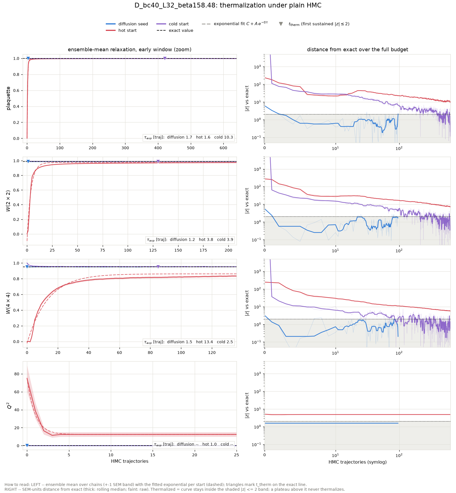

tau_int (hot-start chains, second half): plaquette = 22.49 +- 2.13, wilson_2x2 = 33.92 +- 2.15, wilson_4x4 = 26.80 +- 2.76, wilson_6x6 = 8.24 +- 1.18. Topology: hot-start HMC L=32 beta=158.48 -> **frozen** (no tunneling).

Where 'never' stood at the end: the hot start ended the 640-trajectory budget still at plaquette at |z| ~ 10, wilson_2x2 at |z| ~ 7, wilson_4x4 at |z| ~ 6, wilson_6x6 at |z| ~ 6, Q^2 at |z| ~ 5; the cold start ended the 640-trajectory budget still at Q^2 at |z| ~ 86933716992.

### Diagnostics: raw diffusion output (before any HMC)

| observable | value | error | exact | z_exact | reference | ref_error | z_ref | ks_p | chi2_p |
|---|---|---|---|---|---|---|---|---|---|
| plaquette | 0.9968 | 1.464e-05 | 0.9968 | -5.558 | 0.9969 | 9.701e-06 | -7.143 | 2.312e-10 |  |
| wilson_1x1 | 0.9968 | 1.464e-05 | 0.9968 | -5.558 | 0.9969 | 9.701e-06 | -7.143 | 2.312e-10 |  |
| wilson_1x2 | 0.9934 | 3.204e-05 | 0.9937 | -8 | 0.9938 | 2.305e-05 | -9.119 | 2.232e-14 |  |
| wilson_2x2 | 0.987 | 7.091e-05 | 0.9874 | -6.268 | 0.9876 | 5.497e-05 | -6.167 | 5.786e-06 |  |
| wilson_2x3 | 0.9806 | 0.0001469 | 0.9812 | -4.392 | 0.9813 | 0.0001096 | -4.026 | 0.0001241 |  |
| wilson_3x3 | 0.9713 | 0.0002446 | 0.972 | -2.933 | 0.9719 | 0.0001762 | -1.886 | 0.1866 |  |
| wilson_3x4 | 0.9618 | 0.0003601 | 0.9629 | -3.275 | 0.9627 | 0.000272 | -1.992 | 0.06904 |  |
| wilson_4x4 | 0.9493 | 0.0005486 | 0.951 | -2.985 | 0.9504 | 0.000397 | -1.564 | 0.1519 |  |
| wilson_4x5 | 0.9372 | 0.0007313 | 0.9392 | -2.801 | 0.9384 | 0.000576 | -1.282 | 0.3001 |  |
| wilson_5x5 | 0.9226 | 0.0009729 | 0.9248 | -2.226 | 0.9236 | 0.0008043 | -0.7716 | 0.6808 |  |
| wilson_5x6 | 0.908 | 0.001313 | 0.9106 | -1.993 | 0.909 | 0.00108 | -0.5716 | 0.5266 |  |
| wilson_6x6 | 0.8908 | 0.001659 | 0.894 | -1.946 | 0.8918 | 0.001383 | -0.4572 | 0.4545 |  |
| wilson_6x7 | 0.8744 | 0.00211 | 0.8778 | -1.626 | 0.8753 | 0.001774 | -0.3533 | 0.8288 |  |
| wilson_7x7 | 0.8555 | 0.002591 | 0.8594 | -1.484 | 0.8564 | 0.002156 | -0.2567 | 0.939 |  |
| wilson_7x8 | 0.8373 | 0.003277 | 0.8414 | -1.266 | 0.838 | 0.00269 | -0.1719 | 0.5643 |  |
| wilson_8x8 | 0.8166 | 0.003913 | 0.8216 | -1.268 | 0.8174 | 0.003231 | -0.1491 | 0.6808 |  |
| wilson_8x10 | 0.7775 | 0.00547 | 0.7837 | -1.14 | 0.7786 | 0.004376 | -0.161 | 0.6418 |  |
| wilson_10x10 | 0.732 | 0.007075 | 0.7397 | -1.086 | 0.733 | 0.005825 | -0.1085 | 0.7195 |  |
| wilson_10x12 | 0.6907 | 0.009175 | 0.699 | -0.9023 | 0.6913 | 0.007167 | -0.04971 | 0.5643 |  |
| wilson_12x12 | 0.6449 | 0.01129 | 0.6544 | -0.8476 | 0.646 | 0.008801 | -0.07506 | 0.7941 |  |
| creutz_2 | 0.003168 | 4.707e-05 | 0.003152 | 0.3367 |  |  |  |  |  |
| creutz_3 | 0.003002 | 9.255e-05 | 0.003129 | -1.373 |  |  |  |  |  |
| creutz_4 | 0.003105 | 0.0001511 | 0.003094 | 0.07345 |  |  |  |  |  |
| creutz_5 | 0.002748 | 0.0002445 | 0.003047 | -1.221 |  |  |  |  |  |
| creutz_6 | 0.003197 | 0.000363 | 0.002987 | 0.5777 |  |  |  |  |  |
| creutz_7 | 0.003184 | 0.0005026 | 0.002915 | 0.5362 |  |  |  |  |  |
| creutz_8 | 0.003485 | 0.0006631 | 0.002827 | 0.992 |  |  |  |  |  |
| Q | 0.02344 | 0.02018 | 0 | 1.161 | -0.005208 | 0.02198 | 0.9601 | 0.9999 |  |
| Q^2 | 0.05469 | 0.01682 | 0.08693 | -1.917 | 0.09896 | 0.01707 | -1.847 | 0.9978 |  |
| chi_top ((<Q^2>-<Q>^2)/V) | 5.287e-05 | 1.948e-05 | 8.49e-05 | -1.644 | 9.661e-05 | 2.12e-05 | -1.519 |  |  |
| Q histogram vs exact P(Q) | 2.483 | nan | 2 | nan |  |  |  |  | 0.289 |

### Diagnostics: the same configs after 96 HMC trajectories

| observable | value | error | exact | z_exact | reference | ref_error | z_ref | ks_p | chi2_p |
|---|---|---|---|---|---|---|---|---|---|
| plaquette | 0.9969 | 1.226e-05 | 0.9968 | 2.121 | 0.9969 | 9.701e-06 | -1.155 | 0.02145 |  |
| wilson_1x1 | 0.9969 | 1.226e-05 | 0.9968 | 2.121 | 0.9969 | 9.701e-06 | -1.155 | 0.02145 |  |
| wilson_1x2 | 0.9938 | 2.794e-05 | 0.9937 | 2.474 | 0.9938 | 2.305e-05 | -0.9517 | 0.7941 |  |
| wilson_2x2 | 0.9876 | 7.548e-05 | 0.9874 | 1.75 | 0.9876 | 5.497e-05 | 0.2487 | 0.9719 |  |
| wilson_2x3 | 0.9815 | 0.0001331 | 0.9812 | 1.725 | 0.9813 | 0.0001096 | 0.7945 | 0.2741 |  |
| wilson_3x3 | 0.9722 | 0.0002614 | 0.972 | 0.8223 | 0.9719 | 0.0001762 | 1.154 | 0.3879 |  |
| wilson_3x4 | 0.9632 | 0.000385 | 0.9629 | 0.6683 | 0.9627 | 0.000272 | 1.14 | 0.5266 |  |
| wilson_4x4 | 0.9511 | 0.0005962 | 0.951 | 0.1919 | 0.9504 | 0.000397 | 0.9671 | 0.5266 |  |
| wilson_4x5 | 0.9392 | 0.0008758 | 0.9392 | -0.0344 | 0.9384 | 0.000576 | 0.7872 | 0.6028 |  |
| wilson_5x5 | 0.9245 | 0.001223 | 0.9248 | -0.1939 | 0.9236 | 0.0008043 | 0.6522 | 0.6418 |  |
| wilson_5x6 | 0.9102 | 0.001657 | 0.9106 | -0.2396 | 0.909 | 0.00108 | 0.6306 | 0.6418 |  |
| wilson_6x6 | 0.8937 | 0.002139 | 0.894 | -0.1255 | 0.8918 | 0.001383 | 0.7745 | 0.2272 |  |
| wilson_6x7 | 0.8775 | 0.00276 | 0.8778 | -0.09305 | 0.8753 | 0.001774 | 0.6707 | 0.1866 |  |
| wilson_7x7 | 0.8592 | 0.003352 | 0.8594 | -0.04431 | 0.8564 | 0.002156 | 0.7103 | 0.09806 |  |
| wilson_7x8 | 0.8412 | 0.004051 | 0.8414 | -0.04823 | 0.838 | 0.00269 | 0.6628 | 0.06115 |  |
| wilson_8x8 | 0.8212 | 0.004831 | 0.8216 | -0.07502 | 0.8174 | 0.003231 | 0.661 | 0.09806 |  |
| wilson_8x10 | 0.7826 | 0.006476 | 0.7837 | -0.171 | 0.7786 | 0.004376 | 0.5115 | 0.1098 |  |
| wilson_10x10 | 0.7375 | 0.008731 | 0.7397 | -0.2428 | 0.733 | 0.005825 | 0.4354 | 0.2498 |  |
| wilson_10x12 | 0.6963 | 0.01067 | 0.699 | -0.2518 | 0.6913 | 0.007167 | 0.3899 | 0.1866 |  |
| wilson_12x12 | 0.6515 | 0.01317 | 0.6544 | -0.2256 | 0.646 | 0.008801 | 0.3488 | 0.2498 |  |
| creutz_2 | 0.003131 | 4.715e-05 | 0.003152 | -0.4397 |  |  |  |  |  |
| creutz_3 | 0.003242 | 9.698e-05 | 0.003129 | 1.168 |  |  |  |  |  |
| creutz_4 | 0.003287 | 0.0001676 | 0.003094 | 1.151 |  |  |  |  |  |
| creutz_5 | 0.003119 | 0.0002357 | 0.003047 | 0.3059 |  |  |  |  |  |
| creutz_6 | 0.002672 | 0.0003661 | 0.002987 | -0.8609 |  |  |  |  |  |
| creutz_7 | 0.002803 | 0.0004186 | 0.002915 | -0.2676 |  |  |  |  |  |
| creutz_8 | 0.002976 | 0.0006076 | 0.002827 | 0.2461 |  |  |  |  |  |
| Q | 0.02344 | 0.02018 | 0 | 1.161 | -0.005208 | 0.02198 | 0.9601 | 0.9999 |  |
| Q^2 | 0.05469 | 0.01682 | 0.08693 | -1.917 | 0.09896 | 0.01707 | -1.847 | 0.9978 |  |
| chi_top ((<Q^2>-<Q>^2)/V) | 5.287e-05 | 1.948e-05 | 8.49e-05 | -1.644 | 9.661e-05 | 2.12e-05 | -1.519 |  |  |
| Q histogram vs exact P(Q) | 2.483 | nan | 2 | nan |  |  |  |  | 0.289 |

## E_bc45_L32_beta178.482

HMC: step size 0.0299, 33 leapfrog steps, acceptance seed/hot/cold = 0.977/0.971/0.978. Diffusion-seed batch: 128 chains x 96 trajectories (0.23 s/traj for the whole batch); baselines: 32 chains x 640 trajectories.

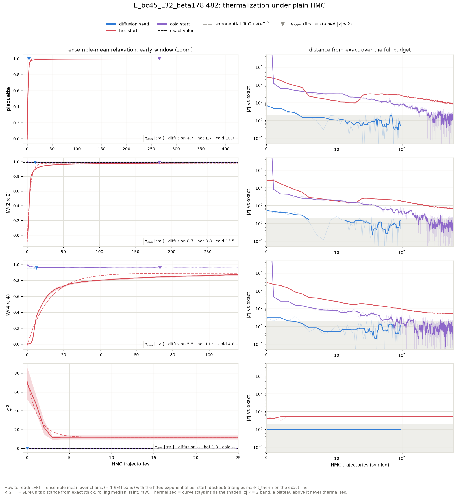

tau_int (hot-start chains, second half): plaquette = 20.28 +- 1.77, wilson_2x2 = 14.36 +- 1.71, wilson_4x4 = 4.29 +- 0.66, wilson_6x6 = 3.29 +- 0.43. Topology: hot-start HMC L=32 beta=178.482 -> **frozen** (no tunneling).

Where 'never' stood at the end: the hot start ended the 640-trajectory budget still at plaquette at |z| ~ 9, wilson_2x2 at |z| ~ 7, wilson_4x4 at |z| ~ 5, wilson_6x6 at |z| ~ 6, Q^2 at |z| ~ 5; the cold start ended the 640-trajectory budget still at Q^2 at |z| ~ 60793004032.

### Diagnostics: raw diffusion output (before any HMC)

| observable | value | error | exact | z_exact | reference | ref_error | z_ref | ks_p | chi2_p |
|---|---|---|---|---|---|---|---|---|---|
| plaquette | 0.9971 | 1.034e-05 | 0.9972 | -6.91 | 0.9972 | 7.337e-06 | -6.64 | 2.304e-07 |  |
| wilson_1x1 | 0.9971 | 1.034e-05 | 0.9972 | -6.91 | 0.9972 | 7.337e-06 | -6.64 | 2.304e-07 |  |
| wilson_1x2 | 0.9942 | 2.613e-05 | 0.9944 | -7.867 | 0.9944 | 1.932e-05 | -6.531 | 4.604e-08 |  |
| wilson_2x2 | 0.9885 | 6.311e-05 | 0.9889 | -5.261 | 0.9889 | 5.325e-05 | -4.889 | 0.001748 |  |
| wilson_2x3 | 0.9829 | 0.0001138 | 0.9833 | -3.764 | 0.9835 | 9.004e-05 | -4.083 | 0.002916 |  |
| wilson_3x3 | 0.9747 | 0.0001959 | 0.9752 | -2.357 | 0.9755 | 0.0001822 | -3.104 | 0.06904 |  |
| wilson_3x4 | 0.9662 | 0.0003215 | 0.9671 | -2.634 | 0.9675 | 0.0002853 | -2.904 | 0.04195 |  |
| wilson_4x4 | 0.955 | 0.0004948 | 0.9564 | -2.884 | 0.957 | 0.0004186 | -3.083 | 0.004773 |  |
| wilson_4x5 | 0.9441 | 0.0006999 | 0.946 | -2.727 | 0.9465 | 0.0006084 | -2.667 | 0.01039 |  |
| wilson_5x5 | 0.9305 | 0.0009627 | 0.9331 | -2.683 | 0.9335 | 0.0007862 | -2.391 | 0.02464 |  |
| wilson_5x6 | 0.917 | 0.001291 | 0.9205 | -2.708 | 0.9211 | 0.001066 | -2.417 | 0.008934 |  |
| wilson_6x6 | 0.9008 | 0.001686 | 0.9057 | -2.876 | 0.9062 | 0.001265 | -2.559 | 0.04195 |  |
| wilson_6x7 | 0.8851 | 0.002105 | 0.8912 | -2.926 | 0.8916 | 0.001627 | -2.468 | 0.01864 |  |
| wilson_7x7 | 0.8671 | 0.002558 | 0.8748 | -2.987 | 0.8757 | 0.00193 | -2.681 | 0.06115 |  |
| wilson_7x8 | 0.8493 | 0.003161 | 0.8588 | -2.979 | 0.8595 | 0.002345 | -2.573 | 0.09806 |  |
| wilson_8x8 | 0.8298 | 0.003759 | 0.841 | -2.973 | 0.8421 | 0.002679 | -2.675 | 0.02145 |  |
| wilson_8x10 | 0.7912 | 0.005227 | 0.807 | -3.028 | 0.8089 | 0.003806 | -2.737 | 0.01398 |  |
| wilson_10x10 | 0.7474 | 0.006753 | 0.7675 | -2.977 | 0.7705 | 0.005102 | -2.728 | 0.03229 |  |
| wilson_10x12 | 0.7056 | 0.008745 | 0.7309 | -2.887 | 0.7339 | 0.006636 | -2.57 | 0.1098 |  |
| wilson_12x12 | 0.6621 | 0.01088 | 0.6906 | -2.625 | 0.694 | 0.00825 | -2.338 | 0.06904 |  |
| creutz_2 | 0.002789 | 3.795e-05 | 0.002795 | -0.1602 |  |  |  |  |  |
| creutz_3 | 0.002707 | 8.843e-05 | 0.002769 | -0.7005 |  |  |  |  |  |
| creutz_4 | 0.002946 | 0.0001462 | 0.002731 | 1.471 |  |  |  |  |  |
| creutz_5 | 0.002905 | 0.0002121 | 0.002679 | 1.064 |  |  |  |  |  |
| creutz_6 | 0.003142 | 0.0003251 | 0.002614 | 1.623 |  |  |  |  |  |
| creutz_7 | 0.002805 | 0.0003921 | 0.002535 | 0.6865 |  |  |  |  |  |
| creutz_8 | 0.002539 | 0.0005028 | 0.002441 | 0.1942 |  |  |  |  |  |
| Q | 0.03906 | 0.02568 | 0 | 1.521 | -0.005208 | 0.01167 | 1.569 | 0.9991 |  |
| Q^2 | 0.08594 | 0.02809 | 0.06079 | 0.8952 | 0.04688 | 0.01666 | 1.196 | 0.9997 |  |
| chi_top ((<Q^2>-<Q>^2)/V) | 8.243e-05 | 2.368e-05 | 5.937e-05 | 0.9742 | 4.575e-05 | 1.5e-05 | 1.309 |  |  |
| Q histogram vs exact P(Q) | 4.632 | nan | 2 | nan |  |  |  |  | 0.09869 |

### Diagnostics: the same configs after 96 HMC trajectories

| observable | value | error | exact | z_exact | reference | ref_error | z_ref | ks_p | chi2_p |
|---|---|---|---|---|---|---|---|---|---|
| plaquette | 0.9972 | 9.851e-06 | 0.9972 | -0.5664 | 0.9972 | 7.337e-06 | -1.491 | 0.1519 |  |
| wilson_1x1 | 0.9972 | 9.851e-06 | 0.9972 | -0.5664 | 0.9972 | 7.337e-06 | -1.491 | 0.1519 |  |
| wilson_1x2 | 0.9944 | 2.557e-05 | 0.9944 | -1.097 | 0.9944 | 1.932e-05 | -1.083 | 0.4899 |  |
| wilson_2x2 | 0.9888 | 5.946e-05 | 0.9889 | -1.467 | 0.9889 | 5.325e-05 | -1.991 | 0.2061 |  |
| wilson_2x3 | 0.9832 | 0.0001085 | 0.9833 | -1.172 | 0.9835 | 9.004e-05 | -2.066 | 0.3879 |  |
| wilson_3x3 | 0.9749 | 0.0001949 | 0.9752 | -1.272 | 0.9755 | 0.0001822 | -2.311 | 0.1226 |  |
| wilson_3x4 | 0.9667 | 0.0002999 | 0.9671 | -1.248 | 0.9675 | 0.0002853 | -1.874 | 0.08742 |  |
| wilson_4x4 | 0.9559 | 0.0004389 | 0.9564 | -1.249 | 0.957 | 0.0004186 | -1.846 | 0.2061 |  |
| wilson_4x5 | 0.9451 | 0.00062 | 0.946 | -1.414 | 0.9465 | 0.0006084 | -1.66 | 0.4545 |  |
| wilson_5x5 | 0.9319 | 0.0008907 | 0.9331 | -1.4 | 0.9335 | 0.0007862 | -1.376 | 0.5266 |  |
| wilson_5x6 | 0.9187 | 0.001207 | 0.9205 | -1.487 | 0.9211 | 0.001066 | -1.457 | 0.5266 |  |
| wilson_6x6 | 0.9036 | 0.001625 | 0.9057 | -1.286 | 0.9062 | 0.001265 | -1.279 | 0.7195 |  |
| wilson_6x7 | 0.8889 | 0.002078 | 0.8912 | -1.135 | 0.8916 | 0.001627 | -1.048 | 0.7575 |  |
| wilson_7x7 | 0.8717 | 0.002627 | 0.8748 | -1.179 | 0.8757 | 0.00193 | -1.242 | 0.4899 |  |
| wilson_7x8 | 0.855 | 0.003221 | 0.8588 | -1.156 | 0.8595 | 0.002345 | -1.113 | 0.6808 |  |
| wilson_8x8 | 0.8364 | 0.00394 | 0.841 | -1.153 | 0.8421 | 0.002679 | -1.2 | 0.6808 |  |
| wilson_8x10 | 0.8004 | 0.005351 | 0.807 | -1.235 | 0.8089 | 0.003806 | -1.291 | 0.6418 |  |
| wilson_10x10 | 0.7583 | 0.006959 | 0.7675 | -1.314 | 0.7705 | 0.005102 | -1.406 | 0.5266 |  |
| wilson_10x12 | 0.7193 | 0.008599 | 0.7309 | -1.348 | 0.7339 | 0.006636 | -1.34 | 0.6028 |  |
| wilson_12x12 | 0.677 | 0.01056 | 0.6906 | -1.295 | 0.694 | 0.00825 | -1.272 | 0.6418 |  |
| creutz_2 | 0.002832 | 4.19e-05 | 0.002795 | 0.8923 |  |  |  |  |  |
| creutz_3 | 0.002853 | 8.357e-05 | 0.002769 | 1.002 |  |  |  |  |  |
| creutz_4 | 0.002784 | 0.0001433 | 0.002731 | 0.3727 |  |  |  |  |  |
| creutz_5 | 0.002735 | 0.0002216 | 0.002679 | 0.2498 |  |  |  |  |  |
| creutz_6 | 0.002356 | 0.0003206 | 0.002614 | -0.8064 |  |  |  |  |  |
| creutz_7 | 0.003094 | 0.0004146 | 0.002535 | 1.347 |  |  |  |  |  |
| creutz_8 | 0.002712 | 0.0005551 | 0.002441 | 0.4886 |  |  |  |  |  |
| Q | 0.03906 | 0.02568 | 0 | 1.521 | -0.005208 | 0.01167 | 1.569 | 0.9991 |  |
| Q^2 | 0.08594 | 0.02809 | 0.06079 | 0.8952 | 0.04688 | 0.01666 | 1.196 | 0.9997 |  |
| chi_top ((<Q^2>-<Q>^2)/V) | 8.243e-05 | 2.368e-05 | 5.937e-05 | 0.9742 | 4.575e-05 | 1.5e-05 | 1.309 |  |  |
| Q histogram vs exact P(Q) | 4.632 | nan | 2 | nan |  |  |  |  | 0.09869 |

## D_bc55.0237_L32_beta218.58

HMC: step size 0.0271, 37 leapfrog steps, acceptance seed/hot/cold = 0.976/0.968/0.976. Diffusion-seed batch: 128 chains x 96 trajectories (0.36 s/traj for the whole batch); baselines: 32 chains x 640 trajectories.

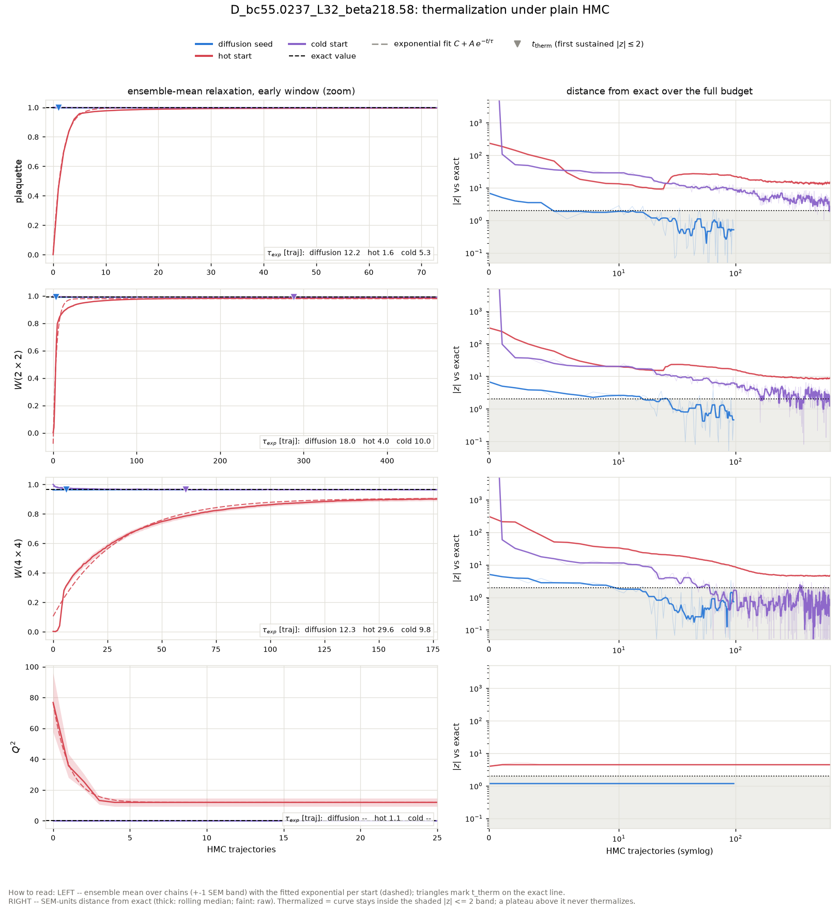

tau_int (hot-start chains, second half): plaquette = 10.10 +- 1.42, wilson_2x2 = 10.25 +- 1.78, wilson_4x4 = 6.30 +- 0.71, wilson_6x6 = 6.88 +- 0.65. Topology: hot-start HMC L=32 beta=218.58 -> **frozen** (no tunneling).

Where 'never' stood at the end: the hot start ended the 640-trajectory budget still at plaquette at |z| ~ 14, wilson_2x2 at |z| ~ 9, wilson_4x4 at |z| ~ 5, wilson_6x6 at |z| ~ 5, Q^2 at |z| ~ 4; the cold start ended the 640-trajectory budget still at plaquette at |z| ~ 3, Q^2 at |z| ~ 29010771968.

### Diagnostics: raw diffusion output (before any HMC)

| observable | value | error | exact | z_exact | reference | ref_error | z_ref | ks_p |
|---|---|---|---|---|---|---|---|---|
| plaquette | 0.9977 | 7.31e-06 | 0.9977 | -8.164 | 0.9978 | 6.736e-06 | -9.887 | 4.771e-09 |
| wilson_1x1 | 0.9977 | 7.31e-06 | 0.9977 | -8.164 | 0.9978 | 6.736e-06 | -9.887 | 4.771e-09 |
| wilson_1x2 | 0.9953 | 1.961e-05 | 0.9954 | -9.147 | 0.9955 | 1.355e-05 | -10.45 | 5.79e-13 |
| wilson_2x2 | 0.9905 | 5.061e-05 | 0.9909 | -7.014 | 0.991 | 3.239e-05 | -8.216 | 4.771e-09 |
| wilson_2x3 | 0.9858 | 8.527e-05 | 0.9864 | -7.063 | 0.9865 | 6.676e-05 | -6.845 | 2.84e-06 |
| wilson_3x3 | 0.9789 | 0.0001698 | 0.9797 | -4.876 | 0.9798 | 0.0001074 | -4.679 | 0.0008568 |
| wilson_3x4 | 0.9717 | 0.0002533 | 0.9731 | -5.491 | 0.9729 | 0.0001666 | -4.083 | 0.001027 |
| wilson_4x4 | 0.9623 | 0.0004175 | 0.9644 | -4.942 | 0.9641 | 0.0002334 | -3.614 | 0.003444 |
| wilson_4x5 | 0.9531 | 0.0005647 | 0.9558 | -4.754 | 0.9554 | 0.0003303 | -3.393 | 0.02823 |
| wilson_5x5 | 0.9419 | 0.0008093 | 0.9453 | -4.204 | 0.9448 | 0.0004291 | -3.201 | 0.03229 |
| wilson_5x6 | 0.9305 | 0.00103 | 0.935 | -4.317 | 0.9344 | 0.0005682 | -3.32 | 0.04767 |
| wilson_6x6 | 0.9171 | 0.001285 | 0.9228 | -4.433 | 0.9223 | 0.0007372 | -3.48 | 0.02464 |
| wilson_6x7 | 0.904 | 0.001575 | 0.9109 | -4.411 | 0.9099 | 0.0009348 | -3.262 | 0.03229 |
| wilson_7x7 | 0.8889 | 0.001919 | 0.8974 | -4.421 | 0.8966 | 0.001093 | -3.471 | 0.007662 |
| wilson_7x8 | 0.8742 | 0.002311 | 0.8842 | -4.348 | 0.8831 | 0.001254 | -3.407 | 0.01864 |
| wilson_8x8 | 0.8577 | 0.002621 | 0.8696 | -4.516 | 0.8685 | 0.001475 | -3.592 | 0.01616 |
| wilson_8x10 | 0.8256 | 0.003635 | 0.8415 | -4.373 | 0.8398 | 0.002013 | -3.404 | 0.002464 |
| wilson_10x10 | 0.7901 | 0.004658 | 0.8088 | -4.026 | 0.808 | 0.002669 | -3.335 | 0.001027 |
| wilson_10x12 | 0.7556 | 0.005944 | 0.7785 | -3.851 | 0.777 | 0.003559 | -3.097 | 0.0004908 |
| wilson_12x12 | 0.7214 | 0.007102 | 0.745 | -3.325 | 0.7464 | 0.004672 | -2.944 | 0.001229 |
| creutz_2 | 0.002335 | 3.468e-05 | 0.002278 | 1.665 |  |  |  |  |
| creutz_3 | 0.002232 | 7.188e-05 | 0.00225 | -0.2518 |  |  |  |  |
| creutz_4 | 0.002336 | 0.0001142 | 0.00221 | 1.106 |  |  |  |  |
| creutz_5 | 0.002277 | 0.0001722 | 0.002155 | 0.7076 |  |  |  |  |
| creutz_6 | 0.002354 | 0.0002497 | 0.002087 | 1.07 |  |  |  |  |
| creutz_7 | 0.00239 | 0.000303 | 0.002005 | 1.271 |  |  |  |  |
| creutz_8 | 0.002258 | 0.0004072 | 0.001907 | 0.8611 |  |  |  |  |
| Q | 0.01562 | 0.01069 | 0 | 1.462 | 0.005208 | 0.01716 | 0.5152 | 1 |
| Q^2 | 0.01562 | 0.01069 | 0.02901 | -1.253 | 0.04688 | 0.01365 | -1.802 | 1 |
| chi_top ((<Q^2>-<Q>^2)/V) | 1.502e-05 | 1.049e-05 | 2.833e-05 | -1.268 | 4.575e-05 | 1.5e-05 | -1.679 |  |

### Diagnostics: the same configs after 96 HMC trajectories

| observable | value | error | exact | z_exact | reference | ref_error | z_ref | ks_p |
|---|---|---|---|---|---|---|---|---|
| plaquette | 0.9977 | 8.62e-06 | 0.9977 | -0.5505 | 0.9978 | 6.736e-06 | -3.962 | 0.02823 |
| wilson_1x1 | 0.9977 | 8.62e-06 | 0.9977 | -0.5505 | 0.9978 | 6.736e-06 | -3.962 | 0.02823 |
| wilson_1x2 | 0.9954 | 2.264e-05 | 0.9954 | 0.3016 | 0.9955 | 1.355e-05 | -2.383 | 0.07777 |
| wilson_2x2 | 0.9909 | 7.144e-05 | 0.9909 | 0.3702 | 0.991 | 3.239e-05 | -1.432 | 0.4204 |
| wilson_2x3 | 0.9865 | 0.000131 | 0.9864 | 0.5987 | 0.9865 | 6.676e-05 | -0.4115 | 0.7195 |
| wilson_3x3 | 0.9798 | 0.0002016 | 0.9797 | 0.3454 | 0.9798 | 0.0001074 | -0.186 | 0.9719 |
| wilson_3x4 | 0.9732 | 0.0003034 | 0.9731 | 0.354 | 0.9729 | 0.0001666 | 0.7528 | 0.6418 |
| wilson_4x4 | 0.9647 | 0.000415 | 0.9644 | 0.6808 | 0.9641 | 0.0002334 | 1.296 | 0.3001 |
| wilson_4x5 | 0.9562 | 0.0005784 | 0.9558 | 0.6467 | 0.9554 | 0.0003303 | 1.259 | 0.4204 |
| wilson_5x5 | 0.9459 | 0.000703 | 0.9453 | 0.9042 | 0.9448 | 0.0004291 | 1.343 | 0.2741 |
| wilson_5x6 | 0.9359 | 0.0009179 | 0.935 | 1.031 | 0.9344 | 0.0005682 | 1.378 | 0.357 |
| wilson_6x6 | 0.9239 | 0.001074 | 0.9228 | 1.025 | 0.9223 | 0.0007372 | 1.26 | 0.2061 |
| wilson_6x7 | 0.9124 | 0.001297 | 0.9109 | 1.134 | 0.9099 | 0.0009348 | 1.529 | 0.357 |
| wilson_7x7 | 0.8993 | 0.001483 | 0.8974 | 1.271 | 0.8966 | 0.001093 | 1.467 | 0.3001 |
| wilson_7x8 | 0.8863 | 0.001818 | 0.8842 | 1.154 | 0.8831 | 0.001254 | 1.443 | 0.6808 |
| wilson_8x8 | 0.8723 | 0.002056 | 0.8696 | 1.336 | 0.8685 | 0.001475 | 1.494 | 0.7941 |
| wilson_8x10 | 0.8448 | 0.002862 | 0.8415 | 1.135 | 0.8398 | 0.002013 | 1.429 | 0.6808 |
| wilson_10x10 | 0.8128 | 0.00356 | 0.8088 | 1.117 | 0.808 | 0.002669 | 1.084 | 0.9827 |
| wilson_10x12 | 0.7832 | 0.004475 | 0.7785 | 1.064 | 0.777 | 0.003559 | 1.084 | 0.9167 |
| wilson_12x12 | 0.7506 | 0.005438 | 0.745 | 1.033 | 0.7464 | 0.004672 | 0.5866 | 0.9719 |
| creutz_2 | 0.002269 | 3.478e-05 | 0.002278 | -0.2362 |  |  |  |  |
| creutz_3 | 0.002312 | 7.166e-05 | 0.00225 | 0.8548 |  |  |  |  |
| creutz_4 | 0.002066 | 0.0001165 | 0.00221 | -1.23 |  |  |  |  |
| creutz_5 | 0.001973 | 0.00016 | 0.002155 | -1.141 |  |  |  |  |
| creutz_6 | 0.002246 | 0.0002318 | 0.002087 | 0.6845 |  |  |  |  |
| creutz_7 | 0.001942 | 0.0003194 | 0.002005 | -0.1964 |  |  |  |  |
| creutz_8 | 0.001394 | 0.0004391 | 0.001907 | -1.169 |  |  |  |  |
| Q | 0.01562 | 0.01069 | 0 | 1.462 | 0.005208 | 0.01716 | 0.5152 | 1 |
| Q^2 | 0.01562 | 0.01069 | 0.02901 | -1.253 | 0.04688 | 0.01365 | -1.802 | 1 |
| chi_top ((<Q^2>-<Q>^2)/V) | 1.502e-05 | 1.049e-05 | 2.833e-05 | -1.268 | 4.575e-05 | 1.5e-05 | -1.679 |  |

## F_L32_bc100_L32_beta398.492

HMC: step size 0.0200, 50 leapfrog steps, acceptance seed/hot/cold = 0.976/0.869/0.977. Diffusion-seed batch: 64 chains x 96 trajectories (0.35 s/traj for the whole batch); baselines: 32 chains x 640 trajectories.

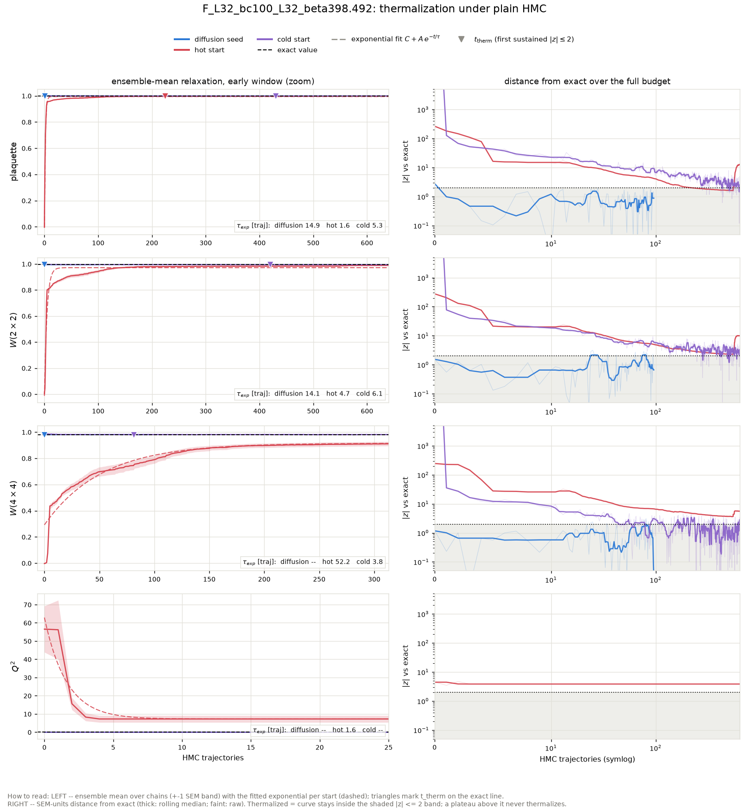

tau_int (hot-start chains, second half): plaquette = 32.18 +- 1.69, wilson_2x2 = 29.62 +- 2.02, wilson_4x4 = 20.87 +- 2.35, wilson_6x6 = 5.37 +- 1.47. Topology: hot-start HMC L=32 beta=398.492 -> **frozen** (no tunneling).

Where 'never' stood at the end: the hot start ended the 640-trajectory budget still at wilson_2x2 at |z| ~ 10, wilson_4x4 at |z| ~ 6, wilson_6x6 at |z| ~ 4, Q^2 at |z| ~ 4; the cold start ended the 640-trajectory budget still at Q^2 at |z| ~ 930603328.

### Diagnostics: raw diffusion output (before any HMC)

| observable | value | error | exact | z_exact | reference | ref_error | z_ref | ks_p |
|---|---|---|---|---|---|---|---|---|
| plaquette | 0.9987 | 6.893e-06 | 0.9987 | -2.535 | 0.9988 | 5.084e-06 | -2.608 | 0.03572 |
| wilson_1x1 | 0.9987 | 6.893e-06 | 0.9987 | -2.535 | 0.9988 | 5.084e-06 | -2.608 | 0.03572 |
| wilson_1x2 | 0.9974 | 1.926e-05 | 0.9975 | -2.763 | 0.9975 | 1.464e-05 | -2.738 | 0.01997 |
| wilson_2x2 | 0.995 | 4.422e-05 | 0.995 | -1.275 | 0.9951 | 3.068e-05 | -2.155 | 0.1015 |
| wilson_2x3 | 0.9925 | 7.988e-05 | 0.9925 | -0.5677 | 0.9926 | 5.45e-05 | -1.494 | 0.1389 |
| wilson_3x3 | 0.9889 | 0.0001363 | 0.9889 | 0.02132 | 0.989 | 9.481e-05 | -0.7363 | 0.2464 |
| wilson_3x4 | 0.9851 | 0.0001962 | 0.9852 | -0.4706 | 0.9854 | 0.000137 | -1.009 | 0.2811 |
| wilson_4x4 | 0.9801 | 0.0003025 | 0.9804 | -0.9995 | 0.9805 | 0.0002143 | -1.006 | 0.3607 |
| wilson_4x5 | 0.9752 | 0.0004158 | 0.9757 | -1.134 | 0.9757 | 0.0002884 | -1.081 | 0.3607 |
| wilson_5x5 | 0.9692 | 0.0005557 | 0.9698 | -1.138 | 0.9698 | 0.0004168 | -0.9378 | 0.4056 |
| wilson_5x6 | 0.9629 | 0.0007286 | 0.9641 | -1.579 | 0.964 | 0.0005537 | -1.17 | 0.215 |
| wilson_6x6 | 0.9557 | 0.0009283 | 0.9573 | -1.695 | 0.9571 | 0.0007516 | -1.157 | 0.1867 |
| wilson_6x7 | 0.9481 | 0.001188 | 0.9506 | -2.124 | 0.9501 | 0.000933 | -1.351 | 0.06142 |
| wilson_7x7 | 0.9399 | 0.001458 | 0.943 | -2.163 | 0.9423 | 0.001193 | -1.286 | 0.07294 |
| wilson_7x8 | 0.9312 | 0.001809 | 0.9356 | -2.44 | 0.9346 | 0.001401 | -1.468 | 0.1015 |
| wilson_8x8 | 0.9218 | 0.002046 | 0.9273 | -2.704 | 0.9257 | 0.001694 | -1.476 | 0.04298 |
| wilson_8x10 | 0.9032 | 0.002737 | 0.9114 | -2.987 | 0.9085 | 0.002151 | -1.521 | 0.07294 |
| wilson_10x10 | 0.8816 | 0.003398 | 0.8927 | -3.264 | 0.888 | 0.002928 | -1.42 | 0.02956 |
| wilson_10x12 | 0.8604 | 0.00418 | 0.8752 | -3.546 | 0.8679 | 0.003643 | -1.358 | 0.1614 |
| wilson_12x12 | 0.8368 | 0.004919 | 0.8557 | -3.855 | 0.8462 | 0.004714 | -1.389 | 0.1867 |
| creutz_2 | 0.001213 | 2.24e-05 | 0.001245 | -1.452 |  |  |  |  |
| creutz_3 | 0.001188 | 4.91e-05 | 0.001226 | -0.7671 |  |  |  |  |
| creutz_4 | 0.001315 | 8.898e-05 | 0.001197 | 1.327 |  |  |  |  |
| creutz_5 | 0.001153 | 0.0001154 | 0.001158 | -0.04893 |  |  |  |  |
| creutz_6 | 0.00102 | 0.0001797 | 0.00111 | -0.5019 |  |  |  |  |
| creutz_7 | 0.0007343 | 0.00028 | 0.001052 | -1.134 |  |  |  |  |
| creutz_8 | 0.0008628 | 0.000332 | 0.000984 | -0.3652 |  |  |  |  |
| Q | 0 | 0 | 0 | 0 | 0 | 0 | 0 | 1 |
| Q^2 | 0 | 0 | 0.0009306 | inf | 0 | 0 | 0 | 1 |
| chi_top ((<Q^2>-<Q>^2)/V) | 0 | 0 | 9.088e-07 | inf | 0 | 0 | 0 |  |

### Diagnostics: the same configs after 96 HMC trajectories

| observable | value | error | exact | z_exact | reference | ref_error | z_ref | ks_p |
|---|---|---|---|---|---|---|---|---|
| plaquette | 0.9988 | 4.421e-06 | 0.9987 | 1.329 | 0.9988 | 5.084e-06 | 0.15 | 0.9994 |
| wilson_1x1 | 0.9988 | 4.421e-06 | 0.9987 | 1.329 | 0.9988 | 5.084e-06 | 0.15 | 0.9994 |
| wilson_1x2 | 0.9975 | 1.188e-05 | 0.9975 | 1.016 | 0.9975 | 1.464e-05 | -0.05064 | 0.2811 |
| wilson_2x2 | 0.995 | 3.113e-05 | 0.995 | 0.899 | 0.9951 | 3.068e-05 | -0.7235 | 0.3192 |
| wilson_2x3 | 0.9925 | 6.029e-05 | 0.9925 | -0.07663 | 0.9926 | 5.45e-05 | -1.276 | 0.215 |
| wilson_3x3 | 0.9889 | 0.0001093 | 0.9889 | 0.05866 | 0.989 | 9.481e-05 | -0.821 | 0.3192 |
| wilson_3x4 | 0.9852 | 0.0001724 | 0.9852 | -0.1776 | 0.9854 | 0.000137 | -0.8165 | 0.2811 |
| wilson_4x4 | 0.9804 | 0.0002799 | 0.9804 | -0.02953 | 0.9805 | 0.0002143 | -0.224 | 0.3192 |
| wilson_4x5 | 0.9756 | 0.0003836 | 0.9757 | -0.1171 | 0.9757 | 0.0002884 | -0.2516 | 0.1614 |
| wilson_5x5 | 0.9698 | 0.0005662 | 0.9698 | -0.03678 | 0.9698 | 0.0004168 | -0.05663 | 0.3607 |
| wilson_5x6 | 0.964 | 0.0007237 | 0.9641 | -0.01583 | 0.964 | 0.0005537 | 0.07485 | 0.6679 |
| wilson_6x6 | 0.9573 | 0.0009899 | 0.9573 | -0.01107 | 0.9571 | 0.0007516 | 0.1451 | 0.5044 |
| wilson_6x7 | 0.9507 | 0.001207 | 0.9506 | 0.06891 | 0.9501 | 0.000933 | 0.3701 | 0.5575 |
| wilson_7x7 | 0.9432 | 0.001534 | 0.943 | 0.0812 | 0.9423 | 0.001193 | 0.4405 | 0.8723 |
| wilson_7x8 | 0.9358 | 0.001846 | 0.9356 | 0.0837 | 0.9346 | 0.001401 | 0.522 | 0.8269 |
| wilson_8x8 | 0.9273 | 0.002263 | 0.9273 | -0.003056 | 0.9257 | 0.001694 | 0.5679 | 0.7766 |
| wilson_8x10 | 0.9117 | 0.00305 | 0.9114 | 0.08322 | 0.9085 | 0.002151 | 0.8391 | 0.9929 |
| wilson_10x10 | 0.8928 | 0.004266 | 0.8927 | 0.03109 | 0.888 | 0.002928 | 0.9381 | 0.9433 |
| wilson_10x12 | 0.8744 | 0.005277 | 0.8752 | -0.147 | 0.8679 | 0.003643 | 1.016 | 0.9115 |
| wilson_12x12 | 0.8549 | 0.006744 | 0.8557 | -0.122 | 0.8462 | 0.004714 | 1.055 | 0.8269 |
| creutz_2 | 0.001236 | 2.229e-05 | 0.001245 | -0.4399 |  |  |  |  |
| creutz_3 | 0.001182 | 5.122e-05 | 0.001226 | -0.8575 |  |  |  |  |
| creutz_4 | 0.001137 | 8.871e-05 | 0.001197 | -0.6787 |  |  |  |  |
| creutz_5 | 0.001096 | 0.0001459 | 0.001158 | -0.4261 |  |  |  |  |
| creutz_6 | 0.001119 | 0.000225 | 0.00111 | 0.04071 |  |  |  |  |
| creutz_7 | 0.001106 | 0.0002757 | 0.001052 | 0.1972 |  |  |  |  |
| creutz_8 | 0.00119 | 0.000356 | 0.000984 | 0.5773 |  |  |  |  |
| Q | 0 | 0 | 0 | 0 | 0 | 0 | 0 | 1 |
| Q^2 | 0 | 0 | 0.0009306 | inf | 0 | 0 | 0 | 1 |
| chi_top ((<Q^2>-<Q>^2)/V) | 0 | 0 | 9.088e-07 | inf | 0 | 0 | 0 |  |

## F_L32_bc218.58_L32_beta872.816

HMC: step size 0.0135, 74 leapfrog steps, acceptance seed/hot/cold = 0.973/0.014/0.971. Diffusion-seed batch: 64 chains x 96 trajectories (0.47 s/traj for the whole batch); baselines: 32 chains x 640 trajectories.

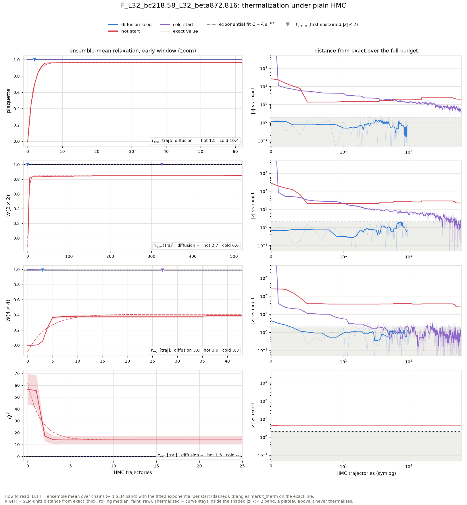

tau_int (hot-start chains, second half): plaquette = 2.41 +- 1.88, wilson_2x2 = 2.40 +- 1.87, wilson_4x4 = 2.36 +- 1.83, wilson_6x6 = 2.33 +- 1.80. Topology: hot-start HMC L=32 beta=872.816 -> **frozen** (no tunneling).

Where 'never' stood at the end: the hot start ended the 640-trajectory budget still at plaquette at |z| ~ 20, wilson_2x2 at |z| ~ 22, wilson_4x4 at |z| ~ 25, wilson_6x6 at |z| ~ 31, Q^2 at |z| ~ 4; the cold start ended the 640-trajectory budget still at plaquette at |z| ~ 6, Q^2 at |z| ~ 99603.

### Diagnostics: raw diffusion output (before any HMC)

| observable | value | error | exact | z_exact | reference | ref_error | z_ref | ks_p |
|---|---|---|---|---|---|---|---|---|
| plaquette | 0.9994 | 2.436e-06 | 0.9994 | -1.354 | 0.9994 | 1.99e-06 | -1.273 | 0.6123 |
| wilson_1x1 | 0.9994 | 2.436e-06 | 0.9994 | -1.354 | 0.9994 | 1.99e-06 | -1.273 | 0.6123 |
| wilson_1x2 | 0.9988 | 7.807e-06 | 0.9989 | -1.763 | 0.9989 | 5.047e-06 | -1.095 | 0.6123 |
| wilson_2x2 | 0.9977 | 1.636e-05 | 0.9977 | -0.7722 | 0.9977 | 1.337e-05 | -1.036 | 0.2464 |
| wilson_2x3 | 0.9965 | 2.471e-05 | 0.9966 | -2.305 | 0.9966 | 2.116e-05 | -1.552 | 0.3607 |
| wilson_3x3 | 0.9948 | 4.68e-05 | 0.9949 | -2.928 | 0.9949 | 3.982e-05 | -2.491 | 0.1614 |
| wilson_3x4 | 0.9929 | 7.57e-05 | 0.9932 | -4.573 | 0.9932 | 5.935e-05 | -3.107 | 0.215 |
| wilson_4x4 | 0.9904 | 0.000128 | 0.991 | -5.172 | 0.991 | 9.239e-05 | -3.859 | 0.05149 |
| wilson_4x5 | 0.9878 | 0.0002042 | 0.9888 | -5.126 | 0.9887 | 0.0001328 | -3.68 | 0.02956 |
| wilson_5x5 | 0.9846 | 0.0003159 | 0.9861 | -4.896 | 0.9859 | 0.000189 | -3.697 | 0.01074 |
| wilson_5x6 | 0.9812 | 0.0004434 | 0.9834 | -5.11 | 0.9832 | 0.0002547 | -3.86 | 0.008658 |
| wilson_6x6 | 0.9771 | 0.0006209 | 0.9803 | -5.065 | 0.98 | 0.0003404 | -4.017 | 0.004418 |
| wilson_6x7 | 0.973 | 0.0008178 | 0.9772 | -5.153 | 0.9767 | 0.0004153 | -4.053 | 0.0004642 |
| wilson_7x7 | 0.9683 | 0.00104 | 0.9736 | -5.145 | 0.9729 | 0.0005163 | -3.986 | 0.0003536 |
| wilson_7x8 | 0.9634 | 0.001263 | 0.9701 | -5.327 | 0.9692 | 0.0006111 | -4.137 | 2.511e-05 |
| wilson_8x8 | 0.9581 | 0.00155 | 0.9662 | -5.249 | 0.9648 | 0.0007489 | -3.937 | 6.306e-05 |
| wilson_8x10 | 0.9468 | 0.002121 | 0.9586 | -5.556 | 0.9567 | 0.001025 | -4.179 | 0.000114 |
| wilson_10x10 | 0.9339 | 0.003023 | 0.9496 | -5.181 | 0.9464 | 0.001341 | -3.762 | 6.306e-05 |
| wilson_10x12 | 0.9205 | 0.003922 | 0.9411 | -5.237 | 0.9367 | 0.001722 | -3.773 | 6.306e-05 |
| wilson_12x12 | 0.9064 | 0.005162 | 0.9315 | -4.866 | 0.9257 | 0.002269 | -3.421 | 0.0007896 |
| creutz_2 | 0.0005565 | 1.209e-05 | 0.0005681 | -0.96 |  |  |  |  |
| creutz_3 | 0.0005953 | 2.33e-05 | 0.0005592 | 1.548 |  |  |  |  |
| creutz_4 | 0.0006546 | 3.831e-05 | 0.0005458 | 2.842 |  |  |  |  |
| creutz_5 | 0.0006472 | 5.524e-05 | 0.0005278 | 2.16 |  |  |  |  |
| creutz_6 | 0.0006752 | 8.338e-05 | 0.0005055 | 2.036 |  |  |  |  |
| creutz_7 | 0.0005607 | 0.0001118 | 0.0004786 | 0.7349 |  |  |  |  |
| creutz_8 | 0.0004934 | 0.0001421 | 0.0004472 | 0.3246 |  |  |  |  |
| Q | 0 | 0 | 0 | 0 | 0 | 0 | 0 | 1 |
| Q^2 | 0 | 0 | 9.96e-08 | inf | 0 | 0 | 0 | 1 |
| chi_top ((<Q^2>-<Q>^2)/V) | 0 | 0 | 9.727e-11 | inf | 0 | 0 | 0 |  |

### Diagnostics: the same configs after 96 HMC trajectories

| observable | value | error | exact | z_exact | reference | ref_error | z_ref | ks_p |
|---|---|---|---|---|---|---|---|---|
| plaquette | 0.9994 | 3.668e-06 | 0.9994 | -0.608 | 0.9994 | 1.99e-06 | -0.7037 | 0.8269 |
| wilson_1x1 | 0.9994 | 3.668e-06 | 0.9994 | -0.608 | 0.9994 | 1.99e-06 | -0.7037 | 0.8269 |
| wilson_1x2 | 0.9988 | 9.111e-06 | 0.9989 | -1.094 | 0.9989 | 5.047e-06 | -0.6129 | 0.6123 |
| wilson_2x2 | 0.9977 | 1.95e-05 | 0.9977 | -0.65 | 0.9977 | 1.337e-05 | -0.9277 | 0.9115 |
| wilson_2x3 | 0.9965 | 3.116e-05 | 0.9966 | -1.333 | 0.9966 | 2.116e-05 | -0.9307 | 0.7766 |
| wilson_3x3 | 0.9948 | 4.79e-05 | 0.9949 | -1.174 | 0.9949 | 3.982e-05 | -1.16 | 0.1389 |
| wilson_3x4 | 0.9931 | 6.938e-05 | 0.9932 | -1.43 | 0.9932 | 5.935e-05 | -0.5689 | 0.9671 |
| wilson_4x4 | 0.9909 | 0.0001086 | 0.991 | -1.323 | 0.991 | 9.239e-05 | -0.6364 | 0.9671 |
| wilson_4x5 | 0.9886 | 0.0001645 | 0.9888 | -1.166 | 0.9887 | 0.0001328 | -0.1959 | 0.9671 |
| wilson_5x5 | 0.9859 | 0.0002292 | 0.9861 | -1.13 | 0.9859 | 0.000189 | -0.2463 | 0.9929 |
| wilson_5x6 | 0.9831 | 0.0003196 | 0.9834 | -0.9392 | 0.9832 | 0.0002547 | -0.01966 | 0.8269 |
| wilson_6x6 | 0.9799 | 0.0004203 | 0.9803 | -0.9589 | 0.98 | 0.0003404 | -0.189 | 0.8723 |
| wilson_6x7 | 0.9768 | 0.0005474 | 0.9772 | -0.743 | 0.9767 | 0.0004153 | 0.1307 | 0.9833 |
| wilson_7x7 | 0.9732 | 0.0007021 | 0.9736 | -0.6545 | 0.9729 | 0.0005163 | 0.3029 | 0.9671 |
| wilson_7x8 | 0.9696 | 0.0008923 | 0.9701 | -0.6124 | 0.9692 | 0.0006111 | 0.3499 | 0.9671 |
| wilson_8x8 | 0.9654 | 0.001132 | 0.9662 | -0.6666 | 0.9648 | 0.0007489 | 0.4444 | 0.8723 |
| wilson_8x10 | 0.9575 | 0.001637 | 0.9586 | -0.6858 | 0.9567 | 0.001025 | 0.4228 | 0.6123 |
| wilson_10x10 | 0.948 | 0.002325 | 0.9496 | -0.7057 | 0.9464 | 0.001341 | 0.5881 | 0.4535 |
| wilson_10x12 | 0.9385 | 0.00311 | 0.9411 | -0.837 | 0.9367 | 0.001722 | 0.4998 | 0.3607 |
| wilson_12x12 | 0.9284 | 0.004079 | 0.9315 | -0.7715 | 0.9257 | 0.002269 | 0.5749 | 0.2464 |
| creutz_2 | 0.0005631 | 1.097e-05 | 0.0005681 | -0.4585 |  |  |  |  |
| creutz_3 | 0.0005451 | 2.131e-05 | 0.0005592 | -0.6635 |  |  |  |  |
| creutz_4 | 0.0005473 | 3.86e-05 | 0.0005458 | 0.04029 |  |  |  |  |
| creutz_5 | 0.0005476 | 5.507e-05 | 0.0005278 | 0.3586 |  |  |  |  |
| creutz_6 | 0.000569 | 9.129e-05 | 0.0005055 | 0.6957 |  |  |  |  |
| creutz_7 | 0.0005292 | 0.0001163 | 0.0004786 | 0.4352 |  |  |  |  |
| creutz_8 | 0.0005738 | 0.0001625 | 0.0004472 | 0.7785 |  |  |  |  |
| Q | 0 | 0 | 0 | 0 | 0 | 0 | 0 | 1 |
| Q^2 | 0 | 0 | 9.96e-08 | inf | 0 | 0 | 0 | 1 |
| chi_top ((<Q^2>-<Q>^2)/V) | 0 | 0 | 9.727e-11 | inf | 0 | 0 | 0 |  |

## F_L64_bc55.0237_L64_beta218.58

HMC: step size 0.0271, 37 leapfrog steps, acceptance seed/hot/cold = 0.950/0.455/0.952. Diffusion-seed batch: 64 chains x 96 trajectories (0.22 s/traj for the whole batch); baselines: 16 chains x 640 trajectories.

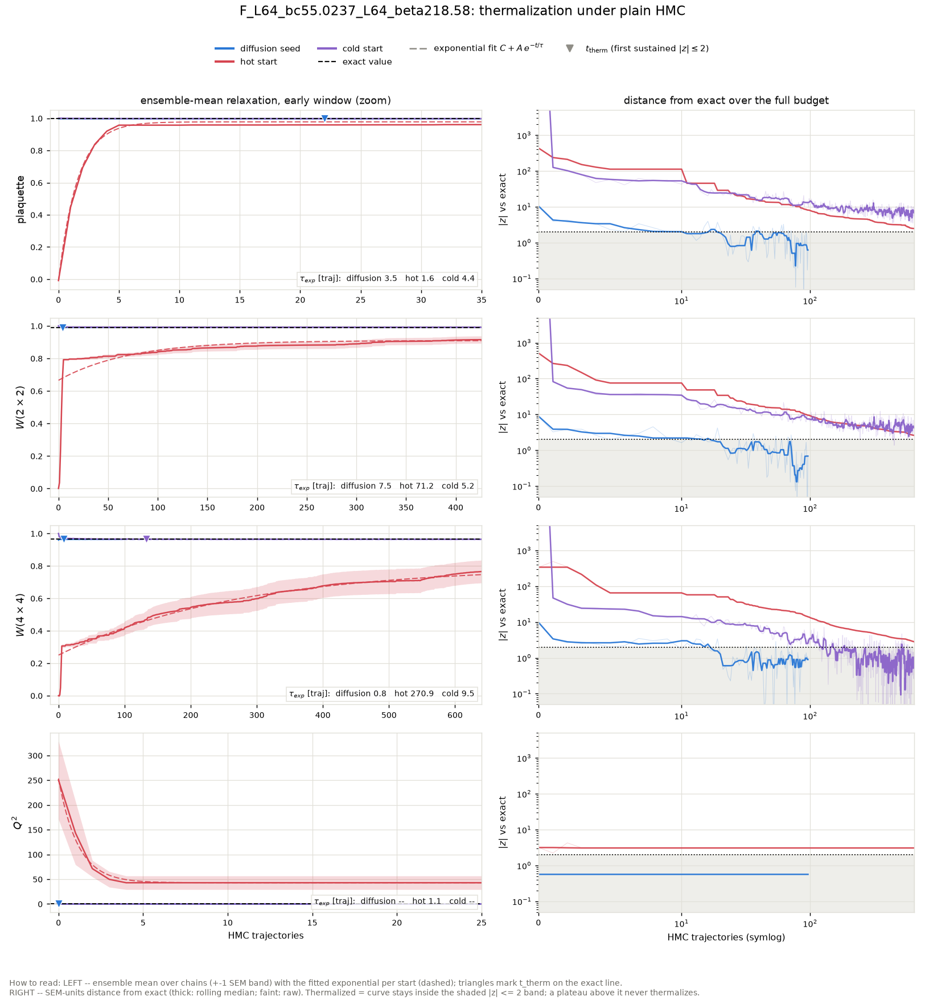

tau_int (hot-start chains, second half): plaquette = 31.75 +- 4.62, wilson_2x2 = 33.73 +- 4.85, wilson_4x4 = 33.56 +- 4.90, wilson_6x6 = 34.09 +- 5.11. Topology: hot-start HMC L=64 beta=218.58 -> **frozen** (no tunneling).

Where 'never' stood at the end: the hot start ended the 640-trajectory budget still at plaquette at |z| ~ 2, wilson_2x2 at |z| ~ 3, wilson_4x4 at |z| ~ 3, wilson_6x6 at |z| ~ 4, Q^2 at |z| ~ 3; the cold start ended the 640-trajectory budget still at plaquette at |z| ~ 8, wilson_2x2 at |z| ~ 5, Q^2 at |z| ~ 474267189248.

### Diagnostics: raw diffusion output (before any HMC)

| observable | value | error | exact | z_exact | reference | ref_error | z_ref | ks_p | chi2_p |
|---|---|---|---|---|---|---|---|---|---|
| plaquette | 0.9976 | 8.182e-06 | 0.9977 | -8.755 | 0.9978 | 5.444e-06 | -12.14 | 1.067e-21 |  |
| wilson_1x1 | 0.9976 | 8.182e-06 | 0.9977 | -8.755 | 0.9978 | 5.444e-06 | -12.14 | 1.067e-21 |  |
| wilson_1x2 | 0.9952 | 2.286e-05 | 0.9954 | -9.632 | 0.9955 | 1.262e-05 | -12.37 | 8.576e-27 |  |
| wilson_2x2 | 0.9904 | 5.345e-05 | 0.9909 | -8.124 | 0.9911 | 2.547e-05 | -11.32 | 3.775e-17 |  |
| wilson_2x3 | 0.9856 | 9.783e-05 | 0.9863 | -8.029 | 0.9867 | 4.162e-05 | -10.68 | 6.721e-17 |  |
| wilson_3x3 | 0.9782 | 0.0001803 | 0.9796 | -7.813 | 0.98 | 7.905e-05 | -9.44 | 6.467e-16 |  |
| wilson_3x4 | 0.9705 | 0.0002977 | 0.9729 | -8.048 | 0.9734 | 0.000118 | -9.238 | 1.127e-15 |  |
| wilson_4x4 | 0.9598 | 0.000493 | 0.964 | -8.502 | 0.9646 | 0.0001829 | -9.141 | 3.596e-18 |  |
| wilson_4x5 | 0.9489 | 0.000737 | 0.9552 | -8.509 | 0.9559 | 0.0002654 | -8.986 | 5.891e-19 |  |
| wilson_5x5 | 0.9349 | 0.001111 | 0.9443 | -8.499 | 0.9452 | 0.0003811 | -8.771 | 1.726e-19 |  |
| wilson_5x6 | 0.9202 | 0.001503 | 0.9335 | -8.84 | 0.9348 | 0.0004968 | -9.193 | 3.195e-19 |  |
| wilson_6x6 | 0.9022 | 0.002037 | 0.9208 | -9.102 | 0.9224 | 0.0006518 | -9.425 | 3.907e-21 |  |
| wilson_6x7 | 0.8836 | 0.002591 | 0.9082 | -9.478 | 0.9103 | 0.0008282 | -9.807 | 3.859e-23 |  |
| wilson_7x7 | 0.8615 | 0.00331 | 0.8937 | -9.741 | 0.8962 | 0.001027 | -10 | 1.961e-23 |  |
| wilson_7x8 | 0.8391 | 0.004053 | 0.8795 | -9.965 | 0.8824 | 0.001244 | -10.21 | 2.506e-24 |  |
| wilson_8x8 | 0.8129 | 0.004906 | 0.8635 | -10.33 | 0.8666 | 0.001479 | -10.48 | 2.506e-24 |  |
| wilson_8x10 | 0.7601 | 0.006729 | 0.8324 | -10.75 | 0.8362 | 0.001908 | -10.88 | 3.08e-25 |  |
| wilson_10x10 | 0.6928 | 0.009024 | 0.7951 | -11.34 | 0.7994 | 0.002585 | -11.36 | 2.506e-24 |  |
| wilson_10x12 | 0.627 | 0.01109 | 0.7595 | -11.94 | 0.7645 | 0.003148 | -11.92 | 1.252e-24 |  |
| wilson_12x12 | 0.5503 | 0.01349 | 0.7188 | -12.49 | 0.7236 | 0.004099 | -12.29 | 1.961e-23 |  |
| creutz_2 | 0.00236 | 2.688e-05 | 0.002293 | 2.52 |  |  |  |  |  |
| creutz_3 | 0.002577 | 5.797e-05 | 0.002293 | 4.897 |  |  |  |  |  |
| creutz_4 | 0.003158 | 0.0001083 | 0.002293 | 7.989 |  |  |  |  |  |
| creutz_5 | 0.003525 | 0.0001794 | 0.002293 | 6.871 |  |  |  |  |  |
| creutz_6 | 0.004015 | 0.0002338 | 0.002293 | 7.367 |  |  |  |  |  |
| creutz_7 | 0.004564 | 0.0003017 | 0.002292 | 7.529 |  |  |  |  |  |
| creutz_8 | 0.005489 | 0.0003667 | 0.002292 | 8.718 |  |  |  |  |  |
| Q | -0.0625 | 0.08911 | 0 | -0.7013 | 0.04167 | 0.08623 | -0.84 | 0.9976 |  |
| Q^2 | 0.5312 | 0.07317 | 0.4743 | 0.7788 | 0.5833 | 0.09467 | -0.4353 | 1 |  |
| chi_top ((<Q^2>-<Q>^2)/V) | 0.0001287 | 2.47e-05 | 0.0001158 | 0.5246 | 0.000142 | 2.184e-05 | -0.4018 |  |  |
| Q histogram vs exact P(Q) | 0.643 | nan | 2 | nan |  |  |  |  | 0.7251 |

### Diagnostics: the same configs after 96 HMC trajectories

| observable | value | error | exact | z_exact | reference | ref_error | z_ref | ks_p | chi2_p |
|---|---|---|---|---|---|---|---|---|---|
| plaquette | 0.9977 | 5.845e-06 | 0.9977 | 0.678 | 0.9978 | 5.444e-06 | -5.469 | 1.253e-06 |  |
| wilson_1x1 | 0.9977 | 5.845e-06 | 0.9977 | 0.678 | 0.9978 | 5.444e-06 | -5.469 | 1.253e-06 |  |
| wilson_1x2 | 0.9954 | 1.502e-05 | 0.9954 | -0.04388 | 0.9955 | 1.262e-05 | -5.279 | 6.135e-07 |  |
| wilson_2x2 | 0.9909 | 2.684e-05 | 0.9909 | 0.8163 | 0.9911 | 2.547e-05 | -5.793 | 0.0002025 |  |
| wilson_2x3 | 0.9864 | 4.573e-05 | 0.9863 | 0.78 | 0.9867 | 4.162e-05 | -5.079 | 0.00132 |  |
| wilson_3x3 | 0.9797 | 8.082e-05 | 0.9796 | 1.263 | 0.98 | 7.905e-05 | -3.076 | 0.01997 |  |
| wilson_3x4 | 0.9731 | 0.0001269 | 0.9729 | 1.636 | 0.9734 | 0.000118 | -2.046 | 0.119 |  |
| wilson_4x4 | 0.9642 | 0.0002353 | 0.964 | 0.9467 | 0.9646 | 0.0001829 | -1.317 | 0.4535 |  |
| wilson_4x5 | 0.9555 | 0.0003359 | 0.9552 | 0.96 | 0.9559 | 0.0002654 | -1.04 | 0.4056 |  |
| wilson_5x5 | 0.9446 | 0.0005147 | 0.9443 | 0.6231 | 0.9452 | 0.0003811 | -0.8413 | 0.6123 |  |
| wilson_5x6 | 0.9338 | 0.0006736 | 0.9335 | 0.4526 | 0.9348 | 0.0004968 | -1.148 | 0.1614 |  |
| wilson_6x6 | 0.921 | 0.0009163 | 0.9208 | 0.2037 | 0.9224 | 0.0006518 | -1.273 | 0.119 |  |
| wilson_6x7 | 0.9083 | 0.001147 | 0.9082 | 0.1242 | 0.9103 | 0.0008282 | -1.396 | 0.119 |  |
| wilson_7x7 | 0.8937 | 0.00145 | 0.8937 | -0.009057 | 0.8962 | 0.001027 | -1.367 | 0.2464 |  |
| wilson_7x8 | 0.8794 | 0.00173 | 0.8795 | -0.06798 | 0.8824 | 0.001244 | -1.408 | 0.1389 |  |
| wilson_8x8 | 0.863 | 0.002056 | 0.8635 | -0.2387 | 0.8666 | 0.001479 | -1.389 | 0.08625 |  |
| wilson_8x10 | 0.8311 | 0.002741 | 0.8324 | -0.4687 | 0.8362 | 0.001908 | -1.506 | 0.08625 |  |
| wilson_10x10 | 0.7927 | 0.003649 | 0.7951 | -0.6628 | 0.7994 | 0.002585 | -1.488 | 0.1389 |  |
| wilson_10x12 | 0.7564 | 0.004581 | 0.7595 | -0.6784 | 0.7645 | 0.003148 | -1.464 | 0.1389 |  |
| wilson_12x12 | 0.7146 | 0.005783 | 0.7188 | -0.7271 | 0.7236 | 0.004099 | -1.268 | 0.2811 |  |
| creutz_2 | 0.002265 | 1.817e-05 | 0.002293 | -1.508 |  |  |  |  |  |
| creutz_3 | 0.002239 | 4.543e-05 | 0.002293 | -1.188 |  |  |  |  |  |
| creutz_4 | 0.002384 | 7.635e-05 | 0.002293 | 1.199 |  |  |  |  |  |
| creutz_5 | 0.002397 | 0.0001132 | 0.002293 | 0.9225 |  |  |  |  |  |
| creutz_6 | 0.002403 | 0.0001845 | 0.002293 | 0.6008 |  |  |  |  |  |
| creutz_7 | 0.002418 | 0.0002517 | 0.002292 | 0.4994 |  |  |  |  |  |
| creutz_8 | 0.002608 | 0.0003253 | 0.002292 | 0.9708 |  |  |  |  |  |
| Q | -0.0625 | 0.08911 | 0 | -0.7013 | 0.04167 | 0.08623 | -0.84 | 0.9976 |  |
| Q^2 | 0.5312 | 0.07317 | 0.4743 | 0.7788 | 0.5833 | 0.09467 | -0.4353 | 1 |  |
| chi_top ((<Q^2>-<Q>^2)/V) | 0.0001287 | 2.47e-05 | 0.0001158 | 0.5246 | 0.000142 | 2.184e-05 | -0.4018 |  |  |
| Q histogram vs exact P(Q) | 0.643 | nan | 2 | nan |  |  |  |  | 0.7251 |
