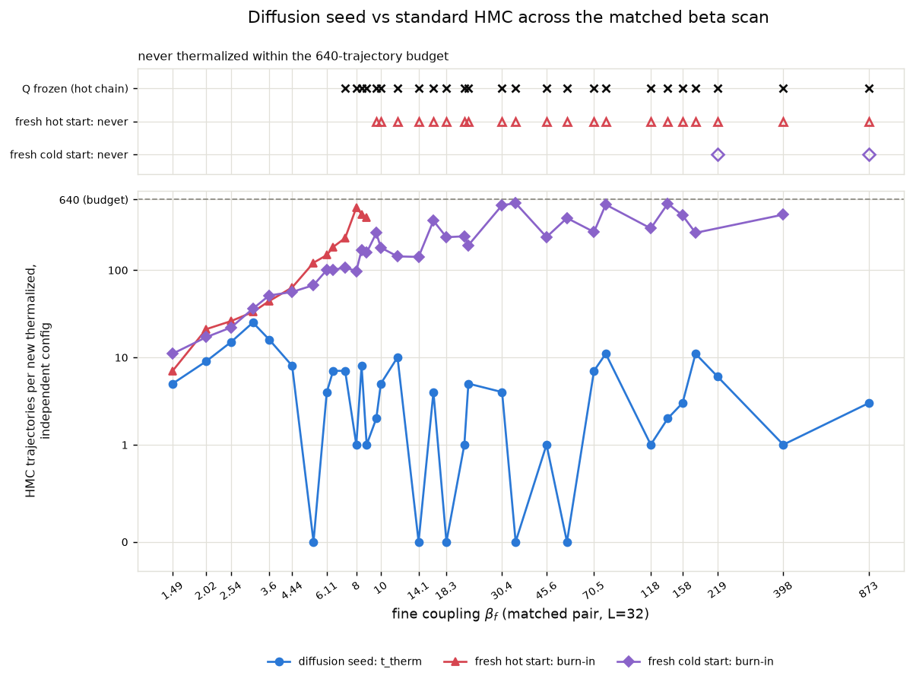
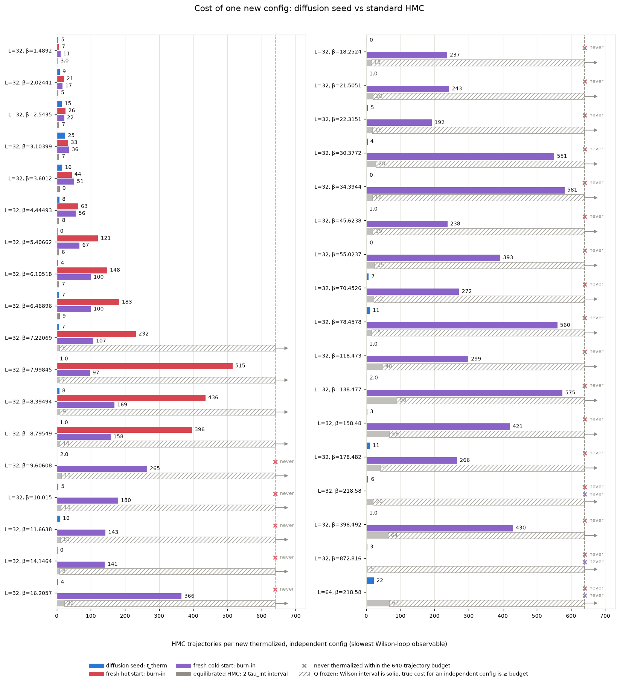
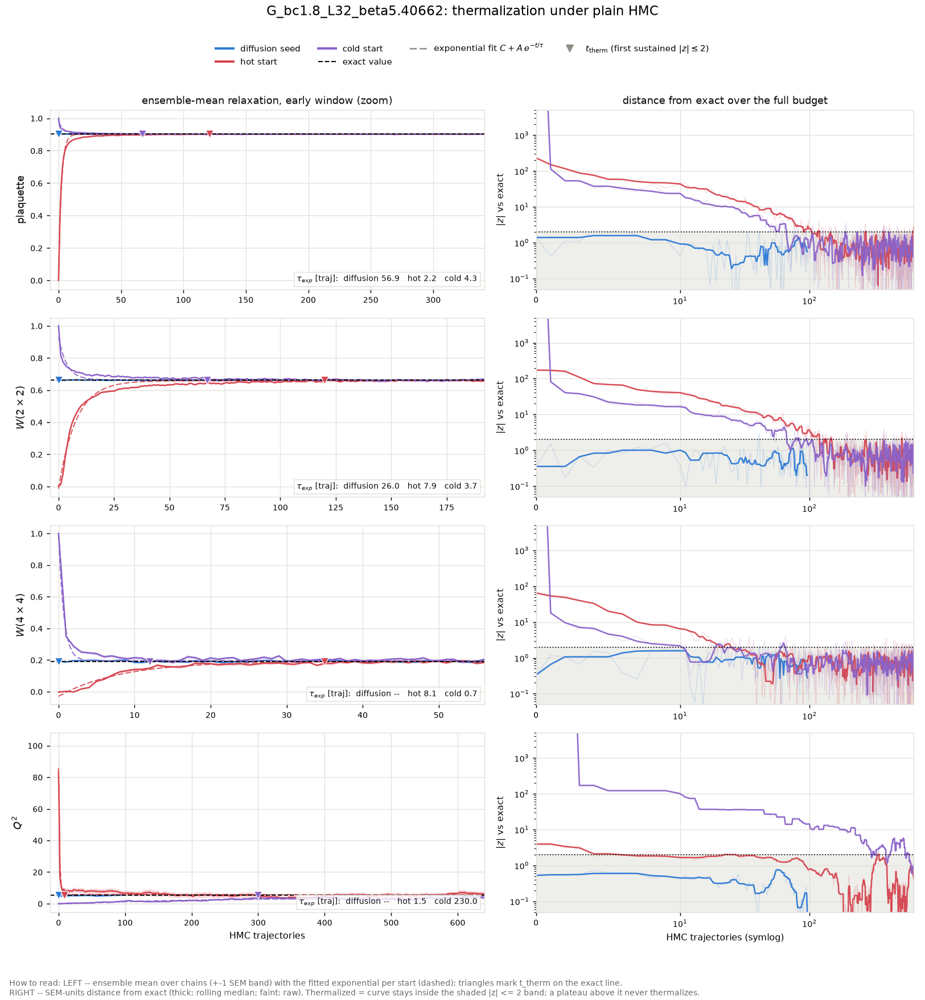
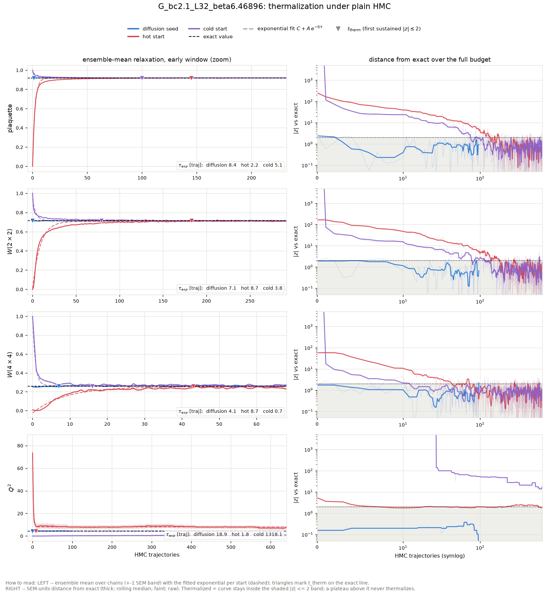
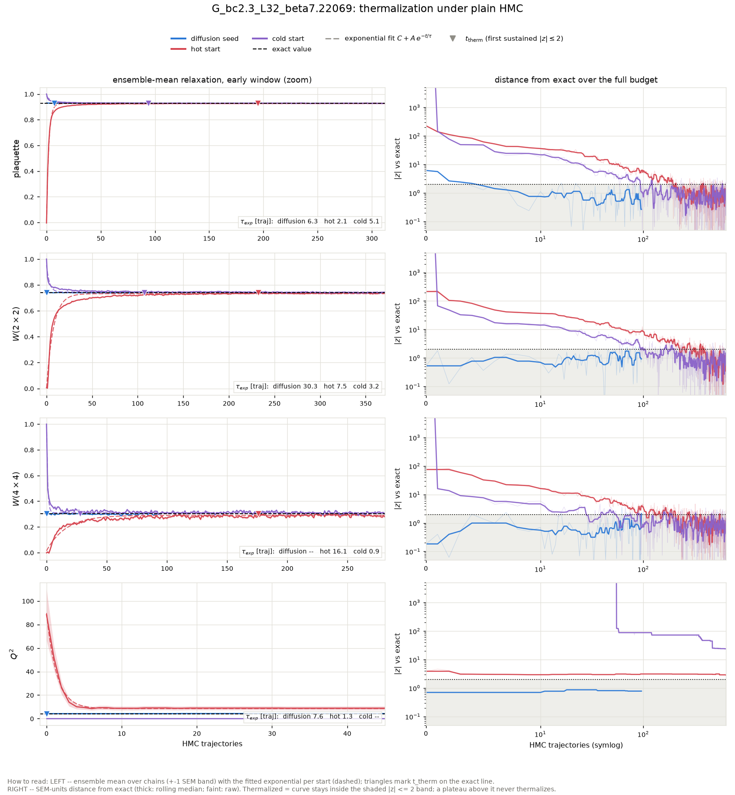
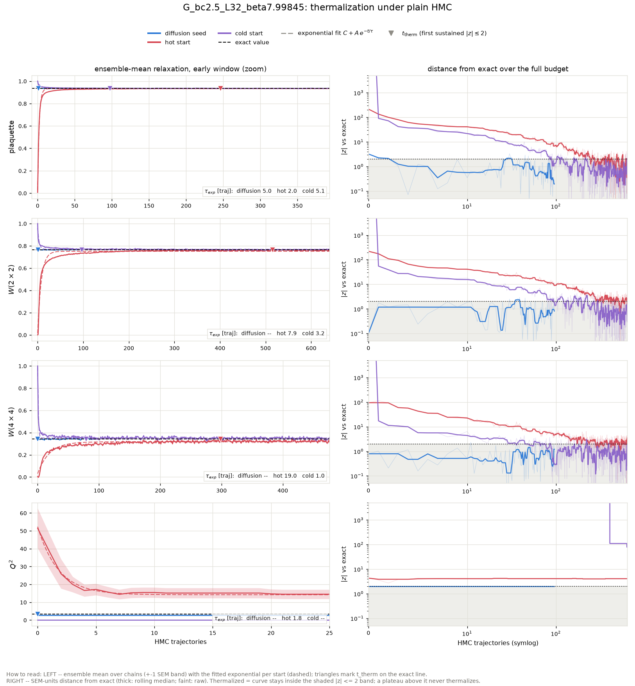
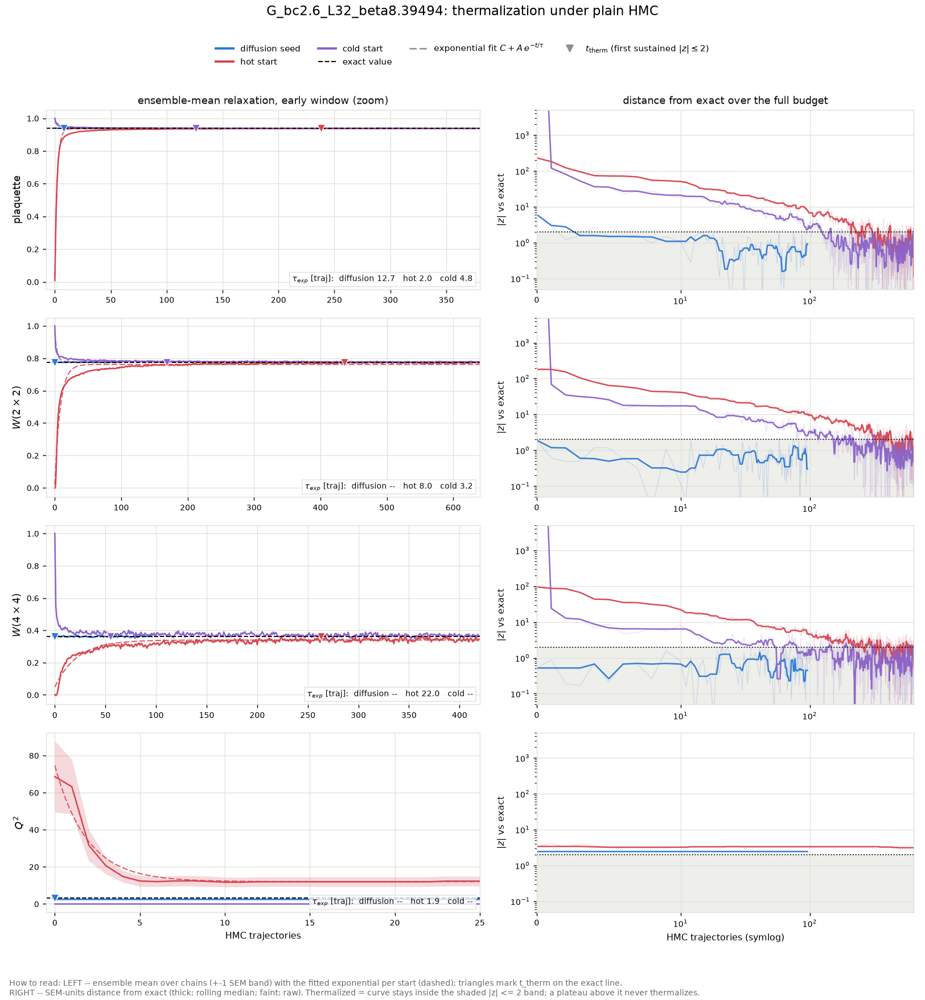
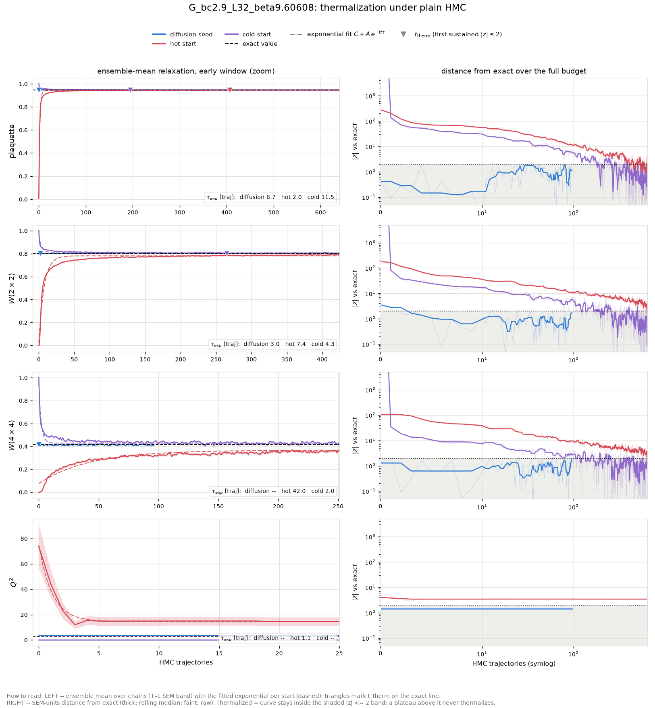

# Diffusion-seeded HMC across the matched beta scan: thermalization time vs the standard-HMC sampling interval

Action: wilson. All HMC in this report is plain HMC (Omelyan, adapted step size, **no** topological updates).

**Why this scan.** At the ladder's upper rungs the fresh-HMC baselines never thermalize at all (topological freezing plus a metastable local-defect state), so the only comparison available there is 'diffusion seed vs a baseline that never arrives'. This report extends the benchmark to every matched coupling pair of the generalization study -- one inverse-RG step L=16 -> L=32 per case -- including fine couplings low enough that hot- and cold-start HMC *does* thermalize within the budget. There the standard chain's own interval `2 tau_int` and its fresh-start burn-in are honest, measurable yardsticks, and the scan shows where the ordering

> t_therm(diffusion seed)  <  2 tau_int(standard HMC)  <  burn-in(fresh chain)

sets in as beta grows and standard HMC slides into critical slowing down and topological freezing.

## The three starting points

- **Diffusion seed** -- the raw conditional-diffusion output for this coupling: one inverse-RG step from a direct-HMC base ensemble at the matched coarse coupling (ancestral sampling + the deterministic coarse-charge transport), with **no** rethermalization sweeps applied: every bit of equilibration the seed needs is measured here, in HMC trajectories.
- **Hot start** -- every link angle drawn uniformly from (-pi, pi]: a completely disordered (infinite-temperature) configuration. The standard way to initialize a fresh HMC chain without prior information.
- **Cold start** -- every link angle set to zero: the perfectly ordered (beta -> infinity) configuration, the other standard initialization.

## Summary

| rung | L | beta | t_therm diffusion seed | standard-HMC interval 2 tau_int | margin (interval - t_therm) | burn-in hot / cold | tau_int(Q) |
|---|---|---|---|---|---|---|---|
| G_bc1.8_L32_beta5.40662 | 32 | 5.40662 | 0 | 6.5 | 6.5 traj | 121 / 67 | 28.5 |
| G_bc2.1_L32_beta6.46896 | 32 | 6.46896 | 7 | 8.8 | 1.8 traj | 183 / 100 | 10.3 |
| G_bc2.3_L32_beta7.22069 | 32 | 7.22069 | 7 | 8.5 | 1.5 traj | 232 / 107 | frozen (6 tunnelings in 321 x 32 traj) |
| G_bc2.5_L32_beta7.99845 | 32 | 7.99845 | 1 | 6.8 | 5.8 traj | 515 / 97 | frozen (1 tunnelings in 321 x 32 traj) |
| G_bc2.6_L32_beta8.39494 | 32 | 8.39494 | 8 | 9.5 | 1.5 traj | 436 / 169 | frozen (3 tunnelings in 321 x 32 traj) |
| G_bc2.9_L32_beta9.60608 | 32 | 9.60608 | 2 | 13.4 | 11.4 traj | never / 265 | frozen (0 tunnelings in 321 x 32 traj) |

## Wall-clock accounting

All timescales above are in HMC trajectories -- the honest *ergodicity* unit. This table converts to seconds on this machine so the economics are explicit. Batched chains produce n_chains configs per trajectory, so per-config costs divide by the chain count; the diffusion sampling cost amortizes over the whole generated batch.

| case | seed: sample s/config | seed: t_therm s (batch) | HMC interval s/config | hot burn-in s (batch) | s/traj (batch) |
|---|---|---|---|---|---|
| G_bc1.8_L32_beta5.40662 | 0.3 | 0.0 | 0.01 | 7 | 0.06 |
| G_bc2.1_L32_beta6.46896 | 0.3 | 0.4 | 0.01 | 10 | 0.05 |
| G_bc2.3_L32_beta7.22069 | 0.3 | 0.5 | 0.01 | 13 | 0.06 |
| G_bc2.5_L32_beta7.99845 | 0.3 | 0.1 | 0.01 | 29 | 0.06 |
| G_bc2.6_L32_beta8.39494 | 0.3 | 0.5 | 0.02 | 25 | 0.06 |
| G_bc2.9_L32_beta9.60608 | 0.3 | 0.1 | 0.03 | never | 0.07 |

## Fitted relaxation times across starts

Exponential fits C + A exp(-t/tau) to the ensemble-mean plaquette and W(2x2) relaxation curves, per starting point (the cross-start comparison of characteristic times; a start already at its plateau fits no decay, which is the desired outcome for the diffusion seed).

| case | obs | tau: diffusion seed | tau: hot start | tau: cold start |
|---|---|---|---|---|
| G_bc1.8_L32_beta5.40662 | plaquette | 56.9 +- 42.1 | 2.2 +- 0.0 | 4.3 +- 0.1 |
| G_bc1.8_L32_beta5.40662 | wilson_2x2 | 26.0 +- 22.1 | 7.9 +- 0.1 | 3.7 +- 0.1 |
| G_bc2.1_L32_beta6.46896 | plaquette | 8.4 +- 3.5 | 2.2 +- 0.0 | 5.1 +- 0.2 |
| G_bc2.1_L32_beta6.46896 | wilson_2x2 | 7.1 +- 3.8 | 8.7 +- 0.1 | 3.8 +- 0.1 |
| G_bc2.3_L32_beta7.22069 | plaquette | 6.3 +- 1.1 | 2.1 +- 0.0 | 5.1 +- 0.2 |
| G_bc2.3_L32_beta7.22069 | wilson_2x2 | 30.3 +- 20.0 | 7.5 +- 0.1 | 3.2 +- 0.1 |
| G_bc2.5_L32_beta7.99845 | plaquette | 5.0 +- 1.8 | 2.0 +- 0.0 | 5.1 +- 0.2 |
| G_bc2.5_L32_beta7.99845 | wilson_2x2 | unreliable (tau exceeds window) | 7.9 +- 0.2 | 3.2 +- 0.1 |
| G_bc2.6_L32_beta8.39494 | plaquette | 12.7 +- 2.3 | 2.0 +- 0.0 | 4.8 +- 0.2 |
| G_bc2.6_L32_beta8.39494 | wilson_2x2 | no measurable decay (starts at plateau; tau unconstrained) | 8.0 +- 0.2 | 3.2 +- 0.1 |
| G_bc2.9_L32_beta9.60608 | plaquette | 6.7 +- 4.9 | 2.0 +- 0.0 | 11.5 +- 0.5 |
| G_bc2.9_L32_beta9.60608 | wilson_2x2 | 3.0 +- 1.2 | 7.4 +- 0.2 | 4.3 +- 0.2 |

t_therm and burn-in are the slowest Wilson-loop observable (plaquette, W(2x2), W(4x4)); topology is stricter still for the fresh chains: their Q^2 **never** reaches the exact value at the frozen rungs, while the diffusion seed inherits the correct topological sector from the coarse ensemble it was generated from (see the Q^2 panels and per-rung tables below).

Thermalization time `t_therm` = first trajectory at which the ensemble-mean z-score vs the exact value satisfies |z| <= 2 and stays there for 5 consecutive trajectories (t = 0: already thermalized before any HMC). For the diffusion seed, t_therm is computed on a random subsample of chains matched to the baseline chain count so all starts are compared at equal statistical power. `tau_int` is Madras-Sokal, measured on the second half of the hot-start chains, averaged over chains. In the per-rung relaxation figures, triangles mark each start's t_therm, dashed curves are the exponential fits C + A exp(-t/tau) to the ensemble means (tau quoted per panel), and the right-hand panels track the ensemble mean's distance from the exact value in SEM units -- thermalized means inside the shaded |z| <= 2 band; the dotted vertical line there is the standard-HMC interval `2 tau_int`.

## What 'never' means, and where the ground truth comes from

'never' = the ensemble mean was still outside |z| <= 2 of the exact value after the full baseline budget; the per-rung sections quote the z-score it plateaued at. For hot starts at the large-beta rungs this is not a budget problem but a physical one: a random start freezes into a random topological sector (<Q^2> of order tens), plain HMC can never change Q at these couplings (tunneling is suppressed ~exp(-2 beta)), and the wrong sector biases every Wilson loop by an amount that never decays. Cold starts sit in the single sector Q = 0, so their Wilson loops do eventually converge, but <Q^2> stays pinned at 0 forever.

None of the exact values in this report come from fine-lattice HMC: the ground truth is the character expansion of 2D compact U(1) (`diffusion/lgt/exact.py`), which gives every Wilson loop, P(Q) and chi_top in closed form at finite volume. Each diffusion seed here is one inverse-RG step from a direct-HMC base ensemble at the matched coarse coupling beta_c (L=16), where HMC mixes well -- which is precisely why it can start chains in regions standard HMC cannot reach.

## G_bc1.8_L32_beta5.40662

HMC: step size 0.1720, 6 leapfrog steps, acceptance seed/hot/cold = 0.972/0.971/0.972. Diffusion-seed batch: 128 chains x 96 trajectories (0.06 s/traj for the whole batch); baselines: 32 chains x 640 trajectories.

tau_int (hot-start chains, second half): plaquette = 3.24 +- 0.41, wilson_2x2 = 2.95 +- 0.20, wilson_4x4 = 1.28 +- 0.08, wilson_6x6 = 0.78 +- 0.03. Topology: hot-start HMC L=32 beta=5.40662 -> tau_int(Q) = 28.5.

### Diagnostics: raw diffusion output (before any HMC)

| observable | value | error | exact | z_exact | reference | ref_error | z_ref | ks_p | chi2_p |
|---|---|---|---|---|---|---|---|---|---|
| plaquette | 0.9026 | 0.0003698 | 0.902 | 1.598 | 0.9024 | 0.000166 | 0.4303 | 0.8288 |  |
| wilson_1x1 | 0.9026 | 0.0003698 | 0.902 | 1.598 | 0.9024 | 0.000166 | 0.4303 | 0.8288 |  |
| wilson_1x2 | 0.8134 | 0.0008411 | 0.8137 | -0.3221 | 0.8134 | 0.0004319 | -0.05895 | 0.8612 |  |
| wilson_2x2 | 0.6626 | 0.001739 | 0.662 | 0.3461 | 0.6618 | 0.001165 | 0.3945 | 0.5643 |  |
| wilson_2x3 | 0.5388 | 0.002789 | 0.5387 | 0.03945 | 0.5371 | 0.001506 | 0.5459 | 0.6418 |  |
| wilson_3x3 | 0.3956 | 0.003584 | 0.3954 | 0.06919 | 0.3958 | 0.002057 | -0.05444 | 0.2741 |  |
| wilson_3x4 | 0.289 | 0.004715 | 0.2902 | -0.2547 | 0.2916 | 0.002422 | -0.4925 | 0.3001 |  |
| wilson_4x4 | 0.1936 | 0.004654 | 0.1921 | 0.324 | 0.194 | 0.003112 | -0.07577 | 0.2272 |  |
| wilson_4x5 | 0.1268 | 0.004713 | 0.1272 | -0.07579 | 0.1276 | 0.003648 | -0.1244 | 0.3879 |  |
| wilson_5x5 | 0.0752 | 0.004224 | 0.07595 | -0.1764 | 0.07665 | 0.003996 | -0.2484 | 0.4204 |  |
| wilson_5x6 | 0.04675 | 0.004017 | 0.04536 | 0.3468 | 0.04409 | 0.004246 | 0.4551 | 0.5266 |  |
| wilson_6x6 | 0.02889 | 0.004111 | 0.02443 | 1.085 | 0.02449 | 0.003963 | 0.7713 | 0.4545 |  |
| wilson_6x7 | 0.01549 | 0.003985 | 0.01316 | 0.5846 | 0.01117 | 0.003581 | 0.8071 | 0.3277 |  |
| wilson_7x7 | 0.01044 | 0.003937 | 0.006395 | 1.029 | 0.004257 | 0.002693 | 1.297 | 0.4204 |  |
| wilson_7x8 | 0.00983 | 0.003033 | 0.003107 | 2.216 | -0.001201 | 0.002939 | 2.612 | 0.008934 |  |
| wilson_8x8 | 0.007129 | 0.002898 | 0.001362 | 1.99 | -0.001872 | 0.002487 | 2.357 | 0.1685 |  |
| wilson_8x10 | 0.006692 | 0.002502 | 0.0002616 | 2.57 | -0.003844 | 0.0028 | 2.806 | 0.003444 |  |
| wilson_10x10 | 0.0008843 | 0.002241 | 3.327e-05 | 0.3797 | -0.002674 | 0.002349 | 1.096 | 0.4545 |  |
| wilson_10x12 | 0.001998 | 0.002583 | 4.232e-06 | 0.772 | -0.002343 | 0.001666 | 1.412 | 0.1226 |  |
| wilson_12x12 | -0.003447 | 0.001873 | 3.563e-07 | -1.841 | -0.0004063 | 0.001742 | -1.189 | 0.6418 |  |
| creutz_2 | 0.1009 | 0.001575 | 0.1031 | -1.416 |  |  |  |  |  |
| creutz_3 | 0.102 | 0.003591 | 0.1031 | -0.3138 |  |  |  |  |  |
| creutz_4 | 0.08637 | 0.008434 | 0.1031 | -1.985 |  |  |  |  |  |
| creutz_5 | 0.09952 | 0.0263 | 0.1031 | -0.1363 |  |  |  |  |  |
| creutz_6 | 0.005749 | 0.06864 | 0.1031 | -1.418 |  |  |  |  |  |
| creutz_7 | -0.2293 | 0.2037 | 0.1031 | -1.632 |  |  |  |  |  |
| creutz_8 | 0.2607 | 0.3174 | 0.1031 | 0.4964 |  |  |  |  |  |
| Q | 0 | 0.1669 | 0 | 0 | -0.7917 | 0.17 | 3.324 | 0.01039 |  |
| Q^2 | 4.984 | 0.8271 | 5.381 | -0.4795 | 6.312 | 0.7054 | -1.222 | 0.1226 |  |
| chi_top ((<Q^2>-<Q>^2)/V) | 0.004868 | 0.0007378 | 0.005255 | -0.525 | 0.005553 | 0.0004734 | -0.7814 |  |  |
| Q histogram vs exact P(Q) | 12.03 | nan | 10 | nan |  |  |  |  | 0.283 |

### Diagnostics: the same configs after 96 HMC trajectories

| observable | value | error | exact | z_exact | reference | ref_error | z_ref | ks_p | chi2_p |
|---|---|---|---|---|---|---|---|---|---|
| plaquette | 0.9023 | 0.0003318 | 0.902 | 0.6633 | 0.9024 | 0.000166 | -0.5295 | 0.8288 |  |
| wilson_1x1 | 0.9023 | 0.0003318 | 0.902 | 0.6633 | 0.9024 | 0.000166 | -0.5295 | 0.8288 |  |
| wilson_1x2 | 0.8141 | 0.0008016 | 0.8137 | 0.4975 | 0.8134 | 0.0004319 | 0.6742 | 0.7575 |  |
| wilson_2x2 | 0.6623 | 0.001852 | 0.662 | 0.1672 | 0.6618 | 0.001165 | 0.2439 | 0.4899 |  |
| wilson_2x3 | 0.5392 | 0.003065 | 0.5387 | 0.1831 | 0.5371 | 0.001506 | 0.6388 | 0.06904 |  |
| wilson_3x3 | 0.3979 | 0.0038 | 0.3954 | 0.6671 | 0.3958 | 0.002057 | 0.4772 | 0.1098 |  |
| wilson_3x4 | 0.2918 | 0.004343 | 0.2902 | 0.3763 | 0.2916 | 0.002422 | 0.0453 | 0.2741 |  |
| wilson_4x4 | 0.1933 | 0.004083 | 0.1921 | 0.2904 | 0.194 | 0.003112 | -0.1455 | 0.8612 |  |
| wilson_4x5 | 0.1291 | 0.003256 | 0.1272 | 0.5823 | 0.1276 | 0.003648 | 0.3093 | 0.6418 |  |
| wilson_5x5 | 0.07879 | 0.003583 | 0.07595 | 0.7921 | 0.07665 | 0.003996 | 0.3985 | 0.3001 |  |
| wilson_5x6 | 0.04765 | 0.002966 | 0.04536 | 0.7751 | 0.04409 | 0.004246 | 0.6885 | 0.2498 |  |
| wilson_6x6 | 0.0295 | 0.003759 | 0.02443 | 1.349 | 0.02449 | 0.003963 | 0.9182 | 0.05405 |  |
| wilson_6x7 | 0.01953 | 0.003478 | 0.01316 | 1.831 | 0.01117 | 0.003581 | 1.675 | 0.2741 |  |
| wilson_7x7 | 0.01273 | 0.003314 | 0.006395 | 1.913 | 0.004257 | 0.002693 | 1.985 | 0.08742 |  |
| wilson_7x8 | 0.007546 | 0.003153 | 0.003107 | 1.408 | -0.001201 | 0.002939 | 2.029 | 0.02464 |  |
| wilson_8x8 | 0.003769 | 0.003397 | 0.001362 | 0.7086 | -0.001872 | 0.002487 | 1.34 | 0.2498 |  |
| wilson_8x10 | 0.0006043 | 0.001931 | 0.0002616 | 0.1774 | -0.003844 | 0.0028 | 1.308 | 0.1866 |  |
| wilson_10x10 | 0.002936 | 0.002765 | 3.327e-05 | 1.05 | -0.002674 | 0.002349 | 1.546 | 0.1866 |  |
| wilson_10x12 | 0.0005819 | 0.00285 | 4.232e-06 | 0.2027 | -0.002343 | 0.001666 | 0.8859 | 0.7195 |  |
| wilson_12x12 | -0.0002908 | 0.002857 | 3.563e-07 | -0.1019 | -0.0004063 | 0.001742 | 0.03451 | 0.9574 |  |
| creutz_2 | 0.1034 | 0.001456 | 0.1031 | 0.1844 |  |  |  |  |  |
| creutz_3 | 0.09833 | 0.003552 | 0.1031 | -1.345 |  |  |  |  |  |
| creutz_4 | 0.1018 | 0.007319 | 0.1031 | -0.1788 |  |  |  |  |  |
| creutz_5 | 0.08987 | 0.02326 | 0.1031 | -0.5691 |  |  |  |  |  |
| creutz_6 | -0.02335 | 0.07289 | 0.1031 | -1.735 |  |  |  |  |  |
| creutz_7 | 0.01509 | 0.1602 | 0.1031 | -0.5495 |  |  |  |  |  |
| creutz_8 | 0.171 | 0.5455 | 0.1031 | 0.1244 |  |  |  |  |  |
| Q | 0.2109 | 0.1795 | 0 | 1.175 | -0.7917 | 0.17 | 4.056 | 0.002464 |  |
| Q^2 | 5.414 | 0.6109 | 5.381 | 0.05412 | 6.312 | 0.7054 | -0.9628 | 0.6808 |  |
| chi_top ((<Q^2>-<Q>^2)/V) | 0.005244 | 0.0007032 | 0.005255 | -0.01588 | 0.005553 | 0.0004734 | -0.3643 |  |  |
| Q histogram vs exact P(Q) | 16.95 | nan | 10 | nan |  |  |  |  | 0.07544 |

## G_bc2.1_L32_beta6.46896

HMC: step size 0.1573, 6 leapfrog steps, acceptance seed/hot/cold = 0.977/0.976/0.976. Diffusion-seed batch: 128 chains x 96 trajectories (0.05 s/traj for the whole batch); baselines: 32 chains x 640 trajectories.

tau_int (hot-start chains, second half): plaquette = 4.35 +- 0.58, wilson_2x2 = 4.39 +- 0.66, wilson_4x4 = 1.29 +- 0.11, wilson_6x6 = 1.03 +- 0.06. Topology: hot-start HMC L=32 beta=6.46896 -> tau_int(Q) = 10.3.

Where 'never' stood at the end: the cold start ended the 640-trajectory budget still at Q^2 at |z| ~ 16.

### Diagnostics: raw diffusion output (before any HMC)

| observable | value | error | exact | z_exact | reference | ref_error | z_ref | ks_p | chi2_p |
|---|---|---|---|---|---|---|---|---|---|
| plaquette | 0.9198 | 0.0002436 | 0.9191 | 3.08 | 0.918 | 0.0002386 | 5.321 | 0.0004908 |  |
| wilson_1x1 | 0.9198 | 0.0002436 | 0.9191 | 3.08 | 0.918 | 0.0002386 | 5.321 | 0.0004908 |  |
| wilson_1x2 | 0.844 | 0.0006388 | 0.8447 | -1.134 | 0.8425 | 0.0005604 | 1.733 | 0.1519 |  |
| wilson_2x2 | 0.711 | 0.001326 | 0.7135 | -1.915 | 0.708 | 0.001179 | 1.681 | 0.4204 |  |
| wilson_2x3 | 0.5995 | 0.002139 | 0.6027 | -1.487 | 0.5964 | 0.001933 | 1.089 | 0.1866 |  |
| wilson_3x3 | 0.4633 | 0.00335 | 0.4679 | -1.377 | 0.4623 | 0.002768 | 0.2277 | 0.9167 |  |
| wilson_3x4 | 0.3575 | 0.003632 | 0.3633 | -1.586 | 0.3609 | 0.003421 | -0.6732 | 0.9719 |  |
| wilson_4x4 | 0.2526 | 0.003819 | 0.2592 | -1.736 | 0.2607 | 0.003869 | -1.494 | 0.3001 |  |
| wilson_4x5 | 0.1759 | 0.003543 | 0.185 | -2.564 | 0.1887 | 0.004115 | -2.361 | 0.05405 |  |
| wilson_5x5 | 0.111 | 0.003638 | 0.1213 | -2.837 | 0.125 | 0.003779 | -2.676 | 0.03684 |  |
| wilson_5x6 | 0.06917 | 0.004132 | 0.07954 | -2.509 | 0.0828 | 0.003372 | -2.555 | 0.06904 |  |
| wilson_6x6 | 0.03898 | 0.00394 | 0.04794 | -2.274 | 0.05201 | 0.003699 | -2.411 | 0.03229 |  |
| wilson_6x7 | 0.02237 | 0.003585 | 0.0289 | -1.82 | 0.03049 | 0.003718 | -1.573 | 0.1866 |  |
| wilson_7x7 | 0.01111 | 0.003091 | 0.01601 | -1.584 | 0.02029 | 0.003424 | -1.989 | 0.1226 |  |
| wilson_7x8 | 0.003338 | 0.002999 | 0.008867 | -1.844 | 0.01374 | 0.00363 | -2.208 | 0.09806 |  |
| wilson_8x8 | -0.0002339 | 0.002647 | 0.004514 | -1.794 | 0.01151 | 0.003219 | -2.818 | 0.07777 |  |
| wilson_8x10 | 0.004877 | 0.002107 | 0.00117 | 1.759 | 0.007265 | 0.003315 | -0.6081 | 0.3277 |  |
| wilson_10x10 | 0.0003951 | 0.002968 | 0.0002164 | 0.06021 | 0.001623 | 0.002367 | -0.3233 | 0.6028 |  |
| wilson_10x12 | 0.002334 | 0.002431 | 4.003e-05 | 0.9434 | -0.001826 | 0.002258 | 1.254 | 0.7575 |  |
| wilson_12x12 | -0.003061 | 0.003178 | 5.283e-06 | -0.965 | -0.0002581 | 0.001364 | -0.8107 | 0.08742 |  |
| creutz_2 | 0.08542 | 0.001106 | 0.08438 | 0.9342 |  |  |  |  |  |
| creutz_3 | 0.08727 | 0.002375 | 0.08438 | 1.217 |  |  |  |  |  |
| creutz_4 | 0.08822 | 0.005572 | 0.08438 | 0.6896 |  |  |  |  |  |
| creutz_5 | 0.09847 | 0.01578 | 0.08438 | 0.8926 |  |  |  |  |  |
| creutz_6 | 0.1008 | 0.0486 | 0.08438 | 0.3384 |  |  |  |  |  |
| creutz_7 | 0.1443 | 0.152 | 0.08438 | 0.3944 |  |  |  |  |  |
| Q | 0.04688 | 0.1857 | 0 | 0.2524 | -0.2604 | 0.1183 | 1.396 | 0.7195 |  |
| Q^2 | 4.484 | 0.7804 | 4.393 | 0.1176 | 4.344 | 0.3938 | 0.1609 | 0.8288 |  |
| chi_top ((<Q^2>-<Q>^2)/V) | 0.004377 | 0.0005765 | 0.00429 | 0.1517 | 0.004176 | 0.0003789 | 0.292 |  |  |
| Q histogram vs exact P(Q) | 3.547 | nan | 8 | nan |  |  |  |  | 0.8955 |

### Diagnostics: the same configs after 96 HMC trajectories

| observable | value | error | exact | z_exact | reference | ref_error | z_ref | ks_p | chi2_p |
|---|---|---|---|---|---|---|---|---|---|
| plaquette | 0.9194 | 0.0002968 | 0.9191 | 0.9474 | 0.918 | 0.0002386 | 3.533 | 0.07777 |  |
| wilson_1x1 | 0.9194 | 0.0002968 | 0.9191 | 0.9474 | 0.918 | 0.0002386 | 3.533 | 0.07777 |  |
| wilson_1x2 | 0.8455 | 0.0007944 | 0.8447 | 0.9584 | 0.8425 | 0.0005604 | 3.044 | 0.01864 |  |
| wilson_2x2 | 0.7145 | 0.001891 | 0.7135 | 0.5158 | 0.708 | 0.001179 | 2.916 | 6.666e-05 |  |
| wilson_2x3 | 0.6056 | 0.002821 | 0.6027 | 1.03 | 0.5964 | 0.001933 | 2.698 | 0.002077 |  |
| wilson_3x3 | 0.472 | 0.003436 | 0.4679 | 1.173 | 0.4623 | 0.002768 | 2.183 | 0.01616 |  |
| wilson_3x4 | 0.3692 | 0.003756 | 0.3633 | 1.569 | 0.3609 | 0.003421 | 1.633 | 0.05405 |  |
| wilson_4x4 | 0.2682 | 0.003831 | 0.2592 | 2.353 | 0.2607 | 0.003869 | 1.382 | 0.1866 |  |
| wilson_4x5 | 0.1945 | 0.003597 | 0.185 | 2.663 | 0.1887 | 0.004115 | 1.07 | 0.2272 |  |
| wilson_5x5 | 0.1313 | 0.003415 | 0.1213 | 2.922 | 0.125 | 0.003779 | 1.23 | 0.8612 |  |
| wilson_5x6 | 0.08699 | 0.003905 | 0.07954 | 1.906 | 0.0828 | 0.003372 | 0.8114 | 0.6418 |  |
| wilson_6x6 | 0.05254 | 0.003758 | 0.04794 | 1.222 | 0.05201 | 0.003699 | 0.09906 | 0.9719 |  |
| wilson_6x7 | 0.03103 | 0.003372 | 0.0289 | 0.6335 | 0.03049 | 0.003718 | 0.1072 | 0.9827 |  |
| wilson_7x7 | 0.01397 | 0.003031 | 0.01601 | -0.671 | 0.02029 | 0.003424 | -1.38 | 0.2498 |  |
| wilson_7x8 | 0.00662 | 0.002541 | 0.008867 | -0.8845 | 0.01374 | 0.00363 | -1.606 | 0.2498 |  |
| wilson_8x8 | 0.004093 | 0.003462 | 0.004514 | -0.1218 | 0.01151 | 0.003219 | -1.569 | 0.1519 |  |
| wilson_8x10 | -0.0001348 | 0.003366 | 0.00117 | -0.3877 | 0.007265 | 0.003315 | -1.566 | 0.04767 |  |
| wilson_10x10 | 0.00264 | 0.003137 | 0.0002164 | 0.7726 | 0.001623 | 0.002367 | 0.2589 | 0.7941 |  |
| wilson_10x12 | 0.0008846 | 0.003297 | 4.003e-05 | 0.2562 | -0.001826 | 0.002258 | 0.6784 | 0.2498 |  |
| wilson_12x12 | 0.0007674 | 0.002686 | 5.283e-06 | 0.2837 | -0.0002581 | 0.001364 | 0.3404 | 0.5266 |  |
| creutz_2 | 0.08451 | 0.001246 | 0.08438 | 0.104 |  |  |  |  |  |
| creutz_3 | 0.08406 | 0.002429 | 0.08438 | -0.1346 |  |  |  |  |  |
| creutz_4 | 0.0738 | 0.006219 | 0.08438 | -1.702 |  |  |  |  |  |
| creutz_5 | 0.07213 | 0.01352 | 0.08438 | -0.9062 |  |  |  |  |  |
| creutz_6 | 0.09272 | 0.03096 | 0.08438 | 0.2694 |  |  |  |  |  |
| creutz_7 | 0.2714 | 0.1455 | 0.08438 | 1.285 |  |  |  |  |  |
| creutz_8 | -0.2663 | 0.5253 | 0.08438 | -0.6675 |  |  |  |  |  |
| Q | 0.02344 | 0.1881 | 0 | 0.1246 | -0.2604 | 0.1183 | 1.278 | 0.9167 |  |
| Q^2 | 4.414 | 0.7815 | 4.393 | 0.02744 | 4.344 | 0.3938 | 0.08035 | 0.9167 |  |
| chi_top ((<Q^2>-<Q>^2)/V) | 0.00431 | 0.0005742 | 0.00429 | 0.03553 | 0.004176 | 0.0003789 | 0.1953 |  |  |
| Q histogram vs exact P(Q) | 4.761 | nan | 8 | nan |  |  |  |  | 0.7828 |

## G_bc2.3_L32_beta7.22069

HMC: step size 0.1489, 7 leapfrog steps, acceptance seed/hot/cold = 0.974/0.975/0.975. Diffusion-seed batch: 128 chains x 96 trajectories (0.06 s/traj for the whole batch); baselines: 32 chains x 640 trajectories.

tau_int (hot-start chains, second half): plaquette = 3.79 +- 0.47, wilson_2x2 = 4.23 +- 0.49, wilson_4x4 = 1.15 +- 0.05, wilson_6x6 = 0.79 +- 0.03. Topology: hot-start HMC L=32 beta=7.22069 -> **frozen** (no tunneling).

Where 'never' stood at the end: the hot start ended the 640-trajectory budget still at Q^2 at |z| ~ 3; the cold start ended the 640-trajectory budget still at Q^2 at |z| ~ 24.

### Diagnostics: raw diffusion output (before any HMC)

| observable | value | error | exact | z_exact | reference | ref_error | z_ref | ks_p | chi2_p |
|---|---|---|---|---|---|---|---|---|---|
| plaquette | 0.9298 | 0.0003145 | 0.9279 | 5.94 | 0.9268 | 0.0002812 | 7.17 | 3.392e-11 |  |
| wilson_1x1 | 0.9298 | 0.0003145 | 0.9279 | 5.94 | 0.9268 | 0.0002812 | 7.17 | 3.392e-11 |  |
| wilson_1x2 | 0.8622 | 0.0006364 | 0.861 | 1.892 | 0.8579 | 0.0004415 | 5.649 | 1.748e-06 |  |
| wilson_2x2 | 0.7421 | 0.0014 | 0.7414 | 0.5412 | 0.7333 | 0.0009967 | 5.158 | 0.0007131 |  |
| wilson_2x3 | 0.6379 | 0.002083 | 0.6383 | -0.2267 | 0.6278 | 0.001405 | 4.014 | 0.005601 |  |
| wilson_3x3 | 0.5094 | 0.002894 | 0.51 | -0.2259 | 0.4964 | 0.002132 | 3.598 | 0.007662 |  |
| wilson_3x4 | 0.4057 | 0.003856 | 0.4075 | -0.4725 | 0.3966 | 0.002491 | 1.977 | 0.1226 |  |
| wilson_4x4 | 0.3013 | 0.004852 | 0.3021 | -0.1726 | 0.2951 | 0.003111 | 1.076 | 0.4899 |  |
| wilson_4x5 | 0.222 | 0.005154 | 0.224 | -0.3773 | 0.2198 | 0.00316 | 0.3736 | 0.995 |  |
| wilson_5x5 | 0.1543 | 0.005772 | 0.1541 | 0.03905 | 0.1546 | 0.003674 | -0.04336 | 0.9902 |  |
| wilson_5x6 | 0.1058 | 0.005815 | 0.106 | -0.02838 | 0.1055 | 0.003214 | 0.0504 | 0.4899 |  |
| wilson_6x6 | 0.06746 | 0.006673 | 0.06766 | -0.02969 | 0.06513 | 0.003438 | 0.3105 | 0.7195 |  |
| wilson_6x7 | 0.04263 | 0.006454 | 0.04319 | -0.08706 | 0.03726 | 0.003262 | 0.7426 | 0.6028 |  |
| wilson_7x7 | 0.02519 | 0.00594 | 0.02558 | -0.06662 | 0.01835 | 0.003177 | 1.015 | 0.2272 |  |
| wilson_7x8 | 0.01793 | 0.004993 | 0.01515 | 0.5564 | 0.006425 | 0.002833 | 2.005 | 0.04195 |  |
| wilson_8x8 | 0.007846 | 0.003792 | 0.008329 | -0.1274 | 0.001756 | 0.002234 | 1.384 | 0.4545 |  |
| wilson_8x10 | 0.002763 | 0.002705 | 0.002516 | 0.09113 | -0.003513 | 0.002181 | 1.806 | 0.08742 |  |
| wilson_10x10 | 0.001165 | 0.002003 | 0.0005636 | 0.3003 | -0.0004821 | 0.002951 | 0.4618 | 0.6028 |  |
| wilson_10x12 | 0.001326 | 0.002553 | 0.0001262 | 0.4701 | -0.002191 | 0.002211 | 1.041 | 0.4204 |  |
| wilson_12x12 | -0.0007413 | 0.003472 | 2.096e-05 | -0.2195 | -0.000437 | 0.002098 | -0.07501 | 0.357 |  |
| creutz_2 | 0.07457 | 0.001166 | 0.07481 | -0.2037 |  |  |  |  |  |
| creutz_3 | 0.07359 | 0.002597 | 0.07481 | -0.4694 |  |  |  |  |  |
| creutz_4 | 0.06991 | 0.005121 | 0.07481 | -0.9575 |  |  |  |  |  |
| creutz_5 | 0.05869 | 0.01087 | 0.07481 | -1.484 |  |  |  |  |  |
| creutz_6 | 0.07317 | 0.02714 | 0.07481 | -0.06062 |  |  |  |  |  |
| creutz_7 | 0.06714 | 0.07279 | 0.07481 | -0.1054 |  |  |  |  |  |
| creutz_8 | 0.4868 | 0.3031 | 0.07481 | 1.359 |  |  |  |  |  |
| Q | 0.3359 | 0.2529 | 0 | 1.328 | 0.05729 | 0.1679 | 0.918 | 0.6028 |  |
| Q^2 | 4.258 | 0.5569 | 3.891 | 0.6589 | 4.266 | 0.388 | -0.01151 | 1 |  |
| chi_top ((<Q^2>-<Q>^2)/V) | 0.004048 | 0.0004971 | 0.0038 | 0.4992 | 0.004162 | 0.0003948 | -0.1806 |  |  |
| Q histogram vs exact P(Q) | 6.4 | nan | 8 | nan |  |  |  |  | 0.6025 |

### Diagnostics: the same configs after 96 HMC trajectories

| observable | value | error | exact | z_exact | reference | ref_error | z_ref | ks_p | chi2_p |
|---|---|---|---|---|---|---|---|---|---|
| plaquette | 0.928 | 0.0002747 | 0.9279 | 0.2795 | 0.9268 | 0.0002812 | 3.138 | 0.001229 |  |
| wilson_1x1 | 0.928 | 0.0002747 | 0.9279 | 0.2795 | 0.9268 | 0.0002812 | 3.138 | 0.001229 |  |
| wilson_1x2 | 0.8609 | 0.0006658 | 0.861 | -0.1692 | 0.8579 | 0.0004415 | 3.829 | 0.002916 |  |
| wilson_2x2 | 0.7426 | 0.00135 | 0.7414 | 0.913 | 0.7333 | 0.0009967 | 5.564 | 5.395e-05 |  |
| wilson_2x3 | 0.6411 | 0.002091 | 0.6383 | 1.322 | 0.6278 | 0.001405 | 5.288 | 9.199e-06 |  |
| wilson_3x3 | 0.5144 | 0.002519 | 0.51 | 1.729 | 0.4964 | 0.002132 | 5.437 | 0.0001011 |  |
| wilson_3x4 | 0.4134 | 0.002999 | 0.4075 | 1.959 | 0.3966 | 0.002491 | 4.302 | 0.01039 |  |
| wilson_4x4 | 0.3111 | 0.003609 | 0.3021 | 2.49 | 0.2951 | 0.003111 | 3.364 | 0.007662 |  |
| wilson_4x5 | 0.2355 | 0.003916 | 0.224 | 2.939 | 0.2198 | 0.00316 | 3.122 | 0.1098 |  |
| wilson_5x5 | 0.168 | 0.003985 | 0.1541 | 3.484 | 0.1546 | 0.003674 | 2.465 | 0.1519 |  |
| wilson_5x6 | 0.1192 | 0.0037 | 0.106 | 3.569 | 0.1055 | 0.003214 | 2.796 | 0.1366 |  |
| wilson_6x6 | 0.07851 | 0.003782 | 0.06766 | 2.869 | 0.06513 | 0.003438 | 2.618 | 0.1366 |  |
| wilson_6x7 | 0.0551 | 0.003608 | 0.04319 | 3.299 | 0.03726 | 0.003262 | 3.667 | 0.04195 |  |
| wilson_7x7 | 0.03303 | 0.003907 | 0.02558 | 1.905 | 0.01835 | 0.003177 | 2.914 | 0.05405 |  |
| wilson_7x8 | 0.02246 | 0.003511 | 0.01515 | 2.081 | 0.006425 | 0.002833 | 3.555 | 0.008934 |  |
| wilson_8x8 | 0.01458 | 0.003651 | 0.008329 | 1.711 | 0.001756 | 0.002234 | 2.996 | 0.07777 |  |
| wilson_8x10 | 0.004948 | 0.00315 | 0.002516 | 0.7719 | -0.003513 | 0.002181 | 2.208 | 0.05405 |  |
| wilson_10x10 | -1.336e-05 | 0.003306 | 0.0005636 | -0.1745 | -0.0004821 | 0.002951 | 0.1058 | 0.9574 |  |
| wilson_10x12 | 0.002458 | 0.003354 | 0.0001262 | 0.6952 | -0.002191 | 0.002211 | 1.157 | 0.1866 |  |
| wilson_12x12 | 0.0006114 | 0.003218 | 2.096e-05 | 0.1835 | -0.000437 | 0.002098 | 0.2729 | 0.2061 |  |
| creutz_2 | 0.07281 | 0.0009901 | 0.07481 | -2.026 |  |  |  |  |  |
| creutz_3 | 0.07329 | 0.002385 | 0.07481 | -0.64 |  |  |  |  |  |
| creutz_4 | 0.06562 | 0.005039 | 0.07481 | -1.825 |  |  |  |  |  |
| creutz_5 | 0.05944 | 0.01084 | 0.07481 | -1.418 |  |  |  |  |  |
| creutz_6 | 0.07464 | 0.0217 | 0.07481 | -0.007855 |  |  |  |  |  |
| creutz_7 | 0.1575 | 0.05176 | 0.07481 | 1.598 |  |  |  |  |  |
| creutz_8 | 0.04677 | 0.1399 | 0.07481 | -0.2005 |  |  |  |  |  |
| Q | 0.3203 | 0.2554 | 0 | 1.254 | 0.05729 | 0.1679 | 0.8605 | 0.7195 |  |
| Q^2 | 4.305 | 0.5892 | 3.891 | 0.7023 | 4.266 | 0.388 | 0.05537 | 1 |  |
| chi_top ((<Q^2>-<Q>^2)/V) | 0.004104 | 0.0005072 | 0.0038 | 0.5993 | 0.004162 | 0.0003948 | -0.09156 |  |  |
| Q histogram vs exact P(Q) | 6.253 | nan | 8 | nan |  |  |  |  | 0.6189 |

## G_bc2.5_L32_beta7.99845

HMC: step size 0.1414, 7 leapfrog steps, acceptance seed/hot/cold = 0.975/0.975/0.976. Diffusion-seed batch: 128 chains x 96 trajectories (0.06 s/traj for the whole batch); baselines: 32 chains x 640 trajectories.

tau_int (hot-start chains, second half): plaquette = 3.39 +- 0.24, wilson_2x2 = 3.05 +- 0.28, wilson_4x4 = 1.20 +- 0.07, wilson_6x6 = 0.88 +- 0.04. Topology: hot-start HMC L=32 beta=7.99845 -> **frozen** (no tunneling).

Where 'never' stood at the end: the hot start ended the 640-trajectory budget still at Q^2 at |z| ~ 4; the cold start ended the 640-trajectory budget still at Q^2 at |z| ~ 82.

### Diagnostics: raw diffusion output (before any HMC)

| observable | value | error | exact | z_exact | reference | ref_error | z_ref | ks_p | chi2_p |
|---|---|---|---|---|---|---|---|---|---|
| plaquette | 0.9361 | 0.0002657 | 0.9352 | 3.37 | 0.9337 | 0.0003157 | 5.842 | 8.518e-09 |  |
| wilson_1x1 | 0.9361 | 0.0002657 | 0.9352 | 3.37 | 0.9337 | 0.0003157 | 5.842 | 8.518e-09 |  |
| wilson_1x2 | 0.8751 | 0.0006079 | 0.8746 | 0.7313 | 0.8707 | 0.0006715 | 4.887 | 1.156e-05 |  |
| wilson_2x2 | 0.7648 | 0.001551 | 0.765 | -0.1007 | 0.755 | 0.001367 | 4.757 | 1.748e-06 |  |
| wilson_2x3 | 0.6677 | 0.002461 | 0.6691 | -0.5799 | 0.6563 | 0.002215 | 3.421 | 4.358e-05 |  |
| wilson_3x3 | 0.5445 | 0.003342 | 0.5473 | -0.8395 | 0.5328 | 0.002931 | 2.636 | 0.000152 |  |
| wilson_3x4 | 0.4438 | 0.004126 | 0.4477 | -0.9431 | 0.4365 | 0.003742 | 1.319 | 0.005601 |  |
| wilson_4x4 | 0.3387 | 0.004686 | 0.3425 | -0.8144 | 0.3347 | 0.00422 | 0.6234 | 0.2061 |  |
| wilson_4x5 | 0.2576 | 0.004848 | 0.262 | -0.8986 | 0.2595 | 0.004601 | -0.284 | 0.7575 |  |
| wilson_5x5 | 0.1857 | 0.005033 | 0.1874 | -0.3464 | 0.1887 | 0.004497 | -0.4512 | 0.6808 |  |
| wilson_5x6 | 0.1339 | 0.005085 | 0.1341 | -0.04941 | 0.1338 | 0.00448 | 0.006895 | 0.3879 |  |
| wilson_6x6 | 0.09232 | 0.00504 | 0.08973 | 0.5141 | 0.08869 | 0.003929 | 0.568 | 0.4899 |  |
| wilson_6x7 | 0.06225 | 0.004759 | 0.06004 | 0.465 | 0.05683 | 0.003747 | 0.8942 | 0.2272 |  |
| wilson_7x7 | 0.04048 | 0.00446 | 0.03757 | 0.6525 | 0.03556 | 0.003179 | 0.8986 | 0.1519 |  |
| wilson_7x8 | 0.02988 | 0.003883 | 0.02351 | 1.641 | 0.02235 | 0.002763 | 1.58 | 0.06904 |  |
| wilson_8x8 | 0.01852 | 0.003649 | 0.01376 | 1.306 | 0.01461 | 0.002844 | 0.8457 | 0.09806 |  |
| wilson_8x10 | 0.008691 | 0.002831 | 0.004712 | 1.405 | 0.009231 | 0.002433 | -0.1448 | 0.8288 |  |
| wilson_10x10 | 0.005233 | 0.004197 | 0.001234 | 0.9528 | 0.001539 | 0.002902 | 0.724 | 0.6028 |  |
| wilson_10x12 | -0.00198 | 0.003064 | 0.0003234 | -0.7519 | 0.002733 | 0.002145 | -1.26 | 0.4899 |  |
| wilson_12x12 | 0.0006444 | 0.003402 | 6.483e-05 | 0.1704 | -0.001917 | 0.002115 | 0.6395 | 0.7575 |  |
| creutz_2 | 0.06723 | 0.0009952 | 0.06697 | 0.2647 |  |  |  |  |  |
| creutz_3 | 0.06804 | 0.002112 | 0.06697 | 0.5078 |  |  |  |  |  |
| creutz_4 | 0.06586 | 0.003948 | 0.06697 | -0.2817 |  |  |  |  |  |
| creutz_5 | 0.05399 | 0.009318 | 0.06697 | -1.394 |  |  |  |  |  |
| creutz_6 | 0.0441 | 0.01873 | 0.06697 | -1.221 |  |  |  |  |  |
| creutz_7 | 0.03629 | 0.04103 | 0.06697 | -0.7478 |  |  |  |  |  |
| creutz_8 | 0.1746 | 0.1046 | 0.06697 | 1.029 |  |  |  |  |  |
| Q | -0.02344 | 0.1322 | 0 | -0.1773 | 0.276 | 0.1166 | -1.699 | 0.6028 |  |
| Q^2 | 2.773 | 0.3369 | 3.481 | -2.1 | 3.276 | 0.3305 | -1.065 | 0.7941 |  |
| chi_top ((<Q^2>-<Q>^2)/V) | 0.002708 | 0.0003452 | 0.003399 | -2.003 | 0.003125 | 0.0002871 | -0.9287 |  |  |
| Q histogram vs exact P(Q) | 6.743 | nan | 8 | nan |  |  |  |  | 0.5646 |

### Diagnostics: the same configs after 96 HMC trajectories

| observable | value | error | exact | z_exact | reference | ref_error | z_ref | ks_p | chi2_p |
|---|---|---|---|---|---|---|---|---|---|
| plaquette | 0.9353 | 0.0003149 | 0.9352 | 0.1676 | 0.9337 | 0.0003157 | 3.516 | 0.0002266 |  |
| wilson_1x1 | 0.9353 | 0.0003149 | 0.9352 | 0.1676 | 0.9337 | 0.0003157 | 3.516 | 0.0002266 |  |
| wilson_1x2 | 0.875 | 0.0006483 | 0.8746 | 0.5156 | 0.8707 | 0.0006715 | 4.625 | 6.666e-05 |  |
| wilson_2x2 | 0.766 | 0.001233 | 0.765 | 0.7873 | 0.755 | 0.001367 | 5.953 | 4.604e-08 |  |
| wilson_2x3 | 0.6707 | 0.002022 | 0.6691 | 0.8041 | 0.6563 | 0.002215 | 4.795 | 2.304e-07 |  |
| wilson_3x3 | 0.5491 | 0.002879 | 0.5473 | 0.6377 | 0.5328 | 0.002931 | 3.983 | 9.199e-06 |  |
| wilson_3x4 | 0.4502 | 0.003788 | 0.4477 | 0.671 | 0.4365 | 0.003742 | 2.588 | 0.001027 |  |
| wilson_4x4 | 0.3474 | 0.004096 | 0.3425 | 1.191 | 0.3347 | 0.00422 | 2.147 | 0.05405 |  |
| wilson_4x5 | 0.2657 | 0.004198 | 0.262 | 0.8904 | 0.2595 | 0.004601 | 0.9949 | 0.2272 |  |
| wilson_5x5 | 0.1894 | 0.003927 | 0.1874 | 0.5095 | 0.1887 | 0.004497 | 0.117 | 0.939 |  |
| wilson_5x6 | 0.137 | 0.00381 | 0.1341 | 0.7494 | 0.1338 | 0.00448 | 0.5362 | 0.4545 |  |
| wilson_6x6 | 0.09162 | 0.003641 | 0.08973 | 0.52 | 0.08869 | 0.003929 | 0.5474 | 0.939 |  |
| wilson_6x7 | 0.06009 | 0.003484 | 0.06004 | 0.01489 | 0.05683 | 0.003747 | 0.6362 | 0.3277 |  |
| wilson_7x7 | 0.03655 | 0.003528 | 0.03757 | -0.2885 | 0.03556 | 0.003179 | 0.2093 | 0.2061 |  |
| wilson_7x8 | 0.02468 | 0.003729 | 0.02351 | 0.3138 | 0.02235 | 0.002763 | 0.5022 | 0.3879 |  |
| wilson_8x8 | 0.01175 | 0.003734 | 0.01376 | -0.5376 | 0.01461 | 0.002844 | -0.6092 | 0.3001 |  |
| wilson_8x10 | 0.002333 | 0.00328 | 0.004712 | -0.7252 | 0.009231 | 0.002433 | -1.689 | 0.2272 |  |
| wilson_10x10 | 0.0004826 | 0.002207 | 0.001234 | -0.3407 | 0.001539 | 0.002902 | -0.2898 | 0.939 |  |
| wilson_10x12 | 0.002831 | 0.003429 | 0.0003234 | 0.7312 | 0.002733 | 0.002145 | 0.02416 | 0.8612 |  |
| wilson_12x12 | 0.002162 | 0.002872 | 6.483e-05 | 0.7302 | -0.001917 | 0.002115 | 1.144 | 0.2061 |  |
| creutz_2 | 0.06641 | 0.0008803 | 0.06697 | -0.6367 |  |  |  |  |  |
| creutz_3 | 0.06721 | 0.001927 | 0.06697 | 0.1237 |  |  |  |  |  |
| creutz_4 | 0.0608 | 0.004678 | 0.06697 | -1.319 |  |  |  |  |  |
| creutz_5 | 0.07054 | 0.008648 | 0.06697 | 0.4126 |  |  |  |  |  |
| creutz_6 | 0.07761 | 0.01989 | 0.06697 | 0.5347 |  |  |  |  |  |
| creutz_7 | 0.07528 | 0.05282 | 0.06697 | 0.1574 |  |  |  |  |  |
| creutz_8 | 0.3493 | 0.1584 | 0.06697 | 1.783 |  |  |  |  |  |
| Q | -0.02344 | 0.1322 | 0 | -0.1773 | 0.276 | 0.1166 | -1.699 | 0.6028 |  |
| Q^2 | 2.773 | 0.3369 | 3.481 | -2.1 | 3.276 | 0.3305 | -1.065 | 0.7941 |  |
| chi_top ((<Q^2>-<Q>^2)/V) | 0.002708 | 0.0003452 | 0.003399 | -2.003 | 0.003125 | 0.0002871 | -0.9287 |  |  |
| Q histogram vs exact P(Q) | 6.743 | nan | 8 | nan |  |  |  |  | 0.5646 |

## G_bc2.6_L32_beta8.39494

HMC: step size 0.1381, 7 leapfrog steps, acceptance seed/hot/cold = 0.976/0.975/0.974. Diffusion-seed batch: 128 chains x 96 trajectories (0.06 s/traj for the whole batch); baselines: 32 chains x 640 trajectories.

tau_int (hot-start chains, second half): plaquette = 4.75 +- 0.60, wilson_2x2 = 4.24 +- 0.58, wilson_4x4 = 1.28 +- 0.07, wilson_6x6 = 1.03 +- 0.07. Topology: hot-start HMC L=32 beta=8.39494 -> **frozen** (no tunneling).

Where 'never' stood at the end: the hot start ended the 640-trajectory budget still at Q^2 at |z| ~ 3; the cold start ended the 640-trajectory budget still at Q^2 at |z| ~ 3303862173696.

### Diagnostics: raw diffusion output (before any HMC)

| observable | value | error | exact | z_exact | reference | ref_error | z_ref | ks_p | chi2_p |
|---|---|---|---|---|---|---|---|---|---|
| plaquette | 0.9399 | 0.0001781 | 0.9384 | 8.434 | 0.9387 | 0.0001529 | 5.018 | 0.008934 |  |
| wilson_1x1 | 0.9399 | 0.0001781 | 0.9384 | 8.434 | 0.9387 | 0.0001529 | 5.018 | 0.008934 |  |
| wilson_1x2 | 0.8823 | 0.0003913 | 0.8806 | 4.274 | 0.8808 | 0.0004422 | 2.431 | 0.09806 |  |
| wilson_2x2 | 0.778 | 0.0009978 | 0.7755 | 2.505 | 0.7757 | 0.0009421 | 1.654 | 0.2272 |  |
| wilson_2x3 | 0.6856 | 0.001558 | 0.6829 | 1.788 | 0.6821 | 0.001398 | 1.691 | 0.3001 |  |
| wilson_3x3 | 0.566 | 0.002654 | 0.5643 | 0.6377 | 0.5642 | 0.001974 | 0.5331 | 0.4899 |  |
| wilson_3x4 | 0.4684 | 0.003317 | 0.4663 | 0.628 | 0.4646 | 0.002331 | 0.9352 | 0.1519 |  |
| wilson_4x4 | 0.3641 | 0.004364 | 0.3616 | 0.5676 | 0.361 | 0.002576 | 0.6097 | 0.2272 |  |
| wilson_4x5 | 0.2824 | 0.004867 | 0.2804 | 0.4215 | 0.2784 | 0.003029 | 0.7133 | 0.1866 |  |
| wilson_5x5 | 0.205 | 0.005461 | 0.204 | 0.1805 | 0.2024 | 0.003414 | 0.4044 | 0.2061 |  |
| wilson_5x6 | 0.1487 | 0.005765 | 0.1485 | 0.04205 | 0.1463 | 0.004148 | 0.3446 | 0.4545 |  |
| wilson_6x6 | 0.1016 | 0.005062 | 0.1014 | 0.03643 | 0.09703 | 0.00461 | 0.6637 | 0.357 |  |
| wilson_6x7 | 0.06738 | 0.004818 | 0.06923 | -0.3848 | 0.06445 | 0.004478 | 0.4461 | 0.4545 |  |
| wilson_7x7 | 0.04367 | 0.004566 | 0.04436 | -0.1514 | 0.04017 | 0.004142 | 0.569 | 0.357 |  |
| wilson_7x8 | 0.02708 | 0.004948 | 0.02843 | -0.2735 | 0.02403 | 0.004051 | 0.4767 | 0.4545 |  |
| wilson_8x8 | 0.01985 | 0.004528 | 0.01709 | 0.6087 | 0.01387 | 0.003859 | 1.006 | 0.2741 |  |
| wilson_8x10 | 0.005329 | 0.003816 | 0.006181 | -0.2235 | 0.002392 | 0.00296 | 0.6082 | 0.8612 |  |
| wilson_10x10 | -0.002284 | 0.002962 | 0.001733 | -1.356 | 0.002012 | 0.002474 | -1.113 | 0.3277 |  |
| wilson_10x12 | -0.004449 | 0.0035 | 0.000486 | -1.41 | 0.0005941 | 0.001975 | -1.255 | 0.6028 |  |
| wilson_12x12 | -0.002621 | 0.003912 | 0.0001057 | -0.697 | 0.002124 | 0.002158 | -1.062 | 0.07777 |  |
| creutz_2 | 0.06255 | 0.0009334 | 0.06358 | -1.096 |  |  |  |  |  |
| creutz_3 | 0.06551 | 0.001927 | 0.06358 | 1.002 |  |  |  |  |  |
| creutz_4 | 0.06267 | 0.003604 | 0.06358 | -0.252 |  |  |  |  |  |
| creutz_5 | 0.06651 | 0.007269 | 0.06358 | 0.4035 |  |  |  |  |  |
| creutz_6 | 0.0602 | 0.01574 | 0.06358 | -0.2142 |  |  |  |  |  |
| creutz_7 | 0.02317 | 0.04115 | 0.06358 | -0.9818 |  |  |  |  |  |
| creutz_8 | -0.1677 | 0.1175 | 0.06358 | -1.969 |  |  |  |  |  |
| Q | -0.007812 | 0.1259 | 0 | -0.06204 | 0.0625 | 0.1279 | -0.3918 | 0.939 |  |
| Q^2 | 2.57 | 0.2639 | 3.304 | -2.779 | 3.646 | 0.3287 | -2.551 | 0.4545 |  |
| chi_top ((<Q^2>-<Q>^2)/V) | 0.00251 | 0.0002948 | 0.003226 | -2.43 | 0.003557 | 0.0003806 | -2.174 |  |  |
| Q histogram vs exact P(Q) | 5.557 | nan | 8 | nan |  |  |  |  | 0.6967 |

### Diagnostics: the same configs after 96 HMC trajectories

| observable | value | error | exact | z_exact | reference | ref_error | z_ref | ks_p | chi2_p |
|---|---|---|---|---|---|---|---|---|---|
| plaquette | 0.9382 | 0.0002467 | 0.9384 | -0.9232 | 0.9387 | 0.0001529 | -1.902 | 0.1366 |  |
| wilson_1x1 | 0.9382 | 0.0002467 | 0.9384 | -0.9232 | 0.9387 | 0.0001529 | -1.902 | 0.1366 |  |
| wilson_1x2 | 0.8801 | 0.0004725 | 0.8806 | -1.086 | 0.8808 | 0.0004422 | -1.159 | 0.1866 |  |
| wilson_2x2 | 0.7751 | 0.0009844 | 0.7755 | -0.3594 | 0.7757 | 0.0009421 | -0.4286 | 0.6028 |  |
| wilson_2x3 | 0.6823 | 0.001332 | 0.6829 | -0.3996 | 0.6821 | 0.001398 | 0.115 | 0.7575 |  |
| wilson_3x3 | 0.5624 | 0.001923 | 0.5643 | -0.9599 | 0.5642 | 0.001974 | -0.6441 | 0.9167 |  |
| wilson_3x4 | 0.4648 | 0.002385 | 0.4663 | -0.6215 | 0.4646 | 0.002331 | 0.06785 | 0.6418 |  |
| wilson_4x4 | 0.3597 | 0.002963 | 0.3616 | -0.6244 | 0.361 | 0.002576 | -0.3152 | 0.8288 |  |
| wilson_4x5 | 0.2811 | 0.003307 | 0.2804 | 0.2095 | 0.2784 | 0.003029 | 0.6089 | 0.9719 |  |
| wilson_5x5 | 0.2058 | 0.004233 | 0.204 | 0.4059 | 0.2024 | 0.003414 | 0.6136 | 0.5643 |  |
| wilson_5x6 | 0.1504 | 0.004624 | 0.1485 | 0.4241 | 0.1463 | 0.004148 | 0.6706 | 0.7575 |  |
| wilson_6x6 | 0.105 | 0.004857 | 0.1014 | 0.7357 | 0.09703 | 0.00461 | 1.185 | 0.3879 |  |
| wilson_6x7 | 0.07382 | 0.004926 | 0.06923 | 0.931 | 0.06445 | 0.004478 | 1.408 | 0.2741 |  |
| wilson_7x7 | 0.04731 | 0.004569 | 0.04436 | 0.6436 | 0.04017 | 0.004142 | 1.158 | 0.6808 |  |
| wilson_7x8 | 0.03241 | 0.005087 | 0.02843 | 0.7829 | 0.02403 | 0.004051 | 1.289 | 0.02464 |  |
| wilson_8x8 | 0.02035 | 0.004588 | 0.01709 | 0.7094 | 0.01387 | 0.003859 | 1.082 | 0.1226 |  |
| wilson_8x10 | 0.009384 | 0.003068 | 0.006181 | 1.044 | 0.002392 | 0.00296 | 1.64 | 0.2272 |  |
| wilson_10x10 | 0.0001559 | 0.002796 | 0.001733 | -0.5642 | 0.002012 | 0.002474 | -0.497 | 0.939 |  |
| wilson_10x12 | 0.0009263 | 0.002933 | 0.000486 | 0.1501 | 0.0005941 | 0.001975 | 0.09395 | 0.4899 |  |
| wilson_12x12 | 0.001479 | 0.003455 | 0.0001057 | 0.3976 | 0.002124 | 0.002158 | -0.1581 | 0.995 |  |
| creutz_2 | 0.06311 | 0.0008454 | 0.06358 | -0.5516 |  |  |  |  |  |
| creutz_3 | 0.06575 | 0.00197 | 0.06358 | 1.103 |  |  |  |  |  |
| creutz_4 | 0.06562 | 0.004017 | 0.06358 | 0.5077 |  |  |  |  |  |
| creutz_5 | 0.06526 | 0.007729 | 0.06358 | 0.2172 |  |  |  |  |  |
| creutz_6 | 0.04679 | 0.0162 | 0.06358 | -1.036 |  |  |  |  |  |
| creutz_7 | 0.09305 | 0.04048 | 0.06358 | 0.7282 |  |  |  |  |  |
| creutz_8 | 0.08738 | 0.09475 | 0.06358 | 0.2512 |  |  |  |  |  |
| Q | -0.007812 | 0.1259 | 0 | -0.06204 | 0.0625 | 0.1279 | -0.3918 | 0.939 |  |
| Q^2 | 2.57 | 0.2639 | 3.304 | -2.779 | 3.646 | 0.3287 | -2.551 | 0.4545 |  |
| chi_top ((<Q^2>-<Q>^2)/V) | 0.00251 | 0.0002948 | 0.003226 | -2.43 | 0.003557 | 0.0003806 | -2.174 |  |  |
| Q histogram vs exact P(Q) | 5.557 | nan | 8 | nan |  |  |  |  | 0.6967 |

## G_bc2.9_L32_beta9.60608

HMC: step size 0.1291, 8 leapfrog steps, acceptance seed/hot/cold = 0.979/0.979/0.979. Diffusion-seed batch: 128 chains x 96 trajectories (0.07 s/traj for the whole batch); baselines: 32 chains x 640 trajectories.

tau_int (hot-start chains, second half): plaquette = 5.70 +- 0.76, wilson_2x2 = 6.69 +- 1.14, wilson_4x4 = 1.88 +- 0.29, wilson_6x6 = 0.85 +- 0.04. Topology: hot-start HMC L=32 beta=9.60608 -> **frozen** (no tunneling).

Where 'never' stood at the end: the hot start ended the 640-trajectory budget still at wilson_2x2 at |z| ~ 3, wilson_4x4 at |z| ~ 3, wilson_6x6 at |z| ~ 2, Q^2 at |z| ~ 3; the cold start ended the 640-trajectory budget still at Q^2 at |z| ~ 2860085936128.

### Diagnostics: raw diffusion output (before any HMC)

| observable | value | error | exact | z_exact | reference | ref_error | z_ref | ks_p | chi2_p |
|---|---|---|---|---|---|---|---|---|---|
| plaquette | 0.9465 | 0.0002557 | 0.9464 | 0.3628 | 0.9467 | 0.0001503 | -0.5733 | 0.5266 |  |
| wilson_1x1 | 0.9465 | 0.0002557 | 0.9464 | 0.3628 | 0.9467 | 0.0001503 | -0.5733 | 0.5266 |  |
| wilson_1x2 | 0.8941 | 0.0004745 | 0.8957 | -3.421 | 0.8962 | 0.0003163 | -3.663 | 0.002077 |  |
| wilson_2x2 | 0.7983 | 0.001354 | 0.8023 | -2.949 | 0.8029 | 0.0007951 | -2.894 | 0.006558 |  |
| wilson_2x3 | 0.7127 | 0.002214 | 0.7186 | -2.69 | 0.7196 | 0.001176 | -2.738 | 0.03229 |  |
| wilson_3x3 | 0.6016 | 0.003326 | 0.6092 | -2.296 | 0.6095 | 0.002007 | -2.04 | 0.1098 |  |
| wilson_3x4 | 0.5077 | 0.004171 | 0.5165 | -2.087 | 0.5168 | 0.00252 | -1.866 | 0.2741 |  |
| wilson_4x4 | 0.409 | 0.004787 | 0.4144 | -1.119 | 0.4122 | 0.003697 | -0.5352 | 0.8906 |  |
| wilson_4x5 | 0.3262 | 0.005232 | 0.3324 | -1.185 | 0.3317 | 0.003808 | -0.8364 | 0.7575 |  |
| wilson_5x5 | 0.2483 | 0.005087 | 0.2524 | -0.8039 | 0.2484 | 0.00399 | -0.004421 | 0.939 |  |
| wilson_5x6 | 0.1852 | 0.005297 | 0.1917 | -1.229 | 0.1881 | 0.004049 | -0.4397 | 0.7195 |  |
| wilson_6x6 | 0.1325 | 0.005505 | 0.1377 | -0.945 | 0.134 | 0.00427 | -0.2129 | 0.5266 |  |
| wilson_6x7 | 0.0947 | 0.00554 | 0.09899 | -0.7754 | 0.09567 | 0.004211 | -0.1399 | 0.6418 |  |
| wilson_7x7 | 0.06447 | 0.004759 | 0.06733 | -0.6008 | 0.06489 | 0.004902 | -0.06097 | 0.8288 |  |
| wilson_7x8 | 0.04366 | 0.004501 | 0.04579 | -0.475 | 0.04376 | 0.004571 | -0.01589 | 0.8906 |  |
| wilson_8x8 | 0.02989 | 0.004065 | 0.02948 | 0.101 | 0.02789 | 0.004671 | 0.3224 | 0.939 |  |
| wilson_8x10 | 0.0113 | 0.004751 | 0.01221 | -0.192 | 0.01139 | 0.004306 | -0.01411 | 0.6808 |  |
| wilson_10x10 | 0.005207 | 0.004265 | 0.00406 | 0.2688 | 0.003817 | 0.004677 | 0.2196 | 0.9902 |  |
| wilson_10x12 | -0.0001515 | 0.004193 | 0.00135 | -0.3581 | 0.001766 | 0.004094 | -0.3273 | 0.1866 |  |
| wilson_12x12 | -0.000362 | 0.003628 | 0.00036 | -0.199 | 0.001104 | 0.003078 | -0.3081 | 0.6028 |  |
| creutz_2 | 0.05633 | 0.0008394 | 0.05506 | 1.505 |  |  |  |  |  |
| creutz_3 | 0.05603 | 0.001623 | 0.05506 | 0.5932 |  |  |  |  |  |
| creutz_4 | 0.04669 | 0.003279 | 0.05506 | -2.552 |  |  |  |  |  |
| creutz_5 | 0.04675 | 0.006116 | 0.05506 | -1.36 |  |  |  |  |  |
| creutz_6 | 0.04079 | 0.01349 | 0.05506 | -1.058 |  |  |  |  |  |
| creutz_7 | 0.04823 | 0.02892 | 0.05506 | -0.2363 |  |  |  |  |  |
| creutz_8 | -0.011 | 0.06426 | 0.05506 | -1.028 |  |  |  |  |  |
| Q | -0.1484 | 0.1408 | 0 | -1.054 | 0.2708 | 0.1174 | -2.287 | 0.1366 |  |
| Q^2 | 3.477 | 0.3377 | 2.86 | 1.826 | 2.792 | 0.2415 | 1.65 | 0.2498 |  |
| chi_top ((<Q^2>-<Q>^2)/V) | 0.003374 | 0.0004129 | 0.002793 | 1.406 | 0.002655 | 0.0002642 | 1.467 |  |  |
| Q histogram vs exact P(Q) | 9.788 | nan | 6 | nan |  |  |  |  | 0.1339 |

### Diagnostics: the same configs after 96 HMC trajectories

| observable | value | error | exact | z_exact | reference | ref_error | z_ref | ks_p | chi2_p |
|---|---|---|---|---|---|---|---|---|---|
| plaquette | 0.9462 | 0.0001743 | 0.9464 | -1.304 | 0.9467 | 0.0001503 | -2.129 | 0.1519 |  |
| wilson_1x1 | 0.9462 | 0.0001743 | 0.9464 | -1.304 | 0.9467 | 0.0001503 | -2.129 | 0.1519 |  |
| wilson_1x2 | 0.8948 | 0.000395 | 0.8957 | -2.25 | 0.8962 | 0.0003163 | -2.677 | 0.002916 |  |
| wilson_2x2 | 0.8006 | 0.0006994 | 0.8023 | -2.437 | 0.8029 | 0.0007951 | -2.129 | 0.06904 |  |
| wilson_2x3 | 0.7155 | 0.001186 | 0.7186 | -2.649 | 0.7196 | 0.001176 | -2.425 | 0.04767 |  |
| wilson_3x3 | 0.6046 | 0.001905 | 0.6092 | -2.403 | 0.6095 | 0.002007 | -1.758 | 0.1866 |  |
| wilson_3x4 | 0.5108 | 0.00251 | 0.5165 | -2.27 | 0.5168 | 0.00252 | -1.711 | 0.5266 |  |
| wilson_4x4 | 0.4062 | 0.003668 | 0.4144 | -2.213 | 0.4122 | 0.003697 | -1.152 | 0.3277 |  |
| wilson_4x5 | 0.3223 | 0.004204 | 0.3324 | -2.406 | 0.3317 | 0.003808 | -1.644 | 0.2272 |  |
| wilson_5x5 | 0.2385 | 0.004966 | 0.2524 | -2.811 | 0.2484 | 0.00399 | -1.554 | 0.06904 |  |
| wilson_5x6 | 0.1766 | 0.005284 | 0.1917 | -2.858 | 0.1881 | 0.004049 | -1.731 | 0.1685 |  |
| wilson_6x6 | 0.1213 | 0.005363 | 0.1377 | -3.062 | 0.134 | 0.00427 | -1.853 | 0.2498 |  |
| wilson_6x7 | 0.0807 | 0.005125 | 0.09899 | -3.57 | 0.09567 | 0.004211 | -2.257 | 0.06115 |  |
| wilson_7x7 | 0.05089 | 0.004465 | 0.06733 | -3.681 | 0.06489 | 0.004902 | -2.11 | 0.1685 |  |
| wilson_7x8 | 0.03239 | 0.004385 | 0.04579 | -3.055 | 0.04376 | 0.004571 | -1.794 | 0.2272 |  |
| wilson_8x8 | 0.01944 | 0.004199 | 0.02948 | -2.391 | 0.02789 | 0.004671 | -1.346 | 0.2061 |  |
| wilson_8x10 | 0.003663 | 0.004271 | 0.01221 | -2.002 | 0.01139 | 0.004306 | -1.275 | 0.6028 |  |
| wilson_10x10 | -0.002012 | 0.003711 | 0.00406 | -1.636 | 0.003817 | 0.004677 | -0.9762 | 0.6028 |  |
| wilson_10x12 | -0.002302 | 0.003491 | 0.00135 | -1.046 | 0.001766 | 0.004094 | -0.7562 | 0.6808 |  |
| wilson_12x12 | -0.0007596 | 0.003398 | 0.00036 | -0.3295 | 0.001104 | 0.003078 | -0.4065 | 0.4545 |  |
| creutz_2 | 0.05545 | 0.0007718 | 0.05506 | 0.4935 |  |  |  |  |  |
| creutz_3 | 0.05597 | 0.001628 | 0.05506 | 0.554 |  |  |  |  |  |
| creutz_4 | 0.06021 | 0.003305 | 0.05506 | 1.556 |  |  |  |  |  |
| creutz_5 | 0.06996 | 0.006404 | 0.05506 | 2.325 |  |  |  |  |  |
| creutz_6 | 0.07476 | 0.01428 | 0.05506 | 1.38 |  |  |  |  |  |
| creutz_7 | 0.0532 | 0.03534 | 0.05506 | -0.05281 |  |  |  |  |  |
| creutz_8 | 0.0591 | 0.09 | 0.05506 | 0.04484 |  |  |  |  |  |
| Q | -0.1484 | 0.1408 | 0 | -1.054 | 0.2708 | 0.1174 | -2.287 | 0.1366 |  |
| Q^2 | 3.477 | 0.3377 | 2.86 | 1.826 | 2.792 | 0.2415 | 1.65 | 0.2498 |  |
| chi_top ((<Q^2>-<Q>^2)/V) | 0.003374 | 0.0004129 | 0.002793 | 1.406 | 0.002655 | 0.0002642 | 1.467 |  |  |
| Q histogram vs exact P(Q) | 9.788 | nan | 6 | nan |  |  |  |  | 0.1339 |
