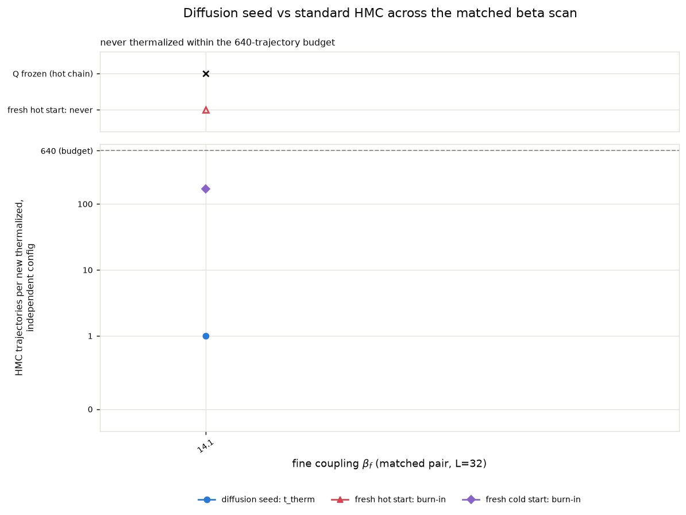
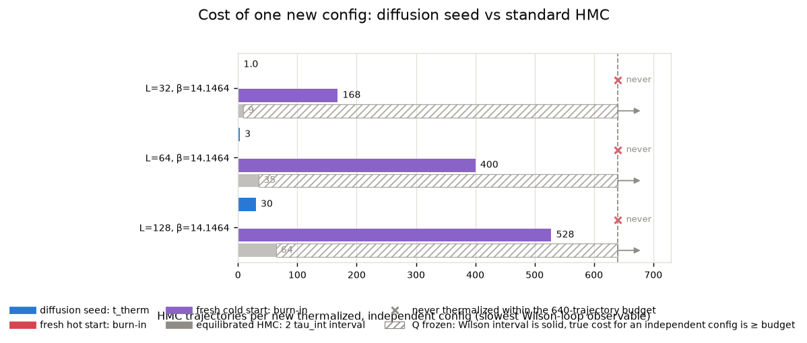
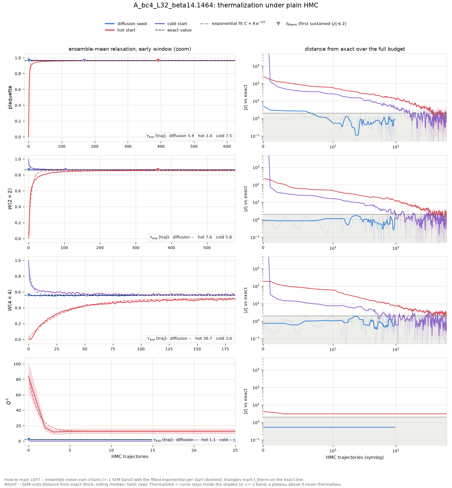
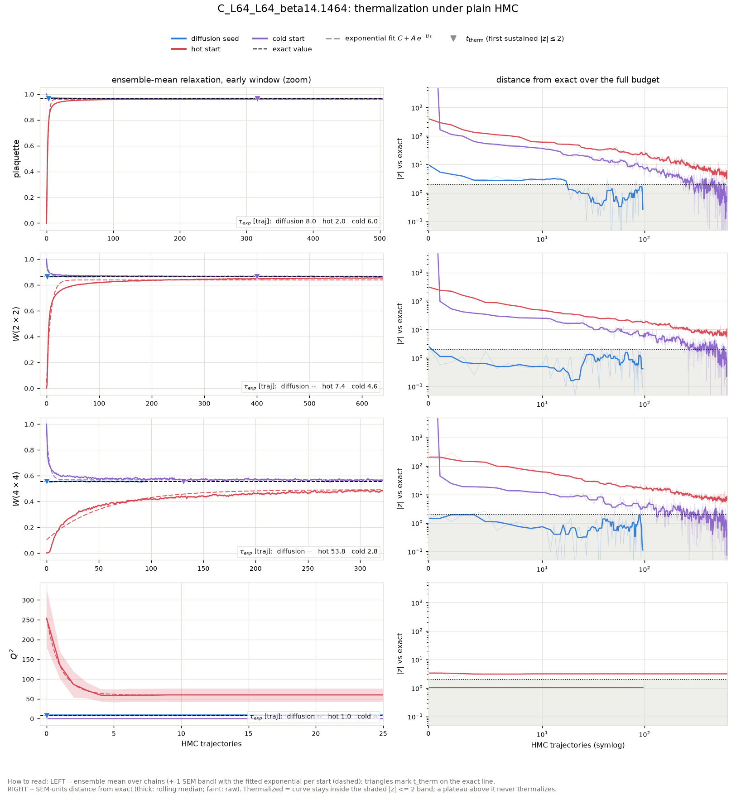
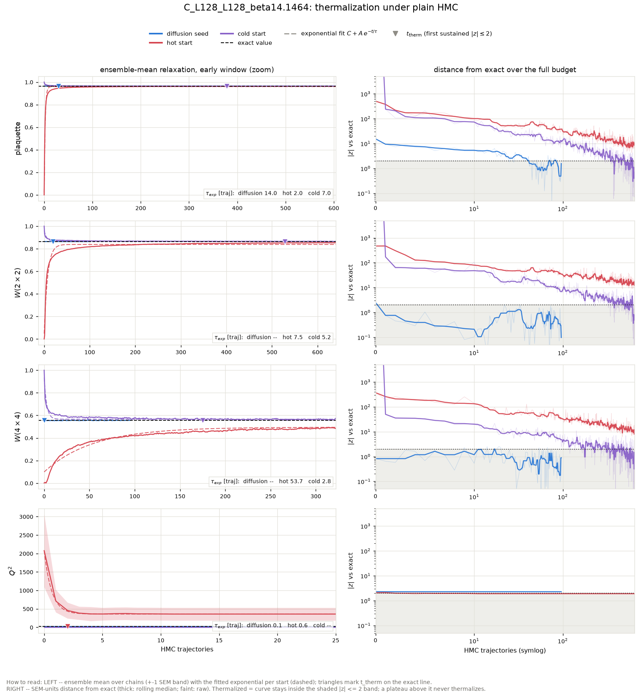

# Diffusion-seeded HMC across the matched beta scan: thermalization time vs the standard-HMC sampling interval

Action: wilson. All HMC in this report is plain HMC (Omelyan, adapted step size, **no** topological updates).

**Why this scan.** At the ladder's upper rungs the fresh-HMC baselines never thermalize at all (topological freezing plus a metastable local-defect state), so the only comparison available there is 'diffusion seed vs a baseline that never arrives'. This report extends the benchmark to every matched coupling pair of the generalization study -- one inverse-RG step L=16 -> L=32 per case -- including fine couplings low enough that hot- and cold-start HMC *does* thermalize within the budget. There the standard chain's own interval `2 tau_int` and its fresh-start burn-in are honest, measurable yardsticks, and the scan shows where the ordering

> t_therm(diffusion seed)  <  2 tau_int(standard HMC)  <  burn-in(fresh chain)

sets in as beta grows and standard HMC slides into critical slowing down and topological freezing.

## The three starting points

- **Diffusion seed** -- the raw conditional-diffusion output for this coupling: one inverse-RG step from a direct-HMC base ensemble at the matched coarse coupling (ancestral sampling + the deterministic coarse-charge transport), with **no** rethermalization sweeps applied: every bit of equilibration the seed needs is measured here, in HMC trajectories.
- **Hot start** -- every link angle drawn uniformly from (-pi, pi]: a completely disordered (infinite-temperature) configuration. The standard way to initialize a fresh HMC chain without prior information.
- **Cold start** -- every link angle set to zero: the perfectly ordered (beta -> infinity) configuration, the other standard initialization.

## Summary

| rung | L | beta | t_therm diffusion seed | standard-HMC interval 2 tau_int | margin (interval - t_therm) | burn-in hot / cold | tau_int(Q) |
|---|---|---|---|---|---|---|---|
| A_bc4_L32_beta14.1464 | 32 | 14.1464 | 1 | 8.7 | 7.7 traj | never / 168 | frozen (0 tunnelings in 321 x 32 traj) |
| C_L64_L64_beta14.1464 | 64 | 14.1464 | 3 | 35.0 | 32.0 traj | never / 400 | frozen (0 tunnelings in 321 x 16 traj) |
| C_L128_L128_beta14.1464 | 128 | 14.1464 | 30 | 64.1 | 34.1 traj | never / 528 | frozen (0 tunnelings in 321 x 8 traj) |

## Wall-clock accounting

All timescales above are in HMC trajectories -- the honest *ergodicity* unit. This table converts to seconds on this machine so the economics are explicit. Batched chains produce n_chains configs per trajectory, so per-config costs divide by the chain count; the diffusion sampling cost amortizes over the whole generated batch.

| case | seed: sample s/config | seed: t_therm s (batch) | HMC interval s/config | hot burn-in s (batch) | s/traj (batch) |
|---|---|---|---|---|---|
| A_bc4_L32_beta14.1464 | 0.2 | 0.1 | 0.01 | never | 0.05 |
| C_L64_L64_beta14.1464 | 0.6 | 0.1 | 0.09 | never | 0.04 |
| C_L128_L128_beta14.1464 | 2.3 | 1.5 | 0.35 | never | 0.04 |

## Fitted relaxation times across starts

Exponential fits C + A exp(-t/tau) to the ensemble-mean plaquette and W(2x2) relaxation curves, per starting point (the cross-start comparison of characteristic times; a start already at its plateau fits no decay, which is the desired outcome for the diffusion seed).

| case | obs | tau: diffusion seed | tau: hot start | tau: cold start |
|---|---|---|---|---|
| A_bc4_L32_beta14.1464 | plaquette | 5.9 +- 1.3 | 2.0 +- 0.0 | 7.5 +- 0.3 |
| A_bc4_L32_beta14.1464 | wilson_2x2 | no measurable decay (starts at plateau; tau unconstrained) | 7.6 +- 0.2 | 5.8 +- 0.2 |
| C_L64_L64_beta14.1464 | plaquette | 8.0 +- 1.4 | 2.0 +- 0.0 | 6.0 +- 0.2 |
| C_L64_L64_beta14.1464 | wilson_2x2 | unconstrained fit (tau error exceeds tau) | 7.4 +- 0.2 | 4.6 +- 0.2 |
| C_L128_L128_beta14.1464 | plaquette | 14.0 +- 1.6 | 2.0 +- 0.0 | 7.0 +- 0.3 |
| C_L128_L128_beta14.1464 | wilson_2x2 | unconstrained fit (tau error exceeds tau) | 7.5 +- 0.2 | 5.2 +- 0.2 |

t_therm and burn-in are the slowest Wilson-loop observable (plaquette, W(2x2), W(4x4)); topology is stricter still for the fresh chains: their Q^2 **never** reaches the exact value at the frozen rungs, while the diffusion seed inherits the correct topological sector from the coarse ensemble it was generated from (see the Q^2 panels and per-rung tables below).

Thermalization time `t_therm` = first trajectory at which the ensemble-mean z-score vs the exact value satisfies |z| <= 2 and stays there for 5 consecutive trajectories (t = 0: already thermalized before any HMC). For the diffusion seed, t_therm is computed on a random subsample of chains matched to the baseline chain count so all starts are compared at equal statistical power. `tau_int` is Madras-Sokal, measured on the second half of the hot-start chains, averaged over chains. In the per-rung relaxation figures, triangles mark each start's t_therm, dashed curves are the exponential fits C + A exp(-t/tau) to the ensemble means (tau quoted per panel), and the right-hand panels track the ensemble mean's distance from the exact value in SEM units -- thermalized means inside the shaded |z| <= 2 band; the dotted vertical line there is the standard-HMC interval `2 tau_int`.

## What 'never' means, and where the ground truth comes from

'never' = the ensemble mean was still outside |z| <= 2 of the exact value after the full baseline budget; the per-rung sections quote the z-score it plateaued at. For hot starts at the large-beta rungs this is not a budget problem but a physical one: a random start freezes into a random topological sector (<Q^2> of order tens), plain HMC can never change Q at these couplings (tunneling is suppressed ~exp(-2 beta)), and the wrong sector biases every Wilson loop by an amount that never decays. Cold starts sit in the single sector Q = 0, so their Wilson loops do eventually converge, but <Q^2> stays pinned at 0 forever.

None of the exact values in this report come from fine-lattice HMC: the ground truth is the character expansion of 2D compact U(1) (`diffusion/lgt/exact.py`), which gives every Wilson loop, P(Q) and chi_top in closed form at finite volume. Each diffusion seed here is one inverse-RG step from a direct-HMC base ensemble at the matched coarse coupling beta_c (L=16), where HMC mixes well -- which is precisely why it can start chains in regions standard HMC cannot reach.

## A_bc4_L32_beta14.1464

HMC: step size 0.1063, 9 leapfrog steps, acceptance seed/hot/cold = 0.985/0.984/0.986. Diffusion-seed batch: 128 chains x 96 trajectories (0.06 s/traj for the whole batch); baselines: 32 chains x 640 trajectories.

tau_int (hot-start chains, second half): plaquette = 4.37 +- 0.58, wilson_2x2 = 3.53 +- 0.49, wilson_4x4 = 2.40 +- 0.32, wilson_6x6 = 0.90 +- 0.04. Topology: hot-start HMC L=32 beta=14.1464 -> **frozen** (no tunneling).

Where 'never' stood at the end: the hot start ended the 640-trajectory budget still at wilson_4x4 at |z| ~ 2, wilson_6x6 at |z| ~ 3, Q^2 at |z| ~ 3; the cold start ended the 640-trajectory budget still at Q^2 at |z| ~ 1903991324672.

### Diagnostics: raw diffusion output (before any HMC)

| observable | value | error | exact | z_exact | chi2_p |
|---|---|---|---|---|---|
| plaquette | 0.9648 | 0.0001375 | 0.964 | 6.09 |  |
| wilson_1x1 | 0.9648 | 0.0001375 | 0.964 | 6.09 |  |
| wilson_1x2 | 0.9296 | 0.0004032 | 0.9293 | 0.9689 |  |
| wilson_2x2 | 0.8627 | 0.001025 | 0.8635 | -0.7846 |  |
| wilson_2x3 | 0.8002 | 0.001741 | 0.8024 | -1.261 |  |
| wilson_3x3 | 0.7158 | 0.002799 | 0.7188 | -1.082 |  |
| wilson_3x4 | 0.6402 | 0.003459 | 0.6439 | -1.077 |  |
| wilson_4x4 | 0.5534 | 0.004346 | 0.556 | -0.6055 |  |
| wilson_4x5 | 0.4787 | 0.004608 | 0.4801 | -0.3222 |  |
| wilson_5x5 | 0.3994 | 0.00481 | 0.3997 | -0.05944 |  |
| wilson_5x6 | 0.333 | 0.005022 | 0.3327 | 0.05581 |  |
| wilson_6x6 | 0.2678 | 0.005206 | 0.267 | 0.1597 |  |
| wilson_6x7 | 0.2158 | 0.00565 | 0.2142 | 0.2747 |  |
| wilson_7x7 | 0.1664 | 0.005894 | 0.1657 | 0.1187 |  |
| wilson_7x8 | 0.1275 | 0.006581 | 0.1282 | -0.1107 |  |
| wilson_8x8 | 0.09302 | 0.007218 | 0.09558 | -0.3554 |  |
| wilson_8x10 | 0.05138 | 0.006263 | 0.05315 | -0.2814 |  |
| wilson_10x10 | 0.02234 | 0.00638 | 0.02552 | -0.4987 |  |
| wilson_10x12 | 0.009042 | 0.004699 | 0.01225 | -0.6832 |  |
| wilson_12x12 | 0.00493 | 0.004709 | 0.00508 | -0.03173 |  |
| creutz_2 | 0.03759 | 0.0005171 | 0.03668 | 1.748 |  |
| creutz_3 | 0.03636 | 0.00105 | 0.03668 | -0.3128 |  |
| creutz_4 | 0.03405 | 0.001773 | 0.03668 | -1.488 |  |
| creutz_5 | 0.03595 | 0.003462 | 0.03668 | -0.2124 |  |
| creutz_6 | 0.03597 | 0.005698 | 0.03668 | -0.1247 |  |
| creutz_7 | 0.0438 | 0.009636 | 0.03668 | 0.7386 |  |
| creutz_8 | 0.04828 | 0.02038 | 0.03668 | 0.5687 |  |
| Q | 0.007812 | 0.1155 | 0 | 0.06766 |  |
| Q^2 | 1.805 | 0.1517 | 1.904 | -0.6546 |  |
| chi_top ((<Q^2>-<Q>^2)/V) | 0.001762 | 0.0001826 | 0.001859 | -0.5315 |  |
| Q histogram vs exact P(Q) | 5.092 | nan | 8 | nan | 0.7477 |

### Diagnostics: the same configs after 96 HMC trajectories

| observable | value | error | exact | z_exact | chi2_p |
|---|---|---|---|---|---|
| plaquette | 0.9639 | 0.0001309 | 0.964 | -0.933 |  |
| wilson_1x1 | 0.9639 | 0.0001309 | 0.964 | -0.933 |  |
| wilson_1x2 | 0.929 | 0.0003222 | 0.9293 | -0.6574 |  |
| wilson_2x2 | 0.8626 | 0.0006828 | 0.8635 | -1.352 |  |
| wilson_2x3 | 0.8009 | 0.001112 | 0.8024 | -1.381 |  |
| wilson_3x3 | 0.7162 | 0.001627 | 0.7188 | -1.591 |  |
| wilson_3x4 | 0.6402 | 0.00206 | 0.6439 | -1.822 |  |
| wilson_4x4 | 0.5517 | 0.00308 | 0.556 | -1.408 |  |
| wilson_4x5 | 0.4749 | 0.003866 | 0.4801 | -1.366 |  |
| wilson_5x5 | 0.3941 | 0.004718 | 0.3997 | -1.182 |  |
| wilson_5x6 | 0.3266 | 0.005346 | 0.3327 | -1.138 |  |
| wilson_6x6 | 0.2605 | 0.005974 | 0.267 | -1.083 |  |
| wilson_6x7 | 0.2077 | 0.006343 | 0.2142 | -1.029 |  |
| wilson_7x7 | 0.1598 | 0.006482 | 0.1657 | -0.9098 |  |
| wilson_7x8 | 0.1213 | 0.006778 | 0.1282 | -1.014 |  |
| wilson_8x8 | 0.08889 | 0.005914 | 0.09558 | -1.131 |  |
| wilson_8x10 | 0.0415 | 0.006493 | 0.05315 | -1.794 |  |
| wilson_10x10 | 0.01756 | 0.005395 | 0.02552 | -1.475 |  |
| wilson_10x12 | 0.003496 | 0.005231 | 0.01225 | -1.674 |  |
| wilson_12x12 | -0.002793 | 0.00486 | 0.00508 | -1.62 |  |
| creutz_2 | 0.03742 | 0.0005096 | 0.03668 | 1.453 |  |
| creutz_3 | 0.03753 | 0.00116 | 0.03668 | 0.7282 |  |
| creutz_4 | 0.03643 | 0.002123 | 0.03668 | -0.1186 |  |
| creutz_5 | 0.03644 | 0.00367 | 0.03668 | -0.06666 |  |
| creutz_6 | 0.03835 | 0.005998 | 0.03668 | 0.2786 |  |
| creutz_7 | 0.03556 | 0.009406 | 0.03668 | -0.1199 |  |
| creutz_8 | 0.03529 | 0.01983 | 0.03668 | -0.07026 |  |
| Q | 0.007812 | 0.1155 | 0 | 0.06766 |  |
| Q^2 | 1.805 | 0.1517 | 1.904 | -0.6546 |  |
| chi_top ((<Q^2>-<Q>^2)/V) | 0.001762 | 0.0001826 | 0.001859 | -0.5315 |  |
| Q histogram vs exact P(Q) | 5.092 | nan | 8 | nan | 0.7477 |

## C_L64_L64_beta14.1464

HMC: step size 0.1063, 9 leapfrog steps, acceptance seed/hot/cold = 0.969/0.970/0.973. Diffusion-seed batch: 96 chains x 96 trajectories (0.04 s/traj for the whole batch); baselines: 16 chains x 640 trajectories.

tau_int (hot-start chains, second half): plaquette = 11.03 +- 2.11, wilson_2x2 = 17.49 +- 3.05, wilson_4x4 = 11.22 +- 2.58, wilson_6x6 = 1.22 +- 0.11. Topology: hot-start HMC L=64 beta=14.1464 -> **frozen** (no tunneling).

Where 'never' stood at the end: the hot start ended the 640-trajectory budget still at plaquette at |z| ~ 4, wilson_2x2 at |z| ~ 8, wilson_4x4 at |z| ~ 7, wilson_6x6 at |z| ~ 4, Q^2 at |z| ~ 3; the cold start ended the 640-trajectory budget still at Q^2 at |z| ~ 7615990988800.

### Diagnostics: raw diffusion output (before any HMC)

| observable | value | error | exact | z_exact | chi2_p |
|---|---|---|---|---|---|
| plaquette | 0.9648 | 6.323e-05 | 0.964 | 13.6 |  |
| wilson_1x1 | 0.9648 | 6.323e-05 | 0.964 | 13.6 |  |
| wilson_1x2 | 0.93 | 0.0001695 | 0.9293 | 4.324 |  |
| wilson_2x2 | 0.8648 | 0.0003787 | 0.8635 | 3.41 |  |
| wilson_2x3 | 0.8033 | 0.0006932 | 0.8024 | 1.312 |  |
| wilson_3x3 | 0.7188 | 0.00106 | 0.7188 | 0.00635 |  |
| wilson_3x4 | 0.6448 | 0.001538 | 0.6439 | 0.5643 |  |
| wilson_4x4 | 0.5592 | 0.001891 | 0.556 | 1.704 |  |
| wilson_4x5 | 0.4833 | 0.002271 | 0.4801 | 1.376 |  |
| wilson_5x5 | 0.4024 | 0.002482 | 0.3997 | 1.096 |  |
| wilson_5x6 | 0.3369 | 0.00274 | 0.3327 | 1.531 |  |
| wilson_6x6 | 0.2731 | 0.002757 | 0.267 | 2.237 |  |
| wilson_6x7 | 0.2189 | 0.002799 | 0.2142 | 1.657 |  |
| wilson_7x7 | 0.1696 | 0.002526 | 0.1657 | 1.555 |  |
| wilson_7x8 | 0.1326 | 0.002458 | 0.1282 | 1.779 |  |
| wilson_8x8 | 0.09916 | 0.002555 | 0.09558 | 1.399 |  |
| wilson_8x10 | 0.05442 | 0.003349 | 0.05315 | 0.3817 |  |
| wilson_10x10 | 0.02737 | 0.003659 | 0.02552 | 0.5052 |  |
| wilson_10x12 | 0.01225 | 0.00338 | 0.01225 | -0.0004071 |  |
| wilson_12x12 | 0.002604 | 0.003322 | 0.00508 | -0.7453 |  |
| creutz_2 | 0.03587 | 0.0003098 | 0.03668 | -2.613 |  |
| creutz_3 | 0.03745 | 0.0005696 | 0.03668 | 1.339 |  |
| creutz_4 | 0.03359 | 0.001142 | 0.03668 | -2.713 |  |
| creutz_5 | 0.0371 | 0.002059 | 0.03668 | 0.2007 |  |
| creutz_6 | 0.03212 | 0.003409 | 0.03668 | -1.338 |  |
| creutz_7 | 0.03327 | 0.006042 | 0.03668 | -0.5658 |  |
| creutz_8 | 0.04363 | 0.00998 | 0.03668 | 0.6955 |  |
| Q | 0.2396 | 0.3342 | 0 | 0.7168 |  |
| Q^2 | 9.115 | 1.36 | 7.616 | 1.102 |  |
| chi_top ((<Q^2>-<Q>^2)/V) | 0.002211 | 0.0003476 | 0.001859 | 1.012 |  |
| Q histogram vs exact P(Q) | 16.09 | nan | 12 | nan | 0.1871 |

### Diagnostics: the same configs after 96 HMC trajectories

| observable | value | error | exact | z_exact | chi2_p |
|---|---|---|---|---|---|
| plaquette | 0.964 | 7.442e-05 | 0.964 | 0.2963 |  |
| wilson_1x1 | 0.964 | 7.442e-05 | 0.964 | 0.2963 |  |
| wilson_1x2 | 0.9292 | 0.0001733 | 0.9293 | -0.5899 |  |
| wilson_2x2 | 0.8633 | 0.0004438 | 0.8635 | -0.4284 |  |
| wilson_2x3 | 0.8022 | 0.0008829 | 0.8024 | -0.2685 |  |
| wilson_3x3 | 0.7181 | 0.001464 | 0.7188 | -0.4961 |  |
| wilson_3x4 | 0.6435 | 0.002009 | 0.6439 | -0.2054 |  |
| wilson_4x4 | 0.5558 | 0.002791 | 0.556 | -0.09554 |  |
| wilson_4x5 | 0.4799 | 0.003269 | 0.4801 | -0.08563 |  |
| wilson_5x5 | 0.3988 | 0.003714 | 0.3997 | -0.2474 |  |
| wilson_5x6 | 0.3317 | 0.004267 | 0.3327 | -0.2358 |  |
| wilson_6x6 | 0.2652 | 0.004678 | 0.267 | -0.3716 |  |
| wilson_6x7 | 0.2112 | 0.005112 | 0.2142 | -0.5869 |  |
| wilson_7x7 | 0.161 | 0.005246 | 0.1657 | -0.8936 |  |
| wilson_7x8 | 0.1222 | 0.005328 | 0.1282 | -1.129 |  |
| wilson_8x8 | 0.08915 | 0.004901 | 0.09558 | -1.313 |  |
| wilson_8x10 | 0.04715 | 0.004564 | 0.05315 | -1.315 |  |
| wilson_10x10 | 0.02139 | 0.003881 | 0.02552 | -1.064 |  |
| wilson_10x12 | 0.009144 | 0.003555 | 0.01225 | -0.8741 |  |
| wilson_12x12 | 0.003765 | 0.002601 | 0.00508 | -0.5053 |  |
| creutz_2 | 0.03666 | 0.0003338 | 0.03668 | -0.06803 |  |
| creutz_3 | 0.03732 | 0.0007217 | 0.03668 | 0.8867 |  |
| creutz_4 | 0.03689 | 0.001163 | 0.03668 | 0.1792 |  |
| creutz_5 | 0.0383 | 0.001826 | 0.03668 | 0.8842 |  |
| creutz_6 | 0.03946 | 0.003365 | 0.03668 | 0.8249 |  |
| creutz_7 | 0.0437 | 0.00579 | 0.03668 | 1.212 |  |
| creutz_8 | 0.03892 | 0.01101 | 0.03668 | 0.2033 |  |
| Q | 0.2396 | 0.3342 | 0 | 0.7168 |  |
| Q^2 | 9.115 | 1.36 | 7.616 | 1.102 |  |
| chi_top ((<Q^2>-<Q>^2)/V) | 0.002211 | 0.0003476 | 0.001859 | 1.012 |  |
| Q histogram vs exact P(Q) | 16.09 | nan | 12 | nan | 0.1871 |

## C_L128_L128_beta14.1464

HMC: step size 0.1063, 9 leapfrog steps, acceptance seed/hot/cold = 0.942/0.942/0.938. Diffusion-seed batch: 64 chains x 96 trajectories (0.05 s/traj for the whole batch); baselines: 8 chains x 640 trajectories.

tau_int (hot-start chains, second half): plaquette = 24.27 +- 2.07, wilson_2x2 = 32.07 +- 2.34, wilson_4x4 = 22.44 +- 2.25, wilson_6x6 = 1.46 +- 0.07. Topology: hot-start HMC L=128 beta=14.1464 -> **frozen** (no tunneling).

Where 'never' stood at the end: the hot start ended the 640-trajectory budget still at plaquette at |z| ~ 9, wilson_2x2 at |z| ~ 15, wilson_4x4 at |z| ~ 12, wilson_6x6 at |z| ~ 4; the cold start ended the 640-trajectory budget still at Q^2 at |z| ~ 30463963955200.

### Diagnostics: raw diffusion output (before any HMC)

| observable | value | error | exact | z_exact | chi2_p |
|---|---|---|---|---|---|
| plaquette | 0.9648 | 5.21e-05 | 0.964 | 15.18 |  |
| wilson_1x1 | 0.9648 | 5.21e-05 | 0.964 | 15.18 |  |
| wilson_1x2 | 0.9296 | 0.0001214 | 0.9293 | 2.483 |  |
| wilson_2x2 | 0.8642 | 0.0002832 | 0.8635 | 2.32 |  |
| wilson_2x3 | 0.8021 | 0.0004268 | 0.8024 | -0.6867 |  |
| wilson_3x3 | 0.7169 | 0.0006441 | 0.7188 | -2.959 |  |
| wilson_3x4 | 0.6418 | 0.0009534 | 0.6439 | -2.197 |  |
| wilson_4x4 | 0.5549 | 0.001305 | 0.556 | -0.8257 |  |
| wilson_4x5 | 0.4775 | 0.001642 | 0.4801 | -1.625 |  |
| wilson_5x5 | 0.3944 | 0.002069 | 0.3997 | -2.542 |  |
| wilson_5x6 | 0.3279 | 0.002287 | 0.3327 | -2.081 |  |
| wilson_6x6 | 0.2623 | 0.002362 | 0.267 | -1.969 |  |
| wilson_6x7 | 0.2092 | 0.002451 | 0.2142 | -2.054 |  |
| wilson_7x7 | 0.1587 | 0.002471 | 0.1657 | -2.845 |  |
| wilson_7x8 | 0.1227 | 0.002524 | 0.1282 | -2.181 |  |
| wilson_8x8 | 0.09118 | 0.002317 | 0.09558 | -1.902 |  |
| wilson_8x10 | 0.05021 | 0.002292 | 0.05315 | -1.279 |  |
| wilson_10x10 | 0.02157 | 0.002402 | 0.02552 | -1.642 |  |
| wilson_10x12 | 0.008373 | 0.00177 | 0.01225 | -2.191 |  |
| wilson_12x12 | 0.001049 | 0.001452 | 0.00508 | -2.775 |  |
| creutz_2 | 0.03575 | 0.0002054 | 0.03668 | -4.536 |  |
| creutz_3 | 0.03785 | 0.0004482 | 0.03668 | 2.596 |  |
| creutz_4 | 0.03476 | 0.0007817 | 0.03668 | -2.46 |  |
| creutz_5 | 0.04073 | 0.001206 | 0.03668 | 3.354 |  |
| creutz_6 | 0.03869 | 0.002066 | 0.03668 | 0.9701 |  |
| creutz_7 | 0.05004 | 0.003274 | 0.03668 | 4.081 |  |
| creutz_8 | 0.03941 | 0.007534 | 0.03668 | 0.3618 |  |
| Q | -0.7344 | 0.5333 | 0 | -1.377 |  |
| Q^2 | 21.52 | 3.522 | 30.46 | -2.541 |  |
| chi_top ((<Q^2>-<Q>^2)/V) | 0.00128 | 0.0002355 | 0.001859 | -2.458 |  |
| Q histogram vs exact P(Q) | 13.91 | nan | 16 | nan | 0.6055 |

### Diagnostics: the same configs after 96 HMC trajectories

| observable | value | error | exact | z_exact | chi2_p |
|---|---|---|---|---|---|
| plaquette | 0.964 | 4.432e-05 | 0.964 | 1.499 |  |
| wilson_1x1 | 0.964 | 4.432e-05 | 0.964 | 1.499 |  |
| wilson_1x2 | 0.9293 | 0.000124 | 0.9293 | 0.2921 |  |
| wilson_2x2 | 0.8635 | 0.0002489 | 0.8635 | 0.1045 |  |
| wilson_2x3 | 0.8023 | 0.0004824 | 0.8024 | -0.2255 |  |
| wilson_3x3 | 0.719 | 0.0006483 | 0.7188 | 0.3583 |  |
| wilson_3x4 | 0.6441 | 0.0008922 | 0.6439 | 0.2597 |  |
| wilson_4x4 | 0.5572 | 0.001043 | 0.556 | 1.141 |  |
| wilson_4x5 | 0.4816 | 0.001179 | 0.4801 | 1.272 |  |
| wilson_5x5 | 0.402 | 0.001454 | 0.3997 | 1.586 |  |
| wilson_5x6 | 0.3352 | 0.001525 | 0.3327 | 1.665 |  |
| wilson_6x6 | 0.2702 | 0.001731 | 0.267 | 1.843 |  |
| wilson_6x7 | 0.2178 | 0.001904 | 0.2142 | 1.876 |  |
| wilson_7x7 | 0.1697 | 0.002012 | 0.1657 | 1.983 |  |
| wilson_7x8 | 0.1319 | 0.002086 | 0.1282 | 1.804 |  |
| wilson_8x8 | 0.09928 | 0.002044 | 0.09558 | 1.809 |  |
| wilson_8x10 | 0.05556 | 0.001725 | 0.05315 | 1.401 |  |
| wilson_10x10 | 0.02655 | 0.001732 | 0.02552 | 0.5965 |  |
| wilson_10x12 | 0.01206 | 0.002071 | 0.01225 | -0.09108 |  |
| wilson_12x12 | 0.004493 | 0.002183 | 0.00508 | -0.2688 |  |
| creutz_2 | 0.03666 | 0.0001821 | 0.03668 | -0.116 |  |
| creutz_3 | 0.03606 | 0.0003834 | 0.03668 | -1.629 |  |
| creutz_4 | 0.03494 | 0.000717 | 0.03668 | -2.429 |  |
| creutz_5 | 0.03503 | 0.001218 | 0.03668 | -1.358 |  |
| creutz_6 | 0.03425 | 0.002092 | 0.03668 | -1.162 |  |
| creutz_7 | 0.0341 | 0.003906 | 0.03668 | -0.6608 |  |
| creutz_8 | 0.03279 | 0.007349 | 0.03668 | -0.5304 |  |
| Q | -0.75 | 0.538 | 0 | -1.394 |  |
| Q^2 | 21.59 | 3.532 | 30.46 | -2.512 |  |
| chi_top ((<Q^2>-<Q>^2)/V) | 0.001284 | 0.0002353 | 0.001859 | -2.447 |  |
| Q histogram vs exact P(Q) | 13.12 | nan | 16 | nan | 0.6637 |
