# 2D U(2) figure appendix

Assembled by `u2_2d/scripts/49_assemble_appendix_figures.py`; captions are
single-sourced from that script's `FIGURES` table, so this file is generated,
not hand-kept. Regenerate with `--write-appendix`.

Every figure below is in `figures/`, copied from `out/u2_2d/figures/` and
checked against the data it was drawn from. `--check` fails if any figure is
older than its newest input.

**Two reporting rules apply throughout and are the reason several captions
carry a resolution note.** (i) Any statement of the form "the deviation
grows/shrinks with loop size" needs its standard error quoted alongside it:
large Wilson loops have enormous per-configuration spread and at 64-256
configurations are frequently not resolved. (ii) A `mean |z|` must be read
against the half-normal null `sqrt(2/pi) = 0.798` at the EFFECTIVE observable
count, which is 3.77 at L=32 and 3.25 at L=64 -- not at the raw count of 41.

## Main text, section 3 (method)

The multi-lift result and the pipeline schematic are shared between the two studies and belong with the method rather than with the transfer demonstration.

### Figure U2-1: `fig28_pipeline.png`

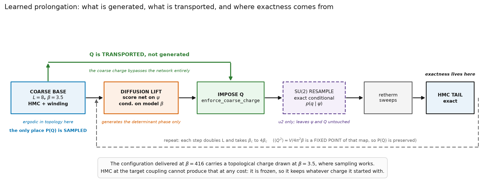

Pipeline schematic, drawn once for BOTH studies -- the SU(2) conditional-sampler box is dashed and labelled u2 only. Makes three things visual: where P(Q) is sampled, that the charge branch runs AROUND the network, and that exactness lives in the HMC tail.

*Drawn by `u2_2d/scripts/41_pipeline_schematic.py`.*

### Figure U2-2: `fig30_multi_lift.png`

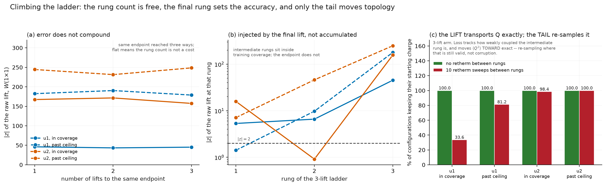

MAIN TEXT, method section, not the transfer section. Reaching one fixed endpoint by 1, 2 and 3 lifts, u1 and u2 side by side: the rung count is free, the error is injected by the LAST lift, and only the intermediate rethermalization moves Q.

*Drawn by `u2_2d/scripts/46_multi_lift_figure.py`.*

## Main text, section 8 (2D U(2)) -- the five-figure budget

Section 8 is a demonstration of transfer, not a second paper, and is held to five figures.

### Figure U2-3: `fig07_topological_reach.png`

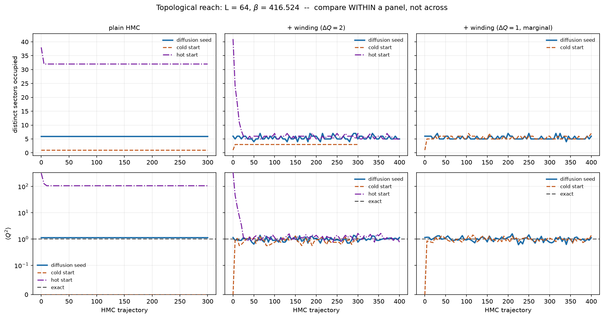

STRONGEST PANEL IN THE SECTION. Sectors occupied and <Q^2> against trajectory, eight arms. Plain HMC sits flat at one sector; the even-winding arm reaches zero odd sectors; the seed arrives carrying them, because Q is transported from a coupling where it is sampled.

*Drawn by `u2_2d/scripts/10_paper_figures.py`.*

### Figure U2-4: `fig06_seed_quality.png`

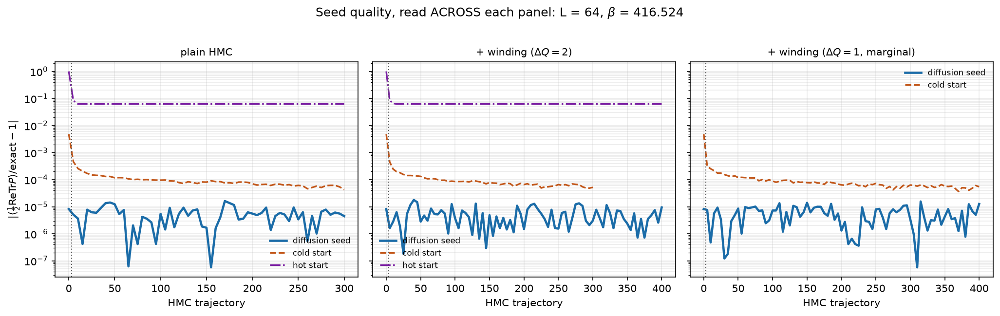

SECTION LEAD. Relative plaquette error against trajectory number at L=64, beta=416.524, for the diffusion seed and the cold, hot and winding baselines. The seed starts at equilibrium to within the resolution 64 configurations can offer; a cold start is three orders of magnitude away and plateaus 5x short after 300 trajectories.

*Drawn by `u2_2d/scripts/10_paper_figures.py`.*

### Figure U2-5: `fig09_parity_mobility.png`

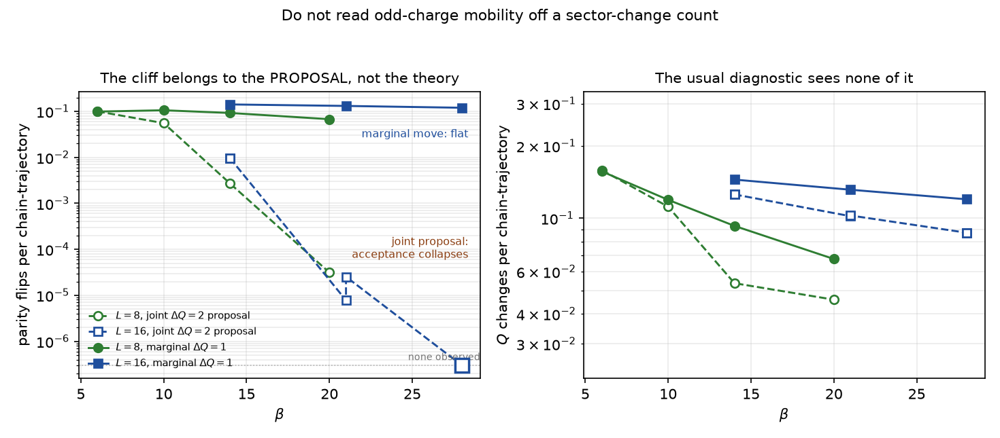

Parity flips against beta for the retired JOINT winding proposal and the marginal odd move, at matched protocol. The joint rate falls to zero over a range in which the marginal rate falls 15%: there is no odd-charge mobility edge at L=16 below beta=28, only a badly priced proposal.

*Drawn by `u2_2d/scripts/10_paper_figures.py`.*

### Figure U2-6: `fig13_cost.png`

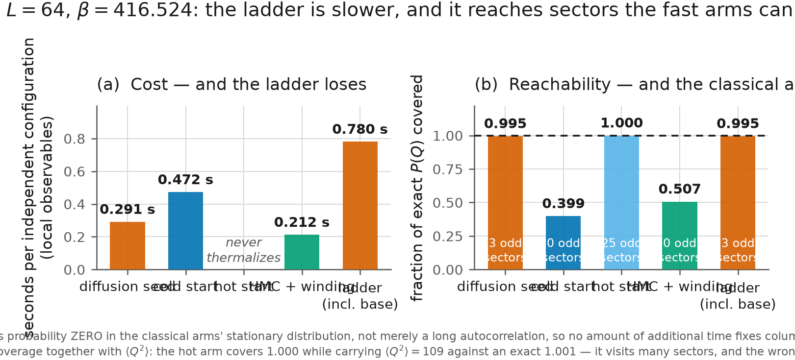

Seconds per independent configuration by arm. Read as a cost claim, not a speed-up: at 200 sampler steps the ladder is 3.87x SLOWER than HMC + winding, and the point is which configurations each arm can reach at all.

*Drawn by `u2_2d/scripts/16_cost_figures.py`.*

### Figure U2-7: `fig26_transport_exactness.png`

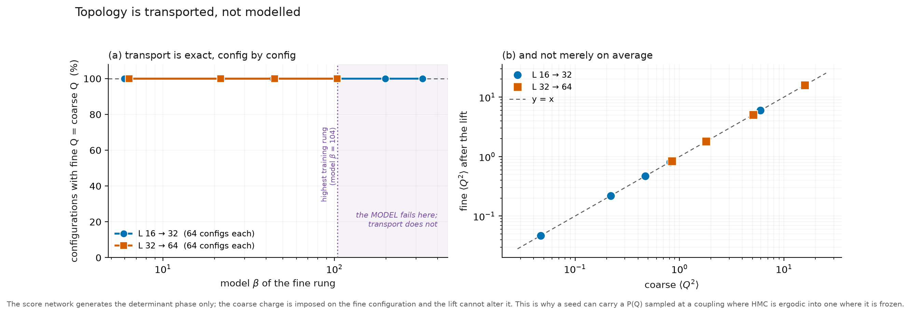

Fine Q equals coarse Q for 100% of configurations, measured configuration by configuration at both volumes and ten couplings. This is the identity the whole framing rests on, checked on the GENERATIVE path rather than on the blocking map.

*Drawn by `u2_2d/scripts/37_transport_figure.py`.*

## Appendix U2-A. Exact solvability and the matched ladder

2D U(2) was chosen because it is exactly solvable. These are the checks that the implementation reproduces the closed form, and the ladder the rest of the section runs on.

### Figure U2-8: `fig4_beta_matching.png`

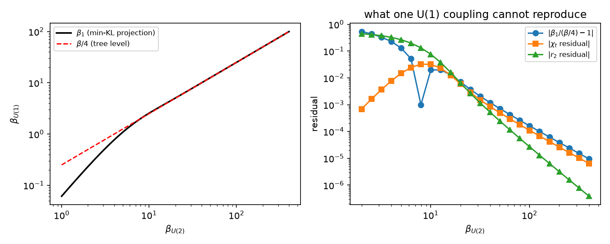

The minimum-KL U(1) projection `matched_u1_beta` against the naive beta/4. They differ by 23% at beta=4 and 0.003% at beta=220, which is why anything analytic must call the projection.

*Drawn by `u2_2d/scripts/06_figures.py`.*

### Figure U2-9: `fig5_ladder.png`

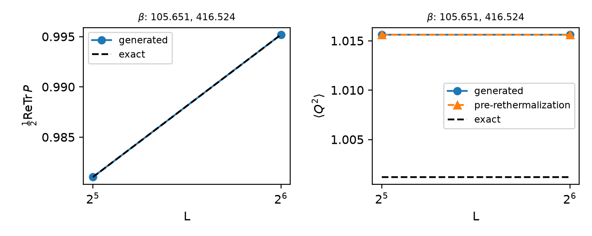

The matched ladder: (L, beta) rungs and the topology-matched fine beta that preserves exact <Q^2> rather than the plaquette.

*Drawn by `u2_2d/scripts/06_figures.py --config u2_2d/configs/default.yaml`.*

### Figure U2-10: `fig1_det_density_L32_beta105.651.png`

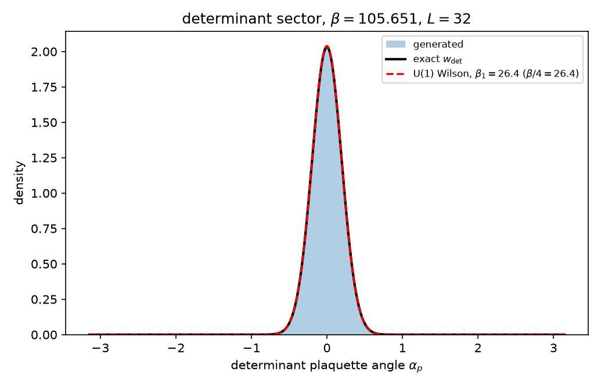

Determinant-sector plaquette density at the L=32 rung against the exact marginal weight w_det(alpha) = 2 I_1(z)/z.

*Drawn by `u2_2d/scripts/06_figures.py --config u2_2d/configs/default.yaml`.*

### Figure U2-11: `fig1_det_density_L64_beta416.524.png`

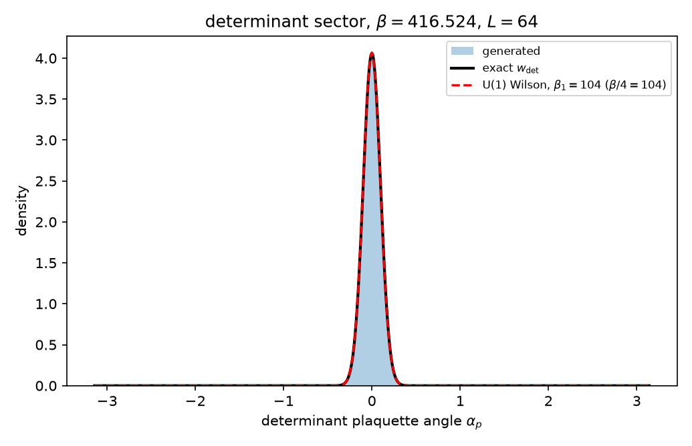

The same at the top rung, L=64, beta=416.524.

*Drawn by `u2_2d/scripts/06_figures.py --config u2_2d/configs/default.yaml`.*

### Figure U2-12: `fig2_sectors_L32_beta105.651.png`

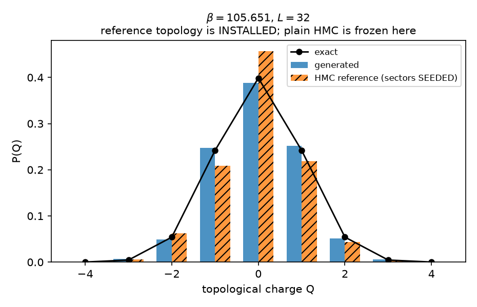

Topological sector weights at L=32 against the closed-form P(Q). The reference ensemble is labelled seeded or sampled, since a seeded reference cannot corroborate a sector weight it was handed.

*Drawn by `u2_2d/scripts/06_figures.py --config u2_2d/configs/default.yaml`.*

### Figure U2-13: `fig2_sectors_L64_beta416.524.png`

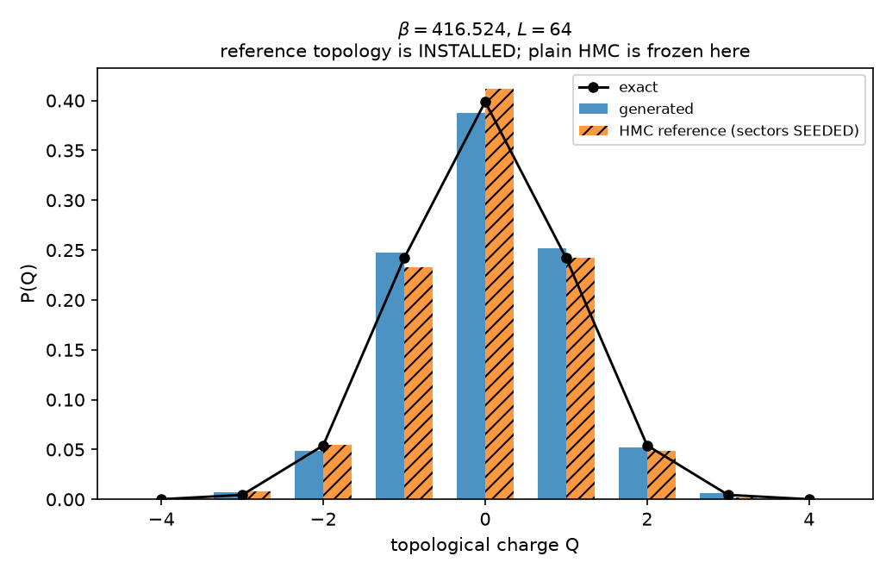

Sector weights at the top rung.

*Drawn by `u2_2d/scripts/06_figures.py --config u2_2d/configs/default.yaml`.*

### Figure U2-14: `fig3_area_law_L32_beta105.651.png`

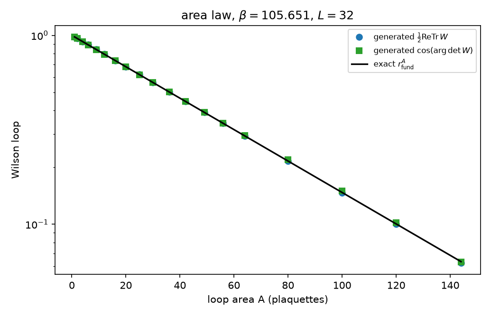

Wilson loop expectation against the exact area law <(1/2)ReTr W(A)> = r_fund^A at L=32.

*Drawn by `u2_2d/scripts/06_figures.py --config u2_2d/configs/default.yaml`.*

### Figure U2-15: `fig3_area_law_L64_beta416.524.png`

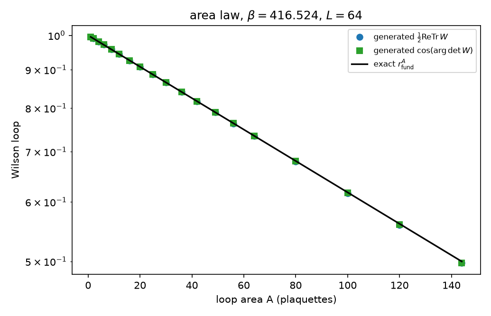

Area law at the top rung.

*Drawn by `u2_2d/scripts/06_figures.py --config u2_2d/configs/default.yaml`.*

### Figure U2-16: `fig11_ladder_accuracy.png`

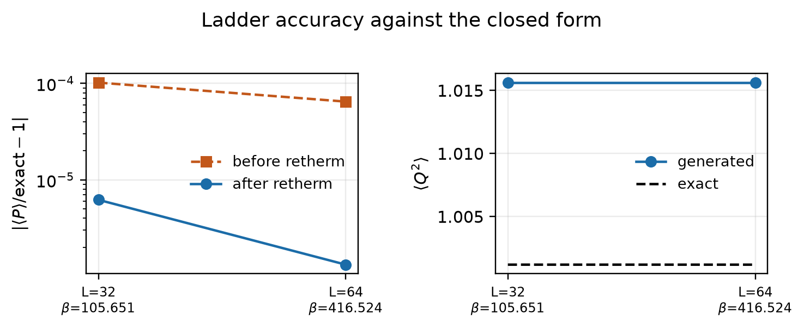

Exact <Q^2> as a fixed point of the ladder, and the generated value at each rung.

*Drawn by `u2_2d/scripts/10_paper_figures.py`.*

### Figure U2-17: `fig12_area_law.png`

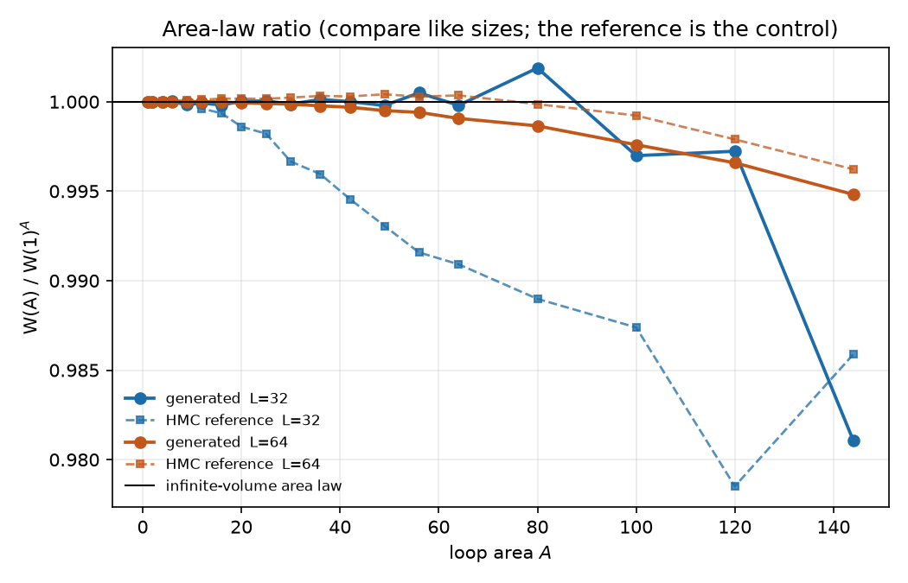

Validated area law across the ladder, generated against the closed form.

*Drawn by `u2_2d/scripts/10_paper_figures.py`.*

## Appendix U2-B. Topological freezing and the two winding moves

The failure being targeted, and the U(2)-specific fact that there are two freezing mechanisms with different controlling parameters.

### Figure U2-18: `fig19_freezing.png`

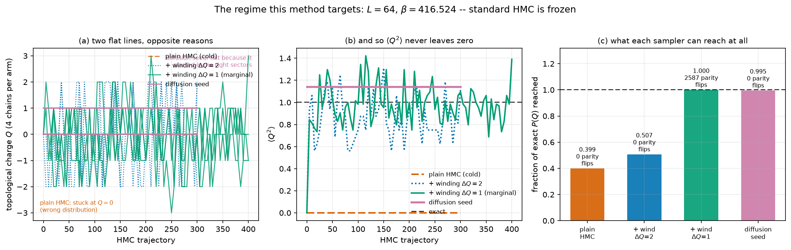

Q traces showing HMC frozen at the target coupling, the failure the method exists to address.

*Drawn by `u2_2d/scripts/27_freezing_figure.py`.*

### Figure U2-19: `fig10_winding_economics.png`

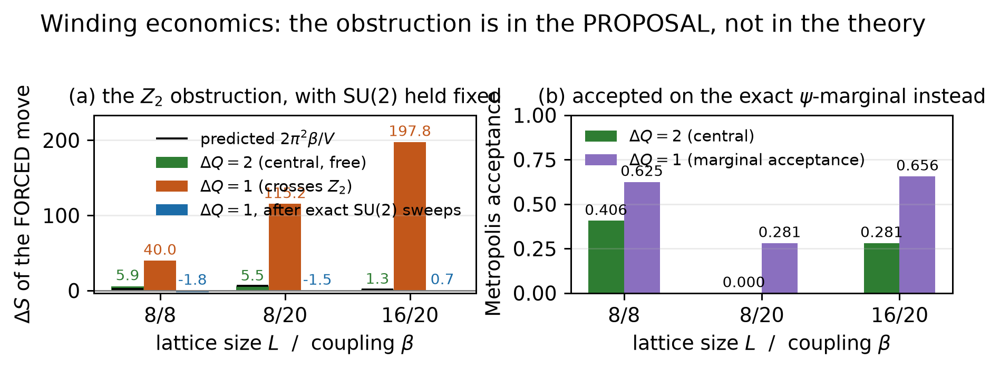

The cost of the two winding moves. An even dQ is O(beta/V), which the matched ladder holds nearly constant; an odd dQ must cross the Z_2 monodromy and no fixed shift field does it cheaply.

*Drawn by `u2_2d/scripts/10_paper_figures.py`.*

### Figure U2-20: `fig20_honest_distributions_L64_beta416.524.png`

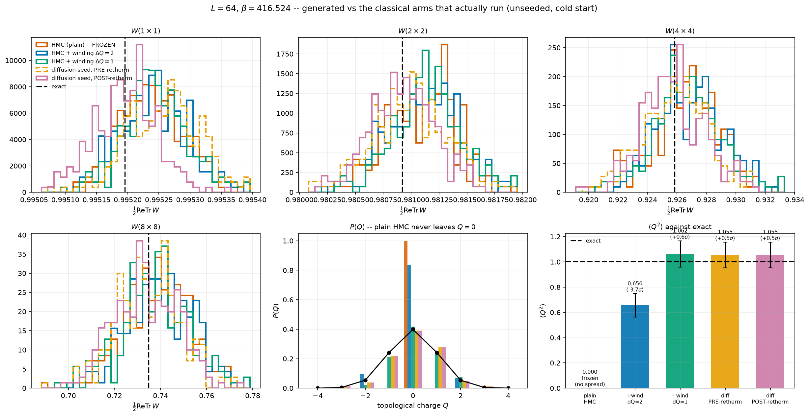

Sector-tail recovery with UNSEEDED classical arms and the pre/post-rethermalization split shown separately, so the tail's contribution is not folded into the model's.

*Drawn by `u2_2d/scripts/29_honest_distributions.py --config u2_2d/configs/default.yaml`.*

## Appendix U2-C. Coverage, volume, and where the seed stops working

Seed quality tracks distance to the nearest training rung, not beta. These are the limits, stated rather than papered over.

### Figure U2-21: `fig21_seed_quality.png`

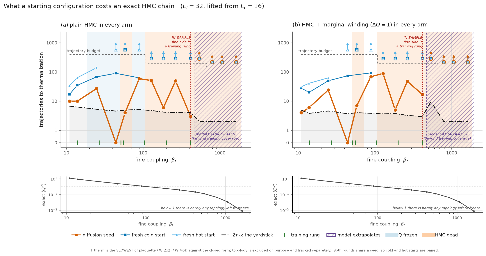

Seed t_therm against coupling over a 148x range, six arms (plain HMC and HMC + marginal winding, each with cold, hot and seeded starts). The two IN-SAMPLE couplings are marked and must not be quoted as evidence of generalization. Read as a trend: adjacent couplings carry ~10x scatter in t_therm, so no single point is evidence.

*Drawn by `u2_2d/scripts/30_seed_quality_figure.py`.*

### Figure U2-22: `fig29_observable_scan.png`

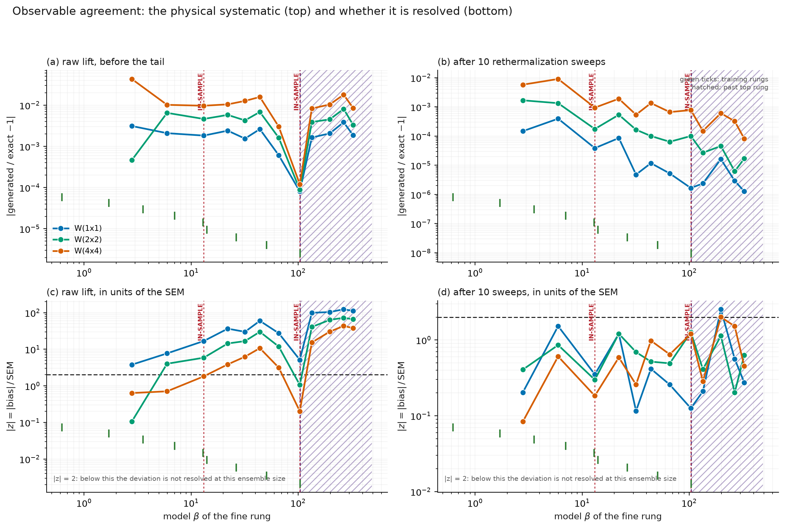

Observable agreement across 12 couplings, raw lift and after 10 rethermalization sweeps, against the closed form. Reported in relative deviation AND in z, which point OPPOSITE ways here (Spearman -0.82 against +0.80) because the theory's own spread moves by orders of magnitude across the range.

*Drawn by `u2_2d/scripts/43_observable_scan.py`.*

### Figure U2-23: `fig27_volume_scan.png`

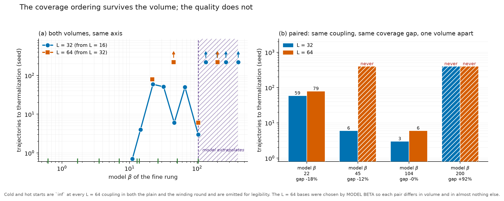

Does the advantage survive volume. The coverage ORDERING transfers exactly, but at essentially the same coupling and the same coverage gap t_therm is 6 at L=32 and never at L=64: coverage is not the only variable.

*Drawn by `u2_2d/scripts/38_volume_figure.py`.*

## Appendix U2-D. How far from equilibrium the seed is

Observable-level agreement is sharp while the density is not. Read the resolution notes: large Wilson loops are frequently not resolved at all at 64-256 configurations.

### Figure U2-24: `fig08_wilson_spread.png`

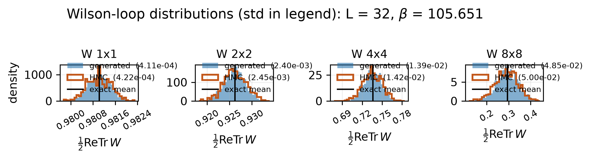

Per-configuration Wilson-loop distributions, generated against reference, at both validated volumes.

*Drawn by `u2_2d/scripts/10_paper_figures.py`.*

### Figure U2-25: `fig16_distributions_L32_beta105.651.png`

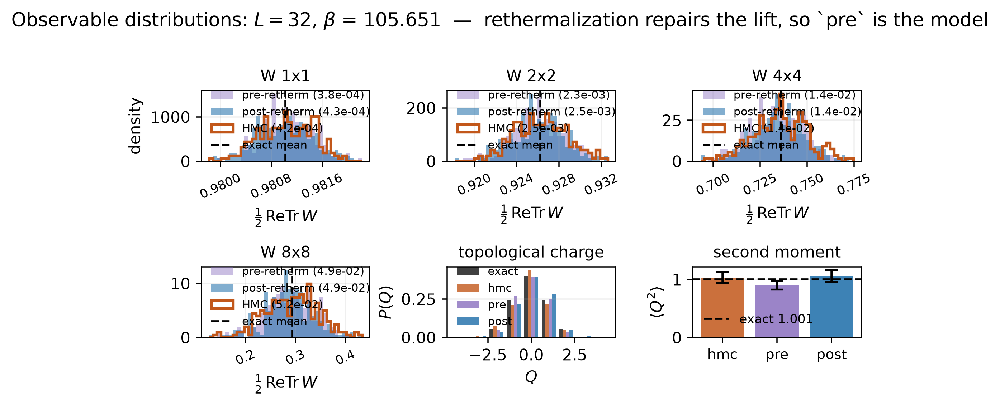

Wilson loops at four areas plus P(Q) and |Q| at L=32, as distributions rather than as a single scalar per rung.

*Drawn by `u2_2d/scripts/22_distribution_figures.py --config u2_2d/configs/default.yaml --rung 0`.*

### Figure U2-26: `fig16_distributions_L64_beta416.524.png`

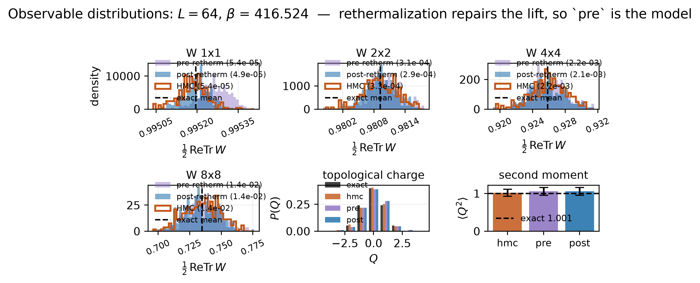

The same at the top rung.

*Drawn by `u2_2d/scripts/22_distribution_figures.py --config u2_2d/configs/default.yaml`.*

### Figure U2-27: `fig17_z_distribution_L32_beta105.651.png`

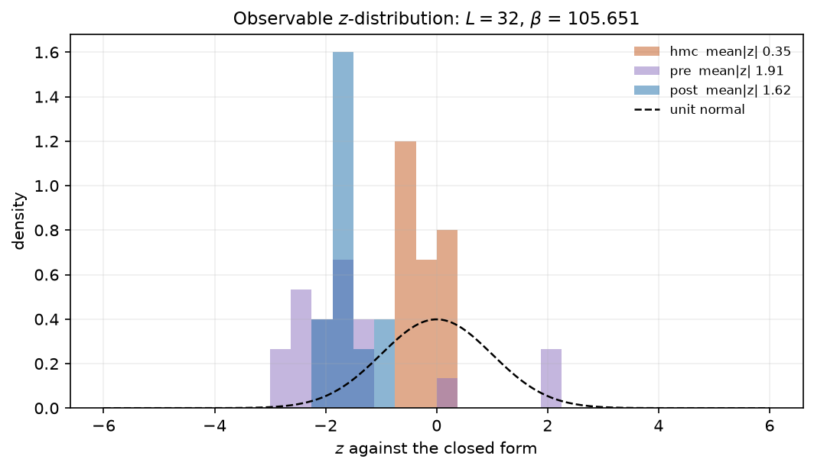

z against the closed form over all observables at L=32.

*Drawn by `u2_2d/scripts/22_distribution_figures.py --config u2_2d/configs/default.yaml --rung 0`.*

### Figure U2-28: `fig17_z_distribution_L64_beta416.524.png`

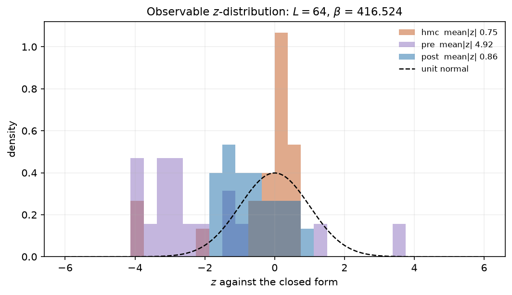

z against the closed form at the top rung.

*Drawn by `u2_2d/scripts/22_distribution_figures.py --config u2_2d/configs/default.yaml`.*

### Figure U2-29: `fig18_z_vs_loop_area_L32_beta105.651.png`

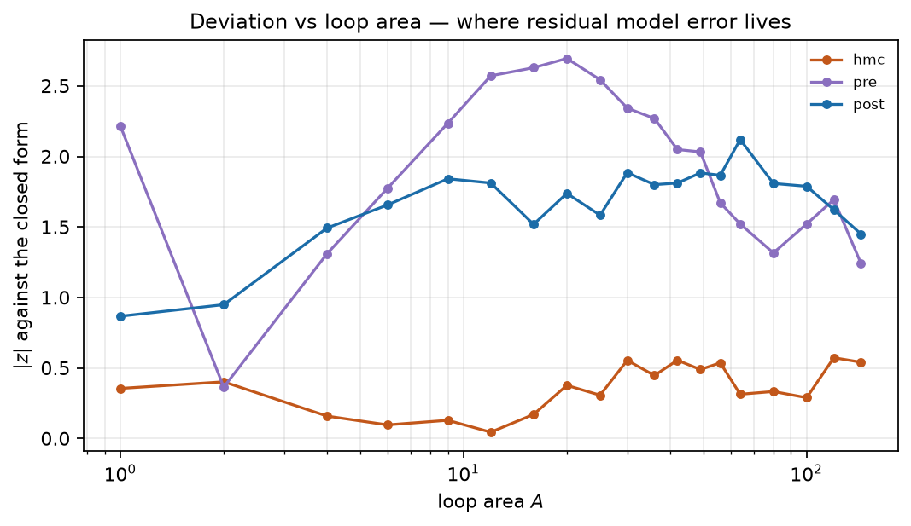

std(z) against loop area at L=32 -- the u1 fig38 analogue. Residual model error concentrates in extended observables.

*Drawn by `u2_2d/scripts/22_distribution_figures.py --config u2_2d/configs/default.yaml --rung 0`.*

### Figure U2-30: `fig18_z_vs_loop_area_L64_beta416.524.png`

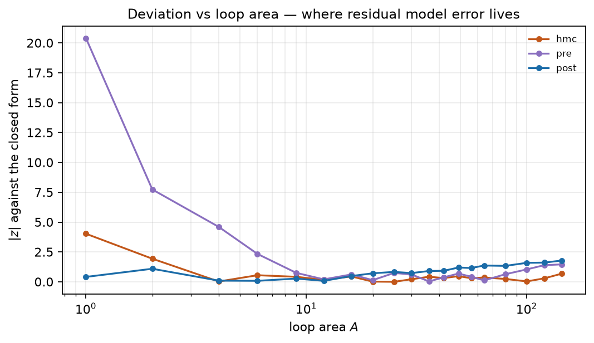

std(z) against loop area at the top rung.

*Drawn by `u2_2d/scripts/22_distribution_figures.py --config u2_2d/configs/default.yaml`.*

### Figure U2-31: `fig22_division_of_labour.png`

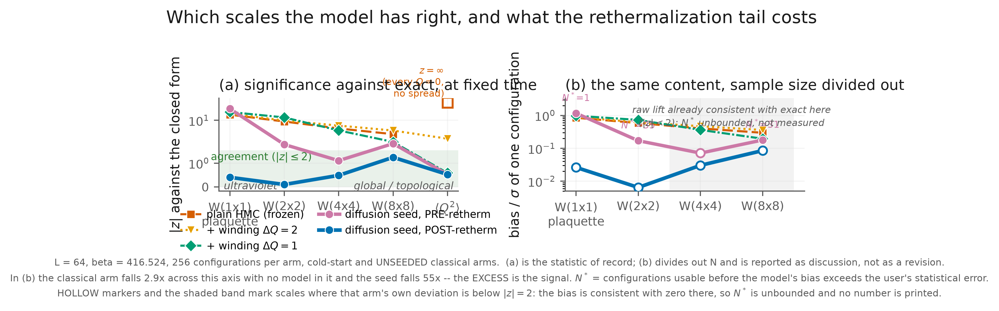

Which scales the model has right, and what the rethermalization tail repairs. Panel (a), z, is the statistic of record; scales whose raw |z| < 2 are drawn hollow and shaded, because at 256 configurations W(4x4) and larger are indistinguishable from exact in the RAW lift and no trend may be drawn through them.

*Drawn by `u2_2d/scripts/31_division_of_labour.py`.*

### Figure U2-32: `fig23_dissociation.png`

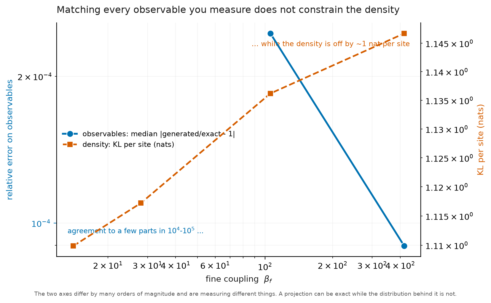

Observable-level agreement is sharp while the density is not -- the u1 dissociation result reproduced in U(2).

*Drawn by `u2_2d/scripts/32_dissociation.py`.*

### Figure U2-33: `fig24_kl_per_site.png`

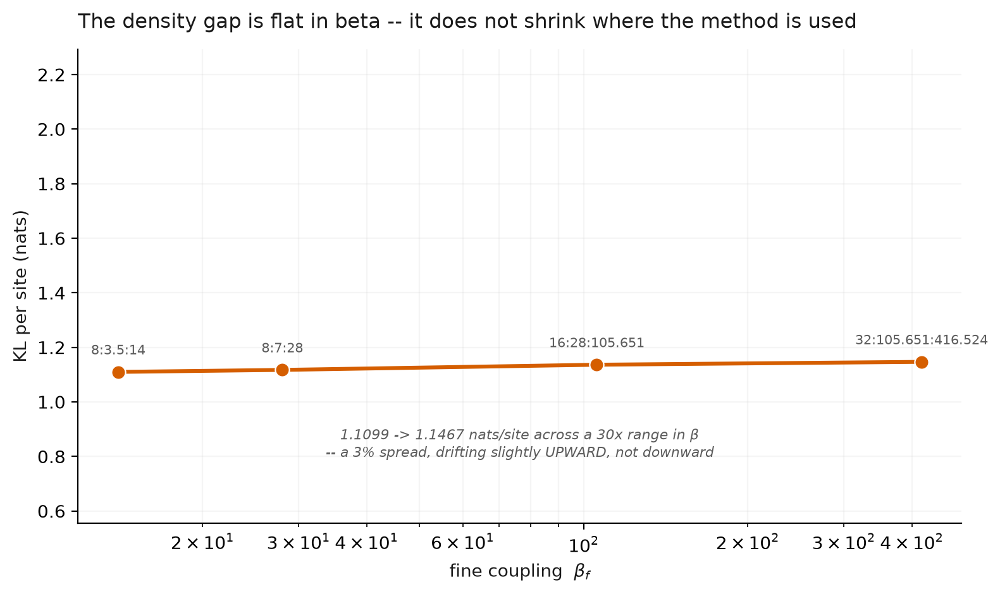

KL per site across cases.

*Drawn by `u2_2d/scripts/32_dissociation.py`.*

### Figure U2-34: `fig31_seed_vs_classical_significance.png`

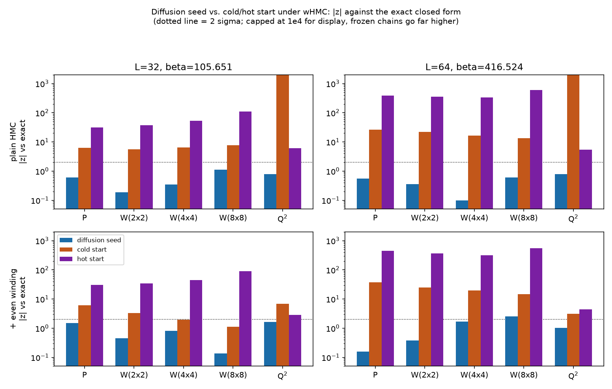

Chain-bootstrapped |z| against the exact closed form, diffusion seed vs. cold vs. hot start, plain HMC and + even winding, at both benchmarked couplings (L=32/beta=105.651 and L=64/beta=416.524). Every diffusion-seeded bar sits within 2.5 sigma of exact at every loop size and both couplings; every cold/hot-started bar is 6 sigma-600 sigma off, winding move or not.

*Drawn by `u2_2d/scripts/56_seed_benchmark_cross_beta_figure.py`.*

## Appendix U2-E. Cost and tuning

Cost claims, and the two knobs that were measured rather than assumed.

### Figure U2-35: `fig14_sampler_steps.png`

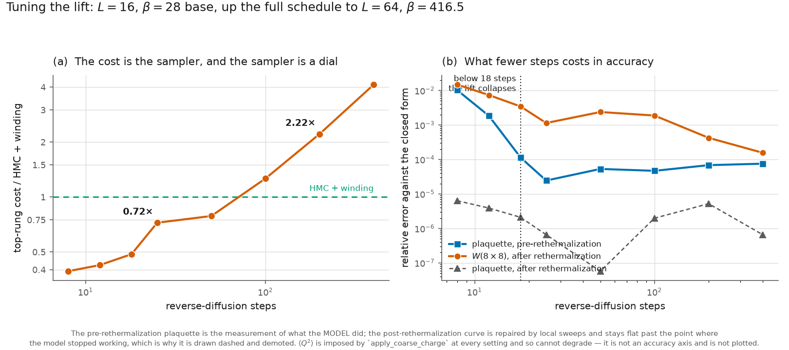

Cost and accuracy against the number of reverse-diffusion steps. Read the RUNG 0 pre-retherm column: the top rung's plaquette compounds two lifts and crosses zero near 18 steps, so tuning on it picks a bad setting.

*Drawn by `u2_2d/scripts/16_cost_figures.py`.*

### Figure U2-36: `fig25_retherm_scan.png`

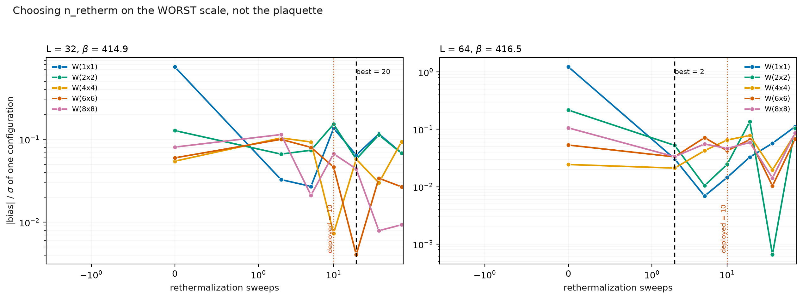

Observable error against rethermalization sweep count. Note the retraction recorded in `retherm_reconcile/RECONCILIATION.md`: the large-loop sign flips with sweep count and is consistent with zero, so this figure supports no infrared-damage claim.

*Drawn by `u2_2d/scripts/33_retherm_scan.py`.*

### Figure U2-37: `fig15_prolongator.png`

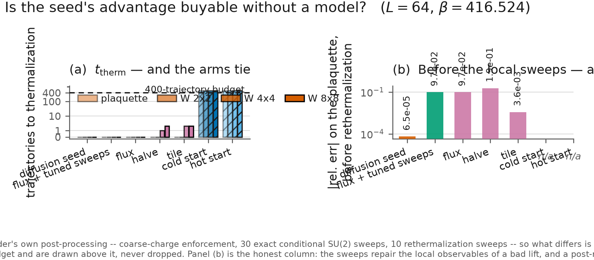

The learned prolongator against naive inverse blocking, matched on cost.

*Drawn by `u2_2d/scripts/20_prolongator_figure.py`.*
